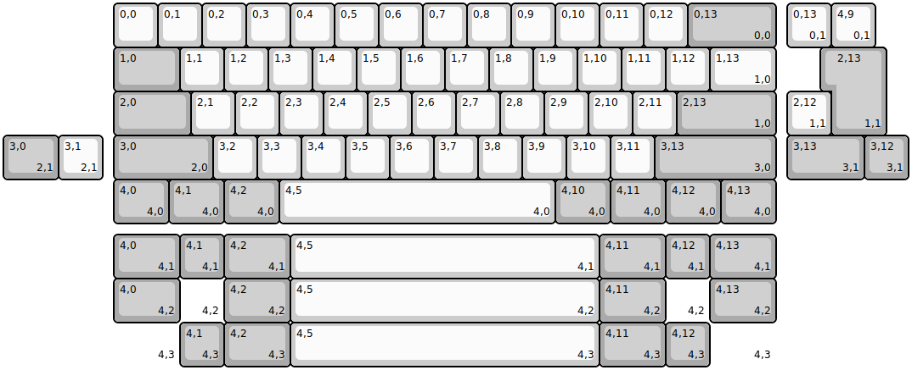
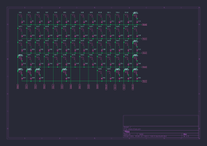
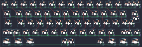

# keyboard-pcbs

Collection of generated keyboard PCBs based on [via](https://github.com/the-via/keyboards.git) layouts.

:link: Visit [https://adamws.github.io/keyboard-pcbs](https://adamws.github.io/keyboard-pcbs) to view results.

> [!WARNING]
> This is a showcase/benchmark of [kicad-kbplacer](https://github.com/adamws/kicad-kbplacer) plugin.
> All of the KiCad files are automatically generated and *may* contain errors.
> These *are not* production ready PCBs.

## How to run

The procedure of generating `keyboard-pcbs` website is split into two stages
which can be repeated locally using builder docker image.

- Download all layouts from [via](https://github.com/the-via/keyboards.git)
repository and generate KiCad schematic and PCB file for each one.

  ```bash
  $ docker run --rm -v $(pwd):/work \
      ghcr.io/adamws/keyboard-pcbs-maker:master python via_layouts_to_boards.py generate
  ```

- Collect results from first stage and create static website to be deployed

  ```bash
  $ docker run --rm -v $(pwd):/work \
      ghcr.io/adamws/keyboard-pcbs-maker:master python via_layouts_to_boards.py collect
  ```

> [!WARNING]
> This takes long time and is resource consuming.
> It runs on schedule using [Github Actions](https://github.com/adamws/keyboard-pcbs/actions/workflows/main.yml).

To see results, go to output directory and start http server with python:

```bash
$ cd gh-pages
$ python -m http.server
Serving HTTP on 0.0.0.0 port 8000 (http://0.0.0.0:8000/) ...
```

### Run for single layout

If you want to run this for single layout file, call `kbplacer-generate.sh` directly.
For example, navigate to directory with `.json` layout and run:

```bash
$ cd src/gh60/satan
$ ls
satan.json
$ docker run --rm -v $(pwd):/work \
    ghcr.io/adamws/keyboard-pcbs-maker:master kbplacer-generate.sh /work satan
```

Note that second argument passed to `kbplacer-generate.sh` does not contain file extension.

When container finish, current directory should contain following files:

```bash
$ ls
satan.json      satan-layout.svg  satan-schematic.svg
satan-kle.json  satan-render.svg  satan.zip
$ unzip satan.zip
Archive:  satan.zip
  inflating: satan.kicad_pro
  inflating: satan.kicad_sch
  inflating: satan.kicad_pcb
  inflating: satan.net
```

| satan-layout.svg                      |
| :-:                                   |
|  |

| satan-layout.svg                                                                                                   | satan-render.svg                                                                                                |
| :-:                                                                                                                | :-:                                                                                                             |
|                                                                         |                                                                        |
| [open in new window](https://raw.githubusercontent.com/adamws/keyboard-pcbs/master/resources/satan-schematic.svg)  | [open in new window](https://raw.githubusercontent.com/adamws/keyboard-pcbs/master/resources/satan-render.svg)  |

