Collection of generated keyboard PCBs based on [via](https://github.com/the-via/keyboards.git) layouts.

[Visit on GitHub](https://github.com/adamws/keyboard-pcbs)

## 0_sixty/0_sixty

[README](output/0_sixty/README.md) - [layout](output/0_sixty/0_sixty-kle.json) - [PCB](output/0_sixty/0_sixty.kicad_pcb) - [PCB render](output/0_sixty/0_sixty-render.svg)

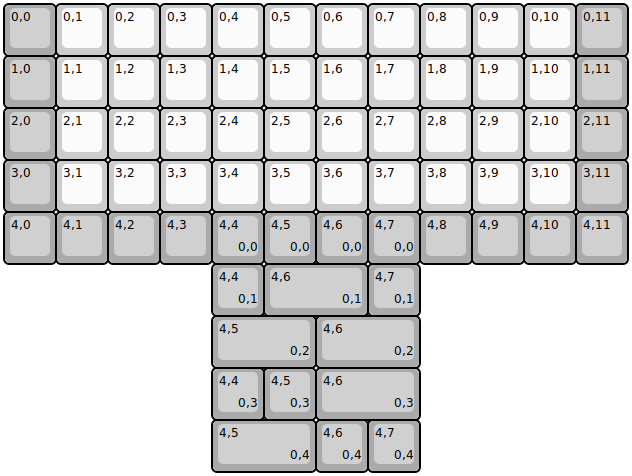{:loading="lazy"}

[Open in keyboard-layout-editor](http://www.keyboard-layout-editor.com/##@@_c=#aaaaaa;&=0,0&_c=#cccccc;&=0,1&=0,2&=0,3&=0,4&=0,5&=0,6&=0,7&=0,8&=0,9&=0,10&_c=#aaaaaa;&=0,11;&@=1,0&_c=#cccccc;&=1,1&=1,2&=1,3&=1,4&=1,5&=1,6&=1,7&=1,8&=1,9&=1,10&_c=#aaaaaa;&=1,11;&@=2,0&_c=#cccccc;&=2,1&=2,2&=2,3&=2,4&=2,5&=2,6&=2,7&=2,8&=2,9&=2,10&_c=#aaaaaa;&=2,11;&@=3,0&_c=#cccccc;&=3,1&=3,2&=3,3&=3,4&=3,5&=3,6&=3,7&=3,8&=3,9&=3,10&_c=#aaaaaa;&=3,11;&@=4,0&=4,1&=4,2&=4,3&=4,4%0A%0A%0A0,0&=4,5%0A%0A%0A0,0&=4,6%0A%0A%0A0,0&=4,7%0A%0A%0A0,0&=4,8&=4,9&=4,10&=4,11;&@_x:4;&=4,4%0A%0A%0A0,1&_w:2;&=4,6%0A%0A%0A0,1&=4,7%0A%0A%0A0,1;&@_x:4&w:2;&=4,5%0A%0A%0A0,2&_w:2;&=4,6%0A%0A%0A0,2;&@_x:4;&=4,4%0A%0A%0A0,3&=4,5%0A%0A%0A0,3&_w:2;&=4,6%0A%0A%0A0,3;&@_x:4&w:2;&=4,5%0A%0A%0A0,4&=4,6%0A%0A%0A0,4&=4,7%0A%0A%0A0,4)

## 0xC7/61key

[README](output/0xC7/61key/README.md) - [layout](output/0xC7/61key/61key-kle.json) - [PCB](output/0xC7/61key/61key.kicad_pcb) - [PCB render](output/0xC7/61key/61key-render.svg)

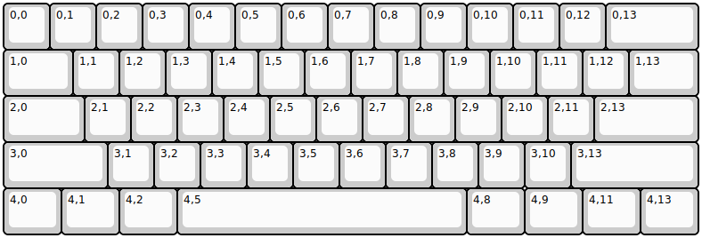{:loading="lazy"}

[Open in keyboard-layout-editor](http://www.keyboard-layout-editor.com/##@@=0,0&=0,1&=0,2&=0,3&=0,4&=0,5&=0,6&=0,7&=0,8&=0,9&=0,10&=0,11&=0,12&_w:2;&=0,13;&@_w:1.5;&=1,0&=1,1&=1,2&=1,3&=1,4&=1,5&=1,6&=1,7&=1,8&=1,9&=1,10&=1,11&=1,12&_w:1.5;&=1,13;&@_w:1.75;&=2,0&=2,1&=2,2&=2,3&=2,4&=2,5&=2,6&=2,7&=2,8&=2,9&=2,10&=2,11&_w:2.25;&=2,13;&@_w:2.25;&=3,0&=3,1&=3,2&=3,3&=3,4&=3,5&=3,6&=3,7&=3,8&=3,9&=3,10&_w:2.75;&=3,13;&@_w:1.25;&=4,0&_w:1.25;&=4,1&_w:1.25;&=4,2&_w:6.25;&=4,5&_w:1.25;&=4,8&_w:1.25;&=4,9&_w:1.25;&=4,11&_w:1.25;&=4,13)

## 0xcb/1337

[README](output/0xcb/1337/README.md) - [layout](output/0xcb/1337/1337-kle.json) - [PCB](output/0xcb/1337/1337.kicad_pcb) - [PCB render](output/0xcb/1337/1337-render.svg)

{:loading="lazy"}

[Open in keyboard-layout-editor](http://www.keyboard-layout-editor.com/##@@=0,0&=0,1&=0,2;&@=1,0&=1,1&=1,2;&@=2,0&=2,1&=2,2)

## 0xcb/static

[README](output/0xcb/static/README.md) - [layout](output/0xcb/static/static-kle.json) - [PCB](output/0xcb/static/static.kicad_pcb) - [PCB render](output/0xcb/static/static-render.svg)

{:loading="lazy"}

[Open in keyboard-layout-editor](http://www.keyboard-layout-editor.com/##@@_x:13.5&c=#aaaaaa;&=1,5;&@_x:2.5&c=#777777;&=0,0&_c=#cccccc;&=1,0&=0,1&=1,1&=0,2&=1,2&=0,3&=1,3&=0,4&=1,4&=0,5&_c=#aaaaaa;&=3,5;&@_x:2.5&w:1.25;&=2,0&_c=#cccccc;&=3,0&=2,1&=3,1&=2,2&=3,2&=2,3&=3,3&=2,4&=3,4&_c=#777777&w:1.75;&=2,5;&@_x:2.5&c=#aaaaaa&w:1.75;&=4,0&_c=#cccccc;&=4,1&=5,1&=4,2&=5,2&=4,3&=5,3&=4,4&=5,4&=4,5&_c=#aaaaaa&w:1.25;&=5,5;&@_x:2.5;&=6,0%0A%0A%0A0,0&=7,0%0A%0A%0A0,0&=6,1%0A%0A%0A0,0&_c=#cccccc&w:2.25;&=7,1%0A%0A%0A0,0&=7,2%0A%0A%0A0,0&_w:2.75;&=6,4%0A%0A%0A0,0&_c=#aaaaaa;&=7,4%0A%0A%0A0,0&=6,5%0A%0A%0A0,0&=7,5%0A%0A%0A0,0;&@_x:2.5&y:0.25;&=6,0%0A%0A%0A0,1&=7,0%0A%0A%0A0,1&_w:1.25;&=6,1%0A%0A%0A0,1&_c=#cccccc&w:6.25;&=7,2%0A%0A%0A0,1&_c=#aaaaaa&w:1.25;&=6,5%0A%0A%0A0,1&_w:1.25;&=7,5%0A%0A%0A0,1)

## 0xcb/tutelpad

[README](output/0xcb/tutelpad/README.md) - [layout](output/0xcb/tutelpad/tutelpad-kle.json) - [PCB](output/0xcb/tutelpad/tutelpad.kicad_pcb) - [PCB render](output/0xcb/tutelpad/tutelpad-render.svg)

{:loading="lazy"}

[Open in keyboard-layout-editor](http://www.keyboard-layout-editor.com/##@@=0,0&=0,1&_x:1.5;&=0,2&=0,3;&@=1,0&=1,1&_x:1.5;&=1,2&=1,3)

## 10bleoledhub/10bleoledhub

[README](output/10bleoledhub/README.md) - [layout](output/10bleoledhub/10bleoledhub-kle.json) - [PCB](output/10bleoledhub/10bleoledhub.kicad_pcb) - [PCB render](output/10bleoledhub/10bleoledhub-render.svg)

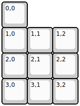{:loading="lazy"}

[Open in keyboard-layout-editor](http://www.keyboard-layout-editor.com/##@@=0,0;&@=1,0&=1,1&=1,2;&@=2,0&=2,1&=2,2;&@=3,0&=3,1&=3,2)

## 1upkeyboards/1up60hse

[README](output/1upkeyboards/1up60hse/README.md) - [layout](output/1upkeyboards/1up60hse/1up60hse-kle.json) - [PCB](output/1upkeyboards/1up60hse/1up60hse.kicad_pcb) - [PCB render](output/1upkeyboards/1up60hse/1up60hse-render.svg)

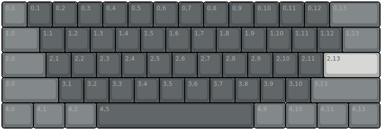{:loading="lazy"}

[Open in keyboard-layout-editor](http://www.keyboard-layout-editor.com/##@@_c=#6b7173&t=#aeb0b0;&=0,0&_c=#505557;&=0,1&=0,2&=0,3&=0,4&=0,5&=0,6&=0,7&=0,8&=0,9&=0,10&=0,11&=0,12&_c=#6b7173&w:2;&=0,13;&@_w:1.5;&=1,0&_c=#505557;&=1,1&=1,2&=1,3&=1,4&=1,5&=1,6&=1,7&=1,8&=1,9&=1,10&=1,11&=1,12&_c=#6b7173&w:1.5;&=1,13;&@_w:1.75;&=2,0&_c=#505557;&=2,1&=2,2&=2,3&=2,4&=2,5&=2,6&=2,7&=2,8&=2,9&=2,10&=2,11&_c=#afb0ae&t=#505557&w:2.25;&=2,13;&@_c=#6b7173&t=#aeb0b0&w:2.25;&=3,0&_c=#505557;&=3,1&=3,2&=3,3&=3,4&=3,5&=3,6&=3,7&=3,8&=3,9&=3,10&_c=#6b7173&w:2.75;&=3,13;&@_w:1.25;&=4,0&_w:1.25;&=4,1&_w:1.25;&=4,2&_c=#505557&w:6.25;&=4,5&_c=#6b7173&w:1.25;&=4,9&_w:1.25;&=4,10&_w:1.25;&=4,11&_w:1.25;&=4,13)

## 1upkeyboards/1up60hte

[README](output/1upkeyboards/1up60hte/README.md) - [layout](output/1upkeyboards/1up60hte/1up60hte-kle.json) - [PCB](output/1upkeyboards/1up60hte/1up60hte.kicad_pcb) - [PCB render](output/1upkeyboards/1up60hte/1up60hte-render.svg)

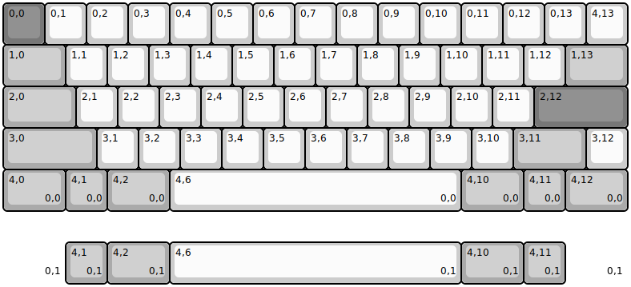{:loading="lazy"}

[Open in keyboard-layout-editor](http://www.keyboard-layout-editor.com/##@@_c=#777777;&=0,0&_c=#cccccc;&=0,1&=0,2&=0,3&=0,4&=0,5&=0,6&=0,7&=0,8&=0,9&=0,10&=0,11&=0,12&=0,13&=4,13;&@_c=#aaaaaa&w:1.5;&=1,0&_c=#cccccc;&=1,1&=1,2&=1,3&=1,4&=1,5&=1,6&=1,7&=1,8&=1,9&=1,10&=1,11&=1,12&_c=#aaaaaa&w:1.5;&=1,13;&@_w:1.75;&=2,0&_c=#cccccc;&=2,1&=2,2&=2,3&=2,4&=2,5&=2,6&=2,7&=2,8&=2,9&=2,10&=2,11&_c=#777777&w:2.25;&=2,12;&@_c=#aaaaaa&w:2.25;&=3,0&_c=#cccccc;&=3,1&=3,2&=3,3&=3,4&=3,5&=3,6&=3,7&=3,8&=3,9&=3,10&_c=#aaaaaa&w:1.75;&=3,11&_c=#cccccc;&=3,12;&@_c=#aaaaaa&w:1.5;&=4,0%0A%0A%0A0,0&=4,1%0A%0A%0A0,0&_w:1.5;&=4,2%0A%0A%0A0,0&_c=#cccccc&w:7;&=4,6%0A%0A%0A0,0&_c=#aaaaaa&w:1.5;&=4,10%0A%0A%0A0,0&=4,11%0A%0A%0A0,0&_w:1.5;&=4,12%0A%0A%0A0,0;&@_y:0.75&c=#cccccc&w:1.5&d:true;&=%0A%0A%0A0,1&_c=#aaaaaa;&=4,1%0A%0A%0A0,1&_w:1.5;&=4,2%0A%0A%0A0,1&_c=#cccccc&w:7;&=4,6%0A%0A%0A0,1&_c=#aaaaaa&w:1.5;&=4,10%0A%0A%0A0,1&=4,11%0A%0A%0A0,1&_c=#cccccc&w:1.5&d:true;&=%0A%0A%0A0,1)

## 1upkeyboards/1up60rgb

[README](output/1upkeyboards/1up60rgb/README.md) - [layout](output/1upkeyboards/1up60rgb/1up60rgb-kle.json) - [PCB](output/1upkeyboards/1up60rgb/1up60rgb.kicad_pcb) - [PCB render](output/1upkeyboards/1up60rgb/1up60rgb-render.svg)

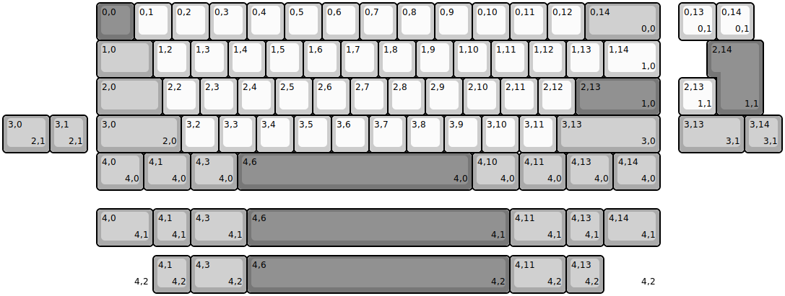{:loading="lazy"}

[Open in keyboard-layout-editor](http://www.keyboard-layout-editor.com/##@@_x:2.5&c=#777777;&=0,0&_c=#cccccc;&=0,1&=0,2&=0,3&=0,4&=0,5&=0,6&=0,7&=0,8&=0,9&=0,10&=0,11&=0,12&_c=#aaaaaa&w:2;&=0,14%0A%0A%0A0,0;&@_x:2.5&w:1.5;&=1,0&_c=#cccccc;&=1,2&=1,3&=1,4&=1,5&=1,6&=1,7&=1,8&=1,9&=1,10&=1,11&=1,12&=1,13&_w:1.5;&=1,14%0A%0A%0A1,0;&@_x:2.5&c=#aaaaaa&w:1.75;&=2,0&_c=#cccccc;&=2,2&=2,3&=2,4&=2,5&=2,6&=2,7&=2,8&=2,9&=2,10&=2,11&=2,12&_c=#777777&w:2.25;&=2,13%0A%0A%0A1,0;&@_x:2.5&c=#aaaaaa&w:2.25;&=3,0%0A%0A%0A2,0&_c=#cccccc;&=3,2&=3,3&=3,4&=3,5&=3,6&=3,7&=3,8&=3,9&=3,10&=3,11&_c=#aaaaaa&w:2.75;&=3,13%0A%0A%0A3,0;&@_x:2.5&w:1.25;&=4,0%0A%0A%0A4,0&_w:1.25;&=4,1%0A%0A%0A4,0&_w:1.25;&=4,3%0A%0A%0A4,0&_c=#777777&w:6.25;&=4,6%0A%0A%0A4,0&_c=#aaaaaa&w:1.25;&=4,10%0A%0A%0A4,0&_w:1.25;&=4,11%0A%0A%0A4,0&_w:1.25;&=4,13%0A%0A%0A4,0&_w:1.25;&=4,14%0A%0A%0A4,0;&@_x:18.0&y:-5&c=#cccccc;&=0,13%0A%0A%0A0,1&=0,14%0A%0A%0A0,1;&@_x:19.0&c=#777777&w:1.25&h:2&w2:1.5&h2:1&x2:-0.25;&=2,14%0A%0A%0A1,1;&@_x:18.0&c=#cccccc;&=2,13%0A%0A%0A1,1;&@_c=#aaaaaa&w:1.25;&=3,0%0A%0A%0A2,1&=3,1%0A%0A%0A2,1&_x:15.75&w:1.75;&=3,13%0A%0A%0A3,1&=3,14%0A%0A%0A3,1;&@_x:2.5&y:1.5&w:1.5;&=4,0%0A%0A%0A4,1&=4,1%0A%0A%0A4,1&_w:1.5;&=4,3%0A%0A%0A4,1&_c=#777777&w:7;&=4,6%0A%0A%0A4,1&_c=#aaaaaa&w:1.5;&=4,11%0A%0A%0A4,1&=4,13%0A%0A%0A4,1&_w:1.5;&=4,14%0A%0A%0A4,1;&@_x:2.5&y:0.25&w:1.5&d:true;&=%0A%0A%0A4,2&=4,1%0A%0A%0A4,2&_w:1.5;&=4,3%0A%0A%0A4,2&_c=#777777&w:7;&=4,6%0A%0A%0A4,2&_c=#aaaaaa&w:1.5;&=4,11%0A%0A%0A4,2&=4,13%0A%0A%0A4,2&_w:1.5&d:true;&=%0A%0A%0A4,2)

## 1upkeyboards/pi40

[README](output/1upkeyboards/pi40/README.md) - [layout](output/1upkeyboards/pi40/pi40-kle.json) - [PCB](output/1upkeyboards/pi40/pi40.kicad_pcb) - [PCB render](output/1upkeyboards/pi40/pi40-render.svg)

{:loading="lazy"}

[Open in keyboard-layout-editor](http://www.keyboard-layout-editor.com/##@@_x:11;&=3,6%0A%0A%0A%0A%0A%0A%0A%0A%0Ae0;&@_y:0.25&c=#aaaaaa;&=0,0&_c=#cccccc;&=0,1&=0,2&=0,3&=0,4&=0,5&=0,6&=0,7&=0,8&=0,9&=0,10&_c=#aaaaaa;&=0,11;&@_c=#777777;&=1,0&_c=#cccccc;&=1,1&=1,2&=1,3&=1,4&=1,5&=1,6&=1,7&=1,8&=1,9&=1,10&=1,11;&@_c=#aaaaaa;&=2,0&_c=#cccccc;&=2,1&=2,2&=2,3&=2,4&=2,5&=2,6&=2,7&=2,8&=2,9&=2,10&_c=#777777;&=2,11;&@_c=#aaaaaa;&=3,0&=3,1&=3,2&=3,3&=3,4&_c=#cccccc&w:2;&=3,5&_c=#aaaaaa;&=3,7&_c=#777777;&=3,8&=3,9&=3,10&=3,11)

## 1upkeyboards/pi60_hse

[README](output/1upkeyboards/pi60_hse/README.md) - [layout](output/1upkeyboards/pi60_hse/pi60_hse-kle.json) - [PCB](output/1upkeyboards/pi60_hse/pi60_hse.kicad_pcb) - [PCB render](output/1upkeyboards/pi60_hse/pi60_hse-render.svg)

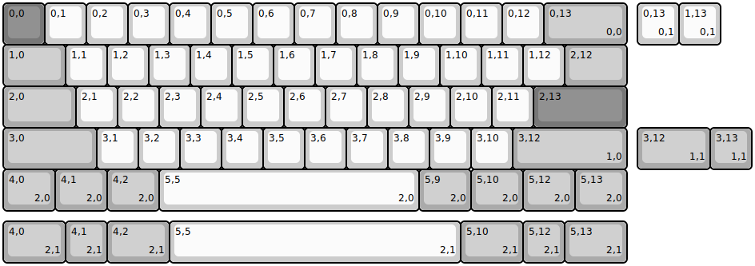{:loading="lazy"}

[Open in keyboard-layout-editor](http://www.keyboard-layout-editor.com/##@@_c=#777777;&=0,0&_c=#cccccc;&=0,1&=0,2&=0,3&=0,4&=0,5&=0,6&=0,7&=0,8&=0,9&=0,10&=0,11&=0,12&_c=#aaaaaa&w:2;&=0,13%0A%0A%0A0,0;&@_w:1.5;&=1,0&_c=#cccccc;&=1,1&=1,2&=1,3&=1,4&=1,5&=1,6&=1,7&=1,8&=1,9&=1,10&=1,11&=1,12&_c=#aaaaaa&w:1.5;&=2,12;&@_w:1.75;&=2,0&_c=#cccccc;&=2,1&=2,2&=2,3&=2,4&=2,5&=2,6&=2,7&=2,8&=2,9&=2,10&=2,11&_c=#777777&w:2.25;&=2,13;&@_c=#aaaaaa&w:2.25;&=3,0&_c=#cccccc;&=3,1&=3,2&=3,3&=3,4&=3,5&=3,6&=3,7&=3,8&=3,9&=3,10&_c=#aaaaaa&w:2.75;&=3,12%0A%0A%0A1,0;&@_w:1.25;&=4,0%0A%0A%0A2,0&_w:1.25;&=4,1%0A%0A%0A2,0&_w:1.25;&=4,2%0A%0A%0A2,0&_c=#cccccc&w:6.25;&=5,5%0A%0A%0A2,0&_c=#aaaaaa&w:1.25;&=5,9%0A%0A%0A2,0&_w:1.25;&=5,10%0A%0A%0A2,0&_w:1.25;&=5,12%0A%0A%0A2,0&_w:1.25;&=5,13%0A%0A%0A2,0;&@_x:15.25&y:-5&c=#cccccc;&=0,13%0A%0A%0A0,1&=1,13%0A%0A%0A0,1;&@_x:15.25&y:2&c=#aaaaaa&w:1.75;&=3,12%0A%0A%0A1,1&=3,13%0A%0A%0A1,1;&@_y:1.25&w:1.5;&=4,0%0A%0A%0A2,1&=4,1%0A%0A%0A2,1&_w:1.5;&=4,2%0A%0A%0A2,1&_c=#cccccc&w:7;&=5,5%0A%0A%0A2,1&_c=#aaaaaa&w:1.5;&=5,10%0A%0A%0A2,1&=5,12%0A%0A%0A2,1&_w:1.5;&=5,13%0A%0A%0A2,1)

## 1upkeyboards/pi60_rgb

[README](output/1upkeyboards/pi60_rgb/README.md) - [layout](output/1upkeyboards/pi60_rgb/pi60_rgb-kle.json) - [PCB](output/1upkeyboards/pi60_rgb/pi60_rgb.kicad_pcb) - [PCB render](output/1upkeyboards/pi60_rgb/pi60_rgb-render.svg)

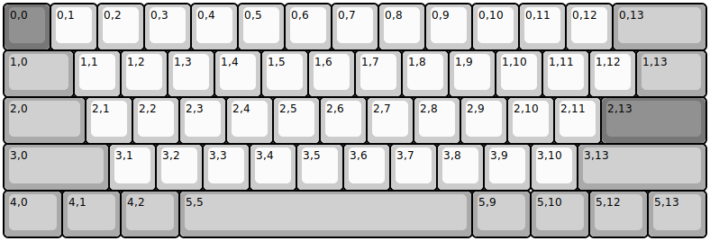{:loading="lazy"}

[Open in keyboard-layout-editor](http://www.keyboard-layout-editor.com/##@@_c=#777777;&=0,0&_c=#cccccc;&=0,1&=0,2&=0,3&=0,4&=0,5&=0,6&=0,7&=0,8&=0,9&=0,10&=0,11&=0,12&_c=#aaaaaa&w:2;&=0,13;&@_w:1.5;&=1,0&_c=#cccccc;&=1,1&=1,2&=1,3&=1,4&=1,5&=1,6&=1,7&=1,8&=1,9&=1,10&=1,11&=1,12&_c=#aaaaaa&w:1.5;&=1,13;&@_w:1.75;&=2,0&_c=#cccccc;&=2,1&=2,2&=2,3&=2,4&=2,5&=2,6&=2,7&=2,8&=2,9&=2,10&=2,11&_c=#777777&w:2.25;&=2,13;&@_c=#aaaaaa&w:2.25;&=3,0&_c=#cccccc;&=3,1&=3,2&=3,3&=3,4&=3,5&=3,6&=3,7&=3,8&=3,9&=3,10&_c=#aaaaaa&w:2.75;&=3,13;&@_w:1.25;&=4,0&_w:1.25;&=4,1&_w:1.25;&=4,2&_w:6.25;&=5,5&_w:1.25;&=5,9&_w:1.25;&=5,10&_w:1.25;&=5,12&_w:1.25;&=5,13)

## 1upkeyboards/super16

[README](output/1upkeyboards/super16/README.md) - [layout](output/1upkeyboards/super16/super16-kle.json) - [PCB](output/1upkeyboards/super16/super16.kicad_pcb) - [PCB render](output/1upkeyboards/super16/super16-render.svg)

{:loading="lazy"}

[Open in keyboard-layout-editor](http://www.keyboard-layout-editor.com/##@@=0,0&=0,1&=0,2&=0,3;&@=1,0&=1,1&=1,2&=1,3;&@=2,0&=2,1&=2,2&=2,3;&@=3,0&=3,1&=3,2&=3,3)

## 1upkeyboards/super16/super16v2

[README](output/1upkeyboards/super16/README.md) - [layout](output/1upkeyboards/super16/super16v2-kle.json) - [PCB](output/1upkeyboards/super16/super16v2.kicad_pcb) - [PCB render](output/1upkeyboards/super16/super16v2-render.svg)

{:loading="lazy"}

[Open in keyboard-layout-editor](http://www.keyboard-layout-editor.com/##@@=0,0&=0,1&=0,2&=0,3;&@=1,0&=1,1&=1,2&=1,3;&@=2,0&=2,1&=2,2&=2,3;&@=3,0&=3,1&=3,2&=3,3)

## 1upkeyboards/sweet16/sweet16v1

[README](output/1upkeyboards/sweet16/README.md) - [layout](output/1upkeyboards/sweet16/sweet16v1-kle.json) - [PCB](output/1upkeyboards/sweet16/sweet16v1.kicad_pcb) - [PCB render](output/1upkeyboards/sweet16/sweet16v1-render.svg)

{:loading="lazy"}

[Open in keyboard-layout-editor](http://www.keyboard-layout-editor.com/##@@_x:2.5;&=0,0&=0,1&=0,2&=0,3%0A%0A%0A0,0;&@_x:2.5;&=1,0&=1,1&=1,2&=1,3%0A%0A%0A0,0;&@_x:2.5;&=2,0&=2,1&=2,2&=2,3%0A%0A%0A2,0;&@_x:2.5;&=3,0%0A%0A%0A1,0&=3,1%0A%0A%0A1,0&=3,2&=3,3%0A%0A%0A2,0;&@_x:7.0&y:-4&c=#aaaaaa&h:2;&=0,3%0A%0A%0A0,1;&@_x:7.0&y:1&c=#777777&h:2;&=2,3%0A%0A%0A2,1;&@_c=#cccccc&w:2;&=3,1%0A%0A%0A1,1)

## 1upkeyboards/sweet16/sweet16v2

[README](output/1upkeyboards/sweet16/README.md) - [layout](output/1upkeyboards/sweet16/sweet16v2-kle.json) - [PCB](output/1upkeyboards/sweet16/sweet16v2.kicad_pcb) - [PCB render](output/1upkeyboards/sweet16/sweet16v2-render.svg)

{:loading="lazy"}

[Open in keyboard-layout-editor](http://www.keyboard-layout-editor.com/##@@_x:1;&=0,0%0A%0A%0A0,0&=0,1&=0,2&=0,3%0A%0A%0A1,0;&@_x:1;&=1,0&=1,1&=1,2&=1,3;&@_x:1;&=2,0&=2,1&=2,2&=2,3;&@_x:1;&=3,0&=3,1&=3,2&=3,3;&@_y:-4;&=0,0%0A%0A%0A0,1%0A%0A%0A%0A%0A%0Ae0&_x:4;&=0,3%0A%0A%0A1,1%0A%0A%0A%0A%0A%0Ae1)

## 25keys/aleth42

[README](output/25keys/aleth42/README.md) - [layout](output/25keys/aleth42/aleth42-kle.json) - [PCB](output/25keys/aleth42/aleth42.kicad_pcb) - [PCB render](output/25keys/aleth42/aleth42-render.svg)

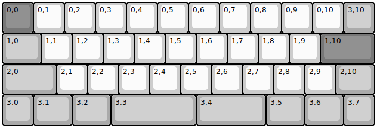{:loading="lazy"}

[Open in keyboard-layout-editor](http://www.keyboard-layout-editor.com/##@@_c=#777777;&=0,0&_c=#cccccc;&=0,1&=0,2&=0,3&=0,4&=0,5&=0,6&=0,7&=0,8&=0,9&=0,10&_c=#aaaaaa;&=3,10;&@_w:1.25;&=1,0&_c=#cccccc;&=1,1&=1,2&=1,3&=1,4&=1,5&=1,6&=1,7&=1,8&=1,9&_c=#777777&w:1.75;&=1,10;&@_c=#aaaaaa&w:1.75;&=2,0&_c=#cccccc;&=2,1&=2,2&=2,3&=2,4&=2,5&=2,6&=2,7&=2,8&=2,9&_c=#aaaaaa&w:1.25;&=2,10;&@=3,0&_w:1.25;&=3,1&_w:1.25;&=3,2&_w:2.75;&=3,3&_w:2.25;&=3,4&_w:1.25;&=3,5&_w:1.25;&=3,6&=3,7)

## 25keys/zinc

[README](output/25keys/zinc/README.md) - [layout](output/25keys/zinc/zinc-kle.json) - [PCB](output/25keys/zinc/zinc.kicad_pcb) - [PCB render](output/25keys/zinc/zinc-render.svg)

{:loading="lazy"}

[Open in keyboard-layout-editor](http://www.keyboard-layout-editor.com/##@@_x:0.75&c=#aaaaaa;&=0,0%0A%0A%0A0,0&_c=#cccccc;&=0,1%0A%0A%0A0,0&=0,2%0A%0A%0A0,0&=0,3%0A%0A%0A0,0&=0,4%0A%0A%0A0,0&=0,5%0A%0A%0A0,0&_x:1.75;&=4,0&=4,1&=4,2&=4,3&=4,4&_c=#aaaaaa;&=4,5;&@_x:1;&=1,0%0A%0A%0A0,0&_c=#cccccc;&=1,1%0A%0A%0A0,0&=1,2%0A%0A%0A0,0&=1,3%0A%0A%0A0,0&=1,4%0A%0A%0A0,0&=1,5%0A%0A%0A0,0&_x:1.75;&=5,0&=5,1&=5,2&=5,3&=5,4&=5,5;&@_x:1.25&c=#aaaaaa;&=2,0%0A%0A%0A0,0&_c=#cccccc;&=2,1%0A%0A%0A0,0&=2,2%0A%0A%0A0,0&=2,3%0A%0A%0A0,0&=2,4%0A%0A%0A0,0&=2,5%0A%0A%0A0,0&_x:1.75;&=6,0&=6,1&=6,2&=6,3&=6,4&_c=#aaaaaa;&=6,5;&@_x:1.5;&=3,0%0A%0A%0A0,0&=3,1%0A%0A%0A0,0&=3,2%0A%0A%0A0,0&=3,3%0A%0A%0A0,0&=3,4%0A%0A%0A0,0&_c=#cccccc;&=3,5%0A%0A%0A0,0&_x:1.75;&=7,0&_c=#aaaaaa;&=7,1&=7,2&=7,3&=7,4&=7,5;&@_x:2.25&y:0.5;&=0,0%0A%0A%0A0,1&_c=#cccccc;&=0,1%0A%0A%0A0,1&=0,2%0A%0A%0A0,1&=0,3%0A%0A%0A0,1&=0,4%0A%0A%0A0,1&=0,5%0A%0A%0A0,1;&@_x:2&c=#aaaaaa;&=1,0%0A%0A%0A0,1&_c=#cccccc;&=1,1%0A%0A%0A0,1&=1,2%0A%0A%0A0,1&=1,3%0A%0A%0A0,1&=1,4%0A%0A%0A0,1&=1,5%0A%0A%0A0,1;&@_x:1.75&c=#aaaaaa;&=2,0%0A%0A%0A0,1&_c=#cccccc;&=2,1%0A%0A%0A0,1&=2,2%0A%0A%0A0,1&=2,3%0A%0A%0A0,1&=2,4%0A%0A%0A0,1&=2,5%0A%0A%0A0,1;&@_x:1.5&c=#aaaaaa;&=3,0%0A%0A%0A0,1&=3,1%0A%0A%0A0,1&=3,2%0A%0A%0A0,1&=3,3%0A%0A%0A0,1&=3,4%0A%0A%0A0,1&_c=#cccccc;&=3,5%0A%0A%0A0,1)

## 40percentclub/mf68

[README](output/40percentclub/mf68/README.md) - [layout](output/40percentclub/mf68/mf68-kle.json) - [PCB](output/40percentclub/mf68/mf68.kicad_pcb) - [PCB render](output/40percentclub/mf68/mf68-render.svg)

{:loading="lazy"}

[Open in keyboard-layout-editor](http://www.keyboard-layout-editor.com/##@@_c=#777777;&=0,0&_c=#cccccc;&=0,1&=0,2&=0,3&=0,4&=0,5&=0,6&=0,7&=0,8&=1,0&=1,1&=1,2&=1,3&_c=#aaaaaa&w:2;&=1,4&_x:0.25;&=1,5&=1,6;&@_w:1.5;&=1,7&_c=#cccccc;&=1,8&=2,0&=2,1&=2,2&=2,3&=2,4&=2,5&=2,6&=2,7&=2,8&=3,0&=3,1&_w:1.5;&=3,2&_x:0.25&c=#aaaaaa;&=3,3&=3,4;&@_w:1.75;&=3,5&_c=#cccccc;&=3,6&=3,7&=3,8&=4,0&=4,1&=4,2&=4,3&=4,4&=4,5&=4,6&=4,7&_c=#777777&w:2.25;&=4,8;&@_c=#aaaaaa&w:2.25;&=5,0&_c=#cccccc;&=5,1&=5,2&=5,3&=5,4&=5,5&=5,6&=5,7&=5,8&=6,0&=6,1&_c=#aaaaaa&w:2.75;&=6,2&_x:0.25;&=6,3;&@_w:1.25;&=6,4&_w:1.25;&=6,5&_w:1.25;&=6,6&_c=#cccccc&w:6.25;&=6,7&_c=#aaaaaa&w:1.25;&=6,8&_w:1.25;&=7,0&_w:1.25;&=7,1&_x:0.5;&=7,2&=7,3&=7,4)

## 40percentclub/nein

[README](output/40percentclub/nein/README.md) - [layout](output/40percentclub/nein/nein-kle.json) - [PCB](output/40percentclub/nein/nein.kicad_pcb) - [PCB render](output/40percentclub/nein/nein-render.svg)

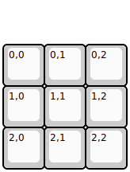{:loading="lazy"}

[Open in keyboard-layout-editor](http://www.keyboard-layout-editor.com/##@@_y:1;&=0,0&=0,1&=0,2;&@=1,0&=1,1&=1,2;&@=2,0&=2,1&=2,2)

## 40percentclub/sixpack

[README](output/40percentclub/sixpack/README.md) - [layout](output/40percentclub/sixpack/sixpack-kle.json) - [PCB](output/40percentclub/sixpack/sixpack.kicad_pcb) - [PCB render](output/40percentclub/sixpack/sixpack-render.svg)

{:loading="lazy"}

[Open in keyboard-layout-editor](http://www.keyboard-layout-editor.com/##@@=0,0&=0,1&=0,2;&@=1,0&=1,1&=1,2)

## 4pplet/aekiso60_rev_a

[README](output/4pplet/README.md) - [layout](output/4pplet/aekiso60_rev_a-kle.json) - [PCB](output/4pplet/aekiso60_rev_a.kicad_pcb) - [PCB render](output/4pplet/aekiso60_rev_a-render.svg)

{:loading="lazy"}

[Open in keyboard-layout-editor](http://www.keyboard-layout-editor.com/##@@_c=#aaaaaa&w:1.25;&=0,0&_c=#cccccc;&=0,1&=0,2&=0,3&=0,4&=0,5&=0,6&=0,7&=0,8&=0,9&=0,10&=0,11&=0,12&_c=#aaaaaa&w:1.75;&=0,13;&@_w:1.75;&=1,0&_c=#cccccc;&=1,1&=1,2&=1,3&=1,4&=1,5&=1,6&=1,7&=1,8&=1,9&=1,10&=1,11&=1,12&_x:0.25&c=#aaaaaa&h:2&h2:1&x2:-0.25;&=1,13;&@_w:2;&=2,0&_c=#cccccc;&=2,1&=2,2&=2,3&=2,4&=2,5&=2,6&=2,7&=2,8&=2,9&=2,10&=2,11&=2,12;&@_c=#aaaaaa&w:1.5;&=3,0&_c=#cccccc;&=3,1&=3,2&=3,3&=3,4&=3,5&=3,6&=3,7&=3,8&=3,9&=3,10&=3,11&_c=#aaaaaa&w:2.5;&=3,12%0A%0A%0A0,0;&@_w:1.5;&=4,0%0A%0A%0A1,0&_w:1.25;&=4,1%0A%0A%0A1,0&_w:1.5;&=4,3%0A%0A%0A1,0&_c=#cccccc&w:6.5;&=4,5%0A%0A%0A1,0&_c=#aaaaaa&w:1.5;&=4,8%0A%0A%0A1,0&_w:1.25;&=4,10%0A%0A%0A1,0&_w:1.5;&=4,11%0A%0A%0A1,0;&@_x:15.5&y:-2&w:1.5;&=3,12%0A%0A%0A0,1&=3,13%0A%0A%0A0,1;&@_y:1.5&w:1.5;&=4,0%0A%0A%0A1,1&=4,1%0A%0A%0A1,1&_w:1.5;&=4,3%0A%0A%0A1,1&_c=#cccccc&w:7;&=4,5%0A%0A%0A1,1&_c=#aaaaaa&w:1.5;&=4,8%0A%0A%0A1,1&=4,10%0A%0A%0A1,1&_w:1.5;&=4,11%0A%0A%0A1,1;&@_w:1.5;&=4,0%0A%0A%0A1,2&_d:true;&=4,1%0A%0A%0A1,2&_w:1.5;&=4,3%0A%0A%0A1,2&_c=#cccccc&w:7;&=4,5%0A%0A%0A1,2&_c=#aaaaaa&w:1.5;&=4,8%0A%0A%0A1,2&_d:true;&=4,10%0A%0A%0A1,2&_w:1.5;&=4,11%0A%0A%0A1,2;&@_w:1.5;&=4,0%0A%0A%0A1,3&_w:1.25;&=4,1%0A%0A%0A1,3&_w:1.5;&=4,3%0A%0A%0A1,3&_c=#cccccc&w:2.75;&=4,4%0A%0A%0A1,3&=4,5%0A%0A%0A1,3&_w:2.75;&=4,6%0A%0A%0A1,3&_c=#aaaaaa&w:1.5;&=4,8%0A%0A%0A1,3&_w:1.25;&=4,10%0A%0A%0A1,3&_w:1.5;&=4,11%0A%0A%0A1,3;&@_w:1.5;&=4,0%0A%0A%0A1,4&_w:1.25;&=4,1%0A%0A%0A1,4&_w:1.5;&=4,3%0A%0A%0A1,4&_c=#cccccc&w:2.5;&=4,4%0A%0A%0A1,4&_w:1.5;&=4,5%0A%0A%0A1,4&_w:2.5;&=4,6%0A%0A%0A1,4&_c=#aaaaaa&w:1.5;&=4,8%0A%0A%0A1,4&_w:1.25;&=4,10%0A%0A%0A1,4&_w:1.5;&=4,11%0A%0A%0A1,4;&@_w:1.5;&=4,0%0A%0A%0A1,5&_w:1.25;&=4,1%0A%0A%0A1,5&_w:1.5;&=4,3%0A%0A%0A1,5&_c=#cccccc&w:2.25;&=4,4%0A%0A%0A1,5&_w:1.5;&=4,5%0A%0A%0A1,5&_w:2.75;&=4,6%0A%0A%0A1,5&_c=#aaaaaa&w:1.5;&=4,8%0A%0A%0A1,5&_w:1.25;&=4,10%0A%0A%0A1,5&_x:-1.25&w:1.25;&=4,10%0A%0A%0A1,5&_w:1.5;&=4,11%0A%0A%0A1,5&_x:-1.5&w:1.5;&=4,11%0A%0A%0A1,5;&@_w:1.5;&=4,0%0A%0A%0A1,6&_w:1.25;&=4,1%0A%0A%0A1,6&_w:1.5;&=4,3%0A%0A%0A1,6&_c=#cccccc&w:2.5;&=4,4%0A%0A%0A1,6&_w:1.25;&=4,5%0A%0A%0A1,6&_w:2.75;&=4,6%0A%0A%0A1,6&_c=#aaaaaa&w:1.5;&=4,8%0A%0A%0A1,6&_w:1.25;&=4,10%0A%0A%0A1,6&_w:1.5;&=4,11%0A%0A%0A1,6)

## 4pplet/aekiso60_rev_b

[README](output/4pplet/README.md) - [layout](output/4pplet/aekiso60_rev_b-kle.json) - [PCB](output/4pplet/aekiso60_rev_b.kicad_pcb) - [PCB render](output/4pplet/aekiso60_rev_b-render.svg)

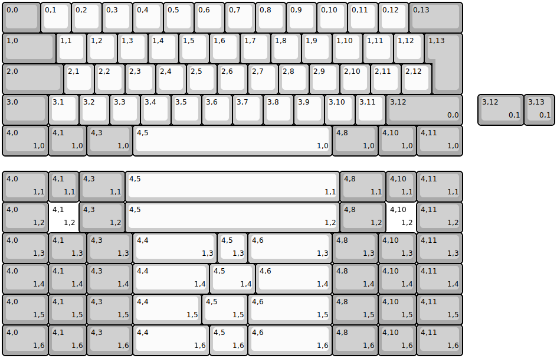{:loading="lazy"}

[Open in keyboard-layout-editor](http://www.keyboard-layout-editor.com/##@@_c=#aaaaaa&w:1.25;&=0,0&_c=#cccccc;&=0,1&=0,2&=0,3&=0,4&=0,5&=0,6&=0,7&=0,8&=0,9&=0,10&=0,11&=0,12&_c=#aaaaaa&w:1.75;&=0,13;&@_w:1.75;&=1,0&_c=#cccccc;&=1,1&=1,2&=1,3&=1,4&=1,5&=1,6&=1,7&=1,8&=1,9&=1,10&=1,11&=1,12&_x:0.25&c=#aaaaaa&h:2&h2:1&x2:-0.25;&=1,13;&@_w:2;&=2,0&_c=#cccccc;&=2,1&=2,2&=2,3&=2,4&=2,5&=2,6&=2,7&=2,8&=2,9&=2,10&=2,11&=2,12;&@_c=#aaaaaa&w:1.5;&=3,0&_c=#cccccc;&=3,1&=3,2&=3,3&=3,4&=3,5&=3,6&=3,7&=3,8&=3,9&=3,10&=3,11&_c=#aaaaaa&w:2.5;&=3,12%0A%0A%0A0,0;&@_w:1.5;&=4,0%0A%0A%0A1,0&_w:1.25;&=4,1%0A%0A%0A1,0&_w:1.5;&=4,3%0A%0A%0A1,0&_c=#cccccc&w:6.5;&=4,5%0A%0A%0A1,0&_c=#aaaaaa&w:1.5;&=4,8%0A%0A%0A1,0&_w:1.25;&=4,10%0A%0A%0A1,0&_w:1.5;&=4,11%0A%0A%0A1,0;&@_x:15.5&y:-2&w:1.5;&=3,12%0A%0A%0A0,1&=3,13%0A%0A%0A0,1;&@_y:1.5&w:1.5;&=4,0%0A%0A%0A1,1&=4,1%0A%0A%0A1,1&_w:1.5;&=4,3%0A%0A%0A1,1&_c=#cccccc&w:7;&=4,5%0A%0A%0A1,1&_c=#aaaaaa&w:1.5;&=4,8%0A%0A%0A1,1&=4,10%0A%0A%0A1,1&_w:1.5;&=4,11%0A%0A%0A1,1;&@_w:1.5;&=4,0%0A%0A%0A1,2&_d:true;&=4,1%0A%0A%0A1,2&_w:1.5;&=4,3%0A%0A%0A1,2&_c=#cccccc&w:7;&=4,5%0A%0A%0A1,2&_c=#aaaaaa&w:1.5;&=4,8%0A%0A%0A1,2&_d:true;&=4,10%0A%0A%0A1,2&_w:1.5;&=4,11%0A%0A%0A1,2;&@_w:1.5;&=4,0%0A%0A%0A1,3&_w:1.25;&=4,1%0A%0A%0A1,3&_w:1.5;&=4,3%0A%0A%0A1,3&_c=#cccccc&w:2.75;&=4,4%0A%0A%0A1,3&=4,5%0A%0A%0A1,3&_w:2.75;&=4,6%0A%0A%0A1,3&_c=#aaaaaa&w:1.5;&=4,8%0A%0A%0A1,3&_w:1.25;&=4,10%0A%0A%0A1,3&_w:1.5;&=4,11%0A%0A%0A1,3;&@_w:1.5;&=4,0%0A%0A%0A1,4&_w:1.25;&=4,1%0A%0A%0A1,4&_w:1.5;&=4,3%0A%0A%0A1,4&_c=#cccccc&w:2.5;&=4,4%0A%0A%0A1,4&_w:1.5;&=4,5%0A%0A%0A1,4&_w:2.5;&=4,6%0A%0A%0A1,4&_c=#aaaaaa&w:1.5;&=4,8%0A%0A%0A1,4&_w:1.25;&=4,10%0A%0A%0A1,4&_w:1.5;&=4,11%0A%0A%0A1,4;&@_w:1.5;&=4,0%0A%0A%0A1,5&_w:1.25;&=4,1%0A%0A%0A1,5&_w:1.5;&=4,3%0A%0A%0A1,5&_c=#cccccc&w:2.25;&=4,4%0A%0A%0A1,5&_w:1.5;&=4,5%0A%0A%0A1,5&_w:2.75;&=4,6%0A%0A%0A1,5&_c=#aaaaaa&w:1.5;&=4,8%0A%0A%0A1,5&_w:1.25;&=4,10%0A%0A%0A1,5&_x:-1.25&w:1.25;&=4,10%0A%0A%0A1,5&_w:1.5;&=4,11%0A%0A%0A1,5&_x:-1.5&w:1.5;&=4,11%0A%0A%0A1,5;&@_w:1.5;&=4,0%0A%0A%0A1,6&_w:1.25;&=4,1%0A%0A%0A1,6&_w:1.5;&=4,3%0A%0A%0A1,6&_c=#cccccc&w:2.5;&=4,4%0A%0A%0A1,6&_w:1.25;&=4,5%0A%0A%0A1,6&_w:2.75;&=4,6%0A%0A%0A1,6&_c=#aaaaaa&w:1.5;&=4,8%0A%0A%0A1,6&_w:1.25;&=4,10%0A%0A%0A1,6&_w:1.5;&=4,11%0A%0A%0A1,6)

## 4pplet/bootleg_rev_a

[README](output/4pplet/README.md) - [layout](output/4pplet/bootleg_rev_a-kle.json) - [PCB](output/4pplet/bootleg_rev_a.kicad_pcb) - [PCB render](output/4pplet/bootleg_rev_a-render.svg)

{:loading="lazy"}

[Open in keyboard-layout-editor](http://www.keyboard-layout-editor.com/##@@_x:3&c=#aaaaaa;&=0,0&_c=#cccccc;&=0,1&=0,2&=0,3&=0,4&=0,5&=0,6&=0,7&=0,8&=0,9&=0,10&=0,11&=0,12&_c=#aaaaaa&w:2;&=0,14%0A%0A%0A0,0;&@_x:3&w:1.5;&=1,0&_c=#cccccc;&=1,1&=1,2&=1,3&=1,4&=1,5&=1,6&=1,7&=1,8&=1,9&=1,10&=1,11&=1,13&_c=#aaaaaa&w:1.5;&=1,14%0A%0A%0A1,0;&@_x:3&w:1.75;&=2,0&_c=#cccccc;&=2,1&=2,2&=2,3&=2,4&=2,5&=2,6&=2,7&=2,8&=2,9&=2,10&=2,11&_c=#aaaaaa&w:2.25;&=2,13%0A%0A%0A1,0;&@_x:3.0&w:2.25;&=3,0%0A%0A%0A2,0&_c=#cccccc;&=3,2&=3,3&=3,4&=3,5&=3,6&=3,7&=3,8&=3,9&=3,10&=3,11&_c=#aaaaaa&w:2.75;&=3,13%0A%0A%0A3,0;&@_x:3&w:1.25;&=4,0%0A%0A%0A4,0&_w:1.25;&=4,1%0A%0A%0A4,0&_w:1.25;&=4,3%0A%0A%0A4,0&_c=#cccccc&w:6.25;&=4,7%0A%0A%0A4,0&_c=#aaaaaa&w:1.25;&=4,10%0A%0A%0A4,0&_w:1.25;&=4,11%0A%0A%0A4,0&_w:1.25;&=4,13%0A%0A%0A4,0&_w:1.25;&=4,14%0A%0A%0A4,0;&@_x:19.5&y:-5&c=#cccccc;&=0,13%0A%0A%0A0,1&_c=#aaaaaa;&=0,14%0A%0A%0A0,1;&@_x:20.25&w:1.25&h:2&w2:1.5&h2:1&x2:-0.25;&=1,14%0A%0A%0A1,1;&@_x:19.25&c=#cccccc;&=2,13%0A%0A%0A1,1;&@_c=#aaaaaa&w:1.25;&=3,0%0A%0A%0A2,1&=3,1%0A%0A%0A2,1&_x:16.5&w:1.75;&=3,13%0A%0A%0A3,1&=3,14%0A%0A%0A3,1;&@_x:3&y:1.75&w:1.5;&=4,0%0A%0A%0A4,1&=4,1%0A%0A%0A4,1&_w:1.5;&=4,3%0A%0A%0A4,1&_c=#cccccc&w:7;&=4,7%0A%0A%0A4,1&_c=#aaaaaa&w:1.5;&=4,11%0A%0A%0A4,1&=4,13%0A%0A%0A4,1&_w:1.5;&=4,14%0A%0A%0A4,1;&@_x:3&w:1.5;&=4,0%0A%0A%0A4,2&_d:true;&=4,1%0A%0A%0A4,2&_w:1.5;&=4,3%0A%0A%0A4,2&_c=#cccccc&w:7;&=4,7%0A%0A%0A4,2&_c=#aaaaaa&w:1.5;&=4,11%0A%0A%0A4,2&_d:true;&=4,13%0A%0A%0A4,2&_w:1.5;&=4,14%0A%0A%0A4,2;&@_x:3&w:1.25;&=4,0%0A%0A%0A4,3&_w:1.25;&=4,1%0A%0A%0A4,3&_w:1.25;&=4,3%0A%0A%0A4,3&_c=#cccccc&w:2.25;&=4,5%0A%0A%0A4,3&_w:1.25;&=4,7%0A%0A%0A4,3&_w:2.75;&=4,8%0A%0A%0A4,3&_c=#aaaaaa&w:1.25;&=4,10%0A%0A%0A4,3&_w:1.25;&=4,11%0A%0A%0A4,3&_w:1.25;&=4,13%0A%0A%0A4,3&_w:1.25;&=4,14%0A%0A%0A4,3)

## 4pplet/eagle_viper_rep_rev_a

[README](output/4pplet/README.md) - [layout](output/4pplet/eagle_viper_rep_rev_a-kle.json) - [PCB](output/4pplet/eagle_viper_rep_rev_a.kicad_pcb) - [PCB render](output/4pplet/eagle_viper_rep_rev_a-render.svg)

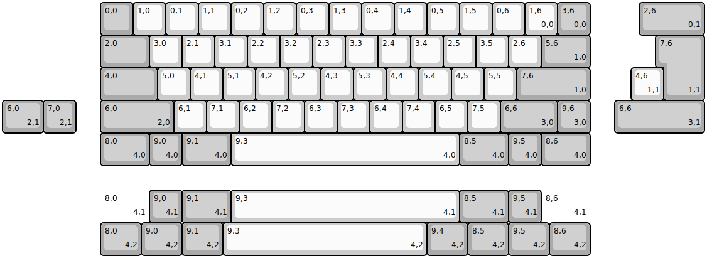{:loading="lazy"}

[Open in keyboard-layout-editor](http://www.keyboard-layout-editor.com/##@@_x:3&c=#aaaaaa;&=0,0&_c=#cccccc;&=1,0&=0,1&=1,1&=0,2&=1,2&=0,3&=1,3&=0,4&=1,4&=0,5&=1,5&=0,6&=1,6%0A%0A%0A0,0&_c=#aaaaaa;&=3,6%0A%0A%0A0,0;&@_x:3&w:1.5;&=2,0&_c=#cccccc;&=3,0&=2,1&=3,1&=2,2&=3,2&=2,3&=3,3&=2,4&=3,4&=2,5&=3,5&=2,6&_c=#aaaaaa&w:1.5;&=5,6%0A%0A%0A1,0;&@_x:3&w:1.75;&=4,0&_c=#cccccc;&=5,0&=4,1&=5,1&=4,2&=5,2&=4,3&=5,3&=4,4&=5,4&=4,5&=5,5&_c=#aaaaaa&w:2.25;&=7,6%0A%0A%0A1,0;&@_x:3.0&w:2.25;&=6,0%0A%0A%0A2,0&_c=#cccccc;&=6,1&=7,1&=6,2&=7,2&=6,3&=7,3&=6,4&=7,4&=6,5&=7,5&_c=#aaaaaa&w:1.75;&=6,6%0A%0A%0A3,0&=9,6%0A%0A%0A3,0;&@_x:3&w:1.5;&=8,0%0A%0A%0A4,0&=9,0%0A%0A%0A4,0&_w:1.5;&=9,1%0A%0A%0A4,0&_c=#cccccc&w:7;&=9,3%0A%0A%0A4,0&_c=#aaaaaa&w:1.5;&=8,5%0A%0A%0A4,0&=9,5%0A%0A%0A4,0&_w:1.5;&=8,6%0A%0A%0A4,0;&@_x:19.5&y:-5&w:2;&=2,6%0A%0A%0A0,1;&@_x:20.25&w:1.25&h:2&w2:1.5&h2:1&x2:-0.25;&=7,6%0A%0A%0A1,1;&@_x:19.25&c=#cccccc;&=4,6%0A%0A%0A1,1;&@_c=#aaaaaa&w:1.25;&=6,0%0A%0A%0A2,1&=7,0%0A%0A%0A2,1&_x:16.5&w:2.75;&=6,6%0A%0A%0A3,1;&@_x:3&y:1.75&w:1.5&d:true;&=8,0%0A%0A%0A4,1&=9,0%0A%0A%0A4,1&_w:1.5;&=9,1%0A%0A%0A4,1&_c=#cccccc&w:7;&=9,3%0A%0A%0A4,1&_c=#aaaaaa&w:1.5;&=8,5%0A%0A%0A4,1&=9,5%0A%0A%0A4,1&_w:1.5&d:true;&=8,6%0A%0A%0A4,1;&@_x:3&w:1.25;&=8,0%0A%0A%0A4,2&_w:1.25;&=9,0%0A%0A%0A4,2&_w:1.25;&=9,1%0A%0A%0A4,2&_c=#cccccc&w:6.25;&=9,3%0A%0A%0A4,2&_c=#aaaaaa&w:1.25;&=9,4%0A%0A%0A4,2&_w:1.25;&=8,5%0A%0A%0A4,2&_w:1.25;&=9,5%0A%0A%0A4,2&_w:1.25;&=8,6%0A%0A%0A4,2)

## 4pplet/eagle_viper_rep_rev_b

[README](output/4pplet/README.md) - [layout](output/4pplet/eagle_viper_rep_rev_b-kle.json) - [PCB](output/4pplet/eagle_viper_rep_rev_b.kicad_pcb) - [PCB render](output/4pplet/eagle_viper_rep_rev_b-render.svg)

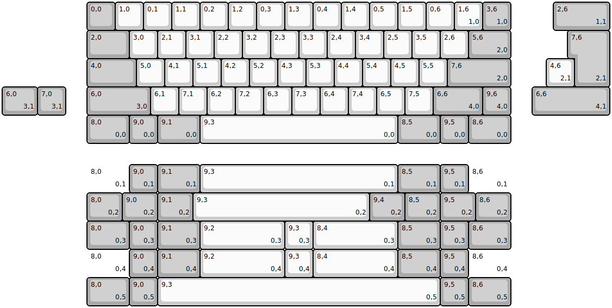{:loading="lazy"}

[Open in keyboard-layout-editor](http://www.keyboard-layout-editor.com/##@@_x:3&c=#aaaaaa;&=0,0&_c=#cccccc;&=1,0&=0,1&=1,1&=0,2&=1,2&=0,3&=1,3&=0,4&=1,4&=0,5&=1,5&=0,6&=1,6%0A%0A%0A1,0&_c=#aaaaaa;&=3,6%0A%0A%0A1,0;&@_x:3&w:1.5;&=2,0&_c=#cccccc;&=3,0&=2,1&=3,1&=2,2&=3,2&=2,3&=3,3&=2,4&=3,4&=2,5&=3,5&=2,6&_c=#aaaaaa&w:1.5;&=5,6%0A%0A%0A2,0;&@_x:3&w:1.75;&=4,0&_c=#cccccc;&=5,0&=4,1&=5,1&=4,2&=5,2&=4,3&=5,3&=4,4&=5,4&=4,5&=5,5&_c=#aaaaaa&w:2.25;&=7,6%0A%0A%0A2,0;&@_x:3.0&w:2.25;&=6,0%0A%0A%0A3,0&_c=#cccccc;&=6,1&=7,1&=6,2&=7,2&=6,3&=7,3&=6,4&=7,4&=6,5&=7,5&_c=#aaaaaa&w:1.75;&=6,6%0A%0A%0A4,0&=9,6%0A%0A%0A4,0;&@_x:3&w:1.5;&=8,0%0A%0A%0A0,0&=9,0%0A%0A%0A0,0&_w:1.5;&=9,1%0A%0A%0A0,0&_c=#cccccc&w:7;&=9,3%0A%0A%0A0,0&_c=#aaaaaa&w:1.5;&=8,5%0A%0A%0A0,0&=9,5%0A%0A%0A0,0&_w:1.5;&=8,6%0A%0A%0A0,0;&@_x:19.5&y:-5&w:2;&=2,6%0A%0A%0A1,1;&@_x:20.25&w:1.25&h:2&w2:1.5&h2:1&x2:-0.25;&=7,6%0A%0A%0A2,1;&@_x:19.25&c=#cccccc;&=4,6%0A%0A%0A2,1;&@_c=#aaaaaa&w:1.25;&=6,0%0A%0A%0A3,1&=7,0%0A%0A%0A3,1&_x:16.5&w:2.75;&=6,6%0A%0A%0A4,1;&@_x:3&y:1.75&w:1.5&d:true;&=8,0%0A%0A%0A0,1&=9,0%0A%0A%0A0,1&_w:1.5;&=9,1%0A%0A%0A0,1&_c=#cccccc&w:7;&=9,3%0A%0A%0A0,1&_c=#aaaaaa&w:1.5;&=8,5%0A%0A%0A0,1&=9,5%0A%0A%0A0,1&_w:1.5&d:true;&=8,6%0A%0A%0A0,1;&@_x:3&w:1.25;&=8,0%0A%0A%0A0,2&_w:1.25;&=9,0%0A%0A%0A0,2&_w:1.25;&=9,1%0A%0A%0A0,2&_c=#cccccc&w:6.25;&=9,3%0A%0A%0A0,2&_c=#aaaaaa&w:1.25;&=9,4%0A%0A%0A0,2&_w:1.25;&=8,5%0A%0A%0A0,2&_w:1.25;&=9,5%0A%0A%0A0,2&_w:1.25;&=8,6%0A%0A%0A0,2;&@_x:3&w:1.5;&=8,0%0A%0A%0A0,3&=9,0%0A%0A%0A0,3&_w:1.5;&=9,1%0A%0A%0A0,3&_c=#cccccc&w:3;&=9,2%0A%0A%0A0,3&=9,3%0A%0A%0A0,3&_w:3;&=8,4%0A%0A%0A0,3&_c=#aaaaaa&w:1.5;&=8,5%0A%0A%0A0,3&=9,5%0A%0A%0A0,3&_w:1.5;&=8,6%0A%0A%0A0,3;&@_x:3&w:1.5&d:true;&=8,0%0A%0A%0A0,4&=9,0%0A%0A%0A0,4&_w:1.5;&=9,1%0A%0A%0A0,4&_c=#cccccc&w:3;&=9,2%0A%0A%0A0,4&=9,3%0A%0A%0A0,4&_w:3;&=8,4%0A%0A%0A0,4&_c=#aaaaaa&w:1.5;&=8,5%0A%0A%0A0,4&=9,5%0A%0A%0A0,4&_w:1.5&d:true;&=8,6%0A%0A%0A0,4;&@_x:3&w:1.5;&=8,0%0A%0A%0A0,5&=9,0%0A%0A%0A0,5&_c=#cccccc&w:10;&=9,3%0A%0A%0A0,5&_c=#aaaaaa;&=9,5%0A%0A%0A0,5&_w:1.5;&=8,6%0A%0A%0A0,5)

## 4pplet/perk60_iso

[README](output/4pplet/README.md) - [layout](output/4pplet/perk60_iso-kle.json) - [PCB](output/4pplet/perk60_iso.kicad_pcb) - [PCB render](output/4pplet/perk60_iso-render.svg)

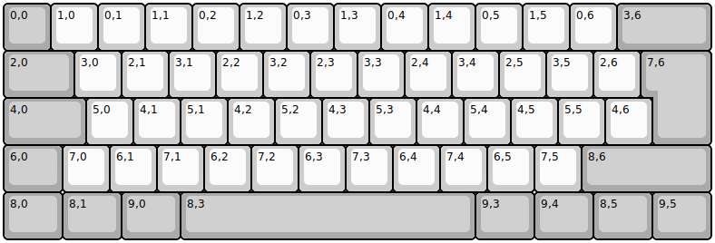{:loading="lazy"}

[Open in keyboard-layout-editor](http://www.keyboard-layout-editor.com/##@@_c=#aaaaaa;&=0,0&_c=#cccccc;&=1,0&=0,1&=1,1&=0,2&=1,2&=0,3&=1,3&=0,4&=1,4&=0,5&=1,5&=0,6&_c=#aaaaaa&w:2;&=3,6;&@_w:1.5;&=2,0&_c=#cccccc;&=3,0&=2,1&=3,1&=2,2&=3,2&=2,3&=3,3&=2,4&=3,4&=2,5&=3,5&=2,6&_x:0.25&c=#aaaaaa&w:1.25&h:2&w2:1.5&h2:1&x2:-0.25;&=7,6;&@_w:1.75;&=4,0&_c=#cccccc;&=5,0&=4,1&=5,1&=4,2&=5,2&=4,3&=5,3&=4,4&=5,4&=4,5&=5,5&=4,6;&@_c=#aaaaaa&w:1.25;&=6,0&_c=#cccccc;&=7,0&=6,1&=7,1&=6,2&=7,2&=6,3&=7,3&=6,4&=7,4&=6,5&=7,5&_c=#aaaaaa&w:2.75;&=8,6;&@_w:1.25;&=8,0&_w:1.25;&=8,1&_w:1.25;&=9,0&_w:6.25;&=8,3&_w:1.25;&=9,3&_w:1.25;&=9,4&_w:1.25;&=8,5&_w:1.25;&=9,5)

## 4pplet/steezy60_rev_a

[README](output/4pplet/README.md) - [layout](output/4pplet/steezy60_rev_a-kle.json) - [PCB](output/4pplet/steezy60_rev_a.kicad_pcb) - [PCB render](output/4pplet/steezy60_rev_a-render.svg)

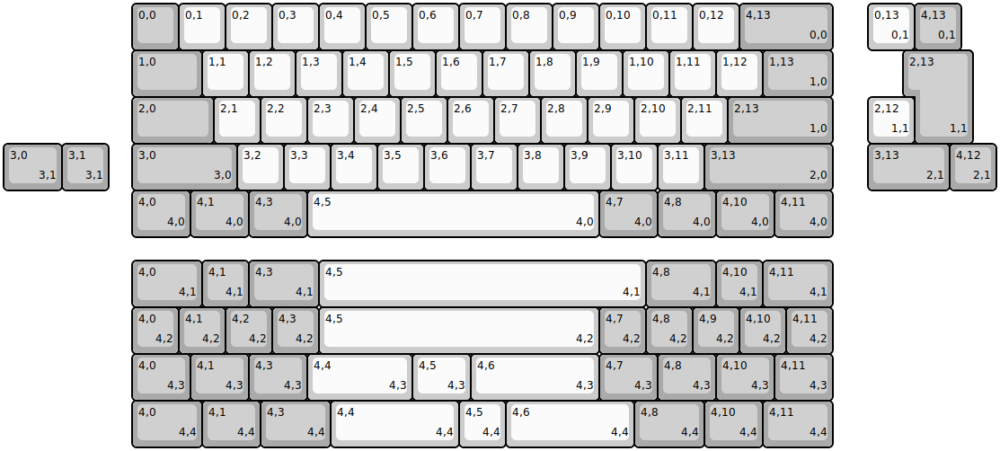{:loading="lazy"}

[Open in keyboard-layout-editor](http://www.keyboard-layout-editor.com/##@@_x:2.75&c=#aaaaaa;&=0,0&_c=#cccccc;&=0,1&=0,2&=0,3&=0,4&=0,5&=0,6&=0,7&=0,8&=0,9&=0,10&=0,11&=0,12&_c=#aaaaaa&w:2;&=4,13%0A%0A%0A0,0;&@_x:2.75&w:1.5;&=1,0&_c=#cccccc;&=1,1&=1,2&=1,3&=1,4&=1,5&=1,6&=1,7&=1,8&=1,9&=1,10&=1,11&=1,12&_c=#aaaaaa&w:1.5;&=1,13%0A%0A%0A1,0;&@_x:2.75&w:1.75;&=2,0&_c=#cccccc;&=2,1&=2,2&=2,3&=2,4&=2,5&=2,6&=2,7&=2,8&=2,9&=2,10&=2,11&_c=#aaaaaa&w:2.25;&=2,13%0A%0A%0A1,0;&@_x:2.75&w:2.25;&=3,0%0A%0A%0A3,0&_c=#cccccc;&=3,2&=3,3&=3,4&=3,5&=3,6&=3,7&=3,8&=3,9&=3,10&=3,11&_c=#aaaaaa&w:2.75;&=3,13%0A%0A%0A2,0;&@_x:2.75&w:1.25;&=4,0%0A%0A%0A4,0&_w:1.25;&=4,1%0A%0A%0A4,0&_w:1.25;&=4,3%0A%0A%0A4,0&_c=#cccccc&w:6.25;&=4,5%0A%0A%0A4,0&_c=#aaaaaa&w:1.25;&=4,7%0A%0A%0A4,0&_w:1.25;&=4,8%0A%0A%0A4,0&_w:1.25;&=4,10%0A%0A%0A4,0&_w:1.25;&=4,11%0A%0A%0A4,0;&@_x:18.5&y:-5&c=#cccccc;&=0,13%0A%0A%0A0,1&_c=#aaaaaa;&=4,13%0A%0A%0A0,1;&@_x:19.5&w:1.25&h:2&w2:1.5&h2:1&x2:-0.25;&=2,13%0A%0A%0A1,1;&@_x:18.5&c=#cccccc;&=2,12%0A%0A%0A1,1;&@_c=#aaaaaa&w:1.25;&=3,0%0A%0A%0A3,1&=3,1%0A%0A%0A3,1&_x:16.25&w:1.75;&=3,13%0A%0A%0A2,1&=4,12%0A%0A%0A2,1;&@_x:2.75&y:1.5&w:1.5;&=4,0%0A%0A%0A4,1&=4,1%0A%0A%0A4,1&_w:1.5;&=4,3%0A%0A%0A4,1&_c=#cccccc&w:7;&=4,5%0A%0A%0A4,1&_c=#aaaaaa&w:1.5;&=4,8%0A%0A%0A4,1&=4,10%0A%0A%0A4,1&_w:1.5;&=4,11%0A%0A%0A4,1;&@_x:2.75;&=4,0%0A%0A%0A4,2&=4,1%0A%0A%0A4,2&=4,2%0A%0A%0A4,2&=4,3%0A%0A%0A4,2&_c=#cccccc&w:6;&=4,5%0A%0A%0A4,2&_c=#aaaaaa;&=4,7%0A%0A%0A4,2&=4,8%0A%0A%0A4,2&=4,9%0A%0A%0A4,2&=4,10%0A%0A%0A4,2&=4,11%0A%0A%0A4,2;&@_x:2.75&w:1.25;&=4,0%0A%0A%0A4,3&_w:1.25;&=4,1%0A%0A%0A4,3&_w:1.25;&=4,3%0A%0A%0A4,3&_c=#cccccc&w:2.25;&=4,4%0A%0A%0A4,3&_w:1.25;&=4,5%0A%0A%0A4,3&_w:2.75;&=4,6%0A%0A%0A4,3&_c=#aaaaaa&w:1.25;&=4,7%0A%0A%0A4,3&_w:1.25;&=4,8%0A%0A%0A4,3&_w:1.25;&=4,10%0A%0A%0A4,3&_w:1.25;&=4,11%0A%0A%0A4,3;&@_x:2.75&w:1.5;&=4,0%0A%0A%0A4,4&_w:1.25;&=4,1%0A%0A%0A4,4&_w:1.5;&=4,3%0A%0A%0A4,4&_c=#cccccc&w:2.75;&=4,4%0A%0A%0A4,4&=4,5%0A%0A%0A4,4&_w:2.75;&=4,6%0A%0A%0A4,4&_c=#aaaaaa&w:1.5;&=4,8%0A%0A%0A4,4&_w:1.25;&=4,10%0A%0A%0A4,4&_w:1.5;&=4,11%0A%0A%0A4,4)

## 4pplet/waffling60_rev_a

[README](output/4pplet/README.md) - [layout](output/4pplet/waffling60_rev_a-kle.json) - [PCB](output/4pplet/waffling60_rev_a.kicad_pcb) - [PCB render](output/4pplet/waffling60_rev_a-render.svg)

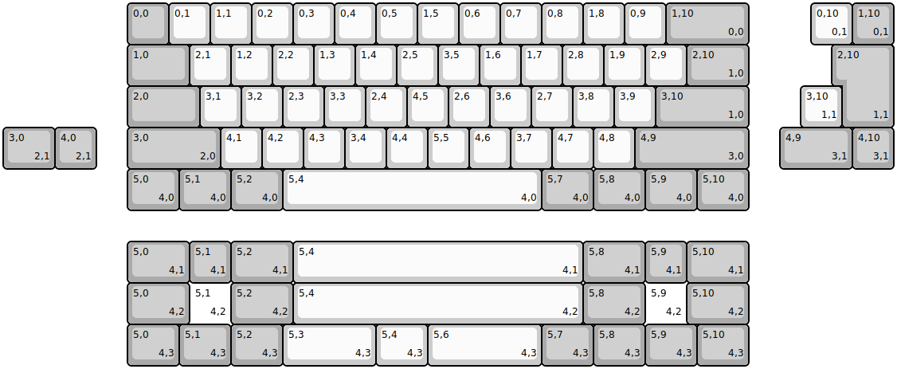{:loading="lazy"}

[Open in keyboard-layout-editor](http://www.keyboard-layout-editor.com/##@@_x:3&c=#aaaaaa;&=0,0&_c=#cccccc;&=0,1&=1,1&=0,2&=0,3&=0,4&=0,5&=1,5&=0,6&=0,7&=0,8&=1,8&=0,9&_c=#aaaaaa&w:2;&=1,10%0A%0A%0A0,0;&@_x:3&w:1.5;&=1,0&_c=#cccccc;&=2,1&=1,2&=2,2&=1,3&=1,4&=2,5&=3,5&=1,6&=1,7&=2,8&=1,9&=2,9&_c=#aaaaaa&w:1.5;&=2,10%0A%0A%0A1,0;&@_x:3&w:1.75;&=2,0&_c=#cccccc;&=3,1&=3,2&=2,3&=3,3&=2,4&=4,5&=2,6&=3,6&=2,7&=3,8&=3,9&_c=#aaaaaa&w:2.25;&=3,10%0A%0A%0A1,0;&@_x:3.0&w:2.25;&=3,0%0A%0A%0A2,0&_c=#cccccc;&=4,1&=4,2&=4,3&=3,4&=4,4&=5,5&=4,6&=3,7&=4,7&=4,8&_c=#aaaaaa&w:2.75;&=4,9%0A%0A%0A3,0;&@_x:3&w:1.25;&=5,0%0A%0A%0A4,0&_w:1.25;&=5,1%0A%0A%0A4,0&_w:1.25;&=5,2%0A%0A%0A4,0&_c=#cccccc&w:6.25;&=5,4%0A%0A%0A4,0&_c=#aaaaaa&w:1.25;&=5,7%0A%0A%0A4,0&_w:1.25;&=5,8%0A%0A%0A4,0&_w:1.25;&=5,9%0A%0A%0A4,0&_w:1.25;&=5,10%0A%0A%0A4,0;&@_x:19.5&y:-5&c=#cccccc;&=0,10%0A%0A%0A0,1&_c=#aaaaaa;&=1,10%0A%0A%0A0,1;&@_x:20.25&w:1.25&h:2&w2:1.5&h2:1&x2:-0.25;&=2,10%0A%0A%0A1,1;&@_x:19.25&c=#cccccc;&=3,10%0A%0A%0A1,1;&@_c=#aaaaaa&w:1.25;&=3,0%0A%0A%0A2,1&=4,0%0A%0A%0A2,1&_x:16.5&w:1.75;&=4,9%0A%0A%0A3,1&=4,10%0A%0A%0A3,1;&@_x:3&y:1.75&w:1.5;&=5,0%0A%0A%0A4,1&=5,1%0A%0A%0A4,1&_w:1.5;&=5,2%0A%0A%0A4,1&_c=#cccccc&w:7;&=5,4%0A%0A%0A4,1&_c=#aaaaaa&w:1.5;&=5,8%0A%0A%0A4,1&=5,9%0A%0A%0A4,1&_w:1.5;&=5,10%0A%0A%0A4,1;&@_x:3&w:1.5;&=5,0%0A%0A%0A4,2&_d:true;&=5,1%0A%0A%0A4,2&_w:1.5;&=5,2%0A%0A%0A4,2&_c=#cccccc&w:7;&=5,4%0A%0A%0A4,2&_c=#aaaaaa&w:1.5;&=5,8%0A%0A%0A4,2&_d:true;&=5,9%0A%0A%0A4,2&_w:1.5;&=5,10%0A%0A%0A4,2;&@_x:3&w:1.25;&=5,0%0A%0A%0A4,3&_w:1.25;&=5,1%0A%0A%0A4,3&_w:1.25;&=5,2%0A%0A%0A4,3&_c=#cccccc&w:2.25;&=5,3%0A%0A%0A4,3&_w:1.25;&=5,4%0A%0A%0A4,3&_w:2.75;&=5,6%0A%0A%0A4,3&_c=#aaaaaa&w:1.25;&=5,7%0A%0A%0A4,3&_w:1.25;&=5,8%0A%0A%0A4,3&_w:1.25;&=5,9%0A%0A%0A4,3&_w:1.25;&=5,10%0A%0A%0A4,3)

## 4pplet/waffling60_rev_b

[README](output/4pplet/README.md) - [layout](output/4pplet/waffling60_rev_b-kle.json) - [PCB](output/4pplet/waffling60_rev_b.kicad_pcb) - [PCB render](output/4pplet/waffling60_rev_b-render.svg)

{:loading="lazy"}

[Open in keyboard-layout-editor](http://www.keyboard-layout-editor.com/##@@_x:3&c=#aaaaaa;&=0,0&_c=#cccccc;&=0,1&=0,2&=0,3&=0,4&=0,5&=0,6&=0,7&=0,8&=0,9&=0,10&=0,11&=0,12&_c=#aaaaaa&w:2;&=1,13%0A%0A%0A0,0;&@_x:3&w:1.5;&=1,0&_c=#cccccc;&=1,1&=1,2&=1,3&=1,4&=1,5&=1,6&=1,7&=1,8&=1,9&=1,10&=1,11&=1,12&_c=#aaaaaa&w:1.5;&=2,12%0A%0A%0A1,0;&@_x:3&w:1.75;&=2,0&_c=#cccccc;&=2,1&=2,2&=2,3&=2,4&=2,5&=2,6&=2,7&=2,8&=2,9&=2,10&=2,11&_c=#aaaaaa&w:2.25;&=2,13%0A%0A%0A1,0;&@_x:3.0&w:2.25;&=3,0%0A%0A%0A2,0&_c=#cccccc;&=3,2&=3,3&=3,4&=3,5&=3,6&=3,7&=3,8&=3,9&=3,10&=3,11&_c=#aaaaaa&w:2.75;&=3,12%0A%0A%0A3,0;&@_x:3&w:1.25;&=4,0%0A%0A%0A4,0&_w:1.25;&=4,1%0A%0A%0A4,0&_w:1.25;&=4,2%0A%0A%0A4,0&_c=#cccccc&w:6.25;&=4,6%0A%0A%0A4,0&_c=#aaaaaa&w:1.25;&=4,10%0A%0A%0A4,0&_w:1.25;&=4,11%0A%0A%0A4,0&_w:1.25;&=4,12%0A%0A%0A4,0&_w:1.25;&=4,13%0A%0A%0A4,0;&@_x:19.5&y:-5&c=#cccccc;&=0,13%0A%0A%0A0,1&_c=#aaaaaa;&=1,13%0A%0A%0A0,1;&@_x:20.25&w:1.25&h:2&w2:1.5&h2:1&x2:-0.25;&=2,13%0A%0A%0A1,1;&@_x:19.25&c=#cccccc;&=2,12%0A%0A%0A1,1;&@_c=#aaaaaa&w:1.25;&=3,0%0A%0A%0A2,1&=3,1%0A%0A%0A2,1&_x:16.5&w:1.75;&=3,12%0A%0A%0A3,1&=3,13%0A%0A%0A3,1;&@_x:3&y:1.75&w:1.5;&=4,0%0A%0A%0A4,1&=4,1%0A%0A%0A4,1&_w:1.5;&=4,2%0A%0A%0A4,1&_c=#cccccc&w:7;&=4,6%0A%0A%0A4,1&_c=#aaaaaa&w:1.5;&=4,11%0A%0A%0A4,1&=4,12%0A%0A%0A4,1&_w:1.5;&=4,13%0A%0A%0A4,1;&@_x:3&w:1.5;&=4,0%0A%0A%0A4,2&_d:true;&=4,1%0A%0A%0A4,2&_w:1.5;&=4,2%0A%0A%0A4,2&_c=#cccccc&w:7;&=4,6%0A%0A%0A4,2&_c=#aaaaaa&w:1.5;&=4,11%0A%0A%0A4,2&_d:true;&=4,12%0A%0A%0A4,2&_w:1.5;&=4,13%0A%0A%0A4,2;&@_x:3&w:1.25;&=4,0%0A%0A%0A4,3&_w:1.25;&=4,1%0A%0A%0A4,3&_w:1.25;&=4,2%0A%0A%0A4,3&_c=#cccccc&w:2.25;&=4,4%0A%0A%0A4,3&_w:1.25;&=4,6%0A%0A%0A4,3&_w:2.75;&=4,8%0A%0A%0A4,3&_c=#aaaaaa&w:1.25;&=4,10%0A%0A%0A4,3&_w:1.25;&=4,11%0A%0A%0A4,3&_w:1.25;&=4,12%0A%0A%0A4,3&_w:1.25;&=4,13%0A%0A%0A4,3)

## 4pplet/waffling60_rev_c

[README](output/4pplet/README.md) - [layout](output/4pplet/waffling60_rev_c-kle.json) - [PCB](output/4pplet/waffling60_rev_c.kicad_pcb) - [PCB render](output/4pplet/waffling60_rev_c-render.svg)

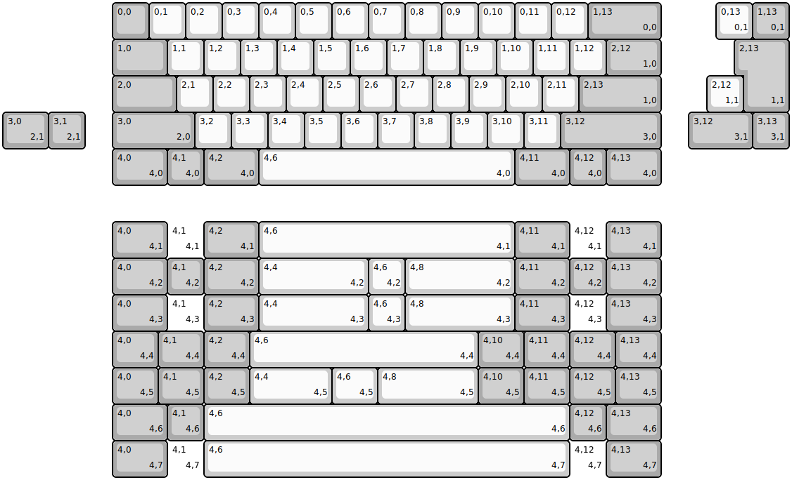{:loading="lazy"}

[Open in keyboard-layout-editor](http://www.keyboard-layout-editor.com/##@@_x:3&c=#aaaaaa;&=0,0&_c=#cccccc;&=0,1&=0,2&=0,3&=0,4&=0,5&=0,6&=0,7&=0,8&=0,9&=0,10&=0,11&=0,12&_c=#aaaaaa&w:2;&=1,13%0A%0A%0A0,0;&@_x:3&w:1.5;&=1,0&_c=#cccccc;&=1,1&=1,2&=1,3&=1,4&=1,5&=1,6&=1,7&=1,8&=1,9&=1,10&=1,11&=1,12&_c=#aaaaaa&w:1.5;&=2,12%0A%0A%0A1,0;&@_x:3&w:1.75;&=2,0&_c=#cccccc;&=2,1&=2,2&=2,3&=2,4&=2,5&=2,6&=2,7&=2,8&=2,9&=2,10&=2,11&_c=#aaaaaa&w:2.25;&=2,13%0A%0A%0A1,0;&@_x:3.0&w:2.25;&=3,0%0A%0A%0A2,0&_c=#cccccc;&=3,2&=3,3&=3,4&=3,5&=3,6&=3,7&=3,8&=3,9&=3,10&=3,11&_c=#aaaaaa&w:2.75;&=3,12%0A%0A%0A3,0;&@_x:3&w:1.5;&=4,0%0A%0A%0A4,0&=4,1%0A%0A%0A4,0&_w:1.5;&=4,2%0A%0A%0A4,0&_c=#cccccc&w:7;&=4,6%0A%0A%0A4,0&_c=#aaaaaa&w:1.5;&=4,11%0A%0A%0A4,0&=4,12%0A%0A%0A4,0&_w:1.5;&=4,13%0A%0A%0A4,0;&@_x:19.5&y:-5&c=#cccccc;&=0,13%0A%0A%0A0,1&_c=#aaaaaa;&=1,13%0A%0A%0A0,1;&@_x:20.25&w:1.25&h:2&w2:1.5&h2:1&x2:-0.25;&=2,13%0A%0A%0A1,1;&@_x:19.25&c=#cccccc;&=2,12%0A%0A%0A1,1;&@_c=#aaaaaa&w:1.25;&=3,0%0A%0A%0A2,1&=3,1%0A%0A%0A2,1&_x:16.5&w:1.75;&=3,12%0A%0A%0A3,1&=3,13%0A%0A%0A3,1;&@_x:3&y:2&w:1.5;&=4,0%0A%0A%0A4,1&_d:true;&=4,1%0A%0A%0A4,1&_w:1.5;&=4,2%0A%0A%0A4,1&_c=#cccccc&w:7;&=4,6%0A%0A%0A4,1&_c=#aaaaaa&w:1.5;&=4,11%0A%0A%0A4,1&_d:true;&=4,12%0A%0A%0A4,1&_w:1.5;&=4,13%0A%0A%0A4,1;&@_x:3&w:1.5;&=4,0%0A%0A%0A4,2&=4,1%0A%0A%0A4,2&_w:1.5;&=4,2%0A%0A%0A4,2&_c=#cccccc&w:3;&=4,4%0A%0A%0A4,2&=4,6%0A%0A%0A4,2&_w:3;&=4,8%0A%0A%0A4,2&_c=#aaaaaa&w:1.5;&=4,11%0A%0A%0A4,2&=4,12%0A%0A%0A4,2&_w:1.5;&=4,13%0A%0A%0A4,2;&@_x:3&w:1.5;&=4,0%0A%0A%0A4,3&_d:true;&=4,1%0A%0A%0A4,3&_w:1.5;&=4,2%0A%0A%0A4,3&_c=#cccccc&w:3;&=4,4%0A%0A%0A4,3&=4,6%0A%0A%0A4,3&_w:3;&=4,8%0A%0A%0A4,3&_c=#aaaaaa&w:1.5;&=4,11%0A%0A%0A4,3&_d:true;&=4,12%0A%0A%0A4,3&_w:1.5;&=4,13%0A%0A%0A4,3;&@_x:3&w:1.25;&=4,0%0A%0A%0A4,4&_w:1.25;&=4,1%0A%0A%0A4,4&_w:1.25;&=4,2%0A%0A%0A4,4&_c=#cccccc&w:6.25;&=4,6%0A%0A%0A4,4&_c=#aaaaaa&w:1.25;&=4,10%0A%0A%0A4,4&_w:1.25;&=4,11%0A%0A%0A4,4&_w:1.25;&=4,12%0A%0A%0A4,4&_w:1.25;&=4,13%0A%0A%0A4,4;&@_x:3&w:1.25;&=4,0%0A%0A%0A4,5&_w:1.25;&=4,1%0A%0A%0A4,5&_w:1.25;&=4,2%0A%0A%0A4,5&_c=#cccccc&w:2.25;&=4,4%0A%0A%0A4,5&_w:1.25;&=4,6%0A%0A%0A4,5&_w:2.75;&=4,8%0A%0A%0A4,5&_c=#aaaaaa&w:1.25;&=4,10%0A%0A%0A4,5&_w:1.25;&=4,11%0A%0A%0A4,5&_w:1.25;&=4,12%0A%0A%0A4,5&_w:1.25;&=4,13%0A%0A%0A4,5;&@_x:3&w:1.5;&=4,0%0A%0A%0A4,6&=4,1%0A%0A%0A4,6&_c=#cccccc&w:10;&=4,6%0A%0A%0A4,6&_c=#aaaaaa;&=4,12%0A%0A%0A4,6&_w:1.5;&=4,13%0A%0A%0A4,6;&@_x:3&w:1.5;&=4,0%0A%0A%0A4,7&_d:true;&=4,1%0A%0A%0A4,7&_c=#cccccc&w:10;&=4,6%0A%0A%0A4,7&_c=#aaaaaa&d:true;&=4,12%0A%0A%0A4,7&_w:1.5;&=4,13%0A%0A%0A4,7)

## 4pplet/waffling60_rev_d

[README](output/4pplet/README.md) - [layout](output/4pplet/waffling60_rev_d-kle.json) - [PCB](output/4pplet/waffling60_rev_d.kicad_pcb) - [PCB render](output/4pplet/waffling60_rev_d-render.svg)

{:loading="lazy"}

[Open in keyboard-layout-editor](http://www.keyboard-layout-editor.com/##@@_x:3&c=#aaaaaa;&=0,0&_c=#cccccc;&=0,1&=0,2&=0,3&=0,4&=0,5&=0,6&=0,7&=0,8&=0,9&=0,10&=0,11&=0,12&_c=#aaaaaa&w:2;&=2,13%0A%0A%0A1,0;&@_x:3&w:1.5;&=1,0&_c=#cccccc;&=1,1&=1,2&=1,3&=1,4&=1,5&=1,6&=1,7&=1,8&=1,9&=1,10&=1,11&=1,12&_c=#aaaaaa&w:1.5;&=1,13%0A%0A%0A2,0;&@_x:3&w:1.75;&=2,0&_c=#cccccc;&=2,1&=2,2&=2,3&=2,4&=2,5&=2,6&=2,7&=2,8&=2,9&=2,10&=2,11&_c=#aaaaaa&w:2.25;&=3,13%0A%0A%0A2,0;&@_x:3.0&w:2.25;&=3,0%0A%0A%0A3,0&_c=#cccccc;&=3,2&=3,3&=3,4&=3,5&=3,6&=3,7&=3,8&=3,9&=3,10&=3,11&_c=#aaaaaa&w:2.75;&=3,12%0A%0A%0A4,0;&@_x:3&w:1.5;&=4,0%0A%0A%0A0,0&=4,1%0A%0A%0A0,0&_w:1.5;&=4,2%0A%0A%0A0,0&_c=#cccccc&w:7;&=4,6%0A%0A%0A0,0&_c=#aaaaaa&w:1.5;&=4,10%0A%0A%0A0,0&=4,11%0A%0A%0A0,0&_w:1.5;&=4,12%0A%0A%0A0,0;&@_x:19.5&y:-5&c=#cccccc;&=0,13%0A%0A%0A1,1&_c=#aaaaaa;&=2,13%0A%0A%0A1,1;&@_x:20.25&w:1.25&h:2&w2:1.5&h2:1&x2:-0.25;&=3,13%0A%0A%0A2,1;&@_x:19.25&c=#cccccc;&=2,12%0A%0A%0A2,1;&@_c=#aaaaaa&w:1.25;&=3,0%0A%0A%0A3,1&=3,1%0A%0A%0A3,1&_x:16.5&w:1.75;&=3,12%0A%0A%0A4,1&=4,13%0A%0A%0A4,1;&@_x:3&y:2&w:1.5;&=4,0%0A%0A%0A0,1&_d:true;&=4,1%0A%0A%0A0,1&_w:1.5;&=4,2%0A%0A%0A0,1&_c=#cccccc&w:7;&=4,6%0A%0A%0A0,1&_c=#aaaaaa&w:1.5;&=4,10%0A%0A%0A0,1&_d:true;&=4,11%0A%0A%0A0,1&_w:1.5;&=4,12%0A%0A%0A0,1;&@_x:3&w:1.5;&=4,0%0A%0A%0A0,2&=4,1%0A%0A%0A0,2&_w:1.5;&=4,2%0A%0A%0A0,2&_c=#cccccc&w:3;&=4,4%0A%0A%0A0,2&=4,6%0A%0A%0A0,2&_w:3;&=4,8%0A%0A%0A0,2&_c=#aaaaaa&w:1.5;&=4,10%0A%0A%0A0,2&=4,11%0A%0A%0A0,2&_w:1.5;&=4,12%0A%0A%0A0,2;&@_x:3&w:1.5;&=4,0%0A%0A%0A0,3&_d:true;&=4,1%0A%0A%0A0,3&_w:1.5;&=4,2%0A%0A%0A0,3&_c=#cccccc&w:3;&=4,4%0A%0A%0A0,3&=4,6%0A%0A%0A0,3&_w:3;&=4,8%0A%0A%0A0,3&_c=#aaaaaa&w:1.5;&=4,10%0A%0A%0A0,3&_d:true;&=4,11%0A%0A%0A0,3&_w:1.5;&=4,12%0A%0A%0A0,3;&@_x:3&w:1.25;&=4,0%0A%0A%0A0,4&_w:1.25;&=4,1%0A%0A%0A0,4&_w:1.25;&=4,2%0A%0A%0A0,4&_c=#cccccc&w:6.25;&=4,6%0A%0A%0A0,4&_c=#aaaaaa&w:1.25;&=4,9%0A%0A%0A0,4&_w:1.25;&=4,10%0A%0A%0A0,4&_w:1.25;&=4,11%0A%0A%0A0,4&_w:1.25;&=4,12%0A%0A%0A0,4;&@_x:3&w:1.25;&=4,0%0A%0A%0A0,5&_w:1.25;&=4,1%0A%0A%0A0,5&_w:1.25;&=4,2%0A%0A%0A0,5&_c=#cccccc&w:2.25;&=4,4%0A%0A%0A0,5&_w:1.25;&=4,6%0A%0A%0A0,5&_w:2.75;&=4,8%0A%0A%0A0,5&_c=#aaaaaa&w:1.25;&=4,9%0A%0A%0A0,5&_w:1.25;&=4,10%0A%0A%0A0,5&_w:1.25;&=4,11%0A%0A%0A0,5&_w:1.25;&=4,12%0A%0A%0A0,5;&@_x:3&w:1.5;&=4,0%0A%0A%0A0,6&=4,1%0A%0A%0A0,6&_c=#cccccc&w:10;&=4,6%0A%0A%0A0,6&_c=#aaaaaa;&=4,11%0A%0A%0A0,6&_w:1.5;&=4,12%0A%0A%0A0,6;&@_x:3&w:1.5;&=4,0%0A%0A%0A0,7&_d:true;&=4,1%0A%0A%0A0,7&_c=#cccccc&w:10;&=4,6%0A%0A%0A0,7&_c=#aaaaaa&d:true;&=4,11%0A%0A%0A0,7&_w:1.5;&=4,12%0A%0A%0A0,7)

## 4pplet/waffling60_rev_d_ansi

[README](output/4pplet/README.md) - [layout](output/4pplet/waffling60_rev_d_ansi-kle.json) - [PCB](output/4pplet/waffling60_rev_d_ansi.kicad_pcb) - [PCB render](output/4pplet/waffling60_rev_d_ansi-render.svg)

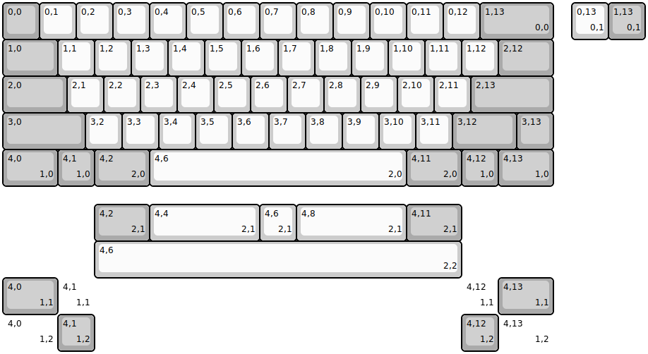{:loading="lazy"}

[Open in keyboard-layout-editor](http://www.keyboard-layout-editor.com/##@@_c=#aaaaaa;&=0,0&_c=#cccccc;&=0,1&=0,2&=0,3&=0,4&=0,5&=0,6&=0,7&=0,8&=0,9&=0,10&=0,11&=0,12&_c=#aaaaaa&w:2;&=1,13%0A%0A%0A0,0;&@_w:1.5;&=1,0&_c=#cccccc;&=1,1&=1,2&=1,3&=1,4&=1,5&=1,6&=1,7&=1,8&=1,9&=1,10&=1,11&=1,12&_c=#aaaaaa&w:1.5;&=2,12;&@_w:1.75;&=2,0&_c=#cccccc;&=2,1&=2,2&=2,3&=2,4&=2,5&=2,6&=2,7&=2,8&=2,9&=2,10&=2,11&_c=#aaaaaa&w:2.25;&=2,13;&@_w:2.25;&=3,0&_c=#cccccc;&=3,2&=3,3&=3,4&=3,5&=3,6&=3,7&=3,8&=3,9&=3,10&=3,11&_c=#aaaaaa&w:1.75;&=3,12&=3,13;&@_w:1.5;&=4,0%0A%0A%0A1,0&=4,1%0A%0A%0A1,0&_w:1.5;&=4,2%0A%0A%0A2,0&_c=#cccccc&w:7;&=4,6%0A%0A%0A2,0&_c=#aaaaaa&w:1.5;&=4,11%0A%0A%0A2,0&=4,12%0A%0A%0A1,0&_w:1.5;&=4,13%0A%0A%0A1,0;&@_x:15.5&y:-5&c=#cccccc;&=0,13%0A%0A%0A0,1&_c=#aaaaaa;&=1,13%0A%0A%0A0,1;&@_x:2.5&y:4.5&w:1.5;&=4,2%0A%0A%0A2,1&_c=#cccccc&w:3;&=4,4%0A%0A%0A2,1&=4,6%0A%0A%0A2,1&_w:3;&=4,8%0A%0A%0A2,1&_c=#aaaaaa&w:1.5;&=4,11%0A%0A%0A2,1;&@_x:2.5&c=#cccccc&w:10;&=4,6%0A%0A%0A2,2;&@_c=#aaaaaa&w:1.5;&=4,0%0A%0A%0A1,1&_d:true;&=4,1%0A%0A%0A1,1&_x:10.0&d:true;&=4,12%0A%0A%0A1,1&_w:1.5;&=4,13%0A%0A%0A1,1;&@_w:1.5&d:true;&=4,0%0A%0A%0A1,2&=4,1%0A%0A%0A1,2&_x:10.0;&=4,12%0A%0A%0A1,2&_w:1.5&d:true;&=4,13%0A%0A%0A1,2)

## 4pplet/waffling60_rev_d_iso

[README](output/4pplet/README.md) - [layout](output/4pplet/waffling60_rev_d_iso-kle.json) - [PCB](output/4pplet/waffling60_rev_d_iso.kicad_pcb) - [PCB render](output/4pplet/waffling60_rev_d_iso-render.svg)

{:loading="lazy"}

[Open in keyboard-layout-editor](http://www.keyboard-layout-editor.com/##@@_c=#aaaaaa;&=0,0&_c=#cccccc;&=0,1&=0,2&=0,3&=0,4&=0,5&=0,6&=0,7&=0,8&=0,9&=0,10&=0,11&=0,12&_c=#aaaaaa&w:2;&=1,13%0A%0A%0A0,0;&@_w:1.5;&=1,0&_c=#cccccc;&=1,1&=1,2&=1,3&=1,4&=1,5&=1,6&=1,7&=1,8&=1,9&=1,10&=1,11&=1,12&_x:0.25&c=#aaaaaa&w:1.25&h:2&w2:1.5&h2:1&x2:-0.25;&=2,13;&@_w:1.75;&=2,0&_c=#cccccc;&=2,1&=2,2&=2,3&=2,4&=2,5&=2,6&=2,7&=2,8&=2,9&=2,10&=2,11&=2,12;&@_c=#aaaaaa&w:1.25;&=3,0&=3,1&_c=#cccccc;&=3,2&=3,3&=3,4&=3,5&=3,6&=3,7&=3,8&=3,9&=3,10&=3,11&_c=#aaaaaa&w:1.75;&=3,12&=3,13;&@_w:1.5;&=4,0%0A%0A%0A1,0&=4,1%0A%0A%0A1,0&_w:1.5;&=4,2%0A%0A%0A2,0&_c=#cccccc&w:7;&=4,6%0A%0A%0A2,0&_c=#aaaaaa&w:1.5;&=4,11%0A%0A%0A2,0&=4,12%0A%0A%0A1,0&_w:1.5;&=4,13%0A%0A%0A1,0;&@_x:15.5&y:-5&c=#cccccc;&=0,13%0A%0A%0A0,1&_c=#aaaaaa;&=1,13%0A%0A%0A0,1;&@_x:2.5&y:4.5&w:1.5;&=4,2%0A%0A%0A2,1&_c=#cccccc&w:3;&=4,4%0A%0A%0A2,1&=4,6%0A%0A%0A2,1&_w:3;&=4,8%0A%0A%0A2,1&_c=#aaaaaa&w:1.5;&=4,11%0A%0A%0A2,1;&@_x:2.5&c=#cccccc&w:10;&=4,6%0A%0A%0A2,2;&@_c=#aaaaaa&w:1.5;&=4,0%0A%0A%0A1,1&_d:true;&=4,1%0A%0A%0A1,1&_x:10.0&d:true;&=4,12%0A%0A%0A1,1&_w:1.5;&=4,13%0A%0A%0A1,1;&@_w:1.5&d:true;&=4,0%0A%0A%0A1,2&=4,1%0A%0A%0A1,2&_x:10.0;&=4,12%0A%0A%0A1,2&_w:1.5&d:true;&=4,13%0A%0A%0A1,2)

## 4pplet/waffling80_rev_a

[README](output/4pplet/README.md) - [layout](output/4pplet/waffling80_rev_a-kle.json) - [PCB](output/4pplet/waffling80_rev_a.kicad_pcb) - [PCB render](output/4pplet/waffling80_rev_a-render.svg)

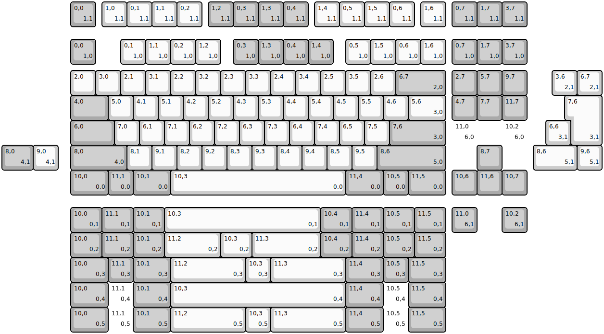{:loading="lazy"}

[Open in keyboard-layout-editor](http://www.keyboard-layout-editor.com/##@@_x:2.75&y:1.5&c=#aaaaaa;&=0,0%0A%0A%0A1,0&_x:1.0&c=#cccccc;&=0,1%0A%0A%0A1,0&=1,1%0A%0A%0A1,0&=0,2%0A%0A%0A1,0&=1,2%0A%0A%0A1,0&_x:0.5&c=#aaaaaa;&=0,3%0A%0A%0A1,0&=1,3%0A%0A%0A1,0&=0,4%0A%0A%0A1,0&=1,4%0A%0A%0A1,0&_x:0.5&c=#cccccc;&=0,5%0A%0A%0A1,0&=1,5%0A%0A%0A1,0&=0,6%0A%0A%0A1,0&=1,6%0A%0A%0A1,0&_x:0.25&c=#aaaaaa;&=0,7%0A%0A%0A1,0&=1,7%0A%0A%0A1,0&=3,7%0A%0A%0A1,0;&@_x:2.75&y:0.25&c=#cccccc;&=2,0&=3,0&=2,1&=3,1&=2,2&=3,2&=2,3&=3,3&=2,4&=3,4&=2,5&=3,5&=2,6&_c=#aaaaaa&w:2;&=6,7%0A%0A%0A2,0&_x:0.25;&=2,7&=5,7&=9,7;&@_x:2.75&w:1.5;&=4,0&_c=#cccccc;&=5,0&=4,1&=5,1&=4,2&=5,2&=4,3&=5,3&=4,4&=5,4&=4,5&=5,5&=4,6&_w:1.5;&=5,6%0A%0A%0A3,0&_x:0.25&c=#aaaaaa;&=4,7&=7,7&=11,7;&@_x:2.75&w:1.75;&=6,0&_c=#cccccc;&=7,0&=6,1&=7,1&=6,2&=7,2&=6,3&=7,3&=6,4&=7,4&=6,5&=7,5&_c=#aaaaaa&w:2.25;&=7,6%0A%0A%0A3,0&_x:0.25&c=#cccccc&d:true;&=11,0%0A%0A%0A6,0&_x:1.0&d:true;&=10,2%0A%0A%0A6,0;&@_x:2.75&c=#aaaaaa&w:2.25;&=8,0%0A%0A%0A4,0&_c=#cccccc;&=8,1&=9,1&=8,2&=9,2&=8,3&=9,3&=8,4&=9,4&=8,5&=9,5&_c=#aaaaaa&w:2.75;&=8,6%0A%0A%0A5,0&_x:1.25;&=8,7;&@_x:2.75&w:1.5;&=10,0%0A%0A%0A0,0&=11,1%0A%0A%0A0,0&_w:1.5;&=10,1%0A%0A%0A0,0&_c=#cccccc&w:7;&=10,3%0A%0A%0A0,0&_c=#aaaaaa&w:1.5;&=11,4%0A%0A%0A0,0&=10,5%0A%0A%0A0,0&_w:1.5;&=11,5%0A%0A%0A0,0&_x:0.25;&=10,6&=11,6&=10,7;&@_x:2.75&y:-7.75;&=0,0%0A%0A%0A1,1&_x:0.25&c=#cccccc;&=1,0%0A%0A%0A1,1&=0,1%0A%0A%0A1,1&=1,1%0A%0A%0A1,1&=0,2%0A%0A%0A1,1&_x:0.25&c=#aaaaaa;&=1,2%0A%0A%0A1,1&=0,3%0A%0A%0A1,1&=1,3%0A%0A%0A1,1&=0,4%0A%0A%0A1,1&_x:0.25&c=#cccccc;&=1,4%0A%0A%0A1,1&=0,5%0A%0A%0A1,1&=1,5%0A%0A%0A1,1&=0,6%0A%0A%0A1,1&_x:0.25;&=1,6%0A%0A%0A1,1&_x:0.25&c=#aaaaaa;&=0,7%0A%0A%0A1,1&=1,7%0A%0A%0A1,1&=3,7%0A%0A%0A1,1;&@_x:22.0&y:1.75&c=#cccccc;&=3,6%0A%0A%0A2,1&=6,7%0A%0A%0A2,1;&@_x:22.75&w:1.25&h:2&w2:1.5&h2:1&x2:-0.25;&=7,6%0A%0A%0A3,1;&@_x:21.75;&=6,6%0A%0A%0A3,1;&@_c=#aaaaaa&w:1.25;&=8,0%0A%0A%0A4,1&_c=#cccccc;&=9,0%0A%0A%0A4,1&_x:19.0&w:1.75;&=8,6%0A%0A%0A5,1&=9,6%0A%0A%0A5,1;&@_x:2.75&y:1.5&c=#aaaaaa&w:1.25;&=10,0%0A%0A%0A0,1&_w:1.25;&=11,1%0A%0A%0A0,1&_w:1.25;&=10,1%0A%0A%0A0,1&_c=#cccccc&w:6.25;&=10,3%0A%0A%0A0,1&_c=#aaaaaa&w:1.25;&=10,4%0A%0A%0A0,1&_w:1.25;&=11,4%0A%0A%0A0,1&_w:1.25;&=10,5%0A%0A%0A0,1&_w:1.25;&=11,5%0A%0A%0A0,1&_x:0.25;&=11,0%0A%0A%0A6,1&_x:1.0;&=10,2%0A%0A%0A6,1;&@_x:2.75&w:1.25;&=10,0%0A%0A%0A0,2&_w:1.25;&=11,1%0A%0A%0A0,2&_w:1.25;&=10,1%0A%0A%0A0,2&_c=#cccccc&w:2.25;&=11,2%0A%0A%0A0,2&_w:1.25;&=10,3%0A%0A%0A0,2&_w:2.75;&=11,3%0A%0A%0A0,2&_c=#aaaaaa&w:1.25;&=10,4%0A%0A%0A0,2&_w:1.25;&=11,4%0A%0A%0A0,2&_w:1.25;&=10,5%0A%0A%0A0,2&_w:1.25;&=11,5%0A%0A%0A0,2;&@_x:2.75&w:1.5;&=10,0%0A%0A%0A0,3&=11,1%0A%0A%0A0,3&_w:1.5;&=10,1%0A%0A%0A0,3&_c=#cccccc&w:3;&=11,2%0A%0A%0A0,3&=10,3%0A%0A%0A0,3&_w:3;&=11,3%0A%0A%0A0,3&_c=#aaaaaa&w:1.5;&=11,4%0A%0A%0A0,3&=10,5%0A%0A%0A0,3&_w:1.5;&=11,5%0A%0A%0A0,3;&@_x:2.75&w:1.5;&=10,0%0A%0A%0A0,4&_d:true;&=11,1%0A%0A%0A0,4&_w:1.5;&=10,1%0A%0A%0A0,4&_c=#cccccc&w:7;&=10,3%0A%0A%0A0,4&_c=#aaaaaa&w:1.5;&=11,4%0A%0A%0A0,4&_d:true;&=10,5%0A%0A%0A0,4&_w:1.5;&=11,5%0A%0A%0A0,4;&@_x:2.75&w:1.5;&=10,0%0A%0A%0A0,5&_d:true;&=11,1%0A%0A%0A0,5&_w:1.5;&=10,1%0A%0A%0A0,5&_c=#cccccc&w:3;&=11,2%0A%0A%0A0,5&=10,3%0A%0A%0A0,5&_w:3;&=11,3%0A%0A%0A0,5&_c=#aaaaaa&w:1.5;&=11,4%0A%0A%0A0,5&_d:true;&=10,5%0A%0A%0A0,5&_w:1.5;&=11,5%0A%0A%0A0,5)

## 4pplet/waffling80_rev_b

[README](output/4pplet/README.md) - [layout](output/4pplet/waffling80_rev_b-kle.json) - [PCB](output/4pplet/waffling80_rev_b.kicad_pcb) - [PCB render](output/4pplet/waffling80_rev_b-render.svg)

{:loading="lazy"}

[Open in keyboard-layout-editor](http://www.keyboard-layout-editor.com/##@@_x:2.75&y:1.5&c=#aaaaaa;&=0,0%0A%0A%0A1,0&_x:1.0&c=#cccccc;&=0,1%0A%0A%0A1,0&=1,1%0A%0A%0A1,0&=0,2%0A%0A%0A1,0&=1,2%0A%0A%0A1,0&_x:0.5&c=#aaaaaa;&=0,3%0A%0A%0A1,0&=1,3%0A%0A%0A1,0&=0,4%0A%0A%0A1,0&=1,4%0A%0A%0A1,0&_x:0.5&c=#cccccc;&=0,5%0A%0A%0A1,0&=1,5%0A%0A%0A1,0&=0,6%0A%0A%0A1,0&=1,6%0A%0A%0A1,0&_x:0.25&c=#aaaaaa;&=0,7%0A%0A%0A1,0&=1,7%0A%0A%0A1,0&=3,7%0A%0A%0A1,0;&@_x:2.75&y:0.25&c=#cccccc;&=2,0&=3,0&=2,1&=3,1&=2,2&=3,2&=2,3&=3,3&=2,4&=3,4&=2,5&=3,5&=2,6&_c=#aaaaaa&w:2;&=6,7%0A%0A%0A2,0&_x:0.25;&=2,7&=5,7&=9,7;&@_x:2.75&w:1.5;&=4,0&_c=#cccccc;&=5,0&=4,1&=5,1&=4,2&=5,2&=4,3&=5,3&=4,4&=5,4&=4,5&=5,5&=4,6&_w:1.5;&=5,6%0A%0A%0A3,0&_x:0.25&c=#aaaaaa;&=4,7&=7,7&=11,7;&@_x:2.75&w:1.75;&=6,0&_c=#cccccc;&=7,0&=6,1&=7,1&=6,2&=7,2&=6,3&=7,3&=6,4&=7,4&=6,5&=7,5&_c=#aaaaaa&w:2.25;&=7,6%0A%0A%0A3,0&_x:0.25&c=#cccccc&d:true;&=11,0%0A%0A%0A6,0&_x:1.0&d:true;&=10,2%0A%0A%0A6,0;&@_x:2.75&c=#aaaaaa&w:2.25;&=8,0%0A%0A%0A4,0&_c=#cccccc;&=8,1&=9,1&=8,2&=9,2&=8,3&=9,3&=8,4&=9,4&=8,5&=9,5&_c=#aaaaaa&w:2.75;&=8,6%0A%0A%0A5,0&_x:1.25;&=8,7;&@_x:2.75&w:1.5;&=10,0%0A%0A%0A0,0&=11,1%0A%0A%0A0,0&_w:1.5;&=10,1%0A%0A%0A0,0&_c=#cccccc&w:7;&=10,3%0A%0A%0A0,0&_c=#aaaaaa&w:1.5;&=11,4%0A%0A%0A0,0&=10,5%0A%0A%0A0,0&_w:1.5;&=11,5%0A%0A%0A0,0&_x:0.25;&=10,6&=11,6&=10,7;&@_x:2.75&y:-7.75;&=0,0%0A%0A%0A1,1&_x:0.25&c=#cccccc;&=1,0%0A%0A%0A1,1&=0,1%0A%0A%0A1,1&=1,1%0A%0A%0A1,1&=0,2%0A%0A%0A1,1&_x:0.25&c=#aaaaaa;&=1,2%0A%0A%0A1,1&=0,3%0A%0A%0A1,1&=1,3%0A%0A%0A1,1&=0,4%0A%0A%0A1,1&_x:0.25&c=#cccccc;&=1,4%0A%0A%0A1,1&=0,5%0A%0A%0A1,1&=1,5%0A%0A%0A1,1&=0,6%0A%0A%0A1,1&_x:0.25;&=1,6%0A%0A%0A1,1&_x:0.25&c=#aaaaaa;&=0,7%0A%0A%0A1,1&=1,7%0A%0A%0A1,1&=3,7%0A%0A%0A1,1;&@_x:22.0&y:1.75&c=#cccccc;&=3,6%0A%0A%0A2,1&=6,7%0A%0A%0A2,1;&@_x:22.75&w:1.25&h:2&w2:1.5&h2:1&x2:-0.25;&=7,6%0A%0A%0A3,1;&@_x:21.75;&=6,6%0A%0A%0A3,1;&@_c=#aaaaaa&w:1.25;&=8,0%0A%0A%0A4,1&_c=#cccccc;&=9,0%0A%0A%0A4,1&_x:19.0&w:1.75;&=8,6%0A%0A%0A5,1&=9,6%0A%0A%0A5,1;&@_x:2.75&y:1.5&c=#aaaaaa&w:1.25;&=10,0%0A%0A%0A0,1&_w:1.25;&=11,1%0A%0A%0A0,1&_w:1.25;&=10,1%0A%0A%0A0,1&_c=#cccccc&w:6.25;&=10,3%0A%0A%0A0,1&_c=#aaaaaa&w:1.25;&=10,4%0A%0A%0A0,1&_w:1.25;&=11,4%0A%0A%0A0,1&_w:1.25;&=10,5%0A%0A%0A0,1&_w:1.25;&=11,5%0A%0A%0A0,1&_x:0.25;&=11,0%0A%0A%0A6,1&_x:1.0;&=10,2%0A%0A%0A6,1;&@_x:2.75&w:1.25;&=10,0%0A%0A%0A0,2&_w:1.25;&=11,1%0A%0A%0A0,2&_w:1.25;&=10,1%0A%0A%0A0,2&_c=#cccccc&w:2.25;&=11,2%0A%0A%0A0,2&_w:1.25;&=10,3%0A%0A%0A0,2&_w:2.75;&=11,3%0A%0A%0A0,2&_c=#aaaaaa&w:1.25;&=10,4%0A%0A%0A0,2&_w:1.25;&=11,4%0A%0A%0A0,2&_w:1.25;&=10,5%0A%0A%0A0,2&_w:1.25;&=11,5%0A%0A%0A0,2;&@_x:2.75&w:1.5;&=10,0%0A%0A%0A0,3&=11,1%0A%0A%0A0,3&_w:1.5;&=10,1%0A%0A%0A0,3&_c=#cccccc&w:3;&=11,2%0A%0A%0A0,3&=10,3%0A%0A%0A0,3&_w:3;&=11,3%0A%0A%0A0,3&_c=#aaaaaa&w:1.5;&=11,4%0A%0A%0A0,3&=10,5%0A%0A%0A0,3&_w:1.5;&=11,5%0A%0A%0A0,3;&@_x:2.75&w:1.5;&=10,0%0A%0A%0A0,4&_d:true;&=11,1%0A%0A%0A0,4&_w:1.5;&=10,1%0A%0A%0A0,4&_c=#cccccc&w:7;&=10,3%0A%0A%0A0,4&_c=#aaaaaa&w:1.5;&=11,4%0A%0A%0A0,4&_d:true;&=10,5%0A%0A%0A0,4&_w:1.5;&=11,5%0A%0A%0A0,4;&@_x:2.75&w:1.5;&=10,0%0A%0A%0A0,5&_d:true;&=11,1%0A%0A%0A0,5&_w:1.5;&=10,1%0A%0A%0A0,5&_c=#cccccc&w:3;&=11,2%0A%0A%0A0,5&=10,3%0A%0A%0A0,5&_w:3;&=11,3%0A%0A%0A0,5&_c=#aaaaaa&w:1.5;&=11,4%0A%0A%0A0,5&_d:true;&=10,5%0A%0A%0A0,5&_w:1.5;&=11,5%0A%0A%0A0,5)

## 4pplet/yakiimo_rev_a

[README](output/4pplet/README.md) - [layout](output/4pplet/yakiimo_rev_a-kle.json) - [PCB](output/4pplet/yakiimo_rev_a.kicad_pcb) - [PCB render](output/4pplet/yakiimo_rev_a-render.svg)

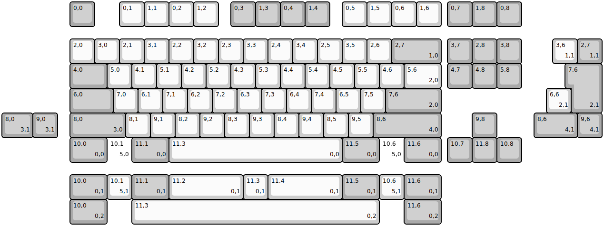{:loading="lazy"}

[Open in keyboard-layout-editor](http://www.keyboard-layout-editor.com/##@@_x:2.75&c=#aaaaaa;&=0,0&_x:1.0&c=#cccccc;&=0,1&=1,1&=0,2&=1,2&_x:0.5&c=#aaaaaa;&=0,3&=1,3&=0,4&=1,4&_x:0.5&c=#cccccc;&=0,5&=1,5&=0,6&=1,6&_x:0.25&c=#aaaaaa;&=0,7&=1,8&=0,8;&@_x:2.75&y:0.5&c=#cccccc;&=2,0&=3,0&=2,1&=3,1&=2,2&=3,2&=2,3&=3,3&=2,4&=3,4&=2,5&=3,5&=2,6&_c=#aaaaaa&w:2;&=2,7%0A%0A%0A1,0&_x:0.25;&=3,7&=2,8&=3,8;&@_x:2.75&w:1.5;&=4,0&_c=#cccccc;&=5,0&=4,1&=5,1&=4,2&=5,2&=4,3&=5,3&=4,4&=5,4&=4,5&=5,5&=4,6&_w:1.5;&=5,6%0A%0A%0A2,0&_x:0.25&c=#aaaaaa;&=4,7&=4,8&=5,8;&@_x:2.75&w:1.75;&=6,0&_c=#cccccc;&=7,0&=6,1&=7,1&=6,2&=7,2&=6,3&=7,3&=6,4&=7,4&=6,5&=7,5&_c=#aaaaaa&w:2.25;&=7,6%0A%0A%0A2,0;&@_x:2.75&w:2.25;&=8,0%0A%0A%0A3,0&_c=#cccccc;&=8,1&=9,1&=8,2&=9,2&=8,3&=9,3&=8,4&=9,4&=8,5&=9,5&_c=#aaaaaa&w:2.75;&=8,6%0A%0A%0A4,0&_x:1.25;&=9,8;&@_x:2.75&w:1.5;&=10,0%0A%0A%0A0,0&_c=#cccccc&d:true;&=10,1%0A%0A%0A5,0&_c=#aaaaaa&w:1.5;&=11,1%0A%0A%0A0,0&_c=#cccccc&w:7;&=11,3%0A%0A%0A0,0&_c=#aaaaaa&w:1.5;&=11,5%0A%0A%0A0,0&_c=#cccccc&d:true;&=10,6%0A%0A%0A5,0&_c=#aaaaaa&w:1.5;&=11,6%0A%0A%0A0,0&_x:0.25;&=10,7&=11,8&=10,8;&@_x:22.25&y:-5.0&c=#cccccc;&=3,6%0A%0A%0A1,1&_c=#aaaaaa;&=2,7%0A%0A%0A1,1;&@_x:23.0&w:1.25&h:2&w2:1.5&h2:1&x2:-0.25;&=7,6%0A%0A%0A2,1;&@_x:22.0&c=#cccccc;&=6,6%0A%0A%0A2,1;&@_c=#aaaaaa&w:1.25;&=8,0%0A%0A%0A3,1&=9,0%0A%0A%0A3,1&_x:19.25&w:1.75;&=8,6%0A%0A%0A4,1&=9,6%0A%0A%0A4,1;&@_x:2.75&y:1.5&w:1.5;&=10,0%0A%0A%0A0,1&_c=#cccccc;&=10,1%0A%0A%0A5,1&_c=#aaaaaa&w:1.5;&=11,1%0A%0A%0A0,1&_c=#cccccc&w:3;&=11,2%0A%0A%0A0,1&=11,3%0A%0A%0A0,1&_w:3;&=11,4%0A%0A%0A0,1&_c=#aaaaaa&w:1.5;&=11,5%0A%0A%0A0,1&_c=#cccccc;&=10,6%0A%0A%0A5,1&_c=#aaaaaa&w:1.5;&=11,6%0A%0A%0A0,1;&@_x:2.75&w:1.5;&=10,0%0A%0A%0A0,2&_x:1.0&c=#cccccc&w:10;&=11,3%0A%0A%0A0,2&_x:1.0&c=#aaaaaa&w:1.5;&=11,6%0A%0A%0A0,2)

## 7c8/framework

[README](output/7c8/README.md) - [layout](output/7c8/framework-kle.json) - [PCB](output/7c8/framework.kicad_pcb) - [PCB render](output/7c8/framework-render.svg)

{:loading="lazy"}

[Open in keyboard-layout-editor](http://www.keyboard-layout-editor.com/##@@_x:11.5;&=1,5&=10,0&=10,1;&@_y:-0.5;&=0,0&=0,1&=0,2&=0,3&=0,4&=0,5&=1,0&=1,1&=1,2&=1,3&=1,4;&@=2,0&=2,1&=2,2&=2,3&=2,4&=2,5&=3,0&=3,1&=3,2&=3,3&=3,4&=3,5;&@=4,0&=4,1&=4,2&=4,3&_n:true;&=4,4&=4,5&=5,0&_n:true;&=5,1&=5,2&=5,3&=5,4&=5,5;&@=6,0&=6,1&=6,2&=6,3&=6,4&=6,5&=7,0&=7,1&=7,2&=7,3&=7,4&=7,5;&@=8,0&=8,1&=8,2&=8,3&=8,4%0A%0A%0A0,0&_w:2;&=8,5%0A%0A%0A0,0&=9,1%0A%0A%0A0,0&=9,2&=9,3&=9,4&=9,5;&@_x:4;&=8,4%0A%0A%0A0,1&=8,5%0A%0A%0A0,1&=9,0%0A%0A%0A0,1&=9,1%0A%0A%0A0,1;&@_x:4&w:2;&=8,5%0A%0A%0A0,2&_w:2;&=9,0%0A%0A%0A0,2)

## 7skb/7skb

[README](output/7skb/README.md) - [layout](output/7skb/7skb-kle.json) - [PCB](output/7skb/7skb.kicad_pcb) - [PCB render](output/7skb/7skb-render.svg)

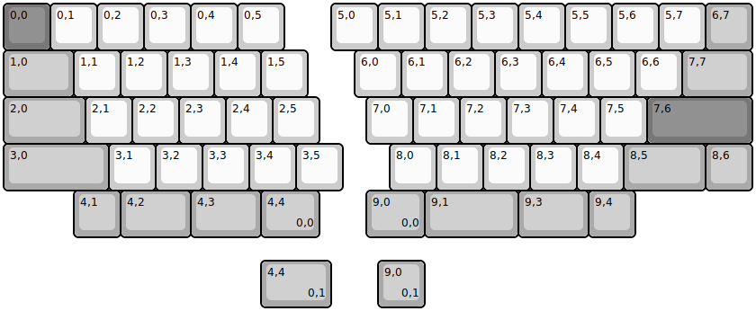{:loading="lazy"}

[Open in keyboard-layout-editor](http://www.keyboard-layout-editor.com/##@@_c=#777777;&=0,0&_c=#cccccc;&=0,1&=0,2&=0,3&=0,4&=0,5&_x:1;&=5,0&=5,1&=5,2&=5,3&=5,4&=5,5&=5,6&=5,7&_c=#aaaaaa;&=6,7;&@_w:1.5;&=1,0&_c=#cccccc;&=1,1&=1,2&=1,3&=1,4&=1,5&_x:1.0;&=6,0&=6,1&=6,2&=6,3&=6,4&=6,5&=6,6&_c=#aaaaaa&w:1.5;&=7,7;&@_w:1.75;&=2,0&_c=#cccccc;&=2,1&=2,2&=2,3&=2,4&=2,5&_x:1.0;&=7,0&=7,1&=7,2&=7,3&=7,4&=7,5&_c=#777777&w:2.25;&=7,6;&@_c=#aaaaaa&w:2.25;&=3,0&_c=#cccccc;&=3,1&=3,2&=3,3&=3,4&=3,5&_x:1.0;&=8,0&=8,1&=8,2&=8,3&=8,4&_c=#aaaaaa&w:1.75;&=8,5&=8,6;&@_x:1.5;&=4,1&_w:1.5;&=4,2&_w:1.5;&=4,3&_w:1.25;&=4,4%0A%0A%0A0,0&_x:1.0&w:1.25;&=9,0%0A%0A%0A0,0&_w:2;&=9,1&_w:1.5;&=9,3&=9,4;&@_x:5.5&y:0.5&w:1.5;&=4,4%0A%0A%0A0,1&_x:1.0;&=9,0%0A%0A%0A0,1)

## 7splus/7splus

[README](output/7splus/README.md) - [layout](output/7splus/7splus-kle.json) - [PCB](output/7splus/7splus.kicad_pcb) - [PCB render](output/7splus/7splus-render.svg)

{:loading="lazy"}

[Open in keyboard-layout-editor](http://www.keyboard-layout-editor.com/##@@=0,0&_x:0.25;&=0,1&=0,2&=0,3&=0,4&_x:0.25;&=0,5&_x:1.0;&=7,0&=7,1&=7,2&_x:0.25;&=7,3&=7,4&=7,5&=7,6&_x:0.25;&=7,7&=13,0;&@_y:0.25;&=1,0&=1,1&=1,2&=1,3&=1,4&=1,5&_x:1;&=8,0&=8,1&=8,2&=8,3&=8,4&=8,5&=8,6&_w:2;&=8,7&=13,2;&@_w:1.5;&=2,0&=2,1&=2,2&=2,3&=2,4&=2,5&_x:1.0;&=9,0&=9,1&=9,2&=9,3&=9,4&=9,5&=9,6&_w:1.5;&=9,7&=13,3;&@_w:1.75;&=3,0&=3,1&=3,2&=3,3&=3,4&=3,5&_x:1.0;&=10,0&=10,1&=10,2&=10,3&=10,4&=10,5&_w:2.25;&=10,6&=10,7;&@_w:2.25;&=4,0&=4,1&=4,2&=4,3&=4,4&=4,5&_x:1.0;&=11,0&=11,1&=11,2&=11,3&=11,4&_w:1.75;&=11,5&=11,7&=12,7;&@_w:1.25;&=5,0&_w:1.25;&=5,1&_w:1.25;&=5,2&_w:2;&=5,4&=5,5&_x:1.0;&=12,0&_w:2.75;&=12,1&_w:1.25;&=12,3&_w:1.25;&=12,4&=12,5&=12,6&=13,4)

## Desiboards/hp69

[README](output/Desiboards/README.md) - [layout](output/Desiboards/hp69-kle.json) - [PCB](output/Desiboards/hp69.kicad_pcb) - [PCB render](output/Desiboards/hp69-render.svg)

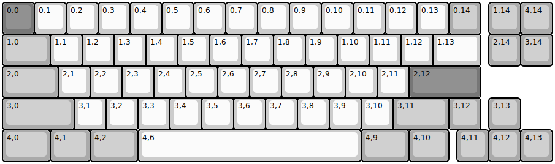{:loading="lazy"}

[Open in keyboard-layout-editor](http://www.keyboard-layout-editor.com/##@@_c=#777777;&=0,0&_c=#cccccc;&=0,1&=0,2&=0,3&=0,4&=0,5&=0,6&=0,7&=0,8&=0,9&=0,10&=0,11&=0,12&=0,13&_c=#aaaaaa;&=0,14&_x:0.25;&=1,14&=4,14;&@_w:1.5;&=1,0&_c=#cccccc;&=1,1&=1,2&=1,3&=1,4&=1,5&=1,6&=1,7&=1,8&=1,9&=1,10&=1,11&=1,12&_w:1.5;&=1,13&_x:0.25&c=#aaaaaa;&=2,14&=3,14;&@_w:1.75;&=2,0&_c=#cccccc;&=2,1&=2,2&=2,3&=2,4&=2,5&=2,6&=2,7&=2,8&=2,9&=2,10&=2,11&_c=#777777&w:2.25;&=2,12;&@_c=#aaaaaa&w:2.25;&=3,0&_c=#cccccc;&=3,1&=3,2&=3,3&=3,4&=3,5&=3,6&=3,7&=3,8&=3,9&=3,10&_c=#aaaaaa&w:1.75;&=3,11&=3,12&_x:0.25;&=3,13;&@_w:1.5;&=4,0&_w:1.25;&=4,1&_w:1.5;&=4,2&_c=#cccccc&w:7;&=4,6&_c=#aaaaaa&w:1.5;&=4,9&_w:1.25;&=4,10&_x:0.25;&=4,11&=4,12&=4,13)

## LS_60/LS_60

[README](output/LS_60/README.md) - [layout](output/LS_60/LS_60-kle.json) - [PCB](output/LS_60/LS_60.kicad_pcb) - [PCB render](output/LS_60/LS_60-render.svg)

{:loading="lazy"}

[Open in keyboard-layout-editor](http://www.keyboard-layout-editor.com/##@@_x:2.5&c=#aaaaaa;&=0,0&_c=#cccccc;&=0,1&=0,2&=0,3&=0,4&=0,5&=0,6&=0,7&=0,8&=0,9&=0,10&=0,11&=0,12&_c=#aaaaaa&w:2;&=0,13%0A%0A%0A0,0;&@_x:2.5&w:1.5;&=1,0&_c=#cccccc;&=1,1&=1,2&=1,3&=1,4&=1,5&=1,6&=1,7&=1,8&=1,9&=1,10&=1,11&=1,12&_c=#aaaaaa&w:1.5;&=1,13%0A%0A%0A1,0;&@_x:2.5&w:1.75;&=2,0&_c=#cccccc;&=2,1&=2,2&=2,3&=2,4&=2,5&=2,6&=2,7&=2,8&=2,9&=2,10&=2,11&_c=#777777&w:2.25;&=2,13%0A%0A%0A1,0;&@_x:2.5&c=#aaaaaa&w:2.25;&=3,0%0A%0A%0A2,0&_c=#cccccc;&=3,2&=3,3&=3,4&=3,5&=3,6&=3,7&=3,8&=3,9&=3,10&=3,11&_c=#aaaaaa&w:2.75;&=3,12%0A%0A%0A3,0;&@_x:2.5&w:1.25;&=4,0%0A%0A%0A4,0&_w:1.25;&=4,1%0A%0A%0A4,0&_w:1.25;&=4,2%0A%0A%0A4,0&_c=#cccccc&w:6.25;&=4,6%0A%0A%0A4,0&_c=#aaaaaa&w:1.25;&=4,10%0A%0A%0A4,0&_w:1.25;&=4,11%0A%0A%0A4,0&_w:1.25;&=4,12%0A%0A%0A4,0&_w:1.25;&=4,13%0A%0A%0A4,0;&@_x:18.5&y:-5;&=0,13%0A%0A%0A0,1&=0,14%0A%0A%0A0,1;&@_x:19.25&c=#777777&w:1.25&h:2&w2:1.5&h2:1&x2:-0.25;&=2,13%0A%0A%0A1,1;&@_x:18.25&c=#aaaaaa;&=2,12%0A%0A%0A1,1;&@_w:1.25;&=3,0%0A%0A%0A2,1&_c=#cccccc;&=3,1%0A%0A%0A2,1&_x:15.5&c=#aaaaaa&w:1.75;&=3,12%0A%0A%0A3,1&=3,13%0A%0A%0A3,1;&@_x:2.5&y:1.25&w:1.5;&=4,0%0A%0A%0A4,1&=4,1%0A%0A%0A4,1&_w:1.5;&=4,2%0A%0A%0A4,1&_c=#cccccc&w:7;&=4,6%0A%0A%0A4,1&_c=#aaaaaa&w:1.5;&=4,11%0A%0A%0A4,1&=4,12%0A%0A%0A4,1&_w:1.5;&=4,13%0A%0A%0A4,1)

## Moesode/Bliss/e88

[README](output/Moesode/Bliss/README.md) - [layout](output/Moesode/Bliss/e88-kle.json) - [PCB](output/Moesode/Bliss/e88.kicad_pcb) - [PCB render](output/Moesode/Bliss/e88-render.svg)

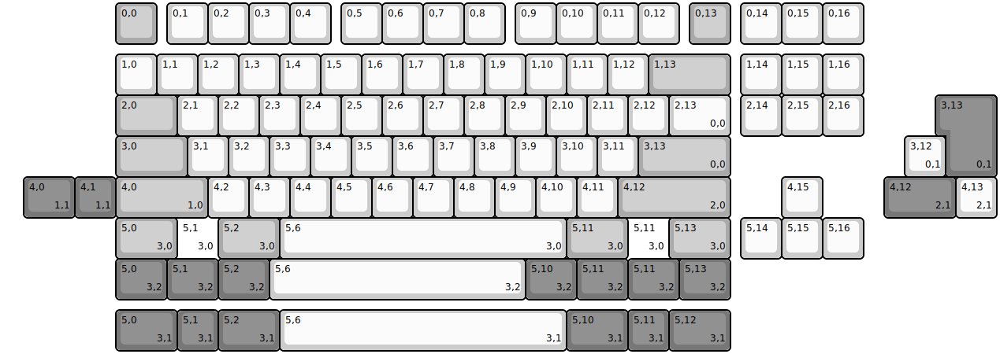{:loading="lazy"}

[Open in keyboard-layout-editor](http://www.keyboard-layout-editor.com/##@@_x:2.75&c=#aaaaaa;&=0,0&_x:0.25&c=#cccccc;&=0,1&=0,2&=0,3&=0,4&_x:0.25;&=0,5&=0,6&=0,7&=0,8&_x:0.25;&=0,9&=0,10&=0,11&=0,12&_x:0.25&c=#aaaaaa;&=0,13&_x:0.25&c=#cccccc;&=0,14&=0,15&=0,16;&@_x:2.75&y:0.25;&=1,0&=1,1&=1,2&=1,3&=1,4&=1,5&=1,6&=1,7&=1,8&=1,9&=1,10&=1,11&=1,12&_c=#aaaaaa&w:2;&=1,13&_x:0.25&c=#cccccc;&=1,14&=1,15&=1,16;&@_x:2.75&c=#aaaaaa&w:1.5;&=2,0&_c=#cccccc;&=2,1&=2,2&=2,3&=2,4&=2,5&=2,6&=2,7&=2,8&=2,9&=2,10&=2,11&=2,12&_w:1.5;&=2,13%0A%0A%0A0,0&_x:0.25;&=2,14&=2,15&=2,16;&@_x:2.75&c=#aaaaaa&w:1.75;&=3,0&_c=#cccccc;&=3,1&=3,2&=3,3&=3,4&=3,5&=3,6&=3,7&=3,8&=3,9&=3,10&=3,11&_c=#aaaaaa&w:2.25;&=3,13%0A%0A%0A0,0;&@_x:2.75&w:2.25;&=4,0%0A%0A%0A1,0&_c=#cccccc;&=4,2&=4,3&=4,4&=4,5&=4,6&=4,7&=4,8&=4,9&=4,10&=4,11&_c=#aaaaaa&w:2.75;&=4,12%0A%0A%0A2,0&_x:1.25&c=#cccccc;&=4,15;&@_x:2.75&c=#aaaaaa&w:1.5;&=5,0%0A%0A%0A3,0&_d:true;&=5,1%0A%0A%0A3,0&_w:1.5;&=5,2%0A%0A%0A3,0&_c=#cccccc&w:7;&=5,6%0A%0A%0A3,0&_c=#aaaaaa&w:1.5;&=5,11%0A%0A%0A3,0&_d:true;&=5,11%0A%0A%0A3,0&_w:1.5;&=5,13%0A%0A%0A3,0&_x:0.25&c=#cccccc;&=5,14&=5,15&=5,16;&@_x:23.0&y:-4.0&c=#777777&w:1.25&h:2&w2:1.5&h2:1&x2:-0.25;&=3,13%0A%0A%0A0,1;&@_x:22.0&c=#cccccc;&=3,12%0A%0A%0A0,1;&@_x:0.5&c=#777777&w:1.25;&=4,0%0A%0A%0A1,1&=4,1%0A%0A%0A1,1&_x:18.75&w:1.75;&=4,12%0A%0A%0A2,1&_c=#cccccc;&=4,13%0A%0A%0A2,1;&@_x:2.75&y:1.0&c=#777777&w:1.25;&=5,0%0A%0A%0A3,2&_w:1.25;&=5,1%0A%0A%0A3,2&_w:1.25;&=5,2%0A%0A%0A3,2&_c=#cccccc&w:6.25;&=5,6%0A%0A%0A3,2&_c=#777777&w:1.25;&=5,10%0A%0A%0A3,2&_w:1.25;&=5,11%0A%0A%0A3,2&_w:1.25;&=5,11%0A%0A%0A3,2&_w:1.25;&=5,13%0A%0A%0A3,2;&@_x:2.75&y:0.25&w:1.5;&=5,0%0A%0A%0A3,1&=5,1%0A%0A%0A3,1&_w:1.5;&=5,2%0A%0A%0A3,1&_c=#cccccc&w:7;&=5,6%0A%0A%0A3,1&_c=#777777&w:1.5;&=5,10%0A%0A%0A3,1&=5,11%0A%0A%0A3,1&_w:1.5;&=5,12%0A%0A%0A3,1)

## YMDK/bface

[README](output/YMDK/bface/README.md) - [layout](output/YMDK/bface/bface-kle.json) - [PCB](output/YMDK/bface/bface.kicad_pcb) - [PCB render](output/YMDK/bface/bface-render.svg)

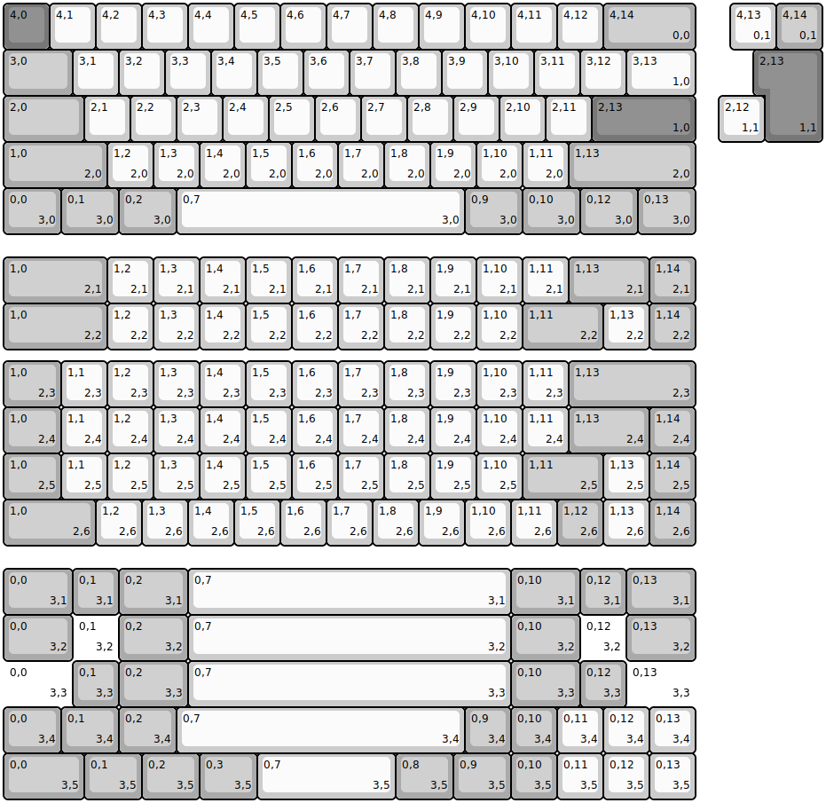{:loading="lazy"}

[Open in keyboard-layout-editor](http://www.keyboard-layout-editor.com/##@@_c=#777777;&=4,0&_c=#cccccc;&=4,1&=4,2&=4,3&=4,4&=4,5&=4,6&=4,7&=4,8&=4,9&=4,10&=4,11&=4,12&_c=#aaaaaa&w:2;&=4,14%0A%0A%0A0,0;&@_w:1.5;&=3,0&_c=#cccccc;&=3,1&=3,2&=3,3&=3,4&=3,5&=3,6&=3,7&=3,8&=3,9&=3,10&=3,11&=3,12&_w:1.5;&=3,13%0A%0A%0A1,0;&@_c=#aaaaaa&w:1.75;&=2,0&_c=#cccccc;&=2,1&=2,2&=2,3&=2,4&=2,5&=2,6&=2,7&=2,8&=2,9&=2,10&=2,11&_c=#777777&w:2.25;&=2,13%0A%0A%0A1,0;&@_c=#aaaaaa&w:2.25;&=1,0%0A%0A%0A2,0&_c=#cccccc;&=1,2%0A%0A%0A2,0&=1,3%0A%0A%0A2,0&=1,4%0A%0A%0A2,0&=1,5%0A%0A%0A2,0&=1,6%0A%0A%0A2,0&=1,7%0A%0A%0A2,0&=1,8%0A%0A%0A2,0&=1,9%0A%0A%0A2,0&=1,10%0A%0A%0A2,0&=1,11%0A%0A%0A2,0&_c=#aaaaaa&w:2.75;&=1,13%0A%0A%0A2,0;&@_w:1.25;&=0,0%0A%0A%0A3,0&_w:1.25;&=0,1%0A%0A%0A3,0&_w:1.25;&=0,2%0A%0A%0A3,0&_c=#cccccc&w:6.25;&=0,7%0A%0A%0A3,0&_c=#aaaaaa&w:1.25;&=0,9%0A%0A%0A3,0&_w:1.25;&=0,10%0A%0A%0A3,0&_w:1.25;&=0,12%0A%0A%0A3,0&_w:1.25;&=0,13%0A%0A%0A3,0;&@_x:15.75&y:-5&c=#cccccc;&=4,13%0A%0A%0A0,1&_c=#aaaaaa;&=4,14%0A%0A%0A0,1;&@_x:16.5&c=#777777&w:1.25&h:2&w2:1.5&h2:1&x2:-0.25;&=2,13%0A%0A%0A1,1;&@_x:15.5&c=#cccccc;&=2,12%0A%0A%0A1,1;&@_y:2.5&c=#aaaaaa&w:2.25;&=1,0%0A%0A%0A2,1&_c=#cccccc;&=1,2%0A%0A%0A2,1&=1,3%0A%0A%0A2,1&=1,4%0A%0A%0A2,1&=1,5%0A%0A%0A2,1&=1,6%0A%0A%0A2,1&=1,7%0A%0A%0A2,1&=1,8%0A%0A%0A2,1&=1,9%0A%0A%0A2,1&=1,10%0A%0A%0A2,1&=1,11%0A%0A%0A2,1&_c=#aaaaaa&w:1.75;&=1,13%0A%0A%0A2,1&=1,14%0A%0A%0A2,1;&@_w:2.25;&=1,0%0A%0A%0A2,2&_c=#cccccc;&=1,2%0A%0A%0A2,2&=1,3%0A%0A%0A2,2&=1,4%0A%0A%0A2,2&=1,5%0A%0A%0A2,2&=1,6%0A%0A%0A2,2&=1,7%0A%0A%0A2,2&=1,8%0A%0A%0A2,2&=1,9%0A%0A%0A2,2&=1,10%0A%0A%0A2,2&_c=#aaaaaa&w:1.75;&=1,11%0A%0A%0A2,2&_c=#cccccc;&=1,13%0A%0A%0A2,2&_c=#aaaaaa;&=1,14%0A%0A%0A2,2;&@_y:0.25&w:1.25;&=1,0%0A%0A%0A2,3&_c=#cccccc;&=1,1%0A%0A%0A2,3&=1,2%0A%0A%0A2,3&=1,3%0A%0A%0A2,3&=1,4%0A%0A%0A2,3&=1,5%0A%0A%0A2,3&=1,6%0A%0A%0A2,3&=1,7%0A%0A%0A2,3&=1,8%0A%0A%0A2,3&=1,9%0A%0A%0A2,3&=1,10%0A%0A%0A2,3&=1,11%0A%0A%0A2,3&_c=#aaaaaa&w:2.75;&=1,13%0A%0A%0A2,3;&@_w:1.25;&=1,0%0A%0A%0A2,4&_c=#cccccc;&=1,1%0A%0A%0A2,4&=1,2%0A%0A%0A2,4&=1,3%0A%0A%0A2,4&=1,4%0A%0A%0A2,4&=1,5%0A%0A%0A2,4&=1,6%0A%0A%0A2,4&=1,7%0A%0A%0A2,4&=1,8%0A%0A%0A2,4&=1,9%0A%0A%0A2,4&=1,10%0A%0A%0A2,4&=1,11%0A%0A%0A2,4&_c=#aaaaaa&w:1.75;&=1,13%0A%0A%0A2,4&=1,14%0A%0A%0A2,4;&@_w:1.25;&=1,0%0A%0A%0A2,5&_c=#cccccc;&=1,1%0A%0A%0A2,5&=1,2%0A%0A%0A2,5&=1,3%0A%0A%0A2,5&=1,4%0A%0A%0A2,5&=1,5%0A%0A%0A2,5&=1,6%0A%0A%0A2,5&=1,7%0A%0A%0A2,5&=1,8%0A%0A%0A2,5&=1,9%0A%0A%0A2,5&=1,10%0A%0A%0A2,5&_c=#aaaaaa&w:1.75;&=1,11%0A%0A%0A2,5&_c=#cccccc;&=1,13%0A%0A%0A2,5&_c=#aaaaaa;&=1,14%0A%0A%0A2,5;&@_w:2;&=1,0%0A%0A%0A2,6&_c=#cccccc;&=1,2%0A%0A%0A2,6&=1,3%0A%0A%0A2,6&=1,4%0A%0A%0A2,6&=1,5%0A%0A%0A2,6&=1,6%0A%0A%0A2,6&=1,7%0A%0A%0A2,6&=1,8%0A%0A%0A2,6&=1,9%0A%0A%0A2,6&=1,10%0A%0A%0A2,6&=1,11%0A%0A%0A2,6&_c=#aaaaaa;&=1,12%0A%0A%0A2,6&_c=#cccccc;&=1,13%0A%0A%0A2,6&_c=#aaaaaa;&=1,14%0A%0A%0A2,6;&@_y:0.5&w:1.5;&=0,0%0A%0A%0A3,1&=0,1%0A%0A%0A3,1&_w:1.5;&=0,2%0A%0A%0A3,1&_c=#cccccc&w:7;&=0,7%0A%0A%0A3,1&_c=#aaaaaa&w:1.5;&=0,10%0A%0A%0A3,1&=0,12%0A%0A%0A3,1&_w:1.5;&=0,13%0A%0A%0A3,1;&@_w:1.5;&=0,0%0A%0A%0A3,2&_c=#cccccc&d:true;&=0,1%0A%0A%0A3,2&_c=#aaaaaa&w:1.5;&=0,2%0A%0A%0A3,2&_c=#cccccc&w:7;&=0,7%0A%0A%0A3,2&_c=#aaaaaa&w:1.5;&=0,10%0A%0A%0A3,2&_c=#cccccc&d:true;&=0,12%0A%0A%0A3,2&_c=#aaaaaa&w:1.5;&=0,13%0A%0A%0A3,2;&@_c=#cccccc&w:1.5&d:true;&=0,0%0A%0A%0A3,3&_c=#aaaaaa;&=0,1%0A%0A%0A3,3&_w:1.5;&=0,2%0A%0A%0A3,3&_c=#cccccc&w:7;&=0,7%0A%0A%0A3,3&_c=#aaaaaa&w:1.5;&=0,10%0A%0A%0A3,3&=0,12%0A%0A%0A3,3&_c=#cccccc&w:1.5&d:true;&=0,13%0A%0A%0A3,3;&@_c=#aaaaaa&w:1.25;&=0,0%0A%0A%0A3,4&_w:1.25;&=0,1%0A%0A%0A3,4&_w:1.25;&=0,2%0A%0A%0A3,4&_c=#cccccc&w:6.25;&=0,7%0A%0A%0A3,4&_c=#aaaaaa;&=0,9%0A%0A%0A3,4&=0,10%0A%0A%0A3,4&_c=#cccccc;&=0,11%0A%0A%0A3,4&=0,12%0A%0A%0A3,4&=0,13%0A%0A%0A3,4;&@_c=#aaaaaa&w:1.75;&=0,0%0A%0A%0A3,5&_w:1.25;&=0,1%0A%0A%0A3,5&_w:1.25;&=0,2%0A%0A%0A3,5&_w:1.25;&=0,3%0A%0A%0A3,5&_c=#cccccc&w:3;&=0,7%0A%0A%0A3,5&_c=#aaaaaa&w:1.25;&=0,8%0A%0A%0A3,5&_w:1.25;&=0,9%0A%0A%0A3,5&=0,10%0A%0A%0A3,5&_c=#cccccc;&=0,11%0A%0A%0A3,5&=0,12%0A%0A%0A3,5&=0,13%0A%0A%0A3,5)

## YMDK/melody96

[README](output/YMDK/melody96/README.md) - [layout](output/YMDK/melody96/melody96-kle.json) - [PCB](output/YMDK/melody96/melody96.kicad_pcb) - [PCB render](output/YMDK/melody96/melody96-render.svg)

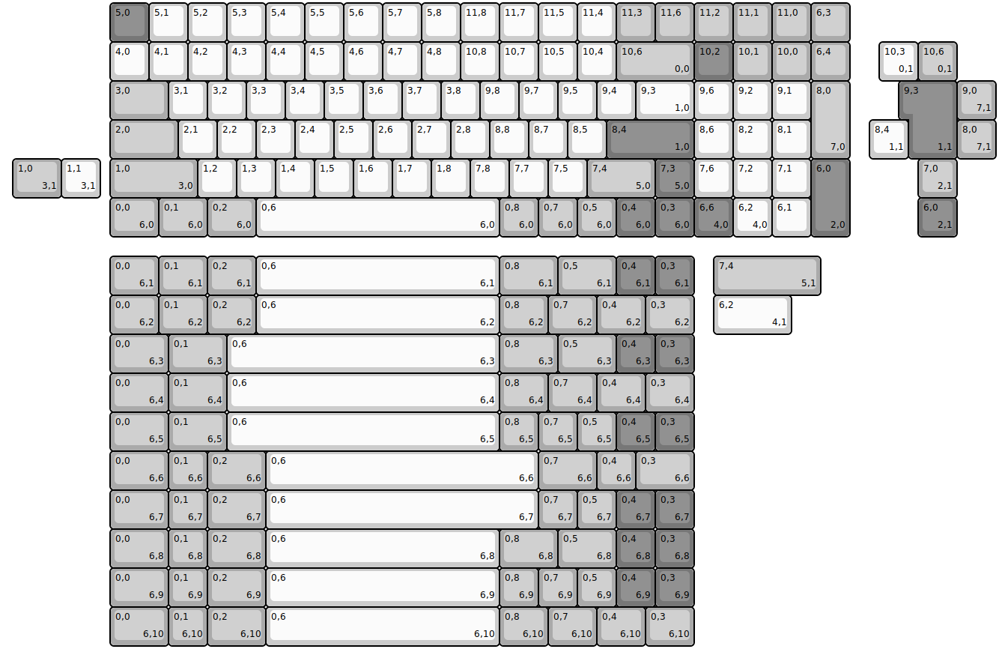{:loading="lazy"}

[Open in keyboard-layout-editor](http://www.keyboard-layout-editor.com/##@@_x:2.75&c=#777777;&=5,0&_c=#cccccc;&=5,1&=5,2&=5,3&=5,4&=5,5&=5,6&=5,7&=5,8&=11,8&=11,7&=11,5&=11,4&_c=#aaaaaa;&=11,3&=11,6&=11,2&=11,1&=11,0&=6,3;&@_x:2.75&c=#cccccc;&=4,0&=4,1&=4,2&=4,3&=4,4&=4,5&=4,6&=4,7&=4,8&=10,8&=10,7&=10,5&=10,4&_c=#aaaaaa&w:2;&=10,6%0A%0A%0A0,0&_c=#777777;&=10,2&_c=#aaaaaa;&=10,1&=10,0&=6,4;&@_x:2.75&w:1.5;&=3,0&_c=#cccccc;&=3,1&=3,2&=3,3&=3,4&=3,5&=3,6&=3,7&=3,8&=9,8&=9,7&=9,5&=9,4&_w:1.5;&=9,3%0A%0A%0A1,0&=9,6&=9,2&=9,1&_c=#aaaaaa&h:2;&=8,0%0A%0A%0A7,0;&@_x:2.75&w:1.75;&=2,0&_c=#cccccc;&=2,1&=2,2&=2,3&=2,4&=2,5&=2,6&=2,7&=2,8&=8,8&=8,7&=8,5&_c=#777777&w:2.25;&=8,4%0A%0A%0A1,0&_c=#cccccc;&=8,6&=8,2&=8,1;&@_x:2.75&c=#aaaaaa&w:2.25;&=1,0%0A%0A%0A3,0&_c=#cccccc;&=1,2&=1,3&=1,4&=1,5&=1,6&=1,7&=1,8&=7,8&=7,7&=7,5&_c=#aaaaaa&w:1.75;&=7,4%0A%0A%0A5,0&_c=#777777;&=7,3%0A%0A%0A5,0&_c=#cccccc;&=7,6&=7,2&=7,1&_c=#777777&h:2;&=6,0%0A%0A%0A2,0;&@_x:2.75&c=#aaaaaa&w:1.25;&=0,0%0A%0A%0A6,0&_w:1.25;&=0,1%0A%0A%0A6,0&_w:1.25;&=0,2%0A%0A%0A6,0&_c=#cccccc&w:6.25;&=0,6%0A%0A%0A6,0&_c=#aaaaaa;&=0,8%0A%0A%0A6,0&=0,7%0A%0A%0A6,0&=0,5%0A%0A%0A6,0&_c=#777777;&=0,4%0A%0A%0A6,0&=0,3%0A%0A%0A6,0&=6,6%0A%0A%0A4,0&_c=#cccccc;&=6,2%0A%0A%0A4,0&=6,1;&@_x:22.5&y:-5;&=10,3%0A%0A%0A0,1&_c=#aaaaaa;&=10,6%0A%0A%0A0,1;&@_x:23.25&c=#777777&w:1.25&h:2&w2:1.5&h2:1&x2:-0.25;&=9,3%0A%0A%0A1,1&_c=#aaaaaa;&=9,0%0A%0A%0A7,1;&@_x:22.25&c=#cccccc;&=8,4%0A%0A%0A1,1&_x:1.25&c=#aaaaaa;&=8,0%0A%0A%0A7,1;&@_x:0.25&w:1.25;&=1,0%0A%0A%0A3,1&_c=#cccccc;&=1,1%0A%0A%0A3,1&_x:21.0&c=#aaaaaa;&=7,0%0A%0A%0A2,1;&@_x:23.5&c=#777777;&=6,0%0A%0A%0A2,1;&@_x:2.75&y:0.5&c=#aaaaaa&w:1.25;&=0,0%0A%0A%0A6,1&_w:1.25;&=0,1%0A%0A%0A6,1&_w:1.25;&=0,2%0A%0A%0A6,1&_c=#cccccc&w:6.25;&=0,6%0A%0A%0A6,1&_c=#aaaaaa&w:1.5;&=0,8%0A%0A%0A6,1&_w:1.5;&=0,5%0A%0A%0A6,1&_c=#777777;&=0,4%0A%0A%0A6,1&=0,3%0A%0A%0A6,1&_x:0.5&c=#aaaaaa&w:2.75;&=7,4%0A%0A%0A5,1;&@_x:2.75&w:1.25;&=0,0%0A%0A%0A6,2&_w:1.25;&=0,1%0A%0A%0A6,2&_w:1.25;&=0,2%0A%0A%0A6,2&_c=#cccccc&w:6.25;&=0,6%0A%0A%0A6,2&_c=#aaaaaa&w:1.25;&=0,8%0A%0A%0A6,2&_w:1.25;&=0,7%0A%0A%0A6,2&_w:1.25;&=0,4%0A%0A%0A6,2&_w:1.25;&=0,3%0A%0A%0A6,2&_x:0.5&c=#cccccc&w:2;&=6,2%0A%0A%0A4,1;&@_x:2.75&c=#aaaaaa&w:1.5;&=0,0%0A%0A%0A6,3&_w:1.5;&=0,1%0A%0A%0A6,3&_c=#cccccc&w:7;&=0,6%0A%0A%0A6,3&_c=#aaaaaa&w:1.5;&=0,8%0A%0A%0A6,3&_w:1.5;&=0,5%0A%0A%0A6,3&_c=#777777;&=0,4%0A%0A%0A6,3&=0,3%0A%0A%0A6,3;&@_x:2.75&c=#aaaaaa&w:1.5;&=0,0%0A%0A%0A6,4&_w:1.5;&=0,1%0A%0A%0A6,4&_c=#cccccc&w:7;&=0,6%0A%0A%0A6,4&_c=#aaaaaa&w:1.25;&=0,8%0A%0A%0A6,4&_w:1.25;&=0,7%0A%0A%0A6,4&_w:1.25;&=0,4%0A%0A%0A6,4&_w:1.25;&=0,3%0A%0A%0A6,4;&@_x:2.75&w:1.5;&=0,0%0A%0A%0A6,5&_w:1.5;&=0,1%0A%0A%0A6,5&_c=#cccccc&w:7;&=0,6%0A%0A%0A6,5&_c=#aaaaaa;&=0,8%0A%0A%0A6,5&=0,7%0A%0A%0A6,5&=0,5%0A%0A%0A6,5&_c=#777777;&=0,4%0A%0A%0A6,5&=0,3%0A%0A%0A6,5;&@_x:2.75&c=#aaaaaa&w:1.5;&=0,0%0A%0A%0A6,6&=0,1%0A%0A%0A6,6&_w:1.5;&=0,2%0A%0A%0A6,6&_c=#cccccc&w:7;&=0,6%0A%0A%0A6,6&_c=#aaaaaa&w:1.5;&=0,7%0A%0A%0A6,6&=0,4%0A%0A%0A6,6&_w:1.5;&=0,3%0A%0A%0A6,6;&@_x:2.75&w:1.5;&=0,0%0A%0A%0A6,7&=0,1%0A%0A%0A6,7&_w:1.5;&=0,2%0A%0A%0A6,7&_c=#cccccc&w:7;&=0,6%0A%0A%0A6,7&_c=#aaaaaa;&=0,7%0A%0A%0A6,7&=0,5%0A%0A%0A6,7&_c=#777777;&=0,4%0A%0A%0A6,7&=0,3%0A%0A%0A6,7;&@_x:2.75&c=#aaaaaa&w:1.5;&=0,0%0A%0A%0A6,8&=0,1%0A%0A%0A6,8&_w:1.5;&=0,2%0A%0A%0A6,8&_c=#cccccc&w:6;&=0,6%0A%0A%0A6,8&_c=#aaaaaa&w:1.5;&=0,8%0A%0A%0A6,8&_w:1.5;&=0,5%0A%0A%0A6,8&_c=#777777;&=0,4%0A%0A%0A6,8&=0,3%0A%0A%0A6,8;&@_x:2.75&c=#aaaaaa&w:1.5;&=0,0%0A%0A%0A6,9&=0,1%0A%0A%0A6,9&_w:1.5;&=0,2%0A%0A%0A6,9&_c=#cccccc&w:6;&=0,6%0A%0A%0A6,9&_c=#aaaaaa;&=0,8%0A%0A%0A6,9&=0,7%0A%0A%0A6,9&=0,5%0A%0A%0A6,9&_c=#777777;&=0,4%0A%0A%0A6,9&=0,3%0A%0A%0A6,9;&@_x:2.75&c=#aaaaaa&w:1.5;&=0,0%0A%0A%0A6,10&=0,1%0A%0A%0A6,10&_w:1.5;&=0,2%0A%0A%0A6,10&_c=#cccccc&w:6;&=0,6%0A%0A%0A6,10&_c=#aaaaaa&w:1.25;&=0,8%0A%0A%0A6,10&_w:1.25;&=0,7%0A%0A%0A6,10&_w:1.25;&=0,4%0A%0A%0A6,10&_w:1.25;&=0,3%0A%0A%0A6,10)

## YMDK/np21

[README](output/YMDK/np21/README.md) - [layout](output/YMDK/np21/np21-kle.json) - [PCB](output/YMDK/np21/np21.kicad_pcb) - [PCB render](output/YMDK/np21/np21-render.svg)

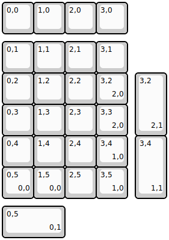{:loading="lazy"}

[Open in keyboard-layout-editor](http://www.keyboard-layout-editor.com/##@@=0,0&=1,0&=2,0&=3,0;&@_y:0.25;&=0,1&=1,1&=2,1&=3,1;&@=0,2&=1,2&=2,2&=3,2%0A%0A%0A2,0;&@=0,3&=1,3&=2,3&=3,3%0A%0A%0A2,0;&@=0,4&=1,4&=2,4&=3,4%0A%0A%0A1,0;&@=0,5%0A%0A%0A0,0&=1,5%0A%0A%0A0,0&=2,5&=3,5%0A%0A%0A1,0;&@_x:4.25&y:-4.0&h:2;&=3,2%0A%0A%0A2,1;&@_x:4.25&y:1.0&h:2;&=3,4%0A%0A%0A1,1;&@_y:1.25&w:2;&=0,5%0A%0A%0A0,1)

## YMDK/sp64

[README](output/YMDK/sp64/README.md) - [layout](output/YMDK/sp64/sp64-kle.json) - [PCB](output/YMDK/sp64/sp64.kicad_pcb) - [PCB render](output/YMDK/sp64/sp64-render.svg)

{:loading="lazy"}

[Open in keyboard-layout-editor](http://www.keyboard-layout-editor.com/##@@_c=#777777;&=5,0&_c=#cccccc;&=5,1&=5,2&=5,3&=5,4&=5,5&=1,5&_x:1;&=4,7&=4,8&=4,9&=4,10&=4,11&=4,12&_c=#aaaaaa&w:2;&=4,13;&@_w:1.5;&=4,0&_c=#cccccc;&=4,1&=4,2&=4,3&=4,4&=4,5&_x:1.0;&=5,7&=3,7&=3,8&=3,9&=3,10&=3,11&=3,12&_w:1.5;&=3,13;&@_c=#aaaaaa&w:1.75;&=3,0&_c=#cccccc;&=3,1&=3,2&=3,3&=3,4&=3,5&_x:1.0;&=2,7&=2,8&=2,9&=2,10&=2,11&=2,12&_c=#777777&w:2.25;&=2,13;&@_c=#aaaaaa&w:2;&=2,0&_c=#cccccc;&=2,1&=2,2&=2,3&=2,4&=2,5&_x:1;&=1,7&=1,8&=1,9&=1,10&=1,11&_c=#aaaaaa;&=1,12&_c=#777777;&=1,13&_c=#aaaaaa;&=0,13;&@_w:1.25;&=1,0&=1,1&_w:1.25;&=1,2&_c=#cccccc&w:2.25;&=1,3&_c=#aaaaaa;&=1,4&_x:1.0&c=#cccccc&w:2.75;&=0,7&_c=#aaaaaa&w:1.25;&=0,8&_w:1.25;&=0,9&_c=#777777;&=0,10&=0,11&=0,12)

## YMDK/wings

[README](output/YMDK/wings/README.md) - [layout](output/YMDK/wings/wings-kle.json) - [PCB](output/YMDK/wings/wings.kicad_pcb) - [PCB render](output/YMDK/wings/wings-render.svg)

{:loading="lazy"}

[Open in keyboard-layout-editor](http://www.keyboard-layout-editor.com/##@@_x:2.75;&=0,2&_x:8.5;&=0,11;&@_x:0.75&y:-0.75&c=#777777;&=0,0&_c=#cccccc;&=0,1&_x:10.5;&=0,12&=0,13&_c=#aaaaaa;&=0,14&_x:0.25;&=4,14;&@_x:0.5&w:1.5;&=1,0&_c=#cccccc;&=1,1&_x:10.0;&=1,11&=1,12&_c=#aaaaaa&w:1.5;&=1,13&_x:0.25;&=1,14;&@_x:0.25&w:1.75;&=2,0&_c=#cccccc;&=2,1&_x:9.5;&=2,10&=2,11&_c=#777777&w:2.25;&=2,13&_x:0.25&c=#aaaaaa;&=2,14;&@_w:2.25;&=3,0&_c=#cccccc;&=3,2&_x:9.5;&=3,11&_c=#aaaaaa&w:1.75;&=3,12;&@_x:16&y:-0.75;&=3,13;&@_y:-0.25&w:1.5;&=4,0;&@_x:15&y:-0.75;&=4,11&=4,12&=4,13;&@_r:12&rx:4.75&ry:2.25&x:-1.25&y:-1.75&c=#cccccc;&=0,3&=0,4&=0,5&=0,6;&@_x:-1.75;&=1,2&=1,3&=1,4&=1,5;&@_x:-1.5;&=2,2&=2,3&=2,4&=2,5;&@_x:-1.0;&=3,3&=3,4&=3,5&=3,6;&@_x:-1.0&c=#aaaaaa&w:1.5;&=4,2&_c=#777777&w:2;&=4,6&_c=#aaaaaa;&=4,8;&@_r:-12&rx:11.25&ry:3&x:-2.75&y:-2.5&c=#cccccc;&=0,7&=0,8&=0,9&=0,10;&@_x:-3.25;&=1,6&=1,7&=1,8&=1,9&=1,10;&@_x:-3.0;&=2,6&=2,7&=2,8&=2,9;&@_x:-2.75;&=3,7&=3,8&=3,9&=3,10;&@_x:-3.25&c=#777777&w:2.75;&=4,9&_c=#aaaaaa&w:1.5;&=4,10)

## YMDK/wingshs

[README](output/YMDK/wingshs/README.md) - [layout](output/YMDK/wingshs/wingshs-kle.json) - [PCB](output/YMDK/wingshs/wingshs.kicad_pcb) - [PCB render](output/YMDK/wingshs/wingshs-render.svg)

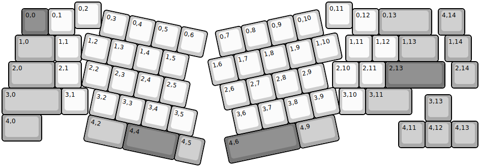{:loading="lazy"}

[Open in keyboard-layout-editor](http://www.keyboard-layout-editor.com/##@@_x:2.75;&=0,2&_x:8.5;&=0,11;&@_x:0.75&y:-0.75&c=#777777;&=0,0&_c=#cccccc;&=0,1&_x:10.5;&=0,12&_c=#aaaaaa&w:2;&=0,13&_x:0.25;&=4,14;&@_x:0.5&w:1.5;&=1,0&_c=#cccccc;&=1,1&_x:10.0;&=1,11&=1,12&_c=#aaaaaa&w:1.5;&=1,13&_x:0.25;&=1,14;&@_x:0.25&w:1.75;&=2,0&_c=#cccccc;&=2,1&_x:9.5;&=2,10&=2,11&_c=#777777&w:2.25;&=2,13&_x:0.25&c=#aaaaaa;&=2,14;&@_w:2.25;&=3,0&_c=#cccccc;&=3,1&_x:9.5;&=3,10&_c=#aaaaaa&w:1.75;&=3,11;&@_x:16&y:-0.75;&=3,13;&@_y:-0.25&w:1.5;&=4,0;&@_x:15&y:-0.75;&=4,11&=4,12&=4,13;&@_r:12&rx:4.75&ry:2.25&x:-1.25&y:-1.75&c=#cccccc;&=0,3&=0,4&=0,5&=0,6;&@_x:-1.75;&=1,2&=1,3&=1,4&=1,5;&@_x:-1.5;&=2,2&=2,3&=2,4&=2,5;&@_x:-1.0;&=3,2&=3,3&=3,4&=3,5;&@_x:-1.0&c=#aaaaaa&w:1.5;&=4,2&_c=#777777&w:2;&=4,4&_c=#aaaaaa;&=4,5;&@_r:-12&rx:11.25&ry:3&x:-2.75&y:-2.5&c=#cccccc;&=0,7&=0,8&=0,9&=0,10;&@_x:-3.25;&=1,6&=1,7&=1,8&=1,9&=1,10;&@_x:-3.0;&=2,6&=2,7&=2,8&=2,9;&@_x:-2.75;&=3,6&=3,7&=3,8&=3,9;&@_x:-3.25&c=#777777&w:2.75;&=4,6&_c=#aaaaaa&w:1.5;&=4,9)

## YMDK/yd60mq

[README](output/YMDK/yd60mq/README.md) - [layout](output/YMDK/yd60mq/yd60mq-kle.json) - [PCB](output/YMDK/yd60mq/yd60mq.kicad_pcb) - [PCB render](output/YMDK/yd60mq/yd60mq-render.svg)

{:loading="lazy"}

[Open in keyboard-layout-editor](http://www.keyboard-layout-editor.com/##@@_x:2&c=#777777;&=0,0&_c=#cccccc;&=0,1&=0,2&=0,3&=0,4&=0,5&=0,6&=0,7&=0,8&=0,9&=0,10&=0,11&=0,12&_c=#aaaaaa&w:2;&=0,14%0A%0A%0A0,0;&@_x:2&w:1.5;&=1,0&_c=#cccccc;&=1,1&=1,2&=1,3&=1,4&=1,5&=1,6&=1,7&=1,8&=1,9&=1,10&=1,11&=1,12&_c=#aaaaaa&w:1.5;&=1,13%0A%0A%0A2,0;&@_x:2.0&w:1.75;&=2,0%0A%0A%0A1,0&_c=#cccccc;&=2,1&=2,2&=2,3&=2,4&=2,5&=2,6&=2,7&=2,8&=2,9&=2,10&=2,11&_c=#777777&w:2.25;&=2,13%0A%0A%0A2,0;&@_x:2&c=#aaaaaa&w:2.25;&=3,0%0A%0A%0A3,0&_c=#cccccc;&=3,2%0A%0A%0A3,0&=3,3%0A%0A%0A3,0&=3,4%0A%0A%0A3,0&=3,5%0A%0A%0A3,0&=3,6%0A%0A%0A3,0&=3,7%0A%0A%0A3,0&=3,8%0A%0A%0A3,0&=3,9%0A%0A%0A3,0&=3,10%0A%0A%0A3,0&=3,11%0A%0A%0A3,0&_c=#aaaaaa&w:2.75;&=3,13%0A%0A%0A3,0;&@_x:2&w:1.25;&=4,0%0A%0A%0A4,0&_w:1.25;&=4,1%0A%0A%0A4,0&_w:1.25;&=4,2%0A%0A%0A4,0&_c=#777777&w:6.25;&=4,7%0A%0A%0A4,0&_c=#aaaaaa&w:1.25;&=4,9%0A%0A%0A4,0&_w:1.25;&=4,10%0A%0A%0A4,0&_w:1.25;&=4,12%0A%0A%0A4,0&_w:1.25;&=4,13%0A%0A%0A4,0;&@_x:17.5&y:-5&c=#cccccc;&=0,13%0A%0A%0A0,1&_c=#aaaaaa;&=0,14%0A%0A%0A0,1;&@_x:18.5&c=#777777&w:1.25&h:2&w2:1.5&h2:1&x2:-0.25;&=2,13%0A%0A%0A2,1;&@_c=#aaaaaa&w:1.25&w2:1.75&l:true;&=2,0%0A%0A%0A1,1&_x:16.25&c=#cccccc;&=2,12%0A%0A%0A2,1;&@_x:2&y:2.25&c=#aaaaaa&w:2.25;&=3,0%0A%0A%0A3,1&_c=#cccccc;&=3,2%0A%0A%0A3,1&=3,3%0A%0A%0A3,1&=3,4%0A%0A%0A3,1&=3,5%0A%0A%0A3,1&=3,6%0A%0A%0A3,1&=3,7%0A%0A%0A3,1&=3,8%0A%0A%0A3,1&=3,9%0A%0A%0A3,1&=3,10%0A%0A%0A3,1&=3,11%0A%0A%0A3,1&_c=#aaaaaa&w:1.75;&=3,13%0A%0A%0A3,1&=3,14%0A%0A%0A3,1;&@_x:2&w:2.25;&=3,0%0A%0A%0A3,2&_c=#cccccc;&=3,2%0A%0A%0A3,2&=3,3%0A%0A%0A3,2&=3,4%0A%0A%0A3,2&=3,5%0A%0A%0A3,2&=3,6%0A%0A%0A3,2&=3,7%0A%0A%0A3,2&=3,8%0A%0A%0A3,2&=3,9%0A%0A%0A3,2&=3,10%0A%0A%0A3,2&_w:1.75;&=3,11%0A%0A%0A3,2&_c=#777777;&=3,13%0A%0A%0A3,2&_c=#aaaaaa;&=3,14%0A%0A%0A3,2;&@_x:2&w:1.25;&=3,0%0A%0A%0A3,3&_c=#cccccc;&=3,1%0A%0A%0A3,3&=3,2%0A%0A%0A3,3&=3,3%0A%0A%0A3,3&=3,4%0A%0A%0A3,3&=3,5%0A%0A%0A3,3&=3,6%0A%0A%0A3,3&=3,7%0A%0A%0A3,3&=3,8%0A%0A%0A3,3&=3,9%0A%0A%0A3,3&=3,10%0A%0A%0A3,3&=3,11%0A%0A%0A3,3&_c=#aaaaaa&w:2.75;&=3,13%0A%0A%0A3,3;&@_x:2&w:1.25;&=3,0%0A%0A%0A3,4&_c=#cccccc;&=3,1%0A%0A%0A3,4&=3,2%0A%0A%0A3,4&=3,3%0A%0A%0A3,4&=3,4%0A%0A%0A3,4&=3,5%0A%0A%0A3,4&=3,6%0A%0A%0A3,4&=3,7%0A%0A%0A3,4&=3,8%0A%0A%0A3,4&=3,9%0A%0A%0A3,4&=3,10%0A%0A%0A3,4&=3,11%0A%0A%0A3,4&_c=#aaaaaa&w:1.75;&=3,13%0A%0A%0A3,4&=3,14%0A%0A%0A3,4;&@_x:2&w:1.25;&=3,0%0A%0A%0A3,5&_c=#cccccc;&=3,1%0A%0A%0A3,5&=3,2%0A%0A%0A3,5&=3,3%0A%0A%0A3,5&=3,4%0A%0A%0A3,5&=3,5%0A%0A%0A3,5&=3,6%0A%0A%0A3,5&=3,7%0A%0A%0A3,5&=3,8%0A%0A%0A3,5&=3,9%0A%0A%0A3,5&=3,10%0A%0A%0A3,5&_w:1.75;&=3,11%0A%0A%0A3,5&_c=#777777;&=3,13%0A%0A%0A3,5&_c=#aaaaaa;&=3,14%0A%0A%0A3,5;&@_x:2&w:2;&=3,0%0A%0A%0A3,6&_c=#cccccc;&=3,2%0A%0A%0A3,6&=3,3%0A%0A%0A3,6&=3,4%0A%0A%0A3,6&=3,5%0A%0A%0A3,6&=3,6%0A%0A%0A3,6&=3,7%0A%0A%0A3,6&=3,8%0A%0A%0A3,6&=3,9%0A%0A%0A3,6&=3,10%0A%0A%0A3,6&=3,11%0A%0A%0A3,6&_c=#aaaaaa;&=3,12%0A%0A%0A3,6&_c=#777777;&=3,13%0A%0A%0A3,6&_c=#aaaaaa;&=3,14%0A%0A%0A3,6;&@_x:2;&=3,0%0A%0A%0A3,7&_c=#cccccc;&=3,1%0A%0A%0A3,7&=3,2%0A%0A%0A3,7&=3,3%0A%0A%0A3,7&=3,4%0A%0A%0A3,7&=3,5%0A%0A%0A3,7&=3,6%0A%0A%0A3,7&=3,7%0A%0A%0A3,7&=3,8%0A%0A%0A3,7&=3,9%0A%0A%0A3,7&=3,10%0A%0A%0A3,7&=3,11%0A%0A%0A3,7&_c=#aaaaaa;&=3,12%0A%0A%0A3,7&_c=#777777;&=3,13%0A%0A%0A3,7&_c=#aaaaaa;&=3,14%0A%0A%0A3,7;&@_x:2&y:0.25&w:1.5;&=4,0%0A%0A%0A4,1&=4,1%0A%0A%0A4,1&_w:1.5;&=4,2%0A%0A%0A4,1&_c=#777777&w:7;&=4,7%0A%0A%0A4,1&_c=#aaaaaa&w:1.5;&=4,10%0A%0A%0A4,1&=4,12%0A%0A%0A4,1&_w:1.5;&=4,13%0A%0A%0A4,1;&@_x:2&w:1.5&d:true;&=%0A%0A%0A4,2&=4,1%0A%0A%0A4,2&_w:1.5;&=4,2%0A%0A%0A4,2&_c=#777777&w:7;&=4,7%0A%0A%0A4,2&_c=#aaaaaa&w:1.5;&=4,10%0A%0A%0A4,2&=4,12%0A%0A%0A4,2&_w:1.5&d:true;&=%0A%0A%0A4,2;&@_x:2&w:1.5;&=4,0%0A%0A%0A4,3&_d:true;&=%0A%0A%0A4,3&_w:1.5;&=4,2%0A%0A%0A4,3&_c=#777777&w:7;&=4,7%0A%0A%0A4,3&_c=#aaaaaa&w:1.5;&=4,10%0A%0A%0A4,3&_d:true;&=%0A%0A%0A4,3&_w:1.5;&=4,13%0A%0A%0A4,3;&@_x:2&w:1.25;&=4,0%0A%0A%0A4,4&_w:1.25;&=4,1%0A%0A%0A4,4&_w:1.25;&=4,2%0A%0A%0A4,4&_c=#777777&w:6.25;&=4,7%0A%0A%0A4,4&_c=#aaaaaa;&=4,9%0A%0A%0A4,4&=4,10%0A%0A%0A4,4&_c=#777777;&=4,11%0A%0A%0A4,4&=4,12%0A%0A%0A4,4&=4,13%0A%0A%0A4,4;&@_x:2&c=#aaaaaa&w:1.75;&=4,0%0A%0A%0A4,5&_w:1.25;&=4,1%0A%0A%0A4,5&_w:1.25;&=4,2%0A%0A%0A4,5&_w:1.25;&=4,3%0A%0A%0A4,5&_c=#777777&w:3;&=4,7%0A%0A%0A4,5&_c=#aaaaaa&w:1.25;&=4,8%0A%0A%0A4,5&_w:1.25;&=4,9%0A%0A%0A4,5&=4,10%0A%0A%0A4,5&=4,11%0A%0A%0A4,5&=4,12%0A%0A%0A4,5&=4,13%0A%0A%0A4,5;&@_x:2&w:1.25;&=4,0%0A%0A%0A4,6&_w:1.25;&=4,1%0A%0A%0A4,6&_w:1.25;&=4,2%0A%0A%0A4,6&_c=#777777&w:2.25;&=4,3%0A%0A%0A4,6&_w:1.25;&=4,7%0A%0A%0A4,6&_w:2.75;&=4,8%0A%0A%0A4,6&_c=#aaaaaa&w:1.25;&=4,9%0A%0A%0A4,6&_w:1.25;&=4,10%0A%0A%0A4,6&_w:1.25;&=4,12%0A%0A%0A4,6&_w:1.25;&=4,13%0A%0A%0A4,6)

## YMDK/ymd09

[README](output/YMDK/ymd09/README.md) - [layout](output/YMDK/ymd09/ymd09-kle.json) - [PCB](output/YMDK/ymd09/ymd09.kicad_pcb) - [PCB render](output/YMDK/ymd09/ymd09-render.svg)

{:loading="lazy"}

[Open in keyboard-layout-editor](http://www.keyboard-layout-editor.com/##@@=0,0&=0,1&=0,2;&@=1,0&=1,1&=1,2;&@=2,0&=2,1&=2,2)

## YMDK/ymd40v2/ymdk40v2

[README](output/YMDK/ymd40v2/README.md) - [layout](output/YMDK/ymd40v2/ymdk40v2-kle.json) - [PCB](output/YMDK/ymd40v2/ymdk40v2.kicad_pcb) - [PCB render](output/YMDK/ymd40v2/ymdk40v2-render.svg)

{:loading="lazy"}

[Open in keyboard-layout-editor](http://www.keyboard-layout-editor.com/##@@_c=#777777;&=0,0&_c=#cccccc;&=0,1&=0,2&=0,3&=0,4&=0,5&=0,6&=0,7&=0,8&=0,9&=0,10&_c=#777777;&=0,11;&@=1,0&_c=#cccccc;&=1,1&=1,2&=1,3&=1,4&=1,5&=1,6&=1,7&=1,8&=1,9&=1,10&=1,11;&@_c=#aaaaaa;&=2,0&_c=#cccccc;&=2,1&=2,2&=2,3&=2,4&=2,5&=2,6&=2,7&=2,8&=2,9&=2,10&_c=#777777;&=2,11;&@=3,0%0A%0A%0A0,0&_c=#aaaaaa;&=3,1%0A%0A%0A0,0&=3,2%0A%0A%0A0,0&_c=#777777;&=3,3%0A%0A%0A0,0&_c=#aaaaaa;&=3,4%0A%0A%0A0,0&_c=#777777;&=3,5%0A%0A%0A0,0&=3,6%0A%0A%0A0,0&_c=#aaaaaa;&=3,7%0A%0A%0A0,0&_c=#777777;&=3,8%0A%0A%0A0,0&=3,9%0A%0A%0A0,0&=3,10%0A%0A%0A0,0&=3,11%0A%0A%0A0,0;&@_y:0.5;&=3,0%0A%0A%0A0,1&_c=#aaaaaa;&=3,1%0A%0A%0A0,1&=3,2%0A%0A%0A0,1&_c=#777777;&=3,3%0A%0A%0A0,1&_w:2;&=3,4%0A%0A%0A0,1&_w:2;&=3,7%0A%0A%0A0,1&=3,8%0A%0A%0A0,1&=3,9%0A%0A%0A0,1&=3,10%0A%0A%0A0,1&=3,11%0A%0A%0A0,1;&@_y:0.5;&=3,0%0A%0A%0A0,2&_c=#aaaaaa;&=3,1%0A%0A%0A0,2&=3,2%0A%0A%0A0,2&_c=#777777;&=3,3%0A%0A%0A0,2&_c=#aaaaaa;&=3,4%0A%0A%0A0,2&=3,5%0A%0A%0A0,2&_c=#777777&w:2;&=3,7%0A%0A%0A0,2&=3,8%0A%0A%0A0,2&=3,9%0A%0A%0A0,2&=3,10%0A%0A%0A0,2&=3,11%0A%0A%0A0,2;&@_y:0.5;&=3,0%0A%0A%0A0,3&_c=#aaaaaa;&=3,1%0A%0A%0A0,3&=3,2%0A%0A%0A0,3&_c=#777777;&=3,3%0A%0A%0A0,3&_w:2;&=3,4%0A%0A%0A0,3&_c=#aaaaaa;&=3,6%0A%0A%0A0,3&=3,7%0A%0A%0A0,3&_c=#777777;&=3,8%0A%0A%0A0,3&=3,9%0A%0A%0A0,3&=3,10%0A%0A%0A0,3&=3,11%0A%0A%0A0,3;&@_y:0.5;&=3,0%0A%0A%0A0,4&_c=#aaaaaa;&=3,1%0A%0A%0A0,4&=3,2%0A%0A%0A0,4&_c=#777777;&=3,3%0A%0A%0A0,4&_c=#aaaaaa;&=3,4%0A%0A%0A0,4&_c=#777777&w:2;&=3,5%0A%0A%0A0,4&_c=#aaaaaa;&=3,7%0A%0A%0A0,4&_c=#777777;&=3,8%0A%0A%0A0,4&=3,9%0A%0A%0A0,4&=3,10%0A%0A%0A0,4&=3,11%0A%0A%0A0,4)

## YMDK/ymd75

[README](output/YMDK/ymd75/README.md) - [layout](output/YMDK/ymd75/ymd75-kle.json) - [PCB](output/YMDK/ymd75/ymd75.kicad_pcb) - [PCB render](output/YMDK/ymd75/ymd75-render.svg)

{:loading="lazy"}

[Open in keyboard-layout-editor](http://www.keyboard-layout-editor.com/##@@_x:3&y:1.5&c=#777777;&=5,0&_c=#cccccc;&=5,1&=5,2&=5,3&=5,4&=5,5&=5,6&=5,7&=5,8&=11,8&=11,7&=11,5&=11,4&_c=#aaaaaa;&=11,3&=11,6&=11,2;&@_x:3&c=#cccccc;&=4,0&=4,1&=4,2&=4,3&=4,4&=4,5&=4,6&=4,7&=4,8&=10,8&=10,7&=10,5&=10,4&_c=#aaaaaa&w:2;&=10,6&=10,2;&@_x:3&w:1.5;&=3,0&_c=#cccccc;&=3,1&=3,2&=3,3&=3,4&=3,5&=3,6&=3,7&=3,8&=9,8&=9,7&=9,5&=9,4&_w:1.5;&=9,3%0A%0A%0A0,0&_c=#aaaaaa;&=9,6;&@_x:3&w:1.75;&=2,0&_c=#cccccc;&=2,1&=2,2&=2,3&=2,4&=2,5&=2,6&=2,7&=2,8&=8,8&=8,7&=8,5&_c=#777777&w:2.25;&=8,4%0A%0A%0A0,0&_c=#aaaaaa;&=8,6;&@_x:3.0&w:2.25;&=1,0%0A%0A%0A1,0&_c=#cccccc;&=1,2&=1,3&=1,4&=1,5&=1,6&=1,7&=1,8&=7,8&=7,7&=7,5&_c=#aaaaaa&w:1.75;&=7,4&=7,3&=7,6;&@_x:3&w:1.25;&=0,0&_w:1.25;&=0,1&_w:1.25;&=0,2&_c=#cccccc&w:6.25;&=0,6&_c=#aaaaaa;&=0,8%0A%0A%0A2,0&=0,7%0A%0A%0A2,0&=0,5%0A%0A%0A2,0&=0,4&=0,3&=6,6;&@_x:20.5&y:-4.0&c=#777777&w:1.25&h:2&w2:1.5&h2:1&x2:-0.25;&=9,3%0A%0A%0A0,1;&@_x:19.5&c=#cccccc;&=8,4%0A%0A%0A0,1;&@_c=#aaaaaa&w:1.25;&=1,0%0A%0A%0A1,1&_c=#cccccc;&=1,1%0A%0A%0A1,1;&@_x:13&y:1.75&c=#aaaaaa&w:1.5;&=0,8%0A%0A%0A2,1&_w:1.5;&=0,5%0A%0A%0A2,1)

## ZTBoards/Noon

[README](output/ZTBoards/README.md) - [layout](output/ZTBoards/Noon-kle.json) - [PCB](output/ZTBoards/Noon.kicad_pcb) - [PCB render](output/ZTBoards/Noon-render.svg)

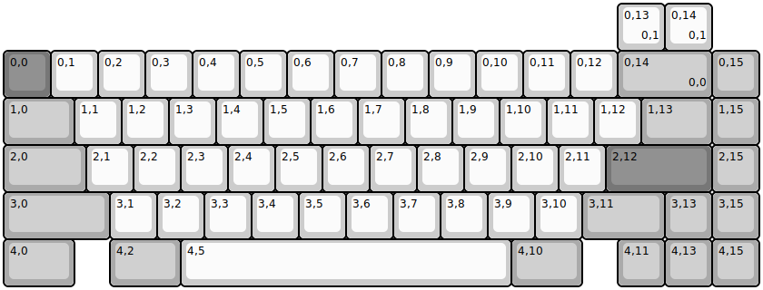{:loading="lazy"}

[Open in keyboard-layout-editor](http://www.keyboard-layout-editor.com/##@@_y:1&c=#777777;&=0,0&_c=#cccccc;&=0,1&=0,2&=0,3&=0,4&=0,5&=0,6&=0,7&=0,8&=0,9&=0,10&=0,11&=0,12&_c=#aaaaaa&w:2;&=0,14%0A%0A%0A0,0&=0,15;&@_w:1.5;&=1,0&_c=#cccccc;&=1,1&=1,2&=1,3&=1,4&=1,5&=1,6&=1,7&=1,8&=1,9&=1,10&=1,11&=1,12&_c=#aaaaaa&w:1.5;&=1,13&=1,15;&@_w:1.75;&=2,0&_c=#cccccc;&=2,1&=2,2&=2,3&=2,4&=2,5&=2,6&=2,7&=2,8&=2,9&=2,10&=2,11&_c=#777777&w:2.25;&=2,12&_c=#aaaaaa;&=2,15;&@_w:2.25;&=3,0&_c=#cccccc;&=3,1&=3,2&=3,3&=3,4&=3,5&=3,6&=3,7&=3,8&=3,9&=3,10&_c=#aaaaaa&w:1.75;&=3,11&=3,13&=3,15;&@_w:1.5;&=4,0&_x:0.75&w:1.5;&=4,2&_c=#cccccc&w:7;&=4,5&_c=#aaaaaa&w:1.5;&=4,10&_x:0.75;&=4,11&=4,13&=4,15;&@_x:13&y:-6&c=#cccccc;&=0,13%0A%0A%0A0,1&=0,14%0A%0A%0A0,1)

## abatskeyboardclub/nayeon

[README](output/abatskeyboardclub/nayeon/README.md) - [layout](output/abatskeyboardclub/nayeon/nayeon-kle.json) - [PCB](output/abatskeyboardclub/nayeon/nayeon.kicad_pcb) - [PCB render](output/abatskeyboardclub/nayeon/nayeon-render.svg)

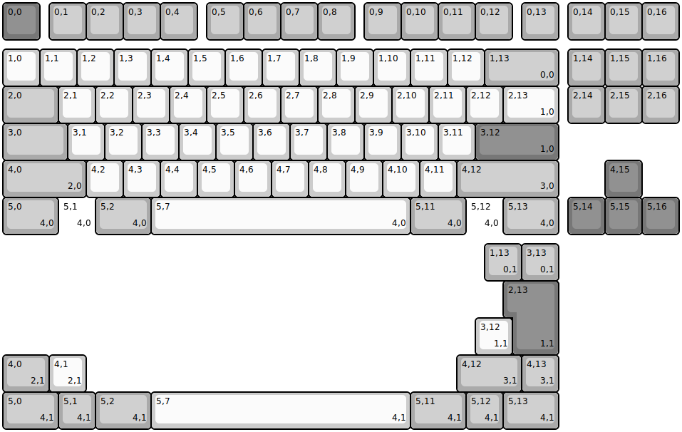{:loading="lazy"}

[Open in keyboard-layout-editor](http://www.keyboard-layout-editor.com/##@@_c=#777777;&=0,0&_x:0.25&c=#aaaaaa;&=0,1&=0,2&=0,3&=0,4&_x:0.25;&=0,5&=0,6&=0,7&=0,8&_x:0.25;&=0,9&=0,10&=0,11&=0,12&_x:0.25;&=0,13&_x:0.25;&=0,14&=0,15&=0,16;&@_y:0.25&c=#cccccc;&=1,0&=1,1&=1,2&=1,3&=1,4&=1,5&=1,6&=1,7&=1,8&=1,9&=1,10&=1,11&=1,12&_c=#aaaaaa&w:2;&=1,13%0A%0A%0A0,0&_x:0.25;&=1,14&=1,15&=1,16;&@_w:1.5;&=2,0&_c=#cccccc;&=2,1&=2,2&=2,3&=2,4&=2,5&=2,6&=2,7&=2,8&=2,9&=2,10&=2,11&=2,12&_w:1.5;&=2,13%0A%0A%0A1,0&_x:0.25&c=#aaaaaa;&=2,14&=2,15&=2,16;&@_w:1.75;&=3,0&_c=#cccccc;&=3,1&=3,2&=3,3&=3,4&=3,5&=3,6&=3,7&=3,8&=3,9&=3,10&=3,11&_c=#777777&w:2.25;&=3,12%0A%0A%0A1,0;&@_c=#aaaaaa&w:2.25;&=4,0%0A%0A%0A2,0&_c=#cccccc;&=4,2&=4,3&=4,4&=4,5&=4,6&=4,7&=4,8&=4,9&=4,10&=4,11&_c=#aaaaaa&w:2.75;&=4,12%0A%0A%0A3,0&_x:1.25&c=#777777;&=4,15;&@_c=#aaaaaa&w:1.5;&=5,0%0A%0A%0A4,0&_d:true;&=5,1%0A%0A%0A4,0&_w:1.5;&=5,2%0A%0A%0A4,0&_c=#cccccc&w:7;&=5,7%0A%0A%0A4,0&_c=#aaaaaa&w:1.5;&=5,11%0A%0A%0A4,0&_d:true;&=5,12%0A%0A%0A4,0&_w:1.5;&=5,13%0A%0A%0A4,0&_x:0.25&c=#777777;&=5,14&=5,15&=5,16;&@_x:13&y:0.25&c=#aaaaaa;&=1,13%0A%0A%0A0,1&=3,13%0A%0A%0A0,1;&@_x:13.75&c=#777777&w:1.25&h:2&w2:1.5&h2:1&x2:-0.25;&=2,13%0A%0A%0A1,1;&@_x:12.75&c=#cccccc;&=3,12%0A%0A%0A1,1;&@_c=#aaaaaa&w:1.25;&=4,0%0A%0A%0A2,1&_c=#cccccc;&=4,1%0A%0A%0A2,1&_x:10.0&c=#aaaaaa&w:1.75;&=4,12%0A%0A%0A3,1&=4,13%0A%0A%0A3,1;&@_w:1.5;&=5,0%0A%0A%0A4,1&=5,1%0A%0A%0A4,1&_w:1.5;&=5,2%0A%0A%0A4,1&_c=#cccccc&w:7;&=5,7%0A%0A%0A4,1&_c=#aaaaaa&w:1.5;&=5,11%0A%0A%0A4,1&=5,12%0A%0A%0A4,1&_w:1.5;&=5,13%0A%0A%0A4,1)

## absinthe/absinthe

[README](output/absinthe/README.md) - [layout](output/absinthe/absinthe-kle.json) - [PCB](output/absinthe/absinthe.kicad_pcb) - [PCB render](output/absinthe/absinthe-render.svg)

{:loading="lazy"}

[Open in keyboard-layout-editor](http://www.keyboard-layout-editor.com/##@@_c=#777777;&=0,0&_c=#cccccc;&=1,0&=0,1&=1,1&=0,2&=1,2&=0,3&=1,3&=0,4&=1,4&=0,5&=1,5&=0,6&=1,6%0A%0A%0A0,0&=0,7%0A%0A%0A0,0&_x:0.5;&=1,7&=0,8&=1,8;&@_c=#aaaaaa&w:1.5;&=2,0&_c=#cccccc;&=2,1&=3,1&=2,2&=3,2&=2,3&=3,3&=2,4&=3,4&=2,5&=3,5&=2,6&=3,6&_w:1.5;&=2,7&_x:0.5;&=3,7&=2,8&=3,8;&@_c=#aaaaaa&w:1.75;&=4,0&_c=#cccccc;&=4,1&=5,1&=4,2&=5,2&=4,3&=5,3&=4,4&=5,4&=4,5&=5,5&=4,6&_c=#777777&w:2.25;&=5,6;&@_c=#aaaaaa&w:2.25;&=6,0&_c=#cccccc;&=6,1&=7,1&=6,2&=7,2&=6,3&=7,3&=6,4&=7,4&=6,5&=7,5&_c=#aaaaaa&w:1.75;&=6,6%0A%0A%0A1,0&=6,7%0A%0A%0A1,0&_x:1.5&c=#777777;&=6,8;&@_c=#aaaaaa&w:1.5;&=8,0%0A%0A%0A2,0&=8,1%0A%0A%0A2,0&_w:1.5;&=8,2%0A%0A%0A2,0&_c=#cccccc&w:7;&=8,3%0A%0A%0A2,0&_c=#aaaaaa&w:1.5;&=7,6%0A%0A%0A2,0&=8,6%0A%0A%0A2,0&_w:1.5;&=8,7%0A%0A%0A2,0&_x:0.5&c=#777777;&=7,7&=8,8&=7,8;&@_x:19.25&y:-5&c=#aaaaaa&w:2;&=1,6%0A%0A%0A0,1;&@_x:19.0&y:2&w:2.75;&=6,6%0A%0A%0A1,1;&@_y:1.5&w:1.25;&=8,0%0A%0A%0A2,1&_w:1.25;&=8,1%0A%0A%0A2,1&_w:1.25;&=8,2%0A%0A%0A2,1&_c=#cccccc&w:6.25;&=8,3%0A%0A%0A2,1&_c=#aaaaaa&w:1.25;&=8,5%0A%0A%0A2,1&_w:1.25;&=7,6%0A%0A%0A2,1&_w:1.25;&=8,6%0A%0A%0A2,1&_w:1.25;&=8,7%0A%0A%0A2,1)

## acekeyboard/titan60

[README](output/acekeyboard/titan60/README.md) - [layout](output/acekeyboard/titan60/titan60-kle.json) - [PCB](output/acekeyboard/titan60/titan60.kicad_pcb) - [PCB render](output/acekeyboard/titan60/titan60-render.svg)

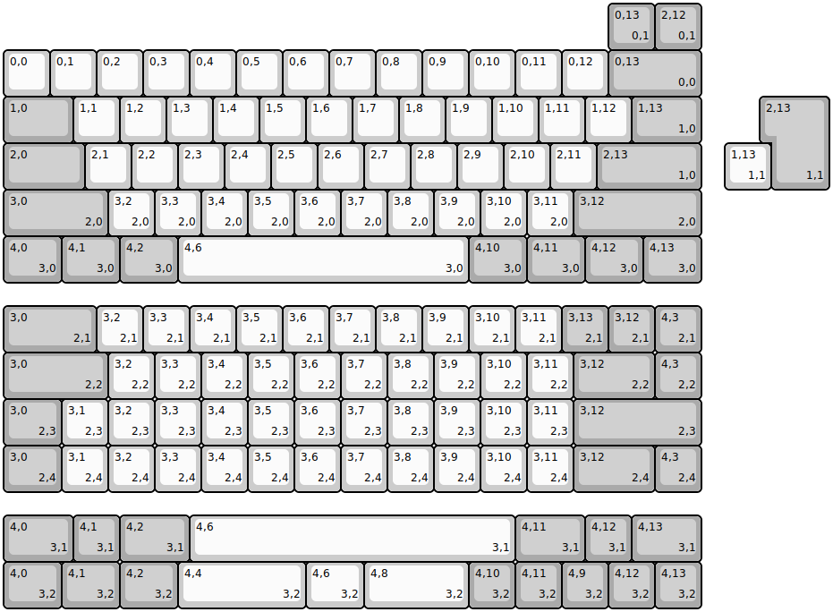{:loading="lazy"}

[Open in keyboard-layout-editor](http://www.keyboard-layout-editor.com/##@@_y:1;&=0,0&=0,1&=0,2&=0,3&=0,4&=0,5&=0,6&=0,7&=0,8&=0,9&=0,10&=0,11&=0,12&_c=#aaaaaa&w:2;&=0,13%0A%0A%0A0,0;&@_w:1.5;&=1,0&_c=#cccccc;&=1,1&=1,2&=1,3&=1,4&=1,5&=1,6&=1,7&=1,8&=1,9&=1,10&=1,11&=1,12&_c=#aaaaaa&w:1.5;&=1,13%0A%0A%0A1,0;&@_w:1.75;&=2,0&_c=#cccccc;&=2,1&=2,2&=2,3&=2,4&=2,5&=2,6&=2,7&=2,8&=2,9&=2,10&=2,11&_c=#aaaaaa&w:2.25;&=2,13%0A%0A%0A1,0;&@_w:2.25;&=3,0%0A%0A%0A2,0&_c=#cccccc;&=3,2%0A%0A%0A2,0&=3,3%0A%0A%0A2,0&=3,4%0A%0A%0A2,0&=3,5%0A%0A%0A2,0&=3,6%0A%0A%0A2,0&=3,7%0A%0A%0A2,0&=3,8%0A%0A%0A2,0&=3,9%0A%0A%0A2,0&=3,10%0A%0A%0A2,0&=3,11%0A%0A%0A2,0&_c=#aaaaaa&w:2.75;&=3,12%0A%0A%0A2,0;&@_w:1.25;&=4,0%0A%0A%0A3,0&_w:1.25;&=4,1%0A%0A%0A3,0&_w:1.25;&=4,2%0A%0A%0A3,0&_c=#cccccc&w:6.25;&=4,6%0A%0A%0A3,0&_c=#aaaaaa&w:1.25;&=4,10%0A%0A%0A3,0&_w:1.25;&=4,11%0A%0A%0A3,0&_w:1.25;&=4,12%0A%0A%0A3,0&_w:1.25;&=4,13%0A%0A%0A3,0;&@_x:13&y:-6;&=0,13%0A%0A%0A0,1&=2,12%0A%0A%0A0,1;&@_x:16.5&y:1&w:1.25&h:2&w2:1.5&h2:1&x2:-0.25;&=2,13%0A%0A%0A1,1;&@_x:15.5&c=#cccccc;&=1,13%0A%0A%0A1,1;&@_y:2.5&c=#aaaaaa&w:2;&=3,0%0A%0A%0A2,1&_c=#cccccc;&=3,2%0A%0A%0A2,1&=3,3%0A%0A%0A2,1&=3,4%0A%0A%0A2,1&=3,5%0A%0A%0A2,1&=3,6%0A%0A%0A2,1&=3,7%0A%0A%0A2,1&=3,8%0A%0A%0A2,1&=3,9%0A%0A%0A2,1&=3,10%0A%0A%0A2,1&=3,11%0A%0A%0A2,1&_c=#aaaaaa;&=3,13%0A%0A%0A2,1&=3,12%0A%0A%0A2,1&=4,3%0A%0A%0A2,1;&@_w:2.25;&=3,0%0A%0A%0A2,2&_c=#cccccc;&=3,2%0A%0A%0A2,2&=3,3%0A%0A%0A2,2&=3,4%0A%0A%0A2,2&=3,5%0A%0A%0A2,2&=3,6%0A%0A%0A2,2&=3,7%0A%0A%0A2,2&=3,8%0A%0A%0A2,2&=3,9%0A%0A%0A2,2&=3,10%0A%0A%0A2,2&=3,11%0A%0A%0A2,2&_c=#aaaaaa&w:1.75;&=3,12%0A%0A%0A2,2&=4,3%0A%0A%0A2,2;&@_w:1.25;&=3,0%0A%0A%0A2,3&_c=#cccccc;&=3,1%0A%0A%0A2,3&=3,2%0A%0A%0A2,3&=3,3%0A%0A%0A2,3&=3,4%0A%0A%0A2,3&=3,5%0A%0A%0A2,3&=3,6%0A%0A%0A2,3&=3,7%0A%0A%0A2,3&=3,8%0A%0A%0A2,3&=3,9%0A%0A%0A2,3&=3,10%0A%0A%0A2,3&=3,11%0A%0A%0A2,3&_c=#aaaaaa&w:2.75;&=3,12%0A%0A%0A2,3;&@_w:1.25;&=3,0%0A%0A%0A2,4&_c=#cccccc;&=3,1%0A%0A%0A2,4&=3,2%0A%0A%0A2,4&=3,3%0A%0A%0A2,4&=3,4%0A%0A%0A2,4&=3,5%0A%0A%0A2,4&=3,6%0A%0A%0A2,4&=3,7%0A%0A%0A2,4&=3,8%0A%0A%0A2,4&=3,9%0A%0A%0A2,4&=3,10%0A%0A%0A2,4&=3,11%0A%0A%0A2,4&_c=#aaaaaa&w:1.75;&=3,12%0A%0A%0A2,4&=4,3%0A%0A%0A2,4;&@_y:0.5&w:1.5;&=4,0%0A%0A%0A3,1&=4,1%0A%0A%0A3,1&_w:1.5;&=4,2%0A%0A%0A3,1&_c=#cccccc&w:7;&=4,6%0A%0A%0A3,1&_c=#aaaaaa&w:1.5;&=4,11%0A%0A%0A3,1&=4,12%0A%0A%0A3,1&_w:1.5;&=4,13%0A%0A%0A3,1;&@_w:1.25;&=4,0%0A%0A%0A3,2&_w:1.25;&=4,1%0A%0A%0A3,2&_w:1.25;&=4,2%0A%0A%0A3,2&_c=#cccccc&w:2.75;&=4,4%0A%0A%0A3,2&_w:1.25;&=4,6%0A%0A%0A3,2&_w:2.25;&=4,8%0A%0A%0A3,2&_c=#aaaaaa;&=4,10%0A%0A%0A3,2&=4,11%0A%0A%0A3,2&=4,9%0A%0A%0A3,2&=4,12%0A%0A%0A3,2&=4,13%0A%0A%0A3,2)

## acheron/apollo/apollo87h_delta

[README](output/acheron/apollo/README.md) - [layout](output/acheron/apollo/apollo87h_delta-kle.json) - [PCB](output/acheron/apollo/apollo87h_delta.kicad_pcb) - [PCB render](output/acheron/apollo/apollo87h_delta-render.svg)

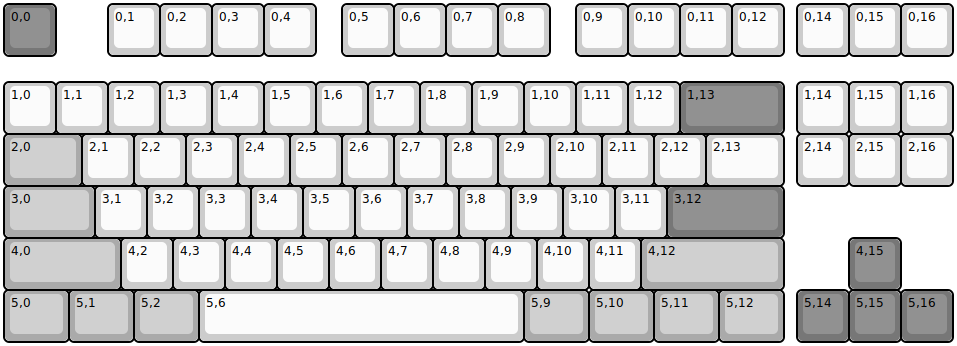{:loading="lazy"}

[Open in keyboard-layout-editor](http://www.keyboard-layout-editor.com/##@@_c=#777777;&=0,0&_x:1&c=#cccccc;&=0,1&=0,2&=0,3&=0,4&_x:0.5;&=0,5&=0,6&=0,7&=0,8&_x:0.5;&=0,9&=0,10&=0,11&=0,12&_x:0.25;&=0,14&=0,15&=0,16;&@_y:0.5;&=1,0&=1,1&=1,2&=1,3&=1,4&=1,5&=1,6&=1,7&=1,8&=1,9&=1,10&=1,11&=1,12&_c=#777777&w:2;&=1,13&_x:0.25&c=#cccccc;&=1,14&=1,15&=1,16;&@_c=#aaaaaa&w:1.5;&=2,0&_c=#cccccc;&=2,1&=2,2&=2,3&=2,4&=2,5&=2,6&=2,7&=2,8&=2,9&=2,10&=2,11&=2,12&_w:1.5;&=2,13&_x:0.25;&=2,14&=2,15&=2,16;&@_c=#aaaaaa&w:1.75;&=3,0&_c=#cccccc;&=3,1&=3,2&=3,3&=3,4&=3,5&=3,6&=3,7&=3,8&=3,9&=3,10&=3,11&_c=#777777&w:2.25;&=3,12;&@_c=#aaaaaa&w:2.25;&=4,0&_c=#cccccc;&=4,2&=4,3&=4,4&=4,5&=4,6&=4,7&=4,8&=4,9&=4,10&=4,11&_c=#aaaaaa&w:2.75;&=4,12&_x:1.25&c=#777777;&=4,15;&@_c=#aaaaaa&w:1.25;&=5,0&_w:1.25;&=5,1&_w:1.25;&=5,2&_c=#cccccc&w:6.25;&=5,6&_c=#aaaaaa&w:1.25;&=5,9&_w:1.25;&=5,10&_w:1.25;&=5,11&_w:1.25;&=5,12&_x:0.25&c=#777777;&=5,14&=5,15&=5,16)

## acheron/apollo/apollo87htsc_alpha

[README](output/acheron/apollo/README.md) - [layout](output/acheron/apollo/apollo87htsc_alpha-kle.json) - [PCB](output/acheron/apollo/apollo87htsc_alpha.kicad_pcb) - [PCB render](output/acheron/apollo/apollo87htsc_alpha-render.svg)

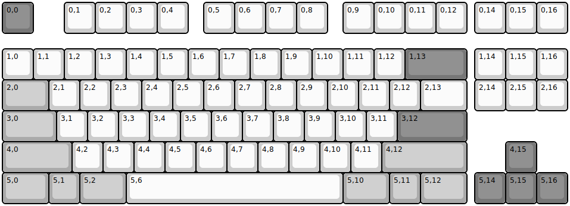{:loading="lazy"}

[Open in keyboard-layout-editor](http://www.keyboard-layout-editor.com/##@@_c=#777777;&=0,0&_x:1&c=#cccccc;&=0,1&=0,2&=0,3&=0,4&_x:0.5;&=0,5&=0,6&=0,7&=0,8&_x:0.5;&=0,9&=0,10&=0,11&=0,12&_x:0.25;&=0,14&=0,15&=0,16;&@_y:0.5;&=1,0&=1,1&=1,2&=1,3&=1,4&=1,5&=1,6&=1,7&=1,8&=1,9&=1,10&=1,11&=1,12&_c=#777777&w:2;&=1,13&_x:0.25&c=#cccccc;&=1,14&=1,15&=1,16;&@_c=#aaaaaa&w:1.5;&=2,0&_c=#cccccc;&=2,1&=2,2&=2,3&=2,4&=2,5&=2,6&=2,7&=2,8&=2,9&=2,10&=2,11&=2,12&_w:1.5;&=2,13&_x:0.25;&=2,14&=2,15&=2,16;&@_c=#aaaaaa&w:1.75;&=3,0&_c=#cccccc;&=3,1&=3,2&=3,3&=3,4&=3,5&=3,6&=3,7&=3,8&=3,9&=3,10&=3,11&_c=#777777&w:2.25;&=3,12;&@_c=#aaaaaa&w:2.25;&=4,0&_c=#cccccc;&=4,2&=4,3&=4,4&=4,5&=4,6&=4,7&=4,8&=4,9&=4,10&=4,11&_c=#aaaaaa&w:2.75;&=4,12&_x:1.25&c=#777777;&=4,15;&@_c=#aaaaaa&w:1.5;&=5,0&=5,1&_w:1.5;&=5,2&_c=#cccccc&w:7;&=5,6&_c=#aaaaaa&w:1.5;&=5,10&=5,11&_w:1.5;&=5,12&_x:0.25&c=#777777;&=5,14&=5,15&=5,16)

## acheron/apollo/apollo88htsc_alpha

[README](output/acheron/apollo/README.md) - [layout](output/acheron/apollo/apollo88htsc_alpha-kle.json) - [PCB](output/acheron/apollo/apollo88htsc_alpha.kicad_pcb) - [PCB render](output/acheron/apollo/apollo88htsc_alpha-render.svg)

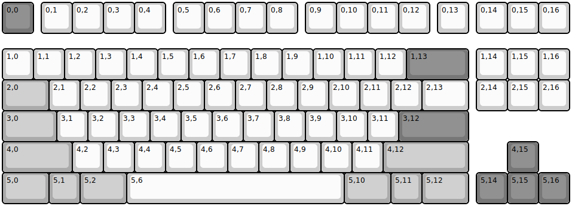{:loading="lazy"}

[Open in keyboard-layout-editor](http://www.keyboard-layout-editor.com/##@@_c=#777777;&=0,0&_x:0.25&c=#cccccc;&=0,1&=0,2&=0,3&=0,4&_x:0.25;&=0,5&=0,6&=0,7&=0,8&_x:0.25;&=0,9&=0,10&=0,11&=0,12&_x:0.25;&=0,13&_x:0.25;&=0,14&=0,15&=0,16;&@_y:0.5;&=1,0&=1,1&=1,2&=1,3&=1,4&=1,5&=1,6&=1,7&=1,8&=1,9&=1,10&=1,11&=1,12&_c=#777777&w:2;&=1,13&_x:0.25&c=#cccccc;&=1,14&=1,15&=1,16;&@_c=#aaaaaa&w:1.5;&=2,0&_c=#cccccc;&=2,1&=2,2&=2,3&=2,4&=2,5&=2,6&=2,7&=2,8&=2,9&=2,10&=2,11&=2,12&_w:1.5;&=2,13&_x:0.25;&=2,14&=2,15&=2,16;&@_c=#aaaaaa&w:1.75;&=3,0&_c=#cccccc;&=3,1&=3,2&=3,3&=3,4&=3,5&=3,6&=3,7&=3,8&=3,9&=3,10&=3,11&_c=#777777&w:2.25;&=3,12;&@_c=#aaaaaa&w:2.25;&=4,0&_c=#cccccc;&=4,2&=4,3&=4,4&=4,5&=4,6&=4,7&=4,8&=4,9&=4,10&=4,11&_c=#aaaaaa&w:2.75;&=4,12&_x:1.25&c=#777777;&=4,15;&@_c=#aaaaaa&w:1.5;&=5,0&=5,1&_w:1.5;&=5,2&_c=#cccccc&w:7;&=5,6&_c=#aaaaaa&w:1.5;&=5,10&=5,11&_w:1.5;&=5,12&_x:0.25&c=#777777;&=5,14&=5,15&=5,16)

## acheron/athena/athena_alpha

[README](output/acheron/athena/README.md) - [layout](output/acheron/athena/athena_alpha-kle.json) - [PCB](output/acheron/athena/athena_alpha.kicad_pcb) - [PCB render](output/acheron/athena/athena_alpha-render.svg)

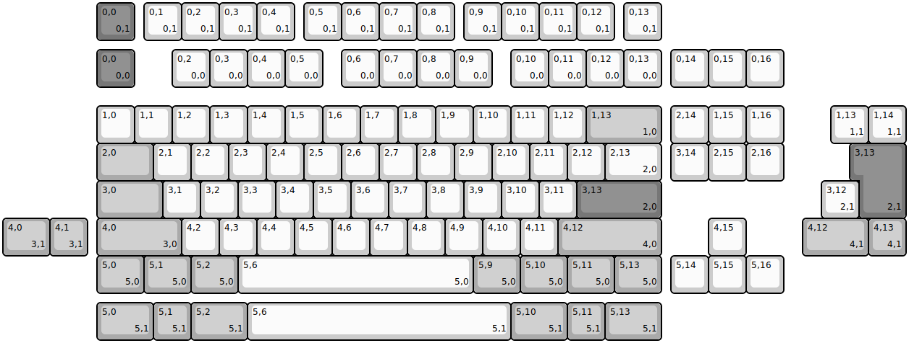{:loading="lazy"}

[Open in keyboard-layout-editor](http://www.keyboard-layout-editor.com/##@@_x:2.5&y:1.25&c=#777777;&=0,0%0A%0A%0A0,0&_x:1.0&c=#cccccc;&=0,2%0A%0A%0A0,0&=0,3%0A%0A%0A0,0&=0,4%0A%0A%0A0,0&=0,5%0A%0A%0A0,0&_x:0.5;&=0,6%0A%0A%0A0,0&=0,7%0A%0A%0A0,0&=0,8%0A%0A%0A0,0&=0,9%0A%0A%0A0,0&_x:0.5;&=0,10%0A%0A%0A0,0&=0,11%0A%0A%0A0,0&=0,12%0A%0A%0A0,0&=0,13%0A%0A%0A0,0&_x:0.25;&=0,14&=0,15&=0,16;&@_x:2.5&y:0.5;&=1,0&=1,1&=1,2&=1,3&=1,4&=1,5&=1,6&=1,7&=1,8&=1,9&=1,10&=1,11&=1,12&_c=#aaaaaa&w:2;&=1,13%0A%0A%0A1,0&_x:0.25&c=#cccccc;&=2,14&=1,15&=1,16;&@_x:2.5&c=#aaaaaa&w:1.5;&=2,0&_c=#cccccc;&=2,1&=2,2&=2,3&=2,4&=2,5&=2,6&=2,7&=2,8&=2,9&=2,10&=2,11&=2,12&_w:1.5;&=2,13%0A%0A%0A2,0&_x:0.25;&=3,14&=2,15&=2,16;&@_x:2.5&c=#aaaaaa&w:1.75;&=3,0&_c=#cccccc;&=3,1&=3,2&=3,3&=3,4&=3,5&=3,6&=3,7&=3,8&=3,9&=3,10&=3,11&_c=#777777&w:2.25;&=3,13%0A%0A%0A2,0;&@_x:2.5&c=#aaaaaa&w:2.25;&=4,0%0A%0A%0A3,0&_c=#cccccc;&=4,2&=4,3&=4,4&=4,5&=4,6&=4,7&=4,8&=4,9&=4,10&=4,11&_c=#aaaaaa&w:2.75;&=4,12%0A%0A%0A4,0&_x:1.25&c=#cccccc;&=4,15;&@_x:2.5&c=#aaaaaa&w:1.25;&=5,0%0A%0A%0A5,0&_w:1.25;&=5,1%0A%0A%0A5,0&_w:1.25;&=5,2%0A%0A%0A5,0&_c=#cccccc&w:6.25;&=5,6%0A%0A%0A5,0&_c=#aaaaaa&w:1.25;&=5,9%0A%0A%0A5,0&_w:1.25;&=5,10%0A%0A%0A5,0&_w:1.25;&=5,11%0A%0A%0A5,0&_w:1.25;&=5,13%0A%0A%0A5,0&_x:0.25&c=#cccccc;&=5,14&=5,15&=5,16;&@_x:2.5&y:-7.75&c=#777777;&=0,0%0A%0A%0A0,1&_x:0.25&c=#cccccc;&=0,1%0A%0A%0A0,1&=0,2%0A%0A%0A0,1&=0,3%0A%0A%0A0,1&=0,4%0A%0A%0A0,1&_x:0.25;&=0,5%0A%0A%0A0,1&=0,6%0A%0A%0A0,1&=0,7%0A%0A%0A0,1&=0,8%0A%0A%0A0,1&_x:0.25;&=0,9%0A%0A%0A0,1&=0,10%0A%0A%0A0,1&=0,11%0A%0A%0A0,1&=0,12%0A%0A%0A0,1&_x:0.25;&=0,13%0A%0A%0A0,1;&@_x:22.0&y:1.75;&=1,13%0A%0A%0A1,1&=1,14%0A%0A%0A1,1;&@_x:22.75&c=#777777&w:1.25&h:2&w2:1.5&h2:1&x2:-0.25;&=3,13%0A%0A%0A2,1;&@_x:21.75&c=#cccccc;&=3,12%0A%0A%0A2,1;&@_c=#aaaaaa&w:1.25;&=4,0%0A%0A%0A3,1&=4,1%0A%0A%0A3,1&_x:19.0&w:1.75;&=4,12%0A%0A%0A4,1&=4,13%0A%0A%0A4,1;&@_x:2.5&y:1.25&w:1.5;&=5,0%0A%0A%0A5,1&=5,1%0A%0A%0A5,1&_w:1.5;&=5,2%0A%0A%0A5,1&_c=#cccccc&w:7;&=5,6%0A%0A%0A5,1&_c=#aaaaaa&w:1.5;&=5,10%0A%0A%0A5,1&=5,11%0A%0A%0A5,1&_w:1.5;&=5,13%0A%0A%0A5,1)

## acheron/athena/athena_beta

[README](output/acheron/athena/README.md) - [layout](output/acheron/athena/athena_beta-kle.json) - [PCB](output/acheron/athena/athena_beta.kicad_pcb) - [PCB render](output/acheron/athena/athena_beta-render.svg)

{:loading="lazy"}

[Open in keyboard-layout-editor](http://www.keyboard-layout-editor.com/##@@_x:2.5&y:1.25&c=#777777;&=0,0%0A%0A%0A0,0&_x:1.0&c=#cccccc;&=0,2%0A%0A%0A0,0&=0,3%0A%0A%0A0,0&=0,4%0A%0A%0A0,0&=0,5%0A%0A%0A0,0&_x:0.5;&=0,6%0A%0A%0A0,0&=0,7%0A%0A%0A0,0&=0,8%0A%0A%0A0,0&=0,9%0A%0A%0A0,0&_x:0.5;&=0,10%0A%0A%0A0,0&=0,11%0A%0A%0A0,0&=0,12%0A%0A%0A0,0&=0,13%0A%0A%0A0,0&_x:0.25;&=0,14&=0,15&=0,16;&@_x:2.5&y:0.5;&=1,0&=1,1&=1,2&=1,3&=1,4&=1,5&=1,6&=1,7&=1,8&=1,9&=1,10&=1,11&=1,12&_c=#aaaaaa&w:2;&=1,13%0A%0A%0A1,0&_x:0.25&c=#cccccc;&=2,14&=1,15&=1,16;&@_x:2.5&c=#aaaaaa&w:1.5;&=2,0&_c=#cccccc;&=2,1&=2,2&=2,3&=2,4&=2,5&=2,6&=2,7&=2,8&=2,9&=2,10&=2,11&=2,12&_w:1.5;&=2,13%0A%0A%0A2,0&_x:0.25;&=3,14&=2,15&=2,16;&@_x:2.5&c=#aaaaaa&w:1.75;&=3,0&_c=#cccccc;&=3,1&=3,2&=3,3&=3,4&=3,5&=3,6&=3,7&=3,8&=3,9&=3,10&=3,11&_c=#777777&w:2.25;&=3,13%0A%0A%0A2,0;&@_x:2.5&c=#aaaaaa&w:2.25;&=4,0%0A%0A%0A3,0&_c=#cccccc;&=4,2&=4,3&=4,4&=4,5&=4,6&=4,7&=4,8&=4,9&=4,10&=4,11&_c=#aaaaaa&w:2.75;&=4,12%0A%0A%0A4,0&_x:1.25&c=#cccccc;&=4,15;&@_x:2.5&c=#aaaaaa&w:1.25;&=5,0%0A%0A%0A5,0&_w:1.25;&=5,1%0A%0A%0A5,0&_w:1.25;&=5,2%0A%0A%0A5,0&_c=#cccccc&w:6.25;&=5,6%0A%0A%0A5,0&_c=#aaaaaa&w:1.25;&=5,9%0A%0A%0A5,0&_w:1.25;&=5,10%0A%0A%0A5,0&_w:1.25;&=5,11%0A%0A%0A5,0&_w:1.25;&=5,13%0A%0A%0A5,0&_x:0.25&c=#cccccc;&=5,14&=5,15&=5,16;&@_x:2.5&y:-7.75&c=#777777;&=0,0%0A%0A%0A0,1&_x:0.25&c=#cccccc;&=0,1%0A%0A%0A0,1&=0,2%0A%0A%0A0,1&=0,3%0A%0A%0A0,1&=0,4%0A%0A%0A0,1&_x:0.25;&=0,5%0A%0A%0A0,1&=0,6%0A%0A%0A0,1&=0,7%0A%0A%0A0,1&=0,8%0A%0A%0A0,1&_x:0.25;&=0,9%0A%0A%0A0,1&=0,10%0A%0A%0A0,1&=0,11%0A%0A%0A0,1&=0,12%0A%0A%0A0,1&_x:0.25;&=0,13%0A%0A%0A0,1;&@_x:22.0&y:1.75;&=1,13%0A%0A%0A1,1&=1,14%0A%0A%0A1,1;&@_x:22.75&c=#777777&w:1.25&h:2&w2:1.5&h2:1&x2:-0.25;&=3,13%0A%0A%0A2,1;&@_x:21.75&c=#cccccc;&=3,12%0A%0A%0A2,1;&@_c=#aaaaaa&w:1.25;&=4,0%0A%0A%0A3,1&=4,1%0A%0A%0A3,1&_x:19.0&w:1.75;&=4,12%0A%0A%0A4,1&=4,13%0A%0A%0A4,1;&@_x:2.5&y:1.25&w:1.5;&=5,0%0A%0A%0A5,1&=5,1%0A%0A%0A5,1&_w:1.5;&=5,2%0A%0A%0A5,1&_c=#cccccc&w:7;&=5,6%0A%0A%0A5,1&_c=#aaaaaa&w:1.5;&=5,10%0A%0A%0A5,1&=5,11%0A%0A%0A5,1&_w:1.5;&=5,13%0A%0A%0A5,1)

## acheron/austin

[README](output/acheron/austin/README.md) - [layout](output/acheron/austin/austin-kle.json) - [PCB](output/acheron/austin/austin.kicad_pcb) - [PCB render](output/acheron/austin/austin-render.svg)

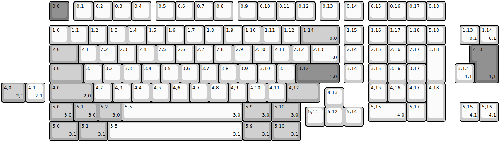{:loading="lazy"}

[Open in keyboard-layout-editor](http://www.keyboard-layout-editor.com/##@@_x:2.5&c=#777777;&=0,0&_x:0.25&c=#cccccc;&=0,1&=0,2&=0,3&=0,4&_x:0.25;&=0,5&=0,6&=0,7&=0,8&_x:0.25;&=0,9&=0,10&=0,11&=0,12&_x:0.25;&=0,13&_x:0.25;&=0,14&_x:0.25;&=0,15&=0,16&=0,17&=0,18;&@_x:2.5&y:0.25;&=1,0&=1,1&=1,2&=1,3&=1,4&=1,5&=1,6&=1,7&=1,8&=1,9&=1,10&=1,11&=1,12&_c=#aaaaaa&w:2;&=1,14%0A%0A%0A0,0&_x:0.25&c=#cccccc;&=1,15&_x:0.25;&=1,16&=1,17&=1,18&=5,18;&@_x:2.5&c=#aaaaaa&w:1.5;&=2,0&_c=#cccccc;&=2,1&=2,2&=2,3&=2,4&=2,5&=2,6&=2,7&=2,8&=2,9&=2,10&=2,11&=2,12&_w:1.5;&=2,13%0A%0A%0A1,0&_x:0.25;&=2,14&_x:0.25;&=2,15&=2,16&=2,17&_h:2;&=3,18;&@_x:2.5&c=#aaaaaa&w:1.75;&=3,0&_c=#cccccc;&=3,1&=3,2&=3,3&=3,4&=3,5&=3,6&=3,7&=3,8&=3,9&=3,10&=3,11&_c=#777777&w:2.25;&=3,12%0A%0A%0A1,0&_x:0.25&c=#cccccc;&=3,14&_x:0.25;&=3,15&=3,16&=3,17;&@_x:2.5&c=#aaaaaa&w:2.25;&=4,0%0A%0A%0A2,0&_c=#cccccc;&=4,2&=4,3&=4,4&=4,5&=4,6&=4,7&=4,8&=4,9&=4,10&=4,11&_c=#aaaaaa&w:1.75;&=4,12&_x:2.5&c=#cccccc;&=4,15&=4,16&=4,17&_h:2;&=4,18;&@_x:16.75&y:-0.75;&=4,13;&@_x:2.5&y:-0.25&c=#aaaaaa&w:1.25;&=5,0%0A%0A%0A3,0&_w:1.25;&=5,1%0A%0A%0A3,0&_w:1.25;&=5,2%0A%0A%0A3,0&_c=#cccccc&w:6.25;&=5,5%0A%0A%0A3,0&_c=#aaaaaa&w:1.5;&=5,9%0A%0A%0A3,0&_w:1.5;&=5,10%0A%0A%0A3,0&_x:3.5&c=#cccccc&w:2;&=5,15%0A%0A%0A4,0&=5,17;&@_x:15.75&y:-0.75;&=5,11&=5,12&=5,14;&@_x:23.75&y:-5.25;&=1,13%0A%0A%0A0,1&=1,14%0A%0A%0A0,1;&@_x:24.5&c=#777777&w:1.25&h:2&w2:1.5&h2:1&x2:-0.25;&=2,13%0A%0A%0A1,1;&@_x:23.5&c=#cccccc;&=3,12%0A%0A%0A1,1;&@_c=#aaaaaa&w:1.25;&=4,0%0A%0A%0A2,1&_c=#cccccc;&=4,1%0A%0A%0A2,1;&@_x:23.75;&=5,15%0A%0A%0A4,1&=5,16%0A%0A%0A4,1;&@_x:2.5&c=#aaaaaa&w:1.5;&=5,0%0A%0A%0A3,1&_w:1.5;&=5,1%0A%0A%0A3,1&_c=#cccccc&w:7;&=5,5%0A%0A%0A3,1&_c=#aaaaaa&w:1.5;&=5,9%0A%0A%0A3,1&_w:1.5;&=5,10%0A%0A%0A3,1)

## acheron/elongate

[README](output/acheron/elongate/README.md) - [layout](output/acheron/elongate/elongate-kle.json) - [PCB](output/acheron/elongate/elongate.kicad_pcb) - [PCB render](output/acheron/elongate/elongate-render.svg)

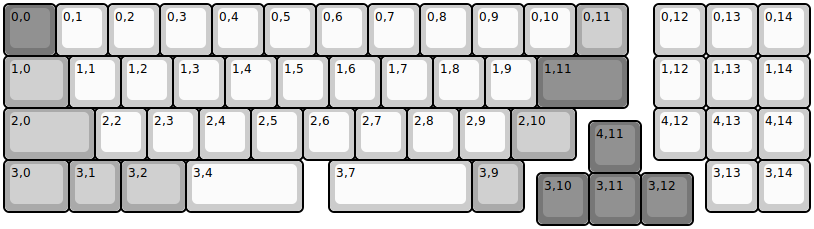{:loading="lazy"}

[Open in keyboard-layout-editor](http://www.keyboard-layout-editor.com/##@@_c=#777777;&=0,0&_c=#cccccc;&=0,1&=0,2&=0,3&=0,4&=0,5&=0,6&=0,7&=0,8&=0,9&=0,10&_c=#aaaaaa;&=0,11&_x:0.5&c=#cccccc;&=0,12&=0,13&=0,14;&@_c=#aaaaaa&w:1.25;&=1,0&_c=#cccccc;&=1,1&=1,2&=1,3&=1,4&=1,5&=1,6&=1,7&=1,8&=1,9&_c=#777777&w:1.75;&=1,11&_x:0.5&c=#cccccc;&=1,12&=1,13&=1,14;&@_c=#aaaaaa&w:1.75;&=2,0&_c=#cccccc;&=2,2&=2,3&=2,4&=2,5&=2,6&=2,7&=2,8&=2,9&_c=#aaaaaa&w:1.25;&=2,10&_x:1.5&c=#cccccc;&=4,12&=4,13&=4,14;&@_x:11.25&y:-0.75&c=#777777;&=4,11;&@_y:-0.25&c=#aaaaaa&w:1.25;&=3,0&=3,1&_w:1.25;&=3,2&_c=#cccccc&w:2.25;&=3,4&_x:0.5&w:2.75;&=3,7&_c=#aaaaaa;&=3,9&_x:3.5&c=#cccccc;&=3,13&=3,14;&@_x:10.25&y:-0.75&c=#777777;&=3,10&=3,11&=3,12)

## acheron/shark

[README](output/acheron/shark/README.md) - [layout](output/acheron/shark/shark-kle.json) - [PCB](output/acheron/shark/shark.kicad_pcb) - [PCB render](output/acheron/shark/shark-render.svg)

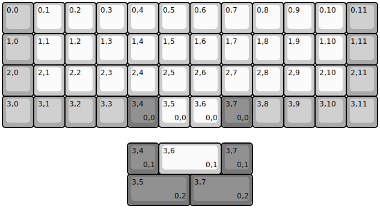{:loading="lazy"}

[Open in keyboard-layout-editor](http://www.keyboard-layout-editor.com/##@@_c=#aaaaaa;&=0,0&_c=#cccccc;&=0,1&=0,2&=0,3&=0,4&=0,5&=0,6&=0,7&=0,8&=0,9&=0,10&_c=#aaaaaa;&=0,11;&@=1,0&_c=#cccccc;&=1,1&=1,2&=1,3&=1,4&=1,5&=1,6&=1,7&=1,8&=1,9&=1,10&_c=#aaaaaa;&=1,11;&@=2,0&_c=#cccccc;&=2,1&=2,2&=2,3&=2,4&=2,5&=2,6&=2,7&=2,8&=2,9&=2,10&_c=#aaaaaa;&=2,11;&@=3,0&=3,1&=3,2&=3,3&_c=#777777;&=3,4%0A%0A%0A0,0&_c=#cccccc;&=3,5%0A%0A%0A0,0&=3,6%0A%0A%0A0,0&_c=#777777;&=3,7%0A%0A%0A0,0&_c=#aaaaaa;&=3,8&=3,9&=3,10&=3,11;&@_x:4&y:0.5&c=#777777;&=3,4%0A%0A%0A0,1&_c=#cccccc&w:2;&=3,6%0A%0A%0A0,1&_c=#777777;&=3,7%0A%0A%0A0,1;&@_x:4&w:2;&=3,5%0A%0A%0A0,2&_w:2;&=3,7%0A%0A%0A0,2)

## adafruit/macropad

[README](output/adafruit/macropad/README.md) - [layout](output/adafruit/macropad/macropad-kle.json) - [PCB](output/adafruit/macropad/macropad.kicad_pcb) - [PCB render](output/adafruit/macropad/macropad-render.svg)

{:loading="lazy"}

[Open in keyboard-layout-editor](http://www.keyboard-layout-editor.com/##@@_x:2;&=0,2%0A%0A%0A%0A%0A%0A%0A%0A%0Ae0;&@=1,0&=1,1&=1,2;&@=2,0&=2,1&=2,2;&@=3,0&=3,1&=3,2;&@=4,0&=4,1&=4,2)

## adpenrose/kintsugi

[README](output/adpenrose/kintsugi/README.md) - [layout](output/adpenrose/kintsugi/kintsugi-kle.json) - [PCB](output/adpenrose/kintsugi/kintsugi.kicad_pcb) - [PCB render](output/adpenrose/kintsugi/kintsugi-render.svg)

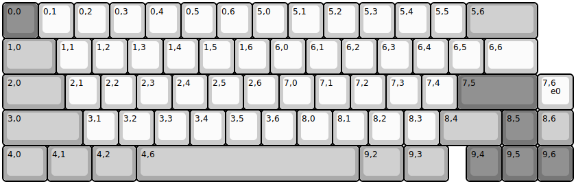{:loading="lazy"}

[Open in keyboard-layout-editor](http://www.keyboard-layout-editor.com/##@@_c=#777777;&=0,0&_c=#cccccc;&=0,1&=0,2&=0,3&=0,4&=0,5&=0,6&=5,0&=5,1&=5,2&=5,3&=5,4&=5,5&_c=#aaaaaa&w:2;&=5,6;&@_w:1.5;&=1,0&_c=#cccccc;&=1,1&=1,2&=1,3&=1,4&=1,5&=1,6&=6,0&=6,1&=6,2&=6,3&=6,4&=6,5&_w:1.5;&=6,6;&@_c=#aaaaaa&w:1.75;&=2,0&_c=#cccccc;&=2,1&=2,2&=2,3&=2,4&=2,5&=2,6&=7,0&=7,1&=7,2&=7,3&=7,4&_c=#777777&w:2.25;&=7,5&_c=#cccccc;&=7,6%0A%0A%0A%0A%0A%0A%0A%0A%0Ae0;&@_c=#aaaaaa&w:2.25;&=3,0&_c=#cccccc;&=3,1&=3,2&=3,3&=3,4&=3,5&=3,6&=8,0&=8,1&=8,2&=8,3&_c=#aaaaaa&w:1.75;&=8,4&_c=#777777;&=8,5&_c=#aaaaaa;&=8,6;&@_w:1.25;&=4,0&_w:1.25;&=4,1&_w:1.25;&=4,2&_w:6.25;&=4,6&_w:1.25;&=9,2&_w:1.25;&=9,3&_x:0.5&c=#777777;&=9,4&=9,5&=9,6)

## adpenrose/obi

[README](output/adpenrose/obi/README.md) - [layout](output/adpenrose/obi/obi-kle.json) - [PCB](output/adpenrose/obi/obi.kicad_pcb) - [PCB render](output/adpenrose/obi/obi-render.svg)

{:loading="lazy"}

[Open in keyboard-layout-editor](http://www.keyboard-layout-editor.com/##@@_x:1.25&c=#aaaaaa;&=0,0%0A%0A%0A0,0&_x:0.25&c=#777777&w:1.5;&=0,1&_c=#cccccc;&=0,2&=0,3&=0,4&=0,5&=0,6&=0,7&=0,8&=0,9&=0,10&=0,11&=0,12&_c=#aaaaaa&w:1.5;&=0,13;&@_x:1.25;&=1,0&_x:0.25&w:1.75;&=1,1&_c=#cccccc;&=1,2&=1,3&=1,4&=1,5&=1,6&=1,7&=1,8&=1,9&=1,10&=1,11&_c=#777777&w:2.25;&=1,13;&@_x:1.25&c=#aaaaaa;&=2,0&_x:0.25&w:2.25;&=2,1&_c=#cccccc;&=2,2&=2,3&=2,4&=2,5&=2,6&=2,7&=2,8&=2,9&_w:1.75;&=2,10&_c=#777777;&=2,12&_c=#aaaaaa;&=2,13;&@_x:1.25;&=3,0&_x:0.25&w:1.25;&=3,1&=3,2&_w:1.25;&=3,3&_c=#cccccc&w:6.25;&=3,6%0A%0A%0A1,0&_c=#aaaaaa&w:1.25;&=3,10&_c=#777777;&=3,11&=3,12&=3,13;&@_y:-4&c=#aaaaaa;&=0,0%0A%0A%0A0,1%0A%0A%0A%0A%0A%0Ae0;&@_x:6&y:3.25&c=#cccccc&w:2.25;&=3,5%0A%0A%0A1,1&_w:1.25;&=3,6%0A%0A%0A1,1&_w:2.75;&=3,7%0A%0A%0A1,1)

## adpenrose/shisaku

[README](output/adpenrose/shisaku/README.md) - [layout](output/adpenrose/shisaku/shisaku-kle.json) - [PCB](output/adpenrose/shisaku/shisaku.kicad_pcb) - [PCB render](output/adpenrose/shisaku/shisaku-render.svg)

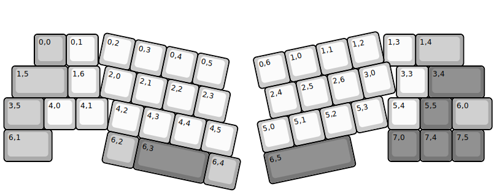{:loading="lazy"}

[Open in keyboard-layout-editor](http://www.keyboard-layout-editor.com/##@@_x:1&y:1&c=#aaaaaa;&=0,0&_c=#cccccc;&=0,1&_x:8.95;&=1,3&_c=#aaaaaa&w:1.5;&=1,4;&@_x:0.3&w:1.75;&=1,5&_c=#cccccc;&=1,6&_x:9.3;&=3,3&_c=#777777&w:1.75;&=3,4;&@_x:0.05&c=#aaaaaa&w:1.25;&=3,5&_c=#cccccc;&=4,0&=4,1&_x:8.79;&=5,4&_c=#777777;&=5,5&_c=#aaaaaa&w:1.25;&=6,0;&@_x:0.05&w:1.5;&=6,1&_x:10.54&c=#777777;&=7,0&=7,4&=7,5;&@_r:12&x:3.35&y:-4.75&c=#cccccc;&=0,2&=0,3&=0,4&=0,5;&@_x:3.6;&=2,0&=2,1&=2,2&=2,3;&@_x:4.05;&=4,2&=4,3&=4,4&=4,5;&@_x:4.1&c=#aaaaaa;&=6,2&_c=#777777&w:2.25;&=6,3&_c=#aaaaaa;&=6,4;&@_r:-12&x:7.3&y:-0.9&c=#cccccc;&=0,6&=1,0&=1,1&=1,2;&@_x:7.45;&=2,4&=2,5&=2,6&=3,0;&@_x:7;&=5,0&=5,1&=5,2&=5,3;&@_x:7&c=#777777&w:2.75;&=6,5)

## aeboards/aegis/aeboards_aegis

[README](output/aeboards/aegis/README.md) - [layout](output/aeboards/aegis/aeboards_aegis-kle.json) - [PCB](output/aeboards/aegis/aeboards_aegis.kicad_pcb) - [PCB render](output/aeboards/aegis/aeboards_aegis-render.svg)

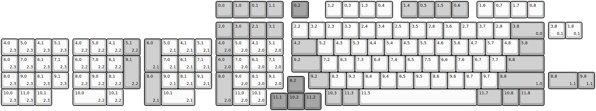{:loading="lazy"}

[Open in keyboard-layout-editor](http://www.keyboard-layout-editor.com/##@_name=AEGIS;&@_x:12.75&c=#aaaaaa&t=000000;&=0,0&=1,0&=0,1&=1,1&_x:0.5&c=#888888;&=0,2&_x:1.0&c=#cccccc;&=1,2&=0,3&=1,3&=0,4&_x:0.5&c=#aaaaaa;&=1,4&=0,5&=1,5&=0,6&_x:0.5&c=#cccccc;&=1,6&=0,7&=1,7&=0,8;&@_x:12.75&y:0.25&c=#aaaaaa;&=2,0&=3,0&=2,1&=3,1&_x:0.5&c=#cccccc;&=2,2&=3,2&=2,3&=3,3&=2,4&=3,4&=2,5&=3,5&=2,6&=3,6&=2,7&=3,7&=2,8&_c=#aaaaaa&w:2;&=3,8%0A%0A%0A0,0;&@_x:12.75;&=4,0%0A%0A%0A2,0&_c=#cccccc;&=5,0%0A%0A%0A2,0&=4,1%0A%0A%0A2,0&=5,1%0A%0A%0A2,0&_x:0.5&c=#aaaaaa&w:1.5;&=4,2&_c=#cccccc;&=5,2&=4,3&=5,3&=4,4&=5,4&=4,5&=5,5&=4,6&=5,6&=4,7&=5,7&=4,8&_c=#aaaaaa&w:1.5;&=5,8;&@_x:12.75;&=6,0%0A%0A%0A2,0&_c=#cccccc;&=7,0%0A%0A%0A2,0&=6,1%0A%0A%0A2,0&=7,1%0A%0A%0A2,0&_x:0.5&c=#aaaaaa&w:1.75;&=6,2&_c=#cccccc;&=7,2&=6,3&=7,3&=6,4&=7,4&=6,5&=7,5&=6,6&=7,6&=6,7&=7,7&_c=#aaaaaa&w:2.25;&=6,8;&@_x:12.75&h:2;&=8,0%0A%0A%0A2,0&_c=#cccccc;&=9,0%0A%0A%0A2,0&=8,1%0A%0A%0A2,0&=9,1%0A%0A%0A2,0&_x:1.5&c=#aaaaaa&w:1.25;&=9,2&_c=#cccccc;&=8,3&=9,3&=8,4&=9,4&=8,5&=9,5&=8,6&=9,6&=8,7&=9,7&_c=#aaaaaa&w:2.75;&=8,8%0A%0A%0A1,0;&@_x:17&y:-0.75&c=#888888;&=8,2;&@_x:13.75&y:-0.25&c=#cccccc;&=11,0%0A%0A%0A2,0&=10,1%0A%0A%0A2,0&_x:3.5&c=#aaaaaa;&=10,3&=11,3&_c=#cccccc&w:7;&=11,5&_c=#aaaaaa&w:1.5;&=11,7&=10,8&_w:1.5;&=11,8;&@_x:16&y:-0.75&c=#888888;&=11,1&=10,2&=11,2;&@_x:32.5&y:-5.25&c=#cccccc;&=3,8%0A%0A%0A0,1&=1,8%0A%0A%0A0,1;&@=4,0%0A%0A%0A2,3&=5,0%0A%0A%0A2,3&=4,1%0A%0A%0A2,3&=5,1%0A%0A%0A2,3&_x:0.25;&=4,0%0A%0A%0A2,2&=5,0%0A%0A%0A2,2&=4,1%0A%0A%0A2,2&_c=#aaaaaa;&=5,1%0A%0A%0A2,2&_x:0.25&h:2;&=6,0%0A%0A%0A2,1&_c=#cccccc;&=5,0%0A%0A%0A2,1&=4,1%0A%0A%0A2,1&=5,1%0A%0A%0A2,1;&@=6,0%0A%0A%0A2,3&=7,0%0A%0A%0A2,3&=6,1%0A%0A%0A2,3&=7,1%0A%0A%0A2,3&_x:0.25;&=6,0%0A%0A%0A2,2&=7,0%0A%0A%0A2,2&=6,1%0A%0A%0A2,2&_c=#aaaaaa&h:2;&=9,1%0A%0A%0A2,2&_x:1.25&c=#cccccc;&=7,0%0A%0A%0A2,1&=6,1%0A%0A%0A2,1&=7,1%0A%0A%0A2,1;&@=8,0%0A%0A%0A2,3&=9,0%0A%0A%0A2,3&=8,1%0A%0A%0A2,3&=9,1%0A%0A%0A2,3&_x:0.25;&=8,0%0A%0A%0A2,2&=9,0%0A%0A%0A2,2&=8,1%0A%0A%0A2,2&_x:1.25&c=#aaaaaa&h:2;&=8,0%0A%0A%0A2,1&_c=#cccccc;&=9,0%0A%0A%0A2,1&=8,1%0A%0A%0A2,1&=9,1%0A%0A%0A2,1&_x:20.0&c=#aaaaaa&w:1.75;&=8,8%0A%0A%0A1,1&=9,8%0A%0A%0A1,1;&@_c=#cccccc;&=10,0%0A%0A%0A2,3&=11,0%0A%0A%0A2,3&=10,1%0A%0A%0A2,3&_x:1.25&w:2;&=10,0%0A%0A%0A2,2&=10,1%0A%0A%0A2,2&_x:2.25&w:2;&=10,1%0A%0A%0A2,1)

## aeboards/constellation

[README](output/aeboards/constellation/README.md) - [layout](output/aeboards/constellation/constellation-kle.json) - [PCB](output/aeboards/constellation/constellation.kicad_pcb) - [PCB render](output/aeboards/constellation/constellation-render.svg)

{:loading="lazy"}

[Open in keyboard-layout-editor](http://www.keyboard-layout-editor.com/##@@_c=#777777;&=0,0&_c=#cccccc;&=0,1&=0,2&=0,3&=0,4&=0,5&=0,6&=0,7&=0,8&=0,9&=0,10&=0,11&=0,12&_c=#aaaaaa&w:2;&=0,13%0A%0A%0A0,0&=0,14;&@_w:1.5;&=1,0&_c=#cccccc;&=1,1&=1,2&=1,3&=1,4&=1,5&=1,6&=1,7&=1,8&=1,9&=1,10&=1,11&=1,12&_w:1.5;&=1,13&_c=#aaaaaa;&=1,14;&@_w:1.75;&=2,0&_c=#cccccc;&=2,1&=2,2&=2,3&=2,4&=2,5&=2,6&=2,7&=2,8&=2,9&=2,10&=2,11&_c=#aaaaaa&w:2.25;&=2,12&=2,14;&@_w:2.25;&=3,0&_c=#cccccc;&=3,1&=3,2&=3,3&=3,4&=3,5&=3,6&=3,7&=3,8&=3,9&=3,10&_c=#aaaaaa&w:1.75;&=3,12&_c=#777777;&=3,13&_c=#aaaaaa;&=3,14;&@_w:1.25;&=4,0&_w:1.25;&=4,1&_w:1.25;&=4,2&_c=#cccccc&w:6.25;&=4,8&_c=#aaaaaa&w:1.5;&=4,9&_w:1.5;&=4,10&_c=#777777;&=4,12&=4,13&=4,14;&@_x:16.25&y:-5&c=#cccccc;&=0,13%0A%0A%0A0,1&=2,13%0A%0A%0A0,1)

## aeboards/constellation/constellation_rev3

[README](output/aeboards/constellation/README.md) - [layout](output/aeboards/constellation/constellation_rev3-kle.json) - [PCB](output/aeboards/constellation/constellation_rev3.kicad_pcb) - [PCB render](output/aeboards/constellation/constellation_rev3-render.svg)

{:loading="lazy"}

[Open in keyboard-layout-editor](http://www.keyboard-layout-editor.com/##@@_c=#777777;&=0,0&_c=#cccccc;&=0,1&=0,2&=0,3&=0,4&=0,5&=0,6&=0,7&=0,8&=0,9&=0,10&=0,11&=0,12&_c=#aaaaaa&w:2;&=0,13%0A%0A%0A0,0&=0,14;&@_w:1.5;&=1,0&_c=#cccccc;&=1,1&=1,2&=1,3&=1,4&=1,5&=1,6&=1,7&=1,8&=1,9&=1,10&=1,11&=1,12&_w:1.5;&=1,13&_c=#aaaaaa;&=1,14;&@_w:1.75;&=2,0&_c=#cccccc;&=2,1&=2,2&=2,3&=2,4&=2,5&=2,6&=2,7&=2,8&=2,9&=2,10&=2,11&_c=#aaaaaa&w:2.25;&=2,12&=2,14;&@_w:2.25;&=3,0&_c=#cccccc;&=3,1&=3,2&=3,3&=3,4&=3,5&=3,6&=3,7&=3,8&=3,9&=3,10&_c=#aaaaaa&w:1.75;&=3,12&_c=#777777;&=3,13&_c=#aaaaaa;&=3,14;&@_w:1.25;&=4,0&_w:1.25;&=4,1&_w:1.25;&=4,2&_c=#cccccc&w:6.25;&=4,5&_c=#aaaaaa&w:1.5;&=4,9&_w:1.5;&=4,10&_c=#777777;&=4,12&=4,13&=4,14;&@_x:16.25&y:-5&c=#cccccc;&=0,13%0A%0A%0A0,1&=2,13%0A%0A%0A0,1)

## aeboards/ext65/aeboards_ext65_rev1

[README](output/aeboards/ext65/README.md) - [layout](output/aeboards/ext65/aeboards_ext65_rev1-kle.json) - [PCB](output/aeboards/ext65/aeboards_ext65_rev1.kicad_pcb) - [PCB render](output/aeboards/ext65/aeboards_ext65_rev1-render.svg)

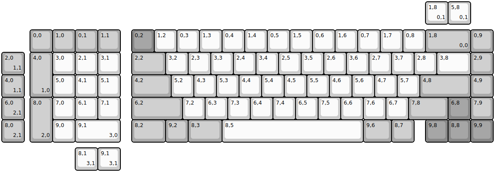{:loading="lazy"}

[Open in keyboard-layout-editor](http://www.keyboard-layout-editor.com/##@@_x:1.25&y:1.25&c=#aaaaaa;&=0,0&=1,0&=0,1&=1,1&_x:0.5&c=#888888;&=0,2&_c=#cccccc;&=1,2&=0,3&=1,3&=0,4&=1,4&=0,5&=1,5&=0,6&=1,6&=0,7&=1,7&=0,8&_c=#aaaaaa&w:2;&=1,8%0A%0A%0A0,0&=0,9;&@_x:1.25&h:2;&=4,0%0A%0A%0A1,0&_c=#cccccc;&=3,0&=2,1&=3,1&_x:0.5&c=#aaaaaa&w:1.5;&=2,2&_c=#cccccc;&=3,2&=2,3&=3,3&=2,4&=3,4&=2,5&=3,5&=2,6&=3,6&=2,7&=3,7&=2,8&_w:1.5;&=3,8&_c=#aaaaaa;&=2,9;&@_x:2.25&c=#cccccc;&=5,0&=4,1&=5,1&_x:0.5&c=#aaaaaa&w:1.75;&=4,2&_c=#cccccc;&=5,2&=4,3&=5,3&=4,4&=5,4&=4,5&=5,5&=4,6&=5,6&=4,7&=5,7&_c=#aaaaaa&w:2.25;&=4,8&=4,9;&@_x:1.25&h:2;&=8,0%0A%0A%0A2,0&_c=#cccccc;&=7,0&=6,1&=7,1&_x:0.5&c=#aaaaaa&w:2.25;&=6,2&_c=#cccccc;&=7,2&=6,3&=7,3&=6,4&=7,4&=6,5&=7,5&=6,6&=7,6&=6,7&_c=#aaaaaa&w:1.75;&=7,8&_c=#888888;&=6,8&_c=#aaaaaa;&=7,9;&@_x:2.25&c=#cccccc;&=9,0&_w:2;&=9,1%0A%0A%0A3,0&_x:0.5&c=#aaaaaa&w:1.5;&=8,2&=9,2&_w:1.5;&=8,3&_c=#cccccc&w:6.25;&=8,5&_c=#aaaaaa&w:1.25;&=9,6&=8,7&_x:0.5&c=#888888;&=9,8&=8,8&=9,9;&@_x:18.75&y:-6.25&c=#cccccc;&=1,8%0A%0A%0A0,1&=5,8%0A%0A%0A0,1;&@_y:1.25&c=#aaaaaa;&=2,0%0A%0A%0A1,1;&@=4,0%0A%0A%0A1,1;&@=6,0%0A%0A%0A2,1;&@=8,0%0A%0A%0A2,1;&@_x:3.25&y:0.25&c=#cccccc;&=8,1%0A%0A%0A3,1&=9,1%0A%0A%0A3,1)

## aeboards/ext65/aeboards_ext65_rev2

[README](output/aeboards/ext65/README.md) - [layout](output/aeboards/ext65/aeboards_ext65_rev2-kle.json) - [PCB](output/aeboards/ext65/aeboards_ext65_rev2.kicad_pcb) - [PCB render](output/aeboards/ext65/aeboards_ext65_rev2-render.svg)

{:loading="lazy"}

[Open in keyboard-layout-editor](http://www.keyboard-layout-editor.com/##@@_x:1.25&y:1.25&c=#aaaaaa;&=0,0&=1,0&=0,1&=1,1&_x:0.5&c=#888888;&=0,2&_c=#cccccc;&=1,2&=0,3&=1,3&=0,4&=1,4&=0,5&=1,5&=0,6&=1,6&=0,7&=1,7&=0,8&_c=#aaaaaa&w:2;&=1,8%0A%0A%0A0,0&=0,9;&@_x:1.25&h:2;&=4,0%0A%0A%0A1,0&_c=#cccccc;&=3,0&=2,1&=3,1&_x:0.5&c=#aaaaaa&w:1.5;&=2,2&_c=#cccccc;&=3,2&=2,3&=3,3&=2,4&=3,4&=2,5&=3,5&=2,6&=3,6&=2,7&=3,7&=2,8&_w:1.5;&=3,8&_c=#aaaaaa;&=2,9;&@_x:2.25&c=#cccccc;&=5,0&=4,1&=5,1&_x:0.5&c=#aaaaaa&w:1.75;&=4,2&_c=#cccccc;&=5,2&=4,3&=5,3&=4,4&=5,4&=4,5&=5,5&=4,6&=5,6&=4,7&=5,7&_c=#aaaaaa&w:2.25;&=4,8&=4,9;&@_x:1.25&h:2;&=8,0%0A%0A%0A2,0&_c=#cccccc;&=7,0&=6,1&=7,1&_x:0.5&c=#aaaaaa&w:2.25;&=6,2&_c=#cccccc;&=7,2&=6,3&=7,3&=6,4&=7,4&=6,5&=7,5&=6,6&=7,6&=6,7&_c=#aaaaaa&w:1.75;&=7,8&_c=#888888;&=6,8&_c=#aaaaaa;&=7,9;&@_x:2.25&c=#cccccc;&=9,0&_w:2;&=9,1%0A%0A%0A3,0&_x:0.5&c=#aaaaaa&w:1.5;&=8,2&=9,2&_w:1.5;&=8,3&_c=#cccccc&w:6.25;&=8,5&_c=#aaaaaa&w:1.25;&=9,6&=8,7&_x:0.5&c=#888888;&=9,8&=8,8&=9,9;&@_x:18.75&y:-6.25&c=#cccccc;&=1,8%0A%0A%0A0,1&=5,8%0A%0A%0A0,1;&@_y:1.25&c=#aaaaaa;&=2,0%0A%0A%0A1,1;&@=4,0%0A%0A%0A1,1;&@=6,0%0A%0A%0A2,1;&@=8,0%0A%0A%0A2,1;&@_x:3.25&y:0.25&c=#cccccc;&=8,1%0A%0A%0A3,1&=9,1%0A%0A%0A3,1)

## aeboards/ext65/aeboards_ext65_rev3

[README](output/aeboards/ext65/README.md) - [layout](output/aeboards/ext65/aeboards_ext65_rev3-kle.json) - [PCB](output/aeboards/ext65/aeboards_ext65_rev3.kicad_pcb) - [PCB render](output/aeboards/ext65/aeboards_ext65_rev3-render.svg)

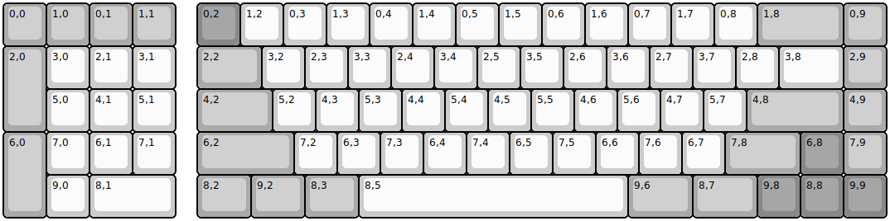{:loading="lazy"}

[Open in keyboard-layout-editor](http://www.keyboard-layout-editor.com/##@@_c=#aaaaaa;&=0,0&=1,0&=0,1&=1,1&_x:0.5&c=#888888;&=0,2&_c=#cccccc;&=1,2&=0,3&=1,3&=0,4&=1,4&=0,5&=1,5&=0,6&=1,6&=0,7&=1,7&=0,8&_c=#aaaaaa&w:2;&=1,8&=0,9;&@_h:2;&=2,0&_c=#cccccc;&=3,0&=2,1&=3,1&_x:0.5&c=#aaaaaa&w:1.5;&=2,2&_c=#cccccc;&=3,2&=2,3&=3,3&=2,4&=3,4&=2,5&=3,5&=2,6&=3,6&=2,7&=3,7&=2,8&_w:1.5;&=3,8&_c=#aaaaaa;&=2,9;&@_x:1&c=#cccccc;&=5,0&=4,1&=5,1&_x:0.5&c=#aaaaaa&w:1.75;&=4,2&_c=#cccccc;&=5,2&=4,3&=5,3&=4,4&=5,4&=4,5&=5,5&=4,6&=5,6&=4,7&=5,7&_c=#aaaaaa&w:2.25;&=4,8&=4,9;&@_h:2;&=6,0&_c=#cccccc;&=7,0&=6,1&=7,1&_x:0.5&c=#aaaaaa&w:2.25;&=6,2&_c=#cccccc;&=7,2&=6,3&=7,3&=6,4&=7,4&=6,5&=7,5&=6,6&=7,6&=6,7&_c=#aaaaaa&w:1.75;&=7,8&_c=#888888;&=6,8&_c=#aaaaaa;&=7,9;&@_x:1&c=#cccccc;&=9,0&_w:2;&=8,1&_x:0.5&c=#aaaaaa&w:1.25;&=8,2&_w:1.25;&=9,2&_w:1.25;&=8,3&_c=#cccccc&w:6.25;&=8,5&_c=#aaaaaa&w:1.5;&=9,6&_w:1.5;&=8,7&_c=#888888;&=9,8&=8,8&=9,9)

## aeboards/satellite/aeboards_satellite_rev1

[README](output/aeboards/satellite/README.md) - [layout](output/aeboards/satellite/aeboards_satellite_rev1-kle.json) - [PCB](output/aeboards/satellite/aeboards_satellite_rev1.kicad_pcb) - [PCB render](output/aeboards/satellite/aeboards_satellite_rev1-render.svg)

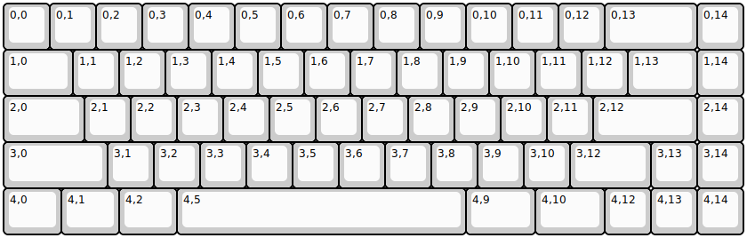{:loading="lazy"}

[Open in keyboard-layout-editor](http://www.keyboard-layout-editor.com/##@@=0,0&=0,1&=0,2&=0,3&=0,4&=0,5&=0,6&=0,7&=0,8&=0,9&=0,10&=0,11&=0,12&_w:2;&=0,13&=0,14;&@_w:1.5;&=1,0&=1,1&=1,2&=1,3&=1,4&=1,5&=1,6&=1,7&=1,8&=1,9&=1,10&=1,11&=1,12&_w:1.5;&=1,13&=1,14;&@_w:1.75;&=2,0&=2,1&=2,2&=2,3&=2,4&=2,5&=2,6&=2,7&=2,8&=2,9&=2,10&=2,11&_w:2.25;&=2,12&=2,14;&@_w:2.25;&=3,0&=3,1&=3,2&=3,3&=3,4&=3,5&=3,6&=3,7&=3,8&=3,9&=3,10&_w:1.75;&=3,12&=3,13&=3,14;&@_w:1.25;&=4,0&_w:1.25;&=4,1&_w:1.25;&=4,2&_w:6.25;&=4,5&_w:1.5;&=4,9&_w:1.5;&=4,10&=4,12&=4,13&=4,14)

## aeroboard/aeroboard

[README](output/aeroboard/README.md) - [layout](output/aeroboard/aeroboard-kle.json) - [PCB](output/aeroboard/aeroboard.kicad_pcb) - [PCB render](output/aeroboard/aeroboard-render.svg)

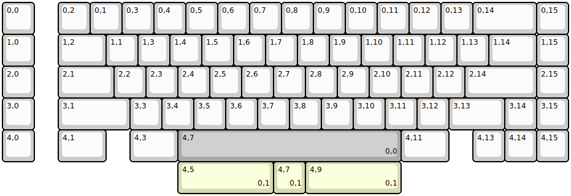{:loading="lazy"}

[Open in keyboard-layout-editor](http://www.keyboard-layout-editor.com/##@@=0,0&_x:0.75;&=0,2&=0,1&=0,3&=0,4&=0,5&=0,6&=0,7&=0,8&=0,9&=0,10&=0,11&=0,12&=0,13&_w:2;&=0,14&=0,15;&@=1,0&_x:0.75&w:1.5;&=1,2&=1,1&=1,3&=1,4&=1,5&=1,6&=1,7&=1,8&=1,9&=1,10&=1,11&=1,12&=1,13&_w:1.5;&=1,14&=1,15;&@=2,0&_x:0.75&w:1.75;&=2,1&=2,2&=2,3&=2,4&=2,5&=2,6&=2,7&=2,8&=2,9&=2,10&=2,11&=2,12&_w:2.25;&=2,14&=2,15;&@=3,0&_x:0.75&w:2.25;&=3,1&=3,3&=3,4&=3,5&=3,6&=3,7&=3,8&=3,9&=3,10&=3,11&=3,12&_w:1.75;&=3,13&=3,14&=3,15;&@=4,0&_x:0.75&w:1.5;&=4,1&_x:0.75&w:1.5;&=4,3&_c=#aaaaaa&w:7;&=4,7%0A%0A%0A0,0&_c=#cccccc&w:1.5;&=4,11&_x:0.75;&=4,13&=4,14&=4,15;&@_x:5.5&c=#d3dbb4&w:3;&=4,5%0A%0A%0A0,1&=4,7%0A%0A%0A0,1&_w:3;&=4,9%0A%0A%0A0,1)

## afternoonlabs/breeze

[README](output/afternoonlabs/README.md) - [layout](output/afternoonlabs/breeze-kle.json) - [PCB](output/afternoonlabs/breeze.kicad_pcb) - [PCB render](output/afternoonlabs/breeze-render.svg)

{:loading="lazy"}

[Open in keyboard-layout-editor](http://www.keyboard-layout-editor.com/##@@_x:3;&=0,2&_x:7.75;&=5,2;&@_x:2&y:-0.875;&=0,3&_x:1;&=0,1&_x:5.75;&=5,1&_x:1.0;&=5,3;&@_x:5&y:-0.875;&=0,0&_x:3.75;&=5,0;&@_y:-0.875;&=0,5&=0,4&_x:11.75;&=5,4&=5,5&_x:0.25;&=5,6&=5,7&=5,8;&@_x:3&y:-0.375;&=1,2&_x:7.75;&=6,2;&@_x:2&y:-0.875;&=1,3&_x:1;&=1,1&_x:5.75;&=6,1&_x:1.0;&=6,3;&@_x:5&y:-0.875;&=1,0&_x:3.75;&=6,0;&@_y:-0.875;&=1,5&=1,4&_x:11.75;&=6,4&=6,5&_x:0.25;&=6,6&=6,7&=6,8;&@_x:3&y:-0.375;&=2,2&_x:7.75;&=7,2;&@_x:2&y:-0.875;&=2,3&_x:1;&=2,1&_x:5.75;&=7,1&_x:1.0;&=7,3;&@_x:5&y:-0.875;&=2,0&_x:3.75;&=7,0;&@_y:-0.875;&=2,5&=2,4&_x:11.75;&=7,4&=7,5&_x:1.25;&=7,7;&@_x:3&y:-0.375;&=3,2&_x:7.75;&=8,2;&@_x:2&y:-0.875;&=3,3&_x:1;&=3,1&_x:5.75;&=8,1&_x:1.0;&=8,3;&@_x:5&y:-0.875;&=3,0&_x:3.75;&=8,0;&@_y:-0.875;&=3,5&=3,4&_x:11.75;&=8,4&=8,5&_x:0.25;&=8,6&=8,7&=8,8;&@_x:2.5&y:-0.125&c=#aaaaaa;&=4,3&=4,2&_x:6.75;&=9,2&=9,3;&@_x:4.5&y:-0.75;&=4,1&_x:4.75;&=9,1;&@_r:30&rx:6.5&ry:4.25&x:-0.25&y:-0.5&c=#777777&h:2;&=4,0;&@_r:-30&rx:12.25&ry:4.5&x:-3.25&y:-2.25&h:2;&=9,0)

## afternoonlabs/southern-breeze

[README](output/afternoonlabs/README.md) - [layout](output/afternoonlabs/southern-breeze-kle.json) - [PCB](output/afternoonlabs/southern-breeze.kicad_pcb) - [PCB render](output/afternoonlabs/southern-breeze-render.svg)

{:loading="lazy"}

[Open in keyboard-layout-editor](http://www.keyboard-layout-editor.com/##@@_x:6.25;&=0,2&_x:7.75;&=5,2;&@_x:5.25&y:-0.875;&=0,3&_x:1.0;&=0,1&_x:5.75;&=5,1&_x:1.0;&=5,3;&@_x:8.25&y:-0.875;&=0,0&_x:3.75;&=5,0;&@_y:-0.875;&=0,8&=0,7&=0,6&_x:0.25;&=0,5&=0,4&_x:11.75;&=5,4&=5,5;&@_x:6.25&y:-0.375;&=1,2&_x:7.75;&=6,2;&@_x:5.25&y:-0.875;&=1,3&_x:1.0;&=1,1&_x:5.75;&=6,1&_x:1.0;&=6,3;&@_x:8.25&y:-0.875;&=1,0&_x:3.75;&=6,0;&@_y:-0.875;&=1,8&=1,7&=1,6&_x:0.25;&=1,5&=1,4&_x:11.75;&=6,4&=6,5;&@_x:6.25&y:-0.375;&=2,2&_x:7.75;&=7,2;&@_x:5.25&y:-0.875;&=2,3&_x:1.0;&=2,1&_x:5.75;&=7,1&_x:1.0;&=7,3;&@_x:8.25&y:-0.875;&=2,0&_x:3.75;&=7,0;&@_x:1&y:-0.875;&=2,7&_x:1.25;&=2,5&=2,4&_x:11.75;&=7,4&=7,5;&@_x:6.25&y:-0.375;&=3,2&_x:7.75;&=8,2;&@_x:5.25&y:-0.875;&=3,3&_x:1.0;&=3,1&_x:5.75;&=8,1&_x:1.0;&=8,3;&@_x:8.25&y:-0.875;&=3,0&_x:3.75;&=8,0;&@_y:-0.875;&=3,8&=3,7&=3,6&_x:0.25;&=3,5&=3,4&_x:11.75;&=8,4&=8,5;&@_x:5.75&y:-0.125&c=#aaaaaa;&=4,3&=4,2&_x:6.75;&=9,2&=9,3;&@_x:7.75&y:-0.75;&=4,1&_x:4.75;&=9,1;&@_r:30&rx:9.75&ry:4.25&x:-0.25&y:-0.5&c=#7777777&h:2;&=4,0;&@_r:-30&rx:15.5&ry:4.5&x:-3.25&y:-2.25&h:2;&=9,0)

## afternoonlabs/summer-breeze

[README](output/afternoonlabs/README.md) - [layout](output/afternoonlabs/summer-breeze-kle.json) - [PCB](output/afternoonlabs/summer-breeze.kicad_pcb) - [PCB render](output/afternoonlabs/summer-breeze-render.svg)

{:loading="lazy"}

[Open in keyboard-layout-editor](http://www.keyboard-layout-editor.com/##@@_x:6.25;&=0,2&_x:7.75;&=5,2;&@_x:5.25&y:-0.875;&=0,3&_x:1.0;&=0,1&_x:5.75;&=5,1&_x:1.0;&=5,3;&@_x:8.25&y:-0.875;&=0,0&_x:3.75;&=5,0;&@_y:-0.875;&=0,8&=0,7&=0,6&_x:0.25;&=0,5&=0,4&_x:11.75;&=5,4&=5,5&_x:0.25;&=5,6&=5,7&=5,8;&@_x:6.25&y:-0.375;&=1,2&_x:7.75;&=6,2;&@_x:5.25&y:-0.875;&=1,3&_x:1.0;&=1,1&_x:5.75;&=6,1&_x:1.0;&=6,3;&@_x:8.25&y:-0.875;&=1,0&_x:3.75;&=6,0;&@_y:-0.875;&=1,8&=1,7&=1,6&_x:0.25;&=1,5&=1,4&_x:11.75;&=6,4&=6,5&_x:0.25;&=6,6&=6,7&=6,8;&@_x:6.25&y:-0.375;&=2,2&_x:7.75;&=7,2;&@_x:5.25&y:-0.875;&=2,3&_x:1.0;&=2,1&_x:5.75;&=7,1&_x:1.0;&=7,3;&@_x:8.25&y:-0.875;&=2,0&_x:3.75;&=7,0;&@_x:1&y:-0.875;&=2,7&_x:1.25;&=2,5&=2,4&_x:11.75;&=7,4&=7,5&_x:1.25;&=7,7;&@_x:6.25&y:-0.375;&=3,2&_x:7.75;&=8,2;&@_x:5.25&y:-0.875;&=3,3&_x:1.0;&=3,1&_x:5.75;&=8,1&_x:1.0;&=8,3;&@_x:8.25&y:-0.875;&=3,0&_x:3.75;&=8,0;&@_y:-0.875;&=3,8&=3,7&=3,6&_x:0.25;&=3,5&=3,4&_x:11.75;&=8,4&=8,5&_x:0.25;&=8,6&=8,7&=8,8;&@_x:5.75&y:-0.125&c=#aaaaaa;&=4,3&=4,2&_x:6.75;&=9,2&=9,3;&@_x:7.75&y:-0.75;&=4,1&_x:4.75;&=9,1;&@_r:30&rx:9.75&ry:4.25&x:-0.25&y:-0.5&c=#7777777&h:2;&=4,0;&@_r:-30&rx:15.5&ry:4.5&x:-3.25&y:-2.25&h:2;&=9,0)

## ai03/andromeda

[README](output/ai03/andromeda/README.md) - [layout](output/ai03/andromeda/andromeda-kle.json) - [PCB](output/ai03/andromeda/andromeda.kicad_pcb) - [PCB render](output/ai03/andromeda/andromeda-render.svg)

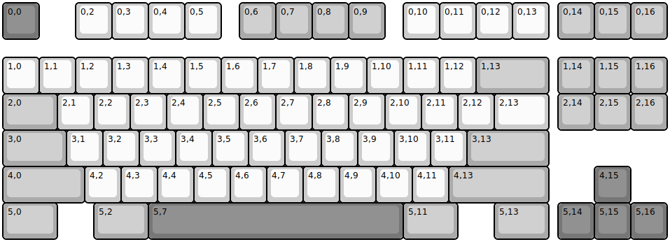{:loading="lazy"}

[Open in keyboard-layout-editor](http://www.keyboard-layout-editor.com/##@@_c=#777777;&=0,0&_x:1&c=#cccccc;&=0,2&=0,3&=0,4&=0,5&_x:0.5&c=#aaaaaa;&=0,6&=0,7&=0,8&=0,9&_x:0.5&c=#cccccc;&=0,10&=0,11&=0,12&=0,13&_x:0.25&c=#aaaaaa;&=0,14&=0,15&=0,16;&@_y:0.5&c=#cccccc;&=1,0&=1,1&=1,2&=1,3&=1,4&=1,5&=1,6&=1,7&=1,8&=1,9&=1,10&=1,11&=1,12&_c=#aaaaaa&w:2;&=1,13&_x:0.25;&=1,14&=1,15&=1,16;&@_w:1.5;&=2,0&_c=#cccccc;&=2,1&=2,2&=2,3&=2,4&=2,5&=2,6&=2,7&=2,8&=2,9&=2,10&=2,11&=2,12&_w:1.5;&=2,13&_x:0.25&c=#aaaaaa;&=2,14&=2,15&=2,16;&@_w:1.75;&=3,0&_c=#cccccc;&=3,1&=3,2&=3,3&=3,4&=3,5&=3,6&=3,7&=3,8&=3,9&=3,10&=3,11&_c=#aaaaaa&w:2.25;&=3,13;&@_w:2.25;&=4,0&_c=#cccccc;&=4,2&=4,3&=4,4&=4,5&=4,6&=4,7&=4,8&=4,9&=4,10&=4,11&_c=#aaaaaa&w:2.75;&=4,13&_x:1.25&c=#777777;&=4,15;&@_c=#aaaaaa&w:1.5;&=5,0&_x:1.0&w:1.5;&=5,2&_c=#777777&w:7;&=5,7&_c=#aaaaaa&w:1.5;&=5,11&_x:1.0&w:1.5;&=5,13&_x:0.25&c=#777777;&=5,14&=5,15&=5,16)

## ai03/equinox

[README](output/ai03/equinox/README.md) - [layout](output/ai03/equinox/equinox-kle.json) - [PCB](output/ai03/equinox/equinox.kicad_pcb) - [PCB render](output/ai03/equinox/equinox-render.svg)

{:loading="lazy"}

[Open in keyboard-layout-editor](http://www.keyboard-layout-editor.com/##@@_x:2.5&c=#aaaaaa&w:1.5;&=0,0&_c=#cccccc;&=0,1&=0,2&=0,3&=0,4&=0,5&=0,6&=0,7&=0,8&=0,9&=0,10&_c=#aaaaaa&w:1.5;&=0,11%0A%0A%0A0,0;&@_x:2.5&w:1.75;&=1,0&_c=#cccccc;&=1,1&=1,2&=1,3&=1,4&=1,5&=1,6&=1,7&=1,8&=1,9&_c=#777777&w:2.25;&=1,11%0A%0A%0A0,0;&@_x:2.5&c=#aaaaaa&w:2.25;&=2,0%0A%0A%0A1,0&_c=#cccccc;&=2,2&=2,3&=2,4&=2,5&=2,6&=2,7&=2,8&=2,9&=2,10%0A%0A%0A2,0&_c=#aaaaaa&w:1.75;&=2,11%0A%0A%0A2,0;&@_x:2.5&w:1.25;&=3,0%0A%0A%0A3,0&=3,1%0A%0A%0A3,0&_w:1.25;&=3,2%0A%0A%0A3,0&_c=#cccccc&w:6;&=3,6%0A%0A%0A3,0&_c=#aaaaaa&w:1.25;&=3,9%0A%0A%0A3,0&=3,10%0A%0A%0A3,0&_w:1.25;&=3,11%0A%0A%0A3,0;&@_x:16.75&y:-4&c=#777777&w:1.25&h:2&w2:1.5&h2:1&x2:-0.25;&=1,11%0A%0A%0A0,1&_x:1.0&c=#aaaaaa&w:1.5;&=0,11%0A%0A%0A0,2;&@_x:15.75;&=1,10%0A%0A%0A0,1&_x:1.5;&=1,10%0A%0A%0A0,2&_c=#777777&w:1.25;&=1,11%0A%0A%0A0,2;&@_c=#aaaaaa&w:1.25;&=2,0%0A%0A%0A1,1&_c=#cccccc;&=2,1%0A%0A%0A1,1&_x:13.5&c=#aaaaaa&w:1.75;&=2,10%0A%0A%0A2,1&=2,11%0A%0A%0A2,1&_x:0.25&w:2.75;&=2,11%0A%0A%0A2,2;&@_x:2.5&y:1.25&w:1.25;&=3,0%0A%0A%0A3,1&=3,1%0A%0A%0A3,1&_w:1.25;&=3,2%0A%0A%0A3,1&_c=#cccccc&w:2.75;&=3,4%0A%0A%0A3,1&=3,6%0A%0A%0A3,1&_w:2.25;&=3,8%0A%0A%0A3,1&_c=#aaaaaa&w:1.25;&=3,9%0A%0A%0A3,1&=3,10%0A%0A%0A3,1&_w:1.25;&=3,11%0A%0A%0A3,1;&@_x:2.5&w:1.25;&=3,0%0A%0A%0A3,2&=3,1%0A%0A%0A3,2&_w:1.25;&=3,2%0A%0A%0A3,2&_c=#cccccc&w:2.25;&=3,4%0A%0A%0A3,2&=3,6%0A%0A%0A3,2&_w:2.75;&=3,8%0A%0A%0A3,2&_c=#aaaaaa&w:1.25;&=3,9%0A%0A%0A3,2&=3,10%0A%0A%0A3,2&_w:1.25;&=3,11%0A%0A%0A3,2;&@_x:2.5&w:1.25;&=3,0%0A%0A%0A3,3&=3,1%0A%0A%0A3,3&_w:1.25;&=3,2%0A%0A%0A3,3&_c=#cccccc&w:3;&=3,4%0A%0A%0A3,3&_w:3;&=3,8%0A%0A%0A3,3&_c=#aaaaaa&w:1.25;&=3,9%0A%0A%0A3,3&=3,10%0A%0A%0A3,3&_w:1.25;&=3,11%0A%0A%0A3,3)

## ai03/jp60

[README](output/ai03/jp60/README.md) - [layout](output/ai03/jp60/jp60-kle.json) - [PCB](output/ai03/jp60/jp60.kicad_pcb) - [PCB render](output/ai03/jp60/jp60-render.svg)

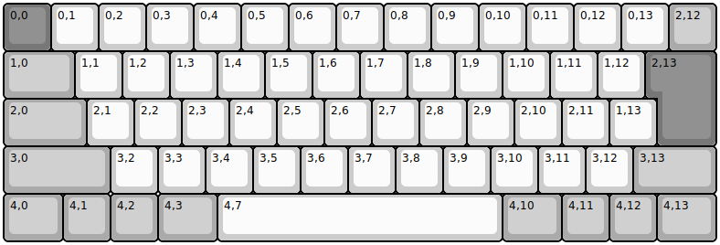{:loading="lazy"}

[Open in keyboard-layout-editor](http://www.keyboard-layout-editor.com/##@@_c=#777777;&=0,0&_c=#cccccc;&=0,1&=0,2&=0,3&=0,4&=0,5&=0,6&=0,7&=0,8&=0,9&=0,10&=0,11&=0,12&=0,13&_c=#aaaaaa;&=2,12;&@_w:1.5;&=1,0&_c=#cccccc;&=1,1&=1,2&=1,3&=1,4&=1,5&=1,6&=1,7&=1,8&=1,9&=1,10&=1,11&=1,12&_x:0.25&c=#777777&w:1.25&h:2&w2:1.5&h2:1&x2:-0.25;&=2,13;&@_c=#aaaaaa&w:1.75;&=2,0&_c=#cccccc;&=2,1&=2,2&=2,3&=2,4&=2,5&=2,6&=2,7&=2,8&=2,9&=2,10&=2,11&=1,13;&@_c=#aaaaaa&w:2.25;&=3,0&_c=#cccccc;&=3,2&=3,3&=3,4&=3,5&=3,6&=3,7&=3,8&=3,9&=3,10&=3,11&=3,12&_c=#aaaaaa&w:1.75;&=3,13;&@_w:1.25;&=4,0&=4,1&=4,2&_w:1.25;&=4,3&_c=#cccccc&w:6;&=4,7&_c=#aaaaaa&w:1.25;&=4,10&=4,11&=4,12&_w:1.25;&=4,13)

## ai03/lunar_ii

[README](output/ai03/lunar_ii/README.md) - [layout](output/ai03/lunar_ii/lunar_ii-kle.json) - [PCB](output/ai03/lunar_ii/lunar_ii.kicad_pcb) - [PCB render](output/ai03/lunar_ii/lunar_ii-render.svg)

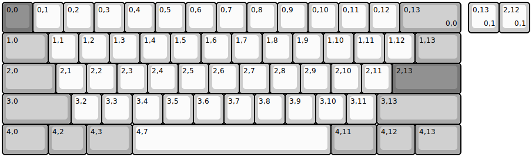{:loading="lazy"}

[Open in keyboard-layout-editor](http://www.keyboard-layout-editor.com/##@@_c=#777777;&=0,0&_c=#cccccc;&=0,1&=0,2&=0,3&=0,4&=0,5&=0,6&=0,7&=0,8&=0,9&=0,10&=0,11&=0,12&_c=#aaaaaa&w:2;&=0,13%0A%0A%0A0,0;&@_w:1.5;&=1,0&_c=#cccccc;&=1,1&=1,2&=1,3&=1,4&=1,5&=1,6&=1,7&=1,8&=1,9&=1,10&=1,11&=1,12&_c=#aaaaaa&w:1.5;&=1,13;&@_w:1.75;&=2,0&_c=#cccccc;&=2,1&=2,2&=2,3&=2,4&=2,5&=2,6&=2,7&=2,8&=2,9&=2,10&=2,11&_c=#777777&w:2.25;&=2,13;&@_c=#aaaaaa&w:2.25;&=3,0&_c=#cccccc;&=3,2&=3,3&=3,4&=3,5&=3,6&=3,7&=3,8&=3,9&=3,10&=3,11&_c=#aaaaaa&w:2.75;&=3,13;&@_w:1.5;&=4,0&_w:1.25;&=4,2&_w:1.5;&=4,3&_c=#cccccc&w:6.5;&=4,7&_c=#aaaaaa&w:1.5;&=4,11&_w:1.25;&=4,12&_w:1.5;&=4,13;&@_x:15.25&y:-5&c=#cccccc;&=0,13%0A%0A%0A0,1&=2,12%0A%0A%0A0,1)

## ai03/polaris

[README](output/ai03/polaris/README.md) - [layout](output/ai03/polaris/polaris-kle.json) - [PCB](output/ai03/polaris/polaris.kicad_pcb) - [PCB render](output/ai03/polaris/polaris-render.svg)

{:loading="lazy"}

[Open in keyboard-layout-editor](http://www.keyboard-layout-editor.com/##@@_x:2.5&c=#777777;&=0,0&_c=#cccccc;&=0,1&=0,2&=0,3&=0,4&=0,5&=0,6&=0,7&=0,8&=0,9&=0,10&=0,11&=0,12&_c=#aaaaaa&w:2;&=0,13%0A%0A%0A0,0;&@_x:2.5&w:1.5;&=1,0&_c=#cccccc;&=1,1&=1,2&=1,3&=1,4&=1,5&=1,6&=1,7&=1,8&=1,9&=1,10&=1,11&=1,12&_c=#aaaaaa&w:1.5;&=1,13%0A%0A%0A1,0;&@_x:2.5&w:1.75;&=2,0&_c=#cccccc;&=2,1&=2,2&=2,3&=2,4&=2,5&=2,6&=2,7&=2,8&=2,9&=2,10&=2,11&_c=#777777&w:2.25;&=2,13%0A%0A%0A1,0;&@_x:2.5&c=#aaaaaa&w:2.25;&=3,0%0A%0A%0A2,0&_c=#cccccc;&=3,2&=3,3&=3,4&=3,5&=3,6&=3,7&=3,8&=3,9&=3,10&=3,11&_c=#aaaaaa&w:1.75;&=3,12%0A%0A%0A3,0&=3,13%0A%0A%0A3,0;&@_x:2.5&w:1.5;&=4,0%0A%0A%0A4,0&=4,1%0A%0A%0A4,0&_w:1.5;&=4,2%0A%0A%0A4,0&_c=#cccccc&w:7;&=4,6%0A%0A%0A4,0&_c=#aaaaaa&w:1.5;&=4,11%0A%0A%0A4,0&=4,12%0A%0A%0A4,0&_w:1.5;&=4,13%0A%0A%0A4,0;&@_x:18.5&y:-5&c=#cccccc;&=0,13%0A%0A%0A0,1&=2,12%0A%0A%0A0,1;&@_x:19.25&c=#777777&w:1.25&h:2&w2:1.5&h2:1&x2:-0.25;&=2,13%0A%0A%0A1,1;&@_x:18.25&c=#cccccc;&=1,13%0A%0A%0A1,1;&@_c=#aaaaaa&w:1.25;&=3,0%0A%0A%0A2,1&=3,1%0A%0A%0A2,1&_x:15.5&w:2.75;&=3,13%0A%0A%0A3,1;&@_x:2.5&y:1.25&w:1.5;&=4,0%0A%0A%0A4,1&_d:true;&=%0A%0A%0A4,1&_w:1.5;&=4,2%0A%0A%0A4,1&_c=#cccccc&w:7;&=4,6%0A%0A%0A4,1&_c=#aaaaaa&w:1.5;&=4,11%0A%0A%0A4,1&_d:true;&=%0A%0A%0A4,1&_w:1.5;&=4,13%0A%0A%0A4,1;&@_x:2.5&w:1.5&d:true;&=%0A%0A%0A4,2&=4,1%0A%0A%0A4,2&_w:1.5;&=4,2%0A%0A%0A4,2&_c=#cccccc&w:7;&=4,6%0A%0A%0A4,2&_c=#aaaaaa&w:1.5;&=4,11%0A%0A%0A4,2&=4,12%0A%0A%0A4,2&_w:1.5&d:true;&=%0A%0A%0A4,2;&@_x:2.5&w:1.25;&=4,0%0A%0A%0A4,3&_w:1.25;&=4,1%0A%0A%0A4,3&_w:1.25;&=4,2%0A%0A%0A4,3&_c=#cccccc&w:6.25;&=4,6%0A%0A%0A4,3&_c=#aaaaaa&w:1.25;&=4,10%0A%0A%0A4,3&_w:1.25;&=4,11%0A%0A%0A4,3&_w:1.25;&=4,12%0A%0A%0A4,3&_w:1.25;&=4,13%0A%0A%0A4,3;&@_x:2.5&w:1.25;&=4,0%0A%0A%0A4,4&_w:1.25;&=4,1%0A%0A%0A4,4&_w:1.25;&=4,2%0A%0A%0A4,4&_c=#cccccc&w:2.25;&=4,4%0A%0A%0A4,4&_w:1.25;&=4,6%0A%0A%0A4,4&_w:2.75;&=4,8%0A%0A%0A4,4&_c=#aaaaaa&w:1.25;&=4,10%0A%0A%0A4,4&_w:1.25;&=4,11%0A%0A%0A4,4&_w:1.25;&=4,12%0A%0A%0A4,4&_w:1.25;&=4,13%0A%0A%0A4,4)

## ai03/soyuz

[README](output/ai03/soyuz/README.md) - [layout](output/ai03/soyuz/soyuz-kle.json) - [PCB](output/ai03/soyuz/soyuz.kicad_pcb) - [PCB render](output/ai03/soyuz/soyuz-render.svg)

{:loading="lazy"}

[Open in keyboard-layout-editor](http://www.keyboard-layout-editor.com/##@@_c=#777777;&=0,0&_c=#aaaaaa;&=0,1&=0,2&=0,3;&@_c=#cccccc;&=1,0&=1,1&=1,2&_c=#aaaaaa&h:2;&=2,3%0A%0A%0A0,0;&@_c=#cccccc;&=2,0&=2,1&=2,2;&@=3,0&=3,1&=3,2&_c=#777777&h:2;&=4,3%0A%0A%0A1,0;&@_c=#cccccc&w:2;&=4,1%0A%0A%0A2,0&=4,2;&@_x:4.5&y:-4&c=#aaaaaa;&=1,3%0A%0A%0A0,1;&@_x:4.5;&=2,3%0A%0A%0A0,1;&@_x:4.5&c=#777777;&=3,3%0A%0A%0A1,1;&@_x:4.5;&=4,3%0A%0A%0A1,1;&@_y:0.5&c=#cccccc;&=4,0%0A%0A%0A2,1&=4,1%0A%0A%0A2,1)

## ai03/ut472

[README](output/ai03/ut472/README.md) - [layout](output/ai03/ut472/ut472-kle.json) - [PCB](output/ai03/ut472/ut472.kicad_pcb) - [PCB render](output/ai03/ut472/ut472-render.svg)

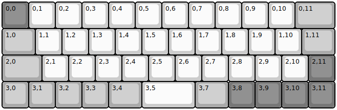{:loading="lazy"}

[Open in keyboard-layout-editor](http://www.keyboard-layout-editor.com/##@@_c=#777777;&=0,0&_c=#cccccc;&=0,1&=0,2&=0,3&=0,4&=0,5&=0,6&=0,7&=0,8&=0,9&=0,10&_c=#aaaaaa&w:1.5;&=0,11;&@_w:1.25;&=1,0&_c=#cccccc;&=1,1&=1,2&=1,3&=1,4&=1,5&=1,6&=1,7&=1,8&=1,9&=1,10&_c=#aaaaaa&w:1.25;&=1,11;&@_w:1.5;&=2,0&_c=#cccccc;&=2,1&=2,2&=2,3&=2,4&=2,5&=2,6&=2,7&=2,8&=2,9&=2,10&_c=#777777;&=2,11;&@_c=#aaaaaa;&=3,0&=3,1&=3,2&=3,3&_w:1.25;&=3,4&_c=#cccccc&w:2;&=3,5&_c=#aaaaaa&w:1.25;&=3,7&_c=#777777;&=3,8&=3,9&=3,10&=3,11)

## ai03/vega

[README](output/ai03/vega/README.md) - [layout](output/ai03/vega/vega-kle.json) - [PCB](output/ai03/vega/vega.kicad_pcb) - [PCB render](output/ai03/vega/vega-render.svg)

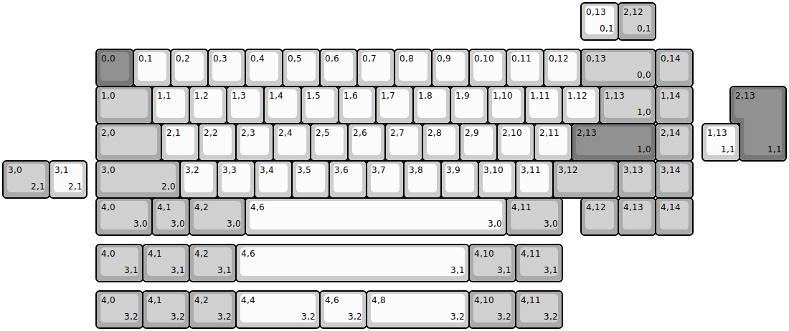{:loading="lazy"}

[Open in keyboard-layout-editor](http://www.keyboard-layout-editor.com/##@@_x:2.5&y:1.25&c=#777777;&=0,0&_c=#cccccc;&=0,1&=0,2&=0,3&=0,4&=0,5&=0,6&=0,7&=0,8&=0,9&=0,10&=0,11&=0,12&_c=#aaaaaa&w:2;&=0,13%0A%0A%0A0,0&=0,14;&@_x:2.5&w:1.5;&=1,0&_c=#cccccc;&=1,1&=1,2&=1,3&=1,4&=1,5&=1,6&=1,7&=1,8&=1,9&=1,10&=1,11&=1,12&_c=#aaaaaa&w:1.5;&=1,13%0A%0A%0A1,0&=1,14;&@_x:2.5&w:1.75;&=2,0&_c=#cccccc;&=2,1&=2,2&=2,3&=2,4&=2,5&=2,6&=2,7&=2,8&=2,9&=2,10&=2,11&_c=#777777&w:2.25;&=2,13%0A%0A%0A1,0&_c=#aaaaaa;&=2,14;&@_x:2.5&w:2.25;&=3,0%0A%0A%0A2,0&_c=#cccccc;&=3,2&=3,3&=3,4&=3,5&=3,6&=3,7&=3,8&=3,9&=3,10&=3,11&_c=#aaaaaa&w:1.75;&=3,12&=3,13&=3,14;&@_x:2.5&w:1.5;&=4,0%0A%0A%0A3,0&=4,1%0A%0A%0A3,0&_w:1.5;&=4,2%0A%0A%0A3,0&_c=#cccccc&w:7;&=4,6%0A%0A%0A3,0&_c=#aaaaaa&w:1.5;&=4,11%0A%0A%0A3,0&_x:0.5;&=4,12&=4,13&=4,14;&@_x:15.5&y:-6.25&c=#cccccc;&=0,13%0A%0A%0A0,1&_c=#aaaaaa;&=2,12%0A%0A%0A0,1;&@_x:19.75&y:1.25&c=#777777&w:1.25&h:2&w2:1.5&h2:1&x2:-0.25;&=2,13%0A%0A%0A1,1;&@_x:18.75&c=#cccccc;&=1,13%0A%0A%0A1,1;&@_c=#aaaaaa&w:1.25;&=3,0%0A%0A%0A2,1&_c=#cccccc;&=3,1%0A%0A%0A2,1;&@_x:2.5&y:1.25&c=#aaaaaa&w:1.25;&=4,0%0A%0A%0A3,1&_w:1.25;&=4,1%0A%0A%0A3,1&_w:1.25;&=4,2%0A%0A%0A3,1&_c=#cccccc&w:6.25;&=4,6%0A%0A%0A3,1&_c=#aaaaaa&w:1.25;&=4,10%0A%0A%0A3,1&_w:1.25;&=4,11%0A%0A%0A3,1;&@_x:2.5&y:0.25&w:1.25;&=4,0%0A%0A%0A3,2&_w:1.25;&=4,1%0A%0A%0A3,2&_w:1.25;&=4,2%0A%0A%0A3,2&_c=#cccccc&w:2.25;&=4,4%0A%0A%0A3,2&_w:1.25;&=4,6%0A%0A%0A3,2&_w:2.75;&=4,8%0A%0A%0A3,2&_c=#aaaaaa&w:1.25;&=4,10%0A%0A%0A3,2&_w:1.25;&=4,11%0A%0A%0A3,2)

## ai03/voyager60_alps

[README](output/ai03/voyager60_alps/README.md) - [layout](output/ai03/voyager60_alps/voyager60_alps-kle.json) - [PCB](output/ai03/voyager60_alps/voyager60_alps.kicad_pcb) - [PCB render](output/ai03/voyager60_alps/voyager60_alps-render.svg)

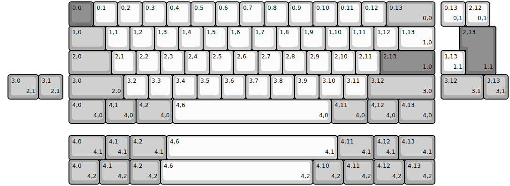{:loading="lazy"}

[Open in keyboard-layout-editor](http://www.keyboard-layout-editor.com/##@@_x:2.75&c=#777777;&=0,0&_c=#cccccc;&=0,1&=0,2&=0,3&=0,4&=0,5&=0,6&=0,7&=0,8&=0,9&=0,10&=0,11&=0,12&_c=#aaaaaa&w:2;&=0,13%0A%0A%0A0,0;&@_x:2.75&w:1.5;&=1,0&_c=#cccccc;&=1,1&=1,2&=1,3&=1,4&=1,5&=1,6&=1,7&=1,8&=1,9&=1,10&=1,11&=1,12&_w:1.5;&=1,13%0A%0A%0A1,0;&@_x:2.75&c=#aaaaaa&w:1.75;&=2,0&_c=#cccccc;&=2,1&=2,2&=2,3&=2,4&=2,5&=2,6&=2,7&=2,8&=2,9&=2,10&=2,11&_c=#777777&w:2.25;&=2,13%0A%0A%0A1,0;&@_x:2.75&c=#aaaaaa&w:2.25;&=3,0%0A%0A%0A2,0&_c=#cccccc;&=3,2&=3,3&=3,4&=3,5&=3,6&=3,7&=3,8&=3,9&=3,10&=3,11&_c=#aaaaaa&w:2.75;&=3,12%0A%0A%0A3,0;&@_x:2.75&w:1.5;&=4,0%0A%0A%0A4,0&_w:1.25;&=4,1%0A%0A%0A4,0&_w:1.5;&=4,2%0A%0A%0A4,0&_c=#cccccc&w:6.5;&=4,6%0A%0A%0A4,0&_c=#aaaaaa&w:1.5;&=4,11%0A%0A%0A4,0&_w:1.25;&=4,12%0A%0A%0A4,0&_w:1.5;&=4,13%0A%0A%0A4,0;&@_x:18.0&y:-5&c=#cccccc;&=0,13%0A%0A%0A0,1&=2,12%0A%0A%0A0,1;&@_x:19.0&c=#777777&w:1.25&h:2&w2:1.5&h2:1&x2:-0.25;&=2,13%0A%0A%0A1,1;&@_x:18.0&c=#cccccc;&=1,13%0A%0A%0A1,1;&@_x:0.25&c=#aaaaaa&w:1.25;&=3,0%0A%0A%0A2,1&=3,1%0A%0A%0A2,1&_x:15.5&w:1.75;&=3,12%0A%0A%0A3,1&=3,13%0A%0A%0A3,1;&@_x:2.75&y:1.5&w:1.5;&=4,0%0A%0A%0A4,1&=4,1%0A%0A%0A4,1&_w:1.5;&=4,2%0A%0A%0A4,1&_c=#cccccc&w:7;&=4,6%0A%0A%0A4,1&_c=#aaaaaa&w:1.5;&=4,11%0A%0A%0A4,1&=4,12%0A%0A%0A4,1&_w:1.5;&=4,13%0A%0A%0A4,1;&@_x:2.75&w:1.25;&=4,0%0A%0A%0A4,2&_w:1.25;&=4,1%0A%0A%0A4,2&_w:1.25;&=4,2%0A%0A%0A4,2&_c=#cccccc&w:6.25;&=4,6%0A%0A%0A4,2&_c=#aaaaaa&w:1.25;&=4,10%0A%0A%0A4,2&_w:1.25;&=4,11%0A%0A%0A4,2&_w:1.25;&=4,12%0A%0A%0A4,2&_w:1.25;&=4,13%0A%0A%0A4,2)

## akb/ogr

[README](output/akb/README.md) - [layout](output/akb/ogr-kle.json) - [PCB](output/akb/ogr.kicad_pcb) - [PCB render](output/akb/ogr-render.svg)

{:loading="lazy"}

[Open in keyboard-layout-editor](http://www.keyboard-layout-editor.com/##@@_x:2.75&c=#777777;&=0,0&=0,1&_x:0.5;&=0,2&_c=#cccccc;&=0,3&=0,4&=0,5&=0,6&=0,7&=0,8&=0,9&=0,10&=0,11&=0,12&=0,13&=0,14&_c=#777777&w:2;&=0,15%0A%0A%0A0,0&=0,17;&@_x:2.75;&=1,0&=1,1&_x:0.5&c=#cccccc&w:1.5;&=1,2&=1,3&=1,4&=1,5&=1,6&=1,7&=1,8&=1,9&=1,10&=1,11&=1,12&=1,13&=1,14&_w:1.5;&=1,15%0A%0A%0A1,0&_c=#777777;&=1,16;&@_x:2.75;&=2,0&=2,1&_x:0.5&c=#cccccc&w:1.75;&=2,2&=2,3&=2,4&=2,5&=2,6&=2,7&=2,8&=2,9&=2,10&=2,11&=2,12&=2,13&_c=#777777&w:2.25;&=2,15%0A%0A%0A1,0&=2,16;&@_x:2.75;&=3,0&=3,1&_x:0.5&c=#aaaaaa&w:2.25;&=3,2%0A%0A%0A2,0&_c=#cccccc;&=3,4&=3,5&=3,6&=3,7&=3,8&=3,9&=3,10&=3,11&=3,12&=3,13&_c=#aaaaaa&w:1.75;&=3,14&_c=#777777;&=3,15&=3,16;&@_x:2.75;&=4,0&=4,1&_x:0.5&c=#aaaaaa&w:1.5;&=4,2%0A%0A%0A3,0&_x:0.75&w:1.5;&=4,4%0A%0A%0A3,0&_c=#cccccc&w:7;&=4,9%0A%0A%0A3,0&_c=#aaaaaa&w:1.5;&=4,13%0A%0A%0A3,0&_x:0.75&c=#777777;&=4,14&=4,15&=4,16;&@_x:22.0&y:-5&c=#cccccc;&=0,15%0A%0A%0A0,1&=0,16%0A%0A%0A0,1;&@_x:22.75&c=#777777&w:1.25&h:2&w2:1.5&h2:1&x2:-0.25;&=2,15%0A%0A%0A1,1;&@_x:21.75&c=#cccccc;&=2,14%0A%0A%0A1,1;&@_c=#aaaaaa&w:1.25;&=3,2%0A%0A%0A2,1&=3,3%0A%0A%0A2,1;&@_x:5.25&y:1&w:1.25;&=4,2%0A%0A%0A3,1&_w:1.25;&=4,3%0A%0A%0A3,1&_w:1.25;&=4,4%0A%0A%0A3,1&_c=#cccccc&w:6.25;&=4,9%0A%0A%0A3,1&_c=#aaaaaa&w:1.25;&=4,12%0A%0A%0A3,1&_w:1.25;&=4,13%0A%0A%0A3,1)

## akb/ogrn

[README](output/akb/README.md) - [layout](output/akb/ogrn-kle.json) - [PCB](output/akb/ogrn.kicad_pcb) - [PCB render](output/akb/ogrn-render.svg)

{:loading="lazy"}

[Open in keyboard-layout-editor](http://www.keyboard-layout-editor.com/##@@_x:1.5;&=0,0%0A%0A%0A0,0&=0,1%0A%0A%0A0,0&=0,2%0A%0A%0A0,0&=0,3%0A%0A%0A0,0;&@_x:1.5;&=1,0%0A%0A%0A0,0&=1,1%0A%0A%0A0,0&=1,2%0A%0A%0A0,0&_h:2;&=1,3%0A%0A%0A0,0;&@_x:1.5;&=2,0%0A%0A%0A0,0&=2,1%0A%0A%0A0,0&=2,2%0A%0A%0A0,0;&@_x:1.5;&=3,0%0A%0A%0A0,0&=3,1%0A%0A%0A0,0&=3,2%0A%0A%0A0,0&_c=#777777&h:2;&=3,3%0A%0A%0A0,0;&@_x:1.5&c=#cccccc&w:2;&=4,1%0A%0A%0A0,0&=4,2%0A%0A%0A0,0;&@_x:8.25&y:-5;&=0,0%0A%0A%0A0,1&=0,1%0A%0A%0A0,1&=0,2%0A%0A%0A0,1&=0,3%0A%0A%0A0,1;&@_x:8.25&h:2;&=1,0%0A%0A%0A0,1&=1,1%0A%0A%0A0,1&=1,2%0A%0A%0A0,1&=1,3%0A%0A%0A0,1;&@_x:9.25;&=2,1%0A%0A%0A0,1&=2,2%0A%0A%0A0,1&=2,3%0A%0A%0A0,1;&@_x:8.25&c=#777777&h:2;&=3,0%0A%0A%0A0,1&_c=#cccccc;&=3,1%0A%0A%0A0,1&=3,2%0A%0A%0A0,1&=3,3%0A%0A%0A0,1;&@_x:9.25;&=4,1%0A%0A%0A0,1&_f:4&w:2;&=4,2%0A%0A%0A0,1;&@_x:1.5&y:1.75&f:3;&=0,0%0A%0A%0A0,2&=0,1%0A%0A%0A0,2&=0,2%0A%0A%0A0,2&=0,3%0A%0A%0A0,2&_x:2.75;&=0,0%0A%0A%0A0,3&=0,1%0A%0A%0A0,3&=0,2%0A%0A%0A0,3&=0,3%0A%0A%0A0,3;&@_x:1.5;&=1,0%0A%0A%0A0,2&=1,1%0A%0A%0A0,2&=1,2%0A%0A%0A0,2&=1,3%0A%0A%0A0,2&_x:2.75;&=1,0%0A%0A%0A0,3&=1,1%0A%0A%0A0,3&=1,2%0A%0A%0A0,3&=1,3%0A%0A%0A0,3;&@_x:1.5;&=2,0%0A%0A%0A0,2&=2,1%0A%0A%0A0,2&=2,2%0A%0A%0A0,2&=2,3%0A%0A%0A0,2&_x:2.75;&=2,0%0A%0A%0A0,3&=2,1%0A%0A%0A0,3&=2,2%0A%0A%0A0,3&=2,3%0A%0A%0A0,3;&@_x:1.5;&=3,0%0A%0A%0A0,2&=3,1%0A%0A%0A0,2&=3,2%0A%0A%0A0,2&=3,3%0A%0A%0A0,2&_x:2.75;&=3,0%0A%0A%0A0,3&=3,1%0A%0A%0A0,3&=3,2%0A%0A%0A0,3&_c=#777777&h:2;&=3,3%0A%0A%0A0,3;&@_x:1.5&c=#cccccc;&=4,0%0A%0A%0A0,2&=4,1%0A%0A%0A0,2&=4,2%0A%0A%0A0,2&=4,3%0A%0A%0A0,2&_x:2.75&w:2;&=4,1%0A%0A%0A0,3&=4,2%0A%0A%0A0,3;&@_x:1.5&y:2.5;&=0,0%0A%0A%0A0,4&=0,1%0A%0A%0A0,4&=0,2%0A%0A%0A0,4&=0,3%0A%0A%0A0,4&_x:2.75;&=0,0%0A%0A%0A0,5&=0,1%0A%0A%0A0,5&=0,2%0A%0A%0A0,5&=0,3%0A%0A%0A0,5;&@_x:1.5;&=1,0%0A%0A%0A0,4&=1,1%0A%0A%0A0,4&=1,2%0A%0A%0A0,4&=1,3%0A%0A%0A0,4&_x:2.75;&=1,0%0A%0A%0A0,5&=1,1%0A%0A%0A0,5&=1,2%0A%0A%0A0,5&_h:2;&=1,3%0A%0A%0A0,5;&@_x:1.5;&=2,0%0A%0A%0A0,4&=2,1%0A%0A%0A0,4&=2,2%0A%0A%0A0,4&=2,3%0A%0A%0A0,4&_x:2.75;&=2,0%0A%0A%0A0,5&=2,1%0A%0A%0A0,5&=2,2%0A%0A%0A0,5;&@_x:1.5&c=#777777&h:2;&=3,0%0A%0A%0A0,4&_c=#cccccc;&=3,1%0A%0A%0A0,4&=3,2%0A%0A%0A0,4&=3,3%0A%0A%0A0,4&_x:2.75;&=3,0%0A%0A%0A0,5&=3,1%0A%0A%0A0,5&=3,2%0A%0A%0A0,5&_c=#777777&h:2;&=3,3%0A%0A%0A0,5;&@_x:2.5&c=#cccccc;&=4,1%0A%0A%0A0,4&_f:4&w:2;&=4,2%0A%0A%0A0,4&_x:2.75&f:3;&=4,0%0A%0A%0A0,5&=4,1%0A%0A%0A0,5&=4,2%0A%0A%0A0,5;&@_x:1.5&y:1.75;&=0,0%0A%0A%0A0,6&=0,1%0A%0A%0A0,6&=0,2%0A%0A%0A0,6&=0,3%0A%0A%0A0,6;&@_x:1.5&h:2;&=1,0%0A%0A%0A0,6&=1,1%0A%0A%0A0,6&=1,2%0A%0A%0A0,6&=1,3%0A%0A%0A0,6;&@_x:2.5;&=2,1%0A%0A%0A0,6&=2,2%0A%0A%0A0,6&=2,3%0A%0A%0A0,6;&@_x:1.5&c=#777777&h:2;&=3,0%0A%0A%0A0,6&_c=#cccccc;&=3,1%0A%0A%0A0,6&=3,2%0A%0A%0A0,6&=3,3%0A%0A%0A0,6;&@_x:2.5;&=4,1%0A%0A%0A0,6&=4,2%0A%0A%0A0,6&=4,3%0A%0A%0A0,6)

## akb/vero

[README](output/akb/README.md) - [layout](output/akb/vero-kle.json) - [PCB](output/akb/vero.kicad_pcb) - [PCB render](output/akb/vero-render.svg)

{:loading="lazy"}

[Open in keyboard-layout-editor](http://www.keyboard-layout-editor.com/##@@_x:2.5&y:1.25;&=0,0&=0,1&=0,2&=0,3&=0,4&=0,5&=0,6&=0,7&=0,8&=0,9&=0,10&=0,11&=0,12&=0,13%0A%0A%0A0,0&=0,14%0A%0A%0A0,0;&@_x:2.5&w:1.5;&=1,0&=1,1&=1,2&=1,3&=1,4&=1,5&=1,6&=1,7&=1,8&=1,9&=1,10&=1,11&=1,12&_w:1.5;&=1,13%0A%0A%0A1,0;&@_x:2.5&w:1.75;&=2,0&=2,1&=2,2&=2,3&=2,4&=2,5&=2,6&=2,7&=2,8&=2,9&=2,10&=2,11&_w:2.25;&=2,13%0A%0A%0A1,0;&@_x:2.5&w:2.25;&=3,0%0A%0A%0A3,0&=3,2&=3,3&=3,4&=3,5&=3,6&=3,7&=3,8&=3,9&=3,10&=3,11&_w:1.75;&=3,12%0A%0A%0A2,0&=3,13%0A%0A%0A2,0;&@_x:4;&=4,1&_w:1.5;&=4,2&_w:6;&=4,7%0A%0A%0A4,0&_w:1.5;&=4,10&=4,11;&@_x:15.5&y:-6.25&w:2;&=0,13%0A%0A%0A0,1;&@_x:18.75&y:1.25&w:1.25&h:2&w2:1.5&h2:1&x2:-0.25;&=2,13%0A%0A%0A1,1;&@_x:17.75;&=2,12%0A%0A%0A1,1;&@_w:1.25;&=3,0%0A%0A%0A3,1&=3,1%0A%0A%0A3,1&_x:15.5&w:2.75;&=3,12%0A%0A%0A2,1;&@_x:6.5&y:1.25&w:3;&=4,5%0A%0A%0A4,1&_w:3;&=4,7%0A%0A%0A4,1)

## al1/al1

[README](output/al1/README.md) - [layout](output/al1/al1-kle.json) - [PCB](output/al1/al1.kicad_pcb) - [PCB render](output/al1/al1-render.svg)

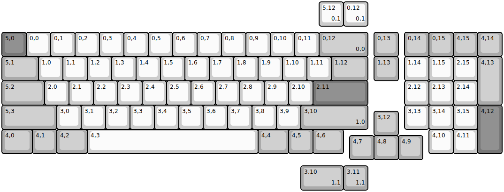{:loading="lazy"}

[Open in keyboard-layout-editor](http://www.keyboard-layout-editor.com/##@@_y:1.25&c=#777777;&=5,0&_c=#cccccc;&=0,0&=0,1&=0,2&=0,3&=0,4&=0,5&=0,6&=0,7&=0,8&=0,9&=0,10&=0,11&_c=#aaaaaa&w:2;&=0,12%0A%0A%0A0,0&_x:0.25;&=0,13&_x:0.25;&=0,14&=0,15&=4,15&=4,14;&@_w:1.5;&=5,1&_c=#cccccc;&=1,0&=1,1&=1,2&=1,3&=1,4&=1,5&=1,6&=1,7&=1,8&=1,9&=1,10&=1,11&_c=#aaaaaa&w:1.5;&=1,12&_x:0.25;&=1,13&_x:0.25&c=#cccccc;&=1,14&=1,15&=2,15&_c=#aaaaaa&h:2;&=4,13;&@_w:1.75;&=5,2&_c=#cccccc;&=2,0&=2,1&=2,2&=2,3&=2,4&=2,5&=2,6&=2,7&=2,8&=2,9&=2,10&_c=#777777&w:2.25;&=2,11&_x:1.5&c=#cccccc;&=2,12&=2,13&=2,14;&@_c=#aaaaaa&w:2.25;&=5,3&_c=#cccccc;&=3,0&=3,1&=3,2&=3,3&=3,4&=3,5&=3,6&=3,7&=3,8&=3,9&_c=#aaaaaa&w:2.75;&=3,10%0A%0A%0A1,0&_x:1.5&c=#cccccc;&=3,13&=3,14&=3,15&_c=#777777&h:2;&=4,12;&@_x:15.25&y:-0.75&c=#aaaaaa;&=3,12;&@_y:-0.25&w:1.25;&=4,0&=4,1&_w:1.25;&=4,2&_c=#cccccc&w:7;&=4,3&_c=#aaaaaa&w:1.25;&=4,4&=4,5&_w:1.25;&=4,6&_x:3.5&c=#cccccc;&=4,10&=4,11;&@_x:14.25&y:-0.75&c=#aaaaaa;&=4,7&=4,8&=4,9;&@_x:13&y:-6.5&c=#cccccc;&=5,12%0A%0A%0A0,1&=0,12%0A%0A%0A0,1;&@_x:12.25&y:5.75&c=#aaaaaa&w:1.75;&=3,10%0A%0A%0A1,1&=3,11%0A%0A%0A1,1)

## aleblazer/zodiark

[README](output/aleblazer/zodiark/README.md) - [layout](output/aleblazer/zodiark/zodiark-kle.json) - [PCB](output/aleblazer/zodiark/zodiark.kicad_pcb) - [PCB render](output/aleblazer/zodiark/zodiark-render.svg)

{:loading="lazy"}

[Open in keyboard-layout-editor](http://www.keyboard-layout-editor.com/##@@_x:3&y:1;&=0,3&_x:11;&=5,3;&@_x:2&y:-0.87;&=0,2&_x:1;&=0,4&_x:9;&=5,4&_x:1;&=5,2;&@_x:5&y:-0.88;&=0,5&_x:7;&=5,5;&@_y:-0.72&c=#777777;&=0,0&_c=#cccccc;&=0,1&_x:15;&=5,1&_c=#777777;&=5,0;&@_x:3&y:-0.53&c=#cccccc;&=1,3&_x:11;&=6,3;&@_x:2&y:-0.87;&=1,2&_x:1;&=1,4&_x:9;&=6,4&_x:1;&=6,2;&@_x:5&y:-0.88;&=1,5&_x:7;&=6,5;&@_y:-0.72&c=#aaaaaa;&=1,0&_c=#cccccc;&=1,1&_x:15;&=6,1&=6,0;&@_x:6&y:-0.83;&=0,6&_x:5;&=5,6;&@_x:3&y:-0.7;&=2,3&_x:11;&=7,3;&@_x:2&y:-0.87;&=2,2&_x:1;&=2,4&_x:9;&=7,4&_x:1;&=7,2;&@_x:5&y:-0.88;&=2,5&_x:7;&=7,5;&@_y:-0.72&c=#aaaaaa;&=2,0&_c=#cccccc;&=2,1&_x:15;&=7,1&=7,0;&@_x:6&y:-0.83;&=1,6&_x:5;&=6,6;&@_x:3&y:-0.7;&=3,3&_x:11;&=8,3;&@_x:2&y:-0.87;&=3,2&_x:1;&=3,4&_x:9;&=8,4&_x:1;&=8,2;&@_x:5&y:-0.88;&=3,5&_x:7;&=8,5;&@_y:-0.72&c=#aaaaaa;&=3,0&_c=#cccccc;&=3,1&_x:15;&=8,1&_c=#777777;&=8,0;&@_x:3&y:-0.53&c=#aaaaaa;&=4,3&_x:11&c=#777777;&=9,3;&@_x:2&y:-0.87&c=#aaaaaa;&=4,2&_x:1;&=4,4&_x:9;&=9,4&_x:1&c=#777777;&=9,2;&@_y:-0.6&c=#aaaaaa;&=4,0&=4,1&_x:15&c=#777777;&=9,1&=9,0;&@_r:30&rx:6.5&ry:4.25&x:0.17&y:0.6&c=#cccccc;&=2,6&=3,6;&@_x:-0.33&c=#777777&w:1.5;&=4,5&=4,6;&@_r:-30&rx:13&x:-2.6&y:0.35&c=#cccccc;&=8,6&=7,6;&@_x:-2.6&c=#777777;&=9,6&_w:1.5;&=9,5)

## alf/x11

[README](output/alf/x11/README.md) - [layout](output/alf/x11/x11-kle.json) - [PCB](output/alf/x11/x11.kicad_pcb) - [PCB render](output/alf/x11/x11-render.svg)

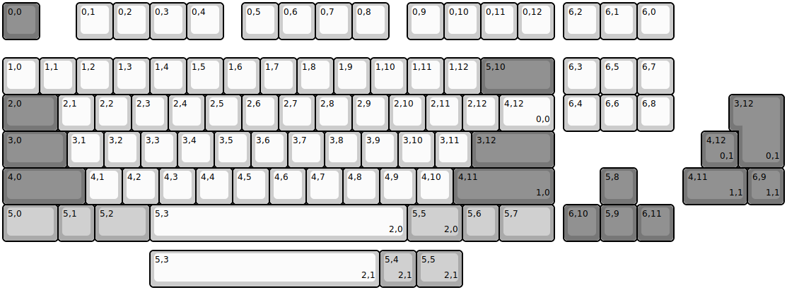{:loading="lazy"}

[Open in keyboard-layout-editor](http://www.keyboard-layout-editor.com/##@@_c=#777777;&=0,0&_x:1&c=#cccccc;&=0,1&=0,2&=0,3&=0,4&_x:0.5;&=0,5&=0,6&=0,7&=0,8&_x:0.5;&=0,9&=0,10&=0,11&=0,12&_x:0.25;&=6,2&=6,1&=6,0;&@_y:0.5;&=1,0&=1,1&=1,2&=1,3&=1,4&=1,5&=1,6&=1,7&=1,8&=1,9&=1,10&=1,11&=1,12&_c=#777777&w:2;&=5,10&_x:0.25&c=#cccccc;&=6,3&=6,5&=6,7;&@_c=#777777&w:1.5;&=2,0&_c=#cccccc;&=2,1&=2,2&=2,3&=2,4&=2,5&=2,6&=2,7&=2,8&=2,9&=2,10&=2,11&=2,12&_w:1.5;&=4,12%0A%0A%0A0,0&_x:0.25;&=6,4&=6,6&=6,8;&@_c=#777777&w:1.75;&=3,0&_c=#cccccc;&=3,1&=3,2&=3,3&=3,4&=3,5&=3,6&=3,7&=3,8&=3,9&=3,10&=3,11&_c=#777777&w:2.25;&=3,12;&@_w:2.25;&=4,0&_c=#cccccc;&=4,1&=4,2&=4,3&=4,4&=4,5&=4,6&=4,7&=4,8&=4,9%0A.&=4,10&_c=#777777&w:2.75;&=4,11%0A%0A%0A1,0&_x:1.25;&=5,8;&@_c=#aaaaaa&w:1.5;&=5,0&=5,1&_w:1.5;&=5,2&_c=#cccccc&w:7;&=5,3%0A%0A%0A2,0&_c=#aaaaaa&w:1.5;&=5,5%0A%0A%0A2,0&=5,6&_w:1.5;&=5,7&_x:0.25&c=#777777;&=6,10&=5,9&=6,11;&@_x:20.0&y:-4.0&w:1.25&h:2&w2:1.5&h2:1&x2:-0.25;&=3,12%0A%0A%0A0,1;&@_x:19.0;&=4,12%0A%0A%0A0,1;&@_x:18.5&w:1.75;&=4,11%0A%0A%0A1,1&=6,9%0A%0A%0A1,1;&@_x:4&y:1.25&c=#cccccc&w:6.25;&=5,3%0A%0A%0A2,1&_c=#aaaaaa;&=5,4%0A%0A%0A2,1&_w:1.25;&=5,5%0A%0A%0A2,1)

## alfredslab/swift65/swift65_hotswap

[README](output/alfredslab/swift65/README.md) - [layout](output/alfredslab/swift65/swift65_hotswap-kle.json) - [PCB](output/alfredslab/swift65/swift65_hotswap.kicad_pcb) - [PCB render](output/alfredslab/swift65/swift65_hotswap-render.svg)

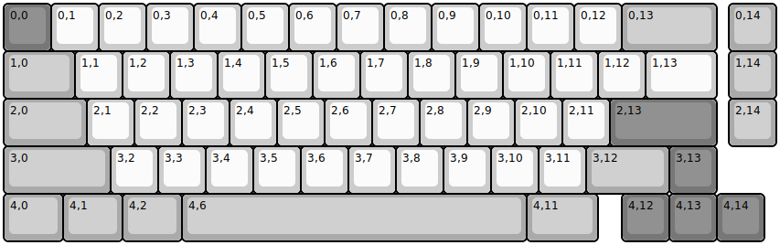{:loading="lazy"}

[Open in keyboard-layout-editor](http://www.keyboard-layout-editor.com/##@@_c=#777777;&=0,0&_c=#cccccc;&=0,1&=0,2&=0,3&=0,4&=0,5&=0,6&=0,7&=0,8&=0,9&=0,10&=0,11&=0,12&_c=#aaaaaa&w:2;&=0,13&_x:0.25;&=0,14;&@_w:1.5;&=1,0&_c=#cccccc;&=1,1&=1,2&=1,3&=1,4&=1,5&=1,6&=1,7&=1,8&=1,9&=1,10&=1,11&=1,12&_w:1.5;&=1,13&_x:0.25&c=#aaaaaa;&=1,14;&@_w:1.75;&=2,0&_c=#cccccc;&=2,1&=2,2&=2,3&=2,4&=2,5&=2,6&=2,7&=2,8&=2,9&=2,10&=2,11&_c=#777777&w:2.25;&=2,13&_x:0.25&c=#aaaaaa;&=2,14;&@_w:2.25;&=3,0&_c=#cccccc;&=3,2&=3,3&=3,4&=3,5&=3,6&=3,7&=3,8&=3,9&=3,10&=3,11&_c=#aaaaaa&w:1.75;&=3,12&_c=#777777;&=3,13;&@_c=#aaaaaa&w:1.25;&=4,0&_w:1.25;&=4,1&_w:1.25;&=4,2&_w:7.25;&=4,6&_w:1.5;&=4,11&_x:0.5&c=#777777;&=4,12&=4,13&=4,14)

## alfredslab/swift65/swift65_solder

[README](output/alfredslab/swift65/README.md) - [layout](output/alfredslab/swift65/swift65_solder-kle.json) - [PCB](output/alfredslab/swift65/swift65_solder.kicad_pcb) - [PCB render](output/alfredslab/swift65/swift65_solder-render.svg)

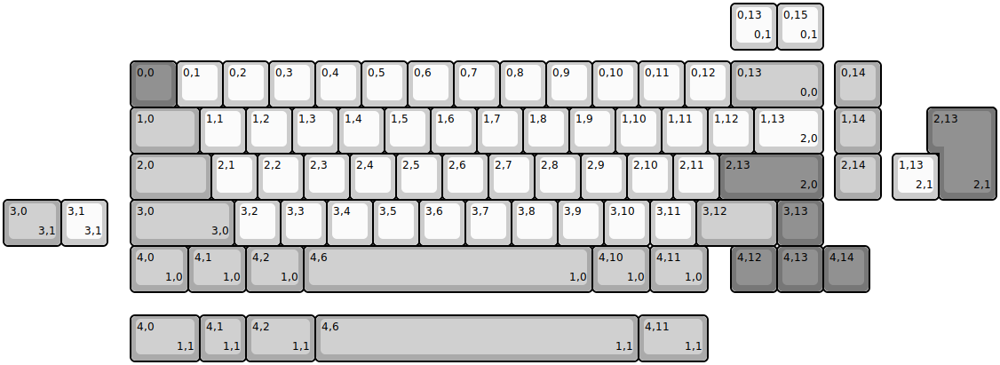{:loading="lazy"}

[Open in keyboard-layout-editor](http://www.keyboard-layout-editor.com/##@@_x:2.75&y:1.25&c=#777777;&=0,0&_c=#cccccc;&=0,1&=0,2&=0,3&=0,4&=0,5&=0,6&=0,7&=0,8&=0,9&=0,10&=0,11&=0,12&_c=#aaaaaa&w:2;&=0,13%0A%0A%0A0,0&_x:0.25;&=0,14;&@_x:2.75&w:1.5;&=1,0&_c=#cccccc;&=1,1&=1,2&=1,3&=1,4&=1,5&=1,6&=1,7&=1,8&=1,9&=1,10&=1,11&=1,12&_w:1.5;&=1,13%0A%0A%0A2,0&_x:0.25&c=#aaaaaa;&=1,14;&@_x:2.75&w:1.75;&=2,0&_c=#cccccc;&=2,1&=2,2&=2,3&=2,4&=2,5&=2,6&=2,7&=2,8&=2,9&=2,10&=2,11&_c=#777777&w:2.25;&=2,13%0A%0A%0A2,0&_x:0.25&c=#aaaaaa;&=2,14;&@_x:2.75&w:2.25;&=3,0%0A%0A%0A3,0&_c=#cccccc;&=3,2&=3,3&=3,4&=3,5&=3,6&=3,7&=3,8&=3,9&=3,10&=3,11&_c=#aaaaaa&w:1.75;&=3,12&_c=#777777;&=3,13;&@_x:2.75&c=#aaaaaa&w:1.25;&=4,0%0A%0A%0A1,0&_w:1.25;&=4,1%0A%0A%0A1,0&_w:1.25;&=4,2%0A%0A%0A1,0&_w:6.25;&=4,6%0A%0A%0A1,0&_w:1.25;&=4,10%0A%0A%0A1,0&_w:1.25;&=4,11%0A%0A%0A1,0&_x:0.5&c=#777777;&=4,12&=4,13&=4,14;&@_x:15.75&y:-6.25&c=#cccccc;&=0,13%0A%0A%0A0,1&=0,15%0A%0A%0A0,1;&@_x:20.25&y:1.25&c=#777777&w:1.25&h:2&w2:1.5&h2:1&x2:-0.25;&=2,13%0A%0A%0A2,1;&@_x:19.25&c=#cccccc;&=1,13%0A%0A%0A2,1;&@_c=#aaaaaa&w:1.25;&=3,0%0A%0A%0A3,1&_c=#cccccc;&=3,1%0A%0A%0A3,1;&@_x:2.75&y:1.5&c=#aaaaaa&w:1.5;&=4,0%0A%0A%0A1,1&=4,1%0A%0A%0A1,1&_w:1.5;&=4,2%0A%0A%0A1,1&_w:7;&=4,6%0A%0A%0A1,1&_w:1.5;&=4,11%0A%0A%0A1,1)

## aliceh66/pianoforte

[README](output/aliceh66/pianoforte/README.md) - [layout](output/aliceh66/pianoforte/pianoforte-kle.json) - [PCB](output/aliceh66/pianoforte/pianoforte.kicad_pcb) - [PCB render](output/aliceh66/pianoforte/pianoforte-render.svg)

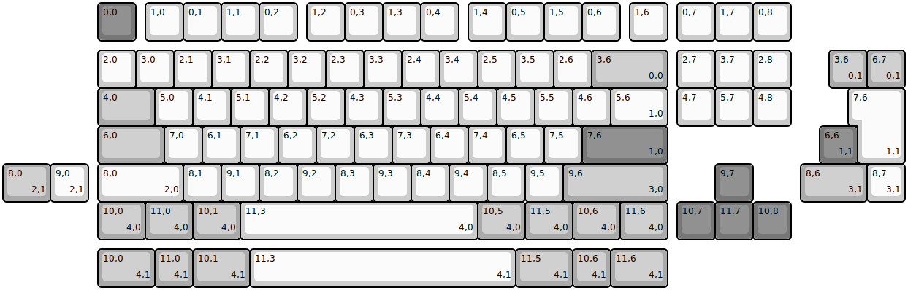{:loading="lazy"}

[Open in keyboard-layout-editor](http://www.keyboard-layout-editor.com/##@@_x:2.5&c=#777777;&=0,0&_x:0.25&c=#cccccc;&=1,0&=0,1&=1,1&=0,2&_x:0.25;&=1,2&=0,3&=1,3&=0,4&_x:0.25;&=1,4&=0,5&=1,5&=0,6&_x:0.25;&=1,6&_x:0.25;&=0,7&=1,7&=0,8;&@_x:2.5&y:0.25;&=2,0&=3,0&=2,1&=3,1&=2,2&=3,2&=2,3&=3,3&=2,4&=3,4&=2,5&=3,5&=2,6&_c=#aaaaaa&w:2;&=3,6%0A%0A%0A0,0&_x:0.25&c=#cccccc;&=2,7&=3,7&=2,8;&@_x:2.5&c=#aaaaaa&w:1.5;&=4,0&_c=#cccccc;&=5,0&=4,1&=5,1&=4,2&=5,2&=4,3&=5,3&=4,4&=5,4&=4,5&=5,5&=4,6&_w:1.5;&=5,6%0A%0A%0A1,0&_x:0.25;&=4,7&=5,7&=4,8;&@_x:2.5&c=#aaaaaa&w:1.75;&=6,0&_c=#cccccc;&=7,0&=6,1&=7,1&=6,2&=7,2&=6,3&=7,3&=6,4&=7,4&=6,5&=7,5&_c=#777777&w:2.25;&=7,6%0A%0A%0A1,0;&@_x:2.5&c=#cccccc&w:2.25;&=8,0%0A%0A%0A2,0&=8,1&=9,1&=8,2&=9,2&=8,3&=9,3&=8,4&=9,4&=8,5&=9,5&_c=#aaaaaa&w:2.75;&=9,6%0A%0A%0A3,0&_x:1.25&c=#777777;&=9,7;&@_x:2.5&c=#aaaaaa&w:1.25;&=10,0%0A%0A%0A4,0&_w:1.25;&=11,0%0A%0A%0A4,0&_w:1.25;&=10,1%0A%0A%0A4,0&_c=#cccccc&w:6.25;&=11,3%0A%0A%0A4,0&_c=#aaaaaa&w:1.25;&=10,5%0A%0A%0A4,0&_w:1.25;&=11,5%0A%0A%0A4,0&_w:1.25;&=10,6%0A%0A%0A4,0&_w:1.25;&=11,6%0A%0A%0A4,0&_x:0.25&c=#777777;&=10,7&=11,7&=10,8;&@_x:21.75&y:-5.0&c=#aaaaaa;&=3,6%0A%0A%0A0,1&=6,7%0A%0A%0A0,1;&@_x:22.5&c=#cccccc&w:1.25&h:2&w2:1.5&h2:1&x2:-0.25;&=7,6%0A%0A%0A1,1;&@_x:21.5&c=#777777;&=6,6%0A%0A%0A1,1;&@_c=#aaaaaa&w:1.25;&=8,0%0A%0A%0A2,1&_c=#cccccc;&=9,0%0A%0A%0A2,1&_x:18.75&c=#aaaaaa&w:1.75;&=8,6%0A%0A%0A3,1&_c=#cccccc;&=8,7%0A%0A%0A3,1;&@_x:2.5&y:1.25&c=#aaaaaa&w:1.5;&=10,0%0A%0A%0A4,1&=11,0%0A%0A%0A4,1&_w:1.5;&=10,1%0A%0A%0A4,1&_c=#cccccc&w:7;&=11,3%0A%0A%0A4,1&_c=#aaaaaa&w:1.5;&=11,5%0A%0A%0A4,1&=10,6%0A%0A%0A4,1&_w:1.5;&=11,6%0A%0A%0A4,1)

## aliceh66/pianoforte_hs

[README](output/aliceh66/pianoforte_hs/README.md) - [layout](output/aliceh66/pianoforte_hs/pianoforte_hs-kle.json) - [PCB](output/aliceh66/pianoforte_hs/pianoforte_hs.kicad_pcb) - [PCB render](output/aliceh66/pianoforte_hs/pianoforte_hs-render.svg)

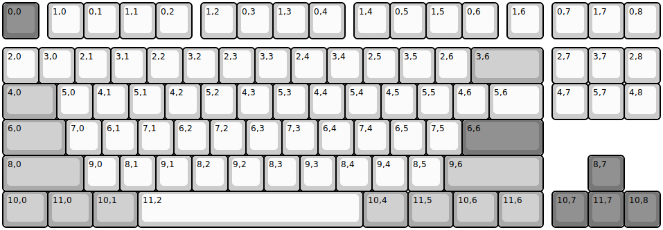{:loading="lazy"}

[Open in keyboard-layout-editor](http://www.keyboard-layout-editor.com/##@@_c=#777777;&=0,0&_x:0.25&c=#cccccc;&=1,0&=0,1&=1,1&=0,2&_x:0.25;&=1,2&=0,3&=1,3&=0,4&_x:0.25;&=1,4&=0,5&=1,5&=0,6&_x:0.25;&=1,6&_x:0.25;&=0,7&=1,7&=0,8;&@_y:0.25;&=2,0&=3,0&=2,1&=3,1&=2,2&=3,2&=2,3&=3,3&=2,4&=3,4&=2,5&=3,5&=2,6&_c=#aaaaaa&w:2;&=3,6&_x:0.25&c=#cccccc;&=2,7&=3,7&=2,8;&@_c=#aaaaaa&w:1.5;&=4,0&_c=#cccccc;&=5,0&=4,1&=5,1&=4,2&=5,2&=4,3&=5,3&=4,4&=5,4&=4,5&=5,5&=4,6&_w:1.5;&=5,6&_x:0.25;&=4,7&=5,7&=4,8;&@_c=#aaaaaa&w:1.75;&=6,0&_c=#cccccc;&=7,0&=6,1&=7,1&=6,2&=7,2&=6,3&=7,3&=6,4&=7,4&=6,5&=7,5&_c=#777777&w:2.25;&=6,6;&@_c=#aaaaaa&w:2.25;&=8,0&_c=#cccccc;&=9,0&=8,1&=9,1&=8,2&=9,2&=8,3&=9,3&=8,4&=9,4&=8,5&_c=#aaaaaa&w:2.75;&=9,6&_x:1.25&c=#777777;&=8,7;&@_c=#aaaaaa&w:1.25;&=10,0&_w:1.25;&=11,0&_w:1.25;&=10,1&_c=#cccccc&w:6.25;&=11,2&_c=#aaaaaa&w:1.25;&=10,4&_w:1.25;&=11,5&_w:1.25;&=10,6&_w:1.25;&=11,6&_x:0.25&c=#777777;&=10,7&=11,7&=10,8)

## alpine65/alpine65

[README](output/alpine65/README.md) - [layout](output/alpine65/alpine65-kle.json) - [PCB](output/alpine65/alpine65.kicad_pcb) - [PCB render](output/alpine65/alpine65-render.svg)

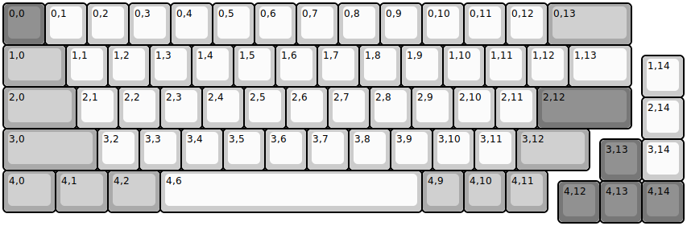{:loading="lazy"}

[Open in keyboard-layout-editor](http://www.keyboard-layout-editor.com/##@@_c=#777777;&=0,0&_c=#cccccc;&=0,1&=0,2&=0,3&=0,4&=0,5&=0,6&=0,7&=0,8&=0,9&=0,10&=0,11&=0,12&_c=#aaaaaa&w:2;&=0,13;&@_w:1.5;&=1,0&_c=#cccccc;&=1,1&=1,2&=1,3&=1,4&=1,5&=1,6&=1,7&=1,8&=1,9&=1,10&=1,11&=1,12&_w:1.5;&=1,13;&@_x:15.25&y:-0.75;&=1,14;&@_y:-0.25&c=#aaaaaa&w:1.75;&=2,0&_c=#cccccc;&=2,1&=2,2&=2,3&=2,4&=2,5&=2,6&=2,7&=2,8&=2,9&=2,10&=2,11&_c=#777777&w:2.25;&=2,12;&@_x:15.25&y:-0.75&c=#cccccc;&=2,14;&@_y:-0.25&c=#aaaaaa&w:2.25;&=3,0&_c=#cccccc;&=3,2&=3,3&=3,4&=3,5&=3,6&=3,7&=3,8&=3,9&=3,10&=3,11&_c=#aaaaaa&w:1.75;&=3,12;&@_x:14.25&y:-0.75&c=#777777;&=3,13&_c=#cccccc;&=3,14;&@_y:-0.25&c=#aaaaaa&w:1.25;&=4,0&_w:1.25;&=4,1&_w:1.25;&=4,2&_c=#cccccc&w:6.25;&=4,6&_c=#aaaaaa;&=4,9&=4,10&=4,11;&@_x:13.25&y:-0.75&c=#777777;&=4,12&=4,13&=4,14)

## amag23/amag32

[README](output/amag23/README.md) - [layout](output/amag23/amag32-kle.json) - [PCB](output/amag23/amag32.kicad_pcb) - [PCB render](output/amag23/amag32-render.svg)

{:loading="lazy"}

[Open in keyboard-layout-editor](http://www.keyboard-layout-editor.com/##@@_c=#777777;&=0,0&_c=#cccccc;&=0,1&=0,2&=0,3&=0,4&=0,5;&@_c=#aaaaaa;&=1,0&_c=#cccccc;&=1,1&=1,2&=1,3&=1,4&=1,5;&@_c=#aaaaaa;&=2,0&_c=#cccccc;&=2,1&=2,2&=2,3&=2,4&=2,5;&@_c=#aaaaaa;&=3,0&_c=#cccccc;&=3,1&=3,2&=3,3&_w:2;&=3,4)

## angleR2/angler2

[README](output/angleR2/README.md) - [layout](output/angleR2/angler2-kle.json) - [PCB](output/angleR2/angler2.kicad_pcb) - [PCB render](output/angleR2/angler2-render.svg)

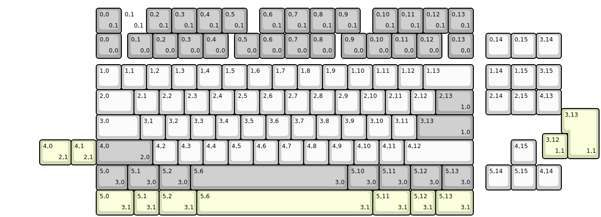{:loading="lazy"}

[Open in keyboard-layout-editor](http://www.keyboard-layout-editor.com/##@@_x:3.75&y:1.25&c=#aaaaaa;&=0,0%0A%0A%0A0,0&_x:0.25;&=0,1%0A%0A%0A0,0&=0,2%0A%0A%0A0,0&=0,3%0A%0A%0A0,0&=0,4%0A%0A%0A0,0&_x:0.25;&=0,5%0A%0A%0A0,0&=0,6%0A%0A%0A0,0&=0,7%0A%0A%0A0,0&=0,8%0A%0A%0A0,0&_x:0.25;&=0,9%0A%0A%0A0,0&=0,10%0A%0A%0A0,0&=0,11%0A%0A%0A0,0&=0,12%0A%0A%0A0,0&_x:0.25;&=0,13%0A%0A%0A0,0&_x:0.5&c=#cccccc;&=0,14&=0,15&=3,14;&@_x:3.75&y:0.25;&=1,0&=1,1&=1,2&=1,3&=1,4&=1,5&=1,6&=1,7&=1,8&=1,9&=1,10&=1,11&=1,12&_w:2;&=1,13&_x:0.5;&=1,14&=1,15&=3,15;&@_x:3.75&w:1.5;&=2,0&=2,1&=2,2&=2,3&=2,4&=2,5&=2,6&=2,7&=2,8&=2,9&=2,10&=2,11&=2,12&_c=#aaaaaa&w:1.5;&=2,13%0A%0A%0A1,0&_x:0.5&c=#cccccc;&=2,14&=2,15&=4,13;&@_x:3.75&w:1.75;&=3,0&=3,1&=3,2&=3,3&=3,4&=3,5&=3,6&=3,7&=3,8&=3,9&=3,10&=3,11&_c=#aaaaaa&w:2.25;&=3,13%0A%0A%0A1,0;&@_x:3.75&w:2.25;&=4,0%0A%0A%0A2,0&_c=#cccccc;&=4,2&=4,3&=4,4&=4,5&=4,6&=4,7&=4,8&=4,9&=4,10&=4,11&_w:2.75;&=4,12&_x:1.5;&=4,15;&@_x:3.75&c=#aaaaaa&w:1.25;&=5,0%0A%0A%0A3,0&_w:1.25;&=5,1%0A%0A%0A3,0&_w:1.25;&=5,2%0A%0A%0A3,0&_w:6.25;&=5,6%0A%0A%0A3,0&_w:1.25;&=5,10%0A%0A%0A3,0&_w:1.25;&=5,11%0A%0A%0A3,0&_w:1.25;&=5,12%0A%0A%0A3,0&_w:1.25;&=5,13%0A%0A%0A3,0&_x:0.5&c=#cccccc;&=5,14&=5,15&=4,14;&@_x:3.75&y:-7.25&c=#aaaaaa;&=0,0%0A%0A%0A0,1&_c=#cccccc&d:true;&=0,1%0A%0A%0A0,1&_c=#aaaaaa;&=0,2%0A%0A%0A0,1&=0,3%0A%0A%0A0,1&=0,4%0A%0A%0A0,1&=0,5%0A%0A%0A0,1&_x:0.5;&=0,6%0A%0A%0A0,1&=0,7%0A%0A%0A0,1&=0,8%0A%0A%0A0,1&=0,9%0A%0A%0A0,1&_x:0.5;&=0,10%0A%0A%0A0,1&=0,11%0A%0A%0A0,1&=0,12%0A%0A%0A0,1&=0,13%0A%0A%0A0,1;&@_x:22.5&y:3.0&c=#d3dbb4&w:1.25&h:2&w2:1.5&h2:1&x2:-0.25;&=3,13%0A%0A%0A1,1;&@_x:21.5;&=3,12%0A%0A%0A1,1;&@_x:1.5&y:-0.75&w:1.25;&=4,0%0A%0A%0A2,1&=4,1%0A%0A%0A2,1;&@_x:3.75&y:1.0&w:1.5;&=5,0%0A%0A%0A3,1&=5,1%0A%0A%0A3,1&_w:1.5;&=5,2%0A%0A%0A3,1&_w:7;&=5,6%0A%0A%0A3,1&_w:1.5;&=5,11%0A%0A%0A3,1&=5,12%0A%0A%0A3,1&_w:1.5;&=5,13%0A%0A%0A3,1)

## anomalykb/a65i

[README](output/anomalykb/a65i/README.md) - [layout](output/anomalykb/a65i/a65i-kle.json) - [PCB](output/anomalykb/a65i/a65i.kicad_pcb) - [PCB render](output/anomalykb/a65i/a65i-render.svg)

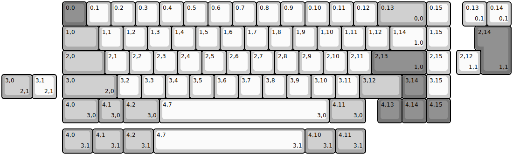{:loading="lazy"}

[Open in keyboard-layout-editor](http://www.keyboard-layout-editor.com/##@_name=65%20layout;&@_x:2.5&c=#777777;&=0,0&_c=#cccccc;&=0,1&=0,2&=0,3&=0,4&=0,5&=0,6&=0,7&=0,8&=0,9&=0,10&=0,11&=0,12&_c=#aaaaaa&w:2;&=0,13%0A%0A%0A0,0&_c=#cccccc;&=0,15;&@_x:2.5&c=#aaaaaa&w:1.5;&=1,0&_c=#cccccc;&=1,1&=1,2&=1,3&=1,4&=1,5&=1,6&=1,7&=1,8&=1,9&=1,10&=1,11&=1,12&_w:1.5;&=1,14%0A%0A%0A1,0&=1,15;&@_x:2.5&c=#aaaaaa&w:1.75;&=2,0&_c=#cccccc;&=2,1&=2,2&=2,3&=2,4&=2,5&=2,6&=2,7&=2,8&=2,9&=2,10&=2,11&_c=#777777&w:2.25;&=2,13%0A%0A%0A1,0&_c=#cccccc;&=2,15;&@_x:2.5&c=#aaaaaa&w:2.25;&=3,0%0A%0A%0A2,0&_c=#cccccc;&=3,2&=3,3&=3,4&=3,5&=3,6&=3,7&=3,8&=3,9&=3,10&=3,11&_c=#aaaaaa&w:1.75;&=3,12&_c=#777777;&=3,14&_c=#cccccc;&=3,15;&@_x:2.5&c=#aaaaaa&w:1.5;&=4,0%0A%0A%0A3,0&=4,1%0A%0A%0A3,0&_w:1.5;&=4,2%0A%0A%0A3,0&_c=#cccccc&w:7;&=4,7%0A%0A%0A3,0&_c=#aaaaaa&w:1.5;&=4,11%0A%0A%0A3,0&_x:0.5&c=#777777;&=4,13&=4,14&=4,15;&@_x:19.0&y:-5&c=#cccccc;&=0,13%0A%0A%0A0,1&=0,14%0A%0A%0A0,1;&@_x:19.75&c=#777777&w:1.25&h:2&w2:1.5&h2:1&x2:-0.25;&=2,14%0A%0A%0A1,1;&@_x:18.75&c=#cccccc;&=2,12%0A%0A%0A1,1;&@_c=#aaaaaa&w:1.25;&=3,0%0A%0A%0A2,1&_c=#cccccc;&=3,1%0A%0A%0A2,1;&@_x:2.5&y:1.25&c=#aaaaaa&w:1.25;&=4,0%0A%0A%0A3,1&_w:1.25;&=4,1%0A%0A%0A3,1&_w:1.25;&=4,2%0A%0A%0A3,1&_c=#cccccc&w:6.25;&=4,7%0A%0A%0A3,1&_c=#aaaaaa&w:1.25;&=4,10%0A%0A%0A3,1&_w:1.25;&=4,11%0A%0A%0A3,1)

## aos/tkl

[README](output/aos/tkl/README.md) - [layout](output/aos/tkl/tkl-kle.json) - [PCB](output/aos/tkl/tkl.kicad_pcb) - [PCB render](output/aos/tkl/tkl-render.svg)

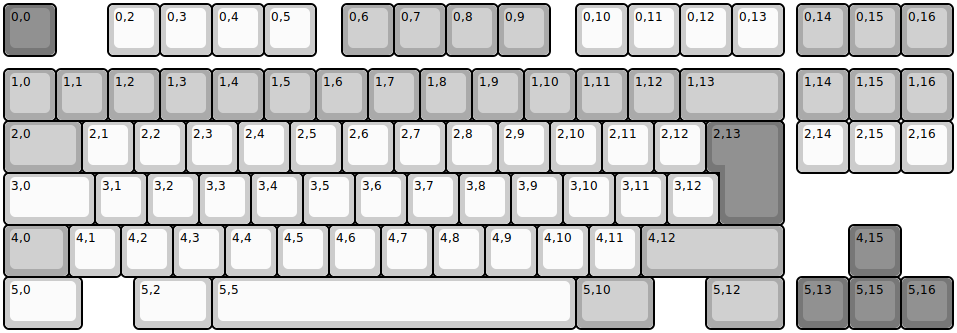{:loading="lazy"}

[Open in keyboard-layout-editor](http://www.keyboard-layout-editor.com/##@@_c=#777777;&=0,0&_x:1&c=#cccccc;&=0,2&=0,3&=0,4&=0,5&_x:0.5&c=#aaaaaa;&=0,6&=0,7&=0,8&=0,9&_x:0.5&c=#cccccc;&=0,10&=0,11&=0,12&=0,13&_x:0.25&c=#aaaaaa;&=0,14&=0,15&=0,16;&@_y:0.25;&=1,0&=1,1&=1,2&=1,3&=1,4&=1,5&=1,6&=1,7&=1,8&=1,9&=1,10&=1,11&=1,12&_w:2;&=1,13&_x:0.25;&=1,14&=1,15&=1,16;&@_w:1.5;&=2,0&_c=#cccccc;&=2,1&=2,2&=2,3&=2,4&=2,5&=2,6&=2,7&=2,8&=2,9&=2,10&=2,11&=2,12&_x:0.25&c=#777777&w:1.25&h:2&w2:1.5&h2:1&x2:-0.25;&=2,13&_x:0.25&c=#cccccc;&=2,14&=2,15&=2,16;&@_w:1.75;&=3,0&=3,1&=3,2&=3,3&=3,4&=3,5&=3,6&=3,7&=3,8&=3,9&=3,10&=3,11&=3,12;&@_c=#aaaaaa&w:1.25;&=4,0&_c=#cccccc;&=4,1&=4,2&=4,3&=4,4&=4,5&=4,6&=4,7&=4,8&=4,9&=4,10&=4,11&_c=#aaaaaa&w:2.75;&=4,12&_x:1.25&c=#777777;&=4,15;&@_c=#cccccc&w:1.5;&=5,0&_x:1.0&w:1.5;&=5,2&_w:7;&=5,5&_c=#aaaaaa&w:1.5;&=5,10&_x:1.0&w:1.5;&=5,12&_x:0.25&c=#777777;&=5,13&=5,15&=5,16)

## aozora/aozora

[README](output/aozora/README.md) - [layout](output/aozora/aozora-kle.json) - [PCB](output/aozora/aozora.kicad_pcb) - [PCB render](output/aozora/aozora-render.svg)

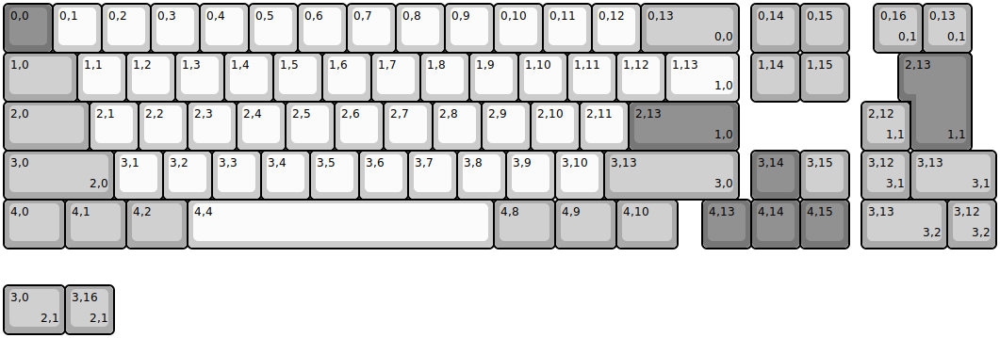{:loading="lazy"}

[Open in keyboard-layout-editor](http://www.keyboard-layout-editor.com/##@@_c=#777777;&=0,0&_c=#cccccc;&=0,1&=0,2&=0,3&=0,4&=0,5&=0,6&=0,7&=0,8&=0,9&=0,10&=0,11&=0,12&_c=#aaaaaa&w:2;&=0,13%0A%0A%0A0,0&_x:0.25;&=0,14&=0,15;&@_w:1.5;&=1,0&_c=#cccccc;&=1,1&=1,2&=1,3&=1,4&=1,5&=1,6&=1,7&=1,8&=1,9&=1,10&=1,11&=1,12&_w:1.5;&=1,13%0A%0A%0A1,0&_x:0.25&c=#aaaaaa;&=1,14&=1,15;&@_w:1.75;&=2,0&_c=#cccccc;&=2,1&=2,2&=2,3&=2,4&=2,5&=2,6&=2,7&=2,8&=2,9&=2,10&=2,11&_c=#777777&w:2.25;&=2,13%0A%0A%0A1,0;&@_c=#aaaaaa&w:2.25;&=3,0%0A%0A%0A2,0&_c=#cccccc;&=3,1&=3,2&=3,3&=3,4&=3,5&=3,6&=3,7&=3,8&=3,9&=3,10&_c=#aaaaaa&w:2.75;&=3,13%0A%0A%0A3,0&_x:0.25&c=#777777;&=3,14&_c=#aaaaaa;&=3,15;&@_w:1.25;&=4,0&_w:1.25;&=4,1&_w:1.25;&=4,2&_c=#cccccc&w:6.25;&=4,4&_c=#aaaaaa&w:1.25;&=4,8&_w:1.25;&=4,9&_w:1.25;&=4,10&_x:0.5&c=#777777;&=4,13&=4,14&=4,15;&@_x:17.75&y:-5&c=#aaaaaa;&=0,16%0A%0A%0A0,1&=0,13%0A%0A%0A0,1;&@_x:18.5&c=#777777&w:1.25&h:2&w2:1.5&h2:1&x2:-0.25;&=2,13%0A%0A%0A1,1;&@_x:17.5&c=#aaaaaa;&=2,12%0A%0A%0A1,1;&@_x:17.5;&=3,12%0A%0A%0A3,1&_w:1.75;&=3,13%0A%0A%0A3,1;&@_x:17.5&w:1.75;&=3,13%0A%0A%0A3,2&=3,12%0A%0A%0A3,2;&@_y:0.75&w:1.25;&=3,0%0A%0A%0A2,1&=3,16%0A%0A%0A2,1)

## arc60/arc60

[README](output/arc60/README.md) - [layout](output/arc60/arc60-kle.json) - [PCB](output/arc60/arc60.kicad_pcb) - [PCB render](output/arc60/arc60-render.svg)

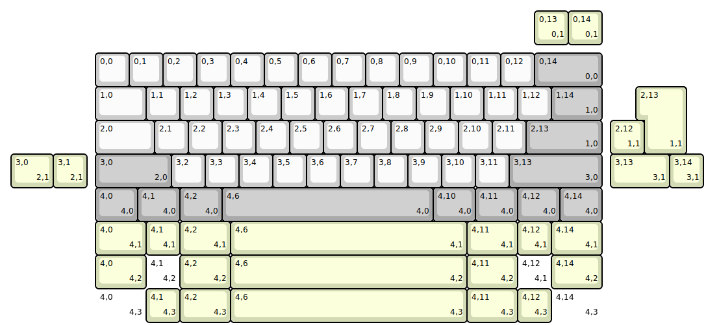{:loading="lazy"}

[Open in keyboard-layout-editor](http://www.keyboard-layout-editor.com/##@@_x:2.75&y:1.5;&=0,0&=0,1&=0,2&=0,3&=0,4&=0,5&=0,6&=0,7&=0,8&=0,9&=0,10&=0,11&=0,12&_c=#aaaaaa&w:2;&=0,14%0A%0A%0A0,0;&@_x:2.75&c=#cccccc&w:1.5;&=1,0&=1,1&=1,2&=1,3&=1,4&=1,5&=1,6&=1,7&=1,8&=1,9&=1,10&=1,11&=1,12&_c=#aaaaaa&w:1.5;&=1,14%0A%0A%0A1,0;&@_x:2.75&c=#cccccc&w:1.75;&=2,0&=2,1&=2,2&=2,3&=2,4&=2,5&=2,6&=2,7&=2,8&=2,9&=2,10&=2,11&_c=#aaaaaa&w:2.25;&=2,13%0A%0A%0A1,0;&@_x:2.75&w:2.25;&=3,0%0A%0A%0A2,0&_c=#cccccc;&=3,2&=3,3&=3,4&=3,5&=3,6&=3,7&=3,8&=3,9&=3,10&=3,11&_c=#aaaaaa&w:2.75;&=3,13%0A%0A%0A3,0;&@_x:2.75&w:1.25;&=4,0%0A%0A%0A4,0&_w:1.25;&=4,1%0A%0A%0A4,0&_w:1.25;&=4,2%0A%0A%0A4,0&_w:6.25;&=4,6%0A%0A%0A4,0&_w:1.25;&=4,10%0A%0A%0A4,0&_w:1.25;&=4,11%0A%0A%0A4,0&_w:1.25;&=4,12%0A%0A%0A4,0&_w:1.25;&=4,14%0A%0A%0A4,0;&@_x:15.75&y:-6.25&c=#d3dbb4;&=0,13%0A%0A%0A0,1&=0,14%0A%0A%0A0,1;&@_x:19.0&y:1.25&w:1.25&h:2&w2:1.5&h2:1&x2:-0.25;&=2,13%0A%0A%0A1,1;&@_x:18.0;&=2,12%0A%0A%0A1,1;&@_x:0.25&w:1.25;&=3,0%0A%0A%0A2,1&=3,1%0A%0A%0A2,1&_x:15.5&w:1.75;&=3,13%0A%0A%0A3,1&=3,14%0A%0A%0A3,1;&@_x:2.75&y:1.0&w:1.5;&=4,0%0A%0A%0A4,1&=4,1%0A%0A%0A4,1&_w:1.5;&=4,2%0A%0A%0A4,1&_w:7;&=4,6%0A%0A%0A4,1&_w:1.5;&=4,11%0A%0A%0A4,1&=4,12%0A%0A%0A4,1&_w:1.5;&=4,14%0A%0A%0A4,1;&@_x:2.75&w:1.5;&=4,0%0A%0A%0A4,2&_c=#cccccc&d:true;&=4,1%0A%0A%0A4,2&_c=#d3dbb4&w:1.5;&=4,2%0A%0A%0A4,2&_w:7;&=4,6%0A%0A%0A4,2&_w:1.5;&=4,11%0A%0A%0A4,2&_c=#cccccc&d:true;&=4,12%0A%0A%0A4,1&_c=#d3dbb4&w:1.5;&=4,14%0A%0A%0A4,2;&@_x:2.75&c=#cccccc&w:1.5&d:true;&=4,0%0A%0A%0A4,3&_c=#d3dbb4;&=4,1%0A%0A%0A4,3&_w:1.5;&=4,2%0A%0A%0A4,3&_w:7;&=4,6%0A%0A%0A4,3&_w:1.5;&=4,11%0A%0A%0A4,3&=4,12%0A%0A%0A4,3&_c=#cccccc&w:1.5&d:true;&=4,14%0A%0A%0A4,3)

## argo_works/ishi/80/mk0

[README](output/argo_works/ishi/80/mk0/README.md) - [layout](output/argo_works/ishi/80/mk0/mk0-kle.json) - [PCB](output/argo_works/ishi/80/mk0/mk0.kicad_pcb) - [PCB render](output/argo_works/ishi/80/mk0/mk0-render.svg)

{:loading="lazy"}

[Open in keyboard-layout-editor](http://www.keyboard-layout-editor.com/##@@_c=#aaaaaa;&=1,0&=0,0&=1,1&=0,1&_x:0.5;&=1,2&_c=#cccccc;&=0,2&=1,3&=0,3&=1,4&=0,4&=1,5&=0,5&=1,6&=0,6&=1,7&=0,7&=1,8&_c=#aaaaaa&w:2;&=0,8;&@_h:2;&=3,0&_c=#cccccc;&=2,0&=3,1&=2,1&_x:0.5&c=#aaaaaa&w:1.5;&=3,2&_c=#cccccc;&=2,2&=3,3&=2,3&=3,4&=2,4&=3,5&=2,5&=3,6&=2,6&=3,7&=2,7&=3,8&_c=#aaaaaa&w:1.5;&=2,8;&@_x:1&c=#cccccc;&=4,0&=5,1&=4,1&_x:0.5&c=#aaaaaa&w:1.75;&=5,2&_c=#cccccc;&=4,2&=5,3&=4,3&=5,4&=4,4&=5,5&=4,5&=5,6&=4,6&=5,7&=4,7&_c=#aaaaaa&w:2.25;&=4,8;&@_h:2;&=7,0&_c=#cccccc;&=6,0&=7,1&=6,1&_x:0.5&c=#aaaaaa&w:2.25;&=7,2&_c=#cccccc;&=7,3&=6,3&=7,4&=6,4&=7,5&=6,5&=7,6&=6,6&=7,7&=6,7&_c=#aaaaaa&w:2.75;&=6,8;&@_x:1&c=#cccccc;&=8,0&_w:2;&=8,1&_x:0.5&c=#aaaaaa&w:1.25;&=8,2&_w:1.25;&=6,2&_w:1.25;&=8,3&_w:6.25;&=8,4&_w:1.25;&=8,5&_w:1.25;&=8,6&_w:1.25;&=8,7&_w:1.25;&=7,8&_x:0.5&c=#777777;&=8,8%0A%0A%0A0,0&=8,8%0A%0A%0A0,1%0A%0A%0A%0A%0A%0Ae0)

## arrayperipherals/1x4p1

[README](output/arrayperipherals/1x4p1/README.md) - [layout](output/arrayperipherals/1x4p1/1x4p1-kle.json) - [PCB](output/arrayperipherals/1x4p1/1x4p1.kicad_pcb) - [PCB render](output/arrayperipherals/1x4p1/1x4p1-render.svg)

{:loading="lazy"}

[Open in keyboard-layout-editor](http://www.keyboard-layout-editor.com/##@@=0,0&=0,1&=0,2&=0,3&_x:0.5&c=#777777;&=0,4)

## astro/dp60

[README](output/astro/dp60/README.md) - [layout](output/astro/dp60/dp60-kle.json) - [PCB](output/astro/dp60/dp60.kicad_pcb) - [PCB render](output/astro/dp60/dp60-render.svg)

{:loading="lazy"}

[Open in keyboard-layout-editor](http://www.keyboard-layout-editor.com/##@@_x:2.75&y:1.25&c=#777777;&=0,0&_c=#cccccc;&=0,1&=0,2&=0,3&=0,4&=0,5&=0,6&=4,7&=0,7&=0,8&=0,9&=0,10&=0,11&_c=#aaaaaa&w:2;&=0,13%0A%0A%0A1,0;&@_x:2.75&w:1.5;&=1,0&_c=#cccccc;&=1,1&=1,2&=1,3&=1,4&=1,5&=1,6&=1,7&=1,8&=1,9&=1,10&=1,11&=1,12&_w:1.5;&=1,13%0A%0A%0A0,0;&@_x:2.75&c=#aaaaaa&w:1.75;&=2,0&_c=#cccccc;&=2,1&=2,2&=2,3&=2,4&=2,5&=2,6&=2,7&=2,8&=2,9&=2,10&=2,11&_c=#777777&w:2.25;&=2,13%0A%0A%0A0,0;&@_x:2.75&c=#aaaaaa&w:2.25;&=3,0%0A%0A%0A2,0&_c=#cccccc;&=3,2&=3,3&=3,4&=3,5&=3,6&=3,7&=3,8&=3,9&=3,10&=3,11&_c=#aaaaaa&w:2.75;&=3,12%0A%0A%0A3,0;&@_x:2.75&w:1.25;&=4,0%0A%0A%0A4,0&_w:1.25;&=4,1%0A%0A%0A4,0&_w:1.25;&=4,2%0A%0A%0A4,0&_w:6.25;&=4,6%0A%0A%0A4,0&_w:1.25;&=4,10%0A%0A%0A4,0&_w:1.25;&=4,11%0A%0A%0A4,0&_w:1.25;&=4,12%0A%0A%0A4,0&_w:1.25;&=4,13%0A%0A%0A4,0;&@_x:15.75&y:-6.25&c=#cccccc;&=0,12%0A%0A%0A1,1&=0,13%0A%0A%0A1,1;&@_x:19.75&y:1.25&w:1.25&h:2&w2:1.5&h2:1&x2:-0.25;&=2,13%0A%0A%0A0,1;&@_x:18.75;&=2,12%0A%0A%0A0,1;&@_c=#aaaaaa&w:1.25;&=3,0%0A%0A%0A2,1&_c=#cccccc;&=3,1%0A%0A%0A2,1&_x:16.0&c=#aaaaaa&w:1.75;&=3,12%0A%0A%0A3,1&_c=#cccccc;&=3,13%0A%0A%0A3,1;&@_x:2.75&y:1.25&c=#aaaaaa&w:1.5;&=4,0%0A%0A%0A4,1&=4,1%0A%0A%0A4,1&_w:1.5;&=4,2%0A%0A%0A4,1&_w:7;&=4,6%0A%0A%0A4,1&_w:1.5;&=4,11%0A%0A%0A4,1&=4,12%0A%0A%0A4,1&_w:1.5;&=4,13%0A%0A%0A4,1;&@_x:2.75&y:0.25&w:1.5&d:true;&=%0A%0A%0A4,2&=4,1%0A%0A%0A4,2&_w:1.5;&=4,2%0A%0A%0A4,2&_w:7;&=4,6%0A%0A%0A4,2&_w:1.5;&=4,11%0A%0A%0A4,2&=4,12%0A%0A%0A4,2&_w:1.5&d:true;&=%0A%0A%0A4,2)

## atlas_65/atlas_65

[README](output/atlas_65/README.md) - [layout](output/atlas_65/atlas_65-kle.json) - [PCB](output/atlas_65/atlas_65.kicad_pcb) - [PCB render](output/atlas_65/atlas_65-render.svg)

{:loading="lazy"}

[Open in keyboard-layout-editor](http://www.keyboard-layout-editor.com/##@@_x:3.75&y:0.38;&=0,2&_x:8.5;&=0,11&_x:3.25&c=#777777;&=1,14;&@_x:1.75&y:-0.88&c=#aaaaaa;&=0,0&_c=#cccccc;&=0,1&_x:10.5;&=0,12&_c=#aaaaaa;&=0,13&=0,14;&@_x:17.75&y:-0.12&c=#777777;&=2,14;&@_x:1.5&y:-0.88&c=#aaaaaa&w:1.5;&=1,0&_c=#cccccc;&=1,1&_x:10.0;&=1,11&=1,12&_w:1.5;&=1,13;&@_x:18&y:-0.12&c=#777777;&=3,14;&@_x:1.25&y:-0.88&c=#aaaaaa&w:1.75;&=2,0&_c=#cccccc;&=2,1&_x:9.5;&=2,10&=2,11&_c=#777777&w:2.25;&=2,12;&@_x:1&c=#aaaaaa&w:2.25;&=3,0&_c=#cccccc;&=3,1&_x:9.75;&=3,10&_c=#aaaaaa&w:1.75;&=3,11;&@_x:17&y:-0.75;&=3,13;&@_x:1&y:-0.25&w:1.5;&=4,0;&@_x:16&y:-0.75;&=4,12&=4,13&=4,14;&@_r:12&rx:4.75&ry:1.5&y:-1.0&c=#cccccc;&=0,3&=0,4&=0,5&=0,6;&@_x:-0.5;&=1,2&=1,3&=1,4&=1,5;&@_x:-0.25;&=2,2&=2,3&=2,4&=2,5;&@_x:0.25;&=3,2&=3,3&=3,4&=3,5;&@_x:0.25&c=#aaaaaa&w:1.5;&=4,2&_c=#cccccc&w:2;&=4,4&_c=#aaaaaa;&=4,5;&@_r:-12&rx:13.5&x:-4.25&y:-1.0&c=#cccccc;&=0,7&=0,8&=0,9&=0,10;&@_x:-4.75;&=1,6&=1,7&=1,8&=1,9&=1,10;&@_x:-4.5;&=2,6&=2,7&=2,8&=2,9;&@_x:-4.75&y:1.0&w:2.75;&=4,7&_c=#aaaaaa&w:1.5;&=4,9;&@_ry:1.75&x:-5.25&y:1.75&c=#cccccc;&=4,6&=3,6&=3,7&=3,8&=3,9)

## atxkb/1894

[README](output/atxkb/1894/README.md) - [layout](output/atxkb/1894/1894-kle.json) - [PCB](output/atxkb/1894/1894.kicad_pcb) - [PCB render](output/atxkb/1894/1894-render.svg)

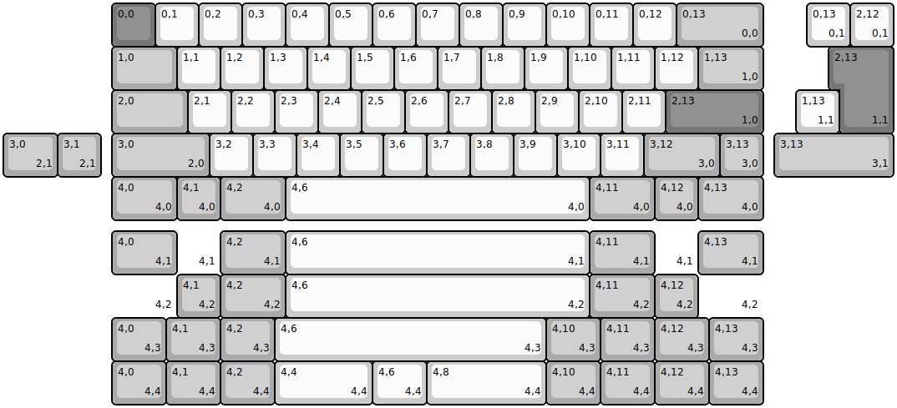{:loading="lazy"}

[Open in keyboard-layout-editor](http://www.keyboard-layout-editor.com/##@@_x:2.5&c=#777777;&=0,0&_c=#cccccc;&=0,1&=0,2&=0,3&=0,4&=0,5&=0,6&=0,7&=0,8&=0,9&=0,10&=0,11&=0,12&_c=#aaaaaa&w:2;&=0,13%0A%0A%0A0,0;&@_x:2.5&w:1.5;&=1,0&_c=#cccccc;&=1,1&=1,2&=1,3&=1,4&=1,5&=1,6&=1,7&=1,8&=1,9&=1,10&=1,11&=1,12&_c=#aaaaaa&w:1.5;&=1,13%0A%0A%0A1,0;&@_x:2.5&w:1.75;&=2,0&_c=#cccccc;&=2,1&=2,2&=2,3&=2,4&=2,5&=2,6&=2,7&=2,8&=2,9&=2,10&=2,11&_c=#777777&w:2.25;&=2,13%0A%0A%0A1,0;&@_x:2.5&c=#aaaaaa&w:2.25;&=3,0%0A%0A%0A2,0&_c=#cccccc;&=3,2&=3,3&=3,4&=3,5&=3,6&=3,7&=3,8&=3,9&=3,10&=3,11&_c=#aaaaaa&w:1.75;&=3,12%0A%0A%0A3,0&=3,13%0A%0A%0A3,0;&@_x:2.5&w:1.5;&=4,0%0A%0A%0A4,0&=4,1%0A%0A%0A4,0&_w:1.5;&=4,2%0A%0A%0A4,0&_c=#cccccc&w:7;&=4,6%0A%0A%0A4,0&_c=#aaaaaa&w:1.5;&=4,11%0A%0A%0A4,0&=4,12%0A%0A%0A4,0&_w:1.5;&=4,13%0A%0A%0A4,0;&@_x:18.5&y:-5&c=#cccccc;&=0,13%0A%0A%0A0,1&=2,12%0A%0A%0A0,1;&@_x:19.25&c=#777777&w:1.25&h:2&w2:1.5&h2:1&x2:-0.25;&=2,13%0A%0A%0A1,1;&@_x:18.25&c=#cccccc;&=1,13%0A%0A%0A1,1;&@_c=#aaaaaa&w:1.25;&=3,0%0A%0A%0A2,1&=3,1%0A%0A%0A2,1&_x:15.5&w:2.75;&=3,13%0A%0A%0A3,1;&@_x:2.5&y:1.25&w:1.5;&=4,0%0A%0A%0A4,1&_d:true;&=%0A%0A%0A4,1&_w:1.5;&=4,2%0A%0A%0A4,1&_c=#cccccc&w:7;&=4,6%0A%0A%0A4,1&_c=#aaaaaa&w:1.5;&=4,11%0A%0A%0A4,1&_d:true;&=%0A%0A%0A4,1&_w:1.5;&=4,13%0A%0A%0A4,1;&@_x:2.5&w:1.5&d:true;&=%0A%0A%0A4,2&=4,1%0A%0A%0A4,2&_w:1.5;&=4,2%0A%0A%0A4,2&_c=#cccccc&w:7;&=4,6%0A%0A%0A4,2&_c=#aaaaaa&w:1.5;&=4,11%0A%0A%0A4,2&=4,12%0A%0A%0A4,2&_w:1.5&d:true;&=%0A%0A%0A4,2;&@_x:2.5&w:1.25;&=4,0%0A%0A%0A4,3&_w:1.25;&=4,1%0A%0A%0A4,3&_w:1.25;&=4,2%0A%0A%0A4,3&_c=#cccccc&w:6.25;&=4,6%0A%0A%0A4,3&_c=#aaaaaa&w:1.25;&=4,10%0A%0A%0A4,3&_w:1.25;&=4,11%0A%0A%0A4,3&_w:1.25;&=4,12%0A%0A%0A4,3&_w:1.25;&=4,13%0A%0A%0A4,3;&@_x:2.5&w:1.25;&=4,0%0A%0A%0A4,4&_w:1.25;&=4,1%0A%0A%0A4,4&_w:1.25;&=4,2%0A%0A%0A4,4&_c=#cccccc&w:2.25;&=4,4%0A%0A%0A4,4&_w:1.25;&=4,6%0A%0A%0A4,4&_w:2.75;&=4,8%0A%0A%0A4,4&_c=#aaaaaa&w:1.25;&=4,10%0A%0A%0A4,4&_w:1.25;&=4,11%0A%0A%0A4,4&_w:1.25;&=4,12%0A%0A%0A4,4&_w:1.25;&=4,13%0A%0A%0A4,4)

## aves60/aves60

[README](output/aves60/README.md) - [layout](output/aves60/aves60-kle.json) - [PCB](output/aves60/aves60.kicad_pcb) - [PCB render](output/aves60/aves60-render.svg)

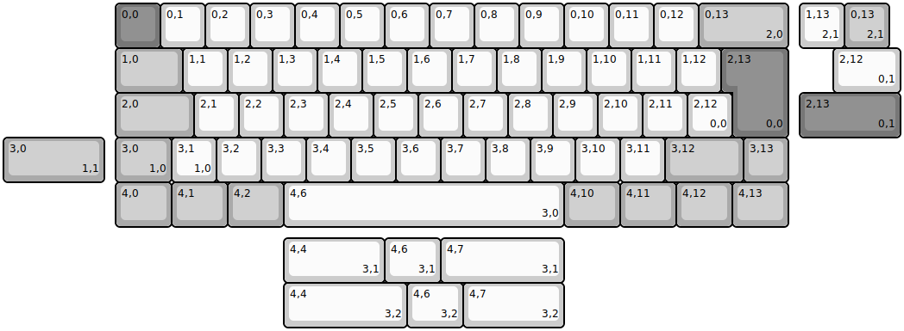{:loading="lazy"}

[Open in keyboard-layout-editor](http://www.keyboard-layout-editor.com/##@@_x:2.5&c=#777777;&=0,0&_c=#cccccc;&=0,1&=0,2&=0,3&=0,4&=0,5&=0,6&=0,7&=0,8&=0,9&=0,10&=0,11&=0,12&_c=#aaaaaa&w:2;&=0,13%0A%0A%0A2,0;&@_x:2.5&w:1.5;&=1,0&_c=#cccccc;&=1,1&=1,2&=1,3&=1,4&=1,5&=1,6&=1,7&=1,8&=1,9&=1,10&=1,11&=1,12&_x:0.25&c=#777777&w:1.25&h:2&w2:1.5&h2:1&x2:-0.25;&=2,13%0A%0A%0A0,0;&@_x:2.5&c=#aaaaaa&w:1.75;&=2,0&_c=#cccccc;&=2,1&=2,2&=2,3&=2,4&=2,5&=2,6&=2,7&=2,8&=2,9&=2,10&=2,11&=2,12%0A%0A%0A0,0;&@_x:2.5&c=#aaaaaa&w:1.25;&=3,0%0A%0A%0A1,0&_c=#cccccc;&=3,1%0A%0A%0A1,0&=3,2&=3,3&=3,4&=3,5&=3,6&=3,7&=3,8&=3,9&=3,10&=3,11&_c=#aaaaaa&w:1.75;&=3,12&=3,13;&@_x:2.5&w:1.25;&=4,0&_w:1.25;&=4,1&_w:1.25;&=4,2&_c=#cccccc&w:6.25;&=4,6%0A%0A%0A3,0&_c=#aaaaaa&w:1.25;&=4,10&_w:1.25;&=4,11&_w:1.25;&=4,12&_w:1.25;&=4,13;&@_x:17.75&y:-5&c=#cccccc;&=1,13%0A%0A%0A2,1&_c=#aaaaaa;&=0,13%0A%0A%0A2,1;&@_x:18.5&c=#cccccc&w:1.5;&=2,12%0A%0A%0A0,1;&@_x:17.75&c=#777777&w:2.25;&=2,13%0A%0A%0A0,1;&@_c=#aaaaaa&w:2.25;&=3,0%0A%0A%0A1,1;&@_x:6.25&y:1.25&c=#cccccc&w:2.25;&=4,4%0A%0A%0A3,1&_w:1.25;&=4,6%0A%0A%0A3,1&_w:2.75;&=4,7%0A%0A%0A3,1;&@_x:6.25&w:2.75;&=4,4%0A%0A%0A3,2&_w:1.25;&=4,6%0A%0A%0A3,2&_w:2.25;&=4,7%0A%0A%0A3,2)

## aves65/aves65

[README](output/aves65/README.md) - [layout](output/aves65/aves65-kle.json) - [PCB](output/aves65/aves65.kicad_pcb) - [PCB render](output/aves65/aves65-render.svg)

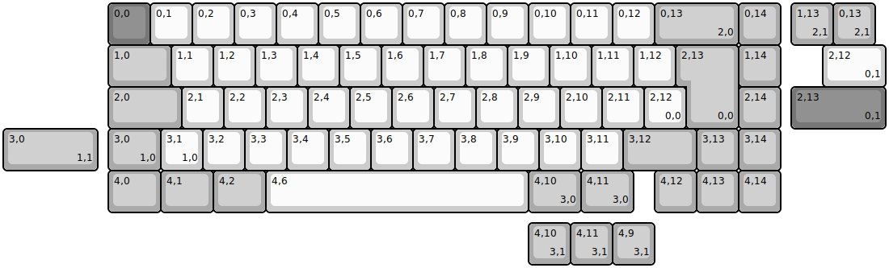{:loading="lazy"}

[Open in keyboard-layout-editor](http://www.keyboard-layout-editor.com/##@@_x:2.5&c=#777777;&=0,0&_c=#cccccc;&=0,1&=0,2&=0,3&=0,4&=0,5&=0,6&=0,7&=0,8&=0,9&=0,10&=0,11&=0,12&_c=#aaaaaa&w:2;&=0,13%0A%0A%0A2,0&=0,14;&@_x:2.5&w:1.5;&=1,0&_c=#cccccc;&=1,1&=1,2&=1,3&=1,4&=1,5&=1,6&=1,7&=1,8&=1,9&=1,10&=1,11&=1,12&_x:0.25&c=#aaaaaa&w:1.25&h:2&w2:1.5&h2:1&x2:-0.25;&=2,13%0A%0A%0A0,0&=1,14;&@_x:2.5&w:1.75;&=2,0&_c=#cccccc;&=2,1&=2,2&=2,3&=2,4&=2,5&=2,6&=2,7&=2,8&=2,9&=2,10&=2,11&=2,12%0A%0A%0A0,0&_x:1.25&c=#aaaaaa;&=2,14;&@_x:2.5&w:1.25;&=3,0%0A%0A%0A1,0&_c=#cccccc;&=3,1%0A%0A%0A1,0&=3,2&=3,3&=3,4&=3,5&=3,6&=3,7&=3,8&=3,9&=3,10&=3,11&_c=#aaaaaa&w:1.75;&=3,12&=3,13&=3,14;&@_x:2.5&w:1.25;&=4,0&_w:1.25;&=4,1&_w:1.25;&=4,2&_c=#cccccc&w:6.25;&=4,6&_c=#aaaaaa&w:1.25;&=4,10%0A%0A%0A3,0&_w:1.25;&=4,11%0A%0A%0A3,0&_x:0.5;&=4,12&=4,13&=4,14;&@_x:18.75&y:-5;&=1,13%0A%0A%0A2,1&=0,13%0A%0A%0A2,1;&@_x:19.5&c=#cccccc&w:1.5;&=2,12%0A%0A%0A0,1;&@_x:18.75&c=#777777&w:2.25;&=2,13%0A%0A%0A0,1;&@_c=#aaaaaa&w:2.25;&=3,0%0A%0A%0A1,1;&@_x:12.5&y:1.25;&=4,10%0A%0A%0A3,1&=4,11%0A%0A%0A3,1&=4,9%0A%0A%0A3,1)

## axolstudio/foundation_gamma

[README](output/axolstudio/foundation_gamma/README.md) - [layout](output/axolstudio/foundation_gamma/foundation_gamma-kle.json) - [PCB](output/axolstudio/foundation_gamma/foundation_gamma.kicad_pcb) - [PCB render](output/axolstudio/foundation_gamma/foundation_gamma-render.svg)

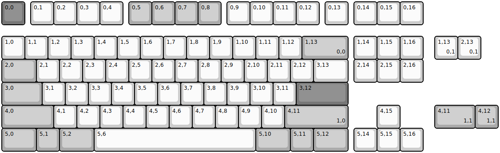{:loading="lazy"}

[Open in keyboard-layout-editor](http://www.keyboard-layout-editor.com/##@@_c=#777777;&=0,0&_x:0.25&c=#cccccc;&=0,1&=0,2&=0,3&=0,4&_x:0.25&c=#aaaaaa;&=0,5&=0,6&=0,7&=0,8&_x:0.25&c=#cccccc;&=0,9&=0,10&=0,11&=0,12&_x:0.25;&=0,13&_x:0.25;&=0,14&=0,15&=0,16;&@_y:0.5;&=1,0&=1,1&=1,2&=1,3&=1,4&=1,5&=1,6&=1,7&=1,8&=1,9&=1,10&=1,11&=1,12&_c=#aaaaaa&w:2;&=1,13%0A%0A%0A0,0&_x:0.25&c=#cccccc;&=1,14&=1,15&=1,16;&@_c=#aaaaaa&w:1.5;&=2,0&_c=#cccccc;&=2,1&=2,2&=2,3&=2,4&=2,5&=2,6&=2,7&=2,8&=2,9&=2,10&=2,11&=2,12&_w:1.5;&=3,13&_x:0.25;&=2,14&=2,15&=2,16;&@_c=#aaaaaa&w:1.75;&=3,0&_c=#cccccc;&=3,1&=3,2&=3,3&=3,4&=3,5&=3,6&=3,7&=3,8&=3,9&=3,10&=3,11&_c=#777777&w:2.25;&=3,12;&@_c=#aaaaaa&w:2.25;&=4,0&_c=#cccccc;&=4,1&=4,2&=4,3&=4,4&=4,5&=4,6&=4,7&=4,8&=4,9&=4,10&_c=#aaaaaa&w:2.75;&=4,11%0A%0A%0A1,0&_x:1.25&c=#cccccc;&=4,15;&@_c=#aaaaaa&w:1.5;&=5,0&=5,1&_w:1.5;&=5,2&_c=#cccccc&w:7;&=5,6&_c=#aaaaaa&w:1.5;&=5,10&=5,11&_w:1.5;&=5,12&_x:0.25&c=#cccccc;&=5,14&=5,15&=5,16;&@_x:18.75&y:-5.0;&=1,13%0A%0A%0A0,1&=2,13%0A%0A%0A0,1;&@_x:18.75&y:2.0&c=#aaaaaa&w:1.75;&=4,11%0A%0A%0A1,1&=4,12%0A%0A%0A1,1)

## axolstudio/helpo

[README](output/axolstudio/helpo/README.md) - [layout](output/axolstudio/helpo/helpo-kle.json) - [PCB](output/axolstudio/helpo/helpo.kicad_pcb) - [PCB render](output/axolstudio/helpo/helpo-render.svg)

{:loading="lazy"}

[Open in keyboard-layout-editor](http://www.keyboard-layout-editor.com/##@@=0,4&=0,3&=0,2&=0,1&=0,0;&@=1,4&=1,3&=1,2&=1,1&=1,0;&@=2,4&=2,3&=2,2&=2,1&=2,0;&@=3,4&=3,3&=3,2&=3,1&=3,0)

## axolstudio/yeti

[README](output/axolstudio/yeti/README.md) - [layout](output/axolstudio/yeti/yeti-kle.json) - [PCB](output/axolstudio/yeti/yeti.kicad_pcb) - [PCB render](output/axolstudio/yeti/yeti-render.svg)

{:loading="lazy"}

[Open in keyboard-layout-editor](http://www.keyboard-layout-editor.com/##@@_x:0.55&y:1.15&c=#777777;&=1,0;&@_x:3.7&y:-0.95&c=#cccccc;&=0,2&_x:8.45;&=0,11;&@_x:1.7&y:-0.95;&=0,0&=0,1&_x:10.45;&=0,12&_c=#aaaaaa&w:2;&=0,14%0A%0A%0A0,0;&@_x:0.35&y:-0.1;&=2,0;&@_x:13&y:-0.95&c=#cccccc;&=1,11;&@_x:1.5&y:-0.95&c=#aaaaaa&w:1.5;&=1,1&_c=#cccccc;&=1,2&_x:10.0;&=1,12&=1,13&_c=#aaaaaa&w:1.5;&=1,15;&@_x:0.15&y:-0.1;&=3,0;&@_x:13.4&y:-0.9&c=#cccccc;&=2,11&=2,12&_c=#777777&w:2.25;&=1,14&_x:-16.35&c=#aaaaaa&w:1.75;&=2,1&_c=#cccccc;&=2,2;&@_x:1.05&c=#aaaaaa&w:2.25;&=3,1&_c=#cccccc;&=3,2&_x:8.8;&=3,11&=3,12&_c=#aaaaaa&w:1.75;&=2,13%0A%0A%0A1,0&=2,15%0A%0A%0A1,0;&@_x:1.05&w:1.5;&=4,1&_x:13.45&w:1.5;&=4,15;&@_r:12&x:5.05&y:-6.0&c=#cccccc;&=0,3&=0,4&=0,5&=0,6;&@_x:4.6;&=1,3&=1,4&=1,5&=1,6;&@_x:4.85;&=2,3&=2,4&=2,5&=2,6;&@_x:5.3;&=3,3&=3,4&=3,5&=3,6;&@_x:6.6&c=#777777&w:2;&=4,5&_c=#aaaaaa&w:1.25;&=4,6;&@_x:5.05&y:-0.95&w:1.5;&=4,3;&@_r:-12&x:8.45&y:-1.45&c=#cccccc;&=0,7&=0,8&=0,9&=0,10;&@_x:8.05;&=1,7&=1,8&=1,9&=1,10;&@_x:8.2;&=2,7&=2,8&=2,9&=2,10;&@_x:7.75;&=3,7&=3,8&=3,9&=3,10;&@_x:7.75&c=#777777&w:2.75;&=4,8;&@_x:10.55&y:-0.95&c=#aaaaaa&w:1.5;&=4,10;&@_r:0&x:15.15&y:-8.75&c=#cccccc;&=0,13%0A%0A%0A0,1&_c=#aaaaaa;&=0,15%0A%0A%0A0,1;&@_x:18.15&y:3.1&w:2.75;&=2,14%0A%0A%0A1,1)

## axolstudio/yeti/yeti_rgb

[README](output/axolstudio/yeti/README.md) - [layout](output/axolstudio/yeti/yeti_rgb-kle.json) - [PCB](output/axolstudio/yeti/yeti_rgb.kicad_pcb) - [PCB render](output/axolstudio/yeti/yeti_rgb-render.svg)

{:loading="lazy"}

[Open in keyboard-layout-editor](http://www.keyboard-layout-editor.com/##@@_x:0.4445&y:0.0185&c=#aaaaaa;&=0,0&_x:2.1806&c=#cccccc;&=0,3&_x:8.4549;&=0,12;&@_x:15.08&y:-0.8885&c=#aaaaaa&w:2;&=0,14;&@_x:14.0823&y:-0.9996&c=#cccccc;&=0,13;&@_x:2.6484&y:-0.9998;&=0,2;&@_x:1.6506&y:-0.9999&c=#777777;&=0,1;&@_x:0.2262&y:-0.1143&c=#aaaaaa;&=1,0;&@_x:12.8&y:-0.9464&c=#cccccc;&=1,11;&@_x:13.8015&y:-0.9414;&=1,12&_x:0.9962&w:1.5;&=1,14;&@_x:14.7998&y:-0.9999;&=1,13;&@_x:2.9292&y:-0.9999;&=1,2;&@_x:1.4317&y:-0.9997&c=#aaaaaa&w:1.5;&=1,1;&@_y:-0.1144;&=2,0;&@_x:15.2718&y:-0.8881&c=#777777&w:2.25;&=2,14;&@_x:1.2183&y:-0.9998&c=#aaaaaa&w:1.75;&=2,1&_x:10.3087&c=#cccccc;&=2,11;&@_x:2.9659&y:-0.9999;&=2,2&_x:10.3093;&=2,12;&@_x:3.2462&y:-0.002;&=3,2;&@_x:12.9967&y:-0.9999;&=3,11&_x:-0.0025;&=3,12&_x:-0.0025&c=#aaaaaa&w:2.75;&=3,14;&@_x:0.9996&y:-0.9996&w:2.25;&=3,1;&@_x:1.0005&y:-0.0025&w:1.5;&=4,1;&@_x:16.0468&y:-0.9973&w:1.5;&=4,14;&@_r:12&rx:3.9386&ry:4.109&w:1.5;&=4,3;&@_rx:4.6991&ry:0.2258&x:0.1149&y:-0.093&c=#cccccc;&=0,4&=0,5&=0,6&=0,7;&@_x:-0.4491&y:-0.0028;&=1,3&=1,4&=1,5&=1,6;&@_x:-0.1991;&=2,3&=2,4&=2,5&=2,6;&@_x:0.3009;&=3,3&=3,4&=3,5&=3,6;&@_rx:5.4334&ry:4.3492&w:2.25;&=4,5;&@_rx:7.6342&ry:4.817&c=#aaaaaa;&=4,6;&@_r:-12&rx:9.0102&ry:0.8597&c=#cccccc;&=0,8&=0,9&=0,10&=0,11;&@_x:-0.5002&y:0.0003;&=1,7&=1,8&=1,9&=1,10;&@_x:-0.2502;&=2,7&=2,8&=2,9&=2,10;&@_x:-0.7502;&=3,7&=3,8&=3,9&=3,10;&@_rx:9.1085&ry:4.9223&w:2.75;&=4,8;&@_rx:11.8366&ry:4.4209&c=#aaaaaa&w:1.5;&=4,10)

## bakeneko60/bakeneko60

[README](output/bakeneko60/README.md) - [layout](output/bakeneko60/bakeneko60-kle.json) - [PCB](output/bakeneko60/bakeneko60.kicad_pcb) - [PCB render](output/bakeneko60/bakeneko60-render.svg)

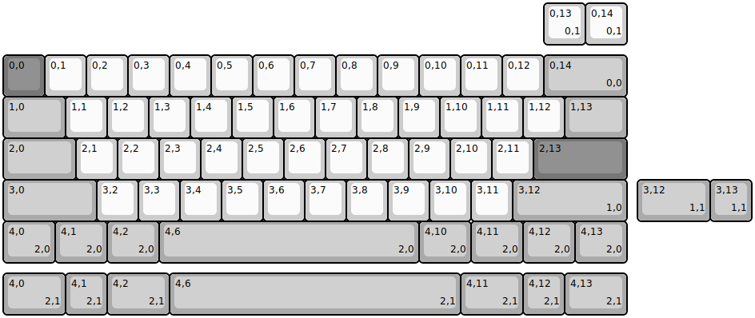{:loading="lazy"}

[Open in keyboard-layout-editor](http://www.keyboard-layout-editor.com/##@@_y:1.25&c=#777777;&=0,0&_c=#cccccc;&=0,1&=0,2&=0,3&=0,4&=0,5&=0,6&=0,7&=0,8&=0,9&=0,10&=0,11&=0,12&_c=#aaaaaa&w:2;&=0,14%0A%0A%0A0,0;&@_w:1.5;&=1,0&_c=#cccccc;&=1,1&=1,2&=1,3&=1,4&=1,5&=1,6&=1,7&=1,8&=1,9&=1,10&=1,11&=1,12&_c=#aaaaaa&w:1.5;&=1,13;&@_w:1.75;&=2,0&_c=#cccccc;&=2,1&=2,2&=2,3&=2,4&=2,5&=2,6&=2,7&=2,8&=2,9&=2,10&=2,11&_c=#777777&w:2.25;&=2,13;&@_c=#aaaaaa&w:2.25;&=3,0&_c=#cccccc;&=3,2&=3,3&=3,4&=3,5&=3,6&=3,7&=3,8&=3,9&=3,10&=3,11&_c=#aaaaaa&w:2.75;&=3,12%0A%0A%0A1,0;&@_w:1.25;&=4,0%0A%0A%0A2,0&_w:1.25;&=4,1%0A%0A%0A2,0&_w:1.25;&=4,2%0A%0A%0A2,0&_w:6.25;&=4,6%0A%0A%0A2,0&_w:1.25;&=4,10%0A%0A%0A2,0&_w:1.25;&=4,11%0A%0A%0A2,0&_w:1.25;&=4,12%0A%0A%0A2,0&_w:1.25;&=4,13%0A%0A%0A2,0;&@_x:13&y:-6.25&c=#cccccc;&=0,13%0A%0A%0A0,1&=0,14%0A%0A%0A0,1;&@_x:15.25&y:3.25&c=#aaaaaa&w:1.75;&=3,12%0A%0A%0A1,1&=3,13%0A%0A%0A1,1;&@_y:1.25&w:1.5;&=4,0%0A%0A%0A2,1&=4,1%0A%0A%0A2,1&_w:1.5;&=4,2%0A%0A%0A2,1&_w:7;&=4,6%0A%0A%0A2,1&_w:1.5;&=4,11%0A%0A%0A2,1&=4,12%0A%0A%0A2,1&_w:1.5;&=4,13%0A%0A%0A2,1)

## bakeneko65rev2/bakeneko65rev2

[README](output/bakeneko65rev2/README.md) - [layout](output/bakeneko65rev2/bakeneko65rev2-kle.json) - [PCB](output/bakeneko65rev2/bakeneko65rev2.kicad_pcb) - [PCB render](output/bakeneko65rev2/bakeneko65rev2-render.svg)

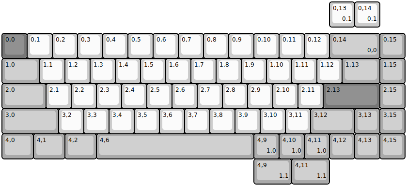{:loading="lazy"}

[Open in keyboard-layout-editor](http://www.keyboard-layout-editor.com/##@@_y:1.25&c=#777777;&=0,0&_c=#cccccc;&=0,1&=0,2&=0,3&=0,4&=0,5&=0,6&=0,7&=0,8&=0,9&=0,10&=0,11&=0,12&_c=#aaaaaa&w:2;&=0,14%0A%0A%0A0,0&=0,15;&@_w:1.5;&=1,0&_c=#cccccc;&=1,1&=1,2&=1,3&=1,4&=1,5&=1,6&=1,7&=1,8&=1,9&=1,10&=1,11&=1,12&_c=#aaaaaa&w:1.5;&=1,13&=1,15;&@_w:1.75;&=2,0&_c=#cccccc;&=2,1&=2,2&=2,3&=2,4&=2,5&=2,6&=2,7&=2,8&=2,9&=2,10&=2,11&_c=#777777&w:2.25;&=2,13&_c=#aaaaaa;&=2,15;&@_w:2.25;&=3,0&_c=#cccccc;&=3,2&=3,3&=3,4&=3,5&=3,6&=3,7&=3,8&=3,9&=3,10&=3,11&_c=#aaaaaa&w:1.75;&=3,12&=3,13&=3,15;&@_w:1.25;&=4,0&_w:1.25;&=4,1&_w:1.25;&=4,2&_w:6.25;&=4,6&=4,9%0A%0A%0A1,0&=4,10%0A%0A%0A1,0&=4,11%0A%0A%0A1,0&=4,12&=4,13&=4,15;&@_x:13&y:-6.25&c=#cccccc;&=0,13%0A%0A%0A0,1&=0,14%0A%0A%0A0,1;&@_x:10&y:5.25&c=#aaaaaa&w:1.5;&=4,9%0A%0A%0A1,1&_w:1.5;&=4,11%0A%0A%0A1,1)

## bakeneko65rev3/bakeneko65rev3

[README](output/bakeneko65rev3/README.md) - [layout](output/bakeneko65rev3/bakeneko65rev3-kle.json) - [PCB](output/bakeneko65rev3/bakeneko65rev3.kicad_pcb) - [PCB render](output/bakeneko65rev3/bakeneko65rev3-render.svg)

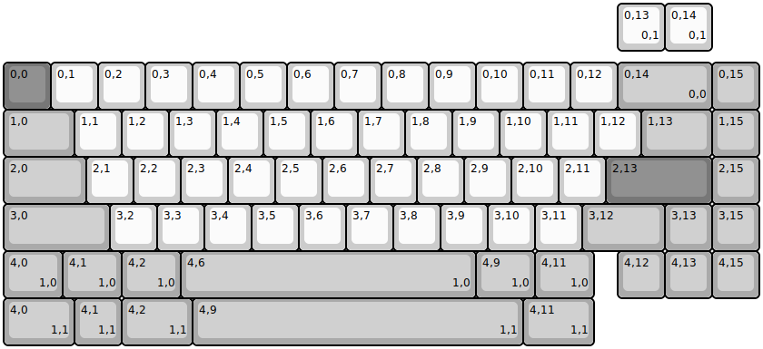{:loading="lazy"}

[Open in keyboard-layout-editor](http://www.keyboard-layout-editor.com/##@@_y:1.25&c=#777777;&=0,0&_c=#cccccc;&=0,1&=0,2&=0,3&=0,4&=0,5&=0,6&=0,7&=0,8&=0,9&=0,10&=0,11&=0,12&_c=#aaaaaa&w:2;&=0,14%0A%0A%0A0,0&=0,15;&@_w:1.5;&=1,0&_c=#cccccc;&=1,1&=1,2&=1,3&=1,4&=1,5&=1,6&=1,7&=1,8&=1,9&=1,10&=1,11&=1,12&_c=#aaaaaa&w:1.5;&=1,13&=1,15;&@_w:1.75;&=2,0&_c=#cccccc;&=2,1&=2,2&=2,3&=2,4&=2,5&=2,6&=2,7&=2,8&=2,9&=2,10&=2,11&_c=#777777&w:2.25;&=2,13&_c=#aaaaaa;&=2,15;&@_w:2.25;&=3,0&_c=#cccccc;&=3,2&=3,3&=3,4&=3,5&=3,6&=3,7&=3,8&=3,9&=3,10&=3,11&_c=#aaaaaa&w:1.75;&=3,12&=3,13&=3,15;&@_w:1.25;&=4,0%0A%0A%0A1,0&_w:1.25;&=4,1%0A%0A%0A1,0&_w:1.25;&=4,2%0A%0A%0A1,0&_w:6.25;&=4,6%0A%0A%0A1,0&_w:1.25;&=4,9%0A%0A%0A1,0&_w:1.25;&=4,11%0A%0A%0A1,0&_x:0.5;&=4,12&=4,13&=4,15;&@_x:13&y:-6.25&c=#cccccc;&=0,13%0A%0A%0A0,1&=0,14%0A%0A%0A0,1;&@_y:5.25&c=#aaaaaa&w:1.5;&=4,0%0A%0A%0A1,1&=4,1%0A%0A%0A1,1&_w:1.5;&=4,2%0A%0A%0A1,1&_w:7;&=4,9%0A%0A%0A1,1&_w:1.5;&=4,11%0A%0A%0A1,1)

## bantam44/bantam-44-pcb/bantam44

[README](output/bantam44/bantam-44-pcb/README.md) - [layout](output/bantam44/bantam-44-pcb/bantam44-kle.json) - [PCB](output/bantam44/bantam-44-pcb/bantam44.kicad_pcb) - [PCB render](output/bantam44/bantam-44-pcb/bantam44-render.svg)

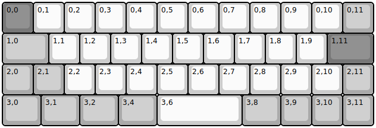{:loading="lazy"}

[Open in keyboard-layout-editor](http://www.keyboard-layout-editor.com/##@@_c=#777777;&=0,0&_c=#cccccc;&=0,1&=0,2&=0,3&=0,4&=0,5&=0,6&=0,7&=0,8&=0,9&=0,10&_c=#aaaaaa;&=0,11;&@_w:1.5;&=1,0&_c=#cccccc;&=1,1&=1,2&=1,3&=1,4&=1,5&=1,6&=1,7&=1,8&=1,9&_c=#777777&w:1.5;&=1,11;&@_c=#aaaaaa;&=2,0&=2,1&_c=#cccccc;&=2,2&=2,3&=2,4&=2,5&=2,6&=2,7&=2,8&=2,9%0A%0A%0A%0A%0A%0A%0A%0A%0A%0A,&=2,10%0A%0A%0A%0A%0A%0A%0A%0A%0A%0A.&_c=#aaaaaa;&=2,11;&@_w:1.25;&=3,0&_w:1.25;&=3,1&_w:1.25;&=3,2&_w:1.25;&=3,4&_c=#cccccc&w:2.75;&=3,6&_c=#aaaaaa&w:1.25;&=3,8&=3,9&=3,10&=3,11)

## barracuda/barracuda

[README](output/barracuda/README.md) - [layout](output/barracuda/barracuda-kle.json) - [PCB](output/barracuda/barracuda.kicad_pcb) - [PCB render](output/barracuda/barracuda-render.svg)

{:loading="lazy"}

[Open in keyboard-layout-editor](http://www.keyboard-layout-editor.com/##@@_c=#777777;&=0,0&_c=#cccccc;&=0,1&=0,2&=0,3&=0,4&=0,5&_x:3;&=3,1&=3,2&=3,3&=3,4&=3,5;&@_c=#aaaaaa;&=1,0&_c=#cccccc;&=1,1&=1,2&=1,3&=1,4&=1,5&_x:3;&=4,1&=4,2&=4,3&=4,4&_c=#aaaaaa;&=4,5;&@=2,0&_c=#cccccc;&=2,1&=2,2&=2,3&=2,4&_c=#aaaaaa;&=2,5&_x:3;&=5,1&_c=#cccccc;&=5,2&=5,3&=5,4&_c=#aaaaaa;&=5,5)

## basekeys/slice/rev1

[README](output/basekeys/slice/README.md) - [layout](output/basekeys/slice/rev1-kle.json) - [PCB](output/basekeys/slice/rev1.kicad_pcb) - [PCB render](output/basekeys/slice/rev1-render.svg)

{:loading="lazy"}

[Open in keyboard-layout-editor](http://www.keyboard-layout-editor.com/##@@_y:1.25&c=#777777;&=0,0&_x:1&c=#aaaaaa;&=0,1&_c=#cccccc;&=0,2&_x:10;&=5,4&=5,5&_c=#aaaaaa&w:2;&=5,7%0A%0A%0A0,0;&@=1,0&_x:0.75&w:1.5;&=1,1&_c=#cccccc;&=1,2&_x:9.5;&=6,4&=6,5&=6,6&_c=#aaaaaa&w:1.5;&=6,7;&@=2,0&_x:0.65&w:1.75;&=2,1&_c=#cccccc;&=2,2&_x:9.7;&=7,4&=7,5&_c=#777777&w:2.25;&=7,6;&@_c=#aaaaaa;&=3,0&_x:0.5&w:2.25;&=3,1&_c=#cccccc;&=3,2&_x:9.0;&=8,4&=8,5&_c=#aaaaaa&w:2.75;&=8,7%0A%0A%0A1,0;&@=4,0&_x:0.75&w:1.25;&=4,1&_w:1.25;&=4,2&_x:10.25&w:1.25;&=9,2&_w:1.25;&=9,3&=9,4;&@_r:10&rx:3&ry:4.25&x:0.75&y:-3.25&c=#cccccc;&=0,3&=0,4&=0,5&=0,6&=0,7;&@_x:1.25;&=1,3&=1,4&=1,5&=1,6;&@_x:1.5;&=2,3&=2,4&=2,5&=2,6;&@_x:2;&=3,3&=3,4&=3,5&=3,6;&@_x:2.25&c=#aaaaaa;&=4,3&_c=#cccccc&w:2.75;&=4,5%0A%0A%0A2,0;&@_r:-10&rx:12.5&x:-2.25&y:-2.75;&=5,0&=5,1&=5,2&=5,3;&@_x:-2.75;&=6,0&=6,1&=6,2&=6,3;&@_x:-2.5;&=7,0&=7,1&=7,2&=7,3;&@_x:-3.0;&=8,0&=8,1&=8,2&=8,3;&@_x:-2.75&w:2.25;&=9,0&_c=#aaaaaa;&=9,1;&@_r:0&rx:0&ry:0&x:16&y:0.25;&=5,6%0A%0A%0A0,1&=5,8%0A%0A%0A0,1;&@_x:18.75&y:3.0&w:1.75;&=8,6%0A%0A%0A1,1&=8,8%0A%0A%0A1,1;&@_r:10&rx:3&ry:4.25&x:3.5&y:1.75;&=4,4%0A%0A%0A2,1&_c=#cccccc&w:1.75;&=4,6%0A%0A%0A2,1)

## basekeys/slice/rev1_rgb

[README](output/basekeys/slice/README.md) - [layout](output/basekeys/slice/rev1_rgb-kle.json) - [PCB](output/basekeys/slice/rev1_rgb.kicad_pcb) - [PCB render](output/basekeys/slice/rev1_rgb-render.svg)

{:loading="lazy"}

[Open in keyboard-layout-editor](http://www.keyboard-layout-editor.com/##@@_y:1.25&c=#777777;&=0,0&_x:1&c=#aaaaaa;&=0,1&_c=#cccccc;&=0,2&_x:10;&=5,4&=5,5&_c=#aaaaaa&w:2;&=5,7;&@=1,0&_x:0.75&w:1.5;&=1,1&_c=#cccccc;&=1,2&_x:9.5;&=6,4&=6,5&=6,6&_c=#aaaaaa&w:1.5;&=6,7;&@=2,0&_x:0.65&w:1.75;&=2,1&_c=#cccccc;&=2,2&_x:9.7;&=7,4&=7,5&_c=#777777&w:2.25;&=7,6;&@_c=#aaaaaa;&=3,0&_x:0.5&w:2.25;&=3,1&_c=#cccccc;&=3,2&_x:9.0;&=8,4&=8,5&_c=#aaaaaa&w:1.75;&=8,7&=8,8;&@=4,0&_x:0.75&w:1.25;&=4,1&_w:1.25;&=4,2&_x:10.25&w:1.25;&=9,2&_w:1.25;&=9,3&=9,4;&@_r:10&rx:3&ry:4.25&x:0.75&y:-3.25&c=#cccccc;&=0,3&=0,4&=0,5&=0,6&=0,7;&@_x:1.25;&=1,3&=1,4&=1,5&=1,6;&@_x:1.5;&=2,3&=2,4&=2,5&=2,6;&@_x:2;&=3,3&=3,4&=3,5&=3,6;&@_x:2.25&c=#aaaaaa;&=4,3&_c=#cccccc&w:2.75;&=4,5%0A%0A%0A0,0;&@_r:-10&rx:12.5&x:-2.25&y:-2.75;&=5,0&=5,1&=5,2&=5,3;&@_x:-2.75;&=6,0&=6,1&=6,2&=6,3;&@_x:-2.5;&=7,0&=7,1&=7,2&=7,3;&@_x:-3.0;&=8,0&=8,1&=8,2&=8,3;&@_x:-2.75&w:2.25;&=9,0&_c=#aaaaaa;&=9,1;&@_r:10&rx:3&x:3.5&y:1.75;&=4,4%0A%0A%0A0,1&_c=#cccccc&w:1.75;&=4,6%0A%0A%0A0,1)

## basekeys/trifecta

[README](output/basekeys/trifecta/README.md) - [layout](output/basekeys/trifecta/trifecta-kle.json) - [PCB](output/basekeys/trifecta/trifecta.kicad_pcb) - [PCB render](output/basekeys/trifecta/trifecta-render.svg)

{:loading="lazy"}

[Open in keyboard-layout-editor](http://www.keyboard-layout-editor.com/##@@_x:0.5&y:1.3&c=#777777;&=1,0&_c=#cccccc;&=0,1&_x:10.0;&=0,6&=1,6&_c=#aaaaaa&w:2;&=0,7%0A%0A%0A0,0&_x:0.5;&=3,7;&@_x:0.25&w:1.5;&=3,0&_c=#cccccc;&=2,1&_x:9.5;&=3,5&=2,6&=3,6&_c=#aaaaaa&w:1.5;&=2,7;&@_x:17.25&y:-0.8;&=5,7;&@_x:0.15&y:-0.2&w:1.75;&=4,0&_c=#cccccc;&=5,1&_x:9.7;&=4,5&=5,6&_c=#777777&w:2.25;&=4,7;&@_x:17.5&y:-0.6&c=#aaaaaa;&=7,7;&@_y:-0.4&w:2.25;&=7,0&_c=#cccccc;&=6,1&_x:9.0;&=7,5&=6,6&_c=#aaaaaa&w:1.75;&=7,6;&@_x:16.25&y:-0.75&c=#777777;&=6,7;&@_y:-0.25&c=#aaaaaa&w:1.25;&=9,0&_w:1.25;&=8,1&_x:10.0&w:1.25;&=9,5&_w:1.25;&=8,6;&@_x:15.25&y:-0.75&c=#777777;&=9,6&=8,7&=9,7;&@_r:10&rx:3&ry:4.25&x:-0.75&y:-3.0&c=#cccccc;&=1,1&=0,2&=1,2&=0,3&=1,3;&@_x:-0.25;&=3,1&=2,2&=3,2&=2,3;&@=4,1&=5,2&_n:true;&=4,2&=5,3;&@_x:0.5;&=7,1&=6,2&=7,2&=6,3;&@_x:0.75&c=#aaaaaa&w:1.25;&=9,1&_w:2.75;&=8,2;&@_r:-10&rx:12.5&x:-3.75&y:-3.0&c=#cccccc;&=0,4&=1,4&=0,5&=1,5;&@_x:-4.25;&=3,3&=2,4&=3,4&=2,5;&@_x:-4.0;&=4,3&_n:true;&=5,4&=4,4&=5,5;&@_x:-4.5;&=7,3&=6,4&=7,4&=6,5;&@_x:-4.25&c=#aaaaaa&w:2.25;&=9,4&_w:1.25;&=8,5;&@_r:0&rx:0&ry:0&x:14.5&y:0.05;&=0,7%0A%0A%0A0,1&=1,7%0A%0A%0A0,1)

## basketweave/basketweave

[README](output/basketweave/README.md) - [layout](output/basketweave/basketweave-kle.json) - [PCB](output/basketweave/basketweave.kicad_pcb) - [PCB render](output/basketweave/basketweave-render.svg)

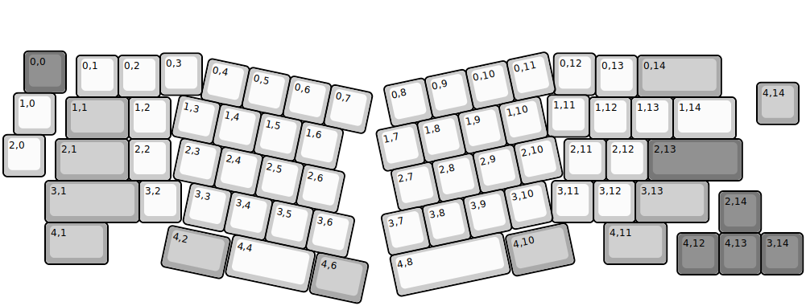{:loading="lazy"}

[Open in keyboard-layout-editor](http://www.keyboard-layout-editor.com/##@_name=Basketweave;&@_x:0.5&y:1.15&c=#777777;&=0,0;&@_x:3.75&y:-0.95&c=#cccccc;&=0,3&_x:8.4;&=0,12;&@_x:1.75&y:-0.95;&=0,1&=0,2&_x:10.4;&=0,13&_c=#aaaaaa&w:2;&=0,14;&@_x:18&y:-0.35;&=4,14;&@_x:0.25&y:-0.75&c=#cccccc;&=1,0;&@_x:13&y:-0.95;&=1,11;&@_x:1.5&y:-0.95&c=#aaaaaa&w:1.5;&=1,1&_c=#cccccc;&=1,2&_x:10.0;&=1,12&=1,13&_w:1.5;&=1,14;&@_y:-0.1;&=2,0;&@_x:1.25&y:-0.9&c=#aaaaaa&w:1.75;&=2,1&_c=#cccccc;&=2,2&_x:9.4;&=2,11&=2,12&_c=#777777&w:2.25;&=2,13;&@_x:1&c=#aaaaaa&w:2.25;&=3,1&_c=#cccccc;&=3,2&_x:8.85;&=3,11&=3,12&_c=#aaaaaa&w:1.75;&=3,13;&@_x:17.1&y:-0.75&c=#777777;&=2,14;&@_x:1&y:-0.25&c=#aaaaaa&w:1.5;&=4,1&_x:11.85&w:1.5;&=4,11;&@_x:16.1&y:-0.75&c=#777777;&=4,12&_x:1.0;&=3,14;&@_ry:0.25&x:17.1&y:5.25;&=4,13;&@_r:12&ry:0&x:5.1&y:0.25&c=#cccccc;&=0,4&=0,5&=0,6&=0,7;&@_x:4.6;&=1,3&=1,4&=1,5&=1,6;&@_x:4.85;&=2,3&=2,4&=2,5&=2,6;&@_x:5.3;&=3,3&=3,4&=3,5&=3,6;&@_x:6.55&w:2;&=4,4&_x:0.05&c=#aaaaaa&w:1.25;&=4,6;&@_x:5&y:-0.894&w:1.5;&=4,2;&@_r:-12&x:8.45&y:-1.506&c=#cccccc;&=0,8&=0,9&=0,10&=0,11;&@_x:8.05;&=1,7&=1,8&=1,9&=1,10;&@_x:8.2;&=2,7&=2,8&=2,9&=2,10;&@_x:7.75;&=3,7&=3,8&=3,9&=3,10;&@_x:7.75&w:2.75;&=4,8;&@_x:10.55&y:-0.9&c=#aaaaaa&w:1.5;&=4,10)

## bat43/bat43

[README](output/bat43/README.md) - [layout](output/bat43/bat43-kle.json) - [PCB](output/bat43/bat43.kicad_pcb) - [PCB render](output/bat43/bat43-render.svg)

{:loading="lazy"}

[Open in keyboard-layout-editor](http://www.keyboard-layout-editor.com/##@@=0,0&=0,1&=0,2&=0,3&=0,4&=0,5&_x:1;&=4,0&=4,1&=4,2&=4,3&=4,4&=4,5;&@=1,0&=1,1&=1,2&=1,3&=1,4&=1,5&=3,0&=5,0&=5,1&=5,2&=5,3&=5,4&=5,5;&@=2,0&=2,1&=2,2&=2,3&=2,4&=2,5&_x:1;&=6,0&=6,1&=6,2&=6,3&=6,4&=6,5;&@_x:3;&=3,3&=3,4&=3,5&_x:1;&=7,0&=7,1&=7,2;&@_x:4;&=7,5&=7,4&_x:1;&=7,3&=3,1&=3,2)

## bbrfkr/dynamis

[README](output/bbrfkr/README.md) - [layout](output/bbrfkr/dynamis-kle.json) - [PCB](output/bbrfkr/dynamis.kicad_pcb) - [PCB render](output/bbrfkr/dynamis-render.svg)

{:loading="lazy"}

[Open in keyboard-layout-editor](http://www.keyboard-layout-editor.com/##@@_x:2.5&y:1.25;&=0,0&=0,1&=0,2&=0,3&=0,4&=0,5&=0,6&=5,6&=5,5&=5,4&=5,3&=5,2&=5,1&_w:2;&=5,0%0A%0A%0A4,0;&@_x:2.5&w:1.5;&=1,0&=1,1&=1,2&=1,3&=1,4&=1,5&=1,6&=6,6&=6,5&=6,4&=6,3&=6,2&=6,1&_w:1.5;&=6,0%0A%0A%0A0,0;&@_x:2.5&w:1.75;&=2,0&=2,1&=2,2&=2,3&=2,4&=2,5&=2,6&=7,6&=7,5&=7,4&=7,3&=7,2&_w:2.25;&=7,0%0A%0A%0A0,0;&@_x:2.5&w:2.25;&=3,1%0A%0A%0A2,0&=3,2&=3,3&=3,4&=3,5&=3,6&=8,6&=8,5&=8,4&=8,3&=8,2&_w:2.75;&=8,1%0A%0A%0A3,0&_x:0.25;&=9,1&_a:7;&=e0;&@_x:2.5&a:4&w:1.25;&=4,0&_w:1.25;&=4,1&_w:1.25;&=4,2&_w:6.25;&=4,3%0A%0A%0A1,0&_w:1.25;&=4,6&_w:1.25;&=9,6&_w:1.25;&=9,5&_x:0.5;&=9,4&=9,3&=9,2;&@_x:15.5&y:-6.25;&=5,0%0A%0A%0A4,1&=9,0%0A%0A%0A4,1;&@_x:21.5&y:1.25&w:1.25&h:2&w2:1.5&h2:1&x2:-0.25;&=7,0%0A%0A%0A0,1;&@_x:20.5;&=7,1%0A%0A%0A0,1;&@_w:1.25;&=3,0%0A%0A%0A2,1&=3,1%0A%0A%0A2,1&_x:17.75&w:1.75;&=8,1%0A%0A%0A3,1&=8,0%0A%0A%0A3,1;&@_x:6.25&y:1.25&w:2.25;&=4,3%0A%0A%0A1,1&_w:1.25;&=4,4%0A%0A%0A1,1&_w:2.75;&=4,5%0A%0A%0A1,1)

## beatervan/beatervan

[README](output/beatervan/README.md) - [layout](output/beatervan/beatervan-kle.json) - [PCB](output/beatervan/beatervan.kicad_pcb) - [PCB render](output/beatervan/beatervan-render.svg)

{:loading="lazy"}

[Open in keyboard-layout-editor](http://www.keyboard-layout-editor.com/##@@=0,0&=0,1&=0,2&=0,3&=0,4&=0,5&=0,6&=0,7&=0,8&=0,9&=0,10&_w:1.75;&=0,11;&@_w:1.25;&=1,0&=1,1&=1,2&=1,3&=1,4&=1,5&=1,6&=1,7&=1,8&=1,9&=1,10&_w:1.5;&=1,11;&@_w:1.75;&=2,0&=2,1&=2,2&=2,3&=2,4&=2,5&=2,6&=2,7&=2,8&=2,9&=2,10&=2,11;&@_w:1.25;&=3,0%0A%0A%0A0,0&_w:1.5;&=3,1%0A%0A%0A0,0&_w:1.25;&=3,2%0A%0A%0A0,0&_w:2.25;&=3,4&_w:2;&=3,6&_w:1.25;&=3,7%0A%0A%0A1,0&_w:1.5;&=3,8%0A%0A%0A1,0&_w:1.75;&=3,9%0A%0A%0A1,0;&@_y:0.25;&=3,0%0A%0A%0A0,1&=3,1%0A%0A%0A0,1&=3,2%0A%0A%0A0,1&=3,3%0A%0A%0A0,1&_x:4.25&w:1.5;&=3,7%0A%0A%0A1,1&=3,8%0A%0A%0A1,1&=3,9%0A%0A%0A1,1&=3,10%0A%0A%0A1,1)

## bemeier/bmek

[README](output/bemeier/bmek/README.md) - [layout](output/bemeier/bmek/bmek-kle.json) - [PCB](output/bemeier/bmek/bmek.kicad_pcb) - [PCB render](output/bemeier/bmek/bmek-render.svg)

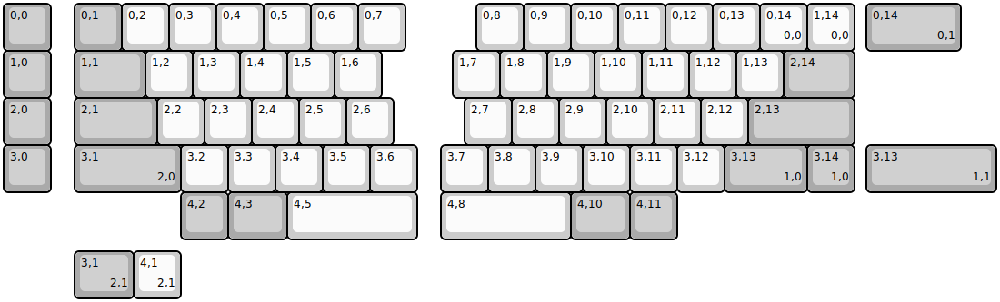{:loading="lazy"}

[Open in keyboard-layout-editor](http://www.keyboard-layout-editor.com/##@@_c=#aaaaaa;&=0,0&_x:0.5;&=0,1&_c=#cccccc;&=0,2&=0,3&=0,4&=0,5&=0,6&=0,7&_x:1.5;&=0,8&=0,9&=0,10&=0,11&=0,12&=0,13&=0,14%0A%0A%0A0,0&=1,14%0A%0A%0A0,0;&@_c=#aaaaaa;&=1,0&_x:0.5&w:1.5;&=1,1&_c=#cccccc;&=1,2&=1,3&=1,4&=1,5&=1,6&_x:1.5;&=1,7&=1,8&=1,9&=1,10&=1,11&=1,12&=1,13&_c=#aaaaaa&w:1.5;&=2,14;&@=2,0&_x:0.5&w:1.75;&=2,1&_c=#cccccc;&=2,2&=2,3&=2,4&=2,5&=2,6&_x:1.5;&=2,7&=2,8&=2,9&=2,10&=2,11&=2,12&_c=#aaaaaa&w:2.25;&=2,13;&@=3,0&_x:0.5&w:2.25;&=3,1%0A%0A%0A2,0&_c=#cccccc;&=3,2&=3,3&=3,4&=3,5&=3,6&_x:0.5;&=3,7&=3,8&=3,9&=3,10&=3,11&=3,12&_c=#aaaaaa&w:1.75;&=3,13%0A%0A%0A1,0&=3,14%0A%0A%0A1,0;&@_x:3.75;&=4,2&_w:1.25;&=4,3&_c=#cccccc&w:2.75;&=4,5&_x:0.5&w:2.75;&=4,8&_c=#aaaaaa&w:1.25;&=4,10&=4,11;&@_x:18.25&y:-5&w:2;&=0,14%0A%0A%0A0,1;&@_x:18.25&y:2&w:2.75;&=3,13%0A%0A%0A1,1;&@_x:1.5&y:1.25&w:1.25;&=3,1%0A%0A%0A2,1&_c=#cccccc;&=4,1%0A%0A%0A2,1)

## binepad/bn003

[README](output/binepad/bn003/README.md) - [layout](output/binepad/bn003/bn003-kle.json) - [PCB](output/binepad/bn003/bn003.kicad_pcb) - [PCB render](output/binepad/bn003/bn003-render.svg)

{:loading="lazy"}

[Open in keyboard-layout-editor](http://www.keyboard-layout-editor.com/##@@=0,0&=0,1&=0,2)

## binepad/bn006

[README](output/binepad/bn006/README.md) - [layout](output/binepad/bn006/bn006-kle.json) - [PCB](output/binepad/bn006/bn006.kicad_pcb) - [PCB render](output/binepad/bn006/bn006-render.svg)

{:loading="lazy"}

[Open in keyboard-layout-editor](http://www.keyboard-layout-editor.com/##@@=0,0&=0,1&=0,2;&@=1,0&=1,1&=1,2)

## binepad/bn009

[README](output/binepad/bn009/README.md) - [layout](output/binepad/bn009/bn009-kle.json) - [PCB](output/binepad/bn009/bn009.kicad_pcb) - [PCB render](output/binepad/bn009/bn009-render.svg)

{:loading="lazy"}

[Open in keyboard-layout-editor](http://www.keyboard-layout-editor.com/##@@=0,0&=0,1&=0,2;&@=1,0&=1,1&=1,2;&@=2,0&=2,1&=2,2)

## bioi/f60

[README](output/bioi/f60/README.md) - [layout](output/bioi/f60/f60-kle.json) - [PCB](output/bioi/f60/f60.kicad_pcb) - [PCB render](output/bioi/f60/f60-render.svg)

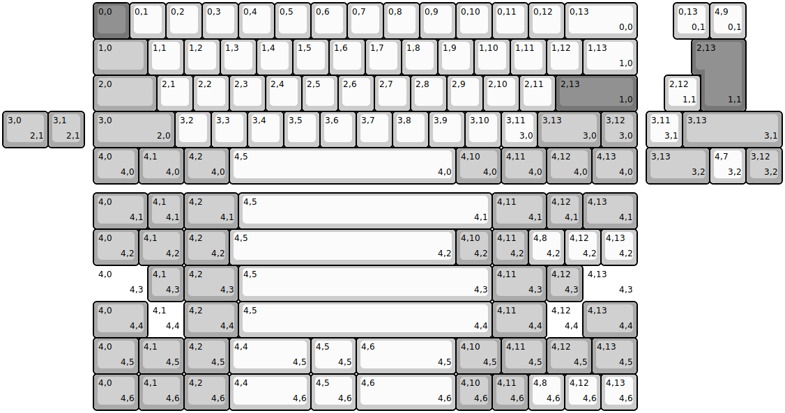{:loading="lazy"}

[Open in keyboard-layout-editor](http://www.keyboard-layout-editor.com/##@@_x:2.5&c=#777777;&=0,0&_c=#cccccc;&=0,1&=0,2&=0,3&=0,4&=0,5&=0,6&=0,7&=0,8&=0,9&=0,10&=0,11&=0,12&_w:2;&=0,13%0A%0A%0A0,0;&@_x:2.5&c=#aaaaaa&w:1.5;&=1,0&_c=#cccccc;&=1,1&=1,2&=1,3&=1,4&=1,5&=1,6&=1,7&=1,8&=1,9&=1,10&=1,11&=1,12&_w:1.5;&=1,13%0A%0A%0A1,0;&@_x:2.5&c=#aaaaaa&w:1.75;&=2,0&_c=#cccccc;&=2,1&=2,2&=2,3&=2,4&=2,5&=2,6&=2,7&=2,8&=2,9&=2,10&=2,11&_c=#777777&w:2.25;&=2,13%0A%0A%0A1,0;&@_x:2.5&c=#aaaaaa&w:2.25;&=3,0%0A%0A%0A2,0&_c=#cccccc;&=3,2&=3,3&=3,4&=3,5&=3,6&=3,7&=3,8&=3,9&=3,10&=3,11%0A%0A%0A3,0&_c=#aaaaaa&w:1.75;&=3,13%0A%0A%0A3,0&=3,12%0A%0A%0A3,0;&@_x:2.5&w:1.25;&=4,0%0A%0A%0A4,0&_w:1.25;&=4,1%0A%0A%0A4,0&_w:1.25;&=4,2%0A%0A%0A4,0&_c=#cccccc&w:6.25;&=4,5%0A%0A%0A4,0&_c=#aaaaaa&w:1.25;&=4,10%0A%0A%0A4,0&_w:1.25;&=4,11%0A%0A%0A4,0&_w:1.25;&=4,12%0A%0A%0A4,0&_w:1.25;&=4,13%0A%0A%0A4,0;&@_x:18.5&y:-5&c=#cccccc;&=0,13%0A%0A%0A0,1&=4,9%0A%0A%0A0,1;&@_x:19.25&c=#777777&w:1.25&h:2&w2:1.5&h2:1&x2:-0.25;&=2,13%0A%0A%0A1,1;&@_x:18.25&c=#cccccc;&=2,12%0A%0A%0A1,1;&@_c=#aaaaaa&w:1.25;&=3,0%0A%0A%0A2,1&=3,1%0A%0A%0A2,1&_x:15.5&c=#cccccc;&=3,11%0A%0A%0A3,1&_c=#aaaaaa&w:2.75;&=3,13%0A%0A%0A3,1;&@_x:17.75&w:1.75;&=3,13%0A%0A%0A3,2&_c=#cccccc;&=4,7%0A%0A%0A3,2&_c=#aaaaaa;&=3,12%0A%0A%0A3,2;&@_x:2.5&y:0.25&w:1.5;&=4,0%0A%0A%0A4,1&=4,1%0A%0A%0A4,1&_w:1.5;&=4,2%0A%0A%0A4,1&_c=#cccccc&w:7;&=4,5%0A%0A%0A4,1&_c=#aaaaaa&w:1.5;&=4,11%0A%0A%0A4,1&=4,12%0A%0A%0A4,1&_w:1.5;&=4,13%0A%0A%0A4,1;&@_x:2.5&w:1.25;&=4,0%0A%0A%0A4,2&_w:1.25;&=4,1%0A%0A%0A4,2&_w:1.25;&=4,2%0A%0A%0A4,2&_c=#cccccc&w:6.25;&=4,5%0A%0A%0A4,2&_c=#aaaaaa;&=4,10%0A%0A%0A4,2&=4,11%0A%0A%0A4,2&_c=#cccccc;&=4,8%0A%0A%0A4,2&=4,12%0A%0A%0A4,2&=4,13%0A%0A%0A4,2;&@_x:2.5&c=#aaaaaa&w:1.5&d:true;&=4,0%0A%0A%0A4,3&=4,1%0A%0A%0A4,3&_w:1.5;&=4,2%0A%0A%0A4,3&_c=#cccccc&w:7;&=4,5%0A%0A%0A4,3&_c=#aaaaaa&w:1.5;&=4,11%0A%0A%0A4,3&=4,12%0A%0A%0A4,3&_w:1.5&d:true;&=4,13%0A%0A%0A4,3;&@_x:2.5&w:1.5;&=4,0%0A%0A%0A4,4&_d:true;&=4,1%0A%0A%0A4,4&_w:1.5;&=4,2%0A%0A%0A4,4&_c=#cccccc&w:7;&=4,5%0A%0A%0A4,4&_c=#aaaaaa&w:1.5;&=4,11%0A%0A%0A4,4&_d:true;&=4,12%0A%0A%0A4,4&_w:1.5;&=4,13%0A%0A%0A4,4;&@_x:2.5&w:1.25;&=4,0%0A%0A%0A4,5&_w:1.25;&=4,1%0A%0A%0A4,5&_w:1.25;&=4,2%0A%0A%0A4,5&_c=#cccccc&w:2.25;&=4,4%0A%0A%0A4,5&_w:1.25;&=4,5%0A%0A%0A4,5&_w:2.75;&=4,6%0A%0A%0A4,5&_c=#aaaaaa&w:1.25;&=4,10%0A%0A%0A4,5&_w:1.25;&=4,11%0A%0A%0A4,5&_w:1.25;&=4,12%0A%0A%0A4,5&_w:1.25;&=4,13%0A%0A%0A4,5;&@_x:2.5&w:1.25;&=4,0%0A%0A%0A4,6&_w:1.25;&=4,1%0A%0A%0A4,6&_w:1.25;&=4,2%0A%0A%0A4,6&_c=#cccccc&w:2.25;&=4,4%0A%0A%0A4,6&_w:1.25;&=4,5%0A%0A%0A4,6&_w:2.75;&=4,6%0A%0A%0A4,6&_c=#aaaaaa;&=4,10%0A%0A%0A4,6&=4,11%0A%0A%0A4,6&_c=#cccccc;&=4,8%0A%0A%0A4,6&=4,12%0A%0A%0A4,6&=4,13%0A%0A%0A4,6)

## bioi/g60

[README](output/bioi/g60/README.md) - [layout](output/bioi/g60/g60-kle.json) - [PCB](output/bioi/g60/g60.kicad_pcb) - [PCB render](output/bioi/g60/g60-render.svg)

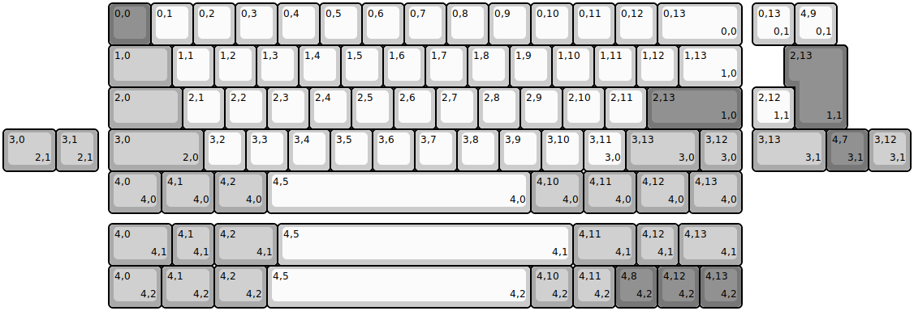{:loading="lazy"}

[Open in keyboard-layout-editor](http://www.keyboard-layout-editor.com/##@@_x:2.5&c=#777777;&=0,0&_c=#cccccc;&=0,1&=0,2&=0,3&=0,4&=0,5&=0,6&=0,7&=0,8&=0,9&=0,10&=0,11&=0,12&_w:2;&=0,13%0A%0A%0A0,0;&@_x:2.5&c=#aaaaaa&w:1.5;&=1,0&_c=#cccccc;&=1,1&=1,2&=1,3&=1,4&=1,5&=1,6&=1,7&=1,8&=1,9&=1,10&=1,11&=1,12&_w:1.5;&=1,13%0A%0A%0A1,0;&@_x:2.5&c=#aaaaaa&w:1.75;&=2,0&_c=#cccccc;&=2,1&=2,2&=2,3&=2,4&=2,5&=2,6&=2,7&=2,8&=2,9&=2,10&=2,11&_c=#777777&w:2.25;&=2,13%0A%0A%0A1,0;&@_x:2.5&c=#aaaaaa&w:2.25;&=3,0%0A%0A%0A2,0&_c=#cccccc;&=3,2&=3,3&=3,4&=3,5&=3,6&=3,7&=3,8&=3,9&=3,10&=3,11%0A%0A%0A3,0&_c=#aaaaaa&w:1.75;&=3,13%0A%0A%0A3,0&=3,12%0A%0A%0A3,0;&@_x:2.5&w:1.25;&=4,0%0A%0A%0A4,0&_w:1.25;&=4,1%0A%0A%0A4,0&_w:1.25;&=4,2%0A%0A%0A4,0&_c=#cccccc&w:6.25;&=4,5%0A%0A%0A4,0&_c=#aaaaaa&w:1.25;&=4,10%0A%0A%0A4,0&_w:1.25;&=4,11%0A%0A%0A4,0&_w:1.25;&=4,12%0A%0A%0A4,0&_w:1.25;&=4,13%0A%0A%0A4,0;&@_x:17.75&y:-5&c=#cccccc;&=0,13%0A%0A%0A0,1&=4,9%0A%0A%0A0,1;&@_x:18.75&c=#777777&w:1.25&h:2&w2:1.5&h2:1&x2:-0.25;&=2,13%0A%0A%0A1,1;&@_x:17.75&c=#cccccc;&=2,12%0A%0A%0A1,1;&@_c=#aaaaaa&w:1.25;&=3,0%0A%0A%0A2,1&=3,1%0A%0A%0A2,1&_x:15.5&w:1.75;&=3,13%0A%0A%0A3,1&_c=#777777;&=4,7%0A%0A%0A3,1&_c=#aaaaaa;&=3,12%0A%0A%0A3,1;&@_x:2.5&y:1.25&w:1.5;&=4,0%0A%0A%0A4,1&=4,1%0A%0A%0A4,1&_w:1.5;&=4,2%0A%0A%0A4,1&_c=#cccccc&w:7;&=4,5%0A%0A%0A4,1&_c=#aaaaaa&w:1.5;&=4,11%0A%0A%0A4,1&=4,12%0A%0A%0A4,1&_w:1.5;&=4,13%0A%0A%0A4,1;&@_x:2.5&w:1.25;&=4,0%0A%0A%0A4,2&_w:1.25;&=4,1%0A%0A%0A4,2&_w:1.25;&=4,2%0A%0A%0A4,2&_c=#cccccc&w:6.25;&=4,5%0A%0A%0A4,2&_c=#aaaaaa;&=4,10%0A%0A%0A4,2&=4,11%0A%0A%0A4,2&_c=#777777;&=4,8%0A%0A%0A4,2&=4,12%0A%0A%0A4,2&=4,13%0A%0A%0A4,2)

## bioi/morgan65

[README](output/bioi/morgan65/README.md) - [layout](output/bioi/morgan65/morgan65-kle.json) - [PCB](output/bioi/morgan65/morgan65.kicad_pcb) - [PCB render](output/bioi/morgan65/morgan65-render.svg)

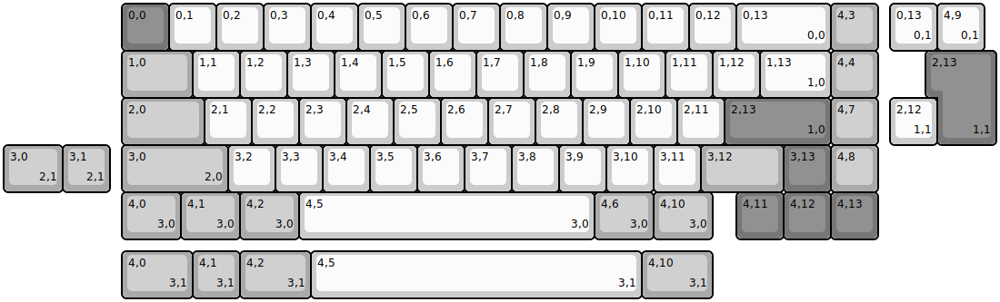{:loading="lazy"}

[Open in keyboard-layout-editor](http://www.keyboard-layout-editor.com/##@@_x:2.5&c=#777777;&=0,0&_c=#cccccc;&=0,1&=0,2&=0,3&=0,4&=0,5&=0,6&=0,7&=0,8&=0,9&=0,10&=0,11&=0,12&_w:2;&=0,13%0A%0A%0A0,0&_c=#aaaaaa;&=4,3;&@_x:2.5&w:1.5;&=1,0&_c=#cccccc;&=1,1&=1,2&=1,3&=1,4&=1,5&=1,6&=1,7&=1,8&=1,9&=1,10&=1,11&=1,12&_w:1.5;&=1,13%0A%0A%0A1,0&_c=#aaaaaa;&=4,4;&@_x:2.5&w:1.75;&=2,0&_c=#cccccc;&=2,1&=2,2&=2,3&=2,4&=2,5&=2,6&=2,7&=2,8&=2,9&=2,10&=2,11&_c=#777777&w:2.25;&=2,13%0A%0A%0A1,0&_c=#aaaaaa;&=4,7;&@_x:2.5&w:2.25;&=3,0%0A%0A%0A2,0&_c=#cccccc;&=3,2&=3,3&=3,4&=3,5&=3,6&=3,7&=3,8&=3,9&=3,10&=3,11&_c=#aaaaaa&w:1.75;&=3,12&_c=#777777;&=3,13&_c=#aaaaaa;&=4,8;&@_x:2.5&w:1.25;&=4,0%0A%0A%0A3,0&_w:1.25;&=4,1%0A%0A%0A3,0&_w:1.25;&=4,2%0A%0A%0A3,0&_c=#cccccc&w:6.25;&=4,5%0A%0A%0A3,0&_c=#aaaaaa&w:1.25;&=4,6%0A%0A%0A3,0&_w:1.25;&=4,10%0A%0A%0A3,0&_x:0.5&c=#777777;&=4,11&=4,12&=4,13;&@_x:18.75&y:-5&c=#cccccc;&=0,13%0A%0A%0A0,1&=4,9%0A%0A%0A0,1;&@_x:19.75&c=#777777&w:1.25&h:2&w2:1.5&h2:1&x2:-0.25;&=2,13%0A%0A%0A1,1;&@_x:18.75&c=#cccccc;&=2,12%0A%0A%0A1,1;&@_c=#aaaaaa&w:1.25;&=3,0%0A%0A%0A2,1&=3,1%0A%0A%0A2,1;&@_x:2.5&y:1.25&w:1.5;&=4,0%0A%0A%0A3,1&=4,1%0A%0A%0A3,1&_w:1.5;&=4,2%0A%0A%0A3,1&_c=#cccccc&w:7;&=4,5%0A%0A%0A3,1&_c=#aaaaaa&w:1.5;&=4,10%0A%0A%0A3,1)

## bioi/s65

[README](output/bioi/s65/README.md) - [layout](output/bioi/s65/s65-kle.json) - [PCB](output/bioi/s65/s65.kicad_pcb) - [PCB render](output/bioi/s65/s65-render.svg)

{:loading="lazy"}

[Open in keyboard-layout-editor](http://www.keyboard-layout-editor.com/##@@_c=#777777;&=0,0&_c=#cccccc;&=0,1&=0,2&=0,3&=0,4&=0,5&=0,6&=0,7&=0,8&=0,9&=0,10&=0,11&=0,12&_w:2;&=0,13&_x:0.25&c=#aaaaaa;&=0,14&=0,15&=2,15;&@_w:1.5;&=1,0&_c=#cccccc;&=1,1&=1,2&=1,3&=1,4&=1,5&=1,6&=1,7&=1,8&=1,9&=1,10&=1,11&=1,12&_w:1.5;&=1,13%0A%0A%0A0,0&_x:0.25&c=#aaaaaa;&=1,14&=1,15&=2,14;&@_w:1.75;&=2,0&_c=#cccccc;&=2,1&=2,2&=2,3&=2,4&=2,5&=2,6&=2,7&=2,8&=2,9&=2,10&=2,11&_c=#777777&w:2.25;&=2,13%0A%0A%0A0,0;&@_c=#aaaaaa&w:2.25;&=3,0&_c=#cccccc;&=3,2&=3,3&=3,4&=3,5&=3,6&=3,7&=3,8&=3,9&=3,10&=3,11&_c=#aaaaaa&w:2.75;&=3,12%0A%0A%0A1,0&_x:1.25&c=#777777;&=3,14;&@_c=#aaaaaa&w:1.25;&=4,0%0A%0A%0A2,0&_w:1.25;&=4,1%0A%0A%0A2,0&_w:1.25;&=4,2%0A%0A%0A2,0&_c=#cccccc&w:6.25;&=4,5%0A%0A%0A2,0&_c=#aaaaaa&w:1.25;&=4,9%0A%0A%0A2,0&_w:1.25;&=4,10%0A%0A%0A2,0&_w:1.25;&=4,11%0A%0A%0A2,0&_w:1.25;&=4,12%0A%0A%0A2,0&_x:0.25&c=#777777;&=4,13&=4,14&=4,15;&@_x:20.0&y:-4&w:1.25&h:2&w2:1.5&h2:1&x2:-0.25;&=2,13%0A%0A%0A0,1;&@_x:19.0&c=#cccccc;&=2,12%0A%0A%0A0,1;&@_x:18.5&c=#aaaaaa&w:1.75;&=3,12%0A%0A%0A1,1&=3,13%0A%0A%0A1,1;&@_y:1.25&w:1.5;&=4,0%0A%0A%0A2,1&=4,1%0A%0A%0A2,1&_w:1.5;&=4,2%0A%0A%0A2,1&_c=#cccccc&w:7;&=4,5%0A%0A%0A2,1&_c=#aaaaaa&w:1.5;&=4,10%0A%0A%0A2,1&=4,11%0A%0A%0A2,1&_w:1.5;&=4,12%0A%0A%0A2,1)

## black_hellebore/ansi

[README](output/black_hellebore/ansi/README.md) - [layout](output/black_hellebore/ansi/ansi-kle.json) - [PCB](output/black_hellebore/ansi/ansi.kicad_pcb) - [PCB render](output/black_hellebore/ansi/ansi-render.svg)

{:loading="lazy"}

[Open in keyboard-layout-editor](http://www.keyboard-layout-editor.com/##@@_c=#777777;&=0,0&_c=#cccccc;&=0,1&=0,2&=0,3&=0,4&=0,5&=0,6&=0,7&=0,8&=0,9&=0,10&=0,11&=0,12&_c=#aaaaaa&w:2;&=0,13;&@_w:1.5;&=1,0&_c=#cccccc;&=1,1&=1,2&=1,3&=1,4&=1,5&=1,6&=1,7&=1,8&=1,9&=1,10&=1,11&=1,12&_w:1.5;&=1,13;&@_c=#aaaaaa&w:1.75;&=2,0&_c=#cccccc;&=2,1&=2,2&=2,3&=2,4&=2,5&=2,6&=2,7&=2,8&=2,9&=2,10&=2,11&_c=#777777&w:2.25;&=2,13;&@_c=#aaaaaa&w:2.25;&=3,0&_c=#cccccc;&=3,1&=3,2&=3,3&=3,4&=3,5&=3,6&=3,7&=3,8&=3,9&=3,10&_c=#aaaaaa&w:2.75;&=3,13;&@_w:1.25;&=4,0&_w:1.25;&=4,1&_w:1.25;&=4,2&_c=#cccccc&w:6.25;&=4,5&_c=#aaaaaa&w:1.25;&=4,9&_w:1.25;&=4,10&_w:1.25;&=4,11&_w:1.25;&=4,13)

## blaster75/blaster75

[README](output/blaster75/README.md) - [layout](output/blaster75/blaster75-kle.json) - [PCB](output/blaster75/blaster75.kicad_pcb) - [PCB render](output/blaster75/blaster75-render.svg)

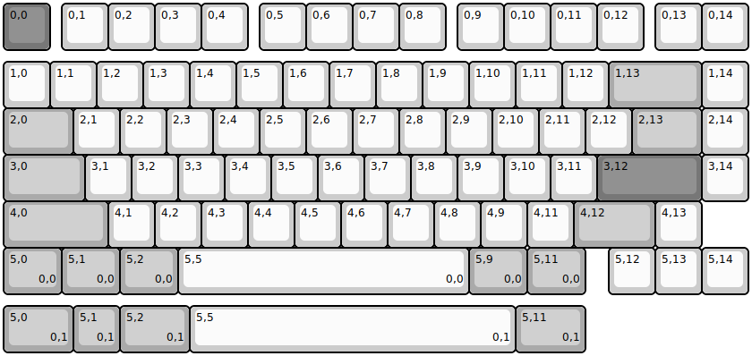{:loading="lazy"}

[Open in keyboard-layout-editor](http://www.keyboard-layout-editor.com/##@@_c=#777777;&=0,0&_x:0.25&c=#cccccc;&=0,1&=0,2&=0,3&=0,4&_x:0.25;&=0,5&=0,6&=0,7&=0,8&_x:0.25;&=0,9&=0,10&=0,11&=0,12&_x:0.25;&=0,13&=0,14;&@_y:0.25;&=1,0&=1,1&=1,2&=1,3&=1,4&=1,5&=1,6&=1,7&=1,8&=1,9&=1,10&=1,11&=1,12&_c=#aaaaaa&w:2;&=1,13&_c=#cccccc;&=1,14;&@_c=#aaaaaa&w:1.5;&=2,0&_c=#cccccc;&=2,1&=2,2&=2,3&=2,4&=2,5&=2,6&=2,7&=2,8&=2,9&=2,10&=2,11&=2,12&_c=#aaaaaa&w:1.5;&=2,13&_c=#cccccc;&=2,14;&@_c=#aaaaaa&w:1.75;&=3,0&_c=#cccccc;&=3,1&=3,2&=3,3&=3,4&=3,5&=3,6&=3,7&=3,8&=3,9&=3,10&=3,11&_c=#777777&w:2.25;&=3,12&_c=#cccccc;&=3,14;&@_c=#aaaaaa&w:2.25;&=4,0&_c=#cccccc;&=4,1&=4,2&=4,3&=4,4&=4,5&=4,6&=4,7&=4,8&=4,9&=4,11&_c=#aaaaaa&w:1.75;&=4,12&_c=#cccccc;&=4,13;&@_c=#aaaaaa&w:1.25;&=5,0%0A%0A%0A0,0&_w:1.25;&=5,1%0A%0A%0A0,0&_w:1.25;&=5,2%0A%0A%0A0,0&_c=#cccccc&w:6.25;&=5,5%0A%0A%0A0,0&_c=#aaaaaa&w:1.25;&=5,9%0A%0A%0A0,0&_w:1.25;&=5,11%0A%0A%0A0,0&_x:0.5&c=#cccccc;&=5,12&=5,13&=5,14;&@_y:0.25&c=#aaaaaa&w:1.5;&=5,0%0A%0A%0A0,1&=5,1%0A%0A%0A0,1&_w:1.5;&=5,2%0A%0A%0A0,1&_c=#cccccc&w:7;&=5,5%0A%0A%0A0,1&_c=#aaaaaa&w:1.5;&=5,11%0A%0A%0A0,1)

## boardsource/3x4

[README](output/boardsource/3x4/README.md) - [layout](output/boardsource/3x4/3x4-kle.json) - [PCB](output/boardsource/3x4/3x4.kicad_pcb) - [PCB render](output/boardsource/3x4/3x4-render.svg)

{:loading="lazy"}

[Open in keyboard-layout-editor](http://www.keyboard-layout-editor.com/##@@=0,0&=0,1&=0,2&=0,3;&@=1,0&=1,1&=1,2&=1,3;&@=2,0&=2,1&=2,2&=2,3)

## boardsource/4x12

[README](output/boardsource/4x12/README.md) - [layout](output/boardsource/4x12/4x12-kle.json) - [PCB](output/boardsource/4x12/4x12.kicad_pcb) - [PCB render](output/boardsource/4x12/4x12-render.svg)

{:loading="lazy"}

[Open in keyboard-layout-editor](http://www.keyboard-layout-editor.com/##@@_c=#aaaaaa;&=0,0&_c=#cccccc;&=0,1&=0,2&=0,3&=0,4&=0,5&=0,6&=0,7&=0,8&=0,9&=0,10&_c=#aaaaaa;&=0,11;&@=1,0&_c=#cccccc;&=1,1&=1,2&=1,3&=1,4&=1,5&=1,6&=1,7&=1,8&=1,9&=1,10&=1,11;&@_c=#aaaaaa;&=2,0&_c=#cccccc;&=2,1&=2,2&=2,3&=2,4&=2,5&=2,6&=2,7&=2,8&=2,9&=2,10&_c=#aaaaaa;&=2,11;&@=3,0&=3,1&=3,2&=3,3&=3,4&_c=#cccccc;&=3,5&=3,6&_c=#aaaaaa;&=3,7&=3,8&=3,9&=3,10&=3,11)

## boardsource/5x12

[README](output/boardsource/5x12/README.md) - [layout](output/boardsource/5x12/5x12-kle.json) - [PCB](output/boardsource/5x12/5x12.kicad_pcb) - [PCB render](output/boardsource/5x12/5x12-render.svg)

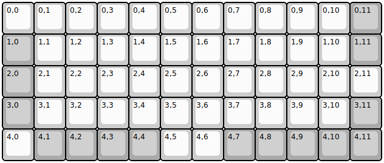{:loading="lazy"}

[Open in keyboard-layout-editor](http://www.keyboard-layout-editor.com/##@@=0,0&=0,1&=0,2&=0,3&=0,4&=0,5&=0,6&=0,7&=0,8&=0,9&=0,10&_c=#aaaaaa;&=0,11;&@=1,0&_c=#cccccc;&=1,1&=1,2&=1,3&=1,4&=1,5&=1,6&=1,7&=1,8&=1,9&=1,10&_c=#aaaaaa;&=1,11;&@=2,0&_c=#cccccc;&=2,1&=2,2&=2,3&=2,4&=2,5&=2,6&=2,7&=2,8&=2,9&=2,10&=2,11;&@_c=#aaaaaa;&=3,0&_c=#cccccc;&=3,1&=3,2&=3,3&=3,4&=3,5&=3,6&=3,7&=3,8&=3,9&=3,10&_c=#aaaaaa;&=3,11;&@_c=#cccccc;&=4,0&_c=#aaaaaa;&=4,1&=4,2&=4,3&=4,4&_c=#cccccc;&=4,5&=4,6&_c=#aaaaaa;&=4,7&=4,8&=4,9&=4,10&=4,11)

## boardsource/beiwagon

[README](output/boardsource/beiwagon/README.md) - [layout](output/boardsource/beiwagon/beiwagon-kle.json) - [PCB](output/boardsource/beiwagon/beiwagon.kicad_pcb) - [PCB render](output/boardsource/beiwagon/beiwagon-render.svg)

{:loading="lazy"}

[Open in keyboard-layout-editor](http://www.keyboard-layout-editor.com/##@@=0,0&=0,1&=0,2;&@=1,0&=1,1&=1,2;&@=2,0&=2,1&=2,2;&@=3,0&=3,1&=3,2)

## boardsource/microdox

[README](output/boardsource/microdox/README.md) - [layout](output/boardsource/microdox/microdox-kle.json) - [PCB](output/boardsource/microdox/microdox.kicad_pcb) - [PCB render](output/boardsource/microdox/microdox-render.svg)

{:loading="lazy"}

[Open in keyboard-layout-editor](http://www.keyboard-layout-editor.com/##@@_x:2;&=0,2&_x:7.5;&=4,2;&@_x:1&y:-0.85;&=0,1&_x:1;&=0,3&_x:5.5;&=4,3&_x:1.0;&=4,1;&@_y:-0.9;&=0,0&_x:3;&=0,4&_x:3.5;&=4,4&_x:3.0;&=4,0;&@_x:2&y:-0.25;&=1,2&_x:7.5;&=5,2;&@_x:1&y:-0.85;&=1,1&_x:1;&=1,3&_x:5.5;&=5,3&_x:1.0;&=5,1;&@_y:-0.9;&=1,0&_x:3;&=1,4&_x:3.5;&=5,4&_x:3.0;&=5,0;&@_x:2&y:-0.25;&=2,2&_x:7.5;&=6,2;&@_x:1&y:-0.85;&=2,1&_x:1;&=2,3&_x:5.5;&=6,3&_x:1.0;&=6,1;&@_y:-0.9;&=2,0&_x:3;&=2,4&_x:3.5;&=6,4&_x:3.0;&=6,0;&@_x:2&y:0.15&c=#aaaaaa;&=3,2&_x:7.5;&=7,2;&@_r:11&rx:6.25&ry:3.5&x:-2.82&y:0.41;&=3,3;&@_r:117&ry:3.25&x:0.5&y:0.05&c=#777777&w:1.5;&=3,4;&@_r:-117&rx:7&x:-2.1&y:0.25&w:1.5;&=7,4;&@_r:-11&rx:7.25&ry:3.5&x:1.82&y:0.41&c=#aaaaaa;&=7,3)

## boardsource/technik_o

[README](output/boardsource/technik_o/README.md) - [layout](output/boardsource/technik_o/technik_o-kle.json) - [PCB](output/boardsource/technik_o/technik_o.kicad_pcb) - [PCB render](output/boardsource/technik_o/technik_o-render.svg)

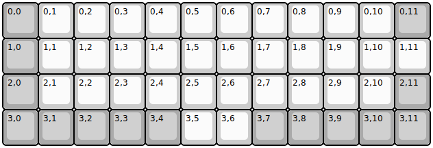{:loading="lazy"}

[Open in keyboard-layout-editor](http://www.keyboard-layout-editor.com/##@@_c=#aaaaaa;&=0,0&_c=#cccccc;&=0,1&=0,2&=0,3&=0,4&=0,5&=0,6&=0,7&=0,8&=0,9&=0,10&_c=#aaaaaa;&=0,11;&@=1,0&_c=#cccccc;&=1,1&=1,2&=1,3&=1,4&=1,5&=1,6&=1,7&=1,8&=1,9&=1,10&=1,11;&@_c=#aaaaaa;&=2,0&_c=#cccccc;&=2,1&=2,2&=2,3&=2,4&=2,5&=2,6&=2,7&=2,8&=2,9&=2,10&_c=#aaaaaa;&=2,11;&@=3,0&=3,1&=3,2&=3,3&=3,4&_c=#cccccc;&=3,5&=3,6&_c=#aaaaaa;&=3,7&=3,8&=3,9&=3,10&=3,11)

## boardsource/technik_s

[README](output/boardsource/technik_s/README.md) - [layout](output/boardsource/technik_s/technik_s-kle.json) - [PCB](output/boardsource/technik_s/technik_s.kicad_pcb) - [PCB render](output/boardsource/technik_s/technik_s-render.svg)

{:loading="lazy"}

[Open in keyboard-layout-editor](http://www.keyboard-layout-editor.com/##@@_c=#777777;&=0,0&_c=#cccccc;&=0,1&=0,2&=0,3&=0,4&=0,5&=0,6&=0,7&=0,8&=0,9&=0,10&_c=#aaaaaaaa;&=0,11;&@_w:1.5;&=1,0&_c=#cccccc;&=1,2&=1,3&=1,4&=1,5&=1,6&=1,7&=1,8&=1,9&=1,10&_c=#777777&w:1.5;&=1,11;&@_c=#aaaaaaaa;&=2,0&=2,1&_c=#cccccc;&=2,2&=2,3&=2,4&=2,5&=2,6&=2,7&=2,8&=2,9&=2,10&_c=#aaaaaaaa;&=2,11;&@=3,0&=3,1&=3,2&_w:1.5;&=3,3&_c=#777777&w:1.5;&=3,5&_w:1.5;&=3,6&_c=#aaaaaaaa&w:1.5;&=3,8&=3,9&=3,10&=3,11)

## boardsource/the_mark_65

[README](output/boardsource/the_mark_65/README.md) - [layout](output/boardsource/the_mark_65/the_mark_65-kle.json) - [PCB](output/boardsource/the_mark_65/the_mark_65.kicad_pcb) - [PCB render](output/boardsource/the_mark_65/the_mark_65-render.svg)

{:loading="lazy"}

[Open in keyboard-layout-editor](http://www.keyboard-layout-editor.com/##@@_x:2.5&c=#777777;&=0,0&_c=#cccccc;&=0,1&=0,2&=0,3&=0,4&=0,5&=0,6&=0,7&=0,8&=0,9&=0,10&=0,11&=0,12&_c=#aaaaaaaa&w:2;&=0,13%0A%0A%0A4,0&_x:0.25&c=#777777;&=0,15;&@_x:2.5&c=#aaaaaaaa&w:1.5;&=1,0&_c=#cccccc;&=1,2&=1,3&=1,4&=1,5&=1,6&=1,7&=1,8&=1,9&=1,10&=1,11&=1,12&=1,13&_w:1.5;&=1,14%0A%0A%0A3,0&_x:0.25&c=#777777;&=1,15;&@_x:2.5&c=#aaaaaaaa&w:1.75;&=2,0&_c=#cccccc;&=2,2&=2,3&=2,4&=2,5&=2,6&=2,7&=2,8&=2,9&=2,10&=2,11&=2,12&_c=#777777&w:2.25;&=2,13%0A%0A%0A3,0&_x:0.25;&=2,15;&@_x:2.5&c=#aaaaaaaa&w:2.25;&=3,1%0A%0A%0A2,0&_c=#cccccc;&=3,2&=3,3&=3,4&=3,5&=3,6&=3,7&=3,8&=3,9&=3,10&=3,11&_c=#aaaaaaaa&w:1.75;&=3,13;&@_x:16.75&y:-0.75&c=#777777;&=3,14;&@_x:2.5&y:-0.25&c=#aaaaaaaa&w:1.25;&=4,0&_w:1.25;&=4,1&_w:1.25;&=4,3&_c=#777777&w:6.25;&=4,6%0A%0A%0A0,0&_c=#aaaaaaaa;&=4,10%0A%0A%0A1,0&=4,11%0A%0A%0A1,0&=4,12%0A%0A%0A1,0;&@_x:15.75&y:-0.75&c=#777777;&=4,13&=4,14&=4,15;&@_x:19.25&y:-5.25&c=#aaaaaaaa;&=0,13%0A%0A%0A4,1&=0,14%0A%0A%0A4,1;&@_x:20.0&c=#777777&w:1.25&h:2&w2:1.5&h2:1&x2:-0.25;&=2,13%0A%0A%0A3,1;&@_x:19.0&c=#cccccc;&=1,14%0A%0A%0A3,1;&@_c=#aaaaaaaa&w:1.25;&=3,0%0A%0A%0A2,1&=3,1%0A%0A%0A2,1;&@_x:6.25&y:1.25&c=#777777&w:2.25;&=4,4%0A%0A%0A0,1&_w:1.25;&=4,6%0A%0A%0A0,1&_w:2.75;&=4,8%0A%0A%0A0,1&_c=#aaaaaaaa&w:1.5;&=4,10%0A%0A%0A1,1&_w:1.5;&=4,11%0A%0A%0A1,1)

## botanicalkeyboards/fm2u

[README](output/botanicalkeyboards/README.md) - [layout](output/botanicalkeyboards/fm2u-kle.json) - [PCB](output/botanicalkeyboards/fm2u.kicad_pcb) - [PCB render](output/botanicalkeyboards/fm2u-render.svg)

{:loading="lazy"}

[Open in keyboard-layout-editor](http://www.keyboard-layout-editor.com/##@@_c=#777777&w:3&d:true;&=%0A%0A%0A0,0&_w:2;&=0,0%0A%0A%0A0,0&_w:3&d:true;&=%0A%0A%0A0,0;&@_y:0.25&c=#cccccc&w:0.5&d:true;&=%0A%0A%0A0,1&_w:7;&=0,0%0A%0A%0A0,1&_w:0.5&d:true;&=%0A%0A%0A0,1;&@_y:0.25&w:0.9&d:true;&=%0A%0A%0A0,2&_w:6.25;&=0,0%0A%0A%0A0,2&_w:0.8&d:true;&=%0A%0A%0A0,2;&@_y:0.25&d:true;&=%0A%0A%0A0,3&_w:6;&=0,0%0A%0A%0A0,3&_d:true;&=%0A%0A%0A0,3;&@_y:0.25&w:2.5&d:true;&=%0A%0A%0A0,4&_w:3;&=0,0%0A%0A%0A0,4&_w:2.5&d:true;&=%0A%0A%0A0,4;&@_y:0.25&w:2.5&d:true;&=%0A%0A%0A0,5&_c=#aaaaaa&w:2.75;&=0,0%0A%0A%0A0,5&_c=#cccccc&w:2.5&d:true;&=%0A%0A%0A0,5;&@_y:0.25&w:3&d:true;&=%0A%0A%0A0,6&_c=#aaaaaa&w:2.25;&=0,0%0A%0A%0A0,6&_c=#cccccc&w:3&d:true;&=%0A%0A%0A0,6;&@_y:0.25&w:3&d:true;&=%0A%0A%0A0,7&_c=#aaaaaa&w:1.75;&=0,0%0A%0A%0A0,7&_c=#cccccc&w:3&d:true;&=%0A%0A%0A0,7;&@_y:0.25&w:3.25&d:true;&=%0A%0A%0A0,8&_c=#aaaaaa&w:1.5;&=0,0%0A%0A%0A0,8&_c=#cccccc&w:3.25&d:true;&=%0A%0A%0A0,8;&@_y:0.25&w:3.25&d:true;&=%0A%0A%0A0,9&_c=#aaaaaa&w:1.25;&=0,0%0A%0A%0A0,9&_c=#cccccc&w:3.25&d:true;&=%0A%0A%0A0,9;&@_y:0.25&w:3.5&d:true;&=%0A%0A%0A0,10&=0,0%0A%0A%0A0,10&_w:3.5&d:true;&=%0A%0A%0A0,10;&@_y:0.25&c=#777777&w:3&d:true;&=%0A%0A%0A0,11&_x:2&c=#cccccc&w:3&d:true;&=%0A%0A%0A0,11;&@_r:-90&x:-15&y:-11.75&c=#777777&w:1.25&h:2&w2:1.5&h2:1&x2:-0.25;&=0,0%0A%0A%0A0,11)

## box75/BOX75

[README](output/box75/README.md) - [layout](output/box75/BOX75-kle.json) - [PCB](output/box75/BOX75.kicad_pcb) - [PCB render](output/box75/BOX75-render.svg)

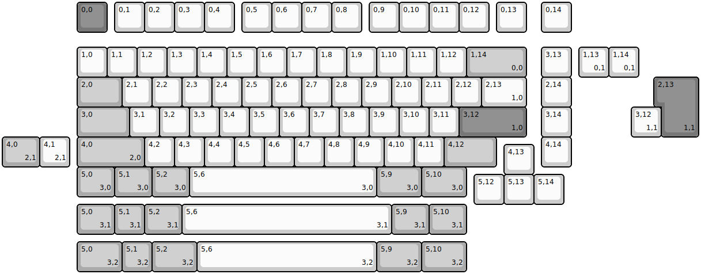{:loading="lazy"}

[Open in keyboard-layout-editor](http://www.keyboard-layout-editor.com/##@@_x:2.5&c=#777777;&=0,0&_x:0.25&c=#cccccc;&=0,1&=0,2&=0,3&=0,4&_x:0.25;&=0,5&=0,6&=0,7&=0,8&_x:0.25;&=0,9&=0,10&=0,11&=0,12&_x:0.25;&=0,13&_x:0.5;&=0,14;&@_x:2.5&y:0.5;&=1,0&=1,1&=1,2&=1,3&=1,4&=1,5&=1,6&=1,7&=1,8&=1,9&=1,10&=1,11&=1,12&_c=#aaaaaa&w:2;&=1,14%0A%0A%0A0,0&_x:0.5&c=#cccccc;&=3,13;&@_x:2.5&c=#aaaaaa&w:1.5;&=2,0&_c=#cccccc;&=2,1&=2,2&=2,3&=2,4&=2,5&=2,6&=2,7&=2,8&=2,9&=2,10&=2,11&=2,12&_w:1.5;&=2,13%0A%0A%0A1,0&_x:0.5;&=2,14;&@_x:2.5&c=#aaaaaa&w:1.75;&=3,0&_c=#cccccc;&=3,1&=3,2&=3,3&=3,4&=3,5&=3,6&=3,7&=3,8&=3,9&=3,10&=3,11&_c=#777777&w:2.25;&=3,12%0A%0A%0A1,0&_x:0.5&c=#cccccc;&=3,14;&@_x:2.5&c=#aaaaaa&w:2.25;&=4,0%0A%0A%0A2,0&_c=#cccccc;&=4,2&=4,3&=4,4&=4,5&=4,6&=4,7&=4,8&=4,9&=4,10&=4,11&_c=#aaaaaa&w:1.75;&=4,12&_x:1.5&c=#cccccc;&=4,14;&@_x:16.75&y:-0.75;&=4,13;&@_x:2.5&y:-0.25&c=#aaaaaa&w:1.25;&=5,0%0A%0A%0A3,0&_w:1.25;&=5,1%0A%0A%0A3,0&_w:1.25;&=5,2%0A%0A%0A3,0&_c=#cccccc&w:6.25;&=5,6%0A%0A%0A3,0&_c=#aaaaaa&w:1.5;&=5,9%0A%0A%0A3,0&_w:1.5;&=5,10%0A%0A%0A3,0;&@_x:15.75&y:-0.75&c=#cccccc;&=5,12&=5,13&=5,14;&@_x:19.25&y:-5.25;&=1,13%0A%0A%0A0,1&=1,14%0A%0A%0A0,1;&@_x:22.0&c=#777777&w:1.25&h:2&w2:1.5&h2:1&x2:-0.25;&=2,13%0A%0A%0A1,1;&@_x:21.0&c=#cccccc;&=3,12%0A%0A%0A1,1;&@_c=#aaaaaa&w:1.25;&=4,0%0A%0A%0A2,1&_c=#cccccc;&=4,1%0A%0A%0A2,1;&@_x:2.5&y:1.25&c=#aaaaaa&w:1.25;&=5,0%0A%0A%0A3,1&=5,1%0A%0A%0A3,1&_w:1.25;&=5,2%0A%0A%0A3,1&_c=#cccccc&w:7;&=5,6%0A%0A%0A3,1&_c=#aaaaaa&w:1.25;&=5,9%0A%0A%0A3,1&_w:1.25;&=5,10%0A%0A%0A3,1;&@_x:2.5&y:0.25&w:1.5;&=5,0%0A%0A%0A3,2&=5,1%0A%0A%0A3,2&_w:1.5;&=5,2%0A%0A%0A3,2&_c=#cccccc&w:6;&=5,6%0A%0A%0A3,2&_c=#aaaaaa&w:1.5;&=5,9%0A%0A%0A3,2&_w:1.5;&=5,10%0A%0A%0A3,2)

## bpiphany/tiger_lily

[README](output/bpiphany/README.md) - [layout](output/bpiphany/tiger_lily-kle.json) - [PCB](output/bpiphany/tiger_lily.kicad_pcb) - [PCB render](output/bpiphany/tiger_lily-render.svg)

{:loading="lazy"}

[Open in keyboard-layout-editor](http://www.keyboard-layout-editor.com/##@@_x:3&c=#777777;&=6,9&_x:1&c=#cccccc;&=4,8&=4,7&=2,7&=6,7&_x:0.5&c=#aaaaaa;&=7,0&=6,4&=2,3&=4,3&_x:0.5&c=#cccccc;&=4,1&=7,1&=6,1&=0,1&_x:0.25&c=#aaaaaa;&=7,2&=5,2&=5,0;&@_x:3&y:0.5&c=#cccccc;&=4,9&=7,9&=7,8&=7,7&=7,6&=4,6&=4,5&=7,5&=7,4&=7,3&=7,17&=4,17&=4,4&_c=#aaaaaa&w:2;&=2,1&_x:0.25;&=4,11&=4,14&=4,16&_x:0.25&c=#cccccc;&=1,10&=1,11&=1,16&=0,16;&@_x:3&c=#aaaaaa&w:1.5;&=2,9&_c=#cccccc;&=5,9&=5,8&=5,7&=5,6&=2,6&=2,5&=5,5&=5,4&=5,3&=5,17&=2,17&=2,4&_w:1.5;&=3,1%0A%0A%0A0,0&_x:0.25&c=#aaaaaa;&=4,10&=7,14&=7,16&_x:0.25&c=#cccccc;&=5,10&=5,11&=5,16&_h:2;&=5,14;&@_x:3&c=#aaaaaa&w:1.75;&=2,8&_c=#cccccc;&=3,9&=3,8&=3,7&=3,6&=6,6&=6,5&=3,5&=3,4&=3,3&=3,17&=6,17&_c=#777777&w:2.25;&=1,1%0A%0A%0A0,0&_x:3.5&c=#cccccc;&=2,10&=2,11&=2,16;&@_x:3.0&c=#aaaaaa&w:2.25;&=2,13%0A%0A%0A1,0&_c=#cccccc;&=1,9&=1,8&=1,7&=1,6&=0,6&=0,5&=1,5&=1,4&=1,3&=0,17&_c=#aaaaaa&w:2.75;&=3,13&_x:1.25;&=6,14&_x:1.25&c=#cccccc;&=3,10&=3,11&=3,16&_h:2;&=3,14;&@_x:3&c=#aaaaaa&w:1.25;&=4,0&_w:1.25;&=2,15&_w:1.25;&=6,2&_c=#cccccc&w:6.25;&=6,10&_c=#aaaaaa&w:1.25;&=0,2&_w:1.25;&=3,12&_w:1.25;&=0,3&_w:1.25;&=1,0&_x:0.25;&=0,14&=0,10&=0,11&_x:0.25&c=#cccccc&w:2;&=6,11&=6,16;&@_x:27.25&y:-4.0&c=#777777&w:1.25&h:2&w2:1.5&h2:1&x2:-0.25;&=1,1%0A%0A%0A0,1;&@_x:26.25&c=#cccccc;&=3,1%0A%0A%0A0,1;&@_c=#aaaaaa&w:1.25;&=2,13%0A%0A%0A1,1&_c=#cccccc;&=6,8%0A%0A%0A1,1)

## bt66tech/bt66tech60

[README](output/bt66tech/bt66tech60/README.md) - [layout](output/bt66tech/bt66tech60/bt66tech60-kle.json) - [PCB](output/bt66tech/bt66tech60/bt66tech60.kicad_pcb) - [PCB render](output/bt66tech/bt66tech60/bt66tech60-render.svg)

{:loading="lazy"}

[Open in keyboard-layout-editor](http://www.keyboard-layout-editor.com/##@@_c=#6b7173&t=#aeb0b0;&=0,0&_c=#505557;&=0,1&=0,2&=0,3&=0,4&=0,5&=0,6&=0,7&=0,8&=0,9&=0,10&=0,11&=0,12&_c=#6b7173&w:2;&=0,13;&@_w:1.5;&=1,0&_c=#505557;&=1,1&=1,2&=1,3&=1,4&=1,5&=1,6&=1,7&=1,8&=1,9&=1,10&=1,11&=1,12&_c=#6b7173&w:1.5;&=1,13;&@_w:1.75;&=2,0&_c=#505557;&=2,1&=2,2&=2,3&=2,4&=2,5&=2,6&=2,7&=2,8&=2,9&=2,10&=2,11&_c=#afb0ae&t=#505557&w:2.25;&=2,13;&@_c=#6b7173&t=#aeb0b0&w:2.25;&=3,0&_c=#505557;&=3,1&=3,2&=3,3&=3,4&=3,5&=3,6&=3,7&=3,8&=3,9&=3,10&_c=#6b7173&w:2.75;&=3,13;&@_w:1.25;&=4,0&_w:1.25;&=4,1&_w:1.25;&=4,2&_c=#505557&w:6.25;&=4,5&_c=#6b7173&w:1.25;&=4,9&_w:1.25;&=4,10&_w:1.25;&=4,11&_w:1.25;&=4,13)

## buildakb/potato65hs

[README](output/buildakb/README.md) - [layout](output/buildakb/potato65hs-kle.json) - [PCB](output/buildakb/potato65hs.kicad_pcb) - [PCB render](output/buildakb/potato65hs-render.svg)

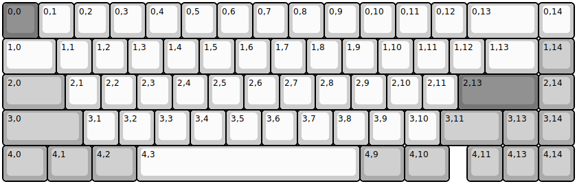{:loading="lazy"}

[Open in keyboard-layout-editor](http://www.keyboard-layout-editor.com/##@@_c=#777777;&=0,0&_c=#cccccc;&=0,1&=0,2&=0,3&=0,4&=0,5&=0,6&=0,7&=0,8&=0,9&=0,10&=0,11&=0,12&_w:2;&=0,13&=0,14;&@_w:1.5;&=1,0&=1,1&=1,2&=1,3&=1,4&=1,5&=1,6&=1,7&=1,8&=1,9&=1,10&=1,11&=1,12&_w:1.5;&=1,13&_c=#aaaaaa;&=1,14;&@_w:1.75;&=2,0&_c=#cccccc;&=2,1&=2,2&=2,3&=2,4&=2,5&=2,6&=2,7&=2,8&=2,9&=2,10&=2,11&_c=#777777&w:2.25;&=2,13&_c=#aaaaaa;&=2,14;&@_w:2.25;&=3,0&_c=#cccccc;&=3,1&=3,2&=3,3&=3,4&=3,5&=3,6&=3,7&=3,8&=3,9&=3,10&_c=#aaaaaa&w:1.75;&=3,11&=3,13&=3,14;&@_w:1.25;&=4,0&_w:1.25;&=4,1&_w:1.25;&=4,2&_c=#cccccc&w:6.25;&=4,3&_c=#aaaaaa&w:1.25;&=4,9&_w:1.25;&=4,10&_x:0.5;&=4,11&=4,13&=4,14)

## buildakb/potato65s

[README](output/buildakb/README.md) - [layout](output/buildakb/potato65s-kle.json) - [PCB](output/buildakb/potato65s.kicad_pcb) - [PCB render](output/buildakb/potato65s-render.svg)

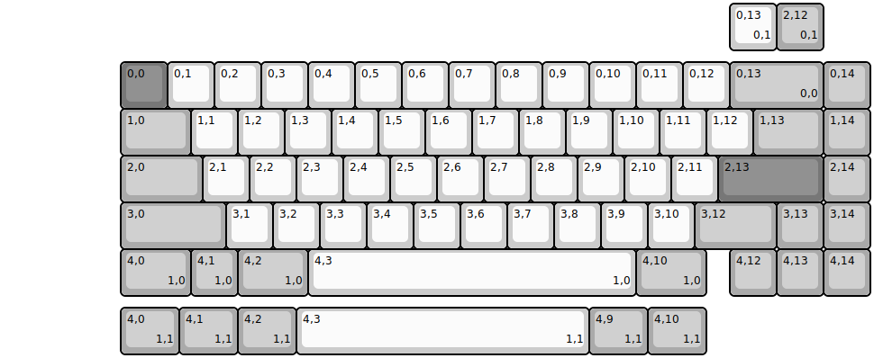{:loading="lazy"}

[Open in keyboard-layout-editor](http://www.keyboard-layout-editor.com/##@@_x:2.5&y:1.25&c=#777777;&=0,0&_c=#cccccc;&=0,1&=0,2&=0,3&=0,4&=0,5&=0,6&=0,7&=0,8&=0,9&=0,10&=0,11&=0,12&_c=#aaaaaa&w:2;&=0,13%0A%0A%0A0,0&=0,14;&@_x:2.5&w:1.5;&=1,0&_c=#cccccc;&=1,1&=1,2&=1,3&=1,4&=1,5&=1,6&=1,7&=1,8&=1,9&=1,10&=1,11&=1,12&_c=#aaaaaa&w:1.5;&=1,13&=1,14;&@_x:2.5&w:1.75;&=2,0&_c=#cccccc;&=2,1&=2,2&=2,3&=2,4&=2,5&=2,6&=2,7&=2,8&=2,9&=2,10&=2,11&_c=#777777&w:2.25;&=2,13&_c=#aaaaaa;&=2,14;&@_x:2.5&w:2.25;&=3,0&_c=#cccccc;&=3,1&=3,2&=3,3&=3,4&=3,5&=3,6&=3,7&=3,8&=3,9&=3,10&_c=#aaaaaa&w:1.75;&=3,12&=3,13&=3,14;&@_x:2.5&w:1.5;&=4,0%0A%0A%0A1,0&=4,1%0A%0A%0A1,0&_w:1.5;&=4,2%0A%0A%0A1,0&_c=#cccccc&w:7;&=4,3%0A%0A%0A1,0&_c=#aaaaaa&w:1.5;&=4,10%0A%0A%0A1,0&_x:0.5;&=4,12&=4,13&=4,14;&@_x:15.5&y:-6.25&c=#cccccc;&=0,13%0A%0A%0A0,1&_c=#aaaaaa;&=2,12%0A%0A%0A0,1;&@_x:2.5&y:5.5&w:1.25;&=4,0%0A%0A%0A1,1&_w:1.25;&=4,1%0A%0A%0A1,1&_w:1.25;&=4,2%0A%0A%0A1,1&_c=#cccccc&w:6.25;&=4,3%0A%0A%0A1,1&_c=#aaaaaa&w:1.25;&=4,9%0A%0A%0A1,1&_w:1.25;&=4,10%0A%0A%0A1,1)

## cablecardesigns/prophet

[README](output/cablecardesigns/prophet/README.md) - [layout](output/cablecardesigns/prophet/prophet-kle.json) - [PCB](output/cablecardesigns/prophet/prophet.kicad_pcb) - [PCB render](output/cablecardesigns/prophet/prophet-render.svg)

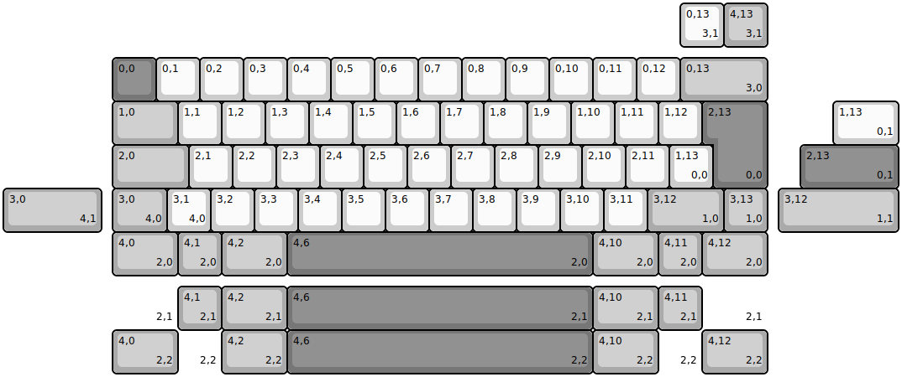{:loading="lazy"}

[Open in keyboard-layout-editor](http://www.keyboard-layout-editor.com/##@_name=Prophet;&@_x:2.5&y:1.25&c=#777777;&=0,0&_c=#cccccc;&=0,1&=0,2&=0,3&=0,4&=0,5&=0,6&=0,7&=0,8&=0,9&=0,10&=0,11&=0,12&_c=#aaaaaa&w:2;&=0,13%0A%0A%0A3,0;&@_x:2.5&w:1.5;&=1,0&_c=#cccccc;&=1,1&=1,2&=1,3&=1,4&=1,5&=1,6&=1,7&=1,8&=1,9&=1,10&=1,11&=1,12&_x:0.25&c=#777777&w:1.25&h:2&w2:1.5&h2:1&x2:-0.25;&=2,13%0A%0A%0A0,0;&@_x:2.5&c=#aaaaaa&w:1.75;&=2,0&_c=#cccccc;&=2,1&=2,2&=2,3&=2,4&=2,5&=2,6&=2,7&=2,8&=2,9&=2,10&=2,11&=1,13%0A%0A%0A0,0;&@_x:2.5&c=#aaaaaa&w:1.25;&=3,0%0A%0A%0A4,0&_c=#cccccc;&=3,1%0A%0A%0A4,0&=3,2&=3,3&=3,4&=3,5&=3,6&=3,7&=3,8&=3,9&=3,10&=3,11&_c=#aaaaaa&w:1.75;&=3,12%0A%0A%0A1,0&=3,13%0A%0A%0A1,0;&@_x:2.5&w:1.5;&=4,0%0A%0A%0A2,0&=4,1%0A%0A%0A2,0&_w:1.5;&=4,2%0A%0A%0A2,0&_c=#777777&w:7;&=4,6%0A%0A%0A2,0&_c=#aaaaaa&w:1.5;&=4,10%0A%0A%0A2,0&=4,11%0A%0A%0A2,0&_w:1.5;&=4,12%0A%0A%0A2,0;&@_x:15.5&y:-6.25&c=#cccccc;&=0,13%0A%0A%0A3,1&_c=#aaaaaa;&=4,13%0A%0A%0A3,1;&@_x:19.0&y:1.25&c=#cccccc&w:1.5;&=1,13%0A%0A%0A0,1;&@_x:18.25&c=#777777&w:2.25;&=2,13%0A%0A%0A0,1;&@_c=#aaaaaa&w:2.25;&=3,0%0A%0A%0A4,1&_x:15.5&w:2.75;&=3,12%0A%0A%0A1,1;&@_x:2.5&y:1.25&w:1.5&d:true;&=%0A%0A%0A2,1&=4,1%0A%0A%0A2,1&_w:1.5;&=4,2%0A%0A%0A2,1&_c=#777777&w:7;&=4,6%0A%0A%0A2,1&_c=#aaaaaa&w:1.5;&=4,10%0A%0A%0A2,1&=4,11%0A%0A%0A2,1&_w:1.5&d:true;&=%0A%0A%0A2,1;&@_x:2.5&w:1.5;&=4,0%0A%0A%0A2,2&_d:true;&=%0A%0A%0A2,2&_w:1.5;&=4,2%0A%0A%0A2,2&_c=#777777&w:7;&=4,6%0A%0A%0A2,2&_c=#aaaaaa&w:1.5;&=4,10%0A%0A%0A2,2&_d:true;&=%0A%0A%0A2,2&_w:1.5;&=4,12%0A%0A%0A2,2)

## caffeinated/serpent65/Serpent65

[README](output/caffeinated/serpent65/README.md) - [layout](output/caffeinated/serpent65/Serpent65-kle.json) - [PCB](output/caffeinated/serpent65/Serpent65.kicad_pcb) - [PCB render](output/caffeinated/serpent65/Serpent65-render.svg)

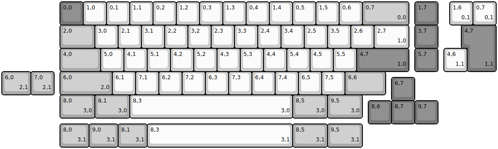{:loading="lazy"}

[Open in keyboard-layout-editor](http://www.keyboard-layout-editor.com/##@@_x:2.5&c=#777777;&=0,0&_c=#cccccc;&=1,0&=0,1&=1,1&=0,2&=1,2&=0,3&=1,3&=0,4&=1,4&=0,5&=1,5&=0,6&_c=#aaaaaa&w:2;&=0,7%0A%0A%0A0,0&_x:0.25&c=#777777;&=1,7;&@_x:2.5&c=#aaaaaa&w:1.5;&=2,0&_c=#cccccc;&=3,0&=2,1&=3,1&=2,2&=3,2&=2,3&=3,3&=2,4&=3,4&=2,5&=3,5&=2,6&_w:1.5;&=2,7%0A%0A%0A1,0&_x:0.25&c=#777777;&=3,7;&@_x:2.5&c=#aaaaaa&w:1.75;&=4,0&_c=#cccccc;&=5,0&=4,1&=5,1&=4,2&=5,2&=4,3&=5,3&=4,4&=5,4&=4,5&=5,5&_c=#777777&w:2.25;&=4,7%0A%0A%0A1,0&_x:0.25;&=5,7;&@_x:2.5&c=#aaaaaa&w:2.25;&=6,0%0A%0A%0A2,0&_c=#cccccc;&=6,1&=7,1&=6,2&=7,2&=6,3&=7,3&=6,4&=7,4&=6,5&=7,5&_c=#aaaaaa&w:1.75;&=6,6;&@_x:16.75&y:-0.75&c=#777777;&=6,7;&@_x:2.5&y:-0.25&c=#aaaaaa&w:1.5;&=8,0%0A%0A%0A3,0&_w:1.5;&=8,1%0A%0A%0A3,0&_c=#cccccc&w:7;&=8,3%0A%0A%0A3,0&_c=#aaaaaa&w:1.5;&=8,5%0A%0A%0A3,0&_w:1.5;&=9,5%0A%0A%0A3,0;&@_x:15.75&y:-0.75&c=#777777;&=8,6&=8,7&=9,7;&@_x:19.25&y:-5.25&c=#cccccc;&=1,6%0A%0A%0A0,1&=0,7%0A%0A%0A0,1;&@_x:20.0&c=#777777&w:1.25&h:2&w2:1.5&h2:1&x2:-0.25;&=4,7%0A%0A%0A1,1;&@_x:19.0&c=#cccccc;&=4,6%0A%0A%0A1,1;&@_c=#aaaaaa&w:1.25;&=6,0%0A%0A%0A2,1&=7,0%0A%0A%0A2,1;&@_x:2.5&y:1.25&w:1.25;&=8,0%0A%0A%0A3,1&_w:1.25;&=9,0%0A%0A%0A3,1&_w:1.25;&=8,1%0A%0A%0A3,1&_c=#cccccc&w:6.25;&=8,3%0A%0A%0A3,1&_c=#aaaaaa&w:1.5;&=8,5%0A%0A%0A3,1&_w:1.5;&=9,5%0A%0A%0A3,1)

## canary/canary60rgb/canary60rgb_v1

[README](output/canary/canary60rgb/README.md) - [layout](output/canary/canary60rgb/canary60rgb_v1-kle.json) - [PCB](output/canary/canary60rgb/canary60rgb_v1.kicad_pcb) - [PCB render](output/canary/canary60rgb/canary60rgb_v1-render.svg)

{:loading="lazy"}

[Open in keyboard-layout-editor](http://www.keyboard-layout-editor.com/##@@_c=#777777;&=0,0&_c=#cccccc;&=0,1&=0,2&=0,3&=0,4&=0,5&=0,6&=0,7&=0,8&=0,9&=0,10&=0,11&=0,12&_c=#aaaaaa&w:2;&=0,13;&@_w:1.5;&=1,0&_c=#cccccc;&=1,1&=1,2&=1,3&=1,4&=1,5&=1,6&=1,7&=1,8&=1,9&=1,10&=1,11&=1,12&_w:1.5;&=1,13;&@_w:1.75;&=2,0&=2,1&=2,2&=2,3&=2,4&=2,5&=2,6&=2,7&=2,8&=2,9&=2,10&=2,11&_c=#aaaaaa&w:2.25;&=2,13;&@_w:2.25;&=3,0&_c=#cccccc;&=3,1&=3,2&=3,3&=3,4&=3,5&=3,6&=3,7&=3,8&=3,9&_c=#aaaaaa&w:1.75;&=3,10&_c=#777777;&=3,11&_c=#cccccc;&=3,13;&@_c=#aaaaaa&w:1.25;&=4,0&_w:1.25;&=4,1&_w:1.25;&=4,2&_c=#cccccc&w:6.25;&=4,5&_c=#aaaaaa;&=4,8&=4,9&_c=#777777;&=4,10&=4,11&=4,13)

## cannonkeys/adelie

[README](output/cannonkeys/adelie/README.md) - [layout](output/cannonkeys/adelie/adelie-kle.json) - [PCB](output/cannonkeys/adelie/adelie.kicad_pcb) - [PCB render](output/cannonkeys/adelie/adelie-render.svg)

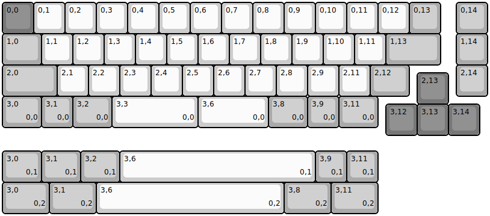{:loading="lazy"}

[Open in keyboard-layout-editor](http://www.keyboard-layout-editor.com/##@@_c=#777777;&=0,0&_c=#cccccc;&=0,1&=0,2&=0,3&=0,4&=0,5&=0,6&=0,7&=0,8&=0,9&=0,10&=0,11&=0,12&_c=#aaaaaa;&=0,13&_x:0.5;&=0,14;&@_w:1.25;&=1,0&_c=#cccccc;&=1,1&=1,2&=1,3&=1,4&=1,5&=1,6&=1,7&=1,8&=1,9&=1,10&=1,11&_c=#aaaaaa&w:1.75;&=1,13&_x:0.5;&=1,14;&@_w:1.75;&=2,0&_c=#cccccc;&=2,1&=2,2&=2,3&=2,4&=2,5&=2,6&=2,7&=2,8&=2,9&=2,11&_c=#aaaaaa&w:1.25;&=2,12&_x:1.5;&=2,14;&@_x:13.25&y:-0.75&c=#777777;&=2,13;&@_y:-0.25&c=#aaaaaa&w:1.25;&=3,0%0A%0A%0A0,0&=3,1%0A%0A%0A0,0&_w:1.25;&=3,2%0A%0A%0A0,0&_c=#cccccc&w:2.75;&=3,3%0A%0A%0A0,0&_w:2.25;&=3,6%0A%0A%0A0,0&_c=#aaaaaa&w:1.25;&=3,8%0A%0A%0A0,0&=3,9%0A%0A%0A0,0&_w:1.25;&=3,11%0A%0A%0A0,0;&@_x:12.25&y:-0.75&c=#777777;&=3,12&=3,13&=3,14;&@_y:0.5&c=#aaaaaa&w:1.25;&=3,0%0A%0A%0A0,1&_w:1.25;&=3,1%0A%0A%0A0,1&_w:1.25;&=3,2%0A%0A%0A0,1&_c=#cccccc&w:6.25;&=3,6%0A%0A%0A0,1&_c=#aaaaaa;&=3,9%0A%0A%0A0,1&=3,11%0A%0A%0A0,1;&@_w:1.5;&=3,0%0A%0A%0A0,2&_w:1.5;&=3,1%0A%0A%0A0,2&_c=#cccccc&w:6;&=3,6%0A%0A%0A0,2&_c=#aaaaaa&w:1.5;&=3,8%0A%0A%0A0,2&_w:1.5;&=3,11%0A%0A%0A0,2)

## cannonkeys/aella

[README](output/cannonkeys/aella/README.md) - [layout](output/cannonkeys/aella/aella-kle.json) - [PCB](output/cannonkeys/aella/aella.kicad_pcb) - [PCB render](output/cannonkeys/aella/aella-render.svg)

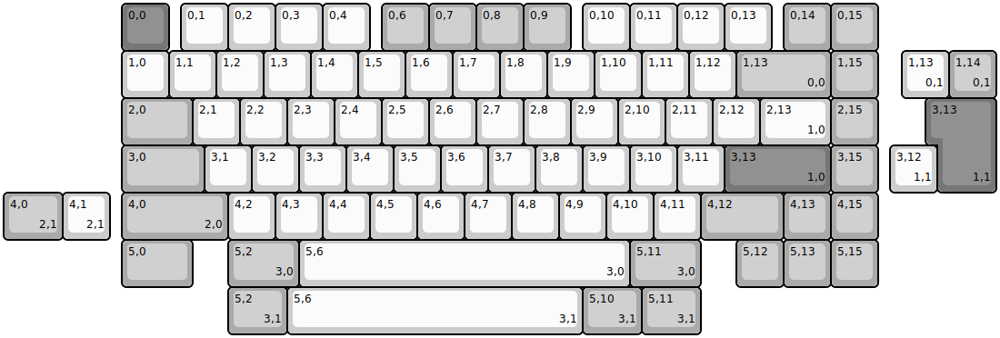{:loading="lazy"}

[Open in keyboard-layout-editor](http://www.keyboard-layout-editor.com/##@@_x:2.5&c=#777777;&=0,0&_x:0.25&c=#cccccc;&=0,1&=0,2&=0,3&=0,4&_x:0.25&c=#aaaaaa;&=0,6&=0,7&=0,8&=0,9&_x:0.25&c=#cccccc;&=0,10&=0,11&=0,12&=0,13&_x:0.25&c=#aaaaaa;&=0,14&=0,15;&@_x:2.5&c=#cccccc;&=1,0&=1,1&=1,2&=1,3&=1,4&=1,5&=1,6&=1,7&=1,8&=1,9&=1,10&=1,11&=1,12&_c=#aaaaaa&w:2;&=1,13%0A%0A%0A0,0&=1,15;&@_x:2.5&w:1.5;&=2,0&_c=#cccccc;&=2,1&=2,2&=2,3&=2,4&=2,5&=2,6&=2,7&=2,8&=2,9&=2,10&=2,11&=2,12&_w:1.5;&=2,13%0A%0A%0A1,0&_c=#aaaaaa;&=2,15;&@_x:2.5&w:1.75;&=3,0&_c=#cccccc;&=3,1&=3,2&=3,3&=3,4&=3,5&=3,6&=3,7&=3,8&=3,9&=3,10&=3,11&_c=#777777&w:2.25;&=3,13%0A%0A%0A1,0&_c=#aaaaaa;&=3,15;&@_x:2.5&w:2.25;&=4,0%0A%0A%0A2,0&_c=#cccccc;&=4,2&=4,3&=4,4&=4,5&=4,6&=4,7&=4,8&=4,9&=4,10&=4,11&_c=#aaaaaa&w:1.75;&=4,12&=4,13&=4,15;&@_x:2.5&w:1.5;&=5,0&_x:0.75&w:1.5;&=5,2%0A%0A%0A3,0&_c=#cccccc&w:7;&=5,6%0A%0A%0A3,0&_c=#aaaaaa&w:1.5;&=5,11%0A%0A%0A3,0&_x:0.75;&=5,12&=5,13&=5,15;&@_x:19.0&y:-5&c=#cccccc;&=1,13%0A%0A%0A0,1&_c=#aaaaaa;&=1,14%0A%0A%0A0,1;&@_x:19.75&c=#777777&w:1.25&h:2&w2:1.5&h2:1&x2:-0.25;&=3,13%0A%0A%0A1,1;&@_x:18.75&c=#cccccc;&=3,12%0A%0A%0A1,1;&@_c=#aaaaaa&w:1.25;&=4,0%0A%0A%0A2,1&_c=#cccccc;&=4,1%0A%0A%0A2,1;&@_x:4.75&y:1&c=#aaaaaa&w:1.25;&=5,2%0A%0A%0A3,1&_c=#cccccc&w:6.25;&=5,6%0A%0A%0A3,1&_c=#aaaaaa&w:1.25;&=5,10%0A%0A%0A3,1&_w:1.25;&=5,11%0A%0A%0A3,1)

## cannonkeys/an_c

[README](output/cannonkeys/an_c/README.md) - [layout](output/cannonkeys/an_c/an_c-kle.json) - [PCB](output/cannonkeys/an_c/an_c.kicad_pcb) - [PCB render](output/cannonkeys/an_c/an_c-render.svg)

{:loading="lazy"}

[Open in keyboard-layout-editor](http://www.keyboard-layout-editor.com/##@@_y:1.75&c=#8a2020;&=0,0&_c=#cccccc;&=0,1&=0,2&=0,3&=0,4&=0,5&=0,6&=0,7&=0,8&=0,9&=0,10&=0,11&=0,12&_c=#0a4dc7&w:2;&=0,13%0A%0A%0A0,0;&@_w:1.5;&=1,0&_c=#cccccc;&=1,1&=1,2&=1,3&=1,4&=1,5&=1,6&=1,7&=1,8&=1,9&=1,10&=1,11&=1,12&_c=#0a4dc7&w:1.5;&=1,14;&@_w:1.75;&=2,0&_c=#cccccc;&=2,1&=2,2&=2,3&=2,4&=2,5&=2,6&=2,7&=2,8&=2,9&=2,10&=2,11&_c=#8a2020&w:2.25;&=2,14;&@_c=#0a4dc7&w:2.25;&=3,0&_c=#cccccc;&=3,1&=3,2&=3,3&=3,4&=3,5&=3,6&=3,7&=3,8&=3,9&=3,10&_c=#0a4dc7&w:2.75;&=3,11%0A%0A%0A1,0;&@_w:1.25;&=4,0%0A%0A%0A2,0&_w:1.25;&=4,1%0A%0A%0A2,0&_w:1.25;&=4,2%0A%0A%0A2,0&_c=#cccccc&w:6.25;&=4,5%0A%0A%0A2,0&_c=#0a4dc7&w:1.25;&=4,9%0A%0A%0A2,0&_w:1.25;&=4,10%0A%0A%0A2,0&_w:1.25;&=4,11%0A%0A%0A2,0&_w:1.25;&=4,14%0A%0A%0A2,0;&@_x:13&y:-6.75&c=#cccccc;&=0,13%0A%0A%0A0,1&=0,14%0A%0A%0A0,1;&@_x:15.75&y:3.75&c=#0a4dc7&w:1.75;&=3,11%0A%0A%0A1,1&=3,14%0A%0A%0A1,1;&@_y:1.25&w:1.5;&=4,0%0A%0A%0A2,1&=4,1%0A%0A%0A2,1&_w:1.5;&=4,2%0A%0A%0A2,1&_c=#cccccc&w:7;&=4,5%0A%0A%0A2,1&_c=#0a4dc7&w:1.5;&=4,10%0A%0A%0A2,1&=4,11%0A%0A%0A2,1&_w:1.5;&=4,14%0A%0A%0A2,1;&@_w:1.5&d:true;&=4,0%0A%0A%0A2,2&=4,1%0A%0A%0A2,2&_w:1.5;&=4,2%0A%0A%0A2,2&_c=#cccccc&w:7;&=4,5%0A%0A%0A2,2&_c=#0a4dc7&w:1.5;&=4,10%0A%0A%0A2,2&=4,11%0A%0A%0A2,2&_w:1.5&d:true;&=4,14%0A%0A%0A2,2)

## cannonkeys/atlas

[README](output/cannonkeys/atlas/README.md) - [layout](output/cannonkeys/atlas/atlas-kle.json) - [PCB](output/cannonkeys/atlas/atlas.kicad_pcb) - [PCB render](output/cannonkeys/atlas/atlas-render.svg)

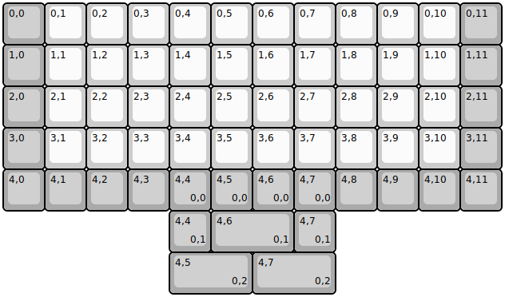{:loading="lazy"}

[Open in keyboard-layout-editor](http://www.keyboard-layout-editor.com/##@@_c=#aaaaaa;&=0,0&_c=#cccccc;&=0,1&=0,2&=0,3&=0,4&=0,5&=0,6&=0,7&=0,8&=0,9&=0,10&_c=#aaaaaa;&=0,11;&@=1,0&_c=#cccccc;&=1,1&=1,2&=1,3&=1,4&=1,5&=1,6&=1,7&=1,8&=1,9&=1,10&_c=#aaaaaa;&=1,11;&@=2,0&_c=#cccccc;&=2,1&=2,2&=2,3&=2,4&=2,5&=2,6&=2,7&=2,8&=2,9&=2,10&_c=#aaaaaa;&=2,11;&@=3,0&_c=#cccccc;&=3,1&=3,2&=3,3&=3,4&=3,5&=3,6&=3,7&=3,8&=3,9&=3,10&_c=#aaaaaa;&=3,11;&@=4,0&=4,1&=4,2&=4,3&=4,4%0A%0A%0A0,0&=4,5%0A%0A%0A0,0&=4,6%0A%0A%0A0,0&=4,7%0A%0A%0A0,0&=4,8&=4,9&=4,10&=4,11;&@_x:4;&=4,4%0A%0A%0A0,1&_w:2;&=4,6%0A%0A%0A0,1&=4,7%0A%0A%0A0,1;&@_x:4&w:2;&=4,5%0A%0A%0A0,2&_w:2;&=4,7%0A%0A%0A0,2)

## cannonkeys/balance

[README](output/cannonkeys/balance/README.md) - [layout](output/cannonkeys/balance/balance-kle.json) - [PCB](output/cannonkeys/balance/balance.kicad_pcb) - [PCB render](output/cannonkeys/balance/balance-render.svg)

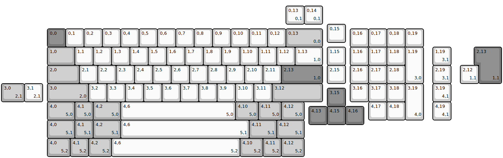{:loading="lazy"}

[Open in keyboard-layout-editor](http://www.keyboard-layout-editor.com/##@@_x:17.75&y:1.25;&=0,15;&@_x:2.5&y:-0.75&c=#777777;&=0,0&_c=#cccccc;&=0,1&=0,2&=0,3&=0,4&=0,5&=0,6&=0,7&=0,8&=0,9&=0,10&=0,11&=0,12&_c=#aaaaaa&w:2;&=0,13%0A%0A%0A0,0&_x:1.5&c=#cccccc;&=0,16&=0,17&=0,18&=0,19;&@_x:2.5&c=#aaaaaa&w:1.5;&=1,0&_c=#cccccc;&=1,1&=1,2&=1,3&=1,4&=1,5&=1,6&=1,7&=1,8&=1,9&=1,10&=1,11&=1,12&_w:1.5;&=1,13%0A%0A%0A1,0&_x:0.25;&=1,15&_x:0.25;&=1,16&=1,17&=1,18&_h:2;&=1,19%0A%0A%0A3,0;&@_x:2.5&c=#aaaaaa&w:1.75;&=2,0&_c=#cccccc;&=2,1&=2,2&=2,3&=2,4&=2,5&=2,6&=2,7&=2,8&=2,9&=2,10&=2,11&_c=#777777&w:2.25;&=2,13%0A%0A%0A1,0&_x:0.25&c=#cccccc;&=2,15&_x:0.25;&=2,16&=2,17&=2,18;&@_x:2.5&c=#aaaaaa&w:2.25;&=3,0%0A%0A%0A2,0&_c=#cccccc;&=3,2&=3,3&=3,4&=3,5&=3,6&=3,7&=3,8&=3,9&=3,10&=3,11&_c=#aaaaaa&w:2.75;&=3,12&_x:1.5&c=#cccccc;&=3,16&=3,17&=3,18&_h:2;&=3,19%0A%0A%0A4,0;&@_x:17.75&y:-0.75&c=#777777;&=3,15;&@_x:2.5&y:-0.25&c=#aaaaaa&w:1.5;&=4,0%0A%0A%0A5,0&=4,1%0A%0A%0A5,0&_w:1.5;&=4,2%0A%0A%0A5,0&_c=#cccccc&w:6.25;&=4,6%0A%0A%0A5,0&_c=#aaaaaa&w:1.25;&=4,10%0A%0A%0A5,0&_w:1.25;&=4,11%0A%0A%0A5,0&_w:1.25;&=4,12%0A%0A%0A5,0&_x:3.5&c=#cccccc;&=4,17&=4,18;&@_x:16.75&y:-0.75&c=#777777;&=4,13&=4,15&=4,16;&@_x:15.5&y:-6.5&c=#cccccc;&=0,13%0A%0A%0A0,1&=0,14%0A%0A%0A0,1;&@_x:23.5&y:1.25;&=1,19%0A%0A%0A3,1&_x:1.5&c=#777777&w:1.25&h:2&w2:1.5&h2:1&x2:-0.25;&=2,13%0A%0A%0A1,1;&@_x:23.5&c=#cccccc;&=2,19%0A%0A%0A3,1&_x:0.5;&=2,12%0A%0A%0A1,1;&@_c=#aaaaaa&w:1.25;&=3,0%0A%0A%0A2,1&_c=#cccccc;&=3,1%0A%0A%0A2,1&_x:21.25;&=3,19%0A%0A%0A4,1;&@_x:23.5;&=4,19%0A%0A%0A4,1;&@_x:2.5&c=#aaaaaa&w:1.5;&=4,0%0A%0A%0A5,1&=4,1%0A%0A%0A5,1&_w:1.5;&=4,2%0A%0A%0A5,1&_c=#cccccc&w:7;&=4,6%0A%0A%0A5,1&_c=#aaaaaa&w:1.5;&=4,11%0A%0A%0A5,1&_w:1.5;&=4,12%0A%0A%0A5,1;&@_x:2.5&w:1.25;&=4,0%0A%0A%0A5,2&=4,1%0A%0A%0A5,2&_w:1.25;&=4,2%0A%0A%0A5,2&_c=#cccccc&w:7;&=4,6%0A%0A%0A5,2&_c=#aaaaaa&w:1.25;&=4,10%0A%0A%0A5,2&=4,11%0A%0A%0A5,2&_w:1.25;&=4,12%0A%0A%0A5,2)

## cannonkeys/brutalv2_1800

[README](output/cannonkeys/brutalv2_1800/README.md) - [layout](output/cannonkeys/brutalv2_1800/brutalv2_1800-kle.json) - [PCB](output/cannonkeys/brutalv2_1800/brutalv2_1800.kicad_pcb) - [PCB render](output/cannonkeys/brutalv2_1800/brutalv2_1800-render.svg)

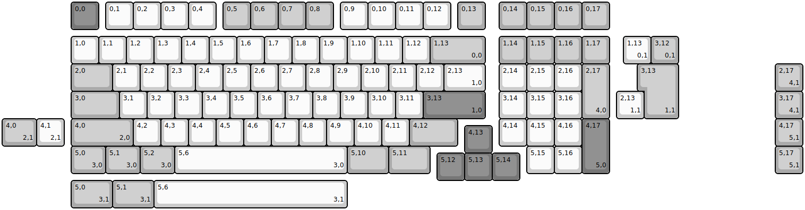{:loading="lazy"}

[Open in keyboard-layout-editor](http://www.keyboard-layout-editor.com/##@@_x:2.5&c=#777777;&=0,0&_x:0.25&c=#cccccc;&=0,1&=0,2&=0,3&=0,4&_x:0.25&c=#aaaaaa;&=0,5&=0,6&=0,7&=0,8&_x:0.25&c=#cccccc;&=0,9&=0,10&=0,11&=0,12&_x:0.25&c=#aaaaaa;&=0,13&_x:0.5;&=0,14&=0,15&=0,16&=0,17;&@_x:2.5&y:0.25&c=#cccccc;&=1,0&=1,1&=1,2&=1,3&=1,4&=1,5&=1,6&=1,7&=1,8&=1,9&=1,10&=1,11&=1,12&_c=#aaaaaa&w:2;&=1,13%0A%0A%0A0,0&_x:0.5;&=1,14&=1,15&=1,16&=1,17;&@_x:2.5&w:1.5;&=2,0&_c=#cccccc;&=2,1&=2,2&=2,3&=2,4&=2,5&=2,6&=2,7&=2,8&=2,9&=2,10&=2,11&=2,12&_w:1.5;&=2,13%0A%0A%0A1,0&_x:0.5;&=2,14&=2,15&=2,16&_c=#aaaaaa&h:2;&=2,17%0A%0A%0A4,0;&@_x:2.5&w:1.75;&=3,0&_c=#cccccc;&=3,1&=3,2&=3,3&=3,4&=3,5&=3,6&=3,7&=3,8&=3,9&=3,10&=3,11&_c=#777777&w:2.25;&=3,13%0A%0A%0A1,0&_x:0.5&c=#cccccc;&=3,14&=3,15&=3,16;&@_x:2.5&c=#aaaaaa&w:2.25;&=4,0%0A%0A%0A2,0&_c=#cccccc;&=4,2&=4,3&=4,4&=4,5&=4,6&=4,7&=4,8&=4,9&=4,10&=4,11&_c=#aaaaaa&w:1.75;&=4,12&_x:1.5&c=#cccccc;&=4,14&=4,15&=4,16&_c=#777777&h:2;&=4,17%0A%0A%0A5,0;&@_x:16.75&y:-0.75;&=4,13;&@_x:2.5&y:-0.25&c=#aaaaaa&w:1.25;&=5,0%0A%0A%0A3,0&_w:1.25;&=5,1%0A%0A%0A3,0&_w:1.25;&=5,2%0A%0A%0A3,0&_c=#cccccc&w:6.25;&=5,6%0A%0A%0A3,0&_c=#aaaaaa&w:1.5;&=5,10&_w:1.5;&=5,11&_x:3.5&c=#cccccc;&=5,15&=5,16;&@_x:15.75&y:-0.75&c=#777777;&=5,12&=5,13&=5,14;&@_x:22.5&y:-5.25&c=#cccccc;&=1,13%0A%0A%0A0,1&_c=#aaaaaa;&=3,12%0A%0A%0A0,1;&@_x:23.25&w:1.25&h:2&w2:1.5&h2:1&x2:-0.25;&=3,13%0A%0A%0A1,1&_x:3.5;&=2,17%0A%0A%0A4,1;&@_x:22.25&c=#cccccc;&=2,13%0A%0A%0A1,1&_x:4.75&c=#aaaaaa;&=3,17%0A%0A%0A4,1;&@_w:1.25;&=4,0%0A%0A%0A2,1&_c=#cccccc;&=4,1%0A%0A%0A2,1&_x:25.75&c=#aaaaaa;&=4,17%0A%0A%0A5,1;&@_x:28.0;&=5,17%0A%0A%0A5,1;&@_x:2.5&y:0.25&w:1.5;&=5,0%0A%0A%0A3,1&_w:1.5;&=5,1%0A%0A%0A3,1&_c=#cccccc&w:7;&=5,6%0A%0A%0A3,1)

## cannonkeys/brutalv2_65

[README](output/cannonkeys/brutalv2_65/README.md) - [layout](output/cannonkeys/brutalv2_65/brutalv2_65-kle.json) - [PCB](output/cannonkeys/brutalv2_65/brutalv2_65.kicad_pcb) - [PCB render](output/cannonkeys/brutalv2_65/brutalv2_65-render.svg)

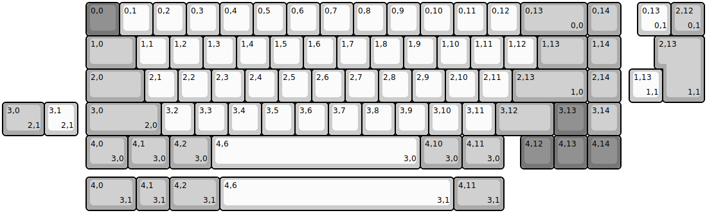{:loading="lazy"}

[Open in keyboard-layout-editor](http://www.keyboard-layout-editor.com/##@@_x:2.5&c=#777777;&=0,0&_c=#cccccc;&=0,1&=0,2&=0,3&=0,4&=0,5&=0,6&=0,7&=0,8&=0,9&=0,10&=0,11&=0,12&_c=#aaaaaa&w:2;&=0,13%0A%0A%0A0,0&=0,14;&@_x:2.5&w:1.5;&=1,0&_c=#cccccc;&=1,1&=1,2&=1,3&=1,4&=1,5&=1,6&=1,7&=1,8&=1,9&=1,10&=1,11&=1,12&_c=#aaaaaa&w:1.5;&=1,13&=1,14;&@_x:2.5&w:1.75;&=2,0&_c=#cccccc;&=2,1&=2,2&=2,3&=2,4&=2,5&=2,6&=2,7&=2,8&=2,9&=2,10&=2,11&_c=#aaaaaa&w:2.25;&=2,13%0A%0A%0A1,0&=2,14;&@_x:2.5&w:2.25;&=3,0%0A%0A%0A2,0&_c=#cccccc;&=3,2&=3,3&=3,4&=3,5&=3,6&=3,7&=3,8&=3,9&=3,10&=3,11&_c=#aaaaaa&w:1.75;&=3,12&_c=#777777;&=3,13&_c=#aaaaaa;&=3,14;&@_x:2.5&w:1.25;&=4,0%0A%0A%0A3,0&_w:1.25;&=4,1%0A%0A%0A3,0&_w:1.25;&=4,2%0A%0A%0A3,0&_c=#cccccc&w:6.25;&=4,6%0A%0A%0A3,0&_c=#aaaaaa&w:1.25;&=4,10%0A%0A%0A3,0&_w:1.25;&=4,11%0A%0A%0A3,0&_x:0.5&c=#777777;&=4,12&=4,13&=4,14;&@_x:19.0&y:-5&c=#cccccc;&=0,13%0A%0A%0A0,1&_c=#aaaaaa;&=2,12%0A%0A%0A0,1;&@_x:19.75&w:1.25&h:2&w2:1.5&h2:1&x2:-0.25;&=2,13%0A%0A%0A1,1;&@_x:18.75&c=#cccccc;&=1,13%0A%0A%0A1,1;&@_c=#aaaaaa&w:1.25;&=3,0%0A%0A%0A2,1&_c=#cccccc;&=3,1%0A%0A%0A2,1;&@_x:2.5&y:1.25&c=#aaaaaa&w:1.5;&=4,0%0A%0A%0A3,1&=4,1%0A%0A%0A3,1&_w:1.5;&=4,2%0A%0A%0A3,1&_c=#cccccc&w:7;&=4,6%0A%0A%0A3,1&_c=#aaaaaa&w:1.5;&=4,11%0A%0A%0A3,1)

## cannonkeys/chimera65

[README](output/cannonkeys/chimera65/README.md) - [layout](output/cannonkeys/chimera65/chimera65-kle.json) - [PCB](output/cannonkeys/chimera65/chimera65.kicad_pcb) - [PCB render](output/cannonkeys/chimera65/chimera65-render.svg)

{:loading="lazy"}

[Open in keyboard-layout-editor](http://www.keyboard-layout-editor.com/##@@_c=#000000&t=#696969;&=0,0&_c=#cccccc&t=#000000;&=0,1&=0,2&=0,3&=0,4&=0,5&=0,6&=0,7&=0,8&=0,9&=0,10&=0,11&=0,12&=0,13&_c=#696969;&=0,14;&@_w:1.5;&=1,0&_c=#cccccc;&=1,1&=1,2&=1,3&=1,4&=1,5&=1,6&=1,7&=1,8&=1,9&=1,10&=1,11&=1,12&_c=#696969&w:1.5;&=1,13&_x:0.5;&=1,15;&@_w:1.75;&=2,0&_c=#cccccc;&=2,1&=2,2&=2,3&=2,4&=2,5&=2,6&=2,7&=2,8&=2,9&=2,10&=2,11&=2,12&_c=#696969&w:1.25;&=2,13&_x:0.5;&=2,15;&@_w:1.25;&=3,0&=3,1&_c=#cccccc;&=3,2&=3,3&=3,4&=3,5&=3,6&=3,7&=3,8&=3,9&=3,10&=3,11&_c=#696969&w:1.75;&=3,12&_x:1.5;&=3,15;&@_x:14.25&y:-0.75&c=#000000&t=#696969;&=3,13;&@_y:-0.25&c=#696969&t=#000000&w:1.25;&=4,0&_w:1.25;&=4,1&_w:1.25;&=4,2&_c=#000000&t=#696969&w:6.25;&=4,6&_c=#696969&t=#000000;&=4,9&=4,10&=4,11;&@_x:13.25&y:-0.75&c=#000000&t=#696969;&=4,12&=4,13&=4,15)

## cannonkeys/cloudline

[README](output/cannonkeys/cloudline/README.md) - [layout](output/cannonkeys/cloudline/cloudline-kle.json) - [PCB](output/cannonkeys/cloudline/cloudline.kicad_pcb) - [PCB render](output/cannonkeys/cloudline/cloudline-render.svg)

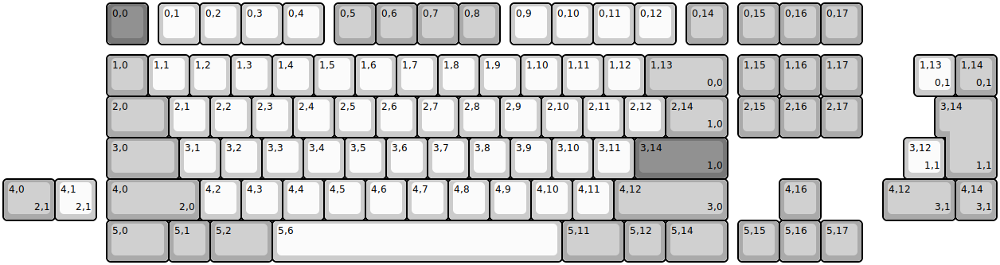{:loading="lazy"}

[Open in keyboard-layout-editor](http://www.keyboard-layout-editor.com/##@@_x:2.5&c=#777777;&=0,0&_x:0.25&c=#cccccc;&=0,1&=0,2&=0,3&=0,4&_x:0.25&c=#aaaaaa;&=0,5&=0,6&=0,7&=0,8&_x:0.25&c=#cccccc;&=0,9&=0,10&=0,11&=0,12&_x:0.25&c=#aaaaaa;&=0,14&_x:0.25;&=0,15&=0,16&=0,17;&@_x:2.5&y:0.25;&=1,0&_c=#cccccc;&=1,1&=1,2&=1,3&=1,4&=1,5&=1,6&=1,7&=1,8&=1,9&=1,10&=1,11&=1,12&_c=#aaaaaa&w:2;&=1,13%0A%0A%0A0,0&_x:0.25;&=1,15&=1,16&=1,17;&@_x:2.5&w:1.5;&=2,0&_c=#cccccc;&=2,1&=2,2&=2,3&=2,4&=2,5&=2,6&=2,7&=2,8&=2,9&=2,10&=2,11&=2,12&_c=#aaaaaa&w:1.5;&=2,14%0A%0A%0A1,0&_x:0.25;&=2,15&=2,16&=2,17;&@_x:2.5&w:1.75;&=3,0&_c=#cccccc;&=3,1&=3,2&=3,3&=3,4&=3,5&=3,6&=3,7&=3,8&=3,9&=3,10&=3,11&_c=#777777&w:2.25;&=3,14%0A%0A%0A1,0;&@_x:2.5&c=#aaaaaa&w:2.25;&=4,0%0A%0A%0A2,0&_c=#cccccc;&=4,2&=4,3&=4,4&=4,5&=4,6&=4,7&=4,8&=4,9&=4,10&=4,11&_c=#aaaaaa&w:2.75;&=4,12%0A%0A%0A3,0&_x:1.25;&=4,16;&@_x:2.5&w:1.5;&=5,0&=5,1&_w:1.5;&=5,2&_c=#cccccc&w:7;&=5,6&_c=#aaaaaa&w:1.5;&=5,11&=5,12&_w:1.5;&=5,14&_x:0.25;&=5,15&=5,16&=5,17;&@_x:22.0&y:-5.0&c=#cccccc;&=1,13%0A%0A%0A0,1&_c=#aaaaaa;&=1,14%0A%0A%0A0,1;&@_x:22.75&w:1.25&h:2&w2:1.5&h2:1&x2:-0.25;&=3,14%0A%0A%0A1,1;&@_x:21.75&c=#cccccc;&=3,12%0A%0A%0A1,1;&@_c=#aaaaaa&w:1.25;&=4,0%0A%0A%0A2,1&_c=#cccccc;&=4,1%0A%0A%0A2,1&_x:19.0&c=#aaaaaa&w:1.75;&=4,12%0A%0A%0A3,1&=4,14%0A%0A%0A3,1)

## cannonkeys/crin

[README](output/cannonkeys/crin/README.md) - [layout](output/cannonkeys/crin/crin-kle.json) - [PCB](output/cannonkeys/crin/crin.kicad_pcb) - [PCB render](output/cannonkeys/crin/crin-render.svg)

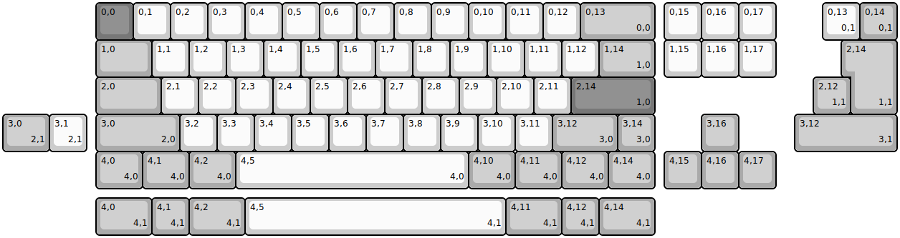{:loading="lazy"}

[Open in keyboard-layout-editor](http://www.keyboard-layout-editor.com/##@@_x:2.5&c=#777777;&=0,0&_c=#cccccc;&=0,1&=0,2&=0,3&=0,4&=0,5&=0,6&=0,7&=0,8&=0,9&=0,10&=0,11&=0,12&_c=#aaaaaa&w:2;&=0,13%0A%0A%0A0,0&_x:0.25&c=#cccccc;&=0,15&=0,16&=0,17;&@_x:2.5&c=#aaaaaa&w:1.5;&=1,0&_c=#cccccc;&=1,1&=1,2&=1,3&=1,4&=1,5&=1,6&=1,7&=1,8&=1,9&=1,10&=1,11&=1,12&_c=#aaaaaa&w:1.5;&=1,14%0A%0A%0A1,0&_x:0.25&c=#cccccc;&=1,15&=1,16&=1,17;&@_x:2.5&c=#aaaaaa&w:1.75;&=2,0&_c=#cccccc;&=2,1&=2,2&=2,3&=2,4&=2,5&=2,6&=2,7&=2,8&=2,9&=2,10&=2,11&_c=#777777&w:2.25;&=2,14%0A%0A%0A1,0;&@_x:2.5&c=#aaaaaa&w:2.25;&=3,0%0A%0A%0A2,0&_c=#cccccc;&=3,2&=3,3&=3,4&=3,5&=3,6&=3,7&=3,8&=3,9&=3,10&=3,11&_c=#aaaaaa&w:1.75;&=3,12%0A%0A%0A3,0&=3,14%0A%0A%0A3,0&_x:1.25;&=3,16;&@_x:2.5&w:1.25;&=4,0%0A%0A%0A4,0&_w:1.25;&=4,1%0A%0A%0A4,0&_w:1.25;&=4,2%0A%0A%0A4,0&_c=#cccccc&w:6.25;&=4,5%0A%0A%0A4,0&_c=#aaaaaa&w:1.25;&=4,10%0A%0A%0A4,0&_w:1.25;&=4,11%0A%0A%0A4,0&_w:1.25;&=4,12%0A%0A%0A4,0&_w:1.25;&=4,14%0A%0A%0A4,0&_x:0.25;&=4,15&=4,16&=4,17;&@_x:22.0&y:-5&c=#cccccc;&=0,13%0A%0A%0A0,1&_c=#aaaaaa;&=0,14%0A%0A%0A0,1;&@_x:22.75&w:1.25&h:2&w2:1.5&h2:1&x2:-0.25;&=2,14%0A%0A%0A1,1;&@_x:21.75;&=2,12%0A%0A%0A1,1;&@_w:1.25;&=3,0%0A%0A%0A2,1&_c=#cccccc;&=3,1%0A%0A%0A2,1&_x:19.0&c=#aaaaaa&w:2.75;&=3,12%0A%0A%0A3,1;&@_x:2.5&y:1.25&w:1.5;&=4,0%0A%0A%0A4,1&=4,1%0A%0A%0A4,1&_w:1.5;&=4,2%0A%0A%0A4,1&_c=#cccccc&w:7;&=4,5%0A%0A%0A4,1&_c=#aaaaaa&w:1.5;&=4,11%0A%0A%0A4,1&=4,12%0A%0A%0A4,1&_w:1.5;&=4,14%0A%0A%0A4,1)

## cannonkeys/db60

[README](output/cannonkeys/db60/README.md) - [layout](output/cannonkeys/db60/db60-kle.json) - [PCB](output/cannonkeys/db60/db60.kicad_pcb) - [PCB render](output/cannonkeys/db60/db60-render.svg)

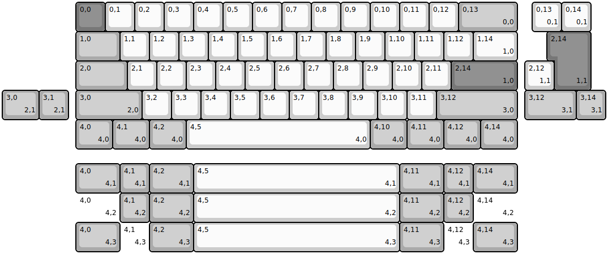{:loading="lazy"}

[Open in keyboard-layout-editor](http://www.keyboard-layout-editor.com/##@@_x:2.5&c=#777777;&=0,0&_c=#cccccc;&=0,1&=0,2&=0,3&=0,4&=0,5&=0,6&=0,7&=0,8&=0,9&=0,10&=0,11&=0,12&_c=#aaaaaa&w:2;&=0,13%0A%0A%0A0,0;&@_x:2.5&w:1.5;&=1,0&_c=#cccccc;&=1,1&=1,2&=1,3&=1,4&=1,5&=1,6&=1,7&=1,8&=1,9&=1,10&=1,11&=1,12&_w:1.5;&=1,14%0A%0A%0A1,0;&@_x:2.5&c=#aaaaaa&w:1.75;&=2,0&_c=#cccccc;&=2,1&=2,2&=2,3&=2,4&=2,5&=2,6&=2,7&=2,8&=2,9&=2,10&=2,11&_c=#777777&w:2.25;&=2,14%0A%0A%0A1,0;&@_x:2.5&c=#aaaaaa&w:2.25;&=3,0%0A%0A%0A2,0&_c=#cccccc;&=3,2&=3,3&=3,4&=3,5&=3,6&=3,7&=3,8&=3,9&=3,10&=3,11&_c=#aaaaaa&w:2.75;&=3,12%0A%0A%0A3,0;&@_x:2.5&w:1.25;&=4,0%0A%0A%0A4,0&_w:1.25;&=4,1%0A%0A%0A4,0&_w:1.25;&=4,2%0A%0A%0A4,0&_c=#cccccc&w:6.25;&=4,5%0A%0A%0A4,0&_c=#aaaaaa&w:1.25;&=4,10%0A%0A%0A4,0&_w:1.25;&=4,11%0A%0A%0A4,0&_w:1.25;&=4,12%0A%0A%0A4,0&_w:1.25;&=4,14%0A%0A%0A4,0;&@_x:18.0&y:-5&c=#cccccc;&=0,13%0A%0A%0A0,1&=0,14%0A%0A%0A0,1;&@_x:18.75&c=#777777&w:1.25&h:2&w2:1.5&h2:1&x2:-0.25;&=2,14%0A%0A%0A1,1;&@_x:17.75&c=#cccccc;&=2,12%0A%0A%0A1,1;&@_c=#aaaaaa&w:1.25;&=3,0%0A%0A%0A2,1&=3,1%0A%0A%0A2,1&_x:15.5&w:1.75;&=3,12%0A%0A%0A3,1&=3,14%0A%0A%0A3,1;&@_x:2.5&y:1.5&w:1.5;&=4,0%0A%0A%0A4,1&=4,1%0A%0A%0A4,1&_w:1.5;&=4,2%0A%0A%0A4,1&_c=#cccccc&w:7;&=4,5%0A%0A%0A4,1&_c=#aaaaaa&w:1.5;&=4,11%0A%0A%0A4,1&=4,12%0A%0A%0A4,1&_w:1.5;&=4,14%0A%0A%0A4,1;&@_x:2.5&w:1.5&d:true;&=4,0%0A%0A%0A4,2&=4,1%0A%0A%0A4,2&_w:1.5;&=4,2%0A%0A%0A4,2&_c=#cccccc&w:7;&=4,5%0A%0A%0A4,2&_c=#aaaaaa&w:1.5;&=4,11%0A%0A%0A4,2&=4,12%0A%0A%0A4,2&_w:1.5&d:true;&=4,14%0A%0A%0A4,2;&@_x:2.5&w:1.5;&=4,0%0A%0A%0A4,3&_d:true;&=4,1%0A%0A%0A4,3&_w:1.5;&=4,2%0A%0A%0A4,3&_c=#cccccc&w:7;&=4,5%0A%0A%0A4,3&_c=#aaaaaa&w:1.5;&=4,11%0A%0A%0A4,3&_d:true;&=4,12%0A%0A%0A4,3&_w:1.5;&=4,14%0A%0A%0A4,3)

## cannonkeys/db60_hotswap

[README](output/cannonkeys/db60_hotswap/README.md) - [layout](output/cannonkeys/db60_hotswap/db60_hotswap-kle.json) - [PCB](output/cannonkeys/db60_hotswap/db60_hotswap.kicad_pcb) - [PCB render](output/cannonkeys/db60_hotswap/db60_hotswap-render.svg)

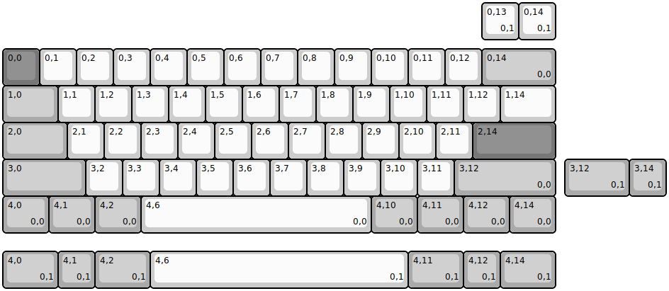{:loading="lazy"}

[Open in keyboard-layout-editor](http://www.keyboard-layout-editor.com/##@@_y:1.25&c=#777777;&=0,0&_c=#cccccc;&=0,1&=0,2&=0,3&=0,4&=0,5&=0,6&=0,7&=0,8&=0,9&=0,10&=0,11&=0,12&_c=#aaaaaa&w:2;&=0,14%0A%0A%0A0,0;&@_w:1.5;&=1,0&_c=#cccccc;&=1,1&=1,2&=1,3&=1,4&=1,5&=1,6&=1,7&=1,8&=1,9&=1,10&=1,11&=1,12&_w:1.5;&=1,14;&@_c=#aaaaaa&w:1.75;&=2,0&_c=#cccccc;&=2,1&=2,2&=2,3&=2,4&=2,5&=2,6&=2,7&=2,8&=2,9&=2,10&=2,11&_c=#777777&w:2.25;&=2,14;&@_c=#aaaaaa&w:2.25;&=3,0&_c=#cccccc;&=3,2&=3,3&=3,4&=3,5&=3,6&=3,7&=3,8&=3,9&=3,10&=3,11&_c=#aaaaaa&w:2.75;&=3,12%0A%0A%0A0,0;&@_w:1.25;&=4,0%0A%0A%0A0,0&_w:1.25;&=4,1%0A%0A%0A0,0&_w:1.25;&=4,2%0A%0A%0A0,0&_c=#cccccc&w:6.25;&=4,6%0A%0A%0A0,0&_c=#aaaaaa&w:1.25;&=4,10%0A%0A%0A0,0&_w:1.25;&=4,11%0A%0A%0A0,0&_w:1.25;&=4,12%0A%0A%0A0,0&_w:1.25;&=4,14%0A%0A%0A0,0;&@_x:13&y:-6.25&c=#cccccc;&=0,13%0A%0A%0A0,1&=0,14%0A%0A%0A0,1;&@_x:15.25&y:3.25&c=#aaaaaa&w:1.75;&=3,12%0A%0A%0A0,1&=3,14%0A%0A%0A0,1;&@_y:1.5&w:1.5;&=4,0%0A%0A%0A0,1&=4,1%0A%0A%0A0,1&_w:1.5;&=4,2%0A%0A%0A0,1&_c=#cccccc&w:7;&=4,6%0A%0A%0A0,1&_c=#aaaaaa&w:1.5;&=4,11%0A%0A%0A0,1&=4,12%0A%0A%0A0,1&_w:1.5;&=4,14%0A%0A%0A0,1)

## cannonkeys/db60v2

[README](output/cannonkeys/db60v2/README.md) - [layout](output/cannonkeys/db60v2/db60v2-kle.json) - [PCB](output/cannonkeys/db60v2/db60v2.kicad_pcb) - [PCB render](output/cannonkeys/db60v2/db60v2-render.svg)

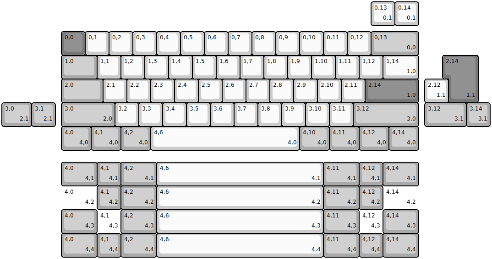{:loading="lazy"}

[Open in keyboard-layout-editor](http://www.keyboard-layout-editor.com/##@@_x:2.5&y:1.25&c=#777777;&=0,0&_c=#cccccc;&=0,1&=0,2&=0,3&=0,4&=0,5&=0,6&=0,7&=0,8&=0,9&=0,10&=0,11&=0,12&_c=#aaaaaa&w:2;&=0,13%0A%0A%0A0,0;&@_x:2.5&w:1.5;&=1,0&_c=#cccccc;&=1,1&=1,2&=1,3&=1,4&=1,5&=1,6&=1,7&=1,8&=1,9&=1,10&=1,11&=1,12&_w:1.5;&=1,14%0A%0A%0A1,0;&@_x:2.5&c=#aaaaaa&w:1.75;&=2,0&_c=#cccccc;&=2,1&=2,2&=2,3&=2,4&=2,5&=2,6&=2,7&=2,8&=2,9&=2,10&=2,11&_c=#777777&w:2.25;&=2,14%0A%0A%0A1,0;&@_x:2.5&c=#aaaaaa&w:2.25;&=3,0%0A%0A%0A2,0&_c=#cccccc;&=3,2&=3,3&=3,4&=3,5&=3,6&=3,7&=3,8&=3,9&=3,10&=3,11&_c=#aaaaaa&w:2.75;&=3,12%0A%0A%0A3,0;&@_x:2.5&w:1.25;&=4,0%0A%0A%0A4,0&_w:1.25;&=4,1%0A%0A%0A4,0&_w:1.25;&=4,2%0A%0A%0A4,0&_c=#cccccc&w:6.25;&=4,6%0A%0A%0A4,0&_c=#aaaaaa&w:1.25;&=4,10%0A%0A%0A4,0&_w:1.25;&=4,11%0A%0A%0A4,0&_w:1.25;&=4,12%0A%0A%0A4,0&_w:1.25;&=4,14%0A%0A%0A4,0;&@_x:15.5&y:-6.25&c=#cccccc;&=0,13%0A%0A%0A0,1&=0,14%0A%0A%0A0,1;&@_x:18.75&y:1.25&c=#777777&w:1.25&h:2&w2:1.5&h2:1&x2:-0.25;&=2,14%0A%0A%0A1,1;&@_x:17.75&c=#cccccc;&=2,12%0A%0A%0A1,1;&@_c=#aaaaaa&w:1.25;&=3,0%0A%0A%0A2,1&=3,1%0A%0A%0A2,1&_x:15.5&w:1.75;&=3,12%0A%0A%0A3,1&=3,14%0A%0A%0A3,1;&@_x:2.5&y:1.5&w:1.5;&=4,0%0A%0A%0A4,1&=4,1%0A%0A%0A4,1&_w:1.5;&=4,2%0A%0A%0A4,1&_c=#cccccc&w:7;&=4,6%0A%0A%0A4,1&_c=#aaaaaa&w:1.5;&=4,11%0A%0A%0A4,1&=4,12%0A%0A%0A4,1&_w:1.5;&=4,14%0A%0A%0A4,1;&@_x:2.5&w:1.5&d:true;&=4,0%0A%0A%0A4,2&=4,1%0A%0A%0A4,2&_w:1.5;&=4,2%0A%0A%0A4,2&_c=#cccccc&w:7;&=4,6%0A%0A%0A4,2&_c=#aaaaaa&w:1.5;&=4,11%0A%0A%0A4,2&=4,12%0A%0A%0A4,2&_w:1.5&d:true;&=4,14%0A%0A%0A4,2;&@_x:2.5&w:1.5;&=4,0%0A%0A%0A4,3&_d:true;&=4,1%0A%0A%0A4,3&_w:1.5;&=4,2%0A%0A%0A4,3&_c=#cccccc&w:7;&=4,6%0A%0A%0A4,3&_c=#aaaaaa&w:1.5;&=4,11%0A%0A%0A4,3&_d:true;&=4,12%0A%0A%0A4,3&_w:1.5;&=4,14%0A%0A%0A4,3;&@_x:2.5&w:1.5;&=4,0%0A%0A%0A4,4&=4,1%0A%0A%0A4,4&_w:1.5;&=4,2%0A%0A%0A4,4&_c=#cccccc&w:7;&=4,6%0A%0A%0A4,4&_c=#aaaaaa&w:1.5;&=4,11%0A%0A%0A4,4&=4,12%0A%0A%0A4,4&_w:1.5;&=4,14%0A%0A%0A4,4)

## cannonkeys/devastatingtkl

[README](output/cannonkeys/devastatingtkl/README.md) - [layout](output/cannonkeys/devastatingtkl/devastatingtkl-kle.json) - [PCB](output/cannonkeys/devastatingtkl/devastatingtkl.kicad_pcb) - [PCB render](output/cannonkeys/devastatingtkl/devastatingtkl-render.svg)

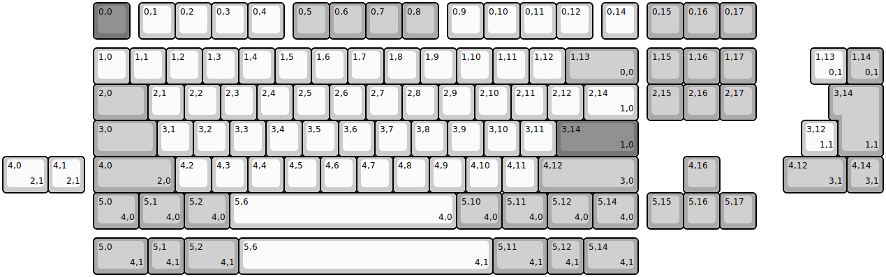{:loading="lazy"}

[Open in keyboard-layout-editor](http://www.keyboard-layout-editor.com/##@@_x:2.5&c=#777777;&=0,0&_x:0.25&c=#cccccc;&=0,1&=0,2&=0,3&=0,4&_x:0.25&c=#aaaaaa;&=0,5&=0,6&=0,7&=0,8&_x:0.25&c=#cccccc;&=0,9&=0,10&=0,11&=0,12&_x:0.25;&=0,14&_x:0.25&c=#aaaaaa;&=0,15&=0,16&=0,17;&@_x:2.5&y:0.25&c=#cccccc;&=1,0&=1,1&=1,2&=1,3&=1,4&=1,5&=1,6&=1,7&=1,8&=1,9&=1,10&=1,11&=1,12&_c=#aaaaaa&w:2;&=1,13%0A%0A%0A0,0&_x:0.25;&=1,15&=1,16&=1,17;&@_x:2.5&w:1.5;&=2,0&_c=#cccccc;&=2,1&=2,2&=2,3&=2,4&=2,5&=2,6&=2,7&=2,8&=2,9&=2,10&=2,11&=2,12&_w:1.5;&=2,14%0A%0A%0A1,0&_x:0.25&c=#aaaaaa;&=2,15&=2,16&=2,17;&@_x:2.5&w:1.75;&=3,0&_c=#cccccc;&=3,1&=3,2&=3,3&=3,4&=3,5&=3,6&=3,7&=3,8&=3,9&=3,10&=3,11&_c=#777777&w:2.25;&=3,14%0A%0A%0A1,0;&@_x:2.5&c=#aaaaaa&w:2.25;&=4,0%0A%0A%0A2,0&_c=#cccccc;&=4,2&=4,3&=4,4&=4,5&=4,6&=4,7&=4,8&=4,9&=4,10&=4,11&_c=#aaaaaa&w:2.75;&=4,12%0A%0A%0A3,0&_x:1.25;&=4,16;&@_x:2.5&w:1.25;&=5,0%0A%0A%0A4,0&_w:1.25;&=5,1%0A%0A%0A4,0&_w:1.25;&=5,2%0A%0A%0A4,0&_c=#cccccc&w:6.25;&=5,6%0A%0A%0A4,0&_c=#aaaaaa&w:1.25;&=5,10%0A%0A%0A4,0&_w:1.25;&=5,11%0A%0A%0A4,0&_w:1.25;&=5,12%0A%0A%0A4,0&_w:1.25;&=5,14%0A%0A%0A4,0&_x:0.25;&=5,15&=5,16&=5,17;&@_x:22.25&y:-5.0&c=#cccccc;&=1,13%0A%0A%0A0,1&_c=#aaaaaa;&=1,14%0A%0A%0A0,1;&@_x:23.0&w:1.25&h:2&w2:1.5&h2:1&x2:-0.25;&=3,14%0A%0A%0A1,1;&@_x:22.0&c=#cccccc;&=3,12%0A%0A%0A1,1;&@_w:1.25;&=4,0%0A%0A%0A2,1&=4,1%0A%0A%0A2,1&_x:19.25&c=#aaaaaa&w:1.75;&=4,12%0A%0A%0A3,1&=4,14%0A%0A%0A3,1;&@_x:2.5&y:1.25&w:1.5&w2:1;&=5,0%0A%0A%0A4,1&=5,1%0A%0A%0A4,1&_w:1.5;&=5,2%0A%0A%0A4,1&_c=#cccccc&w:7;&=5,6%0A%0A%0A4,1&_c=#aaaaaa&w:1.5;&=5,11%0A%0A%0A4,1&=5,12%0A%0A%0A4,1&_w:1.5;&=5,14%0A%0A%0A4,1)

## cannonkeys/ellipse

[README](output/cannonkeys/ellipse/README.md) - [layout](output/cannonkeys/ellipse/ellipse-kle.json) - [PCB](output/cannonkeys/ellipse/ellipse.kicad_pcb) - [PCB render](output/cannonkeys/ellipse/ellipse-render.svg)

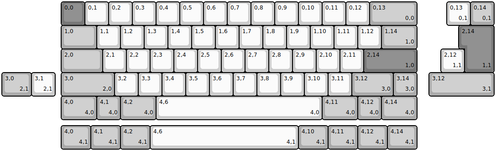{:loading="lazy"}

[Open in keyboard-layout-editor](http://www.keyboard-layout-editor.com/##@@_x:2.5&c=#777777;&=0,0&_c=#cccccc;&=0,1&=0,2&=0,3&=0,4&=0,5&=0,6&=0,7&=0,8&=0,9&=0,10&=0,11&=0,12&_c=#aaaaaa&w:2;&=0,13%0A%0A%0A0,0;&@_x:2.5&w:1.5;&=1,0&_c=#cccccc;&=1,1&=1,2&=1,3&=1,4&=1,5&=1,6&=1,7&=1,8&=1,9&=1,10&=1,11&=1,12&_c=#aaaaaa&w:1.5;&=1,14%0A%0A%0A1,0;&@_x:2.5&w:1.75;&=2,0&_c=#cccccc;&=2,1&=2,2&=2,3&=2,4&=2,5&=2,6&=2,7&=2,8&=2,9&=2,10&=2,11&_c=#777777&w:2.25;&=2,14%0A%0A%0A1,0;&@_x:2.5&c=#aaaaaa&w:2.25;&=3,0%0A%0A%0A2,0&_c=#cccccc;&=3,2&=3,3&=3,4&=3,5&=3,6&=3,7&=3,8&=3,9&=3,10&=3,11&_c=#aaaaaa&w:1.75;&=3,12%0A%0A%0A3,0&=3,14%0A%0A%0A3,0;&@_x:2.5&w:1.5;&=4,0%0A%0A%0A4,0&=4,1%0A%0A%0A4,0&_w:1.5;&=4,2%0A%0A%0A4,0&_c=#cccccc&w:7;&=4,6%0A7U%0A%0A4,0&_c=#aaaaaa&w:1.5;&=4,11%0A%0A%0A4,0&=4,12%0A%0A%0A4,0&_w:1.5;&=4,14%0A%0A%0A4,0;&@_x:18.75&y:-5&c=#cccccc;&=0,13%0A%0A%0A0,1&_c=#aaaaaa;&=0,14%0A%0A%0A0,1;&@_x:19.5&c=#777777&w:1.25&h:2&w2:1.5&h2:1&x2:-0.25;&=2,14%0A%0A%0A1,1;&@_x:18.5&c=#cccccc;&=2,12%0A%0A%0A1,1;&@_c=#aaaaaa&w:1.25;&=3,0%0A%0A%0A2,1&_c=#cccccc;&=3,1%0A%0A%0A2,1&_x:15.75&c=#aaaaaa&w:2.75;&=3,12%0A%0A%0A3,1;&@_x:2.5&y:1.25&w:1.25;&=4,0%0A%0A%0A4,1&_w:1.25;&=4,1%0A%0A%0A4,1&_w:1.25;&=4,2%0A%0A%0A4,1&_c=#cccccc&w:6.25;&=4,6%0A6.25U%0A%0A4,1&_c=#aaaaaa&w:1.25;&=4,10%0A%0A%0A4,1&_w:1.25;&=4,11%0A%0A%0A4,1&_w:1.25;&=4,12%0A%0A%0A4,1&_w:1.25;&=4,14%0A%0A%0A4,1)

## cannonkeys/ellipse_hs

[README](output/cannonkeys/ellipse_hs/README.md) - [layout](output/cannonkeys/ellipse_hs/ellipse_hs-kle.json) - [PCB](output/cannonkeys/ellipse_hs/ellipse_hs.kicad_pcb) - [PCB render](output/cannonkeys/ellipse_hs/ellipse_hs-render.svg)

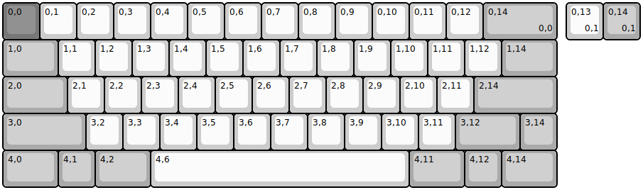{:loading="lazy"}

[Open in keyboard-layout-editor](http://www.keyboard-layout-editor.com/##@@_c=#777777;&=0,0&_c=#cccccc;&=0,1&=0,2&=0,3&=0,4&=0,5&=0,6&=0,7&=0,8&=0,9&=0,10&=0,11&=0,12&_c=#aaaaaa&w:2;&=0,14%0A%0A%0A0,0;&@_w:1.5;&=1,0&_c=#cccccc;&=1,1&=1,2&=1,3&=1,4&=1,5&=1,6&=1,7&=1,8&=1,9&=1,10&=1,11&=1,12&_c=#aaaaaa&w:1.5;&=1,14;&@_w:1.75;&=2,0&_c=#cccccc;&=2,1&=2,2&=2,3&=2,4&=2,5&=2,6&=2,7&=2,8&=2,9&=2,10&=2,11&_c=#aaaaaa&w:2.25;&=2,14;&@_w:2.25;&=3,0&_c=#cccccc;&=3,2&=3,3&=3,4&=3,5&=3,6&=3,7&=3,8&=3,9&=3,10&=3,11&_c=#aaaaaa&w:1.75;&=3,12&=3,14;&@_w:1.5;&=4,0&=4,1&_w:1.5;&=4,2&_c=#cccccc&w:7;&=4,6&_c=#aaaaaa&w:1.5;&=4,11&=4,12&_w:1.5;&=4,14;&@_x:15.25&y:-5&c=#cccccc;&=0,13%0A%0A%0A0,1&_c=#aaaaaa;&=0,14%0A%0A%0A0,1)

## cannonkeys/gentoo

[README](output/cannonkeys/gentoo/README.md) - [layout](output/cannonkeys/gentoo/gentoo-kle.json) - [PCB](output/cannonkeys/gentoo/gentoo.kicad_pcb) - [PCB render](output/cannonkeys/gentoo/gentoo-render.svg)

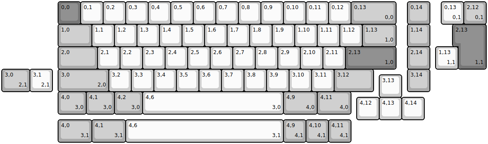{:loading="lazy"}

[Open in keyboard-layout-editor](http://www.keyboard-layout-editor.com/##@@_x:2.5&c=#777777;&=0,0&_c=#cccccc;&=0,1&=0,2&=0,3&=0,4&=0,5&=0,6&=0,7&=0,8&=0,9&=0,10&=0,11&=0,12&_c=#aaaaaa&w:2;&=0,13%0A%0A%0A0,0&_x:0.5;&=0,14;&@_x:2.5&w:1.5;&=1,0&_c=#cccccc;&=1,1&=1,2&=1,3&=1,4&=1,5&=1,6&=1,7&=1,8&=1,9&=1,10&=1,11&=1,12&_c=#aaaaaa&w:1.5;&=1,13%0A%0A%0A1,0&_x:0.5;&=1,14;&@_x:2.5&w:1.75;&=2,0&_c=#cccccc;&=2,1&=2,2&=2,3&=2,4&=2,5&=2,6&=2,7&=2,8&=2,9&=2,10&=2,11&_c=#777777&w:2.25;&=2,13%0A%0A%0A1,0&_x:0.5&c=#aaaaaa;&=2,14;&@_x:2.5&w:2.25;&=3,0%0A%0A%0A2,0&_c=#cccccc;&=3,2&=3,3&=3,4&=3,5&=3,6&=3,7&=3,8&=3,9&=3,10&=3,11&_c=#aaaaaa&w:1.75;&=3,12&_x:1.5;&=3,14;&@_x:16.75&y:-0.75&c=#cccccc;&=3,13;&@_x:2.5&y:-0.25&c=#aaaaaa&w:1.25;&=4,0%0A%0A%0A3,0&_w:1.25;&=4,1%0A%0A%0A3,0&_w:1.25;&=4,2%0A%0A%0A3,0&_c=#cccccc&w:6.25;&=4,6%0A%0A%0A3,0&_c=#aaaaaa&w:1.5;&=4,9%0A%0A%0A4,0&_w:1.5;&=4,11%0A%0A%0A4,0;&@_x:15.75&y:-0.75&c=#cccccc;&=4,12&=4,13&=4,14;&@_x:19.5&y:-5.25;&=0,13%0A%0A%0A0,1&_c=#aaaaaa;&=2,12%0A%0A%0A0,1;&@_x:20.25&c=#777777&w:1.25&h:2&w2:1.5&h2:1&x2:-0.25;&=2,13%0A%0A%0A1,1;&@_x:19.25&c=#cccccc;&=1,13%0A%0A%0A1,1;&@_c=#aaaaaa&w:1.25;&=3,0%0A%0A%0A2,1&_c=#cccccc;&=3,1%0A%0A%0A2,1;&@_x:2.5&y:1.25&c=#aaaaaa&w:1.5;&=4,0%0A%0A%0A3,1&_w:1.5;&=4,1%0A%0A%0A3,1&_c=#cccccc&w:7;&=4,6%0A%0A%0A3,1&_c=#aaaaaa;&=4,9%0A%0A%0A4,1&=4,10%0A%0A%0A4,1&=4,11%0A%0A%0A4,1)

## cannonkeys/gentoo_hs

[README](output/cannonkeys/gentoo_hs/README.md) - [layout](output/cannonkeys/gentoo_hs/gentoo_hs-kle.json) - [PCB](output/cannonkeys/gentoo_hs/gentoo_hs.kicad_pcb) - [PCB render](output/cannonkeys/gentoo_hs/gentoo_hs-render.svg)

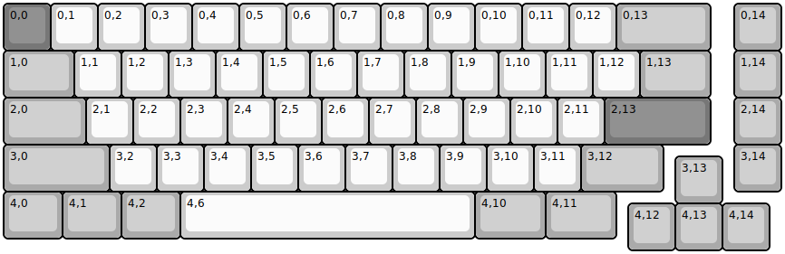{:loading="lazy"}

[Open in keyboard-layout-editor](http://www.keyboard-layout-editor.com/##@@_c=#777777;&=0,0&_c=#cccccc;&=0,1&=0,2&=0,3&=0,4&=0,5&=0,6&=0,7&=0,8&=0,9&=0,10&=0,11&=0,12&_c=#aaaaaa&w:2;&=0,13&_x:0.5;&=0,14;&@_w:1.5;&=1,0&_c=#cccccc;&=1,1&=1,2&=1,3&=1,4&=1,5&=1,6&=1,7&=1,8&=1,9&=1,10&=1,11&=1,12&_c=#aaaaaa&w:1.5;&=1,13&_x:0.5;&=1,14;&@_w:1.75;&=2,0&_c=#cccccc;&=2,1&=2,2&=2,3&=2,4&=2,5&=2,6&=2,7&=2,8&=2,9&=2,10&=2,11&_c=#777777&w:2.25;&=2,13&_x:0.5&c=#aaaaaa;&=2,14;&@_w:2.25;&=3,0&_c=#cccccc;&=3,2&=3,3&=3,4&=3,5&=3,6&=3,7&=3,8&=3,9&=3,10&=3,11&_c=#aaaaaa&w:1.75;&=3,12&_x:1.5;&=3,14;&@_x:14.25&y:-0.75;&=3,13;&@_y:-0.25&w:1.25;&=4,0&_w:1.25;&=4,1&_w:1.25;&=4,2&_c=#cccccc&w:6.25;&=4,6&_c=#aaaaaa&w:1.5;&=4,10&_w:1.5;&=4,11;&@_x:13.25&y:-0.75;&=4,12&=4,13&=4,14)

## cannonkeys/hoodrowg

[README](output/cannonkeys/hoodrowg/README.md) - [layout](output/cannonkeys/hoodrowg/hoodrowg-kle.json) - [PCB](output/cannonkeys/hoodrowg/hoodrowg.kicad_pcb) - [PCB render](output/cannonkeys/hoodrowg/hoodrowg-render.svg)

{:loading="lazy"}

[Open in keyboard-layout-editor](http://www.keyboard-layout-editor.com/##@@_x:2.5&c=#777777;&=1,0&_x:1.0&c=#cccccc;&=1,1&=0,1&=1,2&=0,2&_x:0.5&c=#aaaaaa;&=1,3&=0,3&=1,4&=0,4&_x:0.5&c=#cccccc;&=1,5&=0,5&=1,6&=0,6&_x:0.25&c=#aaaaaa;&=1,7&=0,7&=1,8;&@_x:2.5&y:0.5;&=3,0&_c=#cccccc;&=2,0&=3,1&=2,1&=3,2&=2,2&=3,3&=2,3&=3,4&=2,4&=3,5&=2,5&=3,6&_c=#aaaaaa&w:2;&=2,6&_x:0.25;&=3,7&=2,7&=3,8;&@_x:2.5&w:1.5;&=5,0&_c=#cccccc;&=4,0&=5,1&=4,1&=5,2&=4,2&=5,3&=4,3&=5,4&=4,4&=5,5&=4,5&=5,6&_c=#aaaaaa&w:1.5;&=4,6%0A%0A%0A0,0&_x:0.25;&=5,7&=4,7&=5,8;&@_x:2.5&w:1.75;&=7,0&_c=#cccccc;&=6,0&=7,1&=6,1&=7,2&=6,2&=7,3&=6,3&=7,4&=6,4&=7,5&=6,5&_c=#777777&w:2.25;&=6,6%0A%0A%0A0,0;&@_x:2.5&c=#aaaaaa&w:2.25;&=9,0%0A%0A%0A0,0&_c=#cccccc;&=9,1&=8,1&=9,2&=8,2&=9,3&=8,3&=9,4&=8,4&=9,5&=8,5&_c=#aaaaaa&w:2.75;&=8,6&_x:1.25;&=8,7;&@_x:2.5&w:1.5;&=11,0&=10,0&_w:1.5;&=11,1&_c=#cccccc&w:7;&=11,3&_c=#aaaaaa&w:1.5;&=11,5&=11,6&_w:1.5;&=10,6&_x:0.25;&=11,7&=10,7&=11,8;&@_x:22.0&y:-4.0&w:1.25&h:2&w2:1.5&h2:1&x2:-0.25;&=6,6%0A%0A%0A0,1;&@_x:21.0&c=#cccccc;&=7,6%0A%0A%0A0,1;&@_c=#aaaaaa&w:1.25;&=9,0%0A%0A%0A0,1&_c=#cccccc;&=8,0%0A%0A%0A0,1)

## cannonkeys/instant60

[README](output/cannonkeys/instant60/README.md) - [layout](output/cannonkeys/instant60/instant60-kle.json) - [PCB](output/cannonkeys/instant60/instant60.kicad_pcb) - [PCB render](output/cannonkeys/instant60/instant60-render.svg)

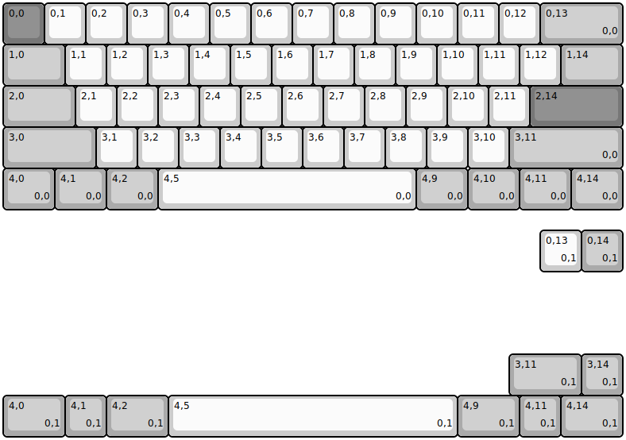{:loading="lazy"}

[Open in keyboard-layout-editor](http://www.keyboard-layout-editor.com/##@@_c=#777777;&=0,0&_c=#cccccc;&=0,1&=0,2&=0,3&=0,4&=0,5&=0,6&=0,7&=0,8&=0,9&=0,10&=0,11&=0,12&_c=#aaaaaa&w:2;&=0,13%0A%0A%0A0,0;&@_w:1.5;&=1,0&_c=#cccccc;&=1,1&=1,2&=1,3&=1,4&=1,5&=1,6&=1,7&=1,8&=1,9&=1,10&=1,11&=1,12&_c=#aaaaaa&w:1.5;&=1,14;&@_w:1.75;&=2,0&_c=#cccccc;&=2,1&=2,2&=2,3&=2,4&=2,5&=2,6&=2,7&=2,8&=2,9&=2,10&=2,11&_c=#777777&w:2.25;&=2,14;&@_c=#aaaaaa&w:2.25;&=3,0&_c=#cccccc;&=3,1&=3,2&=3,3&=3,4&=3,5&=3,6&=3,7&=3,8&=3,9&=3,10&_c=#aaaaaa&w:2.75;&=3,11%0A%0A%0A0,0;&@_w:1.25;&=4,0%0A%0A%0A0,0&_w:1.25;&=4,1%0A%0A%0A0,0&_w:1.25;&=4,2%0A%0A%0A0,0&_c=#cccccc&w:6.25;&=4,5%0A%0A%0A0,0&_c=#aaaaaa&w:1.25;&=4,9%0A%0A%0A0,0&_w:1.25;&=4,10%0A%0A%0A0,0&_w:1.25;&=4,11%0A%0A%0A0,0&_w:1.25;&=4,14%0A%0A%0A0,0;&@_x:13&y:0.5&c=#cccccc;&=0,13%0A%0A%0A0,1&_c=#aaaaaa;&=0,14%0A%0A%0A0,1;&@_x:12.25&y:2.0&w:1.75;&=3,11%0A%0A%0A0,1&=3,14%0A%0A%0A0,1;&@_w:1.5;&=4,0%0A%0A%0A0,1&=4,1%0A%0A%0A0,1&_w:1.5;&=4,2%0A%0A%0A0,1&_c=#cccccc&w:7;&=4,5%0A%0A%0A0,1&_c=#aaaaaa&w:1.5;&=4,9%0A%0A%0A0,1&=4,11%0A%0A%0A0,1&_w:1.5;&=4,14%0A%0A%0A0,1)

## cannonkeys/instant65

[README](output/cannonkeys/instant65/README.md) - [layout](output/cannonkeys/instant65/instant65-kle.json) - [PCB](output/cannonkeys/instant65/instant65.kicad_pcb) - [PCB render](output/cannonkeys/instant65/instant65-render.svg)

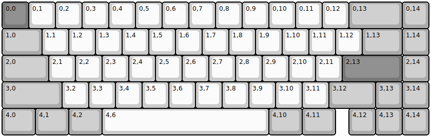{:loading="lazy"}

[Open in keyboard-layout-editor](http://www.keyboard-layout-editor.com/##@@_c=#777777;&=0,0&_c=#cccccc;&=0,1&=0,2&=0,3&=0,4&=0,5&=0,6&=0,7&=0,8&=0,9&=0,10&=0,11&=0,12&_c=#aaaaaa&w:2;&=0,13&=0,14;&@_w:1.5;&=1,0&_c=#cccccc;&=1,1&=1,2&=1,3&=1,4&=1,5&=1,6&=1,7&=1,8&=1,9&=1,10&=1,11&=1,12&_c=#aaaaaa&w:1.5;&=1,13&=1,14;&@_w:1.75;&=2,0&_c=#cccccc;&=2,1&=2,2&=2,3&=2,4&=2,5&=2,6&=2,7&=2,8&=2,9&=2,10&=2,11&_c=#777777&w:2.25;&=2,13&_c=#aaaaaa;&=2,14;&@_w:2.25;&=3,0&_c=#cccccc;&=3,2&=3,3&=3,4&=3,5&=3,6&=3,7&=3,8&=3,9&=3,10&=3,11&_c=#aaaaaa&w:1.75;&=3,12&=3,13&=3,14;&@_w:1.25;&=4,0&_w:1.25;&=4,1&_w:1.25;&=4,2&_c=#cccccc&w:6.25;&=4,6&_c=#aaaaaa&w:1.25;&=4,10&_w:1.25;&=4,11&_x:0.5;&=4,12&=4,13&=4,14)

## cannonkeys/iron165

[README](output/cannonkeys/iron165/README.md) - [layout](output/cannonkeys/iron165/iron165-kle.json) - [PCB](output/cannonkeys/iron165/iron165.kicad_pcb) - [PCB render](output/cannonkeys/iron165/iron165-render.svg)

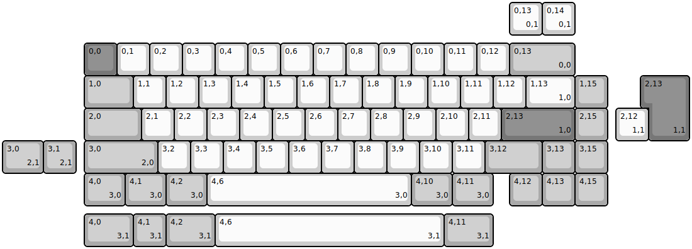{:loading="lazy"}

[Open in keyboard-layout-editor](http://www.keyboard-layout-editor.com/##@@_x:2.5&y:1.25&c=#777777;&=0,0&_c=#cccccc;&=0,1&=0,2&=0,3&=0,4&=0,5&=0,6&=0,7&=0,8&=0,9&=0,10&=0,11&=0,12&_c=#aaaaaa&w:2;&=0,13%0A%0A%0A0,0;&@_x:2.5&w:1.5;&=1,0&_c=#cccccc;&=1,1&=1,2&=1,3&=1,4&=1,5&=1,6&=1,7&=1,8&=1,9&=1,10&=1,11&=1,12&_w:1.5;&=1,13%0A%0A%0A1,0&_c=#aaaaaa;&=1,15;&@_x:2.5&w:1.75;&=2,0&_c=#cccccc;&=2,1&=2,2&=2,3&=2,4&=2,5&=2,6&=2,7&=2,8&=2,9&=2,10&=2,11&_c=#777777&w:2.25;&=2,13%0A%0A%0A1,0&_c=#aaaaaa;&=2,15;&@_x:2.5&w:2.25;&=3,0%0A%0A%0A2,0&_c=#cccccc;&=3,2&=3,3&=3,4&=3,5&=3,6&=3,7&=3,8&=3,9&=3,10&=3,11&_c=#aaaaaa&w:1.75;&=3,12&=3,13&=3,15;&@_x:2.5&w:1.25;&=4,0%0A%0A%0A3,0&_w:1.25;&=4,1%0A%0A%0A3,0&_w:1.25;&=4,2%0A%0A%0A3,0&_c=#cccccc&w:6.25;&=4,6%0A%0A%0A3,0&_c=#aaaaaa&w:1.25;&=4,10%0A%0A%0A3,0&_w:1.25;&=4,11%0A%0A%0A3,0&_x:0.5;&=4,12&=4,13&=4,15;&@_x:15.5&y:-6.25&c=#cccccc;&=0,13%0A%0A%0A0,1&=0,14%0A%0A%0A0,1;&@_x:19.75&y:1.25&c=#777777&w:1.25&h:2&w2:1.5&h2:1&x2:-0.25;&=2,13%0A%0A%0A1,1;&@_x:18.75&c=#cccccc;&=2,12%0A%0A%0A1,1;&@_c=#aaaaaa&w:1.25;&=3,0%0A%0A%0A2,1&=3,1%0A%0A%0A2,1;&@_x:2.5&y:1.25&w:1.5;&=4,0%0A%0A%0A3,1&=4,1%0A%0A%0A3,1&_w:1.5;&=4,2%0A%0A%0A3,1&_c=#cccccc&w:7;&=4,6%0A%0A%0A3,1&_c=#aaaaaa&w:1.5;&=4,11%0A%0A%0A3,1)

## cannonkeys/malicious_ergo

[README](output/cannonkeys/malicious_ergo/README.md) - [layout](output/cannonkeys/malicious_ergo/malicious_ergo-kle.json) - [PCB](output/cannonkeys/malicious_ergo/malicious_ergo.kicad_pcb) - [PCB render](output/cannonkeys/malicious_ergo/malicious_ergo-render.svg)

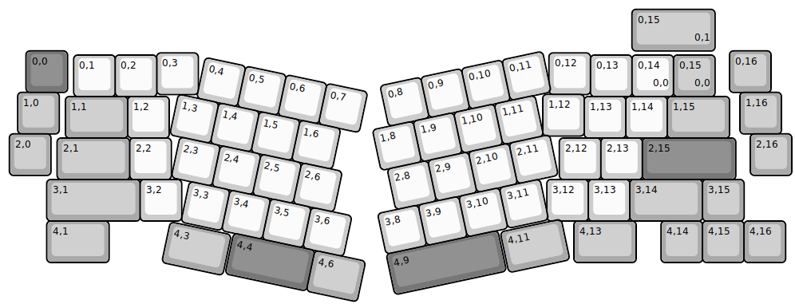{:loading="lazy"}

[Open in keyboard-layout-editor](http://www.keyboard-layout-editor.com/##@@_x:0.55&y:1.15&c=#777777;&=0,0&_x:15.95&c=#aaaaaa;&=0,16;&@_x:3.7&y:-0.95&c=#cccccc;&=0,3&_x:8.45;&=0,12;&@_x:1.7&y:-0.95;&=0,1&=0,2&_x:10.45;&=0,13&=0,14%0A%0A%0A0,0&_c=#aaaaaa;&=0,15%0A%0A%0A0,0;&@_x:0.35&y:-0.1;&=1,0&_x:16.4;&=1,16;&@_x:13&y:-0.95&c=#cccccc;&=1,12;&@_x:1.5&y:-0.95&c=#aaaaaa&w:1.5;&=1,1&_c=#cccccc;&=1,2&_x:10.0;&=1,13&=1,14&_c=#aaaaaa&w:1.5;&=1,15;&@_x:0.15&y:-0.1;&=2,0&_x:16.85;&=2,16;&@_x:13.4&y:-0.9&c=#cccccc;&=2,12&=2,13&_c=#777777&w:2.25;&=2,15&_x:-16.35&c=#aaaaaa&w:1.75;&=2,1&_c=#cccccc;&=2,2;&@_x:1.05&c=#aaaaaa&w:2.25;&=3,1&_c=#cccccc;&=3,2&_x:8.8;&=3,12&=3,13&_c=#aaaaaa&w:1.75;&=3,14&=3,15;&@_x:1.05&w:1.5;&=4,1&_x:11.2&w:1.5;&=4,13&_x:0.6;&=4,14&=4,15&=4,16;&@_r:12&x:5.05&y:-6.0&c=#cccccc;&=0,4&=0,5&=0,6&=0,7;&@_x:4.6;&=1,3&=1,4&=1,5&=1,6;&@_x:4.85;&=2,3&=2,4&=2,5&=2,6;&@_x:5.3;&=3,3&=3,4&=3,5&=3,6;&@_x:6.6&c=#777777&w:2;&=4,4&_c=#aaaaaa&w:1.25;&=4,6;&@_x:5.05&y:-0.95&w:1.5;&=4,3;&@_r:-12&x:8.45&y:-1.45&c=#cccccc;&=0,8&=0,9&=0,10&=0,11;&@_x:8.05;&=1,8&=1,9&=1,10&=1,11;&@_x:8.2;&=2,8&=2,9&=2,10&=2,11;&@_x:7.75;&=3,8&=3,9&=3,10&=3,11;&@_x:7.75&c=#777777&w:2.75;&=4,9;&@_x:10.55&y:-0.95&c=#aaaaaa&w:1.5;&=4,11;&@_r:0&x:15.15&y:-8.75&w:2;&=0,15%0A%0A%0A0,1)

## cannonkeys/moment

[README](output/cannonkeys/moment/README.md) - [layout](output/cannonkeys/moment/moment-kle.json) - [PCB](output/cannonkeys/moment/moment.kicad_pcb) - [PCB render](output/cannonkeys/moment/moment-render.svg)

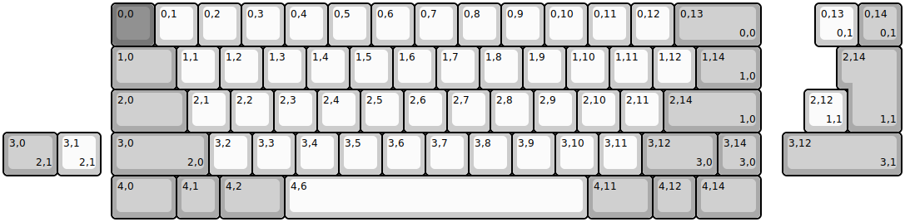{:loading="lazy"}

[Open in keyboard-layout-editor](http://www.keyboard-layout-editor.com/##@@_x:2.5&c=#777777;&=0,0&_c=#cccccc;&=0,1&=0,2&=0,3&=0,4&=0,5&=0,6&=0,7&=0,8&=0,9&=0,10&=0,11&=0,12&_c=#aaaaaa&w:2;&=0,13%0A%0A%0A0,0;&@_x:2.5&w:1.5;&=1,0&_c=#cccccc;&=1,1&=1,2&=1,3&=1,4&=1,5&=1,6&=1,7&=1,8&=1,9&=1,10&=1,11&=1,12&_c=#aaaaaa&w:1.5;&=1,14%0A%0A%0A1,0;&@_x:2.5&w:1.75;&=2,0&_c=#cccccc;&=2,1&=2,2&=2,3&=2,4&=2,5&=2,6&=2,7&=2,8&=2,9&=2,10&=2,11&_c=#aaaaaa&w:2.25;&=2,14%0A%0A%0A1,0;&@_x:2.5&w:2.25;&=3,0%0A%0A%0A2,0&_c=#cccccc;&=3,2&=3,3&=3,4&=3,5&=3,6&=3,7&=3,8&=3,9&=3,10&=3,11&_c=#aaaaaa&w:1.75;&=3,12%0A%0A%0A3,0&=3,14%0A%0A%0A3,0;&@_x:2.5&w:1.5;&=4,0&=4,1&_w:1.5;&=4,2&_c=#cccccc&w:7;&=4,6&_c=#aaaaaa&w:1.5;&=4,11&=4,12&_w:1.5;&=4,14;&@_x:18.75&y:-5&c=#cccccc;&=0,13%0A%0A%0A0,1&_c=#aaaaaa;&=0,14%0A%0A%0A0,1;&@_x:19.5&w:1.25&h:2&w2:1.5&h2:1&x2:-0.25;&=2,14%0A%0A%0A1,1;&@_x:18.5&c=#cccccc;&=2,12%0A%0A%0A1,1;&@_c=#aaaaaa&w:1.25;&=3,0%0A%0A%0A2,1&_c=#cccccc;&=3,1%0A%0A%0A2,1&_x:15.75&c=#aaaaaa&w:2.75;&=3,12%0A%0A%0A3,1)

## cannonkeys/moment_hs

[README](output/cannonkeys/moment_hs/README.md) - [layout](output/cannonkeys/moment_hs/moment_hs-kle.json) - [PCB](output/cannonkeys/moment_hs/moment_hs.kicad_pcb) - [PCB render](output/cannonkeys/moment_hs/moment_hs-render.svg)

{:loading="lazy"}

[Open in keyboard-layout-editor](http://www.keyboard-layout-editor.com/##@@_c=#777777;&=0,0&_c=#cccccc;&=0,1&=0,2&=0,3&=0,4&=0,5&=0,6&=0,7&=0,8&=0,9&=0,10&=0,11&=0,12&_c=#aaaaaa&w:2;&=0,14%0A%0A%0A0,0;&@_w:1.5;&=1,0&_c=#cccccc;&=1,1&=1,2&=1,3&=1,4&=1,5&=1,6&=1,7&=1,8&=1,9&=1,10&=1,11&=1,12&_c=#aaaaaa&w:1.5;&=1,14;&@_w:1.75;&=2,0&_c=#cccccc;&=2,1&=2,2&=2,3&=2,4&=2,5&=2,6&=2,7&=2,8&=2,9&=2,10&=2,11&_c=#aaaaaa&w:2.25;&=2,14;&@_w:2.25;&=3,0&_c=#cccccc;&=3,2&=3,3&=3,4&=3,5&=3,6&=3,7&=3,8&=3,9&=3,10&=3,11&_c=#aaaaaa&w:1.75;&=3,12&=3,14;&@_w:1.5;&=4,0&=4,1&_w:1.5;&=4,2&_c=#cccccc&w:7;&=4,6&_c=#aaaaaa&w:1.5;&=4,11&=4,12&_w:1.5;&=4,14;&@_x:15.25&y:-5&c=#cccccc;&=0,14%0A%0A%0A0,1&_c=#aaaaaa;&=0,13%0A%0A%0A0,1)

## cannonkeys/obliterated75

[README](output/cannonkeys/obliterated75/README.md) - [layout](output/cannonkeys/obliterated75/obliterated75-kle.json) - [PCB](output/cannonkeys/obliterated75/obliterated75.kicad_pcb) - [PCB render](output/cannonkeys/obliterated75/obliterated75-render.svg)

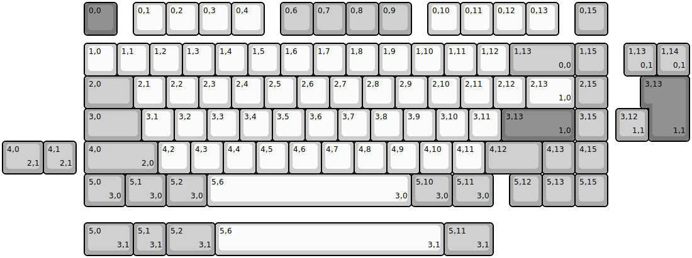{:loading="lazy"}

[Open in keyboard-layout-editor](http://www.keyboard-layout-editor.com/##@@_x:2.5&c=#777777;&=0,0&_x:0.5&c=#cccccc;&=0,1&=0,2&=0,3&=0,4&_x:0.5&c=#aaaaaa;&=0,6&=0,7&=0,8&=0,9&_x:0.5&c=#cccccc;&=0,10&=0,11&=0,12&=0,13&_x:0.5&c=#aaaaaa;&=0,15;&@_x:2.5&y:0.25&c=#cccccc;&=1,0&=1,1&=1,2&=1,3&=1,4&=1,5&=1,6&=1,7&=1,8&=1,9&=1,10&=1,11&=1,12&_c=#aaaaaa&w:2;&=1,13%0A%0A%0A0,0&=1,15;&@_x:2.5&w:1.5;&=2,0&_c=#cccccc;&=2,1&=2,2&=2,3&=2,4&=2,5&=2,6&=2,7&=2,8&=2,9&=2,10&=2,11&=2,12&_w:1.5;&=2,13%0A%0A%0A1,0&_c=#aaaaaa;&=2,15;&@_x:2.5&w:1.75;&=3,0&_c=#cccccc;&=3,1&=3,2&=3,3&=3,4&=3,5&=3,6&=3,7&=3,8&=3,9&=3,10&=3,11&_c=#777777&w:2.25;&=3,13%0A%0A%0A1,0&_c=#aaaaaa;&=3,15;&@_x:2.5&w:2.25;&=4,0%0A%0A%0A2,0&_c=#cccccc;&=4,2&=4,3&=4,4&=4,5&=4,6&=4,7&=4,8&=4,9&=4,10&=4,11&_c=#aaaaaa&w:1.75;&=4,12&=4,13&=4,15;&@_x:2.5&w:1.25;&=5,0%0A%0A%0A3,0&_w:1.25;&=5,1%0A%0A%0A3,0&_w:1.25;&=5,2%0A%0A%0A3,0&_c=#cccccc&w:6.25;&=5,6%0A%0A%0A3,0&_c=#aaaaaa&w:1.25;&=5,10%0A%0A%0A3,0&_w:1.25;&=5,11%0A%0A%0A3,0&_x:0.5;&=5,12&=5,13&=5,15;&@_x:19.0&y:-5.0;&=1,13%0A%0A%0A0,1&=1,14%0A%0A%0A0,1;&@_x:19.75&c=#777777&w:1.25&h:2&w2:1.5&h2:1&x2:-0.25;&=3,13%0A%0A%0A1,1;&@_x:18.75&c=#aaaaaa;&=3,12%0A%0A%0A1,1;&@_w:1.25;&=4,0%0A%0A%0A2,1&=4,1%0A%0A%0A2,1;&@_x:2.5&y:1.5&w:1.5;&=5,0%0A%0A%0A3,1&=5,1%0A%0A%0A3,1&_w:1.5;&=5,2%0A%0A%0A3,1&_c=#cccccc&w:7;&=5,6%0A%0A%0A3,1&_c=#aaaaaa&w:1.5;&=5,11%0A%0A%0A3,1)

## cannonkeys/onyx

[README](output/cannonkeys/onyx/README.md) - [layout](output/cannonkeys/onyx/onyx-kle.json) - [PCB](output/cannonkeys/onyx/onyx.kicad_pcb) - [PCB render](output/cannonkeys/onyx/onyx-render.svg)

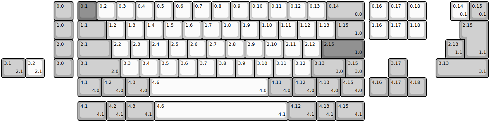{:loading="lazy"}

[Open in keyboard-layout-editor](http://www.keyboard-layout-editor.com/##@@_x:2.75&c=#aaaaaa;&=0,0&_x:0.25&c=#777777;&=0,1&_c=#cccccc;&=0,2&=0,3&=0,4&=0,5&=0,6&=0,7&=0,8&=0,9&=0,10&=0,11&=0,12&=0,13&_c=#aaaaaa&w:2;&=0,14%0A%0A%0A0,0&_x:0.25&c=#cccccc;&=0,16&=0,17&=0,18;&@_x:2.75&c=#aaaaaa;&=1,0&_x:0.25&w:1.5;&=1,1&_c=#cccccc;&=1,2&=1,3&=1,4&=1,5&=1,6&=1,7&=1,8&=1,9&=1,10&=1,11&=1,12&=1,13&_c=#aaaaaa&w:1.5;&=1,15%0A%0A%0A1,0&_x:0.25&c=#cccccc;&=1,16&=1,17&=1,18;&@_x:2.75&c=#aaaaaa;&=2,0&_x:0.25&w:1.75;&=2,1&_c=#cccccc;&=2,2&=2,3&=2,4&=2,5&=2,6&=2,7&=2,8&=2,9&=2,10&=2,11&=2,12&_c=#777777&w:2.25;&=2,15%0A%0A%0A1,0;&@_x:2.75&c=#aaaaaa;&=3,0&_x:0.25&w:2.25;&=3,1%0A%0A%0A2,0&_c=#cccccc;&=3,3&=3,4&=3,5&=3,6&=3,7&=3,8&=3,9&=3,10&=3,11&=3,12&_c=#aaaaaa&w:1.75;&=3,13%0A%0A%0A3,0&=3,15%0A%0A%0A3,0&_x:1.25;&=3,17;&@_x:4&w:1.25;&=4,1%0A%0A%0A4,0&_w:1.25;&=4,2%0A%0A%0A4,0&_w:1.25;&=4,3%0A%0A%0A4,0&_c=#cccccc&w:6.25;&=4,6%0A%0A%0A4,0&_c=#aaaaaa&w:1.25;&=4,11%0A%0A%0A4,0&_w:1.25;&=4,12%0A%0A%0A4,0&_w:1.25;&=4,13%0A%0A%0A4,0&_w:1.25;&=4,15%0A%0A%0A4,0&_x:0.25;&=4,16&=4,17&=4,18;&@_x:23.5&y:-5&c=#cccccc;&=0,14%0A%0A%0A0,1&_c=#aaaaaa;&=0,15%0A%0A%0A0,1;&@_x:24.25&w:1.25&h:2&w2:1.5&h2:1&x2:-0.25;&=2,15%0A%0A%0A1,1;&@_x:23.25;&=2,13%0A%0A%0A1,1;&@_w:1.25;&=3,1%0A%0A%0A2,1&_c=#cccccc;&=3,2%0A%0A%0A2,1&_x:20.5&c=#aaaaaa&w:2.75;&=3,13%0A%0A%0A3,1;&@_x:4&y:1.25&w:1.5;&=4,1%0A%0A%0A4,1&=4,2%0A%0A%0A4,1&_w:1.5;&=4,3%0A%0A%0A4,1&_c=#cccccc&w:7;&=4,6%0A%0A%0A4,1&_c=#aaaaaa&w:1.5;&=4,12%0A%0A%0A4,1&=4,13%0A%0A%0A4,1&_w:1.5;&=4,15%0A%0A%0A4,1)

## cannonkeys/ortho48

[README](output/cannonkeys/ortho48/README.md) - [layout](output/cannonkeys/ortho48/ortho48-kle.json) - [PCB](output/cannonkeys/ortho48/ortho48.kicad_pcb) - [PCB render](output/cannonkeys/ortho48/ortho48-render.svg)

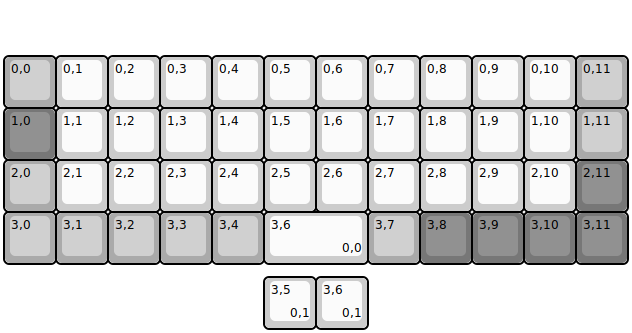{:loading="lazy"}

[Open in keyboard-layout-editor](http://www.keyboard-layout-editor.com/##@_name=Ortho48%20VIA;&@_y:1&c=#aaaaaa;&=0,0&_c=#cccccc;&=0,1&=0,2&=0,3&=0,4&=0,5&=0,6&=0,7&=0,8&=0,9&=0,10&_c=#aaaaaa;&=0,11;&@_c=#777777;&=1,0&_c=#cccccc;&=1,1&=1,2&=1,3&=1,4&=1,5&=1,6&=1,7&=1,8&=1,9&=1,10&_c=#aaaaaa;&=1,11;&@=2,0&_c=#cccccc;&=2,1&=2,2&=2,3&=2,4&=2,5&=2,6&=2,7&=2,8&=2,9&=2,10&_c=#777777;&=2,11;&@_c=#aaaaaa;&=3,0&=3,1&=3,2&=3,3&=3,4&_c=#cccccc&w:2;&=3,6%0A%0A%0A0,0&_c=#aaaaaa;&=3,7&_c=#777777;&=3,8&=3,9&=3,10&=3,11;&@_x:5&y:0.25&c=#cccccc;&=3,5%0A%0A%0A0,1&=3,6%0A%0A%0A0,1)

## cannonkeys/ortho48v2

[README](output/cannonkeys/ortho48v2/README.md) - [layout](output/cannonkeys/ortho48v2/ortho48v2-kle.json) - [PCB](output/cannonkeys/ortho48v2/ortho48v2.kicad_pcb) - [PCB render](output/cannonkeys/ortho48v2/ortho48v2-render.svg)

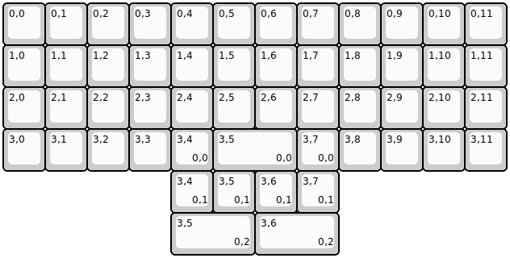{:loading="lazy"}

[Open in keyboard-layout-editor](http://www.keyboard-layout-editor.com/##@@=0,0&=0,1&=0,2&=0,3&=0,4&=0,5&=0,6&=0,7&=0,8&=0,9&=0,10&=0,11;&@=1,0&=1,1&=1,2&=1,3&=1,4&=1,5&=1,6&=1,7&=1,8&=1,9&=1,10&=1,11;&@=2,0&=2,1&=2,2&=2,3&=2,4&=2,5&=2,6&=2,7&=2,8&=2,9&=2,10&=2,11;&@=3,0&=3,1&=3,2&=3,3&=3,4%0A%0A%0A0,0&_w:2;&=3,5%0A%0A%0A0,0&=3,7%0A%0A%0A0,0&=3,8&=3,9&=3,10&=3,11;&@_x:4;&=3,4%0A%0A%0A0,1&=3,5%0A%0A%0A0,1&=3,6%0A%0A%0A0,1&=3,7%0A%0A%0A0,1;&@_x:4&w:2;&=3,5%0A%0A%0A0,2&_w:2;&=3,6%0A%0A%0A0,2)

## cannonkeys/ortho60

[README](output/cannonkeys/ortho60/README.md) - [layout](output/cannonkeys/ortho60/ortho60-kle.json) - [PCB](output/cannonkeys/ortho60/ortho60.kicad_pcb) - [PCB render](output/cannonkeys/ortho60/ortho60-render.svg)

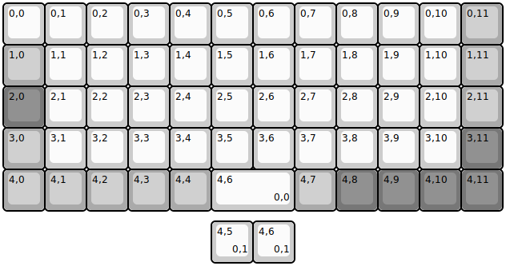{:loading="lazy"}

[Open in keyboard-layout-editor](http://www.keyboard-layout-editor.com/##@@=0,0&=0,1&=0,2&=0,3&=0,4&=0,5&=0,6&=0,7&=0,8&=0,9&=0,10&_c=#aaaaaa;&=0,11;&@=1,0&_c=#cccccc;&=1,1&=1,2&=1,3&=1,4&=1,5&=1,6&=1,7&=1,8&=1,9&=1,10&_c=#aaaaaa;&=1,11;&@_c=#777777;&=2,0&_c=#cccccc;&=2,1&=2,2&=2,3&=2,4&=2,5&=2,6&=2,7&=2,8&=2,9&=2,10&_c=#aaaaaa;&=2,11;&@=3,0&_c=#cccccc;&=3,1&=3,2&=3,3&=3,4&=3,5&=3,6&=3,7&=3,8&=3,9&=3,10&_c=#777777;&=3,11;&@_c=#aaaaaa;&=4,0&=4,1&=4,2&=4,3&=4,4&_c=#cccccc&w:2;&=4,6%0A%0A%0A0,0&_c=#aaaaaa;&=4,7&_c=#777777;&=4,8&=4,9&=4,10&=4,11;&@_x:5&y:0.25&c=#cccccc;&=4,5%0A%0A%0A0,1&=4,6%0A%0A%0A0,1)

## cannonkeys/ortho60v2

[README](output/cannonkeys/ortho60v2/README.md) - [layout](output/cannonkeys/ortho60v2/ortho60v2-kle.json) - [PCB](output/cannonkeys/ortho60v2/ortho60v2.kicad_pcb) - [PCB render](output/cannonkeys/ortho60v2/ortho60v2-render.svg)

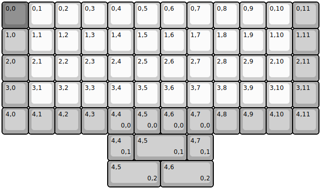{:loading="lazy"}

[Open in keyboard-layout-editor](http://www.keyboard-layout-editor.com/##@@_c=#777777;&=0,0&_c=#cccccc;&=0,1&=0,2&=0,3&=0,4&=0,5&=0,6&=0,7&=0,8&=0,9&=0,10&_c=#aaaaaa;&=0,11;&@=1,0&_c=#cccccc;&=1,1&=1,2&=1,3&=1,4&=1,5&=1,6&=1,7&=1,8&=1,9&=1,10&_c=#aaaaaa;&=1,11;&@=2,0&_c=#cccccc;&=2,1&=2,2&=2,3&=2,4&=2,5&=2,6&=2,7&=2,8&=2,9&=2,10&_c=#aaaaaa;&=2,11;&@=3,0&_c=#cccccc;&=3,1&=3,2&=3,3&=3,4&=3,5&=3,6&=3,7&=3,8&=3,9&=3,10&_c=#aaaaaa;&=3,11;&@=4,0&=4,1&=4,2&=4,3&=4,4%0A%0A%0A0,0&=4,5%0A%0A%0A0,0&=4,6%0A%0A%0A0,0&=4,7%0A%0A%0A0,0&=4,8&=4,9&=4,10&=4,11;&@_x:4;&=4,4%0A%0A%0A0,1&_w:2;&=4,5%0A%0A%0A0,1&=4,7%0A%0A%0A0,1;&@_x:4&w:2;&=4,5%0A%0A%0A0,2&_w:2;&=4,6%0A%0A%0A0,2)

## cannonkeys/rekt1800

[README](output/cannonkeys/rekt1800/README.md) - [layout](output/cannonkeys/rekt1800/rekt1800-kle.json) - [PCB](output/cannonkeys/rekt1800/rekt1800.kicad_pcb) - [PCB render](output/cannonkeys/rekt1800/rekt1800-render.svg)

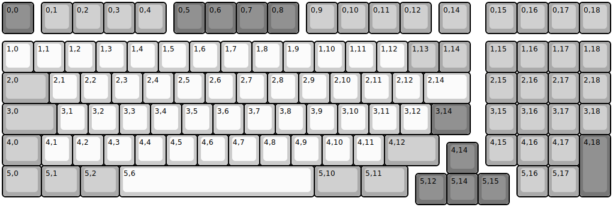{:loading="lazy"}

[Open in keyboard-layout-editor](http://www.keyboard-layout-editor.com/##@@_c=#777777;&=0,0&_x:0.25&c=#aaaaaa;&=0,1&=0,2&=0,3&=0,4&_x:0.25&c=#777777;&=0,5&=0,6&=0,7&=0,8&_x:0.25&c=#aaaaaa;&=0,9&=0,10&=0,11&=0,12&_x:0.25;&=0,14&_x:0.5;&=0,15&=0,16&=0,17&=0,18;&@_y:0.25&c=#cccccc;&=1,0&=1,1&=1,2&=1,3&=1,4&=1,5&=1,6&=1,7&=1,8&=1,9&=1,10&=1,11&=1,12&_c=#aaaaaa;&=1,13&=1,14&_x:0.5;&=1,15&=1,16&=1,17&=1,18;&@_w:1.5;&=2,0&_c=#cccccc;&=2,1&=2,2&=2,3&=2,4&=2,5&=2,6&=2,7&=2,8&=2,9&=2,10&=2,11&=2,12&_w:1.5;&=2,14&_x:0.5&c=#aaaaaa;&=2,15&=2,16&=2,17&=2,18;&@_w:1.75;&=3,0&_c=#cccccc;&=3,1&=3,2&=3,3&=3,4&=3,5&=3,6&=3,7&=3,8&=3,9&=3,10&=3,11&=3,12&_c=#777777&w:1.25;&=3,14&_x:0.5&c=#aaaaaa;&=3,15&=3,16&=3,17&=3,18;&@_w:1.25;&=4,0&_c=#cccccc;&=4,1&=4,2&=4,3&=4,4&=4,5&=4,6&=4,7&=4,8&=4,9&=4,10&=4,11&_c=#aaaaaa&w:1.75;&=4,12&_x:1.5;&=4,15&=4,16&=4,17&_c=#777777&h:2;&=4,18;&@_x:14.25&y:-0.75;&=4,14;&@_y:-0.25&c=#aaaaaa&w:1.25;&=5,0&_w:1.25;&=5,1&_w:1.25;&=5,2&_c=#cccccc&w:6.25;&=5,6&_c=#aaaaaa&w:1.5;&=5,10&_w:1.5;&=5,11&_x:3.5;&=5,16&=5,17;&@_x:13.25&y:-0.75&c=#777777;&=5,12&=5,14&=5,15)

## cannonkeys/sagittarius

[README](output/cannonkeys/sagittarius/README.md) - [layout](output/cannonkeys/sagittarius/sagittarius-kle.json) - [PCB](output/cannonkeys/sagittarius/sagittarius.kicad_pcb) - [PCB render](output/cannonkeys/sagittarius/sagittarius-render.svg)

{:loading="lazy"}

[Open in keyboard-layout-editor](http://www.keyboard-layout-editor.com/##@@_y:1.25&c=#777777;&=0,0&_x:0.5&c=#cccccc;&=0,1&=0,2&=0,3&=0,4&=0,5&=0,6&=0,7&_x:2.25;&=5,8&=5,9&=5,10&=5,11&=5,12&=5,13&_c=#aaaaaa&w:2;&=5,14%0A%0A%0A0,0;&@_c=#cccccc;&=1,0&_x:0.5&c=#aaaaaa&w:1.5;&=1,1&_c=#cccccc;&=1,2&=1,3&=1,4&=1,5&=1,6&_x:2.75;&=6,7&=6,8&=6,9&=6,10&=6,11&=6,12&=6,13&_w:1.5;&=6,14%0A%0A%0A1,0;&@=2,0&_x:0.5&c=#aaaaaa&w:1.75;&=2,1&_c=#cccccc;&=2,2&=2,3&=2,4&=2,5&=2,6&_x:2.75;&=7,7&=7,8&=7,9&=7,10&=7,11&=7,12&_c=#777777&w:2.25;&=7,14%0A%0A%0A1,0;&@_c=#cccccc;&=3,0&_x:0.5&c=#aaaaaa&w:2.25;&=3,1%0A%0A%0A1,0&_c=#cccccc;&=3,3&=3,4&=3,5&=3,6&=3,7&_x:2.25;&=8,8&=8,9&=8,10&=8,11&=8,12&_c=#aaaaaa&w:2.25;&=8,13%0A%0A%0A2,0&_c=#cccccc;&=8,15;&@_x:1.5&c=#aaaaaa&w:1.25;&=4,0&_w:1.25;&=4,1&_x:1.5&c=#cccccc;&=4,6%0A%0A%0A3,0&_w:2.25;&=4,7%0A%0A%0A3,0&_x:2.25&w:2.75;&=9,8%0A%0A%0A4,0&_x:2.5&c=#aaaaaa&w:1.5;&=9,13%0A%0A%0A2,0&_w:1.5;&=9,15%0A%0A%0A2,0;&@_x:16.75&y:-6.25&c=#cccccc;&=5,14%0A%0A%0A0,1&=5,15%0A%0A%0A0,1;&@_x:5.5&y:5.75&w:1.75;&=4,6%0A%0A%0A3,1&_w:1.5;&=4,7%0A%0A%0A3,1&_x:2.25&w:1.75;&=9,8%0A%0A%0A4,1&=9,9%0A%0A%0A4,1&_x:2.25&c=#aaaaaa&w:1.25;&=8,13%0A%0A%0A2,1&_c=#cccccc;&=8,14%0A%0A%0A2,1;&@_x:16.25;&=9,13%0A%0A%0A2,1&=9,14%0A%0A%0A2,1&=9,15%0A%0A%0A2,1;&@_x:18&y:0.75&c=#777777&w:1.25&h:2&w2:1.5&h2:1&x2:-0.25;&=7,15%0A%0A%0A1,1;&@_x:17&c=#cccccc;&=7,13%0A%0A%0A1,1;&@_x:1.5&c=#aaaaaa&w:1.25;&=3,1%0A%0A%0A1,1&_c=#cccccc;&=3,2%0A%0A%0A1,1)

## cannonkeys/satisfaction75

[README](output/cannonkeys/satisfaction75/README.md) - [layout](output/cannonkeys/satisfaction75/satisfaction75-kle.json) - [PCB](output/cannonkeys/satisfaction75/satisfaction75.kicad_pcb) - [PCB render](output/cannonkeys/satisfaction75/satisfaction75-render.svg)

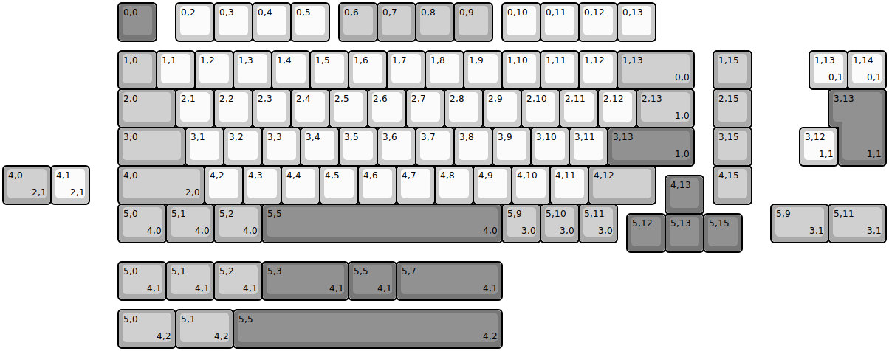{:loading="lazy"}

[Open in keyboard-layout-editor](http://www.keyboard-layout-editor.com/##@@_x:3&c=#777777;&=0,0&_x:0.5&c=#cccccc;&=0,2&=0,3&=0,4&=0,5&_x:0.25&c=#aaaaaa;&=0,6&=0,7&=0,8&=0,9&_x:0.25&c=#cccccc;&=0,10&=0,11&=0,12&=0,13;&@_x:3&y:0.25&c=#aaaaaa;&=1,0&_c=#cccccc;&=1,1&=1,2&=1,3&=1,4&=1,5&=1,6&=1,7&=1,8&=1,9&=1,10&=1,11&=1,12&_c=#aaaaaa&w:2;&=1,13%0A%0A%0A0,0&_x:0.5;&=1,15;&@_x:3&w:1.5;&=2,0&_c=#cccccc;&=2,1&=2,2&=2,3&=2,4&=2,5&=2,6&=2,7&=2,8&=2,9&=2,10&=2,11&=2,12&_c=#aaaaaa&w:1.5;&=2,13%0A%0A%0A1,0&_x:0.5;&=2,15;&@_x:3&w:1.75;&=3,0&_c=#cccccc;&=3,1&=3,2&=3,3&=3,4&=3,5&=3,6&=3,7&=3,8&=3,9&=3,10&=3,11&_c=#777777&w:2.25;&=3,13%0A%0A%0A1,0&_x:0.5&c=#aaaaaa;&=3,15;&@_x:3.0&w:2.25;&=4,0%0A%0A%0A2,0&_c=#cccccc;&=4,2&=4,3&=4,4&=4,5&=4,6&=4,7&=4,8&=4,9&=4,10&=4,11&_c=#aaaaaa&w:1.75;&=4,12&_x:1.5;&=4,15;&@_x:17.25&y:-0.75&c=#777777;&=4,13;&@_x:3&y:-0.25&c=#aaaaaa&w:1.25;&=5,0%0A%0A%0A4,0&_w:1.25;&=5,1%0A%0A%0A4,0&_w:1.25;&=5,2%0A%0A%0A4,0&_c=#777777&w:6.25;&=5,5%0A%0A%0A4,0&_c=#aaaaaa;&=5,9%0A%0A%0A3,0&=5,10%0A%0A%0A3,0&=5,11%0A%0A%0A3,0;&@_x:16.25&y:-0.75&c=#777777;&=5,12&=5,13&=5,15;&@_x:21.0&y:-5.25&c=#cccccc;&=1,13%0A%0A%0A0,1&=1,14%0A%0A%0A0,1;&@_x:21.75&c=#777777&w:1.25&h:2&w2:1.5&h2:1&x2:-0.25;&=3,13%0A%0A%0A1,1;&@_x:20.75&c=#cccccc;&=3,12%0A%0A%0A1,1;&@_c=#aaaaaa&w:1.25;&=4,0%0A%0A%0A2,1&_c=#cccccc;&=4,1%0A%0A%0A2,1;&@_x:20.0&c=#aaaaaa&w:1.5;&=5,9%0A%0A%0A3,1&_w:1.5;&=5,11%0A%0A%0A3,1;&@_x:3&y:0.5&w:1.25;&=5,0%0A%0A%0A4,1&_w:1.25;&=5,1%0A%0A%0A4,1&_w:1.25;&=5,2%0A%0A%0A4,1&_c=#777777&w:2.25;&=5,3%0A%0A%0A4,1&_w:1.25;&=5,5%0A%0A%0A4,1&_w:2.75;&=5,7%0A%0A%0A4,1;&@_x:3&y:0.25&c=#aaaaaa&w:1.5;&=5,0%0A%0A%0A4,2&_w:1.5;&=5,1%0A%0A%0A4,2&_c=#777777&w:7;&=5,5%0A%0A%0A4,2)

## cannonkeys/savage65

[README](output/cannonkeys/savage65/README.md) - [layout](output/cannonkeys/savage65/savage65-kle.json) - [PCB](output/cannonkeys/savage65/savage65.kicad_pcb) - [PCB render](output/cannonkeys/savage65/savage65-render.svg)

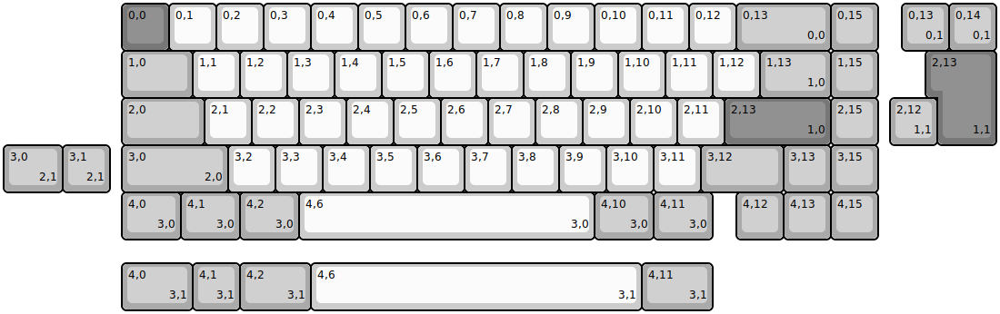{:loading="lazy"}

[Open in keyboard-layout-editor](http://www.keyboard-layout-editor.com/##@@_x:2.5&c=#777777;&=0,0&_c=#cccccc;&=0,1&=0,2&=0,3&=0,4&=0,5&=0,6&=0,7&=0,8&=0,9&=0,10&=0,11&=0,12&_c=#aaaaaa&w:2;&=0,13%0A%0A%0A0,0&=0,15;&@_x:2.5&w:1.5;&=1,0&_c=#cccccc;&=1,1&=1,2&=1,3&=1,4&=1,5&=1,6&=1,7&=1,8&=1,9&=1,10&=1,11&=1,12&_c=#aaaaaa&w:1.5;&=1,13%0A%0A%0A1,0&=1,15;&@_x:2.5&w:1.75;&=2,0&_c=#cccccc;&=2,1&=2,2&=2,3&=2,4&=2,5&=2,6&=2,7&=2,8&=2,9&=2,10&=2,11&_c=#777777&w:2.25;&=2,13%0A%0A%0A1,0&_c=#aaaaaa;&=2,15;&@_x:2.5&w:2.25;&=3,0%0A%0A%0A2,0&_c=#cccccc;&=3,2&=3,3&=3,4&=3,5&=3,6&=3,7&=3,8&=3,9&=3,10&=3,11&_c=#aaaaaa&w:1.75;&=3,12&=3,13&=3,15;&@_x:2.5&w:1.25;&=4,0%0A%0A%0A3,0&_w:1.25;&=4,1%0A%0A%0A3,0&_w:1.25;&=4,2%0A%0A%0A3,0&_c=#cccccc&w:6.25;&=4,6%0A%0A%0A3,0&_c=#aaaaaa&w:1.25;&=4,10%0A%0A%0A3,0&_w:1.25;&=4,11%0A%0A%0A3,0&_x:0.5;&=4,12&=4,13&=4,15;&@_x:19.0&y:-5;&=0,13%0A%0A%0A0,1&=0,14%0A%0A%0A0,1;&@_x:19.75&c=#777777&w:1.25&h:2&w2:1.5&h2:1&x2:-0.25;&=2,13%0A%0A%0A1,1;&@_x:18.75&c=#aaaaaa;&=2,12%0A%0A%0A1,1;&@_w:1.25;&=3,0%0A%0A%0A2,1&=3,1%0A%0A%0A2,1;&@_x:2.5&y:1.5&w:1.5;&=4,0%0A%0A%0A3,1&=4,1%0A%0A%0A3,1&_w:1.5;&=4,2%0A%0A%0A3,1&_c=#cccccc&w:7;&=4,6%0A%0A%0A3,1&_c=#aaaaaa&w:1.5;&=4,11%0A%0A%0A3,1)

## cannonkeys/serenity

[README](output/cannonkeys/serenity/README.md) - [layout](output/cannonkeys/serenity/serenity-kle.json) - [PCB](output/cannonkeys/serenity/serenity.kicad_pcb) - [PCB render](output/cannonkeys/serenity/serenity-render.svg)

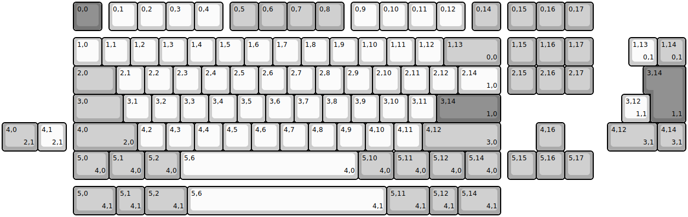{:loading="lazy"}

[Open in keyboard-layout-editor](http://www.keyboard-layout-editor.com/##@@_x:2.5&c=#777777;&=0,0&_x:0.25&c=#cccccc;&=0,1&=0,2&=0,3&=0,4&_x:0.25&c=#aaaaaa;&=0,5&=0,6&=0,7&=0,8&_x:0.25&c=#cccccc;&=0,9&=0,10&=0,11&=0,12&_x:0.25&c=#aaaaaa;&=0,14&_x:0.25;&=0,15&=0,16&=0,17;&@_x:2.5&y:0.25&c=#cccccc;&=1,0&=1,1&=1,2&=1,3&=1,4&=1,5&=1,6&=1,7&=1,8&=1,9&=1,10&=1,11&=1,12&_c=#aaaaaa&w:2;&=1,13%0A%0A%0A0,0&_x:0.25;&=1,15&=1,16&=1,17;&@_x:2.5&w:1.5;&=2,0&_c=#cccccc;&=2,1&=2,2&=2,3&=2,4&=2,5&=2,6&=2,7&=2,8&=2,9&=2,10&=2,11&=2,12&_w:1.5;&=2,14%0A%5C%0A%0A1,0&_x:0.25&c=#aaaaaa;&=2,15&=2,16&=2,17;&@_x:2.5&w:1.75;&=3,0&_c=#cccccc;&=3,1&=3,2&=3,3&=3,4&=3,5&=3,6&=3,7&=3,8&=3,9&=3,10&=3,11&_c=#777777&w:2.25;&=3,14%0A%0A%0A1,0;&@_x:2.5&c=#aaaaaa&w:2.25;&=4,0%0A%0A%0A2,0&_c=#cccccc;&=4,2&=4,3&=4,4&=4,5&=4,6&=4,7&=4,8&=4,9&=4,10&=4,11&_c=#aaaaaa&w:2.75;&=4,12%0A%0A%0A3,0&_x:1.25;&=4,16;&@_x:2.5&w:1.25;&=5,0%0A%0A%0A4,0&_w:1.25;&=5,1%0A%0A%0A4,0&_w:1.25;&=5,2%0A%0A%0A4,0&_c=#cccccc&w:6.25;&=5,6%0A6.25U%0A%0A4,0&_c=#aaaaaa&w:1.25;&=5,10%0A%0A%0A4,0&_w:1.25;&=5,11%0A%0A%0A4,0&_w:1.25;&=5,12%0A%0A%0A4,0&_w:1.25;&=5,14%0A%0A%0A4,0&_x:0.25;&=5,15&=5,16&=5,17;&@_x:22.0&y:-5.0&c=#cccccc;&=1,13%0A%0A%0A0,1&_c=#aaaaaa;&=1,14%0A%0A%0A0,1;&@_x:22.75&c=#777777&w:1.25&h:2&w2:1.5&h2:1&x2:-0.25;&=3,14%0A%0A%0A1,1;&@_x:21.75&c=#cccccc;&=3,12%0A%0A%0A1,1;&@_c=#aaaaaa&w:1.25;&=4,0%0A%0A%0A2,1&_c=#cccccc;&=4,1%0A%0A%0A2,1&_x:19.0&c=#aaaaaa&w:1.75;&=4,12%0A%0A%0A3,1&=4,14%0A%0A%0A3,1;&@_x:2.5&y:1.25&w:1.5;&=5,0%0A%0A%0A4,1&=5,1%0A%0A%0A4,1&_w:1.5;&=5,2%0A%0A%0A4,1&_c=#cccccc&w:7;&=5,6%0A7U%0A%0A4,1&_c=#aaaaaa&w:1.5;&=5,11%0A%0A%0A4,1&=5,12%0A%0A%0A4,1&_w:1.5;&=5,14%0A%0A%0A4,1)

## cannonkeys/tmov2

[README](output/cannonkeys/tmov2/README.md) - [layout](output/cannonkeys/tmov2/tmov2-kle.json) - [PCB](output/cannonkeys/tmov2/tmov2.kicad_pcb) - [PCB render](output/cannonkeys/tmov2/tmov2-render.svg)

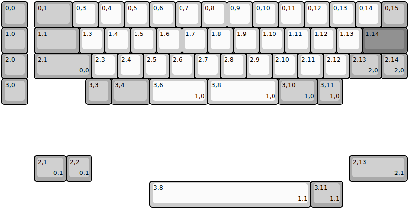{:loading="lazy"}

[Open in keyboard-layout-editor](http://www.keyboard-layout-editor.com/##@@_c=#aaaaaa;&=0,0&_x:0.25&w:1.5;&=0,1&_c=#cccccc;&=0,3&=0,4&=0,5&=0,6&=0,7&=0,8&=0,9&=0,10&=0,11&=0,12&=0,13&=0,14&_c=#aaaaaa;&=0,15;&@=1,0&_x:0.25&w:1.75;&=1,1&_c=#cccccc;&=1,3&=1,4&=1,5&=1,6&=1,7&=1,8&=1,9&=1,10&=1,11&=1,12&=1,13&_c=#777777&w:1.75&l:true;&=1,14;&@_c=#aaaaaa;&=2,0&_x:0.25&w:2.25;&=2,1%0A%0A%0A0,0&_c=#cccccc;&=2,3&=2,4&=2,5&=2,6&=2,7&=2,8&=2,9&=2,10&=2,11&=2,12&_c=#aaaaaa&w:1.25;&=2,13%0A%0A%0A2,0&=2,14%0A%0A%0A2,0;&@=3,0&_x:2.25;&=3,3&_w:1.5;&=3,4&_c=#cccccc&w:2.25;&=3,6%0A%0A%0A1,0&_w:2.75;&=3,8%0A%0A%0A1,0&_c=#aaaaaa&w:1.5;&=3,10%0A%0A%0A1,0&=3,11%0A%0A%0A1,0;&@_x:1.25&y:2&w:1.25;&=2,1%0A%0A%0A0,1&=2,2%0A%0A%0A0,1&_x:10.0&w:2.25;&=2,13%0A%0A%0A2,1;&@_x:5.75&c=#cccccc&w:6.25;&=3,8%0A%0A%0A1,1&_c=#aaaaaa&w:1.25;&=3,11%0A%0A%0A1,1)

## cannonkeys/tsukuyomi

[README](output/cannonkeys/tsukuyomi/README.md) - [layout](output/cannonkeys/tsukuyomi/tsukuyomi-kle.json) - [PCB](output/cannonkeys/tsukuyomi/tsukuyomi.kicad_pcb) - [PCB render](output/cannonkeys/tsukuyomi/tsukuyomi-render.svg)

{:loading="lazy"}

[Open in keyboard-layout-editor](http://www.keyboard-layout-editor.com/##@@_c=#aaaaaa;&=0,0&_x:0.25&c=#777777;&=0,1&_c=#cccccc;&=0,2&=0,3&=0,4&=0,5&=0,6&=0,7&=0,8&=0,9&=0,10&=0,11&=0,12&=0,13&_c=#aaaaaa&w:2;&=0,14%0A%0A%0A0,0;&@=1,0&_x:0.25&w:1.5;&=1,1&_c=#cccccc;&=1,2&=1,3&=1,4&=1,5&=1,6&=1,7&=1,8&=1,9&=1,10&=1,11&=1,12&=1,13&_c=#aaaaaa&w:1.5;&=1,14%0A%0A%0A1,0&=1,16;&@=2,0&_x:0.25&w:1.75;&=2,1&_c=#cccccc;&=2,2&=2,3&=2,4&=2,5&=2,6&=2,7&=2,8&=2,9&=2,10&=2,11&=2,12&_c=#777777&w:2.25;&=2,14%0A%0A%0A1,0&_c=#aaaaaa;&=2,16;&@=3,0&_x:0.25&w:2.25;&=3,1%0A%0A%0A2,0&_c=#cccccc;&=3,3&=3,4&=3,5&=3,6&=3,7&=3,8&=3,9&=3,10&=3,11&=3,12&_c=#aaaaaa&w:1.75;&=3,13&=3,14&=3,16;&@=4,0&_x:0.25&w:1.25;&=4,1%0A%0A%0A3,0&_w:1.25;&=4,2%0A%0A%0A3,0&_w:1.25;&=4,3%0A%0A%0A3,0&_c=#cccccc&w:6.25;&=4,7%0A%0A%0A3,0&_c=#aaaaaa&w:1.25;&=4,11%0A%0A%0A3,0&_w:1.25;&=4,12%0A%0A%0A3,0&_x:0.5;&=4,13&=4,14&=4,16;&@_x:14.25&y:0.5;&=0,14%0A%0A%0A0,1&=0,15%0A%0A%0A0,1;&@_x:15&c=#777777&w:1.25&h:2&w2:1.5&h2:1&x2:-0.25;&=2,14%0A%0A%0A1,1;&@_x:14&c=#aaaaaa;&=2,13%0A%0A%0A1,1;&@_x:1.25&w:1.25;&=3,1%0A%0A%0A2,1&=3,2%0A%0A%0A2,1;&@_x:1.25&w:1.5;&=4,1%0A%0A%0A3,1&=4,2%0A%0A%0A3,1&_w:1.5;&=4,3%0A%0A%0A3,1&_c=#cccccc&w:7;&=4,7%0A%0A%0A3,1&_c=#aaaaaa&w:1.5;&=4,12%0A%0A%0A3,1)

## cannonkeys/vector

[README](output/cannonkeys/vector/README.md) - [layout](output/cannonkeys/vector/vector-kle.json) - [PCB](output/cannonkeys/vector/vector.kicad_pcb) - [PCB render](output/cannonkeys/vector/vector-render.svg)

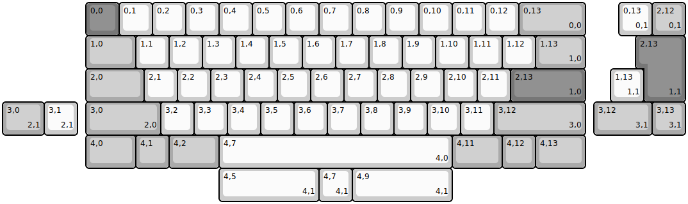{:loading="lazy"}

[Open in keyboard-layout-editor](http://www.keyboard-layout-editor.com/##@@_x:2.5&c=#777777;&=0,0&_c=#cccccc;&=0,1&=0,2&=0,3&=0,4&=0,5&=0,6&=0,7&=0,8&=0,9&=0,10&=0,11&=0,12&_c=#aaaaaa&w:2;&=0,13%0A%0A%0A0,0;&@_x:2.5&w:1.5;&=1,0&_c=#cccccc;&=1,1&=1,2&=1,3&=1,4&=1,5&=1,6&=1,7&=1,8&=1,9&=1,10&=1,11&=1,12&_c=#aaaaaa&w:1.5;&=1,13%0A%0A%0A1,0;&@_x:2.5&w:1.75;&=2,0&_c=#cccccc;&=2,1&=2,2&=2,3&=2,4&=2,5&=2,6&=2,7&=2,8&=2,9&=2,10&=2,11&_c=#777777&w:2.25;&=2,13%0A%0A%0A1,0;&@_x:2.5&c=#aaaaaa&w:2.25;&=3,0%0A%0A%0A2,0&_c=#cccccc;&=3,2&=3,3&=3,4&=3,5&=3,6&=3,7&=3,8&=3,9&=3,10&=3,11&_c=#aaaaaa&w:2.75;&=3,12%0A%0A%0A3,0;&@_x:2.5&w:1.5;&=4,0&=4,1&_w:1.5;&=4,2&_c=#cccccc&w:7;&=4,7%0A%0A%0A4,0&_c=#aaaaaa&w:1.5;&=4,11&=4,12&_w:1.5;&=4,13;&@_x:18.5&y:-5&c=#cccccc;&=0,13%0A%0A%0A0,1&_c=#aaaaaa;&=2,12%0A%0A%0A0,1;&@_x:19.25&c=#777777&w:1.25&h:2&w2:1.5&h2:1&x2:-0.25;&=2,13%0A%0A%0A1,1;&@_x:18.25&c=#cccccc;&=1,13%0A%0A%0A1,1;&@_c=#aaaaaa&w:1.25;&=3,0%0A%0A%0A2,1&_c=#cccccc;&=3,1%0A%0A%0A2,1&_x:15.5&c=#aaaaaa&w:1.75;&=3,12%0A%0A%0A3,1&=3,13%0A%0A%0A3,1;&@_x:6.5&y:1&c=#cccccc&w:3;&=4,5%0A%0A%0A4,1&=4,7%0A%0A%0A4,1&_w:3;&=4,9%0A%0A%0A4,1)

## cannonkeys/vicious40

[README](output/cannonkeys/vicious40/README.md) - [layout](output/cannonkeys/vicious40/vicious40-kle.json) - [PCB](output/cannonkeys/vicious40/vicious40.kicad_pcb) - [PCB render](output/cannonkeys/vicious40/vicious40-render.svg)

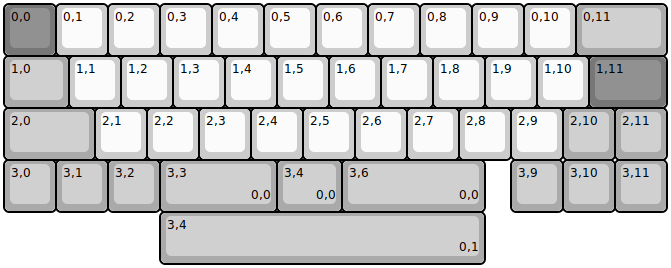{:loading="lazy"}

[Open in keyboard-layout-editor](http://www.keyboard-layout-editor.com/##@@_c=#777777;&=0,0&_c=#cccccc;&=0,1&=0,2&=0,3&=0,4&=0,5&=0,6&=0,7&=0,8&=0,9&=0,10&_c=#aaaaaa&w:1.75;&=0,11;&@_w:1.25;&=1,0&_c=#cccccc;&=1,1&=1,2&=1,3&=1,4&=1,5&=1,6&=1,7&=1,8&=1,9&=1,10&_c=#777777&w:1.5;&=1,11;&@_c=#aaaaaa&w:1.75;&=2,0&_c=#cccccc;&=2,1&=2,2&=2,3&=2,4&=2,5&=2,6&=2,7&=2,8&=2,9&_c=#aaaaaa;&=2,10&=2,11;&@=3,0&=3,1&=3,2&_w:2.25;&=3,3%0A%0A%0A0,0&_w:1.25;&=3,4%0A%0A%0A0,0&_w:2.75;&=3,6%0A%0A%0A0,0&_x:0.5;&=3,9&=3,10&=3,11;&@_x:3&w:6.25;&=3,4%0A%0A%0A0,1)

## capsule65/capsule65

[README](output/capsule65/README.md) - [layout](output/capsule65/capsule65-kle.json) - [PCB](output/capsule65/capsule65.kicad_pcb) - [PCB render](output/capsule65/capsule65-render.svg)

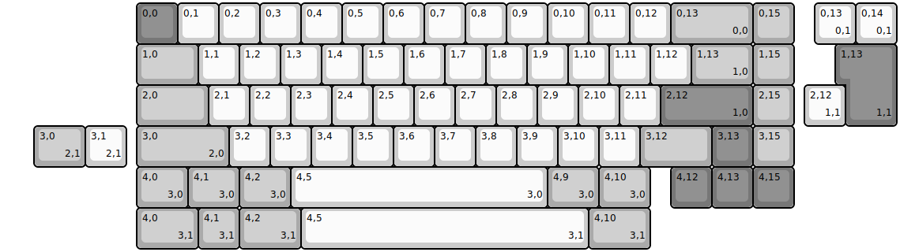{:loading="lazy"}

[Open in keyboard-layout-editor](http://www.keyboard-layout-editor.com/##@@_x:3.25&c=#777777;&=0,0&_c=#cccccc;&=0,1&=0,2&=0,3&=0,4&=0,5&=0,6&=0,7&=0,8&=0,9&=0,10&=0,11&=0,12&_c=#aaaaaa&w:2;&=0,13%0A%0A%0A0,0&=0,15;&@_x:3.25&w:1.5;&=1,0&_c=#cccccc;&=1,1&=1,2&=1,3&=1,4&=1,5&=1,6&=1,7&=1,8&=1,9&=1,10&=1,11&=1,12&_c=#aaaaaa&w:1.5;&=1,13%0A%0A%0A1,0&=1,15;&@_x:3.25&w:1.75;&=2,0&_c=#cccccc;&=2,1&=2,2&=2,3&=2,4&=2,5&=2,6&=2,7&=2,8&=2,9&=2,10&=2,11&_c=#777777&w:2.25;&=2,12%0A%0A%0A1,0&_c=#aaaaaa;&=2,15;&@_x:3.25&w:2.25;&=3,0%0A%0A%0A2,0&_c=#cccccc;&=3,2&=3,3&=3,4&=3,5&=3,6&=3,7&=3,8&=3,9&=3,10&=3,11&_c=#aaaaaa&w:1.75;&=3,12&_c=#777777;&=3,13&_c=#aaaaaa;&=3,15;&@_x:3.25&w:1.25;&=4,0%0A%0A%0A3,0&_w:1.25;&=4,1%0A%0A%0A3,0&_w:1.25;&=4,2%0A%0A%0A3,0&_c=#cccccc&w:6.25;&=4,5%0A%0A%0A3,0&_c=#aaaaaa&w:1.25;&=4,9%0A%0A%0A3,0&_w:1.25;&=4,10%0A%0A%0A3,0&_x:0.5&c=#777777;&=4,12&=4,13&=4,15;&@_x:19.75&y:-5&c=#cccccc;&=0,13%0A%0A%0A0,1&=0,14%0A%0A%0A0,1;&@_x:20.5&c=#777777&w:1.25&h:2&w2:1.5&h2:1&x2:-0.25;&=1,13%0A%0A%0A1,1;&@_x:19.5&c=#cccccc;&=2,12%0A%0A%0A1,1;&@_x:0.75&c=#aaaaaa&w:1.25;&=3,0%0A%0A%0A2,1&_c=#cccccc;&=3,1%0A%0A%0A2,1;&@_x:3.25&y:1&c=#aaaaaa&w:1.5;&=4,0%0A%0A%0A3,1&=4,1%0A%0A%0A3,1&_w:1.5;&=4,2%0A%0A%0A3,1&_c=#cccccc&w:7;&=4,5%0A%0A%0A3,1&_c=#aaaaaa&w:1.5;&=4,10%0A%0A%0A3,1)

## capsunlocked/cu65

[README](output/capsunlocked/cu65/README.md) - [layout](output/capsunlocked/cu65/cu65-kle.json) - [PCB](output/capsunlocked/cu65/cu65.kicad_pcb) - [PCB render](output/capsunlocked/cu65/cu65-render.svg)

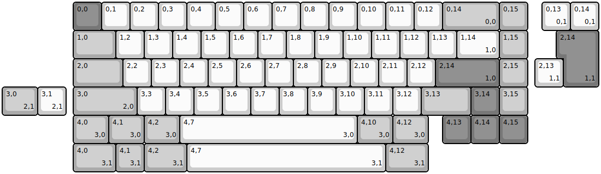{:loading="lazy"}

[Open in keyboard-layout-editor](http://www.keyboard-layout-editor.com/##@@_x:2.5&c=#777777;&=0,0&_c=#cccccc;&=0,1&=0,2&=0,3&=0,4&=0,5&=0,6&=0,7&=0,8&=0,9&=0,10&=0,11&=0,12&_c=#aaaaaa&w:2;&=0,14%0A%0A%0A0,0&=0,15;&@_x:2.5&w:1.5;&=1,0&_c=#cccccc;&=1,2&=1,3&=1,4&=1,5&=1,6&=1,7&=1,8&=1,9&=1,10&=1,11&=1,12&=1,13&_w:1.5;&=1,14%0A%0A%0A1,0&_c=#aaaaaa;&=1,15;&@_x:2.5&w:1.75;&=2,0&_c=#cccccc;&=2,2&=2,3&=2,4&=2,5&=2,6&=2,7&=2,8&=2,9&=2,10&=2,11&=2,12&_c=#777777&w:2.25;&=2,14%0A%0A%0A1,0&_c=#aaaaaa;&=2,15;&@_x:2.5&w:2.25;&=3,0%0A%0A%0A2,0&_c=#cccccc;&=3,3&=3,4&=3,5&=3,6&=3,7&=3,8&=3,9&=3,10&=3,11&=3,12&_c=#aaaaaa&w:1.75;&=3,13&_c=#777777;&=3,14&_c=#aaaaaa;&=3,15;&@_x:2.5&w:1.25;&=4,0%0A%0A%0A3,0&_w:1.25;&=4,1%0A%0A%0A3,0&_w:1.25;&=4,2%0A%0A%0A3,0&_c=#cccccc&w:6.25;&=4,7%0A%0A%0A3,0&_c=#aaaaaa&w:1.25;&=4,10%0A%0A%0A3,0&_w:1.25;&=4,12%0A%0A%0A3,0&_x:0.5&c=#777777;&=4,13&=4,14&=4,15;&@_x:19.0&y:-5&c=#cccccc;&=0,13%0A%0A%0A0,1&=0,14%0A%0A%0A0,1;&@_x:19.75&c=#777777&w:1.25&h:2&w2:1.5&h2:1&x2:-0.25;&=2,14%0A%0A%0A1,1;&@_x:18.75&c=#cccccc;&=2,13%0A%0A%0A1,1;&@_c=#aaaaaa&w:1.25;&=3,0%0A%0A%0A2,1&_c=#cccccc;&=3,1%0A%0A%0A2,1;&@_x:2.5&y:1&c=#aaaaaa&w:1.5;&=4,0%0A%0A%0A3,1&=4,1%0A%0A%0A3,1&_w:1.5;&=4,2%0A%0A%0A3,1&_c=#cccccc&w:7.0;&=4,7%0A%0A%0A3,1&_c=#aaaaaa&w:1.5;&=4,12%0A%0A%0A3,1)

## capsunlocked/cu80/v2_ansi/cu80_v2_ansi

[README](output/capsunlocked/cu80/v2_ansi/README.md) - [layout](output/capsunlocked/cu80/v2_ansi/cu80_v2_ansi-kle.json) - [PCB](output/capsunlocked/cu80/v2_ansi/cu80_v2_ansi.kicad_pcb) - [PCB render](output/capsunlocked/cu80/v2_ansi/cu80_v2_ansi-render.svg)

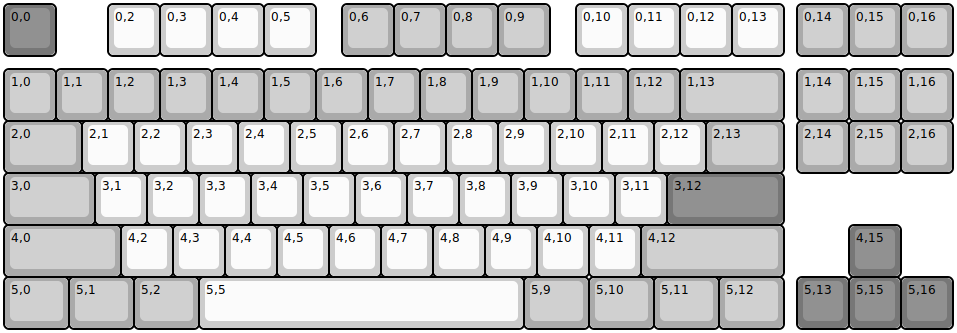{:loading="lazy"}

[Open in keyboard-layout-editor](http://www.keyboard-layout-editor.com/##@@_c=#777777;&=0,0&_x:1&c=#cccccc;&=0,2&=0,3&=0,4&=0,5&_x:0.5&c=#aaaaaa;&=0,6&=0,7&=0,8&=0,9&_x:0.5&c=#cccccc;&=0,10&=0,11&=0,12&=0,13&_x:0.25&c=#aaaaaa;&=0,14&=0,15&=0,16;&@_y:0.25;&=1,0&=1,1&=1,2&=1,3&=1,4&=1,5&=1,6&=1,7&=1,8&=1,9&=1,10&=1,11&=1,12&_w:2;&=1,13&_x:0.25;&=1,14&=1,15&=1,16;&@_w:1.5;&=2,0&_c=#cccccc;&=2,1&=2,2&=2,3&=2,4&=2,5&=2,6&=2,7&=2,8&=2,9&=2,10&=2,11&=2,12&_c=#aaaaaa&w:1.5;&=2,13&_x:0.25;&=2,14&=2,15&=2,16;&@_w:1.75;&=3,0&_c=#cccccc;&=3,1&=3,2&=3,3&=3,4&=3,5&=3,6&=3,7&=3,8&=3,9&=3,10&=3,11&_c=#777777&w:2.25;&=3,12;&@_c=#aaaaaa&w:2.25;&=4,0&_c=#cccccc;&=4,2&=4,3&=4,4&=4,5&=4,6&=4,7&=4,8&=4,9&=4,10&=4,11&_c=#aaaaaa&w:2.75;&=4,12&_x:1.25&c=#777777;&=4,15;&@_c=#aaaaaa&w:1.25;&=5,0&_w:1.25;&=5,1&_w:1.25;&=5,2&_c=#cccccc&w:6.25;&=5,5&_c=#aaaaaa&w:1.25;&=5,9&_w:1.25;&=5,10&_w:1.25;&=5,11&_w:1.25;&=5,12&_x:0.25&c=#777777;&=5,13&=5,15&=5,16)

## capsunlocked/cu80/v2_ansi_rgb/cu80_v2_ansi_rgb

[README](output/capsunlocked/cu80/v2_ansi_rgb/README.md) - [layout](output/capsunlocked/cu80/v2_ansi_rgb/cu80_v2_ansi_rgb-kle.json) - [PCB](output/capsunlocked/cu80/v2_ansi_rgb/cu80_v2_ansi_rgb.kicad_pcb) - [PCB render](output/capsunlocked/cu80/v2_ansi_rgb/cu80_v2_ansi_rgb-render.svg)

{:loading="lazy"}

[Open in keyboard-layout-editor](http://www.keyboard-layout-editor.com/##@@_c=#777777;&=0,0&_x:1&c=#cccccc;&=0,2&=0,3&=0,4&=0,5&_x:0.5&c=#aaaaaa;&=0,6&=0,7&=0,8&=0,9&_x:0.5&c=#cccccc;&=0,10&=0,11&=0,12&=0,13&_x:0.25&c=#aaaaaa;&=0,14&=0,15&=0,16;&@_y:0.25;&=1,0&=1,1&=1,2&=1,3&=1,4&=1,5&=1,6&=1,7&=1,8&=1,9&=1,10&=1,11&=1,12&_w:2;&=1,13&_x:0.25;&=1,14&=1,15&=1,16;&@_w:1.5;&=2,0&_c=#cccccc;&=2,1&=2,2&=2,3&=2,4&=2,5&=2,6&=2,7&=2,8&=2,9&=2,10&=2,11&=2,12&_c=#aaaaaa&w:1.5;&=2,13&_x:0.25;&=2,14&=2,15&=2,16;&@_w:1.75;&=3,0&_c=#cccccc;&=3,1&=3,2&=3,3&=3,4&=3,5&=3,6&=3,7&=3,8&=3,9&=3,10&=3,11&_c=#777777&w:2.25;&=3,12;&@_c=#aaaaaa&w:2.25;&=4,0&_c=#cccccc;&=4,2&=4,3&=4,4&=4,5&=4,6&=4,7&=4,8&=4,9&=4,10&=4,11&_c=#aaaaaa&w:2.75;&=4,12&_x:1.25&c=#777777;&=4,15;&@_c=#aaaaaa&w:1.25;&=5,0&_w:1.25;&=5,1&_w:1.25;&=5,2&_c=#cccccc&w:6.25;&=5,5&_c=#aaaaaa&w:1.25;&=5,9&_w:1.25;&=5,10&_w:1.25;&=5,11&_w:1.25;&=5,12&_x:0.25&c=#777777;&=5,13&=5,15&=5,16)

## capsunlocked/cu80/v2_iso/cu80_v2_iso

[README](output/capsunlocked/cu80/v2_iso/README.md) - [layout](output/capsunlocked/cu80/v2_iso/cu80_v2_iso-kle.json) - [PCB](output/capsunlocked/cu80/v2_iso/cu80_v2_iso.kicad_pcb) - [PCB render](output/capsunlocked/cu80/v2_iso/cu80_v2_iso-render.svg)

{:loading="lazy"}

[Open in keyboard-layout-editor](http://www.keyboard-layout-editor.com/##@@_c=#777777;&=0,0&_x:1&c=#cccccc;&=0,2&=0,3&=0,4&=0,5&_x:0.5&c=#aaaaaa;&=0,6&=0,7&=0,8&=0,9&_x:0.5&c=#cccccc;&=0,10&=0,11&=0,12&=0,13&_x:0.25&c=#aaaaaa;&=0,14&=0,15&=0,16;&@_y:0.25;&=1,0&=1,1&=1,2&=1,3&=1,4&=1,5&=1,6&=1,7&=1,8&=1,9&=1,10&=1,11&=1,12&_w:2;&=1,13&_x:0.25;&=1,14&=1,15&=1,16;&@_w:1.5;&=2,0&_c=#cccccc;&=2,1&=2,2&=2,3&=2,4&=2,5&=2,6&=2,7&=2,8&=2,9&=2,10&=2,11&=2,12&_x:0.25&c=#777777&w:1.25&h:2&w2:1.5&h2:1&x2:-0.25;&=2,13&_x:0.25&c=#cccccc;&=2,14&=2,15&=2,16;&@_c=#aaaaaa&w:1.75;&=3,0&_c=#cccccc;&=3,1&=3,2&=3,3&=3,4&=3,5&=3,6&=3,7&=3,8&=3,9&=3,10&=3,11&=3,12;&@_c=#aaaaaa&w:1.25;&=4,0&=4,1&_c=#cccccc;&=4,2&=4,3&=4,4&=4,5&=4,6&=4,7&=4,8&=4,9&=4,10&=4,11&_c=#aaaaaa&w:2.75;&=4,12&_x:1.25&c=#777777;&=4,15;&@_c=#aaaaaa&w:1.25;&=5,0&_w:1.25;&=5,1&_w:1.25;&=5,2&_c=#cccccc&w:6.25;&=5,5&_c=#aaaaaa&w:1.25;&=5,9&_w:1.25;&=5,10&_w:1.25;&=5,11&_w:1.25;&=5,12&_x:0.25&c=#777777;&=5,13&=5,15&=5,16)

## capsunlocked/cu80/v2_iso_rgb/cu80_v2_iso_rgb

[README](output/capsunlocked/cu80/v2_iso_rgb/README.md) - [layout](output/capsunlocked/cu80/v2_iso_rgb/cu80_v2_iso_rgb-kle.json) - [PCB](output/capsunlocked/cu80/v2_iso_rgb/cu80_v2_iso_rgb.kicad_pcb) - [PCB render](output/capsunlocked/cu80/v2_iso_rgb/cu80_v2_iso_rgb-render.svg)

{:loading="lazy"}

[Open in keyboard-layout-editor](http://www.keyboard-layout-editor.com/##@@_c=#777777;&=0,0&_x:1&c=#cccccc;&=0,2&=0,3&=0,4&=0,5&_x:0.5&c=#aaaaaa;&=0,6&=0,7&=0,8&=0,9&_x:0.5&c=#cccccc;&=0,10&=0,11&=0,12&=0,13&_x:0.25&c=#aaaaaa;&=0,14&=0,15&=0,16;&@_y:0.25;&=1,0&=1,1&=1,2&=1,3&=1,4&=1,5&=1,6&=1,7&=1,8&=1,9&=1,10&=1,11&=1,12&_w:2;&=1,13&_x:0.25;&=1,14&=1,15&=1,16;&@_w:1.5;&=2,0&_c=#cccccc;&=2,1&=2,2&=2,3&=2,4&=2,5&=2,6&=2,7&=2,8&=2,9&=2,10&=2,11&=2,12&_x:0.25&c=#777777&w:1.25&h:2&w2:1.5&h2:1&x2:-0.25;&=2,13&_x:0.25&c=#cccccc;&=2,14&=2,15&=2,16;&@_c=#aaaaaa&w:1.75;&=3,0&_c=#cccccc;&=3,1&=3,2&=3,3&=3,4&=3,5&=3,6&=3,7&=3,8&=3,9&=3,10&=3,11&=3,12;&@_c=#aaaaaa&w:1.25;&=4,0&=4,1&_c=#cccccc;&=4,2&=4,3&=4,4&=4,5&=4,6&=4,7&=4,8&=4,9&=4,10&=4,11&_c=#aaaaaa&w:2.75;&=4,12&_x:1.25&c=#777777;&=4,15;&@_c=#aaaaaa&w:1.25;&=5,0&_w:1.25;&=5,1&_w:1.25;&=5,2&_c=#cccccc&w:6.25;&=5,5&_c=#aaaaaa&w:1.25;&=5,9&_w:1.25;&=5,10&_w:1.25;&=5,11&_w:1.25;&=5,12&_x:0.25&c=#777777;&=5,13&=5,15&=5,16)

## cftkb/discipad

[README](output/cftkb/discipad/README.md) - [layout](output/cftkb/discipad/discipad-kle.json) - [PCB](output/cftkb/discipad/discipad.kicad_pcb) - [PCB render](output/cftkb/discipad/discipad-render.svg)

{:loading="lazy"}

[Open in keyboard-layout-editor](http://www.keyboard-layout-editor.com/##@@=0,0&=0,1&=0,2&=0,3;&@=1,0&=1,1&=1,2&_h:2;&=2,3;&@=2,0&=2,1&=2,2;&@=3,0&=3,1&=3,2&_c=#777777&h:2;&=4,3;&@_c=#cccccc&w:2;&=4,0&=4,2)

## cftkb/discipline

[README](output/cftkb/discipline/README.md) - [layout](output/cftkb/discipline/discipline-kle.json) - [PCB](output/cftkb/discipline/discipline.kicad_pcb) - [PCB render](output/cftkb/discipline/discipline-render.svg)

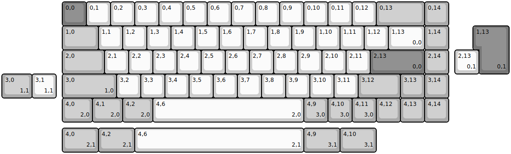{:loading="lazy"}

[Open in keyboard-layout-editor](http://www.keyboard-layout-editor.com/##@@_x:2.5&c=#777777;&=0,0&_c=#cccccc;&=0,1&=0,2&=0,3&=0,4&=0,5&=0,6&=0,7&=0,8&=0,9&=0,10&=0,11&=0,12&_c=#aaaaaa&w:2;&=0,13&=0,14;&@_x:2.5&w:1.5;&=1,0&_c=#cccccc;&=1,1&=1,2&=1,3&=1,4&=1,5&=1,6&=1,7&=1,8&=1,9&=1,10&=1,11&=1,12&_w:1.5;&=1,13%0A%0A%0A0,0&_c=#aaaaaa;&=1,14;&@_x:2.5&w:1.75;&=2,0&_c=#cccccc;&=2,1&=2,2&=2,3&=2,4&=2,5&=2,6&=2,7&=2,8&=2,9&=2,10&=2,11&_c=#777777&w:2.25;&=2,13%0A%0A%0A0,0&_c=#aaaaaa;&=2,14;&@_x:2.5&w:2.25;&=3,0%0A%0A%0A1,0&_c=#cccccc;&=3,2&=3,3&=3,4&=3,5&=3,6&=3,7&=3,8&=3,9&=3,10&=3,11&_c=#aaaaaa&w:1.75;&=3,12&=3,13&=3,14;&@_x:2.5&w:1.25;&=4,0%0A%0A%0A2,0&_w:1.25;&=4,1%0A%0A%0A2,0&_w:1.25;&=4,2%0A%0A%0A2,0&_c=#cccccc&w:6.25;&=4,6%0A%0A%0A2,0&_c=#aaaaaa;&=4,9%0A%0A%0A3,0&=4,10%0A%0A%0A3,0&=4,11%0A%0A%0A3,0&=4,12&=4,13&=4,14;&@_x:19.75&y:-4&c=#777777&w:1.25&h:2&w2:1.5&h2:1&x2:-0.25;&=1,13%0A%0A%0A0,1;&@_x:18.75&c=#cccccc;&=2,13%0A%0A%0A0,1;&@_c=#aaaaaa&w:1.25;&=3,0%0A%0A%0A1,1&_c=#cccccc;&=3,1%0A%0A%0A1,1;&@_x:2.5&y:1.25&c=#aaaaaa&w:1.5;&=4,0%0A%0A%0A2,1&_w:1.5;&=4,2%0A%0A%0A2,1&_c=#cccccc&w:7;&=4,6%0A%0A%0A2,1&_c=#aaaaaa&w:1.5;&=4,9%0A%0A%0A3,1&_w:1.5;&=4,10%0A%0A%0A3,1)

## cftkb/mysterium

[README](output/cftkb/mysterium/README.md) - [layout](output/cftkb/mysterium/mysterium-kle.json) - [PCB](output/cftkb/mysterium/mysterium.kicad_pcb) - [PCB render](output/cftkb/mysterium/mysterium-render.svg)

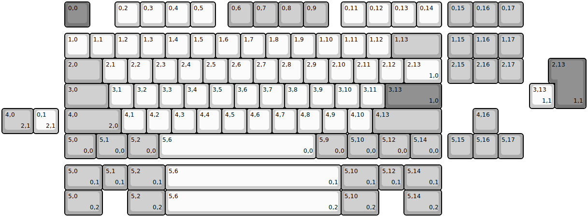{:loading="lazy"}

[Open in keyboard-layout-editor](http://www.keyboard-layout-editor.com/##@@_x:2.5&c=#777777;&=0,0&_x:1.0&c=#cccccc;&=0,2&=0,3&=0,4&=0,5&_x:0.5&c=#aaaaaa;&=0,6&=0,7&=0,8&=0,9&_x:0.5&c=#cccccc;&=0,11&=0,12&=0,13&=0,14&_x:0.25&c=#aaaaaa;&=0,15&=0,16&=0,17;&@_x:2.5&y:0.25&c=#cccccc;&=1,0&=1,1&=1,2&=1,3&=1,4&=1,5&=1,6&=1,7&=1,8&=1,9&=1,10&=1,11&=1,12&_c=#aaaaaa&w:2;&=1,13&_x:0.25;&=1,15&=1,16&=1,17;&@_x:2.5&w:1.5;&=2,0&_c=#cccccc;&=2,1&=2,2&=2,3&=2,4&=2,5&=2,6&=2,7&=2,8&=2,9&=2,10&=2,11&=2,12&_w:1.5;&=2,13%0A%0A%0A1,0&_x:0.25&c=#aaaaaa;&=2,15&=2,16&=2,17;&@_x:2.5&w:1.75;&=3,0&_c=#cccccc;&=3,1&=3,2&=3,3&=3,4&=3,5&=3,6&=3,7&=3,8&=3,9&=3,10&=3,11&_c=#777777&w:2.25;&=3,13%0A%0A%0A1,0;&@_x:2.5&c=#aaaaaa&w:2.25;&=4,0%0A%0A%0A2,0&_c=#cccccc;&=4,1&=4,2&=4,3&=4,4&=4,5&=4,6&=4,7&=4,8&=4,9&=4,10&_c=#aaaaaa&w:2.75;&=4,13&_x:1.25;&=4,16;&@_x:2.5&w:1.25;&=5,0%0A%0A%0A0,0&_w:1.25;&=5,1%0A%0A%0A0,0&_w:1.25;&=5,2%0A%0A%0A0,0&_c=#cccccc&w:6.25;&=5,6%0A%0A%0A0,0&_c=#aaaaaa&w:1.25;&=5,9%0A%0A%0A0,0&_w:1.25;&=5,10%0A%0A%0A0,0&_w:1.25;&=5,12%0A%0A%0A0,0&_w:1.25;&=5,14%0A%0A%0A0,0&_x:0.25;&=5,15&=5,16&=5,17;&@_x:22.0&y:-4.0&c=#777777&w:1.25&h:2&w2:1.5&h2:1&x2:-0.25;&=2,13%0A%0A%0A1,1;&@_x:21.0&c=#cccccc;&=3,13%0A%0A%0A1,1;&@_c=#aaaaaa&w:1.25;&=4,0%0A%0A%0A2,1&_c=#cccccc;&=0,1%0A%0A%0A2,1;&@_x:2.5&y:1.25&c=#aaaaaa&w:1.5;&=5,0%0A%0A%0A0,1&=5,1%0A%0A%0A0,1&_w:1.5;&=5,2%0A%0A%0A0,1&_c=#cccccc&w:7;&=5,6%0A%0A%0A0,1&_c=#aaaaaa&w:1.5;&=5,10%0A%0A%0A0,1&=5,12%0A%0A%0A0,1&_w:1.5;&=5,14%0A%0A%0A0,1;&@_x:2.5&w:1.5;&=5,0%0A%0A%0A0,2&_x:1.0&w:1.5;&=5,2%0A%0A%0A0,2&_c=#cccccc&w:7;&=5,6%0A%0A%0A0,2&_c=#aaaaaa&w:1.5;&=5,10%0A%0A%0A0,2&_x:1.0&w:1.5;&=5,14%0A%0A%0A0,2)

## cftkb/romeo

[README](output/cftkb/romeo/README.md) - [layout](output/cftkb/romeo/romeo-kle.json) - [PCB](output/cftkb/romeo/romeo.kicad_pcb) - [PCB render](output/cftkb/romeo/romeo-render.svg)

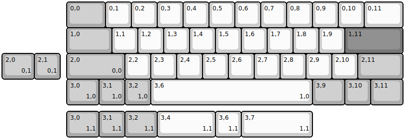{:loading="lazy"}

[Open in keyboard-layout-editor](http://www.keyboard-layout-editor.com/##@@_x:2.5&c=#aaaaaa&w:1.5;&=0,0&_c=#cccccc;&=0,1&=0,2&=0,3&=0,4&=0,5&=0,6&=0,7&=0,8&=0,9&=0,10&_w:1.5;&=0,11;&@_x:2.5&c=#aaaaaa&w:1.75;&=1,0&_c=#cccccc;&=1,1&=1,2&=1,3&=1,4&=1,5&=1,6&=1,7&=1,8&=1,9&_c=#777777&w:2.25;&=1,11;&@_x:2.5&c=#aaaaaa&w:2.25;&=2,0%0A%0A%0A0,0&_c=#cccccc;&=2,2&=2,3&=2,4&=2,5&=2,6&=2,7&=2,8&=2,9&=2,10&_c=#aaaaaa&w:1.75;&=2,11;&@_x:2.5&w:1.25;&=3,0%0A%0A%0A1,0&=3,1%0A%0A%0A1,0&=3,2%0A%0A%0A1,0&_c=#cccccc&w:6.25;&=3,6%0A%0A%0A1,0&_c=#aaaaaa&w:1.25;&=3,9&=3,10&_w:1.25;&=3,11;&@_y:-2&w:1.25;&=2,0%0A%0A%0A0,1&=2,1%0A%0A%0A0,1;&@_x:2.5&y:1.25&w:1.25;&=3,0%0A%0A%0A1,1&=3,1%0A%0A%0A1,1&_w:1.25;&=3,2%0A%0A%0A1,1&_c=#cccccc&w:2.25;&=3,4%0A%0A%0A1,1&=3,6%0A%0A%0A1,1&_w:2.75;&=3,7%0A%0A%0A1,1)

## chalice/chalice

[README](output/chalice/README.md) - [layout](output/chalice/chalice-kle.json) - [PCB](output/chalice/chalice.kicad_pcb) - [PCB render](output/chalice/chalice-render.svg)

{:loading="lazy"}

[Open in keyboard-layout-editor](http://www.keyboard-layout-editor.com/##@@_x:0.5&y:0.9&c=#777777;&=0,0;&@_x:3.75&y:-0.95&c=#cccccc;&=1,1&_x:8.4;&=0,6;&@_x:1.75&y:-0.95;&=1,0&=0,1&_x:10.4;&=1,6&_c=#aaaaaa&w:2;&=4,6%0A%0A%0A0,0;&@_x:0.25&y:-0.1&c=#cccccc;&=2,0;&@_x:13&y:-0.95;&=3,5;&@_x:1.5&y:-0.95&c=#aaaaaa&w:1.5;&=3,0&_c=#cccccc;&=2,1&_x:10.0;&=2,6&=3,6&_w:1.5;&=5,6;&@_y:-0.1;&=4,0;&@_x:1.25&y:-0.9&c=#aaaaaa&w:1.75;&=5,0&_c=#cccccc;&=4,1&_x:9.4;&=5,5&=6,6&_c=#777777&w:2.25;&=7,6;&@_x:1&c=#aaaaaa&w:2.25;&=6,0&_c=#cccccc;&=7,0&_x:8.85;&=6,5&=7,5&_c=#aaaaaa&w:1.75;&=8,6&=9,6;&@_x:1&w:1.5;&=8,0&_x:11.85&w:1.5;&=8,4&=9,4&_x:1.0;&=9,5;&@_ry:0.25&x:16.85&y:4.75;&=8,5;&@_r:12&ry:0&x:5.1&c=#cccccc;&=0,2&=1,2&=0,3&=1,3;&@_x:4.6;&=3,1&=2,2&=3,2&=2,3;&@_x:4.85;&=5,1&=4,2&=5,2&=4,3;&@_x:5.3;&=6,1&=7,1&=6,2&=7,2;&@_x:6.55&w:2;&=8,2&_x:0.05&c=#aaaaaa&w:1.25;&=9,2;&@_x:5&y:-0.89&w:1.5;&=9,1;&@_r:-12&x:8.45&y:-1.51&c=#cccccc;&=0,4&=1,4&=0,5&=1,5;&@_x:8.05;&=3,3&=2,4&=3,4&=2,5;&@_x:8.2;&=5,3&=4,4&=5,4&=4,5;&@_x:7.75;&=6,3&=7,3&=6,4&=7,4;&@_x:7.75&w:2.75;&=8,3;&@_x:10.55&y:-0.9&c=#aaaaaa&w:1.5;&=9,3;&@_r:0&x:17.5&y:-7.7;&=4,6%0A%0A%0A0,1&=8,1%0A%0A%0A0,1)

## chaos65/chaos65

[README](output/chaos65/README.md) - [layout](output/chaos65/chaos65-kle.json) - [PCB](output/chaos65/chaos65.kicad_pcb) - [PCB render](output/chaos65/chaos65-render.svg)

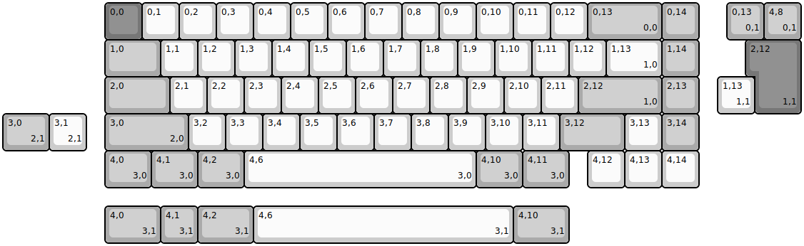{:loading="lazy"}

[Open in keyboard-layout-editor](http://www.keyboard-layout-editor.com/##@@_x:2.75&c=#777777;&=0,0&_c=#cccccc;&=0,1&=0,2&=0,3&=0,4&=0,5&=0,6&=0,7&=0,8&=0,9&=0,10&=0,11&=0,12&_c=#aaaaaa&w:2;&=0,13%0A%0A%0A0,0&=0,14;&@_x:2.75&w:1.5;&=1,0&_c=#cccccc;&=1,1&=1,2&=1,3&=1,4&=1,5&=1,6&=1,7&=1,8&=1,9&=1,10&=1,11&=1,12&_w:1.5;&=1,13%0A%0A%0A1,0&_c=#aaaaaa;&=1,14;&@_x:2.75&w:1.75;&=2,0&_c=#cccccc;&=2,1&=2,2&=2,3&=2,4&=2,5&=2,6&=2,7&=2,8&=2,9&=2,10&=2,11&_c=#aaaaaa&w:2.25;&=2,12%0A%0A%0A1,0&=2,13;&@_x:2.75&w:2.25;&=3,0%0A%0A%0A2,0&_c=#cccccc;&=3,2&=3,3&=3,4&=3,5&=3,6&=3,7&=3,8&=3,9&=3,10&=3,11&_c=#aaaaaa&w:1.75;&=3,12&_c=#cccccc;&=3,13&_c=#aaaaaa;&=3,14;&@_x:2.75&w:1.25;&=4,0%0A%0A%0A3,0&_w:1.25;&=4,1%0A%0A%0A3,0&_w:1.25;&=4,2%0A%0A%0A3,0&_c=#cccccc&w:6.25;&=4,6%0A%0A%0A3,0&_c=#aaaaaa&w:1.25;&=4,10%0A%0A%0A3,0&_w:1.25;&=4,11%0A%0A%0A3,0&_x:0.5&c=#cccccc;&=4,12&=4,13&=4,14;&@_x:19.5&y:-5&c=#aaaaaa;&=0,13%0A%0A%0A0,1&=4,8%0A%0A%0A0,1;&@_x:20.25&c=#777777&w:1.25&h:2&w2:1.5&h2:1&x2:-0.25;&=2,12%0A%0A%0A1,1;&@_x:19.25&c=#cccccc;&=1,13%0A%0A%0A1,1;&@_c=#aaaaaa&w:1.25;&=3,0%0A%0A%0A2,1&_c=#cccccc;&=3,1%0A%0A%0A2,1;&@_x:2.75&y:1.5&c=#aaaaaa&w:1.5;&=4,0%0A%0A%0A3,1&=4,1%0A%0A%0A3,1&_w:1.5;&=4,2%0A%0A%0A3,1&_c=#cccccc&w:7;&=4,6%0A%0A%0A3,1&_c=#aaaaaa&w:1.5;&=4,10%0A%0A%0A3,1)

## charue/charon

[README](output/charue/charon/README.md) - [layout](output/charue/charon/charon-kle.json) - [PCB](output/charue/charon/charon.kicad_pcb) - [PCB render](output/charue/charon/charon-render.svg)

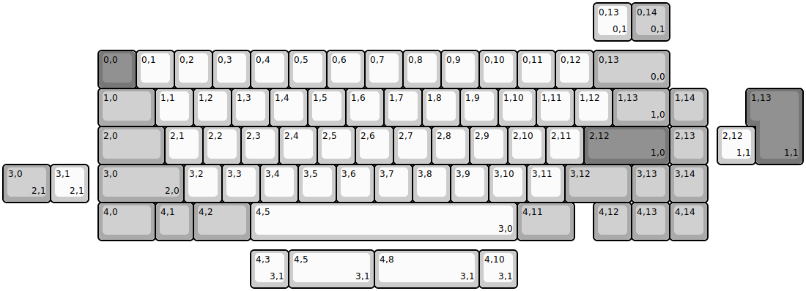{:loading="lazy"}

[Open in keyboard-layout-editor](http://www.keyboard-layout-editor.com/##@@_x:2.5&y:1.25&c=#777777;&=0,0&_c=#cccccc;&=0,1&=0,2&=0,3&=0,4&=0,5&=0,6&=0,7&=0,8&=0,9&=0,10&=0,11&=0,12&_c=#aaaaaa&w:2;&=0,13%0A%0A%0A0,0;&@_x:2.5&w:1.5;&=1,0&_c=#cccccc;&=1,1&=1,2&=1,3&=1,4&=1,5&=1,6&=1,7&=1,8&=1,9&=1,10&=1,11&=1,12&_c=#aaaaaa&w:1.5;&=1,13%0A%0A%0A1,0&=1,14;&@_x:2.5&w:1.75;&=2,0&_c=#cccccc;&=2,1&=2,2&=2,3&=2,4&=2,5&=2,6&=2,7&=2,8&=2,9&=2,10&=2,11&_c=#777777&w:2.25;&=2,12%0A%0A%0A1,0&_c=#aaaaaa;&=2,13;&@_x:2.5&w:2.25;&=3,0%0A%0A%0A2,0&_c=#cccccc;&=3,2&=3,3&=3,4&=3,5&=3,6&=3,7&=3,8&=3,9&=3,10&=3,11&_c=#aaaaaa&w:1.75;&=3,12&=3,13&=3,14;&@_x:2.5&w:1.5;&=4,0&=4,1&_w:1.5;&=4,2&_c=#cccccc&w:7;&=4,5%0A%0A%0A3,0&_c=#aaaaaa&w:1.5;&=4,11&_x:0.5;&=4,12&=4,13&=4,14;&@_x:15.5&y:-6.25&c=#cccccc;&=0,13%0A%0A%0A0,1&_c=#aaaaaa;&=0,14%0A%0A%0A0,1;&@_x:19.75&y:1.25&c=#777777&w:1.25&h:2&w2:1.5&h2:1&x2:-0.25;&=1,13%0A%0A%0A1,1;&@_x:18.75&c=#cccccc;&=2,12%0A%0A%0A1,1;&@_c=#aaaaaa&w:1.25;&=3,0%0A%0A%0A2,1&_c=#cccccc;&=3,1%0A%0A%0A2,1;&@_x:6.5&y:1.25;&=4,3%0A%0A%0A3,1&_w:2.25;&=4,5%0A%0A%0A3,1&_w:2.75;&=4,8%0A%0A%0A3,1&=4,10%0A%0A%0A3,1)

## charue/sunsetter

[README](output/charue/sunsetter/README.md) - [layout](output/charue/sunsetter/sunsetter-kle.json) - [PCB](output/charue/sunsetter/sunsetter.kicad_pcb) - [PCB render](output/charue/sunsetter/sunsetter-render.svg)

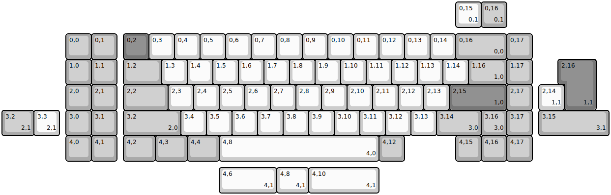{:loading="lazy"}

[Open in keyboard-layout-editor](http://www.keyboard-layout-editor.com/##@@_x:2.5&y:1.25&c=#aaaaaa;&=0,0&=0,1&_x:0.25&c=#777777;&=0,2&_c=#cccccc;&=0,3&=0,4&=0,5&=0,6&=0,7&=0,8&=0,9&=0,10&=0,11&=0,12&=0,13&=0,14&_c=#aaaaaa&w:2;&=0,16%0A%0A%0A0,0&=0,17;&@_x:2.5;&=1,0&=1,1&_x:0.25&w:1.5;&=1,2&_c=#cccccc;&=1,3&=1,4&=1,5&=1,6&=1,7&=1,8&=1,9&=1,10&=1,11&=1,12&=1,13&=1,14&_c=#aaaaaa&w:1.5;&=1,16%0A%0A%0A1,0&=1,17;&@_x:2.5;&=2,0&=2,1&_x:0.25&w:1.75;&=2,2&_c=#cccccc;&=2,3&=2,4&=2,5&=2,6&=2,7&=2,8&=2,9&=2,10&=2,11&=2,12&=2,13&_c=#777777&w:2.25;&=2,15%0A%0A%0A1,0&_c=#aaaaaa;&=2,17;&@_x:2.5;&=3,0&=3,1&_x:0.25&w:2.25;&=3,2%0A%0A%0A2,0&_c=#cccccc;&=3,4&=3,5&=3,6&=3,7&=3,8&=3,9&=3,10&=3,11&=3,12&=3,13&_c=#aaaaaa&w:1.75;&=3,14%0A%0A%0A3,0&=3,16%0A%0A%0A3,0&=3,17;&@_x:2.5;&=4,0&=4,1&_x:0.25&w:1.25;&=4,2&_w:1.25;&=4,3&_w:1.25;&=4,4&_c=#cccccc&w:6.25;&=4,8%0A%0A%0A4,0&_c=#aaaaaa;&=4,12&_x:2.0;&=4,15&=4,16&=4,17;&@_x:17.75&y:-6.25&c=#cccccc;&=0,15%0A%0A%0A0,1&_c=#aaaaaa;&=0,16%0A%0A%0A0,1;&@_x:22.0&y:1.25&c=#777777&w:1.25&h:2&w2:1.5&h2:1&x2:-0.25;&=2,16%0A%0A%0A1,1;&@_x:21.0&c=#cccccc;&=2,14%0A%0A%0A1,1;&@_c=#aaaaaa&w:1.25;&=3,2%0A%0A%0A2,1&_c=#cccccc;&=3,3%0A%0A%0A2,1&_x:18.75&c=#aaaaaa&w:2.75;&=3,15%0A%0A%0A3,1;&@_x:8.5&y:1.25&c=#cccccc&w:2.25;&=4,6%0A%0A%0A4,1&_w:1.25;&=4,8%0A%0A%0A4,1&_w:2.75;&=4,10%0A%0A%0A4,1)

## cherrybstudio/cb1800

[README](output/cherrybstudio/cb1800/README.md) - [layout](output/cherrybstudio/cb1800/cb1800-kle.json) - [PCB](output/cherrybstudio/cb1800/cb1800.kicad_pcb) - [PCB render](output/cherrybstudio/cb1800/cb1800-render.svg)

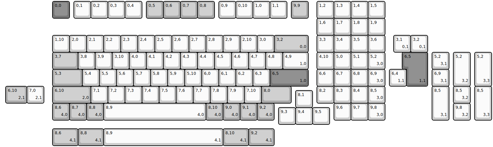{:loading="lazy"}

[Open in keyboard-layout-editor](http://www.keyboard-layout-editor.com/##@@_x:3&c=#777777;&=0,0&_x:0.25&c=#cccccc;&=0,1&=0,2&=0,3&=0,4&_x:0.25&c=#aaaaaa;&=0,5&=0,6&=0,7&=0,8&_x:0.25&c=#cccccc;&=0,9&=0,10&=1,0&=1,1&_x:0.25&c=#aaaaaa;&=9,9&_x:0.5&c=#cccccc;&=1,2&=1,3&=1,4&=1,5;&@_x:18.5;&=1,6&=1,7&=1,8&=1,9;&@_x:3;&=1,10&=2,0&=2,1&=2,2&=2,3&=2,4&=2,5&=2,6&=2,7&=2,8&=2,9&=2,10&=3,0&_c=#aaaaaa&w:2;&=3,2%0A%0A%0A0,0&_x:0.5&c=#cccccc;&=3,3&=3,4&=3,5&=3,6;&@_x:3&c=#aaaaaa&w:1.5;&=3,7&_c=#cccccc;&=3,8&=3,9&=3,10&=4,0&=4,1&=4,2&=4,3&=4,4&=4,5&=4,6&=4,7&=4,8&_w:1.5;&=4,9%0A%0A%0A1,0&_x:0.5;&=4,10&=5,0&=5,1&=5,2%0A%0A%0A3,0;&@_x:3&c=#aaaaaa&w:1.75;&=5,3&_c=#cccccc;&=5,4&=5,5&=5,6&=5,7&=5,8&=5,9&=5,10&=6,0&=6,1&=6,2&=6,3&_c=#777777&w:2.25;&=6,5%0A%0A%0A1,0&_x:0.5&c=#cccccc;&=6,6&=6,7&=6,8&=6,9%0A%0A%0A3,0;&@_x:3.0&c=#aaaaaa&w:2.25;&=6,10%0A%0A%0A2,0&_c=#cccccc;&=7,1&=7,2&=7,3&=7,4&=7,5&=7,6&=7,7&=7,8&=7,9&=7,10&_c=#aaaaaa&w:1.75;&=8,0&_x:1.5&c=#cccccc;&=8,2&=8,3&=8,4&=8,5%0A%0A%0A3,0;&@_x:17.25&y:-0.75;&=8,1;&@_x:3&y:-0.25&c=#aaaaaa;&=8,6%0A%0A%0A4,0&=8,7%0A%0A%0A4,0&=8,8%0A%0A%0A4,0&_c=#cccccc&w:6;&=8,9%0A%0A%0A4,0&_c=#aaaaaa;&=8,10%0A%0A%0A4,0&=9,0%0A%0A%0A4,0&=9,1%0A%0A%0A4,0&=9,2%0A%0A%0A4,0&_x:3.5&c=#cccccc;&=9,6&=9,7&=9,8%0A%0A%0A3,0;&@_x:16.25&y:-0.75;&=9,3&=9,4&=9,5;&@_x:23.0&y:-5.25;&=3,1%0A%0A%0A0,1&=3,2%0A%0A%0A0,1;&@_x:23.75&c=#777777&w:1.25&h:2&w2:1.5&h2:1&x2:-0.25;&=6,5%0A%0A%0A1,1&_x:0.25&c=#cccccc;&=5,2%0A%0A%0A3,1&_x:0.25&h:2;&=5,2%0A%0A%0A3,2&_x:0.25&h:2;&=5,2%0A%0A%0A3,3;&@_x:22.75;&=6,4%0A%0A%0A1,1&_x:1.5;&=6,9%0A%0A%0A3,1;&@_x:0.25&c=#aaaaaa&w:1.25;&=6,10%0A%0A%0A2,1&_c=#cccccc;&=7,0%0A%0A%0A2,1&_x:22.75&h:2;&=8,5%0A%0A%0A3,1&_x:0.25;&=8,5%0A%0A%0A3,2&_x:0.25&h:2;&=8,5%0A%0A%0A3,3;&@_x:26.5;&=9,8%0A%0A%0A3,2;&@_x:3&y:0.5&c=#aaaaaa&w:1.5;&=8,6%0A%0A%0A4,1&_w:1.5;&=8,8%0A%0A%0A4,1&_c=#cccccc&w:7;&=8,9%0A%0A%0A4,1&_c=#aaaaaa&w:1.5;&=8,10%0A%0A%0A4,1&_w:1.5;&=9,2%0A%0A%0A4,1)

## cherrybstudio/cb65

[README](output/cherrybstudio/cb65/README.md) - [layout](output/cherrybstudio/cb65/cb65-kle.json) - [PCB](output/cherrybstudio/cb65/cb65.kicad_pcb) - [PCB render](output/cherrybstudio/cb65/cb65-render.svg)

{:loading="lazy"}

[Open in keyboard-layout-editor](http://www.keyboard-layout-editor.com/##@@_x:2.5&c=#777777;&=0,0&_c=#cccccc;&=0,1&=0,2&=0,3&=0,4&=0,5&=0,6&=0,7&=1,0&=1,1&=1,2&=1,3&=1,4&_c=#aaaaaa&w:2;&=1,6%0A%0A%0A0,0&=1,7;&@_x:2.5&w:1.5;&=2,0&_c=#cccccc;&=2,1&=2,2&=2,3&=2,4&=2,5&=2,6&=2,7&=3,0&=3,1&=3,2&=3,3&=3,4&_w:1.5;&=3,5%0A%0A%0A1,0&_c=#aaaaaa;&=3,6;&@_x:2.5&w:1.75;&=3,7&_c=#cccccc;&=4,0&=4,1&=4,2&=4,3&=4,4&=4,5&=4,6&=4,7&=5,0&=5,1&=5,2&_c=#777777&w:2.25;&=5,4%0A%0A%0A1,0&_c=#aaaaaa;&=5,5;&@_x:2.5&w:2.25;&=5,6%0A%0A%0A2,0&_c=#cccccc;&=6,0&=6,1&=6,2&=6,3&=6,4&=6,5&=6,6&=6,7&=7,0&=7,1&_c=#aaaaaa&w:1.75;&=7,2&_c=#cccccc;&=7,3&_c=#aaaaaa;&=7,4;&@_x:2.5&w:1.25;&=7,5%0A%0A%0A3,0&_w:1.25;&=7,6%0A%0A%0A3,0&_w:1.25;&=7,7%0A%0A%0A3,0&_c=#cccccc&w:6.25;&=8,0%0A%0A%0A3,0&_c=#aaaaaa&w:1.25;&=8,1%0A%0A%0A3,0&_w:1.25;&=8,2%0A%0A%0A3,0&_x:0.5&c=#cccccc;&=8,3&=8,4&=8,5;&@_x:19.0&y:-5;&=1,5%0A%0A%0A0,1&_c=#aaaaaa;&=1,6%0A%0A%0A0,1;&@_x:19.75&c=#777777&w:1.25&h:2&w2:1.5&h2:1&x2:-0.25;&=5,4%0A%0A%0A1,1;&@_x:18.75&c=#cccccc;&=5,3%0A%0A%0A1,1;&@_c=#aaaaaa&w:1.25;&=5,6%0A%0A%0A2,1&_c=#cccccc;&=5,7%0A%0A%0A2,1;&@_x:2.5&y:1&c=#aaaaaa&w:1.5;&=7,5%0A%0A%0A3,1&=7,6%0A%0A%0A3,1&_w:1.5;&=7,7%0A%0A%0A3,1&_c=#cccccc&w:7;&=8,0%0A%0A%0A3,1&_c=#aaaaaa&w:1.5;&=8,2%0A%0A%0A3,1)

## cherrybstudio/cb87

[README](output/cherrybstudio/cb87/README.md) - [layout](output/cherrybstudio/cb87/cb87-kle.json) - [PCB](output/cherrybstudio/cb87/cb87.kicad_pcb) - [PCB render](output/cherrybstudio/cb87/cb87-render.svg)

{:loading="lazy"}

[Open in keyboard-layout-editor](http://www.keyboard-layout-editor.com/##@@_x:2.75&c=#777777;&=0,0&_x:1.0&c=#cccccc;&=0,1&=0,2&=0,3&=0,4&_x:0.5&c=#aaaaaa;&=0,5&=0,6&=0,7&=0,8&_x:0.5&c=#cccccc;&=0,9&=1,0&=1,1&=1,2&_x:0.25&c=#aaaaaa;&=1,3&=1,4&=1,5;&@_x:2.75&y:0.5;&=1,6&_c=#cccccc;&=1,7&=1,8&=1,9&=2,0&=2,1&=2,2&=2,3&=2,4&=2,5&=2,6&=2,7&=2,8&_c=#aaaaaa&w:2;&=2,9&_x:0.25;&=3,0&=3,1&=3,2;&@_x:2.75&w:1.5;&=3,3&_c=#cccccc;&=3,4&=3,5&=3,6&=3,7&=3,8&=3,9&=4,0&=4,1&=4,2&=4,3&=4,4&=4,5&_w:1.5;&=4,6%0A%0A%0A0,0&_x:0.25&c=#aaaaaa;&=4,7&=4,8&=4,9;&@_x:2.75&w:1.75;&=5,0&_c=#cccccc;&=5,1&=5,2&=5,3&=5,4&=5,5&=5,6&=5,7&=5,8&=5,9&=6,0&=6,1&_c=#777777&w:2.25;&=6,3%0A%0A%0A0,0;&@_x:2.75&c=#aaaaaa&w:2.25;&=6,4%0A%0A%0A1,0&_c=#cccccc;&=6,6&=6,7&=6,8&=6,9&=7,0&=7,1&=7,2&=7,3&=7,4&=7,5&_c=#aaaaaa&w:2.75;&=7,6&_x:1.25;&=7,7;&@_x:2.75&w:1.25;&=7,8%0A%0A%0A2,0&_w:1.25;&=7,9%0A%0A%0A2,0&_w:1.25;&=8,0%0A%0A%0A2,0&_c=#cccccc&w:6.25;&=8,1%0A%0A%0A2,0&_c=#aaaaaa&w:1.25;&=8,2%0A%0A%0A2,0&_w:1.25;&=8,3%0A%0A%0A2,0&_w:1.25;&=8,4%0A%0A%0A2,0&_w:1.25;&=8,5%0A%0A%0A2,0&_x:0.25;&=8,6&=8,7&=8,8;&@_x:22.75&y:-4.0&c=#777777&w:1.25&h:2&w2:1.5&h2:1&x2:-0.25;&=6,3%0A%0A%0A0,1;&@_x:21.75&c=#cccccc;&=6,2%0A%0A%0A0,1;&@_c=#aaaaaa&w:1.25;&=6,4%0A%0A%0A1,1&_c=#cccccc;&=6,5%0A%0A%0A1,1;&@_x:2.75&y:1.25&c=#aaaaaa&w:1.5;&=7,8%0A%0A%0A2,1&=7,9%0A%0A%0A2,1&_w:1.5;&=8,0%0A%0A%0A2,1&_c=#cccccc&w:7;&=8,1%0A%0A%0A2,1&_c=#aaaaaa&w:1.5;&=8,2%0A%0A%0A2,1&=8,4%0A%0A%0A2,1&_w:1.5;&=8,5%0A%0A%0A2,1)

## cherrybstudio/cb87rgb

[README](output/cherrybstudio/cb87rgb/README.md) - [layout](output/cherrybstudio/cb87rgb/cb87rgb-kle.json) - [PCB](output/cherrybstudio/cb87rgb/cb87rgb.kicad_pcb) - [PCB render](output/cherrybstudio/cb87rgb/cb87rgb-render.svg)

{:loading="lazy"}

[Open in keyboard-layout-editor](http://www.keyboard-layout-editor.com/##@@_x:2.75&c=#777777;&=0,0&_x:0.25&c=#cccccc;&=0,1&=0,2&=0,3&=0,4&_x:0.25;&=0,5&=0,6&=0,7&=0,8&_x:0.25;&=0,9&=1,0&=1,1&=1,2&_x:0.25;&=9,1&_x:0.25;&=1,3&=1,4&=1,5;&@_x:2.75&y:0.25;&=1,6&=1,7&=1,8&=1,9&=2,0&=2,1&=2,2&=2,3&=2,4&=2,5&=2,6&=2,7&=2,8&_c=#aaaaaa&w:2;&=3,0%0A%0A%0A0,0&_x:0.25&c=#cccccc;&=3,1&=3,2&=3,3;&@_x:2.75&c=#aaaaaa&w:1.5;&=3,4&_c=#cccccc;&=3,5&=3,6&=3,7&=3,8&=3,9&=4,0&=4,1&=4,2&=4,3&=4,4&=4,5&=4,6&_c=#aaaaaa&w:1.5;&=4,7%0A%0A%0A1,0&_x:0.25&c=#cccccc;&=4,8&=4,9&=5,0;&@_x:2.75&c=#aaaaaa&w:1.75;&=5,1&_c=#cccccc;&=5,2&=5,3&=5,4&=5,5&=5,6&=5,7&=5,8&=5,9&=6,0&=6,1&=6,2&_c=#777777&w:2.25;&=6,4%0A%0A%0A1,0;&@_x:2.75&c=#aaaaaa&w:2.25;&=6,5%0A%0A%0A2,0&_c=#cccccc;&=6,7&=6,8&=6,9&=7,0&=7,1&=7,2&=7,3&=7,4&=7,5&=7,6&_c=#aaaaaa&w:2.75;&=7,7%0A%0A%0A3,0&_x:1.25&c=#777777;&=7,9;&@_x:2.75&c=#aaaaaa&w:1.25;&=8,0%0A%0A%0A4,0&_w:1.25;&=8,1%0A%0A%0A4,0&_w:1.25;&=8,2%0A%0A%0A4,0&_c=#cccccc&w:6.25;&=8,3%0A%0A%0A4,0&_c=#aaaaaa&w:1.25;&=8,4%0A%0A%0A4,0&_w:1.25;&=8,5%0A%0A%0A4,0&_w:1.25;&=8,6%0A%0A%0A4,0&_w:1.25;&=8,7%0A%0A%0A4,0&_x:0.25&c=#777777;&=8,8&=8,9&=9,0;&@_x:22.0&y:-5.0&c=#cccccc;&=2,9%0A%0A%0A0,1&=3,0%0A%0A%0A0,1;&@_x:22.75&c=#aaaaaa&w:1.25&h:2&w2:1.5&h2:1&x2:-0.25;&=6,4%0A%0A%0A1,1;&@_x:21.75&c=#cccccc;&=6,3%0A%0A%0A1,1;&@_c=#aaaaaa&w:1.25;&=6,5%0A%0A%0A2,1&=6,6%0A%0A%0A2,1&_x:19.0&w:1.75;&=7,7%0A%0A%0A3,1&=7,8%0A%0A%0A3,1;&@_x:2.75&y:1.25&w:1.5;&=8,0%0A%0A%0A4,1&=8,1%0A%0A%0A4,1&_w:1.5;&=8,2%0A%0A%0A4,1&_c=#cccccc&w:7;&=8,3%0A%0A%0A4,1&_c=#aaaaaa&w:1.5;&=8,5%0A%0A%0A4,1&=8,6%0A%0A%0A4,1&_w:1.5;&=8,7%0A%0A%0A4,1)

## cherrybstudio/cb87v2

[README](output/cherrybstudio/cb87v2/README.md) - [layout](output/cherrybstudio/cb87v2/cb87v2-kle.json) - [PCB](output/cherrybstudio/cb87v2/cb87v2.kicad_pcb) - [PCB render](output/cherrybstudio/cb87v2/cb87v2-render.svg)

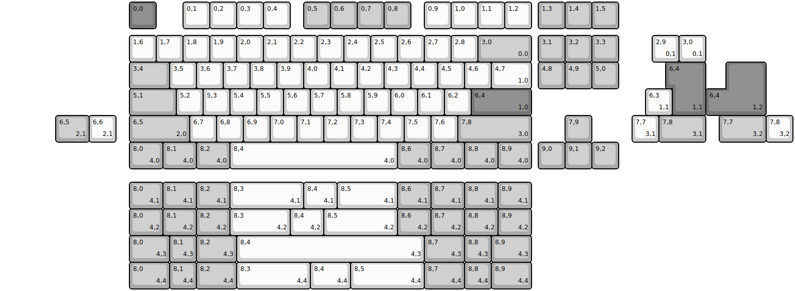{:loading="lazy"}

[Open in keyboard-layout-editor](http://www.keyboard-layout-editor.com/##@@_x:4.75&c=#777777;&=0,0&_x:1.0&c=#cccccc;&=0,1&=0,2&=0,3&=0,4&_x:0.5&c=#aaaaaa;&=0,5&=0,6&=0,7&=0,8&_x:0.5&c=#cccccc;&=0,9&=1,0&=1,1&=1,2&_x:0.25&c=#aaaaaa;&=1,3&=1,4&=1,5;&@_x:4.75&y:0.25&c=#cccccc;&=1,6&=1,7&=1,8&=1,9&=2,0&=2,1&=2,2&=2,3&=2,4&=2,5&=2,6&=2,7&=2,8&_c=#aaaaaa&w:2;&=3,0%0A%0A%0A0,0&_x:0.25;&=3,1&=3,2&=3,3;&@_x:4.75&w:1.5;&=3,4&_c=#cccccc;&=3,5&=3,6&=3,7&=3,8&=3,9&=4,0&=4,1&=4,2&=4,3&=4,4&=4,5&=4,6&_w:1.5;&=4,7%0A%0A%0A1,0&_x:0.25&c=#aaaaaa;&=4,8&=4,9&=5,0;&@_x:4.75&w:1.75;&=5,1&_c=#cccccc;&=5,2&=5,3&=5,4&=5,5&=5,6&=5,7&=5,8&=5,9&=6,0&=6,1&=6,2&_c=#777777&w:2.25;&=6,4%0A%0A%0A1,0;&@_x:4.75&c=#aaaaaa&w:2.25;&=6,5%0A%0A%0A2,0&_c=#cccccc;&=6,7&=6,8&=6,9&=7,0&=7,1&=7,2&=7,3&=7,4&=7,5&=7,6&_c=#aaaaaa&w:2.75;&=7,8%0A%0A%0A3,0&_x:1.25;&=7,9;&@_x:4.75&w:1.25;&=8,0%0A%0A%0A4,0&_w:1.25;&=8,1%0A%0A%0A4,0&_w:1.25;&=8,2%0A%0A%0A4,0&_c=#cccccc&w:6.25;&=8,4%0A%0A%0A4,0&_c=#aaaaaa&w:1.25;&=8,6%0A%0A%0A4,0&_w:1.25;&=8,7%0A%0A%0A4,0&_w:1.25;&=8,8%0A%0A%0A4,0&_w:1.25;&=8,9%0A%0A%0A4,0&_x:0.25;&=9,0&=9,1&=9,2;&@_x:24.25&y:-5.0&c=#cccccc;&=2,9%0A%0A%0A0,1&=3,0%0A%0A%0A0,1;&@_x:25.0&c=#777777&w:1.25&h:2&w2:1.5&h2:1&x2:-0.25;&=6,4%0A%0A%0A1,1&_x:0.75&w:1.5&h:2&w2:2.25&h2:1&x2:-0.75&y2:1;&=6,4%0A%0A%0A1,2;&@_x:24.0&c=#cccccc;&=6,3%0A%0A%0A1,1;&@_x:2&c=#aaaaaa&w:1.25;&=6,5%0A%0A%0A2,1&_c=#cccccc;&=6,6%0A%0A%0A2,1&_x:19.25;&=7,7%0A%0A%0A3,1&_c=#aaaaaa&w:1.75;&=7,8%0A%0A%0A3,1&_x:0.5&w:1.75;&=7,7%0A%0A%0A3,2&_c=#cccccc;&=7,8%0A%0A%0A3,2;&@_x:4.75&y:1.5&c=#aaaaaa&w:1.25;&=8,0%0A%0A%0A4,1&_w:1.25;&=8,1%0A%0A%0A4,1&_w:1.25;&=8,2%0A%0A%0A4,1&_c=#cccccc&w:2.75;&=8,3%0A%0A%0A4,1&_w:1.25;&=8,4%0A%0A%0A4,1&_w:2.25;&=8,5%0A%0A%0A4,1&_c=#aaaaaa&w:1.25;&=8,6%0A%0A%0A4,1&_w:1.25;&=8,7%0A%0A%0A4,1&_w:1.25;&=8,8%0A%0A%0A4,1&_w:1.25;&=8,9%0A%0A%0A4,1;&@_x:4.75&w:1.25;&=8,0%0A%0A%0A4,2&_w:1.25;&=8,1%0A%0A%0A4,2&_w:1.25;&=8,2%0A%0A%0A4,2&_c=#cccccc&w:2.25;&=8,3%0A%0A%0A4,2&_w:1.25;&=8,4%0A%0A%0A4,2&_w:2.75;&=8,5%0A%0A%0A4,2&_c=#aaaaaa&w:1.25;&=8,6%0A%0A%0A4,2&_w:1.25;&=8,7%0A%0A%0A4,2&_w:1.25;&=8,8%0A%0A%0A4,2&_w:1.25;&=8,9%0A%0A%0A4,2;&@_x:4.75&w:1.5;&=8,0%0A%0A%0A4,3&=8,1%0A%0A%0A4,3&_w:1.5;&=8,2%0A%0A%0A4,3&_c=#cccccc&w:7;&=8,4%0A%0A%0A4,3&_c=#aaaaaa&w:1.5;&=8,7%0A%0A%0A4,3&=8,8%0A%0A%0A4,3&_w:1.5;&=8,9%0A%0A%0A4,3;&@_x:4.75&w:1.5;&=8,0%0A%0A%0A4,4&=8,1%0A%0A%0A4,4&_w:1.5;&=8,2%0A%0A%0A4,4&_c=#cccccc&w:2.75;&=8,3%0A%0A%0A4,4&_w:1.5;&=8,4%0A%0A%0A4,4&_w:2.75;&=8,5%0A%0A%0A4,4&_c=#aaaaaa&w:1.5;&=8,7%0A%0A%0A4,4&=8,8%0A%0A%0A4,4&_w:1.5;&=8,9%0A%0A%0A4,4)

## chickenman/ciel

[README](output/chickenman/ciel/README.md) - [layout](output/chickenman/ciel/ciel-kle.json) - [PCB](output/chickenman/ciel/ciel.kicad_pcb) - [PCB render](output/chickenman/ciel/ciel-render.svg)

{:loading="lazy"}

[Open in keyboard-layout-editor](http://www.keyboard-layout-editor.com/##@@_y:1.25&c=#777777;&=0,0&_c=#cccccc;&=0,1&=0,2&=0,3&=0,4&=0,5&=0,6&=0,7&=0,8&=0,9&=0,10&=0,11&=0,12&_c=#aaaaaa&w:2;&=0,13%0A%0A%0A0,0;&@_w:1.5;&=1,0&_c=#cccccc;&=1,1&=1,2&=1,3&=1,4&=1,5&=1,6&=1,7&=1,8&=1,9&=1,10&=1,11&=1,12&_c=#aaaaaa&w:1.5;&=1,14;&@_w:1.75;&=2,0&_c=#cccccc;&=2,1&=2,2&=2,3&=2,4&=2,5&=2,6&=2,7&=2,8&=2,9&=2,10&=2,11&_c=#777777&w:2.25;&=2,13;&@_c=#aaaaaa&w:2.25;&=3,0&_c=#cccccc;&=3,2&=3,3&=3,4&=3,5&=3,6&=3,7&=3,8&=3,9&=3,10&=3,11&_c=#aaaaaa&w:2.75;&=3,13%0A%0A%0A1,0;&@_w:1.25;&=4,0%0A%0A%0A2,0&_w:1.25;&=4,1%0A%0A%0A2,0&_w:1.25;&=4,2%0A%0A%0A2,0&_w:6.25;&=4,7%0A%0A%0A2,0&_w:1.25;&=4,10%0A%0A%0A2,0&_w:1.25;&=4,11%0A%0A%0A2,0&_w:1.25;&=4,13%0A%0A%0A2,0&_w:1.25;&=4,14%0A%0A%0A2,0;&@_x:13&y:-6.25&c=#cccccc;&=0,13%0A%0A%0A0,1&=0,14%0A%0A%0A0,1;&@_x:15.25&y:3.25&c=#aaaaaa&w:1.75;&=3,13%0A%0A%0A1,1&=3,14%0A%0A%0A1,1;&@_y:1.25&w:1.5;&=4,0%0A%0A%0A2,1&=4,1%0A%0A%0A2,1&_w:1.5;&=4,2%0A%0A%0A2,1&_w:7;&=4,7%0A%0A%0A2,1&_w:1.5;&=4,11%0A%0A%0A2,1&=4,13%0A%0A%0A2,1&_w:1.5;&=4,14%0A%0A%0A2,1)

## chickenman/ciel/ciel65

[README](output/chickenman/ciel/README.md) - [layout](output/chickenman/ciel/ciel65-kle.json) - [PCB](output/chickenman/ciel/ciel65.kicad_pcb) - [PCB render](output/chickenman/ciel/ciel65-render.svg)

{:loading="lazy"}

[Open in keyboard-layout-editor](http://www.keyboard-layout-editor.com/##@@_c=#777777;&=0,0&_c=#cccccc;&=0,1&=0,2&=0,3&=0,4&=0,5&=0,6&=0,7&=0,8&=0,9&=0,10&=0,11&=0,12&_c=#aaaaaa&w:2;&=0,13%0A%0A%0A0,0&_c=#cccccc;&=0,15;&@_c=#aaaaaa&w:1.5;&=1,0&_c=#cccccc;&=1,1&=1,2&=1,3&=1,4&=1,5&=1,6&=1,7&=1,8&=1,9&=1,10&=1,11&=1,12&_w:1.5;&=1,13&=1,15;&@_c=#aaaaaa&w:1.75;&=2,0&_c=#cccccc;&=2,1&=2,2&=2,3&=2,4&=2,5&=2,6&=2,7&=2,8&=2,9&=2,10&=2,11&_c=#777777&w:2.25;&=2,13&_c=#cccccc;&=2,15;&@_c=#aaaaaa&w:2.25;&=3,0&_c=#cccccc;&=3,2&=3,3&=3,4&=3,5&=3,6&=3,7&=3,8&=3,9&=3,10&=3,11&_c=#aaaaaa&w:1.75;&=3,12&_c=#777777;&=3,13&_c=#cccccc;&=3,15;&@_c=#aaaaaa&w:1.25;&=4,0%0A%0A%0A1,0&_w:1.25;&=4,1%0A%0A%0A1,0&_w:1.25;&=4,2%0A%0A%0A1,0&_c=#cccccc&w:6.25;&=4,6%0A%0A%0A1,0&_c=#aaaaaa&w:1.25;&=4,9%0A%0A%0A1,0&_w:1.25;&=4,11%0A%0A%0A1,0&_x:0.5&c=#777777;&=4,12&=4,13&=4,15;&@_x:16.75&y:-5&c=#cccccc;&=0,13%0A%0A%0A0,1&=0,14%0A%0A%0A0,1;&@_rx:0.25&x:-0.25&y:5.25&c=#aaaaaa&w:1.5;&=4,0%0A%0A%0A1,1&=4,1%0A%0A%0A1,1&_w:1.5;&=4,2%0A%0A%0A1,1&_c=#cccccc&w:7;&=4,6%0A%0A%0A1,1&_c=#aaaaaa&w:1.5;&=4,11%0A%0A%0A1,1)

## chlx/merro60

[README](output/chlx/merro60/README.md) - [layout](output/chlx/merro60/merro60-kle.json) - [PCB](output/chlx/merro60/merro60.kicad_pcb) - [PCB render](output/chlx/merro60/merro60-render.svg)

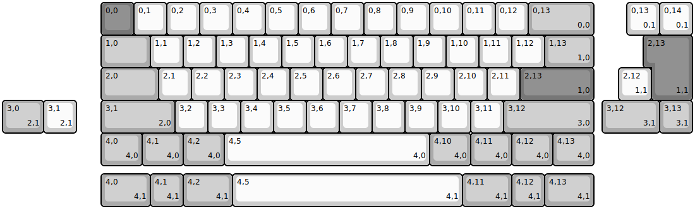{:loading="lazy"}

[Open in keyboard-layout-editor](http://www.keyboard-layout-editor.com/##@@_x:3&c=#777777;&=0,0&_c=#cccccc;&=0,1&=0,2&=0,3&=0,4&=0,5&=0,6&=0,7&=0,8&=0,9&=0,10&=0,11&=0,12&_c=#aaaaaa&w:2;&=0,13%0A%0A%0A0,0;&@_x:3&w:1.5;&=1,0&_c=#cccccc;&=1,1&=1,2&=1,3&=1,4&=1,5&=1,6&=1,7&=1,8&=1,9&=1,10&=1,11&=1,12&_c=#aaaaaa&w:1.5;&=1,13%0A%0A%0A1,0;&@_x:3&w:1.75;&=2,0&_c=#cccccc;&=2,1&=2,2&=2,3&=2,4&=2,5&=2,6&=2,7&=2,8&=2,9&=2,10&=2,11&_c=#777777&w:2.25;&=2,13%0A%0A%0A1,0;&@_x:3.0&c=#aaaaaa&w:2.25;&=3,1%0A%0A%0A2,0&_c=#cccccc;&=3,2&=3,3&=3,4&=3,5&=3,6&=3,7&=3,8&=3,9&=3,10&=3,11&_c=#aaaaaa&w:2.75;&=3,12%0A%0A%0A3,0;&@_x:3&w:1.25;&=4,0%0A%0A%0A4,0&_w:1.25;&=4,1%0A%0A%0A4,0&_w:1.25;&=4,2%0A%0A%0A4,0&_c=#cccccc&w:6.25;&=4,5%0A%0A%0A4,0&_c=#aaaaaa&w:1.25;&=4,10%0A%0A%0A4,0&_w:1.25;&=4,11%0A%0A%0A4,0&_w:1.25;&=4,12%0A%0A%0A4,0&_w:1.25;&=4,13%0A%0A%0A4,0;&@_x:19&y:-5&c=#cccccc;&=0,13%0A%0A%0A0,1&=0,14%0A%0A%0A0,1;&@_x:19.75&c=#777777&w:1.25&h:2&w2:1.5&h2:1&x2:-0.25;&=2,13%0A%0A%0A1,1;&@_x:18.75&c=#cccccc;&=2,12%0A%0A%0A1,1;&@_c=#aaaaaa&w:1.25;&=3,0%0A%0A%0A2,1&_c=#cccccc;&=3,1%0A%0A%0A2,1&_x:16.0&c=#aaaaaa&w:1.75;&=3,12%0A%0A%0A3,1&=3,13%0A%0A%0A3,1;&@_x:3&y:1.25&w:1.5;&=4,0%0A%0A%0A4,1&=4,1%0A%0A%0A4,1&_w:1.5;&=4,2%0A%0A%0A4,1&_c=#cccccc&w:7;&=4,5%0A%0A%0A4,1&_c=#aaaaaa&w:1.5;&=4,11%0A%0A%0A4,1&=4,12%0A%0A%0A4,1&_w:1.5;&=4,13%0A%0A%0A4,1)

## chlx/str_merro60

[README](output/chlx/str_merro60/README.md) - [layout](output/chlx/str_merro60/str_merro60-kle.json) - [PCB](output/chlx/str_merro60/str_merro60.kicad_pcb) - [PCB render](output/chlx/str_merro60/str_merro60-render.svg)

{:loading="lazy"}

[Open in keyboard-layout-editor](http://www.keyboard-layout-editor.com/##@@_x:3&c=#777777;&=0,0&_c=#cccccc;&=1,0&=0,1&=1,1&=0,2&=1,2&=0,3&=1,3&=0,4&=1,4&=0,5&=1,5&=0,6&=1,6%0A%0A%0A0,0&=9,6%0A%0A%0A0,0;&@_x:3&c=#aaaaaa&w:1.5;&=2,0&_c=#cccccc;&=3,0&=2,1&=3,1&=2,2&=3,2&=2,3&=3,3&=2,4&=3,4&=2,5&=3,5&=2,6&_c=#aaaaaa&w:1.5;&=3,6%0A%0A%0A1,0;&@_x:3&w:1.75;&=4,0&_c=#cccccc;&=5,0&=4,1&=5,1&=4,2&=5,2&=4,3&=5,3&=4,4&=5,4&=4,5&=5,5&_c=#777777&w:2.25;&=5,6%0A%0A%0A1,0;&@_x:3.0&c=#aaaaaa&w:1.25;&=6,0%0A%0A%0A2,0&_c=#cccccc;&=7,0%0A%0A%0A2,0&=6,1&=7,1&=6,2&=7,2&=6,3&=7,3&=6,4&=7,4&=6,5&=7,5&_w:1.75;&=6,6%0A%0A%0A3,0&=7,6%0A%0A%0A3,0;&@_x:3&c=#aaaaaa&w:1.25;&=8,0%0A%0A%0A4,0&_w:1.25;&=9,0%0A%0A%0A4,0&_w:1.25;&=8,2%0A%0A%0A4,0&_c=#cccccc&w:6.25;&=9,2%0A%0A%0A4,0&_c=#aaaaaa&w:1.25;&=9,4%0A%0A%0A4,0&_w:1.25;&=8,5%0A%0A%0A4,0&_w:1.25;&=9,5%0A%0A%0A4,0&_w:1.25;&=8,6%0A%0A%0A4,0;&@_x:18&y:-5&w:2;&=1,6%0A%0A%0A0,1;&@_x:19.75&c=#777777&w:1.25&h:2&w2:1.5&h2:1&x2:-0.25;&=5,6%0A%0A%0A1,1;&@_x:18.75&c=#cccccc;&=4,6%0A%0A%0A1,1;&@_x:0.75&c=#aaaaaa&w:2.25;&=6,0%0A%0A%0A2,1&_x:15.0&w:2.75;&=6,6%0A%0A%0A3,1;&@_x:3&y:1.25&w:1.5;&=8,0%0A%0A%0A4,1&=9,0%0A%0A%0A4,1&_w:1.5;&=8,2%0A%0A%0A4,1&_c=#cccccc&w:7;&=9,2%0A%0A%0A4,1&_c=#aaaaaa&w:1.5;&=8,5%0A%0A%0A4,1&=9,5%0A%0A%0A4,1&_w:1.5;&=8,6%0A%0A%0A4,1)

## choc_taro/choc_taro

[README](output/choc_taro/README.md) - [layout](output/choc_taro/choc_taro-kle.json) - [PCB](output/choc_taro/choc_taro.kicad_pcb) - [PCB render](output/choc_taro/choc_taro-render.svg)

{:loading="lazy"}

[Open in keyboard-layout-editor](http://www.keyboard-layout-editor.com/##@@_c=#777777;&=8,0&_c=#cccccc;&=9,0&=10,0&=11,0&=12,0&=13,0&=14,0&=15,0&=0,0&=1,0&=2,0&=3,0&=4,0&_c=#aaaaaa&w:2;&=5,0%0A%0A%0A0,0;&@_w:1.5;&=8,1&_c=#cccccc;&=9,1&=10,1&=11,1&=12,1&=13,1&=14,1&=15,1&=0,1&=1,1&=2,1&=3,1&=4,1&_w:1.5;&=5,1%0A%0A%0A1,0;&@_c=#aaaaaa&w:1.75;&=8,2&_c=#cccccc;&=9,2&=10,2&=11,2&=12,2&=13,2&=14,2&=15,2&=0,2&=1,2&=2,2&=3,2&_c=#777777&w:2.25;&=4,2%0A%0A%0A1,0;&@_c=#aaaaaa&w:2.25;&=8,3&_c=#cccccc;&=9,3&=10,3&=11,3&=12,3&=13,3&=14,3&=15,3&=0,3&=1,3&=2,3&_c=#aaaaaa&w:2.75;&=3,3%0A%0A%0A2,0;&@_x:1.25&w:1.25;&=8,4&_w:1.25;&=9,4&_w:2.25;&=10,4&_c=#cccccc&w:1.25;&=11,4&_c=#aaaaaa&w:2.75;&=12,4&_w:1.25;&=13,4&_w:1.25;&=14,4&_w:1.25;&=15,4;&@_x:15&y:-5&c=#cccccc;&=5,0%0A%0A%0A0,1&=6,0%0A%0A%0A0,1;&@_x:16.75&c=#777777&w:1.25&h:2&w2:1.5&h2:1&x2:-0.25;&=5,1%0A%0A%0A1,1;&@_x:15.75&c=#cccccc;&=4,2%0A%0A%0A1,1;&@_x:15.0&c=#aaaaaa&w:1.75;&=3,3%0A%0A%0A2,1&=4,3%0A%0A%0A2,1&=3,3%0A%0A%0A2,2&_w:1.75;&=4,3%0A%0A%0A2,2)

## cipulot/kallos

[README](output/cipulot/kallos/README.md) - [layout](output/cipulot/kallos/kallos-kle.json) - [PCB](output/cipulot/kallos/kallos.kicad_pcb) - [PCB render](output/cipulot/kallos/kallos-render.svg)

{:loading="lazy"}

[Open in keyboard-layout-editor](http://www.keyboard-layout-editor.com/##@@_c=#777777;&=0,0&_x:0.25&c=#cccccc;&=0,1&=0,2&=0,3&=0,4&_x:0.25;&=0,5&=0,6&=0,7&=0,8&_x:0.25;&=0,9&=0,10&=0,11&=0,12&_x:0.25;&=0,13&_x:0.25;&=0,14;&@_y:0.25;&=1,0&=1,1&=1,2&=1,3&=1,4&=1,5&=1,6&=1,7&=1,8&=1,9&=1,10&=1,11&=1,12&_c=#aaaaaa&w:2;&=1,14%0A%0A%0A0,0&_x:0.25&c=#cccccc;&=2,14;&@_c=#aaaaaa&w:1.5;&=2,0&_c=#cccccc;&=2,1&=2,2&=2,3&=2,4&=2,5&=2,6&=2,7&=2,8&=2,9&=2,10&=2,11&=2,12&_w:1.5;&=2,13&_x:0.25;&=3,14;&@_c=#aaaaaa&w:1.75;&=3,0&_c=#cccccc;&=3,1&=3,2&=3,3&=3,4&=3,5&=3,6&=3,7&=3,8&=3,9&=3,10&=3,11&_c=#777777&w:2.25;&=3,13;&@_c=#aaaaaa&w:2.25;&=4,0&_c=#cccccc;&=4,1&=4,2&=4,3&=4,4&=4,5&=4,6&=4,7&=4,8&=4,9&=4,10&_c=#aaaaaa&w:1.75;&=4,12;&@_x:14.25&y:-0.75&c=#cccccc;&=4,13;&@_y:-0.25&c=#aaaaaa&w:1.25;&=5,0&_x:0.88&w:1.25;&=5,1&_w:6.25;&=5,6&_w:1.25;&=5,9&_x:0.87&w:1.25;&=5,10;&@_x:13.25&y:-0.75&c=#cccccc;&=5,12&=5,13&=5,14;&@_x:17.0&y:-5.25;&=1,13%0A%0A%0A0,1&=1,14%0A%0A%0A0,1)

## claw44/claw44

[README](output/claw44/README.md) - [layout](output/claw44/claw44-kle.json) - [PCB](output/claw44/claw44.kicad_pcb) - [PCB render](output/claw44/claw44-render.svg)

{:loading="lazy"}

[Open in keyboard-layout-editor](http://www.keyboard-layout-editor.com/##@@=0,0&=0,1&=0,2&=0,3&=0,4&=0,5&_x:1;&=4,5&=4,4&=4,3&=4,2&=4,1&=4,0;&@=1,0&=1,1&=1,2&=1,3&=1,4&=1,5&_x:1;&=5,5&=5,4&=5,3&=5,2&=5,1&=5,0;&@=2,0&=2,1&=2,2&=2,3&=2,4&=2,5&_x:1;&=6,5&=6,4&=6,3&=6,2&=6,1&=6,0;&@_x:1.75;&=3,2&=3,3&_w:1.25;&=3,4&=3,5&_x:1.0;&=7,5&_w:1.25;&=7,4&=7,3&=7,2)

## clueboard/66/clueboard66rev1

[README](output/clueboard/66/README.md) - [layout](output/clueboard/66/clueboard66rev1-kle.json) - [PCB](output/clueboard/66/clueboard66rev1.kicad_pcb) - [PCB render](output/clueboard/66/clueboard66rev1-render.svg)

{:loading="lazy"}

[Open in keyboard-layout-editor](http://www.keyboard-layout-editor.com/##@@_x:2.5&c=#777777;&=0,0&_c=#cccccc;&=0,1&=0,2&=0,3&=0,4&=0,5&=0,6&=0,7&=0,8&=0,9&=0,10&=0,11&=0,12&_c=#aaaaaa&w:2;&=0,14%0A%0A%0A0,0&_x:0.5;&=0,15;&@_x:2.5&w:1.5;&=1,0&_c=#cccccc;&=1,1&=1,2&=1,3&=1,4&=1,5&=1,6&=1,7&=1,8&=1,9&=1,10&=1,11&=1,12&_w:1.5;&=1,13%0A%0A%0A1,0&_x:0.5&c=#aaaaaa;&=1,15;&@_x:2.5&w:1.75;&=2,0&_c=#cccccc;&=2,1&=2,2&=2,3&=2,4&=2,5&=2,6&=2,7&=2,8&=2,9&=2,10&=2,11&_c=#777777&w:2.25;&=2,13%0A%0A%0A1,0;&@_x:2.5&c=#aaaaaa&w:2.25;&=3,0%0A%0A%0A2,0&_c=#cccccc;&=3,2&=3,3&=3,4&=3,5&=3,6&=3,7&=3,8&=3,9&=3,10&=3,11&_c=#aaaaaa&w:2.25;&=3,13%0A%0A%0A3,0&_c=#777777;&=3,14;&@_x:2.5&c=#aaaaaa&w:1.25;&=4,0%0A%0A%0A4,0&_w:1.25;&=4,1%0A%0A%0A4,0&_w:1.25;&=4,2%0A%0A%0A4,0&_c=#cccccc&w:6.25;&=4,6%0A%0A%0A4,0&_c=#aaaaaa&w:1.25;&=4,10%0A%0A%0A4,0&=4,11%0A%0A%0A4,0&_w:1.25;&=4,12%0A%0A%0A4,0&_c=#777777;&=4,13&=4,14&=4,15;&@_x:19.5&y:-5&c=#cccccc;&=0,13%0A%0A%0A0,1&_c=#aaaaaa;&=0,14%0A%0A%0A0,1;&@_x:20.25&c=#777777&w:1.25&h:2&w2:1.5&h2:1&x2:-0.25;&=2,13%0A%0A%0A1,1;&@_x:19.25&c=#cccccc;&=2,12%0A%0A%0A1,1;&@_c=#aaaaaa&w:1.25;&=3,0%0A%0A%0A2,1&_c=#cccccc;&=3,1%0A%0A%0A2,1&_x:17.0&c=#aaaaaa&w:1.25;&=3,12%0A%0A%0A3,1&=3,13%0A%0A%0A3,1;&@_x:2.5&y:1&w:1.25;&=4,0%0A%0A%0A4,1&=4,1%0A%0A%0A4,1&_w:1.25;&=4,2%0A%0A%0A4,1&_c=#cccccc&w:6.25;&=4,6%0A%0A%0A4,1&_c=#aaaaaa&w:1.25;&=4,10%0A%0A%0A4,1&_w:1.25;&=4,11%0A%0A%0A4,1&_w:1.25;&=4,12%0A%0A%0A4,1;&@_x:2.5&w:1.25;&=4,0%0A%0A%0A4,2&_w:1.25;&=4,1%0A%0A%0A4,2&_w:1.25;&=4,2%0A%0A%0A4,2&_c=#cccccc&w:6.25;&=4,6%0A%0A%0A4,2&_c=#aaaaaa&w:1.25;&=4,10%0A%0A%0A4,2&_w:1.25;&=4,11%0A%0A%0A4,2&=4,12%0A%0A%0A4,2;&@_x:2.5&w:1.25&d:true;&=%0A%0A%0A4,3&=4,1%0A%0A%0A4,3&_w:1.25;&=4,2%0A%0A%0A4,3&_c=#cccccc&w:6.25;&=4,6%0A%0A%0A4,3&_c=#aaaaaa&w:1.25;&=4,10%0A%0A%0A4,3&=4,11%0A%0A%0A4,3&_w:1.5&d:true;&=%0A%0A%0A4,3;&@_x:2.5&w:1.25;&=4,0%0A%0A%0A4,4&_w:1.25;&=4,1%0A%0A%0A4,4&_w:1.25;&=4,2%0A%0A%0A4,4&_c=#cccccc&w:6;&=4,6%0A%0A%0A4,4&_c=#aaaaaa&w:1.25;&=4,10%0A%0A%0A4,4&_w:1.25;&=4,11%0A%0A%0A4,4&_w:1.25;&=4,12%0A%0A%0A4,4;&@_x:2.5&w:1.25;&=4,0%0A%0A%0A4,5&=4,1%0A%0A%0A4,5&_w:1.25;&=4,2%0A%0A%0A4,5&_w:1.25;&=4,3%0A%0A%0A4,5&_c=#cccccc&w:4;&=4,6%0A%0A%0A4,5&_c=#aaaaaa&w:1.25;&=4,9%0A%0A%0A4,5&_w:1.25;&=4,10%0A%0A%0A4,5&=4,11%0A%0A%0A4,5&_w:1.25;&=4,12%0A%0A%0A4,5;&@_x:2.5&w:1.25;&=4,0%0A%0A%0A4,6&=4,1%0A%0A%0A4,6&_w:1.25;&=4,2%0A%0A%0A4,6&_w:1.25;&=4,3%0A%0A%0A4,6&_c=#cccccc&w:2;&=4,5%0A%0A%0A4,6&_w:2;&=4,6%0A%0A%0A4,6&_c=#aaaaaa&w:1.25;&=4,9%0A%0A%0A4,6&_w:1.25;&=4,10%0A%0A%0A4,6&=4,11%0A%0A%0A4,6&_w:1.25;&=4,12%0A%0A%0A4,6;&@_x:2.5&w:2.25&d:true;&=%0A%0A%0A4,7&_w:1.25;&=4,2%0A%0A%0A4,7&_w:1.25;&=4,3%0A%0A%0A4,7&_c=#cccccc&w:4;&=4,6%0A%0A%0A4,7&_c=#aaaaaa&w:1.25;&=4,9%0A%0A%0A4,7&_w:1.25;&=4,10%0A%0A%0A4,7&_w:2.25&d:true;&=%0A%0A%0A4,7;&@_x:2.5&w:1.25;&=4,0%0A%0A%0A4,8&=4,1%0A%0A%0A4,8&_w:1.25;&=4,2%0A%0A%0A4,8&_c=#cccccc&w:6.5;&=4,6%0A%0A%0A4,8&_c=#aaaaaa&w:1.25;&=4,10%0A%0A%0A4,8&=4,11%0A%0A%0A4,8&_w:1.25;&=4,12%0A%0A%0A4,8;&@_x:2.5&w:1.25;&=4,0%0A%0A%0A4,9&_d:true;&=%0A%0A%0A4,9&_w:1.25;&=4,2%0A%0A%0A4,9&_c=#cccccc&w:6.5;&=4,6%0A%0A%0A4,9&_c=#aaaaaa&w:1.25;&=4,10%0A%0A%0A4,9&_d:true;&=%0A%0A%0A4,9&_w:1.25;&=4,12%0A%0A%0A4,9)

## clueboard/66/clueboard66rev2

[README](output/clueboard/66/README.md) - [layout](output/clueboard/66/clueboard66rev2-kle.json) - [PCB](output/clueboard/66/clueboard66rev2.kicad_pcb) - [PCB render](output/clueboard/66/clueboard66rev2-render.svg)

{:loading="lazy"}

[Open in keyboard-layout-editor](http://www.keyboard-layout-editor.com/##@@_x:2.5&c=#777777;&=0,0&_c=#cccccc;&=0,1&=0,2&=0,3&=0,4&=0,5&=0,6&=0,7&=5,0&=5,1&=5,2&=5,3&=5,4&_c=#aaaaaa&w:2;&=5,6%0A%0A%0A0,0&_x:0.5;&=5,7;&@_x:2.5&w:1.5;&=1,0&_c=#cccccc;&=1,1&=1,2&=1,3&=1,4&=1,5&=1,6&=1,7&=6,0&=6,1&=6,2&=6,3&=6,4&_c=#aaaaaa&w:1.5;&=6,5%0A%0A%0A1,0&_x:0.5;&=6,7;&@_x:2.5&w:1.75;&=2,0&_c=#cccccc;&=2,1&=2,2&=2,3&=2,4&=2,5&=2,6&=2,7&=7,0&=7,1&=7,2&=7,3&_c=#777777&w:2.25;&=7,5%0A%0A%0A1,0;&@_x:2.5&c=#aaaaaa&w:2.25;&=3,0%0A%0A%0A2,0&_c=#cccccc;&=3,2&=3,3&=3,4&=3,5&=3,6&=3,7&=8,0&=8,1&=8,2&=8,3&_c=#aaaaaa&w:2.25;&=8,5%0A%0A%0A3,0&_c=#777777;&=8,6;&@_x:2.5&c=#aaaaaa&w:1.25;&=4,0%0A%0A%0A4,0&_w:1.25;&=4,1%0A%0A%0A4,0&_w:1.25;&=4,2%0A%0A%0A4,0&_c=#cccccc&w:6.25;&=4,6%0A%0A%0A4,0&_c=#aaaaaa&w:1.25;&=9,2%0A%0A%0A4,0&=9,3%0A%0A%0A4,0&_w:1.25;&=9,4%0A%0A%0A4,0&_c=#777777;&=9,5&=9,6&=9,7;&@_x:19.5&y:-5&c=#cccccc;&=5,5%0A%0A%0A0,1&_c=#aaaaaa;&=5,6%0A%0A%0A0,1;&@_x:20.25&c=#777777&w:1.25&h:2&w2:1.5&h2:1&x2:-0.25;&=7,5%0A%0A%0A1,1;&@_x:19.25&c=#cccccc;&=7,4%0A%0A%0A1,1;&@_c=#aaaaaa&w:1.25;&=3,0%0A%0A%0A2,1&_c=#cccccc;&=3,1%0A%0A%0A2,1&_x:17.0&c=#aaaaaa&w:1.25;&=8,4%0A%0A%0A3,1&=8,5%0A%0A%0A3,1;&@_x:2.5&y:1&w:1.25;&=4,0%0A%0A%0A4,1&=4,1%0A%0A%0A4,1&_w:1.25;&=4,2%0A%0A%0A4,1&_c=#cccccc&w:6.25;&=4,6%0A%0A%0A4,1&_c=#aaaaaa&w:1.25;&=9,2%0A%0A%0A4,1&_w:1.25;&=9,3%0A%0A%0A4,1&_w:1.25;&=9,4%0A%0A%0A4,1;&@_x:2.5&w:1.25;&=4,0%0A%0A%0A4,2&_w:1.25;&=4,1%0A%0A%0A4,2&_w:1.25;&=4,2%0A%0A%0A4,2&_c=#cccccc&w:6.25;&=4,6%0A%0A%0A4,2&_c=#aaaaaa&w:1.25;&=9,2%0A%0A%0A4,2&_w:1.25;&=9,3%0A%0A%0A4,2&=9,4%0A%0A%0A4,2;&@_x:2.5&w:1.25&d:true;&=%0A%0A%0A4,3&=4,1%0A%0A%0A4,3&_w:1.25;&=4,2%0A%0A%0A4,3&_c=#cccccc&w:6.25;&=4,6%0A%0A%0A4,3&_c=#aaaaaa&w:1.25;&=9,2%0A%0A%0A4,3&=9,3%0A%0A%0A4,3&_w:1.5&d:true;&=%0A%0A%0A4,3;&@_x:2.5&w:1.25;&=4,0%0A%0A%0A4,4&_w:1.25;&=4,1%0A%0A%0A4,4&_w:1.25;&=4,2%0A%0A%0A4,4&_c=#cccccc&w:6;&=4,6%0A%0A%0A4,4&_c=#aaaaaa&w:1.25;&=9,2%0A%0A%0A4,4&_w:1.25;&=9,3%0A%0A%0A4,4&_w:1.25;&=9,4%0A%0A%0A4,4;&@_x:2.5&w:1.25;&=4,0%0A%0A%0A4,5&=4,1%0A%0A%0A4,5&_w:1.25;&=4,2%0A%0A%0A4,5&_w:1.25;&=4,3%0A%0A%0A4,5&_c=#cccccc&w:4;&=4,6%0A%0A%0A4,5&_c=#aaaaaa&w:1.25;&=9,0%0A%0A%0A4,5&_w:1.25;&=9,2%0A%0A%0A4,5&=9,3%0A%0A%0A4,5&_w:1.25;&=9,4%0A%0A%0A4,5;&@_x:2.5&w:1.25;&=4,0%0A%0A%0A4,6&=4,1%0A%0A%0A4,6&_w:1.25;&=4,2%0A%0A%0A4,6&_w:1.25;&=4,3%0A%0A%0A4,6&_c=#cccccc&w:2;&=4,5%0A%0A%0A4,6&_w:2;&=4,6%0A%0A%0A4,6&_c=#aaaaaa&w:1.25;&=9,0%0A%0A%0A4,6&_w:1.25;&=9,2%0A%0A%0A4,6&=9,3%0A%0A%0A4,6&_w:1.25;&=9,4%0A%0A%0A4,6;&@_x:2.5&w:2.25&d:true;&=%0A%0A%0A4,7&_w:1.25;&=4,2%0A%0A%0A4,7&_w:1.25;&=4,3%0A%0A%0A4,7&_c=#cccccc&w:4;&=4,6%0A%0A%0A4,7&_c=#aaaaaa&w:1.25;&=9,0%0A%0A%0A4,7&_w:1.25;&=9,2%0A%0A%0A4,7&_w:2.25&d:true;&=%0A%0A%0A4,7;&@_x:2.5&w:1.25;&=4,0%0A%0A%0A4,8&=4,1%0A%0A%0A4,8&_w:1.25;&=4,2%0A%0A%0A4,8&_c=#cccccc&w:6.5;&=4,6%0A%0A%0A4,8&_c=#aaaaaa&w:1.25;&=9,2%0A%0A%0A4,8&=9,3%0A%0A%0A4,8&_w:1.25;&=9,4%0A%0A%0A4,8;&@_x:2.5&w:1.25;&=4,0%0A%0A%0A4,9&_d:true;&=%0A%0A%0A4,9&_w:1.25;&=4,2%0A%0A%0A4,9&_c=#cccccc&w:6.5;&=4,6%0A%0A%0A4,9&_c=#aaaaaa&w:1.25;&=9,2%0A%0A%0A4,9&_d:true;&=%0A%0A%0A4,9&_w:1.25;&=9,4%0A%0A%0A4,9;&@_x:2.5&w:1.5;&=4,0%0A%0A%0A4,10&_w:0.5&d:true;&=%0A%0A%0A4,10&_w:1.5;&=4,2%0A%0A%0A4,10&_c=#cccccc&w:6.5;&=4,6%0A%0A%0A4,10&_c=#aaaaaa&w:1.5;&=9,2%0A%0A%0A4,10&_w:0.5&d:true;&=%0A%0A%0A4,10&_w:1.5;&=9,4%0A%0A%0A4,10;&@_x:2.5&w:1.25;&=4,0%0A%0A%0A4,11&_w:0.75&d:true;&=%0A%0A%0A4,11&_w:1.5;&=4,2%0A%0A%0A4,11&_c=#cccccc&w:6.5;&=4,6%0A%0A%0A4,11&_c=#aaaaaa&w:1.5;&=9,2%0A%0A%0A4,11&_w:0.75&d:true;&=%0A%0A%0A4,11&_w:1.25;&=9,4%0A%0A%0A4,11;&@_x:2.5&w:1.5;&=4,0%0A%0A%0A4,12&_w:0.75&d:true;&=%0A%0A%0A4,12&_w:1.25;&=4,2%0A%0A%0A4,12&_c=#cccccc&w:6.5;&=4,6%0A%0A%0A4,12&_c=#aaaaaa&w:1.25;&=9,2%0A%0A%0A4,12&_w:0.75&d:true;&=%0A%0A%0A4,12&_w:1.5;&=9,4%0A%0A%0A4,12)

## clueboard/66/clueboard66rev3

[README](output/clueboard/66/README.md) - [layout](output/clueboard/66/clueboard66rev3-kle.json) - [PCB](output/clueboard/66/clueboard66rev3.kicad_pcb) - [PCB render](output/clueboard/66/clueboard66rev3-render.svg)

{:loading="lazy"}

[Open in keyboard-layout-editor](http://www.keyboard-layout-editor.com/##@@_x:2.5&c=#777777;&=0,0&_c=#cccccc;&=0,1&=0,2&=0,3&=0,4&=0,5&=0,6&=0,7&=5,0&=5,1&=5,2&=5,3&=5,4&_c=#aaaaaa&w:2;&=5,6%0A%0A%0A0,0&_x:0.5;&=5,7;&@_x:2.5&w:1.5;&=1,0&_c=#cccccc;&=1,1&=1,2&=1,3&=1,4&=1,5&=1,6&=1,7&=6,0&=6,1&=6,2&=6,3&=6,4&_c=#aaaaaa&w:1.5;&=6,5%0A%0A%0A1,0&_x:0.5;&=6,7;&@_x:2.5&w:1.75;&=2,0&_c=#cccccc;&=2,1&=2,2&=2,3&=2,4&=2,5&=2,6&=2,7&=7,0&=7,1&=7,2&=7,3&_c=#777777&w:2.25;&=7,5%0A%0A%0A1,0;&@_x:2.5&c=#aaaaaa&w:2.25;&=3,0%0A%0A%0A2,0&_c=#cccccc;&=3,2&=3,3&=3,4&=3,5&=3,6&=3,7&=8,0&=8,1&=8,2&=8,3&_c=#aaaaaa&w:2.25;&=8,5%0A%0A%0A3,0&_c=#777777;&=8,6;&@_x:2.5&c=#aaaaaa&w:1.25;&=4,0%0A%0A%0A4,0&_w:1.25;&=4,1%0A%0A%0A4,0&_w:1.25;&=4,2%0A%0A%0A4,0&_c=#cccccc&w:6.25;&=4,6%0A%0A%0A4,0&_c=#aaaaaa&w:1.25;&=9,2%0A%0A%0A4,0&=9,3%0A%0A%0A4,0&_w:1.25;&=9,4%0A%0A%0A4,0&_c=#777777;&=9,5&=9,6&=9,7;&@_x:19.5&y:-5&c=#cccccc;&=5,5%0A%0A%0A0,1&_c=#aaaaaa;&=5,6%0A%0A%0A0,1;&@_x:20.25&c=#777777&w:1.25&h:2&w2:1.5&h2:1&x2:-0.25;&=7,5%0A%0A%0A1,1;&@_x:19.25&c=#cccccc;&=7,4%0A%0A%0A1,1;&@_c=#aaaaaa&w:1.25;&=3,0%0A%0A%0A2,1&_c=#cccccc;&=3,1%0A%0A%0A2,1&_x:17.0&c=#aaaaaa&w:1.25;&=8,4%0A%0A%0A3,1&=8,5%0A%0A%0A3,1;&@_x:2.5&y:1&w:1.25;&=4,0%0A%0A%0A4,1&=4,1%0A%0A%0A4,1&_w:1.25;&=4,2%0A%0A%0A4,1&_c=#cccccc&w:6.25;&=4,6%0A%0A%0A4,1&_c=#aaaaaa&w:1.25;&=9,2%0A%0A%0A4,1&_w:1.25;&=9,3%0A%0A%0A4,1&_w:1.25;&=9,4%0A%0A%0A4,1;&@_x:2.5&w:1.25;&=4,0%0A%0A%0A4,2&_w:1.25;&=4,1%0A%0A%0A4,2&_w:1.25;&=4,2%0A%0A%0A4,2&_c=#cccccc&w:6.25;&=4,6%0A%0A%0A4,2&_c=#aaaaaa&w:1.25;&=9,2%0A%0A%0A4,2&_w:1.25;&=9,3%0A%0A%0A4,2&=9,4%0A%0A%0A4,2;&@_x:2.5&w:1.25&d:true;&=%0A%0A%0A4,3&=4,1%0A%0A%0A4,3&_w:1.25;&=4,2%0A%0A%0A4,3&_c=#cccccc&w:6.25;&=4,6%0A%0A%0A4,3&_c=#aaaaaa&w:1.25;&=9,2%0A%0A%0A4,3&=9,3%0A%0A%0A4,3&_w:1.5&d:true;&=%0A%0A%0A4,3;&@_x:2.5&w:1.25;&=4,0%0A%0A%0A4,4&_w:1.25;&=4,1%0A%0A%0A4,4&_w:1.25;&=4,2%0A%0A%0A4,4&_c=#cccccc&w:6;&=4,6%0A%0A%0A4,4&_c=#aaaaaa&w:1.25;&=9,2%0A%0A%0A4,4&_w:1.25;&=9,3%0A%0A%0A4,4&_w:1.25;&=9,4%0A%0A%0A4,4;&@_x:2.5&w:1.25;&=4,0%0A%0A%0A4,5&=4,1%0A%0A%0A4,5&_w:1.25;&=4,2%0A%0A%0A4,5&_w:1.25;&=4,3%0A%0A%0A4,5&_c=#cccccc&w:4;&=4,6%0A%0A%0A4,5&_c=#aaaaaa&w:1.25;&=9,0%0A%0A%0A4,5&_w:1.25;&=9,2%0A%0A%0A4,5&=9,3%0A%0A%0A4,5&_w:1.25;&=9,4%0A%0A%0A4,5;&@_x:2.5&w:1.25;&=4,0%0A%0A%0A4,6&=4,1%0A%0A%0A4,6&_w:1.25;&=4,2%0A%0A%0A4,6&_w:1.25;&=4,3%0A%0A%0A4,6&_c=#cccccc&w:2;&=4,5%0A%0A%0A4,6&_w:2;&=4,6%0A%0A%0A4,6&_c=#aaaaaa&w:1.25;&=9,0%0A%0A%0A4,6&_w:1.25;&=9,2%0A%0A%0A4,6&=9,3%0A%0A%0A4,6&_w:1.25;&=9,4%0A%0A%0A4,6;&@_x:2.5&w:2.25&d:true;&=%0A%0A%0A4,7&_w:1.25;&=4,2%0A%0A%0A4,7&_w:1.25;&=4,3%0A%0A%0A4,7&_c=#cccccc&w:4;&=4,6%0A%0A%0A4,7&_c=#aaaaaa&w:1.25;&=9,0%0A%0A%0A4,7&_w:1.25;&=9,2%0A%0A%0A4,7&_w:2.25&d:true;&=%0A%0A%0A4,7;&@_x:2.5&w:1.25;&=4,0%0A%0A%0A4,8&=4,1%0A%0A%0A4,8&_w:1.25;&=4,2%0A%0A%0A4,8&_c=#cccccc&w:6.5;&=4,6%0A%0A%0A4,8&_c=#aaaaaa&w:1.25;&=9,2%0A%0A%0A4,8&=9,3%0A%0A%0A4,8&_w:1.25;&=9,4%0A%0A%0A4,8;&@_x:2.5&w:1.25;&=4,0%0A%0A%0A4,9&_d:true;&=%0A%0A%0A4,9&_w:1.25;&=4,2%0A%0A%0A4,9&_c=#cccccc&w:6.5;&=4,6%0A%0A%0A4,9&_c=#aaaaaa&w:1.25;&=9,2%0A%0A%0A4,9&_d:true;&=%0A%0A%0A4,9&_w:1.25;&=9,4%0A%0A%0A4,9;&@_x:2.5&w:1.5;&=4,0%0A%0A%0A4,10&_w:0.5&d:true;&=%0A%0A%0A4,10&_w:1.5;&=4,2%0A%0A%0A4,10&_c=#cccccc&w:6.5;&=4,6%0A%0A%0A4,10&_c=#aaaaaa&w:1.5;&=9,2%0A%0A%0A4,10&_w:0.5&d:true;&=%0A%0A%0A4,10&_w:1.5;&=9,4%0A%0A%0A4,10;&@_x:2.5&w:1.25;&=4,0%0A%0A%0A4,11&_w:0.75&d:true;&=%0A%0A%0A4,11&_w:1.5;&=4,2%0A%0A%0A4,11&_c=#cccccc&w:6.5;&=4,6%0A%0A%0A4,11&_c=#aaaaaa&w:1.5;&=9,2%0A%0A%0A4,11&_w:0.75&d:true;&=%0A%0A%0A4,11&_w:1.25;&=9,4%0A%0A%0A4,11;&@_x:2.5&w:1.5;&=4,0%0A%0A%0A4,12&_w:0.75&d:true;&=%0A%0A%0A4,12&_w:1.25;&=4,2%0A%0A%0A4,12&_c=#cccccc&w:6.5;&=4,6%0A%0A%0A4,12&_c=#aaaaaa&w:1.25;&=9,2%0A%0A%0A4,12&_w:0.75&d:true;&=%0A%0A%0A4,12&_w:1.5;&=9,4%0A%0A%0A4,12)

## clueboard/66/clueboard66rev4

[README](output/clueboard/66/README.md) - [layout](output/clueboard/66/clueboard66rev4-kle.json) - [PCB](output/clueboard/66/clueboard66rev4.kicad_pcb) - [PCB render](output/clueboard/66/clueboard66rev4-render.svg)

{:loading="lazy"}

[Open in keyboard-layout-editor](http://www.keyboard-layout-editor.com/##@@_x:2.5&c=#777777;&=0,0&_c=#cccccc;&=0,1&=0,2&=0,3&=0,4&=0,5&=0,6&=0,7&=5,0&=5,1&=5,2&=5,3&=5,4&_c=#aaaaaa&w:2;&=5,6%0A%0A%0A0,0&_x:0.5;&=5,7;&@_x:2.5&w:1.5;&=1,0&_c=#cccccc;&=1,1&=1,2&=1,3&=1,4&=1,5&=1,6&=1,7&=6,0&=6,1&=6,2&=6,3&=6,4&_c=#aaaaaa&w:1.5;&=6,5%0A%0A%0A1,0&_x:0.5;&=6,7;&@_x:2.5&w:1.75;&=2,0&_c=#cccccc;&=2,1&=2,2&=2,3&=2,4&=2,5&=2,6&=2,7&=7,0&=7,1&=7,2&=7,3&_c=#777777&w:2.25;&=7,5%0A%0A%0A1,0;&@_x:2.5&c=#aaaaaa&w:2.25;&=3,0%0A%0A%0A2,0&_c=#cccccc;&=3,2&=3,3&=3,4&=3,5&=3,6&=3,7&=8,0&=8,1&=8,2&=8,3&_c=#aaaaaa&w:2.25;&=8,5%0A%0A%0A3,0&_c=#777777;&=8,6;&@_x:2.5&c=#aaaaaa&w:1.25;&=4,0%0A%0A%0A4,0&_w:1.25;&=4,1%0A%0A%0A4,0&_w:1.25;&=4,2%0A%0A%0A4,0&_c=#cccccc&w:6.25;&=4,6%0A%0A%0A4,0&_c=#aaaaaa&w:1.25;&=9,2%0A%0A%0A4,0&=9,3%0A%0A%0A4,0&_w:1.25;&=9,4%0A%0A%0A4,0&_c=#777777;&=9,5&=9,6&=9,7;&@_x:19.5&y:-5&c=#cccccc;&=5,5%0A%0A%0A0,1&_c=#aaaaaa;&=5,6%0A%0A%0A0,1;&@_x:20.25&c=#777777&w:1.25&h:2&w2:1.5&h2:1&x2:-0.25;&=7,5%0A%0A%0A1,1;&@_x:19.25&c=#cccccc;&=7,4%0A%0A%0A1,1;&@_c=#aaaaaa&w:1.25;&=3,0%0A%0A%0A2,1&_c=#cccccc;&=3,1%0A%0A%0A2,1&_x:17.0&c=#aaaaaa&w:1.25;&=8,4%0A%0A%0A3,1&=8,5%0A%0A%0A3,1;&@_x:2.5&y:1&w:1.25;&=4,0%0A%0A%0A4,1&=4,1%0A%0A%0A4,1&_w:1.25;&=4,2%0A%0A%0A4,1&_c=#cccccc&w:6.25;&=4,6%0A%0A%0A4,1&_c=#aaaaaa&w:1.25;&=9,2%0A%0A%0A4,1&_w:1.25;&=9,3%0A%0A%0A4,1&_w:1.25;&=9,4%0A%0A%0A4,1;&@_x:2.5&w:1.25;&=4,0%0A%0A%0A4,2&_w:1.25;&=4,1%0A%0A%0A4,2&_w:1.25;&=4,2%0A%0A%0A4,2&_c=#cccccc&w:6.25;&=4,6%0A%0A%0A4,2&_c=#aaaaaa&w:1.25;&=9,2%0A%0A%0A4,2&_w:1.25;&=9,3%0A%0A%0A4,2&=9,4%0A%0A%0A4,2;&@_x:2.5&w:1.25&d:true;&=%0A%0A%0A4,3&=4,1%0A%0A%0A4,3&_w:1.25;&=4,2%0A%0A%0A4,3&_c=#cccccc&w:6.25;&=4,6%0A%0A%0A4,3&_c=#aaaaaa&w:1.25;&=9,2%0A%0A%0A4,3&=9,3%0A%0A%0A4,3&_w:1.5&d:true;&=%0A%0A%0A4,3;&@_x:2.5&w:1.25;&=4,0%0A%0A%0A4,4&_w:1.25;&=4,1%0A%0A%0A4,4&_w:1.25;&=4,2%0A%0A%0A4,4&_c=#cccccc&w:6;&=4,6%0A%0A%0A4,4&_c=#aaaaaa&w:1.25;&=9,2%0A%0A%0A4,4&_w:1.25;&=9,3%0A%0A%0A4,4&_w:1.25;&=9,4%0A%0A%0A4,4;&@_x:2.5&w:1.25;&=4,0%0A%0A%0A4,5&=4,1%0A%0A%0A4,5&_w:1.25;&=4,2%0A%0A%0A4,5&_w:1.25;&=4,3%0A%0A%0A4,5&_c=#cccccc&w:4;&=4,6%0A%0A%0A4,5&_c=#aaaaaa&w:1.25;&=9,0%0A%0A%0A4,5&_w:1.25;&=9,2%0A%0A%0A4,5&=9,3%0A%0A%0A4,5&_w:1.25;&=9,4%0A%0A%0A4,5;&@_x:2.5&w:1.25;&=4,0%0A%0A%0A4,6&=4,1%0A%0A%0A4,6&_w:1.25;&=4,2%0A%0A%0A4,6&_w:1.25;&=4,3%0A%0A%0A4,6&_c=#cccccc&w:2;&=4,5%0A%0A%0A4,6&_w:2;&=4,6%0A%0A%0A4,6&_c=#aaaaaa&w:1.25;&=9,0%0A%0A%0A4,6&_w:1.25;&=9,2%0A%0A%0A4,6&=9,3%0A%0A%0A4,6&_w:1.25;&=9,4%0A%0A%0A4,6;&@_x:2.5&w:2.25&d:true;&=%0A%0A%0A4,7&_w:1.25;&=4,2%0A%0A%0A4,7&_w:1.25;&=4,3%0A%0A%0A4,7&_c=#cccccc&w:4;&=4,6%0A%0A%0A4,7&_c=#aaaaaa&w:1.25;&=9,0%0A%0A%0A4,7&_w:1.25;&=9,2%0A%0A%0A4,7&_w:2.25&d:true;&=%0A%0A%0A4,7;&@_x:2.5&w:1.25;&=4,0%0A%0A%0A4,8&=4,1%0A%0A%0A4,8&_w:1.25;&=4,2%0A%0A%0A4,8&_c=#cccccc&w:6.5;&=4,6%0A%0A%0A4,8&_c=#aaaaaa&w:1.25;&=9,2%0A%0A%0A4,8&=9,3%0A%0A%0A4,8&_w:1.25;&=9,4%0A%0A%0A4,8;&@_x:2.5&w:1.25;&=4,0%0A%0A%0A4,9&_d:true;&=%0A%0A%0A4,9&_w:1.25;&=4,2%0A%0A%0A4,9&_c=#cccccc&w:6.5;&=4,6%0A%0A%0A4,9&_c=#aaaaaa&w:1.25;&=9,2%0A%0A%0A4,9&_d:true;&=%0A%0A%0A4,9&_w:1.25;&=9,4%0A%0A%0A4,9;&@_x:2.5&w:1.5;&=4,0%0A%0A%0A4,10&_w:0.5&d:true;&=%0A%0A%0A4,10&_w:1.5;&=4,2%0A%0A%0A4,10&_c=#cccccc&w:6.5;&=4,6%0A%0A%0A4,10&_c=#aaaaaa&w:1.5;&=9,2%0A%0A%0A4,10&_w:0.5&d:true;&=%0A%0A%0A4,10&_w:1.5;&=9,4%0A%0A%0A4,10;&@_x:2.5&w:1.25;&=4,0%0A%0A%0A4,11&_w:0.75&d:true;&=%0A%0A%0A4,11&_w:1.5;&=4,2%0A%0A%0A4,11&_c=#cccccc&w:6.5;&=4,6%0A%0A%0A4,11&_c=#aaaaaa&w:1.5;&=9,2%0A%0A%0A4,11&_w:0.75&d:true;&=%0A%0A%0A4,11&_w:1.25;&=9,4%0A%0A%0A4,11;&@_x:2.5&w:1.5;&=4,0%0A%0A%0A4,12&_w:0.75&d:true;&=%0A%0A%0A4,12&_w:1.25;&=4,2%0A%0A%0A4,12&_c=#cccccc&w:6.5;&=4,6%0A%0A%0A4,12&_c=#aaaaaa&w:1.25;&=9,2%0A%0A%0A4,12&_w:0.75&d:true;&=%0A%0A%0A4,12&_w:1.5;&=9,4%0A%0A%0A4,12)

## cmm_studio/fuji65

[README](output/cmm_studio/fuji65/README.md) - [layout](output/cmm_studio/fuji65/fuji65-kle.json) - [PCB](output/cmm_studio/fuji65/fuji65.kicad_pcb) - [PCB render](output/cmm_studio/fuji65/fuji65-render.svg)

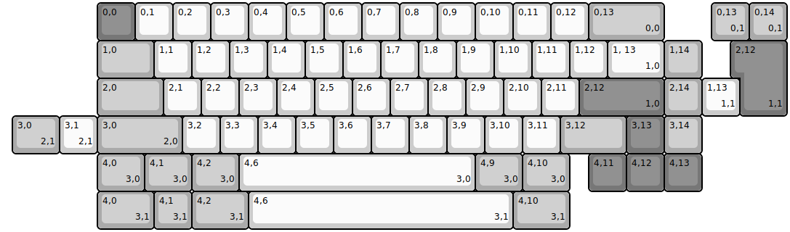{:loading="lazy"}

[Open in keyboard-layout-editor](http://www.keyboard-layout-editor.com/##@@_x:2.5&c=#777777;&=0,0&_c=#cccccc;&=0,1&=0,2&=0,3&=0,4&=0,5&=0,6&=0,7&=0,8&=0,9&=0,10&=0,11&=0,12&_c=#aaaaaa&w:2;&=0,13%0A%0A%0A0,0;&@_x:2.5&w:1.5;&=1,0&_c=#cccccc;&=1,1&=1,2&=1,3&=1,4&=1,5&=1,6&=1,7&=1,8&=1,9&=1,10&=1,11&=1,12&_w:1.5;&=1,%2013%0A%0A%0A1,0&_c=#aaaaaa;&=1,14;&@_x:2.5&w:1.75;&=2,0&_c=#cccccc;&=2,1&=2,2&=2,3&=2,4&=2,5&=2,6&=2,7&=2,8&=2,9&=2,10&=2,11&_c=#777777&w:2.25;&=2,12%0A%0A%0A1,0&_c=#aaaaaa;&=2,14;&@_x:2.5&w:2.25;&=3,0%0A%0A%0A2,0&_c=#cccccc;&=3,2&=3,3&=3,4&=3,5&=3,6&=3,7&=3,8&=3,9&=3,10&=3,11&_c=#aaaaaa&w:1.75;&=3,12&_c=#777777;&=3,13&_c=#aaaaaa;&=3,14;&@_x:2.5&w:1.25;&=4,0%0A%0A%0A3,0&_w:1.25;&=4,1%0A%0A%0A3,0&_w:1.25;&=4,2%0A%0A%0A3,0&_c=#cccccc&w:6.25;&=4,6%0A%0A%0A3,0&_c=#aaaaaa&w:1.25;&=4,9%0A%0A%0A3,0&_w:1.25;&=4,10%0A%0A%0A3,0&_x:0.5&c=#777777;&=4,11&=4,12&=4,13;&@_x:18.75&y:-5&c=#aaaaaa;&=0,13%0A%0A%0A0,1&=0,14%0A%0A%0A0,1;&@_x:19.5&c=#777777&w:1.25&h:2&w2:1.5&h2:1&x2:-0.25;&=2,12%0A%0A%0A1,1;&@_x:18.5&c=#cccccc;&=1,13%0A%0A%0A1,1;&@_x:0.25&c=#aaaaaa&w:1.25;&=3,0%0A%0A%0A2,1&_c=#cccccc;&=3,1%0A%0A%0A2,1;&@_x:2.5&y:1&c=#aaaaaa&w:1.5;&=4,0%0A%0A%0A3,1&=4,1%0A%0A%0A3,1&_w:1.5;&=4,2%0A%0A%0A3,1&_c=#cccccc&w:7;&=4,6%0A%0A%0A3,1&_c=#aaaaaa&w:1.5;&=4,10%0A%0A%0A3,1)

## cmm_studio/saka68_hotswap/cmm_studio_saka68_hotswap

[README](output/cmm_studio/saka68_hotswap/README.md) - [layout](output/cmm_studio/saka68_hotswap/cmm_studio_saka68_hotswap-kle.json) - [PCB](output/cmm_studio/saka68_hotswap/cmm_studio_saka68_hotswap.kicad_pcb) - [PCB render](output/cmm_studio/saka68_hotswap/cmm_studio_saka68_hotswap-render.svg)

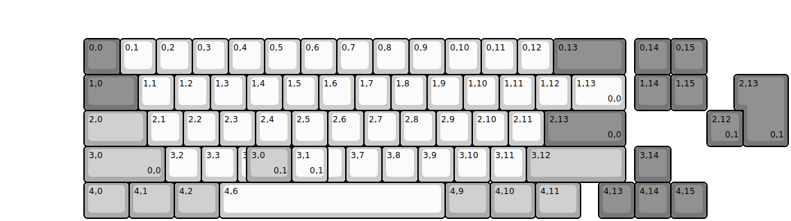{:loading="lazy"}

[Open in keyboard-layout-editor](http://www.keyboard-layout-editor.com/##@@_x:2.25&y:1&c=#777777;&=0,0&_c=#cccccc;&=0,1&=0,2&=0,3&=0,4&=0,5&=0,6&=0,7&=0,8&=0,9&=0,10&=0,11&=0,12&_c=#777777&w:2;&=0,13&_x:0.25;&=0,14&=0,15;&@_x:2.25&w:1.5;&=1,0&_c=#cccccc;&=1,1&=1,2&=1,3&=1,4&=1,5&=1,6&=1,7&=1,8&=1,9&=1,10&=1,11&=1,12&_w:1.5;&=1,13%0A%0A%0A0,0&_x:0.25&c=#777777;&=1,14&=1,15;&@_x:2.25&c=#aaaaaa&w:1.75;&=2,0&_c=#cccccc;&=2,1&=2,2&=2,3&=2,4&=2,5&=2,6&=2,7&=2,8&=2,9&=2,10&=2,11&_c=#777777&w:2.25;&=2,13%0A%0A%0A0,0;&@_x:2.25&c=#aaaaaa&w:2.25;&=3,0%0A%0A%0A0,0&_c=#cccccc;&=3,2&=3,3&=3,4&=3,5&=3,6&=3,7&=3,8&=3,9&=3,10&=3,11&_c=#aaaaaa&w:2.75;&=3,12&_x:0.25&c=#777777;&=3,14;&@_x:2.25&c=#aaaaaa&w:1.25;&=4,0&_w:1.25;&=4,1&_w:1.25;&=4,2&_c=#cccccc&w:6.25;&=4,6&_c=#aaaaaa&w:1.25;&=4,9&_w:1.25;&=4,10&_w:1.25;&=4,11&_x:0.5&c=#777777;&=4,13&=4,14&=4,15;&@_x:20.5&y:-4&w:1.25&h:2&w2:1.5&h2:1&x2:-0.25;&=2,13%0A%0A%0A0,1;&@_x:19.5;&=2,12%0A%0A%0A0,1;&@_x:6.75&c=#aaaaaa&w:1.25;&=3,0%0A%0A%0A0,1&_c=#cccccc;&=3,1%0A%0A%0A0,1)

## cmm_studio/saka68_solder/cmm_studio_saka68_solder

[README](output/cmm_studio/saka68_solder/README.md) - [layout](output/cmm_studio/saka68_solder/cmm_studio_saka68_solder-kle.json) - [PCB](output/cmm_studio/saka68_solder/cmm_studio_saka68_solder.kicad_pcb) - [PCB render](output/cmm_studio/saka68_solder/cmm_studio_saka68_solder-render.svg)

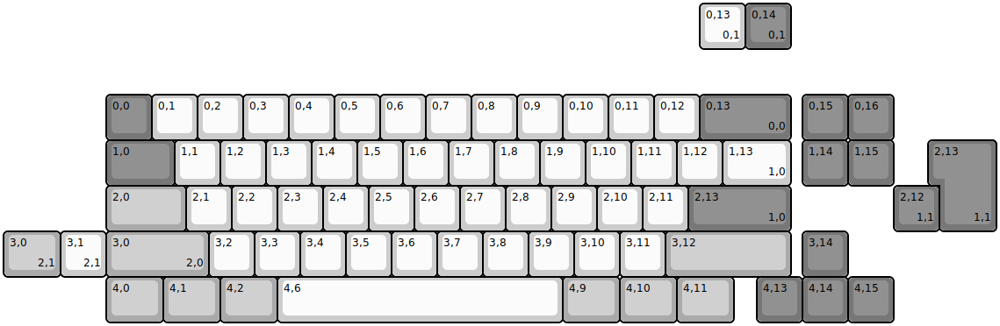{:loading="lazy"}

[Open in keyboard-layout-editor](http://www.keyboard-layout-editor.com/##@@_x:2.25&y:2&c=#777777;&=0,0&_c=#cccccc;&=0,1&=0,2&=0,3&=0,4&=0,5&=0,6&=0,7&=0,8&=0,9&=0,10&=0,11&=0,12&_c=#777777&w:2;&=0,13%0A%0A%0A0,0&_x:0.25;&=0,15&=0,16;&@_x:2.25&w:1.5;&=1,0&_c=#cccccc;&=1,1&=1,2&=1,3&=1,4&=1,5&=1,6&=1,7&=1,8&=1,9&=1,10&=1,11&=1,12&_w:1.5;&=1,13%0A%0A%0A1,0&_x:0.25&c=#777777;&=1,14&=1,15;&@_x:2.25&c=#aaaaaa&w:1.75;&=2,0&_c=#cccccc;&=2,1&=2,2&=2,3&=2,4&=2,5&=2,6&=2,7&=2,8&=2,9&=2,10&=2,11&_c=#777777&w:2.25;&=2,13%0A%0A%0A1,0;&@_x:2.25&c=#aaaaaa&w:2.25;&=3,0%0A%0A%0A2,0&_c=#cccccc;&=3,2&=3,3&=3,4&=3,5&=3,6&=3,7&=3,8&=3,9&=3,10&=3,11&_c=#aaaaaa&w:2.75;&=3,12&_x:0.25&c=#777777;&=3,14;&@_x:2.25&c=#aaaaaa&w:1.25;&=4,0&_w:1.25;&=4,1&_w:1.25;&=4,2&_c=#cccccc&w:6.25;&=4,6&_c=#aaaaaa&w:1.25;&=4,9&_w:1.25;&=4,10&_w:1.25;&=4,11&_x:0.5&c=#777777;&=4,13&=4,14&=4,15;&@_x:15.25&y:-7&c=#cccccc;&=0,13%0A%0A%0A0,1&_c=#777777;&=0,14%0A%0A%0A0,1;&@_x:20.5&y:2&w:1.25&h:2&w2:1.5&h2:1&x2:-0.25;&=2,13%0A%0A%0A1,1;&@_x:19.5;&=2,12%0A%0A%0A1,1;&@_c=#aaaaaa&w:1.25;&=3,0%0A%0A%0A2,1&_c=#cccccc;&=3,1%0A%0A%0A2,1)

## coarse/cordillera

[README](output/coarse/cordillera/README.md) - [layout](output/coarse/cordillera/cordillera-kle.json) - [PCB](output/coarse/cordillera/cordillera.kicad_pcb) - [PCB render](output/coarse/cordillera/cordillera-render.svg)

{:loading="lazy"}

[Open in keyboard-layout-editor](http://www.keyboard-layout-editor.com/##@@_x:0.55&y:1.15&c=#777777;&=0,0;&@_x:3.7&y:-0.95&c=#cccccc;&=0,3&_x:8.45;&=0,12;&@_x:15.15&y:-0.95&c=#aaaaaa&w:2;&=0,15%0A%0A%0A0,0&_x:-15.45&c=#cccccc;&=0,1&=0,2&_x:10.45;&=0,13;&@_x:0.35&y:-0.1&c=#aaaaaa;&=1,0;&@_x:13&y:-0.95&c=#cccccc;&=1,12;&@_x:1.5&y:-0.95&c=#aaaaaa&w:1.5;&=1,1&_c=#cccccc;&=1,2&_x:10.0;&=1,13&=1,14&_c=#aaaaaa&w:1.5;&=1,15;&@_x:0.15&y:-0.1;&=2,0;&@_x:1.3&y:-0.9&w:1.75;&=2,1&_c=#cccccc;&=2,2&_x:9.35;&=2,12&=2,13&_c=#777777&w:2.25;&=2,15;&@_x:1.05&c=#aaaaaa&w:2.25;&=3,1&_c=#cccccc;&=3,2&_x:8.8;&=3,12&=3,13&_c=#aaaaaa&w:1.75;&=3,14%0A%0A%0A1,0&=3,15%0A%0A%0A1,0;&@_x:1.05&w:1.5;&=4,1&_x:13.45&w:1.5;&=4,15;&@_r:12&x:5.05&y:-6.0&c=#cccccc;&=0,4&=0,5&=0,6&=0,7;&@_x:4.6;&=1,3&=1,4&=1,5&=1,6;&@_x:4.85;&=2,3&=2,4&=2,5&=2,6;&@_x:5.3;&=3,3&=3,4&=3,5&=3,6;&@_x:6.6&c=#777777&w:2;&=4,5&_c=#aaaaaa&w:1.25;&=4,6;&@_x:5.05&y:-0.95&w:1.5;&=4,3;&@_r:-12&x:8.45&y:-1.45&c=#cccccc;&=0,8&=0,9&=0,10&=0,11;&@_x:8.05;&=1,8&=1,9&=1,10&=1,11;&@_x:8.2;&=2,8&=2,9&=2,10&=2,11;&@_x:7.75;&=3,8&=3,9&=3,10&=3,11;&@_x:7.75&c=#777777&w:2.75;&=4,9;&@_x:10.55&y:-0.95&c=#aaaaaa&w:1.5;&=4,11;&@_r:0&x:15.15&y:-8.75&c=#cccccc;&=0,14%0A%0A%0A0,1&_c=#aaaaaa;&=0,15%0A%0A%0A0,1;&@_x:18.15&y:3.1&w:2.75;&=3,14%0A%0A%0A1,1)

## compound/compound

[README](output/compound/README.md) - [layout](output/compound/compound-kle.json) - [PCB](output/compound/compound.kicad_pcb) - [PCB render](output/compound/compound-render.svg)

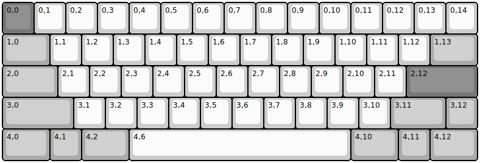{:loading="lazy"}

[Open in keyboard-layout-editor](http://www.keyboard-layout-editor.com/##@@_c=#777777;&=0,0&_c=#cccccc;&=0,1&=0,2&=0,3&=0,4&=0,5&=0,6&=0,7&=0,8&=0,9&=0,10&=0,11&=0,12&=0,13&=0,14;&@_c=#aaaaaa&w:1.5;&=1,0&_c=#cccccc;&=1,1&=1,2&=1,3&=1,4&=1,5&=1,6&=1,7&=1,8&=1,9&=1,10&=1,11&=1,12&_c=#aaaaaa&w:1.5;&=1,13;&@_w:1.75;&=2,0&_c=#cccccc;&=2,1&=2,2&=2,3&=2,4&=2,5&=2,6&=2,7&=2,8&=2,9&=2,10&=2,11&_c=#777777&w:2.25;&=2,12;&@_c=#aaaaaa&w:2.25;&=3,0&_c=#cccccc;&=3,1&=3,2&=3,3&=3,4&=3,5&=3,6&=3,7&=3,8&=3,9&=3,10&_c=#aaaaaa&w:1.75;&=3,11&=3,12;&@_w:1.5;&=4,0&=4,1&_w:1.5;&=4,2&_c=#cccccc&w:7;&=4,6&_c=#aaaaaa&w:1.5;&=4,10&=4,11&_w:1.5;&=4,12)

## contra/contra

[README](output/contra/README.md) - [layout](output/contra/contra-kle.json) - [PCB](output/contra/contra.kicad_pcb) - [PCB render](output/contra/contra-render.svg)

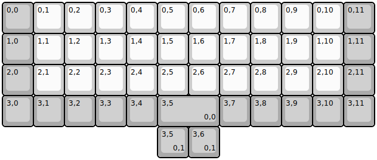{:loading="lazy"}

[Open in keyboard-layout-editor](http://www.keyboard-layout-editor.com/##@@_c=#aaaaaa;&=0,0&_c=#ccccccc;&=0,1&=0,2&=0,3&=0,4&=0,5&=0,6&=0,7&=0,8&=0,9&=0,10&_c=#aaaaaa;&=0,11;&@=1,0&_c=#ccccccc;&=1,1&=1,2&=1,3&=1,4&=1,5&=1,6&=1,7&=1,8&=1,9&=1,10&_c=#aaaaaa;&=1,11;&@=2,0&_c=#ccccccc;&=2,1&=2,2&=2,3&=2,4&=2,5&=2,6&=2,7&=2,8&=2,9&=2,10&_c=#aaaaaa;&=2,11;&@=3,0&=3,1&=3,2&=3,3&=3,4&_w:2;&=3,5%0A%0A%0A0,0&=3,7&=3,8&=3,9&=3,10&=3,11;&@_x:5;&=3,5%0A%0A%0A0,1&=3,6%0A%0A%0A0,1)

## controllerworks/mini36

[README](output/controllerworks/mini36/README.md) - [layout](output/controllerworks/mini36/mini36-kle.json) - [PCB](output/controllerworks/mini36/mini36.kicad_pcb) - [PCB render](output/controllerworks/mini36/mini36-render.svg)

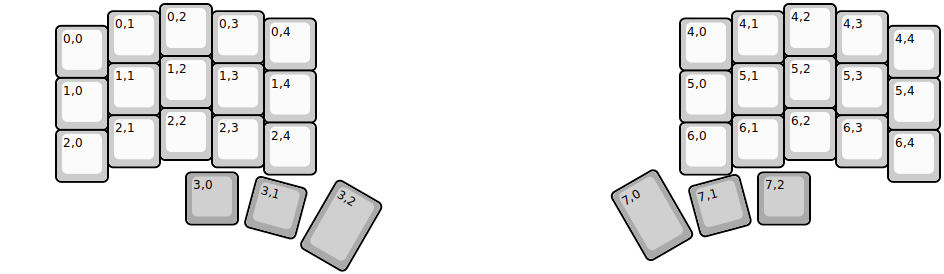{:loading="lazy"}

[Open in keyboard-layout-editor](http://www.keyboard-layout-editor.com/##@@_x:3;&=0,2&_x:11;&=4,2;&@_x:2&y:-0.86;&=0,1&_x:1;&=0,3&_x:9;&=4,1&_x:1;&=4,3;&@_x:5&y:-0.86;&=0,4&_x:7;&=4,0;&@_x:1&y:-0.86;&=0,0&_x:15;&=4,4;&@_x:3&y:-0.42;&=1,2&_x:11;&=5,2;&@_x:2&y:-0.86;&=1,1&_x:1;&=1,3&_x:9;&=5,1&_x:1;&=5,3;&@_x:5&y:-0.86;&=1,4&_x:7;&=5,0;&@_x:1&y:-0.86;&=1,0&_x:15;&=5,4;&@_x:3&y:-0.42;&=2,2&_x:11;&=6,2;&@_x:2&y:-0.86;&=2,1&_x:1;&=2,3&_x:9;&=6,1&_x:1;&=6,3;&@_x:5&y:-0.86;&=2,4&_x:7;&=6,0;&@_x:1&y:-0.86;&=2,0&_x:15;&=6,4;&@_x:3.5&y:-0.18&c=#aaaaaa;&=3,0&_x:10.0;&=7,2;&@_r:15&rx:5.25&ry:3.9&x:-0.5&y:-0.5;&=3,1;&@_r:30&rx:6.75&ry:4.36&x:-0.75&y:-0.75&h:1.5;&=3,2;&@_r:-30&rx:12&y:-0.75&h:1.5;&=7,0;&@_r:-15&rx:13.75&ry:3.9&x:-0.5&y:-0.5;&=7,1)

## controllerworks/mini42

[README](output/controllerworks/mini42/README.md) - [layout](output/controllerworks/mini42/mini42-kle.json) - [PCB](output/controllerworks/mini42/mini42.kicad_pcb) - [PCB render](output/controllerworks/mini42/mini42-render.svg)

{:loading="lazy"}

[Open in keyboard-layout-editor](http://www.keyboard-layout-editor.com/##@@_x:3;&=0,3&_x:11;&=4,2;&@_x:2&y:-0.86;&=0,2&_x:1;&=0,4&_x:9;&=4,1&_x:1;&=4,3;&@_x:5&y:-0.86;&=0,5&_x:7;&=4,0;&@_y:-0.86&c=#aaaaaa;&=0,0&_c=#cccccc;&=0,1&_x:15;&=4,4&_c=#aaaaaa;&=4,5;&@_x:3&y:-0.42&c=#cccccc;&=1,3&_x:11;&=5,2;&@_x:2&y:-0.86;&=1,2&_x:1;&=1,4&_x:9;&=5,1&_x:1;&=5,3;&@_x:5&y:-0.86;&=1,5&_x:7;&=5,0;&@_y:-0.86&c=#aaaaaa;&=1,0&_c=#cccccc;&=1,1&_x:15;&=5,4&_c=#aaaaaa;&=5,5;&@_x:3&y:-0.42&c=#cccccc;&=2,3&_x:11;&=6,2;&@_x:2&y:-0.86;&=2,2&_x:1;&=2,4&_x:9;&=6,1&_x:1;&=6,3;&@_x:5&y:-0.86;&=2,5&_x:7;&=6,0;&@_y:-0.86&c=#aaaaaa;&=2,0&_c=#cccccc;&=2,1&_x:15;&=6,4&_c=#aaaaaa;&=6,5;&@_x:3.5&y:-0.18;&=3,0&_x:10.0;&=7,2;&@_r:15&rx:5.25&ry:3.9&x:-0.5&y:-0.5;&=3,1;&@_r:30&rx:6.75&ry:4.36&x:-0.75&y:-0.75&h:1.5;&=3,2;&@_r:-30&rx:12&y:-0.75&h:1.5;&=7,0;&@_r:-15&rx:13.75&ry:3.9&x:-0.5&y:-0.5;&=7,1)

## creatkeebs/glacier80

[README](output/creatkeebs/glacier80/README.md) - [layout](output/creatkeebs/glacier80/glacier80-kle.json) - [PCB](output/creatkeebs/glacier80/glacier80.kicad_pcb) - [PCB render](output/creatkeebs/glacier80/glacier80-render.svg)

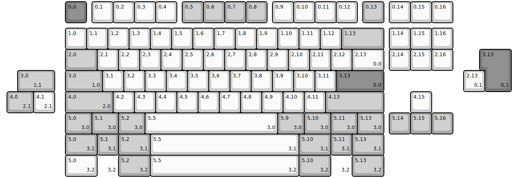{:loading="lazy"}

[Open in keyboard-layout-editor](http://www.keyboard-layout-editor.com/##@@_x:3&c=#777777;&=0,0&_x:0.25&c=#cccccc;&=0,1&=0,2&=0,3&=0,4&_x:0.25&c=#aaaaaa;&=0,5&=0,6&=0,7&=0,8&_x:0.25&c=#cccccc;&=0,9&=0,10&=0,11&=0,12&_x:0.25&c=#aaaaaa;&=0,13&_x:0.25&c=#cccccc;&=0,14&=0,15&=0,16;&@_x:3&y:0.25;&=1,0&=1,1&=1,2&=1,3&=1,4&=1,5&=1,6&=1,7&=1,8&=1,9&=1,10&=1,11&=1,12&_c=#aaaaaa&w:2;&=1,13&_x:0.25&c=#cccccc;&=1,14&=1,15&=1,16;&@_x:3&c=#aaaaaa&w:1.5;&=2,0&_c=#cccccc;&=2,1&=2,2&=2,3&=2,4&=2,5&=2,6&=2,7&=2,8&=2,9&=2,10&=2,11&=2,12&_w:1.5;&=2,13%0A%0A%0A0,0&_x:0.25;&=2,14&=2,15&=2,16;&@_x:3.0&c=#aaaaaa&w:1.75;&=3,0%0A%0A%0A1,0&_c=#cccccc;&=3,1&=3,2&=3,3&=3,4&=3,5&=3,6&=3,7&=3,8&=3,9&=3,10&=3,11&_c=#777777&w:2.25;&=3,13%0A%0A%0A0,0;&@_x:3.0&c=#aaaaaa&w:2.25;&=4,0%0A%0A%0A2,0&_c=#cccccc;&=4,2&=4,3&=4,4&=4,5&=4,6&=4,7&=4,8&=4,9&=4,10&=4,11&_c=#aaaaaa&w:2.75;&=4,13&_x:1.25&c=#cccccc;&=4,15;&@_x:3&c=#aaaaaa&w:1.25;&=5,0%0A%0A%0A3,0&_w:1.25;&=5,1%0A%0A%0A3,0&_w:1.25;&=5,2%0A%0A%0A3,0&_c=#cccccc&w:6.25;&=5,5%0A%0A%0A3,0&_c=#aaaaaa&w:1.25;&=5,9%0A%0A%0A3,0&_w:1.25;&=5,10%0A%0A%0A3,0&_w:1.25;&=5,11%0A%0A%0A3,0&_w:1.25;&=5,13%0A%0A%0A3,0&_x:0.25;&=5,14&=5,15&=5,16;&@_x:22.75&y:-4.0&c=#777777&w:1.25&h:2&w2:1.5&h2:1&x2:-0.25;&=3,13%0A%0A%0A0,1;&@_x:0.75&c=#aaaaaa&w:1.25&w2:1.75&l:true;&=3,0%0A%0A%0A1,1&_x:19.75&c=#cccccc;&=2,13%0A%0A%0A0,1;&@_x:0.25&c=#aaaaaa&w:1.25;&=4,0%0A%0A%0A2,1&_c=#cccccc;&=4,1%0A%0A%0A2,1;&@_x:3&y:1.0&c=#aaaaaa&w:1.5;&=5,0%0A%0A%0A3,1&=5,1%0A%0A%0A3,1&_w:1.5;&=5,2%0A%0A%0A3,1&_c=#cccccc&w:7;&=5,5%0A%0A%0A3,1&_c=#aaaaaa&w:1.5;&=5,10%0A%0A%0A3,1&=5,11%0A%0A%0A3,1&_w:1.5;&=5,13%0A%0A%0A3,1;&@_x:3&c=#cccccc&w:1.5;&=5,0%0A%0A%0A3,2&_d:true;&=%0A%0A%0A3,2&_c=#aaaaaa&w:1.5;&=5,2%0A%0A%0A3,2&_c=#cccccc&w:7;&=5,5%0A%0A%0A3,2&_c=#aaaaaa&w:1.5;&=5,10%0A%0A%0A3,2&_c=#cccccc&d:true;&=%0A%0A%0A3,2&_c=#aaaaaa&w:1.5;&=5,13%0A%0A%0A3,2)

## crin/crin

[README](output/crin/README.md) - [layout](output/crin/crin-kle.json) - [PCB](output/crin/crin.kicad_pcb) - [PCB render](output/crin/crin-render.svg)

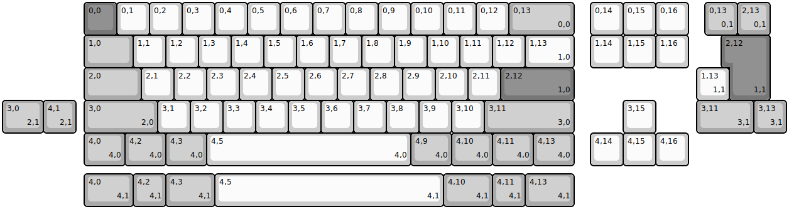{:loading="lazy"}

[Open in keyboard-layout-editor](http://www.keyboard-layout-editor.com/##@@_x:2.5&c=#777777;&=0,0&_c=#cccccc;&=0,1&=0,2&=0,3&=0,4&=0,5&=0,6&=0,7&=0,8&=0,9&=0,10&=0,11&=0,12&_c=#aaaaaa&w:2;&=0,13%0A%0A%0A0,0&_x:0.5&c=#cccccc;&=0,14&=0,15&=0,16;&@_x:2.5&c=#aaaaaa&w:1.5;&=1,0&_c=#cccccc;&=1,1&=1,2&=1,3&=1,4&=1,5&=1,6&=1,7&=1,8&=1,9&=1,10&=1,11&=1,12&_w:1.5;&=1,13%0A%0A%0A1,0&_x:0.5;&=1,14&=1,15&=1,16;&@_x:2.5&c=#aaaaaa&w:1.75;&=2,0&_c=#cccccc;&=2,1&=2,2&=2,3&=2,4&=2,5&=2,6&=2,7&=2,8&=2,9&=2,10&=2,11&_c=#777777&w:2.25;&=2,12%0A%0A%0A1,0;&@_x:2.5&c=#aaaaaa&w:2.25;&=3,0%0A%0A%0A2,0&_c=#cccccc;&=3,1&=3,2&=3,3&=3,4&=3,5&=3,6&=3,7&=3,8&=3,9&=3,10&_c=#aaaaaa&w:2.75;&=3,11%0A%0A%0A3,0&_x:1.5&c=#cccccc;&=3,15;&@_x:2.5&c=#aaaaaa&w:1.25;&=4,0%0A%0A%0A4,0&_w:1.25;&=4,2%0A%0A%0A4,0&_w:1.25;&=4,3%0A%0A%0A4,0&_c=#cccccc&w:6.25;&=4,5%0A%0A%0A4,0&_c=#aaaaaa&w:1.25;&=4,9%0A%0A%0A4,0&_w:1.25;&=4,10%0A%0A%0A4,0&_w:1.25;&=4,11%0A%0A%0A4,0&_w:1.25;&=4,13%0A%0A%0A4,0&_x:0.5&c=#cccccc;&=4,14&=4,15&=4,16;&@_x:21.5&y:-5&c=#aaaaaa;&=0,13%0A%0A%0A0,1&=2,13%0A%0A%0A0,1;&@_x:22.25&c=#777777&w:1.25&h:2&w2:1.5&h2:1&x2:-0.25;&=2,12%0A%0A%0A1,1;&@_x:21.25&c=#cccccc;&=1,13%0A%0A%0A1,1;&@_c=#aaaaaa&w:1.25;&=3,0%0A%0A%0A2,1&=4,1%0A%0A%0A2,1&_x:19.0&w:1.75;&=3,11%0A%0A%0A3,1&=3,13%0A%0A%0A3,1;&@_x:2.5&y:1.25&w:1.5;&=4,0%0A%0A%0A4,1&=4,2%0A%0A%0A4,1&_w:1.5;&=4,3%0A%0A%0A4,1&_c=#cccccc&w:7;&=4,5%0A%0A%0A4,1&_c=#aaaaaa&w:1.5;&=4,10%0A%0A%0A4,1&=4,11%0A%0A%0A4,1&_w:1.5;&=4,13%0A%0A%0A4,1)

## crkbd/crkbd

[README](output/crkbd/README.md) - [layout](output/crkbd/crkbd-kle.json) - [PCB](output/crkbd/crkbd.kicad_pcb) - [PCB render](output/crkbd/crkbd-render.svg)

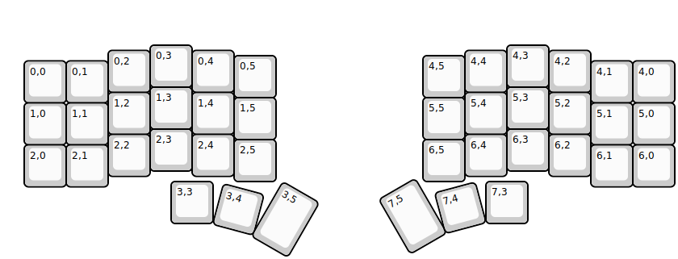{:loading="lazy"}

[Open in keyboard-layout-editor](http://www.keyboard-layout-editor.com/##@@_x:3.5&y:1;&=0,3&_x:7.5;&=4,3;&@_x:2.5&y:-0.875;&=0,2&_x:1.0;&=0,4&_x:5.5;&=4,4&_x:1.0;&=4,2;&@_x:5.5&y:-0.875;&=0,5&_x:3.5;&=4,5;&@_x:0.5&y:-0.875;&=0,0&=0,1&_x:11.5;&=4,1&=4,0;&@_x:3.5&y:-0.375;&=1,3&_x:7.5;&=5,3;&@_x:2.5&y:-0.875;&=1,2&_x:1.0;&=1,4&_x:5.5;&=5,4&_x:1.0;&=5,2;&@_x:5.5&y:-0.875;&=1,5&_x:3.5;&=5,5;&@_x:0.5&y:-0.875;&=1,0&=1,1&_x:11.5;&=5,1&=5,0;&@_x:3.5&y:-0.375;&=2,3&_x:7.5;&=6,3;&@_x:2.5&y:-0.875;&=2,2&_x:1.0;&=2,4&_x:5.5;&=6,4&_x:1.0;&=6,2;&@_x:5.5&y:-0.875;&=2,5&_x:3.5;&=6,5;&@_x:0.5&y:-0.875;&=2,0&=2,1&_x:11.5;&=6,1&=6,0;&@_x:4&y:-0.125;&=3,3&_x:6.5;&=7,3;&@_r:15&rx:4.5&ry:9.1&x:-0.5&y:-4.85;&=3,4;&@_r:30&rx:5.4&ry:9.3&x:-1.4&y:-5.05&h:1.5;&=3,5;&@_r:-30&rx:11.1&x:0.4&y:-5.05&h:1.5;&=7,5;&@_r:-15&rx:12&ry:9.1&x:-0.5&y:-4.85;&=7,4)

## curiosity/cheshire

[README](output/curiosity/cheshire/README.md) - [layout](output/curiosity/cheshire/cheshire-kle.json) - [PCB](output/curiosity/cheshire/cheshire.kicad_pcb) - [PCB render](output/curiosity/cheshire/cheshire-render.svg)

{:loading="lazy"}

[Open in keyboard-layout-editor](http://www.keyboard-layout-editor.com/##@@_x:0.55&y:1.15&c=#777777;&=0,0;&@_x:3.7&y:-0.95&c=#cccccc;&=0,3&_x:8.45;&=0,12;&@_x:1.7&y:-0.95;&=0,1&=0,2&_x:10.45;&=0,13&=0,14%0A%0A%0A0,0&_c=#aaaaaa;&=0,15%0A%0A%0A0,0;&@_x:0.35&y:-0.1;&=1,0;&@_x:13&y:-0.95&c=#cccccc;&=1,12;&@_x:1.5&y:-0.95&c=#aaaaaa&w:1.5;&=1,1&_c=#cccccc;&=1,2&_x:10.0;&=1,13&=1,14&_c=#aaaaaa&w:1.5;&=1,15;&@_x:0.15&y:-0.1;&=2,0;&@_x:13.4&y:-0.9&c=#cccccc;&=2,12&=2,13&_c=#777777&w:2.25;&=2,15&_x:-16.35&c=#aaaaaa&w:1.75;&=2,1&_c=#cccccc;&=2,2;&@_x:1.05&c=#aaaaaa&w:2.25;&=3,1&_c=#cccccc;&=3,2&_x:8.8;&=3,12&=3,13&_c=#aaaaaa&w:1.75;&=3,14%0A%0A%0A1,0&=3,15%0A%0A%0A1,0;&@_x:1.05&w:1.5;&=4,1&_x:13.45&w:1.5;&=4,14;&@_r:12&x:5.05&y:-6.0&c=#cccccc;&=0,4&=0,5&=0,6&=0,7;&@_x:4.6;&=1,3&=1,4&=1,5&=1,6;&@_x:4.85;&=2,3&=2,4&=2,5&=2,6;&@_x:5.3;&=3,3&=3,4&=3,5&=3,6;&@_x:6.6&c=#777777&w:2;&=4,5&_c=#aaaaaa&w:1.25;&=4,6;&@_x:5.05&y:-0.95&w:1.5;&=4,3;&@_r:-12&x:8.45&y:-1.45&c=#cccccc;&=0,8&=0,9&=0,10&=0,11;&@_x:8.05;&=1,8&=1,9&=1,10&=1,11;&@_x:8.2;&=2,8&=2,9&=2,10&=2,11;&@_x:7.75;&=3,8&=3,9&=3,10&=3,11;&@_x:7.75&c=#777777&w:2.75;&=4,9;&@_x:10.55&y:-0.95&c=#aaaaaa&w:1.5;&=4,11;&@_r:0&x:15.15&y:-8.75&w:2;&=0,15%0A%0A%0A0,1;&@_x:18.15&y:3.1&w:2.75;&=3,14%0A%0A%0A1,1)

## custommk/evo70

[README](output/custommk/evo70/README.md) - [layout](output/custommk/evo70/evo70-kle.json) - [PCB](output/custommk/evo70/evo70.kicad_pcb) - [PCB render](output/custommk/evo70/evo70-render.svg)

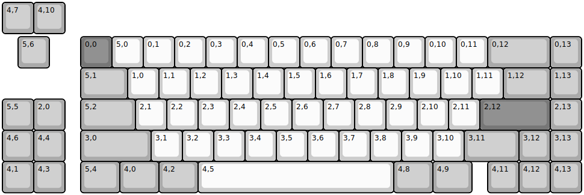{:loading="lazy"}

[Open in keyboard-layout-editor](http://www.keyboard-layout-editor.com/##@@_c=#aaaaaa;&=4,7&=4,10;&@_x:0.5&y:0.1;&=5,6&_x:1.0&c=#777777;&=0,0&_c=#cccccc;&=5,0&=0,1&=0,2&=0,3&=0,4&=0,5&=0,6&=0,7&=0,8&=0,9&=0,10&=0,11&_c=#aaaaaa&w:2;&=0,12&=0,13;&@_x:2.5&w:1.5;&=5,1&_c=#cccccc;&=1,0&=1,1&=1,2&=1,3&=1,4&=1,5&=1,6&=1,7&=1,8&=1,9&=1,10&=1,11&_c=#aaaaaa&w:1.5;&=1,12&=1,13;&@=5,5&=2,0&_x:0.5&w:1.75;&=5,2&_c=#cccccc;&=2,1&=2,2&=2,3&=2,4&=2,5&=2,6&=2,7&=2,8&=2,9&=2,10&=2,11&_c=#777777&w:2.25;&=2,12&_c=#aaaaaa;&=2,13;&@=4,6&=4,4&_x:0.5&w:2.25;&=3,0&_c=#cccccc;&=3,1&=3,2&=3,3&=3,4&=3,5&=3,6&=3,7&=3,8&=3,9&=3,10&_c=#aaaaaa&w:1.75;&=3,11&=3,12&=3,13;&@=4,1&=4,3&_x:0.5&w:1.25;&=5,4&_w:1.25;&=4,0&_w:1.25;&=4,2&_c=#cccccc&w:6.25;&=4,5&_c=#aaaaaa&w:1.25;&=4,8&_w:1.25;&=4,9&_x:0.5;&=4,11&=4,12&=4,13)

## custommk/genesis_rev1

[README](output/custommk/genesis_rev1/README.md) - [layout](output/custommk/genesis_rev1/genesis_rev1-kle.json) - [PCB](output/custommk/genesis_rev1/genesis_rev1.kicad_pcb) - [PCB render](output/custommk/genesis_rev1/genesis_rev1-render.svg)

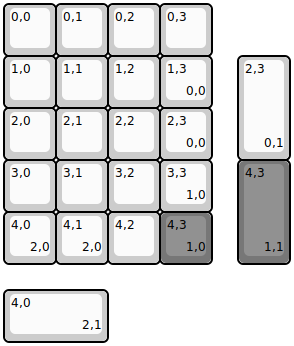{:loading="lazy"}

[Open in keyboard-layout-editor](http://www.keyboard-layout-editor.com/##@@=0,0&=0,1&=0,2&=0,3;&@=1,0&=1,1&=1,2&=1,3%0A%0A%0A0,0;&@=2,0&=2,1&=2,2&=2,3%0A%0A%0A0,0;&@=3,0&=3,1&=3,2&=3,3%0A%0A%0A1,0;&@=4,0%0A%0A%0A2,0&=4,1%0A%0A%0A2,0&=4,2&_c=#777777;&=4,3%0A%0A%0A1,0;&@_x:4.5&y:-4&c=#cccccc&h:2;&=2,3%0A%0A%0A0,1;&@_x:4.5&y:1&c=#777777&h:2;&=4,3%0A%0A%0A1,1;&@_y:1.5&c=#cccccc&w:2;&=4,0%0A%0A%0A2,1)

## custommk/genesis_rev2

[README](output/custommk/genesis_rev2/README.md) - [layout](output/custommk/genesis_rev2/genesis_rev2-kle.json) - [PCB](output/custommk/genesis_rev2/genesis_rev2.kicad_pcb) - [PCB render](output/custommk/genesis_rev2/genesis_rev2-render.svg)

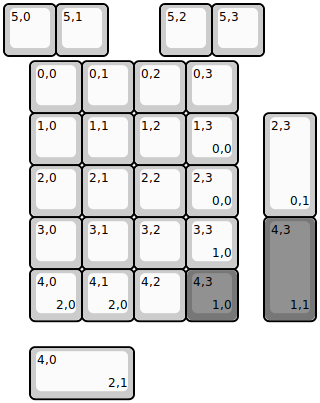{:loading="lazy"}

[Open in keyboard-layout-editor](http://www.keyboard-layout-editor.com/##@@=5,0&=5,1&_x:1;&=5,2&=5,3;&@_x:0.5&y:0.1;&=0,0&=0,1&=0,2&=0,3;&@_x:0.5;&=1,0&=1,1&=1,2&=1,3%0A%0A%0A0,0;&@_x:0.5;&=2,0&=2,1&=2,2&=2,3%0A%0A%0A0,0;&@_x:0.5;&=3,0&=3,1&=3,2&=3,3%0A%0A%0A1,0;&@_x:0.5;&=4,0%0A%0A%0A2,0&=4,1%0A%0A%0A2,0&=4,2&_c=#777777;&=4,3%0A%0A%0A1,0;&@_x:5.0&y:-4.0&c=#cccccc&h:2;&=2,3%0A%0A%0A0,1;&@_x:5.0&y:1.0&c=#777777&h:2;&=4,3%0A%0A%0A1,1;&@_x:0.5&y:1.5&c=#cccccc&w:2;&=4,0%0A%0A%0A2,1)

## cutie_club/borsdorf

[README](output/cutie_club/borsdorf/README.md) - [layout](output/cutie_club/borsdorf/borsdorf-kle.json) - [PCB](output/cutie_club/borsdorf/borsdorf.kicad_pcb) - [PCB render](output/cutie_club/borsdorf/borsdorf-render.svg)

{:loading="lazy"}

[Open in keyboard-layout-editor](http://www.keyboard-layout-editor.com/##@@_c=#777777&w:1.25;&=0,0&_c=#cccccc;&=0,1&=0,2&=0,3&=0,4&=0,5&=0,6&=0,7&=0,8&=0,9&=0,10&=0,11&=0,12&_c=#aaaaaa&w:1.75;&=0,13&_x:0.5&c=#777777;&=0,14;&@_c=#aaaaaa&w:1.75;&=1,0&_c=#cccccc;&=1,2&=1,3&=1,4&=1,5&=1,6&=1,7&=1,8&=1,9&=1,10&=1,11&=1,12&=1,13&_x:0.25&c=#777777&h:2&h2:1&x2:-0.25;&=2,14&_x:0.5;&=1,14;&@_c=#aaaaaa&w:2;&=2,0&_c=#cccccc;&=2,2&=2,3&=2,4&=2,5&=2,6&=2,7&=2,8&=2,9&=2,10&=2,11&=2,12&=2,13;&@_c=#aaaaaa&w:1.5;&=3,0&_c=#cccccc;&=3,1&=3,2&=3,3&=3,4&=3,5&=3,6&=3,7&=3,8&=3,9&=3,10&=3,11&_c=#aaaaaa&w:2;&=3,12%0A%0A%0A0,0&_c=#777777;&=3,14;&@_c=#aaaaaa&w:1.5;&=4,0&_w:1.25;&=4,1&_w:1.5;&=4,2&_c=#cccccc&w:6.5;&=4,6&_c=#aaaaaa&w:1.5;&=4,10&_w:1.25;&=4,11&_c=#777777;&=4,12&=4,13&=4,14;&@_x:16.75&y:-2&c=#aaaaaa;&=3,12%0A%0A%0A0,1&=3,13%0A%0A%0A0,1)

## cutie_club/giant_macro_pad

[README](output/cutie_club/giant_macro_pad/README.md) - [layout](output/cutie_club/giant_macro_pad/giant_macro_pad-kle.json) - [PCB](output/cutie_club/giant_macro_pad/giant_macro_pad.kicad_pcb) - [PCB render](output/cutie_club/giant_macro_pad/giant_macro_pad-render.svg)

{:loading="lazy"}

[Open in keyboard-layout-editor](http://www.keyboard-layout-editor.com/##@@=0,%200&=0,%201&=0,%202&=0,%203&=0,%204&=0,%205&=0,%206&=0,%207&=0,%208&=0,%209&=0,%2010&=0,%2011&=0,%2012&=0,%2013&=0,%2014&=0,%2015&=0,%2016&=0,%2017&=0,%2018&=0,%2019;&@=1,%200&=1,%201&=1,%202&=1,%203&=1,%204&=1,%205&=1,%206&=1,%207&=1,%208&=1,%209&=1,%2010&=1,%2011&=1,%2012&=1,%2013&=1,%2014&=1,%2015&=1,%2016&=1,%2017&=1,%2018&=1,%2019;&@=2,%200&=2,%201&=2,%202&=2,%203&=2,%204&=2,%205&=2,%206&=2,%207&=2,%208&=2,%209&=2,%2010&=2,%2011&=2,%2012&=2,%2013&=2,%2014&=2,%2015&=2,%2016&=2,%2017&=2,%2018&=2,%2019;&@=3,%200&=3,%201&=3,%202&=3,%203&=3,%204&=3,%205&=3,%206&=3,%207&=3,%208&=3,%209&=3,%2010&=3,%2011&=3,%2012&=3,%2013&=3,%2014&=3,%2015&=3,%2016&=3,%2017&=3,%2018&=3,%2019;&@=4,%200&=4,%201&=4,%202&=4,%203&=4,%204&=4,%205&=4,%206&=4,%207&=4,%208&=4,%209&=4,%2010&=4,%2011&=4,%2012&=4,%2013&=4,%2014&=4,%2015&=4,%2016&=4,%2017&=4,%2018&=4,%2019;&@=5,%200&=5,%201&=5,%202&=5,%203&=5,%204&=5,%205&=5,%206&=5,%207&=5,%208&=5,%209&=5,%2010&=5,%2011&=5,%2012&=5,%2013&=5,%2014&=5,%2015&=5,%2016&=5,%2017&=5,%2018&=5,%2019;&@=6,%200&=6,%201&=6,%202&=6,%203&=6,%204&=6,%205&=6,%206&=6,%207&=6,%208&=6,%209&=6,%2010&=6,%2011&=6,%2012&=6,%2013&=6,%2014&=6,%2015&=6,%2016&=6,%2017&=6,%2018&=6,%2019;&@=7,%200&=7,%201&=7,%202&=7,%203&=7,%204&=7,%205&=7,%206&=7,%207&=7,%208&=7,%209&=7,%2010&=7,%2011&=7,%2012&=7,%2013&=7,%2014&=7,%2015&=7,%2016&=7,%2017&=7,%2018&=7,%2019;&@=8,%200&=8,%201&=8,%202&=8,%203&=8,%204&=8,%205&=8,%206&=8,%207&=8,%208&=8,%209&=8,%2010&=8,%2011&=8,%2012&=8,%2013&=8,%2014&=8,%2015&=8,%2016&=8,%2017&=8,%2018&=8,%2019;&@=9,%200&=9,%201&=9,%202&=9,%203&=9,%204&=9,%205&=9,%206&=9,%207&=9,%208&=9,%209&=9,%2010&=9,%2011&=9,%2012&=9,%2013&=9,%2014&=9,%2015&=9,%2016&=9,%2017&=9,%2018&=9,%2019;&@=10,%200&=10,%201&=10,%202&=10,%203&=10,%204&=10,%205&=10,%206&=10,%207&=10,%208&=10,%209&=10,%2010&=10,%2011&=10,%2012&=10,%2013&=10,%2014&=10,%2015&=10,%2016&=10,%2017&=10,%2018&=10,%2019;&@=11,%200&=11,%201&=11,%202&=11,%203&=11,%204&=11,%205&=11,%206&=11,%207&=11,%208&=11,%209&=11,%2010&=11,%2011&=11,%2012&=11,%2013&=11,%2014&=11,%2015&=11,%2016&=11,%2017&=11,%2018&=11,%2019;&@=12,%200&=12,%201&=12,%202&=12,%203&=12,%204&=12,%205&=12,%206&=12,%207&=12,%208&=12,%209&=12,%2010&=12,%2011&=12,%2012&=12,%2013&=12,%2014&=12,%2015&=12,%2016&=12,%2017&=12,%2018&=12,%2019;&@=13,%200&=13,%201&=13,%202&=13,%203&=13,%204&=13,%205&=13,%206&=13,%207&=13,%208&=13,%209&=13,%2010&=13,%2011&=13,%2012&=13,%2013&=13,%2014&=13,%2015&=13,%2016&=13,%2017&=13,%2018&=13,%2019;&@=14,%200&=14,%201&=14,%202&=14,%203&=14,%204&=14,%205&=14,%206&=14,%207&=14,%208&=14,%209&=14,%2010&=14,%2011&=14,%2012&=14,%2013&=14,%2014&=14,%2015&=14,%2016&=14,%2017&=14,%2018&=14,%2019;&@=15,%200&=15,%201&=15,%202&=15,%203&=15,%204&=15,%205&=15,%206&=15,%207&=15,%208&=15,%209&=15,%2010&=15,%2011&=15,%2012&=15,%2013&=15,%2014&=15,%2015&=15,%2016&=15,%2017&=15,%2018&=15,%2019;&@=16,%200&=16,%201&=16,%202&=16,%203&=16,%204&=16,%205&=16,%206&=16,%207&=16,%208&=16,%209&=16,%2010&=16,%2011&=16,%2012&=16,%2013&=16,%2014&=16,%2015&=16,%2016&=16,%2017&=16,%2018&=16,%2019;&@=17,%200&=17,%201&=17,%202&=17,%203&=17,%204&=17,%205&=17,%206&=17,%207&=17,%208&=17,%209&=17,%2010&=17,%2011&=17,%2012&=17,%2013&=17,%2014&=17,%2015&=17,%2016&=17,%2017&=17,%2018&=17,%2019;&@=18,%200&=18,%201&=18,%202&=18,%203&=18,%204&=18,%205&=18,%206&=18,%207&=18,%208&=18,%209&=18,%2010&=18,%2011&=18,%2012&=18,%2013&=18,%2014&=18,%2015&=18,%2016&=18,%2017&=18,%2018&=18,%2019;&@=19,%200&=19,%201&=19,%202&=19,%203&=19,%204&=19,%205&=19,%206&=19,%207&=19,%208&=19,%209&=19,%2010&=19,%2011&=19,%2012&=19,%2013&=19,%2014&=19,%2015&=19,%2016&=19,%2017&=19,%2018&=19,%2019)

## cutie_club/keebcats/denis

[README](output/cutie_club/keebcats/denis/README.md) - [layout](output/cutie_club/keebcats/denis/denis-kle.json) - [PCB](output/cutie_club/keebcats/denis/denis.kicad_pcb) - [PCB render](output/cutie_club/keebcats/denis/denis-render.svg)

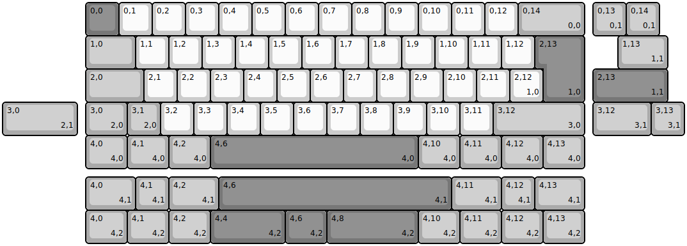{:loading="lazy"}

[Open in keyboard-layout-editor](http://www.keyboard-layout-editor.com/##@@_x:2.5&c=#777777;&=0,0&_c=#cccccc;&=0,1&=0,2&=0,3&=0,4&=0,5&=0,6&=0,7&=0,8&=0,9&=0,10&=0,11&=0,12&_c=#aaaaaa&w:2;&=0,14%0A%0A%0A0,0;&@_x:2.5&w:1.5;&=1,0&_c=#cccccc;&=1,1&=1,2&=1,3&=1,4&=1,5&=1,6&=1,7&=1,8&=1,9&=1,10&=1,11&=1,12&_x:0.25&c=#777777&w:1.25&h:2&w2:1.5&h2:1&x2:-0.25;&=2,13%0A%0A%0A1,0;&@_x:2.5&c=#aaaaaa&w:1.75;&=2,0&_c=#cccccc;&=2,1&=2,2&=2,3&=2,4&=2,5&=2,6&=2,7&=2,8&=2,9&=2,10&=2,11&=2,12%0A%0A%0A1,0;&@_x:2.5&c=#aaaaaa&w:1.25;&=3,0%0A%0A%0A2,0&=3,1%0A%0A%0A2,0&_c=#cccccc;&=3,2&=3,3&=3,4&=3,5&=3,6&=3,7&=3,8&=3,9&=3,10&=3,11&_c=#aaaaaa&w:2.75;&=3,12%0A%0A%0A3,0;&@_x:2.5&w:1.25;&=4,0%0A%0A%0A4,0&_w:1.25;&=4,1%0A%0A%0A4,0&_w:1.25;&=4,2%0A%0A%0A4,0&_c=#777777&w:6.25;&=4,6%0A%0A%0A4,0&_c=#aaaaaa&w:1.25;&=4,10%0A%0A%0A4,0&_w:1.25;&=4,11%0A%0A%0A4,0&_w:1.25;&=4,12%0A%0A%0A4,0&_w:1.25;&=4,13%0A%0A%0A4,0;&@_x:17.75&y:-5;&=0,13%0A%0A%0A0,1&=0,14%0A%0A%0A0,1;&@_x:18.5&w:1.5;&=1,13%0A%0A%0A1,1;&@_x:17.75&c=#777777&w:2.25;&=2,13%0A%0A%0A1,1;&@_c=#aaaaaa&w:2.25;&=3,0%0A%0A%0A2,1&_x:15.5&w:1.75;&=3,12%0A%0A%0A3,1&=3,13%0A%0A%0A3,1;&@_x:2.5&y:1.25&w:1.5;&=4,0%0A%0A%0A4,1&=4,1%0A%0A%0A4,1&_w:1.5;&=4,2%0A%0A%0A4,1&_c=#777777&w:7;&=4,6%0A%0A%0A4,1&_c=#aaaaaa&w:1.5;&=4,11%0A%0A%0A4,1&=4,12%0A%0A%0A4,1&_w:1.5;&=4,13%0A%0A%0A4,1;&@_x:2.5&w:1.25;&=4,0%0A%0A%0A4,2&_w:1.25;&=4,1%0A%0A%0A4,2&_w:1.25;&=4,2%0A%0A%0A4,2&_c=#777777&w:2.25;&=4,4%0A%0A%0A4,2&_w:1.25;&=4,6%0A%0A%0A4,2&_w:2.75;&=4,8%0A%0A%0A4,2&_c=#aaaaaa&w:1.25;&=4,10%0A%0A%0A4,2&_w:1.25;&=4,11%0A%0A%0A4,2&_w:1.25;&=4,12%0A%0A%0A4,2&_w:1.25;&=4,13%0A%0A%0A4,2)

## cutie_club/keebcats/dougal

[README](output/cutie_club/keebcats/dougal/README.md) - [layout](output/cutie_club/keebcats/dougal/dougal-kle.json) - [PCB](output/cutie_club/keebcats/dougal/dougal.kicad_pcb) - [PCB render](output/cutie_club/keebcats/dougal/dougal-render.svg)

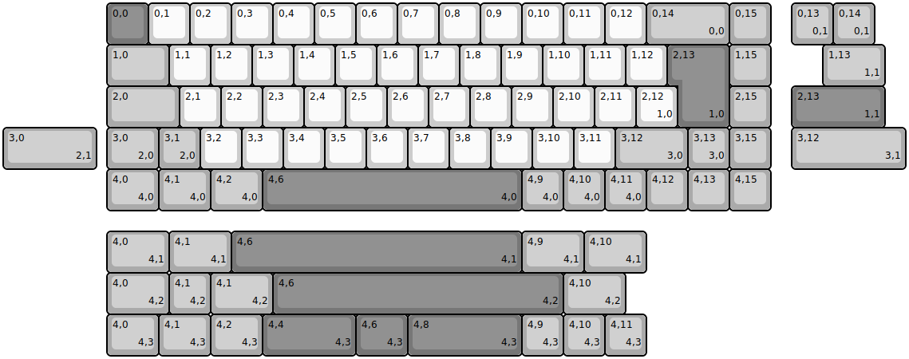{:loading="lazy"}

[Open in keyboard-layout-editor](http://www.keyboard-layout-editor.com/##@@_x:2.5&c=#777777;&=0,0&_c=#cccccc;&=0,1&=0,2&=0,3&=0,4&=0,5&=0,6&=0,7&=0,8&=0,9&=0,10&=0,11&=0,12&_c=#aaaaaa&w:2;&=0,14%0A%0A%0A0,0&=0,15;&@_x:2.5&w:1.5;&=1,0&_c=#cccccc;&=1,1&=1,2&=1,3&=1,4&=1,5&=1,6&=1,7&=1,8&=1,9&=1,10&=1,11&=1,12&_x:0.25&c=#777777&w:1.25&h:2&w2:1.5&h2:1&x2:-0.25;&=2,13%0A%0A%0A1,0&_c=#aaaaaa;&=1,15;&@_x:2.5&w:1.75;&=2,0&_c=#cccccc;&=2,1&=2,2&=2,3&=2,4&=2,5&=2,6&=2,7&=2,8&=2,9&=2,10&=2,11&=2,12%0A%0A%0A1,0&_x:1.25&c=#aaaaaa;&=2,15;&@_x:2.5&w:1.25;&=3,0%0A%0A%0A2,0&=3,1%0A%0A%0A2,0&_c=#cccccc;&=3,2&=3,3&=3,4&=3,5&=3,6&=3,7&=3,8&=3,9&=3,10&=3,11&_c=#aaaaaa&w:1.75;&=3,12%0A%0A%0A3,0&=3,13%0A%0A%0A3,0&=3,15;&@_x:2.5&w:1.25;&=4,0%0A%0A%0A4,0&_w:1.25;&=4,1%0A%0A%0A4,0&_w:1.25;&=4,2%0A%0A%0A4,0&_c=#777777&w:6.25;&=4,6%0A%0A%0A4,0&_c=#aaaaaa;&=4,9%0A%0A%0A4,0&=4,10%0A%0A%0A4,0&=4,11%0A%0A%0A4,0&=4,12&=4,13&=4,15;&@_x:19.0&y:-5;&=0,13%0A%0A%0A0,1&=0,14%0A%0A%0A0,1;&@_x:19.75&w:1.5;&=1,13%0A%0A%0A1,1;&@_x:19.0&c=#777777&w:2.25;&=2,13%0A%0A%0A1,1;&@_c=#aaaaaa&w:2.25;&=3,0%0A%0A%0A2,1&_x:16.75&w:2.75;&=3,12%0A%0A%0A3,1;&@_x:2.5&y:1.5&w:1.5;&=4,0%0A%0A%0A4,1&_w:1.5;&=4,1%0A%0A%0A4,1&_c=#777777&w:7;&=4,6%0A%0A%0A4,1&_c=#aaaaaa&w:1.5;&=4,9%0A%0A%0A4,1&_w:1.5;&=4,10%0A%0A%0A4,1;&@_x:2.5&w:1.5;&=4,0%0A%0A%0A4,2&=4,1%0A%0A%0A4,2&_w:1.5;&=4,1%0A%0A%0A4,2&_c=#777777&w:7;&=4,6%0A%0A%0A4,2&_c=#aaaaaa&w:1.5;&=4,10%0A%0A%0A4,2;&@_x:2.5&w:1.25;&=4,0%0A%0A%0A4,3&_w:1.25;&=4,1%0A%0A%0A4,3&_w:1.25;&=4,2%0A%0A%0A4,3&_c=#777777&w:2.25;&=4,4%0A%0A%0A4,3&_w:1.25;&=4,6%0A%0A%0A4,3&_w:2.75;&=4,8%0A%0A%0A4,3&_c=#aaaaaa;&=4,9%0A%0A%0A4,3&=4,10%0A%0A%0A4,3&=4,11%0A%0A%0A4,3)

## cutie_club/keebcats/fidelity

[README](output/cutie_club/keebcats/fidelity/README.md) - [layout](output/cutie_club/keebcats/fidelity/fidelity-kle.json) - [PCB](output/cutie_club/keebcats/fidelity/fidelity.kicad_pcb) - [PCB render](output/cutie_club/keebcats/fidelity/fidelity-render.svg)

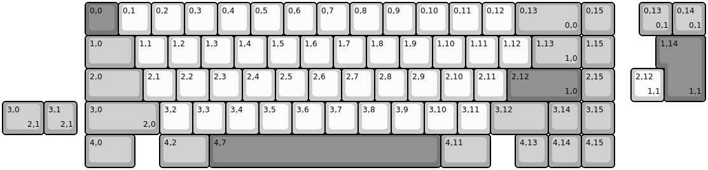{:loading="lazy"}

[Open in keyboard-layout-editor](http://www.keyboard-layout-editor.com/##@@_x:2.5&c=#777777;&=0,0&_c=#cccccc;&=0,1&=0,2&=0,3&=0,4&=0,5&=0,6&=0,7&=0,8&=0,9&=0,10&=0,11&=0,12&_c=#aaaaaa&w:2;&=0,13%0A%0A%0A0,0&=0,15;&@_x:2.5&w:1.5;&=1,0&_c=#cccccc;&=1,1&=1,2&=1,3&=1,4&=1,5&=1,6&=1,7&=1,8&=1,9&=1,10&=1,11&=1,12&_c=#aaaaaa&w:1.5;&=1,13%0A%0A%0A1,0&=1,15;&@_x:2.5&w:1.75;&=2,0&_c=#cccccc;&=2,1&=2,2&=2,3&=2,4&=2,5&=2,6&=2,7&=2,8&=2,9&=2,10&=2,11&_c=#777777&w:2.25;&=2,12%0A%0A%0A1,0&_c=#aaaaaa;&=2,15;&@_x:2.5&w:2.25;&=3,0%0A%0A%0A2,0&_c=#cccccc;&=3,2&=3,3&=3,4&=3,5&=3,6&=3,7&=3,8&=3,9&=3,10&=3,11&_c=#aaaaaa&w:1.75;&=3,12&=3,14&=3,15;&@_x:2.5&w:1.5;&=4,0&_x:0.75&w:1.5;&=4,2&_c=#777777&w:7;&=4,7&_c=#aaaaaa&w:1.5;&=4,11&_x:0.75;&=4,13&=4,14&=4,15;&@_x:19.25&y:-5;&=0,13%0A%0A%0A0,1&=0,14%0A%0A%0A0,1;&@_x:20.0&c=#777777&w:1.25&h:2&w2:1.5&h2:1&x2:-0.25;&=1,14%0A%0A%0A1,1;&@_x:19.0&c=#cccccc;&=2,12%0A%0A%0A1,1;&@_c=#aaaaaa&w:1.25;&=3,0%0A%0A%0A2,1&=3,1%0A%0A%0A2,1)

## cutie_club/novus

[README](output/cutie_club/novus/README.md) - [layout](output/cutie_club/novus/novus-kle.json) - [PCB](output/cutie_club/novus/novus.kicad_pcb) - [PCB render](output/cutie_club/novus/novus-render.svg)

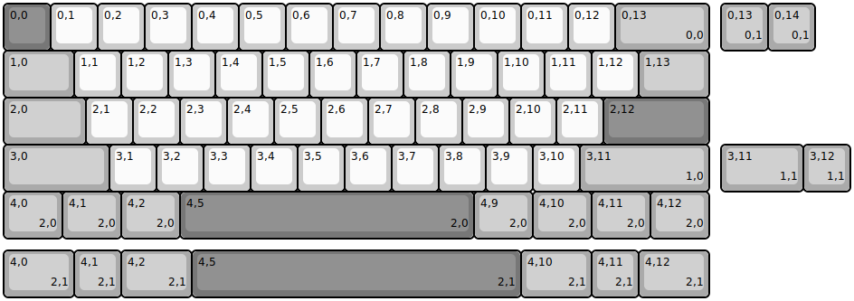{:loading="lazy"}

[Open in keyboard-layout-editor](http://www.keyboard-layout-editor.com/##@@_c=#777777;&=0,0&_c=#cccccc;&=0,1&=0,2&=0,3&=0,4&=0,5&=0,6&=0,7&=0,8&=0,9&=0,10&=0,11&=0,12&_c=#aaaaaa&w:2;&=0,13%0A%0A%0A0,0;&@_w:1.5;&=1,0&_c=#cccccc;&=1,1&=1,2&=1,3&=1,4&=1,5&=1,6&=1,7&=1,8&=1,9&=1,10&=1,11&=1,12&_c=#aaaaaa&w:1.5;&=1,13;&@_w:1.75;&=2,0&_c=#cccccc;&=2,1&=2,2&=2,3&=2,4&=2,5&=2,6&=2,7&=2,8&=2,9&=2,10&=2,11&_c=#777777&w:2.25;&=2,12;&@_c=#aaaaaa&w:2.25;&=3,0&_c=#cccccc;&=3,1&=3,2&=3,3&=3,4&=3,5&=3,6&=3,7&=3,8&=3,9&=3,10&_c=#aaaaaa&w:2.75;&=3,11%0A%0A%0A1,0;&@_w:1.25;&=4,0%0A%0A%0A2,0&_w:1.25;&=4,1%0A%0A%0A2,0&_w:1.25;&=4,2%0A%0A%0A2,0&_c=#777777&w:6.25;&=4,5%0A%0A%0A2,0&_c=#aaaaaa&w:1.25;&=4,9%0A%0A%0A2,0&_w:1.25;&=4,10%0A%0A%0A2,0&_w:1.25;&=4,11%0A%0A%0A2,0&_w:1.25;&=4,12%0A%0A%0A2,0;&@_x:15.25&y:-5;&=0,13%0A%0A%0A0,1&=0,14%0A%0A%0A0,1;&@_x:15.25&y:2&w:1.75;&=3,11%0A%0A%0A1,1&=3,12%0A%0A%0A1,1;&@_y:1.25&w:1.5;&=4,0%0A%0A%0A2,1&=4,1%0A%0A%0A2,1&_w:1.5;&=4,2%0A%0A%0A2,1&_c=#777777&w:7;&=4,5%0A%0A%0A2,1&_c=#aaaaaa&w:1.5;&=4,10%0A%0A%0A2,1&=4,11%0A%0A%0A2,1&_w:1.5;&=4,12%0A%0A%0A2,1)

## cx60/cx60

[README](output/cx60/README.md) - [layout](output/cx60/cx60-kle.json) - [PCB](output/cx60/cx60.kicad_pcb) - [PCB render](output/cx60/cx60-render.svg)

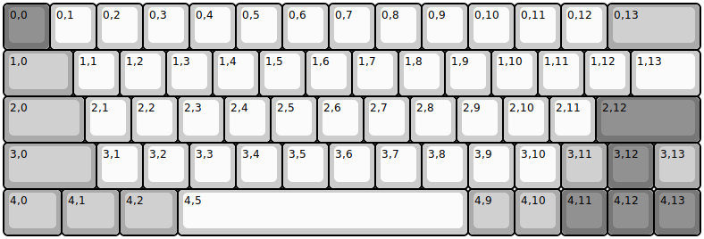{:loading="lazy"}

[Open in keyboard-layout-editor](http://www.keyboard-layout-editor.com/##@@_c=#777777;&=0,0&_c=#cccccc;&=0,1&=0,2&=0,3&=0,4&=0,5&=0,6&=0,7&=0,8&=0,9&=0,10&=0,11&=0,12&_c=#aaaaaa&w:2;&=0,13;&@_w:1.5;&=1,0&_c=#cccccc;&=1,1&=1,2&=1,3&=1,4&=1,5&=1,6&=1,7&=1,8&=1,9&=1,10&=1,11&=1,12&_w:1.5;&=1,13;&@_c=#aaaaaa&w:1.75;&=2,0&_c=#cccccc;&=2,1&=2,2&=2,3&=2,4&=2,5&=2,6&=2,7&=2,8&=2,9&=2,10&=2,11&_c=#777777&w:2.25;&=2,12;&@_c=#aaaaaa&w:2;&=3,0&_c=#cccccc;&=3,1&=3,2&=3,3&=3,4&=3,5&=3,6&=3,7&=3,8&=3,9&=3,10&_c=#aaaaaa;&=3,11&_c=#777777;&=3,12&_c=#aaaaaa;&=3,13;&@_w:1.25;&=4,0&_w:1.25;&=4,1&_w:1.25;&=4,2&_c=#cccccc&w:6.25;&=4,5&_c=#aaaaaa;&=4,9&=4,10&_c=#777777;&=4,11&=4,12&=4,13)

## cybergear/macro25/mkmacro01

[README](output/cybergear/macro25/README.md) - [layout](output/cybergear/macro25/mkmacro01-kle.json) - [PCB](output/cybergear/macro25/mkmacro01.kicad_pcb) - [PCB render](output/cybergear/macro25/mkmacro01-render.svg)

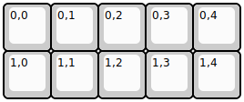{:loading="lazy"}

[Open in keyboard-layout-editor](http://www.keyboard-layout-editor.com/##@@=0,0&=0,1&=0,2&=0,3&=0,4;&@=1,0&=1,1&=1,2&=1,3&=1,4)

## dailycraft/sandbox/sandbox_rev1

[README](output/dailycraft/sandbox/README.md) - [layout](output/dailycraft/sandbox/sandbox_rev1-kle.json) - [PCB](output/dailycraft/sandbox/sandbox_rev1.kicad_pcb) - [PCB render](output/dailycraft/sandbox/sandbox_rev1-render.svg)

{:loading="lazy"}

[Open in keyboard-layout-editor](http://www.keyboard-layout-editor.com/##@@=0,0&=0,1&=0,2&=0,3&=0,4;&@=1,0&=1,1&=1,2&=1,3&=1,4)

## dailycraft/sandbox/sandbox_rev2

[README](output/dailycraft/sandbox/README.md) - [layout](output/dailycraft/sandbox/sandbox_rev2-kle.json) - [PCB](output/dailycraft/sandbox/sandbox_rev2.kicad_pcb) - [PCB render](output/dailycraft/sandbox/sandbox_rev2-render.svg)

{:loading="lazy"}

[Open in keyboard-layout-editor](http://www.keyboard-layout-editor.com/##@@=0,0&=0,1&=0,2&=0,3&=0,4%0A%0A%0A0,0;&@=1,0&=1,1&=1,2&=1,3&=1,4%0A%0A%0A0,0;&@_x:5&y:-2;&=0,4%0A%0A%0A0,1&_x:1;&=2,0%0A%0A%0A0,1&=2,1%0A%0A%0A0,1&=2,2%0A%0A%0A0,1&=2,3%0A%0A%0A0,1&=2,4%0A%0A%0A0,1;&@_x:5;&=1,4%0A%0A%0A0,1&_x:1;&=3,0%0A%0A%0A0,1&=3,1%0A%0A%0A0,1&=3,2%0A%0A%0A0,1&=3,3%0A%0A%0A0,1&=3,4%0A%0A%0A0,1)

## daji/seis_cinco

[README](output/daji/seis_cinco/README.md) - [layout](output/daji/seis_cinco/seis_cinco-kle.json) - [PCB](output/daji/seis_cinco/seis_cinco.kicad_pcb) - [PCB render](output/daji/seis_cinco/seis_cinco-render.svg)

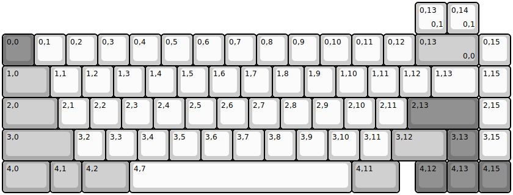{:loading="lazy"}

[Open in keyboard-layout-editor](http://www.keyboard-layout-editor.com/##@@_y:1&c=#777777;&=0,0&_c=#cccccc;&=0,1&=0,2&=0,3&=0,4&=0,5&=0,6&=0,7&=0,8&=0,9&=0,10&=0,11&=0,12&_c=#aaaaaa&w:2;&=0,13%0A%0A%0A0,0&_c=#cccccc;&=0,15;&@_c=#aaaaaa&w:1.5;&=1,0&_c=#cccccc;&=1,1&=1,2&=1,3&=1,4&=1,5&=1,6&=1,7&=1,8&=1,9&=1,10&=1,11&=1,12&_w:1.5;&=1,13&=1,15;&@_c=#aaaaaa&w:1.75;&=2,0&_c=#cccccc;&=2,1&=2,2&=2,3&=2,4&=2,5&=2,6&=2,7&=2,8&=2,9&=2,10&=2,11&_c=#777777&w:2.25;&=2,13&_c=#cccccc;&=2,15;&@_c=#aaaaaa&w:2.25;&=3,0&_c=#cccccc;&=3,2&=3,3&=3,4&=3,5&=3,6&=3,7&=3,8&=3,9&=3,10&=3,11&_c=#aaaaaa&w:1.75;&=3,12&_c=#777777;&=3,13&_c=#cccccc;&=3,15;&@_c=#aaaaaa&w:1.5;&=4,0&=4,1&_w:1.5;&=4,2&_c=#cccccc&w:7;&=4,7&_c=#aaaaaa&w:1.5;&=4,11&_x:0.5&c=#777777;&=4,12&=4,13&=4,15;&@_x:13&y:-6&c=#cccccc;&=0,13%0A%0A%0A0,1&=0,14%0A%0A%0A0,1)

## damapad/damapad

[README](output/damapad/README.md) - [layout](output/damapad/damapad-kle.json) - [PCB](output/damapad/damapad.kicad_pcb) - [PCB render](output/damapad/damapad-render.svg)

{:loading="lazy"}

[Open in keyboard-layout-editor](http://www.keyboard-layout-editor.com/##@@_x:5.25;&=0,5;&@_y:-0.75;&=0,0&=0,1&=0,2&=0,3&=0,4;&@=1,0&=1,1&=1,2&=1,3&=1,4&_x:0.25;&=1,5;&@=2,0%0A%0A%0A0,0&_x:0.75;&=2,1%0A%0A%0A0,0&_w:2.25;&=2,3&_x:0.25;&=2,5&_x:-6.25&w:2.75;&=2,1%0A%0A%0A0,1)

## dekunukem/duckypad

[README](output/dekunukem/duckypad/README.md) - [layout](output/dekunukem/duckypad/duckypad-kle.json) - [PCB](output/dekunukem/duckypad/duckypad.kicad_pcb) - [PCB render](output/dekunukem/duckypad/duckypad-render.svg)

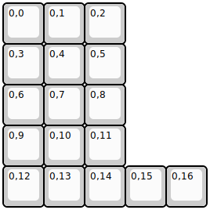{:loading="lazy"}

[Open in keyboard-layout-editor](http://www.keyboard-layout-editor.com/##@@=0,0&=0,1&=0,2;&@=0,3&=0,4&=0,5;&@=0,6&=0,7&=0,8;&@=0,9&=0,10&=0,11;&@=0,12&=0,13&=0,14&=0,15&=0,16)

## delilah/delilah

[README](output/delilah/README.md) - [layout](output/delilah/delilah-kle.json) - [PCB](output/delilah/delilah.kicad_pcb) - [PCB render](output/delilah/delilah-render.svg)

{:loading="lazy"}

[Open in keyboard-layout-editor](http://www.keyboard-layout-editor.com/##@@_c=#777777;&=0,0&_c=#cccccc;&=0,1&=0,2&=0,3&=0,4&=0,5&=0,6&=0,7&=0,8&=0,9&=0,10&_w:1.25;&=0,11;&@_w:1.25;&=1,0&=1,1&=1,2&=1,3&=1,4&=1,5&=1,6&=1,7&=1,8&=1,9&=1,10&_c=#777777;&=1,11;&@_c=#aaaaaa&w:1.75;&=2,0&_c=#cccccc;&=2,1&=2,2&=2,3&=2,4&=2,5&=2,6&=2,7&=2,8&=2,9&_c=#aaaaaa&w:1.5;&=2,11;&@_w:1.25;&=3,0&=3,1&=3,2&_c=#cccccc&w:2.25;&=3,3&_w:2.75;&=3,6&_x:0.75&c=#aaaaaa;&=3,8&=3,9&_w:1.25;&=3,11)

## demiurge/demiurge

[README](output/demiurge/README.md) - [layout](output/demiurge/demiurge-kle.json) - [PCB](output/demiurge/demiurge.kicad_pcb) - [PCB render](output/demiurge/demiurge-render.svg)

{:loading="lazy"}

[Open in keyboard-layout-editor](http://www.keyboard-layout-editor.com/##@@_y:1.25&c=#aaaaaa;&=0,0&=0,1&_x:0.5&c=#777777;&=0,2&_c=#cccccc;&=0,3&=0,4&=0,5&=0,6&=0,7&=0,8&=0,9&=0,10&=0,11&=0,12&=0,13&=0,14&_c=#aaaaaa&w:2;&=0,15%0A%0A%0A0,0;&@=1,0&=1,1&_x:0.5&w:1.5;&=1,2&_c=#cccccc;&=1,3&=1,4&=1,5&=1,6&=1,7&=1,8&=1,9&=1,10&=1,11&=1,12&=1,13&=1,14&_w:1.5;&=1,16;&@_c=#aaaaaa;&=2,0&=2,1&_x:0.5&w:1.75;&=2,2&_c=#cccccc;&=2,3&=2,4&=2,5&=2,6&=2,7&=2,8&=2,9&=2,10&=2,11&=2,12&=2,13&_c=#777777&w:2.25;&=2,15;&@_c=#aaaaaa;&=3,0&=3,1&_x:0.5&w:2.25;&=3,2&_c=#cccccc;&=3,3&=3,4&=3,5&=3,6&=3,7&=3,8&=3,9&=3,10&=3,11&=3,12&_c=#aaaaaa&w:2.75;&=3,14%0A%0A%0A1,0;&@=4,0&=4,1&_x:0.5&w:1.5;&=4,2&_x:1.0&w:1.5;&=4,4&_c=#cccccc&w:7;&=4,8&_c=#aaaaaa&w:1.5;&=4,12&_x:1.0&w:1.5;&=4,16;&@_x:15.5&y:-6.25&c=#cccccc;&=0,15%0A%0A%0A0,1&_c=#aaaaaa;&=0,16%0A%0A%0A0,1;&@_x:17.75&y:3.25&w:1.75;&=3,14%0A%0A%0A1,1&=3,16%0A%0A%0A1,1)

## deng/djam

[README](output/deng/djam/README.md) - [layout](output/deng/djam/djam-kle.json) - [PCB](output/deng/djam/djam.kicad_pcb) - [PCB render](output/deng/djam/djam-render.svg)

{:loading="lazy"}

[Open in keyboard-layout-editor](http://www.keyboard-layout-editor.com/##@@_x:1;&=0,0&=0,1&=0,2&_x:3;&=0,5&=0,6&=0,7;&@_y:-0.5&h:2;&=1,0;&@_x:1&y:-0.5;&=1,1&=1,2&=1,3&_x:3;&=1,4&=1,5&=1,6;&@_x:10&y:-1.5&h:2;&=1,7;&@_y:1.5;&=2,0&=2,1&_x:1&w:2;&=2,2&=2,3&_w:2;&=2,4&_x:1;&=2,5&=2,6)

## deng/thirty

[README](output/deng/thirty/README.md) - [layout](output/deng/thirty/thirty-kle.json) - [PCB](output/deng/thirty/thirty.kicad_pcb) - [PCB render](output/deng/thirty/thirty-render.svg)

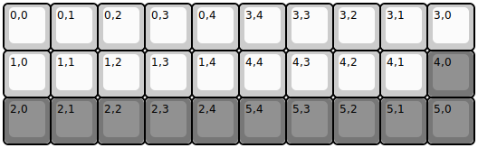{:loading="lazy"}

[Open in keyboard-layout-editor](http://www.keyboard-layout-editor.com/##@@=0,0&=0,1&=0,2&=0,3&=0,4&=3,4&=3,3&=3,2&=3,1&=3,0;&@=1,0&=1,1&=1,2&=1,3&=1,4&=4,4&=4,3&=4,2&=4,1&_c=#777777;&=4,0;&@=2,0&=2,1&=2,2&=2,3&=2,4&=5,4&=5,3&=5,2&=5,1&=5,0)

## dinofizz/fnrow/fnrow_v1

[README](output/dinofizz/fnrow/README.md) - [layout](output/dinofizz/fnrow/fnrow_v1-kle.json) - [PCB](output/dinofizz/fnrow/fnrow_v1.kicad_pcb) - [PCB render](output/dinofizz/fnrow/fnrow_v1-render.svg)

{:loading="lazy"}

[Open in keyboard-layout-editor](http://www.keyboard-layout-editor.com/##@@_c=#777777;&=0,0&_x:1&c=#cccccc;&=0,1&=0,2&=0,3&=0,4&_x:0.5&c=#aaaaaa;&=0,5&=0,6&=1,0&=1,1&_x:0.5&c=#cccccc;&=1,2&=1,3&=1,4&=1,5)

## dm9records/tartan/keyboard

[README](output/dm9records/tartan/README.md) - [layout](output/dm9records/tartan/keyboard-kle.json) - [PCB](output/dm9records/tartan/keyboard.kicad_pcb) - [PCB render](output/dm9records/tartan/keyboard-render.svg)

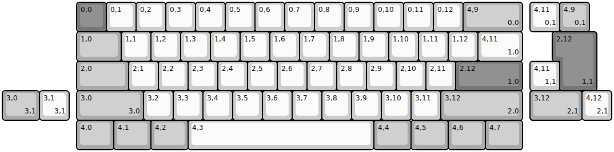{:loading="lazy"}

[Open in keyboard-layout-editor](http://www.keyboard-layout-editor.com/##@@_x:2.5&c=#777777;&=0,0&_c=#cccccc;&=0,1&=0,2&=0,3&=0,4&=0,5&=0,6&=0,7&=0,8&=0,9&=0,10&=0,11&=0,12&_c=#aaaaaa&w:2;&=4,9%0A%0A%0A0,0;&@_x:2.5&w:1.5;&=1,0&_c=#cccccc;&=1,1&=1,2&=1,3&=1,4&=1,5&=1,6&=1,7&=1,8&=1,9&=1,10&=1,11&=1,12&_w:1.5;&=4,11%0A%0A%0A1,0;&@_x:2.5&c=#aaaaaa&w:1.75;&=2,0&_c=#cccccc;&=2,1&=2,2&=2,3&=2,4&=2,5&=2,6&=2,7&=2,8&=2,9&=2,10&=2,11&_c=#777777&w:2.25;&=2,12%0A%0A%0A1,0;&@_x:2.5&c=#aaaaaa&w:2.25;&=3,0%0A%0A%0A3,0&_c=#cccccc;&=3,2&=3,3&=3,4&=3,5&=3,6&=3,7&=3,8&=3,9&=3,10&=3,11&_c=#aaaaaa&w:2.75;&=3,12%0A%0A%0A2,0;&@_x:2.5&w:1.25;&=4,0&_w:1.25;&=4,1&_w:1.25;&=4,2&_c=#cccccc&w:6.25;&=4,3&_c=#aaaaaa&w:1.25;&=4,4&_w:1.25;&=4,5&_w:1.25;&=4,6&_w:1.25;&=4,7;&@_x:17.75&y:-5&c=#cccccc;&=4,11%0A%0A%0A0,1&_c=#aaaaaa;&=4,9%0A%0A%0A0,1;&@_x:18.75&c=#777777&w:1.25&h:2&w2:1.5&h2:1&x2:-0.25;&=2,12%0A%0A%0A1,1;&@_x:17.75&c=#cccccc;&=4,11%0A%0A%0A1,1;&@_c=#aaaaaa&w:1.25;&=3,0%0A%0A%0A3,1&_c=#cccccc;&=3,1%0A%0A%0A3,1&_x:15.5&c=#aaaaaa&w:1.75&w2:1;&=3,12%0A%0A%0A2,1&_c=#cccccc;&=4,12%0A%0A%0A2,1)

## doio/kb16/kb16-01

[README](output/doio/kb16/README.md) - [layout](output/doio/kb16/kb16-01-kle.json) - [PCB](output/doio/kb16/kb16-01.kicad_pcb) - [PCB render](output/doio/kb16/kb16-01-render.svg)

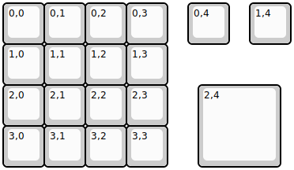{:loading="lazy"}

[Open in keyboard-layout-editor](http://www.keyboard-layout-editor.com/##@@=0,0&=0,1&=0,2&=0,3&_x:0.5;&=0,4%0A%0A%0A%0A%0A%0A%0A%0A%0Ae0&_x:0.5;&=1,4%0A%0A%0A%0A%0A%0A%0A%0A%0Ae1;&@=1,0&=1,1&=1,2&=1,3;&@=2,0&=2,1&=2,2&=2,3&_x:0.75&w:2&h:2;&=2,4%0A%0A%0A%0A%0A%0A%0A%0A%0Ae2;&@=3,0&=3,1&=3,2&=3,3)

## donutcables/scrabblepad

[README](output/donutcables/scrabblepad/README.md) - [layout](output/donutcables/scrabblepad/scrabblepad-kle.json) - [PCB](output/donutcables/scrabblepad/scrabblepad.kicad_pcb) - [PCB render](output/donutcables/scrabblepad/scrabblepad-render.svg)

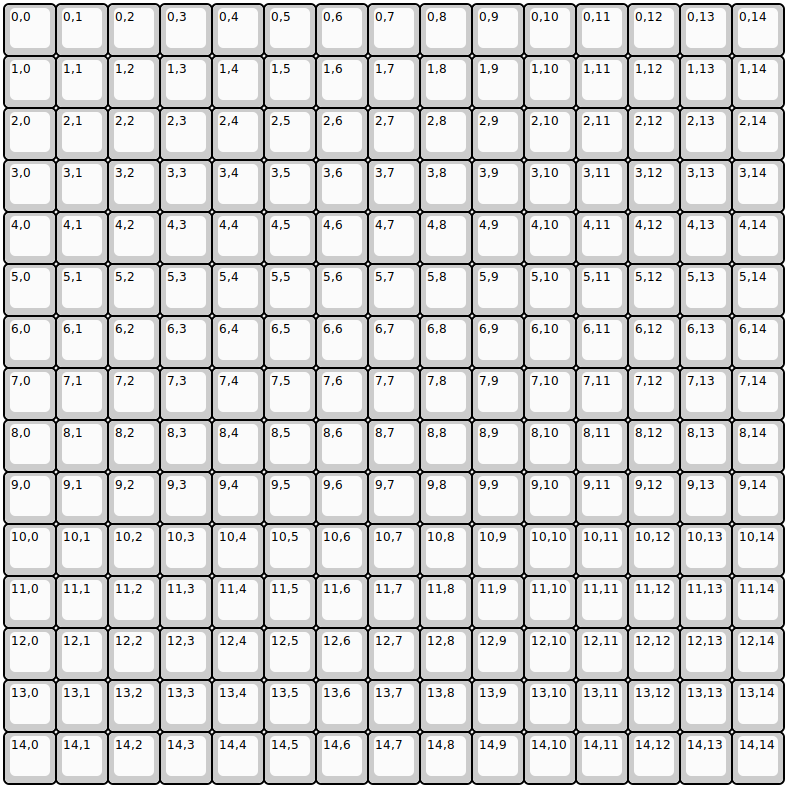{:loading="lazy"}

[Open in keyboard-layout-editor](http://www.keyboard-layout-editor.com/##@@=0,0&=0,1&=0,2&=0,3&=0,4&=0,5&=0,6&=0,7&=0,8&=0,9&=0,10&=0,11&=0,12&=0,13&=0,14;&@=1,0&=1,1&=1,2&=1,3&=1,4&=1,5&=1,6&=1,7&=1,8&=1,9&=1,10&=1,11&=1,12&=1,13&=1,14;&@=2,0&=2,1&=2,2&=2,3&=2,4&=2,5&=2,6&=2,7&=2,8&=2,9&=2,10&=2,11&=2,12&=2,13&=2,14;&@=3,0&=3,1&=3,2&=3,3&=3,4&=3,5&=3,6&=3,7&=3,8&=3,9&=3,10&=3,11&=3,12&=3,13&=3,14;&@=4,0&=4,1&=4,2&=4,3&=4,4&=4,5&=4,6&=4,7&=4,8&=4,9&=4,10&=4,11&=4,12&=4,13&=4,14;&@=5,0&=5,1&=5,2&=5,3&=5,4&=5,5&=5,6&=5,7&=5,8&=5,9&=5,10&=5,11&=5,12&=5,13&=5,14;&@=6,0&=6,1&=6,2&=6,3&=6,4&=6,5&=6,6&=6,7&=6,8&=6,9&=6,10&=6,11&=6,12&=6,13&=6,14;&@=7,0&=7,1&=7,2&=7,3&=7,4&=7,5&=7,6&=7,7&=7,8&=7,9&=7,10&=7,11&=7,12&=7,13&=7,14;&@=8,0&=8,1&=8,2&=8,3&=8,4&=8,5&=8,6&=8,7&=8,8&=8,9&=8,10&=8,11&=8,12&=8,13&=8,14;&@=9,0&=9,1&=9,2&=9,3&=9,4&=9,5&=9,6&=9,7&=9,8&=9,9&=9,10&=9,11&=9,12&=9,13&=9,14;&@=10,0&=10,1&=10,2&=10,3&=10,4&=10,5&=10,6&=10,7&=10,8&=10,9&=10,10&=10,11&=10,12&=10,13&=10,14;&@=11,0&=11,1&=11,2&=11,3&=11,4&=11,5&=11,6&=11,7&=11,8&=11,9&=11,10&=11,11&=11,12&=11,13&=11,14;&@=12,0&=12,1&=12,2&=12,3&=12,4&=12,5&=12,6&=12,7&=12,8&=12,9&=12,10&=12,11&=12,12&=12,13&=12,14;&@=13,0&=13,1&=13,2&=13,3&=13,4&=13,5&=13,6&=13,7&=13,8&=13,9&=13,10&=13,11&=13,12&=13,13&=13,14;&@=14,0&=14,1&=14,2&=14,3&=14,4&=14,5&=14,6&=14,7&=14,8&=14,9&=14,10&=14,11&=14,12&=14,13&=14,14)

## doodboard/duckboard_r2

[README](output/doodboard/duckboard_r2/README.md) - [layout](output/doodboard/duckboard_r2/duckboard_r2-kle.json) - [PCB](output/doodboard/duckboard_r2/duckboard_r2.kicad_pcb) - [PCB render](output/doodboard/duckboard_r2/duckboard_r2-render.svg)

{:loading="lazy"}

[Open in keyboard-layout-editor](http://www.keyboard-layout-editor.com/##@@_x:1&c=#aaaaaa;&=0,1&=0,2&=0,3&=0,4;&@_x:1&c=#cccccc;&=1,1&=1,2&=1,3&_c=#aaaaaa&h:2;&=2,4%0A%0A%0A0,0;&@_x:1&c=#cccccc;&=2,1&=2,2&=2,3;&@_y:-0.5;&=3,0;&@_x:1&y:-0.5;&=3,1&=3,2&=3,3&_c=#aaaaaa&h:2;&=4,4%0A%0A%0A1,0;&@_c=#cccccc;&=4,0&_w:2;&=4,2%0A%0A%0A2,0&=4,3;&@_x:5.5&y:-4.0&c=#aaaaaa;&=1,4%0A%0A%0A0,1;&@_x:5.5;&=2,4%0A%0A%0A0,1;&@_x:5.5;&=3,4%0A%0A%0A1,1;&@_x:5.5;&=4,4%0A%0A%0A1,1;&@_x:1&y:0.5&c=#cccccc;&=4,1%0A%0A%0A2,1&=4,2%0A%0A%0A2,1)

## drewkeys/iskar

[README](output/drewkeys/iskar/README.md) - [layout](output/drewkeys/iskar/iskar-kle.json) - [PCB](output/drewkeys/iskar/iskar.kicad_pcb) - [PCB render](output/drewkeys/iskar/iskar-render.svg)

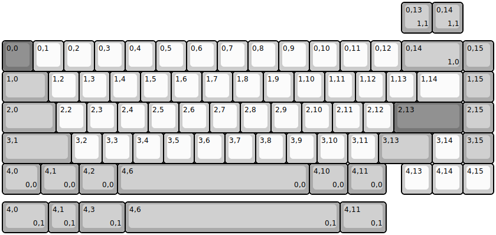{:loading="lazy"}

[Open in keyboard-layout-editor](http://www.keyboard-layout-editor.com/##@@_y:1.25&c=#777777;&=0,0&_c=#cccccc;&=0,1&=0,2&=0,3&=0,4&=0,5&=0,6&=0,7&=0,8&=0,9&=0,10&=0,11&=0,12&_c=#aaaaaa&w:2;&=0,14%0A%0A%0A1,0&=0,15;&@_w:1.5;&=1,0&_c=#cccccc;&=1,2&=1,3&=1,4&=1,5&=1,6&=1,7&=1,8&=1,9&=1,10&=1,11&=1,12&=1,13&_w:1.5;&=1,14&_c=#aaaaaa;&=1,15;&@_w:1.75;&=2,0&_c=#cccccc;&=2,2&=2,3&=2,4&=2,5&=2,6&=2,7&=2,8&=2,9&=2,10&=2,11&=2,12&_c=#777777&w:2.25;&=2,13&_c=#aaaaaa;&=2,15;&@_w:2.25;&=3,1&_c=#cccccc;&=3,2&=3,3&=3,4&=3,5&=3,6&=3,7&=3,8&=3,9&=3,10&=3,11&_c=#aaaaaa&w:1.75;&=3,13&_c=#cccccc;&=3,14&_c=#aaaaaa;&=3,15;&@_w:1.25;&=4,0%0A%0A%0A0,0&_w:1.25;&=4,1%0A%0A%0A0,0&_w:1.25;&=4,2%0A%0A%0A0,0&_w:6.25;&=4,6%0A%0A%0A0,0&_w:1.25;&=4,10%0A%0A%0A0,0&_w:1.25;&=4,11%0A%0A%0A0,0&_x:0.5&c=#cccccc;&=4,13&=4,14&=4,15;&@_x:13&y:-6.25&c=#aaaaaa;&=0,13%0A%0A%0A1,1&=0,14%0A%0A%0A1,1;&@_y:5.5&w:1.5;&=4,0%0A%0A%0A0,1&=4,1%0A%0A%0A0,1&_w:1.5;&=4,3%0A%0A%0A0,1&_w:7;&=4,6%0A%0A%0A0,1&_w:1.5;&=4,11%0A%0A%0A0,1)

## drewkeys/soy20

[README](output/drewkeys/soy20/README.md) - [layout](output/drewkeys/soy20/soy20-kle.json) - [PCB](output/drewkeys/soy20/soy20.kicad_pcb) - [PCB render](output/drewkeys/soy20/soy20-render.svg)

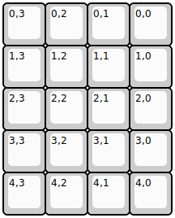{:loading="lazy"}

[Open in keyboard-layout-editor](http://www.keyboard-layout-editor.com/##@@=0,3&=0,2&=0,1&=0,0;&@=1,3&=1,2&=1,1&=1,0;&@=2,3&=2,2&=2,1&=2,0;&@=3,3&=3,2&=3,1&=3,0;&@=4,3&=4,2&=4,1&=4,0)

## drop/alt

[README](output/drop/alt/README.md) - [layout](output/drop/alt/alt-kle.json) - [PCB](output/drop/alt/alt.kicad_pcb) - [PCB render](output/drop/alt/alt-render.svg)

{:loading="lazy"}

[Open in keyboard-layout-editor](http://www.keyboard-layout-editor.com/##@@=0,0&_t=#000000%0A#ffffff;&=0,1%0A1&=0,2%0A2&=0,3%0A3&=0,4%0A4&=0,5%0A5&=0,6%0A6&=0,7%0A7&=0,8%0A8&=0,9%0A9&=0,10%0A0&=0,11%0A-&=0,12%0A=&_w:2;&=0,13&_c=#aaaaaa;&=0,14;&@_w:1.5;&=1,0&_c=#cccccc;&=1,1&=1,2&=1,3&=1,4&=1,5&=1,6&=1,7&=1,8&=1,9&=1,10&=1,11&=1,12&_w:1.5;&=1,13&_c=#aaaaaa;&=1,14;&@_w:1.75;&=2,0&_c=#cccccc;&=2,1&=2,2&=2,3&=2,4&=2,5&=2,6&=2,7&=2,8&=2,9&=2,10&=2,11&_w:2.25;&=2,13&_c=#aaaaaa;&=2,14;&@_w:2.25;&=3,0&_c=#cccccc;&=3,2&=3,3&=3,4&=3,5&=3,6&=3,7&=3,8&=3,9&=3,10&=3,11&_c=#aaaaaa&w:1.75;&=3,12&_c=#cccccc;&=3,13&_c=#aaaaaa;&=3,14;&@_w:1.25;&=4,0&_w:1.25;&=4,1&_w:1.25;&=4,2&_c=#cccccc&w:6.25;&=4,6&_c=#aaaaaa&w:1.25;&=4,10&_w:1.25;&=4,11&_x:0.5&c=#cccccc;&=4,12&=4,13&=4,14)

## drop/ctrl

[README](output/drop/ctrl/README.md) - [layout](output/drop/ctrl/ctrl-kle.json) - [PCB](output/drop/ctrl/ctrl.kicad_pcb) - [PCB render](output/drop/ctrl/ctrl-render.svg)

{:loading="lazy"}

[Open in keyboard-layout-editor](http://www.keyboard-layout-editor.com/##@@_c=#777777;&=0,0&_x:1&c=#cccccc;&=0,1&=0,2&=0,3&=0,4&_x:0.5;&=0,5&=0,6&=0,7&=6,0&_x:0.5;&=6,1&=6,2&=6,3&=6,4&_x:0.5;&=6,5&=6,6&=6,7;&@_y:0.5;&=1,0&=1,1&=1,2&=1,3&=1,4&=1,5&=1,6&=1,7&=7,0&=7,1&=7,2&=7,3&=7,4&_w:2;&=7,5&_x:0.5;&=7,6&=7,7&=9,7;&@_w:1.5;&=2,0&=2,1&=2,2&=2,3&=2,4&=2,5&=2,6&=2,7&=8,0&=8,1&=8,2&=8,3&=8,4&_w:1.5;&=8,5&_x:0.5;&=8,6&=8,7&=9,6;&@_w:1.75;&=3,0&=3,1&=3,2&=3,3&=3,4&=3,5&=3,6&=3,7&=9,0&=9,1&=9,2&=9,3&_c=#777777&w:2.25;&=9,4;&@_c=#aaaaaa&w:2.25;&=4,0&_c=#cccccc;&=4,1&=4,2&=4,3&=4,4&=4,5&=4,6&=4,7&=10,0&=10,1&=10,2&_c=#aaaaaa&w:2.75;&=10,3&_x:1.5&c=#777777;&=9,5;&@_c=#aaaaaa&w:1.25;&=5,0&_w:1.25;&=5,1&_w:1.25;&=5,2&_c=#cccccc&w:6.25;&=5,3&_c=#aaaaaa&w:1.25;&=5,4&_w:1.25;&=5,5&_w:1.25;&=5,6&_w:1.25;&=5,7&_x:0.5&c=#777777;&=10,4&=10,5&=10,6)

## drop/sense75

[README](output/drop/sense75/README.md) - [layout](output/drop/sense75/sense75-kle.json) - [PCB](output/drop/sense75/sense75.kicad_pcb) - [PCB render](output/drop/sense75/sense75-render.svg)

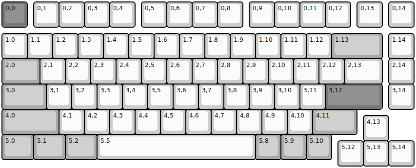{:loading="lazy"}

[Open in keyboard-layout-editor](http://www.keyboard-layout-editor.com/##@@_c=#777777;&=0,0&_x:0.25&c=#cccccc;&=0,1&=0,2&=0,3&=0,4&_x:0.25;&=0,5&=0,6&=0,7&=0,8&_x:0.25;&=0,9&=0,10&=0,11&=0,12&_x:0.25;&=0,13&_x:0.25;&=0,14%0A%0A%0A%0A%0A%0A%0A%0A%0Ae0;&@_y:0.25;&=1,0&=1,1&=1,2&=1,3&=1,4&=1,5&=1,6&=1,7&=1,8&=1,9&=1,10&=1,11&=1,12&_c=#aaaaaa&w:2;&=1,13&_x:0.25&c=#cccccc;&=1,14;&@_c=#aaaaaa&w:1.5;&=2,0&_c=#cccccc;&=2,1&=2,2&=2,3&=2,4&=2,5&=2,6&=2,7&=2,8&=2,9&=2,10&=2,11&=2,12&_w:1.5;&=2,13&_x:0.25;&=2,14;&@_c=#aaaaaa&w:1.75;&=3,0&_c=#cccccc;&=3,1&=3,2&=3,3&=3,4&=3,5&=3,6&=3,7&=3,8&=3,9&=3,10&=3,11&_c=#777777&w:2.25;&=3,12&_x:0.25&c=#cccccc;&=3,14;&@_c=#aaaaaa&w:2.25;&=4,0&_c=#cccccc;&=4,1&=4,2&=4,3&=4,4&=4,5&=4,6&=4,7&=4,8&=4,9&=4,10&_c=#aaaaaa&w:1.75;&=4,11;&@_x:14.25&y:-0.75&c=#cccccc;&=4,13;&@_y:-0.25&c=#aaaaaa&w:1.25;&=5,0&_w:1.25;&=5,1&_w:1.25;&=5,2&_c=#cccccc&w:6.25;&=5,5&_c=#aaaaaa;&=5,8&=5,9&=5,10;&@_x:13.25&y:-0.75&c=#cccccc;&=5,12&=5,13&=5,14)

## duck/eagle_viper/v2/eagle_viper

[README](output/duck/eagle_viper/v2/README.md) - [layout](output/duck/eagle_viper/v2/eagle_viper-kle.json) - [PCB](output/duck/eagle_viper/v2/eagle_viper.kicad_pcb) - [PCB render](output/duck/eagle_viper/v2/eagle_viper-render.svg)

{:loading="lazy"}

[Open in keyboard-layout-editor](http://www.keyboard-layout-editor.com/##@@_x:2.75&c=#777777;&=0,0&_c=#cccccc;&=0,1&=0,2&=0,3&=0,4&=0,5&=0,6&=0,7&=0,8&=0,9&=0,10&=0,11&=0,12&_c=#aaaaaa&w:2;&=0,14%0A%0A%0A0,0;&@_x:2.75&w:1.5;&=1,0&_c=#cccccc;&=1,1&=1,2&=1,3&=1,4&=1,5&=1,6&=1,7&=1,8&=1,9&=1,10&=1,11&=1,12&_w:1.5;&=1,14%0A%0A%0A1,0;&@_x:2.75&c=#aaaaaa&w:1.75;&=2,0&_c=#cccccc;&=2,1&=2,2&=2,3&=2,4&=2,5&=2,6&=2,7&=2,8&=2,9&=2,10&=2,11&_c=#777777&w:2.25;&=2,14%0A%0A%0A1,0;&@_x:2.75&c=#aaaaaa&w:2.25;&=3,0%0A%0A%0A2,0&_c=#cccccc;&=3,2&=3,3&=3,4&=3,5&=3,6&=3,7&=3,8&=3,9&=3,10&=3,12&_c=#aaaaaa&w:2.75;&=3,13%0A%0A%0A3,0;&@_x:2.75&w:1.25;&=4,0%0A%0A%0A4,0&_w:1.25;&=4,1%0A%0A%0A4,0&_w:1.25;&=4,2%0A%0A%0A4,0&_c=#cccccc&w:6.25;&=4,8%0A%0A%0A4,0&_c=#aaaaaa&w:1.25;&=4,10%0A%0A%0A4,0&_w:1.25;&=4,12%0A%0A%0A4,0&_w:1.25;&=4,13%0A%0A%0A4,0&_w:1.25;&=4,14%0A%0A%0A4,0;&@_x:18.25&y:-5&c=#cccccc;&=0,13%0A%0A%0A0,1&=0,14%0A%0A%0A0,1;&@_x:19.25&c=#777777&w:1.25&h:2&w2:1.5&h2:1&x2:-0.25;&=2,14%0A%0A%0A1,1;&@_x:18.25&c=#cccccc;&=2,12%0A%0A%0A1,1;&@_c=#aaaaaa&w:1.25;&=3,0%0A%0A%0A2,1&_c=#cccccc;&=3,1%0A%0A%0A2,1&_x:16.0&c=#aaaaaa&w:1.75;&=3,13%0A%0A%0A3,1&_c=#cccccc;&=3,14%0A%0A%0A3,1;&@_x:2.75&y:1.5&c=#aaaaaa&w:1.5;&=4,0%0A%0A%0A4,1&=4,1%0A%0A%0A4,1&_w:1.5;&=4,2%0A%0A%0A4,1&_c=#cccccc&w:7;&=4,8%0A%0A%0A4,1&_c=#aaaaaa&w:1.5;&=4,12%0A%0A%0A4,1&=4,13%0A%0A%0A4,1&_w:1.5;&=4,14%0A%0A%0A4,1;&@_x:2.75&y:0.25&w:1.5&d:true;&=%0A%0A%0A4,2&=4,1%0A%0A%0A4,2&_w:1.5;&=4,2%0A%0A%0A4,2&_c=#cccccc&w:7;&=4,8%0A%0A%0A4,2&_c=#aaaaaa&w:1.5;&=4,12%0A%0A%0A4,2&=4,13%0A%0A%0A4,2&_w:1.5&d:true;&=%0A%0A%0A4,2)

## duck/octagon/v2/Octagon v2

[README](output/duck/octagon/v2/README.md) - [layout](output/duck/octagon/v2/Octagon v2-kle.json) - [PCB](output/duck/octagon/v2/Octagon v2.kicad_pcb) - [PCB render](output/duck/octagon/v2/Octagon v2-render.svg)

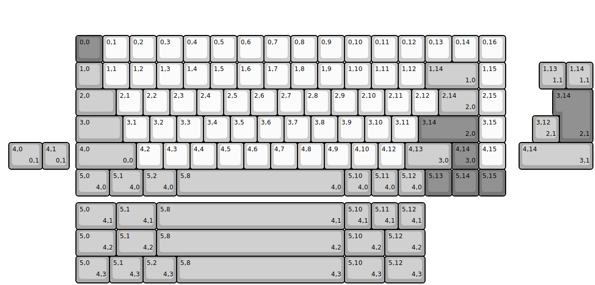{:loading="lazy"}

[Open in keyboard-layout-editor](http://www.keyboard-layout-editor.com/##@@_x:2.75&y:1.25&c=#777777;&=0,0&_c=#cccccc;&=0,1&=0,2&=0,3&=0,4&=0,5&=0,6&=0,7&=0,8&=0,9&=0,10&=0,11&=0,12&=0,13&=0,14&=0,16;&@_x:2.75&c=#aaaaaa;&=1,0&_c=#cccccc;&=1,1&=1,2&=1,3&=1,4&=1,5&=1,6&=1,7&=1,8&=1,9&=1,10&=1,11&=1,12&_c=#aaaaaa&w:2;&=1,14%0A%0A%0A1,0&_c=#cccccc;&=1,15;&@_x:2.75&c=#aaaaaa&w:1.5;&=2,0&_c=#cccccc;&=2,1&=2,2&=2,3&=2,4&=2,5&=2,6&=2,7&=2,8&=2,9&=2,10&=2,11&=2,12&_c=#aaaaaa&w:1.5;&=2,14%0A%0A%0A2,0&_c=#cccccc;&=2,15;&@_x:2.75&c=#aaaaaa&w:1.75;&=3,0&_c=#cccccc;&=3,1&=3,2&=3,3&=3,4&=3,5&=3,6&=3,7&=3,8&=3,9&=3,10&=3,11&_c=#777777&w:2.25;&=3,14%0A%0A%0A2,0&_c=#cccccc;&=3,15;&@_x:2.75&c=#aaaaaa&w:2.25;&=4,0%0A%0A%0A0,0&_c=#cccccc;&=4,2&=4,3&=4,4&=4,5&=4,6&=4,7&=4,8&=4,9&=4,10&=4,12&_c=#aaaaaa&w:1.75;&=4,13%0A%0A%0A3,0&_c=#777777;&=4,14%0A%0A%0A3,0&_c=#cccccc;&=4,15;&@_x:2.75&c=#aaaaaa&w:1.25;&=5,0%0A%0A%0A4,0&_w:1.25;&=5,1%0A%0A%0A4,0&_w:1.25;&=5,2%0A%0A%0A4,0&_w:6.25;&=5,8%0A%0A%0A4,0&=5,10%0A%0A%0A4,0&=5,11%0A%0A%0A4,0&=5,12%0A%0A%0A4,0&_c=#777777;&=5,13&=5,14&=5,15;&@_x:20.0&y:-5.0&c=#aaaaaa;&=1,13%0A%0A%0A1,1&=1,14%0A%0A%0A1,1;&@_x:20.75&c=#777777&w:1.25&h:2&w2:1.5&h2:1&x2:-0.25;&=3,14%0A%0A%0A2,1;&@_x:19.75&c=#aaaaaa;&=3,12%0A%0A%0A2,1;&@_x:0.25&w:1.25;&=4,0%0A%0A%0A0,1&=4,1%0A%0A%0A0,1&_x:16.75&w:2.75;&=4,14%0A%0A%0A3,1;&@_x:2.75&y:1.25&w:1.5;&=5,0%0A%0A%0A4,1&_w:1.5;&=5,1%0A%0A%0A4,1&_w:7;&=5,8%0A%0A%0A4,1&=5,10%0A%0A%0A4,1&=5,11%0A%0A%0A4,1&=5,12%0A%0A%0A4,1;&@_x:2.75&w:1.5;&=5,0%0A%0A%0A4,2&_w:1.5;&=5,1%0A%0A%0A4,2&_w:7;&=5,8%0A%0A%0A4,2&_w:1.5;&=5,10%0A%0A%0A4,2&_w:1.5;&=5,12%0A%0A%0A4,2;&@_x:2.75&w:1.25;&=5,0%0A%0A%0A4,3&_w:1.25;&=5,1%0A%0A%0A4,3&_w:1.25;&=5,2%0A%0A%0A4,3&_w:6.25;&=5,8%0A%0A%0A4,3&_w:1.5;&=5,10%0A%0A%0A4,3&_w:1.5;&=5,12%0A%0A%0A4,3)

## duck/tcv3

[README](output/duck/tcv3/README.md) - [layout](output/duck/tcv3/tcv3-kle.json) - [PCB](output/duck/tcv3/tcv3.kicad_pcb) - [PCB render](output/duck/tcv3/tcv3-render.svg)

{:loading="lazy"}

[Open in keyboard-layout-editor](http://www.keyboard-layout-editor.com/##@@_x:2.75&y:1.5&c=#aaaaaa;&=0,0&=0,1&_x:0.25&c=#777777;&=0,2&_x:1.0&c=#cccccc;&=0,4&=0,5&=0,6&=0,7&_x:0.5&c=#aaaaaa;&=0,9&=0,10&=0,11&=0,12&_x:0.5&c=#cccccc;&=0,13&=0,14&=0,15&=0,16&_x:0.25&c=#aaaaaa;&=0,19&=0,18;&@_x:2.75&y:0.5;&=1,0&=1,1&_x:0.25&c=#cccccc;&=1,2&=1,3&=1,4&=1,5&=1,6&=1,7&=1,8&=1,9&=1,10&=1,11&=1,12&=1,13&=1,14&_c=#aaaaaa&w:2;&=1,16%0A%0A%0A0,0&_x:0.25;&=1,17&=1,18;&@_x:2.75;&=2,0&=2,1&_x:0.25&w:1.5;&=2,2&_c=#cccccc;&=2,3&=2,4&=2,5&=2,6&=2,7&=2,8&=2,9&=2,10&=2,11&=2,12&=2,13&=2,14&_w:1.5;&=2,16%0A%0A%0A1,0&_x:0.25&c=#aaaaaa;&=2,17&=2,18;&@_x:2.75;&=3,0&=3,1&_x:0.25&w:1.75;&=3,2&_c=#cccccc;&=3,3&=3,4&=3,5&=3,6&=3,7&=3,8&=3,9&=3,10&=3,11&=3,12&=3,13&_c=#777777&w:2.25;&=3,16%0A%0A%0A1,0&_x:0.25&c=#aaaaaa;&=3,17&=3,18;&@_x:2.75;&=4,0&=4,1&_x:0.25&w:2.25;&=4,2%0A%0A%0A2,0&_c=#cccccc;&=4,4&=4,5&=4,6&=4,7&=4,8&=4,9&=4,10&=4,11&=4,12&=4,14&_c=#aaaaaa&w:2.75;&=4,15%0A%0A%0A3,0;&@_x:20.25&y:-0.75;&=4,17;&@_x:2.75&y:-0.25;&=5,0&=5,1&_x:0.25&w:1.5;&=5,2%0A%0A%0A4,0&=5,3%0A%0A%0A4,0&_w:1.5;&=5,4%0A%0A%0A4,0&_c=#cccccc&w:6;&=5,10%0A%0A%0A4,0&_c=#aaaaaa&w:1.5;&=5,12%0A%0A%0A4,0&=5,14%0A%0A%0A4,0&_w:1.5;&=5,15%0A%0A%0A4,0;&@_x:19.25&y:-0.75;&=5,16&=5,17&=5,18;&@_x:18&y:-8.25&c=#cccccc;&=0,15%0A%0A%0A0,1&=0,16%0A%0A%0A0,1;&@_x:24.0&y:3.0&c=#777777&w:1.25&h:2&w2:1.5&h2:1&x2:-0.25;&=3,16%0A%0A%0A1,1;&@_x:23.0&c=#cccccc;&=3,14%0A%0A%0A1,1;&@_c=#aaaaaa&w:1.25;&=4,2%0A%0A%0A2,1&_c=#cccccc;&=4,3%0A%0A%0A2,1&_x:20.75&c=#aaaaaa&w:1.75;&=4,15%0A%0A%0A3,1&_c=#cccccc;&=4,16%0A%0A%0A3,1;&@_x:5&y:2.0&c=#aaaaaa&w:1.5;&=5,2%0A%0A%0A4,1&=5,3%0A%0A%0A4,1&_w:1.5;&=5,4%0A%0A%0A4,1&_c=#cccccc&w:6.25;&=5,10%0A%0A%0A4,1&_c=#aaaaaa&w:1.25;&=5,12%0A%0A%0A4,1&_w:1.25;&=5,14%0A%0A%0A4,1&_w:1.25;&=5,15%0A%0A%0A4,1;&@_x:5&w:1.25;&=5,2%0A%0A%0A4,2&_w:1.25;&=5,3%0A%0A%0A4,2&_w:1.25;&=5,4%0A%0A%0A4,2&_c=#cccccc&w:6.25;&=5,10%0A%0A%0A4,2&_c=#aaaaaa&w:1.5;&=5,12%0A%0A%0A4,2&_w:1.5;&=5,14%0A%0A%0A4,2&=5,15%0A%0A%0A4,2;&@_x:5&w:1.25;&=5,2%0A%0A%0A4,3&_w:1.25;&=5,3%0A%0A%0A4,3&_w:1.25;&=5,4%0A%0A%0A4,3&_c=#cccccc&w:6.25;&=5,10%0A%0A%0A4,3&_c=#aaaaaa&w:1.5;&=5,12%0A%0A%0A4,3&=5,14%0A%0A%0A4,3&_w:1.5;&=5,15%0A%0A%0A4,3;&@_x:5&w:1.25;&=5,2%0A%0A%0A4,4&_w:1.25;&=5,3%0A%0A%0A4,4&_w:1.25;&=5,4%0A%0A%0A4,4&_c=#cccccc&w:6.25;&=5,10%0A%0A%0A4,4&_c=#aaaaaa&w:1.5;&=5,12%0A%0A%0A4,4&_w:1.25;&=5,14%0A%0A%0A4,4&_w:1.25;&=5,15%0A%0A%0A4,4;&@_x:5&w:1.5;&=5,2%0A%0A%0A4,5&=5,3%0A%0A%0A4,5&_w:1.5;&=5,4%0A%0A%0A4,5&_c=#cccccc&w:7;&=5,10%0A%0A%0A4,5&_c=#aaaaaa&w:1.5;&=5,12%0A%0A%0A4,5&_w:1.5;&=5,14%0A%0A%0A4,5)

## duckle/vitamins_included

[README](output/duckle/README.md) - [layout](output/duckle/vitamins_included-kle.json) - [PCB](output/duckle/vitamins_included.kicad_pcb) - [PCB render](output/duckle/vitamins_included-render.svg)

{:loading="lazy"}

[Open in keyboard-layout-editor](http://www.keyboard-layout-editor.com/##@@_c=#777777;&=0,0&_c=#cccccc;&=0,1&=0,2&=0,3&=0,4&=0,5&_x:1;&=4,0&=4,1&=4,2&=4,3&=4,4&_c=#777777;&=4,5;&@=1,0&_c=#cccccc;&=1,1&=1,2&=1,3&=1,4&=1,5&_x:1;&=5,0&=5,1&=5,2&=5,3&=5,4&_c=#777777;&=5,5;&@=2,0&_c=#cccccc;&=2,1&=2,2&=2,3&=2,4&=2,5&_x:1;&=6,0&=6,1&=6,2&=6,3&=6,4&_c=#777777;&=6,5;&@=3,0&=3,1&=3,2&=3,3&=3,4%0A%0A%0A0,0&_c=#cccccc;&=3,5%0A%0A%0A0,0&_x:1;&=7,0%0A%0A%0A1,0&=7,1%0A%0A%0A1,0&_c=#777777;&=7,2&=7,3&=7,4&=7,5;&@_x:4&c=#cccccc&w:2;&=3,5%0A%0A%0A0,1&_x:1&w:2;&=7,0%0A%0A%0A1,1)

## dumbpad/dumbpad

[README](output/dumbpad/README.md) - [layout](output/dumbpad/dumbpad-kle.json) - [PCB](output/dumbpad/dumbpad.kicad_pcb) - [PCB render](output/dumbpad/dumbpad-render.svg)

{:loading="lazy"}

[Open in keyboard-layout-editor](http://www.keyboard-layout-editor.com/##@@_x:1;&=0,1&=0,2&=0,3&=0,4;&@_x:1;&=1,1&=1,2&=1,3&=1,4;&@_x:1;&=2,1&=2,2&=2,3&=2,4;&@=3,0&=3,1&=3,2&=3,3&=3,4)

## durgod/galaxy

[README](output/durgod/galaxy/README.md) - [layout](output/durgod/galaxy/galaxy-kle.json) - [PCB](output/durgod/galaxy/galaxy.kicad_pcb) - [PCB render](output/durgod/galaxy/galaxy-render.svg)

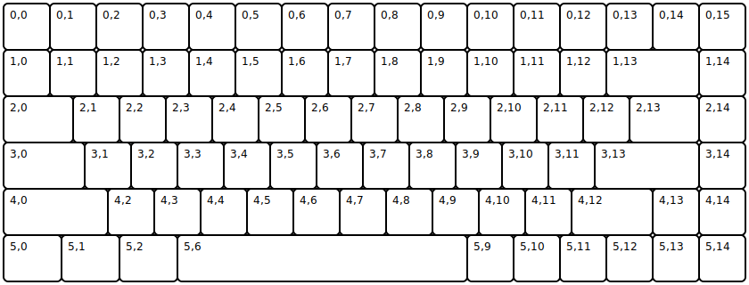{:loading="lazy"}

[Open in keyboard-layout-editor](http://www.keyboard-layout-editor.com/##@@_c=#ffffff;&=0,0&=0,1&=0,2&=0,3&=0,4&=0,5&=0,6&=0,7&=0,8&=0,9&=0,10&=0,11&=0,12&=0,13&=0,14&=0,15;&@=1,0&=1,1&=1,2&=1,3&=1,4&=1,5&=1,6&=1,7&=1,8&=1,9&=1,10&=1,11&=1,12&_w:2;&=1,13&=1,14;&@_w:1.5;&=2,0&=2,1&=2,2&=2,3&=2,4&=2,5&=2,6&=2,7&=2,8&=2,9&=2,10&=2,11&=2,12&_w:1.5;&=2,13&=2,14;&@_w:1.75;&=3,0&=3,1&=3,2&=3,3&=3,4&=3,5&=3,6&=3,7&=3,8&=3,9&=3,10&=3,11&_w:2.25;&=3,13&=3,14;&@_w:2.25;&=4,0&=4,2&=4,3&=4,4&=4,5&=4,6&=4,7&=4,8&=4,9&=4,10&=4,11&_w:1.75;&=4,12&=4,13&=4,14;&@_w:1.25;&=5,0&_w:1.25;&=5,1&_w:1.25;&=5,2&_w:6.25;&=5,6&=5,9&=5,10&=5,11&=5,12&=5,13&=5,14)

## durgod/hades/hades_ansi

[README](output/durgod/hades/README.md) - [layout](output/durgod/hades/hades_ansi-kle.json) - [PCB](output/durgod/hades/hades_ansi.kicad_pcb) - [PCB render](output/durgod/hades/hades_ansi-render.svg)

{:loading="lazy"}

[Open in keyboard-layout-editor](http://www.keyboard-layout-editor.com/##@@_c=#ffffff;&=0,0&=0,1&=0,2&=0,3&=0,4&=0,5&=0,6&=0,7&=0,8&=0,9&=0,10&=0,11&=0,12&_w:2;&=0,13&=0,14;&@_w:1.5;&=1,0&=1,1&=1,2&=1,3&=1,4&=1,5&=1,6&=1,7&=1,8&=1,9&=1,10&=1,11&=1,12&_w:1.5;&=1,13&=1,14;&@_w:1.75;&=2,0&=2,1&=2,2&=2,3&=2,4&=2,5&=2,6&=2,7&=2,8&=2,9&=2,10&=2,11&_w:2.25;&=2,13&=2,14;&@_w:2.25;&=3,0&=3,1&=3,2&=3,3&=3,4&=3,5&=3,6&=3,7&=3,8&=3,9&=3,10&_w:1.75;&=3,11&=3,13&=3,14;&@_w:1.25;&=4,0&_w:1.25;&=4,1&_w:1.25;&=4,2&_w:6.25;&=4,5&=4,9&=4,10&=4,11&=4,12&=4,13&=4,14)

## durgod/hades/hades_iso

[README](output/durgod/hades/README.md) - [layout](output/durgod/hades/hades_iso-kle.json) - [PCB](output/durgod/hades/hades_iso.kicad_pcb) - [PCB render](output/durgod/hades/hades_iso-render.svg)

{:loading="lazy"}

[Open in keyboard-layout-editor](http://www.keyboard-layout-editor.com/##@@_c=#777777;&=0,0&_c=#cccccc;&=0,1&=0,2&=0,3&=0,4&=0,5&=0,6&=0,7&=0,8&=0,9&=0,10&=0,11&=0,12&_c=#aaaaaa&w:2;&=0,13&=0,14;&@_w:1.5;&=1,0&_c=#cccccc;&=1,1&=1,2&=1,3&=1,4&=1,5&=1,6&=1,7&=1,8&=1,9&=1,10&=1,11&=1,12&_x:0.25&c=#777777&w:1.25&h:2&w2:1.5&h2:1&x2:-0.25;&=2,13&_c=#aaaaaa;&=1,14;&@_w:1.75;&=2,0&_c=#cccccc;&=2,1&=2,2&=2,3&=2,4&=2,5&=2,6&=2,7&=2,8&=2,9&=2,10&=2,11&=2,12&_x:1.25&c=#aaaaaa;&=2,14;&@_w:1.25;&=3,0&_c=#cccccc;&=3,1&=3,2&=3,3&=3,4&=3,5&=3,6&=3,7&=3,8&=3,9&=3,10&=3,11&_c=#aaaaaa&w:1.75;&=3,12&_c=#cccccc;&=3,13&_c=#aaaaaa;&=3,14;&@_w:1.25;&=4,0&_w:1.25;&=4,1&_w:1.25;&=4,2&_c=#cccccc&w:6.25;&=4,5&_c=#aaaaaa;&=4,9&=4,10&=4,11&_c=#cccccc;&=4,12&=4,13&=4,14)

## durgod/k310

[README](output/durgod/k310/README.md) - [layout](output/durgod/k310/k310-kle.json) - [PCB](output/durgod/k310/k310.kicad_pcb) - [PCB render](output/durgod/k310/k310-render.svg)

{:loading="lazy"}

[Open in keyboard-layout-editor](http://www.keyboard-layout-editor.com/##@@_c=#777777;&=0,0&_x:1&c=#cccccc;&=0,1&=0,2&=0,3&=0,4&_x:0.5&c=#aaaaaa;&=0,5&=0,6&=0,7&=0,8&_x:0.5&c=#cccccc;&=0,9&=0,10&=0,11&=0,12&_x:0.25&c=#aaaaaa;&=0,13&=0,14&=0,15;&@_y:0.5&c=#cccccc;&=1,0&=1,1&=1,2&=1,3&=1,4&=1,5&=1,6&=1,7&=1,8&=1,9&=1,10&=1,11&=1,12&_c=#aaaaaa&w:2;&=1,14&_x:0.25;&=2,14&=2,15&=1,15&_x:0.25;&=6,10&=6,9&=6,8&=6,7;&@_w:1.5;&=2,0&_c=#cccccc;&=2,1&=2,2&=2,3&=2,4&=2,5&=2,6&=2,7&=2,8&=2,9&=2,10&=2,11&=2,12&_x:0.25&c=#777777&w:1.25&h:2&w2:1.5&h2:1&x2:-0.25;&=4,14%0A%0A%0A0,0&_x:0.25&c=#aaaaaa;&=3,13&=3,14&=3,15&_x:0.25&c=#cccccc;&=7,10&=7,9&=7,8&_c=#aaaaaa&h:2;&=6,11;&@_w:1.75;&=3,0&_c=#cccccc;&=3,1&=3,2&=3,3&=3,4&=3,5&=3,6&=3,7&=3,8&=3,9&=3,10&=3,11&=3,12%0A%0A%0A0,0&_x:4.75;&=7,14&=7,13&=7,12;&@_c=#aaaaaa&w:1.25;&=4,0%0A%0A%0A0,0&_c=#cccccc;&=4,1%0A%0A%0A0,0&=4,2&=4,3&=4,4&=4,5&=4,6&=4,7&=4,8&=4,9&=4,10&=4,11&_c=#aaaaaa&w:2.75;&=4,13&_x:1.25&c=#777777;&=4,15&_x:1.25&c=#cccccc;&=6,14&=6,13&=6,12&_c=#777777&h:2;&=7,11;&@_c=#aaaaaa&w:1.25;&=5,0&_w:1.25;&=5,1&_w:1.25;&=5,2&_c=#cccccc&w:6.25;&=5,6&_c=#aaaaaa&w:1.25;&=5,10&_w:1.25;&=5,11&_w:1.25;&=5,12&_w:1.25;&=5,13&_x:0.25&c=#777777;&=5,14&=5,15&=6,15&_x:0.25&c=#cccccc&w:2;&=7,15&=7,7;&@_x:13.5&y:0.5&w:1.5;&=2,13%0A%0A%0A0,1;&@_x:12.75&c=#777777&w:2.25;&=4,14%0A%0A%0A0,1;&@_c=#aaaaaa&w:2.25;&=4,0%0A%0A%0A0,1)

## durgod/k320

[README](output/durgod/k320/README.md) - [layout](output/durgod/k320/k320-kle.json) - [PCB](output/durgod/k320/k320.kicad_pcb) - [PCB render](output/durgod/k320/k320-render.svg)

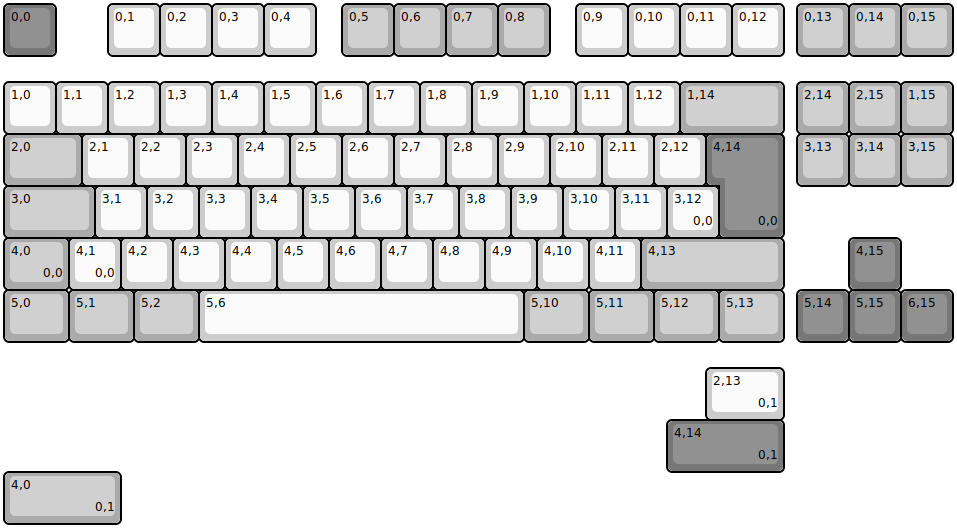{:loading="lazy"}

[Open in keyboard-layout-editor](http://www.keyboard-layout-editor.com/##@@_c=#777777;&=0,0&_x:1&c=#cccccc;&=0,1&=0,2&=0,3&=0,4&_x:0.5&c=#aaaaaa;&=0,5&=0,6&=0,7&=0,8&_x:0.5&c=#cccccc;&=0,9&=0,10&=0,11&=0,12&_x:0.25&c=#aaaaaa;&=0,13&=0,14&=0,15;&@_y:0.5&c=#cccccc;&=1,0&=1,1&=1,2&=1,3&=1,4&=1,5&=1,6&=1,7&=1,8&=1,9&=1,10&=1,11&=1,12&_c=#aaaaaa&w:2;&=1,14&_x:0.25;&=2,14&=2,15&=1,15;&@_w:1.5;&=2,0&_c=#cccccc;&=2,1&=2,2&=2,3&=2,4&=2,5&=2,6&=2,7&=2,8&=2,9&=2,10&=2,11&=2,12&_x:0.25&c=#777777&w:1.25&h:2&w2:1.5&h2:1&x2:-0.25;&=4,14%0A%0A%0A0,0&_x:0.25&c=#aaaaaa;&=3,13&=3,14&=3,15;&@_w:1.75;&=3,0&_c=#cccccc;&=3,1&=3,2&=3,3&=3,4&=3,5&=3,6&=3,7&=3,8&=3,9&=3,10&=3,11&=3,12%0A%0A%0A0,0;&@_c=#aaaaaa&w:1.25;&=4,0%0A%0A%0A0,0&_c=#cccccc;&=4,1%0A%0A%0A0,0&=4,2&=4,3&=4,4&=4,5&=4,6&=4,7&=4,8&=4,9&=4,10&=4,11&_c=#aaaaaa&w:2.75;&=4,13&_x:1.25&c=#777777;&=4,15;&@_c=#aaaaaa&w:1.25;&=5,0&_w:1.25;&=5,1&_w:1.25;&=5,2&_c=#cccccc&w:6.25;&=5,6&_c=#aaaaaa&w:1.25;&=5,10&_w:1.25;&=5,11&_w:1.25;&=5,12&_w:1.25;&=5,13&_x:0.25&c=#777777;&=5,14&=5,15&=6,15;&@_x:13.5&y:0.5&c=#cccccc&w:1.5;&=2,13%0A%0A%0A0,1;&@_x:12.75&c=#777777&w:2.25;&=4,14%0A%0A%0A0,1;&@_c=#aaaaaa&w:2.25;&=4,0%0A%0A%0A0,1)

## durgod/venus

[README](output/durgod/venus/README.md) - [layout](output/durgod/venus/venus-kle.json) - [PCB](output/durgod/venus/venus.kicad_pcb) - [PCB render](output/durgod/venus/venus-render.svg)

{:loading="lazy"}

[Open in keyboard-layout-editor](http://www.keyboard-layout-editor.com/##@@_c=#777777;&=0,0&_c=#cccccc;&=0,1&=0,2&=0,3&=0,4&=0,5&=0,6&=0,7&=0,8&=0,9&=0,10&=0,11&=0,12&_c=#aaaaaa&w:2;&=0,13;&@_w:1.5;&=1,0&_c=#cccccc;&=1,1&=1,2&=1,3&=1,4&=1,5&=1,6&=1,7&=1,8&=1,9&=1,10&=1,11&=1,12&_w:1.5;&=1,13;&@_c=#aaaaaa&w:1.75;&=2,0&_c=#cccccc;&=2,1&=2,2&=2,3&=2,4&=2,5&=2,6&=2,7&=2,8&=2,9&=2,10&=2,11&_c=#777777&w:2.25;&=2,13;&@_c=#aaaaaa&w:2.25;&=3,0&_c=#cccccc;&=3,1&=3,2&=3,3&=3,4&=3,5&=3,6&=3,7&=3,8&=3,9&=3,10&_c=#aaaaaa&w:2.75;&=3,11;&@_w:1.25;&=4,0&_w:1.25;&=4,1&_w:1.25;&=4,2&_c=#cccccc&w:6.25;&=4,5&_c=#aaaaaa&w:1.25;&=4,9&_w:1.25;&=4,10&_w:1.25;&=4,11&_w:1.25;&=4,12)

## dyz/dyz.tkl.via

[README](output/dyz/README.md) - [layout](output/dyz/dyz.tkl.via-kle.json) - [PCB](output/dyz/dyz.tkl.via.kicad_pcb) - [PCB render](output/dyz/dyz.tkl.via-render.svg)

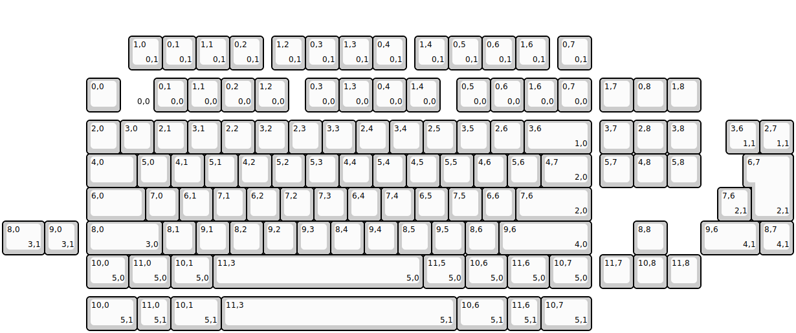{:loading="lazy"}

[Open in keyboard-layout-editor](http://www.keyboard-layout-editor.com/##@@_x:2.5&y:2.25;&=0,0&_x:0.25&w:0.75&d:true;&=%0A%0A%0A0,0&=0,1%0A%0A%0A0,0&=1,1%0A%0A%0A0,0&=0,2%0A%0A%0A0,0&=1,2%0A%0A%0A0,0&_x:0.5;&=0,3%0A%0A%0A0,0&=1,3%0A%0A%0A0,0&=0,4%0A%0A%0A0,0&=1,4%0A%0A%0A0,0&_x:0.5;&=0,5%0A%0A%0A0,0&=0,6%0A%0A%0A0,0&=1,6%0A%0A%0A0,0&=0,7%0A%0A%0A0,0&_x:0.25;&=1,7&=0,8&=1,8;&@_x:2.5&y:0.25;&=2,0&=3,0&=2,1&=3,1&=2,2&=3,2&=2,3&=3,3&=2,4&=3,4&=2,5&=3,5&=2,6&_w:2;&=3,6%0A%0A%0A1,0&_x:0.25;&=3,7&=2,8&=3,8;&@_x:2.5&w:1.5;&=4,0&=5,0&=4,1&=5,1&=4,2&=5,2&=5,3&=4,4&=5,4&=4,5&=5,5&=4,6&=5,6&_w:1.5;&=4,7%0A%0A%0A2,0&_x:0.25;&=5,7&=4,8&=5,8;&@_x:2.5&w:1.75;&=6,0&=7,0&=6,1&=7,1&=6,2&=7,2&=7,3&=6,4&=7,4&=6,5&=7,5&=6,6&_w:2.25;&=7,6%0A%0A%0A2,0;&@_x:2.5&w:2.25;&=8,0%0A%0A%0A3,0&=8,1&=9,1&=8,2&=9,2&=9,3&=8,4&=9,4&=8,5&=9,5&=8,6&_w:2.75;&=9,6%0A%0A%0A4,0&_x:1.25;&=8,8;&@_x:2.5&w:1.25;&=10,0%0A%0A%0A5,0&_w:1.25;&=11,0%0A%0A%0A5,0&_w:1.25;&=10,1%0A%0A%0A5,0&_w:6.25;&=11,3%0A%0A%0A5,0&_w:1.25;&=11,5%0A%0A%0A5,0&_w:1.25;&=10,6%0A%0A%0A5,0&_w:1.25;&=11,6%0A%0A%0A5,0&_w:1.25;&=10,7%0A%0A%0A5,0&_x:0.25;&=11,7&=10,8&=11,8;&@_x:3.75&y:-7.5;&=1,0%0A%0A%0A0,1&=0,1%0A%0A%0A0,1&=1,1%0A%0A%0A0,1&=0,2%0A%0A%0A0,1&_x:0.25;&=1,2%0A%0A%0A0,1&=0,3%0A%0A%0A0,1&=1,3%0A%0A%0A0,1&=0,4%0A%0A%0A0,1&_x:0.25;&=1,4%0A%0A%0A0,1&=0,5%0A%0A%0A0,1&=0,6%0A%0A%0A0,1&=1,6%0A%0A%0A0,1&_x:0.25;&=0,7%0A%0A%0A0,1;&@_x:21.5&y:1.5;&=3,6%0A%0A%0A1,1&=2,7%0A%0A%0A1,1;&@_x:22.25&w:1.25&h:2&w2:1.5&h2:1&x2:-0.25;&=6,7%0A%0A%0A2,1;&@_x:21.25;&=7,6%0A%0A%0A2,1;&@_w:1.25;&=8,0%0A%0A%0A3,1&=9,0%0A%0A%0A3,1&_x:18.5&w:1.75;&=9,6%0A%0A%0A4,1&=8,7%0A%0A%0A4,1;&@_x:2.5&y:1.25&w:1.5;&=10,0%0A%0A%0A5,1&=11,0%0A%0A%0A5,1&_w:1.5;&=10,1%0A%0A%0A5,1&_w:7;&=11,3%0A%0A%0A5,1&_w:1.5;&=10,6%0A%0A%0A5,1&=11,6%0A%0A%0A5,1&_w:1.5;&=10,7%0A%0A%0A5,1)

## dyz/dyz40.via

[README](output/dyz/README.md) - [layout](output/dyz/dyz40.via-kle.json) - [PCB](output/dyz/dyz40.via.kicad_pcb) - [PCB render](output/dyz/dyz40.via-render.svg)

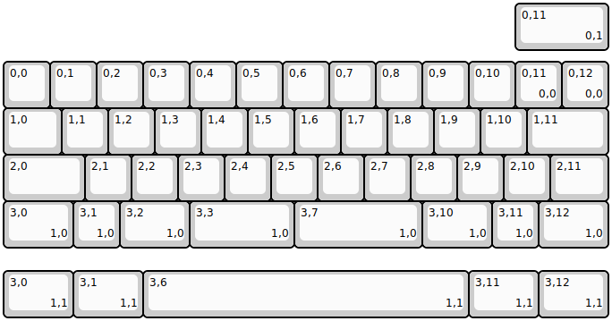{:loading="lazy"}

[Open in keyboard-layout-editor](http://www.keyboard-layout-editor.com/##@@_y:1.25;&=0,0&=0,1&=0,2&=0,3&=0,4&=0,5&=0,6&=0,7&=0,8&=0,9&=0,10&=0,11%0A%0A%0A0,0&=0,12%0A%0A%0A0,0;&@_w:1.25;&=1,0&=1,1&=1,2&=1,3&=1,4&=1,5&=1,6&=1,7&=1,8&=1,9&=1,10%0A%0A%0A%0A%0A%0A%0A%0A%0A%0A'&_w:1.75;&=1,11;&@_w:1.75;&=2,0&=2,1&=2,2&=2,3&=2,4&=2,5&=2,6&=2,7&=2,8&=2,9&=2,10&_w:1.25;&=2,11;&@_w:1.5;&=3,0%0A%0A%0A1,0&=3,1%0A%0A%0A1,0&_w:1.5;&=3,2%0A%0A%0A1,0&_w:2.25;&=3,3%0A%0A%0A1,0&_w:2.75;&=3,7%0A%0A%0A1,0&_w:1.5;&=3,10%0A%0A%0A1,0&=3,11%0A%0A%0A1,0&_w:1.5;&=3,12%0A%0A%0A1,0;&@_x:11&y:-5.25&w:2;&=0,11%0A%0A%0A0,1;&@_y:4.75&w:1.5;&=3,0%0A%0A%0A1,1&_w:1.5;&=3,1%0A%0A%0A1,1&_w:7;&=3,6%0A%0A%0A1,1&_w:1.5;&=3,11%0A%0A%0A1,1&_w:1.5;&=3,12%0A%0A%0A1,1)

## dyz/dyz60-hs

[README](output/dyz/README.md) - [layout](output/dyz/dyz60-hs-kle.json) - [PCB](output/dyz/dyz60-hs.kicad_pcb) - [PCB render](output/dyz/dyz60-hs-render.svg)

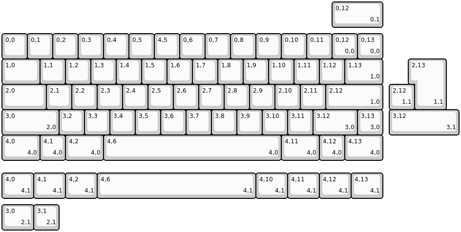{:loading="lazy"}

[Open in keyboard-layout-editor](http://www.keyboard-layout-editor.com/##@@_y:1.25;&=0,0&=0,1&=0,2&=0,3&=0,4&=0,5&=4,5&=0,6&=0,7&=0,8&=0,9&=0,10&=0,11&=0,12%0A%0A%0A0,0&=0,13%0A%0A%0A0,0;&@_w:1.5;&=1,0&=1,1&=1,2&=1,3&=1,4&=1,5&=1,6&=1,7&=1,8&=1,9&=1,10&=1,11&=1,12&_w:1.5;&=1,13%0A%0A%0A1,0;&@_w:1.75;&=2,0&=2,1&=2,2&=2,3&=2,4&=2,5&=2,6&=2,7&=2,8&=2,9&=2,10&=2,11&_w:2.25;&=2,12%0A%0A%0A1,0;&@_w:2.25;&=3,0%0A%0A%0A2,0&=3,2&=3,3&=3,4&=3,5&=3,6&=3,7&=3,8&=3,9&=3,10&=3,11&_w:1.75;&=3,12%0A%0A%0A3,0&=3,13%0A%0A%0A3,0;&@_w:1.5;&=4,0%0A%0A%0A4,0&=4,1%0A%0A%0A4,0&_w:1.5;&=4,2%0A%0A%0A4,0&_w:7;&=4,6%0A%0A%0A4,0&_w:1.5;&=4,11%0A%0A%0A4,0&=4,12%0A%0A%0A4,0&_w:1.5;&=4,13%0A%0A%0A4,0;&@_x:13&y:-6.25&w:2;&=0,12%0A%0A%0A0,1;&@_x:16.25&y:1.25&w:1.25&h:2&w2:1.5&h2:1&x2:-0.25;&=2,13%0A%0A%0A1,1;&@_x:15.25;&=2,12%0A%0A%0A1,1;&@_x:15.25&w:2.75;&=3,12%0A%0A%0A3,1;&@_y:1.5&w:1.25;&=4,0%0A%0A%0A4,1&_w:1.25;&=4,1%0A%0A%0A4,1&_w:1.25;&=4,2%0A%0A%0A4,1&_w:6.25;&=4,6%0A%0A%0A4,1&_w:1.25;&=4,10%0A%0A%0A4,1&_w:1.25;&=4,11%0A%0A%0A4,1&_w:1.25;&=4,12%0A%0A%0A4,1&_w:1.25;&=4,13%0A%0A%0A4,1;&@_y:0.25&w:1.25;&=3,0%0A%0A%0A2,1&=3,1%0A%0A%0A2,1)

## dyz/dyz60.via

[README](output/dyz/README.md) - [layout](output/dyz/dyz60.via-kle.json) - [PCB](output/dyz/dyz60.via.kicad_pcb) - [PCB render](output/dyz/dyz60.via-render.svg)

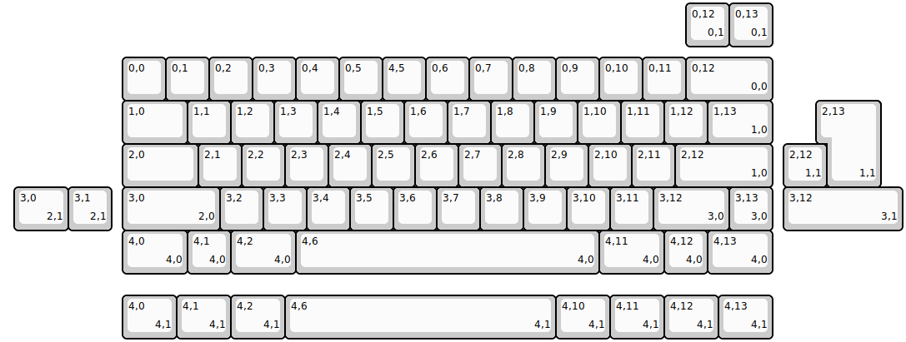{:loading="lazy"}

[Open in keyboard-layout-editor](http://www.keyboard-layout-editor.com/##@_name=dyz60;&@_x:2.75&y:1.25;&=0,0&=0,1&=0,2&=0,3&=0,4&=0,5&=4,5&=0,6&=0,7&=0,8&=0,9&=0,10&=0,11&_w:2;&=0,12%0A%0A%0A0,0;&@_x:2.75&w:1.5;&=1,0&=1,1&=1,2&=1,3&=1,4&=1,5&=1,6&=1,7&=1,8&=1,9&=1,10&=1,11&=1,12&_w:1.5;&=1,13%0A%0A%0A1,0;&@_x:2.75&w:1.75;&=2,0&=2,1&=2,2&=2,3&=2,4&=2,5&=2,6&=2,7&=2,8&=2,9&=2,10&=2,11&_w:2.25;&=2,12%0A%0A%0A1,0;&@_x:2.75&w:2.25;&=3,0%0A%0A%0A2,0&=3,2&=3,3&=3,4&=3,5&=3,6&=3,7&=3,8&=3,9&=3,10&=3,11&_w:1.75;&=3,12%0A%0A%0A3,0&=3,13%0A%0A%0A3,0;&@_x:2.75&w:1.5;&=4,0%0A%0A%0A4,0&=4,1%0A%0A%0A4,0&_w:1.5;&=4,2%0A%0A%0A4,0&_w:7;&=4,6%0A%0A%0A4,0&_w:1.5;&=4,11%0A%0A%0A4,0&=4,12%0A%0A%0A4,0&_w:1.5;&=4,13%0A%0A%0A4,0;&@_x:15.75&y:-6.25;&=0,12%0A%0A%0A0,1&=0,13%0A%0A%0A0,1;&@_x:19.0&y:1.25&w:1.25&h:2&w2:1.5&h2:1&x2:-0.25;&=2,13%0A%0A%0A1,1;&@_x:18.0;&=2,12%0A%0A%0A1,1;&@_x:0.25&w:1.25;&=3,0%0A%0A%0A2,1&=3,1%0A%0A%0A2,1&_x:15.5&w:2.75;&=3,12%0A%0A%0A3,1;&@_x:2.75&y:1.5&w:1.25;&=4,0%0A%0A%0A4,1&_w:1.25;&=4,1%0A%0A%0A4,1&_w:1.25;&=4,2%0A%0A%0A4,1&_w:6.25;&=4,6%0A%0A%0A4,1&_w:1.25;&=4,10%0A%0A%0A4,1&_w:1.25;&=4,11%0A%0A%0A4,1&_w:1.25;&=4,12%0A%0A%0A4,1&_w:1.25;&=4,13%0A%0A%0A4,1)

## dyz/selka40.via

[README](output/dyz/README.md) - [layout](output/dyz/selka40.via-kle.json) - [PCB](output/dyz/selka40.via.kicad_pcb) - [PCB render](output/dyz/selka40.via-render.svg)

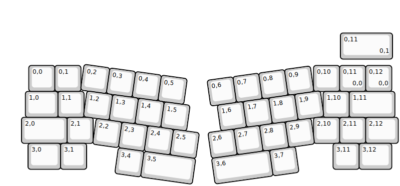{:loading="lazy"}

[Open in keyboard-layout-editor](http://www.keyboard-layout-editor.com/##@@_x:1.03&y:2.45;&=0,0&=0,1&_x:8.94&fa@:4;;&=0,10&=0,11%0A%0A%0A0,0&=0,12%0A%0A%0A0,0;&@_x:0.9&w:1.25;&=1,0&=1,1&_x:9.19;&=1,10&_w:1.75;&=1,11;&@_x:0.75&w:1.75;&=2,0&=2,1&_x:8.47;&=2,10&=2,11&_w:1.25;&=2,12;&@_x:1&w:1.25;&=3,0&=3,1&_x:9.47;&=3,11&_w:1.25;&=3,12;&@_r:8&x:3.47&y:-4.52;&=0,2&=0,3&=0,4&=0,5;&@_x:3.72;&=1,2&=1,3&_n:true;&=1,4&=1,5;&@_x:4.22;&=2,2&=2,3&=2,4&=2,5;&@_x:5.22;&=3,4&_w:2;&=3,5;&@_r:-8&x:7.37&y:-1.83;&=0,6&=0,7&=0,8&=0,9;&@_x:7.62;&=1,6&_n:true;&=1,7&=1,8&=1,9;&@_x:7.12;&=2,6&=2,7&=2,8&=2,9;&@_x:7.12&w:2.25;&=3,6&=3,7;&@_r:0&x:13&y:-6.9&w:2;&=0,11%0A%0A%0A0,1)

## dyz/synthesis60.rev2.via

[README](output/dyz/README.md) - [layout](output/dyz/synthesis60.rev2.via-kle.json) - [PCB](output/dyz/synthesis60.rev2.via.kicad_pcb) - [PCB render](output/dyz/synthesis60.rev2.via-render.svg)

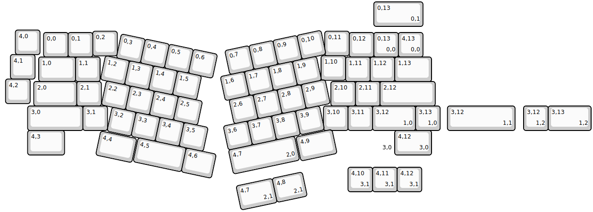{:loading="lazy"}

[Open in keyboard-layout-editor](http://www.keyboard-layout-editor.com/##@@_x:0.55&y:1.15;&=4,0;&@_x:3.7&y:-0.95;&=0,2&_x:8.45;&=0,11;&@_x:1.7&y:-0.95;&=0,0&=0,1&_x:10.45;&=0,12&=0,13%0A%0A%0A0,0&=4,13%0A%0A%0A0,0;&@_x:0.35&y:-0.1;&=4,1;&@_x:13&y:-0.95;&=1,10;&@_x:1.5&y:-0.95&w:1.5;&=1,0&=1,1&_x:10.0;&=1,11&=1,12&_w:1.5;&=1,13;&@_x:0.15&y:-0.1;&=4,2;&@_x:13.4&y:-0.9;&=2,10&=2,11&_w:2.25;&=2,12&_x:-16.35&w:1.75;&=2,0&=2,1;&@_x:1.05&w:2.25;&=3,0&=3,1&_x:8.8;&=3,10&=3,11&_w:1.75;&=3,12%0A%0A%0A1,0&=3,13%0A%0A%0A1,0;&@_x:1.05&w:1.5;&=4,3&_x:11.55&w:1.9&d:true;&=%0A%0A%0A3,0&_w:1.5;&=4,12%0A%0A%0A3,0;&@_r:12&x:5.05&y:-6.0;&=0,3&=0,4&=0,5&=0,6;&@_x:4.6;&=1,2&=1,3&=1,4&=1,5;&@_x:4.85;&=2,2&=2,3&=2,4&=2,5;&@_x:5.3;&=3,2&=3,3&=3,4&=3,5;&@_x:6.6&w:2;&=4,5&_w:1.25;&=4,6;&@_x:5.05&y:-0.95&w:1.5;&=4,4;&@_r:-12&x:8.45&y:-1.45;&=0,7&=0,8&=0,9&=0,10;&@_x:8.05;&=1,6&=1,7&=1,8&=1,9;&@_x:8.2;&=2,6&=2,7&=2,8&=2,9;&@_x:7.75;&=3,6&=3,7&=3,8&=3,9;&@_x:7.75&w:2.75;&=4,7%0A%0A%0A2,0;&@_x:10.55&y:-0.95&w:1.5;&=4,9;&@_r:0&x:15.15&y:-8.9&w:2;&=0,13%0A%0A%0A0,1;&@_x:18.15&y:3.25&w:2.75;&=3,12%0A%0A%0A1,1&_x:0.35;&=3,12%0A%0A%0A1,2&_w:1.75;&=3,13%0A%0A%0A1,2;&@_x:14.1&y:1.5;&=4,10%0A%0A%0A3,1&=4,11%0A%0A%0A3,1&=4,12%0A%0A%0A3,1;&@_r:-12&x:7.75&y:1.6&w:1.5;&=4,7%0A%0A%0A2,1&_w:1.25;&=4,8%0A%0A%0A2,1)

## dztech/duo_s

[README](output/dztech/duo_s/README.md) - [layout](output/dztech/duo_s/duo_s-kle.json) - [PCB](output/dztech/duo_s/duo_s.kicad_pcb) - [PCB render](output/dztech/duo_s/duo_s-render.svg)

{:loading="lazy"}

[Open in keyboard-layout-editor](http://www.keyboard-layout-editor.com/##@@_c=#777777;&=0,0&_c=#cccccc;&=0,1&=0,2&=0,3&=0,4&=0,5&=0,6&=0,7&=0,8&=0,9&=0,10&=0,11&=0,12&_c=#aaaaaa&w:2;&=0,13&_c=#cccccc;&=0,14;&@_c=#aaaaaa&w:1.5;&=1,0&_c=#cccccc;&=1,1&=1,2&=1,3&=1,4&=1,5&=1,6&=1,7&=1,8&=1,9&=1,10&=1,11&=1,12&_w:1.5;&=1,13&=1,14;&@_c=#aaaaaa&w:1.75;&=2,0&_c=#cccccc;&=2,1&=2,2&=2,3&=2,4&=2,5&=2,6&=2,7&=2,8&=2,9&=2,10&=2,11&_c=#777777&w:2.25;&=2,13&_c=#cccccc;&=2,14;&@_c=#aaaaaa&w:2.25;&=3,0&_c=#cccccc;&=3,1&=3,2&=3,3&=3,4&=3,5&=3,6&=3,7&=3,8&=3,9&=3,10&_c=#aaaaaa&w:1.75;&=3,11&=3,13&_c=#cccccc;&=3,14;&@_c=#aaaaaa&w:1.25;&=4,0&_w:1.25;&=4,1&_w:1.25;&=4,2&_c=#cccccc&w:6.25;&=4,5&_c=#aaaaaa&w:1.25;&=4,8&_w:1.25;&=4,10&_x:0.5;&=4,11&=4,13&=4,14)

## dztech/dz60rgb/dz60rgb_v1

[README](output/dztech/dz60rgb/README.md) - [layout](output/dztech/dz60rgb/dz60rgb_v1-kle.json) - [PCB](output/dztech/dz60rgb/dz60rgb_v1.kicad_pcb) - [PCB render](output/dztech/dz60rgb/dz60rgb_v1-render.svg)

{:loading="lazy"}

[Open in keyboard-layout-editor](http://www.keyboard-layout-editor.com/##@@_c=#777777;&=0,0&_c=#cccccc;&=0,1&=0,2&=0,3&=0,4&=0,5&=0,6&=0,7&=0,8&=0,9&=0,10&=0,11&=0,12&_c=#aaaaaa&w:2;&=0,13;&@_w:1.5;&=1,0&_c=#cccccc;&=1,1&=1,2&=1,3&=1,4&=1,5&=1,6&=1,7&=1,8&=1,9&=1,10&=1,11&=1,12&_w:1.5;&=1,13;&@_w:1.75;&=2,0&=2,1&=2,2&=2,3&=2,4&=2,5&=2,6&=2,7&=2,8&=2,9&=2,10&=2,11&_c=#aaaaaa&w:2.25;&=2,13;&@_w:2.25;&=3,0&_c=#cccccc;&=3,1&=3,2&=3,3&=3,4&=3,5&=3,6&=3,7&=3,8&=3,9&_c=#aaaaaa&w:1.75;&=3,10&_c=#777777;&=3,11&_c=#cccccc;&=3,13;&@_c=#aaaaaa&w:1.25;&=4,0&_w:1.25;&=4,1&_w:1.25;&=4,2&_c=#cccccc&w:6.25;&=4,5&_c=#aaaaaa;&=4,8&=4,9&_c=#777777;&=4,10&=4,11&=4,13)

## dztech/dz60rgb/dz60rgb_v2

[README](output/dztech/dz60rgb/README.md) - [layout](output/dztech/dz60rgb/dz60rgb_v2-kle.json) - [PCB](output/dztech/dz60rgb/dz60rgb_v2.kicad_pcb) - [PCB render](output/dztech/dz60rgb/dz60rgb_v2-render.svg)

{:loading="lazy"}

[Open in keyboard-layout-editor](http://www.keyboard-layout-editor.com/##@@_c=#777777;&=0,0&_c=#cccccc;&=0,1&=0,2&=0,3&=0,4&=0,5&=0,6&=0,7&=0,8&=0,9&=0,10&=0,11&=0,12&_c=#aaaaaa&w:2;&=0,13;&@_w:1.5;&=1,0&_c=#cccccc;&=1,1&=1,2&=1,3&=1,4&=1,5&=1,6&=1,7&=1,8&=1,9&=1,10&=1,11&=1,12&_w:1.5;&=1,13;&@_w:1.75;&=2,0&=2,1&=2,2&=2,3&=2,4&=2,5&=2,6&=2,7&=2,8&=2,9&=2,10&=2,11&_c=#aaaaaa&w:2.25;&=2,13;&@_w:2.25;&=3,0&_c=#cccccc;&=3,1&=3,2&=3,3&=3,4&=3,5&=3,6&=3,7&=3,8&=3,9&_c=#aaaaaa&w:1.75;&=3,10&_c=#777777;&=3,11&_c=#cccccc;&=3,13;&@_c=#aaaaaa&w:1.25;&=4,0&_w:1.25;&=4,1&_w:1.25;&=4,2&_c=#cccccc&w:6.25;&=4,5&_c=#aaaaaa;&=4,8&=4,9&_c=#777777;&=4,10&=4,11&=4,13)

## dztech/dz60rgb_ansi/dz60rgb_ansi_v1

[README](output/dztech/dz60rgb_ansi/README.md) - [layout](output/dztech/dz60rgb_ansi/dz60rgb_ansi_v1-kle.json) - [PCB](output/dztech/dz60rgb_ansi/dz60rgb_ansi_v1.kicad_pcb) - [PCB render](output/dztech/dz60rgb_ansi/dz60rgb_ansi_v1-render.svg)

{:loading="lazy"}

[Open in keyboard-layout-editor](http://www.keyboard-layout-editor.com/##@@_c=#777777;&=0,0&_c=#cccccc;&=0,1&=0,2&=0,3&=0,4&=0,5&=0,6&=0,7&=0,8&=0,9&=0,10&=0,11&=0,12&_c=#aaaaaa&w:2;&=0,13;&@_w:1.5;&=1,0&_c=#cccccc;&=1,1&=1,2&=1,3&=1,4&=1,5&=1,6&=1,7&=1,8&=1,9&=1,10&=1,11&=1,12&_w:1.5;&=1,13;&@_w:1.75;&=2,0&=2,1&=2,2&=2,3&=2,4&=2,5&=2,6&=2,7&=2,8&=2,9&=2,10&=2,11&_c=#aaaaaa&w:2.25;&=2,13;&@_w:2.25;&=3,0&_c=#cccccc;&=3,1&=3,2&=3,3&=3,4&=3,5&=3,6&=3,7&=3,8&=3,9&=3,10&_c=#aaaaaa&w:2.75;&=3,11;&@_w:1.25;&=4,0&_w:1.25;&=4,1&_w:1.25;&=4,2&_c=#cccccc&w:6.25;&=4,5&_c=#aaaaaa&w:1.25;&=4,9&_w:1.25;&=4,10&_w:1.25;&=4,11&_w:1.25;&=4,13)

## dztech/dz60rgb_ansi/dz60rgb_ansi_v2

[README](output/dztech/dz60rgb_ansi/README.md) - [layout](output/dztech/dz60rgb_ansi/dz60rgb_ansi_v2-kle.json) - [PCB](output/dztech/dz60rgb_ansi/dz60rgb_ansi_v2.kicad_pcb) - [PCB render](output/dztech/dz60rgb_ansi/dz60rgb_ansi_v2-render.svg)

{:loading="lazy"}

[Open in keyboard-layout-editor](http://www.keyboard-layout-editor.com/##@@_c=#777777;&=0,0&_c=#cccccc;&=0,1&=0,2&=0,3&=0,4&=0,5&=0,6&=0,7&=0,8&=0,9&=0,10&=0,11&=0,12&_c=#aaaaaa&w:2;&=0,13;&@_w:1.5;&=1,0&_c=#cccccc;&=1,1&=1,2&=1,3&=1,4&=1,5&=1,6&=1,7&=1,8&=1,9&=1,10&=1,11&=1,12&_w:1.5;&=1,13;&@_w:1.75;&=2,0&=2,1&=2,2&=2,3&=2,4&=2,5&=2,6&=2,7&=2,8&=2,9&=2,10&=2,11&_c=#aaaaaa&w:2.25;&=2,13;&@_w:2.25;&=3,0&_c=#cccccc;&=3,1&=3,2&=3,3&=3,4&=3,5&=3,6&=3,7&=3,8&=3,9&=3,10&_c=#aaaaaa&w:2.75;&=3,11;&@_w:1.25;&=4,0&_w:1.25;&=4,1&_w:1.25;&=4,2&_c=#cccccc&w:6.25;&=4,5&_c=#aaaaaa&w:1.25;&=4,9&_w:1.25;&=4,10&_w:1.25;&=4,11&_w:1.25;&=4,13)

## dztech/dz60rgb_wkl/dz60rgb_wkl_v1

[README](output/dztech/dz60rgb_wkl/README.md) - [layout](output/dztech/dz60rgb_wkl/dz60rgb_wkl_v1-kle.json) - [PCB](output/dztech/dz60rgb_wkl/dz60rgb_wkl_v1.kicad_pcb) - [PCB render](output/dztech/dz60rgb_wkl/dz60rgb_wkl_v1-render.svg)

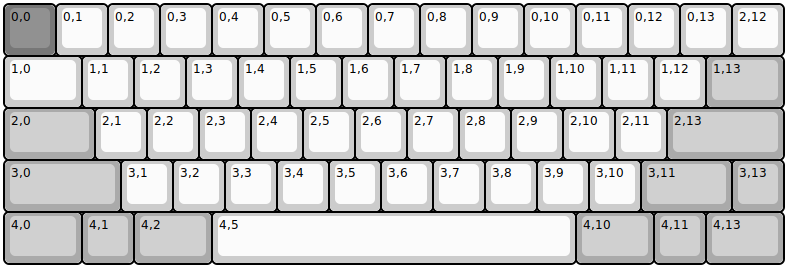{:loading="lazy"}

[Open in keyboard-layout-editor](http://www.keyboard-layout-editor.com/##@@_c=#777777;&=0,0&_c=#cccccc;&=0,1&=0,2&=0,3&=0,4&=0,5&=0,6&=0,7&=0,8&=0,9&=0,10&=0,11&=0,12&=0,13&=2,12;&@_w:1.5;&=1,0&=1,1&=1,2&=1,3&=1,4&=1,5&=1,6&=1,7&=1,8&=1,9&=1,10&=1,11&=1,12&_c=#aaaaaa&w:1.5;&=1,13;&@_w:1.75;&=2,0&_c=#cccccc;&=2,1&=2,2&=2,3&=2,4&=2,5&=2,6&=2,7&=2,8&=2,9&=2,10&=2,11&_c=#aaaaaa&w:2.25;&=2,13;&@_w:2.25;&=3,0&_c=#cccccc;&=3,1&=3,2&=3,3&=3,4&=3,5&=3,6&=3,7&=3,8&=3,9&=3,10&_c=#aaaaaa&w:1.75;&=3,11&=3,13;&@_w:1.5;&=4,0&=4,1&_w:1.5;&=4,2&_c=#cccccc&w:7;&=4,5&_c=#aaaaaa&w:1.5;&=4,10&=4,11&_w:1.5;&=4,13)

## dztech/dz60rgb_wkl/dz60rgb_wkl_v2

[README](output/dztech/dz60rgb_wkl/README.md) - [layout](output/dztech/dz60rgb_wkl/dz60rgb_wkl_v2-kle.json) - [PCB](output/dztech/dz60rgb_wkl/dz60rgb_wkl_v2.kicad_pcb) - [PCB render](output/dztech/dz60rgb_wkl/dz60rgb_wkl_v2-render.svg)

{:loading="lazy"}

[Open in keyboard-layout-editor](http://www.keyboard-layout-editor.com/##@@_c=#777777;&=0,0&_c=#cccccc;&=0,1&=0,2&=0,3&=0,4&=0,5&=0,6&=0,7&=0,8&=0,9&=0,10&=0,11&=0,12&=0,13&=2,12;&@_w:1.5;&=1,0&=1,1&=1,2&=1,3&=1,4&=1,5&=1,6&=1,7&=1,8&=1,9&=1,10&=1,11&=1,12&_c=#aaaaaa&w:1.5;&=1,13;&@_w:1.75;&=2,0&_c=#cccccc;&=2,1&=2,2&=2,3&=2,4&=2,5&=2,6&=2,7&=2,8&=2,9&=2,10&=2,11&_c=#aaaaaa&w:2.25;&=2,13;&@_w:2.25;&=3,0&_c=#cccccc;&=3,1&=3,2&=3,3&=3,4&=3,5&=3,6&=3,7&=3,8&=3,9&=3,10&_c=#aaaaaa&w:1.75;&=3,11&=3,13;&@_w:1.5;&=4,0&=4,1&_w:1.5;&=4,2&_c=#cccccc&w:7;&=4,5&_c=#aaaaaa&w:1.5;&=4,10&=4,11&_w:1.5;&=4,13)

## dztech/dz64rgb

[README](output/dztech/dz64rgb/README.md) - [layout](output/dztech/dz64rgb/dz64rgb-kle.json) - [PCB](output/dztech/dz64rgb/dz64rgb.kicad_pcb) - [PCB render](output/dztech/dz64rgb/dz64rgb-render.svg)

{:loading="lazy"}

[Open in keyboard-layout-editor](http://www.keyboard-layout-editor.com/##@@_c=#777777;&=0,0&_c=#cccccc;&=0,1&=0,2&=0,3&=0,4&=0,5&=0,6&=0,7&=0,8&=0,9&=0,10&=0,11&=0,12&_c=#aaaaaa&w:2;&=0,13;&@_w:1.5;&=1,0&_c=#cccccc;&=1,1&=1,2&=1,3&=1,4&=1,5&=1,6&=1,7&=1,8&=1,9&=1,10&=1,11&=1,12&_w:1.5;&=1,13;&@_w:1.75;&=2,0&=2,1&=2,2&=2,3&=2,4&=2,5&=2,6&=2,7&=2,8&=2,9&=2,10&=2,11&_c=#aaaaaa&w:2.25;&=2,13;&@_w:2;&=3,0&_c=#cccccc;&=3,1&=3,2&=3,3&=3,4&=3,5&=3,6&=3,7&=3,8&=3,9&=3,10&=3,11&_c=#777777;&=3,12&_c=#cccccc;&=3,13;&@_c=#aaaaaa&w:1.25;&=4,0&_w:1.25;&=4,1&_w:1.25;&=4,2&_c=#cccccc&w:6.25;&=4,5&_c=#aaaaaa;&=4,8&=4,9&_c=#777777;&=4,10&=4,11&=4,13)

## dztech/dz65rgb/dz65rgbv1

[README](output/dztech/dz65rgb/README.md) - [layout](output/dztech/dz65rgb/dz65rgbv1-kle.json) - [PCB](output/dztech/dz65rgb/dz65rgbv1.kicad_pcb) - [PCB render](output/dztech/dz65rgb/dz65rgbv1-render.svg)

{:loading="lazy"}

[Open in keyboard-layout-editor](http://www.keyboard-layout-editor.com/##@@_c=#777777;&=0,0&_c=#cccccc;&=0,1&=0,2&=0,3&=0,4&=0,5&=0,6&=0,7&=0,8&=0,9&=0,10&=0,11&=0,12&_c=#aaaaaa&w:2;&=0,13&_c=#cccccc;&=0,14;&@_w:1.5;&=1,0&=1,1&=1,2&=1,3&=1,4&=1,5&=1,6&=1,7&=1,8&=1,9&=1,10&=1,11&=1,12&_w:1.5;&=1,13&=1,14;&@_w:1.75;&=2,0&=2,1&=2,2&=2,3&=2,4&=2,5&=2,6&=2,7&=2,8&=2,9&=2,10&=2,11&_c=#aaaaaa&w:2.25;&=2,13&_c=#cccccc;&=2,14;&@_c=#aaaaaa&w:2.25;&=3,0&_c=#cccccc;&=3,1&=3,2&=3,3&=3,4&=3,5&=3,6&=3,7&=3,8&=3,9&=3,10&_c=#aaaaaa&w:1.75;&=3,11&_c=#cccccc;&=3,13&=3,14;&@_c=#aaaaaa&w:1.25;&=4,0&_w:1.25;&=4,1&_w:1.25;&=4,2&_c=#cccccc&w:6.25;&=4,5&_c=#aaaaaa;&=4,8&=4,9&=4,10&_c=#cccccc;&=4,11&=4,13&=4,14)

## dztech/dz65rgb/dz65rgbv2

[README](output/dztech/dz65rgb/README.md) - [layout](output/dztech/dz65rgb/dz65rgbv2-kle.json) - [PCB](output/dztech/dz65rgb/dz65rgbv2.kicad_pcb) - [PCB render](output/dztech/dz65rgb/dz65rgbv2-render.svg)

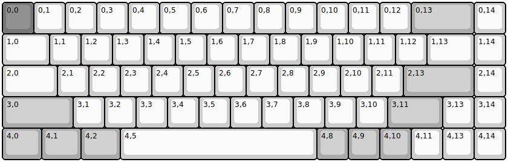{:loading="lazy"}

[Open in keyboard-layout-editor](http://www.keyboard-layout-editor.com/##@@_c=#777777;&=0,0&_c=#cccccc;&=0,1&=0,2&=0,3&=0,4&=0,5&=0,6&=0,7&=0,8&=0,9&=0,10&=0,11&=0,12&_c=#aaaaaa&w:2;&=0,13&_c=#cccccc;&=0,14;&@_w:1.5;&=1,0&=1,1&=1,2&=1,3&=1,4&=1,5&=1,6&=1,7&=1,8&=1,9&=1,10&=1,11&=1,12&_w:1.5;&=1,13&=1,14;&@_w:1.75;&=2,0&=2,1&=2,2&=2,3&=2,4&=2,5&=2,6&=2,7&=2,8&=2,9&=2,10&=2,11&_c=#aaaaaa&w:2.25;&=2,13&_c=#cccccc;&=2,14;&@_c=#aaaaaa&w:2.25;&=3,0&_c=#cccccc;&=3,1&=3,2&=3,3&=3,4&=3,5&=3,6&=3,7&=3,8&=3,9&=3,10&_c=#aaaaaa&w:1.75;&=3,11&_c=#cccccc;&=3,13&=3,14;&@_c=#aaaaaa&w:1.25;&=4,0&_w:1.25;&=4,1&_w:1.25;&=4,2&_c=#cccccc&w:6.25;&=4,5&_c=#aaaaaa;&=4,8&=4,9&=4,10&_c=#cccccc;&=4,11&=4,13&=4,14)

## dztech/dz65rgb/dz65rgbv3

[README](output/dztech/dz65rgb/README.md) - [layout](output/dztech/dz65rgb/dz65rgbv3-kle.json) - [PCB](output/dztech/dz65rgb/dz65rgbv3.kicad_pcb) - [PCB render](output/dztech/dz65rgb/dz65rgbv3-render.svg)

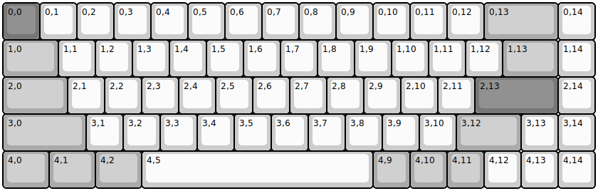{:loading="lazy"}

[Open in keyboard-layout-editor](http://www.keyboard-layout-editor.com/##@@_c=#777777;&=0,0&_c=#cccccc;&=0,1&=0,2&=0,3&=0,4&=0,5&=0,6&=0,7&=0,8&=0,9&=0,10&=0,11&=0,12&_c=#aaaaaa&w:2;&=0,13&_c=#cccccc;&=0,14;&@_c=#aaaaaa&w:1.5;&=1,0&_c=#cccccc;&=1,1&=1,2&=1,3&=1,4&=1,5&=1,6&=1,7&=1,8&=1,9&=1,10&=1,11&=1,12&_c=#aaaaaa&w:1.5;&=1,13&_c=#cccccc;&=1,14;&@_c=#aaaaaa&w:1.75;&=2,0&_c=#cccccc;&=2,1&=2,2&=2,3&=2,4&=2,5&=2,6&=2,7&=2,8&=2,9&=2,10&=2,11&_c=#777777&w:2.25;&=2,13&_c=#cccccc;&=2,14;&@_c=#aaaaaa&w:2.25;&=3,0&_c=#cccccc;&=3,1&=3,2&=3,3&=3,4&=3,5&=3,6&=3,7&=3,8&=3,9&=3,10&_c=#aaaaaa&w:1.75;&=3,12&_c=#cccccc;&=3,13&=3,14;&@_c=#aaaaaa&w:1.25;&=4,0&_w:1.25;&=4,1&_w:1.25;&=4,2&_c=#cccccc&w:6.25;&=4,5&_c=#aaaaaa;&=4,9&=4,10&=4,11&_c=#cccccc;&=4,12&=4,13&=4,14)

## dztech/dz96

[README](output/dztech/dz96/README.md) - [layout](output/dztech/dz96/dz96-kle.json) - [PCB](output/dztech/dz96/dz96.kicad_pcb) - [PCB render](output/dztech/dz96/dz96-render.svg)

{:loading="lazy"}

[Open in keyboard-layout-editor](http://www.keyboard-layout-editor.com/##@@_x:2.75&c=#777777;&=0,0&_c=#cccccc;&=0,1&=0,2&=0,3&=0,4&_c=#aaaaaa;&=6,0&=6,1&=6,2&=6,3&_c=#cccccc;&=0,5&=0,6&=0,7&=0,8&_c=#aaaaaa;&=7,2&=0,9&=0,10&_c=#cccccc;&=0,11&=0,12&=7,12;&@_x:2.75;&=1,0&=1,1&=1,2&=1,3&=1,4&=6,4&=6,5&=6,6&=6,7&=1,5&=1,6&=1,7&=1,8&_c=#aaaaaa&w:2;&=7,1%0A%0A%0A0,0&=1,9&=1,10&=1,11&=1,12;&@_x:2.75&w:1.5;&=2,0&_c=#cccccc;&=2,1&=2,2&=2,3&=2,4&=6,8&=6,9&=6,10&=6,11&=2,5&=2,6&=2,7&=2,8&_w:1.5;&=7,3%0A%0A%0A1,0&=2,9&=2,10&=2,11&_c=#aaaaaa&h:2;&=2,12%0A%0A%0A3,0;&@_x:2.75&w:1.75;&=3,0&_c=#cccccc;&=3,1&=3,2&=3,3&=3,4&=6,12&=7,5&=7,6&=7,7&=3,5&=3,6&=3,7&_c=#777777&w:2.25;&=3,8%0A%0A%0A1,0&_c=#cccccc;&=3,9&=3,10&=3,11;&@_x:2.75&c=#aaaaaa&w:2.25;&=4,0%0A%0A%0A2,0&_c=#cccccc;&=4,2&=4,3&=4,4&=7,8&=7,9&=7,10&=7,11&=4,5&=4,6&=4,7&_c=#aaaaaa&w:1.75;&=4,8&_c=#cccccc;&=7,4&=4,9&=4,10&=4,11&_c=#aaaaaa&h:2;&=4,12%0A%0A%0A4,0;&@_x:2.75&w:1.25;&=5,0%0A%0A%0A5,0&_w:1.25;&=5,1%0A%0A%0A5,0&_w:1.25;&=5,2%0A%0A%0A5,0&_c=#cccccc&w:6.25;&=5,9%0A%0A%0A5,0&_c=#aaaaaa;&=5,5%0A%0A%0A6,0&=5,6%0A%0A%0A6,0&=5,7%0A%0A%0A6,0&_c=#cccccc;&=5,8&=5,3&=5,4&=5,10&=5,11;&@_x:22.5&y:-5&c=#aaaaaa;&=7,0%0A%0A%0A0,1&=7,1%0A%0A%0A0,1;&@_x:23.25&c=#777777&w:1.25&h:2&w2:1.5&h2:1&x2:-0.25;&=3,8%0A%0A%0A1,1&_x:0.5&c=#aaaaaa;&=2,12%0A%0A%0A3,1;&@_x:22.25&c=#cccccc;&=7,3%0A%0A%0A1,1&_x:1.75&c=#aaaaaa;&=3,12%0A%0A%0A3,1;&@_w:1.25;&=4,0%0A%0A%0A2,1&=4,1%0A%0A%0A2,1&_x:22.75;&=4,12%0A%0A%0A4,1;&@_x:25.0;&=5,12%0A%0A%0A4,1;&@_x:2.75&y:0.5&w:1.5;&=5,0%0A%0A%0A5,1&_w:1.5;&=5,1%0A%0A%0A5,1&_c=#cccccc&w:7;&=5,9%0A%0A%0A5,1&_c=#aaaaaa&w:1.5;&=5,5%0A%0A%0A6,1&_w:1.5;&=5,7%0A%0A%0A6,1)

## dztech/endless80

[README](output/dztech/endless80/README.md) - [layout](output/dztech/endless80/endless80-kle.json) - [PCB](output/dztech/endless80/endless80.kicad_pcb) - [PCB render](output/dztech/endless80/endless80-render.svg)

{:loading="lazy"}

[Open in keyboard-layout-editor](http://www.keyboard-layout-editor.com/##@@_c=#777777;&=0,0&_x:1&c=#aaaaaa;&=0,1&=0,2&=0,3&=0,4&_x:0.5&c=#cccccc;&=0,5&=0,6&=0,7&=0,8&_x:0.5&c=#aaaaaa;&=0,9&=0,10&=0,11&=0,12&_x:0.25&c=#cccccc;&=0,13&=0,14&=1,14;&@_y:0.5;&=1,0&=1,1&=1,2&=1,3&=1,4&=1,5&=1,6&=1,7&=1,8&=1,9&=1,10&=1,11&=1,12&_c=#aaaaaa&w:2;&=1,13&_x:0.25&c=#cccccc;&=2,14&=3,13&=3,14;&@_w:1.5;&=2,0&=2,1&=2,2&=2,3&=2,4&=2,5&=2,6&=2,7&=2,8&=2,9&=2,10&=2,11&=2,12&_w:1.5;&=2,13&_x:0.25;&=4,12&=4,13&=4,14;&@_w:1.75;&=3,0&=3,1&=3,2&=3,3&=3,4&=3,5&=3,6&=3,7&=3,8&=3,9&=3,10&=3,11&_c=#777777&w:2.25;&=3,12;&@_c=#aaaaaa&w:2.25;&=4,0%0A%0A%0A0,0&_c=#cccccc;&=4,1&=4,2&=4,3&=4,4&=4,5&=4,6&=4,7&=4,8&=4,9&=4,10&_c=#aaaaaa&w:2.75;&=4,11&_x:1.25&c=#cccccc;&=5,12;&@_c=#aaaaaa&w:1.25;&=5,0%0A%0A%0A1,0&_w:1.25;&=5,1%0A%0A%0A1,0&_w:1.25;&=5,2%0A%0A%0A1,0&_c=#cccccc&w:6.25;&=5,6%0A%0A%0A1,0&_c=#aaaaaa&w:1.25;&=5,7%0A%0A%0A1,0&_w:1.25;&=5,8%0A%0A%0A1,0&_w:1.25;&=5,9%0A%0A%0A1,0&_w:1.25;&=5,10%0A%0A%0A1,0&_x:0.25&c=#cccccc;&=5,11&=5,13&=5,14;&@_x:17.25&y:-2.0&w:1.25;&=4,0%0A%0A%0A0,1&=5,3%0A%0A%0A0,1;&@_x:18.25&c=#aaaaaa&w:1.5;&=5,0%0A%0A%0A1,1&=5,1%0A%0A%0A1,1&_w:1.5;&=5,2%0A%0A%0A1,1&_c=#cccccc&w:7;&=5,6%0A%0A%0A1,1&_c=#aaaaaa&w:1.5;&=5,8%0A%0A%0A1,1&=5,9%0A%0A%0A1,1&_w:1.5;&=5,10%0A%0A%0A1,1)

## dztech/og60

[README](output/dztech/og60/README.md) - [layout](output/dztech/og60/og60-kle.json) - [PCB](output/dztech/og60/og60.kicad_pcb) - [PCB render](output/dztech/og60/og60-render.svg)

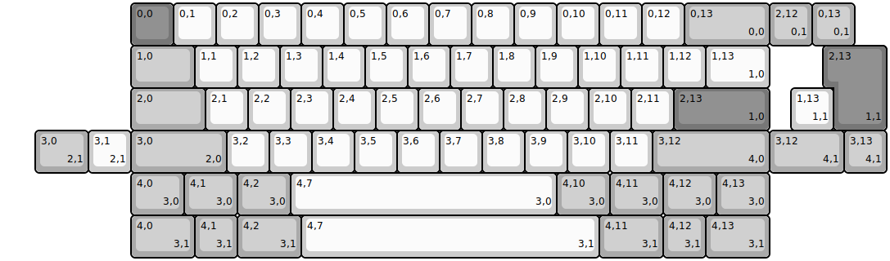{:loading="lazy"}

[Open in keyboard-layout-editor](http://www.keyboard-layout-editor.com/##@@_x:3&c=#777777;&=0,0&_c=#cccccc;&=0,1&=0,2&=0,3&=0,4&=0,5&=0,6&=0,7&=0,8&=0,9&=0,10&=0,11&=0,12&_c=#aaaaaa&w:2;&=0,13%0A%0A%0A0,0;&@_x:3&w:1.5;&=1,0&_c=#cccccc;&=1,1&=1,2&=1,3&=1,4&=1,5&=1,6&=1,7&=1,8&=1,9&=1,10&=1,11&=1,12&_w:1.5;&=1,13%0A%0A%0A1,0;&@_x:3&c=#aaaaaa&w:1.75;&=2,0&_c=#cccccc;&=2,1&=2,2&=2,3&=2,4&=2,5&=2,6&=2,7&=2,8&=2,9&=2,10&=2,11&_c=#777777&w:2.25;&=2,13%0A%0A%0A1,0;&@_x:3.0&c=#aaaaaa&w:2.25;&=3,0%0A%0A%0A2,0&_c=#cccccc;&=3,2&=3,3&=3,4&=3,5&=3,6&=3,7&=3,8&=3,9&=3,10&=3,11&_c=#aaaaaa&w:2.75;&=3,12%0A%0A%0A4,0;&@_x:3&w:1.25;&=4,0%0A%0A%0A3,0&_w:1.25;&=4,1%0A%0A%0A3,0&_w:1.25;&=4,2%0A%0A%0A3,0&_c=#cccccc&w:6.25;&=4,7%0A%0A%0A3,0&_c=#aaaaaa&w:1.25;&=4,10%0A%0A%0A3,0&_w:1.25;&=4,11%0A%0A%0A3,0&_w:1.25;&=4,12%0A%0A%0A3,0&_w:1.25;&=4,13%0A%0A%0A3,0;&@_x:18&y:-5;&=2,12%0A%0A%0A0,1&=0,13%0A%0A%0A0,1;&@_x:19.5&c=#777777&w:1.25&h:2&w2:1.5&h2:1&x2:-0.25;&=2,13%0A%0A%0A1,1;&@_x:18.5&c=#cccccc;&=1,13%0A%0A%0A1,1;&@_x:0.75&c=#aaaaaa&w:1.25;&=3,0%0A%0A%0A2,1&_c=#cccccc;&=3,1%0A%0A%0A2,1&_x:15.0&c=#aaaaaa&w:1.75;&=3,12%0A%0A%0A4,1&=3,13%0A%0A%0A4,1;&@_x:3&y:1&w:1.5;&=4,0%0A%0A%0A3,1&=4,1%0A%0A%0A3,1&_w:1.5;&=4,2%0A%0A%0A3,1&_c=#cccccc&w:7;&=4,7%0A%0A%0A3,1&_c=#aaaaaa&w:1.5;&=4,11%0A%0A%0A3,1&=4,12%0A%0A%0A3,1&_w:1.5;&=4,13%0A%0A%0A3,1)

## dztech/volcano660

[README](output/dztech/volcano660/README.md) - [layout](output/dztech/volcano660/volcano660-kle.json) - [PCB](output/dztech/volcano660/volcano660.kicad_pcb) - [PCB render](output/dztech/volcano660/volcano660-render.svg)

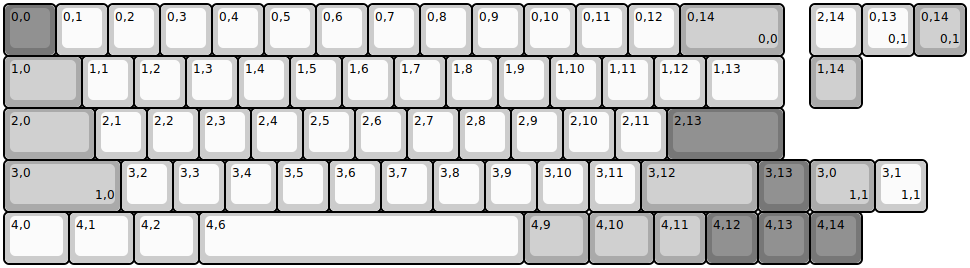{:loading="lazy"}

[Open in keyboard-layout-editor](http://www.keyboard-layout-editor.com/##@@_c=#777777;&=0,0&_c=#cccccc;&=0,1&=0,2&=0,3&=0,4&=0,5&=0,6&=0,7&=0,8&=0,9&=0,10&=0,11&=0,12&_c=#aaaaaa&w:2;&=0,14%0A%0A%0A0,0&_x:0.5&c=#cccccc;&=2,14;&@_c=#aaaaaa&w:1.5;&=1,0&_c=#cccccc;&=1,1&=1,2&=1,3&=1,4&=1,5&=1,6&=1,7&=1,8&=1,9&=1,10&=1,11&=1,12&_w:1.5;&=1,13&_x:0.5&c=#aaaaaa;&=1,14;&@_w:1.75;&=2,0&_c=#cccccc;&=2,1&=2,2&=2,3&=2,4&=2,5&=2,6&=2,7&=2,8&=2,9&=2,10&=2,11&_c=#777777&w:2.25;&=2,13;&@_c=#aaaaaa&w:2.25;&=3,0%0A%0A%0A1,0&_c=#cccccc;&=3,2&=3,3&=3,4&=3,5&=3,6&=3,7&=3,8&=3,9&=3,10&=3,11&_c=#aaaaaa&w:2.25;&=3,12&_c=#777777;&=3,13;&@_c=#cccccc&w:1.25;&=4,0&_w:1.25;&=4,1&_w:1.25;&=4,2&_w:6.25;&=4,6&_c=#aaaaaa&w:1.25;&=4,9&_w:1.25;&=4,10&=4,11&_c=#777777;&=4,12&=4,13&=4,14;&@_x:16.5&y:-5&c=#cccccc;&=0,13%0A%0A%0A0,1&_c=#aaaaaa;&=0,14%0A%0A%0A0,1;&@_x:15.5&y:2&w:1.25;&=3,0%0A%0A%0A1,1&_c=#cccccc;&=3,1%0A%0A%0A1,1)

## ebastler/E80-1800

[README](output/ebastler/README.md) - [layout](output/ebastler/E80-1800-kle.json) - [PCB](output/ebastler/E80-1800.kicad_pcb) - [PCB render](output/ebastler/E80-1800-render.svg)

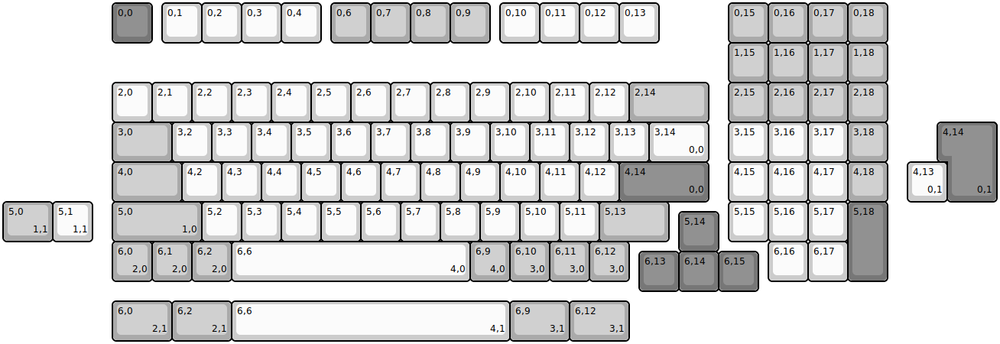{:loading="lazy"}

[Open in keyboard-layout-editor](http://www.keyboard-layout-editor.com/##@@_x:2.75&c=#777777;&=0,0&_x:0.25&c=#cccccc;&=0,1&=0,2&=0,3&=0,4&_x:0.25&c=#aaaaaa;&=0,6&=0,7&=0,8&=0,9&_x:0.25&c=#cccccc;&=0,10&=0,11&=0,12&=0,13&_x:1.75&c=#aaaaaa;&=0,15&=0,16&=0,17&=0,18;&@_x:18.25;&=1,15&=1,16&=1,17&=1,18;&@_x:2.75&c=#cccccc;&=2,0&=2,1&=2,2&=2,3&=2,4&=2,5&=2,6&=2,7&=2,8&=2,9&=2,10&=2,11&=2,12&_c=#aaaaaa&w:2;&=2,14&_x:0.5;&=2,15&=2,16&=2,17&=2,18;&@_x:2.75&w:1.5;&=3,0&_c=#cccccc;&=3,2&=3,3&=3,4&=3,5&=3,6&=3,7&=3,8&=3,9&=3,10&=3,11&=3,12&=3,13&_w:1.5;&=3,14%0A%0A%0A0,0&_x:0.5;&=3,15&=3,16&=3,17&_c=#aaaaaa;&=3,18;&@_x:2.75&w:1.75;&=4,0&_c=#cccccc;&=4,2&=4,3&=4,4&=4,5&=4,6&=4,7&=4,8&=4,9&=4,10&=4,11&=4,12&_c=#777777&w:2.25;&=4,14%0A%0A%0A0,0&_x:0.5&c=#cccccc;&=4,15&=4,16&=4,17&_c=#aaaaaa;&=4,18;&@_x:2.75&w:2.25;&=5,0%0A%0A%0A1,0&_c=#cccccc;&=5,2&=5,3&=5,4&=5,5&=5,6&=5,7&=5,8&=5,9&=5,10&=5,11&_c=#aaaaaa&w:1.75;&=5,13&_x:1.5&c=#cccccc;&=5,15&=5,16&=5,17&_c=#777777&h:2;&=5,18;&@_x:17&y:-0.75;&=5,14;&@_x:2.75&y:-0.25&c=#aaaaaa;&=6,0%0A%0A%0A2,0&=6,1%0A%0A%0A2,0&=6,2%0A%0A%0A2,0&_c=#cccccc&w:6;&=6,6%0A%0A%0A4,0&_c=#aaaaaa;&=6,9%0A%0A%0A4,0&=6,10%0A%0A%0A3,0&=6,11%0A%0A%0A3,0&=6,12%0A%0A%0A3,0&_x:3.5&c=#cccccc;&=6,16&=6,17;&@_x:16&y:-0.75&c=#777777;&=6,13&=6,14&=6,15;&@_x:23.75&y:-4.25&w:1.25&h:2&w2:1.5&h2:1&x2:-0.25;&=4,14%0A%0A%0A0,1;&@_x:22.75&c=#cccccc;&=4,13%0A%0A%0A0,1;&@_c=#aaaaaa&w:1.25;&=5,0%0A%0A%0A1,1&_c=#cccccc;&=5,1%0A%0A%0A1,1;&@_x:2.75&y:1.5&c=#aaaaaa&w:1.5;&=6,0%0A%0A%0A2,1&_w:1.5;&=6,2%0A%0A%0A2,1&_c=#cccccc&w:7;&=6,6%0A%0A%0A4,1&_c=#aaaaaa&w:1.5;&=6,9%0A%0A%0A3,1&_w:1.5;&=6,12%0A%0A%0A3,1)

## edc40/edc40

[README](output/edc40/README.md) - [layout](output/edc40/edc40-kle.json) - [PCB](output/edc40/edc40.kicad_pcb) - [PCB render](output/edc40/edc40-render.svg)

{:loading="lazy"}

[Open in keyboard-layout-editor](http://www.keyboard-layout-editor.com/##@@=0,0&=0,1&=0,2&=0,3&=0,4&=0,5&=0,6&=0,7&=0,8&=1,9&=0,9&=0,10;&@_w:1.25;&=1,0&=1,1&=1,2&=1,3&=1,4&=1,5&=1,6&=1,7&=1,8&=2,9&_w:1.75;&=1,10;&@_w:1.75;&=2,0&=2,1&=2,2&=2,3&=2,4&=2,5&=2,6&=2,7&=2,8&_w:2.25;&=2,10;&@_w:1.25;&=3,0&_w:1.25;&=3,1&_w:7;&=3,2&_w:1.25;&=3,3&_w:1.25;&=3,4)

## edda/edda

[README](output/edda/README.md) - [layout](output/edda/edda-kle.json) - [PCB](output/edda/edda.kicad_pcb) - [PCB render](output/edda/edda-render.svg)

{:loading="lazy"}

[Open in keyboard-layout-editor](http://www.keyboard-layout-editor.com/##@@_x:0.55&y:1.15&c=#777777;&=0,0;&@_x:3.7&y:-0.95&c=#cccccc;&=0,3&_x:8.45;&=0,12;&@_x:1.7&y:-0.95;&=0,1&=0,2&_x:10.45;&=0,13&=0,14%0A%0A%0A0,0&_c=#aaaaaa;&=0,15%0A%0A%0A0,0;&@_x:0.35&y:-0.1;&=1,0;&@_x:13&y:-0.95&c=#cccccc;&=1,12;&@_x:1.5&y:-0.95&c=#aaaaaa&w:1.5;&=1,1&_c=#cccccc;&=1,2&_x:10.0;&=1,13&=1,14&_c=#aaaaaa&w:1.5;&=1,15;&@_x:0.15&y:-0.1;&=2,0;&@_x:13.4&y:-0.9&c=#cccccc;&=2,12&=2,13&_c=#777777&w:2.25;&=2,15&_x:-16.35&c=#aaaaaa&w:1.75;&=2,1&_c=#cccccc;&=2,2;&@_x:1.05&c=#aaaaaa&w:2.25;&=3,1&_c=#cccccc;&=3,2&_x:8.8;&=3,12&=3,13&_c=#aaaaaa&w:1.75;&=3,14%0A%0A%0A1,0&=3,15%0A%0A%0A1,0;&@_x:1.05&w:1.5;&=4,1&_x:13.45&w:1.5;&=4,15;&@_r:12&x:5.05&y:-6.0&c=#cccccc;&=0,4&=0,5&=0,6&=0,7;&@_x:4.6;&=1,3&=1,4&=1,5&=1,6;&@_x:4.85;&=2,3&=2,4&=2,5&=2,6;&@_x:5.3;&=3,3&=3,4&=3,5&=3,6;&@_x:6.6&c=#777777&w:2;&=4,4&_c=#aaaaaa&w:1.25;&=4,6;&@_x:5.05&y:-0.95&w:1.5;&=4,3;&@_r:-12&x:8.45&y:-1.45&c=#cccccc;&=0,8&=0,9&=0,10&=0,11;&@_x:8.05;&=1,8&=1,9&=1,10&=1,11;&@_x:8.2;&=2,8&=2,9&=2,10&=2,11;&@_x:7.75;&=3,8&=3,9&=3,10&=3,11;&@_x:7.75&c=#777777&w:2.75;&=4,9;&@_x:10.55&y:-0.95&c=#aaaaaa&w:1.5;&=4,11;&@_r:0&x:15.15&y:-8.75&w:2;&=0,15%0A%0A%0A0,1;&@_x:18.15&y:3.1&w:2.75;&=3,14%0A%0A%0A1,1)

## ekow/akira

[README](output/ekow/akira/README.md) - [layout](output/ekow/akira/akira-kle.json) - [PCB](output/ekow/akira/akira.kicad_pcb) - [PCB render](output/ekow/akira/akira-render.svg)

{:loading="lazy"}

[Open in keyboard-layout-editor](http://www.keyboard-layout-editor.com/##@@_c=#777777;&=0,0&_c=#cccccc;&=0,1&=0,2&=0,3&=0,4&=0,5&=0,6&=0,7&=0,8&=0,9&=0,10&=0,11&=0,12&=0,13&=0,14;&@_c=#aaaaaa&w:1.5;&=1,0&_c=#cccccc;&=1,1&=1,2&=1,3&=1,4&=1,5&=1,6&=1,7&=1,8&=1,9&=1,10&=1,11&=1,12&_c=#aaaaaa&w:1.5;&=1,13;&@_w:1.75;&=2,0&_c=#cccccc;&=2,1&=2,2&=2,3&=2,4&=2,5&=2,6&=2,7&=2,8&=2,9&=2,10&=2,11&_c=#777777&w:2.25;&=2,12;&@_c=#aaaaaa&w:2.25;&=3,0&_c=#cccccc;&=3,1&=3,2&=3,3&=3,4&=3,5&=3,6&=3,7&=3,8&=3,9&=3,10&_c=#aaaaaa&w:1.75;&=3,11&=3,12;&@_x:1.5;&=4,0&_w:1.5;&=4,1&_c=#cccccc&w:7.0;&=4,5&_c=#aaaaaa&w:1.5;&=4,10&=4,11)

## elagil/murcielago

[README](output/elagil/murcielago/README.md) - [layout](output/elagil/murcielago/murcielago-kle.json) - [PCB](output/elagil/murcielago/murcielago.kicad_pcb) - [PCB render](output/elagil/murcielago/murcielago-render.svg)

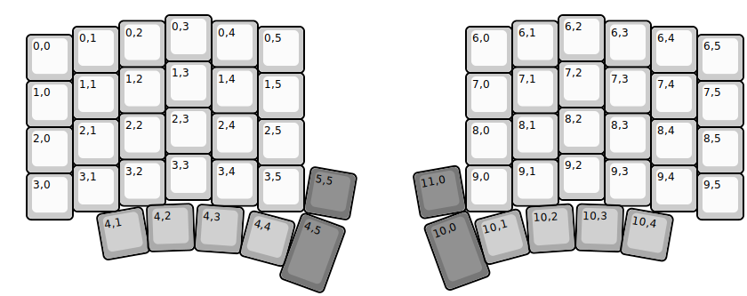{:loading="lazy"}

[Open in keyboard-layout-editor](http://www.keyboard-layout-editor.com/##@@_x:3.5&y:0.25;&=0,3&_x:7.5;&=6,2;&@_x:2.5&y:-0.875;&=0,2&_x:1.0;&=0,4&_x:5.5;&=6,1&_x:1.0;&=6,3;&@_x:1.5&y:-0.875;&=0,1&_x:3.0;&=0,5&_x:3.5;&=6,0&_x:3.0;&=6,4;&@_x:0.5&y:-0.825;&=0,0&_x:13.5;&=6,5;&@_x:3.5&y:-0.425;&=1,3&_x:7.5;&=7,2;&@_x:2.5&y:-0.875;&=1,2&_x:1.0;&=1,4&_x:5.5;&=7,1&_x:1.0;&=7,3;&@_x:1.5&y:-0.875;&=1,1&_x:3.0;&=1,5&_x:3.5;&=7,0&_x:3.0;&=7,4;&@_x:0.5&y:-0.825;&=1,0&_x:13.5;&=7,5;&@_x:3.5&y:-0.425;&=2,3&_x:7.5;&=8,2;&@_x:2.5&y:-0.875;&=2,2&_x:1.0;&=2,4&_x:5.5;&=8,1&_x:1.0;&=8,3;&@_x:1.5&y:-0.875;&=2,1&_x:3.0;&=2,5&_x:3.5;&=8,0&_x:3.0;&=8,4;&@_x:0.5&y:-0.825;&=2,0&_x:13.5;&=8,5;&@_x:3.5&y:-0.425;&=3,3&_x:7.5;&=9,2;&@_x:2.5&y:-0.875;&=3,2&_x:1.0;&=3,4&_x:5.5;&=9,1&_x:1.0;&=9,3;&@_x:1.5&y:-0.875;&=3,1&_x:3.0;&=3,5&_x:3.5;&=9,0&_x:3.0;&=9,4;&@_x:0.5&y:-0.825;&=3,0&_x:13.5;&=9,5;&@_r:2&rx:10&ry:4.5&x:2.4&y:-0.25&c=#aaaaaa;&=10,3;&@_r:4&rx:6.5&x:-2.3;&=4,3;&@_r:10&y:-2.0&c=#777777;&=5,5;&@_rx:10&x:3.45&y:-0.7&c=#aaaaaa;&=10,4;&@_r:15&rx:6.5&x:-1.1&y:0.25;&=4,4;&@_r:20&y:-1.25&c=#777777&h:1.5;&=4,5;&@_r:-20&rx:10&x:-1&h:1.5;&=10,0;&@_r:-15&x:0.1&y:-0.75&c=#aaaaaa;&=10,1;&@_r:-10&rx:6.5&x:-4.45&y:-0.7;&=4,1;&@_rx:10&x:-1&y:-1.0&c=#777777;&=11,0;&@_r:-4&x:1.3&c=#aaaaaa;&=10,2;&@_r:-2&rx:6.5&x:-3.4&y:-0.25;&=4,2)

## elagil/polilla

[README](output/elagil/polilla/README.md) - [layout](output/elagil/polilla/polilla-kle.json) - [PCB](output/elagil/polilla/polilla.kicad_pcb) - [PCB render](output/elagil/polilla/polilla-render.svg)

{:loading="lazy"}

[Open in keyboard-layout-editor](http://www.keyboard-layout-editor.com/##@@_x:3.5&y:0.25;&=0,3&=0,4&=0,5&_x:3.5;&=0,6&=0,7&=0,8;&@_x:2.5&y:-0.875;&=0,2&_x:9.5;&=0,9;&@_x:0.5&y:-0.875;&=0,0&=0,1&_x:11.5;&=0,10&=0,11;&@_x:3.5&y:-0.25;&=1,3&=1,4&=1,5&_x:3.5;&=1,6&=1,7&=1,8;&@_x:2.5&y:-0.875;&=1,2&_x:9.5;&=1,9;&@_x:0.5&y:-0.875;&=1,0&=1,1&_x:11.5;&=1,10&=1,11;&@_x:3.5&y:-0.25;&=2,3&=2,4&=2,5&_x:3.5;&=2,6&=2,7&=2,8;&@_x:2.5&y:-0.875;&=2,2&_x:9.5;&=2,9;&@_x:0.5&y:-0.875;&=2,0&=2,1&_x:11.5;&=2,10&=2,11;&@_x:3.5&y:-0.25;&=3,3&=3,4&=3,5&_x:3.5;&=3,6&=3,7&=3,8;&@_x:2.5&y:-0.875;&=3,2&_x:9.5;&=3,9;&@_x:0.5&y:-0.875;&=3,0&=3,1&_x:11.5;&=3,10&=3,11;&@_rx:6.5&ry:4.5&y:-1.5&c=#777777;&=4,5;&@_h:1.5;&=4,4;&@_x:-3.0&y:-0.75&c=#aaaaaa;&=4,1&=4,2&=4,3;&@_x:-4.0&y:-0.875;&=4,0;&@_rx:10&x:-1&y:-1.5&c=#777777;&=4,6;&@_x:-1&h:1.5;&=4,7;&@_y:-0.75&c=#aaaaaa;&=4,8&=4,9&=4,10;&@_x:3&y:-0.875;&=4,11)

## eniigmakeyboards/ek60

[README](output/eniigmakeyboards/ek60/README.md) - [layout](output/eniigmakeyboards/ek60/ek60-kle.json) - [PCB](output/eniigmakeyboards/ek60/ek60.kicad_pcb) - [PCB render](output/eniigmakeyboards/ek60/ek60-render.svg)

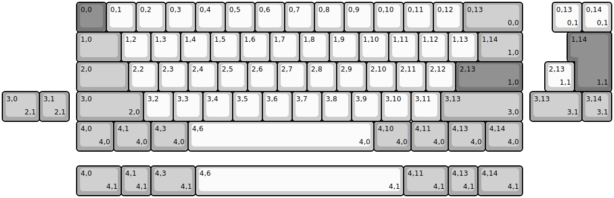{:loading="lazy"}

[Open in keyboard-layout-editor](http://www.keyboard-layout-editor.com/##@@_x:2.5&c=#777777;&=0,0&_c=#cccccc;&=0,1&=0,2&=0,3&=0,4&=0,5&=0,6&=0,7&=0,8&=0,9&=0,10&=0,11&=0,12&_c=#aaaaaa&w:2;&=0,13%0A%0A%0A0,0;&@_x:2.5&w:1.5;&=1,0&_c=#cccccc;&=1,2&=1,3&=1,4&=1,5&=1,6&=1,7&=1,8&=1,9&=1,10&=1,11&=1,12&=1,13&_c=#aaaaaa&w:1.5;&=1,14%0A%0A%0A1,0;&@_x:2.5&w:1.75;&=2,0&_c=#cccccc;&=2,2&=2,3&=2,4&=2,5&=2,6&=2,7&=2,8&=2,9&=2,10&=2,11&=2,12&_c=#777777&w:2.25;&=2,13%0A%0A%0A1,0;&@_x:2.5&c=#aaaaaa&w:2.25;&=3,0%0A%0A%0A2,0&_c=#cccccc;&=3,2&=3,3&=3,4&=3,5&=3,6&=3,7&=3,8&=3,9&=3,10&=3,11&_c=#aaaaaa&w:2.75;&=3,13%0A%0A%0A3,0;&@_x:2.5&w:1.25;&=4,0%0A%0A%0A4,0&_w:1.25;&=4,1%0A%0A%0A4,0&_w:1.25;&=4,3%0A%0A%0A4,0&_c=#cccccc&w:6.25;&=4,6%0A%0A%0A4,0&_c=#aaaaaa&w:1.25;&=4,10%0A%0A%0A4,0&_w:1.25;&=4,11%0A%0A%0A4,0&_w:1.25;&=4,13%0A%0A%0A4,0&_w:1.25;&=4,14%0A%0A%0A4,0;&@_x:18.5&y:-5&c=#cccccc;&=0,13%0A%0A%0A0,1&=0,14%0A%0A%0A0,1;&@_x:19.25&c=#777777&w:1.25&h:2&w2:1.5&h2:1&x2:-0.25;&=1,14%0A%0A%0A1,1;&@_x:18.25&c=#cccccc;&=2,13%0A%0A%0A1,1;&@_c=#aaaaaa&w:1.25;&=3,0%0A%0A%0A2,1&=3,1%0A%0A%0A2,1&_x:15.5&w:1.75;&=3,13%0A%0A%0A3,1&=3,14%0A%0A%0A3,1;&@_x:2.5&y:1.5&w:1.5;&=4,0%0A%0A%0A4,1&=4,1%0A%0A%0A4,1&_w:1.5;&=4,3%0A%0A%0A4,1&_c=#cccccc&w:7;&=4,6%0A%0A%0A4,1&_c=#aaaaaa&w:1.5;&=4,11%0A%0A%0A4,1&=4,13%0A%0A%0A4,1&_w:1.5;&=4,14%0A%0A%0A4,1)

## eniigmakeyboards/ek65

[README](output/eniigmakeyboards/ek65/README.md) - [layout](output/eniigmakeyboards/ek65/ek65-kle.json) - [PCB](output/eniigmakeyboards/ek65/ek65.kicad_pcb) - [PCB render](output/eniigmakeyboards/ek65/ek65-render.svg)

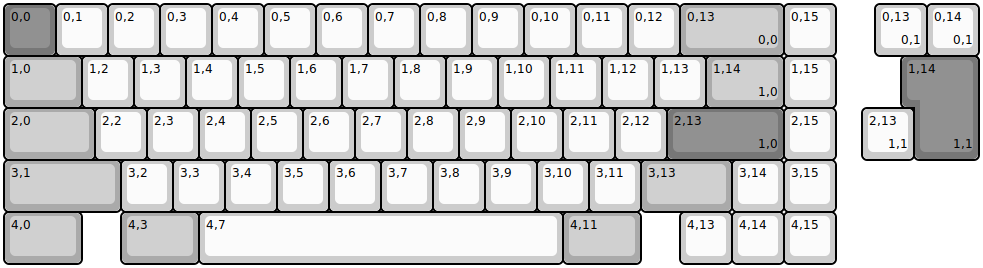{:loading="lazy"}

[Open in keyboard-layout-editor](http://www.keyboard-layout-editor.com/##@@_c=#777777;&=0,0&_c=#cccccc;&=0,1&=0,2&=0,3&=0,4&=0,5&=0,6&=0,7&=0,8&=0,9&=0,10&=0,11&=0,12&_c=#aaaaaa&w:2;&=0,13%0A%0A%0A0,0&_c=#cccccc;&=0,15;&@_c=#aaaaaa&w:1.5;&=1,0&_c=#cccccc;&=1,2&=1,3&=1,4&=1,5&=1,6&=1,7&=1,8&=1,9&=1,10&=1,11&=1,12&=1,13&_c=#aaaaaa&w:1.5;&=1,14%0A%0A%0A1,0&_c=#cccccc;&=1,15;&@_c=#aaaaaa&w:1.75;&=2,0&_c=#cccccc;&=2,2&=2,3&=2,4&=2,5&=2,6&=2,7&=2,8&=2,9&=2,10&=2,11&=2,12&_c=#777777&w:2.25;&=2,13%0A%0A%0A1,0&_c=#cccccc;&=2,15;&@_c=#aaaaaa&w:2.25;&=3,1&_c=#cccccc;&=3,2&=3,3&=3,4&=3,5&=3,6&=3,7&=3,8&=3,9&=3,10&=3,11&_c=#aaaaaa&w:1.75;&=3,13&_c=#cccccc;&=3,14&=3,15;&@_c=#aaaaaa&w:1.5;&=4,0&_x:0.75&w:1.5;&=4,3&_c=#cccccc&w:7;&=4,7&_c=#aaaaaa&w:1.5;&=4,11&_x:0.75&c=#cccccc;&=4,13&=4,14&=4,15;&@_x:16.75&y:-5;&=0,13%0A%0A%0A0,1&=0,14%0A%0A%0A0,1;&@_x:17.5&c=#777777&w:1.25&h:2&w2:1.5&h2:1&x2:-0.25;&=1,14%0A%0A%0A1,1;&@_x:16.5&c=#cccccc;&=2,13%0A%0A%0A1,1)

## eniigmakeyboards/ek87

[README](output/eniigmakeyboards/ek87/README.md) - [layout](output/eniigmakeyboards/ek87/ek87-kle.json) - [PCB](output/eniigmakeyboards/ek87/ek87.kicad_pcb) - [PCB render](output/eniigmakeyboards/ek87/ek87-render.svg)

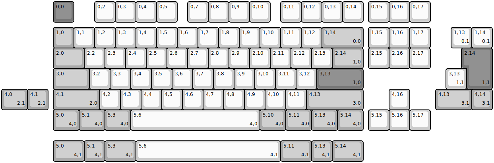{:loading="lazy"}

[Open in keyboard-layout-editor](http://www.keyboard-layout-editor.com/##@@_x:2.5&c=#777777;&=0,0&_x:1.0&c=#cccccc;&=0,2&=0,3&=0,4&=0,5&_x:0.5;&=0,7&=0,8&=0,9&=0,10&_x:0.5;&=0,11&=0,12&=0,13&=0,14&_x:0.25;&=0,15&=0,16&=0,17;&@_x:2.5&y:0.25&c=#aaaaaa;&=1,0&_c=#cccccc;&=1,1&=1,2&=1,3&=1,4&=1,5&=1,6&=1,7&=1,8&=1,9&=1,10&=1,11&=1,12&_c=#aaaaaa&w:2;&=1,14%0A%0A%0A0,0&_x:0.25&c=#cccccc;&=1,15&=1,16&=1,17;&@_x:2.5&c=#aaaaaa&w:1.5;&=2,0&_c=#cccccc;&=2,2&=2,3&=2,4&=2,5&=2,6&=2,7&=2,8&=2,9&=2,10&=2,11&=2,12&=2,13&_c=#aaaaaa&w:1.5;&=2,14%0A%0A%0A1,0&_x:0.25&c=#cccccc;&=2,15&=2,16&=2,17;&@_x:2.5&c=#aaaaaa&w:1.75;&=3,0&_c=#cccccc;&=3,2&=3,3&=3,4&=3,5&=3,6&=3,7&=3,8&=3,9&=3,10&=3,11&=3,12&_c=#777777&w:2.25;&=3,13%0A%0A%0A1,0;&@_x:2.5&c=#aaaaaa&w:2.25;&=4,1%0A%0A%0A2,0&_c=#cccccc;&=4,2&=4,3&=4,4&=4,5&=4,6&=4,7&=4,8&=4,9&=4,10&=4,11&_c=#aaaaaa&w:2.75;&=4,13%0A%0A%0A3,0&_x:1.25&c=#cccccc;&=4,16;&@_x:2.5&c=#aaaaaa&w:1.25;&=5,0%0A%0A%0A4,0&_w:1.25;&=5,1%0A%0A%0A4,0&_w:1.25;&=5,3%0A%0A%0A4,0&_c=#cccccc&w:6.25;&=5,6%0A%0A%0A4,0&_c=#aaaaaa&w:1.25;&=5,10%0A%0A%0A4,0&_w:1.25;&=5,11%0A%0A%0A4,0&_w:1.25;&=5,13%0A%0A%0A4,0&_w:1.25;&=5,14%0A%0A%0A4,0&_x:0.25&c=#cccccc;&=5,15&=5,16&=5,17;&@_x:21.75&y:-5.0;&=1,13%0A%0A%0A0,1&=1,14%0A%0A%0A0,1;&@_x:22.5&c=#777777&w:1.25&h:2&w2:1.5&h2:1&x2:-0.25;&=2,14%0A%0A%0A1,1;&@_x:21.5&c=#cccccc;&=3,13%0A%0A%0A1,1;&@_c=#aaaaaa&w:1.25;&=4,0%0A%0A%0A2,1&=4,1%0A%0A%0A2,1&_x:18.75&w:1.75;&=4,13%0A%0A%0A3,1&=4,14%0A%0A%0A3,1;&@_x:2.5&y:1.5&w:1.5;&=5,0%0A%0A%0A4,1&=5,1%0A%0A%0A4,1&_w:1.5;&=5,3%0A%0A%0A4,1&_c=#cccccc&w:7;&=5,6%0A%0A%0A4,1&_c=#aaaaaa&w:1.5;&=5,11%0A%0A%0A4,1&=5,13%0A%0A%0A4,1&_w:1.5;&=5,14%0A%0A%0A4,1)

## epoch80/epoch80

[README](output/epoch80/README.md) - [layout](output/epoch80/epoch80-kle.json) - [PCB](output/epoch80/epoch80.kicad_pcb) - [PCB render](output/epoch80/epoch80-render.svg)

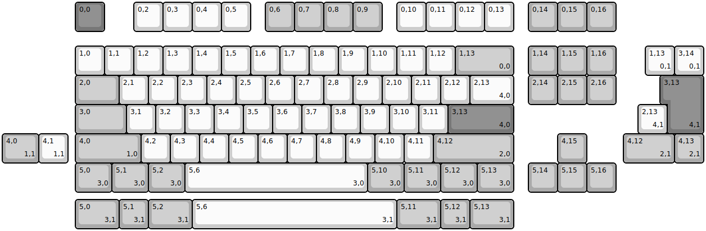{:loading="lazy"}

[Open in keyboard-layout-editor](http://www.keyboard-layout-editor.com/##@@_x:2.5&c=#777777;&=0,0&_x:1.0&c=#cccccc;&=0,2&=0,3&=0,4&=0,5&_x:0.5&c=#aaaaaa;&=0,6&=0,7&=0,8&=0,9&_x:0.5&c=#cccccc;&=0,10&=0,11&=0,12&=0,13&_x:0.5&c=#aaaaaa;&=0,14&=0,15&=0,16;&@_x:2.5&y:0.5&c=#cccccc;&=1,0&=1,1&=1,2&=1,3&=1,4&=1,5&=1,6&=1,7&=1,8&=1,9&=1,10&=1,11&=1,12&_c=#aaaaaa&w:2;&=1,13%0A%0A%0A0,0&_x:0.5;&=1,14&=1,15&=1,16;&@_x:2.5&w:1.5;&=2,0&_c=#cccccc;&=2,1&=2,2&=2,3&=2,4&=2,5&=2,6&=2,7&=2,8&=2,9&=2,10&=2,11&=2,12&_w:1.5;&=2,13%0A%0A%0A4,0&_x:0.5&c=#aaaaaa;&=2,14&=2,15&=2,16;&@_x:2.5&w:1.75;&=3,0&_c=#cccccc;&=3,1&=3,2&=3,3&=3,4&=3,5&=3,6&=3,7&=3,8&=3,9&=3,10&=3,11&_c=#777777&w:2.25;&=3,13%0A%0A%0A4,0;&@_x:2.5&c=#aaaaaa&w:2.25;&=4,0%0A%0A%0A1,0&_c=#cccccc;&=4,2&=4,3&=4,4&=4,5&=4,6&=4,7&=4,8&=4,9&=4,10&=4,11&_c=#aaaaaa&w:2.75;&=4,12%0A%0A%0A2,0&_x:1.5;&=4,15;&@_x:2.5&w:1.25;&=5,0%0A%0A%0A3,0&_w:1.25;&=5,1%0A%0A%0A3,0&_w:1.25;&=5,2%0A%0A%0A3,0&_c=#cccccc&w:6.25;&=5,6%0A%0A%0A3,0&_c=#aaaaaa&w:1.25;&=5,10%0A%0A%0A3,0&_w:1.25;&=5,11%0A%0A%0A3,0&_w:1.25;&=5,12%0A%0A%0A3,0&_w:1.25;&=5,13%0A%0A%0A3,0&_x:0.5;&=5,14&=5,15&=5,16;&@_x:22.0&y:-5.0&c=#cccccc;&=1,13%0A%0A%0A0,1&=3,14%0A%0A%0A0,1;&@_x:22.75&c=#777777&w:1.25&h:2&w2:1&h2:1&x2:-0.25;&=3,13%0A%0A%0A4,1;&@_x:21.75&c=#cccccc;&=2,13%0A%0A%0A4,1;&@_c=#aaaaaa&w:1.25;&=4,0%0A%0A%0A1,1&_c=#cccccc;&=4,1%0A%0A%0A1,1&_x:19.0&c=#aaaaaa&w:1.75;&=4,12%0A%0A%0A2,1&=4,13%0A%0A%0A2,1;&@_x:2.5&y:1.25&w:1.5;&=5,0%0A%0A%0A3,1&=5,1%0A%0A%0A3,1&_w:1.5;&=5,2%0A%0A%0A3,1&_c=#cccccc&w:7;&=5,6%0A%0A%0A3,1&_c=#aaaaaa&w:1.5;&=5,11%0A%0A%0A3,1&=5,12%0A%0A%0A3,1&_w:1.5;&=5,13%0A%0A%0A3,1)

## era/divine

[README](output/era/divine/README.md) - [layout](output/era/divine/divine-kle.json) - [PCB](output/era/divine/divine.kicad_pcb) - [PCB render](output/era/divine/divine-render.svg)

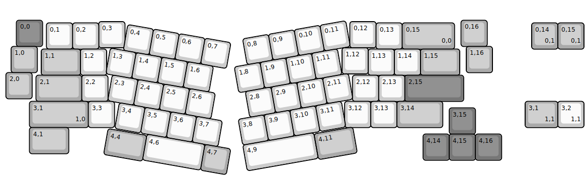{:loading="lazy"}

[Open in keyboard-layout-editor](http://www.keyboard-layout-editor.com/##@@_x:0.55&y:0.7&c=#777777;&=0,0&_x:16.0&c=#aaaaaa;&=0,16;&@_x:3.7&y:-0.95&c=#cccccc;&=0,3&_x:8.6;&=0,12;&@_x:1.7&y:-0.95;&=0,1&=0,2&_x:10.6;&=0,13&_c=#aaaaaa&w:2;&=0,15%0A%0A%0A0,0;&@_x:0.35&y:-0.1;&=1,0&_x:16.4;&=1,16;&@_x:13&y:-0.95&c=#cccccc;&=1,12;&@_x:1.5&y:-0.95&c=#aaaaaa&w:1.5;&=1,1&_c=#cccccc;&=1,2&_x:10.0;&=1,13&=1,14&_c=#aaaaaa&w:1.5;&=1,15;&@_x:0.15&y:-0.1;&=2,0;&@_x:1.3&y:-0.9&w:1.75;&=2,1&_c=#cccccc;&=2,2&_x:9.35;&=2,12&=2,13&_c=#777777&w:2.25;&=2,15;&@_x:1.05&c=#aaaaaa&w:2.25;&=3,1%0A%0A%0A1,0&_c=#cccccc;&=3,3&_x:8.8;&=3,12&=3,13&_c=#aaaaaa&w:1.75;&=3,14;&@_x:17.1&y:-0.75&c=#777777;&=3,15;&@_x:1.05&y:-0.25&c=#aaaaaa&w:1.5;&=4,1;&@_x:16.1&y:-0.75&c=#777777;&=4,14&=4,15&=4,16;&@_r:10&x:4.9&y:-6.05&c=#cccccc;&=0,4&=0,5&=0,6&=0,7;&@_x:4.4;&=1,3&=1,4&=1,5&=1,6;&@_x:4.65;&=2,3&=2,4&=2,5&=2,6;&@_x:5.1;&=3,4&=3,5&=3,6&=3,7;&@_x:6.35&w:2.25;&=4,6&_c=#aaaaaa;&=4,7;&@_x:4.85&y:-0.95&w:1.5;&=4,4;&@_r:-10&x:8.8&y:-2.05&c=#cccccc;&=0,8&=0,9&=0,10&=0,11;&@_x:8.3;&=1,8&=1,9&=1,10&=1,11;&@_x:8.55;&=2,8&=2,9&=2,10&=2,11;&@_x:8.1;&=3,8&=3,9&=3,10&=3,11;&@_x:8.1&w:2.75;&=4,9;&@_x:10.86&y:-0.95&c=#aaaaaa&w:1.5;&=4,11;&@_r:0&x:20.25&y:-7.25;&=0,14%0A%0A%0A0,1&=0,15%0A%0A%0A0,1;&@_x:20.0&y:2.0&w:1.25;&=3,1%0A%0A%0A1,1&_c=#cccccc;&=3,2%0A%0A%0A1,1)

## era/era65

[README](output/era/era65/README.md) - [layout](output/era/era65/era65-kle.json) - [PCB](output/era/era65/era65.kicad_pcb) - [PCB render](output/era/era65/era65-render.svg)

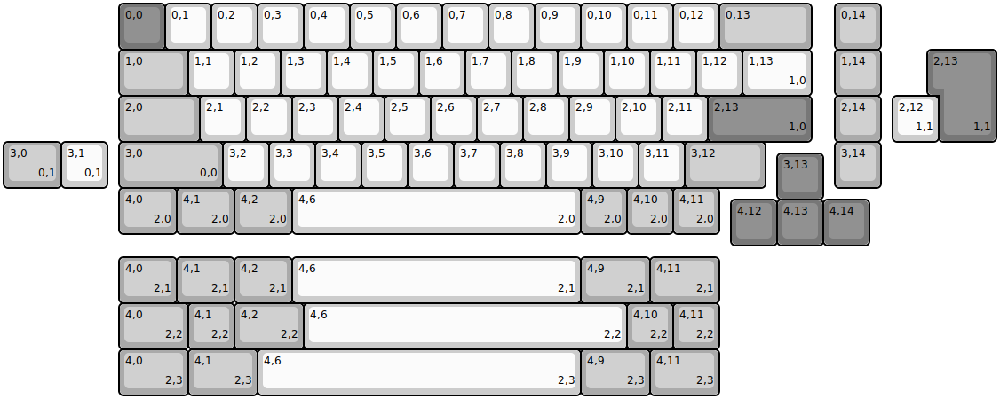{:loading="lazy"}

[Open in keyboard-layout-editor](http://www.keyboard-layout-editor.com/##@@_x:2.5&c=#777777;&=0,0&_c=#cccccc;&=0,1&=0,2&=0,3&=0,4&=0,5&=0,6&=0,7&=0,8&=0,9&=0,10&=0,11&=0,12&_c=#aaaaaa&w:2;&=0,13&_x:0.5;&=0,14;&@_x:2.5&w:1.5;&=1,0&_c=#cccccc;&=1,1&=1,2&=1,3&=1,4&=1,5&=1,6&=1,7&=1,8&=1,9&=1,10&=1,11&=1,12&_w:1.5;&=1,13%0A%0A%0A1,0&_x:0.5&c=#aaaaaa;&=1,14;&@_x:2.5&w:1.75;&=2,0&_c=#cccccc;&=2,1&=2,2&=2,3&=2,4&=2,5&=2,6&=2,7&=2,8&=2,9&=2,10&=2,11&_c=#777777&w:2.25;&=2,13%0A%0A%0A1,0&_x:0.5&c=#aaaaaa;&=2,14;&@_x:2.5&w:2.25;&=3,0%0A%0A%0A0,0&_c=#cccccc;&=3,2&=3,3&=3,4&=3,5&=3,6&=3,7&=3,8&=3,9%0A,&=3,10%0A.&=3,11%0A//&_c=#aaaaaa&w:1.75;&=3,12&_x:1.5;&=3,14;&@_x:16.75&y:-0.75&c=#777777;&=3,13;&@_x:2.5&y:-0.25&c=#aaaaaa&w:1.25;&=4,0%0A%0A%0A2,0&_w:1.25;&=4,1%0A%0A%0A2,0&_w:1.25;&=4,2%0A%0A%0A2,0&_c=#cccccc&w:6.25;&=4,6%0A%0A%0A2,0&_c=#aaaaaa;&=4,9%0A%0A%0A2,0&=4,10%0A%0A%0A2,0&=4,11%0A%0A%0A2,0;&@_x:15.75&y:-0.75&c=#777777;&=4,12&=4,13&=4,14;&@_x:20.25&y:-4.25&w:1.25&h:2&w2:1.5&h2:1&x2:-0.25;&=2,13%0A%0A%0A1,1;&@_x:19.25&c=#cccccc;&=2,12%0A%0A%0A1,1;&@_c=#aaaaaa&w:1.25;&=3,0%0A%0A%0A0,1&_c=#cccccc;&=3,1%0A%0A%0A0,1;&@_x:2.5&y:1.5&c=#aaaaaa&w:1.25;&=4,0%0A%0A%0A2,1&_w:1.25;&=4,1%0A%0A%0A2,1&_w:1.25;&=4,2%0A%0A%0A2,1&_c=#cccccc&w:6.25;&=4,6%0A%0A%0A2,1&_c=#aaaaaa&w:1.5;&=4,9%0A%0A%0A2,1&_w:1.5;&=4,11%0A%0A%0A2,1;&@_x:2.5&w:1.5;&=4,0%0A%0A%0A2,2&=4,1%0A%0A%0A2,2&_w:1.5;&=4,2%0A%0A%0A2,2&_c=#cccccc&w:7;&=4,6%0A%0A%0A2,2&_c=#aaaaaa;&=4,10%0A%0A%0A2,2&=4,11%0A%0A%0A2,2;&@_x:2.5&w:1.5;&=4,0%0A%0A%0A2,3&_w:1.5;&=4,1%0A%0A%0A2,3&_c=#cccccc&w:7;&=4,6%0A%0A%0A2,3&_c=#aaaaaa&w:1.5;&=4,9%0A%0A%0A2,3&_w:1.5;&=4,11%0A%0A%0A2,3)

## ergoarrows/ergoarrows

[README](output/ergoarrows/README.md) - [layout](output/ergoarrows/ergoarrows-kle.json) - [PCB](output/ergoarrows/ergoarrows.kicad_pcb) - [PCB render](output/ergoarrows/ergoarrows-render.svg)

{:loading="lazy"}

[Open in keyboard-layout-editor](http://www.keyboard-layout-editor.com/##@@_x:3;&=0,3&_x:8.5;&=6,3;&@_x:2&y:-0.87;&=0,2&_x:1;&=0,4&_x:6.5;&=6,4&_x:1.0;&=6,2;&@_x:5&y:-0.88;&=0,5&_x:4.5;&=6,5;&@_y:-0.87&c=#777777;&=0,0&_c=#cccccc;&=0,1&_x:12.5;&=6,1&_c=#777777;&=6,0;&@_x:6&y:-0.88&c=#cccccc;&=0,6&_x:2.5;&=6,6;&@_x:3&y:-0.5;&=1,3&_x:8.5;&=7,3;&@_x:2&y:-0.87;&=1,2&_x:1;&=1,4&_x:6.5;&=7,4&_x:1.0;&=7,2;&@_x:5&y:-0.88;&=1,5&_x:4.5;&=7,5;&@_y:-0.87&c=#aaaaaa;&=1,0&_c=#cccccc;&=1,1&_x:12.5;&=7,1&=7,0;&@_x:6&y:-0.88;&=1,6&_x:2.5;&=7,6;&@_x:3&y:-0.5;&=2,3&_x:8.5;&=8,3;&@_x:2&y:-0.87;&=2,2&_x:1;&=2,4&_x:6.5;&=8,4&_x:1.0;&=8,2;&@_x:5&y:-0.88;&=2,5&_x:4.5;&=8,5;&@_y:-0.87&c=#aaaaaa;&=2,0&_c=#cccccc;&=2,1&_x:12.5;&=8,1&_c=#777777;&=8,0;&@_x:6&y:-0.88&c=#cccccc;&=2,6&_x:2.5;&=8,6;&@_x:3&y:-0.5;&=3,3&_x:8.5;&=9,3;&@_x:2&y:-0.87;&=3,2&_x:1;&=3,4&_x:6.5;&=9,4&_x:1.0;&=9,2;&@_x:5&y:-0.88;&=3,5&_x:4.5;&=9,5;&@_y:-0.87&c=#aaaaaa;&=3,0&_c=#cccccc;&=3,1&_x:12.5;&=9,1&=9,0;&@_x:6&y:-0.88;&=3,6&_x:2.5;&=9,6;&@_y:-0.12&c=#aaaaaa;&=4,0&=4,1&_x:1.25;&=4,3&_c=#cccccc;&=4,4&_x:6.0;&=10,4&_c=#aaaaaa;&=10,3&_x:1.25;&=10,1&=10,0;&@_x:2.13&y:-0.87&c=#cccccc;&=4,2&_x:10.25;&=10,2;&@_x:1.13;&=5,1&=5,2&=5,3&_x:8.25;&=11,3&=11,2&=11,1;&@_r:22.5&rx:5.65&ry:3.75&x:0.24&y:0.65;&=4,5;&@_r:45&x:1.74&y:-1.6;&=4,6;&@_r:-45&rx:11&x:-2.87&y:0.01;&=10,6;&@_r:-22.5&x:-1.37&y:-0.36;&=10,5)

## ergodone/ergodone

[README](output/ergodone/README.md) - [layout](output/ergodone/ergodone-kle.json) - [PCB](output/ergodone/ergodone.kicad_pcb) - [PCB render](output/ergodone/ergodone-render.svg)

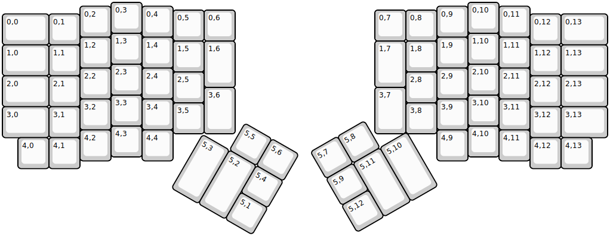{:loading="lazy"}

[Open in keyboard-layout-editor](http://www.keyboard-layout-editor.com/##@_name=ergodone_via;&@_x:3.5;&=0,3&_x:10.5;&=0,10;&@_x:2.5&y:-0.875;&=0,2&_x:1.0;&=0,4&_x:8.5;&=0,9&_x:1.0;&=0,11;&@_x:5.5&y:-0.875;&=0,5&=0,6&_x:4.5;&=0,7&=0,8;&@_y:-0.875&w:1.5;&=0,0&=0,1&_x:14.5;&=0,12&_w:1.5;&=0,13;&@_x:3.5&y:-0.375;&=1,3&_x:10.5;&=1,10;&@_x:2.5&y:-0.875;&=1,2&_x:1.0;&=1,4&_x:8.5;&=1,9&_x:1.0;&=1,11;&@_x:5.5&y:-0.875;&=1,5&_h:1.5;&=1,6&_x:4.5&h:1.5;&=1,7&=1,8;&@_y:-0.875&w:1.5;&=1,0&=1,1&_x:14.5;&=1,12&_w:1.5;&=1,13;&@_x:3.5&y:-0.375;&=2,3&_x:10.5;&=2,10;&@_x:2.5&y:-0.875;&=2,2&_x:1.0;&=2,4&_x:8.5;&=2,9&_x:1.0;&=2,11;&@_x:5.5&y:-0.875;&=2,5&_x:6.5;&=2,8;&@_y:-0.875&w:1.5;&=2,0&=2,1&_x:14.5;&=2,12&_w:1.5;&=2,13;&@_x:6.5&y:-0.625&h:1.5;&=3,6&_x:4.5&h:1.5;&=3,7;&@_x:3.5&y:-0.75;&=3,3&_x:10.5;&=3,10;&@_x:2.5&y:-0.875;&=3,2&_x:1.0;&=3,4&_x:8.5;&=3,9&_x:1.0;&=3,11;&@_x:5.5&y:-0.875;&=3,5&_x:6.5;&=3,8;&@_y:-0.875&w:1.5;&=3,0&=3,1&_x:14.5;&=3,12&_w:1.5;&=3,13;&@_x:3.5&y:-0.375;&=4,3&_x:10.5;&=4,10;&@_x:2.5&y:-0.875;&=4,2&_x:1.0;&=4,4&_x:8.5;&=4,9&_x:1.0;&=4,11;&@_x:0.5&y:-0.75;&=4,0&=4,1&_x:14.5;&=4,12&=4,13;&@_r:30&rx:6.5&ry:4.25&x:1.0&y:-1.0;&=5,5&=5,6;&@_h:2;&=5,3&_h:2;&=5,2&=5,4;&@_x:2.0;&=5,1;&@_r:-30&rx:13&x:-3&y:-1.0;&=5,7&=5,8;&@_x:-3;&=5,9&_h:2;&=5,11&_h:2;&=5,10;&@_x:-3;&=5,12)

## ergodox_ez/ergodox_ez

[README](output/ergodox_ez/README.md) - [layout](output/ergodox_ez/ergodox_ez-kle.json) - [PCB](output/ergodox_ez/ergodox_ez.kicad_pcb) - [PCB render](output/ergodox_ez/ergodox_ez-render.svg)

{:loading="lazy"}

[Open in keyboard-layout-editor](http://www.keyboard-layout-editor.com/##@@_x:3.5;&=3,0&_x:10.5;&=10,0;&@_x:2.5&y:-0.875;&=2,0&_x:1.0;&=4,0&_x:8.5;&=9,0&_x:1.0;&=11,0;&@_x:5.5&y:-0.875;&=5,0&_c=#777777;&=6,0&_x:4.5&c=#aaaaaa;&=7,0&_c=#cccccc;&=8,0;&@_y:-0.875&c=#777777&w:1.5;&=0,0&_c=#cccccc;&=1,0&_x:14.5;&=12,0&_c=#777777&w:1.5;&=13,0;&@_x:3.5&y:-0.375&c=#cccccc;&=3,1&_x:10.5;&=10,1;&@_x:2.5&y:-0.875;&=2,1&_x:1.0;&=4,1&_x:8.5;&=9,1&_x:1.0;&=11,1;&@_x:5.5&y:-0.875;&=5,1&_c=#aaaaaa&h:1.5;&=6,1&_x:4.5&h:1.5;&=7,1&_c=#cccccc;&=8,1;&@_y:-0.875&c=#aaaaaa&w:1.5;&=0,1&_c=#cccccc;&=1,1&_x:14.5;&=12,1&_c=#aaaaaa&w:1.5;&=13,1;&@_x:3.5&y:-0.375&c=#cccccc;&=3,2&_x:10.5;&=10,2;&@_x:2.5&y:-0.875;&=2,2&_x:1.0;&=4,2&_x:8.5;&=9,2&_x:1.0;&=11,2;&@_x:5.5&y:-0.875;&=5,2&_x:6.5;&=8,2;&@_y:-0.875&c=#aaaaaa&w:1.5;&=0,2&_c=#cccccc;&=1,2&_x:14.5;&=12,2&_c=#aaaaaa&w:1.5;&=13,2;&@_x:6.5&y:-0.625&h:1.5;&=6,3&_x:4.5&h:1.5;&=7,3;&@_x:3.5&y:-0.75&c=#cccccc;&=3,3&_x:10.5;&=10,3;&@_x:2.5&y:-0.875;&=2,3&_x:1.0;&=4,3&_x:8.5;&=9,3&_x:1.0;&=11,3;&@_x:5.5&y:-0.875;&=5,3&_x:6.5;&=8,3;&@_y:-0.875&c=#aaaaaa&w:1.5;&=0,3&_c=#cccccc;&=1,3&_x:14.5;&=12,3&_c=#aaaaaa&w:1.5;&=13,3;&@_x:3.5&y:-0.375;&=3,4&_x:10.5;&=10,4;&@_x:2.5&y:-0.875;&=2,4&_x:1.0;&=4,4&_x:8.5;&=9,4&_x:1.0;&=11,4;&@_x:0.5&y:-0.75;&=0,4&=1,4&_x:14.5;&=12,4&=13,4;&@_r:30&rx:6.5&ry:4.25&x:1.0&y:-1.0;&=5,5&_c=#777777;&=6,5;&@_c=#aaaaaa&h:2;&=3,5&_c=#777777&h:2;&=2,5&_c=#aaaaaa;&=4,5;&@_x:2.0;&=1,5;&@_r:-30&rx:13&x:-3&y:-1.0&c=#777777;&=7,5&_c=#aaaaaa;&=8,5;&@_x:-3;&=9,5&_c=#777777&h:2;&=11,5&_c=#aaaaaa&h:2;&=10,5;&@_x:-3;&=12,5)

## ergotravel/ergotravel

[README](output/ergotravel/README.md) - [layout](output/ergotravel/ergotravel-kle.json) - [PCB](output/ergotravel/ergotravel.kicad_pcb) - [PCB render](output/ergotravel/ergotravel-render.svg)

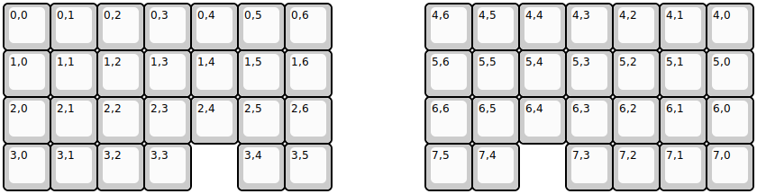{:loading="lazy"}

[Open in keyboard-layout-editor](http://www.keyboard-layout-editor.com/##@@=0,0&=0,1&=0,2&=0,3&=0,4&=0,5&=0,6&_x:2;&=4,6&=4,5&=4,4&=4,3&=4,2&=4,1&=4,0;&@=1,0&=1,1&=1,2&=1,3&=1,4&=1,5&=1,6&_x:2;&=5,6&=5,5&=5,4&=5,3&=5,2&=5,1&=5,0;&@=2,0&=2,1&=2,2&=2,3&=2,4&=2,5&=2,6&_x:2;&=6,6&=6,5&=6,4&=6,3&=6,2&=6,1&=6,0;&@=3,0&=3,1&=3,2&=3,3&_x:1;&=3,4&=3,5&_x:2;&=7,5&=7,4&_x:1;&=7,3&=7,2&=7,1&=7,0)

## eternal_keypad/eternal_keypad

[README](output/eternal_keypad/README.md) - [layout](output/eternal_keypad/eternal_keypad-kle.json) - [PCB](output/eternal_keypad/eternal_keypad.kicad_pcb) - [PCB render](output/eternal_keypad/eternal_keypad-render.svg)

{:loading="lazy"}

[Open in keyboard-layout-editor](http://www.keyboard-layout-editor.com/##@@_x:1.5&c=#777777&w:1.25;&=0,1&_c=#cccccc;&=0,2&=0,3&=0,4&=0,5&=0,6&=0,7;&@_x:1.5&c=#777777&w:1.25;&=1,1&_c=#cccccc;&=1,2&=1,3&=1,4&=1,5&=1,6&=1,7;&@_c=#777777;&=2,0&_x:0.5&w:1.25;&=2,1&_c=#cccccc;&=2,2&=2,3&=2,4&=2,5&=2,6&=2,7;&@_c=#777777;&=3,0&_x:0.5&w:1.25;&=3,1&_c=#cccccc;&=3,2&=3,3&=3,4&=3,5&=3,6&=3,7;&@_c=#777777;&=4,0&_x:0.5&w:1.25;&=4,1&_c=#aaaaaa&w:1.25;&=4,2&_c=#777777;&=4,3&_w:2.75;&=4,5&_c=#aaaaaa;&=4,7)

## eve/meteor

[README](output/eve/README.md) - [layout](output/eve/meteor-kle.json) - [PCB](output/eve/meteor.kicad_pcb) - [PCB render](output/eve/meteor-render.svg)

{:loading="lazy"}

[Open in keyboard-layout-editor](http://www.keyboard-layout-editor.com/##@@_c=#242424&t=#ffffff;&=0,0&_x:1&c=#cccccc&t=#000000;&=0,2&=0,3&=0,4&=0,5&_x:0.5;&=0,6&=0,7&=0,8&=0,9&_x:0.5;&=0,10&=0,11&=0,12&=0,13;&@_y:0.5;&=1,0&=1,1&=1,2&=1,3&=1,4&=1,5&=1,6&=1,7&=1,8&=1,9&=1,10&=1,11&=1,12&_c=#707070&w:2;&=1,14%0A%0A%0A0,0;&@_w:1.5;&=2,0&_c=#cccccc;&=2,1&=2,2&=2,3&=2,4&=2,5&=2,6&=2,7&=2,8&=2,9&=2,10&=2,11&=2,12&_w:1.5;&=2,13%0A%0A%0A3,0;&@_c=#707070&w:1.75;&=3,0&_c=#cccccc;&=3,1&=3,2&=3,3&=3,4&=3,5&=3,6&=3,7&=3,8&=3,9&=3,10&=3,11&_c=#242424&t=#ffffff&w:2.25;&=3,12%0A%0A%0A3,0;&@_c=#707070&t=#000000&w:2.25;&=4,0%0A%0A%0A1,0&_c=#cccccc;&=4,1&=4,2&=4,3&=4,4&=4,5&=4,6&=4,7&=4,8&=4,9&_c=#707070&w:1.75;&=4,10%0A%0A%0A2,0&=4,11%0A%0A%0A2,0&_c=#cccccc;&=4,13%0A%0A%0A2,0;&@_c=#707070&w:1.25;&=5,0&_w:1.25;&=5,1&_w:1.25;&=5,2&_c=#cccccc&w:6.25;&=5,5%0A%0A%0A4,0&_c=#707070;&=5,9%0A%0A%0A4,0&=5,10%0A%0A%0A4,0&=5,11%0A%0A%0A4,0&=5,12%0A%0A%0A4,0&=5,13%0A%0A%0A4,0;&@_x:15.5&y:-5.0&c=#cccccc;&=1,13%0A%0A%0A0,1&=1,14%0A%0A%0A0,1;&@_x:16.25&c=#242424&t=#ffffff&w:1.25&h:2&w2:1.5&h2:1&x2:-0.25;&=3,13%0A%0A%0A3,1;&@_x:15.25&c=#cccccc&t=#000000;&=2,13%0A%0A%0A3,1;&@_x:15.25;&=4,10%0A%0A%0A2,1&_c=#707070&w:1.75;&=4,11%0A%0A%0A2,1&=4,13%0A%0A%0A2,1;&@_x:15.25&c=#cccccc;&=4,10%0A%0A%0A2,2&_c=#707070&w:2.75;&=4,11%0A%0A%0A2,2;&@_y:0.25&w:1.25;&=4,0%0A%0A%0A1,1&_c=#cccccc;&=5,3%0A%0A%0A1,1&_x:1.5&w:6.25;&=5,5%0A%0A%0A4,1&_c=#707070&w:1.25;&=5,9%0A%0A%0A4,1&_w:1.25;&=5,10%0A%0A%0A4,1&_w:1.25;&=5,12%0A%0A%0A4,1&_w:1.25;&=5,13%0A%0A%0A4,1;&@_x:3.75&c=#cccccc&w:7.25;&=5,5%0A%0A%0A4,2&_c=#707070&w:1.5;&=5,10%0A%0A%0A4,2&=5,12%0A%0A%0A4,2&_w:1.5;&=5,13%0A%0A%0A4,2)

## evolv/evolv_ce

[README](output/evolv/README.md) - [layout](output/evolv/evolv_ce-kle.json) - [PCB](output/evolv/evolv_ce.kicad_pcb) - [PCB render](output/evolv/evolv_ce-render.svg)

{:loading="lazy"}

[Open in keyboard-layout-editor](http://www.keyboard-layout-editor.com/##@@_x:2.5&c=#777777;&=0,0&_x:0.25&c=#cccccc;&=0,1&=0,2&=0,3&=0,4&_x:0.25;&=0,5&=0,6&=0,7&=0,8&_x:0.25;&=0,9&=0,10&=0,11&=0,12&_x:0.25;&=0,13;&@_x:20.75&y:-0.75;&=3,15;&@_x:2.5;&=1,0&=1,1&=1,2&=1,3&=1,4&=1,5&=1,6&=1,7&=1,8&=1,9&=1,10&=1,11&=1,12&_c=#aaaaaa&w:2;&=1,14%0A%0A%0A0,0&_x:0.5&c=#cccccc;&=3,13&_x:0.75;&=1,15&=0,15&=2,15;&@_x:2.5&c=#aaaaaa&w:1.5;&=2,0&_c=#cccccc;&=2,1&=2,2&=2,3&=2,4&=2,5&=2,6&=2,7&=2,8&=2,9&=2,10&=2,11&=2,12&_w:1.5;&=2,13%0A%0A%0A1,0&_x:0.5;&=2,14&_x:1.75;&=4,15;&@_x:2.5&c=#aaaaaa&w:1.75;&=3,0&_c=#cccccc;&=3,1&=3,2&=3,3&=3,4&=3,5&=3,6&=3,7&=3,8&=3,9&=3,10&=3,11&_c=#777777&w:2.25;&=3,12%0A%0A%0A1,0&_x:0.5&c=#cccccc;&=3,14;&@_x:2.5&c=#aaaaaa&w:2.25;&=4,0%0A%0A%0A2,0&_c=#cccccc;&=4,2&=4,3&=4,4&=4,5&=4,6&=4,7&=4,8&=4,9&=4,10&=4,11&_c=#aaaaaa&w:1.5;&=4,12&_x:1.75&c=#cccccc;&=4,14;&@_x:16.5&y:-0.75;&=4,13;&@_x:2.5&y:-0.25&c=#aaaaaa&w:1.5;&=5,0&=5,1&_w:1.5;&=5,2&_c=#cccccc&w:6.25;&=5,6&_c=#aaaaaa&w:1.25;&=5,10&_w:1.25;&=5,11;&@_x:15.5&y:-0.75&c=#cccccc;&=5,12&=5,13&=5,14;&@_x:24.75&y:-5.25;&=1,13%0A%0A%0A0,1&=1,14%0A%0A%0A0,1;&@_x:25.5&c=#777777&w:1.25&h:2&w2:1.5&h2:1&x2:-0.25;&=2,13%0A%0A%0A1,1;&@_x:24.5&c=#cccccc;&=3,12%0A%0A%0A1,1;&@_c=#aaaaaa&w:1.25;&=4,0%0A%0A%0A2,1&_c=#cccccc;&=4,1%0A%0A%0A2,1)

## evyd13/eon40

[README](output/evyd13/eon40/README.md) - [layout](output/evyd13/eon40/eon40-kle.json) - [PCB](output/evyd13/eon40/eon40.kicad_pcb) - [PCB render](output/evyd13/eon40/eon40-render.svg)

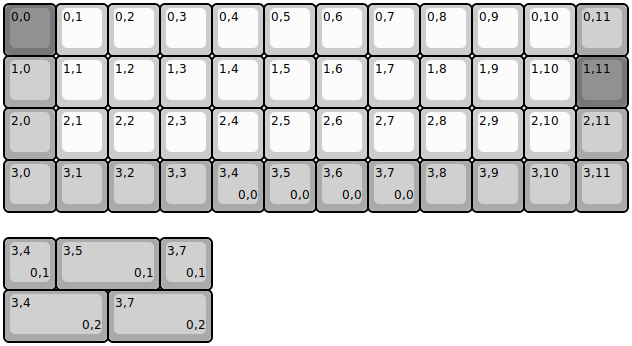{:loading="lazy"}

[Open in keyboard-layout-editor](http://www.keyboard-layout-editor.com/##@@_c=#777777;&=0,0&_c=#cccccc;&=0,1&=0,2&=0,3&=0,4&=0,5&=0,6&=0,7&=0,8&=0,9&=0,10&_c=#aaaaaa;&=0,11;&@=1,0&_c=#cccccc;&=1,1&=1,2&=1,3&=1,4&=1,5&=1,6&=1,7&=1,8&=1,9&=1,10&_c=#777777;&=1,11;&@_c=#aaaaaa;&=2,0&_c=#cccccc;&=2,1&=2,2&=2,3&=2,4&=2,5&=2,6&=2,7&=2,8&=2,9&=2,10&_c=#aaaaaa;&=2,11;&@=3,0&=3,1&=3,2&=3,3&=3,4%0A%0A%0A0,0&=3,5%0A%0A%0A0,0&=3,6%0A%0A%0A0,0&=3,7%0A%0A%0A0,0&=3,8&=3,9&=3,10&=3,11;&@_y:0.5;&=3,4%0A%0A%0A0,1&_w:2;&=3,5%0A%0A%0A0,1&=3,7%0A%0A%0A0,1;&@_w:2;&=3,4%0A%0A%0A0,2&_w:2;&=3,7%0A%0A%0A0,2)

## evyd13/eon65

[README](output/evyd13/eon65/README.md) - [layout](output/evyd13/eon65/eon65-kle.json) - [PCB](output/evyd13/eon65/eon65.kicad_pcb) - [PCB render](output/evyd13/eon65/eon65-render.svg)

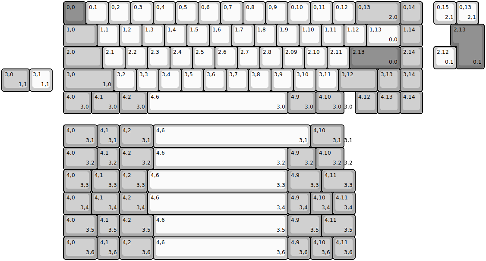{:loading="lazy"}

[Open in keyboard-layout-editor](http://www.keyboard-layout-editor.com/##@@_x:2.75&c=#777777;&=0,0&_c=#cccccc;&=0,1&=0,2&=0,3&=0,4&=0,5&=0,6&=0,7&=0,8&=0,9&=0,10&=0,11&=0,12&_c=#aaaaaa&w:2;&=0,13%0A%0A%0A2,0&=0,14;&@_x:2.75&w:1.5;&=1,0&_c=#cccccc;&=1,1&=1,2&=1,3&=1,4&=1,5&=1,6&=1,7&=1,8&=1,9&=1,10&=1,11&=1,12&_w:1.5;&=1,13%0A%0A%0A0,0&_c=#aaaaaa;&=1,14;&@_x:2.75&w:1.75;&=2,0&_c=#cccccc;&=2,1&=2,2&=2,3&=2,4&=2,5&=2,6&=2,7&=2,8&=2,09&=2,10&=2,11&_c=#777777&w:2.25;&=2,13%0A%0A%0A0,0&_c=#aaaaaa;&=2,14;&@_x:2.75&w:2.25;&=3,0%0A%0A%0A1,0&_c=#cccccc;&=3,2&=3,3&=3,4&=3,5&=3,6&=3,7&=3,8&=3,9&=3,10&=3,11&_c=#aaaaaa&w:1.75;&=3,12&=3,13&=3,14;&@_x:2.75&w:1.25;&=4,0%0A%0A%0A3,0&_w:1.25;&=4,1%0A%0A%0A3,0&_w:1.25;&=4,2%0A%0A%0A3,0&_c=#cccccc&w:6.25;&=4,6%0A%0A%0A3,0&_c=#aaaaaa&w:1.25;&=4,9%0A%0A%0A3,0&_w:1.25;&=4,10%0A%0A%0A3,0&_c=#cccccc&w:0.5&d:true;&=%0A%0A%0A3,0&_c=#aaaaaa;&=4,12&=4,13&=4,14;&@_x:19.25&y:-5&c=#cccccc;&=0,15%0A%0A%0A2,1&=0,13%0A%0A%0A2,1;&@_x:20.25&c=#777777&w:1.25&h:2&w2:1.5&h2:1&x2:-0.25;&=2,13%0A%0A%0A0,1;&@_x:19.25&c=#cccccc;&=2,12%0A%0A%0A0,1;&@_c=#aaaaaa&w:1.25;&=3,0%0A%0A%0A1,1&_c=#cccccc;&=3,1%0A%0A%0A1,1;&@_x:2.75&y:1.5&c=#aaaaaa&w:1.5;&=4,0%0A%0A%0A3,1&=4,1%0A%0A%0A3,1&_w:1.5;&=4,2%0A%0A%0A3,1&_c=#cccccc&w:7;&=4,6%0A%0A%0A3,1&_c=#aaaaaa&w:1.5;&=4,10%0A%0A%0A3,1&_c=#cccccc&w:0.5&d:true;&=%0A%0A%0A3,1;&@_x:2.75&c=#aaaaaa&w:1.5;&=4,0%0A%0A%0A3,2&=4,1%0A%0A%0A3,2&_w:1.5;&=4,2%0A%0A%0A3,2&_c=#cccccc&w:6;&=4,6%0A%0A%0A3,2&_c=#aaaaaa&w:1.25;&=4,9%0A%0A%0A3,2&_w:1.25;&=4,10%0A%0A%0A3,2&_c=#cccccc&w:0.5&d:true;&=%0A%0A%0A3,2;&@_x:2.75&c=#aaaaaa&w:1.25;&=4,0%0A%0A%0A3,3&_w:1.25;&=4,1%0A%0A%0A3,3&_w:1.25;&=4,2%0A%0A%0A3,3&_c=#cccccc&w:6.25;&=4,6%0A%0A%0A3,3&_c=#aaaaaa&w:1.5;&=4,9%0A%0A%0A3,3&_w:1.5;&=4,11%0A%0A%0A3,3;&@_x:2.75&w:1.25;&=4,0%0A%0A%0A3,4&_w:1.25;&=4,1%0A%0A%0A3,4&_w:1.25;&=4,2%0A%0A%0A3,4&_c=#cccccc&w:6.25;&=4,6%0A%0A%0A3,4&_c=#aaaaaa;&=4,9%0A%0A%0A3,4&=4,10%0A%0A%0A3,4&=4,11%0A%0A%0A3,4;&@_x:2.75&w:1.5;&=4,0%0A%0A%0A3,5&=4,1%0A%0A%0A3,5&_w:1.5;&=4,2%0A%0A%0A3,5&_c=#cccccc&w:6;&=4,6%0A%0A%0A3,5&_c=#aaaaaa&w:1.5;&=4,9%0A%0A%0A3,5&_w:1.5;&=4,11%0A%0A%0A3,5;&@_x:2.75&w:1.5;&=4,0%0A%0A%0A3,6&=4,1%0A%0A%0A3,6&_w:1.5;&=4,2%0A%0A%0A3,6&_c=#cccccc&w:6;&=4,6%0A%0A%0A3,6&_c=#aaaaaa;&=4,9%0A%0A%0A3,6&=4,10%0A%0A%0A3,6&=4,11%0A%0A%0A3,6)

## evyd13/eon75

[README](output/evyd13/eon75/README.md) - [layout](output/evyd13/eon75/eon75-kle.json) - [PCB](output/evyd13/eon75/eon75.kicad_pcb) - [PCB render](output/evyd13/eon75/eon75-render.svg)

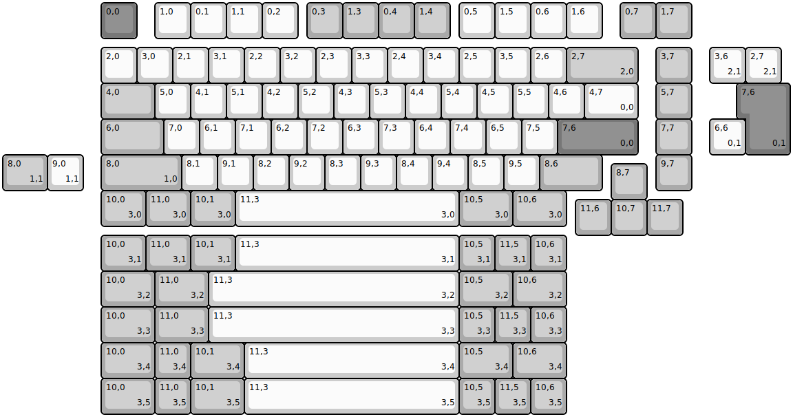{:loading="lazy"}

[Open in keyboard-layout-editor](http://www.keyboard-layout-editor.com/##@@_x:2.75&c=#777777;&=0,0&_x:0.5&c=#cccccc;&=1,0&=0,1&=1,1&=0,2&_x:0.25&c=#aaaaaa;&=0,3&=1,3&=0,4&=1,4&_x:0.25&c=#cccccc;&=0,5&=1,5&=0,6&=1,6&_x:0.5&c=#aaaaaa;&=0,7&=1,7;&@_x:2.75&y:0.25&c=#cccccc;&=2,0&=3,0&=2,1&=3,1&=2,2&=3,2&=2,3&=3,3&=2,4&=3,4&=2,5&=3,5&=2,6&_c=#aaaaaa&w:2;&=2,7%0A%0A%0A2,0&_x:0.5;&=3,7;&@_x:2.75&w:1.5;&=4,0&_c=#cccccc;&=5,0&=4,1&=5,1&=4,2&=5,2&=4,3&=5,3&=4,4&=5,4&=4,5&=5,5&=4,6&_w:1.5;&=4,7%0A%0A%0A0,0&_x:0.5&c=#aaaaaa;&=5,7;&@_x:2.75&w:1.75;&=6,0&_c=#cccccc;&=7,0&=6,1&=7,1&=6,2&=7,2&=6,3&=7,3&=6,4&=7,4&=6,5&=7,5&_c=#777777&w:2.25;&=7,6%0A%0A%0A0,0&_x:0.5&c=#aaaaaa;&=7,7;&@_x:2.75&w:2.25;&=8,0%0A%0A%0A1,0&_c=#cccccc;&=8,1&=9,1&=8,2&=9,2&=8,3&=9,3&=8,4&=9,4&=8,5&=9,5&_c=#aaaaaa&w:1.75;&=8,6&_x:1.5;&=9,7;&@_x:17&y:-0.75;&=8,7;&@_x:2.75&y:-0.25&w:1.25;&=10,0%0A%0A%0A3,0&_w:1.25;&=11,0%0A%0A%0A3,0&_w:1.25;&=10,1%0A%0A%0A3,0&_c=#cccccc&w:6.25;&=11,3%0A%0A%0A3,0&_c=#aaaaaa&w:1.5;&=10,5%0A%0A%0A3,0&_w:1.5;&=10,6%0A%0A%0A3,0;&@_x:16&y:-0.75;&=11,6&=10,7&=11,7;&@_x:19.75&y:-5.25&c=#cccccc;&=3,6%0A%0A%0A2,1&=2,7%0A%0A%0A2,1;&@_x:20.75&c=#777777&w:1.25&h:2&w2:1.5&h2:1&x2:-0.25;&=7,6%0A%0A%0A0,1;&@_x:19.75&c=#cccccc;&=6,6%0A%0A%0A0,1;&@_c=#aaaaaa&w:1.25;&=8,0%0A%0A%0A1,1&_c=#cccccc;&=9,0%0A%0A%0A1,1;&@_x:2.75&y:1.25&c=#aaaaaa&w:1.25;&=10,0%0A%0A%0A3,1&_w:1.25;&=11,0%0A%0A%0A3,1&_w:1.25;&=10,1%0A%0A%0A3,1&_c=#cccccc&w:6.25;&=11,3%0A%0A%0A3,1&_c=#aaaaaa;&=10,5%0A%0A%0A3,1&=11,5%0A%0A%0A3,1&=10,6%0A%0A%0A3,1;&@_x:2.75&w:1.5;&=10,0%0A%0A%0A3,2&_w:1.5;&=11,0%0A%0A%0A3,2&_c=#cccccc&w:7;&=11,3%0A%0A%0A3,2&_c=#aaaaaa&w:1.5;&=10,5%0A%0A%0A3,2&_w:1.5;&=10,6%0A%0A%0A3,2;&@_x:2.75&w:1.5;&=10,0%0A%0A%0A3,3&_w:1.5;&=11,0%0A%0A%0A3,3&_c=#cccccc&w:7;&=11,3%0A%0A%0A3,3&_c=#aaaaaa;&=10,5%0A%0A%0A3,3&=11,5%0A%0A%0A3,3&=10,6%0A%0A%0A3,3;&@_x:2.75&w:1.5;&=10,0%0A%0A%0A3,4&=11,0%0A%0A%0A3,4&_w:1.5;&=10,1%0A%0A%0A3,4&_c=#cccccc&w:6;&=11,3%0A%0A%0A3,4&_c=#aaaaaa&w:1.5;&=10,5%0A%0A%0A3,4&_w:1.5;&=10,6%0A%0A%0A3,4;&@_x:2.75&w:1.5;&=10,0%0A%0A%0A3,5&=11,0%0A%0A%0A3,5&_w:1.5;&=10,1%0A%0A%0A3,5&_c=#cccccc&w:6;&=11,3%0A%0A%0A3,5&_c=#aaaaaa;&=10,5%0A%0A%0A3,5&=11,5%0A%0A%0A3,5&=10,6%0A%0A%0A3,5)

## evyd13/eon87

[README](output/evyd13/eon87/README.md) - [layout](output/evyd13/eon87/eon87-kle.json) - [PCB](output/evyd13/eon87/eon87.kicad_pcb) - [PCB render](output/evyd13/eon87/eon87-render.svg)

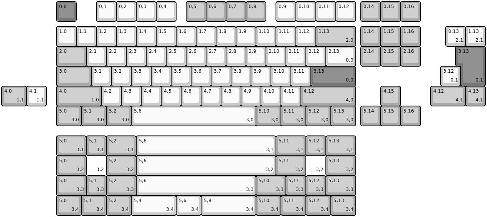{:loading="lazy"}

[Open in keyboard-layout-editor](http://www.keyboard-layout-editor.com/##@@_x:2.75&c=#777777;&=0,0&_x:1.0&c=#cccccc;&=0,1&=0,2&=0,3&=0,4&_x:0.5&c=#aaaaaa;&=0,5&=0,6&=0,7&=0,8&_x:0.5&c=#cccccc;&=0,9&=0,10&=0,11&=0,12&_x:0.25&c=#aaaaaa;&=0,14&=0,15&=0,16;&@_x:2.75&y:0.25&c=#cccccc;&=1,0&=1,1&=1,2&=1,3&=1,4&=1,5&=1,6&=1,7&=1,8&=1,9&=1,10&=1,11&=1,12&_c=#aaaaaa&w:2;&=1,13%0A%0A%0A2,0&_x:0.25;&=1,14&=1,15&=1,16;&@_x:2.75&w:1.5;&=2,0&_c=#cccccc;&=2,1&=2,2&=2,3&=2,4&=2,5&=2,6&=2,7&=2,8&=2,9&=2,10&=2,11&=2,12&_w:1.5;&=2,13%0A%0A%0A0,0&_x:0.25&c=#aaaaaa;&=2,14&=2,15&=2,16;&@_x:2.75&w:1.75;&=3,0&_c=#cccccc;&=3,1&=3,2&=3,3&=3,4&=3,5&=3,6&=3,7&=3,8&=3,9&=3,10&=3,11&_c=#777777&w:2.25;&=3,13%0A%0A%0A0,0;&@_x:2.75&c=#aaaaaa&w:2.25;&=4,0%0A%0A%0A1,0&_c=#cccccc;&=4,2&=4,3&=4,4&=4,5&=4,6&=4,7&=4,8&=4,9&=4,10&=4,11&_c=#aaaaaa&w:2.75;&=4,12%0A%0A%0A4,0&_x:1.25;&=4,15;&@_x:2.75&w:1.25;&=5,0%0A%0A%0A3,0&_w:1.25;&=5,1%0A%0A%0A3,0&_w:1.25;&=5,2%0A%0A%0A3,0&_c=#cccccc&w:6.25;&=5,6%0A%0A%0A3,0&_c=#aaaaaa&w:1.25;&=5,10%0A%0A%0A3,0&_w:1.25;&=5,11%0A%0A%0A3,0&_w:1.25;&=5,12%0A%0A%0A3,0&_w:1.25;&=5,13%0A%0A%0A3,0&_x:0.25;&=5,14&=5,15&=5,16;&@_x:22.25&y:-5.0&c=#cccccc;&=0,13%0A%0A%0A2,1&=1,13%0A%0A%0A2,1;&@_x:23.0&c=#777777&w:1.25&h:2&w2:1.5&h2:1&x2:-0.25;&=3,13%0A%0A%0A0,1;&@_x:22.0&c=#cccccc;&=3,12%0A%0A%0A0,1;&@_c=#aaaaaa&w:1.25;&=4,0%0A%0A%0A1,1&_c=#cccccc;&=4,1%0A%0A%0A1,1&_x:19.25&c=#aaaaaa&w:1.75;&=4,12%0A%0A%0A4,1&=4,13%0A%0A%0A4,1;&@_x:2.75&y:1.5&w:1.5;&=5,0%0A%0A%0A3,1&=5,1%0A%0A%0A3,1&_w:1.5;&=5,2%0A%0A%0A3,1&_c=#cccccc&w:7;&=5,6%0A%0A%0A3,1&_c=#aaaaaa&w:1.5;&=5,11%0A%0A%0A3,1&=5,12%0A%0A%0A3,1&_w:1.5;&=5,13%0A%0A%0A3,1;&@_x:2.75&w:1.5;&=5,0%0A%0A%0A3,2&_d:true;&=%0A%0A%0A3,2&_w:1.5;&=5,2%0A%0A%0A3,2&_c=#cccccc&w:7;&=5,6%0A%0A%0A3,2&_c=#aaaaaa&w:1.5;&=5,11%0A%0A%0A3,2&_d:true;&=%0A%0A%0A3,2&_w:1.5;&=5,13%0A%0A%0A3,2;&@_x:2.75&w:1.5;&=5,0%0A%0A%0A3,3&=5,1%0A%0A%0A3,3&_w:1.5;&=5,2%0A%0A%0A3,3&_c=#cccccc&w:6;&=5,6%0A%0A%0A3,3&_c=#aaaaaa&w:1.5;&=5,10%0A%0A%0A3,3&=5,11%0A%0A%0A3,3&=5,12%0A%0A%0A3,3&_w:1.5;&=5,13%0A%0A%0A3,3;&@_x:2.75&w:1.25;&=5,0%0A%0A%0A3,4&_w:1.25;&=5,1%0A%0A%0A3,4&_w:1.25;&=5,2%0A%0A%0A3,4&_c=#cccccc&w:2.25;&=5,4%0A%0A%0A3,4&_w:1.25;&=5,6%0A%0A%0A3,4&_w:2.75;&=5,8%0A%0A%0A3,4&_c=#aaaaaa&w:1.25;&=5,10%0A%0A%0A3,4&_w:1.25;&=5,11%0A%0A%0A3,4&_w:1.25;&=5,12%0A%0A%0A3,4&_w:1.25;&=5,13%0A%0A%0A3,4)

## evyd13/eon95

[README](output/evyd13/eon95/README.md) - [layout](output/evyd13/eon95/eon95-kle.json) - [PCB](output/evyd13/eon95/eon95.kicad_pcb) - [PCB render](output/evyd13/eon95/eon95-render.svg)

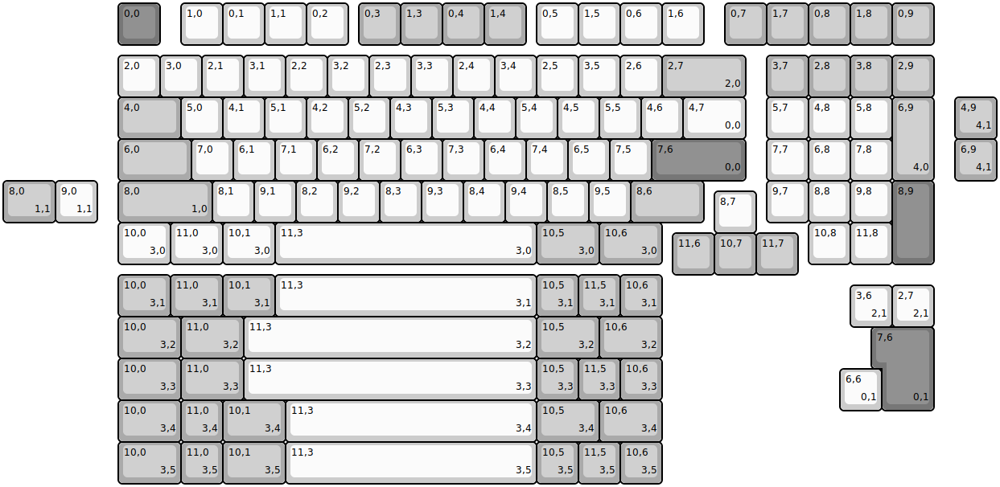{:loading="lazy"}

[Open in keyboard-layout-editor](http://www.keyboard-layout-editor.com/##@@_x:2.75&c=#777777;&=0,0&_x:0.5&c=#cccccc;&=1,0&=0,1&=1,1&=0,2&_x:0.25&c=#aaaaaa;&=0,3&=1,3&=0,4&=1,4&_x:0.25&c=#cccccc;&=0,5&=1,5&=0,6&=1,6&_x:0.5&c=#aaaaaa;&=0,7&=1,7&=0,8&=1,8&=0,9;&@_x:2.75&y:0.25&c=#cccccc;&=2,0&=3,0&=2,1&=3,1&=2,2&=3,2&=2,3&=3,3&=2,4&=3,4&=2,5&=3,5&=2,6&_c=#aaaaaa&w:2;&=2,7%0A%0A%0A2,0&_x:0.5;&=3,7&=2,8&=3,8&=2,9;&@_x:2.75&w:1.5;&=4,0&_c=#cccccc;&=5,0&=4,1&=5,1&=4,2&=5,2&=4,3&=5,3&=4,4&=5,4&=4,5&=5,5&=4,6&_w:1.5;&=4,7%0A%0A%0A0,0&_x:0.5;&=5,7&=4,8&=5,8&_c=#aaaaaa&h:2;&=6,9%0A%0A%0A4,0;&@_x:2.75&w:1.75;&=6,0&_c=#cccccc;&=7,0&=6,1&=7,1&=6,2&=7,2&=6,3&=7,3&=6,4&=7,4&=6,5&=7,5&_c=#777777&w:2.25;&=7,6%0A%0A%0A0,0&_x:0.5&c=#cccccc;&=7,7&=6,8&=7,8;&@_x:2.75&c=#aaaaaa&w:2.25;&=8,0%0A%0A%0A1,0&_c=#cccccc;&=8,1&=9,1&=8,2&=9,2&=8,3&=9,3&=8,4&=9,4&=8,5&=9,5&_c=#aaaaaa&w:1.75;&=8,6&_x:1.5&c=#cccccc;&=9,7&=8,8&=9,8&_c=#777777&h:2;&=8,9;&@_x:17&y:-0.75&c=#cccccc;&=8,7;&@_x:2.75&y:-0.25&w:1.25;&=10,0%0A%0A%0A3,0&_w:1.25;&=11,0%0A%0A%0A3,0&_w:1.25;&=10,1%0A%0A%0A3,0&_w:6.25;&=11,3%0A%0A%0A3,0&_c=#aaaaaa&w:1.5;&=10,5%0A%0A%0A3,0&_w:1.5;&=10,6%0A%0A%0A3,0&_x:3.5&c=#cccccc;&=10,8&=11,8;&@_x:16&y:-0.75&c=#aaaaaa;&=11,6&=10,7&=11,7;&@_x:22.75&y:-4.25;&=4,9%0A%0A%0A4,1;&@_x:22.75;&=6,9%0A%0A%0A4,1;&@_w:1.25;&=8,0%0A%0A%0A1,1&_c=#cccccc;&=9,0%0A%0A%0A1,1;&@_x:2.75&y:1.25&c=#aaaaaa&w:1.25;&=10,0%0A%0A%0A3,1&_w:1.25;&=11,0%0A%0A%0A3,1&_w:1.25;&=10,1%0A%0A%0A3,1&_c=#cccccc&w:6.25;&=11,3%0A%0A%0A3,1&_c=#aaaaaa;&=10,5%0A%0A%0A3,1&=11,5%0A%0A%0A3,1&=10,6%0A%0A%0A3,1;&@_x:20.25&y:-0.75&c=#cccccc;&=3,6%0A%0A%0A2,1&=2,7%0A%0A%0A2,1;&@_x:2.75&y:-0.25&c=#aaaaaa&w:1.5;&=10,0%0A%0A%0A3,2&_w:1.5;&=11,0%0A%0A%0A3,2&_c=#cccccc&w:7;&=11,3%0A%0A%0A3,2&_c=#aaaaaa&w:1.5;&=10,5%0A%0A%0A3,2&_w:1.5;&=10,6%0A%0A%0A3,2;&@_x:21&y:-0.75&c=#777777&w:1.25&h:2&w2:1.5&h2:1&x2:-0.25;&=7,6%0A%0A%0A0,1;&@_x:2.75&y:-0.25&c=#aaaaaa&w:1.5;&=10,0%0A%0A%0A3,3&_w:1.5;&=11,0%0A%0A%0A3,3&_c=#cccccc&w:7;&=11,3%0A%0A%0A3,3&_c=#aaaaaa;&=10,5%0A%0A%0A3,3&=11,5%0A%0A%0A3,3&=10,6%0A%0A%0A3,3;&@_x:20&y:-0.75&c=#cccccc;&=6,6%0A%0A%0A0,1;&@_x:2.75&y:-0.25&c=#aaaaaa&w:1.5;&=10,0%0A%0A%0A3,4&=11,0%0A%0A%0A3,4&_w:1.5;&=10,1%0A%0A%0A3,4&_c=#cccccc&w:6;&=11,3%0A%0A%0A3,4&_c=#aaaaaa&w:1.5;&=10,5%0A%0A%0A3,4&_w:1.5;&=10,6%0A%0A%0A3,4;&@_x:2.75&w:1.5;&=10,0%0A%0A%0A3,5&=11,0%0A%0A%0A3,5&_w:1.5;&=10,1%0A%0A%0A3,5&_c=#cccccc&w:6;&=11,3%0A%0A%0A3,5&_c=#aaaaaa;&=10,5%0A%0A%0A3,5&=11,5%0A%0A%0A3,5&=10,6%0A%0A%0A3,5)

## evyd13/gh80_1800

[README](output/evyd13/gh80_1800/README.md) - [layout](output/evyd13/gh80_1800/gh80_1800-kle.json) - [PCB](output/evyd13/gh80_1800/gh80_1800.kicad_pcb) - [PCB render](output/evyd13/gh80_1800/gh80_1800-render.svg)

{:loading="lazy"}

[Open in keyboard-layout-editor](http://www.keyboard-layout-editor.com/##@@_x:2.5&c=#777777;&=0,0&_x:0.25&c=#cccccc;&=1,0&=0,1&=1,1&=0,2&_x:0.25&c=#aaaaaa;&=1,2&=0,3&=1,3&=0,4&_x:0.25&c=#cccccc;&=1,4&=0,5&=1,5&=0,6&_x:1.75&c=#aaaaaa;&=0,7&=0,8&=0,9&=0,10;&@_x:18;&=1,7&=1,8&=1,9&=1,10;&@_x:2.5&c=#cccccc;&=2,0&=3,0&=2,1&=3,1&=2,2&=3,2&=2,3&=3,3&=2,4&=3,4&=2,5&=3,5&=3,6&_c=#aaaaaa&w:2;&=1,6%0A%0A%0A2,0&_x:0.5&c=#777777;&=2,7&_c=#aaaaaa;&=2,8&=2,9&=2,10;&@_x:2.5&w:1.5;&=4,0&_c=#cccccc;&=5,0&=4,1&=5,1&=4,2&=5,2&=4,3&=5,3&=4,4&=5,4&=4,5&=5,5&=4,6&_c=#aaaaaa&w:1.5;&=5,6%0A%0A%0A0,0&_x:0.5&c=#cccccc;&=3,7&=3,8&=3,9&_c=#aaaaaa&h:2;&=4,10%0A%0A%0A3,0;&@_x:2.5&c=#cccccc&w:1.75;&=6,0&=7,0&=6,1&=7,1&=6,2&=7,2&=6,3&=7,3&=6,4&=7,4&=6,5&=7,5&_c=#777777&w:2.25;&=6,6%0A%0A%0A0,0&_x:0.5&c=#cccccc;&=4,7&=4,8&=4,9;&@_x:2.5&c=#aaaaaa&w:2.25;&=8,0%0A%0A%0A1,0&_c=#cccccc;&=8,1&=9,1&=8,2&=9,2&=8,3&=9,3&=8,4&=9,4&=8,5&=9,5&_c=#aaaaaa&w:1.75;&=8,6&_x:1.5&c=#cccccc;&=5,7&=5,8&=5,9&_c=#777777&h:2;&=6,10%0A%0A%0A4,0;&@_x:16.75&y:-0.75&c=#aaaaaa;&=9,7;&@_x:2.5&y:-0.25;&=7,7%0A%0A%0A5,0&=8,7%0A%0A%0A5,0&=7,8%0A%0A%0A5,0&_c=#cccccc&w:6;&=8,8%0A%0A%0A5,0&_c=#aaaaaa;&=7,9%0A%0A%0A5,0&=8,9%0A%0A%0A5,0&=7,10%0A%0A%0A5,0&=8,10%0A%0A%0A5,0&_x:3.5&c=#cccccc;&=6,8&=6,9;&@_x:15.75&y:-0.75&c=#aaaaaa;&=9,8&=9,9&=9,10;&@_x:22.25&y:-5.25&c=#cccccc;&=2,6%0A%0A%0A2,1&_c=#aaaaaa;&=1,6%0A%0A%0A2,1;&@_x:23.25&c=#777777&w:1.25&h:2&w2:1.5&h2:1&x2:-0.25;&=6,6%0A%0A%0A0,1&_x:0.25&c=#cccccc;&=3,10%0A%0A%0A3,1;&@_x:22.25;&=7,6%0A%0A%0A0,1&_x:1.5&c=#aaaaaa;&=4,10%0A%0A%0A3,1;&@_w:1.25;&=8,0%0A%0A%0A1,1&_c=#cccccc;&=9,0%0A%0A%0A1,1&_x:20.0&c=#aaaaaa;&=5,10%0A%0A%0A4,1;&@_x:22.25&c=#777777;&=6,10%0A%0A%0A4,1;&@_x:2.5&y:0.25&c=#aaaaaa&w:1.25;&=7,7%0A%0A%0A5,1&_w:1.25;&=8,7%0A%0A%0A5,1&_w:1.25;&=7,8%0A%0A%0A5,1&_c=#cccccc&w:6.25;&=8,8%0A%0A%0A5,1&_c=#aaaaaa;&=8,9%0A%0A%0A5,1&=7,10%0A%0A%0A5,1&=8,10%0A%0A%0A5,1;&@_x:2.5&w:1.25;&=7,7%0A%0A%0A5,2&_w:1.25;&=8,7%0A%0A%0A5,2&_w:1.25;&=7,8%0A%0A%0A5,2&_c=#cccccc&w:6.25;&=8,8%0A%0A%0A5,2&_c=#aaaaaa&w:1.5;&=8,9%0A%0A%0A5,2&_w:1.5;&=8,10%0A%0A%0A5,2;&@_x:2.5&w:1.5;&=7,7%0A%0A%0A5,3&_w:1.5;&=7,8%0A%0A%0A5,3&_c=#cccccc&w:7;&=8,8%0A%0A%0A5,3&_c=#aaaaaa&w:1.5;&=8,9%0A%0A%0A5,3&_w:1.5;&=8,10%0A%0A%0A5,3;&@_x:2.5&w:1.5;&=7,7%0A%0A%0A5,4&_w:1.5;&=7,8%0A%0A%0A5,4&_c=#cccccc&w:7;&=8,8%0A%0A%0A5,4&_c=#aaaaaa;&=8,9%0A%0A%0A5,4&=7,10%0A%0A%0A5,4&=8,10%0A%0A%0A5,4)

## evyd13/gh80_3700

[README](output/evyd13/gh80_3700/README.md) - [layout](output/evyd13/gh80_3700/gh80_3700-kle.json) - [PCB](output/evyd13/gh80_3700/gh80_3700.kicad_pcb) - [PCB render](output/evyd13/gh80_3700/gh80_3700-render.svg)

{:loading="lazy"}

[Open in keyboard-layout-editor](http://www.keyboard-layout-editor.com/##@@_c=#aaaaaa;&=0,0&=0,1&=0,2&=0,3;&@_y:1&c=#777777;&=1,0&_c=#aaaaaa;&=1,1&=1,2&=1,3;&@_c=#cccccc;&=2,0&=2,1&=2,2&_c=#aaaaaa&h:2;&=3,3%0A%0A%0A1,0;&@_c=#cccccc;&=3,0&=3,1&=3,2;&@=4,0&=4,1&=4,2&_c=#777777&h:2;&=5,3%0A%0A%0A2,0;&@_c=#cccccc&w:2;&=5,0%0A%0A%0A0,0&=5,2;&@_x:4.25&y:-4&c=#aaaaaa;&=2,3%0A%0A%0A1,1;&@_x:4.25;&=3,3%0A%0A%0A1,1;&@_x:4.25;&=4,3%0A%0A%0A2,1;&@_x:4.25&c=#777777;&=5,3%0A%0A%0A2,1;&@_y:0.25&c=#cccccc;&=5,0%0A%0A%0A0,1&=5,1%0A%0A%0A0,1)

## evyd13/gud70

[README](output/evyd13/gud70/README.md) - [layout](output/evyd13/gud70/gud70-kle.json) - [PCB](output/evyd13/gud70/gud70.kicad_pcb) - [PCB render](output/evyd13/gud70/gud70-render.svg)

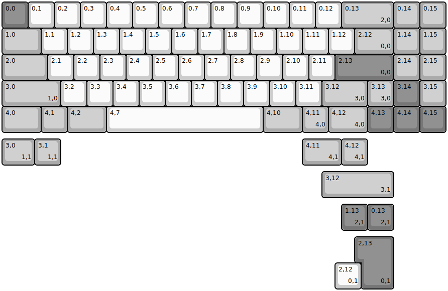{:loading="lazy"}

[Open in keyboard-layout-editor](http://www.keyboard-layout-editor.com/##@@_c=#777777;&=0,0&_c=#cccccc;&=0,1&=0,2&=0,3&=0,4&=0,5&=0,6&=0,7&=0,8&=0,9&=0,10&=0,11&=0,12&_c=#aaaaaa&w:2;&=0,13%0A%0A%0A2,0&=0,14&=0,15;&@_w:1.5;&=1,0&_c=#cccccc;&=1,1&=1,2&=1,3&=1,4&=1,5&=1,6&=1,7&=1,8&=1,9&=1,10&=1,11&=1,12&_c=#aaaaaa&w:1.5;&=2,12%0A%0A%0A0,0&=1,14&=1,15;&@_w:1.75;&=2,0&_c=#cccccc;&=2,1&=2,2&=2,3&=2,4&=2,5&=2,6&=2,7&=2,8&=2,9&=2,10&=2,11&_c=#777777&w:2.25;&=2,13%0A%0A%0A0,0&_c=#aaaaaa;&=2,14&=2,15;&@_w:2.25;&=3,0%0A%0A%0A1,0&_c=#cccccc;&=3,2&=3,3&=3,4&=3,5&=3,6&=3,7&=3,8&=3,9&=3,10&=3,11&_c=#aaaaaa&w:1.75;&=3,12%0A%0A%0A3,0&=3,13%0A%0A%0A3,0&_c=#777777;&=3,14&_c=#aaaaaa;&=3,15;&@_w:1.5;&=4,0&=4,1&_w:1.5;&=4,2&_c=#cccccc&w:6;&=4,7&_c=#aaaaaa&w:1.5;&=4,10&=4,11%0A%0A%0A4,0&_w:1.5;&=4,12%0A%0A%0A4,0&_c=#777777;&=4,13&=4,14&=4,15;&@_y:0.25&c=#aaaaaa&w:1.25;&=3,0%0A%0A%0A1,1&=3,1%0A%0A%0A1,1&_x:9.25&w:1.5;&=4,11%0A%0A%0A4,1&=4,12%0A%0A%0A4,1;&@_x:12.25&y:0.25&w:2.75;&=3,12%0A%0A%0A3,1;&@_x:13&y:0.25&c=#777777;&=1,13%0A%0A%0A2,1&=0,13%0A%0A%0A2,1;&@_x:13.75&y:0.25&w:1.25&h:2&w2:1.5&h2:1&x2:-0.25;&=2,13%0A%0A%0A0,1;&@_x:12.75&c=#cccccc;&=2,12%0A%0A%0A0,1)

## evyd13/nt210

[README](output/evyd13/nt210/README.md) - [layout](output/evyd13/nt210/nt210-kle.json) - [PCB](output/evyd13/nt210/nt210.kicad_pcb) - [PCB render](output/evyd13/nt210/nt210-render.svg)

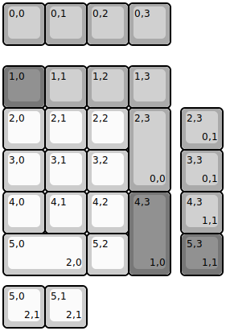{:loading="lazy"}

[Open in keyboard-layout-editor](http://www.keyboard-layout-editor.com/##@@_c=#aaaaaa;&=0,0&=0,1&=0,2&=0,3;&@_y:0.5&c=#777777;&=1,0&_c=#aaaaaa;&=1,1&=1,2&=1,3;&@_c=#cccccc;&=2,0&=2,1&=2,2&_c=#aaaaaa&h:2;&=2,3%0A%0A%0A0,0;&@_c=#cccccc;&=3,0&=3,1&=3,2;&@=4,0&=4,1&=4,2&_c=#777777&h:2;&=4,3%0A%0A%0A1,0;&@_c=#cccccc&w:2;&=5,0%0A%0A%0A2,0&=5,2;&@_x:4.25&y:-4.0&c=#aaaaaa;&=2,3%0A%0A%0A0,1;&@_x:4.25;&=3,3%0A%0A%0A0,1;&@_x:4.25;&=4,3%0A%0A%0A1,1;&@_x:4.25&c=#777777;&=5,3%0A%0A%0A1,1;&@_y:0.25&c=#cccccc;&=5,0%0A%0A%0A2,1&=5,1%0A%0A%0A2,1)

## evyd13/nt650

[README](output/evyd13/nt650/README.md) - [layout](output/evyd13/nt650/nt650-kle.json) - [PCB](output/evyd13/nt650/nt650.kicad_pcb) - [PCB render](output/evyd13/nt650/nt650-render.svg)

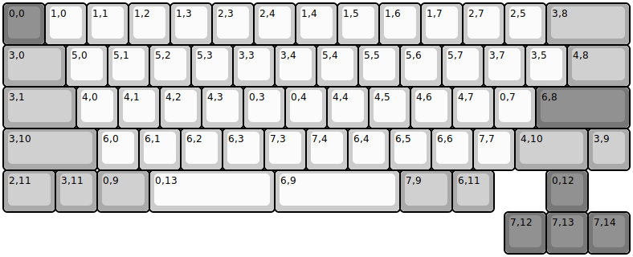{:loading="lazy"}

[Open in keyboard-layout-editor](http://www.keyboard-layout-editor.com/##@@_c=#777777;&=0,0&_c=#cccccc;&=1,0&=1,1&=1,2&=1,3&=2,3&=2,4&=1,4&=1,5&=1,6&=1,7&=2,7&=2,5&_c=#aaaaaa&w:2;&=3,8;&@_w:1.5;&=3,0&_c=#cccccc;&=5,0&=5,1&=5,2&=5,3&=3,3&=3,4&=5,4&=5,5&=5,6&=5,7&=3,7&=3,5&_c=#aaaaaa&w:1.5;&=4,8;&@_w:1.75;&=3,1&_c=#cccccc;&=4,0&=4,1&=4,2&=4,3&=0,3&=0,4&=4,4&=4,5&=4,6&=4,7&=0,7&_c=#777777&w:2.25;&=6,8;&@_c=#aaaaaa&w:2.25;&=3,10&_c=#cccccc;&=6,0&=6,1&=6,2&=6,3&=7,3&=7,4&=6,4&=6,5&=6,6&=7,7&_c=#aaaaaa&w:1.75;&=4,10&=3,9;&@_w:1.25;&=2,11&=3,11&_w:1.25;&=0,9&_c=#cccccc&w:3;&=0,13&_w:3;&=6,9&_c=#aaaaaa&w:1.25;&=7,9&=6,11&_x:1.25&c=#777777;&=0,12;&@_x:12;&=7,12&=7,13&=7,14)

## evyd13/nt660

[README](output/evyd13/nt660/README.md) - [layout](output/evyd13/nt660/nt660-kle.json) - [PCB](output/evyd13/nt660/nt660.kicad_pcb) - [PCB render](output/evyd13/nt660/nt660-render.svg)

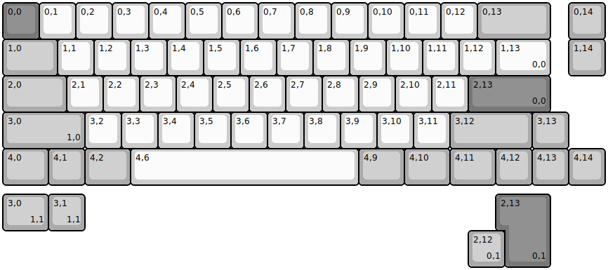{:loading="lazy"}

[Open in keyboard-layout-editor](http://www.keyboard-layout-editor.com/##@@_c=#777777;&=0,0&_c=#cccccc;&=0,1&=0,2&=0,3&=0,4&=0,5&=0,6&=0,7&=0,8&=0,9&=0,10&=0,11&=0,12&_c=#aaaaaa&w:2;&=0,13&_x:0.5;&=0,14;&@_w:1.5;&=1,0&_c=#cccccc;&=1,1&=1,2&=1,3&=1,4&=1,5&=1,6&=1,7&=1,8&=1,9&=1,10&=1,11&=1,12&_w:1.5;&=1,13%0A%0A%0A0,0&_x:0.5&c=#aaaaaa;&=1,14;&@_w:1.75;&=2,0&_c=#cccccc;&=2,1&=2,2&=2,3&=2,4&=2,5&=2,6&=2,7&=2,8&=2,9&=2,10&=2,11&_c=#777777&w:2.25;&=2,13%0A%0A%0A0,0;&@_c=#aaaaaa&w:2.25;&=3,0%0A%0A%0A1,0&_c=#cccccc;&=3,2&=3,3&=3,4&=3,5&=3,6&=3,7&=3,8&=3,9&=3,10&=3,11&_c=#aaaaaa&w:2.25;&=3,12&=3,13;&@_w:1.25;&=4,0&=4,1&_w:1.25;&=4,2&_c=#cccccc&w:6.25;&=4,6&_c=#aaaaaa&w:1.25;&=4,9&_w:1.25;&=4,10&_w:1.25;&=4,11&=4,12&=4,13&=4,14;&@_y:0.25&w:1.25;&=3,0%0A%0A%0A1,1&=3,1%0A%0A%0A1,1&_x:11.5&c=#777777&w:1.25&h:2&w2:1.5&h2:1&x2:-0.25;&=2,13%0A%0A%0A0,1;&@_x:12.75&c=#aaaaaa;&=2,12%0A%0A%0A0,1)

## evyd13/nt750

[README](output/evyd13/nt750/README.md) - [layout](output/evyd13/nt750/nt750-kle.json) - [PCB](output/evyd13/nt750/nt750.kicad_pcb) - [PCB render](output/evyd13/nt750/nt750-render.svg)

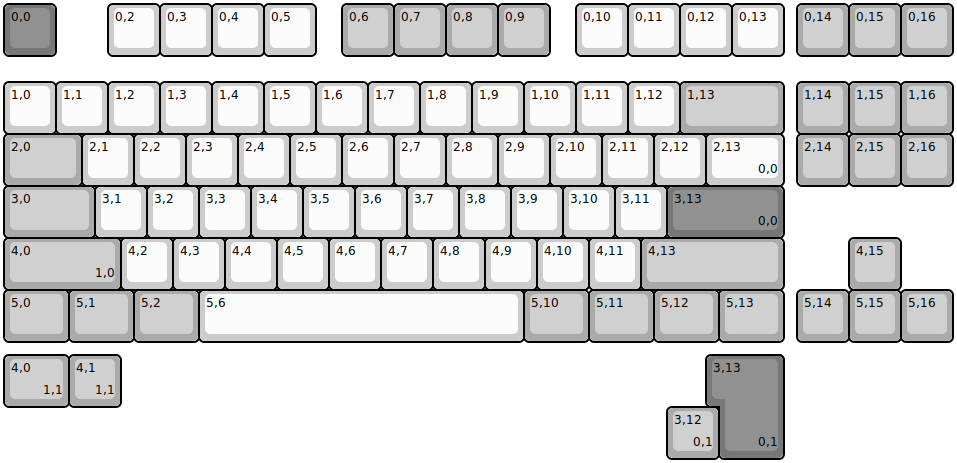{:loading="lazy"}

[Open in keyboard-layout-editor](http://www.keyboard-layout-editor.com/##@@_c=#777777;&=0,0&_x:1&c=#cccccc;&=0,2&=0,3&=0,4&=0,5&_x:0.5&c=#aaaaaa;&=0,6&=0,7&=0,8&=0,9&_x:0.5&c=#cccccc;&=0,10&=0,11&=0,12&=0,13&_x:0.25&c=#aaaaaa;&=0,14&=0,15&=0,16;&@_y:0.5&c=#cccccc;&=1,0&=1,1&=1,2&=1,3&=1,4&=1,5&=1,6&=1,7&=1,8&=1,9&=1,10&=1,11&=1,12&_c=#aaaaaa&w:2;&=1,13&_x:0.25;&=1,14&=1,15&=1,16;&@_w:1.5;&=2,0&_c=#cccccc;&=2,1&=2,2&=2,3&=2,4&=2,5&=2,6&=2,7&=2,8&=2,9&=2,10&=2,11&=2,12&_w:1.5;&=2,13%0A%0A%0A0,0&_x:0.25&c=#aaaaaa;&=2,14&=2,15&=2,16;&@_w:1.75;&=3,0&_c=#cccccc;&=3,1&=3,2&=3,3&=3,4&=3,5&=3,6&=3,7&=3,8&=3,9&=3,10&=3,11&_c=#777777&w:2.25;&=3,13%0A%0A%0A0,0;&@_c=#aaaaaa&w:2.25;&=4,0%0A%0A%0A1,0&_c=#cccccc;&=4,2&=4,3&=4,4&=4,5&=4,6&=4,7&=4,8&=4,9&=4,10&=4,11&_c=#aaaaaa&w:2.75;&=4,13&_x:1.25;&=4,15;&@_w:1.25;&=5,0&_w:1.25;&=5,1&_w:1.25;&=5,2&_c=#cccccc&w:6.25;&=5,6&_c=#aaaaaa&w:1.25;&=5,10&_w:1.25;&=5,11&_w:1.25;&=5,12&_w:1.25;&=5,13&_x:0.25;&=5,14&=5,15&=5,16;&@_y:0.25&w:1.25;&=4,0%0A%0A%0A1,1&=4,1%0A%0A%0A1,1&_x:11.5&c=#777777&w:1.25&h:2&w2:1.5&h2:1&x2:-0.25;&=3,13%0A%0A%0A0,1;&@_x:12.75&c=#aaaaaa;&=3,12%0A%0A%0A0,1)

## evyd13/nt980

[README](output/evyd13/nt980/README.md) - [layout](output/evyd13/nt980/nt980-kle.json) - [PCB](output/evyd13/nt980/nt980.kicad_pcb) - [PCB render](output/evyd13/nt980/nt980-render.svg)

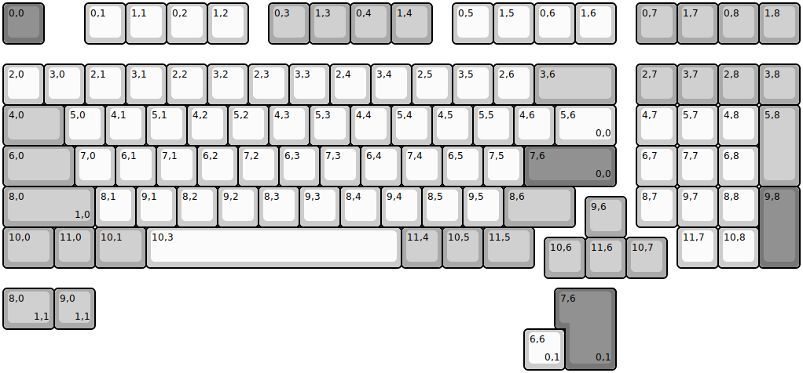{:loading="lazy"}

[Open in keyboard-layout-editor](http://www.keyboard-layout-editor.com/##@@_c=#777777;&=0,0&_x:1&c=#cccccc;&=0,1&=1,1&=0,2&=1,2&_x:0.5&c=#aaaaaa;&=0,3&=1,3&=0,4&=1,4&_x:0.5&c=#cccccc;&=0,5&=1,5&=0,6&=1,6&_x:0.5&c=#aaaaaa;&=0,7&=1,7&=0,8&=1,8;&@_y:0.5&c=#cccccc;&=2,0&=3,0&=2,1&=3,1&=2,2&=3,2&=2,3&=3,3&=2,4&=3,4&=2,5&=3,5&=2,6&_c=#aaaaaa&w:2;&=3,6&_x:0.5;&=2,7&=3,7&=2,8&=3,8;&@_w:1.5;&=4,0&_c=#cccccc;&=5,0&=4,1&=5,1&=4,2&=5,2&=4,3&=5,3&=4,4&=5,4&=4,5&=5,5&=4,6&_w:1.5;&=5,6%0A%0A%0A0,0&_x:0.5;&=4,7&=5,7&=4,8&_c=#aaaaaa&h:2;&=5,8;&@_w:1.75;&=6,0&_c=#cccccc;&=7,0&=6,1&=7,1&=6,2&=7,2&=6,3&=7,3&=6,4&=7,4&=6,5&=7,5&_c=#777777&w:2.25;&=7,6%0A%0A%0A0,0&_x:0.5&c=#cccccc;&=6,7&=7,7&=6,8;&@_c=#aaaaaa&w:2.25;&=8,0%0A%0A%0A1,0&_c=#cccccc;&=8,1&=9,1&=8,2&=9,2&=8,3&=9,3&=8,4&=9,4&=8,5&=9,5&_c=#aaaaaa&w:1.75;&=8,6&_x:1.5&c=#cccccc;&=8,7&=9,7&=8,8&_c=#777777&h:2;&=9,8;&@_x:14.25&y:-0.75&c=#aaaaaa;&=9,6;&@_y:-0.25&w:1.25;&=10,0&=11,0&_w:1.25;&=10,1&_c=#cccccc&w:6.25;&=10,3&_c=#aaaaaa;&=11,4&=10,5&_w:1.25;&=11,5&_x:3.5&c=#cccccc;&=11,7&=10,8;&@_x:13.25&y:-0.75&c=#aaaaaa;&=10,6&=11,6&=10,7;&@_y:0.25&w:1.25;&=8,0%0A%0A%0A1,1&=9,0%0A%0A%0A1,1&_x:11.5&c=#777777&w:1.25&h:2&w2:1.5&h2:1&x2:-0.25;&=7,6%0A%0A%0A0,1;&@_x:12.75&c=#cccccc;&=6,6%0A%0A%0A0,1)

## evyd13/plain60

[README](output/evyd13/plain60/README.md) - [layout](output/evyd13/plain60/plain60-kle.json) - [PCB](output/evyd13/plain60/plain60.kicad_pcb) - [PCB render](output/evyd13/plain60/plain60-render.svg)

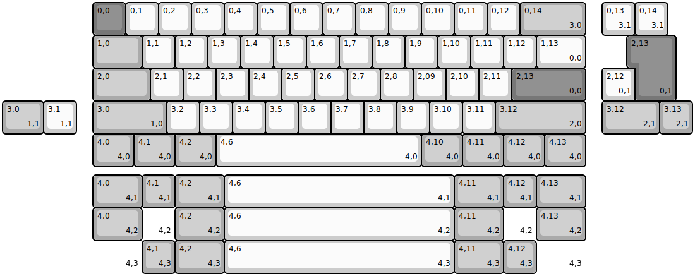{:loading="lazy"}

[Open in keyboard-layout-editor](http://www.keyboard-layout-editor.com/##@@_x:2.75&c=#777777;&=0,0&_c=#cccccc;&=0,1&=0,2&=0,3&=0,4&=0,5&=0,6&=0,7&=0,8&=0,9&=0,10&=0,11&=0,12&_c=#aaaaaa&w:2;&=0,14%0A%0A%0A3,0;&@_x:2.75&w:1.5;&=1,0&_c=#cccccc;&=1,1&=1,2&=1,3&=1,4&=1,5&=1,6&=1,7&=1,8&=1,9&=1,10&=1,11&=1,12&_w:1.5;&=1,13%0A%0A%0A0,0;&@_x:2.75&c=#aaaaaa&w:1.75;&=2,0&_c=#cccccc;&=2,1&=2,2&=2,3&=2,4&=2,5&=2,6&=2,7&=2,8&=2,09&=2,10&=2,11&_c=#777777&w:2.25;&=2,13%0A%0A%0A0,0;&@_x:2.75&c=#aaaaaa&w:2.25;&=3,0%0A%0A%0A1,0&_c=#cccccc;&=3,2&=3,3&=3,4&=3,5&=3,6&=3,7&=3,8&=3,9&=3,10&=3,11&_c=#aaaaaa&w:2.75;&=3,12%0A%0A%0A2,0;&@_x:2.75&w:1.25;&=4,0%0A%0A%0A4,0&_w:1.25;&=4,1%0A%0A%0A4,0&_w:1.25;&=4,2%0A%0A%0A4,0&_c=#cccccc&w:6.25;&=4,6%0A%0A%0A4,0&_c=#aaaaaa&w:1.25;&=4,10%0A%0A%0A4,0&_w:1.25;&=4,11%0A%0A%0A4,0&_w:1.25;&=4,12%0A%0A%0A4,0&_w:1.25;&=4,13%0A%0A%0A4,0;&@_x:18.25&y:-5&c=#cccccc;&=0,13%0A%0A%0A3,1&=0,14%0A%0A%0A3,1;&@_x:19.25&c=#777777&w:1.25&h:2&w2:1.5&h2:1&x2:-0.25;&=2,13%0A%0A%0A0,1;&@_x:18.25&c=#cccccc;&=2,12%0A%0A%0A0,1;&@_c=#aaaaaa&w:1.25;&=3,0%0A%0A%0A1,1&_c=#cccccc;&=3,1%0A%0A%0A1,1&_x:16.0&c=#aaaaaa&w:1.75;&=3,12%0A%0A%0A2,1&=3,13%0A%0A%0A2,1;&@_x:2.75&y:1.25&w:1.5;&=4,0%0A%0A%0A4,1&=4,1%0A%0A%0A4,1&_w:1.5;&=4,2%0A%0A%0A4,1&_c=#cccccc&w:7;&=4,6%0A%0A%0A4,1&_c=#aaaaaa&w:1.5;&=4,11%0A%0A%0A4,1&=4,12%0A%0A%0A4,1&_w:1.5;&=4,13%0A%0A%0A4,1;&@_x:2.75&w:1.5;&=4,0%0A%0A%0A4,2&_d:true;&=%0A%0A%0A4,2&_w:1.5;&=4,2%0A%0A%0A4,2&_c=#cccccc&w:7;&=4,6%0A%0A%0A4,2&_c=#aaaaaa&w:1.5;&=4,11%0A%0A%0A4,2&_d:true;&=%0A%0A%0A4,2&_w:1.5;&=4,13%0A%0A%0A4,2;&@_x:2.75&w:1.5&d:true;&=%0A%0A%0A4,3&=4,1%0A%0A%0A4,3&_w:1.5;&=4,2%0A%0A%0A4,3&_c=#cccccc&w:7;&=4,6%0A%0A%0A4,3&_c=#aaaaaa&w:1.5;&=4,11%0A%0A%0A4,3&=4,12%0A%0A%0A4,3&_w:1.5&d:true;&=%0A%0A%0A4,3)

## evyd13/quackfire

[README](output/evyd13/quackfire/README.md) - [layout](output/evyd13/quackfire/quackfire-kle.json) - [PCB](output/evyd13/quackfire/quackfire.kicad_pcb) - [PCB render](output/evyd13/quackfire/quackfire-render.svg)

{:loading="lazy"}

[Open in keyboard-layout-editor](http://www.keyboard-layout-editor.com/##@@_c=#777777;&=3,14&_x:1&c=#cccccc;&=0,13&=0,11&=4,11&=3,11&_x:0.5&c=#aaaaaa;&=2,1&=3,6&=4,5&=0,5&_x:0.5&c=#cccccc;&=0,3&=2,3&=3,3&=6,3&_x:0.25&c=#aaaaaa;&=2,8&=1,8&=1,1;&@_y:0.25&c=#cccccc;&=0,14&=2,14&=2,13&=2,11&=2,9&=0,9&=0,7&=2,7&=2,6&=2,5&=2,4&=0,4&=0,6&_c=#aaaaaa&w:2;&=4,3&_x:0.25;&=0,2&=0,10&=0,12;&@_w:1.5;&=4,14&_c=#cccccc;&=1,14&=1,13&=1,11&=1,9&=4,9&=4,7&=1,7&=1,6&=1,5&=1,4&=4,4&=4,6&_w:1.5;&=7,3%0A%0A%0A0,0&_x:0.25&c=#aaaaaa;&=0,0&=2,10&=2,12;&@_w:1.75;&=4,13&_c=#cccccc;&=7,14&=7,13&=7,11&=7,9&=3,9&=3,7&=7,7&=7,6&=7,5&=7,4&=3,4&_c=#777777&w:2.25;&=5,3%0A%0A%0A0,0;&@_c=#aaaaaa&w:2.25;&=4,12%0A%0A%0A1,0&_c=#cccccc;&=5,14&=5,13&=5,11&=5,9&=6,9&=6,7&=5,7&=5,6&=5,5&=6,4&_c=#aaaaaa&w:2.75;&=7,12&_x:1.25&c=#777777;&=3,10;&@_c=#aaaaaa&w:1.25;&=0,1&_w:1.25;&=4,10&_w:1.25;&=3,8&_c=#cccccc&w:6.25;&=3,0&_c=#aaaaaa&w:1.25;&=6,8&_w:1.25;&=7,1&_w:1.25;&=6,5&_w:1.25;&=5,1&_x:0.25&c=#777777;&=6,10&=6,0&=6,2;&@_y:0.25&c=#aaaaaa&w:1.25;&=4,13%0A%0A%0A1,1&_c=#cccccc;&=3,13%0A%0A%0A1,1&_x:11.5&c=#777777&w:1.25&h:2&w2:1.5&h2:1&x2:-0.25;&=5,3%0A%0A%0A0,1;&@_x:12.75&c=#cccccc;&=7,3%0A%0A%0A0,1)

## evyd13/ta65

[README](output/evyd13/ta65/README.md) - [layout](output/evyd13/ta65/ta65-kle.json) - [PCB](output/evyd13/ta65/ta65.kicad_pcb) - [PCB render](output/evyd13/ta65/ta65-render.svg)

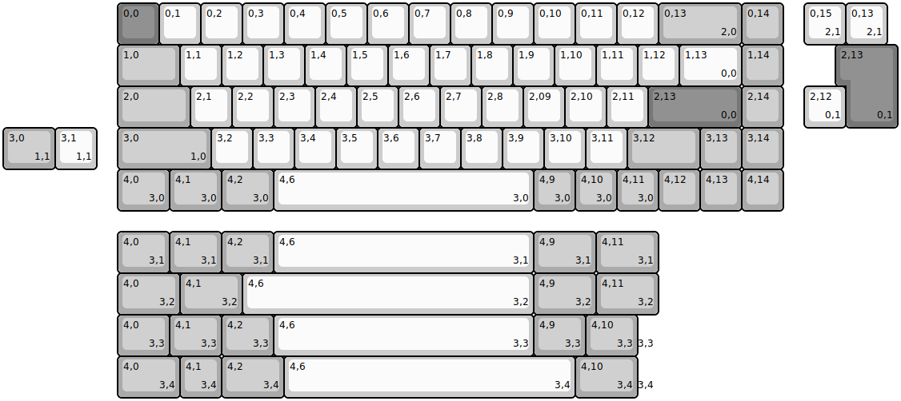{:loading="lazy"}

[Open in keyboard-layout-editor](http://www.keyboard-layout-editor.com/##@@_x:2.75&c=#777777;&=0,0&_c=#cccccc;&=0,1&=0,2&=0,3&=0,4&=0,5&=0,6&=0,7&=0,8&=0,9&=0,10&=0,11&=0,12&_c=#aaaaaa&w:2;&=0,13%0A%0A%0A2,0&=0,14;&@_x:2.75&w:1.5;&=1,0&_c=#cccccc;&=1,1&=1,2&=1,3&=1,4&=1,5&=1,6&=1,7&=1,8&=1,9&=1,10&=1,11&=1,12&_w:1.5;&=1,13%0A%0A%0A0,0&_c=#aaaaaa;&=1,14;&@_x:2.75&w:1.75;&=2,0&_c=#cccccc;&=2,1&=2,2&=2,3&=2,4&=2,5&=2,6&=2,7&=2,8&=2,09&=2,10&=2,11&_c=#777777&w:2.25;&=2,13%0A%0A%0A0,0&_c=#aaaaaa;&=2,14;&@_x:2.75&w:2.25;&=3,0%0A%0A%0A1,0&_c=#cccccc;&=3,2&=3,3&=3,4&=3,5&=3,6&=3,7&=3,8&=3,9&=3,10&=3,11&_c=#aaaaaa&w:1.75;&=3,12&=3,13&=3,14;&@_x:2.75&w:1.25;&=4,0%0A%0A%0A3,0&_w:1.25;&=4,1%0A%0A%0A3,0&_w:1.25;&=4,2%0A%0A%0A3,0&_c=#cccccc&w:6.25;&=4,6%0A%0A%0A3,0&_c=#aaaaaa;&=4,9%0A%0A%0A3,0&=4,10%0A%0A%0A3,0&=4,11%0A%0A%0A3,0&=4,12&=4,13&=4,14;&@_x:19.25&y:-5&c=#cccccc;&=0,15%0A%0A%0A2,1&=0,13%0A%0A%0A2,1;&@_x:20.25&c=#777777&w:1.25&h:2&w2:1.5&h2:1&x2:-0.25;&=2,13%0A%0A%0A0,1;&@_x:19.25&c=#cccccc;&=2,12%0A%0A%0A0,1;&@_c=#aaaaaa&w:1.25;&=3,0%0A%0A%0A1,1&_c=#cccccc;&=3,1%0A%0A%0A1,1;&@_x:2.75&y:1.5&c=#aaaaaa&w:1.25;&=4,0%0A%0A%0A3,1&_w:1.25;&=4,1%0A%0A%0A3,1&_w:1.25;&=4,2%0A%0A%0A3,1&_c=#cccccc&w:6.25;&=4,6%0A%0A%0A3,1&_c=#aaaaaa&w:1.5;&=4,9%0A%0A%0A3,1&_w:1.5;&=4,11%0A%0A%0A3,1;&@_x:2.75&w:1.5;&=4,0%0A%0A%0A3,2&_w:1.5;&=4,1%0A%0A%0A3,2&_c=#cccccc&w:7;&=4,6%0A%0A%0A3,2&_c=#aaaaaa&w:1.5;&=4,9%0A%0A%0A3,2&_w:1.5;&=4,11%0A%0A%0A3,2;&@_x:2.75&w:1.25;&=4,0%0A%0A%0A3,3&_w:1.25;&=4,1%0A%0A%0A3,3&_w:1.25;&=4,2%0A%0A%0A3,3&_c=#cccccc&w:6.25;&=4,6%0A%0A%0A3,3&_c=#aaaaaa&w:1.25;&=4,9%0A%0A%0A3,3&_w:1.25;&=4,10%0A%0A%0A3,3&_c=#cccccc&w:0.5&d:true;&=%0A%0A%0A3,3;&@_x:2.75&c=#aaaaaa&w:1.5;&=4,0%0A%0A%0A3,4&=4,1%0A%0A%0A3,4&_w:1.5;&=4,2%0A%0A%0A3,4&_c=#cccccc&w:7;&=4,6%0A%0A%0A3,4&_c=#aaaaaa&w:1.5;&=4,10%0A%0A%0A3,4&_c=#cccccc&w:0.5&d:true;&=%0A%0A%0A3,4)

## evyd13/wasdat

[README](output/evyd13/wasdat/README.md) - [layout](output/evyd13/wasdat/wasdat-kle.json) - [PCB](output/evyd13/wasdat/wasdat.kicad_pcb) - [PCB render](output/evyd13/wasdat/wasdat-render.svg)

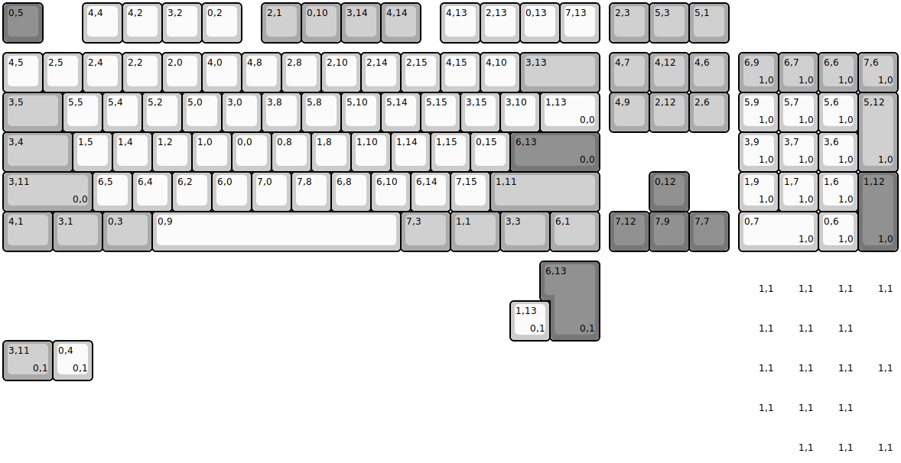{:loading="lazy"}

[Open in keyboard-layout-editor](http://www.keyboard-layout-editor.com/##@@_c=#777777;&=0,5&_x:1&c=#cccccc;&=4,4&=4,2&=3,2&=0,2&_x:0.5&c=#aaaaaa;&=2,1&=0,10&=3,14&=4,14&_x:0.5&c=#cccccc;&=4,13&=2,13&=0,13&=7,13&_x:0.25&c=#aaaaaa;&=2,3&=5,3&=5,1;&@_y:0.25&c=#cccccc;&=4,5&=2,5&=2,4&=2,2&=2,0&=4,0&=4,8&=2,8&=2,10&=2,14&=2,15&=4,15&=4,10&_c=#aaaaaa&w:2;&=3,13&_x:0.25;&=4,7&=4,12&=4,6&_x:0.25;&=6,9%0A%0A%0A1,0&=6,7%0A%0A%0A1,0&=6,6%0A%0A%0A1,0&=7,6%0A%0A%0A1,0;&@_w:1.5;&=3,5&_c=#cccccc;&=5,5&=5,4&=5,2&=5,0&=3,0&=3,8&=5,8&=5,10&=5,14&=5,15&=3,15&=3,10&_w:1.5;&=1,13%0A%0A%0A0,0&_x:0.25&c=#aaaaaa;&=4,9&=2,12&=2,6&_x:0.25&c=#cccccc;&=5,9%0A%0A%0A1,0&=5,7%0A%0A%0A1,0&=5,6%0A%0A%0A1,0&_c=#aaaaaa&h:2;&=5,12%0A%0A%0A1,0;&@_w:1.75;&=3,4&_c=#cccccc;&=1,5&=1,4&=1,2&=1,0&=0,0&=0,8&=1,8&=1,10&=1,14&=1,15&=0,15&_c=#777777&w:2.25;&=6,13%0A%0A%0A0,0&_x:3.5&c=#cccccc;&=3,9%0A%0A%0A1,0&=3,7%0A%0A%0A1,0&=3,6%0A%0A%0A1,0;&@_c=#aaaaaa&w:2.25;&=3,11%0A%0A%0A0,0&_c=#cccccc;&=6,5&=6,4&=6,2&=6,0&=7,0&=7,8&=6,8&=6,10&=6,14&=7,15&_c=#aaaaaa&w:2.75;&=1,11&_x:1.25&c=#777777;&=0,12&_x:1.25&c=#cccccc;&=1,9%0A%0A%0A1,0&=1,7%0A%0A%0A1,0&=1,6%0A%0A%0A1,0&_c=#777777&h:2;&=1,12%0A%0A%0A1,0;&@_c=#aaaaaa&w:1.25;&=4,1&_w:1.25;&=3,1&_w:1.25;&=0,3&_c=#cccccc&w:6.25;&=0,9&_c=#aaaaaa&w:1.25;&=7,3&_w:1.25;&=1,1&_w:1.25;&=3,3&_w:1.25;&=6,1&_x:0.25&c=#777777;&=7,12&=7,9&=7,7&_x:0.25&c=#cccccc&w:2;&=0,7%0A%0A%0A1,0&=0,6%0A%0A%0A1,0;&@_x:13.75&y:0.25&c=#777777&w:1.25&h:2&w2:1.5&h2:1&x2:-0.25;&=6,13%0A%0A%0A0,1&_x:3.5&c=#cccccc&d:true;&=%0A%0A%0A1,1&_d:true;&=%0A%0A%0A1,1&_d:true;&=%0A%0A%0A1,1&_d:true;&=%0A%0A%0A1,1;&@_x:12.75;&=1,13%0A%0A%0A0,1&_x:4.75&d:true;&=%0A%0A%0A1,1&_d:true;&=%0A%0A%0A1,1&_d:true;&=%0A%0A%0A1,1&_h:2&d:true;&=%0A%0A%0A1,1;&@_c=#aaaaaa&w:1.25;&=3,11%0A%0A%0A0,1&_c=#cccccc;&=0,4%0A%0A%0A0,1&_x:16.25&d:true;&=%0A%0A%0A1,1&_d:true;&=%0A%0A%0A1,1&_d:true;&=%0A%0A%0A1,1;&@_x:18.5&d:true;&=%0A%0A%0A1,1&_d:true;&=%0A%0A%0A1,1&_d:true;&=%0A%0A%0A1,1&_h:2&d:true;&=%0A%0A%0A1,1;&@_x:18.5&w:2&d:true;&=%0A%0A%0A1,1&_d:true;&=%0A%0A%0A1,1)

## evyd13/wasdat_code

[README](output/evyd13/wasdat_code/README.md) - [layout](output/evyd13/wasdat_code/wasdat_code-kle.json) - [PCB](output/evyd13/wasdat_code/wasdat_code.kicad_pcb) - [PCB render](output/evyd13/wasdat_code/wasdat_code-render.svg)

{:loading="lazy"}

[Open in keyboard-layout-editor](http://www.keyboard-layout-editor.com/##@@_c=#777777;&=0,5&_x:1&c=#cccccc;&=6,4&=6,2&=2,2&=0,2&_x:0.5&c=#aaaaaa;&=3,1&=0,12&=2,15&=6,15&_x:0.5&c=#cccccc;&=6,11&=3,11&=0,11&=5,11&_x:0.25&c=#aaaaaa;&=3,3&=4,3&=4,1;&@_y:0.25&c=#cccccc;&=6,5&=3,5&=3,4&=3,2&=3,0&=6,0&=6,10&=3,10&=3,12&=3,15&=3,13&=6,13&=6,12&_c=#aaaaaa&w:2;&=2,11&_x:0.25;&=6,7&=6,14&=6,6&_x:0.25;&=7,8%0A%0A%0A1,0&=7,7%0A%0A%0A1,0&=7,6%0A%0A%0A1,0&=5,6%0A%0A%0A1,0;&@_w:1.5;&=2,5&_c=#cccccc;&=4,5&=4,4&=4,2&=4,0&=2,0&=2,10&=4,10&=4,12&=4,15&=4,13&=2,13&=2,12&_w:1.5;&=1,11%0A%0A%0A0,0&_x:0.25&c=#aaaaaa;&=6,8&=3,14&=3,6&_x:0.25&c=#cccccc;&=4,8%0A%0A%0A1,0&=4,7%0A%0A%0A1,0&=4,6%0A%0A%0A1,0&_c=#aaaaaa&h:2;&=4,14%0A%0A%0A1,0;&@_w:1.75;&=2,4&_c=#cccccc;&=1,5&=1,4&=1,2&=1,0&=0,0&=0,10&=1,10&=1,12&=1,15&=1,13&=0,13&_c=#777777&w:2.25;&=7,11%0A%0A%0A0,0&_x:3.5&c=#cccccc;&=2,8%0A%0A%0A1,0&=2,7%0A%0A%0A1,0&=2,6%0A%0A%0A1,0;&@_c=#aaaaaa&w:2.25;&=2,9%0A%0A%0A0,0&_c=#cccccc;&=7,5&=7,4&=7,2&=7,0&=5,0&=5,10&=7,10&=7,12&=7,15&=5,13&_c=#aaaaaa&w:2.75;&=1,9&_x:1.25&c=#777777;&=0,14&_x:1.25&c=#cccccc;&=1,8%0A%0A%0A1,0&=1,7%0A%0A%0A1,0&=1,6%0A%0A%0A1,0&_c=#777777&h:2;&=1,14%0A%0A%0A1,0;&@_c=#aaaaaa&w:1.25;&=6,1&_w:1.25;&=2,1&_w:1.25;&=0,3&_c=#cccccc&w:6.25;&=0,8&_c=#aaaaaa&w:1.25;&=5,3&_w:1.25;&=1,1&_w:1.25;&=2,3&_w:1.25;&=7,1&_x:0.25&c=#777777;&=5,14&=5,8&=5,7&_x:0.25&c=#cccccc&w:2;&=0,7%0A%0A%0A1,0&=0,6%0A%0A%0A1,0;&@_x:13.75&y:0.25&c=#777777&w:1.25&h:2&w2:1.5&h2:1&x2:-0.25;&=7,11%0A%0A%0A0,1&_x:3.5&c=#cccccc&d:true;&=%0A%0A%0A1,1&_d:true;&=%0A%0A%0A1,1&_d:true;&=%0A%0A%0A1,1&_d:true;&=%0A%0A%0A1,1;&@_x:12.75;&=1,11%0A%0A%0A0,1&_x:4.75&d:true;&=%0A%0A%0A1,1&_d:true;&=%0A%0A%0A1,1&_d:true;&=%0A%0A%0A1,1&_h:2&d:true;&=%0A%0A%0A1,1;&@_c=#aaaaaa&w:1.25;&=2,9%0A%0A%0A0,1&_c=#cccccc;&=0,4%0A%0A%0A0,1&_x:16.25&d:true;&=%0A%0A%0A1,1&_d:true;&=%0A%0A%0A1,1&_d:true;&=%0A%0A%0A1,1;&@_x:18.5&d:true;&=%0A%0A%0A1,1&_d:true;&=%0A%0A%0A1,1&_d:true;&=%0A%0A%0A1,1&_h:2&d:true;&=%0A%0A%0A1,1;&@_x:18.5&w:2&d:true;&=%0A%0A%0A1,1&_d:true;&=%0A%0A%0A1,1)

## evyd13/wonderland

[README](output/evyd13/wonderland/README.md) - [layout](output/evyd13/wonderland/wonderland-kle.json) - [PCB](output/evyd13/wonderland/wonderland.kicad_pcb) - [PCB render](output/evyd13/wonderland/wonderland-render.svg)

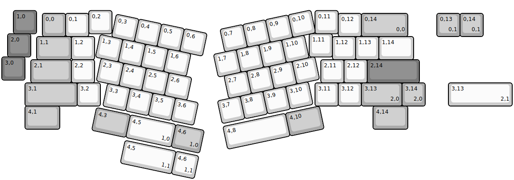{:loading="lazy"}

[Open in keyboard-layout-editor](http://www.keyboard-layout-editor.com/##@@_x:0.5&y:0.38&c=#777777;&=1,0&_x:2.25&c=#cccccc;&=0,2&_x:8.75;&=0,11;&@_x:1.75&y:-0.88&c=#aaaaaa;&=0,0&_c=#cccccc;&=0,1&_x:10.75;&=0,12&_c=#aaaaaa&w:2;&=0,14%0A%0A%0A0,0;&@_x:0.25&y:-0.12&c=#777777;&=2,0&_x:12.0&c=#cccccc;&=1,11;&@_x:1.5&y:-0.88&c=#aaaaaa&w:1.5;&=1,1&_c=#cccccc;&=1,2&_x:10.25;&=1,12&=1,13&_w:1.5;&=1,14;&@_y:-0.12&c=#777777;&=3,0;&@_x:1.25&y:-0.88&c=#aaaaaa&w:1.75;&=2,1&_c=#cccccc;&=2,2&_x:9.75;&=2,11&=2,12&_c=#777777&w:2.25;&=2,14;&@_x:1&c=#aaaaaa&w:2.25;&=3,1&_c=#cccccc;&=3,2&_x:9.25;&=3,11&=3,12&_c=#aaaaaa&w:1.75;&=3,13%0A%0A%0A2,0&=3,14%0A%0A%0A2,0;&@_x:1&w:1.5;&=4,1&_x:13.5&w:1.5;&=4,14;&@_r:12&rx:4.75&ry:1.5&y:-1.0&c=#cccccc;&=0,3&=0,4&=0,5&=0,6;&@_x:-0.5;&=1,3&=1,4&=1,5&=1,6;&@_x:-0.25;&=2,3&=2,4&=2,5&=2,6;&@_x:0.25;&=3,3&=3,4&=3,5&=3,6;&@_y:0.12&c=#aaaaaa&w:1.5;&=4,3&_c=#cccccc&w:2;&=4,5%0A%0A%0A1,0&_c=#aaaaaa&w:1.25;&=4,6%0A%0A%0A1,0;&@_r:-12&rx:14&ry:1.25&x:-4.5&y:-1.0&c=#cccccc;&=0,7&=0,8&=0,9&=0,10;&@_x:-5;&=1,7&=1,8&=1,9&=1,10;&@_x:-4.75;&=2,7&=2,8&=2,9&=2,10;&@_x:-5.25;&=3,7&=3,8&=3,9&=3,10;&@_x:-5.25&y:0.13&w:2.75;&=4,8&_c=#aaaaaa&w:1.5;&=4,10;&@_r:0&rx:0&ry:0&x:18.75&y:0.5;&=0,13%0A%0A%0A0,1&=0,14%0A%0A%0A0,1;&@_x:19.25&y:2.0&c=#cccccc&w:2.75;&=3,13%0A%0A%0A2,1;&@_r:12&rx:4.75&ry:1.5&x:1.5&y:4.25&w:2.25;&=4,5%0A%0A%0A1,1&=4,6%0A%0A%0A1,1)

## exclusive/e65

[README](output/exclusive/README.md) - [layout](output/exclusive/e65-kle.json) - [PCB](output/exclusive/e65.kicad_pcb) - [PCB render](output/exclusive/e65-render.svg)

{:loading="lazy"}

[Open in keyboard-layout-editor](http://www.keyboard-layout-editor.com/##@@_x:7&y:1.5&c=#777777;&=0,0&_c=#cccccc;&=0,1&=0,2&=0,3&=0,4&=0,5&=0,6&=0,7&=0,8&=0,9&=0,10&=0,11&=0,12&_c=#aaaaaa&w:2;&=0,13%0A%0A%0A0,0&=0,15;&@_x:7&w:1.5;&=1,0&_c=#cccccc;&=1,2&=1,3&=1,4&=1,5&=1,6&=1,7&=1,8&=1,9&=1,10&=1,11&=1,12&=1,13&_c=#aaaaaa&w:1.5;&=1,14%0A%0A%0A1,0&=1,15;&@_x:7&w:1.75;&=2,0&_c=#cccccc;&=2,2&=2,3&=2,4&=2,5&=2,6&=2,7&=2,8&=2,9&=2,10&=2,11&=2,12&_c=#777777&w:2.25;&=2,14%0A%0A%0A1,0&_c=#aaaaaa;&=2,15;&@_x:7.0&w:2.25;&=3,0%0A%0A%0A2,0&_c=#cccccc;&=3,2&=3,3&=3,4&=3,5&=3,6&=3,7&=3,8&=3,9&=3,10&=3,11&_c=#aaaaaa&w:1.75;&=3,13&=3,14&=3,15;&@_x:7&w:1.25;&=4,0%0A%0A%0A3,0&_c=#cccccc&w:1.25;&=4,1%0A%0A%0A3,0&_c=#aaaaaa&w:1.25;&=4,3%0A%0A%0A3,0&_c=#cccccc&w:6.25;&=4,6%0A%0A%0A3,0&_c=#aaaaaa&w:1.5;&=4,10%0A%0A%0A3,0&_w:1.5;&=4,12%0A%0A%0A3,0&=4,13&=4,14&=4,15;&@_x:20&y:-6.5&c=#cccccc;&=0,13%0A%0A%0A0,1&=0,14%0A%0A%0A0,1;&@_x:24.5&y:1.5&c=#777777&w:1.25&h:2&w2:1.5&h2:1&x2:-0.25;&=2,14%0A%0A%0A1,1;&@_x:23.5&c=#cccccc;&=1,14%0A%0A%0A1,1;&@_x:4&c=#aaaaaa&w:1.25;&=3,0%0A%0A%0A2,1&_c=#cccccc;&=3,1%0A%0A%0A2,1;&@_x:7&y:1.25&c=#aaaaaa&w:1.5;&=4,0%0A%0A%0A3,1&_w:1.5;&=4,1%0A%0A%0A3,1&_c=#cccccc&w:7;&=4,6%0A%0A%0A3,1&_c=#aaaaaa&w:1.5;&=4,10%0A%0A%0A3,1&_w:1.5;&=4,12%0A%0A%0A3,1;&@_x:7&y:0.25&w:1.25;&=4,0%0A%0A%0A3,2&_c=#cccccc&w:1.25;&=4,1%0A%0A%0A3,2&_c=#aaaaaa&w:1.25;&=4,3%0A%0A%0A3,2&_c=#cccccc&w:6.25;&=4,6%0A%0A%0A3,2&_c=#aaaaaa&w:1.25;&=4,10%0A%0A%0A3,2&_w:1.25;&=4,11%0A%0A%0A3,2;&@_x:7&y:0.25&w:1.5;&=4,0%0A%0A%0A3,3&_c=#cccccc;&=4,1%0A%0A%0A3,3&_c=#aaaaaa&w:1.5;&=4,3%0A%0A%0A3,3&_c=#cccccc&w:7;&=4,6%0A%0A%0A3,3&_c=#aaaaaa&w:1.5;&=4,11%0A%0A%0A3,3;&@_x:7&y:0.25&w:1.5;&=4,0%0A%0A%0A3,4&_x:1.0&w:1.5;&=4,2%0A%0A%0A3,4&_c=#cccccc&w:7;&=4,6%0A%0A%0A3,4&_c=#aaaaaa&w:1.5;&=4,11%0A%0A%0A3,4;&@_x:7.5&y:0.25&c=#cccccc;&=4,0%0A%0A%0A3,5&_c=#aaaaaa&w:1.5;&=4,1%0A%0A%0A3,5&_c=#cccccc&w:7;&=4,6%0A%0A%0A3,5&_c=#aaaaaa&w:1.5;&=4,10%0A%0A%0A3,5&=4,11%0A%0A%0A3,5)

## exclusive/e6v2/le_bmc

[README](output/exclusive/e6v2/README.md) - [layout](output/exclusive/e6v2/le_bmc-kle.json) - [PCB](output/exclusive/e6v2/le_bmc.kicad_pcb) - [PCB render](output/exclusive/e6v2/le_bmc-render.svg)

{:loading="lazy"}

[Open in keyboard-layout-editor](http://www.keyboard-layout-editor.com/##@@_x:2.75&y:1.75&c=#777777;&=5,0&_c=#cccccc;&=4,1&=4,2&=4,3&=4,4&=4,5&=6,1&=6,8&=7,8&=7,1&=4,9&=4,8&=4,7&_c=#aaaaaa&w:2;&=4,10%0A%0A%0A0,0;&@_x:2.75&w:1.5;&=3,0&_c=#cccccc;&=3,1&=3,2&=3,3&=3,4&=3,5&=6,2&=6,7&=7,7&=7,2&=3,9&=3,8&=3,7&_w:1.5;&=3,6%0A%0A%0A1,0;&@_x:2.75&c=#aaaaaa&w:1.75;&=2,0&_c=#cccccc;&=2,1&=2,2&=2,3&=2,4&=2,5&=6,3&=6,6&=7,6&=7,3&=2,9&=2,8&_c=#777777&w:2.25;&=2,6%0A%0A%0A1,0;&@_x:2.75&c=#aaaaaa&w:2.25;&=1,0%0A%0A%0A2,0&_c=#cccccc;&=1,1&=1,2&=1,3&=1,4&=1,5&=6,4&=6,10&=7,10&=7,4&=1,9&_c=#aaaaaa&w:2.75;&=1,8%0A%0A%0A3,0;&@_x:2.75&w:1.25;&=0,0%0A%0A%0A4,0&_w:1.25;&=0,1%0A%0A%0A4,0&_w:1.25;&=0,2%0A%0A%0A4,0&_c=#cccccc&w:6.25;&=6,5%0A%0A%0A4,0&_c=#aaaaaa&w:1.25;&=0,4%0A%0A%0A4,0&_w:1.25;&=0,8%0A%0A%0A4,0&_w:1.25;&=0,9%0A%0A%0A4,0&_w:1.25;&=0,5%0A%0A%0A4,0;&@_x:15.75&y:-6.75&c=#cccccc;&=5,2%0A%0A%0A0,1&=4,10%0A%0A%0A0,1;&@_x:19.25&y:1.75&c=#777777&w:1.25&h:2&w2:1.5&h2:1&x2:-0.25;&=2,6%0A%0A%0A1,1;&@_x:18.25&c=#cccccc;&=3,6%0A%0A%0A1,1;&@_c=#aaaaaa&w:1.25;&=1,0%0A%0A%0A2,1&_c=#cccccc;&=5,3%0A%0A%0A2,1&_x:16.0&c=#aaaaaa&w:1.75;&=1,8%0A%0A%0A3,1&_c=#cccccc;&=5,4%0A%0A%0A3,1;&@_x:2.75&y:1.75&c=#aaaaaa&w:1.5;&=0,0%0A%0A%0A4,1&=0,1%0A%0A%0A4,1&_w:1.5;&=0,2%0A%0A%0A4,1&_c=#cccccc&w:7;&=6,5%0A%0A%0A4,1&_c=#aaaaaa&w:1.5;&=0,8%0A%0A%0A4,1&=0,9%0A%0A%0A4,1&_w:1.5;&=0,5%0A%0A%0A4,1;&@_x:2.75&w:1.5&d:true;&=%0A%0A%0A4,2&=0,1%0A%0A%0A4,2&_w:1.5;&=0,2%0A%0A%0A4,2&_c=#cccccc&w:7;&=6,5%0A%0A%0A4,2&_c=#aaaaaa&w:1.5;&=0,8%0A%0A%0A4,2&=0,9%0A%0A%0A4,2&_w:1.5&d:true;&=%0A%0A%0A4,2)

## exclusive/e6v2/oe_bmc

[README](output/exclusive/e6v2/README.md) - [layout](output/exclusive/e6v2/oe_bmc-kle.json) - [PCB](output/exclusive/e6v2/oe_bmc.kicad_pcb) - [PCB render](output/exclusive/e6v2/oe_bmc-render.svg)

{:loading="lazy"}

[Open in keyboard-layout-editor](http://www.keyboard-layout-editor.com/##@@_x:2.75&y:1.75&c=#777777;&=5,0&_c=#cccccc;&=4,1&=4,2&=4,3&=4,4&=4,5&=6,1&=6,8&=7,8&=7,1&=4,9&=4,8&=4,7&_c=#aaaaaa&w:2;&=4,10%0A%0A%0A0,0;&@_x:2.75&w:1.5;&=3,0&_c=#cccccc;&=3,1&=3,2&=3,3&=3,4&=3,5&=6,2&=6,7&=7,7&=7,2&=3,9&=3,8&=3,7&_w:1.5;&=3,6%0A%0A%0A1,0;&@_x:2.75&c=#aaaaaa&w:1.75;&=2,0&_c=#cccccc;&=2,1&=2,2&=2,3&=2,4&=2,5&=6,3&=6,6&=7,6&=7,3&=2,9&=2,8&_c=#777777&w:2.25;&=2,6%0A%0A%0A1,0;&@_x:2.75&c=#aaaaaa&w:2.25;&=1,0%0A%0A%0A2,0&_c=#cccccc;&=1,1&=1,2&=1,3&=1,4&=1,5&=6,4&=6,10&=7,10&=7,4&=1,9&_c=#aaaaaa&w:2.75;&=1,8%0A%0A%0A3,0;&@_x:2.75&w:1.25;&=0,0%0A%0A%0A4,0&_w:1.25;&=0,1%0A%0A%0A4,0&_w:1.25;&=0,2%0A%0A%0A4,0&_c=#cccccc&w:6.25;&=7,5%0A%0A%0A4,0&_c=#aaaaaa&w:1.25;&=0,4%0A%0A%0A4,0&_w:1.25;&=0,8%0A%0A%0A4,0&_w:1.25;&=0,9%0A%0A%0A4,0&_w:1.25;&=0,5%0A%0A%0A4,0;&@_x:15.75&y:-6.75&c=#cccccc;&=5,2%0A%0A%0A0,1&=4,10%0A%0A%0A0,1;&@_x:19.25&y:1.75&c=#777777&w:1.25&h:2&w2:1.5&h2:1&x2:-0.25;&=2,6%0A%0A%0A1,1;&@_x:18.25&c=#cccccc;&=3,6%0A%0A%0A1,1;&@_c=#aaaaaa&w:1.25;&=1,0%0A%0A%0A2,1&_c=#cccccc;&=5,3%0A%0A%0A2,1&_x:16.0&c=#aaaaaa&w:1.75;&=1,8%0A%0A%0A3,1&_c=#cccccc;&=5,4%0A%0A%0A3,1;&@_x:2.75&y:1.75&c=#aaaaaa&w:1.5;&=0,0%0A%0A%0A4,1&=0,1%0A%0A%0A4,1&_w:1.5;&=0,2%0A%0A%0A4,1&_c=#cccccc&w:7;&=7,5%0A%0A%0A4,1&_c=#aaaaaa&w:1.5;&=0,8%0A%0A%0A4,1&=0,9%0A%0A%0A4,1&_w:1.5;&=0,5%0A%0A%0A4,1;&@_x:2.75&w:1.5&d:true;&=%0A%0A%0A4,2&=0,1%0A%0A%0A4,2&_w:1.5;&=0,2%0A%0A%0A4,2&_c=#cccccc&w:7;&=7,5%0A%0A%0A4,2&_c=#aaaaaa&w:1.5;&=0,8%0A%0A%0A4,2&=0,9%0A%0A%0A4,2&_w:1.5&d:true;&=%0A%0A%0A4,2)

## exclusive/e7v1

[README](output/exclusive/README.md) - [layout](output/exclusive/e7v1-kle.json) - [PCB](output/exclusive/e7v1.kicad_pcb) - [PCB render](output/exclusive/e7v1-render.svg)

{:loading="lazy"}

[Open in keyboard-layout-editor](http://www.keyboard-layout-editor.com/##@@_x:3&y:1.5&c=#777777;&=0,0&_x:0.25&c=#cccccc;&=0,1&=0,2&=0,3&=0,5&_x:0.25&c=#aaaaaa;&=0,6&=0,7&=0,8&=0,9&_x:0.25&c=#cccccc;&=0,10&=0,11&=0,12&=0,13&_x:0.25&c=#aaaaaa;&=0,14&_x:0.25;&=0,15;&@_x:3&y:0.25&c=#cccccc;&=1,0&=1,1&=1,2&=1,3&=1,4&=1,5&=1,6&=1,7&=1,8&=1,9&=1,10&=1,11&=1,12&_c=#aaaaaa&w:2;&=1,14%0A%0A%0A0,0&_x:0.25;&=1,15;&@_x:3&w:1.5;&=2,0&_c=#cccccc;&=2,2&=2,3&=2,4&=2,5&=2,6&=2,7&=2,8&=2,9&=2,10&=2,11&=2,12&=2,13&_w:1.5;&=2,14%0A%0A%0A1,0&_x:0.25&c=#aaaaaa;&=2,15;&@_x:3&w:1.75;&=3,0&_c=#cccccc;&=3,2&=3,3&=3,4&=3,5&=3,6&=3,7&=3,8&=3,9&=3,10&=3,11&=3,12&_c=#777777&w:2.25;&=3,13%0A%0A%0A1,0;&@_x:3.0&c=#aaaaaa&w:2.25;&=4,0%0A%0A%0A2,0&_c=#cccccc;&=4,2&=4,3&=4,4&=4,5&=4,6&=4,7&=4,8&=4,9&=4,10&=4,11&_c=#aaaaaa&w:1.75;&=4,13;&@_x:17.25&y:-0.75;&=4,14;&@_x:3&y:-0.25&w:1.25;&=5,0%0A%0A%0A3,0&_w:1.25;&=5,1%0A%0A%0A3,0&_w:1.25;&=5,2%0A%0A%0A3,0&_c=#cccccc&w:6.25;&=5,5%0A%0A%0A3,0&_c=#aaaaaa&w:1.5;&=5,10%0A%0A%0A3,0&_w:1.5;&=5,12%0A%0A%0A3,0;&@_x:16.25&y:-0.75;&=5,13&=5,14&=5,15;&@_x:16&y:-8.0&c=#cccccc;&=1,13%0A%0A%0A0,1&=1,14%0A%0A%0A0,1;&@_x:21.25&y:2.75&c=#777777&w:1.25&h:2&w2:1.5&h2:1&x2:-0.25;&=3,13%0A%0A%0A1,1;&@_x:20.25&c=#cccccc;&=2,14%0A%0A%0A1,1;&@_c=#aaaaaa&w:1.25;&=4,0%0A%0A%0A2,1&_c=#cccccc;&=4,1%0A%0A%0A2,1;&@_x:3&y:1.5&c=#aaaaaa&w:1.5;&=5,0%0A%0A%0A3,1&_w:1.5;&=5,1%0A%0A%0A3,1&_c=#cccccc&w:7;&=5,5%0A%0A%0A3,1&_c=#aaaaaa&w:1.5;&=5,10%0A%0A%0A3,1&_w:1.5;&=5,12%0A%0A%0A3,1)

## exclusive/e85_hotswap

[README](output/exclusive/README.md) - [layout](output/exclusive/e85_hotswap-kle.json) - [PCB](output/exclusive/e85_hotswap.kicad_pcb) - [PCB render](output/exclusive/e85_hotswap-render.svg)

{:loading="lazy"}

[Open in keyboard-layout-editor](http://www.keyboard-layout-editor.com/##@@_c=#777777;&=0,0&_x:0.25&c=#cccccc;&=0,1&=0,2&=0,3&=0,4&_x:0.25&c=#aaaaaa;&=0,5&=0,6&=0,7&=0,8&_x:0.25&c=#cccccc;&=6,8&=6,7&=6,5&=6,4&_x:0.25;&=6,3&_x:0.25&c=#aaaaaa;&=6,6&=6,2&=6,1;&@_y:0.5&c=#cccccc;&=1,0&=1,1&=1,2&=1,3&=1,4&=1,5&=1,6&=1,7&=1,8&=7,8&=7,0&=7,7&=7,5&_c=#aaaaaa&w:2;&=7,3&_x:0.25;&=7,6&=7,2&=7,1;&@_w:1.5;&=2,0&_c=#cccccc;&=2,1&=2,2&=2,3&=2,4&=2,5&=2,6&=2,7&=2,8&=8,8&=8,7&=8,5&=8,4&_w:1.5;&=8,3&_x:0.25&c=#aaaaaa;&=8,6&=8,2&=8,1;&@_w:1.75;&=3,0&_c=#cccccc;&=3,1&=3,2&=3,3&=3,4&=3,5&=3,6&=3,7&=3,8&=9,8&=9,7&=9,5&_c=#777777&w:2.25;&=9,3;&@_c=#aaaaaa&w:2.25;&=4,0&_c=#cccccc;&=4,2&=4,3&=4,4&=4,5&=4,6&=4,7&=4,8&=10,8&=10,7&=10,5&_c=#aaaaaa&w:2.75;&=10,4&_x:1.25;&=9,2;&@_w:1.25;&=5,0%0A%0A%0A0,0&_w:1.25;&=5,1%0A%0A%0A0,0&_w:1.25;&=5,2%0A%0A%0A0,0&_c=#cccccc&w:6.25;&=5,6%0A%0A%0A0,0&_c=#aaaaaa&w:1.25;&=5,8%0A%0A%0A0,0&_w:1.25;&=5,7%0A%0A%0A0,0&_w:1.25;&=5,4%0A%0A%0A0,0&_w:1.25;&=5,3%0A%0A%0A0,0&_x:0.25;&=10,6&=10,2&=10,1;&@_y:0.5&w:1.5;&=5,0%0A%0A%0A0,1&=5,1%0A%0A%0A0,1&_w:1.5;&=5,2%0A%0A%0A0,1&_c=#cccccc&w:7;&=5,6%0A%0A%0A0,1&_c=#aaaaaa&w:1.5;&=5,7%0A%0A%0A0,1&=5,4%0A%0A%0A0,1&_w:1.5;&=5,3%0A%0A%0A0,1;&@_w:1.5;&=5,0%0A%0A%0A0,2&_d:true;&=5,1%0A%0A%0A0,2&_w:1.5;&=5,2%0A%0A%0A0,2&_c=#cccccc&w:7;&=5,6%0A%0A%0A0,2&_c=#aaaaaa&w:1.5;&=5,7%0A%0A%0A0,2&_d:true;&=5,4%0A%0A%0A0,2&_w:1.5;&=5,3%0A%0A%0A0,2)

## exclusive/e85_soldered

[README](output/exclusive/README.md) - [layout](output/exclusive/e85_soldered-kle.json) - [PCB](output/exclusive/e85_soldered.kicad_pcb) - [PCB render](output/exclusive/e85_soldered-render.svg)

{:loading="lazy"}

[Open in keyboard-layout-editor](http://www.keyboard-layout-editor.com/##@@_x:2.5&y:1.5&c=#777777;&=0,0&_x:0.25&c=#cccccc;&=0,1&=0,2&=0,3&=0,4&_x:0.25&c=#aaaaaa;&=0,5&=0,6&=0,7&=0,8&_x:0.25&c=#cccccc;&=6,8&=6,7&=6,5&=6,4&_x:0.25;&=6,3&_x:0.25&c=#aaaaaa;&=6,6&=6,2&=6,1;&@_x:2.5&y:0.5&c=#cccccc;&=1,0&=1,1&=1,2&=1,3&=1,4&=1,5&=1,6&=1,7&=1,8&=7,8&=7,0&=7,7&=7,5&_c=#aaaaaa&w:2;&=7,3%0A%0A%0A0,0&_x:0.25;&=7,6&=7,2&=7,1;&@_x:2.5&w:1.5;&=2,0&_c=#cccccc;&=2,1&=2,2&=2,3&=2,4&=2,5&=2,6&=2,7&=2,8&=8,8&=8,7&=8,5&=8,4&_w:1.5;&=9,4%0A%0A%0A1,0&_x:0.25&c=#aaaaaa;&=8,6&=8,2&=8,1;&@_x:2.5&w:1.75;&=3,0&_c=#cccccc;&=3,1&=3,2&=3,3&=3,4&=3,5&=3,6&=3,7&=3,8&=9,8&=9,7&=9,5&_c=#777777&w:2.25;&=8,3%0A%0A%0A1,0;&@_x:2.5&c=#aaaaaa&w:2.25;&=4,0%0A%0A%0A2,0&_c=#cccccc;&=4,2&=4,3&=4,4&=4,5&=4,6&=4,7&=4,8&=10,8&=10,7&=10,5&_c=#aaaaaa&w:2.75;&=10,4%0A%0A%0A3,0&_x:1.25;&=9,2;&@_x:2.5&w:1.25;&=5,0%0A%0A%0A4,0&_w:1.25;&=5,1%0A%0A%0A4,0&_w:1.25;&=5,2%0A%0A%0A4,0&_c=#cccccc&w:6.25;&=5,6%0A%0A%0A4,0&_c=#aaaaaa&w:1.25;&=5,8%0A%0A%0A4,0&_w:1.25;&=5,7%0A%0A%0A4,0&_w:1.25;&=5,4%0A%0A%0A4,0&_w:1.25;&=5,3%0A%0A%0A4,0&_x:0.25;&=10,6&=10,2&=10,1;&@_x:15.5&y:-8.0&c=#cccccc;&=7,4%0A%0A%0A0,1&=7,3%0A%0A%0A0,1;&@_x:22.25&y:3.0&c=#777777&w:1.25&h:2&w2:1.5&h2:1&x2:-0.25;&=8,3%0A%0A%0A1,1;&@_x:21.25&c=#cccccc;&=9,4%0A%0A%0A1,1;&@_c=#aaaaaa&w:1.25;&=4,0%0A%0A%0A2,1&_c=#cccccc;&=4,1%0A%0A%0A2,1&_x:19.0&c=#aaaaaa&w:1.75;&=10,4%0A%0A%0A3,1&_c=#cccccc;&=10,3%0A%0A%0A3,1;&@_x:2.5&y:1.5&c=#aaaaaa&w:1.5;&=5,0%0A%0A%0A4,1&=5,1%0A%0A%0A4,1&_w:1.5;&=5,2%0A%0A%0A4,1&_c=#cccccc&w:7;&=5,6%0A%0A%0A4,1&_c=#aaaaaa&w:1.5;&=5,7%0A%0A%0A4,1&=5,4%0A%0A%0A4,1&_w:1.5;&=5,3%0A%0A%0A4,1;&@_x:2.5&w:1.5;&=5,0%0A%0A%0A4,2&_d:true;&=5,1%0A%0A%0A4,2&_w:1.5;&=5,2%0A%0A%0A4,2&_c=#cccccc&w:7;&=5,6%0A%0A%0A4,2&_c=#aaaaaa&w:1.5;&=5,7%0A%0A%0A4,2&_d:true;&=5,4%0A%0A%0A4,2&_w:1.5;&=5,3%0A%0A%0A4,2)

## fate_nozomi/arisu

[README](output/fate_nozomi/arisu/README.md) - [layout](output/fate_nozomi/arisu/arisu-kle.json) - [PCB](output/fate_nozomi/arisu/arisu.kicad_pcb) - [PCB render](output/fate_nozomi/arisu/arisu-render.svg)

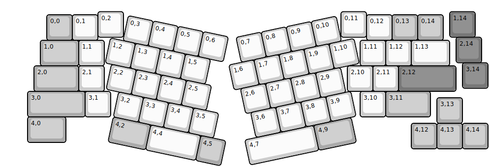{:loading="lazy"}

[Open in keyboard-layout-editor](http://www.keyboard-layout-editor.com/##@@_x:3.75&y:0.38;&=0,2&_x:8.5;&=0,11&_x:3.25&c=#777777;&=1,14;&@_x:1.75&y:-0.88&c=#aaaaaa;&=0,0&_c=#cccccc;&=0,1&_x:10.5;&=0,12&_c=#aaaaaa;&=0,13&=0,14;&@_x:17.75&y:-0.12&c=#777777;&=2,14;&@_x:1.5&y:-0.88&c=#aaaaaa&w:1.5;&=1,0&_c=#cccccc;&=1,1&_x:10.0;&=1,11&=1,12&_w:1.5;&=1,13;&@_x:18&y:-0.12&c=#777777;&=3,14;&@_x:1.25&y:-0.88&c=#aaaaaa&w:1.75;&=2,0&_c=#cccccc;&=2,1&_x:9.5;&=2,10&=2,11&_c=#777777&w:2.25;&=2,12;&@_x:1&c=#aaaaaa&w:2.25;&=3,0&_c=#cccccc;&=3,1&_x:9.75;&=3,10&_c=#aaaaaa&w:1.75;&=3,11;&@_x:17&y:-0.75;&=3,13;&@_x:1&y:-0.25&w:1.5;&=4,0;&@_x:16&y:-0.75;&=4,12&=4,13&=4,14;&@_r:12&rx:4.75&ry:1.5&y:-1.0&c=#cccccc;&=0,3&=0,4&=0,5&=0,6;&@_x:-0.5;&=1,2&=1,3&=1,4&=1,5;&@_x:-0.25;&=2,2&=2,3&=2,4&=2,5;&@_x:0.25;&=3,2&=3,3&=3,4&=3,5;&@_x:0.25&c=#aaaaaa&w:1.5;&=4,2&_c=#cccccc&w:2;&=4,4&_c=#aaaaaa;&=4,5;&@_r:-12&rx:13.5&x:-4.25&y:-1.0&c=#cccccc;&=0,7&=0,8&=0,9&=0,10;&@_x:-4.75;&=1,6&=1,7&=1,8&=1,9&=1,10;&@_x:-4.5;&=2,6&=2,7&=2,8&=2,9;&@_x:-4.75&y:1.0&w:2.75;&=4,7&_c=#aaaaaa&w:1.5;&=4,9;&@_ry:1.75&x:-4.25&y:1.75&c=#cccccc;&=3,6&=3,7&=3,8&=3,9)

## fc660c/fc660c

[README](output/fc660c/README.md) - [layout](output/fc660c/fc660c-kle.json) - [PCB](output/fc660c/fc660c.kicad_pcb) - [PCB render](output/fc660c/fc660c-render.svg)

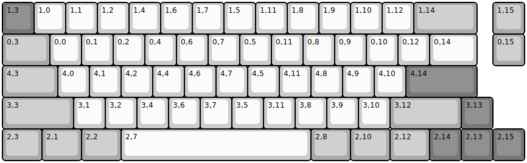{:loading="lazy"}

[Open in keyboard-layout-editor](http://www.keyboard-layout-editor.com/##@@_c=#777777;&=1,3&_c=#cccccc;&=1,0&=1,1&=1,2&=1,4&=1,6&=1,7&=1,5&=1,11&=1,8&=1,9&=1,10&=1,12&_c=#aaaaaa&w:2;&=1,14&_x:0.5;&=1,15;&@_w:1.5;&=0,3&_c=#cccccc;&=0,0&=0,1&=0,2&=0,4&=0,6&=0,7&=0,5&=0,11&=0,8&=0,9&=0,10&=0,12&_w:1.5;&=0,14&_x:0.5&c=#aaaaaa;&=0,15;&@_w:1.75;&=4,3&_c=#cccccc;&=4,0&=4,1&=4,2&=4,4&=4,6&=4,7&=4,5&=4,11&=4,8&=4,9&=4,10&_c=#777777&w:2.25;&=4,14;&@_c=#aaaaaa&w:2.25;&=3,3&_c=#cccccc;&=3,1&=3,2&=3,4&=3,6&=3,7&=3,5&=3,11&=3,8&=3,9&=3,10&_c=#aaaaaa&w:2.25;&=3,12&_c=#777777;&=3,13;&@_c=#aaaaaa&w:1.25;&=2,3&_w:1.25;&=2,1&_w:1.25;&=2,2&_c=#cccccc&w:6;&=2,7&_c=#aaaaaa&w:1.25;&=2,8&_w:1.25;&=2,10&_w:1.25;&=2,12&_c=#777777;&=2,14&=2,13&=2,15)

## fc980c/fc980c

[README](output/fc980c/README.md) - [layout](output/fc980c/fc980c-kle.json) - [PCB](output/fc980c/fc980c.kicad_pcb) - [PCB render](output/fc980c/fc980c-render.svg)

{:loading="lazy"}

[Open in keyboard-layout-editor](http://www.keyboard-layout-editor.com/##@@_c=#777777;&=0,13&_x:1&c=#cccccc;&=2,13&=5,13&=3,13&=6,13&_x:0.5&c=#aaaaaa;&=7,13&=7,15&=7,14&=7,12&_x:0.5&c=#cccccc;&=7,2&=7,1&=7,0&=7,3&_x:0.5&c=#aaaaaa;&=7,4&=7,6&=7,7&=7,5;&@_y:0.5&c=#cccccc;&=0,10&=6,9&=5,9&=5,8&=5,11&=6,15&=5,15&=5,14&=6,12&=5,12&=5,2&=5,1&=5,0&_c=#aaaaaa&w:2;&=5,5&_x:0.5;&=5,4&=5,6&=5,7&=6,5;&@_w:1.5;&=6,10&_c=#cccccc;&=3,9&=6,8&=6,11&=3,11&=3,15&=6,14&=3,14&=3,12&=6,2&=6,1&=6,0&=3,3&_w:1.5;&=5,3&_x:0.5;&=6,4&=6,6&=6,7&_c=#aaaaaa&h:2;&=2,5;&@_w:1.75;&=3,10&_c=#cccccc;&=2,9&=3,8&=2,8&=2,11&=2,15&=2,14&=2,12&=1,12&=3,2&=3,1&=2,0&_c=#777777&w:2.25;&=6,3&_x:0.5&c=#cccccc;&=2,4&=2,6&=2,7;&@_c=#aaaaaa&w:2.25;&=2,10&_c=#cccccc;&=1,8&=0,8&=1,11&=0,11&=1,15&=1,14&=0,14&=2,2&=1,1&=2,1&_c=#aaaaaa&w:1.75;&=3,0&_x:1.5&c=#cccccc;&=1,4&=1,6&=1,7&_c=#aaaaaa&h:2;&=1,5;&@_x:14.25&y:-0.75&c=#777777;&=3,4;&@_y:-0.25&c=#aaaaaa&w:1.25;&=1,10&=0,9&_w:1.25;&=1,9&_c=#777777&w:6;&=0,15&_c=#aaaaaa&w:1.25;&=0,2&=0,1&_w:1.25;&=1,0&_x:3.5&c=#cccccc;&=0,7&=0,5;&@_x:13.25&y:-0.75&c=#777777;&=0,0&=0,4&=0,6)

## feels/feels65

[README](output/feels/README.md) - [layout](output/feels/feels65-kle.json) - [PCB](output/feels/feels65.kicad_pcb) - [PCB render](output/feels/feels65-render.svg)

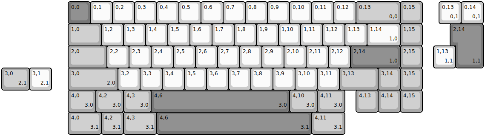{:loading="lazy"}

[Open in keyboard-layout-editor](http://www.keyboard-layout-editor.com/##@@_x:3&c=#777777;&=0,0&_c=#cccccc;&=0,1&=0,2&=0,3&=0,4&=0,5&=0,6&=0,7&=0,8&=0,9&=0,10&=0,11&=0,12&_c=#aaaaaa&w:2;&=0,13%0A%0A%0A0,0&=0,15;&@_x:3&w:1.5;&=1,0&_c=#cccccc;&=1,2&=1,3&=1,4&=1,5&=1,6&=1,7&=1,8&=1,9&=1,10&=1,11&=1,12&=1,13&_w:1.5;&=1,14%0A%0A%0A1,0&_c=#aaaaaa;&=1,15;&@_x:3&w:1.75;&=2,0&_c=#cccccc;&=2,2&=2,3&=2,4&=2,5&=2,6&=2,7&=2,8&=2,9&=2,10&=2,11&=2,12&_c=#777777&w:2.25;&=2,14%0A%0A%0A1,0&_c=#aaaaaa;&=2,15;&@_x:3.0&w:2.25;&=3,0%0A%0A%0A2,0&_c=#cccccc;&=3,2&=3,3&=3,4&=3,5&=3,6&=3,7&=3,8&=3,9&=3,10&=3,11&_c=#aaaaaa&w:1.75;&=3,13&=3,14&=3,15;&@_x:3&w:1.25;&=4,0%0A%0A%0A3,0&_w:1.25;&=4,2%0A%0A%0A3,0&_w:1.25;&=4,3%0A%0A%0A3,0&_c=#777777&w:6.25;&=4,6%0A%0A%0A3,0&_c=#aaaaaa&w:1.25;&=4,10%0A%0A%0A3,0&_w:1.25;&=4,11%0A%0A%0A3,0&_x:0.5;&=4,13&=4,14&=4,15;&@_x:19.75&y:-5&c=#cccccc;&=0,13%0A%0A%0A0,1&=0,14%0A%0A%0A0,1;&@_x:20.5&c=#777777&w:1.25&h:2&w2:1.5&h2:1&x2:-0.25;&=2,14%0A%0A%0A1,1;&@_x:19.5&c=#cccccc;&=1,13%0A%0A%0A1,1;&@_c=#aaaaaa&w:1.25;&=3,0%0A%0A%0A2,1&_c=#cccccc;&=3,1%0A%0A%0A2,1;&@_x:3&y:1&c=#aaaaaa&w:1.5;&=4,0%0A%0A%0A3,1&=4,2%0A%0A%0A3,1&_w:1.5;&=4,3%0A%0A%0A3,1&_c=#777777&w:7;&=4,6%0A%0A%0A3,1&_c=#aaaaaa&w:1.5;&=4,11%0A%0A%0A3,1)

## feker/ik75

[README](output/feker/ik75/README.md) - [layout](output/feker/ik75/ik75-kle.json) - [PCB](output/feker/ik75/ik75.kicad_pcb) - [PCB render](output/feker/ik75/ik75-render.svg)

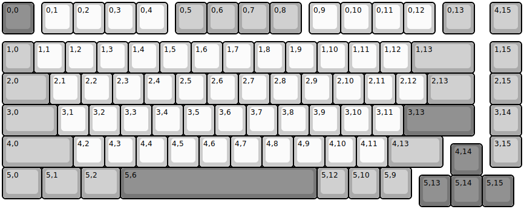{:loading="lazy"}

[Open in keyboard-layout-editor](http://www.keyboard-layout-editor.com/##@@_c=#777777;&=0,0&_x:0.25&c=#cccccc;&=0,1&=0,2&=0,3&=0,4&_x:0.25&c=#aaaaaa;&=0,5&=0,6&=0,7&=0,8&_x:0.25&c=#cccccc;&=0,9&=0,10&=0,11&=0,12&_x:0.25&c=#aaaaaa;&=0,13&_x:0.5;&=4,15%0A%0A%0A%0A%0A%0A%0A%0A%0Ae0;&@_y:0.25;&=1,0&_c=#cccccc;&=1,1&=1,2&=1,3&=1,4&=1,5&=1,6&=1,7&=1,8&=1,9&=1,10&=1,11&=1,12&_c=#aaaaaa&w:2;&=1,13&_x:0.5;&=1,15;&@_w:1.5;&=2,0&_c=#cccccc;&=2,1&=2,2&=2,3&=2,4&=2,5&=2,6&=2,7&=2,8&=2,9&=2,10&=2,11&=2,12&_c=#aaaaaa&w:1.5;&=2,13&_x:0.5;&=2,15;&@_w:1.75;&=3,0&_c=#cccccc;&=3,1&=3,2&=3,3&=3,4&=3,5&=3,6&=3,7&=3,8&=3,9&=3,10&=3,11&_c=#777777&w:2.25;&=3,13&_x:0.5&c=#aaaaaa;&=3,14;&@_w:2.25;&=4,0&_c=#cccccc;&=4,2&=4,3&=4,4&=4,5&=4,6&=4,7&=4,8&=4,9&=4,10&=4,11&_c=#aaaaaa&w:1.75;&=4,13&_x:1.5;&=3,15;&@_x:14.25&y:-0.75&c=#777777;&=4,14;&@_y:-0.25&c=#aaaaaa&w:1.25;&=5,0&_w:1.25;&=5,1&_w:1.25;&=5,2&_c=#777777&w:6.25;&=5,6&_c=#aaaaaa;&=5,12&=5,10&=5,9;&@_x:13.25&y:-0.75&c=#777777;&=5,13&=5,14&=5,15)

## ferris/sweep

[README](output/ferris/sweep/README.md) - [layout](output/ferris/sweep/sweep-kle.json) - [PCB](output/ferris/sweep/sweep.kicad_pcb) - [PCB render](output/ferris/sweep/sweep-render.svg)

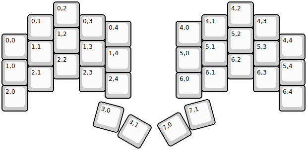{:loading="lazy"}

[Open in keyboard-layout-editor](http://www.keyboard-layout-editor.com/##@@_x:2;&=0,2&_x:5.75;&=4,2;&@_x:1&y:-0.5;&=0,1&_x:1;&=0,3&_x:3.75;&=4,1&_x:1.0;&=4,3;&@_x:4&y:-0.75;&=0,4&_x:1.75;&=4,0;&@_x:2&y:-0.75;&=1,2&_x:5.75;&=5,2;&@_y:-0.75;&=0,0&_x:9.75;&=4,4;&@_x:1&y:-0.75;&=1,1&_x:1;&=1,3&_x:3.75;&=5,1&_x:1.0;&=5,3;&@_x:4&y:-0.75;&=1,4&_x:1.75;&=5,0;&@_x:2&y:-0.75;&=2,2&_x:5.75;&=6,2;&@_y:-0.75;&=1,0&_x:9.75;&=5,4;&@_x:1&y:-0.75;&=2,1&_x:1;&=2,3&_x:3.75;&=6,1&_x:1.0;&=6,3;&@_x:4&y:-0.75;&=2,4&_x:1.75;&=6,0;&@_y:-0.5;&=2,0&_x:9.75;&=6,4;&@_r:15&x:4.67&y:-1.51;&=3,0;&@_r:30&x:6.5&y:-2.49;&=3,1;&@_r:-30&x:2.76&y:4.92;&=7,0;&@_r:-15&x:5.75&y:-2.42;&=7,1)

## ffkeebs/siris

[README](output/ffkeebs/README.md) - [layout](output/ffkeebs/siris-kle.json) - [PCB](output/ffkeebs/siris.kicad_pcb) - [PCB render](output/ffkeebs/siris-render.svg)

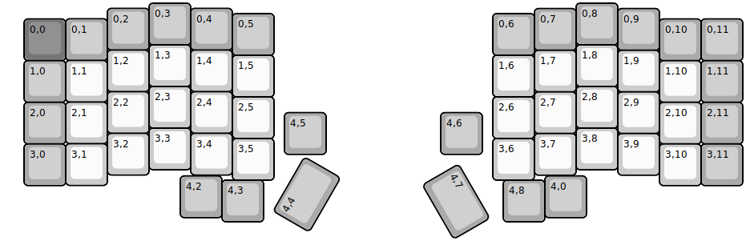{:loading="lazy"}

[Open in keyboard-layout-editor](http://www.keyboard-layout-editor.com/##@@_x:3.5&c=#aaaaaa;&=0,3&_x:9.25;&=0,8;&@_x:2.5&y:-0.875;&=0,2&_x:1.0;&=0,4;&@_x:12.75&y:-0.995;&=0,7&_x:1.0;&=0,9;&@_x:5.5&y:-0.88;&=0,5&_x:5.25;&=0,6;&@_x:1.5&y:-0.875;&=0,1;&@_x:0.5&y:-0.995&c=#777777;&=0,0&_x:14.25&c=#aaaaaa;&=0,10&=0,11;&@_x:3.5&y:-0.38&c=#cccccc;&=1,3&_x:9.25;&=1,8;&@_x:2.5&y:-0.875;&=1,2&_x:1.0;&=1,4;&@_x:12.75&y:-0.995;&=1,7&_x:1.0;&=1,9;&@_x:5.5&y:-0.88;&=1,5&_x:5.25;&=1,6;&@_x:1.5&y:-0.875;&=1,1;&@_x:0.5&y:-0.995&c=#aaaaaa;&=1,0&_x:14.25&c=#cccccc;&=1,10&_c=#aaaaaa;&=1,11;&@_x:3.5&y:-0.38&c=#cccccc;&=2,3&_x:9.25;&=2,8;&@_x:2.5&y:-0.875;&=2,2&_x:1.0;&=2,4;&@_x:12.75&y:-0.995;&=2,7&_x:1.0;&=2,9;&@_x:5.5&y:-0.88;&=2,5&_x:5.25;&=2,6;&@_x:1.5&y:-0.875;&=2,1;&@_x:0.5&y:-0.995&c=#aaaaaa;&=2,0&_x:14.25&c=#cccccc;&=2,10&_c=#aaaaaa;&=2,11;&@_x:6.75&y:-0.75;&=4,5&_x:2.75;&=4,6;&@_x:3.5&y:-0.63&c=#cccccc;&=3,3&_x:9.25;&=3,8;&@_x:2.5&y:-0.875;&=3,2&_x:1.0;&=3,4;&@_x:12.75&y:-0.995;&=3,7&_x:1.0;&=3,9;&@_x:5.5&y:-0.88;&=3,5&_x:5.25;&=3,6;&@_x:1.5&y:-0.875;&=3,1;&@_x:0.5&y:-0.995&c=#aaaaaa;&=3,0&_x:14.25&c=#cccccc;&=3,10&_c=#aaaaaa;&=3,11;&@_x:4.25&y:-0.23;&=4,2&_x:7.75;&=4,0;&@_x:5.25&y:-0.9;&=4,3&_x:5.75;&=4,8;&@_r:60&rx:9.25&ry:3.25&x:1.4&y:-1.25&w:1.5;&=4,7;&@_r:-60&x:-3.0&y:-1.25&w:1.5;&=4,4)

## fjlabs/7vhotswap

[README](output/fjlabs/7vhotswap/README.md) - [layout](output/fjlabs/7vhotswap/7vhotswap-kle.json) - [PCB](output/fjlabs/7vhotswap/7vhotswap.kicad_pcb) - [PCB render](output/fjlabs/7vhotswap/7vhotswap-render.svg)

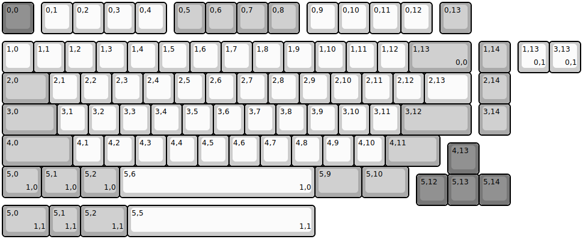{:loading="lazy"}

[Open in keyboard-layout-editor](http://www.keyboard-layout-editor.com/##@@_c=#777777;&=0,0&_x:0.25&c=#cccccc;&=0,1&=0,2&=0,3&=0,4&_x:0.25&c=#aaaaaa;&=0,5&=0,6&=0,7&=0,8&_x:0.25&c=#cccccc;&=0,9&=0,10&=0,11&=0,12&_x:0.25&c=#aaaaaa;&=0,13;&@_y:0.25&c=#cccccc;&=1,0&=1,1&=1,2&=1,3&=1,4&=1,5&=1,6&=1,7&=1,8&=1,9&=1,10&=1,11&=1,12&_c=#aaaaaa&w:2;&=1,13%0A%0A%0A0,0&_x:0.25;&=1,14;&@_w:1.5;&=2,0&_c=#cccccc;&=2,1&=2,2&=2,3&=2,4&=2,5&=2,6&=2,7&=2,8&=2,9&=2,10&=2,11&=2,12&_w:1.5;&=2,13&_x:0.25&c=#aaaaaa;&=2,14;&@_w:1.75;&=3,0&_c=#cccccc;&=3,1&=3,2&=3,3&=3,4&=3,5&=3,6&=3,7&=3,8&=3,9&=3,10&=3,11&_c=#aaaaaa&w:2.25;&=3,12&_x:0.25;&=3,14;&@_w:2.25;&=4,0&_c=#cccccc;&=4,1&=4,2&=4,3&=4,4&=4,5&=4,6&=4,7&=4,8&=4,9&=4,10&_c=#aaaaaa&w:1.75;&=4,11;&@_x:14.25&y:-0.75&c=#777777;&=4,13;&@_y:-0.25&c=#aaaaaa&w:1.25;&=5,0%0A%0A%0A1,0&_w:1.25;&=5,1%0A%0A%0A1,0&_w:1.25;&=5,2%0A%0A%0A1,0&_c=#cccccc&w:6.25;&=5,6%0A%0A%0A1,0&_c=#aaaaaa&w:1.5;&=5,9&_w:1.5;&=5,10;&@_x:13.25&y:-0.75&c=#777777;&=5,12&=5,13&=5,14;&@_x:16.5&y:-5.25&c=#cccccc;&=1,13%0A%0A%0A0,1&=3,13%0A%0A%0A0,1;&@_y:4.25&c=#aaaaaa&w:1.5;&=5,0%0A%0A%0A1,1&=5,1%0A%0A%0A1,1&_w:1.5;&=5,2%0A%0A%0A1,1&_c=#cccccc&w:6;&=5,5%0A%0A%0A1,1)

## fjlabs/ad65

[README](output/fjlabs/ad65/README.md) - [layout](output/fjlabs/ad65/ad65-kle.json) - [PCB](output/fjlabs/ad65/ad65.kicad_pcb) - [PCB render](output/fjlabs/ad65/ad65-render.svg)

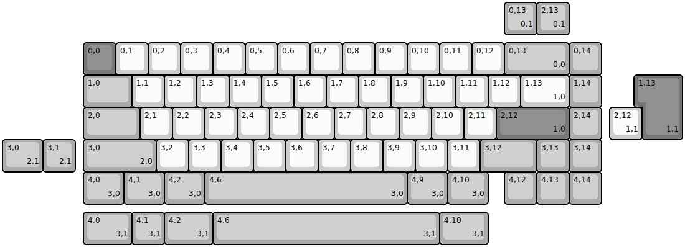{:loading="lazy"}

[Open in keyboard-layout-editor](http://www.keyboard-layout-editor.com/##@@_x:2.5&y:1.25&c=#777777;&=0,0&_c=#cccccc;&=0,1&=0,2&=0,3&=0,4&=0,5&=0,6&=0,7&=0,8&=0,9&=0,10&=0,11&=0,12&_c=#aaaaaa&w:2;&=0,13%0A%0A%0A0,0&=0,14;&@_x:2.5&w:1.5;&=1,0&_c=#cccccc;&=1,1&=1,2&=1,3&=1,4&=1,5&=1,6&=1,7&=1,8&=1,9&=1,10&=1,11&=1,12&_w:1.5;&=1,13%0A%0A%0A1,0&_c=#aaaaaa;&=1,14;&@_x:2.5&w:1.75;&=2,0&_c=#cccccc;&=2,1&=2,2&=2,3&=2,4&=2,5&=2,6&=2,7&=2,8&=2,9&=2,10&=2,11&_c=#777777&w:2.25;&=2,12%0A%0A%0A1,0&_c=#aaaaaa;&=2,14;&@_x:2.5&w:2.25;&=3,0%0A%0A%0A2,0&_c=#cccccc;&=3,2&=3,3&=3,4&=3,5&=3,6&=3,7&=3,8&=3,9&=3,10&=3,11&_c=#aaaaaa&w:1.75;&=3,12&=3,13&=3,14;&@_x:2.5&w:1.25;&=4,0%0A%0A%0A3,0&_w:1.25;&=4,1%0A%0A%0A3,0&_w:1.25;&=4,2%0A%0A%0A3,0&_w:6.25;&=4,6%0A%0A%0A3,0&_w:1.25;&=4,9%0A%0A%0A3,0&_w:1.25;&=4,10%0A%0A%0A3,0&_x:0.5;&=4,12&=4,13&=4,14;&@_x:15.5&y:-6.25;&=0,13%0A%0A%0A0,1&=2,13%0A%0A%0A0,1;&@_x:19.75&y:1.25&c=#777777&w:1.25&h:2&w2:1.5&h2:1&x2:-0.25;&=1,13%0A%0A%0A1,1;&@_x:18.75&c=#cccccc;&=2,12%0A%0A%0A1,1;&@_c=#aaaaaa&w:1.25;&=3,0%0A%0A%0A2,1&=3,1%0A%0A%0A2,1;&@_x:2.5&y:1.25&w:1.5;&=4,0%0A%0A%0A3,1&=4,1%0A%0A%0A3,1&_w:1.5;&=4,2%0A%0A%0A3,1&_w:7;&=4,6%0A%0A%0A3,1&_w:1.5;&=4,10%0A%0A%0A3,1)

## fjlabs/avalon

[README](output/fjlabs/avalon/README.md) - [layout](output/fjlabs/avalon/avalon-kle.json) - [PCB](output/fjlabs/avalon/avalon.kicad_pcb) - [PCB render](output/fjlabs/avalon/avalon-render.svg)

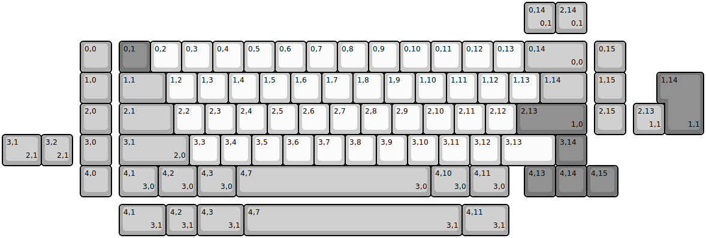{:loading="lazy"}

[Open in keyboard-layout-editor](http://www.keyboard-layout-editor.com/##@@_x:2.5&y:1.25&c=#aaaaaa;&=0,0&_x:0.25&c=#777777;&=0,1&_c=#cccccc;&=0,2&=0,3&=0,4&=0,5&=0,6&=0,7&=0,8&=0,9&=0,10&=0,11&=0,12&=0,13&_c=#aaaaaa&w:2;&=0,14%0A%0A%0A0,0&_x:0.25;&=0,15;&@_x:2.5;&=1,0&_x:0.25&w:1.5;&=1,1&_c=#cccccc;&=1,2&=1,3&=1,4&=1,5&=1,6&=1,7&=1,8&=1,9&=1,10&=1,11&=1,12&=1,13&_c=#aaaaaa&w:1.5;&=1,14&_x:0.25;&=1,15;&@_x:2.5;&=2,0&_x:0.25&w:1.75;&=2,1&_c=#cccccc;&=2,2&=2,3&=2,4&=2,5&=2,6&=2,7&=2,8&=2,9&=2,10&=2,11&=2,12&_c=#777777&w:2.25;&=2,13%0A%0A%0A1,0&_x:0.25&c=#aaaaaa;&=2,15;&@_x:2.5;&=3,0&_x:0.25&w:2.25;&=3,1%0A%0A%0A2,0&_c=#cccccc;&=3,3&=3,4&=3,5&=3,6&=3,7&=3,8&=3,9&=3,10&=3,11&=3,12&_w:1.75;&=3,13&_c=#777777;&=3,14;&@_x:2.5&c=#aaaaaa;&=4,0&_x:0.25&w:1.25;&=4,1%0A%0A%0A3,0&_w:1.25;&=4,2%0A%0A%0A3,0&_w:1.25;&=4,3%0A%0A%0A3,0&_w:6.25;&=4,7%0A%0A%0A3,0&_w:1.25;&=4,10%0A%0A%0A3,0&_w:1.25;&=4,11%0A%0A%0A3,0&_x:0.5&c=#777777;&=4,13&=4,14&=4,15;&@_x:16.75&y:-6.25&c=#aaaaaa;&=0,14%0A%0A%0A0,1&=2,14%0A%0A%0A0,1;&@_x:21.25&y:1.25&c=#777777&w:1.25&h:2&w2:1.5&h2:1&x2:-0.25;&=1,14%0A%0A%0A1,1;&@_x:20.25&c=#aaaaaa;&=2,13%0A%0A%0A1,1;&@_w:1.25;&=3,1%0A%0A%0A2,1&=3,2%0A%0A%0A2,1;&@_x:3.75&y:1.25&w:1.5;&=4,1%0A%0A%0A3,1&=4,2%0A%0A%0A3,1&_w:1.5;&=4,3%0A%0A%0A3,1&_w:7;&=4,7%0A%0A%0A3,1&_w:1.5;&=4,11%0A%0A%0A3,1)

## fjlabs/bks65

[README](output/fjlabs/bks65/README.md) - [layout](output/fjlabs/bks65/bks65-kle.json) - [PCB](output/fjlabs/bks65/bks65.kicad_pcb) - [PCB render](output/fjlabs/bks65/bks65-render.svg)

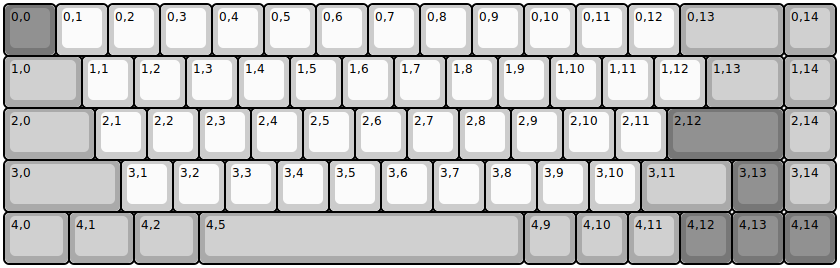{:loading="lazy"}

[Open in keyboard-layout-editor](http://www.keyboard-layout-editor.com/##@@_c=#777777;&=0,0&_c=#cccccc;&=0,1&=0,2&=0,3&=0,4&=0,5&=0,6&=0,7&=0,8&=0,9&=0,10&=0,11&=0,12&_c=#aaaaaa&w:2;&=0,13&=0,14;&@_w:1.5;&=1,0&_c=#cccccc;&=1,1&=1,2&=1,3&=1,4&=1,5&=1,6&=1,7&=1,8&=1,9&=1,10&=1,11&=1,12&_c=#aaaaaa&w:1.5;&=1,13&=1,14;&@_w:1.75;&=2,0&_c=#cccccc;&=2,1&=2,2&=2,3&=2,4&=2,5&=2,6&=2,7&=2,8&=2,9&=2,10&=2,11&_c=#777777&w:2.25;&=2,12&_c=#aaaaaa;&=2,14;&@_w:2.25;&=3,0&_c=#cccccc;&=3,1&=3,2&=3,3&=3,4&=3,5&=3,6&=3,7&=3,8&=3,9&=3,10&_c=#aaaaaa&w:1.75;&=3,11&_c=#777777;&=3,13&_c=#aaaaaa;&=3,14;&@_w:1.25;&=4,0&_w:1.25;&=4,1&_w:1.25;&=4,2&_w:6.25;&=4,5&=4,9&=4,10&=4,11&_c=#777777;&=4,12&=4,13&=4,14)

## fjlabs/bks65solder

[README](output/fjlabs/bks65solder/README.md) - [layout](output/fjlabs/bks65solder/bks65solder-kle.json) - [PCB](output/fjlabs/bks65solder/bks65solder.kicad_pcb) - [PCB render](output/fjlabs/bks65solder/bks65solder-render.svg)

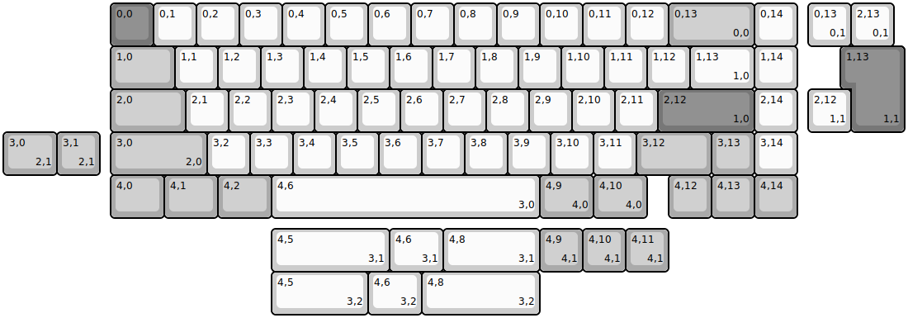{:loading="lazy"}

[Open in keyboard-layout-editor](http://www.keyboard-layout-editor.com/##@@_x:2.5&c=#777777;&=0,0&_c=#cccccc;&=0,1&=0,2&=0,3&=0,4&=0,5&=0,6&=0,7&=0,8&=0,9&=0,10&=0,11&=0,12&_c=#aaaaaa&w:2;&=0,13%0A%0A%0A0,0&_c=#cccccc;&=0,14;&@_x:2.5&c=#aaaaaa&w:1.5;&=1,0&_c=#cccccc;&=1,1&=1,2&=1,3&=1,4&=1,5&=1,6&=1,7&=1,8&=1,9&=1,10&=1,11&=1,12&_w:1.5;&=1,13%0A%0A%0A1,0&=1,14;&@_x:2.5&c=#aaaaaa&w:1.75;&=2,0&_c=#cccccc;&=2,1&=2,2&=2,3&=2,4&=2,5&=2,6&=2,7&=2,8&=2,9&=2,10&=2,11&_c=#777777&w:2.25;&=2,12%0A%0A%0A1,0&_c=#cccccc;&=2,14;&@_x:2.5&c=#aaaaaa&w:2.25;&=3,0%0A%0A%0A2,0&_c=#cccccc;&=3,2&=3,3&=3,4&=3,5&=3,6&=3,7&=3,8&=3,9&=3,10&=3,11&_c=#aaaaaa&w:1.75;&=3,12&=3,13&_c=#cccccc;&=3,14;&@_x:2.5&c=#aaaaaa&w:1.25;&=4,0&_w:1.25;&=4,1&_w:1.25;&=4,2&_c=#cccccc&w:6.25;&=4,6%0A%0A%0A3,0&_c=#aaaaaa&w:1.25;&=4,9%0A%0A%0A4,0&_w:1.25;&=4,10%0A%0A%0A4,0&_x:0.5;&=4,12&=4,13&=4,14;&@_x:18.75&y:-5&c=#cccccc;&=0,13%0A%0A%0A0,1&=2,13%0A%0A%0A0,1;&@_x:19.75&c=#777777&w:1.25&h:2&w2:1.5&h2:1&x2:-0.25;&=1,13%0A%0A%0A1,1;&@_x:18.75&c=#cccccc;&=2,12%0A%0A%0A1,1;&@_c=#aaaaaa&w:1.25;&=3,0%0A%0A%0A2,1&=3,1%0A%0A%0A2,1;&@_x:6.25&y:1.25&c=#cccccc&w:2.75;&=4,5%0A%0A%0A3,1&_w:1.25;&=4,6%0A%0A%0A3,1&_w:2.25;&=4,8%0A%0A%0A3,1&_c=#aaaaaa;&=4,9%0A%0A%0A4,1&=4,10%0A%0A%0A4,1&=4,11%0A%0A%0A4,1;&@_x:6.25&c=#cccccc&w:2.25;&=4,5%0A%0A%0A3,2&_w:1.25;&=4,6%0A%0A%0A3,2&_w:2.75;&=4,8%0A%0A%0A3,2)

## fjlabs/bolsa65

[README](output/fjlabs/bolsa65/README.md) - [layout](output/fjlabs/bolsa65/bolsa65-kle.json) - [PCB](output/fjlabs/bolsa65/bolsa65.kicad_pcb) - [PCB render](output/fjlabs/bolsa65/bolsa65-render.svg)

{:loading="lazy"}

[Open in keyboard-layout-editor](http://www.keyboard-layout-editor.com/##@@_c=#777777;&=0,0&_c=#cccccc;&=0,1&=0,2&=0,3&=0,4&=0,5&=0,6&=0,7&=0,8&=0,9&=0,10&=0,11&=0,12&_c=#aaaaaa&w:2;&=0,13&=0,14;&@_w:1.5;&=1,0&_c=#cccccc;&=1,1&=1,2&=1,3&=1,4&=1,5&=1,6&=1,7&=1,8&=1,9&=1,10&=1,11&=1,12&_c=#aaaaaa&w:1.5;&=1,13&=1,14;&@_w:1.75;&=2,0&_c=#cccccc;&=2,1&=2,2&=2,3&=2,4&=2,5&=2,6&=2,7&=2,8&=2,9&=2,10&=2,11&_c=#777777&w:2.25;&=2,12&_c=#aaaaaa;&=2,14;&@_w:2.25;&=3,0&_c=#cccccc;&=3,1&=3,2&=3,3&=3,4&=3,5&=3,6&=3,7&=3,8&=3,9&=3,10&_c=#aaaaaa&w:1.75;&=3,11&_c=#777777;&=3,13&_c=#aaaaaa;&=3,14;&@_w:1.25;&=4,0&_w:1.25;&=4,1&_w:1.25;&=4,2&_w:6.25;&=4,4&_w:1.25;&=4,9&_w:1.25;&=4,10&_x:0.5&c=#777777;&=4,12&=4,13&=4,14)

## fjlabs/kf87

[README](output/fjlabs/kf87/README.md) - [layout](output/fjlabs/kf87/kf87-kle.json) - [PCB](output/fjlabs/kf87/kf87.kicad_pcb) - [PCB render](output/fjlabs/kf87/kf87-render.svg)

{:loading="lazy"}

[Open in keyboard-layout-editor](http://www.keyboard-layout-editor.com/##@@=0,0&_x:1;&=0,2&=0,3&=0,4&=0,5&_x:0.5;&=0,6&=0,7&=0,8&=0,9&_x:0.5;&=0,10&=0,11&=0,12&=0,13&_x:0.25;&=0,14&=0,15&=0,16;&@_y:0.5;&=1,0&=1,1&=1,2&=1,3&=1,4&=1,5&=1,6&=1,7&=1,8&=1,9&=1,10&=1,11&=1,12&_w:2;&=1,13&_x:0.25;&=1,14&=1,15&=1,16;&@_w:1.5;&=2,0&=2,1&=2,2&=2,3&=2,4&=2,5&=2,6&=2,7&=2,8&=2,9&=2,10&=2,11&=2,12&_w:1.5;&=2,13&_x:0.25;&=2,14&=2,15&=2,16;&@_w:1.75;&=3,0&=3,1&=3,2&=3,3&=3,4&=3,5&=3,6&=3,7&=3,8&=3,9&=3,10&=3,11&_w:2.25;&=3,13;&@_w:2.25;&=4,0&=4,1&=4,2&=4,3&=4,4&=4,5&=4,6&=4,7&=4,8&=4,9&=4,10&_w:2.75;&=4,12&_x:1.25;&=4,15;&@_w:1.25;&=5,0&_w:1.25;&=5,1&_w:1.25;&=5,2&_w:6.25;&=5,5&_w:1.25;&=5,9&_w:1.25;&=5,10&_w:1.25;&=5,11&_w:1.25;&=5,13&_x:0.25;&=5,14&=5,15&=5,16)

## fjlabs/kyuu

[README](output/fjlabs/kyuu/README.md) - [layout](output/fjlabs/kyuu/kyuu-kle.json) - [PCB](output/fjlabs/kyuu/kyuu.kicad_pcb) - [PCB render](output/fjlabs/kyuu/kyuu-render.svg)

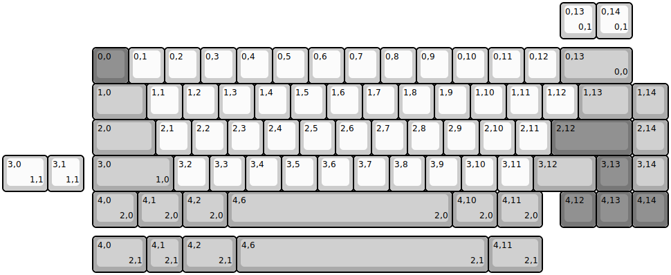{:loading="lazy"}

[Open in keyboard-layout-editor](http://www.keyboard-layout-editor.com/##@@_x:2.5&y:1.25&c=#777777;&=0,0&_c=#cccccc;&=0,1&=0,2&=0,3&=0,4&=0,5&=0,6&=0,7&=0,8&=0,9&=0,10&=0,11&=0,12&_c=#aaaaaa&w:2;&=0,13%0A%0A%0A0,0;&@_x:2.5&w:1.5;&=1,0&_c=#cccccc;&=1,1&=1,2&=1,3&=1,4&=1,5&=1,6&=1,7&=1,8&=1,9&=1,10&=1,11&=1,12&_c=#aaaaaa&w:1.5;&=1,13&=1,14;&@_x:2.5&w:1.75;&=2,0&_c=#cccccc;&=2,1&=2,2&=2,3&=2,4&=2,5&=2,6&=2,7&=2,8&=2,9&=2,10&=2,11&_c=#777777&w:2.25;&=2,12&_c=#aaaaaa;&=2,14;&@_x:2.5&w:2.25;&=3,0%0A%0A%0A1,0&_c=#cccccc;&=3,2&=3,3&=3,4&=3,5&=3,6&=3,7&=3,8&=3,9&=3,10&=3,11&_c=#aaaaaa&w:1.75;&=3,12&_c=#777777;&=3,13&_c=#aaaaaa;&=3,14;&@_x:2.5&w:1.25;&=4,0%0A%0A%0A2,0&_w:1.25;&=4,1%0A%0A%0A2,0&_w:1.25;&=4,2%0A%0A%0A2,0&_w:6.25;&=4,6%0A%0A%0A2,0&_w:1.25;&=4,10%0A%0A%0A2,0&_w:1.25;&=4,11%0A%0A%0A2,0&_x:0.5&c=#777777;&=4,12&=4,13&=4,14;&@_x:15.5&y:-6.25&c=#cccccc;&=0,13%0A%0A%0A0,1&=0,14%0A%0A%0A0,1;&@_y:3.25&w:1.25;&=3,0%0A%0A%0A1,1&=3,1%0A%0A%0A1,1;&@_x:2.5&y:1.25&c=#aaaaaa&w:1.5;&=4,0%0A%0A%0A2,1&=4,1%0A%0A%0A2,1&_w:1.5;&=4,2%0A%0A%0A2,1&_w:7;&=4,6%0A%0A%0A2,1&_w:1.5;&=4,11%0A%0A%0A2,1)

## fjlabs/ldk65

[README](output/fjlabs/ldk65/README.md) - [layout](output/fjlabs/ldk65/ldk65-kle.json) - [PCB](output/fjlabs/ldk65/ldk65.kicad_pcb) - [PCB render](output/fjlabs/ldk65/ldk65-render.svg)

{:loading="lazy"}

[Open in keyboard-layout-editor](http://www.keyboard-layout-editor.com/##@@_c=#777777;&=0,0&_c=#cccccc;&=0,1&=0,2&=0,3&=0,4&=0,5&=0,6&=0,7&=0,8&=0,9&=0,10&=0,11&=0,12&_c=#aaaaaa&w:2;&=0,13&=0,14;&@_w:1.5;&=1,0&_c=#cccccc;&=1,1&=1,2&=1,3&=1,4&=1,5&=1,6&=1,7&=1,8&=1,9&=1,10&=1,11&=1,12&_c=#aaaaaa&w:1.5;&=1,13&=1,14;&@_w:1.75;&=2,0&_c=#cccccc;&=2,1&=2,2&=2,3&=2,4&=2,5&=2,6&=2,7&=2,8&=2,9&=2,10&=2,11&_c=#777777&w:2.25;&=2,12&_c=#aaaaaa;&=2,14;&@_w:2.25;&=3,0&_c=#cccccc;&=3,1&=3,2&=3,3&=3,4&=3,5&=3,6&=3,7&=3,8&=3,9&=3,10&_c=#aaaaaa&w:1.75;&=3,11&_c=#777777;&=3,13&_c=#aaaaaa;&=3,14;&@_w:1.25;&=4,0&_w:1.25;&=4,1&_w:1.25;&=4,2&_w:6.25;&=4,5&=4,9&=4,10&=4,11&_c=#777777;&=4,12&=4,13&=4,14)

## fjlabs/midway60

[README](output/fjlabs/midway60/README.md) - [layout](output/fjlabs/midway60/midway60-kle.json) - [PCB](output/fjlabs/midway60/midway60.kicad_pcb) - [PCB render](output/fjlabs/midway60/midway60-render.svg)

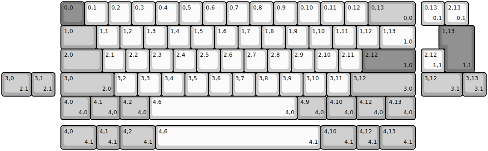{:loading="lazy"}

[Open in keyboard-layout-editor](http://www.keyboard-layout-editor.com/##@@_x:2.5&c=#777777;&=0,0&_c=#cccccc;&=0,1&=0,2&=0,3&=0,4&=0,5&=0,6&=0,7&=0,8&=0,9&=0,10&=0,11&=0,12&_c=#aaaaaa&w:2;&=0,13%0A%0A%0A0,0;&@_x:2.5&w:1.5;&=1,0&_c=#cccccc;&=1,1&=1,2&=1,3&=1,4&=1,5&=1,6&=1,7&=1,8&=1,9&=1,10&=1,11&=1,12&_w:1.5;&=1,13%0A%0A%0A1,0;&@_x:2.5&c=#aaaaaa&w:1.75;&=2,0&_c=#cccccc;&=2,1&=2,2&=2,3&=2,4&=2,5&=2,6&=2,7&=2,8&=2,9&=2,10&=2,11&_c=#777777&w:2.25;&=2,12%0A%0A%0A1,0;&@_x:2.5&c=#aaaaaa&w:2.25;&=3,0%0A%0A%0A2,0&_c=#cccccc;&=3,2&=3,3&=3,4&=3,5&=3,6&=3,7&=3,8&=3,9&=3,10&=3,11&_c=#aaaaaa&w:2.75;&=3,12%0A%0A%0A3,0;&@_x:2.5&w:1.25;&=4,0%0A%0A%0A4,0&_w:1.25;&=4,1%0A%0A%0A4,0&_w:1.25;&=4,2%0A%0A%0A4,0&_c=#cccccc&w:6.25;&=4,6%0A%0A%0A4,0&_c=#aaaaaa&w:1.25;&=4,9%0A%0A%0A4,0&_w:1.25;&=4,10%0A%0A%0A4,0&_w:1.25;&=4,12%0A%0A%0A4,0&_w:1.25;&=4,13%0A%0A%0A4,0;&@_x:17.75&y:-5&c=#cccccc;&=0,13%0A%0A%0A0,1&=2,13%0A%0A%0A0,1;&@_x:18.75&c=#777777&w:1.25&h:2&w2:1.5&h2:1&x2:-0.25;&=1,13%0A%0A%0A1,1;&@_x:17.75&c=#cccccc;&=2,12%0A%0A%0A1,1;&@_c=#aaaaaa&w:1.25;&=3,0%0A%0A%0A2,1&=3,1%0A%0A%0A2,1&_x:15.5&w:1.75;&=3,12%0A%0A%0A3,1&=3,13%0A%0A%0A3,1;&@_x:2.5&y:1.25&w:1.5;&=4,0%0A%0A%0A4,1&=4,1%0A%0A%0A4,1&_w:1.5;&=4,2%0A%0A%0A4,1&_c=#cccccc&w:7;&=4,6%0A%0A%0A4,1&_c=#aaaaaa&w:1.5;&=4,10%0A%0A%0A4,1&=4,12%0A%0A%0A4,1&_w:1.5;&=4,13%0A%0A%0A4,1)

## fjlabs/mk61-rgb-ansi

[README](output/fjlabs/mk61-rgb-ansi/README.md) - [layout](output/fjlabs/mk61-rgb-ansi/mk61-rgb-ansi-kle.json) - [PCB](output/fjlabs/mk61-rgb-ansi/mk61-rgb-ansi.kicad_pcb) - [PCB render](output/fjlabs/mk61-rgb-ansi/mk61-rgb-ansi-render.svg)

{:loading="lazy"}

[Open in keyboard-layout-editor](http://www.keyboard-layout-editor.com/##@@_c=#777777;&=0,0&_c=#cccccc;&=0,1&=0,2&=0,3&=0,4&=0,5&=0,6&=0,7&=0,8&=0,9&=0,10&=0,11&=0,12&_c=#aaaaaa&w:2;&=0,13;&@_w:1.5;&=1,0&_c=#cccccc;&=1,1&=1,2&=1,3&=1,4&=1,5&=1,6&=1,7&=1,8&=1,9&=1,10&=1,11&=1,12&_w:1.5;&=1,13;&@_c=#aaaaaa&w:1.75;&=2,0&_c=#cccccc;&=2,1&=2,2&=2,3&=2,4&=2,5&=2,6&=2,7&=2,8&=2,9&=2,10&=2,11&_c=#777777&w:2.25;&=2,13;&@_c=#aaaaaa&w:2.25;&=3,0&_c=#cccccc;&=3,1&=3,2&=3,3&=3,4&=3,5&=3,6&=3,7&=3,8&=3,9&=3,10&_c=#777777&w:2.75;&=3,12;&@_c=#aaaaaa&w:1.25;&=4,0&_w:1.25;&=4,1&_w:1.25;&=4,2&_c=#cccccc&w:6.25;&=4,5&_c=#aaaaaa&w:1.25;&=4,9&_w:1.25;&=4,10&_w:1.25;&=4,12&_w:1.25;&=4,13)

## fjlabs/polaris

[README](output/fjlabs/polaris/README.md) - [layout](output/fjlabs/polaris/polaris-kle.json) - [PCB](output/fjlabs/polaris/polaris.kicad_pcb) - [PCB render](output/fjlabs/polaris/polaris-render.svg)

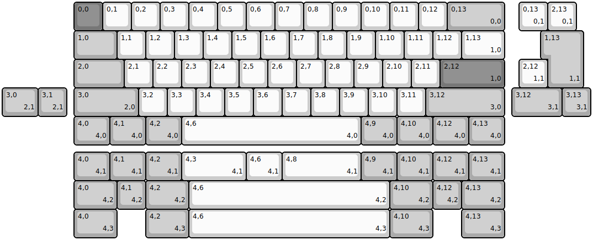{:loading="lazy"}

[Open in keyboard-layout-editor](http://www.keyboard-layout-editor.com/##@@_x:2.5&c=#777777;&=0,0&_c=#cccccc;&=0,1&=0,2&=0,3&=0,4&=0,5&=0,6&=0,7&=0,8&=0,9&=0,10&=0,11&=0,12&_c=#aaaaaa&w:2;&=0,13%0A%0A%0A0,0;&@_x:2.5&w:1.5;&=1,0&_c=#cccccc;&=1,1&=1,2&=1,3&=1,4&=1,5&=1,6&=1,7&=1,8&=1,9&=1,10&=1,11&=1,12&_w:1.5;&=1,13%0A%0A%0A1,0;&@_x:2.5&c=#aaaaaa&w:1.75;&=2,0&_c=#cccccc;&=2,1&=2,2&=2,3&=2,4&=2,5&=2,6&=2,7&=2,8&=2,9&=2,10&=2,11&_c=#777777&w:2.25;&=2,12%0A%0A%0A1,0;&@_x:2.5&c=#aaaaaa&w:2.25;&=3,0%0A%0A%0A2,0&_c=#cccccc;&=3,2&=3,3&=3,4&=3,5&=3,6&=3,7&=3,8&=3,9&=3,10&=3,11&_c=#aaaaaa&w:2.75;&=3,12%0A%0A%0A3,0;&@_x:2.5&w:1.25;&=4,0%0A%0A%0A4,0&_w:1.25;&=4,1%0A%0A%0A4,0&_w:1.25;&=4,2%0A%0A%0A4,0&_c=#cccccc&w:6.25;&=4,6%0A%0A%0A4,0&_c=#aaaaaa&w:1.25;&=4,9%0A%0A%0A4,0&_w:1.25;&=4,10%0A%0A%0A4,0&_w:1.25;&=4,12%0A%0A%0A4,0&_w:1.25;&=4,13%0A%0A%0A4,0;&@_x:18.0&y:-5&c=#cccccc;&=0,13%0A%0A%0A0,1&=2,13%0A%0A%0A0,1;&@_x:19.0&c=#aaaaaa&w:1.25&h:2&w2:1.5&h2:1&x2:-0.25;&=1,13%0A%0A%0A1,1;&@_x:18.0&c=#cccccc;&=2,12%0A%0A%0A1,1;&@_c=#aaaaaa&w:1.25;&=3,0%0A%0A%0A2,1&=3,1%0A%0A%0A2,1&_x:15.5&w:1.75;&=3,12%0A%0A%0A3,1&=3,13%0A%0A%0A3,1;&@_x:2.5&y:1.25&w:1.25;&=4,0%0A%0A%0A4,1&_w:1.25;&=4,1%0A%0A%0A4,1&_w:1.25;&=4,2%0A%0A%0A4,1&_c=#cccccc&w:2.25;&=4,3%0A%0A%0A4,1&_w:1.25;&=4,6%0A%0A%0A4,1&_w:2.75;&=4,8%0A%0A%0A4,1&_c=#aaaaaa&w:1.25;&=4,9%0A%0A%0A4,1&_w:1.25;&=4,10%0A%0A%0A4,1&_w:1.25;&=4,12%0A%0A%0A4,1&_w:1.25;&=4,13%0A%0A%0A4,1;&@_x:2.5&w:1.5;&=4,0%0A%0A%0A4,2&=4,1%0A%0A%0A4,2&_w:1.5;&=4,2%0A%0A%0A4,2&_c=#cccccc&w:7;&=4,6%0A%0A%0A4,2&_c=#aaaaaa&w:1.5;&=4,10%0A%0A%0A4,2&=4,12%0A%0A%0A4,2&_w:1.5;&=4,13%0A%0A%0A4,2;&@_x:2.5&w:1.5;&=4,0%0A%0A%0A4,3&_x:1.0&w:1.5;&=4,2%0A%0A%0A4,3&_c=#cccccc&w:7;&=4,6%0A%0A%0A4,3&_c=#aaaaaa&w:1.5;&=4,10%0A%0A%0A4,3&_x:1.0&w:1.5;&=4,13%0A%0A%0A4,3)

## fjlabs/ready100

[README](output/fjlabs/ready100/README.md) - [layout](output/fjlabs/ready100/ready100-kle.json) - [PCB](output/fjlabs/ready100/ready100.kicad_pcb) - [PCB render](output/fjlabs/ready100/ready100-render.svg)

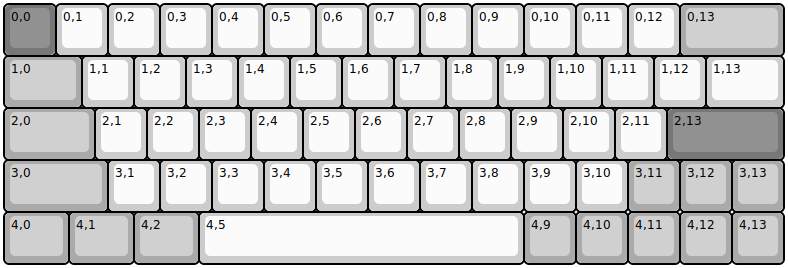{:loading="lazy"}

[Open in keyboard-layout-editor](http://www.keyboard-layout-editor.com/##@@_c=#777777;&=0,0&_c=#cccccc;&=0,1&=0,2&=0,3&=0,4&=0,5&=0,6&=0,7&=0,8&=0,9&=0,10&=0,11&=0,12&_c=#aaaaaa&w:2;&=0,13;&@_w:1.5;&=1,0&_c=#cccccc;&=1,1&=1,2&=1,3&=1,4&=1,5&=1,6&=1,7&=1,8&=1,9&=1,10&=1,11&=1,12&_w:1.5;&=1,13;&@_c=#aaaaaa&w:1.75;&=2,0&_c=#cccccc;&=2,1&=2,2&=2,3&=2,4&=2,5&=2,6&=2,7&=2,8&=2,9&=2,10&=2,11&_c=#777777&w:2.25;&=2,13;&@_c=#aaaaaa&w:2;&=3,0&_c=#cccccc;&=3,1&=3,2&=3,3&=3,4&=3,5&=3,6&=3,7&=3,8&=3,9&=3,10&_c=#aaaaaa;&=3,11&=3,12&=3,13;&@_w:1.25;&=4,0&_w:1.25;&=4,1&_w:1.25;&=4,2&_c=#cccccc&w:6.25;&=4,5&_c=#aaaaaa;&=4,9&=4,10&=4,11&=4,12&=4,13)

## fjlabs/sinanju

[README](output/fjlabs/sinanju/README.md) - [layout](output/fjlabs/sinanju/sinanju-kle.json) - [PCB](output/fjlabs/sinanju/sinanju.kicad_pcb) - [PCB render](output/fjlabs/sinanju/sinanju-render.svg)

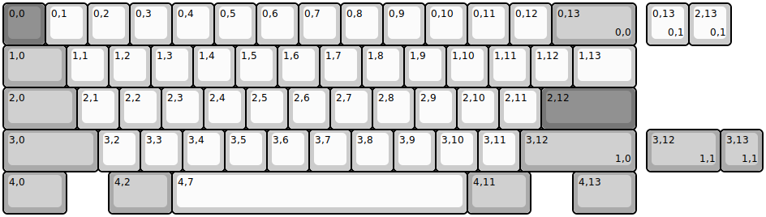{:loading="lazy"}

[Open in keyboard-layout-editor](http://www.keyboard-layout-editor.com/##@@_c=#777777;&=0,0&_c=#cccccc;&=0,1&=0,2&=0,3&=0,4&=0,5&=0,6&=0,7&=0,8&=0,9&=0,10&=0,11&=0,12&_c=#aaaaaa&w:2;&=0,13%0A%0A%0A0,0;&@_w:1.5;&=1,0&_c=#cccccc;&=1,1&=1,2&=1,3&=1,4&=1,5&=1,6&=1,7&=1,8&=1,9&=1,10&=1,11&=1,12&_w:1.5;&=1,13;&@_c=#aaaaaa&w:1.75;&=2,0&_c=#cccccc;&=2,1&=2,2&=2,3&=2,4&=2,5&=2,6&=2,7&=2,8&=2,9&=2,10&=2,11&_c=#777777&w:2.25;&=2,12;&@_c=#aaaaaa&w:2.25;&=3,0&_c=#cccccc;&=3,2&=3,3&=3,4&=3,5&=3,6&=3,7&=3,8&=3,9&=3,10&=3,11&_c=#aaaaaa&w:2.75;&=3,12%0A%0A%0A1,0;&@_w:1.5;&=4,0&_x:1.0&w:1.5;&=4,2&_c=#cccccc&w:7;&=4,7&_c=#aaaaaa&w:1.5;&=4,11&_x:1.0&w:1.5;&=4,13;&@_x:15.25&y:-5&c=#cccccc;&=0,13%0A%0A%0A0,1&=2,13%0A%0A%0A0,1;&@_x:15.25&y:2&c=#aaaaaa&w:1.75;&=3,12%0A%0A%0A1,1&=3,13%0A%0A%0A1,1)

## fjlabs/sinanjuwk

[README](output/fjlabs/sinanjuwk/README.md) - [layout](output/fjlabs/sinanjuwk/sinanjuwk-kle.json) - [PCB](output/fjlabs/sinanjuwk/sinanjuwk.kicad_pcb) - [PCB render](output/fjlabs/sinanjuwk/sinanjuwk-render.svg)

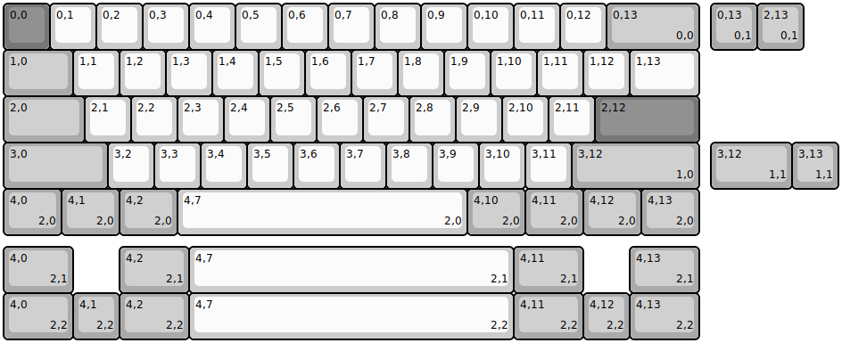{:loading="lazy"}

[Open in keyboard-layout-editor](http://www.keyboard-layout-editor.com/##@@_c=#777777;&=0,0&_c=#cccccc;&=0,1&=0,2&=0,3&=0,4&=0,5&=0,6&=0,7&=0,8&=0,9&=0,10&=0,11&=0,12&_c=#aaaaaa&w:2;&=0,13%0A%0A%0A0,0;&@_w:1.5;&=1,0&_c=#cccccc;&=1,1&=1,2&=1,3&=1,4&=1,5&=1,6&=1,7&=1,8&=1,9&=1,10&=1,11&=1,12&_w:1.5;&=1,13;&@_c=#aaaaaa&w:1.75;&=2,0&_c=#cccccc;&=2,1&=2,2&=2,3&=2,4&=2,5&=2,6&=2,7&=2,8&=2,9&=2,10&=2,11&_c=#777777&w:2.25;&=2,12;&@_c=#aaaaaa&w:2.25;&=3,0&_c=#cccccc;&=3,2&=3,3&=3,4&=3,5&=3,6&=3,7&=3,8&=3,9&=3,10&=3,11&_c=#aaaaaa&w:2.75;&=3,12%0A%0A%0A1,0;&@_w:1.25;&=4,0%0A%0A%0A2,0&_w:1.25;&=4,1%0A%0A%0A2,0&_w:1.25;&=4,2%0A%0A%0A2,0&_c=#cccccc&w:6.25;&=4,7%0A%0A%0A2,0&_c=#aaaaaa&w:1.25;&=4,10%0A%0A%0A2,0&_w:1.25;&=4,11%0A%0A%0A2,0&_w:1.25;&=4,12%0A%0A%0A2,0&_w:1.25;&=4,13%0A%0A%0A2,0;&@_x:15.25&y:-5;&=0,13%0A%0A%0A0,1&=2,13%0A%0A%0A0,1;&@_x:15.25&y:2&w:1.75;&=3,12%0A%0A%0A1,1&=3,13%0A%0A%0A1,1;&@_y:1.25&w:1.5;&=4,0%0A%0A%0A2,1&_x:1.0&w:1.5;&=4,2%0A%0A%0A2,1&_c=#cccccc&w:7;&=4,7%0A%0A%0A2,1&_c=#aaaaaa&w:1.5;&=4,11%0A%0A%0A2,1&_x:1.0&w:1.5;&=4,13%0A%0A%0A2,1;&@_w:1.5;&=4,0%0A%0A%0A2,2&=4,1%0A%0A%0A2,2&_w:1.5;&=4,2%0A%0A%0A2,2&_c=#cccccc&w:7;&=4,7%0A%0A%0A2,2&_c=#aaaaaa&w:1.5;&=4,11%0A%0A%0A2,2&=4,12%0A%0A%0A2,2&_w:1.5;&=4,13%0A%0A%0A2,2)

## fjlabs/solanis

[README](output/fjlabs/solanis/README.md) - [layout](output/fjlabs/solanis/solanis-kle.json) - [PCB](output/fjlabs/solanis/solanis.kicad_pcb) - [PCB render](output/fjlabs/solanis/solanis-render.svg)

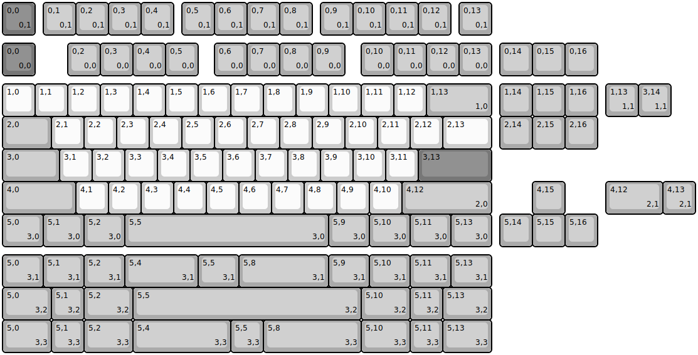{:loading="lazy"}

[Open in keyboard-layout-editor](http://www.keyboard-layout-editor.com/##@@_y:1.25&c=#777777;&=0,0%0A%0A%0A0,0&_x:1&c=#aaaaaa;&=0,2%0A%0A%0A0,0&=0,3%0A%0A%0A0,0&=0,4%0A%0A%0A0,0&=0,5%0A%0A%0A0,0&_x:0.5;&=0,6%0A%0A%0A0,0&=0,7%0A%0A%0A0,0&=0,8%0A%0A%0A0,0&=0,9%0A%0A%0A0,0&_x:0.5;&=0,10%0A%0A%0A0,0&=0,11%0A%0A%0A0,0&=0,12%0A%0A%0A0,0&=0,13%0A%0A%0A0,0&_x:0.25;&=0,14&=0,15&=0,16;&@_y:0.25&c=#cccccc;&=1,0&=1,1&=1,2&=1,3&=1,4&=1,5&=1,6&=1,7&=1,8&=1,9&=1,10&=1,11&=1,12&_c=#aaaaaa&w:2;&=1,13%0A%0A%0A1,0&_x:0.25;&=1,14&=1,15&=1,16;&@_w:1.5;&=2,0&_c=#cccccc;&=2,1&=2,2&=2,3&=2,4&=2,5&=2,6&=2,7&=2,8&=2,9&=2,10&=2,11&=2,12&_w:1.5;&=2,13&_x:0.25&c=#aaaaaa;&=2,14&=2,15&=2,16;&@_w:1.75;&=3,0&_c=#cccccc;&=3,1&=3,2&=3,3&=3,4&=3,5&=3,6&=3,7&=3,8&=3,9&=3,10&=3,11&_c=#777777&w:2.25;&=3,13;&@_c=#aaaaaa&w:2.25;&=4,0&_c=#cccccc;&=4,1&=4,2&=4,3&=4,4&=4,5&=4,6&=4,7&=4,8&=4,9&=4,10&_c=#aaaaaa&w:2.75;&=4,12%0A%0A%0A2,0&_x:1.25;&=4,15;&@_w:1.25;&=5,0%0A%0A%0A3,0&_w:1.25;&=5,1%0A%0A%0A3,0&_w:1.25;&=5,2%0A%0A%0A3,0&_w:6.25;&=5,5%0A%0A%0A3,0&_w:1.25;&=5,9%0A%0A%0A3,0&_w:1.25;&=5,10%0A%0A%0A3,0&_w:1.25;&=5,11%0A%0A%0A3,0&_w:1.25;&=5,13%0A%0A%0A3,0&_x:0.25;&=5,14&=5,15&=5,16;&@_y:-7.5&c=#777777;&=0,0%0A%0A%0A0,1&_x:0.25&c=#aaaaaa;&=0,1%0A%0A%0A0,1&=0,2%0A%0A%0A0,1&=0,3%0A%0A%0A0,1&=0,4%0A%0A%0A0,1&_x:0.25;&=0,5%0A%0A%0A0,1&=0,6%0A%0A%0A0,1&=0,7%0A%0A%0A0,1&=0,8%0A%0A%0A0,1&_x:0.25;&=0,9%0A%0A%0A0,1&=0,10%0A%0A%0A0,1&=0,11%0A%0A%0A0,1&=0,12%0A%0A%0A0,1&_x:0.25;&=0,13%0A%0A%0A0,1;&@_x:18.5&y:1.5;&=1,13%0A%0A%0A1,1&=3,14%0A%0A%0A1,1;&@_x:18.5&y:2.0&w:1.75;&=4,12%0A%0A%0A2,1&=4,13%0A%0A%0A2,1;&@_y:1.25&w:1.25;&=5,0%0A%0A%0A3,1&_w:1.25;&=5,1%0A%0A%0A3,1&_w:1.25;&=5,2%0A%0A%0A3,1&_w:2.25;&=5,4%0A%0A%0A3,1&_w:1.25;&=5,5%0A%0A%0A3,1&_w:2.75;&=5,8%0A%0A%0A3,1&_w:1.25;&=5,9%0A%0A%0A3,1&_w:1.25;&=5,10%0A%0A%0A3,1&_w:1.25;&=5,11%0A%0A%0A3,1&_w:1.25;&=5,13%0A%0A%0A3,1;&@_w:1.5;&=5,0%0A%0A%0A3,2&=5,1%0A%0A%0A3,2&_w:1.5;&=5,2%0A%0A%0A3,2&_w:7;&=5,5%0A%0A%0A3,2&_w:1.5;&=5,10%0A%0A%0A3,2&=5,11%0A%0A%0A3,2&_w:1.5;&=5,13%0A%0A%0A3,2;&@_w:1.5;&=5,0%0A%0A%0A3,3&=5,1%0A%0A%0A3,3&_w:1.5;&=5,2%0A%0A%0A3,3&_w:3;&=5,4%0A%0A%0A3,3&=5,5%0A%0A%0A3,3&_w:3;&=5,8%0A%0A%0A3,3&_w:1.5;&=5,10%0A%0A%0A3,3&=5,11%0A%0A%0A3,3&_w:1.5;&=5,13%0A%0A%0A3,3)

## fjlabs/swordfish

[README](output/fjlabs/swordfish/README.md) - [layout](output/fjlabs/swordfish/swordfish-kle.json) - [PCB](output/fjlabs/swordfish/swordfish.kicad_pcb) - [PCB render](output/fjlabs/swordfish/swordfish-render.svg)

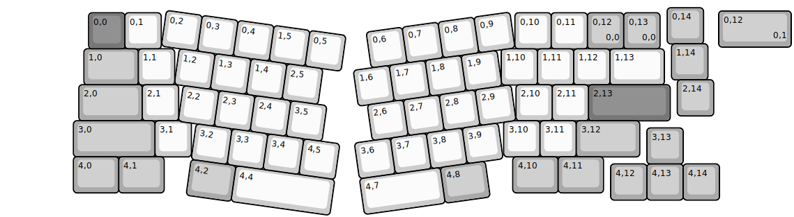{:loading="lazy"}

[Open in keyboard-layout-editor](http://www.keyboard-layout-editor.com/##@@_x:18.33&y:0.14&c=#aaaaaa;&=0,14;&@_x:2.37&y:-0.861&c=#777777;&=0,0&_c=#cccccc;&=0,1&_x:9.76;&=0,10&=0,11&_c=#aaaaaa;&=0,12%0A%0A%0A0,0&=0,13%0A%0A%0A0,0;&@_x:18.45&y:-0.1412;&=1,14;&@_x:2.24&y:-0.86&w:1.5;&=1,0&_c=#cccccc;&=1,1&_x:9.01;&=1,10&=1,11&=1,12&_w:1.5;&=1,13;&@_x:18.61&y:-0.1412&c=#aaaaaa;&=2,14;&@_x:2.1&y:-0.863&w:1.75;&=2,0&_c=#cccccc;&=2,1&_x:9.31;&=2,10&=2,11&_c=#777777&w:2.25;&=2,13;&@_x:1.95&c=#aaaaaa&w:2.25;&=3,0&_c=#cccccc;&=3,1&_x:8.62;&=3,10&=3,11&_c=#aaaaaa&w:1.75;&=3,12;&@_x:17.77&y:-0.8;&=3,13;&@_x:1.95&y:-0.2018&w:1.25;&=4,0&_w:1.25;&=4,1&_x:9.62&w:1.25;&=4,10&_w:1.25;&=4,11;&@_x:16.77&y:-0.8;&=4,12&=4,13&=4,14;&@_r:8&rx:4.5&ry:0.4&y:-0.2&c=#cccccc;&=0,2&=0,3&=0,4&=1,5&=0,5;&@_x:0.5;&=1,2&=1,3&=1,4&=2,5;&@_x:0.75;&=2,2&=2,3&=2,4&=3,5;&@_x:1.25;&=3,2&=3,3&=3,4&=4,5;&@_x:1.25&c=#aaaaaa&w:1.25;&=4,2&_c=#cccccc&w:2.75;&=4,4;&@_r:-8&rx:14.5&x:-4.5&y:-0.2;&=0,6&=0,7&=0,8&=0,9;&@_x:-5.0;&=1,6&=1,7&=1,8&=1,9;&@_x:-4.75;&=2,6&=2,7&=2,8&=2,9;&@_x:-5.25;&=3,6&=3,7&=3,8&=3,9;&@_x:-5.25&w:2.25;&=4,7&_c=#aaaaaa&w:1.25;&=4,8;&@_r:0&rx:0&ry:0&x:19.75&y:0.229&w:2;&=0,12%0A%0A%0A0,1)

## fjlabs/tf60ansi

[README](output/fjlabs/tf60ansi/README.md) - [layout](output/fjlabs/tf60ansi/tf60ansi-kle.json) - [PCB](output/fjlabs/tf60ansi/tf60ansi.kicad_pcb) - [PCB render](output/fjlabs/tf60ansi/tf60ansi-render.svg)

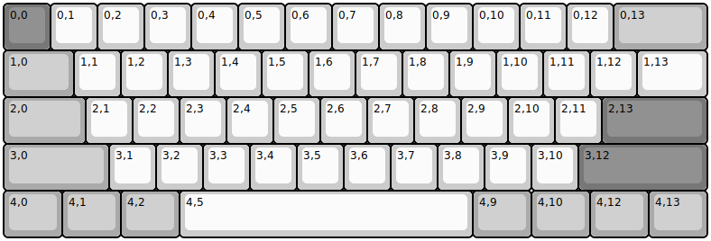{:loading="lazy"}

[Open in keyboard-layout-editor](http://www.keyboard-layout-editor.com/##@@_c=#777777;&=0,0&_c=#cccccc;&=0,1&=0,2&=0,3&=0,4&=0,5&=0,6&=0,7&=0,8&=0,9&=0,10&=0,11&=0,12&_c=#aaaaaa&w:2;&=0,13;&@_w:1.5;&=1,0&_c=#cccccc;&=1,1&=1,2&=1,3&=1,4&=1,5&=1,6&=1,7&=1,8&=1,9&=1,10&=1,11&=1,12&_w:1.5;&=1,13;&@_c=#aaaaaa&w:1.75;&=2,0&_c=#cccccc;&=2,1&=2,2&=2,3&=2,4&=2,5&=2,6&=2,7&=2,8&=2,9&=2,10&=2,11&_c=#777777&w:2.25;&=2,13;&@_c=#aaaaaa&w:2.25;&=3,0&_c=#cccccc;&=3,1&=3,2&=3,3&=3,4&=3,5&=3,6&=3,7&=3,8&=3,9&=3,10&_c=#777777&w:2.75;&=3,12;&@_c=#aaaaaa&w:1.25;&=4,0&_w:1.25;&=4,1&_w:1.25;&=4,2&_c=#cccccc&w:6.25;&=4,5&_c=#aaaaaa&w:1.25;&=4,9&_w:1.25;&=4,10&_w:1.25;&=4,12&_w:1.25;&=4,13)

## fjlabs/tf60v2

[README](output/fjlabs/tf60v2/README.md) - [layout](output/fjlabs/tf60v2/tf60v2-kle.json) - [PCB](output/fjlabs/tf60v2/tf60v2.kicad_pcb) - [PCB render](output/fjlabs/tf60v2/tf60v2-render.svg)

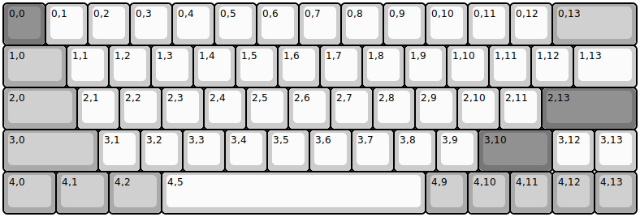{:loading="lazy"}

[Open in keyboard-layout-editor](http://www.keyboard-layout-editor.com/##@@_c=#777777;&=0,0&_c=#cccccc;&=0,1&=0,2&=0,3&=0,4&=0,5&=0,6&=0,7&=0,8&=0,9&=0,10&=0,11&=0,12&_c=#aaaaaa&w:2;&=0,13;&@_w:1.5;&=1,0&_c=#cccccc;&=1,1&=1,2&=1,3&=1,4&=1,5&=1,6&=1,7&=1,8&=1,9&=1,10&=1,11&=1,12&_w:1.5;&=1,13;&@_c=#aaaaaa&w:1.75;&=2,0&_c=#cccccc;&=2,1&=2,2&=2,3&=2,4&=2,5&=2,6&=2,7&=2,8&=2,9&=2,10&=2,11&_c=#777777&w:2.25;&=2,13;&@_c=#aaaaaa&w:2.25;&=3,0&_c=#cccccc;&=3,1&=3,2&=3,3&=3,4&=3,5&=3,6&=3,7&=3,8&=3,9&_c=#777777&w:1.75;&=3,10&_c=#cccccc;&=3,12&=3,13;&@_c=#aaaaaa&w:1.25;&=4,0&_w:1.25;&=4,1&_w:1.25;&=4,2&_c=#cccccc&w:6.25;&=4,5&_c=#aaaaaa;&=4,9&=4,10&=4,11&=4,12&=4,13)

## fjlabs/tf65rgbv2

[README](output/fjlabs/tf65rgbv2/README.md) - [layout](output/fjlabs/tf65rgbv2/tf65rgbv2-kle.json) - [PCB](output/fjlabs/tf65rgbv2/tf65rgbv2.kicad_pcb) - [PCB render](output/fjlabs/tf65rgbv2/tf65rgbv2-render.svg)

{:loading="lazy"}

[Open in keyboard-layout-editor](http://www.keyboard-layout-editor.com/##@@_c=#777777;&=0,0&_c=#cccccc;&=0,1&=0,2&=0,3&=0,4&=0,5&=0,6&=0,7&=0,8&=0,9&=0,10&=0,11&=0,12&_c=#aaaaaa&w:2;&=0,13&_c=#cccccc;&=0,14;&@_c=#aaaaaa&w:1.5;&=1,0&_c=#cccccc;&=1,1&=1,2&=1,3&=1,4&=1,5&=1,6&=1,7&=1,8&=1,9&=1,10&=1,11&=1,12&_w:1.5;&=1,13&=1,14;&@_c=#aaaaaa&w:1.75;&=2,0&_c=#cccccc;&=2,1&=2,2&=2,3&=2,4&=2,5&=2,6&=2,7&=2,8&=2,9&=2,10&=2,11&_c=#777777&w:2.25;&=2,13&_c=#cccccc;&=2,14;&@_c=#aaaaaa&w:2.25;&=3,0&_c=#cccccc;&=3,1&=3,2&=3,3&=3,4&=3,5&=3,6&=3,7&=3,8&=3,9&=3,10&_w:1.75;&=3,12&=3,13&=3,14;&@_c=#aaaaaa&w:1.25;&=4,0&_w:1.25;&=4,1&_w:1.25;&=4,2&_c=#cccccc&w:6.25;&=4,5&_c=#aaaaaa;&=4,9&=4,10&=4,11&=4,12&=4,13&_c=#cccccc;&=4,14)

## flehrad/bigswitch

[README](output/flehrad/README.md) - [layout](output/flehrad/bigswitch-kle.json) - [PCB](output/flehrad/bigswitch.kicad_pcb) - [PCB render](output/flehrad/bigswitch-render.svg)

{:loading="lazy"}

[Open in keyboard-layout-editor](http://www.keyboard-layout-editor.com/##@@_w:4&h:4;&=0,0)

## floookay/adelheid

[README](output/floookay/adelheid/README.md) - [layout](output/floookay/adelheid/adelheid-kle.json) - [PCB](output/floookay/adelheid/adelheid.kicad_pcb) - [PCB render](output/floookay/adelheid/adelheid-render.svg)

{:loading="lazy"}

[Open in keyboard-layout-editor](http://www.keyboard-layout-editor.com/##@@_x:1.5&y:0.2&c=#aaaaaa;&=0,1&_x:11.5;&=0,12;&@_x:0.2&y:-0.95&c=#777777;&=0,0&_x:14.165&c=#aaaaaa;&=0,13&_x:0.335;&=0,14;&@_x:16.95;&=3,14;&@_x:0.75&y:-0.75&c=#cccccc;&=2,0&=2,1&_x:10.95;&=2,12&=2,13&_c=#aaaaaa;&=2,14;&@_x:17.2&y:-0.25;&=4,14;&@_x:0.5&y:-0.75&w:1.5;&=3,0&_c=#cccccc;&=3,1&_x:10.45;&=3,11&=3,12&_c=#aaaaaa&w:1.5;&=3,13;&@_x:17.45&y:-0.25;&=5,14;&@_x:0.25&y:-0.75&w:1.75;&=4,0&_c=#cccccc;&=4,1&_x:9.95;&=4,10&=4,11&_c=#777777&w:2.25;&=4,12;&@_c=#aaaaaa&w:2.25;&=5,0&_c=#cccccc;&=5,1&_x:10.2;&=5,10&_c=#aaaaaa&w:1.75;&=5,11;&@_x:16.45&y:-0.75&c=#777777;&=5,13;&@_y:-0.25&c=#aaaaaa&w:1.5;&=6,0;&@_x:15.45&y:-0.75&c=#777777;&=6,12&=6,13&=6,14;&@_rx:10&x:-7.5&y:0.2&c=#aaaaaa;&=0,2&_x:9.5;&=0,11;&@_x:-7.25&y:0.15&c=#cccccc;&=2,2&_x:8.95;&=2,11;&@_r:12&rx:8.5&ry:3.5&x:-5.35&y:-2.25&c=#aaaaaa;&=0,3&=0,4&_x:0.25;&=0,5&=0,6;&@_x:-4.85&y:0.25&c=#cccccc;&=2,3&=2,4&=2,5&=2,6;&@_x:-5.35;&=3,2&=3,3&=3,4&=3,5;&@_x:-5.1;&=4,2&=4,3&=4,4&=4,5;&@_x:-4.6;&=5,2&=5,3&=5,4&=5,5;&@_x:-4.6&c=#aaaaaa&w:1.5;&=6,2&_c=#cccccc&p=SPACE&w:2;&=6,4&_c=#aaaaaa;&=6,5;&@_r:-12&ry:3.25&x:3.8&y:-2.05;&=0,10&_x:-4.25;&=0,7&=0,8&_x:0.25;&=0,9;&@_x:0.3&y:0.25&c=#cccccc;&=2,7&=2,8&=2,9&=2,10;&@_x:-0.2;&=3,6&=3,7&=3,8&=3,9&=3,10;&@_x:0.05;&=4,6&=4,7&=4,8&=4,9;&@_x:0.3;&=5,6&=5,7&=5,8&=5,9;&@_x:-0.2&w:2.75;&=6,7&_c=#aaaaaa&w:1.5;&=6,9)

## flx/lodestone

[README](output/flx/lodestone/README.md) - [layout](output/flx/lodestone/lodestone-kle.json) - [PCB](output/flx/lodestone/lodestone.kicad_pcb) - [PCB render](output/flx/lodestone/lodestone-render.svg)

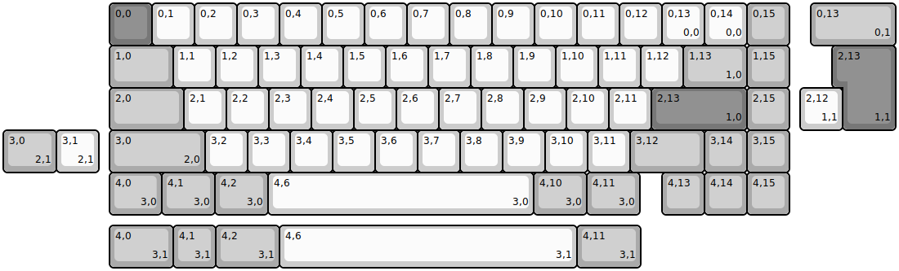{:loading="lazy"}

[Open in keyboard-layout-editor](http://www.keyboard-layout-editor.com/##@@_x:2.5&c=#777777;&=0,0&_c=#cccccc;&=0,1&=0,2&=0,3&=0,4&=0,5&=0,6&=0,7&=0,8&=0,9&=0,10&=0,11&=0,12&=0,13%0A%0A%0A0,0&=0,14%0A%0A%0A0,0&_c=#aaaaaa;&=0,15;&@_x:2.5&w:1.5;&=1,0&_c=#cccccc;&=1,1&=1,2&=1,3&=1,4&=1,5&=1,6&=1,7&=1,8&=1,9&=1,10&=1,11&=1,12&_c=#aaaaaa&w:1.5;&=1,13%0A%0A%0A1,0&=1,15;&@_x:2.5&w:1.75;&=2,0&_c=#cccccc;&=2,1&=2,2&=2,3&=2,4&=2,5&=2,6&=2,7&=2,8&=2,9&=2,10&=2,11&_c=#777777&w:2.25;&=2,13%0A%0A%0A1,0&_c=#aaaaaa;&=2,15;&@_x:2.5&w:2.25;&=3,0%0A%0A%0A2,0&_c=#cccccc;&=3,2&=3,3&=3,4&=3,5&=3,6&=3,7&=3,8&=3,9&=3,10&=3,11&_c=#aaaaaa&w:1.75;&=3,12&=3,14&=3,15;&@_x:2.5&w:1.225;&=4,0%0A%0A%0A3,0&_x:0.005&w:1.25;&=4,1%0A%0A%0A3,0&_w:1.25;&=4,2%0A%0A%0A3,0&_c=#cccccc&w:6.25;&=4,6%0A%0A%0A3,0&_c=#aaaaaa&w:1.25;&=4,10%0A%0A%0A3,0&_w:1.25;&=4,11%0A%0A%0A3,0&_x:0.52;&=4,13&=4,14&=4,15;&@_x:19.0&y:-5&w:2;&=0,13%0A%0A%0A0,1;&@_x:19.75&c=#777777&w:1.25&h:2&w2:1.5&h2:1&x2:-0.25;&=2,13%0A%0A%0A1,1;&@_x:18.75&c=#cccccc;&=2,12%0A%0A%0A1,1;&@_c=#aaaaaa&w:1.25;&=3,0%0A%0A%0A2,1&_c=#cccccc;&=3,1%0A%0A%0A2,1;&@_x:2.5&y:1.25&c=#aaaaaa&w:1.5;&=4,0%0A%0A%0A3,1&=4,1%0A%0A%0A3,1&_w:1.5;&=4,2%0A%0A%0A3,1&_c=#cccccc&w:7;&=4,6%0A%0A%0A3,1&_c=#aaaaaa&w:1.5;&=4,11%0A%0A%0A3,1)

## flx/virgo

[README](output/flx/virgo/README.md) - [layout](output/flx/virgo/virgo-kle.json) - [PCB](output/flx/virgo/virgo.kicad_pcb) - [PCB render](output/flx/virgo/virgo-render.svg)

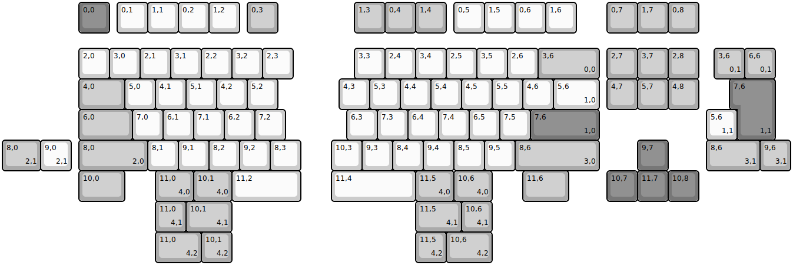{:loading="lazy"}

[Open in keyboard-layout-editor](http://www.keyboard-layout-editor.com/##@@_x:2.5&c=#777777;&=0,0&_x:0.25&c=#cccccc;&=0,1&=1,1&=0,2&=1,2&_x:0.25&c=#aaaaaa;&=0,3&_x:2.5;&=1,3&=0,4&=1,4&_x:0.25&c=#cccccc;&=0,5&=1,5&=0,6&=1,6&_x:1.0&c=#aaaaaa;&=0,7&=1,7&=0,8;&@_x:2.5&y:0.5&c=#cccccc;&=2,0&=3,0&=2,1&=3,1&=2,2&=3,2&=2,3&_x:2.0;&=3,3&=2,4&=3,4&=2,5&=3,5&=2,6&_c=#aaaaaa&w:2;&=3,6%0A%0A%0A0,0&_x:0.25;&=2,7&=3,7&=2,8;&@_x:2.5&w:1.5;&=4,0&_c=#cccccc;&=5,0&=4,1&=5,1&=4,2&=5,2&_x:2.0;&=4,3&=5,3&=4,4&=5,4&=4,5&=5,5&=4,6&_w:1.5;&=5,6%0A%0A%0A1,0&_x:0.25&c=#aaaaaa;&=4,7&=5,7&=4,8;&@_x:2.5&w:1.75;&=6,0&_c=#cccccc;&=7,0&=6,1&=7,1&=6,2&=7,2&_x:2.0;&=6,3&=7,3&=6,4&=7,4&=6,5&=7,5&_c=#777777&w:2.25;&=7,6%0A%0A%0A1,0;&@_x:2.5&c=#aaaaaa&w:2.25;&=8,0%0A%0A%0A2,0&_c=#cccccc;&=8,1&=9,1&=8,2&=9,2&=8,3&_x:1.0;&=10,3&=9,3&=8,4&=9,4&=8,5&=9,5&_c=#aaaaaa&w:2.75;&=8,6%0A%0A%0A3,0&_x:1.25&c=#777777;&=9,7;&@_x:2.5&c=#aaaaaa&w:1.5;&=10,0&_x:1.0&w:1.25;&=11,0%0A%0A%0A4,0&_w:1.25;&=10,1%0A%0A%0A4,0&_c=#cccccc&w:2.25;&=11,2&_x:1.0&w:2.75;&=11,4&_c=#aaaaaa&w:1.25;&=11,5%0A%0A%0A4,0&_w:1.25;&=10,6%0A%0A%0A4,0&_x:1.0&w:1.5;&=11,6&_x:1.25&c=#777777;&=10,7&=11,7&=10,8;&@_x:23.25&y:-5.0&c=#aaaaaa;&=3,6%0A%0A%0A0,1&=6,6%0A%0A%0A0,1;&@_x:24.0&c=#777777&w:1.25&h:2&w2:1.5&h2:1&x2:-0.25;&=7,6%0A%0A%0A1,1;&@_x:23.0&c=#cccccc;&=5,6%0A%0A%0A1,1;&@_c=#aaaaaa&w:1.25;&=8,0%0A%0A%0A2,1&_c=#cccccc;&=9,0%0A%0A%0A2,1&_x:20.75&c=#aaaaaa&w:1.75;&=8,6%0A%0A%0A3,1&=9,6%0A%0A%0A3,1;&@_x:5&y:1.0;&=11,0%0A%0A%0A4,1&_w:1.5;&=10,1%0A%0A%0A4,1&_x:6.0&w:1.5;&=11,5%0A%0A%0A4,1&=10,6%0A%0A%0A4,1;&@_x:5&w:1.5;&=11,0%0A%0A%0A4,2&=10,1%0A%0A%0A4,2&_x:6.0;&=11,5%0A%0A%0A4,2&_w:1.5;&=10,6%0A%0A%0A4,2)

## foostan/cornelius

[README](output/foostan/README.md) - [layout](output/foostan/cornelius-kle.json) - [PCB](output/foostan/cornelius.kicad_pcb) - [PCB render](output/foostan/cornelius-render.svg)

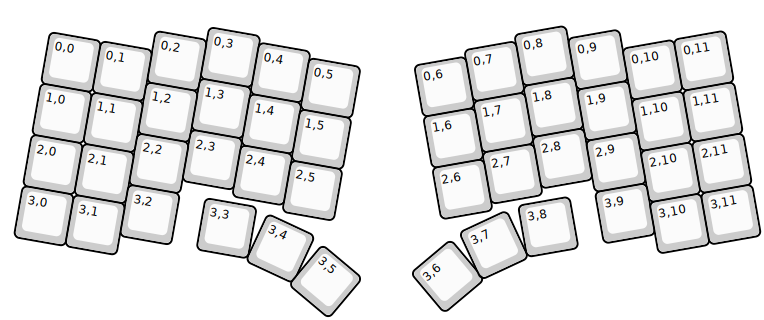{:loading="lazy"}

[Open in keyboard-layout-editor](http://www.keyboard-layout-editor.com/##@@_r:10&rx:1.5&x:2.5;&=0,3;&@_x:3.5&y:-0.875;&=0,4;&@_x:1.5&y:-0.875;&=0,2&_x:2.0;&=0,5;&@_x:-0.5&y:-0.625;&=0,0&=0,1;&@_x:2.5&y:-0.625;&=1,3;&@_x:3.5&y:-0.875;&=1,4;&@_x:1.5&y:-0.875;&=1,2&_x:2.0;&=1,5;&@_x:-0.5&y:-0.625;&=1,0&=1,1;&@_x:2.5&y:-0.625;&=2,3;&@_x:3.5&y:-0.875;&=2,4;&@_x:1.5&y:-0.875;&=2,2&_x:2.0;&=2,5;&@_x:-0.5&y:-0.625;&=2,0&=2,1;&@_x:1.5&y:-0.375;&=3,2&_x:0.5;&=3,3;&@_x:-0.5&y:-0.625;&=3,0&=3,1;&@_r:25&x:4.97&y:-2.515;&=3,4;&@_r:40&x:6.55&y:-2.6;&=3,5;&@_r:-40&rx:13.25&x:-7.55&y:0.51;&=3,6;&@_r:-25&x:-5.97&y:0.6;&=3,7;&@_r:-10&x:-3.5&y:-3.11;&=0,8;&@_x:-4.5&y:-0.875;&=0,7;&@_x:-5.5&y:-0.875;&=0,6&_x:2.0;&=0,9;&@_x:-1.5&y:-0.625;&=0,10&=0,11;&@_x:-3.5&y:-0.625;&=1,8;&@_x:-4.5&y:-0.875;&=1,7;&@_x:-5.5&y:-0.875;&=1,6&_x:2.0;&=1,9;&@_x:-1.5&y:-0.625;&=1,10&=1,11;&@_x:-3.5&y:-0.625;&=2,8;&@_x:-4.5&y:-0.875;&=2,7;&@_x:-5.5&y:-0.875;&=2,6&_x:2.0;&=2,9;&@_x:-1.5&y:-0.625;&=2,10&=2,11;&@_x:-4.0&y:-0.375;&=3,8&_x:0.5;&=3,9;&@_x:-1.5&y:-0.625;&=3,10&=3,11)

## foxlab/key65_hotswap

[README](output/foxlab/key65_hotswap/README.md) - [layout](output/foxlab/key65_hotswap/key65_hotswap-kle.json) - [PCB](output/foxlab/key65_hotswap/key65_hotswap.kicad_pcb) - [PCB render](output/foxlab/key65_hotswap/key65_hotswap-render.svg)

{:loading="lazy"}

[Open in keyboard-layout-editor](http://www.keyboard-layout-editor.com/##@@_y:1.5&c=#777777;&=0,0&_c=#cccccc;&=0,1&=0,2&=0,3&=0,4&=0,5&=0,6&=0,7&=0,8&=0,9&=0,10&=0,11&=0,12&_c=#aaaaaa&w:2;&=0,13&=0,14%0A%0A%0A0,0;&@_w:1.5;&=1,0&_c=#cccccc;&=1,1&=1,2&=1,3&=1,4&=1,5&=1,6&=1,7&=1,8&=1,9&=1,10&=1,11&=1,12&_w:1.5;&=1,13&_c=#aaaaaa;&=1,14;&@_w:1.75;&=2,0&_c=#cccccc;&=2,1&=2,2&=2,3&=2,4&=2,5&=2,6&=2,7&=2,8&=2,9&=2,10&=2,11&_c=#777777&w:2.25;&=2,12&_c=#aaaaaa;&=2,14;&@_w:2.25;&=3,0&_c=#cccccc;&=3,2&=3,3&=3,4&=3,5&=3,6&=3,7&=3,8&=3,9&=3,10&=3,11&_c=#aaaaaa&w:1.75;&=3,12&=3,13&=3,14;&@_w:1.5;&=4,0&_d:true;&=4,1%0A%0A%0A1,0&_w:1.5;&=4,2&_c=#cccccc&w:7;&=4,7&_c=#aaaaaa&w:1.5;&=4,11&_x:0.5;&=4,12&=4,13&=4,14;&@_x:15&y:-6.25&d:true;&=0,14%0A%0A%0A0,1;&@_x:1.5&y:5.75;&=4,1%0A%0A%0A1,1)

## foxlab/key65_universal

[README](output/foxlab/key65_universal/README.md) - [layout](output/foxlab/key65_universal/key65_universal-kle.json) - [PCB](output/foxlab/key65_universal/key65_universal.kicad_pcb) - [PCB render](output/foxlab/key65_universal/key65_universal-render.svg)

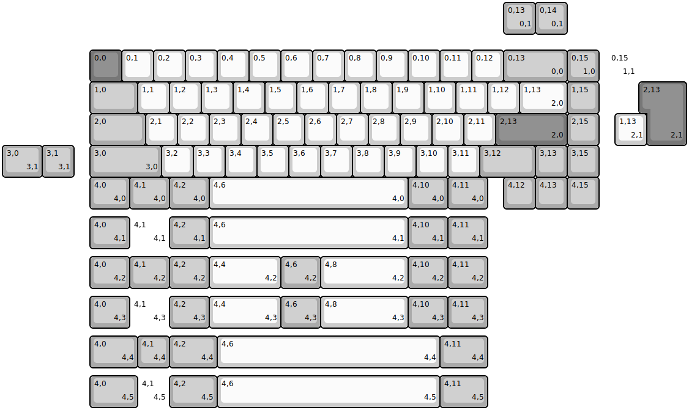{:loading="lazy"}

[Open in keyboard-layout-editor](http://www.keyboard-layout-editor.com/##@@_x:2.75&y:1.5&c=#777777;&=0,0&_c=#cccccc;&=0,1&=0,2&=0,3&=0,4&=0,5&=0,6&=0,7&=0,8&=0,9&=0,10&=0,11&=0,12&_c=#aaaaaa&w:2;&=0,13%0A%0A%0A0,0&=0,15%0A%0A%0A1,0;&@_x:2.75&w:1.5;&=1,0&_c=#cccccc;&=1,1&=1,2&=1,3&=1,4&=1,5&=1,6&=1,7&=1,8&=1,9&=1,10&=1,11&=1,12&_w:1.5;&=1,13%0A%0A%0A2,0&_c=#aaaaaa;&=1,15;&@_x:2.75&w:1.75;&=2,0&_c=#cccccc;&=2,1&=2,2&=2,3&=2,4&=2,5&=2,6&=2,7&=2,8&=2,9&=2,10&=2,11&_c=#777777&w:2.25;&=2,13%0A%0A%0A2,0&_c=#aaaaaa;&=2,15;&@_x:2.75&w:2.25;&=3,0%0A%0A%0A3,0&_c=#cccccc;&=3,2&=3,3&=3,4&=3,5&=3,6&=3,7&=3,8&=3,9&=3,10&=3,11&_c=#aaaaaa&w:1.75;&=3,12&=3,13&=3,15;&@_x:2.75&w:1.25;&=4,0%0A%0A%0A4,0&_w:1.25;&=4,1%0A%0A%0A4,0&_w:1.25;&=4,2%0A%0A%0A4,0&_c=#cccccc&w:6.25;&=4,6%0A%0A%0A4,0&_c=#aaaaaa&w:1.25;&=4,10%0A%0A%0A4,0&_w:1.25;&=4,11%0A%0A%0A4,0&_x:0.5;&=4,12&=4,13&=4,15;&@_x:15.75&y:-6.5;&=0,13%0A%0A%0A0,1&=0,14%0A%0A%0A0,1;&@_x:19.0&y:0.5&d:true;&=0,15%0A%0A%0A1,1;&@_x:20.25&c=#777777&w:1.25&h:2&w2:1.5&h2:1&x2:-0.25;&=2,13%0A%0A%0A2,1;&@_x:19.25&c=#cccccc;&=1,13%0A%0A%0A2,1;&@_c=#aaaaaa&w:1.25;&=3,0%0A%0A%0A3,1&=3,1%0A%0A%0A3,1;&@_x:2.75&y:1.25&w:1.25;&=4,0%0A%0A%0A4,1&_w:1.25&d:true;&=4,1%0A%0A%0A4,1&_w:1.25;&=4,2%0A%0A%0A4,1&_c=#cccccc&w:6.25;&=4,6%0A%0A%0A4,1&_c=#aaaaaa&w:1.25;&=4,10%0A%0A%0A4,1&_w:1.25;&=4,11%0A%0A%0A4,1;&@_x:2.75&y:0.25&w:1.25;&=4,0%0A%0A%0A4,2&_w:1.25;&=4,1%0A%0A%0A4,2&_w:1.25;&=4,2%0A%0A%0A4,2&_c=#cccccc&w:2.25;&=4,4%0A%0A%0A4,2&_c=#aaaaaa&w:1.25;&=4,6%0A%0A%0A4,2&_c=#cccccc&w:2.75;&=4,8%0A%0A%0A4,2&_c=#aaaaaa&w:1.25;&=4,10%0A%0A%0A4,2&_w:1.25;&=4,11%0A%0A%0A4,2;&@_x:2.75&y:0.25&w:1.25;&=4,0%0A%0A%0A4,3&_w:1.25&d:true;&=4,1%0A%0A%0A4,3&_w:1.25;&=4,2%0A%0A%0A4,3&_c=#cccccc&w:2.25;&=4,4%0A%0A%0A4,3&_c=#aaaaaa&w:1.25;&=4,6%0A%0A%0A4,3&_c=#cccccc&w:2.75;&=4,8%0A%0A%0A4,3&_c=#aaaaaa&w:1.25;&=4,10%0A%0A%0A4,3&_w:1.25;&=4,11%0A%0A%0A4,3;&@_x:2.75&y:0.25&w:1.5;&=4,0%0A%0A%0A4,4&=4,1%0A%0A%0A4,4&_w:1.5;&=4,2%0A%0A%0A4,4&_c=#cccccc&w:7;&=4,6%0A%0A%0A4,4&_c=#aaaaaa&w:1.5;&=4,11%0A%0A%0A4,4;&@_x:2.75&y:0.25&w:1.5;&=4,0%0A%0A%0A4,5&_d:true;&=4,1%0A%0A%0A4,5&_w:1.5;&=4,2%0A%0A%0A4,5&_c=#cccccc&w:7;&=4,6%0A%0A%0A4,5&_c=#aaaaaa&w:1.5;&=4,11%0A%0A%0A4,5)

## foxlab/leaf60_hotswap

[README](output/foxlab/leaf60_hotswap/README.md) - [layout](output/foxlab/leaf60_hotswap/leaf60_hotswap-kle.json) - [PCB](output/foxlab/leaf60_hotswap/leaf60_hotswap.kicad_pcb) - [PCB render](output/foxlab/leaf60_hotswap/leaf60_hotswap-render.svg)

{:loading="lazy"}

[Open in keyboard-layout-editor](http://www.keyboard-layout-editor.com/##@@_c=#777777;&=0,0&_c=#cccccc;&=0,1&=0,2&=0,3&=0,4&=0,5&=0,6&=0,7&=0,8&=0,9&=0,10&=0,11&=0,12&=0,13&=0,14;&@_c=#aaaaaa&w:1.5;&=1,0&_c=#cccccc;&=1,1&=1,2&=1,3&=1,4&=1,5&=1,6&=1,7&=1,8&=1,9&=1,10&=1,11&=1,12&_c=#aaaaaa&w:1.5;&=1,13;&@_w:1.75;&=2,0&_c=#cccccc;&=2,1&=2,2&=2,3&=2,4&=2,5&=2,6&=2,7&=2,8&=2,9&=2,10&=2,11&_c=#777777&w:2.25;&=2,12;&@_c=#aaaaaa&w:2.25;&=3,0&_c=#cccccc;&=3,2&=3,3&=3,4&=3,5&=3,6&=3,7&=3,8&=3,9&=3,10&=3,11&_c=#aaaaaa&w:1.75;&=3,12&=3,13;&@_w:1.5;&=4,0&=4,1&_w:1.5;&=4,2&_c=#cccccc&w:7;&=4,7&_c=#aaaaaa&w:1.5;&=4,11&=4,12&_w:1.5;&=4,13)

## foxlab/leaf60_universal

[README](output/foxlab/leaf60_universal/README.md) - [layout](output/foxlab/leaf60_universal/leaf60_universal-kle.json) - [PCB](output/foxlab/leaf60_universal/leaf60_universal.kicad_pcb) - [PCB render](output/foxlab/leaf60_universal/leaf60_universal-render.svg)

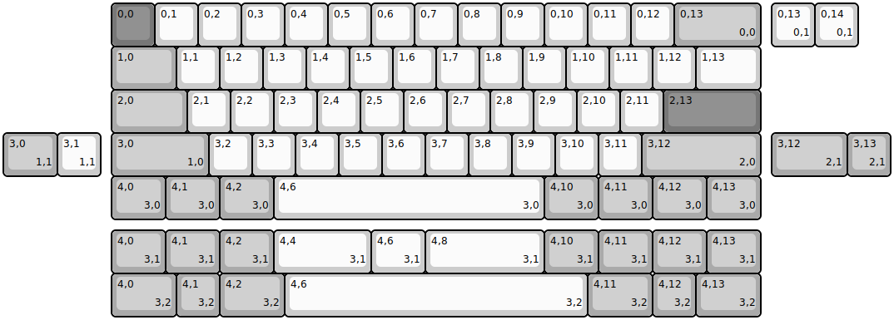{:loading="lazy"}

[Open in keyboard-layout-editor](http://www.keyboard-layout-editor.com/##@@_x:2.5&c=#777777;&=0,0&_c=#cccccc;&=0,1&=0,2&=0,3&=0,4&=0,5&=0,6&=0,7&=0,8&=0,9&=0,10&=0,11&=0,12&_c=#aaaaaa&w:2;&=0,13%0A%0A%0A0,0;&@_x:2.5&w:1.5;&=1,0&_c=#cccccc;&=1,1&=1,2&=1,3&=1,4&=1,5&=1,6&=1,7&=1,8&=1,9&=1,10&=1,11&=1,12&_w:1.5;&=1,13;&@_x:2.5&c=#aaaaaa&w:1.75;&=2,0&_c=#cccccc;&=2,1&=2,2&=2,3&=2,4&=2,5&=2,6&=2,7&=2,8&=2,9&=2,10&=2,11&_c=#777777&w:2.25;&=2,13;&@_x:2.5&c=#aaaaaa&w:2.25;&=3,0%0A%0A%0A1,0&_c=#cccccc;&=3,2&=3,3&=3,4&=3,5&=3,6&=3,7&=3,8&=3,9&=3,10&=3,11&_c=#aaaaaa&w:2.75;&=3,12%0A%0A%0A2,0;&@_x:2.5&w:1.25;&=4,0%0A%0A%0A3,0&_w:1.25;&=4,1%0A%0A%0A3,0&_w:1.25;&=4,2%0A%0A%0A3,0&_c=#cccccc&w:6.25;&=4,6%0A%0A%0A3,0&_c=#aaaaaa&w:1.25;&=4,10%0A%0A%0A3,0&_w:1.25;&=4,11%0A%0A%0A3,0&_w:1.25;&=4,12%0A%0A%0A3,0&_w:1.25;&=4,13%0A%0A%0A3,0;&@_x:17.75&y:-5&c=#cccccc;&=0,13%0A%0A%0A0,1&=0,14%0A%0A%0A0,1;&@_y:2&c=#aaaaaa&w:1.25;&=3,0%0A%0A%0A1,1&_c=#cccccc;&=3,1%0A%0A%0A1,1&_x:15.5&c=#aaaaaa&w:1.75;&=3,12%0A%0A%0A2,1&=3,13%0A%0A%0A2,1;&@_x:2.5&y:1.25&w:1.25;&=4,0%0A%0A%0A3,1&_w:1.25;&=4,1%0A%0A%0A3,1&_w:1.25;&=4,2%0A%0A%0A3,1&_c=#cccccc&w:2.25;&=4,4%0A%0A%0A3,1&_w:1.25;&=4,6%0A%0A%0A3,1&_w:2.75;&=4,8%0A%0A%0A3,1&_c=#aaaaaa&w:1.25;&=4,10%0A%0A%0A3,1&_w:1.25;&=4,11%0A%0A%0A3,1&_w:1.25;&=4,12%0A%0A%0A3,1&_w:1.25;&=4,13%0A%0A%0A3,1;&@_x:2.5&w:1.5;&=4,0%0A%0A%0A3,2&=4,1%0A%0A%0A3,2&_w:1.5;&=4,2%0A%0A%0A3,2&_c=#cccccc&w:7;&=4,6%0A%0A%0A3,2&_c=#aaaaaa&w:1.5;&=4,11%0A%0A%0A3,2&=4,12%0A%0A%0A3,2&_w:1.5;&=4,13%0A%0A%0A3,2)

## friedrich/friedrich

[README](output/friedrich/README.md) - [layout](output/friedrich/friedrich-kle.json) - [PCB](output/friedrich/friedrich.kicad_pcb) - [PCB render](output/friedrich/friedrich-render.svg)

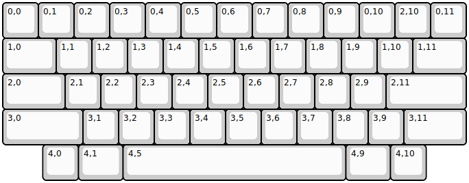{:loading="lazy"}

[Open in keyboard-layout-editor](http://www.keyboard-layout-editor.com/##@@=0,0&=0,1&=0,2&=0,3&=0,4&=0,5&=0,6&=0,7&=0,8&=0,9&=0,10&=2,10&=0,11;&@_w:1.5;&=1,0&=1,1&=1,2&=1,3&=1,4&=1,5&=1,6&=1,7&=1,8&=1,9&=1,10&_w:1.5;&=1,11;&@_w:1.75;&=2,0&=2,1&=2,2&=2,3&=2,4&=2,5&=2,6&=2,7&=2,8&=2,9&_w:2.25;&=2,11;&@_w:2.25;&=3,0&=3,1&=3,2&=3,3&=3,4&=3,5&=3,6&=3,7&=3,8&=3,9&_w:1.75;&=3,11;&@_x:1.125;&=4,0&_w:1.25;&=4,1&_w:6.25;&=4,5&_w:1.25;&=4,9&=4,10)

## frooastboard/nano

[README](output/frooastboard/nano/README.md) - [layout](output/frooastboard/nano/nano-kle.json) - [PCB](output/frooastboard/nano/nano.kicad_pcb) - [PCB render](output/frooastboard/nano/nano-render.svg)

{:loading="lazy"}

[Open in keyboard-layout-editor](http://www.keyboard-layout-editor.com/##@@=0,0&=0,1;&@_c=#777777;&=1,0&_c=#cccccc;&=1,1)

## frooastboard/walnut

[README](output/frooastboard/walnut/README.md) - [layout](output/frooastboard/walnut/walnut-kle.json) - [PCB](output/frooastboard/walnut/walnut.kicad_pcb) - [PCB render](output/frooastboard/walnut/walnut-render.svg)

{:loading="lazy"}

[Open in keyboard-layout-editor](http://www.keyboard-layout-editor.com/##@@_c=#777777;&=0,0&_c=#cccccc;&=0,1&=0,2&=0,3&=0,4&=0,5&=0,6&=0,7&=1,0&=1,1&=1,2&=1,3&=1,4&_c=#aaaaaa&w:2;&=1,5&_x:0.5&c=#cccccc;&=5,5&=5,6&=5,7;&@_c=#aaaaaa&w:1.5;&=2,0&_c=#cccccc;&=2,1&=2,2&=2,3&=2,4&=2,5&=2,6&=2,7&=3,0&=3,1&=3,2&=3,3&=3,4&_x:0.25&c=#777777&w:1.25&h:2&w2:1.5&h2:1&x2:-0.25;&=3,5%0A%0A%0A0,0&_x:0.5&c=#cccccc;&=7,5&=7,6&=7,7;&@_c=#aaaaaa&w:1.75;&=4,0&_c=#cccccc;&=4,1&=4,2&=4,3&=4,4&=4,5&=4,6&=4,7&=5,0&=5,1&=5,2&=5,3&=5,4%0A%0A%0A0,0;&@_c=#aaaaaa&w:1.25;&=6,0%0A%0A%0A0,0&_c=#cccccc;&=6,1%0A%0A%0A0,0&=6,2&=6,3&=6,4&=6,5&=6,6&=6,7&=7,0&=7,1&=7,2&=7,3&_c=#aaaaaa&w:2.75;&=7,4&_x:1.5&c=#777777;&=3,6;&@_c=#aaaaaa&w:1.25;&=8,0&_w:1.25;&=8,1&_w:1.25;&=8,2&_c=#cccccc&w:6.25;&=8,3&_c=#aaaaaa&w:1.25;&=8,4&_w:1.25;&=8,5&_w:1.25;&=8,6&_w:1.25;&=8,7&_x:0.5&c=#777777;&=1,6&=3,7&=1,7;&@_x:13.5&y:-4&c=#cccccc&w:1.5;&=5,4%0A%0A%0A0,1;&@_x:12.75&c=#777777&w:2.25;&=3,5%0A%0A%0A0,1;&@_c=#aaaaaa&w:2.25;&=6,0%0A%0A%0A0,1)

## fruit/bop

[README](output/fruit/README.md) - [layout](output/fruit/bop-kle.json) - [PCB](output/fruit/bop.kicad_pcb) - [PCB render](output/fruit/bop-render.svg)

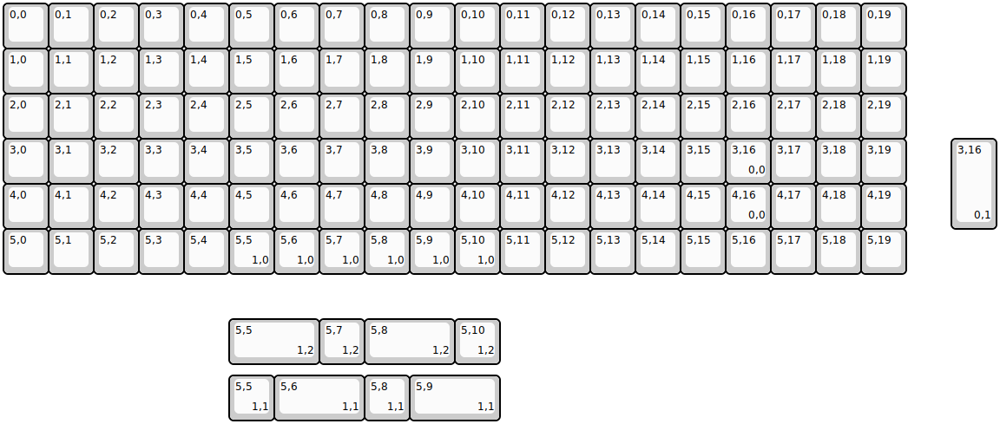{:loading="lazy"}

[Open in keyboard-layout-editor](http://www.keyboard-layout-editor.com/##@@=0,0&=0,1&=0,2&=0,3&=0,4&=0,5&=0,6&=0,7&=0,8&=0,9&=0,10&=0,11&=0,12&=0,13&=0,14&=0,15&=0,16&=0,17&=0,18&=0,19;&@=1,0&=1,1&=1,2&=1,3&=1,4&=1,5&=1,6&=1,7&=1,8&=1,9&=1,10&=1,11&=1,12&=1,13&=1,14&=1,15&=1,16&=1,17&=1,18&=1,19;&@=2,0&=2,1&=2,2&=2,3&=2,4&=2,5&=2,6&=2,7&=2,8&=2,9&=2,10&=2,11&=2,12&=2,13&=2,14&=2,15&=2,16&=2,17&=2,18&=2,19;&@=3,0&=3,1&=3,2&=3,3&=3,4&=3,5&=3,6&=3,7&=3,8&=3,9&=3,10&=3,11&=3,12&=3,13&=3,14&=3,15&=3,16%0A%0A%0A0,0&=3,17&=3,18&=3,19;&@=4,0&=4,1&=4,2&=4,3&=4,4&=4,5&=4,6&=4,7&=4,8&=4,9&=4,10&=4,11&=4,12&=4,13&=4,14&=4,15&=4,16%0A%0A%0A0,0&=4,17&=4,18&=4,19;&@=5,0&=5,1&=5,2&=5,3&=5,4&=5,5%0A%0A%0A1,0&=5,6%0A%0A%0A1,0&=5,7%0A%0A%0A1,0&=5,8%0A%0A%0A1,0&=5,9%0A%0A%0A1,0&=5,10%0A%0A%0A1,0&=5,11&=5,12&=5,13&=5,14&=5,15&=5,16&=5,17&=5,18&=5,19;&@_x:21&y:-3&h:2;&=3,16%0A%0A%0A0,1;&@_x:5&y:3&w:2;&=5,5%0A%0A%0A1,2&=5,7%0A%0A%0A1,2&_w:2;&=5,8%0A%0A%0A1,2&=5,10%0A%0A%0A1,2;&@_x:5&y:0.25;&=5,5%0A%0A%0A1,1&_w:2;&=5,6%0A%0A%0A1,1&=5,8%0A%0A%0A1,1&_w:2;&=5,9%0A%0A%0A1,1)

## geekboards/macropad_v2

[README](output/geekboards/macropad_v2/README.md) - [layout](output/geekboards/macropad_v2/macropad_v2-kle.json) - [PCB](output/geekboards/macropad_v2/macropad_v2.kicad_pcb) - [PCB render](output/geekboards/macropad_v2/macropad_v2-render.svg)

{:loading="lazy"}

[Open in keyboard-layout-editor](http://www.keyboard-layout-editor.com/##@@=0,0&=0,1&=0,2&=0,3;&@=1,0&=1,1&=1,2&=1,3)

## geminate60/geminate60

[README](output/geminate60/README.md) - [layout](output/geminate60/geminate60-kle.json) - [PCB](output/geminate60/geminate60.kicad_pcb) - [PCB render](output/geminate60/geminate60-render.svg)

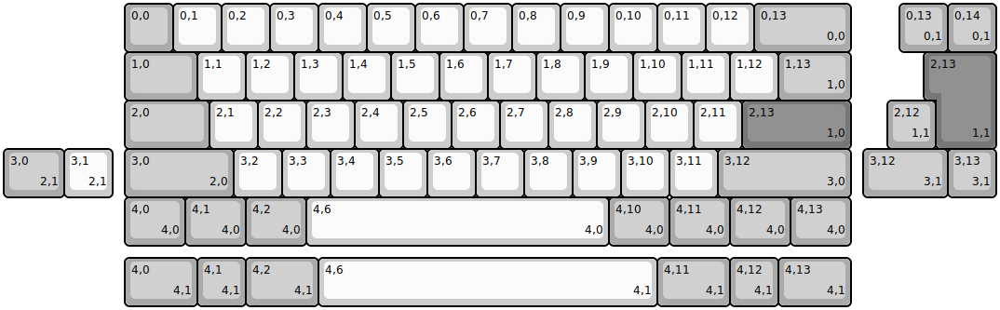{:loading="lazy"}

[Open in keyboard-layout-editor](http://www.keyboard-layout-editor.com/##@@_x:2.5&c=#aaaaaa;&=0,0&_c=#cccccc;&=0,1&=0,2&=0,3&=0,4&=0,5&=0,6&=0,7&=0,8&=0,9&=0,10&=0,11&=0,12&_c=#aaaaaa&w:2;&=0,13%0A%0A%0A0,0;&@_x:2.5&w:1.5;&=1,0&_c=#cccccc;&=1,1&=1,2&=1,3&=1,4&=1,5&=1,6&=1,7&=1,8&=1,9&=1,10&=1,11&=1,12&_c=#aaaaaa&w:1.5;&=1,13%0A%0A%0A1,0;&@_x:2.5&w:1.75;&=2,0&_c=#cccccc;&=2,1&=2,2&=2,3&=2,4&=2,5&=2,6&=2,7&=2,8&=2,9&=2,10&=2,11&_c=#777777&w:2.25;&=2,13%0A%0A%0A1,0;&@_x:2.5&c=#aaaaaa&w:2.25;&=3,0%0A%0A%0A2,0&_c=#cccccc;&=3,2&=3,3&=3,4&=3,5&=3,6&=3,7&=3,8&=3,9&=3,10&=3,11&_c=#aaaaaa&w:2.75;&=3,12%0A%0A%0A3,0;&@_x:2.5&w:1.25;&=4,0%0A%0A%0A4,0&_w:1.25;&=4,1%0A%0A%0A4,0&_w:1.25;&=4,2%0A%0A%0A4,0&_c=#cccccc&w:6.25;&=4,6%0A%0A%0A4,0&_c=#aaaaaa&w:1.25;&=4,10%0A%0A%0A4,0&_w:1.25;&=4,11%0A%0A%0A4,0&_w:1.25;&=4,12%0A%0A%0A4,0&_w:1.25;&=4,13%0A%0A%0A4,0;&@_x:18.5&y:-5;&=0,13%0A%0A%0A0,1&=0,14%0A%0A%0A0,1;&@_x:19.25&c=#777777&w:1.25&h:2&w2:1.5&h2:1&x2:-0.25;&=2,13%0A%0A%0A1,1;&@_x:18.25&c=#aaaaaa;&=2,12%0A%0A%0A1,1;&@_w:1.25;&=3,0%0A%0A%0A2,1&_c=#cccccc;&=3,1%0A%0A%0A2,1&_x:15.5&c=#aaaaaa&w:1.75;&=3,12%0A%0A%0A3,1&=3,13%0A%0A%0A3,1;&@_x:2.5&y:1.25&w:1.5;&=4,0%0A%0A%0A4,1&=4,1%0A%0A%0A4,1&_w:1.5;&=4,2%0A%0A%0A4,1&_c=#cccccc&w:7;&=4,6%0A%0A%0A4,1&_c=#aaaaaa&w:1.5;&=4,11%0A%0A%0A4,1&=4,12%0A%0A%0A4,1&_w:1.5;&=4,13%0A%0A%0A4,1)

## gen_one/g1_65

[README](output/gen_one/README.md) - [layout](output/gen_one/g1_65-kle.json) - [PCB](output/gen_one/g1_65.kicad_pcb) - [PCB render](output/gen_one/g1_65-render.svg)

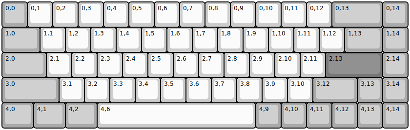{:loading="lazy"}

[Open in keyboard-layout-editor](http://www.keyboard-layout-editor.com/##@@_c=#aaaaaa;&=0,0&_c=#cccccc;&=0,1&=0,2&=0,3&=0,4&=0,5&=0,6&=0,7&=0,8&=0,9&=0,10&=0,11&=0,12&_c=#aaaaaa&w:2;&=0,13&=0,14;&@_w:1.5;&=1,0&_c=#cccccc;&=1,1&=1,2&=1,3&=1,4&=1,5&=1,6&=1,7&=1,8&=1,9&=1,10&=1,11&=1,12&_c=#aaaaaa&w:1.5;&=1,13&=1,14;&@_w:1.75;&=2,0&_c=#cccccc;&=2,1&=2,2&=2,3&=2,4&=2,5&=2,6&=2,7&=2,8&=2,9&=2,10&=2,11&_c=#777777&w:2.25;&=2,13&_c=#aaaaaa;&=2,14;&@_w:2.25;&=3,0&_c=#cccccc;&=3,1&=3,2&=3,3&=3,4&=3,5&=3,6&=3,7&=3,8&=3,9&=3,10&_c=#aaaaaa&w:1.75;&=3,12&=3,13&=3,14;&@_w:1.25;&=4,0&_w:1.25;&=4,1&_w:1.25;&=4,2&_c=#cccccc&w:6.25;&=4,6&_c=#aaaaaa;&=4,9&=4,10&=4,11&=4,12&=4,13&=4,14)

## generic_panda/panda65_01

[README](output/generic_panda/README.md) - [layout](output/generic_panda/panda65_01-kle.json) - [PCB](output/generic_panda/panda65_01.kicad_pcb) - [PCB render](output/generic_panda/panda65_01-render.svg)

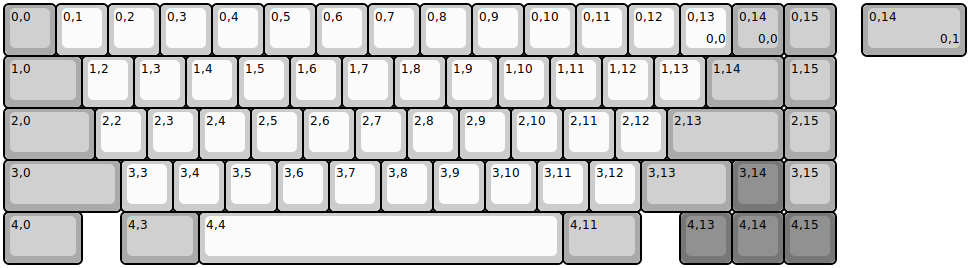{:loading="lazy"}

[Open in keyboard-layout-editor](http://www.keyboard-layout-editor.com/##@@_c=#aaaaaa;&=0,0&_c=#cccccc;&=0,1&=0,2&=0,3&=0,4&=0,5&=0,6&=0,7&=0,8&=0,9&=0,10&=0,11&=0,12&=0,13%0A%0A%0A0,0&_c=#aaaaaa;&=0,14%0A%0A%0A0,0&=0,15;&@_w:1.5;&=1,0&_c=#cccccc;&=1,2&=1,3&=1,4&=1,5&=1,6&=1,7&=1,8&=1,9&=1,10&=1,11&=1,12&=1,13&_c=#aaaaaa&w:1.5;&=1,14&=1,15;&@_w:1.75;&=2,0&_c=#cccccc;&=2,2&=2,3&=2,4&=2,5&=2,6&=2,7&=2,8&=2,9&=2,10&=2,11&=2,12&_c=#aaaaaa&w:2.25;&=2,13&=2,15;&@_w:2.25;&=3,0&_c=#cccccc;&=3,3&=3,4&=3,5&=3,6&=3,7&=3,8&=3,9&=3,10&=3,11&=3,12&_c=#aaaaaa&w:1.75;&=3,13&_c=#777777;&=3,14&_c=#aaaaaa;&=3,15;&@_w:1.5;&=4,0&_x:0.75&w:1.5;&=4,3&_c=#cccccc&w:7;&=4,4&_c=#aaaaaa&w:1.5;&=4,11&_x:0.75&c=#777777;&=4,13&=4,14&=4,15;&@_x:16.5&y:-5&c=#aaaaaa&w:2;&=0,14%0A%0A%0A0,1)

## gentleman65/gentleman65

[README](output/gentleman65/README.md) - [layout](output/gentleman65/gentleman65-kle.json) - [PCB](output/gentleman65/gentleman65.kicad_pcb) - [PCB render](output/gentleman65/gentleman65-render.svg)

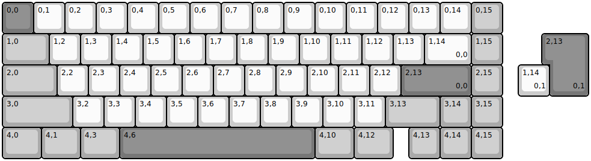{:loading="lazy"}

[Open in keyboard-layout-editor](http://www.keyboard-layout-editor.com/##@@_c=#777777;&=0,0&_c=#cccccc;&=0,1&=0,2&=0,3&=0,4&=0,5&=0,6&=0,7&=0,8&=0,9&=0,10&=0,11&=0,12&=0,13&=0,14&_c=#aaaaaa;&=0,15;&@_w:1.5;&=1,0&_c=#cccccc;&=1,2&=1,3&=1,4&=1,5&=1,6&=1,7&=1,8&=1,9&=1,10&=1,11&=1,12&=1,13&_w:1.5;&=1,14%0A%0A%0A0,0&_c=#aaaaaa;&=1,15;&@_w:1.75;&=2,0&_c=#cccccc;&=2,2&=2,3&=2,4&=2,5&=2,6&=2,7&=2,8&=2,9&=2,10&=2,11&=2,12&_c=#777777&w:2.25;&=2,13%0A%0A%0A0,0&_c=#aaaaaa;&=2,15;&@_w:2.25;&=3,0&_c=#cccccc;&=3,2&=3,3&=3,4&=3,5&=3,6&=3,7&=3,8&=3,9&=3,10&=3,11&_c=#aaaaaa&w:1.75;&=3,13&=3,14&=3,15;&@_w:1.25;&=4,0&_w:1.25;&=4,1&_w:1.25;&=4,3&_c=#777777&w:6.25;&=4,6&_c=#aaaaaa&w:1.25;&=4,10&_w:1.25;&=4,12&_x:0.5;&=4,13&=4,14&=4,15;&@_x:17.5&y:-4&c=#777777&w:1.25&h:2&w2:1.5&h2:1&x2:-0.25;&=2,13%0A%0A%0A0,1;&@_x:16.5&c=#cccccc;&=1,14%0A%0A%0A0,1)

## geonworks/frogmini/fmh

[README](output/geonworks/frogmini/README.md) - [layout](output/geonworks/frogmini/fmh-kle.json) - [PCB](output/geonworks/frogmini/fmh.kicad_pcb) - [PCB render](output/geonworks/frogmini/fmh-render.svg)

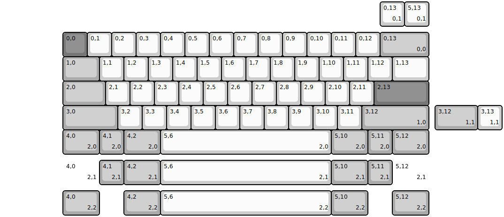{:loading="lazy"}

[Open in keyboard-layout-editor](http://www.keyboard-layout-editor.com/##@@_x:2.5&y:1.25&c=#777777;&=0,0&_c=#cccccc;&=0,1&=0,2&=0,3&=0,4&=0,5&=0,6&=0,7&=0,8&=0,9&=0,10&=0,11&=0,12&_c=#aaaaaa&w:2;&=0,13%0A%0A%0A0,0;&@_x:2.5&w:1.5;&=1,0&_c=#cccccc;&=1,1&=1,2&=1,3&=1,4&=1,5&=1,6&=1,7&=1,8&=1,9&=1,10&=1,11&=1,12&_w:1.5;&=1,13;&@_x:2.5&c=#aaaaaa&w:1.75;&=2,0&_c=#cccccc;&=2,1&=2,2&=2,3&=2,4&=2,5&=2,6&=2,7&=2,8&=2,9&=2,10&=2,11&_c=#777777&w:2.25;&=2,13;&@_x:2.5&c=#aaaaaa&w:2.25;&=3,0&_c=#cccccc;&=3,2&=3,3&=3,4&=3,5&=3,6&=3,7&=3,8&=3,9&=3,10&=3,11&_c=#aaaaaa&w:2.75;&=3,12%0A%0A%0A1,0;&@_x:2.5&w:1.5;&=4,0%0A%0A%0A2,0&=4,1%0A%0A%0A2,0&_w:1.5;&=4,2%0A%0A%0A2,0&_c=#cccccc&w:7;&=5,6%0A%0A%0A2,0&_c=#aaaaaa&w:1.5;&=5,10%0A%0A%0A2,0&=5,11%0A%0A%0A2,0&_w:1.5;&=5,12%0A%0A%0A2,0;&@_x:15.5&y:-6.25&c=#cccccc;&=0,13%0A%0A%0A0,1&=5,13%0A%0A%0A0,1;&@_x:17.75&y:3.25&c=#aaaaaa&w:1.75;&=3,12%0A%0A%0A1,1&_c=#cccccc;&=3,13%0A%0A%0A1,1;&@_x:2.5&y:1.25&c=#aaaaaa&w:1.5&d:true;&=4,0%0A%0A%0A2,1&=4,1%0A%0A%0A2,1&_w:1.5;&=4,2%0A%0A%0A2,1&_c=#cccccc&w:7;&=5,6%0A%0A%0A2,1&_c=#aaaaaa&w:1.5;&=5,10%0A%0A%0A2,1&=5,11%0A%0A%0A2,1&_w:1.5&d:true;&=5,12%0A%0A%0A2,1;&@_x:2.5&y:0.25&w:1.5;&=4,0%0A%0A%0A2,2&_x:1.0&w:1.5;&=4,2%0A%0A%0A2,2&_c=#cccccc&w:7;&=5,6%0A%0A%0A2,2&_c=#aaaaaa&w:1.5;&=5,10%0A%0A%0A2,2&_x:1.0&w:1.5;&=5,12%0A%0A%0A2,2)

## geonworks/frogmini/fms

[README](output/geonworks/frogmini/README.md) - [layout](output/geonworks/frogmini/fms-kle.json) - [PCB](output/geonworks/frogmini/fms.kicad_pcb) - [PCB render](output/geonworks/frogmini/fms-render.svg)

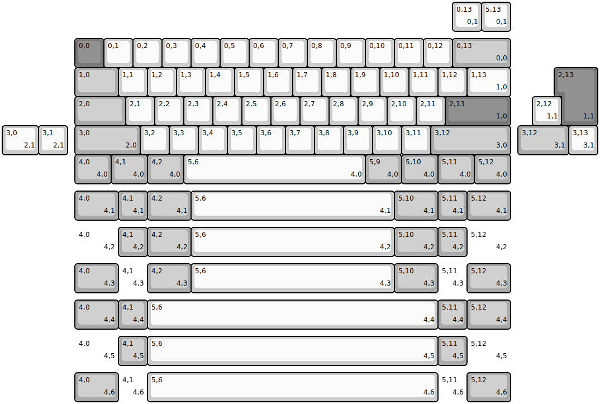{:loading="lazy"}

[Open in keyboard-layout-editor](http://www.keyboard-layout-editor.com/##@@_x:2.5&y:1.25&c=#777777;&=0,0&_c=#cccccc;&=0,1&=0,2&=0,3&=0,4&=0,5&=0,6&=0,7&=0,8&=0,9&=0,10&=0,11&=0,12&_c=#aaaaaa&w:2;&=0,13%0A%0A%0A0,0;&@_x:2.5&w:1.5;&=1,0&_c=#cccccc;&=1,1&=1,2&=1,3&=1,4&=1,5&=1,6&=1,7&=1,8&=1,9&=1,10&=1,11&=1,12&_w:1.5;&=1,13%0A%0A%0A1,0;&@_x:2.5&c=#aaaaaa&w:1.75;&=2,0&_c=#cccccc;&=2,1&=2,2&=2,3&=2,4&=2,5&=2,6&=2,7&=2,8&=2,9&=2,10&=2,11&_c=#777777&w:2.25;&=2,13%0A%0A%0A1,0;&@_x:2.5&c=#aaaaaa&w:2.25;&=3,0%0A%0A%0A2,0&_c=#cccccc;&=3,2&=3,3&=3,4&=3,5&=3,6&=3,7&=3,8&=3,9&=3,10&=3,11&_c=#aaaaaa&w:2.75;&=3,12%0A%0A%0A3,0;&@_x:2.5&w:1.25;&=4,0%0A%0A%0A4,0&_w:1.25;&=4,1%0A%0A%0A4,0&_w:1.25;&=4,2%0A%0A%0A4,0&_c=#cccccc&w:6.25;&=5,6%0A%0A%0A4,0&_c=#aaaaaa&w:1.25;&=5,9%0A%0A%0A4,0&_w:1.25;&=5,10%0A%0A%0A4,0&_w:1.25;&=5,11%0A%0A%0A4,0&_w:1.25;&=5,12%0A%0A%0A4,0;&@_x:15.5&y:-6.25&c=#cccccc;&=0,13%0A%0A%0A0,1&=5,13%0A%0A%0A0,1;&@_x:19.25&y:1.25&c=#777777&w:1.25&h:2&w2:1.5&h2:1&x2:-0.25;&=2,13%0A%0A%0A1,1;&@_x:18.25&c=#cccccc;&=2,12%0A%0A%0A1,1;&@_w:1.25;&=3,0%0A%0A%0A2,1&=3,1%0A%0A%0A2,1&_x:15.5&c=#aaaaaa&w:1.75;&=3,12%0A%0A%0A3,1&_c=#cccccc;&=3,13%0A%0A%0A3,1;&@_x:2.5&y:1.25&c=#aaaaaa&w:1.5;&=4,0%0A%0A%0A4,1&=4,1%0A%0A%0A4,1&_w:1.5;&=4,2%0A%0A%0A4,1&_c=#cccccc&w:7;&=5,6%0A%0A%0A4,1&_c=#aaaaaa&w:1.5;&=5,10%0A%0A%0A4,1&=5,11%0A%0A%0A4,1&_w:1.5;&=5,12%0A%0A%0A4,1;&@_x:2.5&y:0.25&w:1.5&d:true;&=4,0%0A%0A%0A4,2&=4,1%0A%0A%0A4,2&_w:1.5;&=4,2%0A%0A%0A4,2&_c=#cccccc&w:7;&=5,6%0A%0A%0A4,2&_c=#aaaaaa&w:1.5;&=5,10%0A%0A%0A4,2&=5,11%0A%0A%0A4,2&_w:1.5&d:true;&=5,12%0A%0A%0A4,2;&@_x:2.5&y:0.25&w:1.5;&=4,0%0A%0A%0A4,3&_d:true;&=4,1%0A%0A%0A4,3&_w:1.5;&=4,2%0A%0A%0A4,3&_c=#cccccc&w:7;&=5,6%0A%0A%0A4,3&_c=#aaaaaa&w:1.5;&=5,10%0A%0A%0A4,3&_d:true;&=5,11%0A%0A%0A4,3&_w:1.5;&=5,12%0A%0A%0A4,3;&@_x:2.5&y:0.25&w:1.5;&=4,0%0A%0A%0A4,4&=4,1%0A%0A%0A4,4&_c=#cccccc&w:10;&=5,6%0A%0A%0A4,4&_c=#aaaaaa;&=5,11%0A%0A%0A4,4&_w:1.5;&=5,12%0A%0A%0A4,4;&@_x:2.5&y:0.25&w:1.5&d:true;&=4,0%0A%0A%0A4,5&=4,1%0A%0A%0A4,5&_c=#cccccc&w:10;&=5,6%0A%0A%0A4,5&_c=#aaaaaa;&=5,11%0A%0A%0A4,5&_w:1.5&d:true;&=5,12%0A%0A%0A4,5;&@_x:2.5&y:0.25&w:1.5;&=4,0%0A%0A%0A4,6&_d:true;&=4,1%0A%0A%0A4,6&_c=#cccccc&w:10;&=5,6%0A%0A%0A4,6&_c=#aaaaaa&d:true;&=5,11%0A%0A%0A4,6&_w:1.5;&=5,12%0A%0A%0A4,6)

## gh60/revc

[README](output/gh60/revc/README.md) - [layout](output/gh60/revc/revc-kle.json) - [PCB](output/gh60/revc/revc.kicad_pcb) - [PCB render](output/gh60/revc/revc-render.svg)

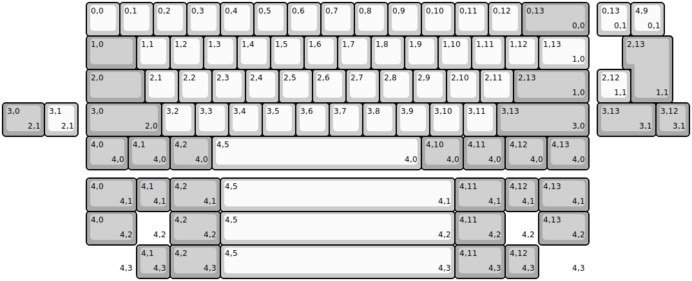{:loading="lazy"}

[Open in keyboard-layout-editor](http://www.keyboard-layout-editor.com/##@@_x:2.5;&=0,0&=0,1&=0,2&=0,3&=0,4&=0,5&=0,6&=0,7&=0,8&=0,9&=0,10&=0,11&=0,12&_c=#aaaaaa&w:2;&=0,13%0A%0A%0A0,0;&@_x:2.5&w:1.5;&=1,0&_c=#cccccc;&=1,1&=1,2&=1,3&=1,4&=1,5&=1,6&=1,7&=1,8&=1,9&=1,10&=1,11&=1,12&_w:1.5;&=1,13%0A%0A%0A1,0;&@_x:2.5&c=#aaaaaa&w:1.75;&=2,0&_c=#cccccc;&=2,1&=2,2&=2,3&=2,4&=2,5&=2,6&=2,7&=2,8&=2,9&=2,10&=2,11&_c=#aaaaaa&w:2.25;&=2,13%0A%0A%0A1,0;&@_x:2.5&w:2.25;&=3,0%0A%0A%0A2,0&_c=#cccccc;&=3,2&=3,3&=3,4&=3,5&=3,6&=3,7&=3,8&=3,9&=3,10&=3,11&_c=#aaaaaa&w:2.75;&=3,13%0A%0A%0A3,0;&@_x:2.5&w:1.25;&=4,0%0A%0A%0A4,0&_w:1.25;&=4,1%0A%0A%0A4,0&_w:1.25;&=4,2%0A%0A%0A4,0&_c=#cccccc&w:6.25;&=4,5%0A%0A%0A4,0&_c=#aaaaaa&w:1.25;&=4,10%0A%0A%0A4,0&_w:1.25;&=4,11%0A%0A%0A4,0&_w:1.25;&=4,12%0A%0A%0A4,0&_w:1.25;&=4,13%0A%0A%0A4,0;&@_x:17.75&y:-5&c=#cccccc;&=0,13%0A%0A%0A0,1&=4,9%0A%0A%0A0,1;&@_x:18.75&c=#aaaaaa&w:1.25&h:2&w2:1.5&h2:1&x2:-0.25;&=2,13%0A%0A%0A1,1;&@_x:17.75&c=#cccccc;&=2,12%0A%0A%0A1,1;&@_c=#aaaaaa&w:1.25;&=3,0%0A%0A%0A2,1&_c=#cccccc;&=3,1%0A%0A%0A2,1&_x:15.5&c=#aaaaaa&w:1.75;&=3,13%0A%0A%0A3,1&=3,12%0A%0A%0A3,1;&@_x:2.5&y:1.25&w:1.5;&=4,0%0A%0A%0A4,1&=4,1%0A%0A%0A4,1&_w:1.5;&=4,2%0A%0A%0A4,1&_c=#cccccc&w:7;&=4,5%0A%0A%0A4,1&_c=#aaaaaa&w:1.5;&=4,11%0A%0A%0A4,1&=4,12%0A%0A%0A4,1&_w:1.5;&=4,13%0A%0A%0A4,1;&@_x:2.5&w:1.5;&=4,0%0A%0A%0A4,2&_c=#cccccc&d:true;&=%0A%0A%0A4,2&_c=#aaaaaa&w:1.5;&=4,2%0A%0A%0A4,2&_c=#cccccc&w:7;&=4,5%0A%0A%0A4,2&_c=#aaaaaa&w:1.5;&=4,11%0A%0A%0A4,2&_c=#cccccc&d:true;&=%0A%0A%0A4,2&_c=#aaaaaa&w:1.5;&=4,13%0A%0A%0A4,2;&@_x:2.5&c=#cccccc&w:1.5&d:true;&=%0A%0A%0A4,3&_c=#aaaaaa;&=4,1%0A%0A%0A4,3&_w:1.5;&=4,2%0A%0A%0A4,3&_c=#cccccc&w:7;&=4,5%0A%0A%0A4,3&_c=#aaaaaa&w:1.5;&=4,11%0A%0A%0A4,3&=4,12%0A%0A%0A4,3&_c=#cccccc&w:1.5&d:true;&=%0A%0A%0A4,3)

## gh60/satan

[README](output/gh60/satan/README.md) - [layout](output/gh60/satan/satan-kle.json) - [PCB](output/gh60/satan/satan.kicad_pcb) - [PCB render](output/gh60/satan/satan-render.svg)

{:loading="lazy"}

[Open in keyboard-layout-editor](http://www.keyboard-layout-editor.com/##@@_x:2.5;&=0,0&=0,1&=0,2&=0,3&=0,4&=0,5&=0,6&=0,7&=0,8&=0,9&=0,10&=0,11&=0,12&_c=#aaaaaa&w:2;&=0,13%0A%0A%0A0,0;&@_x:2.5&w:1.5;&=1,0&_c=#cccccc;&=1,1&=1,2&=1,3&=1,4&=1,5&=1,6&=1,7&=1,8&=1,9&=1,10&=1,11&=1,12&_w:1.5;&=1,13%0A%0A%0A1,0;&@_x:2.5&c=#aaaaaa&w:1.75;&=2,0&_c=#cccccc;&=2,1&=2,2&=2,3&=2,4&=2,5&=2,6&=2,7&=2,8&=2,9&=2,10&=2,11&_c=#aaaaaa&w:2.25;&=2,13%0A%0A%0A1,0;&@_x:2.5&w:2.25;&=3,0%0A%0A%0A2,0&_c=#cccccc;&=3,2&=3,3&=3,4&=3,5&=3,6&=3,7&=3,8&=3,9&=3,10&=3,11&_c=#aaaaaa&w:2.75;&=3,13%0A%0A%0A3,0;&@_x:2.5&w:1.25;&=4,0%0A%0A%0A4,0&_w:1.25;&=4,1%0A%0A%0A4,0&_w:1.25;&=4,2%0A%0A%0A4,0&_c=#cccccc&w:6.25;&=4,5%0A%0A%0A4,0&_c=#aaaaaa&w:1.25;&=4,10%0A%0A%0A4,0&_w:1.25;&=4,11%0A%0A%0A4,0&_w:1.25;&=4,12%0A%0A%0A4,0&_w:1.25;&=4,13%0A%0A%0A4,0;&@_x:17.75&y:-5&c=#cccccc;&=0,13%0A%0A%0A0,1&=4,9%0A%0A%0A0,1;&@_x:18.75&c=#aaaaaa&w:1.25&h:2&w2:1.5&h2:1&x2:-0.25;&=2,13%0A%0A%0A1,1;&@_x:17.75&c=#cccccc;&=2,12%0A%0A%0A1,1;&@_c=#aaaaaa&w:1.25;&=3,0%0A%0A%0A2,1&_c=#cccccc;&=3,1%0A%0A%0A2,1&_x:15.5&c=#aaaaaa&w:1.75;&=3,13%0A%0A%0A3,1&=3,12%0A%0A%0A3,1;&@_x:2.5&y:1.25&w:1.5;&=4,0%0A%0A%0A4,1&=4,1%0A%0A%0A4,1&_w:1.5;&=4,2%0A%0A%0A4,1&_c=#cccccc&w:7;&=4,5%0A%0A%0A4,1&_c=#aaaaaa&w:1.5;&=4,11%0A%0A%0A4,1&=4,12%0A%0A%0A4,1&_w:1.5;&=4,13%0A%0A%0A4,1;&@_x:2.5&w:1.5;&=4,0%0A%0A%0A4,2&_c=#cccccc&d:true;&=%0A%0A%0A4,2&_c=#aaaaaa&w:1.5;&=4,2%0A%0A%0A4,2&_c=#cccccc&w:7;&=4,5%0A%0A%0A4,2&_c=#aaaaaa&w:1.5;&=4,11%0A%0A%0A4,2&_c=#cccccc&d:true;&=%0A%0A%0A4,2&_c=#aaaaaa&w:1.5;&=4,13%0A%0A%0A4,2;&@_x:2.5&c=#cccccc&w:1.5&d:true;&=%0A%0A%0A4,3&_c=#aaaaaa;&=4,1%0A%0A%0A4,3&_w:1.5;&=4,2%0A%0A%0A4,3&_c=#cccccc&w:7;&=4,5%0A%0A%0A4,3&_c=#aaaaaa&w:1.5;&=4,11%0A%0A%0A4,3&=4,12%0A%0A%0A4,3&_c=#cccccc&w:1.5&d:true;&=%0A%0A%0A4,3)

## ghs/jem_hotswap_ansi

[README](output/ghs/README.md) - [layout](output/ghs/jem_hotswap_ansi-kle.json) - [PCB](output/ghs/jem_hotswap_ansi.kicad_pcb) - [PCB render](output/ghs/jem_hotswap_ansi-render.svg)

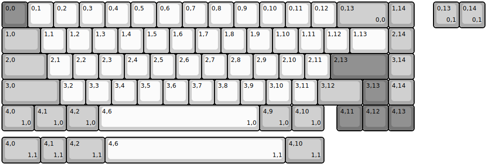{:loading="lazy"}

[Open in keyboard-layout-editor](http://www.keyboard-layout-editor.com/##@@_c=#777777;&=0,0&_c=#cccccc;&=0,1&=0,2&=0,3&=0,4&=0,5&=0,6&=0,7&=0,8&=0,9&=0,10&=0,11&=0,12&_c=#aaaaaa&w:2;&=0,13%0A%0A%0A0,0&=1,14;&@_w:1.5;&=1,0&_c=#cccccc;&=1,1&=1,2&=1,3&=1,4&=1,5&=1,6&=1,7&=1,8&=1,9&=1,10&=1,11&=1,12&_w:1.5;&=1,13&_c=#aaaaaa;&=2,14;&@_w:1.75;&=2,0&_c=#cccccc;&=2,1&=2,2&=2,3&=2,4&=2,5&=2,6&=2,7&=2,8&=2,9&=2,10&=2,11&_c=#777777&w:2.25;&=2,13&_c=#aaaaaa;&=3,14;&@_w:2.25;&=3,0&_c=#cccccc;&=3,2&=3,3&=3,4&=3,5&=3,6&=3,7&=3,8&=3,9&=3,10&=3,11&_c=#aaaaaa&w:1.75;&=3,12&_c=#777777;&=3,13&_c=#aaaaaa;&=4,14;&@_w:1.25;&=4,0%0A%0A%0A1,0&_w:1.25;&=4,1%0A%0A%0A1,0&_w:1.25;&=4,2%0A%0A%0A1,0&_c=#cccccc&w:6.25;&=4,6%0A%0A%0A1,0&_c=#aaaaaa&w:1.25;&=4,9%0A%0A%0A1,0&_w:1.25;&=4,10%0A%0A%0A1,0&_x:0.5&c=#777777;&=4,11&=4,12&=4,13;&@_x:16.75&y:-5&c=#aaaaaa;&=0,13%0A%0A%0A0,1&=0,14%0A%0A%0A0,1;&@_y:4.25&w:1.5;&=4,0%0A%0A%0A1,1&=4,1%0A%0A%0A1,1&_w:1.5;&=4,2%0A%0A%0A1,1&_c=#cccccc&w:7;&=4,6%0A%0A%0A1,1&_c=#aaaaaa&w:1.5;&=4,10%0A%0A%0A1,1)

## ghs/jem_soldered

[README](output/ghs/README.md) - [layout](output/ghs/jem_soldered-kle.json) - [PCB](output/ghs/jem_soldered.kicad_pcb) - [PCB render](output/ghs/jem_soldered-render.svg)

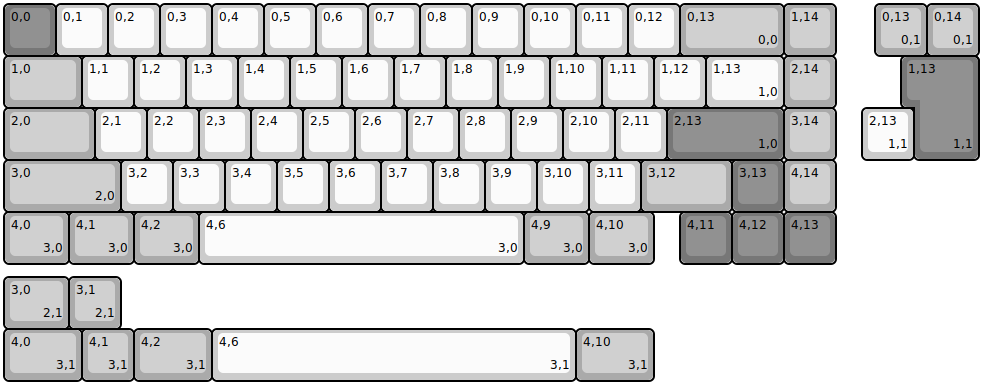{:loading="lazy"}

[Open in keyboard-layout-editor](http://www.keyboard-layout-editor.com/##@@_c=#777777;&=0,0&_c=#cccccc;&=0,1&=0,2&=0,3&=0,4&=0,5&=0,6&=0,7&=0,8&=0,9&=0,10&=0,11&=0,12&_c=#aaaaaa&w:2;&=0,13%0A%0A%0A0,0&=1,14;&@_w:1.5;&=1,0&_c=#cccccc;&=1,1&=1,2&=1,3&=1,4&=1,5&=1,6&=1,7&=1,8&=1,9&=1,10&=1,11&=1,12&_w:1.5;&=1,13%0A%0A%0A1,0&_c=#aaaaaa;&=2,14;&@_w:1.75;&=2,0&_c=#cccccc;&=2,1&=2,2&=2,3&=2,4&=2,5&=2,6&=2,7&=2,8&=2,9&=2,10&=2,11&_c=#777777&w:2.25;&=2,13%0A%0A%0A1,0&_c=#aaaaaa;&=3,14;&@_w:2.25;&=3,0%0A%0A%0A2,0&_c=#cccccc;&=3,2&=3,3&=3,4&=3,5&=3,6&=3,7&=3,8&=3,9&=3,10&=3,11&_c=#aaaaaa&w:1.75;&=3,12&_c=#777777;&=3,13&_c=#aaaaaa;&=4,14;&@_w:1.25;&=4,0%0A%0A%0A3,0&_w:1.25;&=4,1%0A%0A%0A3,0&_w:1.25;&=4,2%0A%0A%0A3,0&_c=#cccccc&w:6.25;&=4,6%0A%0A%0A3,0&_c=#aaaaaa&w:1.25;&=4,9%0A%0A%0A3,0&_w:1.25;&=4,10%0A%0A%0A3,0&_x:0.5&c=#777777;&=4,11&=4,12&=4,13;&@_x:16.75&y:-5&c=#aaaaaa;&=0,13%0A%0A%0A0,1&=0,14%0A%0A%0A0,1;&@_x:17.5&c=#777777&w:1.25&h:2&w2:1.5&h2:1&x2:-0.25;&=1,13%0A%0A%0A1,1;&@_x:16.5&c=#cccccc;&=2,13%0A%0A%0A1,1;&@_y:2.25&c=#aaaaaa&w:1.25;&=3,0%0A%0A%0A2,1&=3,1%0A%0A%0A2,1;&@_w:1.5;&=4,0%0A%0A%0A3,1&=4,1%0A%0A%0A3,1&_w:1.5;&=4,2%0A%0A%0A3,1&_c=#cccccc&w:7;&=4,6%0A%0A%0A3,1&_c=#aaaaaa&w:1.5;&=4,10%0A%0A%0A3,1)

## ghs/rar

[README](output/ghs/README.md) - [layout](output/ghs/rar-kle.json) - [PCB](output/ghs/rar.kicad_pcb) - [PCB render](output/ghs/rar-render.svg)

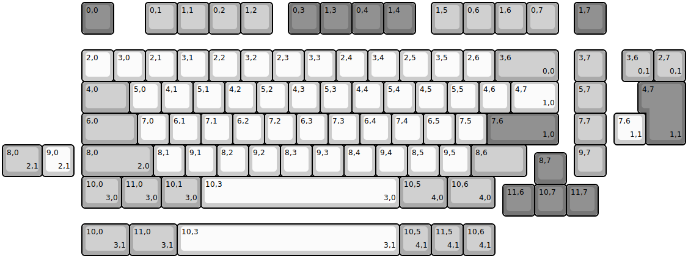{:loading="lazy"}

[Open in keyboard-layout-editor](http://www.keyboard-layout-editor.com/##@@_x:2.5&c=#777777;&=0,0&_x:1.0&c=#aaaaaa;&=0,1&=1,1&=0,2&=1,2&_x:0.5&c=#777777;&=0,3&=1,3&=0,4&=1,4&_x:0.5&c=#aaaaaa;&=1,5&=0,6&=1,6&=0,7&_x:0.5&c=#777777;&=1,7;&@_x:2.5&y:0.5&c=#cccccc;&=2,0&=3,0&=2,1&=3,1&=2,2&=3,2&=2,3&=3,3&=2,4&=3,4&=2,5&=3,5&=2,6&_c=#aaaaaa&w:2;&=3,6%0A%0A%0A0,0&_x:0.5;&=3,7;&@_x:2.5&w:1.5;&=4,0&_c=#cccccc;&=5,0&=4,1&=5,1&=4,2&=5,2&=4,3&=5,3&=4,4&=5,4&=4,5&=5,5&=4,6&_w:1.5;&=4,7%0A%0A%0A1,0&_x:0.5&c=#aaaaaa;&=5,7;&@_x:2.5&w:1.75;&=6,0&_c=#cccccc;&=7,0&=6,1&=7,1&=6,2&=7,2&=6,3&=7,3&=6,4&=7,4&=6,5&=7,5&_c=#777777&w:2.25;&=7,6%0A%0A%0A1,0&_x:0.5&c=#aaaaaa;&=7,7;&@_x:2.5&w:2.25;&=8,0%0A%0A%0A2,0&_c=#cccccc;&=8,1&=9,1&=8,2&=9,2&=8,3&=9,3&=8,4&=9,4&=8,5&=9,5&_c=#aaaaaa&w:1.75;&=8,6&_x:1.5;&=9,7;&@_x:16.75&y:-0.75&c=#777777;&=8,7;&@_x:2.5&y:-0.25&c=#aaaaaa&w:1.25;&=10,0%0A%0A%0A3,0&_w:1.25;&=11,0%0A%0A%0A3,0&_w:1.25;&=10,1%0A%0A%0A3,0&_c=#cccccc&w:6.25;&=10,3%0A%0A%0A3,0&_c=#aaaaaa&w:1.5;&=10,5%0A%0A%0A4,0&_w:1.5;&=10,6%0A%0A%0A4,0;&@_x:15.75&y:-0.75&c=#777777;&=11,6&=10,7&=11,7;&@_x:19.5&y:-5.25&c=#aaaaaa;&=3,6%0A%0A%0A0,1&=2,7%0A%0A%0A0,1;&@_x:20.25&c=#777777&w:1.25&h:2&w2:1.5&h2:1&x2:-0.25;&=4,7%0A%0A%0A1,1;&@_x:19.25&c=#cccccc;&=7,6%0A%0A%0A1,1;&@_c=#aaaaaa&w:1.25;&=8,0%0A%0A%0A2,1&_c=#cccccc;&=9,0%0A%0A%0A2,1;&@_x:2.5&y:1.5&c=#aaaaaa&w:1.5;&=10,0%0A%0A%0A3,1&_w:1.5;&=11,0%0A%0A%0A3,1&_c=#cccccc&w:7;&=10,3%0A%0A%0A3,1&_c=#aaaaaa;&=10,5%0A%0A%0A4,1&=11,5%0A%0A%0A4,1&=10,6%0A%0A%0A4,1)

## ghs/xls

[README](output/ghs/README.md) - [layout](output/ghs/xls-kle.json) - [PCB](output/ghs/xls.kicad_pcb) - [PCB render](output/ghs/xls-render.svg)

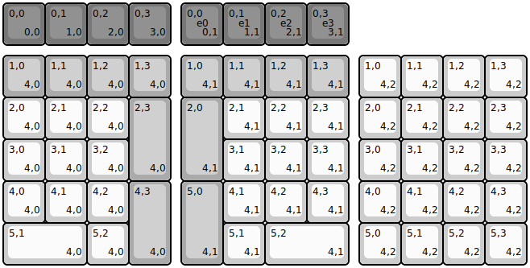{:loading="lazy"}

[Open in keyboard-layout-editor](http://www.keyboard-layout-editor.com/##@@_c=#777777;&=0,0%0A%0A%0A0,0&=0,1%0A%0A%0A1,0&=0,2%0A%0A%0A2,0&=0,3%0A%0A%0A3,0;&@_y:0.25&c=#aaaaaa;&=1,0%0A%0A%0A4,0&=1,1%0A%0A%0A4,0&=1,2%0A%0A%0A4,0&=1,3%0A%0A%0A4,0;&@_c=#cccccc;&=2,0%0A%0A%0A4,0&=2,1%0A%0A%0A4,0&=2,2%0A%0A%0A4,0&_c=#aaaaaa&h:2;&=2,3%0A%0A%0A4,0;&@_c=#cccccc;&=3,0%0A%0A%0A4,0&=3,1%0A%0A%0A4,0&=3,2%0A%0A%0A4,0;&@=4,0%0A%0A%0A4,0&=4,1%0A%0A%0A4,0&=4,2%0A%0A%0A4,0&_c=#aaaaaa&h:2;&=4,3%0A%0A%0A4,0;&@_c=#cccccc&w:2;&=5,1%0A%0A%0A4,0&=5,2%0A%0A%0A4,0;&@_x:4.25&y:-6.25&c=#777777;&=0,0%0A%0A%0A0,1%0A%0A%0A%0A%0A%0Ae0&=0,1%0A%0A%0A1,1%0A%0A%0A%0A%0A%0Ae1&=0,2%0A%0A%0A2,1%0A%0A%0A%0A%0A%0Ae2&=0,3%0A%0A%0A3,1%0A%0A%0A%0A%0A%0Ae3;&@_x:4.25&y:0.25&c=#aaaaaa;&=1,0%0A%0A%0A4,1&=1,1%0A%0A%0A4,1&=1,2%0A%0A%0A4,1&=1,3%0A%0A%0A4,1&_x:0.25&c=#cccccc;&=1,0%0A%0A%0A4,2&=1,1%0A%0A%0A4,2&=1,2%0A%0A%0A4,2&=1,3%0A%0A%0A4,2;&@_x:4.25&c=#aaaaaa&h:2;&=2,0%0A%0A%0A4,1&_c=#cccccc;&=2,1%0A%0A%0A4,1&=2,2%0A%0A%0A4,1&=2,3%0A%0A%0A4,1&_x:0.25;&=2,0%0A%0A%0A4,2&=2,1%0A%0A%0A4,2&=2,2%0A%0A%0A4,2&=2,3%0A%0A%0A4,2;&@_x:5.25;&=3,1%0A%0A%0A4,1&=3,2%0A%0A%0A4,1&=3,3%0A%0A%0A4,1&_x:0.25;&=3,0%0A%0A%0A4,2&=3,1%0A%0A%0A4,2&=3,2%0A%0A%0A4,2&=3,3%0A%0A%0A4,2;&@_x:4.25&c=#aaaaaa&h:2;&=5,0%0A%0A%0A4,1&_c=#cccccc;&=4,1%0A%0A%0A4,1&=4,2%0A%0A%0A4,1&=4,3%0A%0A%0A4,1&_x:0.25;&=4,0%0A%0A%0A4,2&=4,1%0A%0A%0A4,2&=4,2%0A%0A%0A4,2&=4,3%0A%0A%0A4,2;&@_x:5.25;&=5,1%0A%0A%0A4,1&_w:2;&=5,2%0A%0A%0A4,1&_x:0.25;&=5,0%0A%0A%0A4,2&=5,1%0A%0A%0A4,2&=5,2%0A%0A%0A4,2&=5,3%0A%0A%0A4,2)

## gizmo_engineering/gk6

[README](output/gizmo_engineering/README.md) - [layout](output/gizmo_engineering/gk6-kle.json) - [PCB](output/gizmo_engineering/gk6.kicad_pcb) - [PCB render](output/gizmo_engineering/gk6-render.svg)

{:loading="lazy"}

[Open in keyboard-layout-editor](http://www.keyboard-layout-editor.com/##@@=0,0&=0,1&=0,2&=0,3&=0,4&=0,5&=0,6&=0,7&=0,8&=0,9&=0,10&=0,11;&@_c=#777777;&=1,0&_c=#cccccc;&=1,1&=1,2&=1,3&=1,4&=1,5&=1,6&=1,7&=1,8&=1,9&=1,10&_c=#777777;&=1,11;&@_c=#aaaaaa;&=2,0&_c=#cccccc;&=2,1&=2,2&=2,3&=2,4&=2,5&=2,6&=2,7&=2,8&=2,9&=2,10&=2,11;&@_c=#aaaaaa;&=3,0&_c=#cccccc;&=3,1&=3,2&=3,3&=3,4&=3,5&=3,6&=3,7&=3,8&=3,9&_c=#777777;&=3,10&=3,11;&@=4,0%0A%0A%0A0,0&_c=#aaaaaa;&=4,1%0A%0A%0A0,0&=4,2%0A%0A%0A0,0&=4,3%0A%0A%0A0,0&_c=#777777&w:2;&=4,4%0A%0A%0A0,0&_w:2;&=4,7%0A%0A%0A0,0&_c=#aaaaaa;&=4,8%0A%0A%0A0,0&_c=#777777;&=4,9%0A%0A%0A0,0&=4,10%0A%0A%0A0,0&=4,11%0A%0A%0A0,0;&@=4,0%0A%0A%0A0,1&_c=#aaaaaa;&=4,1%0A%0A%0A0,1&=4,2%0A%0A%0A0,1&=4,3%0A%0A%0A0,1&_c=#777777;&=4,4%0A%0A%0A0,1&_w:2;&=4,5%0A%0A%0A0,1&_c=#aaaaaa;&=4,7%0A%0A%0A0,1&=4,8%0A%0A%0A0,1&_c=#777777;&=4,9%0A%0A%0A0,1&=4,10%0A%0A%0A0,1&=4,11%0A%0A%0A0,1;&@=4,0%0A%0A%0A0,2&_c=#aaaaaa;&=4,1%0A%0A%0A0,2&=4,2%0A%0A%0A0,2&=4,3%0A%0A%0A0,2&_c=#777777;&=4,4%0A%0A%0A0,2&=4,5%0A%0A%0A0,2&=4,6%0A%0A%0A0,2&_c=#aaaaaa;&=4,7%0A%0A%0A0,2&=4,8%0A%0A%0A0,2&_c=#777777;&=4,9%0A%0A%0A0,2&=4,10%0A%0A%0A0,2&=4,11%0A%0A%0A0,2)

## gkeyboard/gkb_m16

[README](output/gkeyboard/gkb_m16/README.md) - [layout](output/gkeyboard/gkb_m16/gkb_m16-kle.json) - [PCB](output/gkeyboard/gkb_m16/gkb_m16.kicad_pcb) - [PCB render](output/gkeyboard/gkb_m16/gkb_m16-render.svg)

{:loading="lazy"}

[Open in keyboard-layout-editor](http://www.keyboard-layout-editor.com/##@@=0,0&=0,1&=0,2&=0,3;&@=1,0&=1,1&=1,2&=1,3;&@=2,0&=2,1&=2,2&=2,3;&@=3,0&=3,1&=3,2&=3,3)

## gl516/xr63gl

[README](output/gl516/xr63gl/README.md) - [layout](output/gl516/xr63gl/xr63gl-kle.json) - [PCB](output/gl516/xr63gl/xr63gl.kicad_pcb) - [PCB render](output/gl516/xr63gl/xr63gl-render.svg)

{:loading="lazy"}

[Open in keyboard-layout-editor](http://www.keyboard-layout-editor.com/##@@_c=#777777;&=0,1&_c=#cccccc;&=0,2&=0,3&=0,4&=0,5&=0,6&=0,7&=0,8&=1,0&=1,2&=1,3&=1,4&=1,5&_c=#aaaaaa&w:2;&=1,6;&@_w:1.5;&=2,0&_c=#cccccc;&=2,1&=2,3&=2,4&=2,5&=2,6&=2,7&=2,8&=3,0&=3,1&=3,2&=3,4&=3,5&_w:1.5;&=3,6;&@_c=#aaaaaa&w:1.75;&=4,0&_c=#cccccc;&=4,1&=4,2&=4,3&=4,5&=4,6&=4,7&=4,8&=5,0&=5,1&=5,2&=5,3&_c=#aaaaaa&w:2.25;&=5,4;&@_w:2.25;&=6,0&_c=#cccccc;&=6,1&=6,2&=6,3&=6,4&=6,5&=6,7&=6,8&=7,0&=7,1&=7,2&_c=#aaaaaa&w:1.25;&=7,3&_x:0.5;&=7,4;&@_w:1.25;&=8,0&_w:1.25;&=8,1&_w:1.25;&=8,2&_w:6.25;&=8,3&_w:1.25;&=8,4&_w:1.25;&=8,5&_x:0.5;&=8,6&=8,7&=7,5)

## gmmk/gmmk2/p65/ansi/p65_ansi

[README](output/gmmk/gmmk2/p65/ansi/README.md) - [layout](output/gmmk/gmmk2/p65/ansi/p65_ansi-kle.json) - [PCB](output/gmmk/gmmk2/p65/ansi/p65_ansi.kicad_pcb) - [PCB render](output/gmmk/gmmk2/p65/ansi/p65_ansi-render.svg)

{:loading="lazy"}

[Open in keyboard-layout-editor](http://www.keyboard-layout-editor.com/##@@_c=#777777;&=1,3&_c=#cccccc;&=1,7&=2,7&=3,7&=4,7&=4,6&=5,6&=5,7&=6,7&=7,7&=8,7&=8,6&=6,6&_c=#aaaaaa&w:2;&=7,1&_c=#cccccc;&=2,5;&@_c=#aaaaaa&w:1.5;&=1,1&_c=#cccccc;&=1,0&=2,0&=3,0&=4,0&=4,1&=5,1&=5,0&=6,0&=7,0&=8,0&=8,1&=6,1&_w:1.5;&=7,6&=2,6;&@_c=#aaaaaa&w:1.75;&=2,1&_c=#cccccc;&=1,2&=2,2&=3,2&=4,2&=4,3&=5,3&=5,2&=6,2&=7,2&=8,2&=8,3&_c=#777777&w:2.25;&=8,4&_c=#cccccc;&=6,5;&@_c=#aaaaaa&w:2.25;&=0,0&_c=#cccccc;&=1,4&=2,4&=3,4&=4,4&=4,5&=5,5&=5,4&=6,4&=7,4&=8,5&_c=#aaaaaa&w:1.75;&=0,7&_c=#777777;&=3,5&_c=#cccccc;&=0,1;&@_c=#aaaaaa&w:1.25;&=0,6&_w:1.25;&=1,5&_w:1.25;&=2,3&_c=#cccccc&w:6.25;&=3,1&_c=#aaaaaa&w:1.25;&=3,6&_w:1.25;&=3,3&_x:0.5&c=#777777;&=0,3&=7,3&=0,5)

## gmmk/gmmk2/p65/iso/p65_iso

[README](output/gmmk/gmmk2/p65/iso/README.md) - [layout](output/gmmk/gmmk2/p65/iso/p65_iso-kle.json) - [PCB](output/gmmk/gmmk2/p65/iso/p65_iso.kicad_pcb) - [PCB render](output/gmmk/gmmk2/p65/iso/p65_iso-render.svg)

{:loading="lazy"}

[Open in keyboard-layout-editor](http://www.keyboard-layout-editor.com/##@@_c=#777777;&=1,3&_c=#cccccc;&=1,7&=2,7&=3,7&=4,7&=4,6&=5,6&=5,7&=6,7&=7,7&=8,7&=8,6&=6,6&_c=#aaaaaa&w:2;&=7,1&_c=#cccccc;&=2,5;&@_c=#aaaaaa&w:1.5;&=1,1&_c=#cccccc;&=1,0&=2,0&=3,0&=4,0&=4,1&=5,1&=5,0&=6,0&=7,0&=8,0&=8,1&=6,1&_x:0.25&c=#777777&w:1.25&h:2&w2:1.5&h2:1&x2:-0.25;&=8,4&_c=#cccccc;&=2,6;&@_c=#aaaaaa&w:1.75;&=2,1&_c=#cccccc;&=1,2&=2,2&=3,2&=4,2&=4,3&=5,3&=5,2&=6,2&=7,2&=8,2&=8,3&=7,5&_x:1.25;&=6,5;&@_c=#aaaaaa&w:1.25;&=0,0&_c=#cccccc;&=0,2&=1,4&=2,4&=3,4&=4,4&=4,5&=5,5&=6,4&=6,4&=7,4&=8,5&_c=#aaaaaa&w:1.75;&=0,7&_c=#777777;&=3,5&_c=#cccccc;&=0,1;&@_c=#aaaaaa&w:1.25;&=0,6&_w:1.25;&=1,5&_w:1.25;&=2,3&_c=#cccccc&w:6.25;&=3,1&_c=#aaaaaa&w:1.25;&=3,6&_w:1.25;&=3,3&_x:0.5&c=#777777;&=0,3&=7,3&=0,5)

## gmmk/gmmk2/p96/ansi/p96_ansi

[README](output/gmmk/gmmk2/p96/ansi/README.md) - [layout](output/gmmk/gmmk2/p96/ansi/p96_ansi-kle.json) - [PCB](output/gmmk/gmmk2/p96/ansi/p96_ansi.kicad_pcb) - [PCB render](output/gmmk/gmmk2/p96/ansi/p96_ansi-render.svg)

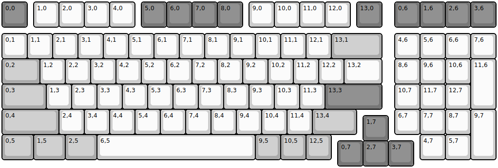{:loading="lazy"}

[Open in keyboard-layout-editor](http://www.keyboard-layout-editor.com/##@@_c=#777777;&=0,0&_x:0.25&c=#cccccc;&=1,0&=2,0&=3,0&=4,0&_x:0.25&c=#777777;&=5,0&=6,0&=7,0&=8,0&_x:0.25&c=#cccccc;&=9,0&=10,0&=11,0&=12,0&_x:0.25&c=#777777;&=13,0&_x:0.5;&=0,6&=1,6&=2,6&=3,6;&@_y:0.25&c=#cccccc;&=0,1&=1,1&=2,1&=3,1&=4,1&=5,1&=6,1&=7,1&=8,1&=9,1&=10,1&=11,1&=12,1&_c=#aaaaaa&w:2;&=13,1&_x:0.5&c=#cccccc;&=4,6&=5,6&=6,6&=7,6;&@_c=#aaaaaa&w:1.5;&=0,2&_c=#cccccc;&=1,2&=2,2&=3,2&=4,2&=5,2&=6,2&=7,2&=8,2&=9,2&=10,2&=11,2&=12,2&_w:1.5;&=13,2&_x:0.5;&=8,6&=9,6&=10,6&_h:2;&=11,6;&@_c=#aaaaaa&w:1.75;&=0,3&_c=#cccccc;&=1,3&=2,3&=3,3&=4,3&=5,3&=6,3&=7,3&=8,3&=9,3&=10,3&=11,3&_c=#777777&w:2.25;&=13,3&_x:0.5&c=#cccccc;&=10,7&=11,7&=12,7;&@_c=#aaaaaa&w:2.25;&=0,4&_c=#cccccc;&=2,4&=3,4&=4,4&=5,4&=6,4&=7,4&=8,4&=9,4&=10,4&=11,4&_c=#aaaaaa&w:1.75;&=13,4;&@_x:14.25&y:-0.75&c=#777777;&=1,7;&@_x:15.5&y:-1.25&c=#cccccc;&=6,7&=7,7&=8,7&_h:2;&=9,7;&@_c=#aaaaaa&w:1.25;&=0,5&_w:1.25;&=1,5&_w:1.25;&=2,5&_c=#cccccc&w:6.25;&=6,5&_c=#aaaaaa;&=9,5&=10,5&=12,5;&@_x:13.25&y:-0.75&c=#777777;&=0,7&=2,7&=3,7;&@_x:16.5&y:-1.25&c=#cccccc;&=4,7&=5,7)

## gmmk/gmmk2/p96/iso/p96_iso

[README](output/gmmk/gmmk2/p96/iso/README.md) - [layout](output/gmmk/gmmk2/p96/iso/p96_iso-kle.json) - [PCB](output/gmmk/gmmk2/p96/iso/p96_iso.kicad_pcb) - [PCB render](output/gmmk/gmmk2/p96/iso/p96_iso-render.svg)

{:loading="lazy"}

[Open in keyboard-layout-editor](http://www.keyboard-layout-editor.com/##@@_c=#777777;&=0,0&_x:0.25&c=#cccccc;&=1,0&=2,0&=3,0&=4,0&_x:0.25&c=#777777;&=5,0&=6,0&=7,0&=8,0&_x:0.25&c=#cccccc;&=9,0&=10,0&=11,0&=12,0&_x:0.25&c=#777777;&=13,0&_x:0.5;&=0,6&=1,6&=2,6&=3,6;&@_y:0.25&c=#cccccc;&=0,1&=1,1&=2,1&=3,1&=4,1&=5,1&=6,1&=7,1&=8,1&=9,1&=10,1&=11,1&=12,1&_c=#aaaaaa&w:2;&=13,1&_x:0.5&c=#cccccc;&=4,6&=5,6&=6,6&=7,6;&@_c=#aaaaaa&w:1.5;&=0,2&_c=#cccccc;&=1,2&=2,2&=3,2&=4,2&=5,2&=6,2&=7,2&=8,2&=9,2&=10,2&=11,2&=12,2&_x:0.25&c=#777777&w:1.25&h:2&w2:1.5&h2:1&x2:-0.25;&=12,1&_x:0.5&c=#cccccc;&=8,6&=9,6&=10,6&_h:2;&=11,6;&@_c=#aaaaaa&w:1.75;&=0,3&_c=#cccccc;&=1,3&=2,3&=3,3&=4,3&=5,3&=6,3&=7,3&=8,3&=9,3&=10,3&=11,3&=12,3&_x:1.75;&=10,7&=11,7&=12,7;&@_c=#aaaaaa&w:1.25;&=0,4&_c=#cccccc;&=1,4&=2,4&=3,4&=4,4&=5,4&=6,4&=7,4&=8,4&=9,4&=10,4&=11,4&_c=#aaaaaa&w:1.75;&=13,4&_x:1.5&c=#cccccc;&=6,7&=7,7&=8,7&_h:2;&=9,7;&@_x:14.25&y:-0.75&c=#777777;&=1,7;&@_y:-0.25&c=#aaaaaa&w:1.25;&=0,5&_w:1.25;&=1,5&_w:1.25;&=2,5&_c=#cccccc&w:6.25;&=6,5&_c=#aaaaaa;&=9,5&=10,5&=12,5&_x:3.5&c=#cccccc;&=4,7&=5,7;&@_x:13.25&y:-0.75&c=#777777;&=0,7&=2,7&=3,7)

## gmmk/pro/gmmk_pro

[README](output/gmmk/pro/README.md) - [layout](output/gmmk/pro/gmmk_pro-kle.json) - [PCB](output/gmmk/pro/gmmk_pro.kicad_pcb) - [PCB render](output/gmmk/pro/gmmk_pro-render.svg)

{:loading="lazy"}

[Open in keyboard-layout-editor](http://www.keyboard-layout-editor.com/##@@_x:2.75&c=#777777;&=1,3&_x:0.25&c=#cccccc;&=2,6&=3,6&=3,1&=3,3&_x:0.25&c=#aaaaaa;&=0,7&=6,3&=7,1&=7,6&_x:0.25&c=#cccccc;&=10,6&=10,7&=10,3&=10,5&_x:0.25;&=9,7&_x:0.5;&=0,1%0A%0A%0A%0A%0A%0A%0A%0A%0Ae0;&@_x:2.75&y:0.25;&=1,6&=1,7&=2,7&=3,7&=4,7&=4,6&=5,6&=5,7&=6,7&=7,7&=8,7&=8,6&=6,6&_c=#aaaaaa&w:2;&=10,1&_x:0.5&c=#cccccc;&=6,5;&@_x:2.75&c=#aaaaaa&w:1.5;&=1,1&_c=#cccccc;&=1,0&=2,0&=3,0&=4,0&=4,1&=5,1&=5,0&=6,0&=7,0&=8,0&=8,1&=6,1&_w:1.5;&=10,2%0A%0A%0A0,0&_x:0.5;&=1,5;&@_x:2.75&c=#aaaaaa&w:1.75;&=2,1&_c=#cccccc;&=1,2&=2,2&=3,2&=4,2&=4,3&=5,3&=5,2&=6,2&=7,2&=8,2&=8,3&_c=#777777&w:2.25;&=10,4%0A%0A%0A0,0&_x:0.5&c=#cccccc;&=2,5;&@_x:2.75&c=#aaaaaa&w:2.25;&=0,0%0A%0A%0A1,0&_c=#cccccc;&=1,4&=2,4&=3,4&=4,4&=4,5&=5,5&=5,4&=6,4&=7,4&=8,5&_c=#aaaaaa&w:1.75;&=9,1&_x:1.5&c=#cccccc;&=7,5;&@_x:17&y:-0.75;&=3,5;&@_x:2.75&y:-0.25&c=#aaaaaa&w:1.25;&=0,6&_w:1.25;&=9,0&_w:1.25;&=9,3&_c=#cccccc&w:6.25;&=9,4&_c=#aaaaaa;&=9,5&=9,2&=0,4;&@_x:16&y:-0.75&c=#cccccc;&=0,3&=7,3&=0,5;&@_x:20.75&y:-4.25&c=#777777&w:1.25&h:2&w2:1.5&h2:1&x2:-0.25;&=10,4%0A%0A%0A0,1;&@_x:19.75&c=#cccccc;&=8,4%0A%0A%0A0,1;&@_c=#aaaaaa&w:1.25;&=0,0%0A%0A%0A1,1&=2,3%0A%0A%0A1,1)

## gon/nerd60

[README](output/gon/README.md) - [layout](output/gon/nerd60-kle.json) - [PCB](output/gon/nerd60.kicad_pcb) - [PCB render](output/gon/nerd60-render.svg)

{:loading="lazy"}

[Open in keyboard-layout-editor](http://www.keyboard-layout-editor.com/##@@_x:2.75&y:1.25;&=8,0&=1,0&=0,1&=1,1&=0,2&=1,2&=0,3&=1,3&=0,4&=1,4&=0,5&=1,5&=0,6&_c=#aaaaaa&w:2;&=1,6%0A%0A%0A1,0;&@_x:2.75&w:1.5;&=2,0&_c=#cccccc;&=3,0&=2,1&=3,1&=2,2&=3,2&=2,3&=3,3&=2,4&=3,4&=2,5&=3,5&=2,6&_w:1.5;&=3,6%0A%0A%0A2,0;&@_x:2.75&c=#aaaaaa&w:1.75;&=4,0&_c=#cccccc;&=4,1&=5,1&=4,2&=5,2&=4,3&=5,3&=4,4&=5,4&=4,5&=5,5&=4,6&_c=#777777&w:2.25;&=5,6%0A%0A%0A2,0;&@_x:2.75&c=#aaaaaa&w:2.25;&=7,0%0A%0A%0A3,0&_c=#cccccc;&=6,1&=7,1&=6,2&=7,2&=6,3&=7,3&=6,4&=7,4&=6,5&=7,5&_c=#aaaaaa&w:2.75;&=6,6%0A%0A%0A4,0;&@_x:2.75&w:1.25;&=6,0%0A%0A%0A0,0&_w:1.25;&=5,0%0A%0A%0A0,0&_w:1.25;&=8,7%0A%0A%0A0,0&_c=#cccccc&w:6.25;&=0,7%0A%0A%0A0,0&_c=#aaaaaa&w:1.25;&=2,7%0A%0A%0A0,0&_w:1.25;&=3,7%0A%0A%0A0,0&_w:1.25;&=4,7%0A%0A%0A0,0&_w:1.25;&=5,7%0A%0A%0A0,0;&@_x:15.75&y:-6.25&c=#cccccc;&=1,7%0A%0A%0A1,1&=1,6%0A%0A%0A1,1;&@_x:19.25&y:1.25&c=#777777&w:1.25&h:2&w2:1.5&h2:1&x2:-0.25;&=5,6%0A%0A%0A2,1;&@_x:18.25&c=#cccccc;&=3,6%0A%0A%0A2,1;&@_c=#aaaaaa&w:1.25;&=7,0%0A%0A%0A3,1&_c=#cccccc;&=9,7%0A%0A%0A3,1&_x:15.75&c=#aaaaaa&w:1.75;&=6,6%0A%0A%0A4,1&_c=#cccccc;&=7,6%0A%0A%0A4,1;&@_x:2.75&y:1.5&c=#aaaaaa&w:1.5;&=6,0%0A%0A%0A0,1&=5,0%0A%0A%0A0,1&_w:1.5;&=8,7%0A%0A%0A0,1&_c=#cccccc&w:7;&=0,7%0A%0A%0A0,1&_c=#aaaaaa&w:1.5;&=3,7%0A%0A%0A0,1&=4,7%0A%0A%0A0,1&_w:1.5;&=5,7%0A%0A%0A0,1;&@_x:2.75&w:1.5;&=6,0%0A%0A%0A0,2&_c=#cccccc&d:true;&=%0A%0A%0A0,2&_c=#aaaaaa&w:1.5;&=8,7%0A%0A%0A0,2&_c=#cccccc&w:7;&=0,7%0A%0A%0A0,2&_c=#aaaaaa&w:1.5;&=3,7%0A%0A%0A0,2&_c=#cccccc&d:true;&=%0A%0A%0A0,2&_c=#aaaaaa&w:1.5;&=5,7%0A%0A%0A0,2)

## gon/nerdtkl

[README](output/gon/README.md) - [layout](output/gon/nerdtkl-kle.json) - [PCB](output/gon/nerdtkl.kicad_pcb) - [PCB render](output/gon/nerdtkl-render.svg)

{:loading="lazy"}

[Open in keyboard-layout-editor](http://www.keyboard-layout-editor.com/##@@_x:2.75&y:1.5&c=#777777;&=8,0&_x:1.0&c=#cccccc;&=9,0&=8,1&=9,1&=8,2&_x:0.5&c=#aaaaaa;&=9,2&=8,3&=9,3&=8,4&_x:0.5&c=#cccccc;&=9,4&=8,5&=9,5&=8,6&_x:0.25;&=9,6&=8,8&=9,8;&@_x:2.75&y:0.25;&=0,0&=1,0&=0,1&=1,1&=0,2&=1,2&=0,3&=1,3&=0,4&=1,4&=0,5&=1,5&=0,6&_c=#aaaaaa&w:2;&=1,6%0A%0A%0A1,0&_x:0.25&c=#cccccc;&=0,8&=1,8&=4,8;&@_x:2.75&c=#aaaaaa&w:1.5;&=2,0&_c=#cccccc;&=3,0&=2,1&=3,1&=2,2&=3,2&=2,3&=3,3&=2,4&=3,4&=2,5&=3,5&=2,6&_w:1.5;&=3,6%0A%0A%0A2,0&_x:0.25;&=2,8&=3,8&=5,8;&@_x:2.75&c=#aaaaaa&w:1.75;&=4,0&_c=#cccccc;&=4,1&=5,1&=4,2&=5,2&=4,3&=5,3&=4,4&=5,4&=4,5&=5,5&=4,6&_c=#777777&w:2.25;&=5,6%0A%0A%0A2,0;&@_x:2.75&c=#aaaaaa&w:2.25;&=7,0%0A%0A%0A3,0&_c=#cccccc;&=6,1&=7,1&=6,2&=7,2&=6,3&=7,3&=6,4&=7,4&=6,5&=7,5&_c=#aaaaaa&w:2.75;&=6,6%0A%0A%0A4,0&_x:1.25&c=#cccccc;&=6,8;&@_x:2.75&c=#aaaaaa&w:1.5;&=6,0%0A%0A%0A0,0&_c=#cccccc&d:true;&=%0A%0A%0A0,0&_c=#aaaaaa&w:1.5;&=8,7%0A%0A%0A0,0&_c=#cccccc&w:7;&=0,7%0A%0A%0A0,0&_c=#aaaaaa&w:1.5;&=3,7%0A%0A%0A0,0&_c=#cccccc&d:true;&=%0A%0A%0A0,0&_c=#aaaaaa&w:1.5;&=5,7%0A%0A%0A0,0&_x:0.25&c=#cccccc;&=6,7&=7,7&=7,8;&@_x:15.75&y:-7.75;&=1,7%0A%0A%0A1,1&=1,6%0A%0A%0A1,1;&@_x:23.25&y:2.75&c=#777777&w:1.25&h:2&w2:1.5&h2:1&x2:-0.25;&=5,6%0A%0A%0A2,1;&@_x:22.25&c=#cccccc;&=3,6%0A%0A%0A2,1;&@_c=#aaaaaa&w:1.25;&=7,0%0A%0A%0A3,1&_c=#cccccc;&=9,7%0A%0A%0A3,1&_x:19.5&c=#aaaaaa&w:1.75;&=6,6%0A%0A%0A4,1&_c=#cccccc;&=7,6%0A%0A%0A4,1;&@_x:2.75&y:1.5&c=#aaaaaa&w:1.5;&=6,0%0A%0A%0A0,1&=5,0%0A%0A%0A0,1&_w:1.5;&=8,7%0A%0A%0A0,1&_c=#cccccc&w:7;&=0,7%0A%0A%0A0,1&_c=#aaaaaa&w:1.5;&=3,7%0A%0A%0A0,1&=4,7%0A%0A%0A0,1&_w:1.5;&=5,7%0A%0A%0A0,1;&@_x:2.75&w:1.25;&=6,0%0A%0A%0A0,2&_w:1.25;&=5,0%0A%0A%0A0,2&_w:1.25;&=8,7%0A%0A%0A0,2&_c=#cccccc&w:6.25;&=0,7%0A%0A%0A0,2&_c=#aaaaaa&w:1.25;&=2,7%0A%0A%0A0,2&_w:1.25;&=3,7%0A%0A%0A0,2&_w:1.25;&=4,7%0A%0A%0A0,2&_w:1.25;&=5,7%0A%0A%0A0,2)

## gopolar/gg86

[README](output/gopolar/gg86/README.md) - [layout](output/gopolar/gg86/gg86-kle.json) - [PCB](output/gopolar/gg86/gg86.kicad_pcb) - [PCB render](output/gopolar/gg86/gg86-render.svg)

{:loading="lazy"}

[Open in keyboard-layout-editor](http://www.keyboard-layout-editor.com/##@@_x:2.5;&=0,0&_x:1.0;&=0,1&=0,2&=0,3&=0,4&_x:0.5;&=0,5&=0,6&=0,7&=0,8&_x:0.5;&=0,9&=0,10&=0,11&=0,12&_x:0.25;&=0,14&=0,15&=0,16;&@_x:2.5&y:0.25;&=1,0&=1,1&=1,2&=1,3&=1,4&=1,5&=1,6&=1,7&=1,8&=1,9&=1,10&=1,11&=1,12&_w:2;&=1,13&_x:0.25;&=1,14&=1,15&=1,16;&@_x:2.5&w:1.5;&=2,0&=2,1&=2,2&=2,3&=2,4&=2,5&=2,6&=2,7&=2,8&=2,9&=2,10&=2,11&=2,12&_w:1.5;&=2,13%0A%0A%0A0,0&_x:0.25&c=#777777;&=2,14&=2,15&=2,16;&@_x:2.5&w:1.75;&=3,0&=3,1&=3,2&=3,3&=3,4&=3,5&=3,6&=3,7&=3,8&=3,9&=3,10&=3,11&_w:2.25;&=3,13%0A%0A%0A0,0;&@_x:2.5&w:2.25;&=4,0%0A%0A%0A1,0&=4,2&=4,3&=4,4&=4,5&=4,6&=4,7&=4,8&=4,9&=4,10&=4,11&_w:2.75;&=4,12%0A%0A%0A2,0&_x:1.25;&=4,15;&@_x:2.5&w:1.5;&=5,0&=5,1&_w:1.5;&=5,2&_w:7;&=5,5&_w:1.5;&=5,10&=5,11&_w:1.5;&=5,12&_x:0.25;&=5,14&=5,15&=5,16;&@_x:22.0&y:-4.0&w:1.25&h:2&w2:1.5&h2:1&x2:-0.25;&=3,13%0A%0A%0A0,1;&@_x:21.0;&=2,13%0A%0A%0A0,1;&@_w:1.25;&=4,0%0A%0A%0A1,1&=4,1%0A%0A%0A1,1&_x:18.75&w:1.75;&=4,12%0A%0A%0A2,1&=4,13%0A%0A%0A2,1)

## graystudio/aero75-hotswap

[README](output/graystudio/aero75-hotswap/README.md) - [layout](output/graystudio/aero75-hotswap/aero75-hotswap-kle.json) - [PCB](output/graystudio/aero75-hotswap/aero75-hotswap.kicad_pcb) - [PCB render](output/graystudio/aero75-hotswap/aero75-hotswap-render.svg)

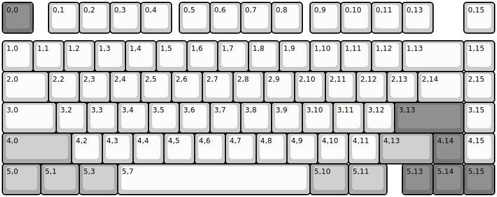{:loading="lazy"}

[Open in keyboard-layout-editor](http://www.keyboard-layout-editor.com/##@@_c=#777777;&=0,0&_x:0.5&c=#cccccc;&=0,1&=0,2&=0,3&=0,4&_x:0.25;&=0,5&=0,6&=0,7&=0,8&_x:0.25;&=0,9&=0,10&=0,11&=0,13&_x:1.0;&=0,15;&@_y:0.25;&=1,0&=1,1&=1,2&=1,3&=1,4&=1,5&=1,6&=1,7&=1,8&=1,9&=1,10&=1,11&=1,12&_w:2;&=1,13&=1,15;&@_w:1.5;&=2,0&=2,2&=2,3&=2,4&=2,5&=2,6&=2,7&=2,8&=2,9&=2,10&=2,11&=2,12&=2,13&_w:1.5;&=2,14&=2,15;&@_w:1.75;&=3,0&=3,2&=3,3&=3,4&=3,5&=3,6&=3,7&=3,8&=3,9&=3,10&=3,11&=3,12&_c=#777777&w:2.25;&=3,13&_c=#cccccc;&=3,15;&@_c=#aaaaaa&w:2.25;&=4,0&_c=#cccccc;&=4,2&=4,3&=4,4&=4,5&=4,6&=4,7&=4,8&=4,9&=4,10&=4,11&_c=#aaaaaa&w:1.75;&=4,13&_c=#777777;&=4,14&_c=#cccccc;&=4,15;&@_c=#aaaaaa&w:1.25;&=5,0&_w:1.25;&=5,1&_w:1.25;&=5,3&_c=#cccccc&w:6.25;&=5,7&_c=#aaaaaa&w:1.25;&=5,10&_w:1.25;&=5,11&_x:0.5&c=#777777;&=5,13&=5,14&=5,15)

## graystudio/apollo80

[README](output/graystudio/apollo80/README.md) - [layout](output/graystudio/apollo80/apollo80-kle.json) - [PCB](output/graystudio/apollo80/apollo80.kicad_pcb) - [PCB render](output/graystudio/apollo80/apollo80-render.svg)

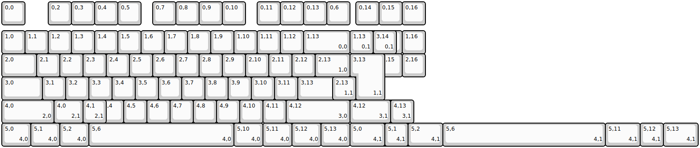{:loading="lazy"}

[Open in keyboard-layout-editor](http://www.keyboard-layout-editor.com/##@@=0,0&_x:1.0;&=0,2&=0,3&=0,4&=0,5&_x:0.5;&=0,7&=0,8&=0,9&=0,10&_x:0.5;&=0,11&=0,12&=0,13&=0,6&_x:0.25;&=0,14&=0,15&=0,16;&@_y:0.25;&=1,0&=1,1&=1,2&=1,3&=1,4&=1,5&=1,6&=1,7&=1,8&=1,9&=1,10&=1,11&=1,12&_w:2;&=1,13%0A%0A%0A0,0&_x:0.25;&=1,14&=1,15&=1,16;&@_w:1.5;&=2,0&=2,1&=2,2&=2,3&=2,4&=2,5&=2,6&=2,7&=2,8&=2,9&=2,10&=2,11&=2,12&_w:1.5;&=2,13%0A%0A%0A1,0&_x:0.25;&=2,14&=2,15&=2,16;&@_w:1.75;&=3,0&=3,1&=3,2&=3,3&=3,4&=3,5&=3,6&=3,7&=3,8&=3,9&=3,10&=3,11&_w:2.25;&=3,13%0A%0A%0A1,0;&@_w:2.25;&=4,0%0A%0A%0A2,0&=4,2&=4,3&=4,4&=4,5&=4,6&=4,7&=4,8&=4,9&=4,10&=4,11&_w:2.75;&=4,12%0A%0A%0A3,0&_x:1.25;&=4,15;&@_w:1.25;&=5,0%0A%0A%0A4,0&_w:1.25;&=5,1%0A%0A%0A4,0&_w:1.25;&=5,2%0A%0A%0A4,0&_w:6.25;&=5,6%0A%0A%0A4,0&_w:1.25;&=5,10%0A%0A%0A4,0&_w:1.25;&=5,11%0A%0A%0A4,0&_w:1.25;&=5,12%0A%0A%0A4,0&_w:1.25;&=5,13%0A%0A%0A4,0&_x:0.25;&=5,14&=5,15&=5,16;&@_x:15&y:-5.0;&=1,13%0A%0A%0A0,1&=3,14%0A%0A%0A0,1;&@_x:15.25&w:1.25&h:2&w2:1.5&h2:1&x2:-0.25;&=3,13%0A%0A%0A1,1;&@_x:14.25;&=2,13%0A%0A%0A1,1;&@_x:2.25&w:1.25;&=4,0%0A%0A%0A2,1&=4,1%0A%0A%0A2,1&_x:10.5&w:1.75;&=4,12%0A%0A%0A3,1&=4,13%0A%0A%0A3,1;&@_x:15.0&w:1.5;&=5,0%0A%0A%0A4,1&=5,1%0A%0A%0A4,1&_w:1.5;&=5,2%0A%0A%0A4,1&_w:7;&=5,6%0A%0A%0A4,1&_w:1.5;&=5,11%0A%0A%0A4,1&=5,12%0A%0A%0A4,1&_w:1.5;&=5,13%0A%0A%0A4,1)

## graystudio/cod67

[README](output/graystudio/cod67/README.md) - [layout](output/graystudio/cod67/cod67-kle.json) - [PCB](output/graystudio/cod67/cod67.kicad_pcb) - [PCB render](output/graystudio/cod67/cod67-render.svg)

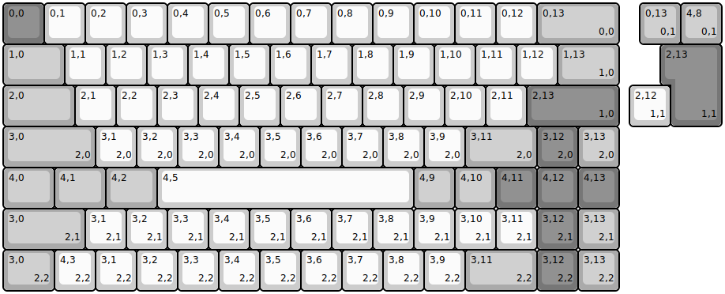{:loading="lazy"}

[Open in keyboard-layout-editor](http://www.keyboard-layout-editor.com/##@@_c=#777777;&=0,0&_c=#cccccc;&=0,1&=0,2&=0,3&=0,4&=0,5&=0,6&=0,7&=0,8&=0,9&=0,10&=0,11&=0,12&_c=#aaaaaa&w:2;&=0,13%0A%0A%0A0,0;&@_w:1.5;&=1,0&_c=#cccccc;&=1,1&=1,2&=1,3&=1,4&=1,5&=1,6&=1,7&=1,8&=1,9&=1,10&=1,11&=1,12&_c=#aaaaaa&w:1.5;&=1,13%0A%0A%0A1,0;&@_w:1.75;&=2,0&_c=#cccccc;&=2,1&=2,2&=2,3&=2,4&=2,5&=2,6&=2,7&=2,8&=2,9&=2,10&=2,11&_c=#777777&w:2.25;&=2,13%0A%0A%0A1,0;&@_c=#aaaaaa&w:2.25;&=3,0%0A%0A%0A2,0&_c=#cccccc;&=3,1%0A%0A%0A2,0&=3,2%0A%0A%0A2,0&=3,3%0A%0A%0A2,0&=3,4%0A%0A%0A2,0&=3,5%0A%0A%0A2,0&=3,6%0A%0A%0A2,0&=3,7%0A%0A%0A2,0&=3,8%0A%0A%0A2,0&=3,9%0A%0A%0A2,0&_c=#aaaaaa&w:1.75;&=3,11%0A%0A%0A2,0&_c=#777777;&=3,12%0A%0A%0A2,0&_c=#aaaaaa;&=3,13%0A%0A%0A2,0;&@_w:1.25;&=4,0&_w:1.25;&=4,1&_w:1.25;&=4,2&_c=#cccccc&w:6.25;&=4,5&_c=#aaaaaa;&=4,9&=4,10&_c=#777777;&=4,11&=4,12&=4,13;&@_x:15.5&y:-5&c=#aaaaaa;&=0,13%0A%0A%0A0,1&=4,8%0A%0A%0A0,1;&@_x:16.25&c=#777777&w:1.25&h:2&w2:1.5&h2:1&x2:-0.25;&=2,13%0A%0A%0A1,1;&@_x:15.25&c=#cccccc;&=2,12%0A%0A%0A1,1;&@_y:2&c=#aaaaaa&w:2;&=3,0%0A%0A%0A2,1&_c=#cccccc;&=3,1%0A%0A%0A2,1&=3,2%0A%0A%0A2,1&=3,3%0A%0A%0A2,1&=3,4%0A%0A%0A2,1&=3,5%0A%0A%0A2,1&=3,6%0A%0A%0A2,1&=3,7%0A%0A%0A2,1&=3,8%0A%0A%0A2,1&=3,9%0A%0A%0A2,1&=3,10%0A%0A%0A2,1&=3,11%0A%0A%0A2,1&_c=#777777;&=3,12%0A%0A%0A2,1&_c=#aaaaaa;&=3,13%0A%0A%0A2,1;&@_w:1.25;&=3,0%0A%0A%0A2,2&_c=#cccccc;&=4,3%0A%0A%0A2,2&=3,1%0A%0A%0A2,2&=3,2%0A%0A%0A2,2&=3,3%0A%0A%0A2,2&=3,4%0A%0A%0A2,2&=3,5%0A%0A%0A2,2&=3,6%0A%0A%0A2,2&=3,7%0A%0A%0A2,2&=3,8%0A%0A%0A2,2&=3,9%0A%0A%0A2,2&_c=#aaaaaa&w:1.75;&=3,11%0A%0A%0A2,2&_c=#777777;&=3,12%0A%0A%0A2,2&_c=#aaaaaa;&=3,13%0A%0A%0A2,2)

## graystudio/hb85

[README](output/graystudio/hb85/README.md) - [layout](output/graystudio/hb85/hb85-kle.json) - [PCB](output/graystudio/hb85/hb85.kicad_pcb) - [PCB render](output/graystudio/hb85/hb85-render.svg)

{:loading="lazy"}

[Open in keyboard-layout-editor](http://www.keyboard-layout-editor.com/##@@_x:4&c=#777777;&=0,12&_x:0.25&c=#cccccc;&=0,11&=0,10&=0,0&=0,1&_x:0.25&c=#aaaaaa;&=0,2&=0,3&=0,4&=0,5&_x:0.25&c=#cccccc;&=0,6&=0,7&=0,8&=0,9&_x:0.5&c=#aaaaaa;&=0,14;&@_x:2.75&y:0.25&c=#cccccc;&=1,14&=1,13&=1,12&=1,11&=1,10&=1,0&=1,1&=1,2&=1,3&=1,4&=1,5&=1,6&=1,7&_c=#aaaaaa&w:2;&=1,8%0A%0A%0A0,0&_c=#cccccc;&=5,9&=5,8&=5,7;&@_x:2.75&c=#aaaaaa&w:1.5;&=2,14&_c=#cccccc;&=2,13&=2,12&=2,11&=2,10&=2,0&=2,1&=2,2&=2,3&=2,4&=2,5&=2,6&=2,7&_w:1.5;&=2,8%0A%0A%0A1,0&=2,9&=5,6&=5,5;&@_x:2.75&c=#aaaaaa&w:1.75;&=3,14&_c=#cccccc;&=3,13&=3,12&=3,11&=3,10&=3,0&=3,1&=3,2&=3,3&=3,4&=3,5&=3,6&_c=#777777&w:2.25;&=3,7%0A%0A%0A1,0&_c=#cccccc;&=3,9&=7,6&=7,5;&@_x:2.75&c=#aaaaaa&w:2.25;&=4,14%0A%0A%0A2,0&_c=#cccccc;&=4,12&=4,11&=4,10&=4,0&=4,1&=4,2&=4,3&=4,4&=4,5&=4,6&_c=#aaaaaa&w:2.75;&=4,7%0A%0A%0A3,0&_c=#cccccc&w:2;&=4,9%0A%0A%0A4,0&=7,7;&@_x:4&c=#aaaaaa&w:1.25;&=6,13&_w:1.25;&=6,12&_c=#cccccc&w:6.26;&=6,1&_x:-0.01&c=#aaaaaa&w:1.25;&=6,4%0A%0A%0A5,0&_w:1.25;&=6,5%0A%0A%0A5,0&_c=#cccccc&w:0.5&d:true;&=%0A%0A%0A5,0&_c=#aaaaaa&d:true;&=%0A%0A%0A5,0&_d:true;&=%0A%0A%0A5,0&_d:true;&=%0A%0A%0A5,0&_d:true;&=%0A%0A%0A5,0;&@_x:21.25&y:-5.0&c=#cccccc;&=1,8%0A%0A%0A0,1&=1,9%0A%0A%0A0,1;&@_x:22.0&c=#777777&w:1.25&h:2&w2:1.5&h2:1&x2:-0.25;&=3,7%0A%0A%0A1,1;&@_x:21.0&c=#cccccc;&=2,8%0A%0A%0A1,1;&@_c=#aaaaaa&w:1.25;&=4,14%0A%0A%0A2,1&_c=#cccccc;&=4,13%0A%0A%0A2,1&_x:18.75&c=#aaaaaa&w:1.75;&=4,7%0A%0A%0A3,1&_c=#cccccc;&=4,8%0A%0A%0A3,1&_x:0.25;&=4,9%0A%0A%0A4,1&=7,8%0A%0A%0A4,1;&@_x:12.75&y:1.5&c=#aaaaaa&w:1.25;&=6,4%0A%0A%0A5,1&_w:1.25;&=6,5%0A%0A%0A5,1&_c=#cccccc&w:0.5&d:true;&=%0A%0A%0A5,1&_c=#aaaaaa;&=6,7%0A%0A%0A5,1&=6,8%0A%0A%0A5,1&=6,9%0A%0A%0A5,1&=7,9%0A%0A%0A5,1;&@_x:12.75;&=6,4%0A%0A%0A5,2&=6,5%0A%0A%0A5,2&=6,6%0A%0A%0A5,2&=6,7%0A%0A%0A5,2&=6,8%0A%0A%0A5,2&=6,9%0A%0A%0A5,2&=7,9%0A%0A%0A5,2)

## graystudio/space65

[README](output/graystudio/space65/README.md) - [layout](output/graystudio/space65/space65-kle.json) - [PCB](output/graystudio/space65/space65.kicad_pcb) - [PCB render](output/graystudio/space65/space65-render.svg)

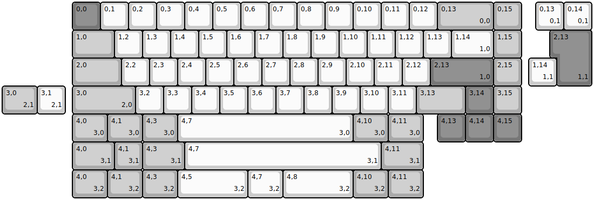{:loading="lazy"}

[Open in keyboard-layout-editor](http://www.keyboard-layout-editor.com/##@@_x:2.5&c=#777777;&=0,0&_c=#cccccc;&=0,1&=0,2&=0,3&=0,4&=0,5&=0,6&=0,7&=0,8&=0,9&=0,10&=0,11&=0,12&_c=#aaaaaa&w:2;&=0,13%0A%0A%0A0,0&=0,15;&@_x:2.5&w:1.5;&=1,0&_c=#cccccc;&=1,2&=1,3&=1,4&=1,5&=1,6&=1,7&=1,8&=1,9&=1,10&=1,11&=1,12&=1,13&_w:1.5;&=1,14%0A%0A%0A1,0&_c=#aaaaaa;&=1,15;&@_x:2.5&w:1.75;&=2,0&_c=#cccccc;&=2,2&=2,3&=2,4&=2,5&=2,6&=2,7&=2,8&=2,9&=2,10&=2,11&=2,12&_c=#777777&w:2.25;&=2,13%0A%0A%0A1,0&_c=#aaaaaa;&=2,15;&@_x:2.5&w:2.25;&=3,0%0A%0A%0A2,0&_c=#cccccc;&=3,2&=3,3&=3,4&=3,5&=3,6&=3,7&=3,8&=3,9&=3,10&=3,11&_c=#aaaaaa&w:1.75;&=3,13&_c=#777777;&=3,14&_c=#aaaaaa;&=3,15;&@_x:2.5&w:1.25;&=4,0%0A%0A%0A3,0&_w:1.25;&=4,1%0A%0A%0A3,0&_w:1.25;&=4,3%0A%0A%0A3,0&_c=#cccccc&w:6.25;&=4,7%0A%0A%0A3,0&_c=#aaaaaa&w:1.25;&=4,10%0A%0A%0A3,0&_w:1.25;&=4,11%0A%0A%0A3,0&_x:0.5&c=#777777;&=4,13&=4,14&=4,15;&@_x:19.0&y:-5&c=#cccccc;&=0,13%0A%0A%0A0,1&=0,14%0A%0A%0A0,1;&@_x:19.75&c=#777777&w:1.25&h:2&w2:1.5&h2:1&x2:-0.25;&=2,13%0A%0A%0A1,1;&@_x:18.75&c=#cccccc;&=1,14%0A%0A%0A1,1;&@_c=#aaaaaa&w:1.25;&=3,0%0A%0A%0A2,1&_c=#cccccc;&=3,1%0A%0A%0A2,1;&@_x:2.5&y:1&c=#aaaaaa&w:1.5;&=4,0%0A%0A%0A3,1&=4,1%0A%0A%0A3,1&_w:1.5;&=4,3%0A%0A%0A3,1&_c=#cccccc&w:7.0;&=4,7%0A%0A%0A3,1&_c=#aaaaaa&w:1.5;&=4,11%0A%0A%0A3,1;&@_x:2.5&w:1.25;&=4,0%0A%0A%0A3,2&_w:1.25;&=4,1%0A%0A%0A3,2&_w:1.25;&=4,3%0A%0A%0A3,2&_c=#cccccc&w:2.5;&=4,5%0A%0A%0A3,2&_w:1.25;&=4,7%0A%0A%0A3,2&_w:2.5;&=4,8%0A%0A%0A3,2&_c=#aaaaaa&w:1.25;&=4,10%0A%0A%0A3,2&_w:1.25;&=4,11%0A%0A%0A3,2)

## graystudio/space65/space65-r3

[README](output/graystudio/space65/README.md) - [layout](output/graystudio/space65/space65-r3-kle.json) - [PCB](output/graystudio/space65/space65-r3.kicad_pcb) - [PCB render](output/graystudio/space65/space65-r3-render.svg)

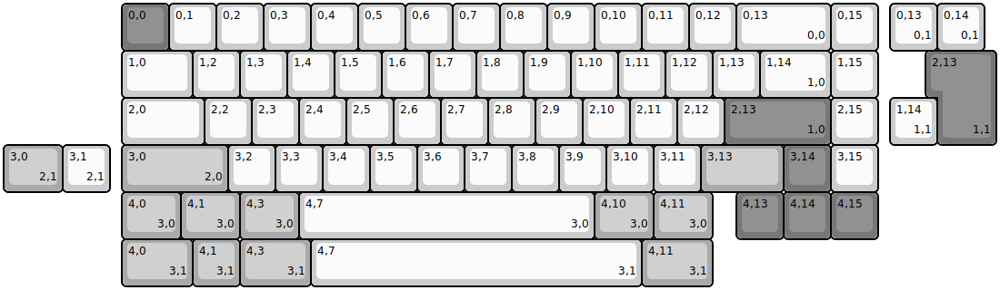{:loading="lazy"}

[Open in keyboard-layout-editor](http://www.keyboard-layout-editor.com/##@@_x:2.5&c=#777777;&=0,0&_c=#cccccc;&=0,1&=0,2&=0,3&=0,4&=0,5&=0,6&=0,7&=0,8&=0,9&=0,10&=0,11&=0,12&_w:2;&=0,13%0A%0A%0A0,0&=0,15;&@_x:2.5&w:1.5;&=1,0&=1,2&=1,3&=1,4&=1,5&=1,6&=1,7&=1,8&=1,9&=1,10&=1,11&=1,12&=1,13&_w:1.5;&=1,14%0A%0A%0A1,0&=1,15;&@_x:2.5&w:1.75;&=2,0&=2,2&=2,3&=2,4&=2,5&=2,6&=2,7&=2,8&=2,9&=2,10&=2,11&=2,12&_c=#777777&w:2.25;&=2,13%0A%0A%0A1,0&_c=#cccccc;&=2,15;&@_x:2.5&c=#aaaaaa&w:2.25;&=3,0%0A%0A%0A2,0&_c=#cccccc;&=3,2&=3,3&=3,4&=3,5&=3,6&=3,7&=3,8&=3,9&=3,10&=3,11&_c=#aaaaaa&w:1.75;&=3,13&_c=#777777;&=3,14&_c=#cccccc;&=3,15;&@_x:2.5&c=#aaaaaa&w:1.25;&=4,0%0A%0A%0A3,0&_w:1.25;&=4,1%0A%0A%0A3,0&_w:1.25;&=4,3%0A%0A%0A3,0&_c=#cccccc&w:6.25;&=4,7%0A%0A%0A3,0&_c=#aaaaaa&w:1.25;&=4,10%0A%0A%0A3,0&_w:1.25;&=4,11%0A%0A%0A3,0&_x:0.5&c=#777777;&=4,13&=4,14&=4,15;&@_x:18.75&y:-5&c=#cccccc;&=0,13%0A%0A%0A0,1&=0,14%0A%0A%0A0,1;&@_x:19.75&c=#777777&w:1.25&h:2&w2:1.5&h2:1&x2:-0.25;&=2,13%0A%0A%0A1,1;&@_x:18.75&c=#cccccc;&=1,14%0A%0A%0A1,1;&@_c=#aaaaaa&w:1.25;&=3,0%0A%0A%0A2,1&_c=#cccccc;&=3,1%0A%0A%0A2,1;&@_x:2.5&y:1&c=#aaaaaa&w:1.5;&=4,0%0A%0A%0A3,1&=4,1%0A%0A%0A3,1&_w:1.5;&=4,3%0A%0A%0A3,1&_c=#cccccc&w:7.0;&=4,7%0A%0A%0A3,1&_c=#aaaaaa&w:1.5;&=4,11%0A%0A%0A3,1)

## graystudio/think65-hotswap

[README](output/graystudio/think65-hotswap/README.md) - [layout](output/graystudio/think65-hotswap/think65-hotswap-kle.json) - [PCB](output/graystudio/think65-hotswap/think65-hotswap.kicad_pcb) - [PCB render](output/graystudio/think65-hotswap/think65-hotswap-render.svg)

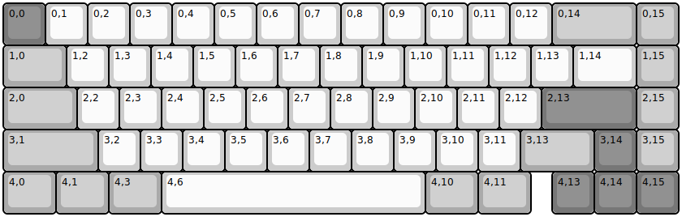{:loading="lazy"}

[Open in keyboard-layout-editor](http://www.keyboard-layout-editor.com/##@@_c=#777777;&=0,0&_c=#cccccc;&=0,1&=0,2&=0,3&=0,4&=0,5&=0,6&=0,7&=0,8&=0,9&=0,10&=0,11&=0,12&_c=#aaaaaa&w:2;&=0,14&=0,15;&@_w:1.5;&=1,0&_c=#cccccc;&=1,2&=1,3&=1,4&=1,5&=1,6&=1,7&=1,8&=1,9&=1,10&=1,11&=1,12&=1,13&_w:1.5;&=1,14&_c=#aaaaaa;&=1,15;&@_w:1.75;&=2,0&_c=#cccccc;&=2,2&=2,3&=2,4&=2,5&=2,6&=2,7&=2,8&=2,9&=2,10&=2,11&=2,12&_c=#777777&w:2.25;&=2,13&_c=#aaaaaa;&=2,15;&@_w:2.25;&=3,1&_c=#cccccc;&=3,2&=3,3&=3,4&=3,5&=3,6&=3,7&=3,8&=3,9&=3,10&=3,11&_c=#aaaaaa&w:1.75;&=3,13&_c=#777777;&=3,14&_c=#aaaaaa;&=3,15;&@_w:1.25;&=4,0&_w:1.25;&=4,1&_w:1.25;&=4,3&_c=#cccccc&w:6.25;&=4,6&_c=#aaaaaa&w:1.25;&=4,10&_w:1.25;&=4,11&_x:0.5&c=#777777;&=4,13&=4,14&=4,15)

## graystudio/think65

[README](output/graystudio/think65/README.md) - [layout](output/graystudio/think65/think65-kle.json) - [PCB](output/graystudio/think65/think65.kicad_pcb) - [PCB render](output/graystudio/think65/think65-render.svg)

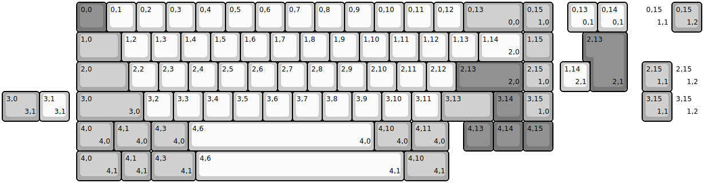{:loading="lazy"}

[Open in keyboard-layout-editor](http://www.keyboard-layout-editor.com/##@@_x:2.5&c=#777777;&=0,0&_c=#cccccc;&=0,1&=0,2&=0,3&=0,4&=0,5&=0,6&=0,7&=0,8&=0,9&=0,10&=0,11&=0,12&_c=#aaaaaa&w:2;&=0,13%0A%0A%0A0,0&=0,15%0A%0A%0A1,0;&@_x:2.5&w:1.5;&=1,0&_c=#cccccc;&=1,2&=1,3&=1,4&=1,5&=1,6&=1,7&=1,8&=1,9&=1,10&=1,11&=1,12&=1,13&_w:1.5;&=1,14%0A%0A%0A2,0&_c=#aaaaaa;&=1,15;&@_x:2.5&w:1.75;&=2,0&_c=#cccccc;&=2,2&=2,3&=2,4&=2,5&=2,6&=2,7&=2,8&=2,9&=2,10&=2,11&=2,12&_c=#777777&w:2.25;&=2,13%0A%0A%0A2,0&_c=#aaaaaa;&=2,15%0A%0A%0A1,0;&@_x:2.5&w:2.25;&=3,0%0A%0A%0A3,0&_c=#cccccc;&=3,2&=3,3&=3,4&=3,5&=3,6&=3,7&=3,8&=3,9&=3,10&=3,11&_c=#aaaaaa&w:1.75;&=3,13&_c=#777777;&=3,14&_c=#aaaaaa;&=3,15%0A%0A%0A1,0;&@_x:2.5&w:1.25;&=4,0%0A%0A%0A4,0&_w:1.25;&=4,1%0A%0A%0A4,0&_w:1.25;&=4,3%0A%0A%0A4,0&_c=#cccccc&w:6.25;&=4,6%0A%0A%0A4,0&_c=#aaaaaa&w:1.25;&=4,10%0A%0A%0A4,0&_w:1.25;&=4,11%0A%0A%0A4,0&_x:0.5&c=#777777;&=4,13&=4,14&=4,15;&@_x:19.0&y:-5&c=#cccccc;&=0,13%0A%0A%0A0,1&=0,14%0A%0A%0A0,1&_x:0.5&c=#aaaaaa&d:true;&=0,15%0A%0A%0A1,1&=0,15%0A%0A%0A1,2;&@_x:19.75&c=#777777&w:1.25&h:2&w2:1.5&h2:1&x2:-0.25;&=2,13%0A%0A%0A2,1;&@_x:18.75&c=#cccccc;&=1,14%0A%0A%0A2,1&_x:1.75&c=#aaaaaa;&=2,15%0A%0A%0A1,1&_d:true;&=2,15%0A%0A%0A1,2;&@_w:1.25;&=3,0%0A%0A%0A3,1&_c=#cccccc;&=3,1%0A%0A%0A3,1&_x:19.25&c=#aaaaaa;&=3,15%0A%0A%0A1,1&_d:true;&=3,15%0A%0A%0A1,2;&@_x:2.5&y:1&w:1.5;&=4,0%0A%0A%0A4,1&=4,1%0A%0A%0A4,1&_w:1.5;&=4,3%0A%0A%0A4,1&_c=#cccccc&w:7;&=4,6%0A%0A%0A4,1&_c=#aaaaaa&w:1.5;&=4,10%0A%0A%0A4,1)

## gvalchca/ga150

[README](output/gvalchca/ga150/README.md) - [layout](output/gvalchca/ga150/ga150-kle.json) - [PCB](output/gvalchca/ga150/ga150.kicad_pcb) - [PCB render](output/gvalchca/ga150/ga150-render.svg)

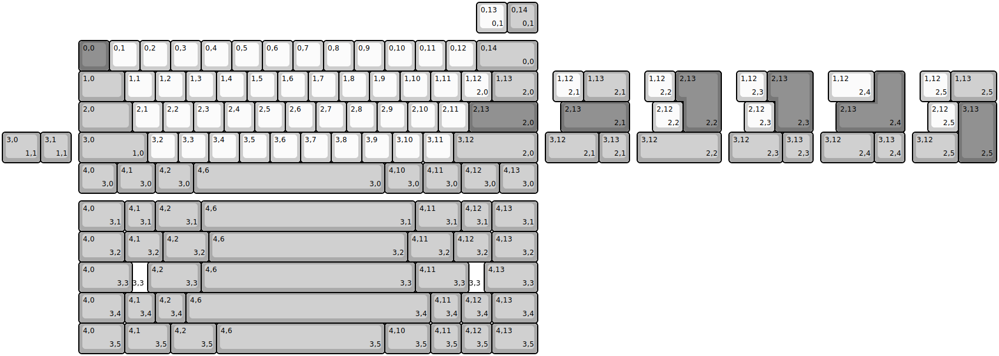{:loading="lazy"}

[Open in keyboard-layout-editor](http://www.keyboard-layout-editor.com/##@@_x:2.5&y:1.25&c=#777777;&=0,0&_c=#cccccc;&=0,1&=0,2&=0,3&=0,4&=0,5&=0,6&=0,7&=0,8&=0,9&=0,10&=0,11&=0,12&_c=#aaaaaa&w:2;&=0,14%0A%0A%0A0,0;&@_x:2.5&w:1.5;&=1,0&_c=#cccccc;&=1,1&=1,2&=1,3&=1,4&=1,5&=1,6&=1,7&=1,8&=1,9&=1,10&=1,11&=1,12%0A%0A%0A2,0&_c=#aaaaaa&w:1.5;&=1,13%0A%0A%0A2,0;&@_x:2.5&w:1.75;&=2,0&_c=#cccccc;&=2,1&=2,2&=2,3&=2,4&=2,5&=2,6&=2,7&=2,8&=2,9&=2,10&=2,11&_c=#777777&w:2.25;&=2,13%0A%0A%0A2,0;&@_x:2.5&c=#aaaaaa&w:2.25;&=3,0%0A%0A%0A1,0&_c=#cccccc;&=3,2&=3,3&=3,4&=3,5&=3,6&=3,7&=3,8&=3,9&=3,10&=3,11&_c=#aaaaaa&w:2.75;&=3,12%0A%0A%0A2,0;&@_x:2.5&w:1.25;&=4,0%0A%0A%0A3,0&_w:1.25;&=4,1%0A%0A%0A3,0&_w:1.25;&=4,2%0A%0A%0A3,0&_w:6.25;&=4,6%0A%0A%0A3,0&_w:1.25;&=4,10%0A%0A%0A3,0&_w:1.25;&=4,11%0A%0A%0A3,0&_w:1.25;&=4,12%0A%0A%0A3,0&_w:1.25;&=4,13%0A%0A%0A3,0;&@_x:15.5&y:-6.25&c=#cccccc;&=0,13%0A%0A%0A0,1&_c=#aaaaaa;&=0,14%0A%0A%0A0,1;&@_x:18.0&y:1.25&c=#cccccc;&=1,12%0A%0A%0A2,1&_c=#aaaaaa&w:1.5;&=1,13%0A%0A%0A2,1&_x:0.5&c=#cccccc;&=1,12%0A%0A%0A2,2&_x:0.25&c=#777777&w:1.25&h:2&w2:1.5&h2:1&x2:-0.25;&=2,13%0A%0A%0A2,2&_x:0.5&c=#cccccc;&=1,12%0A%0A%0A2,3&_x:0.25&c=#777777&w:1.25&h:2&w2:1.5&h2:1&x2:-0.25;&=2,13%0A%0A%0A2,3&_x:0.5&c=#cccccc&w:1.5;&=1,12%0A%0A%0A2,4&_c=#777777&h:2&w2:2.25&h2:1&x2:-1.25&y2:1;&=2,13%0A%0A%0A2,4&_x:0.5&c=#cccccc;&=1,12%0A%0A%0A2,5&_c=#aaaaaa&w:1.5;&=1,13%0A%0A%0A2,5;&@_x:18.25&c=#777777&w:2.25;&=2,13%0A%0A%0A2,1&_x:0.75&c=#cccccc;&=2,12%0A%0A%0A2,2&_x:2.0;&=2,12%0A%0A%0A2,3&_x:5.0;&=2,12%0A%0A%0A2,5&_c=#777777&w:1.25&h:2;&=3,13%0A%0A%0A2,5;&@_c=#aaaaaa&w:1.25;&=3,0%0A%0A%0A1,1&=3,1%0A%0A%0A1,1&_x:15.5&w:1.75;&=3,12%0A%0A%0A2,1&=3,13%0A%0A%0A2,1&_x:0.25&w:2.75;&=3,12%0A%0A%0A2,2&_x:0.25&w:1.75;&=3,12%0A%0A%0A2,3&=3,13%0A%0A%0A2,3&_x:0.25&w:1.75;&=3,12%0A%0A%0A2,4&=3,13%0A%0A%0A2,4&_x:0.25&w:1.5;&=3,12%0A%0A%0A2,5;&@_x:2.5&y:1.25&w:1.5;&=4,0%0A%0A%0A3,1&=4,1%0A%0A%0A3,1&_w:1.5;&=4,2%0A%0A%0A3,1&_w:7;&=4,6%0A%0A%0A3,1&_w:1.5;&=4,11%0A%0A%0A3,1&=4,12%0A%0A%0A3,1&_w:1.5;&=4,13%0A%0A%0A3,1;&@_x:2.5&w:1.5;&=4,0%0A%0A%0A3,2&_w:1.25;&=4,1%0A%0A%0A3,2&_w:1.5;&=4,2%0A%0A%0A3,2&_w:6.5;&=4,6%0A%0A%0A3,2&_w:1.5;&=4,11%0A%0A%0A3,2&_w:1.25;&=4,12%0A%0A%0A3,2&_w:1.5;&=4,13%0A%0A%0A3,2;&@_x:2.5&w:1.75;&=4,0%0A%0A%0A3,3&_w:0.5&d:true;&=%0A%0A%0A3,3&_w:1.75;&=4,2%0A%0A%0A3,3&_w:7;&=4,6%0A%0A%0A3,3&_w:1.75;&=4,11%0A%0A%0A3,3&_w:0.5&d:true;&=%0A%0A%0A3,3&_w:1.75;&=4,13%0A%0A%0A3,3;&@_x:2.5&w:1.5;&=4,0%0A%0A%0A3,4&=4,1%0A%0A%0A3,4&=4,2%0A%0A%0A3,4&_w:8;&=4,6%0A%0A%0A3,4&=4,11%0A%0A%0A3,4&=4,12%0A%0A%0A3,4&_w:1.5;&=4,13%0A%0A%0A3,4;&@_x:2.5&w:1.5;&=4,0%0A%0A%0A3,5&_w:1.5;&=4,1%0A%0A%0A3,5&_w:1.5;&=4,2%0A%0A%0A3,5&_w:5.5;&=4,6%0A%0A%0A3,5&_w:1.5;&=4,10%0A%0A%0A3,5&=4,11%0A%0A%0A3,5&=4,12%0A%0A%0A3,5&_w:1.5;&=4,13%0A%0A%0A3,5)

## gvalchca/spaccboard

[README](output/gvalchca/spaccboard/README.md) - [layout](output/gvalchca/spaccboard/spaccboard-kle.json) - [PCB](output/gvalchca/spaccboard/spaccboard.kicad_pcb) - [PCB render](output/gvalchca/spaccboard/spaccboard-render.svg)

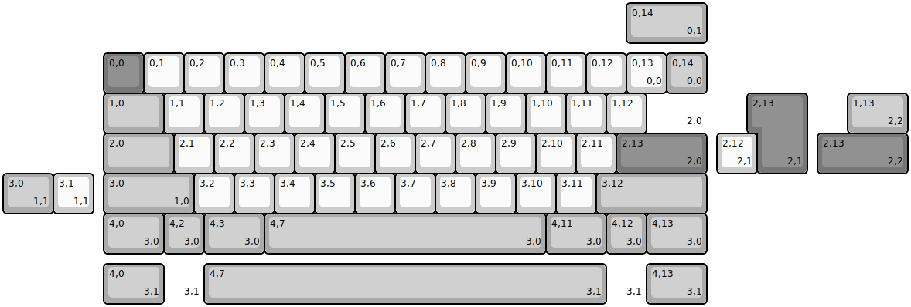{:loading="lazy"}

[Open in keyboard-layout-editor](http://www.keyboard-layout-editor.com/##@@_x:2.5&y:1.25&c=#777777;&=0,0&_c=#cccccc;&=0,1&=0,2&=0,3&=0,4&=0,5&=0,6&=0,7&=0,8&=0,9&=0,10&=0,11&=0,12&=0,13%0A%0A%0A0,0&_c=#aaaaaa;&=0,14%0A%0A%0A0,0;&@_x:2.5&w:1.5;&=1,0&_c=#cccccc;&=1,1&=1,2&=1,3&=1,4&=1,5&=1,6&=1,7&=1,8&=1,9&=1,10&=1,11&=1,12&_w:1.5&d:true;&=%0A%0A%0A2,0;&@_x:2.5&c=#aaaaaa&w:1.75;&=2,0&_c=#cccccc;&=2,1&=2,2&=2,3&=2,4&=2,5&=2,6&=2,7&=2,8&=2,9&=2,10&=2,11&_c=#777777&w:2.25;&=2,13%0A%0A%0A2,0;&@_x:2.5&c=#aaaaaa&w:2.25;&=3,0%0A%0A%0A1,0&_c=#cccccc;&=3,2&=3,3&=3,4&=3,5&=3,6&=3,7&=3,8&=3,9&=3,10&=3,11&_c=#aaaaaa&w:2.75;&=3,12;&@_x:2.5&w:1.5;&=4,0%0A%0A%0A3,0&=4,2%0A%0A%0A3,0&_w:1.5;&=4,3%0A%0A%0A3,0&_w:7;&=4,7%0A%0A%0A3,0&_w:1.5;&=4,11%0A%0A%0A3,0&=4,12%0A%0A%0A3,0&_w:1.5;&=4,13%0A%0A%0A3,0;&@_x:15.5&y:-6.25&w:2;&=0,14%0A%0A%0A0,1;&@_x:18.75&y:1.25&c=#777777&w:1.25&h:2&w2:1.5&h2:1&x2:-0.25;&=2,13%0A%0A%0A2,1&_x:1.0&c=#aaaaaa&w:1.5;&=1,13%0A%0A%0A2,2;&@_x:17.75&c=#cccccc;&=2,12%0A%0A%0A2,1&_x:1.5&c=#777777&w:2.25;&=2,13%0A%0A%0A2,2;&@_c=#aaaaaa&w:1.25;&=3,0%0A%0A%0A1,1&_c=#cccccc;&=3,1%0A%0A%0A1,1;&@_x:2.5&y:1.25&c=#aaaaaa&w:1.5;&=4,0%0A%0A%0A3,1&_c=#cccccc&d:true;&=%0A%0A%0A3,1&_c=#aaaaaa&w:10;&=4,7%0A%0A%0A3,1&_c=#cccccc&d:true;&=%0A%0A%0A3,1&_c=#aaaaaa&w:1.5;&=4,13%0A%0A%0A3,1)

## h0oni/hotduck

[README](output/h0oni/hotduck/README.md) - [layout](output/h0oni/hotduck/hotduck-kle.json) - [PCB](output/h0oni/hotduck/hotduck.kicad_pcb) - [PCB render](output/h0oni/hotduck/hotduck-render.svg)

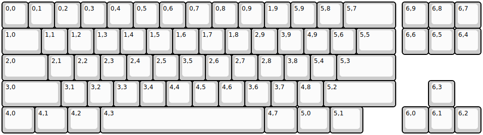{:loading="lazy"}

[Open in keyboard-layout-editor](http://www.keyboard-layout-editor.com/##@@=0,0&=0,1&=0,2&=0,3&=0,4&=0,5&=0,6&=0,7&=0,8&=0,9&=1,9&=5,9&=5,8&_w:2;&=5,7&_x:0.25;&=6,9&=6,8&=6,7;&@_w:1.5;&=1,0&=1,1&=1,2&=1,3&=1,4&=1,5&=1,6&=1,7&=1,8&=2,9&=3,9&=4,9&=5,6&_w:1.5;&=5,5&_x:0.25;&=6,6&=6,5&=6,4;&@_w:1.75;&=2,0&=2,1&=2,2&=2,3&=2,4&=2,5&=3,5&=2,6&=2,7&=2,8&=3,8&=5,4&_w:2.25;&=5,3;&@_w:2.25;&=3,0&=3,1&=3,2&=3,3&=3,4&=4,4&=4,5&=4,6&=3,6&=3,7&=4,8&_w:2.75;&=5,2&_x:1.25;&=6,3;&@_w:1.25;&=4,0&_w:1.25;&=4,1&_w:1.25;&=4,2&_w:6.25;&=4,3&_w:1.25;&=4,7&_w:1.25;&=5,0&_w:1.25;&=5,1&_x:1.5;&=6,0&=6,1&=6,2)

## han60/han60

[README](output/han60/README.md) - [layout](output/han60/han60-kle.json) - [PCB](output/han60/han60.kicad_pcb) - [PCB render](output/han60/han60-render.svg)

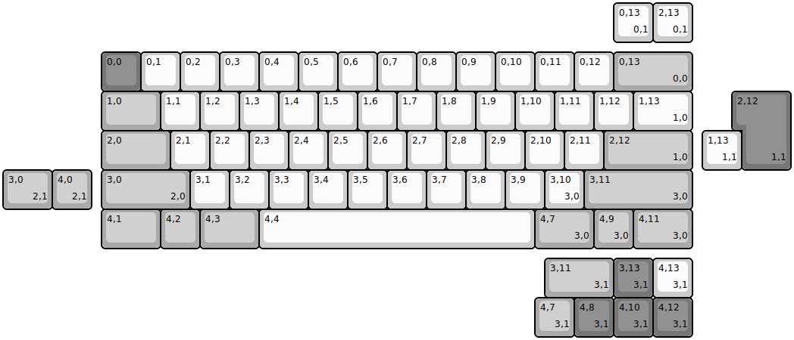{:loading="lazy"}

[Open in keyboard-layout-editor](http://www.keyboard-layout-editor.com/##@@_x:2.5&y:1.25&c=#777777;&=0,0&_c=#cccccc;&=0,1&=0,2&=0,3&=0,4&=0,5&=0,6&=0,7&=0,8&=0,9&=0,10&=0,11&=0,12&_c=#aaaaaa&w:2;&=0,13%0A%0A%0A0,0;&@_x:2.5&w:1.5;&=1,0&_c=#cccccc;&=1,1&=1,2&=1,3&=1,4&=1,5&=1,6&=1,7&=1,8&=1,9&=1,10&=1,11&=1,12&_w:1.5;&=1,13%0A%0A%0A1,0;&@_x:2.5&c=#aaaaaa&w:1.75;&=2,0&_c=#cccccc;&=2,1&=2,2&=2,3&=2,4&=2,5&=2,6&=2,7&=2,8&=2,9&=2,10&=2,11&_c=#aaaaaa&w:2.25;&=2,12%0A%0A%0A1,0;&@_x:2.5&w:2.25;&=3,0%0A%0A%0A2,0&_c=#cccccc;&=3,1&=3,2&=3,3&=3,4&=3,5&=3,6&=3,7&=3,8&=3,9&=3,10%0A%0A%0A3,0&_c=#aaaaaa&w:2.75;&=3,11%0A%0A%0A3,0;&@_x:2.5&w:1.5;&=4,1&=4,2&_w:1.5;&=4,3&_c=#cccccc&w:7;&=4,4&_c=#aaaaaa&w:1.5;&=4,7%0A%0A%0A3,0&=4,9%0A%0A%0A3,0&_w:1.5;&=4,11%0A%0A%0A3,0;&@_x:15.5&y:-6.25&c=#cccccc;&=0,13%0A%0A%0A0,1&=2,13%0A%0A%0A0,1;&@_x:18.75&y:1.25&c=#777777&w:1.25&h:2&w2:1.5&h2:1&x2:-0.25;&=2,12%0A%0A%0A1,1;&@_x:17.75&c=#cccccc;&=1,13%0A%0A%0A1,1;&@_c=#aaaaaa&w:1.25;&=3,0%0A%0A%0A2,1&=4,0%0A%0A%0A2,1;&@_x:13.75&y:1.25&w:1.75;&=3,11%0A%0A%0A3,1&_c=#777777;&=3,13%0A%0A%0A3,1&_c=#cccccc;&=4,13%0A%0A%0A3,1;&@_x:13.5&c=#aaaaaa;&=4,7%0A%0A%0A3,1&_c=#777777;&=4,8%0A%0A%0A3,1&=4,10%0A%0A%0A3,1&=4,12%0A%0A%0A3,1)

## handwired/3dortho14u

[README](output/handwired/3dortho14u/README.md) - [layout](output/handwired/3dortho14u/3dortho14u-kle.json) - [PCB](output/handwired/3dortho14u/3dortho14u.kicad_pcb) - [PCB render](output/handwired/3dortho14u/3dortho14u-render.svg)

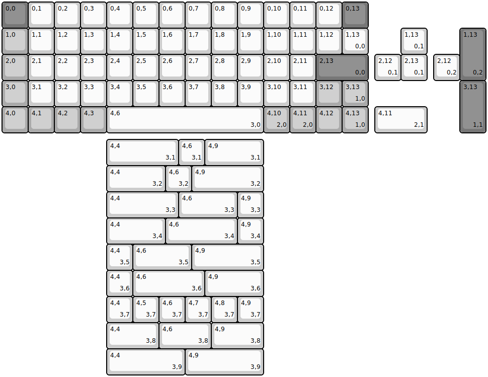{:loading="lazy"}

[Open in keyboard-layout-editor](http://www.keyboard-layout-editor.com/##@@_c=#777777;&=0,0&_c=#cccccc;&=0,1&=0,2&=0,3&=0,4&=0,5&=0,6&=0,7&=0,8&=0,9&=0,10&=0,11&=0,12&_c=#777777;&=0,13;&@_c=#aaaaaa;&=1,0&_c=#cccccc;&=1,1&=1,2&=1,3&=1,4&=1,5&=1,6&=1,7&=1,8&=1,9&=1,10&=1,11&=1,12&=1,13%0A%0A%0A0,0;&@_c=#aaaaaa;&=2,0&_c=#cccccc;&=2,1&=2,2&=2,3&=2,4&=2,5&=2,6&=2,7&=2,8&=2,9&=2,10&=2,11&_c=#777777&w:2;&=2,13%0A%0A%0A0,0;&@_c=#aaaaaa;&=3,0&_c=#cccccc;&=3,1&=3,2&=3,3&=3,4&=3,5&=3,6&=3,7&=3,8&=3,9&=3,10&=3,11&_c=#aaaaaa;&=3,12&=3,13%0A%0A%0A1,0;&@=4,0&=4,1&=4,2&=4,3&_c=#cccccc&w:6;&=4,6%0A%0A%0A3,0&_c=#aaaaaa;&=4,10%0A%0A%0A2,0&=4,11%0A%0A%0A2,0&=4,12&=4,13%0A%0A%0A1,0;&@_x:15.25&y:-4&c=#cccccc;&=1,13%0A%0A%0A0,1&_x:1.25&c=#777777&h:2;&=1,13%0A%0A%0A0,2;&@_x:14.25&c=#cccccc;&=2,12%0A%0A%0A0,1&=2,13%0A%0A%0A0,1&_x:0.25;&=2,12%0A%0A%0A0,2;&@_x:17.5&c=#777777&h:2;&=3,13%0A%0A%0A1,1;&@_x:14.25&c=#cccccc&w:2;&=4,11%0A%0A%0A2,1;&@_x:4&y:0.25&w:2.75;&=4,4%0A%0A%0A3,1&=4,6%0A%0A%0A3,1&_w:2.25;&=4,9%0A%0A%0A3,1;&@_x:4&w:2.25;&=4,4%0A%0A%0A3,2&=4,6%0A%0A%0A3,2&_w:2.75;&=4,9%0A%0A%0A3,2;&@_x:4&w:2.75;&=4,4%0A%0A%0A3,3&_w:2.25;&=4,6%0A%0A%0A3,3&=4,9%0A%0A%0A3,3;&@_x:4&w:2.25;&=4,4%0A%0A%0A3,4&_w:2.75;&=4,6%0A%0A%0A3,4&=4,9%0A%0A%0A3,4;&@_x:4;&=4,4%0A%0A%0A3,5&_w:2.25;&=4,6%0A%0A%0A3,5&_w:2.75;&=4,9%0A%0A%0A3,5;&@_x:4;&=4,4%0A%0A%0A3,6&_w:2.75;&=4,6%0A%0A%0A3,6&_w:2.25;&=4,9%0A%0A%0A3,6;&@_x:4;&=4,4%0A%0A%0A3,7&=4,5%0A%0A%0A3,7&=4,6%0A%0A%0A3,7&=4,7%0A%0A%0A3,7&=4,8%0A%0A%0A3,7&=4,9%0A%0A%0A3,7;&@_x:4&w:2;&=4,4%0A%0A%0A3,8&_w:2;&=4,6%0A%0A%0A3,8&_w:2;&=4,9%0A%0A%0A3,8;&@_x:4&w:3;&=4,4%0A%0A%0A3,9&_w:3;&=4,9%0A%0A%0A3,9)

## handwired/3dp660

[README](output/handwired/3dp660/README.md) - [layout](output/handwired/3dp660/3dp660-kle.json) - [PCB](output/handwired/3dp660/3dp660.kicad_pcb) - [PCB render](output/handwired/3dp660/3dp660-render.svg)

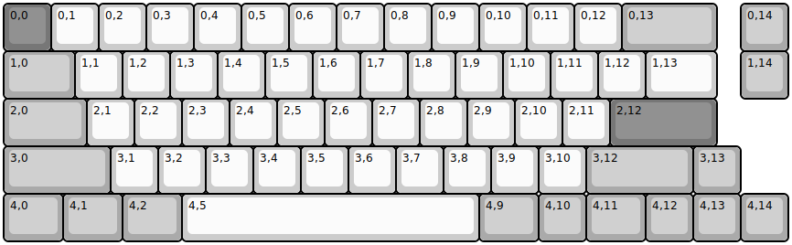{:loading="lazy"}

[Open in keyboard-layout-editor](http://www.keyboard-layout-editor.com/##@@_c=#777777;&=0,0&_c=#cccccc;&=0,1&=0,2&=0,3&=0,4&=0,5&=0,6&=0,7&=0,8&=0,9&=0,10&=0,11&=0,12&_c=#aaaaaa&w:2;&=0,13&_x:0.5;&=0,14;&@_w:1.5;&=1,0&_c=#cccccc;&=1,1&=1,2&=1,3&=1,4&=1,5&=1,6&=1,7&=1,8&=1,9&=1,10&=1,11&=1,12&_w:1.5;&=1,13&_x:0.5&c=#aaaaaa;&=1,14;&@_w:1.75;&=2,0&_c=#cccccc;&=2,1&=2,2&=2,3&=2,4&=2,5&=2,6&=2,7&=2,8&=2,9&=2,10&=2,11&_c=#777777&w:2.25;&=2,12;&@_c=#aaaaaa&w:2.25;&=3,0&_c=#cccccc;&=3,1&=3,2&=3,3&=3,4&=3,5&=3,6&=3,7&=3,8&=3,9&=3,10&_c=#aaaaaa&w:2.25;&=3,12&=3,13;&@_w:1.25;&=4,0&_w:1.25;&=4,1&_w:1.25;&=4,2&_c=#cccccc&w:6.25;&=4,5&_c=#aaaaaa&w:1.25;&=4,9&=4,10&_w:1.25;&=4,11&=4,12&=4,13&=4,14)

## handwired/6key

[README](output/handwired/6key/README.md) - [layout](output/handwired/6key/6key-kle.json) - [PCB](output/handwired/6key/6key.kicad_pcb) - [PCB render](output/handwired/6key/6key-render.svg)

{:loading="lazy"}

[Open in keyboard-layout-editor](http://www.keyboard-layout-editor.com/##@@=0,0&=0,1&=0,2;&@=1,0&=1,1&=1,2)

## handwired/carpolly

[README](output/handwired/carpolly/README.md) - [layout](output/handwired/carpolly/carpolly-kle.json) - [PCB](output/handwired/carpolly/carpolly.kicad_pcb) - [PCB render](output/handwired/carpolly/carpolly-render.svg)

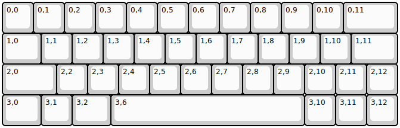{:loading="lazy"}

[Open in keyboard-layout-editor](http://www.keyboard-layout-editor.com/##@@=0,0&=0,1&=0,2&=0,3&=0,4&=0,5&=0,6&=0,7&=0,8&=0,9&=0,10&_w:1.75;&=0,11;&@_w:1.25;&=1,0&=1,1&=1,2&=1,3&=1,4&=1,5&=1,6&=1,7&=1,8&=1,9&=1,10&_w:1.5;&=1,11;&@_w:1.75;&=2,0&=2,2&=2,3&=2,4&=2,5&=2,6&=2,7&=2,8&=2,9&=2,10&=2,11&=2,12;&@_w:1.25;&=3,0&=3,1&_w:1.25;&=3,2&_w:6.25;&=3,6&=3,10&=3,11&=3,12)

## handwired/croxsplit44

[README](output/handwired/croxsplit44/README.md) - [layout](output/handwired/croxsplit44/croxsplit44-kle.json) - [PCB](output/handwired/croxsplit44/croxsplit44.kicad_pcb) - [PCB render](output/handwired/croxsplit44/croxsplit44-render.svg)

{:loading="lazy"}

[Open in keyboard-layout-editor](http://www.keyboard-layout-editor.com/##@@_x:3.5&y:1;&=0,3&_x:10.5;&=0,8;&@_x:2.5&y:-0.875;&=0,2&_x:1.0;&=0,4&_x:8.5;&=0,7&_x:1.0;&=0,9;&@_x:5.5&y:-0.875;&=0,5&_x:6.5;&=0,6;&@_x:0.5&y:-0.875&c=#777777;&=0,0&_c=#cccccc;&=0,1&_x:14.5;&=0,10&_c=#aaaaaa;&=0,11;&@_x:3.5&y:-0.375&c=#cccccc;&=1,3&_x:10.5;&=1,8;&@_x:2.5&y:-0.875;&=1,2&_x:1.0;&=1,4&_x:8.5;&=1,7&_x:1.0;&=1,9;&@_x:5.5&y:-0.875;&=1,5&_x:6.5;&=1,6;&@_x:0.5&y:-0.875&c=#aaaaaa;&=1,0&_c=#cccccc;&=1,1&_x:14.5&c=#aaaaaa;&=1,10&_c=#777777;&=1,11;&@_x:3.5&y:-0.375&c=#cccccc;&=2,3&_x:10.5&c=#aaaaaa;&=2,8;&@_x:2.5&y:-0.875&c=#cccccc;&=2,2&_x:1.0;&=2,4&_x:8.5;&=2,7&_x:1.0&c=#aaaaaa;&=2,9;&@_x:5.5&y:-0.875&c=#cccccc;&=2,5&_x:6.5;&=2,6;&@_x:0.5&y:-0.875&c=#aaaaaa;&=2,0&_c=#cccccc;&=2,1&_x:14.5&c=#aaaaaa;&=2,10&=2,11;&@_x:3.5&y:-0.375;&=3,3&_x:10.5;&=3,8;&@_x:2.5&y:-0.875;&=3,2&_x:12.5;&=3,9;&@_x:13.8&y:-0.75;&=3,7;&@_x:4.5&y:-0.875;&=3,4;&@_x:5.5&y:-0.75&c=#cccccc;&=3,5&_x:6.25;&=3,6)

## handwired/dactyl_manuform/4x5

[README](output/handwired/dactyl_manuform/4x5/README.md) - [layout](output/handwired/dactyl_manuform/4x5/4x5-kle.json) - [PCB](output/handwired/dactyl_manuform/4x5/4x5.kicad_pcb) - [PCB render](output/handwired/dactyl_manuform/4x5/4x5-render.svg)

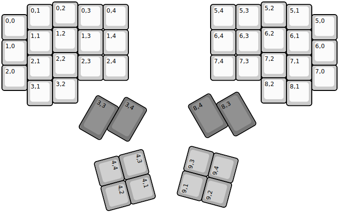{:loading="lazy"}

[Open in keyboard-layout-editor](http://www.keyboard-layout-editor.com/##@@_x:2;&=0,2&_x:7.25;&=5,2;&@_x:1&y:-0.9;&=0,1&_x:1;&=0,3&=0,4&_x:3.25;&=5,4&=5,3&_x:1.0;&=5,1;&@_y:-0.6;&=0,0&_x:11.25;&=5,0;&@_x:2&y:-0.5;&=1,2&_x:7.25;&=6,2;&@_x:1&y:-0.9;&=1,1&_x:1;&=1,3&=1,4&_x:3.25;&=6,4&=6,3&_x:1.0;&=6,1;&@_y:-0.6;&=1,0&_x:11.25;&=6,0;&@_x:2&y:-0.5;&=2,2&_x:7.25;&=7,2;&@_x:1&y:-0.9;&=2,1&_x:1;&=2,3&=2,4&_x:3.25;&=7,4&=7,3;&@_y:-0.6;&=2,0&_x:11.25;&=7,0;&@_x:2&y:-0.5;&=3,2&_x:7.25;&=8,2;&@_x:1&y:-0.9;&=3,1&_x:9.25;&=8,1;&@_ry:4.25&x:11.25&y:-2.15;&=7,1;&@_r:30&rx:6.5&ry:0&x:0.5&y:4&c=#777777&h:1.5;&=3,4;&@_x:-0.5&y:-0.5&h:1.5;&=3,3;&@_r:75&ry:3&x:2.5&y:1.5&c=#aaaaaa;&=4,3&=4,1;&@_x:2.5;&=4,4&=4,2;&@_r:-75&rx:13&ry:5.25&x:-4&y:-5.25;&=9,1&=9,3;&@_x:-4;&=9,2&=9,4;&@_r:-30&ry:0&x:-7&y:0.75&c=#777777&h:1.5;&=8,4;&@_x:-6&y:-0.5&h:1.5;&=8,3)

## handwired/dactyl_manuform/4x6

[README](output/handwired/dactyl_manuform/4x6/README.md) - [layout](output/handwired/dactyl_manuform/4x6/4x6-kle.json) - [PCB](output/handwired/dactyl_manuform/4x6/4x6.kicad_pcb) - [PCB render](output/handwired/dactyl_manuform/4x6/4x6-render.svg)

{:loading="lazy"}

[Open in keyboard-layout-editor](http://www.keyboard-layout-editor.com/##@@_x:2;&=0,2&=0,3&_x:6.25;&=5,2&=5,3;&@_x:1&y:-0.9;&=0,1&_x:2;&=0,4&=0,5&_x:2.25;&=5,0&=5,1&_x:2.0;&=5,4;&@_y:-0.85;&=0,0&_x:12.25;&=5,5;&@_x:2&y:-0.25;&=1,2&=1,3&_x:6.25;&=6,2&=6,3;&@_x:1&y:-0.9;&=1,1&_x:2;&=1,4&=1,5&_x:2.25;&=6,0&=6,1&_x:2.0;&=6,4;&@_y:-0.85;&=1,0&_x:12.25;&=6,5;&@_x:2&y:-0.25;&=2,2&=2,3&_x:6.25;&=7,2&=7,3;&@_x:1&y:-0.9;&=2,1&_x:2;&=2,4&=2,5&_x:2.25;&=7,0&=7,1;&@_y:-0.85;&=2,0&_x:12.25;&=7,5;&@_x:2&y:-0.25;&=3,2&=3,3&_x:6.25;&=8,2&=8,3;&@_ry:4.25&x:12.25&y:-2.15;&=7,4;&@_r:30&rx:6.5&ry:0.25&x:1.0&y:3.75&c=#777777&h:1.5;&=3,5;&@_y:-0.5&h:1.5;&=3,4;&@_r:75&ry:3&x:2.75&y:1&c=#aaaaaa;&=4,5&=4,3;&@_x:2.75;&=4,4&=4,2;&@_r:-75&rx:13&ry:5.25&x:-4&y:-4.75;&=9,2&=9,0;&@_x:-4;&=9,3&=9,1;&@_r:-30&ry:0&x:-6.75&y:1.25&c=#777777&h:1.5;&=8,0;&@_x:-5.75&y:-0.5&h:1.5;&=8,1)

## handwired/dactyl_manuform/5x6_5

[README](output/handwired/dactyl_manuform/5x6_5/README.md) - [layout](output/handwired/dactyl_manuform/5x6_5/5x6_5-kle.json) - [PCB](output/handwired/dactyl_manuform/5x6_5/5x6_5.kicad_pcb) - [PCB render](output/handwired/dactyl_manuform/5x6_5/5x6_5-render.svg)

{:loading="lazy"}

[Open in keyboard-layout-editor](http://www.keyboard-layout-editor.com/##@@_x:3.5;&=0,3&_x:7.5;&=6,2;&@_x:2.5&y:-0.875;&=0,2&_x:1.0;&=0,4&_x:5.5;&=6,1&_x:1.0;&=6,3;&@_x:5.5&y:-0.875;&=0,5&_x:3.5;&=6,0;&@_y:-0.875&w:1.5;&=0,0&=0,1&_x:11.5;&=6,4&_w:1.5;&=6,5;&@_x:3.5&y:-0.375;&=1,3&_x:7.5;&=7,2;&@_x:2.5&y:-0.875;&=1,2&_x:1.0;&=1,4&_x:5.5;&=7,1&_x:1.0;&=7,3;&@_x:5.5&y:-0.875;&=1,5&_x:3.5;&=7,0;&@_y:-0.875&w:1.5;&=1,0&=1,1&_x:11.5;&=7,4&_w:1.5;&=7,5;&@_x:3.5&y:-0.375;&=2,3&_x:7.5;&=8,2;&@_x:2.5&y:-0.875;&=2,2&_x:1.0;&=2,4&_x:5.5;&=8,1&_x:1.0;&=8,3;&@_x:5.5&y:-0.875;&=2,5&_x:3.5;&=8,0;&@_y:-0.875&w:1.5;&=2,0&=2,1&_x:11.5;&=8,4&_w:1.5;&=8,5;&@_x:3.5&y:-0.375;&=3,3&_x:7.5;&=9,2;&@_x:2.5&y:-0.875;&=3,2&_x:1.0;&=3,4&_x:5.5;&=9,1&_x:1.0;&=9,3;&@_x:5.5&y:-0.875;&=3,5&_x:3.5;&=9,0;&@_y:-0.875&w:1.5;&=3,0&=3,1&_x:11.5;&=9,4&_w:1.5;&=9,5;&@_x:3.5&y:-0.375;&=4,3&_x:7.5;&=10,2;&@_x:2.5&y:-0.875;&=4,2&_x:9.5;&=10,3;&@_r:30&rx:5&ry:4.5;&=4,4&=5,5&=5,3;&@_x:1;&=5,4&=5,2;&@_r:-30&rx:11.5&x:-3.0;&=11,2&=11,0&=10,1;&@_x:-3.0;&=11,3&=11,1)

## handwired/dactyl_manuform/5x7

[README](output/handwired/dactyl_manuform/5x7/README.md) - [layout](output/handwired/dactyl_manuform/5x7/5x7-kle.json) - [PCB](output/handwired/dactyl_manuform/5x7/5x7.kicad_pcb) - [PCB render](output/handwired/dactyl_manuform/5x7/5x7-render.svg)

{:loading="lazy"}

[Open in keyboard-layout-editor](http://www.keyboard-layout-editor.com/##@@_w:1.5;&=0,0&=0,1&=0,2&=0,3&=0,4&=0,5&=0,6&_x:4.5;&=6,0&=6,1&=6,2&=6,3&=6,4&=6,5&_w:1.5;&=6,6;&@_w:1.5;&=1,0&=1,1&=1,2&=1,3&=1,4&=1,5&=1,6&_x:4.5;&=7,0&=7,1&=7,2&=7,3&=7,4&=7,5&_w:1.5;&=7,6;&@_w:1.5;&=2,0&=2,1&=2,2&=2,3&=2,4&=2,5&=2,6&_x:4.5;&=8,0&=8,1&=8,2&=8,3&=8,4&=8,5&_w:1.5;&=8,6;&@_w:1.5;&=3,0&=3,1&=3,2&=3,3&=3,4&=3,5&_x:6.5;&=9,1&=9,2&=9,3&=9,4&=9,5&_w:1.5;&=9,6;&@_x:0.5;&=4,0&=4,1&=4,2&=4,3&_x:10.5;&=10,3&=10,4&=10,5&=10,6;&@_r:30&rx:6.5&ry:4.25&x:1.0&y:-0.25&h:1.5;&=4,5;&@_y:-0.5&h:1.5;&=4,4;&@_r:75&x:2.5&y:-2.5;&=5,5&=5,3;&@_x:2.5;&=5,4&=5,2;&@_r:-75&rx:13&x:-4.5&y:-1.25;&=11,3&=11,1;&@_x:-4.5;&=11,4&=11,2;&@_r:-30&x:-2&y:-1.0&h:1.5;&=10,1;&@_x:-1&y:-0.5&h:1.5;&=10,2)

## handwired/marauder

[README](output/handwired/marauder/README.md) - [layout](output/handwired/marauder/marauder-kle.json) - [PCB](output/handwired/marauder/marauder.kicad_pcb) - [PCB render](output/handwired/marauder/marauder-render.svg)

{:loading="lazy"}

[Open in keyboard-layout-editor](http://www.keyboard-layout-editor.com/##@@_c=#777777;&=0,0&_x:1&c=#cccccc;&=0,1&=0,2&=0,3&=0,4&_x:0.5&c=#777777;&=0,5&=0,6&=0,7&=0,8&_x:0.5&c=#cccccc;&=6,8&=6,7&=6,6&=6,5&_x:0.25&c=#777777;&=6,3&=6,2&=6,1&=6,0;&@_y:0.5&c=#cccccc;&=1,0&=1,1&=1,2&=1,3&=1,4&=1,5&=1,6&=1,7&=1,8&=7,8&=7,7&=7,6&=7,5&_c=#aaaaaa&w:2;&=7,4&_x:0.25&c=#cccccc;&=7,3&=7,2&=7,1&=7,0;&@_c=#aaaaaa&w:1.5;&=2,0&_c=#cccccc;&=2,1&=2,2&=2,3&=2,4&=2,5&=2,6&=2,7&=2,8&=8,8&=8,7&=8,6&=8,5&_w:1.5;&=8,4&_x:0.25;&=8,3&=8,2&=8,1&_h:2;&=8,0;&@_c=#aaaaaa&w:1.75;&=3,0&_c=#cccccc;&=3,1&=3,2&=3,3&=3,4&=3,5&=3,6&=3,7&=3,8&=9,8&=9,7&=9,6&_c=#777777&w:2.25;&=9,5&_x:0.25&c=#cccccc;&=9,3&=9,2&=9,1;&@_c=#aaaaaa&w:2.25;&=4,0&_c=#cccccc;&=4,1&=4,2&=4,3&=4,4&=4,5&=4,6&=4,7&=4,8&=10,8&=10,7&_c=#aaaaaa&w:2.75;&=10,6&_x:0.25&c=#cccccc;&=10,3&=10,2&=10,1&_h:2;&=10,0;&@_c=#aaaaaa&w:1.5;&=5,0&=5,1&_w:1.5;&=5,2&_c=#cccccc&w:7;&=5,6&_c=#aaaaaa&w:1.5;&=11,7&=11,6&_w:1.5;&=11,4&_x:0.25&c=#cccccc&w:2;&=11,3&=11,1)

## handwired/sick68

[README](output/handwired/sick68/README.md) - [layout](output/handwired/sick68/sick68-kle.json) - [PCB](output/handwired/sick68/sick68.kicad_pcb) - [PCB render](output/handwired/sick68/sick68-render.svg)

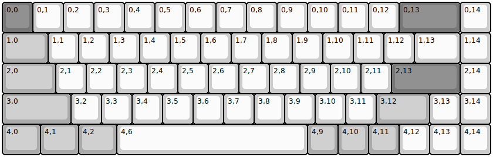{:loading="lazy"}

[Open in keyboard-layout-editor](http://www.keyboard-layout-editor.com/##@@_c=#777777;&=0,0&_c=#cccccc;&=0,1&=0,2&=0,3&=0,4&=0,5&=0,6&=0,7&=0,8&=0,9&=0,10&=0,11&=0,12&_c=#777777&w:2;&=0,13&_c=#cccccc;&=0,14;&@_c=#aaaaaa&w:1.5;&=1,0&_c=#cccccc;&=1,1&=1,2&=1,3&=1,4&=1,5&=1,6&=1,7&=1,8&=1,9&=1,10&=1,11&=1,12&_w:1.5;&=1,13&=1,14;&@_c=#aaaaaa&w:1.75;&=2,0&_c=#cccccc;&=2,1&=2,2&=2,3&=2,4&=2,5&=2,6&=2,7&=2,8&=2,9&=2,10&=2,11&_c=#777777&w:2.25;&=2,13&_c=#cccccc;&=2,14;&@_c=#aaaaaa&w:2.25;&=3,0&_c=#cccccc;&=3,2&=3,3&=3,4&=3,5&=3,6&=3,7&=3,8&=3,9&=3,10&=3,11&_c=#aaaaaa&w:1.75;&=3,12&_c=#cccccc;&=3,13&=3,14;&@_c=#aaaaaa&w:1.25;&=4,0&_w:1.25;&=4,1&_w:1.25;&=4,2&_c=#cccccc&w:6.25;&=4,6&_c=#aaaaaa;&=4,9&=4,10&=4,11&_c=#cccccc;&=4,12&=4,13&=4,14)

## handwired/streamcheap/2x4/streamcheap2x4

[README](output/handwired/streamcheap/2x4/README.md) - [layout](output/handwired/streamcheap/2x4/streamcheap2x4-kle.json) - [PCB](output/handwired/streamcheap/2x4/streamcheap2x4.kicad_pcb) - [PCB render](output/handwired/streamcheap/2x4/streamcheap2x4-render.svg)

{:loading="lazy"}

[Open in keyboard-layout-editor](http://www.keyboard-layout-editor.com/##@@=0,0&=0,1&=0,2&=0,3;&@=1,0&=1,1&=1,2&=1,3)

## hardwareabstraction/handwire

[README](output/hardwareabstraction/handwire/README.md) - [layout](output/hardwareabstraction/handwire/handwire-kle.json) - [PCB](output/hardwareabstraction/handwire/handwire.kicad_pcb) - [PCB render](output/hardwareabstraction/handwire/handwire-render.svg)

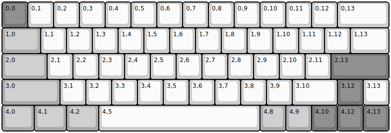{:loading="lazy"}

[Open in keyboard-layout-editor](http://www.keyboard-layout-editor.com/##@@_c=#777777;&=0,0&_c=#cccccc;&=0,1&=0,2&=0,3&=0,4&=0,5&=0,6&=0,7&=0,8&=0,9&=0,10&=0,11&=0,12&_w:2;&=0,13;&@_c=#aaaaaa&w:1.5;&=1,0&_c=#cccccc;&=1,1&=1,2&=1,3&=1,4&=1,5&=1,6&=1,7&=1,8&=1,9&=1,10&=1,11&=1,12&_w:1.5;&=1,13;&@_c=#aaaaaa&w:1.75;&=2,0&_c=#cccccc;&=2,1&=2,2&=2,3&=2,4&=2,5&=2,6&=2,7&=2,8&=2,9&=2,10&=2,11&_c=#777777&w:2.25;&=2,13;&@_c=#aaaaaa&w:2.25;&=3,0&_c=#cccccc;&=3,1&=3,2&=3,3&=3,4&=3,5&=3,6&=3,7&=3,8&=3,9&_w:1.75;&=3,10&_c=#777777;&=3,12&_c=#cccccc;&=3,13;&@_c=#aaaaaa&w:1.25;&=4,0&_w:1.25;&=4,1&_w:1.25;&=4,2&_c=#cccccc&w:6.25;&=4,5&_c=#aaaaaa;&=4,8&=4,9&_c=#777777;&=4,10&=4,12&=4,13)

## hasu/alps64

[README](output/hasu/README.md) - [layout](output/hasu/alps64-kle.json) - [PCB](output/hasu/alps64.kicad_pcb) - [PCB render](output/hasu/alps64-render.svg)

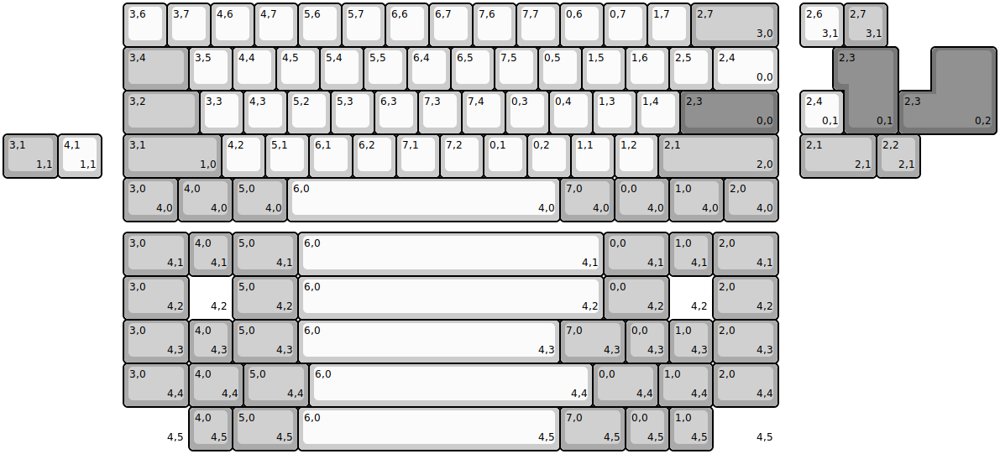{:loading="lazy"}

[Open in keyboard-layout-editor](http://www.keyboard-layout-editor.com/##@@_x:2.75;&=3,6&=3,7&=4,6&=4,7&=5,6&=5,7&=6,6&=6,7&=7,6&=7,7&=0,6&=0,7&=1,7&_c=#aaaaaa&w:2;&=2,7%0A%0A%0A3,0;&@_x:2.75&w:1.5;&=3,4&_c=#cccccc;&=3,5&=4,4&=4,5&=5,4&=5,5&=6,4&=6,5&=7,5&=0,5&=1,5&=1,6&=2,5&_w:1.5;&=2,4%0A%0A%0A0,0;&@_x:2.75&c=#aaaaaa&w:1.75;&=3,2&_c=#cccccc;&=3,3&=4,3&=5,2&=5,3&=6,3&=7,3&=7,4&=0,3&=0,4&=1,3&=1,4&_c=#777777&w:2.25;&=2,3%0A%0A%0A0,0;&@_x:2.75&c=#aaaaaa&w:2.25;&=3,1%0A%0A%0A1,0&_c=#cccccc;&=4,2&=5,1&=6,1&=6,2&=7,1&=7,2&=0,1&=0,2&=1,1&=1,2&_c=#aaaaaa&w:2.75;&=2,1%0A%0A%0A2,0;&@_x:2.75&w:1.25;&=3,0%0A%0A%0A4,0&_w:1.25;&=4,0%0A%0A%0A4,0&_w:1.25;&=5,0%0A%0A%0A4,0&_c=#cccccc&w:6.25;&=6,0%0A%0A%0A4,0&_c=#aaaaaa&w:1.25;&=7,0%0A%0A%0A4,0&_w:1.25;&=0,0%0A%0A%0A4,0&_w:1.25;&=1,0%0A%0A%0A4,0&_w:1.25;&=2,0%0A%0A%0A4,0;&@_x:18.25&y:-5&c=#cccccc;&=2,6%0A%0A%0A3,1&_c=#aaaaaa;&=2,7%0A%0A%0A3,1;&@_x:19.25&c=#777777&w:1.25&h:2&w2:1.5&h2:1&x2:-0.25;&=2,3%0A%0A%0A0,1&_x:0.75&w:1.5&h:2&w2:2.25&h2:1&x2:-0.75&y2:1;&=2,3%0A%0A%0A0,2;&@_x:18.25&c=#cccccc;&=2,4%0A%0A%0A0,1;&@_c=#aaaaaa&w:1.25;&=3,1%0A%0A%0A1,1&_c=#cccccc;&=4,1%0A%0A%0A1,1&_x:16.0&c=#aaaaaa&w:1.75;&=2,1%0A%0A%0A2,1&=2,2%0A%0A%0A2,1;&@_x:2.75&y:1.25&w:1.5;&=3,0%0A%0A%0A4,1&=4,0%0A%0A%0A4,1&_w:1.5;&=5,0%0A%0A%0A4,1&_c=#cccccc&w:7;&=6,0%0A%0A%0A4,1&_c=#aaaaaa&w:1.5;&=0,0%0A%0A%0A4,1&=1,0%0A%0A%0A4,1&_w:1.5;&=2,0%0A%0A%0A4,1;&@_x:2.75&w:1.5;&=3,0%0A%0A%0A4,2&_d:true;&=%0A%0A%0A4,2&_w:1.5;&=5,0%0A%0A%0A4,2&_c=#cccccc&w:7;&=6,0%0A%0A%0A4,2&_c=#aaaaaa&w:1.5;&=0,0%0A%0A%0A4,2&_d:true;&=%0A%0A%0A4,2&_w:1.5;&=2,0%0A%0A%0A4,2;&@_x:2.75&w:1.5;&=3,0%0A%0A%0A4,3&=4,0%0A%0A%0A4,3&_w:1.5;&=5,0%0A%0A%0A4,3&_c=#cccccc&w:6;&=6,0%0A%0A%0A4,3&_c=#aaaaaa&w:1.5;&=7,0%0A%0A%0A4,3&=0,0%0A%0A%0A4,3&=1,0%0A%0A%0A4,3&_w:1.5;&=2,0%0A%0A%0A4,3;&@_x:2.75&w:1.5;&=3,0%0A%0A%0A4,4&_w:1.25;&=4,0%0A%0A%0A4,4&_w:1.5;&=5,0%0A%0A%0A4,4&_c=#cccccc&w:6.5;&=6,0%0A%0A%0A4,4&_c=#aaaaaa&w:1.5;&=0,0%0A%0A%0A4,4&_w:1.25;&=1,0%0A%0A%0A4,4&_w:1.5;&=2,0%0A%0A%0A4,4;&@_x:2.75&w:1.5&d:true;&=%0A%0A%0A4,5&=4,0%0A%0A%0A4,5&_w:1.5;&=5,0%0A%0A%0A4,5&_c=#cccccc&w:6;&=6,0%0A%0A%0A4,5&_c=#aaaaaa&w:1.5;&=7,0%0A%0A%0A4,5&=0,0%0A%0A%0A4,5&=1,0%0A%0A%0A4,5&_w:1.5&d:true;&=%0A%0A%0A4,5)

## heliotrope/ansi

[README](output/heliotrope/ansi/README.md) - [layout](output/heliotrope/ansi/ansi-kle.json) - [PCB](output/heliotrope/ansi/ansi.kicad_pcb) - [PCB render](output/heliotrope/ansi/ansi-render.svg)

{:loading="lazy"}

[Open in keyboard-layout-editor](http://www.keyboard-layout-editor.com/##@@_c=#777777;&=0,0&_c=#cccccc;&=0,1&=0,2&=0,3&=0,4&=0,5&=0,6&=0,7&=0,8&=0,9&=0,10&=0,11&=0,12&_c=#aaaaaa&w:2;&=0,13;&@_w:1.5;&=1,0&_c=#cccccc;&=1,1&=1,2&=1,3&=1,4&=1,5&=1,6&=1,7&=1,8&=1,9&=1,10&=1,11&=1,12&_w:1.5;&=1,13;&@_c=#aaaaaa&w:1.75;&=2,0&_c=#cccccc;&=2,1&=2,2&=2,3&=2,4&=2,5&=2,6&=2,7&=2,8&=2,9&=2,10&=2,11&_c=#777777&w:2.25;&=2,13;&@_c=#aaaaaa&w:2.25;&=3,0&_c=#cccccc;&=3,1&=3,2&=3,3&=3,4&=3,5&=3,6&=3,7&=3,8&=3,9&=3,10&_c=#aaaaaa&w:2.75;&=3,13;&@_w:1.25;&=4,0&_w:1.25;&=4,1&_w:1.25;&=4,2&_c=#cccccc&w:6.25;&=4,5&_c=#aaaaaa&w:1.25;&=4,9&_w:1.25;&=4,10&_w:1.25;&=4,11&_w:1.25;&=4,13)

## hhkb/ansi

[README](output/hhkb/ansi/README.md) - [layout](output/hhkb/ansi/ansi-kle.json) - [PCB](output/hhkb/ansi/ansi.kicad_pcb) - [PCB render](output/hhkb/ansi/ansi-render.svg)

{:loading="lazy"}

[Open in keyboard-layout-editor](http://www.keyboard-layout-editor.com/##@_name=HHKB;&@_c=#aaaaaa;&=3,1&_c=#cccccc;&=3,0&=0,0&=1,0&=1,1&=2,0&=2,1&=4,0&=4,1&=6,0&=6,1&=7,0&=7,1&=5,0&=5,1;&@_c=#aaaaaa&w:1.5;&=3,2&_c=#cccccc;&=0,1&=0,2&=1,3&=1,2&=2,3&=2,2&=4,2&=4,3&=6,2&=6,3&=7,3&=7,2&_c=#aaaaaa&w:1.5;&=5,2;&@_w:1.75;&=3,3&_c=#cccccc;&=0,4&=0,3&=1,4&=1,5&=2,4&=2,5&=4,5&=4,4&=6,5&=6,4&=7,4&_c=#aaaaaa&w:2.25;&=5,3;&@_w:2.25;&=3,4&_c=#cccccc;&=0,5&=0,6&=0,7&=1,6&=1,7&=2,6&=4,6&=6,6&=7,6&=7,5&_c=#aaaaaa&w:1.75;&=5,5&=5,4;&@_x:1.5;&=3,5&_w:1.5;&=3,6&_c=#cccccc&w:6;&=3,7&_c=#aaaaaa&w:1.5;&=5,7&=5,6)

## hhkb/jp

[README](output/hhkb/jp/README.md) - [layout](output/hhkb/jp/jp-kle.json) - [PCB](output/hhkb/jp/jp.kicad_pcb) - [PCB render](output/hhkb/jp/jp-render.svg)

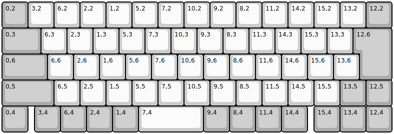{:loading="lazy"}

[Open in keyboard-layout-editor](http://www.keyboard-layout-editor.com/##@_name=HHKB%20JP;&@_c=#aaaaaa;&=0,2&_c=#cccccc;&=3,2&=6,2&=2,2&=1,2&=5,2&=7,2&=10,2&=9,2&=8,2&=11,2&=14,2&=15,2&=13,2&_c=#aaaaaa;&=12,2;&@_w:1.5;&=0,3&_c=#cccccc;&=6,3&=2,3&=1,3&=5,3&=7,3&=10,3&=9,3&=8,3&=11,3&=14,3&=15,3&=13,3&_x:0.25&c=#aaaaaa&w:1.25&h:2&w2:1.5&h2:1&x2:-0.25;&=12,6;&@_w:1.75;&=0,6&_c=#cccccc;&=6,6&=2,6&=1,6&=5,6&=7,6&=10,6&=9,6&=8,6&=11,6&=14,6&=15,6&=13,6;&@_c=#aaaaaa&w:2;&=0,5&_c=#cccccc;&=6,5&=2,5&=1,5&=5,5&=7,5&=10,5&=9,5&=8,5&=11,5&=14,5&=15,5&_c=#aaaaaa;&=13,5&=12,5;&@=0,4&_x:0.25;&=3,4&=6,4&=2,4&=1,4&_c=#cccccc&w:2.5;&=7,4&_c=#aaaaaa;&=9,4&=8,4&=11,4&=14,4&_x:0.25;&=15,4&=13,4&=12,4)

## hhkb_lite_2/hhkb_lite_2

[README](output/hhkb_lite_2/README.md) - [layout](output/hhkb_lite_2/hhkb_lite_2-kle.json) - [PCB](output/hhkb_lite_2/hhkb_lite_2.kicad_pcb) - [PCB render](output/hhkb_lite_2/hhkb_lite_2-render.svg)

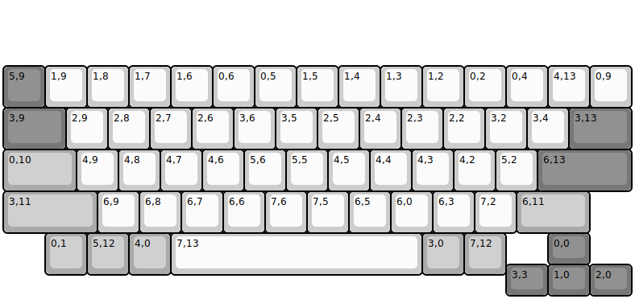{:loading="lazy"}

[Open in keyboard-layout-editor](http://www.keyboard-layout-editor.com/##@@_y:1.5&c=#777777&f:4;&=5,9&_c=#cccccc&f:5;&=1,9&=1,8&=1,7&=1,6&=0,6&=0,5&=1,5&=1,4&=1,3&=1,2&=0,2&=0,4&=4,13&_f:4;&=0,9;&@_c=#777777&w:1.5;&=3,9&_c=#cccccc&f:5;&=2,9&=2,8&=2,7&=2,6&=3,6&=3,5&=2,5&=2,4&=2,3&=2,2&=3,2&=3,4&_c=#777777&w:1.5;&=3,13;&@_c=#aaaaaa&f:4&w:1.75;&=0,10&_c=#cccccc&f:5;&=4,9&=4,8&=4,7&=4,6&=5,6&=5,5&=4,5&=4,4&=4,3&=4,2&=5,2&_c=#777777&w:2.25;&=6,13;&@_c=#aaaaaa&f:4&w:2.25;&=3,11&_c=#cccccc&f:5;&=6,9&=6,8&=6,7&=6,6&=7,6&=7,5&=6,5&=6,0&=6,3&=7,2&_c=#aaaaaa&w:1.75;&=6,11;&@_x:1&f:4;&=0,1&=5,12&=4,0&_c=#cccccc&f:5&w:6;&=7,13&_c=#aaaaaa&f:4;&=3,0&=7,12&_x:1&c=#777777&f:3&h:0.75;&=0,0;&@_x:12&y:-0.25&h:0.75;&=3,3&_h:0.75;&=1,0&_h:0.75;&=2,0)

## hineybush/h08

[README](output/hineybush/h08/README.md) - [layout](output/hineybush/h08/h08-kle.json) - [PCB](output/hineybush/h08/h08.kicad_pcb) - [PCB render](output/hineybush/h08/h08-render.svg)

{:loading="lazy"}

[Open in keyboard-layout-editor](http://www.keyboard-layout-editor.com/##@@=0,0&=0,1&=0,2&=0,3;&@=1,0%0A%0A%0A0,0&=1,1%0A%0A%0A0,0&=1,2%0A%0A%0A1,0&=1,3%0A%0A%0A1,0;&@_y:0.25&w:2;&=1,0%0A%0A%0A0,1&_w:2;&=1,2%0A%0A%0A1,1)

## hineybush/h10

[README](output/hineybush/h10/README.md) - [layout](output/hineybush/h10/h10-kle.json) - [PCB](output/hineybush/h10/h10.kicad_pcb) - [PCB render](output/hineybush/h10/h10-render.svg)

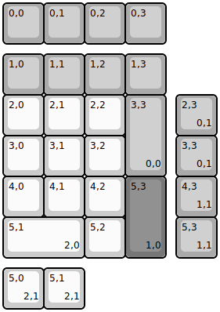{:loading="lazy"}

[Open in keyboard-layout-editor](http://www.keyboard-layout-editor.com/##@@_c=#aaaaaa;&=0,0&=0,1&=0,2&=0,3;&@_y:0.25;&=1,0&=1,1&=1,2&=1,3;&@_c=#cccccc;&=2,0&=2,1&=2,2&_c=#aaaaaa&h:2;&=3,3%0A%0A%0A0,0;&@_c=#cccccc;&=3,0&=3,1&=3,2;&@=4,0&=4,1&=4,2&_c=#777777&h:2;&=5,3%0A%0A%0A1,0;&@_c=#cccccc&w:2;&=5,1%0A%0A%0A2,0&=5,2;&@_x:4.25&y:-4.0&c=#aaaaaa;&=2,3%0A%0A%0A0,1;&@_x:4.25;&=3,3%0A%0A%0A0,1;&@_x:4.25;&=4,3%0A%0A%0A1,1;&@_x:4.25;&=5,3%0A%0A%0A1,1;&@_y:0.25&c=#cccccc;&=5,0%0A%0A%0A2,1&=5,1%0A%0A%0A2,1)

## hineybush/h60

[README](output/hineybush/h60/README.md) - [layout](output/hineybush/h60/h60-kle.json) - [PCB](output/hineybush/h60/h60.kicad_pcb) - [PCB render](output/hineybush/h60/h60-render.svg)

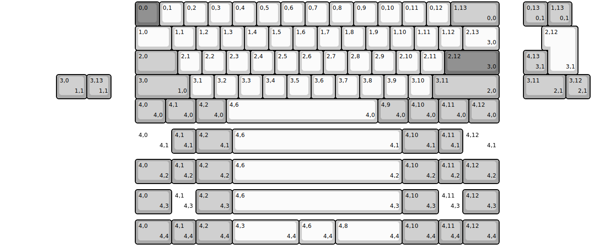{:loading="lazy"}

[Open in keyboard-layout-editor](http://www.keyboard-layout-editor.com/##@@_x:5.5&c=#777777;&=0,0&_c=#cccccc;&=0,1&=0,2&=0,3&=0,4&=0,5&=0,6&=0,7&=0,8&=0,9&=0,10&=0,11&=0,12&_c=#aaaaaa&w:2;&=1,13%0A%0A%0A0,0;&@_x:5.5&c=#cccccc&w:1.5;&=1,0&=1,1&=1,2&=1,3&=1,4&=1,5&=1,6&=1,7&=1,8&=1,9&=1,10&=1,11&=1,12&_w:1.5;&=2,13%0A%0A%0A3,0;&@_x:5.5&c=#aaaaaa&w:1.75;&=2,0&_c=#cccccc;&=2,1&=2,2&=2,3&=2,4&=2,5&=2,6&=2,7&=2,8&=2,9&=2,10&=2,11&_c=#777777&w:2.25;&=2,12%0A%0A%0A3,0;&@_x:5.5&c=#aaaaaa&w:2.25;&=3,0%0A%0A%0A1,0&_c=#cccccc;&=3,1&=3,2&=3,3&=3,4&=3,5&=3,6&=3,7&=3,8&=3,9&=3,10&_c=#aaaaaa&w:2.75;&=3,11%0A%0A%0A2,0;&@_x:5.5&w:1.25;&=4,0%0A%0A%0A4,0&_w:1.25;&=4,1%0A%0A%0A4,0&_w:1.25;&=4,2%0A%0A%0A4,0&_c=#cccccc&w:6.25;&=4,6%0A%0A%0A4,0&_c=#aaaaaa&w:1.25;&=4,9%0A%0A%0A4,0&_w:1.25;&=4,10%0A%0A%0A4,0&_w:1.25;&=4,11%0A%0A%0A4,0&_w:1.25;&=4,12%0A%0A%0A4,0;&@_x:21.5&y:-5;&=0,13%0A%0A%0A0,1&=1,13%0A%0A%0A0,1;&@_x:22.5&c=#cccccc&w:1.25&h:2&w2:1.5&h2:1&x2:-0.25;&=2,12%0A%0A%0A3,1;&@_x:21.5&c=#aaaaaa;&=4,13%0A%0A%0A3,1;&@_x:2.25&w:1.25;&=3,0%0A%0A%0A1,1&=3,13%0A%0A%0A1,1&_x:17.0&w:1.75;&=3,11%0A%0A%0A2,1&=3,12%0A%0A%0A2,1;&@_x:5.5&y:1.25&c=#cccccc&w:1.5&d:true;&=4,0%0A%0A%0A4,1&_c=#aaaaaa;&=4,1%0A%0A%0A4,1&_w:1.5;&=4,2%0A%0A%0A4,1&_c=#cccccc&w:7;&=4,6%0A%0A%0A4,1&_c=#aaaaaa&w:1.5;&=4,10%0A%0A%0A4,1&=4,11%0A%0A%0A4,1&_c=#cccccc&w:1.5&d:true;&=4,12%0A%0A%0A4,1;&@_x:5.5&y:0.25&c=#aaaaaa&w:1.5;&=4,0%0A%0A%0A4,2&=4,1%0A%0A%0A4,2&_w:1.5;&=4,2%0A%0A%0A4,2&_c=#cccccc&w:7;&=4,6%0A%0A%0A4,2&_c=#aaaaaa&w:1.5;&=4,10%0A%0A%0A4,2&=4,11%0A%0A%0A4,2&_w:1.5;&=4,12%0A%0A%0A4,2;&@_x:5.5&y:0.25&w:1.5;&=4,0%0A%0A%0A4,3&_d:true;&=4,1%0A%0A%0A4,3&_w:1.5;&=4,2%0A%0A%0A4,3&_c=#cccccc&w:7;&=4,6%0A%0A%0A4,3&_c=#aaaaaa&w:1.5;&=4,10%0A%0A%0A4,3&_c=#cccccc&d:true;&=4,11%0A%0A%0A4,3&_c=#aaaaaa&w:1.5;&=4,12%0A%0A%0A4,3;&@_x:5.5&y:0.25&w:1.5;&=4,0%0A%0A%0A4,4&=4,1%0A%0A%0A4,4&_w:1.5;&=4,2%0A%0A%0A4,4&_c=#cccccc&w:2.75;&=4,3%0A%0A%0A4,4&_w:1.5;&=4,6%0A%0A%0A4,4&_w:2.75;&=4,8%0A%0A%0A4,4&_c=#aaaaaa&w:1.5;&=4,10%0A%0A%0A4,4&=4,11%0A%0A%0A4,4&_w:1.5;&=4,12%0A%0A%0A4,4)

## hineybush/h65

[README](output/hineybush/h65/README.md) - [layout](output/hineybush/h65/h65-kle.json) - [PCB](output/hineybush/h65/h65.kicad_pcb) - [PCB render](output/hineybush/h65/h65-render.svg)

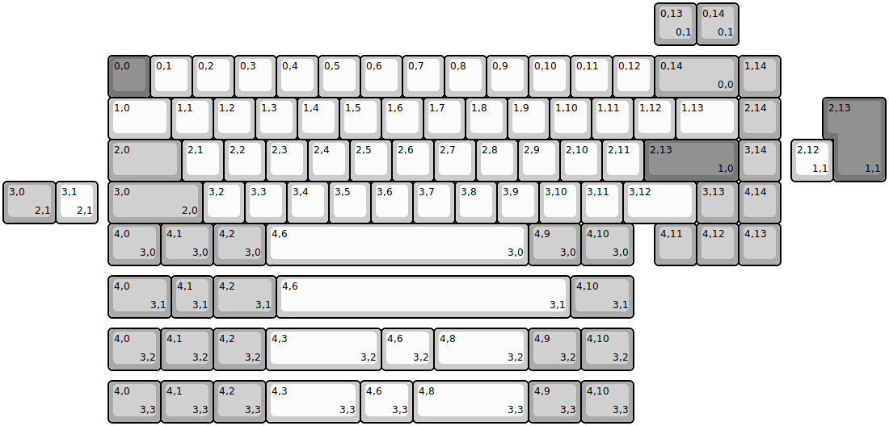{:loading="lazy"}

[Open in keyboard-layout-editor](http://www.keyboard-layout-editor.com/##@@_x:2.5&y:1.25&c=#777777;&=0,0&_c=#cccccc;&=0,1&=0,2&=0,3&=0,4&=0,5&=0,6&=0,7&=0,8&=0,9&=0,10&=0,11&=0,12&_c=#aaaaaa&w:2;&=0,14%0A%0A%0A0,0&=1,14;&@_x:2.5&c=#cccccc&w:1.5;&=1,0&=1,1&=1,2&=1,3&=1,4&=1,5&=1,6&=1,7&=1,8&=1,9&=1,10&=1,11&=1,12&_w:1.5;&=1,13&_c=#aaaaaa;&=2,14;&@_x:2.5&w:1.75;&=2,0&_c=#cccccc;&=2,1&=2,2&=2,3&=2,4&=2,5&=2,6&=2,7&=2,8&=2,9&=2,10&=2,11&_c=#777777&w:2.25;&=2,13%0A%0A%0A1,0&_c=#aaaaaa;&=3,14;&@_x:2.5&w:2.25;&=3,0%0A%0A%0A2,0&_c=#cccccc;&=3,2&=3,3&=3,4&=3,5&=3,6&=3,7&=3,8&=3,9&=3,10&=3,11&_w:1.75;&=3,12&_c=#aaaaaa;&=3,13&=4,14;&@_x:2.5&w:1.25;&=4,0%0A%0A%0A3,0&_w:1.25;&=4,1%0A%0A%0A3,0&_w:1.25;&=4,2%0A%0A%0A3,0&_c=#cccccc&w:6.25;&=4,6%0A%0A%0A3,0&_c=#aaaaaa&w:1.25;&=4,9%0A%0A%0A3,0&_w:1.25;&=4,10%0A%0A%0A3,0&_x:0.5;&=4,11&=4,12&=4,13;&@_x:15.5&y:-6.25;&=0,13%0A%0A%0A0,1&=0,14%0A%0A%0A0,1;&@_x:19.75&y:1.25&c=#777777&w:1.25&h:2&w2:1.5&h2:1&x2:-0.25;&=2,13%0A%0A%0A1,1;&@_x:18.75&c=#cccccc;&=2,12%0A%0A%0A1,1;&@_c=#aaaaaa&w:1.25;&=3,0%0A%0A%0A2,1&_c=#cccccc;&=3,1%0A%0A%0A2,1;&@_x:2.5&y:1.25&c=#aaaaaa&w:1.5;&=4,0%0A%0A%0A3,1&=4,1%0A%0A%0A3,1&_w:1.5;&=4,2%0A%0A%0A3,1&_c=#cccccc&w:7;&=4,6%0A%0A%0A3,1&_c=#aaaaaa&w:1.5;&=4,10%0A%0A%0A3,1;&@_x:2.5&y:0.25&w:1.25;&=4,0%0A%0A%0A3,2&_w:1.25;&=4,1%0A%0A%0A3,2&_w:1.25;&=4,2%0A%0A%0A3,2&_c=#cccccc&w:2.75;&=4,3%0A%0A%0A3,2&_w:1.25;&=4,6%0A%0A%0A3,2&_w:2.25;&=4,8%0A%0A%0A3,2&_c=#aaaaaa&w:1.25;&=4,9%0A%0A%0A3,2&_w:1.25;&=4,10%0A%0A%0A3,2;&@_x:2.5&y:0.25&w:1.25;&=4,0%0A%0A%0A3,3&_w:1.25;&=4,1%0A%0A%0A3,3&_w:1.25;&=4,2%0A%0A%0A3,3&_c=#cccccc&w:2.25;&=4,3%0A%0A%0A3,3&_w:1.25;&=4,6%0A%0A%0A3,3&_w:2.75;&=4,8%0A%0A%0A3,3&_c=#aaaaaa&w:1.25;&=4,9%0A%0A%0A3,3&_w:1.25;&=4,10%0A%0A%0A3,3)

## hineybush/h65/h65_hotswap

[README](output/hineybush/h65/README.md) - [layout](output/hineybush/h65/h65_hotswap-kle.json) - [PCB](output/hineybush/h65/h65_hotswap.kicad_pcb) - [PCB render](output/hineybush/h65/h65_hotswap-render.svg)

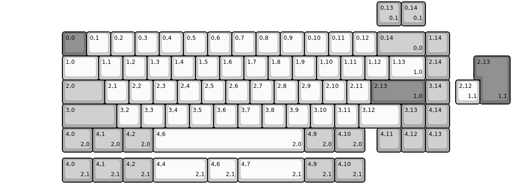{:loading="lazy"}

[Open in keyboard-layout-editor](http://www.keyboard-layout-editor.com/##@@_x:2.5&y:1.25&c=#777777;&=0,0&_c=#cccccc;&=0,1&=0,2&=0,3&=0,4&=0,5&=0,6&=0,7&=0,8&=0,9&=0,10&=0,11&=0,12&_c=#aaaaaa&w:2;&=0,14%0A%0A%0A0,0&=1,14;&@_x:2.5&c=#cccccc&w:1.5;&=1,0&=1,1&=1,2&=1,3&=1,4&=1,5&=1,6&=1,7&=1,8&=1,9&=1,10&=1,11&=1,12&_w:1.5;&=1,13%0A%0A%0A1,0&_c=#aaaaaa;&=2,14;&@_x:2.5&w:1.75;&=2,0&_c=#cccccc;&=2,1&=2,2&=2,3&=2,4&=2,5&=2,6&=2,7&=2,8&=2,9&=2,10&=2,11&_c=#777777&w:2.25;&=2,13%0A%0A%0A1,0&_c=#aaaaaa;&=3,14;&@_x:2.5&w:2.25;&=3,0&_c=#cccccc;&=3,2&=3,3&=3,4&=3,5&=3,6&=3,7&=3,8&=3,9&=3,10&=3,11&_w:1.75;&=3,12&_c=#aaaaaa;&=3,13&=4,14;&@_x:2.5&w:1.25;&=4,0%0A%0A%0A2,0&_w:1.25;&=4,1%0A%0A%0A2,0&_w:1.25;&=4,2%0A%0A%0A2,0&_c=#cccccc&w:6.25;&=4,6%0A%0A%0A2,0&_c=#aaaaaa&w:1.25;&=4,9%0A%0A%0A2,0&_w:1.25;&=4,10%0A%0A%0A2,0&_x:0.5;&=4,11&=4,12&=4,13;&@_x:15.5&y:-6.25;&=0,13%0A%0A%0A0,1&=0,14%0A%0A%0A0,1;&@_x:19.75&y:1.25&c=#777777&w:1.25&h:2&w2:1.5&h2:1&x2:-0.25;&=2,13%0A%0A%0A1,1;&@_x:18.75&c=#cccccc;&=2,12%0A%0A%0A1,1;&@_x:2.5&y:2.25&c=#aaaaaa&w:1.25;&=4,0%0A%0A%0A2,1&_w:1.25;&=4,1%0A%0A%0A2,1&_w:1.25;&=4,2%0A%0A%0A2,1&_c=#cccccc&w:2.25;&=4,4%0A%0A%0A2,1&_w:1.25;&=4,6%0A%0A%0A2,1&_w:2.75;&=4,7%0A%0A%0A2,1&_c=#aaaaaa&w:1.25;&=4,9%0A%0A%0A2,1&_w:1.25;&=4,10%0A%0A%0A2,1)

## hineybush/h660s

[README](output/hineybush/h660s/README.md) - [layout](output/hineybush/h660s/h660s-kle.json) - [PCB](output/hineybush/h660s/h660s.kicad_pcb) - [PCB render](output/hineybush/h660s/h660s-render.svg)

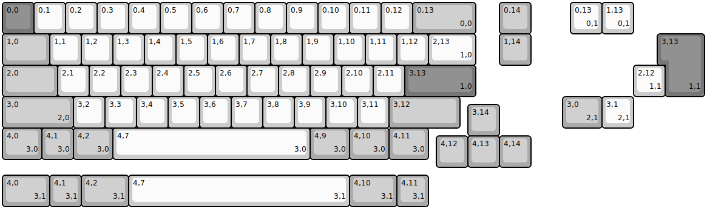{:loading="lazy"}

[Open in keyboard-layout-editor](http://www.keyboard-layout-editor.com/##@@_c=#777777;&=0,0&_c=#cccccc;&=0,1&=0,2&=0,3&=0,4&=0,5&=0,6&=0,7&=0,8&=0,9&=0,10&=0,11&=0,12&_c=#aaaaaa&w:2;&=0,13%0A%0A%0A0,0&_x:0.75;&=0,14;&@_w:1.5;&=1,0&_c=#cccccc;&=1,1&=1,2&=1,3&=1,4&=1,5&=1,6&=1,7&=1,8&=1,9&=1,10&=1,11&=1,12&_w:1.5;&=2,13%0A%0A%0A1,0&_x:0.75&c=#aaaaaa;&=1,14;&@_w:1.75;&=2,0&_c=#cccccc;&=2,1&=2,2&=2,3&=2,4&=2,5&=2,6&=2,7&=2,8&=2,9&=2,10&=2,11&_c=#777777&w:2.25;&=3,13%0A%0A%0A1,0;&@_c=#aaaaaa&w:2.25;&=3,0%0A%0A%0A2,0&_c=#cccccc;&=3,2&=3,3&=3,4&=3,5&=3,6&=3,7&=3,8&=3,9&=3,10&=3,11&_c=#aaaaaa&w:2.25;&=3,12;&@_x:14.75&y:-0.75;&=3,14;&@_y:-0.25&w:1.25;&=4,0%0A%0A%0A3,0&=4,1%0A%0A%0A3,0&_w:1.25;&=4,2%0A%0A%0A3,0&_c=#cccccc&w:6.25;&=4,7%0A%0A%0A3,0&_c=#aaaaaa&w:1.25;&=4,9%0A%0A%0A3,0&_w:1.25;&=4,10%0A%0A%0A3,0&_w:1.25;&=4,11%0A%0A%0A3,0;&@_x:13.75&y:-0.75;&=4,12&=4,13&=4,14;&@_x:18.0&y:-5.25&c=#cccccc;&=0,13%0A%0A%0A0,1&=1,13%0A%0A%0A0,1;&@_x:21.0&c=#777777&w:1.25&h:2&w2:1.5&h2:1&x2:-0.25;&=3,13%0A%0A%0A1,1;&@_x:20.0&c=#cccccc;&=2,12%0A%0A%0A1,1;&@_x:17.75&c=#aaaaaa&w:1.25;&=3,0%0A%0A%0A2,1&_c=#cccccc;&=3,1%0A%0A%0A2,1;&@_y:1.5&c=#aaaaaa&w:1.5;&=4,0%0A%0A%0A3,1&=4,1%0A%0A%0A3,1&_w:1.5;&=4,2%0A%0A%0A3,1&_c=#cccccc&w:7;&=4,7%0A%0A%0A3,1&_c=#aaaaaa&w:1.5;&=4,10%0A%0A%0A3,1&=4,11%0A%0A%0A3,1)

## hineybush/h75_singa

[README](output/hineybush/h75_singa/README.md) - [layout](output/hineybush/h75_singa/h75_singa-kle.json) - [PCB](output/hineybush/h75_singa/h75_singa.kicad_pcb) - [PCB render](output/hineybush/h75_singa/h75_singa-render.svg)

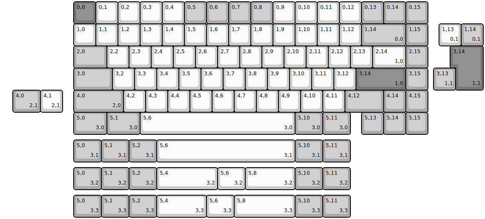{:loading="lazy"}

[Open in keyboard-layout-editor](http://www.keyboard-layout-editor.com/##@@_x:3.25&c=#777777;&=0,0&_c=#cccccc;&=0,1&=0,2&=0,3&=0,4&_c=#aaaaaa;&=0,5&=0,6&=0,7&=0,8&_c=#cccccc;&=0,9&=0,10&=0,11&=0,12&_c=#aaaaaa;&=0,13&=0,14&=0,15;&@_x:3.25&c=#cccccc;&=1,0&=1,1&=1,2&=1,3&=1,4&=1,5&=1,6&=1,7&=1,8&=1,9&=1,10&=1,11&=1,12&_c=#aaaaaa&w:2;&=1,14%0A%0A%0A0,0&=1,15;&@_x:3.25&w:1.5;&=2,0&_c=#cccccc;&=2,2&=2,3&=2,4&=2,5&=2,6&=2,7&=2,8&=2,9&=2,10&=2,11&=2,12&=2,13&_w:1.5;&=2,14%0A%0A%0A1,0&_c=#aaaaaa;&=2,15;&@_x:3.25&w:1.75;&=3,0&_c=#cccccc;&=3,2&=3,3&=3,4&=3,5&=3,6&=3,7&=3,8&=3,9&=3,10&=3,11&=3,12&_c=#777777&w:2.25;&=3,14%0A%0A%0A1,0&_c=#aaaaaa;&=3,15;&@_x:3.25&w:2.25;&=4,0%0A%0A%0A2,0&_c=#cccccc;&=4,2&=4,3&=4,4&=4,5&=4,6&=4,7&=4,8&=4,9&=4,10&=4,11&_c=#aaaaaa&w:1.75;&=4,12&=4,14&=4,15;&@_x:3.25&w:1.5;&=5,0%0A%0A%0A3,0&_w:1.5;&=5,1%0A%0A%0A3,0&_c=#cccccc&w:7;&=5,6%0A%0A%0A3,0&_c=#aaaaaa&w:1.25;&=5,10%0A%0A%0A3,0&_w:1.25;&=5,11%0A%0A%0A3,0&_x:0.5;&=5,13&=5,14&=5,15;&@_x:19.75&y:-5&c=#cccccc;&=1,13%0A%0A%0A0,1&_c=#aaaaaa;&=1,14%0A%0A%0A0,1;&@_x:20.5&c=#777777&w:1.25&h:2&w2:1.5&h2:1&x2:-0.25;&=3,14%0A%0A%0A1,1;&@_x:19.5&c=#aaaaaa;&=3,13%0A%0A%0A1,1;&@_x:0.5&w:1.25;&=4,0%0A%0A%0A2,1&_c=#cccccc;&=4,1%0A%0A%0A2,1;&@_x:3.25&y:1.25&c=#aaaaaa&w:1.25;&=5,0%0A%0A%0A3,1&_w:1.25;&=5,1%0A%0A%0A3,1&_w:1.25;&=5,2%0A%0A%0A3,1&_c=#cccccc&w:6.25;&=5,6%0A%0A%0A3,1&_c=#aaaaaa&w:1.25;&=5,10%0A%0A%0A3,1&_w:1.25;&=5,11%0A%0A%0A3,1;&@_x:3.25&y:0.25&w:1.25;&=5,0%0A%0A%0A3,2&_w:1.25;&=5,1%0A%0A%0A3,2&_w:1.25;&=5,2%0A%0A%0A3,2&_c=#cccccc&w:2.75;&=5,4%0A%0A%0A3,2&_w:1.25;&=5,6%0A%0A%0A3,2&_w:2.25;&=5,8%0A%0A%0A3,2&_c=#aaaaaa&w:1.25;&=5,10%0A%0A%0A3,2&_w:1.25;&=5,11%0A%0A%0A3,2;&@_x:3.25&y:0.25&w:1.25;&=5,0%0A%0A%0A3,3&_w:1.25;&=5,1%0A%0A%0A3,3&_w:1.25;&=5,2%0A%0A%0A3,3&_c=#cccccc&w:2.25;&=5,4%0A%0A%0A3,3&_w:1.25;&=5,6%0A%0A%0A3,3&_w:2.75;&=5,8%0A%0A%0A3,3&_c=#aaaaaa&w:1.25;&=5,10%0A%0A%0A3,3&_w:1.25;&=5,11%0A%0A%0A3,3)

## hineybush/h87a

[README](output/hineybush/h87a/README.md) - [layout](output/hineybush/h87a/h87a-kle.json) - [PCB](output/hineybush/h87a/h87a.kicad_pcb) - [PCB render](output/hineybush/h87a/h87a-render.svg)

{:loading="lazy"}

[Open in keyboard-layout-editor](http://www.keyboard-layout-editor.com/##@@_x:2.75&c=#777777;&=0,0&_x:1.0&c=#cccccc;&=0,1&=1,1&=0,2&=1,2&_x:0.5&c=#aaaaaa;&=0,3&=1,3&=0,4&=1,4&_x:0.5&c=#cccccc;&=1,5&=0,6&=1,6&=0,7&_x:0.25;&=1,7&=0,8&=1,8;&@_x:2.75&y:0.25;&=2,0&=3,0&=2,1&=3,1&=2,2&=3,2&=2,3&=3,3&=2,4&=3,4&=2,5&=3,5&=2,6&_c=#aaaaaa&w:2;&=2,7%0A%0A%0A0,0&_x:0.25&c=#cccccc;&=3,7&=2,8&=3,8;&@_x:2.75&c=#aaaaaa&w:1.5;&=4,0&_c=#cccccc;&=5,0&=4,1&=5,1&=4,2&=5,2&=4,3&=5,3&=4,4&=5,4&=4,5&=5,5&=4,6&_w:1.5;&=5,6%0A%0A%0A1,0&_x:0.25;&=5,7&=4,8&=5,8;&@_x:2.75&c=#aaaaaa&w:1.75;&=6,0&_c=#cccccc;&=7,0&=6,1&=7,1&=6,2&=7,2&=6,3&=7,3&=6,4&=7,4&=6,5&=7,5&_c=#777777&w:2.25;&=7,6%0A%0A%0A1,0;&@_x:2.75&c=#aaaaaa&w:2.25;&=8,0%0A%0A%0A2,0&_c=#cccccc;&=8,1&=9,1&=8,2&=9,2&=8,3&=9,3&=8,4&=9,4&=8,5&=9,5&_c=#aaaaaa&w:2.75;&=8,6%0A%0A%0A3,0&_x:1.25&c=#cccccc;&=8,8;&@_x:2.75&c=#aaaaaa&w:1.25;&=10,0%0A%0A%0A4,0&_w:1.25;&=11,0%0A%0A%0A4,0&_w:1.25;&=10,1%0A%0A%0A4,0&_c=#cccccc&w:6.25;&=11,3%0A%0A%0A4,0&_c=#aaaaaa&w:1.25;&=10,5%0A%0A%0A4,0&_w:1.25;&=11,5%0A%0A%0A4,0&_w:1.25;&=10,6%0A%0A%0A4,0&_w:1.25;&=11,6%0A%0A%0A4,0&_x:0.25&c=#cccccc;&=11,7&=10,8&=11,8;&@_x:22.25&y:-5.0&c=#aaaaaa;&=3,6%0A%0A%0A0,1&=2,7%0A%0A%0A0,1;&@_x:23.0&c=#777777&w:1.25&h:2&w2:1.5&h2:1&x2:-0.25;&=7,6%0A%0A%0A1,1;&@_x:22.0&c=#cccccc;&=6,6%0A%0A%0A1,1;&@_c=#aaaaaa&w:1.25;&=8,0%0A%0A%0A2,1&=9,0%0A%0A%0A2,1&_x:19.25&w:1.75;&=8,6%0A%0A%0A3,1&=9,6%0A%0A%0A3,1;&@_x:2.75&y:1.25&w:1.5;&=10,0%0A%0A%0A4,1&=11,0%0A%0A%0A4,1&_w:1.5;&=10,1%0A%0A%0A4,1&_c=#cccccc&w:7;&=11,3%0A%0A%0A4,1&_c=#aaaaaa&w:1.5;&=11,5%0A%0A%0A4,1&=10,6%0A%0A%0A4,1&_w:1.5;&=11,6%0A%0A%0A4,1;&@_x:2.75&y:0.25&w:1.5;&=10,0%0A%0A%0A4,2&_c=#cccccc&d:true;&=11,0%0A%0A%0A4,2&_c=#aaaaaa&w:1.5;&=10,1%0A%0A%0A4,2&_c=#cccccc&w:7;&=11,3%0A%0A%0A4,2&_c=#aaaaaa&w:1.5;&=11,5%0A%0A%0A4,2&_c=#cccccc&d:true;&=10,6%0A%0A%0A4,2&_c=#aaaaaa&w:1.5;&=11,6%0A%0A%0A4,2)

## hineybush/h88

[README](output/hineybush/h88/README.md) - [layout](output/hineybush/h88/h88-kle.json) - [PCB](output/hineybush/h88/h88.kicad_pcb) - [PCB render](output/hineybush/h88/h88-render.svg)

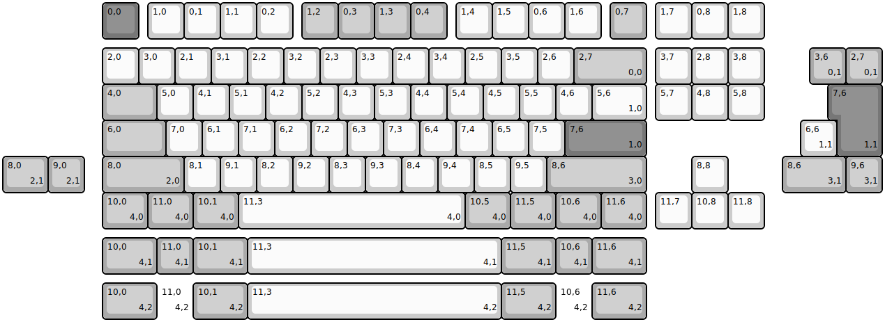{:loading="lazy"}

[Open in keyboard-layout-editor](http://www.keyboard-layout-editor.com/##@@_x:2.75&c=#777777;&=0,0&_x:0.25&c=#cccccc;&=1,0&=0,1&=1,1&=0,2&_x:0.25&c=#aaaaaa;&=1,2&=0,3&=1,3&=0,4&_x:0.25&c=#cccccc;&=1,4&=1,5&=0,6&=1,6&_x:0.25&c=#aaaaaa;&=0,7&_x:0.25&c=#cccccc;&=1,7&=0,8&=1,8;&@_x:2.75&y:0.25;&=2,0&=3,0&=2,1&=3,1&=2,2&=3,2&=2,3&=3,3&=2,4&=3,4&=2,5&=3,5&=2,6&_c=#aaaaaa&w:2;&=2,7%0A%0A%0A0,0&_x:0.25&c=#cccccc;&=3,7&=2,8&=3,8;&@_x:2.75&c=#aaaaaa&w:1.5;&=4,0&_c=#cccccc;&=5,0&=4,1&=5,1&=4,2&=5,2&=4,3&=5,3&=4,4&=5,4&=4,5&=5,5&=4,6&_w:1.5;&=5,6%0A%0A%0A1,0&_x:0.25;&=5,7&=4,8&=5,8;&@_x:2.75&c=#aaaaaa&w:1.75;&=6,0&_c=#cccccc;&=7,0&=6,1&=7,1&=6,2&=7,2&=6,3&=7,3&=6,4&=7,4&=6,5&=7,5&_c=#777777&w:2.25;&=7,6%0A%0A%0A1,0;&@_x:2.75&c=#aaaaaa&w:2.25;&=8,0%0A%0A%0A2,0&_c=#cccccc;&=8,1&=9,1&=8,2&=9,2&=8,3&=9,3&=8,4&=9,4&=8,5&=9,5&_c=#aaaaaa&w:2.75;&=8,6%0A%0A%0A3,0&_x:1.25&c=#cccccc;&=8,8;&@_x:2.75&c=#aaaaaa&w:1.25;&=10,0%0A%0A%0A4,0&_w:1.25;&=11,0%0A%0A%0A4,0&_w:1.25;&=10,1%0A%0A%0A4,0&_c=#cccccc&w:6.25;&=11,3%0A%0A%0A4,0&_c=#aaaaaa&w:1.25;&=10,5%0A%0A%0A4,0&_w:1.25;&=11,5%0A%0A%0A4,0&_w:1.25;&=10,6%0A%0A%0A4,0&_w:1.25;&=11,6%0A%0A%0A4,0&_x:0.25&c=#cccccc;&=11,7&=10,8&=11,8;&@_x:22.25&y:-5.0&c=#aaaaaa;&=3,6%0A%0A%0A0,1&=2,7%0A%0A%0A0,1;&@_x:23.0&c=#777777&w:1.25&h:2&w2:1.5&h2:1&x2:-0.25;&=7,6%0A%0A%0A1,1;&@_x:22.0&c=#cccccc;&=6,6%0A%0A%0A1,1;&@_c=#aaaaaa&w:1.25;&=8,0%0A%0A%0A2,1&=9,0%0A%0A%0A2,1&_x:19.25&w:1.75;&=8,6%0A%0A%0A3,1&=9,6%0A%0A%0A3,1;&@_x:2.75&y:1.25&w:1.5;&=10,0%0A%0A%0A4,1&=11,0%0A%0A%0A4,1&_w:1.5;&=10,1%0A%0A%0A4,1&_c=#cccccc&w:7;&=11,3%0A%0A%0A4,1&_c=#aaaaaa&w:1.5;&=11,5%0A%0A%0A4,1&=10,6%0A%0A%0A4,1&_w:1.5;&=11,6%0A%0A%0A4,1;&@_x:2.75&y:0.25&w:1.5;&=10,0%0A%0A%0A4,2&_c=#cccccc&d:true;&=11,0%0A%0A%0A4,2&_c=#aaaaaa&w:1.5;&=10,1%0A%0A%0A4,2&_c=#cccccc&w:7;&=11,3%0A%0A%0A4,2&_c=#aaaaaa&w:1.5;&=11,5%0A%0A%0A4,2&_c=#cccccc&d:true;&=10,6%0A%0A%0A4,2&_c=#aaaaaa&w:1.5;&=11,6%0A%0A%0A4,2)

## hineybush/hbcp

[README](output/hineybush/hbcp/README.md) - [layout](output/hineybush/hbcp/hbcp-kle.json) - [PCB](output/hineybush/hbcp/hbcp.kicad_pcb) - [PCB render](output/hineybush/hbcp/hbcp-render.svg)

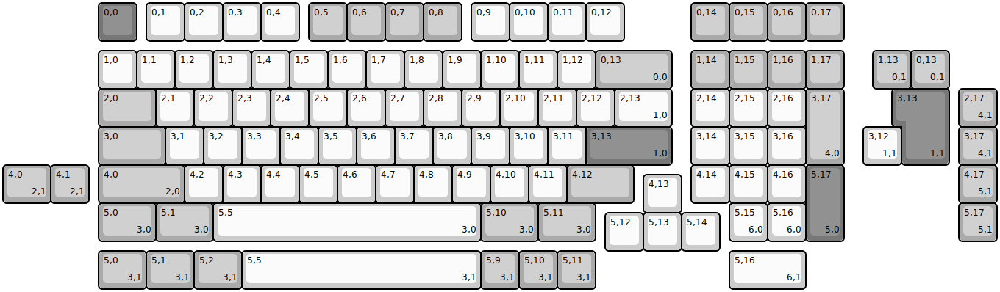{:loading="lazy"}

[Open in keyboard-layout-editor](http://www.keyboard-layout-editor.com/##@@_x:2.5&c=#777777;&=0,0&_x:0.25&c=#cccccc;&=0,1&=0,2&=0,3&=0,4&_x:0.25&c=#aaaaaa;&=0,5&=0,6&=0,7&=0,8&_x:0.25&c=#cccccc;&=0,9&=0,10&=0,11&=0,12&_x:1.75&c=#aaaaaa;&=0,14&=0,15&=0,16&=0,17;&@_x:2.5&y:0.25&c=#cccccc;&=1,0&=1,1&=1,2&=1,3&=1,4&=1,5&=1,6&=1,7&=1,8&=1,9&=1,10&=1,11&=1,12&_c=#aaaaaa&w:2;&=0,13%0A%0A%0A0,0&_x:0.5;&=1,14&=1,15&=1,16&=1,17;&@_x:2.5&w:1.5;&=2,0&_c=#cccccc;&=2,1&=2,2&=2,3&=2,4&=2,5&=2,6&=2,7&=2,8&=2,9&=2,10&=2,11&=2,12&_w:1.5;&=2,13%0A%0A%0A1,0&_x:0.5;&=2,14&=2,15&=2,16&_c=#aaaaaa&h:2;&=3,17%0A%0A%0A4,0;&@_x:2.5&w:1.75;&=3,0&_c=#cccccc;&=3,1&=3,2&=3,3&=3,4&=3,5&=3,6&=3,7&=3,8&=3,9&=3,10&=3,11&_c=#777777&w:2.25;&=3,13%0A%0A%0A1,0&_x:0.5&c=#cccccc;&=3,14&=3,15&=3,16;&@_x:2.5&c=#aaaaaa&w:2.25;&=4,0%0A%0A%0A2,0&_c=#cccccc;&=4,2&=4,3&=4,4&=4,5&=4,6&=4,7&=4,8&=4,9&=4,10&=4,11&_c=#aaaaaa&w:1.75;&=4,12&_x:1.5&c=#cccccc;&=4,14&=4,15&=4,16&_c=#777777&h:2;&=5,17%0A%0A%0A5,0;&@_x:16.75&y:-0.75&c=#cccccc;&=4,13;&@_x:2.5&y:-0.25&c=#aaaaaa&w:1.5;&=5,0%0A%0A%0A3,0&_w:1.5;&=5,1%0A%0A%0A3,0&_c=#cccccc&w:7;&=5,5%0A%0A%0A3,0&_c=#aaaaaa&w:1.5;&=5,10%0A%0A%0A3,0&_w:1.5;&=5,11%0A%0A%0A3,0&_x:3.5&c=#cccccc;&=5,15%0A%0A%0A6,0&=5,16%0A%0A%0A6,0;&@_x:15.75&y:-0.75;&=5,12&=5,13&=5,14;&@_x:22.75&y:-5.25&c=#aaaaaa;&=1,13%0A%0A%0A0,1&=0,13%0A%0A%0A0,1;&@_x:23.5&c=#777777&w:1.25&h:2&w2:1.5&h2:1&x2:-0.25;&=3,13%0A%0A%0A1,1&_x:0.25&c=#aaaaaa;&=2,17%0A%0A%0A4,1;&@_x:22.5&c=#cccccc;&=3,12%0A%0A%0A1,1&_x:1.5&c=#aaaaaa;&=3,17%0A%0A%0A4,1;&@_w:1.25;&=4,0%0A%0A%0A2,1&=4,1%0A%0A%0A2,1&_x:22.75;&=4,17%0A%0A%0A5,1;&@_x:25.0;&=5,17%0A%0A%0A5,1;&@_x:2.5&y:0.25&w:1.25;&=5,0%0A%0A%0A3,1&_w:1.25;&=5,1%0A%0A%0A3,1&_w:1.25;&=5,2%0A%0A%0A3,1&_c=#cccccc&w:6.25;&=5,5%0A%0A%0A3,1&_c=#aaaaaa;&=5,9%0A%0A%0A3,1&=5,10%0A%0A%0A3,1&=5,11%0A%0A%0A3,1&_x:3.5&c=#cccccc&w:2;&=5,16%0A%0A%0A6,1)

## hineybush/ibis

[README](output/hineybush/ibis/README.md) - [layout](output/hineybush/ibis/ibis-kle.json) - [PCB](output/hineybush/ibis/ibis.kicad_pcb) - [PCB render](output/hineybush/ibis/ibis-render.svg)

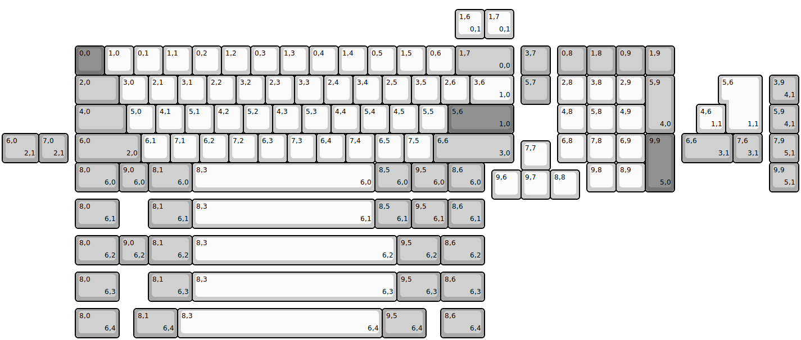{:loading="lazy"}

[Open in keyboard-layout-editor](http://www.keyboard-layout-editor.com/##@@_x:2.5&y:1.5&c=#777777;&=0,0&_c=#cccccc;&=1,0&=0,1&=1,1&=0,2&=1,2&=0,3&=1,3&=0,4&=1,4&=0,5&=1,5&=0,6&_c=#aaaaaa&w:2;&=1,7%0A%0A%0A0,0&_x:0.25;&=3,7&_x:0.25;&=0,8&=1,8&=0,9&=1,9;&@_x:2.5&w:1.5;&=2,0&_c=#cccccc;&=3,0&=2,1&=3,1&=2,2&=3,2&=2,3&=3,3&=2,4&=3,4&=2,5&=3,5&=2,6&_w:1.5;&=3,6%0A%0A%0A1,0&_x:0.25&c=#aaaaaa;&=5,7&_x:0.25&c=#cccccc;&=2,8&=3,8&=2,9&_c=#aaaaaa&h:2;&=5,9%0A%0A%0A4,0;&@_x:2.5&w:1.75;&=4,0&_c=#cccccc;&=5,0&=4,1&=5,1&=4,2&=5,2&=4,3&=5,3&=4,4&=5,4&=4,5&=5,5&_c=#777777&w:2.25;&=5,6%0A%0A%0A1,0&_x:1.5&c=#cccccc;&=4,8&=5,8&=4,9;&@_x:2.5&c=#aaaaaa&w:2.25;&=6,0%0A%0A%0A2,0&_c=#cccccc;&=6,1&=7,1&=6,2&=7,2&=6,3&=7,3&=6,4&=7,4&=6,5&=7,5&_c=#aaaaaa&w:2.75;&=6,6%0A%0A%0A3,0&_x:1.5&c=#cccccc;&=6,8&=7,8&=6,9&_c=#777777&h:2;&=9,9%0A%0A%0A5,0;&@_x:17.75&y:-0.75&c=#cccccc;&=7,7;&@_x:2.5&y:-0.25&c=#aaaaaa&w:1.5;&=8,0%0A%0A%0A6,0&=9,0%0A%0A%0A6,0&_w:1.5;&=8,1%0A%0A%0A6,0&_c=#cccccc&w:6.25;&=8,3%0A%0A%0A6,0&_c=#aaaaaa&w:1.25;&=8,5%0A%0A%0A6,0&_w:1.25;&=9,5%0A%0A%0A6,0&_w:1.25;&=8,6%0A%0A%0A6,0&_x:3.5&c=#cccccc;&=9,8&=8,9;&@_x:16.75&y:-0.75;&=9,6&=9,7&=8,8;&@_x:15.5&y:-6.5;&=1,6%0A%0A%0A0,1&=1,7%0A%0A%0A0,1;&@_x:24.75&y:1.25&w:1.25&h:2&w2:1.5&h2:1&x2:-0.25;&=5,6%0A%0A%0A1,1&_x:0.25&c=#aaaaaa;&=3,9%0A%0A%0A4,1;&@_x:23.75&c=#cccccc;&=4,6%0A%0A%0A1,1&_x:1.5&c=#aaaaaa;&=5,9%0A%0A%0A4,1;&@_w:1.25;&=6,0%0A%0A%0A2,1&=7,0%0A%0A%0A2,1&_x:21.0&w:1.75;&=6,6%0A%0A%0A3,1&=7,6%0A%0A%0A3,1&_x:0.25;&=7,9%0A%0A%0A5,1;&@_x:26.25;&=9,9%0A%0A%0A5,1;&@_x:2.5&y:0.25&w:1.5;&=8,0%0A%0A%0A6,1&_x:1.0&w:1.5;&=8,1%0A%0A%0A6,1&_c=#cccccc&w:6.25;&=8,3%0A%0A%0A6,1&_c=#aaaaaa&w:1.25;&=8,5%0A%0A%0A6,1&_w:1.25;&=9,5%0A%0A%0A6,1&_w:1.25;&=8,6%0A%0A%0A6,1;&@_x:2.5&y:0.25&w:1.5;&=8,0%0A%0A%0A6,2&=9,0%0A%0A%0A6,2&_w:1.5;&=8,1%0A%0A%0A6,2&_c=#cccccc&w:7;&=8,3%0A%0A%0A6,2&_c=#aaaaaa&w:1.5;&=9,5%0A%0A%0A6,2&_w:1.5;&=8,6%0A%0A%0A6,2;&@_x:2.5&y:0.25&w:1.5;&=8,0%0A%0A%0A6,3&_x:1.0&w:1.5;&=8,1%0A%0A%0A6,3&_c=#cccccc&w:7;&=8,3%0A%0A%0A6,3&_c=#aaaaaa&w:1.5;&=9,5%0A%0A%0A6,3&_w:1.5;&=8,6%0A%0A%0A6,3;&@_x:2.5&y:0.25&w:1.5;&=8,0%0A%0A%0A6,4&_x:0.5&w:1.5;&=8,1%0A%0A%0A6,4&_c=#cccccc&w:7;&=8,3%0A%0A%0A6,4&_c=#aaaaaa&w:1.5;&=9,5%0A%0A%0A6,4&_x:0.5&w:1.5;&=8,6%0A%0A%0A6,4)

## hineybush/physix_LZ

[README](output/hineybush/physix_LZ/README.md) - [layout](output/hineybush/physix_LZ/physix_LZ-kle.json) - [PCB](output/hineybush/physix_LZ/physix_LZ.kicad_pcb) - [PCB render](output/hineybush/physix_LZ/physix_LZ-render.svg)

{:loading="lazy"}

[Open in keyboard-layout-editor](http://www.keyboard-layout-editor.com/##@@_x:18&y:1&c=#aaaaaa;&=0,14;&@_x:0.75&y:-0.75&c=#777777;&=0,0&_c=#cccccc;&=0,1&=0,2&_x:9.75;&=0,10&=0,11&_c=#aaaaaa&w:2;&=0,13%0A%0A%0A0,0;&@_x:18.25&y:-0.25;&=1,14;&@_x:0.5&y:-0.75&w:1.5;&=1,0&_c=#cccccc;&=1,1&_x:10.25;&=1,10&=1,11&=1,12&_w:1.5;&=1,13;&@_x:18.5&y:-0.25&c=#aaaaaa;&=2,14;&@_x:0.25&y:-0.75&w:1.75;&=2,0&_c=#cccccc;&=2,1&_x:10.75;&=2,10&=2,11&_c=#777777&w:2.25;&=2,12;&@_c=#aaaaaa&w:2.25;&=3,0&_c=#cccccc;&=3,1&_x:10.0;&=3,10&=3,11&_c=#aaaaaa&w:1.75;&=3,12&=3,13;&@_x:0.25&w:1.5;&=4,0&_x:12.75&w:1.5;&=4,10&=4,11&=4,12&=4,13;&@_r:13&x:4.25&y:-5.75&c=#cccccc;&=0,3&=0,4&=0,5&=4,3;&@_x:3.75;&=1,2&=1,3&=1,4&=1,5;&@_x:4;&=2,2&=2,3&=2,4&=2,5;&@_x:4.5;&=3,2&=3,3&=3,4&=3,5;&@_x:4.25&c=#aaaaaa&w:1.25;&=4,2&_c=#cccccc&w:2.25;&=4,4%0A%0A%0A1,0&=4,5%0A%0A%0A1,0;&@_r:-13&x:8.25&y:-1.25;&=0,6&=0,7&=0,8&=0,9;&@_x:7.75;&=1,6&=1,7&=1,8&=1,9;&@_x:8;&=2,6&=2,7&=2,8&=2,9;&@_x:7.5;&=3,6&=3,7&=3,8&=3,9;&@_x:7.25&w:2.75;&=4,6%0A%0A%0A2,0&_c=#aaaaaa&w:1.25;&=4,9%0A%0A%0A2,0;&@_r:0&x:19.25&y:-8.25;&=0,12%0A%0A%0A0,1&=0,13%0A%0A%0A0,1;&@_r:13&x:5.5&y:3.75&c=#cccccc&w:2;&=4,4%0A%0A%0A1,1&_w:1.25;&=4,5%0A%0A%0A1,1;&@_r:-13&x:7.25&y:2.75&w:2;&=4,6%0A%0A%0A2,1&_c=#aaaaaa;&=4,8%0A%0A%0A2,1&=4,9%0A%0A%0A2,1)

## hineybush/sm68

[README](output/hineybush/sm68/README.md) - [layout](output/hineybush/sm68/sm68-kle.json) - [PCB](output/hineybush/sm68/sm68.kicad_pcb) - [PCB render](output/hineybush/sm68/sm68-render.svg)

{:loading="lazy"}

[Open in keyboard-layout-editor](http://www.keyboard-layout-editor.com/##@@_c=#777777;&=0,0&_c=#cccccc;&=0,1&=0,2&=0,3&=0,4&=0,5&=0,6&=0,7&=0,8&=0,9&=0,10&=0,11&=0,12&_c=#aaaaaa&w:2;&=1,13%0A%0A%0A0,0&_x:0.5;&=0,14&=0,15;&@_w:1.5;&=1,0&_c=#cccccc;&=1,1&=1,2&=1,3&=1,4&=1,5&=1,6&=1,7&=1,8&=1,9&=1,10&=1,11&=1,12&_w:1.5;&=2,13&_x:0.5&c=#aaaaaa;&=1,14&=1,15;&@_w:1.75;&=2,0&_c=#cccccc;&=2,1&=2,2&=2,3&=2,4&=2,5&=2,6&=2,7&=2,8&=2,9&=2,10&=2,11&_c=#777777&w:2.25;&=2,12;&@_c=#aaaaaa&w:2.25;&=3,0&_c=#cccccc;&=3,1&=3,2&=3,3&=3,4&=3,5&=3,6&=3,7&=3,8&=3,9&=3,10&_c=#aaaaaa&w:1.75;&=3,11&=3,12&_x:0.5;&=3,14;&@_w:1.25;&=4,0&_w:1.25;&=4,1&_w:1.25;&=4,2&_c=#cccccc&w:6.25;&=4,4&_c=#aaaaaa&w:1.25;&=4,8&_w:1.25;&=4,9&_w:1.25;&=4,10&_x:0.75;&=4,13&=4,14&=4,15;&@_x:18.0&y:-5&c=#cccccc;&=0,13%0A%0A%0A0,1&=1,13%0A%0A%0A0,1)

## holyswitch/southpaw75

[README](output/holyswitch/README.md) - [layout](output/holyswitch/southpaw75-kle.json) - [PCB](output/holyswitch/southpaw75.kicad_pcb) - [PCB render](output/holyswitch/southpaw75-render.svg)

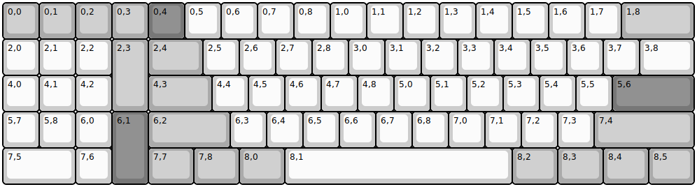{:loading="lazy"}

[Open in keyboard-layout-editor](http://www.keyboard-layout-editor.com/##@@_c=#aaaaaa;&=0,0&=0,1&=0,2&=0,3&_c=#777777;&=0,4&_c=#cccccc;&=0,5&=0,6&=0,7&=0,8&=1,0&=1,1&=1,2&=1,3&=1,4&=1,5&=1,6&=1,7&_c=#aaaaaa&w:2;&=1,8;&@_c=#cccccc;&=2,0&=2,1&=2,2&_c=#aaaaaa&h:2;&=2,3&_w:1.5;&=2,4&_c=#cccccc;&=2,5&=2,6&=2,7&=2,8&=3,0&=3,1&=3,2&=3,3&=3,4&=3,5&=3,6&=3,7&_w:1.5;&=3,8;&@=4,0&=4,1&=4,2&_x:1&c=#aaaaaa&w:1.75;&=4,3&_c=#cccccc;&=4,4&=4,5&=4,6&=4,7&=4,8&=5,0&=5,1&=5,2&=5,3&=5,4&=5,5&_c=#777777&w:2.25;&=5,6;&@_c=#cccccc;&=5,7&=5,8&=6,0&_c=#777777&h:2;&=6,1&_c=#aaaaaa&w:2.25;&=6,2&_c=#cccccc;&=6,3&=6,4&=6,5&=6,6&=6,7&=6,8&=7,0&=7,1&=7,2&=7,3&_c=#aaaaaa&w:2.75;&=7,4;&@_c=#cccccc&w:2;&=7,5&=7,6&_x:1&c=#aaaaaa&w:1.25;&=7,7&_w:1.25;&=7,8&_w:1.25;&=8,0&_c=#cccccc&w:6.25;&=8,1&_c=#aaaaaa&w:1.25;&=8,2&_w:1.25;&=8,3&_w:1.25;&=8,4&_w:1.25;&=8,5)

## horrortroll/chinese_pcb/devil68_pro

[README](output/horrortroll/chinese_pcb/devil68_pro/README.md) - [layout](output/horrortroll/chinese_pcb/devil68_pro/devil68_pro-kle.json) - [PCB](output/horrortroll/chinese_pcb/devil68_pro/devil68_pro.kicad_pcb) - [PCB render](output/horrortroll/chinese_pcb/devil68_pro/devil68_pro-render.svg)

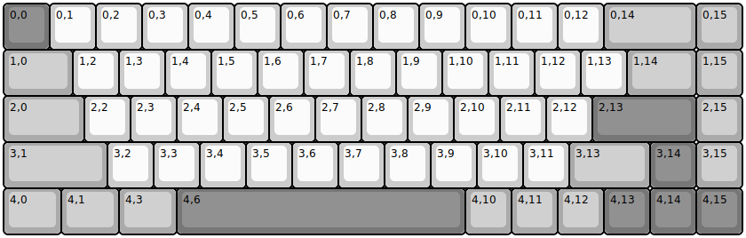{:loading="lazy"}

[Open in keyboard-layout-editor](http://www.keyboard-layout-editor.com/##@@_c=#777777;&=0,0&_c=#cccccc;&=0,1&=0,2&=0,3&=0,4&=0,5&=0,6&=0,7&=0,8&=0,9&=0,10&=0,11&=0,12&_c=#aaaaaa&w:2;&=0,14&=0,15;&@_w:1.5;&=1,0&_c=#cccccc;&=1,2&=1,3&=1,4&=1,5&=1,6&=1,7&=1,8&=1,9&=1,10&=1,11&=1,12&=1,13&_c=#aaaaaa&w:1.5;&=1,14&=1,15;&@_w:1.75;&=2,0&_c=#cccccc;&=2,2&=2,3&=2,4&=2,5&=2,6&=2,7&=2,8&=2,9&=2,10&=2,11&=2,12&_c=#777777&w:2.25;&=2,13&_c=#aaaaaa;&=2,15;&@_w:2.25;&=3,1&_c=#cccccc;&=3,2&=3,3&=3,4&=3,5&=3,6&=3,7&=3,8&=3,9&=3,10&=3,11&_c=#aaaaaa&w:1.75;&=3,13&_c=#777777;&=3,14&_c=#aaaaaa;&=3,15;&@_w:1.25;&=4,0&_w:1.25;&=4,1&_w:1.25;&=4,3&_c=#777777&w:6.25;&=4,6&_c=#aaaaaa;&=4,10&=4,11&=4,12&_c=#777777;&=4,13&=4,14&=4,15)

## horrortroll/handwired_k552

[README](output/horrortroll/handwired_k552/README.md) - [layout](output/horrortroll/handwired_k552/handwired_k552-kle.json) - [PCB](output/horrortroll/handwired_k552/handwired_k552.kicad_pcb) - [PCB render](output/horrortroll/handwired_k552/handwired_k552-render.svg)

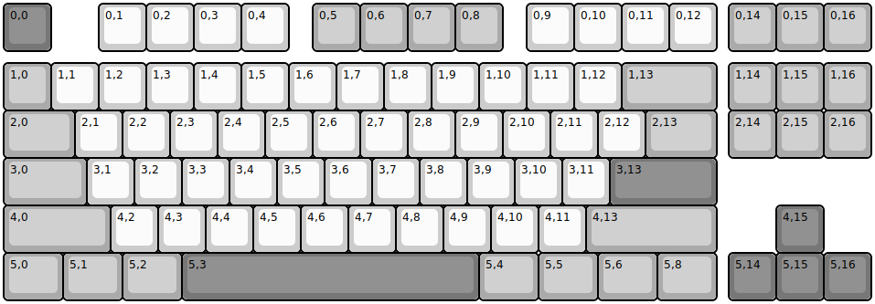{:loading="lazy"}

[Open in keyboard-layout-editor](http://www.keyboard-layout-editor.com/##@@_c=#777777;&=0,0&_x:1&c=#cccccc;&=0,1&=0,2&=0,3&=0,4&_x:0.5&c=#aaaaaa;&=0,5&=0,6&=0,7&=0,8&_x:0.5&c=#cccccc;&=0,9&=0,10&=0,11&=0,12&_x:0.25&c=#aaaaaa;&=0,14&=0,15&=0,16;&@_y:0.25;&=1,0&_c=#cccccc;&=1,1&=1,2&=1,3&=1,4&=1,5&=1,6&=1,7&=1,8&=1,9&=1,10&=1,11&=1,12&_c=#aaaaaa&w:2;&=1,13&_x:0.25;&=1,14&=1,15&=1,16;&@_w:1.5;&=2,0&_c=#cccccc;&=2,1&=2,2&=2,3&=2,4&=2,5&=2,6&=2,7&=2,8&=2,9&=2,10&=2,11&=2,12&_c=#aaaaaa&w:1.5;&=2,13&_x:0.25;&=2,14&=2,15&=2,16;&@_w:1.75;&=3,0&_c=#cccccc;&=3,1&=3,2&=3,3&=3,4&=3,5&=3,6&=3,7&=3,8&=3,9&=3,10&=3,11&_c=#777777&w:2.25;&=3,13;&@_c=#aaaaaa&w:2.25;&=4,0&_c=#cccccc;&=4,2&=4,3&=4,4&=4,5&=4,6&=4,7&=4,8&=4,9&=4,10&=4,11&_c=#aaaaaa&w:2.75;&=4,13&_x:1.25&c=#777777;&=4,15;&@_c=#aaaaaa&w:1.25;&=5,0&_w:1.25;&=5,1&_w:1.25;&=5,2&_c=#777777&w:6.25;&=5,3&_c=#aaaaaa&w:1.25;&=5,4&_w:1.25;&=5,5&_w:1.25;&=5,6&_w:1.25;&=5,8&_x:0.25&c=#777777;&=5,14&=5,15&=5,16)

## horrortroll/paws60

[README](output/horrortroll/paws60/README.md) - [layout](output/horrortroll/paws60/paws60-kle.json) - [PCB](output/horrortroll/paws60/paws60.kicad_pcb) - [PCB render](output/horrortroll/paws60/paws60-render.svg)

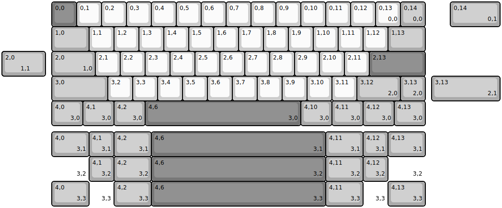{:loading="lazy"}

[Open in keyboard-layout-editor](http://www.keyboard-layout-editor.com/##@@_x:2&c=#777777;&=0,0&_c=#cccccc;&=0,1&=0,2&=0,3&=0,4&=0,5&=0,6&=0,7&=0,8&=0,9&=0,10&=0,11&=0,12&=0,13%0A%0A%0A0,0&_c=#aaaaaa;&=0,14%0A%0A%0A0,0;&@_x:2&w:1.5;&=1,0&_c=#cccccc;&=1,1&=1,2&=1,3&=1,4&=1,5&=1,6&=1,7&=1,8&=1,9&=1,10&=1,11&=1,12&_c=#aaaaaa&w:1.5;&=1,13;&@_x:2.0&w:1.75;&=2,0%0A%0A%0A1,0&_c=#cccccc;&=2,1&=2,2&=2,3&=2,4&=2,5&=2,6&=2,7&=2,8&=2,9&=2,10&=2,11&_c=#777777&w:2.25;&=2,13;&@_x:2&c=#aaaaaa&w:2.25;&=3,0&_c=#cccccc;&=3,2&=3,3&=3,4&=3,5&=3,6&=3,7&=3,8&=3,9&=3,10&=3,11&_c=#aaaaaa&w:1.75;&=3,12%0A%0A%0A2,0&=3,13%0A%0A%0A2,0;&@_x:2&w:1.25;&=4,0%0A%0A%0A3,0&_w:1.25;&=4,1%0A%0A%0A3,0&_w:1.25;&=4,2%0A%0A%0A3,0&_c=#777777&w:6.25;&=4,6%0A%0A%0A3,0&_c=#aaaaaa&w:1.25;&=4,10%0A%0A%0A3,0&_w:1.25;&=4,11%0A%0A%0A3,0&_w:1.25;&=4,12%0A%0A%0A3,0&_w:1.25;&=4,13%0A%0A%0A3,0;&@_x:18&y:-5&w:2;&=0,14%0A%0A%0A0,1;&@_y:1&w:1.25&w2:1.75&l:true;&=2,0%0A%0A%0A1,1;&@_x:17.25&w:2.75;&=3,13%0A%0A%0A2,1;&@_x:2&y:1.25&w:1.5;&=4,0%0A%0A%0A3,1&=4,1%0A%0A%0A3,1&_w:1.5;&=4,2%0A%0A%0A3,1&_c=#777777&w:7;&=4,6%0A%0A%0A3,1&_c=#aaaaaa&w:1.5;&=4,11%0A%0A%0A3,1&=4,12%0A%0A%0A3,1&_w:1.5;&=4,13%0A%0A%0A3,1;&@_x:2&c=#cccccc&w:1.5&d:true;&=%0A%0A%0A3,2&_c=#aaaaaa;&=4,1%0A%0A%0A3,2&_w:1.5;&=4,2%0A%0A%0A3,2&_c=#777777&w:7;&=4,6%0A%0A%0A3,2&_c=#aaaaaa&w:1.5;&=4,11%0A%0A%0A3,2&=4,12%0A%0A%0A3,2&_c=#cccccc&w:1.5&d:true;&=%0A%0A%0A3,2;&@_x:2&c=#aaaaaa&w:1.5;&=4,0%0A%0A%0A3,3&_c=#cccccc&d:true;&=%0A%0A%0A3,3&_c=#aaaaaa&w:1.5;&=4,2%0A%0A%0A3,3&_c=#777777&w:7;&=4,6%0A%0A%0A3,3&_c=#aaaaaa&w:1.5;&=4,11%0A%0A%0A3,3&_c=#cccccc&d:true;&=%0A%0A%0A3,3&_c=#aaaaaa&w:1.5;&=4,13%0A%0A%0A3,3)

## hotdox/hotdox

[README](output/hotdox/README.md) - [layout](output/hotdox/hotdox-kle.json) - [PCB](output/hotdox/hotdox.kicad_pcb) - [PCB render](output/hotdox/hotdox-render.svg)

{:loading="lazy"}

[Open in keyboard-layout-editor](http://www.keyboard-layout-editor.com/##@@_x:3.5;&=0,3%0A3&_x:10.5;&=0,10%0A8;&@_x:2.5&y:-0.875;&=0,2%0A2&_x:1.0;&=0,4%0A4&_x:8.5;&=0,9%0A7&_x:1.0;&=0,11%0A9;&@_x:5.5&y:-0.875;&=0,5%0A5&_c=#777777;&=0,6&_x:4.5;&=0,7&_c=#cccccc;&=0,8%0A6;&@_y:-0.875&c=#aaaaaa&w:1.5;&=0,0&_c=#cccccc;&=0,1%0A1&_x:14.5;&=0,12%0A0&_c=#aaaaaa&w:1.5;&=0,13;&@_x:3.5&y:-0.375&c=#cccccc;&=1,3&_x:10.5;&=1,10;&@_x:2.5&y:-0.875;&=1,2&_x:1.0;&=1,4&_x:8.5;&=1,9&_x:1.0;&=1,11;&@_x:5.5&y:-0.875;&=1,5&_c=#aaaaaa&h:1.5;&=1,6&_x:4.5&h:1.5;&=1,7&_c=#cccccc;&=1,8;&@_y:-0.875&c=#aaaaaa&w:1.5;&=1,0&_c=#cccccc;&=1,1&_x:14.5;&=1,12&_w:1.5;&=1,13;&@_x:3.5&y:-0.375;&=2,3&_x:10.5;&=2,10;&@_x:2.5&y:-0.875;&=2,2&_x:1.0;&=2,4&_x:8.5;&=2,9&_x:1.0;&=2,11;&@_x:5.5&y:-0.875;&=2,5&_x:6.5;&=2,8;&@_y:-0.875&c=#aaaaaa&w:1.5;&=2,0&_c=#cccccc;&=2,1&_x:14.5;&=2,12%0A/;&_c=#aaaaaa&w:1.5;&=2,13;&@_x:6.5&y:-0.625&h:1.5;&=3,6&_x:4.5&h:1.5;&=3,7;&@_x:3.5&y:-0.75&c=#cccccc;&=3,3&_x:10.5;&=3,10%0A,;&@_x:2.5&y:-0.875;&=3,2&_x:1.0;&=3,4&_x:8.5;&=3,9&_x:1.0;&=3,11%0A.;&@_x:5.5&y:-0.875;&=3,5&_x:6.5;&=3,8;&@_y:-0.875&c=#aaaaaa&w:1.5;&=3,0&_c=#cccccc;&=3,1&_x:14.5;&=3,12%0A//&_c=#aaaaaa&w:1.5;&=3,13;&@_x:3.5&y:-0.375&c=#777777;&=4,3&_x:10.5;&=4,10;&@_x:2.5&y:-0.875&c=#cccccc;&=4,2&_x:1.0&c=#777777;&=4,4&_x:8.5;&=4,9&_x:1.0&c=#cccccc;&=4,11;&@_x:0.5&y:-0.75;&=4,0&=4,1&_x:14.5;&=4,12&=4,13;&@_r:30&rx:6.5&ry:4.25&x:1.0&y:-1.0;&=5,5&_c=#aaaaaa;&=5,6;&@_h:2;&=5,1&_h:2;&=5,2&=5,4;&@_x:2.0;&=5,3;&@_r:-30&rx:13&x:-3&y:-1.0;&=5,7&_c=#cccccc;&=5,8;&@_x:-3&c=#aaaaaa;&=5,9&_h:2;&=5,11&_c=#777777&h:2;&=5,12;&@_x:-3&c=#aaaaaa;&=5,10)

## hotdox76v2/hotdox76v2

[README](output/hotdox76v2/README.md) - [layout](output/hotdox76v2/hotdox76v2-kle.json) - [PCB](output/hotdox76v2/hotdox76v2.kicad_pcb) - [PCB render](output/hotdox76v2/hotdox76v2-render.svg)

{:loading="lazy"}

[Open in keyboard-layout-editor](http://www.keyboard-layout-editor.com/##@@_x:3.5;&=5,3&_x:10.5;&=11,3;&@_x:2.5&y:-0.875;&=5,2&_x:1.0;&=5,4&_x:8.5;&=11,4&_x:1.0;&=11,2;&@_x:5.5&y:-0.875;&=5,5&=5,6&_x:4.5;&=11,6&=11,5;&@_y:-0.875&w:1.5;&=5,0&=5,1&_x:14.5;&=11,1&_w:1.5;&=11,0;&@_x:3.5&y:-0.375;&=4,3&_x:10.5;&=10,3;&@_x:2.5&y:-0.875;&=4,2&_x:1.0;&=4,4&_x:8.5;&=10,4&_x:1.0;&=10,2;&@_x:5.5&y:-0.875;&=4,5&_h:1.5;&=4,6&_x:4.5&h:1.5;&=10,6&=10,5;&@_y:-0.875&w:1.5;&=4,0&=4,1&_x:14.5;&=10,1&_w:1.5;&=10,0;&@_x:3.5&y:-0.375;&=3,3&_x:10.5;&=9,3;&@_x:2.5&y:-0.875;&=3,2&_x:1.0;&=3,4&_x:8.5;&=9,4&_x:1.0;&=9,2;&@_x:5.5&y:-0.875;&=3,5&_x:6.5;&=9,5;&@_y:-0.875&w:1.5;&=3,0&=3,1&_x:14.5;&=9,1&_w:1.5;&=9,0;&@_x:6.5&y:-0.625&h:1.5;&=2,6&_x:4.5&h:1.5;&=8,6;&@_x:3.5&y:-0.75;&=2,3&_x:10.5;&=8,3;&@_x:2.5&y:-0.875;&=2,2&_x:1.0;&=2,4&_x:8.5;&=8,4&_x:1.0;&=8,2;&@_x:5.5&y:-0.875;&=2,5&_x:6.5;&=8,5;&@_y:-0.875&w:1.5;&=2,0&=2,1&_x:14.5;&=8,1&_w:1.5;&=8,0;&@_x:3.5&y:-0.375;&=1,3&_x:10.5;&=7,3;&@_x:2.5&y:-0.875;&=1,2&_x:1.0;&=1,4&_x:8.5;&=7,4&_x:1.0;&=7,2;&@_x:0.5&y:-0.75;&=1,0&=1,1&_x:14.5;&=7,1&=7,0;&@_r:30&rx:6.5&ry:4.25&x:1.0&y:-1.0;&=0,5&=0,6;&@_h:2;&=0,3&_h:2;&=0,2&=0,4;&@_x:2.0;&=0,1;&@_r:-30&rx:13&x:-3&y:-1.0;&=6,6&=6,5;&@_x:-3;&=6,4&_h:2;&=6,2&_h:2;&=6,3;&@_x:-3;&=6,1)

## hsgw/plaid

[README](output/hsgw/plaid/README.md) - [layout](output/hsgw/plaid/plaid-kle.json) - [PCB](output/hsgw/plaid/plaid.kicad_pcb) - [PCB render](output/hsgw/plaid/plaid-render.svg)

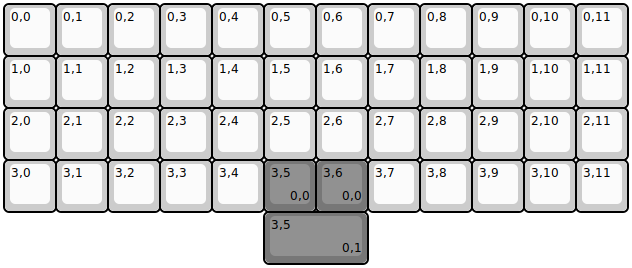{:loading="lazy"}

[Open in keyboard-layout-editor](http://www.keyboard-layout-editor.com/##@@=0,0&=0,1&=0,2&=0,3&=0,4&=0,5&=0,6&=0,7&=0,8&=0,9&=0,10&=0,11;&@=1,0&=1,1&=1,2&=1,3&=1,4&=1,5&=1,6&=1,7&=1,8&=1,9&=1,10&=1,11;&@=2,0&=2,1&=2,2&=2,3&=2,4&=2,5&=2,6&=2,7&=2,8&=2,9&=2,10&=2,11;&@=3,0&=3,1&=3,2&=3,3&=3,4&_c=#777777;&=3,5%0A%0A%0A0,0&=3,6%0A%0A%0A0,0&_c=#cccccc;&=3,7&=3,8&=3,9&=3,10&=3,11;&@_x:5&c=#777777&w:2;&=3,5%0A%0A%0A0,1)

## hubble/hubble

[README](output/hubble/README.md) - [layout](output/hubble/hubble-kle.json) - [PCB](output/hubble/hubble.kicad_pcb) - [PCB render](output/hubble/hubble-render.svg)

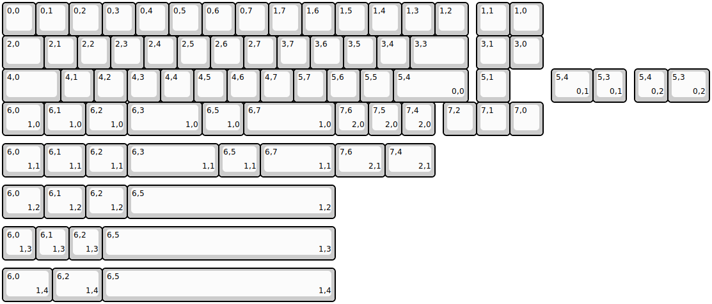{:loading="lazy"}

[Open in keyboard-layout-editor](http://www.keyboard-layout-editor.com/##@@=0,0&=0,1&=0,2&=0,3&=0,4&=0,5&=0,6&=0,7&=1,7&=1,6&=1,5&=1,4&=1,3&=1,2&_x:0.25;&=1,1&=1,0;&@_w:1.25;&=2,0&=2,1&=2,2&=2,3&=2,4&=2,5&=2,6&=2,7&=3,7&=3,6&=3,5&=3,4&_w:1.75;&=3,3&_x:0.25;&=3,1&=3,0;&@_w:1.75;&=4,0&=4,1&=4,2&=4,3&=4,4&=4,5&=4,6&=4,7&=5,7&=5,6&=5,5&_w:2.25;&=5,4%0A%0A%0A0,0&_x:0.25;&=5,1;&@_w:1.25;&=6,0%0A%0A%0A1,0&_w:1.25;&=6,1%0A%0A%0A1,0&_w:1.25;&=6,2%0A%0A%0A1,0&_w:2.25;&=6,3%0A%0A%0A1,0&_w:1.25;&=6,5%0A%0A%0A1,0&_w:2.75;&=6,7%0A%0A%0A1,0&=7,6%0A%0A%0A2,0&=7,5%0A%0A%0A2,0&=7,4%0A%0A%0A2,0&_x:0.25;&=7,2&=7,1&=7,0;&@_x:16.5&y:-2&w:1.25;&=5,4%0A%0A%0A0,1&=5,3%0A%0A%0A0,1&_x:0.25;&=5,4%0A%0A%0A0,2&_w:1.25;&=5,3%0A%0A%0A0,2;&@_y:1.25&w:1.25;&=6,0%0A%0A%0A1,1&_w:1.25;&=6,1%0A%0A%0A1,1&_w:1.25;&=6,2%0A%0A%0A1,1&_w:2.75;&=6,3%0A%0A%0A1,1&_w:1.25;&=6,5%0A%0A%0A1,1&_w:2.25;&=6,7%0A%0A%0A1,1&_w:1.5;&=7,6%0A%0A%0A2,1&_w:1.5;&=7,4%0A%0A%0A2,1;&@_y:0.25&w:1.25;&=6,0%0A%0A%0A1,2&_w:1.25;&=6,1%0A%0A%0A1,2&_w:1.25;&=6,2%0A%0A%0A1,2&_w:6.25;&=6,5%0A%0A%0A1,2;&@_y:0.25;&=6,0%0A%0A%0A1,3&=6,1%0A%0A%0A1,3&=6,2%0A%0A%0A1,3&_w:7;&=6,5%0A%0A%0A1,3;&@_y:0.25&w:1.5;&=6,0%0A%0A%0A1,4&_w:1.5;&=6,2%0A%0A%0A1,4&_w:7;&=6,5%0A%0A%0A1,4)

## huytbt/h50

[README](output/huytbt/h50/README.md) - [layout](output/huytbt/h50/h50-kle.json) - [PCB](output/huytbt/h50/h50.kicad_pcb) - [PCB render](output/huytbt/h50/h50-render.svg)

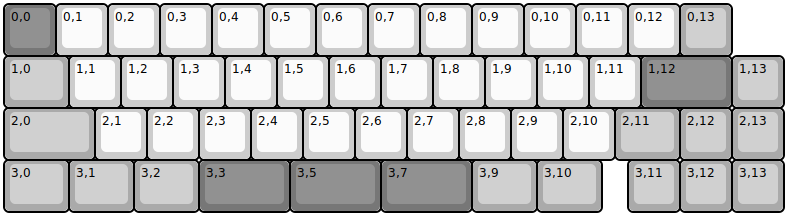{:loading="lazy"}

[Open in keyboard-layout-editor](http://www.keyboard-layout-editor.com/##@@_c=#777777;&=0,0&_c=#cccccc;&=0,1&=0,2&=0,3&=0,4&=0,5&=0,6&=0,7&=0,8&=0,9&=0,10&=0,11&=0,12&_c=#aaaaaa;&=0,13;&@_w:1.25;&=1,0&_c=#cccccc;&=1,1&=1,2&=1,3&=1,4&=1,5&=1,6&=1,7&=1,8&=1,9&=1,10&=1,11&_c=#777777&w:1.75;&=1,12&_c=#aaaaaa;&=1,13;&@_w:1.75;&=2,0&_c=#cccccc;&=2,1&=2,2&=2,3&=2,4&=2,5&=2,6&=2,7&=2,8&=2,9&=2,10&_c=#aaaaaa&w:1.25;&=2,11&=2,12&=2,13;&@_w:1.25;&=3,0&_w:1.25;&=3,1&_w:1.25;&=3,2&_c=#777777&w:1.75;&=3,3&_w:1.75;&=3,5&_w:1.75;&=3,7&_c=#aaaaaa&w:1.25;&=3,9&_w:1.25;&=3,10&_x:0.5;&=3,11&=3,12&=3,13)

## iLumkb/primus75

[README](output/iLumkb/primus75/README.md) - [layout](output/iLumkb/primus75/primus75-kle.json) - [PCB](output/iLumkb/primus75/primus75.kicad_pcb) - [PCB render](output/iLumkb/primus75/primus75-render.svg)

{:loading="lazy"}

[Open in keyboard-layout-editor](http://www.keyboard-layout-editor.com/##@@_x:2.5&y:1.5&c=#777777;&=0,0&_x:0.5&c=#cccccc;&=0,1&=0,2&=0,3&=0,4&_x:0.5&c=#aaaaaa;&=0,6&=0,7&=0,8&=0,9&_x:0.5&c=#cccccc;&=0,10&=0,11&=0,12&=0,13&_x:0.5&c=#aaaaaa;&=0,15;&@_x:2.5&y:0.25;&=1,0&_c=#cccccc;&=1,1&=1,2&=1,3&=1,4&=1,5&=1,6&=1,7&=1,8&=1,9&=1,10&=1,11&=1,12&_c=#aaaaaa&w:2;&=1,14%0A%0A%0A0,0&=1,15;&@_x:2.5&w:1.5;&=2,0&_c=#cccccc;&=2,2&=2,3&=2,4&=2,5&=2,6&=2,7&=2,8&=2,9&=2,10&=2,11&=2,12&=2,13&_w:1.5;&=2,14%0A%0A%0A1,0&_c=#aaaaaa;&=2,15;&@_x:2.5&w:1.75;&=3,0&_c=#cccccc;&=3,2&=3,3&=3,4&=3,5&=3,6&=3,7&=3,8&=3,9&=3,10&=3,11&=3,12&_c=#aaaaaa&w:2.25;&=3,13%0A%0A%0A1,0&=3,15;&@_x:2.5&w:2.25;&=4,0%0A%0A%0A2,0&_c=#cccccc;&=4,2&=4,3&=4,4&=4,5&=4,6&=4,7&=4,8&=4,9&=4,10&=4,11&_c=#aaaaaa&w:1.75;&=4,13&_c=#777777;&=4,14&_c=#aaaaaa;&=4,15;&@_x:2.5&w:1.25;&=5,0%0A%0A%0A3,0&_w:1.25;&=5,1%0A%0A%0A3,0&_w:1.25;&=5,3%0A%0A%0A3,0&_c=#777777&w:6.25;&=5,6%0A%0A%0A3,0&_c=#aaaaaa&w:1.25;&=5,10%0A%0A%0A3,0&_w:1.25;&=5,11%0A%0A%0A3,0&_x:0.5&c=#777777;&=5,13&=5,14&=5,15;&@_x:15.5&y:-7.5&c=#cccccc;&=1,13%0A%0A%0A0,1&_c=#aaaaaa;&=1,14%0A%0A%0A0,1;&@_x:19.75&y:2.5&w:1.25&h:2&w2:1.5&h2:1&x2:-0.25;&=3,13%0A%0A%0A1,1;&@_x:18.75&c=#cccccc;&=2,14%0A%0A%0A1,1;&@_c=#aaaaaa&w:1.25;&=4,0%0A%0A%0A2,1&_c=#cccccc;&=4,1%0A%0A%0A2,1;&@_x:2.5&y:1.75&c=#aaaaaa&w:1.5;&=5,0%0A%0A%0A3,1&=5,1%0A%0A%0A3,1&_w:1.5;&=5,3%0A%0A%0A3,1&_c=#777777&w:7;&=5,6%0A%0A%0A3,1&_c=#aaaaaa&w:1.5;&=5,11%0A%0A%0A3,1;&@_x:2.5&w:1.5;&=5,0%0A%0A%0A3,2&=5,1%0A%0A%0A3,2&_w:1.5;&=5,3%0A%0A%0A3,2&_c=#777777&w:6;&=5,6%0A%0A%0A3,2&_c=#aaaaaa;&=5,10%0A%0A%0A3,2&_w:1.5;&=5,11%0A%0A%0A3,2;&@_x:2.5&w:1.5;&=5,0%0A%0A%0A3,3&=5,1%0A%0A%0A3,3&_w:1.5;&=5,3%0A%0A%0A3,3&_c=#777777&w:6;&=5,6%0A%0A%0A3,3&_c=#aaaaaa&w:1.5;&=5,10%0A%0A%0A3,3&=5,11%0A%0A%0A3,3;&@_x:2.5;&=5,0%0A%0A%0A3,4&=5,1%0A%0A%0A3,4&=5,2%0A%0A%0A3,4&=5,3%0A%0A%0A3,4&_c=#777777&w:6;&=5,6%0A%0A%0A3,4&_c=#aaaaaa;&=5,10%0A%0A%0A3,4&_w:1.5;&=5,11%0A%0A%0A3,4)

## iLumkb/simpler61

[README](output/iLumkb/simpler61/README.md) - [layout](output/iLumkb/simpler61/simpler61-kle.json) - [PCB](output/iLumkb/simpler61/simpler61.kicad_pcb) - [PCB render](output/iLumkb/simpler61/simpler61-render.svg)

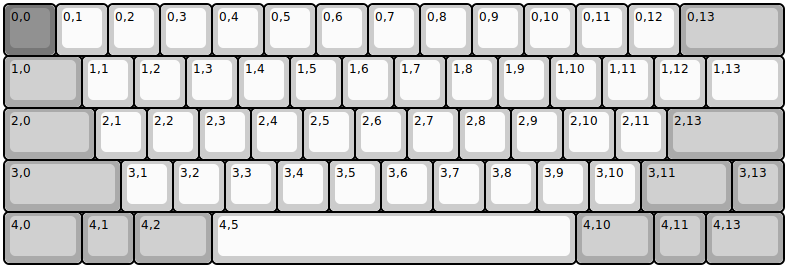{:loading="lazy"}

[Open in keyboard-layout-editor](http://www.keyboard-layout-editor.com/##@@_c=#777777;&=0,0&_c=#cccccc;&=0,1&=0,2&=0,3&=0,4&=0,5&=0,6&=0,7&=0,8&=0,9&=0,10&=0,11&=0,12&_c=#aaaaaa&w:2;&=0,13;&@_w:1.5;&=1,0&_c=#cccccc;&=1,1&=1,2&=1,3&=1,4&=1,5&=1,6&=1,7&=1,8&=1,9&=1,10&=1,11&=1,12&_w:1.5;&=1,13;&@_c=#aaaaaa&w:1.75;&=2,0&_c=#cccccc;&=2,1&=2,2&=2,3&=2,4&=2,5&=2,6&=2,7&=2,8&=2,9&=2,10&=2,11&_c=#aaaaaa&w:2.25;&=2,13;&@_w:2.25;&=3,0&_c=#cccccc;&=3,1&=3,2&=3,3&=3,4&=3,5&=3,6&=3,7&=3,8&=3,9&=3,10&_c=#aaaaaa&w:1.75;&=3,11&=3,13;&@_w:1.5;&=4,0&=4,1&_w:1.5;&=4,2&_c=#cccccc&w:7;&=4,5&_c=#aaaaaa&w:1.5;&=4,10&=4,11&_w:1.5;&=4,13)

## iLumkb/simpler64

[README](output/iLumkb/simpler64/README.md) - [layout](output/iLumkb/simpler64/simpler64-kle.json) - [PCB](output/iLumkb/simpler64/simpler64.kicad_pcb) - [PCB render](output/iLumkb/simpler64/simpler64-render.svg)

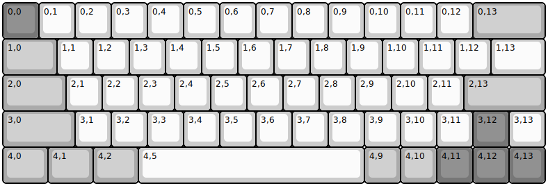{:loading="lazy"}

[Open in keyboard-layout-editor](http://www.keyboard-layout-editor.com/##@@_c=#777777;&=0,0&_c=#cccccc;&=0,1&=0,2&=0,3&=0,4&=0,5&=0,6&=0,7&=0,8&=0,9&=0,10&=0,11&=0,12&_c=#aaaaaa&w:2;&=0,13;&@_w:1.5;&=1,0&_c=#cccccc;&=1,1&=1,2&=1,3&=1,4&=1,5&=1,6&=1,7&=1,8&=1,9&=1,10&=1,11&=1,12&_w:1.5;&=1,13;&@_c=#aaaaaa&w:1.75;&=2,0&_c=#cccccc;&=2,1&=2,2&=2,3&=2,4&=2,5&=2,6&=2,7&=2,8&=2,9&=2,10&=2,11&_c=#aaaaaa&w:2.25;&=2,13;&@_w:2;&=3,0&_c=#cccccc;&=3,1&=3,2&=3,3&=3,4&=3,5&=3,6&=3,7&=3,8&=3,9&=3,10&=3,11&_c=#777777;&=3,12&_c=#cccccc;&=3,13;&@_c=#aaaaaa&w:1.25;&=4,0&_w:1.25;&=4,1&_w:1.25;&=4,2&_c=#cccccc&w:6.25;&=4,5&_c=#aaaaaa;&=4,9&=4,10&_c=#777777;&=4,11&=4,12&=4,13)

## ianklug/grooveboard

[README](output/ianklug/grooveboard/README.md) - [layout](output/ianklug/grooveboard/grooveboard-kle.json) - [PCB](output/ianklug/grooveboard/grooveboard.kicad_pcb) - [PCB render](output/ianklug/grooveboard/grooveboard-render.svg)

{:loading="lazy"}

[Open in keyboard-layout-editor](http://www.keyboard-layout-editor.com/##@@=0,0&=0,1&_x:2;&=0,2&=0,3)

## ibm122m/ibm122m

[README](output/ibm122m/README.md) - [layout](output/ibm122m/ibm122m-kle.json) - [PCB](output/ibm122m/ibm122m.kicad_pcb) - [PCB render](output/ibm122m/ibm122m-render.svg)

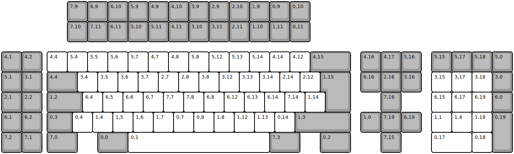{:loading="lazy"}

[Open in keyboard-layout-editor](http://www.keyboard-layout-editor.com/##@_name=Model%20M%20122%20ISO;&@_x:3.25&c=#999999;&=7,9&=6,9&=6,10&=5,9&=4,9&=4,10&=3,9&=2,9&=2,10&=1,9&=0,9&=0,10;&@_x:3.25;&=7,10&=7,11&=6,11&=5,10&=5,11&=4,11&=3,10&=3,11&=2,11&=1,10&=1,11&=0,11;&@_y:0.5;&=4,1&=4,2&_x:0.25&c=#ffffff;&=4,4&=5,4&=5,5&=5,6&=5,7&=4,7&=4,8&=5,8&=5,12&=5,13&=5,14&=4,14&=4,12&_c=#999999&w:2;&=4,15&_x:0.5;&=4,16&=4,17&=5,16&_x:0.5;&=5,15&=5,17&=5,18&=5,0;&@=5,1&=3,1&_x:0.25&w:1.5;&=4,4&_c=#ffffff;&=3,4&=3,5&=3,6&=3,7&=2,7&=2,8&=3,8&=3,12&=3,13&=3,14&=2,14&=2,12&_x:0.25&c=#999999&w:1.25&h:2&w2:1.5&h2:1&x2:-0.25;&=1,15&_x:0.5;&=6,16&=2,16&=3,16&_x:0.5&c=#ffffff;&=3,15&=3,17&=3,18&_c=#999999;&=3,0;&@=2,1&=2,2&_x:0.25&w:1.75;&=1,2&_c=#ffffff;&=6,4&=6,5&=6,6&_n:true;&=6,7&=7,7&=7,8&_n:true;&=6,8&=6,12&=6,13&=6,14&=7,14&=1,14&_x:2.75&c=#999999;&=7,16&_x:1.5&c=#ffffff;&=6,15&_n:true;&=6,17&=6,19&_c=#999999;&=6,0;&@=6,1&=6,2&_x:0.25&w:1.25;&=0,3&_c=#ffffff;&=0,4&=1,4&=1,5&=1,6&=1,7&=0,7&=0,8&=1,8&=1,12&=1,13&=0,14&_c=#999999&w:2.75;&=1,3&_x:0.5;&=1,0&=7,19&=6,19&_x:0.5&c=#ffffff;&=1,1&=1,4&=1,18&_c=#999999&h:2;&=0,19;&@=7,2&=7,1&_x:0.25&w:1.5;&=7,0&_x:1.0&w:1.5;&=0,0&_c=#ffffff&w:7;&=0,1&_c=#999999&w:1.5;&=7,3&_x:1.0&w:1.5;&=0,2&_x:1.5;&=7,15&_x:1.5&c=#ffffff&w:2;&=0,17&=0,18)

## icesoup/soup10

[README](output/icesoup/soup10/README.md) - [layout](output/icesoup/soup10/soup10-kle.json) - [PCB](output/icesoup/soup10/soup10.kicad_pcb) - [PCB render](output/icesoup/soup10/soup10-render.svg)

{:loading="lazy"}

[Open in keyboard-layout-editor](http://www.keyboard-layout-editor.com/##@@_x:1;&=0,1;&@=1,0&=1,1&=1,2;&@=2,0&=2,1&=2,2;&@=3,0&=3,1&=3,2)

## idb/idb_60

[README](output/idb/idb_60/README.md) - [layout](output/idb/idb_60/idb_60-kle.json) - [PCB](output/idb/idb_60/idb_60.kicad_pcb) - [PCB render](output/idb/idb_60/idb_60-render.svg)

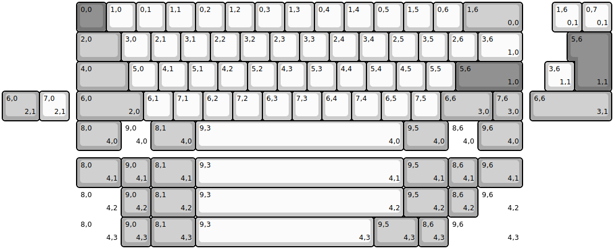{:loading="lazy"}

[Open in keyboard-layout-editor](http://www.keyboard-layout-editor.com/##@@_x:2.5&c=#777777;&=0,0&_c=#cccccc;&=1,0&=0,1&=1,1&=0,2&=1,2&=0,3&=1,3&=0,4&=1,4&=0,5&=1,5&=0,6&_c=#aaaaaa&w:2;&=1,6%0A%0A%0A0,0;&@_x:2.5&w:1.5;&=2,0&_c=#cccccc;&=3,0&=2,1&=3,1&=2,2&=3,2&=2,3&=3,3&=2,4&=3,4&=2,5&=3,5&=2,6&_w:1.5;&=3,6%0A%0A%0A1,0;&@_x:2.5&c=#aaaaaa&w:1.75;&=4,0&_c=#cccccc;&=5,0&=4,1&=5,1&=4,2&=5,2&=4,3&=5,3&=4,4&=5,4&=4,5&=5,5&_c=#777777&w:2.25;&=5,6%0A%0A%0A1,0;&@_x:2.5&c=#aaaaaa&w:2.25;&=6,0%0A%0A%0A2,0&_c=#cccccc;&=6,1&=7,1&=6,2&=7,2&=6,3&=7,3&=6,4&=7,4&=6,5&=7,5&_c=#aaaaaa&w:1.75;&=6,6%0A%0A%0A3,0&=7,6%0A%0A%0A3,0;&@_x:2.5&w:1.5;&=8,0%0A%0A%0A4,0&_c=#cccccc&d:true;&=9,0%0A%0A%0A4,0&_c=#aaaaaa&w:1.5;&=8,1%0A%0A%0A4,0&_c=#cccccc&w:7;&=9,3%0A%0A%0A4,0&_c=#aaaaaa&w:1.5;&=9,5%0A%0A%0A4,0&_c=#cccccc&d:true;&=8,6%0A%0A%0A4,0&_c=#aaaaaa&w:1.5;&=9,6%0A%0A%0A4,0;&@_x:18.5&y:-5&c=#cccccc;&=1,6%0A%0A%0A0,1&=0,7%0A%0A%0A0,1;&@_x:19.25&c=#777777&w:1.25&h:2&w2:1.5&h2:1&x2:-0.25;&=5,6%0A%0A%0A1,1;&@_x:18.25&c=#cccccc;&=3,6%0A%0A%0A1,1;&@_c=#aaaaaa&w:1.25;&=6,0%0A%0A%0A2,1&_c=#cccccc;&=7,0%0A%0A%0A2,1&_x:15.5&c=#aaaaaa&w:2.75;&=6,6%0A%0A%0A3,1;&@_x:2.5&y:1.25&w:1.5;&=8,0%0A%0A%0A4,1&=9,0%0A%0A%0A4,1&_w:1.5;&=8,1%0A%0A%0A4,1&_c=#cccccc&w:7;&=9,3%0A%0A%0A4,1&_c=#aaaaaa&w:1.5;&=9,5%0A%0A%0A4,1&=8,6%0A%0A%0A4,1&_w:1.5;&=9,6%0A%0A%0A4,1;&@_x:2.5&c=#cccccc&w:1.5&d:true;&=8,0%0A%0A%0A4,2&_c=#aaaaaa;&=9,0%0A%0A%0A4,2&_w:1.5;&=8,1%0A%0A%0A4,2&_c=#cccccc&w:7;&=9,3%0A%0A%0A4,2&_c=#aaaaaa&w:1.5;&=9,5%0A%0A%0A4,2&=8,6%0A%0A%0A4,2&_c=#cccccc&w:1.5&d:true;&=9,6%0A%0A%0A4,2;&@_x:2.5&w:1.5&d:true;&=8,0%0A%0A%0A4,3&_c=#aaaaaa;&=9,0%0A%0A%0A4,3&_w:1.5;&=8,1%0A%0A%0A4,3&_c=#cccccc&w:6;&=9,3%0A%0A%0A4,3&_c=#aaaaaa&w:1.5;&=9,5%0A%0A%0A4,3&=8,6%0A%0A%0A4,3&_c=#cccccc&w:2.5&d:true;&=9,6%0A%0A%0A4,3)

## idobao/id42

[README](output/idobao/id42/README.md) - [layout](output/idobao/id42/id42-kle.json) - [PCB](output/idobao/id42/id42.kicad_pcb) - [PCB render](output/idobao/id42/id42-render.svg)

{:loading="lazy"}

[Open in keyboard-layout-editor](http://www.keyboard-layout-editor.com/##@@_c=#777777;&=0,0&_c=#cccccc;&=0,1&=0,2&=0,3&=0,4&=0,5&=0,6&=0,7&=0,8&=0,9&=0,10&_c=#aaaaaa;&=0,11;&@_w:1.25;&=1,0&_c=#cccccc;&=1,1&=1,2&=1,3&=1,4&=1,5&=1,6&=1,7&=1,8&=1,9&_c=#777777&w:1.75;&=1,11;&@_c=#aaaaaa&w:1.75;&=2,0&_c=#cccccc;&=2,1&=2,2&=2,3&=2,4&=2,5&=2,6&=2,7&_c=#aaaaaa&w:1.25;&=2,8&_c=#777777;&=2,10&_c=#aaaaaa;&=2,11;&@_w:1.25;&=3,0&=3,1&_w:1.25;&=3,2&_w:2.25;&=3,3&_w:2.75;&=3,6&_x:0.5&c=#777777;&=3,9&=3,10&=3,11)

## idobao/id61

[README](output/idobao/id61/README.md) - [layout](output/idobao/id61/id61-kle.json) - [PCB](output/idobao/id61/id61.kicad_pcb) - [PCB render](output/idobao/id61/id61-render.svg)

{:loading="lazy"}

[Open in keyboard-layout-editor](http://www.keyboard-layout-editor.com/##@@_c=#777777;&=0,0&_c=#cccccc;&=0,1&=0,2&=0,3&=0,4&=0,5&=0,6&=0,7&=0,8&=0,9&=0,10&=0,11&=0,12&_c=#aaaaaa&w:2;&=0,13;&@_w:1.5;&=1,0&_c=#cccccc;&=1,1&=1,2&=1,3&=1,4&=1,5&=1,6&=1,7&=1,8&=1,9&=1,10&=1,11&=1,12&_c=#aaaaaa&w:1.5;&=1,13;&@_w:1.75;&=2,0&_c=#cccccc;&=2,1&=2,2&=2,3&=2,4&=2,5&=2,6&=2,7&=2,8&=2,9&=2,10&=2,11&_c=#777777&w:2.25;&=2,12;&@_c=#aaaaaa&w:2.25;&=3,0&_c=#cccccc;&=3,2&=3,3&=3,4&=3,5&=3,6&=3,7&=3,8&=3,9&=3,10&=3,11&_c=#aaaaaa&w:2.75;&=3,12;&@_w:1.25;&=4,0&_w:1.25;&=4,1&_w:1.25;&=4,2&_w:6.25;&=4,6&_w:1.25;&=4,10&_w:1.25;&=4,11&_w:1.25;&=4,12&_w:1.25;&=4,13)

## idobao/id63

[README](output/idobao/id63/README.md) - [layout](output/idobao/id63/id63-kle.json) - [PCB](output/idobao/id63/id63.kicad_pcb) - [PCB render](output/idobao/id63/id63-render.svg)

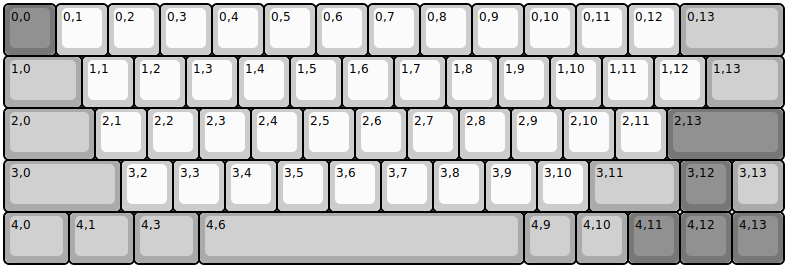{:loading="lazy"}

[Open in keyboard-layout-editor](http://www.keyboard-layout-editor.com/##@@_c=#777777;&=0,0&_c=#cccccc;&=0,1&=0,2&=0,3&=0,4&=0,5&=0,6&=0,7&=0,8&=0,9&=0,10&=0,11&=0,12&_c=#aaaaaa&w:2;&=0,13;&@_w:1.5;&=1,0&_c=#cccccc;&=1,1&=1,2&=1,3&=1,4&=1,5&=1,6&=1,7&=1,8&=1,9&=1,10&=1,11&=1,12&_c=#aaaaaa&w:1.5;&=1,13;&@_w:1.75;&=2,0&_c=#cccccc;&=2,1&=2,2&=2,3&=2,4&=2,5&=2,6&=2,7&=2,8&=2,9&=2,10&=2,11&_c=#777777&w:2.25;&=2,13;&@_c=#aaaaaa&w:2.25;&=3,0&_c=#cccccc;&=3,2&=3,3&=3,4&=3,5&=3,6&=3,7&=3,8&=3,9&=3,10&_c=#aaaaaa&w:1.75;&=3,11&_c=#777777;&=3,12&_c=#aaaaaa;&=3,13;&@_w:1.25;&=4,0&_w:1.25;&=4,1&_w:1.25;&=4,3&_w:6.25;&=4,6&=4,9&=4,10&_c=#777777;&=4,11&=4,12&=4,13)

## idobao/id67

[README](output/idobao/id67/README.md) - [layout](output/idobao/id67/id67-kle.json) - [PCB](output/idobao/id67/id67.kicad_pcb) - [PCB render](output/idobao/id67/id67-render.svg)

{:loading="lazy"}

[Open in keyboard-layout-editor](http://www.keyboard-layout-editor.com/##@@_c=#777777;&=0,0&_c=#cccccc;&=0,1&=0,2&=0,3&=0,4&=0,5&=0,6&=0,7&=0,8&=0,9&=0,10&=0,11&=0,12&_c=#aaaaaa&w:2;&=0,13&=0,14;&@_w:1.5;&=1,0&_c=#cccccc;&=1,1&=1,2&=1,3&=1,4&=1,5&=1,6&=1,7&=1,8&=1,9&=1,10&=1,11&=1,12&_c=#aaaaaa&w:1.5;&=1,13&=1,14;&@_w:1.75;&=2,0&_c=#cccccc;&=2,1&=2,2&=2,3&=2,4&=2,5&=2,6&=2,7&=2,8&=2,9&=2,10&=2,11&_c=#777777&w:2.25;&=2,13&_c=#aaaaaa;&=2,14;&@_w:2.25;&=3,0&_c=#cccccc;&=3,2&=3,3&=3,4&=3,5&=3,6&=3,7&=3,8&=3,9&=3,10&=3,11&_c=#aaaaaa&w:1.75;&=3,12&_c=#777777;&=3,13&_c=#aaaaaa;&=3,14;&@_w:1.25;&=4,0&_w:1.25;&=4,1&_w:1.25;&=4,3&_w:6.25;&=4,6&_w:1.25;&=4,10&_w:1.25;&=4,11&_x:0.5&c=#777777;&=4,12&=4,13&=4,14)

## idobao/id67/id67-v2

[README](output/idobao/id67/README.md) - [layout](output/idobao/id67/id67-v2-kle.json) - [PCB](output/idobao/id67/id67-v2.kicad_pcb) - [PCB render](output/idobao/id67/id67-v2-render.svg)

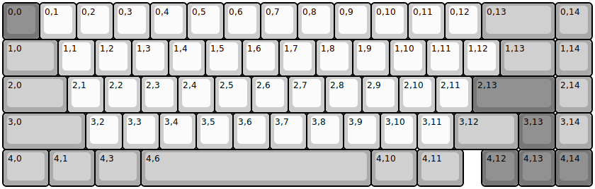{:loading="lazy"}

[Open in keyboard-layout-editor](http://www.keyboard-layout-editor.com/##@@_c=#777777;&=0,0&_c=#cccccc;&=0,1&=0,2&=0,3&=0,4&=0,5&=0,6&=0,7&=0,8&=0,9&=0,10&=0,11&=0,12&_c=#aaaaaa&w:2;&=0,13&=0,14;&@_w:1.5;&=1,0&_c=#cccccc;&=1,1&=1,2&=1,3&=1,4&=1,5&=1,6&=1,7&=1,8&=1,9&=1,10&=1,11&=1,12&_c=#aaaaaa&w:1.5;&=1,13&=1,14;&@_w:1.75;&=2,0&_c=#cccccc;&=2,1&=2,2&=2,3&=2,4&=2,5&=2,6&=2,7&=2,8&=2,9&=2,10&=2,11&_c=#777777&w:2.25;&=2,13&_c=#aaaaaa;&=2,14;&@_w:2.25;&=3,0&_c=#cccccc;&=3,2&=3,3&=3,4&=3,5&=3,6&=3,7&=3,8&=3,9&=3,10&=3,11&_c=#aaaaaa&w:1.75;&=3,12&_c=#777777;&=3,13&_c=#aaaaaa;&=3,14;&@_w:1.25;&=4,0&_w:1.25;&=4,1&_w:1.25;&=4,3&_w:6.25;&=4,6&_w:1.25;&=4,10&_w:1.25;&=4,11&_x:0.5&c=#777777;&=4,12&=4,13&=4,14)

## idobao/id75

[README](output/idobao/id75/README.md) - [layout](output/idobao/id75/id75-kle.json) - [PCB](output/idobao/id75/id75.kicad_pcb) - [PCB render](output/idobao/id75/id75-render.svg)

{:loading="lazy"}

[Open in keyboard-layout-editor](http://www.keyboard-layout-editor.com/##@@_c=#777777;&=0,0&_c=#cccccc;&=0,1&=0,2&=0,3&=0,4&=0,5&=0,6&=0,7&=0,8&=0,9&=0,10&=0,11&=0,12&=0,13&=0,14;&@_c=#aaaaaa;&=1,0&_c=#cccccc;&=1,1&=1,2&=1,3&=1,4&=1,5&=1,6&=1,7&=1,8&=1,9&=1,10&=1,11&=1,12&_c=#aaaaaa;&=1,13&=1,14;&@=2,0&_c=#cccccc;&=2,1&=2,2&=2,3&=2,4&=2,5&=2,6&=2,7&=2,8&=2,9&=2,10&=2,11&_c=#aaaaaa;&=2,12&=2,13&=2,14;&@=3,0&_c=#cccccc;&=3,1&=3,2&=3,3&=3,4&=3,5&=3,6&=3,7&=3,8&=3,9&=3,10&_c=#aaaaaa;&=3,11&=3,12&_c=#777777;&=3,13&_c=#aaaaaa;&=3,14;&@=4,0&=4,1&=4,2&=4,3&=4,4&=4,5&=4,6&=4,7&=4,8&=4,9&=4,10&=4,11&_c=#777777;&=4,12&=4,13&=4,14)

## idobao/id80

[README](output/idobao/id80/README.md) - [layout](output/idobao/id80/id80-kle.json) - [PCB](output/idobao/id80/id80.kicad_pcb) - [PCB render](output/idobao/id80/id80-render.svg)

{:loading="lazy"}

[Open in keyboard-layout-editor](http://www.keyboard-layout-editor.com/##@@_c=#777777;&=0,5&_x:0.25&c=#cccccc;&=1,5&=2,5&=3,5&=4,5&_x:0.25;&=5,5&=6,5&=7,5&=8,5&_x:0.25;&=7,10&=5,10&=4,10&=3,10&_x:0.25;&=6,10&_x:0.25;&=2,10;&@_y:0.25;&=0,4&=1,4&=2,4&=3,4&=4,4&=5,4&=6,4&=7,4&=8,4&=8,9&=7,9&=5,9&=4,9&_c=#aaaaaa&w:2;&=6,9&_x:0.25&c=#cccccc;&=2,9;&@_c=#aaaaaa&w:1.5;&=0,3&_c=#cccccc;&=1,3&=2,3&=3,3&=4,3&=5,3&=6,3&=7,3&=8,3&=8,8&=7,8&=5,8&=4,8&_w:1.5;&=3,8&_x:0.25;&=2,8;&@_c=#aaaaaa&w:1.75;&=0,2&_c=#cccccc;&=1,2&=2,2&=3,2&=4,2&=5,2&=6,2&=7,2&=8,2&=8,7&=7,7&=5,7&_c=#777777&w:2.25;&=4,7;&@_c=#aaaaaa&w:2.25;&=0,1&_c=#cccccc;&=2,1&=3,1&=4,1&=5,1&=6,1&=7,1&=8,1&=8,6&=7,6&=5,6&_c=#aaaaaa&w:1.75;&=4,6;&@_x:14.25&y:-0.75&c=#777777;&=3,6;&@_y:-0.25&c=#aaaaaa&w:1.25;&=0,0&_w:1.25;&=1,0&_w:1.25;&=2,0&_c=#cccccc&w:6.25;&=6,0&_c=#aaaaaa&w:1.5;&=8,0&_w:1.5;&=7,0;&@_x:13.25&y:-0.75&c=#777777;&=5,0&=4,0&=3,0)

## idobao/id80/id80-v3

[README](output/idobao/id80/README.md) - [layout](output/idobao/id80/id80-v3-kle.json) - [PCB](output/idobao/id80/id80-v3.kicad_pcb) - [PCB render](output/idobao/id80/id80-v3-render.svg)

{:loading="lazy"}

[Open in keyboard-layout-editor](http://www.keyboard-layout-editor.com/##@@_c=#777777;&=0,5&_x:0.25&c=#cccccc;&=1,5&=2,5&=3,5&=4,5&_x:0.25;&=5,5&=6,5&=7,5&=8,5&_x:0.25;&=7,10&=5,10&=4,10&=3,10&_x:0.25;&=6,10&_x:0.25;&=2,10;&@_y:0.25;&=0,4&=1,4&=2,4&=3,4&=4,4&=5,4&=6,4&=7,4&=8,4&=8,9&=7,9&=5,9&=4,9&_c=#aaaaaa&w:2;&=6,9&_x:0.25&c=#cccccc;&=2,9;&@_c=#aaaaaa&w:1.5;&=0,3&_c=#cccccc;&=1,3&=2,3&=3,3&=4,3&=5,3&=6,3&=7,3&=8,3&=8,8&=7,8&=5,8&=4,8&_w:1.5;&=3,8&_x:0.25;&=2,8;&@_c=#aaaaaa&w:1.75;&=0,2&_c=#cccccc;&=1,2&=2,2&=3,2&=4,2&=5,2&=6,2&=7,2&=8,2&=8,7&=7,7&=5,7&_c=#777777&w:2.25;&=4,7;&@_c=#aaaaaa&w:2.25;&=0,1&_c=#cccccc;&=2,1&=3,1&=4,1&=5,1&=6,1&=7,1&=8,1&=8,6&=7,6&=5,6&_c=#aaaaaa&w:1.75;&=4,6;&@_x:14.25&y:-0.75&c=#777777;&=3,6;&@_y:-0.25&c=#aaaaaa&w:1.25;&=0,0&_w:1.25;&=1,0&_w:1.25;&=2,0&_c=#cccccc&w:6.25;&=6,0&_c=#aaaaaa&w:1.5;&=8,0&_w:1.5;&=7,0;&@_x:13.25&y:-0.75&c=#777777;&=5,0&=4,0&=3,0)

## idobao/id80/id80iso

[README](output/idobao/id80/README.md) - [layout](output/idobao/id80/id80iso-kle.json) - [PCB](output/idobao/id80/id80iso.kicad_pcb) - [PCB render](output/idobao/id80/id80iso-render.svg)

{:loading="lazy"}

[Open in keyboard-layout-editor](http://www.keyboard-layout-editor.com/##@@_x:2.75&c=#777777;&=0,5&_x:0.25&c=#cccccc;&=1,5&=2,5&=3,5&=4,5&_x:0.25;&=5,5&=6,5&=7,5&=8,5&_x:0.25;&=7,10&=5,10&=4,10&=3,10&_x:0.25;&=6,10&_x:0.25;&=2,10;&@_x:2.75&y:0.5;&=0,4&=1,4&=2,4&=3,4&=4,4&=5,4&=6,4&=7,4&=8,4&=8,9&=7,9&=5,9&=4,9&_c=#aaaaaa&w:2;&=6,9&_x:0.25&c=#cccccc;&=2,9;&@_x:2.75&c=#aaaaaa&w:1.5;&=0,3&_c=#cccccc;&=1,3&=2,3&=3,3&=4,3&=5,3&=6,3&=7,3&=8,3&=8,8&=7,8&=5,8&=4,8&_x:0.25&c=#777777&w:1.25&h:2&w2:1.5&h2:1&x2:-0.25;&=3,8&_x:0.25&c=#aaaaaa;&=2,8;&@_x:2.75&w:1.75;&=0,2&_c=#cccccc;&=1,2&=2,2&=3,2&=4,2&=5,2&=6,2&=7,2&=8,2&=8,7&=7,7&=5,7&=4,7;&@_x:2.75&c=#aaaaaa&w:1.25;&=0,1&_c=#cccccc;&=1,1&=2,1&=3,1&=4,1&=5,1&=6,1&=7,1&=8,1&=8,6&=7,6&=5,6&_c=#aaaaaa&w:1.75;&=4,6;&@_x:17&y:-0.75&c=#777777;&=3,6;&@_x:2.75&y:-0.25&c=#aaaaaa&w:1.25;&=0,0&_w:1.25;&=1,0&_w:1.25;&=2,0&_c=#cccccc&w:6.25;&=6,0&_c=#aaaaaa&w:1.5;&=8,0&_w:1.5;&=7,0;&@_x:16&y:-0.75&c=#777777;&=5,0&=4,0&=3,0)

## idobao/id87

[README](output/idobao/id87/README.md) - [layout](output/idobao/id87/id87-kle.json) - [PCB](output/idobao/id87/id87.kicad_pcb) - [PCB render](output/idobao/id87/id87-render.svg)

{:loading="lazy"}

[Open in keyboard-layout-editor](http://www.keyboard-layout-editor.com/##@@_c=#777777;&=0,0&_x:1&c=#cccccc;&=0,2&=0,3&=0,4&=0,5&_x:0.5&c=#aaaaaa;&=0,6&=0,7&=0,8&=6,8&_x:0.5&c=#cccccc;&=6,7&=6,5&=6,4&=6,3&_x:0.25;&=6,6&=6,2&=6,1;&@_y:0.25;&=1,0&=1,1&=1,2&=1,3&=1,4&=1,5&=1,6&=1,7&=1,8&=7,8&=7,0&=7,7&=7,5&_c=#aaaaaa&w:2;&=7,3&_x:0.25&c=#cccccc;&=7,6&=7,2&=7,1;&@_c=#aaaaaa&w:1.5;&=2,0&_c=#cccccc;&=2,1&=2,2&=2,3&=2,4&=2,5&=2,6&=2,7&=2,8&=8,8&=8,7&=8,5&=8,4&_w:1.5;&=8,3&_x:0.25;&=8,6&=8,2&=8,1;&@_c=#aaaaaa&w:1.75;&=3,0&_c=#cccccc;&=3,1&=3,2&=3,3&=3,4&=3,5&=3,6&=3,7&=3,8&=9,8&=9,7&=9,5&_w:2.25;&=9,3;&@_c=#aaaaaa&w:2.25;&=4,0&_c=#cccccc;&=4,2&=4,3&=4,4&=4,5&=4,6&=4,7&=4,8&=10,8&=10,7&=10,5&_c=#777777&w:2.75;&=10,4&_x:1.25;&=9,2;&@_c=#aaaaaa&w:1.25;&=5,0&_w:1.25;&=5,1&_w:1.25;&=5,2&_c=#cccccc&w:6.25;&=5,6&_c=#aaaaaa&w:1.25;&=5,8&_w:1.25;&=5,7&_w:1.25;&=5,4&_w:1.25;&=5,3&_x:0.25&c=#777777;&=10,6&=10,2&=10,1)

## idobao/id87/id87-v2

[README](output/idobao/id87/README.md) - [layout](output/idobao/id87/id87-v2-kle.json) - [PCB](output/idobao/id87/id87-v2.kicad_pcb) - [PCB render](output/idobao/id87/id87-v2-render.svg)

{:loading="lazy"}

[Open in keyboard-layout-editor](http://www.keyboard-layout-editor.com/##@@_c=#777777;&=0,0&_x:1&c=#cccccc;&=0,2&=0,3&=0,4&=0,5&_x:0.5&c=#aaaaaa;&=0,6&=0,7&=0,8&=6,8&_x:0.5&c=#cccccc;&=6,7&=6,5&=6,4&=6,3&_x:0.25;&=6,6&=6,2&=6,1;&@_y:0.25;&=1,0&=1,1&=1,2&=1,3&=1,4&=1,5&=1,6&=1,7&=1,8&=7,8&=7,0&=7,7&=7,5&_c=#aaaaaa&w:2;&=7,3&_x:0.25&c=#cccccc;&=7,6&=7,2&=7,1;&@_c=#aaaaaa&w:1.5;&=2,0&_c=#cccccc;&=2,1&=2,2&=2,3&=2,4&=2,5&=2,6&=2,7&=2,8&=8,8&=8,7&=8,5&=8,4&_w:1.5;&=8,3&_x:0.25;&=8,6&=8,2&=8,1;&@_c=#aaaaaa&w:1.75;&=3,0&_c=#cccccc;&=3,1&=3,2&=3,3&=3,4&=3,5&=3,6&=3,7&=3,8&=9,8&=9,7&=9,5&_c=#777777&w:2.25;&=9,3;&@_c=#aaaaaa&w:2.25;&=4,0&_c=#cccccc;&=4,2&=4,3&=4,4&=4,5&=4,6&=4,7&=4,8&=10,8&=10,7&=10,5&_c=#aaaaaa&w:2.75;&=10,4&_x:1.25&c=#777777;&=9,2;&@_c=#aaaaaa&w:1.25;&=5,0&_w:1.25;&=5,1&_w:1.25;&=5,2&_c=#cccccc&w:6.25;&=5,6&_c=#aaaaaa&w:1.25;&=5,8&_w:1.25;&=5,7&_w:1.25;&=5,4&_w:1.25;&=5,3&_x:0.25&c=#777777;&=10,6&=10,2&=10,1)

## idobao/id96

[README](output/idobao/id96/README.md) - [layout](output/idobao/id96/id96-kle.json) - [PCB](output/idobao/id96/id96.kicad_pcb) - [PCB render](output/idobao/id96/id96-render.svg)

{:loading="lazy"}

[Open in keyboard-layout-editor](http://www.keyboard-layout-editor.com/##@@_x:2.75&c=#777777;&=5,0&_c=#cccccc;&=5,1&=5,2&=5,3&=5,4&=5,5&=5,6&=5,7&=5,8&=11,8&=11,7&=11,5&=11,4&_c=#aaaaaa;&=11,3&=11,6&=11,2&=11,1&=11,0&=6,3;&@_x:2.75&c=#cccccc;&=4,0&=4,1&=4,2&=4,3&=4,4&=4,5&=4,6&=4,7&=4,8&=10,8&=10,7&=10,5&=10,4&_c=#aaaaaa&w:2;&=10,6%0A%0A%0A0,0&_c=#777777;&=10,2&_c=#aaaaaa;&=10,1&=10,0&=6,4;&@_x:2.75&w:1.5;&=3,0&_c=#cccccc;&=3,1&=3,2&=3,3&=3,4&=3,5&=3,6&=3,7&=3,8&=9,8&=9,7&=9,5&=9,4&_w:1.5;&=8,4&=9,6&=9,2&=9,1&_c=#aaaaaa&h:2;&=8,0%0A%0A%0A1,0;&@_x:2.75&c=#777777&w:1.75;&=2,0&_c=#cccccc;&=2,1&=2,2&=2,3&=2,4&=2,5&=2,6&=2,7&=2,8&=8,8&=8,7&=8,5&_c=#777777&w:2.25;&=9,3&_c=#cccccc;&=8,6&=8,2&=8,1;&@_x:2.75&c=#aaaaaa&w:2.25;&=1,0%0A%0A%0A3,0&_c=#cccccc;&=1,2&=1,3&=1,4&=1,5&=1,6&=1,7&=1,8&=7,8&=7,7&=7,5&_c=#aaaaaa&w:1.75;&=7,4%0A%0A%0A5,0&_c=#777777;&=7,3%0A%0A%0A5,0&_c=#cccccc;&=7,6&=7,2&=7,1&_c=#777777&h:2;&=6,0%0A%0A%0A2,0;&@_x:2.75&c=#aaaaaa&w:1.25;&=0,0%0A%0A%0A6,0&_w:1.25;&=0,1%0A%0A%0A6,0&_w:1.25;&=0,2%0A%0A%0A6,0&_c=#cccccc&w:6.25;&=0,6%0A%0A%0A6,0&_c=#aaaaaa;&=0,8%0A%0A%0A6,0&=0,7%0A%0A%0A6,0&=0,5%0A%0A%0A6,0&_c=#777777;&=0,4%0A%0A%0A6,0&=0,3%0A%0A%0A6,0&=6,6%0A%0A%0A4,0&_c=#cccccc;&=6,2%0A%0A%0A4,0&=6,1;&@_x:22.5&y:-5;&=10,3%0A%0A%0A0,1&_c=#aaaaaa;&=10,6%0A%0A%0A0,1;&@_x:21.75;&=9,0%0A%0A%0A1,1;&@_x:21.75;&=8,0%0A%0A%0A1,1;&@_x:0.25&w:1.25;&=1,0%0A%0A%0A3,1&_c=#cccccc;&=1,1%0A%0A%0A3,1&_x:21.0&c=#aaaaaa;&=7,0%0A%0A%0A2,1;&@_x:23.5&c=#777777;&=6,0%0A%0A%0A2,1;&@_x:2.75&y:0.5&c=#aaaaaa&w:1.25;&=0,0%0A%0A%0A6,1&_w:1.25;&=0,1%0A%0A%0A6,1&_w:1.25;&=0,2%0A%0A%0A6,1&_c=#cccccc&w:6.25;&=0,6%0A%0A%0A6,1&_c=#aaaaaa&w:1.5;&=0,8%0A%0A%0A6,1&_w:1.5;&=0,5%0A%0A%0A6,1&_c=#777777;&=0,4%0A%0A%0A6,1&=0,3%0A%0A%0A6,1&_x:0.5&c=#aaaaaa&w:2.75;&=7,4%0A%0A%0A5,1;&@_x:2.75&w:1.25;&=0,0%0A%0A%0A6,2&_w:1.25;&=0,1%0A%0A%0A6,2&_w:1.25;&=0,2%0A%0A%0A6,2&_c=#cccccc&w:6.25;&=0,6%0A%0A%0A6,2&_c=#aaaaaa&w:1.25;&=0,8%0A%0A%0A6,2&_w:1.25;&=0,7%0A%0A%0A6,2&_w:1.25;&=0,4%0A%0A%0A6,2&_w:1.25;&=0,3%0A%0A%0A6,2&_x:0.5&c=#cccccc&w:2;&=6,2%0A%0A%0A4,1;&@_x:2.75&c=#aaaaaa&w:1.5;&=0,0%0A%0A%0A6,3&_w:1.5;&=0,1%0A%0A%0A6,3&_c=#cccccc&w:7;&=0,6%0A%0A%0A6,3&_c=#aaaaaa&w:1.5;&=0,8%0A%0A%0A6,3&_w:1.5;&=0,5%0A%0A%0A6,3&_c=#777777;&=0,4%0A%0A%0A6,3&=0,3%0A%0A%0A6,3;&@_x:2.75&c=#aaaaaa&w:1.5;&=0,0%0A%0A%0A6,4&_w:1.5;&=0,1%0A%0A%0A6,4&_c=#cccccc&w:7;&=0,6%0A%0A%0A6,4&_c=#aaaaaa&w:1.25;&=0,8%0A%0A%0A6,4&_w:1.25;&=0,7%0A%0A%0A6,4&_w:1.25;&=0,4%0A%0A%0A6,4&_w:1.25;&=0,3%0A%0A%0A6,4;&@_x:2.75&w:1.5;&=0,0%0A%0A%0A6,5&_w:1.5;&=0,1%0A%0A%0A6,5&_c=#cccccc&w:7;&=0,6%0A%0A%0A6,5&_c=#aaaaaa;&=0,8%0A%0A%0A6,5&=0,7%0A%0A%0A6,5&=0,5%0A%0A%0A6,5&_c=#777777;&=0,4%0A%0A%0A6,5&=0,3%0A%0A%0A6,5;&@_x:2.75&c=#aaaaaa&w:1.5;&=0,0%0A%0A%0A6,6&=0,1%0A%0A%0A6,6&_w:1.5;&=0,2%0A%0A%0A6,6&_c=#cccccc&w:7;&=0,6%0A%0A%0A6,6&_c=#aaaaaa&w:1.5;&=0,7%0A%0A%0A6,6&=0,4%0A%0A%0A6,6&_w:1.5;&=0,3%0A%0A%0A6,6;&@_x:2.75&w:1.5;&=0,0%0A%0A%0A6,7&=0,1%0A%0A%0A6,7&_w:1.5;&=0,2%0A%0A%0A6,7&_c=#cccccc&w:7;&=0,6%0A%0A%0A6,7&_c=#aaaaaa;&=0,7%0A%0A%0A6,7&=0,5%0A%0A%0A6,7&_c=#777777;&=0,4%0A%0A%0A6,7&=0,3%0A%0A%0A6,7;&@_x:2.75&c=#aaaaaa&w:1.5;&=0,0%0A%0A%0A6,8&=0,1%0A%0A%0A6,8&_w:1.5;&=0,2%0A%0A%0A6,8&_c=#cccccc&w:6;&=0,6%0A%0A%0A6,8&_c=#aaaaaa&w:1.5;&=0,8%0A%0A%0A6,8&_w:1.5;&=0,5%0A%0A%0A6,8&_c=#777777;&=0,4%0A%0A%0A6,8&=0,3%0A%0A%0A6,8;&@_x:2.75&c=#aaaaaa&w:1.5;&=0,0%0A%0A%0A6,9&=0,1%0A%0A%0A6,9&_w:1.5;&=0,2%0A%0A%0A6,9&_c=#cccccc&w:6;&=0,6%0A%0A%0A6,9&_c=#aaaaaa;&=0,8%0A%0A%0A6,9&=0,7%0A%0A%0A6,9&=0,5%0A%0A%0A6,9&_c=#777777;&=0,4%0A%0A%0A6,9&=0,3%0A%0A%0A6,9;&@_x:2.75&c=#aaaaaa&w:1.5;&=0,0%0A%0A%0A6,10&=0,1%0A%0A%0A6,10&_w:1.5;&=0,2%0A%0A%0A6,10&_c=#cccccc&w:6;&=0,6%0A%0A%0A6,10&_c=#aaaaaa&w:1.25;&=0,8%0A%0A%0A6,10&_w:1.25;&=0,7%0A%0A%0A6,10&_w:1.25;&=0,4%0A%0A%0A6,10&_w:1.25;&=0,3%0A%0A%0A6,10)

## idobao/montex

[README](output/idobao/montex/README.md) - [layout](output/idobao/montex/montex-kle.json) - [PCB](output/idobao/montex/montex.kicad_pcb) - [PCB render](output/idobao/montex/montex-render.svg)

{:loading="lazy"}

[Open in keyboard-layout-editor](http://www.keyboard-layout-editor.com/##@@_c=#777777;&=0,0&_c=#aaaaaa;&=0,1&=0,2&=0,3&=0,4;&@_y:0.5&c=#cccccc;&=1,0&=1,1&=1,2&=1,3&=1,4;&@=2,0&=2,1&=2,2&=2,3&_h:2&h2:1;&=2,4;&@=3,0&=3,1&=3,2&=3,3;&@=4,0&=4,1&=4,2&=4,3&_c=#777777&h:2&h2:1;&=5,3;&@_c=#cccccc;&=5,0&_w:2;&=5,1&=5,2)

## idobao/montex/montex-v1rgb

[README](output/idobao/montex/README.md) - [layout](output/idobao/montex/montex-v1rgb-kle.json) - [PCB](output/idobao/montex/montex-v1rgb.kicad_pcb) - [PCB render](output/idobao/montex/montex-v1rgb-render.svg)

{:loading="lazy"}

[Open in keyboard-layout-editor](http://www.keyboard-layout-editor.com/##@@_c=#777777;&=0,0&_c=#aaaaaa;&=0,1&=0,2&=0,3&=0,4;&@_y:0.5&c=#cccccc;&=1,0&=1,1&=1,2&=1,3&=1,4;&@=2,0&=2,1&=2,2&=2,3&_h:2;&=2,4;&@=3,0&=3,1&=3,2&=3,3;&@=4,0&=4,1&=4,2&=4,3&_c=#777777&h:2;&=5,3;&@_c=#cccccc;&=5,0&_w:2;&=5,1&=5,2)

## idobao/montex/montex-v2

[README](output/idobao/montex/README.md) - [layout](output/idobao/montex/montex-v2-kle.json) - [PCB](output/idobao/montex/montex-v2.kicad_pcb) - [PCB render](output/idobao/montex/montex-v2-render.svg)

{:loading="lazy"}

[Open in keyboard-layout-editor](http://www.keyboard-layout-editor.com/##@@_c=#777777;&=0,0&_c=#aaaaaa;&=0,1&=0,2&=0,3&=0,4;&@_y:0.5&c=#cccccc;&=1,0&=1,1&=1,2&=1,3&=1,4;&@=2,0&=2,1&=2,2&=2,3&_h:2;&=2,4;&@=3,0&=3,1&=3,2&=3,3;&@=4,0&=4,1&=4,2&=4,3&_c=#777777&h:2;&=5,3;&@_c=#cccccc;&=5,0&_w:2;&=5,1&=5,2)

## idyllic/tinny50_rgb

[README](output/idyllic/README.md) - [layout](output/idyllic/tinny50_rgb-kle.json) - [PCB](output/idyllic/tinny50_rgb.kicad_pcb) - [PCB render](output/idyllic/tinny50_rgb-render.svg)

{:loading="lazy"}

[Open in keyboard-layout-editor](http://www.keyboard-layout-editor.com/##@@=0,0&=0,1&=0,2&=0,3&=0,4&=0,5&=0,6&=0,7&=0,8&=0,9&=0,10&=0,11;&@_y:0.25;&=1,0&=1,1&=1,2&=1,3&=1,4&=1,5&=1,6&=1,7&=1,8&=1,9&=1,10&=1,11;&@_w:1.25;&=2,0&=2,1&=2,2&=2,3&=2,4&=2,5&=2,6&=2,7&=2,8&=2,9&_w:1.75;&=2,11;&@_w:1.75;&=3,0&=3,1&=3,2&=3,3&=3,4&=3,5&=3,6&=3,7&=3,8&_w:1.25;&=3,10&=3,11;&@_w:1.25;&=4,0&=4,1&=4,2&_w:6.25;&=4,5&_w:1.25;&=4,10&_w:1.25;&=4,11)

## illusion/rosa

[README](output/illusion/README.md) - [layout](output/illusion/rosa-kle.json) - [PCB](output/illusion/rosa.kicad_pcb) - [PCB render](output/illusion/rosa-render.svg)

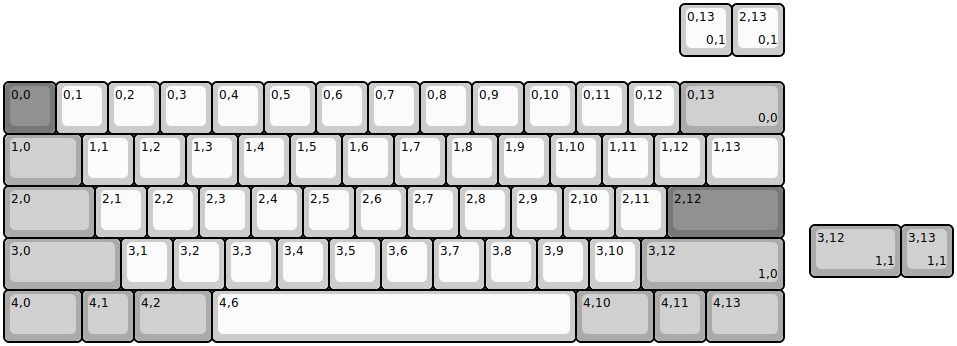{:loading="lazy"}

[Open in keyboard-layout-editor](http://www.keyboard-layout-editor.com/##@@_y:1.5&c=#777777;&=0,0&_c=#cccccc;&=0,1&=0,2&=0,3&=0,4&=0,5&=0,6&=0,7&=0,8&=0,9&=0,10&=0,11&=0,12&_c=#aaaaaa&w:2;&=0,13%0A%0A%0A0,0;&@_w:1.5;&=1,0&_c=#cccccc;&=1,1&=1,2&=1,3&=1,4&=1,5&=1,6&=1,7&=1,8&=1,9&=1,10&=1,11&=1,12&_w:1.5;&=1,13;&@_c=#aaaaaa&w:1.75;&=2,0&_c=#cccccc;&=2,1&=2,2&=2,3&=2,4&=2,5&=2,6&=2,7&=2,8&=2,9&=2,10&=2,11&_c=#777777&w:2.25;&=2,12;&@_c=#aaaaaa&w:2.25;&=3,0&_c=#cccccc;&=3,1&=3,2&=3,3&=3,4&=3,5&=3,6&=3,7&=3,8&=3,9&=3,10&_c=#aaaaaa&w:2.75;&=3,12%0A%0A%0A1,0;&@_w:1.5;&=4,0&=4,1&_w:1.5;&=4,2&_c=#cccccc&w:7;&=4,6&_c=#aaaaaa&w:1.5;&=4,10&=4,11&_w:1.5;&=4,13;&@_x:13&y:-6.5&c=#cccccc;&=0,13%0A%0A%0A0,1&=2,13%0A%0A%0A0,1;&@_x:15.5&y:3.25&c=#aaaaaa&w:1.75;&=3,12%0A%0A%0A1,1&=3,13%0A%0A%0A1,1)

## inett_studio/sqx

[README](output/inett_studio/sqx/README.md) - [layout](output/inett_studio/sqx/sqx-kle.json) - [PCB](output/inett_studio/sqx/sqx.kicad_pcb) - [PCB render](output/inett_studio/sqx/sqx-render.svg)

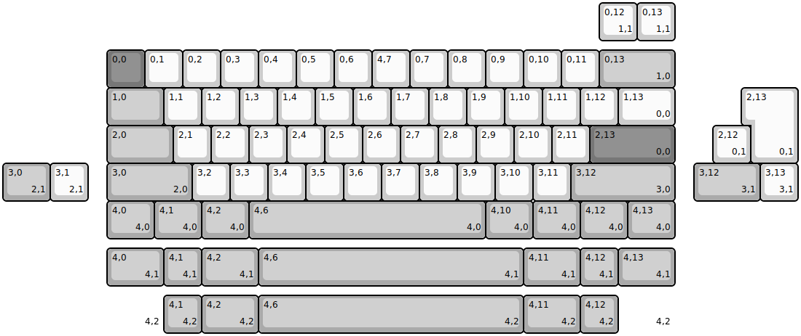{:loading="lazy"}

[Open in keyboard-layout-editor](http://www.keyboard-layout-editor.com/##@@_x:2.75&y:1.25&c=#777777;&=0,0&_c=#cccccc;&=0,1&=0,2&=0,3&=0,4&=0,5&=0,6&=4,7&=0,7&=0,8&=0,9&=0,10&=0,11&_c=#aaaaaa&w:2;&=0,13%0A%0A%0A1,0;&@_x:2.75&w:1.5;&=1,0&_c=#cccccc;&=1,1&=1,2&=1,3&=1,4&=1,5&=1,6&=1,7&=1,8&=1,9&=1,10&=1,11&=1,12&_w:1.5;&=1,13%0A%0A%0A0,0;&@_x:2.75&c=#aaaaaa&w:1.75;&=2,0&_c=#cccccc;&=2,1&=2,2&=2,3&=2,4&=2,5&=2,6&=2,7&=2,8&=2,9&=2,10&=2,11&_c=#777777&w:2.25;&=2,13%0A%0A%0A0,0;&@_x:2.75&c=#aaaaaa&w:2.25;&=3,0%0A%0A%0A2,0&_c=#cccccc;&=3,2&=3,3&=3,4&=3,5&=3,6&=3,7&=3,8&=3,9&=3,10&=3,11&_c=#aaaaaa&w:2.75;&=3,12%0A%0A%0A3,0;&@_x:2.75&w:1.25;&=4,0%0A%0A%0A4,0&_w:1.25;&=4,1%0A%0A%0A4,0&_w:1.25;&=4,2%0A%0A%0A4,0&_w:6.25;&=4,6%0A%0A%0A4,0&_w:1.25;&=4,10%0A%0A%0A4,0&_w:1.25;&=4,11%0A%0A%0A4,0&_w:1.25;&=4,12%0A%0A%0A4,0&_w:1.25;&=4,13%0A%0A%0A4,0;&@_x:15.75&y:-6.25&c=#cccccc;&=0,12%0A%0A%0A1,1&=0,13%0A%0A%0A1,1;&@_x:19.75&y:1.25&w:1.25&h:2&w2:1.5&h2:1&x2:-0.25;&=2,13%0A%0A%0A0,1;&@_x:18.75;&=2,12%0A%0A%0A0,1;&@_c=#aaaaaa&w:1.25;&=3,0%0A%0A%0A2,1&_c=#cccccc;&=3,1%0A%0A%0A2,1&_x:16.0&c=#aaaaaa&w:1.75;&=3,12%0A%0A%0A3,1&_c=#cccccc;&=3,13%0A%0A%0A3,1;&@_x:2.75&y:1.25&c=#aaaaaa&w:1.5;&=4,0%0A%0A%0A4,1&=4,1%0A%0A%0A4,1&_w:1.5;&=4,2%0A%0A%0A4,1&_w:7;&=4,6%0A%0A%0A4,1&_w:1.5;&=4,11%0A%0A%0A4,1&=4,12%0A%0A%0A4,1&_w:1.5;&=4,13%0A%0A%0A4,1;&@_x:2.75&y:0.25&w:1.5&d:true;&=%0A%0A%0A4,2&=4,1%0A%0A%0A4,2&_w:1.5;&=4,2%0A%0A%0A4,2&_w:7;&=4,6%0A%0A%0A4,2&_w:1.5;&=4,11%0A%0A%0A4,2&=4,12%0A%0A%0A4,2&_w:1.5&d:true;&=%0A%0A%0A4,2)

## irene/irene

[README](output/irene/README.md) - [layout](output/irene/irene-kle.json) - [PCB](output/irene/irene.kicad_pcb) - [PCB render](output/irene/irene-render.svg)

{:loading="lazy"}

[Open in keyboard-layout-editor](http://www.keyboard-layout-editor.com/##@@_x:0.55&y:1.15&c=#777777;&=0,0;&@_x:3.7&y:-0.95&c=#cccccc;&=0,3&_x:8.45;&=0,11;&@_x:1.7&y:-0.95;&=0,1&=0,2&_x:10.45;&=0,12&_c=#aaaaaa&w:2;&=0,14%0A%0A%0A0,0;&@_x:0.35&y:-0.1;&=1,0;&@_x:13&y:-0.95&c=#cccccc;&=1,11;&@_x:1.5&y:-0.95&c=#aaaaaa&w:1.5;&=1,1&_c=#cccccc;&=1,2&_x:10.0;&=1,12&=1,13&_c=#aaaaaa&w:1.5;&=1,14;&@_x:0.15&y:-0.1;&=2,0;&@_x:13.4&y:-0.9&c=#cccccc;&=2,11&=2,12&_c=#777777&w:2.25;&=2,14&_x:-16.35&c=#aaaaaa&w:1.75;&=2,1&_c=#cccccc;&=2,2;&@_x:1.05&c=#aaaaaa&w:2.25;&=3,1&_c=#cccccc;&=3,2&_x:8.8;&=3,11&=3,12&_c=#aaaaaa&w:1.75;&=3,13%0A%0A%0A1,0&=3,14%0A%0A%0A1,0;&@_x:1.05&w:1.5;&=4,1&_x:13.45&w:1.5;&=4,14;&@_r:12&x:5.05&y:-6.0&c=#cccccc;&=0,4&=0,5&=0,6&=4,7;&@_x:4.6;&=1,3&=1,4&=1,5&=1,6;&@_x:4.85;&=2,3&=2,4&=2,5&=2,6;&@_x:5.3;&=3,3&=3,4&=3,5&=3,6;&@_x:6.6&c=#777777&w:2;&=4,4&_c=#aaaaaa&w:1.25;&=4,6;&@_x:5.05&y:-0.95&w:1.5;&=4,3;&@_r:-12&x:8.45&y:-1.45&c=#cccccc;&=0,7&=0,8&=0,9&=0,10;&@_x:8.05;&=1,7&=1,8&=1,9&=1,10;&@_x:8.2;&=2,7&=2,8&=2,9&=2,10;&@_x:7.75;&=3,7&=3,8&=3,9&=3,10;&@_x:7.75&c=#777777&w:2.75;&=4,8;&@_x:10.55&y:-0.95&c=#aaaaaa&w:1.5;&=4,10;&@_r:0&x:15.15&y:-8.75&c=#cccccc;&=0,13%0A%0A%0A0,1&_c=#aaaaaa;&=0,14%0A%0A%0A0,1;&@_x:18.15&y:3.1&w:2.75;&=3,13%0A%0A%0A1,1)

## iriskeyboards/iriskeyboards

[README](output/iriskeyboards/README.md) - [layout](output/iriskeyboards/iriskeyboards-kle.json) - [PCB](output/iriskeyboards/iriskeyboards.kicad_pcb) - [PCB render](output/iriskeyboards/iriskeyboards-render.svg)

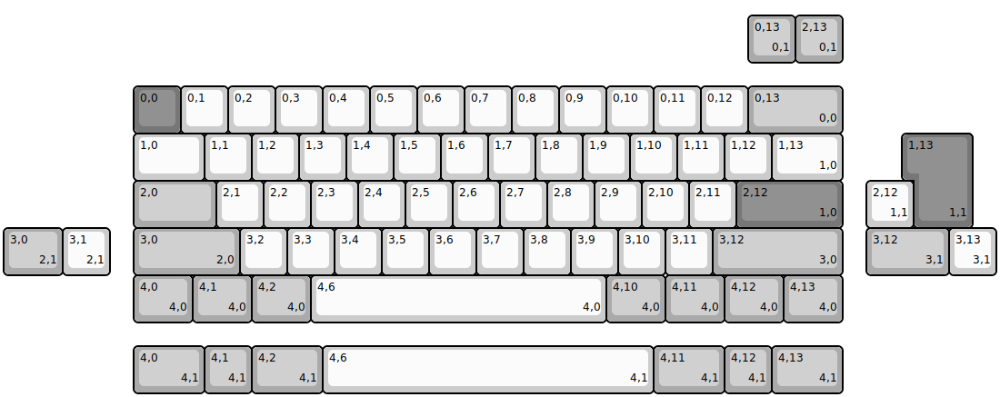{:loading="lazy"}

[Open in keyboard-layout-editor](http://www.keyboard-layout-editor.com/##@@_x:2.75&y:1.75&c=#777777;&=0,0&_c=#cccccc;&=0,1&=0,2&=0,3&=0,4&=0,5&=0,6&=0,7&=0,8&=0,9&=0,10&=0,11&=0,12&_c=#aaaaaa&w:2;&=0,13%0A%0A%0A0,0;&@_x:2.75&c=#cccccc&w:1.5;&=1,0&=1,1&=1,2&=1,3&=1,4&=1,5&=1,6&=1,7&=1,8&=1,9&=1,10&=1,11&=1,12&_w:1.5;&=1,13%0A%0A%0A1,0;&@_x:2.75&c=#aaaaaa&w:1.75;&=2,0&_c=#cccccc;&=2,1&=2,2&=2,3&=2,4&=2,5&=2,6&=2,7&=2,8&=2,9&=2,10&=2,11&_c=#777777&w:2.25;&=2,12%0A%0A%0A1,0;&@_x:2.75&c=#aaaaaa&w:2.25;&=3,0%0A%0A%0A2,0&_c=#cccccc;&=3,2&=3,3&=3,4&=3,5&=3,6&=3,7&=3,8&=3,9&=3,10&=3,11&_c=#aaaaaa&w:2.75;&=3,12%0A%0A%0A3,0;&@_x:2.75&w:1.25;&=4,0%0A%0A%0A4,0&_w:1.25;&=4,1%0A%0A%0A4,0&_w:1.25;&=4,2%0A%0A%0A4,0&_c=#cccccc&w:6.25;&=4,6%0A%0A%0A4,0&_c=#aaaaaa&w:1.25;&=4,10%0A%0A%0A4,0&_w:1.25;&=4,11%0A%0A%0A4,0&_w:1.25;&=4,12%0A%0A%0A4,0&_w:1.25;&=4,13%0A%0A%0A4,0;&@_x:15.75&y:-6.5;&=0,13%0A%0A%0A0,1&=2,13%0A%0A%0A0,1;&@_x:19.25&y:1.5&c=#777777&w:1.25&h:2&w2:1.5&h2:1&x2:-0.25;&=1,13%0A%0A%0A1,1;&@_x:18.25&c=#cccccc;&=2,12%0A%0A%0A1,1;&@_c=#aaaaaa&w:1.25;&=3,0%0A%0A%0A2,1&_x:17.0&w:1.75;&=3,12%0A%0A%0A3,1&_c=#cccccc;&=3,13%0A%0A%0A3,1;&@_x:2.75&y:1.5&c=#aaaaaa&w:1.5;&=4,0%0A%0A%0A4,1&=4,1%0A%0A%0A4,1&_w:1.5;&=4,2%0A%0A%0A4,1&_c=#cccccc&w:7;&=4,6%0A%0A%0A4,1&_c=#aaaaaa&w:1.5;&=4,11%0A%0A%0A4,1&=4,12%0A%0A%0A4,1&_w:1.5;&=4,13%0A%0A%0A4,1;&@_rx:0.25&x:1.0&y:4.75&c=#cccccc;&=3,1%0A%0A%0A2,1)

## jacky_studio/bear_65/via

[README](output/jacky_studio/bear_65/README.md) - [layout](output/jacky_studio/bear_65/via-kle.json) - [PCB](output/jacky_studio/bear_65/via.kicad_pcb) - [PCB render](output/jacky_studio/bear_65/via-render.svg)

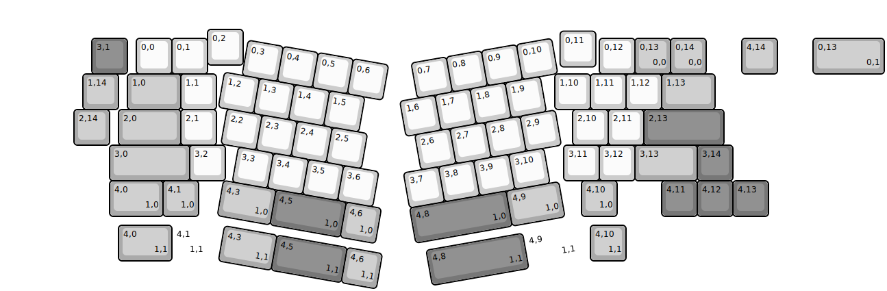{:loading="lazy"}

[Open in keyboard-layout-editor](http://www.keyboard-layout-editor.com/##@@_x:5.75&y:0.75;&=0,2;&@_x:15.65&y:-0.95;&=0,11%0A-;&@_x:2.5&y:-0.8&c=#777777;&=3,1&_x:0.25&c=#cccccc;&=0,0&=0,1&_x:11.0;&=0,12&_c=#aaaaaa;&=0,13%0A%0A%0A0,0&=0,14%0A%0A%0A0,0&_x:1.0;&=4,14;&@_x:2.25;&=1,14&_x:0.25&w:1.5;&=1,0&_c=#cccccc;&=1,1&_x:9.5;&=1,10&=1,11&=1,12&_c=#aaaaaa&w:1.5;&=1,13;&@_x:2;&=2,14&_x:0.25&w:1.75;&=2,0&_c=#cccccc;&=2,1&_x:10.0;&=2,10&=2,11&_c=#777777&w:2.25;&=2,13;&@_x:3&c=#aaaaaa&w:2.25;&=3,0&_c=#cccccc;&=3,2&_x:9.5;&=3,11&=3,12&_c=#aaaaaa&w:1.75;&=3,13&_c=#777777;&=3,14;&@_x:3&c=#aaaaaa&w:1.5;&=4,0%0A%0A%0A1,0&=4,1%0A%0A%0A1,0&_x:10.75;&=4,10%0A%0A%0A1,0&_x:1.25&c=#777777;&=4,11&=4,12&=4,13;&@_r:10&rx:1&x:6&c=#cccccc;&=0,3&=0,4&=0,5&=0,6;&@_x:5.5;&=1,2&=1,3&=1,4&=1,5;&@_x:5.75;&=2,2&=2,3&=2,4&=2,5;&@_x:6.25;&=3,3&=3,4&=3,5&=3,6;&@_x:6&c=#aaaaaa&w:1.5;&=4,3%0A%0A%0A1,0&_c=#777777&w:2;&=4,5%0A%0A%0A1,0&_c=#aaaaaa;&=4,6%0A%0A%0A1,0;&@_r:-10&x:10&y:-1.5&c=#cccccc;&=0,7&=0,8&=0,9&=0,10;&@_x:9.5;&=1,6&=1,7&=1,8&=1,9;&@_x:9.75;&=2,6&=2,7&=2,8&=2,9;&@_x:9.25;&=3,7&=3,8&=3,9&=3,10;&@_x:9.25&c=#777777&w:2.75;&=4,8%0A%0A%0A1,0&_c=#aaaaaa&w:1.5;&=4,9%0A%0A%0A1,0;&@_r:0&rx:0&x:22.75&y:1.0&w:2;&=0,13%0A%0A%0A0,1;&@_x:3.25&y:4.25&w:1.5;&=4,0%0A%0A%0A1,1&_c=#cccccc&d:true;&=4,1%0A%0A%0A1,1&_x:10.75&c=#aaaaaa;&=4,10%0A%0A%0A1,1;&@_r:10&rx:1&x:6.25&y:5.25&w:1.5;&=4,3%0A%0A%0A1,1&_c=#777777&w:2;&=4,5%0A%0A%0A1,1&_c=#aaaaaa;&=4,6%0A%0A%0A1,1;&@_r:-10&x:9.5&y:2.5&c=#777777&w:2.75;&=4,8%0A%0A%0A1,1&_c=#cccccc&w:1.5&d:true;&=4,9%0A%0A%0A1,1)

## jacky_studio/piggy60/via

[README](output/jacky_studio/piggy60/README.md) - [layout](output/jacky_studio/piggy60/via-kle.json) - [PCB](output/jacky_studio/piggy60/via.kicad_pcb) - [PCB render](output/jacky_studio/piggy60/via-render.svg)

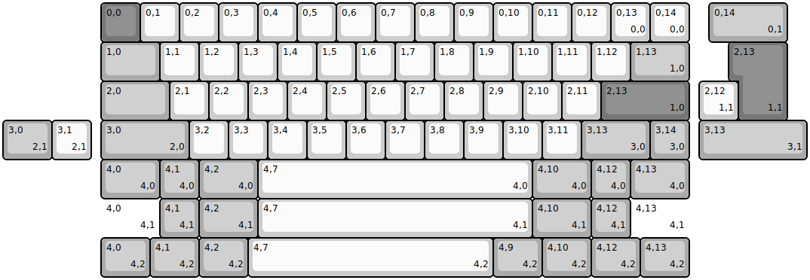{:loading="lazy"}

[Open in keyboard-layout-editor](http://www.keyboard-layout-editor.com/##@@_x:2.5&c=#777777;&=0,0&_c=#cccccc;&=0,1&=0,2&=0,3&=0,4&=0,5&=0,6&=0,7&=0,8&=0,9&=0,10&=0,11&=0,12&=0,13%0A%0A%0A0,0&=0,14%0A%0A%0A0,0;&@_x:2.5&c=#aaaaaa&w:1.5;&=1,0&_c=#cccccc;&=1,1&=1,2&=1,3&=1,4&=1,5&=1,6&=1,7&=1,8&=1,9&=1,10&=1,11&=1,12&_c=#aaaaaa&w:1.5;&=1,13%0A%0A%0A1,0;&@_x:2.5&w:1.75;&=2,0&_c=#cccccc;&=2,1&=2,2&=2,3&=2,4&=2,5&=2,6&=2,7&=2,8&=2,9&=2,10&=2,11&_c=#777777&w:2.25;&=2,13%0A%0A%0A1,0;&@_x:2.5&c=#aaaaaa&w:2.25;&=3,0%0A%0A%0A2,0&_c=#cccccc;&=3,2&=3,3&=3,4&=3,5&=3,6&=3,7&=3,8&=3,9&=3,10&=3,11&_c=#aaaaaa&w:1.75;&=3,13%0A%0A%0A3,0&=3,14%0A%0A%0A3,0;&@_x:2.5&w:1.5;&=4,0%0A%0A%0A4,0&=4,1%0A%0A%0A4,0&_w:1.5;&=4,2%0A%0A%0A4,0&_c=#cccccc&w:7;&=4,7%0A%0A%0A4,0&_c=#aaaaaa&w:1.5;&=4,10%0A%0A%0A4,0&=4,12%0A%0A%0A4,0&_w:1.5;&=4,13%0A%0A%0A4,0;&@_x:18.0&y:-5&w:2;&=0,14%0A%0A%0A0,1;&@_x:18.75&c=#777777&w:1.25&h:2&w2:1.5&h2:1&x2:-0.25;&=2,13%0A%0A%0A1,1;&@_x:17.75&c=#cccccc;&=2,12%0A%0A%0A1,1;&@_c=#aaaaaa&w:1.25;&=3,0%0A%0A%0A2,1&_c=#cccccc;&=3,1%0A%0A%0A2,1&_x:15.5&c=#aaaaaa&w:2.75;&=3,13%0A%0A%0A3,1;&@_x:2.5&y:1&c=#cccccc&w:1.5&d:true;&=4,0%0A%0A%0A4,1&_c=#aaaaaa;&=4,1%0A%0A%0A4,1&_w:1.5;&=4,2%0A%0A%0A4,1&_c=#cccccc&w:7;&=4,7%0A%0A%0A4,1&_c=#aaaaaa&w:1.5;&=4,10%0A%0A%0A4,1&=4,12%0A%0A%0A4,1&_c=#cccccc&w:1.5&d:true;&=4,13%0A%0A%0A4,1;&@_x:2.5&c=#aaaaaa&w:1.25;&=4,0%0A%0A%0A4,2&_w:1.25;&=4,1%0A%0A%0A4,2&_w:1.25;&=4,2%0A%0A%0A4,2&_c=#cccccc&w:6.25;&=4,7%0A%0A%0A4,2&_c=#aaaaaa&w:1.25;&=4,9%0A%0A%0A4,2&_w:1.25;&=4,10%0A%0A%0A4,2&_w:1.25;&=4,12%0A%0A%0A4,2&_w:1.25;&=4,13%0A%0A%0A4,2)

## jadookb/jkb65

[README](output/jadookb/jkb65/README.md) - [layout](output/jadookb/jkb65/jkb65-kle.json) - [PCB](output/jadookb/jkb65/jkb65.kicad_pcb) - [PCB render](output/jadookb/jkb65/jkb65-render.svg)

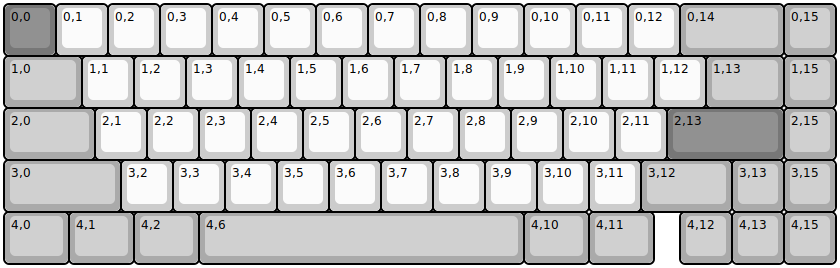{:loading="lazy"}

[Open in keyboard-layout-editor](http://www.keyboard-layout-editor.com/##@@_c=#777777;&=0,0&_c=#cccccc;&=0,1&=0,2&=0,3&=0,4&=0,5&=0,6&=0,7&=0,8&=0,9&=0,10&=0,11&=0,12&_c=#aaaaaa&w:2;&=0,14&=0,15;&@_w:1.5;&=1,0&_c=#cccccc;&=1,1&=1,2&=1,3&=1,4&=1,5&=1,6&=1,7&=1,8&=1,9&=1,10&=1,11&=1,12&_c=#aaaaaa&w:1.5;&=1,13&=1,15;&@_w:1.75;&=2,0&_c=#cccccc;&=2,1&=2,2&=2,3&=2,4&=2,5&=2,6&=2,7&=2,8&=2,9&=2,10&=2,11&_c=#777777&w:2.25;&=2,13&_c=#aaaaaa;&=2,15;&@_w:2.25;&=3,0&_c=#cccccc;&=3,2&=3,3&=3,4&=3,5&=3,6&=3,7&=3,8&=3,9&=3,10&=3,11&_c=#aaaaaa&w:1.75;&=3,12&=3,13&=3,15;&@_w:1.25;&=4,0&_w:1.25;&=4,1&_w:1.25;&=4,2&_w:6.25;&=4,6&_w:1.25;&=4,10&_w:1.25;&=4,11&_x:0.5;&=4,12&=4,13&=4,15)

## jd45/jd45

[README](output/jd45/README.md) - [layout](output/jd45/jd45-kle.json) - [PCB](output/jd45/jd45.kicad_pcb) - [PCB render](output/jd45/jd45-render.svg)

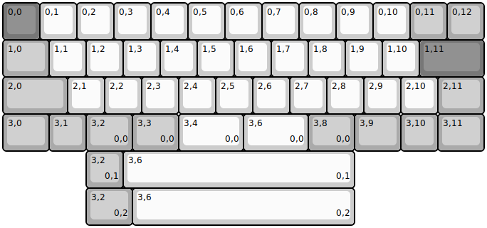{:loading="lazy"}

[Open in keyboard-layout-editor](http://www.keyboard-layout-editor.com/##@@_c=#777777;&=0,0&_c=#cccccc;&=0,1&=0,2&=0,3&=0,4&=0,5&=0,6&=0,7&=0,8&=0,9&=0,10&_c=#aaaaaa;&=0,11&=0,12;&@_w:1.25;&=1,0&_c=#cccccc;&=1,1&=1,2&=1,3&=1,4&=1,5&=1,6&=1,7&=1,8&=1,9&=1,10&_c=#777777&w:1.75;&=1,11;&@_c=#aaaaaa&w:1.75;&=2,0&_c=#cccccc;&=2,1&=2,2&=2,3&=2,4&=2,5&=2,6&=2,7&=2,8&=2,9&=2,10&_c=#aaaaaa&w:1.25;&=2,11;&@_w:1.25;&=3,0&=3,1&_w:1.25;&=3,2%0A%0A%0A0,0&_w:1.25;&=3,3%0A%0A%0A0,0&_c=#cccccc&w:1.75;&=3,4%0A%0A%0A0,0&_w:1.75;&=3,6%0A%0A%0A0,0&_c=#aaaaaa&w:1.25;&=3,8%0A%0A%0A0,0&_w:1.25;&=3,9&=3,10&_w:1.25;&=3,11;&@_x:2.25;&=3,2%0A%0A%0A0,1&_c=#cccccc&w:6.25;&=3,6%0A%0A%0A0,1;&@_x:2.25&c=#aaaaaa&w:1.25;&=3,2%0A%0A%0A0,2&_c=#cccccc&w:6;&=3,6%0A%0A%0A0,2)

## jels/jels60/jels60_via

[README](output/jels/jels60/README.md) - [layout](output/jels/jels60/jels60_via-kle.json) - [PCB](output/jels/jels60/jels60_via.kicad_pcb) - [PCB render](output/jels/jels60/jels60_via-render.svg)

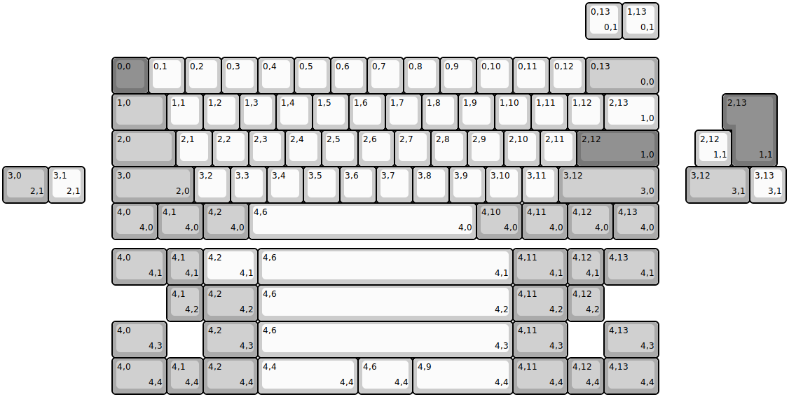{:loading="lazy"}

[Open in keyboard-layout-editor](http://www.keyboard-layout-editor.com/##@@_x:3&y:1.5&c=#777777;&=0,0&_c=#cccccc;&=0,1&=0,2&=0,3&=0,4&=0,5&=0,6&=0,7&=0,8&=0,9&=0,10&=0,11&=0,12&_c=#aaaaaa&w:2;&=0,13%0A%0A%0A0,0;&@_x:3&w:1.5;&=1,0&_c=#cccccc;&=1,1&=1,2&=1,3&=1,4&=1,5&=1,6&=1,7&=1,8&=1,9&=1,10&=1,11&=1,12&_w:1.5;&=2,13%0A%0A%0A1,0;&@_x:3&c=#aaaaaa&w:1.75;&=2,0&_c=#cccccc;&=2,1&=2,2&=2,3&=2,4&=2,5&=2,6&=2,7&=2,8&=2,9&=2,10&=2,11&_c=#777777&w:2.25;&=2,12%0A%0A%0A1,0;&@_x:3.0&c=#aaaaaa&w:2.25;&=3,0%0A%0A%0A2,0&_c=#cccccc;&=3,2&=3,3&=3,4&=3,5&=3,6&=3,7&=3,8&=3,9&=3,10&=3,11&_c=#aaaaaa&w:2.75;&=3,12%0A%0A%0A3,0;&@_x:3&w:1.25;&=4,0%0A%0A%0A4,0&_w:1.25;&=4,1%0A%0A%0A4,0&_w:1.25;&=4,2%0A%0A%0A4,0&_c=#cccccc&w:6.25;&=4,6%0A%0A%0A4,0&_c=#aaaaaa&w:1.25;&=4,10%0A%0A%0A4,0&_w:1.25;&=4,11%0A%0A%0A4,0&_w:1.25;&=4,12%0A%0A%0A4,0&_w:1.25;&=4,13%0A%0A%0A4,0;&@_x:16&y:-6.5&c=#cccccc;&=0,13%0A%0A%0A0,1&=1,13%0A%0A%0A0,1;&@_x:20.0&y:1.5&c=#777777&w:1.25&h:2&w2:1.5&h2:1&x2:-0.25;&=2,13%0A%0A%0A1,1;&@_x:19.0&c=#cccccc;&=2,12%0A%0A%0A1,1;&@_c=#aaaaaa&w:1.25;&=3,0%0A%0A%0A2,1&_c=#cccccc;&=3,1%0A%0A%0A2,1&_x:16.5&c=#aaaaaa&w:1.75;&=3,12%0A%0A%0A3,1&_c=#cccccc;&=3,13%0A%0A%0A3,1;&@_x:3&y:1.25&c=#aaaaaa&w:1.5;&=4,0%0A%0A%0A4,1&=4,1%0A%0A%0A4,1&_c=#cccccc&w:1.5;&=4,2%0A%0A%0A4,1&_w:7;&=4,6%0A%0A%0A4,1&_c=#aaaaaa&w:1.5;&=4,11%0A%0A%0A4,1&=4,12%0A%0A%0A4,1&_w:1.5;&=4,13%0A%0A%0A4,1;&@_x:4.5;&=4,1%0A%0A%0A4,2&_w:1.5;&=4,2%0A%0A%0A4,2&_c=#cccccc&w:7;&=4,6%0A%0A%0A4,2&_c=#aaaaaa&w:1.5;&=4,11%0A%0A%0A4,2&=4,12%0A%0A%0A4,2;&@_x:3&w:1.5;&=4,0%0A%0A%0A4,3&_x:1.0&w:1.5;&=4,2%0A%0A%0A4,3&_c=#cccccc&w:7;&=4,6%0A%0A%0A4,3&_c=#aaaaaa&w:1.5;&=4,11%0A%0A%0A4,3&_x:1.0&w:1.5;&=4,13%0A%0A%0A4,3;&@_x:3&w:1.5;&=4,0%0A%0A%0A4,4&=4,1%0A%0A%0A4,4&_w:1.5;&=4,2%0A%0A%0A4,4&_c=#cccccc&w:2.75;&=4,4%0A%0A%0A4,4&_w:1.5;&=4,6%0A%0A%0A4,4&_w:2.75;&=4,9%0A%0A%0A4,4&_c=#aaaaaa&w:1.5;&=4,11%0A%0A%0A4,4&=4,12%0A%0A%0A4,4&_w:1.5;&=4,13%0A%0A%0A4,4)

## jels/jels88

[README](output/jels/jels88/README.md) - [layout](output/jels/jels88/jels88-kle.json) - [PCB](output/jels/jels88/jels88.kicad_pcb) - [PCB render](output/jels/jels88/jels88-render.svg)

{:loading="lazy"}

[Open in keyboard-layout-editor](http://www.keyboard-layout-editor.com/##@@_x:3.25&c=#777777;&=1,0&_x:0.25&c=#cccccc;&=1,1&=0,1&=0,2&=1,2&_x:0.25&c=#aaaaaa;&=1,3&=0,3&=0,4&=1,4&_x:0.25&c=#cccccc;&=1,5&=0,5&=0,6&=1,6&_x:0.25;&=1,7&_x:0.25&c=#aaaaaa;&=0,7&=0,8&=1,8;&@_x:3.25&y:0.5&c=#cccccc;&=2,0&=2,1&=3,1&=3,2&=2,2&=2,3&=3,3&=3,4&=2,4&=2,5&=3,5&=3,6&=2,6&_c=#aaaaaa&w:2;&=2,7%0A%0A%0A0,0&_x:0.25;&=4,7&=4,8&=2,8;&@_x:3.25&w:1.5;&=5,0&_c=#cccccc;&=5,1&=4,1&=4,2&=5,2&=5,3&=4,3&=4,4&=5,4&=5,5&=4,5&=4,6&=5,6&_w:1.5;&=6,7%0A%0A%0A3,0&_x:0.25&c=#aaaaaa;&=3,7&=3,8&=5,8;&@_x:3.25&w:1.75;&=6,0&_c=#cccccc;&=6,1&=7,1&=7,2&=6,2&=6,3&=7,3&=7,4&=6,4&=6,5&=7,5&=7,6&_c=#777777&w:2.25;&=6,6%0A%0A%0A3,0;&@_x:3.25&c=#aaaaaa&w:2.25;&=9,0%0A%0A%0A1,0&_c=#cccccc;&=8,1&=8,2&=9,2&=9,3&=8,3&=8,4&=9,4&=9,5&=8,5&=8,6&_c=#aaaaaa&w:2.75;&=9,6%0A%0A%0A2,0&_x:1.25;&=8,7;&@_x:3.25&w:1.25;&=10,0%0A%0A%0A4,0&_w:1.25;&=10,1%0A%0A%0A4,0&_w:1.25;&=11,1%0A%0A%0A4,0&_c=#cccccc&w:6.25;&=11,3%0A%0A%0A4,0&_c=#aaaaaa&w:1.25;&=10,5%0A%0A%0A4,0&_w:1.25;&=10,6%0A%0A%0A4,0&_w:1.25;&=11,6%0A%0A%0A4,0&_w:1.25;&=11,7%0A%0A%0A4,0&_x:0.25;&=10,7&=10,8&=8,8;&@_x:23.25&y:-5.0&c=#cccccc;&=2,7%0A%0A%0A0,1&=5,7%0A%0A%0A0,1;&@_x:24.0&c=#aaaaaa&w:1.25&h:2&w2:1.5&h2:1&x2:-0.25;&=6,7%0A%0A%0A3,1;&@_x:23.0&c=#cccccc;&=6,6%0A%0A%0A3,1;&@_c=#aaaaaa&w:1.25;&=9,0%0A%0A%0A1,1&_c=#cccccc;&=9,1%0A%0A%0A1,1&_x:20.25&c=#aaaaaa&w:1.75;&=9,6%0A%0A%0A2,1&=9,7%0A%0A%0A2,1;&@_x:3.25&y:1.0&w:1.5;&=10,0%0A%0A%0A4,1&=10,1%0A%0A%0A4,1&_w:1.5;&=11,1%0A%0A%0A4,1&_c=#cccccc&w:7;&=11,3%0A%0A%0A4,1&_c=#aaaaaa&w:1.5;&=10,6%0A%0A%0A4,1&=11,6%0A%0A%0A4,1&_w:1.5;&=11,7%0A%0A%0A4,1;&@_x:3.25&w:1.5;&=10,0%0A%0A%0A4,2&=10,1%0A%0A%0A4,2&_c=#cccccc&w:10;&=11,3%0A%0A%0A4,2&_c=#aaaaaa;&=11,6%0A%0A%0A4,2&_w:1.5;&=11,7%0A%0A%0A4,2;&@_x:3.25&w:1.5;&=10,0%0A%0A%0A4,3&_d:true;&=%0A%0A%0A4,3&_w:1.5;&=11,1%0A%0A%0A4,3&_c=#cccccc&w:7;&=11,3%0A%0A%0A4,3&_c=#aaaaaa&w:1.5;&=10,6%0A%0A%0A4,3&_d:true;&=%0A%0A%0A4,3&_w:1.5;&=11,7%0A%0A%0A4,3;&@_x:3.25&w:1.5;&=10,0%0A%0A%0A4,4&_d:true;&=%0A%0A%0A4,4&_c=#cccccc&w:10;&=11,3%0A%0A%0A4,4&_c=#aaaaaa&d:true;&=%0A%0A%0A4,4&_w:1.5;&=11,7%0A%0A%0A4,4)

## jian/jianrev2

[README](output/jian/README.md) - [layout](output/jian/jianrev2-kle.json) - [PCB](output/jian/jianrev2.kicad_pcb) - [PCB render](output/jian/jianrev2-render.svg)

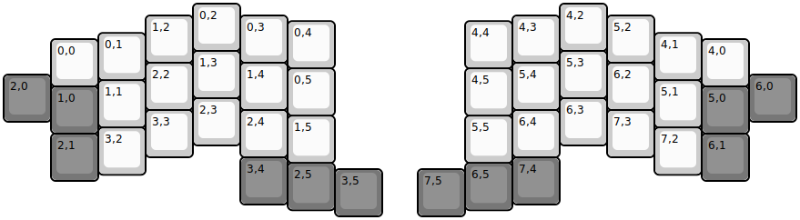{:loading="lazy"}

[Open in keyboard-layout-editor](http://www.keyboard-layout-editor.com/##@@_x:4;&=0,2&_x:6.75;&=4,2;&@_x:3&y:-0.75;&=1,2&_x:1;&=0,3&_x:4.75;&=4,3&_x:1.0;&=5,2;&@_x:6&y:-0.88;&=0,4&_x:2.75;&=4,4;&@_x:2&y:-0.75;&=0,1&_x:10.75;&=4,1;&@_x:1&y:-0.87;&=0,0&_x:12.75;&=4,0;&@_x:4&y:-0.75;&=1,3&_x:6.75;&=5,3;&@_x:3&y:-0.75;&=2,2&_x:1;&=1,4&_x:4.75;&=5,4&_x:1.0;&=6,2;&@_x:6&y:-0.88;&=0,5&_x:2.75;&=4,5;&@_y:-0.87&c=#777777;&=2,0&_x:14.75;&=6,0;&@_x:2&y:-0.88&c=#cccccc;&=1,1&_x:10.75;&=5,1;&@_x:1&y:-0.87&c=#777777;&=1,0&_x:12.75;&=5,0;&@_x:4&y:-0.75&c=#cccccc;&=2,3&_x:6.75;&=6,3;&@_x:3&y:-0.75;&=3,3&_x:1;&=2,4&_x:4.75;&=6,4&_x:1.0;&=7,3;&@_x:6&y:-0.88;&=1,5&_x:2.75;&=5,5;&@_x:2&y:-0.75;&=3,2&_x:10.75;&=7,2;&@_x:1&y:-0.87&c=#777777;&=2,1&_x:12.75;&=6,1;&@_x:5&y:-0.5;&=3,4&_x:4.75;&=7,4;&@_x:6&y:-0.88;&=2,5&_x:2.75;&=6,5;&@_x:7&y:-0.87;&=3,5&_x:0.75;&=7,5)

## jiran/jiran

[README](output/jiran/README.md) - [layout](output/jiran/jiran-kle.json) - [PCB](output/jiran/jiran.kicad_pcb) - [PCB render](output/jiran/jiran-render.svg)

{:loading="lazy"}

[Open in keyboard-layout-editor](http://www.keyboard-layout-editor.com/##@@_x:4&y:0.13;&=0,3&_x:9;&=5,3;&@_x:3&y:-0.75;&=0,2&_x:1;&=0,4&_x:7;&=5,4&_x:1;&=5,2;&@_x:6&y:-0.88;&=0,5&_x:5;&=5,5;&@_x:2&y:-0.75;&=0,1&_x:13;&=5,1;&@_x:1&y:-0.87&c=#aaaaaa;&=0,0&_x:15&c=#cccccc;&=5,0;&@_x:4&y:-0.75;&=1,3&_x:9;&=6,3;&@_x:3&y:-0.75;&=1,2&_x:1;&=1,4&_x:7;&=6,4&_x:1;&=6,2;&@_x:6&y:-0.88;&=1,5&_x:5;&=6,5;&@_x:2&y:-0.75;&=1,1&_x:13;&=6,1;&@_x:1&y:-0.87&c=#aaaaaa;&=1,0&_x:15&c=#cccccc;&=6,0;&@_x:4&y:-0.75;&=2,3&_x:9;&=7,3;&@_x:3&y:-0.75;&=2,2&_x:1&n:true;&=2,4&_x:7&n:true;&=7,4&_x:1;&=7,2;&@_x:6&y:-0.88;&=2,5&_x:5;&=7,5;&@_y:-0.87&c=#aaaaaa;&=4,0&_x:17;&=9,0;&@_x:2&y:-0.88&c=#cccccc;&=2,1&_x:13;&=7,1;&@_x:1&y:-0.87&c=#aaaaaa;&=2,0&_x:15;&=7,0;&@_x:4&y:-0.75&c=#cccccc;&=3,3&_x:9;&=8,3;&@_x:3&y:-0.75;&=3,2&_x:1;&=3,4&_x:7;&=8,4&_x:1;&=8,2;&@_x:6&y:-0.88;&=3,5&_x:5;&=8,5;&@_x:2&y:-0.75;&=3,1&_x:13;&=8,1;&@_x:1&y:-0.87&c=#aaaaaa;&=3,0&_x:15;&=8,0;&@_x:5&y:-0.5;&=4,3&_x:7;&=9,3;&@_x:6&y:-0.88&n:true;&=4,4&_x:5&n:true;&=9,4;&@_x:7&y:-0.87;&=4,5&_x:3;&=9,5)

## jisplit89/jisplit89

[README](output/jisplit89/README.md) - [layout](output/jisplit89/jisplit89-kle.json) - [PCB](output/jisplit89/jisplit89.kicad_pcb) - [PCB render](output/jisplit89/jisplit89-render.svg)

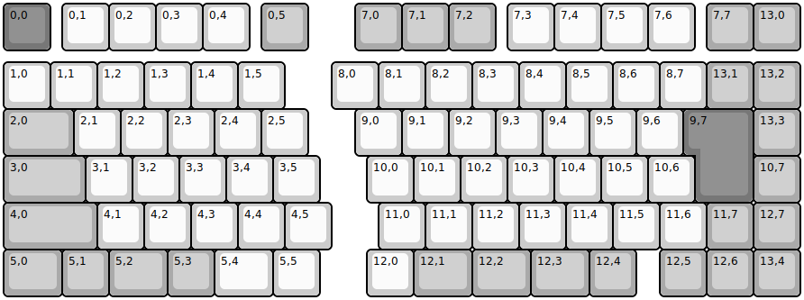{:loading="lazy"}

[Open in keyboard-layout-editor](http://www.keyboard-layout-editor.com/##@@_c=#777777;&=0,0&_x:0.25&c=#cccccc;&=0,1&=0,2&=0,3&=0,4&_x:0.25&c=#aaaaaa;&=0,5&_x:1.0;&=7,0&=7,1&=7,2&_x:0.25&c=#cccccc;&=7,3&=7,4&=7,5&=7,6&_x:0.25&c=#aaaaaa;&=7,7&=13,0;&@_y:0.25&c=#cccccc;&=1,0&=1,1&=1,2&=1,3&=1,4&=1,5&_x:1;&=8,0&=8,1&=8,2&=8,3&=8,4&=8,5&=8,6&=8,7&_c=#aaaaaa;&=13,1&=13,2;&@_w:1.5;&=2,0&_c=#cccccc;&=2,1&=2,2&=2,3&=2,4&=2,5&_x:1.0;&=9,0&=9,1&=9,2&=9,3&=9,4&=9,5&=9,6&_x:0.25&c=#777777&w:1.25&h:2&w2:1.5&h2:1&x2:-0.25;&=9,7&_c=#aaaaaa;&=13,3;&@_w:1.75;&=3,0&_c=#cccccc;&=3,1&=3,2&=3,3&=3,4&=3,5&_x:1.0;&=10,0&=10,1&=10,2&=10,3&=10,4&=10,5&=10,6&_x:1.25&c=#aaaaaa;&=10,7;&@_w:2;&=4,0&_c=#cccccc;&=4,1&=4,2&=4,3&=4,4&=4,5&_x:1;&=11,0&=11,1&=11,2&=11,3&=11,4&=11,5&=11,6&_c=#aaaaaa;&=11,7&=12,7;&@_w:1.25;&=5,0&=5,1&_w:1.25;&=5,2&=5,3&_c=#cccccc&w:1.25;&=5,4&=5,5&_x:1.0;&=12,0&_c=#aaaaaa&w:1.25;&=12,1&_w:1.25;&=12,2&_w:1.25;&=12,3&=12,4&_x:0.5;&=12,5&=12,6&=13,4)

## jorne/jorne

[README](output/jorne/README.md) - [layout](output/jorne/jorne-kle.json) - [PCB](output/jorne/jorne.kicad_pcb) - [PCB render](output/jorne/jorne-render.svg)

{:loading="lazy"}

[Open in keyboard-layout-editor](http://www.keyboard-layout-editor.com/##@@_x:4&y:1;&=0,3&_x:7.5;&=4,3;&@_x:11.5&y:-0.875;&=4,4&_x:1.0;&=4,2;&@_x:3&y:-0.995;&=0,2&_x:1;&=0,4;&@_x:6&y:-0.88;&=0,5&_x:3.5;&=4,5;&@_x:14.5&y:-0.875;&=4,1&=4,0;&@_x:1&y:-0.995;&=0,0&=0,1;&@_x:4&y:-0.38;&=1,3&_x:7.5;&=5,3;&@_x:13.5&y:-0.875;&=5,2;&@_y:-0.995&c=#aaaaaa;&=3,0&_x:2&c=#cccccc;&=1,2&_x:1;&=1,4&_x:5.5;&=5,4&_x:4.0&c=#aaaaaa;&=7,0;&@_x:6&y:-0.88&c=#cccccc;&=1,5&_x:3.5;&=5,5;&@_x:14.5&y:-0.875;&=5,1&_c=#aaaaaa;&=5,0;&@_x:1&y:-0.995;&=1,0&_c=#cccccc;&=1,1;&@_x:4&y:-0.38;&=2,3&_x:7.5;&=6,3;&@_x:3&y:-0.87;&=2,2&_x:1;&=2,4&_x:5.5;&=6,4&_x:1.0;&=6,2;&@_x:6&y:-0.88;&=2,5&_x:3.5;&=6,5;&@_x:1&y:-0.87&c=#aaaaaa;&=2,0&_c=#cccccc;&=2,1&_x:11.5;&=6,1&_c=#aaaaaa;&=6,0;&@_x:4.5&y:-0.13&c=#777777;&=3,3&_x:6.5;&=7,3;&@_r:15&rx:4.5&ry:9.1&y:-5.0;&=3,4;&@_r:30&rx:5.4&ry:9.3&x:-0.9&y:-5.3&h:1.5;&=3,5;&@_r:-30&rx:11.1&x:0.8&y:-4.8&h:1.5;&=7,5;&@_r:-15&rx:12&ry:9.1&x:-0.02&y:-4.75;&=7,4)

## kamigakushi/kamigakushi

[README](output/kamigakushi/README.md) - [layout](output/kamigakushi/kamigakushi-kle.json) - [PCB](output/kamigakushi/kamigakushi.kicad_pcb) - [PCB render](output/kamigakushi/kamigakushi-render.svg)

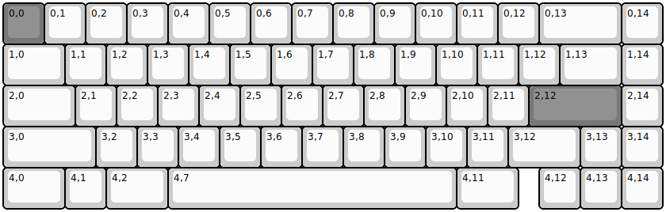{:loading="lazy"}

[Open in keyboard-layout-editor](http://www.keyboard-layout-editor.com/##@@_c=#777777;&=0,0&_c=#cccccc;&=0,1&=0,2&=0,3&=0,4&=0,5&=0,6&=0,7&=0,8&=0,9&=0,10&=0,11&=0,12&_w:2;&=0,13&=0,14;&@_w:1.5;&=1,0&=1,1&=1,2&=1,3&=1,4&=1,5&=1,6&=1,7&=1,8&=1,9&=1,10&=1,11&=1,12&_w:1.5;&=1,13&=1,14;&@_w:1.75;&=2,0&=2,1&=2,2&=2,3&=2,4&=2,5&=2,6&=2,7&=2,8&=2,9&=2,10&=2,11&_c=#777777&w:2.25;&=2,12&_c=#cccccc;&=2,14;&@_w:2.25;&=3,0&=3,2&=3,3&=3,4&=3,5&=3,6&=3,7&=3,8&=3,9&=3,10&=3,11&_w:1.75;&=3,12&=3,13&=3,14;&@_w:1.5;&=4,0&=4,1&_w:1.5;&=4,2&_w:7;&=4,7&_w:1.5;&=4,11&_x:0.5;&=4,12&=4,13&=4,14)

## kapcave/arya

[README](output/kapcave/arya/README.md) - [layout](output/kapcave/arya/arya-kle.json) - [PCB](output/kapcave/arya/arya.kicad_pcb) - [PCB render](output/kapcave/arya/arya-render.svg)

{:loading="lazy"}

[Open in keyboard-layout-editor](http://www.keyboard-layout-editor.com/##@@_x:2.75&y:5.9;&=8,1;&@_x:4&y:-0.9&c=#777777;&=3,6&_c=#cccccc;&=3,7&=4,6&_x:8.25;&=0,7&=1,7&_c=#aaaaaa&w:2;&=2,7%0A%0A%0A0,0;&@_x:2.5&y:-0.1&c=#cccccc;&=8,0;&@_x:3.75&y:-0.9&c=#aaaaaa&w:1.5;&=3,4&_c=#cccccc;&=3,5&_x:8.75;&=1,5&=1,6&=2,5&_c=#aaaaaa&w:1.5;&=2,4;&@_x:2.25&y:-0.1&c=#cccccc;&=8,2;&@_x:3.5&y:-0.9&c=#aaaaaa&w:1.75;&=3,2&_c=#cccccc;&=3,3&_x:9.25;&=1,3&=1,4&_c=#777777&w:2.25;&=2,3;&@_x:3.25&c=#aaaaaa&w:2.25;&=3,1&_c=#cccccc;&=4,1&_x:8.75;&=1,1&=1,2&_c=#aaaaaa&w:1.75;&=2,1%0A%0A%0A1,0&=2,2%0A%0A%0A1,0;&@_x:3.25&w:1.5;&=3,0&_x:13.5&w:1.5;&=2,0;&@_r:12&x:8.25&y:-6.5&c=#cccccc;&=4,7&=5,6&=5,7&=6,6;&@_x:7.75;&=4,4&=4,5&=5,4&=5,5;&@_x:8;&=4,3&=5,2&=5,3&=6,3;&@_x:8.5;&=4,2&=5,1&=6,1&=6,2;&@_x:8.25&c=#aaaaaa&w:1.5;&=4,0&_w:2.25;&=5,0%0A%0A%0A2,0&=6,0%0A%0A%0A2,0;&@_r:-12&x:9.5&y:-0.5&c=#cccccc;&=6,7&=7,6&=7,7&=0,6;&@_x:9;&=6,4&=6,5&=7,5&=0,5;&@_x:9.25;&=7,3&=7,4&=0,3&=0,4;&@_x:8.75;&=7,1&=7,2&=0,1&=0,2;&@_x:8.75&c=#aaaaaa&w:2.75;&=0,0&_w:1.5;&=1,0;&@_r:0&x:17.25&y:-8.0&c=#cccccc;&=2,6%0A%0A%0A0,1&_c=#aaaaaa;&=2,7%0A%0A%0A0,1;&@_x:17.25&y:2.0&w:2.75;&=2,1%0A%0A%0A1,1;&@_r:12&x:9.75&y:-1.5&w:2;&=5,0%0A%0A%0A2,1&_w:1.25;&=6,0%0A%0A%0A2,1)

## kapcave/gskt00

[README](output/kapcave/gskt00/README.md) - [layout](output/kapcave/gskt00/gskt00-kle.json) - [PCB](output/kapcave/gskt00/gskt00.kicad_pcb) - [PCB render](output/kapcave/gskt00/gskt00-render.svg)

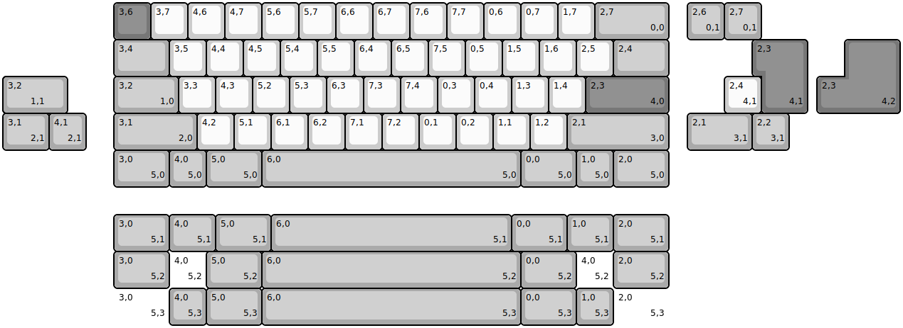{:loading="lazy"}

[Open in keyboard-layout-editor](http://www.keyboard-layout-editor.com/##@@_x:3&c=#777777;&=3,6&_c=#cccccc;&=3,7&=4,6&=4,7&=5,6&=5,7&=6,6&=6,7&=7,6&=7,7&=0,6&=0,7&=1,7&_c=#aaaaaa&w:2;&=2,7%0A%0A%0A0,0;&@_x:3&w:1.5;&=3,4&_c=#cccccc;&=3,5&=4,4&=4,5&=5,4&=5,5&=6,4&=6,5&=7,5&=0,5&=1,5&=1,6&=2,5&_c=#aaaaaa&w:1.5;&=2,4;&@_x:3.0&w:1.75;&=3,2%0A%0A%0A1,0&_c=#cccccc;&=3,3&=4,3&=5,2&=5,3&=6,3&=7,3&=7,4&=0,3&=0,4&=1,3&=1,4&_c=#777777&w:2.25;&=2,3%0A%0A%0A4,0;&@_x:3.0&c=#aaaaaa&w:2.25;&=3,1%0A%0A%0A2,0&_c=#cccccc;&=4,2&=5,1&=6,1&=6,2&=7,1&=7,2&=0,1&=0,2&=1,1&=1,2&_c=#aaaaaa&w:2.75;&=2,1%0A%0A%0A3,0;&@_x:3&w:1.5;&=3,0%0A%0A%0A5,0&=4,0%0A%0A%0A5,0&_w:1.5;&=5,0%0A%0A%0A5,0&_w:7;&=6,0%0A%0A%0A5,0&_w:1.5;&=0,0%0A%0A%0A5,0&=1,0%0A%0A%0A5,0&_w:1.5;&=2,0%0A%0A%0A5,0;&@_x:18.5&y:-5;&=2,6%0A%0A%0A0,1&=2,7%0A%0A%0A0,1;&@_x:20.5&c=#777777&w:1.25&h:2&w2:1.5&h2:1&x2:-0.25;&=2,3%0A%0A%0A4,1&_x:1.0&w:1.5&h:2&w2:2.25&h2:1&x2:-0.75&y2:1;&=2,3%0A%0A%0A4,2;&@_c=#aaaaaa&w:1.25&w2:1.75&l:true;&=3,2%0A%0A%0A1,1&_x:18.25&c=#cccccc;&=2,4%0A%0A%0A4,1;&@_c=#aaaaaa&w:1.25;&=3,1%0A%0A%0A2,1&=4,1%0A%0A%0A2,1&_x:16.25&w:1.75;&=2,1%0A%0A%0A3,1&=2,2%0A%0A%0A3,1;&@_x:3&y:1.75&w:1.5;&=3,0%0A%0A%0A5,1&_w:1.25;&=4,0%0A%0A%0A5,1&_w:1.5;&=5,0%0A%0A%0A5,1&_w:6.5;&=6,0%0A%0A%0A5,1&_w:1.5;&=0,0%0A%0A%0A5,1&_w:1.25;&=1,0%0A%0A%0A5,1&_w:1.5;&=2,0%0A%0A%0A5,1;&@_x:3&w:1.5;&=3,0%0A%0A%0A5,2&_d:true;&=4,0%0A%0A%0A5,2&_w:1.5;&=5,0%0A%0A%0A5,2&_w:7;&=6,0%0A%0A%0A5,2&_w:1.5;&=0,0%0A%0A%0A5,2&_d:true;&=4,0%0A%0A%0A5,2&_w:1.5;&=2,0%0A%0A%0A5,2;&@_x:3&w:1.5&d:true;&=3,0%0A%0A%0A5,3&=4,0%0A%0A%0A5,3&_w:1.5;&=5,0%0A%0A%0A5,3&_w:7;&=6,0%0A%0A%0A5,3&_w:1.5;&=0,0%0A%0A%0A5,3&=1,0%0A%0A%0A5,3&_w:1.5&d:true;&=2,0%0A%0A%0A5,3)

## kapcave/paladin64

[README](output/kapcave/paladin64/README.md) - [layout](output/kapcave/paladin64/paladin64-kle.json) - [PCB](output/kapcave/paladin64/paladin64.kicad_pcb) - [PCB render](output/kapcave/paladin64/paladin64-render.svg)

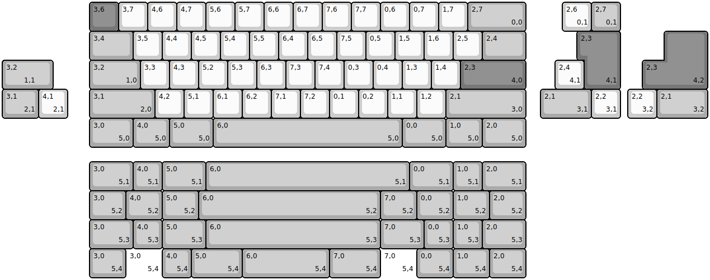{:loading="lazy"}

[Open in keyboard-layout-editor](http://www.keyboard-layout-editor.com/##@@_x:3&c=#777777;&=3,6&_c=#cccccc;&=3,7&=4,6&=4,7&=5,6&=5,7&=6,6&=6,7&=7,6&=7,7&=0,6&=0,7&=1,7&_c=#aaaaaa&w:2;&=2,7%0A%0A%0A0,0;&@_x:3&w:1.5;&=3,4&_c=#cccccc;&=3,5&=4,4&=4,5&=5,4&=5,5&=6,4&=6,5&=7,5&=0,5&=1,5&=1,6&=2,5&_c=#aaaaaa&w:1.5;&=2,4;&@_x:3.0&w:1.75;&=3,2%0A%0A%0A1,0&_c=#cccccc;&=3,3&=4,3&=5,2&=5,3&=6,3&=7,3&=7,4&=0,3&=0,4&=1,3&=1,4&_c=#777777&w:2.25;&=2,3%0A%0A%0A4,0;&@_x:3.0&c=#aaaaaa&w:2.25;&=3,1%0A%0A%0A2,0&_c=#cccccc;&=4,2&=5,1&=6,1&=6,2&=7,1&=7,2&=0,1&=0,2&=1,1&=1,2&_c=#aaaaaa&w:2.75;&=2,1%0A%0A%0A3,0;&@_x:3&w:1.5;&=3,0%0A%0A%0A5,0&_w:1.25;&=4,0%0A%0A%0A5,0&_w:1.5;&=5,0%0A%0A%0A5,0&_w:6.5;&=6,0%0A%0A%0A5,0&_w:1.5;&=0,0%0A%0A%0A5,0&_w:1.25;&=1,0%0A%0A%0A5,0&_w:1.5;&=2,0%0A%0A%0A5,0;&@_x:19.25&y:-5&c=#cccccc;&=2,6%0A%0A%0A0,1&_c=#aaaaaa;&=2,7%0A%0A%0A0,1;&@_x:20.0&c=#777777&w:1.25&h:2&w2:1.5&h2:1&x2:-0.25;&=2,3%0A%0A%0A4,1&_x:1.5&w:1.5&h:2&w2:2.25&h2:1&x2:-0.75&y2:1;&=2,3%0A%0A%0A4,2;&@_c=#aaaaaa&w:1.25&w2:1.75&l:true;&=3,2%0A%0A%0A1,1&_x:17.75&c=#cccccc;&=2,4%0A%0A%0A4,1;&@_c=#aaaaaa&w:1.25;&=3,1%0A%0A%0A2,1&_c=#cccccc;&=4,1%0A%0A%0A2,1&_x:16.25&c=#aaaaaa&w:1.75;&=2,1%0A%0A%0A3,1&_c=#cccccc;&=2,2%0A%0A%0A3,1&_x:0.25;&=2,2%0A%0A%0A3,2&_c=#aaaaaa&w:1.75;&=2,1%0A%0A%0A3,2;&@_x:3&y:1.5&w:1.5;&=3,0%0A%0A%0A5,1&=4,0%0A%0A%0A5,1&_w:1.5;&=5,0%0A%0A%0A5,1&_w:7;&=6,0%0A%0A%0A5,1&_w:1.5;&=0,0%0A%0A%0A5,1&=1,0%0A%0A%0A5,1&_w:1.5;&=2,0%0A%0A%0A5,1;&@_x:3&w:1.25;&=3,0%0A%0A%0A5,2&_w:1.25;&=4,0%0A%0A%0A5,2&_w:1.25;&=5,0%0A%0A%0A5,2&_w:6.25;&=6,0%0A%0A%0A5,2&_w:1.25;&=7,0%0A%0A%0A5,2&_w:1.25;&=0,0%0A%0A%0A5,2&_w:1.25;&=1,0%0A%0A%0A5,2&_w:1.25;&=2,0%0A%0A%0A5,2;&@_x:3&w:1.5;&=3,0%0A%0A%0A5,3&=4,0%0A%0A%0A5,3&_w:1.5;&=5,0%0A%0A%0A5,3&_w:6;&=6,0%0A%0A%0A5,3&_w:1.5;&=7,0%0A%0A%0A5,3&=0,0%0A%0A%0A5,3&=1,0%0A%0A%0A5,3&_w:1.5;&=2,0%0A%0A%0A5,3;&@_x:3&w:1.25;&=3,0%0A%0A%0A5,4&_w:1.25&d:true;&=3,0%0A%0A%0A5,4&=4,0%0A%0A%0A5,4&_w:1.75;&=5,0%0A%0A%0A5,4&_w:3;&=6,0%0A%0A%0A5,4&_w:1.75;&=7,0%0A%0A%0A5,4&_w:1.25&d:true;&=7,0%0A%0A%0A5,4&_w:1.25;&=0,0%0A%0A%0A5,4&_w:1.25;&=1,0%0A%0A%0A5,4&_w:1.25;&=2,0%0A%0A%0A5,4)

## kapcave/paladinpad

[README](output/kapcave/paladinpad/README.md) - [layout](output/kapcave/paladinpad/paladinpad-kle.json) - [PCB](output/kapcave/paladinpad/paladinpad.kicad_pcb) - [PCB render](output/kapcave/paladinpad/paladinpad-render.svg)

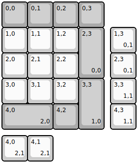{:loading="lazy"}

[Open in keyboard-layout-editor](http://www.keyboard-layout-editor.com/##@@_c=#aaaaaa;&=0,0&=0,1&=0,2&=0,3;&@_c=#cccccc;&=1,0&=1,1&=1,2&_c=#aaaaaa&h:2;&=2,3%0A%0A%0A0,0;&@_c=#cccccc;&=2,0&=2,1&=2,2;&@=3,0&=3,1&=3,2&_c=#aaaaaa&h:2;&=3,3%0A%0A%0A1,0;&@_w:2;&=4,0%0A%0A%0A2,0&=4,2;&@_x:4.25&y:-4&c=#cccccc;&=1,3%0A%0A%0A0,1;&@_x:4.25;&=2,3%0A%0A%0A0,1;&@_x:4.25;&=3,3%0A%0A%0A1,1;&@_x:4.25;&=4,3%0A%0A%0A1,1;&@_y:0.25;&=4,0%0A%0A%0A2,1&=4,1%0A%0A%0A2,1)

## kapl/kapl

[README](output/kapl/README.md) - [layout](output/kapl/kapl-kle.json) - [PCB](output/kapl/kapl.kicad_pcb) - [PCB render](output/kapl/kapl-render.svg)

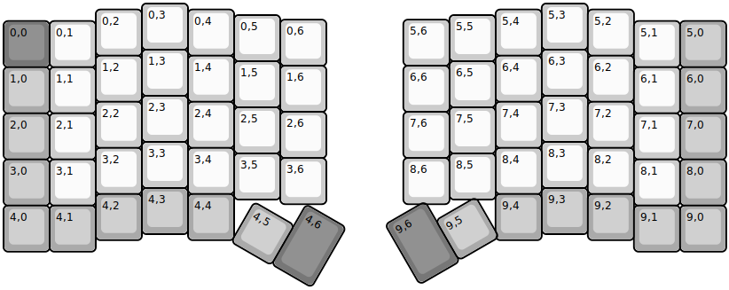{:loading="lazy"}

[Open in keyboard-layout-editor](http://www.keyboard-layout-editor.com/##@@_x:3;&=0,3&_x:7.67;&=5,3;&@_x:2&y:-0.87;&=0,2&_x:1;&=0,4&_x:5.67;&=5,4&_x:1.0;&=5,2;&@_x:5&y:-0.88;&=0,5&_x:3.67;&=5,5;&@_x:6&y:-0.9;&=0,6&_x:1.67;&=5,6;&@_y:-0.97&c=#777777;&=0,0&_c=#cccccc;&=0,1&_x:11.67;&=5,1&_c=#aaaaaa;&=5,0;&@_x:3&y:-0.38&c=#cccccc;&=1,3&_x:7.67;&=6,3;&@_x:2&y:-0.87;&=1,2&_x:1;&=1,4&_x:5.67;&=6,4&_x:1.0;&=6,2;&@_x:5&y:-0.88;&=1,5&_x:3.67;&=6,5;&@_x:6&y:-0.9;&=1,6&_x:1.67;&=6,6;&@_y:-0.97&c=#aaaaaa;&=1,0&_c=#cccccc;&=1,1&_x:11.67;&=6,1&_c=#aaaaaa;&=6,0;&@_x:3&y:-0.38&c=#cccccc;&=2,3&_x:7.67;&=7,3;&@_x:2&y:-0.87;&=2,2&_x:1;&=2,4&_x:5.67;&=7,4&_x:1.0;&=7,2;&@_x:5&y:-0.88;&=2,5&_x:3.67;&=7,5;&@_x:6&y:-0.9;&=2,6&_x:1.67;&=7,6;&@_y:-0.97&c=#aaaaaa;&=2,0&_c=#cccccc;&=2,1&_x:11.67;&=7,1&_c=#aaaaaa;&=7,0;&@_x:3&y:-0.38&c=#cccccc;&=3,3&_x:7.67;&=8,3;&@_x:2&y:-0.87;&=3,2&_x:1;&=3,4&_x:5.67;&=8,4&_x:1.0;&=8,2;&@_x:5&y:-0.88;&=3,5&_x:3.67;&=8,5;&@_x:6&y:-0.9;&=3,6&_x:1.67;&=8,6;&@_y:-0.97&c=#aaaaaa;&=3,0&_c=#cccccc;&=3,1&_x:11.67;&=8,1&_c=#aaaaaa;&=8,0;&@_x:3&y:-0.38;&=4,3&_x:7.67;&=9,3;&@_x:2&y:-0.87;&=4,2&_x:1;&=4,4&_x:5.67;&=9,4&_x:1.0;&=9,2;&@_y:-0.75;&=4,0&=4,1&_x:11.67;&=9,1&=9,0;&@_r:30&rx:6.5&ry:4.92&x:-0.2&y:-0.57&c=#777777&f:8&h:1.5;&=4,6;&@_x:-1.2&y:-0.48&c=#aaaaaa&f:3;&=4,5;&@_r:-30&rx:9.25&x:-0.83&y:-0.57&c=#777777&f:8&h:1.5;&=9,6;&@_x:0.17&y:-0.53&c=#aaaaaa&f:3;&=9,5)

## kb_elmo/67mk_E

[README](output/kb_elmo/67mk_E/README.md) - [layout](output/kb_elmo/67mk_E/67mk_E-kle.json) - [PCB](output/kb_elmo/67mk_E/67mk_E.kicad_pcb) - [PCB render](output/kb_elmo/67mk_E/67mk_E-render.svg)

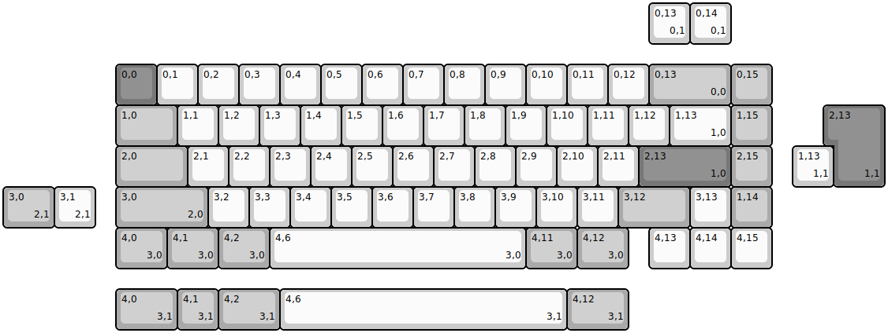{:loading="lazy"}

[Open in keyboard-layout-editor](http://www.keyboard-layout-editor.com/##@@_x:2.75&y:1.5&c=#777777;&=0,0&_c=#cccccc;&=0,1&=0,2&=0,3&=0,4&=0,5&=0,6&=0,7&=0,8&=0,9&=0,10&=0,11&=0,12&_c=#aaaaaa&w:2;&=0,13%0A%0A%0A0,0&=0,15;&@_x:2.75&w:1.5;&=1,0&_c=#cccccc;&=1,1&=1,2&=1,3&=1,4&=1,5&=1,6&=1,7&=1,8&=1,9&=1,10&=1,11&=1,12&_w:1.5;&=1,13%0A%0A%0A1,0&_c=#aaaaaa;&=1,15;&@_x:2.75&w:1.75;&=2,0&_c=#cccccc;&=2,1&=2,2&=2,3&=2,4&=2,5&=2,6&=2,7&=2,8&=2,9&=2,10&=2,11&_c=#777777&w:2.25;&=2,13%0A%0A%0A1,0&_c=#aaaaaa;&=2,15;&@_x:2.75&w:2.25;&=3,0%0A%0A%0A2,0&_c=#cccccc;&=3,2&=3,3&=3,4&=3,5&=3,6&=3,7&=3,8&=3,9&=3,10&=3,11&_c=#aaaaaa&w:1.75;&=3,12&_c=#cccccc;&=3,13&_c=#aaaaaa;&=1,14;&@_x:2.75&w:1.25;&=4,0%0A%0A%0A3,0&_w:1.25;&=4,1%0A%0A%0A3,0&_w:1.25;&=4,2%0A%0A%0A3,0&_c=#cccccc&w:6.25;&=4,6%0A%0A%0A3,0&_c=#aaaaaa&w:1.25;&=4,11%0A%0A%0A3,0&_w:1.25;&=4,12%0A%0A%0A3,0&_x:0.5&c=#cccccc;&=4,13&=4,14&=4,15;&@_x:15.75&y:-6.5;&=0,13%0A%0A%0A0,1&=0,14%0A%0A%0A0,1;&@_x:20.25&y:1.5&c=#777777&w:1.25&h:2&w2:1.5&h2:1&x2:-0.25;&=2,13%0A%0A%0A1,1;&@_x:19.25&c=#cccccc;&=1,13%0A%0A%0A1,1;&@_c=#aaaaaa&w:1.25;&=3,0%0A%0A%0A2,1&_c=#cccccc;&=3,1%0A%0A%0A2,1;&@_x:2.75&y:1.5&c=#aaaaaa&w:1.5;&=4,0%0A%0A%0A3,1&=4,1%0A%0A%0A3,1&_w:1.5;&=4,2%0A%0A%0A3,1&_c=#cccccc&w:7;&=4,6%0A%0A%0A3,1&_c=#aaaaaa&w:1.5;&=4,12%0A%0A%0A3,1)

## kb_elmo/aek2_usb

[README](output/kb_elmo/aek2_usb/README.md) - [layout](output/kb_elmo/aek2_usb/aek2_usb-kle.json) - [PCB](output/kb_elmo/aek2_usb/aek2_usb.kicad_pcb) - [PCB render](output/kb_elmo/aek2_usb/aek2_usb-render.svg)

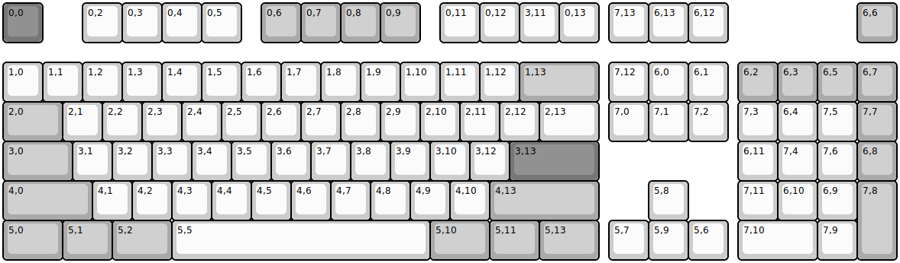{:loading="lazy"}

[Open in keyboard-layout-editor](http://www.keyboard-layout-editor.com/##@@_c=#777777;&=0,0&_x:1&c=#cccccc;&=0,2&=0,3&=0,4&=0,5&_x:0.5&c=#aaaaaa;&=0,6&=0,7&=0,8&=0,9&_x:0.5&c=#cccccc;&=0,11&=0,12&=3,11&=0,13&_x:0.25;&=7,13&=6,13&=6,12&_x:3.25&c=#aaaaaa;&=6,6;&@_y:0.5&c=#cccccc;&=1,0&=1,1&=1,2&=1,3&=1,4&=1,5&=1,6&=1,7&=1,8&=1,9&=1,10&=1,11&=1,12&_c=#aaaaaa&w:2;&=1,13&_x:0.25&c=#cccccc;&=7,12&=6,0&=6,1&_x:0.25&c=#aaaaaa;&=6,2&=6,3&=6,5&=6,7;&@_w:1.5;&=2,0&_c=#cccccc;&=2,1&=2,2&=2,3&=2,4&=2,5&=2,6&=2,7&=2,8&=2,9&=2,10&=2,11&=2,12&_w:1.5;&=2,13&_x:0.25;&=7,0&=7,1&=7,2&_x:0.25;&=7,3&=6,4&=7,5&_c=#aaaaaa;&=7,7;&@_w:1.75;&=3,0&_c=#cccccc;&=3,1&=3,2&=3,3&=3,4&=3,5&=3,6&=3,7&=3,8&=3,9&=3,10&=3,12&_c=#777777&w:2.25;&=3,13&_x:3.5&c=#cccccc;&=6,11&=7,4&=7,6&_c=#aaaaaa;&=6,8;&@_w:2.25;&=4,0&_c=#cccccc;&=4,1&=4,2&=4,3&=4,4&=4,5&=4,6&=4,7&=4,8&=4,9&=4,10&_c=#aaaaaa&w:2.75;&=4,13&_x:1.25&c=#cccccc;&=5,8&_x:1.25;&=7,11&=6,10&=6,9&_c=#aaaaaa&h:2;&=7,8;&@_w:1.5;&=5,0&_w:1.25;&=5,1&_w:1.5;&=5,2&_c=#cccccc&w:6.5;&=5,5&_c=#aaaaaa&w:1.5;&=5,10&_w:1.25;&=5,11&_w:1.5;&=5,13&_x:0.25&c=#cccccc;&=5,7&=5,9&=5,6&_x:0.25&w:2;&=7,10&=7,9)

## kb_elmo/noah_avr

[README](output/kb_elmo/noah_avr/README.md) - [layout](output/kb_elmo/noah_avr/noah_avr-kle.json) - [PCB](output/kb_elmo/noah_avr/noah_avr.kicad_pcb) - [PCB render](output/kb_elmo/noah_avr/noah_avr-render.svg)

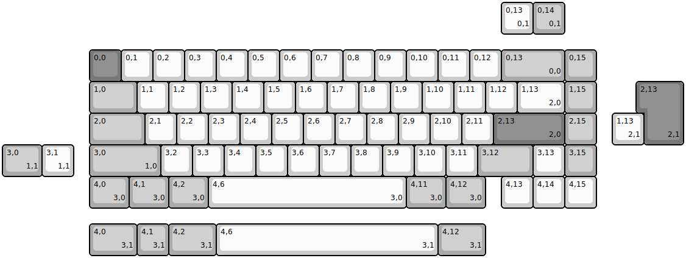{:loading="lazy"}

[Open in keyboard-layout-editor](http://www.keyboard-layout-editor.com/##@@_x:2.75&y:1.5&c=#777777;&=0,0&_c=#cccccc;&=0,1&=0,2&=0,3&=0,4&=0,5&=0,6&=0,7&=0,8&=0,9&=0,10&=0,11&=0,12&_c=#aaaaaa&w:2;&=0,13%0A%0A%0A0,0&=0,15;&@_x:2.75&w:1.5;&=1,0&_c=#cccccc;&=1,1&=1,2&=1,3&=1,4&=1,5&=1,6&=1,7&=1,8&=1,9&=1,10&=1,11&=1,12&_w:1.5;&=1,13%0A%0A%0A2,0&_c=#aaaaaa;&=1,15;&@_x:2.75&w:1.75;&=2,0&_c=#cccccc;&=2,1&=2,2&=2,3&=2,4&=2,5&=2,6&=2,7&=2,8&=2,9&=2,10&=2,11&_c=#777777&w:2.25;&=2,13%0A%0A%0A2,0&_c=#aaaaaa;&=2,15;&@_x:2.75&w:2.25;&=3,0%0A%0A%0A1,0&_c=#cccccc;&=3,2&=3,3&=3,4&=3,5&=3,6&=3,7&=3,8&=3,9&=3,10&=3,11&_c=#aaaaaa&w:1.75;&=3,12&_c=#cccccc;&=3,13&_c=#aaaaaa;&=3,15;&@_x:2.75&w:1.25;&=4,0%0A%0A%0A3,0&_w:1.25;&=4,1%0A%0A%0A3,0&_w:1.25;&=4,2%0A%0A%0A3,0&_c=#cccccc&w:6.25;&=4,6%0A%0A%0A3,0&_c=#aaaaaa&w:1.25;&=4,11%0A%0A%0A3,0&_w:1.25;&=4,12%0A%0A%0A3,0&_x:0.5&c=#cccccc;&=4,13&=4,14&=4,15;&@_x:15.75&y:-6.5;&=0,13%0A%0A%0A0,1&_c=#aaaaaa;&=0,14%0A%0A%0A0,1;&@_x:20.25&y:1.5&c=#777777&w:1.25&h:2&h2:1&x2:-0.25;&=2,13%0A%0A%0A2,1;&@_x:19.25&c=#cccccc;&=1,13%0A%0A%0A2,1;&@_c=#aaaaaa&w:1.25;&=3,0%0A%0A%0A1,1&_c=#cccccc;&=3,1%0A%0A%0A1,1;&@_x:2.75&y:1.5&c=#aaaaaa&w:1.5;&=4,0%0A%0A%0A3,1&=4,1%0A%0A%0A3,1&_w:1.5;&=4,2%0A%0A%0A3,1&_c=#cccccc&w:7;&=4,6%0A%0A%0A3,1&_c=#aaaaaa&w:1.5;&=4,12%0A%0A%0A3,1)

## kb_elmo/twelvekey

[README](output/kb_elmo/twelvekey/README.md) - [layout](output/kb_elmo/twelvekey/twelvekey-kle.json) - [PCB](output/kb_elmo/twelvekey/twelvekey.kicad_pcb) - [PCB render](output/kb_elmo/twelvekey/twelvekey-render.svg)

{:loading="lazy"}

[Open in keyboard-layout-editor](http://www.keyboard-layout-editor.com/##@@=0,0&=0,1&=0,2&=0,3;&@=1,0&=1,1&=1,2&=1,3;&@=2,0&=2,1&=2,2&=2,3)

## kb_elmo/vertex

[README](output/kb_elmo/vertex/README.md) - [layout](output/kb_elmo/vertex/vertex-kle.json) - [PCB](output/kb_elmo/vertex/vertex.kicad_pcb) - [PCB render](output/kb_elmo/vertex/vertex-render.svg)

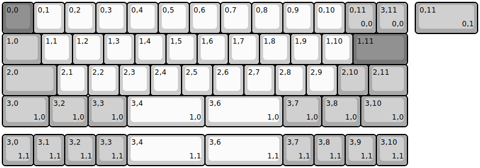{:loading="lazy"}

[Open in keyboard-layout-editor](http://www.keyboard-layout-editor.com/##@@_c=#777777;&=0,0&_c=#cccccc;&=0,1&=0,2&=0,3&=0,4&=0,5&=0,6&=0,7&=0,8&=0,9&=0,10&_c=#aaaaaa;&=0,11%0A%0A%0A0,0&=3,11%0A%0A%0A0,0;&@_w:1.25;&=1,0&_c=#cccccc;&=1,1&=1,2&=1,3&=1,4&=1,5&=1,6&=1,7&=1,8&=1,9&=1,10&_c=#777777&w:1.75;&=1,11;&@_c=#aaaaaa&w:1.75;&=2,0&_c=#cccccc;&=2,1&=2,2&=2,3&=2,4&=2,5&=2,6&=2,7&=2,8&=2,9&_c=#aaaaaa;&=2,10&_w:1.25;&=2,11;&@_w:1.5;&=3,0%0A%0A%0A1,0&_w:1.25;&=3,2%0A%0A%0A1,0&_w:1.25;&=3,3%0A%0A%0A1,0&_c=#cccccc&w:2.5;&=3,4%0A%0A%0A1,0&_w:2.5;&=3,6%0A%0A%0A1,0&_c=#aaaaaa&w:1.25;&=3,7%0A%0A%0A1,0&_w:1.25;&=3,8%0A%0A%0A1,0&_w:1.5;&=3,10%0A%0A%0A1,0;&@_x:13.25&y:-4&w:2;&=0,11%0A%0A%0A0,1;&@_y:3.25;&=3,0%0A%0A%0A1,1&=3,1%0A%0A%0A1,1&=3,2%0A%0A%0A1,1&=3,3%0A%0A%0A1,1&_c=#cccccc&w:2.5;&=3,4%0A%0A%0A1,1&_w:2.5;&=3,6%0A%0A%0A1,1&_c=#aaaaaa;&=3,7%0A%0A%0A1,1&=3,8%0A%0A%0A1,1&=3,9%0A%0A%0A1,1&=3,10%0A%0A%0A1,1)

## kbdfans/baguette66/baguette66rgb

[README](output/kbdfans/baguette66/README.md) - [layout](output/kbdfans/baguette66/baguette66rgb-kle.json) - [PCB](output/kbdfans/baguette66/baguette66rgb.kicad_pcb) - [PCB render](output/kbdfans/baguette66/baguette66rgb-render.svg)

{:loading="lazy"}

[Open in keyboard-layout-editor](http://www.keyboard-layout-editor.com/##@@_c=#777777;&=0,0&_c=#cccccc;&=0,1&=0,2&=0,3&=0,4&=0,5&=0,6&=0,7&=0,8&=0,9&=0,10&=0,11&=0,12&=0,13&=2,14&_x:0.5;&=0,14;&@_c=#aaaaaa&w:1.5;&=1,0&_c=#cccccc;&=1,1&=1,2&=1,3&=1,4&=1,5&=1,6&=1,7&=1,8&=1,9&=1,10&=1,11&=1,12&_w:1.5;&=1,13&_x:0.5;&=1,14;&@_c=#aaaaaa&w:1.75;&=2,0&_c=#cccccc;&=2,1&=2,2&=2,3&=2,4&=2,5&=2,6&=2,7&=2,8&=2,9&=2,10&=2,11&_c=#777777&w:2.25;&=2,12;&@_c=#aaaaaa&w:2.25;&=3,0&_c=#cccccc;&=3,1&=3,2&=3,3&=3,4&=3,5&=3,6&=3,7&=3,8&=3,9&=3,10&_c=#aaaaaa&w:1.25;&=3,11&=3,12&_c=#cccccc;&=3,13;&@_x:1.25;&=4,1&_w:1.25;&=4,2&_w:6.25;&=4,5&_c=#aaaaaa&w:1.25;&=4,8&=4,10&_x:1.5;&=4,12&=4,13&=4,14)

## kbdfans/baguette66/baguette66soldered

[README](output/kbdfans/baguette66/README.md) - [layout](output/kbdfans/baguette66/baguette66soldered-kle.json) - [PCB](output/kbdfans/baguette66/baguette66soldered.kicad_pcb) - [PCB render](output/kbdfans/baguette66/baguette66soldered-render.svg)

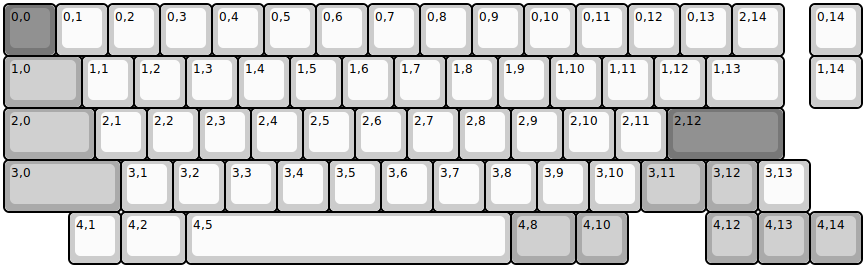{:loading="lazy"}

[Open in keyboard-layout-editor](http://www.keyboard-layout-editor.com/##@@_c=#777777;&=0,0&_c=#cccccc;&=0,1&=0,2&=0,3&=0,4&=0,5&=0,6&=0,7&=0,8&=0,9&=0,10&=0,11&=0,12&=0,13&=2,14&_x:0.5;&=0,14;&@_c=#aaaaaa&w:1.5;&=1,0&_c=#cccccc;&=1,1&=1,2&=1,3&=1,4&=1,5&=1,6&=1,7&=1,8&=1,9&=1,10&=1,11&=1,12&_w:1.5;&=1,13&_x:0.5;&=1,14;&@_c=#aaaaaa&w:1.75;&=2,0&_c=#cccccc;&=2,1&=2,2&=2,3&=2,4&=2,5&=2,6&=2,7&=2,8&=2,9&=2,10&=2,11&_c=#777777&w:2.25;&=2,12;&@_c=#aaaaaa&w:2.25;&=3,0&_c=#cccccc;&=3,1&=3,2&=3,3&=3,4&=3,5&=3,6&=3,7&=3,8&=3,9&=3,10&_c=#aaaaaa&w:1.25;&=3,11&=3,12&_c=#cccccc;&=3,13;&@_x:1.25;&=4,1&_w:1.25;&=4,2&_w:6.25;&=4,5&_c=#aaaaaa&w:1.25;&=4,8&=4,10&_x:1.5;&=4,12&=4,13&=4,14)

## kbdfans/bella/bella_rgb

[README](output/kbdfans/bella/README.md) - [layout](output/kbdfans/bella/bella_rgb-kle.json) - [PCB](output/kbdfans/bella/bella_rgb.kicad_pcb) - [PCB render](output/kbdfans/bella/bella_rgb-render.svg)

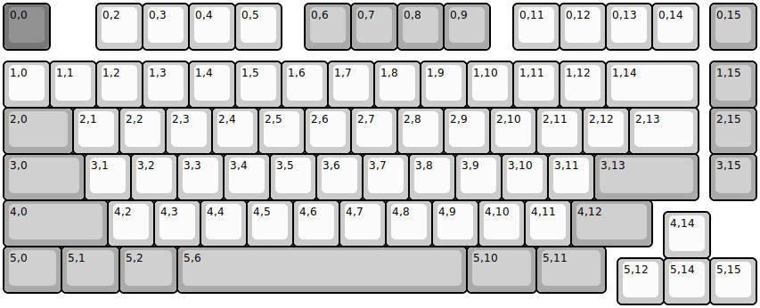{:loading="lazy"}

[Open in keyboard-layout-editor](http://www.keyboard-layout-editor.com/##@@_c=#777777;&=0,0&_x:1&c=#cccccc;&=0,2&=0,3&=0,4&=0,5&_x:0.5&c=#aaaaaa;&=0,6&=0,7&=0,8&=0,9&_x:0.5&c=#cccccc;&=0,11&=0,12&=0,13&=0,14&_x:0.25&c=#aaaaaa;&=0,15;&@_y:0.25&c=#cccccc;&=1,0&=1,1&=1,2&=1,3&=1,4&=1,5&=1,6&=1,7&=1,8&=1,9&=1,10&=1,11&=1,12&_w:2;&=1,14&_x:0.25&c=#aaaaaa;&=1,15;&@_w:1.5;&=2,0&_c=#cccccc;&=2,1&=2,2&=2,3&=2,4&=2,5&=2,6&=2,7&=2,8&=2,9&=2,10&=2,11&=2,12&_w:1.5;&=2,13&_x:0.25&c=#aaaaaa;&=2,15;&@_w:1.75;&=3,0&_c=#cccccc;&=3,1&=3,2&=3,3&=3,4&=3,5&=3,6&=3,7&=3,8&=3,9&=3,10&=3,11&_c=#aaaaaa&w:2.25;&=3,13&_x:0.25;&=3,15;&@_w:2.25;&=4,0&_c=#cccccc;&=4,2&=4,3&=4,4&=4,5&=4,6&=4,7&=4,8&=4,9&=4,10&=4,11&_c=#aaaaaa&w:1.75;&=4,12;&@_x:14.25&y:-0.75&c=#cccccc;&=4,14;&@_y:-0.25&c=#aaaaaa&w:1.25;&=5,0&_w:1.25;&=5,1&_w:1.25;&=5,2&_w:6.25;&=5,6&_w:1.5;&=5,10&_w:1.5;&=5,11;&@_x:13.25&y:-0.75&c=#cccccc;&=5,12&=5,14&=5,15)

## kbdfans/bella/bella_rgb_iso

[README](output/kbdfans/bella/README.md) - [layout](output/kbdfans/bella/bella_rgb_iso-kle.json) - [PCB](output/kbdfans/bella/bella_rgb_iso.kicad_pcb) - [PCB render](output/kbdfans/bella/bella_rgb_iso-render.svg)

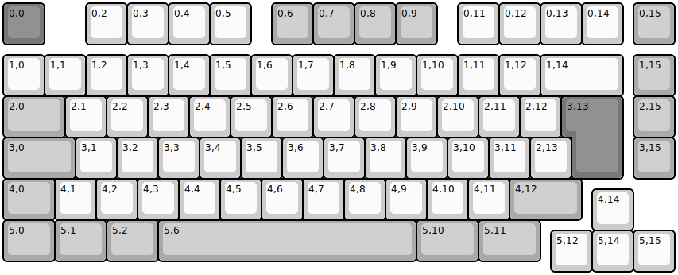{:loading="lazy"}

[Open in keyboard-layout-editor](http://www.keyboard-layout-editor.com/##@@_c=#777777;&=0,0&_x:1&c=#cccccc;&=0,2&=0,3&=0,4&=0,5&_x:0.5&c=#aaaaaa;&=0,6&=0,7&=0,8&=0,9&_x:0.5&c=#cccccc;&=0,11&=0,12&=0,13&=0,14&_x:0.25&c=#aaaaaa;&=0,15;&@_y:0.25&c=#cccccc;&=1,0&=1,1&=1,2&=1,3&=1,4&=1,5&=1,6&=1,7&=1,8&=1,9&=1,10&=1,11&=1,12&_w:2;&=1,14&_x:0.25&c=#aaaaaa;&=1,15;&@_w:1.5;&=2,0&_c=#cccccc;&=2,1&=2,2&=2,3&=2,4&=2,5&=2,6&=2,7&=2,8&=2,9&=2,10&=2,11&=2,12&_x:0.25&c=#777777&w:1.25&h:2&w2:1.5&h2:1&x2:-0.25;&=3,13&_x:0.25&c=#aaaaaa;&=2,15;&@_w:1.75;&=3,0&_c=#cccccc;&=3,1&=3,2&=3,3&=3,4&=3,5&=3,6&=3,7&=3,8&=3,9&=3,10&=3,11&=2,13&_x:1.5&c=#aaaaaa;&=3,15;&@_w:1.25;&=4,0&_c=#cccccc;&=4,1&=4,2&=4,3&=4,4&=4,5&=4,6&=4,7&=4,8&=4,9&=4,10&=4,11&_c=#aaaaaa&w:1.75;&=4,12;&@_x:14.25&y:-0.75&c=#cccccc;&=4,14;&@_y:-0.25&c=#aaaaaa&w:1.25;&=5,0&_w:1.25;&=5,1&_w:1.25;&=5,2&_w:6.25;&=5,6&_w:1.5;&=5,10&_w:1.5;&=5,11;&@_x:13.25&y:-0.75&c=#cccccc;&=5,12&=5,14&=5,15)

## kbdfans/bella_soldered

[README](output/kbdfans/bella_soldered/README.md) - [layout](output/kbdfans/bella_soldered/bella_soldered-kle.json) - [PCB](output/kbdfans/bella_soldered/bella_soldered.kicad_pcb) - [PCB render](output/kbdfans/bella_soldered/bella_soldered-render.svg)

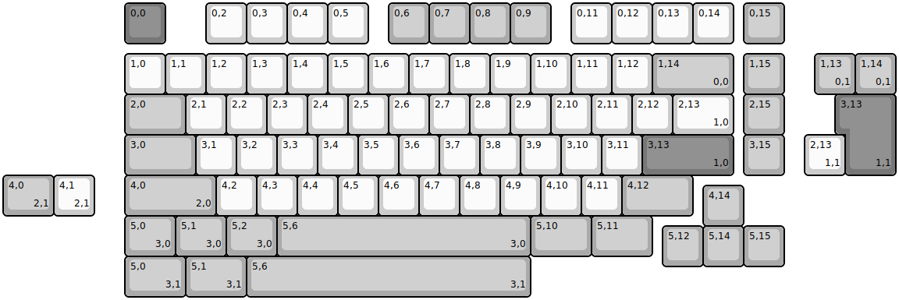{:loading="lazy"}

[Open in keyboard-layout-editor](http://www.keyboard-layout-editor.com/##@@_x:3&c=#777777;&=0,0&_x:1&c=#cccccc;&=0,2&=0,3&=0,4&=0,5&_x:0.5&c=#aaaaaa;&=0,6&=0,7&=0,8&=0,9&_x:0.5&c=#cccccc;&=0,11&=0,12&=0,13&=0,14&_x:0.25&c=#aaaaaa;&=0,15;&@_x:3&y:0.25&c=#cccccc;&=1,0&=1,1&=1,2&=1,3&=1,4&=1,5&=1,6&=1,7&=1,8&=1,9&=1,10&=1,11&=1,12&_c=#aaaaaa&w:2;&=1,14%0A%0A%0A0,0&_x:0.25;&=1,15;&@_x:3&w:1.5;&=2,0&_c=#cccccc;&=2,1&=2,2&=2,3&=2,4&=2,5&=2,6&=2,7&=2,8&=2,9&=2,10&=2,11&=2,12&_w:1.5;&=2,13%0A%0A%0A1,0&_x:0.25&c=#aaaaaa;&=2,15;&@_x:3&w:1.75;&=3,0&_c=#cccccc;&=3,1&=3,2&=3,3&=3,4&=3,5&=3,6&=3,7&=3,8&=3,9&=3,10&=3,11&_c=#777777&w:2.25;&=3,13%0A%0A%0A1,0&_x:0.25&c=#aaaaaa;&=3,15;&@_x:3.0&w:2.25;&=4,0%0A%0A%0A2,0&_c=#cccccc;&=4,2&=4,3&=4,4&=4,5&=4,6&=4,7&=4,8&=4,9&=4,10&=4,11&_c=#aaaaaa&w:1.75;&=4,12;&@_x:17.25&y:-0.75;&=4,14;&@_x:3&y:-0.25&w:1.25;&=5,0%0A%0A%0A3,0&_w:1.25;&=5,1%0A%0A%0A3,0&_w:1.25;&=5,2%0A%0A%0A3,0&_w:6.25;&=5,6%0A%0A%0A3,0&_w:1.5;&=5,10&_w:1.5;&=5,11;&@_x:16.25&y:-0.75;&=5,12&=5,14&=5,15;&@_x:20.0&y:-5.25;&=1,13%0A%0A%0A0,1&=1,14%0A%0A%0A0,1;&@_x:20.75&c=#777777&w:1.25&h:2&w2:1.5&h2:1&x2:-0.25;&=3,13%0A%0A%0A1,1;&@_x:19.75&c=#cccccc;&=2,13%0A%0A%0A1,1;&@_c=#aaaaaa&w:1.25;&=4,0%0A%0A%0A2,1&_c=#cccccc;&=4,1%0A%0A%0A2,1;&@_x:3&y:1.0&c=#aaaaaa&w:1.5;&=5,0%0A%0A%0A3,1&_w:1.5;&=5,1%0A%0A%0A3,1&_w:7;&=5,6%0A%0A%0A3,1)

## kbdfans/bounce/bonce75_hotswap

[README](output/kbdfans/bounce/README.md) - [layout](output/kbdfans/bounce/bonce75_hotswap-kle.json) - [PCB](output/kbdfans/bounce/bonce75_hotswap.kicad_pcb) - [PCB render](output/kbdfans/bounce/bonce75_hotswap-render.svg)

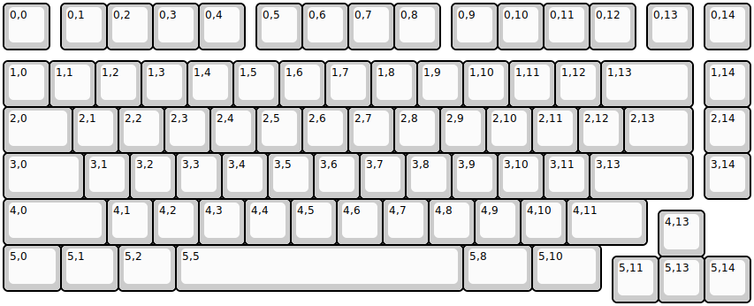{:loading="lazy"}

[Open in keyboard-layout-editor](http://www.keyboard-layout-editor.com/##@@=0,0&_x:0.25;&=0,1&=0,2&=0,3&=0,4&_x:0.25;&=0,5&=0,6&=0,7&=0,8&_x:0.25;&=0,9&=0,10&=0,11&=0,12&_x:0.25;&=0,13&_x:0.25;&=0,14;&@_y:0.25;&=1,0&=1,1&=1,2&=1,3&=1,4&=1,5&=1,6&=1,7&=1,8&=1,9&=1,10&=1,11&=1,12&_w:2;&=1,13&_x:0.25;&=1,14;&@_w:1.5;&=2,0&=2,1&=2,2&=2,3&=2,4&=2,5&=2,6&=2,7&=2,8&=2,9&=2,10&=2,11&=2,12&_w:1.5;&=2,13&_x:0.25;&=2,14;&@_w:1.75;&=3,0&=3,1&=3,2&=3,3&=3,4&=3,5&=3,6&=3,7&=3,8&=3,9&=3,10&=3,11&_w:2.25;&=3,13&_x:0.25;&=3,14;&@_w:2.25;&=4,0&=4,1&=4,2&=4,3&=4,4&=4,5&=4,6&=4,7&=4,8&=4,9&=4,10&_w:1.75;&=4,11;&@_x:14.25&y:-0.75;&=4,13;&@_y:-0.25&w:1.25;&=5,0&_w:1.25;&=5,1&_w:1.25;&=5,2&_w:6.25;&=5,5&_w:1.5;&=5,8&_w:1.5;&=5,10;&@_x:13.25&y:-0.75;&=5,11&=5,13&=5,14)

## kbdfans/bounce/bonce75_soldered

[README](output/kbdfans/bounce/README.md) - [layout](output/kbdfans/bounce/bonce75_soldered-kle.json) - [PCB](output/kbdfans/bounce/bonce75_soldered.kicad_pcb) - [PCB render](output/kbdfans/bounce/bonce75_soldered-render.svg)

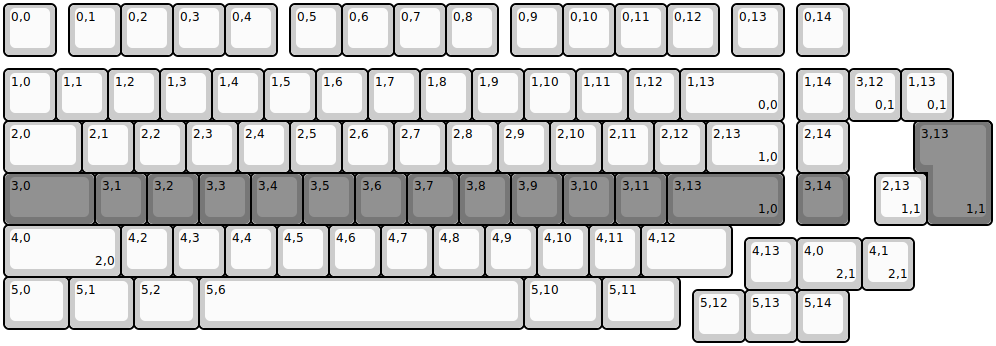{:loading="lazy"}

[Open in keyboard-layout-editor](http://www.keyboard-layout-editor.com/##@@=0,0&_x:0.25;&=0,1&=0,2&=0,3&=0,4&_x:0.25;&=0,5&=0,6&=0,7&=0,8&_x:0.25;&=0,9&=0,10&=0,11&=0,12&_x:0.25;&=0,13&_x:0.25;&=0,14;&@_y:0.25;&=1,0&=1,1&=1,2&=1,3&=1,4&=1,5&=1,6&=1,7&=1,8&=1,9&=1,10&=1,11&=1,12&_w:2;&=1,13%0A%0A%0A0,0&_x:0.25;&=1,14;&@_w:1.5;&=2,0&=2,1&=2,2&=2,3&=2,4&=2,5&=2,6&=2,7&=2,8&=2,9&=2,10&=2,11&=2,12&_w:1.5;&=2,13%0A%0A%0A1,0&_x:0.25;&=2,14;&@_c=#777777&w:1.75;&=3,0&=3,1&=3,2&=3,3&=3,4&=3,5&=3,6&=3,7&=3,8&=3,9&=3,10&=3,11&_w:2.25;&=3,13%0A%0A%0A1,0&_x:0.25;&=3,14;&@_c=#cccccc&w:2.25;&=4,0%0A%0A%0A2,0&=4,2&=4,3&=4,4&=4,5&=4,6&=4,7&=4,8&=4,9&=4,10&=4,11&_w:1.75;&=4,12;&@_x:14.25&y:-0.75;&=4,13;&@_y:-0.25&w:1.25;&=5,0&_w:1.25;&=5,1&_w:1.25;&=5,2&_w:6.25;&=5,6&_w:1.5;&=5,10&_w:1.5;&=5,11;&@_x:13.25&y:-0.75;&=5,12&=5,13&=5,14;&@_x:16.25&y:-5.25;&=3,12%0A%0A%0A0,1&=1,13%0A%0A%0A0,1;&@_x:17.75&c=#777777&w:1.25&h:2&w2:1.5&h2:1&x2:-0.25;&=3,13%0A%0A%0A1,1;&@_x:16.75&c=#cccccc;&=2,13%0A%0A%0A1,1;&@_x:15.25&y:0.25&w:1.25;&=4,0%0A%0A%0A2,1&=4,1%0A%0A%0A2,1)

## kbdfans/bounce/bounce_pad

[README](output/kbdfans/bounce/README.md) - [layout](output/kbdfans/bounce/bounce_pad-kle.json) - [PCB](output/kbdfans/bounce/bounce_pad.kicad_pcb) - [PCB render](output/kbdfans/bounce/bounce_pad-render.svg)

{:loading="lazy"}

[Open in keyboard-layout-editor](http://www.keyboard-layout-editor.com/##@@_c=#aaaaaa;&=0,0&=0,1&=0,2&=0,3;&@_y:0.25;&=1,0&=1,1&=1,2&=1,3;&@_c=#cccccc;&=2,0&=2,1&=2,2&_c=#aaaaaa&h:2;&=3,3;&@_c=#cccccc;&=3,0&=3,1&=3,2;&@=4,0&=4,1&=4,2&_c=#aaaaaa&h:2;&=5,3;&@_c=#cccccc&w:2;&=5,1&=5,2)

## kbdfans/kbd19x

[README](output/kbdfans/kbd19x/README.md) - [layout](output/kbdfans/kbd19x/kbd19x-kle.json) - [PCB](output/kbdfans/kbd19x/kbd19x.kicad_pcb) - [PCB render](output/kbdfans/kbd19x/kbd19x-render.svg)

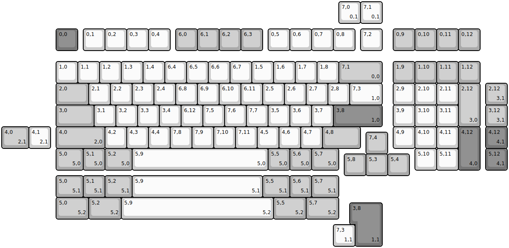{:loading="lazy"}

[Open in keyboard-layout-editor](http://www.keyboard-layout-editor.com/##@@_x:2.5&y:1.25&c=#777777;&=0,0&_x:0.25&c=#cccccc;&=0,1&=0,2&=0,3&=0,4&_x:0.25&c=#aaaaaa;&=6,0&=6,1&=6,2&=6,3&_x:0.25&c=#cccccc;&=0,5&=0,6&=0,7&=0,8&_x:0.25;&=7,2&_x:0.5&c=#aaaaaa;&=0,9&=0,10&=0,11&=0,12;&@_x:2.5&y:0.5&c=#cccccc;&=1,0&=1,1&=1,2&=1,3&=1,4&=6,4&=6,5&=6,6&=6,7&=1,5&=1,6&=1,7&=1,8&_c=#aaaaaa&w:2;&=7,1%0A%0A%0A0,0&_x:0.5;&=1,9&=1,10&=1,11&=1,12;&@_x:2.5&w:1.5;&=2,0&_c=#cccccc;&=2,1&=2,2&=2,3&=2,4&=6,8&=6,9&=6,10&=6,11&=2,5&=2,6&=2,7&=2,8&_w:1.5;&=7,3%0A%0A%0A1,0&_x:0.5;&=2,9&=2,10&=2,11&_c=#aaaaaa&h:2;&=2,12%0A%0A%0A3,0;&@_x:2.5&w:1.75;&=3,0&_c=#cccccc;&=3,1&=3,2&=3,3&=3,4&=6,12&=7,5&=7,6&=7,7&=3,5&=3,6&=3,7&_c=#777777&w:2.25;&=3,8%0A%0A%0A1,0&_x:0.5&c=#cccccc;&=3,9&=3,10&=3,11;&@_x:2.5&c=#aaaaaa&w:2.25;&=4,0%0A%0A%0A2,0&_c=#cccccc;&=4,2&=4,3&=4,4&=7,8&=7,9&=7,10&=7,11&=4,5&=4,6&=4,7&_c=#aaaaaa&w:1.75;&=4,8&_x:1.5&c=#cccccc;&=4,9&=4,10&=4,11&_c=#777777&h:2;&=4,12%0A%0A%0A4,0;&@_x:16.75&y:-0.75&c=#aaaaaa;&=7,4;&@_x:2.5&y:-0.25&w:1.25;&=5,0%0A%0A%0A5,0&=5,1%0A%0A%0A5,0&_w:1.25;&=5,2%0A%0A%0A5,0&_c=#cccccc&w:6.25;&=5,9%0A%0A%0A5,0&_c=#aaaaaa;&=5,5%0A%0A%0A5,0&=5,6%0A%0A%0A5,0&_w:1.25;&=5,7%0A%0A%0A5,0&_x:3.5&c=#cccccc;&=5,10&=5,11;&@_x:15.75&y:-0.75&c=#aaaaaa;&=5,8&=5,3&=5,4;&@_x:15.5&y:-8.0&c=#cccccc;&=7,0%0A%0A%0A0,1&=7,1%0A%0A%0A0,1;&@_x:22.25&y:2.75&c=#aaaaaa;&=2,12%0A%0A%0A3,1;&@_x:22.25;&=3,12%0A%0A%0A3,1;&@_w:1.25;&=4,0%0A%0A%0A2,1&_c=#cccccc;&=4,1%0A%0A%0A2,1&_x:20.0&c=#777777;&=4,12%0A%0A%0A4,1;&@_x:22.25;&=5,12%0A%0A%0A4,1;&@_x:2.5&y:0.25&c=#aaaaaa&w:1.25;&=5,0%0A%0A%0A5,1&=5,1%0A%0A%0A5,1&_w:1.25;&=5,2%0A%0A%0A5,1&_c=#cccccc&w:6;&=5,9%0A%0A%0A5,1&_c=#aaaaaa&w:1.25;&=5,5%0A%0A%0A5,1&=5,6%0A%0A%0A5,1&_w:1.25;&=5,7%0A%0A%0A5,1;&@_x:2.5&w:1.5;&=5,0%0A%0A%0A5,2&_w:1.5;&=5,2%0A%0A%0A5,2&_c=#cccccc&w:7;&=5,9%0A%0A%0A5,2&_c=#aaaaaa&w:1.5;&=5,5%0A%0A%0A5,2&_w:1.5;&=5,7%0A%0A%0A5,2;&@_x:16.25&y:-0.75&c=#777777&w:1.25&h:2&w2:1.5&h2:1&x2:-0.25;&=3,8%0A%0A%0A1,1;&@_x:15.25&c=#cccccc;&=7,3%0A%0A%0A1,1)

## kbdfans/kbd67hotswap

[README](output/kbdfans/kbd67hotswap/README.md) - [layout](output/kbdfans/kbd67hotswap/kbd67hotswap-kle.json) - [PCB](output/kbdfans/kbd67hotswap/kbd67hotswap.kicad_pcb) - [PCB render](output/kbdfans/kbd67hotswap/kbd67hotswap-render.svg)

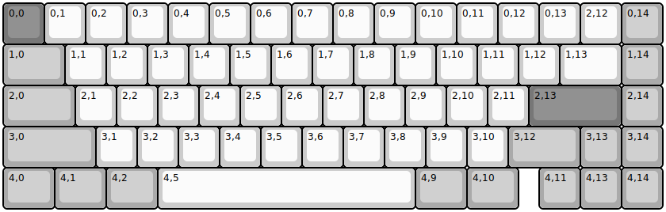{:loading="lazy"}

[Open in keyboard-layout-editor](http://www.keyboard-layout-editor.com/##@@_c=#777777;&=0,0&_c=#cccccc;&=0,1&=0,2&=0,3&=0,4&=0,5&=0,6&=0,7&=0,8&=0,9&=0,10&=0,11&=0,12&=0,13&=2,12&_c=#aaaaaa;&=0,14;&@_w:1.5;&=1,0&_c=#cccccc;&=1,1&=1,2&=1,3&=1,4&=1,5&=1,6&=1,7&=1,8&=1,9&=1,10&=1,11&=1,12&_w:1.5;&=1,13&_c=#aaaaaa;&=1,14;&@_w:1.75;&=2,0&_c=#cccccc;&=2,1&=2,2&=2,3&=2,4&=2,5&=2,6&=2,7&=2,8&=2,9&=2,10&=2,11&_c=#777777&w:2.25;&=2,13&_c=#aaaaaa;&=2,14;&@_w:2.25;&=3,0&_c=#cccccc;&=3,1&=3,2&=3,3&=3,4&=3,5&=3,6&=3,7&=3,8&=3,9&=3,10&_c=#aaaaaa&w:1.75;&=3,12&=3,13&=3,14;&@_w:1.25;&=4,0&_w:1.25;&=4,1&_w:1.25;&=4,2&_c=#cccccc&w:6.25;&=4,5&_c=#aaaaaa&w:1.25;&=4,9&_w:1.25;&=4,10&_x:0.5;&=4,11&=4,13&=4,14)

## kbdfans/kbd67mkii/kbd67mkiirgb_iso

[README](output/kbdfans/kbd67mkii/README.md) - [layout](output/kbdfans/kbd67mkii/kbd67mkiirgb_iso-kle.json) - [PCB](output/kbdfans/kbd67mkii/kbd67mkiirgb_iso.kicad_pcb) - [PCB render](output/kbdfans/kbd67mkii/kbd67mkiirgb_iso-render.svg)

{:loading="lazy"}

[Open in keyboard-layout-editor](http://www.keyboard-layout-editor.com/##@@_c=#777777;&=0,0&_c=#cccccc;&=0,1&=0,2&=0,3&=0,4&=0,5&=0,6&=0,7&=0,8&=0,9&=0,10&=0,11&=0,12&_c=#aaaaaa&w:2;&=0,13&_c=#cccccc;&=0,14;&@_c=#aaaaaa&w:1.5;&=1,0&_c=#cccccc;&=1,1&=1,2&=1,3&=1,4&=1,5&=1,6&=1,7&=1,8&=1,9&=1,10&=1,11&=1,12&_x:0.25&w:1.25&h:2&w2:1.5&h2:1&x2:-0.25;&=1,13&=1,14;&@_c=#aaaaaa&w:1.75;&=2,0&_c=#cccccc;&=2,1&=2,2&=2,3&=2,4&=2,5&=2,6&=2,7&=2,8&=2,9&=2,10&=2,11&=2,12&_x:1.25;&=2,14;&@_c=#aaaaaa&w:1.25;&=3,0&_c=#cccccc;&=4,3&=3,1&=3,2&=3,3&=3,4&=3,5&=3,6&=3,7&=3,8&=3,9&=3,10&_c=#aaaaaa&w:1.75;&=3,11&=3,13&_c=#cccccc;&=3,14;&@_c=#aaaaaa&w:1.25;&=4,0&_w:1.25;&=4,1&_w:1.25;&=4,2&_c=#cccccc&w:6.25;&=4,5&_c=#aaaaaa&w:1.25;&=4,9&_w:1.25;&=4,10&_x:0.5;&=4,11&=4,13&=4,14)

## kbdfans/kbd67mkii/kbd67mkiirgbv1

[README](output/kbdfans/kbd67mkii/README.md) - [layout](output/kbdfans/kbd67mkii/kbd67mkiirgbv1-kle.json) - [PCB](output/kbdfans/kbd67mkii/kbd67mkiirgbv1.kicad_pcb) - [PCB render](output/kbdfans/kbd67mkii/kbd67mkiirgbv1-render.svg)

{:loading="lazy"}

[Open in keyboard-layout-editor](http://www.keyboard-layout-editor.com/##@@_c=#777777;&=0,0&_c=#cccccc;&=0,1&=0,2&=0,3&=0,4&=0,5&=0,6&=0,7&=0,8&=0,9&=0,10&=0,11&=0,12&_c=#aaaaaa&w:2;&=0,13&_c=#cccccc;&=0,14;&@_c=#aaaaaa&w:1.5;&=1,0&_c=#cccccc;&=1,1&=1,2&=1,3&=1,4&=1,5&=1,6&=1,7&=1,8&=1,9&=1,10&=1,11&=1,12&_w:1.5;&=1,13&=1,14;&@_c=#aaaaaa&w:1.75;&=2,0&_c=#cccccc;&=2,1&=2,2&=2,3&=2,4&=2,5&=2,6&=2,7&=2,8&=2,9&=2,10&=2,11&_c=#777777&w:2.25;&=2,13&_c=#cccccc;&=2,14;&@_c=#aaaaaa&w:2.25;&=3,0&_c=#cccccc;&=3,1&=3,2&=3,3&=3,4&=3,5&=3,6&=3,7&=3,8&=3,9&=3,10&_c=#aaaaaa&w:1.75;&=3,11&=3,13&_c=#cccccc;&=3,14;&@_c=#aaaaaa&w:1.25;&=4,0&_w:1.25;&=4,1&_w:1.25;&=4,2&_c=#cccccc&w:6.25;&=4,5&_c=#aaaaaa&w:1.25;&=4,8&_w:1.25;&=4,10&_x:0.5;&=4,11&=4,13&=4,14)

## kbdfans/kbd67mkii/kbd67mkiirgbv2

[README](output/kbdfans/kbd67mkii/README.md) - [layout](output/kbdfans/kbd67mkii/kbd67mkiirgbv2-kle.json) - [PCB](output/kbdfans/kbd67mkii/kbd67mkiirgbv2.kicad_pcb) - [PCB render](output/kbdfans/kbd67mkii/kbd67mkiirgbv2-render.svg)

{:loading="lazy"}

[Open in keyboard-layout-editor](http://www.keyboard-layout-editor.com/##@@_c=#777777;&=0,0&_c=#cccccc;&=0,1&=0,2&=0,3&=0,4&=0,5&=0,6&=0,7&=0,8&=0,9&=0,10&=0,11&=0,12&_c=#aaaaaa&w:2;&=0,13&_c=#cccccc;&=0,14;&@_c=#aaaaaa&w:1.5;&=1,0&_c=#cccccc;&=1,1&=1,2&=1,3&=1,4&=1,5&=1,6&=1,7&=1,8&=1,9&=1,10&=1,11&=1,12&_w:1.5;&=1,13&=1,14;&@_c=#aaaaaa&w:1.75;&=2,0&_c=#cccccc;&=2,1&=2,2&=2,3&=2,4&=2,5&=2,6&=2,7&=2,8&=2,9&=2,10&=2,11&_c=#777777&w:2.25;&=2,13&_c=#cccccc;&=2,14;&@_c=#aaaaaa&w:2.25;&=3,0&_c=#cccccc;&=3,1&=3,2&=3,3&=3,4&=3,5&=3,6&=3,7&=3,8&=3,9&=3,10&_c=#aaaaaa&w:1.75;&=3,11&=3,13&_c=#cccccc;&=3,14;&@_c=#aaaaaa&w:1.25;&=4,0&_w:1.25;&=4,1&_w:1.25;&=4,2&_c=#cccccc&w:6.25;&=4,5&_c=#aaaaaa&w:1.25;&=4,8&_w:1.25;&=4,10&_x:0.5;&=4,11&=4,13&=4,14)

## kbdfans/kbd67mkii/kbd67mkiirgbv3

[README](output/kbdfans/kbd67mkii/README.md) - [layout](output/kbdfans/kbd67mkii/kbd67mkiirgbv3-kle.json) - [PCB](output/kbdfans/kbd67mkii/kbd67mkiirgbv3.kicad_pcb) - [PCB render](output/kbdfans/kbd67mkii/kbd67mkiirgbv3-render.svg)

{:loading="lazy"}

[Open in keyboard-layout-editor](http://www.keyboard-layout-editor.com/##@@_c=#777777;&=0,0&_c=#cccccc;&=0,1&=0,2&=0,3&=0,4&=0,5&=0,6&=0,7&=0,8&=0,9&=0,10&=0,11&=0,12&_c=#aaaaaa&w:2;&=0,13&_c=#cccccc;&=0,14;&@_c=#aaaaaa&w:1.5;&=1,0&_c=#cccccc;&=1,1&=1,2&=1,3&=1,4&=1,5&=1,6&=1,7&=1,8&=1,9&=1,10&=1,11&=1,12&_w:1.5;&=1,13&=1,14;&@_c=#aaaaaa&w:1.75;&=2,0&_c=#cccccc;&=2,1&=2,2&=2,3&=2,4&=2,5&=2,6&=2,7&=2,8&=2,9&=2,10&=2,11&_c=#777777&w:2.25;&=2,13&_c=#cccccc;&=2,14;&@_c=#aaaaaa&w:2.25;&=3,0&_c=#cccccc;&=3,1&=3,2&=3,3&=3,4&=3,5&=3,6&=3,7&=3,8&=3,9&=3,10&_c=#aaaaaa&w:1.75;&=3,11&=3,13&_c=#cccccc;&=3,14;&@_c=#aaaaaa&w:1.25;&=4,0&_w:1.25;&=4,1&_w:1.25;&=4,2&_c=#cccccc&w:6.25;&=4,5&_c=#aaaaaa&w:1.25;&=4,8&_w:1.25;&=4,10&_x:0.5;&=4,11&=4,13&=4,14)

## kbdfans/kbd67mkii/kbd67mkiisoldered

[README](output/kbdfans/kbd67mkii/README.md) - [layout](output/kbdfans/kbd67mkii/kbd67mkiisoldered-kle.json) - [PCB](output/kbdfans/kbd67mkii/kbd67mkiisoldered.kicad_pcb) - [PCB render](output/kbdfans/kbd67mkii/kbd67mkiisoldered-render.svg)

{:loading="lazy"}

[Open in keyboard-layout-editor](http://www.keyboard-layout-editor.com/##@@_x:3&y:1.5&c=#777777;&=0,0&_c=#cccccc;&=0,1&=0,2&=0,3&=0,4&=0,5&=0,6&=0,7&=0,8&=0,9&=0,10&=0,11&=0,12&_c=#aaaaaa&w:2;&=0,13%0A%0A%0A0,0&=0,14;&@_x:3&w:1.5;&=1,0&_c=#cccccc;&=1,1&=1,2&=1,3&=1,4&=1,5&=1,6&=1,7&=1,8&=1,9&=1,10&=1,11&=1,12&_w:1.5;&=1,13%0A%0A%0A1,0&_c=#aaaaaa;&=1,14;&@_x:3&w:1.75;&=2,0&_c=#cccccc;&=2,1&=2,2&=2,3&=2,4&=2,5&=2,6&=2,7&=2,8&=2,9&=2,10&=2,11&_c=#777777&w:2.25;&=2,13%0A%0A%0A1,0&_c=#aaaaaa;&=2,14;&@_x:3.0&w:2.25;&=3,0%0A%0A%0A2,0&_c=#cccccc;&=3,1&=3,2&=3,3&=3,4&=3,5&=3,6&=3,7&=3,8&=3,9&=3,10&_c=#aaaaaa&w:1.75;&=3,11&=3,13&=3,14;&@_x:3&w:1.25;&=4,0&_w:1.25;&=4,1&_w:1.25;&=4,2&_c=#cccccc&w:6.26;&=4,5%0A%0A%0A3,0&_x:-0.01&c=#aaaaaa&w:1.25;&=4,9&_w:1.25;&=4,10&_x:0.5;&=4,11&=4,13&=4,14;&@_x:16&y:-6.5&c=#cccccc;&=0,13%0A%0A%0A0,1&=2,12%0A%0A%0A0,1;&@_x:20.5&y:1.5&c=#777777&w:1.25&h:2&w2:1.5&h2:1&x2:-0.25;&=2,13%0A%0A%0A1,1;&@_x:19.5&c=#cccccc;&=2,12%0A%0A%0A1,1;&@_c=#aaaaaa&w:1.25;&=3,0%0A%0A%0A2,1&_c=#cccccc;&=4,4%0A%0A%0A2,1;&@_x:6.75&y:1.25&w:2.25;&=4,3%0A%0A%0A3,1&_w:1.25;&=4,5%0A%0A%0A3,1&_w:2.75;&=4,7%0A%0A%0A3,1)

## kbdfans/kbd67rev1

[README](output/kbdfans/kbd67rev1/README.md) - [layout](output/kbdfans/kbd67rev1/kbd67rev1-kle.json) - [PCB](output/kbdfans/kbd67rev1/kbd67rev1.kicad_pcb) - [PCB render](output/kbdfans/kbd67rev1/kbd67rev1-render.svg)

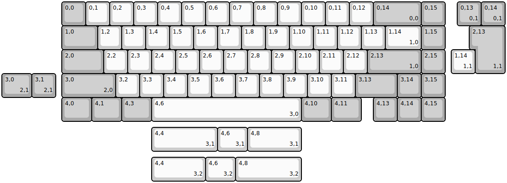{:loading="lazy"}

[Open in keyboard-layout-editor](http://www.keyboard-layout-editor.com/##@@_x:2.5&c=#aaaaaa;&=0,0&_c=#cccccc;&=0,1&=0,2&=0,3&=0,4&=0,5&=0,6&=0,7&=0,8&=0,9&=0,10&=0,11&=0,12&_c=#aaaaaa&w:2;&=0,14%0A%0A%0A0,0&=0,15;&@_x:2.5&w:1.5;&=1,0&_c=#cccccc;&=1,2&=1,3&=1,4&=1,5&=1,6&=1,7&=1,8&=1,9&=1,10&=1,11&=1,12&=1,13&_w:1.5;&=1,14%0A%0A%0A1,0&_c=#aaaaaa;&=1,15;&@_x:2.5&w:1.75;&=2,0&_c=#cccccc;&=2,2&=2,3&=2,4&=2,5&=2,6&=2,7&=2,8&=2,9&=2,10&=2,11&=2,12&_c=#aaaaaa&w:2.25;&=2,13%0A%0A%0A1,0&=2,15;&@_x:2.5&w:2.25;&=3,0%0A%0A%0A2,0&_c=#cccccc;&=3,2&=3,3&=3,4&=3,5&=3,6&=3,7&=3,8&=3,9&=3,10&=3,11&_c=#aaaaaa&w:1.75;&=3,13&=3,14&=3,15;&@_x:2.5&w:1.25;&=4,0&_w:1.25;&=4,1&_w:1.25;&=4,3&_c=#cccccc&w:6.25;&=4,6%0A%0A%0A3,0&_c=#aaaaaa&w:1.25;&=4,10&_w:1.25;&=4,11&_x:0.5;&=4,13&=4,14&=4,15;&@_x:19.0&y:-5;&=0,13%0A%0A%0A0,1&=0,14%0A%0A%0A0,1;&@_x:19.75&w:1.25&h:2&w2:1.5&h2:1&x2:-0.25;&=2,13%0A%0A%0A1,1;&@_x:18.75&c=#cccccc;&=1,14%0A%0A%0A1,1;&@_c=#aaaaaa&w:1.25;&=3,0%0A%0A%0A2,1&=3,1%0A%0A%0A2,1;&@_x:6.25&y:1.25&c=#cccccc&w:2.75;&=4,4%0A%0A%0A3,1&_w:1.25;&=4,6%0A%0A%0A3,1&_w:2.25;&=4,8%0A%0A%0A3,1;&@_x:6.25&y:0.25&w:2.25;&=4,4%0A%0A%0A3,2&_w:1.25;&=4,6%0A%0A%0A3,2&_w:2.75;&=4,8%0A%0A%0A3,2)

## kbdfans/kbd67rev2

[README](output/kbdfans/kbd67rev2/README.md) - [layout](output/kbdfans/kbd67rev2/kbd67rev2-kle.json) - [PCB](output/kbdfans/kbd67rev2/kbd67rev2.kicad_pcb) - [PCB render](output/kbdfans/kbd67rev2/kbd67rev2-render.svg)

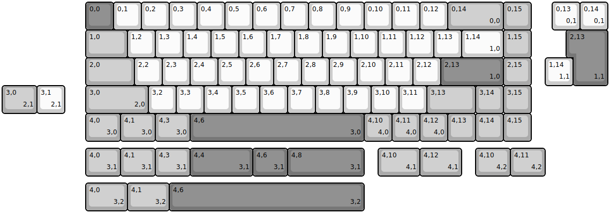{:loading="lazy"}

[Open in keyboard-layout-editor](http://www.keyboard-layout-editor.com/##@@_x:3&c=#777777;&=0,0&_c=#cccccc;&=0,1&=0,2&=0,3&=0,4&=0,5&=0,6&=0,7&=0,8&=0,9&=0,10&=0,11&=0,12&_c=#aaaaaa&w:2;&=0,14%0A%0A%0A0,0&=0,15;&@_x:3&w:1.5;&=1,0&_c=#cccccc;&=1,2&=1,3&=1,4&=1,5&=1,6&=1,7&=1,8&=1,9&=1,10&=1,11&=1,12&=1,13&_w:1.5;&=1,14%0A%0A%0A1,0&_c=#aaaaaa;&=1,15;&@_x:3&w:1.75;&=2,0&_c=#cccccc;&=2,2&=2,3&=2,4&=2,5&=2,6&=2,7&=2,8&=2,9&=2,10&=2,11&=2,12&_c=#777777&w:2.25;&=2,13%0A%0A%0A1,0&_c=#aaaaaa;&=2,15;&@_x:3.0&w:2.25;&=3,0%0A%0A%0A2,0&_c=#cccccc;&=3,2&=3,3&=3,4&=3,5&=3,6&=3,7&=3,8&=3,9&=3,10&=3,11&_c=#aaaaaa&w:1.75;&=3,13&=3,14&=3,15;&@_x:3&w:1.25;&=4,0%0A%0A%0A3,0&_w:1.25;&=4,1%0A%0A%0A3,0&_w:1.25;&=4,3%0A%0A%0A3,0&_c=#777777&w:6.25;&=4,6%0A%0A%0A3,0&_c=#aaaaaa;&=4,10%0A%0A%0A4,0&=4,11%0A%0A%0A4,0&=4,12%0A%0A%0A4,0&=4,13&=4,14&=4,15;&@_x:19.75&y:-5&c=#cccccc;&=0,13%0A%0A%0A0,1&=0,14%0A%0A%0A0,1;&@_x:20.5&c=#777777&w:1.25&h:2&w2:1.5&h2:1&x2:-0.25;&=2,13%0A%0A%0A1,1;&@_x:19.5&c=#cccccc;&=1,14%0A%0A%0A1,1;&@_c=#aaaaaa&w:1.25;&=3,0%0A%0A%0A2,1&_c=#cccccc;&=3,1%0A%0A%0A2,1;&@_x:3&y:1.25&c=#aaaaaa&w:1.25;&=4,0%0A%0A%0A3,1&_w:1.25;&=4,1%0A%0A%0A3,1&_w:1.25;&=4,3%0A%0A%0A3,1&_c=#777777&w:2.25;&=4,4%0A%0A%0A3,1&_w:1.25;&=4,6%0A%0A%0A3,1&_w:2.75;&=4,8%0A%0A%0A3,1&_x:0.5&c=#aaaaaa&w:1.5;&=4,10%0A%0A%0A4,1&_w:1.5;&=4,12%0A%0A%0A4,1&_x:0.5&w:1.25;&=4,10%0A%0A%0A4,2&_w:1.25;&=4,11%0A%0A%0A4,2;&@_x:3&y:0.25&w:1.5;&=4,0%0A%0A%0A3,2&_w:1.5;&=4,1%0A%0A%0A3,2&_c=#777777&w:7;&=4,6%0A%0A%0A3,2)

## kbdfans/kbd6x

[README](output/kbdfans/kbd6x/README.md) - [layout](output/kbdfans/kbd6x/kbd6x-kle.json) - [PCB](output/kbdfans/kbd6x/kbd6x.kicad_pcb) - [PCB render](output/kbdfans/kbd6x/kbd6x-render.svg)

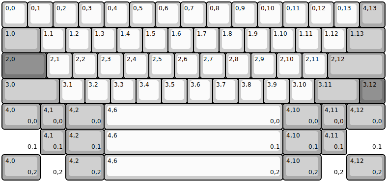{:loading="lazy"}

[Open in keyboard-layout-editor](http://www.keyboard-layout-editor.com/##@@=0,0&=0,1&=0,2&=0,3&=0,4&=0,5&=0,6&=0,7&=0,8&=0,9&=0,10&=0,11&=0,12&=0,13&_c=#aaaaaa;&=4,13;&@_w:1.5;&=1,0&_c=#cccccc;&=1,1&=1,2&=1,3&=1,4&=1,5&=1,6&=1,7&=1,8&=1,9&=1,10&=1,11&=1,12&_c=#aaaaaa&w:1.5;&=1,13;&@_c=#777777&w:1.75;&=2,0&_c=#cccccc;&=2,1&=2,2&=2,3&=2,4&=2,5&=2,6&=2,7&=2,8&=2,9&=2,10&=2,11&_c=#aaaaaa&w:2.25;&=2,12;&@_w:2.25;&=3,0&_c=#cccccc;&=3,1&=3,2&=3,3&=3,4&=3,5&=3,6&=3,7&=3,8&=3,9&=3,10&_c=#aaaaaa&w:1.75;&=3,11&_c=#777777;&=3,12;&@_c=#aaaaaa&w:1.5;&=4,0%0A%0A%0A0,0&=4,1%0A%0A%0A0,0&_w:1.5;&=4,2%0A%0A%0A0,0&_c=#cccccc&w:7;&=4,6%0A%0A%0A0,0&_c=#aaaaaa&w:1.5;&=4,10%0A%0A%0A0,0&=4,11%0A%0A%0A0,0&_w:1.5;&=4,12%0A%0A%0A0,0;&@_c=#cccccc&w:1.5&d:true;&=%0A%0A%0A0,1&_c=#aaaaaa;&=4,1%0A%0A%0A0,1&_w:1.5;&=4,2%0A%0A%0A0,1&_c=#cccccc&w:7;&=4,6%0A%0A%0A0,1&_c=#aaaaaa&w:1.5;&=4,10%0A%0A%0A0,1&=4,11%0A%0A%0A0,1&_c=#cccccc&w:1.5&d:true;&=%0A%0A%0A0,1;&@_c=#aaaaaa&w:1.5;&=4,0%0A%0A%0A0,2&_c=#cccccc&d:true;&=%0A%0A%0A0,2&_c=#aaaaaa&w:1.5;&=4,2%0A%0A%0A0,2&_c=#cccccc&w:7;&=4,6%0A%0A%0A0,2&_c=#aaaaaa&w:1.5;&=4,10%0A%0A%0A0,2&_c=#cccccc&d:true;&=%0A%0A%0A0,2&_c=#aaaaaa&w:1.5;&=4,12%0A%0A%0A0,2)

## kbdfans/kbd75/kbd75hs

[README](output/kbdfans/kbd75/README.md) - [layout](output/kbdfans/kbd75/kbd75hs-kle.json) - [PCB](output/kbdfans/kbd75/kbd75hs.kicad_pcb) - [PCB render](output/kbdfans/kbd75/kbd75hs-render.svg)

{:loading="lazy"}

[Open in keyboard-layout-editor](http://www.keyboard-layout-editor.com/##@@_c=#777777;&=0,0&_c=#cccccc;&=0,1&=0,2&=0,3&=0,4&_c=#aaaaaa;&=0,5&=0,6&=0,7&=0,8&_c=#cccccc;&=0,9&=0,10&=0,11&=0,12&_c=#aaaaaa;&=0,13&=3,12&=0,14;&@=1,0&=1,1&=1,2&=1,3&=1,4&=1,5&=1,6&=1,7&=1,8&=1,9&=1,10&=1,11&=1,12&_w:2;&=1,13&=1,14;&@_w:1.5;&=2,0&_c=#cccccc;&=2,1&=2,2&=2,3&=2,4&=2,5&=2,6&=2,7&=2,8&=2,9&=2,10&=2,11&=2,12&_w:1.5;&=2,13&_c=#aaaaaa;&=2,14;&@_w:1.75;&=3,0&_c=#cccccc;&=3,1&=3,2&=3,3&=3,4&=3,5&=3,6&=3,7&=3,8&=3,9&=3,10&=3,11&_c=#777777&w:2.25;&=3,13&_c=#aaaaaa;&=3,14;&@_w:2.25;&=4,0&_c=#cccccc;&=4,1&=4,2&=4,3&=4,4&=4,5&=4,6&=4,7&=4,8&=4,9&=4,10&_c=#aaaaaa&w:1.75;&=4,11&=4,13&=4,14;&@_w:1.25;&=5,0&_w:1.25;&=5,1&_w:1.25;&=5,2&_c=#777777&w:6.25;&=5,5&_c=#aaaaaa;&=5,8&=5,9&=5,10&=5,11&=5,13&=5,14)

## kbdfans/kbd75/kbd75rev1

[README](output/kbdfans/kbd75/README.md) - [layout](output/kbdfans/kbd75/kbd75rev1-kle.json) - [PCB](output/kbdfans/kbd75/kbd75rev1.kicad_pcb) - [PCB render](output/kbdfans/kbd75/kbd75rev1-render.svg)

{:loading="lazy"}

[Open in keyboard-layout-editor](http://www.keyboard-layout-editor.com/##@@_x:3&c=#777777;&=0,0&_c=#cccccc;&=0,1&=0,2&=0,3&=0,4&_c=#aaaaaa;&=0,5&=0,6&=0,7&=0,8&_c=#cccccc;&=0,9&=0,10&=0,11&=0,12&_c=#aaaaaa;&=0,13&=0,14&=0,15;&@_x:3&c=#cccccc;&=1,0&=1,1&=1,2&=1,3&=1,4&=1,5&=1,6&=1,7&=1,8&=1,9&=1,10&=1,11&=1,12&_c=#aaaaaa&w:2;&=1,14%0A%0A%0A0,0&=1,15;&@_x:3&w:1.5;&=2,0&_c=#cccccc;&=2,2&=2,3&=2,4&=2,5&=2,6&=2,7&=2,8&=2,9&=2,10&=2,11&=2,12&=2,13&_w:1.5;&=2,14%0A%0A%0A1,0&_c=#aaaaaa;&=2,15;&@_x:3&w:1.75;&=3,0&_c=#cccccc;&=3,2&=3,3&=3,4&=3,5&=3,6&=3,7&=3,8&=3,9&=3,10&=3,11&=3,12&_c=#777777&w:2.25;&=3,13%0A%0A%0A1,0&_c=#aaaaaa;&=3,15;&@_x:3.0&w:2.25;&=4,0%0A%0A%0A2,0&_c=#cccccc;&=4,2&=4,3&=4,4&=4,5&=4,6&=4,7&=4,8&=4,9&=4,10&=4,11&_c=#aaaaaa&w:1.75;&=4,13&=4,14&=4,15;&@_x:3&w:1.25;&=5,0%0A%0A%0A3,0&_w:1.25;&=5,1%0A%0A%0A3,0&_w:1.25;&=5,3%0A%0A%0A3,0&_c=#777777&w:6.25;&=5,6%0A%0A%0A3,0&_c=#aaaaaa;&=5,10%0A%0A%0A4,0&=5,11%0A%0A%0A4,0&=5,12%0A%0A%0A4,0&=5,13&=5,14&=5,15;&@_x:19.75&y:-5&c=#cccccc;&=1,13%0A%0A%0A0,1&=1,14%0A%0A%0A0,1;&@_x:20.5&c=#777777&w:1.25&h:2&w2:1.5&h2:1&x2:-0.25;&=3,13%0A%0A%0A1,1;&@_x:19.5&c=#cccccc;&=2,14%0A%0A%0A1,1;&@_c=#aaaaaa&w:1.25;&=4,0%0A%0A%0A2,1&_c=#cccccc;&=4,1%0A%0A%0A2,1;&@_x:3&y:1.25&c=#aaaaaa&w:1.25;&=5,0%0A%0A%0A3,1&_w:1.25;&=5,1%0A%0A%0A3,1&_w:1.25;&=5,3%0A%0A%0A3,1&_c=#777777&w:2.25;&=5,4%0A%0A%0A3,1&_w:1.25;&=5,6%0A%0A%0A3,1&_w:2.75;&=5,8%0A%0A%0A3,1&_x:0.5&c=#aaaaaa&w:1.5;&=5,10%0A%0A%0A4,1&_w:1.5;&=5,12%0A%0A%0A4,1;&@_x:3&y:0.25&w:1.5;&=5,0%0A%0A%0A3,2&_w:1.5;&=5,1%0A%0A%0A3,2&_c=#777777&w:7;&=5,6%0A%0A%0A3,2)

## kbdfans/kbd75/kbd75rev2

[README](output/kbdfans/kbd75/README.md) - [layout](output/kbdfans/kbd75/kbd75rev2-kle.json) - [PCB](output/kbdfans/kbd75/kbd75rev2.kicad_pcb) - [PCB render](output/kbdfans/kbd75/kbd75rev2-render.svg)

{:loading="lazy"}

[Open in keyboard-layout-editor](http://www.keyboard-layout-editor.com/##@@_x:3&y:3.75&c=#777777;&=0,0&_c=#cccccc;&=0,1&=0,2&=0,3&=0,4&_c=#aaaaaa;&=0,5&=0,6&=0,7&=0,8&_c=#cccccc;&=0,9&=0,10&=0,11&=0,12&_c=#aaaaaa;&=0,13&=0,14&=0,15;&@_x:3&c=#cccccc;&=1,0&=1,1&=1,2&=1,3&=1,4&=1,5&=1,6&=1,7&=1,8&=1,9&=1,10&=1,11%0A%0A%0A0,0&=1,12%0A%0A%0A0,0&_c=#aaaaaa&w:2;&=1,14%0A%0A%0A0,0&=1,15;&@_x:3&w:1.5;&=2,0&_c=#cccccc;&=2,2&=2,3&=2,4&=2,5&=2,6&=2,7&=2,8&=2,9&=2,10&=2,11&=2,12%0A%0A%0A1,0&=2,13%0A%0A%0A1,0&_w:1.5;&=2,14%0A%0A%0A1,0&_c=#aaaaaa;&=2,15;&@_x:3&w:1.75;&=3,0&_c=#cccccc;&=3,2&=3,3&=3,4&=3,5&=3,6&=3,7&=3,8&=3,9&=3,10&=3,11%0A%0A%0A1,0&=3,12%0A%0A%0A1,0&_c=#777777&w:2.25;&=3,13%0A%0A%0A1,0&_c=#aaaaaa;&=3,15;&@_x:3.0&w:2.25;&=4,0%0A%0A%0A2,0&_c=#cccccc;&=4,2&=4,3&=4,4&=4,5&=4,6&=4,7&=4,8&=4,9&=4,10%0A%0A%0A3,0&=4,11%0A%0A%0A3,0&_c=#aaaaaa&w:1.75;&=4,13%0A%0A%0A3,0&=4,14&=4,15;&@_x:3&w:1.25;&=5,0%0A%0A%0A4,0&_w:1.25;&=5,1%0A%0A%0A4,0&_w:1.25;&=5,3%0A%0A%0A4,0&_c=#777777&w:6.25;&=5,6%0A%0A%0A4,0&_c=#aaaaaa;&=5,10%0A%0A%0A5,0&=5,11%0A%0A%0A5,0&=5,12%0A%0A%0A5,0&=5,13&=5,14&=5,15;&@_x:20.75&y:-9.75&c=#cccccc;&=2,12%0A%0A%0A1,1&=2,13%0A%0A%0A1,1&_x:0.25&c=#777777&w:1.25&h:2&w2:1.5&h2:1&x2:-0.25;&=3,13%0A%0A%0A1,1;&@_x:14&y:-0.25&c=#cccccc;&=1,11%0A%0A%0A0,1&=1,12%0A%0A%0A0,1&=1,13%0A%0A%0A0,1&=1,14%0A%0A%0A0,1;&@_x:20&y:-0.75;&=3,11%0A%0A%0A1,1&=3,12%0A%0A%0A1,1&=2,14%0A%0A%0A1,1;&@_x:14&y:-0.25&c=#aaaaaa&w:2;&=1,12%0A%0A%0A0,2&_c=#cccccc;&=1,13%0A%0A%0A0,2&=1,14%0A%0A%0A0,2;&@_x:20.75&w:1.5;&=2,12%0A%0A%0A1,2&=2,13%0A%0A%0A1,2&=2,14%0A%0A%0A1,2;&@_x:20&c=#777777&w:2.25;&=3,11%0A%0A%0A1,2&_c=#cccccc;&=3,12%0A%0A%0A1,2&=3,13%0A%0A%0A1,2;&@_x:21&y:0.75&c=#777777&w:1.25&h:2&w2:1.5&h2:1&x2:-0.25;&=3,12%0A%0A%0A1,3&_c=#cccccc;&=2,13%0A%0A%0A1,3&=2,14%0A%0A%0A1,3;&@_x:20;&=2,12%0A%0A%0A1,3&_x:1.25;&=3,12%0A%0A%0A1,3&=3,13%0A%0A%0A1,3;&@_y:0.25&w:1.25;&=4,0%0A%0A%0A2,1&=4,1%0A%0A%0A2,1;&@_x:20&y:-0.5&c=#aaaaaa&w:1.75;&=4,10%0A%0A%0A3,1&_c=#cccccc;&=4,11%0A%0A%0A3,1&=4,13%0A%0A%0A3,1;&@_x:3&y:0.75&c=#aaaaaa&w:1.25;&=5,0%0A%0A%0A4,1&_w:1.25;&=5,1%0A%0A%0A4,1&_w:1.25;&=5,3%0A%0A%0A4,1&_c=#777777&w:2.25;&=5,4%0A%0A%0A4,1&_w:1.25;&=5,6%0A%0A%0A4,1&_w:2.75;&=5,8%0A%0A%0A4,1&_x:0.5&c=#aaaaaa&w:1.5;&=5,10%0A%0A%0A5,1&_w:1.5;&=5,12%0A%0A%0A5,1;&@_x:3&y:0.25&w:1.5;&=5,0%0A%0A%0A4,2&_w:1.5;&=5,1%0A%0A%0A4,2&_c=#777777&w:7;&=5,6%0A%0A%0A4,2)

## kbdfans/kbd75/kbd75rgb

[README](output/kbdfans/kbd75/README.md) - [layout](output/kbdfans/kbd75/kbd75rgb-kle.json) - [PCB](output/kbdfans/kbd75/kbd75rgb.kicad_pcb) - [PCB render](output/kbdfans/kbd75/kbd75rgb-render.svg)

{:loading="lazy"}

[Open in keyboard-layout-editor](http://www.keyboard-layout-editor.com/##@@_c=#777777;&=0,0&_c=#cccccc;&=0,1&=0,2&=0,3&=0,4&_c=#aaaaaa;&=0,5&=0,6&=0,7&=0,8&_c=#cccccc;&=0,9&=0,10&=0,11&=0,12&_c=#aaaaaa;&=0,13&=3,12&=0,14;&@=1,0&=1,1&=1,2&=1,3&=1,4&=1,5&=1,6&=1,7&=1,8&=1,9&=1,10&=1,11&=1,12&_w:2;&=1,13&=1,14;&@_w:1.5;&=2,0&_c=#cccccc;&=2,1&=2,2&=2,3&=2,4&=2,5&=2,6&=2,7&=2,8&=2,9&=2,10&=2,11&=2,12&_w:1.5;&=2,13&_c=#aaaaaa;&=2,14;&@_w:1.75;&=3,0&_c=#cccccc;&=3,1&=3,2&=3,3&=3,4&=3,5&=3,6&=3,7&=3,8&=3,9&=3,10&=3,11&_c=#777777&w:2.25;&=3,13&_c=#aaaaaa;&=3,14;&@_w:2.25;&=4,0&_c=#cccccc;&=4,1&=4,2&=4,3&=4,4&=4,5&=4,6&=4,7&=4,8&=4,9&=4,10&_c=#aaaaaa&w:1.75;&=4,11&=4,13&=4,14;&@_w:1.25;&=5,0&_w:1.25;&=5,1&_w:1.25;&=5,2&_c=#777777&w:6.25;&=5,5&_c=#aaaaaa;&=5,8&=5,9&=5,10&=5,11&=5,13&=5,14)

## kbdfans/kbd8x_mk2

[README](output/kbdfans/kbd8x_mk2/README.md) - [layout](output/kbdfans/kbd8x_mk2/kbd8x_mk2-kle.json) - [PCB](output/kbdfans/kbd8x_mk2/kbd8x_mk2.kicad_pcb) - [PCB render](output/kbdfans/kbd8x_mk2/kbd8x_mk2-render.svg)

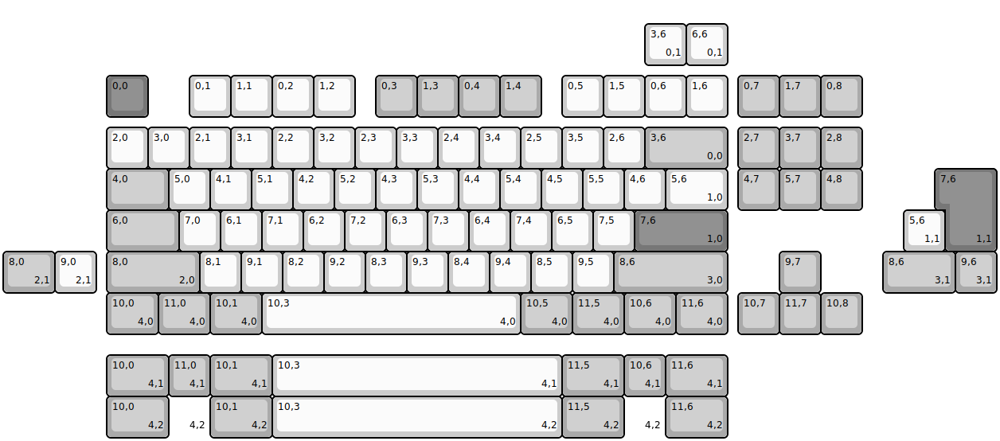{:loading="lazy"}

[Open in keyboard-layout-editor](http://www.keyboard-layout-editor.com/##@@_x:2.5&y:1.75&c=#777777;&=0,0&_x:1.0&c=#cccccc;&=0,1&=1,1&=0,2&=1,2&_x:0.5&c=#aaaaaa;&=0,3&=1,3&=0,4&=1,4&_x:0.5&c=#cccccc;&=0,5&=1,5&=0,6&=1,6&_x:0.25&c=#aaaaaa;&=0,7&=1,7&=0,8;&@_x:2.5&y:0.25&c=#cccccc;&=2,0&=3,0&=2,1&=3,1&=2,2&=3,2&=2,3&=3,3&=2,4&=3,4&=2,5&=3,5&=2,6&_c=#aaaaaa&w:2;&=3,6%0A%0A%0A0,0&_x:0.25;&=2,7&=3,7&=2,8;&@_x:2.5&w:1.5;&=4,0&_c=#cccccc;&=5,0&=4,1&=5,1&=4,2&=5,2&=4,3&=5,3&=4,4&=5,4&=4,5&=5,5&=4,6&_w:1.5;&=5,6%0A%0A%0A1,0&_x:0.25&c=#aaaaaa;&=4,7&=5,7&=4,8;&@_x:2.5&w:1.75;&=6,0&_c=#cccccc;&=7,0&=6,1&=7,1&=6,2&=7,2&=6,3&=7,3&=6,4&=7,4&=6,5&=7,5&_c=#777777&w:2.25;&=7,6%0A%0A%0A1,0;&@_x:2.5&c=#aaaaaa&w:2.25;&=8,0%0A%0A%0A2,0&_c=#cccccc;&=8,1&=9,1&=8,2&=9,2&=8,3&=9,3&=8,4&=9,4&=8,5&=9,5&_c=#aaaaaa&w:2.75;&=8,6%0A%0A%0A3,0&_x:1.25;&=9,7;&@_x:2.5&w:1.25;&=10,0%0A%0A%0A4,0&_w:1.25;&=11,0%0A%0A%0A4,0&_w:1.25;&=10,1%0A%0A%0A4,0&_c=#cccccc&w:6.25;&=10,3%0A%0A%0A4,0&_c=#aaaaaa&w:1.25;&=10,5%0A%0A%0A4,0&_w:1.25;&=11,5%0A%0A%0A4,0&_w:1.25;&=10,6%0A%0A%0A4,0&_w:1.25;&=11,6%0A%0A%0A4,0&_x:0.25;&=10,7&=11,7&=10,8;&@_x:15.5&y:-7.5&c=#cccccc;&=3,6%0A%0A%0A0,1&=6,6%0A%0A%0A0,1;&@_x:22.75&y:2.5&c=#777777&w:1.25&h:2&w2:1.5&h2:1&x2:-0.25;&=7,6%0A%0A%0A1,1;&@_x:21.75&c=#cccccc;&=5,6%0A%0A%0A1,1;&@_c=#aaaaaa&w:1.25;&=8,0%0A%0A%0A2,1&_c=#cccccc;&=9,0%0A%0A%0A2,1&_x:19.0&c=#aaaaaa&w:1.75;&=8,6%0A%0A%0A3,1&=9,6%0A%0A%0A3,1;&@_x:2.5&y:1.5&w:1.5;&=10,0%0A%0A%0A4,1&=11,0%0A%0A%0A4,1&_w:1.5;&=10,1%0A%0A%0A4,1&_c=#cccccc&w:7;&=10,3%0A%0A%0A4,1&_c=#aaaaaa&w:1.5;&=11,5%0A%0A%0A4,1&=10,6%0A%0A%0A4,1&_w:1.5;&=11,6%0A%0A%0A4,1;&@_x:2.5&w:1.5;&=10,0%0A%0A%0A4,2&_d:true;&=%0A%0A%0A4,2&_w:1.5;&=10,1%0A%0A%0A4,2&_c=#cccccc&w:7;&=10,3%0A%0A%0A4,2&_c=#aaaaaa&w:1.5;&=11,5%0A%0A%0A4,2&_d:true;&=%0A%0A%0A4,2&_w:1.5;&=11,6%0A%0A%0A4,2)

## kbdfans/kbdpad_mk2

[README](output/kbdfans/kbdpad_mk2/README.md) - [layout](output/kbdfans/kbdpad_mk2/kbdpad_mk2-kle.json) - [PCB](output/kbdfans/kbdpad_mk2/kbdpad_mk2.kicad_pcb) - [PCB render](output/kbdfans/kbdpad_mk2/kbdpad_mk2-render.svg)

{:loading="lazy"}

[Open in keyboard-layout-editor](http://www.keyboard-layout-editor.com/##@@_c=#aaaaaa;&=0,0&=0,1&=0,2&=0,3;&@_y:0.25;&=1,0&=1,1&=1,2&=1,3;&@_c=#cccccc;&=2,0&=2,1&=2,2&_c=#aaaaaa&h:2;&=3,3%0A%0A%0A0,0;&@_c=#cccccc;&=3,0&=3,1&=3,2;&@=4,0&=4,1&=4,2&_c=#aaaaaa&h:2;&=5,3%0A%0A%0A1,0;&@_c=#cccccc&w:2;&=5,0%0A%0A%0A2,0&=5,2;&@_x:4.5&y:-4.0&c=#aaaaaa;&=2,3%0A%0A%0A0,1;&@_x:4.5;&=3,3%0A%0A%0A0,1;&@_x:4.5;&=4,3%0A%0A%0A1,1;&@_x:4.5;&=5,3%0A%0A%0A1,1;&@_y:0.5&c=#cccccc;&=5,0%0A%0A%0A2,1&=5,1%0A%0A%0A2,1)

## kbdfans/kbdpad_mk3

[README](output/kbdfans/kbdpad_mk3/README.md) - [layout](output/kbdfans/kbdpad_mk3/kbdpad_mk3-kle.json) - [PCB](output/kbdfans/kbdpad_mk3/kbdpad_mk3.kicad_pcb) - [PCB render](output/kbdfans/kbdpad_mk3/kbdpad_mk3-render.svg)

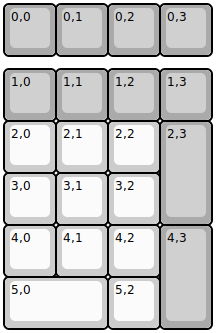{:loading="lazy"}

[Open in keyboard-layout-editor](http://www.keyboard-layout-editor.com/##@@_c=#aaaaaa;&=0,0&=0,1&=0,2&=0,3;&@_y:0.25;&=1,0&=1,1&=1,2&=1,3;&@_c=#cccccc;&=2,0&=2,1&=2,2&_c=#aaaaaa&h:2;&=2,3;&@_c=#cccccc;&=3,0&=3,1&=3,2;&@=4,0&=4,1&=4,2&_c=#aaaaaa&h:2;&=4,3;&@_c=#cccccc&w:2;&=5,0&=5,2)

## kbdfans/maja

[README](output/kbdfans/maja/README.md) - [layout](output/kbdfans/maja/maja-kle.json) - [PCB](output/kbdfans/maja/maja.kicad_pcb) - [PCB render](output/kbdfans/maja/maja-render.svg)

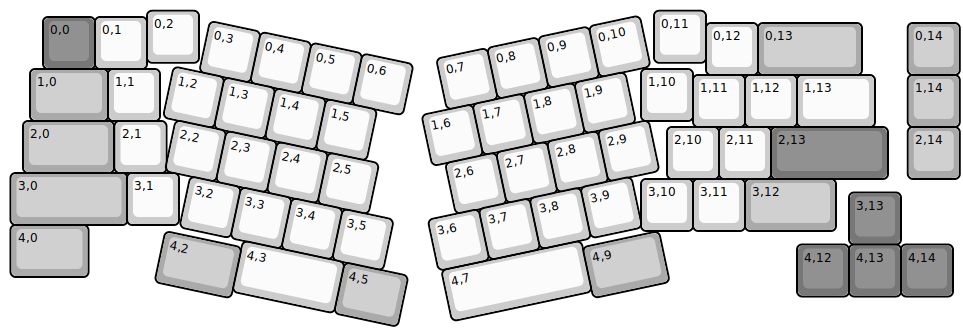{:loading="lazy"}

[Open in keyboard-layout-editor](http://www.keyboard-layout-editor.com/##@@_x:2.75&y:0.13;&=0,2&_x:8.75;&=0,11;&@_x:0.75&y:-0.88&c=#777777;&=0,0&_c=#cccccc;&=0,1;&@_x:13.5&y:-0.885;&=0,12&_c=#aaaaaa&w:2;&=0,13&_x:0.88;&=0,14;&@_x:0.5&y:-0.115&w:1.5;&=1,0&_c=#cccccc;&=1,1&_x:9.25;&=1,10;&@_x:13.25&y:-0.885;&=1,11&=1,12&_w:1.5;&=1,13&_x:0.63&c=#aaaaaa;&=1,14;&@_x:0.365&y:-0.115&w:1.75;&=2,0&_x:0.01&c=#cccccc;&=2,1;&@_x:12.75&y:-0.885;&=2,10&=2,11&_c=#777777&w:2.25;&=2,13&_x:0.38&c=#aaaaaa;&=2,14;&@_x:0.125&y:-0.115&w:2.25;&=3,0&_x:-0.01&c=#cccccc;&=3,1;&@_x:12.25&y:-0.885;&=3,10&=3,11&_c=#aaaaaa&w:1.75;&=3,12;&@_x:16.25&y:-0.74&c=#777777;&=3,13;&@_x:0.125&y:-0.375&c=#aaaaaa&w:1.5;&=4,0;&@_x:15.25&y:-0.625&c=#777777;&=4,12&=4,13&=4,14;&@_r:12&rx:4.75&ry:1.5&x:-1.0&y:-1.0&c=#cccccc;&=0,3&=0,4&=0,5&=0,6;&@_x:-1.5;&=1,2&=1,3&=1,4&=1,5;&@_x:-1.25;&=2,2&=2,3&=2,4&=2,5;&@_x:-0.75;&=3,2&=3,3&=3,4&=3,5;&@_x:0.5&w:2;&=4,3&_c=#aaaaaa&w:1.25;&=4,5;&@_x:-1.0&y:-0.87&w:1.5;&=4,2;&@_r:-12&rx:13.5&x:-5.0&y:-1.5&c=#cccccc;&=0,7&=0,8&=0,9&=0,10;&@_x:-5.5;&=1,6&=1,7&=1,8&=1,9;&@_x:-5.25;&=2,6&=2,7&=2,8&=2,9;&@_x:-5.75&y:1.0&w:2.75;&=4,7;&@_x:-3.0&y:-0.87&c=#aaaaaa&w:1.5;&=4,9;&@_ry:1.75&x:-5.75&y:1.25&c=#cccccc;&=3,6&=3,7&=3,8&=3,9)

## kbdfans/maja_soldered

[README](output/kbdfans/maja_soldered/README.md) - [layout](output/kbdfans/maja_soldered/maja_soldered-kle.json) - [PCB](output/kbdfans/maja_soldered/maja_soldered.kicad_pcb) - [PCB render](output/kbdfans/maja_soldered/maja_soldered-render.svg)

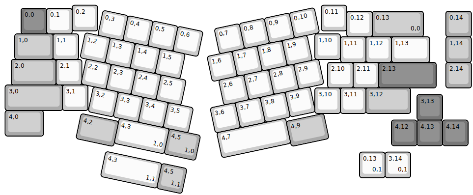{:loading="lazy"}

[Open in keyboard-layout-editor](http://www.keyboard-layout-editor.com/##@@_x:2.75&y:0.13;&=0,2&_x:8.75;&=0,11;&@_x:0.75&y:-0.88&c=#777777;&=0,0&_c=#cccccc;&=0,1;&@_x:13.5&y:-0.885;&=0,12&_c=#aaaaaa&w:2;&=0,13%0A%0A%0A0,0&_x:0.88;&=0,14;&@_x:0.5&y:-0.115&w:1.5;&=1,0&_c=#cccccc;&=1,1&_x:9.25;&=1,10;&@_x:13.25&y:-0.885;&=1,11&=1,12&_w:1.5;&=1,13&_x:0.63&c=#aaaaaa;&=1,14;&@_x:0.365&y:-0.115&w:1.75;&=2,0&_x:0.01&c=#cccccc;&=2,1;&@_x:12.75&y:-0.885;&=2,10&=2,11&_c=#777777&w:2.25;&=2,13&_x:0.38&c=#aaaaaa;&=2,14;&@_x:0.125&y:-0.115&w:2.25;&=3,0&_x:-0.01&c=#cccccc;&=3,1;&@_x:12.25&y:-0.885;&=3,10&=3,11&_c=#aaaaaa&w:1.75;&=3,12;&@_x:16.25&y:-0.74&c=#777777;&=3,13;&@_x:0.125&y:-0.375&c=#aaaaaa&w:1.5;&=4,0;&@_x:15.25&y:-0.625&c=#777777;&=4,12&=4,13&=4,14;&@_r:12&rx:4.75&ry:1.5&x:-1.0&y:-1.0&c=#cccccc;&=0,3&=0,4&=0,5&=0,6;&@_x:-1.5;&=1,2&=1,3&=1,4&=1,5;&@_x:-1.25;&=2,2&=2,3&=2,4&=2,5;&@_x:-0.75;&=3,2&=3,3&=3,4&=3,5;&@_x:0.5&w:2;&=4,3%0A%0A%0A1,0&_c=#aaaaaa&w:1.25;&=4,5%0A%0A%0A1,0;&@_x:-1.0&y:-0.87&w:1.5;&=4,2;&@_r:-12&rx:13.5&x:-5.0&y:-1.5&c=#cccccc;&=0,7&=0,8&=0,9&=0,10;&@_x:-5.5;&=1,6&=1,7&=1,8&=1,9;&@_x:-5.25;&=2,6&=2,7&=2,8&=2,9;&@_x:-5.75&y:1.0&w:2.75;&=4,7;&@_x:-3.0&y:-0.87&c=#aaaaaa&w:1.5;&=4,9;&@_ry:1.75&x:-5.75&y:1.25&c=#cccccc;&=3,6&=3,7&=3,8&=3,9;&@_r:0&rx:0&ry:0&x:14&y:5.88;&=0,13%0A%0A%0A0,1&=3,14%0A%0A%0A0,1;&@_r:12&rx:4.75&ry:1.5&x:0.25&y:4.38&w:2.25;&=4,3%0A%0A%0A1,1&_c=#aaaaaa;&=4,5%0A%0A%0A1,1)

## kbdfans/niu_mini

[README](output/kbdfans/niu_mini/README.md) - [layout](output/kbdfans/niu_mini/niu_mini-kle.json) - [PCB](output/kbdfans/niu_mini/niu_mini.kicad_pcb) - [PCB render](output/kbdfans/niu_mini/niu_mini-render.svg)

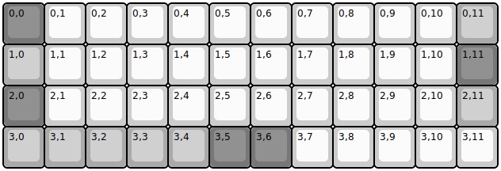{:loading="lazy"}

[Open in keyboard-layout-editor](http://www.keyboard-layout-editor.com/##@@_c=#777777;&=0,0&_c=#cccccc;&=0,1&=0,2&=0,3&=0,4&=0,5&=0,6&=0,7&=0,8&=0,9&=0,10&_c=#aaaaaa;&=0,11;&@=1,0&_c=#cccccc;&=1,1&=1,2&=1,3&=1,4&=1,5&=1,6&=1,7&=1,8&=1,9&=1,10&_c=#777777;&=1,11;&@=2,0&_c=#cccccc;&=2,1&=2,2&=2,3&=2,4&=2,5&=2,6&=2,7&=2,8&=2,9&=2,10&_c=#aaaaaa;&=2,11;&@=3,0&=3,1&=3,2&=3,3&=3,4&_c=#777777;&=3,5&=3,6&_c=#cccccc;&=3,7&=3,8&=3,9&=3,10&=3,11)

## kbdfans/odin/odin_rgb

[README](output/kbdfans/odin/README.md) - [layout](output/kbdfans/odin/odin_rgb-kle.json) - [PCB](output/kbdfans/odin/odin_rgb.kicad_pcb) - [PCB render](output/kbdfans/odin/odin_rgb-render.svg)

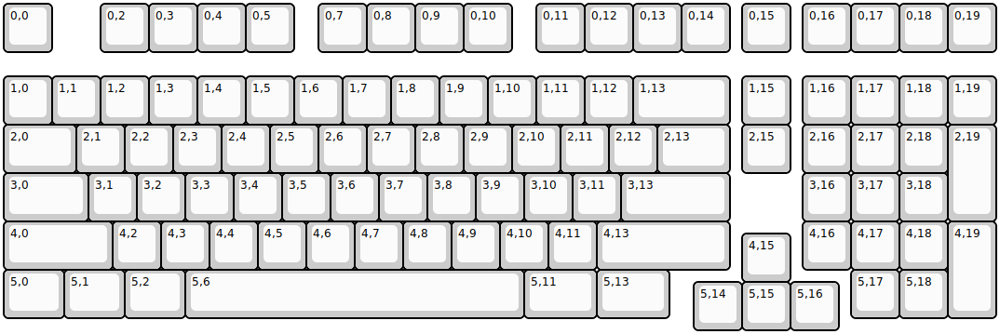{:loading="lazy"}

[Open in keyboard-layout-editor](http://www.keyboard-layout-editor.com/##@@=0,0&_x:1;&=0,2&=0,3&=0,4&=0,5&_x:0.5;&=0,7&=0,8&=0,9&=0,10&_x:0.5;&=0,11&=0,12&=0,13&=0,14&_x:0.25;&=0,15&_x:0.25;&=0,16&=0,17&=0,18&=0,19;&@_y:0.5;&=1,0&=1,1&=1,2&=1,3&=1,4&=1,5&=1,6&=1,7&=1,8&=1,9&=1,10&=1,11&=1,12&_w:2;&=1,13&_x:0.25;&=1,15&_x:0.25;&=1,16&=1,17&=1,18&=1,19;&@_w:1.5;&=2,0&=2,1&=2,2&=2,3&=2,4&=2,5&=2,6&=2,7&=2,8&=2,9&=2,10&=2,11&=2,12&_w:1.5;&=2,13&_x:0.25;&=2,15&_x:0.25;&=2,16&=2,17&=2,18&_h:2;&=2,19;&@_w:1.75;&=3,0&=3,1&=3,2&=3,3&=3,4&=3,5&=3,6&=3,7&=3,8&=3,9&=3,10&=3,11&_w:2.25;&=3,13&_x:1.5;&=3,16&=3,17&=3,18;&@_w:2.25;&=4,0&=4,2&=4,3&=4,4&=4,5&=4,6&=4,7&=4,8&=4,9&=4,10&=4,11&_w:2.75;&=4,13&_x:1.5;&=4,16&=4,17&=4,18&_h:2;&=4,19;&@_x:15.25&y:-0.75;&=4,15;&@_y:-0.25&w:1.25;&=5,0&_w:1.25;&=5,1&_w:1.25;&=5,2&_w:7;&=5,6&_w:1.5;&=5,11&_w:1.5;&=5,13&_x:3.75;&=5,17&=5,18;&@_x:14.25&y:-0.75;&=5,14&=5,15&=5,16)

## kbdfans/odin/odin_soldered

[README](output/kbdfans/odin/README.md) - [layout](output/kbdfans/odin/odin_soldered-kle.json) - [PCB](output/kbdfans/odin/odin_soldered.kicad_pcb) - [PCB render](output/kbdfans/odin/odin_soldered-render.svg)

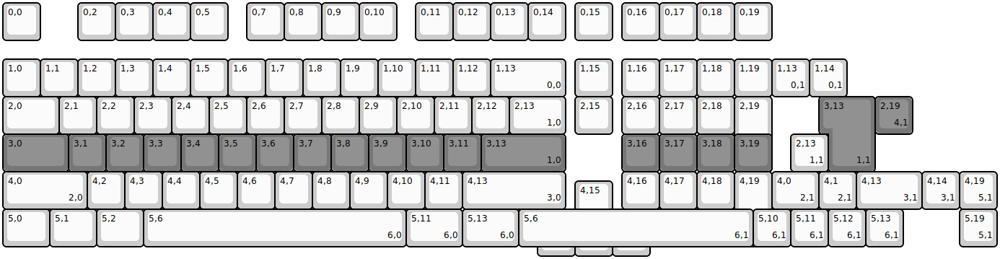{:loading="lazy"}

[Open in keyboard-layout-editor](http://www.keyboard-layout-editor.com/##@@=0,0&_x:1;&=0,2&=0,3&=0,4&=0,5&_x:0.5;&=0,7&=0,8&=0,9&=0,10&_x:0.5;&=0,11&=0,12&=0,13&=0,14&_x:0.25;&=0,15&_x:0.25;&=0,16&=0,17&=0,18&=0,19;&@_y:0.5;&=1,0&=1,1&=1,2&=1,3&=1,4&=1,5&=1,6&=1,7&=1,8&=1,9&=1,10&=1,11&=1,12&_w:2;&=1,13%0A%0A%0A0,0&_x:0.25;&=1,15&_x:0.25;&=1,16&=1,17&=1,18&=1,19;&@_w:1.5;&=2,0&=2,1&=2,2&=2,3&=2,4&=2,5&=2,6&=2,7&=2,8&=2,9&=2,10&=2,11&=2,12&_w:1.5;&=2,13%0A%0A%0A1,0&_x:0.25;&=2,15&_x:0.25;&=2,16&=2,17&=2,18&_h:2;&=2,19%0A%0A%0A4,0;&@_c=#777777&w:1.75;&=3,0&=3,1&=3,2&=3,3&=3,4&=3,5&=3,6&=3,7&=3,8&=3,9&=3,10&=3,11&_w:2.25;&=3,13%0A%0A%0A1,0&_x:1.5;&=3,16&=3,17&=3,18&=3,19;&@_c=#cccccc&w:2.25;&=4,0%0A%0A%0A2,0&=4,2&=4,3&=4,4&=4,5&=4,6&=4,7&=4,8&=4,9&=4,10&=4,11&_w:2.75;&=4,13%0A%0A%0A3,0&_x:1.5;&=4,16&=4,17&=4,18&_h:2;&=4,19%0A%0A%0A5,0;&@_x:15.25&y:-0.75;&=4,15;&@_y:-0.25&w:1.25;&=5,0&_w:1.25;&=5,1&_w:1.25;&=5,2&_w:7;&=5,6%0A%0A%0A6,0&_w:1.5;&=5,11%0A%0A%0A6,0&_w:1.5;&=5,13%0A%0A%0A6,0&_x:3.75;&=5,17&=5,18;&@_x:14.25&y:-0.75;&=5,14&=5,15&=5,16;&@_x:20.5&y:-5.25;&=1,13%0A%0A%0A0,1&=1,14%0A%0A%0A0,1;&@_x:22.0&c=#777777&w:1.25&h:2&w2:1.5&h2:1&x2:-0.25;&=3,13%0A%0A%0A1,1&=2,19%0A%0A%0A4,1;&@_x:21.0&c=#cccccc;&=2,13%0A%0A%0A1,1;&@_x:20.5&w:1.25;&=4,0%0A%0A%0A2,1&=4,1%0A%0A%0A2,1&_w:1.75;&=4,13%0A%0A%0A3,1&=4,14%0A%0A%0A3,1&=4,19%0A%0A%0A5,1;&@_x:13.75&w:6.25;&=5,6%0A%0A%0A6,1&=5,10%0A%0A%0A6,1&=5,11%0A%0A%0A6,1&=5,12%0A%0A%0A6,1&=5,13%0A%0A%0A6,1&_x:1.5;&=5,19%0A%0A%0A5,1)

## kbdfans/odinmini

[README](output/kbdfans/odinmini/README.md) - [layout](output/kbdfans/odinmini/odinmini-kle.json) - [PCB](output/kbdfans/odinmini/odinmini.kicad_pcb) - [PCB render](output/kbdfans/odinmini/odinmini-render.svg)

{:loading="lazy"}

[Open in keyboard-layout-editor](http://www.keyboard-layout-editor.com/##@@_c=#777777;&=0,0&_c=#cccccc;&=0,1&=0,2&=0,3&=0,4&=0,5&=0,6&=0,7&=0,8&=0,9&=0,10&=0,11&=0,12&_c=#aaaaaa&w:2;&=2,13&_x:0.25&c=#cccccc;&=0,13&_x:0.25;&=0,14&=0,15&=0,16&=0,17;&@_w:1.5;&=1,0&=1,1&=1,2&=1,3&=1,4&=1,5&=1,6&=1,7&=1,8&=1,9&=1,10&=1,11&=1,12&_w:1.5;&=3,13&_x:0.25;&=1,13&_x:0.25;&=1,14&=1,15&=1,16&_c=#aaaaaa&h:2;&=1,17;&@_c=#cccccc&w:1.75;&=2,0&=2,1&=2,2&=2,3&=2,4&=2,5&=2,6&=2,7&=2,8&=2,9&=2,10&=2,11&_c=#aaaaaa&w:2.25;&=2,12&_x:1.5&c=#cccccc;&=2,14&=2,15&=2,16%0A%E2%86%92;&@_c=#aaaaaa&w:2.25;&=3,0&_c=#cccccc;&=3,1&=3,2&=3,3&=3,4&=3,5&=3,6&=3,7&=3,8&=3,9&=3,10&_c=#aaaaaa&w:2.75;&=3,11&_x:1.5&c=#cccccc;&=3,14&=3,15&=3,16&_c=#aaaaaa&h:2;&=3,17;&@_x:15.25&y:-0.75&c=#777777;&=3,12;&@_y:-0.25&c=#aaaaaa&w:1.25;&=4,0&_w:1.25;&=4,1&_w:1.25;&=4,2&_c=#cccccc&w:7;&=4,5&_c=#aaaaaa&w:1.5;&=4,8&_w:1.5;&=4,9&_x:3.75&c=#cccccc;&=4,14&=4,15;&@_x:14.25&y:-0.75&c=#777777;&=4,10&=4,11&=4,12)

## kbdfans/phaseone

[README](output/kbdfans/phaseone/README.md) - [layout](output/kbdfans/phaseone/phaseone-kle.json) - [PCB](output/kbdfans/phaseone/phaseone.kicad_pcb) - [PCB render](output/kbdfans/phaseone/phaseone-render.svg)

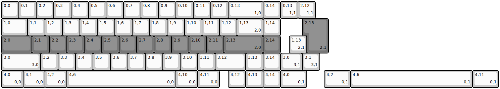{:loading="lazy"}

[Open in keyboard-layout-editor](http://www.keyboard-layout-editor.com/##@@=0,0&=0,1&=0,2&=0,3&=0,4&=0,5&=0,6&=0,7&=0,8&=0,9&=0,10&=0,11&=0,12&_w:2;&=0,13%0A%0A%0A1,0&=0,14;&@_w:1.5;&=1,0&=1,1&=1,2&=1,3&=1,4&=1,5&=1,6&=1,7&=1,8&=1,9&=1,10&=1,11&=1,12&_w:1.5;&=1,13%0A%0A%0A2,0&=1,14;&@_c=#777777&w:1.75;&=2,0&=2,1&=2,2&=2,3&=2,4&=2,5&=2,6&=2,7&=2,8&=2,9&=2,10&=2,11&_w:2.25;&=2,13%0A%0A%0A2,0&=2,14;&@_c=#cccccc&w:2.25;&=3,0%0A%0A%0A3,0&=3,2&=3,3&=3,4&=3,5&=3,6&=3,7&=3,8&=3,9&=3,10&=3,11&_w:1.75;&=3,12&=3,13&=3,14;&@_w:1.25;&=4,0%0A%0A%0A0,0&_w:1.25;&=4,1%0A%0A%0A0,0&_w:1.25;&=4,2%0A%0A%0A0,0&_w:6.25;&=4,6%0A%0A%0A0,0&_w:1.25;&=4,10%0A%0A%0A0,0&_w:1.25;&=4,11%0A%0A%0A0,0&_x:0.5;&=4,12&=4,13&=4,14;&@_x:16&y:-5;&=0,13%0A%0A%0A1,1&=2,12%0A%0A%0A1,1;&@_x:17.5&c=#777777&w:1.25&h:2&w2:1.5&h2:1&x2:-0.25;&=2,13%0A%0A%0A2,1;&@_x:16.5&c=#cccccc;&=1,13%0A%0A%0A2,1;&@_x:16.0&w:1.25;&=3,0%0A%0A%0A3,1&=3,1%0A%0A%0A3,1;&@_x:16.0&w:1.5;&=4,0%0A%0A%0A0,1&_x:1.0&w:1.5;&=4,2%0A%0A%0A0,1&_w:7;&=4,6%0A%0A%0A0,1&_w:1.5;&=4,11%0A%0A%0A0,1)

## kbdfans/tiger80

[README](output/kbdfans/tiger80/README.md) - [layout](output/kbdfans/tiger80/tiger80-kle.json) - [PCB](output/kbdfans/tiger80/tiger80.kicad_pcb) - [PCB render](output/kbdfans/tiger80/tiger80-render.svg)

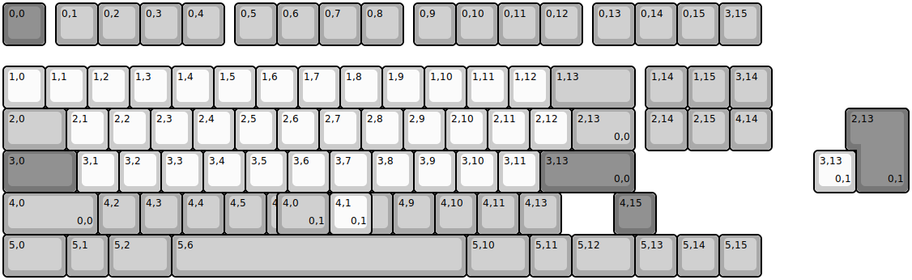{:loading="lazy"}

[Open in keyboard-layout-editor](http://www.keyboard-layout-editor.com/##@@_c=#777777;&=0,0&_x:0.25&c=#aaaaaa;&=0,1&=0,2&=0,3&=0,4&_x:0.25;&=0,5&=0,6&=0,7&=0,8&_x:0.25;&=0,9&=0,10&=0,11&=0,12&_x:0.25;&=0,13&=0,14&=0,15&=3,15;&@_y:0.5&c=#cccccc;&=1,0&=1,1&=1,2&=1,3&=1,4&=1,5&=1,6&=1,7&=1,8&=1,9&=1,10&=1,11&=1,12&_c=#aaaaaa&w:2;&=1,13&_x:0.25;&=1,14&=1,15&=3,14;&@_w:1.5;&=2,0&_c=#cccccc;&=2,1&=2,2&=2,3&=2,4&=2,5&=2,6&=2,7&=2,8&=2,9&=2,10&=2,11&=2,12&_c=#aaaaaa&w:1.5;&=2,13%0A%0A%0A0,0&_x:0.25;&=2,14&=2,15&=4,14;&@_c=#777777&w:1.75;&=3,0&_c=#cccccc;&=3,1&=3,2&=3,3&=3,4&=3,5&=3,6&=3,7&=3,8&=3,9&=3,10&=3,11&_c=#777777&w:2.25;&=3,13%0A%0A%0A0,0;&@_c=#aaaaaa&w:2.25;&=4,0%0A%0A%0A0,0&=4,2&=4,3&=4,4&=4,5&=4,6&=4,7&=4,8&=4,9&=4,10&=4,11&=4,13&_x:1.25&c=#777777;&=4,15;&@_c=#aaaaaa&w:1.5;&=5,0&=5,1&_w:1.5;&=5,2&_w:7;&=5,6&_w:1.5;&=5,10&=5,11&_w:1.5;&=5,12&=5,13&=5,14&=5,15;&@_x:20.25&y:-4.0&c=#777777&w:1.25&h:2&w2:1.5&h2:1&x2:-0.25;&=2,13%0A%0A%0A0,1;&@_x:19.25&c=#cccccc;&=3,13%0A%0A%0A0,1;&@_x:6.5&c=#aaaaaa&w:1.25;&=4,0%0A%0A%0A0,1&_c=#cccccc;&=4,1%0A%0A%0A0,1)

## kbnordic/nordic60_rev_a

[README](output/kbnordic/README.md) - [layout](output/kbnordic/nordic60_rev_a-kle.json) - [PCB](output/kbnordic/nordic60_rev_a.kicad_pcb) - [PCB render](output/kbnordic/nordic60_rev_a-render.svg)

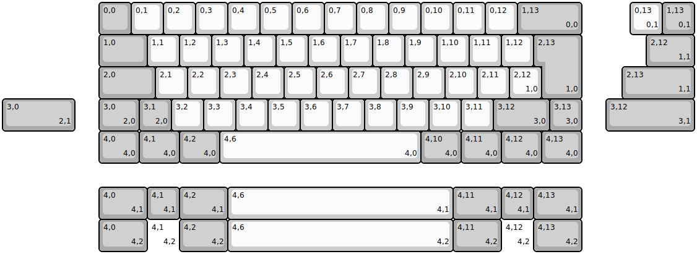{:loading="lazy"}

[Open in keyboard-layout-editor](http://www.keyboard-layout-editor.com/##@@_x:3&c=#aaaaaa;&=0,0&_c=#cccccc;&=0,1&=0,2&=0,3&=0,4&=0,5&=0,6&=0,7&=0,8&=0,9&=0,10&=0,11&=0,12&_c=#aaaaaa&w:2;&=1,13%0A%0A%0A0,0;&@_x:3&w:1.5;&=1,0&_c=#cccccc;&=1,1&=1,2&=1,3&=1,4&=1,5&=1,6&=1,7&=1,8&=1,9&=1,10&=1,11&=1,12&_x:0.25&c=#aaaaaa&w:1.25&h:2&w2:1.5&h2:1&x2:-0.25;&=2,13%0A%0A%0A1,0;&@_x:3&w:1.75;&=2,0&_c=#cccccc;&=2,1&=2,2&=2,3&=2,4&=2,5&=2,6&=2,7&=2,8&=2,9&=2,10&=2,11&=2,12%0A%0A%0A1,0;&@_x:3.0&c=#aaaaaa&w:1.25;&=3,0%0A%0A%0A2,0&=3,1%0A%0A%0A2,0&_c=#cccccc;&=3,2&=3,3&=3,4&=3,5&=3,6&=3,7&=3,8&=3,9&=3,10&=3,11&_c=#aaaaaa&w:1.75;&=3,12%0A%0A%0A3,0&=3,13%0A%0A%0A3,0;&@_x:3&w:1.25;&=4,0%0A%0A%0A4,0&_w:1.25;&=4,1%0A%0A%0A4,0&_w:1.25;&=4,2%0A%0A%0A4,0&_c=#cccccc&w:6.25;&=4,6%0A%0A%0A4,0&_c=#aaaaaa&w:1.25;&=4,10%0A%0A%0A4,0&_w:1.25;&=4,11%0A%0A%0A4,0&_w:1.25;&=4,12%0A%0A%0A4,0&_w:1.25;&=4,13%0A%0A%0A4,0;&@_x:19.5&y:-5&c=#cccccc;&=0,13%0A%0A%0A0,1&_c=#aaaaaa;&=1,13%0A%0A%0A0,1;&@_x:20.0&w:1.5;&=2,12%0A%0A%0A1,1;&@_x:19.25&w:2.25;&=2,13%0A%0A%0A1,1;&@_w:2.25;&=3,0%0A%0A%0A2,1&_x:16.5&w:2.75;&=3,12%0A%0A%0A3,1;&@_x:3&y:1.75&w:1.5;&=4,0%0A%0A%0A4,1&=4,1%0A%0A%0A4,1&_w:1.5;&=4,2%0A%0A%0A4,1&_c=#cccccc&w:7;&=4,6%0A%0A%0A4,1&_c=#aaaaaa&w:1.5;&=4,11%0A%0A%0A4,1&=4,12%0A%0A%0A4,1&_w:1.5;&=4,13%0A%0A%0A4,1;&@_x:3&w:1.5;&=4,0%0A%0A%0A4,2&_d:true;&=4,1%0A%0A%0A4,2&_w:1.5;&=4,2%0A%0A%0A4,2&_c=#cccccc&w:7;&=4,6%0A%0A%0A4,2&_c=#aaaaaa&w:1.5;&=4,11%0A%0A%0A4,2&_d:true;&=4,12%0A%0A%0A4,2&_w:1.5;&=4,13%0A%0A%0A4,2)

## kbparadise/v60_type_r

[README](output/kbparadise/README.md) - [layout](output/kbparadise/v60_type_r-kle.json) - [PCB](output/kbparadise/v60_type_r.kicad_pcb) - [PCB render](output/kbparadise/v60_type_r-render.svg)

{:loading="lazy"}

[Open in keyboard-layout-editor](http://www.keyboard-layout-editor.com/##@@_c=#777777;&=0,0&_c=#cccccc;&=0,1&=0,2&=0,3&=0,4&=0,5&=0,6&=0,7&=1,0&=1,1&=1,2&=1,3&=1,4&_c=#aaaaaa&w:2;&=1,6;&@_w:1.5;&=1,7&_c=#cccccc;&=2,0&=2,1&=2,2&=2,3&=2,4&=2,5&=2,6&=2,7&=3,0&=3,1&=3,2&=3,3&_w:1.5;&=3,4;&@_c=#aaaaaa&w:1.75;&=3,5&_c=#cccccc;&=3,6&=3,7&=4,0&=4,1&=4,2&=4,3&=4,4&=4,5&=4,6&=4,7&=5,0&_c=#777777&w:2.25;&=5,1;&@_c=#aaaaaa&w:2.25;&=5,2&_c=#cccccc;&=5,4&=5,5&=5,6&=5,7&=6,0&=6,1&=6,2&=6,3&=6,4&=6,5&_c=#aaaaaa&w:2.75;&=6,6;&@_w:1.25;&=7,0&_w:1.25;&=7,1&_w:1.25;&=7,2&_c=#cccccc&w:6.25;&=7,3&_c=#aaaaaa&w:1.25;&=7,4&_w:1.25;&=7,5&_w:1.25;&=7,6&_w:1.25;&=7,7)

## keebio/BFO-9000/bfo9000

[README](output/keebio/BFO-9000/README.md) - [layout](output/keebio/BFO-9000/bfo9000-kle.json) - [PCB](output/keebio/BFO-9000/bfo9000.kicad_pcb) - [PCB render](output/keebio/BFO-9000/bfo9000-render.svg)

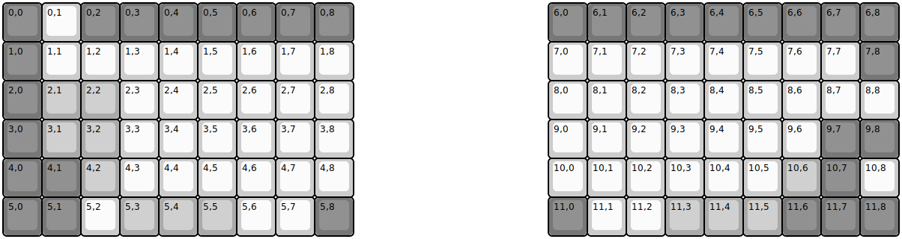{:loading="lazy"}

[Open in keyboard-layout-editor](http://www.keyboard-layout-editor.com/##@@_c=#777777;&=0,0&_c=#cccccc;&=0,1&_c=#777777;&=0,2&=0,3&=0,4&=0,5&=0,6&=0,7&=0,8&_x:5;&=6,0&=6,1&=6,2&=6,3&=6,4&=6,5&=6,6&=6,7&=6,8;&@=1,0&_c=#cccccc;&=1,1&=1,2&=1,3&=1,4&=1,5&=1,6&=1,7&=1,8&_x:5;&=7,0&=7,1&=7,2&=7,3&=7,4&=7,5&=7,6&=7,7&_c=#777777;&=7,8;&@=2,0&_c=#aaaaaa;&=2,1&=2,2&_c=#cccccc;&=2,3&=2,4&=2,5&=2,6&=2,7&=2,8&_x:5;&=8,0&=8,1&=8,2&=8,3&=8,4&=8,5&=8,6&=8,7&=8,8;&@_c=#777777;&=3,0&_c=#aaaaaa;&=3,1&=3,2&_c=#cccccc;&=3,3&=3,4&=3,5&=3,6&=3,7&=3,8&_x:5;&=9,0&=9,1&=9,2&=9,3&=9,4&=9,5&=9,6&_c=#777777;&=9,7&=9,8;&@=4,0&=4,1&_c=#aaaaaa;&=4,2&_c=#cccccc;&=4,3&=4,4&=4,5&=4,6&=4,7&=4,8&_x:5;&=10,0&=10,1&=10,2&=10,3&=10,4&=10,5&_c=#aaaaaa;&=10,6&_c=#777777;&=10,7&_c=#cccccc;&=10,8;&@_c=#777777;&=5,0&=5,1&_c=#cccccc;&=5,2&_c=#aaaaaa;&=5,3&=5,4&=5,5&_c=#cccccc;&=5,6&=5,7&_c=#777777;&=5,8&_x:5;&=11,0&_c=#cccccc;&=11,1&=11,2&_c=#aaaaaa;&=11,3&=11,4&=11,5&_c=#777777;&=11,6&=11,7&=11,8)

## keebio/bamfk1/bamfk1-rev1

[README](output/keebio/bamfk1/README.md) - [layout](output/keebio/bamfk1/bamfk1-rev1-kle.json) - [PCB](output/keebio/bamfk1/bamfk1-rev1.kicad_pcb) - [PCB render](output/keebio/bamfk1/bamfk1-rev1-render.svg)

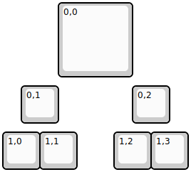{:loading="lazy"}

[Open in keyboard-layout-editor](http://www.keyboard-layout-editor.com/##@@_x:1.5&w:2&h:2;&=0,0;&@_x:0.5&y:1.25;&=0,1&_x:2.0;&=0,2;&@_y:0.25;&=1,0&=1,1&_x:1;&=1,2&=1,3)

## keebio/bdn9/bdn9-rev1

[README](output/keebio/bdn9/README.md) - [layout](output/keebio/bdn9/bdn9-rev1-kle.json) - [PCB](output/keebio/bdn9/bdn9-rev1.kicad_pcb) - [PCB render](output/keebio/bdn9/bdn9-rev1-render.svg)

{:loading="lazy"}

[Open in keyboard-layout-editor](http://www.keyboard-layout-editor.com/##@@=0,0%0A%0A%0A0,0&=0,1%0A%0A%0A1,0&=0,2%0A%0A%0A2,0;&@=1,0&=1,1&=1,2;&@=2,0&=2,1&=2,2;&@_y:0.25;&=0,0%0A%0A%0A0,1%0A%0A%0A%0A%0A%0Ae0&=0,1%0A%0A%0A1,1%0A%0A%0A%0A%0A%0Ae2&=0,2%0A%0A%0A2,1%0A%0A%0A%0A%0A%0Ae1)

## keebio/bdn9/bdn9-rev2

[README](output/keebio/bdn9/README.md) - [layout](output/keebio/bdn9/bdn9-rev2-kle.json) - [PCB](output/keebio/bdn9/bdn9-rev2.kicad_pcb) - [PCB render](output/keebio/bdn9/bdn9-rev2-render.svg)

{:loading="lazy"}

[Open in keyboard-layout-editor](http://www.keyboard-layout-editor.com/##@@=0,0%0A%0A%0A0,0&=0,1%0A%0A%0A1,0&=0,2%0A%0A%0A2,0;&@=1,0&=1,1&=1,2;&@=2,0&=2,1&=2,2;&@_y:0.25;&=0,0%0A%0A%0A0,1%0A%0A%0A%0A%0A%0Ae0&=0,1%0A%0A%0A1,1%0A%0A%0A%0A%0A%0Ae2&=0,2%0A%0A%0A2,1%0A%0A%0A%0A%0A%0Ae1)

## keebio/bigswitchseat/bigswitchseat-rev1

[README](output/keebio/bigswitchseat/README.md) - [layout](output/keebio/bigswitchseat/bigswitchseat-rev1-kle.json) - [PCB](output/keebio/bigswitchseat/bigswitchseat-rev1.kicad_pcb) - [PCB render](output/keebio/bigswitchseat/bigswitchseat-rev1-render.svg)

{:loading="lazy"}

[Open in keyboard-layout-editor](http://www.keyboard-layout-editor.com/##@@_w:2&h:2;&=0,0)

## keebio/choconum/choconum-rev1

[README](output/keebio/choconum/README.md) - [layout](output/keebio/choconum/choconum-rev1-kle.json) - [PCB](output/keebio/choconum/choconum-rev1.kicad_pcb) - [PCB render](output/keebio/choconum/choconum-rev1-render.svg)

{:loading="lazy"}

[Open in keyboard-layout-editor](http://www.keyboard-layout-editor.com/##@@=0,0&=0,1&=0,2&=0,3;&@=1,0&=1,1&=1,2&_h:2;&=1,3%0A%0A%0A1,0;&@=2,0&=2,1&=2,2;&@=3,0&=3,1&=3,2&_h:2;&=3,3%0A%0A%0A2,0;&@_w:2;&=4,0%0A%0A%0A0,0&=4,2;&@_x:4.5&y:-4;&=1,3%0A%0A%0A1,1;&@_x:4.5;&=2,3%0A%0A%0A1,1;&@_x:4.5;&=3,3%0A%0A%0A2,1;&@_x:4.5;&=4,3%0A%0A%0A2,1;&@_y:0.5;&=4,0%0A%0A%0A0,1&=4,1%0A%0A%0A0,1)

## keebio/convolution/convolution-rev1

[README](output/keebio/convolution/README.md) - [layout](output/keebio/convolution/convolution-rev1-kle.json) - [PCB](output/keebio/convolution/convolution-rev1.kicad_pcb) - [PCB render](output/keebio/convolution/convolution-rev1-render.svg)

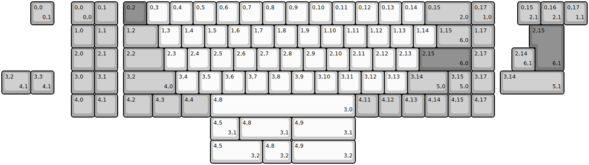{:loading="lazy"}

[Open in keyboard-layout-editor](http://www.keyboard-layout-editor.com/##@@_x:3.0&c=#aaaaaa;&=0,0%0A%0A%0A0,0&=0,1&_x:0.25&c=#777777;&=0,2&_c=#cccccc;&=0,3&=0,4&=0,5&=0,6&=0,7&=0,8&=0,9&=0,10&=0,11&=0,12&=0,13&=0,14&_c=#aaaaaa&w:2;&=0,15%0A%0A%0A2,0&=0,17%0A%0A%0A1,0;&@_x:3;&=1,0&=1,1&_x:0.25&w:1.5;&=1,2&_c=#cccccc;&=1,3&=1,4&=1,5&=1,6&=1,7&=1,8&=1,9&=1,10&=1,11&=1,12&=1,13&=1,14&_c=#aaaaaa&w:1.5;&=1,15%0A%0A%0A6,0&=1,17;&@_x:3;&=2,0&=2,1&_x:0.25&w:1.75;&=2,2&_c=#cccccc;&=2,3&=2,4&=2,5&=2,6&=2,7&=2,8&=2,9&=2,10&=2,11&=2,12&=2,13&_c=#777777&w:2.25;&=2,15%0A%0A%0A6,0&_c=#aaaaaa;&=2,17;&@_x:3.0;&=3,0&=3,1&_x:0.25&w:2.25;&=3,2%0A%0A%0A4,0&_c=#cccccc;&=3,4&=3,5&=3,6&=3,7&=3,8&=3,9&=3,10&=3,11&=3,12&=3,13&_c=#aaaaaa&w:1.75;&=3,14%0A%0A%0A5,0&=3,15%0A%0A%0A5,0&=3,17;&@_x:3;&=4,0&=4,1&_x:0.25&w:1.25;&=4,2&_w:1.25;&=4,3&_w:1.25;&=4,4&_c=#cccccc&w:6.25;&=4,8%0A%0A%0A3,0&_c=#aaaaaa;&=4,11&=4,12&=4,13&=4,14&=4,15&=4,17;&@_x:1.25&y:-5;&=0,0%0A%0A%0A0,1%0A%0A%0A%0A%0A%0Ae0&_x:20.0;&=0,15%0A%0A%0A2,1&=0,16%0A%0A%0A2,1&=0,17%0A%0A%0A1,1%0A%0A%0A%0A%0A%0Ae1;&@_x:23.0&c=#777777&w:1.25&h:2&w2:1.5&h2:1&x2:-0.25;&=2,15%0A%0A%0A6,1;&@_x:22.0&c=#aaaaaa;&=2,14%0A%0A%0A6,1;&@_w:1.25;&=3,2%0A%0A%0A4,1&=3,3%0A%0A%0A4,1&_x:19.25&w:2.75;&=3,14%0A%0A%0A5,1;&@_x:9&y:1&c=#cccccc&w:1.25;&=4,5%0A%0A%0A3,1&_w:2.25;&=4,8%0A%0A%0A3,1&_w:2.75;&=4,9%0A%0A%0A3,1;&@_x:9&w:2.25;&=4,5%0A%0A%0A3,2&_w:1.25;&=4,8%0A%0A%0A3,2&_w:2.75;&=4,9%0A%0A%0A3,2)

## keebio/dsp40/dsp40-rev1

[README](output/keebio/dsp40/README.md) - [layout](output/keebio/dsp40/dsp40-rev1-kle.json) - [PCB](output/keebio/dsp40/dsp40-rev1.kicad_pcb) - [PCB render](output/keebio/dsp40/dsp40-rev1-render.svg)

{:loading="lazy"}

[Open in keyboard-layout-editor](http://www.keyboard-layout-editor.com/##@@_c=#777777;&=0,0&_c=#cccccc;&=0,1&=0,2&=0,3&=0,4&=0,5&=0,6&=0,7&=0,8&=0,9&=0,10&_c=#aaaaaa;&=0,11;&@_w:1.25;&=1,0%0A%0A%0A0,0&_c=#cccccc;&=1,1%0A%0A%0A0,0&=1,2%0A%0A%0A0,0&=1,3%0A%0A%0A0,0&=1,4%0A%0A%0A0,0&=1,5%0A%0A%0A0,0&=1,6%0A%0A%0A0,0&=1,7%0A%0A%0A0,0&=1,8%0A%0A%0A0,0&=1,9%0A%0A%0A0,0&_c=#777777&w:1.75;&=1,11%0A%0A%0A0,0;&@_c=#aaaaaa&w:1.75;&=2,1%0A%0A%0A1,0&_c=#cccccc;&=2,2%0A%0A%0A1,0&=2,3%0A%0A%0A1,0&=2,4%0A%0A%0A1,0&=2,5%0A%0A%0A1,0&=2,6%0A%0A%0A1,0&=2,7%0A%0A%0A1,0&=2,8%0A.%0A%0A1,0&=2,9%0A%0A%0A1,0&_w:1.25;&=2,10%0A%0A%0A1,0&_c=#aaaaaa;&=2,11%0A%0A%0A1,0;&@_w:1.25;&=3,0%0A%0A%0A2,0&=3,1%0A%0A%0A2,0&_w:1.25;&=3,2%0A%0A%0A2,0&_c=#cccccc&w:2.25;&=3,4%0A%0A%0A2,0&_w:2.75;&=3,7%0A%0A%0A2,0&_c=#aaaaaa&w:1.25;&=3,9%0A%0A%0A2,0&=3,10%0A%0A%0A2,0&_w:1.25;&=3,11%0A%0A%0A2,0;&@_x:12.5&y:-3;&=1,0%0A%0A%0A0,1&_c=#cccccc;&=1,1%0A%0A%0A0,1&=1,2%0A%0A%0A0,1&=1,3%0A%0A%0A0,1&=1,4%0A%0A%0A0,1&=1,5%0A%0A%0A0,1&=1,6%0A%0A%0A0,1&=1,7%0A%0A%0A0,1&=1,8%0A%0A%0A0,1&=1,9%0A%0A%0A0,1&=1,10%0A%0A%0A0,1&_c=#aaaaaa;&=1,11%0A%0A%0A0,1;&@_x:12.5&w:1.75;&=2,1%0A%0A%0A1,1&_c=#cccccc;&=2,2%0A%0A%0A1,1&=2,3%0A%0A%0A1,1&=2,4%0A%0A%0A1,1&=2,5%0A%0A%0A1,1&=2,6%0A%0A%0A1,1&=2,7%0A%0A%0A1,1&=2,8%0A.%0A%0A1,1&=2,9%0A%0A%0A1,1&=2,10%0A%0A%0A1,1&_c=#aaaaaa&w:1.25;&=2,11%0A%0A%0A1,1;&@_x:12.5;&=2,0%0A%0A%0A1,2&_c=#cccccc;&=2,1%0A%0A%0A1,2&=2,2%0A%0A%0A1,2&=2,3%0A%0A%0A1,2&=2,4%0A%0A%0A1,2&=2,5%0A%0A%0A1,2&=2,6%0A%0A%0A1,2&=2,7%0A%0A%0A1,2&=2,8%0A%0A%0A1,2&=2,9%0A%0A%0A1,2&=2,10%0A%0A%0A1,2&_c=#777777;&=2,11%0A%0A%0A1,2;&@_y:0.25&c=#aaaaaa&w:1.5;&=3,0%0A%0A%0A2,1&=3,1%0A%0A%0A2,1&_w:1.5;&=3,2%0A%0A%0A2,1&_c=#cccccc&w:2.25;&=3,4%0A%0A%0A2,1&_w:2.75;&=3,7%0A%0A%0A2,1&_c=#aaaaaa;&=3,9%0A%0A%0A2,1&=3,10%0A%0A%0A2,1&=3,11%0A%0A%0A2,1;&@_y:0.25;&=3,0%0A%0A%0A2,2&=3,1%0A%0A%0A2,2&=3,2%0A%0A%0A2,2&=3,3%0A%0A%0A2,2&=3,4%0A%0A%0A2,2&_c=#cccccc;&=3,5%0A%0A%0A2,2&=3,6%0A%0A%0A2,2&_c=#aaaaaa;&=3,7%0A%0A%0A2,2&=3,8%0A%0A%0A2,2&=3,9%0A%0A%0A2,2&=3,10%0A%0A%0A2,2&=3,11%0A%0A%0A2,2)

## keebio/foldkb/foldkb-rev1

[README](output/keebio/foldkb/README.md) - [layout](output/keebio/foldkb/foldkb-rev1-kle.json) - [PCB](output/keebio/foldkb/foldkb-rev1.kicad_pcb) - [PCB render](output/keebio/foldkb/foldkb-rev1-render.svg)

{:loading="lazy"}

[Open in keyboard-layout-editor](http://www.keyboard-layout-editor.com/##@@_c=#aaaaaa;&=0,0&_x:0.25&c=#777777;&=0,1&_c=#cccccc;&=0,2&=0,3&=0,4&=0,5&=0,6&=0,7&_x:0.75;&=5,0&=5,1&=5,2&=5,3&=5,4&=5,5&=5,6%0A%0A%0A2,0&_c=#aaaaaa;&=5,7%0A%0A%0A2,0;&@=1,0&_x:0.75&w:1.5;&=1,2&_c=#cccccc;&=1,3&=1,4&=1,5&=1,6&=1,7&_x:0.75;&=6,0&=6,1&=6,2&=6,3&=6,4&=6,5&=6,6&_w:1.5;&=6,7%0A%0A%0A3,0;&@_c=#aaaaaa;&=2,0&_x:0.5&w:1.75;&=2,2&_c=#cccccc;&=2,3&=2,4&=2,5&=2,6&=2,7&_x:0.75;&=7,0&=7,1&=7,2&=7,3&=7,4&=7,5&_c=#777777&w:2.25;&=7,7;&@_c=#aaaaaa;&=3,0&_w:2.25;&=3,2&_c=#cccccc;&=3,3&=3,4&=3,5&=3,6&=3,7&_x:0.75;&=8,0&=8,1&=8,2&=8,3&=8,4&_c=#aaaaaa&w:1.75;&=8,5%0A%0A%0A4,0&=8,7%0A%0A%0A4,0;&@=4,0&_x:0.5&w:1.25;&=4,2&_w:1.25;&=4,3&_w:1.25;&=4,4&=4,5%0A%0A%0A0,0&=4,6%0A%0A%0A0,0&=4,7%0A%0A%0A0,0&_x:0.75&w:1.25;&=9,0%0A%0A%0A1,0&_w:1.5;&=9,1%0A%0A%0A1,0&_w:1.25;&=9,3&_w:1.25;&=9,4&_w:1.25;&=9,5&_w:1.25;&=9,7;&@_x:17.75&y:-5&w:2;&=5,7%0A%0A%0A2,1;&@_x:17.75&c=#cccccc;&=6,7%0A%0A%0A3,1;&@_x:17.5&y:1&c=#aaaaaa&w:2.75;&=8,5%0A%0A%0A4,1;&@_x:5.25&y:1;&=4,5%0A%0A%0A0,1&_w:2;&=4,7%0A%0A%0A0,1&_x:0.75&w:2.75;&=9,1%0A%0A%0A1,1;&@_x:5.25&w:1.5;&=4,5%0A%0A%0A0,2&_w:1.5;&=4,7%0A%0A%0A0,2)

## keebio/iris/iris-rev2

[README](output/keebio/iris/README.md) - [layout](output/keebio/iris/iris-rev2-kle.json) - [PCB](output/keebio/iris/iris-rev2.kicad_pcb) - [PCB render](output/keebio/iris/iris-rev2-render.svg)

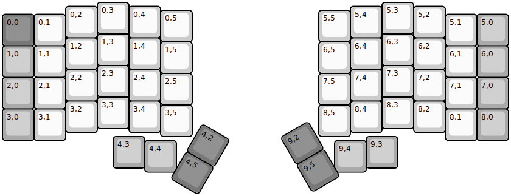{:loading="lazy"}

[Open in keyboard-layout-editor](http://www.keyboard-layout-editor.com/##@@_x:3;&=0,3&_x:8;&=5,3;&@_x:2&y:-0.875;&=0,2&_x:1;&=0,4&_x:6;&=5,4&_x:1;&=5,2;&@_x:5&y:-0.875;&=0,5&_x:4;&=5,5;&@_y:-0.875&c=#777777;&=0,0&_c=#cccccc;&=0,1&_x:12;&=5,1&_c=#aaaaaa;&=5,0;&@_x:3&y:-0.375&c=#cccccc;&=1,3&_x:8;&=6,3;&@_x:2&y:-0.875;&=1,2&_x:1;&=1,4&_x:6;&=6,4&_x:1;&=6,2;&@_x:5&y:-0.875;&=1,5&_x:4;&=6,5;&@_y:-0.875&c=#aaaaaa;&=1,0&_c=#cccccc;&=1,1&_x:12;&=6,1&_c=#aaaaaa;&=6,0;&@_x:3&y:-0.375&c=#cccccc;&=2,3&_x:8;&=7,3;&@_x:2&y:-0.875;&=2,2&_x:1;&=2,4&_x:6;&=7,4&_x:1;&=7,2;&@_x:5&y:-0.875;&=2,5&_x:4;&=7,5;&@_y:-0.875&c=#aaaaaa;&=2,0&_c=#cccccc;&=2,1&_x:12;&=7,1&_c=#aaaaaa;&=7,0;&@_x:3&y:-0.375&c=#cccccc;&=3,3&_x:8;&=8,3;&@_x:2&y:-0.875;&=3,2&_x:1;&=3,4&_x:6;&=8,4&_x:1;&=8,2;&@_x:5&y:-0.875;&=3,5&_x:4;&=8,5;&@_y:-0.875&c=#aaaaaa;&=3,0&_c=#cccccc;&=3,1&_x:12;&=8,1&_c=#aaaaaa;&=8,0;&@_x:3.5&y:-0.125;&=4,3&_x:7.0;&=9,3;&@_x:4.5&y:-0.875;&=4,4&_x:5.0;&=9,4;&@_r:30&rx:8&x:0.5&y:4.13&c=#777777;&=4,2;&@_x:0.5;&=4,5;&@_r:-30&x:-1.5&y:-2.0;&=9,2;&@_x:-1.5;&=9,5)

## keebio/iris/iris-rev3

[README](output/keebio/iris/README.md) - [layout](output/keebio/iris/iris-rev3-kle.json) - [PCB](output/keebio/iris/iris-rev3.kicad_pcb) - [PCB render](output/keebio/iris/iris-rev3-render.svg)

{:loading="lazy"}

[Open in keyboard-layout-editor](http://www.keyboard-layout-editor.com/##@@_x:3;&=0,3&_x:8;&=5,3;&@_x:2&y:-0.875;&=0,2&_x:1;&=0,4&_x:6;&=5,4&_x:1;&=5,2;&@_x:5&y:-0.875;&=0,5&_x:4;&=5,5;&@_y:-0.875&c=#777777;&=0,0&_c=#cccccc;&=0,1&_x:12;&=5,1&_c=#aaaaaa;&=5,0;&@_x:3&y:-0.375&c=#cccccc;&=1,3&_x:8;&=6,3;&@_x:2&y:-0.875;&=1,2&_x:1;&=1,4&_x:6;&=6,4&_x:1;&=6,2;&@_x:5&y:-0.875;&=1,5&_x:4;&=6,5;&@_y:-0.875&c=#aaaaaa;&=1,0&_c=#cccccc;&=1,1&_x:12;&=6,1&_c=#aaaaaa;&=6,0;&@_x:3&y:-0.375&c=#cccccc;&=2,3&_x:8;&=7,3;&@_x:2&y:-0.875;&=2,2&_x:1;&=2,4&_x:6;&=7,4&_x:1;&=7,2;&@_x:5&y:-0.875;&=2,5&_x:4;&=7,5;&@_y:-0.875&c=#aaaaaa;&=2,0&_c=#cccccc;&=2,1&_x:12;&=7,1&_c=#aaaaaa;&=7,0;&@_x:3&y:-0.375&c=#cccccc;&=3,3&_x:8;&=8,3;&@_x:2&y:-0.875;&=3,2&_x:1;&=3,4&_x:6;&=8,4&_x:1;&=8,2;&@_x:5&y:-0.875;&=3,5&_x:4;&=8,5;&@_y:-0.875&c=#aaaaaa;&=3,0&_c=#cccccc;&=3,1&_x:12;&=8,1&_c=#aaaaaa;&=8,0;&@_x:3.5&y:-0.125;&=4,3&_x:7.0;&=9,3;&@_x:4.5&y:-0.875;&=4,4&_x:5.0;&=9,4;&@_r:30&rx:8&x:0.5&y:4.13&c=#777777;&=4,2;&@_x:0.5;&=4,5;&@_r:-30&x:-1.5&y:-2.0;&=9,2;&@_x:-1.5;&=9,5)

## keebio/iris/iris-rev4

[README](output/keebio/iris/README.md) - [layout](output/keebio/iris/iris-rev4-kle.json) - [PCB](output/keebio/iris/iris-rev4.kicad_pcb) - [PCB render](output/keebio/iris/iris-rev4-render.svg)

{:loading="lazy"}

[Open in keyboard-layout-editor](http://www.keyboard-layout-editor.com/##@@_x:3;&=0,3&_x:8;&=5,3;&@_x:2&y:-0.875;&=0,2&_x:1;&=0,4&_x:6;&=5,4&_x:1;&=5,2;&@_x:5&y:-0.875;&=0,5&_x:4;&=5,5;&@_y:-0.875&c=#777777;&=0,0&_c=#cccccc;&=0,1&_x:12;&=5,1&_c=#aaaaaa;&=5,0;&@_x:3&y:-0.375&c=#cccccc;&=1,3&_x:8;&=6,3;&@_x:2&y:-0.875;&=1,2&_x:1;&=1,4&_x:6;&=6,4&_x:1;&=6,2;&@_x:5&y:-0.875;&=1,5&_x:4;&=6,5;&@_y:-0.875&c=#aaaaaa;&=1,0&_c=#cccccc;&=1,1&_x:12;&=6,1&_c=#aaaaaa;&=6,0;&@_x:3&y:-0.375&c=#cccccc;&=2,3&_x:8;&=7,3;&@_x:2&y:-0.875;&=2,2&_x:1;&=2,4&_x:6;&=7,4&_x:1;&=7,2;&@_x:5&y:-0.875;&=2,5&_x:4;&=7,5;&@_y:-0.875&c=#aaaaaa;&=2,0&_c=#cccccc;&=2,1&_x:12;&=7,1&_c=#aaaaaa;&=7,0;&@_x:3&y:-0.375&c=#cccccc;&=3,3&_x:8;&=8,3;&@_x:2&y:-0.875;&=3,2&_x:1;&=3,4&_x:6;&=8,4&_x:1;&=8,2;&@_x:5&y:-0.875;&=3,5&_x:4;&=8,5;&@_y:-0.875&c=#aaaaaa;&=3,0&_c=#cccccc;&=3,1&_x:12;&=8,1&_c=#aaaaaa;&=8,0;&@_x:3.5&y:-0.125;&=4,2&_x:7.0;&=9,2;&@_x:4.5&y:-0.875;&=4,3&_x:5.0;&=9,3;&@_r:30&rx:8&x:0.6&y:4.13&c=#777777;&=4,5%0A%0A%0A0,0;&@_x:0.6;&=4,4%0A%0A%0A0,0;&@_r:-30&x:-1.6&y:-2.0;&=9,5%0A%0A%0A1,0;&@_x:-1.6;&=9,4%0A%0A%0A1,0;&@_r:30&x:1.6&y:-2.0&h:2;&=4,5%0A%0A%0A0,1;&@_r:-30&x:-2.6&y:-1.0&h:2;&=9,4%0A%0A%0A1,1)

## keebio/iris/iris-rev5

[README](output/keebio/iris/README.md) - [layout](output/keebio/iris/iris-rev5-kle.json) - [PCB](output/keebio/iris/iris-rev5.kicad_pcb) - [PCB render](output/keebio/iris/iris-rev5-render.svg)

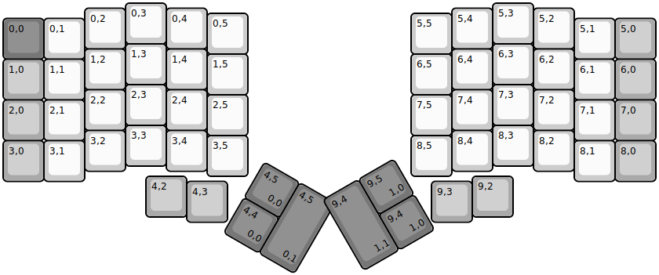{:loading="lazy"}

[Open in keyboard-layout-editor](http://www.keyboard-layout-editor.com/##@@_x:3;&=0,3&_x:8;&=5,3;&@_x:2&y:-0.875;&=0,2&_x:1;&=0,4&_x:6;&=5,4&_x:1;&=5,2;&@_x:5&y:-0.875;&=0,5&_x:4;&=5,5;&@_y:-0.875&c=#777777;&=0,0&_c=#cccccc;&=0,1&_x:12;&=5,1&_c=#aaaaaa;&=5,0;&@_x:3&y:-0.375&c=#cccccc;&=1,3&_x:8;&=6,3;&@_x:2&y:-0.875;&=1,2&_x:1;&=1,4&_x:6;&=6,4&_x:1;&=6,2;&@_x:5&y:-0.875;&=1,5&_x:4;&=6,5;&@_y:-0.875&c=#aaaaaa;&=1,0&_c=#cccccc;&=1,1&_x:12;&=6,1&_c=#aaaaaa;&=6,0;&@_x:3&y:-0.375&c=#cccccc;&=2,3&_x:8;&=7,3;&@_x:2&y:-0.875;&=2,2&_x:1;&=2,4&_x:6;&=7,4&_x:1;&=7,2;&@_x:5&y:-0.875;&=2,5&_x:4;&=7,5;&@_y:-0.875&c=#aaaaaa;&=2,0&_c=#cccccc;&=2,1&_x:12;&=7,1&_c=#aaaaaa;&=7,0;&@_x:3&y:-0.375&c=#cccccc;&=3,3&_x:8;&=8,3;&@_x:2&y:-0.875;&=3,2&_x:1;&=3,4&_x:6;&=8,4&_x:1;&=8,2;&@_x:5&y:-0.875;&=3,5&_x:4;&=8,5;&@_y:-0.875&c=#aaaaaa;&=3,0&_c=#cccccc;&=3,1&_x:12;&=8,1&_c=#aaaaaa;&=8,0;&@_x:3.5&y:-0.125;&=4,2&_x:7.0;&=9,2;&@_x:4.5&y:-0.875;&=4,3&_x:5.0;&=9,3;&@_r:30&rx:8&x:0.6&y:4.13&c=#777777;&=4,5%0A%0A%0A0,0;&@_x:0.6;&=4,4%0A%0A%0A0,0;&@_r:-30&x:-1.6&y:-2.0;&=9,5%0A%0A%0A1,0;&@_x:-1.6;&=9,4%0A%0A%0A1,0;&@_r:30&x:1.6&y:-2.0&h:2;&=4,5%0A%0A%0A0,1;&@_r:-30&x:-2.6&y:-1.0&h:2;&=9,4%0A%0A%0A1,1)

## keebio/iris/iris-rev6

[README](output/keebio/iris/README.md) - [layout](output/keebio/iris/iris-rev6-kle.json) - [PCB](output/keebio/iris/iris-rev6.kicad_pcb) - [PCB render](output/keebio/iris/iris-rev6-render.svg)

{:loading="lazy"}

[Open in keyboard-layout-editor](http://www.keyboard-layout-editor.com/##@@_x:3;&=0,3&_x:8;&=5,3;&@_x:2&y:-0.875;&=0,2&_x:1;&=0,4&_x:6;&=5,4&_x:1;&=5,2;&@_x:5&y:-0.875;&=0,5&_x:4;&=5,5;&@_y:-0.875&c=#777777;&=0,0&_c=#cccccc;&=0,1&_x:12;&=5,1&_c=#aaaaaa;&=5,0;&@_x:3&y:-0.375&c=#cccccc;&=1,3&_x:8;&=6,3;&@_x:2&y:-0.875;&=1,2&_x:1;&=1,4&_x:6;&=6,4&_x:1;&=6,2;&@_x:5&y:-0.875;&=1,5&_x:4;&=6,5;&@_y:-0.875&c=#aaaaaa;&=1,0&_c=#cccccc;&=1,1&_x:12;&=6,1&_c=#aaaaaa;&=6,0;&@_x:3&y:-0.375&c=#cccccc;&=2,3&_x:8;&=7,3;&@_x:2&y:-0.875;&=2,2&_x:1;&=2,4&_x:6;&=7,4&_x:1;&=7,2;&@_x:5&y:-0.875;&=2,5&_x:4;&=7,5;&@_y:-0.875&c=#aaaaaa;&=2,0&_c=#cccccc;&=2,1&_x:12;&=7,1&_c=#aaaaaa;&=7,0;&@_x:3&y:-0.375&c=#cccccc;&=3,3&_x:8;&=8,3;&@_x:2&y:-0.875;&=3,2&_x:1;&=3,4&_x:6;&=8,4&_x:1;&=8,2;&@_x:5&y:-0.875;&=3,5&_x:4;&=8,5;&@_y:-0.875&c=#aaaaaa;&=3,0&_c=#cccccc;&=3,1&_x:12;&=8,1&_c=#aaaaaa;&=8,0;&@_x:3.5&y:-0.125;&=4,2&_x:7.0;&=9,2;&@_x:4.5&y:-0.875;&=4,3&_x:5.0;&=9,3;&@_r:30&rx:8&x:0.6&y:4.13&c=#777777;&=4,5;&@_x:0.6;&=4,4;&@_r:-30&x:-1.6&y:-2.0;&=9,5;&@_x:-1.6;&=9,4)

## keebio/iris/iris-rev6a

[README](output/keebio/iris/README.md) - [layout](output/keebio/iris/iris-rev6a-kle.json) - [PCB](output/keebio/iris/iris-rev6a.kicad_pcb) - [PCB render](output/keebio/iris/iris-rev6a-render.svg)

{:loading="lazy"}

[Open in keyboard-layout-editor](http://www.keyboard-layout-editor.com/##@@_x:3;&=0,3&_x:8;&=5,3;&@_x:2&y:-0.875;&=0,2&_x:1;&=0,4&_x:6;&=5,4&_x:1;&=5,2;&@_x:5&y:-0.875;&=0,5&_x:4;&=5,5;&@_y:-0.875&c=#777777;&=0,0&_c=#cccccc;&=0,1&_x:12;&=5,1&_c=#aaaaaa;&=5,0;&@_x:3&y:-0.375&c=#cccccc;&=1,3&_x:8;&=6,3;&@_x:2&y:-0.875;&=1,2&_x:1;&=1,4&_x:6;&=6,4&_x:1;&=6,2;&@_x:5&y:-0.875;&=1,5&_x:4;&=6,5;&@_y:-0.875&c=#aaaaaa;&=1,0&_c=#cccccc;&=1,1&_x:12;&=6,1&_c=#aaaaaa;&=6,0;&@_x:3&y:-0.375&c=#cccccc;&=2,3&_x:8;&=7,3;&@_x:2&y:-0.875;&=2,2&_x:1;&=2,4&_x:6;&=7,4&_x:1;&=7,2;&@_x:5&y:-0.875;&=2,5&_x:4;&=7,5;&@_y:-0.875&c=#aaaaaa;&=2,0&_c=#cccccc;&=2,1&_x:12;&=7,1&_c=#aaaaaa;&=7,0;&@_x:3&y:-0.375&c=#cccccc;&=3,3&_x:8;&=8,3;&@_x:2&y:-0.875;&=3,2&_x:1;&=3,4&_x:6;&=8,4&_x:1;&=8,2;&@_x:5&y:-0.875;&=3,5&_x:4;&=8,5;&@_y:-0.875&c=#aaaaaa;&=3,0&_c=#cccccc;&=3,1&_x:12;&=8,1&_c=#aaaaaa;&=8,0;&@_x:3.5&y:-0.125;&=4,2&_x:7.0;&=9,2;&@_x:4.5&y:-0.875;&=4,3&_x:5.0;&=9,3;&@_r:30&rx:8&x:0.6&y:4.13&c=#777777;&=4,5;&@_x:0.6;&=4,4;&@_r:-30&x:-1.6&y:-2.0;&=9,5;&@_x:-1.6;&=9,4)

## keebio/iris/iris-rev6b

[README](output/keebio/iris/README.md) - [layout](output/keebio/iris/iris-rev6b-kle.json) - [PCB](output/keebio/iris/iris-rev6b.kicad_pcb) - [PCB render](output/keebio/iris/iris-rev6b-render.svg)

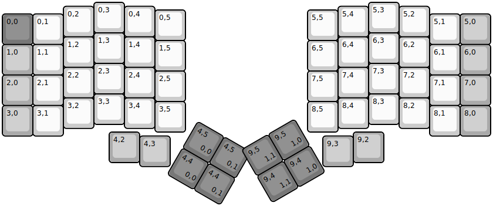{:loading="lazy"}

[Open in keyboard-layout-editor](http://www.keyboard-layout-editor.com/##@@_x:3;&=0,3&_x:8;&=5,3;&@_x:2&y:-0.87;&=0,2&_x:1;&=0,4&_x:6;&=5,4&_x:1;&=5,2;&@_x:5&y:-0.88;&=0,5&_x:4;&=5,5;&@_y:-0.87&c=#777777;&=0,0&_c=#cccccc;&=0,1&_x:12;&=5,1&_c=#aaaaaa;&=5,0;&@_x:3&y:-0.38&c=#cccccc;&=1,3&_x:8;&=6,3;&@_x:2&y:-0.87;&=1,2&_x:1;&=1,4&_x:6;&=6,4&_x:1;&=6,2;&@_x:5&y:-0.88;&=1,5&_x:4;&=6,5;&@_y:-0.87&c=#aaaaaa;&=1,0&_c=#cccccc;&=1,1&_x:12;&=6,1&_c=#aaaaaa;&=6,0;&@_x:3&y:-0.38&c=#cccccc;&=2,3&_x:8;&=7,3;&@_x:2&y:-0.87;&=2,2&_x:1;&=2,4&_x:6;&=7,4&_x:1;&=7,2;&@_x:5&y:-0.88;&=2,5&_x:4;&=7,5;&@_y:-0.87&c=#aaaaaa;&=2,0&_c=#cccccc;&=2,1&_x:12;&=7,1&_c=#aaaaaa;&=7,0;&@_x:3&y:-0.38&c=#cccccc;&=3,3&_x:8;&=8,3;&@_x:2&y:-0.87;&=3,2&_x:1;&=3,4&_x:6;&=8,4&_x:1;&=8,2;&@_x:5&y:-0.88;&=3,5&_x:4;&=8,5;&@_y:-0.87&c=#aaaaaa;&=3,0&_c=#cccccc;&=3,1&_x:12;&=8,1&_c=#aaaaaa;&=8,0;&@_x:3.5&y:-0.13;&=4,2&_x:7.0;&=9,2;&@_x:4.5&y:-0.87;&=4,3&_x:5.0;&=9,3;&@_r:30&rx:8&x:0.6&y:4.13&c=#777777;&=4,5%0A%0A%0A0,0;&@_x:0.6;&=4,4%0A%0A%0A0,0;&@_r:-30&x:-1.6&y:-2.0;&=9,5%0A%0A%0A1,0;&@_x:-1.6;&=9,4%0A%0A%0A1,0;&@_r:30&x:1.6&y:-2.0;&=4,5%0A%0A%0A0,1%0A%0A%0A%0A%0A%0Ae0;&@_x:1.6;&=4,4%0A%0A%0A0,1;&@_r:-30&x:-2.6&y:-2.0;&=9,5%0A%0A%0A1,1%0A%0A%0A%0A%0A%0Ae1;&@_x:-2.6;&=9,4%0A%0A%0A1,1)

## keebio/iris/iris-rev7

[README](output/keebio/iris/README.md) - [layout](output/keebio/iris/iris-rev7-kle.json) - [PCB](output/keebio/iris/iris-rev7.kicad_pcb) - [PCB render](output/keebio/iris/iris-rev7-render.svg)

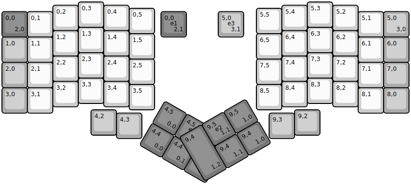{:loading="lazy"}

[Open in keyboard-layout-editor](http://www.keyboard-layout-editor.com/##@@_x:3;&=0,3&_x:8;&=5,3;&@_x:2&y:-0.87;&=0,2&_x:1;&=0,4&_x:6;&=5,4&_x:1;&=5,2;&@_x:5&y:-0.88;&=0,5&_x:4;&=5,5;&@_y:-0.87&c=#777777;&=0,0%0A%0A%0A2,0&_c=#cccccc;&=0,1&_x:12.0;&=5,1&_c=#aaaaaa;&=5,0%0A%0A%0A3,0;&@_x:3&y:-0.38&c=#cccccc;&=1,3&_x:8;&=6,3;&@_x:2&y:-0.87;&=1,2&_x:1;&=1,4&_x:6;&=6,4&_x:1;&=6,2;&@_x:5&y:-0.88;&=1,5&_x:4;&=6,5;&@_y:-0.87&c=#aaaaaa;&=1,0&_c=#cccccc;&=1,1&_x:12;&=6,1&_c=#aaaaaa;&=6,0;&@_x:3&y:-0.38&c=#cccccc;&=2,3&_x:8;&=7,3;&@_x:2&y:-0.87;&=2,2&_x:1;&=2,4&_x:6;&=7,4&_x:1;&=7,2;&@_x:5&y:-0.88;&=2,5&_x:4;&=7,5;&@_y:-0.87&c=#aaaaaa;&=2,0&_c=#cccccc;&=2,1&_x:12;&=7,1&_c=#aaaaaa;&=7,0;&@_x:3&y:-0.38&c=#cccccc;&=3,3&_x:8;&=8,3;&@_x:2&y:-0.87;&=3,2&_x:1;&=3,4&_x:6;&=8,4&_x:1;&=8,2;&@_x:5&y:-0.88;&=3,5&_x:4;&=8,5;&@_y:-0.87&c=#aaaaaa;&=3,0&_c=#cccccc;&=3,1&_x:12;&=8,1&_c=#aaaaaa;&=8,0;&@_x:3.5&y:-0.13;&=4,2&_x:7.0;&=9,2;&@_x:4.5&y:-0.87;&=4,3&_x:5.0;&=9,3;&@_r:30&rx:8&x:0.6&y:4.13&c=#777777;&=4,5%0A%0A%0A0,0;&@_x:0.6;&=4,4%0A%0A%0A0,0;&@_r:-30&x:-1.6&y:-2.0;&=9,5%0A%0A%0A1,0;&@_x:-1.6;&=9,4%0A%0A%0A1,0;&@_r:0&rx:0&x:6.25&y:0.38;&=0,0%0A%0A%0A2,1%0A%0A%0A%0A%0A%0Ae1&_x:1.25&c=#aaaaaa;&=5,0%0A%0A%0A3,1%0A%0A%0A%0A%0A%0Ae3;&@_r:30&rx:8&x:1.6&y:4.13&c=#777777;&=4,5%0A%0A%0A0,1%0A%0A%0A%0A%0A%0Ae0&_h:2;&=4,4%0A%0A%0A0,2;&@_x:1.6;&=4,4%0A%0A%0A0,1;&@_r:-30&x:-3.6&y:-2.0&h:2;&=9,4%0A%0A%0A1,2&=9,5%0A%0A%0A1,1%0A%0A%0A%0A%0A%0Ae2;&@_x:-2.6;&=9,4%0A%0A%0A1,1)

## keebio/kbo-5000/kbo-5000-rev1

[README](output/keebio/kbo-5000/README.md) - [layout](output/keebio/kbo-5000/kbo-5000-rev1-kle.json) - [PCB](output/keebio/kbo-5000/kbo-5000-rev1.kicad_pcb) - [PCB render](output/keebio/kbo-5000/kbo-5000-rev1-render.svg)

{:loading="lazy"}

[Open in keyboard-layout-editor](http://www.keyboard-layout-editor.com/##@@_c=#777777;&=5,0&_x:1&c=#cccccc;&=5,3&=5,4&=5,5&=5,6&_x:0.5&c=#aaaaaa;&=5,7&=5,8&_x:1.5;&=11,0&=11,1&_x:0.5&c=#cccccc;&=11,3&=11,4&=11,5&=11,6&_x:1.0&c=#aaaaaa;&=11,7&=11,8&=11,9;&@_y:0.25;&=0,0&_x:0.5;&=0,2&_c=#cccccc;&=0,3&=0,4&=0,5&=0,6&=0,7&=0,8&_x:1.5;&=6,0&=6,1&=6,2&=6,3&=6,4&=6,5&_c=#aaaaaa&w:2;&=6,7%0A%0A%0A0,0&_x:0.5;&=6,8&=6,9;&@=1,0&_x:0.5&w:1.5;&=1,2&_c=#cccccc;&=1,3&=1,4&=1,5&=1,6&=1,7&_x:1.5;&=7,0&=7,1&=7,2&=7,3&=7,4&=7,5&=7,6&_w:1.5;&=7,7%0A%0A%0A1,0&_x:0.5&c=#aaaaaa;&=7,8&=7,9;&@=2,0&_x:0.5&w:1.75;&=2,2%0A%0A%0A3,0&_c=#cccccc;&=2,3&=2,4&=2,5&=2,6&=2,7&_x:1.5;&=8,0&=8,1&=8,2&=8,3&=8,4&=8,5&_c=#777777&w:2.25;&=8,7%0A%0A%0A1,0&_x:0.5&c=#aaaaaa;&=8,8&=8,9;&@=3,0&_x:0.5&w:2.25;&=3,2%0A%0A%0A4,0&_c=#cccccc;&=3,4&=3,5&=3,6&=3,7&=3,8&_x:1.5;&=9,0&=9,1&=9,2&=9,3&=9,4&_c=#aaaaaa&w:1.75;&=9,6%0A%0A%0A2,0&_x:1.5;&=9,8;&@=4,0&_x:0.5&w:1.25;&=4,2%0A%0A%0A5,0&=4,3%0A%0A%0A5,0&_w:1.25;&=4,4%0A%0A%0A5,0&_w:1.25;&=4,5%0A%0A%0A5,0&=4,6%0A%0A%0A5,0&_w:1.25;&=4,7%0A%0A%0A5,0&_x:1.5&w:2.25;&=10,1%0A%0A%0A6,0&_w:1.25;&=10,0%0A%0A%0A6,0&_w:1.25;&=10,2%0A%0A%0A6,0&=10,3%0A%0A%0A6,0&_w:1.25;&=10,6%0A%0A%0A6,0&_x:0.5;&=10,7&=10,8&=10,9;&@_x:21.5&y:-5.0;&=6,6%0A%0A%0A0,1&=6,7%0A%0A%0A0,1;&@_x:22.25&c=#777777&w:1.25&h:2&w2:1.5&h2:1&x2:-0.25;&=8,7%0A%0A%0A1,1;&@_x:21.25&c=#cccccc;&=8,6%0A%0A%0A1,1;&@_x:20.75&c=#aaaaaa&w:2.75;&=9,6%0A%0A%0A2,1;&@_x:1.5&y:1.0&w:1.5;&=4,2%0A%0A%0A5,1&_x:0.5&w:1.5;&=4,4%0A%0A%0A5,1&_w:1.25;&=4,5%0A%0A%0A5,1&_w:2.25;&=4,7%0A%0A%0A5,1&_x:1.5&w:1.25;&=10,0%0A%0A%0A6,1&_w:2.25;&=10,1%0A%0A%0A6,1&_w:1.5;&=10,2%0A%0A%0A6,1&_x:0.5&w:1.5;&=10,6%0A%0A%0A6,1;&@_x:1.5&w:1.25;&=4,2%0A%0A%0A5,2&=4,3%0A%0A%0A5,2&_w:1.25;&=4,4%0A%0A%0A5,2&_w:2.25;&=4,6%0A%0A%0A5,2&_w:1.25;&=4,7%0A%0A%0A5,2&_x:1.5&w:2.75;&=10,1%0A%0A%0A6,2&_w:1.25;&=10,2%0A%0A%0A6,2&_w:1.25;&=10,3%0A%0A%0A6,2&_x:0.5&w:1.25;&=10,6%0A%0A%0A6,2;&@_x:1.5&w:1.25;&=4,2%0A%0A%0A5,3&_x:0.5&w:1.25;&=4,4%0A%0A%0A5,3&_w:1.25;&=4,5%0A%0A%0A5,3&_w:2.75;&=4,7%0A%0A%0A5,3&_x:1.5&w:1.25;&=10,0%0A%0A%0A6,3&_w:2.25;&=10,1%0A%0A%0A6,3&_w:1.25;&=10,2%0A%0A%0A6,3&=10,3%0A%0A%0A6,3&_w:1.25;&=10,6%0A%0A%0A6,3;&@_x:1.5&w:1.5;&=4,2%0A%0A%0A5,4&=4,3%0A%0A%0A5,4&_w:1.5;&=4,4%0A%0A%0A5,4&_w:3;&=4,7%0A%0A%0A5,4&_x:1.5&w:3;&=10,1%0A%0A%0A6,4&_w:1.5;&=10,2%0A%0A%0A6,4&=10,3%0A%0A%0A6,4&_w:1.5;&=10,6%0A%0A%0A6,4;&@_x:1.5&y:0.5&w:1.25&w2:1.75&l:true;&=2,2%0A%0A%0A3,1;&@_x:1.5&w:1.25;&=3,2%0A%0A%0A4,1&_c=#cccccc;&=3,3%0A%0A%0A4,1)

## keebio/levinson/levinson-rev2

[README](output/keebio/levinson/README.md) - [layout](output/keebio/levinson/levinson-rev2-kle.json) - [PCB](output/keebio/levinson/levinson-rev2.kicad_pcb) - [PCB render](output/keebio/levinson/levinson-rev2-render.svg)

{:loading="lazy"}

[Open in keyboard-layout-editor](http://www.keyboard-layout-editor.com/##@@_c=#aaaaaa;&=0,0&_c=#cccccc;&=0,1&=0,2&=0,3&=0,4&=0,5&_x:1;&=4,5&=4,4&=4,3&=4,2&=4,1&_c=#aaaaaa;&=4,0;&@_c=#777777;&=1,0&_c=#cccccc;&=1,1&=1,2&=1,3&=1,4&=1,5&_x:1;&=5,5&=5,4&=5,3&=5,2&=5,1&_c=#aaaaaa;&=5,0;&@=2,0&_c=#cccccc;&=2,1&=2,2&=2,3&=2,4&=2,5&_x:1;&=6,5&=6,4&=6,3&=6,2&=6,1&_c=#777777;&=6,0;&@_c=#aaaaaa;&=3,0&=3,1&=3,2&=3,3&=3,4%0A%0A%0A0,0&_c=#cccccc;&=3,5%0A%0A%0A0,0&_x:1;&=7,5%0A%0A%0A1,0&_c=#aaaaaa;&=7,4%0A%0A%0A1,0&=7,3&=7,2&=7,1&=7,0;&@_x:4&c=#cccccc&w:2;&=3,5%0A%0A%0A0,1&_x:1&w:2;&=7,5%0A%0A%0A1,1)

## keebio/levinson/levinson-rev3

[README](output/keebio/levinson/README.md) - [layout](output/keebio/levinson/levinson-rev3-kle.json) - [PCB](output/keebio/levinson/levinson-rev3.kicad_pcb) - [PCB render](output/keebio/levinson/levinson-rev3-render.svg)

{:loading="lazy"}

[Open in keyboard-layout-editor](http://www.keyboard-layout-editor.com/##@@_c=#aaaaaa;&=0,0&_c=#cccccc;&=0,1&=0,2&=0,3&=0,4&=0,5&_x:1;&=4,5&=4,4&=4,3&=4,2&=4,1&_c=#aaaaaa;&=4,0;&@_c=#777777;&=1,0&_c=#cccccc;&=1,1&=1,2&=1,3&=1,4&=1,5&_x:1;&=5,5&=5,4&=5,3&=5,2&=5,1&_c=#aaaaaa;&=5,0;&@=2,0&_c=#cccccc;&=2,1&=2,2&=2,3&=2,4&=2,5&_x:1;&=6,5&=6,4&=6,3&=6,2&=6,1&_c=#777777;&=6,0;&@_c=#aaaaaa;&=3,0&=3,1&=3,2&=3,3&=3,4%0A%0A%0A0,0&_c=#cccccc;&=3,5%0A%0A%0A0,0&_x:1;&=7,5%0A%0A%0A1,0&_c=#aaaaaa;&=7,4%0A%0A%0A1,0&=7,3&=7,2&=7,1&=7,0;&@_x:4&c=#cccccc&w:2;&=3,4%0A%0A%0A0,1&_x:1&w:2;&=7,4%0A%0A%0A1,1)

## keebio/nyquist/nyquist-rev2

[README](output/keebio/nyquist/README.md) - [layout](output/keebio/nyquist/nyquist-rev2-kle.json) - [PCB](output/keebio/nyquist/nyquist-rev2.kicad_pcb) - [PCB render](output/keebio/nyquist/nyquist-rev2-render.svg)

{:loading="lazy"}

[Open in keyboard-layout-editor](http://www.keyboard-layout-editor.com/##@@=0,0&=0,1&=0,2&=0,3&=0,4&=0,5&_x:0.75;&=5,0&=5,1&=5,2&=5,3&=5,4&_c=#aaaaaa;&=5,5;&@=1,0&_c=#cccccc;&=1,1&=1,2&=1,3&=1,4&=1,5&_x:0.75;&=6,0&=6,1&=6,2&=6,3&=6,4&_c=#aaaaaa;&=6,5;&@_c=#777777;&=2,0&_c=#cccccc;&=2,1&=2,2&=2,3&=2,4&=2,5&_x:0.75;&=7,0&=7,1&=7,2&=7,3&=7,4&=7,5;&@_c=#aaaaaa;&=3,0&_c=#cccccc;&=3,1&=3,2&=3,3&=3,4&=3,5&_x:0.75;&=8,0&=8,1&=8,2&=8,3&=8,4&_c=#777777;&=8,5;&@_c=#aaaaaa;&=4,0&=4,1&=4,2&=4,3&=4,4%0A%0A%0A0,0&_c=#cccccc;&=4,5%0A%0A%0A0,0&_x:0.75;&=9,0%0A%0A%0A1,0&_c=#aaaaaa;&=9,1%0A%0A%0A1,0&_c=#777777;&=9,2&=9,3&=9,4&=9,5;&@_x:4&c=#cccccc&w:2;&=4,5%0A%0A%0A0,1&_x:0.75&w:2;&=9,0%0A%0A%0A1,1)

## keebio/nyquist/nyquist-rev3

[README](output/keebio/nyquist/README.md) - [layout](output/keebio/nyquist/nyquist-rev3-kle.json) - [PCB](output/keebio/nyquist/nyquist-rev3.kicad_pcb) - [PCB render](output/keebio/nyquist/nyquist-rev3-render.svg)

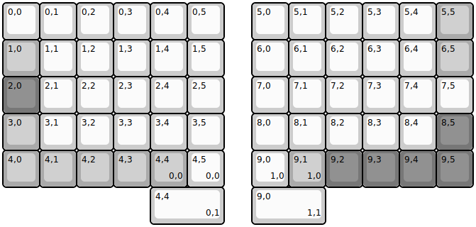{:loading="lazy"}

[Open in keyboard-layout-editor](http://www.keyboard-layout-editor.com/##@@=0,0&=0,1&=0,2&=0,3&=0,4&=0,5&_x:0.75;&=5,0&=5,1&=5,2&=5,3&=5,4&_c=#aaaaaa;&=5,5;&@=1,0&_c=#cccccc;&=1,1&=1,2&=1,3&=1,4&=1,5&_x:0.75;&=6,0&=6,1&=6,2&=6,3&=6,4&_c=#aaaaaa;&=6,5;&@_c=#777777;&=2,0&_c=#cccccc;&=2,1&=2,2&=2,3&=2,4&=2,5&_x:0.75;&=7,0&=7,1&=7,2&=7,3&=7,4&=7,5;&@_c=#aaaaaa;&=3,0&_c=#cccccc;&=3,1&=3,2&=3,3&=3,4&=3,5&_x:0.75;&=8,0&=8,1&=8,2&=8,3&=8,4&_c=#777777;&=8,5;&@_c=#aaaaaa;&=4,0&=4,1&=4,2&=4,3&=4,4%0A%0A%0A0,0&_c=#cccccc;&=4,5%0A%0A%0A0,0&_x:0.75;&=9,0%0A%0A%0A1,0&_c=#aaaaaa;&=9,1%0A%0A%0A1,0&_c=#777777;&=9,2&=9,3&=9,4&=9,5;&@_x:4&c=#cccccc&w:2;&=4,4%0A%0A%0A0,1&_x:0.75&w:2;&=9,0%0A%0A%0A1,1)

## keebio/quefrency/quefrency-rev1

[README](output/keebio/quefrency/README.md) - [layout](output/keebio/quefrency/quefrency-rev1-kle.json) - [PCB](output/keebio/quefrency/quefrency-rev1.kicad_pcb) - [PCB render](output/keebio/quefrency/quefrency-rev1-render.svg)

{:loading="lazy"}

[Open in keyboard-layout-editor](http://www.keyboard-layout-editor.com/##@@_x:2.25&d:true;&=4,3%0A%0A%0A2,0&_d:true;&=0,7%0A%0A%0A2,0&_x:0.5&c=#777777;&=0,0&_c=#cccccc;&=0,1&=0,2&=0,3&=0,4&=0,5&=0,6&_x:1.0;&=6,0&=6,1&=6,2&=6,3&=6,4&=6,5&_c=#aaaaaa&w:2;&=6,7%0A%0A%0A0,0&_c=#cccccc&d:true;&=11,6%0A%0A%0A1,0;&@_x:2.25&d:true;&=1,6%0A%0A%0A2,0&_d:true;&=1,7%0A%0A%0A2,0&_x:0.5&c=#aaaaaa&w:1.5;&=1,0&_c=#cccccc;&=1,1&=1,2&=1,3&=1,4&=1,5&_x:1.0;&=7,0&=7,1&=7,2&=7,3&=7,4&=7,5&=7,6&_w:1.5;&=7,7&_d:true;&=11,7%0A%0A%0A1,0;&@_x:2.25&d:true;&=2,6%0A%0A%0A2,0&_d:true;&=2,7%0A%0A%0A2,0&_x:0.5&c=#aaaaaa&w:1.75;&=2,0&_c=#cccccc;&=2,1&=2,2&=2,3&=2,4&=2,5&_x:1.0;&=8,0&=8,1&=8,2&=8,3&=8,4&=8,5&_c=#777777&w:2.25;&=8,7&_c=#cccccc&d:true;&=8,6%0A%0A%0A1,0;&@_x:2.25&d:true;&=3,1%0A%0A%0A2,0&_d:true;&=3,7%0A%0A%0A2,0&_x:0.5&c=#aaaaaa&w:2.25;&=3,0&_c=#cccccc;&=3,2&=3,3&=3,4&=3,5&=3,6&_x:1.0;&=9,0&=9,1&=9,2&=9,3&=9,5%0A%0A%0A5,0&_c=#aaaaaa&w:2.75;&=9,6%0A%0A%0A5,0&_c=#cccccc&d:true;&=9,4%0A%0A%0A1,0;&@_x:2.25&d:true;&=4,5%0A%0A%0A2,0&_d:true;&=4,7%0A%0A%0A2,0&_x:0.5&c=#aaaaaa&w:1.25;&=4,0&_w:1.25;&=4,1&_w:1.25;&=4,2&_w:1.25;&=4,4%0A%0A%0A3,0&_w:2.25;&=4,6%0A%0A%0A3,0&_x:1.0&w:2.75;&=10,0%0A%0A%0A4,0&_w:1.25;&=10,3%0A%0A%0A6,0&_w:1.25;&=10,4%0A%0A%0A6,0&_w:1.25;&=10,6%0A%0A%0A6,0&_w:1.25;&=10,7%0A%0A%0A6,0&_c=#cccccc&d:true;&=10,2%0A%0A%0A1,0;&@_y:-5&c=#aaaaaa;&=4,3%0A%0A%0A2,1&=0,7%0A%0A%0A2,1&_x:20.5;&=6,6%0A%0A%0A0,1&=6,7%0A%0A%0A0,1&_x:2.0;&=11,6%0A%0A%0A1,1;&@=1,6%0A%0A%0A2,1&=1,7%0A%0A%0A2,1&_x:24.5;&=11,7%0A%0A%0A1,1;&@=2,6%0A%0A%0A2,1&=2,7%0A%0A%0A2,1&_x:24.5;&=8,6%0A%0A%0A1,1;&@=3,1%0A%0A%0A2,1&=3,7%0A%0A%0A2,1&_x:20.5&c=#cccccc;&=9,5%0A%0A%0A5,1&_c=#aaaaaa&w:1.75;&=9,6%0A%0A%0A5,1&=9,7%0A%0A%0A5,1&_x:0.25;&=9,4%0A%0A%0A1,1;&@=4,5%0A%0A%0A2,1&=4,7%0A%0A%0A2,1&_x:20.5&c=#cccccc&w:1.75;&=9,5%0A%0A%0A5,2&_c=#aaaaaa;&=9,6%0A%0A%0A5,2&=9,7%0A%0A%0A5,2&_x:0.25;&=10,2%0A%0A%0A1,1;&@_x:8.5&w:2.25;&=4,4%0A%0A%0A3,1&_w:1.25;&=4,6%0A%0A%0A3,1&_x:1.0&w:1.25;&=10,0%0A%0A%0A4,1&_w:1.5;&=10,1%0A%0A%0A4,1&=10,3%0A%0A%0A6,1&=10,4%0A%0A%0A6,1&=10,5%0A%0A%0A6,1&=10,6%0A%0A%0A6,1&=10,7%0A%0A%0A6,1)

## keebio/quefrency/quefrency-rev2

[README](output/keebio/quefrency/README.md) - [layout](output/keebio/quefrency/quefrency-rev2-kle.json) - [PCB](output/keebio/quefrency/quefrency-rev2.kicad_pcb) - [PCB render](output/keebio/quefrency/quefrency-rev2-render.svg)

{:loading="lazy"}

[Open in keyboard-layout-editor](http://www.keyboard-layout-editor.com/##@@_x:2.25&d:true;&=0,0%0A%0A%0A4,0&_d:true;&=0,1%0A%0A%0A4,0&_x:0.5&c=#777777;&=0,2&_c=#cccccc;&=0,3&=0,4&=0,5&=0,6&=0,7&=0,8&_x:1.0;&=5,0&=5,1&=5,2&=5,3&=5,4&=5,5&_c=#aaaaaa&w:2;&=5,7%0A%0A%0A0,0&_c=#cccccc&d:true;&=5,8%0A%0A%0A3,0;&@_x:2.25&d:true;&=1,0%0A%0A%0A4,0&_d:true;&=1,1%0A%0A%0A4,0&_x:0.5&c=#aaaaaa&w:1.5;&=1,2&_c=#cccccc;&=1,3&=1,4&=1,5&=1,6&=1,7&_x:1.0;&=6,0&=6,1&=6,2&=6,3&=6,4&=6,5&=6,6&_w:1.5;&=6,7%0A%0A%0A1,0&_d:true;&=6,8%0A%0A%0A3,0;&@_x:2.25&d:true;&=2,0%0A%0A%0A4,0&_d:true;&=2,1%0A%0A%0A4,0&_x:0.5&c=#aaaaaa&w:1.75;&=2,2&_c=#cccccc;&=2,3&=2,4&=2,5&=2,6&=2,7&_x:1.0;&=7,0&=7,1&=7,2&=7,3&=7,4&=7,5&_c=#777777&w:2.25;&=7,7%0A%0A%0A1,0&_c=#cccccc&d:true;&=7,8%0A%0A%0A3,0;&@_x:2.25&d:true;&=3,0%0A%0A%0A4,0&_d:true;&=3,1%0A%0A%0A4,0&_x:0.5&c=#aaaaaa&w:2.25;&=3,2%0A%0A%0A2,0&_c=#cccccc;&=3,4&=3,5&=3,6&=3,7&=3,8&_x:1.0;&=8,0&=8,1&=8,2&=8,3&=8,4%0A%0A%0A5,0&_c=#aaaaaa&w:2.75;&=8,6%0A%0A%0A5,0&_c=#cccccc&d:true;&=8,8%0A%0A%0A3,0;&@_x:2.25&d:true;&=4,0%0A%0A%0A4,0&_d:true;&=4,1%0A%0A%0A4,0&_x:0.5&c=#aaaaaa&w:1.25;&=4,2&_w:1.25;&=4,3&_w:1.25;&=4,4&_w:1.25;&=4,5%0A%0A%0A8,0&_w:2.25;&=4,7%0A%0A%0A8,0&_x:1.0&w:2.75;&=9,1%0A%0A%0A6,0&_w:1.25;&=9,2%0A%0A%0A7,0&_w:1.25;&=9,3%0A%0A%0A7,0&_w:1.25;&=9,6%0A%0A%0A7,0&_w:1.25;&=9,7%0A%0A%0A7,0&_c=#cccccc&d:true;&=9,8%0A%0A%0A3,0;&@_y:-5&c=#aaaaaa;&=0,0%0A%0A%0A4,1&=0,1%0A%0A%0A4,1&_x:20.5;&=5,6%0A%0A%0A0,1&=5,7%0A%0A%0A0,1&_x:2.0;&=5,8%0A%0A%0A3,1;&@=1,0%0A%0A%0A4,1&=1,1%0A%0A%0A4,1&_x:21.75&c=#777777&w:1.25&h:2&w2:1.5&h2:1&x2:-0.25;&=7,7%0A%0A%0A1,1&_x:1.5&c=#aaaaaa;&=6,8%0A%0A%0A3,1;&@=2,0%0A%0A%0A4,1&=2,1%0A%0A%0A4,1&_x:20.75&c=#cccccc;&=7,6%0A%0A%0A1,1&_x:2.75&c=#aaaaaa;&=7,8%0A%0A%0A3,1;&@=3,0%0A%0A%0A4,1&=3,1%0A%0A%0A4,1&_x:20.5&c=#cccccc;&=8,4%0A%0A%0A5,1&_c=#aaaaaa&w:1.75;&=8,6%0A%0A%0A5,1&=8,7%0A%0A%0A5,1&_x:0.25;&=8,8%0A%0A%0A3,1;&@=4,0%0A%0A%0A4,1&=4,1%0A%0A%0A4,1&_x:20.5&c=#cccccc&w:1.75;&=8,4%0A%0A%0A5,2&_c=#aaaaaa;&=8,6%0A%0A%0A5,2&=8,7%0A%0A%0A5,2&_x:0.25;&=9,8%0A%0A%0A3,1;&@_x:4.75&w:1.25;&=3,2%0A%0A%0A2,1&=3,3%0A%0A%0A2,1&_x:1.5&w:2.25;&=4,5%0A%0A%0A8,1&_w:1.25;&=4,7%0A%0A%0A8,1&_x:1.0&w:1.25;&=9,0%0A%0A%0A6,1&_w:1.5;&=9,1%0A%0A%0A6,1&=9,2%0A%0A%0A7,1&=9,3%0A%0A%0A7,1&=9,4%0A%0A%0A7,1&=9,6%0A%0A%0A7,1&=9,7%0A%0A%0A7,1;&@_x:8.5&w:1.25;&=4,5%0A%0A%0A8,2&=4,6%0A%0A%0A8,2&_w:1.25;&=4,7%0A%0A%0A8,2)

## keebio/quefrency/quefrency-rev3

[README](output/keebio/quefrency/README.md) - [layout](output/keebio/quefrency/quefrency-rev3-kle.json) - [PCB](output/keebio/quefrency/quefrency-rev3.kicad_pcb) - [PCB render](output/keebio/quefrency/quefrency-rev3-render.svg)

{:loading="lazy"}

[Open in keyboard-layout-editor](http://www.keyboard-layout-editor.com/##@@_x:2.25&d:true;&=0,0%0A%0A%0A4,0&_d:true;&=0,1%0A%0A%0A4,0&_x:0.5&c=#777777;&=0,2&_c=#cccccc;&=0,3&=0,4&=0,5&=0,6&=0,7&=0,8&_x:1.0;&=5,0&=5,1&=5,2&=5,3&=5,4&=5,5&_c=#aaaaaa&w:2;&=5,7%0A%0A%0A0,0&_c=#cccccc&d:true;&=5,8%0A%0A%0A3,0;&@_x:2.25&d:true;&=1,0%0A%0A%0A4,0&_d:true;&=1,1%0A%0A%0A4,0&_x:0.5&c=#aaaaaa&w:1.5;&=1,2&_c=#cccccc;&=1,3&=1,4&=1,5&=1,6&=1,7&_x:1.0;&=6,0&=6,1&=6,2&=6,3&=6,4&=6,5&=6,6&_w:1.5;&=6,7%0A%0A%0A1,0&_d:true;&=6,8%0A%0A%0A3,0;&@_x:2.25&d:true;&=2,0%0A%0A%0A4,0&_d:true;&=2,1%0A%0A%0A4,0&_x:0.5&c=#aaaaaa&w:1.75;&=2,2&_c=#cccccc;&=2,3&=2,4&=2,5&=2,6&=2,7&_x:1.0;&=7,0&=7,1&=7,2&=7,3&=7,4&=7,5&_c=#777777&w:2.25;&=7,7%0A%0A%0A1,0&_c=#cccccc&d:true;&=7,8%0A%0A%0A3,0;&@_x:2.25&d:true;&=3,0%0A%0A%0A4,0&_d:true;&=3,1%0A%0A%0A4,0&_x:0.5&c=#aaaaaa&w:2.25;&=3,2%0A%0A%0A2,0&_c=#cccccc;&=3,4&=3,5&=3,6&=3,7&=3,8&_x:1.0;&=8,0&=8,1&=8,2&=8,3&=8,4%0A%0A%0A5,0&_c=#aaaaaa&w:2.75;&=8,6%0A%0A%0A5,0&_c=#cccccc&d:true;&=8,8%0A%0A%0A3,0;&@_x:2.25&d:true;&=4,0%0A%0A%0A4,0&_d:true;&=4,1%0A%0A%0A4,0&_x:0.5&c=#aaaaaa&w:1.25;&=4,2&_w:1.25;&=4,3&_w:1.25;&=4,4&_w:1.25;&=4,5%0A%0A%0A8,0&_w:2.25;&=4,7%0A%0A%0A8,0&_x:1.0&w:2.75;&=9,1%0A%0A%0A6,0&_w:1.25;&=9,2%0A%0A%0A7,0&_w:1.25;&=9,3%0A%0A%0A7,0&_w:1.25;&=9,6%0A%0A%0A7,0&_w:1.25;&=9,7%0A%0A%0A7,0&_c=#cccccc&d:true;&=9,8%0A%0A%0A3,0;&@_y:-5&c=#aaaaaa;&=0,0%0A%0A%0A4,1&=0,1%0A%0A%0A4,1&_x:20.5;&=5,6%0A%0A%0A0,1&=5,7%0A%0A%0A0,1&_x:2.0;&=5,8%0A%0A%0A3,1;&@=1,0%0A%0A%0A4,1&=1,1%0A%0A%0A4,1&_x:21.75&c=#777777&w:1.25&h:2&w2:1.5&h2:1&x2:-0.25;&=7,7%0A%0A%0A1,1&_x:1.5&c=#aaaaaa;&=6,8%0A%0A%0A3,1;&@=2,0%0A%0A%0A4,1&=2,1%0A%0A%0A4,1&_x:20.75&c=#cccccc;&=7,6%0A%0A%0A1,1&_x:2.75&c=#aaaaaa;&=7,8%0A%0A%0A3,1;&@=3,0%0A%0A%0A4,1&=3,1%0A%0A%0A4,1&_x:20.5&c=#cccccc;&=8,4%0A%0A%0A5,1&_c=#aaaaaa&w:1.75;&=8,6%0A%0A%0A5,1&=8,7%0A%0A%0A5,1&_x:0.25;&=8,8%0A%0A%0A3,1;&@=4,0%0A%0A%0A4,1&=4,1%0A%0A%0A4,1&_x:20.5&c=#cccccc&w:1.75;&=8,4%0A%0A%0A5,2&_c=#aaaaaa;&=8,6%0A%0A%0A5,2&=8,7%0A%0A%0A5,2&_x:0.25;&=9,8%0A%0A%0A3,1;&@_x:4.75&w:1.25;&=3,2%0A%0A%0A2,1&=3,3%0A%0A%0A2,1&_x:1.5&w:2.25;&=4,5%0A%0A%0A8,1&_w:1.25;&=4,7%0A%0A%0A8,1&_x:1.0&w:1.25;&=9,0%0A%0A%0A6,1&_w:1.5;&=9,1%0A%0A%0A6,1&=9,2%0A%0A%0A7,1&=9,3%0A%0A%0A7,1&=9,4%0A%0A%0A7,1&=9,6%0A%0A%0A7,1&=9,7%0A%0A%0A7,1;&@_x:8.5&w:1.25;&=4,5%0A%0A%0A8,2&=4,6%0A%0A%0A8,2&_w:1.25;&=4,7%0A%0A%0A8,2)

## keebio/quefrency/quefrency-rev3a

[README](output/keebio/quefrency/README.md) - [layout](output/keebio/quefrency/quefrency-rev3a-kle.json) - [PCB](output/keebio/quefrency/quefrency-rev3a.kicad_pcb) - [PCB render](output/keebio/quefrency/quefrency-rev3a-render.svg)

{:loading="lazy"}

[Open in keyboard-layout-editor](http://www.keyboard-layout-editor.com/##@@_x:4.5&c=#aaaaaa;&=0,0%0A%0A%0A0,0&=0,1%0A%0A%0A0,0&_x:0.5&c=#777777;&=0,2&_c=#cccccc;&=0,3&=0,4&=0,5&=0,6&=0,7&=0,8&_x:1.0;&=5,0&=5,1&=5,2&=5,3&=5,4&=5,5&_c=#aaaaaa&w:2;&=5,7%0A%0A%0A3,0&=5,8%0A%0A%0A5,0;&@_x:4.5;&=1,0%0A%0A%0A0,0&=1,1%0A%0A%0A0,0&_x:0.5&w:1.5;&=1,2&_c=#cccccc;&=1,3&=1,4&=1,5&=1,6&=1,7&_x:1.0;&=6,0&=6,1&=6,2&=6,3&=6,4&=6,5&=6,6&_w:1.5;&=6,7%0A%0A%0A4,0&_c=#aaaaaa;&=6,8%0A%0A%0A5,0;&@_x:4.5;&=2,0%0A%0A%0A0,0&=2,1%0A%0A%0A0,0&_x:0.5&w:1.75;&=2,2&_c=#cccccc;&=2,3&=2,4&=2,5&=2,6&=2,7&_x:1.0;&=7,0&=7,1&=7,2&=7,3&=7,4&=7,5&_c=#777777&w:2.25;&=7,7%0A%0A%0A4,0&_c=#aaaaaa;&=7,8%0A%0A%0A5,0;&@_x:4.5;&=3,0%0A%0A%0A0,0&=3,1%0A%0A%0A0,0&_x:0.5&w:2.25;&=3,2%0A%0A%0A1,0&_c=#cccccc;&=3,4&=3,5&=3,6&=3,7&=3,8&_x:1.0;&=8,0&=8,1&=8,2&=8,3&=8,4%0A%0A%0A6,0&_c=#aaaaaa&w:1.75;&=8,6%0A%0A%0A6,0&=8,7%0A%0A%0A6,0&=8,8%0A%0A%0A5,0;&@_x:4.5;&=4,0%0A%0A%0A0,0&=4,1%0A%0A%0A0,0&_x:0.5&w:1.25;&=4,2&_w:1.25;&=4,3&_w:1.25;&=4,4&_w:1.25;&=4,5%0A%0A%0A2,0&_w:2.25;&=4,7%0A%0A%0A2,0&_x:1.0&w:2.75;&=9,1%0A%0A%0A8,0&=9,2%0A%0A%0A7,0&=9,3%0A%0A%0A7,0&=9,4%0A%0A%0A7,0&=9,6%0A%0A%0A7,0&=9,7%0A%0A%0A7,0&=9,8%0A%0A%0A5,0;&@_y:-5&c=#cccccc&d:true;&=0,0%0A%0A%0A0,2&_d:true;&=0,1%0A%0A%0A0,2&_x:0.25&c=#aaaaaa;&=0,0%0A%0A%0A0,1%0A%0A%0A%0A%0A%0Ae0&=0,1%0A%0A%0A0,1&_x:20.5;&=5,6%0A%0A%0A3,1&=5,7%0A%0A%0A3,1&_x:2.0;&=5,8%0A%0A%0A5,1%0A%0A%0A%0A%0A%0Ae1&_x:0.25&c=#cccccc&d:true;&=5,8%0A%0A%0A5,2;&@_d:true;&=1,0%0A%0A%0A0,2&_d:true;&=1,1%0A%0A%0A0,2&_x:0.25&c=#aaaaaa;&=1,0%0A%0A%0A0,1&=1,1%0A%0A%0A0,1&_x:21.75&c=#777777&w:1.25&h:2&w2:1.5&h2:1&x2:-0.25;&=7,7%0A%0A%0A4,1&_x:1.5&c=#aaaaaa;&=6,8%0A%0A%0A5,1&_x:0.25&c=#cccccc&d:true;&=6,8%0A%0A%0A5,2;&@_d:true;&=2,0%0A%0A%0A0,2&_d:true;&=2,1%0A%0A%0A0,2&_x:0.25&c=#aaaaaa;&=2,0%0A%0A%0A0,1&=2,1%0A%0A%0A0,1&_x:20.75&c=#cccccc;&=7,6%0A%0A%0A4,1&_x:2.75&c=#aaaaaa;&=7,8%0A%0A%0A5,1&_x:0.25&c=#cccccc&d:true;&=7,8%0A%0A%0A5,2;&@_d:true;&=3,0%0A%0A%0A0,2&_d:true;&=3,1%0A%0A%0A0,2&_x:0.25&c=#aaaaaa;&=3,0%0A%0A%0A0,1&=3,1%0A%0A%0A0,1&_x:20.5&c=#cccccc;&=8,4%0A%0A%0A6,1&_c=#aaaaaa&w:2.75;&=8,6%0A%0A%0A6,1&_x:0.25;&=8,8%0A%0A%0A5,1&_x:0.25&c=#cccccc&d:true;&=8,8%0A%0A%0A5,2;&@_d:true;&=4,0%0A%0A%0A0,2&_d:true;&=4,1%0A%0A%0A0,2&_x:0.25&c=#aaaaaa;&=4,0%0A%0A%0A0,1&=4,1%0A%0A%0A0,1&_x:20.5&c=#cccccc&w:1.75;&=8,4%0A%0A%0A6,2&_c=#aaaaaa;&=8,6%0A%0A%0A6,2&=8,7%0A%0A%0A6,2&_x:0.25;&=9,8%0A%0A%0A5,1&_x:0.25&c=#cccccc&d:true;&=9,8%0A%0A%0A5,2;&@_x:7&c=#aaaaaa&w:1.25;&=3,2%0A%0A%0A1,1&=3,3%0A%0A%0A1,1&_x:1.5&w:2.25;&=4,5%0A%0A%0A2,1&_w:1.25;&=4,7%0A%0A%0A2,1&_x:1.0&w:1.25;&=9,0%0A%0A%0A8,1&_w:1.5;&=9,1%0A%0A%0A8,1&_w:1.25;&=9,2%0A%0A%0A7,1&_w:1.25;&=9,3%0A%0A%0A7,1&_x:0.5;&=9,6%0A%0A%0A7,1&=9,7%0A%0A%0A7,1;&@_x:10.75&w:1.25;&=4,5%0A%0A%0A2,2&=4,6%0A%0A%0A2,2&_w:1.25;&=4,7%0A%0A%0A2,2&_x:3.75&w:1.25;&=9,2%0A%0A%0A7,2&_w:1.25;&=9,3%0A%0A%0A7,2&_w:1.25;&=9,6%0A%0A%0A7,2&_w:1.25;&=9,7%0A%0A%0A7,2)

## keebio/quefrency/quefrency-rev4

[README](output/keebio/quefrency/README.md) - [layout](output/keebio/quefrency/quefrency-rev4-kle.json) - [PCB](output/keebio/quefrency/quefrency-rev4.kicad_pcb) - [PCB render](output/keebio/quefrency/quefrency-rev4-render.svg)

{:loading="lazy"}

[Open in keyboard-layout-editor](http://www.keyboard-layout-editor.com/##@@_x:2.25&c=#aaaaaa;&=0,0%0A%0A%0A1,0&=0,1%0A%0A%0A1,0&_x:0.5&c=#777777;&=0,2&_c=#cccccc;&=0,3&=0,4&=0,5&=0,6&=0,7&=0,8&_x:1.0;&=5,0&=5,1&=5,2&=5,3&=5,4&=5,5&_c=#aaaaaa&w:2;&=5,7%0A%0A%0A0,0&=5,8;&@_x:2.25;&=1,0%0A%0A%0A1,0&=1,1%0A%0A%0A1,0&_x:0.5&w:1.5;&=1,2&_c=#cccccc;&=1,3&=1,4&=1,5&=1,6&=1,7&_x:1.0;&=6,0&=6,1&=6,2&=6,3&=6,4&=6,5&=6,6&_w:1.5;&=6,7&_c=#aaaaaa;&=6,8;&@_x:2.25;&=2,0%0A%0A%0A1,0&=2,1%0A%0A%0A1,0&_x:0.5&w:1.75;&=2,2&_c=#cccccc;&=2,3&=2,4&=2,5&=2,6&=2,7&_x:1.0;&=7,0&=7,1&=7,2&=7,3&=7,4&=7,5&_c=#777777&w:2.25;&=7,7&_c=#aaaaaa;&=7,8;&@_x:2.25;&=3,0%0A%0A%0A1,0&=3,1%0A%0A%0A1,0&_x:0.5&w:2.25;&=3,2&_c=#cccccc;&=3,4&=3,5&=3,6&=3,7&=3,8&_x:1.0;&=8,0&=8,1&=8,2&=8,3&=8,4&_c=#aaaaaa&w:1.75;&=8,6&=8,7&=8,8;&@_x:2.25;&=4,0%0A%0A%0A1,0&=4,1%0A%0A%0A1,0&_x:0.5&w:1.25;&=4,2&_w:1.25;&=4,3&_w:1.25;&=4,4&_w:1.25;&=4,5&_w:2.25;&=4,7&_x:1.0&w:2.75;&=9,1&_w:1.25;&=9,2&_w:1.25;&=9,3&_x:0.5;&=9,6&=9,7&=9,8;&@_y:-5&c=#cccccc&d:true;&=0,0%0A%0A%0A1,1&_d:true;&=0,1%0A%0A%0A1,1&_x:20.25;&=5,6%0A%0A%0A0,1&=5,7%0A%0A%0A0,1;&@_d:true;&=1,0%0A%0A%0A1,1&_d:true;&=1,1%0A%0A%0A1,1;&@_d:true;&=2,0%0A%0A%0A1,1&_d:true;&=2,1%0A%0A%0A1,1;&@_d:true;&=3,0%0A%0A%0A1,1&_d:true;&=3,1%0A%0A%0A1,1;&@_d:true;&=4,0%0A%0A%0A1,1&_d:true;&=4,1%0A%0A%0A1,1)

## keebio/quefrency/quefrency-rev4a

[README](output/keebio/quefrency/README.md) - [layout](output/keebio/quefrency/quefrency-rev4a-kle.json) - [PCB](output/keebio/quefrency/quefrency-rev4a.kicad_pcb) - [PCB render](output/keebio/quefrency/quefrency-rev4a-render.svg)

{:loading="lazy"}

[Open in keyboard-layout-editor](http://www.keyboard-layout-editor.com/##@@_x:4.5&c=#aaaaaa;&=0,0%0A%0A%0A1,0&=0,1%0A%0A%0A1,0&_x:0.5&c=#777777;&=0,2&_c=#cccccc;&=0,3&=0,4&=0,5&=0,6&=0,7&=0,8&_x:1.0;&=5,0&=5,1&=5,2&=5,3&=5,4&=5,5&_c=#aaaaaa&w:2;&=5,7%0A%0A%0A0,0&=5,8%0A%0A%0A2,0;&@_x:4.5;&=1,0%0A%0A%0A1,0&=1,1%0A%0A%0A1,0&_x:0.5&w:1.5;&=1,2&_c=#cccccc;&=1,3&=1,4&=1,5&=1,6&=1,7&_x:1.0;&=6,0&=6,1&=6,2&=6,3&=6,4&=6,5&=6,6&_w:1.5;&=6,7&_c=#aaaaaa;&=6,8;&@_x:4.5;&=2,0%0A%0A%0A1,0&=2,1%0A%0A%0A1,0&_x:0.5&w:1.75;&=2,2&_c=#cccccc;&=2,3&=2,4&=2,5&=2,6&=2,7&_x:1.0;&=7,0&=7,1&=7,2&=7,3&=7,4&=7,5&_c=#777777&w:2.25;&=7,7&_c=#aaaaaa;&=7,8;&@_x:4.5;&=3,0%0A%0A%0A1,0&=3,1%0A%0A%0A1,0&_x:0.5&w:2.25;&=3,2&_c=#cccccc;&=3,4&=3,5&=3,6&=3,7&=3,8&_x:1.0;&=8,0&=8,1&=8,2&=8,3&=8,4&_c=#aaaaaa&w:1.75;&=8,6&=8,7&=8,8;&@_x:4.5;&=4,0%0A%0A%0A1,0&=4,1%0A%0A%0A1,0&_x:0.5&w:1.25;&=4,2&_w:1.25;&=4,3&_w:1.25;&=4,4&_w:1.25;&=4,5&_w:2.25;&=4,7&_x:1.0&w:2.75;&=9,1&_w:1.25;&=9,2&_w:1.25;&=9,3&_x:0.5;&=9,6&=9,7&=9,8;&@_y:-5&c=#cccccc&d:true;&=0,0%0A%0A%0A1,2&_d:true;&=0,1%0A%0A%0A1,2&_x:0.25&c=#aaaaaa;&=0,0%0A%0A%0A1,1%0A%0A%0A%0A%0A%0Ae0&=0,1%0A%0A%0A1,1&_x:20.25&c=#cccccc;&=5,6%0A%0A%0A0,1&=5,7%0A%0A%0A0,1&_c=#aaaaaa;&=5,8%0A%0A%0A2,1%0A%0A%0A%0A%0A%0Ae1;&@_c=#cccccc&d:true;&=1,0%0A%0A%0A1,2&_d:true;&=1,1%0A%0A%0A1,2&_x:0.25&c=#aaaaaa;&=1,0%0A%0A%0A1,1&=1,1%0A%0A%0A1,1;&@_c=#cccccc&d:true;&=2,0%0A%0A%0A1,2&_d:true;&=2,1%0A%0A%0A1,2&_x:0.25&c=#aaaaaa;&=2,0%0A%0A%0A1,1&=2,1%0A%0A%0A1,1;&@_c=#cccccc&d:true;&=3,0%0A%0A%0A1,2&_d:true;&=3,1%0A%0A%0A1,2&_x:0.25&c=#aaaaaa;&=3,0%0A%0A%0A1,1&=3,1%0A%0A%0A1,1;&@_c=#cccccc&d:true;&=4,0%0A%0A%0A1,2&_d:true;&=4,1%0A%0A%0A1,2&_x:0.25&c=#aaaaaa;&=4,0%0A%0A%0A1,1&=4,1%0A%0A%0A1,1)

## keebio/quefrency/quefrency-rev5

[README](output/keebio/quefrency/README.md) - [layout](output/keebio/quefrency/quefrency-rev5-kle.json) - [PCB](output/keebio/quefrency/quefrency-rev5.kicad_pcb) - [PCB render](output/keebio/quefrency/quefrency-rev5-render.svg)

{:loading="lazy"}

[Open in keyboard-layout-editor](http://www.keyboard-layout-editor.com/##@@_x:2.25&c=#aaaaaa;&=0,0%0A%0A%0A1,0&=0,1%0A%0A%0A1,0&_x:0.5&c=#777777;&=0,2&_c=#cccccc;&=0,3&=0,4&=0,5&=0,6&=0,7&=0,8&_x:1.0;&=5,0&=5,1&=5,2&=5,3&=5,4&=5,5&_c=#aaaaaa&w:2;&=5,7%0A%0A%0A0,0&=5,8;&@_x:2.25;&=1,0%0A%0A%0A1,0&=1,1%0A%0A%0A1,0&_x:0.5&w:1.5;&=1,2&_c=#cccccc;&=1,3&=1,4&=1,5&=1,6&=1,7&_x:1.0;&=6,0&=6,1&=6,2&=6,3&=6,4&=6,5&=6,6&_w:1.5;&=6,7&_c=#aaaaaa;&=6,8;&@_x:2.25;&=2,0%0A%0A%0A1,0&=2,1%0A%0A%0A1,0&_x:0.5&w:1.75;&=2,2&_c=#cccccc;&=2,3&=2,4&=2,5&=2,6&=2,7&_x:1.0;&=7,0&=7,1&=7,2&=7,3&=7,4&=7,5&_c=#777777&w:2.25;&=7,7&_c=#aaaaaa;&=7,8;&@_x:2.25;&=3,0%0A%0A%0A1,0&=3,1%0A%0A%0A1,0&_x:0.5&w:2.25;&=3,2&_c=#cccccc;&=3,4&=3,5&=3,6&=3,7&=3,8&_x:1.0;&=8,0&=8,1&=8,2&=8,3&=8,4&_c=#aaaaaa&w:1.75;&=8,6&=8,7&=8,8;&@_x:2.25;&=4,0%0A%0A%0A1,0&=4,1%0A%0A%0A1,0&_x:0.5&w:1.25;&=4,2&_w:1.25;&=4,3&_w:1.25;&=4,4&_w:1.25;&=4,5&_w:2.25;&=4,7&_x:1.0&w:2.75;&=9,1&=9,2%0A%0A%0A2,0&=9,3%0A%0A%0A2,0&=9,4%0A%0A%0A2,0&=9,6&=9,7&=9,8;&@_y:-5&c=#cccccc&d:true;&=0,0%0A%0A%0A1,1&_d:true;&=0,1%0A%0A%0A1,1&_x:20.25;&=5,6%0A%0A%0A0,1&=5,7%0A%0A%0A0,1;&@_d:true;&=1,0%0A%0A%0A1,1&_d:true;&=1,1%0A%0A%0A1,1;&@_d:true;&=2,0%0A%0A%0A1,1&_d:true;&=2,1%0A%0A%0A1,1;&@_d:true;&=3,0%0A%0A%0A1,1&_d:true;&=3,1%0A%0A%0A1,1;&@_d:true;&=4,0%0A%0A%0A1,1&_d:true;&=4,1%0A%0A%0A1,1;&@_x:15.75&c=#aaaaaa&w:1.25;&=9,2%0A%0A%0A2,1&_w:1.25;&=9,3%0A%0A%0A2,1)

## keebio/quefrency/quefrency-rev5a

[README](output/keebio/quefrency/README.md) - [layout](output/keebio/quefrency/quefrency-rev5a-kle.json) - [PCB](output/keebio/quefrency/quefrency-rev5a.kicad_pcb) - [PCB render](output/keebio/quefrency/quefrency-rev5a-render.svg)

{:loading="lazy"}

[Open in keyboard-layout-editor](http://www.keyboard-layout-editor.com/##@@_x:4.5&c=#aaaaaa;&=0,0%0A%0A%0A1,0&=0,1%0A%0A%0A1,0&_x:0.5&c=#777777;&=0,2&_c=#cccccc;&=0,3&=0,4&=0,5&=0,6&=0,7&=0,8&_x:1.0;&=5,0&=5,1&=5,2&=5,3&=5,4&=5,5&_c=#aaaaaa&w:2;&=5,7%0A%0A%0A0,0&=5,8%0A%0A%0A3,0;&@_x:4.5;&=1,0%0A%0A%0A1,0&=1,1%0A%0A%0A1,0&_x:0.5&w:1.5;&=1,2&_c=#cccccc;&=1,3&=1,4&=1,5&=1,6&=1,7&_x:1.0;&=6,0&=6,1&=6,2&=6,3&=6,4&=6,5&=6,6&_w:1.5;&=6,7&_c=#aaaaaa;&=6,8;&@_x:4.5;&=2,0%0A%0A%0A1,0&=2,1%0A%0A%0A1,0&_x:0.5&w:1.75;&=2,2&_c=#cccccc;&=2,3&=2,4&=2,5&=2,6&=2,7&_x:1.0;&=7,0&=7,1&=7,2&=7,3&=7,4&=7,5&_c=#777777&w:2.25;&=7,7&_c=#aaaaaa;&=7,8;&@_x:4.5;&=3,0%0A%0A%0A1,0&=3,1%0A%0A%0A1,0&_x:0.5&w:2.25;&=3,2&_c=#cccccc;&=3,4&=3,5&=3,6&=3,7&=3,8&_x:1.0;&=8,0&=8,1&=8,2&=8,3&=8,4&_c=#aaaaaa&w:1.75;&=8,6&=8,7&=8,8;&@_x:4.5;&=4,0%0A%0A%0A1,0&=4,1%0A%0A%0A1,0&_x:0.5&w:1.25;&=4,2&_w:1.25;&=4,3&_w:1.25;&=4,4&_w:1.25;&=4,5&_w:2.25;&=4,7&_x:1.0&w:2.75;&=9,1&=9,2%0A%0A%0A2,0&=9,3%0A%0A%0A2,0&=9,4%0A%0A%0A2,0&=9,6&=9,7&=9,8;&@_y:-5&c=#cccccc&d:true;&=0,0%0A%0A%0A1,2&_d:true;&=0,1%0A%0A%0A1,2&_x:0.25&c=#aaaaaa;&=0,0%0A%0A%0A1,1%0A%0A%0A%0A%0A%0Ae0&=0,1%0A%0A%0A1,1&_x:20.25&c=#cccccc;&=5,6%0A%0A%0A0,1&=5,7%0A%0A%0A0,1&_c=#aaaaaa;&=5,8%0A%0A%0A3,1%0A%0A%0A%0A%0A%0Ae1;&@_c=#cccccc&d:true;&=1,0%0A%0A%0A1,2&_d:true;&=1,1%0A%0A%0A1,2&_x:0.25&c=#aaaaaa;&=1,0%0A%0A%0A1,1&=1,1%0A%0A%0A1,1;&@_c=#cccccc&d:true;&=2,0%0A%0A%0A1,2&_d:true;&=2,1%0A%0A%0A1,2&_x:0.25&c=#aaaaaa;&=2,0%0A%0A%0A1,1&=2,1%0A%0A%0A1,1;&@_c=#cccccc&d:true;&=3,0%0A%0A%0A1,2&_d:true;&=3,1%0A%0A%0A1,2&_x:0.25&c=#aaaaaa;&=3,0%0A%0A%0A1,1&=3,1%0A%0A%0A1,1;&@_c=#cccccc&d:true;&=4,0%0A%0A%0A1,2&_d:true;&=4,1%0A%0A%0A1,2&_x:0.25&c=#aaaaaa;&=4,0%0A%0A%0A1,1&=4,1%0A%0A%0A1,1;&@_x:18&w:1.25;&=9,2%0A%0A%0A2,1&_w:1.25;&=9,3%0A%0A%0A2,1)

## keebio/sinc/sinc-rev1

[README](output/keebio/sinc/README.md) - [layout](output/keebio/sinc/sinc-rev1-kle.json) - [PCB](output/keebio/sinc/sinc-rev1.kicad_pcb) - [PCB render](output/keebio/sinc/sinc-rev1-render.svg)

{:loading="lazy"}

[Open in keyboard-layout-editor](http://www.keyboard-layout-editor.com/##@@_x:2.25&d:true;&=5,0%0A%0A%0A4,0&_x:1.5&c=#777777;&=5,2&_x:0.25&c=#cccccc;&=5,3&=5,4&=5,5&=5,6&_x:0.25&c=#aaaaaa;&=5,7&=5,8&_x:1.0;&=11,1&=11,2&_x:0.25&c=#cccccc;&=11,3&=11,4&=11,5&=11,6&_x:0.25;&=11,7&_d:true;&=11,8%0A%0A%0A3,0;&@_x:2.25&y:0.25&d:true;&=0,0%0A%0A%0A4,0&_d:true;&=0,1%0A%0A%0A4,0&_x:0.5&c=#aaaaaa;&=0,2&_c=#cccccc;&=0,3&=0,4&=0,5&=0,6&=0,7&=0,8&_x:1.0;&=6,0&=6,1&=6,2&=6,3&=6,4&=6,5&_c=#aaaaaa&w:2;&=6,7%0A%0A%0A0,0&_c=#cccccc&d:true;&=6,8%0A%0A%0A3,0;&@_x:2.25&d:true;&=1,0%0A%0A%0A4,0&_d:true;&=1,1%0A%0A%0A4,0&_x:0.5&c=#aaaaaa&w:1.5;&=1,2&_c=#cccccc;&=1,3&=1,4&=1,5&=1,6&=1,7&_x:1.0;&=7,0&=7,1&=7,2&=7,3&=7,4&=7,5&=7,6&_w:1.5;&=7,7%0A%0A%0A1,0&_d:true;&=7,8%0A%0A%0A3,0;&@_x:2.25&d:true;&=2,0%0A%0A%0A4,0&_d:true;&=2,1%0A%0A%0A4,0&_x:0.5&c=#aaaaaa&w:1.75;&=2,2&_c=#cccccc;&=2,3&=2,4&=2,5&=2,6&=2,7&_x:1.0;&=8,0&=8,1&=8,2&=8,3&=8,4&=8,5&_c=#777777&w:2.25;&=8,7%0A%0A%0A1,0&_c=#cccccc&d:true;&=8,8%0A%0A%0A3,0;&@_x:2.25&d:true;&=3,0%0A%0A%0A4,0&_d:true;&=3,1%0A%0A%0A4,0&_x:0.5&c=#aaaaaa&w:2.25;&=3,2%0A%0A%0A2,0&_c=#cccccc;&=3,4&=3,5&=3,6&=3,7&=3,8&_x:1.0;&=9,0&=9,1&=9,2&=9,3&=9,4%0A%0A%0A5,0&_c=#aaaaaa&w:2.75;&=9,6%0A%0A%0A5,0&_c=#cccccc&d:true;&=9,8%0A%0A%0A3,0;&@_x:2.25&d:true;&=4,0%0A%0A%0A4,0&_d:true;&=4,1%0A%0A%0A4,0&_x:0.5&c=#aaaaaa&w:1.25;&=4,2&_w:1.25;&=4,3&_w:1.25;&=4,4&_w:1.25;&=4,5%0A%0A%0A8,0&_c=#cccccc&w:2.25;&=4,7%0A%0A%0A8,0&_x:1.0&w:2.75;&=10,1%0A%0A%0A6,0&_c=#aaaaaa&w:1.25;&=10,2%0A%0A%0A7,0&_w:1.25;&=10,3%0A%0A%0A7,0&_w:1.25;&=10,6%0A%0A%0A7,0&_w:1.25;&=10,7%0A%0A%0A7,0&_c=#cccccc&d:true;&=10,8%0A%0A%0A3,0;&@_y:-6.25&c=#aaaaaa;&=5,0%0A%0A%0A4,1&_x:25.75&c=#cccccc;&=11,8%0A%0A%0A3,1;&@_y:0.25&c=#aaaaaa;&=0,0%0A%0A%0A4,1&=0,1%0A%0A%0A4,1&_x:20.5;&=6,6%0A%0A%0A0,1&=6,7%0A%0A%0A0,1&_x:2.25;&=6,8%0A%0A%0A3,1;&@=1,0%0A%0A%0A4,1&=1,1%0A%0A%0A4,1&_x:21.75&c=#777777&w:1.25&h:2&w2:1.5&h2:1&x2:-0.25;&=8,7%0A%0A%0A1,1&_x:1.75&c=#aaaaaa;&=7,8%0A%0A%0A3,1;&@=2,0%0A%0A%0A4,1&=2,1%0A%0A%0A4,1&_x:20.75&c=#cccccc;&=8,6%0A%0A%0A1,1&_x:3.0&c=#aaaaaa;&=8,8%0A%0A%0A3,1;&@=3,0%0A%0A%0A4,1&=3,1%0A%0A%0A4,1&_x:20.5&c=#cccccc;&=9,4%0A%0A%0A5,1&_c=#aaaaaa&w:1.75;&=9,6%0A%0A%0A5,1&=9,7%0A%0A%0A5,1&_x:0.5;&=9,8%0A%0A%0A3,1;&@=4,0%0A%0A%0A4,1&=4,1%0A%0A%0A4,1&_x:20.5&w:1.75;&=9,4%0A%0A%0A5,2&=9,6%0A%0A%0A5,2&=9,7%0A%0A%0A5,2&_x:0.5;&=10,8%0A%0A%0A3,1;&@_x:4.75&w:1.25;&=3,2%0A%0A%0A2,1&=3,3%0A%0A%0A2,1&_x:1.5&w:2.25;&=4,5%0A%0A%0A8,1&_w:1.25;&=4,7%0A%0A%0A8,1&_x:1.0&w:1.25;&=10,0%0A%0A%0A6,1&_w:1.5;&=10,1%0A%0A%0A6,1&=10,2%0A%0A%0A7,1&=10,3%0A%0A%0A7,1&=10,4%0A%0A%0A7,1&=10,6%0A%0A%0A7,1&=10,7%0A%0A%0A7,1;&@_x:8.5&w:1.25;&=4,5%0A%0A%0A8,2&=4,6%0A%0A%0A8,2&_w:1.25;&=4,7%0A%0A%0A8,2)

## keebio/sinc/sinc-rev1a

[README](output/keebio/sinc/README.md) - [layout](output/keebio/sinc/sinc-rev1a-kle.json) - [PCB](output/keebio/sinc/sinc-rev1a.kicad_pcb) - [PCB render](output/keebio/sinc/sinc-rev1a-render.svg)

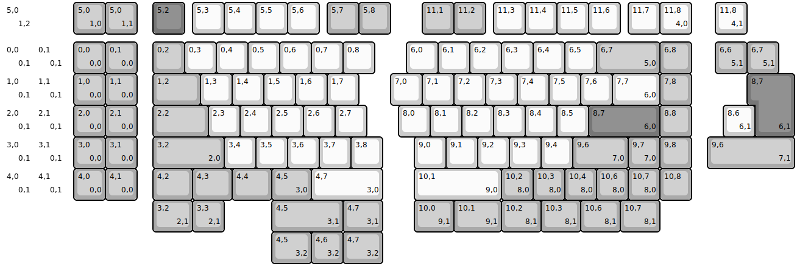{:loading="lazy"}

[Open in keyboard-layout-editor](http://www.keyboard-layout-editor.com/##@@_x:2.25&c=#aaaaaa;&=5,0%0A%0A%0A1,0%0A%0A%0A%0A%0A%0Ae0&_x:1.5&c=#777777;&=5,2&_x:0.25&c=#cccccc;&=5,3&=5,4&=5,5&=5,6&_x:0.25&c=#aaaaaa;&=5,7&=5,8&_x:1.0;&=11,1&=11,2&_x:0.25&c=#cccccc;&=11,3&=11,4&=11,5&=11,6&_x:0.25;&=11,7&=11,8%0A%0A%0A4,0%0A%0A%0A%0A%0A%0Ae1;&@_x:2.25&y:0.25&c=#aaaaaa;&=0,0%0A%0A%0A0,0&=0,1%0A%0A%0A0,0&_x:0.5;&=0,2&_c=#cccccc;&=0,3&=0,4&=0,5&=0,6&=0,7&=0,8&_x:1.0;&=6,0&=6,1&=6,2&=6,3&=6,4&=6,5&_c=#aaaaaa&w:2;&=6,7%0A%0A%0A5,0&=6,8;&@_x:2.25;&=1,0%0A%0A%0A0,0&=1,1%0A%0A%0A0,0&_x:0.5&w:1.5;&=1,2&_c=#cccccc;&=1,3&=1,4&=1,5&=1,6&=1,7&_x:1.0;&=7,0&=7,1&=7,2&=7,3&=7,4&=7,5&=7,6&_w:1.5;&=7,7%0A%0A%0A6,0&_c=#aaaaaa;&=7,8;&@_x:2.25;&=2,0%0A%0A%0A0,0&=2,1%0A%0A%0A0,0&_x:0.5&w:1.75;&=2,2&_c=#cccccc;&=2,3&=2,4&=2,5&=2,6&=2,7&_x:1.0;&=8,0&=8,1&=8,2&=8,3&=8,4&=8,5&_c=#777777&w:2.25;&=8,7%0A%0A%0A6,0&_c=#aaaaaa;&=8,8;&@_x:2.25;&=3,0%0A%0A%0A0,0&=3,1%0A%0A%0A0,0&_x:0.5&w:2.25;&=3,2%0A%0A%0A2,0&_c=#cccccc;&=3,4&=3,5&=3,6&=3,7&=3,8&_x:1.0;&=9,0&=9,1&=9,2&=9,3&=9,4&_c=#aaaaaa&w:1.75;&=9,6%0A%0A%0A7,0&=9,7%0A%0A%0A7,0&=9,8;&@_x:2.25;&=4,0%0A%0A%0A0,0&=4,1%0A%0A%0A0,0&_x:0.5&w:1.25;&=4,2&_w:1.25;&=4,3&_w:1.25;&=4,4&_w:1.25;&=4,5%0A%0A%0A3,0&_c=#cccccc&w:2.25;&=4,7%0A%0A%0A3,0&_x:1.0&w:2.75;&=10,1%0A%0A%0A9,0&_c=#aaaaaa;&=10,2%0A%0A%0A8,0&=10,3%0A%0A%0A8,0&=10,4%0A%0A%0A8,0&=10,6%0A%0A%0A8,0&=10,7%0A%0A%0A8,0&=10,8;&@_y:-6.25&c=#cccccc&d:true;&=5,0%0A%0A%0A1,2&_x:2.25&c=#aaaaaa;&=5,0%0A%0A%0A1,1&_x:18.25&c=#cccccc;&=11,8%0A%0A%0A4,1;&@_y:0.25&d:true;&=0,0%0A%0A%0A0,1&_d:true;&=0,1%0A%0A%0A0,1&_x:20.5&c=#aaaaaa;&=6,6%0A%0A%0A5,1&=6,7%0A%0A%0A5,1;&@_c=#cccccc&d:true;&=1,0%0A%0A%0A0,1&_d:true;&=1,1%0A%0A%0A0,1&_x:21.75&c=#777777&w:1.25&h:2&w2:1.5&h2:1&x2:-0.25;&=8,7%0A%0A%0A6,1;&@_c=#cccccc&d:true;&=2,0%0A%0A%0A0,1&_d:true;&=2,1%0A%0A%0A0,1&_x:20.75;&=8,6%0A%0A%0A6,1;&@_d:true;&=3,0%0A%0A%0A0,1&_d:true;&=3,1%0A%0A%0A0,1&_x:20.25&c=#aaaaaa&w:2.75;&=9,6%0A%0A%0A7,1;&@_c=#cccccc&d:true;&=4,0%0A%0A%0A0,1&_d:true;&=4,1%0A%0A%0A0,1;&@_x:4.75&c=#aaaaaa&w:1.25;&=3,2%0A%0A%0A2,1&=3,3%0A%0A%0A2,1&_x:1.5&w:2.25;&=4,5%0A%0A%0A3,1&_w:1.25;&=4,7%0A%0A%0A3,1&_x:1.0&w:1.25;&=10,0%0A%0A%0A9,1&_w:1.5;&=10,1%0A%0A%0A9,1&_w:1.25;&=10,2%0A%0A%0A8,1&_w:1.25;&=10,3%0A%0A%0A8,1&_w:1.25;&=10,6%0A%0A%0A8,1&_w:1.25;&=10,7%0A%0A%0A8,1;&@_x:8.5&w:1.25;&=4,5%0A%0A%0A3,2&=4,6%0A%0A%0A3,2&_w:1.25;&=4,7%0A%0A%0A3,2)

## keebio/sinc/sinc-rev2

[README](output/keebio/sinc/README.md) - [layout](output/keebio/sinc/sinc-rev2-kle.json) - [PCB](output/keebio/sinc/sinc-rev2.kicad_pcb) - [PCB render](output/keebio/sinc/sinc-rev2-render.svg)

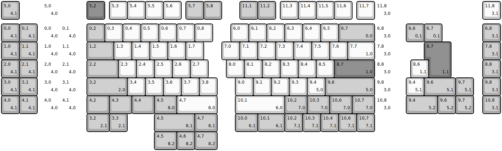{:loading="lazy"}

[Open in keyboard-layout-editor](http://www.keyboard-layout-editor.com/##@@_x:2.25&d:true;&=5,0%0A%0A%0A4,0&_x:1.5&c=#777777;&=5,2&_x:0.25&c=#cccccc;&=5,3&=5,4&=5,5&=5,6&_x:0.25&c=#aaaaaa;&=5,7&=5,8&_x:1.0;&=11,1&=11,2&_x:0.25&c=#cccccc;&=11,3&=11,4&=11,5&=11,6&_x:0.25;&=11,7&_d:true;&=11,8%0A%0A%0A3,0;&@_x:2.25&y:0.25&d:true;&=0,0%0A%0A%0A4,0&_d:true;&=0,1%0A%0A%0A4,0&_x:0.5&c=#aaaaaa;&=0,2&_c=#cccccc;&=0,3&=0,4&=0,5&=0,6&=0,7&=0,8&_x:1.0;&=6,0&=6,1&=6,2&=6,3&=6,4&=6,5&_c=#aaaaaa&w:2;&=6,7%0A%0A%0A0,0&_c=#cccccc&d:true;&=6,8%0A%0A%0A3,0;&@_x:2.25&d:true;&=1,0%0A%0A%0A4,0&_d:true;&=1,1%0A%0A%0A4,0&_x:0.5&c=#aaaaaa&w:1.5;&=1,2&_c=#cccccc;&=1,3&=1,4&=1,5&=1,6&=1,7&_x:1.0;&=7,0&=7,1&=7,2&=7,3&=7,4&=7,5&=7,6&_w:1.5;&=7,7%0A%0A%0A1,0&_d:true;&=7,8%0A%0A%0A3,0;&@_x:2.25&d:true;&=2,0%0A%0A%0A4,0&_d:true;&=2,1%0A%0A%0A4,0&_x:0.5&c=#aaaaaa&w:1.75;&=2,2&_c=#cccccc;&=2,3&=2,4&=2,5&=2,6&=2,7&_x:1.0;&=8,0&=8,1&=8,2&=8,3&=8,4&=8,5&_c=#777777&w:2.25;&=8,7%0A%0A%0A1,0&_c=#cccccc&d:true;&=8,8%0A%0A%0A3,0;&@_x:2.25&d:true;&=3,0%0A%0A%0A4,0&_d:true;&=3,1%0A%0A%0A4,0&_x:0.5&c=#aaaaaa&w:2.25;&=3,2%0A%0A%0A2,0&_c=#cccccc;&=3,4&=3,5&=3,6&=3,7&=3,8&_x:1.0;&=9,0&=9,1&=9,2&=9,3&=9,4%0A%0A%0A5,0&_c=#aaaaaa&w:2.75;&=9,6%0A%0A%0A5,0&_c=#cccccc&d:true;&=9,8%0A%0A%0A3,0;&@_x:2.25&d:true;&=4,0%0A%0A%0A4,0&_d:true;&=4,1%0A%0A%0A4,0&_x:0.5&c=#aaaaaa&w:1.25;&=4,2&_w:1.25;&=4,3&_w:1.25;&=4,4&_w:1.25;&=4,5%0A%0A%0A8,0&_c=#cccccc&w:2.25;&=4,7%0A%0A%0A8,0&_x:1.0&w:2.75;&=10,1%0A%0A%0A6,0&_c=#aaaaaa&w:1.25;&=10,2%0A%0A%0A7,0&_w:1.25;&=10,3%0A%0A%0A7,0&_w:1.25;&=10,6%0A%0A%0A7,0&_w:1.25;&=10,7%0A%0A%0A7,0&_c=#cccccc&d:true;&=10,8%0A%0A%0A3,0;&@_y:-6.25&c=#aaaaaa;&=5,0%0A%0A%0A4,1&_x:25.75&c=#cccccc;&=11,8%0A%0A%0A3,1;&@_y:0.25&c=#aaaaaa;&=0,0%0A%0A%0A4,1&=0,1%0A%0A%0A4,1&_x:20.5;&=6,6%0A%0A%0A0,1&=6,7%0A%0A%0A0,1&_x:2.25;&=6,8%0A%0A%0A3,1;&@=1,0%0A%0A%0A4,1&=1,1%0A%0A%0A4,1&_x:21.75&c=#777777&w:1.25&h:2&w2:1.5&h2:1&x2:-0.25;&=8,7%0A%0A%0A1,1&_x:1.75&c=#aaaaaa;&=7,8%0A%0A%0A3,1;&@=2,0%0A%0A%0A4,1&=2,1%0A%0A%0A4,1&_x:20.75&c=#cccccc;&=8,6%0A%0A%0A1,1&_x:3.0&c=#aaaaaa;&=8,8%0A%0A%0A3,1;&@=3,0%0A%0A%0A4,1&=3,1%0A%0A%0A4,1&_x:20.5&c=#cccccc;&=9,4%0A%0A%0A5,1&_c=#aaaaaa&w:1.75;&=9,6%0A%0A%0A5,1&=9,7%0A%0A%0A5,1&_x:0.5;&=9,8%0A%0A%0A3,1;&@=4,0%0A%0A%0A4,1&=4,1%0A%0A%0A4,1&_x:20.5&w:1.75;&=9,4%0A%0A%0A5,2&=9,6%0A%0A%0A5,2&=9,7%0A%0A%0A5,2&_x:0.5;&=10,8%0A%0A%0A3,1;&@_x:4.75&w:1.25;&=3,2%0A%0A%0A2,1&=3,3%0A%0A%0A2,1&_x:1.5&w:2.25;&=4,5%0A%0A%0A8,1&_w:1.25;&=4,7%0A%0A%0A8,1&_x:1.0&w:1.25;&=10,0%0A%0A%0A6,1&_w:1.5;&=10,1%0A%0A%0A6,1&=10,2%0A%0A%0A7,1&=10,3%0A%0A%0A7,1&=10,4%0A%0A%0A7,1&=10,6%0A%0A%0A7,1&=10,7%0A%0A%0A7,1;&@_x:8.5&w:1.25;&=4,5%0A%0A%0A8,2&=4,6%0A%0A%0A8,2&_w:1.25;&=4,7%0A%0A%0A8,2)

## keebio/sinc/sinc-rev2a

[README](output/keebio/sinc/README.md) - [layout](output/keebio/sinc/sinc-rev2a-kle.json) - [PCB](output/keebio/sinc/sinc-rev2a.kicad_pcb) - [PCB render](output/keebio/sinc/sinc-rev2a-render.svg)

{:loading="lazy"}

[Open in keyboard-layout-editor](http://www.keyboard-layout-editor.com/##@@_x:2.25&c=#aaaaaa;&=5,0%0A%0A%0A1,0%0A%0A%0A%0A%0A%0Ae0&_x:1.5&c=#777777;&=5,2&_x:0.25&c=#cccccc;&=5,3&=5,4&=5,5&=5,6&_x:0.25&c=#aaaaaa;&=5,7&=5,8&_x:1.0;&=11,1&=11,2&_x:0.25&c=#cccccc;&=11,3&=11,4&=11,5&=11,6&_x:0.25;&=11,7&=11,8%0A%0A%0A4,0%0A%0A%0A%0A%0A%0Ae1;&@_x:2.25&y:0.25&c=#aaaaaa;&=0,0%0A%0A%0A0,0&=0,1%0A%0A%0A0,0&_x:0.5;&=0,2&_c=#cccccc;&=0,3&=0,4&=0,5&=0,6&=0,7&=0,8&_x:1.0;&=6,0&=6,1&=6,2&=6,3&=6,4&=6,5&_c=#aaaaaa&w:2;&=6,7%0A%0A%0A5,0&=6,8;&@_x:2.25;&=1,0%0A%0A%0A0,0&=1,1%0A%0A%0A0,0&_x:0.5&w:1.5;&=1,2&_c=#cccccc;&=1,3&=1,4&=1,5&=1,6&=1,7&_x:1.0;&=7,0&=7,1&=7,2&=7,3&=7,4&=7,5&=7,6&_w:1.5;&=7,7%0A%0A%0A6,0&_c=#aaaaaa;&=7,8;&@_x:2.25;&=2,0%0A%0A%0A0,0&=2,1%0A%0A%0A0,0&_x:0.5&w:1.75;&=2,2&_c=#cccccc;&=2,3&=2,4&=2,5&=2,6&=2,7&_x:1.0;&=8,0&=8,1&=8,2&=8,3&=8,4&=8,5&_c=#777777&w:2.25;&=8,7%0A%0A%0A6,0&_c=#aaaaaa;&=8,8;&@_x:2.25;&=3,0%0A%0A%0A0,0&=3,1%0A%0A%0A0,0&_x:0.5&w:2.25;&=3,2%0A%0A%0A2,0&_c=#cccccc;&=3,4&=3,5&=3,6&=3,7&=3,8&_x:1.0;&=9,0&=9,1&=9,2&=9,3&=9,4&_c=#aaaaaa&w:1.75;&=9,6%0A%0A%0A7,0&=9,7%0A%0A%0A7,0&=9,8;&@_x:2.25;&=4,0%0A%0A%0A0,0&=4,1%0A%0A%0A0,0&_x:0.5&w:1.25;&=4,2&_w:1.25;&=4,3&_w:1.25;&=4,4&_w:1.25;&=4,5%0A%0A%0A3,0&_c=#cccccc&w:2.25;&=4,7%0A%0A%0A3,0&_x:1.0&w:2.75;&=10,1%0A%0A%0A9,0&_c=#aaaaaa;&=10,2%0A%0A%0A8,0&=10,3%0A%0A%0A8,0&=10,4%0A%0A%0A8,0&=10,6%0A%0A%0A8,0&=10,7%0A%0A%0A8,0&=10,8;&@_y:-6.25&c=#cccccc&d:true;&=5,0%0A%0A%0A1,2&_x:2.25&c=#aaaaaa;&=5,0%0A%0A%0A1,1&_x:18.25&c=#cccccc;&=11,8%0A%0A%0A4,1;&@_y:0.25&d:true;&=0,0%0A%0A%0A0,1&_d:true;&=0,1%0A%0A%0A0,1&_x:20.5&c=#aaaaaa;&=6,6%0A%0A%0A5,1&=6,7%0A%0A%0A5,1;&@_c=#cccccc&d:true;&=1,0%0A%0A%0A0,1&_d:true;&=1,1%0A%0A%0A0,1&_x:21.75&c=#777777&w:1.25&h:2&w2:1.5&h2:1&x2:-0.25;&=8,7%0A%0A%0A6,1;&@_c=#cccccc&d:true;&=2,0%0A%0A%0A0,1&_d:true;&=2,1%0A%0A%0A0,1&_x:20.75;&=8,6%0A%0A%0A6,1;&@_d:true;&=3,0%0A%0A%0A0,1&_d:true;&=3,1%0A%0A%0A0,1&_x:20.25&c=#aaaaaa&w:2.75;&=9,6%0A%0A%0A7,1;&@_c=#cccccc&d:true;&=4,0%0A%0A%0A0,1&_d:true;&=4,1%0A%0A%0A0,1;&@_x:4.75&c=#aaaaaa&w:1.25;&=3,2%0A%0A%0A2,1&=3,3%0A%0A%0A2,1&_x:1.5&w:2.25;&=4,5%0A%0A%0A3,1&_w:1.25;&=4,7%0A%0A%0A3,1&_x:1.0&w:1.25;&=10,0%0A%0A%0A9,1&_w:1.5;&=10,1%0A%0A%0A9,1&_w:1.25;&=10,2%0A%0A%0A8,1&_w:1.25;&=10,3%0A%0A%0A8,1&_w:1.25;&=10,6%0A%0A%0A8,1&_w:1.25;&=10,7%0A%0A%0A8,1;&@_x:8.5&w:1.25;&=4,5%0A%0A%0A3,2&=4,6%0A%0A%0A3,2&_w:1.25;&=4,7%0A%0A%0A3,2)

## keebio/sinc/sinc-rev3

[README](output/keebio/sinc/README.md) - [layout](output/keebio/sinc/sinc-rev3-kle.json) - [PCB](output/keebio/sinc/sinc-rev3.kicad_pcb) - [PCB render](output/keebio/sinc/sinc-rev3-render.svg)

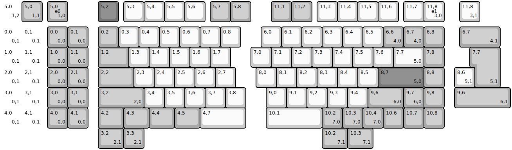{:loading="lazy"}

[Open in keyboard-layout-editor](http://www.keyboard-layout-editor.com/##@@_x:2.25&c=#aaaaaa;&=5,0%0A%0A%0A1,0%0A%0A%0A%0A%0A%0Ae0&_x:1.5&c=#777777;&=5,2&_x:0.25&c=#cccccc;&=5,3&=5,4&=5,5&=5,6&_x:0.25&c=#aaaaaa;&=5,7&=5,8&_x:1.0;&=11,1&=11,2&_x:0.25&c=#cccccc;&=11,3&=11,4&=11,5&=11,6&_x:0.25;&=11,7&=11,8%0A%0A%0A3,0%0A%0A%0A%0A%0A%0Ae1;&@_x:2.25&y:0.25&c=#aaaaaa;&=0,0%0A%0A%0A0,0&=0,1%0A%0A%0A0,0&_x:0.5;&=0,2&_c=#cccccc;&=0,3&=0,4&=0,5&=0,6&=0,7&=0,8&_x:1.0;&=6,0&=6,1&=6,2&=6,3&=6,4&=6,5&_c=#aaaaaa;&=6,6%0A%0A%0A4,0&=6,7%0A%0A%0A4,0&=6,8;&@_x:2.25;&=1,0%0A%0A%0A0,0&=1,1%0A%0A%0A0,0&_x:0.5&w:1.5;&=1,2&_c=#cccccc;&=1,3&=1,4&=1,5&=1,6&=1,7&_x:1.0;&=7,0&=7,1&=7,2&=7,3&=7,4&=7,5&=7,6&_w:1.5;&=7,7%0A%0A%0A5,0&_c=#aaaaaa;&=7,8;&@_x:2.25;&=2,0%0A%0A%0A0,0&=2,1%0A%0A%0A0,0&_x:0.5&w:1.75;&=2,2&_c=#cccccc;&=2,3&=2,4&=2,5&=2,6&=2,7&_x:1.0;&=8,0&=8,1&=8,2&=8,3&=8,4&=8,5&_c=#777777&w:2.25;&=8,7%0A%0A%0A5,0&_c=#aaaaaa;&=8,8;&@_x:2.25;&=3,0%0A%0A%0A0,0&=3,1%0A%0A%0A0,0&_x:0.5&w:2.25;&=3,2%0A%0A%0A2,0&_c=#cccccc;&=3,4&=3,5&=3,6&=3,7&=3,8&_x:1.0;&=9,0&=9,1&=9,2&=9,3&=9,4&_c=#aaaaaa&w:1.75;&=9,6%0A%0A%0A6,0&=9,7%0A%0A%0A6,0&=9,8;&@_x:2.25;&=4,0%0A%0A%0A0,0&=4,1%0A%0A%0A0,0&_x:0.5&w:1.25;&=4,2&_w:1.25;&=4,3&_w:1.25;&=4,4&_w:1.25;&=4,5&_c=#cccccc&w:2.25;&=4,7&_x:1.0&w:2.75;&=10,1&_c=#aaaaaa;&=10,2%0A%0A%0A7,0&=10,3%0A%0A%0A7,0&=10,4%0A%0A%0A7,0&=10,6&=10,7&=10,8;&@_y:-6.25&c=#cccccc&d:true;&=5,0%0A%0A%0A1,2&_c=#aaaaaa;&=5,0%0A%0A%0A1,1&_x:20.5&c=#cccccc;&=11,8%0A%0A%0A3,1;&@_y:0.25&d:true;&=0,0%0A%0A%0A0,1&_d:true;&=0,1%0A%0A%0A0,1&_x:20.5&c=#aaaaaa&w:2;&=6,7%0A%0A%0A4,1;&@_c=#cccccc&d:true;&=1,0%0A%0A%0A0,1&_d:true;&=1,1%0A%0A%0A0,1&_x:21.25&c=#aaaaaa&w:1.25&h:2&w2:1.5&h2:1&x2:-0.25;&=7,7%0A%0A%0A5,1;&@_c=#cccccc&d:true;&=2,0%0A%0A%0A0,1&_d:true;&=2,1%0A%0A%0A0,1&_x:20.25;&=8,6%0A%0A%0A5,1;&@_d:true;&=3,0%0A%0A%0A0,1&_d:true;&=3,1%0A%0A%0A0,1&_x:20.25&c=#aaaaaa&w:2.75;&=9,6%0A%0A%0A6,1;&@_c=#cccccc&d:true;&=4,0%0A%0A%0A0,1&_d:true;&=4,1%0A%0A%0A0,1;&@_x:4.75&c=#aaaaaa&w:1.25;&=3,2%0A%0A%0A2,1&=3,3%0A%0A%0A2,1&_x:8.75&w:1.25;&=10,2%0A%0A%0A7,1&_w:1.25;&=10,3%0A%0A%0A7,1)

## keebio/stick/stick-rev1

[README](output/keebio/stick/README.md) - [layout](output/keebio/stick/stick-rev1-kle.json) - [PCB](output/keebio/stick/stick-rev1.kicad_pcb) - [PCB render](output/keebio/stick/stick-rev1-render.svg)

{:loading="lazy"}

[Open in keyboard-layout-editor](http://www.keyboard-layout-editor.com/##@@=0,0&=0,1&=0,2&=0,3&=0,4&=0,5&=0,6&=0,7&=0,8&=0,9&=0,10&=0,11)

## keebio/viterbi/viterbi-rev2

[README](output/keebio/viterbi/README.md) - [layout](output/keebio/viterbi/viterbi-rev2-kle.json) - [PCB](output/keebio/viterbi/viterbi-rev2.kicad_pcb) - [PCB render](output/keebio/viterbi/viterbi-rev2-render.svg)

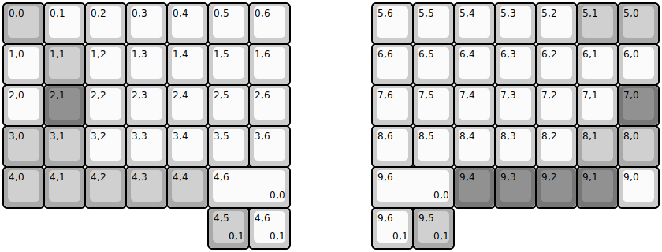{:loading="lazy"}

[Open in keyboard-layout-editor](http://www.keyboard-layout-editor.com/##@@_c=#aaaaaa;&=0,0&_c=#cccccc;&=0,1&=0,2&=0,3&=0,4&=0,5&=0,6&_x:2;&=5,6&=5,5&=5,4&=5,3&=5,2&_c=#aaaaaa;&=5,1&=5,0;&@_c=#cccccc;&=1,0&_c=#aaaaaa;&=1,1&_c=#cccccc;&=1,2&=1,3&=1,4&=1,5&=1,6&_x:2;&=6,6&=6,5&=6,4&=6,3&=6,2&=6,1&=6,0;&@=2,0&_c=#777777;&=2,1&_c=#cccccc;&=2,2&=2,3&=2,4&=2,5&=2,6&_x:2;&=7,6&=7,5&=7,4&=7,3&=7,2&=7,1&_c=#777777;&=7,0;&@_c=#aaaaaa;&=3,0&=3,1&_c=#cccccc;&=3,2&=3,3&=3,4&=3,5&=3,6&_x:2;&=8,6&=8,5&=8,4&=8,3&=8,2&_c=#aaaaaa;&=8,1&=8,0;&@=4,0&=4,1&=4,2&=4,3&=4,4&_c=#cccccc&w:2;&=4,6%0A%0A%0A0,0&_x:2&w:2;&=9,6%0A%0A%0A0,0&_c=#777777;&=9,4&=9,3&=9,2&=9,1&_c=#cccccc;&=9,0;&@_x:5&c=#aaaaaa;&=4,5%0A%0A%0A0,1&_c=#cccccc;&=4,6%0A%0A%0A0,1&_x:2;&=9,6%0A%0A%0A0,1&_c=#aaaaaa;&=9,5%0A%0A%0A0,1)

## keebio/wtf60/wtf60-rev1

[README](output/keebio/wtf60/README.md) - [layout](output/keebio/wtf60/wtf60-rev1-kle.json) - [PCB](output/keebio/wtf60/wtf60-rev1.kicad_pcb) - [PCB render](output/keebio/wtf60/wtf60-rev1-render.svg)

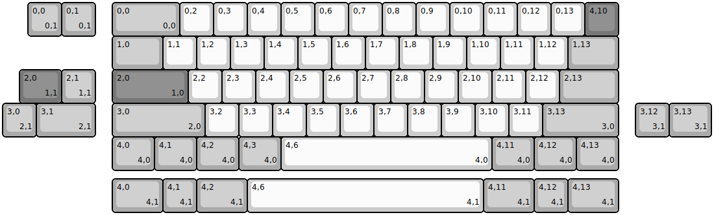{:loading="lazy"}

[Open in keyboard-layout-editor](http://www.keyboard-layout-editor.com/##@@_x:3.25&c=#aaaaaa&w:2;&=0,0%0A%0A%0A0,0&_c=#cccccc;&=0,2&=0,3&=0,4&=0,5&=0,6&=0,7&=0,8&=0,9&=0,10&=0,11&=0,12&=0,13&_c=#777777;&=4,10;&@_x:3.25&c=#aaaaaa&w:1.5;&=1,0&_c=#cccccc;&=1,1&=1,2&=1,3&=1,4&=1,5&=1,6&=1,7&=1,8&=1,9&=1,10&=1,11&=1,12&_c=#aaaaaa&w:1.5;&=1,13;&@_x:3.25&c=#777777&w:2.25;&=2,0%0A%0A%0A1,0&_c=#cccccc;&=2,2&=2,3&=2,4&=2,5&=2,6&=2,7&=2,8&=2,9&=2,10&=2,11&=2,12&_c=#aaaaaa&w:1.75;&=2,13;&@_x:3.25&w:2.75;&=3,0%0A%0A%0A2,0&_c=#cccccc;&=3,2&=3,3&=3,4&=3,5&=3,6&=3,7&=3,8&=3,9&=3,10&=3,11&_c=#aaaaaa&w:2.25;&=3,13%0A%0A%0A3,0;&@_x:3.25&w:1.25;&=4,0%0A%0A%0A4,0&_w:1.25;&=4,1%0A%0A%0A4,0&_w:1.25;&=4,2%0A%0A%0A4,0&_w:1.25;&=4,3%0A%0A%0A4,0&_c=#cccccc&w:6.25;&=4,6%0A%0A%0A4,0&_c=#aaaaaa&w:1.25;&=4,11%0A%0A%0A4,0&_w:1.25;&=4,12%0A%0A%0A4,0&_w:1.25;&=4,13%0A%0A%0A4,0;&@_x:0.75&y:-5;&=0,0%0A%0A%0A0,1&=0,1%0A%0A%0A0,1;&@_x:0.5&y:1&c=#777777&w:1.25;&=2,0%0A%0A%0A1,1&_c=#aaaaaa;&=2,1%0A%0A%0A1,1;&@=3,0%0A%0A%0A2,1&_w:1.75;&=3,1%0A%0A%0A2,1&_x:16.0;&=3,12%0A%0A%0A3,1&_w:1.25;&=3,13%0A%0A%0A3,1;&@_x:3.25&y:1.25&w:1.5;&=4,0%0A%0A%0A4,1&=4,1%0A%0A%0A4,1&_w:1.5;&=4,2%0A%0A%0A4,1&_c=#cccccc&w:7;&=4,6%0A%0A%0A4,1&_c=#aaaaaa&w:1.5;&=4,11%0A%0A%0A4,1&=4,12%0A%0A%0A4,1&_w:1.5;&=4,13%0A%0A%0A4,1)

## keebsforall/coarse60

[README](output/keebsforall/coarse60/README.md) - [layout](output/keebsforall/coarse60/coarse60-kle.json) - [PCB](output/keebsforall/coarse60/coarse60.kicad_pcb) - [PCB render](output/keebsforall/coarse60/coarse60-render.svg)

{:loading="lazy"}

[Open in keyboard-layout-editor](http://www.keyboard-layout-editor.com/##@@_x:1.5&c=#777777;&=0,0;&@_x:4.75&y:-0.85&c=#cccccc;&=0,3&_x:8.5;&=0,12;&@_x:2.75&y:-0.9;&=0,1&=0,2&_x:10.5;&=0,13&_c=#aaaaaa&w:2;&=0,14%0A%0A%0A0,0;&@_x:1.25&y:-0.25;&=1,0;&@_x:14&y:-0.8&c=#cccccc;&=1,11;&@_x:2.5&y:-0.95&c=#aaaaaa&w:1.5;&=1,1&_c=#cccccc;&=1,2&_x:10.0;&=1,12&=1,13&_w:1.5;&=1,14;&@_x:1&y:-0.25&c=#aaaaaa;&=2,0;&@_x:2.25&y:-0.75&w:1.75;&=2,1&_c=#cccccc;&=2,2&_x:9.5;&=2,11&=2,12&_c=#777777&w:2.25;&=2,14;&@_x:2&c=#aaaaaa&w:2.25;&=3,1&_c=#cccccc;&=3,2&_x:9.0;&=3,11&=3,12&_c=#aaaaaa&w:2.75;&=3,13%0A%0A%0A1,0;&@_x:2&w:1.5;&=4,1&_x:13.75&w:1.5;&=4,14;&@_r:10&x:5.8&y:-6.0&c=#cccccc;&=0,4&=0,5&=0,6&=0,7;&@_x:5.3;&=1,3&=1,4&=1,5&=1,6;&@_x:5.45;&=2,3&=2,4&=2,5&=2,6;&@_x:5.95;&=3,3&=3,4&=3,5&=3,6;&@_x:7&c=#777777&w:2.25;&=4,5&_c=#aaaaaa&w:1.25;&=4,6;&@_x:5.5&y:-0.95&w:1.5;&=4,4;&@_r:-10&x:9.8&y:-1.7&c=#cccccc;&=0,8&=0,9&=0,10&=0,11;&@_x:9.4;&=1,7&=1,8&=1,9&=1,10;&@_x:9.75;&=2,7&=2,8&=2,9&=2,10;&@_x:9.3;&=3,7&=3,8&=3,9&=3,10;&@_x:9.4&c=#777777&w:2.75;&=4,8;&@_x:12.15&y:-0.9&c=#aaaaaa&w:1.5;&=4,10;&@_r:0&x:18.5&y:-7.45;&=0,14%0A%0A%0A0,1&=2,13%0A%0A%0A0,1;&@_x:19.25&y:2.0&w:1.75;&=3,13%0A%0A%0A1,1&=3,14%0A%0A%0A1,1)

## keebsforall/freebird60

[README](output/keebsforall/freebird60/README.md) - [layout](output/keebsforall/freebird60/freebird60-kle.json) - [PCB](output/keebsforall/freebird60/freebird60.kicad_pcb) - [PCB render](output/keebsforall/freebird60/freebird60-render.svg)

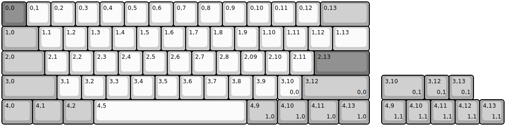{:loading="lazy"}

[Open in keyboard-layout-editor](http://www.keyboard-layout-editor.com/##@@_c=#777777;&=0,0&_c=#cccccc;&=0,1&=0,2&=0,3&=0,4&=0,5&=0,6&=0,7&=0,8&=0,9&=0,10&=0,11&=0,12&_c=#aaaaaa&w:2;&=0,13;&@_w:1.5;&=1,0&_c=#cccccc;&=1,1&=1,2&=1,3&=1,4&=1,5&=1,6&=1,7&=1,8&=1,9&=1,10&=1,11&=1,12&_w:1.5;&=1,13;&@_c=#aaaaaa&w:1.75;&=2,0&_c=#cccccc;&=2,1&=2,2&=2,3&=2,4&=2,5&=2,6&=2,7&=2,8&=2,09&=2,10&=2,11&_c=#777777&w:2.25;&=2,13;&@_c=#aaaaaa&w:2.25;&=3,0&_c=#cccccc;&=3,1&=3,2&=3,3&=3,4&=3,5&=3,6&=3,7&=3,8&=3,9&=3,10%0A%0A%0A0,0&_c=#aaaaaa&w:2.75;&=3,12%0A%0A%0A0,0;&@_w:1.25;&=4,0&_w:1.25;&=4,1&_w:1.25;&=4,2&_c=#cccccc&w:6.25;&=4,5&_c=#aaaaaa&w:1.25;&=4,9%0A%0A%0A1,0&_w:1.25;&=4,10%0A%0A%0A1,0&_w:1.25;&=4,11%0A%0A%0A1,0&_w:1.25;&=4,13%0A%0A%0A1,0;&@_x:15.5&y:-2&w:1.75;&=3,10%0A%0A%0A0,1&=3,12%0A%0A%0A0,1&=3,13%0A%0A%0A0,1;&@_x:15.5;&=4,9%0A%0A%0A1,1&=4,10%0A%0A%0A1,1&=4,11%0A%0A%0A1,1&=4,12%0A%0A%0A1,1&=4,13%0A%0A%0A1,1)

## keebsforall/freebird75

[README](output/keebsforall/freebird75/README.md) - [layout](output/keebsforall/freebird75/freebird75-kle.json) - [PCB](output/keebsforall/freebird75/freebird75.kicad_pcb) - [PCB render](output/keebsforall/freebird75/freebird75-render.svg)

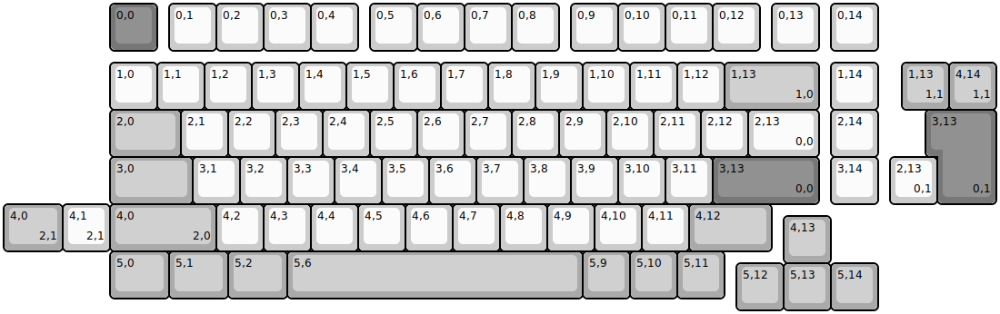{:loading="lazy"}

[Open in keyboard-layout-editor](http://www.keyboard-layout-editor.com/##@@_x:2.25&c=#777777;&=0,0&_x:0.25&c=#cccccc;&=0,1&=0,2&=0,3&=0,4&_x:0.25;&=0,5&=0,6&=0,7&=0,8&_x:0.25;&=0,9&=0,10&=0,11&=0,12&_x:0.25;&=0,13&_x:0.25;&=0,14;&@_x:2.25&y:0.25;&=1,0&=1,1&=1,2&=1,3&=1,4&=1,5&=1,6&=1,7&=1,8&=1,9&=1,10&=1,11&=1,12&_c=#aaaaaa&w:2;&=1,13%0A%0A%0A1,0&_x:0.25&c=#cccccc;&=1,14;&@_x:2.25&c=#aaaaaa&w:1.5;&=2,0&_c=#cccccc;&=2,1&=2,2&=2,3&=2,4&=2,5&=2,6&=2,7&=2,8&=2,9&=2,10&=2,11&=2,12&_w:1.5;&=2,13%0A%0A%0A0,0&_x:0.25;&=2,14;&@_x:2.25&c=#aaaaaa&w:1.75;&=3,0&_c=#cccccc;&=3,1&=3,2&=3,3&=3,4&=3,5&=3,6&=3,7&=3,8&=3,9&=3,10&=3,11&_c=#777777&w:2.25;&=3,13%0A%0A%0A0,0&_x:0.25&c=#cccccc;&=3,14;&@_x:2.25&c=#aaaaaa&w:2.25;&=4,0%0A%0A%0A2,0&_c=#cccccc;&=4,2&=4,3&=4,4&=4,5&=4,6&=4,7&=4,8&=4,9&=4,10&=4,11&_c=#aaaaaa&w:1.75;&=4,12;&@_x:16.5&y:-0.75;&=4,13;&@_x:2.25&y:-0.25&w:1.25;&=5,0&_w:1.25;&=5,1&_w:1.25;&=5,2&_w:6.25;&=5,6&=5,9&=5,10&=5,11;&@_x:15.5&y:-0.75;&=5,12&=5,13&=5,14;&@_x:19.0&y:-5.25;&=1,13%0A%0A%0A1,1&=4,14%0A%0A%0A1,1;&@_x:19.75&c=#777777&w:1.25&h:2&w2:1.5&h2:1&x2:-0.25;&=3,13%0A%0A%0A0,1;&@_x:18.75&c=#cccccc;&=2,13%0A%0A%0A0,1;&@_c=#aaaaaa&w:1.25;&=4,0%0A%0A%0A2,1&_c=#cccccc;&=4,1%0A%0A%0A2,1)

## keebsforall/freebirdNP/lite/freebirdnp_lite

[README](output/keebsforall/freebirdNP/lite/README.md) - [layout](output/keebsforall/freebirdNP/lite/freebirdnp_lite-kle.json) - [PCB](output/keebsforall/freebirdNP/lite/freebirdnp_lite.kicad_pcb) - [PCB render](output/keebsforall/freebirdNP/lite/freebirdnp_lite-render.svg)

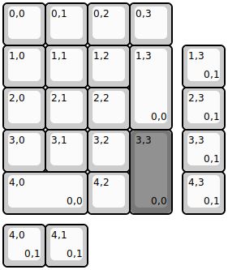{:loading="lazy"}

[Open in keyboard-layout-editor](http://www.keyboard-layout-editor.com/##@@=0,0&=0,1&=0,2&=0,3;&@=1,0&=1,1&=1,2&_h:2;&=1,3%0A%0A%0A0,0;&@=2,0&=2,1&=2,2;&@=3,0&=3,1&=3,2&_c=#777777&h:2;&=3,3%0A%0A%0A0,0;&@_c=#cccccc&w:2;&=4,0%0A%0A%0A0,0&=4,2;&@_x:4.25&y:-4;&=1,3%0A%0A%0A0,1;&@_x:4.25;&=2,3%0A%0A%0A0,1;&@_x:4.25;&=3,3%0A%0A%0A0,1;&@_x:4.25;&=4,3%0A%0A%0A0,1;&@_y:0.25;&=4,0%0A%0A%0A0,1&=4,1%0A%0A%0A0,1)

## keebsforall/freebirdNP/pro/freebirdnp_pro

[README](output/keebsforall/freebirdNP/pro/README.md) - [layout](output/keebsforall/freebirdNP/pro/freebirdnp_pro-kle.json) - [PCB](output/keebsforall/freebirdNP/pro/freebirdnp_pro.kicad_pcb) - [PCB render](output/keebsforall/freebirdNP/pro/freebirdnp_pro-render.svg)

{:loading="lazy"}

[Open in keyboard-layout-editor](http://www.keyboard-layout-editor.com/##@@=0,0&=0,1&=0,2&=0,3;&@=1,0&=1,1&=1,2&=1,3;&@=2,0&=2,1&=2,2&_h:2;&=2,3%0A%0A%0A0,0;&@=3,0&=3,1&=3,2;&@=4,0&=4,1&=4,2&_c=#777777&h:2;&=4,3%0A%0A%0A0,0;&@_c=#cccccc&w:2;&=5,0%0A%0A%0A0,0&=5,2;&@_x:4.25&y:-4;&=2,3%0A%0A%0A0,1;&@_x:4.25;&=3,3%0A%0A%0A0,1;&@_x:4.25;&=4,3%0A%0A%0A0,1;&@_x:4.25;&=5,3%0A%0A%0A0,1;&@_y:0.25;&=5,0%0A%0A%0A0,1&=5,1%0A%0A%0A0,1)

## keebsforall/freebirdtkl

[README](output/keebsforall/freebirdtkl/README.md) - [layout](output/keebsforall/freebirdtkl/freebirdtkl-kle.json) - [PCB](output/keebsforall/freebirdtkl/freebirdtkl.kicad_pcb) - [PCB render](output/keebsforall/freebirdtkl/freebirdtkl-render.svg)

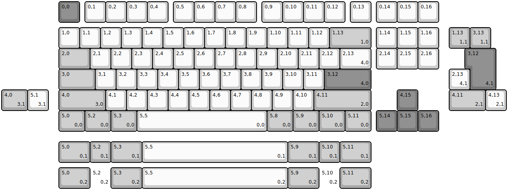{:loading="lazy"}

[Open in keyboard-layout-editor](http://www.keyboard-layout-editor.com/##@@_x:2.75&c=#777777;&=0,0&_x:0.25&c=#cccccc;&=0,1&=0,2&=0,3&=0,4&_x:0.25;&=0,5&=0,6&=0,7&=0,8&_x:0.25;&=0,9&=0,10&=0,11&=0,12&_x:0.25;&=0,13&_x:0.25;&=0,14&=0,15&=0,16;&@_x:2.75&y:0.25;&=1,0&=1,1&=1,2&=1,3&=1,4&=1,5&=1,6&=1,7&=1,8&=1,9&=1,10&=1,11&=1,12&_c=#aaaaaa&w:2;&=1,13%0A%0A%0A1,0&_x:0.25&c=#cccccc;&=1,14&=1,15&=1,16;&@_x:2.75&c=#aaaaaa&w:1.5;&=2,0&_c=#cccccc;&=2,1&=2,2&=2,3&=2,4&=2,5&=2,6&=2,7&=2,8&=2,9&=2,10&=2,11&=2,12&_w:1.5;&=2,13%0A%0A%0A4,0&_x:0.25;&=2,14&=2,15&=2,16;&@_x:2.75&c=#aaaaaa&w:1.75;&=3,0&_c=#cccccc;&=3,1&=3,2&=3,3&=3,4&=3,5&=3,6&=3,7&=3,8&=3,9&=3,10&=3,11&_c=#777777&w:2.25;&=3,12%0A%0A%0A4,0;&@_x:2.75&c=#aaaaaa&w:2.25;&=4,0%0A%0A%0A3,0&_c=#cccccc;&=4,1&=4,2&=4,3&=4,4&=4,5&=4,6&=4,7&=4,8&=4,9&=4,10&_c=#aaaaaa&w:2.75;&=4,11%0A%0A%0A2,0&_x:1.25&c=#777777;&=4,15;&@_x:2.75&c=#aaaaaa&w:1.25;&=5,0%0A%0A%0A0,0&_w:1.25;&=5,2%0A%0A%0A0,0&_w:1.25;&=5,3%0A%0A%0A0,0&_c=#cccccc&w:6.25;&=5,5%0A%0A%0A0,0&_c=#aaaaaa&w:1.25;&=5,8%0A%0A%0A0,0&_w:1.25;&=5,9%0A%0A%0A0,0&_w:1.25;&=5,10%0A%0A%0A0,0&_w:1.25;&=5,11%0A%0A%0A0,0&_x:0.25&c=#777777;&=5,14&=5,15&=5,16;&@_x:21.5&y:-5.0&c=#aaaaaa;&=1,13%0A%0A%0A1,1&=3,13%0A%0A%0A1,1;&@_x:22.5&c=#777777&w:1.25&h:2&w2:1.5&h2:1&x2:-0.25;&=3,12%0A%0A%0A4,1;&@_x:21.5&c=#cccccc;&=2,13%0A%0A%0A4,1;&@_c=#aaaaaa&w:1.25;&=4,0%0A%0A%0A3,1&_c=#cccccc;&=5,1%0A%0A%0A3,1&_x:19.25&c=#aaaaaa&w:1.75;&=4,11%0A%0A%0A2,1&_c=#cccccc;&=4,13%0A%0A%0A2,1;&@_x:2.75&y:1.5&c=#aaaaaa&w:1.5;&=5,0%0A%0A%0A0,1&=5,2%0A%0A%0A0,1&_w:1.5;&=5,3%0A%0A%0A0,1&_c=#cccccc&w:7;&=5,5%0A%0A%0A0,1&_c=#aaaaaa&w:1.5;&=5,9%0A%0A%0A0,1&=5,10%0A%0A%0A0,1&_w:1.5;&=5,11%0A%0A%0A0,1;&@_x:2.75&y:0.25&w:1.5;&=5,0%0A%0A%0A0,2&_c=#cccccc&d:true;&=5,2%0A%0A%0A0,2&_c=#aaaaaa&w:1.5;&=5,3%0A%0A%0A0,2&_c=#cccccc&w:7;&=5,5%0A%0A%0A0,2&_c=#aaaaaa&w:1.5;&=5,9%0A%0A%0A0,2&_c=#cccccc&d:true;&=5,10%0A%0A%0A0,2&_c=#aaaaaa&w:1.5;&=5,11%0A%0A%0A0,2)

## keebzdotnet/fme

[README](output/keebzdotnet/fme/README.md) - [layout](output/keebzdotnet/fme/fme-kle.json) - [PCB](output/keebzdotnet/fme/fme.kicad_pcb) - [PCB render](output/keebzdotnet/fme/fme-render.svg)

{:loading="lazy"}

[Open in keyboard-layout-editor](http://www.keyboard-layout-editor.com/##@@=0,0&=1,3&=1,4&=1,2&=1,0;&@_x:0.25;&=1,1&=0,4&=0,2&_w:2;&=0,3;&@_x:0.25&w:2.75;&=2,2&_x:0.25&w:2;&=2,1%0A%0A%0A0,0;&@_x:3.25;&=3,2%0A%0A%0A0,1&=0,1%0A%0A%0A0,1)

## keebzdotnet/wazowski2319/wazowski-23-19-rev0

[README](output/keebzdotnet/wazowski2319/README.md) - [layout](output/keebzdotnet/wazowski2319/wazowski-23-19-rev0-kle.json) - [PCB](output/keebzdotnet/wazowski2319/wazowski-23-19-rev0.kicad_pcb) - [PCB render](output/keebzdotnet/wazowski2319/wazowski-23-19-rev0-render.svg)

{:loading="lazy"}

[Open in keyboard-layout-editor](http://www.keyboard-layout-editor.com/##@@_w:2.25;&=0,0&_x:3.75;&=2,3;&@_x:2.25&y:-0.5;&=0,1&=0,2&=0,3;&@_y:-0.25&h:2.25;&=1,0&_x:4.5;&=1,4&=2,4;&@_x:1.5&y:-0.75&w:1.75;&=1,1&=1,2&=1,3;&@_x:1;&=2,0&_w:1.75;&=2,1&_x:2.25;&=0,4)

## kegen/gboy

[README](output/kegen/gboy/README.md) - [layout](output/kegen/gboy/gboy-kle.json) - [PCB](output/kegen/gboy/gboy.kicad_pcb) - [PCB render](output/kegen/gboy/gboy-render.svg)

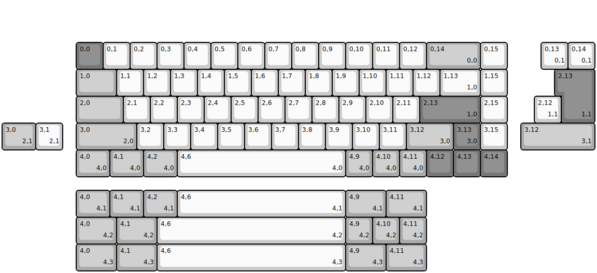{:loading="lazy"}

[Open in keyboard-layout-editor](http://www.keyboard-layout-editor.com/##@@_x:2.75&y:1.5&c=#777777;&=0,0&_c=#cccccc;&=0,1&=0,2&=0,3&=0,4&=0,5&=0,6&=0,7&=0,8&=0,9&=0,10&=0,11&=0,12&_c=#aaaaaa&w:2;&=0,14%0A%0A%0A0,0&_c=#cccccc;&=0,15;&@_x:2.75&c=#aaaaaa&w:1.5;&=1,0&_c=#cccccc;&=1,1&=1,2&=1,3&=1,4&=1,5&=1,6&=1,7&=1,8&=1,9&=1,10&=1,11&=1,12&_w:1.5;&=1,13%0A%0A%0A1,0&=1,15;&@_x:2.75&c=#aaaaaa&w:1.75;&=2,0&_c=#cccccc;&=2,1&=2,2&=2,3&=2,4&=2,5&=2,6&=2,7&=2,8&=2,9&=2,10&=2,11&_c=#777777&w:2.25;&=2,13%0A%0A%0A1,0&_c=#cccccc;&=2,15;&@_x:2.75&c=#aaaaaa&w:2.25;&=3,0%0A%0A%0A2,0&_c=#cccccc;&=3,2&=3,3&=3,4&=3,5&=3,6&=3,7&=3,8&=3,9&=3,10&=3,11&_c=#aaaaaa&w:1.75;&=3,12%0A%0A%0A3,0&_c=#777777;&=3,13%0A%0A%0A3,0&_c=#cccccc;&=3,15;&@_x:2.75&c=#aaaaaa&w:1.25;&=4,0%0A%0A%0A4,0&_w:1.25;&=4,1%0A%0A%0A4,0&_w:1.25;&=4,2%0A%0A%0A4,0&_c=#cccccc&w:6.25;&=4,6%0A%0A%0A4,0&_c=#aaaaaa;&=4,9%0A%0A%0A4,0&=4,10%0A%0A%0A4,0&=4,11%0A%0A%0A4,0&_c=#777777;&=4,12&=4,13&=4,14;&@_x:20.0&y:-5.0&c=#cccccc;&=0,13%0A%0A%0A0,1&=0,14%0A%0A%0A0,1;&@_x:20.75&c=#777777&w:1.25&h:2&w2:1.5&h2:1&x2:-0.25;&=2,13%0A%0A%0A1,1;&@_x:19.75&c=#cccccc;&=2,12%0A%0A%0A1,1;&@_c=#aaaaaa&w:1.25;&=3,0%0A%0A%0A2,1&_c=#cccccc;&=3,1%0A%0A%0A2,1&_x:17.0&c=#aaaaaa&w:2.75;&=3,12%0A%0A%0A3,1;&@_x:2.75&y:1.5&w:1.25;&=4,0%0A%0A%0A4,1&_w:1.25;&=4,1%0A%0A%0A4,1&_w:1.25;&=4,2%0A%0A%0A4,1&_c=#cccccc&w:6.25;&=4,6%0A%0A%0A4,1&_c=#aaaaaa&w:1.5;&=4,9%0A%0A%0A4,1&_w:1.5;&=4,11%0A%0A%0A4,1;&@_x:2.75&w:1.5;&=4,0%0A%0A%0A4,2&_w:1.5;&=4,1%0A%0A%0A4,2&_c=#cccccc&w:7;&=4,6%0A%0A%0A4,2&_c=#aaaaaa;&=4,9%0A%0A%0A4,2&=4,10%0A%0A%0A4,2&=4,11%0A%0A%0A4,2;&@_x:2.75&w:1.5;&=4,0%0A%0A%0A4,3&_w:1.5;&=4,1%0A%0A%0A4,3&_c=#cccccc&w:7;&=4,6%0A%0A%0A4,3&_c=#aaaaaa&w:1.5;&=4,9%0A%0A%0A4,3&_w:1.5;&=4,11%0A%0A%0A4,3)

## kelowna/rgb64

[README](output/kelowna/README.md) - [layout](output/kelowna/rgb64-kle.json) - [PCB](output/kelowna/rgb64.kicad_pcb) - [PCB render](output/kelowna/rgb64-render.svg)

{:loading="lazy"}

[Open in keyboard-layout-editor](http://www.keyboard-layout-editor.com/##@@=0,0&=0,1&=0,2&=0,3&=0,4&=0,5&=0,6&=0,7&=0,8&=0,9&=0,10&=0,11&=0,12&_w:2;&=0,14;&@_w:1.5;&=1,0&=1,2&=1,3&=1,4&=1,5&=1,6&=1,7&=1,8&=1,9&=1,10&=1,11&=1,12&=1,13&_w:1.5;&=1,14;&@_w:1.75;&=2,0&=2,2&=2,3&=2,4&=2,5&=2,6&=2,7&=2,8&=2,9&=2,10&=2,11&=2,12&_w:2.25;&=2,14;&@_w:2;&=3,0&=3,2&=3,3&=3,4&=3,5&=3,6&=3,7&=3,8&=3,9&=3,10&=3,11&=3,12&=3,13&=3,14;&@_w:1.25;&=4,0&_w:1.25;&=4,1&_w:1.25;&=4,2&_w:6.25;&=4,6&=4,10&=4,11&=4,12&=4,13&=4,14)

## keybee/keybee65

[README](output/keybee/keybee65/README.md) - [layout](output/keybee/keybee65/keybee65-kle.json) - [PCB](output/keybee/keybee65/keybee65.kicad_pcb) - [PCB render](output/keybee/keybee65/keybee65-render.svg)

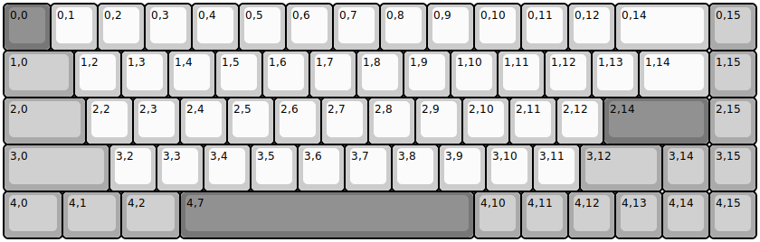{:loading="lazy"}

[Open in keyboard-layout-editor](http://www.keyboard-layout-editor.com/##@@_c=#777777;&=0,0&_c=#cccccc;&=0,1&=0,2&=0,3&=0,4&=0,5&=0,6&=0,7&=0,8&=0,9&=0,10&=0,11&=0,12&_w:2;&=0,14&_c=#aaaaaa;&=0,15;&@_w:1.5;&=1,0&_c=#cccccc;&=1,2&=1,3&=1,4&=1,5&=1,6&=1,7&=1,8&=1,9&=1,10&=1,11&=1,12&=1,13&_w:1.5;&=1,14&_c=#aaaaaa;&=1,15;&@_w:1.75;&=2,0&_c=#cccccc;&=2,2&=2,3&=2,4&=2,5&=2,6&=2,7&=2,8&=2,9&=2,10&=2,11&=2,12&_c=#777777&w:2.25;&=2,14&_c=#aaaaaa;&=2,15;&@_w:2.25;&=3,0&_c=#cccccc;&=3,2&=3,3&=3,4&=3,5&=3,6&=3,7&=3,8&=3,9&=3,10&=3,11&_c=#aaaaaa&w:1.75;&=3,12&=3,14&=3,15;&@_w:1.25;&=4,0&_w:1.25;&=4,1&_w:1.25;&=4,2&_c=#777777&w:6.25;&=4,7&_c=#aaaaaa;&=4,10&=4,11&=4,12&=4,13&=4,14&=4,15)

## keyboardio/atreus

[README](output/keyboardio/atreus/README.md) - [layout](output/keyboardio/atreus/atreus-kle.json) - [PCB](output/keyboardio/atreus/atreus.kicad_pcb) - [PCB render](output/keyboardio/atreus/atreus-render.svg)

{:loading="lazy"}

[Open in keyboard-layout-editor](http://www.keyboard-layout-editor.com/##@@_r:10&rx:1&x:1.75&y:-0.1;&=0,2;&@_x:0.75&y:-0.65;&=0,1&_x:1.0;&=0,3;&@_x:-0.25&y:-0.75;&=0,0;&@_x:3.75&y:-0.9;&=0,4;&@_x:1.75&y:-0.7;&=1,2;&@_x:0.75&y:-0.65;&=1,1&_x:1.0;&=1,3;&@_x:-0.25&y:-0.75;&=1,0;&@_x:3.75&y:-0.9;&=1,4;&@_x:1.75&y:-0.7;&=2,2;&@_x:0.75&y:-0.65;&=2,1&_x:1.0;&=2,3;&@_x:4.75&y:-0.85;&=2,5;&@_x:-0.25&y:-0.9;&=2,0;&@_x:3.75&y:-0.9;&=2,4;&@_x:1.75&y:-0.7&c=#aaaaaa;&=3,2;&@_x:0.75&y:-0.65;&=3,1&_x:1.0;&=3,3;&@_x:4.75&y:-0.85;&=3,5;&@_x:-0.25&y:-0.9;&=3,0;&@_x:3.75&y:-0.9;&=3,4;&@_r:-10&rx:7&ry:0.965&x:2.25&y:-0.2&c=#cccccc;&=0,9;&@_x:1.25&y:-0.65;&=0,8&_x:1.0;&=0,10;&@_x:4.25&y:-0.75;&=0,11;&@_x:0.25&y:-0.9;&=0,7;&@_x:2.25&y:-0.7;&=1,9;&@_x:1.25&y:-0.65;&=1,8&_x:1.0;&=1,10;&@_x:4.25&y:-0.75;&=1,11;&@_x:0.25&y:-0.9;&=1,7;&@_x:2.25&y:-0.7;&=2,9;&@_x:1.25&y:-0.65;&=2,8&_x:1.0;&=2,10;&@_x:-0.75&y:-0.85;&=2,6;&@_x:4.25&y:-0.9;&=2,11;&@_x:0.25&y:-0.9;&=2,7;&@_x:2.25&y:-0.7&c=#aaaaaa;&=3,9;&@_x:1.25&y:-0.65;&=3,8&_x:1.0;&=3,10;&@_x:-0.75&y:-0.85;&=3,6;&@_x:4.25&y:-0.9;&=3,11;&@_x:0.25&y:-0.9;&=3,7)

## keycapsss/plaid_pad

[README](output/keycapsss/plaid_pad/README.md) - [layout](output/keycapsss/plaid_pad/plaid_pad-kle.json) - [PCB](output/keycapsss/plaid_pad/plaid_pad.kicad_pcb) - [PCB render](output/keycapsss/plaid_pad/plaid_pad-render.svg)

{:loading="lazy"}

[Open in keyboard-layout-editor](http://www.keyboard-layout-editor.com/##@@=0,0&=0,1&=0,2&=0,3;&@=1,0&=1,1&=1,2&=1,3;&@=2,0&=2,1&=2,2&=2,3;&@=3,0&=3,1&=3,2&=3,3)

## keychron/k10_pro/ansi_rgb

[README](output/keychron/k10_pro/README.md) - [layout](output/keychron/k10_pro/ansi_rgb-kle.json) - [PCB](output/keychron/k10_pro/ansi_rgb.kicad_pcb) - [PCB render](output/keychron/k10_pro/ansi_rgb-render.svg)

{:loading="lazy"}

[Open in keyboard-layout-editor](http://www.keyboard-layout-editor.com/##@@_c=#777777;&=0,0&_x:1&c=#cccccc;&=0,1&=0,2&=0,3&=0,4&_x:0.5&c=#aaaaaa;&=0,5&=0,6&=0,7&=0,8&_x:0.5&c=#cccccc;&=0,9&=0,10&=0,11&=0,12&_x:0.25&c=#aaaaaa;&=0,14&=0,15&=0,16&_x:0.25&c=#cccccc;&=0,17&=0,18&=0,19&=0,20;&@_y:0.25&c=#aaaaaa;&=1,0&_c=#cccccc;&=1,1&=1,2&=1,3&=1,4&=1,5&=1,6&=1,7&=1,8&=1,9&=1,10&=1,11&=1,12&_c=#aaaaaa&w:2;&=1,13&_x:0.25;&=1,14&=1,15&=1,16&_x:0.25&c=#cccccc;&=1,17&=1,18&=1,19&=1,20;&@_c=#aaaaaa&w:1.5;&=2,0&_c=#cccccc;&=2,1&=2,2&=2,3&=2,4&=2,5&=2,6&=2,7&=2,8&=2,9&=2,10&=2,11&=2,12&_c=#aaaaaa&w:1.5;&=2,13&_x:0.25;&=2,14&=2,15&=2,16&_x:0.25&c=#cccccc;&=2,17&=2,18&=2,19&_h:2;&=2,20;&@_c=#aaaaaa&w:1.75;&=3,0&_c=#cccccc;&=3,1&=3,2&=3,3&=3,4&=3,5&=3,6&=3,7&=3,8&=3,9&=3,10&=3,11&_c=#777777&w:2.25;&=3,13&_x:3.5&c=#cccccc;&=3,17&=3,18&=3,19;&@_c=#aaaaaa&w:2.25;&=4,0&_c=#cccccc;&=4,2&=4,3&=4,4&=4,5&=4,6&=4,7&=4,8&=4,9&=4,10&=4,11&_c=#aaaaaa&w:2.75;&=4,13&_x:1.25&c=#cccccc;&=4,15&_x:1.25;&=4,17&=4,18&=4,19&_h:2;&=4,20;&@_c=#aaaaaa&w:1.25;&=5,0&_w:1.25;&=5,1&_w:1.25;&=5,2&_c=#cccccc&w:6.25;&=5,6&_c=#aaaaaa&w:1.25;&=5,10&_w:1.25;&=5,11&_w:1.25;&=5,12&_w:1.25;&=5,13&_x:0.25&c=#cccccc;&=5,14&=5,15&=5,16&_x:0.25&w:2;&=5,17&=5,19)

## keychron/k10_pro/ansi_white

[README](output/keychron/k10_pro/README.md) - [layout](output/keychron/k10_pro/ansi_white-kle.json) - [PCB](output/keychron/k10_pro/ansi_white.kicad_pcb) - [PCB render](output/keychron/k10_pro/ansi_white-render.svg)

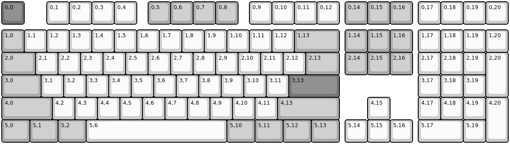{:loading="lazy"}

[Open in keyboard-layout-editor](http://www.keyboard-layout-editor.com/##@@_c=#777777;&=0,0&_x:1.0&c=#cccccc;&=0,1&=0,2&=0,3&=0,4&_x:0.5&c=#aaaaaa;&=0,5&=0,6&=0,7&=0,8&_x:0.5&c=#cccccc;&=0,9&=0,10&=0,11&=0,12&_x:0.25&c=#aaaaaa;&=0,14&=0,15&=0,16&_x:0.25&c=#cccccc;&=0,17&=0,18&=0,19&=0,20;&@_y:0.25&c=#aaaaaa;&=1,0&_c=#cccccc;&=1,1&=1,2&=1,3&=1,4&=1,5&=1,6&=1,7&=1,8&=1,9&=1,10&=1,11&=1,12&_c=#aaaaaa&w:2;&=1,13&_x:0.25;&=1,14&=1,15&=1,16&_x:0.25&c=#cccccc;&=1,17&=1,18&=1,19&=1,20;&@_c=#aaaaaa&w:1.5;&=2,0&_c=#cccccc;&=2,1&=2,2&=2,3&=2,4&=2,5&=2,6&=2,7&=2,8&=2,9&=2,10&=2,11&=2,12&_c=#aaaaaa&w:1.5;&=2,13&_x:0.25;&=2,14&=2,15&=2,16&_x:0.25&c=#cccccc;&=2,17&=2,18&=2,19&_h:2;&=2,20;&@_c=#aaaaaa&w:1.75;&=3,0&_c=#cccccc;&=3,1&=3,2&=3,3&=3,4&=3,5&=3,6&=3,7&=3,8&=3,9&=3,10&=3,11&_c=#777777&w:2.25;&=3,13&_x:3.5&c=#cccccc;&=3,17&=3,18&=3,19;&@_c=#aaaaaa&w:2.25;&=4,0&_c=#cccccc;&=4,2&=4,3&=4,4&=4,5&=4,6&=4,7&=4,8&=4,9&=4,10&=4,11&_c=#aaaaaa&w:2.75;&=4,13&_x:1.25&c=#cccccc;&=4,15&_x:1.25;&=4,17&=4,18&=4,19&_h:2;&=4,20;&@_c=#aaaaaa&w:1.25;&=5,0&_w:1.25;&=5,1&_w:1.25;&=5,2&_c=#cccccc&w:6.25;&=5,6&_c=#aaaaaa&w:1.25;&=5,10&_w:1.25;&=5,11&_w:1.25;&=5,12&_w:1.25;&=5,13&_x:0.25&c=#cccccc;&=5,14&=5,15&=5,16&_x:0.25&w:2;&=5,17&=5,19)

## keychron/k2_pro/ansi_rgb

[README](output/keychron/k2_pro/README.md) - [layout](output/keychron/k2_pro/ansi_rgb-kle.json) - [PCB](output/keychron/k2_pro/ansi_rgb.kicad_pcb) - [PCB render](output/keychron/k2_pro/ansi_rgb-render.svg)

{:loading="lazy"}

[Open in keyboard-layout-editor](http://www.keyboard-layout-editor.com/##@@_c=#777777;&=0,0&_c=#cccccc;&=0,1&=0,2&=0,3&=0,4&_c=#aaaaaa;&=0,5&=0,6&=0,7&=0,8&=0,9&_c=#cccccc;&=0,10&=0,11&=0,12&_c=#aaaaaa;&=0,13&=0,14&=0,15;&@=1,0&_c=#cccccc;&=1,1&=1,2&=1,3&=1,4&=1,5&=1,6&=1,7&=1,8&=1,9&=1,10&=1,11&=1,12&_c=#aaaaaa&w:2;&=1,13&=1,15;&@_w:1.5;&=2,0&_c=#cccccc;&=2,1&=2,2&=2,3&=2,4&=2,5&=2,6&=2,7&=2,8&=2,9&=2,10&=2,11&=2,12&_c=#aaaaaa&w:1.5;&=2,13&=2,15;&@_w:1.75;&=3,0&_c=#cccccc;&=3,1&=3,2&=3,3&=3,4&=3,5&=3,6&=3,7&=3,8&=3,9&=3,10&=3,11&_c=#777777&w:2.25;&=3,13&_c=#aaaaaa;&=3,15;&@_w:2.25;&=4,0&_c=#cccccc;&=4,2&=4,3&=4,4&=4,5&=4,6&=4,7&=4,8&=4,9&=4,10&=4,11&_c=#aaaaaa&w:1.75;&=4,12&_c=#cccccc;&=4,13&_c=#aaaaaa;&=4,15;&@_w:1.25;&=5,0&_w:1.25;&=5,1&_w:1.25;&=5,2&_c=#cccccc&w:6.25;&=5,6&_c=#aaaaaa;&=5,9&=5,10&=5,11&_c=#cccccc;&=5,12&=5,13&=5,15)

## keychron/k2_pro/ansi_white

[README](output/keychron/k2_pro/README.md) - [layout](output/keychron/k2_pro/ansi_white-kle.json) - [PCB](output/keychron/k2_pro/ansi_white.kicad_pcb) - [PCB render](output/keychron/k2_pro/ansi_white-render.svg)

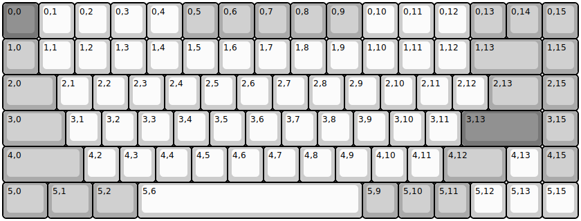{:loading="lazy"}

[Open in keyboard-layout-editor](http://www.keyboard-layout-editor.com/##@@_c=#777777;&=0,0&_c=#cccccc;&=0,1&=0,2&=0,3&=0,4&_c=#aaaaaa;&=0,5&=0,6&=0,7&=0,8&=0,9&_c=#cccccc;&=0,10&=0,11&=0,12&_c=#aaaaaa;&=0,13&=0,14&=0,15;&@=1,0&_c=#cccccc;&=1,1&=1,2&=1,3&=1,4&=1,5&=1,6&=1,7&=1,8&=1,9&=1,10&=1,11&=1,12&_c=#aaaaaa&w:2;&=1,13&=1,15;&@_w:1.5;&=2,0&_c=#cccccc;&=2,1&=2,2&=2,3&=2,4&=2,5&=2,6&=2,7&=2,8&=2,9&=2,10&=2,11&=2,12&_c=#aaaaaa&w:1.5;&=2,13&=2,15;&@_w:1.75;&=3,0&_c=#cccccc;&=3,1&=3,2&=3,3&=3,4&=3,5&=3,6&=3,7&=3,8&=3,9&=3,10&=3,11&_c=#777777&w:2.25;&=3,13&_c=#aaaaaa;&=3,15;&@_w:2.25;&=4,0&_c=#cccccc;&=4,2&=4,3&=4,4&=4,5&=4,6&=4,7&=4,8&=4,9&=4,10&=4,11&_c=#aaaaaa&w:1.75;&=4,12&_c=#cccccc;&=4,13&_c=#aaaaaa;&=4,15;&@_w:1.25;&=5,0&_w:1.25;&=5,1&_w:1.25;&=5,2&_c=#cccccc&w:6.25;&=5,6&_c=#aaaaaa;&=5,9&=5,10&=5,11&_c=#cccccc;&=5,12&=5,13&=5,15)

## keychron/k2_pro/iso_rgb

[README](output/keychron/k2_pro/README.md) - [layout](output/keychron/k2_pro/iso_rgb-kle.json) - [PCB](output/keychron/k2_pro/iso_rgb.kicad_pcb) - [PCB render](output/keychron/k2_pro/iso_rgb-render.svg)

{:loading="lazy"}

[Open in keyboard-layout-editor](http://www.keyboard-layout-editor.com/##@@_c=#777777;&=0,0&_c=#cccccc;&=0,1&=0,2&=0,3&=0,4&_c=#aaaaaa;&=0,5&=0,6&=0,7&=0,8&=0,9&_c=#cccccc;&=0,10&=0,11&=0,12&_c=#aaaaaa;&=0,13&=0,14&=0,15;&@=1,0&_c=#cccccc;&=1,1&=1,2&=1,3&=1,4&=1,5&=1,6&=1,7&=1,8&=1,9&=1,10&=1,11&=1,12&_c=#aaaaaa&w:2;&=1,13&=1,15;&@_w:1.5;&=2,0&_c=#cccccc;&=2,1&=2,2&=2,3&=2,4&=2,5&=2,6&=2,7&=2,8&=2,9&=2,10&=2,11&=2,12&_x:0.25&c=#777777&w:1.25&h:2&w2:1.5&h2:1&x2:-0.25;&=2,13&_c=#aaaaaa;&=2,15;&@_w:1.75;&=3,0&_c=#cccccc;&=3,1&=3,2&=3,3&=3,4&=3,5&=3,6&=3,7&=3,8&=3,9&=3,10&=3,11&_c=#aaaaaa;&=3,13&_x:1.25;&=3,15;&@_w:1.25;&=4,0&=4,1&_c=#cccccc;&=4,2&=4,3&=4,4&=4,5&=4,6&=4,7&=4,8&=4,9&=4,10&=4,11&_c=#aaaaaa&w:1.75;&=4,12&_c=#cccccc;&=4,13&_c=#aaaaaa;&=4,15;&@_w:1.25;&=5,0&_w:1.25;&=5,1&_w:1.25;&=5,2&_c=#cccccc&w:6.25;&=5,6&_c=#aaaaaa;&=5,9&=5,10&=5,11&_c=#cccccc;&=5,12&=5,13&=5,15)

## keychron/k2_pro/iso_white

[README](output/keychron/k2_pro/README.md) - [layout](output/keychron/k2_pro/iso_white-kle.json) - [PCB](output/keychron/k2_pro/iso_white.kicad_pcb) - [PCB render](output/keychron/k2_pro/iso_white-render.svg)

{:loading="lazy"}

[Open in keyboard-layout-editor](http://www.keyboard-layout-editor.com/##@@_c=#777777;&=0,0&_c=#cccccc;&=0,1&=0,2&=0,3&=0,4&_c=#aaaaaa;&=0,5&=0,6&=0,7&=0,8&=0,9&_c=#cccccc;&=0,10&=0,11&=0,12&_c=#aaaaaa;&=0,13&=0,14&=0,15;&@=1,0&_c=#cccccc;&=1,1&=1,2&=1,3&=1,4&=1,5&=1,6&=1,7&=1,8&=1,9&=1,10&=1,11&=1,12&_c=#aaaaaa&w:2;&=1,13&=1,15;&@_w:1.5;&=2,0&_c=#cccccc;&=2,1&=2,2&=2,3&=2,4&=2,5&=2,6&=2,7&=2,8&=2,9&=2,10&=2,11&=2,12&_x:0.25&c=#777777&w:1.25&h:2&w2:1.5&h2:1&x2:-0.25;&=2,13&_c=#aaaaaa;&=2,15;&@_w:1.75;&=3,0&_c=#cccccc;&=3,1&=3,2&=3,3&=3,4&=3,5&=3,6&=3,7&=3,8&=3,9&=3,10&=3,11&_c=#aaaaaa;&=3,13&_x:1.25;&=3,15;&@_w:1.25;&=4,0&=4,1&_c=#cccccc;&=4,2&=4,3&=4,4&=4,5&=4,6&=4,7&=4,8&=4,9&=4,10&=4,11&_c=#aaaaaa&w:1.75;&=4,12&_c=#cccccc;&=4,13&_c=#aaaaaa;&=4,15;&@_w:1.25;&=5,0&_w:1.25;&=5,1&_w:1.25;&=5,2&_c=#cccccc&w:6.25;&=5,6&_c=#aaaaaa;&=5,9&=5,10&=5,11&_c=#cccccc;&=5,12&=5,13&=5,15)

## keychron/k3_pro/ansi_rgb

[README](output/keychron/k3_pro/README.md) - [layout](output/keychron/k3_pro/ansi_rgb-kle.json) - [PCB](output/keychron/k3_pro/ansi_rgb.kicad_pcb) - [PCB render](output/keychron/k3_pro/ansi_rgb-render.svg)

{:loading="lazy"}

[Open in keyboard-layout-editor](http://www.keyboard-layout-editor.com/##@@_c=#777777;&=0,0&_c=#cccccc;&=0,1&=0,2&=0,3&=0,4&_c=#aaaaaa;&=0,5&=0,6&=0,7&=0,8&=0,9&_c=#cccccc;&=0,10&=0,11&=0,12&_c=#aaaaaa;&=0,13&=0,14&=0,15;&@=1,0&_c=#cccccc;&=1,1&=1,2&=1,3&=1,4&=1,5&=1,6&=1,7&=1,8&=1,9&=1,10&=1,11&=1,12&_c=#aaaaaa&w:2;&=1,13&=1,15;&@_w:1.5;&=2,0&_c=#cccccc;&=2,1&=2,2&=2,3&=2,4&=2,5&=2,6&=2,7&=2,8&=2,9&=2,10&=2,11&=2,12&_c=#aaaaaa&w:1.5;&=2,13&=2,15;&@_w:1.75;&=3,0&_c=#cccccc;&=3,1&=3,2&=3,3&=3,4&=3,5&=3,6&=3,7&=3,8&=3,9&=3,10&=3,11&_c=#777777&w:2.25;&=3,13&_c=#aaaaaa;&=3,15;&@_w:2.25;&=4,0&_c=#cccccc;&=4,2&=4,3&=4,4&=4,5&=4,6&=4,7&=4,8&=4,9&=4,10&=4,11&_c=#aaaaaa&w:1.75;&=4,13&_c=#cccccc;&=4,14&_c=#aaaaaa;&=4,15;&@_w:1.25;&=5,0&_w:1.25;&=5,1&_w:1.25;&=5,2&_c=#cccccc&w:6.25;&=5,6&_c=#aaaaaa;&=5,10&=5,11&=5,12&_c=#cccccc;&=5,13&=5,14&=5,15)

## keychron/k3_pro/ansi_white

[README](output/keychron/k3_pro/README.md) - [layout](output/keychron/k3_pro/ansi_white-kle.json) - [PCB](output/keychron/k3_pro/ansi_white.kicad_pcb) - [PCB render](output/keychron/k3_pro/ansi_white-render.svg)

{:loading="lazy"}

[Open in keyboard-layout-editor](http://www.keyboard-layout-editor.com/##@@_c=#777777;&=0,0&_c=#cccccc;&=0,1&=0,2&=0,3&=0,4&_c=#aaaaaa;&=0,5&=0,6&=0,7&=0,8&=0,9&_c=#cccccc;&=0,10&=0,11&=0,12&_c=#aaaaaa;&=0,13&=0,14&=0,15;&@=1,0&_c=#cccccc;&=1,1&=1,2&=1,3&=1,4&=1,5&=1,6&=1,7&=1,8&=1,9&=1,10&=1,11&=1,12&_c=#aaaaaa&w:2;&=1,13&=1,15;&@_w:1.5;&=2,0&_c=#cccccc;&=2,1&=2,2&=2,3&=2,4&=2,5&=2,6&=2,7&=2,8&=2,9&=2,10&=2,11&=2,12&_c=#aaaaaa&w:1.5;&=2,13&=2,15;&@_w:1.75;&=3,0&_c=#cccccc;&=3,1&=3,2&=3,3&=3,4&=3,5&=3,6&=3,7&=3,8&=3,9&=3,10&=3,11&_c=#777777&w:2.25;&=3,13&_c=#aaaaaa;&=3,15;&@_w:2.25;&=4,0&_c=#cccccc;&=4,2&=4,3&=4,4&=4,5&=4,6&=4,7&=4,8&=4,9&=4,10&=4,11&_c=#aaaaaa&w:1.75;&=4,13&_c=#cccccc;&=4,14&_c=#aaaaaa;&=4,15;&@_w:1.25;&=5,0&_w:1.25;&=5,1&_w:1.25;&=5,2&_c=#cccccc&w:6.25;&=5,6&_c=#aaaaaa;&=5,10&=5,11&=5,12&_c=#cccccc;&=5,13&=5,14&=5,15)

## keychron/k3_pro/iso_rgb

[README](output/keychron/k3_pro/README.md) - [layout](output/keychron/k3_pro/iso_rgb-kle.json) - [PCB](output/keychron/k3_pro/iso_rgb.kicad_pcb) - [PCB render](output/keychron/k3_pro/iso_rgb-render.svg)

{:loading="lazy"}

[Open in keyboard-layout-editor](http://www.keyboard-layout-editor.com/##@@_c=#777777;&=0,0&_c=#cccccc;&=0,1&=0,2&=0,3&=0,4&_c=#aaaaaa;&=0,5&=0,6&=0,7&=0,8&=0,9&_c=#cccccc;&=0,10&=0,11&=0,12&_c=#aaaaaa;&=0,13&=0,14&=0,15;&@=1,0&_c=#cccccc;&=1,1&=1,2&=1,3&=1,4&=1,5&=1,6&=1,7&=1,8&=1,9&=1,10&=1,11&=1,12&_c=#aaaaaa&w:2;&=1,13&=1,15;&@_w:1.5;&=2,0&_c=#cccccc;&=2,1&=2,2&=2,3&=2,4&=2,5&=2,6&=2,7&=2,8&=2,9&=2,10&=2,11&=2,12&_x:0.25&c=#777777&w:1.25&h:2&w2:1.5&h2:1&x2:-0.25;&=2,13&_c=#aaaaaa;&=2,15;&@_w:1.75;&=3,0&_c=#cccccc;&=3,1&=3,2&=3,3&=3,4&=3,5&=3,6&=3,7&=3,8&=3,9&=3,10&=3,11&_c=#aaaaaa;&=3,13&_x:1.25;&=3,15;&@_w:1.25;&=4,0&=4,1&_c=#cccccc;&=4,2&=4,3&=4,4&=4,5&=4,6&=4,7&=4,8&=4,9&=4,10&=4,11&_c=#aaaaaa&w:1.75;&=4,13&_c=#cccccc;&=4,14&_c=#aaaaaa;&=4,15;&@_w:1.25;&=5,0&_w:1.25;&=5,1&_w:1.25;&=5,2&_c=#cccccc&w:6.25;&=5,6&_c=#aaaaaa;&=5,10&=5,11&=5,12&_c=#cccccc;&=5,13&=5,14&=5,15)

## keychron/k3_pro/iso_white

[README](output/keychron/k3_pro/README.md) - [layout](output/keychron/k3_pro/iso_white-kle.json) - [PCB](output/keychron/k3_pro/iso_white.kicad_pcb) - [PCB render](output/keychron/k3_pro/iso_white-render.svg)

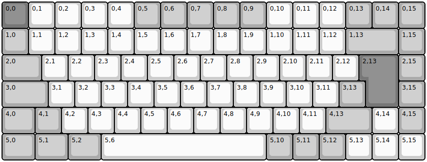{:loading="lazy"}

[Open in keyboard-layout-editor](http://www.keyboard-layout-editor.com/##@@_c=#777777;&=0,0&_c=#cccccc;&=0,1&=0,2&=0,3&=0,4&_c=#aaaaaa;&=0,5&=0,6&=0,7&=0,8&=0,9&_c=#cccccc;&=0,10&=0,11&=0,12&_c=#aaaaaa;&=0,13&=0,14&=0,15;&@=1,0&_c=#cccccc;&=1,1&=1,2&=1,3&=1,4&=1,5&=1,6&=1,7&=1,8&=1,9&=1,10&=1,11&=1,12&_c=#aaaaaa&w:2;&=1,13&=1,15;&@_w:1.5;&=2,0&_c=#cccccc;&=2,1&=2,2&=2,3&=2,4&=2,5&=2,6&=2,7&=2,8&=2,9&=2,10&=2,11&=2,12&_x:0.25&c=#777777&w:1.25&h:2&w2:1.5&h2:1&x2:-0.25;&=2,13&_c=#aaaaaa;&=2,15;&@_w:1.75;&=3,0&_c=#cccccc;&=3,1&=3,2&=3,3&=3,4&=3,5&=3,6&=3,7&=3,8&=3,9&=3,10&=3,11&_c=#aaaaaa;&=3,13&_x:1.25;&=3,15;&@_w:1.25;&=4,0&=4,1&_c=#cccccc;&=4,2&=4,3&=4,4&=4,5&=4,6&=4,7&=4,8&=4,9&=4,10&=4,11&_c=#aaaaaa&w:1.75;&=4,13&_c=#cccccc;&=4,14&_c=#aaaaaa;&=4,15;&@_w:1.25;&=5,0&_w:1.25;&=5,1&_w:1.25;&=5,2&_c=#cccccc&w:6.25;&=5,6&_c=#aaaaaa;&=5,10&=5,11&=5,12&_c=#cccccc;&=5,13&=5,14&=5,15)

## keychron/k4_pro/ansi_rgb

[README](output/keychron/k4_pro/README.md) - [layout](output/keychron/k4_pro/ansi_rgb-kle.json) - [PCB](output/keychron/k4_pro/ansi_rgb.kicad_pcb) - [PCB render](output/keychron/k4_pro/ansi_rgb-render.svg)

{:loading="lazy"}

[Open in keyboard-layout-editor](http://www.keyboard-layout-editor.com/##@@_c=#777777;&=0,0&_c=#cccccc;&=0,1&=0,2&=0,3&=0,4&_c=#aaaaaa;&=0,5&=0,6&=0,7&=0,8&=0,9&_c=#cccccc;&=0,10&=0,11&=0,12&_c=#aaaaaa;&=0,13&=0,14&_x:0.55;&=0,15&=0,16&=0,17&=3,17;&@_y:0.25;&=1,0&_c=#cccccc;&=1,1&=1,2&=1,3&=1,4&=1,5&=1,6&=1,7&=1,8&=1,9&=1,10&=1,11&=1,12&_c=#aaaaaa&w:2;&=1,13&_x:0.55&c=#cccccc;&=1,14&=1,15&=1,16&=1,17;&@_c=#aaaaaa&w:1.5;&=2,0&_c=#cccccc;&=2,1&=2,2&=2,3&=2,4&=2,5&=2,6&=2,7&=2,8&=2,9&=2,10&=2,11&=2,12&_c=#aaaaaa&w:1.5;&=2,13&_x:0.55&c=#cccccc;&=2,14&=2,15&=2,16&_h:2.0;&=2,17;&@_c=#aaaaaa&w:1.75;&=3,0&_c=#cccccc;&=3,1&=3,2&=3,3&=3,4&=3,5&=3,6&=3,7&=3,8&=3,9&=3,10&=3,11&_c=#777777&w:2.25;&=3,13&_x:0.56&c=#cccccc;&=3,14&=3,15&=3,16;&@_c=#aaaaaa&w:2.25;&=4,0&_c=#cccccc;&=4,2&=4,3&=4,4&=4,5&=4,6&=4,7&=4,8&=4,9&=4,10&=4,11&_c=#aaaaaa&w:1.75;&=4,12;&@_x:14.28&y:-0.75&c=#cccccc;&=4,13;&@_x:15.56&y:-1.25;&=4,14&=4,15&=4,16&_h:2;&=4,17;&@_c=#aaaaaa&w:1.25;&=5,0&_w:1.25;&=5,1&_w:1.25;&=5,2&_c=#cccccc&w:6.25;&=5,6&_c=#aaaaaa;&=5,10&=5,11&=5,12;&@_x:13.28&y:-0.75&c=#cccccc;&=5,13&=5,14&=5,15;&@_x:16.56&y:-1.25;&=5,16&=5,17)

## keychron/k4_pro/ansi_white

[README](output/keychron/k4_pro/README.md) - [layout](output/keychron/k4_pro/ansi_white-kle.json) - [PCB](output/keychron/k4_pro/ansi_white.kicad_pcb) - [PCB render](output/keychron/k4_pro/ansi_white-render.svg)

{:loading="lazy"}

[Open in keyboard-layout-editor](http://www.keyboard-layout-editor.com/##@@_c=#777777;&=0,0&_c=#cccccc;&=0,1&=0,2&=0,3&=0,4&_c=#aaaaaa;&=0,5&=0,6&=0,7&=0,8&=0,9&_c=#cccccc;&=0,10&=0,11&=0,12&_c=#aaaaaa;&=0,13&=0,14&_x:0.55;&=0,15&=0,16&=0,17&=3,17;&@_y:0.25;&=1,0&_c=#cccccc;&=1,1&=1,2&=1,3&=1,4&=1,5&=1,6&=1,7&=1,8&=1,9&=1,10&=1,11&=1,12&_c=#aaaaaa&w:2;&=1,13&_x:0.55&c=#cccccc;&=1,14&=1,15&=1,16&=1,17;&@_c=#aaaaaa&w:1.5;&=2,0&_c=#cccccc;&=2,1&=2,2&=2,3&=2,4&=2,5&=2,6&=2,7&=2,8&=2,9&=2,10&=2,11&=2,12&_c=#aaaaaa&w:1.5;&=2,13&_x:0.55&c=#cccccc;&=2,14&=2,15&=2,16&_h:2.0;&=2,17;&@_c=#aaaaaa&w:1.75;&=3,0&_c=#cccccc;&=3,1&=3,2&=3,3&=3,4&=3,5&=3,6&=3,7&=3,8&=3,9&=3,10&=3,11&_c=#777777&w:2.25;&=3,13&_x:0.56&c=#cccccc;&=3,14&=3,15&=3,16;&@_c=#aaaaaa&w:2.25;&=4,0&_c=#cccccc;&=4,2&=4,3&=4,4&=4,5&=4,6&=4,7&=4,8&=4,9&=4,10&=4,11&_c=#aaaaaa&w:1.75;&=4,12;&@_x:14.28&y:-0.75&c=#cccccc;&=4,13;&@_x:15.56&y:-1.25;&=4,14&=4,15&=4,16&_h:2;&=4,17;&@_c=#aaaaaa&w:1.25;&=5,0&_w:1.25;&=5,1&_w:1.25;&=5,2&_c=#cccccc&w:6.25;&=5,6&_c=#aaaaaa;&=5,10&=5,11&=5,12;&@_x:13.28&y:-0.75&c=#cccccc;&=5,13&=5,14&=5,15;&@_x:16.56&y:-1.25;&=5,16&=5,17)

## keychron/k6_pro/ansi_rgb

[README](output/keychron/k6_pro/README.md) - [layout](output/keychron/k6_pro/ansi_rgb-kle.json) - [PCB](output/keychron/k6_pro/ansi_rgb.kicad_pcb) - [PCB render](output/keychron/k6_pro/ansi_rgb-render.svg)

{:loading="lazy"}

[Open in keyboard-layout-editor](http://www.keyboard-layout-editor.com/##@@_c=#777777;&=0,0&_c=#cccccc;&=0,1&=0,2&=0,3&=0,4&_c=#aaaaaa;&=0,5&=0,6&=0,7&=0,8&_c=#cccccc;&=0,9&=0,10&=0,11&=0,12&_c=#aaaaaa&w:2;&=0,13&=0,14;&@_w:1.5;&=1,0&_c=#cccccc;&=1,1&=1,2&=1,3&=1,4&=1,5&=1,6&=1,7&=1,8&=1,9&=1,10&=1,11&=1,12&_c=#aaaaaa&w:1.5;&=1,13&=1,14;&@_w:1.75;&=2,0&_c=#cccccc;&=2,1&=2,2&=2,3&=2,4&=2,5&=2,6&=2,7&=2,8&=2,9&=2,10&=2,11&_c=#777777&w:2.25;&=2,13&_c=#aaaaaa;&=2,14;&@_w:2.25;&=3,0&_c=#cccccc;&=3,2&=3,3&=3,4&=3,5&=3,6&=3,7&=3,8&=3,9&=3,10&=3,11&_c=#aaaaaa&w:1.75;&=3,12&_c=#cccccc;&=3,13&_c=#aaaaaa;&=3,14;&@_w:1.25;&=4,0&_w:1.25;&=4,1&_w:1.25;&=4,2&_c=#cccccc&w:6.25;&=4,6&_c=#aaaaaa;&=4,9&=4,10&=4,11&_c=#cccccc;&=4,12&=4,13&=4,14)

## keychron/k6_pro/ansi_white

[README](output/keychron/k6_pro/README.md) - [layout](output/keychron/k6_pro/ansi_white-kle.json) - [PCB](output/keychron/k6_pro/ansi_white.kicad_pcb) - [PCB render](output/keychron/k6_pro/ansi_white-render.svg)

{:loading="lazy"}

[Open in keyboard-layout-editor](http://www.keyboard-layout-editor.com/##@@_c=#777777;&=0,0&_c=#cccccc;&=0,1&=0,2&=0,3&=0,4&_c=#aaaaaa;&=0,5&=0,6&=0,7&=0,8&_c=#cccccc;&=0,9&=0,10&=0,11&=0,12&_c=#aaaaaa&w:2;&=0,13&=0,14;&@_w:1.5;&=1,0&_c=#cccccc;&=1,1&=1,2&=1,3&=1,4&=1,5&=1,6&=1,7&=1,8&=1,9&=1,10&=1,11&=1,12&_c=#aaaaaa&w:1.5;&=1,13&=1,14;&@_w:1.75;&=2,0&_c=#cccccc;&=2,1&=2,2&=2,3&=2,4&=2,5&=2,6&=2,7&=2,8&=2,9&=2,10&=2,11&_c=#777777&w:2.25;&=2,13&_c=#aaaaaa;&=2,14;&@_w:2.25;&=3,0&_c=#cccccc;&=3,2&=3,3&=3,4&=3,5&=3,6&=3,7&=3,8&=3,9&=3,10&=3,11&_c=#aaaaaa&w:1.75;&=3,12&_c=#cccccc;&=3,13&_c=#aaaaaa;&=3,14;&@_w:1.25;&=4,0&_w:1.25;&=4,1&_w:1.25;&=4,2&_c=#cccccc&w:6.25;&=4,6&_c=#aaaaaa;&=4,9&=4,10&=4,11&_c=#cccccc;&=4,12&=4,13&=4,14)

## keychron/k6_pro/iso_rgb

[README](output/keychron/k6_pro/README.md) - [layout](output/keychron/k6_pro/iso_rgb-kle.json) - [PCB](output/keychron/k6_pro/iso_rgb.kicad_pcb) - [PCB render](output/keychron/k6_pro/iso_rgb-render.svg)

{:loading="lazy"}

[Open in keyboard-layout-editor](http://www.keyboard-layout-editor.com/##@@_c=#777777;&=0,0&_c=#cccccc;&=0,1&=0,2&=0,3&=0,4&_c=#aaaaaa;&=0,5&=0,6&=0,7&=0,8&_c=#cccccc;&=0,9&=0,10&=0,11&=0,12&_c=#aaaaaa&w:2;&=0,13&=0,14;&@_w:1.5;&=1,0&_c=#cccccc;&=1,1&=1,2&=1,3&=1,4&=1,5&=1,6&=1,7&=1,8&=1,9&=1,10&=1,11&=1,12&_x:0.25&c=#777777&w:1.25&h:2&w2:1.5&h2:1&x2:-0.25;&=1,13&_c=#aaaaaa;&=1,14;&@_w:1.75;&=2,0&_c=#cccccc;&=2,1&=2,2&=2,3&=2,4&=2,5&=2,6&=2,7&=2,8&=2,9&=2,10&=2,11&_c=#aaaaaa;&=2,13&_x:1.25;&=2,14;&@_w:1.25;&=3,0&=3,1&_c=#cccccc;&=3,2&=3,3&=3,4&=3,5&=3,6&=3,7&=3,8&=3,9&=3,10&=3,11&_c=#aaaaaa&w:1.75;&=3,12&_c=#cccccc;&=3,13&_c=#aaaaaa;&=3,14;&@_w:1.25;&=4,0&_w:1.25;&=4,1&_w:1.25;&=4,2&_c=#cccccc&w:6.25;&=4,6&_c=#aaaaaa;&=4,9&=4,10&=4,11&_c=#cccccc;&=4,12&=4,13&=4,14)

## keychron/k6_pro/iso_white

[README](output/keychron/k6_pro/README.md) - [layout](output/keychron/k6_pro/iso_white-kle.json) - [PCB](output/keychron/k6_pro/iso_white.kicad_pcb) - [PCB render](output/keychron/k6_pro/iso_white-render.svg)

{:loading="lazy"}

[Open in keyboard-layout-editor](http://www.keyboard-layout-editor.com/##@@_c=#777777;&=0,0&_c=#cccccc;&=0,1&=0,2&=0,3&=0,4&_c=#aaaaaa;&=0,5&=0,6&=0,7&=0,8&_c=#cccccc;&=0,9&=0,10&=0,11&=0,12&_c=#aaaaaa&w:2;&=0,13&=0,14;&@_w:1.5;&=1,0&_c=#cccccc;&=1,1&=1,2&=1,3&=1,4&=1,5&=1,6&=1,7&=1,8&=1,9&=1,10&=1,11&=1,12&_x:0.25&c=#777777&w:1.25&h:2&w2:1.5&h2:1&x2:-0.25;&=1,13&_c=#aaaaaa;&=1,14;&@_w:1.75;&=2,0&_c=#cccccc;&=2,1&=2,2&=2,3&=2,4&=2,5&=2,6&=2,7&=2,8&=2,9&=2,10&=2,11&_c=#aaaaaa;&=2,13&_x:1.25;&=2,14;&@_w:1.25;&=3,0&=3,1&_c=#cccccc;&=3,2&=3,3&=3,4&=3,5&=3,6&=3,7&=3,8&=3,9&=3,10&=3,11&_c=#aaaaaa&w:1.75;&=3,12&_c=#cccccc;&=3,13&_c=#aaaaaa;&=3,14;&@_w:1.25;&=4,0&_w:1.25;&=4,1&_w:1.25;&=4,2&_c=#cccccc&w:6.25;&=4,6&_c=#aaaaaa;&=4,9&=4,10&=4,11&_c=#cccccc;&=4,12&=4,13&=4,14)

## keychron/k6_pro/jis_rgb

[README](output/keychron/k6_pro/README.md) - [layout](output/keychron/k6_pro/jis_rgb-kle.json) - [PCB](output/keychron/k6_pro/jis_rgb.kicad_pcb) - [PCB render](output/keychron/k6_pro/jis_rgb-render.svg)

{:loading="lazy"}

[Open in keyboard-layout-editor](http://www.keyboard-layout-editor.com/##@@_c=#777777;&=0,0&_c=#cccccc;&=0,1&=0,2&=0,3&=0,4&_c=#aaaaaa;&=0,5&=0,6&=0,7&=0,8&_c=#cccccc;&=0,9&=0,10&=0,11&=0,12&_c=#aaaaaa;&=2,12&=0,13&=0,14;&@_w:1.5;&=1,0&_c=#cccccc;&=1,1&=1,2&=1,3&=1,4&=1,5&=1,6&=1,7&=1,8&=1,9&=1,10&=1,11&=1,12&_x:0.25&c=#777777&w:1.25&h:2&w2:1.5&h2:1&x2:-0.25;&=1,13&_c=#aaaaaa;&=1,14;&@_w:1.75;&=2,0&_c=#cccccc;&=2,1&=2,2&=2,3&=2,4&=2,5&=2,6&=2,7&=2,8&=2,9&=2,10&=2,11&_c=#aaaaaa;&=2,13&_x:1.25;&=2,14;&@_w:2.25;&=3,0&_c=#cccccc;&=3,2&=3,3&=3,4&=3,5&=3,6&=3,7&=3,8&=3,9&=3,10&=3,11&_c=#aaaaaa;&=3,12&_w:1.75;&=3,13&=3,14;&@_w:1.25;&=4,0&=4,1&_w:1.25;&=4,2&=4,3&_c=#cccccc&w:4.5;&=4,6&_c=#aaaaaa;&=4,8&=4,9&=4,10&_c=#cccccc;&=4,11&=4,12&=4,13&=4,14)

## keychron/k7_pro/ansi_rgb

[README](output/keychron/k7_pro/README.md) - [layout](output/keychron/k7_pro/ansi_rgb-kle.json) - [PCB](output/keychron/k7_pro/ansi_rgb.kicad_pcb) - [PCB render](output/keychron/k7_pro/ansi_rgb-render.svg)

{:loading="lazy"}

[Open in keyboard-layout-editor](http://www.keyboard-layout-editor.com/##@@_c=#777777;&=0,0&_c=#cccccc;&=0,1&=0,2&=0,3&=0,4&=0,5&=0,6&=0,7&=0,8&=0,9&=0,10&=0,11&=0,12&_c=#aaaaaa&w:2;&=0,13&=0,15;&@_w:1.5;&=1,0&_c=#cccccc;&=1,1&=1,2&=1,3&=1,4&=1,5&=1,6&=1,7&=1,8&=1,9&=1,10&=1,11&=1,12&_c=#aaaaaa&w:1.5;&=1,13&=1,15;&@_w:1.75;&=2,0&_c=#cccccc;&=2,1&=2,2&=2,3&=2,4&=2,5&=2,6&=2,7&=2,8&=2,9&=2,10&=2,11&_c=#777777&w:2.25;&=2,13&_c=#aaaaaa;&=2,15;&@_w:2.25;&=3,0&_c=#cccccc;&=3,2&=3,3&=3,4&=3,5&=3,6&=3,7&=3,8&=3,9&=3,10&=3,11&_c=#aaaaaa&w:1.75;&=3,13&_c=#cccccc;&=3,14&_c=#aaaaaa;&=3,15;&@_w:1.25;&=4,0&_w:1.25;&=4,1&_w:1.25;&=4,2&_c=#cccccc&w:6.25;&=4,6&_c=#aaaaaa;&=4,10&=4,11&=4,12&_c=#cccccc;&=4,13&=4,14&=4,15)

## keychron/k7_pro/ansi_white

[README](output/keychron/k7_pro/README.md) - [layout](output/keychron/k7_pro/ansi_white-kle.json) - [PCB](output/keychron/k7_pro/ansi_white.kicad_pcb) - [PCB render](output/keychron/k7_pro/ansi_white-render.svg)

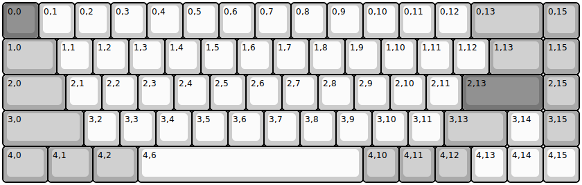{:loading="lazy"}

[Open in keyboard-layout-editor](http://www.keyboard-layout-editor.com/##@@_c=#777777;&=0,0&_c=#cccccc;&=0,1&=0,2&=0,3&=0,4&=0,5&=0,6&=0,7&=0,8&=0,9&=0,10&=0,11&=0,12&_c=#aaaaaa&w:2;&=0,13&=0,15;&@_w:1.5;&=1,0&_c=#cccccc;&=1,1&=1,2&=1,3&=1,4&=1,5&=1,6&=1,7&=1,8&=1,9&=1,10&=1,11&=1,12&_c=#aaaaaa&w:1.5;&=1,13&=1,15;&@_w:1.75;&=2,0&_c=#cccccc;&=2,1&=2,2&=2,3&=2,4&=2,5&=2,6&=2,7&=2,8&=2,9&=2,10&=2,11&_c=#777777&w:2.25;&=2,13&_c=#aaaaaa;&=2,15;&@_w:2.25;&=3,0&_c=#cccccc;&=3,2&=3,3&=3,4&=3,5&=3,6&=3,7&=3,8&=3,9&=3,10&=3,11&_c=#aaaaaa&w:1.75;&=3,13&_c=#cccccc;&=3,14&_c=#aaaaaa;&=3,15;&@_w:1.25;&=4,0&_w:1.25;&=4,1&_w:1.25;&=4,2&_c=#cccccc&w:6.25;&=4,6&_c=#aaaaaa;&=4,10&=4,11&=4,12&_c=#cccccc;&=4,13&=4,14&=4,15)

## keychron/k8_pro/ansi_rgb

[README](output/keychron/k8_pro/README.md) - [layout](output/keychron/k8_pro/ansi_rgb-kle.json) - [PCB](output/keychron/k8_pro/ansi_rgb.kicad_pcb) - [PCB render](output/keychron/k8_pro/ansi_rgb-render.svg)

{:loading="lazy"}

[Open in keyboard-layout-editor](http://www.keyboard-layout-editor.com/##@@_c=#777777;&=0,0&_x:1&c=#cccccc;&=0,1&=0,2&=0,3&=0,4&_x:0.5&c=#aaaaaa;&=0,5&=0,6&=0,7&=0,8&_x:0.5&c=#cccccc;&=0,9&=0,10&=0,11&=0,12&_x:0.25&c=#aaaaaa;&=0,14&=0,15&=0,16;&@_y:0.25;&=1,0&_c=#cccccc;&=1,1&=1,2&=1,3&=1,4&=1,5&=1,6&=1,7&=1,8&=1,9&=1,10&=1,11&=1,12&_c=#aaaaaa&w:2;&=1,13&_x:0.25;&=1,14&=1,15&=1,16;&@_w:1.5;&=2,0&_c=#cccccc;&=2,1&=2,2&=2,3&=2,4&=2,5&=2,6&=2,7&=2,8&=2,9&=2,10&=2,11&=2,12&_c=#aaaaaa&w:1.5;&=2,13&_x:0.25;&=2,14&=2,15&=2,16;&@_w:1.75;&=3,0&_c=#cccccc;&=3,1&=3,2&=3,3&=3,4&=3,5&=3,6&=3,7&=3,8&=3,9&=3,10&=3,11&_c=#777777&w:2.25;&=3,13;&@_c=#aaaaaa&w:2.25;&=4,0&_c=#cccccc;&=4,2&=4,3&=4,4&=4,5&=4,6&=4,7&=4,8&=4,9&=4,10&=4,11&_c=#aaaaaa&w:2.75;&=4,13&_x:1.25&c=#cccccc;&=4,15;&@_c=#aaaaaa&w:1.25;&=5,0&_w:1.25;&=5,1&_w:1.25;&=5,2&_c=#cccccc&w:6.25;&=5,6&_c=#aaaaaa&w:1.25;&=5,10&_w:1.25;&=5,11&_w:1.25;&=5,12&_w:1.25;&=5,13&_x:0.25&c=#cccccc;&=5,14&=5,15&=5,16)

## keychron/k8_pro/ansi_white

[README](output/keychron/k8_pro/README.md) - [layout](output/keychron/k8_pro/ansi_white-kle.json) - [PCB](output/keychron/k8_pro/ansi_white.kicad_pcb) - [PCB render](output/keychron/k8_pro/ansi_white-render.svg)

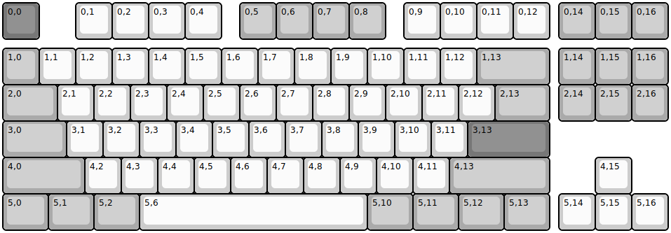{:loading="lazy"}

[Open in keyboard-layout-editor](http://www.keyboard-layout-editor.com/##@@_c=#777777;&=0,0&_x:1&c=#cccccc;&=0,1&=0,2&=0,3&=0,4&_x:0.5&c=#aaaaaa;&=0,5&=0,6&=0,7&=0,8&_x:0.5&c=#cccccc;&=0,9&=0,10&=0,11&=0,12&_x:0.25&c=#aaaaaa;&=0,14&=0,15&=0,16;&@_y:0.25;&=1,0&_c=#cccccc;&=1,1&=1,2&=1,3&=1,4&=1,5&=1,6&=1,7&=1,8&=1,9&=1,10&=1,11&=1,12&_c=#aaaaaa&w:2;&=1,13&_x:0.25;&=1,14&=1,15&=1,16;&@_w:1.5;&=2,0&_c=#cccccc;&=2,1&=2,2&=2,3&=2,4&=2,5&=2,6&=2,7&=2,8&=2,9&=2,10&=2,11&=2,12&_c=#aaaaaa&w:1.5;&=2,13&_x:0.25;&=2,14&=2,15&=2,16;&@_w:1.75;&=3,0&_c=#cccccc;&=3,1&=3,2&=3,3&=3,4&=3,5&=3,6&=3,7&=3,8&=3,9&=3,10&=3,11&_c=#777777&w:2.25;&=3,13;&@_c=#aaaaaa&w:2.25;&=4,0&_c=#cccccc;&=4,2&=4,3&=4,4&=4,5&=4,6&=4,7&=4,8&=4,9&=4,10&=4,11&_c=#aaaaaa&w:2.75;&=4,13&_x:1.25&c=#cccccc;&=4,15;&@_c=#aaaaaa&w:1.25;&=5,0&_w:1.25;&=5,1&_w:1.25;&=5,2&_c=#cccccc&w:6.25;&=5,6&_c=#aaaaaa&w:1.25;&=5,10&_w:1.25;&=5,11&_w:1.25;&=5,12&_w:1.25;&=5,13&_x:0.25&c=#cccccc;&=5,14&=5,15&=5,16)

## keychron/k8_pro/iso_rgb

[README](output/keychron/k8_pro/README.md) - [layout](output/keychron/k8_pro/iso_rgb-kle.json) - [PCB](output/keychron/k8_pro/iso_rgb.kicad_pcb) - [PCB render](output/keychron/k8_pro/iso_rgb-render.svg)

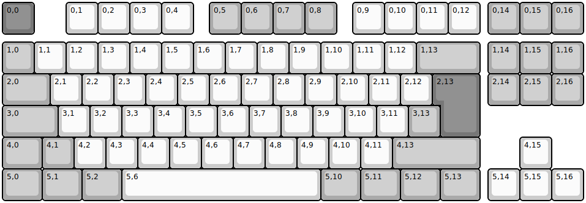{:loading="lazy"}

[Open in keyboard-layout-editor](http://www.keyboard-layout-editor.com/##@@_c=#777777;&=0,0&_x:1&c=#cccccc;&=0,1&=0,2&=0,3&=0,4&_x:0.5&c=#aaaaaa;&=0,5&=0,6&=0,7&=0,8&_x:0.5&c=#cccccc;&=0,9&=0,10&=0,11&=0,12&_x:0.25&c=#aaaaaa;&=0,14&=0,15&=0,16;&@_y:0.25;&=1,0&_c=#cccccc;&=1,1&=1,2&=1,3&=1,4&=1,5&=1,6&=1,7&=1,8&=1,9&=1,10&=1,11&=1,12&_c=#aaaaaa&w:2;&=1,13&_x:0.25;&=1,14&=1,15&=1,16;&@_w:1.5;&=2,0&_c=#cccccc;&=2,1&=2,2&=2,3&=2,4&=2,5&=2,6&=2,7&=2,8&=2,9&=2,10&=2,11&=2,12&_x:0.25&c=#777777&w:1.25&h:2&w2:1.5&h2:1&x2:-0.25;&=2,13&_x:0.25&c=#aaaaaa;&=2,14&=2,15&=2,16;&@_w:1.75;&=3,0&_c=#cccccc;&=3,1&=3,2&=3,3&=3,4&=3,5&=3,6&=3,7&=3,8&=3,9&=3,10&=3,11&_c=#aaaaaa;&=3,13;&@_w:1.25;&=4,0&=4,1&_c=#cccccc;&=4,2&=4,3&=4,4&=4,5&=4,6&=4,7&=4,8&=4,9&=4,10&=4,11&_c=#aaaaaa&w:2.75;&=4,13&_x:1.25&c=#cccccc;&=4,15;&@_c=#aaaaaa&w:1.25;&=5,0&_w:1.25;&=5,1&_w:1.25;&=5,2&_c=#cccccc&w:6.25;&=5,6&_c=#aaaaaa&w:1.25;&=5,10&_w:1.25;&=5,11&_w:1.25;&=5,12&_w:1.25;&=5,13&_x:0.25&c=#cccccc;&=5,14&=5,15&=5,16)

## keychron/k8_pro/iso_white

[README](output/keychron/k8_pro/README.md) - [layout](output/keychron/k8_pro/iso_white-kle.json) - [PCB](output/keychron/k8_pro/iso_white.kicad_pcb) - [PCB render](output/keychron/k8_pro/iso_white-render.svg)

{:loading="lazy"}

[Open in keyboard-layout-editor](http://www.keyboard-layout-editor.com/##@@_c=#777777;&=0,0&_x:1&c=#cccccc;&=0,1&=0,2&=0,3&=0,4&_x:0.5&c=#aaaaaa;&=0,5&=0,6&=0,7&=0,8&_x:0.5&c=#cccccc;&=0,9&=0,10&=0,11&=0,12&_x:0.25&c=#aaaaaa;&=0,14&=0,15&=0,16;&@_y:0.25;&=1,0&_c=#cccccc;&=1,1&=1,2&=1,3&=1,4&=1,5&=1,6&=1,7&=1,8&=1,9&=1,10&=1,11&=1,12&_c=#aaaaaa&w:2;&=1,13&_x:0.25;&=1,14&=1,15&=1,16;&@_w:1.5;&=2,0&_c=#cccccc;&=2,1&=2,2&=2,3&=2,4&=2,5&=2,6&=2,7&=2,8&=2,9&=2,10&=2,11&=2,12&_x:0.25&c=#777777&w:1.25&h:2&w2:1.5&h2:1&x2:-0.25;&=2,13&_x:0.25&c=#aaaaaa;&=2,14&=2,15&=2,16;&@_w:1.75;&=3,0&_c=#cccccc;&=3,1&=3,2&=3,3&=3,4&=3,5&=3,6&=3,7&=3,8&=3,9&=3,10&=3,11&_c=#aaaaaa;&=3,13;&@_w:1.25;&=4,0&=4,1&_c=#cccccc;&=4,2&=4,3&=4,4&=4,5&=4,6&=4,7&=4,8&=4,9&=4,10&=4,11&_c=#aaaaaa&w:2.75;&=4,13&_x:1.25&c=#cccccc;&=4,15;&@_c=#aaaaaa&w:1.25;&=5,0&_w:1.25;&=5,1&_w:1.25;&=5,2&_c=#cccccc&w:6.25;&=5,6&_c=#aaaaaa&w:1.25;&=5,10&_w:1.25;&=5,11&_w:1.25;&=5,12&_w:1.25;&=5,13&_x:0.25&c=#cccccc;&=5,14&=5,15&=5,16)

## keychron/k8_pro/jis_rgb

[README](output/keychron/k8_pro/README.md) - [layout](output/keychron/k8_pro/jis_rgb-kle.json) - [PCB](output/keychron/k8_pro/jis_rgb.kicad_pcb) - [PCB render](output/keychron/k8_pro/jis_rgb-render.svg)

{:loading="lazy"}

[Open in keyboard-layout-editor](http://www.keyboard-layout-editor.com/##@@_c=#777777;&=0,0&_x:1&c=#cccccc;&=0,1&=0,2&=0,3&=0,4&_x:0.5&c=#aaaaaa;&=0,5&=0,6&=0,7&=0,8&_x:0.5&c=#cccccc;&=0,9&=0,10&=0,11&=0,12&_x:0.25&c=#aaaaaa;&=0,14&=0,15&=0,16;&@_y:0.25;&=1,0&_c=#cccccc;&=1,1&=1,2&=1,3&=1,4&=1,5&=1,6&=1,7&=1,8&=1,9&=1,10&=1,11&=1,12&_c=#aaaaaa;&=1,13&=0,13&_x:0.25;&=1,14&=1,15&=1,16;&@_w:1.5;&=2,0&_c=#cccccc;&=2,1&=2,2&=2,3&=2,4&=2,5&=2,6&=2,7&=2,8&=2,9&=2,10&=2,11&=2,12&_x:0.25&c=#777777&w:1.25&h:2&w2:1.5&h2:1&x2:-0.25;&=2,13&_x:0.25&c=#aaaaaa;&=2,14&=2,15&=2,16;&@_w:1.75;&=3,0&_c=#cccccc;&=3,1&=3,2&=3,3&=3,4&=3,5&=3,6&=3,7&=3,8&=3,9&=3,10&=3,11&_c=#aaaaaa;&=3,13;&@_w:2.25;&=4,0&_c=#cccccc;&=4,2&=4,3&=4,4&=4,5&=4,6&=4,7&=4,8&=4,9&=4,10&=4,11&_c=#aaaaaa;&=4,12&_w:1.75;&=4,13&_x:1.25&c=#cccccc;&=4,15;&@_c=#aaaaaa&w:1.25;&=5,0&=5,1&_w:1.25;&=5,2&=5,3&_c=#cccccc&w:4.75;&=5,6&_c=#aaaaaa;&=5,9&_w:1.25;&=5,10&_w:1.25;&=5,11&=5,12&_w:1.25;&=5,13&_x:0.25&c=#cccccc;&=5,14&=5,15&=5,16)

## keychron/k8_pro/jis_white

[README](output/keychron/k8_pro/README.md) - [layout](output/keychron/k8_pro/jis_white-kle.json) - [PCB](output/keychron/k8_pro/jis_white.kicad_pcb) - [PCB render](output/keychron/k8_pro/jis_white-render.svg)

{:loading="lazy"}

[Open in keyboard-layout-editor](http://www.keyboard-layout-editor.com/##@@_c=#777777;&=0,0&_x:1&c=#cccccc;&=0,1&=0,2&=0,3&=0,4&_x:0.5&c=#aaaaaa;&=0,5&=0,6&=0,7&=0,8&_x:0.5&c=#cccccc;&=0,9&=0,10&=0,11&=0,12&_x:0.25&c=#aaaaaa;&=0,14&=0,15&=0,16;&@_y:0.25;&=1,0&_c=#cccccc;&=1,1&=1,2&=1,3&=1,4&=1,5&=1,6&=1,7&=1,8&=1,9&=1,10&=1,11&=1,12&_c=#aaaaaa;&=1,13&=0,13&_x:0.25;&=1,14&=1,15&=1,16;&@_w:1.5;&=2,0&_c=#cccccc;&=2,1&=2,2&=2,3&=2,4&=2,5&=2,6&=2,7&=2,8&=2,9&=2,10&=2,11&=2,12&_x:0.25&c=#777777&w:1.25&h:2&w2:1.5&h2:1&x2:-0.25;&=2,13&_x:0.25&c=#aaaaaa;&=2,14&=2,15&=2,16;&@_w:1.75;&=3,0&_c=#cccccc;&=3,1&=3,2&=3,3&=3,4&=3,5&=3,6&=3,7&=3,8&=3,9&=3,10&=3,11&_c=#aaaaaa;&=3,13;&@_w:2.25;&=4,0&_c=#cccccc;&=4,2&=4,3&=4,4&=4,5&=4,6&=4,7&=4,8&=4,9&=4,10&=4,11&_c=#aaaaaa;&=4,12&_w:1.75;&=4,13&_x:1.25&c=#cccccc;&=4,15;&@_c=#aaaaaa&w:1.25;&=5,0&=5,1&_w:1.25;&=5,2&=5,3&_c=#cccccc&w:4.75;&=5,6&_c=#aaaaaa;&=5,9&_w:1.25;&=5,10&_w:1.25;&=5,11&=5,12&_w:1.25;&=5,13&_x:0.25&c=#cccccc;&=5,14&=5,15&=5,16)

## keychron/q0/rev_0130

[README](output/keychron/q0/README.md) - [layout](output/keychron/q0/rev_0130-kle.json) - [PCB](output/keychron/q0/rev_0130.kicad_pcb) - [PCB render](output/keychron/q0/rev_0130-render.svg)

{:loading="lazy"}

[Open in keyboard-layout-editor](http://www.keyboard-layout-editor.com/##@@=0,0&=0,1&=0,2&=0,3;&@=1,0&=1,1&=1,2&=1,3;&@=2,0&=2,1&=2,2;&@=3,0&=3,1&=3,2;&@_x:3&y:-2&h:2;&=2,3;&@_y:1;&=4,0&=4,1&=4,2;&@_w:2;&=5,0&=5,2;&@_x:3&y:-2&h:2;&=4,3)

## keychron/q0/rev_0131

[README](output/keychron/q0/README.md) - [layout](output/keychron/q0/rev_0131-kle.json) - [PCB](output/keychron/q0/rev_0131.kicad_pcb) - [PCB render](output/keychron/q0/rev_0131-render.svg)

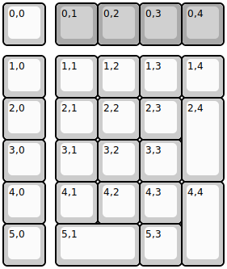{:loading="lazy"}

[Open in keyboard-layout-editor](http://www.keyboard-layout-editor.com/##@@=0,0%0A%0A%0A%0A%0A%0A%0A%0A%0Ae0&_x:0.25&c=#aaaaaa;&=0,1&=0,2&=0,3&=0,4;&@_y:0.25&c=#cccccc;&=1,0&_x:0.25;&=1,1&=1,2&=1,3&=1,4;&@=2,0&_x:0.25;&=2,1&=2,2&=2,3&_h:2;&=2,4;&@=3,0&_x:0.25;&=3,1&=3,2&=3,3;&@=4,0&_x:0.25;&=4,1&=4,2&=4,3&_h:2;&=4,4;&@=5,0&_x:0.25&w:2;&=5,1&=5,3)

## keychron/q1/ansi_atmega32u4

[README](output/keychron/q1/README.md) - [layout](output/keychron/q1/ansi_atmega32u4-kle.json) - [PCB](output/keychron/q1/ansi_atmega32u4.kicad_pcb) - [PCB render](output/keychron/q1/ansi_atmega32u4-render.svg)

{:loading="lazy"}

[Open in keyboard-layout-editor](http://www.keyboard-layout-editor.com/##@@_c=#777777;&=0,0%0AESC&_x:0.25&c=#cccccc;&=0,2&=0,3&=0,4&=0,5&_x:0.25&c=#aaaaaa;&=0,6&=0,7&=0,8&=0,9&_x:0.25&c=#cccccc;&=0,10&=0,11&=0,12&=0,13&_x:0.25&c=#aaaaaa;&=4,14&_x:0.25;&=0,14;&@_y:0.25&c=#cccccc;&=1,0&=1,1&=1,2&=1,3&=1,4&=1,5&=1,6&=1,7&=1,8&=1,9&=1,10&=1,11&=1,12&_c=#aaaaaa&w:2;&=1,13&_x:0.25;&=1,14;&@_w:1.5;&=2,0&_c=#cccccc;&=2,1&=2,2&=2,3&=2,4&=2,5&=2,6&=2,7&=2,8&=2,9&=2,10&=2,11&=2,12&_w:1.5;&=2,13&_x:0.25&c=#aaaaaa;&=2,14;&@_w:1.75;&=3,0&_c=#cccccc;&=3,1&=3,2&=3,3&=3,4&=3,5&=3,6&=3,7&=3,8&=3,9&=3,10&=3,11&_c=#777777&w:2.25;&=3,13&_x:0.25&c=#aaaaaa;&=3,14;&@_w:2.25;&=4,0&_c=#cccccc;&=4,2&=4,3&=4,4&=4,5&=4,6&=4,7&=4,8&=4,9&=4,10&=4,11&_c=#aaaaaa&w:1.75;&=4,13;&@_x:14.25&y:-0.75;&=3,12;&@_y:-0.25&w:1.25;&=5,0&_w:1.25;&=5,1&_w:1.25;&=5,2&_c=#cccccc&w:6.25;&=5,6&_c=#aaaaaa;&=5,10&=5,11&=5,12;&@_x:13.25&y:-0.75;&=5,13&=4,12&=5,14)

## keychron/q1/ansi_atmega32u4_encoder

[README](output/keychron/q1/README.md) - [layout](output/keychron/q1/ansi_atmega32u4_encoder-kle.json) - [PCB](output/keychron/q1/ansi_atmega32u4_encoder.kicad_pcb) - [PCB render](output/keychron/q1/ansi_atmega32u4_encoder-render.svg)

{:loading="lazy"}

[Open in keyboard-layout-editor](http://www.keyboard-layout-editor.com/##@@_c=#777777;&=0,0%0AESC&_x:0.25&c=#cccccc;&=0,2&=0,3&=0,4&=0,5&_x:0.25&c=#aaaaaa;&=0,6&=0,7&=0,8&=0,9&_x:0.25&c=#cccccc;&=0,10&=0,11&=0,12&=0,13&_x:0.25&c=#aaaaaa;&=4,14&_x:0.25;&=0,14%0A%0A%0A%0A%0A%0A%0A%0A%0Ae0;&@_y:0.25&c=#cccccc;&=1,0&=1,1&=1,2&=1,3&=1,4&=1,5&=1,6&=1,7&=1,8&=1,9&=1,10&=1,11&=1,12&_c=#aaaaaa&w:2;&=1,13&_x:0.25;&=1,14;&@_w:1.5;&=2,0&_c=#cccccc;&=2,1&=2,2&=2,3&=2,4&=2,5&=2,6&=2,7&=2,8&=2,9&=2,10&=2,11&=2,12&_w:1.5;&=2,13&_x:0.25&c=#aaaaaa;&=2,14;&@_w:1.75;&=3,0&_c=#cccccc;&=3,1&=3,2&=3,3&=3,4&=3,5&=3,6&=3,7&=3,8&=3,9&=3,10&=3,11&_c=#777777&w:2.25;&=3,13&_x:0.25&c=#aaaaaa;&=3,14;&@_w:2.25;&=4,0&_c=#cccccc;&=4,2&=4,3&=4,4&=4,5&=4,6&=4,7&=4,8&=4,9&=4,10&=4,11&_c=#aaaaaa&w:1.75;&=4,13;&@_x:14.25&y:-0.75;&=3,12;&@_y:-0.25&w:1.25;&=5,0&_w:1.25;&=5,1&_w:1.25;&=5,2&_c=#cccccc&w:6.25;&=5,6&_c=#aaaaaa;&=5,10&=5,11&=5,12;&@_x:13.25&y:-0.75;&=5,13&=4,12&=5,14)

## keychron/q1/ansi_stm32l432

[README](output/keychron/q1/README.md) - [layout](output/keychron/q1/ansi_stm32l432-kle.json) - [PCB](output/keychron/q1/ansi_stm32l432.kicad_pcb) - [PCB render](output/keychron/q1/ansi_stm32l432-render.svg)

{:loading="lazy"}

[Open in keyboard-layout-editor](http://www.keyboard-layout-editor.com/##@@_c=#777777;&=0,0%0AESC&_x:0.25&c=#cccccc;&=0,1&=0,2&=0,3&=0,4&_x:0.25&c=#aaaaaa;&=0,5&=0,6&=0,7&=0,8&_x:0.25&c=#cccccc;&=0,9&=0,10&=0,11&=0,12&_x:0.25&c=#aaaaaa;&=0,13&_x:0.25;&=0,15;&@_y:0.25&c=#cccccc;&=1,0&=1,1&=1,2&=1,3&=1,4&=1,5&=1,6&=1,7&=1,8&=1,9&=1,10&=1,11&=1,12&_c=#aaaaaa&w:2;&=1,13&_x:0.25;&=1,15;&@_w:1.5;&=2,0&_c=#cccccc;&=2,1&=2,2&=2,3&=2,4&=2,5&=2,6&=2,7&=2,8&=2,9&=2,10&=2,11&=2,12&_w:1.5;&=2,13&_x:0.25&c=#aaaaaa;&=2,15;&@_w:1.75;&=3,0&_c=#cccccc;&=3,1&=3,2&=3,3&=3,4&=3,5&=3,6&=3,7&=3,8&=3,9&=3,10&=3,11&_c=#777777&w:2.25;&=3,13&_x:0.25&c=#aaaaaa;&=3,15;&@_w:2.25;&=4,0&_c=#cccccc;&=4,2&=4,3&=4,4&=4,5&=4,6&=4,7&=4,8&=4,9&=4,10&=4,11&_c=#aaaaaa&w:1.75;&=4,13;&@_x:14.25&y:-0.75&c=#777777;&=4,14;&@_y:-0.25&c=#aaaaaa&w:1.25;&=5,0&_w:1.25;&=5,1&_w:1.25;&=5,2&_c=#cccccc&w:6.25;&=5,6&_c=#aaaaaa;&=5,10&=5,11&=5,12;&@_x:13.25&y:-0.75&c=#777777;&=5,13&=5,14&=5,15)

## keychron/q1/ansi_stm32l432_encoder

[README](output/keychron/q1/README.md) - [layout](output/keychron/q1/ansi_stm32l432_encoder-kle.json) - [PCB](output/keychron/q1/ansi_stm32l432_encoder.kicad_pcb) - [PCB render](output/keychron/q1/ansi_stm32l432_encoder-render.svg)

{:loading="lazy"}

[Open in keyboard-layout-editor](http://www.keyboard-layout-editor.com/##@@_c=#777777;&=0,0%0AESC&_x:0.25&c=#cccccc;&=0,1&=0,2&=0,3&=0,4&_x:0.25&c=#aaaaaa;&=0,5&=0,6&=0,7&=0,8&_x:0.25&c=#cccccc;&=0,9&=0,10&=0,11&=0,12&_x:0.25&c=#aaaaaa;&=0,13&_x:0.25;&=0,15%0A%0A%0A%0A%0A%0A%0A%0A%0Ae0;&@_y:0.25&c=#cccccc;&=1,0&=1,1&=1,2&=1,3&=1,4&=1,5&=1,6&=1,7&=1,8&=1,9&=1,10&=1,11&=1,12&_c=#aaaaaa&w:2;&=1,13&_x:0.25;&=1,15;&@_w:1.5;&=2,0&_c=#cccccc;&=2,1&=2,2&=2,3&=2,4&=2,5&=2,6&=2,7&=2,8&=2,9&=2,10&=2,11&=2,12&_w:1.5;&=2,13&_x:0.25&c=#aaaaaa;&=2,15;&@_w:1.75;&=3,0&_c=#cccccc;&=3,1&=3,2&=3,3&=3,4&=3,5&=3,6&=3,7&=3,8&=3,9&=3,10&=3,11&_c=#777777&w:2.25;&=3,13&_x:0.25&c=#aaaaaa;&=3,15;&@_w:2.25;&=4,0&_c=#cccccc;&=4,2&=4,3&=4,4&=4,5&=4,6&=4,7&=4,8&=4,9&=4,10&=4,11&_c=#aaaaaa&w:1.75;&=4,13;&@_x:14.25&y:-0.75&c=#777777;&=4,14;&@_y:-0.25&c=#aaaaaa&w:1.25;&=5,0&_w:1.25;&=5,1&_w:1.25;&=5,2&_c=#cccccc&w:6.25;&=5,6&_c=#aaaaaa;&=5,10&=5,11&=5,12;&@_x:13.25&y:-0.75&c=#777777;&=5,13&=5,14&=5,15)

## keychron/q1/iso_atmega32u4

[README](output/keychron/q1/README.md) - [layout](output/keychron/q1/iso_atmega32u4-kle.json) - [PCB](output/keychron/q1/iso_atmega32u4.kicad_pcb) - [PCB render](output/keychron/q1/iso_atmega32u4-render.svg)

{:loading="lazy"}

[Open in keyboard-layout-editor](http://www.keyboard-layout-editor.com/##@@_c=#777777;&=0,0%0AESC&_x:0.25&c=#cccccc;&=0,2&=0,3&=0,4&=0,5&_x:0.25&c=#aaaaaa;&=0,6&=0,7&=0,8&=0,9&_x:0.25&c=#cccccc;&=0,10&=0,11&=0,12&=0,13&_x:0.25&c=#aaaaaa;&=4,14&_x:0.25;&=0,14;&@_y:0.25&c=#cccccc;&=1,0&=1,1&=1,2&=1,3&=1,4&=1,5&=1,6&=1,7&=1,8&=1,9&=1,10&=1,11&=1,12&_c=#aaaaaa&w:2;&=1,13&_x:0.25;&=1,14;&@_w:1.5;&=2,0&_c=#cccccc;&=2,1&=2,2&=2,3&=2,4&=2,5&=2,6&=2,7&=2,8&=2,9&=2,10&=2,11&=2,12&_x:0.25&c=#777777&w:1.25&h:2&w2:1.5&h2:1&x2:-0.25;&=2,13&_x:0.25&c=#aaaaaa;&=2,14;&@_w:1.75;&=3,0&_c=#cccccc;&=3,1&=3,2&=3,3&=3,4&=3,5&=3,6&=3,7&=3,8&=3,9&=3,10&=3,11&=3,13&_x:1.5&c=#aaaaaa;&=3,14;&@_w:1.25;&=4,0&_c=#cccccc;&=4,1&=4,2&=4,3&=4,4&=4,5&=4,6&=4,7&=4,8&=4,9&=4,10&=4,11&_c=#aaaaaa&w:1.75;&=4,13;&@_x:14.25&y:-0.75&c=#777777;&=3,12;&@_y:-0.25&c=#aaaaaa&w:1.25;&=5,0&_w:1.25;&=5,1&_w:1.25;&=5,2&_c=#cccccc&w:6.25;&=5,6&_c=#aaaaaa;&=5,10&=5,11&=5,12;&@_x:13.25&y:-0.75&c=#777777;&=5,13&=4,12&=5,14)

## keychron/q1/iso_atmega32u4_encoder

[README](output/keychron/q1/README.md) - [layout](output/keychron/q1/iso_atmega32u4_encoder-kle.json) - [PCB](output/keychron/q1/iso_atmega32u4_encoder.kicad_pcb) - [PCB render](output/keychron/q1/iso_atmega32u4_encoder-render.svg)

{:loading="lazy"}

[Open in keyboard-layout-editor](http://www.keyboard-layout-editor.com/##@@_c=#777777;&=0,0%0AESC&_x:0.25&c=#cccccc;&=0,2&=0,3&=0,4&=0,5&_x:0.25&c=#aaaaaa;&=0,6&=0,7&=0,8&=0,9&_x:0.25&c=#cccccc;&=0,10&=0,11&=0,12&=0,13&_x:0.25&c=#aaaaaa;&=4,14&_x:0.25;&=0,14%0A%0A%0A%0A%0A%0A%0A%0A%0Ae0;&@_y:0.25&c=#cccccc;&=1,0&=1,1&=1,2&=1,3&=1,4&=1,5&=1,6&=1,7&=1,8&=1,9&=1,10&=1,11&=1,12&_c=#aaaaaa&w:2;&=1,13&_x:0.25;&=1,14;&@_w:1.5;&=2,0&_c=#cccccc;&=2,1&=2,2&=2,3&=2,4&=2,5&=2,6&=2,7&=2,8&=2,9&=2,10&=2,11&=2,12&_x:0.25&c=#777777&w:1.25&h:2&w2:1.5&h2:1&x2:-0.25;&=2,13&_x:0.25&c=#aaaaaa;&=2,14;&@_w:1.75;&=3,0&_c=#cccccc;&=3,1&=3,2&=3,3&=3,4&=3,5&=3,6&=3,7&=3,8&=3,9&=3,10&=3,11&=3,13&_x:1.5&c=#aaaaaa;&=3,14;&@_w:1.25;&=4,0&_c=#cccccc;&=4,1&=4,2&=4,3&=4,4&=4,5&=4,6&=4,7&=4,8&=4,9&=4,10&=4,11&_c=#aaaaaa&w:1.75;&=4,13;&@_x:14.25&y:-0.75&c=#777777;&=3,12;&@_y:-0.25&c=#aaaaaa&w:1.25;&=5,0&_w:1.25;&=5,1&_w:1.25;&=5,2&_c=#cccccc&w:6.25;&=5,6&_c=#aaaaaa;&=5,10&=5,11&=5,12;&@_x:13.25&y:-0.75&c=#777777;&=5,13&=4,12&=5,14)

## keychron/q1/iso_stm32l432

[README](output/keychron/q1/README.md) - [layout](output/keychron/q1/iso_stm32l432-kle.json) - [PCB](output/keychron/q1/iso_stm32l432.kicad_pcb) - [PCB render](output/keychron/q1/iso_stm32l432-render.svg)

{:loading="lazy"}

[Open in keyboard-layout-editor](http://www.keyboard-layout-editor.com/##@@_c=#777777;&=0,0%0AESC&_x:0.25&c=#cccccc;&=0,1&=0,2&=0,3&=0,4&_x:0.25&c=#aaaaaa;&=0,5&=0,6&=0,7&=0,8&_x:0.25&c=#cccccc;&=0,9&=0,10&=0,11&=0,12&_x:0.25&c=#aaaaaa;&=0,13&_x:0.25;&=0,15;&@_y:0.25&c=#cccccc;&=1,0&=1,1&=1,2&=1,3&=1,4&=1,5&=1,6&=1,7&=1,8&=1,9&=1,10&=1,11&=1,12&_c=#aaaaaa&w:2;&=1,13&_x:0.25;&=1,15;&@_w:1.5;&=2,0&_c=#cccccc;&=2,1&=2,2&=2,3&=2,4&=2,5&=2,6&=2,7&=2,8&=2,9&=2,10&=2,11&=2,12&_x:0.25&c=#777777&w:1.25&h:2&w2:1.5&h2:1&x2:-0.25;&=2,13&_x:0.25&c=#aaaaaa;&=2,15;&@_w:1.75;&=3,0&_c=#cccccc;&=3,1&=3,2&=3,3&=3,4&=3,5&=3,6&=3,7&=3,8&=3,9&=3,10&=3,11&=3,13&_x:1.5&c=#aaaaaa;&=3,15;&@_w:1.25;&=4,0&_c=#cccccc;&=4,1&=4,2&=4,3&=4,4&=4,5&=4,6&=4,7&=4,8&=4,9&=4,10&=4,11&_c=#aaaaaa&w:1.75;&=4,13;&@_x:14.25&y:-0.75&c=#777777;&=4,14;&@_y:-0.25&c=#aaaaaa&w:1.25;&=5,0&_w:1.25;&=5,1&_w:1.25;&=5,2&_c=#cccccc&w:6.25;&=5,6&_c=#aaaaaa;&=5,10&=5,11&=5,12;&@_x:13.25&y:-0.75&c=#777777;&=5,13&=5,14&=5,15)

## keychron/q1/iso_stm32l432_encoder

[README](output/keychron/q1/README.md) - [layout](output/keychron/q1/iso_stm32l432_encoder-kle.json) - [PCB](output/keychron/q1/iso_stm32l432_encoder.kicad_pcb) - [PCB render](output/keychron/q1/iso_stm32l432_encoder-render.svg)

{:loading="lazy"}

[Open in keyboard-layout-editor](http://www.keyboard-layout-editor.com/##@@_c=#777777;&=0,0%0AESC&_x:0.25&c=#cccccc;&=0,1&=0,2&=0,3&=0,4&_x:0.25&c=#aaaaaa;&=0,5&=0,6&=0,7&=0,8&_x:0.25&c=#cccccc;&=0,9&=0,10&=0,11&=0,12&_x:0.25&c=#aaaaaa;&=0,13&_x:0.25;&=0,15%0A%0A%0A%0A%0A%0A%0A%0A%0Ae0;&@_y:0.25&c=#cccccc;&=1,0&=1,1&=1,2&=1,3&=1,4&=1,5&=1,6&=1,7&=1,8&=1,9&=1,10&=1,11&=1,12&_c=#aaaaaa&w:2;&=1,13&_x:0.25;&=1,15;&@_w:1.5;&=2,0&_c=#cccccc;&=2,1&=2,2&=2,3&=2,4&=2,5&=2,6&=2,7&=2,8&=2,9&=2,10&=2,11&=2,12&_x:0.25&c=#777777&w:1.25&h:2&w2:1.5&h2:1&x2:-0.25;&=2,13&_x:0.25&c=#aaaaaa;&=2,15;&@_w:1.75;&=3,0&_c=#cccccc;&=3,1&=3,2&=3,3&=3,4&=3,5&=3,6&=3,7&=3,8&=3,9&=3,10&=3,11&=3,13&_x:1.5&c=#aaaaaa;&=3,15;&@_w:1.25;&=4,0&_c=#cccccc;&=4,1&=4,2&=4,3&=4,4&=4,5&=4,6&=4,7&=4,8&=4,9&=4,10&=4,11&_c=#aaaaaa&w:1.75;&=4,13;&@_x:14.25&y:-0.75&c=#777777;&=4,14;&@_y:-0.25&c=#aaaaaa&w:1.25;&=5,0&_w:1.25;&=5,1&_w:1.25;&=5,2&_c=#cccccc&w:6.25;&=5,6&_c=#aaaaaa;&=5,10&=5,11&=5,12;&@_x:13.25&y:-0.75&c=#777777;&=5,13&=5,14&=5,15)

## keychron/q1/jis_stm32l432

[README](output/keychron/q1/README.md) - [layout](output/keychron/q1/jis_stm32l432-kle.json) - [PCB](output/keychron/q1/jis_stm32l432.kicad_pcb) - [PCB render](output/keychron/q1/jis_stm32l432-render.svg)

{:loading="lazy"}

[Open in keyboard-layout-editor](http://www.keyboard-layout-editor.com/##@@_c=#777777;&=0,0%0AESC&_x:0.25&c=#cccccc;&=0,1&=0,2&=0,3&=0,4&_x:0.25&c=#aaaaaa;&=0,5&=0,6&=0,7&=0,8&_x:0.25&c=#cccccc;&=0,9&=0,10&=0,11&=0,12&_x:0.25&c=#aaaaaa;&=0,13&_x:0.25;&=0,15;&@_y:0.25;&=1,0&_c=#cccccc;&=1,1&=1,2&=1,3&=1,4&=1,5&=1,6&=1,7&=1,8&=1,9&=1,10&=1,11&=1,12&=1,13&_c=#aaaaaa;&=1,14&_x:0.25;&=1,15;&@_w:1.5;&=2,0&_c=#cccccc;&=2,1&=2,2&=2,3&=2,4&=2,5&=2,6&=2,7&=2,8&=2,9&=2,10&=2,11&=2,12&_x:0.25&c=#777777&w:1.25&h:2&w2:1.5&h2:1&x2:-0.25;&=2,13&_x:0.25&c=#aaaaaa;&=2,15;&@_w:1.75;&=3,0&_c=#cccccc;&=3,1&=3,2&=3,3&=3,4&=3,5&=3,6&=3,7&=3,8&=3,9&=3,10&=3,11&_c=#aaaaaa;&=3,13&_x:1.5;&=3,15;&@_w:2.25;&=4,0&_c=#cccccc;&=4,2&=4,3&=4,4&=4,5&=4,6&=4,7&=4,8&=4,9&=4,10&=4,11&=4,12&_c=#aaaaaa;&=4,13&_c=#777777;&=4,14;&@_c=#aaaaaa&w:1.25;&=5,0&=5,1&_w:1.25;&=5,2&=5,3&_c=#cccccc&w:4.5;&=5,6&_c=#aaaaaa&w:1.25;&=5,9&=5,10&=5,11&=5,12&_c=#777777;&=5,13&=5,14&=5,15)

## keychron/q1/jis_stm32l432_encoder

[README](output/keychron/q1/README.md) - [layout](output/keychron/q1/jis_stm32l432_encoder-kle.json) - [PCB](output/keychron/q1/jis_stm32l432_encoder.kicad_pcb) - [PCB render](output/keychron/q1/jis_stm32l432_encoder-render.svg)

{:loading="lazy"}

[Open in keyboard-layout-editor](http://www.keyboard-layout-editor.com/##@@_c=#777777;&=0,0%0AESC&_x:0.25&c=#cccccc;&=0,1&=0,2&=0,3&=0,4&_x:0.25&c=#aaaaaa;&=0,5&=0,6&=0,7&=0,8&_x:0.25&c=#cccccc;&=0,9&=0,10&=0,11&=0,12&_x:0.25&c=#aaaaaa;&=0,13&_x:0.25;&=0,15%0A%0A%0A%0A%0A%0A%0A%0A%0Ae0;&@_y:0.25;&=1,0&_c=#cccccc;&=1,1&=1,2&=1,3&=1,4&=1,5&=1,6&=1,7&=1,8&=1,9&=1,10&=1,11&=1,12&=1,13&_c=#aaaaaa;&=1,14&_x:0.25;&=1,15;&@_w:1.5;&=2,0&_c=#cccccc;&=2,1&=2,2&=2,3&=2,4&=2,5&=2,6&=2,7&=2,8&=2,9&=2,10&=2,11&=2,12&_x:0.25&c=#777777&w:1.25&h:2&w2:1.5&h2:1&x2:-0.25;&=2,13&_x:0.25&c=#aaaaaa;&=2,15;&@_w:1.75;&=3,0&_c=#cccccc;&=3,1&=3,2&=3,3&=3,4&=3,5&=3,6&=3,7&=3,8&=3,9&=3,10&=3,11&_c=#aaaaaa;&=3,13&_x:1.5;&=3,15;&@_w:2.25;&=4,0&_c=#cccccc;&=4,2&=4,3&=4,4&=4,5&=4,6&=4,7&=4,8&=4,9&=4,10&=4,11&=4,12&_c=#aaaaaa;&=4,13&_c=#777777;&=4,14;&@_c=#aaaaaa&w:1.25;&=5,0&=5,1&_w:1.25;&=5,2&=5,3&_c=#cccccc&w:4.5;&=5,6&_c=#aaaaaa&w:1.25;&=5,9&=5,10&=5,11&=5,12&_c=#777777;&=5,13&=5,14&=5,15)

## keychron/q10/ansi_encoder

[README](output/keychron/q10/README.md) - [layout](output/keychron/q10/ansi_encoder-kle.json) - [PCB](output/keychron/q10/ansi_encoder.kicad_pcb) - [PCB render](output/keychron/q10/ansi_encoder-render.svg)

{:loading="lazy"}

[Open in keyboard-layout-editor](http://www.keyboard-layout-editor.com/##@@_x:0.5;&=0,0%0A%0A%0A%0A%0A%0A%0A%0A%0Ae0&_x:0.5&c=#777777;&=0,1%0AESC&_x:0.25&c=#aaaaaa;&=0,2&=0,3&_x:9.35;&=0,12&=0,13&_x:0.25;&=0,14&_x:0.25;&=0,15;&@_x:0.75&y:0.25&c=#cccccc;&=1,0&_x:0.5&c=#aaaaaa;&=1,1&_c=#cccccc;&=1,2&=1,3&_x:8.65;&=1,12&=1,13&_c=#aaaaaa&w:2;&=1,14&_x:0.6;&=1,15;&@_x:0.5&c=#cccccc;&=2,0&_x:0.5&c=#aaaaaa&w:1.5;&=2,1&_c=#cccccc;&=2,2&_x:9.9;&=2,12&=2,13&_c=#aaaaaa&w:1.75;&=2,14&_x:0.5;&=2,15;&@_x:0.25&c=#cccccc;&=3,0&_x:0.5&c=#aaaaaa&w:1.75;&=3,1&_c=#cccccc;&=3,2&_x:9.6;&=3,12&=3,13&_c=#777777&w:2.25;&=3,14&_x:0.5&c=#aaaaaa;&=3,15;&@_c=#cccccc;&=4,0&_x:0.5&c=#aaaaaa&w:2.25;&=4,1&_c=#cccccc;&=4,3&_x:9.95;&=4,13&_c=#aaaaaa&w:1.75;&=4,14;&@_x:17.7&y:-0.75&c=#777777;&=4,15;&@_y:-0.25&c=#cccccc;&=5,0&_x:0.5&c=#aaaaaa&w:1.25;&=5,1&_w:1.25;&=5,2;&@_x:16.7&y:-0.75&c=#777777;&=5,13&=5,14&=5,15;&@_r:6&x:5.4&y:-7.05&c=#aaaaaa;&=0,4&=0,5&_x:0.25;&=0,6&=0,7;&@_x:5.55&y:0.25&c=#cccccc;&=1,4&=1,5&=1,6&=1,7;&@_x:4.9;&=2,3&=2,4&=2,5&=2,6;&@_x:5;&=3,3&=3,4&=3,5&=3,6;&@_x:5.35;&=4,4&=4,5&=4,6&=4,7;&@_x:5.35&c=#aaaaaa&w:1.25;&=5,3&_c=#cccccc&w:2.25;&=5,4&_c=#aaaaaa;&=5,7;&@_r:-6&x:10.05&y:-4.25;&=0,8&=0,9&_x:0.25;&=0,10&=0,11;&@_x:9.4&y:0.25&c=#cccccc;&=1,8&=1,9&=1,10&=1,11;&@_x:8.9;&=2,7&=2,8&=2,9&=2,10&=2,11;&@_x:9.4;&=3,8&=3,9&=3,10&=3,11;&@_x:8.85;&=4,8&=4,9&=4,10&=4,11&=4,12;&@_x:8.85&w:2.55;&=5,8&_c=#aaaaaa;&=5,9)

## keychron/q10/iso_encoder

[README](output/keychron/q10/README.md) - [layout](output/keychron/q10/iso_encoder-kle.json) - [PCB](output/keychron/q10/iso_encoder.kicad_pcb) - [PCB render](output/keychron/q10/iso_encoder-render.svg)

{:loading="lazy"}

[Open in keyboard-layout-editor](http://www.keyboard-layout-editor.com/##@@_x:0.5;&=0,0%0A%0A%0A%0A%0A%0A%0A%0A%0Ae0&_x:0.5&c=#777777;&=0,1%0AESC&_x:0.25&c=#aaaaaa;&=0,2&=0,3&_x:9.35;&=0,12&=0,13&_x:0.25;&=0,14&_x:0.25;&=0,15;&@_x:0.75&y:0.25&c=#cccccc;&=1,0&_x:0.5&c=#aaaaaa;&=1,1&_c=#cccccc;&=1,2&=1,3&_x:8.65;&=1,12&=1,13&_c=#aaaaaa&w:2;&=1,14&_x:0.6;&=1,15;&@_x:0.5&c=#cccccc;&=2,0&_x:0.5&c=#aaaaaa&w:1.5;&=2,1&_c=#cccccc;&=2,2&_x:10.35;&=2,12&=2,13&_x:0.25&c=#777777&w:1.25&h:2&w2:1.5&h2:1&x2:-0.25;&=2,14&_x:0.3&c=#aaaaaa;&=2,15;&@_x:0.25&c=#cccccc;&=3,0&_x:0.5&c=#aaaaaa&w:1.75;&=3,1&_c=#cccccc;&=3,2&_x:9.6;&=3,12&=3,13&=3,14&_x:1.75&c=#aaaaaa;&=3,15;&@_c=#cccccc;&=4,0&_x:0.5&c=#aaaaaa&w:1.25;&=4,1&_c=#cccccc;&=4,2&=4,3&_x:9.95;&=4,13&_c=#aaaaaa&w:1.75;&=4,14;&@_x:17.7&y:-0.75&c=#777777;&=4,15;&@_y:-0.25&c=#cccccc;&=5,0&_x:0.5&c=#aaaaaa&w:1.25;&=5,1&_w:1.25;&=5,2;&@_x:16.7&y:-0.75&c=#777777;&=5,13&=5,14&=5,15;&@_r:6&x:5.4&y:-7.05&c=#aaaaaa;&=0,4&=0,5&_x:0.25;&=0,6&=0,7;&@_x:5.55&y:0.25&c=#cccccc;&=1,4&=1,5&=1,6&=1,7;&@_x:4.9;&=2,3&=2,4&=2,5&=2,6;&@_x:5;&=3,3&=3,4&=3,5&=3,6;&@_x:5.35;&=4,4&=4,5&=4,6&=4,7;&@_x:5.35&c=#aaaaaa&w:1.25;&=5,3&_c=#cccccc&w:2.25;&=5,4&_c=#aaaaaa;&=5,7;&@_r:-6&x:10.05&y:-4.25;&=0,8&=0,9&_x:0.25;&=0,10&=0,11;&@_x:9.4&y:0.25&c=#cccccc;&=1,8&=1,9&=1,10&=1,11;&@_x:8.9;&=2,7&=2,8&=2,9&=2,10&=2,11;&@_x:9.4;&=3,8&=3,9&=3,10&=3,11;&@_x:8.85;&=4,8&=4,9&=4,10&=4,11&=4,12;&@_x:8.85&w:2.55;&=5,8&_c=#aaaaaa;&=5,9)

## keychron/q12/ansi_encoder

[README](output/keychron/q12/README.md) - [layout](output/keychron/q12/ansi_encoder-kle.json) - [PCB](output/keychron/q12/ansi_encoder.kicad_pcb) - [PCB render](output/keychron/q12/ansi_encoder-render.svg)

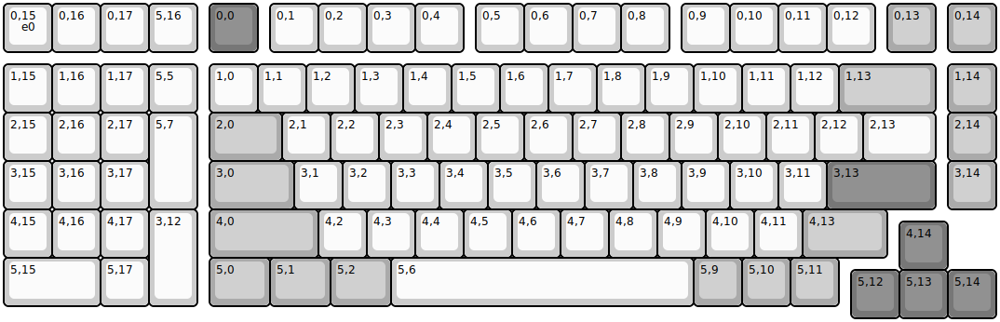{:loading="lazy"}

[Open in keyboard-layout-editor](http://www.keyboard-layout-editor.com/##@@=0,15%0A%0A%0A%0A%0A%0A%0A%0A%0Ae0&=0,16&=0,17&=5,16&_x:0.25&c=#777777;&=0,0%0AESC&_x:0.25&c=#cccccc;&=0,1&=0,2&=0,3&=0,4&_x:0.25;&=0,5&=0,6&=0,7&=0,8&_x:0.25;&=0,9&=0,10&=0,11&=0,12&_x:0.25&c=#aaaaaa;&=0,13&_x:0.25;&=0,14;&@_y:0.25&c=#cccccc;&=1,15&=1,16&=1,17&=5,5&_x:0.25;&=1,0&=1,1&=1,2&=1,3&=1,4&=1,5&=1,6&=1,7&=1,8&=1,9&=1,10&=1,11&=1,12&_c=#aaaaaa&w:2;&=1,13&_x:0.25;&=1,14;&@_c=#cccccc;&=2,15&=2,16&=2,17&_h:2;&=5,7&_x:0.25&c=#aaaaaa&w:1.5;&=2,0&_c=#cccccc;&=2,1&=2,2&=2,3&=2,4&=2,5&=2,6&=2,7&=2,8&=2,9&=2,10&=2,11&=2,12&_w:1.5;&=2,13&_x:0.25&c=#aaaaaa;&=2,14;&@_c=#cccccc;&=3,15&=3,16&=3,17&_x:1.25&c=#aaaaaa&w:1.75;&=3,0&_c=#cccccc;&=3,1&=3,2&=3,3&=3,4&=3,5&=3,6&=3,7&=3,8&=3,9&=3,10&=3,11&_c=#777777&w:2.25;&=3,13&_x:0.25&c=#aaaaaa;&=3,14;&@_c=#cccccc;&=4,15&=4,16&=4,17&_h:2;&=3,12&_x:0.25&c=#aaaaaa&w:2.25;&=4,0&_c=#cccccc;&=4,2&=4,3&=4,4&=4,5&=4,6&=4,7&=4,8&=4,9&=4,10&=4,11&_c=#aaaaaa&w:1.75;&=4,13;&@_x:18.5&y:-0.75&c=#777777;&=4,14;&@_y:-0.25&c=#cccccc&w:2;&=5,15&=5,17&_x:1.25&c=#aaaaaa&w:1.25;&=5,0&_w:1.25;&=5,1&_w:1.25;&=5,2&_c=#cccccc&w:6.25;&=5,6&_c=#aaaaaa;&=5,9&=5,10&=5,11;&@_x:17.5&y:-0.75&c=#777777;&=5,12&=5,13&=5,14)

## keychron/q12/iso_encoder

[README](output/keychron/q12/README.md) - [layout](output/keychron/q12/iso_encoder-kle.json) - [PCB](output/keychron/q12/iso_encoder.kicad_pcb) - [PCB render](output/keychron/q12/iso_encoder-render.svg)

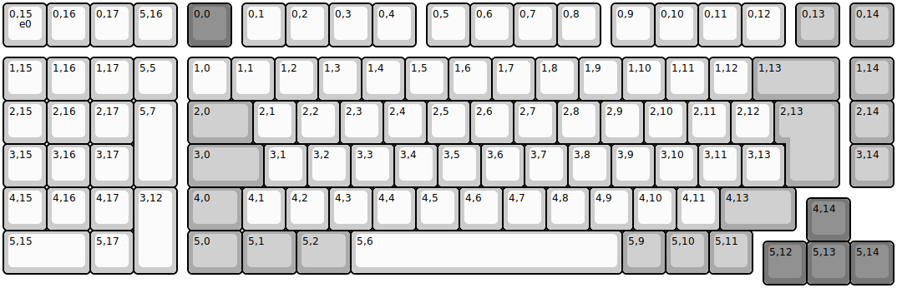{:loading="lazy"}

[Open in keyboard-layout-editor](http://www.keyboard-layout-editor.com/##@@=0,15%0A%0A%0A%0A%0A%0A%0A%0A%0Ae0&=0,16&=0,17&=5,16&_x:0.25&c=#777777;&=0,0%0AESC&_x:0.25&c=#cccccc;&=0,1&=0,2&=0,3&=0,4&_x:0.25;&=0,5&=0,6&=0,7&=0,8&_x:0.25;&=0,9&=0,10&=0,11&=0,12&_x:0.25&c=#aaaaaa;&=0,13&_x:0.25;&=0,14;&@_y:0.25&c=#cccccc;&=1,15&=1,16&=1,17&=5,5&_x:0.25;&=1,0&=1,1&=1,2&=1,3&=1,4&=1,5&=1,6&=1,7&=1,8&=1,9&=1,10&=1,11&=1,12&_c=#aaaaaa&w:2;&=1,13&_x:0.25;&=1,14;&@_c=#cccccc;&=2,15&=2,16&=2,17&_h:2;&=5,7&_x:0.25&c=#aaaaaa&w:1.5;&=2,0&_c=#cccccc;&=2,1&=2,2&=2,3&=2,4&=2,5&=2,6&=2,7&=2,8&=2,9&=2,10&=2,11&=2,12&_x:0.25&c=#aaaaaa&w:1.25&h:2&w2:1.5&h2:1&x2:-0.25;&=2,13&_x:0.25;&=2,14;&@_c=#cccccc;&=3,15&=3,16&=3,17&_x:1.25&c=#aaaaaa&w:1.75;&=3,0&_c=#cccccc;&=3,1&=3,2&=3,3&=3,4&=3,5&=3,6&=3,7&=3,8&=3,9&=3,10&=3,11&=3,13&_x:1.5&c=#aaaaaa;&=3,14;&@_c=#cccccc;&=4,15&=4,16&=4,17&_h:2;&=3,12&_x:0.25&c=#aaaaaa&w:1.25;&=4,0&_c=#cccccc;&=4,1&=4,2&=4,3&=4,4&=4,5&=4,6&=4,7&=4,8&=4,9&=4,10&=4,11&_c=#aaaaaa&w:1.75;&=4,13;&@_x:18.5&y:-0.75&c=#777777;&=4,14;&@_y:-0.25&c=#cccccc&w:2;&=5,15&=5,17&_x:1.25&c=#aaaaaa&w:1.25;&=5,0&_w:1.25;&=5,1&_w:1.25;&=5,2&_c=#cccccc&w:6.25;&=5,6&_c=#aaaaaa;&=5,9&=5,10&=5,11;&@_x:17.5&y:-0.75&c=#777777;&=5,12&=5,13&=5,14)

## keychron/q1_pro/ansi_rgb_knob

[README](output/keychron/q1_pro/README.md) - [layout](output/keychron/q1_pro/ansi_rgb_knob-kle.json) - [PCB](output/keychron/q1_pro/ansi_rgb_knob.kicad_pcb) - [PCB render](output/keychron/q1_pro/ansi_rgb_knob-render.svg)

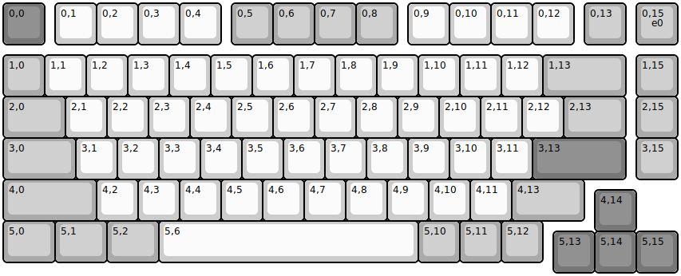{:loading="lazy"}

[Open in keyboard-layout-editor](http://www.keyboard-layout-editor.com/##@@_c=#777777;&=0,0%0AESC&_x:0.25&c=#cccccc;&=0,1&=0,2&=0,3&=0,4&_x:0.25&c=#aaaaaa;&=0,5&=0,6&=0,7&=0,8&_x:0.25&c=#cccccc;&=0,9&=0,10&=0,11&=0,12&_x:0.25&c=#aaaaaa;&=0,13&_x:0.25;&=0,15%0A%0A%0A%0A%0A%0A%0A%0A%0Ae0;&@_y:0.25;&=1,0&_c=#cccccc;&=1,1&=1,2&=1,3&=1,4&=1,5&=1,6&=1,7&=1,8&=1,9&=1,10&=1,11&=1,12&_c=#aaaaaa&w:2;&=1,13&_x:0.25;&=1,15;&@_w:1.5;&=2,0&_c=#cccccc;&=2,1&=2,2&=2,3&=2,4&=2,5&=2,6&=2,7&=2,8&=2,9&=2,10&=2,11&=2,12&_c=#aaaaaa&w:1.5;&=2,13&_x:0.25;&=2,15;&@_w:1.75;&=3,0&_c=#cccccc;&=3,1&=3,2&=3,3&=3,4&=3,5&=3,6&=3,7&=3,8&=3,9&=3,10&=3,11&_c=#777777&w:2.25;&=3,13&_x:0.25&c=#aaaaaa;&=3,15;&@_w:2.25;&=4,0&_c=#cccccc;&=4,2&=4,3&=4,4&=4,5&=4,6&=4,7&=4,8&=4,9&=4,10&=4,11&_c=#aaaaaa&w:1.75;&=4,13;&@_x:14.25&y:-0.75&c=#777777;&=4,14;&@_y:-0.25&c=#aaaaaa&w:1.25;&=5,0&_w:1.25;&=5,1&_w:1.25;&=5,2&_c=#cccccc&w:6.25;&=5,6&_c=#aaaaaa;&=5,10&=5,11&=5,12;&@_x:13.25&y:-0.75&c=#777777;&=5,13&=5,14&=5,15)

## keychron/q1_pro/iso_rgb_knob

[README](output/keychron/q1_pro/README.md) - [layout](output/keychron/q1_pro/iso_rgb_knob-kle.json) - [PCB](output/keychron/q1_pro/iso_rgb_knob.kicad_pcb) - [PCB render](output/keychron/q1_pro/iso_rgb_knob-render.svg)

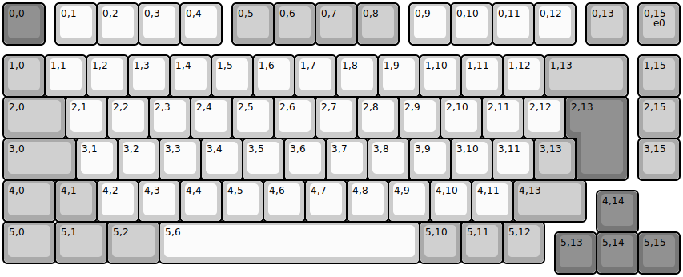{:loading="lazy"}

[Open in keyboard-layout-editor](http://www.keyboard-layout-editor.com/##@@_c=#777777;&=0,0%0AESC&_x:0.25&c=#cccccc;&=0,1&=0,2&=0,3&=0,4&_x:0.25&c=#aaaaaa;&=0,5&=0,6&=0,7&=0,8&_x:0.25&c=#cccccc;&=0,9&=0,10&=0,11&=0,12&_x:0.25&c=#aaaaaa;&=0,13&_x:0.25;&=0,15%0A%0A%0A%0A%0A%0A%0A%0A%0Ae0;&@_y:0.25;&=1,0&_c=#cccccc;&=1,1&=1,2&=1,3&=1,4&=1,5&=1,6&=1,7&=1,8&=1,9&=1,10&=1,11&=1,12&_c=#aaaaaa&w:2;&=1,13&_x:0.25;&=1,15;&@_w:1.5;&=2,0&_c=#cccccc;&=2,1&=2,2&=2,3&=2,4&=2,5&=2,6&=2,7&=2,8&=2,9&=2,10&=2,11&=2,12&_x:0.25&c=#777777&w:1.25&h:2&w2:1.5&h2:1&x2:-0.25;&=2,13&_x:0.25&c=#aaaaaa;&=2,15;&@_w:1.75;&=3,0&_c=#cccccc;&=3,1&=3,2&=3,3&=3,4&=3,5&=3,6&=3,7&=3,8&=3,9&=3,10&=3,11&_c=#aaaaaa;&=3,13&_x:1.5;&=3,15;&@_w:1.25;&=4,0&=4,1&_c=#cccccc;&=4,2&=4,3&=4,4&=4,5&=4,6&=4,7&=4,8&=4,9&=4,10&=4,11&_c=#aaaaaa&w:1.75;&=4,13;&@_x:14.25&y:-0.75&c=#777777;&=4,14;&@_y:-0.25&c=#aaaaaa&w:1.25;&=5,0&_w:1.25;&=5,1&_w:1.25;&=5,2&_c=#cccccc&w:6.25;&=5,6&_c=#aaaaaa;&=5,10&=5,11&=5,12;&@_x:13.25&y:-0.75&c=#777777;&=5,13&=5,14&=5,15)

## keychron/q2/ansi

[README](output/keychron/q2/README.md) - [layout](output/keychron/q2/ansi-kle.json) - [PCB](output/keychron/q2/ansi.kicad_pcb) - [PCB render](output/keychron/q2/ansi-render.svg)

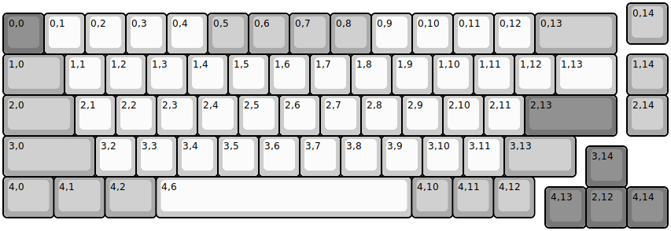{:loading="lazy"}

[Open in keyboard-layout-editor](http://www.keyboard-layout-editor.com/##@@_x:15.25&c=#aaaaaa;&=0,14;&@_y:-0.75&c=#777777;&=0,0%0AESC&_c=#cccccc;&=0,1&=0,2&=0,3&=0,4&_c=#aaaaaa;&=0,5&=0,6&=0,7&=0,8&_c=#cccccc;&=0,9&=0,10&=0,11&=0,12&_c=#aaaaaa&w:2;&=0,13;&@_w:1.5;&=1,0&_c=#cccccc;&=1,1&=1,2&=1,3&=1,4&=1,5&=1,6&=1,7&=1,8&=1,9&=1,10&=1,11&=1,12&_w:1.5;&=1,13&_x:0.25&c=#aaaaaa;&=1,14;&@_w:1.75;&=2,0&_c=#cccccc;&=2,1&=2,2&=2,3&=2,4&=2,5&=2,6&=2,7&=2,8&=2,9&=2,10&=2,11&_c=#777777&w:2.25;&=2,13&_x:0.25&c=#aaaaaa;&=2,14;&@_w:2.25;&=3,0&_c=#cccccc;&=3,2&=3,3&=3,4&=3,5&=3,6&=3,7&=3,8&=3,9&=3,10&=3,11&_c=#aaaaaa&w:1.75;&=3,13;&@_x:14.25&y:-0.75&c=#777777;&=3,14;&@_y:-0.25&c=#aaaaaa&w:1.24;&=4,0&_w:1.25;&=4,1&_w:1.25;&=4,2&_c=#cccccc&w:6.25;&=4,6&_c=#aaaaaa;&=4,10&=4,11&=4,12;&@_x:13.25&y:-0.75&c=#777777;&=4,13&=2,12&=4,14)

## keychron/q2/ansi_encoder

[README](output/keychron/q2/README.md) - [layout](output/keychron/q2/ansi_encoder-kle.json) - [PCB](output/keychron/q2/ansi_encoder.kicad_pcb) - [PCB render](output/keychron/q2/ansi_encoder-render.svg)

{:loading="lazy"}

[Open in keyboard-layout-editor](http://www.keyboard-layout-editor.com/##@@_x:15.25&c=#aaaaaa;&=0,14%0A%0A%0A%0A%0A%0A%0A%0A%0Ae0;&@_y:-0.75&c=#777777;&=0,0%0AESC&_c=#cccccc;&=0,1&=0,2&=0,3&=0,4&_c=#aaaaaa;&=0,5&=0,6&=0,7&=0,8&_c=#cccccc;&=0,9&=0,10&=0,11&=0,12&_c=#aaaaaa&w:2;&=0,13;&@_w:1.5;&=1,0&_c=#cccccc;&=1,1&=1,2&=1,3&=1,4&=1,5&=1,6&=1,7&=1,8&=1,9&=1,10&=1,11&=1,12&_w:1.5;&=1,13&_x:0.25&c=#aaaaaa;&=1,14;&@_w:1.75;&=2,0&_c=#cccccc;&=2,1&=2,2&=2,3&=2,4&=2,5&=2,6&=2,7&=2,8&=2,9&=2,10&=2,11&_c=#777777&w:2.25;&=2,13&_x:0.25&c=#aaaaaa;&=2,14;&@_w:2.25;&=3,0&_c=#cccccc;&=3,2&=3,3&=3,4&=3,5&=3,6&=3,7&=3,8&=3,9&=3,10&=3,11&_c=#aaaaaa&w:1.75;&=3,13;&@_x:14.25&y:-0.75&c=#777777;&=3,14;&@_y:-0.25&c=#aaaaaa&w:1.24;&=4,0&_w:1.25;&=4,1&_w:1.25;&=4,2&_c=#cccccc&w:6.25;&=4,6&_c=#aaaaaa;&=4,10&=4,11&=4,12;&@_x:13.25&y:-0.75&c=#777777;&=4,13&=2,12&=4,14)

## keychron/q2/iso

[README](output/keychron/q2/README.md) - [layout](output/keychron/q2/iso-kle.json) - [PCB](output/keychron/q2/iso.kicad_pcb) - [PCB render](output/keychron/q2/iso-render.svg)

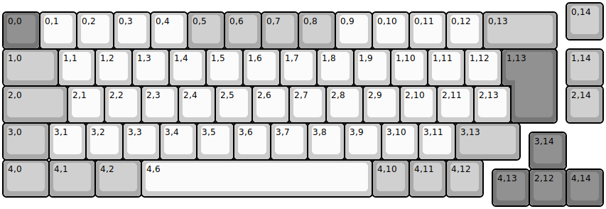{:loading="lazy"}

[Open in keyboard-layout-editor](http://www.keyboard-layout-editor.com/##@@_x:15.25&c=#aaaaaa;&=0,14;&@_y:-0.75&c=#777777;&=0,0%0AESC&_c=#cccccc;&=0,1&=0,2&=0,3&=0,4&_c=#aaaaaa;&=0,5&=0,6&=0,7&=0,8&_c=#cccccc;&=0,9&=0,10&=0,11&=0,12&_c=#aaaaaa&w:2;&=0,13;&@_w:1.5;&=1,0&_c=#cccccc;&=1,1&=1,2&=1,3&=1,4&=1,5&=1,6&=1,7&=1,8&=1,9&=1,10&=1,11&=1,12&_x:0.25&c=#777777&w:1.25&h:2&w2:1.5&h2:1&x2:-0.25;&=1,13&_x:0.25&c=#aaaaaa;&=1,14;&@_w:1.75;&=2,0&_c=#cccccc;&=2,1&=2,2&=2,3&=2,4&=2,5&=2,6&=2,7&=2,8&=2,9&=2,10&=2,11&=2,13&_x:1.5&c=#aaaaaa;&=2,14;&@_w:1.25;&=3,0&_c=#cccccc;&=3,1&=3,2&=3,3&=3,4&=3,5&=3,6&=3,7&=3,8&=3,9&=3,10&=3,11&_c=#aaaaaa&w:1.75;&=3,13;&@_x:14.25&y:-0.75&c=#777777;&=3,14;&@_y:-0.25&c=#aaaaaa&w:1.25;&=4,0&_w:1.25;&=4,1&_w:1.25;&=4,2&_c=#cccccc&w:6.25;&=4,6&_c=#aaaaaa;&=4,10&=4,11&=4,12;&@_x:13.25&y:-0.75&c=#777777;&=4,13&=2,12&=4,14)

## keychron/q2/iso_encoder

[README](output/keychron/q2/README.md) - [layout](output/keychron/q2/iso_encoder-kle.json) - [PCB](output/keychron/q2/iso_encoder.kicad_pcb) - [PCB render](output/keychron/q2/iso_encoder-render.svg)

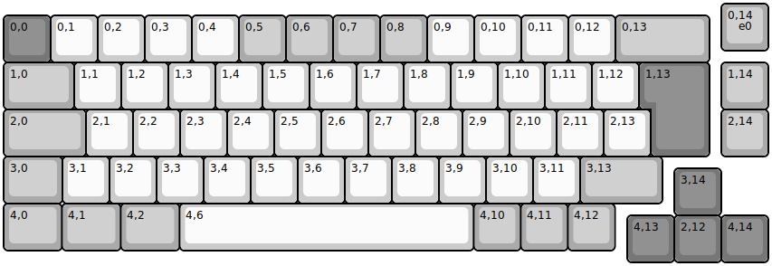{:loading="lazy"}

[Open in keyboard-layout-editor](http://www.keyboard-layout-editor.com/##@@_x:15.25&c=#aaaaaa;&=0,14%0A%0A%0A%0A%0A%0A%0A%0A%0Ae0;&@_y:-0.75&c=#777777;&=0,0%0AESC&_c=#cccccc;&=0,1&=0,2&=0,3&=0,4&_c=#aaaaaa;&=0,5&=0,6&=0,7&=0,8&_c=#cccccc;&=0,9&=0,10&=0,11&=0,12&_c=#aaaaaa&w:2;&=0,13;&@_w:1.5;&=1,0&_c=#cccccc;&=1,1&=1,2&=1,3&=1,4&=1,5&=1,6&=1,7&=1,8&=1,9&=1,10&=1,11&=1,12&_x:0.25&c=#777777&w:1.25&h:2&w2:1.5&h2:1&x2:-0.25;&=1,13&_x:0.25&c=#aaaaaa;&=1,14;&@_w:1.75;&=2,0&_c=#cccccc;&=2,1&=2,2&=2,3&=2,4&=2,5&=2,6&=2,7&=2,8&=2,9&=2,10&=2,11&=2,13&_x:1.5&c=#aaaaaa;&=2,14;&@_w:1.25;&=3,0&_c=#cccccc;&=3,1&=3,2&=3,3&=3,4&=3,5&=3,6&=3,7&=3,8&=3,9&=3,10&=3,11&_c=#aaaaaa&w:1.75;&=3,13;&@_x:14.25&y:-0.75&c=#777777;&=3,14;&@_y:-0.25&c=#aaaaaa&w:1.24;&=4,0&_w:1.25;&=4,1&_w:1.25;&=4,2&_c=#cccccc&w:6.25;&=4,6&_c=#aaaaaa;&=4,10&=4,11&=4,12;&@_x:13.25&y:-0.75&c=#777777;&=4,13&=2,12&=4,14)

## keychron/q2/jis

[README](output/keychron/q2/README.md) - [layout](output/keychron/q2/jis-kle.json) - [PCB](output/keychron/q2/jis.kicad_pcb) - [PCB render](output/keychron/q2/jis-render.svg)

{:loading="lazy"}

[Open in keyboard-layout-editor](http://www.keyboard-layout-editor.com/##@@_x:15.25&c=#aaaaaa;&=0,14;&@_y:-0.75&c=#777777;&=0,0%0AESC&_c=#cccccc;&=0,1&=0,2&=0,3&=0,4&_c=#aaaaaa;&=0,5&=0,6&=0,7&=0,8&_c=#cccccc;&=0,9&=0,10&=0,11&=0,12&=0,13&_c=#aaaaaa;&=3,1;&@_w:1.5;&=1,0&_c=#cccccc;&=1,1&=1,2&=1,3&=1,4&=1,5&=1,6&=1,7&=1,8&=1,9&=1,10&=1,11&=1,12&_x:0.25&c=#777777&w:1.25&h:2&w2:1.5&h2:1&x2:-0.25;&=1,13&_x:0.25&c=#aaaaaa;&=1,14;&@_w:1.75;&=2,0&_c=#cccccc;&=2,1&=2,2&=2,3&=2,4&=2,5&=2,6&=2,7&=2,8&=2,9&=2,10&=2,11&=2,13&_x:1.5&c=#aaaaaa;&=2,14;&@_w:2.25;&=3,0&_c=#cccccc;&=3,2&=3,3&=3,4&=3,5&=3,6&=3,7&=3,8&=3,9&=3,10&=3,11&=3,12&_c=#aaaaaa;&=3,13&_c=#777777;&=3,14;&@_c=#aaaaaa&w:1.25;&=4,0&=4,1&_w:1.25;&=4,2&=4,3&_c=#cccccc&w:4.5;&=4,6&_c=#aaaaaa&w:1.25;&=4,9&=4,10&=4,11&=4,12&_c=#777777;&=4,13&=2,12&=4,14)

## keychron/q2/jis_encoder

[README](output/keychron/q2/README.md) - [layout](output/keychron/q2/jis_encoder-kle.json) - [PCB](output/keychron/q2/jis_encoder.kicad_pcb) - [PCB render](output/keychron/q2/jis_encoder-render.svg)

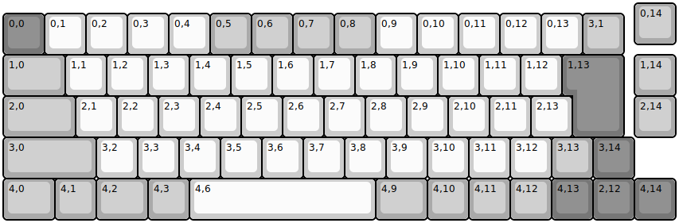{:loading="lazy"}

[Open in keyboard-layout-editor](http://www.keyboard-layout-editor.com/##@@_x:15.25&c=#aaaaaa;&=0,14%0A%0A%0A%0A%0A%0A%0A%0A%0Ae0;&@_y:-0.75&c=#777777;&=0,0%0AESC&_c=#cccccc;&=0,1&=0,2&=0,3&=0,4&_c=#aaaaaa;&=0,5&=0,6&=0,7&=0,8&_c=#cccccc;&=0,9&=0,10&=0,11&=0,12&=0,13&_c=#aaaaaa;&=3,1;&@_w:1.5;&=1,0&_c=#cccccc;&=1,1&=1,2&=1,3&=1,4&=1,5&=1,6&=1,7&=1,8&=1,9&=1,10&=1,11&=1,12&_x:0.25&c=#777777&w:1.25&h:2&w2:1.5&h2:1&x2:-0.25;&=1,13&_x:0.25&c=#aaaaaa;&=1,14;&@_w:1.75;&=2,0&_c=#cccccc;&=2,1&=2,2&=2,3&=2,4&=2,5&=2,6&=2,7&=2,8&=2,9&=2,10&=2,11&=2,13&_x:1.5&c=#aaaaaa;&=2,14;&@_w:2.25;&=3,0&_c=#cccccc;&=3,2&=3,3&=3,4&=3,5&=3,6&=3,7&=3,8&=3,9&=3,10&=3,11&=3,12&_c=#aaaaaa;&=3,13&_c=#777777;&=3,14;&@_c=#aaaaaa&w:1.25;&=4,0&=4,1&_w:1.25;&=4,2&=4,3&_c=#cccccc&w:4.5;&=4,6&_c=#aaaaaa&w:1.25;&=4,9&=4,10&=4,11&=4,12&_c=#777777;&=4,13&=2,12&=4,14)

## keychron/q3/ansi

[README](output/keychron/q3/README.md) - [layout](output/keychron/q3/ansi-kle.json) - [PCB](output/keychron/q3/ansi.kicad_pcb) - [PCB render](output/keychron/q3/ansi-render.svg)

{:loading="lazy"}

[Open in keyboard-layout-editor](http://www.keyboard-layout-editor.com/##@@_c=#777777;&=0,0%0AESC&_x:1&c=#cccccc;&=0,1&=0,2&=0,3&=0,4&_x:0.5&c=#aaaaaa;&=0,5&=0,6&=0,7&=0,8&_x:0.5&c=#cccccc;&=0,9&=0,10&=0,11&=0,12&_x:0.25&c=#aaaaaa;&=0,14&=0,15&=3,14;&@_y:0.25&c=#cccccc;&=1,0&=1,1&=1,2&=1,3&=1,4&=1,5&=1,6&=1,7&=1,8&=1,9&=1,10&=1,11&=1,12&_c=#aaaaaa&w:2;&=1,13&_x:0.25;&=1,14&=1,15&=3,15;&@_w:1.5;&=2,0&_c=#cccccc;&=2,1&=2,2&=2,3&=2,4&=2,5&=2,6&=2,7&=2,8&=2,9&=2,10&=2,11&=2,12&_w:1.5;&=2,13&_x:0.25&c=#aaaaaa;&=2,14&=2,15&=3,12;&@_w:1.75;&=3,0&_c=#cccccc;&=3,1&=3,2&=3,3&=3,4&=3,5&=3,6&=3,7&=3,8&=3,9&=3,10&=3,11&_c=#777777&w:2.25;&=3,13;&@_c=#aaaaaa&w:2.25;&=4,0&_c=#cccccc;&=4,2&=4,3&=4,4&=4,5&=4,6&=4,7&=4,8&=4,9&=4,10&=4,11&_c=#aaaaaa&w:2.75;&=4,13&_x:1.25&c=#777777;&=4,15;&@_c=#aaaaaa&w:1.25;&=5,0&_w:1.25;&=5,1&_w:1.25;&=5,2&_c=#cccccc&w:6.25;&=5,6&_c=#aaaaaa&w:1.25;&=5,10&_w:1.25;&=5,11&_w:1.25;&=5,12&_w:1.25;&=5,13&_x:0.25&c=#777777;&=5,14&=5,15&=4,14)

## keychron/q3/ansi_encoder

[README](output/keychron/q3/README.md) - [layout](output/keychron/q3/ansi_encoder-kle.json) - [PCB](output/keychron/q3/ansi_encoder.kicad_pcb) - [PCB render](output/keychron/q3/ansi_encoder-render.svg)

{:loading="lazy"}

[Open in keyboard-layout-editor](http://www.keyboard-layout-editor.com/##@@_c=#777777;&=0,0%0AESC&_x:0.25&c=#cccccc;&=0,1&=0,2&=0,3&=0,4&_x:0.25&c=#aaaaaa;&=0,5&=0,6&=0,7&=0,8&_x:0.25&c=#cccccc;&=0,9&=0,10&=0,11&=0,12&_x:0.25;&=0,13%0A%0A%0A%0A%0A%0A%0A%0A%0Ae0&_x:0.25&c=#aaaaaa;&=0,14&=0,15&=3,14;&@_y:0.25&c=#cccccc;&=1,0&=1,1&=1,2&=1,3&=1,4&=1,5&=1,6&=1,7&=1,8&=1,9&=1,10&=1,11&=1,12&_c=#aaaaaa&w:2;&=1,13&_x:0.25;&=1,14&=1,15&=3,15;&@_w:1.5;&=2,0&_c=#cccccc;&=2,1&=2,2&=2,3&=2,4&=2,5&=2,6&=2,7&=2,8&=2,9&=2,10&=2,11&=2,12&_w:1.5;&=2,13&_x:0.25&c=#aaaaaa;&=2,14&=2,15&=3,12;&@_w:1.75;&=3,0&_c=#cccccc;&=3,1&=3,2&=3,3&=3,4&=3,5&=3,6&=3,7&=3,8&=3,9&=3,10&=3,11&_c=#777777&w:2.25;&=3,13;&@_c=#aaaaaa&w:2.25;&=4,0&_c=#cccccc;&=4,2&=4,3&=4,4&=4,5&=4,6&=4,7&=4,8&=4,9&=4,10&=4,11&_c=#aaaaaa&w:2.75;&=4,13&_x:1.25&c=#777777;&=4,15;&@_c=#aaaaaa&w:1.25;&=5,0&_w:1.25;&=5,1&_w:1.25;&=5,2&_c=#cccccc&w:6.25;&=5,6&_c=#aaaaaa&w:1.25;&=5,10&_w:1.25;&=5,11&_w:1.25;&=5,12&_w:1.25;&=5,13&_x:0.25&c=#777777;&=5,14&=5,15&=4,14)

## keychron/q3/iso

[README](output/keychron/q3/README.md) - [layout](output/keychron/q3/iso-kle.json) - [PCB](output/keychron/q3/iso.kicad_pcb) - [PCB render](output/keychron/q3/iso-render.svg)

{:loading="lazy"}

[Open in keyboard-layout-editor](http://www.keyboard-layout-editor.com/##@@_c=#777777;&=0,0%0AESC&_x:0.25&c=#cccccc;&=0,1&=0,2&=0,3&=0,4&_x:0.25&c=#aaaaaa;&=0,5&=0,6&=0,7&=0,8&_x:0.25&c=#cccccc;&=0,9&=0,10&=0,11&=0,12&_x:0.25;&=0,13&_x:0.25&c=#aaaaaa;&=0,14&=0,15&=3,14;&@_y:0.25&c=#cccccc;&=1,0&=1,1&=1,2&=1,3&=1,4&=1,5&=1,6&=1,7&=1,8&=1,9&=1,10&=1,11&=1,12&_c=#aaaaaa&w:2;&=1,13&_x:0.25;&=1,14&=1,15&=3,15;&@_w:1.5;&=2,0&_c=#cccccc;&=2,1&=2,2&=2,3&=2,4&=2,5&=2,6&=2,7&=2,8&=2,9&=2,10&=2,11&=2,12&_x:0.25&c=#777777&w:1.25&h:2&w2:1.5&h2:1&x2:-0.25;&=2,13&_x:0.25&c=#aaaaaa;&=2,14&=2,15&=3,12;&@_w:1.75;&=3,0&_c=#cccccc;&=3,1&=3,2&=3,3&=3,4&=3,5&=3,6&=3,7&=3,8&=3,9&=3,10&=3,11&=3,13;&@_c=#aaaaaa&w:1.25;&=4,0&_c=#cccccc;&=4,1&=4,2&=4,3&=4,4&=4,5&=4,6&=4,7&=4,8&=4,9&=4,10&=4,11&_c=#aaaaaa&w:2.75;&=4,13&_x:1.25&c=#777777;&=4,15;&@_c=#aaaaaa&w:1.25;&=5,0&_w:1.25;&=5,1&_w:1.25;&=5,2&_c=#cccccc&w:6.25;&=5,6&_c=#aaaaaa&w:1.25;&=5,10&_w:1.25;&=5,11&_w:1.25;&=5,12&_w:1.25;&=5,13&_x:0.25&c=#777777;&=5,14&=5,15&=4,14)

## keychron/q3/iso_encoder

[README](output/keychron/q3/README.md) - [layout](output/keychron/q3/iso_encoder-kle.json) - [PCB](output/keychron/q3/iso_encoder.kicad_pcb) - [PCB render](output/keychron/q3/iso_encoder-render.svg)

{:loading="lazy"}

[Open in keyboard-layout-editor](http://www.keyboard-layout-editor.com/##@@_c=#777777;&=0,0%0AESC&_x:0.25&c=#cccccc;&=0,1&=0,2&=0,3&=0,4&_x:0.25&c=#aaaaaa;&=0,5&=0,6&=0,7&=0,8&_x:0.25&c=#cccccc;&=0,9&=0,10&=0,11&=0,12&_x:0.25;&=0,13%0A%0A%0A%0A%0A%0A%0A%0A%0Ae0&_x:0.25&c=#aaaaaa;&=0,14&=0,15&=3,14;&@_y:0.25&c=#cccccc;&=1,0&=1,1&=1,2&=1,3&=1,4&=1,5&=1,6&=1,7&=1,8&=1,9&=1,10&=1,11&=1,12&_c=#aaaaaa&w:2;&=1,13&_x:0.25;&=1,14&=1,15&=3,15;&@_w:1.5;&=2,0&_c=#cccccc;&=2,1&=2,2&=2,3&=2,4&=2,5&=2,6&=2,7&=2,8&=2,9&=2,10&=2,11&=2,12&_x:0.25&c=#777777&w:1.25&h:2&w2:1.5&h2:1&x2:-0.25;&=2,13&_x:0.25&c=#aaaaaa;&=2,14&=2,15&=3,12;&@_w:1.75;&=3,0&_c=#cccccc;&=3,1&=3,2&=3,3&=3,4&=3,5&=3,6&=3,7&=3,8&=3,9&=3,10&=3,11&=3,13;&@_c=#aaaaaa&w:1.25;&=4,0&_c=#cccccc;&=4,1&=4,2&=4,3&=4,4&=4,5&=4,6&=4,7&=4,8&=4,9&=4,10&=4,11&_c=#aaaaaa&w:2.75;&=4,13&_x:1.25&c=#777777;&=4,15;&@_c=#aaaaaa&w:1.25;&=5,0&_w:1.25;&=5,1&_w:1.25;&=5,2&_c=#cccccc&w:6.25;&=5,6&_c=#aaaaaa&w:1.25;&=5,10&_w:1.25;&=5,11&_w:1.25;&=5,12&_w:1.25;&=5,13&_x:0.25&c=#777777;&=5,14&=5,15&=4,14)

## keychron/q3/jis

[README](output/keychron/q3/README.md) - [layout](output/keychron/q3/jis-kle.json) - [PCB](output/keychron/q3/jis.kicad_pcb) - [PCB render](output/keychron/q3/jis-render.svg)

{:loading="lazy"}

[Open in keyboard-layout-editor](http://www.keyboard-layout-editor.com/##@@_c=#777777;&=0,0%0AESC&_x:1&c=#cccccc;&=0,1&=0,2&=0,3&=0,4&_x:0.5&c=#aaaaaa;&=0,5&=0,6&=0,7&=0,8&_x:0.5&c=#cccccc;&=0,9&=0,10&=0,11&=0,12&_x:0.25&c=#aaaaaa;&=0,14&=0,15&=3,14;&@_y:0.25&c=#cccccc;&=1,0&=1,1&=1,2&=1,3&=1,4&=1,5&=1,6&=1,7&=1,8&=1,9&=1,10&=1,11&=1,12&=1,13&_c=#aaaaaa;&=0,13&_x:0.25;&=1,14&=1,15&=3,15;&@_w:1.5;&=2,0&_c=#cccccc;&=2,1&=2,2&=2,3&=2,4&=2,5&=2,6&=2,7&=2,8&=2,9&=2,10&=2,11&=2,12&_x:0.25&c=#777777&w:1.25&h:2&w2:1.5&h2:1&x2:-0.25;&=2,13&_x:0.25&c=#aaaaaa;&=2,14&=2,15&=3,12;&@_w:1.75;&=3,0&_c=#cccccc;&=3,1&=3,2&=3,3&=3,4&=3,5&=3,6&=3,7&=3,8&=3,9&=3,10&=3,11&=3,13;&@_c=#aaaaaa&w:2.25;&=4,0&_c=#cccccc;&=4,2&=4,3&=4,4&=4,5&=4,6&=4,7&=4,8&=4,9&=4,10&=4,11&=4,12&_c=#aaaaaa&w:1.75;&=4,13&_x:1.25&c=#777777;&=4,15;&@_c=#aaaaaa&w:1.25;&=5,0&=5,1&_w:1.25;&=5,2&=5,3&_c=#cccccc&w:4.5;&=5,6&_c=#aaaaaa&w:1.25;&=5,9&_w:1.25;&=5,10&_w:1.25;&=5,11&=5,12&_w:1.25;&=5,13&_x:0.25&c=#777777;&=5,14&=5,15&=4,14)

## keychron/q3/jis_encoder

[README](output/keychron/q3/README.md) - [layout](output/keychron/q3/jis_encoder-kle.json) - [PCB](output/keychron/q3/jis_encoder.kicad_pcb) - [PCB render](output/keychron/q3/jis_encoder-render.svg)

{:loading="lazy"}

[Open in keyboard-layout-editor](http://www.keyboard-layout-editor.com/##@@_c=#777777;&=0,0%0AESC&_x:0.25&c=#cccccc;&=0,1&=0,2&=0,3&=0,4&_x:0.25&c=#aaaaaa;&=0,5&=0,6&=0,7&=0,8&_x:0.25&c=#cccccc;&=0,9&=0,10&=0,11&=0,12&_x:0.25;&=0,13%0A%0A%0A%0A%0A%0A%0A%0A%0Ae0&_x:0.25&c=#aaaaaa;&=0,14&=0,15&=3,14;&@_y:0.25&c=#cccccc;&=1,0&=1,1&=1,2&=1,3&=1,4&=1,5&=1,6&=1,7&=1,8&=1,9&=1,10&=1,11&=1,12&=1,13&_c=#aaaaaa;&=5,5&_x:0.25;&=1,14&=1,15&=3,15;&@_w:1.5;&=2,0&_c=#cccccc;&=2,1&=2,2&=2,3&=2,4&=2,5&=2,6&=2,7&=2,8&=2,9&=2,10&=2,11&=2,12&_x:0.25&c=#777777&w:1.25&h:2&w2:1.5&h2:1&x2:-0.25;&=2,13&_x:0.25&c=#aaaaaa;&=2,14&=2,15&=3,12;&@_w:1.75;&=3,0&_c=#cccccc;&=3,1&=3,2&=3,3&=3,4&=3,5&=3,6&=3,7&=3,8&=3,9&=3,10&=3,11&=3,13;&@_c=#aaaaaa&w:2.25;&=4,0&_c=#cccccc;&=4,2&=4,3&=4,4&=4,5&=4,6&=4,7&=4,8&=4,9&=4,10&=4,11&=4,12&_c=#aaaaaa&w:1.75;&=4,13&_x:1.25&c=#777777;&=4,15;&@_c=#aaaaaa&w:1.25;&=5,0&=5,1&_w:1.25;&=5,2&=5,3&_c=#cccccc&w:4.5;&=5,6&_c=#aaaaaa&w:1.25;&=5,9&_w:1.25;&=5,10&_w:1.25;&=5,11&=5,12&_w:1.25;&=5,13&_x:0.25&c=#777777;&=5,14&=5,15&=4,14)

## keychron/q4/ansi

[README](output/keychron/q4/README.md) - [layout](output/keychron/q4/ansi-kle.json) - [PCB](output/keychron/q4/ansi.kicad_pcb) - [PCB render](output/keychron/q4/ansi-render.svg)

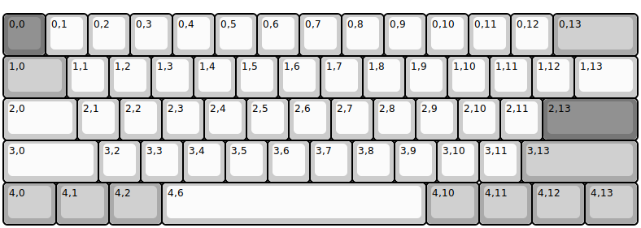{:loading="lazy"}

[Open in keyboard-layout-editor](http://www.keyboard-layout-editor.com/##@@_y:0.25&c=#777777;&=0,0%0AESC&_c=#cccccc;&=0,1&=0,2&=0,3&=0,4&=0,5&=0,6&=0,7&=0,8&=0,9&=0,10&=0,11&=0,12&_c=#aaaaaa&w:2;&=0,13;&@_w:1.5;&=1,0&_c=#cccccc;&=1,1&=1,2&=1,3&=1,4&=1,5&=1,6&=1,7&=1,8&=1,9&=1,10&=1,11&=1,12&_w:1.5;&=1,13;&@_w:1.75;&=2,0&=2,1&=2,2&=2,3&=2,4&=2,5&=2,6&=2,7&=2,8&=2,9&=2,10&=2,11&_c=#777777&w:2.25;&=2,13;&@_c=#cccccc&w:2.25;&=3,0&=3,2&=3,3&=3,4&=3,5&=3,6&=3,7&=3,8&=3,9&=3,10&=3,11&_c=#aaaaaa&w:2.75;&=3,13;&@_w:1.25;&=4,0&_w:1.25;&=4,1&_w:1.25;&=4,2&_c=#cccccc&w:6.25;&=4,6&_c=#aaaaaa&w:1.25;&=4,10&_w:1.25;&=4,11&_w:1.25;&=4,12&_w:1.25;&=4,13)

## keychron/q4/iso

[README](output/keychron/q4/README.md) - [layout](output/keychron/q4/iso-kle.json) - [PCB](output/keychron/q4/iso.kicad_pcb) - [PCB render](output/keychron/q4/iso-render.svg)

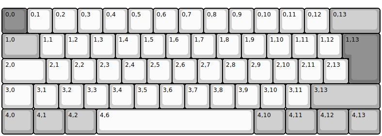{:loading="lazy"}

[Open in keyboard-layout-editor](http://www.keyboard-layout-editor.com/##@@_y:0.25&c=#777777;&=0,0%0AESC&_c=#cccccc;&=0,1&=0,2&=0,3&=0,4&=0,5&=0,6&=0,7&=0,8&=0,9&=0,10&=0,11&=0,12&_c=#aaaaaa&w:2;&=0,13;&@_w:1.5;&=1,0&_c=#cccccc;&=1,1&=1,2&=1,3&=1,4&=1,5&=1,6&=1,7&=1,8&=1,9&=1,10&=1,11&=1,12&_x:0.25&c=#777777&w:1.25&h:2&w2:1.5&h2:1&x2:-0.25;&=1,13;&@_c=#cccccc&w:1.75;&=2,0&=2,1&=2,2&=2,3&=2,4&=2,5&=2,6&=2,7&=2,8&=2,9&=2,10&=2,11&=2,13;&@_w:1.25;&=3,0&=3,1&=3,2&=3,3&=3,4&=3,5&=3,6&=3,7&=3,8&=3,9&=3,10&=3,11&_c=#aaaaaa&w:2.75;&=3,13;&@_w:1.25;&=4,0&_w:1.25;&=4,1&_w:1.25;&=4,2&_c=#cccccc&w:6.25;&=4,6&_c=#aaaaaa&w:1.25;&=4,10&_w:1.25;&=4,11&_w:1.25;&=4,12&_w:1.25;&=4,13)

## keychron/q5/ansi

[README](output/keychron/q5/README.md) - [layout](output/keychron/q5/ansi-kle.json) - [PCB](output/keychron/q5/ansi.kicad_pcb) - [PCB render](output/keychron/q5/ansi-render.svg)

{:loading="lazy"}

[Open in keyboard-layout-editor](http://www.keyboard-layout-editor.com/##@@_c=#777777;&=0,0%0AESC&_c=#cccccc;&=0,1&=0,2&=0,3&=0,4&_c=#aaaaaa;&=0,5&=0,6&=0,7&=0,8&_c=#cccccc;&=0,9&=0,10&=0,11&=0,12&_c=#aaaaaa;&=0,13&=0,14&_x:0.5;&=0,15&=0,16&=0,17&=3,12;&@_y:0.25&c=#cccccc;&=1,0&=1,1&=1,2&=1,3&=1,4&=1,5&=1,6&=1,7&=1,8&=1,9&=1,10&=1,11&=1,12&_c=#aaaaaa&w:2;&=1,13&_x:0.5&c=#cccccc;&=1,15&=1,16&=1,17&=3,14;&@_c=#aaaaaa&w:1.5;&=2,0&_c=#cccccc;&=2,1&=2,2&=2,3&=2,4&=2,5&=2,6&=2,7&=2,8&=2,9&=2,10&=2,11&=2,12&_w:1.5;&=2,13&_x:0.5;&=2,15&=2,16&=2,17&_h:2;&=2,14;&@_c=#aaaaaa&w:1.75;&=3,0&_c=#cccccc;&=3,1&=3,2&=3,3&=3,4&=3,5&=3,6&=3,7&=3,8&=3,9&=3,10&=3,11&_c=#777777&w:2.25;&=3,13&_x:0.5&c=#cccccc;&=3,15&=3,16&=3,17;&@_c=#aaaaaa&w:2.25;&=4,0&_c=#cccccc;&=4,2&=4,3&=4,4&=4,5&=4,6&=4,7&=4,8&=4,9&=4,10&=4,11&_c=#aaaaaa&w:1.75;&=4,13&_x:1.5&c=#cccccc;&=4,15&=4,16&=4,17&_h:2;&=5,5;&@_x:14.25&y:-0.75&c=#777777;&=4,14;&@_y:-0.25&c=#aaaaaa&w:1.25;&=5,0&_w:1.25;&=5,1&_w:1.25;&=5,2&_c=#cccccc&w:6.25;&=5,6&_c=#aaaaaa;&=5,10&=5,11&=5,12&_x:3.5&c=#cccccc;&=5,16&=5,17;&@_x:13.25&y:-0.75&c=#777777;&=5,13&=5,14&=5,15)

## keychron/q5/ansi_encoder

[README](output/keychron/q5/README.md) - [layout](output/keychron/q5/ansi_encoder-kle.json) - [PCB](output/keychron/q5/ansi_encoder.kicad_pcb) - [PCB render](output/keychron/q5/ansi_encoder-render.svg)

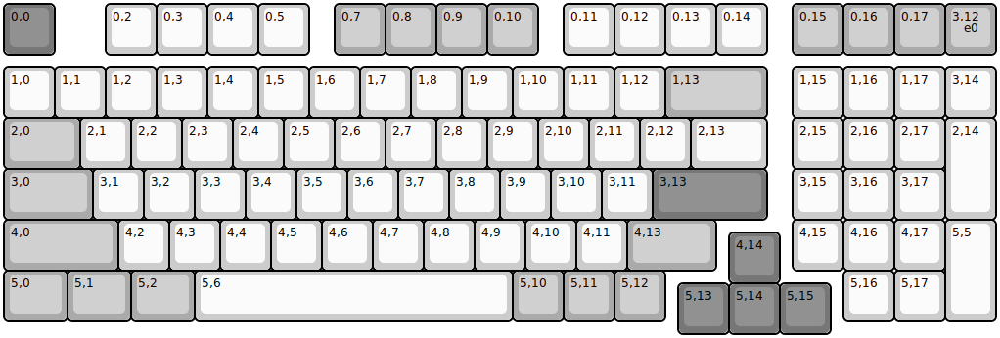{:loading="lazy"}

[Open in keyboard-layout-editor](http://www.keyboard-layout-editor.com/##@@_c=#777777;&=0,0%0AESC&_x:1&c=#cccccc;&=0,2&=0,3&=0,4&=0,5&_x:0.5&c=#aaaaaa;&=0,7&=0,8&=0,9&=0,10&_x:0.5&c=#cccccc;&=0,11&=0,12&=0,13&=0,14&_x:0.5&c=#aaaaaa;&=0,15&=0,16&=0,17&=3,12%0A%0A%0A%0A%0A%0A%0A%0A%0Ae0;&@_y:0.25&c=#cccccc;&=1,0&=1,1&=1,2&=1,3&=1,4&=1,5&=1,6&=1,7&=1,8&=1,9&=1,10&=1,11&=1,12&_c=#aaaaaa&w:2;&=1,13&_x:0.5&c=#cccccc;&=1,15&=1,16&=1,17&=3,14;&@_c=#aaaaaa&w:1.5;&=2,0&_c=#cccccc;&=2,1&=2,2&=2,3&=2,4&=2,5&=2,6&=2,7&=2,8&=2,9&=2,10&=2,11&=2,12&_w:1.5;&=2,13&_x:0.5;&=2,15&=2,16&=2,17&_h:2;&=2,14;&@_c=#aaaaaa&w:1.75;&=3,0&_c=#cccccc;&=3,1&=3,2&=3,3&=3,4&=3,5&=3,6&=3,7&=3,8&=3,9&=3,10&=3,11&_c=#777777&w:2.25;&=3,13&_x:0.5&c=#cccccc;&=3,15&=3,16&=3,17;&@_c=#aaaaaa&w:2.25;&=4,0&_c=#cccccc;&=4,2&=4,3&=4,4&=4,5&=4,6&=4,7&=4,8&=4,9&=4,10&=4,11&_c=#aaaaaa&w:1.75;&=4,13&_x:1.5&c=#cccccc;&=4,15&=4,16&=4,17&_h:2;&=5,5;&@_x:14.25&y:-0.75&c=#777777;&=4,14;&@_y:-0.25&c=#aaaaaa&w:1.25;&=5,0&_w:1.25;&=5,1&_w:1.25;&=5,2&_c=#cccccc&w:6.25;&=5,6&_c=#aaaaaa;&=5,10&=5,11&=5,12&_x:3.5&c=#cccccc;&=5,16&=5,17;&@_x:13.25&y:-0.75&c=#777777;&=5,13&=5,14&=5,15)

## keychron/q5/iso

[README](output/keychron/q5/README.md) - [layout](output/keychron/q5/iso-kle.json) - [PCB](output/keychron/q5/iso.kicad_pcb) - [PCB render](output/keychron/q5/iso-render.svg)

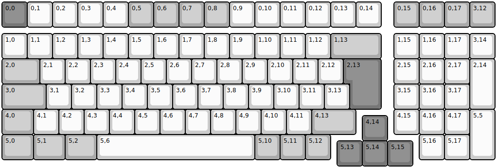{:loading="lazy"}

[Open in keyboard-layout-editor](http://www.keyboard-layout-editor.com/##@@_c=#777777;&=0,0%0AESC&_c=#cccccc;&=0,1&=0,2&=0,3&=0,4&_c=#aaaaaa;&=0,5&=0,6&=0,7&=0,8&_c=#cccccc;&=0,9&=0,10&=0,11&=0,12&=0,13&=0,14&_x:0.5&c=#aaaaaa;&=0,15&=0,16&=0,17&=3,12;&@_y:0.25&c=#cccccc;&=1,0&=1,1&=1,2&=1,3&=1,4&=1,5&=1,6&=1,7&=1,8&=1,9&=1,10&=1,11&=1,12&_c=#aaaaaa&w:2;&=1,13&_x:0.5&c=#cccccc;&=1,15&=1,16&=1,17&=3,14;&@_c=#aaaaaa&w:1.5;&=2,0&_c=#cccccc;&=2,1&=2,2&=2,3&=2,4&=2,5&=2,6&=2,7&=2,8&=2,9&=2,10&=2,11&=2,12&_x:0.25&c=#777777&w:1.25&h:2&w2:1.5&h2:1&x2:-0.25;&=2,13&_x:0.5&c=#cccccc;&=2,15&=2,16&=2,17&_h:2;&=2,14;&@_c=#aaaaaa&w:1.75;&=3,0&_c=#cccccc;&=3,1&=3,2&=3,3&=3,4&=3,5&=3,6&=3,7&=3,8&=3,9&=3,10&=3,11&=3,13&_x:1.75;&=3,15&=3,16&=3,17;&@_c=#aaaaaa&w:1.25;&=4,0&_c=#cccccc;&=4,1&=4,2&=4,3&=4,4&=4,5&=4,6&=4,7&=4,8&=4,9&=4,10&=4,11&_c=#aaaaaa&w:1.75;&=4,13&_x:1.5&c=#cccccc;&=4,15&=4,16&=4,17&_h:2;&=5,5;&@_x:14.25&y:-0.75&c=#777777;&=4,14;&@_y:-0.25&c=#aaaaaa&w:1.25;&=5,0&_w:1.25;&=5,1&_w:1.25;&=5,2&_c=#cccccc&w:6.25;&=5,6&_c=#aaaaaa;&=5,10&=5,11&=5,12&_x:3.5&c=#cccccc;&=5,16&=5,17;&@_x:13.25&y:-0.75&c=#777777;&=5,13&=5,14&=5,15)

## keychron/q5/iso_encoder

[README](output/keychron/q5/README.md) - [layout](output/keychron/q5/iso_encoder-kle.json) - [PCB](output/keychron/q5/iso_encoder.kicad_pcb) - [PCB render](output/keychron/q5/iso_encoder-render.svg)

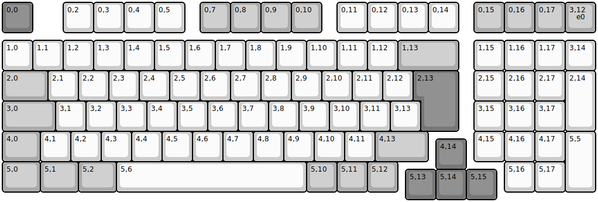{:loading="lazy"}

[Open in keyboard-layout-editor](http://www.keyboard-layout-editor.com/##@@_c=#777777;&=0,0%0AESC&_x:1&c=#cccccc;&=0,2&=0,3&=0,4&=0,5&_x:0.5&c=#aaaaaa;&=0,7&=0,8&=0,9&=0,10&_x:0.5&c=#cccccc;&=0,11&=0,12&=0,13&=0,14&_x:0.5&c=#aaaaaa;&=0,15&=0,16&=0,17&=3,12%0A%0A%0A%0A%0A%0A%0A%0A%0Ae0;&@_y:0.25&c=#cccccc;&=1,0&=1,1&=1,2&=1,3&=1,4&=1,5&=1,6&=1,7&=1,8&=1,9&=1,10&=1,11&=1,12&_c=#aaaaaa&w:2;&=1,13&_x:0.5&c=#cccccc;&=1,15&=1,16&=1,17&=3,14;&@_c=#aaaaaa&w:1.5;&=2,0&_c=#cccccc;&=2,1&=2,2&=2,3&=2,4&=2,5&=2,6&=2,7&=2,8&=2,9&=2,10&=2,11&=2,12&_x:0.25&c=#777777&w:1.25&h:2&w2:1.5&h2:1&x2:-0.25;&=2,13&_x:0.5&c=#cccccc;&=2,15&=2,16&=2,17&_h:2;&=2,14;&@_c=#aaaaaa&w:1.75;&=3,0&_c=#cccccc;&=3,1&=3,2&=3,3&=3,4&=3,5&=3,6&=3,7&=3,8&=3,9&=3,10&=3,11&=3,13&_x:1.75;&=3,15&=3,16&=3,17;&@_c=#aaaaaa&w:1.25;&=4,0&_c=#cccccc;&=4,1&=4,2&=4,3&=4,4&=4,5&=4,6&=4,7&=4,8&=4,9&=4,10&=4,11&_c=#aaaaaa&w:1.75;&=4,13&_x:1.5&c=#cccccc;&=4,15&=4,16&=4,17&_h:2;&=5,5;&@_x:14.25&y:-0.75&c=#777777;&=4,14;&@_y:-0.25&c=#aaaaaa&w:1.25;&=5,0&_w:1.25;&=5,1&_w:1.25;&=5,2&_c=#cccccc&w:6.25;&=5,6&_c=#aaaaaa;&=5,10&=5,11&=5,12&_x:3.5&c=#cccccc;&=5,16&=5,17;&@_x:13.25&y:-0.75&c=#777777;&=5,13&=5,14&=5,15)

## keychron/q6/ansi

[README](output/keychron/q6/README.md) - [layout](output/keychron/q6/ansi-kle.json) - [PCB](output/keychron/q6/ansi.kicad_pcb) - [PCB render](output/keychron/q6/ansi-render.svg)

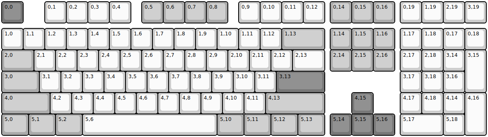{:loading="lazy"}

[Open in keyboard-layout-editor](http://www.keyboard-layout-editor.com/##@@_c=#777777;&=0,0%0AESC&_x:1&c=#cccccc;&=0,1&=0,2&=0,3&=0,4&_x:0.5&c=#aaaaaa;&=0,5&=0,6&=0,7&=0,8&_x:0.5&c=#cccccc;&=0,9&=0,10&=0,11&=0,12&_x:0.25&c=#aaaaaa;&=0,14&=0,15&=0,16&_x:0.25&c=#cccccc;&=0,19&=1,19&=2,19&=3,19;&@_y:0.25;&=1,0&=1,1&=1,2&=1,3&=1,4&=1,5&=1,6&=1,7&=1,8&=1,9&=1,10&=1,11&=1,12&_c=#aaaaaa&w:2;&=1,13&_x:0.25;&=1,14&=1,15&=1,16&_x:0.25&c=#cccccc;&=1,17&=1,18&=0,17&=0,18;&@_c=#aaaaaa&w:1.5;&=2,0&_c=#cccccc;&=2,1&=2,2&=2,3&=2,4&=2,5&=2,6&=2,7&=2,8&=2,9&=2,10&=2,11&=2,12&_w:1.5;&=2,13&_x:0.25&c=#aaaaaa;&=2,14&=2,15&=2,16&_x:0.25&c=#cccccc;&=2,17&=2,18&=3,14&_h:2;&=3,15;&@_c=#aaaaaa&w:1.75;&=3,0&_c=#cccccc;&=3,1&=3,2&=3,3&=3,4&=3,5&=3,6&=3,7&=3,8&=3,9&=3,10&=3,11&_c=#777777&w:2.25;&=3,13&_x:3.5&c=#cccccc;&=3,17&=3,18&=3,16;&@_c=#aaaaaa&w:2.25;&=4,0&_c=#cccccc;&=4,2&=4,3&=4,4&=4,5&=4,6&=4,7&=4,8&=4,9&=4,10&=4,11&_c=#aaaaaa&w:2.75;&=4,13&_x:1.25&c=#777777;&=4,15&_x:1.25&c=#cccccc;&=4,17&=4,18&=4,14&_h:2;&=4,16;&@_c=#aaaaaa&w:1.25;&=5,0&_w:1.25;&=5,1&_w:1.25;&=5,2&_c=#cccccc&w:6.25;&=5,6&_c=#aaaaaa&w:1.25;&=5,10&_w:1.25;&=5,11&_w:1.25;&=5,12&_w:1.25;&=5,13&_x:0.25&c=#777777;&=5,14&=5,15&=5,16&_x:0.25&c=#cccccc&w:2;&=5,17&=5,18)

## keychron/q6/ansi_encoder

[README](output/keychron/q6/README.md) - [layout](output/keychron/q6/ansi_encoder-kle.json) - [PCB](output/keychron/q6/ansi_encoder.kicad_pcb) - [PCB render](output/keychron/q6/ansi_encoder-render.svg)

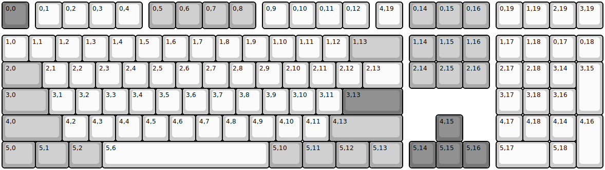{:loading="lazy"}

[Open in keyboard-layout-editor](http://www.keyboard-layout-editor.com/##@@_c=#777777;&=0,0%0AESC&_x:0.25&c=#cccccc;&=0,1&=0,2&=0,3&=0,4&_x:0.25&c=#aaaaaa;&=0,5&=0,6&=0,7&=0,8&_x:0.25&c=#cccccc;&=0,9&=0,10&=0,11&=0,12&_x:0.25;&=4,19%0A%0A%0A%0A%0A%0A%0A%0A%0Ae0&_x:0.25&c=#aaaaaa;&=0,14&=0,15&=0,16&_x:0.25&c=#cccccc;&=0,19&=1,19&=2,19&=3,19;&@_y:0.25;&=1,0&=1,1&=1,2&=1,3&=1,4&=1,5&=1,6&=1,7&=1,8&=1,9&=1,10&=1,11&=1,12&_c=#aaaaaa&w:2;&=1,13&_x:0.25;&=1,14&=1,15&=1,16&_x:0.25&c=#cccccc;&=1,17&=1,18&=0,17&=0,18;&@_c=#aaaaaa&w:1.5;&=2,0&_c=#cccccc;&=2,1&=2,2&=2,3&=2,4&=2,5&=2,6&=2,7&=2,8&=2,9&=2,10&=2,11&=2,12&_w:1.5;&=2,13&_x:0.25&c=#aaaaaa;&=2,14&=2,15&=2,16&_x:0.25&c=#cccccc;&=2,17&=2,18&=3,14&_h:2;&=3,15;&@_c=#aaaaaa&w:1.75;&=3,0&_c=#cccccc;&=3,1&=3,2&=3,3&=3,4&=3,5&=3,6&=3,7&=3,8&=3,9&=3,10&=3,11&_c=#777777&w:2.25;&=3,13&_x:3.5&c=#cccccc;&=3,17&=3,18&=3,16;&@_c=#aaaaaa&w:2.25;&=4,0&_c=#cccccc;&=4,2&=4,3&=4,4&=4,5&=4,6&=4,7&=4,8&=4,9&=4,10&=4,11&_c=#aaaaaa&w:2.75;&=4,13&_x:1.25&c=#777777;&=4,15&_x:1.25&c=#cccccc;&=4,17&=4,18&=4,14&_h:2;&=4,16;&@_c=#aaaaaa&w:1.25;&=5,0&_w:1.25;&=5,1&_w:1.25;&=5,2&_c=#cccccc&w:6.25;&=5,6&_c=#aaaaaa&w:1.25;&=5,10&_w:1.25;&=5,11&_w:1.25;&=5,12&_w:1.25;&=5,13&_x:0.25&c=#777777;&=5,14&=5,15&=5,16&_x:0.25&c=#cccccc&w:2;&=5,17&=5,18)

## keychron/q6/iso

[README](output/keychron/q6/README.md) - [layout](output/keychron/q6/iso-kle.json) - [PCB](output/keychron/q6/iso.kicad_pcb) - [PCB render](output/keychron/q6/iso-render.svg)

{:loading="lazy"}

[Open in keyboard-layout-editor](http://www.keyboard-layout-editor.com/##@@_c=#777777;&=0,0%0AESC&_x:1&c=#cccccc;&=0,1&=0,2&=0,3&=0,4&_x:0.5&c=#aaaaaa;&=0,5&=0,6&=0,7&=0,8&_x:0.5&c=#cccccc;&=0,9&=0,10&=0,11&=0,12&_x:0.25&c=#aaaaaa;&=0,14&=0,15&=0,16&_x:0.25&c=#cccccc;&=0,19&=1,19&=2,19&=3,19;&@_y:0.25;&=1,0&=1,1&=1,2&=1,3&=1,4&=1,5&=1,6&=1,7&=1,8&=1,9&=1,10&=1,11&=1,12&_c=#aaaaaa&w:2;&=1,13&_x:0.25;&=1,14&=1,15&=1,16&_x:0.25&c=#cccccc;&=1,17&=1,18&=0,17&=0,18;&@_c=#aaaaaa&w:1.5;&=2,0&_c=#cccccc;&=2,1&=2,2&=2,3&=2,4&=2,5&=2,6&=2,7&=2,8&=2,9&=2,10&=2,11&=2,12&_x:0.25&c=#777777&w:1.25&h:2&w2:1.5&h2:1&x2:-0.25;&=2,13&_x:0.25&c=#aaaaaa;&=2,14&=2,15&=2,16&_x:0.25&c=#cccccc;&=2,17&=2,18&=3,14&_h:2;&=3,15;&@_c=#aaaaaa&w:1.75;&=3,0&_c=#cccccc;&=3,1&=3,2&=3,3&=3,4&=3,5&=3,6&=3,7&=3,8&=3,9&=3,10&=3,11&=3,13&_x:4.75;&=3,17&=3,18&=3,16;&@_c=#aaaaaa&w:1.25;&=4,0&_c=#cccccc;&=4,1&=4,2&=4,3&=4,4&=4,5&=4,6&=4,7&=4,8&=4,9&=4,10&=4,11&_c=#aaaaaa&w:2.75;&=4,13&_x:1.25&c=#777777;&=4,15&_x:1.25&c=#cccccc;&=4,17&=4,18&=4,14&_h:2;&=4,16;&@_c=#aaaaaa&w:1.25;&=5,0&_w:1.25;&=5,1&_w:1.25;&=5,2&_c=#cccccc&w:6.25;&=5,6&_c=#aaaaaa&w:1.25;&=5,10&_w:1.25;&=5,11&_w:1.25;&=5,12&_w:1.25;&=5,13&_x:0.25&c=#777777;&=5,14&=5,15&=5,16&_x:0.25&c=#cccccc&w:2;&=5,17&=5,18)

## keychron/q6/iso_encoder

[README](output/keychron/q6/README.md) - [layout](output/keychron/q6/iso_encoder-kle.json) - [PCB](output/keychron/q6/iso_encoder.kicad_pcb) - [PCB render](output/keychron/q6/iso_encoder-render.svg)

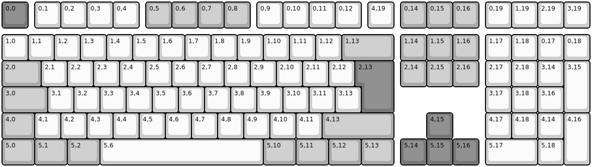{:loading="lazy"}

[Open in keyboard-layout-editor](http://www.keyboard-layout-editor.com/##@@_c=#777777;&=0,0%0AESC&_x:0.25&c=#cccccc;&=0,1&=0,2&=0,3&=0,4&_x:0.25&c=#aaaaaa;&=0,5&=0,6&=0,7&=0,8&_x:0.25&c=#cccccc;&=0,9&=0,10&=0,11&=0,12&_x:0.25;&=4,19%0A%0A%0A%0A%0A%0A%0A%0A%0Ae0&_x:0.25&c=#aaaaaa;&=0,14&=0,15&=0,16&_x:0.25&c=#cccccc;&=0,19&=1,19&=2,19&=3,19;&@_y:0.25;&=1,0&=1,1&=1,2&=1,3&=1,4&=1,5&=1,6&=1,7&=1,8&=1,9&=1,10&=1,11&=1,12&_c=#aaaaaa&w:2;&=1,13&_x:0.25;&=1,14&=1,15&=1,16&_x:0.25&c=#cccccc;&=1,17&=1,18&=0,17&=0,18;&@_c=#aaaaaa&w:1.5;&=2,0&_c=#cccccc;&=2,1&=2,2&=2,3&=2,4&=2,5&=2,6&=2,7&=2,8&=2,9&=2,10&=2,11&=2,12&_x:0.25&c=#777777&w:1.25&h:2&w2:1.5&h2:1&x2:-0.25;&=2,13&_x:0.25&c=#aaaaaa;&=2,14&=2,15&=2,16&_x:0.25&c=#cccccc;&=2,17&=2,18&=3,14&_h:2;&=3,15;&@_c=#aaaaaa&w:1.75;&=3,0&_c=#cccccc;&=3,1&=3,2&=3,3&=3,4&=3,5&=3,6&=3,7&=3,8&=3,9&=3,10&=3,11&=3,13&_x:4.75;&=3,17&=3,18&=3,16;&@_c=#aaaaaa&w:1.25;&=4,0&_c=#cccccc;&=4,1&=4,2&=4,3&=4,4&=4,5&=4,6&=4,7&=4,8&=4,9&=4,10&=4,11&_c=#aaaaaa&w:2.75;&=4,13&_x:1.25&c=#777777;&=4,15&_x:1.25&c=#cccccc;&=4,17&=4,18&=4,14&_h:2;&=4,16;&@_c=#aaaaaa&w:1.25;&=5,0&_w:1.25;&=5,1&_w:1.25;&=5,2&_c=#cccccc&w:6.25;&=5,6&_c=#aaaaaa&w:1.25;&=5,10&_w:1.25;&=5,11&_w:1.25;&=5,12&_w:1.25;&=5,13&_x:0.25&c=#777777;&=5,14&=5,15&=5,16&_x:0.25&c=#cccccc&w:2;&=5,17&=5,18)

## keychron/q60/ansi

[README](output/keychron/q60/README.md) - [layout](output/keychron/q60/ansi-kle.json) - [PCB](output/keychron/q60/ansi.kicad_pcb) - [PCB render](output/keychron/q60/ansi-render.svg)

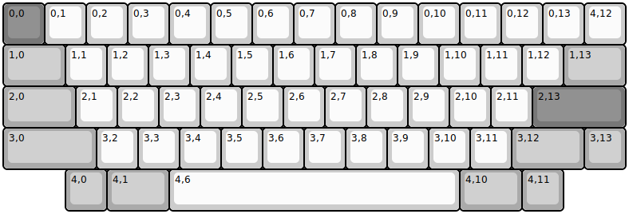{:loading="lazy"}

[Open in keyboard-layout-editor](http://www.keyboard-layout-editor.com/##@@_c=#777777;&=0,0%0AESC&_c=#cccccc;&=0,1&=0,2&=0,3&=0,4&=0,5&=0,6&=0,7&=0,8&=0,9&=0,10&=0,11&=0,12&=0,13&=4,12;&@_c=#aaaaaa&w:1.5;&=1,0&_c=#cccccc;&=1,1&=1,2&=1,3&=1,4&=1,5&=1,6&=1,7&=1,8&=1,9&=1,10&=1,11&=1,12&_c=#aaaaaa&w:1.5;&=1,13;&@_w:1.75;&=2,0&_c=#cccccc;&=2,1&=2,2&=2,3&=2,4&=2,5&=2,6&=2,7&=2,8&=2,9&=2,10&=2,11&_c=#777777&w:2.25;&=2,13;&@_c=#aaaaaa&w:2.25;&=3,0&_c=#cccccc;&=3,2&=3,3&=3,4&=3,5&=3,6&=3,7&=3,8&=3,9&=3,10&=3,11&_c=#aaaaaa&w:1.75;&=3,12&=3,13;&@_x:1.5;&=4,0&_w:1.5;&=4,1&_c=#cccccc&w:7;&=4,6&_c=#aaaaaa&w:1.5;&=4,10&=4,11)

## keychron/q65/ansi_encoder

[README](output/keychron/q65/README.md) - [layout](output/keychron/q65/ansi_encoder-kle.json) - [PCB](output/keychron/q65/ansi_encoder.kicad_pcb) - [PCB render](output/keychron/q65/ansi_encoder-render.svg)

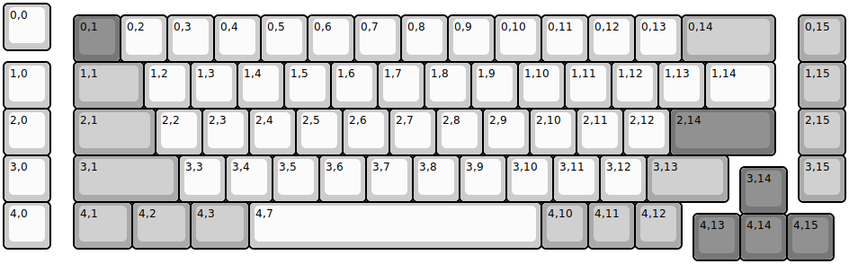{:loading="lazy"}

[Open in keyboard-layout-editor](http://www.keyboard-layout-editor.com/##@@=0,0%0A%0A%0A%0A%0A%0A%0A%0A%0Ae0;&@_x:1.5&y:-0.75&c=#777777;&=0,1%0AESC&_c=#cccccc;&=0,2&=0,3&=0,4&=0,5&=0,6&=0,7&=0,8&=0,9&=0,10&=0,11&=0,12&=0,13&_c=#aaaaaa&w:2;&=0,14&_x:0.5;&=0,15;&@_c=#cccccc;&=1,0&_x:0.5&c=#aaaaaa&w:1.5;&=1,1&_c=#cccccc;&=1,2&=1,3&=1,4&=1,5&=1,6&=1,7&=1,8&=1,9&=1,10&=1,11&=1,12&=1,13&_w:1.5;&=1,14&_x:0.5&c=#aaaaaa;&=1,15;&@_c=#cccccc;&=2,0&_x:0.5&c=#aaaaaa&w:1.75;&=2,1&_c=#cccccc;&=2,2&=2,3&=2,4&=2,5&=2,6&=2,7&=2,8&=2,9&=2,10&=2,11&=2,12&_c=#777777&w:2.25;&=2,14&_x:0.5&c=#aaaaaa;&=2,15;&@_c=#cccccc;&=3,0&_x:0.5&c=#aaaaaa&w:2.25;&=3,1&_c=#cccccc;&=3,3&=3,4&=3,5&=3,6&=3,7&=3,8&=3,9&=3,10&=3,11&=3,12&_c=#aaaaaa&w:1.75;&=3,13&_x:1.5;&=3,15;&@_x:15.75&y:-0.75&c=#777777;&=3,14;&@_y:-0.25&c=#cccccc;&=4,0&_x:0.5&c=#aaaaaa&w:1.25;&=4,1&_w:1.25;&=4,2&_w:1.25;&=4,3&_c=#cccccc&w:6.25;&=4,7&_c=#aaaaaa;&=4,10&=4,11&=4,12;&@_x:14.75&y:-0.75&c=#777777;&=4,13&=4,14&=4,15)

## keychron/q7/ansi

[README](output/keychron/q7/README.md) - [layout](output/keychron/q7/ansi-kle.json) - [PCB](output/keychron/q7/ansi.kicad_pcb) - [PCB render](output/keychron/q7/ansi-render.svg)

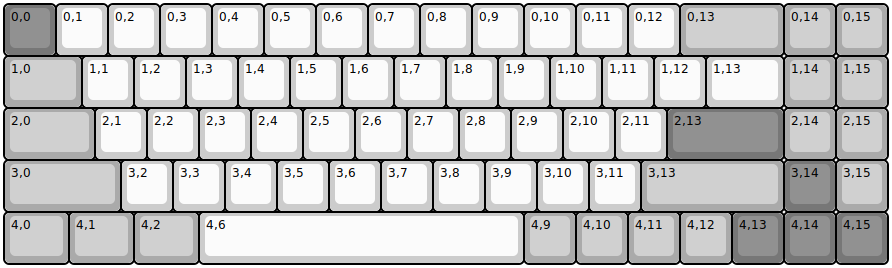{:loading="lazy"}

[Open in keyboard-layout-editor](http://www.keyboard-layout-editor.com/##@@_c=#777777;&=0,0%0AESC&_c=#cccccc;&=0,1&=0,2&=0,3&=0,4&=0,5&=0,6&=0,7&=0,8&=0,9&=0,10&=0,11&=0,12&_c=#aaaaaa&w:2;&=0,13&=0,14&=0,15;&@_w:1.5;&=1,0&_c=#cccccc;&=1,1&=1,2&=1,3&=1,4&=1,5&=1,6&=1,7&=1,8&=1,9&=1,10&=1,11&=1,12&_w:1.5;&=1,13&_c=#aaaaaa;&=1,14&=1,15;&@_w:1.75;&=2,0&_c=#cccccc;&=2,1&=2,2&=2,3&=2,4&=2,5&=2,6&=2,7&=2,8&=2,9&=2,10&=2,11&_c=#777777&w:2.25;&=2,13&_c=#aaaaaa;&=2,14&=2,15;&@_w:2.25;&=3,0&_c=#cccccc;&=3,2&=3,3&=3,4&=3,5&=3,6&=3,7&=3,8&=3,9&=3,10&=3,11&_c=#aaaaaa&w:2.75;&=3,13&_c=#777777;&=3,14&_c=#aaaaaa;&=3,15;&@_w:1.25;&=4,0&_w:1.25;&=4,1&_w:1.25;&=4,2&_c=#cccccc&w:6.25;&=4,6&_c=#aaaaaa;&=4,9&=4,10&=4,11&=4,12&_c=#777777;&=4,13&=4,14&=4,15)

## keychron/q7/iso

[README](output/keychron/q7/README.md) - [layout](output/keychron/q7/iso-kle.json) - [PCB](output/keychron/q7/iso.kicad_pcb) - [PCB render](output/keychron/q7/iso-render.svg)

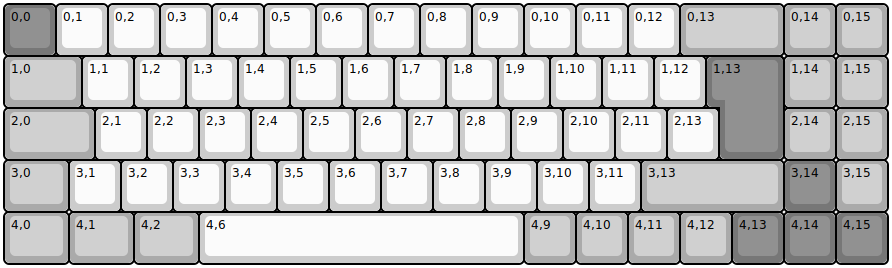{:loading="lazy"}

[Open in keyboard-layout-editor](http://www.keyboard-layout-editor.com/##@@_c=#777777;&=0,0%0AESC&_c=#cccccc;&=0,1&=0,2&=0,3&=0,4&=0,5&=0,6&=0,7&=0,8&=0,9&=0,10&=0,11&=0,12&_c=#aaaaaa&w:2;&=0,13&=0,14&=0,15;&@_w:1.5;&=1,0&_c=#cccccc;&=1,1&=1,2&=1,3&=1,4&=1,5&=1,6&=1,7&=1,8&=1,9&=1,10&=1,11&=1,12&_x:0.25&c=#777777&w:1.25&h:2&w2:1.5&h2:1&x2:-0.25;&=1,13&_c=#aaaaaa;&=1,14&=1,15;&@_w:1.75;&=2,0&_c=#cccccc;&=2,1&=2,2&=2,3&=2,4&=2,5&=2,6&=2,7&=2,8&=2,9&=2,10&=2,11&=2,13&_x:1.25&c=#aaaaaa;&=2,14&=2,15;&@_w:1.25;&=3,0&_c=#cccccc;&=3,1&=3,2&=3,3&=3,4&=3,5&=3,6&=3,7&=3,8&=3,9&=3,10&=3,11&_c=#aaaaaa&w:2.75;&=3,13&_c=#777777;&=3,14&_c=#aaaaaa;&=3,15;&@_w:1.25;&=4,0&_w:1.25;&=4,1&_w:1.25;&=4,2&_c=#cccccc&w:6.25;&=4,6&_c=#aaaaaa;&=4,9&=4,10&=4,11&=4,12&_c=#777777;&=4,13&=4,14&=4,15)

## keychron/q8/ansi

[README](output/keychron/q8/README.md) - [layout](output/keychron/q8/ansi-kle.json) - [PCB](output/keychron/q8/ansi.kicad_pcb) - [PCB render](output/keychron/q8/ansi-render.svg)

{:loading="lazy"}

[Open in keyboard-layout-editor](http://www.keyboard-layout-editor.com/##@@_x:2.75;&=0,2&_x:8.85;&=0,11&_x:3.5&c=#aaaaaa;&=0,14;&@_x:0.75&y:-0.85&c=#777777;&=0,0%0AESC&_c=#cccccc;&=0,1;&@_x:13.6&y:-0.85;&=0,12&_c=#aaaaaa&w:2;&=0,13;&@_x:0.5&w:1.5;&=1,0&_c=#cccccc;&=1,1&_x:10.3;&=1,11&=1,12&_w:1.5;&=1,13;&@_x:17.3&y:-0.9&c=#aaaaaa;&=1,14;&@_x:0.25&y:-0.1&w:1.75;&=2,0&_c=#cccccc;&=2,1&_x:9.75;&=2,11&=2,12&_c=#777777&w:2.25;&=2,13;&@_x:17.5&y:-0.9&c=#aaaaaa;&=2,14;&@_y:-0.1&w:2.25;&=3,0&_c=#cccccc;&=3,2&_x:10.15;&=3,12&_c=#aaaaaa&w:1.75;&=3,13;&@_x:16.4&y:-0.75&c=#777777;&=3,14;&@_y:-0.25&c=#aaaaaa&w:1.25;&=4,0&_w:1.25;&=4,1;&@_x:15.4&y:-0.75&c=#777777;&=4,12&=4,13&=4,14;&@_r:6&x:3.85&y:-5.7&c=#cccccc;&=0,3&=0,4&_c=#aaaaaa;&=0,5&=0,6;&@_x:3.35&c=#cccccc;&=1,2&=1,3&=1,4&=1,5;&@_x:3.55;&=2,2&=2,3&=2,4&=2,5;&@_x:3.9;&=3,3&=3,4&=3,5&=3,6;&@_x:4&c=#aaaaaa&w:1.25;&=4,2&_c=#cccccc&w:2.25;&=4,3&_c=#aaaaaa;&=4,6;&@_r:-6&x:8.35&y:-3.2;&=0,7&=0,8&_c=#cccccc;&=0,9&=0,10;&@_x:7.9;&=1,6&=1,7&=1,8&=1,9&=1,10;&@_x:8.25;&=2,7&=2,8&=2,9&=2,10;&@_x:7.8;&=3,7&=3,8&=3,9&=3,10&=3,11;&@_x:7.8&c=#aaaaaa;&=4,7&_c=#cccccc&w:2.75;&=4,8&_c=#aaaaaa;&=4,9)

## keychron/q8/ansi_encoder

[README](output/keychron/q8/README.md) - [layout](output/keychron/q8/ansi_encoder-kle.json) - [PCB](output/keychron/q8/ansi_encoder.kicad_pcb) - [PCB render](output/keychron/q8/ansi_encoder-render.svg)

{:loading="lazy"}

[Open in keyboard-layout-editor](http://www.keyboard-layout-editor.com/##@@_x:2.75;&=0,2&_x:8.85;&=0,11&_x:3.5&c=#aaaaaa;&=0,14%0A%0A%0A%0A%0A%0A%0A%0A%0Ae0;&@_x:0.75&y:-0.85&c=#777777;&=0,0%0AESC&_c=#cccccc;&=0,1;&@_x:13.6&y:-0.85;&=0,12&_c=#aaaaaa&w:2;&=0,13;&@_x:0.5&w:1.5;&=1,0&_c=#cccccc;&=1,1&_x:10.3;&=1,11&=1,12&_w:1.5;&=1,13;&@_x:17.3&y:-0.9&c=#aaaaaa;&=1,14;&@_x:0.25&y:-0.1&w:1.75;&=2,0&_c=#cccccc;&=2,1&_x:9.75;&=2,11&=2,12&_c=#777777&w:2.25;&=2,13;&@_x:17.5&y:-0.9&c=#aaaaaa;&=2,14;&@_y:-0.1&w:2.25;&=3,0&_c=#cccccc;&=3,2&_x:10.15;&=3,12&_c=#aaaaaa&w:1.75;&=3,13;&@_x:16.4&y:-0.75&c=#777777;&=3,14;&@_y:-0.25&c=#aaaaaa&w:1.25;&=4,0&_w:1.25;&=4,1;&@_x:15.4&y:-0.75&c=#777777;&=4,12&=4,13&=4,14;&@_r:6&x:3.85&y:-5.7&c=#cccccc;&=0,3&=0,4&_c=#aaaaaa;&=0,5&=0,6;&@_x:3.35&c=#cccccc;&=1,2&=1,3&=1,4&=1,5;&@_x:3.55;&=2,2&=2,3&=2,4&=2,5;&@_x:3.9;&=3,3&=3,4&=3,5&=3,6;&@_x:4&c=#aaaaaa&w:1.25;&=4,2&_c=#cccccc&w:2.25;&=4,3&_c=#aaaaaa;&=4,6;&@_r:-6&x:8.35&y:-3.2;&=0,7&=0,8&_c=#cccccc;&=0,9&=0,10;&@_x:7.9;&=1,6&=1,7&=1,8&=1,9&=1,10;&@_x:8.25;&=2,7&=2,8&=2,9&=2,10;&@_x:7.8;&=3,7&=3,8&=3,9&=3,10&=3,11;&@_x:7.8&c=#aaaaaa;&=4,7&_c=#cccccc&w:2.75;&=4,8&_c=#aaaaaa;&=4,9)

## keychron/q8/iso

[README](output/keychron/q8/README.md) - [layout](output/keychron/q8/iso-kle.json) - [PCB](output/keychron/q8/iso.kicad_pcb) - [PCB render](output/keychron/q8/iso-render.svg)

{:loading="lazy"}

[Open in keyboard-layout-editor](http://www.keyboard-layout-editor.com/##@@_x:2.75;&=0,2&_x:8.85;&=0,11&_x:3.5&c=#aaaaaa;&=0,14;&@_x:0.75&y:-0.85&c=#777777;&=0,0%0AESC&_c=#cccccc;&=0,1&_x:10.85;&=0,12&_c=#aaaaaa&w:2;&=0,13;&@_x:0.5&w:1.5;&=1,0&_c=#cccccc;&=1,1&_x:10.5;&=1,11&=1,12&_x:0.25&c=#777777&w:1.25&h:2&w2:1.5&h2:1&x2:-0.25;&=1,13;&@_x:17.3&y:-0.9&c=#aaaaaa;&=1,14;&@_x:0.25&y:-0.1&w:1.75;&=2,0&_c=#cccccc;&=2,1&_x:9.75;&=2,11&=2,12&=2,13;&@_x:17.5&y:-0.9&c=#aaaaaa;&=2,14;&@_y:-0.1&w:1.25;&=3,0&_c=#cccccc;&=3,1&=3,2&_x:10.15;&=3,12&_c=#aaaaaa&w:1.75;&=3,13;&@_x:16.4&y:-0.75&c=#777777;&=3,14;&@_y:-0.25&c=#aaaaaa&w:1.25;&=4,0&_w:1.25;&=4,1;&@_x:15.4&y:-0.75&c=#777777;&=4,12&=4,13&=4,14;&@_r:6&x:3.85&y:-5.7&c=#cccccc;&=0,3&=0,4&_c=#aaaaaa;&=0,5&=0,6;&@_x:3.35&c=#cccccc;&=1,2&=1,3&=1,4&=1,5;&@_x:3.55;&=2,2&=2,3&=2,4&=2,5;&@_x:3.9;&=3,3&=3,4&=3,5&=3,6;&@_x:4&c=#aaaaaa&w:1.25;&=4,2&_c=#cccccc&w:2.25;&=4,3&_c=#aaaaaa;&=4,6;&@_r:-6&x:8.35&y:-3.2;&=0,7&=0,8&_c=#cccccc;&=0,9&=0,10;&@_x:7.9;&=1,6&=1,7&=1,8&=1,9&=1,10;&@_x:8.25;&=2,7&=2,8&=2,9&=2,10;&@_x:7.8;&=3,7&=3,8&=3,9&=3,10&=3,11;&@_x:7.8&c=#aaaaaa;&=4,7&_c=#cccccc&w:2.75;&=4,8&_c=#aaaaaa;&=4,9)

## keychron/q8/iso_encoder

[README](output/keychron/q8/README.md) - [layout](output/keychron/q8/iso_encoder-kle.json) - [PCB](output/keychron/q8/iso_encoder.kicad_pcb) - [PCB render](output/keychron/q8/iso_encoder-render.svg)

{:loading="lazy"}

[Open in keyboard-layout-editor](http://www.keyboard-layout-editor.com/##@@_x:2.75;&=0,2&_x:8.85;&=0,11&_x:3.5&c=#aaaaaa;&=0,14%0A%0A%0A%0A%0A%0A%0A%0A%0Ae0;&@_x:0.75&y:-0.85&c=#777777;&=0,0%0AESC&_c=#cccccc;&=0,1&_x:10.85;&=0,12&_c=#aaaaaa&w:2;&=0,13;&@_x:0.5&w:1.5;&=1,0&_c=#cccccc;&=1,1&_x:10.5;&=1,11&=1,12&_x:0.25&c=#777777&w:1.25&h:2&w2:1.5&h2:1&x2:-0.25;&=1,13;&@_x:17.3&y:-0.9&c=#aaaaaa;&=1,14;&@_x:0.25&y:-0.1&w:1.75;&=2,0&_c=#cccccc;&=2,1&_x:9.75;&=2,11&=2,12&=2,13;&@_x:17.5&y:-0.9&c=#aaaaaa;&=2,14;&@_y:-0.1&w:1.25;&=3,0&_c=#cccccc;&=3,1&=3,2&_x:10.15;&=3,12&_c=#aaaaaa&w:1.75;&=3,13;&@_x:16.4&y:-0.75&c=#777777;&=3,14;&@_y:-0.25&c=#aaaaaa&w:1.25;&=4,0&_w:1.25;&=4,1;&@_x:15.4&y:-0.75&c=#777777;&=4,12&=4,13&=4,14;&@_r:6&x:3.85&y:-5.7&c=#cccccc;&=0,3&=0,4&_c=#aaaaaa;&=0,5&=0,6;&@_x:3.35&c=#cccccc;&=1,2&=1,3&=1,4&=1,5;&@_x:3.55;&=2,2&=2,3&=2,4&=2,5;&@_x:3.9;&=3,3&=3,4&=3,5&=3,6;&@_x:4&c=#aaaaaa&w:1.25;&=4,2&_c=#cccccc&w:2.25;&=4,3&_c=#aaaaaa;&=4,6;&@_r:-6&x:8.35&y:-3.2;&=0,7&=0,8&_c=#cccccc;&=0,9&=0,10;&@_x:7.9;&=1,6&=1,7&=1,8&=1,9&=1,10;&@_x:8.25;&=2,7&=2,8&=2,9&=2,10;&@_x:7.8;&=3,7&=3,8&=3,9&=3,10&=3,11;&@_x:7.8&c=#aaaaaa;&=4,7&_c=#cccccc&w:2.75;&=4,8&_c=#aaaaaa;&=4,9)

## keychron/q9/ansi

[README](output/keychron/q9/README.md) - [layout](output/keychron/q9/ansi-kle.json) - [PCB](output/keychron/q9/ansi.kicad_pcb) - [PCB render](output/keychron/q9/ansi-render.svg)

{:loading="lazy"}

[Open in keyboard-layout-editor](http://www.keyboard-layout-editor.com/##@@_c=#aaaaaa&w:1.5;&=0,0&_c=#cccccc;&=0,1&=0,2&=0,3&=0,4&=0,5&=0,6&=0,7&=0,8&=0,9&=0,10&=0,11&=0,12&_c=#aaaaaa&w:1.5;&=0,13&_x:0.25;&=0,14;&@_w:1.75;&=1,0&_c=#cccccc;&=1,1&=1,2&=1,3&=1,4&=1,5&=1,6&=1,7&=1,8&=1,9&=1,10&=1,11&_c=#777777&w:2.25;&=1,13;&@_x:15.25&y:-0.75&c=#aaaaaa;&=1,14;&@_y:-0.25&w:2.25;&=2,0&_c=#cccccc;&=2,2&=2,3&=2,4&=2,5&=2,6&=2,7&=2,8&=2,9&=2,10&=2,11&_c=#aaaaaa&w:1.75;&=2,13&_c=#777777;&=2,14;&@_c=#aaaaaa&w:1.25;&=3,0&_w:1.25;&=3,1&_w:1.25;&=3,2&_c=#cccccc&w:6.25;&=3,6&_c=#aaaaaa;&=3,10&=3,11&=3,12&_c=#777777;&=3,13&=3,14&=1,12)

## keychron/q9/ansi_encoder

[README](output/keychron/q9/README.md) - [layout](output/keychron/q9/ansi_encoder-kle.json) - [PCB](output/keychron/q9/ansi_encoder.kicad_pcb) - [PCB render](output/keychron/q9/ansi_encoder-render.svg)

{:loading="lazy"}

[Open in keyboard-layout-editor](http://www.keyboard-layout-editor.com/##@@_c=#aaaaaa&w:1.5;&=0,0&_c=#cccccc;&=0,1&=0,2&=0,3&=0,4&=0,5&=0,6&=0,7&=0,8&=0,9&=0,10&=0,11&=0,12&_c=#aaaaaa&w:1.5;&=0,13&_x:0.25;&=0,14%0A%0A%0A%0A%0A%0A%0A%0A%0Ae0;&@_w:1.75;&=1,0&_c=#cccccc;&=1,1&=1,2&=1,3&=1,4&=1,5&=1,6&=1,7&=1,8&=1,9&=1,10&=1,11&_c=#777777&w:2.25;&=1,13;&@_x:15.25&y:-0.75&c=#aaaaaa;&=1,14;&@_y:-0.25&w:2.25;&=2,0&_c=#cccccc;&=2,2&=2,3&=2,4&=2,5&=2,6&=2,7&=2,8&=2,9&=2,10&=2,11&_c=#aaaaaa&w:1.75;&=2,13&_c=#777777;&=2,14;&@_c=#aaaaaa&w:1.25;&=3,0&_w:1.25;&=3,1&_w:1.25;&=3,2&_c=#cccccc&w:6.25;&=3,6&_c=#aaaaaa;&=3,10&=3,11&=3,12&_c=#777777;&=3,13&=3,14&=1,12)

## keychron/q9/iso

[README](output/keychron/q9/README.md) - [layout](output/keychron/q9/iso-kle.json) - [PCB](output/keychron/q9/iso.kicad_pcb) - [PCB render](output/keychron/q9/iso-render.svg)

{:loading="lazy"}

[Open in keyboard-layout-editor](http://www.keyboard-layout-editor.com/##@@_c=#777777&w:1.5;&=0,0&_c=#cccccc;&=0,1&=0,2&=0,3&=0,4&=0,5&=0,6&=0,7&=0,8&=0,9&=0,10&=0,11&=0,12&_x:0.25&c=#777777&w:1.25&h:2&w2:1.5&h2:1&x2:-0.25;&=0,13&_x:0.25&c=#aaaaaa;&=0,14;&@_w:1.75;&=1,0&_c=#cccccc;&=1,1&=1,2&=1,3&=1,4&=1,5&=1,6&=1,7&=1,8&=1,9&=1,10&=1,11&=1,13;&@_x:15.25&y:-0.75&c=#aaaaaa;&=1,14;&@_y:-0.25&w:1.25;&=2,0&=2,1&_c=#cccccc;&=2,2&=2,3&=2,4&=2,5&=2,6&=2,7&=2,8&=2,9&=2,10&=2,11&_c=#aaaaaa&w:1.75;&=2,13&_c=#777777;&=2,14;&@_c=#aaaaaa&w:1.25;&=3,0&_w:1.25;&=3,1&_w:1.25;&=3,2&_c=#cccccc&w:6.25;&=3,6&_c=#aaaaaa;&=3,10&=3,11&=3,12&_c=#777777;&=3,13&=3,14&=1,12)

## keychron/q9/iso_encoder

[README](output/keychron/q9/README.md) - [layout](output/keychron/q9/iso_encoder-kle.json) - [PCB](output/keychron/q9/iso_encoder.kicad_pcb) - [PCB render](output/keychron/q9/iso_encoder-render.svg)

{:loading="lazy"}

[Open in keyboard-layout-editor](http://www.keyboard-layout-editor.com/##@@_c=#777777&w:1.5;&=0,0&_c=#cccccc;&=0,1&=0,2&=0,3&=0,4&=0,5&=0,6&=0,7&=0,8&=0,9&=0,10&=0,11&=0,12&_x:0.25&c=#777777&w:1.25&h:2&w2:1.5&h2:1&x2:-0.25;&=0,13&_x:0.25&c=#aaaaaa;&=0,14%0A%0A%0A%0A%0A%0A%0A%0A%0Ae0;&@_w:1.75;&=1,0&_c=#cccccc;&=1,1&=1,2&=1,3&=1,4&=1,5&=1,6&=1,7&=1,8&=1,9&=1,10&=1,11&=1,13;&@_x:15.25&y:-0.75&c=#aaaaaa;&=1,14;&@_y:-0.25&w:1.25;&=2,0&=2,1&_c=#cccccc;&=2,2&=2,3&=2,4&=2,5&=2,6&=2,7&=2,8&=2,9&=2,10&=2,11&_c=#aaaaaa&w:1.75;&=2,13&_c=#777777;&=2,14;&@_c=#aaaaaa&w:1.25;&=3,0&_w:1.25;&=3,1&_w:1.25;&=3,2&_c=#cccccc&w:6.25;&=3,6&_c=#aaaaaa;&=3,10&=3,11&=3,12&_c=#777777;&=3,13&=3,14&=1,12)

## keychron/s1/ansi_rgb

[README](output/keychron/s1/README.md) - [layout](output/keychron/s1/ansi_rgb-kle.json) - [PCB](output/keychron/s1/ansi_rgb.kicad_pcb) - [PCB render](output/keychron/s1/ansi_rgb-render.svg)

{:loading="lazy"}

[Open in keyboard-layout-editor](http://www.keyboard-layout-editor.com/##@@_c=#777777;&=0,0%0AESC&_c=#cccccc;&=0,1&=0,2&=0,3&=0,4&=0,5&=0,6&=0,7&=0,8&=0,9&=0,10&=0,11&=0,12&_c=#aaaaaa;&=0,13&=3,12&=0,14;&@_c=#cccccc;&=1,0&=1,1&=1,2&=1,3&=1,4&=1,5&=1,6&=1,7&=1,8&=1,9&=1,10&=1,11&=1,12&_c=#aaaaaa&w:2;&=1,13&=1,14;&@_w:1.5;&=2,0&_c=#cccccc;&=2,1&=2,2&=2,3&=2,4&=2,5&=2,6&=2,7&=2,8&=2,9&=2,10&=2,11&=2,12&_w:1.5;&=2,13&_c=#aaaaaa;&=2,14;&@_w:1.75;&=3,0&_c=#cccccc;&=3,1&=3,2&=3,3&=3,4&=3,5&=3,6&=3,7&=3,8&=3,9&=3,10&=3,11&_c=#777777&w:2.25;&=3,13&_c=#aaaaaa;&=3,14;&@_w:2.25;&=4,0&_c=#cccccc;&=4,2&=4,3&=4,4&=4,5&=4,6&=4,7&=4,8&=4,9&=4,10&=4,11&_c=#aaaaaa&w:1.75;&=4,12&=4,13&=4,14;&@_w:1.25;&=5,0&_w:1.25;&=5,1&_w:1.25;&=5,2&_c=#cccccc&w:6.25;&=5,6&_c=#aaaaaa;&=5,9&=5,10&=5,11&=5,12&=5,13&=5,14)

## keychron/s1/ansi_white

[README](output/keychron/s1/README.md) - [layout](output/keychron/s1/ansi_white-kle.json) - [PCB](output/keychron/s1/ansi_white.kicad_pcb) - [PCB render](output/keychron/s1/ansi_white-render.svg)

{:loading="lazy"}

[Open in keyboard-layout-editor](http://www.keyboard-layout-editor.com/##@@_c=#777777;&=0,0%0AESC&_c=#cccccc;&=0,1&=0,2&=0,3&=0,4&=0,5&=0,6&=0,7&=0,8&=0,9&=0,10&=0,11&=0,12&_c=#aaaaaa;&=0,13&=3,12&=0,14;&@_c=#cccccc;&=1,0&=1,1&=1,2&=1,3&=1,4&=1,5&=1,6&=1,7&=1,8&=1,9&=1,10&=1,11&=1,12&_c=#aaaaaa&w:2;&=1,13&=1,14;&@_w:1.5;&=2,0&_c=#cccccc;&=2,1&=2,2&=2,3&=2,4&=2,5&=2,6&=2,7&=2,8&=2,9&=2,10&=2,11&=2,12&_w:1.5;&=2,13&_c=#aaaaaa;&=2,14;&@_w:1.75;&=3,0&_c=#cccccc;&=3,1&=3,2&=3,3&=3,4&=3,5&=3,6&=3,7&=3,8&=3,9&=3,10&=3,11&_c=#777777&w:2.25;&=3,13&_c=#aaaaaa;&=3,14;&@_w:2.25;&=4,0&_c=#cccccc;&=4,2&=4,3&=4,4&=4,5&=4,6&=4,7&=4,8&=4,9&=4,10&=4,11&_c=#aaaaaa&w:1.75;&=4,12&=4,13&=4,14;&@_w:1.25;&=5,0&_w:1.25;&=5,1&_w:1.25;&=5,2&_c=#cccccc&w:6.25;&=5,6&_c=#aaaaaa;&=5,9&=5,10&=5,11&=5,12&=5,13&=5,14)

## keychron/v1/ansi

[README](output/keychron/v1/README.md) - [layout](output/keychron/v1/ansi-kle.json) - [PCB](output/keychron/v1/ansi.kicad_pcb) - [PCB render](output/keychron/v1/ansi-render.svg)

{:loading="lazy"}

[Open in keyboard-layout-editor](http://www.keyboard-layout-editor.com/##@@_c=#777777;&=0,0%0AESC&_x:0.25&c=#cccccc;&=0,1&=0,2&=0,3&=0,4&_x:0.25;&=0,5&=0,6&=0,7&=0,8&_x:0.25;&=0,9&=0,10&=0,11&=0,12&_x:0.25&c=#aaaaaa;&=0,13&_x:0.25;&=0,15;&@_y:0.25&c=#cccccc;&=1,0&=1,1&=1,2&=1,3&=1,4&=1,5&=1,6&=1,7&=1,8&=1,9&=1,10&=1,11&=1,12&_c=#aaaaaa&w:2;&=1,13&_x:0.25;&=1,15;&@_w:1.5;&=2,0&_c=#cccccc;&=2,1&=2,2&=2,3&=2,4&=2,5&=2,6&=2,7&=2,8&=2,9&=2,10&=2,11&=2,12&_w:1.5;&=2,13&_x:0.25&c=#aaaaaa;&=2,15;&@_w:1.75;&=3,0&_c=#cccccc;&=3,1&=3,2&=3,3&=3,4&=3,5&=3,6&=3,7&=3,8&=3,9&=3,10&=3,11&_c=#777777&w:2.25;&=3,13&_x:0.25&c=#aaaaaa;&=3,15;&@_w:2.25;&=4,0&_c=#cccccc;&=4,2&=4,3&=4,4&=4,5&=4,6&=4,7&=4,8&=4,9&=4,10&=4,11&_c=#aaaaaa&w:1.75;&=4,13;&@_x:14.25&y:-0.75&c=#777777;&=4,14;&@_y:-0.25&c=#aaaaaa&w:1.25;&=5,0&_w:1.25;&=5,1&_w:1.25;&=5,2&_c=#cccccc&w:6.25;&=5,6&_c=#aaaaaa;&=5,10&=5,11&=5,12;&@_x:13.25&y:-0.75&c=#777777;&=5,13&=5,14&=5,15)

## keychron/v1/ansi_encoder

[README](output/keychron/v1/README.md) - [layout](output/keychron/v1/ansi_encoder-kle.json) - [PCB](output/keychron/v1/ansi_encoder.kicad_pcb) - [PCB render](output/keychron/v1/ansi_encoder-render.svg)

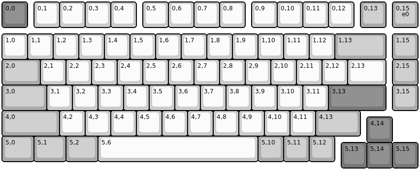{:loading="lazy"}

[Open in keyboard-layout-editor](http://www.keyboard-layout-editor.com/##@@_c=#777777;&=0,0%0AESC&_x:0.25&c=#cccccc;&=0,1&=0,2&=0,3&=0,4&_x:0.25;&=0,5&=0,6&=0,7&=0,8&_x:0.25;&=0,9&=0,10&=0,11&=0,12&_x:0.25&c=#aaaaaa;&=0,13&_x:0.25;&=0,15%0A%0A%0A%0A%0A%0A%0A%0A%0Ae0;&@_y:0.25&c=#cccccc;&=1,0&=1,1&=1,2&=1,3&=1,4&=1,5&=1,6&=1,7&=1,8&=1,9&=1,10&=1,11&=1,12&_c=#aaaaaa&w:2;&=1,13&_x:0.25;&=1,15;&@_w:1.5;&=2,0&_c=#cccccc;&=2,1&=2,2&=2,3&=2,4&=2,5&=2,6&=2,7&=2,8&=2,9&=2,10&=2,11&=2,12&_w:1.5;&=2,13&_x:0.25&c=#aaaaaa;&=2,15;&@_w:1.75;&=3,0&_c=#cccccc;&=3,1&=3,2&=3,3&=3,4&=3,5&=3,6&=3,7&=3,8&=3,9&=3,10&=3,11&_c=#777777&w:2.25;&=3,13&_x:0.25&c=#aaaaaa;&=3,15;&@_w:2.25;&=4,0&_c=#cccccc;&=4,2&=4,3&=4,4&=4,5&=4,6&=4,7&=4,8&=4,9&=4,10&=4,11&_c=#aaaaaa&w:1.75;&=4,13;&@_x:14.25&y:-0.75&c=#777777;&=4,14;&@_y:-0.25&c=#aaaaaa&w:1.25;&=5,0&_w:1.25;&=5,1&_w:1.25;&=5,2&_c=#cccccc&w:6.25;&=5,6&_c=#aaaaaa;&=5,10&=5,11&=5,12;&@_x:13.25&y:-0.75&c=#777777;&=5,13&=5,14&=5,15)

## keychron/v1/iso

[README](output/keychron/v1/README.md) - [layout](output/keychron/v1/iso-kle.json) - [PCB](output/keychron/v1/iso.kicad_pcb) - [PCB render](output/keychron/v1/iso-render.svg)

{:loading="lazy"}

[Open in keyboard-layout-editor](http://www.keyboard-layout-editor.com/##@@_c=#777777;&=0,0%0AESC&_x:0.25&c=#cccccc;&=0,1&=0,2&=0,3&=0,4&_x:0.25;&=0,5&=0,6&=0,7&=0,8&_x:0.25;&=0,9&=0,10&=0,11&=0,12&_x:0.25&c=#aaaaaa;&=0,13&_x:0.25;&=0,15;&@_y:0.25&c=#cccccc;&=1,0&=1,1&=1,2&=1,3&=1,4&=1,5&=1,6&=1,7&=1,8&=1,9&=1,10&=1,11&=1,12&_c=#aaaaaa&w:2;&=1,13&_x:0.25;&=1,15;&@_w:1.5;&=2,0&_c=#cccccc;&=2,1&=2,2&=2,3&=2,4&=2,5&=2,6&=2,7&=2,8&=2,9&=2,10&=2,11&=2,12&_x:0.25&c=#777777&w:1.25&h:2&w2:1.5&h2:1&x2:-0.25;&=2,13&_x:0.25&c=#aaaaaa;&=2,15;&@_w:1.75;&=3,0&_c=#cccccc;&=3,1&=3,2&=3,3&=3,4&=3,5&=3,6&=3,7&=3,8&=3,9&=3,10&=3,11&=3,13&_x:1.5&c=#aaaaaa;&=3,15;&@_w:1.25;&=4,0&=4,1&_c=#cccccc;&=4,2&=4,3&=4,4&=4,5&=4,6&=4,7&=4,8&=4,9&=4,10&=4,11&_c=#aaaaaa&w:1.75;&=4,13;&@_x:14.25&y:-0.75&c=#777777;&=4,14;&@_y:-0.25&c=#aaaaaa&w:1.25;&=5,0&_w:1.25;&=5,1&_w:1.25;&=5,2&_c=#cccccc&w:6.25;&=5,6&_c=#aaaaaa;&=5,10&=5,11&=5,12;&@_x:13.25&y:-0.75&c=#777777;&=5,13&=5,14&=5,15)

## keychron/v1/iso_encoder

[README](output/keychron/v1/README.md) - [layout](output/keychron/v1/iso_encoder-kle.json) - [PCB](output/keychron/v1/iso_encoder.kicad_pcb) - [PCB render](output/keychron/v1/iso_encoder-render.svg)

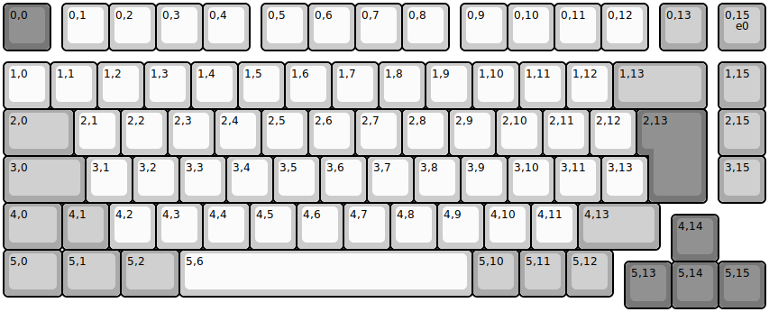{:loading="lazy"}

[Open in keyboard-layout-editor](http://www.keyboard-layout-editor.com/##@@_c=#777777;&=0,0%0AESC&_x:0.25&c=#cccccc;&=0,1&=0,2&=0,3&=0,4&_x:0.25;&=0,5&=0,6&=0,7&=0,8&_x:0.25;&=0,9&=0,10&=0,11&=0,12&_x:0.25&c=#aaaaaa;&=0,13&_x:0.25;&=0,15%0A%0A%0A%0A%0A%0A%0A%0A%0Ae0;&@_y:0.25&c=#cccccc;&=1,0&=1,1&=1,2&=1,3&=1,4&=1,5&=1,6&=1,7&=1,8&=1,9&=1,10&=1,11&=1,12&_c=#aaaaaa&w:2;&=1,13&_x:0.25;&=1,15;&@_w:1.5;&=2,0&_c=#cccccc;&=2,1&=2,2&=2,3&=2,4&=2,5&=2,6&=2,7&=2,8&=2,9&=2,10&=2,11&=2,12&_x:0.25&c=#777777&w:1.25&h:2&w2:1.5&h2:1&x2:-0.25;&=2,13&_x:0.25&c=#aaaaaa;&=2,15;&@_w:1.75;&=3,0&_c=#cccccc;&=3,1&=3,2&=3,3&=3,4&=3,5&=3,6&=3,7&=3,8&=3,9&=3,10&=3,11&=3,13&_x:1.5&c=#aaaaaa;&=3,15;&@_w:1.25;&=4,0&=4,1&_c=#cccccc;&=4,2&=4,3&=4,4&=4,5&=4,6&=4,7&=4,8&=4,9&=4,10&=4,11&_c=#aaaaaa&w:1.75;&=4,13;&@_x:14.25&y:-0.75&c=#777777;&=4,14;&@_y:-0.25&c=#aaaaaa&w:1.25;&=5,0&_w:1.25;&=5,1&_w:1.25;&=5,2&_c=#cccccc&w:6.25;&=5,6&_c=#aaaaaa;&=5,10&=5,11&=5,12;&@_x:13.25&y:-0.75&c=#777777;&=5,13&=5,14&=5,15)

## keychron/v1/jis

[README](output/keychron/v1/README.md) - [layout](output/keychron/v1/jis-kle.json) - [PCB](output/keychron/v1/jis.kicad_pcb) - [PCB render](output/keychron/v1/jis-render.svg)

{:loading="lazy"}

[Open in keyboard-layout-editor](http://www.keyboard-layout-editor.com/##@@_c=#777777;&=0,0%0AESC&_x:0.25&c=#cccccc;&=0,1&=0,2&=0,3&=0,4&_x:0.25;&=0,5&=0,6&=0,7&=0,8&_x:0.25;&=0,9&=0,10&=0,11&=0,12&_x:0.25&c=#aaaaaa;&=0,13&_x:0.25;&=0,15;&@_y:0.25&c=#cccccc;&=1,0&=1,1&=1,2&=1,3&=1,4&=1,5&=1,6&=1,7&=1,8&=1,9&=1,10&=1,11&=1,12&=1,13&_c=#aaaaaa;&=1,14&_x:0.25;&=1,15;&@_w:1.5;&=2,0&_c=#cccccc;&=2,1&=2,2&=2,3&=2,4&=2,5&=2,6&=2,7&=2,8&=2,9&=2,10&=2,11&=2,12&_x:0.25&c=#777777&w:1.25&h:2&w2:1.5&h2:1&x2:-0.25;&=2,13&_x:0.25&c=#aaaaaa;&=2,15;&@_w:1.75;&=3,0&_c=#cccccc;&=3,1&=3,2&=3,3&=3,4&=3,5&=3,6&=3,7&=3,8&=3,9&=3,10&=3,11&=3,13&_x:1.5&c=#aaaaaa;&=3,15;&@_w:2.25;&=4,0&_c=#cccccc;&=4,2&=4,3&=4,4&=4,5&=4,6&=4,7&=4,8&=4,9&=4,10&=4,11&=4,12&_c=#aaaaaa;&=4,13&_c=#777777;&=4,14;&@_c=#aaaaaa&w:1.25;&=5,0&=5,1&_w:1.25;&=5,2&=5,3&_c=#cccccc&w:4.5;&=5,6&_c=#aaaaaa&w:1.25;&=5,9&=5,10&=5,11&=5,12&_c=#777777;&=5,13&=5,14&=5,15)

## keychron/v1/jis_encoder

[README](output/keychron/v1/README.md) - [layout](output/keychron/v1/jis_encoder-kle.json) - [PCB](output/keychron/v1/jis_encoder.kicad_pcb) - [PCB render](output/keychron/v1/jis_encoder-render.svg)

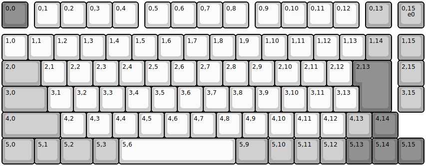{:loading="lazy"}

[Open in keyboard-layout-editor](http://www.keyboard-layout-editor.com/##@@_c=#777777;&=0,0%0AESC&_x:0.25&c=#cccccc;&=0,1&=0,2&=0,3&=0,4&_x:0.25;&=0,5&=0,6&=0,7&=0,8&_x:0.25;&=0,9&=0,10&=0,11&=0,12&_x:0.25&c=#aaaaaa;&=0,13&_x:0.25;&=0,15%0A%0A%0A%0A%0A%0A%0A%0A%0Ae0;&@_y:0.25&c=#cccccc;&=1,0&=1,1&=1,2&=1,3&=1,4&=1,5&=1,6&=1,7&=1,8&=1,9&=1,10&=1,11&=1,12&=1,13&_c=#aaaaaa;&=1,14&_x:0.25;&=1,15;&@_w:1.5;&=2,0&_c=#cccccc;&=2,1&=2,2&=2,3&=2,4&=2,5&=2,6&=2,7&=2,8&=2,9&=2,10&=2,11&=2,12&_x:0.25&c=#777777&w:1.25&h:2&w2:1.5&h2:1&x2:-0.25;&=2,13&_x:0.25&c=#aaaaaa;&=2,15;&@_w:1.75;&=3,0&_c=#cccccc;&=3,1&=3,2&=3,3&=3,4&=3,5&=3,6&=3,7&=3,8&=3,9&=3,10&=3,11&=3,13&_x:1.5&c=#aaaaaa;&=3,15;&@_w:2.25;&=4,0&_c=#cccccc;&=4,2&=4,3&=4,4&=4,5&=4,6&=4,7&=4,8&=4,9&=4,10&=4,11&=4,12&_c=#aaaaaa;&=4,13&_c=#777777;&=4,14;&@_c=#aaaaaa&w:1.25;&=5,0&=5,1&_w:1.25;&=5,2&=5,3&_c=#cccccc&w:4.5;&=5,6&_c=#aaaaaa&w:1.25;&=5,9&=5,10&=5,11&=5,12&_c=#777777;&=5,13&=5,14&=5,15)

## keychron/v10/ansi_encoder

[README](output/keychron/v10/README.md) - [layout](output/keychron/v10/ansi_encoder-kle.json) - [PCB](output/keychron/v10/ansi_encoder.kicad_pcb) - [PCB render](output/keychron/v10/ansi_encoder-render.svg)

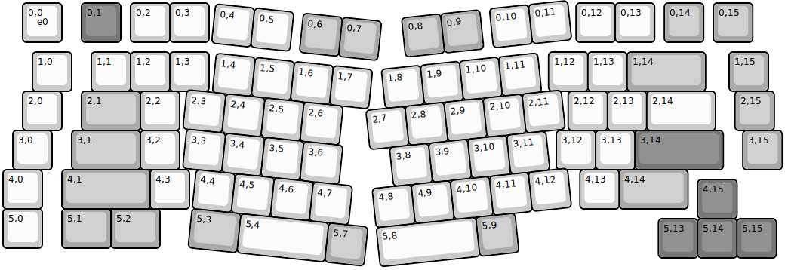{:loading="lazy"}

[Open in keyboard-layout-editor](http://www.keyboard-layout-editor.com/##@@_x:0.5;&=0,0%0A%0A%0A%0A%0A%0A%0A%0A%0Ae0&_x:0.5&c=#777777;&=0,1%0AESC&_x:0.25&c=#cccccc;&=0,2&=0,3&_x:9.35;&=0,12&=0,13&_x:0.25&c=#aaaaaa;&=0,14&_x:0.25;&=0,15;&@_x:0.75&y:0.25&c=#cccccc;&=1,0&_x:0.5;&=1,1&=1,2&=1,3&_x:8.65;&=1,12&=1,13&_c=#aaaaaa&w:2;&=1,14&_x:0.6;&=1,15;&@_x:0.5&c=#cccccc;&=2,0&_x:0.5&c=#aaaaaa&w:1.5;&=2,1&_c=#cccccc;&=2,2&_x:9.9;&=2,12&=2,13&_w:1.75;&=2,14&_x:0.5&c=#aaaaaa;&=2,15;&@_x:0.25&c=#cccccc;&=3,0&_x:0.5&c=#aaaaaa&w:1.75;&=3,1&_c=#cccccc;&=3,2&_x:9.6;&=3,12&=3,13&_c=#777777&w:2.25;&=3,14&_x:0.5&c=#aaaaaa;&=3,15;&@_c=#cccccc;&=4,0&_x:0.5&c=#aaaaaa&w:2.25;&=4,1&_c=#cccccc;&=4,3&_x:9.95;&=4,13&_c=#aaaaaa&w:1.75;&=4,14;&@_x:17.7&y:-0.75&c=#777777;&=4,15;&@_y:-0.25&c=#cccccc;&=5,0&_x:0.5&c=#aaaaaa&w:1.25;&=5,1&_w:1.25;&=5,2;&@_x:16.7&y:-0.75&c=#777777;&=5,13&=5,14&=5,15;&@_r:6&x:5.4&y:-7.05&c=#cccccc;&=0,4&=0,5&_x:0.25&c=#aaaaaa;&=0,6&=0,7;&@_x:5.55&y:0.25&c=#cccccc;&=1,4&=1,5&=1,6&=1,7;&@_x:4.9;&=2,3&=2,4&=2,5&=2,6;&@_x:5;&=3,3&=3,4&=3,5&=3,6;&@_x:5.35;&=4,4&=4,5&=4,6&=4,7;&@_x:5.35&c=#aaaaaa&w:1.25;&=5,3&_c=#cccccc&w:2.25;&=5,4&_c=#aaaaaa;&=5,7;&@_r:-6&x:10.05&y:-4.25;&=0,8&=0,9&_x:0.25&c=#cccccc;&=0,10&=0,11;&@_x:9.4&y:0.25;&=1,8&=1,9&=1,10&=1,11;&@_x:8.9;&=2,7&=2,8&=2,9&=2,10&=2,11;&@_x:9.4;&=3,8&=3,9&=3,10&=3,11;&@_x:8.85;&=4,8&=4,9&=4,10&=4,11&=4,12;&@_x:8.85&w:2.55;&=5,8&_c=#aaaaaa;&=5,9)

## keychron/v10/iso_encoder

[README](output/keychron/v10/README.md) - [layout](output/keychron/v10/iso_encoder-kle.json) - [PCB](output/keychron/v10/iso_encoder.kicad_pcb) - [PCB render](output/keychron/v10/iso_encoder-render.svg)

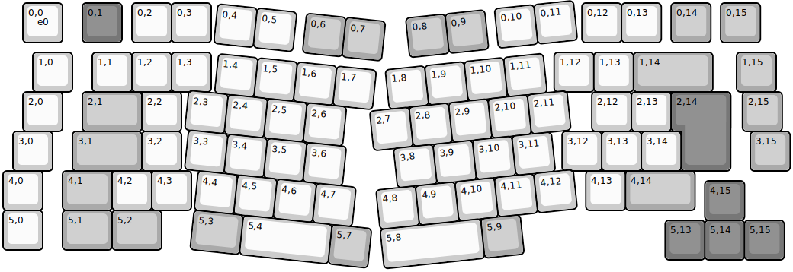{:loading="lazy"}

[Open in keyboard-layout-editor](http://www.keyboard-layout-editor.com/##@@_x:0.5;&=0,0%0A%0A%0A%0A%0A%0A%0A%0A%0Ae0&_x:0.5&c=#777777;&=0,1%0AESC&_x:0.25&c=#cccccc;&=0,2&=0,3&_x:9.35;&=0,12&=0,13&_x:0.25&c=#aaaaaa;&=0,14&_x:0.25;&=0,15;&@_x:0.75&y:0.25&c=#cccccc;&=1,0&_x:0.5;&=1,1&=1,2&=1,3&_x:8.65;&=1,12&=1,13&_c=#aaaaaa&w:2;&=1,14&_x:0.6;&=1,15;&@_x:0.5&c=#cccccc;&=2,0&_x:0.5&c=#aaaaaa&w:1.5;&=2,1&_c=#cccccc;&=2,2&_x:10.35;&=2,12&=2,13&_x:0.25&c=#777777&w:1.25&h:2&w2:1.5&h2:1&x2:-0.25;&=2,14&_x:0.3&c=#aaaaaa;&=2,15;&@_x:0.25&c=#cccccc;&=3,0&_x:0.5&c=#aaaaaa&w:1.75;&=3,1&_c=#cccccc;&=3,2&_x:9.6;&=3,12&=3,13&=3,14&_x:1.75&c=#aaaaaa;&=3,15;&@_c=#cccccc;&=4,0&_x:0.5&c=#aaaaaa&w:1.25;&=4,1&_c=#cccccc;&=4,2&=4,3&_x:9.95;&=4,13&_c=#aaaaaa&w:1.75;&=4,14;&@_x:17.7&y:-0.75&c=#777777;&=4,15;&@_y:-0.25&c=#cccccc;&=5,0&_x:0.5&c=#aaaaaa&w:1.25;&=5,1&_w:1.25;&=5,2;&@_x:16.7&y:-0.75&c=#777777;&=5,13&=5,14&=5,15;&@_r:6&x:5.4&y:-7.05&c=#cccccc;&=0,4&=0,5&_x:0.25&c=#aaaaaa;&=0,6&=0,7;&@_x:5.55&y:0.25&c=#cccccc;&=1,4&=1,5&=1,6&=1,7;&@_x:4.9;&=2,3&=2,4&=2,5&=2,6;&@_x:5;&=3,3&=3,4&=3,5&=3,6;&@_x:5.35;&=4,4&=4,5&=4,6&=4,7;&@_x:5.35&c=#aaaaaa&w:1.25;&=5,3&_c=#cccccc&w:2.25;&=5,4&_c=#aaaaaa;&=5,7;&@_r:-6&x:10.05&y:-4.25;&=0,8&=0,9&_x:0.25&c=#cccccc;&=0,10&=0,11;&@_x:9.4&y:0.25;&=1,8&=1,9&=1,10&=1,11;&@_x:8.9;&=2,7&=2,8&=2,9&=2,10&=2,11;&@_x:9.4;&=3,8&=3,9&=3,10&=3,11;&@_x:8.85;&=4,8&=4,9&=4,10&=4,11&=4,12;&@_x:8.85&w:2.55;&=5,8&_c=#aaaaaa;&=5,9)

## keychron/v2/anis

[README](output/keychron/v2/README.md) - [layout](output/keychron/v2/anis-kle.json) - [PCB](output/keychron/v2/anis.kicad_pcb) - [PCB render](output/keychron/v2/anis-render.svg)

{:loading="lazy"}

[Open in keyboard-layout-editor](http://www.keyboard-layout-editor.com/##@@_y:0.25&c=#777777;&=0,0%0AESC&_c=#cccccc;&=0,1&=0,2&=0,3&=0,4&=0,5&=0,6&=0,7&=0,8&=0,9&=0,10&=0,11&=0,12&_c=#aaaaaa&w:2;&=0,13;&@_x:15.25&y:-1.25;&=0,14;&@_y:0.25&w:1.5;&=1,0&_c=#cccccc;&=1,1&=1,2&=1,3&=1,4&=1,5&=1,6&=1,7&=1,8&=1,9&=1,10&=1,11&=1,12&_w:1.5;&=1,13&_x:0.25&c=#aaaaaa;&=1,14;&@_w:1.75;&=2,0&_c=#cccccc;&=2,1&=2,2&=2,3&=2,4&=2,5&=2,6&=2,7&=2,8&=2,9&=2,10&=2,11&_c=#777777&w:2.25;&=2,13&_x:0.25&c=#aaaaaa;&=2,14;&@_w:2.25;&=3,0&_c=#cccccc;&=3,2&=3,3&=3,4&=3,5&=3,6&=3,7&=3,8&=3,9&=3,10&=3,11&_c=#aaaaaa&w:1.75;&=3,13;&@_x:14.25&y:-0.75&c=#777777;&=3,14;&@_y:-0.25&c=#aaaaaa&w:1.24;&=4,0&_w:1.25;&=4,1&_w:1.25;&=4,2&_c=#cccccc&w:6.25;&=4,6&_c=#aaaaaa;&=4,10&=4,11&=4,12;&@_x:13.25&y:-0.75&c=#777777;&=4,13&=2,12&=4,14)

## keychron/v2/ansi_encoder

[README](output/keychron/v2/README.md) - [layout](output/keychron/v2/ansi_encoder-kle.json) - [PCB](output/keychron/v2/ansi_encoder.kicad_pcb) - [PCB render](output/keychron/v2/ansi_encoder-render.svg)

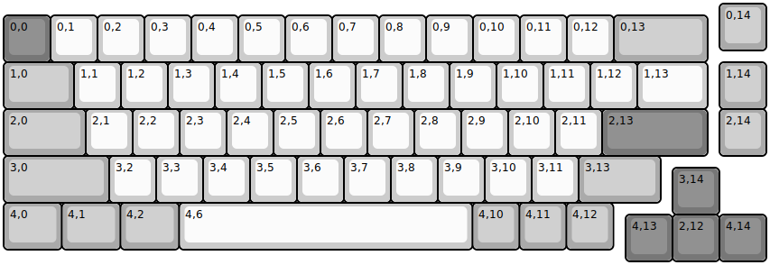{:loading="lazy"}

[Open in keyboard-layout-editor](http://www.keyboard-layout-editor.com/##@@_y:0.25&c=#777777;&=0,0%0AESC&_c=#cccccc;&=0,1&=0,2&=0,3&=0,4&=0,5&=0,6&=0,7&=0,8&=0,9&=0,10&=0,11&=0,12&_c=#aaaaaa&w:2;&=0,13;&@_x:15.25&y:-1.25;&=0,14%0A%0A%0A%0A%0A%0A%0A%0A%0Ae0;&@_y:0.25&w:1.5;&=1,0&_c=#cccccc;&=1,1&=1,2&=1,3&=1,4&=1,5&=1,6&=1,7&=1,8&=1,9&=1,10&=1,11&=1,12&_w:1.5;&=1,13&_x:0.25&c=#aaaaaa;&=1,14;&@_w:1.75;&=2,0&_c=#cccccc;&=2,1&=2,2&=2,3&=2,4&=2,5&=2,6&=2,7&=2,8&=2,9&=2,10&=2,11&_c=#777777&w:2.25;&=2,13&_x:0.25&c=#aaaaaa;&=2,14;&@_w:2.25;&=3,0&_c=#cccccc;&=3,2&=3,3&=3,4&=3,5&=3,6&=3,7&=3,8&=3,9&=3,10&=3,11&_c=#aaaaaa&w:1.75;&=3,13;&@_x:14.25&y:-0.75&c=#777777;&=3,14;&@_y:-0.25&c=#aaaaaa&w:1.24;&=4,0&_w:1.25;&=4,1&_w:1.25;&=4,2&_c=#cccccc&w:6.25;&=4,6&_c=#aaaaaa;&=4,10&=4,11&=4,12;&@_x:13.25&y:-0.75&c=#777777;&=4,13&=2,12&=4,14)

## keychron/v2/iso

[README](output/keychron/v2/README.md) - [layout](output/keychron/v2/iso-kle.json) - [PCB](output/keychron/v2/iso.kicad_pcb) - [PCB render](output/keychron/v2/iso-render.svg)

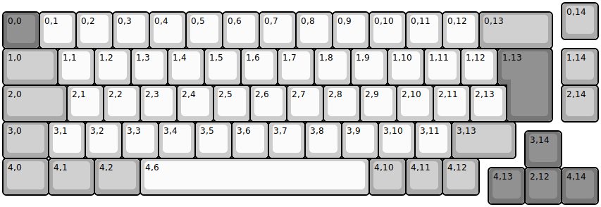{:loading="lazy"}

[Open in keyboard-layout-editor](http://www.keyboard-layout-editor.com/##@@_y:0.25&c=#777777;&=0,0%0AESC&_c=#cccccc;&=0,1&=0,2&=0,3&=0,4&=0,5&=0,6&=0,7&=0,8&=0,9&=0,10&=0,11&=0,12&_c=#aaaaaa&w:2;&=0,13;&@_x:15.25&y:-1.25;&=0,14;&@_y:0.25&w:1.5;&=1,0&_c=#cccccc;&=1,1&=1,2&=1,3&=1,4&=1,5&=1,6&=1,7&=1,8&=1,9&=1,10&=1,11&=1,12&_x:0.25&c=#777777&w:1.25&h:2&w2:1.5&h2:1&x2:-0.25;&=1,13&_x:0.25&c=#aaaaaa;&=1,14;&@_w:1.75;&=2,0&_c=#cccccc;&=2,1&=2,2&=2,3&=2,4&=2,5&=2,6&=2,7&=2,8&=2,9&=2,10&=2,11&=2,13&_x:1.5&c=#aaaaaa;&=2,14;&@_w:1.25;&=3,0&_c=#cccccc;&=3,1&=3,2&=3,3&=3,4&=3,5&=3,6&=3,7&=3,8&=3,9&=3,10&=3,11&_c=#aaaaaa&w:1.75;&=3,13;&@_x:14.25&y:-0.75&c=#777777;&=3,14;&@_y:-0.25&c=#aaaaaa&w:1.25;&=4,0&_w:1.25;&=4,1&_w:1.25;&=4,2&_c=#cccccc&w:6.25;&=4,6&_c=#aaaaaa;&=4,10&=4,11&=4,12;&@_x:13.25&y:-0.75&c=#777777;&=4,13&=2,12&=4,14)

## keychron/v2/iso_encoder

[README](output/keychron/v2/README.md) - [layout](output/keychron/v2/iso_encoder-kle.json) - [PCB](output/keychron/v2/iso_encoder.kicad_pcb) - [PCB render](output/keychron/v2/iso_encoder-render.svg)

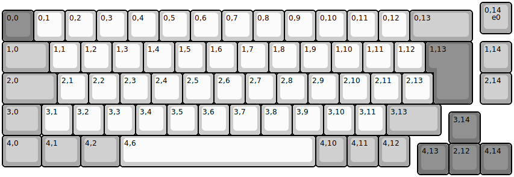{:loading="lazy"}

[Open in keyboard-layout-editor](http://www.keyboard-layout-editor.com/##@@_y:0.25&c=#777777;&=0,0%0AESC&_c=#cccccc;&=0,1&=0,2&=0,3&=0,4&=0,5&=0,6&=0,7&=0,8&=0,9&=0,10&=0,11&=0,12&_c=#aaaaaa&w:2;&=0,13;&@_x:15.25&y:-1.25;&=0,14%0A%0A%0A%0A%0A%0A%0A%0A%0Ae0;&@_y:0.25&w:1.5;&=1,0&_c=#cccccc;&=1,1&=1,2&=1,3&=1,4&=1,5&=1,6&=1,7&=1,8&=1,9&=1,10&=1,11&=1,12&_x:0.25&c=#777777&w:1.25&h:2&w2:1.5&h2:1&x2:-0.25;&=1,13&_x:0.25&c=#aaaaaa;&=1,14;&@_w:1.75;&=2,0&_c=#cccccc;&=2,1&=2,2&=2,3&=2,4&=2,5&=2,6&=2,7&=2,8&=2,9&=2,10&=2,11&=2,13&_x:1.5&c=#aaaaaa;&=2,14;&@_w:1.25;&=3,0&_c=#cccccc;&=3,1&=3,2&=3,3&=3,4&=3,5&=3,6&=3,7&=3,8&=3,9&=3,10&=3,11&_c=#aaaaaa&w:1.75;&=3,13;&@_x:14.25&y:-0.75&c=#777777;&=3,14;&@_y:-0.25&c=#aaaaaa&w:1.25;&=4,0&_w:1.25;&=4,1&_w:1.25;&=4,2&_c=#cccccc&w:6.25;&=4,6&_c=#aaaaaa;&=4,10&=4,11&=4,12;&@_x:13.25&y:-0.75&c=#777777;&=4,13&=2,12&=4,14)

## keychron/v2/jis

[README](output/keychron/v2/README.md) - [layout](output/keychron/v2/jis-kle.json) - [PCB](output/keychron/v2/jis.kicad_pcb) - [PCB render](output/keychron/v2/jis-render.svg)

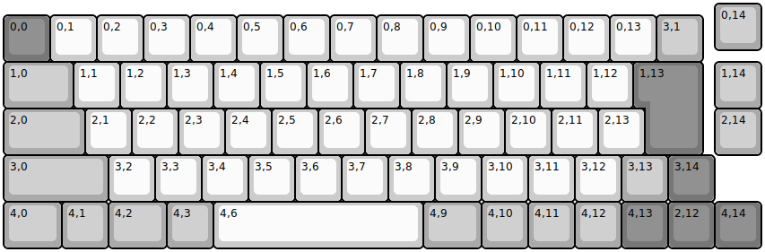{:loading="lazy"}

[Open in keyboard-layout-editor](http://www.keyboard-layout-editor.com/##@@_y:0.25&c=#777777;&=0,0%0AESC&_c=#cccccc;&=0,1&=0,2&=0,3&=0,4&=0,5&=0,6&=0,7&=0,8&=0,9&=0,10&=0,11&=0,12&=0,13&_c=#aaaaaa;&=3,1;&@_x:15.25&y:-1.25;&=0,14;&@_y:0.25&w:1.5;&=1,0&_c=#cccccc;&=1,1&=1,2&=1,3&=1,4&=1,5&=1,6&=1,7&=1,8&=1,9&=1,10&=1,11&=1,12&_x:0.25&c=#777777&w:1.25&h:2&w2:1.5&h2:1&x2:-0.25;&=1,13&_x:0.25&c=#aaaaaa;&=1,14;&@_w:1.75;&=2,0&_c=#cccccc;&=2,1&=2,2&=2,3&=2,4&=2,5&=2,6&=2,7&=2,8&=2,9&=2,10&=2,11&=2,13&_x:1.5&c=#aaaaaa;&=2,14;&@_w:2.25;&=3,0&_c=#cccccc;&=3,2&=3,3&=3,4&=3,5&=3,6&=3,7&=3,8&=3,9&=3,10&=3,11&=3,12&_c=#aaaaaa;&=3,13&_c=#777777;&=3,14;&@_c=#aaaaaa&w:1.25;&=4,0&=4,1&_w:1.25;&=4,2&=4,3&_c=#cccccc&w:4.5;&=4,6&_c=#aaaaaa&w:1.25;&=4,9&=4,10&=4,11&=4,12&_c=#777777;&=4,13&=2,12&=4,14)

## keychron/v2/jis_encoder

[README](output/keychron/v2/README.md) - [layout](output/keychron/v2/jis_encoder-kle.json) - [PCB](output/keychron/v2/jis_encoder.kicad_pcb) - [PCB render](output/keychron/v2/jis_encoder-render.svg)

{:loading="lazy"}

[Open in keyboard-layout-editor](http://www.keyboard-layout-editor.com/##@@_y:0.25&c=#777777;&=0,0%0AESC&_c=#cccccc;&=0,1&=0,2&=0,3&=0,4&=0,5&=0,6&=0,7&=0,8&=0,9&=0,10&=0,11&=0,12&=0,13&_c=#aaaaaa;&=3,1;&@_x:15.25&y:-1.25;&=0,14%0A%0A%0A%0A%0A%0A%0A%0A%0Ae0;&@_y:0.25&w:1.5;&=1,0&_c=#cccccc;&=1,1&=1,2&=1,3&=1,4&=1,5&=1,6&=1,7&=1,8&=1,9&=1,10&=1,11&=1,12&_x:0.25&c=#777777&w:1.25&h:2&w2:1.5&h2:1&x2:-0.25;&=1,13&_x:0.25&c=#aaaaaa;&=1,14;&@_w:1.75;&=2,0&_c=#cccccc;&=2,1&=2,2&=2,3&=2,4&=2,5&=2,6&=2,7&=2,8&=2,9&=2,10&=2,11&=2,13&_x:1.5&c=#aaaaaa;&=2,14;&@_w:2.25;&=3,0&_c=#cccccc;&=3,2&=3,3&=3,4&=3,5&=3,6&=3,7&=3,8&=3,9&=3,10&=3,11&=3,12&_c=#aaaaaa;&=3,13&_c=#777777;&=3,14;&@_c=#aaaaaa&w:1.25;&=4,0&=4,1&_w:1.25;&=4,2&=4,3&_c=#cccccc&w:4.5;&=4,6&_c=#aaaaaa&w:1.25;&=4,9&=4,10&=4,11&=4,12&_c=#777777;&=4,13&=2,12&=4,14)

## keychron/v3/ansi

[README](output/keychron/v3/README.md) - [layout](output/keychron/v3/ansi-kle.json) - [PCB](output/keychron/v3/ansi.kicad_pcb) - [PCB render](output/keychron/v3/ansi-render.svg)

{:loading="lazy"}

[Open in keyboard-layout-editor](http://www.keyboard-layout-editor.com/##@@_c=#777777;&=0,0%0AESC&_x:1&c=#cccccc;&=0,1&=0,2&=0,3&=0,4&_x:0.5&c=#aaaaaa;&=0,5&=0,6&=0,7&=0,8&_x:0.5&c=#cccccc;&=0,9&=0,10&=0,11&=0,12&_x:0.25&c=#aaaaaa;&=0,14&=0,15&=3,14;&@_y:0.25&c=#cccccc;&=1,0&=1,1&=1,2&=1,3&=1,4&=1,5&=1,6&=1,7&=1,8&=1,9&=1,10&=1,11&=1,12&_c=#aaaaaa&w:2;&=1,13&_x:0.25;&=1,14&=1,15&=3,15;&@_w:1.5;&=2,0&_c=#cccccc;&=2,1&=2,2&=2,3&=2,4&=2,5&=2,6&=2,7&=2,8&=2,9&=2,10&=2,11&=2,12&_w:1.5;&=2,13&_x:0.25&c=#aaaaaa;&=2,14&=2,15&=3,12;&@_w:1.75;&=3,0&_c=#cccccc;&=3,1&=3,2&=3,3&=3,4&=3,5&=3,6&=3,7&=3,8&=3,9&=3,10&=3,11&_c=#777777&w:2.25;&=3,13;&@_c=#aaaaaa&w:2.25;&=4,0&_c=#cccccc;&=4,2&=4,3&=4,4&=4,5&=4,6&=4,7&=4,8&=4,9&=4,10&=4,11&_c=#aaaaaa&w:2.75;&=4,13&_x:1.25&c=#777777;&=4,15;&@_c=#aaaaaa&w:1.25;&=5,0&_w:1.25;&=5,1&_w:1.25;&=5,2&_c=#cccccc&w:6.25;&=5,6&_c=#aaaaaa&w:1.25;&=5,10&_w:1.25;&=5,11&_w:1.25;&=5,12&_w:1.25;&=5,13&_x:0.25&c=#777777;&=5,14&=5,15&=4,14)

## keychron/v3/ansi_encoder

[README](output/keychron/v3/README.md) - [layout](output/keychron/v3/ansi_encoder-kle.json) - [PCB](output/keychron/v3/ansi_encoder.kicad_pcb) - [PCB render](output/keychron/v3/ansi_encoder-render.svg)

{:loading="lazy"}

[Open in keyboard-layout-editor](http://www.keyboard-layout-editor.com/##@@_c=#777777;&=0,0%0AESC&_x:0.25&c=#cccccc;&=0,1&=0,2&=0,3&=0,4&_x:0.25&c=#aaaaaa;&=0,5&=0,6&=0,7&=0,8&_x:0.25&c=#cccccc;&=0,9&=0,10&=0,11&=0,12&_x:0.25;&=0,13%0A%0A%0A%0A%0A%0A%0A%0A%0Ae0&_x:0.25&c=#aaaaaa;&=0,14&=0,15&=3,14;&@_y:0.25&c=#cccccc;&=1,0&=1,1&=1,2&=1,3&=1,4&=1,5&=1,6&=1,7&=1,8&=1,9&=1,10&=1,11&=1,12&_c=#aaaaaa&w:2;&=1,13&_x:0.25;&=1,14&=1,15&=3,15;&@_w:1.5;&=2,0&_c=#cccccc;&=2,1&=2,2&=2,3&=2,4&=2,5&=2,6&=2,7&=2,8&=2,9&=2,10&=2,11&=2,12&_w:1.5;&=2,13&_x:0.25&c=#aaaaaa;&=2,14&=2,15&=3,12;&@_w:1.75;&=3,0&_c=#cccccc;&=3,1&=3,2&=3,3&=3,4&=3,5&=3,6&=3,7&=3,8&=3,9&=3,10&=3,11&_c=#777777&w:2.25;&=3,13;&@_c=#aaaaaa&w:2.25;&=4,0&_c=#cccccc;&=4,2&=4,3&=4,4&=4,5&=4,6&=4,7&=4,8&=4,9&=4,10&=4,11&_c=#aaaaaa&w:2.75;&=4,13&_x:1.25&c=#777777;&=4,15;&@_c=#aaaaaa&w:1.25;&=5,0&_w:1.25;&=5,1&_w:1.25;&=5,2&_c=#cccccc&w:6.25;&=5,6&_c=#aaaaaa&w:1.25;&=5,10&_w:1.25;&=5,11&_w:1.25;&=5,12&_w:1.25;&=5,13&_x:0.25&c=#777777;&=5,14&=5,15&=4,14)

## keychron/v3/iso

[README](output/keychron/v3/README.md) - [layout](output/keychron/v3/iso-kle.json) - [PCB](output/keychron/v3/iso.kicad_pcb) - [PCB render](output/keychron/v3/iso-render.svg)

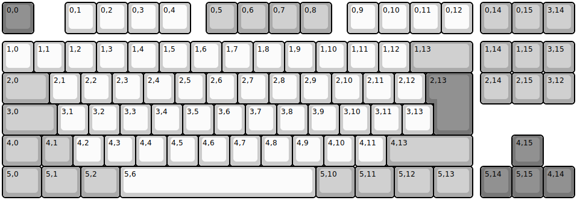{:loading="lazy"}

[Open in keyboard-layout-editor](http://www.keyboard-layout-editor.com/##@@_c=#777777;&=0,0%0AESC&_x:1&c=#cccccc;&=0,1&=0,2&=0,3&=0,4&_x:0.5&c=#aaaaaa;&=0,5&=0,6&=0,7&=0,8&_x:0.5&c=#cccccc;&=0,9&=0,10&=0,11&=0,12&_x:0.25&c=#aaaaaa;&=0,14&=0,15&=3,14;&@_y:0.25&c=#cccccc;&=1,0&=1,1&=1,2&=1,3&=1,4&=1,5&=1,6&=1,7&=1,8&=1,9&=1,10&=1,11&=1,12&_c=#aaaaaa&w:2;&=1,13&_x:0.25;&=1,14&=1,15&=3,15;&@_w:1.5;&=2,0&_c=#cccccc;&=2,1&=2,2&=2,3&=2,4&=2,5&=2,6&=2,7&=2,8&=2,9&=2,10&=2,11&=2,12&_x:0.25&c=#777777&w:1.25&h:2&w2:1.5&h2:1&x2:-0.25;&=2,13&_x:0.25&c=#aaaaaa;&=2,14&=2,15&=3,12;&@_w:1.75;&=3,0&_c=#cccccc;&=3,1&=3,2&=3,3&=3,4&=3,5&=3,6&=3,7&=3,8&=3,9&=3,10&=3,11&=3,13;&@_c=#aaaaaa&w:1.25;&=4,0&=4,1&_c=#cccccc;&=4,2&=4,3&=4,4&=4,5&=4,6&=4,7&=4,8&=4,9&=4,10&=4,11&_c=#aaaaaa&w:2.75;&=4,13&_x:1.25&c=#777777;&=4,15;&@_c=#aaaaaa&w:1.25;&=5,0&_w:1.25;&=5,1&_w:1.25;&=5,2&_c=#cccccc&w:6.25;&=5,6&_c=#aaaaaa&w:1.25;&=5,10&_w:1.25;&=5,11&_w:1.25;&=5,12&_w:1.25;&=5,13&_x:0.25&c=#777777;&=5,14&=5,15&=4,14)

## keychron/v3/iso_encoder

[README](output/keychron/v3/README.md) - [layout](output/keychron/v3/iso_encoder-kle.json) - [PCB](output/keychron/v3/iso_encoder.kicad_pcb) - [PCB render](output/keychron/v3/iso_encoder-render.svg)

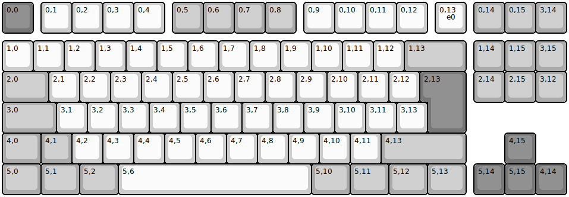{:loading="lazy"}

[Open in keyboard-layout-editor](http://www.keyboard-layout-editor.com/##@@_c=#777777;&=0,0%0AESC&_x:0.25&c=#cccccc;&=0,1&=0,2&=0,3&=0,4&_x:0.25&c=#aaaaaa;&=0,5&=0,6&=0,7&=0,8&_x:0.25&c=#cccccc;&=0,9&=0,10&=0,11&=0,12&_x:0.25;&=0,13%0A%0A%0A%0A%0A%0A%0A%0A%0Ae0&_x:0.25&c=#aaaaaa;&=0,14&=0,15&=3,14;&@_y:0.25&c=#cccccc;&=1,0&=1,1&=1,2&=1,3&=1,4&=1,5&=1,6&=1,7&=1,8&=1,9&=1,10&=1,11&=1,12&_c=#aaaaaa&w:2;&=1,13&_x:0.25;&=1,14&=1,15&=3,15;&@_w:1.5;&=2,0&_c=#cccccc;&=2,1&=2,2&=2,3&=2,4&=2,5&=2,6&=2,7&=2,8&=2,9&=2,10&=2,11&=2,12&_x:0.25&c=#777777&w:1.25&h:2&w2:1.5&h2:1&x2:-0.25;&=2,13&_x:0.25&c=#aaaaaa;&=2,14&=2,15&=3,12;&@_w:1.75;&=3,0&_c=#cccccc;&=3,1&=3,2&=3,3&=3,4&=3,5&=3,6&=3,7&=3,8&=3,9&=3,10&=3,11&=3,13;&@_c=#aaaaaa&w:1.25;&=4,0&=4,1&_c=#cccccc;&=4,2&=4,3&=4,4&=4,5&=4,6&=4,7&=4,8&=4,9&=4,10&=4,11&_c=#aaaaaa&w:2.75;&=4,13&_x:1.25&c=#777777;&=4,15;&@_c=#aaaaaa&w:1.25;&=5,0&_w:1.25;&=5,1&_w:1.25;&=5,2&_c=#cccccc&w:6.25;&=5,6&_c=#aaaaaa&w:1.25;&=5,10&_w:1.25;&=5,11&_w:1.25;&=5,12&_w:1.25;&=5,13&_x:0.25&c=#777777;&=5,14&=5,15&=4,14)

## keychron/v3/jis

[README](output/keychron/v3/README.md) - [layout](output/keychron/v3/jis-kle.json) - [PCB](output/keychron/v3/jis.kicad_pcb) - [PCB render](output/keychron/v3/jis-render.svg)

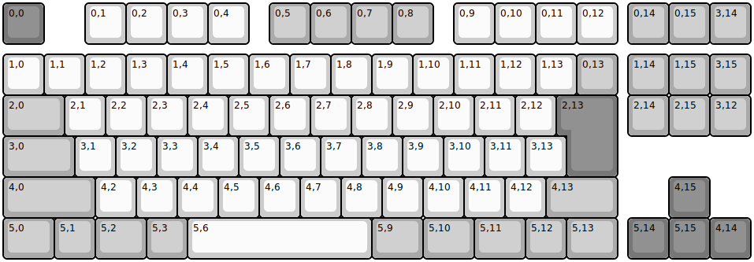{:loading="lazy"}

[Open in keyboard-layout-editor](http://www.keyboard-layout-editor.com/##@@_c=#777777;&=0,0%0AESC&_x:1&c=#cccccc;&=0,1&=0,2&=0,3&=0,4&_x:0.5&c=#aaaaaa;&=0,5&=0,6&=0,7&=0,8&_x:0.5&c=#cccccc;&=0,9&=0,10&=0,11&=0,12&_x:0.25&c=#aaaaaa;&=0,14&=0,15&=3,14;&@_y:0.25&c=#cccccc;&=1,0&=1,1&=1,2&=1,3&=1,4&=1,5&=1,6&=1,7&=1,8&=1,9&=1,10&=1,11&=1,12&=1,13&_c=#aaaaaa;&=0,13&_x:0.25;&=1,14&=1,15&=3,15;&@_w:1.5;&=2,0&_c=#cccccc;&=2,1&=2,2&=2,3&=2,4&=2,5&=2,6&=2,7&=2,8&=2,9&=2,10&=2,11&=2,12&_x:0.25&c=#777777&w:1.25&h:2&w2:1.5&h2:1&x2:-0.25;&=2,13&_x:0.25&c=#aaaaaa;&=2,14&=2,15&=3,12;&@_w:1.75;&=3,0&_c=#cccccc;&=3,1&=3,2&=3,3&=3,4&=3,5&=3,6&=3,7&=3,8&=3,9&=3,10&=3,11&=3,13;&@_c=#aaaaaa&w:2.25;&=4,0&_c=#cccccc;&=4,2&=4,3&=4,4&=4,5&=4,6&=4,7&=4,8&=4,9&=4,10&=4,11&=4,12&_c=#aaaaaa&w:1.75;&=4,13&_x:1.25&c=#777777;&=4,15;&@_c=#aaaaaa&w:1.25;&=5,0&=5,1&_w:1.25;&=5,2&=5,3&_c=#cccccc&w:4.5;&=5,6&_c=#aaaaaa&w:1.25;&=5,9&_w:1.25;&=5,10&_w:1.25;&=5,11&=5,12&_w:1.25;&=5,13&_x:0.25&c=#777777;&=5,14&=5,15&=4,14)

## keychron/v3/jis_encoder

[README](output/keychron/v3/README.md) - [layout](output/keychron/v3/jis_encoder-kle.json) - [PCB](output/keychron/v3/jis_encoder.kicad_pcb) - [PCB render](output/keychron/v3/jis_encoder-render.svg)

{:loading="lazy"}

[Open in keyboard-layout-editor](http://www.keyboard-layout-editor.com/##@@_c=#777777;&=0,0%0AESC&_x:0.25&c=#cccccc;&=0,1&=0,2&=0,3&=0,4&_x:0.25&c=#aaaaaa;&=0,5&=0,6&=0,7&=0,8&_x:0.25&c=#cccccc;&=0,9&=0,10&=0,11&=0,12&_x:0.25;&=0,13%0A%0A%0A%0A%0A%0A%0A%0A%0Ae0&_x:0.25&c=#aaaaaa;&=0,14&=0,15&=3,14;&@_y:0.25&c=#cccccc;&=1,0&=1,1&=1,2&=1,3&=1,4&=1,5&=1,6&=1,7&=1,8&=1,9&=1,10&=1,11&=1,12&=1,13&_c=#aaaaaa;&=5,5&_x:0.25;&=1,14&=1,15&=3,15;&@_w:1.5;&=2,0&_c=#cccccc;&=2,1&=2,2&=2,3&=2,4&=2,5&=2,6&=2,7&=2,8&=2,9&=2,10&=2,11&=2,12&_x:0.25&c=#777777&w:1.25&h:2&w2:1.5&h2:1&x2:-0.25;&=2,13&_x:0.25&c=#aaaaaa;&=2,14&=2,15&=3,12;&@_w:1.75;&=3,0&_c=#cccccc;&=3,1&=3,2&=3,3&=3,4&=3,5&=3,6&=3,7&=3,8&=3,9&=3,10&=3,11&=3,13;&@_c=#aaaaaa&w:2.25;&=4,0&_c=#cccccc;&=4,2&=4,3&=4,4&=4,5&=4,6&=4,7&=4,8&=4,9&=4,10&=4,11&=4,12&_c=#aaaaaa&w:1.75;&=4,13&_x:1.25&c=#777777;&=4,15;&@_c=#aaaaaa&w:1.25;&=5,0&=5,1&_w:1.25;&=5,2&=5,3&_c=#cccccc&w:4.5;&=5,6&_c=#aaaaaa&w:1.25;&=5,9&_w:1.25;&=5,10&_w:1.25;&=5,11&=5,12&_w:1.25;&=5,13&_x:0.25&c=#777777;&=5,14&=5,15&=4,14)

## keychron/v4/ansi

[README](output/keychron/v4/README.md) - [layout](output/keychron/v4/ansi-kle.json) - [PCB](output/keychron/v4/ansi.kicad_pcb) - [PCB render](output/keychron/v4/ansi-render.svg)

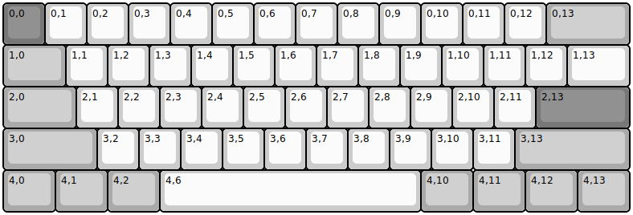{:loading="lazy"}

[Open in keyboard-layout-editor](http://www.keyboard-layout-editor.com/##@@_c=#777777;&=0,0%0AESC&_c=#cccccc;&=0,1&=0,2&=0,3&=0,4&=0,5&=0,6&=0,7&=0,8&=0,9&=0,10&=0,11&=0,12&_c=#aaaaaa&w:2;&=0,13;&@_w:1.5;&=1,0&_c=#cccccc;&=1,1&=1,2&=1,3&=1,4&=1,5&=1,6&=1,7&=1,8&=1,9&=1,10&=1,11&=1,12&_w:1.5;&=1,13;&@_c=#aaaaaa&w:1.75;&=2,0&_c=#cccccc;&=2,1&=2,2&=2,3&=2,4&=2,5&=2,6&=2,7&=2,8&=2,9&=2,10&=2,11&_c=#777777&w:2.25;&=2,13;&@_c=#aaaaaa&w:2.25;&=3,0&_c=#cccccc;&=3,2&=3,3&=3,4&=3,5&=3,6&=3,7&=3,8&=3,9&=3,10&=3,11&_c=#aaaaaa&w:2.75;&=3,13;&@_w:1.25;&=4,0&_w:1.25;&=4,1&_w:1.25;&=4,2&_c=#cccccc&w:6.25;&=4,6&_c=#aaaaaa&w:1.25;&=4,10&_w:1.25;&=4,11&_w:1.25;&=4,12&_w:1.25;&=4,13)

## keychron/v4/iso

[README](output/keychron/v4/README.md) - [layout](output/keychron/v4/iso-kle.json) - [PCB](output/keychron/v4/iso.kicad_pcb) - [PCB render](output/keychron/v4/iso-render.svg)

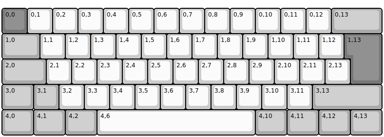{:loading="lazy"}

[Open in keyboard-layout-editor](http://www.keyboard-layout-editor.com/##@@_y:0.25&c=#777777;&=0,0%0AESC&_c=#cccccc;&=0,1&=0,2&=0,3&=0,4&=0,5&=0,6&=0,7&=0,8&=0,9&=0,10&=0,11&=0,12&_c=#aaaaaa&w:2;&=0,13;&@_w:1.5;&=1,0&_c=#cccccc;&=1,1&=1,2&=1,3&=1,4&=1,5&=1,6&=1,7&=1,8&=1,9&=1,10&=1,11&=1,12&_x:0.25&c=#777777&w:1.25&h:2&w2:1.5&h2:1&x2:-0.25;&=1,13;&@_c=#aaaaaa&w:1.75;&=2,0&_c=#cccccc;&=2,1&=2,2&=2,3&=2,4&=2,5&=2,6&=2,7&=2,8&=2,9&=2,10&=2,11&=2,13;&@_c=#aaaaaa&w:1.25;&=3,0&=3,1&_c=#cccccc;&=3,2&=3,3&=3,4&=3,5&=3,6&=3,7&=3,8&=3,9&=3,10&=3,11&_c=#aaaaaa&w:2.75;&=3,13;&@_w:1.25;&=4,0&_w:1.25;&=4,1&_w:1.25;&=4,2&_c=#cccccc&w:6.25;&=4,6&_c=#aaaaaa&w:1.25;&=4,10&_w:1.25;&=4,11&_w:1.25;&=4,12&_w:1.25;&=4,13)

## keychron/v5/ansi

[README](output/keychron/v5/README.md) - [layout](output/keychron/v5/ansi-kle.json) - [PCB](output/keychron/v5/ansi.kicad_pcb) - [PCB render](output/keychron/v5/ansi-render.svg)

{:loading="lazy"}

[Open in keyboard-layout-editor](http://www.keyboard-layout-editor.com/##@@_c=#777777;&=0,0%0AESC&_c=#cccccc;&=0,1&=0,2&=0,3&=0,4&_c=#aaaaaa;&=0,5&=0,6&=0,7&=0,8&_c=#cccccc;&=0,9&=0,10&=0,11&=0,12&_c=#aaaaaa;&=0,13&=0,14&_x:0.5;&=0,15&=0,16&=0,17&=3,12;&@_y:0.25&c=#cccccc;&=1,0&=1,1&=1,2&=1,3&=1,4&=1,5&=1,6&=1,7&=1,8&=1,9&=1,10&=1,11&=1,12&_c=#aaaaaa&w:2;&=1,13&_x:0.5&c=#cccccc;&=1,15&=1,16&=1,17&=3,14;&@_c=#aaaaaa&w:1.5;&=2,0&_c=#cccccc;&=2,1&=2,2&=2,3&=2,4&=2,5&=2,6&=2,7&=2,8&=2,9&=2,10&=2,11&=2,12&_w:1.5;&=2,13&_x:0.5;&=2,15&=2,16&=2,17&_h:2;&=2,14;&@_c=#aaaaaa&w:1.75;&=3,0&_c=#cccccc;&=3,1&=3,2&=3,3&=3,4&=3,5&=3,6&=3,7&=3,8&=3,9&=3,10&=3,11&_c=#777777&w:2.25;&=3,13&_x:0.5&c=#cccccc;&=3,15&=3,16&=3,17;&@_c=#aaaaaa&w:2.25;&=4,0&_c=#cccccc;&=4,2&=4,3&=4,4&=4,5&=4,6&=4,7&=4,8&=4,9&=4,10&=4,11&_c=#aaaaaa&w:1.75;&=4,13&_x:1.5&c=#cccccc;&=4,15&=4,16&=4,17&_h:2;&=5,5;&@_x:14.25&y:-0.75&c=#777777;&=4,14;&@_y:-0.25&c=#aaaaaa&w:1.25;&=5,0&_w:1.25;&=5,1&_w:1.25;&=5,2&_c=#cccccc&w:6.25;&=5,6&_c=#aaaaaa;&=5,10&=5,11&=5,12&_x:3.5&c=#cccccc;&=5,16&=5,17;&@_x:13.25&y:-0.75&c=#777777;&=5,13&=5,14&=5,15)

## keychron/v5/ansi_encoder

[README](output/keychron/v5/README.md) - [layout](output/keychron/v5/ansi_encoder-kle.json) - [PCB](output/keychron/v5/ansi_encoder.kicad_pcb) - [PCB render](output/keychron/v5/ansi_encoder-render.svg)

{:loading="lazy"}

[Open in keyboard-layout-editor](http://www.keyboard-layout-editor.com/##@@_c=#777777;&=0,0%0AESC&_x:1&c=#cccccc;&=0,2&=0,3&=0,4&=0,5&_x:0.5&c=#aaaaaa;&=0,7&=0,8&=0,9&=0,10&_x:0.5&c=#cccccc;&=0,11&=0,12&=0,13&=0,14&_x:0.25&c=#aaaaaa;&=0,15&=0,16&=0,17&_x:0.25;&=3,12%0A%0A%0A%0A%0A%0A%0A%0A%0Ae0;&@_y:0.25;&=1,0&_c=#cccccc;&=1,1&=1,2&=1,3&=1,4&=1,5&=1,6&=1,7&=1,8&=1,9&=1,10&=1,11&=1,12&_c=#aaaaaa&w:2;&=1,13&_x:0.5&c=#cccccc;&=1,15&=1,16&=1,17&=3,14;&@_c=#aaaaaa&w:1.5;&=2,0&_c=#cccccc;&=2,1&=2,2&=2,3&=2,4&=2,5&=2,6&=2,7&=2,8&=2,9&=2,10&=2,11&=2,12&_w:1.5;&=2,13&_x:0.5;&=2,15&=2,16&=2,17&_h:2;&=2,14;&@_c=#aaaaaa&w:1.75;&=3,0&_c=#cccccc;&=3,1&=3,2&=3,3&=3,4&=3,5&=3,6&=3,7&=3,8&=3,9&=3,10&=3,11&_c=#777777&w:2.25;&=3,13&_x:0.5&c=#cccccc;&=3,15&=3,16&=3,17;&@_c=#aaaaaa&w:2.25;&=4,0&_c=#cccccc;&=4,2&=4,3&=4,4&=4,5&=4,6&=4,7&=4,8&=4,9&=4,10&=4,11&_c=#aaaaaa&w:1.75;&=4,13&_x:1.5&c=#cccccc;&=4,15&=4,16&=4,17&_h:2;&=5,5;&@_x:14.25&y:-0.75&c=#777777;&=4,14;&@_y:-0.25&c=#aaaaaa&w:1.25;&=5,0&_w:1.25;&=5,1&_w:1.25;&=5,2&_c=#cccccc&w:6.25;&=5,6&_c=#aaaaaa;&=5,10&=5,11&=5,12&_x:3.5&c=#cccccc;&=5,16&=5,17;&@_x:13.25&y:-0.75&c=#777777;&=5,13&=5,14&=5,15)

## keychron/v5/iso

[README](output/keychron/v5/README.md) - [layout](output/keychron/v5/iso-kle.json) - [PCB](output/keychron/v5/iso.kicad_pcb) - [PCB render](output/keychron/v5/iso-render.svg)

{:loading="lazy"}

[Open in keyboard-layout-editor](http://www.keyboard-layout-editor.com/##@@_c=#777777;&=0,0%0AESC&_c=#cccccc;&=0,1&=0,2&=0,3&=0,4&_c=#aaaaaa;&=0,5&=0,6&=0,7&=0,8&_c=#cccccc;&=0,9&=0,10&=0,11&=0,12&=0,13&=0,14&_x:0.5&c=#aaaaaa;&=0,15&=0,16&=0,17&=3,12;&@_y:0.25&c=#cccccc;&=1,0&=1,1&=1,2&=1,3&=1,4&=1,5&=1,6&=1,7&=1,8&=1,9&=1,10&=1,11&=1,12&_c=#aaaaaa&w:2;&=1,13&_x:0.5&c=#cccccc;&=1,15&=1,16&=1,17&=3,14;&@_c=#aaaaaa&w:1.5;&=2,0&_c=#cccccc;&=2,1&=2,2&=2,3&=2,4&=2,5&=2,6&=2,7&=2,8&=2,9&=2,10&=2,11&=2,12&_x:0.25&c=#777777&w:1.25&h:2&w2:1.5&h2:1&x2:-0.25;&=2,13&_x:0.5&c=#cccccc;&=2,15&=2,16&=2,17&_h:2;&=2,14;&@_c=#aaaaaa&w:1.75;&=3,0&_c=#cccccc;&=3,1&=3,2&=3,3&=3,4&=3,5&=3,6&=3,7&=3,8&=3,9&=3,10&=3,11&=3,13&_x:1.75;&=3,15&=3,16&=3,17;&@_c=#aaaaaa&w:1.25;&=4,0&=4,1&_c=#cccccc;&=4,2&=4,3&=4,4&=4,5&=4,6&=4,7&=4,8&=4,9&=4,10&=4,11&_c=#aaaaaa&w:1.75;&=4,13&_x:1.5&c=#cccccc;&=4,15&=4,16&=4,17&_h:2;&=5,5;&@_x:14.25&y:-0.75&c=#777777;&=4,14;&@_y:-0.25&c=#aaaaaa&w:1.25;&=5,0&_w:1.25;&=5,1&_w:1.25;&=5,2&_c=#cccccc&w:6.25;&=5,6&_c=#aaaaaa;&=5,10&=5,11&=5,12&_x:3.5&c=#cccccc;&=5,16&=5,17;&@_x:13.25&y:-0.75&c=#777777;&=5,13&=5,14&=5,15)

## keychron/v5/iso_encoder

[README](output/keychron/v5/README.md) - [layout](output/keychron/v5/iso_encoder-kle.json) - [PCB](output/keychron/v5/iso_encoder.kicad_pcb) - [PCB render](output/keychron/v5/iso_encoder-render.svg)

{:loading="lazy"}

[Open in keyboard-layout-editor](http://www.keyboard-layout-editor.com/##@@_c=#777777;&=0,0%0AESC&_x:1&c=#cccccc;&=0,2&=0,3&=0,4&=0,5&_x:0.5&c=#aaaaaa;&=0,7&=0,8&=0,9&=0,10&_x:0.5&c=#cccccc;&=0,11&=0,12&=0,13&=0,14&_x:0.25&c=#aaaaaa;&=0,15&=0,16&=0,17&_x:0.25;&=3,12%0A%0A%0A%0A%0A%0A%0A%0A%0Ae0;&@_y:0.25&c=#cccccc;&=1,0&=1,1&=1,2&=1,3&=1,4&=1,5&=1,6&=1,7&=1,8&=1,9&=1,10&=1,11&=1,12&_c=#aaaaaa&w:2;&=1,13&_x:0.5&c=#cccccc;&=1,15&=1,16&=1,17&=3,14;&@_c=#aaaaaa&w:1.5;&=2,0&_c=#cccccc;&=2,1&=2,2&=2,3&=2,4&=2,5&=2,6&=2,7&=2,8&=2,9&=2,10&=2,11&=2,12&_x:0.25&c=#777777&w:1.25&h:2&w2:1.5&h2:1&x2:-0.25;&=2,13&_x:0.5&c=#cccccc;&=2,15&=2,16&=2,17&_h:2;&=2,14;&@_c=#aaaaaa&w:1.75;&=3,0&_c=#cccccc;&=3,1&=3,2&=3,3&=3,4&=3,5&=3,6&=3,7&=3,8&=3,9&=3,10&=3,11&=3,13&_x:1.75;&=3,15&=3,16&=3,17;&@_c=#aaaaaa&w:1.25;&=4,0&=4,1&_c=#cccccc;&=4,2&=4,3&=4,4&=4,5&=4,6&=4,7&=4,8&=4,9&=4,10&=4,11&_c=#aaaaaa&w:1.75;&=4,13&_x:1.5&c=#cccccc;&=4,15&=4,16&=4,17&_h:2;&=5,5;&@_x:14.25&y:-0.75&c=#777777;&=4,14;&@_y:-0.25&c=#aaaaaa&w:1.25;&=5,0&_w:1.25;&=5,1&_w:1.25;&=5,2&_c=#cccccc&w:6.25;&=5,6&_c=#aaaaaa;&=5,10&=5,11&=5,12&_x:3.5&c=#cccccc;&=5,16&=5,17;&@_x:13.25&y:-0.75&c=#777777;&=5,13&=5,14&=5,15)

## keychron/v6/ansi

[README](output/keychron/v6/README.md) - [layout](output/keychron/v6/ansi-kle.json) - [PCB](output/keychron/v6/ansi.kicad_pcb) - [PCB render](output/keychron/v6/ansi-render.svg)

{:loading="lazy"}

[Open in keyboard-layout-editor](http://www.keyboard-layout-editor.com/##@@_c=#777777;&=0,0%0AESC&_x:1&c=#cccccc;&=0,1&=0,2&=0,3&=0,4&_x:0.5&c=#aaaaaa;&=0,5&=0,6&=0,7&=0,8&_x:0.5&c=#cccccc;&=0,9&=0,10&=0,11&=0,12&_x:0.25&c=#aaaaaa;&=0,14&=0,15&=0,16&_x:0.25&c=#cccccc;&=0,19&=1,19&=2,19&=3,19;&@_y:0.25;&=1,0&=1,1&=1,2&=1,3&=1,4&=1,5&=1,6&=1,7&=1,8&=1,9&=1,10&=1,11&=1,12&_c=#aaaaaa&w:2;&=1,13&_x:0.25;&=1,14&=1,15&=1,16&_x:0.25&c=#cccccc;&=1,17&=1,18&=0,17&=0,18;&@_c=#aaaaaa&w:1.5;&=2,0&_c=#cccccc;&=2,1&=2,2&=2,3&=2,4&=2,5&=2,6&=2,7&=2,8&=2,9&=2,10&=2,11&=2,12&_w:1.5;&=2,13&_x:0.25&c=#aaaaaa;&=2,14&=2,15&=2,16&_x:0.25&c=#cccccc;&=2,17&=2,18&=3,14&_h:2;&=3,15;&@_c=#aaaaaa&w:1.75;&=3,0&_c=#cccccc;&=3,1&=3,2&=3,3&=3,4&=3,5&=3,6&=3,7&=3,8&=3,9&=3,10&=3,11&_c=#777777&w:2.25;&=3,13&_x:3.5&c=#cccccc;&=3,17&=3,18&=3,16;&@_c=#aaaaaa&w:2.25;&=4,0&_c=#cccccc;&=4,2&=4,3&=4,4&=4,5&=4,6&=4,7&=4,8&=4,9&=4,10&=4,11&_c=#aaaaaa&w:2.75;&=4,13&_x:1.25&c=#777777;&=4,15&_x:1.25&c=#cccccc;&=4,17&=4,18&=4,14&_h:2;&=4,16;&@_c=#aaaaaa&w:1.25;&=5,0&_w:1.25;&=5,1&_w:1.25;&=5,2&_c=#cccccc&w:6.25;&=5,6&_c=#aaaaaa&w:1.25;&=5,10&_w:1.25;&=5,11&_w:1.25;&=5,12&_w:1.25;&=5,13&_x:0.25&c=#777777;&=5,14&=5,15&=5,16&_x:0.25&c=#cccccc&w:2;&=5,17&=5,18)

## keychron/v6/ansi_encoder

[README](output/keychron/v6/README.md) - [layout](output/keychron/v6/ansi_encoder-kle.json) - [PCB](output/keychron/v6/ansi_encoder.kicad_pcb) - [PCB render](output/keychron/v6/ansi_encoder-render.svg)

{:loading="lazy"}

[Open in keyboard-layout-editor](http://www.keyboard-layout-editor.com/##@@_c=#777777;&=0,0%0AESC&_x:0.25&c=#cccccc;&=0,1&=0,2&=0,3&=0,4&_x:0.25&c=#aaaaaa;&=0,5&=0,6&=0,7&=0,8&_x:0.25&c=#cccccc;&=0,9&=0,10&=0,11&=0,12&_x:0.25;&=4,19%0A%0A%0A%0A%0A%0A%0A%0A%0Ae0&_x:0.25&c=#aaaaaa;&=0,14&=0,15&=0,16&_x:0.25&c=#cccccc;&=0,19&=1,19&=2,19&=3,19;&@_y:0.25;&=1,0&=1,1&=1,2&=1,3&=1,4&=1,5&=1,6&=1,7&=1,8&=1,9&=1,10&=1,11&=1,12&_c=#aaaaaa&w:2;&=1,13&_x:0.25;&=1,14&=1,15&=1,16&_x:0.25&c=#cccccc;&=1,17&=1,18&=0,17&=0,18;&@_c=#aaaaaa&w:1.5;&=2,0&_c=#cccccc;&=2,1&=2,2&=2,3&=2,4&=2,5&=2,6&=2,7&=2,8&=2,9&=2,10&=2,11&=2,12&_w:1.5;&=2,13&_x:0.25&c=#aaaaaa;&=2,14&=2,15&=2,16&_x:0.25&c=#cccccc;&=2,17&=2,18&=3,14&_h:2;&=3,15;&@_c=#aaaaaa&w:1.75;&=3,0&_c=#cccccc;&=3,1&=3,2&=3,3&=3,4&=3,5&=3,6&=3,7&=3,8&=3,9&=3,10&=3,11&_c=#777777&w:2.25;&=3,13&_x:3.5&c=#cccccc;&=3,17&=3,18&=3,16;&@_c=#aaaaaa&w:2.25;&=4,0&_c=#cccccc;&=4,2&=4,3&=4,4&=4,5&=4,6&=4,7&=4,8&=4,9&=4,10&=4,11&_c=#aaaaaa&w:2.75;&=4,13&_x:1.25&c=#777777;&=4,15&_x:1.25&c=#cccccc;&=4,17&=4,18&=4,14&_h:2;&=4,16;&@_c=#aaaaaa&w:1.25;&=5,0&_w:1.25;&=5,1&_w:1.25;&=5,2&_c=#cccccc&w:6.25;&=5,6&_c=#aaaaaa&w:1.25;&=5,10&_w:1.25;&=5,11&_w:1.25;&=5,12&_w:1.25;&=5,13&_x:0.25&c=#777777;&=5,14&=5,15&=5,16&_x:0.25&c=#cccccc&w:2;&=5,17&=5,18)

## keychron/v6/iso

[README](output/keychron/v6/README.md) - [layout](output/keychron/v6/iso-kle.json) - [PCB](output/keychron/v6/iso.kicad_pcb) - [PCB render](output/keychron/v6/iso-render.svg)

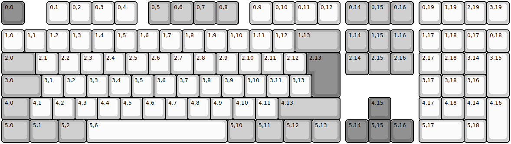{:loading="lazy"}

[Open in keyboard-layout-editor](http://www.keyboard-layout-editor.com/##@@_c=#777777;&=0,0%0AESC&_x:1&c=#cccccc;&=0,1&=0,2&=0,3&=0,4&_x:0.5&c=#aaaaaa;&=0,5&=0,6&=0,7&=0,8&_x:0.5&c=#cccccc;&=0,9&=0,10&=0,11&=0,12&_x:0.25&c=#aaaaaa;&=0,14&=0,15&=0,16&_x:0.25&c=#cccccc;&=0,19&=1,19&=2,19&=3,19;&@_y:0.25;&=1,0&=1,1&=1,2&=1,3&=1,4&=1,5&=1,6&=1,7&=1,8&=1,9&=1,10&=1,11&=1,12&_c=#aaaaaa&w:2;&=1,13&_x:0.25;&=1,14&=1,15&=1,16&_x:0.25&c=#cccccc;&=1,17&=1,18&=0,17&=0,18;&@_c=#aaaaaa&w:1.5;&=2,0&_c=#cccccc;&=2,1&=2,2&=2,3&=2,4&=2,5&=2,6&=2,7&=2,8&=2,9&=2,10&=2,11&=2,12&_x:0.25&c=#777777&w:1.25&h:2&w2:1.5&h2:1&x2:-0.25;&=2,13&_x:0.25&c=#aaaaaa;&=2,14&=2,15&=2,16&_x:0.25&c=#cccccc;&=2,17&=2,18&=3,14&_h:2;&=3,15;&@_c=#aaaaaa&w:1.75;&=3,0&_c=#cccccc;&=3,1&=3,2&=3,3&=3,4&=3,5&=3,6&=3,7&=3,8&=3,9&=3,10&=3,11&=3,13&_x:4.75;&=3,17&=3,18&=3,16;&@_c=#aaaaaa&w:1.25;&=4,0&_c=#cccccc;&=4,1&=4,2&=4,3&=4,4&=4,5&=4,6&=4,7&=4,8&=4,9&=4,10&=4,11&_c=#aaaaaa&w:2.75;&=4,13&_x:1.25&c=#777777;&=4,15&_x:1.25&c=#cccccc;&=4,17&=4,18&=4,14&_h:2;&=4,16;&@_c=#aaaaaa&w:1.25;&=5,0&_w:1.25;&=5,1&_w:1.25;&=5,2&_c=#cccccc&w:6.25;&=5,6&_c=#aaaaaa&w:1.25;&=5,10&_w:1.25;&=5,11&_w:1.25;&=5,12&_w:1.25;&=5,13&_x:0.25&c=#777777;&=5,14&=5,15&=5,16&_x:0.25&c=#cccccc&w:2;&=5,17&=5,18)

## keychron/v6/iso_encoder

[README](output/keychron/v6/README.md) - [layout](output/keychron/v6/iso_encoder-kle.json) - [PCB](output/keychron/v6/iso_encoder.kicad_pcb) - [PCB render](output/keychron/v6/iso_encoder-render.svg)

{:loading="lazy"}

[Open in keyboard-layout-editor](http://www.keyboard-layout-editor.com/##@@_c=#777777;&=0,0%0AESC&_x:0.25&c=#cccccc;&=0,1&=0,2&=0,3&=0,4&_x:0.25&c=#aaaaaa;&=0,5&=0,6&=0,7&=0,8&_x:0.25&c=#cccccc;&=0,9&=0,10&=0,11&=0,12&_x:0.25;&=4,19%0A%0A%0A%0A%0A%0A%0A%0A%0Ae0&_x:0.25&c=#aaaaaa;&=0,14&=0,15&=0,16&_x:0.25&c=#cccccc;&=0,19&=1,19&=2,19&=3,19;&@_y:0.25;&=1,0&=1,1&=1,2&=1,3&=1,4&=1,5&=1,6&=1,7&=1,8&=1,9&=1,10&=1,11&=1,12&_c=#aaaaaa&w:2;&=1,13&_x:0.25;&=1,14&=1,15&=1,16&_x:0.25&c=#cccccc;&=1,17&=1,18&=0,17&=0,18;&@_c=#aaaaaa&w:1.5;&=2,0&_c=#cccccc;&=2,1&=2,2&=2,3&=2,4&=2,5&=2,6&=2,7&=2,8&=2,9&=2,10&=2,11&=2,12&_x:0.25&c=#777777&w:1.25&h:2&w2:1.5&h2:1&x2:-0.25;&=2,13&_x:0.25&c=#aaaaaa;&=2,14&=2,15&=2,16&_x:0.25&c=#cccccc;&=2,17&=2,18&=3,14&_h:2;&=3,15;&@_c=#aaaaaa&w:1.75;&=3,0&_c=#cccccc;&=3,1&=3,2&=3,3&=3,4&=3,5&=3,6&=3,7&=3,8&=3,9&=3,10&=3,11&=3,13&_x:4.75;&=3,17&=3,18&=3,16;&@_c=#aaaaaa&w:1.25;&=4,0&_c=#cccccc;&=4,1&=4,2&=4,3&=4,4&=4,5&=4,6&=4,7&=4,8&=4,9&=4,10&=4,11&_c=#aaaaaa&w:2.75;&=4,13&_x:1.25&c=#777777;&=4,15&_x:1.25&c=#cccccc;&=4,17&=4,18&=4,14&_h:2;&=4,16;&@_c=#aaaaaa&w:1.25;&=5,0&_w:1.25;&=5,1&_w:1.25;&=5,2&_c=#cccccc&w:6.25;&=5,6&_c=#aaaaaa&w:1.25;&=5,10&_w:1.25;&=5,11&_w:1.25;&=5,12&_w:1.25;&=5,13&_x:0.25&c=#777777;&=5,14&=5,15&=5,16&_x:0.25&c=#cccccc&w:2;&=5,17&=5,18)

## keychron/v7/ansi

[README](output/keychron/v7/README.md) - [layout](output/keychron/v7/ansi-kle.json) - [PCB](output/keychron/v7/ansi.kicad_pcb) - [PCB render](output/keychron/v7/ansi-render.svg)

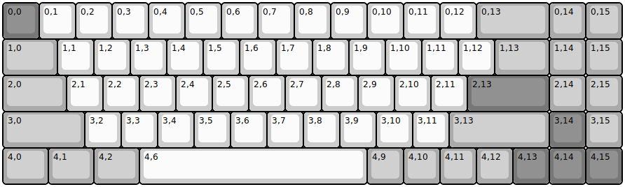{:loading="lazy"}

[Open in keyboard-layout-editor](http://www.keyboard-layout-editor.com/##@@_c=#777777;&=0,0%0AESC&_c=#cccccc;&=0,1&=0,2&=0,3&=0,4&=0,5&=0,6&=0,7&=0,8&=0,9&=0,10&=0,11&=0,12&_c=#aaaaaa&w:2;&=0,13&=0,14&=0,15;&@_w:1.5;&=1,0&_c=#cccccc;&=1,1&=1,2&=1,3&=1,4&=1,5&=1,6&=1,7&=1,8&=1,9&=1,10&=1,11&=1,12&_c=#aaaaaa&w:1.5;&=1,13&=1,14&=1,15;&@_w:1.75;&=2,0&_c=#cccccc;&=2,1&=2,2&=2,3&=2,4&=2,5&=2,6&=2,7&=2,8&=2,9&=2,10&=2,11&_c=#777777&w:2.25;&=2,13&_c=#aaaaaa;&=2,14&=2,15;&@_w:2.25;&=3,0&_c=#cccccc;&=3,2&=3,3&=3,4&=3,5&=3,6&=3,7&=3,8&=3,9&=3,10&=3,11&_c=#aaaaaa&w:2.75;&=3,13&_c=#777777;&=3,14&_c=#aaaaaa;&=3,15;&@_w:1.25;&=4,0&_w:1.25;&=4,1&_w:1.25;&=4,2&_c=#cccccc&w:6.25;&=4,6&_c=#aaaaaa;&=4,9&=4,10&=4,11&=4,12&_c=#777777;&=4,13&=4,14&=4,15)

## keychron/v7/iso

[README](output/keychron/v7/README.md) - [layout](output/keychron/v7/iso-kle.json) - [PCB](output/keychron/v7/iso.kicad_pcb) - [PCB render](output/keychron/v7/iso-render.svg)

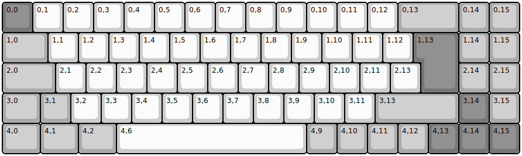{:loading="lazy"}

[Open in keyboard-layout-editor](http://www.keyboard-layout-editor.com/##@@_c=#777777;&=0,0%0AESC&_c=#cccccc;&=0,1&=0,2&=0,3&=0,4&=0,5&=0,6&=0,7&=0,8&=0,9&=0,10&=0,11&=0,12&_c=#aaaaaa&w:2;&=0,13&=0,14&=0,15;&@_w:1.5;&=1,0&_c=#cccccc;&=1,1&=1,2&=1,3&=1,4&=1,5&=1,6&=1,7&=1,8&=1,9&=1,10&=1,11&=1,12&_x:0.25&c=#777777&w:1.25&h:2&w2:1.5&h2:1&x2:-0.25;&=1,13&_c=#aaaaaa;&=1,14&=1,15;&@_w:1.75;&=2,0&_c=#cccccc;&=2,1&=2,2&=2,3&=2,4&=2,5&=2,6&=2,7&=2,8&=2,9&=2,10&=2,11&=2,13&_x:1.25&c=#aaaaaa;&=2,14&=2,15;&@_w:1.25;&=3,0&=3,1&_c=#cccccc;&=3,2&=3,3&=3,4&=3,5&=3,6&=3,7&=3,8&=3,9&=3,10&=3,11&_c=#aaaaaa&w:2.75;&=3,13&_c=#777777;&=3,14&_c=#aaaaaa;&=3,15;&@_w:1.25;&=4,0&_w:1.25;&=4,1&_w:1.25;&=4,2&_c=#cccccc&w:6.25;&=4,6&_c=#aaaaaa;&=4,9&=4,10&=4,11&=4,12&_c=#777777;&=4,13&=4,14&=4,15)

## keychron/v8/ansi

[README](output/keychron/v8/README.md) - [layout](output/keychron/v8/ansi-kle.json) - [PCB](output/keychron/v8/ansi.kicad_pcb) - [PCB render](output/keychron/v8/ansi-render.svg)

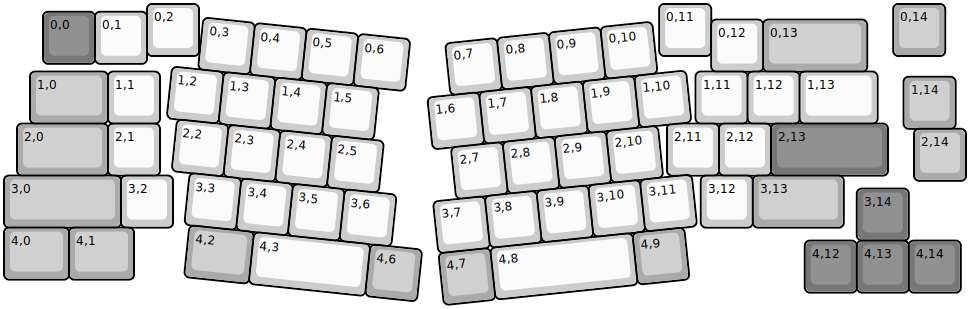{:loading="lazy"}

[Open in keyboard-layout-editor](http://www.keyboard-layout-editor.com/##@@_x:2.75;&=0,2&_x:8.85;&=0,11&_x:3.5&c=#aaaaaa;&=0,14;&@_x:0.75&y:-0.85&c=#777777;&=0,0%0AESC&_c=#cccccc;&=0,1;&@_x:13.6&y:-0.85;&=0,12&_c=#aaaaaa&w:2;&=0,13;&@_x:0.5&w:1.5;&=1,0&_c=#cccccc;&=1,1&_x:10.3;&=1,11&=1,12&_w:1.5;&=1,13;&@_x:17.3&y:-0.9&c=#aaaaaa;&=1,14;&@_x:0.25&y:-0.1&w:1.75;&=2,0&_c=#cccccc;&=2,1&_x:9.75;&=2,11&=2,12&_c=#777777&w:2.25;&=2,13;&@_x:17.5&y:-0.9&c=#aaaaaa;&=2,14;&@_y:-0.1&w:2.25;&=3,0&_c=#cccccc;&=3,2&_x:10.15;&=3,12&_c=#aaaaaa&w:1.75;&=3,13;&@_x:16.4&y:-0.75&c=#777777;&=3,14;&@_y:-0.25&c=#aaaaaa&w:1.25;&=4,0&_w:1.25;&=4,1;&@_x:15.4&y:-0.75&c=#777777;&=4,12&=4,13&=4,14;&@_r:6&x:3.85&y:-5.7&c=#cccccc;&=0,3&=0,4&=0,5&=0,6;&@_x:3.35;&=1,2&=1,3&=1,4&=1,5;&@_x:3.55;&=2,2&=2,3&=2,4&=2,5;&@_x:3.9;&=3,3&=3,4&=3,5&=3,6;&@_x:4&c=#aaaaaa&w:1.25;&=4,2&_c=#cccccc&w:2.25;&=4,3&_c=#aaaaaa;&=4,6;&@_r:-6&x:8.35&y:-3.2&c=#cccccc;&=0,7&=0,8&=0,9&=0,10;&@_x:7.9;&=1,6&=1,7&=1,8&=1,9&=1,10;&@_x:8.25;&=2,7&=2,8&=2,9&=2,10;&@_x:7.8;&=3,7&=3,8&=3,9&=3,10&=3,11;&@_x:7.8&c=#aaaaaa;&=4,7&_c=#cccccc&w:2.75;&=4,8&_c=#aaaaaa;&=4,9)

## keychron/v8/ansi_encoder

[README](output/keychron/v8/README.md) - [layout](output/keychron/v8/ansi_encoder-kle.json) - [PCB](output/keychron/v8/ansi_encoder.kicad_pcb) - [PCB render](output/keychron/v8/ansi_encoder-render.svg)

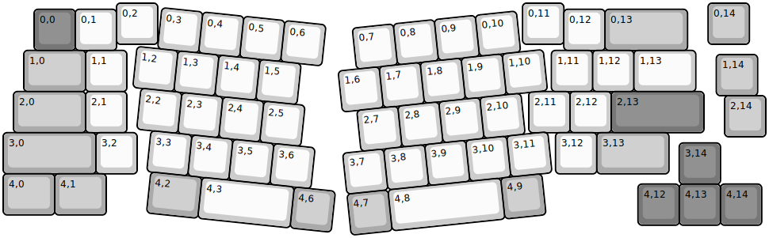{:loading="lazy"}

[Open in keyboard-layout-editor](http://www.keyboard-layout-editor.com/##@@_x:2.75;&=0,2&_x:8.85;&=0,11&_x:3.5&c=#aaaaaa;&=0,14%0A%0A%0A%0A%0A%0A%0A%0A%0Ae0;&@_x:0.75&y:-0.85&c=#777777;&=0,0%0AESC&_c=#cccccc;&=0,1&_x:10.85;&=0,12&_c=#aaaaaa&w:2;&=0,13;&@_x:0.5&w:1.5;&=1,0&_c=#cccccc;&=1,1&_x:10.3;&=1,11&=1,12&_w:1.5;&=1,13;&@_x:17.3&y:-0.9&c=#aaaaaa;&=1,14;&@_x:0.25&y:-0.1&w:1.75;&=2,0&_c=#cccccc;&=2,1&_x:9.75;&=2,11&=2,12&_c=#777777&w:2.25;&=2,13;&@_x:17.5&y:-0.9&c=#aaaaaa;&=2,14;&@_y:-0.1&w:2.25;&=3,0&_c=#cccccc;&=3,2&_x:10.15;&=3,12&_c=#aaaaaa&w:1.75;&=3,13;&@_x:16.4&y:-0.75&c=#777777;&=3,14;&@_y:-0.25&c=#aaaaaa&w:1.25;&=4,0&_w:1.25;&=4,1;&@_x:15.4&y:-0.75&c=#777777;&=4,12&=4,13&=4,14;&@_r:6&x:3.85&y:-5.7&c=#cccccc;&=0,3&=0,4&=0,5&=0,6;&@_x:3.35;&=1,2&=1,3&=1,4&=1,5;&@_x:3.55;&=2,2&=2,3&=2,4&=2,5;&@_x:3.9;&=3,3&=3,4&=3,5&=3,6;&@_x:4&c=#aaaaaa&w:1.25;&=4,2&_c=#cccccc&w:2.25;&=4,3&_c=#aaaaaa;&=4,6;&@_r:-6&x:8.35&y:-3.2&c=#cccccc;&=0,7&=0,8&=0,9&=0,10;&@_x:7.9;&=1,6&=1,7&=1,8&=1,9&=1,10;&@_x:8.25;&=2,7&=2,8&=2,9&=2,10;&@_x:7.8;&=3,7&=3,8&=3,9&=3,10&=3,11;&@_x:7.8&c=#aaaaaa;&=4,7&_c=#cccccc&w:2.75;&=4,8&_c=#aaaaaa;&=4,9)

## keychron/v8/iso

[README](output/keychron/v8/README.md) - [layout](output/keychron/v8/iso-kle.json) - [PCB](output/keychron/v8/iso.kicad_pcb) - [PCB render](output/keychron/v8/iso-render.svg)

{:loading="lazy"}

[Open in keyboard-layout-editor](http://www.keyboard-layout-editor.com/##@@_x:2.75;&=0,2&_x:8.85;&=0,11&_x:3.5&c=#aaaaaa;&=0,14%0A%0A%0A%0A%0A%0A%0A%0A%0Ae0;&@_x:13.6&y:-0.85&c=#cccccc;&=0,12&_c=#aaaaaa&w:2;&=0,13&_x:-15.85&c=#777777;&=0,0%0AESC&_c=#cccccc;&=0,1;&@_x:0.5&c=#aaaaaa&w:1.5;&=1,0&_c=#cccccc;&=1,1&_x:10.5;&=1,11&=1,12&_x:0.25&c=#777777&w:1.25&h:2&w2:1.5&h2:1&x2:-0.25;&=1,13;&@_x:17.3&y:-0.9&c=#aaaaaa;&=1,14;&@_x:0.25&y:-0.1&w:1.75;&=2,0&_c=#cccccc;&=2,1&_x:9.75;&=2,11&=2,12&=2,13;&@_x:17.5&y:-0.9&c=#aaaaaa;&=2,14;&@_y:-0.1&w:1.25;&=3,0&=3,1&_c=#cccccc;&=3,2&_x:10.15;&=3,12&_c=#aaaaaa&w:1.75;&=3,13;&@_x:16.4&y:-0.75&c=#777777;&=3,14;&@_y:-0.25&c=#aaaaaa&w:1.25;&=4,0&_w:1.25;&=4,1;&@_x:15.4&y:-0.75&c=#777777;&=4,12&=4,13&=4,14;&@_r:6&x:3.85&y:-5.7&c=#cccccc;&=0,3&=0,4&=0,5&=0,6;&@_x:3.35;&=1,2&=1,3&=1,4&=1,5;&@_x:3.55;&=2,2&=2,3&=2,4&=2,5;&@_x:3.9;&=3,3&=3,4&=3,5&=3,6;&@_x:4&c=#aaaaaa&w:1.25;&=4,2&_c=#cccccc&w:2.25;&=4,3&_c=#aaaaaa;&=4,6;&@_r:-6&x:8.35&y:-3.2&c=#cccccc;&=0,7&=0,8&=0,9&=0,10;&@_x:7.9;&=1,6&=1,7&=1,8&=1,9&=1,10;&@_x:8.25;&=2,7&=2,8&=2,9&=2,10;&@_x:7.8;&=3,7&=3,8&=3,9&=3,10&=3,11;&@_x:7.8&c=#aaaaaa;&=4,7&_c=#cccccc&w:2.75;&=4,8&_c=#aaaaaa;&=4,9)

## keychron/v8/iso_encoder

[README](output/keychron/v8/README.md) - [layout](output/keychron/v8/iso_encoder-kle.json) - [PCB](output/keychron/v8/iso_encoder.kicad_pcb) - [PCB render](output/keychron/v8/iso_encoder-render.svg)

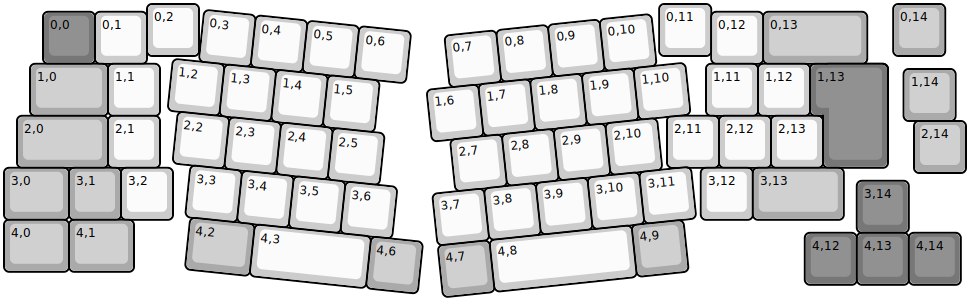{:loading="lazy"}

[Open in keyboard-layout-editor](http://www.keyboard-layout-editor.com/##@@_x:2.75;&=0,2&_x:8.85;&=0,11&_x:3.5&c=#aaaaaa;&=0,14%0A%0A%0A%0A%0A%0A%0A%0A%0Ae0;&@_x:13.6&y:-0.85&c=#cccccc;&=0,12&_c=#aaaaaa&w:2;&=0,13&_x:-15.85&c=#777777;&=0,0%0AESC&_c=#cccccc;&=0,1;&@_x:0.5&c=#aaaaaa&w:1.5;&=1,0&_c=#cccccc;&=1,1&_x:10.5;&=1,11&=1,12&_x:0.25&c=#777777&w:1.25&h:2&w2:1.5&h2:1&x2:-0.25;&=1,13;&@_x:17.3&y:-0.9&c=#aaaaaa;&=1,14;&@_x:0.25&y:-0.1&w:1.75;&=2,0&_c=#cccccc;&=2,1&_x:9.75;&=2,11&=2,12&=2,13;&@_x:17.5&y:-0.9&c=#aaaaaa;&=2,14;&@_y:-0.1&w:1.25;&=3,0&=3,1&_c=#cccccc;&=3,2&_x:10.15;&=3,12&_c=#aaaaaa&w:1.75;&=3,13;&@_x:16.4&y:-0.75&c=#777777;&=3,14;&@_y:-0.25&c=#aaaaaa&w:1.25;&=4,0&_w:1.25;&=4,1;&@_x:15.4&y:-0.75&c=#777777;&=4,12&=4,13&=4,14;&@_r:6&x:3.85&y:-5.7&c=#cccccc;&=0,3&=0,4&=0,5&=0,6;&@_x:3.35;&=1,2&=1,3&=1,4&=1,5;&@_x:3.55;&=2,2&=2,3&=2,4&=2,5;&@_x:3.9;&=3,3&=3,4&=3,5&=3,6;&@_x:4&c=#aaaaaa&w:1.25;&=4,2&_c=#cccccc&w:2.25;&=4,3&_c=#aaaaaa;&=4,6;&@_r:-6&x:8.35&y:-3.2&c=#cccccc;&=0,7&=0,8&=0,9&=0,10;&@_x:7.9;&=1,6&=1,7&=1,8&=1,9&=1,10;&@_x:8.25;&=2,7&=2,8&=2,9&=2,10;&@_x:7.8;&=3,7&=3,8&=3,9&=3,10&=3,11;&@_x:7.8&c=#aaaaaa;&=4,7&_c=#cccccc&w:2.75;&=4,8&_c=#aaaaaa;&=4,9)

## keygem/kg60ansi

[README](output/keygem/kg60ansi/README.md) - [layout](output/keygem/kg60ansi/kg60ansi-kle.json) - [PCB](output/keygem/kg60ansi/kg60ansi.kicad_pcb) - [PCB render](output/keygem/kg60ansi/kg60ansi-render.svg)

{:loading="lazy"}

[Open in keyboard-layout-editor](http://www.keyboard-layout-editor.com/##@@_c=#777777;&=0,0&_c=#cccccc;&=0,1&=0,2&=0,3&=0,4&=0,5&=0,6&=0,7&=0,8&=0,9&=0,10&=0,11&=0,12&_c=#aaaaaa&w:2;&=0,13;&@_w:1.5;&=1,0&_c=#cccccc;&=1,1&=1,2&=1,3&=1,4&=1,5&=1,6&=1,7&=1,8&=1,9&=1,10&=1,11&=1,12&_w:1.5;&=1,13;&@_c=#aaaaaa&w:1.75;&=2,0&_c=#cccccc;&=2,1&=2,2&=2,3&=2,4&=2,5&=2,6&=2,7&=2,8&=2,9&=2,10&=2,11&_c=#777777&w:2.25;&=2,13;&@_c=#aaaaaa&w:2.25;&=3,0&_c=#cccccc;&=3,1&=3,2&=3,3&=3,4&=3,5&=3,6&=3,7&=3,8&=3,9&=3,10&_c=#777777&w:2.75;&=3,12;&@_c=#aaaaaa&w:1.25;&=4,0&_w:1.25;&=4,1&_w:1.25;&=4,2&_c=#cccccc&w:6.25;&=4,5&_c=#aaaaaa&w:1.25;&=4,9&_w:1.25;&=4,10&_w:1.25;&=4,12&_w:1.25;&=4,13)

## keygem/kg65rgbv2

[README](output/keygem/kg65rgbv2/README.md) - [layout](output/keygem/kg65rgbv2/kg65rgbv2-kle.json) - [PCB](output/keygem/kg65rgbv2/kg65rgbv2.kicad_pcb) - [PCB render](output/keygem/kg65rgbv2/kg65rgbv2-render.svg)

{:loading="lazy"}

[Open in keyboard-layout-editor](http://www.keyboard-layout-editor.com/##@@_c=#777777;&=0,0&_c=#cccccc;&=0,1&=0,2&=0,3&=0,4&=0,5&=0,6&=0,7&=0,8&=0,9&=0,10&=0,11&=0,12&_c=#aaaaaa&w:2;&=0,13&_c=#cccccc;&=0,14;&@_c=#aaaaaa&w:1.5;&=1,0&_c=#cccccc;&=1,1&=1,2&=1,3&=1,4&=1,5&=1,6&=1,7&=1,8&=1,9&=1,10&=1,11&=1,12&_w:1.5;&=1,13&=1,14;&@_c=#aaaaaa&w:1.75;&=2,0&_c=#cccccc;&=2,1&=2,2&=2,3&=2,4&=2,5&=2,6&=2,7&=2,8&=2,9&=2,10&=2,11&_c=#777777&w:2.25;&=2,13&_c=#cccccc;&=2,14;&@_c=#aaaaaa&w:2.25;&=3,0&_c=#cccccc;&=3,1&=3,2&=3,3&=3,4&=3,5&=3,6&=3,7&=3,8&=3,9&=3,10&_w:1.75;&=3,12&=3,13&=3,14;&@_c=#aaaaaa&w:1.25;&=4,0&_w:1.25;&=4,1&_w:1.25;&=4,2&_c=#cccccc&w:6.25;&=4,5&_c=#aaaaaa;&=4,9&=4,10&=4,11&=4,12&=4,13&_c=#cccccc;&=4,14)

## keyquest/enclave-1

[README](output/keyquest/README.md) - [layout](output/keyquest/enclave-1-kle.json) - [PCB](output/keyquest/enclave-1.kicad_pcb) - [PCB render](output/keyquest/enclave-1-render.svg)

{:loading="lazy"}

[Open in keyboard-layout-editor](http://www.keyboard-layout-editor.com/##@@=0,0&=0,1&=0,2;&@=1,0&=1,1&=1,2;&@=2,0&=2,1&=2,2)

## keyten/aperture

[README](output/keyten/aperture/README.md) - [layout](output/keyten/aperture/aperture-kle.json) - [PCB](output/keyten/aperture/aperture.kicad_pcb) - [PCB render](output/keyten/aperture/aperture-render.svg)

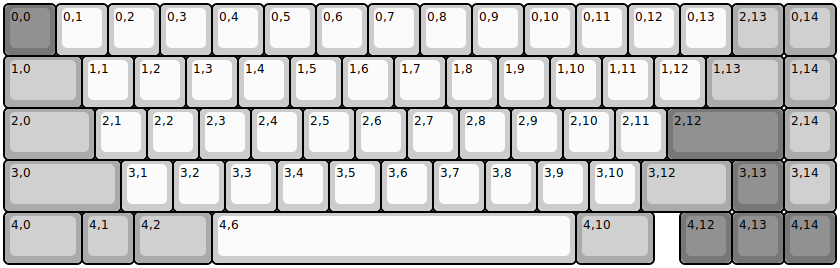{:loading="lazy"}

[Open in keyboard-layout-editor](http://www.keyboard-layout-editor.com/##@@_c=#777777;&=0,0&_c=#cccccc;&=0,1&=0,2&=0,3&=0,4&=0,5&=0,6&=0,7&=0,8&=0,9&=0,10&=0,11&=0,12&=0,13&_c=#aaaaaa;&=2,13&=0,14;&@_w:1.5;&=1,0&_c=#cccccc;&=1,1&=1,2&=1,3&=1,4&=1,5&=1,6&=1,7&=1,8&=1,9&=1,10&=1,11&=1,12&_c=#aaaaaa&w:1.5;&=1,13&=1,14;&@_w:1.75;&=2,0&_c=#cccccc;&=2,1&=2,2&=2,3&=2,4&=2,5&=2,6&=2,7&=2,8&=2,9&=2,10&=2,11&_c=#777777&w:2.25;&=2,12&_c=#aaaaaa;&=2,14;&@_w:2.25;&=3,0&_c=#cccccc;&=3,1&=3,2&=3,3&=3,4&=3,5&=3,6&=3,7&=3,8&=3,9&=3,10&_c=#aaaaaa&w:1.75;&=3,12&_c=#777777;&=3,13&_c=#aaaaaa;&=3,14;&@_w:1.5;&=4,0&=4,1&_w:1.5;&=4,2&_c=#cccccc&w:7;&=4,6&_c=#aaaaaa&w:1.5;&=4,10&_x:0.5&c=#777777;&=4,12&=4,13&=4,14)

## keyten/kt3700

[README](output/keyten/kt3700/README.md) - [layout](output/keyten/kt3700/kt3700-kle.json) - [PCB](output/keyten/kt3700/kt3700.kicad_pcb) - [PCB render](output/keyten/kt3700/kt3700-render.svg)

{:loading="lazy"}

[Open in keyboard-layout-editor](http://www.keyboard-layout-editor.com/##@@_c=#aaaaaa;&=0,0&=0,1&=0,2&=0,3;&@_y:1;&=1,0&=1,1&=1,2&=1,3;&@_c=#cccccc;&=2,0&=2,1&=2,2&_c=#aaaaaa&h:2;&=3,3%0A%0A%0A0,0;&@_c=#cccccc;&=3,0&=3,1&=3,2;&@=4,0&=4,1&=4,2&_c=#777777&h:2;&=5,3%0A%0A%0A1,0;&@_c=#cccccc&w:2;&=5,1%0A%0A%0A2,0&=5,2;&@_x:4.25&y:-4&c=#aaaaaa;&=2,3%0A%0A%0A0,1;&@_x:4.25;&=3,3%0A%0A%0A0,1;&@_x:4.25;&=4,3%0A%0A%0A1,1;&@_x:4.25;&=5,3%0A%0A%0A1,1;&@_y:0.25&c=#cccccc;&=5,0%0A%0A%0A2,1&=5,1%0A%0A%0A2,1)

## keyten/kt60_m

[README](output/keyten/kt60_m/README.md) - [layout](output/keyten/kt60_m/kt60_m-kle.json) - [PCB](output/keyten/kt60_m/kt60_m.kicad_pcb) - [PCB render](output/keyten/kt60_m/kt60_m-render.svg)

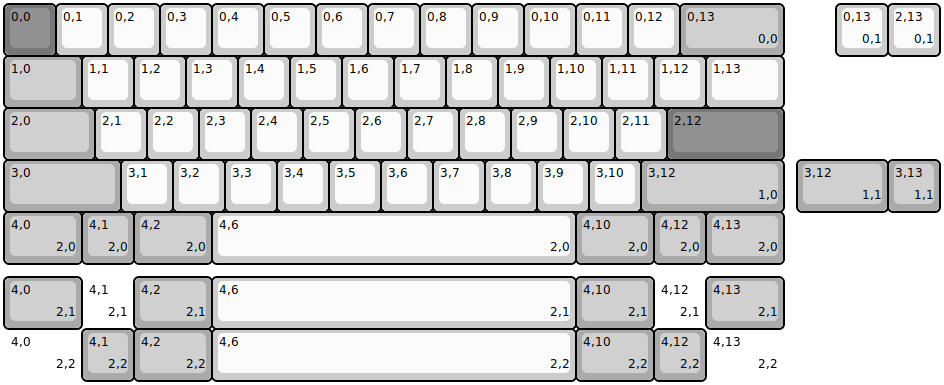{:loading="lazy"}

[Open in keyboard-layout-editor](http://www.keyboard-layout-editor.com/##@@_c=#777777;&=0,0&_c=#cccccc;&=0,1&=0,2&=0,3&=0,4&=0,5&=0,6&=0,7&=0,8&=0,9&=0,10&=0,11&=0,12&_c=#aaaaaa&w:2;&=0,13%0A%0A%0A0,0;&@_w:1.5;&=1,0&_c=#cccccc;&=1,1&=1,2&=1,3&=1,4&=1,5&=1,6&=1,7&=1,8&=1,9&=1,10&=1,11&=1,12&_w:1.5;&=1,13;&@_c=#aaaaaa&w:1.75;&=2,0&_c=#cccccc;&=2,1&=2,2&=2,3&=2,4&=2,5&=2,6&=2,7&=2,8&=2,9&=2,10&=2,11&_c=#777777&w:2.25;&=2,12;&@_c=#aaaaaa&w:2.25;&=3,0&_c=#cccccc;&=3,1&=3,2&=3,3&=3,4&=3,5&=3,6&=3,7&=3,8&=3,9&=3,10&_c=#aaaaaa&w:2.75;&=3,12%0A%0A%0A1,0;&@_w:1.5;&=4,0%0A%0A%0A2,0&=4,1%0A%0A%0A2,0&_w:1.5;&=4,2%0A%0A%0A2,0&_c=#cccccc&w:7;&=4,6%0A%0A%0A2,0&_c=#aaaaaa&w:1.5;&=4,10%0A%0A%0A2,0&=4,12%0A%0A%0A2,0&_w:1.5;&=4,13%0A%0A%0A2,0;&@_x:16&y:-5&c=#cccccc;&=0,13%0A%0A%0A0,1&=2,13%0A%0A%0A0,1;&@_x:15.25&y:2&c=#aaaaaa&w:1.75;&=3,12%0A%0A%0A1,1&=3,13%0A%0A%0A1,1;&@_y:1.25&w:1.5;&=4,0%0A%0A%0A2,1&_c=#cccccc&d:true;&=4,1%0A%0A%0A2,1&_c=#aaaaaa&w:1.5;&=4,2%0A%0A%0A2,1&_c=#cccccc&w:7;&=4,6%0A%0A%0A2,1&_c=#aaaaaa&w:1.5;&=4,10%0A%0A%0A2,1&_c=#cccccc&d:true;&=4,12%0A%0A%0A2,1&_c=#aaaaaa&w:1.5;&=4,13%0A%0A%0A2,1;&@_c=#cccccc&w:1.5&d:true;&=4,0%0A%0A%0A2,2&_c=#aaaaaa;&=4,1%0A%0A%0A2,2&_w:1.5;&=4,2%0A%0A%0A2,2&_c=#cccccc&w:7;&=4,6%0A%0A%0A2,2&_c=#aaaaaa&w:1.5;&=4,10%0A%0A%0A2,2&=4,12%0A%0A%0A2,2&_c=#cccccc&w:1.5&d:true;&=4,13%0A%0A%0A2,2)

## keyten/monoflex60

[README](output/keyten/monoflex60/README.md) - [layout](output/keyten/monoflex60/monoflex60-kle.json) - [PCB](output/keyten/monoflex60/monoflex60.kicad_pcb) - [PCB render](output/keyten/monoflex60/monoflex60-render.svg)

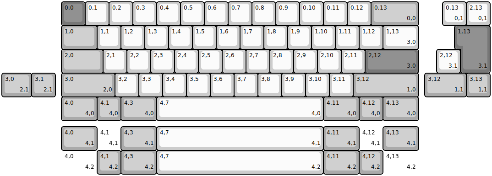{:loading="lazy"}

[Open in keyboard-layout-editor](http://www.keyboard-layout-editor.com/##@@_x:2.5&c=#777777;&=0,0&_c=#cccccc;&=0,1&=0,2&=0,3&=0,4&=0,5&=0,6&=0,7&=0,8&=0,9&=0,10&=0,11&=0,12&_c=#aaaaaa&w:2;&=0,13%0A%0A%0A0,0;&@_x:2.5&w:1.5;&=1,0&_c=#cccccc;&=1,1&=1,2&=1,3&=1,4&=1,5&=1,6&=1,7&=1,8&=1,9&=1,10&=1,11&=1,12&_w:1.5;&=1,13%0A%0A%0A3,0;&@_x:2.5&c=#aaaaaa&w:1.75;&=2,0&_c=#cccccc;&=2,1&=2,2&=2,3&=2,4&=2,5&=2,6&=2,7&=2,8&=2,9&=2,10&=2,11&_c=#777777&w:2.25;&=2,12%0A%0A%0A3,0;&@_x:2.5&c=#aaaaaa&w:2.25;&=3,0%0A%0A%0A2,0&_c=#cccccc;&=3,2&=3,3&=3,4&=3,5&=3,6&=3,7&=3,8&=3,9&=3,10&=3,11&_c=#aaaaaa&w:2.75;&=3,12%0A%0A%0A1,0;&@_x:2.5&w:1.5;&=4,0%0A%0A%0A4,0&=4,1%0A%0A%0A4,0&_w:1.5;&=4,3%0A%0A%0A4,0&_c=#cccccc&w:7;&=4,7%0A%0A%0A4,0&_c=#aaaaaa&w:1.5;&=4,11%0A%0A%0A4,0&=4,12%0A%0A%0A4,0&_w:1.5;&=4,13%0A%0A%0A4,0;&@_x:18.5&y:-5&c=#cccccc;&=0,13%0A%0A%0A0,1&=2,13%0A%0A%0A0,1;&@_x:19.25&c=#777777&w:1.25&h:2&w2:1.5&h2:1&x2:-0.25;&=1,13%0A%0A%0A3,1;&@_x:18.25&c=#cccccc;&=2,12%0A%0A%0A3,1;&@_c=#aaaaaa&w:1.25;&=3,0%0A%0A%0A2,1&=3,1%0A%0A%0A2,1&_x:15.5&w:1.75;&=3,12%0A%0A%0A1,1&=3,13%0A%0A%0A1,1;&@_x:2.5&y:1.25&w:1.5;&=4,0%0A%0A%0A4,1&_c=#cccccc&d:true;&=4,1%0A%0A%0A4,1&_c=#aaaaaa&w:1.5;&=4,3%0A%0A%0A4,1&_c=#cccccc&w:7;&=4,7%0A%0A%0A4,1&_c=#aaaaaa&w:1.5;&=4,11%0A%0A%0A4,1&_c=#cccccc&d:true;&=4,12%0A%0A%0A4,1&_c=#aaaaaa&w:1.5;&=4,13%0A%0A%0A4,1;&@_x:2.5&c=#cccccc&w:1.5&d:true;&=4,0%0A%0A%0A4,2&_c=#aaaaaa;&=4,1%0A%0A%0A4,2&_w:1.5;&=4,3%0A%0A%0A4,2&_c=#cccccc&w:7;&=4,7%0A%0A%0A4,2&_c=#aaaaaa&w:1.5;&=4,11%0A%0A%0A4,2&=4,12%0A%0A%0A4,2&_c=#cccccc&w:1.5&d:true;&=4,13%0A%0A%0A4,2)

## kikoslab/ellora65

[README](output/kikoslab/README.md) - [layout](output/kikoslab/ellora65-kle.json) - [PCB](output/kikoslab/ellora65.kicad_pcb) - [PCB render](output/kikoslab/ellora65-render.svg)

{:loading="lazy"}

[Open in keyboard-layout-editor](http://www.keyboard-layout-editor.com/##@@_x:1.25&c=#aaaaaa;&=0,0;&@_x:2.5&y:-0.75&c=#777777;&=1,0&_c=#cccccc;&=0,1&=1,1&=0,2&=1,2&=0,3&=1,3&=0,4&=1,4&=0,5&=1,5&=0,6&=1,6&_c=#aaaaaa&w:2;&=0,7%0A%0A%0A0,0;&@_x:1.25;&=2,0&_x:0.25&w:1.5;&=3,0&_c=#cccccc;&=2,1&=3,1&=2,2&=3,2&=2,3&=3,3&=2,4&=3,4&=2,5&=3,5&=2,6&=3,6&_c=#aaaaaa&w:1.5;&=2,7%0A%0A%0A1,0;&@_x:1.25;&=4,0&_x:0.25&w:1.75;&=5,0&_c=#cccccc;&=4,1&=5,1&=4,2&=5,2&=4,3&=5,3&=4,4&=5,4&=4,5&=5,5&=4,6&_c=#777777&w:2.25;&=4,7%0A%0A%0A1,0&_c=#aaaaaa;&=5,7;&@_x:1.25;&=6,0&_x:0.25&w:2.25;&=7,0%0A%0A%0A2,0&_c=#cccccc;&=7,1&=6,2&=7,2&=6,3&=7,3&=6,4&=7,4&=6,5&=7,5&=6,6&_c=#aaaaaa&w:1.75;&=7,6&_c=#777777;&=6,7&_c=#aaaaaa;&=7,7;&@_x:1.25;&=8,0&_x:0.25&w:1.25;&=9,0%0A%0A%0A3,0&_w:1.25;&=8,1%0A%0A%0A3,0&_w:1.25;&=9,1%0A%0A%0A3,0&_w:6.25;&=8,3%0A%0A%0A3,0&=9,5%0A%0A%0A3,0&_w:1.5;&=8,6%0A%0A%0A3,0&_x:0.5&c=#777777;&=9,6&=8,7&=9,7;&@_x:17.75&y:-5.0&c=#aaaaaa;&=0,7%0A%0A%0A0,1&=1,7%0A%0A%0A0,1;&@_x:19.75&y:0.5&c=#777777&w:1.25&h:2&w2:1.5&h2:1&x2:-0.25;&=4,7%0A%0A%0A1,1;&@_x:18.75&c=#aaaaaa;&=5,6%0A%0A%0A1,1;&@_x:2.5&y:1.5&w:1.25;&=9,0%0A%0A%0A3,1&_w:1.25;&=8,1%0A%0A%0A3,1&_w:1.25;&=9,1%0A%0A%0A3,1&_w:2.75;&=8,2%0A%0A%0A3,1&_w:1.25;&=8,3%0A%0A%0A3,1&_w:2.25;&=8,4%0A%0A%0A3,1&=9,5%0A%0A%0A3,1&_w:1.5;&=8,6%0A%0A%0A3,1;&@_w:1.25;&=7,0%0A%0A%0A2,1&=6,1%0A%0A%0A2,1&_x:0.25&w:1.5;&=9,0%0A%0A%0A3,2&=8,1%0A%0A%0A3,2&_w:1.5;&=9,1%0A%0A%0A3,2&_w:7;&=8,3%0A%0A%0A3,2&_w:1.5;&=8,6%0A%0A%0A3,2)

## kikoslab/kl90

[README](output/kikoslab/README.md) - [layout](output/kikoslab/kl90-kle.json) - [PCB](output/kikoslab/kl90.kicad_pcb) - [PCB render](output/kikoslab/kl90-render.svg)

{:loading="lazy"}

[Open in keyboard-layout-editor](http://www.keyboard-layout-editor.com/##@@_c=#aaaaaa;&=0,0&_x:0.5&c=#777777;&=0,1&_x:0.25&c=#aaaaaa;&=0,2&=0,3&=0,4&=0,5&_x:0.25;&=0,6&=0,7&=0,8&=0,9&_x:0.25;&=0,10&=0,11&=0,12&=0,13&_x:0.25;&=0,14%0A%0A%0A0,0&_x:0.5;&=0,15%0A%0A%0A0,0;&@_y:0.5;&=1,0&_x:0.5;&=1,1&_c=#cccccc;&=1,2&=1,3&=1,4&=1,5&=1,6&=1,7&=1,8&=1,9&=1,10&=1,11&=1,12&=1,13&_c=#aaaaaa&w:2;&=1,14&_x:0.5;&=1,15;&@=2,0&_x:0.5&w:1.5;&=2,1&_c=#cccccc;&=2,2&=2,3&=2,4&=2,5&=2,6&=2,7&=2,8&=2,9&=2,10&=2,11&=2,12&=2,13&_c=#aaaaaa&w:1.5;&=2,14%0A%0A%0A1,0&_x:0.5;&=2,15;&@=3,0&_x:0.5&w:1.75;&=3,1&_c=#cccccc;&=3,2&=3,3&=3,4&=3,5&=3,6&=3,7&=3,8&=3,9&=3,10&=3,11&=3,12&_c=#777777&w:2.25;&=3,14%0A%0A%0A1,0&_x:0.5&c=#aaaaaa;&=3,15;&@=4,0&_x:0.5&w:2.25;&=4,1%0A%0A%0A2,0&_c=#cccccc;&=4,2&=4,3&=4,4&=4,5&=4,6&=4,7&=4,8&=4,9&=4,10&=4,11&_c=#aaaaaa&w:1.75;&=4,13&_x:1.5;&=4,15;&@_x:15.75&y:-0.75&c=#777777;&=4,14;&@_y:-0.25&c=#aaaaaa;&=5,0&_x:0.5&w:1.25;&=5,1&_w:1.25;&=5,2&_w:1.25;&=5,3&_w:6.25;&=5,6%0A%0A%0A3,0&_w:1.5;&=5,10%0A%0A%0A4,0&_w:1.5;&=5,11%0A%0A%0A4,0;&@_x:14.75&y:-0.75&c=#777777;&=5,13&=5,14&=5,15;&@_x:18.5&y:-6.75&c=#cccccc&w:2&d:true;&=%0A%0A%0A0,1;&@_x:19.5&y:1.5&c=#aaaaaa&w:1.25&h:2&w2:1.5&h2:1&x2:-0.25;&=3,14%0A%0A%0A1,1;&@_x:18.5;&=3,13%0A%0A%0A1,1;&@_x:1.5&y:2.0&w:1.25;&=4,1%0A%0A%0A2,1&=4,12%0A%0A%0A2,1&_x:1.5&w:2.25;&=5,4%0A%0A%0A3,1&_w:1.25;&=5,6%0A%0A%0A3,1&_w:2.75;&=5,8%0A%0A%0A3,1&=5,10%0A%0A%0A4,1&=5,11%0A%0A%0A4,1&=5,12%0A%0A%0A4,1;&@_x:5.25&w:6.25;&=5,5%0A%0A%0A3,2;&@_x:5.25&w:2.25;&=5,4%0A%0A%0A3,3&_w:1.25;&=5,5%0A%0A%0A3,3&_w:2.75;&=5,8%0A%0A%0A3,3)

## kineticlabs/emu/emu_hotswap

[README](output/kineticlabs/emu/README.md) - [layout](output/kineticlabs/emu/emu_hotswap-kle.json) - [PCB](output/kineticlabs/emu/emu_hotswap.kicad_pcb) - [PCB render](output/kineticlabs/emu/emu_hotswap-render.svg)

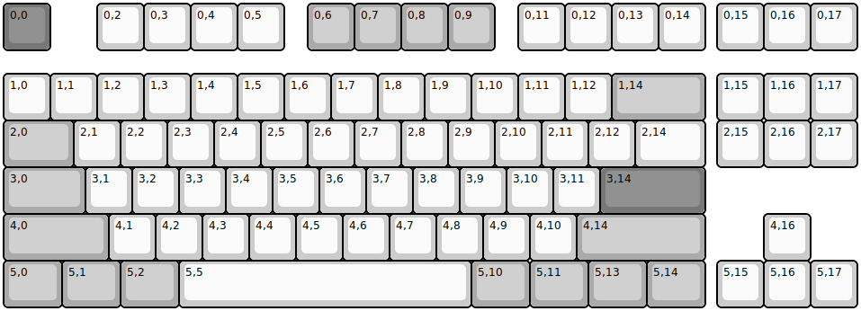{:loading="lazy"}

[Open in keyboard-layout-editor](http://www.keyboard-layout-editor.com/##@@_c=#777777;&=0,0&_x:1&c=#cccccc;&=0,2&=0,3&=0,4&=0,5&_x:0.5&c=#aaaaaa;&=0,6&=0,7&=0,8&=0,9&_x:0.5&c=#cccccc;&=0,11&=0,12&=0,13&=0,14&_x:0.25;&=0,15&=0,16&=0,17;&@_y:0.5;&=1,0&=1,1&=1,2&=1,3&=1,4&=1,5&=1,6&=1,7&=1,8&=1,9&=1,10&=1,11&=1,12&_c=#aaaaaa&w:2;&=1,14&_x:0.25&c=#cccccc;&=1,15&=1,16&=1,17;&@_c=#aaaaaa&w:1.5;&=2,0&_c=#cccccc;&=2,1&=2,2&=2,3&=2,4&=2,5&=2,6&=2,7&=2,8&=2,9&=2,10&=2,11&=2,12&_w:1.5;&=2,14&_x:0.25;&=2,15&=2,16&=2,17;&@_c=#aaaaaa&w:1.75;&=3,0&_c=#cccccc;&=3,1&=3,2&=3,3&=3,4&=3,5&=3,6&=3,7&=3,8&=3,9&=3,10&=3,11&_c=#777777&w:2.25;&=3,14;&@_c=#aaaaaa&w:2.25;&=4,0&_c=#cccccc;&=4,1&=4,2&=4,3&=4,4&=4,5&=4,6&=4,7&=4,8&=4,9&=4,10&_c=#aaaaaa&w:2.75;&=4,14&_x:1.25&c=#cccccc;&=4,16;&@_c=#aaaaaa&w:1.25;&=5,0&_w:1.25;&=5,1&_w:1.25;&=5,2&_c=#cccccc&w:6.25;&=5,5&_c=#aaaaaa&w:1.25;&=5,10&_w:1.25;&=5,11&_w:1.25;&=5,13&_w:1.25;&=5,14&_x:0.25&c=#cccccc;&=5,15&=5,16&=5,17)

## kineticlabs/emu/emu_soldered

[README](output/kineticlabs/emu/README.md) - [layout](output/kineticlabs/emu/emu_soldered-kle.json) - [PCB](output/kineticlabs/emu/emu_soldered.kicad_pcb) - [PCB render](output/kineticlabs/emu/emu_soldered-render.svg)

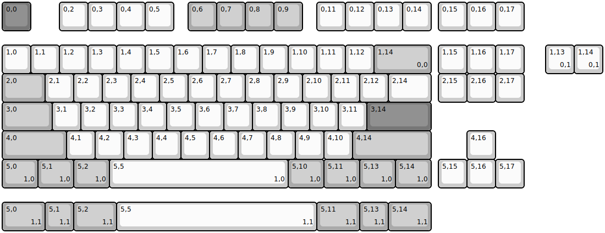{:loading="lazy"}

[Open in keyboard-layout-editor](http://www.keyboard-layout-editor.com/##@@_c=#777777;&=0,0&_x:1&c=#cccccc;&=0,2&=0,3&=0,4&=0,5&_x:0.5&c=#aaaaaa;&=0,6&=0,7&=0,8&=0,9&_x:0.5&c=#cccccc;&=0,11&=0,12&=0,13&=0,14&_x:0.25;&=0,15&=0,16&=0,17;&@_y:0.5;&=1,0&=1,1&=1,2&=1,3&=1,4&=1,5&=1,6&=1,7&=1,8&=1,9&=1,10&=1,11&=1,12&_c=#aaaaaa&w:2;&=1,14%0A%0A%0A0,0&_x:0.25&c=#cccccc;&=1,15&=1,16&=1,17;&@_c=#aaaaaa&w:1.5;&=2,0&_c=#cccccc;&=2,1&=2,2&=2,3&=2,4&=2,5&=2,6&=2,7&=2,8&=2,9&=2,10&=2,11&=2,12&_w:1.5;&=2,14&_x:0.25;&=2,15&=2,16&=2,17;&@_c=#aaaaaa&w:1.75;&=3,0&_c=#cccccc;&=3,1&=3,2&=3,3&=3,4&=3,5&=3,6&=3,7&=3,8&=3,9&=3,10&=3,11&_c=#777777&w:2.25;&=3,14;&@_c=#aaaaaa&w:2.25;&=4,0&_c=#cccccc;&=4,1&=4,2&=4,3&=4,4&=4,5&=4,6&=4,7&=4,8&=4,9&=4,10&_c=#aaaaaa&w:2.75;&=4,14&_x:1.25&c=#cccccc;&=4,16;&@_c=#aaaaaa&w:1.25;&=5,0%0A%0A%0A1,0&_w:1.25;&=5,1%0A%0A%0A1,0&_w:1.25;&=5,2%0A%0A%0A1,0&_c=#cccccc&w:6.25;&=5,5%0A%0A%0A1,0&_c=#aaaaaa&w:1.25;&=5,10%0A%0A%0A1,0&_w:1.25;&=5,11%0A%0A%0A1,0&_w:1.25;&=5,13%0A%0A%0A1,0&_w:1.25;&=5,14%0A%0A%0A1,0&_x:0.25&c=#cccccc;&=5,15&=5,16&=5,17;&@_x:19.0&y:-5.0;&=1,13%0A%0A%0A0,1&=1,14%0A%0A%0A0,1;&@_y:4.5&c=#aaaaaa&w:1.5;&=5,0%0A%0A%0A1,1&=5,1%0A%0A%0A1,1&_w:1.5;&=5,2%0A%0A%0A1,1&_c=#cccccc&w:7;&=5,5%0A%0A%0A1,1&_c=#aaaaaa&w:1.5;&=5,11%0A%0A%0A1,1&=5,13%0A%0A%0A1,1&_w:1.5;&=5,14%0A%0A%0A1,1)

## kira80/kira80

[README](output/kira80/README.md) - [layout](output/kira80/kira80-kle.json) - [PCB](output/kira80/kira80.kicad_pcb) - [PCB render](output/kira80/kira80-render.svg)

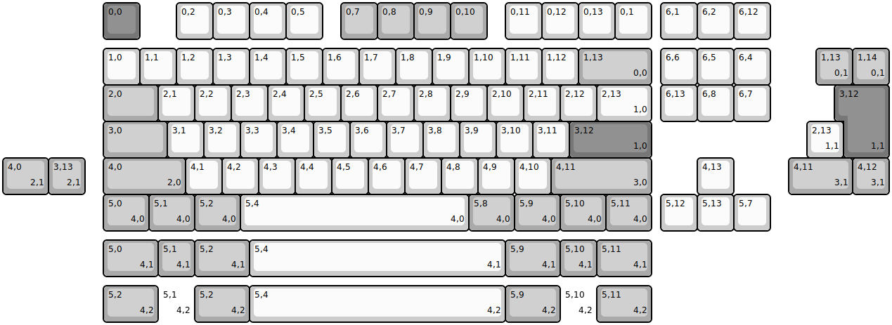{:loading="lazy"}

[Open in keyboard-layout-editor](http://www.keyboard-layout-editor.com/##@@_x:2.75&c=#777777;&=0,0&_x:1.0&c=#cccccc;&=0,2&=0,3&=0,4&=0,5&_x:0.5&c=#aaaaaa;&=0,7&=0,8&=0,9&=0,10&_x:0.5&c=#cccccc;&=0,11&=0,12&=0,13&=0,1&_x:0.25;&=6,1&=6,2&=6,12;&@_x:2.75&y:0.25;&=1,0&=1,1&=1,2&=1,3&=1,4&=1,5&=1,6&=1,7&=1,8&=1,9&=1,10&=1,11&=1,12&_c=#aaaaaa&w:2;&=1,13%0A%0A%0A0,0&_x:0.25&c=#cccccc;&=6,6&=6,5&=6,4;&@_x:2.75&c=#aaaaaa&w:1.5;&=2,0&_c=#cccccc;&=2,1&=2,2&=2,3&=2,4&=2,5&=2,6&=2,7&=2,8&=2,9&=2,10&=2,11&=2,12&_w:1.5;&=2,13%0A%0A%0A1,0&_x:0.25;&=6,13&=6,8&=6,7;&@_x:2.75&c=#aaaaaa&w:1.75;&=3,0&_c=#cccccc;&=3,1&=3,2&=3,3&=3,4&=3,5&=3,6&=3,7&=3,8&=3,9&=3,10&=3,11&_c=#777777&w:2.25;&=3,12%0A%0A%0A1,0;&@_x:2.75&c=#aaaaaa&w:2.25;&=4,0%0A%0A%0A2,0&_c=#cccccc;&=4,1&=4,2&=4,3&=4,4&=4,5&=4,6&=4,7&=4,8&=4,9&=4,10&_c=#aaaaaa&w:2.75;&=4,11%0A%0A%0A3,0&_x:1.25&c=#cccccc;&=4,13;&@_x:2.75&c=#aaaaaa&w:1.25;&=5,0%0A%0A%0A4,0&_w:1.25;&=5,1%0A%0A%0A4,0&_w:1.25;&=5,2%0A%0A%0A4,0&_c=#cccccc&w:6.25;&=5,4%0A%0A%0A4,0&_c=#aaaaaa&w:1.25;&=5,8%0A%0A%0A4,0&_w:1.25;&=5,9%0A%0A%0A4,0&_w:1.25;&=5,10%0A%0A%0A4,0&_w:1.25;&=5,11%0A%0A%0A4,0&_x:0.25&c=#cccccc;&=5,12&=5,13&=5,7;&@_x:22.25&y:-5.0&c=#aaaaaa;&=1,13%0A%0A%0A0,1&=1,14%0A%0A%0A0,1;&@_x:23.0&c=#777777&w:1.25&h:2&w2:1.5&h2:1&x2:-0.25;&=3,12%0A%0A%0A1,1;&@_x:22.0&c=#cccccc;&=2,13%0A%0A%0A1,1;&@_c=#aaaaaa&w:1.25;&=4,0%0A%0A%0A2,1&=3,13%0A%0A%0A2,1&_x:19.25&w:1.75;&=4,11%0A%0A%0A3,1&=4,12%0A%0A%0A3,1;&@_x:2.75&y:1.25&w:1.5;&=5,0%0A%0A%0A4,1&=5,1%0A%0A%0A4,1&_w:1.5;&=5,2%0A%0A%0A4,1&_c=#cccccc&w:7;&=5,4%0A%0A%0A4,1&_c=#aaaaaa&w:1.5;&=5,9%0A%0A%0A4,1&=5,10%0A%0A%0A4,1&_w:1.5;&=5,11%0A%0A%0A4,1;&@_x:2.75&y:0.25&w:1.5;&=5,2%0A%0A%0A4,2&_c=#cccccc&d:true;&=5,1%0A%0A%0A4,2&_c=#aaaaaa&w:1.5;&=5,2%0A%0A%0A4,2&_c=#cccccc&w:7;&=5,4%0A%0A%0A4,2&_c=#aaaaaa&w:1.5;&=5,9%0A%0A%0A4,2&_c=#cccccc&d:true;&=5,10%0A%0A%0A4,2&_c=#aaaaaa&w:1.5;&=5,11%0A%0A%0A4,2)

## kiwikey/borderland

[README](output/kiwikey/README.md) - [layout](output/kiwikey/borderland-kle.json) - [PCB](output/kiwikey/borderland.kicad_pcb) - [PCB render](output/kiwikey/borderland-render.svg)

{:loading="lazy"}

[Open in keyboard-layout-editor](http://www.keyboard-layout-editor.com/##@@_x:3.75&y:0.38;&=0,2&_x:8.5;&=0,11&_x:3.25&c=#777777;&=1,14;&@_x:1.75&y:-0.88&c=#aaaaaa;&=0,0&_c=#cccccc;&=0,1&_x:10.5;&=0,12&_c=#aaaaaa&w:2;&=0,13%0A%0A%0A0,0;&@_x:17.75&y:-0.12&c=#777777;&=2,14;&@_x:1.5&y:-0.88&c=#aaaaaa&w:1.5;&=1,0&_c=#cccccc;&=1,1&_x:10.0;&=1,11&=1,12&_w:1.5;&=1,13;&@_x:18&y:-0.12&c=#777777;&=3,14;&@_x:1.25&y:-0.88&c=#aaaaaa&w:1.75;&=2,0&_c=#cccccc;&=2,1&_x:9.5;&=2,10&=2,11&_c=#777777&w:2.25;&=2,12;&@_x:1&c=#aaaaaa&w:2.25;&=3,0&_c=#cccccc;&=3,1&_x:9.75;&=3,10&_c=#aaaaaa&w:1.75;&=3,11;&@_x:17&y:-0.75;&=3,13;&@_x:1&y:-0.25&w:1.5;&=4,0;&@_x:16&y:-0.75;&=4,12&=4,13&=4,14;&@_r:12&rx:4.75&ry:1.5&y:-1.0&c=#cccccc;&=0,3&=0,4&=0,5&=0,6;&@_x:-0.5;&=1,2&=1,3&=1,4&=1,5;&@_x:-0.25;&=2,2&=2,3&=2,4&=2,5;&@_x:0.25;&=3,2&=3,3&=3,4&=3,5;&@_x:0.25&c=#aaaaaa&w:1.5;&=4,2&_c=#cccccc&w:2;&=4,4&_c=#aaaaaa;&=4,5;&@_r:-12&rx:13.5&x:-4.25&y:-1.0&c=#cccccc;&=0,7&=0,8&=0,9&=0,10;&@_x:-4.75;&=1,6&=1,7&=1,8&=1,9&=1,10;&@_x:-4.5;&=2,6&=2,7&=2,8&=2,9;&@_x:-4.75&y:1.0&w:2.75;&=4,7&_c=#aaaaaa&w:1.5;&=4,9;&@_ry:1.75&x:-4.25&y:1.75&c=#cccccc;&=3,6&=3,7&=3,8&=3,9;&@_r:0&rx:0&ry:0&x:19.5&y:0.5&c=#aaaaaa;&=0,13%0A%0A%0A0,1&=0,14%0A%0A%0A0,1)

## kiwikey/kawii9

[README](output/kiwikey/README.md) - [layout](output/kiwikey/kawii9-kle.json) - [PCB](output/kiwikey/kawii9.kicad_pcb) - [PCB render](output/kiwikey/kawii9-render.svg)

{:loading="lazy"}

[Open in keyboard-layout-editor](http://www.keyboard-layout-editor.com/##@@=0,0&=0,1&=0,2;&@=1,0&=1,1&=1,2;&@=2,0&=2,1&=2,2)

## kiwikey/wanderland

[README](output/kiwikey/README.md) - [layout](output/kiwikey/wanderland-kle.json) - [PCB](output/kiwikey/wanderland.kicad_pcb) - [PCB render](output/kiwikey/wanderland-render.svg)

{:loading="lazy"}

[Open in keyboard-layout-editor](http://www.keyboard-layout-editor.com/##@@_x:0.75&y:0.1&c=#777777;&=0,2&_x:2.25&c=#cccccc;&=1,2&_x:8.5;&=1,9;&@_x:15.5&y:-0.85&c=#aaaaaa&w:2;&=1,11%0A%0A%0A0,0&_x:-15.5&c=#cccccc;&=1,0&=1,1&_x:10.5;&=1,10;&@_x:0.5&y:-0.15&c=#aaaaaa;&=0,1;&@_x:13.25&y:-0.95&c=#cccccc;&=2,9;&@_x:1.75&y:-0.9&c=#aaaaaa&w:1.5;&=2,0&_c=#cccccc;&=2,1&_x:10.0;&=2,10&=2,11&_c=#aaaaaa&w:1.5;&=2,12;&@_x:0.25&y:-0.15;&=0,0;&@_x:1.5&y:-0.85&w:1.75;&=3,0&_c=#cccccc;&=3,1&_x:9.5;&=3,10&=3,11&_c=#777777&w:2.25;&=3,12;&@_y:-0.15&c=#aaaaaa;&=0,3;&@_x:1.25&y:-0.85&w:2.25;&=4,0&_c=#cccccc;&=4,1&_x:9.0;&=4,10&=4,11&_c=#aaaaaa&w:1.75;&=5,11%0A%0A%0A1,0&=4,12%0A%0A%0A1,0;&@_x:1.25&w:1.5;&=5,0&_x:13.75&w:1.5;&=5,12;&@_r:12&rx:5.5&ry:1&x:-0.5&y:-0.7&c=#cccccc;&=1,3&=1,4&=1,5&=0,5;&@_x:-1.0;&=2,2&=2,3&=2,4&=2,5;&@_x:-0.75;&=3,2&=3,3&=3,4&=3,5;&@_x:-0.25;&=4,2&=4,3&=4,4&=4,5;&@_x:0.75&c=#777777&w:2.25;&=5,3&_c=#aaaaaa&w:1.25;&=5,5;&@_x:-0.5&y:-0.9&w:1.25;&=5,2;&@_r:-12&rx:13&ry:3.5&x:-3&y:-3.25&c=#cccccc;&=0,6&=1,6&=1,7&=1,8;&@_x:-3.5;&=0,7&=2,6&=2,7&=2,8;&@_x:-3.25;&=3,6&=3,7&=3,8&=3,9;&@_x:-3.75;&=4,6&=4,7&=4,8&=4,9;&@_x:-3.75&c=#777777&w:2.75;&=5,7;&@_x:-1&y:-0.9&c=#aaaaaa&w:1.5;&=5,9;&@_r:0&rx:0&ry:0&x:18.75&y:0.25;&=1,11%0A%0A%0A0,1&=1,12%0A%0A%0A0,1;&@_x:18.75&y:2.0&w:2.75;&=5,11%0A%0A%0A1,1)

## kopibeng/mnk65

[README](output/kopibeng/mnk65/README.md) - [layout](output/kopibeng/mnk65/mnk65-kle.json) - [PCB](output/kopibeng/mnk65/mnk65.kicad_pcb) - [PCB render](output/kopibeng/mnk65/mnk65-render.svg)

{:loading="lazy"}

[Open in keyboard-layout-editor](http://www.keyboard-layout-editor.com/##@@_x:2.75&c=#777777;&=0,0&_c=#cccccc;&=0,1&=0,2&=0,3&=0,4&=0,5&=0,6&=0,7&=0,8&=0,9&=0,10&=0,11&=0,12&_c=#aaaaaa&w:2;&=0,13%0A%0A%0A2,0&=0,14;&@_x:2.75&w:1.5;&=1,0&_c=#cccccc;&=1,1&=1,2&=1,3&=1,4&=1,5&=1,6&=1,7&=1,8&=1,9&=1,10&=1,11&=2,12&_w:1.5;&=1,12%0A%0A%0A1,0&_c=#aaaaaa;&=1,14;&@_x:2.75&w:1.75;&=2,0&_c=#cccccc;&=2,1&=2,2&=2,3&=2,4&=2,5&=2,6&=2,7&=2,8&=2,9&=2,10&=2,11&_c=#777777&w:2.25;&=2,13%0A%0A%0A1,0&_c=#aaaaaa;&=2,14;&@_x:2.75&w:2.25;&=3,0%0A%0A%0A3,0&_c=#cccccc;&=3,2&=3,3&=3,4&=3,5&=3,6&=3,7&=3,8&=3,9&=3,10&=3,11&_c=#aaaaaa&w:1.75;&=3,12&=3,13&=3,14;&@_x:2.75&w:1.25;&=4,0%0A%0A%0A0,0&_w:1.25;&=4,1%0A%0A%0A0,0&_w:1.25;&=4,2%0A%0A%0A0,0&_c=#cccccc&w:6.25;&=4,6%0A%0A%0A0,0&_c=#aaaaaa&w:1.25;&=4,10%0A%0A%0A0,0&_w:1.25;&=4,11%0A%0A%0A0,0&_x:0.5;&=4,12&=4,13&=4,14;&@_x:19.5&y:-5;&=1,13%0A%0A%0A2,1&=0,13%0A%0A%0A2,1;&@_x:20.25&c=#777777&w:1.25&h:2&w2:1.5&h2:1&x2:-0.25;&=2,13%0A%0A%0A1,1;&@_x:19.25&c=#cccccc;&=1,12%0A%0A%0A1,1;&@_c=#aaaaaa&w:1.25;&=3,0%0A%0A%0A3,1&_c=#cccccc;&=3,1%0A%0A%0A3,1;&@_x:2.75&y:1.5&c=#aaaaaa&w:1.5;&=4,0%0A%0A%0A0,1&=4,1%0A%0A%0A0,1&_w:1.5;&=4,2%0A%0A%0A0,1&_c=#cccccc&w:7;&=4,6%0A%0A%0A0,1&_c=#aaaaaa&w:1.5;&=4,11%0A%0A%0A0,1;&@_x:2.75&y:0.25&w:1.25;&=4,0%0A%0A%0A0,2&_w:1.25;&=4,1%0A%0A%0A0,2&_w:1.25;&=4,2%0A%0A%0A0,2&_c=#cccccc&w:2.25;&=4,4%0A%0A%0A0,2&_w:1.25;&=4,6%0A%0A%0A0,2&_w:2.75;&=4,8%0A%0A%0A0,2&_c=#aaaaaa&w:1.25;&=4,10%0A%0A%0A0,2&_w:1.25;&=4,11%0A%0A%0A0,2;&@_x:2.75&y:0.25&w:1.25;&=4,0%0A%0A%0A0,3&_w:1.25;&=4,1%0A%0A%0A0,3&_w:1.25;&=4,2%0A%0A%0A0,3&_c=#cccccc&w:2.75;&=4,4%0A%0A%0A0,3&_w:1.25;&=4,6%0A%0A%0A0,3&_w:2.25;&=4,8%0A%0A%0A0,3&_c=#aaaaaa&w:1.25;&=4,10%0A%0A%0A0,3&_w:1.25;&=4,11%0A%0A%0A0,3)

## kopibeng/mnk65_stm32

[README](output/kopibeng/mnk65_stm32/README.md) - [layout](output/kopibeng/mnk65_stm32/mnk65_stm32-kle.json) - [PCB](output/kopibeng/mnk65_stm32/mnk65_stm32.kicad_pcb) - [PCB render](output/kopibeng/mnk65_stm32/mnk65_stm32-render.svg)

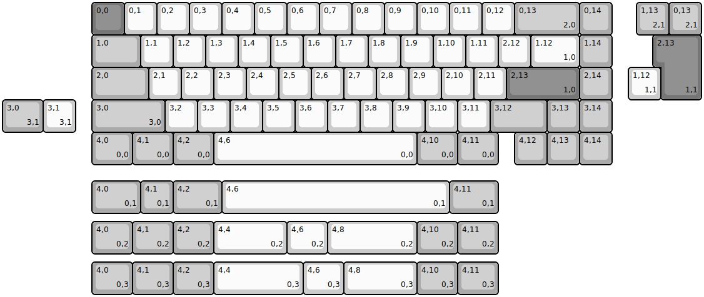{:loading="lazy"}

[Open in keyboard-layout-editor](http://www.keyboard-layout-editor.com/##@@_x:2.75&c=#777777;&=0,0&_c=#cccccc;&=0,1&=0,2&=0,3&=0,4&=0,5&=0,6&=0,7&=0,8&=0,9&=0,10&=0,11&=0,12&_c=#aaaaaa&w:2;&=0,13%0A%0A%0A2,0&=0,14;&@_x:2.75&w:1.5;&=1,0&_c=#cccccc;&=1,1&=1,2&=1,3&=1,4&=1,5&=1,6&=1,7&=1,8&=1,9&=1,10&=1,11&=2,12&_w:1.5;&=1,12%0A%0A%0A1,0&_c=#aaaaaa;&=1,14;&@_x:2.75&w:1.75;&=2,0&_c=#cccccc;&=2,1&=2,2&=2,3&=2,4&=2,5&=2,6&=2,7&=2,8&=2,9&=2,10&=2,11&_c=#777777&w:2.25;&=2,13%0A%0A%0A1,0&_c=#aaaaaa;&=2,14;&@_x:2.75&w:2.25;&=3,0%0A%0A%0A3,0&_c=#cccccc;&=3,2&=3,3&=3,4&=3,5&=3,6&=3,7&=3,8&=3,9&=3,10&=3,11&_c=#aaaaaa&w:1.75;&=3,12&=3,13&=3,14;&@_x:2.75&w:1.25;&=4,0%0A%0A%0A0,0&_w:1.25;&=4,1%0A%0A%0A0,0&_w:1.25;&=4,2%0A%0A%0A0,0&_c=#cccccc&w:6.25;&=4,6%0A%0A%0A0,0&_c=#aaaaaa&w:1.25;&=4,10%0A%0A%0A0,0&_w:1.25;&=4,11%0A%0A%0A0,0&_x:0.5;&=4,12&=4,13&=4,14;&@_x:19.5&y:-5;&=1,13%0A%0A%0A2,1&=0,13%0A%0A%0A2,1;&@_x:20.25&c=#777777&w:1.25&h:2&w2:1.5&h2:1&x2:-0.25;&=2,13%0A%0A%0A1,1;&@_x:19.25&c=#cccccc;&=1,12%0A%0A%0A1,1;&@_c=#aaaaaa&w:1.25;&=3,0%0A%0A%0A3,1&_c=#cccccc;&=3,1%0A%0A%0A3,1;&@_x:2.75&y:1.5&c=#aaaaaa&w:1.5;&=4,0%0A%0A%0A0,1&=4,1%0A%0A%0A0,1&_w:1.5;&=4,2%0A%0A%0A0,1&_c=#cccccc&w:7;&=4,6%0A%0A%0A0,1&_c=#aaaaaa&w:1.5;&=4,11%0A%0A%0A0,1;&@_x:2.75&y:0.25&w:1.25;&=4,0%0A%0A%0A0,2&_w:1.25;&=4,1%0A%0A%0A0,2&_w:1.25;&=4,2%0A%0A%0A0,2&_c=#cccccc&w:2.25;&=4,4%0A%0A%0A0,2&_w:1.25;&=4,6%0A%0A%0A0,2&_w:2.75;&=4,8%0A%0A%0A0,2&_c=#aaaaaa&w:1.25;&=4,10%0A%0A%0A0,2&_w:1.25;&=4,11%0A%0A%0A0,2;&@_x:2.75&y:0.25&w:1.25;&=4,0%0A%0A%0A0,3&_w:1.25;&=4,1%0A%0A%0A0,3&_w:1.25;&=4,2%0A%0A%0A0,3&_c=#cccccc&w:2.75;&=4,4%0A%0A%0A0,3&_w:1.25;&=4,6%0A%0A%0A0,3&_w:2.25;&=4,8%0A%0A%0A0,3&_c=#aaaaaa&w:1.25;&=4,10%0A%0A%0A0,3&_w:1.25;&=4,11%0A%0A%0A0,3)

## kopibeng/mnk88

[README](output/kopibeng/mnk88/README.md) - [layout](output/kopibeng/mnk88/mnk88-kle.json) - [PCB](output/kopibeng/mnk88/mnk88.kicad_pcb) - [PCB render](output/kopibeng/mnk88/mnk88-render.svg)

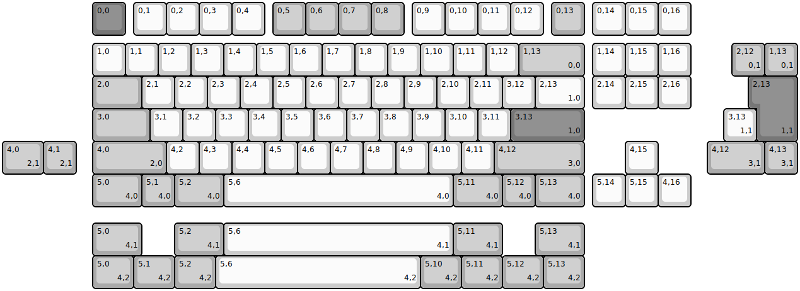{:loading="lazy"}

[Open in keyboard-layout-editor](http://www.keyboard-layout-editor.com/##@@_x:2.75&c=#777777;&=0,0&_x:0.25&c=#cccccc;&=0,1&=0,2&=0,3&=0,4&_x:0.25&c=#aaaaaa;&=0,5&=0,6&=0,7&=0,8&_x:0.25&c=#cccccc;&=0,9&=0,10&=0,11&=0,12&_x:0.25&c=#aaaaaa;&=0,13&_x:0.25&c=#cccccc;&=0,14&=0,15&=0,16;&@_x:2.75&y:0.25;&=1,0&=1,1&=1,2&=1,3&=1,4&=1,5&=1,6&=1,7&=1,8&=1,9&=1,10&=1,11&=1,12&_c=#aaaaaa&w:2;&=1,13%0A%0A%0A0,0&_x:0.25&c=#cccccc;&=1,14&=1,15&=1,16;&@_x:2.75&c=#aaaaaa&w:1.5;&=2,0&_c=#cccccc;&=2,1&=2,2&=2,3&=2,4&=2,5&=2,6&=2,7&=2,8&=2,9&=2,10&=2,11&=3,12&_w:1.5;&=2,13%0A%0A%0A1,0&_x:0.25;&=2,14&=2,15&=2,16;&@_x:2.75&c=#aaaaaa&w:1.75;&=3,0&_c=#cccccc;&=3,1&=3,2&=3,3&=3,4&=3,5&=3,6&=3,7&=3,8&=3,9&=3,10&=3,11&_c=#777777&w:2.25;&=3,13%0A%0A%0A1,0;&@_x:2.75&c=#aaaaaa&w:2.25;&=4,0%0A%0A%0A2,0&_c=#cccccc;&=4,2&=4,3&=4,4&=4,5&=4,6&=4,7&=4,8&=4,9&=4,10&=4,11&_c=#aaaaaa&w:2.75;&=4,12%0A%0A%0A3,0&_x:1.25&c=#cccccc;&=4,15;&@_x:2.75&c=#aaaaaa&w:1.5;&=5,0%0A%0A%0A4,0&=5,1%0A%0A%0A4,0&_w:1.5;&=5,2%0A%0A%0A4,0&_c=#cccccc&w:7;&=5,6%0A%0A%0A4,0&_c=#aaaaaa&w:1.5;&=5,11%0A%0A%0A4,0&=5,12%0A%0A%0A4,0&_w:1.5;&=5,13%0A%0A%0A4,0&_x:0.25&c=#cccccc;&=5,14&=5,15&=4,16;&@_x:22.25&y:-5.0&c=#aaaaaa;&=2,12%0A%0A%0A0,1&=1,13%0A%0A%0A0,1;&@_x:23.0&c=#777777&w:1.25&h:2&w2:1.5&h2:1&x2:-0.25;&=2,13%0A%0A%0A1,1;&@_x:22.0&c=#cccccc;&=3,13%0A%0A%0A1,1;&@_c=#aaaaaa&w:1.25;&=4,0%0A%0A%0A2,1&=4,1%0A%0A%0A2,1&_x:19.25&w:1.75;&=4,12%0A%0A%0A3,1&=4,13%0A%0A%0A3,1;&@_x:2.75&y:1.5&w:1.5;&=5,0%0A%0A%0A4,1&_x:1.0&w:1.5;&=5,2%0A%0A%0A4,1&_c=#cccccc&w:7;&=5,6%0A%0A%0A4,1&_c=#aaaaaa&w:1.5;&=5,11%0A%0A%0A4,1&_x:1.0&w:1.5;&=5,13%0A%0A%0A4,1;&@_x:2.75&w:1.25;&=5,0%0A%0A%0A4,2&_w:1.25;&=5,1%0A%0A%0A4,2&_w:1.25;&=5,2%0A%0A%0A4,2&_c=#cccccc&w:6.25;&=5,6%0A%0A%0A4,2&_c=#aaaaaa&w:1.25;&=5,10%0A%0A%0A4,2&_w:1.25;&=5,11%0A%0A%0A4,2&_w:1.25;&=5,12%0A%0A%0A4,2&_w:1.25;&=5,13%0A%0A%0A4,2)

## kopibeng/typ65

[README](output/kopibeng/typ65/README.md) - [layout](output/kopibeng/typ65/typ65-kle.json) - [PCB](output/kopibeng/typ65/typ65.kicad_pcb) - [PCB render](output/kopibeng/typ65/typ65-render.svg)

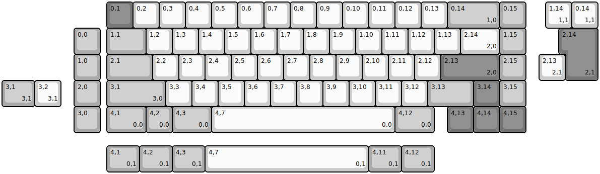{:loading="lazy"}

[Open in keyboard-layout-editor](http://www.keyboard-layout-editor.com/##@@_x:4&c=#777777;&=0,1&_c=#cccccc;&=0,2&=0,3&=0,4&=0,5&=0,6&=0,7&=0,8&=0,9&=0,10&=0,11&=0,12&=0,13&_c=#aaaaaa&w:2;&=0,14%0A%0A%0A1,0&=0,15;&@_x:2.75;&=0,0&_x:0.25&w:1.5;&=1,1&_c=#cccccc;&=1,2&=1,3&=1,4&=1,5&=1,6&=1,7&=1,8&=1,9&=1,10&=1,11&=1,12&=1,13&_w:1.5;&=2,14%0A%0A%0A2,0&_c=#aaaaaa;&=1,15;&@_x:2.75;&=1,0&_x:0.25&w:1.75;&=2,1&_c=#cccccc;&=2,2&=2,3&=2,4&=2,5&=2,6&=2,7&=2,8&=2,9&=2,10&=2,11&=2,12&_c=#777777&w:2.25;&=2,13%0A%0A%0A2,0&_c=#aaaaaa;&=2,15;&@_x:2.75;&=2,0&_x:0.25&w:2.25;&=3,1%0A%0A%0A3,0&_c=#cccccc;&=3,3&=3,4&=3,5&=3,6&=3,7&=3,8&=3,9&=3,10&=3,11&=3,12&_c=#aaaaaa&w:1.75;&=3,13&_c=#777777;&=3,14&_c=#aaaaaa;&=3,15;&@_x:2.75;&=3,0&_x:0.25&w:1.5;&=4,1%0A%0A%0A0,0&=4,2%0A%0A%0A0,0&_w:1.5;&=4,3%0A%0A%0A0,0&_c=#cccccc&w:7;&=4,7%0A%0A%0A0,0&_c=#aaaaaa&w:1.5;&=4,12%0A%0A%0A0,0&_x:0.5&c=#777777;&=4,13&=4,14&=4,15;&@_x:20.75&y:-5&c=#cccccc;&=1,14%0A%0A%0A1,1&=0,14%0A%0A%0A1,1;&@_x:21.5&c=#777777&w:1.25&h:2&w2:1.5&h2:1&x2:-0.25;&=2,14%0A%0A%0A2,1;&@_x:20.5&c=#cccccc;&=2,13%0A%0A%0A2,1;&@_c=#aaaaaa&w:1.25;&=3,1%0A%0A%0A3,1&_c=#cccccc;&=3,2%0A%0A%0A3,1;&@_x:4&y:1.5&c=#aaaaaa&w:1.25;&=4,1%0A%0A%0A0,1&_w:1.25;&=4,2%0A%0A%0A0,1&_w:1.25;&=4,3%0A%0A%0A0,1&_c=#cccccc&w:6.25;&=4,7%0A%0A%0A0,1&_c=#aaaaaa&w:1.25;&=4,11%0A%0A%0A0,1&_w:1.25;&=4,12%0A%0A%0A0,1)

## kopibeng/xt60

[README](output/kopibeng/xt60/README.md) - [layout](output/kopibeng/xt60/xt60-kle.json) - [PCB](output/kopibeng/xt60/xt60.kicad_pcb) - [PCB render](output/kopibeng/xt60/xt60-render.svg)

{:loading="lazy"}

[Open in keyboard-layout-editor](http://www.keyboard-layout-editor.com/##@@_x:2.75&c=#777777;&=0,0&_c=#cccccc;&=0,1&=0,2&=0,3&=0,4&=0,5&=0,6&=0,7&=0,8&=0,9&=0,10&=0,11&=0,12&_c=#aaaaaa&w:2;&=1,13%0A%0A%0A1,0;&@_x:2.75&w:1.5;&=1,0&_c=#cccccc;&=1,1&=1,2&=1,3&=1,4&=1,5&=1,6&=1,7&=1,8&=1,9&=1,10&=1,11&=1,12&_w:1.5;&=2,12%0A%0A%0A0,0;&@_x:2.75&c=#aaaaaa&w:1.75;&=2,0&_c=#cccccc;&=2,1&=2,2&=2,3&=2,4&=2,5&=2,6&=2,7&=2,8&=2,9&=2,10&=2,11&_c=#777777&w:2.25;&=2,13%0A%0A%0A0,0;&@_x:2.75&c=#aaaaaa&w:2.25;&=3,0%0A%0A%0A2,0&_c=#cccccc;&=3,2&=3,3&=3,4&=3,5&=3,6&=3,7&=3,8&=3,9&=3,10&=3,11&_c=#aaaaaa&w:2.75;&=3,12%0A%0A%0A3,0;&@_x:2.75&w:1.5;&=4,0%0A%0A%0A4,0&=4,1%0A%0A%0A4,0&_w:1.5;&=4,2%0A%0A%0A4,0&_c=#cccccc&w:7;&=4,6%0A%0A%0A4,0&_c=#aaaaaa&w:1.5;&=4,11%0A%0A%0A4,0&=4,12%0A%0A%0A4,0&_w:1.5;&=4,13%0A%0A%0A4,0;&@_x:19.0&y:-5;&=0,13%0A%0A%0A1,1&=1,13%0A%0A%0A1,1;&@_x:19.75&c=#777777&w:1.25&h:2&w2:1.5&h2:1&x2:-0.25;&=2,13%0A%0A%0A0,1;&@_x:18.75&c=#cccccc;&=2,12%0A%0A%0A0,1;&@_c=#aaaaaa&w:1.25;&=3,0%0A%0A%0A2,1&_c=#cccccc;&=3,1%0A%0A%0A2,1&_x:16.0&c=#aaaaaa&w:1.75;&=3,12%0A%0A%0A3,1&=3,13%0A%0A%0A3,1;&@_x:2.75&y:1.25&w:1.5;&=4,0%0A%0A%0A4,1&_x:1.0&w:1.5;&=4,2%0A%0A%0A4,1&_c=#cccccc&w:7;&=4,6%0A%0A%0A4,1&_c=#aaaaaa&w:1.5;&=4,11%0A%0A%0A4,1&_x:1.0&w:1.5;&=4,13%0A%0A%0A4,1;&@_x:2.75&y:0.25&w:1.25;&=4,0%0A%0A%0A4,2&_w:1.25;&=4,1%0A%0A%0A4,2&_w:1.25;&=4,2%0A%0A%0A4,2&_c=#cccccc&w:6.25;&=4,6%0A%0A%0A4,2&_c=#aaaaaa&w:1.25;&=4,10%0A%0A%0A4,2&_w:1.25;&=4,11%0A%0A%0A4,2&_w:1.25;&=4,12%0A%0A%0A4,2&_w:1.25;&=4,13%0A%0A%0A4,2;&@_x:2.75&y:0.25&w:1.25;&=4,0%0A%0A%0A4,3&_w:1.25;&=4,1%0A%0A%0A4,3&_w:1.25;&=4,2%0A%0A%0A4,3&_c=#cccccc&w:2.25;&=4,4%0A%0A%0A4,3&_w:1.25;&=4,6%0A%0A%0A4,3&_w:2.75;&=4,8%0A%0A%0A4,3&_c=#aaaaaa&w:1.25;&=4,10%0A%0A%0A4,3&_w:1.25;&=4,11%0A%0A%0A4,3&_w:1.25;&=4,12%0A%0A%0A4,3&_w:1.25;&=4,13%0A%0A%0A4,3)

## kopibeng/xt60_singakbd

[README](output/kopibeng/xt60_singakbd/README.md) - [layout](output/kopibeng/xt60_singakbd/xt60_singakbd-kle.json) - [PCB](output/kopibeng/xt60_singakbd/xt60_singakbd.kicad_pcb) - [PCB render](output/kopibeng/xt60_singakbd/xt60_singakbd-render.svg)

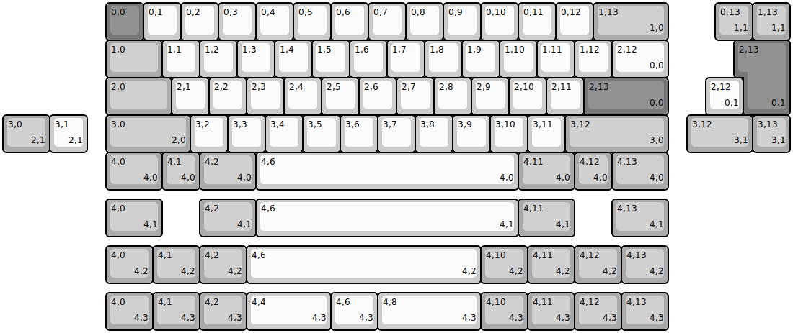{:loading="lazy"}

[Open in keyboard-layout-editor](http://www.keyboard-layout-editor.com/##@@_x:2.75&c=#777777;&=0,0&_c=#cccccc;&=0,1&=0,2&=0,3&=0,4&=0,5&=0,6&=0,7&=0,8&=0,9&=0,10&=0,11&=0,12&_c=#aaaaaa&w:2;&=1,13%0A%0A%0A1,0;&@_x:2.75&w:1.5;&=1,0&_c=#cccccc;&=1,1&=1,2&=1,3&=1,4&=1,5&=1,6&=1,7&=1,8&=1,9&=1,10&=1,11&=1,12&_w:1.5;&=2,12%0A%0A%0A0,0;&@_x:2.75&c=#aaaaaa&w:1.75;&=2,0&_c=#cccccc;&=2,1&=2,2&=2,3&=2,4&=2,5&=2,6&=2,7&=2,8&=2,9&=2,10&=2,11&_c=#777777&w:2.25;&=2,13%0A%0A%0A0,0;&@_x:2.75&c=#aaaaaa&w:2.25;&=3,0%0A%0A%0A2,0&_c=#cccccc;&=3,2&=3,3&=3,4&=3,5&=3,6&=3,7&=3,8&=3,9&=3,10&=3,11&_c=#aaaaaa&w:2.75;&=3,12%0A%0A%0A3,0;&@_x:2.75&w:1.5;&=4,0%0A%0A%0A4,0&=4,1%0A%0A%0A4,0&_w:1.5;&=4,2%0A%0A%0A4,0&_c=#cccccc&w:7;&=4,6%0A%0A%0A4,0&_c=#aaaaaa&w:1.5;&=4,11%0A%0A%0A4,0&=4,12%0A%0A%0A4,0&_w:1.5;&=4,13%0A%0A%0A4,0;&@_x:19.0&y:-5;&=0,13%0A%0A%0A1,1&=1,13%0A%0A%0A1,1;&@_x:19.75&c=#777777&w:1.25&h:2&w2:1.5&h2:1&x2:-0.25;&=2,13%0A%0A%0A0,1;&@_x:18.75&c=#cccccc;&=2,12%0A%0A%0A0,1;&@_c=#aaaaaa&w:1.25;&=3,0%0A%0A%0A2,1&_c=#cccccc;&=3,1%0A%0A%0A2,1&_x:16.0&c=#aaaaaa&w:1.75;&=3,12%0A%0A%0A3,1&=3,13%0A%0A%0A3,1;&@_x:2.75&y:1.25&w:1.5;&=4,0%0A%0A%0A4,1&_x:1.0&w:1.5;&=4,2%0A%0A%0A4,1&_c=#cccccc&w:7;&=4,6%0A%0A%0A4,1&_c=#aaaaaa&w:1.5;&=4,11%0A%0A%0A4,1&_x:1.0&w:1.5;&=4,13%0A%0A%0A4,1;&@_x:2.75&y:0.25&w:1.25;&=4,0%0A%0A%0A4,2&_w:1.25;&=4,1%0A%0A%0A4,2&_w:1.25;&=4,2%0A%0A%0A4,2&_c=#cccccc&w:6.25;&=4,6%0A%0A%0A4,2&_c=#aaaaaa&w:1.25;&=4,10%0A%0A%0A4,2&_w:1.25;&=4,11%0A%0A%0A4,2&_w:1.25;&=4,12%0A%0A%0A4,2&_w:1.25;&=4,13%0A%0A%0A4,2;&@_x:2.75&y:0.25&w:1.25;&=4,0%0A%0A%0A4,3&_w:1.25;&=4,1%0A%0A%0A4,3&_w:1.25;&=4,2%0A%0A%0A4,3&_c=#cccccc&w:2.25;&=4,4%0A%0A%0A4,3&_w:1.25;&=4,6%0A%0A%0A4,3&_w:2.75;&=4,8%0A%0A%0A4,3&_c=#aaaaaa&w:1.25;&=4,10%0A%0A%0A4,3&_w:1.25;&=4,11%0A%0A%0A4,3&_w:1.25;&=4,12%0A%0A%0A4,3&_w:1.25;&=4,13%0A%0A%0A4,3)

## kopibeng/xt65

[README](output/kopibeng/xt65/README.md) - [layout](output/kopibeng/xt65/xt65-kle.json) - [PCB](output/kopibeng/xt65/xt65.kicad_pcb) - [PCB render](output/kopibeng/xt65/xt65-render.svg)

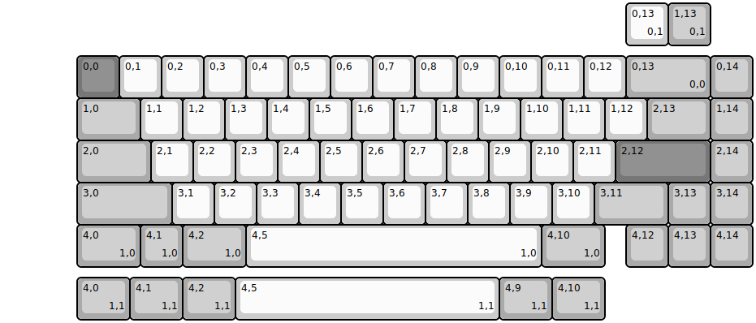{:loading="lazy"}

[Open in keyboard-layout-editor](http://www.keyboard-layout-editor.com/##@@_x:1.75&y:1.25&c=#777777;&=0,0&_c=#cccccc;&=0,1&=0,2&=0,3&=0,4&=0,5&=0,6&=0,7&=0,8&=0,9&=0,10&=0,11&=0,12&_c=#aaaaaa&w:2;&=0,13%0A%0A%0A0,0&=0,14;&@_x:1.75&w:1.5;&=1,0&_c=#cccccc;&=1,1&=1,2&=1,3&=1,4&=1,5&=1,6&=1,7&=1,8&=1,9&=1,10&=1,11&=1,12&_c=#aaaaaa&w:1.5;&=2,13&=1,14;&@_x:1.75&w:1.75;&=2,0&_c=#cccccc;&=2,1&=2,2&=2,3&_n:true;&=2,4&=2,5&_n:true;&=2,6&=2,7&=2,8&=2,9&=2,10&=2,11&_c=#777777&w:2.25;&=2,12&_c=#aaaaaa;&=2,14;&@_x:1.75&w:2.25;&=3,0&_c=#cccccc;&=3,1&=3,2&=3,3&=3,4&=3,5&=3,6&=3,7&=3,8&=3,9&=3,10&_c=#aaaaaa&w:1.75;&=3,11&=3,13&=3,14;&@_x:1.75&w:1.5;&=4,0%0A%0A%0A1,0&=4,1%0A%0A%0A1,0&_w:1.5;&=4,2%0A%0A%0A1,0&_c=#cccccc&w:7;&=4,5%0A%0A%0A1,0&_c=#aaaaaa&w:1.5;&=4,10%0A%0A%0A1,0&_x:0.5;&=4,12&=4,13&=4,14;&@_x:14.75&y:-6.25&c=#cccccc;&=0,13%0A%0A%0A0,1&_c=#aaaaaa;&=1,13%0A%0A%0A0,1;&@_x:1.75&y:5.5&w:1.25;&=4,0%0A%0A%0A1,1&_w:1.25;&=4,1%0A%0A%0A1,1&_w:1.25;&=4,2%0A%0A%0A1,1&_c=#cccccc&w:6.25;&=4,5%0A%0A%0A1,1&_c=#aaaaaa&w:1.25;&=4,9%0A%0A%0A1,1&_w:1.25;&=4,10%0A%0A%0A1,1)

## kopibeng/xt8x

[README](output/kopibeng/xt8x/README.md) - [layout](output/kopibeng/xt8x/xt8x-kle.json) - [PCB](output/kopibeng/xt8x/xt8x.kicad_pcb) - [PCB render](output/kopibeng/xt8x/xt8x-render.svg)

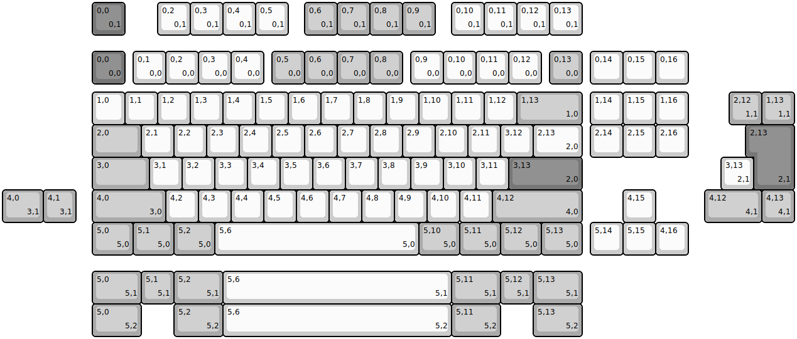{:loading="lazy"}

[Open in keyboard-layout-editor](http://www.keyboard-layout-editor.com/##@@_x:2.75&y:1.5&c=#777777;&=0,0%0A%0A%0A0,0&_x:0.25&c=#cccccc;&=0,1%0A%0A%0A0,0&=0,2%0A%0A%0A0,0&=0,3%0A%0A%0A0,0&=0,4%0A%0A%0A0,0&_x:0.25&c=#aaaaaa;&=0,5%0A%0A%0A0,0&=0,6%0A%0A%0A0,0&=0,7%0A%0A%0A0,0&=0,8%0A%0A%0A0,0&_x:0.25&c=#cccccc;&=0,9%0A%0A%0A0,0&=0,10%0A%0A%0A0,0&=0,11%0A%0A%0A0,0&=0,12%0A%0A%0A0,0&_x:0.25&c=#aaaaaa;&=0,13%0A%0A%0A0,0&_x:0.25&c=#cccccc;&=0,14&=0,15&=0,16;&@_x:2.75&y:0.25;&=1,0&=1,1&=1,2&=1,3&=1,4&=1,5&=1,6&=1,7&=1,8&=1,9&=1,10&=1,11&=1,12&_c=#aaaaaa&w:2;&=1,13%0A%0A%0A1,0&_x:0.25&c=#cccccc;&=1,14&=1,15&=1,16;&@_x:2.75&c=#aaaaaa&w:1.5;&=2,0&_c=#cccccc;&=2,1&=2,2&=2,3&=2,4&=2,5&=2,6&=2,7&=2,8&=2,9&=2,10&=2,11&=3,12&_w:1.5;&=2,13%0A%0A%0A2,0&_x:0.25;&=2,14&=2,15&=2,16;&@_x:2.75&c=#aaaaaa&w:1.75;&=3,0&_c=#cccccc;&=3,1&=3,2&=3,3&=3,4&=3,5&=3,6&=3,7&=3,8&=3,9&=3,10&=3,11&_c=#777777&w:2.25;&=3,13%0A%0A%0A2,0;&@_x:2.75&c=#aaaaaa&w:2.25;&=4,0%0A%0A%0A3,0&_c=#cccccc;&=4,2&=4,3&=4,4&=4,5&=4,6&=4,7&=4,8&=4,9&=4,10&=4,11&_c=#aaaaaa&w:2.75;&=4,12%0A%0A%0A4,0&_x:1.25&c=#cccccc;&=4,15;&@_x:2.75&c=#aaaaaa&w:1.25;&=5,0%0A%0A%0A5,0&_w:1.25;&=5,1%0A%0A%0A5,0&_w:1.25;&=5,2%0A%0A%0A5,0&_c=#cccccc&w:6.25;&=5,6%0A%0A%0A5,0&_c=#aaaaaa&w:1.25;&=5,10%0A%0A%0A5,0&_w:1.25;&=5,11%0A%0A%0A5,0&_w:1.25;&=5,12%0A%0A%0A5,0&_w:1.25;&=5,13%0A%0A%0A5,0&_x:0.25&c=#cccccc;&=5,14&=5,15&=4,16;&@_x:2.75&y:-7.75&c=#777777;&=0,0%0A%0A%0A0,1&_x:1.0&c=#cccccc;&=0,2%0A%0A%0A0,1&=0,3%0A%0A%0A0,1&=0,4%0A%0A%0A0,1&=0,5%0A%0A%0A0,1&_x:0.5&c=#aaaaaa;&=0,6%0A%0A%0A0,1&=0,7%0A%0A%0A0,1&=0,8%0A%0A%0A0,1&=0,9%0A%0A%0A0,1&_x:0.5&c=#cccccc;&=0,10%0A%0A%0A0,1&=0,11%0A%0A%0A0,1&=0,12%0A%0A%0A0,1&=0,13%0A%0A%0A0,1;&@_x:22.25&y:1.75&c=#aaaaaa;&=2,12%0A%0A%0A1,1&=1,13%0A%0A%0A1,1;&@_x:23.0&c=#777777&w:1.25&h:2&w2:1.5&h2:1&x2:-0.25;&=2,13%0A%0A%0A2,1;&@_x:22.0&c=#cccccc;&=3,13%0A%0A%0A2,1;&@_c=#aaaaaa&w:1.25;&=4,0%0A%0A%0A3,1&=4,1%0A%0A%0A3,1&_x:19.25&w:1.75;&=4,12%0A%0A%0A4,1&=4,13%0A%0A%0A4,1;&@_x:2.75&y:1.5&w:1.5;&=5,0%0A%0A%0A5,1&=5,1%0A%0A%0A5,1&_w:1.5;&=5,2%0A%0A%0A5,1&_c=#cccccc&w:7;&=5,6%0A%0A%0A5,1&_c=#aaaaaa&w:1.5;&=5,11%0A%0A%0A5,1&=5,12%0A%0A%0A5,1&_w:1.5;&=5,13%0A%0A%0A5,1;&@_x:2.75&w:1.5;&=5,0%0A%0A%0A5,2&_x:1.0&w:1.5;&=5,2%0A%0A%0A5,2&_c=#cccccc&w:7;&=5,6%0A%0A%0A5,2&_c=#aaaaaa&w:1.5;&=5,11%0A%0A%0A5,2&_x:1.0&w:1.5;&=5,13%0A%0A%0A5,2)

## kprepublic/bm16s

[README](output/kprepublic/README.md) - [layout](output/kprepublic/bm16s-kle.json) - [PCB](output/kprepublic/bm16s.kicad_pcb) - [PCB render](output/kprepublic/bm16s-render.svg)

{:loading="lazy"}

[Open in keyboard-layout-editor](http://www.keyboard-layout-editor.com/##@@=0,0&=0,1&=0,2&=0,3;&@=1,0&=1,1&=1,2&=1,3;&@=2,0&=2,1&=2,2&=2,3;&@=3,0&=3,1&=3,2&=3,3)

## kprepublic/bm40hsrgb

[README](output/kprepublic/README.md) - [layout](output/kprepublic/bm40hsrgb-kle.json) - [PCB](output/kprepublic/bm40hsrgb.kicad_pcb) - [PCB render](output/kprepublic/bm40hsrgb-render.svg)

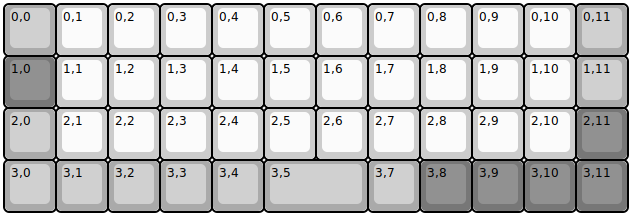{:loading="lazy"}

[Open in keyboard-layout-editor](http://www.keyboard-layout-editor.com/##@@_c=#aaaaaa;&=0,0&_c=#ccccccc;&=0,1&=0,2&=0,3&=0,4&=0,5&=0,6&=0,7&=0,8&=0,9&=0,10&_c=#aaaaaa;&=0,11;&@_c=#777777;&=1,0&_c=#ccccccc;&=1,1&=1,2&=1,3&=1,4&=1,5&=1,6&=1,7&=1,8&=1,9&=1,10&_c=#aaaaaa;&=1,11;&@=2,0&_c=#ccccccc;&=2,1&=2,2&=2,3&=2,4&=2,5&=2,6&=2,7&=2,8&=2,9&=2,10&_c=#777777;&=2,11;&@_c=#aaaaaa;&=3,0&=3,1&=3,2&=3,3&=3,4&_w:2;&=3,5&=3,7&_c=#777777;&=3,8&=3,9&=3,10&=3,11)

## kprepublic/bm60poker

[README](output/kprepublic/README.md) - [layout](output/kprepublic/bm60poker-kle.json) - [PCB](output/kprepublic/bm60poker.kicad_pcb) - [PCB render](output/kprepublic/bm60poker-render.svg)

{:loading="lazy"}

[Open in keyboard-layout-editor](http://www.keyboard-layout-editor.com/##@@_c=#777777;&=0,0&_c=#cccccc;&=0,1&=0,2&=0,3&=0,4&=0,5&=0,6&=0,7&=0,8&=0,9&=0,10&=0,11&=0,12&_c=#aaaaaa&w:2;&=0,13;&@_w:1.5;&=1,0&_c=#cccccc;&=1,1&=1,2&=1,3&=1,4&=1,5&=1,6&=1,7&=1,8&=1,9&=1,10&=1,11&=1,12&_w:1.5;&=1,13;&@_c=#aaaaaa&w:1.75;&=2,0&_c=#cccccc;&=2,2&=2,3&=2,4&=2,5&=2,6&=2,7&=2,8&=2,9&=2,10&=2,11&=2,12&_c=#777777&w:2.25;&=2,13;&@_c=#aaaaaa&w:2.25;&=3,1&_c=#cccccc;&=3,2&=3,3&=3,4&=3,5&=3,6&=3,7&=3,8&=3,9&=3,10&=3,11&_c=#aaaaaa&w:2.75;&=3,13;&@_w:1.25;&=4,0&_w:1.25;&=4,1&_w:1.25;&=4,2&_c=#cccccc&w:6.25;&=4,6&_c=#aaaaaa&w:1.25;&=4,9&_w:1.25;&=4,10&_w:1.25;&=4,12&_w:1.25;&=4,13)

## kprepublic/bm60poker_v2

[README](output/kprepublic/README.md) - [layout](output/kprepublic/bm60poker_v2-kle.json) - [PCB](output/kprepublic/bm60poker_v2.kicad_pcb) - [PCB render](output/kprepublic/bm60poker_v2-render.svg)

{:loading="lazy"}

[Open in keyboard-layout-editor](http://www.keyboard-layout-editor.com/##@@_c=#777777;&=0,0&_c=#cccccc;&=0,1&=0,2&=0,3&=0,4&=0,5&=0,6&=0,7&=0,8&=0,9&=0,10&=0,11&=0,12&_c=#aaaaaa&w:2;&=0,13;&@_w:1.5;&=1,0&_c=#cccccc;&=1,1&=1,2&=1,3&=1,4&=1,5&=1,6&=1,7&=1,8&=1,9&=1,10&=1,11&=1,12&_w:1.5;&=1,13;&@_c=#aaaaaa&w:1.75;&=2,0&_c=#cccccc;&=2,1&=2,2&=2,3&=2,4&=2,5&=2,6&=2,7&=2,8&=2,9&=2,10&=2,11&_c=#777777&w:2.25;&=2,13;&@_c=#aaaaaa&w:2.25;&=3,0&_c=#cccccc;&=3,1&=3,2&=3,3&=3,4&=3,5&=3,6&=3,7&=3,8&=3,9&=3,10&_c=#aaaaaa&w:2.75;&=3,13;&@_w:1.25;&=4,0&_w:1.25;&=4,1&_w:1.25;&=4,2&_c=#cccccc&w:6.25;&=4,5&_c=#aaaaaa&w:1.25;&=4,9&_w:1.25;&=4,10&_w:1.25;&=4,11&_w:1.25;&=4,13)

## kprepublic/bm60rgb

[README](output/kprepublic/README.md) - [layout](output/kprepublic/bm60rgb-kle.json) - [PCB](output/kprepublic/bm60rgb.kicad_pcb) - [PCB render](output/kprepublic/bm60rgb-render.svg)

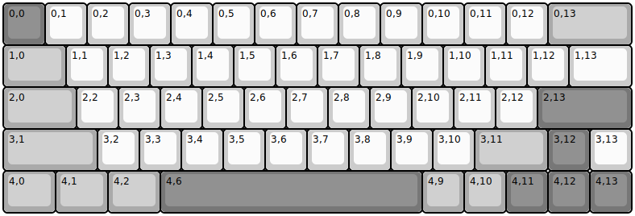{:loading="lazy"}

[Open in keyboard-layout-editor](http://www.keyboard-layout-editor.com/##@@_c=#777777;&=0,0&_c=#cccccc;&=0,1&=0,2&=0,3&=0,4&=0,5&=0,6&=0,7&=0,8&=0,9&=0,10&=0,11&=0,12&_c=#aaaaaa&w:2;&=0,13;&@_w:1.5;&=1,0&_c=#cccccc;&=1,1&=1,2&=1,3&=1,4&=1,5&=1,6&=1,7&=1,8&=1,9&=1,10&=1,11&=1,12&_w:1.5;&=1,13;&@_c=#aaaaaa&w:1.75;&=2,0&_c=#cccccc;&=2,2&=2,3&=2,4&=2,5&=2,6&=2,7&=2,8&=2,9&=2,10&=2,11&=2,12&_c=#777777&w:2.25;&=2,13;&@_c=#aaaaaa&w:2.25;&=3,1&_c=#cccccc;&=3,2&=3,3&=3,4&=3,5&=3,6&=3,7&=3,8&=3,9&=3,10&_c=#aaaaaa&w:1.75;&=3,11&_c=#777777;&=3,12&_c=#cccccc;&=3,13;&@_c=#aaaaaa&w:1.25;&=4,0&_w:1.25;&=4,1&_w:1.25;&=4,2&_c=#777777&w:6.25;&=4,6&_c=#aaaaaa;&=4,9&=4,10&_c=#777777;&=4,11&=4,12&=4,13)

## kprepublic/bm60rgb_v2

[README](output/kprepublic/README.md) - [layout](output/kprepublic/bm60rgb_v2-kle.json) - [PCB](output/kprepublic/bm60rgb_v2.kicad_pcb) - [PCB render](output/kprepublic/bm60rgb_v2-render.svg)

{:loading="lazy"}

[Open in keyboard-layout-editor](http://www.keyboard-layout-editor.com/##@@_c=#777777;&=0,0&_c=#cccccc;&=0,1&=0,2&=0,3&=0,4&=0,5&=0,6&=0,7&=0,8&=0,9&=0,10&=0,11&=0,12&_c=#aaaaaa&w:2;&=0,13;&@_w:1.5;&=1,0&_c=#cccccc;&=1,1&=1,2&=1,3&=1,4&=1,5&=1,6&=1,7&=1,8&=1,9&=1,10&=1,11&=1,12&_w:1.5;&=1,13;&@_c=#aaaaaa&w:1.75;&=2,0&_c=#cccccc;&=2,2&=2,3&=2,4&=2,5&=2,6&=2,7&=2,8&=2,9&=2,10&=2,11&=2,12&_c=#777777&w:2.25;&=2,13;&@_c=#aaaaaa&w:2.25;&=3,1&_c=#cccccc;&=3,2&=3,3&=3,4&=3,5&=3,6&=3,7&=3,8&=3,9&=3,10&_c=#aaaaaa&w:1.75;&=3,11&_c=#777777;&=3,12&_c=#cccccc;&=3,13;&@_c=#aaaaaa&w:1.25;&=4,0&_w:1.25;&=4,1&_w:1.25;&=4,2&_c=#777777&w:6.25;&=4,6&_c=#aaaaaa;&=4,9&=4,10&_c=#777777;&=4,11&=4,12&=4,13)

## kprepublic/bm60v2_ec

[README](output/kprepublic/README.md) - [layout](output/kprepublic/bm60v2_ec-kle.json) - [PCB](output/kprepublic/bm60v2_ec.kicad_pcb) - [PCB render](output/kprepublic/bm60v2_ec-render.svg)

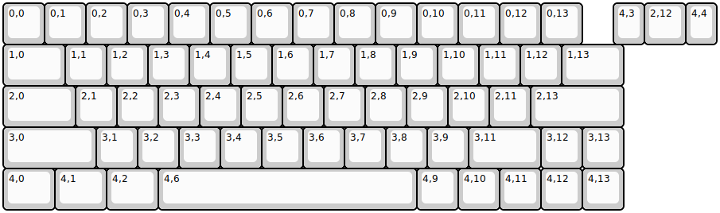{:loading="lazy"}

[Open in keyboard-layout-editor](http://www.keyboard-layout-editor.com/##@@=0,0&=0,1&=0,2&=0,3&=0,4&=0,5&=0,6&=0,7&=0,8&=0,9&=0,10&=0,11&=0,12&=0,13&_x:0.75&w:0.75;&=4,3&=2,12&_w:0.75;&=4,4;&@_w:1.5;&=1,0&=1,1&=1,2&=1,3&=1,4&=1,5&=1,6&=1,7&=1,8&=1,9&=1,10&=1,11&=1,12&_w:1.5;&=1,13;&@_w:1.75;&=2,0&=2,1&=2,2&=2,3&=2,4&=2,5&=2,6&=2,7&=2,8&=2,9&=2,10&=2,11&_w:2.25;&=2,13;&@_w:2.25;&=3,0&=3,1&=3,2&=3,3&=3,4&=3,5&=3,6&=3,7&=3,8&=3,9&_w:1.75;&=3,11&=3,12&=3,13;&@_w:1.25;&=4,0&_w:1.25;&=4,1&_w:1.25;&=4,2&_w:6.25;&=4,6&=4,9&=4,10&=4,11&=4,12&=4,13)

## kprepublic/bm68rgb

[README](output/kprepublic/README.md) - [layout](output/kprepublic/bm68rgb-kle.json) - [PCB](output/kprepublic/bm68rgb.kicad_pcb) - [PCB render](output/kprepublic/bm68rgb-render.svg)

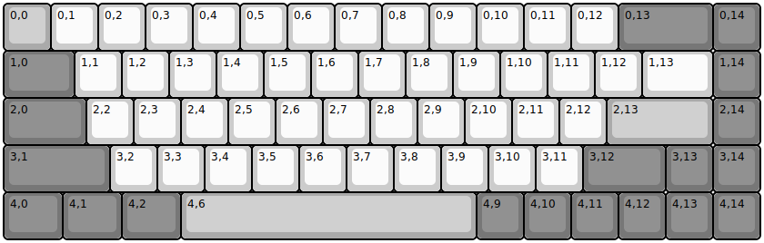{:loading="lazy"}

[Open in keyboard-layout-editor](http://www.keyboard-layout-editor.com/##@@_c=#aaaaaa;&=0,0&_c=#cccccc;&=0,1&=0,2&=0,3&=0,4&=0,5&=0,6&=0,7&=0,8&=0,9&=0,10&=0,11&=0,12&_c=#777777&w:2;&=0,13&=0,14;&@_w:1.5;&=1,0&_c=#cccccc;&=1,1&=1,2&=1,3&=1,4&=1,5&=1,6&=1,7&=1,8&=1,9&=1,10&=1,11&=1,12&_w:1.5;&=1,13&_c=#777777;&=1,14;&@_w:1.75;&=2,0&_c=#cccccc;&=2,2&=2,3&=2,4&=2,5&=2,6&=2,7&=2,8&=2,9&=2,10&=2,11&=2,12&_c=#aaaaaa&w:2.25;&=2,13&_c=#777777;&=2,14;&@_w:2.25;&=3,1&_c=#cccccc;&=3,2&=3,3&=3,4&=3,5&=3,6&=3,7&=3,8&=3,9&=3,10&=3,11&_c=#777777&w:1.75;&=3,12&=3,13&=3,14;&@_w:1.25;&=4,0&_w:1.25;&=4,1&_w:1.25;&=4,2&_c=#aaaaaa&w:6.25;&=4,6&_c=#777777;&=4,9&=4,10&=4,11&=4,12&=4,13&=4,14)

## kprepublic/bm80

[README](output/kprepublic/README.md) - [layout](output/kprepublic/bm80-kle.json) - [PCB](output/kprepublic/bm80.kicad_pcb) - [PCB render](output/kprepublic/bm80-render.svg)

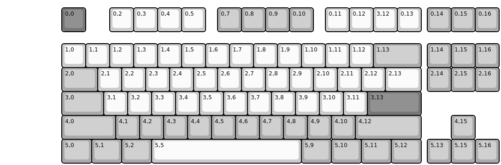{:loading="lazy"}

[Open in keyboard-layout-editor](http://www.keyboard-layout-editor.com/##@@_x:2.5&y:0.25&c=#777777;&=0,0&_x:1.0&c=#cccccc;&=0,2&=0,3&=0,4&=0,5&_x:0.5&c=#aaaaaa;&=0,7&=0,8&=0,9&=0,10&_x:0.5&c=#cccccc;&=0,11&=0,12&=3,12&=0,13&_x:0.25&c=#aaaaaa;&=0,14&=0,15&=0,16;&@_x:2.5&y:0.5&c=#cccccc;&=1,0&=1,1&=1,2&=1,3&=1,4&=1,5&=1,6&=1,7&=1,8&=1,9&=1,10&=1,11&=1,12&_c=#aaaaaa&w:2;&=1,13&_x:0.25;&=1,14&=1,15&=1,16;&@_x:2.5&w:1.5;&=2,0&_c=#cccccc;&=2,1&=2,2&=2,3&=2,4&=2,5&=2,6&=2,7&=2,8&=2,9&=2,10&=2,11&=2,12&_w:1.5;&=2,13&_x:0.25&c=#aaaaaa;&=2,14&=2,15&=2,16;&@_x:2.5&w:1.75;&=3,0&_c=#cccccc;&=3,1&=3,2&=3,3&=3,4&=3,5&=3,6&=3,7&=3,8&=3,9&=3,10&=3,11&_c=#777777&w:2.25;&=3,13;&@_x:2.5&c=#aaaaaa&w:2.25;&=4,0&=4,1&=4,2&=4,3&=4,4&=4,5&=4,6&=4,7&=4,8&=4,9&=4,10&_w:2.75;&=4,12&_x:1.25;&=4,15;&@_x:2.5&w:1.25;&=5,0&_w:1.25;&=5,1&_w:1.25;&=5,2&_c=#cccccc&w:6.25;&=5,5&_c=#aaaaaa&w:1.25;&=5,9&_w:1.25;&=5,10&_w:1.25;&=5,11&_w:1.25;&=5,12&_x:0.25;&=5,13&=5,15&=5,16)

## kprepublic/bm980

[README](output/kprepublic/README.md) - [layout](output/kprepublic/bm980-kle.json) - [PCB](output/kprepublic/bm980.kicad_pcb) - [PCB render](output/kprepublic/bm980-render.svg)

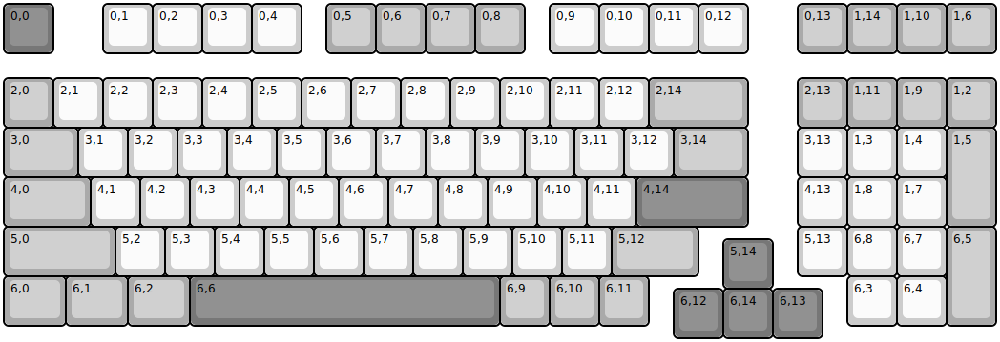{:loading="lazy"}

[Open in keyboard-layout-editor](http://www.keyboard-layout-editor.com/##@@_c=#777777;&=0,0&_x:1&c=#cccccc;&=0,1&=0,2&=0,3&=0,4&_x:0.5&c=#aaaaaa;&=0,5&=0,6&=0,7&=0,8&_x:0.5&c=#cccccc;&=0,9&=0,10&=0,11&=0,12&_x:1.0&c=#aaaaaa;&=0,13&=1,14&=1,10&=1,6;&@_y:0.5;&=2,0&_c=#cccccc;&=2,1&=2,2&=2,3&=2,4&=2,5&=2,6&=2,7&=2,8&=2,9&=2,10&=2,11&=2,12&_c=#aaaaaa&w:2;&=2,14&_x:1;&=2,13&=1,11&=1,9&=1,2;&@_w:1.5;&=3,0&_c=#cccccc;&=3,1&=3,2&=3,3&=3,4&=3,5&=3,6&=3,7&=3,8&=3,9&=3,10&=3,11&=3,12&_c=#aaaaaa&w:1.5;&=3,14&_x:1.0&c=#cccccc;&=3,13&=1,3&=1,4&_c=#aaaaaa&h:2;&=1,5;&@_w:1.75;&=4,0&_c=#cccccc;&=4,1&=4,2&=4,3&=4,4&=4,5&=4,6&=4,7&=4,8&=4,9&=4,10&=4,11&_c=#777777&w:2.25;&=4,14&_x:1.0&c=#cccccc;&=4,13&=1,8&=1,7;&@_c=#aaaaaa&w:2.25;&=5,0&_c=#cccccc;&=5,2&=5,3&=5,4&=5,5&=5,6&=5,7&=5,8&=5,9&=5,10&=5,11&_c=#aaaaaa&w:1.75;&=5,12&_x:2.0&c=#cccccc;&=5,13&=6,8&=6,7&_c=#aaaaaa&h:2;&=6,5;&@_x:14.5&y:-0.75&c=#777777;&=5,14;&@_y:-0.25&c=#aaaaaa&w:1.25;&=6,0&_w:1.25;&=6,1&_w:1.25;&=6,2&_c=#777777&w:6.25;&=6,6&_c=#aaaaaa;&=6,9&=6,10&=6,11&_x:4.0&c=#cccccc;&=6,3&=6,4;&@_x:13.5&y:-0.75&c=#777777;&=6,12&=6,14&=6,13)

## kprepublic/cospad

[README](output/kprepublic/README.md) - [layout](output/kprepublic/cospad-kle.json) - [PCB](output/kprepublic/cospad.kicad_pcb) - [PCB render](output/kprepublic/cospad-render.svg)

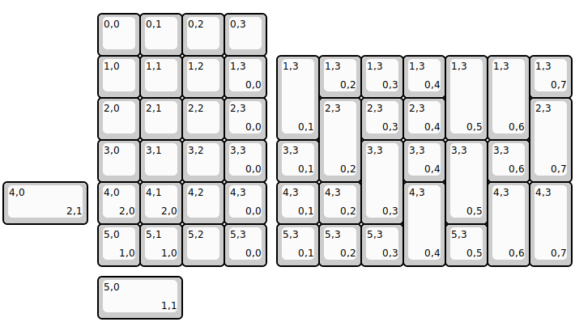{:loading="lazy"}

[Open in keyboard-layout-editor](http://www.keyboard-layout-editor.com/##@@_x:2.25&y:0.25;&=0,0&=0,1&=0,2&=0,3;&@_x:2.25;&=1,0&=1,1&=1,2&=1,3%0A%0A%0A0,0;&@_x:2.25;&=2,0&=2,1&=2,2&=2,3%0A%0A%0A0,0;&@_x:2.25;&=3,0&=3,1&=3,2&=3,3%0A%0A%0A0,0;&@_x:2.25;&=4,0%0A%0A%0A2,0&=4,1%0A%0A%0A2,0&=4,2&=4,3%0A%0A%0A0,0;&@_x:2.25;&=5,0%0A%0A%0A1,0&=5,1%0A%0A%0A1,0&=5,2&=5,3%0A%0A%0A0,0;&@_x:6.5&y:-5.0&h:2;&=1,3%0A%0A%0A0,1&=1,3%0A%0A%0A0,2&=1,3%0A%0A%0A0,3&=1,3%0A%0A%0A0,4&_h:2;&=1,3%0A%0A%0A0,5&_h:2;&=1,3%0A%0A%0A0,6&=1,3%0A%0A%0A0,7;&@_x:7.5&h:2;&=2,3%0A%0A%0A0,2&=2,3%0A%0A%0A0,3&=2,3%0A%0A%0A0,4&_x:2.0&h:2;&=2,3%0A%0A%0A0,7;&@_x:6.5;&=3,3%0A%0A%0A0,1&_x:1.0&h:2;&=3,3%0A%0A%0A0,3&=3,3%0A%0A%0A0,4&_h:2;&=3,3%0A%0A%0A0,5&=3,3%0A%0A%0A0,6;&@_w:2;&=4,0%0A%0A%0A2,1&_x:4.5;&=4,3%0A%0A%0A0,1&=4,3%0A%0A%0A0,2&_x:1.0&h:2;&=4,3%0A%0A%0A0,4&_x:1.0&h:2;&=4,3%0A%0A%0A0,6&_h:2;&=4,3%0A%0A%0A0,7;&@_x:6.5;&=5,3%0A%0A%0A0,1&=5,3%0A%0A%0A0,2&=5,3%0A%0A%0A0,3&_x:1.0;&=5,3%0A%0A%0A0,5;&@_x:2.25&y:0.25&w:2;&=5,0%0A%0A%0A1,1)

## kprepublic/daisy40

[README](output/kprepublic/README.md) - [layout](output/kprepublic/daisy40-kle.json) - [PCB](output/kprepublic/daisy40.kicad_pcb) - [PCB render](output/kprepublic/daisy40-render.svg)

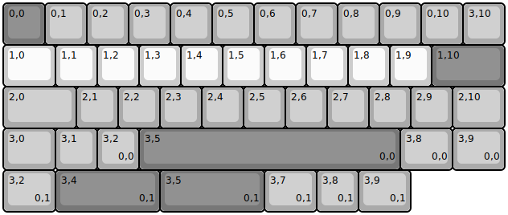{:loading="lazy"}

[Open in keyboard-layout-editor](http://www.keyboard-layout-editor.com/##@@_c=#777777;&=0,0&_c=#aaaaaa;&=0,1&=0,2&=0,3&=0,4&=0,5&=0,6&=0,7&=0,8&=0,9&=0,10&=3,10;&@_c=#cccccc&w:1.25;&=1,0&=1,1&=1,2&=1,3&=1,4&=1,5&=1,6&=1,7&=1,8&=1,9&_c=#777777&w:1.75;&=1,10;&@_c=#aaaaaa&w:1.75;&=2,0&=2,1&=2,2&=2,3&=2,4&=2,5&=2,6&=2,7&=2,8&=2,9&_w:1.25;&=2,10;&@_w:1.25;&=3,0&=3,1&=3,2%0A%0A%0A0,0&_c=#777777&w:6.25;&=3,5%0A%0A%0A0,0&_c=#aaaaaa&w:1.25;&=3,8%0A%0A%0A0,0&_w:1.25;&=3,9%0A%0A%0A0,0;&@_w:1.25;&=3,2%0A%0A%0A0,1&_c=#777777&w:2.5;&=3,4%0A%0A%0A0,1&_w:2.5;&=3,5%0A%0A%0A0,1&_c=#aaaaaa&w:1.25;&=3,7%0A%0A%0A0,1&=3,8%0A%0A%0A0,1&_w:1.25;&=3,9%0A%0A%0A0,1)

## kprepublic/jj40

[README](output/kprepublic/README.md) - [layout](output/kprepublic/jj40-kle.json) - [PCB](output/kprepublic/jj40.kicad_pcb) - [PCB render](output/kprepublic/jj40-render.svg)

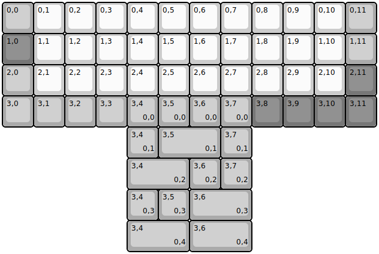{:loading="lazy"}

[Open in keyboard-layout-editor](http://www.keyboard-layout-editor.com/##@@_c=#aaaaaa;&=0,0&_c=#ccccccc;&=0,1&=0,2&=0,3&=0,4&=0,5&=0,6&=0,7&=0,8&=0,9&=0,10&_c=#aaaaaa;&=0,11;&@_c=#777777;&=1,0&_c=#ccccccc;&=1,1&=1,2&=1,3&=1,4&=1,5&=1,6&=1,7&=1,8&=1,9&=1,10&_c=#aaaaaa;&=1,11;&@=2,0&_c=#ccccccc;&=2,1&=2,2&=2,3&=2,4&=2,5&=2,6&=2,7&=2,8&=2,9&=2,10&_c=#777777;&=2,11;&@_c=#aaaaaa;&=3,0&=3,1&=3,2&=3,3&=3,4%0A%0A%0A0,0&=3,5%0A%0A%0A0,0&=3,6%0A%0A%0A0,0&=3,7%0A%0A%0A0,0&_c=#777777;&=3,8&=3,9&=3,10&=3,11;&@_x:4&c=#aaaaaa;&=3,4%0A%0A%0A0,1&_w:2;&=3,5%0A%0A%0A0,1&=3,7%0A%0A%0A0,1;&@_x:4&w:2;&=3,4%0A%0A%0A0,2&=3,6%0A%0A%0A0,2&=3,7%0A%0A%0A0,2;&@_x:4;&=3,4%0A%0A%0A0,3&=3,5%0A%0A%0A0,3&_w:2;&=3,6%0A%0A%0A0,3;&@_x:4&w:2;&=3,4%0A%0A%0A0,4&_w:2;&=3,6%0A%0A%0A0,4)

## kprepublic/jj4x4

[README](output/kprepublic/README.md) - [layout](output/kprepublic/jj4x4-kle.json) - [PCB](output/kprepublic/jj4x4.kicad_pcb) - [PCB render](output/kprepublic/jj4x4-render.svg)

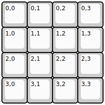{:loading="lazy"}

[Open in keyboard-layout-editor](http://www.keyboard-layout-editor.com/##@@=0,0&=0,1&=0,2&=0,3;&@=1,0&=1,1&=1,2&=1,3;&@=2,0&=2,1&=2,2&=2,3;&@=3,0&=3,1&=3,2&=3,3)

## kprepublic/jj50

[README](output/kprepublic/README.md) - [layout](output/kprepublic/jj50-kle.json) - [PCB](output/kprepublic/jj50.kicad_pcb) - [PCB render](output/kprepublic/jj50-render.svg)

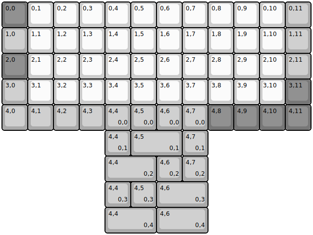{:loading="lazy"}

[Open in keyboard-layout-editor](http://www.keyboard-layout-editor.com/##@@_c=#777777;&=0,0&_c=#ccccccc;&=0,1&=0,2&=0,3&=0,4&=0,5&=0,6&=0,7&=0,8&=0,9&=0,10&_c=#aaaaaa;&=0,11;&@=1,0&_c=#ccccccc;&=1,1&=1,2&=1,3&=1,4&=1,5&=1,6&=1,7&=1,8&=1,9&=1,10&_c=#aaaaaa;&=1,11;&@_c=#777777;&=2,0&_c=#ccccccc;&=2,1&=2,2&=2,3&=2,4&=2,5&=2,6&=2,7&=2,8&=2,9&=2,10&_c=#aaaaaa;&=2,11;&@=3,0&_c=#ccccccc;&=3,1&=3,2&=3,3&=3,4&=3,5&=3,6&=3,7&=3,8&=3,9&=3,10&_c=#777777;&=3,11;&@_c=#aaaaaa;&=4,0&=4,1&=4,2&=4,3&=4,4%0A%0A%0A0,0&=4,5%0A%0A%0A0,0&=4,6%0A%0A%0A0,0&=4,7%0A%0A%0A0,0&_c=#777777;&=4,8&=4,9&=4,10&=4,11;&@_x:4&c=#aaaaaa;&=4,4%0A%0A%0A0,1&_w:2;&=4,5%0A%0A%0A0,1&=4,7%0A%0A%0A0,1;&@_x:4&w:2;&=4,4%0A%0A%0A0,2&=4,6%0A%0A%0A0,2&=4,7%0A%0A%0A0,2;&@_x:4;&=4,4%0A%0A%0A0,3&=4,5%0A%0A%0A0,3&_w:2;&=4,6%0A%0A%0A0,3;&@_x:4&w:2;&=4,4%0A%0A%0A0,4&_w:2;&=4,6%0A%0A%0A0,4)

## kprepublic/xd75

[README](output/kprepublic/README.md) - [layout](output/kprepublic/xd75-kle.json) - [PCB](output/kprepublic/xd75.kicad_pcb) - [PCB render](output/kprepublic/xd75-render.svg)

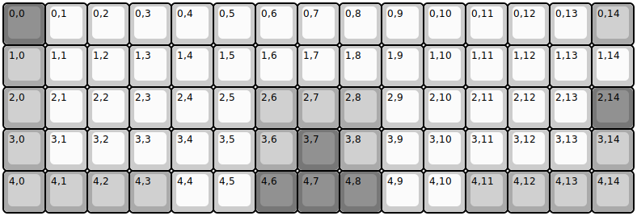{:loading="lazy"}

[Open in keyboard-layout-editor](http://www.keyboard-layout-editor.com/##@@_c=#777777;&=0,0&_c=#cccccc;&=0,1&=0,2&=0,3&=0,4&=0,5&=0,6&=0,7&=0,8&=0,9&=0,10&=0,11&=0,12&=0,13&_c=#aaaaaa;&=0,14;&@=1,0&_c=#cccccc;&=1,1&=1,2&=1,3&=1,4&=1,5&=1,6&=1,7&=1,8&=1,9&=1,10&=1,11&=1,12&=1,13&=1,14;&@_c=#aaaaaa;&=2,0&_c=#cccccc;&=2,1&=2,2&=2,3&=2,4&=2,5&_c=#aaaaaa;&=2,6&=2,7&=2,8&_c=#cccccc;&=2,9&=2,10&=2,11&=2,12&=2,13&_c=#777777;&=2,14;&@_c=#aaaaaa;&=3,0&_c=#cccccc;&=3,1&=3,2&=3,3&=3,4&=3,5&_c=#aaaaaa;&=3,6&_c=#777777;&=3,7&_c=#aaaaaa;&=3,8&_c=#cccccc;&=3,9&=3,10&=3,11&=3,12&=3,13&_c=#aaaaaa;&=3,14;&@=4,0&=4,1&=4,2&=4,3&_c=#cccccc;&=4,4&=4,5&_c=#777777;&=4,6&=4,7&=4,8&_c=#cccccc;&=4,9&=4,10&_c=#aaaaaa;&=4,11&=4,12&=4,13&=4,14)

## kprepublic/xd84pro

[README](output/kprepublic/README.md) - [layout](output/kprepublic/xd84pro-kle.json) - [PCB](output/kprepublic/xd84pro.kicad_pcb) - [PCB render](output/kprepublic/xd84pro-render.svg)

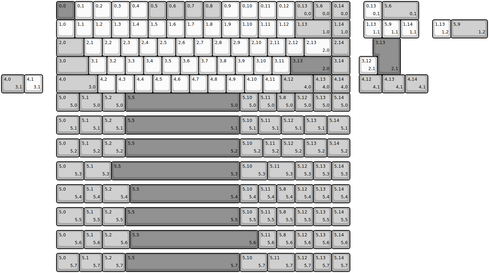{:loading="lazy"}

[Open in keyboard-layout-editor](http://www.keyboard-layout-editor.com/##@@_x:3&c=#777777;&=0,0&_c=#cccccc;&=0,1&=0,2&=0,3&=0,4&_c=#aaaaaa;&=0,5&=0,6&=0,7&=0,8&_c=#cccccc;&=0,9&=0,10&=0,11&=0,12&_c=#aaaaaa;&=0,13%0A%0A%0A0,0&=5,6%0A%0A%0A0,0&=0,14%0A%0A%0A0,0;&@_x:3&c=#cccccc;&=1,0&=1,1&=1,2&=1,3&=1,4&=1,5&=1,6&=1,7&=1,8&=1,9&=1,10&=1,11&=1,12&_c=#aaaaaa&w:2;&=1,13%0A%0A%0A1,0&=1,14%0A%0A%0A1,0;&@_x:3&w:1.5;&=2,0&_c=#cccccc;&=2,1&=2,2&=2,3&=2,4&=2,5&=2,6&=2,7&=2,8&=2,9&=2,10&=2,11&=2,12&_w:1.5;&=2,13%0A%0A%0A2,0&_c=#aaaaaa;&=2,14;&@_x:3&w:1.75;&=3,0&_c=#cccccc;&=3,1&=3,2&=3,3&=3,4&=3,5&=3,6&=3,7&=3,8&=3,9&=3,10&=3,11&_c=#777777&w:2.25;&=3,13%0A%0A%0A2,0&_c=#aaaaaa;&=3,14;&@_x:3.0&w:2.25;&=4,0%0A%0A%0A3,0&_c=#cccccc;&=4,2&=4,3&=4,4&=4,5&=4,6&=4,7&=4,8&=4,9&=4,10&=4,11&_c=#aaaaaa&w:1.75;&=4,12%0A%0A%0A4,0&=4,13%0A%0A%0A4,0&=4,14%0A%0A%0A4,0;&@_x:3&w:1.25;&=5,0%0A%0A%0A5,0&_w:1.25;&=5,1%0A%0A%0A5,0&_w:1.25;&=5,2%0A%0A%0A5,0&_c=#777777&w:6.25;&=5,5%0A%0A%0A5,0&_c=#aaaaaa;&=5,10%0A%0A%0A5,0&=5,11%0A%0A%0A5,0&=5,8%0A%0A%0A5,0&=5,12%0A%0A%0A5,0&=5,13%0A%0A%0A5,0&=5,14%0A%0A%0A5,0;&@_x:19.75&y:-6&c=#cccccc;&=0,13%0A%0A%0A0,1&_c=#aaaaaa&w:2;&=5,6%0A%0A%0A0,1;&@_x:19.75&c=#cccccc;&=1,13%0A%0A%0A1,1&=5,9%0A%0A%0A1,1&=1,14%0A%0A%0A1,1&_x:0.75;&=1,13%0A%0A%0A1,2&_c=#aaaaaa&w:2;&=5,9%0A%0A%0A1,2;&@_x:20.5&c=#777777&w:1.25&h:2&w2:1.5&h2:1&x2:-0.25;&=3,13%0A%0A%0A2,1;&@_x:19.5&c=#cccccc;&=3,12%0A%0A%0A2,1;&@_c=#aaaaaa&w:1.25;&=4,0%0A%0A%0A3,1&_c=#cccccc;&=4,1%0A%0A%0A3,1&_x:17.25&c=#aaaaaa&w:1.25;&=4,12%0A%0A%0A4,1&_w:1.25;&=4,13%0A%0A%0A4,1&_w:1.25;&=4,14%0A%0A%0A4,1;&@_x:3&y:1.25&w:1.25;&=5,0%0A%0A%0A5,1&_w:1.25;&=5,1%0A%0A%0A5,1&_w:1.25;&=5,2%0A%0A%0A5,1&_c=#777777&w:6.25;&=5,5%0A%0A%0A5,1&_c=#aaaaaa;&=5,10%0A%0A%0A5,1&_w:1.25;&=5,11%0A%0A%0A5,1&_w:1.25;&=5,12%0A%0A%0A5,1&_w:1.25;&=5,13%0A%0A%0A5,1&_w:1.25;&=5,14%0A%0A%0A5,1;&@_x:3&y:0.25&w:1.25;&=5,0%0A%0A%0A5,2&_w:1.25;&=5,1%0A%0A%0A5,2&_w:1.25;&=5,2%0A%0A%0A5,2&_c=#777777&w:6.25;&=5,5%0A%0A%0A5,2&_c=#aaaaaa&w:1.25;&=5,10%0A%0A%0A5,2&=5,11%0A%0A%0A5,2&_w:1.25;&=5,12%0A%0A%0A5,2&_w:1.25;&=5,13%0A%0A%0A5,2&_w:1.25;&=5,14%0A%0A%0A5,2;&@_x:3&y:0.25&w:1.5;&=5,0%0A%0A%0A5,3&_w:1.5;&=5,1%0A%0A%0A5,3&_c=#777777&w:7;&=5,5%0A%0A%0A5,3&_c=#aaaaaa&w:1.5;&=5,10%0A%0A%0A5,3&_w:1.5;&=5,11%0A%0A%0A5,3&=5,12%0A%0A%0A5,3&=5,13%0A%0A%0A5,3&=5,14%0A%0A%0A5,3;&@_x:3&y:0.25&w:1.5;&=5,0%0A%0A%0A5,4&=5,1%0A%0A%0A5,4&_w:1.5;&=5,2%0A%0A%0A5,4&_c=#777777&w:6;&=5,5%0A%0A%0A5,4&_c=#aaaaaa;&=5,10%0A%0A%0A5,4&=5,11%0A%0A%0A5,4&=5,8%0A%0A%0A5,4&=5,12%0A%0A%0A5,4&=5,13%0A%0A%0A5,4&=5,14%0A%0A%0A5,4;&@_x:3&y:0.25&w:1.5;&=5,0%0A%0A%0A5,5&=5,1%0A%0A%0A5,5&_w:1.25;&=5,2%0A%0A%0A5,5&_c=#777777&w:6.25;&=5,5%0A%0A%0A5,5&_c=#aaaaaa;&=5,10%0A%0A%0A5,5&=5,11%0A%0A%0A5,5&=5,8%0A%0A%0A5,5&=5,12%0A%0A%0A5,5&=5,13%0A%0A%0A5,5&=5,14%0A%0A%0A5,5;&@_x:3&y:0.25&w:1.5;&=5,0%0A%0A%0A5,6&=5,1%0A%0A%0A5,6&_w:1.5;&=5,2%0A%0A%0A5,6&_c=#777777&w:7;&=5,5%0A%0A%0A5,6&_c=#aaaaaa;&=5,11%0A%0A%0A5,6&=5,8%0A%0A%0A5,6&=5,12%0A%0A%0A5,6&=5,13%0A%0A%0A5,6&=5,14%0A%0A%0A5,6;&@_x:3&y:0.25&w:1.25;&=5,0%0A%0A%0A5,7&_w:1.25;&=5,1%0A%0A%0A5,7&_w:1.25;&=5,2%0A%0A%0A5,7&_c=#777777&w:6.25;&=5,5%0A%0A%0A5,7&_c=#aaaaaa&w:1.5;&=5,10%0A%0A%0A5,7&_w:1.5;&=5,11%0A%0A%0A5,7&=5,12%0A%0A%0A5,7&=5,13%0A%0A%0A5,7&=5,14%0A%0A%0A5,7)

## kwub/bloop

[README](output/kwub/bloop/README.md) - [layout](output/kwub/bloop/bloop-kle.json) - [PCB](output/kwub/bloop/bloop.kicad_pcb) - [PCB render](output/kwub/bloop/bloop-render.svg)

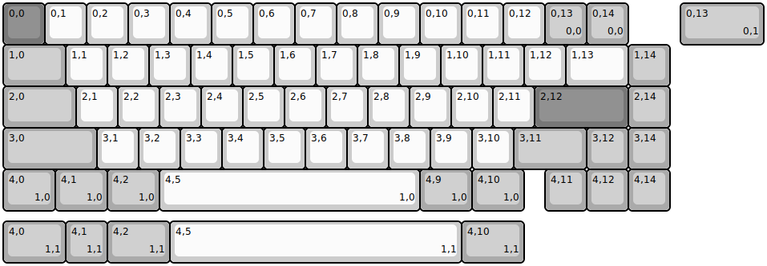{:loading="lazy"}

[Open in keyboard-layout-editor](http://www.keyboard-layout-editor.com/##@@_c=#777777;&=0,0&_c=#cccccc;&=0,1&=0,2&=0,3&=0,4&=0,5&=0,6&=0,7&=0,8&=0,9&=0,10&=0,11&=0,12&_c=#aaaaaa;&=0,13%0A%0A%0A0,0&=0,14%0A%0A%0A0,0;&@_w:1.5;&=1,0&_c=#cccccc;&=1,1&=1,2&=1,3&=1,4&=1,5&=1,6&=1,7&=1,8&=1,9&=1,10&=1,11&=1,12&_w:1.5;&=1,13&_c=#aaaaaa;&=1,14;&@_w:1.75;&=2,0&_c=#cccccc;&=2,1&=2,2&=2,3&=2,4&=2,5&=2,6&=2,7&=2,8&=2,9&=2,10&=2,11&_c=#777777&w:2.25;&=2,12&_c=#aaaaaa;&=2,14;&@_w:2.25;&=3,0&_c=#cccccc;&=3,1&=3,2&=3,3&=3,4&=3,5&=3,6&=3,7&=3,8&=3,9&=3,10&_c=#aaaaaa&w:1.75;&=3,11&=3,12&=3,14;&@_w:1.25;&=4,0%0A%0A%0A1,0&_w:1.25;&=4,1%0A%0A%0A1,0&_w:1.25;&=4,2%0A%0A%0A1,0&_c=#cccccc&w:6.25;&=4,5%0A%0A%0A1,0&_c=#aaaaaa&w:1.25;&=4,9%0A%0A%0A1,0&_w:1.25;&=4,10%0A%0A%0A1,0&_x:0.5;&=4,11&=4,12&=4,14;&@_x:16.25&y:-5&w:2;&=0,13%0A%0A%0A0,1;&@_y:4.25&w:1.5;&=4,0%0A%0A%0A1,1&=4,1%0A%0A%0A1,1&_w:1.5;&=4,2%0A%0A%0A1,1&_c=#cccccc&w:7;&=4,5%0A%0A%0A1,1&_c=#aaaaaa&w:1.5;&=4,10%0A%0A%0A1,1)

## ky01/ky01

[README](output/ky01/README.md) - [layout](output/ky01/ky01-kle.json) - [PCB](output/ky01/ky01.kicad_pcb) - [PCB render](output/ky01/ky01-render.svg)

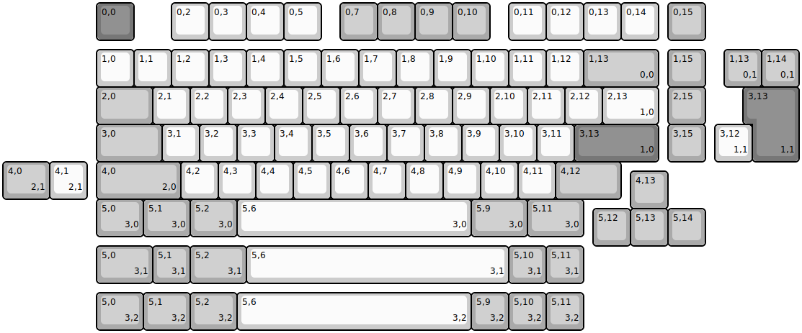{:loading="lazy"}

[Open in keyboard-layout-editor](http://www.keyboard-layout-editor.com/##@@_x:2.5&c=#777777;&=0,0&_x:1.0&c=#cccccc;&=0,2&=0,3&=0,4&=0,5&_x:0.5&c=#aaaaaa;&=0,7&=0,8&=0,9&=0,10&_x:0.5&c=#cccccc;&=0,11&=0,12&=0,13&=0,14&_x:0.25&c=#aaaaaa;&=0,15;&@_x:2.5&y:0.25&c=#cccccc;&=1,0&=1,1&=1,2&=1,3&=1,4&=1,5&=1,6&=1,7&=1,8&=1,9&=1,10&=1,11&=1,12&_c=#aaaaaa&w:2;&=1,13%0A%0A%0A0,0&_x:0.25;&=1,15;&@_x:2.5&w:1.5;&=2,0&_c=#cccccc;&=2,1&=2,2&=2,3&=2,4&=2,5&=2,6&=2,7&=2,8&=2,9&=2,10&=2,11&=2,12&_w:1.5;&=2,13%0A%0A%0A1,0&_x:0.25&c=#aaaaaa;&=2,15;&@_x:2.5&w:1.75;&=3,0&_c=#cccccc;&=3,1&=3,2&=3,3&=3,4&=3,5&=3,6&=3,7&=3,8&=3,9&=3,10&=3,11&_c=#777777&w:2.25;&=3,13%0A%0A%0A1,0&_x:0.25&c=#aaaaaa;&=3,15;&@_x:2.5&w:2.25;&=4,0%0A%0A%0A2,0&_c=#cccccc;&=4,2&=4,3&=4,4&=4,5&=4,6&=4,7&=4,8&=4,9&=4,10&=4,11&_c=#aaaaaa&w:1.75;&=4,12;&@_x:16.75&y:-0.75;&=4,13;&@_x:2.5&y:-0.25&w:1.25;&=5,0%0A%0A%0A3,0&_w:1.25;&=5,1%0A%0A%0A3,0&_w:1.25;&=5,2%0A%0A%0A3,0&_c=#cccccc&w:6.25;&=5,6%0A%0A%0A3,0&_c=#aaaaaa&w:1.5;&=5,9%0A%0A%0A3,0&_w:1.5;&=5,11%0A%0A%0A3,0;&@_x:15.75&y:-0.75;&=5,12&=5,13&=5,14;&@_x:19.25&y:-5.25;&=1,13%0A%0A%0A0,1&=1,14%0A%0A%0A0,1;&@_x:20.0&c=#777777&w:1.25&h:2&w2:1.5&h2:1&x2:-0.25;&=3,13%0A%0A%0A1,1;&@_x:19.0&c=#cccccc;&=3,12%0A%0A%0A1,1;&@_c=#aaaaaa&w:1.25;&=4,0%0A%0A%0A2,1&_c=#cccccc;&=4,1%0A%0A%0A2,1;&@_x:2.5&y:1.25&c=#aaaaaa&w:1.5;&=5,0%0A%0A%0A3,1&=5,1%0A%0A%0A3,1&_w:1.5;&=5,2%0A%0A%0A3,1&_c=#cccccc&w:7;&=5,6%0A%0A%0A3,1&_c=#aaaaaa;&=5,10%0A%0A%0A3,1&=5,11%0A%0A%0A3,1;&@_x:2.5&y:0.25&w:1.25;&=5,0%0A%0A%0A3,2&_w:1.25;&=5,1%0A%0A%0A3,2&_w:1.25;&=5,2%0A%0A%0A3,2&_c=#cccccc&w:6.25;&=5,6%0A%0A%0A3,2&_c=#aaaaaa;&=5,9%0A%0A%0A3,2&=5,10%0A%0A%0A3,2&=5,11%0A%0A%0A3,2)

## labyrinth75/labyrinth75

[README](output/labyrinth75/README.md) - [layout](output/labyrinth75/labyrinth75-kle.json) - [PCB](output/labyrinth75/labyrinth75.kicad_pcb) - [PCB render](output/labyrinth75/labyrinth75-render.svg)

{:loading="lazy"}

[Open in keyboard-layout-editor](http://www.keyboard-layout-editor.com/##@@_c=#777777;&=0,2&_x:0.5&c=#cccccc;&=1,2&=0,3&=1,3&=0,4&_x:0.25&c=#aaaaaa;&=1,4&=0,5&=1,5&=0,6&_x:0.25&c=#cccccc;&=1,6&=0,7&=1,7&=0,8&_x:1.0&c=#aaaaaa;&=1,8;&@_y:0.25&c=#cccccc;&=3,1&=2,2&=3,2&=2,3&=3,3&=2,4&=3,4&=2,5&=3,5&=2,6&=3,6&=2,7&=3,7&_c=#aaaaaa&w:2;&=2,8&=3,8;&@_w:1.5;&=5,1&_c=#cccccc;&=4,2&=5,2&=4,3&=5,3&=4,4&=5,4&=4,5&=5,5&=4,6&=5,6&=4,7&=5,7&_w:1.5;&=4,8&_c=#aaaaaa;&=5,8;&@_w:1.75;&=6,2&_c=#cccccc;&=7,2&=6,3&=7,3&=6,4&=7,4&=6,5&=7,5&=6,6&=7,6&=6,7&=7,7&_c=#777777&w:2.25;&=6,8&_c=#aaaaaa;&=7,8;&@_w:2.25;&=0,1&_c=#cccccc;&=1,1&=2,1&=4,1&=6,1&=7,1&=8,1&=8,2&=8,3&=8,4&=8,5&_c=#aaaaaa&w:1.75;&=8,6&=8,7&=8,8;&@_w:1.25;&=5,0&_w:1.25;&=3,0&_w:1.25;&=0,0&_c=#777777&w:6.25;&=1,0&_c=#aaaaaa&w:1.25;&=2,0&_w:1.25;&=4,0&_x:0.5;&=6,0&=7,0&=8,0)

## lain/lain

[README](output/lain/README.md) - [layout](output/lain/lain-kle.json) - [PCB](output/lain/lain.kicad_pcb) - [PCB render](output/lain/lain-render.svg)

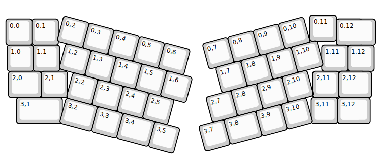{:loading="lazy"}

[Open in keyboard-layout-editor](http://www.keyboard-layout-editor.com/##@@_x:11.75&y:0.5;&=0,11;&@_x:0.15&y:-0.85;&=0,0&=0,1&_x:10.6&w2:1.5;&=0,12;&@_x:0.2;&=1,0&=1,1&_x:10.0;&=1,11&=1,12;&@_x:0.25&w:1.25;&=2,0&=2,1&_x:9.35;&=2,11&_w2:1.25;&=2,12;&@_x:0.55&w:1.75;&=3,1&_x:10.5&w2:1.25;&=3,12;&@_rx:7.5&ry:3.5&x:4.3&y:0.15;&=3,11;&@_r:15&rx:2&ry:0&x:0.5&y:0.4;&=0,2&=0,3&=0,4&=0,5&=0,6;&@_x:0.85;&=1,2&=1,3&_n:true;&=1,4&=1,5&=1,6;&@_x:1.4;&=2,2&=2,3&=2,4&=2,5;&@_x:1.4&w:1.25;&=3,2&=3,3&_w:1.25;&=3,4&=3,5;&@_r:-15&rx:13.5&x:-6.1&y:0.05;&=0,7&=0,8&=0,9&=0,10;&@_x:-5.85;&=1,7&_n:true;&=1,8&=1,9&=1,10;&@_x:-6.5;&=2,7&=2,8&=2,9&=2,10;&@_x:-7.05;&=3,7&_w:1.25;&=3,8&=3,9&=3,10)

## latin17rgb/latin17rgb

[README](output/latin17rgb/README.md) - [layout](output/latin17rgb/latin17rgb-kle.json) - [PCB](output/latin17rgb/latin17rgb.kicad_pcb) - [PCB render](output/latin17rgb/latin17rgb-render.svg)

{:loading="lazy"}

[Open in keyboard-layout-editor](http://www.keyboard-layout-editor.com/##@@=0,0&=0,1&=0,2&=0,3;&@=1,0&=1,1&=1,2&_h:2;&=1,3;&@=2,0&=2,1&=2,2;&@=3,0&=3,1&=3,2&_h:2;&=3,3;&@_w:2;&=4,0&=4,1)

## latin60RGB/latin60rgb

[README](output/latin60RGB/README.md) - [layout](output/latin60RGB/latin60rgb-kle.json) - [PCB](output/latin60RGB/latin60rgb.kicad_pcb) - [PCB render](output/latin60RGB/latin60rgb-render.svg)

{:loading="lazy"}

[Open in keyboard-layout-editor](http://www.keyboard-layout-editor.com/##@@=0,0&=0,1&=0,2&=0,3&=0,4&=0,5&=0,6&=0,7&=0,8&=0,9&=0,10&=0,11&=0,12&_w:2;&=0,13;&@_w:1.5;&=1,0&=1,1&=1,2&=1,3&=1,4&=1,5&=1,6&=1,7&=1,8&=1,9&=1,10&=1,11&=1,12&_w:1.5;&=1,13;&@_w:1.75;&=2,0&=2,1&=2,2&=2,3&=2,4&=2,5&=2,6&=2,7&=2,8&=2,9&=2,10&=2,11&_w:2.25;&=2,12;&@_w:2;&=3,0&=3,1&=3,2&=3,3&=3,4&=3,5&=3,6&=3,7&=3,8&=3,9&=3,10&=3,11&=3,12&=3,13;&@_x:1.25&w:1.25;&=4,0&_w:1.25;&=4,1&_w:6.25;&=4,2&_w:1.25;&=4,3&_w:1.25;&=4,4)

## latin64ble/latin64ble

[README](output/latin64ble/README.md) - [layout](output/latin64ble/latin64ble-kle.json) - [PCB](output/latin64ble/latin64ble.kicad_pcb) - [PCB render](output/latin64ble/latin64ble-render.svg)

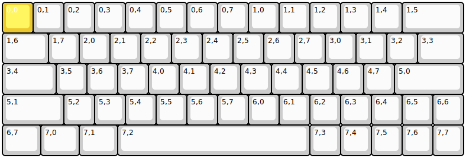{:loading="lazy"}

[Open in keyboard-layout-editor](http://www.keyboard-layout-editor.com/##@@_c=#ecc82f&t=#fbfbfb;&=0,0&_c=#cccccc&t=#000000;&=0,1&=0,2&=0,3&=0,4&=0,5&=0,6&=0,7&=1,0&=1,1&=1,2&=1,3&=1,4&_w:2;&=1,5;&@_w:1.5;&=1,6&=1,7&=2,0&=2,1&=2,2&=2,3&=2,4&=2,5&=2,6&=2,7&=3,0&=3,1&=3,2&_w:1.5;&=3,3;&@_w:1.75;&=3,4&=3,5&=3,6&=3,7&=4,0&=4,1&=4,2&=4,3&=4,4&=4,5&=4,6&=4,7&_w:2.25;&=5,0;&@_w:2;&=5,1&=5,2&=5,3&=5,4&=5,5&=5,6&=5,7&=6,0&=6,1&=6,2&=6,3&=6,4&=6,5&=6,6;&@_w:1.25;&=6,7&_w:1.25;&=7,0&_w:1.25;&=7,1&_w:6.25;&=7,2&=7,3&=7,4&=7,5&=7,6&=7,7)

## latinpadble/latinpadble

[README](output/latinpadble/README.md) - [layout](output/latinpadble/latinpadble-kle.json) - [PCB](output/latinpadble/latinpadble.kicad_pcb) - [PCB render](output/latinpadble/latinpadble-render.svg)

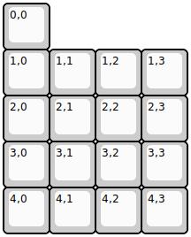{:loading="lazy"}

[Open in keyboard-layout-editor](http://www.keyboard-layout-editor.com/##@@=0,0;&@=1,0&=1,1&=1,2&=1,3;&@=2,0&=2,1&=2,2&=2,3;&@=3,0&=3,1&=3,2&=3,3;&@=4,0&=4,1&=4,2&=4,3)

## lazydesigners/bolt

[README](output/lazydesigners/README.md) - [layout](output/lazydesigners/bolt-kle.json) - [PCB](output/lazydesigners/bolt.kicad_pcb) - [PCB render](output/lazydesigners/bolt-render.svg)

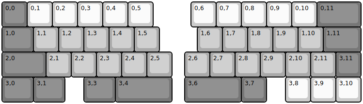{:loading="lazy"}

[Open in keyboard-layout-editor](http://www.keyboard-layout-editor.com/##@@_c=#777777;&=0,0&_c=#cccccc;&=0,1&=0,2&=0,3&=0,4&=0,5&_x:1.5;&=0,6&=0,7&=0,8&=0,9&=0,10&_c=#777777&w:1.75;&=0,11;&@_w:1.25;&=1,0&_c=#aaaaaa;&=1,1&=1,2&=1,3&=1,4&=1,5&_x:1.5;&=1,6&=1,7&=1,8&=1,9&=1,10&_c=#777777&w:1.5;&=1,11;&@_w:1.75;&=2,0&_c=#aaaaaa;&=2,1&=2,2&=2,3&=2,4&=2,5&_x:0.5;&=2,6&=2,7&=2,8&=2,9&=2,10&=2,11&_c=#777777;&=3,11;&@_w:1.25;&=3,0&_w:1.25;&=3,1&_x:0.75&w:1.25;&=3,3&_w:2.25;&=3,4&_x:0.5&w:2.25;&=3,6&=3,7&_x:0.75&c=#cccccc;&=3,8&=3,9&=3,10)

## lazydesigners/cassette8

[README](output/lazydesigners/README.md) - [layout](output/lazydesigners/cassette8-kle.json) - [PCB](output/lazydesigners/cassette8.kicad_pcb) - [PCB render](output/lazydesigners/cassette8-render.svg)

{:loading="lazy"}

[Open in keyboard-layout-editor](http://www.keyboard-layout-editor.com/##@@=0,0&=0,1&=0,2&=0,3;&@=1,0&=1,1&=1,2&=1,3)

## lazydesigners/dimple

[README](output/lazydesigners/README.md) - [layout](output/lazydesigners/dimple-kle.json) - [PCB](output/lazydesigners/dimple.kicad_pcb) - [PCB render](output/lazydesigners/dimple-render.svg)

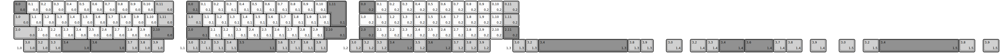{:loading="lazy"}

[Open in keyboard-layout-editor](http://www.keyboard-layout-editor.com/##@@_x:1&c=#777777;&=0,0%0A%0A%0A0,0&_c=#cccccc;&=0,1%0A%0A%0A0,0&=0,2%0A%0A%0A0,0&=0,3%0A%0A%0A0,0&=0,4%0A%0A%0A0,0&=0,5%0A%0A%0A0,0&=0,6%0A%0A%0A0,0&=0,7%0A%0A%0A0,0&=0,8%0A%0A%0A0,0&=0,9%0A%0A%0A0,0&=0,10%0A%0A%0A0,0&_c=#aaaaaa&w:1.5;&=0,11%0A%0A%0A0,0;&@_x:1&w:1.25;&=1,0%0A%0A%0A0,0&_c=#cccccc;&=1,1%0A%0A%0A0,0&=1,2%0A%0A%0A0,0&=1,3%0A%0A%0A0,0&=1,4%0A%0A%0A0,0&=1,5%0A%0A%0A0,0&=1,6%0A%0A%0A0,0&=1,7%0A%0A%0A0,0&=1,8%0A%0A%0A0,0&=1,9%0A%0A%0A0,0&=1,10%0A%0A%0A0,0&_c=#aaaaaa&w:1.25;&=1,11%0A%0A%0A0,0;&@_x:1&w:1.75;&=2,0%0A%0A%0A0,0&_c=#cccccc;&=2,1%0A%0A%0A0,0&=2,2%0A%0A%0A0,0&=2,3%0A%0A%0A0,0&=2,4%0A%0A%0A0,0&=2,5%0A%0A%0A0,0&=2,6%0A%0A%0A0,0&=2,7%0A%0A%0A0,0&=2,8%0A%0A%0A0,0&=2,9%0A%0A%0A0,0&_c=#777777&w:1.75;&=2,10%0A%0A%0A0,0;&@_x:1&w:0.75&d:true;&=%0A%0A%0A1,0&_c=#aaaaaa;&=3,0%0A%0A%0A1,0&=3,2%0A%0A%0A1,0&=3,3%0A%0A%0A1,0&_c=#777777&w:2.25;&=3,4%0A%0A%0A1,0&_w:2.75;&=3,6%0A%0A%0A1,0&_c=#aaaaaa;&=3,7%0A%0A%0A1,0&=3,8%0A%0A%0A1,0&=3,9%0A%0A%0A1,0;&@_x:14.5&y:-4&c=#777777;&=0,0%0A%0A%0A0,1&_c=#cccccc;&=0,1%0A%0A%0A0,1&=0,2%0A%0A%0A0,1&=0,3%0A%0A%0A0,1&=0,4%0A%0A%0A0,1&=0,5%0A%0A%0A0,1&=0,6%0A%0A%0A0,1&=0,7%0A%0A%0A0,1&=0,8%0A%0A%0A0,1&=0,9%0A%0A%0A0,1&=0,10%0A%0A%0A0,1&_x:0.25&c=#777777&w:1.25&h:2&w2:1.5&h2:1&x2:-0.25;&=1,11%0A%0A%0A0,1&_x:1.0&w:1.25;&=0,0%0A%0A%0A0,2&_c=#cccccc;&=0,1%0A%0A%0A0,2&=0,2%0A%0A%0A0,2&=0,3%0A%0A%0A0,2&=0,4%0A%0A%0A0,2&=0,5%0A%0A%0A0,2&=0,6%0A%0A%0A0,2&=0,7%0A%0A%0A0,2&=0,8%0A%0A%0A0,2&=0,9%0A%0A%0A0,2&=0,10%0A%0A%0A0,2&_c=#aaaaaa&w:1.25;&=0,11%0A%0A%0A0,2;&@_x:14.5&w:1.25;&=1,0%0A%0A%0A0,1&_c=#cccccc;&=1,1%0A%0A%0A0,1&=1,2%0A%0A%0A0,1&=1,3%0A%0A%0A0,1&=1,4%0A%0A%0A0,1&=1,5%0A%0A%0A0,1&=1,6%0A%0A%0A0,1&=1,7%0A%0A%0A0,1&=1,8%0A%0A%0A0,1&=1,9%0A%0A%0A0,1&=1,10%0A%0A%0A0,1&_x:2.25&w:1.25;&=1,0%0A%0A%0A0,2&=1,1%0A%0A%0A0,2&=1,2%0A%0A%0A0,2&=1,3%0A%0A%0A0,2&=1,4%0A%0A%0A0,2&=1,5%0A%0A%0A0,2&=1,6%0A%0A%0A0,2&=1,7%0A%0A%0A0,2&=1,8%0A%0A%0A0,2&=1,9%0A%0A%0A0,2&=1,10%0A%0A%0A0,2&_c=#aaaaaa&w:1.25;&=1,11%0A%0A%0A0,2;&@_x:14.5&c=#777777&w:1.75;&=2,0%0A%0A%0A0,1&_c=#cccccc;&=2,1%0A%0A%0A0,1&=2,2%0A%0A%0A0,1&=2,3%0A%0A%0A0,1&=2,4%0A%0A%0A0,1&=2,5%0A%0A%0A0,1&=2,6%0A%0A%0A0,1&=2,7%0A%0A%0A0,1&=2,8%0A%0A%0A0,1&=2,9%0A%0A%0A0,1&_c=#777777&w:1.75;&=2,10%0A%0A%0A0,1&_x:1.0&w:1.25;&=2,0%0A%0A%0A0,2&_c=#cccccc;&=2,1%0A%0A%0A0,2&=2,2%0A%0A%0A0,2&=2,3%0A%0A%0A0,2&=2,4%0A%0A%0A0,2&=2,5%0A%0A%0A0,2&=2,6%0A%0A%0A0,2&=2,7%0A%0A%0A0,2&=2,8%0A%0A%0A0,2&=2,9%0A%0A%0A0,2&=2,10%0A%0A%0A0,2&_c=#777777&w:1.25;&=2,11%0A%0A%0A0,2;&@_x:13.75&c=#aaaaaa&w:0.75&d:true;&=%0A%0A%0A1,1&=3,0%0A%0A%0A1,1&=3,2%0A%0A%0A1,1&=3,3%0A%0A%0A1,1&=3,4%0A%0A%0A1,1&_c=#777777&w:3;&=3,5%0A%0A%0A1,1&_c=#aaaaaa;&=3,6%0A%0A%0A1,1&=3,7%0A%0A%0A1,1&=3,8%0A%0A%0A1,1&=3,9%0A%0A%0A1,1&_x:1.0&w:0.75&d:true;&=%0A%0A%0A1,2&=3,0%0A%0A%0A1,2&=3,2%0A%0A%0A1,2&=3,3%0A%0A%0A1,2&_c=#777777&w:2;&=3,4%0A%0A%0A1,2&_c=#aaaaaa;&=3,5%0A%0A%0A1,2&_c=#777777&w:2;&=3,6%0A%0A%0A1,2&_c=#aaaaaa;&=3,7%0A%0A%0A1,2&=3,8%0A%0A%0A1,2&=3,9%0A%0A%0A1,2&_x:1.0&w:0.75&d:true;&=%0A%0A%0A1,3&=3,0%0A%0A%0A1,3&=3,2%0A%0A%0A1,3&_c=#777777&w:7;&=3,4%0A%0A%0A1,3&_c=#aaaaaa;&=3,8%0A%0A%0A1,3&=3,9%0A%0A%0A1,3&_x:1.0&w:1.25;&=3,0%0A%0A%0A1,4&_x:0.63&w:1.25;&=3,2%0A%0A%0A1,4&=3,3%0A%0A%0A1,4&_c=#777777&w:2;&=3,4%0A%0A%0A1,4&_w:2.25;&=3,6%0A%0A%0A1,4&_c=#aaaaaa;&=3,7%0A%0A%0A1,4&_w:1.25;&=3,8%0A%0A%0A1,4&_x:0.63&w:1.25;&=3,9%0A%0A%0A1,4&_x:1.0&w:1.25;&=3,0%0A%0A%0A1,5&_x:0.63&w:1.25;&=3,2%0A%0A%0A1,5&_c=#777777&w:6.25;&=3,4%0A%0A%0A1,5&_c=#aaaaaa&w:1.25;&=3,8%0A%0A%0A1,5&_x:0.63&w:1.25;&=3,9%0A%0A%0A1,5)

## lazydesigners/dimpleplus

[README](output/lazydesigners/README.md) - [layout](output/lazydesigners/dimpleplus-kle.json) - [PCB](output/lazydesigners/dimpleplus.kicad_pcb) - [PCB render](output/lazydesigners/dimpleplus-render.svg)

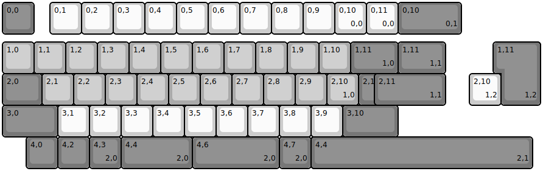{:loading="lazy"}

[Open in keyboard-layout-editor](http://www.keyboard-layout-editor.com/##@@_c=#777777;&=0,0&_x:0.5&c=#cccccc;&=0,1&=0,2&=0,3&=0,4&=0,5&=0,6&=0,7&=0,8&=0,9&=0,10%0A%0A%0A0,0&=0,11%0A%0A%0A0,0;&@_y:0.25&c=#aaaaaa;&=1,0&=1,1&=1,2&=1,3&=1,4&=1,5&=1,6&=1,7&=1,8&=1,9&=1,10&_c=#777777&w:1.5;&=1,11%0A%0A%0A1,0;&@_w:1.25;&=2,0&_c=#aaaaaa;&=2,1&=2,2&=2,3&=2,4&=2,5&=2,6&=2,7&=2,8&=2,9&=2,10%0A%0A%0A1,0&_c=#777777&w:1.25;&=2,11%0A%0A%0A1,0;&@_w:1.75;&=3,0&_c=#cccccc;&=3,1&=3,2&=3,3&=3,4&=3,5&=3,6&=3,7&=3,8&=3,9&_c=#777777&w:1.75;&=3,10;&@_x:0.75;&=4,0&=4,2&=4,3%0A%0A%0A2,0&_w:2.25;&=4,4%0A%0A%0A2,0&_w:2.75;&=4,6%0A%0A%0A2,0&=4,7%0A%0A%0A2,0&=4,8&=4,9;&@_x:12.5&y:-5.25&w:2;&=0,10%0A%0A%0A0,1;&@_x:12.5&y:0.25&w:1.5;&=1,11%0A%0A%0A1,1&_x:1.75&w:1.25&h:2&w2:1.5&h2:1&x2:-0.25;&=1,11%0A%0A%0A1,2;&@_x:11.75&w:2.25;&=2,11%0A%0A%0A1,1&_x:0.75&c=#cccccc;&=2,10%0A%0A%0A1,2;&@_x:9.75&y:1.0&c=#777777&w:7;&=4,4%0A%0A%0A2,1)

## lazydesigners/the30

[README](output/lazydesigners/README.md) - [layout](output/lazydesigners/the30-kle.json) - [PCB](output/lazydesigners/the30.kicad_pcb) - [PCB render](output/lazydesigners/the30-render.svg)

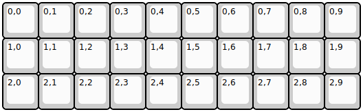{:loading="lazy"}

[Open in keyboard-layout-editor](http://www.keyboard-layout-editor.com/##@@=0,0&=0,1&=0,2&=0,3&=0,4&=0,5&=0,6&=0,7&=0,8&=0,9;&@=1,0&=1,1&=1,2&=1,3&=1,4&=1,5&=1,6&=1,7&=1,8&=1,9;&@=2,0&=2,1&=2,2&=2,3&=2,4&=2,5&=2,6&=2,7&=2,8&=2,9)

## lazydesigners/the40

[README](output/lazydesigners/README.md) - [layout](output/lazydesigners/the40-kle.json) - [PCB](output/lazydesigners/the40.kicad_pcb) - [PCB render](output/lazydesigners/the40-render.svg)

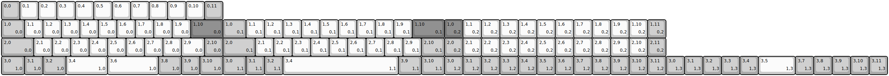{:loading="lazy"}

[Open in keyboard-layout-editor](http://www.keyboard-layout-editor.com/##@@_c=#aaaaaa;&=0,0&_c=#cccccc;&=0,1&=0,2&=0,3&=0,4&=0,5&=0,6&=0,7&=0,8&=0,9&=0,10&_c=#aaaaaa;&=0,11;&@_w:1.25;&=1,0%0A%0A%0A0,0&_c=#cccccc;&=1,1%0A%0A%0A0,0&=1,2%0A%0A%0A0,0&=1,3%0A%0A%0A0,0&=1,4%0A%0A%0A0,0&=1,5%0A%0A%0A0,0&=1,6%0A%0A%0A0,0&=1,7%0A%0A%0A0,0&=1,8%0A%0A%0A0,0&=1,9%0A%0A%0A0,0&_c=#777777&w:1.75;&=1,10%0A%0A%0A0,0;&@_c=#aaaaaa&w:1.75;&=2,0%0A%0A%0A0,0&_c=#cccccc;&=2,1%0A%0A%0A0,0&=2,2%0A%0A%0A0,0&=2,3%0A%0A%0A0,0&=2,4%0A%0A%0A0,0&=2,5%0A%0A%0A0,0&=2,6%0A%0A%0A0,0&=2,7%0A%0A%0A0,0&=2,8%0A%0A%0A0,0&_w:1.25;&=2,9%0A%0A%0A0,0&_c=#aaaaaa;&=2,10%0A%0A%0A0,0;&@_w:1.25;&=3,0%0A%0A%0A1,0&=3,1%0A%0A%0A1,0&_w:1.25;&=3,2%0A%0A%0A1,0&_c=#cccccc&w:2.25;&=3,4%0A%0A%0A1,0&_w:2.75;&=3,6%0A%0A%0A1,0&_c=#aaaaaa&w:1.25;&=3,8%0A%0A%0A1,0&=3,9%0A%0A%0A1,0&_w:1.25;&=3,10%0A%0A%0A1,0;&@_x:12.0&y:-3&w:1.25;&=1,0%0A%0A%0A0,1&_c=#cccccc;&=1,1%0A%0A%0A0,1&=1,2%0A%0A%0A0,1&=1,3%0A%0A%0A0,1&=1,4%0A%0A%0A0,1&=1,5%0A%0A%0A0,1&=1,6%0A%0A%0A0,1&=1,7%0A%0A%0A0,1&=1,8%0A%0A%0A0,1&=1,9%0A%0A%0A0,1&_c=#777777&w:1.75;&=1,10%0A%0A%0A0,1&=1,0%0A%0A%0A0,2&_c=#cccccc;&=1,1%0A%0A%0A0,2&=1,2%0A%0A%0A0,2&=1,3%0A%0A%0A0,2&=1,4%0A%0A%0A0,2&=1,5%0A%0A%0A0,2&=1,6%0A%0A%0A0,2&=1,7%0A%0A%0A0,2&=1,8%0A%0A%0A0,2&=1,9%0A%0A%0A0,2&=1,10%0A%0A%0A0,2&_c=#aaaaaa;&=1,11%0A%0A%0A0,2;&@_x:12.0&w:1.75;&=2,0%0A%0A%0A0,1&_c=#cccccc;&=2,1%0A%0A%0A0,1&=2,2%0A%0A%0A0,1&=2,3%0A%0A%0A0,1&=2,4%0A%0A%0A0,1&=2,5%0A%0A%0A0,1&=2,6%0A%0A%0A0,1&=2,7%0A%0A%0A0,1&=2,8%0A%0A%0A0,1&=2,9%0A%0A%0A0,1&_c=#aaaaaa&w:1.25;&=2,10%0A%0A%0A0,1&=2,0%0A%0A%0A0,2&_c=#cccccc;&=2,1%0A%0A%0A0,2&=2,2%0A%0A%0A0,2&=2,3%0A%0A%0A0,2&=2,4%0A%0A%0A0,2&=2,5%0A%0A%0A0,2&=2,6%0A%0A%0A0,2&=2,7%0A%0A%0A0,2&=2,8%0A%0A%0A0,2&=2,9%0A%0A%0A0,2&=2,10%0A%0A%0A0,2&_c=#aaaaaa;&=2,11%0A%0A%0A0,2;&@_x:12.0&w:1.25;&=3,0%0A%0A%0A1,1&=3,1%0A%0A%0A1,1&=3,2%0A%0A%0A1,1&_c=#cccccc&w:6.25;&=3,4%0A%0A%0A1,1&_c=#aaaaaa&w:1.25;&=3,9%0A%0A%0A1,1&_w:1.25;&=3,10%0A%0A%0A1,1&=3,0%0A%0A%0A1,2&=3,1%0A%0A%0A1,2&=3,2%0A%0A%0A1,2&=3,3%0A%0A%0A1,2&=3,4%0A%0A%0A1,2&=3,5%0A%0A%0A1,2&=3,6%0A%0A%0A1,2&=3,7%0A%0A%0A1,2&=3,8%0A%0A%0A1,2&=3,9%0A%0A%0A1,2&=3,10%0A%0A%0A1,2&=3,11%0A%0A%0A1,2&=3,0%0A%0A%0A1,3&=3,1%0A%0A%0A1,3&=3,2%0A%0A%0A1,3&=3,3%0A%0A%0A1,3&=3,4%0A%0A%0A1,3&_c=#cccccc&w:2;&=3,5%0A%0A%0A1,3&_c=#aaaaaa;&=3,7%0A%0A%0A1,3&=3,8%0A%0A%0A1,3&=3,9%0A%0A%0A1,3&=3,10%0A%0A%0A1,3&=3,11%0A%0A%0A1,3)

## lazydesigners/the60rev2

[README](output/lazydesigners/README.md) - [layout](output/lazydesigners/the60rev2-kle.json) - [PCB](output/lazydesigners/the60rev2.kicad_pcb) - [PCB render](output/lazydesigners/the60rev2-render.svg)

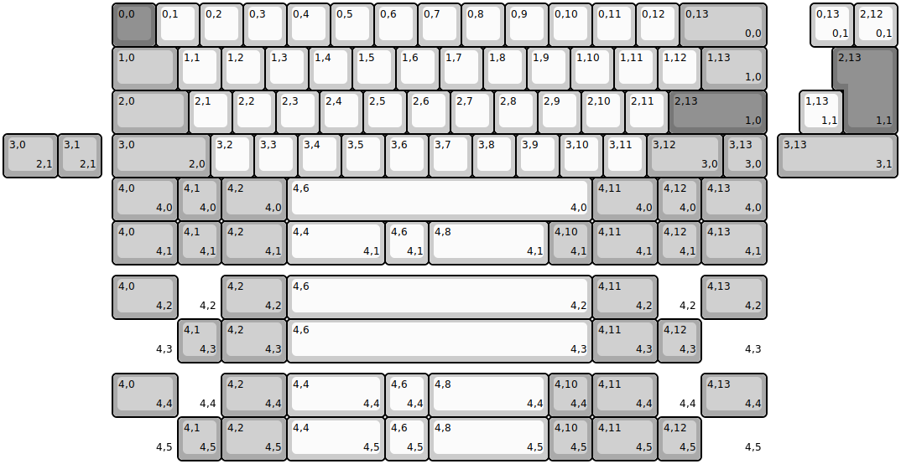{:loading="lazy"}

[Open in keyboard-layout-editor](http://www.keyboard-layout-editor.com/##@@_x:2.5&c=#777777;&=0,0&_c=#cccccc;&=0,1&=0,2&=0,3&=0,4&=0,5&=0,6&=0,7&=0,8&=0,9&=0,10&=0,11&=0,12&_c=#aaaaaa&w:2;&=0,13%0A%0A%0A0,0;&@_x:2.5&w:1.5;&=1,0&_c=#cccccc;&=1,1&=1,2&=1,3&=1,4&=1,5&=1,6&=1,7&=1,8&=1,9&=1,10&=1,11&=1,12&_c=#aaaaaa&w:1.5;&=1,13%0A%0A%0A1,0;&@_x:2.5&w:1.75;&=2,0&_c=#cccccc;&=2,1&=2,2&=2,3&=2,4&=2,5&=2,6&=2,7&=2,8&=2,9&=2,10&=2,11&_c=#777777&w:2.25;&=2,13%0A%0A%0A1,0;&@_x:2.5&c=#aaaaaa&w:2.25;&=3,0%0A%0A%0A2,0&_c=#cccccc;&=3,2&=3,3&=3,4&=3,5&=3,6&=3,7&=3,8&=3,9&=3,10&=3,11&_c=#aaaaaa&w:1.75;&=3,12%0A%0A%0A3,0&=3,13%0A%0A%0A3,0;&@_x:2.5&w:1.5;&=4,0%0A%0A%0A4,0&=4,1%0A%0A%0A4,0&_w:1.5;&=4,2%0A%0A%0A4,0&_c=#cccccc&w:7;&=4,6%0A%0A%0A4,0&_c=#aaaaaa&w:1.5;&=4,11%0A%0A%0A4,0&=4,12%0A%0A%0A4,0&_w:1.5;&=4,13%0A%0A%0A4,0;&@_x:18.5&y:-5&c=#cccccc;&=0,13%0A%0A%0A0,1&=2,12%0A%0A%0A0,1;&@_x:19.25&c=#777777&w:1.25&h:2&w2:1.5&h2:1&x2:-0.25;&=2,13%0A%0A%0A1,1;&@_x:18.25&c=#cccccc;&=1,13%0A%0A%0A1,1;&@_c=#aaaaaa&w:1.25;&=3,0%0A%0A%0A2,1&=3,1%0A%0A%0A2,1&_x:15.5&w:2.75;&=3,13%0A%0A%0A3,1;&@_x:2.5&y:1&w:1.5;&=4,0%0A%0A%0A4,1&=4,1%0A%0A%0A4,1&_w:1.5;&=4,2%0A%0A%0A4,1&_c=#cccccc&w:2.25;&=4,4%0A%0A%0A4,1&=4,6%0A%0A%0A4,1&_w:2.75;&=4,8%0A%0A%0A4,1&_c=#aaaaaa;&=4,10%0A%0A%0A4,1&_w:1.5;&=4,11%0A%0A%0A4,1&=4,12%0A%0A%0A4,1&_w:1.5;&=4,13%0A%0A%0A4,1;&@_x:2.5&y:0.25&w:1.5;&=4,0%0A%0A%0A4,2&_d:true;&=%0A%0A%0A4,2&_w:1.5;&=4,2%0A%0A%0A4,2&_c=#cccccc&w:7;&=4,6%0A%0A%0A4,2&_c=#aaaaaa&w:1.5;&=4,11%0A%0A%0A4,2&_d:true;&=%0A%0A%0A4,2&_w:1.5;&=4,13%0A%0A%0A4,2;&@_x:2.5&w:1.5&d:true;&=%0A%0A%0A4,3&=4,1%0A%0A%0A4,3&_w:1.5;&=4,2%0A%0A%0A4,3&_c=#cccccc&w:7;&=4,6%0A%0A%0A4,3&_c=#aaaaaa&w:1.5;&=4,11%0A%0A%0A4,3&=4,12%0A%0A%0A4,3&_w:1.5&d:true;&=%0A%0A%0A4,3;&@_x:2.5&y:0.25&w:1.5;&=4,0%0A%0A%0A4,4&_d:true;&=%0A%0A%0A4,4&_w:1.5;&=4,2%0A%0A%0A4,4&_c=#cccccc&w:2.25;&=4,4%0A%0A%0A4,4&=4,6%0A%0A%0A4,4&_w:2.75;&=4,8%0A%0A%0A4,4&_c=#aaaaaa;&=4,10%0A%0A%0A4,4&_w:1.5;&=4,11%0A%0A%0A4,4&_d:true;&=%0A%0A%0A4,4&_w:1.5;&=4,13%0A%0A%0A4,4;&@_x:2.5&w:1.5&d:true;&=%0A%0A%0A4,5&=4,1%0A%0A%0A4,5&_w:1.5;&=4,2%0A%0A%0A4,5&_c=#cccccc&w:2.25;&=4,4%0A%0A%0A4,5&=4,6%0A%0A%0A4,5&_w:2.75;&=4,8%0A%0A%0A4,5&_c=#aaaaaa;&=4,10%0A%0A%0A4,5&_w:1.5;&=4,11%0A%0A%0A4,5&=4,12%0A%0A%0A4,5&_w:1.5&d:true;&=%0A%0A%0A4,5)

## lck75/lck75

[README](output/lck75/README.md) - [layout](output/lck75/lck75-kle.json) - [PCB](output/lck75/lck75.kicad_pcb) - [PCB render](output/lck75/lck75-render.svg)

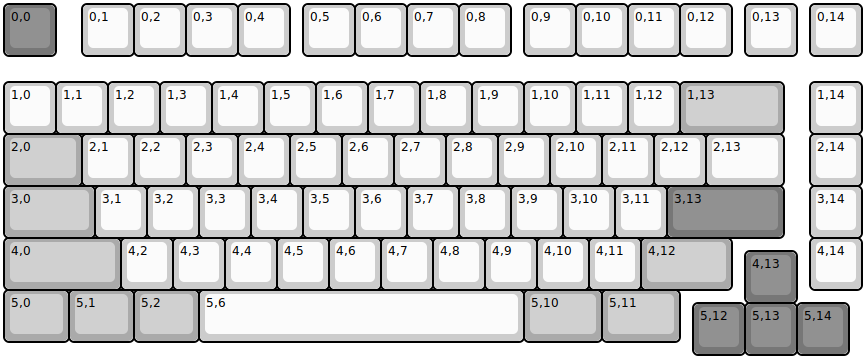{:loading="lazy"}

[Open in keyboard-layout-editor](http://www.keyboard-layout-editor.com/##@@_c=#777777;&=0,0&_x:0.5&c=#cccccc;&=0,1&=0,2&=0,3&=0,4&_x:0.25;&=0,5&=0,6&=0,7&=0,8&_x:0.25;&=0,9&=0,10&=0,11&=0,12&_x:0.25;&=0,13&_x:0.25;&=0,14;&@_y:0.5;&=1,0&=1,1&=1,2&=1,3&=1,4&=1,5&=1,6&=1,7&=1,8&=1,9&=1,10&=1,11&=1,12&_c=#aaaaaa&w:2;&=1,13&_x:0.5&c=#cccccc;&=1,14;&@_c=#aaaaaa&w:1.5;&=2,0&_c=#cccccc;&=2,1&=2,2&=2,3&=2,4&=2,5&=2,6&=2,7&=2,8&=2,9&=2,10&=2,11&=2,12&_w:1.5;&=2,13&_x:0.5;&=2,14;&@_c=#aaaaaa&w:1.75;&=3,0&_c=#cccccc;&=3,1&=3,2&=3,3&=3,4&=3,5&=3,6&=3,7&=3,8&=3,9&=3,10&=3,11&_c=#777777&w:2.25;&=3,13&_x:0.5&c=#cccccc;&=3,14;&@_c=#aaaaaa&w:2.25;&=4,0&_c=#cccccc;&=4,2&=4,3&=4,4&=4,5&=4,6&=4,7&=4,8&=4,9&=4,10&=4,11&_c=#aaaaaa&w:1.75;&=4,12&_x:1.5&c=#cccccc;&=4,14;&@_x:14.25&y:-0.75&c=#777777;&=4,13;&@_y:-0.25&c=#aaaaaa&w:1.25;&=5,0&_w:1.25;&=5,1&_w:1.25;&=5,2&_c=#cccccc&w:6.25;&=5,6&_c=#aaaaaa&w:1.5;&=5,10&_w:1.5;&=5,11;&@_x:13.25&y:-0.75&c=#777777;&=5,12&=5,13&=5,14)

## le_chiffre/le_chiffre

[README](output/le_chiffre/README.md) - [layout](output/le_chiffre/le_chiffre-kle.json) - [PCB](output/le_chiffre/le_chiffre.kicad_pcb) - [PCB render](output/le_chiffre/le_chiffre-render.svg)

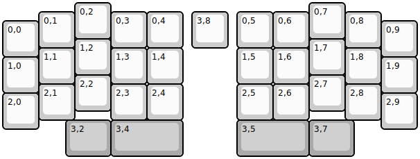{:loading="lazy"}

[Open in keyboard-layout-editor](http://www.keyboard-layout-editor.com/##@@_x:2;&=0,2&_x:5.5;&=0,7;&@_x:1&y:-0.75;&=0,1&_x:1;&=0,3&=0,4&_x:0.25;&=3,8&_x:0.25;&=0,5&=0,6&_x:1.0;&=0,8;&@_y:-0.75;&=0,0&_x:9.5;&=0,9;&@_x:2&y:-0.5;&=1,2&_x:5.5;&=1,7;&@_x:1&y:-0.75;&=1,1&_x:1;&=1,3&=1,4&_x:1.5;&=1,5&=1,6&_x:1.0;&=1,8;&@_y:-0.75;&=1,0&_x:9.5;&=1,9;&@_x:2&y:-0.5;&=2,2&_x:5.5;&=2,7;&@_x:1&y:-0.75;&=2,1&_x:1;&=2,3&=2,4&_x:1.5;&=2,5&=2,6&_x:1.0;&=2,8;&@_y:-0.75;&=2,0&_x:9.5;&=2,9;&@_x:1.75&y:-0.25&c=#aaaaaa&w:1.25;&=3,2&_w:2;&=3,4&_x:1.5&w:2;&=3,5&_w:1.25;&=3,7)

## lfkeyboards/lfk78

[README](output/lfkeyboards/lfk78/README.md) - [layout](output/lfkeyboards/lfk78/lfk78-kle.json) - [PCB](output/lfkeyboards/lfk78/lfk78.kicad_pcb) - [PCB render](output/lfkeyboards/lfk78/lfk78-render.svg)

{:loading="lazy"}

[Open in keyboard-layout-editor](http://www.keyboard-layout-editor.com/##@@_y:1;&=0,0&=0,1&_x:0.5;&=0,2&=0,3&=0,4&=0,5&=0,6&=0,7&=0,8&=0,9&=0,10&=0,11&=0,12&=0,13&=0,14&_w:2;&=0,15&_x:0.5;&=0,16&=0,17;&@=1,0&=1,1&_x:0.5&w:1.5;&=1,2&=1,3&=1,4&=1,5&=1,6&=1,7&=1,8&=1,9&=1,10&=1,11&=1,12&=1,13&=1,14&_w:1.5;&=1,15&_x:0.5;&=1,16&=1,17;&@=2,0&=2,1&_x:0.5&w:1.75;&=2,2&=2,3&=2,4&=2,5&=2,6&=2,7&=2,8&=2,9&=2,10&=2,11&=2,12&=2,13&_w:2.25;&=2,14;&@=3,0&=3,1&_x:0.5&w:2.25;&=3,2&=3,4&=3,5&=3,6&=3,7&=3,8&=3,9&=3,10&=3,11&=3,12&=3,13&_w:2.75;&=3,14&_x:0.5;&=3,16;&@=4,0&=4,1&_x:0.5&w:1.25;&=4,2&_w:1.25;&=4,3&_w:1.25;&=4,4&_w:6.25;&=4,8&_w:1.25;&=4,12&_w:1.25;&=4,13&_w:1.25;&=4,14&_x:0.75;&=4,15&=4,16&=4,17)

## lfkeyboards/lfkpad

[README](output/lfkeyboards/lfkpad/README.md) - [layout](output/lfkeyboards/lfkpad/lfkpad-kle.json) - [PCB](output/lfkeyboards/lfkpad/lfkpad.kicad_pcb) - [PCB render](output/lfkeyboards/lfkpad/lfkpad-render.svg)

{:loading="lazy"}

[Open in keyboard-layout-editor](http://www.keyboard-layout-editor.com/##@@=0,0&=0,1&=0,2&=0,3;&@=1,0&=1,1&=1,2&=1,3;&@=2,0&=2,1&=2,2&_h:2;&=2,3;&@=3,0&=3,1&=3,2;&@=4,0&=4,1&=4,2&_c=#777777&h:2;&=4,3;&@_c=#cccccc&w:2;&=5,0&=5,2)

## lfkeyboards/smk65/smk65-revf

[README](output/lfkeyboards/smk65/README.md) - [layout](output/lfkeyboards/smk65/smk65-revf-kle.json) - [PCB](output/lfkeyboards/smk65/smk65-revf.kicad_pcb) - [PCB render](output/lfkeyboards/smk65/smk65-revf-render.svg)

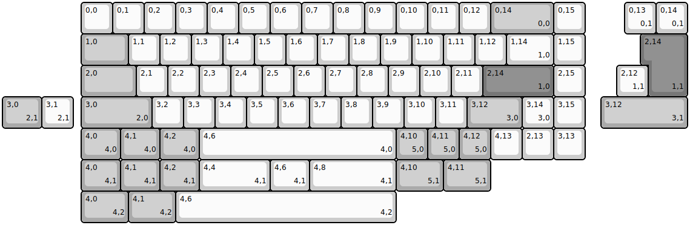{:loading="lazy"}

[Open in keyboard-layout-editor](http://www.keyboard-layout-editor.com/##@@_x:2.5;&=0,0&=0,1&=0,2&=0,3&=0,4&=0,5&=0,6&=0,7&=0,8&=0,9&=0,10&=0,11&=0,12&_c=#aaaaaa&w:2;&=0,14%0A%0A%0A0,0&_c=#cccccc;&=0,15;&@_x:2.5&c=#aaaaaa&w:1.5;&=1,0&_c=#cccccc;&=1,1&=1,2&=1,3&=1,4&=1,5&=1,6&=1,7&=1,8&=1,9&=1,10&=1,11&=1,12&_w:1.5;&=1,14%0A%0A%0A1,0&=1,15;&@_x:2.5&c=#aaaaaa&w:1.75;&=2,0&_c=#cccccc;&=2,1&=2,2&=2,3&=2,4&=2,5&=2,6&=2,7&=2,8&=2,9&=2,10&=2,11&_c=#777777&w:2.25;&=2,14%0A%0A%0A1,0&_c=#cccccc;&=2,15;&@_x:2.5&c=#aaaaaa&w:2.25;&=3,0%0A%0A%0A2,0&_c=#cccccc;&=3,2&=3,3&=3,4&=3,5&=3,6&=3,7&=3,8&=3,9&=3,10&=3,11&_c=#aaaaaa&w:1.75;&=3,12%0A%0A%0A3,0&_c=#cccccc;&=3,14%0A%0A%0A3,0&=3,15;&@_x:2.5&c=#aaaaaa&w:1.25;&=4,0%0A%0A%0A4,0&_w:1.25;&=4,1%0A%0A%0A4,0&_w:1.25;&=4,2%0A%0A%0A4,0&_c=#cccccc&w:6.25;&=4,6%0A%0A%0A4,0&_c=#aaaaaa;&=4,10%0A%0A%0A5,0&=4,11%0A%0A%0A5,0&=4,12%0A%0A%0A5,0&_c=#cccccc;&=4,13&=2,13&=3,13;&@_x:19.75&y:-5;&=0,13%0A%0A%0A0,1&=0,14%0A%0A%0A0,1;&@_x:20.5&c=#777777&w:1.25&h:2&w2:1.5&h2:1&x2:-0.25;&=2,14%0A%0A%0A1,1;&@_x:19.5&c=#cccccc;&=2,12%0A%0A%0A1,1;&@_c=#aaaaaa&w:1.25;&=3,0%0A%0A%0A2,1&_c=#cccccc;&=3,1%0A%0A%0A2,1&_x:16.75&c=#aaaaaa&w:2.75;&=3,12%0A%0A%0A3,1;&@_x:2.5&y:1&w:1.25;&=4,0%0A%0A%0A4,1&_w:1.25;&=4,1%0A%0A%0A4,1&_w:1.25;&=4,2%0A%0A%0A4,1&_c=#cccccc&w:2.25;&=4,4%0A%0A%0A4,1&_w:1.25;&=4,6%0A%0A%0A4,1&_w:2.75;&=4,8%0A%0A%0A4,1&_c=#aaaaaa&w:1.5;&=4,10%0A%0A%0A5,1&_w:1.5;&=4,11%0A%0A%0A5,1;&@_x:2.5&w:1.5;&=4,0%0A%0A%0A4,2&_w:1.5;&=4,1%0A%0A%0A4,2&_c=#cccccc&w:7;&=4,6%0A%0A%0A4,2)

## lily58/lily58

[README](output/lily58/README.md) - [layout](output/lily58/lily58-kle.json) - [PCB](output/lily58/lily58.kicad_pcb) - [PCB render](output/lily58/lily58-render.svg)

{:loading="lazy"}

[Open in keyboard-layout-editor](http://www.keyboard-layout-editor.com/##@@_x:3.5;&=0,3&_x:8.5;&=5,3;&@_x:2.5&y:-0.875;&=0,2&_x:1.0;&=0,4&_x:6.5;&=5,4&_x:1.0;&=5,2;&@_x:5.5&y:-0.875;&=0,5&_x:4.5;&=5,5;&@_x:1.5&y:-0.875;&=0,1&_x:12.5;&=5,1;&@_x:0.5&y:-0.875&c=#777777;&=0,0&_x:14.5&c=#cccccc;&=5,0;&@_x:3.5&y:-0.5;&=1,3&_x:8.5;&=6,3;&@_x:2.5&y:-0.875;&=1,2&_x:1.0;&=1,4&_x:6.5;&=6,4&_x:1.0;&=6,2;&@_x:5.5&y:-0.875;&=1,5&_x:4.5;&=6,5;&@_x:1.5&y:-0.875;&=1,1&_x:12.5;&=6,1;&@_x:0.5&y:-0.875&c=#aaaaaa;&=1,0&_x:14.5&c=#cccccc;&=6,0;&@_x:3.5&y:-0.5;&=2,3&_x:8.5;&=7,3;&@_x:2.5&y:-0.875;&=2,2&_x:1.0;&=2,4&_x:6.5;&=7,4&_x:1.0;&=7,2;&@_x:5.5&y:-0.875;&=2,5&_x:4.5;&=7,5;&@_x:1.5&y:-0.875;&=2,1&_x:12.5;&=7,1;&@_x:0.5&y:-0.875&c=#aaaaaa;&=2,0&_x:14.5&c=#cccccc;&=7,0;&@_x:6.5&y:-0.75;&=4,5&_x:2.5;&=9,5;&@_x:3.5&y:-0.75;&=3,3&_x:8.5;&=8,3;&@_x:2.5&y:-0.875;&=3,2&_x:1.0;&=3,4&_x:6.5;&=8,4&_x:1.0;&=8,2;&@_x:5.5&y:-0.875;&=3,5&_x:4.5;&=8,5;&@_x:1.5&y:-0.875;&=3,1&_x:12.5;&=8,1;&@_x:0.5&y:-0.875&c=#aaaaaa;&=3,0&_x:14.5;&=8,0;&@_x:3&y:-0.375;&=4,1;&@_x:4&y:-0.975;&=4,2&_x:7.5;&=9,2&=9,1;&@_x:5&y:-0.9;&=4,3&_x:0.5&c=#777777&h:1.5;&=4,4&_x:2.5&h:1.5;&=9,4&_x:0.5&c=#aaaaaa;&=9,3)

## linworks/dolice

[README](output/linworks/dolice/README.md) - [layout](output/linworks/dolice/dolice-kle.json) - [PCB](output/linworks/dolice/dolice.kicad_pcb) - [PCB render](output/linworks/dolice/dolice-render.svg)

{:loading="lazy"}

[Open in keyboard-layout-editor](http://www.keyboard-layout-editor.com/##@@_x:0.55&y:0.9&c=#777777;&=0,0;&@_x:3.7&y:-0.95&c=#cccccc;&=1,1&_x:8.45;&=1,6;&@_x:1.7&y:-0.95;&=1,0&=0,1&_x:10.45;&=0,7&_c=#aaaaaa&w:2;&=1,7%0A%0A%0A0,0;&@_x:0.35&y:-0.1;&=2,0;&@_x:13&y:-0.95&c=#cccccc;&=2,6;&@_x:1.5&y:-0.95&c=#aaaaaa&w:1.5;&=3,0&_c=#cccccc;&=2,1&_x:10.0;&=3,6&=2,7&_c=#aaaaaa&w:1.5;&=3,7;&@_x:0.15&y:-0.1;&=4,0;&@_x:1.3&y:-0.9&w:1.75;&=5,0&_c=#cccccc;&=4,1&_x:9.35;&=4,6&=5,6&_c=#777777&w:2.25;&=4,7;&@_x:1.05&c=#aaaaaa&w:2.25;&=7,0&_c=#cccccc;&=6,1&_x:8.8;&=6,6&=7,6&_c=#aaaaaa&w:1.75;&=6,7%0A%0A%0A1,0&=7,7%0A%0A%0A1,0;&@_x:1.05&w:1.5;&=8,0&_x:13.55&w:1.5;&=8,7;&@_r:12&x:5.05&y:-6.0&c=#cccccc;&=0,2&=1,2&=0,3&=1,3;&@_x:4.6;&=2,2&=3,2&=2,3&=3,3;&@_x:4.85;&=4,2&=5,2&=4,3&=5,3;&@_x:5.3;&=6,2&=7,2&=6,3&=7,3;&@_x:6.6&w:2;&=8,2%0A%0A%0A2,0&_c=#aaaaaa&w:1.25;&=8,3%0A%0A%0A2,0;&@_x:5.05&y:-0.95&w:1.5;&=8,1;&@_r:-12&x:8.45&y:-1.45&c=#cccccc;&=1,4&=0,5&=1,5&=0,6;&@_x:8.05;&=2,4&=3,4&=2,5&=3,5;&@_x:8.2;&=4,4&=5,4&=4,5&=5,5;&@_x:7.75;&=6,4&=7,4&=6,5&=7,5;&@_x:7.75&w:2.75;&=8,4;&@_x:10.55&y:-0.95&c=#aaaaaa&w:1.5;&=8,5;&@_r:0&x:18.5&y:-7.65;&=1,7%0A%0A%0A0,1&=5,7%0A%0A%0A0,1;&@_x:18.35&y:2.0&w:2.75;&=6,7%0A%0A%0A1,1;&@_r:12&x:6.6&y:0.4&c=#cccccc&w:2.25;&=8,2%0A%0A%0A2,1&_c=#aaaaaa;&=8,3%0A%0A%0A2,1)

## linworks/em8

[README](output/linworks/em8/README.md) - [layout](output/linworks/em8/em8-kle.json) - [PCB](output/linworks/em8/em8.kicad_pcb) - [PCB render](output/linworks/em8/em8-render.svg)

{:loading="lazy"}

[Open in keyboard-layout-editor](http://www.keyboard-layout-editor.com/##@@_x:0.55&y:0.7&c=#777777;&=1,0&_x:16.0&c=#aaaaaa;&=0,14;&@_x:3.7&y:-0.95&c=#cccccc;&=0,2&_x:8.6;&=0,11;&@_x:1.7&y:-0.95;&=0,0&=0,1&_x:10.6;&=0,12&_c=#aaaaaa&w:2;&=0,13%0A%0A%0A0,0;&@_x:0.35&y:-0.1;&=2,0&_x:16.4;&=2,14;&@_x:13&y:-0.95&c=#cccccc;&=1,11;&@_x:1.5&y:-0.95&c=#aaaaaa&w:1.5;&=1,1&_c=#cccccc;&=1,2&_x:10.0;&=1,12&=1,13&_c=#aaaaaa&w:1.5;&=1,14;&@_x:0.15&y:-0.1;&=3,0;&@_x:1.3&y:-0.9&w:1.75;&=2,1&_c=#cccccc;&=2,2&_x:9.35;&=2,11&=2,12&_c=#777777&w:2.25;&=2,13;&@_x:1.05&c=#aaaaaa&w:2.25;&=3,1&_c=#cccccc;&=3,2&_x:8.8;&=3,11&=3,12&_c=#aaaaaa&w:1.75;&=3,13;&@_x:17.1&y:-0.75&c=#777777;&=3,14;&@_x:1.05&y:-0.25&c=#aaaaaa&w:1.5;&=4,1;&@_x:16.1&y:-0.75&c=#777777;&=4,12&=4,13&=4,14;&@_r:10&x:4.9&y:-6.05&c=#cccccc;&=0,3&=0,4&=0,5&=0,6;&@_x:4.4;&=1,3&=1,4&=1,5&=1,6;&@_x:4.65;&=2,3&=2,4&=2,5&=2,6;&@_x:5.1;&=3,3&=3,4&=3,5&=3,6;&@_x:6.35&w:2.25;&=4,5&_c=#aaaaaa;&=4,6;&@_x:4.85&y:-0.95&w:1.5;&=4,3;&@_r:-10&x:8.8&y:-2.05&c=#cccccc;&=0,7&=0,8&=0,9&=0,10;&@_x:8.3;&=1,7&=1,8&=1,9&=1,10;&@_x:8.55;&=2,7&=2,8&=2,9&=2,10;&@_x:8.1;&=3,7&=3,8&=3,9&=3,10;&@_x:8.1&w:2.75;&=4,8;&@_x:10.86&y:-0.95&c=#aaaaaa&w:1.5;&=4,10;&@_r:0&x:21.0&y:-7.25;&=0,13%0A%0A%0A0,1&=4,11%0A%0A%0A0,1)

## linworks/fave104/Fave104

[README](output/linworks/fave104/README.md) - [layout](output/linworks/fave104/Fave104-kle.json) - [PCB](output/linworks/fave104/Fave104.kicad_pcb) - [PCB render](output/linworks/fave104/Fave104-render.svg)

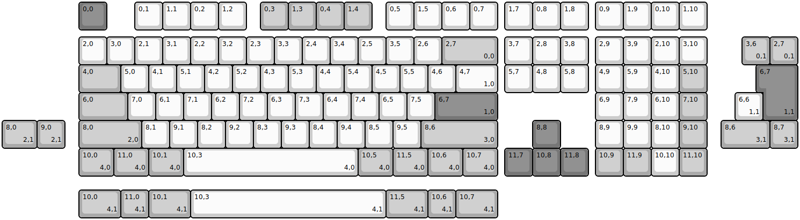{:loading="lazy"}

[Open in keyboard-layout-editor](http://www.keyboard-layout-editor.com/##@@_x:2.75&c=#777777;&=0,0&_x:1.0&c=#cccccc;&=0,1&=1,1&=0,2&=1,2&_x:0.5&c=#aaaaaa;&=0,3&=1,3&=0,4&=1,4&_x:0.5&c=#cccccc;&=0,5&=1,5&=0,6&=0,7&_x:0.25;&=1,7&=0,8&=1,8&_x:0.25;&=0,9&=1,9&=0,10&=1,10;&@_x:2.75&y:0.25;&=2,0&=3,0&=2,1&=3,1&=2,2&=3,2&=2,3&=3,3&=2,4&=3,4&=2,5&=3,5&=2,6&_c=#aaaaaa&w:2;&=2,7%0A%0A%0A0,0&_x:0.25&c=#cccccc;&=3,7&=2,8&=3,8&_x:0.25;&=2,9&=3,9&=2,10&=3,10;&@_x:2.75&c=#aaaaaa&w:1.5;&=4,0&_c=#cccccc;&=5,0&=4,1&=5,1&=4,2&=5,2&=4,3&=5,3&=4,4&=5,4&=4,5&=5,5&=4,6&_w:1.5;&=4,7%0A%0A%0A1,0&_x:0.25;&=5,7&=4,8&=5,8&_x:0.25;&=4,9&=5,9&=4,10&_c=#aaaaaa;&=5,10;&@_x:2.75&w:1.75;&=6,0&_c=#cccccc;&=7,0&=6,1&=7,1&=6,2&=7,2&=6,3&=7,3&=6,4&=7,4&=6,5&=7,5&_c=#777777&w:2.25;&=6,7%0A%0A%0A1,0&_x:3.5&c=#cccccc;&=6,9&=7,9&=6,10&_c=#aaaaaa;&=7,10;&@_x:2.75&w:2.25;&=8,0%0A%0A%0A2,0&_c=#cccccc;&=8,1&=9,1&=8,2&=9,2&=8,3&=9,3&=8,4&=9,4&=8,5&=9,5&_c=#aaaaaa&w:2.75;&=8,6%0A%0A%0A3,0&_x:1.25&c=#777777;&=8,8&_x:1.25&c=#cccccc;&=8,9&=9,9&=8,10&_c=#aaaaaa;&=9,10;&@_x:2.75&w:1.25;&=10,0%0A%0A%0A4,0&_w:1.25;&=11,0%0A%0A%0A4,0&_w:1.25;&=10,1%0A%0A%0A4,0&_c=#cccccc&w:6.25;&=10,3%0A%0A%0A4,0&_c=#aaaaaa&w:1.25;&=10,5%0A%0A%0A4,0&_w:1.25;&=11,5%0A%0A%0A4,0&_w:1.25;&=10,6%0A%0A%0A4,0&_w:1.25;&=10,7%0A%0A%0A4,0&_x:0.25&c=#777777;&=11,7&=10,8&=11,8&_x:0.25&c=#aaaaaa;&=10,9&=11,9&_c=#cccccc;&=10,10&_c=#aaaaaa;&=11,10;&@_x:26.5&y:-5.0;&=3,6%0A%0A%0A0,1&=2,7%0A%0A%0A0,1;&@_x:27.25&c=#777777&w:1.25&h:2&w2:1.5&h2:1&x2:-0.25;&=6,7%0A%0A%0A1,1;&@_x:26.25&c=#cccccc;&=6,6%0A%0A%0A1,1;&@_c=#aaaaaa&w:1.25;&=8,0%0A%0A%0A2,1&=9,0%0A%0A%0A2,1&_x:23.5&w:1.75;&=8,6%0A%0A%0A3,1&=8,7%0A%0A%0A3,1;&@_x:2.75&y:1.5&w:1.5;&=10,0%0A%0A%0A4,1&=11,0%0A%0A%0A4,1&_w:1.5;&=10,1%0A%0A%0A4,1&_c=#cccccc&w:7;&=10,3%0A%0A%0A4,1&_c=#aaaaaa&w:1.5;&=11,5%0A%0A%0A4,1&=10,6%0A%0A%0A4,1&_w:1.5;&=10,7%0A%0A%0A4,1)

## linworks/fave65h

[README](output/linworks/fave65h/README.md) - [layout](output/linworks/fave65h/fave65h-kle.json) - [PCB](output/linworks/fave65h/fave65h.kicad_pcb) - [PCB render](output/linworks/fave65h/fave65h-render.svg)

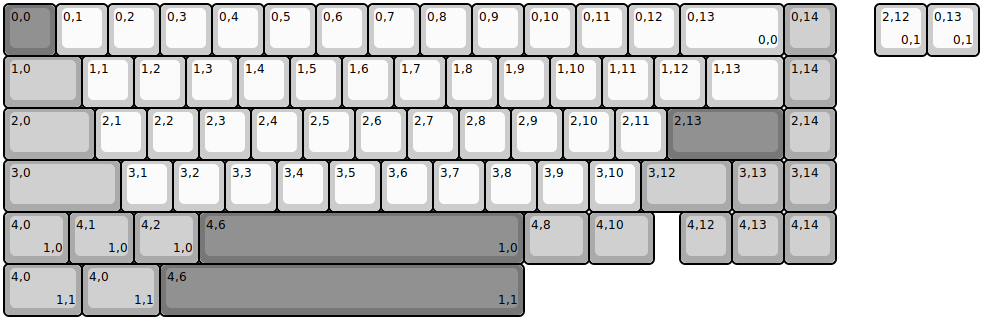{:loading="lazy"}

[Open in keyboard-layout-editor](http://www.keyboard-layout-editor.com/##@@_c=#777777;&=0,0&_c=#cccccc;&=0,1&=0,2&=0,3&=0,4&=0,5&=0,6&=0,7&=0,8&=0,9&=0,10&=0,11&=0,12&_w:2;&=0,13%0A%0A%0A0,0&_c=#aaaaaa;&=0,14;&@_w:1.5;&=1,0&_c=#cccccc;&=1,1&=1,2&=1,3&=1,4&=1,5&=1,6&=1,7&=1,8&=1,9&=1,10&=1,11&=1,12&_w:1.5;&=1,13&_c=#aaaaaa;&=1,14;&@_w:1.75;&=2,0&_c=#cccccc;&=2,1&=2,2&=2,3&=2,4&=2,5&=2,6&=2,7&=2,8&=2,9&=2,10&=2,11&_c=#777777&w:2.25;&=2,13&_c=#aaaaaa;&=2,14;&@_w:2.25;&=3,0&_c=#cccccc;&=3,1&=3,2&=3,3&=3,4&=3,5&=3,6&=3,7&=3,8&=3,9&=3,10&_c=#aaaaaa&w:1.75;&=3,12&=3,13&=3,14;&@_w:1.25;&=4,0%0A%0A%0A1,0&_w:1.25;&=4,1%0A%0A%0A1,0&_w:1.25;&=4,2%0A%0A%0A1,0&_c=#777777&w:6.25;&=4,6%0A%0A%0A1,0&_c=#aaaaaa&w:1.25;&=4,8&_w:1.25;&=4,10&_x:0.5;&=4,12&=4,13&=4,14;&@_x:16.75&y:-5&c=#cccccc;&=2,12%0A%0A%0A0,1&=0,13%0A%0A%0A0,1;&@_y:4&c=#aaaaaa&w:1.5;&=4,0%0A%0A%0A1,1&_w:1.5;&=4,0%0A%0A%0A1,1&_c=#777777&w:7;&=4,6%0A%0A%0A1,1)

## linworks/fave84h

[README](output/linworks/fave84h/README.md) - [layout](output/linworks/fave84h/fave84h-kle.json) - [PCB](output/linworks/fave84h/fave84h.kicad_pcb) - [PCB render](output/linworks/fave84h/fave84h-render.svg)

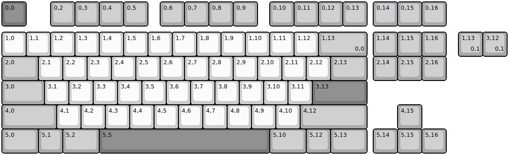{:loading="lazy"}

[Open in keyboard-layout-editor](http://www.keyboard-layout-editor.com/##@@_c=#777777;&=0,0&_x:1&c=#aaaaaa;&=0,2&=0,3&=0,4&=0,5&_x:0.5;&=0,6&=0,7&=0,8&=0,9&_x:0.5;&=0,10&=0,11&=0,12&=0,13&_x:0.25;&=0,14&=0,15&=0,16;&@_y:0.25&c=#cccccc;&=1,0&=1,1&=1,2&=1,3&=1,4&=1,5&=1,6&=1,7&=1,8&=1,9&=1,10&=1,11&=1,12&_c=#aaaaaa&w:2;&=1,13%0A%0A%0A0,0&_x:0.25;&=1,14&=1,15&=1,16;&@_w:1.5;&=2,0&_c=#cccccc;&=2,1&=2,2&=2,3&=2,4&=2,5&=2,6&=2,7&=2,8&=2,9&=2,10&=2,11&=2,12&_c=#aaaaaa&w:1.5;&=2,13&_x:0.25;&=2,14&=2,15&=2,16;&@_w:1.75;&=3,0&_c=#cccccc;&=3,1&=3,2&=3,3&=3,4&=3,5&=3,6&=3,7&=3,8&=3,9&=3,10&=3,11&_c=#777777&w:2.25;&=3,13;&@_c=#aaaaaa&w:2.25;&=4,0&_c=#cccccc;&=4,1&=4,2&=4,3&=4,4&=4,5&=4,6&=4,7&=4,8&=4,9&=4,10&_c=#aaaaaa&w:2.75;&=4,12&_x:1.25;&=4,15;&@_w:1.5;&=5,0&=5,1&_w:1.5;&=5,2&_c=#777777&w:7;&=5,5&_c=#aaaaaa&w:1.5;&=5,10&=5,12&_w:1.5;&=5,13&_x:0.25;&=5,14&=5,15&=5,16;&@_x:18.75&y:-5.0;&=1,13%0A%0A%0A0,1&=3,12%0A%0A%0A0,1)

## linworks/fave87

[README](output/linworks/fave87/README.md) - [layout](output/linworks/fave87/fave87-kle.json) - [PCB](output/linworks/fave87/fave87.kicad_pcb) - [PCB render](output/linworks/fave87/fave87-render.svg)

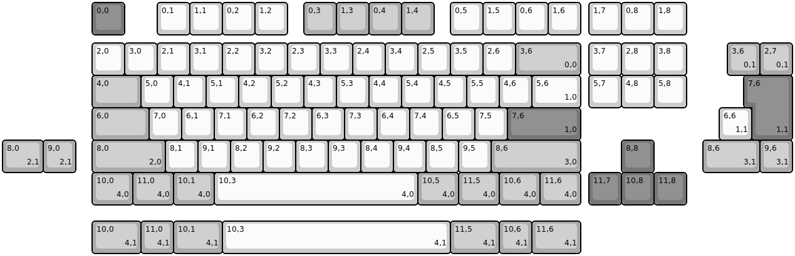{:loading="lazy"}

[Open in keyboard-layout-editor](http://www.keyboard-layout-editor.com/##@@_x:2.75&c=#777777;&=0,0&_x:1.0&c=#cccccc;&=0,1&=1,1&=0,2&=1,2&_x:0.5&c=#aaaaaa;&=0,3&=1,3&=0,4&=1,4&_x:0.5&c=#cccccc;&=0,5&=1,5&=0,6&=1,6&_x:0.25;&=1,7&=0,8&=1,8;&@_x:2.75&y:0.25;&=2,0&=3,0&=2,1&=3,1&=2,2&=3,2&=2,3&=3,3&=2,4&=3,4&=2,5&=3,5&=2,6&_c=#aaaaaa&w:2;&=3,6%0A%0A%0A0,0&_x:0.25&c=#cccccc;&=3,7&=2,8&=3,8;&@_x:2.75&c=#aaaaaa&w:1.5;&=4,0&_c=#cccccc;&=5,0&=4,1&=5,1&=4,2&=5,2&=4,3&=5,3&=4,4&=5,4&=4,5&=5,5&=4,6&_w:1.5;&=5,6%0A%0A%0A1,0&_x:0.25;&=5,7&=4,8&=5,8;&@_x:2.75&c=#aaaaaa&w:1.75;&=6,0&_c=#cccccc;&=7,0&=6,1&=7,1&=6,2&=7,2&=6,3&=7,3&=6,4&=7,4&=6,5&=7,5&_c=#777777&w:2.25;&=7,6%0A%0A%0A1,0;&@_x:2.75&c=#aaaaaa&w:2.25;&=8,0%0A%0A%0A2,0&_c=#cccccc;&=8,1&=9,1&=8,2&=9,2&=8,3&=9,3&=8,4&=9,4&=8,5&=9,5&_c=#aaaaaa&w:2.75;&=8,6%0A%0A%0A3,0&_x:1.25&c=#777777;&=8,8;&@_x:2.75&c=#aaaaaa&w:1.25;&=10,0%0A%0A%0A4,0&_w:1.25;&=11,0%0A%0A%0A4,0&_w:1.25;&=10,1%0A%0A%0A4,0&_c=#cccccc&w:6.25;&=10,3%0A%0A%0A4,0&_c=#aaaaaa&w:1.25;&=10,5%0A%0A%0A4,0&_w:1.25;&=11,5%0A%0A%0A4,0&_w:1.25;&=10,6%0A%0A%0A4,0&_w:1.25;&=11,6%0A%0A%0A4,0&_x:0.25&c=#777777;&=11,7&=10,8&=11,8;&@_x:22.25&y:-5.0&c=#aaaaaa;&=3,6%0A%0A%0A0,1&=2,7%0A%0A%0A0,1;&@_x:23.0&c=#777777&w:1.25&h:2&w2:1.5&h2:1&x2:-0.25;&=7,6%0A%0A%0A1,1;&@_x:22.0&c=#cccccc;&=6,6%0A%0A%0A1,1;&@_c=#aaaaaa&w:1.25;&=8,0%0A%0A%0A2,1&=9,0%0A%0A%0A2,1&_x:19.25&w:1.75;&=8,6%0A%0A%0A3,1&=9,6%0A%0A%0A3,1;&@_x:2.75&y:1.5&w:1.5;&=10,0%0A%0A%0A4,1&=11,0%0A%0A%0A4,1&_w:1.5;&=10,1%0A%0A%0A4,1&_c=#cccccc&w:7;&=10,3%0A%0A%0A4,1&_c=#aaaaaa&w:1.5;&=11,5%0A%0A%0A4,1&=10,6%0A%0A%0A4,1&_w:1.5;&=11,6%0A%0A%0A4,1)

## linworks/fave87h

[README](output/linworks/fave87h/README.md) - [layout](output/linworks/fave87h/fave87h-kle.json) - [PCB](output/linworks/fave87h/fave87h.kicad_pcb) - [PCB render](output/linworks/fave87h/fave87h-render.svg)

{:loading="lazy"}

[Open in keyboard-layout-editor](http://www.keyboard-layout-editor.com/##@@_c=#777777;&=0,0&_x:1&c=#aaaaaa;&=0,2&=0,3&=0,4&=0,5&_x:0.5;&=0,6&=0,7&=0,8&=0,9&_x:0.5;&=0,10&=0,11&=0,12&=0,13&_x:0.25;&=0,14&=0,15&=0,16;&@_y:0.25&c=#cccccc;&=1,0&=1,1&=1,2&=1,3&=1,4&=1,5&=1,6&=1,7&=1,8&=1,9&=1,10&=1,11&=1,12&_c=#aaaaaa&w:2;&=1,13%0A%0A%0A0,0&_x:0.25;&=1,14&=1,15&=1,16;&@_w:1.5;&=2,0&_c=#cccccc;&=2,1&=2,2&=2,3&=2,4&=2,5&=2,6&=2,7&=2,8&=2,9&=2,10&=2,11&=2,12&_c=#aaaaaa&w:1.5;&=2,13&_x:0.25;&=2,14&=2,15&=2,16;&@_w:1.75;&=3,0&_c=#cccccc;&=3,1&=3,2&=3,3&=3,4&=3,5&=3,6&=3,7&=3,8&=3,9&=3,10&=3,11&_c=#777777&w:2.25;&=3,13;&@_c=#aaaaaa&w:2.25;&=4,0&_c=#cccccc;&=4,1&=4,2&=4,3&=4,4&=4,5&=4,6&=4,7&=4,8&=4,9&=4,10&_c=#aaaaaa&w:2.75;&=4,12&_x:1.25;&=4,15;&@_w:1.25;&=5,0&_w:1.25;&=5,1&_w:1.25;&=5,2&_c=#777777&w:6.25;&=5,5&_c=#aaaaaa&w:1.25;&=5,9&_w:1.25;&=5,10&_w:1.25;&=5,12&_w:1.25;&=5,13&_x:0.25;&=5,14&=5,15&=5,16;&@_x:18.75&y:-5.0;&=1,13%0A%0A%0A0,1&=3,12%0A%0A%0A0,1)

## linworks/whale75

[README](output/linworks/whale75/README.md) - [layout](output/linworks/whale75/whale75-kle.json) - [PCB](output/linworks/whale75/whale75.kicad_pcb) - [PCB render](output/linworks/whale75/whale75-render.svg)

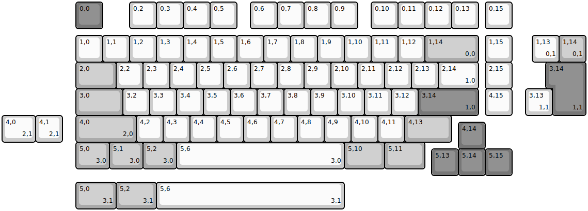{:loading="lazy"}

[Open in keyboard-layout-editor](http://www.keyboard-layout-editor.com/##@@_x:2.75&c=#777777;&=0,0&_x:1.0&c=#cccccc;&=0,2&=0,3&=0,4&=0,5&_x:0.5;&=0,6&=0,7&=0,8&=0,9&_x:0.5;&=0,10&=0,11&=0,12&=0,13&_x:0.25;&=0,15;&@_x:2.75&y:0.25;&=1,0&=1,1&=1,2&=1,3&=1,4&=1,5&=1,6&=1,7&=1,8&=1,9&=1,10&=1,11&=1,12&_c=#aaaaaa&w:2;&=1,14%0A%0A%0A0,0&_x:0.25&c=#cccccc;&=1,15;&@_x:2.75&c=#aaaaaa&w:1.5;&=2,0&_c=#cccccc;&=2,2&=2,3&=2,4&=2,5&=2,6&=2,7&=2,8&=2,9&=2,10&=2,11&=2,12&=2,13&_w:1.5;&=2,14%0A%0A%0A1,0&_x:0.25;&=2,15;&@_x:2.75&c=#aaaaaa&w:1.75;&=3,0&_c=#cccccc;&=3,2&=3,3&=3,4&_n:true;&=3,5&=3,6&=3,7&_n:true;&=3,8&=3,9&=3,10&=3,11&=3,12&_c=#777777&w:2.25;&=3,14%0A%0A%0A1,0&_x:0.25&c=#cccccc;&=4,15;&@_x:2.75&c=#aaaaaa&w:2.25;&=4,0%0A%0A%0A2,0&_c=#cccccc;&=4,2&=4,3&=4,4&=4,5&=4,6&=4,7&=4,8&=4,9&=4,10&=4,11&_c=#aaaaaa&w:1.75;&=4,13;&@_x:17&y:-0.75&c=#777777;&=4,14;&@_x:2.75&y:-0.25&c=#aaaaaa&w:1.25;&=5,0%0A%0A%0A3,0&_w:1.25;&=5,1%0A%0A%0A3,0&_w:1.25;&=5,2%0A%0A%0A3,0&_c=#cccccc&w:6.25;&=5,6%0A%0A%0A3,0&_c=#aaaaaa&w:1.5;&=5,10&_w:1.5;&=5,11;&@_x:16&y:-0.75&c=#777777;&=5,13&=5,14&=5,15;&@_x:19.75&y:-5.25&c=#cccccc;&=1,13%0A%0A%0A0,1&_c=#aaaaaa;&=1,14%0A%0A%0A0,1;&@_x:20.5&c=#777777&w:1.25&h:2&w2:1.5&h2:1&x2:-0.25;&=3,14%0A%0A%0A1,1;&@_x:19.5&c=#cccccc;&=3,13%0A%0A%0A1,1;&@_w:1.25;&=4,0%0A%0A%0A2,1&=4,1%0A%0A%0A2,1;&@_x:2.75&y:1.5&c=#aaaaaa&w:1.5;&=5,0%0A%0A%0A3,1&_w:1.5;&=5,2%0A%0A%0A3,1&_c=#cccccc&w:7;&=5,6%0A%0A%0A3,1)

## lm_keyboard/lm60n

[README](output/lm_keyboard/lm60n/README.md) - [layout](output/lm_keyboard/lm60n/lm60n-kle.json) - [PCB](output/lm_keyboard/lm60n/lm60n.kicad_pcb) - [PCB render](output/lm_keyboard/lm60n/lm60n-render.svg)

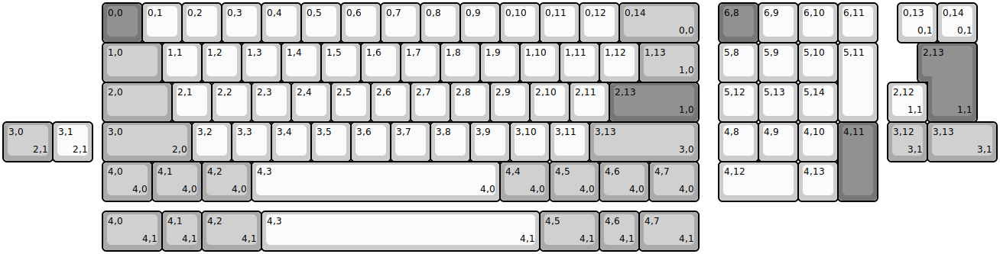{:loading="lazy"}

[Open in keyboard-layout-editor](http://www.keyboard-layout-editor.com/##@@_x:2.5&c=#777777;&=0,0&_c=#cccccc;&=0,1&=0,2&=0,3&=0,4&=0,5&=0,6&=0,7&=0,8&=0,9&=0,10&=0,11&=0,12&_c=#aaaaaa&w:2;&=0,14%0A%0A%0A0,0&_x:0.5&c=#777777;&=6,8&_c=#cccccc;&=6,9&=6,10&=6,11;&@_x:2.5&c=#aaaaaa&w:1.5;&=1,0&_c=#cccccc;&=1,1&=1,2&=1,3&=1,4&=1,5&=1,6&=1,7&=1,8&=1,9&=1,10&=1,11&=1,12&_c=#aaaaaa&w:1.5;&=1,13%0A%0A%0A1,0&_x:0.5&c=#cccccc;&=5,8&=5,9&=5,10&_h:2;&=5,11;&@_x:2.5&c=#aaaaaa&w:1.75;&=2,0&_c=#cccccc;&=2,1&=2,2&=2,3&=2,4&=2,5&=2,6&=2,7&=2,8&=2,9&=2,10&=2,11&_c=#777777&w:2.25;&=2,13%0A%0A%0A1,0&_x:0.5&c=#cccccc;&=5,12&=5,13&=5,14;&@_x:2.5&c=#aaaaaa&w:2.25;&=3,0%0A%0A%0A2,0&_c=#cccccc;&=3,2&=3,3&=3,4&=3,5&=3,6&=3,7&=3,8&=3,9&=3,10&=3,11&_c=#aaaaaa&w:2.75;&=3,13%0A%0A%0A3,0&_x:0.5&c=#cccccc;&=4,8&=4,9&=4,10&_c=#777777&h:2;&=4,11;&@_x:2.5&c=#aaaaaa&w:1.25;&=4,0%0A%0A%0A4,0&_w:1.25;&=4,1%0A%0A%0A4,0&_w:1.25;&=4,2%0A%0A%0A4,0&_c=#cccccc&w:6.25;&=4,3%0A%0A%0A4,0&_c=#aaaaaa&w:1.25;&=4,4%0A%0A%0A4,0&_w:1.25;&=4,5%0A%0A%0A4,0&_w:1.25;&=4,6%0A%0A%0A4,0&_w:1.25;&=4,7%0A%0A%0A4,0&_x:0.5&c=#cccccc&w:2;&=4,12&=4,13;&@_x:22.5&y:-5;&=0,13%0A%0A%0A0,1&=0,14%0A%0A%0A0,1;&@_x:23.25&c=#777777&w:1.25&h:2&w2:1.5&h2:1&x2:-0.25;&=2,13%0A%0A%0A1,1;&@_x:22.25&c=#cccccc;&=2,12%0A%0A%0A1,1;&@_c=#aaaaaa&w:1.25;&=3,0%0A%0A%0A2,1&_c=#cccccc;&=3,1%0A%0A%0A2,1&_x:20.0&c=#aaaaaa;&=3,12%0A%0A%0A3,1&_w:1.75;&=3,13%0A%0A%0A3,1;&@_x:2.5&y:1.25&w:1.5;&=4,0%0A%0A%0A4,1&=4,1%0A%0A%0A4,1&_w:1.5;&=4,2%0A%0A%0A4,1&_c=#cccccc&w:7;&=4,3%0A%0A%0A4,1&_c=#aaaaaa&w:1.5;&=4,5%0A%0A%0A4,1&=4,6%0A%0A%0A4,1&_w:1.5;&=4,7%0A%0A%0A4,1)

## lw67/lw67

[README](output/lw67/README.md) - [layout](output/lw67/lw67-kle.json) - [PCB](output/lw67/lw67.kicad_pcb) - [PCB render](output/lw67/lw67-render.svg)

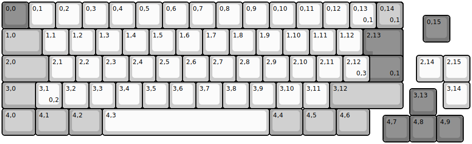{:loading="lazy"}

[Open in keyboard-layout-editor](http://www.keyboard-layout-editor.com/##@@_c=#777777;&=0,0&_c=#cccccc;&=0,1&=0,2&=0,3&=0,4&=0,5&=0,6&=0,7&=0,8&=0,9&=0,10&=0,11&=0,12&_c=#aaaaaa&w:2;&=0,13%0A%0A%0A0,0;&@_x:15.75&y:-0.5&c=#777777;&=0,15;&@_y:-0.5&c=#aaaaaa&w:1.5;&=1,0&_c=#cccccc;&=1,1&=1,2&=1,3&=1,4&=1,5&=1,6&=1,7&=1,8&=1,9&=1,10&=1,11&=1,12&_w:1.5;&=1,13%0A%0A%0A0,0;&@_c=#aaaaaa&w:1.75;&=2,0&_c=#cccccc;&=2,1&=2,2&=2,3&=2,4&=2,5&=2,6&=2,7&=2,8&=2,9&=2,10&=2,11&_c=#777777&w:2.25;&=2,13%0A%0A%0A0,0&_x:0.5&c=#cccccc;&=2,14&=2,15;&@_c=#aaaaaa&w:2.25;&=3,0%0A%0A%0A0,0&_c=#cccccc;&=3,2&=3,3&=3,4&=3,5&=3,6&=3,7&=3,8&=3,9&=3,10&=3,11&_c=#aaaaaa&w:2.75;&=3,12&_x:1.5&c=#cccccc;&=3,14;&@_x:15.25&y:-0.75&c=#777777;&=3,13;&@_y:-0.25&c=#aaaaaa&w:1.25;&=4,0&_w:1.25;&=4,1&_w:1.25;&=4,2&_c=#cccccc&w:6.25;&=4,3&_c=#aaaaaa&w:1.25;&=4,4&_w:1.25;&=4,5&_w:1.25;&=4,6;&@_x:14.25&y:-0.75&c=#777777;&=4,7&=4,8&=4,9;&@_x:13&y:-5.25&c=#cccccc;&=0,13%0A%0A%0A0,3&_x:-1&c=#aaaaaa&w:2;&=0,13%0A%0A%0A0,2&_x:-2&c=#cccccc;&=0,13%0A%0A%0A0,1&_c=#aaaaaa;&=0,14%0A%0A%0A0,3&_x:-1;&=0,14%0A%0A%0A0,1;&@_x:13.5&c=#cccccc&w:1.5;&=1,13%0A%0A%0A0,1&_x:-1.25&c=#777777&w:1.25&h:2&w2:1.5&h2:1&x2:-0.25;&=2,13%0A%0A%0A0,2&_x:-1.25&w:1.25&h:2&w2:1.5&h2:1&x2:-0.25;&=2,13%0A%0A%0A0,3;&@_x:12.75&w:2.25;&=2,13%0A%0A%0A0,1&_x:-2.25&c=#cccccc;&=2,12%0A%0A%0A0,2&_x:-1.0;&=2,12%0A%0A%0A0,3;&@_c=#aaaaaa&w:1.25;&=3,0%0A%0A%0A0,3&_x:-1.25&w:1.25;&=3,0%0A%0A%0A0,2&_x:-1.25&w:2.25;&=3,0%0A%0A%0A0,1&_x:-1.0&c=#cccccc;&=3,1%0A%0A%0A0,3&_x:-1.0;&=3,1%0A%0A%0A0,2)

## lyra/lyra

[README](output/lyra/README.md) - [layout](output/lyra/lyra-kle.json) - [PCB](output/lyra/lyra.kicad_pcb) - [PCB render](output/lyra/lyra-render.svg)

{:loading="lazy"}

[Open in keyboard-layout-editor](http://www.keyboard-layout-editor.com/##@@_x:4;&=0,4&_x:5;&=5,4;&@_x:3&y:-0.9;&=0,3&_x:1;&=0,5&_x:3;&=5,5&_x:1;&=5,3;&@_x:6&y:-0.85;&=0,6&_x:1;&=5,6;&@_y:-0.95&c=#777777;&=0,0&_x:1&c=#cccccc;&=0,2&_x:9;&=5,2&_x:1&c=#777777;&=5,0;&@_x:1&y:-0.9&c=#cccccc;&=0,1&_x:11;&=5,1;&@_x:4&y:-0.4;&=1,4&_x:5;&=6,4;&@_x:3&y:-0.9;&=1,3&_x:1;&=1,5&_x:3;&=6,5&_x:1;&=6,3;&@_x:6&y:-0.85;&=1,6&_x:1;&=6,6;&@_y:-0.95&c=#aaaaaa;&=1,0&_x:1&c=#cccccc;&=1,2&_x:9;&=6,2&_x:1&c=#aaaaaa;&=6,0;&@_x:1&y:-0.9&c=#cccccc;&=1,1&_x:11;&=6,1;&@_x:4&y:-0.4;&=2,4&_x:5;&=7,4;&@_x:3&y:-0.9;&=2,3&_x:1;&=2,5&_x:3;&=7,5&_x:1;&=7,3;&@_x:6&y:-0.85;&=2,6&_x:1;&=7,6;&@_y:-0.95&c=#777777;&=2,0&_x:1&c=#cccccc;&=2,2&_x:9;&=7,2&_x:1&c=#777777;&=7,0;&@_x:1&y:-0.9&c=#cccccc;&=2,1&_x:11;&=7,1;&@_x:4&y:-0.4;&=3,4&_x:5;&=8,4;&@_x:3&y:-0.9;&=3,3&_x:1;&=3,5&_x:3;&=8,5&_x:1;&=8,3;&@_x:6&y:-0.85;&=3,6&_x:1;&=8,6;&@_y:-0.95&c=#aaaaaa;&=3,0&_x:1&c=#cccccc;&=3,2&_x:9;&=8,2&_x:1&c=#aaaaaa;&=8,0;&@_x:1&y:-0.9&c=#cccccc;&=3,1&_x:11;&=8,1;&@_x:4&y:-0.4&c=#aaaaaa;&=4,4&_x:5;&=9,4;&@_x:3&y:-0.9;&=4,3&_x:1;&=4,5&_x:3;&=9,5&_x:1;&=9,3;&@_y:-0.8;&=4,0&_x:1;&=4,2&_x:9;&=9,2&_x:1;&=9,0;&@_x:1&y:-0.9;&=4,1&_x:11;&=9,1;&@_x:6.25&y:-0.9&c=#cccccc;&=4,6&_x:0.5;&=9,6)

## lz/lzghost

[README](output/lz/README.md) - [layout](output/lz/lzghost-kle.json) - [PCB](output/lz/lzghost.kicad_pcb) - [PCB render](output/lz/lzghost-render.svg)

{:loading="lazy"}

[Open in keyboard-layout-editor](http://www.keyboard-layout-editor.com/##@@_x:20.25&y:1.25;&=0,14&=0,15&=0,16;&@_x:20.25&y:0.75;&=1,14&=1,15&=1,16;&@_x:20.25;&=2,14&=2,15&=2,16;&@_x:21.25&y:1.0;&=4,15;&@_x:20.25;&=5,14&=5,15&=5,16;&@_r:13&x:3.75&y:-8.0;&=0,0&_x:1.0;&=0,1&=0,2&=0,3&=0,4&=0,5;&@_x:3.75&y:1.0;&=1,0&=1,1&=1,2&=1,3&=1,4&=1,5&=1,6;&@_x:3.75&w:1.5;&=2,0&=2,1&=2,2&=2,3&=2,4&=2,5;&@_x:3.75&w:1.75;&=3,0&=3,1&=3,2&=3,3&=3,4&=3,5;&@_x:3.75&w:2.25;&=4,0%0A%0A%0A2,0&=4,2&=4,3&=4,4&=4,5&=4,6;&@_x:3.75&w:1.25;&=5,0%0A%0A%0A4,0&_w:1.25;&=5,1%0A%0A%0A4,0&_w:1.25;&=5,2%0A%0A%0A4,0&_w:1.25;&=5,4%0A%0A%0A4,0&_w:2.25;&=5,5%0A%0A%0A4,0;&@_r:-13&x:10&y:-2.25;&=0,6&=0,7&=0,8&=0,9&=0,10&=0,11&=0,12;&@_x:10&y:1.0;&=1,7&=1,8&=1,9&=1,10&=1,11&=1,12&_w:2;&=1,13%0A%0A%0A0,0;&@_x:9.5;&=2,6&=2,7&=2,8&=2,9&=2,10&=2,11&=2,12&_w:1.5;&=2,13%0A%0A%0A1,0;&@_x:9.75;&=3,6&=3,7&=3,8&=3,9&=3,10&=3,11&_w:2.25;&=3,13%0A%0A%0A1,0;&@_x:9.25;&=5,7&=4,7&=4,8&=4,9&=4,10&=4,11&_w:2.75;&=4,12%0A%0A%0A3,0;&@_x:9.25&w:2.75;&=5,9%0A%0A%0A5,0&_w:1.25;&=5,10%0A%0A%0A5,0&_w:1.25;&=5,11%0A%0A%0A5,0&_w:1.25;&=5,12%0A%0A%0A5,0&_w:1.25;&=5,13%0A%0A%0A5,0;&@_r:13&x:1.25&y:-6.75&w:1.25;&=4,0%0A%0A%0A2,1&=4,1%0A%0A%0A2,1;&@_x:3.75&y:1.25&w:1.5;&=5,0%0A%0A%0A4,1&=5,1%0A%0A%0A4,1&=5,2%0A%0A%0A4,1&_w:1.5;&=5,4%0A%0A%0A4,1&_w:2.25;&=5,5%0A%0A%0A4,1;&@_x:3.75&w:1.5;&=5,0%0A%0A%0A4,2&=5,1%0A%0A%0A4,2&_w:1.5;&=5,2%0A%0A%0A4,2&=5,4%0A%0A%0A4,2&_w:2.25;&=5,5%0A%0A%0A4,2;&@_x:3.75&w:1.5;&=5,0%0A%0A%0A4,3&=5,1%0A%0A%0A4,3&_w:1.5;&=5,2%0A%0A%0A4,3&=5,4%0A%0A%0A4,3&_w:1.25;&=5,5%0A%0A%0A4,3&=5,6%0A%0A%0A4,3;&@_x:3.75&w:1.5;&=5,0%0A%0A%0A4,4&=5,1%0A%0A%0A4,4&_w:1.5;&=5,2%0A%0A%0A4,4&=5,4%0A%0A%0A4,4&=5,5%0A%0A%0A4,4&_w:1.25;&=5,6%0A%0A%0A4,4;&@_r:-13&x:23.25&y:-4.25;&=1,13%0A%0A%0A0,1&=0,13%0A%0A%0A0,1;&@_x:24&w:1.25&h:2&w2:1.5&h2:1&x2:-0.25;&=3,13%0A%0A%0A1,1;&@_x:23;&=3,12%0A%0A%0A1,1;&@_x:22.5&w:1.75;&=4,12%0A%0A%0A3,1&=4,13%0A%0A%0A3,1;&@_x:9.25&y:1.0&w:2.75;&=5,9%0A%0A%0A5,1&_w:1.5;&=5,10%0A%0A%0A5,1&=5,11%0A%0A%0A5,1&=5,12%0A%0A%0A5,1&_w:1.5;&=5,13%0A%0A%0A5,1;&@_x:9.25&w:2.75;&=5,9%0A%0A%0A5,2&=5,10%0A%0A%0A5,2&_w:1.5;&=5,11%0A%0A%0A5,2&=5,12%0A%0A%0A5,2&_w:1.5;&=5,13%0A%0A%0A5,2;&@_x:9.25;&=5,8%0A%0A%0A5,3&_w:1.75;&=5,9%0A%0A%0A5,3&=5,10%0A%0A%0A5,3&_w:1.5;&=5,11%0A%0A%0A5,3&=5,12%0A%0A%0A5,3&_w:1.5;&=5,13%0A%0A%0A5,3;&@_x:9.25&w:1.75;&=5,8%0A%0A%0A5,4&=5,9%0A%0A%0A5,4&=5,10%0A%0A%0A5,4&_w:1.5;&=5,11%0A%0A%0A5,4&=5,12%0A%0A%0A5,4&_w:1.5;&=5,13%0A%0A%0A5,4)

## m3n3van/m3n3van

[README](output/m3n3van/README.md) - [layout](output/m3n3van/m3n3van-kle.json) - [PCB](output/m3n3van/m3n3van.kicad_pcb) - [PCB render](output/m3n3van/m3n3van-render.svg)

{:loading="lazy"}

[Open in keyboard-layout-editor](http://www.keyboard-layout-editor.com/##@@_c=#aaaaaa;&=0,0&_c=#cccccc;&=0,1&=0,2&=0,3&=0,4&=0,5&=0,6&=0,7&=0,8&=0,9&=0,10&_c=#aaaaaa&w:1.75;&=0,12%0A%0A%0A0,0;&@_w:1.25;&=1,0&_c=#cccccc;&=1,1&=1,2&=1,3&=1,4&=1,5&=1,6&=1,7&=1,8&=1,9&=1,10&_c=#aaaaaa&w:1.5;&=1,12;&@_w:1.75;&=2,0&_c=#cccccc;&=2,2&=2,3&=2,4&=2,5&=2,6&=2,7&=2,8&=2,9&=2,10&=2,11&_c=#aaaaaa;&=2,12;&@=3,0&_w:1.25;&=3,1&=3,2&_c=#777777&w:3;&=3,4&_w:3;&=3,7&_c=#aaaaaa&w:1.25;&=3,9&=3,11&_w:1.25;&=3,12;&@_x:13.0&y:-4;&=0,11%0A%0A%0A0,1&_w:0.75;&=0,12%0A%0A%0A0,1)

## machkeyboards/mach3

[README](output/machkeyboards/mach3/README.md) - [layout](output/machkeyboards/mach3/mach3-kle.json) - [PCB](output/machkeyboards/mach3/mach3.kicad_pcb) - [PCB render](output/machkeyboards/mach3/mach3-render.svg)

{:loading="lazy"}

[Open in keyboard-layout-editor](http://www.keyboard-layout-editor.com/##@@=0,0&=0,1&=0,2;&@=1,0&=1,1&=1,2;&@=2,0&=2,1&=2,2)

## macro1/macro1

[README](output/macro1/README.md) - [layout](output/macro1/macro1-kle.json) - [PCB](output/macro1/macro1.kicad_pcb) - [PCB render](output/macro1/macro1-render.svg)

{:loading="lazy"}

[Open in keyboard-layout-editor](http://www.keyboard-layout-editor.com/##@@=0,0&_x:1;&=0,2&=0,3;&@_y:0.5;&=1,0&=1,1&=1,2&=1,3;&@=2,0%0A%0A%0A0,0&=2,1&=2,2&_h:2;&=2,3%0A%0A%0A0,0;&@=3,0%0A%0A%0A0,0&=3,1&=3,2;&@=4,0%0A%0A%0A0,0&=4,1&=4,2&_h:2;&=4,3%0A%0A%0A0,0;&@_w:2;&=5,0%0A%0A%0A0,0&=5,2%0A%0A%0A0,0;&@_y:-4.0;&=2,0%0A%0A%0A0,2&_x:-1&h:2;&=2,0%0A%0A%0A0,1&_x:2;&=2,3%0A%0A%0A0,1&_x:-1;&=2,3%0A%0A%0A0,2;&@=3,0%0A%0A%0A0,2&_x:2;&=3,3%0A%0A%0A0,1&_x:-1;&=3,3%0A%0A%0A0,2;&@=4,0%0A%0A%0A0,2&_x:-1&h:2;&=4,0%0A%0A%0A0,1&_x:2;&=4,3%0A%0A%0A0,1&_x:-1;&=4,3%0A%0A%0A0,2;&@=5,0%0A%0A%0A0,2&=5,1%0A%0A%0A0,1&_x:-1;&=5,1%0A%0A%0A0,2&_w:2;&=5,2%0A%0A%0A0,1&_x:-2;&=5,2%0A%0A%0A0,2&=5,3%0A%0A%0A0,2)

## macrocat/macrocat

[README](output/macrocat/README.md) - [layout](output/macrocat/macrocat-kle.json) - [PCB](output/macrocat/macrocat.kicad_pcb) - [PCB render](output/macrocat/macrocat-render.svg)

{:loading="lazy"}

[Open in keyboard-layout-editor](http://www.keyboard-layout-editor.com/##@@=0,0&=0,1&=0,2&=0,3;&@=1,0&=1,1&=1,2&=1,3;&@=2,0&=2,1&=2,2&=2,3;&@=3,0&=3,1&=3,2&=3,3)

## maker/alexa

[README](output/maker/alexa/README.md) - [layout](output/maker/alexa/alexa-kle.json) - [PCB](output/maker/alexa/alexa.kicad_pcb) - [PCB render](output/maker/alexa/alexa-render.svg)

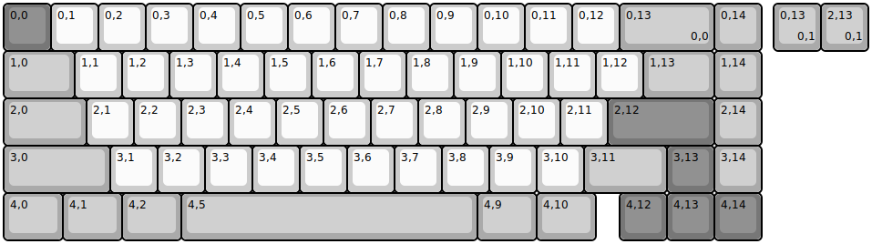{:loading="lazy"}

[Open in keyboard-layout-editor](http://www.keyboard-layout-editor.com/##@@_c=#777777;&=0,0&_c=#cccccc;&=0,1&=0,2&=0,3&=0,4&=0,5&=0,6&=0,7&=0,8&=0,9&=0,10&=0,11&=0,12&_c=#aaaaaa&w:2;&=0,13%0A%0A%0A0,0&=0,14;&@_w:1.5;&=1,0&_c=#cccccc;&=1,1&=1,2&=1,3&=1,4&=1,5&=1,6&=1,7&=1,8&=1,9&=1,10&=1,11&=1,12&_c=#aaaaaa&w:1.5;&=1,13&=1,14;&@_w:1.75;&=2,0&_c=#cccccc;&=2,1&=2,2&=2,3&=2,4&=2,5&=2,6&=2,7&=2,8&=2,9&=2,10&=2,11&_c=#777777&w:2.25;&=2,12&_c=#aaaaaa;&=2,14;&@_w:2.25;&=3,0&_c=#cccccc;&=3,1&=3,2&=3,3&=3,4&=3,5&=3,6&=3,7&=3,8&=3,9&=3,10&_c=#aaaaaa&w:1.75;&=3,11&_c=#777777;&=3,13&_c=#aaaaaa;&=3,14;&@_w:1.25;&=4,0&_w:1.25;&=4,1&_w:1.25;&=4,2&_w:6.25;&=4,5&_w:1.25;&=4,9&_w:1.25;&=4,10&_x:0.5&c=#777777;&=4,12&=4,13&=4,14;&@_x:16.25&y:-5&c=#aaaaaa;&=0,13%0A%0A%0A0,1&=2,13%0A%0A%0A0,1)

## maker/alexa_solder

[README](output/maker/alexa_solder/README.md) - [layout](output/maker/alexa_solder/alexa_solder-kle.json) - [PCB](output/maker/alexa_solder/alexa_solder.kicad_pcb) - [PCB render](output/maker/alexa_solder/alexa_solder-render.svg)

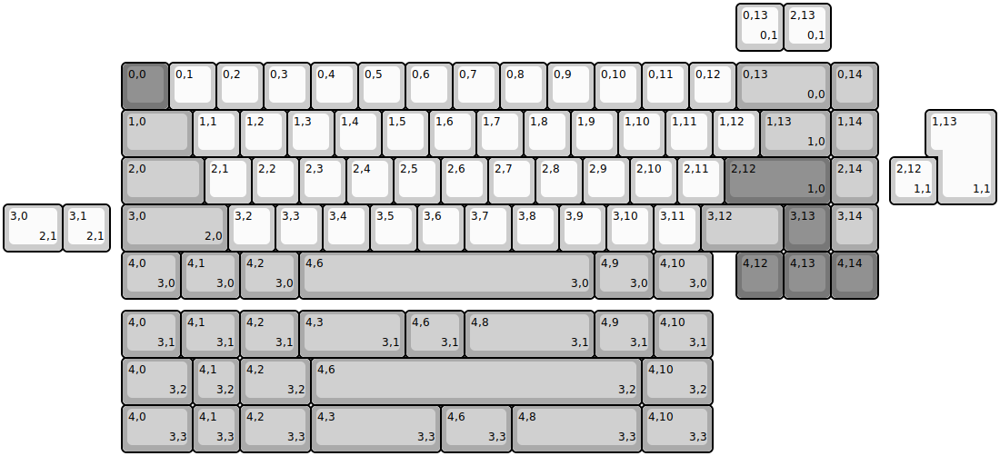{:loading="lazy"}

[Open in keyboard-layout-editor](http://www.keyboard-layout-editor.com/##@@_x:2.5&y:1.25&c=#777777;&=0,0&_c=#cccccc;&=0,1&=0,2&=0,3&=0,4&=0,5&=0,6&=0,7&=0,8&=0,9&=0,10&=0,11&=0,12&_c=#aaaaaa&w:2;&=0,13%0A%0A%0A0,0&=0,14;&@_x:2.5&w:1.5;&=1,0&_c=#cccccc;&=1,1&=1,2&=1,3&=1,4&=1,5&=1,6&=1,7&=1,8&=1,9&=1,10&=1,11&=1,12&_c=#aaaaaa&w:1.5;&=1,13%0A%0A%0A1,0&=1,14;&@_x:2.5&w:1.75;&=2,0&_c=#cccccc;&=2,1&=2,2&=2,3&=2,4&=2,5&=2,6&=2,7&=2,8&=2,9&=2,10&=2,11&_c=#777777&w:2.25;&=2,12%0A%0A%0A1,0&_c=#aaaaaa;&=2,14;&@_x:2.5&w:2.25;&=3,0%0A%0A%0A2,0&_c=#cccccc;&=3,2&=3,3&=3,4&=3,5&=3,6&=3,7&=3,8&=3,9&=3,10&=3,11&_c=#aaaaaa&w:1.75;&=3,12&_c=#777777;&=3,13&_c=#aaaaaa;&=3,14;&@_x:2.5&w:1.25;&=4,0%0A%0A%0A3,0&_w:1.25;&=4,1%0A%0A%0A3,0&_w:1.25;&=4,2%0A%0A%0A3,0&_w:6.25;&=4,6%0A%0A%0A3,0&_w:1.25;&=4,9%0A%0A%0A3,0&_w:1.25;&=4,10%0A%0A%0A3,0&_x:0.5&c=#777777;&=4,12&=4,13&=4,14;&@_x:15.5&y:-6.25&c=#cccccc;&=0,13%0A%0A%0A0,1&=2,13%0A%0A%0A0,1;&@_x:19.75&y:1.25&w:1.25&h:2&w2:1.5&h2:1&x2:-0.25;&=1,13%0A%0A%0A1,1;&@_x:18.75;&=2,12%0A%0A%0A1,1;&@_w:1.25;&=3,0%0A%0A%0A2,1&=3,1%0A%0A%0A2,1;&@_x:2.5&y:1.25&c=#aaaaaa&w:1.25;&=4,0%0A%0A%0A3,1&_w:1.25;&=4,1%0A%0A%0A3,1&_w:1.25;&=4,2%0A%0A%0A3,1&_w:2.25;&=4,3%0A%0A%0A3,1&_w:1.25;&=4,6%0A%0A%0A3,1&_w:2.75;&=4,8%0A%0A%0A3,1&_w:1.25;&=4,9%0A%0A%0A3,1&_w:1.25;&=4,10%0A%0A%0A3,1;&@_x:2.5&w:1.5;&=4,0%0A%0A%0A3,2&=4,1%0A%0A%0A3,2&_w:1.5;&=4,2%0A%0A%0A3,2&_w:7;&=4,6%0A%0A%0A3,2&_w:1.5;&=4,10%0A%0A%0A3,2;&@_x:2.5&w:1.5;&=4,0%0A%0A%0A3,3&=4,1%0A%0A%0A3,3&_w:1.5;&=4,2%0A%0A%0A3,3&_w:2.75;&=4,3%0A%0A%0A3,3&_w:1.5;&=4,6%0A%0A%0A3,3&_w:2.75;&=4,8%0A%0A%0A3,3&_w:1.5;&=4,10%0A%0A%0A3,3)

## maker/kbd8x_hs

[README](output/maker/kbd8x_hs/README.md) - [layout](output/maker/kbd8x_hs/kbd8x_hs-kle.json) - [PCB](output/maker/kbd8x_hs/kbd8x_hs.kicad_pcb) - [PCB render](output/maker/kbd8x_hs/kbd8x_hs-render.svg)

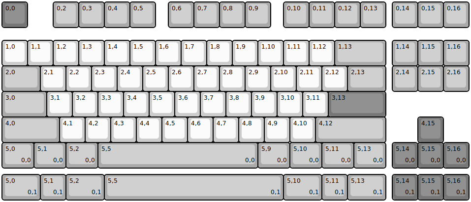{:loading="lazy"}

[Open in keyboard-layout-editor](http://www.keyboard-layout-editor.com/##@@_c=#777777;&=0,0&_x:1&c=#aaaaaa;&=0,2&=0,3&=0,4&=0,5&_x:0.5;&=0,6&=0,7&=0,8&=0,9&_x:0.5;&=0,10&=0,11&=0,12&=0,13&_x:0.25;&=0,14&=0,15&=0,16;&@_y:0.5&c=#cccccc;&=1,0&=1,1&=1,2&=1,3&=1,4&=1,5&=1,6&=1,7&=1,8&=1,9&=1,10&=1,11&=1,12&_c=#aaaaaa&w:2;&=1,13&_x:0.25;&=1,14&=1,15&=1,16;&@_w:1.5;&=2,0&_c=#cccccc;&=2,1&=2,2&=2,3&=2,4&=2,5&=2,6&=2,7&=2,8&=2,9&=2,10&=2,11&=2,12&_c=#aaaaaa&w:1.5;&=2,13&_x:0.25;&=2,14&=2,15&=2,16;&@_w:1.75;&=3,0&_c=#cccccc;&=3,1&=3,2&=3,3&=3,4&=3,5&=3,6&=3,7&=3,8&=3,9&=3,10&=3,11&_c=#777777&w:2.25;&=3,13;&@_c=#aaaaaa&w:2.25;&=4,0&_c=#cccccc;&=4,1&=4,2&=4,3&=4,4&=4,5&=4,6&=4,7&=4,8&=4,9&=4,10&_c=#aaaaaa&w:2.75;&=4,12&_x:1.25&c=#777777;&=4,15;&@_c=#aaaaaa&w:1.25;&=5,0%0A%0A%0A0,0&_w:1.25;&=5,1%0A%0A%0A0,0&_w:1.25;&=5,2%0A%0A%0A0,0&_w:6.25;&=5,5%0A%0A%0A0,0&_w:1.25;&=5,9%0A%0A%0A0,0&_w:1.25;&=5,10%0A%0A%0A0,0&_w:1.25;&=5,11%0A%0A%0A0,0&_w:1.25;&=5,13%0A%0A%0A0,0&_x:0.25&c=#777777;&=5,14%0A%0A%0A0,0&=5,15%0A%0A%0A0,0&=5,16%0A%0A%0A0,0;&@_y:0.25&c=#aaaaaa&w:1.5;&=5,0%0A%0A%0A0,1&=5,1%0A%0A%0A0,1&_w:1.5;&=5,2%0A%0A%0A0,1&_w:7;&=5,5%0A%0A%0A0,1&_w:1.5;&=5,10%0A%0A%0A0,1&=5,11%0A%0A%0A0,1&_w:1.5;&=5,13%0A%0A%0A0,1&_x:0.25&c=#777777;&=5,14%0A%0A%0A0,1&=5,15%0A%0A%0A0,1&=5,16%0A%0A%0A0,1)

## maker/phantom_hs

[README](output/maker/phantom_hs/README.md) - [layout](output/maker/phantom_hs/phantom_hs-kle.json) - [PCB](output/maker/phantom_hs/phantom_hs.kicad_pcb) - [PCB render](output/maker/phantom_hs/phantom_hs-render.svg)

{:loading="lazy"}

[Open in keyboard-layout-editor](http://www.keyboard-layout-editor.com/##@@_c=#777777;&=0,0&_c=#cccccc;&=0,1&=0,2&=0,3&=0,4&=0,5&=0,6&=0,7&=0,8&=0,9&=0,10&=0,11&=0,12&_c=#aaaaaa&w:2;&=0,13&=0,14;&@_w:1.5;&=1,0&_c=#cccccc;&=1,1&=1,2&=1,3&=1,4&=1,5&=1,6&=1,7&=1,8&=1,9&=1,10&=1,11&=1,12&_c=#aaaaaa&w:1.5;&=1,13&=1,14;&@_w:1.75;&=2,0&_c=#cccccc;&=2,1&=2,2&=2,3&=2,4&=2,5&=2,6&=2,7&=2,8&=2,9&=2,10&=2,11&_c=#777777&w:2.25;&=2,12&_c=#aaaaaa;&=2,14;&@_w:2.25;&=3,0&_c=#cccccc;&=3,1&=3,2&=3,3&=3,4&=3,5&=3,6&=3,7&=3,8&=3,9&=3,10&_c=#aaaaaa&w:1.75;&=3,11&_c=#777777;&=3,13&_c=#aaaaaa;&=3,14;&@_w:1.25;&=4,0&_w:1.25;&=4,1&_w:1.25;&=4,2&_w:6.25;&=4,5&_w:1.25;&=4,9&_w:1.25;&=4,10&_x:0.5&c=#777777;&=4,12&=4,13&=4,14)

## maker/phantom_solder

[README](output/maker/phantom_solder/README.md) - [layout](output/maker/phantom_solder/phantom_solder-kle.json) - [PCB](output/maker/phantom_solder/phantom_solder.kicad_pcb) - [PCB render](output/maker/phantom_solder/phantom_solder-render.svg)

{:loading="lazy"}

[Open in keyboard-layout-editor](http://www.keyboard-layout-editor.com/##@@_x:2.5&y:1.25&c=#777777;&=0,0&_c=#cccccc;&=0,1&=0,2&=0,3&=0,4&=0,5&=0,6&=0,7&=0,8&=0,9&=0,10&=0,11&=0,12&_c=#aaaaaa&w:2;&=0,13%0A%0A%0A0,0&=0,14;&@_x:2.5&w:1.5;&=1,0&_c=#cccccc;&=1,1&=1,2&=1,3&=1,4&=1,5&=1,6&=1,7&=1,8&=1,9&=1,10&=1,11&=1,12&_c=#aaaaaa&w:1.5;&=1,13%0A%0A%0A1,0&=1,14;&@_x:2.5&w:1.75;&=2,0&_c=#cccccc;&=2,1&=2,2&=2,3&=2,4&=2,5&=2,6&=2,7&=2,8&=2,9&=2,10&=2,11&_c=#777777&w:2.25;&=2,12%0A%0A%0A1,0&_c=#aaaaaa;&=2,14;&@_x:2.5&w:2.25;&=3,0%0A%0A%0A2,0&_c=#cccccc;&=3,2&=3,3&=3,4&=3,5&=3,6&=3,7&=3,8&=3,9&=3,10&=3,11&_c=#aaaaaa&w:1.75;&=3,12&_c=#777777;&=3,13&_c=#aaaaaa;&=3,14;&@_x:2.5&w:1.25;&=4,0%0A%0A%0A3,0&_w:1.25;&=4,1%0A%0A%0A3,0&_w:1.25;&=4,2%0A%0A%0A3,0&_w:6.25;&=4,6%0A%0A%0A3,0&_w:1.25;&=4,9%0A%0A%0A3,0&_w:1.25;&=4,10%0A%0A%0A3,0&_x:0.5&c=#777777;&=4,12&=4,13&=4,14;&@_x:15.5&y:-6.25&c=#cccccc;&=0,13%0A%0A%0A0,1&=2,13%0A%0A%0A0,1;&@_x:19.75&y:1.25&w:1.25&h:2&w2:1.5&h2:1&x2:-0.25;&=1,13%0A%0A%0A1,1;&@_x:18.75;&=2,12%0A%0A%0A1,1;&@_w:1.25;&=3,0%0A%0A%0A2,1&=3,1%0A%0A%0A2,1;&@_x:2.5&y:1.25&c=#aaaaaa&w:1.25;&=4,0%0A%0A%0A3,1&_w:1.25;&=4,1%0A%0A%0A3,1&_w:1.25;&=4,2%0A%0A%0A3,1&_w:2.25;&=4,3%0A%0A%0A3,1&_w:1.25;&=4,6%0A%0A%0A3,1&_w:2.75;&=4,8%0A%0A%0A3,1&_w:1.25;&=4,9%0A%0A%0A3,1&_w:1.25;&=4,10%0A%0A%0A3,1;&@_x:2.5&w:1.5;&=4,0%0A%0A%0A3,2&=4,1%0A%0A%0A3,2&_w:1.5;&=4,2%0A%0A%0A3,2&_w:7;&=4,6%0A%0A%0A3,2&_w:1.5;&=4,10%0A%0A%0A3,2;&@_x:2.5&w:1.5;&=4,0%0A%0A%0A3,3&=4,1%0A%0A%0A3,3&_w:1.5;&=4,2%0A%0A%0A3,3&_w:2.75;&=4,3%0A%0A%0A3,3&_w:1.5;&=4,6%0A%0A%0A3,3&_w:2.75;&=4,8%0A%0A%0A3,3&_w:1.5;&=4,10%0A%0A%0A3,3)

## maker/scarlet

[README](output/maker/scarlet/README.md) - [layout](output/maker/scarlet/scarlet-kle.json) - [PCB](output/maker/scarlet/scarlet.kicad_pcb) - [PCB render](output/maker/scarlet/scarlet-render.svg)

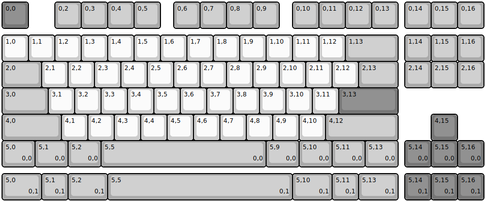{:loading="lazy"}

[Open in keyboard-layout-editor](http://www.keyboard-layout-editor.com/##@@_c=#777777;&=0,0&_x:1&c=#aaaaaa;&=0,2&=0,3&=0,4&=0,5&_x:0.5;&=0,6&=0,7&=0,8&=0,9&_x:0.5;&=0,10&=0,11&=0,12&=0,13&_x:0.25;&=0,14&=0,15&=0,16;&@_y:0.25&c=#cccccc;&=1,0&=1,1&=1,2&=1,3&=1,4&=1,5&=1,6&=1,7&=1,8&=1,9&=1,10&=1,11&=1,12&_c=#aaaaaa&w:2;&=1,13&_x:0.25;&=1,14&=1,15&=1,16;&@_w:1.5;&=2,0&_c=#cccccc;&=2,1&=2,2&=2,3&=2,4&=2,5&=2,6&=2,7&=2,8&=2,9&=2,10&=2,11&=2,12&_c=#aaaaaa&w:1.5;&=2,13&_x:0.25;&=2,14&=2,15&=2,16;&@_w:1.75;&=3,0&_c=#cccccc;&=3,1&=3,2&=3,3&=3,4&=3,5&=3,6&=3,7&=3,8&=3,9&=3,10&=3,11&_c=#777777&w:2.25;&=3,13;&@_c=#aaaaaa&w:2.25;&=4,0&_c=#cccccc;&=4,1&=4,2&=4,3&=4,4&=4,5&=4,6&=4,7&=4,8&=4,9&=4,10&_c=#aaaaaa&w:2.75;&=4,12&_x:1.25&c=#777777;&=4,15;&@_c=#aaaaaa&w:1.25;&=5,0%0A%0A%0A0,0&_w:1.25;&=5,1%0A%0A%0A0,0&_w:1.25;&=5,2%0A%0A%0A0,0&_w:6.25;&=5,5%0A%0A%0A0,0&_w:1.25;&=5,9%0A%0A%0A0,0&_w:1.25;&=5,10%0A%0A%0A0,0&_w:1.25;&=5,11%0A%0A%0A0,0&_w:1.25;&=5,13%0A%0A%0A0,0&_x:0.25&c=#777777;&=5,14%0A%0A%0A0,0&=5,15%0A%0A%0A0,0&=5,16%0A%0A%0A0,0;&@_y:0.25&c=#aaaaaa&w:1.5;&=5,0%0A%0A%0A0,1&=5,1%0A%0A%0A0,1&_w:1.5;&=5,2%0A%0A%0A0,1&_w:7;&=5,5%0A%0A%0A0,1&_w:1.5;&=5,10%0A%0A%0A0,1&=5,11%0A%0A%0A0,1&_w:1.5;&=5,13%0A%0A%0A0,1&_x:0.25&c=#777777;&=5,14%0A%0A%0A0,1&=5,15%0A%0A%0A0,1&=5,16%0A%0A%0A0,1)

## maplecomputing/jnao

[README](output/maplecomputing/README.md) - [layout](output/maplecomputing/jnao-kle.json) - [PCB](output/maplecomputing/jnao.kicad_pcb) - [PCB render](output/maplecomputing/jnao-render.svg)

{:loading="lazy"}

[Open in keyboard-layout-editor](http://www.keyboard-layout-editor.com/##@@=0,0&=0,1&=0,2&=0,3&=0,4&=0,5&=0,6&=0,7&=0,8&=0,9&=0,10&=0,11;&@=1,0&=1,1&=1,2&=1,3&=1,4&=1,5&=1,6&=1,7&=1,8&=1,9&=1,10&=1,11;&@=2,0&=2,1&=2,2&=2,3&=2,4&=2,5&=2,6&=2,7&=2,8&=2,9&=2,10&=2,11;&@=3,0%0A%0A%0A0,0&=3,1%0A%0A%0A0,0&=3,2%0A%0A%0A0,0&=3,3%0A%0A%0A0,0&=3,4%0A%0A%0A0,0&=3,5%0A%0A%0A0,0&=3,6%0A%0A%0A0,0&=3,7%0A%0A%0A0,0&=3,8%0A%0A%0A0,0&=3,9%0A%0A%0A0,0&=3,10%0A%0A%0A0,0&=3,11%0A%0A%0A0,0;&@=4,0%0A%0A%0A1,0&=4,1%0A%0A%0A1,0&=4,2%0A%0A%0A1,0&=4,3%0A%0A%0A1,0&=4,4%0A%0A%0A1,0&=4,5%0A%0A%0A1,0&=4,6%0A%0A%0A1,0&=4,7%0A%0A%0A1,0&=4,8%0A%0A%0A1,0&=4,9%0A%0A%0A1,0&=4,10%0A%0A%0A1,0&=4,11%0A%0A%0A1,0;&@_y:0.5;&=3,0%0A%0A%0A0,1&=3,1%0A%0A%0A0,1&=3,2%0A%0A%0A0,1&=3,3%0A%0A%0A0,1&=3,4%0A%0A%0A0,1&_w:2;&=3,5%0A%0A%0A0,1&=3,7%0A%0A%0A0,1&=3,8%0A%0A%0A0,1&=3,9%0A%0A%0A0,1&=3,10%0A%0A%0A0,1&=3,11%0A%0A%0A0,1;&@=3,0%0A%0A%0A0,2&=3,1%0A%0A%0A0,2&=3,2%0A%0A%0A0,2&=3,3%0A%0A%0A0,2&_w:2;&=3,4%0A%0A%0A0,2&_w:2;&=3,6%0A%0A%0A0,2&=3,8%0A%0A%0A0,2&=3,9%0A%0A%0A0,2&=3,10%0A%0A%0A0,2&=3,11%0A%0A%0A0,2;&@_y:0.5;&=4,0%0A%0A%0A1,1&=4,1%0A%0A%0A1,1&=4,2%0A%0A%0A1,1&=4,3%0A%0A%0A1,1&=4,4%0A%0A%0A1,1&_w:2;&=4,5%0A%0A%0A1,1&=4,7%0A%0A%0A1,1&=4,8%0A%0A%0A1,1&=4,9%0A%0A%0A1,1&=4,10%0A%0A%0A1,1&=4,11%0A%0A%0A1,1;&@=4,0%0A%0A%0A1,2&=4,1%0A%0A%0A1,2&=4,2%0A%0A%0A1,2&=4,3%0A%0A%0A1,2&_w:2;&=4,4%0A%0A%0A1,2&_w:2;&=4,6%0A%0A%0A1,2&=4,8%0A%0A%0A1,2&=4,9%0A%0A%0A1,2&=4,10%0A%0A%0A1,2&=4,11%0A%0A%0A1,2)

## masterworks/classy_tkl

[README](output/masterworks/classy_tkl/README.md) - [layout](output/masterworks/classy_tkl/classy_tkl-kle.json) - [PCB](output/masterworks/classy_tkl/classy_tkl.kicad_pcb) - [PCB render](output/masterworks/classy_tkl/classy_tkl-render.svg)

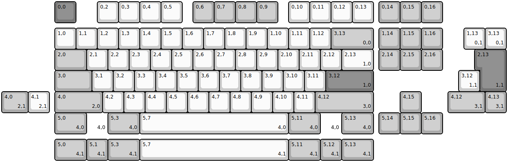{:loading="lazy"}

[Open in keyboard-layout-editor](http://www.keyboard-layout-editor.com/##@@_x:2.5&c=#777777;&=0,0&_x:1.0&c=#cccccc;&=0,2&=0,3&=0,4&=0,5&_x:0.5&c=#aaaaaa;&=0,6&=0,7&=0,8&=0,9&_x:0.5&c=#cccccc;&=0,10&=0,11&=0,12&=0,13&_x:0.25&c=#aaaaaa;&=0,14&=0,15&=0,16;&@_x:2.5&y:0.25&c=#cccccc;&=1,0&=1,1&=1,2&=1,3&=1,4&=1,5&=1,6&=1,7&=1,8&=1,9&=1,10&=1,11&=1,12&_c=#aaaaaa&w:2;&=3,13%0A%0A%0A0,0&_x:0.25;&=1,14&=1,15&=1,16;&@_x:2.5&w:1.5;&=2,0&_c=#cccccc;&=2,1&=2,2&=2,3&=2,4&=2,5&=2,6&=2,7&=2,8&=2,9&=2,10&=2,11&=2,12&_w:1.5;&=2,13%0A%0A%0A1,0&_x:0.25&c=#aaaaaa;&=2,14&=2,15&=2,16;&@_x:2.5&w:1.75;&=3,0&_c=#cccccc;&=3,1&=3,2&=3,3&=3,4&=3,5&=3,6&=3,7&=3,8&=3,9&=3,10&=3,11&_c=#777777&w:2.25;&=3,12%0A%0A%0A1,0;&@_x:2.5&c=#aaaaaa&w:2.25;&=4,0%0A%0A%0A2,0&_c=#cccccc;&=4,2&=4,3&=4,4&=4,5&=4,6&=4,7&=4,8&=4,9&=4,10&=4,11&_c=#aaaaaa&w:2.75;&=4,12%0A%0A%0A3,0&_x:1.25;&=4,15;&@_x:2.5&w:1.5;&=5,0%0A%0A%0A4,0&_d:true;&=%0A%0A%0A4,0&_w:1.5;&=5,3%0A%0A%0A4,0&_c=#cccccc&w:7;&=5,7%0A%0A%0A4,0&_c=#aaaaaa&w:1.5;&=5,11%0A%0A%0A4,0&_d:true;&=%0A%0A%0A4,0&_w:1.5;&=5,13%0A%0A%0A4,0&_x:0.25;&=5,14&=5,15&=5,16;&@_x:21.75&y:-5.0&c=#cccccc;&=1,13%0A%0A%0A0,1&=3,13%0A%0A%0A0,1;&@_x:22.5&c=#777777&w:1.25&h:2&w2:1.5&h2:1&x2:-0.25;&=2,13%0A%0A%0A1,1;&@_x:21.5&c=#cccccc;&=3,12%0A%0A%0A1,1;&@_c=#aaaaaa&w:1.25;&=4,0%0A%0A%0A2,1&_c=#cccccc;&=4,1%0A%0A%0A2,1&_x:18.75&c=#aaaaaa&w:1.75;&=4,12%0A%0A%0A3,1&=4,13%0A%0A%0A3,1;&@_x:2.5&y:1.25&w:1.5;&=5,0%0A%0A%0A4,1&=5,1%0A%0A%0A4,1&_w:1.5;&=5,3%0A%0A%0A4,1&_c=#cccccc&w:7;&=5,7%0A%0A%0A4,1&_c=#aaaaaa&w:1.5;&=5,11%0A%0A%0A4,1&=5,12%0A%0A%0A4,1&_w:1.5;&=5,13%0A%0A%0A4,1)

## matrix/m12og

[README](output/matrix/m12og/README.md) - [layout](output/matrix/m12og/m12og-kle.json) - [PCB](output/matrix/m12og/m12og.kicad_pcb) - [PCB render](output/matrix/m12og/m12og-render.svg)

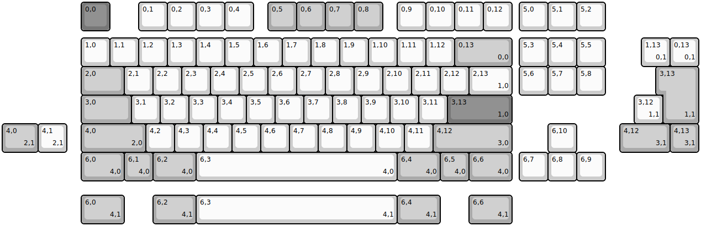{:loading="lazy"}

[Open in keyboard-layout-editor](http://www.keyboard-layout-editor.com/##@@_x:2.75&c=#777777;&=0,0&_x:1.0&c=#cccccc;&=0,1&=0,2&=0,3&=0,4&_x:0.5&c=#aaaaaa;&=0,5&=0,6&=0,7&=0,8&_x:0.5&c=#cccccc;&=0,9&=0,10&=0,11&=0,12&_x:0.25;&=5,0&=5,1&=5,2;&@_x:2.75&y:0.25;&=1,0&=1,1&=1,2&=1,3&=1,4&=1,5&=1,6&=1,7&=1,8&=1,9&=1,10&=1,11&=1,12&_c=#aaaaaa&w:2;&=0,13%0A%0A%0A0,0&_x:0.25&c=#cccccc;&=5,3&=5,4&=5,5;&@_x:2.75&c=#aaaaaa&w:1.5;&=2,0&_c=#cccccc;&=2,1&=2,2&=2,3&=2,4&=2,5&=2,6&=2,7&=2,8&=2,9&=2,10&=2,11&=2,12&_w:1.5;&=2,13%0A%0A%0A1,0&_x:0.25;&=5,6&=5,7&=5,8;&@_x:2.75&c=#aaaaaa&w:1.75;&=3,0&_c=#cccccc;&=3,1&=3,2&=3,3&=3,4&=3,5&=3,6&=3,7&=3,8&=3,9&=3,10&=3,11&_c=#777777&w:2.25;&=3,13%0A%0A%0A1,0;&@_x:2.75&c=#aaaaaa&w:2.25;&=4,0%0A%0A%0A2,0&_c=#cccccc;&=4,2&=4,3&=4,4&=4,5&=4,6&=4,7&=4,8&=4,9&=4,10&=4,11&_c=#aaaaaa&w:2.75;&=4,12%0A%0A%0A3,0&_x:1.25&c=#cccccc;&=6,10;&@_x:2.75&c=#aaaaaa&w:1.5;&=6,0%0A%0A%0A4,0&=6,1%0A%0A%0A4,0&_w:1.5;&=6,2%0A%0A%0A4,0&_c=#cccccc&w:7;&=6,3%0A%0A%0A4,0&_c=#aaaaaa&w:1.5;&=6,4%0A%0A%0A4,0&=6,5%0A%0A%0A4,0&_w:1.5;&=6,6%0A%0A%0A4,0&_x:0.25&c=#cccccc;&=6,7&=6,8&=6,9;&@_x:22.25&y:-5.0;&=1,13%0A%0A%0A0,1&=0,13%0A%0A%0A0,1;&@_x:23.0&c=#aaaaaa&w:1.25&h:2&w2:1&h2:1&x2:-0.25;&=3,13%0A%0A%0A1,1;&@_x:22.0&c=#cccccc;&=3,12%0A%0A%0A1,1;&@_c=#aaaaaa&w:1.25;&=4,0%0A%0A%0A2,1&_c=#cccccc;&=4,1%0A%0A%0A2,1&_x:19.25&c=#aaaaaa&w:1.75;&=4,12%0A%0A%0A3,1&=4,13%0A%0A%0A3,1;&@_x:2.75&y:1.5&w:1.5;&=6,0%0A%0A%0A4,1&_x:1.0&w:1.5;&=6,2%0A%0A%0A4,1&_c=#cccccc&w:7;&=6,3%0A%0A%0A4,1&_c=#aaaaaa&w:1.5;&=6,4%0A%0A%0A4,1&_x:1.0&w:1.5;&=6,6%0A%0A%0A4,1)

## mechbrewery/mb65h

[README](output/mechbrewery/README.md) - [layout](output/mechbrewery/mb65h-kle.json) - [PCB](output/mechbrewery/mb65h.kicad_pcb) - [PCB render](output/mechbrewery/mb65h-render.svg)

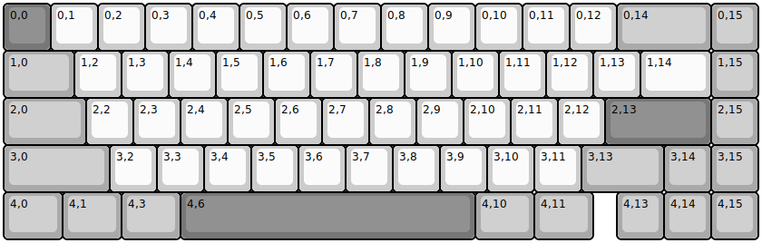{:loading="lazy"}

[Open in keyboard-layout-editor](http://www.keyboard-layout-editor.com/##@@_c=#777777;&=0,0&_c=#cccccc;&=0,1&=0,2&=0,3&=0,4&=0,5&=0,6&=0,7&=0,8&=0,9&=0,10&=0,11&=0,12&_c=#aaaaaa&w:2;&=0,14&=0,15;&@_w:1.5;&=1,0&_c=#cccccc;&=1,2&=1,3&=1,4&=1,5&=1,6&=1,7&=1,8&=1,9&=1,10&=1,11&=1,12&=1,13&_w:1.5;&=1,14&_c=#aaaaaa;&=1,15;&@_w:1.75;&=2,0&_c=#cccccc;&=2,2&=2,3&=2,4&=2,5&=2,6&=2,7&=2,8&=2,9&=2,10&=2,11&=2,12&_c=#777777&w:2.25;&=2,13&_c=#aaaaaa;&=2,15;&@_w:2.25;&=3,0&_c=#cccccc;&=3,2&=3,3&=3,4&=3,5&=3,6&=3,7&=3,8&=3,9&=3,10&=3,11&_c=#aaaaaa&w:1.75;&=3,13&=3,14&=3,15;&@_w:1.25;&=4,0&_w:1.25;&=4,1&_w:1.25;&=4,3&_c=#777777&w:6.25;&=4,6&_c=#aaaaaa&w:1.25;&=4,10&_w:1.25;&=4,11&_x:0.5;&=4,13&=4,14&=4,15)

## mechbrewery/mb65s

[README](output/mechbrewery/README.md) - [layout](output/mechbrewery/mb65s-kle.json) - [PCB](output/mechbrewery/mb65s.kicad_pcb) - [PCB render](output/mechbrewery/mb65s-render.svg)

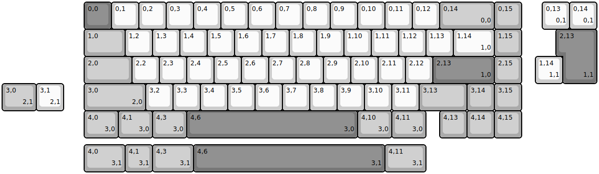{:loading="lazy"}

[Open in keyboard-layout-editor](http://www.keyboard-layout-editor.com/##@@_x:3&c=#777777;&=0,0&_c=#cccccc;&=0,1&=0,2&=0,3&=0,4&=0,5&=0,6&=0,7&=0,8&=0,9&=0,10&=0,11&=0,12&_c=#aaaaaa&w:2;&=0,14%0A%0A%0A0,0&=0,15;&@_x:3&w:1.5;&=1,0&_c=#cccccc;&=1,2&=1,3&=1,4&=1,5&=1,6&=1,7&=1,8&=1,9&=1,10&=1,11&=1,12&=1,13&_w:1.5;&=1,14%0A%0A%0A1,0&_c=#aaaaaa;&=1,15;&@_x:3&w:1.75;&=2,0&_c=#cccccc;&=2,2&=2,3&=2,4&=2,5&=2,6&=2,7&=2,8&=2,9&=2,10&=2,11&=2,12&_c=#777777&w:2.25;&=2,13%0A%0A%0A1,0&_c=#aaaaaa;&=2,15;&@_x:3.0&w:2.25;&=3,0%0A%0A%0A2,0&_c=#cccccc;&=3,2&=3,3&=3,4&=3,5&=3,6&=3,7&=3,8&=3,9&=3,10&=3,11&_c=#aaaaaa&w:1.75;&=3,13&=3,14&=3,15;&@_x:3&w:1.25;&=4,0%0A%0A%0A3,0&_w:1.25;&=4,1%0A%0A%0A3,0&_w:1.25;&=4,3%0A%0A%0A3,0&_c=#777777&w:6.25;&=4,6%0A%0A%0A3,0&_c=#aaaaaa&w:1.25;&=4,10%0A%0A%0A3,0&_w:1.25;&=4,11%0A%0A%0A3,0&_x:0.5;&=4,13&=4,14&=4,15;&@_x:19.75&y:-5&c=#cccccc;&=0,13%0A%0A%0A0,1&=0,14%0A%0A%0A0,1;&@_x:20.5&c=#777777&w:1.25&h:2&w2:1.5&h2:1&x2:-0.25;&=2,13%0A%0A%0A1,1;&@_x:19.5&c=#cccccc;&=1,14%0A%0A%0A1,1;&@_c=#aaaaaa&w:1.25;&=3,0%0A%0A%0A2,1&_c=#cccccc;&=3,1%0A%0A%0A2,1;&@_x:3&y:1.25&c=#aaaaaa&w:1.5;&=4,0%0A%0A%0A3,1&=4,1%0A%0A%0A3,1&_w:1.5;&=4,3%0A%0A%0A3,1&_c=#777777&w:7;&=4,6%0A%0A%0A3,1&_c=#aaaaaa&w:1.5;&=4,11%0A%0A%0A3,1)

## mechlovin/adelais

[README](output/mechlovin/adelais/README.md) - [layout](output/mechlovin/adelais/adelais-kle.json) - [PCB](output/mechlovin/adelais/adelais.kicad_pcb) - [PCB render](output/mechlovin/adelais/adelais-render.svg)

{:loading="lazy"}

[Open in keyboard-layout-editor](http://www.keyboard-layout-editor.com/##@@_x:0.5&y:0.89&c=#777777;&=1,14&_x:2.25&c=#cccccc;&=0,2;&@_x:1.75&y:-0.89;&=0,0&=0,1;&@_x:13.2&y:-0.9;&=0,11;&@_x:14.2&y:-0.85;&=0,12&_c=#aaaaaa;&=0,13%0A%0A%0A0,0&=0,14%0A%0A%0A0,0;&@_x:0.25&y:-0.36;&=2,14;&@_x:1.5&y:-0.89&w:1.5;&=1,0&_c=#cccccc;&=1,1;&@_x:12.95&y:-0.9;&=1,10;&@_x:13.95&y:-0.85;&=1,11&=1,12&_c=#aaaaaa&w:1.5;&=1,13;&@_y:-0.36;&=3,14;&@_x:1.25&y:-0.89&w:1.75;&=2,0&_c=#cccccc;&=2,1;&@_x:13.4&y:-0.75;&=2,10&=2,11&_c=#777777&w:2.25;&=2,13;&@_x:1&y:-0.25&c=#aaaaaa&w:2.25;&=3,0&_c=#cccccc;&=3,2;&@_x:13.25&y:-0.75;&=3,11&=4,13&_c=#aaaaaa&w:1.75;&=3,12%0A%0A%0A1,0;&@_x:1&y:-0.25&w:1.5;&=4,0;&@_x:16&y:-0.75&w:1.5;&=4,14;&@_rx:2.25&ry:0.75&x:14.75&y:3.5;&=3,13%0A%0A%0A1,0;&@_r:12&rx:0&ry:0&x:5.1&c=#cccccc;&=0,3&=0,4&=0,5&=0,6;&@_x:4.55;&=1,2&=1,3&=1,4&=1,5;&@_x:4.75;&=2,2&=2,3&=2,4&=2,5;&@_x:5.22;&=3,3&=3,4&=3,5&=3,6;&@_x:6.5&c=#777777&w:2;&=4,4%0A%0A%0A2,0&_c=#aaaaaa&w:1.25;&=4,6%0A%0A%0A2,0;&@_x:5&y:-0.9&w:1.5;&=4,2;&@_r:-12&x:8.5&y:-1.35&c=#cccccc;&=0,7&=0,8&=0,9&=0,10;&@_x:8;&=1,6&=1,7&=1,8&=1,9;&@_x:8.25;&=2,6&=2,7&=2,8&=2,9;&@_x:7.75;&=3,7&=3,8&=3,9&=3,10;&@_x:7.75&c=#777777&w:2.75;&=4,8;&@_x:10.5&y:-0.85&c=#aaaaaa&w:1.5;&=4,10;&@_r:0&x:15.2&y:-8.9&w:2;&=0,13%0A%0A%0A0,1;&@_rx:0.75&x:14.5&y:6.75&w:2.75;&=3,12%0A%0A%0A1,1;&@_r:12&rx:0&x:6.5&y:5.35&c=#777777&w:2.25;&=4,4%0A%0A%0A2,1&_c=#aaaaaa;&=4,6%0A%0A%0A2,1)

## mechlovin/adelais/adelais_en_ciel

[README](output/mechlovin/adelais/README.md) - [layout](output/mechlovin/adelais/adelais_en_ciel-kle.json) - [PCB](output/mechlovin/adelais/adelais_en_ciel.kicad_pcb) - [PCB render](output/mechlovin/adelais/adelais_en_ciel-render.svg)

{:loading="lazy"}

[Open in keyboard-layout-editor](http://www.keyboard-layout-editor.com/##@@_x:0.5&y:0.89&c=#777777;&=1,14&_x:2.25&c=#cccccc;&=0,2;&@_x:1.75&y:-0.89;&=0,0&=0,1;&@_x:13.2&y:-0.9;&=0,11;&@_x:14.2&y:-0.85;&=0,12&_c=#aaaaaa;&=0,13%0A%0A%0A0,0&=0,14%0A%0A%0A0,0;&@_x:0.25&y:-0.36;&=2,14;&@_x:1.5&y:-0.89&w:1.5;&=1,0&_c=#cccccc;&=1,1;&@_x:12.95&y:-0.9;&=1,10;&@_x:13.95&y:-0.85;&=1,11&=1,12&_c=#aaaaaa&w:1.5;&=1,13;&@_y:-0.36;&=3,14;&@_x:1.25&y:-0.89&w:1.75;&=2,0&_c=#cccccc;&=2,1;&@_x:13.4&y:-0.75;&=2,10&=2,11&_c=#777777&w:2.25;&=2,13;&@_x:1&y:-0.25&c=#aaaaaa&w:2.25;&=3,0&_c=#cccccc;&=3,2;&@_x:13.25&y:-0.75;&=3,11&=4,13&_c=#aaaaaa&w:1.75;&=3,12%0A%0A%0A1,0;&@_x:1&y:-0.25&w:1.5;&=4,0;&@_x:16&y:-0.75&w:1.5;&=4,14;&@_rx:2.25&ry:0.75&x:14.75&y:3.5;&=3,13%0A%0A%0A1,0;&@_r:12&rx:0&ry:0&x:5.1&c=#cccccc;&=0,3&=0,4&=0,5&=0,6;&@_x:4.55;&=1,2&=1,3&=1,4&=1,5;&@_x:4.75;&=2,2&=2,3&=2,4&=2,5;&@_x:5.22;&=3,3&=3,4&=3,5&=3,6;&@_x:6.5&c=#777777&w:2;&=4,4%0A%0A%0A2,0&_c=#aaaaaa&w:1.25;&=4,6%0A%0A%0A2,0;&@_x:5&y:-0.9&w:1.5;&=4,2;&@_r:-12&x:8.5&y:-1.35&c=#cccccc;&=0,7&=0,8&=0,9&=0,10;&@_x:8;&=1,6&=1,7&=1,8&=1,9;&@_x:8.25;&=2,6&=2,7&=2,8&=2,9;&@_x:7.75;&=3,7&=3,8&=3,9&=3,10;&@_x:7.75&c=#777777&w:2.75;&=4,8;&@_x:10.5&y:-0.85&c=#aaaaaa&w:1.5;&=4,10;&@_r:0&x:15.2&y:-8.9&w:2;&=0,13%0A%0A%0A0,1;&@_rx:0.75&x:14.5&y:6.75&w:2.75;&=3,12%0A%0A%0A1,1;&@_r:12&rx:0&x:6.5&y:5.35&c=#777777&w:2.25;&=4,4%0A%0A%0A2,1&_c=#aaaaaa;&=4,6%0A%0A%0A2,1)

## mechlovin/adelais/adelais_en_ciel-rev2

[README](output/mechlovin/adelais/README.md) - [layout](output/mechlovin/adelais/adelais_en_ciel-rev2-kle.json) - [PCB](output/mechlovin/adelais/adelais_en_ciel-rev2.kicad_pcb) - [PCB render](output/mechlovin/adelais/adelais_en_ciel-rev2-render.svg)

{:loading="lazy"}

[Open in keyboard-layout-editor](http://www.keyboard-layout-editor.com/##@@_x:0.5&y:0.89&c=#777777;&=1,14&_x:2.25&c=#cccccc;&=0,2;&@_x:1.75&y:-0.89;&=0,0&=0,1;&@_x:13.2&y:-0.9;&=0,11;&@_x:14.2&y:-0.85;&=0,12&_c=#aaaaaa;&=0,13%0A%0A%0A0,0&=0,14%0A%0A%0A0,0;&@_x:0.25&y:-0.36;&=2,14;&@_x:1.5&y:-0.89&w:1.5;&=1,0&_c=#cccccc;&=1,1;&@_x:12.95&y:-0.9;&=1,10;&@_x:13.95&y:-0.85;&=1,11&=1,12&_c=#aaaaaa&w:1.5;&=1,13;&@_y:-0.36;&=3,14;&@_x:1.25&y:-0.89&w:1.75;&=2,0&_c=#cccccc;&=2,1;&@_x:13.4&y:-0.75;&=2,10&=2,11&_c=#777777&w:2.25;&=2,13;&@_x:1&y:-0.25&c=#aaaaaa&w:2.25;&=3,0&_c=#cccccc;&=3,2;&@_x:13.25&y:-0.75;&=3,11&=4,13&_c=#aaaaaa&w:1.75;&=3,12%0A%0A%0A1,0;&@_x:1&y:-0.25&w:1.5;&=4,0;&@_x:16&y:-0.75&w:1.5;&=4,14;&@_rx:2.25&ry:0.75&x:14.75&y:3.5;&=3,13%0A%0A%0A1,0;&@_r:12&rx:0&ry:0&x:5.1&c=#cccccc;&=0,3&=0,4&=0,5&=0,6;&@_x:4.55;&=1,2&=1,3&=1,4&=1,5;&@_x:4.75;&=2,2&=2,3&=2,4&=2,5;&@_x:5.22;&=3,3&=3,4&=3,5&=3,6;&@_x:6.5&c=#777777&w:2;&=4,4%0A%0A%0A2,0&_c=#aaaaaa&w:1.25;&=4,6%0A%0A%0A2,0;&@_x:5&y:-0.9&w:1.5;&=4,2;&@_r:-12&x:8.5&y:-1.35&c=#cccccc;&=0,7&=0,8&=0,9&=0,10;&@_x:8;&=1,6&=1,7&=1,8&=1,9;&@_x:8.25;&=2,6&=2,7&=2,8&=2,9;&@_x:7.75;&=3,7&=3,8&=3,9&=3,10;&@_x:7.75&c=#777777&w:2.75;&=4,8;&@_x:10.5&y:-0.85&c=#aaaaaa&w:1.5;&=4,10;&@_r:0&x:15.2&y:-8.9&w:2;&=0,13%0A%0A%0A0,1;&@_rx:0.75&x:14.5&y:6.75&w:2.75;&=3,12%0A%0A%0A1,1;&@_r:12&rx:0&x:6.5&y:5.35&c=#777777&w:2.25;&=4,4%0A%0A%0A2,1&_c=#aaaaaa;&=4,6%0A%0A%0A2,1)

## mechlovin/adelais/adelais_en_ciel-rev3

[README](output/mechlovin/adelais/README.md) - [layout](output/mechlovin/adelais/adelais_en_ciel-rev3-kle.json) - [PCB](output/mechlovin/adelais/adelais_en_ciel-rev3.kicad_pcb) - [PCB render](output/mechlovin/adelais/adelais_en_ciel-rev3-render.svg)

{:loading="lazy"}

[Open in keyboard-layout-editor](http://www.keyboard-layout-editor.com/##@@_x:0.55&y:1.15&c=#777777;&=3,1;&@_x:3.7&y:-0.95&c=#cccccc;&=0,2&_x:8.45;&=0,11;&@_x:1.7&y:-0.95;&=0,0&=0,1&_x:10.45;&=0,12&_c=#aaaaaa;&=0,13%0A%0A%0A0,0&=0,14%0A%0A%0A0,0;&@_x:0.35&y:-0.1;&=4,1;&@_x:13&y:-0.95&c=#cccccc;&=1,10;&@_x:1.5&y:-0.95&c=#aaaaaa&w:1.5;&=1,0&_c=#cccccc;&=1,1&_x:10.0;&=1,11&=1,12&_c=#aaaaaa&w:1.5;&=1,13;&@_x:0.15&y:-0.1;&=4,3;&@_x:13.4&y:-0.9&c=#cccccc;&=2,10&=2,11&_c=#777777&w:2.25;&=2,13&_x:-16.35&c=#aaaaaa&w:1.75;&=2,0&_c=#cccccc;&=2,1;&@_x:1.05&c=#aaaaaa&w:2.25;&=3,0&_c=#cccccc;&=3,2&_x:8.8;&=3,11&=3,12&_c=#aaaaaa&w:1.75;&=3,13%0A%0A%0A1,0&=3,14%0A%0A%0A1,0;&@_x:1.05&w:1.5;&=4,0&_x:13.45&w:1.5;&=4,14;&@_r:12&x:5.05&y:-6.0&c=#cccccc;&=0,3&=0,4&=0,5&=0,6;&@_x:4.6;&=1,2&=1,3&=1,4&=1,5;&@_x:4.85;&=2,2&=2,3&=2,4&=2,5;&@_x:5.3;&=3,3&=3,4&=3,5&=3,6;&@_x:6.6&c=#777777&w:2;&=4,4%0A%0A%0A2,0&_c=#aaaaaa&w:1.25;&=4,6%0A%0A%0A2,0;&@_x:5.05&y:-0.95&w:1.5;&=4,2;&@_r:-12&x:8.45&y:-1.45&c=#cccccc;&=0,7&=0,8&=0,9&=0,10;&@_x:8.05;&=1,6&=1,7&=1,8&=1,9;&@_x:8.2;&=2,6&=2,7&=2,8&=2,9;&@_x:7.75;&=3,7&=3,8&=3,9&=3,10;&@_x:7.75&c=#777777&w:2.75;&=4,8;&@_x:10.55&y:-0.95&c=#aaaaaa&w:1.5;&=4,10;&@_r:0&x:15.15&y:-8.75&w:2;&=0,13%0A%0A%0A0,1;&@_x:18.15&y:3.1&w:2.75;&=3,13%0A%0A%0A1,1;&@_r:12&x:6.5&y:0.3&c=#777777&w:2.25;&=4,4%0A%0A%0A2,1&_c=#aaaaaa;&=4,6%0A%0A%0A2,1)

## mechlovin/adelais/adelais_rev3

[README](output/mechlovin/adelais/README.md) - [layout](output/mechlovin/adelais/adelais_rev3-kle.json) - [PCB](output/mechlovin/adelais/adelais_rev3.kicad_pcb) - [PCB render](output/mechlovin/adelais/adelais_rev3-render.svg)

{:loading="lazy"}

[Open in keyboard-layout-editor](http://www.keyboard-layout-editor.com/##@@_x:0.5&y:0.89&c=#777777;&=1,14&_x:2.25&c=#cccccc;&=0,2;&@_x:1.75&y:-0.89;&=0,0&=0,1;&@_x:13.2&y:-0.9;&=0,11;&@_x:14.2&y:-0.85;&=0,12&_c=#aaaaaa;&=0,13%0A%0A%0A0,0&=0,14%0A%0A%0A0,0;&@_x:0.25&y:-0.36;&=2,14;&@_x:1.5&y:-0.89&w:1.5;&=1,0&_c=#cccccc;&=1,1;&@_x:12.95&y:-0.9;&=1,10;&@_x:13.95&y:-0.85;&=1,11&=1,12&_c=#aaaaaa&w:1.5;&=1,13;&@_y:-0.36;&=3,14;&@_x:1.25&y:-0.89&w:1.75;&=2,0&_c=#cccccc;&=2,1;&@_x:13.4&y:-0.75;&=2,10&=2,11&_c=#777777&w:2.25;&=2,13;&@_x:1&y:-0.25&c=#aaaaaa&w:2.25;&=3,0&_c=#cccccc;&=3,2;&@_x:13.25&y:-0.75;&=3,11&=4,13&_c=#aaaaaa&w:1.75;&=3,12%0A%0A%0A1,0;&@_x:1&y:-0.25&w:1.5;&=4,0;&@_x:16&y:-0.75&w:1.5;&=4,14;&@_rx:2.25&ry:0.75&x:14.75&y:3.5;&=3,13%0A%0A%0A1,0;&@_r:12&rx:0&ry:0&x:5.1&c=#cccccc;&=0,3&=0,4&=0,5&=0,6;&@_x:4.55;&=1,2&=1,3&=1,4&=1,5;&@_x:4.75;&=2,2&=2,3&=2,4&=2,5;&@_x:5.22;&=3,3&=3,4&=3,5&=3,6;&@_x:6.5&c=#777777&w:2;&=4,4%0A%0A%0A2,0&_c=#aaaaaa&w:1.25;&=4,6%0A%0A%0A2,0;&@_x:5&y:-0.9&w:1.5;&=4,2;&@_r:-12&x:8.5&y:-1.35&c=#cccccc;&=0,7&=0,8&=0,9&=0,10;&@_x:8;&=1,6&=1,7&=1,8&=1,9;&@_x:8.25;&=2,6&=2,7&=2,8&=2,9;&@_x:7.75;&=3,7&=3,8&=3,9&=3,10;&@_x:7.75&c=#777777&w:2.75;&=4,8;&@_x:10.5&y:-0.85&c=#aaaaaa&w:1.5;&=4,10;&@_r:0&x:15.2&y:-8.9&w:2;&=0,13%0A%0A%0A0,1;&@_rx:0.75&x:14.5&y:6.75&w:2.75;&=3,12%0A%0A%0A1,1;&@_r:12&rx:0&x:6.5&y:5.35&c=#777777&w:2.25;&=4,4%0A%0A%0A2,1&_c=#aaaaaa;&=4,6%0A%0A%0A2,1)

## mechlovin/adelais/adelais_rev4

[README](output/mechlovin/adelais/README.md) - [layout](output/mechlovin/adelais/adelais_rev4-kle.json) - [PCB](output/mechlovin/adelais/adelais_rev4.kicad_pcb) - [PCB render](output/mechlovin/adelais/adelais_rev4-render.svg)

{:loading="lazy"}

[Open in keyboard-layout-editor](http://www.keyboard-layout-editor.com/##@@_x:0.5&y:0.89&c=#777777;&=1,14&_x:2.25&c=#cccccc;&=0,2;&@_x:1.75&y:-0.89;&=0,0&=0,1;&@_x:13.2&y:-0.9;&=0,11;&@_x:14.2&y:-0.85;&=0,12&_c=#aaaaaa;&=0,13%0A%0A%0A0,0&=0,14%0A%0A%0A0,0;&@_x:0.25&y:-0.36;&=2,14;&@_x:1.5&y:-0.89&w:1.5;&=1,0&_c=#cccccc;&=1,1;&@_x:12.95&y:-0.9;&=1,10;&@_x:13.95&y:-0.85;&=1,11&=1,12&_c=#aaaaaa&w:1.5;&=1,13;&@_y:-0.36;&=3,14;&@_x:1.25&y:-0.89&w:1.75;&=2,0&_c=#cccccc;&=2,1;&@_x:13.4&y:-0.75;&=2,10&=2,11&_c=#777777&w:2.25;&=2,13;&@_x:1&y:-0.25&c=#aaaaaa&w:2.25;&=3,0&_c=#cccccc;&=3,2;&@_x:13.25&y:-0.75;&=3,11&=4,13&_c=#aaaaaa&w:1.75;&=3,12%0A%0A%0A1,0;&@_x:1&y:-0.25&w:1.5;&=4,0;&@_x:16&y:-0.75&w:1.5;&=4,14;&@_rx:2.25&ry:0.75&x:14.75&y:3.5;&=3,13%0A%0A%0A1,0;&@_r:12&rx:0&ry:0&x:5.1&c=#cccccc;&=0,3&=0,4&=0,5&=0,6;&@_x:4.55;&=1,2&=1,3&=1,4&=1,5;&@_x:4.75;&=2,2&=2,3&=2,4&=2,5;&@_x:5.22;&=3,3&=3,4&=3,5&=3,6;&@_x:6.5&c=#777777&w:2;&=4,4%0A%0A%0A2,0&_c=#aaaaaa&w:1.25;&=4,6%0A%0A%0A2,0;&@_x:5&y:-0.9&w:1.5;&=4,2;&@_r:-12&x:8.5&y:-1.35&c=#cccccc;&=0,7&=0,8&=0,9&=0,10;&@_x:8;&=1,6&=1,7&=1,8&=1,9;&@_x:8.25;&=2,6&=2,7&=2,8&=2,9;&@_x:7.75;&=3,7&=3,8&=3,9&=3,10;&@_x:7.75&c=#777777&w:2.75;&=4,8;&@_x:10.5&y:-0.85&c=#aaaaaa&w:1.5;&=4,10;&@_r:0&x:15.2&y:-8.9&w:2;&=0,13%0A%0A%0A0,1;&@_rx:0.75&x:14.5&y:6.75&w:2.75;&=3,12%0A%0A%0A1,1;&@_r:12&rx:0&x:6.5&y:5.35&c=#777777&w:2.25;&=4,4%0A%0A%0A2,1&_c=#aaaaaa;&=4,6%0A%0A%0A2,1)

## mechlovin/delphine

[README](output/mechlovin/delphine/README.md) - [layout](output/mechlovin/delphine/delphine-kle.json) - [PCB](output/mechlovin/delphine/delphine.kicad_pcb) - [PCB render](output/mechlovin/delphine/delphine-render.svg)

{:loading="lazy"}

[Open in keyboard-layout-editor](http://www.keyboard-layout-editor.com/##@@=0,0&=0,1&=0,2&=0,3;&@_y:0.25;&=1,0&=1,1&=1,2&=1,3;&@=2,0&=2,1&=2,2&_h:2;&=2,3%0A%0A%0A0,0;&@=3,0&=3,1&=3,2;&@=4,0&=4,1&=4,2&_c=#777777&h:2;&=4,3%0A%0A%0A1,0;&@_c=#cccccc&w:2;&=5,1%0A%0A%0A2,0&=5,2;&@_x:4.25&y:-4.0;&=2,3%0A%0A%0A0,1;&@_x:4.25;&=3,3%0A%0A%0A0,1;&@_x:4.25;&=4,3%0A%0A%0A1,1;&@_x:4.25;&=5,3%0A%0A%0A1,1;&@_y:0.25;&=5,0%0A%0A%0A2,1&=5,1%0A%0A%0A2,1)

## mechlovin/delphine/delphine_rgb

[README](output/mechlovin/delphine/README.md) - [layout](output/mechlovin/delphine/delphine_rgb-kle.json) - [PCB](output/mechlovin/delphine/delphine_rgb.kicad_pcb) - [PCB render](output/mechlovin/delphine/delphine_rgb-render.svg)

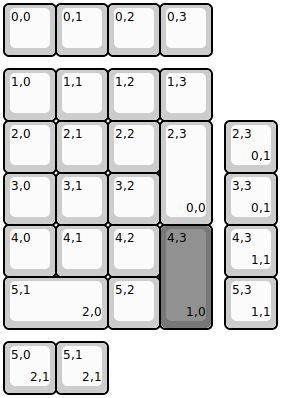{:loading="lazy"}

[Open in keyboard-layout-editor](http://www.keyboard-layout-editor.com/##@@=0,0&=0,1&=0,2&=0,3;&@_y:0.25;&=1,0&=1,1&=1,2&=1,3;&@=2,0&=2,1&=2,2&_h:2;&=2,3%0A%0A%0A0,0;&@=3,0&=3,1&=3,2;&@=4,0&=4,1&=4,2&_c=#777777&h:2;&=4,3%0A%0A%0A1,0;&@_c=#cccccc&w:2;&=5,1%0A%0A%0A2,0&=5,2;&@_x:4.25&y:-4.0;&=2,3%0A%0A%0A0,1;&@_x:4.25;&=3,3%0A%0A%0A0,1;&@_x:4.25;&=4,3%0A%0A%0A1,1;&@_x:4.25;&=5,3%0A%0A%0A1,1;&@_y:0.25;&=5,0%0A%0A%0A2,1&=5,1%0A%0A%0A2,1)

## mechlovin/hannah60rgb

[README](output/mechlovin/hannah60rgb/README.md) - [layout](output/mechlovin/hannah60rgb/hannah60rgb-kle.json) - [PCB](output/mechlovin/hannah60rgb/hannah60rgb.kicad_pcb) - [PCB render](output/mechlovin/hannah60rgb/hannah60rgb-render.svg)

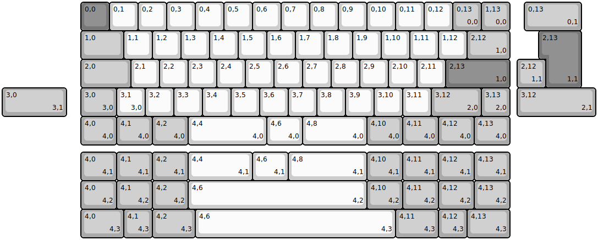{:loading="lazy"}

[Open in keyboard-layout-editor](http://www.keyboard-layout-editor.com/##@@_x:2.75&c=#777777;&=0,0&_c=#cccccc;&=0,1&=0,2&=0,3&=0,4&=0,5&=0,6&=0,7&=0,8&=0,9&=0,10&=0,11&=0,12&_c=#aaaaaa;&=0,13%0A%0A%0A0,0&=1,13%0A%0A%0A0,0;&@_x:2.75&w:1.5;&=1,0&_c=#cccccc;&=1,1&=1,2&=1,3&=1,4&=1,5&=1,6&=1,7&=1,8&=1,9&=1,10&=1,11&=1,12&_c=#aaaaaa&w:1.5;&=2,12%0A%0A%0A1,0;&@_x:2.75&w:1.75;&=2,0&_c=#cccccc;&=2,1&=2,2&=2,3&=2,4&=2,5&=2,6&=2,7&=2,8&=2,9&=2,10&=2,11&_c=#777777&w:2.25;&=2,13%0A%0A%0A1,0;&@_x:2.75&c=#aaaaaa&w:1.25;&=3,0%0A%0A%0A3,0&_c=#cccccc;&=3,1%0A%0A%0A3,0&=3,2&=3,3&=3,4&=3,5&=3,6&=3,7&=3,8&=3,9&=3,10&=3,11&_c=#aaaaaa&w:1.75;&=3,12%0A%0A%0A2,0&=3,13%0A%0A%0A2,0;&@_x:2.75&w:1.25;&=4,0%0A%0A%0A4,0&_w:1.25;&=4,1%0A%0A%0A4,0&_w:1.25;&=4,2%0A%0A%0A4,0&_c=#cccccc&w:2.75;&=4,4%0A%0A%0A4,0&_w:1.25;&=4,6%0A%0A%0A4,0&_w:2.25;&=4,8%0A%0A%0A4,0&_c=#aaaaaa&w:1.25;&=4,10%0A%0A%0A4,0&_w:1.25;&=4,11%0A%0A%0A4,0&_w:1.25;&=4,12%0A%0A%0A4,0&_w:1.25;&=4,13%0A%0A%0A4,0;&@_x:18.25&y:-5&w:2;&=0,13%0A%0A%0A0,1;&@_x:19.0&c=#777777&w:1.25&h:2&w2:1.5&h2:1&x2:-0.25;&=2,13%0A%0A%0A1,1;&@_x:18.0&c=#aaaaaa;&=2,12%0A%0A%0A1,1;&@_w:2.25;&=3,0%0A%0A%0A3,1&_x:15.75&w:2.75;&=3,12%0A%0A%0A2,1;&@_x:2.75&y:1.25&w:1.25;&=4,0%0A%0A%0A4,1&_w:1.25;&=4,1%0A%0A%0A4,1&_w:1.25;&=4,2%0A%0A%0A4,1&_c=#cccccc&w:2.25;&=4,4%0A%0A%0A4,1&_w:1.25;&=4,6%0A%0A%0A4,1&_w:2.75;&=4,8%0A%0A%0A4,1&_c=#aaaaaa&w:1.25;&=4,10%0A%0A%0A4,1&_w:1.25;&=4,11%0A%0A%0A4,1&_w:1.25;&=4,12%0A%0A%0A4,1&_w:1.25;&=4,13%0A%0A%0A4,1;&@_x:2.75&w:1.25;&=4,0%0A%0A%0A4,2&_w:1.25;&=4,1%0A%0A%0A4,2&_w:1.25;&=4,2%0A%0A%0A4,2&_c=#cccccc&w:6.25;&=4,6%0A%0A%0A4,2&_c=#aaaaaa&w:1.25;&=4,10%0A%0A%0A4,2&_w:1.25;&=4,11%0A%0A%0A4,2&_w:1.25;&=4,12%0A%0A%0A4,2&_w:1.25;&=4,13%0A%0A%0A4,2;&@_x:2.75&w:1.5;&=4,0%0A%0A%0A4,3&=4,1%0A%0A%0A4,3&_w:1.5;&=4,2%0A%0A%0A4,3&_c=#cccccc&w:7;&=4,6%0A%0A%0A4,3&_c=#aaaaaa&w:1.5;&=4,11%0A%0A%0A4,3&=4,12%0A%0A%0A4,3&_w:1.5;&=4,13%0A%0A%0A4,3)

## mechlovin/hannah60rgb/hannah60rgb_rev2

[README](output/mechlovin/hannah60rgb/README.md) - [layout](output/mechlovin/hannah60rgb/hannah60rgb_rev2-kle.json) - [PCB](output/mechlovin/hannah60rgb/hannah60rgb_rev2.kicad_pcb) - [PCB render](output/mechlovin/hannah60rgb/hannah60rgb_rev2-render.svg)

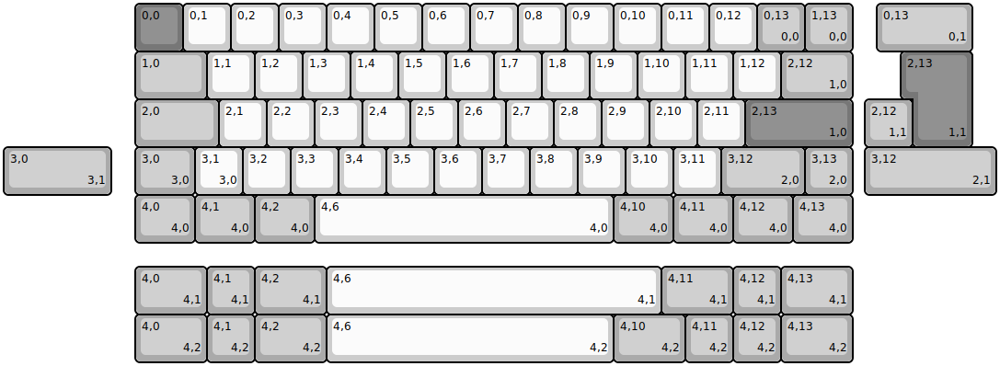{:loading="lazy"}

[Open in keyboard-layout-editor](http://www.keyboard-layout-editor.com/##@@_x:2.75&c=#777777;&=0,0&_c=#cccccc;&=0,1&=0,2&=0,3&=0,4&=0,5&=0,6&=0,7&=0,8&=0,9&=0,10&=0,11&=0,12&_c=#aaaaaa;&=0,13%0A%0A%0A0,0&=1,13%0A%0A%0A0,0;&@_x:2.75&w:1.5;&=1,0&_c=#cccccc;&=1,1&=1,2&=1,3&=1,4&=1,5&=1,6&=1,7&=1,8&=1,9&=1,10&=1,11&=1,12&_c=#aaaaaa&w:1.5;&=2,12%0A%0A%0A1,0;&@_x:2.75&w:1.75;&=2,0&_c=#cccccc;&=2,1&=2,2&=2,3&=2,4&=2,5&=2,6&=2,7&=2,8&=2,9&=2,10&=2,11&_c=#777777&w:2.25;&=2,13%0A%0A%0A1,0;&@_x:2.75&c=#aaaaaa&w:1.25;&=3,0%0A%0A%0A3,0&_c=#cccccc;&=3,1%0A%0A%0A3,0&=3,2&=3,3&=3,4&=3,5&=3,6&=3,7&=3,8&=3,9&=3,10&=3,11&_c=#aaaaaa&w:1.75;&=3,12%0A%0A%0A2,0&=3,13%0A%0A%0A2,0;&@_x:2.75&w:1.25;&=4,0%0A%0A%0A4,0&_w:1.25;&=4,1%0A%0A%0A4,0&_w:1.25;&=4,2%0A%0A%0A4,0&_c=#cccccc&w:6.25;&=4,6%0A%0A%0A4,0&_c=#aaaaaa&w:1.25;&=4,10%0A%0A%0A4,0&_w:1.25;&=4,11%0A%0A%0A4,0&_w:1.25;&=4,12%0A%0A%0A4,0&_w:1.25;&=4,13%0A%0A%0A4,0;&@_x:18.25&y:-5&w:2;&=0,13%0A%0A%0A0,1;&@_x:19.0&c=#777777&w:1.25&h:2&w2:1.5&h2:1&x2:-0.25;&=2,13%0A%0A%0A1,1;&@_x:18.0&c=#aaaaaa;&=2,12%0A%0A%0A1,1;&@_w:2.25;&=3,0%0A%0A%0A3,1&_x:15.75&w:2.75;&=3,12%0A%0A%0A2,1;&@_x:2.75&y:1.5&w:1.5;&=4,0%0A%0A%0A4,1&=4,1%0A%0A%0A4,1&_w:1.5;&=4,2%0A%0A%0A4,1&_c=#cccccc&w:7;&=4,6%0A%0A%0A4,1&_c=#aaaaaa&w:1.5;&=4,11%0A%0A%0A4,1&=4,12%0A%0A%0A4,1&_w:1.5;&=4,13%0A%0A%0A4,1;&@_x:2.75&w:1.5;&=4,0%0A%0A%0A4,2&=4,1%0A%0A%0A4,2&_w:1.5;&=4,2%0A%0A%0A4,2&_c=#cccccc&w:6;&=4,6%0A%0A%0A4,2&_c=#aaaaaa&w:1.5;&=4,10%0A%0A%0A4,2&=4,11%0A%0A%0A4,2&=4,12%0A%0A%0A4,2&_w:1.5;&=4,13%0A%0A%0A4,2)

## mechlovin/hannah65

[README](output/mechlovin/hannah65/README.md) - [layout](output/mechlovin/hannah65/hannah65-kle.json) - [PCB](output/mechlovin/hannah65/hannah65.kicad_pcb) - [PCB render](output/mechlovin/hannah65/hannah65-render.svg)

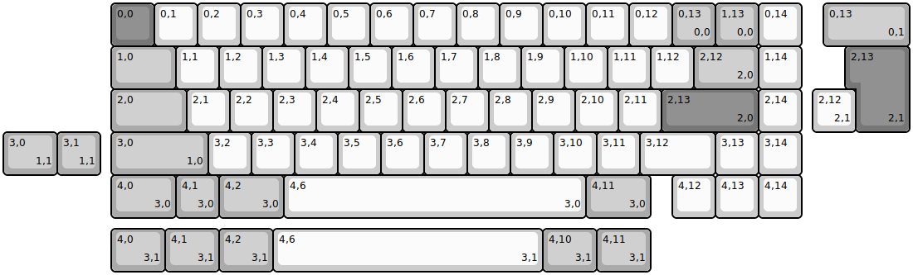{:loading="lazy"}

[Open in keyboard-layout-editor](http://www.keyboard-layout-editor.com/##@@_x:2.5&c=#777777;&=0,0&_c=#cccccc;&=0,1&=0,2&=0,3&=0,4&=0,5&=0,6&=0,7&=0,8&=0,9&=0,10&=0,11&=0,12&_c=#aaaaaa;&=0,13%0A%0A%0A0,0&=1,13%0A%0A%0A0,0&_c=#cccccc;&=0,14;&@_x:2.5&c=#aaaaaa&w:1.5;&=1,0&_c=#cccccc;&=1,1&=1,2&=1,3&=1,4&=1,5&=1,6&=1,7&=1,8&=1,9&=1,10&=1,11&=1,12&_c=#aaaaaa&w:1.5;&=2,12%0A%0A%0A2,0&_c=#cccccc;&=1,14;&@_x:2.5&c=#aaaaaa&w:1.75;&=2,0&_c=#cccccc;&=2,1&=2,2&=2,3&=2,4&=2,5&=2,6&=2,7&=2,8&=2,9&=2,10&=2,11&_c=#777777&w:2.25;&=2,13%0A%0A%0A2,0&_c=#cccccc;&=2,14;&@_x:2.5&c=#aaaaaa&w:2.25;&=3,0%0A%0A%0A1,0&_c=#cccccc;&=3,2&=3,3&=3,4&=3,5&=3,6&=3,7&=3,8&=3,9&=3,10&=3,11&_w:1.75;&=3,12&=3,13&=3,14;&@_x:2.5&c=#aaaaaa&w:1.5;&=4,0%0A%0A%0A3,0&=4,1%0A%0A%0A3,0&_w:1.5;&=4,2%0A%0A%0A3,0&_c=#cccccc&w:7;&=4,6%0A%0A%0A3,0&_c=#aaaaaa&w:1.5;&=4,11%0A%0A%0A3,0&_x:0.5&c=#cccccc;&=4,12&=4,13&=4,14;&@_x:19.0&y:-5&c=#aaaaaa&w:2;&=0,13%0A%0A%0A0,1;&@_x:19.75&c=#777777&w:1.25&h:2&w2:1.5&h2:1&x2:-0.25;&=2,13%0A%0A%0A2,1;&@_x:18.75&c=#cccccc;&=2,12%0A%0A%0A2,1;&@_c=#aaaaaa&w:1.25;&=3,0%0A%0A%0A1,1&=3,1%0A%0A%0A1,1;&@_x:2.5&y:1.25&w:1.25;&=4,0%0A%0A%0A3,1&_w:1.25;&=4,1%0A%0A%0A3,1&_w:1.25;&=4,2%0A%0A%0A3,1&_c=#cccccc&w:6.25;&=4,6%0A%0A%0A3,1&_c=#aaaaaa&w:1.25;&=4,10%0A%0A%0A3,1&_w:1.25;&=4,11%0A%0A%0A3,1)

## mechlovin/hannah65/hannah65-mechlovin9

[README](output/mechlovin/hannah65/README.md) - [layout](output/mechlovin/hannah65/hannah65-mechlovin9-kle.json) - [PCB](output/mechlovin/hannah65/hannah65-mechlovin9.kicad_pcb) - [PCB render](output/mechlovin/hannah65/hannah65-mechlovin9-render.svg)

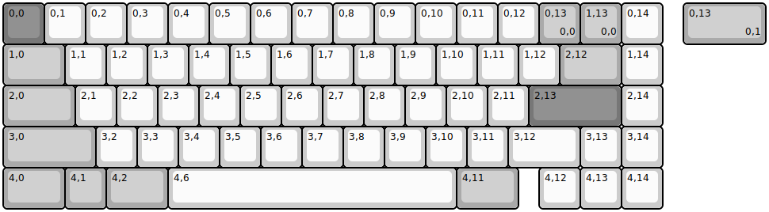{:loading="lazy"}

[Open in keyboard-layout-editor](http://www.keyboard-layout-editor.com/##@@_c=#777777;&=0,0&_c=#cccccc;&=0,1&=0,2&=0,3&=0,4&=0,5&=0,6&=0,7&=0,8&=0,9&=0,10&=0,11&=0,12&_c=#aaaaaa;&=0,13%0A%0A%0A0,0&=1,13%0A%0A%0A0,0&_c=#cccccc;&=0,14;&@_c=#aaaaaa&w:1.5;&=1,0&_c=#cccccc;&=1,1&=1,2&=1,3&=1,4&=1,5&=1,6&=1,7&=1,8&=1,9&=1,10&=1,11&=1,12&_c=#aaaaaa&w:1.5;&=2,12&_c=#cccccc;&=1,14;&@_c=#aaaaaa&w:1.75;&=2,0&_c=#cccccc;&=2,1&=2,2&=2,3&=2,4&=2,5&=2,6&=2,7&=2,8&=2,9&=2,10&=2,11&_c=#777777&w:2.25;&=2,13&_c=#cccccc;&=2,14;&@_c=#aaaaaa&w:2.25;&=3,0&_c=#cccccc;&=3,2&=3,3&=3,4&=3,5&=3,6&=3,7&=3,8&=3,9&=3,10&=3,11&_w:1.75;&=3,12&=3,13&=3,14;&@_c=#aaaaaa&w:1.5;&=4,0&=4,1&_w:1.5;&=4,2&_c=#cccccc&w:7;&=4,6&_c=#aaaaaa&w:1.5;&=4,11&_x:0.5&c=#cccccc;&=4,12&=4,13&=4,14;&@_x:16.5&y:-5&c=#aaaaaa&w:2;&=0,13%0A%0A%0A0,1)

## mechlovin/hannah910/hannah910-rev1

[README](output/mechlovin/hannah910/README.md) - [layout](output/mechlovin/hannah910/hannah910-rev1-kle.json) - [PCB](output/mechlovin/hannah910/hannah910-rev1.kicad_pcb) - [PCB render](output/mechlovin/hannah910/hannah910-rev1-render.svg)

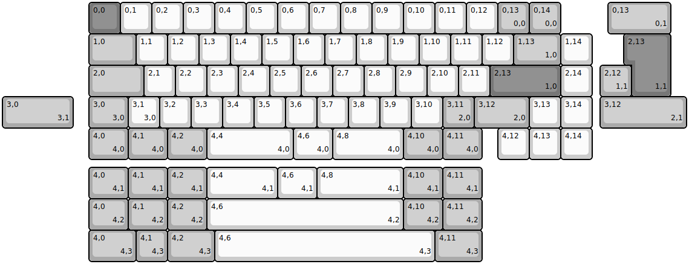{:loading="lazy"}

[Open in keyboard-layout-editor](http://www.keyboard-layout-editor.com/##@@_x:2.75&c=#777777;&=0,0&_c=#cccccc;&=0,1&=0,2&=0,3&=0,4&=0,5&=0,6&=0,7&=0,8&=0,9&=0,10&=0,11&=0,12&_c=#aaaaaa;&=0,13%0A%0A%0A0,0&=0,14%0A%0A%0A0,0;&@_x:2.75&w:1.5;&=1,0&_c=#cccccc;&=1,1&=1,2&=1,3&=1,4&=1,5&=1,6&=1,7&=1,8&=1,9&=1,10&=1,11&=1,12&_c=#aaaaaa&w:1.5;&=1,13%0A%0A%0A1,0&_c=#cccccc;&=1,14;&@_x:2.75&c=#aaaaaa&w:1.75;&=2,0&_c=#cccccc;&=2,1&=2,2&=2,3&=2,4&=2,5&=2,6&=2,7&=2,8&=2,9&=2,10&=2,11&_c=#777777&w:2.25;&=2,13%0A%0A%0A1,0&_c=#cccccc;&=2,14;&@_x:2.75&c=#aaaaaa&w:1.25;&=3,0%0A%0A%0A3,0&_c=#cccccc;&=3,1%0A%0A%0A3,0&=3,2&=3,3&=3,4&=3,5&=3,6&=3,7&=3,8&=3,9&=3,10&_c=#aaaaaa;&=3,11%0A%0A%0A2,0&_w:1.75;&=3,12%0A%0A%0A2,0&_c=#cccccc;&=3,13&=3,14;&@_x:2.75&c=#aaaaaa&w:1.25;&=4,0%0A%0A%0A4,0&_w:1.25;&=4,1%0A%0A%0A4,0&_w:1.25;&=4,2%0A%0A%0A4,0&_c=#cccccc&w:2.75;&=4,4%0A%0A%0A4,0&_w:1.25;&=4,6%0A%0A%0A4,0&_w:2.25;&=4,8%0A%0A%0A4,0&_c=#aaaaaa&w:1.25;&=4,10%0A%0A%0A4,0&_w:1.25;&=4,11%0A%0A%0A4,0&_x:0.5&c=#cccccc;&=4,12&=4,13&=4,14;&@_x:19.25&y:-5&c=#aaaaaa&w:2;&=0,13%0A%0A%0A0,1;&@_x:20.0&c=#777777&w:1.25&h:2&w2:1.5&h2:1&x2:-0.25;&=2,13%0A%0A%0A1,1;&@_x:19.0&c=#aaaaaa;&=2,12%0A%0A%0A1,1;&@_w:2.25;&=3,0%0A%0A%0A3,1&_x:16.75&w:2.75;&=3,12%0A%0A%0A2,1;&@_x:2.75&y:1.25&w:1.25;&=4,0%0A%0A%0A4,1&_w:1.25;&=4,1%0A%0A%0A4,1&_w:1.25;&=4,2%0A%0A%0A4,1&_c=#cccccc&w:2.25;&=4,4%0A%0A%0A4,1&_w:1.25;&=4,6%0A%0A%0A4,1&_w:2.75;&=4,8%0A%0A%0A4,1&_c=#aaaaaa&w:1.25;&=4,10%0A%0A%0A4,1&_w:1.25;&=4,11%0A%0A%0A4,1;&@_x:2.75&w:1.25;&=4,0%0A%0A%0A4,2&_w:1.25;&=4,1%0A%0A%0A4,2&_w:1.25;&=4,2%0A%0A%0A4,2&_c=#cccccc&w:6.25;&=4,6%0A%0A%0A4,2&_c=#aaaaaa&w:1.25;&=4,10%0A%0A%0A4,2&_w:1.25;&=4,11%0A%0A%0A4,2;&@_x:2.75&w:1.5;&=4,0%0A%0A%0A4,3&=4,1%0A%0A%0A4,3&_w:1.5;&=4,2%0A%0A%0A4,3&_c=#cccccc&w:7;&=4,6%0A%0A%0A4,3&_c=#aaaaaa&w:1.5;&=4,11%0A%0A%0A4,3)

## mechlovin/hannah910/hannah910-rev2

[README](output/mechlovin/hannah910/README.md) - [layout](output/mechlovin/hannah910/hannah910-rev2-kle.json) - [PCB](output/mechlovin/hannah910/hannah910-rev2.kicad_pcb) - [PCB render](output/mechlovin/hannah910/hannah910-rev2-render.svg)

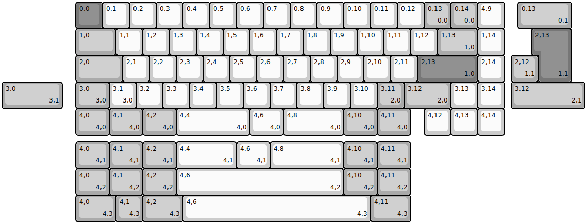{:loading="lazy"}

[Open in keyboard-layout-editor](http://www.keyboard-layout-editor.com/##@@_x:2.75&c=#777777;&=0,0&_c=#cccccc;&=0,1&=0,2&=0,3&=0,4&=0,5&=0,6&=0,7&=0,8&=0,9&=0,10&=0,11&=0,12&_c=#aaaaaa;&=0,13%0A%0A%0A0,0&=0,14%0A%0A%0A0,0&_c=#cccccc;&=4,9;&@_x:2.75&c=#aaaaaa&w:1.5;&=1,0&_c=#cccccc;&=1,1&=1,2&=1,3&=1,4&=1,5&=1,6&=1,7&=1,8&=1,9&=1,10&=1,11&=1,12&_c=#aaaaaa&w:1.5;&=1,13%0A%0A%0A1,0&_c=#cccccc;&=1,14;&@_x:2.75&c=#aaaaaa&w:1.75;&=2,0&_c=#cccccc;&=2,1&=2,2&=2,3&=2,4&=2,5&=2,6&=2,7&=2,8&=2,9&=2,10&=2,11&_c=#777777&w:2.25;&=2,13%0A%0A%0A1,0&_c=#cccccc;&=2,14;&@_x:2.75&c=#aaaaaa&w:1.25;&=3,0%0A%0A%0A3,0&_c=#cccccc;&=3,1%0A%0A%0A3,0&=3,2&=3,3&=3,4&=3,5&=3,6&=3,7&=3,8&=3,9&=3,10&_c=#aaaaaa;&=3,11%0A%0A%0A2,0&_w:1.75;&=3,12%0A%0A%0A2,0&_c=#cccccc;&=3,13&=3,14;&@_x:2.75&c=#aaaaaa&w:1.25;&=4,0%0A%0A%0A4,0&_w:1.25;&=4,1%0A%0A%0A4,0&_w:1.25;&=4,2%0A%0A%0A4,0&_c=#cccccc&w:2.75;&=4,4%0A%0A%0A4,0&_w:1.25;&=4,6%0A%0A%0A4,0&_w:2.25;&=4,8%0A%0A%0A4,0&_c=#aaaaaa&w:1.25;&=4,10%0A%0A%0A4,0&_w:1.25;&=4,11%0A%0A%0A4,0&_x:0.5&c=#cccccc;&=4,12&=4,13&=4,14;&@_x:19.25&y:-5&c=#aaaaaa&w:2;&=0,13%0A%0A%0A0,1;&@_x:20.0&c=#777777&w:1.25&h:2&w2:1.5&h2:1&x2:-0.25;&=2,13%0A%0A%0A1,1;&@_x:19.0&c=#aaaaaa;&=2,12%0A%0A%0A1,1;&@_w:2.25;&=3,0%0A%0A%0A3,1&_x:16.75&w:2.75;&=3,12%0A%0A%0A2,1;&@_x:2.75&y:1.25&w:1.25;&=4,0%0A%0A%0A4,1&_w:1.25;&=4,1%0A%0A%0A4,1&_w:1.25;&=4,2%0A%0A%0A4,1&_c=#cccccc&w:2.25;&=4,4%0A%0A%0A4,1&_w:1.25;&=4,6%0A%0A%0A4,1&_w:2.75;&=4,8%0A%0A%0A4,1&_c=#aaaaaa&w:1.25;&=4,10%0A%0A%0A4,1&_w:1.25;&=4,11%0A%0A%0A4,1;&@_x:2.75&w:1.25;&=4,0%0A%0A%0A4,2&_w:1.25;&=4,1%0A%0A%0A4,2&_w:1.25;&=4,2%0A%0A%0A4,2&_c=#cccccc&w:6.25;&=4,6%0A%0A%0A4,2&_c=#aaaaaa&w:1.25;&=4,10%0A%0A%0A4,2&_w:1.25;&=4,11%0A%0A%0A4,2;&@_x:2.75&w:1.5;&=4,0%0A%0A%0A4,3&=4,1%0A%0A%0A4,3&_w:1.5;&=4,2%0A%0A%0A4,3&_c=#cccccc&w:7;&=4,6%0A%0A%0A4,3&_c=#aaaaaa&w:1.5;&=4,11%0A%0A%0A4,3)

## mechlovin/hannah910/hannah910-rev3

[README](output/mechlovin/hannah910/README.md) - [layout](output/mechlovin/hannah910/hannah910-rev3-kle.json) - [PCB](output/mechlovin/hannah910/hannah910-rev3.kicad_pcb) - [PCB render](output/mechlovin/hannah910/hannah910-rev3-render.svg)

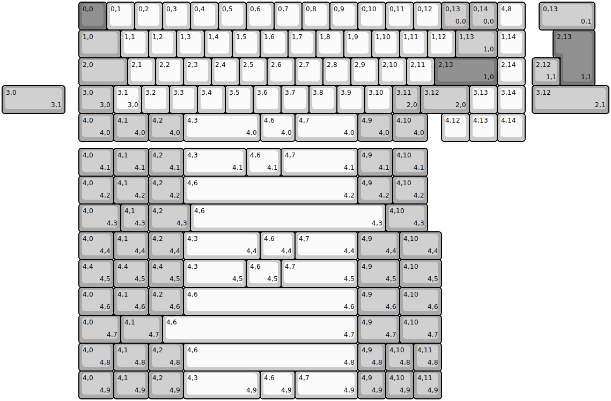{:loading="lazy"}

[Open in keyboard-layout-editor](http://www.keyboard-layout-editor.com/##@@_x:2.75&c=#777777;&=0,0&_c=#cccccc;&=0,1&=0,2&=0,3&=0,4&=0,5&=0,6&=0,7&=0,8&=0,9&=0,10&=0,11&=0,12&_c=#aaaaaa;&=0,13%0A%0A%0A0,0&=0,14%0A%0A%0A0,0&_c=#cccccc;&=4,8;&@_x:2.75&c=#aaaaaa&w:1.5;&=1,0&_c=#cccccc;&=1,1&=1,2&=1,3&=1,4&=1,5&=1,6&=1,7&=1,8&=1,9&=1,10&=1,11&=1,12&_c=#aaaaaa&w:1.5;&=1,13%0A%0A%0A1,0&_c=#cccccc;&=1,14;&@_x:2.75&c=#aaaaaa&w:1.75;&=2,0&_c=#cccccc;&=2,1&=2,2&=2,3&=2,4&=2,5&=2,6&=2,7&=2,8&=2,9&=2,10&=2,11&_c=#777777&w:2.25;&=2,13%0A%0A%0A1,0&_c=#cccccc;&=2,14;&@_x:2.75&c=#aaaaaa&w:1.25;&=3,0%0A%0A%0A3,0&_c=#cccccc;&=3,1%0A%0A%0A3,0&=3,2&=3,3&=3,4&=3,5&=3,6&=3,7&=3,8&=3,9&=3,10&_c=#aaaaaa;&=3,11%0A%0A%0A2,0&_w:1.75;&=3,12%0A%0A%0A2,0&_c=#cccccc;&=3,13&=3,14;&@_x:2.75&c=#aaaaaa&w:1.25;&=4,0%0A%0A%0A4,0&_w:1.25;&=4,1%0A%0A%0A4,0&_w:1.25;&=4,2%0A%0A%0A4,0&_c=#cccccc&w:2.75;&=4,3%0A%0A%0A4,0&_w:1.25;&=4,6%0A%0A%0A4,0&_w:2.25;&=4,7%0A%0A%0A4,0&_c=#aaaaaa&w:1.25;&=4,9%0A%0A%0A4,0&_w:1.25;&=4,10%0A%0A%0A4,0&_x:0.5&c=#cccccc;&=4,12&=4,13&=4,14;&@_x:19.25&y:-5&c=#aaaaaa&w:2;&=0,13%0A%0A%0A0,1;&@_x:20.0&c=#777777&w:1.25&h:2&w2:1.5&h2:1&x2:-0.25;&=2,13%0A%0A%0A1,1;&@_x:19.0&c=#aaaaaa;&=2,12%0A%0A%0A1,1;&@_w:2.25;&=3,0%0A%0A%0A3,1&_x:16.75&w:2.75;&=3,12%0A%0A%0A2,1;&@_x:2.75&y:1.25&w:1.25;&=4,0%0A%0A%0A4,1&_w:1.25;&=4,1%0A%0A%0A4,1&_w:1.25;&=4,2%0A%0A%0A4,1&_c=#cccccc&w:2.25;&=4,3%0A%0A%0A4,1&_w:1.25;&=4,6%0A%0A%0A4,1&_w:2.75;&=4,7%0A%0A%0A4,1&_c=#aaaaaa&w:1.25;&=4,9%0A%0A%0A4,1&_w:1.25;&=4,10%0A%0A%0A4,1;&@_x:2.75&w:1.25;&=4,0%0A%0A%0A4,2&_w:1.25;&=4,1%0A%0A%0A4,2&_w:1.25;&=4,2%0A%0A%0A4,2&_c=#cccccc&w:6.25;&=4,6%0A%0A%0A4,2&_c=#aaaaaa&w:1.25;&=4,9%0A%0A%0A4,2&_w:1.25;&=4,10%0A%0A%0A4,2;&@_x:2.75&w:1.5;&=4,0%0A%0A%0A4,3&=4,1%0A%0A%0A4,3&_w:1.5;&=4,2%0A%0A%0A4,3&_c=#cccccc&w:7;&=4,6%0A%0A%0A4,3&_c=#aaaaaa&w:1.5;&=4,10%0A%0A%0A4,3;&@_x:2.75&w:1.25;&=4,0%0A%0A%0A4,4&_w:1.25;&=4,1%0A%0A%0A4,4&_w:1.25;&=4,2%0A%0A%0A4,4&_c=#cccccc&w:2.75;&=4,3%0A%0A%0A4,4&_w:1.25;&=4,6%0A%0A%0A4,4&_w:2.25;&=4,7%0A%0A%0A4,4&_c=#aaaaaa&w:1.5;&=4,9%0A%0A%0A4,4&_w:1.5;&=4,10%0A%0A%0A4,4;&@_x:2.75&w:1.25;&=4,4%0A%0A%0A4,5&_w:1.25;&=4,4%0A%0A%0A4,5&_w:1.25;&=4,4%0A%0A%0A4,5&_c=#cccccc&w:2.25;&=4,3%0A%0A%0A4,5&_w:1.25;&=4,6%0A%0A%0A4,5&_w:2.75;&=4,7%0A%0A%0A4,5&_c=#aaaaaa&w:1.5;&=4,9%0A%0A%0A4,5&_w:1.5;&=4,10%0A%0A%0A4,5;&@_x:2.75&w:1.25;&=4,0%0A%0A%0A4,6&_w:1.25;&=4,1%0A%0A%0A4,6&_w:1.25;&=4,2%0A%0A%0A4,6&_c=#cccccc&w:6.25;&=4,6%0A%0A%0A4,6&_c=#aaaaaa&w:1.5;&=4,9%0A%0A%0A4,6&_w:1.5;&=4,10%0A%0A%0A4,6;&@_x:2.75&w:1.5;&=4,0%0A%0A%0A4,7&_w:1.5;&=4,1%0A%0A%0A4,7&_c=#cccccc&w:7;&=4,6%0A%0A%0A4,7&_c=#aaaaaa&w:1.5;&=4,9%0A%0A%0A4,7&_w:1.5;&=4,10%0A%0A%0A4,7;&@_x:2.75&w:1.25;&=4,0%0A%0A%0A4,8&_w:1.25;&=4,1%0A%0A%0A4,8&_w:1.25;&=4,2%0A%0A%0A4,8&_c=#cccccc&w:6.25;&=4,6%0A%0A%0A4,8&_c=#aaaaaa;&=4,9%0A%0A%0A4,8&=4,10%0A%0A%0A4,8&=4,11%0A%0A%0A4,8;&@_x:2.75&w:1.25;&=4,0%0A%0A%0A4,9&_w:1.25;&=4,1%0A%0A%0A4,9&_w:1.25;&=4,2%0A%0A%0A4,9&_c=#cccccc&w:2.75;&=4,3%0A%0A%0A4,9&_w:1.25;&=4,6%0A%0A%0A4,9&_w:2.25;&=4,7%0A%0A%0A4,9&_c=#aaaaaa;&=4,9%0A%0A%0A4,9&=4,10%0A%0A%0A4,9&=4,11%0A%0A%0A4,9)

## mechlovin/hexkb/hex4b

[README](output/mechlovin/hexkb/README.md) - [layout](output/mechlovin/hexkb/hex4b-kle.json) - [PCB](output/mechlovin/hexkb/hex4b.kicad_pcb) - [PCB render](output/mechlovin/hexkb/hex4b-render.svg)

{:loading="lazy"}

[Open in keyboard-layout-editor](http://www.keyboard-layout-editor.com/##@@=0,0&_x:0.5;&=0,1&=0,2&=0,3&=0,4&_x:0.5;&=0,6&=0,7&=0,8&=0,9&_x:0.5;&=0,10&=0,11&=0,12&=0,13&_x:0.5;&=0,14;&@=1,0&=1,1&=1,2&=1,3&=1,4&=1,5&=1,6&=1,7&=1,8&=1,9&=1,10&=1,11&=1,12&_w:2;&=1,13%0A%0A%0A0,0&=1,14;&@_w:1.5;&=2,0&=2,1&=2,2&=2,3&=2,4&=2,5&=2,6&=2,7&=2,8&=2,9&=2,10&=2,11&=2,12&_w:1.5;&=2,13&=2,14;&@_w:1.75;&=3,0&=3,1&=3,2&=3,3&=3,4&=3,5&=3,6&=3,7&=3,8&=3,9&=3,10&=3,11&_w:2.25;&=3,13&=3,14;&@_w:2.25;&=4,0&=4,2&=4,3&=4,4&=4,5&=4,6&=4,7&=4,8&=4,9&=4,10&=4,11&_w:1.75;&=4,12&=4,13&=4,14;&@_w:1.25;&=5,0%0A%0A%0A1,0&_w:1.25;&=5,1%0A%0A%0A1,0&_w:1.25;&=5,2%0A%0A%0A1,0&_w:6.25;&=5,6%0A%0A%0A1,0&_w:1.25;&=5,10%0A%0A%0A1,0&_w:1.25;&=5,11%0A%0A%0A1,0&_x:0.5;&=5,12&=5,13&=5,14;&@_x:16.25&y:-5;&=1,13%0A%0A%0A0,1&=3,12%0A%0A%0A0,1;&@_y:4.25&w:1.5;&=5,0%0A%0A%0A1,1&=5,1%0A%0A%0A1,1&_w:1.5;&=5,2%0A%0A%0A1,1&_w:7;&=5,6%0A%0A%0A1,1&_w:1.5;&=5,11%0A%0A%0A1,1)

## mechlovin/hexkb/hex6c

[README](output/mechlovin/hexkb/README.md) - [layout](output/mechlovin/hexkb/hex6c-kle.json) - [PCB](output/mechlovin/hexkb/hex6c.kicad_pcb) - [PCB render](output/mechlovin/hexkb/hex6c-render.svg)

{:loading="lazy"}

[Open in keyboard-layout-editor](http://www.keyboard-layout-editor.com/##@@_x:2.5&c=#aaaaaa;&=0,0&=0,1&=0,2&_c=#cccccc;&=0,3&_x:0.25&c=#777777;&=0,4&_x:0.25&c=#cccccc;&=0,5&=0,6&=0,7&=0,8&_x:0.25&c=#aaaaaa;&=0,9&=0,10&=0,11&=0,12&_x:0.25&c=#cccccc;&=0,13&=0,14&=0,15&=0,16&_x:0.25;&=0,17&_x:0.25&c=#aaaaaa;&=0,18&=0,19&=0,20;&@_x:2.5&y:0.25&c=#cccccc;&=1,0&=1,1&=1,2&=1,3&_x:0.25;&=1,4&=1,5&=1,6&=1,7&=1,8&=1,9&=1,10&=1,11&=1,12&=1,13&=1,14&=1,15&=1,16&_c=#aaaaaa&w:2;&=1,17%0A%0A%0A0,0&_x:0.25;&=1,18&=1,19&=1,20;&@_x:2.5&c=#cccccc;&=2,0%0A%0A%0A1,0&=2,1&=2,2&_c=#aaaaaa&h:2;&=3,3%0A%0A%0A2,0&_x:0.25&c=#cccccc&w:1.5;&=2,4&=2,5&=2,6&=2,7&=2,8&=2,9&=2,10&=2,11&=2,12&=2,13&=2,14&=2,15&=2,16&_w:1.5;&=3,16%0A%0A%0A3,0&_x:0.25&c=#aaaaaa;&=2,18&=2,19&=2,20;&@_x:2.5&c=#cccccc;&=3,0%0A%0A%0A1,0&=3,1&=3,2&_x:1.25&w:1.75;&=3,4&=3,5&=3,6&=3,7&=3,8&=3,9&=3,10&=3,11&=3,12&=3,13&=3,14&=3,15&_c=#777777&w:2.25;&=3,17%0A%0A%0A3,0;&@_x:2.5&c=#cccccc;&=4,0%0A%0A%0A4,0&=4,1%0A%0A%0A4,0&=4,2%0A%0A%0A5,0&_c=#777777&h:2;&=5,3%0A%0A%0A5,0&_x:0.25&c=#aaaaaa&w:2.25;&=4,4%0A%0A%0A6,0&_c=#cccccc;&=4,6&=4,7&=4,8&=4,9&=4,10&=4,11&=4,12&=4,13&=4,14&=4,15&_c=#aaaaaa&w:2.75;&=4,17%0A%0A%0A7,0&_x:1.25&c=#777777;&=4,19;&@_x:2.5&c=#aaaaaa&w:2;&=5,0%0A%0A%0A4,0&_c=#cccccc;&=5,2%0A%0A%0A5,0&_x:1.25&c=#aaaaaa&w:1.25;&=5,4%0A%0A%0A8,0&_w:1.25;&=5,5%0A%0A%0A8,0&_w:1.25;&=5,6%0A%0A%0A8,0&_w:6.25;&=5,10%0A%0A%0A8,0&_w:1.25;&=5,14%0A%0A%0A8,0&_w:1.25;&=5,15%0A%0A%0A8,0&_w:1.25;&=5,16%0A%0A%0A8,0&_w:1.25;&=5,17%0A%0A%0A8,0&_x:0.25&c=#777777;&=5,18&=5,19&=5,20;&@_x:26.0&y:-5.0&c=#aaaaaa;&=1,17%0A%0A%0A0,1&=2,17%0A%0A%0A0,1;&@_h:2;&=3,0%0A%0A%0A1,1&_x:0.25&c=#cccccc;&=2,3%0A%0A%0A2,1&_x:24.5&c=#777777&w:1.25&h:2&w2:1.5&h2:1&x2:-0.25;&=3,17%0A%0A%0A3,1;&@_x:1.25&c=#cccccc;&=3,3%0A%0A%0A2,1&_x:23.5;&=3,16%0A%0A%0A3,1;&@_c=#aaaaaa&w:1.25;&=4,4%0A%0A%0A6,1&=4,5%0A%0A%0A6,1&_x:23.0&w:1.75;&=4,17%0A%0A%0A7,1&=4,16%0A%0A%0A7,1;&@_x:2.5&y:1.25&h:2;&=5,0%0A%0A%0A4,1&_c=#cccccc;&=4,1%0A%0A%0A4,1&=4,2%0A%0A%0A5,1&=4,3%0A%0A%0A5,1&_x:0.25&c=#aaaaaa&w:1.5;&=5,4%0A%0A%0A8,1&=5,5%0A%0A%0A8,1&_w:1.5;&=5,6%0A%0A%0A8,1&_w:7;&=5,10%0A%0A%0A8,1&_w:1.5;&=5,15%0A%0A%0A8,1&=5,16%0A%0A%0A8,1&_w:1.5;&=5,17%0A%0A%0A8,1;&@_x:3.5&c=#cccccc;&=5,1%0A%0A%0A4,1&_c=#aaaaaa&w:2;&=5,3%0A%0A%0A5,1;&@_x:2.5&y:0.25&c=#cccccc;&=4,0%0A%0A%0A4,2&=4,1%0A%0A%0A4,2&=4,2%0A%0A%0A5,2&=4,3%0A%0A%0A5,2;&@_x:2.5;&=5,0%0A%0A%0A4,2&=5,1%0A%0A%0A4,2&=5,2%0A%0A%0A5,2&=5,3%0A%0A%0A5,2)

## mechlovin/infinity87

[README](output/mechlovin/infinity87/README.md) - [layout](output/mechlovin/infinity87/infinity87-kle.json) - [PCB](output/mechlovin/infinity87/infinity87.kicad_pcb) - [PCB render](output/mechlovin/infinity87/infinity87-render.svg)

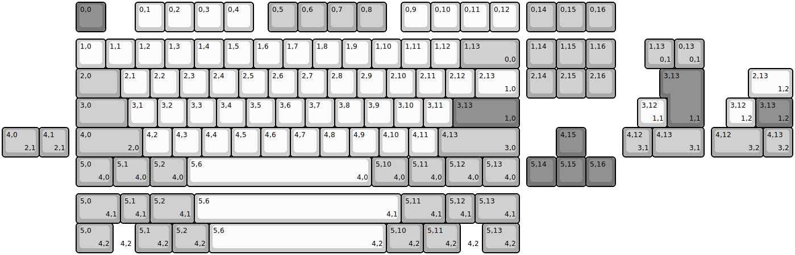{:loading="lazy"}

[Open in keyboard-layout-editor](http://www.keyboard-layout-editor.com/##@@_x:2.5&c=#777777;&=0,0&_x:1.0&c=#cccccc;&=0,1&=0,2&=0,3&=0,4&_x:0.5&c=#aaaaaa;&=0,5&=0,6&=0,7&=0,8&_x:0.5&c=#cccccc;&=0,9&=0,10&=0,11&=0,12&_x:0.25&c=#aaaaaa;&=0,14&=0,15&=0,16;&@_x:2.5&y:0.25&c=#cccccc;&=1,0&=1,1&=1,2&=1,3&=1,4&=1,5&=1,6&=1,7&=1,8&=1,9&=1,10&=1,11&=1,12&_c=#aaaaaa&w:2;&=1,13%0A%0A%0A0,0&_x:0.25;&=1,14&=1,15&=1,16;&@_x:2.5&w:1.5;&=2,0&_c=#cccccc;&=2,1&=2,2&=2,3&=2,4&=2,5&=2,6&=2,7&=2,8&=2,9&=2,10&=2,11&=2,12&_w:1.5;&=2,13%0A%0A%0A1,0&_x:0.25&c=#aaaaaa;&=2,14&=2,15&=2,16;&@_x:2.5&w:1.75;&=3,0&_c=#cccccc;&=3,1&=3,2&=3,3&=3,4&=3,5&=3,6&=3,7&=3,8&=3,9&=3,10&=3,11&_c=#777777&w:2.25;&=3,13%0A%0A%0A1,0;&@_x:2.5&c=#aaaaaa&w:2.25;&=4,0%0A%0A%0A2,0&_c=#cccccc;&=4,2&=4,3&=4,4&=4,5&=4,6&=4,7&=4,8&=4,9&=4,10&=4,11&_c=#aaaaaa&w:2.75;&=4,13%0A%0A%0A3,0&_x:1.25&c=#777777;&=4,15;&@_x:2.5&c=#aaaaaa&w:1.25;&=5,0%0A%0A%0A4,0&_w:1.25;&=5,1%0A%0A%0A4,0&_w:1.25;&=5,2%0A%0A%0A4,0&_c=#cccccc&w:6.25;&=5,6%0A%0A%0A4,0&_c=#aaaaaa&w:1.25;&=5,10%0A%0A%0A4,0&_w:1.25;&=5,11%0A%0A%0A4,0&_w:1.25;&=5,12%0A%0A%0A4,0&_w:1.25;&=5,13%0A%0A%0A4,0&_x:0.25&c=#777777;&=5,14&=5,15&=5,16;&@_x:21.75&y:-5.0&c=#aaaaaa;&=1,13%0A%0A%0A0,1&=0,13%0A%0A%0A0,1;&@_x:22.5&c=#777777&w:1.25&h:2&w2:1.5&h2:1&x2:-0.25;&=3,13%0A%0A%0A1,1&_x:1.5&c=#cccccc&w:1.5;&=2,13%0A%0A%0A1,2;&@_x:21.5;&=3,12%0A%0A%0A1,1&_x:2.0;&=3,12%0A%0A%0A1,2&_c=#777777&w:1.25;&=3,13%0A%0A%0A1,2;&@_c=#aaaaaa&w:1.25;&=4,0%0A%0A%0A2,1&=4,1%0A%0A%0A2,1&_x:18.75;&=4,12%0A%0A%0A3,1&_w:1.75;&=4,13%0A%0A%0A3,1&_x:0.25&w:1.75;&=4,12%0A%0A%0A3,2&=4,13%0A%0A%0A3,2;&@_x:2.5&y:1.25&w:1.5;&=5,0%0A%0A%0A4,1&=5,1%0A%0A%0A4,1&_w:1.5;&=5,2%0A%0A%0A4,1&_c=#cccccc&w:7;&=5,6%0A%0A%0A4,1&_c=#aaaaaa&w:1.5;&=5,11%0A%0A%0A4,1&=5,12%0A%0A%0A4,1&_w:1.5;&=5,13%0A%0A%0A4,1;&@_x:2.5&w:1.25;&=5,0%0A%0A%0A4,2&_c=#cccccc&w:0.75&d:true;&=%0A%0A%0A4,2&_c=#aaaaaa&w:1.25;&=5,1%0A%0A%0A4,2&_w:1.25;&=5,2%0A%0A%0A4,2&_c=#cccccc&w:6;&=5,6%0A%0A%0A4,2&_c=#aaaaaa&w:1.25;&=5,10%0A%0A%0A4,2&_w:1.25;&=5,11%0A%0A%0A4,2&_c=#cccccc&w:0.75&d:true;&=%0A%0A%0A4,2&_c=#aaaaaa&w:1.25;&=5,13%0A%0A%0A4,2)

## mechlovin/infinity87/infinity87-rev2

[README](output/mechlovin/infinity87/README.md) - [layout](output/mechlovin/infinity87/infinity87-rev2-kle.json) - [PCB](output/mechlovin/infinity87/infinity87-rev2.kicad_pcb) - [PCB render](output/mechlovin/infinity87/infinity87-rev2-render.svg)

{:loading="lazy"}

[Open in keyboard-layout-editor](http://www.keyboard-layout-editor.com/##@@_x:2.5&c=#777777;&=0,0&_x:1.0&c=#cccccc;&=0,1&=0,2&=0,3&=0,4&_x:0.5&c=#aaaaaa;&=0,5&=0,6&=0,7&=0,8&_x:0.5&c=#cccccc;&=0,9&=0,10&=0,11&=0,12&_x:0.25&c=#aaaaaa;&=0,14&=0,15&=0,16;&@_x:2.5&y:0.25&c=#cccccc;&=1,0&=1,1&=1,2&=1,3&=1,4&=1,5&=1,6&=1,7&=1,8&=1,9&=1,10&=1,11&=1,12&_c=#aaaaaa&w:2;&=1,13%0A%0A%0A0,0&_x:0.25;&=1,14&=1,15&=1,16;&@_x:2.5&w:1.5;&=2,0&_c=#cccccc;&=2,1&=2,2&=2,3&=2,4&=2,5&=2,6&=2,7&=2,8&=2,9&=2,10&=2,11&=2,12&_w:1.5;&=2,13%0A%0A%0A1,0&_x:0.25&c=#aaaaaa;&=2,14&=2,15&=2,16;&@_x:2.5&w:1.75;&=3,0&_c=#cccccc;&=3,1&=3,2&=3,3&=3,4&=3,5&=3,6&=3,7&=3,8&=3,9&=3,10&=3,11&_c=#777777&w:2.25;&=3,13%0A%0A%0A1,0;&@_x:2.5&c=#aaaaaa&w:2.25;&=4,0%0A%0A%0A2,0&_c=#cccccc;&=4,2&=4,3&=4,4&=4,5&=4,6&=4,7&=4,8&=4,9&=4,10&=4,11&_c=#aaaaaa&w:2.75;&=4,13%0A%0A%0A3,0&_x:1.25&c=#777777;&=4,15;&@_x:2.5&c=#aaaaaa&w:1.25;&=5,0%0A%0A%0A4,0&_w:1.25;&=5,1%0A%0A%0A4,0&_w:1.25;&=5,2%0A%0A%0A4,0&_c=#cccccc&w:6.25;&=5,6%0A%0A%0A4,0&_c=#aaaaaa&w:1.25;&=5,10%0A%0A%0A4,0&_w:1.25;&=5,11%0A%0A%0A4,0&_w:1.25;&=5,12%0A%0A%0A4,0&_w:1.25;&=5,13%0A%0A%0A4,0&_x:0.25&c=#777777;&=5,14&=5,15&=5,16;&@_x:21.75&y:-5.0&c=#aaaaaa;&=1,13%0A%0A%0A0,1&=0,13%0A%0A%0A0,1;&@_x:22.5&c=#777777&w:1.25&h:2&w2:1.5&h2:1&x2:-0.25;&=3,13%0A%0A%0A1,1&_x:1.5&c=#cccccc&w:1.5;&=2,13%0A%0A%0A1,2;&@_x:21.5;&=3,12%0A%0A%0A1,1&_x:2.0;&=3,12%0A%0A%0A1,2&_c=#777777&w:1.25;&=3,13%0A%0A%0A1,2;&@_c=#aaaaaa&w:1.25;&=4,0%0A%0A%0A2,1&=4,1%0A%0A%0A2,1&_x:18.75;&=4,12%0A%0A%0A3,1&_w:1.75;&=4,13%0A%0A%0A3,1&_x:0.25&w:1.75;&=4,12%0A%0A%0A3,2&=4,13%0A%0A%0A3,2;&@_x:2.5&y:1.25&w:1.5;&=5,0%0A%0A%0A4,1&=5,1%0A%0A%0A4,1&_w:1.5;&=5,2%0A%0A%0A4,1&_c=#cccccc&w:7;&=5,6%0A%0A%0A4,1&_c=#aaaaaa&w:1.5;&=5,11%0A%0A%0A4,1&=5,12%0A%0A%0A4,1&_w:1.5;&=5,13%0A%0A%0A4,1)

## mechlovin/infinity87/infinity87rgb-rev1

[README](output/mechlovin/infinity87/README.md) - [layout](output/mechlovin/infinity87/infinity87rgb-rev1-kle.json) - [PCB](output/mechlovin/infinity87/infinity87rgb-rev1.kicad_pcb) - [PCB render](output/mechlovin/infinity87/infinity87rgb-rev1-render.svg)

{:loading="lazy"}

[Open in keyboard-layout-editor](http://www.keyboard-layout-editor.com/##@@_x:2.5&c=#777777;&=0,0&_x:1.0&c=#cccccc;&=0,1&=0,2&=0,3&=0,4&_x:0.5&c=#aaaaaa;&=0,5&=0,6&=0,7&=0,8&_x:0.5&c=#cccccc;&=0,9&=0,10&=0,11&=0,12&_x:0.25&c=#aaaaaa;&=0,14&=0,15&=0,16;&@_x:2.5&y:0.25&c=#cccccc;&=1,0&=1,1&=1,2&=1,3&=1,4&=1,5&=1,6&=1,7&=1,8&=1,9&=1,10&=1,11&=1,12&_c=#aaaaaa&w:2;&=1,13%0A%0A%0A0,0&_x:0.25;&=1,14&=1,15&=1,16;&@_x:2.5&w:1.5;&=2,0&_c=#cccccc;&=2,1&=2,2&=2,3&=2,4&=2,5&=2,6&=2,7&=2,8&=2,9&=2,10&=2,11&=2,12&_w:1.5;&=2,13%0A%0A%0A1,0&_x:0.25&c=#aaaaaa;&=2,14&=2,15&=2,16;&@_x:2.5&w:1.75;&=3,0&_c=#cccccc;&=3,1&=3,2&=3,3&=3,4&=3,5&=3,6&=3,7&=3,8&=3,9&=3,10&=3,11&_c=#777777&w:2.25;&=3,13%0A%0A%0A1,0;&@_x:2.5&c=#aaaaaa&w:2.25;&=4,0%0A%0A%0A2,0&_c=#cccccc;&=4,2&=4,3&=4,4&=4,5&=4,6&=4,7&=4,8&=4,9&=4,10&=4,11&_c=#aaaaaa&w:2.75;&=4,13%0A%0A%0A3,0&_x:1.25&c=#777777;&=4,15;&@_x:2.5&c=#aaaaaa&w:1.25;&=5,0%0A%0A%0A4,0&_w:1.25;&=5,1%0A%0A%0A4,0&_w:1.25;&=5,2%0A%0A%0A4,0&_c=#cccccc&w:6.25;&=5,6%0A%0A%0A4,0&_c=#aaaaaa&w:1.25;&=5,10%0A%0A%0A4,0&_w:1.25;&=5,11%0A%0A%0A4,0&_w:1.25;&=5,12%0A%0A%0A4,0&_w:1.25;&=5,13%0A%0A%0A4,0&_x:0.25&c=#777777;&=5,14&=5,15&=5,16;&@_x:21.75&y:-5.0&c=#aaaaaa;&=1,13%0A%0A%0A0,1&=0,13%0A%0A%0A0,1;&@_x:22.5&c=#777777&w:1.25&h:2&w2:1.5&h2:1&x2:-0.25;&=3,13%0A%0A%0A1,1&_x:1.5&c=#cccccc&w:1.5;&=2,13%0A%0A%0A1,2;&@_x:21.5;&=3,12%0A%0A%0A1,1&_x:2.0;&=3,12%0A%0A%0A1,2&_c=#777777&w:1.25;&=3,13%0A%0A%0A1,2;&@_c=#aaaaaa&w:1.25;&=4,0%0A%0A%0A2,1&=4,1%0A%0A%0A2,1&_x:18.75;&=4,12%0A%0A%0A3,1&_w:1.75;&=4,13%0A%0A%0A3,1&_x:0.25&w:1.75;&=4,12%0A%0A%0A3,2&=4,13%0A%0A%0A3,2;&@_x:2.5&y:1.25&w:1.5;&=5,0%0A%0A%0A4,1&=5,1%0A%0A%0A4,1&_w:1.5;&=5,2%0A%0A%0A4,1&_c=#cccccc&w:7;&=5,6%0A%0A%0A4,1&_c=#aaaaaa&w:1.5;&=5,10%0A%0A%0A4,1&=5,12%0A%0A%0A4,1&_w:1.5;&=5,13%0A%0A%0A4,1)

## mechlovin/infinity875

[README](output/mechlovin/infinity875/README.md) - [layout](output/mechlovin/infinity875/infinity875-kle.json) - [PCB](output/mechlovin/infinity875/infinity875.kicad_pcb) - [PCB render](output/mechlovin/infinity875/infinity875-render.svg)

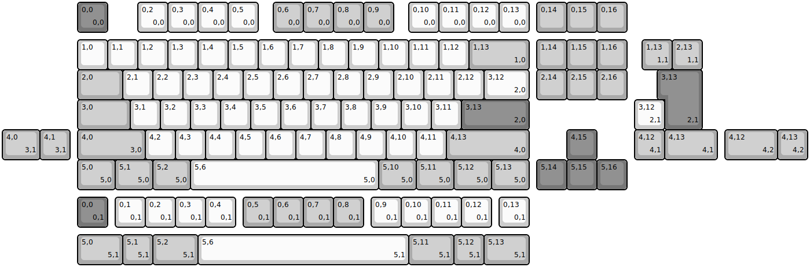{:loading="lazy"}

[Open in keyboard-layout-editor](http://www.keyboard-layout-editor.com/##@@_x:2.5&c=#777777;&=0,0%0A%0A%0A0,0&_x:1.0&c=#cccccc;&=0,2%0A%0A%0A0,0&=0,3%0A%0A%0A0,0&=0,4%0A%0A%0A0,0&=0,5%0A%0A%0A0,0&_x:0.5&c=#aaaaaa;&=0,6%0A%0A%0A0,0&=0,7%0A%0A%0A0,0&=0,8%0A%0A%0A0,0&=0,9%0A%0A%0A0,0&_x:0.5&c=#cccccc;&=0,10%0A%0A%0A0,0&=0,11%0A%0A%0A0,0&=0,12%0A%0A%0A0,0&=0,13%0A%0A%0A0,0&_x:0.25&c=#aaaaaa;&=0,14&=0,15&=0,16;&@_x:2.5&y:0.25&c=#cccccc;&=1,0&=1,1&=1,2&=1,3&=1,4&=1,5&=1,6&=1,7&=1,8&=1,9&=1,10&=1,11&=1,12&_c=#aaaaaa&w:2;&=1,13%0A%0A%0A1,0&_x:0.25;&=1,14&=1,15&=1,16;&@_x:2.5&w:1.5;&=2,0&_c=#cccccc;&=2,1&=2,2&=2,3&=2,4&=2,5&=2,6&=2,7&=2,8&=2,9&=2,10&=2,11&=2,12&_w:1.5;&=3,12%0A%0A%0A2,0&_x:0.25&c=#aaaaaa;&=2,14&=2,15&=2,16;&@_x:2.5&w:1.75;&=3,0&_c=#cccccc;&=3,1&=3,2&=3,3&=3,4&=3,5&=3,6&=3,7&=3,8&=3,9&=3,10&=3,11&_c=#777777&w:2.25;&=3,13%0A%0A%0A2,0;&@_x:2.5&c=#aaaaaa&w:2.25;&=4,0%0A%0A%0A3,0&_c=#cccccc;&=4,2&=4,3&=4,4&=4,5&=4,6&=4,7&=4,8&=4,9&=4,10&=4,11&_c=#aaaaaa&w:2.75;&=4,13%0A%0A%0A4,0&_x:1.25&c=#777777;&=4,15;&@_x:2.5&c=#aaaaaa&w:1.25;&=5,0%0A%0A%0A5,0&_w:1.25;&=5,1%0A%0A%0A5,0&_w:1.25;&=5,2%0A%0A%0A5,0&_c=#cccccc&w:6.25;&=5,6%0A%0A%0A5,0&_c=#aaaaaa&w:1.25;&=5,10%0A%0A%0A5,0&_w:1.25;&=5,11%0A%0A%0A5,0&_w:1.25;&=5,12%0A%0A%0A5,0&_w:1.25;&=5,13%0A%0A%0A5,0&_x:0.25&c=#777777;&=5,14&=5,15&=5,16;&@_x:21.25&y:-5.0&c=#aaaaaa;&=1,13%0A%0A%0A1,1&=2,13%0A%0A%0A1,1;&@_x:22.0&c=#777777&w:1.25&h:2&w2:1.5&h2:1&x2:-0.25;&=3,13%0A%0A%0A2,1;&@_x:21.0&c=#cccccc;&=3,12%0A%0A%0A2,1;&@_c=#aaaaaa&w:1.25;&=4,0%0A%0A%0A3,1&=4,1%0A%0A%0A3,1&_x:18.75;&=4,12%0A%0A%0A4,1&_w:1.75;&=4,13%0A%0A%0A4,1&_x:0.25&w:1.75;&=4,12%0A%0A%0A4,2&=4,13%0A%0A%0A4,2;&@_x:2.5&y:1.25&c=#777777;&=0,0%0A%0A%0A0,1&_x:0.25&c=#cccccc;&=0,1%0A%0A%0A0,1&=0,2%0A%0A%0A0,1&=0,3%0A%0A%0A0,1&=0,4%0A%0A%0A0,1&_x:0.25&c=#aaaaaa;&=0,5%0A%0A%0A0,1&=0,6%0A%0A%0A0,1&=0,7%0A%0A%0A0,1&=0,8%0A%0A%0A0,1&_x:0.25&c=#cccccc;&=0,9%0A%0A%0A0,1&=0,10%0A%0A%0A0,1&=0,11%0A%0A%0A0,1&=0,12%0A%0A%0A0,1&_x:0.25;&=0,13%0A%0A%0A0,1;&@_x:2.5&y:0.25&c=#aaaaaa&w:1.5;&=5,0%0A%0A%0A5,1&=5,1%0A%0A%0A5,1&_w:1.5;&=5,2%0A%0A%0A5,1&_c=#cccccc&w:7;&=5,6%0A%0A%0A5,1&_c=#aaaaaa&w:1.5;&=5,11%0A%0A%0A5,1&=5,12%0A%0A%0A5,1&_w:1.5;&=5,13%0A%0A%0A5,1)

## mechlovin/infinity88

[README](output/mechlovin/infinity88/README.md) - [layout](output/mechlovin/infinity88/infinity88-kle.json) - [PCB](output/mechlovin/infinity88/infinity88.kicad_pcb) - [PCB render](output/mechlovin/infinity88/infinity88-render.svg)

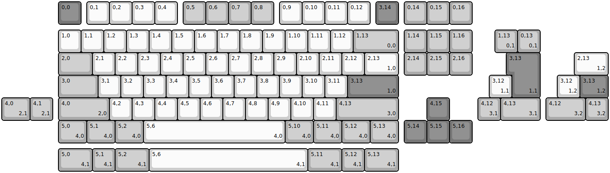{:loading="lazy"}

[Open in keyboard-layout-editor](http://www.keyboard-layout-editor.com/##@@_x:2.5&c=#777777;&=0,0&_x:0.25&c=#cccccc;&=0,1&=0,2&=0,3&=0,4&_x:0.25&c=#aaaaaa;&=0,5&=0,6&=0,7&=0,8&_x:0.25&c=#cccccc;&=0,9&=0,10&=0,11&=0,12&_x:0.25&c=#777777;&=3,14&_x:0.25&c=#aaaaaa;&=0,14&=0,15&=0,16;&@_x:2.5&y:0.25&c=#cccccc;&=1,0&=1,1&=1,2&=1,3&=1,4&=1,5&=1,6&=1,7&=1,8&=1,9&=1,10&=1,11&=1,12&_c=#aaaaaa&w:2;&=1,13%0A%0A%0A0,0&_x:0.25;&=1,14&=1,15&=1,16;&@_x:2.5&w:1.5;&=2,0&_c=#cccccc;&=2,1&=2,2&=2,3&=2,4&=2,5&=2,6&=2,7&=2,8&=2,9&=2,10&=2,11&=2,12&_w:1.5;&=2,13%0A%0A%0A1,0&_x:0.25&c=#aaaaaa;&=2,14&=2,15&=2,16;&@_x:2.5&w:1.75;&=3,0&_c=#cccccc;&=3,1&=3,2&=3,3&=3,4&=3,5&=3,6&=3,7&=3,8&=3,9&=3,10&=3,11&_c=#777777&w:2.25;&=3,13%0A%0A%0A1,0;&@_x:2.5&c=#aaaaaa&w:2.25;&=4,0%0A%0A%0A2,0&_c=#cccccc;&=4,2&=4,3&=4,4&=4,5&=4,6&=4,7&=4,8&=4,9&=4,10&=4,11&_c=#aaaaaa&w:2.75;&=4,13%0A%0A%0A3,0&_x:1.25&c=#777777;&=4,15;&@_x:2.5&c=#aaaaaa&w:1.25;&=5,0%0A%0A%0A4,0&_w:1.25;&=5,1%0A%0A%0A4,0&_w:1.25;&=5,2%0A%0A%0A4,0&_c=#cccccc&w:6.25;&=5,6%0A%0A%0A4,0&_c=#aaaaaa&w:1.25;&=5,10%0A%0A%0A4,0&_w:1.25;&=5,11%0A%0A%0A4,0&_w:1.25;&=5,12%0A%0A%0A4,0&_w:1.25;&=5,13%0A%0A%0A4,0&_x:0.25&c=#777777;&=5,14&=5,15&=5,16;&@_x:21.75&y:-5.0&c=#aaaaaa;&=1,13%0A%0A%0A0,1&=0,13%0A%0A%0A0,1;&@_x:22.5&c=#777777&w:1.25&h:2&w2:1.5&h2:1&x2:-0.25;&=3,13%0A%0A%0A1,1&_x:1.5&c=#cccccc&w:1.5;&=2,13%0A%0A%0A1,2;&@_x:21.5;&=3,12%0A%0A%0A1,1&_x:2.0;&=3,12%0A%0A%0A1,2&_c=#777777&w:1.25;&=3,13%0A%0A%0A1,2;&@_c=#aaaaaa&w:1.25;&=4,0%0A%0A%0A2,1&=4,1%0A%0A%0A2,1&_x:18.75;&=4,12%0A%0A%0A3,1&_w:1.75;&=4,13%0A%0A%0A3,1&_x:0.25&w:1.75;&=4,12%0A%0A%0A3,2&=4,13%0A%0A%0A3,2;&@_x:2.5&y:1.25&w:1.5;&=5,0%0A%0A%0A4,1&=5,1%0A%0A%0A4,1&_w:1.5;&=5,2%0A%0A%0A4,1&_c=#cccccc&w:7;&=5,6%0A%0A%0A4,1&_c=#aaaaaa&w:1.5;&=5,11%0A%0A%0A4,1&=5,12%0A%0A%0A4,1&_w:1.5;&=5,13%0A%0A%0A4,1)

## mechlovin/infinityce

[README](output/mechlovin/infinityce/README.md) - [layout](output/mechlovin/infinityce/infinityce-kle.json) - [PCB](output/mechlovin/infinityce/infinityce.kicad_pcb) - [PCB render](output/mechlovin/infinityce/infinityce-render.svg)

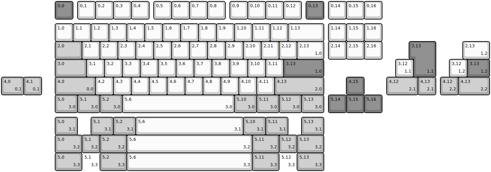{:loading="lazy"}

[Open in keyboard-layout-editor](http://www.keyboard-layout-editor.com/##@@_x:3&c=#777777&p=DSA;&=0,0&_x:0.25&c=#cccccc;&=0,1&=0,2&=0,3&=0,4&_x:0.25;&=0,5&=0,6&=0,7&=0,8&_x:0.25;&=0,9&=0,10&=0,11&=0,12&_x:0.25&c=#777777;&=0,13&_x:0.25&c=#cccccc;&=0,14&=0,15&=0,16;&@_x:3&y:0.25;&=1,0&=1,1&=1,2&=1,3&=1,4&=1,5&=1,6&=1,7&=1,8&=1,9&=1,10&=1,11&=1,12&_w:2;&=1,13&_x:0.25;&=1,14&=1,15&=1,16;&@_x:3&c=#aaaaaa&w:1.5;&=2,0&_c=#cccccc;&=2,1&=2,2&=2,3&=2,4&=2,5&=2,6&=2,7&=2,8&=2,9&=2,10&=2,11&=2,12&_w:1.5;&=2,13%0A%0A%0A1,0&_x:0.25;&=2,14&=2,15&=2,16;&@_x:3&c=#aaaaaa&w:1.75;&=3,0&_c=#cccccc;&=3,1&=3,2&=3,3&_n:true;&=3,4&=3,5&=3,6&_n:true;&=3,7&=3,8&=3,9&=3,10%0A/;&=3,11%0A'&_c=#777777&w:2.25;&=3,13%0A%0A%0A1,0;&@_x:3.0&c=#aaaaaa&w:2.25;&=4,0%0A%0A%0A0,0&_c=#cccccc;&=4,2&=4,3&=4,4&=4,5&=4,6&=4,7&=4,8%0A,&=4,9%0A.&=4,10&=4,11&_c=#aaaaaa&w:2.75;&=4,13%0A%0A%0A2,0&_x:1.25&c=#777777;&=4,15;&@_x:3&c=#aaaaaa&w:1.25;&=5,0%0A%0A%0A3,0&_w:1.25;&=5,1%0A%0A%0A3,0&_w:1.25;&=5,2%0A%0A%0A3,0&_c=#cccccc&w:6.25;&=5,6%0A%0A%0A3,0&_c=#aaaaaa&w:1.25;&=5,10%0A%0A%0A3,0&_w:1.25;&=5,11%0A%0A%0A3,0&_w:1.25;&=5,12%0A%0A%0A3,0&_w:1.25;&=5,13%0A%0A%0A3,0&_x:0.25&c=#777777;&=5,14&=5,15&=5,16;&@_x:23.0&y:-4.0&w:1.25&h:2&w2:1.5&h2:1&x2:-0.25;&=3,13%0A%0A%0A1,1&_x:1.5&c=#cccccc&w:1.5;&=2,13%0A%0A%0A1,2;&@_x:22.0;&=3,12%0A%0A%0A1,1&_x:2.0;&=3,12%0A%0A%0A1,2&_c=#777777&w:1.25;&=3,13%0A%0A%0A1,2;&@_c=#aaaaaa&w:1.25;&=4,0%0A%0A%0A0,1&=4,1%0A%0A%0A0,1&_x:19.25&w:1.75;&=4,12%0A%0A%0A2,1&=4,13%0A%0A%0A2,1&_x:0.25;&=4,12%0A%0A%0A2,2&_w:1.75;&=4,13%0A%0A%0A2,2;&@_x:3&y:1.25&w:1.25;&=5,0%0A%0A%0A3,1&_x:0.75&w:1.25;&=5,1%0A%0A%0A3,1&_w:1.25;&=5,2%0A%0A%0A3,1&_c=#cccccc&w:6;&=5,6%0A%0A%0A3,1&_c=#aaaaaa&w:1.25;&=5,10%0A%0A%0A3,1&_w:1.25;&=5,11%0A%0A%0A3,1&_x:0.75&w:1.25;&=5,13%0A%0A%0A3,1;&@_x:3&w:1.5;&=5,0%0A%0A%0A3,2&=5,1%0A%0A%0A3,2&_w:1.5;&=5,2%0A%0A%0A3,2&_c=#cccccc&w:7;&=5,6%0A%0A%0A3,2&_c=#aaaaaa&w:1.5;&=5,11%0A%0A%0A3,2&=5,12%0A%0A%0A3,2&_w:1.5;&=5,13%0A%0A%0A3,2;&@_x:3&w:1.5;&=5,0%0A%0A%0A3,3&_d:true;&=5,1%0A%0A%0A3,3&_w:1.5;&=5,2%0A%0A%0A3,3&_c=#cccccc&w:7;&=5,6%0A%0A%0A3,3&_c=#aaaaaa&w:1.5;&=5,11%0A%0A%0A3,3&_d:true;&=5,12%0A%0A%0A3,3&_w:1.5;&=5,13%0A%0A%0A3,3)

## mechlovin/jay60

[README](output/mechlovin/jay60/README.md) - [layout](output/mechlovin/jay60/jay60-kle.json) - [PCB](output/mechlovin/jay60/jay60.kicad_pcb) - [PCB render](output/mechlovin/jay60/jay60-render.svg)

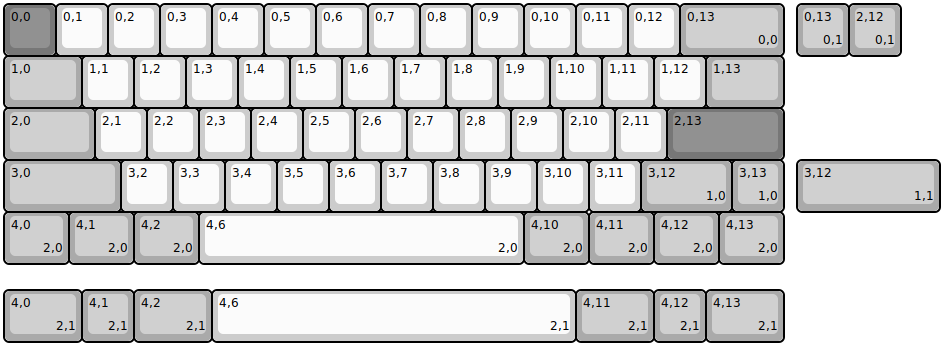{:loading="lazy"}

[Open in keyboard-layout-editor](http://www.keyboard-layout-editor.com/##@@_c=#777777;&=0,0&_c=#cccccc;&=0,1&=0,2&=0,3&=0,4&=0,5&=0,6&=0,7&=0,8&=0,9&=0,10&=0,11&=0,12&_c=#aaaaaa&w:2;&=0,13%0A%0A%0A0,0;&@_w:1.5;&=1,0&_c=#cccccc;&=1,1&=1,2&=1,3&=1,4&=1,5&=1,6&=1,7&=1,8&=1,9&=1,10&=1,11&=1,12&_c=#aaaaaa&w:1.5;&=1,13;&@_w:1.75;&=2,0&_c=#cccccc;&=2,1&=2,2&=2,3&=2,4&=2,5&=2,6&=2,7&=2,8&=2,9&=2,10&=2,11&_c=#777777&w:2.25;&=2,13;&@_c=#aaaaaa&w:2.25;&=3,0&_c=#cccccc;&=3,2&=3,3&=3,4&=3,5&=3,6&=3,7&=3,8&=3,9&=3,10&=3,11&_c=#aaaaaa&w:1.75;&=3,12%0A%0A%0A1,0&=3,13%0A%0A%0A1,0;&@_w:1.25;&=4,0%0A%0A%0A2,0&_w:1.25;&=4,1%0A%0A%0A2,0&_w:1.25;&=4,2%0A%0A%0A2,0&_c=#cccccc&w:6.25;&=4,6%0A%0A%0A2,0&_c=#aaaaaa&w:1.25;&=4,10%0A%0A%0A2,0&_w:1.25;&=4,11%0A%0A%0A2,0&_w:1.25;&=4,12%0A%0A%0A2,0&_w:1.25;&=4,13%0A%0A%0A2,0;&@_x:15.25&y:-5;&=0,13%0A%0A%0A0,1&=2,12%0A%0A%0A0,1;&@_x:15.25&y:2&w:2.75;&=3,12%0A%0A%0A1,1;&@_y:1.5&w:1.5;&=4,0%0A%0A%0A2,1&=4,1%0A%0A%0A2,1&_w:1.5;&=4,2%0A%0A%0A2,1&_c=#cccccc&w:7;&=4,6%0A%0A%0A2,1&_c=#aaaaaa&w:1.5;&=4,11%0A%0A%0A2,1&=4,12%0A%0A%0A2,1&_w:1.5;&=4,13%0A%0A%0A2,1)

## mechlovin/kanu

[README](output/mechlovin/kanu/README.md) - [layout](output/mechlovin/kanu/kanu-kle.json) - [PCB](output/mechlovin/kanu/kanu.kicad_pcb) - [PCB render](output/mechlovin/kanu/kanu-render.svg)

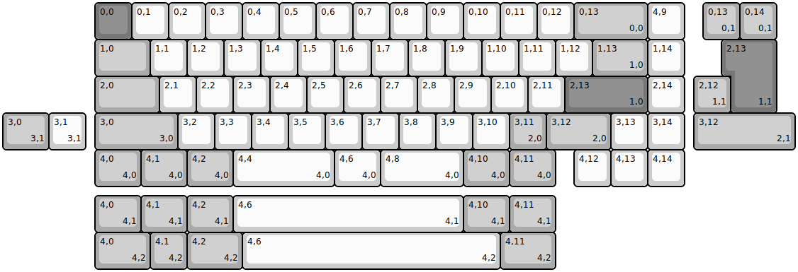{:loading="lazy"}

[Open in keyboard-layout-editor](http://www.keyboard-layout-editor.com/##@@_x:2.5&c=#777777;&=0,0&_c=#cccccc;&=0,1&=0,2&=0,3&=0,4&=0,5&=0,6&=0,7&=0,8&=0,9&=0,10&=0,11&=0,12&_c=#aaaaaa&w:2;&=0,13%0A%0A%0A0,0&_c=#cccccc;&=4,9;&@_x:2.5&c=#aaaaaa&w:1.5;&=1,0&_c=#cccccc;&=1,1&=1,2&=1,3&=1,4&=1,5&=1,6&=1,7&=1,8&=1,9&=1,10&=1,11&=1,12&_c=#aaaaaa&w:1.5;&=1,13%0A%0A%0A1,0&_c=#cccccc;&=1,14;&@_x:2.5&c=#aaaaaa&w:1.75;&=2,0&_c=#cccccc;&=2,1&=2,2&=2,3&=2,4&=2,5&=2,6&=2,7&=2,8&=2,9&=2,10&=2,11&_c=#777777&w:2.25;&=2,13%0A%0A%0A1,0&_c=#cccccc;&=2,14;&@_x:2.5&c=#aaaaaa&w:2.25;&=3,0%0A%0A%0A3,0&_c=#cccccc;&=3,2&=3,3&=3,4&=3,5&=3,6&=3,7&=3,8&=3,9&=3,10&_c=#aaaaaa;&=3,11%0A%0A%0A2,0&_w:1.75;&=3,12%0A%0A%0A2,0&_c=#cccccc;&=3,13&=3,14;&@_x:2.5&c=#aaaaaa&w:1.25;&=4,0%0A%0A%0A4,0&_w:1.25;&=4,1%0A%0A%0A4,0&_w:1.25;&=4,2%0A%0A%0A4,0&_c=#cccccc&w:2.75;&=4,4%0A%0A%0A4,0&_w:1.25;&=4,6%0A%0A%0A4,0&_w:2.25;&=4,8%0A%0A%0A4,0&_c=#aaaaaa&w:1.25;&=4,10%0A%0A%0A4,0&_w:1.25;&=4,11%0A%0A%0A4,0&_x:0.5&c=#cccccc;&=4,12&=4,13&=4,14;&@_x:19.0&y:-5&c=#aaaaaa;&=0,13%0A%0A%0A0,1&=0,14%0A%0A%0A0,1;&@_x:19.75&c=#777777&w:1.25&h:2&w2:1.5&h2:1&x2:-0.25;&=2,13%0A%0A%0A1,1;&@_x:18.75&c=#aaaaaa;&=2,12%0A%0A%0A1,1;&@_w:1.25;&=3,0%0A%0A%0A3,1&_c=#cccccc;&=3,1%0A%0A%0A3,1&_x:16.5&c=#aaaaaa&w:2.75;&=3,12%0A%0A%0A2,1;&@_x:2.5&y:1.25&w:1.25;&=4,0%0A%0A%0A4,1&_w:1.25;&=4,1%0A%0A%0A4,1&_w:1.25;&=4,2%0A%0A%0A4,1&_c=#cccccc&w:6.25;&=4,6%0A%0A%0A4,1&_c=#aaaaaa&w:1.25;&=4,10%0A%0A%0A4,1&_w:1.25;&=4,11%0A%0A%0A4,1;&@_x:2.5&w:1.5;&=4,0%0A%0A%0A4,2&=4,1%0A%0A%0A4,2&_w:1.5;&=4,2%0A%0A%0A4,2&_c=#cccccc&w:7;&=4,6%0A%0A%0A4,2&_c=#aaaaaa&w:1.5;&=4,11%0A%0A%0A4,2)

## mechlovin/kay60

[README](output/mechlovin/kay60/README.md) - [layout](output/mechlovin/kay60/kay60-kle.json) - [PCB](output/mechlovin/kay60/kay60.kicad_pcb) - [PCB render](output/mechlovin/kay60/kay60-render.svg)

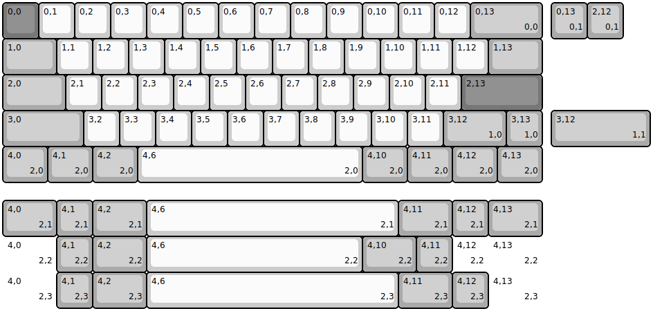{:loading="lazy"}

[Open in keyboard-layout-editor](http://www.keyboard-layout-editor.com/##@@_c=#777777;&=0,0&_c=#cccccc;&=0,1&=0,2&=0,3&=0,4&=0,5&=0,6&=0,7&=0,8&=0,9&=0,10&=0,11&=0,12&_c=#aaaaaa&w:2;&=0,13%0A%0A%0A0,0;&@_w:1.5;&=1,0&_c=#cccccc;&=1,1&=1,2&=1,3&=1,4&=1,5&=1,6&=1,7&=1,8&=1,9&=1,10&=1,11&=1,12&_c=#aaaaaa&w:1.5;&=1,13;&@_w:1.75;&=2,0&_c=#cccccc;&=2,1&=2,2&=2,3&=2,4&=2,5&=2,6&=2,7&=2,8&=2,9&=2,10&=2,11&_c=#777777&w:2.25;&=2,13;&@_c=#aaaaaa&w:2.25;&=3,0&_c=#cccccc;&=3,2&=3,3&=3,4&=3,5&=3,6&=3,7&=3,8&=3,9&=3,10&=3,11&_c=#aaaaaa&w:1.75;&=3,12%0A%0A%0A1,0&=3,13%0A%0A%0A1,0;&@_w:1.25;&=4,0%0A%0A%0A2,0&_w:1.25;&=4,1%0A%0A%0A2,0&_w:1.25;&=4,2%0A%0A%0A2,0&_c=#cccccc&w:6.25;&=4,6%0A%0A%0A2,0&_c=#aaaaaa&w:1.25;&=4,10%0A%0A%0A2,0&_w:1.25;&=4,11%0A%0A%0A2,0&_w:1.25;&=4,12%0A%0A%0A2,0&_w:1.25;&=4,13%0A%0A%0A2,0;&@_x:15.25&y:-5;&=0,13%0A%0A%0A0,1&=2,12%0A%0A%0A0,1;&@_x:15.25&y:2&w:2.75;&=3,12%0A%0A%0A1,1;&@_y:1.5&w:1.5;&=4,0%0A%0A%0A2,1&=4,1%0A%0A%0A2,1&_w:1.5;&=4,2%0A%0A%0A2,1&_c=#cccccc&w:7;&=4,6%0A%0A%0A2,1&_c=#aaaaaa&w:1.5;&=4,11%0A%0A%0A2,1&=4,12%0A%0A%0A2,1&_w:1.5;&=4,13%0A%0A%0A2,1;&@_w:1.5&d:true;&=4,0%0A%0A%0A2,2&=4,1%0A%0A%0A2,2&_w:1.5;&=4,2%0A%0A%0A2,2&_c=#cccccc&w:6;&=4,6%0A%0A%0A2,2&_c=#aaaaaa&w:1.5;&=4,10%0A%0A%0A2,2&=4,11%0A%0A%0A2,2&_d:true;&=4,12%0A%0A%0A2,2&_w:1.5&d:true;&=4,13%0A%0A%0A2,2;&@_w:1.5&d:true;&=4,0%0A%0A%0A2,3&=4,1%0A%0A%0A2,3&_w:1.5;&=4,2%0A%0A%0A2,3&_c=#cccccc&w:7;&=4,6%0A%0A%0A2,3&_c=#aaaaaa&w:1.5;&=4,11%0A%0A%0A2,3&=4,12%0A%0A%0A2,3&_w:1.5&d:true;&=4,13%0A%0A%0A2,3)

## mechlovin/kay65

[README](output/mechlovin/kay65/README.md) - [layout](output/mechlovin/kay65/kay65-kle.json) - [PCB](output/mechlovin/kay65/kay65.kicad_pcb) - [PCB render](output/mechlovin/kay65/kay65-render.svg)

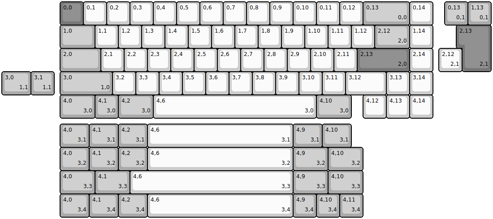{:loading="lazy"}

[Open in keyboard-layout-editor](http://www.keyboard-layout-editor.com/##@@_x:2.5&c=#777777;&=0,0&_c=#cccccc;&=0,1&=0,2&=0,3&=0,4&=0,5&=0,6&=0,7&=0,8&=0,9&=0,10&=0,11&=0,12&_c=#aaaaaa&w:2;&=0,13%0A%0A%0A0,0&_c=#cccccc;&=0,14;&@_x:2.5&c=#aaaaaa&w:1.5;&=1,0&_c=#cccccc;&=1,1&=1,2&=1,3&=1,4&=1,5&=1,6&=1,7&=1,8&=1,9&=1,10&=1,11&=1,12&_c=#aaaaaa&w:1.5;&=2,12%0A%0A%0A2,0&_c=#cccccc;&=1,14;&@_x:2.5&c=#aaaaaa&w:1.75;&=2,0&_c=#cccccc;&=2,1&=2,2&=2,3&=2,4&=2,5&=2,6&=2,7&=2,8&=2,9&=2,10&=2,11&_c=#777777&w:2.25;&=2,13%0A%0A%0A2,0&_c=#cccccc;&=2,14;&@_x:2.5&c=#aaaaaa&w:2.25;&=3,0%0A%0A%0A1,0&_c=#cccccc;&=3,2&=3,3&=3,4&=3,5&=3,6&=3,7&=3,8&=3,9&=3,10&=3,11&_w:1.75;&=3,12&=3,13&=3,14;&@_x:2.5&c=#aaaaaa&w:1.5;&=4,0%0A%0A%0A3,0&=4,1%0A%0A%0A3,0&_w:1.5;&=4,2%0A%0A%0A3,0&_c=#cccccc&w:7;&=4,6%0A%0A%0A3,0&_c=#aaaaaa&w:1.5;&=4,10%0A%0A%0A3,0&_x:0.5&c=#cccccc;&=4,12&=4,13&=4,14;&@_x:19.0&y:-5&c=#aaaaaa;&=0,13%0A%0A%0A0,1&=1,13%0A%0A%0A0,1;&@_x:19.75&c=#777777&w:1.25&h:2&w2:1.5&h2:1&x2:-0.25;&=2,13%0A%0A%0A2,1;&@_x:18.75&c=#cccccc;&=2,12%0A%0A%0A2,1;&@_c=#aaaaaa&w:1.25;&=3,0%0A%0A%0A1,1&=3,1%0A%0A%0A1,1;&@_x:2.5&y:1.25&w:1.25;&=4,0%0A%0A%0A3,1&_w:1.25;&=4,1%0A%0A%0A3,1&_w:1.25;&=4,2%0A%0A%0A3,1&_c=#cccccc&w:6.25;&=4,6%0A%0A%0A3,1&_c=#aaaaaa&w:1.25;&=4,9%0A%0A%0A3,1&_w:1.25;&=4,10%0A%0A%0A3,1;&@_x:2.5&w:1.25;&=4,0%0A%0A%0A3,2&_w:1.25;&=4,1%0A%0A%0A3,2&_w:1.25;&=4,2%0A%0A%0A3,2&_c=#cccccc&w:6.25;&=4,6%0A%0A%0A3,2&_c=#aaaaaa&w:1.5;&=4,9%0A%0A%0A3,2&_w:1.5;&=4,10%0A%0A%0A3,2;&@_x:2.5&w:1.5;&=4,0%0A%0A%0A3,3&_w:1.5;&=4,1%0A%0A%0A3,3&_c=#cccccc&w:7;&=4,6%0A%0A%0A3,3&_c=#aaaaaa&w:1.5;&=4,9%0A%0A%0A3,3&_w:1.5;&=4,10%0A%0A%0A3,3;&@_x:2.5&w:1.25;&=4,0%0A%0A%0A3,4&_w:1.25;&=4,1%0A%0A%0A3,4&_w:1.25;&=4,2%0A%0A%0A3,4&_c=#cccccc&w:6.25;&=4,6%0A%0A%0A3,4&_c=#aaaaaa;&=4,9%0A%0A%0A3,4&=4,10%0A%0A%0A3,4&=4,11%0A%0A%0A3,4)

## mechlovin/olly/olly_bb

[README](output/mechlovin/olly/README.md) - [layout](output/mechlovin/olly/olly_bb-kle.json) - [PCB](output/mechlovin/olly/olly_bb.kicad_pcb) - [PCB render](output/mechlovin/olly/olly_bb-render.svg)

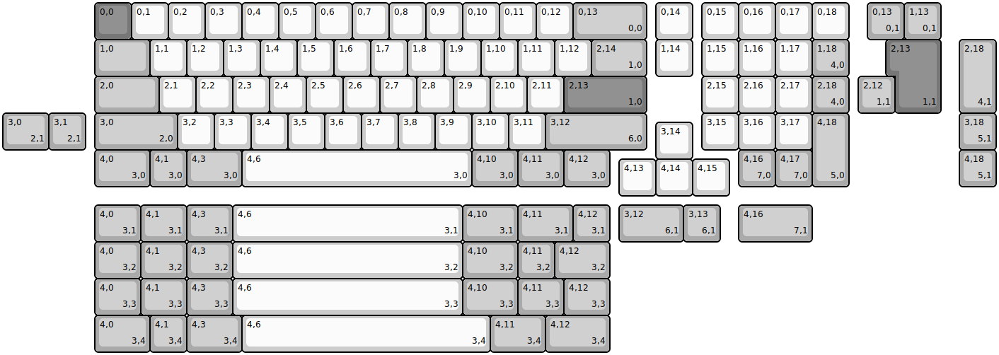{:loading="lazy"}

[Open in keyboard-layout-editor](http://www.keyboard-layout-editor.com/##@@_x:2.5&c=#777777;&=0,0&_c=#cccccc;&=0,1&=0,2&=0,3&=0,4&=0,5&=0,6&=0,7&=0,8&=0,9&=0,10&=0,11&=0,12&_c=#aaaaaa&w:2;&=0,13%0A%0A%0A0,0&_x:0.25&c=#cccccc;&=0,14&_x:0.25;&=0,15&=0,16&=0,17&=0,18;&@_x:2.5&c=#aaaaaa&w:1.5;&=1,0&_c=#cccccc;&=1,1&=1,2&=1,3&=1,4&=1,5&=1,6&=1,7&=1,8&=1,9&=1,10&=1,11&=1,12&_c=#aaaaaa&w:1.5;&=2,14%0A%0A%0A1,0&_x:0.25&c=#cccccc;&=1,14&_x:0.25;&=1,15&=1,16&=1,17&_c=#aaaaaa;&=1,18%0A%0A%0A4,0;&@_x:2.5&w:1.75;&=2,0&_c=#cccccc;&=2,1&=2,2&=2,3&=2,4&=2,5&=2,6&=2,7&=2,8&=2,9&=2,10&=2,11&_c=#777777&w:2.25;&=2,13%0A%0A%0A1,0&_x:1.5&c=#cccccc;&=2,15&=2,16&=2,17&_c=#aaaaaa;&=2,18%0A%0A%0A4,0;&@_x:2.5&w:2.25;&=3,0%0A%0A%0A2,0&_c=#cccccc;&=3,2&=3,3&=3,4&=3,5&=3,6&=3,7&=3,8&=3,9&=3,10&=3,11&_c=#aaaaaa&w:2.75;&=3,12%0A%0A%0A6,0&_x:1.5&c=#cccccc;&=3,15&=3,16&=3,17&_c=#aaaaaa&h:2;&=4,18%0A%0A%0A5,0;&@_x:17.75&y:-0.75&c=#cccccc;&=3,14;&@_x:2.5&y:-0.25&c=#aaaaaa&w:1.5;&=4,0%0A%0A%0A3,0&=4,1%0A%0A%0A3,0&_w:1.5;&=4,3%0A%0A%0A3,0&_c=#cccccc&w:6.25;&=4,6%0A%0A%0A3,0&_c=#aaaaaa&w:1.25;&=4,10%0A%0A%0A3,0&_w:1.25;&=4,11%0A%0A%0A3,0&_w:1.25;&=4,12%0A%0A%0A3,0&_x:3.5;&=4,16%0A%0A%0A7,0&=4,17%0A%0A%0A7,0;&@_x:16.75&y:-0.75&c=#cccccc;&=4,13&=4,14&=4,15;&@_x:23.5&y:-5.25&c=#aaaaaa;&=0,13%0A%0A%0A0,1&=1,13%0A%0A%0A0,1;&@_x:24.25&c=#777777&w:1.25&h:2&w2:1.5&h2:1&x2:-0.25;&=2,13%0A%0A%0A1,1&_x:0.5&c=#aaaaaa&h:2;&=2,18%0A%0A%0A4,1;&@_x:23.25;&=2,12%0A%0A%0A1,1;&@_w:1.25;&=3,0%0A%0A%0A2,1&=3,1%0A%0A%0A2,1&_x:23.75;&=3,18%0A%0A%0A5,1;&@_x:26.0;&=4,18%0A%0A%0A5,1;&@_x:2.5&y:0.5&w:1.25;&=4,0%0A%0A%0A3,1&_w:1.25;&=4,1%0A%0A%0A3,1&_w:1.25;&=4,3%0A%0A%0A3,1&_c=#cccccc&w:6.25;&=4,6%0A%0A%0A3,1&_c=#aaaaaa&w:1.5;&=4,10%0A%0A%0A3,1&_w:1.5;&=4,11%0A%0A%0A3,1&=4,12%0A%0A%0A3,1&_x:0.25&w:1.75;&=3,12%0A%0A%0A6,1&=3,13%0A%0A%0A6,1&_x:0.5&w:2;&=4,16%0A%0A%0A7,1;&@_x:2.5&w:1.25;&=4,0%0A%0A%0A3,2&_w:1.25;&=4,1%0A%0A%0A3,2&_w:1.25;&=4,3%0A%0A%0A3,2&_c=#cccccc&w:6.25;&=4,6%0A%0A%0A3,2&_c=#aaaaaa&w:1.5;&=4,10%0A%0A%0A3,2&=4,11%0A%0A%0A3,2&_w:1.5;&=4,12%0A%0A%0A3,2;&@_x:2.5&w:1.25;&=4,0%0A%0A%0A3,3&_w:1.25;&=4,1%0A%0A%0A3,3&_w:1.25;&=4,3%0A%0A%0A3,3&_c=#cccccc&w:6.25;&=4,6%0A%0A%0A3,3&_c=#aaaaaa&w:1.5;&=4,10%0A%0A%0A3,3&_w:1.25;&=4,11%0A%0A%0A3,3&_w:1.25;&=4,12%0A%0A%0A3,3;&@_x:2.5&w:1.5;&=4,0%0A%0A%0A3,4&=4,1%0A%0A%0A3,4&_w:1.5;&=4,3%0A%0A%0A3,4&_c=#cccccc&w:6.75;&=4,6%0A%0A%0A3,4&_c=#aaaaaa&w:1.5;&=4,11%0A%0A%0A3,4&_w:1.75;&=4,12%0A%0A%0A3,4)

## mechlovin/olly/olly_jf

[README](output/mechlovin/olly/README.md) - [layout](output/mechlovin/olly/olly_jf-kle.json) - [PCB](output/mechlovin/olly/olly_jf.kicad_pcb) - [PCB render](output/mechlovin/olly/olly_jf-render.svg)

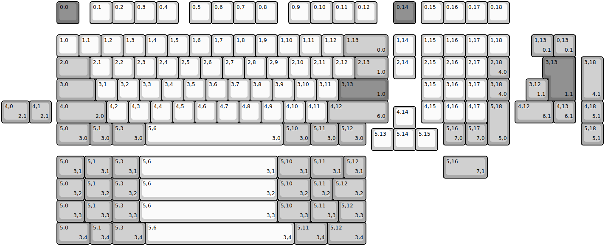{:loading="lazy"}

[Open in keyboard-layout-editor](http://www.keyboard-layout-editor.com/##@@_x:2.5&c=#777777;&=0,0&_x:0.5&c=#cccccc;&=0,1&=0,2&=0,3&=0,4&_x:0.5;&=0,5&=0,6&=0,7&=0,8&_x:0.5;&=0,9&=0,10&=0,11&=0,12&_x:0.75&c=#777777;&=0,14&_x:0.25&c=#cccccc;&=0,15&=0,16&=0,17&=0,18;&@_x:2.5&y:0.5;&=1,0&=1,1&=1,2&=1,3&=1,4&=1,5&=1,6&=1,7&=1,8&=1,9&=1,10&=1,11&=1,12&_c=#aaaaaa&w:2;&=1,13%0A%0A%0A0,0&_x:0.25&c=#cccccc;&=1,14&_x:0.25;&=1,15&=1,16&=1,17&=1,18;&@_x:2.5&c=#aaaaaa&w:1.5;&=2,0&_c=#cccccc;&=2,1&=2,2&=2,3&=2,4&=2,5&=2,6&=2,7&=2,8&=2,9&=2,10&=2,11&=2,12&_c=#aaaaaa&w:1.5;&=2,13%0A%0A%0A1,0&_x:0.25&c=#cccccc;&=2,14&_x:0.25;&=2,15&=2,16&=2,17&_c=#aaaaaa;&=2,18%0A%0A%0A4,0;&@_x:2.5&w:1.75;&=3,0&_c=#cccccc;&=3,1&=3,2&=3,3&=3,4&=3,5&=3,6&=3,7&=3,8&=3,9&=3,10&=3,11&_c=#777777&w:2.25;&=3,13%0A%0A%0A1,0&_x:1.5&c=#cccccc;&=3,15&=3,16&=3,17&_c=#aaaaaa;&=3,18%0A%0A%0A4,0;&@_x:2.5&w:2.25;&=4,0%0A%0A%0A2,0&_c=#cccccc;&=4,2&=4,3&=4,4&=4,5&=4,6&=4,7&=4,8&=4,9&=4,10&=4,11&_c=#aaaaaa&w:2.75;&=4,12%0A%0A%0A6,0&_x:1.5&c=#cccccc;&=4,15&=4,16&=4,17&_c=#aaaaaa&h:2;&=5,18%0A%0A%0A5,0;&@_x:17.75&y:-0.75&c=#cccccc;&=4,14;&@_x:2.5&y:-0.25&c=#aaaaaa&w:1.5;&=5,0%0A%0A%0A3,0&=5,1%0A%0A%0A3,0&_w:1.5;&=5,3%0A%0A%0A3,0&_c=#cccccc&w:6.25;&=5,6%0A%0A%0A3,0&_c=#aaaaaa&w:1.25;&=5,10%0A%0A%0A3,0&_w:1.25;&=5,11%0A%0A%0A3,0&_w:1.25;&=5,12%0A%0A%0A3,0&_x:3.5;&=5,16%0A%0A%0A7,0&=5,17%0A%0A%0A7,0;&@_x:16.75&y:-0.75&c=#cccccc;&=5,13&=5,14&=5,15;&@_x:24.0&y:-5.25&c=#aaaaaa;&=1,13%0A%0A%0A0,1&=0,13%0A%0A%0A0,1;&@_x:24.75&c=#777777&w:1.25&h:2&w2:1.5&h2:1&x2:-0.25;&=3,13%0A%0A%0A1,1&_x:0.25&c=#aaaaaa&h:2;&=3,18%0A%0A%0A4,1;&@_x:23.75;&=3,12%0A%0A%0A1,1;&@_w:1.25;&=4,0%0A%0A%0A2,1&=4,1%0A%0A%0A2,1&_x:21.0&w:1.75;&=4,12%0A%0A%0A6,1&=4,13%0A%0A%0A6,1&_x:0.25;&=4,18%0A%0A%0A5,1;&@_x:26.25;&=5,18%0A%0A%0A5,1;&@_x:2.5&y:0.5&w:1.25;&=5,0%0A%0A%0A3,1&_w:1.25;&=5,1%0A%0A%0A3,1&_w:1.25;&=5,3%0A%0A%0A3,1&_c=#cccccc&w:6.25;&=5,6%0A%0A%0A3,1&_c=#aaaaaa&w:1.5;&=5,10%0A%0A%0A3,1&_w:1.5;&=5,11%0A%0A%0A3,1&=5,12%0A%0A%0A3,1&_x:3.5&w:2;&=5,16%0A%0A%0A7,1;&@_x:2.5&w:1.25;&=5,0%0A%0A%0A3,2&_w:1.25;&=5,1%0A%0A%0A3,2&_w:1.25;&=5,3%0A%0A%0A3,2&_c=#cccccc&w:6.25;&=5,6%0A%0A%0A3,2&_c=#aaaaaa&w:1.5;&=5,10%0A%0A%0A3,2&=5,11%0A%0A%0A3,2&_w:1.5;&=5,12%0A%0A%0A3,2;&@_x:2.5&w:1.25;&=5,0%0A%0A%0A3,3&_w:1.25;&=5,1%0A%0A%0A3,3&_w:1.25;&=5,3%0A%0A%0A3,3&_c=#cccccc&w:6.25;&=5,6%0A%0A%0A3,3&_c=#aaaaaa&w:1.5;&=5,10%0A%0A%0A3,3&_w:1.25;&=5,11%0A%0A%0A3,3&_w:1.25;&=5,12%0A%0A%0A3,3;&@_x:2.5&w:1.5;&=5,0%0A%0A%0A3,4&=5,1%0A%0A%0A3,4&_w:1.5;&=5,3%0A%0A%0A3,4&_c=#cccccc&w:6.75;&=5,6%0A%0A%0A3,4&_c=#aaaaaa&w:1.5;&=5,11%0A%0A%0A3,4&_w:1.75;&=5,12%0A%0A%0A3,4)

## mechlovin/pisces/pisces65

[README](output/mechlovin/pisces/README.md) - [layout](output/mechlovin/pisces/pisces65-kle.json) - [PCB](output/mechlovin/pisces/pisces65.kicad_pcb) - [PCB render](output/mechlovin/pisces/pisces65-render.svg)

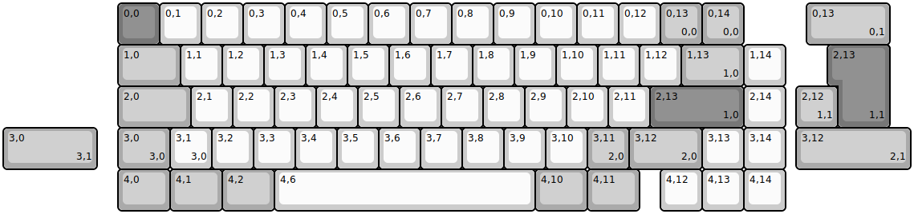{:loading="lazy"}

[Open in keyboard-layout-editor](http://www.keyboard-layout-editor.com/##@@_x:2.75&c=#777777;&=0,0&_c=#cccccc;&=0,1&=0,2&=0,3&=0,4&=0,5&=0,6&=0,7&=0,8&=0,9&=0,10&=0,11&=0,12&_c=#aaaaaa;&=0,13%0A%0A%0A0,0&=0,14%0A%0A%0A0,0;&@_x:2.75&w:1.5;&=1,0&_c=#cccccc;&=1,1&=1,2&=1,3&=1,4&=1,5&=1,6&=1,7&=1,8&=1,9&=1,10&=1,11&=1,12&_c=#aaaaaa&w:1.5;&=1,13%0A%0A%0A1,0&_c=#cccccc;&=1,14;&@_x:2.75&c=#aaaaaa&w:1.75;&=2,0&_c=#cccccc;&=2,1&=2,2&=2,3&=2,4&=2,5&=2,6&=2,7&=2,8&=2,9&=2,10&=2,11&_c=#777777&w:2.25;&=2,13%0A%0A%0A1,0&_c=#cccccc;&=2,14;&@_x:2.75&c=#aaaaaa&w:1.25;&=3,0%0A%0A%0A3,0&_c=#cccccc;&=3,1%0A%0A%0A3,0&=3,2&=3,3&=3,4&=3,5&=3,6&=3,7&=3,8&=3,9&=3,10&_c=#aaaaaa;&=3,11%0A%0A%0A2,0&_w:1.75;&=3,12%0A%0A%0A2,0&_c=#cccccc;&=3,13&=3,14;&@_x:2.75&c=#aaaaaa&w:1.25;&=4,0&_w:1.25;&=4,1&_w:1.25;&=4,2&_c=#cccccc&w:6.25;&=4,6&_c=#aaaaaa&w:1.25;&=4,10&_w:1.25;&=4,11&_x:0.5&c=#cccccc;&=4,12&=4,13&=4,14;&@_x:19.25&y:-5&c=#aaaaaa&w:2;&=0,13%0A%0A%0A0,1;&@_x:20.0&c=#777777&w:1.25&h:2&w2:1.5&h2:1&x2:-0.25;&=2,13%0A%0A%0A1,1;&@_x:19.0&c=#aaaaaa;&=2,12%0A%0A%0A1,1;&@_w:2.25;&=3,0%0A%0A%0A3,1&_x:16.75&w:2.75;&=3,12%0A%0A%0A2,1)

## mechlovin/retro66

[README](output/mechlovin/retro66/README.md) - [layout](output/mechlovin/retro66/retro66-kle.json) - [PCB](output/mechlovin/retro66/retro66.kicad_pcb) - [PCB render](output/mechlovin/retro66/retro66-render.svg)

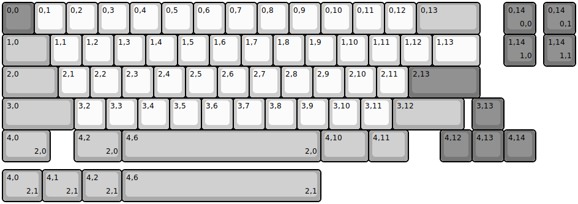{:loading="lazy"}

[Open in keyboard-layout-editor](http://www.keyboard-layout-editor.com/##@@_c=#777777;&=0,0&_c=#cccccc;&=0,1&=0,2&=0,3&=0,4&=0,5&=0,6&=0,7&=0,8&=0,9&=0,10&=0,11&=0,12&_c=#aaaaaa&w:2;&=0,13&_x:0.75&c=#777777;&=0,14%0A%0A%0A0,0;&@_c=#aaaaaa&w:1.5;&=1,0&_c=#cccccc;&=1,1&=1,2&=1,3&=1,4&=1,5&=1,6&=1,7&=1,8&=1,9&=1,10&=1,11&=1,12&_w:1.5;&=1,13&_x:0.75&c=#777777;&=1,14%0A%0A%0A1,0;&@_c=#aaaaaa&w:1.75;&=2,0&_c=#cccccc;&=2,1&=2,2&=2,3&=2,4&=2,5&=2,6&=2,7&=2,8&=2,9&=2,10&=2,11&_c=#777777&w:2.25;&=2,13;&@_c=#aaaaaa&w:2.25;&=3,0&_c=#cccccc;&=3,2&=3,3&=3,4&=3,5&=3,6&=3,7&=3,8&=3,9&=3,10&=3,11&_c=#aaaaaa&w:2.25;&=3,12&_x:0.25&c=#777777;&=3,13;&@_c=#aaaaaa&w:1.5;&=4,0%0A%0A%0A2,0&_x:0.75&w:1.5;&=4,2%0A%0A%0A2,0&_w:6.25;&=4,6%0A%0A%0A2,0&_w:1.5;&=4,10&_w:1.25;&=4,11&_x:1.0&c=#777777;&=4,12&=4,13&=4,14;&@_x:17.0&y:-5;&=0,14%0A%0A%0A0,1%0A%0A%0A%0A%0A%0Ae0;&@_x:17.0;&=1,14%0A%0A%0A1,1%0A%0A%0A%0A%0A%0Ae1;&@_y:3.25&c=#aaaaaa&w:1.25;&=4,0%0A%0A%0A2,1&_w:1.25;&=4,1%0A%0A%0A2,1&_w:1.25;&=4,2%0A%0A%0A2,1&_w:6.25;&=4,6%0A%0A%0A2,1)

## mechlovin/rouge87

[README](output/mechlovin/rouge87/README.md) - [layout](output/mechlovin/rouge87/rouge87-kle.json) - [PCB](output/mechlovin/rouge87/rouge87.kicad_pcb) - [PCB render](output/mechlovin/rouge87/rouge87-render.svg)

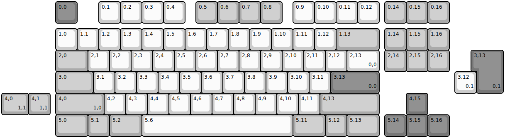{:loading="lazy"}

[Open in keyboard-layout-editor](http://www.keyboard-layout-editor.com/##@@_x:2.5&c=#777777;&=0,0&_x:1.0&c=#cccccc;&=0,1&=0,2&=0,3&=0,4&_x:0.5&c=#aaaaaa;&=0,5&=0,6&=0,7&=0,8&_x:0.5&c=#cccccc;&=0,9&=0,10&=0,11&=0,12&_x:0.25&c=#aaaaaa;&=0,14&=0,15&=0,16;&@_x:2.5&y:0.25&c=#cccccc;&=1,0&=1,1&=1,2&=1,3&=1,4&=1,5&=1,6&=1,7&=1,8&=1,9&=1,10&=1,11&=1,12&_c=#aaaaaa&w:2;&=1,13&_x:0.25;&=1,14&=1,15&=1,16;&@_x:2.5&w:1.5;&=2,0&_c=#cccccc;&=2,1&=2,2&=2,3&=2,4&=2,5&=2,6&=2,7&=2,8&=2,9&=2,10&=2,11&=2,12&_w:1.5;&=2,13%0A%0A%0A0,0&_x:0.25&c=#aaaaaa;&=2,14&=2,15&=2,16;&@_x:2.5&w:1.75;&=3,0&_c=#cccccc;&=3,1&=3,2&=3,3&=3,4&=3,5&=3,6&=3,7&=3,8&=3,9&=3,10&=3,11&_c=#777777&w:2.25;&=3,13%0A%0A%0A0,0;&@_x:2.5&c=#aaaaaa&w:2.25;&=4,0%0A%0A%0A1,0&_c=#cccccc;&=4,2&=4,3&=4,4&=4,5&=4,6&=4,7&=4,8&=4,9&=4,10&=4,11&_c=#aaaaaa&w:2.75;&=4,13&_x:1.25&c=#777777;&=4,15;&@_x:2.5&c=#aaaaaa&w:1.5;&=5,0&=5,1&_w:1.5;&=5,2&_c=#cccccc&w:7;&=5,6&_c=#aaaaaa&w:1.5;&=5,11&=5,12&_w:1.5;&=5,13&_x:0.25&c=#777777;&=5,14&=5,15&=5,16;&@_x:22.0&y:-4.0&w:1.25&h:2&w2:1.5&h2:1&x2:-0.25;&=3,13%0A%0A%0A0,1;&@_x:21.0&c=#cccccc;&=3,12%0A%0A%0A0,1;&@_c=#aaaaaa&w:1.25;&=4,0%0A%0A%0A1,1&=4,1%0A%0A%0A1,1)

## mechlovin/serratus

[README](output/mechlovin/serratus/README.md) - [layout](output/mechlovin/serratus/serratus-kle.json) - [PCB](output/mechlovin/serratus/serratus.kicad_pcb) - [PCB render](output/mechlovin/serratus/serratus-render.svg)

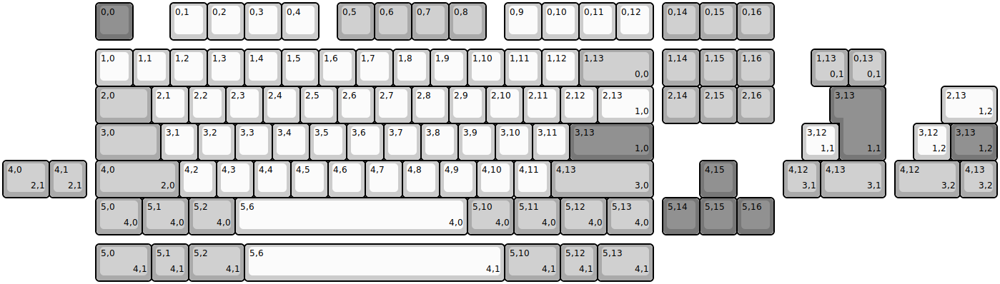{:loading="lazy"}

[Open in keyboard-layout-editor](http://www.keyboard-layout-editor.com/##@@_x:2.5&c=#777777;&=0,0&_x:1.0&c=#cccccc;&=0,1&=0,2&=0,3&=0,4&_x:0.5&c=#aaaaaa;&=0,5&=0,6&=0,7&=0,8&_x:0.5&c=#cccccc;&=0,9&=0,10&=0,11&=0,12&_x:0.25&c=#aaaaaa;&=0,14&=0,15&=0,16;&@_x:2.5&y:0.25&c=#cccccc;&=1,0&=1,1&=1,2&=1,3&=1,4&=1,5&=1,6&=1,7&=1,8&=1,9&=1,10&=1,11&=1,12&_c=#aaaaaa&w:2;&=1,13%0A%0A%0A0,0&_x:0.25;&=1,14&=1,15&=1,16;&@_x:2.5&w:1.5;&=2,0&_c=#cccccc;&=2,1&=2,2&=2,3&=2,4&=2,5&=2,6&=2,7&=2,8&=2,9&=2,10&=2,11&=2,12&_w:1.5;&=2,13%0A%0A%0A1,0&_x:0.25&c=#aaaaaa;&=2,14&=2,15&=2,16;&@_x:2.5&w:1.75;&=3,0&_c=#cccccc;&=3,1&=3,2&=3,3&=3,4&=3,5&=3,6&=3,7&=3,8&=3,9&=3,10&=3,11&_c=#777777&w:2.25;&=3,13%0A%0A%0A1,0;&@_x:2.5&c=#aaaaaa&w:2.25;&=4,0%0A%0A%0A2,0&_c=#cccccc;&=4,2&=4,3&=4,4&=4,5&=4,6&=4,7&=4,8&=4,9&=4,10&=4,11&_c=#aaaaaa&w:2.75;&=4,13%0A%0A%0A3,0&_x:1.25&c=#777777;&=4,15;&@_x:2.5&c=#aaaaaa&w:1.25;&=5,0%0A%0A%0A4,0&_w:1.25;&=5,1%0A%0A%0A4,0&_w:1.25;&=5,2%0A%0A%0A4,0&_c=#cccccc&w:6.25;&=5,6%0A%0A%0A4,0&_c=#aaaaaa&w:1.25;&=5,10%0A%0A%0A4,0&_w:1.25;&=5,11%0A%0A%0A4,0&_w:1.25;&=5,12%0A%0A%0A4,0&_w:1.25;&=5,13%0A%0A%0A4,0&_x:0.25&c=#777777;&=5,14&=5,15&=5,16;&@_x:21.75&y:-5.0&c=#aaaaaa;&=1,13%0A%0A%0A0,1&=0,13%0A%0A%0A0,1;&@_x:22.5&c=#777777&w:1.25&h:2&w2:1.5&h2:1&x2:-0.25;&=3,13%0A%0A%0A1,1&_x:1.5&c=#cccccc&w:1.5;&=2,13%0A%0A%0A1,2;&@_x:21.5;&=3,12%0A%0A%0A1,1&_x:2.0;&=3,12%0A%0A%0A1,2&_c=#777777&w:1.25;&=3,13%0A%0A%0A1,2;&@_c=#aaaaaa&w:1.25;&=4,0%0A%0A%0A2,1&=4,1%0A%0A%0A2,1&_x:18.75;&=4,12%0A%0A%0A3,1&_w:1.75;&=4,13%0A%0A%0A3,1&_x:0.25&w:1.75;&=4,12%0A%0A%0A3,2&=4,13%0A%0A%0A3,2;&@_x:2.5&y:1.25&w:1.5;&=5,0%0A%0A%0A4,1&=5,1%0A%0A%0A4,1&_w:1.5;&=5,2%0A%0A%0A4,1&_c=#cccccc&w:7;&=5,6%0A%0A%0A4,1&_c=#aaaaaa&w:1.5;&=5,10%0A%0A%0A4,1&=5,12%0A%0A%0A4,1&_w:1.5;&=5,13%0A%0A%0A4,1)

## mechlovin/th1800

[README](output/mechlovin/th1800/README.md) - [layout](output/mechlovin/th1800/th1800-kle.json) - [PCB](output/mechlovin/th1800/th1800.kicad_pcb) - [PCB render](output/mechlovin/th1800/th1800-render.svg)

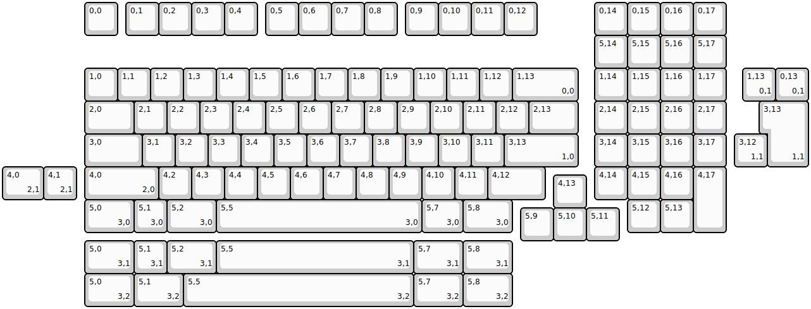{:loading="lazy"}

[Open in keyboard-layout-editor](http://www.keyboard-layout-editor.com/##@@_x:2.5;&=0,0&_x:0.25;&=0,1&=0,2&=0,3&=0,4&_x:0.25;&=0,5&=0,6&=0,7&=0,8&_x:0.25;&=0,9&=0,10&=0,11&=0,12&_x:1.75;&=0,14&=0,15&=0,16&=0,17;&@_x:18;&=5,14&=5,15&=5,16&=5,17;&@_x:2.5;&=1,0&=1,1&=1,2&=1,3&=1,4&=1,5&=1,6&=1,7&=1,8&=1,9&=1,10&=1,11&=1,12&_w:2;&=1,13%0A%0A%0A0,0&_x:0.5;&=1,14&=1,15&=1,16&=1,17;&@_x:2.5&w:1.5;&=2,0&=2,1&=2,2&=2,3&=2,4&=2,5&=2,6&=2,7&=2,8&=2,9&=2,10&=2,11&=2,12&_w:1.5;&=2,13&_x:0.5;&=2,14&=2,15&=2,16&=2,17;&@_x:2.5&w:1.75;&=3,0&=3,1&=3,2&=3,3&=3,4&=3,5&=3,6&=3,7&=3,8&=3,9&=3,10&=3,11&_w:2.25;&=3,13%0A%0A%0A1,0&_x:0.5;&=3,14&=3,15&=3,16&=3,17;&@_x:2.5&w:2.25;&=4,0%0A%0A%0A2,0&=4,2&=4,3&=4,4&=4,5&=4,6&=4,7&=4,8&=4,9&=4,10&=4,11&_w:1.75;&=4,12&_x:1.5;&=4,14&=4,15&=4,16&_h:2;&=4,17;&@_x:16.75&y:-0.75;&=4,13;&@_x:2.5&y:-0.25&w:1.5;&=5,0%0A%0A%0A3,0&=5,1%0A%0A%0A3,0&_w:1.5;&=5,2%0A%0A%0A3,0&_w:6.25;&=5,5%0A%0A%0A3,0&_w:1.25;&=5,7%0A%0A%0A3,0&_w:1.5;&=5,8%0A%0A%0A3,0&_x:3.5;&=5,12&=5,13;&@_x:15.75&y:-0.75;&=5,9&=5,10&=5,11;&@_x:22.5&y:-5.25;&=1,13%0A%0A%0A0,1&=0,13%0A%0A%0A0,1;&@_x:23.25&w:1.25&h:2&w2:1.5&h2:1&x2:-0.25;&=3,13%0A%0A%0A1,1;&@_x:22.25;&=3,12%0A%0A%0A1,1;&@_w:1.25;&=4,0%0A%0A%0A2,1&=4,1%0A%0A%0A2,1;&@_x:2.5&y:1.25&w:1.5;&=5,0%0A%0A%0A3,1&=5,1%0A%0A%0A3,1&_w:1.5;&=5,2%0A%0A%0A3,1&_w:6;&=5,5%0A%0A%0A3,1&_w:1.5;&=5,7%0A%0A%0A3,1&_w:1.5;&=5,8%0A%0A%0A3,1;&@_x:2.5&w:1.5;&=5,0%0A%0A%0A3,2&_w:1.5;&=5,1%0A%0A%0A3,2&_w:7;&=5,5%0A%0A%0A3,2&_w:1.5;&=5,7%0A%0A%0A3,2&_w:1.5;&=5,8%0A%0A%0A3,2)

## mechlovin/tmkl

[README](output/mechlovin/tmkl/README.md) - [layout](output/mechlovin/tmkl/tmkl-kle.json) - [PCB](output/mechlovin/tmkl/tmkl.kicad_pcb) - [PCB render](output/mechlovin/tmkl/tmkl-render.svg)

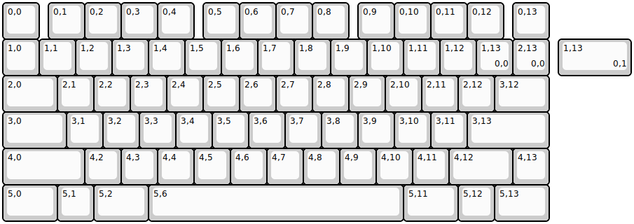{:loading="lazy"}

[Open in keyboard-layout-editor](http://www.keyboard-layout-editor.com/##@@=0,0&_x:0.25;&=0,1&=0,2&=0,3&=0,4&_x:0.25;&=0,5&=0,6&=0,7&=0,8&_x:0.25;&=0,9&=0,10&=0,11&=0,12&_x:0.25;&=0,13;&@=1,0&=1,1&=1,2&=1,3&=1,4&=1,5&=1,6&=1,7&=1,8&=1,9&=1,10&=1,11&=1,12&=1,13%0A%0A%0A0,0&=2,13%0A%0A%0A0,0;&@_w:1.5;&=2,0&=2,1&=2,2&=2,3&=2,4&=2,5&=2,6&=2,7&=2,8&=2,9&=2,10&=2,11&=2,12&_w:1.5;&=3,12;&@_w:1.75;&=3,0&=3,1&=3,2&=3,3&=3,4&=3,5&=3,6&=3,7&=3,8&=3,9&=3,10&=3,11&_w:2.25;&=3,13;&@_w:2.25;&=4,0&=4,2&=4,3&=4,4&=4,5&=4,6&=4,7&=4,8&=4,9&=4,10&=4,11&_w:1.75;&=4,12&=4,13;&@_w:1.5;&=5,0&=5,1&_w:1.5;&=5,2&_w:7;&=5,6&_w:1.5;&=5,11&=5,12&_w:1.5;&=5,13;&@_x:15.25&y:-5&w:2;&=1,13%0A%0A%0A0,1)

## mechlovin/wearhaus66/wh66

[README](output/mechlovin/wearhaus66/README.md) - [layout](output/mechlovin/wearhaus66/wh66-kle.json) - [PCB](output/mechlovin/wearhaus66/wh66.kicad_pcb) - [PCB render](output/mechlovin/wearhaus66/wh66-render.svg)

{:loading="lazy"}

[Open in keyboard-layout-editor](http://www.keyboard-layout-editor.com/##@@_x:2.5&c=#777777;&=0,0&_c=#cccccc;&=0,1&=0,2&=0,3&=0,4&=0,5&=0,6&=0,7&=0,8&=0,9&=0,10&=0,11&=0,12&_c=#aaaaaa&w:2;&=0,13%0A%0A%0A0,0;&@_x:17.75&y:-0.25&c=#cccccc;&=1,14;&@_x:2.5&y:-0.75&c=#aaaaaa&w:1.5;&=1,0&_c=#cccccc;&=1,1&=1,2&=1,3&=1,4&=1,5&=1,6&=1,7&=1,8&=1,9&=1,10&=1,11&=1,12&_c=#aaaaaa&w:1.5;&=2,12%0A%0A%0A2,0;&@_x:17.75&y:-0.25&c=#cccccc;&=2,14;&@_x:2.5&y:-0.75&c=#aaaaaa&w:1.75;&=2,0&_c=#cccccc;&=2,1&=2,2&=2,3&=2,4&=2,5&=2,6&=2,7&=2,8&=2,9&=2,10&=2,11&_c=#777777&w:2.25;&=2,13%0A%0A%0A2,0;&@_x:17.75&y:-0.25&c=#cccccc;&=3,14;&@_x:2.5&y:-0.75&c=#aaaaaa&w:2.25;&=3,0%0A%0A%0A1,0&_c=#cccccc;&=3,2&=3,3&=3,4&=3,5&=3,6&=3,7&=3,8&=3,9&=3,10&=3,11&_w:1.75;&=3,12&=3,13;&@_x:2.5&c=#aaaaaa&w:1.5;&=4,0%0A%0A%0A3,0&=4,1%0A%0A%0A3,0&_w:1.5;&=4,2%0A%0A%0A3,0&_c=#cccccc&w:7;&=4,6%0A%0A%0A3,0&_c=#aaaaaa&w:1.5;&=4,10%0A%0A%0A3,0&_x:0.5&c=#cccccc;&=4,12&=4,13&=4,14;&@_x:19.75&y:-5.0&c=#aaaaaa;&=0,13%0A%0A%0A0,1&=1,13%0A%0A%0A0,1;&@_x:20.5&c=#777777&w:1.25&h:2&w2:1.5&h2:1&x2:-0.25;&=2,13%0A%0A%0A2,1;&@_x:19.5&c=#cccccc;&=2,12%0A%0A%0A2,1;&@_c=#aaaaaa&w:1.25;&=3,0%0A%0A%0A1,1&=3,1%0A%0A%0A1,1;&@_x:2.5&y:1.25&w:1.25;&=4,0%0A%0A%0A3,1&_w:1.25;&=4,1%0A%0A%0A3,1&_w:1.25;&=4,2%0A%0A%0A3,1&_c=#cccccc&w:6.25;&=4,6%0A%0A%0A3,1&_c=#aaaaaa&w:1.25;&=4,9%0A%0A%0A3,1&_w:1.25;&=4,10%0A%0A%0A3,1)

## mechstudio/dawn

[README](output/mechstudio/README.md) - [layout](output/mechstudio/dawn-kle.json) - [PCB](output/mechstudio/dawn.kicad_pcb) - [PCB render](output/mechstudio/dawn-render.svg)

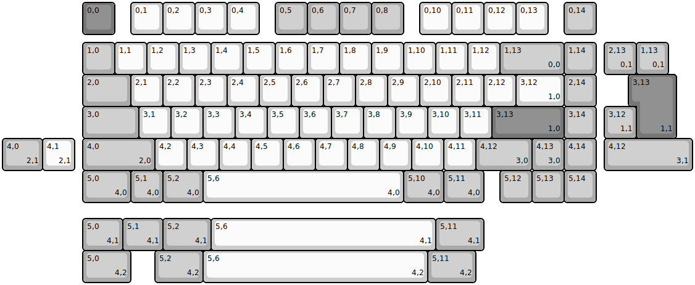{:loading="lazy"}

[Open in keyboard-layout-editor](http://www.keyboard-layout-editor.com/##@@_x:2.5&c=#777777;&=0,0&_x:0.5&c=#cccccc;&=0,1&=0,2&=0,3&=0,4&_x:0.5&c=#aaaaaa;&=0,5&=0,6&=0,7&=0,8&_x:0.5&c=#cccccc;&=0,10&=0,11&=0,12&=0,13&_x:0.5&c=#aaaaaa;&=0,14;&@_x:2.5&y:0.25;&=1,0&_c=#cccccc;&=1,1&=1,2&=1,3&=1,4&=1,5&=1,6&=1,7&=1,8&=1,9&=1,10&=1,11&=1,12&_c=#aaaaaa&w:2;&=1,13%0A%0A%0A0,0&=1,14;&@_x:2.5&w:1.5;&=2,0&_c=#cccccc;&=2,1&=2,2&=2,3&=2,4&=2,5&=2,6&=2,7&=2,8&=2,9&=2,10&=2,11&=2,12&_w:1.5;&=3,12%0A%0A%0A1,0&_c=#aaaaaa;&=2,14;&@_x:2.5&w:1.75;&=3,0&_c=#cccccc;&=3,1&=3,2&=3,3&=3,4&=3,5&=3,6&=3,7&=3,8&=3,9&=3,10&=3,11&_c=#777777&w:2.25;&=3,13%0A%0A%0A1,0&_c=#aaaaaa;&=3,14;&@_x:2.5&w:2.25;&=4,0%0A%0A%0A2,0&_c=#cccccc;&=4,2&=4,3&=4,4&=4,5&=4,6&=4,7&=4,8&=4,9&=4,10&=4,11&_c=#aaaaaa&w:1.75;&=4,12%0A%0A%0A3,0&=4,13%0A%0A%0A3,0&=4,14;&@_x:2.5&w:1.5;&=5,0%0A%0A%0A4,0&=5,1%0A%0A%0A4,0&_w:1.25;&=5,2%0A%0A%0A4,0&_c=#cccccc&w:6.25;&=5,6%0A%0A%0A4,0&_c=#aaaaaa&w:1.25;&=5,10%0A%0A%0A4,0&_w:1.25;&=5,11%0A%0A%0A4,0&_x:0.5;&=5,12&=5,13&=5,14;&@_x:18.75&y:-5.0;&=2,13%0A%0A%0A0,1&=1,13%0A%0A%0A0,1;&@_x:19.75&c=#777777&w:1.25&h:2&w2:1.5&h2:1&x2:-0.25;&=3,13%0A%0A%0A1,1;&@_x:18.75&c=#aaaaaa;&=3,12%0A%0A%0A1,1;&@_w:1.25;&=4,0%0A%0A%0A2,1&_c=#cccccc;&=4,1%0A%0A%0A2,1&_x:16.5&c=#aaaaaa&w:2.75;&=4,12%0A%0A%0A3,1;&@_x:2.5&y:1.5&w:1.25;&=5,0%0A%0A%0A4,1&_w:1.25;&=5,1%0A%0A%0A4,1&_w:1.5;&=5,2%0A%0A%0A4,1&_c=#cccccc&w:7;&=5,6%0A%0A%0A4,1&_c=#aaaaaa&w:1.5;&=5,11%0A%0A%0A4,1;&@_x:2.5&w:1.5;&=5,0%0A%0A%0A4,2&_x:0.75&w:1.5;&=5,2%0A%0A%0A4,2&_c=#cccccc&w:7;&=5,6%0A%0A%0A4,2&_c=#aaaaaa&w:1.5;&=5,11%0A%0A%0A4,2)

## mechwerkes/kikkou

[README](output/mechwerkes/kikkou/README.md) - [layout](output/mechwerkes/kikkou/kikkou-kle.json) - [PCB](output/mechwerkes/kikkou/kikkou.kicad_pcb) - [PCB render](output/mechwerkes/kikkou/kikkou-render.svg)

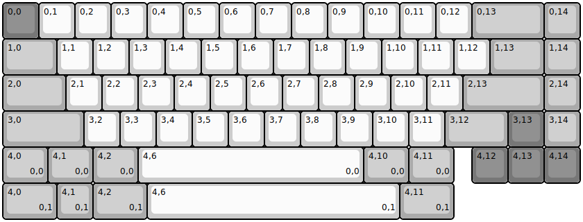{:loading="lazy"}

[Open in keyboard-layout-editor](http://www.keyboard-layout-editor.com/##@@_c=#777777;&=0,0&_c=#cccccc;&=0,1&=0,2&=0,3&=0,4&=0,5&=0,6&=0,7&=0,8&=0,9&=0,10&=0,11&=0,12&_c=#aaaaaa&w:2;&=0,13&=0,14;&@_w:1.5;&=1,0&_c=#cccccc;&=1,1&=1,2&=1,3&=1,4&=1,5&=1,6&=1,7&=1,8&=1,9&=1,10&=1,11&=1,12&_c=#aaaaaa&w:1.5;&=1,13&=1,14;&@_w:1.75;&=2,0&_c=#cccccc;&=2,1&=2,2&=2,3&=2,4&=2,5&=2,6&=2,7&=2,8&=2,9&=2,10&=2,11&_c=#aaaaaa&w:2.25;&=2,13&=2,14;&@_w:2.25;&=3,0&_c=#cccccc;&=3,2&=3,3&=3,4&=3,5&=3,6&=3,7&=3,8&=3,9&=3,10&=3,11&_c=#aaaaaa&w:1.75;&=3,12&_c=#777777;&=3,13&_c=#aaaaaa;&=3,14;&@_w:1.25;&=4,0%0A%0A%0A0,0&_w:1.25;&=4,1%0A%0A%0A0,0&_w:1.25;&=4,2%0A%0A%0A0,0&_c=#cccccc&w:6.25;&=4,6%0A%0A%0A0,0&_c=#aaaaaa&w:1.25;&=4,10%0A%0A%0A0,0&_w:1.25;&=4,11%0A%0A%0A0,0&_x:0.5&c=#777777;&=4,12&=4,13&=4,14;&@_c=#aaaaaa&w:1.5;&=4,0%0A%0A%0A0,1&=4,1%0A%0A%0A0,1&_w:1.5;&=4,2%0A%0A%0A0,1&_c=#cccccc&w:7;&=4,6%0A%0A%0A0,1&_c=#aaaaaa&w:1.5;&=4,11%0A%0A%0A0,1)

## mechwild/bde/bde-lefty

[README](output/mechwild/bde/README.md) - [layout](output/mechwild/bde/bde-lefty-kle.json) - [PCB](output/mechwild/bde/bde-lefty.kicad_pcb) - [PCB render](output/mechwild/bde/bde-lefty-render.svg)

{:loading="lazy"}

[Open in keyboard-layout-editor](http://www.keyboard-layout-editor.com/##@@=0,0&=0,1&=0,2&=0,3&=0,4&=0,5&=0,6&=0,7&=0,8&=0,9&=0,10&=0,11&=0,12&=0,13;&@=1,0&=1,1&=1,2&_c=#777777&h:2;&=1,3&_c=#cccccc;&=1,4&=1,5&=1,6&=1,7&=1,8&=1,9&=1,10&=1,11&=1,12&_c=#aaaaaa;&=1,13;&@_c=#cccccc;&=2,0&=2,1&=2,2&_x:1;&=2,4&=2,5&=2,6&=2,7&_c=#aaaaaa;&=2,8&=2,9&_c=#cccccc;&=2,10&=2,11&=2,12&_c=#aaaaaa;&=2,13)

## mechwild/bde/bde-rev2

[README](output/mechwild/bde/README.md) - [layout](output/mechwild/bde/bde-rev2-kle.json) - [PCB](output/mechwild/bde/bde-rev2.kicad_pcb) - [PCB render](output/mechwild/bde/bde-rev2-render.svg)

{:loading="lazy"}

[Open in keyboard-layout-editor](http://www.keyboard-layout-editor.com/##@@=0,0&=0,1&=0,2&=0,3&=0,4&=0,5&=0,6&=3,6&=3,5&=3,4&=3,3&=3,2&=3,1&=3,0%0A%0A%0A0,0;&@=1,0&=1,1&=1,2&=1,3&=1,4&=1,5&=1,6&=4,6&=4,5&_c=#aaaaaa;&=4,4&_c=#cccccc;&=4,3&=4,2&=4,1&_c=#777777;&=4,0;&@_c=#cccccc;&=2,0&=2,1&=2,2&=2,3&_c=#aaaaaa;&=2,4&=2,5&_c=#cccccc;&=2,6&=5,6&=5,5&_c=#777777;&=5,4&_c=#cccccc;&=5,3&=5,2&=5,1&_c=#777777;&=5,0;&@_x:14&y:-3&c=#cccccc;&=3,0%0A%0A%0A0,1%0A%0A%0A%0A%0A%0Ae0)

## mechwild/bde/bde-righty

[README](output/mechwild/bde/README.md) - [layout](output/mechwild/bde/bde-righty-kle.json) - [PCB](output/mechwild/bde/bde-righty.kicad_pcb) - [PCB render](output/mechwild/bde/bde-righty-render.svg)

{:loading="lazy"}

[Open in keyboard-layout-editor](http://www.keyboard-layout-editor.com/##@@=0,0&=0,1&=0,2&=0,3&=0,4&=0,5&=0,6&=0,7&=0,8&=0,9&=0,10&=0,11&=0,12&=0,13;&@=1,0&=1,1&=1,2&=1,3&=1,4&=1,5&=1,6&=1,7&=1,8&_c=#aaaaaa;&=1,9&_c=#777777&h:2;&=1,10&_c=#cccccc;&=1,11&=1,12&=1,13;&@=2,0&=2,1&=2,2&=2,3&_c=#aaaaaa;&=2,4&=2,5&_c=#cccccc;&=2,6&=2,7&=2,8&_c=#aaaaaa;&=2,9&_x:1;&=2,11&=2,12&=2,13)

## mechwild/clunker

[README](output/mechwild/clunker/README.md) - [layout](output/mechwild/clunker/clunker-kle.json) - [PCB](output/mechwild/clunker/clunker.kicad_pcb) - [PCB render](output/mechwild/clunker/clunker-render.svg)

{:loading="lazy"}

[Open in keyboard-layout-editor](http://www.keyboard-layout-editor.com/##@@_x:2.5&c=#777777;&=0,0&_c=#cccccc;&=0,1&=0,2&=0,3&=0,4&=0,5&=0,6&=0,7%0A%0A%0A3,0;&@_x:2.5&c=#aaaaaa&w:1.5;&=1,0&_c=#cccccc;&=1,1&=1,2&=1,3&=1,4&=1,5&=1,6&=1,7&=5,7&=5,6&=5,5&_c=#aaaaaa;&=5,4;&@_x:2.5&w:1.75;&=2,0&_c=#cccccc;&=2,1&=2,2&=2,3&=2,4&=2,5&=2,6&=2,7&=5,1&=5,2&_c=#777777&w:1.75;&=5,3;&@_x:2.5&c=#aaaaaa&w:2.25;&=3,0%0A%0A%0A0,0&_c=#cccccc;&=3,2&=3,3&=3,4&=3,5&=3,6&=3,7&=6,7&=6,6&=6,5%0A%0A%0A1,0&_c=#aaaaaa&w:1.25;&=6,4%0A%0A%0A1,0;&@_x:2.5&w:1.25;&=4,0%0A%0A%0A2,0&_w:1.25;&=4,1%0A%0A%0A2,0&_w:1.25;&=4,2%0A%0A%0A2,0&_c=#cccccc&w:2.75;&=4,3%0A%0A%0A2,0&_w:2.25;&=4,4%0A%0A%0A2,0&_c=#aaaaaa&w:1.25;&=4,5%0A%0A%0A2,0&_w:1.25;&=4,6%0A%0A%0A2,0&_w:1.25;&=4,7%0A%0A%0A2,0;&@_x:10.5&y:-5&c=#cccccc;&=0,7%0A%0A%0A3,1%0A%0A%0A%0A%0A%0Ae0;&@_y:2&c=#aaaaaa&w:1.25;&=3,0%0A%0A%0A0,1&_c=#cccccc;&=3,1%0A%0A%0A0,1&_x:13.0&c=#aaaaaa&w:2.25;&=6,5%0A%0A%0A1,1;&@_x:2.5&y:1;&=4,0%0A%0A%0A2,1&_w:1.25;&=4,1%0A%0A%0A2,1&=4,2%0A%0A%0A2,1&_c=#cccccc&w:6.25;&=4,3%0A%0A%0A2,1&_c=#aaaaaa;&=4,5%0A%0A%0A2,1&=4,6%0A%0A%0A2,1&=4,7%0A%0A%0A2,1;&@_x:2.5&w:1.25;&=4,0%0A%0A%0A2,2&_w:1.5;&=4,1%0A%0A%0A2,2&_c=#cccccc&w:7;&=4,3%0A%0A%0A2,2&_c=#aaaaaa&w:1.5;&=4,6%0A%0A%0A2,2&_w:1.25;&=4,7%0A%0A%0A2,2)

## mechwild/mercutio

[README](output/mechwild/mercutio/README.md) - [layout](output/mechwild/mercutio/mercutio-kle.json) - [PCB](output/mechwild/mercutio/mercutio.kicad_pcb) - [PCB render](output/mechwild/mercutio/mercutio-render.svg)

{:loading="lazy"}

[Open in keyboard-layout-editor](http://www.keyboard-layout-editor.com/##@@_x:14.5&c=#aaaaaa;&=4,2%0A%0A%0A3,0;&@_x:2.5&y:0.25&w:1.5;&=0,0&_c=#cccccc;&=0,1&=0,2&=0,3&=0,4&=0,5&=0,6&=4,6&=4,5&=4,4&=4,3&_c=#aaaaaa&w:1.5;&=5,2;&@_x:2.5&w:1.75;&=1,0&_c=#cccccc;&=1,1&=1,2&=1,3&=1,4&=1,5&=1,6&=5,6&=5,5&=5,4&_c=#777777&w:2.25;&=5,3%0A%0A%0A0,0;&@_x:2.5&c=#aaaaaa&w:2.25;&=2,0%0A%0A%0A1,0&_c=#cccccc;&=6,1&=2,3&=2,4&=2,5&=2,6&=6,6&=6,5&=6,4&=6,3&_c=#aaaaaa&w:1.75;&=6,2;&@_x:2.5&w:1.25;&=3,0&=5,1%0A%0A%0A2,0&=3,1%0A%0A%0A2,0&_c=#cccccc&w:6.25;&=3,5%0A%0A%0A2,0&_c=#aaaaaa&w:1.25;&=3,3&=3,2&_w:1.25;&=2,2;&@_x:15.5&y:-5.25;&=4,2%0A%0A%0A3,1%0A%0A%0A%0A%0A%0Ae0;&@_x:15.75&y:1.25&c=#777777;&=4,1%0A%0A%0A0,1&_w:1.25;&=5,3%0A%0A%0A0,1;&@_c=#aaaaaa&w:1.25;&=2,0%0A%0A%0A1,1&=2,1%0A%0A%0A1,1;&@_x:3.75&y:1.25;&=5,1%0A%0A%0A2,1&_w:1.25;&=3,1%0A%0A%0A2,1&_c=#cccccc&w:2.25;&=3,4%0A%0A%0A2,1&=3,5%0A%0A%0A2,1&_w:2.75;&=3,6%0A%0A%0A2,1)

## mechwild/mokulua/mokulua-mirrored

[README](output/mechwild/mokulua/README.md) - [layout](output/mechwild/mokulua/mokulua-mirrored-kle.json) - [PCB](output/mechwild/mokulua/mokulua-mirrored.kicad_pcb) - [PCB render](output/mechwild/mokulua/mokulua-mirrored-render.svg)

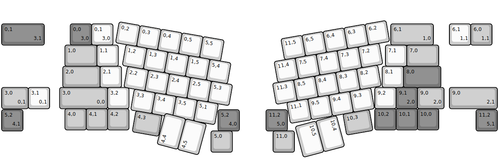{:loading="lazy"}

[Open in keyboard-layout-editor](http://www.keyboard-layout-editor.com/##@@_x:3.22&y:1.05&c=#777777;&=0,0%0A%0A%0A3,0&_c=#cccccc;&=0,1%0A%0A%0A3,0&_x:13.03&c=#aaaaaa&w:2;&=6,1%0A%0A%0A1,0;&@_x:2.97&w:1.5;&=1,0&_c=#cccccc;&=1,1&_x:12.53;&=7,1&_c=#aaaaaa&w:1.5;&=7,0;&@_x:2.87&w:1.75;&=2,0&_c=#cccccc;&=2,1&_x:12.23;&=8,1&_c=#777777&w:1.75;&=8,0;&@_x:2.72&c=#aaaaaa&w:2.25;&=3,0%0A%0A%0A0,0&_c=#cccccc;&=3,2&_x:11.53;&=9,2&_c=#777777;&=9,1%0A%0A%0A2,0&_c=#aaaaaa&w:1.25;&=9,0%0A%0A%0A2,0;&@_x:2.97;&=4,0&=4,1&=4,2&_x:11.53&c=#777777;&=10,2&=10,1&=10,0;&@_x:10.15&y:-0.95;&=5,2%0A%0A%0A4,0&_x:1.25;&=11,2%0A%0A%0A5,0;&@_x:9.82&c=#aaaaaa;&=5,0&_x:1.91;&=11,0;&@_r:10&rx:2.75&ry:3.75&x:2.25&y:-3.25&c=#cccccc;&=0,2&=0,3&=0,4&=0,5&=5,5;&@_x:2.75;&=1,2&=1,3&=1,4&=1,5&=5,4;&@_x:3.0;&=2,2&=2,3&=2,4&=2,5&=5,3;&@_x:3.5;&=3,3&=3,4&=3,5&=5,1;&@_x:3.75&c=#aaaaaa&w:1.25;&=4,3;&@_r:75&rx:10.5&ry:5.75&x:1.0&y:-5.25&c=#cccccc&w:1.5;&=10,4;&@_x:1.0&w:1.5;&=10,5;&@_r:-75&rx:0&ry:5&x:0.1&y:7.5&w:1.5;&=4,4;&@_x:0.1&w:1.5;&=4,5;&@_r:-10&rx:12&ry:4.25&x:1.5&y:-2.25;&=11,5&=6,5&=6,4&=6,3&=6,2;&@_x:1;&=11,4&=7,5&=7,4&=7,3&=7,2;&@_x:0.75;&=11,3&=8,5&=8,4&=8,3&=8,2;&@_x:1.25;&=11,1&=9,5&=9,4&=9,3;&@_x:3.75&c=#aaaaaa&w:1.25;&=10,3;&@_r:0&rx:0&ry:0&y:1.05&c=#777777&w:2;&=0,1%0A%0A%0A3,1&_x:19.0&c=#cccccc;&=6,1%0A%0A%0A1,1&_c=#aaaaaa;&=6,0%0A%0A%0A1,1;&@_y:2.0&w:1.25;&=3,0%0A%0A%0A0,1&_c=#cccccc;&=3,1%0A%0A%0A0,1&_x:18.75&c=#aaaaaa&w:2.25;&=9,0%0A%0A%0A2,1;&@_y:0.05&c=#777777;&=5,2%0A%0A%0A4,1%0A%0A%0A%0A%0A%0Ae0&_x:21.25;&=11,2%0A%0A%0A5,1%0A%0A%0A%0A%0A%0Ae0)

## mechwild/mokulua/mokulua-standard

[README](output/mechwild/mokulua/README.md) - [layout](output/mechwild/mokulua/mokulua-standard-kle.json) - [PCB](output/mechwild/mokulua/mokulua-standard.kicad_pcb) - [PCB render](output/mechwild/mokulua/mokulua-standard-render.svg)

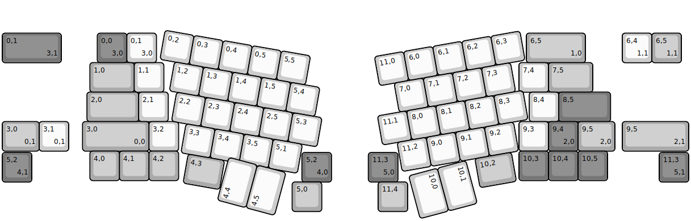{:loading="lazy"}

[Open in keyboard-layout-editor](http://www.keyboard-layout-editor.com/##@@_x:3.22&y:1.05&c=#777777;&=0,0%0A%0A%0A3,0&_c=#cccccc;&=0,1%0A%0A%0A3,0&_x:12.53&c=#aaaaaa&w:2;&=6,5%0A%0A%0A1,0;&@_x:2.97&w:1.5;&=1,0&_c=#cccccc;&=1,1&_x:12.03;&=7,4&_c=#aaaaaa&w:1.5;&=7,5;&@_x:2.87&w:1.75;&=2,0&_c=#cccccc;&=2,1&_x:12.23;&=8,4&_c=#777777&w:1.75;&=8,5;&@_x:2.72&c=#aaaaaa&w:2.25;&=3,0%0A%0A%0A0,0&_c=#cccccc;&=3,2&_x:11.53;&=9,3&_c=#777777;&=9,4%0A%0A%0A2,0&_c=#aaaaaa&w:1.25;&=9,5%0A%0A%0A2,0;&@_x:2.97;&=4,0&=4,1&=4,2&_x:11.53&c=#777777;&=10,3&=10,4&=10,5;&@_x:10.15&y:-0.95;&=5,2%0A%0A%0A4,0&_x:1.25;&=11,3%0A%0A%0A5,0;&@_x:9.82&c=#aaaaaa;&=5,0&_x:1.91;&=11,4;&@_r:10&rx:2.75&ry:3.75&x:2.25&y:-3.25&c=#cccccc;&=0,2&=0,3&=0,4&=0,5&=5,5;&@_x:2.75;&=1,2&=1,3&=1,4&=1,5&=5,4;&@_x:3.0;&=2,2&=2,3&=2,4&=2,5&=5,3;&@_x:3.5;&=3,3&=3,4&=3,5&=5,1;&@_x:3.75&c=#aaaaaa&w:1.25;&=4,3;&@_r:75&rx:10.5&ry:5.75&x:1.0&y:-5.25&c=#cccccc&w:1.5;&=10,1;&@_x:1.0&w:1.5;&=10,0;&@_r:-75&rx:0&ry:5&x:0.1&y:7.5&w:1.5;&=4,4;&@_x:0.1&w:1.5;&=4,5;&@_r:-10&rx:12&ry:4.25&x:1&y:-2.25;&=11,0&=6,0&=6,1&=6,2&=6,3;&@_x:1.5;&=7,0&=7,1&=7,2&=7,3;&@_x:0.75;&=11,1&=8,0&=8,1&=8,2&=8,3;&@_x:1.25;&=11,2&=9,0&=9,1&=9,2;&@_x:3.75&c=#aaaaaa&w:1.25;&=10,2;&@_r:0&rx:0&ry:0&y:1.05&c=#777777&w:2;&=0,1%0A%0A%0A3,1&_x:19.0&c=#cccccc;&=6,4%0A%0A%0A1,1&_c=#aaaaaa;&=6,5%0A%0A%0A1,1;&@_y:2.0&w:1.25;&=3,0%0A%0A%0A0,1&_c=#cccccc;&=3,1%0A%0A%0A0,1&_x:18.75&c=#aaaaaa&w:2.25;&=9,5%0A%0A%0A2,1;&@_y:0.05&c=#777777;&=5,2%0A%0A%0A4,1%0A%0A%0A%0A%0A%0Ae0&_x:21.25;&=11,3%0A%0A%0A5,1%0A%0A%0A%0A%0A%0Ae0)

## mechwild/murphpad

[README](output/mechwild/murphpad/README.md) - [layout](output/mechwild/murphpad/murphpad-kle.json) - [PCB](output/mechwild/murphpad/murphpad.kicad_pcb) - [PCB render](output/mechwild/murphpad/murphpad-render.svg)

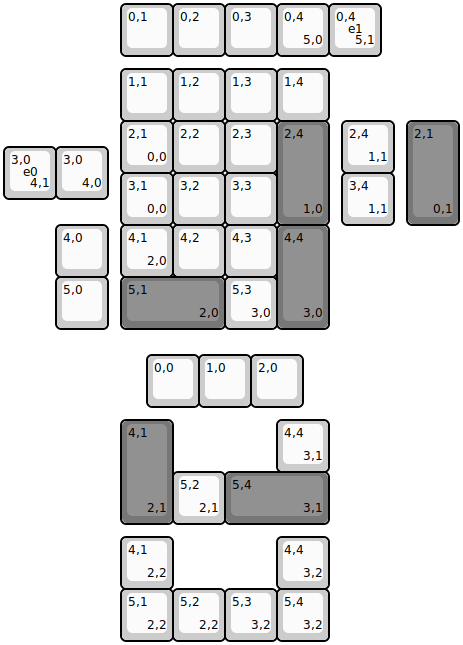{:loading="lazy"}

[Open in keyboard-layout-editor](http://www.keyboard-layout-editor.com/##@@_x:2.25;&=0,1&=0,2&=0,3&=0,4%0A%0A%0A5,0;&@_x:2.25&y:0.25;&=1,1&=1,2&=1,3&=1,4;&@_x:2.25;&=2,1%0A%0A%0A0,0&=2,2&=2,3&_c=#777777&h:2;&=2,4%0A%0A%0A1,0;&@_x:1&y:-0.5&c=#cccccc;&=3,0%0A%0A%0A4,0;&@_x:2.25&y:-0.5;&=3,1%0A%0A%0A0,0&=3,2&=3,3;&@_x:1;&=4,0&_x:0.25;&=4,1%0A%0A%0A2,0&=4,2&=4,3&_c=#777777&h:2;&=4,4%0A%0A%0A3,0;&@_x:1&c=#cccccc;&=5,0&_x:0.25&c=#777777&w:2;&=5,1%0A%0A%0A2,0&_c=#cccccc;&=5,3%0A%0A%0A3,0;&@_x:2.75&y:0.5;&=0,0&=1,0&=2,0;&@_x:6.25&y:-7.75;&=0,4%0A%0A%0A5,1%0A%0A%0A%0A%0A%0Ae1;&@_x:6.5&y:1.25;&=2,4%0A%0A%0A1,1&_x:0.25&c=#777777&h:2;&=2,1%0A%0A%0A0,1;&@_y:-0.5&c=#cccccc;&=3,0%0A%0A%0A4,1%0A%0A%0A%0A%0A%0Ae0;&@_x:6.5&y:-0.5;&=3,4%0A%0A%0A1,1;&@_x:2.25&y:3.75&c=#777777&h:2;&=4,1%0A%0A%0A2,1&_x:2.0&c=#cccccc;&=4,4%0A%0A%0A3,1;&@_x:3.25;&=5,2%0A%0A%0A2,1&_c=#777777&w:2;&=5,4%0A%0A%0A3,1;&@_x:2.25&y:0.25&c=#cccccc;&=4,1%0A%0A%0A2,2&_x:2.0;&=4,4%0A%0A%0A3,2;&@_x:2.25;&=5,1%0A%0A%0A2,2&=5,2%0A%0A%0A2,2&=5,3%0A%0A%0A3,2&=5,4%0A%0A%0A3,2)

## mechwild/obe

[README](output/mechwild/obe/README.md) - [layout](output/mechwild/obe/obe-kle.json) - [PCB](output/mechwild/obe/obe.kicad_pcb) - [PCB render](output/mechwild/obe/obe-render.svg)

{:loading="lazy"}

[Open in keyboard-layout-editor](http://www.keyboard-layout-editor.com/##@@_x:1.8&y:1.05&c=#aaaaaa;&=5,5%0A%0A%0A2,0&_x:0.42&c=#777777;&=5,4&_c=#cccccc;&=5,3&_x:9.53;&=0,6&=0,7&_c=#aaaaaa&w:2;&=0,9%0A%0A%0A0,0;&@_x:1.7;&=6,5&_x:0.27&w:1.5;&=5,9&_c=#cccccc;&=5,8&_x:9.03;&=1,6&=1,7&=1,8&_w:1.5;&=1,9;&@_x:1.6&c=#aaaaaa;&=6,4&_x:0.3&w:1.72;&=6,9&_c=#cccccc;&=6,8&_x:9.23;&=2,7&=2,8&_c=#777777&w:2.25;&=2,9;&@_x:2.72&c=#aaaaaa&w:2.25;&=6,2&_c=#cccccc;&=6,0&_x:8.53;&=3,6&=3,7&_c=#777777;&=3,8%0A%0A%0A1,0&_c=#aaaaaa&w:1.75;&=3,9%0A%0A%0A1,0;&@_x:2.97&w:1.25;&=6,1&_w:1.25;&=4,0&_x:9.03;&=4,6&_c=#777777;&=4,7&=4,8&=4,9;&@_r:10&rx:2.75&ry:3.75&x:2.25&y:-3.25&c=#cccccc;&=5,2&=5,1&=5,0&=0,0&=0,1;&@_x:2.75;&=5,7&=5,6&=1,0&=1,1;&@_x:3.0;&=6,3&=2,0&=2,1&=2,2;&@_x:3.5;&=6,7&=6,6&=3,0&=3,1;&@_x:3.5&c=#aaaaaa&w:1.25;&=4,1&_c=#cccccc&w:2.25;&=4,2&_c=#aaaaaa;&=4,3;&@_r:-10&rx:12&ry:4.25&x:-1&y:-2.75&c=#cccccc;&=0,2&=0,3&=0,4&=0,5;&@_x:-1.5;&=1,2&=1,3&=1,4&=1,5;&@_x:-1.25;&=2,3&=2,4&=2,5&=2,6;&@_x:-1.75;&=3,2&=3,3&=3,4&=3,5;&@_x:-1.75&w:2.75;&=4,4&_c=#aaaaaa;&=4,5;&@_r:0&rx:0&ry:0&x:0.8&y:1.05;&=5,5%0A%0A%0A2,1%0A%0A%0A%0A%0A%0Ae0&_x:17.7&c=#cccccc;&=0,8%0A%0A%0A0,1&_c=#aaaaaa;&=0,9%0A%0A%0A0,1;&@_x:19.5&y:2.0&w:2.75;&=3,9%0A%0A%0A1,1)

## mechwild/waka60

[README](output/mechwild/waka60/README.md) - [layout](output/mechwild/waka60/waka60-kle.json) - [PCB](output/mechwild/waka60/waka60.kicad_pcb) - [PCB render](output/mechwild/waka60/waka60-render.svg)

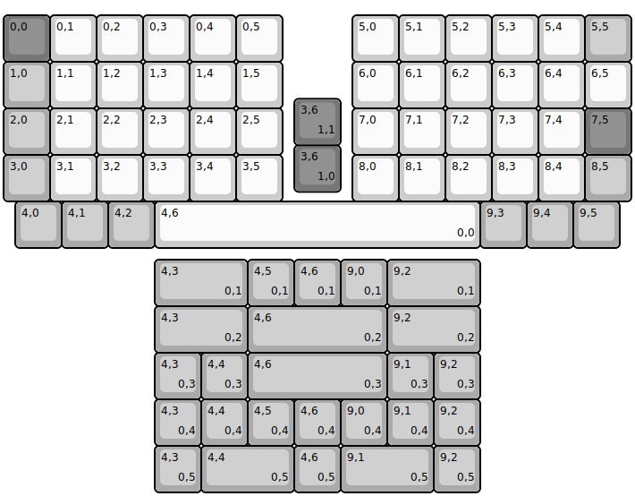{:loading="lazy"}

[Open in keyboard-layout-editor](http://www.keyboard-layout-editor.com/##@@_y:0.25&c=#777777;&=0,0&_c=#cccccc;&=0,1&=0,2&=0,3&=0,4&=0,5&_x:1.5;&=5,0&=5,1&=5,2&=5,3&=5,4&_c=#aaaaaa;&=5,5;&@=1,0&_c=#cccccc;&=1,1&=1,2&=1,3&=1,4&=1,5&_x:1.5;&=6,0&=6,1&=6,2&=6,3&=6,4&=6,5;&@_c=#aaaaaa;&=2,0&_c=#cccccc;&=2,1&=2,2&=2,3&=2,4&=2,5&_x:1.5;&=7,0&=7,1&=7,2&=7,3&=7,4&_c=#777777;&=7,5;&@_x:6.25&y:-0.205;&=3,6%0A%0A%0A1,0;&@_y:-0.795&c=#aaaaaa;&=3,0&_c=#cccccc;&=3,1&=3,2&=3,3&=3,4&=3,5&_x:1.5;&=8,0&=8,1&=8,2&=8,3&=8,4&_c=#aaaaaa;&=8,5;&@_x:0.25;&=4,0&=4,1&=4,2&_c=#cccccc&w:7;&=4,6%0A%0A%0A0,0&_c=#aaaaaa;&=9,3&=9,4&=9,5;&@_x:6.25&y:-3.205&c=#777777;&=3,6%0A%0A%0A1,1%0A%0A%0A%0A%0A%0Ae0;&@_x:3.25&y:2.455&c=#aaaaaa&w:2;&=4,3%0A%0A%0A0,1&=4,5%0A%0A%0A0,1&=4,6%0A%0A%0A0,1&=9,0%0A%0A%0A0,1&_w:2;&=9,2%0A%0A%0A0,1;&@_x:3.25&w:2;&=4,3%0A%0A%0A0,2&_w:3;&=4,6%0A%0A%0A0,2&_w:2;&=9,2%0A%0A%0A0,2;&@_x:3.25;&=4,3%0A%0A%0A0,3&=4,4%0A%0A%0A0,3&_w:3;&=4,6%0A%0A%0A0,3&=9,1%0A%0A%0A0,3&=9,2%0A%0A%0A0,3;&@_x:3.25;&=4,3%0A%0A%0A0,4&=4,4%0A%0A%0A0,4&=4,5%0A%0A%0A0,4&=4,6%0A%0A%0A0,4&=9,0%0A%0A%0A0,4&=9,1%0A%0A%0A0,4&=9,2%0A%0A%0A0,4;&@_x:3.25;&=4,3%0A%0A%0A0,5&_w:2;&=4,4%0A%0A%0A0,5&=4,6%0A%0A%0A0,5&_w:2;&=9,1%0A%0A%0A0,5&=9,2%0A%0A%0A0,5)

## meishi2/meishi2

[README](output/meishi2/README.md) - [layout](output/meishi2/meishi2-kle.json) - [PCB](output/meishi2/meishi2.kicad_pcb) - [PCB render](output/meishi2/meishi2-render.svg)

{:loading="lazy"}

[Open in keyboard-layout-editor](http://www.keyboard-layout-editor.com/##@@=0,0&=0,1&=1,0&=1,1)

## meletrix/zoom65

[README](output/meletrix/zoom65/README.md) - [layout](output/meletrix/zoom65/zoom65-kle.json) - [PCB](output/meletrix/zoom65/zoom65.kicad_pcb) - [PCB render](output/meletrix/zoom65/zoom65-render.svg)

{:loading="lazy"}

[Open in keyboard-layout-editor](http://www.keyboard-layout-editor.com/##@@_x:2.25&y:1.5;&=0,0&=0,1&=0,2&=0,3&=0,4&=0,5&=0,6&=0,7&=0,8&=0,9&=0,10&=0,11&=0,12&_w:2;&=0,14%0A%0A%0A0,0&=0,15&_x:0.25;&=2,12&=1,15;&@_x:2.25&w:1.5;&=1,0&=1,1&=1,2&=1,3&=1,4&=1,5&=1,6&=1,7&=1,8&=1,9&=1,10&=1,11&=1,12&_w:1.5;&=1,13%0A%0A%0A1,0&=1,14;&@_x:2.25&w:1.75;&=2,0&=2,1&=2,2&=2,3&=2,4&=2,5&=2,6&=2,7&=2,8&=2,9&=2,10&=2,11&_w:2.25;&=2,13%0A%0A%0A1,0&=2,14;&@_x:2.25&w:2.25;&=3,0%0A%0A%0A2,0&=3,2&=3,3&=3,4&=3,5&=3,6&=3,7&=3,8&=3,9&=3,10&=3,11&_w:1.75;&=3,12&=3,13&=3,14;&@_x:2.25&w:1.25;&=4,0&_w:1.25;&=4,1&_w:1.25;&=4,2&_w:6.25;&=4,7%0A%0A%0A3,0&_w:1.25;&=4,10&_w:1.25;&=4,11&_x:0.5;&=4,12&=4,13&=4,14;&@_x:15.25&y:-6.0;&=0,13%0A%0A%0A0,1&=0,14%0A%0A%0A0,1;&@_y:3.0&w:1.25;&=3,0%0A%0A%0A2,1&=3,1%0A%0A%0A2,1&_x:17.0&w:1.25&h:2&w2:1.5&h2:1&x2:-0.25;&=2,13%0A%0A%0A1,1;&@_x:18.25;&=1,13%0A%0A%0A1,1;&@_x:6&w:2.25;&=4,3%0A%0A%0A3,1&_w:1.25;&=4,6%0A%0A%0A3,1&_w:2.75;&=4,7%0A%0A%0A3,1)

## meletrix/zoom65_lite

[README](output/meletrix/zoom65_lite/README.md) - [layout](output/meletrix/zoom65_lite/zoom65_lite-kle.json) - [PCB](output/meletrix/zoom65_lite/zoom65_lite.kicad_pcb) - [PCB render](output/meletrix/zoom65_lite/zoom65_lite-render.svg)

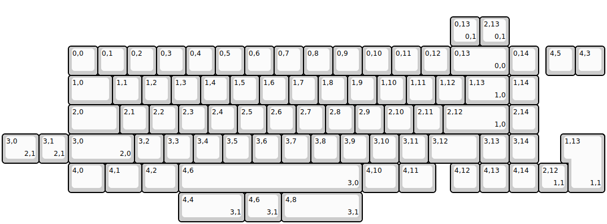{:loading="lazy"}

[Open in keyboard-layout-editor](http://www.keyboard-layout-editor.com/##@@_x:2.25&y:1.5;&=0,0&=0,1&=0,2&=0,3&=0,4&=0,5&=0,6&=0,7&=0,8&=0,9&=0,10&=0,11&=0,12&_w:2;&=0,13%0A%0A%0A0,0&=0,14&_x:0.25;&=4,5&=4,3;&@_x:2.25&w:1.5;&=1,0&=1,1&=1,2&=1,3&=1,4&=1,5&=1,6&=1,7&=1,8&=1,9&=1,10&=1,11&=1,12&_w:1.5;&=1,13%0A%0A%0A1,0&=1,14;&@_x:2.25&w:1.75;&=2,0&=2,1&=2,2&=2,3&=2,4&=2,5&=2,6&=2,7&=2,8&=2,9&=2,10&=2,11&_w:2.25;&=2,12%0A%0A%0A1,0&=2,14;&@_x:2.25&w:2.25;&=3,0%0A%0A%0A2,0&=3,2&=3,3&=3,4&=3,5&=3,6&=3,7&=3,8&=3,9&=3,10&=3,11&_w:1.75;&=3,12&=3,13&=3,14;&@_x:2.25&w:1.25;&=4,0&_w:1.25;&=4,1&_w:1.25;&=4,2&_w:6.25;&=4,6%0A%0A%0A3,0&_w:1.25;&=4,10&_w:1.25;&=4,11&_x:0.5;&=4,12&=4,13&=4,14;&@_x:15.25&y:-6.0;&=0,13%0A%0A%0A0,1&=2,13%0A%0A%0A0,1;&@_y:3.0&w:1.25;&=3,0%0A%0A%0A2,1&=3,1%0A%0A%0A2,1&_x:17.0&w:1.25&h:2&w2:1.5&h2:1&x2:-0.25;&=1,13%0A%0A%0A1,1;&@_x:18.25;&=2,12%0A%0A%0A1,1;&@_x:6&w:2.25;&=4,4%0A%0A%0A3,1&_w:1.25;&=4,6%0A%0A%0A3,1&_w:2.75;&=4,8%0A%0A%0A3,1)

## meletrix/zoom75

[README](output/meletrix/zoom75/README.md) - [layout](output/meletrix/zoom75/zoom75-kle.json) - [PCB](output/meletrix/zoom75/zoom75.kicad_pcb) - [PCB render](output/meletrix/zoom75/zoom75-render.svg)

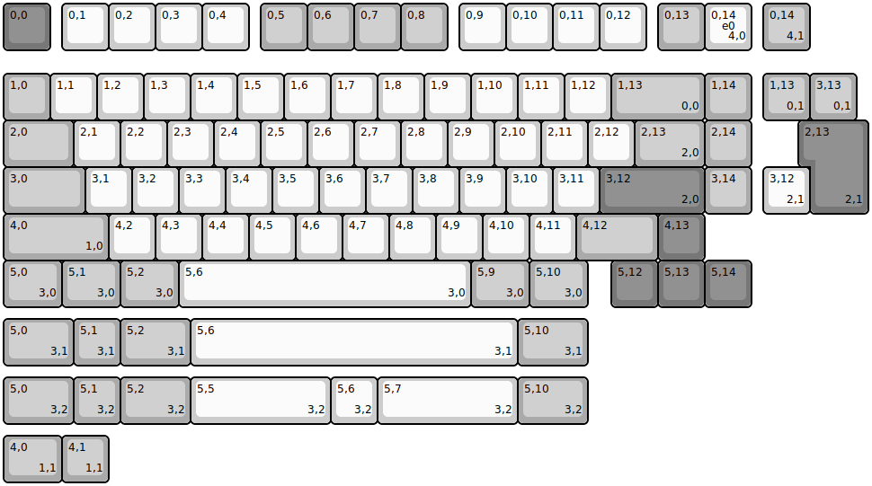{:loading="lazy"}

[Open in keyboard-layout-editor](http://www.keyboard-layout-editor.com/##@@_c=#777777;&=0,0&_x:0.25&c=#cccccc;&=0,1&=0,2&=0,3&=0,4&_x:0.25&c=#aaaaaa;&=0,5&=0,6&=0,7&=0,8&_x:0.25&c=#cccccc;&=0,9&=0,10&=0,11&=0,12&_x:0.25&c=#aaaaaa;&=0,13&_c=#cccccc;&=0,14%0A%0A%0A4,0%0A%0A%0A%0A%0A%0Ae0;&@_y:0.5&c=#aaaaaa;&=1,0&_c=#cccccc;&=1,1&=1,2&=1,3&=1,4&=1,5&=1,6&=1,7&=1,8&=1,9&=1,10&=1,11&=1,12&_c=#aaaaaa&w:2;&=1,13%0A%0A%0A0,0&=1,14;&@_w:1.5;&=2,0&_c=#cccccc;&=2,1&=2,2&=2,3&=2,4&=2,5&=2,6&=2,7&=2,8&=2,9&=2,10&=2,11&=2,12&_c=#aaaaaa&w:1.5;&=2,13%0A%0A%0A2,0&=2,14;&@_w:1.75;&=3,0&_c=#cccccc;&=3,1&=3,2&=3,3&=3,4&=3,5&=3,6&=3,7&=3,8&=3,9&=3,10&=3,11&_c=#777777&w:2.25;&=3,12%0A%0A%0A2,0&_c=#aaaaaa;&=3,14;&@_w:2.25;&=4,0%0A%0A%0A1,0&_c=#cccccc;&=4,2&=4,3&=4,4&=4,5&=4,6&=4,7&=4,8&=4,9&=4,10&=4,11&_c=#aaaaaa&f:2&w:1.75;&=4,12&_c=#777777&f:3;&=4,13;&@_c=#aaaaaa&w:1.25;&=5,0%0A%0A%0A3,0&_w:1.25;&=5,1%0A%0A%0A3,0&_w:1.25;&=5,2%0A%0A%0A3,0&_c=#cccccc&w:6.25;&=5,6%0A%0A%0A3,0&_c=#aaaaaa&w:1.25;&=5,9%0A%0A%0A3,0&_w:1.25;&=5,10%0A%0A%0A3,0&_x:0.5&c=#777777;&=5,12&=5,13&=5,14;&@_x:16.25&y:-6.5&c=#aaaaaa;&=0,14%0A%0A%0A4,1;&@_x:16.25&y:0.5;&=1,13%0A%0A%0A0,1&=3,13%0A%0A%0A0,1;&@_x:17.25&c=#777777&w:1.25&h:2&w2:1.5&h2:1&x2:-0.25;&=2,13%0A%0A%0A2,1;&@_x:16.25&c=#cccccc;&=3,12%0A%0A%0A2,1;&@_y:2.25&c=#aaaaaa&w:1.5;&=5,0%0A%0A%0A3,1&=5,1%0A%0A%0A3,1&_w:1.5;&=5,2%0A%0A%0A3,1&_c=#cccccc&w:7;&=5,6%0A%0A%0A3,1&_c=#aaaaaa&w:1.5;&=5,10%0A%0A%0A3,1;&@_y:0.25&w:1.5;&=5,0%0A%0A%0A3,2&=5,1%0A%0A%0A3,2&_w:1.5;&=5,2%0A%0A%0A3,2&_c=#cccccc&w:3;&=5,5%0A%0A%0A3,2&=5,6%0A%0A%0A3,2&_w:3;&=5,7%0A%0A%0A3,2&_c=#aaaaaa&w:1.5;&=5,10%0A%0A%0A3,2;&@_y:0.25&w:1.25;&=4,0%0A%0A%0A1,1&=4,1%0A%0A%0A1,1)

## meletrix/zoom87

[README](output/meletrix/zoom87/README.md) - [layout](output/meletrix/zoom87/zoom87-kle.json) - [PCB](output/meletrix/zoom87/zoom87.kicad_pcb) - [PCB render](output/meletrix/zoom87/zoom87-render.svg)

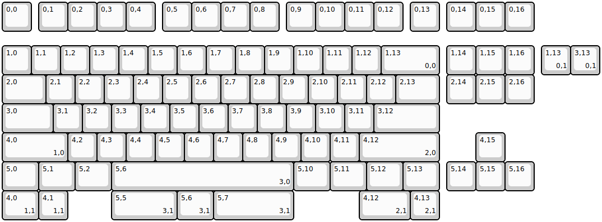{:loading="lazy"}

[Open in keyboard-layout-editor](http://www.keyboard-layout-editor.com/##@@=0,0&_x:0.25;&=0,1&=0,2&=0,3&=0,4&_x:0.25;&=0,5&=0,6&=0,7&=0,8&_x:0.25;&=0,9&=0,10&=0,11&=0,12&_x:0.25;&=0,13&_x:0.25;&=0,14&=0,15&=0,16;&@_y:0.5;&=1,0&=1,1&=1,2&=1,3&=1,4&=1,5&=1,6&=1,7&=1,8&=1,9&=1,10&=1,11&=1,12&_w:2;&=1,13%0A%0A%0A0,0&_x:0.25;&=1,14&=1,15&=1,16;&@_w:1.5;&=2,0&=2,1&=2,2&=2,3&=2,4&=2,5&=2,6&=2,7&=2,8&=2,9&=2,10&=2,11&=2,12&_w:1.5;&=2,13&_x:0.25;&=2,14&=2,15&=2,16;&@_w:1.75;&=3,0&=3,1&=3,2&=3,3&=3,4&=3,5&=3,6&=3,7&=3,8&=3,9&=3,10&=3,11&_w:2.25;&=3,12;&@_w:2.25;&=4,0%0A%0A%0A1,0&=4,2&=4,3&=4,4&=4,5&=4,6&=4,7&=4,8&=4,9&=4,10&=4,11&_w:2.75;&=4,12%0A%0A%0A2,0&_x:1.25;&=4,15;&@_w:1.25;&=5,0&_w:1.25;&=5,1&_w:1.25;&=5,2&_w:6.25;&=5,6%0A%0A%0A3,0&_w:1.25;&=5,10&_w:1.25;&=5,11&_w:1.25;&=5,12&_w:1.25;&=5,13&_x:0.25;&=5,14&=5,15&=5,16;&@_x:18.5&y:-5.0;&=1,13%0A%0A%0A0,1&=3,13%0A%0A%0A0,1;&@_y:4.0&w:1.25;&=4,0%0A%0A%0A1,1&=4,1%0A%0A%0A1,1&_x:1.5&w:2.25;&=5,5%0A%0A%0A3,1&_w:1.25;&=5,6%0A%0A%0A3,1&_w:2.75;&=5,7%0A%0A%0A3,1&_x:2.25&w:1.75;&=4,12%0A%0A%0A2,1&=4,13%0A%0A%0A2,1)

## melgeek/mach80/mach80_rev1

[README](output/melgeek/mach80/README.md) - [layout](output/melgeek/mach80/mach80_rev1-kle.json) - [PCB](output/melgeek/mach80/mach80_rev1.kicad_pcb) - [PCB render](output/melgeek/mach80/mach80_rev1-render.svg)

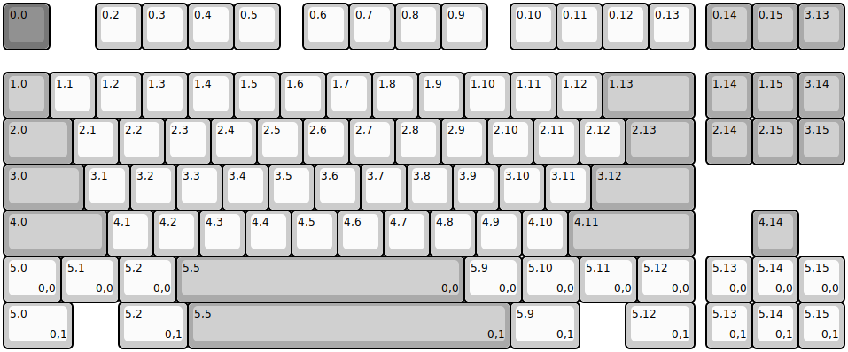{:loading="lazy"}

[Open in keyboard-layout-editor](http://www.keyboard-layout-editor.com/##@@_c=#777777;&=0,0&_x:1.0&c=#cccccc;&=0,2&=0,3&=0,4&=0,5&_x:0.5;&=0,6&=0,7&=0,8&=0,9&_x:0.5;&=0,10&=0,11&=0,12&=0,13&_x:0.25&c=#aaaaaa;&=0,14&=0,15&=3,13;&@_y:0.5;&=1,0&_c=#cccccc;&=1,1&=1,2&=1,3&=1,4&=1,5&=1,6&=1,7&=1,8&=1,9&=1,10&=1,11&=1,12&_c=#aaaaaa&w:2.0;&=1,13&_x:0.25;&=1,14&=1,15&=3,14;&@_w:1.5;&=2,0&_c=#cccccc;&=2,1&=2,2&=2,3&=2,4&=2,5&=2,6&=2,7&=2,8&=2,9&=2,10&=2,11&=2,12&_c=#aaaaaa&w:1.5;&=2,13&_x:0.25;&=2,14&=2,15&=3,15;&@_w:1.75;&=3,0&_c=#cccccc;&=3,1&=3,2&=3,3&=3,4&=3,5&=3,6&=3,7&=3,8&=3,9&=3,10&=3,11&_c=#aaaaaa&w:2.25;&=3,12;&@_w:2.25;&=4,0&_c=#cccccc;&=4,1&=4,2&=4,3&=4,4&=4,5&=4,6&=4,7&=4,8&=4,9&=4,10&_c=#aaaaaa&w:2.75;&=4,11&_x:1.25;&=4,14;&@_c=#cccccc&w:1.25;&=5,0%0A%0A%0A0,0&_w:1.25;&=5,1%0A%0A%0A0,0&_w:1.25;&=5,2%0A%0A%0A0,0&_c=#aaaaaa&w:6.25;&=5,5%0A%0A%0A0,0&_c=#cccccc&w:1.25;&=5,9%0A%0A%0A0,0&_w:1.25;&=5,10%0A%0A%0A0,0&_w:1.25;&=5,11%0A%0A%0A0,0&_w:1.25;&=5,12%0A%0A%0A0,0&_x:0.25;&=5,13%0A%0A%0A0,0&=5,14%0A%0A%0A0,0&=5,15%0A%0A%0A0,0;&@_w:1.5;&=5,0%0A%0A%0A0,1&_x:1.0&w:1.5;&=5,2%0A%0A%0A0,1&_c=#aaaaaa&w:7.0;&=5,5%0A%0A%0A0,1&_c=#cccccc&w:1.5;&=5,9%0A%0A%0A0,1&_x:1.0&w:1.5;&=5,12%0A%0A%0A0,1&_x:0.25;&=5,13%0A%0A%0A0,1&=5,14%0A%0A%0A0,1&=5,15%0A%0A%0A0,1)

## melgeek/mj61/mj61_rev1

[README](output/melgeek/mj61/README.md) - [layout](output/melgeek/mj61/mj61_rev1-kle.json) - [PCB](output/melgeek/mj61/mj61_rev1.kicad_pcb) - [PCB render](output/melgeek/mj61/mj61_rev1-render.svg)

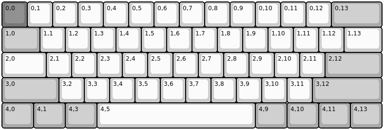{:loading="lazy"}

[Open in keyboard-layout-editor](http://www.keyboard-layout-editor.com/##@@_c=#777777;&=0,0&_c=#cccccc;&=0,1&=0,2&=0,3&=0,4&=0,5&=0,6&=0,7&=0,8&=0,9&=0,10&=0,11&=0,12&_c=#aaaaaa&w:2;&=0,13;&@_w:1.5;&=1,0&_c=#cccccc;&=1,1&=1,2&=1,3&=1,4&=1,5&=1,6&=1,7&=1,8&=1,9&=1,10&=1,11&=1,12&_w:1.5;&=1,13;&@_w:1.75;&=2,0&=2,1&=2,2&=2,3&=2,4&=2,5&=2,6&=2,7&=2,8&=2,9&=2,10&=2,11&_c=#aaaaaa&w:2.25;&=2,12;&@_w:2.25;&=3,0&_c=#cccccc;&=3,2&=3,3&=3,4&=3,5&=3,6&=3,7&=3,8&=3,9&=3,10&=3,11&_c=#aaaaaa&w:2.75;&=3,12;&@_w:1.25;&=4,0&_w:1.25;&=4,1&_w:1.25;&=4,3&_c=#cccccc&w:6.25;&=4,5&_c=#aaaaaa&w:1.25;&=4,9&_w:1.25;&=4,10&_w:1.25;&=4,11&_w:1.25;&=4,13)

## melgeek/mj63/mj63_rev1

[README](output/melgeek/mj63/README.md) - [layout](output/melgeek/mj63/mj63_rev1-kle.json) - [PCB](output/melgeek/mj63/mj63_rev1.kicad_pcb) - [PCB render](output/melgeek/mj63/mj63_rev1-render.svg)

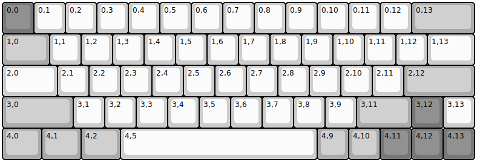{:loading="lazy"}

[Open in keyboard-layout-editor](http://www.keyboard-layout-editor.com/##@@_c=#777777;&=0,0&_c=#cccccc;&=0,1&=0,2&=0,3&=0,4&=0,5&=0,6&=0,7&=0,8&=0,9&=0,10&=0,11&=0,12&_c=#aaaaaa&w:2;&=0,13;&@_w:1.5;&=1,0&_c=#cccccc;&=1,1&=1,2&=1,3&=1,4&=1,5&=1,6&=1,7&=1,8&=1,9&=1,10&=1,11&=1,12&_w:1.5;&=1,13;&@_w:1.75;&=2,0&=2,1&=2,2&=2,3&=2,4&=2,5&=2,6&=2,7&=2,8&=2,9&=2,10&=2,11&_c=#aaaaaa&w:2.25;&=2,12;&@_w:2.25;&=3,0&_c=#cccccc;&=3,1&=3,2&=3,3&=3,4&=3,5&=3,6&=3,7&=3,8&=3,9&_c=#aaaaaa&w:1.75;&=3,11&_c=#777777;&=3,12&_c=#cccccc;&=3,13;&@_c=#aaaaaa&w:1.25;&=4,0&_w:1.25;&=4,1&_w:1.25;&=4,2&_c=#cccccc&w:6.25;&=4,5&_c=#aaaaaa;&=4,9&=4,10&_c=#777777;&=4,11&=4,12&=4,13)

## melgeek/mj64/mj64_rev1

[README](output/melgeek/mj64/README.md) - [layout](output/melgeek/mj64/mj64_rev1-kle.json) - [PCB](output/melgeek/mj64/mj64_rev1.kicad_pcb) - [PCB render](output/melgeek/mj64/mj64_rev1-render.svg)

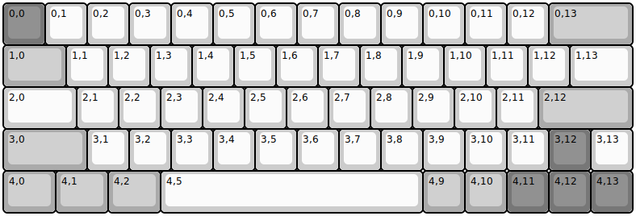{:loading="lazy"}

[Open in keyboard-layout-editor](http://www.keyboard-layout-editor.com/##@@_c=#777777;&=0,0&_c=#cccccc;&=0,1&=0,2&=0,3&=0,4&=0,5&=0,6&=0,7&=0,8&=0,9&=0,10&=0,11&=0,12&_c=#aaaaaa&w:2;&=0,13;&@_w:1.5;&=1,0&_c=#cccccc;&=1,1&=1,2&=1,3&=1,4&=1,5&=1,6&=1,7&=1,8&=1,9&=1,10&=1,11&=1,12&_w:1.5;&=1,13;&@_w:1.75;&=2,0&=2,1&=2,2&=2,3&=2,4&=2,5&=2,6&=2,7&=2,8&=2,9&=2,10&=2,11&_c=#aaaaaa&w:2.25;&=2,12;&@_w:2;&=3,0&_c=#cccccc;&=3,1&=3,2&=3,3&=3,4&=3,5&=3,6&=3,7&=3,8&=3,9&=3,10&=3,11&_c=#777777;&=3,12&_c=#cccccc;&=3,13;&@_c=#aaaaaa&w:1.25;&=4,0&_w:1.25;&=4,1&_w:1.25;&=4,2&_c=#cccccc&w:6.25;&=4,5&_c=#aaaaaa;&=4,9&=4,10&_c=#777777;&=4,11&=4,12&=4,13)

## melgeek/mj65/mj65_rev3

[README](output/melgeek/mj65/README.md) - [layout](output/melgeek/mj65/mj65_rev3-kle.json) - [PCB](output/melgeek/mj65/mj65_rev3.kicad_pcb) - [PCB render](output/melgeek/mj65/mj65_rev3-render.svg)

{:loading="lazy"}

[Open in keyboard-layout-editor](http://www.keyboard-layout-editor.com/##@@_c=#777777;&=0,0&_c=#cccccc;&=0,1&=0,2&=0,3&=0,4&=0,5&=0,6&=0,7&=0,8&=0,9&=0,10&=0,11&=0,12&_c=#aaaaaa&w:2;&=0,13&_c=#cccccc;&=0,14;&@_w:1.5;&=1,0&=1,1&=1,2&=1,3&=1,4&=1,5&=1,6&=1,7&=1,8&=1,9&=1,10&=1,11&=1,12&_w:1.5;&=1,13&=1,14;&@_w:1.75;&=2,0&=2,1&=2,2&=2,3&=2,4&=2,5&=2,6&=2,7&=2,8&=2,9&=2,10&=2,11&_c=#aaaaaa&w:2.25;&=2,12&_c=#cccccc;&=2,14;&@_c=#aaaaaa&w:2.25;&=3,0&_c=#cccccc;&=3,1&=3,2&=3,3&=3,4&=3,5&=3,6&=3,7&=3,8&=3,9&=3,10&_c=#aaaaaa&w:1.75;&=3,11&_c=#cccccc;&=3,12&=3,14;&@_c=#aaaaaa&w:1.25;&=4,0&_w:1.25;&=4,1&_w:1.25;&=4,2&_c=#cccccc&w:6.25;&=4,5&_c=#aaaaaa;&=4,9&=4,10&=4,11&_c=#cccccc;&=4,12&=4,13&=4,14)

## melgeek/mj6xy/mj6xy_rev3

[README](output/melgeek/mj6xy/README.md) - [layout](output/melgeek/mj6xy/mj6xy_rev3-kle.json) - [PCB](output/melgeek/mj6xy/mj6xy_rev3.kicad_pcb) - [PCB render](output/melgeek/mj6xy/mj6xy_rev3-render.svg)

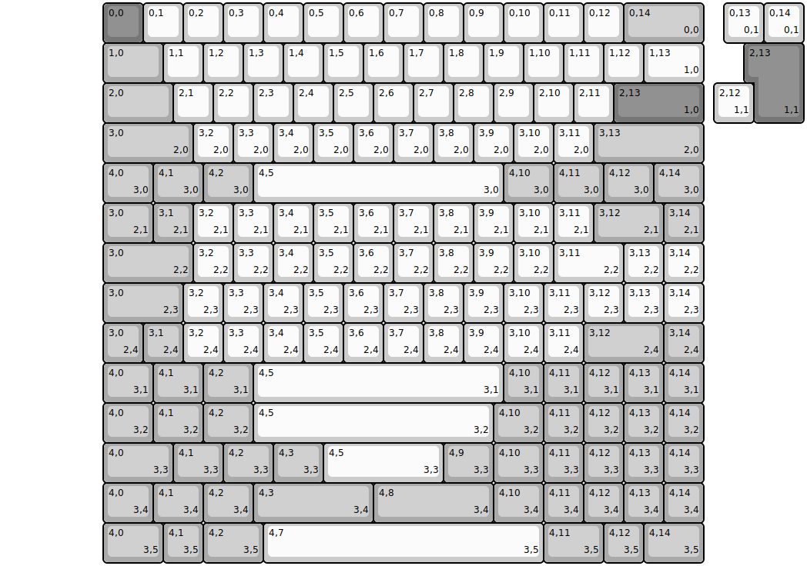{:loading="lazy"}

[Open in keyboard-layout-editor](http://www.keyboard-layout-editor.com/##@@_x:2.5&c=#777777;&=0,0&_c=#cccccc;&=0,1&=0,2&=0,3&=0,4&=0,5&=0,6&=0,7&=0,8&=0,9&=0,10&=0,11&=0,12&_c=#aaaaaa&w:2;&=0,14%0A%0A%0A0,0;&@_x:2.5&w:1.5;&=1,0&_c=#cccccc;&=1,1&=1,2&=1,3&=1,4&=1,5&=1,6&=1,7&=1,8&=1,9&=1,10&=1,11&=1,12&_w:1.5;&=1,13%0A%0A%0A1,0;&@_x:2.5&c=#aaaaaa&w:1.75;&=2,0&_c=#cccccc;&=2,1&=2,2&=2,3&=2,4&=2,5&=2,6&=2,7&=2,8&=2,9&=2,10&=2,11&_c=#777777&w:2.25;&=2,13%0A%0A%0A1,0;&@_x:2.5&c=#aaaaaa&w:2.25;&=3,0%0A%0A%0A2,0&_c=#cccccc;&=3,2%0A%0A%0A2,0&=3,3%0A%0A%0A2,0&=3,4%0A%0A%0A2,0&=3,5%0A%0A%0A2,0&=3,6%0A%0A%0A2,0&=3,7%0A%0A%0A2,0&=3,8%0A%0A%0A2,0&=3,9%0A%0A%0A2,0&=3,10%0A%0A%0A2,0&=3,11%0A%0A%0A2,0&_c=#aaaaaa&w:2.75;&=3,13%0A%0A%0A2,0;&@_x:2.5&w:1.25;&=4,0%0A%0A%0A3,0&_w:1.25;&=4,1%0A%0A%0A3,0&_w:1.25;&=4,2%0A%0A%0A3,0&_c=#cccccc&w:6.25;&=4,5%0A%0A%0A3,0&_c=#aaaaaa&w:1.25;&=4,10%0A%0A%0A3,0&_w:1.25;&=4,11%0A%0A%0A3,0&_w:1.25;&=4,12%0A%0A%0A3,0&_w:1.25;&=4,14%0A%0A%0A3,0;&@_x:18.0&y:-5&c=#cccccc;&=0,13%0A%0A%0A0,1&=0,14%0A%0A%0A0,1;&@_x:18.75&c=#777777&w:1.25&h:2&w2:1.5&h2:1&x2:-0.25;&=2,13%0A%0A%0A1,1;&@_x:17.75&c=#cccccc;&=2,12%0A%0A%0A1,1;&@_x:2.5&y:2&c=#aaaaaa&w:1.25;&=3,0%0A%0A%0A2,1&=3,1%0A%0A%0A2,1&_c=#cccccc;&=3,2%0A%0A%0A2,1&=3,3%0A%0A%0A2,1&=3,4%0A%0A%0A2,1&=3,5%0A%0A%0A2,1&=3,6%0A%0A%0A2,1&=3,7%0A%0A%0A2,1&=3,8%0A%0A%0A2,1&=3,9%0A%0A%0A2,1&=3,10%0A%0A%0A2,1&=3,11%0A%0A%0A2,1&_c=#aaaaaa&w:1.75;&=3,12%0A%0A%0A2,1&=3,14%0A%0A%0A2,1;&@_x:2.5&w:2.25;&=3,0%0A%0A%0A2,2&_c=#cccccc;&=3,2%0A%0A%0A2,2&=3,3%0A%0A%0A2,2&=3,4%0A%0A%0A2,2&=3,5%0A%0A%0A2,2&=3,6%0A%0A%0A2,2&=3,7%0A%0A%0A2,2&=3,8%0A%0A%0A2,2&=3,9%0A%0A%0A2,2&=3,10%0A%0A%0A2,2&_w:1.75;&=3,11%0A%0A%0A2,2&=3,13%0A%0A%0A2,2&=3,14%0A%0A%0A2,2;&@_x:2.5&c=#aaaaaa&w:2.0;&=3,0%0A%0A%0A2,3&_c=#cccccc;&=3,2%0A%0A%0A2,3&=3,3%0A%0A%0A2,3&=3,4%0A%0A%0A2,3&=3,5%0A%0A%0A2,3&=3,6%0A%0A%0A2,3&=3,7%0A%0A%0A2,3&=3,8%0A%0A%0A2,3&=3,9%0A%0A%0A2,3&=3,10%0A%0A%0A2,3&=3,11%0A%0A%0A2,3&=3,12%0A%0A%0A2,3&=3,13%0A%0A%0A2,3&=3,14%0A%0A%0A2,3;&@_x:2.5&c=#aaaaaa;&=3,0%0A%0A%0A2,4&=3,1%0A%0A%0A2,4&_c=#cccccc;&=3,2%0A%0A%0A2,4&=3,3%0A%0A%0A2,4&=3,4%0A%0A%0A2,4&=3,5%0A%0A%0A2,4&=3,6%0A%0A%0A2,4&=3,7%0A%0A%0A2,4&=3,8%0A%0A%0A2,4&=3,9%0A%0A%0A2,4&=3,10%0A%0A%0A2,4&=3,11%0A%0A%0A2,4&_c=#aaaaaa&w:2.0;&=3,12%0A%0A%0A2,4&=3,14%0A%0A%0A2,4;&@_x:2.5&w:1.25;&=4,0%0A%0A%0A3,1&_w:1.25;&=4,1%0A%0A%0A3,1&_w:1.25;&=4,2%0A%0A%0A3,1&_c=#cccccc&w:6.25;&=4,5%0A%0A%0A3,1&_c=#aaaaaa;&=4,10%0A%0A%0A3,1&=4,11%0A%0A%0A3,1&=4,12%0A%0A%0A3,1&=4,13%0A%0A%0A3,1&=4,14%0A%0A%0A3,1;&@_x:2.5&w:1.25;&=4,0%0A%0A%0A3,2&_w:1.25;&=4,1%0A%0A%0A3,2&_w:1.25;&=4,2%0A%0A%0A3,2&_c=#cccccc&w:6.0;&=4,5%0A%0A%0A3,2&_c=#aaaaaa&w:1.25;&=4,10%0A%0A%0A3,2&=4,11%0A%0A%0A3,2&=4,12%0A%0A%0A3,2&=4,13%0A%0A%0A3,2&=4,14%0A%0A%0A3,2;&@_x:2.5&w:1.75;&=4,0%0A%0A%0A3,3&_w:1.25;&=4,1%0A%0A%0A3,3&_w:1.25;&=4,2%0A%0A%0A3,3&_w:1.25;&=4,3%0A%0A%0A3,3&_c=#cccccc&w:3.0;&=4,5%0A%0A%0A3,3&_c=#aaaaaa&w:1.25;&=4,9%0A%0A%0A3,3&_w:1.25;&=4,10%0A%0A%0A3,3&=4,11%0A%0A%0A3,3&=4,12%0A%0A%0A3,3&=4,13%0A%0A%0A3,3&=4,14%0A%0A%0A3,3;&@_x:2.5&w:1.25;&=4,0%0A%0A%0A3,4&_w:1.25;&=4,1%0A%0A%0A3,4&_w:1.25;&=4,2%0A%0A%0A3,4&_w:3.0;&=4,3%0A%0A%0A3,4&_w:3.0;&=4,8%0A%0A%0A3,4&_w:1.25;&=4,10%0A%0A%0A3,4&=4,11%0A%0A%0A3,4&=4,12%0A%0A%0A3,4&=4,13%0A%0A%0A3,4&=4,14%0A%0A%0A3,4;&@_x:2.5&w:1.5;&=4,0%0A%0A%0A3,5&=4,1%0A%0A%0A3,5&_w:1.5;&=4,2%0A%0A%0A3,5&_c=#cccccc&w:7.0;&=4,7%0A%0A%0A3,5&_c=#aaaaaa&w:1.5;&=4,11%0A%0A%0A3,5&=4,12%0A%0A%0A3,5&_w:1.5;&=4,14%0A%0A%0A3,5)

## melgeek/mojo68/mojo68_rev1

[README](output/melgeek/mojo68/README.md) - [layout](output/melgeek/mojo68/mojo68_rev1-kle.json) - [PCB](output/melgeek/mojo68/mojo68_rev1.kicad_pcb) - [PCB render](output/melgeek/mojo68/mojo68_rev1-render.svg)

{:loading="lazy"}

[Open in keyboard-layout-editor](http://www.keyboard-layout-editor.com/##@@_c=#777777;&=0,0&_c=#cccccc;&=0,1&=0,2&=0,3&=0,4&=0,5&=0,6&=0,7&=0,8&=0,9&=0,10&=0,11&=0,12&_c=#aaaaaa&w:2;&=0,13&_c=#cccccc;&=0,14;&@_w:1.5;&=1,0&=1,1&=1,2&=1,3&=1,4&=1,5&=1,6&=1,7&=1,8&=1,9&=1,10&=1,11&=1,12&_w:1.5;&=1,13&=1,14;&@_w:1.75;&=2,0&=2,1&=2,2&=2,3&=2,4&=2,5&=2,6&=2,7&=2,8&=2,9&=2,10&=2,11&_c=#aaaaaa&w:2.25;&=2,12&_c=#cccccc;&=2,14;&@_c=#aaaaaa&w:2.25;&=3,0&_c=#cccccc;&=3,1&=3,2&=3,3&=3,4&=3,5&=3,6&=3,7&=3,8&=3,9&=3,10&_c=#aaaaaa&w:1.75;&=3,11&_c=#cccccc;&=3,12&=3,14;&@_c=#aaaaaa&w:1.25;&=4,0&_w:1.25;&=4,1&_w:1.25;&=4,2&_c=#cccccc&w:6.25;&=4,5&_c=#aaaaaa;&=4,9&=4,10&=4,11&_c=#cccccc;&=4,12&=4,13&=4,14)

## melgeek/mojo75/mojo75_rev1

[README](output/melgeek/mojo75/README.md) - [layout](output/melgeek/mojo75/mojo75_rev1-kle.json) - [PCB](output/melgeek/mojo75/mojo75_rev1.kicad_pcb) - [PCB render](output/melgeek/mojo75/mojo75_rev1-render.svg)

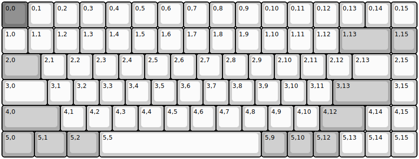{:loading="lazy"}

[Open in keyboard-layout-editor](http://www.keyboard-layout-editor.com/##@@_c=#777777;&=0,0&_c=#cccccc;&=0,1&=0,2&=0,3&=0,4&=0,5&=0,6&=0,7&=0,8&=0,9&=0,10&=0,11&=0,12&=0,13&=0,14&=0,15;&@=1,0&=1,1&=1,2&=1,3&=1,4&=1,5&=1,6&=1,7&=1,8&=1,9&=1,10&=1,11&=1,12&_c=#aaaaaa&w:2;&=1,13&=1,15;&@_w:1.5;&=2,0&_c=#cccccc;&=2,1&=2,2&=2,3&=2,4&=2,5&=2,6&=2,7&=2,8&=2,9&=2,10&=2,11&=2,12&_w:1.5;&=2,13&=2,15;&@_w:1.75;&=3,0&=3,1&=3,2&=3,3&=3,4&=3,5&=3,6&=3,7&=3,8&=3,9&=3,10&=3,11&_c=#aaaaaa&w:2.25;&=3,13&_c=#cccccc;&=3,15;&@_c=#aaaaaa&w:2.25;&=4,0&_c=#cccccc;&=4,1&=4,2&=4,3&=4,4&=4,5&=4,6&=4,7&=4,8&=4,9&=4,10&_c=#aaaaaa&w:1.75;&=4,12&_c=#cccccc;&=4,14&=4,15;&@_c=#aaaaaa&w:1.25;&=5,0&_w:1.25;&=5,1&_w:1.25;&=5,2&_c=#cccccc&w:6.25;&=5,5&_c=#aaaaaa;&=5,9&=5,10&=5,12&_c=#cccccc;&=5,13&=5,14&=5,15)

## melgeek/tegic/tegic_rev1

[README](output/melgeek/tegic/README.md) - [layout](output/melgeek/tegic/tegic_rev1-kle.json) - [PCB](output/melgeek/tegic/tegic_rev1.kicad_pcb) - [PCB render](output/melgeek/tegic/tegic_rev1-render.svg)

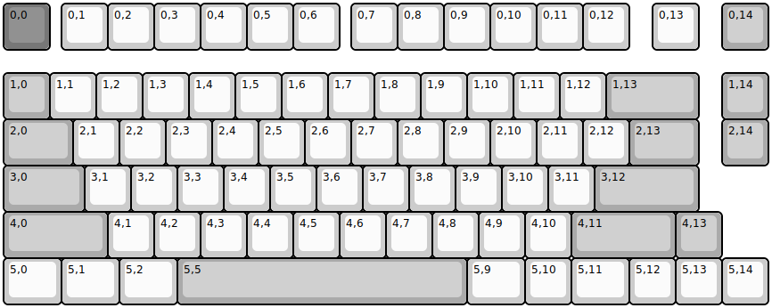{:loading="lazy"}

[Open in keyboard-layout-editor](http://www.keyboard-layout-editor.com/##@@_c=#777777;&=0,0&_x:0.25&c=#cccccc;&=0,1&=0,2&=0,3&=0,4&=0,5&=0,6&_x:0.25;&=0,7&=0,8&=0,9&=0,10&=0,11&=0,12&_x:0.5;&=0,13&_x:0.5&c=#aaaaaa;&=0,14;&@_y:0.5;&=1,0&_c=#cccccc;&=1,1&=1,2&=1,3&=1,4&=1,5&=1,6&=1,7&=1,8&=1,9&=1,10&=1,11&=1,12&_c=#aaaaaa&w:2.0;&=1,13&_x:0.5;&=1,14;&@_w:1.5;&=2,0&_c=#cccccc;&=2,1&=2,2&=2,3&=2,4&=2,5&=2,6&=2,7&=2,8&=2,9&=2,10&=2,11&=2,12&_c=#aaaaaa&w:1.5;&=2,13&_x:0.5;&=2,14;&@_w:1.75;&=3,0&_c=#cccccc;&=3,1&=3,2&=3,3&=3,4&=3,5&=3,6&=3,7&=3,8&=3,9&=3,10&=3,11&_c=#aaaaaa&w:2.25;&=3,12;&@_w:2.25;&=4,0&_c=#cccccc;&=4,1&=4,2&=4,3&=4,4&=4,5&=4,6&=4,7&=4,8&=4,9&=4,10&_c=#aaaaaa&w:2.25;&=4,11&=4,13;&@_c=#cccccc&w:1.25;&=5,0&_w:1.25;&=5,1&_w:1.25;&=5,2&_c=#aaaaaa&w:6.25;&=5,5&_c=#cccccc&w:1.25;&=5,9&=5,10&_w:1.25;&=5,11&=5,12&=5,13&=5,14)

## melgeek/z70/z70_ultra_rev1

[README](output/melgeek/z70/README.md) - [layout](output/melgeek/z70/z70_ultra_rev1-kle.json) - [PCB](output/melgeek/z70/z70_ultra_rev1.kicad_pcb) - [PCB render](output/melgeek/z70/z70_ultra_rev1-render.svg)

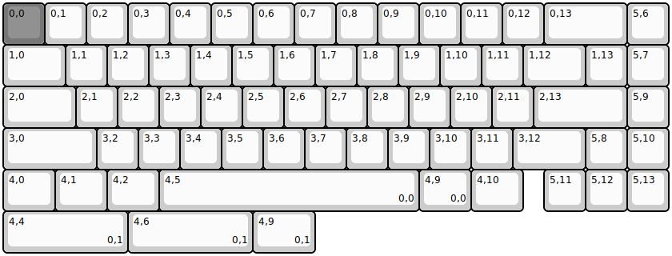{:loading="lazy"}

[Open in keyboard-layout-editor](http://www.keyboard-layout-editor.com/##@@_c=#777777;&=0,0&_c=#cccccc;&=0,1&=0,2&=0,3&=0,4&=0,5&=0,6&=0,7&=0,8&=0,9&=0,10&=0,11&=0,12&_w:2;&=0,13&=5,6;&@_w:1.5;&=1,0&=1,1&=1,2&=1,3&=1,4&=1,5&=1,6&=1,7&=1,8&=1,9&=1,10&=1,11&_w:1.5;&=1,12&=1,13&=5,7;&@_w:1.75;&=2,0&=2,1&=2,2&=2,3&=2,4&=2,5&=2,6&=2,7&=2,8&=2,9&=2,10&=2,11&_w:2.25;&=2,13&=5,9;&@_w:2.25;&=3,0&=3,2&=3,3&=3,4&=3,5&=3,6&=3,7&=3,8&=3,9&=3,10&=3,11&_w:1.75;&=3,12&=5,8&=5,10;&@_w:1.25;&=4,0&_w:1.25;&=4,1&_w:1.25;&=4,2&_w:6.25;&=4,5%0A%0A%0A0,0&_w:1.25;&=4,9%0A%0A%0A0,0&_w:1.25;&=4,10&_x:0.5;&=5,11&=5,12&=5,13;&@_w:3;&=4,4%0A%0A%0A0,1&_w:3;&=4,6%0A%0A%0A0,1&_w:1.5;&=4,9%0A%0A%0A0,1)

## meow65/meow65

[README](output/meow65/README.md) - [layout](output/meow65/meow65-kle.json) - [PCB](output/meow65/meow65.kicad_pcb) - [PCB render](output/meow65/meow65-render.svg)

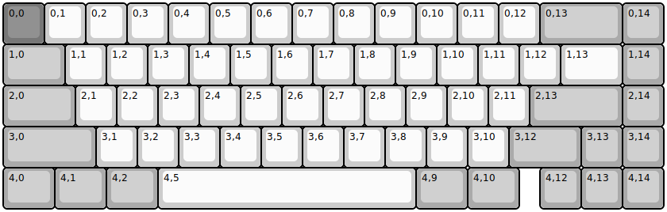{:loading="lazy"}

[Open in keyboard-layout-editor](http://www.keyboard-layout-editor.com/##@@_c=#777777;&=0,0&_c=#cccccc;&=0,1&=0,2&=0,3&=0,4&=0,5&=0,6&=0,7&=0,8&=0,9&=0,10&=0,11&=0,12&_c=#aaaaaa&w:2;&=0,13&=0,14;&@_w:1.5;&=1,0&_c=#cccccc;&=1,1&=1,2&=1,3&=1,4&=1,5&=1,6&=1,7&=1,8&=1,9&=1,10&=1,11&=1,12&_w:1.5;&=1,13&_c=#aaaaaa;&=1,14;&@_w:1.75;&=2,0&_c=#cccccc;&=2,1&=2,2&=2,3&=2,4&=2,5&=2,6&=2,7&=2,8&=2,9&=2,10&=2,11&_c=#aaaaaa&w:2.25;&=2,13&=2,14;&@_w:2.25;&=3,0&_c=#cccccc;&=3,1&=3,2&=3,3&=3,4&=3,5&=3,6&=3,7&=3,8&=3,9&=3,10&_c=#aaaaaa&w:1.75;&=3,12&=3,13&=3,14;&@_w:1.25;&=4,0&_w:1.25;&=4,1&_w:1.25;&=4,2&_c=#cccccc&w:6.25;&=4,5&_c=#aaaaaa&w:1.25;&=4,9&_w:1.25;&=4,10&_x:0.5;&=4,12&=4,13&=4,14)

## merge/iso_macro

[README](output/merge/README.md) - [layout](output/merge/iso_macro-kle.json) - [PCB](output/merge/iso_macro.kicad_pcb) - [PCB render](output/merge/iso_macro-render.svg)

{:loading="lazy"}

[Open in keyboard-layout-editor](http://www.keyboard-layout-editor.com/##@@_x:1.5&c=#8f8f8f;&=2,1%0A%0A%0A0,0&_x:0.25&c=#cccccc;&=0,0&=0,1&=0,2&_x:0.25&w:1.25&h:2&w2:1.5&h2:1&x2:-0.25;&=2,0;&@_x:1.5&c=#8f8f8f;&=2,2%0A%0A%0A0,0&_x:0.5&c=#cccccc;&=1,0&=1,1&=1,2;&@_y:-2&d:true;&=2,1%0A%0A%0A0,1;&@_c=#8f8f8f;&=2,2%0A%0A%0A0,1)

## merge/uc1

[README](output/merge/README.md) - [layout](output/merge/uc1-kle.json) - [PCB](output/merge/uc1.kicad_pcb) - [PCB render](output/merge/uc1-render.svg)

{:loading="lazy"}

[Open in keyboard-layout-editor](http://www.keyboard-layout-editor.com/##@@_c=#8f8f8f;&=1,1&_x:0.25&c=#cccccc;&=0,0&=0,1&=1,0)

## merge/um70

[README](output/merge/um70/README.md) - [layout](output/merge/um70/um70-kle.json) - [PCB](output/merge/um70/um70.kicad_pcb) - [PCB render](output/merge/um70/um70-render.svg)

{:loading="lazy"}

[Open in keyboard-layout-editor](http://www.keyboard-layout-editor.com/##@@_x:1.5&y:1.25&c=#777777;&=0,0&_c=#cccccc;&=0,1&=0,2&=0,3&=0,4&=0,5&=0,6&_x:0.75;&=5,0&=5,1&=5,2&=5,3&=5,4&=5,5&_c=#aaaaaa&w:2;&=5,7%0A%0A%0A0,0&_x:0.5&c=#cccccc;&=7,7;&@_x:1.5&c=#aaaaaa&w:1.5;&=1,0&_c=#cccccc;&=1,1&=1,2&=1,3&=1,4&=1,5&_x:0.75;&=6,0&=6,1&=6,2&=6,3&=6,4&=6,5&=6,6&_w:1.5;&=6,7&_x:0.5;&=8,7;&@=4,5&_x:0.5&c=#aaaaaa&w:1.75;&=2,0&_c=#cccccc;&=2,1&=2,2&=2,3&=2,4&=2,5&_x:0.75;&=7,0&=7,1&=7,2&=7,3&=7,4&=7,5&_c=#777777&w:2.25;&=7,6&_x:0.5&c=#cccccc;&=9,7;&@=4,6&_x:0.5&c=#aaaaaa&w:2.25;&=3,0&_c=#cccccc;&=3,1&=3,2&=3,3&=3,4&=3,5&_x:0.75;&=8,0&=8,1&=8,2&=8,3&=8,4&_c=#aaaaaa&w:1.75;&=8,5;&@_x:16.5&y:-0.75&c=#777777;&=8,6;&@_y:-0.25&c=#cccccc;&=4,7&_x:0.5&c=#aaaaaa&w:1.25;&=4,0&_w:1.25;&=4,1&_w:1.25;&=4,2&_c=#cccccc&w:1.25;&=4,3%0A%0A%0A1,0&_w:2.25;&=4,4%0A%0A%0A1,0&_x:0.75&w:2.75;&=9,0&_c=#aaaaaa&w:1.5;&=9,1&_w:1.5;&=9,2;&@_x:15.5&y:-0.75&c=#777777;&=9,3&=9,4&=9,5;&@_x:15.25&y:-6.5&c=#cccccc;&=5,6%0A%0A%0A0,1&=5,7%0A%0A%0A0,1;&@_x:5.25&y:5.75&w:2.25;&=4,4%0A%0A%0A1,1&_w:1.25;&=4,3%0A%0A%0A1,1)

## merge/um80

[README](output/merge/um80/README.md) - [layout](output/merge/um80/um80-kle.json) - [PCB](output/merge/um80/um80.kicad_pcb) - [PCB render](output/merge/um80/um80-render.svg)

{:loading="lazy"}

[Open in keyboard-layout-editor](http://www.keyboard-layout-editor.com/##@@_x:1.5&y:1.5&c=#777777;&=0,0&_x:0.25&c=#cccccc;&=0,1&=0,2&=0,3&=0,4&_x:0.25;&=0,5&=0,6&_x:2.75;&=6,0&=6,1&_x:0.25;&=6,2&=6,3&=6,4&=6,5&_x:0.25;&=6,6&_x:0.5;&=6,7;&@_x:1.5&y:0.25&c=#aaaaaa;&=1,0&_c=#cccccc;&=1,1&=1,2&=1,3&=1,4&=1,5&=1,6&_x:2.75;&=7,0&=7,1&=7,2&=7,3&=7,4&=7,5&_c=#aaaaaa&w:2;&=7,7%0A%0A%0A0,0&_x:0.5&c=#cccccc;&=9,7;&@=2,7&_x:0.5&c=#aaaaaa&w:1.5;&=2,0&_c=#cccccc;&=2,1&=2,2&=2,3&=2,4&=2,5&_x:2.75;&=8,0&=8,1&=8,2&=8,3&=8,4&=8,5&=8,6&_w:1.5;&=8,7&_x:0.5;&=10,7;&@=3,7&_x:0.5&c=#aaaaaa&w:1.75;&=3,0&_c=#cccccc;&=3,1&=3,2&=3,3&=3,4&=3,5&_x:2.75;&=9,0&=9,1&=9,2&=9,3&=9,4&=9,5&_c=#777777&w:2.25;&=9,6&_x:0.5&c=#cccccc;&=11,7;&@=4,7&_x:0.5&c=#aaaaaa&w:2.25;&=4,0&_c=#cccccc;&=4,1&=4,2&=4,3&=4,4&=4,5&_x:2.75;&=10,0&=10,1&=10,2&=10,3&=10,4&_c=#aaaaaa&w:1.75;&=10,5;&@_x:18.5&y:-0.75&c=#777777;&=11,6;&@_y:-0.25&c=#cccccc;&=5,7&_x:0.5&c=#aaaaaa&w:1.25;&=5,0&_w:1.25;&=5,1&_w:1.25;&=5,2&_c=#cccccc&w:1.25;&=5,3%0A%0A%0A1,0&_w:2.25;&=5,4%0A%0A%0A1,0&_x:2.75&w:2.75;&=11,0&_c=#aaaaaa&w:1.5;&=11,1&_w:1.5;&=11,2;&@_x:17.5&y:-0.75&c=#777777;&=11,3&=11,4&=11,5;&@_x:17.25&y:-8.0&c=#cccccc;&=7,6%0A%0A%0A0,1&_c=#aaaaaa;&=7,7%0A%0A%0A0,1;&@_x:5.25&y:7.25&c=#cccccc&w:2.25;&=5,4%0A%0A%0A1,1&_w:1.25;&=5,3%0A%0A%0A1,1)

## merge/uma

[README](output/merge/uma/README.md) - [layout](output/merge/uma/uma-kle.json) - [PCB](output/merge/uma/uma.kicad_pcb) - [PCB render](output/merge/uma/uma-render.svg)

{:loading="lazy"}

[Open in keyboard-layout-editor](http://www.keyboard-layout-editor.com/##@@_x:2.41&y:1.45&c=#777777;&=0,0&_c=#cccccc;&=0,1&_x:9.66;&=5,4&=5,5&_c=#aaaaaa&w:2;&=5,7%0A%0A%0A2,0&_x:0.56&c=#cccccc;&=7,7;&@_x:2.28&c=#aaaaaa&w:1.5;&=1,0&_c=#cccccc;&=1,1&_x:8.94;&=6,4&=6,5&=6,6&_w:1.5;&=6,7%0A%0A%0A0,0&_x:0.41;&=8,7;&@_x:0.5;&=4,5&_x:0.64&c=#aaaaaa&w:1.75;&=2,0&_c=#cccccc;&=2,1&_x:9.2;&=7,4&=7,5&_c=#777777&w:2.25;&=7,6%0A%0A%0A0,0&_x:0.41&c=#cccccc;&=9,7;&@_x:0.5;&=4,6&_x:0.5&c=#aaaaaa&w:2.25;&=3,0%0A%0A%0A1,0&_c=#cccccc;&=3,1&_x:8.47;&=8,3&=8,4&_c=#aaaaaa&w:1.75;&=8,5;&@_x:17.75&y:-0.75&c=#777777;&=8,6;&@_x:0.5&y:-0.25&c=#cccccc;&=4,7&_x:0.5&c=#aaaaaa&w:1.25;&=4,0&_w:1.25;&=4,2&_x:9.48&w:1.25;&=9,1&_w:1.25;&=9,2;&@_x:16.75&y:-0.75&c=#777777;&=9,3&=9,4&=9,5;&@_r:8&rx:1.75&x:2.97&y:0.93&c=#cccccc;&=0,2&=0,3&=0,4&=0,5&=0,6;&@_x:3.47;&=1,2&=1,3&=1,4&=1,5;&@_x:3.72;&=2,2&=2,3&_n:true;&=2,4&=2,5;&@_x:4.22;&=3,2&=3,3&=3,4&=3,5;&@_x:4.72&c=#aaaaaa&w:1.25;&=4,3%0A%0A%0A3,0&_c=#cccccc&w:2.25;&=4,4%0A%0A%0A3,0;&@_r:-8&x:7.87&y:-2.83;&=5,0&=5,1&=5,2&=5,3;&@_x:7.37;&=6,0&=6,1&=6,2&=6,3;&@_x:7.62;&=7,0&_n:true;&=7,1&=7,2&=7,3;&@_x:7.12&c=#aaaaaa;&=9,6&_c=#cccccc;&=8,0&=8,1&=8,2;&@_x:7.12&w:2.75;&=9,0;&@_r:0&rx:0&x:16.07&y:0.2;&=5,6%0A%0A%0A2,1&_c=#aaaaaa;&=5,7%0A%0A%0A2,1;&@_x:21.5&y:1.25&c=#777777&w:1.25&h:2&w2:1.5&h2:1&x2:-0.25;&=7,6%0A%0A%0A0,1;&@_x:20.5&c=#cccccc;&=6,7%0A%0A%0A0,1;&@_x:2&y:2.75&c=#aaaaaa&w:1.25;&=3,0%0A%0A%0A1,1&_c=#cccccc;&=4,1%0A%0A%0A1,1;&@_r:8&rx:1.75&x:4.72&y:6.68&w:2.25;&=4,4%0A%0A%0A3,1&_c=#aaaaaa&w:1.25;&=4,3%0A%0A%0A3,1)

## mesa/mesa_tkl

[README](output/mesa/mesa_tkl/README.md) - [layout](output/mesa/mesa_tkl/mesa_tkl-kle.json) - [PCB](output/mesa/mesa_tkl/mesa_tkl.kicad_pcb) - [PCB render](output/mesa/mesa_tkl/mesa_tkl-render.svg)

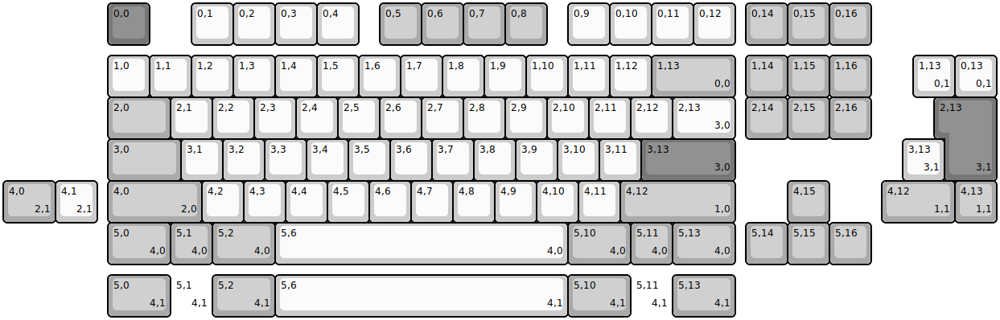{:loading="lazy"}

[Open in keyboard-layout-editor](http://www.keyboard-layout-editor.com/##@@_x:2.5&c=#777777;&=0,0&_x:1.0&c=#cccccc;&=0,1&=0,2&=0,3&=0,4&_x:0.5&c=#aaaaaa;&=0,5&=0,6&=0,7&=0,8&_x:0.5&c=#cccccc;&=0,9&=0,10&=0,11&=0,12&_x:0.25&c=#aaaaaa;&=0,14&=0,15&=0,16;&@_x:2.5&y:0.25&c=#cccccc;&=1,0&=1,1&=1,2&=1,3&=1,4&=1,5&=1,6&=1,7&=1,8&=1,9&=1,10&=1,11&=1,12&_c=#aaaaaa&w:2;&=1,13%0A%0A%0A0,0&_x:0.25;&=1,14&=1,15&=1,16;&@_x:2.5&w:1.5;&=2,0&_c=#cccccc;&=2,1&=2,2&=2,3&=2,4&=2,5&=2,6&=2,7&=2,8&=2,9&=2,10&=2,11&=2,12&_w:1.5;&=2,13%0A%0A%0A3,0&_x:0.25&c=#aaaaaa;&=2,14&=2,15&=2,16;&@_x:2.5&w:1.75;&=3,0&_c=#cccccc;&=3,1&=3,2&=3,3&=3,4&=3,5&=3,6&=3,7&=3,8&=3,9&=3,10&=3,11&_c=#777777&w:2.25;&=3,13%0A%0A%0A3,0;&@_x:2.5&c=#aaaaaa&w:2.25;&=4,0%0A%0A%0A2,0&_c=#cccccc;&=4,2&=4,3&=4,4&=4,5&=4,6&=4,7&=4,8&=4,9&=4,10&=4,11&_c=#aaaaaa&w:2.75;&=4,12%0A%0A%0A1,0&_x:1.25;&=4,15;&@_x:2.5&w:1.5;&=5,0%0A%0A%0A4,0&=5,1%0A%0A%0A4,0&_w:1.5;&=5,2%0A%0A%0A4,0&_c=#cccccc&w:7;&=5,6%0A%0A%0A4,0&_c=#aaaaaa&w:1.5;&=5,10%0A%0A%0A4,0&=5,11%0A%0A%0A4,0&_w:1.5;&=5,13%0A%0A%0A4,0&_x:0.25;&=5,14&=5,15&=5,16;&@_x:21.75&y:-5.0&c=#cccccc;&=1,13%0A%0A%0A0,1&=0,13%0A%0A%0A0,1;&@_x:22.5&c=#777777&w:1.25&h:2&w2:1.5&h2:1&x2:-0.25;&=2,13%0A%0A%0A3,1;&@_x:21.5&c=#cccccc;&=3,13%0A%0A%0A3,1;&@_c=#aaaaaa&w:1.25;&=4,0%0A%0A%0A2,1&_c=#cccccc;&=4,1%0A%0A%0A2,1&_x:18.75&c=#aaaaaa&w:1.75;&=4,12%0A%0A%0A1,1&=4,13%0A%0A%0A1,1;&@_x:2.5&y:1.25&w:1.5;&=5,0%0A%0A%0A4,1&_d:true;&=5,1%0A%0A%0A4,1&_w:1.5;&=5,2%0A%0A%0A4,1&_c=#cccccc&w:7;&=5,6%0A%0A%0A4,1&_c=#aaaaaa&w:1.5;&=5,10%0A%0A%0A4,1&_d:true;&=5,11%0A%0A%0A4,1&_w:1.5;&=5,13%0A%0A%0A4,1)

## metamechs/timberwolf

[README](output/metamechs/timberwolf/README.md) - [layout](output/metamechs/timberwolf/timberwolf-kle.json) - [PCB](output/metamechs/timberwolf/timberwolf.kicad_pcb) - [PCB render](output/metamechs/timberwolf/timberwolf-render.svg)

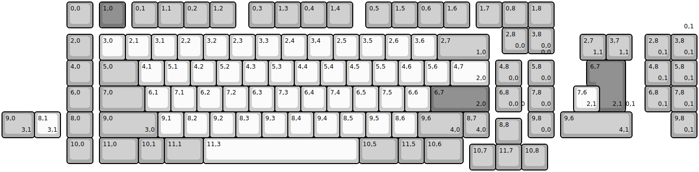{:loading="lazy"}

[Open in keyboard-layout-editor](http://www.keyboard-layout-editor.com/##@@_x:2.5&c=#aaaaaa;&=0,0&_x:0.25&c=#777777;&=1,0&_x:0.25&c=#aaaaaa;&=0,1&=1,1&=0,2&=1,2&_x:0.5;&=0,3&=1,3&=0,4&=1,4&_x:0.5;&=0,5&=1,5&=0,6&=1,6&_x:0.25;&=1,7&=0,8&=1,8;&@_x:19.25;&=2,8%0A%0A%0A0,0&=3,8%0A%0A%0A0,0;&@_x:2.5&y:-0.75;&=2,0&_x:0.25&c=#cccccc;&=3,0&=2,1&=3,1&=2,2&=3,2&=2,3&=3,3&=2,4&=3,4&=2,5&=3,5&=2,6&=3,6&_c=#aaaaaa&w:2;&=2,7%0A%0A%0A1,0;&@_x:19.25&y:-0.25&c=#cccccc&w:2&h:0.25&d:true;&=%0A%0A%0A0,0;&@_x:2.5&y:-0.75&c=#aaaaaa;&=4,0&_x:0.25&w:1.5;&=5,0&_c=#cccccc;&=4,1&=5,1&=4,2&=5,2&=4,3&=5,3&=4,4&=5,4&=4,5&=5,5&=4,6&=5,6&_w:1.5;&=4,7%0A%0A%0A2,0&_x:0.25&c=#aaaaaa;&=4,8%0A%0A%0A0,0&_c=#cccccc&w:0.25&h:2&d:true;&=%0A%0A%0A0,0&_c=#aaaaaa;&=5,8%0A%0A%0A0,0;&@_x:2.5;&=6,0&_x:0.25&w:1.75;&=7,0&_c=#cccccc;&=6,1&=7,1&=6,2&=7,2&=6,3&=7,3&=6,4&=7,4&=6,5&=7,5&=6,6&_c=#777777&w:2.25;&=6,7%0A%0A%0A2,0&_x:0.25&c=#aaaaaa;&=6,8%0A%0A%0A0,0&_x:0.25;&=7,8%0A%0A%0A0,0;&@_x:2.5;&=8,0&_x:0.25&w:2.25;&=9,0%0A%0A%0A3,0&_c=#cccccc;&=9,1&=8,2&=9,2&=8,3&=9,3&=8,4&=9,4&=8,5&=9,5&=8,6&_c=#aaaaaa&w:1.75;&=9,6%0A%0A%0A4,0&=8,7%0A%0A%0A4,0&_x:1.5;&=9,8%0A%0A%0A0,0;&@_x:19&y:-0.75;&=8,8;&@_x:2.5&y:-0.25;&=10,0&_x:0.25&w:1.5;&=11,0&=10,1&_w:1.5;&=11,1&_c=#cccccc&w:6;&=11,3&_c=#aaaaaa&w:1.5;&=10,5&=11,5&_w:1.5;&=10,6;&@_x:18&y:-0.75;&=10,7&=11,7&=10,8;&@_x:24.75&y:-5.5&c=#cccccc&w:2&h:0.25&d:true;&=%0A%0A%0A0,1;&@_x:22.25&y:-0.75&c=#aaaaaa;&=2,7%0A%0A%0A1,1&=3,7%0A%0A%0A1,1&_x:0.5;&=2,8%0A%0A%0A0,1&=3,8%0A%0A%0A0,1;&@_x:22.75&c=#777777&w:1.25&h:2&w2:1.5&h2:1&x2:-0.25;&=6,7%0A%0A%0A2,1&_x:0.25&c=#cccccc&w:0.25&h:2&d:true;&=%0A%0A%0A0,1&_x:0.25&c=#aaaaaa;&=4,8%0A%0A%0A0,1&=5,8%0A%0A%0A0,1;&@_x:22.0&c=#cccccc;&=7,6%0A%0A%0A2,1&_x:1.75&c=#aaaaaa;&=6,8%0A%0A%0A0,1&=7,8%0A%0A%0A0,1;&@_w:1.25;&=9,0%0A%0A%0A3,1&_c=#cccccc;&=8,1%0A%0A%0A3,1&_x:19.25&c=#aaaaaa&w:2.75;&=9,6%0A%0A%0A4,1&_x:1.5;&=9,8%0A%0A%0A0,1)

## mikeneko65/mikeneko65_rev1

[README](output/mikeneko65/README.md) - [layout](output/mikeneko65/mikeneko65_rev1-kle.json) - [PCB](output/mikeneko65/mikeneko65_rev1.kicad_pcb) - [PCB render](output/mikeneko65/mikeneko65_rev1-render.svg)

{:loading="lazy"}

[Open in keyboard-layout-editor](http://www.keyboard-layout-editor.com/##@@_c=#777777;&=0,0&_c=#cccccc;&=0,1&=0,2&=0,3&=0,4&=0,5&=0,6&=0,7&=0,8&=0,9&=0,10&=0,11&=0,12&_c=#aaaaaa&w:2;&=0,13&=0,14;&@_w:1.5;&=1,0&_c=#cccccc;&=1,1&=1,2&=1,3&=1,4&=1,5&=1,6&=1,7&=1,8&=1,9&=1,10&=1,11&=1,12&_c=#aaaaaa&w:1.5;&=1,13&=1,14;&@_w:1.75;&=2,0&_c=#cccccc;&=2,1&=2,2&=2,3&=2,4&=2,5&=2,6&=2,7&=2,8&=2,9&=2,10&=2,11&_c=#777777&w:2.25;&=2,13&_c=#aaaaaa;&=2,14;&@_w:2.25;&=3,0&_c=#cccccc;&=3,2&=3,3&=3,4&=3,5&=3,6&=3,7&=3,8&=3,9&=3,10&=3,11&_c=#aaaaaa&w:1.75;&=3,12&=3,13&=3,14;&@_w:1.25;&=4,0&_w:1.25;&=4,1&_w:1.25;&=4,2&_w:6.25;&=4,6&_w:1.25;&=4,9&_w:1.25;&=4,11&_x:0.5;&=4,12&=4,13&=4,14)

## mincedshon/ecila

[README](output/mincedshon/ecila/README.md) - [layout](output/mincedshon/ecila/ecila-kle.json) - [PCB](output/mincedshon/ecila/ecila.kicad_pcb) - [PCB render](output/mincedshon/ecila/ecila-render.svg)

{:loading="lazy"}

[Open in keyboard-layout-editor](http://www.keyboard-layout-editor.com/##@@_c=#777777;&=0,0&_x:0.25&c=#aaaaaa;&=0,1&_c=#cccccc;&=0,2&=0,3&=0,4&=0,5&=0,6&=0,7&_x:1.75;&=0,8&=0,9&=0,10&=0,11&=0,12&=0,13&_c=#aaaaaa&w:2;&=0,14;&@_c=#777777;&=1,0&_x:0.25&c=#aaaaaa&w:1.5;&=1,1&_c=#cccccc;&=1,2&=1,3&=1,4&=1,5&=1,6&_x:1.75;&=1,7&=1,8&=1,9&=1,10&=1,11&=1,12&=1,13&_c=#aaaaaa&w:1.5;&=1,14;&@_c=#777777;&=2,0&_x:0.25&c=#aaaaaa&w:1.75;&=2,1&_c=#cccccc;&=2,2&=2,3&=2,4&=2,5&=2,6&_x:1.75;&=2,7&=2,8&=2,9&=2,10&=2,11&=2,12&_c=#777777&w:2.25;&=2,14;&@=3,0&_x:0.25&c=#aaaaaa&w:2.25;&=3,1&_c=#cccccc;&=3,2&=3,3&=3,4&=3,5&=3,6&_x:0.75;&=3,7&=3,8&=3,9&=3,10&=3,11&=3,12&_x:1.75&c=#aaaaaa;&=3,14;&@_x:15.65&y:-0.75&c=#777777;&=3,13;&@_x:1.25&y:-0.25&c=#aaaaaa&w:1.5;&=4,1&_x:1.5&w:1.5;&=4,3&_w:2;&=4,5&=4,6&_x:0.5&w:2.75;&=4,8&=4,10;&@_x:14.65&y:-0.75&c=#777777;&=4,12&=4,13&=4,14)

## mini_ashen_40/mini_ashen_40

[README](output/mini_ashen_40/README.md) - [layout](output/mini_ashen_40/mini_ashen_40-kle.json) - [PCB](output/mini_ashen_40/mini_ashen_40.kicad_pcb) - [PCB render](output/mini_ashen_40/mini_ashen_40-render.svg)

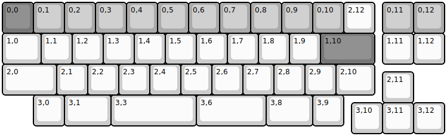{:loading="lazy"}

[Open in keyboard-layout-editor](http://www.keyboard-layout-editor.com/##@@_c=#777777;&=0,0&_c=#aaaaaa;&=0,1&=0,2&=0,3&=0,4&=0,5&=0,6&=0,7&=0,8&=0,9&=0,10&_x:1.25;&=0,11&=0,12;&@_c=#cccccc&w:1.25;&=1,0&=1,1&=1,2&=1,3&=1,4&=1,5&=1,6&=1,7&=1,8&=1,9&_c=#777777&w:1.75;&=1,10&_x:0.25&c=#cccccc;&=1,11&=1,12;&@_w:1.75;&=2,0&=2,1&=2,2&=2,3&=2,4&=2,5&=2,6&=2,7&=2,8&=2,9&_w:1.25;&=2,10;&@_x:12.25&y:-0.75;&=2,11;&@_x:11.0&y:-3.25;&=2,12;&@_x:1&y:2.0;&=3,0&_w:1.5;&=3,1&_w:2.75;&=3,3&_w:2.25;&=3,6&_w:1.5;&=3,8&=3,9;&@_x:11.25&y:-0.75;&=3,10&=3,11&=3,12)

## mini_winni/mini_winni

[README](output/mini_winni/README.md) - [layout](output/mini_winni/mini_winni-kle.json) - [PCB](output/mini_winni/mini_winni.kicad_pcb) - [PCB render](output/mini_winni/mini_winni-render.svg)

{:loading="lazy"}

[Open in keyboard-layout-editor](http://www.keyboard-layout-editor.com/##@@=0,0&=0,1&=0,2&=0,3;&@=1,0&=1,1&=1,2&=1,3)

## misonoworks/chocolate-bar

[README](output/misonoworks/README.md) - [layout](output/misonoworks/chocolate-bar-kle.json) - [PCB](output/misonoworks/chocolate-bar.kicad_pcb) - [PCB render](output/misonoworks/chocolate-bar-render.svg)

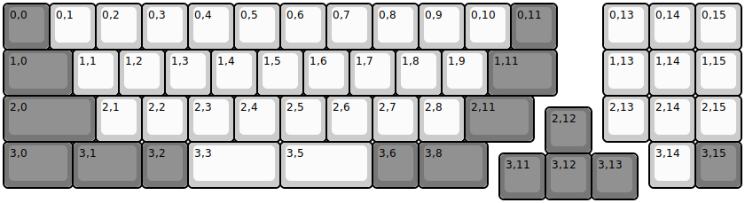{:loading="lazy"}

[Open in keyboard-layout-editor](http://www.keyboard-layout-editor.com/##@@_c=#777777;&=0,0&_c=#cccccc;&=0,1&=0,2&=0,3&=0,4&=0,5&=0,6&=0,7&=0,8&=0,9&=0,10&_c=#777777;&=0,11&_x:1&c=#cccccc;&=0,13&=0,14&=0,15;&@_c=#777777&w:1.5;&=1,0&_c=#cccccc;&=1,1&=1,2&=1,3&=1,4&=1,5&=1,6&=1,7&=1,8&=1,9&_c=#777777&w:1.5;&=1,11&_x:1.0&c=#cccccc;&=1,13&=1,14&=1,15;&@_c=#777777&w:2;&=2,0&_c=#cccccc;&=2,1&=2,2&=2,3&=2,4&=2,5&=2,6&=2,7&=2,8&_c=#777777&w:1.5;&=2,11&_x:1.5&c=#cccccc;&=2,13&=2,14&=2,15;&@_x:11.75&y:-0.75&c=#777777;&=2,12;&@_y:-0.25&w:1.5;&=3,0&_w:1.5;&=3,1&=3,2&_c=#cccccc&w:2;&=3,3&_w:2;&=3,5&_c=#777777;&=3,6&_w:1.5;&=3,8&_x:3.5&c=#cccccc;&=3,14&_c=#777777;&=3,15;&@_x:10.75&y:-0.75;&=3,11&=3,12&=3,13)

## mixi/mixi

[README](output/mixi/README.md) - [layout](output/mixi/mixi-kle.json) - [PCB](output/mixi/mixi.kicad_pcb) - [PCB render](output/mixi/mixi-render.svg)

{:loading="lazy"}

[Open in keyboard-layout-editor](http://www.keyboard-layout-editor.com/##@@=0,0&=0,1&=0,2;&@=1,0&=1,1&=1,2;&@=2,0&=2,1&=2,2)

## mkultra/boardrun/bizarre

[README](output/mkultra/boardrun/bizarre/README.md) - [layout](output/mkultra/boardrun/bizarre/bizarre-kle.json) - [PCB](output/mkultra/boardrun/bizarre/bizarre.kicad_pcb) - [PCB render](output/mkultra/boardrun/bizarre/bizarre-render.svg)

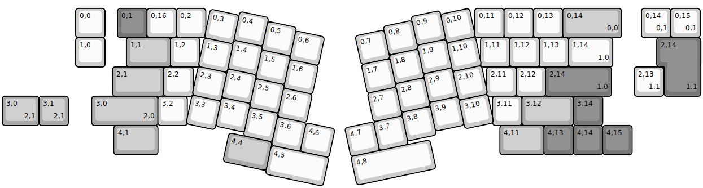{:loading="lazy"}

[Open in keyboard-layout-editor](http://www.keyboard-layout-editor.com/##@@_x:2.5&y:0.21;&=0,0&_x:0.43&c=#777777;&=0,1&_c=#cccccc;&=0,16&=0,2&_x:9.16;&=0,11&=0,12&=0,13&_c=#aaaaaa&w:2;&=0,14%0A%0A%0A0,0;&@_x:2.5&c=#cccccc;&=1,0&_x:0.73&c=#aaaaaa&w:1.5;&=1,1&_c=#cccccc;&=1,2&_x:9.56;&=1,11&=1,12&=1,13&_w:1.5;&=1,14%0A%0A%0A1,0;&@_x:3.75&c=#aaaaaa&w:1.75;&=2,1&_c=#cccccc;&=2,2&_x:10.0;&=2,11&=2,12&_c=#777777&w:2.25;&=2,14%0A%0A%0A1,0;&@_x:3.05&c=#aaaaaa&w:2.25;&=3,0%0A%0A%0A2,0&_c=#cccccc;&=3,2&_x:10.4;&=3,11&_c=#aaaaaa&w:1.75;&=3,12&_c=#777777;&=3,14;&@_x:3.8&c=#aaaaaa&w:1.5;&=4,1&_x:11.65&w:1.5;&=4,11&_c=#777777;&=4,13&=4,14&=4,15;&@_r:12&rx:11.5&x:-3.25&y:1&c=#cccccc;&=0,4;&@_x:-4.25&y:-0.87;&=0,3&_x:1.0;&=0,5;&@_x:-1.25&y:-0.88;&=0,6;&@_x:-3.25&y:-0.25;&=1,4;&@_x:-4.25&y:-0.87;&=1,3&_x:1.0;&=1,5;&@_x:-1.25&y:-0.88;&=1,6;&@_x:-3.25&y:-0.25;&=2,4;&@_x:-4.25&y:-0.87;&=2,3&_x:1.0;&=2,5;&@_x:-1.25&y:-0.88;&=2,6;&@_x:-3.25&y:-0.25;&=3,4;&@_x:-4.25&y:-0.87;&=3,3&_x:1.0;&=3,5;&@_x:-1.25&y:-0.88;&=3,6&=4,6;&@_x:-2.75&y:-0.12&c=#aaaaaa&w:1.5;&=4,4;&@_x:-1.25&y:-0.88&c=#cccccc&w:2;&=4,5;&@_r:-12&x:2.25&y:-5.25;&=0,9;&@_x:1.25&y:-0.87;&=0,8&_x:1.0;&=0,10;&@_x:0.25&y:-0.88;&=0,7;&@_x:2.25&y:-0.25;&=1,9;&@_x:1.25&y:-0.87;&=1,8&_x:1.0;&=1,10;&@_x:0.25&y:-0.88;&=1,7;&@_x:2.25&y:-0.25;&=2,9;&@_x:1.25&y:-0.87;&=2,8&_x:1.0;&=2,10;&@_x:0.25&y:-0.88;&=2,7;&@_x:2.25&y:-0.25;&=3,9;&@_x:1.25&y:-0.87;&=3,8&_x:1.0;&=3,10;&@_x:-0.75&y:-0.88;&=4,7&=3,7;&@_x:-0.75&w:2.75;&=4,8;&@_r:0&rx:0&x:21.77&y:0.21;&=0,14%0A%0A%0A0,1&=0,15%0A%0A%0A0,1;&@_x:22.54&c=#777777&w:1.25&h:2&w2:1.5&h2:1&x2:-0.25;&=2,14%0A%0A%0A1,1;&@_x:21.52&c=#cccccc;&=2,13%0A%0A%0A1,1;&@_c=#aaaaaa&w:1.25;&=3,0%0A%0A%0A2,1&=3,1%0A%0A%0A2,1)

## mkultra/boardrun/classic

[README](output/mkultra/boardrun/classic/README.md) - [layout](output/mkultra/boardrun/classic/classic-kle.json) - [PCB](output/mkultra/boardrun/classic/classic.kicad_pcb) - [PCB render](output/mkultra/boardrun/classic/classic-render.svg)

{:loading="lazy"}

[Open in keyboard-layout-editor](http://www.keyboard-layout-editor.com/##@@_x:0.56&y:0.35&c=#aaaaaa&w:1.5;&=0,0&_x:12.15&w:1.5;&=0,13;&@_x:0.38&w:1.5;&=1,0&_c=#cccccc;&=1,1&_x:11.5&c=#aaaaaa&w:1.5;&=1,13;&@_x:0.23&w:1.5;&=2,0&_x:12.82&w:1.5;&=2,13;&@_x:0.04&w:1.5;&=3,0&_x:13.19&w:1.5;&=3,13;&@_rx:2.5&x:-0.44&y:0.35&c=#cccccc;&=0,1;&@_x:-0.77&y:1.0;&=2,1;&@_x:-0.96;&=3,1;&@_x:-1.13;&=4,1;&@_rx:15.25&x:-2.04&y:0.35;&=0,12;&@_x:-1.87;&=1,12;&@_x:-1.7;&=2,12;&@_rx:16&x:-2.27&y:3.35;&=3,12;&@_x:-2.1;&=4,12;&@_r:10&rx:0&x:6.22&y:3.91&w:2;&=4,6%0A%0A%0A1,0&_x:-0.02;&=4,0;&@_rx:2&x:2.25;&=0,3;&@_x:1.25&y:-0.87;&=0,2&_x:1.0;&=0,4;&@_x:4.25&y:-0.88;&=0,5&=0,6;&@_x:2.25&y:-0.25;&=1,3;&@_x:1.25&y:-0.87;&=1,2&_x:1.0;&=1,4;&@_x:4.25&y:-0.88;&=1,5&_c=#aaaaaa&h:1.5;&=1,6%0A%0A%0A0,0;&@_x:2.25&y:-0.25&c=#cccccc;&=2,3;&@_x:1.25&y:-0.87;&=2,2&_x:1.0;&=2,4;&@_x:4.25&y:-0.88;&=2,5;&@_x:5.25&y:-0.5&c=#aaaaaa&h:1.5;&=3,6%0A%0A%0A0,0;&@_x:2.25&y:-0.75&c=#cccccc;&=3,3;&@_x:1.25&y:-0.87;&=3,2&_x:1.0;&=3,4;&@_x:4.25&y:-0.88;&=3,5;&@_x:2.25&y:-0.25;&=4,3;&@_x:1.25&y:-0.87;&=4,2&_x:1.0;&=4,4;&@_r:-10&rx:0&x:7.79&y:6.73&w:2;&=4,7%0A%0A%0A2,0;&@_rx:14.25&x:-3.25;&=0,10;&@_x:-4.25&y:-0.87;&=0,9&_x:1.0;&=0,11;&@_x:-6.25&y:-0.88;&=0,7&=0,8;&@_x:-3.25&y:-0.25;&=1,10;&@_x:-4.25&y:-0.87;&=1,9&_x:1.0;&=1,11;&@_x:-6.25&y:-0.88&c=#aaaaaa&h:1.5;&=1,7%0A%0A%0A0,0&_c=#cccccc;&=1,8;&@_x:-3.25&y:-0.25;&=2,10;&@_x:-4.25&y:-0.87;&=2,9&_x:1.0;&=2,11;&@_x:-5.25&y:-0.88;&=2,8;&@_x:-6.25&y:-0.5&c=#aaaaaa&h:1.5;&=3,7%0A%0A%0A0,0;&@_x:-3.25&y:-0.75&c=#cccccc;&=3,10;&@_x:-4.25&y:-0.87;&=3,9&_x:1.0;&=3,11;&@_x:-5.25&y:-0.88;&=3,8;&@_x:-3.25&y:-0.25;&=4,10;&@_x:-4.25&y:-0.87;&=4,9&_x:1.0;&=4,11;&@_r:10&rx:0&x:6.25&y:5.41;&=4,5%0A%0A%0A1,1&=4,6%0A%0A%0A1,1;&@_rx:2&x:5.25&y:1.25;&=1,6%0A%0A%0A0,1;&@_x:5.25;&=3,6%0A%0A%0A0,1;&@_x:5.25;&=2,6%0A%0A%0A0,1;&@_r:-10&rx:0&x:7.75&y:8.23;&=4,7%0A%0A%0A2,1&=4,8%0A%0A%0A2,1;&@_rx:14.25&x:-6.25&y:1.25;&=1,7%0A%0A%0A0,1;&@_x:-6.25;&=2,7%0A%0A%0A0,1;&@_x:-6.25;&=3,7%0A%0A%0A0,1)

## mkultra/boardwalk

[README](output/mkultra/boardwalk/README.md) - [layout](output/mkultra/boardwalk/boardwalk-kle.json) - [PCB](output/mkultra/boardwalk/boardwalk.kicad_pcb) - [PCB render](output/mkultra/boardwalk/boardwalk-render.svg)

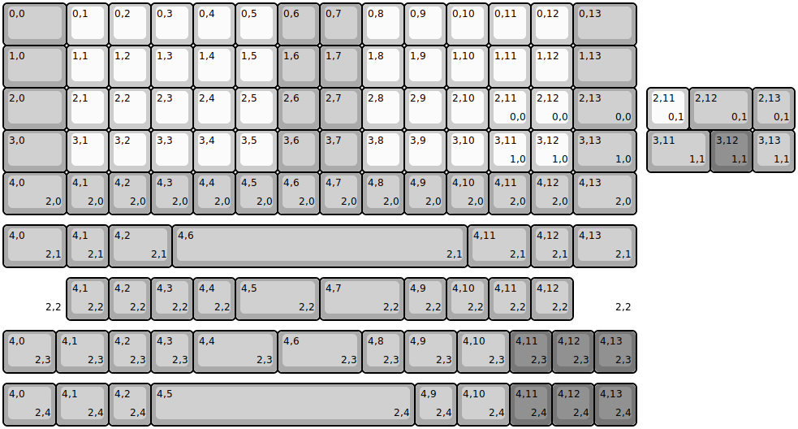{:loading="lazy"}

[Open in keyboard-layout-editor](http://www.keyboard-layout-editor.com/##@@_c=#aaaaaa&w:1.5;&=0,0&_c=#cccccc;&=0,1&=0,2&=0,3&=0,4&=0,5&_c=#aaaaaa;&=0,6&=0,7&_c=#cccccc;&=0,8&=0,9&=0,10&=0,11&=0,12&_c=#aaaaaa&w:1.5;&=0,13;&@_w:1.5;&=1,0&_c=#cccccc;&=1,1&=1,2&=1,3&=1,4&=1,5&_c=#aaaaaa;&=1,6&=1,7&_c=#cccccc;&=1,8&=1,9&=1,10&=1,11&=1,12&_c=#aaaaaa&w:1.5;&=1,13;&@_w:1.5;&=2,0&_c=#cccccc;&=2,1&=2,2&=2,3&=2,4&=2,5&_c=#aaaaaa;&=2,6&=2,7&_c=#cccccc;&=2,8&=2,9&=2,10&=2,11%0A%0A%0A0,0&=2,12%0A%0A%0A0,0&_c=#aaaaaa&w:1.5;&=2,13%0A%0A%0A0,0;&@_w:1.5;&=3,0&_c=#cccccc;&=3,1&=3,2&=3,3&=3,4&=3,5&_c=#aaaaaa;&=3,6&=3,7&_c=#cccccc;&=3,8&=3,9&=3,10&=3,11%0A%0A%0A1,0&=3,12%0A%0A%0A1,0&_c=#aaaaaa&w:1.5;&=3,13%0A%0A%0A1,0;&@_w:1.5;&=4,0%0A%0A%0A2,0&=4,1%0A%0A%0A2,0&=4,2%0A%0A%0A2,0&=4,3%0A%0A%0A2,0&=4,4%0A%0A%0A2,0&=4,5%0A%0A%0A2,0&=4,6%0A%0A%0A2,0&=4,7%0A%0A%0A2,0&=4,8%0A%0A%0A2,0&=4,9%0A%0A%0A2,0&=4,10%0A%0A%0A2,0&=4,11%0A%0A%0A2,0&=4,12%0A%0A%0A2,0&_w:1.5;&=4,13%0A%0A%0A2,0;&@_x:15.25&y:-3&c=#cccccc;&=2,11%0A%0A%0A0,1&_c=#aaaaaa&w:1.5;&=2,12%0A%0A%0A0,1&=2,13%0A%0A%0A0,1;&@_x:15.25&w:1.5;&=3,11%0A%0A%0A1,1&_c=#777777;&=3,12%0A%0A%0A1,1&_c=#aaaaaa;&=3,13%0A%0A%0A1,1;&@_y:1.25&w:1.5;&=4,0%0A%0A%0A2,1&=4,1%0A%0A%0A2,1&_w:1.5;&=4,2%0A%0A%0A2,1&_w:7;&=4,6%0A%0A%0A2,1&_w:1.5;&=4,11%0A%0A%0A2,1&=4,12%0A%0A%0A2,1&_w:1.5;&=4,13%0A%0A%0A2,1;&@_y:0.25&w:1.5&d:true;&=%0A%0A%0A2,2&=4,1%0A%0A%0A2,2&=4,2%0A%0A%0A2,2&=4,3%0A%0A%0A2,2&=4,4%0A%0A%0A2,2&_w:2;&=4,5%0A%0A%0A2,2&_w:2;&=4,7%0A%0A%0A2,2&=4,9%0A%0A%0A2,2&=4,10%0A%0A%0A2,2&=4,11%0A%0A%0A2,2&=4,12%0A%0A%0A2,2&_w:1.5&d:true;&=%0A%0A%0A2,2;&@_y:0.25&w:1.25;&=4,0%0A%0A%0A2,3&_w:1.25;&=4,1%0A%0A%0A2,3&=4,2%0A%0A%0A2,3&=4,3%0A%0A%0A2,3&_w:2;&=4,4%0A%0A%0A2,3&_w:2;&=4,6%0A%0A%0A2,3&=4,8%0A%0A%0A2,3&_w:1.25;&=4,9%0A%0A%0A2,3&_w:1.25;&=4,10%0A%0A%0A2,3&_c=#777777;&=4,11%0A%0A%0A2,3&=4,12%0A%0A%0A2,3&=4,13%0A%0A%0A2,3;&@_y:0.25&c=#aaaaaa&w:1.25;&=4,0%0A%0A%0A2,4&_w:1.25;&=4,1%0A%0A%0A2,4&=4,2%0A%0A%0A2,4&_w:6.25;&=4,5%0A%0A%0A2,4&=4,9%0A%0A%0A2,4&_w:1.25;&=4,10%0A%0A%0A2,4&_c=#777777;&=4,11%0A%0A%0A2,4&=4,12%0A%0A%0A2,4&=4,13%0A%0A%0A2,4)

## ml/gas75

[README](output/ml/gas75/README.md) - [layout](output/ml/gas75/gas75-kle.json) - [PCB](output/ml/gas75/gas75.kicad_pcb) - [PCB render](output/ml/gas75/gas75-render.svg)

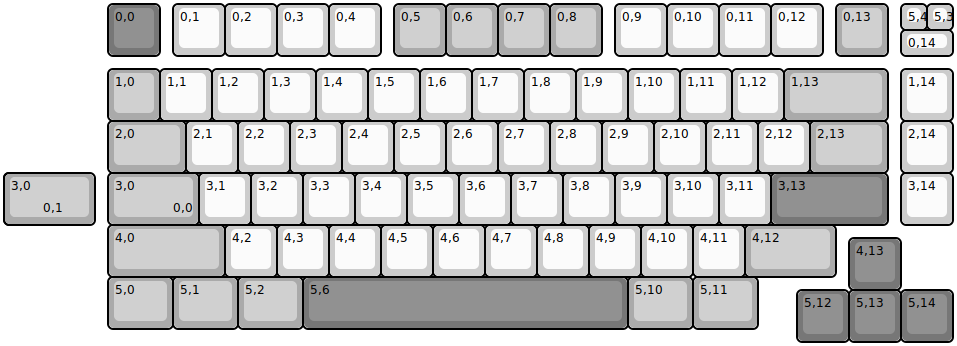{:loading="lazy"}

[Open in keyboard-layout-editor](http://www.keyboard-layout-editor.com/##@@_x:2&c=#777777;&=0,0&_x:0.25&c=#cccccc;&=0,1&=0,2&=0,3&=0,4&_x:0.25&c=#aaaaaa;&=0,5&=0,6&=0,7&=0,8&_x:0.25&c=#cccccc;&=0,9&=0,10&=0,11&=0,12&_x:0.25&c=#aaaaaa;&=0,13&_x:0.25&c=#cccccc&w:0.5&h:0.5;&=5,4&_w:0.5&h:0.5;&=5,3;&@_x:17.25&y:-0.5&h:0.5;&=0,14;&@_x:2&y:-0.25&c=#aaaaaa;&=1,0&_c=#cccccc;&=1,1&=1,2&=1,3&=1,4&=1,5&=1,6&=1,7&=1,8&=1,9&=1,10&=1,11&=1,12&_c=#aaaaaa&w:2;&=1,13&_x:0.25&c=#cccccc;&=1,14;&@_x:2&c=#aaaaaa&w:1.5;&=2,0&_c=#cccccc;&=2,1&=2,2&=2,3&=2,4&=2,5&=2,6&=2,7&=2,8&=2,9&=2,10&=2,11&=2,12&_c=#aaaaaa&w:1.5;&=2,13&_x:0.25&c=#cccccc;&=2,14;&@_x:2.0&c=#aaaaaa&w:1.75;&=3,0%0A%0A%0A0,0&_c=#cccccc;&=3,1&=3,2&=3,3&=3,4&=3,5&=3,6&=3,7&=3,8&=3,9&=3,10&=3,11&_c=#777777&w:2.25;&=3,13&_x:0.25&c=#cccccc;&=3,14;&@_x:2&c=#aaaaaa&w:2.25;&=4,0&_c=#cccccc;&=4,2&=4,3&=4,4&=4,5&=4,6&=4,7&=4,8&=4,9&=4,10&=4,11&_c=#aaaaaa&w:1.75;&=4,12;&@_x:16.25&y:-0.75&c=#777777;&=4,13;&@_x:2&y:-0.25&c=#aaaaaa&w:1.25;&=5,0&_w:1.25;&=5,1&_w:1.25;&=5,2&_c=#777777&w:6.25;&=5,6&_c=#aaaaaa&w:1.25;&=5,10&_w:1.25;&=5,11;&@_x:15.25&y:-0.75&c=#777777;&=5,12&=5,13&=5,14;&@_y:-3.25&c=#aaaaaa&w:1.25&w2:1.75&l:true;&=3,0%0A%0A%0A0,1)

## mmkzoo65/mmkzoo65

[README](output/mmkzoo65/README.md) - [layout](output/mmkzoo65/mmkzoo65-kle.json) - [PCB](output/mmkzoo65/mmkzoo65.kicad_pcb) - [PCB render](output/mmkzoo65/mmkzoo65-render.svg)

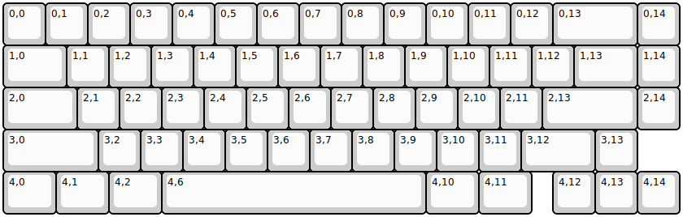{:loading="lazy"}

[Open in keyboard-layout-editor](http://www.keyboard-layout-editor.com/##@@=0,0&=0,1&=0,2&=0,3&=0,4&=0,5&=0,6&=0,7&=0,8&=0,9&=0,10&=0,11&=0,12&_w:2;&=0,13&=0,14;&@_w:1.5;&=1,0&=1,1&=1,2&=1,3&=1,4&=1,5&=1,6&=1,7&=1,8&=1,9&=1,10&=1,11&=1,12&_w:1.5;&=1,13&=1,14;&@_w:1.75;&=2,0&=2,1&=2,2&=2,3&=2,4&=2,5&=2,6&=2,7&=2,8&=2,9&=2,10&=2,11&_w:2.25;&=2,13&=2,14;&@_w:2.25;&=3,0&=3,2&=3,3&=3,4&=3,5&=3,6&=3,7&=3,8&=3,9&=3,10&=3,11&_w:1.75;&=3,12&=3,13;&@_w:1.25;&=4,0&_w:1.25;&=4,1&_w:1.25;&=4,2&_w:6.25;&=4,6&_w:1.25;&=4,10&_w:1.25;&=4,11&_x:0.5;&=4,12&=4,13&=4,14)

## mode/m65ha/m65ha_alpha

[README](output/mode/m65ha/README.md) - [layout](output/mode/m65ha/m65ha_alpha-kle.json) - [PCB](output/mode/m65ha/m65ha_alpha.kicad_pcb) - [PCB render](output/mode/m65ha/m65ha_alpha-render.svg)

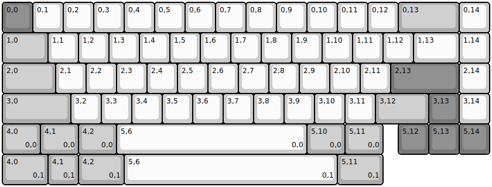{:loading="lazy"}

[Open in keyboard-layout-editor](http://www.keyboard-layout-editor.com/##@@_c=#777777;&=0,0&_c=#cccccc;&=0,1&=0,2&=0,3&=0,4&=0,5&=0,6&=0,7&=0,8&=0,9&=0,10&=0,11&=0,12&_c=#aaaaaa&w:2;&=0,13&_c=#cccccc;&=0,14;&@_c=#aaaaaa&w:1.5;&=1,0&_c=#cccccc;&=1,1&=1,2&=1,3&=1,4&=1,5&=1,6&=1,7&=1,8&=1,9&=1,10&=1,11&=1,12&_w:1.5;&=1,13&=1,14;&@_c=#aaaaaa&w:1.75;&=2,0&_c=#cccccc;&=2,1&=2,2&=2,3&=2,4&=2,5&=2,6&=2,7&=2,8&=2,9&=2,10&=2,11&_c=#777777&w:2.25;&=2,13&_c=#cccccc;&=2,14;&@_c=#aaaaaa&w:2.25;&=3,0&_c=#cccccc;&=3,2&=3,3&=3,4&=3,5&=3,6&=3,7&=3,8&=3,9&=3,10&=3,11&_c=#aaaaaa&w:1.75;&=3,12&_c=#777777;&=3,13&_c=#cccccc;&=3,14;&@_c=#aaaaaa&w:1.25;&=4,0%0A%0A%0A0,0&_w:1.25;&=4,1%0A%0A%0A0,0&_w:1.25;&=4,2%0A%0A%0A0,0&_c=#cccccc&w:6.25;&=5,6%0A%0A%0A0,0&_c=#aaaaaa&w:1.25;&=5,10%0A%0A%0A0,0&_w:1.25;&=5,11%0A%0A%0A0,0&_x:0.5&c=#777777;&=5,12&=5,13&=5,14;&@_c=#aaaaaa&w:1.5;&=4,0%0A%0A%0A0,1&=4,1%0A%0A%0A0,1&_w:1.5;&=4,2%0A%0A%0A0,1&_c=#cccccc&w:7;&=5,6%0A%0A%0A0,1&_c=#aaaaaa&w:1.5;&=5,11%0A%0A%0A0,1)

## mode/m65hi/m65hi_alpha

[README](output/mode/m65hi/README.md) - [layout](output/mode/m65hi/m65hi_alpha-kle.json) - [PCB](output/mode/m65hi/m65hi_alpha.kicad_pcb) - [PCB render](output/mode/m65hi/m65hi_alpha-render.svg)

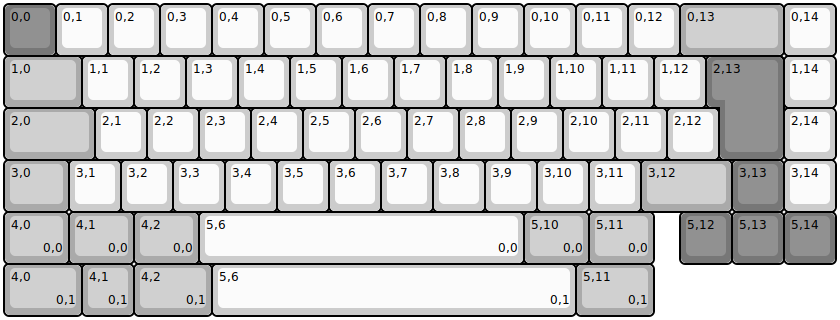{:loading="lazy"}

[Open in keyboard-layout-editor](http://www.keyboard-layout-editor.com/##@@_c=#777777;&=0,0&_c=#cccccc;&=0,1&=0,2&=0,3&=0,4&=0,5&=0,6&=0,7&=0,8&=0,9&=0,10&=0,11&=0,12&_c=#aaaaaa&w:2;&=0,13&_c=#cccccc;&=0,14;&@_c=#aaaaaa&w:1.5;&=1,0&_c=#cccccc;&=1,1&=1,2&=1,3&=1,4&=1,5&=1,6&=1,7&=1,8&=1,9&=1,10&=1,11&=1,12&_x:0.25&c=#777777&w:1.25&h:2&w2:1.5&h2:1&x2:-0.25;&=2,13&_c=#cccccc;&=1,14;&@_c=#aaaaaa&w:1.75;&=2,0&_c=#cccccc;&=2,1&=2,2&=2,3&=2,4&=2,5&=2,6&=2,7&=2,8&=2,9&=2,10&=2,11&=2,12&_x:1.25;&=2,14;&@_c=#aaaaaa&w:1.25;&=3,0&_c=#cccccc;&=3,1&=3,2&=3,3&=3,4&=3,5&=3,6&=3,7&=3,8&=3,9&=3,10&=3,11&_c=#aaaaaa&w:1.75;&=3,12&_c=#777777;&=3,13&_c=#cccccc;&=3,14;&@_c=#aaaaaa&w:1.25;&=4,0%0A%0A%0A0,0&_w:1.25;&=4,1%0A%0A%0A0,0&_w:1.25;&=4,2%0A%0A%0A0,0&_c=#cccccc&w:6.25;&=5,6%0A%0A%0A0,0&_c=#aaaaaa&w:1.25;&=5,10%0A%0A%0A0,0&_w:1.25;&=5,11%0A%0A%0A0,0&_x:0.5&c=#777777;&=5,12&=5,13&=5,14;&@_c=#aaaaaa&w:1.5;&=4,0%0A%0A%0A0,1&=4,1%0A%0A%0A0,1&_w:1.5;&=4,2%0A%0A%0A0,1&_c=#cccccc&w:7;&=5,6%0A%0A%0A0,1&_c=#aaaaaa&w:1.5;&=5,11%0A%0A%0A0,1)

## mode/m65s

[README](output/mode/m65s/README.md) - [layout](output/mode/m65s/m65s-kle.json) - [PCB](output/mode/m65s/m65s.kicad_pcb) - [PCB render](output/mode/m65s/m65s-render.svg)

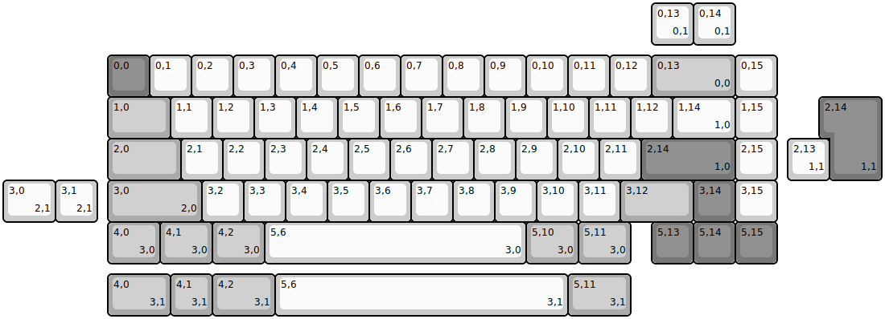{:loading="lazy"}

[Open in keyboard-layout-editor](http://www.keyboard-layout-editor.com/##@@_x:2.5&y:1.25&c=#777777;&=0,0&_c=#cccccc;&=0,1&=0,2&=0,3&=0,4&=0,5&=0,6&=0,7&=0,8&=0,9&=0,10&=0,11&=0,12&_c=#aaaaaa&w:2;&=0,13%0A%0A%0A0,0&_c=#cccccc;&=0,15;&@_x:2.5&c=#aaaaaa&w:1.5;&=1,0&_c=#cccccc;&=1,1&=1,2&=1,3&=1,4&=1,5&=1,6&=1,7&=1,8&=1,9&=1,10&=1,11&=1,12&_w:1.5;&=1,14%0A%0A%0A1,0&=1,15;&@_x:2.5&c=#aaaaaa&w:1.75;&=2,0&_c=#cccccc;&=2,1&=2,2&=2,3&=2,4&=2,5&=2,6&=2,7&=2,8&=2,9&=2,10&=2,11&_c=#777777&w:2.25;&=2,14%0A%0A%0A1,0&_c=#cccccc;&=2,15;&@_x:2.5&c=#aaaaaa&w:2.25;&=3,0%0A%0A%0A2,0&_c=#cccccc;&=3,2&=3,3&=3,4&=3,5&=3,6&=3,7&=3,8&=3,9&=3,10&=3,11&_c=#aaaaaa&w:1.75;&=3,12&_c=#777777;&=3,14&_c=#cccccc;&=3,15;&@_x:2.5&c=#aaaaaa&w:1.25;&=4,0%0A%0A%0A3,0&_w:1.25;&=4,1%0A%0A%0A3,0&_w:1.25;&=4,2%0A%0A%0A3,0&_c=#cccccc&w:6.25;&=5,6%0A%0A%0A3,0&_c=#aaaaaa&w:1.25;&=5,10%0A%0A%0A3,0&_w:1.25;&=5,11%0A%0A%0A3,0&_x:0.5&c=#777777;&=5,13&=5,14&=5,15;&@_x:15.5&y:-6.25&c=#cccccc;&=0,13%0A%0A%0A0,1&=0,14%0A%0A%0A0,1;&@_x:19.75&y:1.25&c=#777777&w:1.25&h:2&w2:1.5&h2:1&x2:-0.25;&=2,14%0A%0A%0A1,1;&@_x:18.75&c=#cccccc;&=2,13%0A%0A%0A1,1;&@_w:1.25;&=3,0%0A%0A%0A2,1&=3,1%0A%0A%0A2,1;&@_x:2.5&y:1.25&c=#aaaaaa&w:1.5;&=4,0%0A%0A%0A3,1&=4,1%0A%0A%0A3,1&_w:1.5;&=4,2%0A%0A%0A3,1&_c=#cccccc&w:7;&=5,6%0A%0A%0A3,1&_c=#aaaaaa&w:1.5;&=5,11%0A%0A%0A3,1)

## mode/m75/m75h

[README](output/mode/m75/README.md) - [layout](output/mode/m75/m75h-kle.json) - [PCB](output/mode/m75/m75h.kicad_pcb) - [PCB render](output/mode/m75/m75h-render.svg)

{:loading="lazy"}

[Open in keyboard-layout-editor](http://www.keyboard-layout-editor.com/##@@_c=#777777;&=0,0&_x:0.5&c=#cccccc;&=0,1&=0,2&=0,3&=0,4&_x:0.5;&=0,6&=0,7&=0,8&=0,9&_x:0.5;&=0,10&=0,11&=0,12&=0,13&_x:0.5;&=0,15;&@_y:0.5;&=1,0&=1,1&=1,2&=1,3&=1,4&=1,5&=1,6&=1,7&=1,8&=1,9&=1,10&=1,11&=1,12&_c=#aaaaaa&w:2;&=1,13&_c=#cccccc;&=1,15;&@_c=#aaaaaa&w:1.5;&=2,0&_c=#cccccc;&=2,1&=2,2&=2,3&=2,4&=2,5&=2,6&=2,7&=2,8&=2,9&=2,10&=2,11&=2,12&_c=#aaaaaa&w:1.5;&=2,14&_c=#cccccc;&=2,15;&@_c=#aaaaaa&w:1.75;&=3,0&_c=#cccccc;&=3,1&=3,2&=3,3&=3,4&=3,5&=3,6&=3,7&=3,8&=3,9&=3,10&=3,11&_c=#777777&w:2.25;&=3,14&_c=#cccccc;&=3,15;&@_c=#aaaaaa&w:2.25;&=4,0&_c=#cccccc;&=4,2&=4,3&=4,4&=4,5&=4,6&=4,7&=4,8&=4,9&=4,10&=4,11&_c=#aaaaaa&w:1.75;&=4,12&_c=#777777;&=4,14&_c=#cccccc;&=4,15;&@_c=#aaaaaa&w:1.25;&=5,0%0A%0A%0A0,0&_w:1.25;&=5,1%0A%0A%0A0,0&_w:1.25;&=5,2%0A%0A%0A0,0&_c=#cccccc&w:6.25;&=6,6%0A%0A%0A0,0&_c=#aaaaaa&w:1.25;&=6,10%0A%0A%0A0,0&_w:1.25;&=6,11%0A%0A%0A0,0&_x:0.5&c=#777777;&=6,13&=6,14&=6,15;&@_c=#aaaaaa&w:1.5;&=5,0%0A%0A%0A0,1&=5,1%0A%0A%0A0,1&_w:1.5;&=5,2%0A%0A%0A0,1&_c=#cccccc&w:7;&=6,6%0A%0A%0A0,1&_c=#aaaaaa&w:1.5;&=6,11%0A%0A%0A0,1)

## mode/m75/m75s

[README](output/mode/m75/README.md) - [layout](output/mode/m75/m75s-kle.json) - [PCB](output/mode/m75/m75s.kicad_pcb) - [PCB render](output/mode/m75/m75s-render.svg)

{:loading="lazy"}

[Open in keyboard-layout-editor](http://www.keyboard-layout-editor.com/##@@_x:2.75&y:1.25&c=#777777;&=0,0&_x:0.5&c=#cccccc;&=0,1&=0,2&=0,3&=0,4&_x:0.5;&=0,6&=0,7&=0,8&=0,9&_x:0.5;&=0,10&=0,11&=0,12&=0,13&_x:0.5;&=0,15;&@_x:2.75&y:0.5;&=1,0&=1,1&=1,2&=1,3&=1,4&=1,5&=1,6&=1,7&=1,8&=1,9&=1,10&=1,11&=1,12&_c=#aaaaaa&w:2;&=1,13%0A%0A%0A1,0&_c=#cccccc;&=1,15;&@_x:2.75&c=#aaaaaa&w:1.5;&=2,0&_c=#cccccc;&=2,1&=2,2&=2,3&=2,4&=2,5&=2,6&=2,7&=2,8&=2,9&=2,10&=2,11&=2,12&_c=#aaaaaa&w:1.5;&=2,14%0A%0A%0A2,0&_c=#cccccc;&=2,15;&@_x:2.75&c=#aaaaaa&w:1.75;&=3,0&_c=#cccccc;&=3,1&=3,2&=3,3&=3,4&=3,5&=3,6&=3,7&=3,8&=3,9&=3,10&=3,11&_c=#777777&w:2.25;&=3,14%0A%0A%0A2,0&_c=#cccccc;&=3,15;&@_x:2.75&c=#aaaaaa&w:2.25;&=4,0%0A%0A%0A3,0&_c=#cccccc;&=4,2&=4,3&=4,4&=4,5&=4,6&=4,7&=4,8&=4,9&=4,10&=4,11&_c=#aaaaaa&w:1.75;&=4,12&_c=#777777;&=4,14&_c=#cccccc;&=4,15;&@_x:2.75&c=#aaaaaa&w:1.25;&=5,0%0A%0A%0A0,0&_w:1.25;&=5,1%0A%0A%0A0,0&_w:1.25;&=5,2%0A%0A%0A0,0&_c=#cccccc&w:6.25;&=6,6%0A%0A%0A0,0&_c=#aaaaaa&w:1.25;&=6,10%0A%0A%0A0,0&_w:1.25;&=6,11%0A%0A%0A0,0&_x:0.5&c=#777777;&=6,13&=6,14&=6,15;&@_x:15.75&y:-7.75&c=#cccccc;&=1,13%0A%0A%0A1,1&=1,14%0A%0A%0A1,1;&@_x:20.25&y:2.75&c=#777777&w:1.25&h:2&w2:1.5&h2:1&x2:-0.25;&=3,14%0A%0A%0A2,1;&@_x:19.25&c=#cccccc;&=3,13%0A%0A%0A2,1;&@_c=#aaaaaa&w:1.25;&=4,0%0A%0A%0A3,1&_c=#cccccc;&=4,1%0A%0A%0A3,1;&@_x:2.75&y:1.0&c=#aaaaaa&w:1.5;&=5,0%0A%0A%0A0,1&=5,1%0A%0A%0A0,1&_w:1.5;&=5,2%0A%0A%0A0,1&_c=#cccccc&w:7;&=6,6%0A%0A%0A0,1&_c=#aaaaaa&w:1.5;&=6,11%0A%0A%0A0,1)

## mode/m80h/m80v1h

[README](output/mode/m80h/README.md) - [layout](output/mode/m80h/m80v1h-kle.json) - [PCB](output/mode/m80h/m80v1h.kicad_pcb) - [PCB render](output/mode/m80h/m80v1h-render.svg)

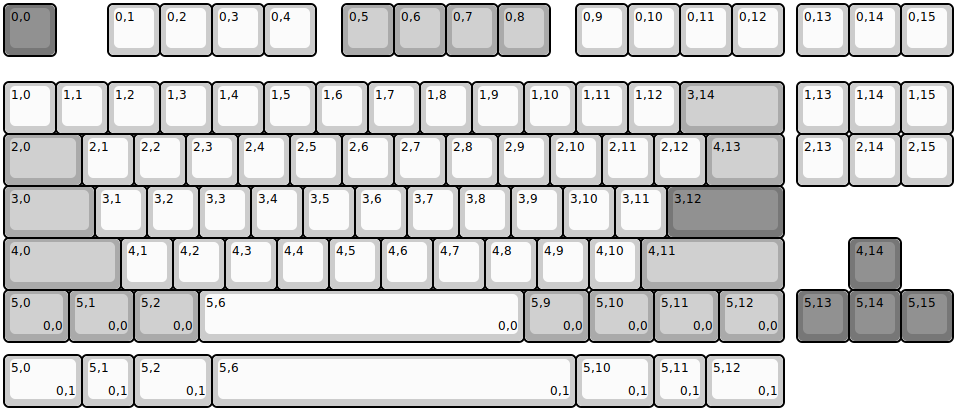{:loading="lazy"}

[Open in keyboard-layout-editor](http://www.keyboard-layout-editor.com/##@@_c=#777777;&=0,0&_x:1&c=#cccccc;&=0,1&=0,2&=0,3&=0,4&_x:0.5&c=#aaaaaa;&=0,5&=0,6&=0,7&=0,8&_x:0.5&c=#cccccc;&=0,9&=0,10&=0,11&=0,12&_x:0.25;&=0,13&=0,14&=0,15;&@_y:0.5;&=1,0&=1,1&=1,2&=1,3&=1,4&=1,5&=1,6&=1,7&=1,8&=1,9&=1,10&=1,11&=1,12&_c=#aaaaaa&w:2;&=3,14&_x:0.25&c=#cccccc;&=1,13&=1,14&=1,15;&@_c=#aaaaaa&w:1.5;&=2,0&_c=#cccccc;&=2,1&=2,2&=2,3&=2,4&=2,5&=2,6&=2,7&=2,8&=2,9&=2,10&=2,11&=2,12&_c=#aaaaaa&w:1.5;&=4,13&_x:0.25&c=#cccccc;&=2,13&=2,14&=2,15;&@_c=#aaaaaa&w:1.75;&=3,0&_c=#cccccc;&=3,1&=3,2&=3,3&=3,4&=3,5&=3,6&=3,7&=3,8&=3,9&=3,10&=3,11&_c=#777777&w:2.25;&=3,12;&@_c=#aaaaaa&w:2.25;&=4,0&_c=#cccccc;&=4,1&=4,2&=4,3&=4,4&=4,5&=4,6&=4,7&=4,8&=4,9&=4,10&_c=#aaaaaa&w:2.75;&=4,11&_x:1.25&c=#777777;&=4,14;&@_c=#aaaaaa&w:1.25;&=5,0%0A%0A%0A0,0&_w:1.25;&=5,1%0A%0A%0A0,0&_w:1.25;&=5,2%0A%0A%0A0,0&_c=#cccccc&w:6.25;&=5,6%0A%0A%0A0,0&_c=#aaaaaa&w:1.25;&=5,9%0A%0A%0A0,0&_w:1.25;&=5,10%0A%0A%0A0,0&_w:1.25;&=5,11%0A%0A%0A0,0&_w:1.25;&=5,12%0A%0A%0A0,0&_x:0.25&c=#777777;&=5,13&=5,14&=5,15;&@_y:0.25&c=#cccccc&w:1.5;&=5,0%0A%0A%0A0,1&=5,1%0A%0A%0A0,1&_w:1.5;&=5,2%0A%0A%0A0,1&_w:7;&=5,6%0A%0A%0A0,1&_w:1.5;&=5,10%0A%0A%0A0,1&=5,11%0A%0A%0A0,1&_w:1.5;&=5,12%0A%0A%0A0,1)

## mode/m80h/m80v2h

[README](output/mode/m80h/README.md) - [layout](output/mode/m80h/m80v2h-kle.json) - [PCB](output/mode/m80h/m80v2h.kicad_pcb) - [PCB render](output/mode/m80h/m80v2h-render.svg)

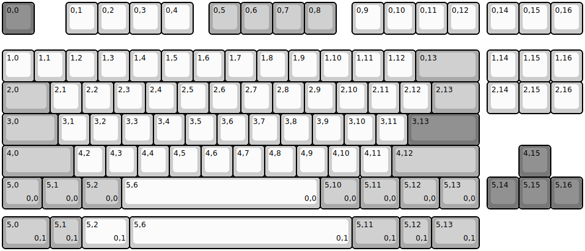{:loading="lazy"}

[Open in keyboard-layout-editor](http://www.keyboard-layout-editor.com/##@@_c=#777777;&=0,0&_x:1&c=#cccccc;&=0,1&=0,2&=0,3&=0,4&_x:0.5&c=#aaaaaa;&=0,5&=0,6&=0,7&=0,8&_x:0.5&c=#cccccc;&=0,9&=0,10&=0,11&=0,12&_x:0.25;&=0,14&=0,15&=0,16;&@_y:0.5;&=1,0&=1,1&=1,2&=1,3&=1,4&=1,5&=1,6&=1,7&=1,8&=1,9&=1,10&=1,11&=1,12&_c=#aaaaaa&w:2;&=0,13&_x:0.25&c=#cccccc;&=1,14&=1,15&=1,16;&@_c=#aaaaaa&w:1.5;&=2,0&_c=#cccccc;&=2,1&=2,2&=2,3&=2,4&=2,5&=2,6&=2,7&=2,8&=2,9&=2,10&=2,11&=2,12&_c=#aaaaaa&w:1.5;&=2,13&_x:0.25&c=#cccccc;&=2,14&=2,15&=2,16;&@_c=#aaaaaa&w:1.75;&=3,0&_c=#cccccc;&=3,1&=3,2&=3,3&=3,4&=3,5&=3,6&=3,7&=3,8&=3,9&=3,10&=3,11&_c=#777777&w:2.25;&=3,13;&@_c=#aaaaaa&w:2.25;&=4,0&_c=#cccccc;&=4,2&=4,3&=4,4&=4,5&=4,6&=4,7&=4,8&=4,9&=4,10&=4,11&_c=#aaaaaa&w:2.75;&=4,12&_x:1.25&c=#777777;&=4,15;&@_c=#aaaaaa&w:1.25;&=5,0%0A%0A%0A0,0&_w:1.25;&=5,1%0A%0A%0A0,0&_w:1.25;&=5,2%0A%0A%0A0,0&_c=#cccccc&w:6.25;&=5,6%0A%0A%0A0,0&_c=#aaaaaa&w:1.25;&=5,10%0A%0A%0A0,0&_w:1.25;&=5,11%0A%0A%0A0,0&_w:1.25;&=5,12%0A%0A%0A0,0&_w:1.25;&=5,13%0A%0A%0A0,0&_x:0.25&c=#777777;&=5,14&=5,15&=5,16;&@_y:0.25&c=#aaaaaa&w:1.5;&=5,0%0A%0A%0A0,1&=5,1%0A%0A%0A0,1&_c=#cccccc&w:1.5;&=5,2%0A%0A%0A0,1&_w:7;&=5,6%0A%0A%0A0,1&_c=#aaaaaa&w:1.5;&=5,11%0A%0A%0A0,1&=5,12%0A%0A%0A0,1&_w:1.5;&=5,13%0A%0A%0A0,1)

## mode/m80s/m80v1s

[README](output/mode/m80s/README.md) - [layout](output/mode/m80s/m80v1s-kle.json) - [PCB](output/mode/m80s/m80v1s.kicad_pcb) - [PCB render](output/mode/m80s/m80v1s-render.svg)

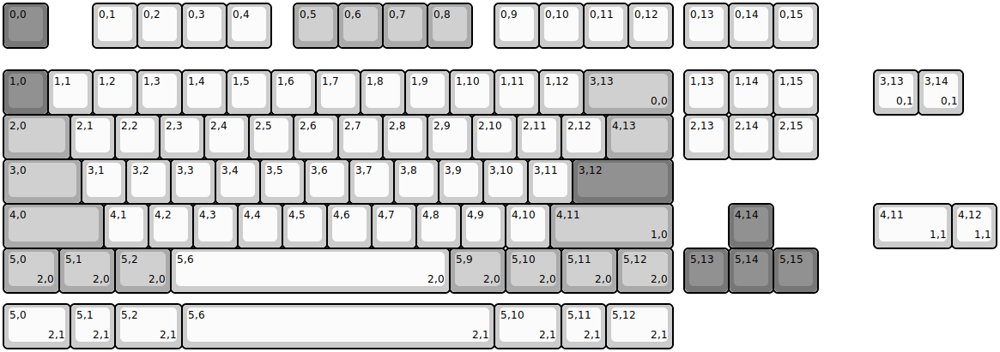{:loading="lazy"}

[Open in keyboard-layout-editor](http://www.keyboard-layout-editor.com/##@@_c=#777777;&=0,0&_x:1&c=#cccccc;&=0,1&=0,2&=0,3&=0,4&_x:0.5&c=#aaaaaa;&=0,5&=0,6&=0,7&=0,8&_x:0.5&c=#cccccc;&=0,9&=0,10&=0,11&=0,12&_x:0.25;&=0,13&=0,14&=0,15;&@_y:0.5&c=#777777;&=1,0%0A%60&_c=#cccccc;&=1,1&=1,2&=1,3&=1,4&=1,5&=1,6&=1,7&=1,8&=1,9&=1,10&=1,11&=1,12&_c=#aaaaaa&w:2;&=3,13%0A%0A%0A0,0&_x:0.25&c=#cccccc;&=1,13&=1,14&=1,15;&@_c=#aaaaaa&w:1.5;&=2,0&_c=#cccccc;&=2,1&=2,2&=2,3&=2,4&=2,5&=2,6&=2,7&=2,8&=2,9&=2,10&=2,11&=2,12&_c=#aaaaaa&w:1.5;&=4,13&_x:0.25&c=#cccccc;&=2,13&=2,14&=2,15;&@_c=#aaaaaa&w:1.75;&=3,0&_c=#cccccc;&=3,1&=3,2&=3,3&=3,4&=3,5&=3,6&=3,7&=3,8&=3,9&=3,10&=3,11&_c=#777777&w:2.25;&=3,12;&@_c=#aaaaaa&w:2.25;&=4,0&_c=#cccccc;&=4,1&=4,2&=4,3&=4,4&=4,5&=4,6&=4,7&=4,8&=4,9&=4,10&_c=#aaaaaa&w:2.75;&=4,11%0A%0A%0A1,0&_x:1.25&c=#777777;&=4,14;&@_c=#aaaaaa&w:1.25;&=5,0%0A%0A%0A2,0&_w:1.25;&=5,1%0A%0A%0A2,0&_w:1.25;&=5,2%0A%0A%0A2,0&_c=#cccccc&w:6.25;&=5,6%0A%0A%0A2,0&_c=#aaaaaa&w:1.25;&=5,9%0A%0A%0A2,0&_w:1.25;&=5,10%0A%0A%0A2,0&_w:1.25;&=5,11%0A%0A%0A2,0&_w:1.25;&=5,12%0A%0A%0A2,0&_x:0.25&c=#777777;&=5,13&=5,14&=5,15;&@_x:19.5&y:-5.0&c=#cccccc;&=3,13%0A%0A%0A0,1&=3,14%0A%0A%0A0,1;&@_x:19.5&y:2.0&w:1.75;&=4,11%0A%0A%0A1,1&=4,12%0A%0A%0A1,1;&@_y:1.25&w:1.5;&=5,0%0A%0A%0A2,1&=5,1%0A%0A%0A2,1&_w:1.5;&=5,2%0A%0A%0A2,1&_w:7;&=5,6%0A%0A%0A2,1&_w:1.5;&=5,10%0A%0A%0A2,1&=5,11%0A%0A%0A2,1&_w:1.5;&=5,12%0A%0A%0A2,1)

## mode/m80s/m80v2s

[README](output/mode/m80s/README.md) - [layout](output/mode/m80s/m80v2s-kle.json) - [PCB](output/mode/m80s/m80v2s.kicad_pcb) - [PCB render](output/mode/m80s/m80v2s-render.svg)

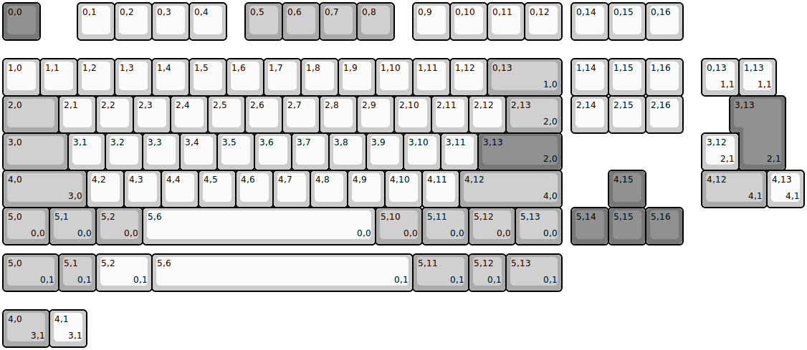{:loading="lazy"}

[Open in keyboard-layout-editor](http://www.keyboard-layout-editor.com/##@@_c=#777777;&=0,0&_x:1&c=#cccccc;&=0,1&=0,2&=0,3&=0,4&_x:0.5&c=#aaaaaa;&=0,5&=0,6&=0,7&=0,8&_x:0.5&c=#cccccc;&=0,9&=0,10&=0,11&=0,12&_x:0.25;&=0,14&=0,15&=0,16;&@_y:0.5;&=1,0&=1,1&=1,2&=1,3&=1,4&=1,5&=1,6&=1,7&=1,8&=1,9&=1,10&=1,11&=1,12&_c=#aaaaaa&w:2;&=0,13%0A%0A%0A1,0&_x:0.25&c=#cccccc;&=1,14&=1,15&=1,16;&@_c=#aaaaaa&w:1.5;&=2,0&_c=#cccccc;&=2,1&=2,2&=2,3&=2,4&=2,5&=2,6&=2,7&=2,8&=2,9&=2,10&=2,11&=2,12&_c=#aaaaaa&w:1.5;&=2,13%0A%0A%0A2,0&_x:0.25&c=#cccccc;&=2,14&=2,15&=2,16;&@_c=#aaaaaa&w:1.75;&=3,0&_c=#cccccc;&=3,1&=3,2&=3,3&=3,4&=3,5&=3,6&=3,7&=3,8&=3,9&=3,10&=3,11&_c=#777777&w:2.25;&=3,13%0A%0A%0A2,0;&@_c=#aaaaaa&w:2.25;&=4,0%0A%0A%0A3,0&_c=#cccccc;&=4,2&=4,3&=4,4&=4,5&=4,6&=4,7&=4,8&=4,9&=4,10&=4,11&_c=#aaaaaa&w:2.75;&=4,12%0A%0A%0A4,0&_x:1.25&c=#777777;&=4,15;&@_c=#aaaaaa&w:1.25;&=5,0%0A%0A%0A0,0&_w:1.25;&=5,1%0A%0A%0A0,0&_w:1.25;&=5,2%0A%0A%0A0,0&_c=#cccccc&w:6.25;&=5,6%0A%0A%0A0,0&_c=#aaaaaa&w:1.25;&=5,10%0A%0A%0A0,0&_w:1.25;&=5,11%0A%0A%0A0,0&_w:1.25;&=5,12%0A%0A%0A0,0&_w:1.25;&=5,13%0A%0A%0A0,0&_x:0.25&c=#777777;&=5,14&=5,15&=5,16;&@_x:18.75&y:-5.0&c=#cccccc;&=0,13%0A%0A%0A1,1&=1,13%0A%0A%0A1,1;&@_x:19.75&c=#777777&w:1.25&h:2&w2:1.5&h2:1&x2:-0.25;&=3,13%0A%0A%0A2,1;&@_x:18.75&c=#cccccc;&=3,12%0A%0A%0A2,1;&@_x:18.75&c=#aaaaaa&w:1.75;&=4,12%0A%0A%0A4,1&_c=#cccccc;&=4,13%0A%0A%0A4,1;&@_y:1.25&c=#aaaaaa&w:1.5;&=5,0%0A%0A%0A0,1&=5,1%0A%0A%0A0,1&_c=#cccccc&w:1.5;&=5,2%0A%0A%0A0,1&_w:7;&=5,6%0A%0A%0A0,1&_c=#aaaaaa&w:1.5;&=5,11%0A%0A%0A0,1&=5,12%0A%0A%0A0,1&_w:1.5;&=5,13%0A%0A%0A0,1;&@_y:0.5&w:1.25;&=4,0%0A%0A%0A3,1&_c=#cccccc;&=4,1%0A%0A%0A3,1)

## model_v/model_v

[README](output/model_v/README.md) - [layout](output/model_v/model_v-kle.json) - [PCB](output/model_v/model_v.kicad_pcb) - [PCB render](output/model_v/model_v-render.svg)

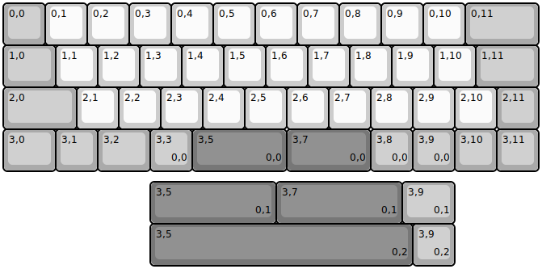{:loading="lazy"}

[Open in keyboard-layout-editor](http://www.keyboard-layout-editor.com/##@@_c=#aaaaaa;&=0,0&_c=#cccccc;&=0,1&=0,2&=0,3&=0,4&=0,5&=0,6&=0,7&=0,8&=0,9&=0,10&_c=#aaaaaa&w:1.75;&=0,11;&@_w:1.25;&=1,0&_c=#cccccc;&=1,1&=1,2&=1,3&=1,4&=1,5&=1,6&=1,7&=1,8&=1,9&=1,10&_c=#aaaaaa&w:1.5;&=1,11;&@_w:1.75;&=2,0&_c=#cccccc;&=2,1&=2,2&=2,3&=2,4&=2,5&=2,6&=2,7&=2,8&=2,9&=2,10&_c=#aaaaaa;&=2,11;&@_w:1.25;&=3,0&=3,1&_w:1.25;&=3,2&=3,3%0A%0A%0A0,0&_c=#777777&w:2.25;&=3,5%0A%0A%0A0,0&_w:2;&=3,7%0A%0A%0A0,0&_c=#aaaaaa;&=3,8%0A%0A%0A0,0&=3,9%0A%0A%0A0,0&=3,10&=3,11;&@_x:3.5&y:0.25&c=#777777&w:3;&=3,5%0A%0A%0A0,1&_w:3;&=3,7%0A%0A%0A0,1&_c=#aaaaaa&w:1.25;&=3,9%0A%0A%0A0,1;&@_x:3.5&c=#777777&w:6.25;&=3,5%0A%0A%0A0,2&_c=#aaaaaa;&=3,9%0A%0A%0A0,2)

## mokey/ginkgo65

[README](output/mokey/ginkgo65/README.md) - [layout](output/mokey/ginkgo65/ginkgo65-kle.json) - [PCB](output/mokey/ginkgo65/ginkgo65.kicad_pcb) - [PCB render](output/mokey/ginkgo65/ginkgo65-render.svg)

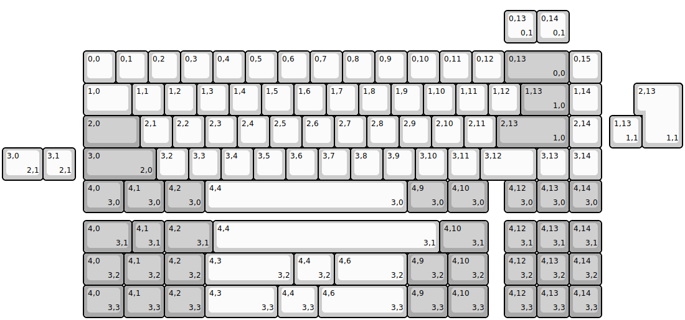{:loading="lazy"}

[Open in keyboard-layout-editor](http://www.keyboard-layout-editor.com/##@@_x:2.5&y:1.5;&=0,0&=0,1&=0,2&=0,3&=0,4&=0,5&=0,6&=0,7&=0,8&=0,9&=0,10&=0,11&=0,12&_c=#aaaaaa&w:2;&=0,13%0A%0A%0A0,0&_c=#cccccc;&=0,15;&@_x:2.5&w:1.5;&=1,0&=1,1&=1,2&=1,3&=1,4&=1,5&=1,6&=1,7&=1,8&=1,9&=1,10&=1,11&=1,12&_c=#aaaaaa&w:1.5;&=1,13%0A%0A%0A1,0&_c=#cccccc;&=1,14;&@_x:2.5&c=#aaaaaa&w:1.75;&=2,0&_c=#cccccc;&=2,1&=2,2&=2,3&=2,4&=2,5&=2,6&=2,7&=2,8&=2,9&=2,10&=2,11&_c=#aaaaaa&w:2.25;&=2,13%0A%0A%0A1,0&_c=#cccccc;&=2,14;&@_x:2.5&c=#aaaaaa&w:2.25;&=3,0%0A%0A%0A2,0&_c=#cccccc;&=3,2&=3,3&=3,4&=3,5&=3,6&=3,7&=3,8&=3,9&=3,10&=3,11&_w:1.75;&=3,12&=3,13&=3,14;&@_x:2.5&c=#aaaaaa&w:1.25;&=4,0%0A%0A%0A3,0&_w:1.25;&=4,1%0A%0A%0A3,0&_w:1.25;&=4,2%0A%0A%0A3,0&_c=#cccccc&w:6.25;&=4,4%0A%0A%0A3,0&_c=#aaaaaa&w:1.25;&=4,9%0A%0A%0A3,0&_w:1.25;&=4,10%0A%0A%0A3,0&_x:0.5;&=4,12%0A%0A%0A3,0&=4,13%0A%0A%0A3,0&=4,14%0A%0A%0A3,0;&@_x:15.5&y:-6.25&c=#cccccc;&=0,13%0A%0A%0A0,1&=0,14%0A%0A%0A0,1;&@_x:19.75&y:1.25&w:1.25&h:2&w2:1.5&h2:1&x2:-0.25;&=2,13%0A%0A%0A1,1;&@_x:18.75;&=1,13%0A%0A%0A1,1;&@_w:1.25;&=3,0%0A%0A%0A2,1&=3,1%0A%0A%0A2,1;&@_x:2.5&y:1.25&c=#aaaaaa&w:1.5;&=4,0%0A%0A%0A3,1&=4,1%0A%0A%0A3,1&_w:1.5;&=4,2%0A%0A%0A3,1&_c=#cccccc&w:7;&=4,4%0A%0A%0A3,1&_c=#aaaaaa&w:1.5;&=4,10%0A%0A%0A3,1&_x:0.5;&=4,12%0A%0A%0A3,1&=4,13%0A%0A%0A3,1&=4,14%0A%0A%0A3,1;&@_x:2.5&w:1.25;&=4,0%0A%0A%0A3,2&_w:1.25;&=4,1%0A%0A%0A3,2&_w:1.25;&=4,2%0A%0A%0A3,2&_c=#cccccc&w:2.75;&=4,3%0A%0A%0A3,2&_w:1.25;&=4,4%0A%0A%0A3,2&_w:2.25;&=4,6%0A%0A%0A3,2&_c=#aaaaaa&w:1.25;&=4,9%0A%0A%0A3,2&_w:1.25;&=4,10%0A%0A%0A3,2&_x:0.5;&=4,12%0A%0A%0A3,2&=4,13%0A%0A%0A3,2&=4,14%0A%0A%0A3,2;&@_x:2.5&w:1.25;&=4,0%0A%0A%0A3,3&_w:1.25;&=4,1%0A%0A%0A3,3&_w:1.25;&=4,2%0A%0A%0A3,3&_c=#cccccc&w:2.25;&=4,3%0A%0A%0A3,3&_w:1.25;&=4,4%0A%0A%0A3,3&_w:2.75;&=4,6%0A%0A%0A3,3&_c=#aaaaaa&w:1.25;&=4,9%0A%0A%0A3,3&_w:1.25;&=4,10%0A%0A%0A3,3&_x:0.5;&=4,12%0A%0A%0A3,3&=4,13%0A%0A%0A3,3&=4,14%0A%0A%0A3,3)

## mokey/ginkgo65hot

[README](output/mokey/ginkgo65hot/README.md) - [layout](output/mokey/ginkgo65hot/ginkgo65hot-kle.json) - [PCB](output/mokey/ginkgo65hot/ginkgo65hot.kicad_pcb) - [PCB render](output/mokey/ginkgo65hot/ginkgo65hot-render.svg)

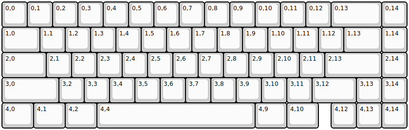{:loading="lazy"}

[Open in keyboard-layout-editor](http://www.keyboard-layout-editor.com/##@@=0,0&=0,1&=0,2&=0,3&=0,4&=0,5&=0,6&=0,7&=0,8&=0,9&=0,10&=0,11&=0,12&_w:2;&=0,13&=0,14;&@_w:1.5;&=1,0&=1,1&=1,2&=1,3&=1,4&=1,5&=1,6&=1,7&=1,8&=1,9&=1,10&=1,11&=1,12&_w:1.5;&=1,13&=1,14;&@_w:1.75;&=2,0&=2,1&=2,2&=2,3&=2,4&=2,5&=2,6&=2,7&=2,8&=2,9&=2,10&=2,11&_w:2.25;&=2,13&=2,14;&@_w:2.25;&=3,0&=3,2&=3,3&=3,4&=3,5&=3,6&=3,7&=3,8&=3,9&=3,10&=3,11&_w:1.75;&=3,12&=3,13&=3,14;&@_w:1.25;&=4,0&_w:1.25;&=4,1&_w:1.25;&=4,2&_w:6.25;&=4,4&_w:1.25;&=4,9&_w:1.25;&=4,10&_x:0.5;&=4,12&=4,13&=4,14)

## mokey/ibis80

[README](output/mokey/ibis80/README.md) - [layout](output/mokey/ibis80/ibis80-kle.json) - [PCB](output/mokey/ibis80/ibis80.kicad_pcb) - [PCB render](output/mokey/ibis80/ibis80-render.svg)

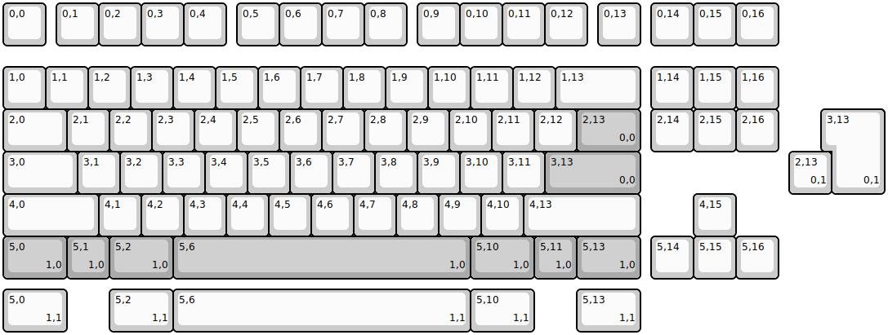{:loading="lazy"}

[Open in keyboard-layout-editor](http://www.keyboard-layout-editor.com/##@@=0,0&_x:0.25;&=0,1&=0,2&=0,3&=0,4&_x:0.25;&=0,5&=0,6&=0,7&=0,8&_x:0.25;&=0,9&=0,10&=0,11&=0,12&_x:0.25;&=0,13&_x:0.25;&=0,14&=0,15&=0,16;&@_y:0.5;&=1,0&=1,1&=1,2&=1,3&=1,4&=1,5&=1,6&=1,7&=1,8&=1,9&=1,10&=1,11&=1,12&_w:2;&=1,13&_x:0.25;&=1,14&=1,15&=1,16;&@_w:1.5;&=2,0&=2,1&=2,2&=2,3&=2,4&=2,5&=2,6&=2,7&=2,8&=2,9&=2,10&=2,11&=2,12&_c=#aaaaaa&w:1.5;&=2,13%0A%0A%0A0,0&_x:0.25&c=#cccccc;&=2,14&=2,15&=2,16;&@_w:1.75;&=3,0&=3,1&=3,2&=3,3&=3,4&=3,5&=3,6&=3,7&=3,8&=3,9&=3,10&=3,11&_c=#aaaaaa&w:2.25;&=3,13%0A%0A%0A0,0;&@_c=#cccccc&w:2.25;&=4,0&=4,1&=4,2&=4,3&=4,4&=4,5&=4,6&=4,7&=4,8&=4,9&=4,10&_w:2.75;&=4,13&_x:1.25;&=4,15;&@_c=#aaaaaa&w:1.5;&=5,0%0A%0A%0A1,0&=5,1%0A%0A%0A1,0&_w:1.5;&=5,2%0A%0A%0A1,0&_w:7;&=5,6%0A%0A%0A1,0&_w:1.5;&=5,10%0A%0A%0A1,0&=5,11%0A%0A%0A1,0&_w:1.5;&=5,13%0A%0A%0A1,0&_x:0.25&c=#cccccc;&=5,14&=5,15&=5,16;&@_x:19.5&y:-4.0&w:1.25&h:2&w2:1.5&h2:1&x2:-0.25;&=3,13%0A%0A%0A0,1;&@_x:18.5;&=2,13%0A%0A%0A0,1;&@_y:2.25&w:1.5;&=5,0%0A%0A%0A1,1&_x:1.0&w:1.5;&=5,2%0A%0A%0A1,1&_w:7;&=5,6%0A%0A%0A1,1&_w:1.5;&=5,10%0A%0A%0A1,1&_x:1.0&w:1.5;&=5,13%0A%0A%0A1,1)

## mokey/mokey63

[README](output/mokey/mokey63/README.md) - [layout](output/mokey/mokey63/mokey63-kle.json) - [PCB](output/mokey/mokey63/mokey63.kicad_pcb) - [PCB render](output/mokey/mokey63/mokey63-render.svg)

{:loading="lazy"}

[Open in keyboard-layout-editor](http://www.keyboard-layout-editor.com/##@@_y:1.25&c=#777777;&=0,0&_c=#cccccc;&=0,1&=0,2&=0,3&=0,4&=0,5&=0,6&=0,7&=0,8&=0,9&=0,10&=0,11&=0,12&_c=#aaaaaa&w:2;&=0,14%0A%0A%0A0,0;&@_c=#cccccc&w:1.5;&=1,0&=1,2&=1,3&=1,4&=1,5&=1,6&=1,7&=1,8&=1,9&=1,10&=1,11&=1,12&=1,13&_w:1.5;&=1,14%0A%0A%0A1,0;&@_w:1.75;&=2,0&=2,2&=2,3&=2,4&=2,5&=2,6&=2,7&=2,8&=2,9&=2,10&=2,11&=2,12&_c=#777777&w:2.25;&=2,13%0A%0A%0A1,0;&@_c=#cccccc&w:2.25;&=3,0&=3,2&=3,3&=3,4&=3,5&=3,6&=3,7&=3,8&=3,9&=3,10&_w:1.75;&=3,12&=3,13&=3,14;&@_w:1.25;&=4,0&_w:1.25;&=4,1&_w:1.25;&=4,3&_c=#aaaaaa&w:6.25;&=4,6%0A%0A%0A2,0&_c=#cccccc;&=4,10&=4,11&=4,12&=4,13&=4,14;&@_x:13&y:-6.25&c=#aaaaaa;&=0,13%0A%0A%0A0,1&=0,14%0A%0A%0A0,1;&@_x:16.25&y:1.25&c=#777777&w:1.25&h:2&w2:1.5&h2:1&x2:-0.25;&=2,13%0A%0A%0A1,1;&@_x:15.25&c=#cccccc;&=1,14%0A%0A%0A1,1;&@_x:3.75&y:2.25&c=#aaaaaa&w:2.25;&=4,4%0A%0A%0A2,1&_w:1.25;&=4,6%0A%0A%0A2,1&_w:2.75;&=4,8%0A%0A%0A2,1)

## mokey/mokey64

[README](output/mokey/mokey64/README.md) - [layout](output/mokey/mokey64/mokey64-kle.json) - [PCB](output/mokey/mokey64/mokey64.kicad_pcb) - [PCB render](output/mokey/mokey64/mokey64-render.svg)

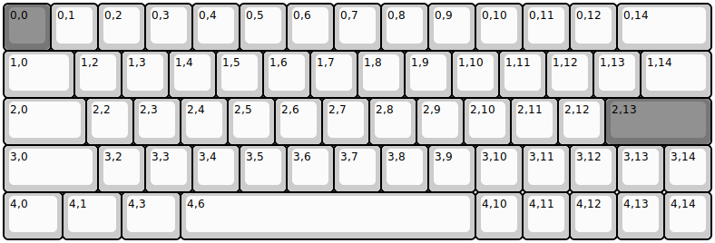{:loading="lazy"}

[Open in keyboard-layout-editor](http://www.keyboard-layout-editor.com/##@@_c=#777777;&=0,0&_c=#cccccc;&=0,1&=0,2&=0,3&=0,4&=0,5&=0,6&=0,7&=0,8&=0,9&=0,10&=0,11&=0,12&_w:2;&=0,14;&@_w:1.5;&=1,0&=1,2&=1,3&=1,4&=1,5&=1,6&=1,7&=1,8&=1,9&=1,10&=1,11&=1,12&=1,13&_w:1.5;&=1,14;&@_w:1.75;&=2,0&=2,2&=2,3&=2,4&=2,5&=2,6&=2,7&=2,8&=2,9&=2,10&=2,11&=2,12&_c=#777777&w:2.25;&=2,13;&@_c=#cccccc&w:2;&=3,0&=3,2&=3,3&=3,4&=3,5&=3,6&=3,7&=3,8&=3,9&=3,10&=3,11&=3,12&=3,13&=3,14;&@_w:1.25;&=4,0&_w:1.25;&=4,1&_w:1.25;&=4,3&_w:6.25;&=4,6&=4,10&=4,11&=4,12&=4,13&=4,14)

## mokey/xox70

[README](output/mokey/xox70/README.md) - [layout](output/mokey/xox70/xox70-kle.json) - [PCB](output/mokey/xox70/xox70.kicad_pcb) - [PCB render](output/mokey/xox70/xox70-render.svg)

{:loading="lazy"}

[Open in keyboard-layout-editor](http://www.keyboard-layout-editor.com/##@@_x:2.25&y:1.75;&=0,0&=0,1&=0,2&=0,3&=0,4&=0,5&=0,6&=0,7&=0,8&=0,9&=0,10&=0,11&=0,12&_w:2;&=0,14%0A%0A%0A0,0&_x:0.25;&=0,15&=0,16&=0,17;&@_x:2.25&w:1.5;&=1,0&=1,2&=1,3&=1,4&=1,5&=1,6&=1,7&=1,8&=1,9&=1,10&=1,11&=1,12&=1,13&_w:1.5;&=1,14%0A%0A%0A1,0&_x:0.25;&=1,15&=1,16&=1,17;&@_x:2.25&w:1.75;&=2,0&=2,2&=2,3&=2,4&=2,5&=2,6&=2,7&=2,8&=2,9&=2,10&=2,11&=2,12&_w:2.25;&=2,13%0A%0A%0A1,0;&@_x:2.25&w:2.25;&=3,0%0A%0A%0A3,0&=3,2&=3,3&=3,4&=3,5&=3,6&=3,7&=3,8&=3,9&=3,10&=3,11&_w:2.75;&=3,13%0A%0A%0A2,0&_x:1.25;&=3,16;&@_x:2.25&w:1.25;&=4,0%0A%0A%0A4,0&_w:1.25;&=4,1%0A%0A%0A4,0&_w:1.25;&=4,3%0A%0A%0A4,0&_w:6.25;&=4,6%0A%0A%0A4,0&_w:1.25;&=4,10%0A%0A%0A4,0&_w:1.25;&=4,11%0A%0A%0A4,0&_w:1.25;&=4,13%0A%0A%0A4,0&_w:1.25;&=4,14%0A%0A%0A4,0&_x:0.25;&=4,15&=4,16&=4,17;&@_x:15.25&y:-6.25;&=0,13%0A%0A%0A0,1&=0,14%0A%0A%0A0,1;&@_x:21.75&y:1.25&w:1.25&h:2&w2:1.5&h2:1&x2:-0.25;&=2,13%0A%0A%0A1,1;&@_x:20.75;&=1,14%0A%0A%0A1,1;&@_w:1.25;&=3,0%0A%0A%0A3,1&=3,1%0A%0A%0A3,1&_x:18.5&w:1.75;&=3,13%0A%0A%0A2,1&=3,14%0A%0A%0A2,1;&@_x:2.25&y:1.5&w:1.5;&=4,0%0A%0A%0A4,1&=4,1%0A%0A%0A4,1&_w:1.5;&=4,3%0A%0A%0A4,1&_w:7;&=4,6%0A%0A%0A4,1&_w:1.5;&=4,11%0A%0A%0A4,1&=4,13%0A%0A%0A4,1&_w:1.5;&=4,14%0A%0A%0A4,1;&@_x:2.25&y:0.25&w:1.5;&=4,0%0A%0A%0A4,2&_x:1.0&w:1.5;&=4,3%0A%0A%0A4,2&_w:3;&=4,4%0A%0A%0A4,2&=4,6%0A%0A%0A4,2&_w:3;&=4,8%0A%0A%0A4,2&_w:1.5;&=4,11%0A%0A%0A4,2&_x:1.0&w:1.5;&=4,14%0A%0A%0A4,2)

## momoka/ergo

[README](output/momoka/ergo/README.md) - [layout](output/momoka/ergo/ergo-kle.json) - [PCB](output/momoka/ergo/ergo.kicad_pcb) - [PCB render](output/momoka/ergo/ergo-render.svg)

{:loading="lazy"}

[Open in keyboard-layout-editor](http://www.keyboard-layout-editor.com/##@@_x:3.5;&=0,2&_x:10.5;&=7,2;&@_x:2.5&y:-0.875;&=0,3&_x:1.0;&=0,1&_x:8.5;&=7,1&_x:1.0;&=7,3;&@_x:5.5&y:-0.875;&=0,0&_x:6.5;&=7,0;&@_y:-0.875&c=#777777&w:1.5;&=0,5&_c=#cccccc;&=0,4&_x:14.5;&=7,4&_w:1.5;&=7,5;&@_x:3.5&y:-0.375;&=1,2&_x:10.5;&=8,2;&@_x:2.5&y:-0.875;&=1,3&_x:1.0;&=1,1&_x:8.5;&=8,1&_x:1.0;&=8,3;&@_x:5.5&y:-0.875;&=1,0&_x:6.5;&=8,0;&@_y:-0.875&c=#777777&w:1.5;&=1,5&_c=#cccccc;&=1,4&_x:14.5;&=8,4&_w:1.5;&=8,5;&@_x:3.5&y:-0.375;&=2,2&_x:10.5;&=9,2;&@_x:2.5&y:-0.875;&=2,3&_x:1.0;&=2,1&_x:8.5;&=9,1&_x:1.0;&=9,3;&@_x:5.5&y:-0.875;&=2,0&_x:6.5;&=9,0;&@_y:-0.875&c=#aaaaaa&w:1.5;&=2,5&_c=#cccccc;&=2,4&_x:14.5;&=9,4&_w:1.5;&=9,5;&@_x:3.5&y:-0.375;&=3,2&_x:10.5;&=10,2;&@_x:2.5&y:-0.875;&=3,3&_x:1.0;&=3,1&_x:8.5;&=10,1&_x:1.0;&=10,3;&@_x:5.5&y:-0.875;&=3,0&_x:6.5;&=10,0;&@_y:-0.875&c=#aaaaaa&w:1.5;&=3,5&_c=#cccccc;&=3,4&_x:14.5;&=10,4&_c=#aaaaaa&w:1.5;&=10,5;&@_x:3.5&y:-0.375&c=#777777;&=4,2&_x:10.5;&=11,2;&@_x:2.5&y:-0.875;&=4,3&_x:1.0;&=4,1&_x:8.5;&=11,1&_x:1.0;&=11,3;&@_x:0.5&y:-0.75&c=#aaaaaa;&=4,5&_c=#777777;&=4,4&_x:14.5;&=11,4&_c=#aaaaaa;&=11,5;&@_r:30&rx:6.5&ry:4.25&x:1.0&y:-1.0;&=5,1&=4,0;&@_c=#777777&h:2;&=5,2&_h:2;&=6,1&=5,0;&@_x:2.0;&=6,0;&@_r:-30&rx:13&x:-3&y:-1.0;&=11,0&_c=#aaaaaa;&=12,1;&@_x:-3&c=#777777;&=12,0&_h:2;&=13,1&_h:2;&=12,2;&@_x:-3;&=13,0)

## momokai/momokai_tap_trio

[README](output/momokai/README.md) - [layout](output/momokai/momokai_tap_trio-kle.json) - [PCB](output/momokai/momokai_tap_trio.kicad_pcb) - [PCB render](output/momokai/momokai_tap_trio-render.svg)

{:loading="lazy"}

[Open in keyboard-layout-editor](http://www.keyboard-layout-editor.com/##@@_w:1.5&h:1.5;&=0,0&_x:0.75&w:1.5&h:1.5;&=0,1&_x:0.75&w:1.5&h:1.5;&=0,2;&@_x:2.25&y:1.5&c=#aaaaaa;&=0,3&_x:0.5;&=0,4&_x:0.5;&=0,5)

## monarch/monarch

[README](output/monarch/README.md) - [layout](output/monarch/monarch-kle.json) - [PCB](output/monarch/monarch.kicad_pcb) - [PCB render](output/monarch/monarch-render.svg)

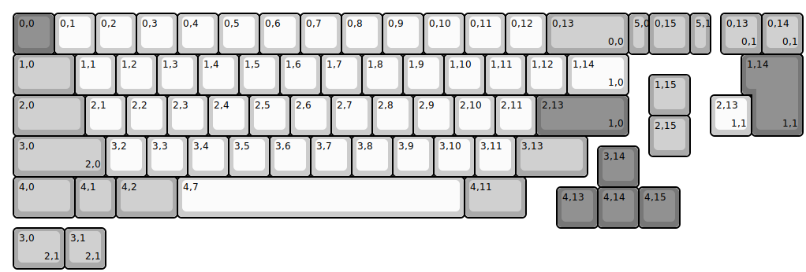{:loading="lazy"}

[Open in keyboard-layout-editor](http://www.keyboard-layout-editor.com/##@@_x:0.25&y:0.25&c=#777777;&=0,0&_c=#cccccc;&=0,1&=0,2&=0,3&=0,4&=0,5&=0,6&=0,7&=0,8&=0,9&=0,10&=0,11&=0,12&_c=#aaaaaa&w:2;&=0,13%0A%0A%0A0,0&_w:0.5;&=5,0&=0,15&_w:0.5;&=5,1;&@_x:0.25&w:1.5;&=1,0&_c=#cccccc;&=1,1&=1,2&=1,3&=1,4&=1,5&=1,6&=1,7&=1,8&=1,9&=1,10&=1,11&=1,12&_w:1.5;&=1,14%0A%0A%0A1,0;&@_x:15.75&y:-0.5&c=#aaaaaa;&=1,15;&@_x:0.25&y:-0.5&w:1.75;&=2,0&_c=#cccccc;&=2,1&=2,2&=2,3&=2,4&=2,5&=2,6&=2,7&=2,8&=2,9&=2,10&=2,11&_c=#777777&w:2.25;&=2,13%0A%0A%0A1,0;&@_x:15.75&y:-0.5&c=#aaaaaa;&=2,15;&@_x:0.25&y:-0.5&w:2.25;&=3,0%0A%0A%0A2,0&_c=#cccccc;&=3,2&=3,3&=3,4&=3,5&=3,6&=3,7&=3,8&=3,9&=3,10&=3,11&_c=#aaaaaa&w:1.75;&=3,13;&@_x:14.5&y:-0.75&c=#777777;&=3,14;&@_x:0.25&y:-0.25&c=#aaaaaa&w:1.5;&=4,0&=4,1&_w:1.5;&=4,2&_c=#cccccc&w:7;&=4,7&_c=#aaaaaa&w:1.5;&=4,11;&@_x:13.5&y:-0.75&c=#777777;&=4,13&=4,14&=4,15;&@_x:17.5&y:-5.25&c=#aaaaaa;&=0,13%0A%0A%0A0,1&=0,14%0A%0A%0A0,1;&@_x:18.25&c=#777777&w:1.25&h:2&w2:1.5&h2:1&x2:-0.25;&=1,14%0A%0A%0A1,1;&@_x:17.25&c=#cccccc;&=2,13%0A%0A%0A1,1;&@_x:0.25&y:2.25&c=#aaaaaa&w:1.25;&=3,0%0A%0A%0A2,1&=3,1%0A%0A%0A2,1)

## monstargear/xo87/xo87_rgb

[README](output/monstargear/xo87/README.md) - [layout](output/monstargear/xo87/xo87_rgb-kle.json) - [PCB](output/monstargear/xo87/xo87_rgb.kicad_pcb) - [PCB render](output/monstargear/xo87/xo87_rgb-render.svg)

{:loading="lazy"}

[Open in keyboard-layout-editor](http://www.keyboard-layout-editor.com/##@@_c=#777777;&=0,0&_x:1&c=#cccccc;&=0,1&=0,2&=0,3&=0,4&_x:0.5&c=#aaaaaa;&=0,5&=0,6&=0,7&=0,8&_x:0.5&c=#cccccc;&=0,9&=0,10&=0,11&=0,12&_x:0.25&c=#aaaaaa;&=0,13&=0,14&=0,15;&@_y:0.5&c=#cccccc;&=1,0&=1,1&=1,2&=1,3&=1,4&=1,5&=1,6&=1,7&=1,8&=1,9&=1,10&=1,11&=1,12&_w:2;&=3,13&_x:0.25&c=#aaaaaa;&=1,13&=1,14&=1,15;&@_w:1.5;&=2,0&_c=#cccccc;&=2,1&=2,2&=2,3&=2,4&=2,5&=2,6&=2,7&=2,8&=2,9&=2,10&=2,11&=2,12&_w:1.5;&=4,13&_x:0.25&c=#aaaaaa;&=2,13&=2,14&=2,15;&@_w:1.75;&=3,0&_c=#cccccc;&=3,1&=3,2&=3,3&=3,4&=3,5&=3,6&=3,7&=3,8&=3,9&=3,10&=3,11&_c=#777777&w:2.25;&=3,12;&@_c=#aaaaaa&w:2.25;&=4,0&_c=#cccccc;&=4,2&=4,3&=4,4&=4,5&=4,6&=4,7&=4,8&=4,9&=4,10&=4,11&_w:2.75;&=4,12&_x:1.25&c=#aaaaaa;&=4,14;&@_w:1.25;&=5,0&_w:1.25;&=5,1&_w:1.25;&=5,2&_c=#cccccc&w:6.25;&=5,6&_c=#aaaaaa&w:1.25;&=5,10&_w:1.25;&=5,11&_w:1.25;&=5,12&_w:1.25;&=4,15&_x:0.25;&=5,13&=5,14&=5,15)

## monstargear/xo87/xo87_solderable

[README](output/monstargear/xo87/README.md) - [layout](output/monstargear/xo87/xo87_solderable-kle.json) - [PCB](output/monstargear/xo87/xo87_solderable.kicad_pcb) - [PCB render](output/monstargear/xo87/xo87_solderable-render.svg)

{:loading="lazy"}

[Open in keyboard-layout-editor](http://www.keyboard-layout-editor.com/##@@_x:2.5&c=#777777;&=0,0&_x:1.0&c=#cccccc;&=0,1&=0,2&=0,3&=0,4&_x:0.5&c=#aaaaaa;&=0,5&=0,6&=0,7&=0,8&_x:0.5&c=#cccccc;&=0,9&=0,10&=0,11&=0,12&_x:0.25&c=#aaaaaa;&=0,13&=0,14&=0,15;&@_x:2.5&y:0.5&c=#cccccc;&=1,0&=1,1&=1,2&=1,3&=1,4&=1,5&=1,6&=1,7&=1,8&=1,9&=1,10&=1,11&=1,12&_c=#aaaaaa&w:2;&=3,13&_x:0.25;&=1,13&=1,14&=1,15;&@_x:2.5&w:1.5;&=2,0&_c=#cccccc;&=2,1&=2,2&=2,3&=2,4&=2,5&=2,6&=2,7&=2,8&=2,9&=2,10&=2,11&=2,12&_c=#aaaaaa&w:1.5;&=4,13%0A%0A%0A0,0&_x:0.25;&=2,13&=2,14&=2,15;&@_x:2.5&w:1.75;&=3,0&_c=#cccccc;&=3,1&=3,2&=3,3&=3,4&=3,5&=3,6&=3,7&=3,8&=3,9&=3,10&=3,11&_c=#777777&w:2.25;&=3,12%0A%0A%0A0,0;&@_x:2.5&c=#aaaaaa&w:2.25;&=4,0%0A%0A%0A1,0&_c=#cccccc;&=4,2&=4,3&=4,4&=4,5&=4,6&=4,7&=4,8&=4,9&=4,10&=4,11&_c=#aaaaaa&w:2.75;&=4,12&_x:1.25;&=4,14;&@_x:2.5&w:1.25;&=5,0%0A%0A%0A2,0&_w:1.25;&=5,1%0A%0A%0A2,0&_w:1.25;&=5,2%0A%0A%0A2,0&_c=#cccccc&w:6.26;&=5,6%0A%0A%0A2,0&_x:-0.01&c=#aaaaaa&w:1.25;&=5,10%0A%0A%0A2,0&_w:1.25;&=5,11%0A%0A%0A2,0&_w:1.25;&=5,12%0A%0A%0A2,0&_w:1.25;&=4,15%0A%0A%0A2,0&_x:0.25;&=5,13&=5,14&=5,15;&@_x:22.25&y:-4.0&c=#777777&w:1.25&h:2&w2:1.5&h2:1&x2:-0.25;&=4,13%0A%0A%0A0,1;&@_x:21.25&c=#aaaaaa;&=3,12%0A%0A%0A0,1;&@_w:1.25;&=4,0%0A%0A%0A1,1&=4,1%0A%0A%0A1,1;&@_x:2.5&y:1.25&w:1.5;&=5,0%0A%0A%0A2,1&=5,1%0A%0A%0A2,1&_w:1.5;&=5,2%0A%0A%0A2,1&_c=#cccccc&w:7;&=5,6%0A%0A%0A2,1&_c=#aaaaaa&w:1.5;&=5,11%0A%0A%0A2,1&=5,12%0A%0A%0A2,1&_w:1.5;&=4,15%0A%0A%0A2,1;&@_x:2.5&w:1.25;&=5,0%0A%0A%0A2,2&_w:1.25;&=5,1%0A%0A%0A2,2&_w:1.25;&=5,2%0A%0A%0A2,2&_w:2.75;&=5,5%0A%0A%0A2,2&_c=#cccccc&w:1.25;&=5,6%0A%0A%0A2,2&_c=#aaaaaa&w:2.25;&=5,9%0A%0A%0A2,2&_w:1.25;&=5,10%0A%0A%0A2,2&_w:1.25;&=5,11%0A%0A%0A2,2&_w:1.25;&=5,12%0A%0A%0A2,2&_w:1.25;&=4,15%0A%0A%0A2,2)

## montsinger/rebound/rebound-rev4

[README](output/montsinger/rebound/README.md) - [layout](output/montsinger/rebound/rebound-rev4-kle.json) - [PCB](output/montsinger/rebound/rebound-rev4.kicad_pcb) - [PCB render](output/montsinger/rebound/rebound-rev4-render.svg)

{:loading="lazy"}

[Open in keyboard-layout-editor](http://www.keyboard-layout-editor.com/##@@_c=#aaaaaa;&=0,0&_c=#cccccc;&=7,0&=0,1&=7,1&=0,2&=7,2&_x:1;&=0,4&=7,4&=0,5&=7,5&=0,6&_c=#aaaaaa;&=7,6;&@_c=#777777;&=1,0&_c=#cccccc;&=6,0&=1,1&=6,1&=1,2&=6,2&_c=#aaaaaa;&=1,3&_c=#cccccc;&=1,4&=6,4&=1,5&=6,5&=1,6&=6,6;&@_c=#aaaaaa;&=2,0&_c=#cccccc;&=5,0&=2,1&=5,1&=2,2&=5,2&_c=#aaaaaa;&=2,3&_c=#cccccc;&=2,4&=5,4&=2,5&=5,5&=2,6&_c=#777777;&=5,6;&@_c=#aaaaaa;&=3,0&=4,0&=3,1&=4,1&=3,2&_c=#cccccc;&=4,2&_c=#777777;&=3,3&_c=#cccccc;&=3,4&_c=#aaaaaa;&=4,4&=3,5&=4,5&=3,6&=4,6)

## mothwing/mothwing

[README](output/mothwing/README.md) - [layout](output/mothwing/mothwing-kle.json) - [PCB](output/mothwing/mothwing.kicad_pcb) - [PCB render](output/mothwing/mothwing-render.svg)

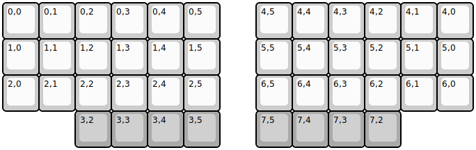{:loading="lazy"}

[Open in keyboard-layout-editor](http://www.keyboard-layout-editor.com/##@@=0,0&=0,1&=0,2&=0,3&=0,4&=0,5&_x:1;&=4,5&=4,4&=4,3&=4,2&=4,1&=4,0;&@=1,0&=1,1&=1,2&=1,3&=1,4&=1,5&_x:1;&=5,5&=5,4&=5,3&=5,2&=5,1&=5,0;&@=2,0&=2,1&=2,2&=2,3&=2,4&=2,5&_x:1;&=6,5&=6,4&=6,3&=6,2&=6,1&=6,0;&@_x:2&c=#aaaaaa;&=3,2&=3,3&=3,4&=3,5&_x:1;&=7,5&=7,4&=7,3&=7,2)

## mountainblocks/mb17

[README](output/mountainblocks/README.md) - [layout](output/mountainblocks/mb17-kle.json) - [PCB](output/mountainblocks/mb17.kicad_pcb) - [PCB render](output/mountainblocks/mb17-render.svg)

{:loading="lazy"}

[Open in keyboard-layout-editor](http://www.keyboard-layout-editor.com/##@@_c=#aaaaaa;&=0,0&=0,1&=0,2&=0,3;&@_c=#cccccc;&=1,0&=1,1&=1,2&_c=#aaaaaa&h:2;&=2,3;&@_c=#cccccc;&=2,0&=2,1&=2,2;&@=3,0&=3,1&=3,2&_c=#aaaaaa&h:2;&=4,3;&@_c=#cccccc&w:2;&=4,1&=4,2)

## mrt1ddl3s/knobgoblin

[README](output/mrt1ddl3s/README.md) - [layout](output/mrt1ddl3s/knobgoblin-kle.json) - [PCB](output/mrt1ddl3s/knobgoblin.kicad_pcb) - [PCB render](output/mrt1ddl3s/knobgoblin-render.svg)

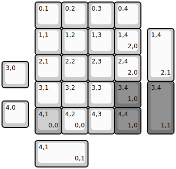{:loading="lazy"}

[Open in keyboard-layout-editor](http://www.keyboard-layout-editor.com/##@@_x:1.25;&=0,1&=0,2&=0,3&=0,4;&@_x:1.25;&=1,1&=1,2&=1,3&=1,4%0A%0A%0A2,0;&@_x:1.25;&=2,1&=2,2&=2,3&=2,4%0A%0A%0A2,0;&@_y:-0.75;&=3,0;&@_x:1.25&y:-0.25;&=3,1&=3,2&=3,3&_c=#777777;&=3,4%0A%0A%0A1,0;&@_y:-0.25&c=#cccccc;&=4,0;&@_x:1.25&y:-0.75&c=#aaaaaa;&=4,1%0A%0A%0A0,0&_c=#cccccc;&=4,2%0A%0A%0A0,0&=4,3&_c=#777777;&=4,4%0A%0A%0A1,0;&@_x:5.5&y:-4.0&c=#cccccc&h:2;&=1,4%0A%0A%0A2,1;&@_x:5.5&y:1.0&c=#777777&h:2;&=3,4%0A%0A%0A1,1;&@_x:1.25&y:1.25&c=#cccccc&w:2;&=4,1%0A%0A%0A0,1)

## mss_studio/m63_rgb

[README](output/mss_studio/m63_rgb/README.md) - [layout](output/mss_studio/m63_rgb/m63_rgb-kle.json) - [PCB](output/mss_studio/m63_rgb/m63_rgb.kicad_pcb) - [PCB render](output/mss_studio/m63_rgb/m63_rgb-render.svg)

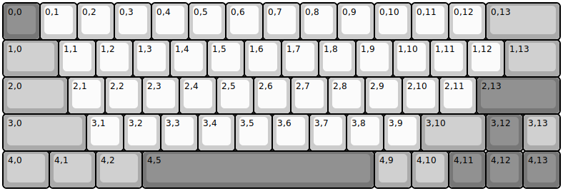{:loading="lazy"}

[Open in keyboard-layout-editor](http://www.keyboard-layout-editor.com/##@@_c=#777777;&=0,0&_c=#cccccc;&=0,1&=0,2&=0,3&=0,4&=0,5&=0,6&=0,7&=0,8&=0,9&=0,10&=0,11&=0,12&_c=#aaaaaa&w:2;&=0,13;&@_w:1.5;&=1,0&_c=#cccccc;&=1,1&=1,2&=1,3&=1,4&=1,5&=1,6&=1,7&=1,8&=1,9&=1,10&=1,11&=1,12&_c=#aaaaaa&w:1.5;&=1,13;&@_w:1.75;&=2,0&_c=#cccccc;&=2,1&=2,2&=2,3&=2,4&=2,5&=2,6&=2,7&=2,8&=2,9&=2,10&=2,11&_c=#777777&w:2.25;&=2,13;&@_c=#aaaaaa&w:2.25;&=3,0&_c=#cccccc;&=3,1&=3,2&=3,3&=3,4&=3,5&=3,6&=3,7&=3,8&=3,9&_c=#aaaaaa&w:1.75;&=3,10&_c=#777777;&=3,12&_c=#aaaaaa;&=3,13;&@_w:1.25;&=4,0&_w:1.25;&=4,1&_w:1.25;&=4,2&_c=#777777&w:6.25;&=4,5&_c=#aaaaaa;&=4,9&=4,10&_c=#777777;&=4,11&=4,12&=4,13)

## mss_studio/m64_rgb

[README](output/mss_studio/m64_rgb/README.md) - [layout](output/mss_studio/m64_rgb/m64_rgb-kle.json) - [PCB](output/mss_studio/m64_rgb/m64_rgb.kicad_pcb) - [PCB render](output/mss_studio/m64_rgb/m64_rgb-render.svg)

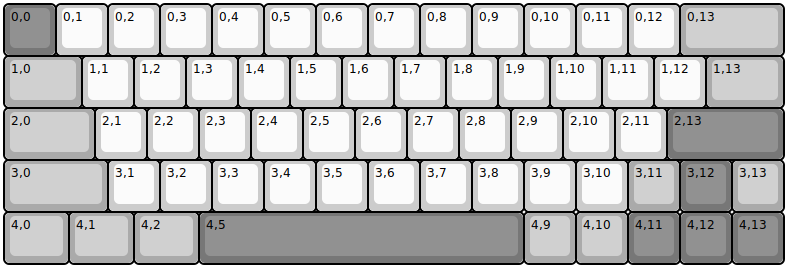{:loading="lazy"}

[Open in keyboard-layout-editor](http://www.keyboard-layout-editor.com/##@@_c=#777777;&=0,0&_c=#cccccc;&=0,1&=0,2&=0,3&=0,4&=0,5&=0,6&=0,7&=0,8&=0,9&=0,10&=0,11&=0,12&_c=#aaaaaa&w:2;&=0,13;&@_w:1.5;&=1,0&_c=#cccccc;&=1,1&=1,2&=1,3&=1,4&=1,5&=1,6&=1,7&=1,8&=1,9&=1,10&=1,11&=1,12&_c=#aaaaaa&w:1.5;&=1,13;&@_w:1.75;&=2,0&_c=#cccccc;&=2,1&=2,2&=2,3&=2,4&=2,5&=2,6&=2,7&=2,8&=2,9&=2,10&=2,11&_c=#777777&w:2.25;&=2,13;&@_c=#aaaaaa&w:2;&=3,0&_c=#cccccc;&=3,1&=3,2&=3,3&=3,4&=3,5&=3,6&=3,7&=3,8&=3,9&=3,10&_c=#aaaaaa;&=3,11&_c=#777777;&=3,12&_c=#aaaaaa;&=3,13;&@_w:1.25;&=4,0&_w:1.25;&=4,1&_w:1.25;&=4,2&_c=#777777&w:6.25;&=4,5&_c=#aaaaaa;&=4,9&=4,10&_c=#777777;&=4,11&=4,12&=4,13)

## mt/ncr80

[README](output/mt/ncr80/README.md) - [layout](output/mt/ncr80/ncr80-kle.json) - [PCB](output/mt/ncr80/ncr80.kicad_pcb) - [PCB render](output/mt/ncr80/ncr80-render.svg)

{:loading="lazy"}

[Open in keyboard-layout-editor](http://www.keyboard-layout-editor.com/##@@=0,0&_x:1;&=0,2&=0,3&=0,4&=0,5&_x:0.5;&=0,6&=0,7&=0,8&=6,8&_x:0.5;&=6,7&=6,5&=6,4&=6,3&_x:0.25;&=6,6&=6,2&=6,1%0ABreak;&@_y:0.5;&=1,0%0A%60&=1,1%0A1&=1,2%0A2&=1,3%0A3&=1,4%0A4&=1,5%0A5&=1,6%0A6&=1,7%0A7&=1,8%0A8&=7,8%0A9&=7,0%0A0&=7,7%0A-&=7,5%0A=&=7,4&=7,3&_x:0.25;&=7,6&=7,2&=7,1;&@_w:1.5;&=2,0&=2,1&=2,2&=2,3&=2,4&=2,5&=2,6&=2,7&=2,8&=8,8&=8,7&=8,5%0A%5B&=8,4%0A%5D&_w:1.5;&=9,4%0A%5C&_x:0.25;&=8,6&=8,2&=8,1;&@_w:1.75;&=3,0&=3,1&=3,2&=3,3&=3,4&=3,5&=3,6&=3,7&=3,8&=9,8&=9,7%0A/;&=9,5%0A'&_w:2.25;&=8,3;&@_w:1.25;&=4,0&=4,1&=4,2&=4,3&=4,4&=4,5&=4,6&=4,7&=4,8&=10,8%0A,&=10,7%0A.&=10,5%0A//&_w:1.75;&=10,4&=10,3&_x:1.25;&=9,2;&@_w:1.25;&=5,0&_w:1.25;&=5,1&_w:1.25;&=5,2&_w:6.25;&=5,6&_w:1.25;&=5,8&_w:1.25;&=5,7&_w:1.25;&=5,4&_w:1.25;&=5,3&_x:0.25;&=10,6&=10,2&=10,1)

## mt/ncr80hs

[README](output/mt/ncr80hs/README.md) - [layout](output/mt/ncr80hs/ncr80hs-kle.json) - [PCB](output/mt/ncr80hs/ncr80hs.kicad_pcb) - [PCB render](output/mt/ncr80hs/ncr80hs-render.svg)

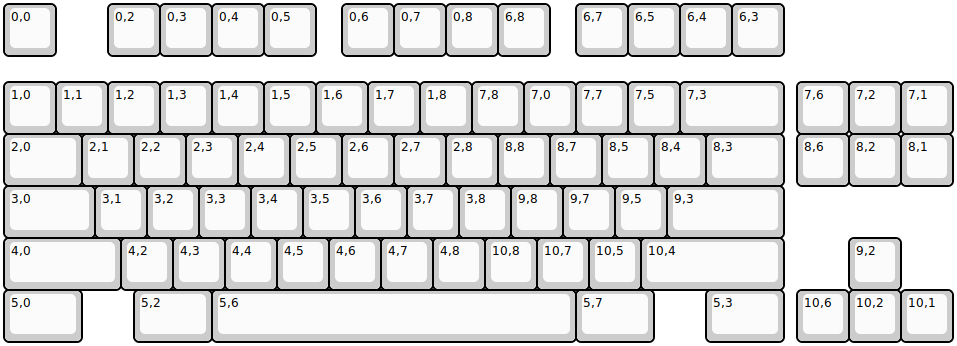{:loading="lazy"}

[Open in keyboard-layout-editor](http://www.keyboard-layout-editor.com/##@@=0,0&_x:1;&=0,2&=0,3&=0,4&=0,5&_x:0.5;&=0,6&=0,7&=0,8&=6,8&_x:0.5;&=6,7&=6,5&=6,4&=6,3;&@_y:0.5;&=1,0%0A%60&=1,1%0A1&=1,2%0A2&=1,3%0A3&=1,4%0A4&=1,5%0A5&=1,6%0A6&=1,7%0A7&=1,8%0A8&=7,8%0A9&=7,0%0A0&=7,7%0A-&=7,5%0A=&_w:2;&=7,3&_x:0.25;&=7,6&=7,2&=7,1;&@_w:1.5;&=2,0&=2,1&=2,2&=2,3&=2,4&=2,5&=2,6&=2,7&=2,8&=8,8&=8,7&=8,5%0A%5B&=8,4%0A%5D&_w:1.5;&=8,3%0A%5C&_x:0.25;&=8,6&=8,2&=8,1;&@_w:1.75;&=3,0&=3,1&=3,2&=3,3&=3,4&=3,5&=3,6&=3,7&=3,8&=9,8&=9,7%0A/;&=9,5%0A'&_w:2.25;&=9,3;&@_w:2.25;&=4,0&=4,2&=4,3&=4,4&=4,5&=4,6&=4,7&=4,8&=10,8%0A,&=10,7%0A.&=10,5%0A//&_w:2.75;&=10,4&_x:1.25;&=9,2;&@_w:1.5;&=5,0&_x:1.0&w:1.5;&=5,2&_w:7;&=5,6&_w:1.5;&=5,7&_x:1.0&w:1.5;&=5,3&_x:0.25;&=10,6&=10,2&=10,1)

## mwstudio/alicekk

[README](output/mwstudio/README.md) - [layout](output/mwstudio/alicekk-kle.json) - [PCB](output/mwstudio/alicekk.kicad_pcb) - [PCB render](output/mwstudio/alicekk-render.svg)

{:loading="lazy"}

[Open in keyboard-layout-editor](http://www.keyboard-layout-editor.com/##@@_x:0.55&y:0.9;&=0,0&_x:2.15;&=0,3&_x:8.55;&=0,12;&@_x:14.25&y:-0.9;&=0,13&_w:2;&=0,14&_x:0.5;&=4,7&=4,6&_x:-18.05;&=0,1&=0,2;&@_x:0.35&y:-0.1;&=1,0;&@_x:12.95&y:-0.95;&=1,11;&@_x:1.5&y:-0.95&w:1.5;&=1,1&=1,2&_x:9.95;&=1,12&=1,13&_w:1.5;&=1,14;&@_x:0.15&y:-0.1;&=2,0;&@_x:1.3&y:-0.9&w:1.75;&=2,1&=2,2&_x:9.35;&=2,11&=2,12&_w:2.25;&=2,14;&@_x:1.1&w:2.25;&=3,1&=3,2&_x:8.75;&=3,11&=3,12&=3,13&_w:1.75;&=3,14;&@_x:1.1&w:1.25;&=4,1&_w:1.25;&=4,2&_x:10.5;&=4,12&=4,13&=4,14;&@_r:12&x:5&y:-6.0;&=0,4&=0,5&=0,6&=0,7;&@_x:4.5;&=1,3&=1,4&=1,5&=1,6;&@_x:4.8;&=2,3&=2,4&=2,5&=2,6;&@_x:5.3;&=3,3&=3,4&=3,5&=3,6;&@_x:5.85&w:1.25;&=4,4&_w:2.25;&=4,5;&@_r:-12&x:8.55&y:-1.4;&=0,8&=0,9&=0,10&=0,11;&@_x:8.05;&=1,7&=1,8&=1,9&=1,10;&@_x:8.2;&=2,7&=2,8&=2,9&=2,10;&@_x:7.75;&=3,7&=3,8&=3,9&=3,10;&@_x:7.75&w:2.75;&=4,8&_w:1.25;&=4,10)

## mwstudio/mw65-rgb

[README](output/mwstudio/README.md) - [layout](output/mwstudio/mw65-rgb-kle.json) - [PCB](output/mwstudio/mw65-rgb.kicad_pcb) - [PCB render](output/mwstudio/mw65-rgb-render.svg)

{:loading="lazy"}

[Open in keyboard-layout-editor](http://www.keyboard-layout-editor.com/##@@_c=#777777;&=0,0&_c=#cccccc;&=0,1&=0,2&=0,3&=0,4&=0,5&=0,6&=0,7&=0,8&=0,9&=0,10&=0,11&=0,12&_w:1.25;&=0,13&_w:0.75;&=4,3&=0,14&_w:0.75;&=4,4;&@_w:1.5;&=1,0&=1,1&=1,2&=1,3&=1,4&=1,5&=1,6&=1,7&=1,8&=1,9&=1,10&=1,11&=1,12&_w:1.5;&=1,13%0A%0A%0A0,0&_c=#aaaaaa;&=1,14;&@_w:1.75;&=2,0&=2,1&=2,2&=2,3&=2,4&=2,5&=2,6&=2,7&=2,8&=2,9&=2,10&=2,11&_c=#777777&w:2.25;&=2,13%0A%0A%0A0,0&_c=#cccccc;&=2,14;&@_c=#aaaaaa&w:2.25;&=3,0%0A%0A%0A2,0&=3,2&=3,3&=3,4&=3,5&=3,6&=3,7&=3,8&=3,9&=3,10&=3,11&_w:1.75;&=3,12&_c=#777777;&=3,13&_c=#cccccc;&=3,14;&@_c=#aaaaaa&w:1.25;&=4,0&_w:1.25;&=4,1&_w:1.25;&=4,2&_w:6.25;&=4,6%0A%0A%0A1,0&_w:1.25;&=4,10&_w:1.25;&=4,11&_x:0.5&c=#777777;&=4,12&=4,13&=4,14;&@_x:15.0&y:-4&w:1.25&h:2&w2:1.5&h2:1&x2:-0.25;&=2,13%0A%0A%0A0,1;&@_x:14.0&c=#aaaaaa;&=2,12%0A%0A%0A0,1;&@_w:1.25;&=3,0%0A%0A%0A2,1&=3,1%0A%0A%0A2,1;&@_x:3.75&w:2.75;&=4,5%0A%0A%0A1,1&_w:2.25;&=4,8%0A%0A%0A1,1&_w:1.25;&=4,9%0A%0A%0A1,1)

## mwstudio/mw65_black

[README](output/mwstudio/README.md) - [layout](output/mwstudio/mw65_black-kle.json) - [PCB](output/mwstudio/mw65_black.kicad_pcb) - [PCB render](output/mwstudio/mw65_black-render.svg)

{:loading="lazy"}

[Open in keyboard-layout-editor](http://www.keyboard-layout-editor.com/##@@_c=#777777;&=0,0&_c=#cccccc;&=0,1&=0,2&=0,3&=0,4&=0,5&=0,6&=0,7&=0,8&=0,9&=0,10&=0,11&=0,12&_w:1.25;&=0,13&_w:0.75;&=4,3&=0,14&_w:0.75;&=4,4;&@_w:1.5;&=1,0&=1,1&=1,2&=1,3&=1,4&=1,5&=1,6&=1,7&=1,8&=1,9&=1,10&=1,11&=1,12&_w:1.5;&=1,13%0A%0A%0A0,0&_c=#aaaaaa;&=1,14;&@_w:1.75;&=2,0&=2,1&=2,2&=2,3&=2,4&=2,5&=2,6&=2,7&=2,8&=2,9&=2,10&=2,11&_c=#777777&w:2.25;&=2,13%0A%0A%0A0,0&_c=#aaaaaa;&=2,14;&@_w:2.25;&=3,0&=3,1&=3,2&=3,3&=3,4&=3,5&=3,6&=3,7&=3,8&=3,9&=3,10&_w:1.75;&=3,11&_c=#777777;&=3,13&_c=#aaaaaa;&=3,14;&@_w:1.25;&=4,0%0A%0A%0A1,0&_w:1.25;&=4,1%0A%0A%0A1,0&_w:1.25;&=4,2%0A%0A%0A1,0&_w:6.25;&=4,5%0A%0A%0A1,0&_w:1.25;&=4,9%0A%0A%0A1,0&_w:1.25;&=4,10%0A%0A%0A1,0&_x:0.5&c=#777777;&=4,12&=4,13&=4,14;&@_x:15.0&y:-4&w:1.25&h:2&w2:1.5&h2:1&x2:-0.25;&=2,13%0A%0A%0A0,1;&@_x:14.0&c=#aaaaaa;&=2,12%0A%0A%0A0,1;&@_y:1&w:1.5;&=4,0%0A%0A%0A1,1&=4,1%0A%0A%0A1,1&_w:1.5;&=4,2%0A%0A%0A1,1&_w:7;&=4,5%0A%0A%0A1,1&_w:1.5;&=4,10%0A%0A%0A1,1)

## mwstudio/mw660

[README](output/mwstudio/README.md) - [layout](output/mwstudio/mw660-kle.json) - [PCB](output/mwstudio/mw660.kicad_pcb) - [PCB render](output/mwstudio/mw660-render.svg)

{:loading="lazy"}

[Open in keyboard-layout-editor](http://www.keyboard-layout-editor.com/##@@=0,0&=0,1&=0,2&=0,3&=0,4&=0,5&=0,6&=0,7&=0,8&=0,9&=0,10&=0,11&=0,12&_w:2;&=0,13&_x:0.25;&=0,14;&@_w:1.5;&=1,0&=1,1&=1,2&=1,3&=1,4&=1,5&=1,6&=1,7&=1,8&=1,9&=1,10&=1,11&=1,12&_w:1.5;&=1,13%0A%0A%0A0,0&_x:0.25;&=1,14;&@_w:1.75;&=2,0&=2,1&=2,2&=2,3&=2,4&=2,5&=2,6&=2,7&=2,8&=2,9&=2,10&=2,11&_w:2.25;&=2,12%0A%0A%0A0,0;&@_w:2.25;&=3,0&=3,2&=3,3&=3,4&=3,5&=3,6&=3,7&=3,8&=3,9&=3,10&=3,11&_w:2;&=3,12&=3,13;&@_w:1.5;&=4,0&=4,1&_w:1.5;&=4,2&_w:6.25;&=4,6%0A%0A%0A1,0&_w:1.5;&=4,10&=4,11&_x:0.5;&=4,12&=4,13&=4,14;&@_x:15.0&y:-4&w:1.25&h:2&w2:1.5&h2:1&x2:-0.25;&=1,13%0A%0A%0A0,1;&@_x:14.0;&=2,12%0A%0A%0A0,1;&@_x:4.0&y:1&w:2.75;&=4,3%0A%0A%0A1,1&_w:1.25;&=4,6%0A%0A%0A1,1&_w:2.25;&=4,8%0A%0A%0A1,1)

## mwstudio/mw75-r2

[README](output/mwstudio/README.md) - [layout](output/mwstudio/mw75-r2-kle.json) - [PCB](output/mwstudio/mw75-r2.kicad_pcb) - [PCB render](output/mwstudio/mw75-r2-render.svg)

{:loading="lazy"}

[Open in keyboard-layout-editor](http://www.keyboard-layout-editor.com/##@@_c=#777777;&=0,0&_x:0.5&c=#cccccc;&=0,2&=0,3&=0,4&=0,5&_x:0.5;&=0,6&=0,7&=0,8&=0,9&_x:0.5;&=0,10&=0,11&=0,12&=0,13&_w:0.5;&=5,3&=0,14&_w:0.5;&=5,4;&@_y:0.5;&=1,0&=1,1&=1,2&=1,3&=1,4&=1,5&=1,6&=1,7&=1,8&=1,9&=1,10&=1,11&=1,12&_c=#aaaaaa&w:2;&=1,13&=1,14;&@_w:1.5;&=2,0&_c=#cccccc;&=2,1&=2,2&=2,3&=2,4&=2,5&=2,6&=2,7&=2,8&=2,9&=2,10&=2,11&=2,12&_c=#aaaaaa&w:1.5;&=2,13%0A%0A%0A0,0&_c=#cccccc;&=2,14;&@_c=#aaaaaa&w:1.75;&=3,0&_c=#cccccc;&=3,1&=3,2&=3,3&=3,4&=3,5&=3,6&=3,7&=3,8&=3,9&=3,10&=3,11&_c=#777777&w:2.25;&=3,12%0A%0A%0A0,0;&@_c=#aaaaaa&w:2.25;&=4,0&_c=#cccccc;&=4,2&=4,3&=4,4&=4,5&=4,6&=4,7&=4,8&=4,9&=4,10&=4,11&_c=#aaaaaa&w:1.75;&=4,12&_c=#777777;&=4,13;&@_c=#aaaaaa&w:1.25;&=5,0&_w:1.25;&=5,1&_w:1.25;&=5,2&_w:6.25;&=5,6&_w:1.25;&=5,10&_w:1.25;&=5,11&_x:0.5&c=#777777;&=5,12&=5,13&=5,14;&@_x:15.0&y:-4.0&w:1.25&h:2&w2:1.5&h2:1&x2:-0.25;&=2,13%0A%0A%0A0,1;&@_x:14.0&c=#cccccc;&=3,12%0A%0A%0A0,1)

## mwstudio/mw75

[README](output/mwstudio/mw75/README.md) - [layout](output/mwstudio/mw75/mw75-kle.json) - [PCB](output/mwstudio/mw75/mw75.kicad_pcb) - [PCB render](output/mwstudio/mw75/mw75-render.svg)

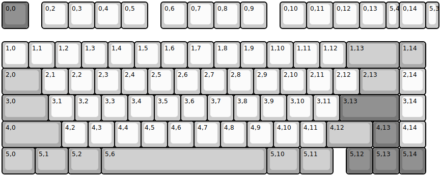{:loading="lazy"}

[Open in keyboard-layout-editor](http://www.keyboard-layout-editor.com/##@@_c=#777777;&=0,0&_x:0.5&c=#cccccc;&=0,2&=0,3&=0,4&=0,5&_x:0.5;&=0,6&=0,7&=0,8&=0,9&_x:0.5;&=0,10&=0,11&=0,12&=0,13&_w:0.5;&=5,4&=0,14&_w:0.5;&=5,3;&@_y:0.5;&=1,0&=1,1&=1,2&=1,3&=1,4&=1,5&=1,6&=1,7&=1,8&=1,9&=1,10&=1,11&=1,12&_c=#aaaaaa&w:2;&=1,13&=1,14;&@_w:1.5;&=2,0&_c=#cccccc;&=2,1&=2,2&=2,3&=2,4&=2,5&=2,6&=2,7&=2,8&=2,9&=2,10&=2,11&=2,12&_c=#aaaaaa&w:1.5;&=2,13&_c=#cccccc;&=2,14;&@_c=#aaaaaa&w:1.75;&=3,0&_c=#cccccc;&=3,1&=3,2&=3,3&=3,4&=3,5&=3,6&=3,7&=3,8&=3,9&=3,10&=3,11&_c=#777777&w:2.25;&=3,13&_c=#cccccc;&=3,14;&@_c=#aaaaaa&w:2.25;&=4,0&_c=#cccccc;&=4,2&=4,3&=4,4&=4,5&=4,6&=4,7&=4,8&=4,9&=4,10&=4,11&_c=#aaaaaa&w:1.75;&=4,12&_c=#777777;&=4,13&_c=#cccccc;&=4,14;&@_c=#aaaaaa&w:1.25;&=5,0&_w:1.25;&=5,1&_w:1.25;&=5,2&_w:6.25;&=5,6&_w:1.25;&=5,10&_w:1.25;&=5,11&_x:0.5&c=#777777;&=5,12&=5,13&=5,14)

## mwstudio/mw80

[README](output/mwstudio/README.md) - [layout](output/mwstudio/mw80-kle.json) - [PCB](output/mwstudio/mw80.kicad_pcb) - [PCB render](output/mwstudio/mw80-render.svg)

{:loading="lazy"}

[Open in keyboard-layout-editor](http://www.keyboard-layout-editor.com/##@@=0,0&_x:0.25;&=0,1&=0,2&=0,3&=0,4&_x:0.25;&=0,5&=0,6&=0,7&=0,8&_x:0.25;&=0,9&=0,10&=0,11&=0,12&_x:0.25;&=0,13&_x:0.25;&=0,14&=0,15&=0,16;&@_y:0.25;&=1,0&=1,1&=1,2&=1,3&=1,4&=1,5&=1,6&=1,7&=1,8&=1,9&=1,10&=1,11&=1,12&_w:2;&=1,13&_x:0.25;&=1,14&=1,15&=1,16;&@_w:1.5;&=2,0&=2,1&=2,2&=2,3&=2,4&=2,5&=2,6&=2,7&=2,8&=2,9&=2,10&=2,11&=2,12&_w:1.5;&=2,13%0A%0A%0A0,0&_x:0.25;&=2,14&=2,15&=2,16;&@_w:1.75;&=3,0&=3,1&=3,2&=3,3&=3,4&=3,5&=3,6&=3,7&=3,8&=3,9&=3,10&=3,11&_w:2.25;&=3,13%0A%0A%0A0,0;&@_w:2.25;&=4,0&=4,2&=4,3&=4,4&=4,5&=4,6&=4,7&=4,8&=4,9&=4,10&=4,11&_w:2.75;&=4,13&_x:1.25;&=4,15;&@_w:1.25;&=5,0&_w:1.25;&=5,1&_w:1.25;&=5,2&_w:6.25;&=5,6&_w:1.25;&=5,10&_w:1.25;&=5,11&_w:1.25;&=5,12&_w:1.25;&=5,13&_x:0.25;&=5,14&=5,15&=5,16;&@_x:15.0&y:-4.0&w:1.25&h:2&w2:1.5&h2:1&x2:-0.25;&=2,13%0A%0A%0A0,1;&@_x:14.0;&=3,13%0A%0A%0A0,1)

## mysticworks/wyvern

[README](output/mysticworks/README.md) - [layout](output/mysticworks/wyvern-kle.json) - [PCB](output/mysticworks/wyvern.kicad_pcb) - [PCB render](output/mysticworks/wyvern-render.svg)

{:loading="lazy"}

[Open in keyboard-layout-editor](http://www.keyboard-layout-editor.com/##@@_c=#aaaaaa;&=0,0&=1,0&=0,1&=1,1&_x:0.5&c=#777777;&=0,2&_c=#cccccc;&=1,2&=0,3&=1,3&=0,4&=1,4&=0,5&=1,5&=0,6&=1,6&=0,7&=1,7&=0,8&_c=#aaaaaa&w:2;&=0,9%0A%0A%0A0,0&_x:0.5&c=#cccccc;&=1,9;&@=2,0%0A%0A%0A5,0&=3,0&=2,1&_c=#aaaaaa&h:2;&=3,1%0A%0A%0A6,0&_x:0.5&w:1.5;&=2,2&_c=#cccccc;&=3,2&=2,3&=3,3&=2,4&=3,4&=2,5&=3,5&=2,6&=3,6&=2,7&=3,7&=2,8&_w:1.5;&=2,9%0A%0A%0A3,0&_x:0.5;&=3,9;&@=4,0%0A%0A%0A5,0&=5,0&=4,1&_x:1.5&c=#aaaaaa&w:1.75;&=4,2%0A%0A%0A1,0&_c=#cccccc;&=5,2&=4,3&=5,3&=4,4&=5,4&=4,5&=5,5&=4,6&=5,6&=4,7&=5,7&_c=#777777&w:2.25;&=4,9%0A%0A%0A3,0&_x:0.5&c=#cccccc;&=5,9;&@=6,0%0A%0A%0A7,0&=7,0&=6,1&_c=#777777&h:2;&=7,1%0A%0A%0A8,0&_x:0.5&c=#aaaaaa&w:2.25;&=6,2%0A%0A%0A2,0&_c=#cccccc;&=6,3&=7,3&=6,4&=7,4&=6,5&=7,5&=6,6&=7,6&=6,7&=7,7&_c=#aaaaaa&w:1.75;&=6,8&_x:1.5&c=#cccccc;&=7,9;&@_x:18.75&y:-0.75&c=#777777;&=6,9;&@_y:-0.25&c=#cccccc&w:2;&=8,0%0A%0A%0A7,0&=8,1%0A%0A%0A8,0&_x:1.5&c=#aaaaaa&w:1.25;&=8,2%0A%0A%0A4,0&_w:1.25;&=9,2%0A%0A%0A4,0&_w:1.25;&=8,3%0A%0A%0A4,0&_c=#cccccc&w:6.25;&=8,5%0A%0A%0A4,0&_c=#aaaaaa&w:1.5;&=8,7&_w:1.5;&=9,7;&@_x:17.75&y:-0.75&c=#777777;&=9,8&=8,9&=9,9;&@_x:22.25&y:-4.25&w:1.25&h:2&w2:1.5&h2:1&x2:-0.25;&=4,9%0A%0A%0A3,1;&@_x:21.25&c=#cccccc;&=5,8%0A%0A%0A3,1;&@_y:2.25&c=#aaaaaa&h:2;&=2,0%0A%0A%0A5,1&_x:2&c=#cccccc;&=3,1%0A%0A%0A6,1&_x:0.5&c=#aaaaaa&w:1.5;&=8,2%0A%0A%0A4,1&_w:1.5;&=8,3%0A%0A%0A4,1&_c=#cccccc&w:7;&=8,5%0A%0A%0A4,1;&@_x:3;&=5,1%0A%0A%0A6,1;&@_x:4.5&y:-0.75&c=#aaaaaa&w:1.25&w2:1.75&l:true;&=4,2%0A%0A%0A1,1;&@_x:4.5&w:1.25;&=6,2%0A%0A%0A2,1&_c=#cccccc;&=7,2%0A%0A%0A2,1;&@_y:-0.5&c=#777777&h:2;&=6,0%0A%0A%0A7,1&_x:2&c=#cccccc;&=7,1%0A%0A%0A8,2;&@_x:1;&=9,0%0A%0A%0A7,1&=8,1%0A%0A%0A8,2&=9,1%0A%0A%0A8,2;&@_y:0.75;&=6,0%0A%0A%0A7,2&_x:2;&=7,1%0A%0A%0A8,1;&@=8,0%0A%0A%0A7,2&=9,0%0A%0A%0A7,2&_w:2;&=9,1%0A%0A%0A8,1;&@_rx:0.25&x:21.25&c=#aaaaaa;&=1,8%0A%0A%0A0,1&=0,9%0A%0A%0A0,1)

## naiping/np64

[README](output/naiping/README.md) - [layout](output/naiping/np64-kle.json) - [PCB](output/naiping/np64.kicad_pcb) - [PCB render](output/naiping/np64-render.svg)

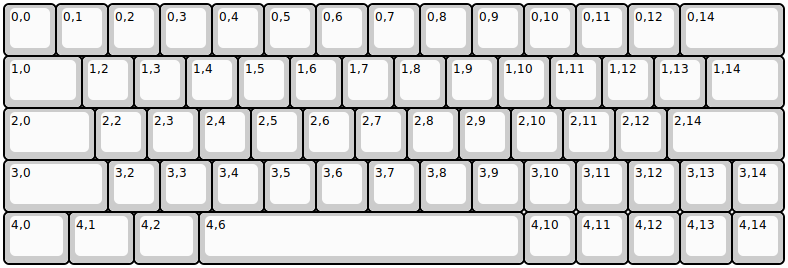{:loading="lazy"}

[Open in keyboard-layout-editor](http://www.keyboard-layout-editor.com/##@@=0,0&=0,1&=0,2&=0,3&=0,4&=0,5&=0,6&=0,7&=0,8&=0,9&=0,10&=0,11&=0,12&_w:2;&=0,14;&@_w:1.5;&=1,0&=1,2&=1,3&=1,4&=1,5&=1,6&=1,7&=1,8&=1,9&=1,10&=1,11&=1,12&=1,13&_w:1.5;&=1,14;&@_w:1.75;&=2,0&=2,2&=2,3&=2,4&=2,5&=2,6&=2,7&=2,8&=2,9&=2,10&=2,11&=2,12&_w:2.25;&=2,14;&@_w:2;&=3,0&=3,2&=3,3&=3,4&=3,5&=3,6&=3,7&=3,8&=3,9&=3,10&=3,11&=3,12&=3,13&=3,14;&@_w:1.25;&=4,0&_w:1.25;&=4,1&_w:1.25;&=4,2&_w:6.25;&=4,6&=4,10&=4,11&=4,12&=4,13&=4,14)

## naiping/nphhkb

[README](output/naiping/README.md) - [layout](output/naiping/nphhkb-kle.json) - [PCB](output/naiping/nphhkb.kicad_pcb) - [PCB render](output/naiping/nphhkb-render.svg)

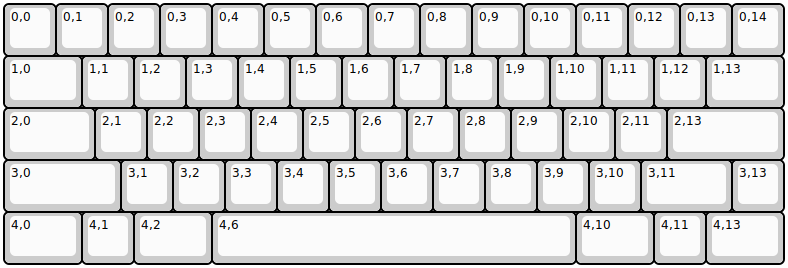{:loading="lazy"}

[Open in keyboard-layout-editor](http://www.keyboard-layout-editor.com/##@@=0,0&=0,1&=0,2&=0,3&=0,4&=0,5&=0,6&=0,7&=0,8&=0,9&=0,10&=0,11&=0,12&=0,13&=0,14;&@_w:1.5;&=1,0&=1,1&=1,2&=1,3&=1,4&=1,5&=1,6&=1,7&=1,8&=1,9&=1,10&=1,11&=1,12&_w:1.5;&=1,13;&@_w:1.75;&=2,0&=2,1&=2,2&=2,3&=2,4&=2,5&=2,6&=2,7&=2,8&=2,9&=2,10&=2,11&_w:2.25;&=2,13;&@_w:2.25;&=3,0&=3,1&=3,2&=3,3&=3,4&=3,5&=3,6&=3,7&=3,8&=3,9&=3,10&_w:1.75;&=3,11&=3,13;&@_w:1.5;&=4,0&=4,1&_w:1.5;&=4,2&_w:7;&=4,6&_w:1.5;&=4,10&=4,11&_w:1.5;&=4,13)

## naiping/npminila

[README](output/naiping/README.md) - [layout](output/naiping/npminila-kle.json) - [PCB](output/naiping/npminila.kicad_pcb) - [PCB render](output/naiping/npminila-render.svg)

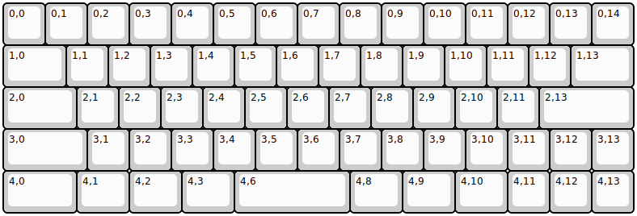{:loading="lazy"}

[Open in keyboard-layout-editor](http://www.keyboard-layout-editor.com/##@@=0,0&=0,1&=0,2&=0,3&=0,4&=0,5&=0,6&=0,7&=0,8&=0,9&=0,10&=0,11&=0,12&=0,13&=0,14;&@_w:1.5;&=1,0&=1,1&=1,2&=1,3&=1,4&=1,5&=1,6&=1,7&=1,8&=1,9&=1,10&=1,11&=1,12&_w:1.5;&=1,13;&@_w:1.75;&=2,0&=2,1&=2,2&=2,3&=2,4&=2,5&=2,6&=2,7&=2,8&=2,9&=2,10&=2,11&_w:2.25;&=2,13;&@_w:2;&=3,0&=3,1&=3,2&=3,3&=3,4&=3,5&=3,6&=3,7&=3,8&=3,9&=3,10&=3,11&=3,12&=3,13;&@_w:1.75;&=4,0&_w:1.25;&=4,1&_w:1.25;&=4,2&_w:1.25;&=4,3&_w:2.75;&=4,6&_w:1.25;&=4,8&_w:1.25;&=4,9&_w:1.25;&=4,10&=4,11&=4,12&=4,13)

## naked48/naked48

[README](output/naked48/README.md) - [layout](output/naked48/naked48-kle.json) - [PCB](output/naked48/naked48.kicad_pcb) - [PCB render](output/naked48/naked48-render.svg)

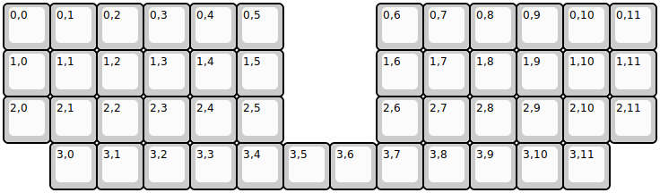{:loading="lazy"}

[Open in keyboard-layout-editor](http://www.keyboard-layout-editor.com/##@@=0,0&=0,1&=0,2&=0,3&=0,4&=0,5&_x:2;&=0,6&=0,7&=0,8&=0,9&=0,10&=0,11;&@=1,0&=1,1&=1,2&=1,3&=1,4&=1,5&_x:2;&=1,6&=1,7&=1,8&=1,9&=1,10&=1,11;&@=2,0&=2,1&=2,2&=2,3&=2,4&=2,5&_x:2;&=2,6&=2,7&=2,8&=2,9&=2,10&=2,11;&@_x:1;&=3,0&=3,1&=3,2&=3,3&=3,4&=3,5&=3,6&=3,7&=3,8&=3,9&=3,10&=3,11)

## naked60/naked60

[README](output/naked60/README.md) - [layout](output/naked60/naked60-kle.json) - [PCB](output/naked60/naked60.kicad_pcb) - [PCB render](output/naked60/naked60-render.svg)

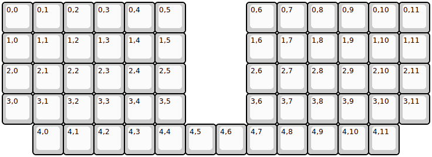{:loading="lazy"}

[Open in keyboard-layout-editor](http://www.keyboard-layout-editor.com/##@@=0,0&=0,1&=0,2&=0,3&=0,4&=0,5&_x:2;&=0,6&=0,7&=0,8&=0,9&=0,10&=0,11;&@=1,0&=1,1&=1,2&=1,3&=1,4&=1,5&_x:2;&=1,6&=1,7&=1,8&=1,9&=1,10&=1,11;&@=2,0&=2,1&=2,2&=2,3&=2,4&=2,5&_x:2;&=2,6&=2,7&=2,8&=2,9&=2,10&=2,11;&@=3,0&=3,1&=3,2&=3,3&=3,4&=3,5&_x:2;&=3,6&=3,7&=3,8&=3,9&=3,10&=3,11;&@_x:1;&=4,0&=4,1&=4,2&=4,3&=4,4&=4,5&=4,6&=4,7&=4,8&=4,9&=4,10&=4,11)

## nasp/G_IDB60

[README](output/nasp/README.md) - [layout](output/nasp/G_IDB60-kle.json) - [PCB](output/nasp/G_IDB60.kicad_pcb) - [PCB render](output/nasp/G_IDB60-render.svg)

{:loading="lazy"}

[Open in keyboard-layout-editor](http://www.keyboard-layout-editor.com/##@_name=G_IDB60;&@_y:1.25&c=#777777;&=0,0&_c=#cccccc;&=0,1&=0,2&=0,3&=0,4&=0,5&=0,6&=0,7&=0,8&=0,9&=0,10&=0,11&=0,12&=0,13%0A%0A%0A0,0&_c=#aaaaaa;&=2,13%0A%0A%0A0,0;&@_w:1.5;&=1,0&_c=#cccccc;&=1,1&=1,2&=1,3&=1,4&=1,5&=1,6&=1,7&=1,8&=1,9&=1,10&=1,11&=1,12&_w:1.5;&=1,13;&@_c=#aaaaaa&w:1.75;&=2,0&_c=#cccccc;&=2,1&=2,2&=2,3&=2,4&=2,5&=2,6&=2,7&=2,8&=2,9&=2,10&=2,11&_c=#777777&w:2.25;&=2,12;&@_c=#aaaaaa&w:2.25;&=3,0&_c=#cccccc;&=3,1&=3,2&=3,3&=3,4&=3,5&=3,6&=3,7&=3,8&=3,9&=3,10&_c=#aaaaaa&w:1.75;&=3,11%0A%0A%0A1,0&=3,12%0A%0A%0A1,0;&@_w:1.5;&=4,0&=4,1&_w:1.5;&=4,2&_c=#777777&w:7;&=4,6&_c=#aaaaaa&w:1.5;&=4,10&=4,11&_w:1.5;&=4,12;&@_x:13&y:-6.25&w:2;&=0,13%0A%0A%0A0,1;&@_x:15.25&y:3.25&w:2.75;&=3,11%0A%0A%0A1,1)

## nasp/candybar_ortho

[README](output/nasp/README.md) - [layout](output/nasp/candybar_ortho-kle.json) - [PCB](output/nasp/candybar_ortho.kicad_pcb) - [PCB render](output/nasp/candybar_ortho-render.svg)

{:loading="lazy"}

[Open in keyboard-layout-editor](http://www.keyboard-layout-editor.com/##@@_c=#aaaaaa;&=0,%200&_c=#cccccc;&=1,0&=0,1&=1,1&=0,2&=1,2&=0,3&=1,3&=0,4&=1,4&=0,5&=1,5&=0,6&=1,6&=0,7&=1,7&_c=#aaaaaa;&=1,8;&@=2,0&_c=#cccccc;&=3,0&=2,1&=3,1&=2,2&=3,2&=2,3&=3,3&=2,4&=3,4&=2,5&=3,5&=2,6&=3,6&=2,7&=3,7&_c=#aaaaaa;&=3,8;&@=4,0&_c=#cccccc;&=5,0&=4,1&=5,1&=4,2&=5,2&=4,3&=5,3&=4,4&=5,4&=4,5&=5,5&=4,6&=5,6&=4,7&=5,7&_c=#aaaaaa;&=5,8;&@=6,0%0A%0A%0A0,0&=7,0%0A%0A%0A0,0&=6,1%0A%0A%0A0,0&=7,1%0A%0A%0A0,0&=6,2%0A%0A%0A0,0&=7,2%0A%0A%0A0,0&=6,3%0A%0A%0A0,0&=7,3%0A%0A%0A0,0&=6,4%0A%0A%0A0,0&=7,4%0A%0A%0A0,0&=6,5%0A%0A%0A0,0&=7,5%0A%0A%0A0,0&=6,6%0A%0A%0A0,0&=7,6%0A%0A%0A0,0&=6,7%0A%0A%0A0,0&=7,7%0A%0A%0A0,0&=7,8%0A%0A%0A0,0;&@_y:0.25;&=6,0%0A%0A%0A0,1&=7,0%0A%0A%0A0,1&=6,1%0A%0A%0A0,1&=7,1%0A%0A%0A0,1&_c=#777777&w:3;&=7,2%0A%0A%0A0,1&_c=#aaaaaa;&=7,3%0A%0A%0A0,1&=6,4%0A%0A%0A0,1&=7,4%0A%0A%0A0,1&_c=#777777&w:3;&=7,5%0A%0A%0A0,1&_c=#aaaaaa;&=7,6%0A%0A%0A0,1&=6,7%0A%0A%0A0,1&=7,7%0A%0A%0A0,1&=7,8%0A%0A%0A0,1;&@=6,0%0A%0A%0A0,2&=7,0%0A%0A%0A0,2&=6,1%0A%0A%0A0,2&=7,1%0A%0A%0A0,2&=6,2%0A%0A%0A0,2&_c=#777777&w:7;&=6,4%0A%0A%0A0,2&_c=#aaaaaa;&=6,6%0A%0A%0A0,2&=7,6%0A%0A%0A0,2&=6,7%0A%0A%0A0,2&=7,7%0A%0A%0A0,2&=7,8%0A%0A%0A0,2)

## nasp/nop60

[README](output/nasp/README.md) - [layout](output/nasp/nop60-kle.json) - [PCB](output/nasp/nop60.kicad_pcb) - [PCB render](output/nasp/nop60-render.svg)

{:loading="lazy"}

[Open in keyboard-layout-editor](http://www.keyboard-layout-editor.com/##@_name=NOP60;&@_y:1.25&c=#777777;&=0,0&_c=#cccccc;&=0,1&=0,2&=0,3&=0,4&=0,5&=0,6&=0,7&=0,8&=0,9&=0,10&=0,11&=0,12&=0,13%0A%0A%0A0,0&_c=#aaaaaa;&=4,13%0A%0A%0A0,0;&@_w:1.5;&=1,0&_c=#cccccc;&=1,1&=1,2&=1,3&=1,4&=1,5&=1,6&=1,7&=1,8&=1,9&=1,10&=1,11&=1,12&_w:1.5;&=1,13;&@_c=#aaaaaa&w:1.75;&=2,0&_c=#cccccc;&=2,1&=2,2&=2,3&=2,4&=2,5&=2,6&=2,7&=2,8&=2,9&=2,10&=2,11&_c=#777777&w:2.25;&=2,12;&@_c=#aaaaaa&w:2.25;&=3,0&_c=#cccccc;&=3,1&=3,2&=3,3&=3,4&=3,5&=3,6&=3,7&=3,8&=3,9&=3,10&_c=#aaaaaa&w:1.75;&=3,11%0A%0A%0A1,0&=3,13%0A%0A%0A1,0;&@_w:1.5;&=4,0%0A%0A%0A2,0&=4,1%0A%0A%0A2,0&_w:1.5;&=4,2%0A%0A%0A2,0&_w:3;&=4,4%0A%0A%0A2,0&=4,6%0A%0A%0A2,0&_w:3;&=4,8%0A%0A%0A2,0&_w:1.5;&=4,10%0A%0A%0A2,0&=4,11%0A%0A%0A2,0&_w:1.5;&=4,12%0A%0A%0A2,0;&@_x:13&y:-6.25&w:2;&=0,13%0A%0A%0A0,1;&@_x:15.25&y:3.25&w:2.75;&=3,12%0A%0A%0A1,1;&@_y:1.0&w:1.5;&=4,0%0A%0A%0A2,1&=4,1%0A%0A%0A2,1&_w:1.5;&=4,2%0A%0A%0A2,1&_c=#777777&w:7;&=4,6%0A%0A%0A2,1&_c=#aaaaaa&w:1.5;&=4,10%0A%0A%0A2,1&=4,11%0A%0A%0A2,1&_w:1.5;&=4,12%0A%0A%0A2,1)

## nasp/phoenix45-ortho

[README](output/nasp/README.md) - [layout](output/nasp/phoenix45-ortho-kle.json) - [PCB](output/nasp/phoenix45-ortho.kicad_pcb) - [PCB render](output/nasp/phoenix45-ortho-render.svg)

{:loading="lazy"}

[Open in keyboard-layout-editor](http://www.keyboard-layout-editor.com/##@@_c=#777777;&=0,0&_c=#cccccc;&=0,1&=0,2&=0,3&=0,4&=0,5&=0,6&=0,7&=0,8&=0,9&=0,10&=0,11&_c=#aaaaaa;&=0,12;&@=1,0&_c=#cccccc;&=1,1&=1,2&=1,3&=1,4&=1,5&=1,6&=1,7&=1,8&=1,9&=1,10&=1,11&_c=#aaaaaa;&=1,12;&@=2,0&_c=#cccccc;&=2,1&=2,2&=2,3&=2,4&=2,5&=2,6&=2,7&=2,8&=2,9&=2,10&=2,11&_c=#777777;&=2,12;&@_c=#aaaaaa&w:1.25;&=3,0&=3,1&_w:1.5;&=3,2%0A%0A%0A0,0&_c=#cccccc&w:2.25;&=3,4%0A%0A%0A0,0&=3,6%0A%0A%0A0,0&_w:2.25;&=3,8%0A%0A%0A0,0&_c=#aaaaaa&w:1.5;&=3,9%0A%0A%0A0,0&=3,11&_w:1.25;&=3,12;&@_x:2.25&w:1.25;&=3,2%0A%0A%0A0,1&_c=#cccccc&w:3;&=3,4%0A%0A%0A0,1&_w:3;&=3,8%0A%0A%0A0,1&_c=#aaaaaa&w:1.25;&=3,9%0A%0A%0A0,1;&@_x:2.25&w:1.25;&=3,2%0A%0A%0A0,2&_c=#cccccc&w:6;&=3,6%0A%0A%0A0,2&_c=#aaaaaa&w:1.25;&=3,9%0A%0A%0A0,2)

## nasp/plexus75

[README](output/nasp/README.md) - [layout](output/nasp/plexus75-kle.json) - [PCB](output/nasp/plexus75.kicad_pcb) - [PCB render](output/nasp/plexus75-render.svg)

{:loading="lazy"}

[Open in keyboard-layout-editor](http://www.keyboard-layout-editor.com/##@@_c=#777777;&=0,0&_c=#cccccc;&=0,1&=0,2&=0,3&=0,4&=0,5&=0,6&=0,7&=0,8&=0,9&=0,10&=0,11&=0,12&=0,13&=0,14;&@_c=#aaaaaa;&=1,0&_c=#cccccc;&=1,1&=1,2&=1,3&=1,4&=1,5&=1,6&=1,7&=1,8&=1,9&=1,10&=1,11&=1,12&_c=#aaaaaa;&=1,13&=1,14;&@=2,0&_c=#cccccc;&=2,1&=2,2&=2,3&=2,4&=2,5&=2,6&=2,7&=2,8&=2,9&=2,10&=2,11&_c=#aaaaaa;&=2,12&=2,13&=2,14;&@=3,0&_c=#cccccc;&=3,1&=3,2&=3,3&=3,4&=3,5&=3,6&=3,7&=3,8&=3,9&=3,10&=3,11&=3,12&=3,13&_c=#aaaaaa;&=3,14;&@_w:1.5;&=4,1&=4,2&_w:1.5;&=4,4&=4,5%0A%0A%0A0,0&_w:2;&=4,6%0A%0A%0A0,0&=4,7%0A%0A%0A0,0&_w:2;&=4,8%0A%0A%0A0,0&=4,9&_w:1.5;&=4,10&=4,12&_w:1.5;&=4,13;&@_w:3;&=4,5%0A%0A%0A0,1&=4,7%0A%0A%0A0,1&_w:3;&=4,8%0A%0A%0A0,1;&@_w:7;&=4,7%0A%0A%0A0,2)

## nasp/plexus75_he

[README](output/nasp/README.md) - [layout](output/nasp/plexus75_he-kle.json) - [PCB](output/nasp/plexus75_he.kicad_pcb) - [PCB render](output/nasp/plexus75_he-render.svg)

{:loading="lazy"}

[Open in keyboard-layout-editor](http://www.keyboard-layout-editor.com/##@@_c=#777777;&=0,0&_c=#cccccc;&=0,1&=1,1&=1,2&=0,2&=0,3&=1,3&=1,4&=0,4&=0,5&=1,5&=1,6&=0,6&=0,7&_c=#aaaaaa;&=1,7;&@=2,0&_c=#cccccc;&=2,1&=3,1&=3,2&=2,2&=2,3&=3,3&=3,4&=2,4&=2,5&=3,5&=3,6&=2,6&=2,7&_c=#aaaaaa;&=3,7;&@=4,0&_c=#cccccc;&=4,1&=5,1&=5,2&=4,2&=4,3&=5,3&=5,4&=4,4&=4,5&=5,5&=5,6&=4,6&=4,7&_c=#aaaaaa;&=5,7;&@=6,0&_c=#cccccc;&=6,1&=7,1&=7,2&=6,2&=6,3&=7,3&=7,4&=6,4&=6,5&=7,5&=7,6&=6,6&=6,7&_c=#aaaaaa;&=7,7;&@_w:1.5;&=8,0&=8,1&_w:1.5;&=8,2&_c=#777777&w:3;&=8,3%0A%0A%0A0,0&=8,4%0A%0A%0A0,0&_w:3;&=8,5%0A%0A%0A0,0&_c=#aaaaaa&w:1.5;&=8,6&=8,7&_w:1.5;&=9,7;&@_x:4&c=#777777;&=9,2%0A%0A%0A0,1&_w:2;&=8,3%0A%0A%0A0,1&=8,4%0A%0A%0A0,1&_w:2;&=8,5%0A%0A%0A0,1&=9,5%0A%0A%0A0,1;&@_x:4&w:7;&=8,4%0A%0A%0A0,2)

## nasp/pursuit40

[README](output/nasp/README.md) - [layout](output/nasp/pursuit40-kle.json) - [PCB](output/nasp/pursuit40.kicad_pcb) - [PCB render](output/nasp/pursuit40-render.svg)

{:loading="lazy"}

[Open in keyboard-layout-editor](http://www.keyboard-layout-editor.com/##@@_c=#777777;&=0,0&_c=#cccccc;&=0,1&=0,2&=0,3&=0,4&=0,5&=0,6&=0,7&=0,8&=0,9&=0,10&_c=#aaaaaa;&=0,11;&@=1,0&_c=#cccccc;&=1,1&=1,2&=1,3&=1,4&=1,5&=1,6&=1,7&=1,8&=1,9&=1,10&_c=#aaaaaa;&=1,11;&@=2,0&_c=#cccccc;&=2,1&=2,2&=2,3&=2,4&=2,5&=2,6&=2,7&=2,8&=2,9&=2,10&_c=#777777;&=2,11;&@_c=#aaaaaa&w:1.25;&=3,0&_w:1.5;&=3,1&_w:1.25;&=3,3&_w:2;&=3,4&_w:2;&=3,6&_w:1.25;&=3,8&_w:1.5;&=3,9&_w:1.25;&=3,11)

## nasp/quark

[README](output/nasp/README.md) - [layout](output/nasp/quark-kle.json) - [PCB](output/nasp/quark.kicad_pcb) - [PCB render](output/nasp/quark-render.svg)

{:loading="lazy"}

[Open in keyboard-layout-editor](http://www.keyboard-layout-editor.com/##@@_c=#777777;&=0,0&_c=#cccccc;&=0,1&=0,2&=0,3&=0,4&=0,5&=0,6&=0,7&=0,8&=0,9&=0,10&_c=#aaaaaa;&=0,11;&@=1,0&_c=#cccccc;&=1,1&=1,2&=1,3&=1,4&=1,5&=1,6&=1,7&=1,8&=1,9&=1,10&_c=#aaaaaa;&=1,11;&@=2,0&_c=#cccccc;&=2,1&=2,2&=2,3&=2,4&=2,5&=2,6&=2,7&=2,8&=2,9&=2,10&_c=#aaaaaa;&=2,11;&@=3,0%0A%0A%0A0,0&_c=#cccccc;&=3,1%0A%0A%0A0,0&=3,2%0A%0A%0A0,0&=3,3%0A%0A%0A0,0&=3,4%0A%0A%0A0,0&=3,5%0A%0A%0A0,0&=3,6%0A%0A%0A0,0&=3,7%0A%0A%0A0,0&=3,8%0A%0A%0A0,0&=3,9%0A%0A%0A0,0&=3,10%0A%0A%0A0,0&_c=#aaaaaa;&=3,11%0A%0A%0A0,0;&@_w:1.25;&=4,0%0A%0A%0A1,0&_w:1.25;&=4,1%0A%0A%0A1,0&_w:1.25;&=4,3%0A%0A%0A1,0&_c=#777777&w:2.25;&=4,4%0A%0A%0A1,0&_w:2.25;&=4,7%0A%0A%0A1,0&_c=#aaaaaa&w:1.25;&=4,8%0A%0A%0A1,0&_w:1.25;&=4,10%0A%0A%0A1,0&_w:1.25;&=4,11%0A%0A%0A1,0;&@_y:0.5;&=3,0%0A%0A%0A0,1&=3,1%0A%0A%0A0,1&=3,2%0A%0A%0A0,1&=3,3%0A%0A%0A0,1&_c=#777777;&=3,4%0A%0A%0A0,1&_c=#cccccc&w:2;&=3,5%0A%0A%0A0,1&_c=#777777;&=3,7%0A%0A%0A0,1&_c=#aaaaaa;&=3,8%0A%0A%0A0,1&=3,9%0A%0A%0A0,1&=3,10%0A%0A%0A0,1&=3,11%0A%0A%0A0,1;&@_w:1.25;&=3,0%0A%0A%0A0,2&_w:1.25;&=3,1%0A%0A%0A0,2&_w:1.25;&=3,3%0A%0A%0A0,2&_c=#777777&w:2.25;&=3,4%0A%0A%0A0,2&_w:2.25;&=3,7%0A%0A%0A0,2&_c=#aaaaaa&w:1.25;&=3,8%0A%0A%0A0,2&_w:1.25;&=3,10%0A%0A%0A0,2&_w:1.25;&=3,11%0A%0A%0A0,2;&@=3,0%0A%0A%0A0,3&=3,%201%0A%0A%0A0,3&=3,2%0A%0A%0A0,3&_c=#777777&w:3;&=3,4%0A%0A%0A0,3&_w:3;&=3,7%0A%0A%0A0,3&_c=#aaaaaa;&=3,9%0A%0A%0A0,3&=3,10%0A%0A%0A0,3&=3,11%0A%0A%0A0,3;&@_y:0.25&w:1.5;&=4,0%0A%0A%0A1,1&_w:1.5;&=4,1%0A%0A%0A1,1&_c=#777777&w:3;&=4,3%0A%0A%0A1,1&_w:3;&=4,8%0A%0A%0A1,1&_c=#aaaaaa&w:1.5;&=4,10%0A%0A%0A1,1&_w:1.5;&=4,11%0A%0A%0A1,1;&@_w:1.25&d:true;&=4,0%0A%0A%0A1,2&_w:1.25&d:true;&=4,1%0A%0A%0A1,2&_w:1.25&d:true;&=4,3%0A%0A%0A1,2&_c=#777777&w:2.25&d:true;&=4,4%0A%0A%0A1,2&_w:2.25&d:true;&=4,7%0A%0A%0A1,2&_c=#aaaaaa&w:1.25&d:true;&=4,8%0A%0A%0A1,2&_w:1.25&d:true;&=4,10%0A%0A%0A1,2&_w:1.25&d:true;&=4,11%0A%0A%0A1,2)

## nasp/quark_lp

[README](output/nasp/README.md) - [layout](output/nasp/quark_lp-kle.json) - [PCB](output/nasp/quark_lp.kicad_pcb) - [PCB render](output/nasp/quark_lp-render.svg)

{:loading="lazy"}

[Open in keyboard-layout-editor](http://www.keyboard-layout-editor.com/##@@_c=#aaaaaa;&=0,0&_c=#cccccc;&=0,1&=0,2&=0,3&=0,4&=0,5&=0,6&=0,7&=0,8&=0,9&=0,10&_c=#aaaaaa;&=0,11;&@_c=#777777;&=1,0&_c=#cccccc;&=1,1&=1,2&=1,3&=1,4&=1,5&=1,6&=1,7&=1,8&=1,9&=1,10&_c=#aaaaaa;&=1,11;&@=2,0&_c=#cccccc;&=2,1&=2,2&=2,3&=2,4&=2,5&=2,6&=2,7&=2,8&=2,9&=2,10&_c=#777777;&=2,11;&@_c=#aaaaaa;&=3,0&=3,1&=3,2&=3,3&=3,4%0A%0A%0A0,0&_c=#777777;&=3,5%0A%0A%0A0,0&=3,6%0A%0A%0A0,0&_c=#aaaaaa;&=3,7%0A%0A%0A0,0&=3,8&=3,9&=3,10&=3,11;&@_x:4;&=3,4%0A%0A%0A0,1&_c=#777777&w:2;&=3,5%0A%0A%0A0,1&_c=#aaaaaa;&=3,7%0A%0A%0A0,1;&@_x:4&c=#777777&w:2;&=3,4%0A%0A%0A0,2&_w:2;&=3,6%0A%0A%0A0,2)

## nasp/quark_plus

[README](output/nasp/README.md) - [layout](output/nasp/quark_plus-kle.json) - [PCB](output/nasp/quark_plus.kicad_pcb) - [PCB render](output/nasp/quark_plus-render.svg)

{:loading="lazy"}

[Open in keyboard-layout-editor](http://www.keyboard-layout-editor.com/##@@_c=#777777;&=0,0&_c=#cccccc;&=1,0&=1,1&=0,1&=0,2&=1,2&=1,3&=0,3&=0,4&=1,4&=1,5&_c=#aaaaaa;&=0,5;&@=2,0&_c=#cccccc;&=3,0&=3,1&=2,1&=2,2&=3,2&=3,3&=2,3&=2,4&=3,4&=3,5&_c=#aaaaaa;&=2,5;&@_l:true;&=4,0&_c=#cccccc;&=5,0&=5,1&=4,1&=4,2&=5,2&=5,3&=4,3&=4,4&=5,4&=5,5&_c=#777777;&=4,5;&@_c=#aaaaaa;&=6,0%0A%0A%0A0,0&=7,0%0A%0A%0A0,0&=7,1%0A%0A%0A0,0&=6,1%0A%0A%0A0,0&=6,2%0A%0A%0A0,0&_c=#777777;&=7,2%0A%0A%0A0,0&=7,3%0A%0A%0A0,0&_c=#aaaaaa;&=6,3%0A%0A%0A0,0&=6,4%0A%0A%0A0,0&=7,4%0A%0A%0A0,0&=7,5%0A%0A%0A0,0&=6,5%0A%0A%0A0,0;&@=6,0%0A%0A%0A0,1&=7,0%0A%0A%0A0,1&=7,1%0A%0A%0A0,1&=6,1%0A%0A%0A0,1&=6,2%0A%0A%0A0,1&_c=#777777&w:2;&=7,3%0A%0A%0A0,1&_c=#aaaaaa;&=6,3%0A%0A%0A0,1&=6,4%0A%0A%0A0,1&=7,4%0A%0A%0A0,1&=7,5%0A%0A%0A0,1&=6,5%0A%0A%0A0,1;&@_w:1.25;&=6,0%0A%0A%0A0,2&_w:1.25;&=7,0%0A%0A%0A0,2&_w:1.25;&=6,1%0A%0A%0A0,2&_c=#777777&w:2.25;&=6,2%0A%0A%0A0,2&_w:2.25;&=6,3%0A%0A%0A0,2&_c=#aaaaaa&w:1.25;&=6,4%0A%0A%0A0,2&_w:1.25;&=7,5%0A%0A%0A0,2&_w:1.25;&=6,5%0A%0A%0A0,2;&@=6,0%0A%0A%0A0,3&=7,0%0A%0A%0A0,3&=7,1%0A%0A%0A0,3&_c=#777777&w:3;&=6,2%0A%0A%0A0,3&_w:3;&=6,3%0A%0A%0A0,3&_c=#aaaaaa;&=7,4%0A%0A%0A0,3&=7,5%0A%0A%0A0,3&=6,5%0A%0A%0A0,3)

## nasp/quark_squared

[README](output/nasp/README.md) - [layout](output/nasp/quark_squared-kle.json) - [PCB](output/nasp/quark_squared.kicad_pcb) - [PCB render](output/nasp/quark_squared-render.svg)

{:loading="lazy"}

[Open in keyboard-layout-editor](http://www.keyboard-layout-editor.com/##@@_c=#777777;&=0,0&_c=#cccccc;&=0,1&=0,2&=0,3&=0,4&=0,5&=0,6&=0,7&=0,8&=0,9&=0,10&=0,11;&@_c=#aaaaaa;&=1,0&_c=#cccccc;&=1,1&=1,2&=1,3&=1,4&=1,5&=1,6&=1,7&=1,8&=1,9&=1,10&=1,11;&@_c=#aaaaaa;&=2,0&_c=#cccccc;&=2,1&=2,2&=2,3&=2,4&=2,5&=2,6&=2,7&=2,8&=2,9&=2,10&_c=#777777;&=2,11;&@_c=#aaaaaa;&=3,0%0A%0A%0A0,0&_c=#cccccc;&=3,1%0A%0A%0A0,0&=3,2%0A%0A%0A0,0&=3,3%0A%0A%0A0,0&=3,4%0A%0A%0A0,0&=3,5%0A%0A%0A0,0&=3,6%0A%0A%0A0,0&=3,7%0A%0A%0A0,0&=3,8%0A%0A%0A0,0&=3,9%0A%0A%0A0,0&=3,10%0A%0A%0A0,0&_c=#aaaaaa;&=3,11%0A%0A%0A0,0;&@_w:1.25;&=4,0%0A%0A%0A1,0&_w:1.25;&=4,1%0A%0A%0A1,0&_w:1.25;&=4,3%0A%0A%0A1,0&_c=#777777&w:2.25;&=4,4%0A%0A%0A1,0&_w:2.25;&=4,6%0A%0A%0A1,0&_c=#aaaaaa&w:1.25;&=4,8%0A%0A%0A1,0&_w:1.25;&=4,9%0A%0A%0A1,0&_w:1.25;&=4,11%0A%0A%0A1,0;&@_y:0.25&w:1.25;&=3,0%0A%0A%0A0,1&_w:1.25;&=3,1%0A%0A%0A0,1&_w:1.25;&=3,3%0A%0A%0A0,1&_c=#777777&w:2.25;&=3,4%0A%0A%0A0,1&_w:2.25;&=3,6%0A%0A%0A0,1&_c=#aaaaaa&w:1.25;&=3,8%0A%0A%0A0,1&_w:1.25;&=3,9%0A%0A%0A0,1&_w:1.25;&=3,11%0A%0A%0A0,1;&@_w:1.25;&=3,0%0A%0A%0A0,2&_w:1.25;&=3,1%0A%0A%0A0,2&_w:1.25;&=3,3%0A%0A%0A0,2&_w:1.25;&=3,4%0A%0A%0A0,2&_c=#777777&w:2;&=3,5%0A%0A%0A0,2&_c=#aaaaaa&w:1.25;&=3,6%0A%0A%0A0,2&_w:1.25;&=3,8%0A%0A%0A0,2&_w:1.25;&=3,9%0A%0A%0A0,2&_w:1.25;&=3,11%0A%0A%0A0,2;&@_w:1.25;&=4,0%0A%0A%0A1,1&_w:1.25;&=4,1%0A%0A%0A1,1&_w:1.25;&=4,3%0A%0A%0A1,1&_w:1.25;&=4,4%0A%0A%0A1,1&_c=#777777&w:2;&=4,5%0A%0A%0A1,1&_c=#aaaaaa&w:1.25;&=4,6%0A%0A%0A1,1&_w:1.25;&=4,8%0A%0A%0A1,1&_w:1.25;&=4,9%0A%0A%0A1,1&_w:1.25;&=4,11%0A%0A%0A1,1;&@_d:true;&=4,0%0A%0A%0A1,2&_c=#cccccc&d:true;&=4,1%0A%0A%0A1,2&_d:true;&=4,2%0A%0A%0A1,2&_d:true;&=4,3%0A%0A%0A1,2&_d:true;&=4,4%0A%0A%0A1,2&_d:true;&=4,5%0A%0A%0A1,2&_d:true;&=4,6%0A%0A%0A1,2&_d:true;&=4,7%0A%0A%0A1,2&_d:true;&=4,8%0A%0A%0A1,2&_d:true;&=4,9%0A%0A%0A1,2&_d:true;&=4,10%0A%0A%0A1,2&_c=#aaaaaa&d:true;&=4,11%0A%0A%0A1,2)

## nasp/snop60

[README](output/nasp/README.md) - [layout](output/nasp/snop60-kle.json) - [PCB](output/nasp/snop60.kicad_pcb) - [PCB render](output/nasp/snop60-render.svg)

{:loading="lazy"}

[Open in keyboard-layout-editor](http://www.keyboard-layout-editor.com/##@_name=SNOP60;&@_y:1.25&c=#777777;&=0,0&_c=#cccccc;&=0,1&=0,2&=0,3&=0,4&=0,5&=0,6&=0,7&=0,8&=0,9&=0,10&=0,11&=0,12&=0,13%0A%0A%0A0,0&_c=#aaaaaa;&=4,13%0A%0A%0A0,0;&@_w:1.5;&=1,0&_c=#cccccc;&=1,1&=1,2&=1,3&=1,4&=1,5&=1,6&=1,7&=1,8&=1,9&=1,10&=1,11&=1,12&_w:1.5;&=1,13;&@_c=#aaaaaa&w:1.75;&=2,0&_c=#cccccc;&=2,1&=2,2&=2,3&=2,4&=2,5&=2,6&=2,7&=2,8&=2,9&=2,10&=2,11&_c=#777777&w:2.25;&=2,12;&@_c=#aaaaaa&w:2.25;&=3,0&_c=#cccccc;&=3,1&=3,2&=3,3&=3,4&=3,5&=3,6&=3,7&=3,8&=3,9&=3,10&_c=#aaaaaa&w:1.75;&=3,11%0A%0A%0A1,0&=3,13%0A%0A%0A1,0;&@_w:1.5;&=4,0%0A%0A%0A2,0&=4,1%0A%0A%0A2,0&_w:1.5;&=4,2%0A%0A%0A2,0&_w:3;&=4,4%0A%0A%0A2,0&=4,6%0A%0A%0A2,0&_w:3;&=4,8%0A%0A%0A2,0&_w:1.5;&=4,10%0A%0A%0A2,0&=4,11%0A%0A%0A2,0&_w:1.5;&=4,12%0A%0A%0A2,0;&@_x:13&y:-6.25&w:2;&=0,13%0A%0A%0A0,1;&@_x:15.25&y:3.25&w:2.75;&=3,11%0A%0A%0A1,1;&@_y:1.0&w:1.5;&=4,0%0A%0A%0A2,1&=4,1%0A%0A%0A2,1&_w:1.5;&=4,2%0A%0A%0A2,1&_c=#777777&w:7;&=4,6%0A%0A%0A2,1&_c=#aaaaaa&w:1.5;&=4,10%0A%0A%0A2,1&=4,11%0A%0A%0A2,1&_w:1.5;&=4,12%0A%0A%0A2,1)

## nasp/ud40_ortho_alt

[README](output/nasp/README.md) - [layout](output/nasp/ud40_ortho_alt-kle.json) - [PCB](output/nasp/ud40_ortho_alt.kicad_pcb) - [PCB render](output/nasp/ud40_ortho_alt-render.svg)

{:loading="lazy"}

[Open in keyboard-layout-editor](http://www.keyboard-layout-editor.com/##@@_c=#777777;&=0,0&_c=#cccccc;&=0,1&=0,2&=0,3&=0,4&=0,5&=0,6&=0,7&=0,8&=0,9&=0,10&=0,11;&@_c=#aaaaaa;&=1,0&_c=#cccccc;&=1,1&=1,2&=1,3&=1,4&=1,5&=1,6&=1,7&=1,8&=1,9&=1,10&=1,11;&@_c=#aaaaaa;&=2,0&_c=#cccccc;&=2,1&=2,2&=2,3&=2,4&=2,5&=2,6&=2,7&=2,8&=2,9&=2,10&_c=#777777;&=2,11;&@_c=#aaaaaa&w:1.25;&=3,0%0A%0A%0A0,0&_w:1.25;&=3,1%0A%0A%0A0,0&_w:1.25;&=3,3%0A%0A%0A0,0&_c=#777777&w:2.25;&=3,4%0A%0A%0A0,0&_w:2.25;&=3,6%0A%0A%0A0,0&_c=#aaaaaa&w:1.25;&=3,8%0A%0A%0A0,0&_w:1.25;&=3,9%0A%0A%0A0,0&_w:1.25;&=3,11%0A%0A%0A0,0;&@=3,0%0A%0A%0A0,1&=3,1%0A%0A%0A0,1&=3,3%0A%0A%0A0,1&_c=#777777&w:3;&=3,4%0A%0A%0A0,1&_w:3;&=3,6%0A%0A%0A0,1&_c=#aaaaaa;&=3,8%0A%0A%0A0,1&=3,9%0A%0A%0A0,1&=3,11%0A%0A%0A0,1;&@_w:1.5;&=3,0%0A%0A%0A0,2&_w:1.5;&=3,3%0A%0A%0A0,2&_c=#777777&w:3;&=3,4%0A%0A%0A0,2&_w:3;&=3,6%0A%0A%0A0,2&_c=#aaaaaa&w:1.5;&=3,9%0A%0A%0A0,2&_w:1.5;&=3,11%0A%0A%0A0,2;&@=3,0%0A%0A%0A0,3&=3,1%0A%0A%0A0,3&=3,3%0A%0A%0A0,3&_c=#777777&w:6;&=3,6%0A%0A%0A0,3&_c=#aaaaaa;&=3,8%0A%0A%0A0,3&=3,9%0A%0A%0A0,3&=3,11%0A%0A%0A0,3;&@_w:1.5;&=3,0%0A%0A%0A0,4&_w:1.5;&=3,3%0A%0A%0A0,4&_c=#777777&w:6;&=3,6%0A%0A%0A0,4&_c=#aaaaaa&w:1.5;&=3,9%0A%0A%0A0,4&_w:1.5;&=3,11%0A%0A%0A0,4;&@_w:1.25;&=3,0%0A%0A%0A0,5&_w:1.25;&=3,1%0A%0A%0A0,5&_c=#777777&w:7;&=3,6%0A%0A%0A0,5&_c=#aaaaaa&w:1.25;&=3,9%0A%0A%0A0,5&_w:1.25;&=3,11%0A%0A%0A0,5)

## navi60/navi60

[README](output/navi60/README.md) - [layout](output/navi60/navi60-kle.json) - [PCB](output/navi60/navi60.kicad_pcb) - [PCB render](output/navi60/navi60-render.svg)

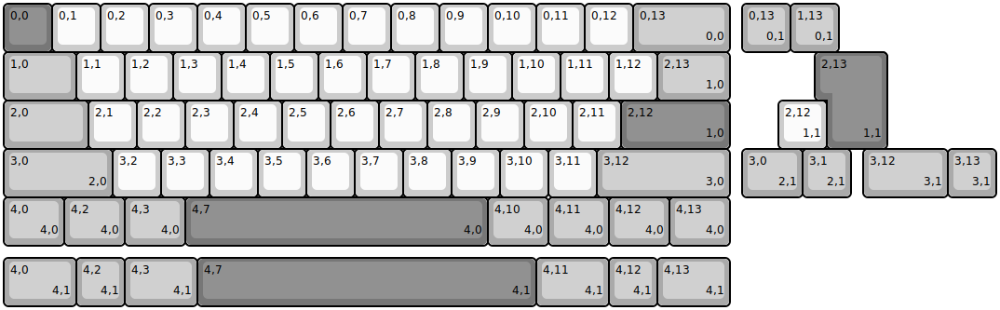{:loading="lazy"}

[Open in keyboard-layout-editor](http://www.keyboard-layout-editor.com/##@@_c=#777777;&=0,0&_c=#cccccc;&=0,1&=0,2&=0,3&=0,4&=0,5&=0,6&=0,7&=0,8&=0,9&=0,10&=0,11&=0,12&_c=#aaaaaa&w:2;&=0,13%0A%0A%0A0,0;&@_w:1.5;&=1,0&_c=#cccccc;&=1,1&=1,2&=1,3&=1,4&=1,5&=1,6&=1,7&=1,8&=1,9&=1,10&=1,11&=1,12&_c=#aaaaaa&w:1.5;&=2,13%0A%0A%0A1,0;&@_w:1.75;&=2,0&_c=#cccccc;&=2,1&=2,2&=2,3&=2,4&=2,5&=2,6&=2,7&=2,8&=2,9&=2,10&=2,11&_c=#777777&w:2.25;&=2,12%0A%0A%0A1,0;&@_c=#aaaaaa&w:2.25;&=3,0%0A%0A%0A2,0&_c=#cccccc;&=3,2&=3,3&=3,4&=3,5&=3,6&=3,7&=3,8&=3,9&=3,10&=3,11&_c=#aaaaaa&w:2.75;&=3,12%0A%0A%0A3,0;&@_w:1.25;&=4,0%0A%0A%0A4,0&_w:1.25;&=4,2%0A%0A%0A4,0&_w:1.25;&=4,3%0A%0A%0A4,0&_c=#777777&w:6.25;&=4,7%0A%0A%0A4,0&_c=#aaaaaa&w:1.25;&=4,10%0A%0A%0A4,0&_w:1.25;&=4,11%0A%0A%0A4,0&_w:1.25;&=4,12%0A%0A%0A4,0&_w:1.25;&=4,13%0A%0A%0A4,0;&@_x:15.25&y:-5;&=0,13%0A%0A%0A0,1&=1,13%0A%0A%0A0,1;&@_x:17.0&c=#777777&w:1.25&h:2&w2:1.5&h2:1&x2:-0.25;&=2,13%0A%0A%0A1,1;&@_x:16.0&c=#cccccc;&=2,12%0A%0A%0A1,1;&@_x:15.25&c=#aaaaaa&w:1.25;&=3,0%0A%0A%0A2,1&=3,1%0A%0A%0A2,1&_x:0.25&w:1.75;&=3,12%0A%0A%0A3,1&=3,13%0A%0A%0A3,1;&@_y:1.25&w:1.5;&=4,0%0A%0A%0A4,1&=4,2%0A%0A%0A4,1&_w:1.5;&=4,3%0A%0A%0A4,1&_c=#777777&w:7;&=4,7%0A%0A%0A4,1&_c=#aaaaaa&w:1.5;&=4,11%0A%0A%0A4,1&=4,12%0A%0A%0A4,1&_w:1.5;&=4,13%0A%0A%0A4,1)

## nemui/nemui

[README](output/nemui/README.md) - [layout](output/nemui/nemui-kle.json) - [PCB](output/nemui/nemui.kicad_pcb) - [PCB render](output/nemui/nemui-render.svg)

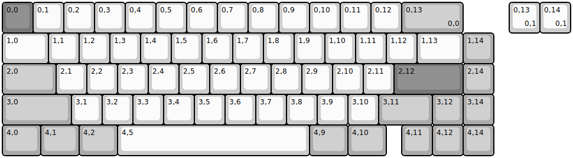{:loading="lazy"}

[Open in keyboard-layout-editor](http://www.keyboard-layout-editor.com/##@@_c=#777777;&=0,0&_c=#cccccc;&=0,1&=0,2&=0,3&=0,4&=0,5&=0,6&=0,7&=0,8&=0,9&=0,10&=0,11&=0,12&_c=#aaaaaa&w:2;&=0,13%0A%0A%0A0,0;&@_c=#cccccc&w:1.5;&=1,0&=1,1&=1,2&=1,3&=1,4&=1,5&=1,6&=1,7&=1,8&=1,9&=1,10&=1,11&=1,12&_w:1.5;&=1,13&_c=#aaaaaa;&=1,14;&@_w:1.75;&=2,0&_c=#cccccc;&=2,1&=2,2&=2,3&=2,4&=2,5&=2,6&=2,7&=2,8&=2,9&=2,10&=2,11&_c=#777777&w:2.25;&=2,12&_c=#aaaaaa;&=2,14;&@_w:2.25;&=3,0&_c=#cccccc;&=3,1&=3,2&=3,3&=3,4&=3,5&=3,6&=3,7&=3,8&=3,9&=3,10&_c=#aaaaaa&w:1.75;&=3,11&=3,12&=3,14;&@_w:1.25;&=4,0&_w:1.25;&=4,1&_w:1.25;&=4,2&_c=#cccccc&w:6.25;&=4,5&_c=#aaaaaa&w:1.25;&=4,9&_w:1.25;&=4,10&_x:0.5;&=4,11&=4,12&=4,14;&@_x:16.5&y:-5&c=#cccccc;&=0,13%0A%0A%0A0,1&=0,14%0A%0A%0A0,1)

## neokeys/g67/element_hs

[README](output/neokeys/g67/README.md) - [layout](output/neokeys/g67/element_hs-kle.json) - [PCB](output/neokeys/g67/element_hs.kicad_pcb) - [PCB render](output/neokeys/g67/element_hs-render.svg)

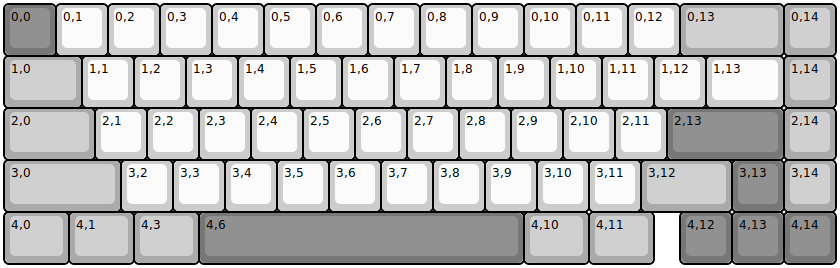{:loading="lazy"}

[Open in keyboard-layout-editor](http://www.keyboard-layout-editor.com/##@@_c=#777777;&=0,0&_c=#cccccc;&=0,1&=0,2&=0,3&=0,4&=0,5&=0,6&=0,7&=0,8&=0,9&=0,10&=0,11&=0,12&_c=#aaaaaa&w:2;&=0,13&=0,14;&@_w:1.5;&=1,0&_c=#cccccc;&=1,1&=1,2&=1,3&=1,4&=1,5&=1,6&=1,7&=1,8&=1,9&=1,10&=1,11&=1,12&_w:1.5;&=1,13&_c=#aaaaaa;&=1,14;&@_w:1.75;&=2,0&_c=#cccccc;&=2,1&=2,2&=2,3&=2,4&=2,5&=2,6&=2,7&=2,8&=2,9&=2,10&=2,11&_c=#777777&w:2.25;&=2,13&_c=#aaaaaa;&=2,14;&@_w:2.25;&=3,0&_c=#cccccc;&=3,2&=3,3&=3,4&=3,5&=3,6&=3,7&=3,8&=3,9&=3,10&=3,11&_c=#aaaaaa&w:1.75;&=3,12&_c=#777777;&=3,13&_c=#aaaaaa;&=3,14;&@_w:1.25;&=4,0&_w:1.25;&=4,1&_w:1.25;&=4,3&_c=#777777&w:6.25;&=4,6&_c=#aaaaaa&w:1.25;&=4,10&_w:1.25;&=4,11&_x:0.5&c=#777777;&=4,12&=4,13&=4,14)

## neokeys/g67/hotswap

[README](output/neokeys/g67/README.md) - [layout](output/neokeys/g67/hotswap-kle.json) - [PCB](output/neokeys/g67/hotswap.kicad_pcb) - [PCB render](output/neokeys/g67/hotswap-render.svg)

{:loading="lazy"}

[Open in keyboard-layout-editor](http://www.keyboard-layout-editor.com/##@@_c=#777777;&=0,0&_c=#cccccc;&=0,1&=0,2&=0,3&=0,4&=0,5&=0,6&=0,7&=0,8&=0,9&=0,10&=0,11&=0,12&_c=#aaaaaa&w:2;&=0,13&=0,14;&@_w:1.5;&=1,0&_c=#cccccc;&=1,1&=1,2&=1,3&=1,4&=1,5&=1,6&=1,7&=1,8&=1,9&=1,10&=1,11&=1,12&_w:1.5;&=1,13&_c=#aaaaaa;&=1,14;&@_w:1.75;&=2,0&_c=#cccccc;&=2,1&=2,2&=2,3&=2,4&=2,5&=2,6&=2,7&=2,8&=2,9&=2,10&=2,11&_c=#777777&w:2.25;&=2,13&_c=#aaaaaa;&=2,14;&@_w:2.25;&=3,0&_c=#cccccc;&=3,2&=3,3&=3,4&=3,5&=3,6&=3,7&=3,8&=3,9&=3,10&=3,11&_c=#aaaaaa&w:1.75;&=3,12&_c=#777777;&=3,13&_c=#aaaaaa;&=3,14;&@_w:1.25;&=4,0&_w:1.25;&=4,1&_w:1.25;&=4,3&_c=#777777&w:6.25;&=4,6&_c=#aaaaaa&w:1.25;&=4,10&_w:1.25;&=4,11&_x:0.5&c=#777777;&=4,12&=4,13&=4,14)

## neokeys/g67/soldered

[README](output/neokeys/g67/README.md) - [layout](output/neokeys/g67/soldered-kle.json) - [PCB](output/neokeys/g67/soldered.kicad_pcb) - [PCB render](output/neokeys/g67/soldered-render.svg)

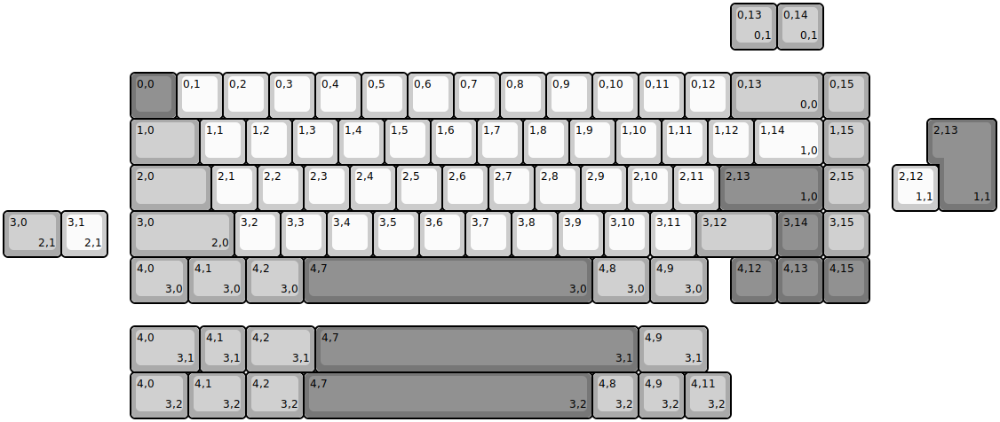{:loading="lazy"}

[Open in keyboard-layout-editor](http://www.keyboard-layout-editor.com/##@@_x:2.75&y:1.5&c=#777777;&=0,0&_c=#cccccc;&=0,1&=0,2&=0,3&=0,4&=0,5&=0,6&=0,7&=0,8&=0,9&=0,10&=0,11&=0,12&_c=#aaaaaa&w:2;&=0,13%0A%0A%0A0,0&=0,15;&@_x:2.75&w:1.5;&=1,0&_c=#cccccc;&=1,1&=1,2&=1,3&=1,4&=1,5&=1,6&=1,7&=1,8&=1,9&=1,10&=1,11&=1,12&_w:1.5;&=1,14%0A%0A%0A1,0&_c=#aaaaaa;&=1,15;&@_x:2.75&w:1.75;&=2,0&_c=#cccccc;&=2,1&=2,2&=2,3&=2,4&=2,5&=2,6&=2,7&=2,8&=2,9&=2,10&=2,11&_c=#777777&w:2.25;&=2,13%0A%0A%0A1,0&_c=#aaaaaa;&=2,15;&@_x:2.75&w:2.25;&=3,0%0A%0A%0A2,0&_c=#cccccc;&=3,2&=3,3&=3,4&=3,5&=3,6&=3,7&=3,8&=3,9&=3,10&=3,11&_c=#aaaaaa&w:1.75;&=3,12&_c=#777777;&=3,14&_c=#aaaaaa;&=3,15;&@_x:2.75&w:1.25;&=4,0%0A%0A%0A3,0&_w:1.25;&=4,1%0A%0A%0A3,0&_w:1.25;&=4,2%0A%0A%0A3,0&_c=#777777&w:6.25;&=4,7%0A%0A%0A3,0&_c=#aaaaaa&w:1.25;&=4,8%0A%0A%0A3,0&_w:1.25;&=4,9%0A%0A%0A3,0&_x:0.5&c=#777777;&=4,12&=4,13&=4,15;&@_x:15.75&y:-6.5&c=#aaaaaa;&=0,13%0A%0A%0A0,1&=0,14%0A%0A%0A0,1;&@_x:20.25&y:1.5&c=#777777&w:1.25&h:2&w2:1.5&h2:1&x2:-0.25;&=2,13%0A%0A%0A1,1;&@_x:19.25&c=#cccccc;&=2,12%0A%0A%0A1,1;&@_c=#aaaaaa&w:1.25;&=3,0%0A%0A%0A2,1&_c=#cccccc;&=3,1%0A%0A%0A2,1;&@_x:2.75&y:1.5&c=#aaaaaa&w:1.5;&=4,0%0A%0A%0A3,1&=4,1%0A%0A%0A3,1&_w:1.5;&=4,2%0A%0A%0A3,1&_c=#777777&w:7;&=4,7%0A%0A%0A3,1&_c=#aaaaaa&w:1.5;&=4,9%0A%0A%0A3,1;&@_x:2.75&w:1.25;&=4,0%0A%0A%0A3,2&_w:1.25;&=4,1%0A%0A%0A3,2&_w:1.25;&=4,2%0A%0A%0A3,2&_c=#777777&w:6.25;&=4,7%0A%0A%0A3,2&_c=#aaaaaa;&=4,8%0A%0A%0A3,2&=4,9%0A%0A%0A3,2&=4,11%0A%0A%0A3,2)

## neson_design/700e

[README](output/neson_design/README.md) - [layout](output/neson_design/700e-kle.json) - [PCB](output/neson_design/700e.kicad_pcb) - [PCB render](output/neson_design/700e-render.svg)

{:loading="lazy"}

[Open in keyboard-layout-editor](http://www.keyboard-layout-editor.com/##@@_x:2.5&y:1.25&c=#777777;&=0,0&_c=#cccccc;&=0,1&=0,2&=0,3&=0,4&=0,5&=0,6&=0,7&=0,8&=0,9&=0,10&=0,11&=0,12&=0,13%0A%0A%0A0,0&=4,13%0A%0A%0A0,0&_x:0.5&c=#777777;&=0,14&=0,15&=1,15;&@_x:2.5&w:1.5;&=1,0&_c=#cccccc;&=1,1&=1,2&=1,3&=1,4&=1,5&=1,6&=1,7&=1,8&=1,9&=1,10&=1,11&=1,12&_w:1.5;&=1,13%0A%0A%0A1,0&_x:0.5&c=#777777;&=1,14&=2,14&=2,15;&@_x:2.5&w:1.75;&=2,0&_c=#cccccc;&=2,1&=2,2&=2,3&=2,4&=2,5&=2,6&=2,7&=2,8&=2,9&=2,10&=2,11&_c=#777777&w:2.25;&=2,13%0A%0A%0A1,0;&@_x:2.5&c=#aaaaaa&w:2.25;&=3,0%0A%0A%0A2,0&_c=#cccccc;&=3,2&=3,3&=3,4&=3,5&=3,6&=3,7&=3,8&=3,9&=3,10&=3,11&_c=#aaaaaa&w:1.75;&=3,12%0A%0A%0A4,0&_c=#777777;&=3,13%0A%0A%0A4,0&_x:1.5;&=3,14;&@_x:2.5&c=#aaaaaa&w:1.25;&=4,0&_w:1.25;&=4,1%0A%0A%0A3,0&_w:1.25;&=4,2%0A%0A%0A3,0&_x:7.5&w:1.25;&=4,9%0A%0A%0A3,0&_w:1.25;&=4,11%0A%0A%0A3,0&_w:1.25;&=4,12&_x:0.5&c=#777777;&=3,15&=4,14&=4,15;&@_x:6.5&y:-0.75&c=#cccccc&w:7;&=4,10;&@_x:15.5&y:-6.5&c=#777777&w:2;&=4,13%0A%0A%0A0,1;&@_x:22.25&y:1.25&w:1.25&h:2&w2:1.5&h2:1&x2:-0.25;&=2,13%0A%0A%0A1,1;&@_x:21.25&c=#cccccc;&=2,12%0A%0A%0A1,1;&@_c=#aaaaaa&w:1.25;&=3,0%0A%0A%0A2,1&_c=#cccccc;&=3,1%0A%0A%0A2,1&_x:19.0&c=#aaaaaa&w:2.75;&=3,12%0A%0A%0A4,1;&@_x:3.75&y:1.25;&=4,1%0A%0A%0A3,1&_w:1.5;&=4,2%0A%0A%0A3,1&_x:7.5&w:1.5;&=4,9%0A%0A%0A3,1&=4,11%0A%0A%0A3,1)

## neson_design/n6

[README](output/neson_design/README.md) - [layout](output/neson_design/n6-kle.json) - [PCB](output/neson_design/n6.kicad_pcb) - [PCB render](output/neson_design/n6-render.svg)

{:loading="lazy"}

[Open in keyboard-layout-editor](http://www.keyboard-layout-editor.com/##@@_y:1;&=0,0&=0,1&=0,2&=0,3&=0,4&=0,5&=0,6&=0,7&=0,8&=0,9&=0,10&=0,11&=0,12&_w:2;&=0,14%0A%0A%0A0,0&=4,14;&@_w:1.5;&=1,0&=1,1&=1,2&=1,3&=1,4&=1,5&=1,6&=1,7&=1,8&=1,9&=1,10&=1,11&=1,12&_w:1.5;&=1,13&=1,14;&@_w:1.75;&=2,0&=2,1&=2,2&=2,3&=2,4&=2,5&=2,6&=2,7&=2,8&=2,9&=2,10&=2,11&_w:2.25;&=2,13&=2,14;&@_w:2.25;&=3,0&=3,2&=3,3&=3,4&=3,5&=3,6&=3,7&=3,8&=3,9&=3,10&=3,11&_w:1.75;&=3,12&=3,13&=3,14;&@_w:1.25;&=4,0%0A%0A%0A1,0&_w:1.25;&=4,1%0A%0A%0A1,0&_w:1.25;&=4,2%0A%0A%0A1,0&_w:6.25;&=4,8%0A%0A%0A1,0&_w:1.25;&=4,9%0A%0A%0A1,0&_w:1.25;&=4,10%0A%0A%0A1,0&_x:0.5;&=4,11&=4,12&=4,13;&@_x:13&y:-6;&=0,13%0A%0A%0A0,1&=0,14%0A%0A%0A0,1;&@_y:5&w:1.5;&=4,0%0A%0A%0A1,1&=4,1%0A%0A%0A1,1&_w:1.5;&=4,2%0A%0A%0A1,1&_w:7;&=4,8%0A%0A%0A1,1&_w:1.5;&=4,10%0A%0A%0A1,1;&@_w:1.5;&=4,0%0A%0A%0A1,2&_x:0.75&w:1.5;&=4,2%0A%0A%0A1,2&_w:7;&=4,8%0A%0A%0A1,2&_w:1.5;&=4,10%0A%0A%0A1,2)

## nibiria/stream15

[README](output/nibiria/stream15/README.md) - [layout](output/nibiria/stream15/stream15-kle.json) - [PCB](output/nibiria/stream15/stream15.kicad_pcb) - [PCB render](output/nibiria/stream15/stream15-render.svg)

{:loading="lazy"}

[Open in keyboard-layout-editor](http://www.keyboard-layout-editor.com/##@@=0,0&=0,1&=0,2&=0,3&=0,4;&@=1,0&=1,1&=1,2&=1,3&=1,4;&@=2,0&=2,1&=2,2&=2,3&=2,4)

## nightly_boards/conde60

[README](output/nightly_boards/README.md) - [layout](output/nightly_boards/conde60-kle.json) - [PCB](output/nightly_boards/conde60.kicad_pcb) - [PCB render](output/nightly_boards/conde60-render.svg)

{:loading="lazy"}

[Open in keyboard-layout-editor](http://www.keyboard-layout-editor.com/##@@_c=#777777;&=0,0&_c=#cccccc;&=0,1&=0,2&=0,3&=0,4&=0,5&=0,6&=0,7&=0,8&=0,9&=0,10&=0,11&=0,12&=0,13&_c=#aaaaaa;&=1,13;&@_w:1.5;&=1,0&_c=#cccccc;&=1,1&=1,2&=1,3&=1,4&=1,5&=1,6&=1,7&=1,8&=1,9&=1,10&=1,11&=1,12&_c=#aaaaaa&w:1.5;&=2,13;&@_w:1.75;&=2,0&_c=#cccccc;&=2,1&=2,2&=2,3&=2,4&=2,5&=2,6&=2,7&=2,8&=2,9&=2,10&=2,11&_c=#777777&w:2.25;&=2,12;&@_c=#aaaaaa&w:1.25;&=3,0&=3,1&_c=#cccccc;&=3,2&=3,3&=3,4&=3,5&=3,6&=3,7&=3,8&=3,9&=3,10&=3,11&_c=#aaaaaa&w:1.75;&=3,12&=3,13;&@_w:1.5;&=4,0&=4,1&_w:1.5;&=4,2&_c=#cccccc&w:2.25;&=4,4&=4,6&=4,7&_w:2.75;&=4,9&_c=#aaaaaa&w:1.5;&=4,11&=4,12&_w:1.5;&=4,13)

## nightly_boards/daily60

[README](output/nightly_boards/README.md) - [layout](output/nightly_boards/daily60-kle.json) - [PCB](output/nightly_boards/daily60.kicad_pcb) - [PCB render](output/nightly_boards/daily60-render.svg)

{:loading="lazy"}

[Open in keyboard-layout-editor](http://www.keyboard-layout-editor.com/##@@_c=#777777;&=0,0&_c=#cccccc;&=0,1&=0,2&=0,3&=0,4&=0,5&=0,6&=0,7&=0,8&=0,9&=0,10&=0,11&=0,12&_c=#aaaaaa&w:2;&=0,13%0A%0A%0A0,0;&@_w:1.5;&=1,0&_c=#cccccc;&=1,1&=1,2&=1,3&=1,4&=1,5&=1,6&=1,7&=1,8&=1,9&=1,10&=1,11&=1,12&_c=#aaaaaa&w:1.5;&=2,13%0A%0A%0A1,0;&@_w:1.75;&=2,0&_c=#cccccc;&=2,1&=2,2&=2,3&=2,4&=2,5&=2,6&=2,7&=2,8&=2,9&=2,10&=2,11&_c=#777777&w:2.25;&=2,12%0A%0A%0A1,0;&@_c=#aaaaaa&w:2.25;&=3,0%0A%0A%0A2,0&_c=#cccccc;&=3,2&=3,3&=3,4&=3,5&=3,6&=3,7&=3,8&=3,9&=3,10&=3,11&_c=#aaaaaa&w:2.75;&=3,12%0A%0A%0A3,0;&@_w:1.25;&=4,0%0A%0A%0A4,0&_w:1.25;&=4,2%0A%0A%0A4,0&_w:1.25;&=4,3%0A%0A%0A4,0&_c=#777777&w:6.25;&=4,7%0A%0A%0A4,0&_c=#aaaaaa&w:1.25;&=4,10%0A%0A%0A4,0&_w:1.25;&=4,11%0A%0A%0A4,0&_w:1.25;&=4,12%0A%0A%0A4,0&_w:1.25;&=4,13%0A%0A%0A4,0;&@_x:15.25&y:-5;&=0,13%0A%0A%0A0,1&=1,13%0A%0A%0A0,1;&@_x:17.0&c=#777777&w:1.25&h:2&w2:1.5&h2:1&x2:-0.25;&=2,13%0A%0A%0A1,1;&@_x:16.0&c=#cccccc;&=2,12%0A%0A%0A1,1;&@_x:15.25&c=#aaaaaa&w:1.25;&=3,0%0A%0A%0A2,1&=3,1%0A%0A%0A2,1&_x:0.25&w:1.75;&=3,12%0A%0A%0A3,1&=3,13%0A%0A%0A3,1;&@_y:1.25&w:1.5;&=4,0%0A%0A%0A4,1&=4,2%0A%0A%0A4,1&_w:1.5;&=4,3%0A%0A%0A4,1&_c=#777777&w:7;&=4,8%0A%0A%0A4,1&_c=#aaaaaa&w:1.5;&=4,11%0A%0A%0A4,1&=4,12%0A%0A%0A4,1&_w:1.5;&=4,13%0A%0A%0A4,1;&@_w:1.5;&=4,0%0A%0A%0A4,2&=4,2%0A%0A%0A4,2&_w:1.5;&=4,3%0A%0A%0A4,2&_c=#777777&w:2.25;&=4,5%0A%0A%0A4,2&=4,7%0A%0A%0A4,2&=4,8%0A%0A%0A4,2&_w:2.75;&=4,9%0A%0A%0A4,2&_c=#aaaaaa&w:1.5;&=4,0%0A%0A%0A4,2&=4,2%0A%0A%0A4,2&_w:1.5;&=4,3%0A%0A%0A4,2)

## nightly_boards/n2

[README](output/nightly_boards/README.md) - [layout](output/nightly_boards/n2-kle.json) - [PCB](output/nightly_boards/n2.kicad_pcb) - [PCB render](output/nightly_boards/n2-render.svg)

{:loading="lazy"}

[Open in keyboard-layout-editor](http://www.keyboard-layout-editor.com/##@@=0,0;&@=1,1)

## nightly_boards/n40o

[README](output/nightly_boards/README.md) - [layout](output/nightly_boards/n40o-kle.json) - [PCB](output/nightly_boards/n40o.kicad_pcb) - [PCB render](output/nightly_boards/n40o-render.svg)

{:loading="lazy"}

[Open in keyboard-layout-editor](http://www.keyboard-layout-editor.com/##@@_c=#aaaaaa;&=4,1&=4,2&_x:0.25;&=0,0&_x:0.25;&=0,1&_c=#cccccc;&=0,2&=0,3&=0,4&=0,5&=0,6&=0,7&=0,8&=0,9&=0,10&=0,11&_c=#aaaaaa;&=0,12;&@=4,3&=4,4&_x:0.25;&=1,0&_x:0.25;&=1,1&_c=#cccccc;&=1,2&=1,3&=1,4&=1,5&=1,6&=1,7&=1,8&=1,9&=1,10&=1,11&_c=#aaaaaa;&=1,12;&@=4,5&=4,6&_x:0.25;&=2,0&_x:0.25;&=2,1&_c=#cccccc;&=2,2&=2,3&=2,4&=2,5&=2,6&=2,7&=2,8&=2,9&=2,10&=2,11&_c=#aaaaaa;&=2,12;&@_x:2.25;&=3,0&_x:0.25;&=3,1&=3,2&=3,3&=3,4&=3,5&_c=#cccccc;&=3,6%0A%0A%0A0,0&=3,7%0A%0A%0A0,0&_c=#aaaaaa;&=3,8&=3,9&=3,10&=3,11&=3,12;&@_x:8.5&c=#cccccc&w:2;&=3,6%0A%0A%0A0,1)

## nightly_boards/n60s

[README](output/nightly_boards/README.md) - [layout](output/nightly_boards/n60s-kle.json) - [PCB](output/nightly_boards/n60s.kicad_pcb) - [PCB render](output/nightly_boards/n60s-render.svg)

{:loading="lazy"}

[Open in keyboard-layout-editor](http://www.keyboard-layout-editor.com/##@@_c=#777777;&=0,0&_c=#cccccc;&=0,1&=0,2&=0,3&=0,4&=0,5&=0,6&=0,7&=0,8&=0,9&=0,10&=0,11&=0,12&_c=#aaaaaa&w:2;&=0,13%0A%0A%0A0,0;&@_w:1.5;&=1,0&_c=#cccccc;&=1,1&=1,2&=1,3&=1,4&=1,5&=1,6&=1,7&=1,8&=1,9&=1,10&=1,11&=1,12&_w:1.5;&=2,13%0A%0A%0A1,0;&@_c=#aaaaaa&w:1.75;&=2,0&_c=#cccccc;&=2,1&=2,2&=2,3&=2,4&=2,5&=2,6&=2,7&=2,8&=2,9&=2,10&=2,11&_c=#777777&w:2.25;&=2,12;&@_c=#aaaaaa&w:2.25;&=3,0&_c=#cccccc;&=3,2&=3,3&=3,4&=3,5&=3,6&=3,7&=3,8&=3,9&=3,10&=3,11&_c=#aaaaaa&w:2.75;&=3,12%0A%0A%0A2,0;&@_w:1.25;&=4,0%0A%0A%0A3,0&_w:1.25;&=4,2%0A%0A%0A3,0&_w:1.25;&=4,3%0A%0A%0A3,0&_c=#cccccc&w:6.25;&=4,7%0A%0A%0A3,0&_c=#aaaaaa&w:1.25;&=4,10%0A%0A%0A3,0&_w:1.25;&=4,11%0A%0A%0A3,0&_w:1.25;&=4,12%0A%0A%0A3,0&_w:1.25;&=4,13%0A%0A%0A3,0;&@_x:15.25&y:-5.0;&=0,13%0A%0A%0A0,1&=1,13%0A%0A%0A0,1;&@_x:15.25&c=#cccccc&w:1.5;&=2,13%0A%0A%0A1,1;&@_x:17&y:-0.5&c=#aaaaaa;&=5,0%0A%0A%0A1,1&=5,1%0A%0A%0A1,1;&@_x:15.25&y:0.5&w:1.75;&=3,12%0A%0A%0A2,1&=3,13%0A%0A%0A2,1;&@_y:1.25&w:1.5;&=4,0%0A%0A%0A3,1&=4,2%0A%0A%0A3,1&_w:1.5;&=4,3%0A%0A%0A3,1&_c=#cccccc&w:7;&=4,7%0A%0A%0A3,1&_c=#aaaaaa&w:1.5;&=4,11%0A%0A%0A3,1&=4,12%0A%0A%0A3,1&_w:1.5;&=4,13%0A%0A%0A3,1)

## nightly_boards/n87

[README](output/nightly_boards/README.md) - [layout](output/nightly_boards/n87-kle.json) - [PCB](output/nightly_boards/n87.kicad_pcb) - [PCB render](output/nightly_boards/n87-render.svg)

{:loading="lazy"}

[Open in keyboard-layout-editor](http://www.keyboard-layout-editor.com/##@@_y:1.25&c=#777777;&=0,0&_x:1&c=#cccccc;&=1,0&=0,1&=1,1&=0,2&_x:0.5&c=#aaaaaa;&=0,3&=1,3&=0,4&=1,4&_x:0.5&c=#cccccc;&=0,5&=1,5&=0,6&=1,6&_x:0.25&c=#aaaaaa;&=1,7&=0,8&=1,8;&@_y:0.25&c=#cccccc;&=2,0&=3,0&=2,1&=3,1&=2,2&=3,2&=2,3&=3,3&=2,4&=3,4&=2,5&=3,5&=2,6&_c=#aaaaaa&w:2;&=2,7%0A%0A%0A0,0&_x:0.25;&=3,7&=2,8&=3,8;&@_w:1.5;&=4,0&_c=#cccccc;&=5,0&=4,1&=5,1&=4,2&=5,2&=4,3&=5,3&=4,4&=5,4&=4,5&=5,5&=4,6&_w:1.5;&=5,6&_x:0.25&c=#aaaaaa;&=5,7&=4,8&=5,8;&@_w:1.75;&=6,0&_c=#cccccc;&=6,1&=7,1&=6,2&=7,2&=6,3&=7,3&=6,4&=7,4&=6,5&=7,5&=6,6&_c=#777777&w:2.25;&=7,6;&@_c=#aaaaaa&w:2.25;&=8,0&_c=#cccccc;&=8,1&=9,1&=8,2&=9,2&=8,3&=9,3&=8,4&=9,4&=8,5&=9,5&_c=#aaaaaa&w:2.75;&=8,6%0A%0A%0A1,0&_x:1.25&c=#777777;&=8,8;&@_c=#aaaaaa&w:1.25;&=10,0%0A%0A%0A2,0&_w:1.25;&=11,0%0A%0A%0A2,0&_w:1.25;&=10,1%0A%0A%0A2,0&_c=#cccccc&w:6.25;&=10,3%0A%0A%0A2,0&_c=#aaaaaa&w:1.25;&=10,5%0A%0A%0A2,0&_w:1.25;&=11,5%0A%0A%0A2,0&_w:1.25;&=10,6%0A%0A%0A2,0&_w:1.25;&=11,6%0A%0A%0A2,0&_x:0.25&c=#777777;&=11,7&=10,8&=11,8;&@_x:13&y:-7.5&c=#aaaaaa;&=3,6%0A%0A%0A0,1&=2,7%0A%0A%0A0,1;&@_x:18.5&y:4.5&w:1.75;&=8,6%0A%0A%0A1,1&=9,6%0A%0A%0A1,1;&@_y:1.25&w:1.25;&=10,0%0A%0A%0A2,1&_w:0.625&d:true;&=%0A%0A%0A2,1&_w:1.25;&=11,0%0A%0A%0A2,1&_w:1.25;&=10,1%0A%0A%0A2,1&_c=#cccccc&w:6.25;&=10,3%0A%0A%0A2,1&_c=#aaaaaa&w:1.25;&=10,5%0A%0A%0A2,1&_w:1.25;&=11,5%0A%0A%0A2,1&_w:0.625&d:true;&=%0A%0A%0A2,1&_w:1.25;&=11,6%0A%0A%0A2,1;&@_w:1.5;&=10,0%0A%0A%0A2,2&=11,0%0A%0A%0A2,2&_w:1.5;&=10,1%0A%0A%0A2,2&_c=#cccccc&w:7;&=10,3%0A%0A%0A2,2&_c=#aaaaaa&w:1.5;&=11,5%0A%0A%0A2,2&=10,6%0A%0A%0A2,2&_w:1.5;&=11,6%0A%0A%0A2,2)

## nightly_boards/octopad

[README](output/nightly_boards/README.md) - [layout](output/nightly_boards/octopad-kle.json) - [PCB](output/nightly_boards/octopad.kicad_pcb) - [PCB render](output/nightly_boards/octopad-render.svg)

{:loading="lazy"}

[Open in keyboard-layout-editor](http://www.keyboard-layout-editor.com/##@@=2,0&=0,4&=2,1&_x:0.5;&=2,2&=1,4&=2,3;&@_x:1.25&y:0.25;&=0,0&=0,1&=0,2&=0,3;&@_x:1.25;&=1,0&=1,1&=1,2&=1,3)

## nightly_boards/octopadplus

[README](output/nightly_boards/README.md) - [layout](output/nightly_boards/octopadplus-kle.json) - [PCB](output/nightly_boards/octopadplus.kicad_pcb) - [PCB render](output/nightly_boards/octopadplus-render.svg)

{:loading="lazy"}

[Open in keyboard-layout-editor](http://www.keyboard-layout-editor.com/##@@=0,4%0A%0A%0A%0A%0A%0A%0A%0A%0AE0&_x:2;&=1,5%0A%0A%0A%0A%0A%0A%0A%0A%0AE1;&@_y:0.25;&=0,0&=0,1&=0,2&=0,3;&@=1,0&=1,1&=1,2&=1,3)

## nightly_boards/paraluman

[README](output/nightly_boards/README.md) - [layout](output/nightly_boards/paraluman-kle.json) - [PCB](output/nightly_boards/paraluman.kicad_pcb) - [PCB render](output/nightly_boards/paraluman-render.svg)

{:loading="lazy"}

[Open in keyboard-layout-editor](http://www.keyboard-layout-editor.com/##@@_c=#777777;&=0,0&_c=#cccccc;&=0,1&=0,2&=0,3&=0,4&=0,5&=0,6&=0,7&=0,8&=0,9&=0,10&=0,11&=0,12&_c=#aaaaaa&w:2;&=0,13%0A%0A%0A0,0;&@_w:1.5;&=1,0&_c=#cccccc;&=1,1&=1,2&=1,3&=1,4&=1,5&=1,6&=1,7&=1,8&=1,9&=1,10&=1,11&=1,12&_w:1.5;&=2,13%0A%0A%0A1,0;&@_c=#aaaaaa&w:1.75;&=2,0&_c=#cccccc;&=2,1&=2,2&=2,3&=2,4&=2,5&=2,6&=2,7&=2,8&=2,9&=2,10&=2,11&_c=#777777&w:2.25;&=2,12;&@_c=#aaaaaa&w:2.25;&=3,0&_c=#cccccc;&=3,2&=3,3&=3,4&=3,5&=3,6&=3,7&=3,8&=3,9&=3,10&=3,11&_c=#aaaaaa&w:2.75;&=3,12%0A%0A%0A2,0;&@_w:1.25;&=4,0%0A%0A%0A3,0&_w:1.25;&=4,2%0A%0A%0A3,0&_w:1.25;&=4,3%0A%0A%0A3,0&_c=#cccccc&w:6.25;&=4,7%0A%0A%0A3,0&_c=#aaaaaa&w:1.25;&=4,10%0A%0A%0A3,0&_w:1.25;&=4,11%0A%0A%0A3,0&_w:1.25;&=4,12%0A%0A%0A3,0&_w:1.25;&=4,13%0A%0A%0A3,0;&@_x:15.25&y:-5;&=0,13%0A%0A%0A0,1&=1,13%0A%0A%0A0,1;&@_x:15.25&c=#cccccc&w:1.5;&=2,13%0A%0A%0A1,1;&@_x:15.25&y:1&c=#aaaaaa&w:1.75;&=3,12%0A%0A%0A2,1&=3,13%0A%0A%0A2,1;&@_y:1.25&w:1.5;&=4,0%0A%0A%0A3,1&=4,2%0A%0A%0A3,1&_w:1.5;&=4,3%0A%0A%0A3,1&_c=#cccccc&w:7;&=4,7%0A%0A%0A3,1&_c=#aaaaaa&w:1.5;&=4,11%0A%0A%0A3,1&=4,12%0A%0A%0A3,1&_w:1.5;&=4,13%0A%0A%0A3,1)

## nightmare/nightmare

[README](output/nightmare/README.md) - [layout](output/nightmare/nightmare-kle.json) - [PCB](output/nightmare/nightmare.kicad_pcb) - [PCB render](output/nightmare/nightmare-render.svg)

{:loading="lazy"}

[Open in keyboard-layout-editor](http://www.keyboard-layout-editor.com/##@@_c=#aaaaaa;&=0,0&_x:0.25&c=#777777;&=0,1&_c=#cccccc;&=0,2&=0,3&=0,4&=0,5&=0,6&=0,7&=0,8&=0,9&=0,10&=0,11&=0,12&=1,13&_c=#aaaaaa;&=0,13;&@=1,0&_x:0.25&w:1.25;&=1,1&_c=#cccccc;&=1,2&=1,3&=1,4&=1,5&=1,6&=1,7&=1,8&=1,9&=1,10&=1,11&=1,12&_c=#777777&w:1.75;&=2,13;&@_c=#aaaaaa;&=2,0&_x:0.25&w:1.75;&=2,1&_c=#cccccc;&=2,2&=2,3&=2,4&=2,5&=2,6&=2,7&=2,8&=2,9&=2,10&=2,11&_c=#aaaaaa&w:1.25;&=2,12&=3,13;&@=3,0&_x:1.5;&=3,1&_w:1.25;&=3,2&_c=#cccccc&w:7;&=3,7%0A%0A%0A0,0&_c=#aaaaaa&w:1.25;&=3,11&=3,12;&@_x:4.75&y:0.25;&=3,4%0A%0A%0A0,1&_c=#cccccc&w:2.25;&=3,5%0A%0A%0A0,1&_w:2.75;&=3,7%0A%0A%0A0,1&_c=#aaaaaa;&=3,9%0A%0A%0A0,1)

## nix_studio/oxalys80

[README](output/nix_studio/oxalys80/README.md) - [layout](output/nix_studio/oxalys80/oxalys80-kle.json) - [PCB](output/nix_studio/oxalys80/oxalys80.kicad_pcb) - [PCB render](output/nix_studio/oxalys80/oxalys80-render.svg)

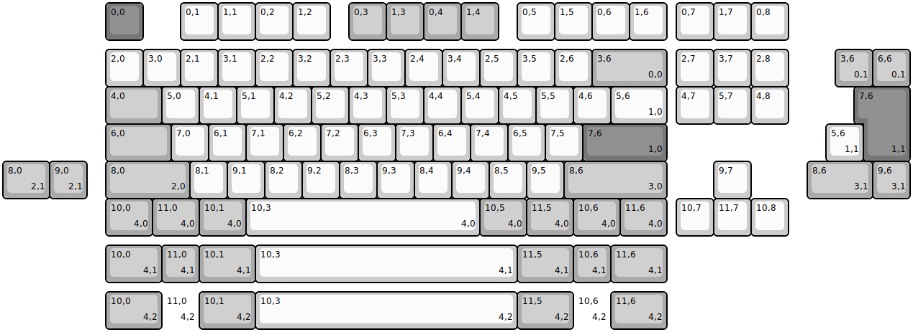{:loading="lazy"}

[Open in keyboard-layout-editor](http://www.keyboard-layout-editor.com/##@@_x:2.75&c=#777777;&=0,0&_x:1.0&c=#cccccc;&=0,1&=1,1&=0,2&=1,2&_x:0.5&c=#aaaaaa;&=0,3&=1,3&=0,4&=1,4&_x:0.5&c=#cccccc;&=0,5&=1,5&=0,6&=1,6&_x:0.25;&=0,7&=1,7&=0,8;&@_x:2.75&y:0.25;&=2,0&=3,0&=2,1&=3,1&=2,2&=3,2&=2,3&=3,3&=2,4&=3,4&=2,5&=3,5&=2,6&_c=#aaaaaa&w:2;&=3,6%0A%0A%0A0,0&_x:0.25&c=#cccccc;&=2,7&=3,7&=2,8;&@_x:2.75&c=#aaaaaa&w:1.5;&=4,0&_c=#cccccc;&=5,0&=4,1&=5,1&=4,2&=5,2&=4,3&=5,3&=4,4&=5,4&=4,5&=5,5&=4,6&_w:1.5;&=5,6%0A%0A%0A1,0&_x:0.25;&=4,7&=5,7&=4,8;&@_x:2.75&c=#aaaaaa&w:1.75;&=6,0&_c=#cccccc;&=7,0&=6,1&=7,1&=6,2&=7,2&=6,3&=7,3&=6,4&=7,4&=6,5&=7,5&_c=#777777&w:2.25;&=7,6%0A%0A%0A1,0;&@_x:2.75&c=#aaaaaa&w:2.25;&=8,0%0A%0A%0A2,0&_c=#cccccc;&=8,1&=9,1&=8,2&=9,2&=8,3&=9,3&=8,4&=9,4&=8,5&=9,5&_c=#aaaaaa&w:2.75;&=8,6%0A%0A%0A3,0&_x:1.25&c=#cccccc;&=9,7;&@_x:2.75&c=#aaaaaa&w:1.25;&=10,0%0A%0A%0A4,0&_w:1.25;&=11,0%0A%0A%0A4,0&_w:1.25;&=10,1%0A%0A%0A4,0&_c=#cccccc&w:6.25;&=10,3%0A%0A%0A4,0&_c=#aaaaaa&w:1.25;&=10,5%0A%0A%0A4,0&_w:1.25;&=11,5%0A%0A%0A4,0&_w:1.25;&=10,6%0A%0A%0A4,0&_w:1.25;&=11,6%0A%0A%0A4,0&_x:0.25&c=#cccccc;&=10,7&=11,7&=10,8;&@_x:22.25&y:-5.0&c=#aaaaaa;&=3,6%0A%0A%0A0,1&=6,6%0A%0A%0A0,1;&@_x:23.0&c=#777777&w:1.25&h:2&w2:1.5&h2:1&x2:-0.25;&=7,6%0A%0A%0A1,1;&@_x:22.0&c=#cccccc;&=5,6%0A%0A%0A1,1;&@_c=#aaaaaa&w:1.25;&=8,0%0A%0A%0A2,1&=9,0%0A%0A%0A2,1&_x:19.25&w:1.75;&=8,6%0A%0A%0A3,1&=9,6%0A%0A%0A3,1;&@_x:2.75&y:1.25&w:1.5;&=10,0%0A%0A%0A4,1&=11,0%0A%0A%0A4,1&_w:1.5;&=10,1%0A%0A%0A4,1&_c=#cccccc&w:7;&=10,3%0A%0A%0A4,1&_c=#aaaaaa&w:1.5;&=11,5%0A%0A%0A4,1&=10,6%0A%0A%0A4,1&_w:1.5;&=11,6%0A%0A%0A4,1;&@_x:2.75&y:0.25&w:1.5;&=10,0%0A%0A%0A4,2&_c=#cccccc&d:true;&=11,0%0A%0A%0A4,2&_c=#aaaaaa&w:1.5;&=10,1%0A%0A%0A4,2&_c=#cccccc&w:7;&=10,3%0A%0A%0A4,2&_c=#aaaaaa&w:1.5;&=11,5%0A%0A%0A4,2&_c=#cccccc&d:true;&=10,6%0A%0A%0A4,2&_c=#aaaaaa&w:1.5;&=11,6%0A%0A%0A4,2)

## nknl7en/nknl7en

[README](output/nknl7en/README.md) - [layout](output/nknl7en/nknl7en-kle.json) - [PCB](output/nknl7en/nknl7en.kicad_pcb) - [PCB render](output/nknl7en/nknl7en-render.svg)

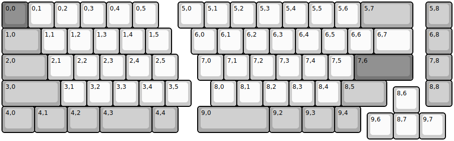{:loading="lazy"}

[Open in keyboard-layout-editor](http://www.keyboard-layout-editor.com/##@@_c=#777777;&=0,0&_c=#cccccc;&=0,1&=0,2&=0,3&=0,4&=0,5&_x:0.75;&=5,0&=5,1&=5,2&=5,3&=5,4&=5,5&=5,6&_c=#aaaaaa&w:2;&=5,7&_x:0.5;&=5,8;&@_w:1.5;&=1,0&_c=#cccccc;&=1,1&=1,2&=1,3&=1,4&=1,5&_x:0.75;&=6,0&=6,1&=6,2&=6,3&=6,4&=6,5&=6,6&_w:1.5;&=6,7&_x:0.5&c=#aaaaaa;&=6,8;&@_w:1.75;&=2,0&_c=#cccccc;&=2,1&=2,2&=2,3&=2,4&=2,5&_x:0.75;&=7,0&=7,1&=7,2&=7,3&=7,4&=7,5&_c=#777777&w:2.25;&=7,6&_x:0.5&c=#aaaaaa;&=7,8;&@_w:2.25;&=3,0&_c=#cccccc;&=3,1&=3,2&=3,3&=3,4&=3,5&_x:0.75;&=8,0&=8,1&=8,2&=8,3&=8,4&_c=#aaaaaa&w:1.75;&=8,5&_x:1.5;&=8,8;&@_x:15&y:-0.75&c=#cccccc;&=8,6;&@_y:-0.25&c=#aaaaaa&w:1.25;&=4,0&_w:1.25;&=4,1&_w:1.25;&=4,2&_w:2;&=4,3&=4,4&_x:0.75&w:2.75;&=9,0&_w:1.25;&=9,2&_w:1.25;&=9,3&=9,4;&@_x:14&y:-0.75&c=#cccccc;&=9,6&=8,7&=9,7)

## nknl7jp/nknl7jp

[README](output/nknl7jp/README.md) - [layout](output/nknl7jp/nknl7jp-kle.json) - [PCB](output/nknl7jp/nknl7jp.kicad_pcb) - [PCB render](output/nknl7jp/nknl7jp-render.svg)

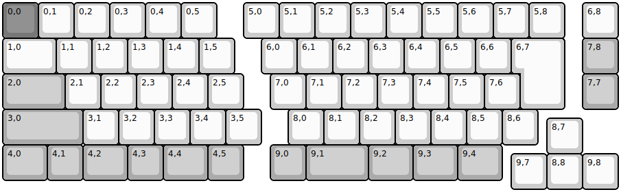{:loading="lazy"}

[Open in keyboard-layout-editor](http://www.keyboard-layout-editor.com/##@@_c=#777777;&=0,0&_c=#cccccc;&=0,1&=0,2&=0,3&=0,4&=0,5&_x:0.75;&=5,0&=5,1&=5,2&=5,3&=5,4&=5,5&=5,6&=5,7&=5,8&_x:0.5;&=6,8;&@_w:1.5;&=1,0&=1,1&=1,2&=1,3&=1,4&=1,5&_x:0.75;&=6,0&=6,1&=6,2&=6,3&=6,4&=6,5&=6,6&_x:0.25&w:1.25&h:2&w2:1.5&h2:1&x2:-0.25;&=6,7&_x:0.5&c=#aaaaaa;&=7,8;&@_w:1.75;&=2,0&_c=#cccccc;&=2,1&=2,2&=2,3&=2,4&=2,5&_x:0.75;&=7,0&=7,1&=7,2&=7,3&=7,4&=7,5&=7,6&_x:1.75&c=#aaaaaa;&=7,7;&@_w:2.25;&=3,0&_c=#cccccc;&=3,1&=3,2&=3,3&=3,4&=3,5&_x:0.75;&=8,0&=8,1&=8,2&=8,3&=8,4&=8,5&=8,6;&@_x:15.25&y:-0.75;&=8,7;&@_y:-0.25&c=#aaaaaa&w:1.25;&=4,0&=4,1&_w:1.25;&=4,2&=4,3&_w:1.25;&=4,4&=4,5&_x:0.75;&=9,0&_w:1.75;&=9,1&_w:1.25;&=9,2&_w:1.25;&=9,3&_w:1.25;&=9,4;&@_x:14.25&y:-0.75&c=#cccccc;&=9,7&=8,8&=9,8)

## nopunin10did/jabberwocky/v1/jabberwocky

[README](output/nopunin10did/jabberwocky/v1/README.md) - [layout](output/nopunin10did/jabberwocky/v1/jabberwocky-kle.json) - [PCB](output/nopunin10did/jabberwocky/v1/jabberwocky.kicad_pcb) - [PCB render](output/nopunin10did/jabberwocky/v1/jabberwocky-render.svg)

{:loading="lazy"}

[Open in keyboard-layout-editor](http://www.keyboard-layout-editor.com/##@@_x:0.75&y:0.25&c=#777777;&=7,0&_x:0.5&c=#cccccc;&=1,1&=0,1&_x:8.75;&=0,6&=1,6&_x:0.13&c=#aaaaaa;&=0,7&=1,7&_x:0.12;&=0,0&=1,0&_x:0.25;&=0,8&=1,8&=0,9&=1,9;&@_x:2&y:0.25&c=#cccccc;&=4,0&=2,1&_x:9.25;&=2,6&=3,6&=2,7&_c=#aaaaaa&w:2;&=2,0%0A%0A%0A0,0&_x:1.25;&=2,8&=3,8&=2,9&=3,9;&@_x:1.25&w:1.5;&=6,0&_c=#cccccc;&=4,1&_x:9.75;&=4,6&=5,6&=4,7&_w:1.5;&=5,7%0A%0A%0A1,0&_x:1.5;&=4,8&=5,8&=4,9&_c=#aaaaaa&h:2;&=7,9%0A%0A%0A5,0;&@_x:0.75&w:1.75;&=7,1&_c=#cccccc;&=6,1&_x:10.25;&=6,6&=7,6&_c=#777777&w:2.25;&=7,7%0A%0A%0A1,0&_x:1.5&c=#cccccc;&=6,8&=7,8&=6,9;&@_c=#aaaaaa&w:2.25;&=8,0%0A%0A%0A2,0&_c=#cccccc;&=8,1&_x:10.75;&=8,6&_c=#aaaaaa&w:2.25;&=8,7%0A%0A%0A3,0&_c=#777777;&=9,7&_x:1.25&c=#cccccc;&=8,8&=9,8&=8,9&_c=#777777&h:2;&=11,9%0A%0A%0A6,0;&@_x:0.5&c=#aaaaaa&w:1.25;&=10,0&_w:1.25;&=10,1&_x:10.75&w:1.25;&=11,5&_w:1.25;&=10,6&_c=#777777;&=11,6&=10,7&=11,7&_x:0.25&c=#cccccc&w:2;&=10,8%0A%0A%0A4,0&=10,9;&@_r:14&rx:4&ry:2.5&x:1&y:-2.37;&=0,2;&@_y:-0.88;&=1,2&_x:1&c=#aaaaaa;&=1,3;&@_x:3&y:-0.87;&=0,3;&@_x:1&c=#cccccc;&=2,2;&@_y:-0.88;&=3,1&_x:1;&=3,2;&@_x:3&y:-0.87;&=2,3;&@_x:1&y:-0.25;&=4,2;&@_y:-0.88;&=5,1&_x:1;&=5,2;&@_x:3&y:-0.87;&=4,3;&@_x:1&y:-0.25;&=6,2;&@_y:-0.88;&=7,2&_x:1;&=7,3;&@_x:3&y:-0.87;&=6,3;&@_x:1&y:-0.25;&=8,2;&@_y:-0.88;&=9,1&_x:1;&=9,2;&@_x:3&y:-0.87;&=8,3&=9,3;&@_x:0.5&y:-0.13&c=#aaaaaa&w:1.25;&=10,2&_c=#cccccc&w:1.25;&=10,3;&@_x:3&y:-0.87&w:2;&=11,3;&@_r:-14&rx:13.25&x:-2.0&y:-2.37;&=0,5;&@_x:-3.0&y:-0.88&c=#aaaaaa;&=1,4&_x:1.0&c=#cccccc;&=1,5;&@_x:-4.0&y:-0.87&c=#aaaaaa;&=0,4;&@_x:-2.0&c=#cccccc;&=2,5;&@_x:-3.0&y:-0.88;&=3,4&_x:1.0;&=3,5;&@_x:-4.0&y:-0.87;&=2,4;&@_x:-2.0&y:-0.25;&=4,5;&@_x:-3.0&y:-0.88;&=5,4&_x:1.0;&=5,5;&@_x:-4.0&y:-0.87;&=4,4;&@_x:-2.0&y:-0.25;&=6,5;&@_x:-3.0&y:-0.88;&=7,4&_x:1.0;&=7,5;&@_x:-4.0&y:-0.87;&=6,4;&@_x:-2.0&y:-0.25;&=8,5;&@_x:-3.0&y:-0.88;&=9,4&_x:1.0;&=9,5;&@_x:-5.0&y:-0.87;&=10,4&=8,4;&@_x:-2.25&y:-0.13&c=#aaaaaa&w:1.25;&=10,5;&@_x:-5.0&y:-0.87&c=#cccccc&w:2.75;&=11,4;&@_r:0&rx:0&ry:0&x:24.0&y:1.5;&=3,7%0A%0A%0A0,1&=2,0%0A%0A%0A0,1;&@_x:24.75&c=#777777&w:1.25&h:2&w2:1.5&h2:1&x2:-0.25;&=7,7%0A%0A%0A1,1&_x:0.25&c=#aaaaaa;&=5,9%0A%0A%0A5,1;&@_x:23.75&c=#cccccc;&=6,7%0A%0A%0A1,1&_x:1.5&c=#aaaaaa;&=7,9%0A%0A%0A5,1;&@_x:26.25;&=9,9%0A%0A%0A6,1;&@_x:26.25&c=#777777;&=11,9%0A%0A%0A6,1;&@_y:0.25&c=#aaaaaa&w:1.25;&=8,0%0A%0A%0A2,1&=9,0%0A%0A%0A2,1&_x:12.75;&=9,6%0A%0A%0A3,1&_w:1.25;&=8,7%0A%0A%0A3,1&_x:2.25&c=#cccccc;&=10,8%0A%0A%0A4,1&=11,8%0A%0A%0A4,1)

## nopunin10did/jabberwocky/v2/jabberwocky_v2

[README](output/nopunin10did/jabberwocky/v2/README.md) - [layout](output/nopunin10did/jabberwocky/v2/jabberwocky_v2-kle.json) - [PCB](output/nopunin10did/jabberwocky/v2/jabberwocky_v2.kicad_pcb) - [PCB render](output/nopunin10did/jabberwocky/v2/jabberwocky_v2-render.svg)

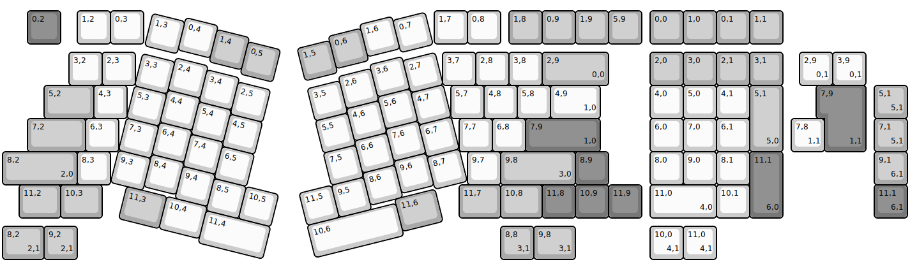{:loading="lazy"}

[Open in keyboard-layout-editor](http://www.keyboard-layout-editor.com/##@@_x:0.75&y:0.25&c=#777777;&=0,2&_x:0.5&c=#cccccc;&=1,2&=0,3&_x:8.75;&=1,7&=0,8&_x:0.25&c=#aaaaaa;&=1,8&=0,9&=1,9&=5,9&_x:0.25;&=0,0&=1,0&=0,1&=1,1;&@_x:2&y:0.25&c=#cccccc;&=3,2&=2,3&_x:9.25;&=3,7&=2,8&=3,8&_c=#aaaaaa&w:2;&=2,9%0A%0A%0A0,0&_x:1.25;&=2,0&=3,0&=2,1&=3,1;&@_x:1.25&w:1.5;&=5,2&_c=#cccccc;&=4,3&_x:9.75;&=5,7&=4,8&=5,8&_w:1.5;&=4,9%0A%0A%0A1,0&_x:1.5;&=4,0&=5,0&=4,1&_c=#aaaaaa&h:2;&=5,1%0A%0A%0A5,0;&@_x:0.75&w:1.75;&=7,2&_c=#cccccc;&=6,3&_x:10.25;&=7,7&=6,8&_c=#777777&w:2.25;&=7,9%0A%0A%0A1,0&_x:1.5&c=#cccccc;&=6,0&=7,0&=6,1;&@_c=#aaaaaa&w:2.25;&=8,2%0A%0A%0A2,0&_c=#cccccc;&=8,3&_x:10.75;&=9,7&_c=#aaaaaa&w:2.25;&=9,8%0A%0A%0A3,0&_c=#777777;&=8,9&_x:1.25&c=#cccccc;&=8,0&=9,0&=8,1&_c=#777777&h:2;&=11,1%0A%0A%0A6,0;&@_x:0.5&c=#aaaaaa&w:1.25;&=11,2&_w:1.25;&=10,3&_x:10.75&w:1.25;&=11,7&_w:1.25;&=10,8&_c=#777777;&=11,8&=10,9&=11,9&_x:0.25&c=#cccccc&w:2;&=11,0%0A%0A%0A4,0&=10,1;&@_r:14&rx:4&ry:2.5&x:1&y:-2.37;&=0,4;&@_y:-0.88;&=1,3&_x:1&c=#aaaaaa;&=1,4;&@_x:3&y:-0.87;&=0,5;&@_x:1&c=#cccccc;&=2,4;&@_y:-0.88;&=3,3&_x:1;&=3,4;&@_x:3&y:-0.87;&=2,5;&@_x:1&y:-0.25;&=4,4;&@_y:-0.88;&=5,3&_x:1;&=5,4;&@_x:3&y:-0.87;&=4,5;&@_x:1&y:-0.25;&=6,4;&@_y:-0.88;&=7,3&_x:1;&=7,4;&@_x:3&y:-0.87;&=6,5;&@_x:1&y:-0.25;&=8,4;&@_y:-0.88;&=9,3&_x:1;&=9,4;&@_x:3&y:-0.87;&=8,5&=10,5;&@_x:0.5&y:-0.13&c=#aaaaaa&w:1.25;&=11,3&_c=#cccccc&w:1.25;&=10,4;&@_x:3&y:-0.87&w:2;&=11,4;&@_r:-14&rx:13.25&x:-2.0&y:-2.37;&=1,6;&@_x:-3.0&y:-0.88&c=#aaaaaa;&=0,6&_x:1.0&c=#cccccc;&=0,7;&@_x:-4.0&y:-0.87&c=#aaaaaa;&=1,5;&@_x:-2.0&c=#cccccc;&=3,6;&@_x:-3.0&y:-0.88;&=2,6&_x:1.0;&=2,7;&@_x:-4.0&y:-0.87;&=3,5;&@_x:-2.0&y:-0.25;&=5,6;&@_x:-3.0&y:-0.88;&=4,6&_x:1.0;&=4,7;&@_x:-4.0&y:-0.87;&=5,5;&@_x:-2.0&y:-0.25;&=7,6;&@_x:-3.0&y:-0.88;&=6,6&_x:1.0;&=6,7;&@_x:-4.0&y:-0.87;&=7,5;&@_x:-2.0&y:-0.25;&=9,6;&@_x:-3.0&y:-0.88;&=8,6&_x:1.0;&=8,7;&@_x:-5.0&y:-0.87;&=11,5&=9,5;&@_x:-2.25&y:-0.13&c=#aaaaaa&w:1.25;&=11,6;&@_x:-5.0&y:-0.87&c=#cccccc&w:2.75;&=10,6;&@_r:0&rx:0&ry:0&x:24.0&y:1.5;&=2,9%0A%0A%0A0,1&=3,9%0A%0A%0A0,1;&@_x:24.75&c=#777777&w:1.25&h:2&w2:1.5&h2:1&x2:-0.25;&=7,9%0A%0A%0A1,1&_x:0.25&c=#aaaaaa;&=5,1%0A%0A%0A5,1;&@_x:23.75&c=#cccccc;&=7,8%0A%0A%0A1,1&_x:1.5&c=#aaaaaa;&=7,1%0A%0A%0A5,1;&@_x:26.25;&=9,1%0A%0A%0A6,1;&@_x:26.25&c=#777777;&=11,1%0A%0A%0A6,1;&@_y:0.25&c=#aaaaaa&w:1.25;&=8,2%0A%0A%0A2,1&=9,2%0A%0A%0A2,1&_x:12.75;&=8,8%0A%0A%0A3,1&_w:1.25;&=9,8%0A%0A%0A3,1&_x:2.25&c=#cccccc;&=10,0%0A%0A%0A4,1&=11,0%0A%0A%0A4,1)

## noxary/220/noxary_220

[README](output/noxary/220/README.md) - [layout](output/noxary/220/noxary_220-kle.json) - [PCB](output/noxary/220/noxary_220.kicad_pcb) - [PCB render](output/noxary/220/noxary_220-render.svg)

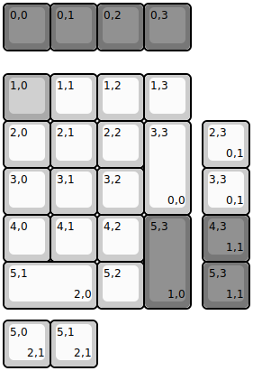{:loading="lazy"}

[Open in keyboard-layout-editor](http://www.keyboard-layout-editor.com/##@@_c=#777777;&=0,0&=0,1&=0,2&=0,3;&@_y:0.5&c=#aaaaaa;&=1,0&_c=#cccccc;&=1,1&=1,2&=1,3;&@=2,0&=2,1&=2,2&_h:2;&=3,3%0A%0A%0A0,0;&@=3,0&=3,1&=3,2;&@=4,0&=4,1&=4,2&_c=#777777&h:2;&=5,3%0A%0A%0A1,0;&@_c=#cccccc&w:2;&=5,1%0A%0A%0A2,0&=5,2;&@_x:4.25&y:-4.0;&=2,3%0A%0A%0A0,1;&@_x:4.25;&=3,3%0A%0A%0A0,1;&@_x:4.25&c=#777777;&=4,3%0A%0A%0A1,1;&@_x:4.25;&=5,3%0A%0A%0A1,1;&@_y:0.25&c=#cccccc;&=5,0%0A%0A%0A2,1&=5,1%0A%0A%0A2,1)

## noxary/260/noxary_260

[README](output/noxary/260/README.md) - [layout](output/noxary/260/noxary_260-kle.json) - [PCB](output/noxary/260/noxary_260.kicad_pcb) - [PCB render](output/noxary/260/noxary_260-render.svg)

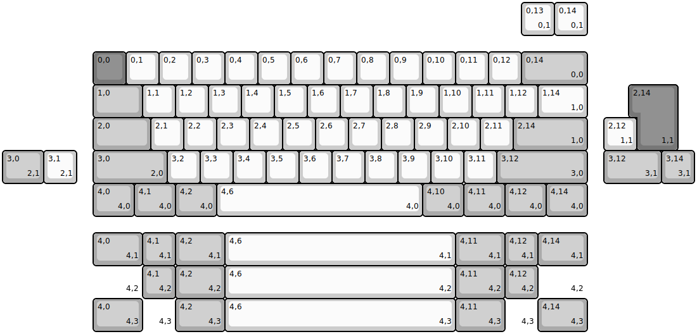{:loading="lazy"}

[Open in keyboard-layout-editor](http://www.keyboard-layout-editor.com/##@@_x:2.75&y:1.5&c=#777777;&=0,0&_c=#cccccc;&=0,1&=0,2&=0,3&=0,4&=0,5&=0,6&=0,7&=0,8&=0,9&=0,10&=0,11&=0,12&_c=#aaaaaa&w:2;&=0,14%0A%0A%0A0,0;&@_x:2.75&w:1.5;&=1,0&_c=#cccccc;&=1,1&=1,2&=1,3&=1,4&=1,5&=1,6&=1,7&=1,8&=1,9&=1,10&=1,11&=1,12&_w:1.5;&=1,14%0A%0A%0A1,0;&@_x:2.75&c=#aaaaaa&w:1.75;&=2,0&_c=#cccccc;&=2,1&=2,2&=2,3&=2,4&=2,5&=2,6&=2,7&=2,8&=2,9&=2,10&=2,11&_c=#aaaaaa&w:2.25;&=2,14%0A%0A%0A1,0;&@_x:2.75&w:2.25;&=3,0%0A%0A%0A2,0&_c=#cccccc;&=3,2&=3,3&=3,4&=3,5&=3,6&=3,7&=3,8&=3,9&=3,10&=3,11&_c=#aaaaaa&w:2.75;&=3,12%0A%0A%0A3,0;&@_x:2.75&w:1.25;&=4,0%0A%0A%0A4,0&_w:1.25;&=4,1%0A%0A%0A4,0&_w:1.25;&=4,2%0A%0A%0A4,0&_c=#cccccc&w:6.25;&=4,6%0A%0A%0A4,0&_c=#aaaaaa&w:1.25;&=4,10%0A%0A%0A4,0&_w:1.25;&=4,11%0A%0A%0A4,0&_w:1.25;&=4,12%0A%0A%0A4,0&_w:1.25;&=4,14%0A%0A%0A4,0;&@_x:15.75&y:-6.5&c=#cccccc;&=0,13%0A%0A%0A0,1&=0,14%0A%0A%0A0,1;&@_x:19.25&y:1.5&c=#777777&w:1.25&h:2&w2:1.5&h2:1&x2:-0.25;&=2,14%0A%0A%0A1,1;&@_x:18.25&c=#cccccc;&=2,12%0A%0A%0A1,1;&@_c=#aaaaaa&w:1.25;&=3,0%0A%0A%0A2,1&_c=#cccccc;&=3,1%0A%0A%0A2,1&_x:16.0&c=#aaaaaa&w:1.75;&=3,12%0A%0A%0A3,1&=3,14%0A%0A%0A3,1;&@_x:2.75&y:1.5&w:1.5;&=4,0%0A%0A%0A4,1&=4,1%0A%0A%0A4,1&_w:1.5;&=4,2%0A%0A%0A4,1&_c=#cccccc&w:7;&=4,6%0A%0A%0A4,1&_c=#aaaaaa&w:1.5;&=4,11%0A%0A%0A4,1&=4,12%0A%0A%0A4,1&_w:1.5;&=4,14%0A%0A%0A4,1;&@_x:2.75&c=#cccccc&w:1.5&d:true;&=%0A%0A%0A4,2&_c=#aaaaaa;&=4,1%0A%0A%0A4,2&_w:1.5;&=4,2%0A%0A%0A4,2&_c=#cccccc&w:7;&=4,6%0A%0A%0A4,2&_c=#aaaaaa&w:1.5;&=4,11%0A%0A%0A4,2&=4,12%0A%0A%0A4,2&_c=#cccccc&w:1.5&d:true;&=%0A%0A%0A4,2;&@_x:2.75&c=#aaaaaa&w:1.5;&=4,0%0A%0A%0A4,3&_d:true;&=%0A%0A%0A4,3&_w:1.5;&=4,2%0A%0A%0A4,3&_c=#cccccc&w:7;&=4,6%0A%0A%0A4,3&_c=#aaaaaa&w:1.5;&=4,11%0A%0A%0A4,3&_d:true;&=%0A%0A%0A4,3&_w:1.5;&=4,14%0A%0A%0A4,3)

## noxary/268/noxary_268

[README](output/noxary/268/README.md) - [layout](output/noxary/268/noxary_268-kle.json) - [PCB](output/noxary/268/noxary_268.kicad_pcb) - [PCB render](output/noxary/268/noxary_268-render.svg)

{:loading="lazy"}

[Open in keyboard-layout-editor](http://www.keyboard-layout-editor.com/##@@_x:2.5&y:1.25&c=#777777;&=0,0&_c=#cccccc;&=0,1&=0,2&=0,3&=0,4&=0,5&=0,6&=0,7&=0,8&=0,9&=0,10&=0,11&=0,12&_c=#aaaaaa&w:2;&=0,14%0A%0A%0A0,0&=0,15;&@_x:2.5&w:1.5;&=1,0&_c=#cccccc;&=1,1&=1,2&=1,3&=1,4&=1,5&=1,6&=1,7&=1,8&=1,9&=1,10&=1,11&=1,12&_w:1.5;&=1,14%0A%0A%0A1,0&_c=#aaaaaa;&=1,15;&@_x:2.5&w:1.75;&=2,0&_c=#cccccc;&=2,1&=2,2&=2,3&=2,4&=2,5&=2,6&=2,7&=2,8&=2,9&=2,10&=2,11&_c=#777777&w:2.25;&=2,14%0A%0A%0A1,0&_c=#aaaaaa;&=2,15;&@_x:2.5&w:2.25;&=3,0%0A%0A%0A2,0&_c=#cccccc;&=3,2&=3,3&=3,4&=3,5&=3,6&=3,7&=3,8&=3,9&=3,10&=3,11&_c=#aaaaaa&w:1.75;&=3,12&_c=#777777;&=3,14&_c=#aaaaaa;&=3,15;&@_x:2.5&w:1.25;&=4,0%0A%0A%0A3,0&_w:1.25;&=4,1%0A%0A%0A3,0&_w:1.25;&=4,2%0A%0A%0A3,0&_c=#cccccc&w:6.25;&=4,6%0A%0A%0A3,0&_c=#aaaaaa;&=4,9%0A%0A%0A3,0&=4,10%0A%0A%0A3,0&=4,11%0A%0A%0A3,0&_c=#777777;&=4,12&=4,14&=4,15;&@_x:15.5&y:-6.25&c=#cccccc;&=0,13%0A%0A%0A0,1&_c=#aaaaaa;&=0,14%0A%0A%0A0,1;&@_x:19.75&y:1.25&c=#777777&w:1.25&h:2&w2:1.5&h2:1&x2:-0.25;&=2,14%0A%0A%0A1,1;&@_x:18.75&c=#cccccc;&=2,12%0A%0A%0A1,1;&@_c=#aaaaaa&w:1.25;&=3,0%0A%0A%0A2,1&_c=#cccccc;&=3,1%0A%0A%0A2,1;&@_x:2.5&y:1.25&c=#aaaaaa&w:1.25;&=4,0%0A%0A%0A3,1&_w:1.25;&=4,1%0A%0A%0A3,1&_w:1.25;&=4,2%0A%0A%0A3,1&_c=#cccccc&w:6.25;&=4,6%0A%0A%0A3,1&_c=#aaaaaa&w:1.25;&=4,9%0A%0A%0A3,1&_w:1.25;&=4,10%0A%0A%0A3,1;&@_x:2.5&y:0.25&w:1.5;&=4,0%0A%0A%0A3,2&=4,1%0A%0A%0A3,2&_w:1.5;&=4,2%0A%0A%0A3,2&_c=#cccccc&w:7;&=4,6%0A%0A%0A3,2&_c=#aaaaaa&w:1.5;&=4,10%0A%0A%0A3,2;&@_x:2.5&y:0.25&w:1.5;&=4,0%0A%0A%0A3,3&_w:1.5;&=4,1%0A%0A%0A3,3&_c=#cccccc&w:7;&=4,6%0A%0A%0A3,3&_c=#aaaaaa&w:1.5;&=4,9%0A%0A%0A3,3&_w:1.5;&=4,11%0A%0A%0A3,3)

## noxary/268_2/noxary_268.2

[README](output/noxary/268_2/README.md) - [layout](output/noxary/268_2/noxary_268.2-kle.json) - [PCB](output/noxary/268_2/noxary_268.2.kicad_pcb) - [PCB render](output/noxary/268_2/noxary_268.2-render.svg)

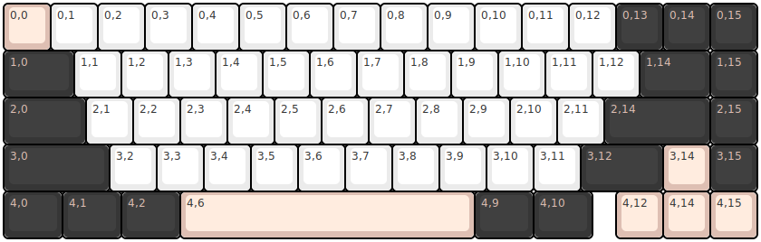{:loading="lazy"}

[Open in keyboard-layout-editor](http://www.keyboard-layout-editor.com/##@@_c=#DEBFB3&t=#363636;&=0,0&_c=#ebebeb;&=0,1&=0,2&=0,3&=0,4&=0,5&=0,6&=0,7&=0,8&=0,9&=0,10&=0,11&=0,12&_c=#363636&t=#DEBFB3;&=0,13&=0,14&=0,15;&@_w:1.5;&=1,0&_c=#ebebeb&t=#363636;&=1,1&=1,2&=1,3&=1,4&=1,5&=1,6&=1,7&=1,8&=1,9&=1,10&=1,11&=1,12&_c=#363636&t=#DEBFB3&w:1.5;&=1,14&=1,15;&@_w:1.75;&=2,0&_c=#ebebeb&t=#363636;&=2,1&=2,2&=2,3&=2,4&=2,5&=2,6&=2,7&=2,8&=2,9&=2,10&=2,11&_c=#363636&t=#DEBFB3&w:2.25;&=2,14&=2,15;&@_w:2.25;&=3,0&_c=#ebebeb&t=#363636;&=3,2&=3,3&=3,4&=3,5&=3,6&=3,7&=3,8&=3,9&=3,10&=3,11&_c=#363636&t=#DEBFB3&w:1.75;&=3,12&_c=#DEBFB3&t=#363636;&=3,14&_c=#363636&t=#DEBFB3;&=3,15;&@_w:1.25;&=4,0&_w:1.25;&=4,1&_w:1.25;&=4,2&_c=#DEBFB3&t=#363636&w:6.25;&=4,6&_c=#363636&t=#DEBFB3&w:1.25;&=4,9&_w:1.25;&=4,10&_x:0.5&c=#DEBFB3&t=#363636;&=4,12&=4,14&=4,15)

## noxary/268_2/noxary_268_2

[README](output/noxary/268_2/README.md) - [layout](output/noxary/268_2/noxary_268_2-kle.json) - [PCB](output/noxary/268_2/noxary_268_2.kicad_pcb) - [PCB render](output/noxary/268_2/noxary_268_2-render.svg)

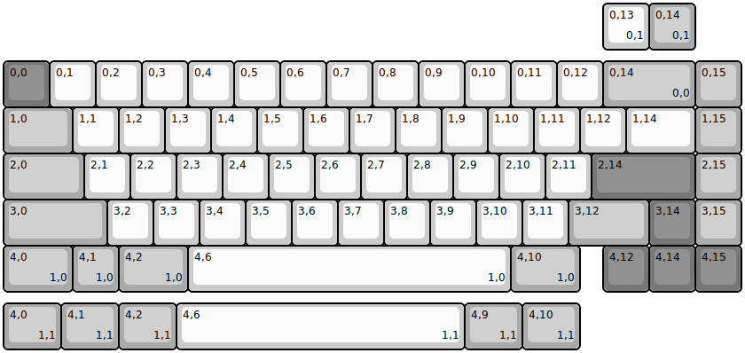{:loading="lazy"}

[Open in keyboard-layout-editor](http://www.keyboard-layout-editor.com/##@@_y:1.25&c=#777777;&=0,0&_c=#cccccc;&=0,1&=0,2&=0,3&=0,4&=0,5&=0,6&=0,7&=0,8&=0,9&=0,10&=0,11&=0,12&_c=#aaaaaa&w:2;&=0,14%0A%0A%0A0,0&=0,15;&@_w:1.5;&=1,0&_c=#cccccc;&=1,1&=1,2&=1,3&=1,4&=1,5&=1,6&=1,7&=1,8&=1,9&=1,10&=1,11&=1,12&_w:1.5;&=1,14&_c=#aaaaaa;&=1,15;&@_w:1.75;&=2,0&_c=#cccccc;&=2,1&=2,2&=2,3&=2,4&=2,5&=2,6&=2,7&=2,8&=2,9&=2,10&=2,11&_c=#777777&w:2.25;&=2,14&_c=#aaaaaa;&=2,15;&@_w:2.25;&=3,0&_c=#cccccc;&=3,2&=3,3&=3,4&=3,5&=3,6&=3,7&=3,8&=3,9&=3,10&=3,11&_c=#aaaaaa&w:1.75;&=3,12&_c=#777777;&=3,14&_c=#aaaaaa;&=3,15;&@_w:1.5;&=4,0%0A%0A%0A1,0&=4,1%0A%0A%0A1,0&_w:1.5;&=4,2%0A%0A%0A1,0&_c=#cccccc&w:7;&=4,6%0A%0A%0A1,0&_c=#aaaaaa&w:1.5;&=4,10%0A%0A%0A1,0&_x:0.5&c=#777777;&=4,12&=4,14&=4,15;&@_x:13&y:-6.25&c=#cccccc;&=0,13%0A%0A%0A0,1&_c=#aaaaaa;&=0,14%0A%0A%0A0,1;&@_y:5.5&w:1.25;&=4,0%0A%0A%0A1,1&_w:1.25;&=4,1%0A%0A%0A1,1&_w:1.25;&=4,2%0A%0A%0A1,1&_c=#cccccc&w:6.25;&=4,6%0A%0A%0A1,1&_c=#aaaaaa&w:1.25;&=4,9%0A%0A%0A1,1&_w:1.25;&=4,10%0A%0A%0A1,1)

## noxary/268_2_RGB/noxary_268_2_RGB

[README](output/noxary/268_2_RGB/README.md) - [layout](output/noxary/268_2_RGB/noxary_268_2_RGB-kle.json) - [PCB](output/noxary/268_2_RGB/noxary_268_2_RGB.kicad_pcb) - [PCB render](output/noxary/268_2_RGB/noxary_268_2_RGB-render.svg)

{:loading="lazy"}

[Open in keyboard-layout-editor](http://www.keyboard-layout-editor.com/##@@_y:1.25&c=#777777;&=0,0&_c=#cccccc;&=0,1&=0,2&=0,3&=0,4&=0,5&=0,6&=0,7&=0,8&=0,9&=0,10&=0,11&=0,12&_c=#aaaaaa&w:2;&=0,14%0A%0A%0A0,0&=0,15;&@_w:1.5;&=1,0&_c=#cccccc;&=1,1&=1,2&=1,3&=1,4&=1,5&=1,6&=1,7&=1,8&=1,9&=1,10&=1,11&=1,12&_w:1.5;&=1,14&_c=#aaaaaa;&=1,15;&@_w:1.75;&=2,0&_c=#cccccc;&=2,1&=2,2&=2,3&=2,4&=2,5&=2,6&=2,7&=2,8&=2,9&=2,10&=2,11&_c=#777777&w:2.25;&=2,14&_c=#aaaaaa;&=2,15;&@_w:2.25;&=3,0&_c=#cccccc;&=3,2&=3,3&=3,4&=3,5&=3,6&=3,7&=3,8&=3,9&=3,10&=3,11&_c=#aaaaaa&w:1.75;&=3,12&_c=#777777;&=3,14&_c=#aaaaaa;&=3,15;&@_w:1.5;&=4,0%0A%0A%0A1,0&=4,1%0A%0A%0A1,0&_w:1.5;&=4,2%0A%0A%0A1,0&_c=#cccccc&w:7;&=4,7%0A%0A%0A1,0&_c=#aaaaaa&w:1.5;&=4,11%0A%0A%0A1,0&_x:0.5&c=#777777;&=4,12&=4,14&=4,15;&@_x:13&y:-6.25&c=#cccccc;&=0,13%0A%0A%0A0,1&_c=#aaaaaa;&=0,14%0A%0A%0A0,1;&@_y:5.5&w:1.25;&=4,0%0A%0A%0A1,1&_w:1.25;&=4,1%0A%0A%0A1,1&_w:1.25;&=4,2%0A%0A%0A1,1&_c=#cccccc&w:6.25;&=4,7%0A%0A%0A1,1&_c=#aaaaaa&w:1.25;&=4,10%0A%0A%0A1,1&_w:1.25;&=4,11%0A%0A%0A1,1)

## noxary/280/noxary_280

[README](output/noxary/280/README.md) - [layout](output/noxary/280/noxary_280-kle.json) - [PCB](output/noxary/280/noxary_280.kicad_pcb) - [PCB render](output/noxary/280/noxary_280-render.svg)

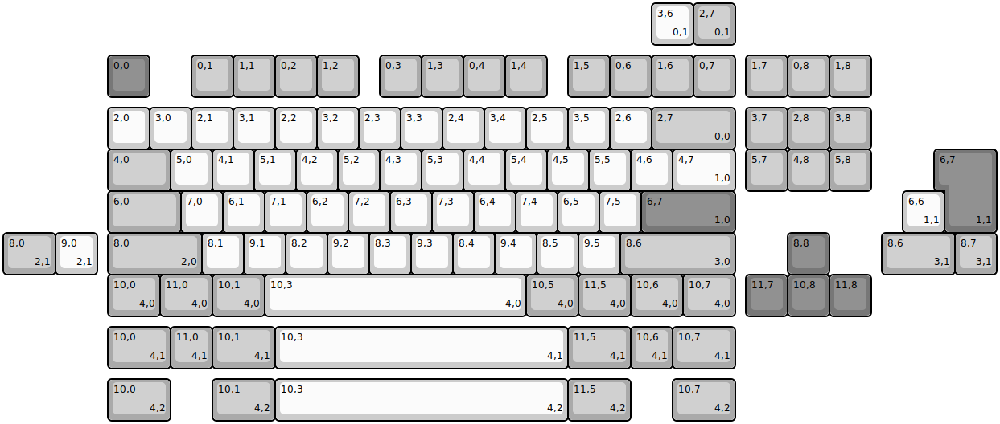{:loading="lazy"}

[Open in keyboard-layout-editor](http://www.keyboard-layout-editor.com/##@@_x:2.5&y:1.25&c=#777777;&=0,0&_x:1.0&c=#aaaaaa;&=0,1&=1,1&=0,2&=1,2&_x:0.5;&=0,3&=1,3&=0,4&=1,4&_x:0.5;&=1,5&=0,6&=1,6&=0,7&_x:0.25;&=1,7&=0,8&=1,8;&@_x:2.5&y:0.25&c=#cccccc;&=2,0&=3,0&=2,1&=3,1&=2,2&=3,2&=2,3&=3,3&=2,4&=3,4&=2,5&=3,5&=2,6&_c=#aaaaaa&w:2;&=2,7%0A%0A%0A0,0&_x:0.25;&=3,7&=2,8&=3,8;&@_x:2.5&w:1.5;&=4,0&_c=#cccccc;&=5,0&=4,1&=5,1&=4,2&=5,2&=4,3&=5,3&=4,4&=5,4&=4,5&=5,5&=4,6&_w:1.5;&=4,7%0A%0A%0A1,0&_x:0.25&c=#aaaaaa;&=5,7&=4,8&=5,8;&@_x:2.5&w:1.75;&=6,0&_c=#cccccc;&=7,0&=6,1&=7,1&=6,2&=7,2&=6,3&=7,3&=6,4&=7,4&=6,5&=7,5&_c=#777777&w:2.25;&=6,7%0A%0A%0A1,0;&@_x:2.5&c=#aaaaaa&w:2.25;&=8,0%0A%0A%0A2,0&_c=#cccccc;&=8,1&=9,1&=8,2&=9,2&=8,3&=9,3&=8,4&=9,4&=8,5&=9,5&_c=#aaaaaa&w:2.75;&=8,6%0A%0A%0A3,0&_x:1.25&c=#777777;&=8,8;&@_x:2.5&c=#aaaaaa&w:1.25;&=10,0%0A%0A%0A4,0&_w:1.25;&=11,0%0A%0A%0A4,0&_w:1.25;&=10,1%0A%0A%0A4,0&_c=#cccccc&w:6.25;&=10,3%0A%0A%0A4,0&_c=#aaaaaa&w:1.25;&=10,5%0A%0A%0A4,0&_w:1.25;&=11,5%0A%0A%0A4,0&_w:1.25;&=10,6%0A%0A%0A4,0&_w:1.25;&=10,7%0A%0A%0A4,0&_x:0.25&c=#777777;&=11,7&=10,8&=11,8;&@_x:15.5&y:-7.5&c=#cccccc;&=3,6%0A%0A%0A0,1&_c=#aaaaaa;&=2,7%0A%0A%0A0,1;&@_x:22.5&y:2.5&c=#777777&w:1.25&h:2&w2:1.5&h2:1&x2:-0.25;&=6,7%0A%0A%0A1,1;&@_x:21.5&c=#cccccc;&=6,6%0A%0A%0A1,1;&@_c=#aaaaaa&w:1.25;&=8,0%0A%0A%0A2,1&_c=#cccccc;&=9,0%0A%0A%0A2,1&_x:18.75&c=#aaaaaa&w:1.75;&=8,6%0A%0A%0A3,1&=8,7%0A%0A%0A3,1;&@_x:2.5&y:1.25&w:1.5;&=10,0%0A%0A%0A4,1&=11,0%0A%0A%0A4,1&_w:1.5;&=10,1%0A%0A%0A4,1&_c=#cccccc&w:7;&=10,3%0A%0A%0A4,1&_c=#aaaaaa&w:1.5;&=11,5%0A%0A%0A4,1&=10,6%0A%0A%0A4,1&_w:1.5;&=10,7%0A%0A%0A4,1;&@_x:2.5&y:0.25&w:1.5;&=10,0%0A%0A%0A4,2&_x:1.0&w:1.5;&=10,1%0A%0A%0A4,2&_c=#cccccc&w:7;&=10,3%0A%0A%0A4,2&_c=#aaaaaa&w:1.5;&=11,5%0A%0A%0A4,2&_x:1.0&w:1.5;&=10,7%0A%0A%0A4,2)

## noxary/378/noxary_378

[README](output/noxary/378/README.md) - [layout](output/noxary/378/noxary_378-kle.json) - [PCB](output/noxary/378/noxary_378.kicad_pcb) - [PCB render](output/noxary/378/noxary_378-render.svg)

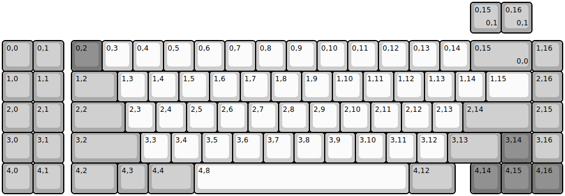{:loading="lazy"}

[Open in keyboard-layout-editor](http://www.keyboard-layout-editor.com/##@@_y:1.25&c=#aaaaaa;&=0,0&=0,1&_x:0.25&c=#777777;&=0,2&_c=#cccccc;&=0,3&=0,4&=0,5&=0,6&=0,7&=0,8&=0,9&=0,10&=0,11&=0,12&=0,13&=0,14&_c=#aaaaaa&w:2;&=0,15%0A%0A%0A0,0&=1,16;&@=1,0&=1,1&_x:0.25&w:1.5;&=1,2&_c=#cccccc;&=1,3&=1,4&=1,5&=1,6&=1,7&=1,8&=1,9&=1,10&=1,11&=1,12&=1,13&=1,14&_w:1.5;&=1,15&_c=#aaaaaa;&=2,16;&@=2,0&=2,1&_x:0.25&w:1.75;&=2,2&_c=#cccccc;&=2,3&=2,4&=2,5&=2,6&=2,7&=2,8&=2,9&=2,10&=2,11&=2,12&=2,13&_c=#aaaaaa&w:2.25;&=2,14&=2,15;&@=3,0&=3,1&_x:0.25&w:2.25;&=3,2&_c=#cccccc;&=3,3&=3,4&=3,5&=3,6&=3,7&=3,8&=3,9&=3,10&=3,11&=3,12&_c=#aaaaaa&w:1.75;&=3,13&_c=#777777;&=3,14&_c=#aaaaaa;&=3,16;&@=4,0&=4,1&_x:0.25&w:1.5;&=4,2&=4,3&_w:1.5;&=4,4&_c=#cccccc&w:7;&=4,8&_c=#aaaaaa&w:1.5;&=4,12&_x:0.5&c=#777777;&=4,14&=4,15&=4,16;&@_x:15.25&y:-6.25&c=#aaaaaa;&=0,15%0A%0A%0A0,1&=0,16%0A%0A%0A0,1)

## noxary/valhalla

[README](output/noxary/valhalla/README.md) - [layout](output/noxary/valhalla/valhalla-kle.json) - [PCB](output/noxary/valhalla/valhalla.kicad_pcb) - [PCB render](output/noxary/valhalla/valhalla-render.svg)

{:loading="lazy"}

[Open in keyboard-layout-editor](http://www.keyboard-layout-editor.com/##@@_x:3.7&y:1.2;&=0,2&_x:9.95;&=0,11;&@_x:1.7&y:-0.95;&=0,0&=0,1&_x:11.95;&=0,12&_c=#aaaaaa&w:2;&=0,13%0A%0A%0A0,0&_c=#cccccc;&=2,14;&@_x:14.5&y:-0.05;&=1,10;&@_x:1.5&y:-0.95&c=#aaaaaa&w:1.5;&=1,0&_c=#cccccc;&=1,1&_x:11.5;&=1,11&=1,12&_c=#aaaaaa&w:1.5;&=1,13&_c=#cccccc;&=1,14;&@_x:14.9;&=2,10&=2,11&_c=#aaaaaa&w:2.25;&=2,12&_c=#cccccc;&=2,13&_x:-18.85&c=#aaaaaa&w:1.75;&=2,0&_c=#cccccc;&=2,1;&@_x:1.05&c=#aaaaaa&w:2.25;&=3,0&_c=#cccccc;&=3,1&_x:10.3;&=3,10&=3,11&_c=#aaaaaa&w:1.75;&=3,12&_c=#777777;&=3,13&_c=#cccccc;&=3,14;&@_x:1.05&c=#aaaaaa&w:1.5;&=4,0&=4,1&_x:11.55&w:1.5;&=4,9&_x:0.75&c=#777777;&=4,12&=4,13&=4,14;&@_r:4.4&x:4.02&y:-1.19&c=#aaaaaa&w:1.5;&=4,2;&@_r:10&x:5.05&y:-5.56&c=#cccccc;&=0,3&=0,4&=0,5&=0,6;&@_x:4.6;&=1,2&=1,3&=1,4&=1,5;&@_x:4.85;&=2,2&=2,3&=2,4&=2,5;&@_x:5.3;&=3,2&=3,3&=3,4&=3,5;&@_x:6.1&c=#777777&w:2.75;&=4,4%0A%0A%0A1,0;&@_r:-10&x:9.95&y:-1.9&c=#cccccc;&=0,7&=0,8&=0,9&=0,10;&@_x:9.55;&=1,6&=1,7&=1,8&=1,9;&@_x:9.7;&=2,6&=2,7&=2,8&=2,9;&@_x:9.25;&=3,6&=3,7&=3,8&=3,9;&@_x:9&c=#777777&w:2.25;&=4,6%0A%0A%0A2,0&_c=#aaaaaa&w:1.5;&=4,7;&@_r:-2.5&x:13.8&y:-2.7;&=4,8;&@_r:0&x:16.65&y:-6.9;&=0,13%0A%0A%0A0,1&=0,14%0A%0A%0A0,1;&@_r:10&x:6.1&y:4.5&c=#777777&w:1.75;&=4,3%0A%0A%0A1,1&_c=#cccccc;&=4,4%0A%0A%0A1,1;&@_r:-10&x:9&y:2.1;&=4,5%0A%0A%0A2,1&_c=#777777&w:1.25;&=4,6%0A%0A%0A2,1)

## noxary/vulcan

[README](output/noxary/vulcan/README.md) - [layout](output/noxary/vulcan/vulcan-kle.json) - [PCB](output/noxary/vulcan/vulcan.kicad_pcb) - [PCB render](output/noxary/vulcan/vulcan-render.svg)

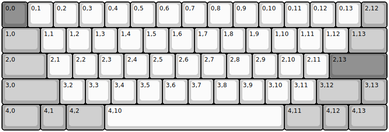{:loading="lazy"}

[Open in keyboard-layout-editor](http://www.keyboard-layout-editor.com/##@@_c=#777777;&=0,0&_c=#cccccc;&=0,1&=0,2&=0,3&=0,4&=0,5&=0,6&=0,7&=0,8&=0,9&=0,10&=0,11&=0,12&=0,13&_c=#aaaaaa;&=2,12;&@_w:1.5;&=1,0&_c=#cccccc;&=1,1&=1,2&=1,3&=1,4&=1,5&=1,6&=1,7&=1,8&=1,9&=1,10&=1,11&=1,12&_c=#aaaaaa&w:1.5;&=1,13;&@_w:1.75;&=2,0&_c=#cccccc;&=2,1&=2,2&=2,3&=2,4&=2,5&=2,6&=2,7&=2,8&=2,9&=2,10&=2,11&_c=#777777&w:2.25;&=2,13;&@_c=#aaaaaa&w:2.25;&=3,0&_c=#cccccc;&=3,2&=3,3&=3,4&=3,5&=3,6&=3,7&=3,8&=3,9&=3,10&=3,11&_c=#aaaaaa&w:1.75;&=3,12&=3,13;&@_w:1.5;&=4,0&=4,1&_w:1.5;&=4,2&_c=#cccccc&w:7;&=4,10&_c=#aaaaaa&w:1.5;&=4,11&=4,12&_w:1.5;&=4,13)

## noxary/x268/noxary_x268

[README](output/noxary/x268/README.md) - [layout](output/noxary/x268/noxary_x268-kle.json) - [PCB](output/noxary/x268/noxary_x268.kicad_pcb) - [PCB render](output/noxary/x268/noxary_x268-render.svg)

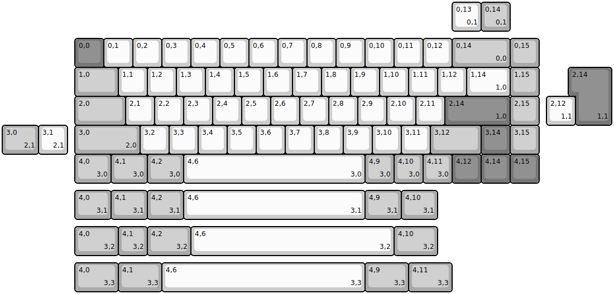{:loading="lazy"}

[Open in keyboard-layout-editor](http://www.keyboard-layout-editor.com/##@@_x:2.5&y:1.25&c=#777777;&=0,0&_c=#cccccc;&=0,1&=0,2&=0,3&=0,4&=0,5&=0,6&=0,7&=0,8&=0,9&=0,10&=0,11&=0,12&_c=#aaaaaa&w:2;&=0,14%0A%0A%0A0,0&=0,15;&@_x:2.5&w:1.5;&=1,0&_c=#cccccc;&=1,1&=1,2&=1,3&=1,4&=1,5&=1,6&=1,7&=1,8&=1,9&=1,10&=1,11&=1,12&_w:1.5;&=1,14%0A%0A%0A1,0&_c=#aaaaaa;&=1,15;&@_x:2.5&w:1.75;&=2,0&_c=#cccccc;&=2,1&=2,2&=2,3&=2,4&=2,5&=2,6&=2,7&=2,8&=2,9&=2,10&=2,11&_c=#777777&w:2.25;&=2,14%0A%0A%0A1,0&_c=#aaaaaa;&=2,15;&@_x:2.5&w:2.25;&=3,0%0A%0A%0A2,0&_c=#cccccc;&=3,2&=3,3&=3,4&=3,5&=3,6&=3,7&=3,8&=3,9&=3,10&=3,11&_c=#aaaaaa&w:1.75;&=3,12&_c=#777777;&=3,14&_c=#aaaaaa;&=3,15;&@_x:2.5&w:1.25;&=4,0%0A%0A%0A3,0&_w:1.25;&=4,1%0A%0A%0A3,0&_w:1.25;&=4,2%0A%0A%0A3,0&_c=#cccccc&w:6.25;&=4,6%0A%0A%0A3,0&_c=#aaaaaa;&=4,9%0A%0A%0A3,0&=4,10%0A%0A%0A3,0&=4,11%0A%0A%0A3,0&_c=#777777;&=4,12&=4,14&=4,15;&@_x:15.5&y:-6.25&c=#cccccc;&=0,13%0A%0A%0A0,1&_c=#aaaaaa;&=0,14%0A%0A%0A0,1;&@_x:19.75&y:1.25&c=#777777&w:1.25&h:2&w2:1.5&h2:1&x2:-0.25;&=2,14%0A%0A%0A1,1;&@_x:18.75&c=#cccccc;&=2,12%0A%0A%0A1,1;&@_c=#aaaaaa&w:1.25;&=3,0%0A%0A%0A2,1&_c=#cccccc;&=3,1%0A%0A%0A2,1;&@_x:2.5&y:1.25&c=#aaaaaa&w:1.25;&=4,0%0A%0A%0A3,1&_w:1.25;&=4,1%0A%0A%0A3,1&_w:1.25;&=4,2%0A%0A%0A3,1&_c=#cccccc&w:6.25;&=4,6%0A%0A%0A3,1&_c=#aaaaaa&w:1.25;&=4,9%0A%0A%0A3,1&_w:1.25;&=4,10%0A%0A%0A3,1;&@_x:2.5&y:0.25&w:1.5;&=4,0%0A%0A%0A3,2&=4,1%0A%0A%0A3,2&_w:1.5;&=4,2%0A%0A%0A3,2&_c=#cccccc&w:7;&=4,6%0A%0A%0A3,2&_c=#aaaaaa&w:1.5;&=4,10%0A%0A%0A3,2;&@_x:2.5&y:0.25&w:1.5;&=4,0%0A%0A%0A3,3&_w:1.5;&=4,1%0A%0A%0A3,3&_c=#cccccc&w:7;&=4,6%0A%0A%0A3,3&_c=#aaaaaa&w:1.5;&=4,9%0A%0A%0A3,3&_w:1.5;&=4,11%0A%0A%0A3,3)

## np12/np12

[README](output/np12/README.md) - [layout](output/np12/np12-kle.json) - [PCB](output/np12/np12.kicad_pcb) - [PCB render](output/np12/np12-render.svg)

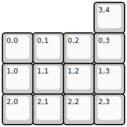{:loading="lazy"}

[Open in keyboard-layout-editor](http://www.keyboard-layout-editor.com/##@@_x:3;&=3,4;&@=0,0&=0,1&=0,2&=0,3;&@=1,0&=1,1&=1,2&=1,3;&@=2,0&=2,1&=2,2&=2,3)

## nullbitsco/nibble

[README](output/nullbitsco/README.md) - [layout](output/nullbitsco/nibble-kle.json) - [PCB](output/nullbitsco/nibble.kicad_pcb) - [PCB render](output/nullbitsco/nibble-render.svg)

{:loading="lazy"}

[Open in keyboard-layout-editor](http://www.keyboard-layout-editor.com/##@@_x:3.5&c=#777777;&=0,1&_c=#cccccc;&=0,2&=0,3&=0,4&=0,5&=0,6&=0,7&=0,8&=0,9&=0,10&=0,11&=0,12&=0,13&_c=#aaaaaa&w:2;&=0,14&_c=#777777;&=0,15;&@_x:2.5;&=1,0&_c=#aaaaaa&w:1.5;&=1,1&_c=#cccccc;&=1,2&=1,3&=1,4&=1,5&=1,6&=1,7&=1,8&=1,9&=1,10&=1,11&=1,12&=1,13&_c=#aaaaaa&w:1.5;&=1,14%0A%0A%0A3,0&_c=#777777;&=1,15;&@_x:2.5;&=2,0&_c=#aaaaaa&w:1.75;&=2,1&_c=#cccccc;&=2,2&=2,3&=2,4&=2,5&=2,6&=2,7&=2,8&=2,9&=2,10&=2,11&=2,12&_c=#aaaaaa&w:2.25;&=2,14%0A%0A%0A3,0&_c=#777777;&=2,15;&@_x:2.5;&=3,0&_c=#aaaaaa&w:2.25;&=3,1%0A%0A%0A4,0&_c=#cccccc;&=3,2&=3,3&=3,4&=3,5&=3,6&=3,7&=3,8&=3,9&=3,10&=3,11&_c=#aaaaaa&w:1.75;&=3,12&_c=#777777;&=3,14&=3,15;&@_x:2.5;&=4,0&_c=#aaaaaa&w:1.25;&=4,1%0A%0A%0A0,0&_w:1.25;&=4,2%0A%0A%0A0,0&_w:1.25;&=4,3%0A%0A%0A0,0&_c=#cccccc&w:6.25;&=4,6%0A%0A%0A1,0&_c=#aaaaaa;&=4,9%0A%0A%0A2,0&=4,10%0A%0A%0A2,0&=4,11%0A%0A%0A2,0&_c=#777777;&=4,12&=4,14&=4,15;&@_x:20.75&y:-4&w:1.25&h:2&w2:1.5&h2:1&x2:-0.25;&=2,14%0A%0A%0A3,1;&@_x:19.75&c=#cccccc;&=1,14%0A%0A%0A3,1;&@_c=#aaaaaa&w:1.25;&=3,1%0A%0A%0A4,1&=0,0%0A%0A%0A4,1;&@_x:3.5&y:1&w:1.5;&=4,1%0A%0A%0A0,1&_w:1.5;&=4,2%0A%0A%0A0,1&_x:0.75&c=#cccccc&w:2.75;&=4,6%0A%0A%0A1,1&_w:1.25;&=4,9%0A%0A%0A1,1&_w:2.25;&=4,6%0A%0A%0A1,1&_c=#aaaaaa&w:1.5;&=4,10%0A%0A%0A2,1&_w:1.5;&=4,11%0A%0A%0A2,1)

## nullbitsco/scramble

[README](output/nullbitsco/README.md) - [layout](output/nullbitsco/scramble-kle.json) - [PCB](output/nullbitsco/scramble.kicad_pcb) - [PCB render](output/nullbitsco/scramble-render.svg)

{:loading="lazy"}

[Open in keyboard-layout-editor](http://www.keyboard-layout-editor.com/##@@_c=#777777;&=0,0&=0,1&=0,2;&@=1,0&=1,1&=1,2)

## nullbitsco/snap

[README](output/nullbitsco/README.md) - [layout](output/nullbitsco/snap-kle.json) - [PCB](output/nullbitsco/snap.kicad_pcb) - [PCB render](output/nullbitsco/snap-render.svg)

{:loading="lazy"}

[Open in keyboard-layout-editor](http://www.keyboard-layout-editor.com/##@@_x:3.5&y:1.25&c=#aaaaaa;&=0,1&=0,2&=0,3&=0,4&=0,5&=0,6&=0,7&=6,0&=6,1&=6,2&=6,3&=6,4&=6,5&=6,6&=6,7;&@_x:2.5&c=#777777;&=1,0%0A%0A%0A6,0%0A%0A%0A%0A%0A%0Ae0&_c=#cccccc;&=1,1&=1,2&=1,3&=1,4&=1,5&=1,6&=1,7&=7,0&=7,1&=7,2&=7,3&=7,4&=7,5&_c=#aaaaaa&w:2;&=7,6%0A%0A%0A5,0&_c=#777777;&=8,8%0A%0A%0A7,0%0A%0A%0A%0A%0A%0Ae1;&@_x:2.5;&=2,0&_c=#aaaaaa&w:1.5;&=2,1&_c=#cccccc;&=2,2&=2,3&=2,4&=2,5&=2,7&=8,0&=8,1&=8,2&=8,3&=8,4&=8,5&=8,6&_w:1.5;&=9,7%0A%0A%0A2,0&_c=#777777;&=8,7;&@_x:2.5;&=3,0&_c=#aaaaaa&w:1.75;&=3,1&_c=#cccccc;&=3,2&=3,3&=3,4&=3,5&=3,7&=9,0&=9,1&=9,2&=9,3&=9,4&=9,5&_c=#aaaaaa&w:2.25;&=9,6%0A%0A%0A2,0&_c=#777777;&=10,7;&@_x:2.5;&=4,0&_c=#aaaaaa&w:2.25;&=4,1%0A%0A%0A3,0&_c=#cccccc;&=4,3&=4,4&=4,5&=4,6&=4,7&=10,0&=10,1&=10,2&=10,3&=10,4&_c=#aaaaaa&w:1.75;&=10,5%0A%0A%0A4,0&_c=#777777;&=10,6%0A%0A%0A4,0&=11,7;&@_x:2.5;&=5,0&_c=#aaaaaa&w:1.25;&=5,1&_w:1.25;&=5,2&_w:1.25;&=5,3&_w:1.25;&=5,5%0A%0A%0A0,0&_w:2.25;&=5,7%0A%0A%0A0,0&_w:2.75;&=11,0&=11,1%0A%0A%0A1,0&=11,2%0A%0A%0A1,0&=11,3%0A%0A%0A1,0&_c=#777777;&=11,4%0A%0A%0A1,0&=11,5%0A%0A%0A1,0&=11,6;&@_x:16.5&y:-7.25&c=#cccccc;&=7,6%0A%0A%0A5,1&_c=#aaaaaa;&=7,7%0A%0A%0A5,1;&@_x:1.25&y:1.25;&=1,0%0A%0A%0A6,1&_x:17.5;&=8,8%0A%0A%0A7,1;&@_x:21.25&w:1.25&h:2&w2:1.5&h2:1&x2:-0.25;&=9,6%0A%0A%0A2,1;&@_x:20.25&c=#cccccc;&=9,7%0A%0A%0A2,1;&@_c=#aaaaaa&w:1.25;&=4,1%0A%0A%0A3,1&_c=#cccccc;&=4,2%0A%0A%0A3,1&_x:17.5&c=#aaaaaa&w:2.75;&=10,5%0A%0A%0A4,1;&@_x:7.25&y:1.25&w:2.25;&=5,5%0A%0A%0A0,1&_w:1.25;&=5,7%0A%0A%0A0,1&_x:2.75&w:1.25;&=11,1%0A%0A%0A1,1&_w:1.25;&=11,2%0A%0A%0A1,1&_w:1.25;&=11,4%0A%0A%0A1,1&_w:1.25;&=11,5%0A%0A%0A1,1)

## nullbitsco/tidbit

[README](output/nullbitsco/README.md) - [layout](output/nullbitsco/tidbit-kle.json) - [PCB](output/nullbitsco/tidbit.kicad_pcb) - [PCB render](output/nullbitsco/tidbit-render.svg)

{:loading="lazy"}

[Open in keyboard-layout-editor](http://www.keyboard-layout-editor.com/##@@_x:3.25;&=0,3&=0,4&=0,5;&@_x:2.25;&=1,2%0A%0A%0A2,0%0A%0A%0A%0A%0A%0Ae0&=1,3&_x:-1.0;&=1,3&=1,4&=1,5%0A%0A%0A0,0;&@_x:2.25;&=2,2%0A%0A%0A3,0%0A%0A%0A%0A%0A%0Ae1&=2,3&=2,4&=2,5%0A%0A%0A0,0;&@_x:2.25;&=3,2%0A%0A%0A4,0%0A%0A%0A%0A%0A%0Ae2&=3,3&=3,4&=3,5%0A%0A%0A1,0;&@_x:2.25;&=4,2%0A%0A%0A5,0&=4,3%0A%0A%0A5,0&=4,4&=4,5%0A%0A%0A1,0;&@_x:1&y:-4;&=1,2%0A%0A%0A2,1&_x:4.5&h:2;&=1,5%0A%0A%0A0,1;&@_x:1;&=2,2%0A%0A%0A3,1;&@_x:1;&=3,2%0A%0A%0A4,1&_x:4.5&h:2;&=3,5%0A%0A%0A1,1;&@_x:1;&=4,2%0A%0A%0A5,2%0A%0A%0A%0A%0A%0Ae3&=4,3%0A%0A%0A5,2;&@_x:2.25&y:0.25&w:2;&=4,2%0A%0A%0A5,1)

## nyhxis/nfr_70

[README](output/nyhxis/nfr_70/README.md) - [layout](output/nyhxis/nfr_70/nfr_70-kle.json) - [PCB](output/nyhxis/nfr_70/nfr_70.kicad_pcb) - [PCB render](output/nyhxis/nfr_70/nfr_70-render.svg)

{:loading="lazy"}

[Open in keyboard-layout-editor](http://www.keyboard-layout-editor.com/##@@_x:2.5&c=#777777;&=0,0&_x:0.25&c=#aaaaaa;&=1,0&=0,1&=1,1&=0,2&_x:0.25;&=1,2&=0,3&=1,3&=0,4&_x:0.25;&=1,4&=0,5&=1,5&=0,6&_x:0.25;&=1,6;&@_x:2.5&y:0.25&c=#cccccc;&=3,0&=2,0&=3,1&=2,1&=3,2&=2,2&=3,3&=2,3&=3,4&=2,4&=3,5&=2,5&=3,6&_c=#aaaaaa&w:2;&=6,6%0A%0A%0A1,0;&@_x:2.5&w:1.5;&=4,0&_c=#cccccc;&=5,0&=4,1&=5,1&=4,2&=5,2&=4,3&=5,3&=4,4&=5,4&=4,5&=5,5&=4,6&_w:1.5;&=5,6%0A%0A%0A0,0;&@_x:2.5&c=#aaaaaa&w:1.75;&=7,0&_c=#cccccc;&=6,0&=7,1&=6,1&=7,2&=6,2&=7,3&=6,3&=7,4&=6,4&=7,5&=6,5&_c=#777777&w:2.25;&=7,6%0A%0A%0A0,0;&@_x:2.5&c=#aaaaaa&w:2.25;&=8,0%0A%0A%0A2,0&_c=#cccccc;&=8,1&=9,1&=8,2&=9,2&=8,3&=9,3&=8,4&=9,4&=8,5&=9,5&_c=#aaaaaa&w:2.75;&=8,6%0A%0A%0A3,0;&@_x:2.5&w:1.25;&=10,0%0A%0A%0A4,0&_w:1.25;&=10,1%0A%0A%0A4,0&_w:1.25;&=10,2%0A%0A%0A4,0&_w:6.25;&=10,3%0A%0A%0A4,0&_w:1.25;&=9,6%0A%0A%0A4,0&_w:1.25;&=10,4%0A%0A%0A4,0&_w:1.25;&=10,5%0A%0A%0A4,0&_w:1.25;&=10,6%0A%0A%0A4,0;&@_x:18.5&y:-5.0;&=2,6%0A%0A%0A1,1&=6,6%0A%0A%0A1,1;&@_x:19.25&c=#777777&w:1.25&h:2&w2:1.5&h2:1&x2:-0.25;&=7,6%0A%0A%0A0,1;&@_x:18.25&c=#cccccc;&=5,6%0A%0A%0A0,1;&@_c=#aaaaaa&w:1.25;&=8,0%0A%0A%0A2,1&_c=#cccccc;&=9,0%0A%0A%0A2,1&_x:15.5&c=#aaaaaa&w:1.75;&=8,6%0A%0A%0A3,1&=9,6%0A%0A%0A3,1;&@_x:2.5&y:1.25&w:1.5;&=10,0%0A%0A%0A4,1&=10,1%0A%0A%0A4,1&_w:1.5;&=10,2%0A%0A%0A4,1&_w:7;&=10,3%0A%0A%0A4,1&_w:1.5;&=10,4%0A%0A%0A4,1&=10,5%0A%0A%0A4,1&_w:1.5;&=10,6%0A%0A%0A4,1)

## ocean/addon

[README](output/ocean/addon/README.md) - [layout](output/ocean/addon/addon-kle.json) - [PCB](output/ocean/addon/addon.kicad_pcb) - [PCB render](output/ocean/addon/addon-render.svg)

{:loading="lazy"}

[Open in keyboard-layout-editor](http://www.keyboard-layout-editor.com/##@@=0,0&=0,1&=0,2&_x:0.25;&=0,3&=0,4&=0,5&=0,6;&@=1,0&=1,1&=1,2&_x:0.25;&=1,3&=1,4&=1,5&_h:2;&=2,6%0A%0A%0A2,0;&@=2,0&=2,1&=2,2&_x:0.25;&=2,3&=2,4&=2,5;&@=3,0&=3,1&=3,2&_x:0.25;&=3,3&=3,4&=3,5&_h:2;&=4,6%0A%0A%0A1,0;&@=4,0&=4,1&=4,2&_x:0.25&w:2;&=4,3%0A%0A%0A0,0&=4,5;&@_x:7.5&y:-4;&=1,6%0A%0A%0A2,1;&@_x:7.5;&=2,6%0A%0A%0A2,1;&@_x:7.5;&=3,6%0A%0A%0A1,1;&@_x:7.5;&=4,6%0A%0A%0A1,1;&@_x:3.25&y:0.25;&=4,3%0A%0A%0A0,1&=4,4%0A%0A%0A0,1)

## ocean/gin_v2

[README](output/ocean/gin_v2/README.md) - [layout](output/ocean/gin_v2/gin_v2-kle.json) - [PCB](output/ocean/gin_v2/gin_v2.kicad_pcb) - [PCB render](output/ocean/gin_v2/gin_v2-render.svg)

{:loading="lazy"}

[Open in keyboard-layout-editor](http://www.keyboard-layout-editor.com/##@@_c=#dbdbdc;&=0,0&=1,0&=0,1&_x:0.25;&=1,1&=0,2&=1,2&=0,3&=1,3&=0,4&=1,4&=0,5&=1,5&=0,6&=1,6&=0,7&=2,7;&@=2,0&=3,0&=2,1&_x:0.25&w:1.25;&=3,1&=2,2&=3,2&=2,3&=3,3&=2,4&=3,4&=2,5&=3,5&=2,6&=3,6&_w:1.75;&=4,7;&@=4,0&=5,0&=4,1&_x:0.25&w:1.75;&=5,1&=4,2&=5,2&=4,3&=5,3&=4,4&=5,4&=4,5&=5,5&=4,6&=5,6&_w:1.25;&=6,7;&@_c=#239899;&=6,0%0A%0A%0A0,0&=7,0%0A%0A%0A0,0&_c=#dbdbdc;&=6,1&_x:0.25&w:1.25;&=7,1%0A%0A%0A1,0&_w:1.25;&=6,2%0A%0A%0A1,0&_w:1.25;&=7,2%0A%0A%0A1,0&_c=#239899&w:2.25;&=6,3%0A%0A%0A1,0&_w:2.75;&=7,4%0A%0A%0A1,0&_w:1.25;&=6,5%0A%0A%0A1,0&_c=#dbdbdc;&=7,5%0A%0A%0A1,0&=6,6%0A%0A%0A1,0&=7,6%0A%0A%0A1,0;&@_y:0.25&c=#239899&w:2;&=6,0%0A%0A%0A0,1&_x:1.25&c=#dbdbdc&w:1.25;&=7,1%0A%0A%0A1,1&_w:1.25;&=6,2%0A%0A%0A1,1&_w:1.25;&=7,2%0A%0A%0A1,1&_c=#239899&w:6.25;&=7,4%0A%0A%0A1,1&_c=#dbdbdc;&=7,5%0A%0A%0A1,1&=6,6%0A%0A%0A1,1&=7,6%0A%0A%0A1,1;&@_x:3.25&w:1.5;&=7,1%0A%0A%0A1,2&=6,2%0A%0A%0A1,2&_w:1.5;&=7,2%0A%0A%0A1,2&_c=#239899&w:2.25;&=6,3%0A%0A%0A1,2&_w:2.75;&=7,4%0A%0A%0A1,2&_c=#dbdbdc&w:1.5;&=6,5%0A%0A%0A1,2&=7,5%0A%0A%0A1,2&_w:1.5;&=6,6%0A%0A%0A1,2)

## ocean/slamz

[README](output/ocean/slamz/README.md) - [layout](output/ocean/slamz/slamz-kle.json) - [PCB](output/ocean/slamz/slamz.kicad_pcb) - [PCB render](output/ocean/slamz/slamz-render.svg)

{:loading="lazy"}

[Open in keyboard-layout-editor](http://www.keyboard-layout-editor.com/##@@=0,0&=0,1&=0,2&=0,3&=0,4&_x:2;&=0,5&=0,6&=0,7&=0,8&=0,9;&@=1,0&=1,1&=1,2&=1,3&=1,4&_x:2;&=1,5&=1,6&=1,7&=1,8&=1,9;&@=2,0&=2,1&=2,2&=2,3&=2,4&_x:2;&=2,5&=2,6&=2,7&=2,8&=2,9;&@=3,0&=3,1&=3,2&=3,3%0A%0A%0A0,0&=3,4%0A%0A%0A0,0&_x:2;&=3,5%0A%0A%0A1,0&=3,6%0A%0A%0A1,0&=3,7&=3,8&=3,9;&@_x:3&y:0.25&w:2;&=3,4%0A%0A%0A0,1&_x:2&w:2;&=3,5%0A%0A%0A1,1)

## ocean/stealth

[README](output/ocean/stealth/README.md) - [layout](output/ocean/stealth/stealth-kle.json) - [PCB](output/ocean/stealth/stealth.kicad_pcb) - [PCB render](output/ocean/stealth/stealth-render.svg)

{:loading="lazy"}

[Open in keyboard-layout-editor](http://www.keyboard-layout-editor.com/##@@_w:2.25;&=0,0;&@_w:1.25;&=0,1&=0,2)

## ocean/sus

[README](output/ocean/sus/README.md) - [layout](output/ocean/sus/sus-kle.json) - [PCB](output/ocean/sus/sus.kicad_pcb) - [PCB render](output/ocean/sus/sus-render.svg)

{:loading="lazy"}

[Open in keyboard-layout-editor](http://www.keyboard-layout-editor.com/##@@_x:2&c=#aaaaaa&h:1.25;&=0,1;&@_x:1&y:-0.75;&=0,0&_x:1;&=0,2;&@_h:2;&=3,0&=1,0&=1,1&_c=#777777&w:1.25;&=1,2;&@_x:1&c=#cccccc;&=2,0&=2,1&=2,2;&@_x:1&h:1.25;&=3,1&_x:1&h:1.25;&=3,2)

## ocean/wang_ergo

[README](output/ocean/wang_ergo/README.md) - [layout](output/ocean/wang_ergo/wang_ergo-kle.json) - [PCB](output/ocean/wang_ergo/wang_ergo.kicad_pcb) - [PCB render](output/ocean/wang_ergo/wang_ergo-render.svg)

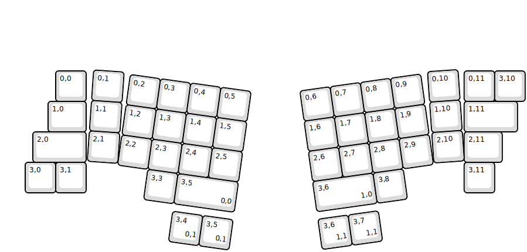{:loading="lazy"}

[Open in keyboard-layout-editor](http://www.keyboard-layout-editor.com/##@@_x:1.75&y:2.25&c=#dbdbdc;&=0,0&_x:12.4;&=0,11&=3,10;&@_x:1.5&w:1.25;&=1,0&_x:12.4&w:1.75;&=1,11;&@_x:1&w:1.75;&=2,0&_x:12.4&w:1.25;&=2,11;&@_x:0.75;&=3,0&=3,1&_x:12.4;&=3,11;&@_r:4&x:3.15&y:-4.25;&=0,1;&@_x:3.15;&=1,1;&@_x:3.15;&=2,1;&@_r:8&x:4.5&y:-3.25;&=0,2&=0,3&=0,4&=0,5;&@_x:4.5;&=1,2&=1,3&=1,4&=1,5;&@_x:4.5;&=2,2&=2,3&=2,4&=2,5;&@_x:5.5;&=3,3&_w:2;&=3,5%0A%0A%0A0,0;&@_r:-8&x:9.25&y:-1.5;&=0,6&=0,7&=0,8&=0,9;&@_x:9.25;&=1,6&=1,7&=1,8&=1,9;&@_x:9.25;&=2,6&=2,7&=2,8&=2,9;&@_x:9.25&w:2;&=3,6%0A%0A%0A1,0&=3,8;&@_r:-4&x:13.75&y:-5.0;&=0,10;&@_x:13.75;&=1,10;&@_x:13.75;&=2,10;&@_r:8&x:6.5&y:-0.25;&=3,4%0A%0A%0A0,1&=3,5%0A%0A%0A0,1;&@_r:-8&x:9.25&y:1.5;&=3,6%0A%0A%0A1,1&=3,7%0A%0A%0A1,1)

## ocean/wang_v2

[README](output/ocean/wang_v2/README.md) - [layout](output/ocean/wang_v2/wang_v2-kle.json) - [PCB](output/ocean/wang_v2/wang_v2.kicad_pcb) - [PCB render](output/ocean/wang_v2/wang_v2-render.svg)

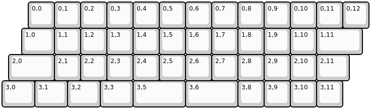{:loading="lazy"}

[Open in keyboard-layout-editor](http://www.keyboard-layout-editor.com/##@@_x:1;&=0,0&=0,1&=0,2&=0,3&=0,4&=0,5&=0,6&=0,7&=0,8&=0,9&=0,10&=0,11&=0,12;&@_x:0.75&w:1.25;&=1,0&=1,1&=1,2&=1,3&=1,4&=1,5&=1,6&=1,7&=1,8&=1,9&=1,10&_w:1.75;&=1,11;&@_x:0.25&w:1.75;&=2,0&=2,1&=2,2&=2,3&=2,4&=2,5&=2,6&=2,7&=2,8&=2,9&=2,10&_w:1.25;&=2,11;&@_w:1.25;&=3,0&_w:1.25;&=3,1&_w:1.25;&=3,2&_w:1.25;&=3,3&_w:2;&=3,5&_w:2;&=3,6&=3,8&=3,9&=3,10&=3,11)

## ocean/yuri

[README](output/ocean/yuri/README.md) - [layout](output/ocean/yuri/yuri-kle.json) - [PCB](output/ocean/yuri/yuri.kicad_pcb) - [PCB render](output/ocean/yuri/yuri-render.svg)

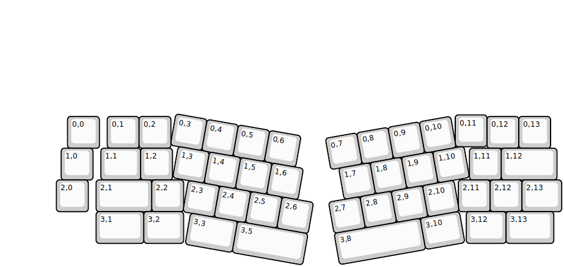{:loading="lazy"}

[Open in keyboard-layout-editor](http://www.keyboard-layout-editor.com/##@@_x:14.25&y:3.55;&=0,11;&@_x:2.05&y:-0.95;&=0,0&_x:0.25;&=0,1&=0,2&_x:9.95;&=0,12&=0,13;&@_x:1.85;&=1,0&_x:0.25&w:1.25;&=1,1&=1,2&_x:9.35;&=1,11&_w:1.75;&=1,12;&@_x:1.7;&=2,0&_x:0.25&w:1.75;&=2,1&=2,2&_x:8.65;&=2,11&=2,12&_w:1.25;&=2,13;&@_x:2.95&w:1.5;&=3,1&_w:1.25;&=3,2&_x:8.9&w:1.25;&=3,12&_w:1.5;&=3,13;&@_r:10&x:6&y:-5.1;&=0,3&=0,4&=0,5&=0,6;&@_x:6.25;&=1,3&=1,4&=1,5&=1,6;&@_x:6.75;&=2,3&=2,4&=2,5&=2,6;&@_x:7&w:1.5;&=3,3&_w:2.25;&=3,5;&@_r:-10&x:9.25&y:-0.5;&=0,7&=0,8&=0,9&=0,10;&@_x:9.5;&=1,7&=1,8&=1,9&=1,10;&@_x:9;&=2,7&=2,8&=2,9&=2,10;&@_x:9&w:2.75;&=3,8&_w:1.25;&=3,10)

## oddforge/oddforge_vea

[README](output/oddforge/README.md) - [layout](output/oddforge/oddforge_vea-kle.json) - [PCB](output/oddforge/oddforge_vea.kicad_pcb) - [PCB render](output/oddforge/oddforge_vea-render.svg)

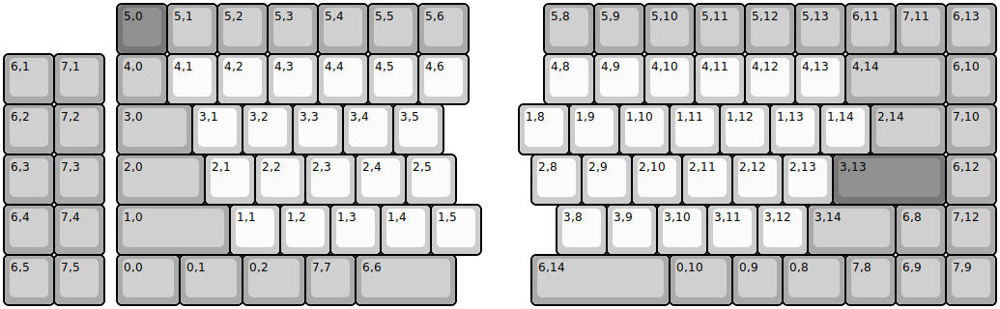{:loading="lazy"}

[Open in keyboard-layout-editor](http://www.keyboard-layout-editor.com/##@@_x:2.25&c=#777777;&=5,0&_c=#aaaaaa;&=5,1&=5,2&=5,3&=5,4&=5,5&=5,6&_x:1.5;&=5,8&=5,9&=5,10&=5,11&=5,12&=5,13&=6,11&=7,11&=6,13;&@=6,1&=7,1&_x:0.25;&=4,0&_c=#cccccc;&=4,1&=4,2&=4,3&=4,4&=4,5&=4,6&_x:1.5;&=4,8&=4,9&=4,10&=4,11&=4,12&=4,13&_c=#aaaaaa&w:2;&=4,14&=6,10;&@=6,2&=7,2&_x:0.25&w:1.5;&=3,0&_c=#cccccc;&=3,1&=3,2&=3,3&=3,4&=3,5&_x:1.5;&=1,8&=1,9&=1,10&=1,11&=1,12&=1,13&=1,14&_c=#aaaaaa&w:1.5;&=2,14&=7,10;&@=6,3&=7,3&_x:0.25&w:1.75;&=2,0&_c=#cccccc;&=2,1&=2,2&=2,3&=2,4&=2,5&_x:1.5;&=2,8&=2,9&=2,10&=2,11&=2,12&=2,13&_c=#777777&w:2.25;&=3,13&_c=#aaaaaa;&=6,12;&@=6,4&=7,4&_x:0.25&w:2.25;&=1,0&_c=#cccccc;&=1,1&=1,2&=1,3&=1,4&=1,5&_x:1.5;&=3,8&=3,9&=3,10&=3,11&=3,12&_c=#aaaaaa&w:1.75;&=3,14&=6,8&=7,12;&@=6,5&=7,5&_x:0.25&w:1.25;&=0,0&_w:1.25;&=0,1&_w:1.25;&=0,2&=7,7&_w:2;&=6,6&_x:1.5&w:2.75;&=6,14&_w:1.25;&=0,10&=0,9&_w:1.25;&=0,8&=7,8&=6,9&=7,9)

## odelia/odelia

[README](output/odelia/README.md) - [layout](output/odelia/odelia-kle.json) - [PCB](output/odelia/odelia.kicad_pcb) - [PCB render](output/odelia/odelia-render.svg)

{:loading="lazy"}

[Open in keyboard-layout-editor](http://www.keyboard-layout-editor.com/##@@=1,0&=0,0&_x:0.5&c=#777777;&=1,1&_c=#cccccc;&=0,1&=1,2&=0,2&=1,3&=0,3&=1,4&=0,4&=1,5&=0,5&=1,6&=0,6&=1,7&_c=#aaaaaa&w:2;&=0,7&=1,8&_x:0.5&c=#cccccc;&=0,8&=1,9;&@=3,0&=2,0&_x:0.5&c=#aaaaaa&w:1.5;&=3,1&_c=#cccccc;&=2,1&=3,2&=2,2&=3,3&=2,3&=3,4&=2,4&=3,5&=2,5&=3,6&=2,6&=3,7&_w:1.5;&=2,7&_c=#aaaaaa;&=3,8&_x:0.5&c=#cccccc;&=2,8&=3,9;&@=4,0&=5,0&_x:0.5&c=#aaaaaa&w:1.75;&=4,1&_c=#cccccc;&=5,1&=4,2&=5,2&=4,3&=5,3&=4,4&=5,4&=4,5&=5,5&=4,6&=5,6&_c=#777777&w:2.25;&=4,7&_c=#aaaaaa;&=5,8&_x:0.5&c=#cccccc;&=4,8&=5,9;&@=6,0&=7,0&_x:0.5&c=#aaaaaa&w:2.25;&=6,1&_c=#cccccc;&=7,1&=6,2&=7,2&=6,3&=7,3&=6,4&=7,4&=6,5&=7,5&=6,6&_c=#aaaaaa&w:1.75;&=7,6&_c=#cccccc;&=6,7&_c=#aaaaaa;&=7,8&_x:0.5&c=#cccccc;&=6,8&=7,9;&@=8,0&=9,0&_x:0.5&c=#aaaaaa&w:1.5;&=8,1&=9,1&_w:1.5;&=8,2&_c=#cccccc&w:7;&=9,3&_c=#aaaaaa&w:1.5;&=8,6&_x:0.5&c=#cccccc;&=9,6&=8,7&=9,8&_x:0.5;&=8,8&=9,9)

## oem_iso_fullsize/oem_iso_fullsize

[README](output/oem_iso_fullsize/README.md) - [layout](output/oem_iso_fullsize/oem_iso_fullsize-kle.json) - [PCB](output/oem_iso_fullsize/oem_iso_fullsize.kicad_pcb) - [PCB render](output/oem_iso_fullsize/oem_iso_fullsize-render.svg)

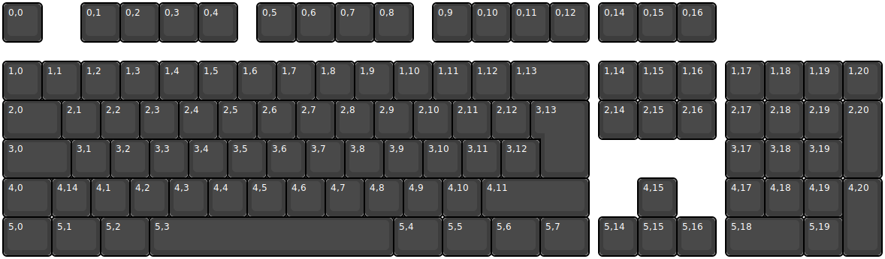{:loading="lazy"}

[Open in keyboard-layout-editor](http://www.keyboard-layout-editor.com/##@_name=oem_iso_fullsize;&@_c=#3d3d3d&t=#ffffff;&=0,0&_x:1;&=0,1&=0,2&=0,3&=0,4&_x:0.5;&=0,5&=0,6&=0,7&=0,8&_x:0.5;&=0,9&=0,10&=0,11&=0,12&_x:0.25;&=0,14&=0,15&=0,16;&@_y:0.5;&=1,0&=1,1&=1,2&=1,3&=1,4&=1,5&=1,6&=1,7&=1,8&=1,9&=1,10&=1,11&=1,12&_w:2;&=1,13&_x:0.25;&=1,14&=1,15&=1,16&_x:0.25;&=1,17&=1,18&=1,19&=1,20;&@_w:1.5;&=2,0&=2,1&=2,2&=2,3&=2,4&=2,5&=2,6&=2,7&=2,8&=2,9&=2,10&=2,11&=2,12&_x:0.25&w:1.25&h:2&w2:1.5&h2:1&x2:-0.25;&=3,13&_x:0.25;&=2,14&=2,15&=2,16&_x:0.25;&=2,17&=2,18&=2,19&_h:2;&=2,20;&@_w:1.75;&=3,0&=3,1&=3,2&=3,3&=3,4&=3,5&=3,6&=3,7&=3,8&=3,9&=3,10&=3,11&=3,12&_x:4.75;&=3,17&=3,18&=3,19;&@_w:1.25;&=4,0&=4,14&=4,1&=4,2&=4,3&=4,4&=4,5&=4,6&=4,7&=4,8&=4,9&=4,10&_w:2.75;&=4,11&_x:1.25;&=4,15&_x:1.25;&=4,17&=4,18&=4,19&_h:2;&=4,20;&@_w:1.25;&=5,0&_w:1.25;&=5,1&_w:1.25;&=5,2&_w:6.25;&=5,3&_w:1.25;&=5,4&_w:1.25;&=5,5&_w:1.25;&=5,6&_w:1.25;&=5,7&_x:0.25;&=5,14&=5,15&=5,16&_x:0.25&w:2;&=5,18&=5,19)

## olkb/planck/rev4/olkb-planck-rev4

[README](output/olkb/planck/rev4/README.md) - [layout](output/olkb/planck/rev4/olkb-planck-rev4-kle.json) - [PCB](output/olkb/planck/rev4/olkb-planck-rev4.kicad_pcb) - [PCB render](output/olkb/planck/rev4/olkb-planck-rev4-render.svg)

{:loading="lazy"}

[Open in keyboard-layout-editor](http://www.keyboard-layout-editor.com/##@@_c=#aaaaaa;&=0,0&_c=#cccccc;&=0,1&=0,2&=0,3&=0,4&=0,5&=0,6&=0,7&=0,8&=0,9&=0,10&_c=#aaaaaa;&=0,11;&@=1,0&_c=#cccccc;&=1,1&=1,2&=1,3&=1,4&=1,5&=1,6&=1,7&=1,8&=1,9&=1,10&_c=#aaaaaa;&=1,11;&@=2,0&_c=#cccccc;&=2,1&=2,2&=2,3&=2,4&=2,5&=2,6&=2,7&=2,8&=2,9&=2,10&_c=#aaaaaa;&=2,11;&@=3,0&=3,1&=3,2&=3,3&_c=#777777;&=3,4&_c=#cccccc;&=3,5%0A%0A%0A0,0&=3,6%0A%0A%0A0,0&_c=#777777;&=3,7&_c=#aaaaaa;&=3,8&=3,9&=3,10&=3,11;&@_c=#cccccc&w:2;&=3,5%0A%0A%0A0,1)

## olkb/planck/rev6/olkb-planck-rev6.1

[README](output/olkb/planck/rev6/README.md) - [layout](output/olkb/planck/rev6/olkb-planck-rev6.1-kle.json) - [PCB](output/olkb/planck/rev6/olkb-planck-rev6.1.kicad_pcb) - [PCB render](output/olkb/planck/rev6/olkb-planck-rev6.1-render.svg)

{:loading="lazy"}

[Open in keyboard-layout-editor](http://www.keyboard-layout-editor.com/##@@_c=#aaaaaa;&=0,0&_c=#cccccc;&=0,1&=0,2&=0,3&=0,4&=0,5&=4,0&=4,1&=4,2&=4,3&=4,4&_c=#aaaaaa;&=4,5;&@=1,0&_c=#cccccc;&=1,1&=1,2&=1,3&=1,4&=1,5&=5,0&=5,1&=5,2&=5,3&=5,4&_c=#aaaaaa;&=5,5;&@=2,0&_c=#cccccc;&=2,1&=2,2&=2,3&=2,4&=2,5&=6,0&=6,1&=6,2&=6,3&=6,4&_c=#aaaaaa;&=6,5;&@=3,0&=3,1&=3,2&=7,3%0A%0A%0A0,0&_c=#777777;&=7,4%0A%0A%0A0,0&_c=#cccccc&w:2;&=7,0%0A%0A%0A0,0&_c=#777777;&=7,1%0A%0A%0A0,0&_c=#aaaaaa;&=7,2%0A%0A%0A0,0&=3,3&=3,4&=3,5;&@_x:3&y:0.25;&=7,3%0A%0A%0A0,1&_c=#777777;&=7,4%0A%0A%0A0,1&_c=#cccccc;&=7,5%0A%0A%0A0,1&=7,0%0A%0A%0A0,1&_c=#777777;&=7,1%0A%0A%0A0,1&_c=#aaaaaa;&=7,2%0A%0A%0A0,1;&@_x:3;&=7,3%0A%0A%0A0,2&_c=#777777&w:2;&=7,5%0A%0A%0A0,2&_w:2;&=7,1%0A%0A%0A0,2&_c=#aaaaaa;&=7,2%0A%0A%0A0,2;&@_x:3&c=#777777&w:3;&=7,4%0A%0A%0A0,3&_w:3;&=7,1%0A%0A%0A0,3)

## olkb/preonic/rev3/olkb-preonic-rev3

[README](output/olkb/preonic/rev3/README.md) - [layout](output/olkb/preonic/rev3/olkb-preonic-rev3-kle.json) - [PCB](output/olkb/preonic/rev3/olkb-preonic-rev3.kicad_pcb) - [PCB render](output/olkb/preonic/rev3/olkb-preonic-rev3-render.svg)

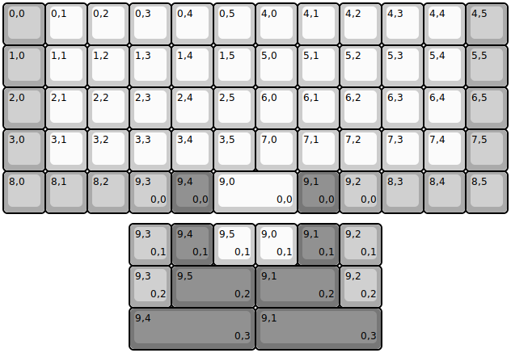{:loading="lazy"}

[Open in keyboard-layout-editor](http://www.keyboard-layout-editor.com/##@@_c=#aaaaaa;&=0,0&_c=#cccccc;&=0,1&=0,2&=0,3&=0,4&=0,5&=4,0&=4,1&=4,2&=4,3&=4,4&_c=#aaaaaa;&=4,5;&@=1,0&_c=#cccccc;&=1,1&=1,2&=1,3&=1,4&=1,5&=5,0&=5,1&=5,2&=5,3&=5,4&_c=#aaaaaa;&=5,5;&@=2,0&_c=#cccccc;&=2,1&=2,2&=2,3&=2,4&=2,5&=6,0&=6,1&=6,2&=6,3&=6,4&_c=#aaaaaa;&=6,5;&@=3,0&_c=#cccccc;&=3,1&=3,2&=3,3&=3,4&=3,5&=7,0&=7,1&=7,2&=7,3&=7,4&_c=#aaaaaa;&=7,5;&@=8,0&=8,1&=8,2&=9,3%0A%0A%0A0,0&_c=#777777;&=9,4%0A%0A%0A0,0&_c=#cccccc&w:2;&=9,0%0A%0A%0A0,0&_c=#777777;&=9,1%0A%0A%0A0,0&_c=#aaaaaa;&=9,2%0A%0A%0A0,0&=8,3&=8,4&=8,5;&@_x:3&y:0.25;&=9,3%0A%0A%0A0,1&_c=#777777;&=9,4%0A%0A%0A0,1&_c=#cccccc;&=9,5%0A%0A%0A0,1&=9,0%0A%0A%0A0,1&_c=#777777;&=9,1%0A%0A%0A0,1&_c=#aaaaaa;&=9,2%0A%0A%0A0,1;&@_x:3;&=9,3%0A%0A%0A0,2&_c=#777777&w:2;&=9,5%0A%0A%0A0,2&_w:2;&=9,1%0A%0A%0A0,2&_c=#aaaaaa;&=9,2%0A%0A%0A0,2;&@_x:3&c=#777777&w:3;&=9,4%0A%0A%0A0,3&_w:3;&=9,1%0A%0A%0A0,3)

## olli_works/neito

[README](output/olli_works/neito/README.md) - [layout](output/olli_works/neito/neito-kle.json) - [PCB](output/olli_works/neito/neito.kicad_pcb) - [PCB render](output/olli_works/neito/neito-render.svg)

{:loading="lazy"}

[Open in keyboard-layout-editor](http://www.keyboard-layout-editor.com/##@@_x:16.5625;&=0,7;&@_x:2.625&y:-0.8125;&=0,1&_x:8.6875;&=1,5;&@_x:0.625&y:-0.9375;&=0,0&=1,0&_x:10.6875;&=0,6&_w:2;&=1,6;&@_x:16.8125&y:-0.25;&=2,7;&@_x:0.4375&y:-0.75&w:1.5;&=2,0&=3,0&_x:10.125;&=3,5&=2,6&_x:0.25&w:1.25&h:2&w2:1.5&h2:1&x2:-0.25;&=3,6;&@_x:17.0625&y:-0.25;&=4,7;&@_x:0.1875&y:-0.75&w:1.75;&=4,0&=5,0&_x:9.375;&=4,5&=5,5&=4,6;&@_w:1.25;&=6,0&=8,0&=7,0&_x:9.565;&=6,5&_x:-0.0025&w:1.75;&=6,6;&@_x:15.8125&y:-0.75;&=7,6;&@_y:-0.25&w:1.5;&=9,0;&@_x:14.8125&y:-0.75;&=8,6&=9,6&=8,7;&@_r:12&rx:3.125&ry:1.1875&x:0.5&y:-1.0;&=1,1&=0,2&=1,2&=0,3;&@=2,1&=3,1&=2,2&=3,2;&@_x:0.25;&=4,1&=5,1&=4,2&=5,2;&@_x:0.75;&=6,1&=7,1&=6,2&=7,2;&@_x:0.75&w:1.5;&=8,1&_w:2;&=8,2&=9,2;&@_r:-12&rx:12.625&x:-4.5&y:-1.0;&=1,3&=0,4&=1,4&=0,5;&@_x:-5.0;&=2,3&=3,3&=2,4&=3,4&=2,5;&@_x:-4.75;&=4,3&=5,3&=4,4&=5,4;&@_x:-5.5;&=8,3&=6,3&=7,3&=6,4&=7,4;&@_x:-5.0&w:2.75;&=9,3&_w:1.5;&=8,4)

## om60/om60

[README](output/om60/README.md) - [layout](output/om60/om60-kle.json) - [PCB](output/om60/om60.kicad_pcb) - [PCB render](output/om60/om60-render.svg)

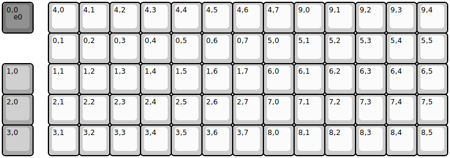{:loading="lazy"}

[Open in keyboard-layout-editor](http://www.keyboard-layout-editor.com/##@@_c=#777777;&=0,0%0A%0A%0A%0A%0A%0A%0A%0A%0Ae0&_x:0.5&c=#cccccc;&=4,0&=4,1&=4,2&=4,3&=4,4&=4,5&=4,6&=4,7&=9,0&=9,1&=9,2&=9,3&=9,4;&@_x:1.5;&=0,1&=0,2&=0,3&=0,4&=0,5&=0,6&=0,7&=5,0&=5,1&=5,2&=5,3&=5,4&=5,5;&@_c=#aaaaaa;&=1,0&_x:0.5&c=#cccccc;&=1,1&=1,2&=1,3&=1,4&=1,5&=1,6&=1,7&=6,0&=6,1&=6,2&=6,3&=6,4&=6,5;&@_c=#aaaaaa;&=2,0&_x:0.5&c=#cccccc;&=2,1&=2,2&=2,3&=2,4&=2,5&=2,6&=2,7&=7,0&=7,1&=7,2&=7,3&=7,4&=7,5;&@_c=#aaaaaa;&=3,0&_x:0.5&c=#cccccc;&=3,1&=3,2&=3,3&=3,4&=3,5&=3,6&=3,7&=8,0&=8,1&=8,2&=8,3&=8,4&=8,5)

## onekeyco/dango40

[README](output/onekeyco/README.md) - [layout](output/onekeyco/dango40-kle.json) - [PCB](output/onekeyco/dango40.kicad_pcb) - [PCB render](output/onekeyco/dango40-render.svg)

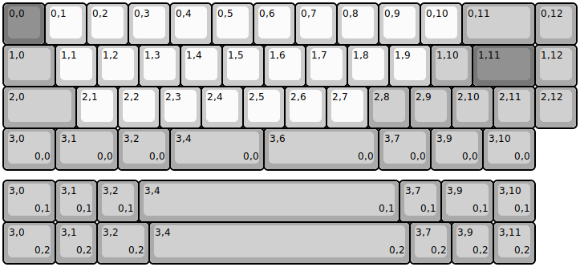{:loading="lazy"}

[Open in keyboard-layout-editor](http://www.keyboard-layout-editor.com/##@@_c=#777777;&=0,0&_c=#cccccc;&=0,1&=0,2&=0,3&=0,4&=0,5&=0,6&=0,7&=0,8&=0,9&=0,10&_c=#aaaaaa&w:1.75;&=0,11&=0,12;&@_w:1.25;&=1,0&_c=#cccccc;&=1,1&=1,2&=1,3&=1,4&=1,5&=1,6&=1,7&=1,8&=1,9&_c=#aaaaaa;&=1,10&_c=#777777&w:1.5;&=1,11&_c=#aaaaaa;&=1,12;&@_w:1.75;&=2,0&_c=#cccccc;&=2,1&=2,2&=2,3&=2,4&=2,5&=2,6&=2,7&_c=#aaaaaa;&=2,8&=2,9&=2,10&=2,11&=2,12;&@_w:1.25;&=3,0%0A%0A%0A0,0&_w:1.5;&=3,1%0A%0A%0A0,0&_w:1.25;&=3,2%0A%0A%0A0,0&_w:2.25;&=3,4%0A%0A%0A0,0&_w:2.75;&=3,6%0A%0A%0A0,0&_w:1.25;&=3,7%0A%0A%0A0,0&_w:1.25;&=3,9%0A%0A%0A0,0&_w:1.25;&=3,10%0A%0A%0A0,0;&@_y:0.25&w:1.25;&=3,0%0A%0A%0A0,1&=3,1%0A%0A%0A0,1&=3,2%0A%0A%0A0,1&_w:6.25;&=3,4%0A%0A%0A0,1&=3,7%0A%0A%0A0,1&_w:1.25;&=3,9%0A%0A%0A0,1&=3,10%0A%0A%0A0,1;&@_w:1.25;&=3,0%0A%0A%0A0,2&=3,1%0A%0A%0A0,2&_w:1.25;&=3,2%0A%0A%0A0,2&_w:6.25;&=3,4%0A%0A%0A0,2&=3,7%0A%0A%0A0,2&=3,9%0A%0A%0A0,2&=3,11%0A%0A%0A0,2)

## orthocode/orthocode

[README](output/orthocode/README.md) - [layout](output/orthocode/orthocode-kle.json) - [PCB](output/orthocode/orthocode.kicad_pcb) - [PCB render](output/orthocode/orthocode-render.svg)

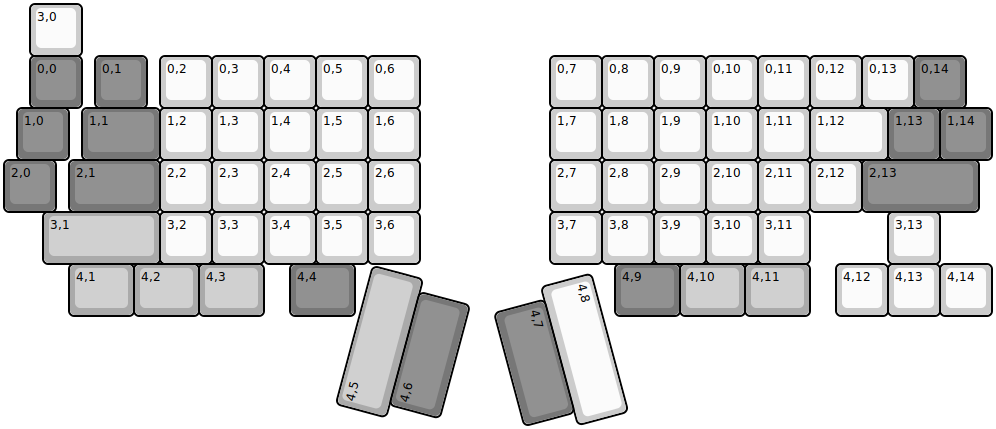{:loading="lazy"}

[Open in keyboard-layout-editor](http://www.keyboard-layout-editor.com/##@@_x:0.5;&=3,0;&@_x:0.5&c=#777777;&=0,0&_x:0.25;&=0,1&_x:0.25&c=#cccccc;&=0,2&=0,3&=0,4&=0,5&=0,6&_x:2.5;&=0,7&=0,8&=0,9&=0,10&=0,11&=0,12&=0,13&_c=#777777;&=0,14;&@_x:0.25;&=1,0&_x:0.25&w:1.5;&=1,1&_c=#cccccc;&=1,2&=1,3&=1,4&=1,5&=1,6&_x:2.5;&=1,7&=1,8&=1,9&=1,10&=1,11&_w:1.5;&=1,12&_c=#777777;&=1,13&=1,14;&@=2,0&_x:0.25&w:1.75;&=2,1&_c=#cccccc;&=2,2&=2,3&=2,4&=2,5&=2,6&_x:2.5;&=2,7&=2,8&=2,9&=2,10&=2,11&=2,12&_c=#777777&w:2.25;&=2,13;&@_x:0.75&c=#aaaaaa&w:2.25;&=3,1&_c=#cccccc;&=3,2&=3,3&=3,4&=3,5&=3,6&_x:2.5;&=3,7&=3,8&=3,9&=3,10&=3,11&_x:1.5;&=3,13;&@_x:1.25&c=#aaaaaa&w:1.25;&=4,1&_w:1.25;&=4,2&_w:1.25;&=4,3&_x:0.5&c=#777777&w:1.25;&=4,4&_x:5.0&w:1.25;&=4,9&_c=#aaaaaa&w:1.25;&=4,10&_w:1.25;&=4,11&_x:0.5&c=#cccccc;&=4,12&=4,13&=4,14;&@_r:75&rx:9.25&ry:5.75&y:-2.25&w:2.75;&=4,8;&@_x:0.25&c=#777777&w:2.25;&=4,7;&@_r:-75&x:-2.75&y:-2.0&c=#aaaaaa&w:2.75;&=4,5;&@_x:-2.5&c=#777777&w:2.25;&=4,6)

## other/aanzee

[README](output/other/aanzee/README.md) - [layout](output/other/aanzee/aanzee-kle.json) - [PCB](output/other/aanzee/aanzee.kicad_pcb) - [PCB render](output/other/aanzee/aanzee-render.svg)

{:loading="lazy"}

[Open in keyboard-layout-editor](http://www.keyboard-layout-editor.com/##@@_c=&p=GMK;&=0,0&_f:5;&=0,1&=0,2&=0,3&=0,4&=0,5&=0,6&=0,7&=0,8&=0,9&=0,10&=0,11&=0,12&_f:3;&=0,15&=0,13&=0,14;&@_w:1.5;&=1,0&_f:7;&=1,1&=1,2&=1,3&=1,4&=1,5&=1,6&=1,7&=1,8&=1,9&=1,10&_f:5;&=1,11&=1,12&_f:3&w:1.5;&=1,13&=1,14;&@_w:1.75;&=2,0&_f:7;&=2,1&=2,2&=2,3&=2,4&=2,5&=2,6&=2,7&=2,8&=2,9&_f:5;&=2,10&=2,11&_f:3&w:2.25;&=2,13&=2,14;&@_w:2.25;&=3,0&_f:7;&=3,2&=3,3&=3,4&=3,5&=3,6&=3,7&=3,8&_f:5;&=3,9&=3,10&=3,11&_f:3&w:1.75;&=3,12&_f:9;&=3,13&_f:3;&=3,14;&@_w:1.25;&=4,0&_w:1.25;&=4,1&_w:1.25;&=4,2&_w:6.25;&=4,6&_w:1.25;&=4,9&_w:1.25;&=4,10&_x:0.5&f:9;&=4,12&=4,13&=4,14)

## other/bear_65

[README](output/other/bear_65/README.md) - [layout](output/other/bear_65/bear_65-kle.json) - [PCB](output/other/bear_65/bear_65.kicad_pcb) - [PCB render](output/other/bear_65/bear_65-render.svg)

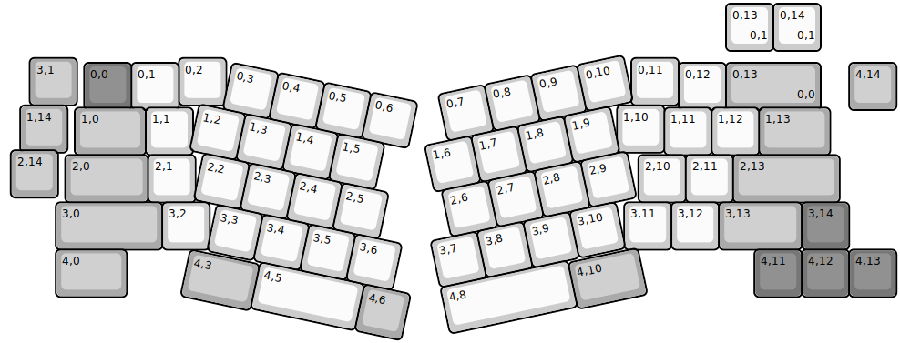{:loading="lazy"}

[Open in keyboard-layout-editor](http://www.keyboard-layout-editor.com/##@@_x:0.55&y:1.15&c=#aaaaaa;&=3,1&_x:2.15&c=#cccccc;&=0,2&_x:8.55;&=0,11;&@_x:1.7&y:-0.9&c=#777777;&=0,0&_c=#cccccc;&=0,1&_x:10.55;&=0,12&_c=#aaaaaa&w:2;&=0,13%0A%0A%0A0,0&_x:0.6;&=4,14;&@_x:0.35&y:-0.1;&=1,14&_x:11.6&c=#cccccc;&=1,10;&@_x:1.5&y:-0.95&c=#aaaaaa&w:1.5;&=1,0&_c=#cccccc;&=1,1&_x:9.95;&=1,11&=1,12&_c=#aaaaaa&w:1.5;&=1,13;&@_x:0.15&y:-0.1;&=2,14;&@_x:1.3&y:-0.9&w:1.75;&=2,0&_c=#cccccc;&=2,1&_x:9.35;&=2,10&=2,11&_c=#aaaaaa&w:2.25;&=2,13;&@_x:1.1&w:2.25;&=3,0&_c=#cccccc;&=3,2&_x:8.75;&=3,11&=3,12&_c=#aaaaaa&w:1.75;&=3,13&_c=#777777;&=3,14;&@_x:1.1&c=#aaaaaa&w:1.5;&=4,0&_x:13.25&c=#777777;&=4,11&=4,12&=4,13;&@_r:12&x:5&y:-6.0&c=#cccccc;&=0,3&=0,4&=0,5&=0,6;&@_x:4.5;&=1,2&=1,3&=1,4&=1,5;&@_x:4.8;&=2,2&=2,3&=2,4&=2,5;&@_x:5.3;&=3,3&=3,4&=3,5&=3,6;&@_x:6.45&w:2.25;&=4,5&_c=#aaaaaa;&=4,6;&@_x:4.95&y:-0.95&w:1.5;&=4,3;&@_r:-12&x:8.55&y:-1.45&c=#cccccc;&=0,7&=0,8&=0,9&=0,10;&@_x:8.05;&=1,6&=1,7&=1,8&=1,9;&@_x:8.2;&=2,6&=2,7&=2,8&=2,9;&@_x:7.75;&=3,7&=3,8&=3,9&=3,10;&@_x:7.75&w:2.75;&=4,8;&@_x:10.5&y:-0.95&c=#aaaaaa&w:1.5;&=4,10;&@_r:0&x:15.25&y:-8.85&c=#cccccc;&=0,13%0A%0A%0A0,1&=0,14%0A%0A%0A0,1)

## other/blocked65

[README](output/other/blocked65/README.md) - [layout](output/other/blocked65/blocked65-kle.json) - [PCB](output/other/blocked65/blocked65.kicad_pcb) - [PCB render](output/other/blocked65/blocked65-render.svg)

{:loading="lazy"}

[Open in keyboard-layout-editor](http://www.keyboard-layout-editor.com/##@@_c=#777777;&=0,0&_c=#cccccc;&=0,1&=0,2&=0,3&=0,4&=0,5&=0,6&=0,7&=0,8&=0,9&=0,10&=0,11&=0,12&_c=#aaaaaa&w:2;&=0,13&=0,14;&@_w:1.5;&=1,0&_c=#cccccc;&=1,1&=1,2&=1,3&=1,4&=1,5&=1,6&=1,7&=1,8&=1,9&=1,10&=1,11&=1,12&_c=#aaaaaa&w:1.5;&=1,13&=1,14;&@_w:1.75;&=2,0&_c=#cccccc;&=2,1&=2,2&=2,3&=2,4&=2,5&=2,6&=2,7&=2,8&=2,9&=2,10&=2,11&_c=#777777&w:2.25;&=2,13&_c=#aaaaaa;&=2,14;&@_w:2.25;&=3,0&_c=#cccccc;&=3,2&=3,3&=3,4&=3,5&=3,6&=3,7&=3,8&=3,9&=3,10&=3,11&_c=#aaaaaa&w:1.75;&=3,12&_c=#777777;&=3,13&_c=#aaaaaa;&=3,14;&@_w:1.25;&=4,0&_w:1.25;&=4,1&_w:1.25;&=4,2&_c=#cccccc&w:6.25;&=4,6&_c=#aaaaaa&w:1.25;&=4,10&_w:1.25;&=4,11&_x:0.5&c=#777777;&=4,12&=4,13&=4,14)

## other/chili

[README](output/other/chili/README.md) - [layout](output/other/chili/chili-kle.json) - [PCB](output/other/chili/chili.kicad_pcb) - [PCB render](output/other/chili/chili-render.svg)

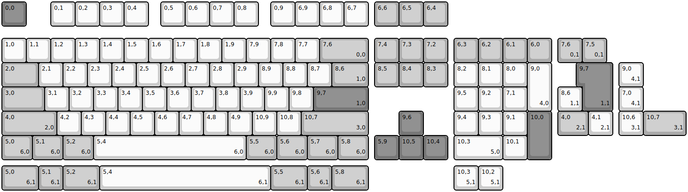{:loading="lazy"}

[Open in keyboard-layout-editor](http://www.keyboard-layout-editor.com/##@@_c=#777777;&=0,0&_x:1&c=#cccccc;&=0,1&=0,2&=0,3&=0,4&_x:0.5;&=0,5&=0,6&=0,7&=0,8&_x:0.5;&=0,9&=6,9&=6,8&=6,7&_x:0.25&c=#aaaaaa;&=6,6&=6,5&=6,4;&@_y:0.5&c=#cccccc;&=1,0&=1,1&=1,2&=1,3&=1,4&=1,5&=1,6&=1,7&=1,8&=1,9&=7,9&=7,8&=7,7&_c=#aaaaaa&w:2;&=7,6%0A%0A%0A0,0&_x:0.25;&=7,4&=7,3&=7,2&_x:0.25;&=6,3&=6,2&=6,1&=6,0;&@_w:1.5;&=2,0&_c=#cccccc;&=2,1&=2,2&=2,3&=2,4&=2,5&=2,6&=2,7&=2,8&=2,9&=8,9&=8,8&=8,7&_c=#aaaaaa&w:1.5;&=8,6%0A%0A%0A1,0&_x:0.25;&=8,5&=8,4&=8,3&_x:0.25&c=#cccccc;&=8,2&=8,1&=8,0&_h:2;&=9,0%0A%0A%0A4,0;&@_c=#aaaaaa&w:1.75;&=3,0&_c=#cccccc;&=3,1&=3,2&=3,3&=3,4&=3,5&=3,6&=3,7&=3,8&=3,9&=9,9&=9,8&_c=#777777&w:2.25;&=9,7%0A%0A%0A1,0&_x:3.5&c=#cccccc;&=9,5&=9,2&=7,1;&@_c=#aaaaaa&w:2.25;&=4,0%0A%0A%0A2,0&_c=#cccccc;&=4,2&=4,3&=4,4&=4,5&=4,6&=4,7&=4,8&=4,9&=10,9&=10,8&_c=#aaaaaa&w:2.75;&=10,7%0A%0A%0A3,0&_x:1.25&c=#777777;&=9,6&_x:1.25&c=#cccccc;&=9,4&=9,3&=9,1&_c=#777777&h:2;&=10,0;&@_c=#aaaaaa&w:1.25;&=5,0%0A%0A%0A6,0&_w:1.25;&=5,1%0A%0A%0A6,0&_w:1.25;&=5,2%0A%0A%0A6,0&_c=#cccccc&w:6.25;&=5,4%0A%0A%0A6,0&_c=#aaaaaa&w:1.25;&=5,5%0A%0A%0A6,0&_w:1.25;&=5,6%0A%0A%0A6,0&_w:1.25;&=5,7%0A%0A%0A6,0&_w:1.25;&=5,8%0A%0A%0A6,0&_x:0.25&c=#777777;&=5,9&=10,5&=10,4&_x:0.25&c=#cccccc&w:2;&=10,3%0A%0A%0A5,0&=10,1;&@_x:22.75&y:-5.0&c=#aaaaaa;&=7,6%0A%0A%0A0,1&=7,5%0A%0A%0A0,1;&@_x:23.75&c=#777777&w:1.25&h:2&w2:1.5&h2:1&x2:-0.25;&=9,7%0A%0A%0A1,1&_x:0.25&c=#cccccc;&=9,0%0A%0A%0A4,1;&@_x:22.75;&=8,6%0A%0A%0A1,1&_x:1.5;&=7,0%0A%0A%0A4,1;&@_x:22.75&c=#aaaaaa&w:1.25;&=4,0%0A%0A%0A2,1&_c=#cccccc;&=4,1%0A%0A%0A2,1&_x:0.25;&=10,6%0A%0A%0A3,1&_c=#aaaaaa&w:1.75;&=10,7%0A%0A%0A3,1;&@_y:1.25&w:1.5;&=5,0%0A%0A%0A6,1&=5,1%0A%0A%0A6,1&_w:1.5;&=5,2%0A%0A%0A6,1&_c=#cccccc&w:7;&=5,4%0A%0A%0A6,1&_c=#aaaaaa&w:1.5;&=5,5%0A%0A%0A6,1&=5,6%0A%0A%0A6,1&_w:1.5;&=5,8%0A%0A%0A6,1&_x:3.5&c=#cccccc;&=10,3%0A%0A%0A5,1&=10,2%0A%0A%0A5,1)

## other/cypher/cypherRev5

[README](output/other/cypher/README.md) - [layout](output/other/cypher/cypherRev5-kle.json) - [PCB](output/other/cypher/cypherRev5.kicad_pcb) - [PCB render](output/other/cypher/cypherRev5-render.svg)

{:loading="lazy"}

[Open in keyboard-layout-editor](http://www.keyboard-layout-editor.com/##@@_x:2.5&y:1.25&c=#777777;&=0,0&_c=#cccccc;&=0,1&=0,2&=0,3&=0,4&=0,5&=0,6&=0,7&=0,8&=0,9&=5,0&=5,1&=5,2&_c=#aaaaaa&w:2;&=5,3%0A%0A%0A0,0&_x:0.5&c=#cccccc;&=5,5&=5,6&=5,7&=5,8;&@_x:2.5&c=#aaaaaa&w:1.5;&=1,0&_c=#cccccc;&=1,1&=1,2&=1,3&=1,4&=1,5&=1,6&=1,7&=1,8&=1,9&=6,0&=6,1&=6,2&_w:1.5;&=6,3%0A%0A%0A1,0&_x:0.5;&=6,5&=6,6&=6,7&_h:2;&=6,8%0A%0A%0A3,0;&@_x:2.5&c=#aaaaaa&w:1.75;&=2,0&_c=#cccccc;&=2,1&=2,2&=2,3&=2,4&=2,5&=2,6&=2,7&=2,8&=2,9&=7,0&=7,1&_c=#777777&w:2.25;&=7,3%0A%0A%0A1,0&_x:0.5&c=#cccccc;&=7,5&=7,6&=7,7;&@_x:2.5&c=#aaaaaa&w:2.25;&=3,0%0A%0A%0A2,0&_c=#cccccc;&=3,2&=3,3&=3,4&=3,5&=3,6&=3,7&=3,8&=3,9&=8,0&=8,1&_c=#aaaaaa&w:1.75;&=8,2&_x:1.5&c=#cccccc;&=8,5&=8,6&=8,7&_c=#777777&h:2;&=8,8%0A%0A%0A4,0;&@_x:16.75&y:-0.75&c=#cccccc;&=8,3;&@_x:2.5&y:-0.25&c=#aaaaaa&w:1.25;&=4,0%0A%0A%0A5,0&=4,1%0A%0A%0A5,0&_w:1.25;&=4,2%0A%0A%0A5,0&_c=#cccccc&w:6;&=4,6%0A%0A%0A5,0&_c=#aaaaaa&w:1.25;&=4,9%0A%0A%0A5,0&=9,0%0A%0A%0A5,0&_w:1.25;&=9,1%0A%0A%0A5,0&_x:3.5&c=#cccccc;&=9,6&=9,7;&@_x:15.75&y:-0.75;&=9,2&=9,3&=9,5;&@_x:15.5&y:-6.5;&=5,3%0A%0A%0A0,1&=5,4%0A%0A%0A0,1;&@_x:22.25&y:1.25;&=6,8%0A%0A%0A3,1;&@_x:22.25;&=7,8%0A%0A%0A3,1;&@_c=#aaaaaa&w:1.25;&=3,0%0A%0A%0A2,1&_c=#cccccc;&=3,1%0A%0A%0A2,1&_x:20.0;&=8,8%0A%0A%0A4,1;&@_x:22.25;&=9,8%0A%0A%0A4,1;&@_x:2.5&y:0.25&c=#aaaaaa&w:1.5;&=4,0%0A%0A%0A5,1&_w:1.5;&=4,2%0A%0A%0A5,1&_w:7;&=4,6%0A%0A%0A5,1&_w:1.5;&=9,0%0A%0A%0A5,1&_w:1.5;&=9,1%0A%0A%0A5,1;&@_x:16.75&y:-0.75&c=#777777&w:1.25&h:2&w2:1.5&h2:1&x2:-0.25;&=7,3%0A%0A%0A1,1;&@_x:2.5&y:-0.25&c=#aaaaaa&w:1.25;&=4,0%0A%0A%0A5,2&_w:1.25;&=4,1%0A%0A%0A5,2&_w:1.25;&=4,2%0A%0A%0A5,2&_w:6.25;&=4,6%0A%0A%0A5,2&_w:1.5;&=9,0%0A%0A%0A5,2&_w:1.5;&=9,1%0A%0A%0A5,2;&@_x:15.75&y:-0.75&c=#cccccc;&=7,2%0A%0A%0A1,1;&@_x:2.5&y:-0.25&c=#aaaaaa&w:1.25;&=4,0%0A%0A%0A5,3&_w:1.25;&=4,1%0A%0A%0A5,3&_w:1.25;&=4,2%0A%0A%0A5,3&_w:2.75;&=4,4%0A%0A%0A5,3&_w:1.25;&=4,6%0A%0A%0A5,3&_w:2.25;&=4,7%0A%0A%0A5,3&_w:1.5;&=9,0%0A%0A%0A5,3&_w:1.5;&=9,1%0A%0A%0A5,3)

## other/doro67/doro67multi

[README](output/other/doro67/README.md) - [layout](output/other/doro67/doro67multi-kle.json) - [PCB](output/other/doro67/doro67multi.kicad_pcb) - [PCB render](output/other/doro67/doro67multi-render.svg)

{:loading="lazy"}

[Open in keyboard-layout-editor](http://www.keyboard-layout-editor.com/##@@_x:2.75&y:1.5&c=#777777;&=0,0&_c=#cccccc;&=0,1&=0,2&=0,3&=0,4&=0,5&=0,6&=0,7&=0,8&=0,9&=0,10&=0,11&=0,12&_c=#aaaaaa&w:2;&=0,13%0A%0A%0A0,0&=0,14;&@_x:2.75&w:1.5;&=1,0&_c=#cccccc;&=1,1&=1,2&=1,3&=1,4&=1,5&=1,6&=1,7&=1,8&=1,9&=1,10&=1,11&=1,12&_w:1.5;&=1,13%0A%0A%0A1,0&_c=#aaaaaa;&=1,14;&@_x:2.75&w:1.75;&=2,0&_c=#cccccc;&=2,1&=2,2&=2,3&=2,4&=2,5&=2,6&=2,7&=2,8&=2,9&=2,10&=2,11&_c=#777777&w:2.25;&=2,13%0A%0A%0A1,0&_c=#aaaaaa;&=2,14;&@_x:2.75&w:2.25;&=3,0%0A%0A%0A2,0&_c=#cccccc;&=3,2&=3,3&=3,4&=3,5&=3,6&=3,7&=3,8&=3,9&=3,10&=3,11&_c=#aaaaaa&w:1.75;&=3,12&=3,13&=3,14;&@_x:2.75&w:1.25;&=4,0%0A%0A%0A3,0&_w:1.25;&=4,1%0A%0A%0A3,0&_w:1.25;&=4,2%0A%0A%0A3,0&_c=#cccccc&w:6.25;&=4,4%0A%0A%0A3,0&_c=#aaaaaa&w:1.25;&=4,9%0A%0A%0A3,0&_w:1.25;&=4,10%0A%0A%0A3,0&_c=#cccccc&w:0.5&d:true;&=%0A%0A%0A3,0&_c=#aaaaaa;&=4,12&=4,13&=4,14;&@_x:15.75&y:-6.5&c=#cccccc;&=0,13%0A%0A%0A0,1&=4,8%0A%0A%0A0,1;&@_x:20.25&y:1.5&c=#777777&w:1.25&h:2&w2:1.5&h2:1&x2:-0.25;&=2,13%0A%0A%0A1,1;&@_x:19.25&c=#cccccc;&=1,13%0A%0A%0A1,1;&@_c=#aaaaaa&w:1.25;&=3,0%0A%0A%0A2,1&_c=#cccccc;&=3,1%0A%0A%0A2,1;&@_x:2.75&y:1.5&c=#aaaaaa&w:1.25;&=4,0%0A%0A%0A3,1&_w:1.25;&=4,1%0A%0A%0A3,1&_w:1.25;&=4,2%0A%0A%0A3,1&_c=#cccccc&w:6.25;&=4,4%0A%0A%0A3,1&_c=#aaaaaa;&=4,9%0A%0A%0A3,1&=4,10%0A%0A%0A3,1&=4,11%0A%0A%0A3,1;&@_x:2.75&w:1.25;&=4,0%0A%0A%0A3,2&_w:1.25;&=4,1%0A%0A%0A3,2&_w:1.25;&=4,2%0A%0A%0A3,2&_c=#cccccc&w:2.75;&=4,3%0A%0A%0A3,2&_w:1.25;&=4,4%0A%0A%0A3,2&_w:2.25;&=4,5%0A%0A%0A3,2&_c=#aaaaaa&w:1.25;&=4,9%0A%0A%0A3,2&_w:1.25;&=4,10%0A%0A%0A3,2&_c=#cccccc&w:0.5&d:true;&=%0A%0A%0A3,2;&@_x:2.75&c=#aaaaaa&w:1.25;&=4,0%0A%0A%0A3,3&_w:1.25;&=4,1%0A%0A%0A3,3&_w:1.25;&=4,2%0A%0A%0A3,3&_c=#cccccc&w:2.75;&=4,3%0A%0A%0A3,3&_w:1.25;&=4,4%0A%0A%0A3,3&_w:2.25;&=4,5%0A%0A%0A3,3&_c=#aaaaaa;&=4,9%0A%0A%0A3,3&=4,10%0A%0A%0A3,3&=4,11%0A%0A%0A3,3;&@_x:2.75&w:1.25;&=4,0%0A%0A%0A3,4&_w:1.25;&=4,1%0A%0A%0A3,4&_w:1.25;&=4,2%0A%0A%0A3,4&_c=#cccccc&w:2.25;&=4,3%0A%0A%0A3,4&_w:1.25;&=4,4%0A%0A%0A3,4&_w:2.75;&=4,5%0A%0A%0A3,4&_c=#aaaaaa&w:1.25;&=4,9%0A%0A%0A3,4&_w:1.25;&=4,10%0A%0A%0A3,4&_c=#cccccc&w:0.5&d:true;&=%0A%0A%0A3,4;&@_x:2.75&c=#aaaaaa&w:1.25;&=4,0%0A%0A%0A3,5&_w:1.25;&=4,1%0A%0A%0A3,5&_w:1.25;&=4,2%0A%0A%0A3,5&_c=#cccccc&w:2.25;&=4,3%0A%0A%0A3,5&_w:1.25;&=4,4%0A%0A%0A3,5&_w:2.75;&=4,5%0A%0A%0A3,5&_c=#aaaaaa;&=4,9%0A%0A%0A3,5&=4,10%0A%0A%0A3,5&=4,11%0A%0A%0A3,5;&@_x:2.75&w:1.5;&=4,0%0A%0A%0A3,6&_w:1.5;&=4,1%0A%0A%0A3,6&_c=#cccccc&w:7;&=4,4%0A%0A%0A3,6&_c=#aaaaaa&w:1.5;&=4,10%0A%0A%0A3,6&_w:1.5;&=4,11%0A%0A%0A3,6;&@_x:2.75&w:1.5;&=4,0%0A%0A%0A3,7&=4,1%0A%0A%0A3,7&_w:1.5;&=4,2%0A%0A%0A3,7&_c=#cccccc&w:7;&=4,4%0A%0A%0A3,7&_c=#aaaaaa&w:1.5;&=4,10%0A%0A%0A3,7&_c=#cccccc&w:0.5&d:true;&=%0A%0A%0A3,7)

## other/doro67/doro67regular

[README](output/other/doro67/README.md) - [layout](output/other/doro67/doro67regular-kle.json) - [PCB](output/other/doro67/doro67regular.kicad_pcb) - [PCB render](output/other/doro67/doro67regular-render.svg)

{:loading="lazy"}

[Open in keyboard-layout-editor](http://www.keyboard-layout-editor.com/##@@_c=#777777;&=0,0&_c=#cccccc;&=0,1&=0,2&=0,3&=0,4&=0,5&=0,6&=0,7&=0,8&=0,9&=0,10&=0,11&=0,12&_c=#aaaaaa&w:2;&=0,13&=0,14;&@_w:1.5;&=1,0&_c=#cccccc;&=1,1&=1,2&=1,3&=1,4&=1,5&=1,6&=1,7&=1,8&=1,9&=1,10&=1,11&=1,12&_c=#aaaaaa&w:1.5;&=1,13&=1,14;&@_w:1.75;&=2,0&_c=#cccccc;&=2,1&=2,2&=2,3&=2,4&=2,5&=2,6&=2,7&=2,8&=2,9&=2,10&=2,11&_c=#777777&w:2.25;&=2,13&_c=#aaaaaa;&=2,14;&@_w:2.25;&=3,0&_c=#cccccc;&=3,2&=3,3&=3,4&=3,5&=3,6&=3,7&=3,8&=3,9&=3,10&=3,11&_c=#aaaaaa&w:1.75;&=3,12&=3,13&=3,14;&@_w:1.25;&=4,0&_c=#cccccc&w:1.25;&=4,1&_c=#aaaaaa&w:1.25;&=4,2&_c=#cccccc&w:6.25;&=4,3&_c=#aaaaaa&w:1.25;&=4,9&_w:1.25;&=4,10&_x:0.5;&=4,12&=4,13&=4,14)

## other/doro67/doro67rgb

[README](output/other/doro67/README.md) - [layout](output/other/doro67/doro67rgb-kle.json) - [PCB](output/other/doro67/doro67rgb.kicad_pcb) - [PCB render](output/other/doro67/doro67rgb-render.svg)

{:loading="lazy"}

[Open in keyboard-layout-editor](http://www.keyboard-layout-editor.com/##@@_c=#777777;&=0,0&_c=#cccccc;&=0,1&=0,2&=0,3&=0,4&=0,5&=0,6&=0,7&=0,8&=0,9&=0,10&=0,11&=0,12&_c=#aaaaaa&w:2;&=0,13&=0,14;&@_w:1.5;&=1,0&_c=#cccccc;&=1,1&=1,2&=1,3&=1,4&=1,5&=1,6&=1,7&=1,8&=1,9&=1,10&=1,11&=1,12&_c=#aaaaaa&w:1.5;&=1,13&=1,14;&@_w:1.75;&=2,0&_c=#cccccc;&=2,1&=2,2&=2,3&=2,4&=2,5&=2,6&=2,7&=2,8&=2,9&=2,10&=2,11&_c=#777777&w:2.25;&=2,13&_c=#aaaaaa;&=2,14;&@_w:2.25;&=3,0&_c=#cccccc;&=3,2&=3,3&=3,4&=3,5&=3,6&=3,7&=3,8&=3,9&=3,10&=3,11&_c=#aaaaaa&w:1.75;&=3,12&=3,13&=3,14;&@_w:1.25;&=4,0&_c=#cccccc&w:1.25;&=4,1&_c=#aaaaaa&w:1.25;&=4,2&_c=#cccccc&w:6.25;&=4,3&_c=#aaaaaa&w:1.25;&=4,9&_w:1.25;&=4,10&_x:0.5;&=4,12&=4,13&=4,14)

## other/dz60

[README](output/other/dz60/README.md) - [layout](output/other/dz60/dz60-kle.json) - [PCB](output/other/dz60/dz60.kicad_pcb) - [PCB render](output/other/dz60/dz60-render.svg)

{:loading="lazy"}

[Open in keyboard-layout-editor](http://www.keyboard-layout-editor.com/##@@_x:2.5&c=#777777;&=0,0&_c=#cccccc;&=0,1&=0,2&=0,3&=0,4&=0,5&=0,6&=0,7&=0,8&=0,9&=0,10&=0,11&=0,12&_c=#aaaaaa&w:2;&=0,14%0A%0A%0A0,0;&@_x:2.5&w:1.5;&=1,0&_c=#cccccc;&=1,2&=1,3&=1,4&=1,5&=1,6&=1,7&=1,8&=1,9&=1,10&=1,11&=1,12&=1,13&_w:1.5;&=1,14%0A%0A%0A1,0;&@_x:2.5&c=#aaaaaa&w:1.75;&=2,0&_c=#cccccc;&=2,2&=2,3&=2,4&=2,5&=2,6&=2,7&=2,8&=2,9&=2,10&=2,11&=2,12&_c=#777777&w:2.25;&=2,13%0A%0A%0A1,0;&@_x:2.5&c=#aaaaaa&w:2.25;&=3,0%0A%0A%0A2,0&_c=#cccccc;&=3,2%0A%0A%0A2,0&=3,3%0A%0A%0A2,0&=3,4%0A%0A%0A2,0&=3,5%0A%0A%0A2,0&=3,6%0A%0A%0A2,0&=3,7%0A%0A%0A2,0&=3,8%0A%0A%0A2,0&=3,9%0A%0A%0A2,0&=3,10%0A%0A%0A2,0&=3,11%0A%0A%0A2,0&_c=#aaaaaa&w:2.75;&=3,13%0A%0A%0A2,0;&@_x:2.5&w:1.25;&=4,0%0A%0A%0A3,0&_w:1.25;&=4,1%0A%0A%0A3,0&_w:1.25;&=4,3%0A%0A%0A3,0&_c=#cccccc&w:6.25;&=4,6%0A%0A%0A3,0&_c=#aaaaaa&w:1.25;&=4,10%0A%0A%0A3,0&_w:1.25;&=4,11%0A%0A%0A3,0&_w:1.25;&=4,13%0A%0A%0A3,0&_w:1.25;&=4,14%0A%0A%0A3,0;&@_x:18.0&y:-5&c=#cccccc;&=0,13%0A%0A%0A0,1&=0,14%0A%0A%0A0,1;&@_x:18.75&c=#777777&w:1.25&h:2&w2:1.5&h2:1&x2:-0.25;&=2,13%0A%0A%0A1,1;&@_x:17.75&c=#cccccc;&=1,14%0A%0A%0A1,1;&@_x:2.5&y:2.5&c=#aaaaaa&w:2.25;&=3,0%0A%0A%0A2,1&_c=#cccccc;&=3,2%0A%0A%0A2,1&=3,3%0A%0A%0A2,1&=3,4%0A%0A%0A2,1&=3,5%0A%0A%0A2,1&=3,6%0A%0A%0A2,1&=3,7%0A%0A%0A2,1&=3,8%0A%0A%0A2,1&=3,9%0A%0A%0A2,1&=3,10%0A%0A%0A2,1&=3,11%0A%0A%0A2,1&_c=#aaaaaa&w:1.75;&=3,13%0A%0A%0A2,1&=3,14%0A%0A%0A2,1;&@_x:2.5&w:2.25;&=3,0%0A%0A%0A2,2&_c=#cccccc;&=3,2%0A%0A%0A2,2&=3,3%0A%0A%0A2,2&=3,4%0A%0A%0A2,2&=3,5%0A%0A%0A2,2&=3,6%0A%0A%0A2,2&=3,7%0A%0A%0A2,2&=3,8%0A%0A%0A2,2&=3,9%0A%0A%0A2,2&=3,10%0A%0A%0A2,2;&@_x:2.5&c=#aaaaaa&w:1.25;&=3,0%0A%0A%0A2,3&=3,1%0A%0A%0A2,3&_c=#cccccc;&=3,2%0A%0A%0A2,3&=3,3%0A%0A%0A2,3&=3,4%0A%0A%0A2,3&=3,5%0A%0A%0A2,3&=3,6%0A%0A%0A2,3&=3,7%0A%0A%0A2,3&=3,8%0A%0A%0A2,3&=3,9%0A%0A%0A2,3&=3,10%0A%0A%0A2,3&=3,11%0A%0A%0A2,3&_c=#aaaaaa&w:2.75;&=3,13%0A%0A%0A2,3;&@_x:2.5&w:1.25;&=3,0%0A%0A%0A2,4&=3,1%0A%0A%0A2,4&_c=#cccccc;&=3,2%0A%0A%0A2,4&=3,3%0A%0A%0A2,4&=3,4%0A%0A%0A2,4&=3,5%0A%0A%0A2,4&=3,6%0A%0A%0A2,4&=3,7%0A%0A%0A2,4&=3,8%0A%0A%0A2,4&=3,9%0A%0A%0A2,4&=3,10%0A%0A%0A2,4&=3,11%0A%0A%0A2,4&_c=#aaaaaa&w:1.75;&=3,13%0A%0A%0A2,4&=3,14%0A%0A%0A2,4;&@_x:2.5&w:1.25;&=3,0%0A%0A%0A2,5&=3,1%0A%0A%0A2,5&_c=#cccccc;&=3,2%0A%0A%0A2,5&=3,3%0A%0A%0A2,5&=3,4%0A%0A%0A2,5&=3,5%0A%0A%0A2,5&=3,6%0A%0A%0A2,5&=3,7%0A%0A%0A2,5&=3,8%0A%0A%0A2,5&=3,9%0A%0A%0A2,5&=3,10%0A%0A%0A2,5;&@_x:2.5&y:0.25&c=#aaaaaa&w:2;&=3,0%0A%0A%0A2,6&_c=#cccccc;&=3,2%0A%0A%0A2,6&=3,3%0A%0A%0A2,6&=3,4%0A%0A%0A2,6&=3,5%0A%0A%0A2,6&=3,6%0A%0A%0A2,6&=3,7%0A%0A%0A2,6&=3,8%0A%0A%0A2,6&=3,9%0A%0A%0A2,6&=3,10%0A%0A%0A2,6&=3,11%0A%0A%0A2,6&=3,12%0A%0A%0A2,6&_c=#aaaaaa&w:2;&=3,13%0A%0A%0A2,6;&@_x:2.5;&=3,0%0A%0A%0A2,7&=3,1%0A%0A%0A2,7&_c=#cccccc;&=3,2%0A%0A%0A2,7&=3,3%0A%0A%0A2,7&=3,4%0A%0A%0A2,7&=3,5%0A%0A%0A2,7&=3,6%0A%0A%0A2,7&=3,7%0A%0A%0A2,7&=3,8%0A%0A%0A2,7&=3,9%0A%0A%0A2,7&=3,10%0A%0A%0A2,7&=3,11%0A%0A%0A2,7&=3,12%0A%0A%0A2,7&_c=#aaaaaa&w:2;&=3,13%0A%0A%0A2,7;&@_x:2.5&w:2;&=3,0%0A%0A%0A2,8&_c=#cccccc;&=3,2%0A%0A%0A2,8&=3,3%0A%0A%0A2,8&=3,4%0A%0A%0A2,8&=3,5%0A%0A%0A2,8&=3,6%0A%0A%0A2,8&=3,7%0A%0A%0A2,8&=3,8%0A%0A%0A2,8&=3,9%0A%0A%0A2,8&=3,10%0A%0A%0A2,8&=3,11%0A%0A%0A2,8&=3,12%0A%0A%0A2,8&_c=#aaaaaa;&=3,13%0A%0A%0A2,8&=3,14%0A%0A%0A2,8;&@_x:2.5;&=3,0%0A%0A%0A2,9&=3,1%0A%0A%0A2,9&_c=#cccccc;&=3,2%0A%0A%0A2,9&=3,3%0A%0A%0A2,9&=3,4%0A%0A%0A2,9&=3,5%0A%0A%0A2,9&=3,6%0A%0A%0A2,9&=3,7%0A%0A%0A2,9&=3,8%0A%0A%0A2,9&=3,9%0A%0A%0A2,9&=3,10%0A%0A%0A2,9&=3,11%0A%0A%0A2,9&=3,12%0A%0A%0A2,9&_c=#aaaaaa;&=3,13%0A%0A%0A2,9&=3,14%0A%0A%0A2,9;&@_x:2.5&y:0.5&w:1.5;&=4,0%0A%0A%0A3,1&=4,1%0A%0A%0A3,1&_w:1.5;&=4,3%0A%0A%0A3,1&_c=#cccccc&w:7;&=4,6%0A%0A%0A3,1&_c=#aaaaaa&w:1.5;&=4,11%0A%0A%0A3,1&=4,13%0A%0A%0A3,1&_w:1.5;&=4,14%0A%0A%0A3,1;&@_x:2.5&w:1.25;&=4,0%0A%0A%0A3,2&_w:1.25;&=4,1%0A%0A%0A3,2&_w:1.25;&=4,3%0A%0A%0A3,2&_c=#cccccc&w:6.25;&=4,6%0A%0A%0A3,2&_c=#aaaaaa;&=4,10%0A%0A%0A3,2&=4,11%0A%0A%0A3,2&=4,12%0A%0A%0A3,2&=4,13%0A%0A%0A3,2&=4,14%0A%0A%0A3,2;&@_x:2.5&w:1.5;&=4,0%0A%0A%0A3,3&=4,1%0A%0A%0A3,3&_w:1.25;&=4,3%0A%0A%0A3,3&_c=#cccccc&w:6.25;&=4,6%0A%0A%0A3,3&_c=#aaaaaa;&=4,10%0A%0A%0A3,3&=4,11%0A%0A%0A3,3&=4,12%0A%0A%0A3,3&=4,13%0A%0A%0A3,3&=4,14%0A%0A%0A3,3;&@_x:2.5&w:1.5;&=4,0%0A%0A%0A3,4&_w:1.5;&=4,1%0A%0A%0A3,4&_c=#cccccc&w:7;&=4,6%0A%0A%0A3,4&_c=#aaaaaa;&=4,10%0A%0A%0A3,4&=4,11%0A%0A%0A3,4&=4,12%0A%0A%0A3,4&=4,13%0A%0A%0A3,4&=4,14%0A%0A%0A3,4;&@_x:2.5&w:1.25;&=4,0%0A%0A%0A3,5&_w:1.25;&=4,1%0A%0A%0A3,5&_w:1.25;&=4,3%0A%0A%0A3,5&_c=#cccccc&w:2.25;&=4,4%0A%0A%0A3,5&_w:1.25;&=4,6%0A%0A%0A3,5&_w:2.75;&=4,8%0A%0A%0A3,5&_c=#aaaaaa&w:1.25;&=4,10%0A%0A%0A3,5&_w:1.25;&=4,11%0A%0A%0A3,5&_w:1.25;&=4,13%0A%0A%0A3,5&_w:1.25;&=4,14%0A%0A%0A3,5;&@_x:2.5&w:1.25;&=4,0%0A%0A%0A3,6&_w:1.25;&=4,1%0A%0A%0A3,6&_w:1.25;&=4,3%0A%0A%0A3,6&_c=#cccccc&w:2.25;&=4,4%0A%0A%0A3,6&_w:1.25;&=4,6%0A%0A%0A3,6&_w:2.75;&=4,8%0A%0A%0A3,6&_c=#aaaaaa;&=4,10%0A%0A%0A3,6&=4,11%0A%0A%0A3,6&=4,12%0A%0A%0A3,6&=4,13%0A%0A%0A3,6&=4,14%0A%0A%0A3,6;&@_rx:0.25&x:13.5&y:6.5&w:1.75;&=3,12%0A%0A%0A2,2&=3,13%0A%0A%0A2,2&=3,14%0A%0A%0A2,2;&@_x:13.5&y:2.0&w:1.75;&=3,12%0A%0A%0A2,5&=3,13%0A%0A%0A2,5&=3,14%0A%0A%0A2,5)

## other/efreet

[README](output/other/efreet/README.md) - [layout](output/other/efreet/efreet-kle.json) - [PCB](output/other/efreet/efreet.kicad_pcb) - [PCB render](output/other/efreet/efreet-render.svg)

{:loading="lazy"}

[Open in keyboard-layout-editor](http://www.keyboard-layout-editor.com/##@@=1,0&=0,0&=1,1&=0,1&=1,2&=0,2&=1,3&=0,3&=1,4&=0,4&=1,5&=0,5;&@=3,0&=2,0&=3,1&=2,1&=3,2&=2,2&=3,3&=2,3&=3,4&=2,4&=3,5&=2,5;&@=5,0&=4,0&=5,1&=4,1&=5,2&=4,2&=5,3&=4,3&=5,4&=4,4&=5,5&=4,5;&@=7,0&=6,0&=7,1&=6,1&=7,2&=6,2%0A%0A%0A0,0&=7,3%0A%0A%0A0,0&=6,3&=7,4&=6,4&=7,5&=6,5;&@_x:5&y:0.25&w:2;&=6,2%0A%0A%0A0,1)

## other/exent

[README](output/other/exent/README.md) - [layout](output/other/exent/exent-kle.json) - [PCB](output/other/exent/exent.kicad_pcb) - [PCB render](output/other/exent/exent-render.svg)

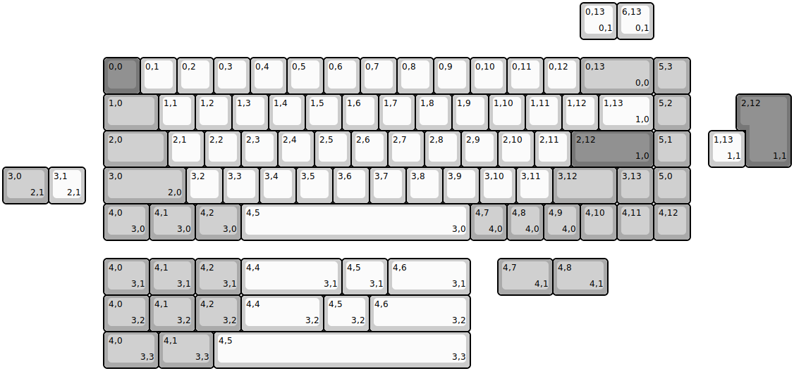{:loading="lazy"}

[Open in keyboard-layout-editor](http://www.keyboard-layout-editor.com/##@@_x:2.75&y:1.5&c=#777777;&=0,0&_c=#cccccc;&=0,1&=0,2&=0,3&=0,4&=0,5&=0,6&=0,7&=0,8&=0,9&=0,10&=0,11&=0,12&_c=#aaaaaa&w:2;&=0,13%0A%0A%0A0,0&=5,3;&@_x:2.75&w:1.5;&=1,0&_c=#cccccc;&=1,1&=1,2&=1,3&=1,4&=1,5&=1,6&=1,7&=1,8&=1,9&=1,10&=1,11&=1,12&_w:1.5;&=1,13%0A%0A%0A1,0&_c=#aaaaaa;&=5,2;&@_x:2.75&w:1.75;&=2,0&_c=#cccccc;&=2,1&=2,2&=2,3&=2,4&=2,5&=2,6&=2,7&=2,8&=2,9&=2,10&=2,11&_c=#777777&w:2.25;&=2,12%0A%0A%0A1,0&_c=#aaaaaa;&=5,1;&@_x:2.75&w:2.25;&=3,0%0A%0A%0A2,0&_c=#cccccc;&=3,2&=3,3&=3,4&=3,5&=3,6&=3,7&=3,8&=3,9&=3,10&=3,11&_c=#aaaaaa&w:1.75;&=3,12&=3,13&=5,0;&@_x:2.75&w:1.25;&=4,0%0A%0A%0A3,0&_w:1.25;&=4,1%0A%0A%0A3,0&_w:1.25;&=4,2%0A%0A%0A3,0&_c=#cccccc&w:6.25;&=4,5%0A%0A%0A3,0&_c=#aaaaaa;&=4,7%0A%0A%0A4,0&=4,8%0A%0A%0A4,0&=4,9%0A%0A%0A4,0&=4,10&=4,11&=4,12;&@_x:15.75&y:-6.5&c=#cccccc;&=0,13%0A%0A%0A0,1&=6,13%0A%0A%0A0,1;&@_x:20.25&y:1.5&c=#777777&w:1.25&h:2&w2:1.5&h2:1&x2:-0.25;&=2,12%0A%0A%0A1,1;&@_x:19.25&c=#cccccc;&=1,13%0A%0A%0A1,1;&@_c=#aaaaaa&w:1.25;&=3,0%0A%0A%0A2,1&_c=#cccccc;&=3,1%0A%0A%0A2,1;&@_x:2.75&y:1.5&c=#aaaaaa&w:1.25;&=4,0%0A%0A%0A3,1&_w:1.25;&=4,1%0A%0A%0A3,1&_w:1.25;&=4,2%0A%0A%0A3,1&_c=#cccccc&w:2.75;&=4,4%0A%0A%0A3,1&_w:1.25;&=4,5%0A%0A%0A3,1&_w:2.25;&=4,6%0A%0A%0A3,1&_x:0.75&c=#aaaaaa&w:1.5;&=4,7%0A%0A%0A4,1&_w:1.5;&=4,8%0A%0A%0A4,1;&@_x:2.75&w:1.25;&=4,0%0A%0A%0A3,2&_w:1.25;&=4,1%0A%0A%0A3,2&_w:1.25;&=4,2%0A%0A%0A3,2&_c=#cccccc&w:2.25;&=4,4%0A%0A%0A3,2&_w:1.25;&=4,5%0A%0A%0A3,2&_w:2.75;&=4,6%0A%0A%0A3,2;&@_x:2.75&c=#aaaaaa&w:1.5;&=4,0%0A%0A%0A3,3&_w:1.5;&=4,1%0A%0A%0A3,3&_c=#cccccc&w:7;&=4,5%0A%0A%0A3,3)

## other/forever65

[README](output/other/forever65/README.md) - [layout](output/other/forever65/forever65-kle.json) - [PCB](output/other/forever65/forever65.kicad_pcb) - [PCB render](output/other/forever65/forever65-render.svg)

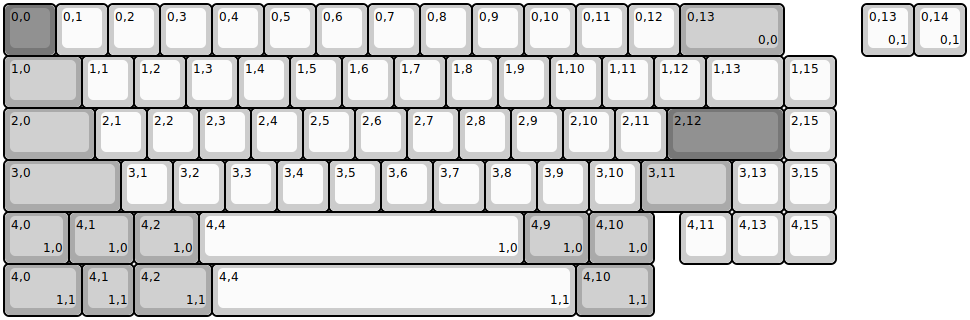{:loading="lazy"}

[Open in keyboard-layout-editor](http://www.keyboard-layout-editor.com/##@@_c=#777777;&=0,0&_c=#cccccc;&=0,1&=0,2&=0,3&=0,4&=0,5&=0,6&=0,7&=0,8&=0,9&=0,10&=0,11&=0,12&_c=#aaaaaa&w:2;&=0,13%0A%0A%0A0,0;&@_w:1.5;&=1,0&_c=#cccccc;&=1,1&=1,2&=1,3&=1,4&=1,5&=1,6&=1,7&=1,8&=1,9&=1,10&=1,11&=1,12&_w:1.5;&=1,13&=1,15;&@_c=#aaaaaa&w:1.75;&=2,0&_c=#cccccc;&=2,1&=2,2&=2,3&=2,4&=2,5&=2,6&=2,7&=2,8&=2,9&=2,10&=2,11&_c=#777777&w:2.25;&=2,12&_c=#cccccc;&=2,15;&@_c=#aaaaaa&w:2.25;&=3,0&_c=#cccccc;&=3,1&=3,2&=3,3&=3,4&=3,5&=3,6&=3,7&=3,8&=3,9&=3,10&_c=#aaaaaa&w:1.75;&=3,11&_c=#cccccc;&=3,13&=3,15;&@_c=#aaaaaa&w:1.25;&=4,0%0A%0A%0A1,0&_w:1.25;&=4,1%0A%0A%0A1,0&_w:1.25;&=4,2%0A%0A%0A1,0&_c=#cccccc&w:6.25;&=4,4%0A%0A%0A1,0&_c=#aaaaaa&w:1.25;&=4,9%0A%0A%0A1,0&_w:1.25;&=4,10%0A%0A%0A1,0&_x:0.5&c=#cccccc;&=4,11&=4,13&=4,15;&@_x:16.5&y:-5;&=0,13%0A%0A%0A0,1&=0,14%0A%0A%0A0,1;&@_y:4&c=#aaaaaa&w:1.5;&=4,0%0A%0A%0A1,1&=4,1%0A%0A%0A1,1&_w:1.5;&=4,2%0A%0A%0A1,1&_c=#cccccc&w:7;&=4,4%0A%0A%0A1,1&_c=#aaaaaa&w:1.5;&=4,10%0A%0A%0A1,1)

## other/g60/bioi_g60

[README](output/other/g60/README.md) - [layout](output/other/g60/bioi_g60-kle.json) - [PCB](output/other/g60/bioi_g60.kicad_pcb) - [PCB render](output/other/g60/bioi_g60-render.svg)

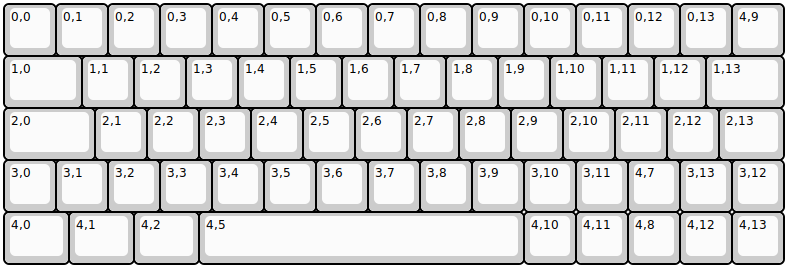{:loading="lazy"}

[Open in keyboard-layout-editor](http://www.keyboard-layout-editor.com/##@@=0,0&=0,1&=0,2&=0,3&=0,4&=0,5&=0,6&=0,7&=0,8&=0,9&=0,10&=0,11&=0,12&=0,13&=4,9;&@_w:1.5;&=1,0&=1,1&=1,2&=1,3&=1,4&=1,5&=1,6&=1,7&=1,8&=1,9&=1,10&=1,11&=1,12&_w:1.5;&=1,13;&@_w:1.75;&=2,0&=2,1&=2,2&=2,3&=2,4&=2,5&=2,6&=2,7&=2,8&=2,9&=2,10&=2,11&=2,12&_w:1.25;&=2,13;&@=3,0&=3,1&=3,2&=3,3&=3,4&=3,5&=3,6&=3,7&=3,8&=3,9&=3,10&=3,11&=4,7&=3,13&=3,12;&@_w:1.25;&=4,0&_w:1.25;&=4,1&_w:1.25;&=4,2&_w:6.25;&=4,5&=4,10&=4,11&=4,8&=4,12&=4,13)

## other/halfkey

[README](output/other/halfkey/README.md) - [layout](output/other/halfkey/halfkey-kle.json) - [PCB](output/other/halfkey/halfkey.kicad_pcb) - [PCB render](output/other/halfkey/halfkey-render.svg)

{:loading="lazy"}

[Open in keyboard-layout-editor](http://www.keyboard-layout-editor.com/##@@=0,0&=0,1&=0,2&=0,3&=0,4&=0,5&=0,6&=0,7;&@=1,0&=1,1&=1,2&=1,3&=1,4&=1,5&=1,6&=1,7;&@_w:2;&=2,1&=2,2&=2,3&=2,4&=2,5&=2,6&=2,7;&@=3,0&=3,1&=3,2&=3,3&=3,4&=3,5&=3,6&=3,7;&@_w:2;&=4,1&=4,2&=4,3&=4,4&=4,5&=4,6&=4,7;&@=5,0&=5,1&=5,2&_w:2;&=5,4&_w:2;&=5,6&=5,7)

## other/hub16

[README](output/other/hub16/README.md) - [layout](output/other/hub16/hub16-kle.json) - [PCB](output/other/hub16/hub16.kicad_pcb) - [PCB render](output/other/hub16/hub16-render.svg)

{:loading="lazy"}

[Open in keyboard-layout-editor](http://www.keyboard-layout-editor.com/##@@_x:0.5;&=4,0&_x:1.0;&=4,1;&@=0,0&=0,1&=0,2&=0,3;&@=1,0&=1,1&=1,2&=1,3;&@=2,0&=2,1&=2,2&=2,3;&@=3,0&=3,1&=3,2&=3,3)

## other/hub20

[README](output/other/hub20/README.md) - [layout](output/other/hub20/hub20-kle.json) - [PCB](output/other/hub20/hub20.kicad_pcb) - [PCB render](output/other/hub20/hub20-render.svg)

{:loading="lazy"}

[Open in keyboard-layout-editor](http://www.keyboard-layout-editor.com/##@@_x:1.75;&=0,1&_x:1.0;&=0,2;&@_x:1.25;&=1,0&=1,1&=1,2&=1,3;&@_x:1.25&c=#777777&h:2;&=2,0%0A%0A%0A0,0&_c=#cccccc;&=2,1&=2,2&=2,3;&@_x:2.25;&=3,1&=3,2&=3,3;&@_x:1.25&c=#777777&h:2;&=4,0%0A%0A%0A1,0&_c=#cccccc;&=4,1&=4,2&=4,3;&@_x:2.25;&=5,1&_c=#777777&w:2;&=5,2%0A%0A%0A2,0;&@_y:-4&c=#cccccc;&=2,0%0A%0A%0A0,1;&@=3,0%0A%0A%0A0,1;&@=4,0%0A%0A%0A1,1;&@=5,0%0A%0A%0A1,1;&@_x:3.25&y:0.25;&=5,2%0A%0A%0A2,1&=5,3%0A%0A%0A2,1)

## other/is0

[README](output/other/is0/README.md) - [layout](output/other/is0/is0-kle.json) - [PCB](output/other/is0/is0.kicad_pcb) - [PCB render](output/other/is0/is0-render.svg)

{:loading="lazy"}

[Open in keyboard-layout-editor](http://www.keyboard-layout-editor.com/##@@_w:1.25&h:2&w2:1.5&h2:1&x2:-0.25;&=0,0)

## other/kabedon/kabedon98e

[README](output/other/kabedon/README.md) - [layout](output/other/kabedon/kabedon98e-kle.json) - [PCB](output/other/kabedon/kabedon98e.kicad_pcb) - [PCB render](output/other/kabedon/kabedon98e-render.svg)

{:loading="lazy"}

[Open in keyboard-layout-editor](http://www.keyboard-layout-editor.com/##@@_c=#777777;&=1,0&_x:0.5&c=#cccccc;&=0,1&=1,1&=0,2&=1,2&_x:0.75&c=#aaaaaa;&=0,3&=1,3&=0,4&=1,4&_x:0.75&c=#cccccc;&=0,5&=1,5&=1,6&=1,7&_x:0.5&c=#aaaaaa;&=5,7&_x:0.5;&=4,8&_x:0.5;&=4,0;&@_y:0.2&c=#cccccc;&=3,0&=2,1&=3,1&=2,2&=3,2&=2,3&=3,3&=2,4&=3,4&=2,5&=3,5&=2,6&=3,6&_c=#aaaaaa&w:2;&=3,7&_x:0.5&c=#cccccc;&=3,9&=4,9&=4,10&=5,10;&@_x:19.75&y:-0.75;&=0,0;&@_y:-0.25&c=#aaaaaa&w:1.5;&=5,0&_c=#cccccc;&=4,1&=5,1&=4,2&=5,2&=4,3&=5,3&=4,4&=5,4&=4,5&=5,5&=4,6&=5,6&_w:1.5;&=4,7&_x:0.5;&=5,9&=6,9&=6,10&_c=#aaaaaa&h:2;&=7,10;&@_x:19.75&y:-0.75&c=#cccccc;&=2,0;&@_y:-0.25&c=#aaaaaa&w:1.75;&=7,0&_c=#cccccc;&=6,1&=7,1&=6,2&=7,2&=6,3&=7,3&=6,4&=7,4&=6,5&=7,5&=6,6&_c=#777777&w:2.25;&=7,7&_x:0.5&c=#cccccc;&=7,9&=8,9&=8,10;&@_x:19.75&y:-0.25;&=6,0;&@_y:-0.75&c=#aaaaaa&w:2.25;&=9,0&_c=#cccccc;&=9,1&=8,2&=9,2&=8,3&=9,3&=8,4&=9,4&=8,5&=9,5&=8,6&_c=#aaaaaa&w:1.75;&=9,7&_x:1.5&c=#cccccc;&=9,9&=10,9&=9,10&_c=#aaaaaa&h:2;&=11,10;&@_x:14.25&y:-0.75&c=#cccccc;&=8,8;&@_x:19.75&y:-0.5;&=8,0;&@_y:-0.75&c=#aaaaaa&w:1.25;&=11,0&=10,1&=11,1&=11,3&_w:6.25;&=11,2&_w:1.25;&=11,5&_w:1.25;&=10,7&_x:3.5&c=#cccccc;&=10,9&_x:-1.0;&=11,9&=10,10;&@_x:13.25&y:-0.75;&=11,7&=10,8&=11,8)

## other/kabedon/kd78s/kabedon78s

[README](output/other/kabedon/kd78s/README.md) - [layout](output/other/kabedon/kd78s/kabedon78s-kle.json) - [PCB](output/other/kabedon/kd78s/kabedon78s.kicad_pcb) - [PCB render](output/other/kabedon/kd78s/kabedon78s-render.svg)

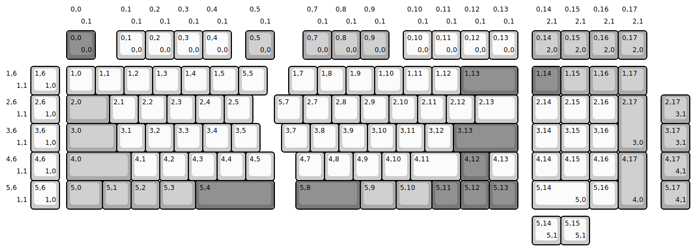{:loading="lazy"}

[Open in keyboard-layout-editor](http://www.keyboard-layout-editor.com/##@@_x:2.25&y:1&c=#777777;&=0,0%0A%0A%0A0,0&_x:0.75&c=#cccccc;&=0,1%0A%0A%0A0,0&=0,2%0A%0A%0A0,0&=0,3%0A%0A%0A0,0&=0,4%0A%0A%0A0,0&_x:0.5&c=#aaaaaa;&=0,5%0A%0A%0A0,0&_x:1.0;&=0,7%0A%0A%0A0,0&=0,8%0A%0A%0A0,0&=0,9%0A%0A%0A0,0&_x:0.5&c=#cccccc;&=0,10%0A%0A%0A0,0&=0,11%0A%0A%0A0,0&=0,12%0A%0A%0A0,0&=0,13%0A%0A%0A0,0&_x:0.5&c=#aaaaaa;&=0,14%0A%0A%0A2,0&=0,15%0A%0A%0A2,0&=0,16%0A%0A%0A2,0&=0,17%0A%0A%0A2,0;&@_x:1&y:0.25&c=#cccccc;&=1,6%0A%0A%0A1,0&_x:0.25;&=1,0&=1,1&=1,2&=1,3&=1,4&=1,5&=5,5&_x:0.75;&=1,7&=1,8&=1,9&=1,10&=1,11&=1,12&_c=#777777&w:2;&=1,13&_x:0.5;&=1,14&_c=#aaaaaa;&=1,15&=1,16&=1,17;&@_x:1&c=#cccccc;&=2,6%0A%0A%0A1,0&_x:0.25&c=#aaaaaa&w:1.5;&=2,0&_c=#cccccc;&=2,1&=2,2&=2,3&=2,4&=2,5&_x:0.75;&=5,7&=2,7&=2,8&=2,9&=2,10&=2,11&=2,12&_w:1.5;&=2,13&_x:0.5;&=2,14&=2,15&=2,16&_c=#aaaaaa&h:2;&=2,17%0A%0A%0A3,0;&@_x:1&c=#cccccc;&=3,6%0A%0A%0A1,0&_x:0.25&c=#aaaaaa&w:1.75;&=3,0&_c=#cccccc;&=3,1&=3,2&=3,3&=3,4&=3,5&_x:0.75;&=3,7&=3,8&=3,9&=3,10&=3,11&=3,12&_c=#777777&w:2.25;&=3,13&_x:0.5&c=#cccccc;&=3,14&=3,15&=3,16;&@_x:1;&=4,6%0A%0A%0A1,0&_x:0.25&c=#aaaaaa&w:2.25;&=4,0&_c=#cccccc;&=4,1&=4,2&=4,3&=4,4&=4,5&_x:0.75;&=4,7&=4,8&=4,9&=4,10&_w:1.75;&=4,11&_c=#777777;&=4,12&_c=#cccccc;&=4,13&_x:0.5;&=4,14&=4,15&=4,16&_c=#aaaaaa&h:2;&=4,17%0A%0A%0A4,0;&@_x:1&c=#cccccc;&=5,6%0A%0A%0A1,0&_x:0.25&c=#aaaaaa&w:1.25;&=5,0&=5,1&=5,2&_w:1.25;&=5,3&_c=#777777&w:2.75;&=5,4&_x:0.75&w:2.25;&=5,8&_c=#aaaaaa&w:1.25;&=5,9&_w:1.25;&=5,10&_c=#777777;&=5,11&=5,12&=5,13&_x:0.5&c=#cccccc&w:2;&=5,14%0A%0A%0A5,0&=5,16;&@_x:2.25&y:-7.25&d:true;&=0,0%0A%0A%0A0,1&_x:0.75&d:true;&=0,1%0A%0A%0A0,1&_d:true;&=0,2%0A%0A%0A0,1&_d:true;&=0,3%0A%0A%0A0,1&_d:true;&=0,4%0A%0A%0A0,1&_x:0.5&d:true;&=0,5%0A%0A%0A0,1&_x:1.0&d:true;&=0,7%0A%0A%0A0,1&_d:true;&=0,8%0A%0A%0A0,1&_d:true;&=0,9%0A%0A%0A0,1&_x:0.5&d:true;&=0,10%0A%0A%0A0,1&_d:true;&=0,11%0A%0A%0A0,1&_d:true;&=0,12%0A%0A%0A0,1&_d:true;&=0,13%0A%0A%0A0,1&_x:0.5&d:true;&=0,14%0A%0A%0A2,1&_d:true;&=0,15%0A%0A%0A2,1&_d:true;&=0,16%0A%0A%0A2,1&_d:true;&=0,17%0A%0A%0A2,1;&@_y:1.25&d:true;&=1,6%0A%0A%0A1,1;&@_d:true;&=2,6%0A%0A%0A1,1&_x:22.0&c=#aaaaaa;&=2,17%0A%0A%0A3,1;&@_c=#cccccc&d:true;&=3,6%0A%0A%0A1,1&_x:22.0&c=#aaaaaa;&=3,17%0A%0A%0A3,1;&@_c=#cccccc&d:true;&=4,6%0A%0A%0A1,1&_x:22.0&c=#aaaaaa;&=4,17%0A%0A%0A4,1;&@_c=#cccccc&d:true;&=5,6%0A%0A%0A1,1&_x:22.0&c=#aaaaaa;&=5,17%0A%0A%0A4,1;&@_x:18.5&y:0.25&c=#cccccc;&=5,14%0A%0A%0A5,1&=5,15%0A%0A%0A5,1)

## other/kabedon/kd98/kabedon980

[README](output/other/kabedon/kd98/README.md) - [layout](output/other/kabedon/kd98/kabedon980-kle.json) - [PCB](output/other/kabedon/kd98/kabedon980.kicad_pcb) - [PCB render](output/other/kabedon/kd98/kabedon980-render.svg)

{:loading="lazy"}

[Open in keyboard-layout-editor](http://www.keyboard-layout-editor.com/##@@_c=#777777;&=8,6&_x:0.75&c=#cccccc;&=2,4&=3,4&=1,10&=0,5&_x:0.5&c=#aaaaaa;&=0,11&=0,2&=2,1&=0,4&_x:0.75&c=#cccccc;&=0,7&=2,2&=9,5&=4,6&_x:0.5&c=#aaaaaa;&=7,3&=9,1&=8,1&=8,0;&@_y:0.25&c=#cccccc;&=9,7&=2,5&=2,6&=0,3&=7,7&=9,6&=8,2&=1,7&=6,3&=8,5&=6,5&=6,6&=0,6&_c=#aaaaaa&w:2;&=3,2&_x:0.5&c=#cccccc;&=0,8&=5,1&=7,1&=6,1;&@_c=#aaaaaa&w:1.5;&=8,3&_c=#cccccc;&=9,2&=3,6&=3,5&=1,4&=2,3&=4,3&=5,7&=1,8&=6,2&=1,11&=1,2&=5,5&_w:1.5;&=4,1&_x:0.5;&=6,0&=0,1&=5,8&_c=#aaaaaa&h:2;&=5,0;&@_w:1.75;&=1,3&_c=#cccccc;&=1,0&=7,2&=5,3&=1,1&=0,9&=7,4&=7,5&=7,6&=5,4&=1,6&=5,6&_c=#777777&w:2.25;&=5,2&_x:0.5&c=#cccccc;&=1,12&=0,0&=6,8;&@_c=#aaaaaa&w:2.25;&=9,12&_c=#cccccc;&=1,9&=9,4&=0,10&=4,2&=9,3&=3,7&=8,4&=3,3&=1,5&=4,4&_c=#aaaaaa&w:1.75;&=8,12&_x:1.5&c=#cccccc;&=3,1&=8,8&=7,8&_c=#aaaaaa&h:2;&=2,0;&@_x:14.25&y:-0.75&c=#cccccc;&=8,7;&@_y:-0.25&c=#aaaaaa&w:1.25;&=5,10&_w:1.25;&=3,9&_w:1.25;&=7,11&_w:6.25;&=0,12&=6,11&=2,8&=4,10&_x:3.5&c=#cccccc;&=3,0&=7,0;&@_x:13.25&y:-0.75;&=4,7&=6,7&=2,7)

## other/kc60

[README](output/other/kc60/README.md) - [layout](output/other/kc60/kc60-kle.json) - [PCB](output/other/kc60/kc60.kicad_pcb) - [PCB render](output/other/kc60/kc60-render.svg)

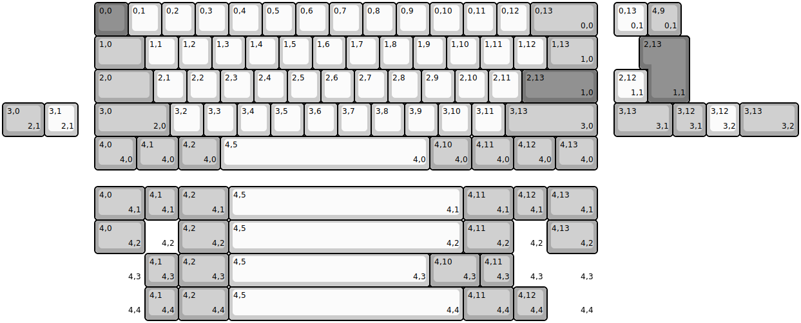{:loading="lazy"}

[Open in keyboard-layout-editor](http://www.keyboard-layout-editor.com/##@@_x:2.75&c=#777777;&=0,0&_c=#cccccc;&=0,1&=0,2&=0,3&=0,4&=0,5&=0,6&=0,7&=0,8&=0,9&=0,10&=0,11&=0,12&_c=#aaaaaa&w:2;&=0,13%0A%0A%0A0,0;&@_x:2.75&w:1.5;&=1,0&_c=#cccccc;&=1,1&=1,2&=1,3&=1,4&=1,5&=1,6&=1,7&=1,8&=1,9&=1,10&=1,11&=1,12&_c=#aaaaaa&w:1.5;&=1,13%0A%0A%0A1,0;&@_x:2.75&w:1.75;&=2,0&_c=#cccccc;&=2,1&=2,2&=2,3&=2,4&=2,5&=2,6&=2,7&=2,8&=2,9&=2,10&=2,11&_c=#777777&w:2.25;&=2,13%0A%0A%0A1,0;&@_x:2.75&c=#aaaaaa&w:2.25;&=3,0%0A%0A%0A2,0&_c=#cccccc;&=3,2&=3,3&=3,4&=3,5&=3,6&=3,7&=3,8&=3,9&=3,10&=3,11&_c=#aaaaaa&w:2.75;&=3,13%0A%0A%0A3,0;&@_x:2.75&w:1.25;&=4,0%0A%0A%0A4,0&_w:1.25;&=4,1%0A%0A%0A4,0&_w:1.25;&=4,2%0A%0A%0A4,0&_c=#cccccc&w:6.25;&=4,5%0A%0A%0A4,0&_c=#aaaaaa&w:1.25;&=4,10%0A%0A%0A4,0&_w:1.25;&=4,11%0A%0A%0A4,0&_w:1.25;&=4,12%0A%0A%0A4,0&_w:1.25;&=4,13%0A%0A%0A4,0;&@_x:18.25&y:-5&c=#cccccc;&=0,13%0A%0A%0A0,1&_c=#aaaaaa;&=4,9%0A%0A%0A0,1;&@_x:19.25&c=#777777&w:1.25&h:2&w2:1.5&h2:1&x2:-0.25;&=2,13%0A%0A%0A1,1;&@_x:18.25&c=#cccccc;&=2,12%0A%0A%0A1,1;&@_c=#aaaaaa&w:1.25;&=3,0%0A%0A%0A2,1&_c=#cccccc;&=3,1%0A%0A%0A2,1&_x:16.0&c=#aaaaaa&w:1.75;&=3,13%0A%0A%0A3,1&=3,12%0A%0A%0A3,1&_c=#cccccc;&=3,12%0A%0A%0A3,2&_c=#aaaaaa&w:1.75;&=3,13%0A%0A%0A3,2;&@_x:2.75&y:1.5&w:1.5;&=4,0%0A%0A%0A4,1&=4,1%0A%0A%0A4,1&_w:1.5;&=4,2%0A%0A%0A4,1&_c=#cccccc&w:7;&=4,5%0A%0A%0A4,1&_c=#aaaaaa&w:1.5;&=4,11%0A%0A%0A4,1&=4,12%0A%0A%0A4,1&_w:1.5;&=4,13%0A%0A%0A4,1;&@_x:2.75&w:1.5;&=4,0%0A%0A%0A4,2&_d:true;&=%0A%0A%0A4,2&_w:1.5;&=4,2%0A%0A%0A4,2&_c=#cccccc&w:7;&=4,5%0A%0A%0A4,2&_c=#aaaaaa&w:1.5;&=4,11%0A%0A%0A4,2&_d:true;&=%0A%0A%0A4,2&_w:1.5;&=4,13%0A%0A%0A4,2;&@_x:2.75&w:1.5&d:true;&=%0A%0A%0A4,3&=4,1%0A%0A%0A4,3&_w:1.5;&=4,2%0A%0A%0A4,3&_c=#cccccc&w:6;&=4,5%0A%0A%0A4,3&_c=#aaaaaa&w:1.5;&=4,10%0A%0A%0A4,3&=4,11%0A%0A%0A4,3&_d:true;&=%0A%0A%0A4,3&_w:1.5&d:true;&=%0A%0A%0A4,3;&@_x:2.75&w:1.5&d:true;&=%0A%0A%0A4,4&=4,1%0A%0A%0A4,4&_w:1.5;&=4,2%0A%0A%0A4,4&_c=#cccccc&w:7;&=4,5%0A%0A%0A4,4&_c=#aaaaaa&w:1.5;&=4,11%0A%0A%0A4,4&=4,12%0A%0A%0A4,4&_w:1.5&d:true;&=%0A%0A%0A4,4)

## other/kmac

[README](output/other/kmac/README.md) - [layout](output/other/kmac/kmac-kle.json) - [PCB](output/other/kmac/kmac.kicad_pcb) - [PCB render](output/other/kmac/kmac-render.svg)

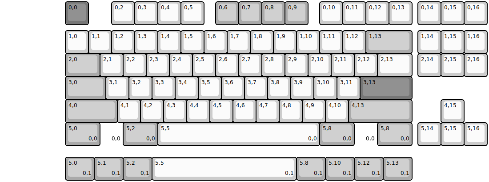{:loading="lazy"}

[Open in keyboard-layout-editor](http://www.keyboard-layout-editor.com/##@@_x:2.75&c=#777777;&=0,0&_x:1.0&c=#cccccc;&=0,2&=0,3&=0,4&=0,5&_x:0.5&c=#aaaaaa;&=0,6&=0,7&=0,8&=0,9&_x:0.5&c=#cccccc;&=0,10&=0,11&=0,12&=0,13&_x:0.25;&=0,14&=0,15&=0,16;&@_x:2.75&y:0.25;&=1,0&=1,1&=1,2&=1,3&=1,4&=1,5&=1,6&=1,7&=1,8&=1,9&=1,10&=1,11&=1,12&_c=#aaaaaa&w:2;&=1,13&_x:0.25&c=#cccccc;&=1,14&=1,15&=1,16;&@_x:2.75&c=#aaaaaa&w:1.5;&=2,0&_c=#cccccc;&=2,1&=2,2&=2,3&=2,4&=2,5&=2,6&=2,7&=2,8&=2,9&=2,10&=2,11&=2,12&_w:1.5;&=2,13&_x:0.25;&=2,14&=2,15&=2,16;&@_x:2.75&c=#aaaaaa&w:1.75;&=3,0&_c=#cccccc;&=3,1&=3,2&=3,3&=3,4&=3,5&=3,6&=3,7&=3,8&=3,9&=3,10&=3,11&_c=#777777&w:2.25;&=3,13;&@_x:2.75&c=#aaaaaa&w:2.25;&=4,0&_c=#cccccc;&=4,1&=4,2&=4,3&=4,4&=4,5&=4,6&=4,7&=4,8&=4,9&=4,10&_c=#aaaaaa&w:2.75;&=4,13&_x:1.25&c=#cccccc;&=4,15;&@_x:2.75&c=#aaaaaa&w:1.5;&=5,0%0A%0A%0A0,0&_c=#cccccc&d:true;&=%0A%0A%0A0,0&_c=#aaaaaa&w:1.5;&=5,2%0A%0A%0A0,0&_c=#cccccc&w:7;&=5,5%0A%0A%0A0,0&_c=#aaaaaa&w:1.5;&=5,8%0A%0A%0A0,0&_c=#cccccc&d:true;&=%0A%0A%0A0,0&_c=#aaaaaa&w:1.5;&=5,8%0A%0A%0A0,0&_x:0.25&c=#cccccc;&=5,14&=5,15&=5,16;&@_x:2.75&y:0.5&c=#aaaaaa&w:1.25;&=5,0%0A%0A%0A0,1&_w:1.25;&=5,1%0A%0A%0A0,1&_w:1.25;&=5,2%0A%0A%0A0,1&_c=#cccccc&w:6.25;&=5,5%0A%0A%0A0,1&_c=#aaaaaa&w:1.25;&=5,8%0A%0A%0A0,1&_w:1.25;&=5,10%0A%0A%0A0,1&_w:1.25;&=5,12%0A%0A%0A0,1&_w:1.25;&=5,13%0A%0A%0A0,1)

## other/latin47ble

[README](output/other/latin47ble/README.md) - [layout](output/other/latin47ble/latin47ble-kle.json) - [PCB](output/other/latin47ble/latin47ble.kicad_pcb) - [PCB render](output/other/latin47ble/latin47ble-render.svg)

{:loading="lazy"}

[Open in keyboard-layout-editor](http://www.keyboard-layout-editor.com/##@@=0,0&=0,1&=0,2&=0,3&=0,4&=0,5&=0,6&=0,7&=0,8&=0,9&=0,10&=0,11;&@=1,0&=1,1&=1,2&=1,3&=1,4&=1,5&=1,6&=1,7&=1,8&=1,9&=1,10&=1,11;&@=2,0&=2,1&=2,2&=2,3&=2,4&=2,5&=2,6&=2,7&=2,8&=2,9&=2,10&=2,11;&@=3,0&=3,1&=3,2&=3,3&=3,4&_w:2;&=3,5&=3,6&=3,7&=3,8&=3,9&=3,10)

## other/latinpad

[README](output/other/latinpad/README.md) - [layout](output/other/latinpad/latinpad-kle.json) - [PCB](output/other/latinpad/latinpad.kicad_pcb) - [PCB render](output/other/latinpad/latinpad-render.svg)

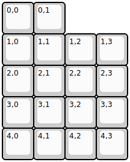{:loading="lazy"}

[Open in keyboard-layout-editor](http://www.keyboard-layout-editor.com/##@@=0,0&=0,1;&@=1,0&=1,1&=1,2&=1,3;&@=2,0&=2,1&=2,2&=2,3;&@=3,0&=3,1&=3,2&=3,3;&@=4,0&=4,1&=4,2&=4,3)

## other/launchpad

[README](output/other/launchpad/README.md) - [layout](output/other/launchpad/launchpad-kle.json) - [PCB](output/other/launchpad/launchpad.kicad_pcb) - [PCB render](output/other/launchpad/launchpad-render.svg)

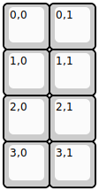{:loading="lazy"}

[Open in keyboard-layout-editor](http://www.keyboard-layout-editor.com/##@@=0,0&=0,1;&@=1,0&=1,1;&@=2,0&=2,1;&@=3,0&=3,1)

## other/lunar

[README](output/other/lunar/README.md) - [layout](output/other/lunar/lunar-kle.json) - [PCB](output/other/lunar/lunar.kicad_pcb) - [PCB render](output/other/lunar/lunar-render.svg)

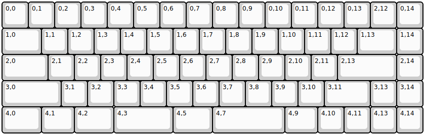{:loading="lazy"}

[Open in keyboard-layout-editor](http://www.keyboard-layout-editor.com/##@@=0,0&=0,1&=0,2&=0,3&=0,4&=0,5&=0,6&=0,7&=0,8&=0,9&=0,10&=0,11&=0,12&=0,13&=2,12&=0,14;&@_w:1.5;&=1,0&=1,1&=1,2&=1,3&=1,4&=1,5&=1,6&=1,7&=1,8&=1,9&=1,10&=1,11&=1,12&_w:1.5;&=1,13&=1,14;&@_w:1.75;&=2,0&=2,1&=2,2&=2,3&=2,4&=2,5&=2,6&=2,7&=2,8&=2,9&=2,10&=2,11&_w:2.25;&=2,13&=2,14;&@_w:2.25;&=3,0&=3,1&=3,2&=3,3&=3,4&=3,5&=3,6&=3,7&=3,8&=3,9&=3,10&_w:1.75;&=3,11&=3,13&=3,14;&@_w:1.5;&=4,0&_w:1.25;&=4,1&_w:1.5;&=4,2&_w:2.25;&=4,3&_w:1.5;&=4,5&_w:2.75;&=4,7&_w:1.25;&=4,9&=4,10&=4,11&=4,13&=4,14)

## other/maypad

[README](output/other/maypad/README.md) - [layout](output/other/maypad/maypad-kle.json) - [PCB](output/other/maypad/maypad.kicad_pcb) - [PCB render](output/other/maypad/maypad-render.svg)

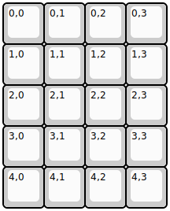{:loading="lazy"}

[Open in keyboard-layout-editor](http://www.keyboard-layout-editor.com/##@@=0,0&=0,1&=0,2&=0,3;&@=1,0&=1,1&=1,2&=1,3;&@=2,0&=2,1&=2,2&=2,3;&@=3,0&=3,1&=3,2&=3,3;&@=4,0&=4,1&=4,2&=4,3)

## other/mechmini_v2

[README](output/other/mechmini_v2/README.md) - [layout](output/other/mechmini_v2/mechmini_v2-kle.json) - [PCB](output/other/mechmini_v2/mechmini_v2.kicad_pcb) - [PCB render](output/other/mechmini_v2/mechmini_v2-render.svg)

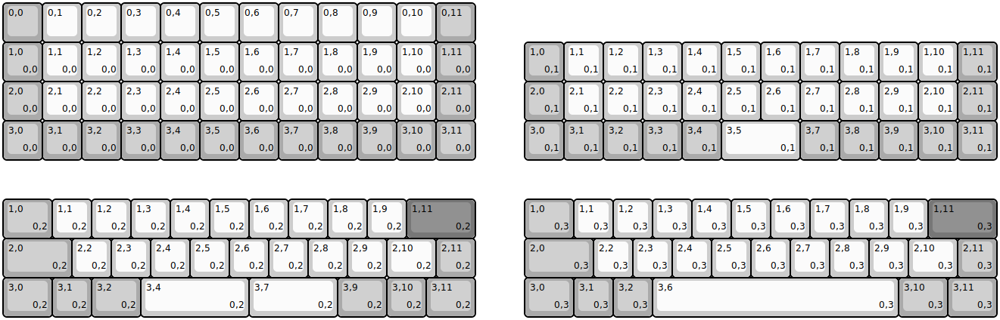{:loading="lazy"}

[Open in keyboard-layout-editor](http://www.keyboard-layout-editor.com/##@@_c=#aaaaaa;&=0,0&_c=#cccccc;&=0,1&=0,2&=0,3&=0,4&=0,5&=0,6&=0,7&=0,8&=0,9&=0,10&_c=#aaaaaa;&=0,11;&@=1,0%0A%0A%0A0,0&_c=#cccccc;&=1,1%0A%0A%0A0,0&=1,2%0A%0A%0A0,0&=1,3%0A%0A%0A0,0&=1,4%0A%0A%0A0,0&=1,5%0A%0A%0A0,0&=1,6%0A%0A%0A0,0&=1,7%0A%0A%0A0,0&=1,8%0A%0A%0A0,0&=1,9%0A%0A%0A0,0&=1,10%0A%0A%0A0,0&_c=#aaaaaa;&=1,11%0A%0A%0A0,0;&@=2,0%0A%0A%0A0,0&_c=#cccccc;&=2,1%0A%0A%0A0,0&=2,2%0A%0A%0A0,0&=2,3%0A%0A%0A0,0&=2,4%0A%0A%0A0,0&=2,5%0A%0A%0A0,0&=2,6%0A%0A%0A0,0&=2,7%0A%0A%0A0,0&=2,8%0A%0A%0A0,0&=2,9%0A%0A%0A0,0&=2,10%0A%0A%0A0,0&_c=#aaaaaa;&=2,11%0A%0A%0A0,0;&@=3,0%0A%0A%0A0,0&=3,1%0A%0A%0A0,0&=3,2%0A%0A%0A0,0&=3,3%0A%0A%0A0,0&=3,4%0A%0A%0A0,0&=3,5%0A%0A%0A0,0&=3,6%0A%0A%0A0,0&=3,7%0A%0A%0A0,0&=3,8%0A%0A%0A0,0&=3,9%0A%0A%0A0,0&=3,10%0A%0A%0A0,0&=3,11%0A%0A%0A0,0;&@_x:13.25&y:-3;&=1,0%0A%0A%0A0,1&_c=#cccccc;&=1,1%0A%0A%0A0,1&=1,2%0A%0A%0A0,1&=1,3%0A%0A%0A0,1&=1,4%0A%0A%0A0,1&=1,5%0A%0A%0A0,1&=1,6%0A%0A%0A0,1&=1,7%0A%0A%0A0,1&=1,8%0A%0A%0A0,1&=1,9%0A%0A%0A0,1&=1,10%0A%0A%0A0,1&_c=#aaaaaa;&=1,11%0A%0A%0A0,1;&@_x:13.25;&=2,0%0A%0A%0A0,1&_c=#cccccc;&=2,1%0A%0A%0A0,1&=2,2%0A%0A%0A0,1&=2,3%0A%0A%0A0,1&=2,4%0A%0A%0A0,1&=2,5%0A%0A%0A0,1&=2,6%0A%0A%0A0,1&=2,7%0A%0A%0A0,1&=2,8%0A%0A%0A0,1&=2,9%0A%0A%0A0,1&=2,10%0A%0A%0A0,1&_c=#aaaaaa;&=2,11%0A%0A%0A0,1;&@_x:13.25;&=3,0%0A%0A%0A0,1&=3,1%0A%0A%0A0,1&=3,2%0A%0A%0A0,1&=3,3%0A%0A%0A0,1&=3,4%0A%0A%0A0,1&_c=#cccccc&w:2;&=3,5%0A%0A%0A0,1&_c=#aaaaaa;&=3,7%0A%0A%0A0,1&=3,8%0A%0A%0A0,1&=3,9%0A%0A%0A0,1&=3,10%0A%0A%0A0,1&=3,11%0A%0A%0A0,1;&@_y:1&w:1.25;&=1,0%0A%0A%0A0,2&_c=#cccccc;&=1,1%0A%0A%0A0,2&=1,2%0A%0A%0A0,2&=1,3%0A%0A%0A0,2&=1,4%0A%0A%0A0,2&=1,5%0A%0A%0A0,2&=1,6%0A%0A%0A0,2&=1,7%0A%0A%0A0,2&=1,8%0A%0A%0A0,2&=1,9%0A%0A%0A0,2&_c=#777777&w:1.75;&=1,11%0A%0A%0A0,2&_x:1.25&c=#aaaaaa&w:1.25;&=1,0%0A%0A%0A0,3&_c=#cccccc;&=1,1%0A%0A%0A0,3&=1,2%0A%0A%0A0,3&=1,3%0A%0A%0A0,3&=1,4%0A%0A%0A0,3&=1,5%0A%0A%0A0,3&=1,6%0A%0A%0A0,3&=1,7%0A%0A%0A0,3&=1,8%0A%0A%0A0,3&=1,9%0A%0A%0A0,3&_c=#777777&w:1.75;&=1,11%0A%0A%0A0,3;&@_c=#aaaaaa&w:1.75;&=2,0%0A%0A%0A0,2&_c=#cccccc;&=2,2%0A%0A%0A0,2&=2,3%0A%0A%0A0,2&=2,4%0A%0A%0A0,2&=2,5%0A%0A%0A0,2&=2,6%0A%0A%0A0,2&=2,7%0A%0A%0A0,2&=2,8%0A%0A%0A0,2&=2,9%0A%0A%0A0,2&_w:1.25;&=2,10%0A%0A%0A0,2&_c=#aaaaaa;&=2,11%0A%0A%0A0,2&_x:1.25&w:1.75;&=2,0%0A%0A%0A0,3&_c=#cccccc;&=2,2%0A%0A%0A0,3&=2,3%0A%0A%0A0,3&=2,4%0A%0A%0A0,3&=2,5%0A%0A%0A0,3&=2,6%0A%0A%0A0,3&=2,7%0A%0A%0A0,3&=2,8%0A%0A%0A0,3&=2,9%0A%0A%0A0,3&_w:1.25;&=2,10%0A%0A%0A0,3&_c=#aaaaaa;&=2,11%0A%0A%0A0,3;&@_w:1.25;&=3,0%0A%0A%0A0,2&=3,1%0A%0A%0A0,2&_w:1.25;&=3,2%0A%0A%0A0,2&_c=#cccccc&w:2.75;&=3,4%0A%0A%0A0,2&_w:2.25;&=3,7%0A%0A%0A0,2&_c=#aaaaaa&w:1.25;&=3,9%0A%0A%0A0,2&=3,10%0A%0A%0A0,2&_w:1.25;&=3,11%0A%0A%0A0,2&_x:1.25&w:1.25;&=3,0%0A%0A%0A0,3&=3,1%0A%0A%0A0,3&=3,2%0A%0A%0A0,3&_c=#cccccc&w:6.25;&=3,6%0A%0A%0A0,3&_c=#aaaaaa&w:1.25;&=3,10%0A%0A%0A0,3&_w:1.25;&=3,11%0A%0A%0A0,3)

## other/mxss

[README](output/other/mxss/README.md) - [layout](output/other/mxss/mxss-kle.json) - [PCB](output/other/mxss/mxss.kicad_pcb) - [PCB render](output/other/mxss/mxss-render.svg)

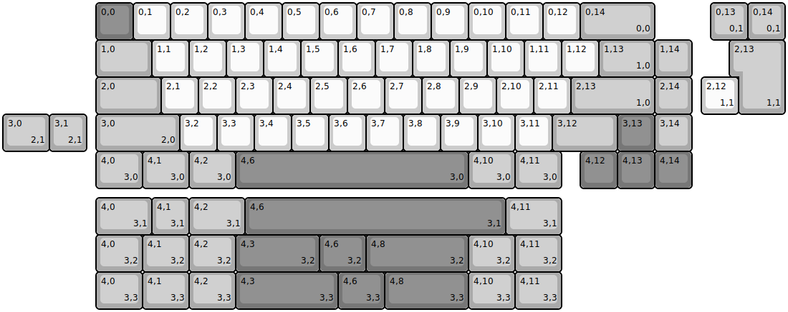{:loading="lazy"}

[Open in keyboard-layout-editor](http://www.keyboard-layout-editor.com/##@@_x:2.5&c=#777777;&=0,0&_c=#cccccc;&=0,1&=0,2&=0,3&=0,4&=0,5&=0,6&=0,7&=0,8&=0,9&=0,10&=0,11&=0,12&_c=#aaaaaa&w:2;&=0,14%0A%0A%0A0,0;&@_x:2.5&w:1.5;&=1,0&_c=#cccccc;&=1,1&=1,2&=1,3&=1,4&=1,5&=1,6&=1,7&=1,8&=1,9&=1,10&=1,11&=1,12&_c=#aaaaaa&w:1.5;&=1,13%0A%0A%0A1,0&=1,14;&@_x:2.5&w:1.75;&=2,0&_c=#cccccc;&=2,1&=2,2&=2,3&=2,4&=2,5&=2,6&=2,7&=2,8&=2,9&=2,10&=2,11&_c=#aaaaaa&w:2.25;&=2,13%0A%0A%0A1,0&=2,14;&@_x:2.5&w:2.25;&=3,0%0A%0A%0A2,0&_c=#cccccc;&=3,2&=3,3&=3,4&=3,5&=3,6&=3,7&=3,8&=3,9&=3,10&=3,11&_c=#aaaaaa&w:1.75;&=3,12&_c=#777777;&=3,13&_c=#aaaaaa;&=3,14;&@_x:2.5&w:1.25;&=4,0%0A%0A%0A3,0&_w:1.25;&=4,1%0A%0A%0A3,0&_w:1.25;&=4,2%0A%0A%0A3,0&_c=#777777&w:6.25;&=4,6%0A%0A%0A3,0&_c=#aaaaaa&w:1.25;&=4,10%0A%0A%0A3,0&_w:1.25;&=4,11%0A%0A%0A3,0&_x:0.5&c=#777777;&=4,12&=4,13&=4,14;&@_x:19.0&y:-5&c=#aaaaaa;&=0,13%0A%0A%0A0,1&=0,14%0A%0A%0A0,1;&@_x:19.75&w:1.25&h:2&w2:1.5&h2:1&x2:-0.25;&=2,13%0A%0A%0A1,1;&@_x:18.75&c=#cccccc;&=2,12%0A%0A%0A1,1;&@_c=#aaaaaa&w:1.25;&=3,0%0A%0A%0A2,1&=3,1%0A%0A%0A2,1;&@_x:2.5&y:1.25&w:1.5;&=4,0%0A%0A%0A3,1&=4,1%0A%0A%0A3,1&_w:1.5;&=4,2%0A%0A%0A3,1&_c=#777777&w:7;&=4,6%0A%0A%0A3,1&_c=#aaaaaa&w:1.5;&=4,11%0A%0A%0A3,1;&@_x:2.5&w:1.25;&=4,0%0A%0A%0A3,2&_w:1.25;&=4,1%0A%0A%0A3,2&_w:1.25;&=4,2%0A%0A%0A3,2&_c=#777777&w:2.25;&=4,3%0A%0A%0A3,2&_w:1.25;&=4,6%0A%0A%0A3,2&_w:2.75;&=4,8%0A%0A%0A3,2&_c=#aaaaaa&w:1.25;&=4,10%0A%0A%0A3,2&_w:1.25;&=4,11%0A%0A%0A3,2;&@_x:2.5&w:1.25;&=4,0%0A%0A%0A3,3&_w:1.25;&=4,1%0A%0A%0A3,3&_w:1.25;&=4,2%0A%0A%0A3,3&_c=#777777&w:2.75;&=4,3%0A%0A%0A3,3&_w:1.25;&=4,6%0A%0A%0A3,3&_w:2.25;&=4,8%0A%0A%0A3,3&_c=#aaaaaa&w:1.25;&=4,10%0A%0A%0A3,3&_w:1.25;&=4,11%0A%0A%0A3,3)

## other/neuron

[README](output/other/neuron/README.md) - [layout](output/other/neuron/neuron-kle.json) - [PCB](output/other/neuron/neuron.kicad_pcb) - [PCB render](output/other/neuron/neuron-render.svg)

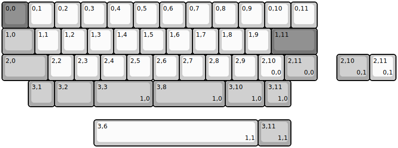{:loading="lazy"}

[Open in keyboard-layout-editor](http://www.keyboard-layout-editor.com/##@@_c=#777777;&=0,0&_c=#cccccc;&=0,1&=0,2&=0,3&=0,4&=0,5&=0,6&=0,7&=0,8&=0,9&=0,10&=0,11;&@_c=#aaaaaa&w:1.25;&=1,0&_c=#cccccc;&=1,1&=1,2&=1,3&=1,4&=1,5&=1,6&=1,7&=1,8&=1,9&_c=#777777&w:1.75;&=1,11;&@_c=#aaaaaa&w:1.75;&=2,0&_c=#cccccc;&=2,2&=2,3&=2,4&=2,5&=2,6&=2,7&=2,8&=2,9&=2,10%0A%0A%0A0,0&_c=#aaaaaa&w:1.25;&=2,11%0A%0A%0A0,0;&@_x:1;&=3,1&_w:1.5;&=3,2&_w:2.25;&=3,3%0A%0A%0A1,0&_w:2.75;&=3,8%0A%0A%0A1,0&_w:1.5;&=3,10%0A%0A%0A1,0&=3,11%0A%0A%0A1,0;&@_x:12.75&y:-2&w:1.25;&=2,10%0A%0A%0A0,1&_c=#cccccc;&=2,11%0A%0A%0A0,1;&@_x:3.5&y:1.5&w:6.25;&=3,6%0A%0A%0A1,1&_c=#aaaaaa&w:1.25;&=3,11%0A%0A%0A1,1)

## other/ok60

[README](output/other/ok60/README.md) - [layout](output/other/ok60/ok60-kle.json) - [PCB](output/other/ok60/ok60.kicad_pcb) - [PCB render](output/other/ok60/ok60-render.svg)

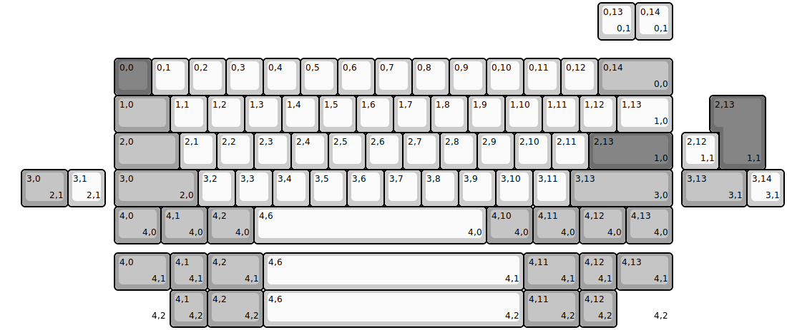{:loading="lazy"}

[Open in keyboard-layout-editor](http://www.keyboard-layout-editor.com/##@@_x:3&y:1.5&c=#6e6e6e;&=0,0&_c=#cccccc;&=0,1&=0,2&=0,3&=0,4&=0,5&=0,6&=0,7&=0,8&=0,9&=0,10&=0,11&=0,12&_c=#a1a1a1&w:2;&=0,14%0A%0A%0A0,0;&@_x:3&w:1.5;&=1,0&_c=#cccccc;&=1,1&=1,2&=1,3&=1,4&=1,5&=1,6&=1,7&=1,8&=1,9&=1,10&=1,11&=1,12&_w:1.5;&=1,13%0A%0A%0A1,0;&@_x:3&c=#a1a1a1&w:1.75;&=2,0&_c=#cccccc;&=2,1&=2,2&=2,3&=2,4&=2,5&=2,6&=2,7&=2,8&=2,9&=2,10&=2,11&_c=#6e6e6e&w:2.25;&=2,13%0A%0A%0A1,0;&@_x:3.0&c=#a1a1a1&w:2.25;&=3,0%0A%0A%0A2,0&_c=#cccccc;&=3,2&=3,3&=3,4&=3,5&=3,6&=3,7&=3,8&=3,9&=3,10&=3,11&_c=#a1a1a1&w:2.75;&=3,13%0A%0A%0A3,0;&@_x:3&w:1.25;&=4,0%0A%0A%0A4,0&_w:1.25;&=4,1%0A%0A%0A4,0&_w:1.25;&=4,2%0A%0A%0A4,0&_c=#cccccc&w:6.25;&=4,6%0A%0A%0A4,0&_c=#a1a1a1&w:1.25;&=4,10%0A%0A%0A4,0&_w:1.25;&=4,11%0A%0A%0A4,0&_w:1.25;&=4,12%0A%0A%0A4,0&_w:1.25;&=4,13%0A%0A%0A4,0;&@_x:16&y:-6.5&c=#cccccc;&=0,13%0A%0A%0A0,1&=0,14%0A%0A%0A0,1;&@_x:19.25&y:1.5&c=#6e6e6e&w:1.25&h:2&w2:1.5&h2:1&x2:-0.25;&=2,13%0A%0A%0A1,1;&@_x:18.25&c=#cccccc;&=2,12%0A%0A%0A1,1;&@_x:0.5&c=#a1a1a1&w:1.25;&=3,0%0A%0A%0A2,1&_c=#cccccc;&=3,1%0A%0A%0A2,1&_x:15.5&c=#a1a1a1&w:1.75;&=3,13%0A%0A%0A3,1&_c=#cccccc;&=3,14%0A%0A%0A3,1;&@_x:3&y:1.25&c=#a1a1a1&w:1.5;&=4,0%0A%0A%0A4,1&=4,1%0A%0A%0A4,1&_w:1.5;&=4,2%0A%0A%0A4,1&_c=#cccccc&w:7;&=4,6%0A%0A%0A4,1&_c=#a1a1a1&w:1.5;&=4,11%0A%0A%0A4,1&=4,12%0A%0A%0A4,1&_w:1.5;&=4,13%0A%0A%0A4,1;&@_x:3&w:1.5&d:true;&=%0A%0A%0A4,2&=4,1%0A%0A%0A4,2&_w:1.5;&=4,2%0A%0A%0A4,2&_c=#cccccc&w:7;&=4,6%0A%0A%0A4,2&_c=#a1a1a1&w:1.5;&=4,11%0A%0A%0A4,2&=4,12%0A%0A%0A4,2&_w:1.5&d:true;&=%0A%0A%0A4,2)

## other/osa

[README](output/other/osa/README.md) - [layout](output/other/osa/osa-kle.json) - [PCB](output/other/osa/osa.kicad_pcb) - [PCB render](output/other/osa/osa-render.svg)

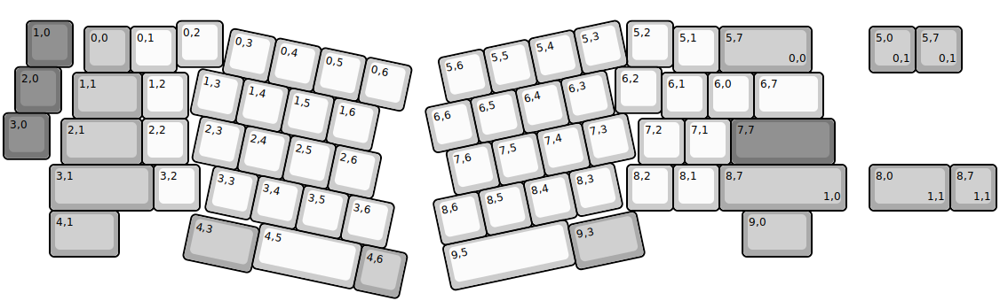{:loading="lazy"}

[Open in keyboard-layout-editor](http://www.keyboard-layout-editor.com/##@@_x:0.5&y:0.38&c=#777777;&=1,0&_x:2.25&c=#cccccc;&=0,2&_x:8.75;&=5,2;&@_x:1.75&y:-0.88&c=#aaaaaa;&=0,0&_c=#cccccc;&=0,1&_x:10.75;&=5,1&_c=#aaaaaa&w:2;&=5,7%0A%0A%0A0,0;&@_x:0.25&y:-0.12&c=#777777;&=2,0&_x:12.0&c=#cccccc;&=6,2;&@_x:1.5&y:-0.88&c=#aaaaaa&w:1.5;&=1,1&_c=#cccccc;&=1,2&_x:10.25;&=6,1&=6,0&_w:1.5;&=6,7;&@_y:-0.12&c=#777777;&=3,0;&@_x:1.25&y:-0.88&c=#aaaaaa&w:1.75;&=2,1&_c=#cccccc;&=2,2&_x:9.75;&=7,2&=7,1&_c=#777777&w:2.25;&=7,7;&@_x:1&c=#aaaaaa&w:2.25;&=3,1&_c=#cccccc;&=3,2&_x:9.25;&=8,2&=8,1&_c=#aaaaaa&w:2.75;&=8,7%0A%0A%0A1,0;&@_x:1&w:1.5;&=4,1&_x:13.5&w:1.5;&=9,0;&@_r:12&rx:4.75&ry:1.5&y:-1.0&c=#cccccc;&=0,3&=0,4&=0,5&=0,6;&@_x:-0.5;&=1,3&=1,4&=1,5&=1,6;&@_x:-0.25;&=2,3&=2,4&=2,5&=2,6;&@_x:0.25;&=3,3&=3,4&=3,5&=3,6;&@_x:1.5&w:2.25;&=4,5&_c=#aaaaaa;&=4,6;&@_y:-0.88&w:1.5;&=4,3;&@_r:-12&rx:14&ry:1.25&x:-4.5&y:-1.0&c=#cccccc;&=5,6&=5,5&=5,4&=5,3;&@_x:-5;&=6,6&=6,5&=6,4&=6,3;&@_x:-4.75;&=7,6&=7,5&=7,4&=7,3;&@_x:-5.25;&=8,6&=8,5&=8,4&=8,3;&@_x:-5.25&w:2.75;&=9,5;&@_x:-2.5&y:-0.87&c=#aaaaaa&w:1.5;&=9,3;&@_r:0&rx:0&ry:0&x:18.75&y:0.5;&=5,0%0A%0A%0A0,1&=5,7%0A%0A%0A0,1;&@_x:18.75&y:2.0&w:1.75;&=8,0%0A%0A%0A1,1&=8,7%0A%0A%0A1,1)

## other/pdxkbc

[README](output/other/pdxkbc/README.md) - [layout](output/other/pdxkbc/pdxkbc-kle.json) - [PCB](output/other/pdxkbc/pdxkbc.kicad_pcb) - [PCB render](output/other/pdxkbc/pdxkbc-render.svg)

{:loading="lazy"}

[Open in keyboard-layout-editor](http://www.keyboard-layout-editor.com/##@@=0,0&=0,1;&@=1,0&=1,1;&@=2,0&=2,1)

## other/ph_arisu

[README](output/other/ph_arisu/README.md) - [layout](output/other/ph_arisu/ph_arisu-kle.json) - [PCB](output/other/ph_arisu/ph_arisu.kicad_pcb) - [PCB render](output/other/ph_arisu/ph_arisu-render.svg)

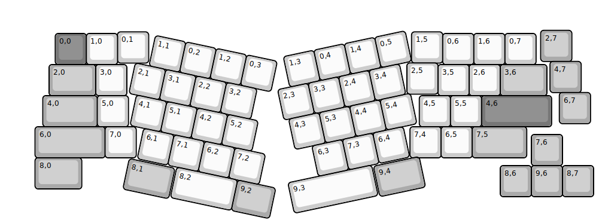{:loading="lazy"}

[Open in keyboard-layout-editor](http://www.keyboard-layout-editor.com/##@@_x:17.3&y:0.9&c=#aaaaaa;&=2,7;&@_x:3.7&y:-0.95&c=#cccccc;&=0,1&_x:8.45;&=1,5;&@_x:1.7&y:-0.95&c=#777777;&=0,0&_c=#cccccc;&=1,0&_x:10.45;&=0,6&=1,6&=0,7;&@_x:17.6&y:-0.1&c=#aaaaaa;&=4,7;&@_x:13&y:-0.95&c=#cccccc;&=2,5;&@_x:1.5&y:-0.95&c=#aaaaaa&w:1.5;&=2,0&_c=#cccccc;&=3,0&_x:10.0;&=3,5&=2,6&_c=#aaaaaa&w:1.5;&=3,6;&@_x:17.9&y:-0.1;&=6,7;&@_x:1.3&y:-0.9&w:1.75;&=4,0&_c=#cccccc;&=5,0&_x:9.35;&=4,5&=5,5&_c=#777777&w:2.25;&=4,6;&@_x:1.05&c=#aaaaaa&w:2.25;&=6,0&_c=#cccccc;&=7,0&_x:8.8;&=7,4&=6,5&_c=#aaaaaa&w:1.75;&=7,5;&@_x:17&y:-0.75;&=7,6;&@_x:1.05&y:-0.25&w:1.5;&=8,0;&@_x:16&y:-0.75;&=8,6&=9,6&=8,7;&@_r:12&x:5.05&y:-6.25&c=#cccccc;&=1,1&=0,2&=1,2&=0,3;&@_x:4.6;&=2,1&=3,1&=2,2&=3,2;&@_x:4.85;&=4,1&=5,1&=4,2&=5,2;&@_x:5.3;&=6,1&=7,1&=6,2&=7,2;&@_x:6.6&w:2;&=8,2&_c=#aaaaaa&w:1.25;&=9,2;&@_x:5.05&y:-0.95&w:1.5;&=8,1;&@_r:-12&x:8.45&y:-1.45&c=#cccccc;&=1,3&=0,4&=1,4&=0,5;&@_x:8.05;&=2,3&=3,3&=2,4&=3,4;&@_x:8.2;&=4,3&=5,3&=4,4&=5,4;&@_x:8.75;&=6,3&=7,3&=6,4;&@_x:7.75&w:2.75;&=9,3;&@_x:10.55&y:-0.95&c=#aaaaaa&w:1.5;&=9,4)

## other/practice60

[README](output/other/practice60/README.md) - [layout](output/other/practice60/practice60-kle.json) - [PCB](output/other/practice60/practice60.kicad_pcb) - [PCB render](output/other/practice60/practice60-render.svg)

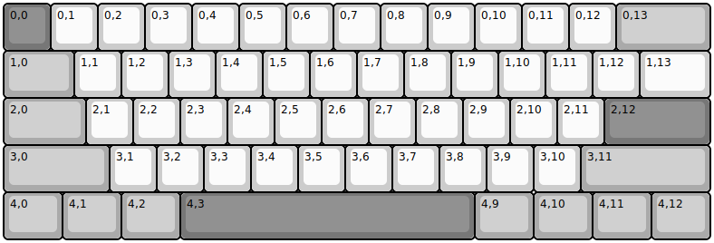{:loading="lazy"}

[Open in keyboard-layout-editor](http://www.keyboard-layout-editor.com/##@@_c=#777777;&=0,0&_c=#cccccc;&=0,1&=0,2&=0,3&=0,4&=0,5&=0,6&=0,7&=0,8&=0,9&=0,10&=0,11&=0,12&_c=#aaaaaa&w:2;&=0,13;&@_w:1.5;&=1,0&_c=#cccccc;&=1,1&=1,2&=1,3&=1,4&=1,5&=1,6&=1,7&=1,8&=1,9&=1,10&=1,11&=1,12&_w:1.5;&=1,13;&@_c=#aaaaaa&w:1.75;&=2,0&_c=#cccccc;&=2,1&=2,2&=2,3&=2,4&=2,5&=2,6&=2,7&=2,8&=2,9&=2,10&=2,11&_c=#777777&w:2.25;&=2,12;&@_c=#aaaaaa&w:2.25;&=3,0&_c=#cccccc;&=3,1&=3,2&=3,3&=3,4&=3,5&=3,6&=3,7&=3,8&=3,9&=3,10&_c=#aaaaaa&w:2.75;&=3,11;&@_w:1.25;&=4,0&_w:1.25;&=4,1&_w:1.25;&=4,2&_c=#777777&w:6.25;&=4,3&_c=#aaaaaa&w:1.25;&=4,9&_w:1.25;&=4,10&_w:1.25;&=4,11&_w:1.25;&=4,12)

## other/rocketboard_16

[README](output/other/rocketboard_16/README.md) - [layout](output/other/rocketboard_16/rocketboard_16-kle.json) - [PCB](output/other/rocketboard_16/rocketboard_16.kicad_pcb) - [PCB render](output/other/rocketboard_16/rocketboard_16-render.svg)

{:loading="lazy"}

[Open in keyboard-layout-editor](http://www.keyboard-layout-editor.com/##@@=0,0&=0,3;&@=1,0&=1,1&=1,2&=1,3;&@=2,0&=2,1&=2,2&=2,3;&@=3,0&=3,1&=3,2&=3,3;&@=4,0&=4,1&=4,2&=4,3)

## other/s7_elephant/s7_elephant_rev2

[README](output/other/s7_elephant/README.md) - [layout](output/other/s7_elephant/s7_elephant_rev2-kle.json) - [PCB](output/other/s7_elephant/s7_elephant_rev2.kicad_pcb) - [PCB render](output/other/s7_elephant/s7_elephant_rev2-render.svg)

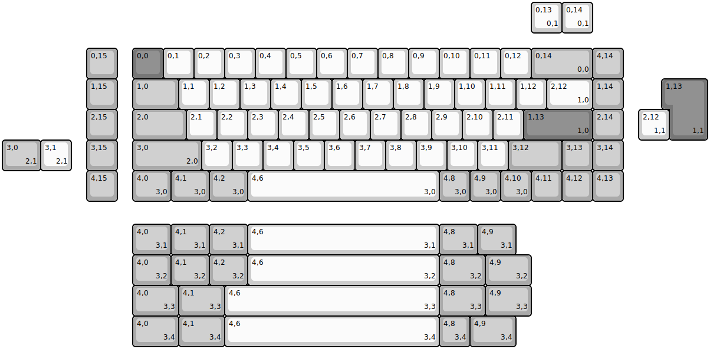{:loading="lazy"}

[Open in keyboard-layout-editor](http://www.keyboard-layout-editor.com/##@@_x:2.75&y:1.5&c=#aaaaaa;&=0,15&_x:0.5&c=#777777;&=0,0&_c=#cccccc;&=0,1&=0,2&=0,3&=0,4&=0,5&=0,6&=0,7&=0,8&=0,9&=0,10&=0,11&=0,12&_c=#aaaaaa&w:2;&=0,14%0A%0A%0A0,0&=4,14;&@_x:2.75;&=1,15&_x:0.5&w:1.5;&=1,0&_c=#cccccc;&=1,1&=1,2&=1,3&=1,4&=1,5&=1,6&=1,7&=1,8&=1,9&=1,10&=1,11&=1,12&_w:1.5;&=2,12%0A%0A%0A1,0&_c=#aaaaaa;&=1,14;&@_x:2.75;&=2,15&_x:0.5&w:1.75;&=2,0&_c=#cccccc;&=2,1&=2,2&=2,3&=2,4&=2,5&=2,6&=2,7&=2,8&=2,9&=2,10&=2,11&_c=#777777&w:2.25;&=1,13%0A%0A%0A1,0&_c=#aaaaaa;&=2,14;&@_x:2.75;&=3,15&_x:0.5&w:2.25;&=3,0%0A%0A%0A2,0&_c=#cccccc;&=3,2&=3,3&=3,4&=3,5&=3,6&=3,7&=3,8&=3,9&=3,10&=3,11&_c=#aaaaaa&w:1.75;&=3,12&=3,13&=3,14;&@_x:2.75;&=4,15&_x:0.5&w:1.25;&=4,0%0A%0A%0A3,0&_w:1.25;&=4,1%0A%0A%0A3,0&_w:1.25;&=4,2%0A%0A%0A3,0&_c=#cccccc&w:6.25;&=4,6%0A%0A%0A3,0&_c=#aaaaaa;&=4,8%0A%0A%0A3,0&=4,9%0A%0A%0A3,0&=4,10%0A%0A%0A3,0&=4,11&=4,12&=4,13;&@_x:17.25&y:-6.5&c=#cccccc;&=0,13%0A%0A%0A0,1&=0,14%0A%0A%0A0,1;&@_x:21.75&y:1.5&c=#777777&w:1.25&h:2&w2:1.5&h2:1&x2:-0.25;&=1,13%0A%0A%0A1,1;&@_x:20.75&c=#cccccc;&=2,12%0A%0A%0A1,1;&@_c=#aaaaaa&w:1.25;&=3,0%0A%0A%0A2,1&_c=#cccccc;&=3,1%0A%0A%0A2,1;&@_x:4.25&y:1.75&c=#aaaaaa&w:1.25;&=4,0%0A%0A%0A3,1&_w:1.25;&=4,1%0A%0A%0A3,1&_w:1.25;&=4,2%0A%0A%0A3,1&_c=#cccccc&w:6.25;&=4,6%0A%0A%0A3,1&_c=#aaaaaa&w:1.25;&=4,8%0A%0A%0A3,1&_w:1.25;&=4,9%0A%0A%0A3,1;&@_x:4.25&w:1.25;&=4,0%0A%0A%0A3,2&_w:1.25;&=4,1%0A%0A%0A3,2&_w:1.25;&=4,2%0A%0A%0A3,2&_c=#cccccc&w:6.25;&=4,6%0A%0A%0A3,2&_c=#aaaaaa&w:1.5;&=4,8%0A%0A%0A3,2&_w:1.5;&=4,9%0A%0A%0A3,2;&@_x:4.25&w:1.5;&=4,0%0A%0A%0A3,3&_w:1.5;&=4,1%0A%0A%0A3,3&_c=#cccccc&w:7;&=4,6%0A%0A%0A3,3&_c=#aaaaaa&w:1.5;&=4,8%0A%0A%0A3,3&_w:1.5;&=4,9%0A%0A%0A3,3;&@_x:4.25&w:1.5;&=4,0%0A%0A%0A3,4&_w:1.5;&=4,1%0A%0A%0A3,4&_c=#cccccc&w:7;&=4,6%0A%0A%0A3,4&_c=#aaaaaa;&=4,8%0A%0A%0A3,4&_w:1.5;&=4,9%0A%0A%0A3,4)

## other/singa

[README](output/other/singa/README.md) - [layout](output/other/singa/singa-kle.json) - [PCB](output/other/singa/singa.kicad_pcb) - [PCB render](output/other/singa/singa-render.svg)

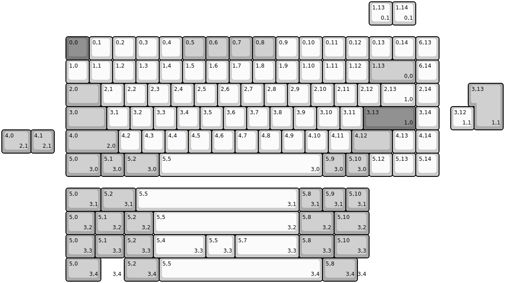{:loading="lazy"}

[Open in keyboard-layout-editor](http://www.keyboard-layout-editor.com/##@@_x:2.75&y:1.5&c=#777777;&=0,0&_c=#cccccc;&=0,1&=0,2&=0,3&=0,4&_c=#aaaaaa;&=0,5&=0,6&=0,7&=0,8&_c=#cccccc;&=0,9&=0,10&=0,11&=0,12&=0,13&=0,14&=6,13;&@_x:2.75;&=1,0&=1,1&=1,2&=1,3&=1,4&=1,5&=1,6&=1,7&=1,8&=1,9&=1,10&=1,11&=1,12&_c=#aaaaaa&w:2;&=1,13%0A%0A%0A0,0&_c=#cccccc;&=6,14;&@_x:2.75&c=#aaaaaa&w:1.5;&=2,0&_c=#cccccc;&=2,1&=2,2&=2,3&=2,4&=2,5&=2,6&=2,7&=2,8&=2,9&=2,10&=2,11&=2,12&_w:1.5;&=2,13%0A%0A%0A1,0&=2,14;&@_x:2.75&c=#aaaaaa&w:1.75;&=3,0&_c=#cccccc;&=3,1&=3,2&=3,3&=3,4&=3,5&=3,6&=3,7&=3,8&=3,9&=3,10&=3,11&_c=#777777&w:2.25;&=3,13%0A%0A%0A1,0&_c=#cccccc;&=3,14;&@_x:2.75&c=#aaaaaa&w:2.25;&=4,0%0A%0A%0A2,0&_c=#cccccc;&=4,2&=4,3&=4,4&=4,5&=4,6&=4,7&=4,8&=4,9&=4,10&=4,11&_c=#aaaaaa&w:1.75;&=4,12&_c=#cccccc;&=4,13&=4,14;&@_x:2.75&c=#aaaaaa&w:1.5;&=5,0%0A%0A%0A3,0&=5,1%0A%0A%0A3,0&_w:1.5;&=5,2%0A%0A%0A3,0&_c=#cccccc&w:7;&=5,5%0A%0A%0A3,0&_c=#aaaaaa;&=5,9%0A%0A%0A3,0&=5,10%0A%0A%0A3,0&_c=#cccccc;&=5,12&=5,13&=5,14;&@_x:15.75&y:-7.5;&=1,13%0A%0A%0A0,1&=1,14%0A%0A%0A0,1;&@_x:20.25&y:2.5&c=#aaaaaa&w:1.25&h:2&w2:1.5&h2:1&x2:-0.25;&=3,13%0A%0A%0A1,1;&@_x:19.25&c=#cccccc;&=3,12%0A%0A%0A1,1;&@_c=#aaaaaa&w:1.25;&=4,0%0A%0A%0A2,1&=4,1%0A%0A%0A2,1;&@_x:2.75&y:1.5&w:1.5;&=5,0%0A%0A%0A3,1&_w:1.5;&=5,2%0A%0A%0A3,1&_c=#cccccc&w:7;&=5,5%0A%0A%0A3,1&_c=#aaaaaa;&=5,8%0A%0A%0A3,1&=5,9%0A%0A%0A3,1&=5,10%0A%0A%0A3,1;&@_x:2.75&w:1.25;&=5,0%0A%0A%0A3,2&_w:1.25;&=5,1%0A%0A%0A3,2&_w:1.25;&=5,2%0A%0A%0A3,2&_c=#cccccc&w:6.25;&=5,5%0A%0A%0A3,2&_c=#aaaaaa&w:1.5;&=5,8%0A%0A%0A3,2&_w:1.5;&=5,10%0A%0A%0A3,2;&@_x:2.75&w:1.25;&=5,0%0A%0A%0A3,3&_w:1.25;&=5,1%0A%0A%0A3,3&_w:1.25;&=5,2%0A%0A%0A3,3&_c=#cccccc&w:2.25;&=5,4%0A%0A%0A3,3&_w:1.25;&=5,5%0A%0A%0A3,3&_w:2.75;&=5,7%0A%0A%0A3,3&_c=#aaaaaa&w:1.5;&=5,8%0A%0A%0A3,3&_w:1.5;&=5,10%0A%0A%0A3,3;&@_x:2.75&w:1.5;&=5,0%0A%0A%0A3,4&_c=#cccccc&d:true;&=%0A%0A%0A3,4&_c=#aaaaaa&w:1.5;&=5,2%0A%0A%0A3,4&_c=#cccccc&w:7;&=5,5%0A%0A%0A3,4&_c=#aaaaaa&w:1.5;&=5,8%0A%0A%0A3,4&_c=#cccccc&w:0.5&d:true;&=%0A%0A%0A3,4)

## other/snagpad

[README](output/other/snagpad/README.md) - [layout](output/other/snagpad/snagpad-kle.json) - [PCB](output/other/snagpad/snagpad.kicad_pcb) - [PCB render](output/other/snagpad/snagpad-render.svg)

{:loading="lazy"}

[Open in keyboard-layout-editor](http://www.keyboard-layout-editor.com/##@@_c=#505557&t=#d9d7d7;&=0,0&=0,1&=0,2&=0,3;&@=1,0&=1,1&=1,2&=1,3;&@=2,0&=2,1&=2,2&=2,3;&@=3,0&=3,1&=3,2&=3,3;&@=4,0&=4,1&=4,2&=4,3)

## other/tada68

[README](output/other/tada68/README.md) - [layout](output/other/tada68/tada68-kle.json) - [PCB](output/other/tada68/tada68.kicad_pcb) - [PCB render](output/other/tada68/tada68-render.svg)

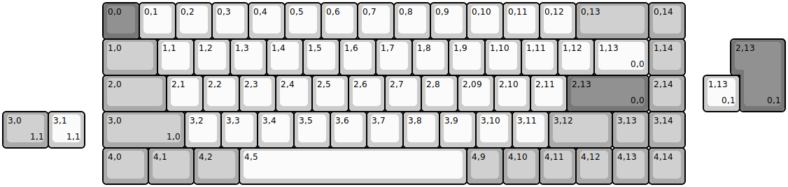{:loading="lazy"}

[Open in keyboard-layout-editor](http://www.keyboard-layout-editor.com/##@@_x:2.75&c=#777777;&=0,0&_c=#cccccc;&=0,1&=0,2&=0,3&=0,4&=0,5&=0,6&=0,7&=0,8&=0,9&=0,10&=0,11&=0,12&_c=#aaaaaa&w:2;&=0,13&=0,14;&@_x:2.75&w:1.5;&=1,0&_c=#cccccc;&=1,1&=1,2&=1,3&=1,4&=1,5&=1,6&=1,7&=1,8&=1,9&=1,10&=1,11&=1,12&_w:1.5;&=1,13%0A%0A%0A0,0&_c=#aaaaaa;&=1,14;&@_x:2.75&w:1.75;&=2,0&_c=#cccccc;&=2,1&=2,2&=2,3&=2,4&=2,5&=2,6&=2,7&=2,8&=2,09&=2,10&=2,11&_c=#777777&w:2.25;&=2,13%0A%0A%0A0,0&_c=#aaaaaa;&=2,14;&@_x:2.75&w:2.25;&=3,0%0A%0A%0A1,0&_c=#cccccc;&=3,2&=3,3&=3,4&=3,5&=3,6&=3,7&=3,8&=3,9&=3,10&=3,11&_c=#aaaaaa&w:1.75;&=3,12&=3,13&=3,14;&@_x:2.75&w:1.25;&=4,0&_w:1.25;&=4,1&_w:1.25;&=4,2&_c=#cccccc&w:6.25;&=4,5&_c=#aaaaaa;&=4,9&=4,10&=4,11&=4,12&=4,13&=4,14;&@_x:20.25&y:-4&c=#777777&w:1.25&h:2&w2:1.5&h2:1&x2:-0.25;&=2,13%0A%0A%0A0,1;&@_x:19.25&c=#cccccc;&=1,13%0A%0A%0A0,1;&@_c=#aaaaaa&w:1.25;&=3,0%0A%0A%0A1,1&_c=#cccccc;&=3,1%0A%0A%0A1,1)

## other/unikorn

[README](output/other/unikorn/README.md) - [layout](output/other/unikorn/unikorn-kle.json) - [PCB](output/other/unikorn/unikorn.kicad_pcb) - [PCB render](output/other/unikorn/unikorn-render.svg)

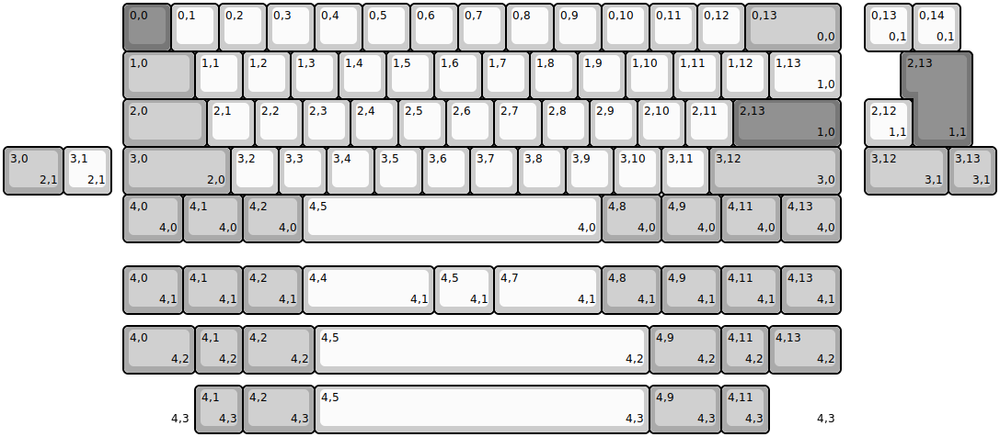{:loading="lazy"}

[Open in keyboard-layout-editor](http://www.keyboard-layout-editor.com/##@@_x:2.5&c=#777777;&=0,0&_c=#cccccc;&=0,1&=0,2&=0,3&=0,4&=0,5&=0,6&=0,7&=0,8&=0,9&=0,10&=0,11&=0,12&_c=#aaaaaa&w:2;&=0,13%0A%0A%0A0,0;&@_x:2.5&w:1.5;&=1,0&_c=#cccccc;&=1,1&=1,2&=1,3&=1,4&=1,5&=1,6&=1,7&=1,8&=1,9&=1,10&=1,11&=1,12&_w:1.5;&=1,13%0A%0A%0A1,0;&@_x:2.5&c=#aaaaaa&w:1.75;&=2,0&_c=#cccccc;&=2,1&=2,2&=2,3&=2,4&=2,5&=2,6&=2,7&=2,8&=2,9&=2,10&=2,11&_c=#777777&w:2.25;&=2,13%0A%0A%0A1,0;&@_x:2.5&c=#aaaaaa&w:2.25;&=3,0%0A%0A%0A2,0&_c=#cccccc;&=3,2&=3,3&=3,4&=3,5&=3,6&=3,7&=3,8&=3,9&=3,10&=3,11&_c=#aaaaaa&w:2.75;&=3,12%0A%0A%0A3,0;&@_x:2.5&w:1.25;&=4,0%0A%0A%0A4,0&_w:1.25;&=4,1%0A%0A%0A4,0&_w:1.25;&=4,2%0A%0A%0A4,0&_c=#cccccc&w:6.25;&=4,5%0A%0A%0A4,0&_c=#aaaaaa&w:1.25;&=4,8%0A%0A%0A4,0&_w:1.25;&=4,9%0A%0A%0A4,0&_w:1.25;&=4,11%0A%0A%0A4,0&_w:1.25;&=4,13%0A%0A%0A4,0;&@_x:18.0&y:-5&c=#cccccc;&=0,13%0A%0A%0A0,1&=0,14%0A%0A%0A0,1;&@_x:19.0&c=#777777&w:1.25&h:2&w2:1.5&h2:1&x2:-0.25;&=2,13%0A%0A%0A1,1;&@_x:18.0&c=#cccccc;&=2,12%0A%0A%0A1,1;&@_c=#aaaaaa&w:1.25;&=3,0%0A%0A%0A2,1&_c=#cccccc;&=3,1%0A%0A%0A2,1&_x:15.75&c=#aaaaaa&w:1.75;&=3,12%0A%0A%0A3,1&=3,13%0A%0A%0A3,1;&@_x:2.5&y:1.5&w:1.25;&=4,0%0A%0A%0A4,1&_w:1.25;&=4,1%0A%0A%0A4,1&_w:1.25;&=4,2%0A%0A%0A4,1&_c=#cccccc&w:2.75;&=4,4%0A%0A%0A4,1&_w:1.25;&=4,5%0A%0A%0A4,1&_w:2.25;&=4,7%0A%0A%0A4,1&_c=#aaaaaa&w:1.25;&=4,8%0A%0A%0A4,1&_w:1.25;&=4,9%0A%0A%0A4,1&_w:1.25;&=4,11%0A%0A%0A4,1&_w:1.25;&=4,13%0A%0A%0A4,1;&@_x:2.5&y:0.25&w:1.5;&=4,0%0A%0A%0A4,2&=4,1%0A%0A%0A4,2&_w:1.5;&=4,2%0A%0A%0A4,2&_c=#cccccc&w:7;&=4,5%0A%0A%0A4,2&_c=#aaaaaa&w:1.5;&=4,9%0A%0A%0A4,2&=4,11%0A%0A%0A4,2&_w:1.5;&=4,13%0A%0A%0A4,2;&@_x:2.5&y:0.25&w:1.5&d:true;&=%0A%0A%0A4,3&=4,1%0A%0A%0A4,3&_w:1.5;&=4,2%0A%0A%0A4,3&_c=#cccccc&w:7;&=4,5%0A%0A%0A4,3&_c=#aaaaaa&w:1.5;&=4,9%0A%0A%0A4,3&=4,11%0A%0A%0A4,3&_w:1.5&d:true;&=%0A%0A%0A4,3)

## other/waldo

[README](output/other/waldo/README.md) - [layout](output/other/waldo/waldo-kle.json) - [PCB](output/other/waldo/waldo.kicad_pcb) - [PCB render](output/other/waldo/waldo-render.svg)

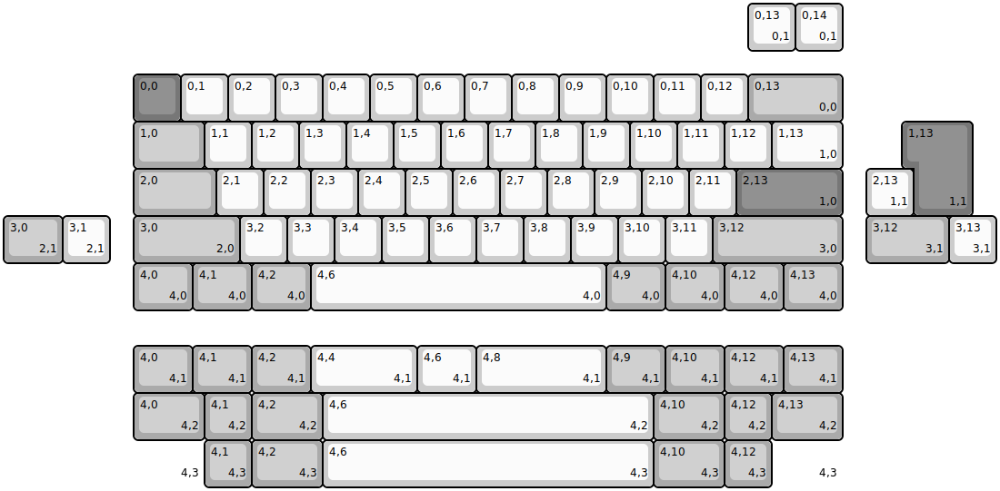{:loading="lazy"}

[Open in keyboard-layout-editor](http://www.keyboard-layout-editor.com/##@@_x:2.75&y:1.5&c=#777777;&=0,0&_c=#cccccc;&=0,1&=0,2&=0,3&=0,4&=0,5&=0,6&=0,7&=0,8&=0,9&=0,10&=0,11&=0,12&_c=#aaaaaa&w:2;&=0,13%0A%0A%0A0,0;&@_x:2.75&w:1.5;&=1,0&_c=#cccccc;&=1,1&=1,2&=1,3&=1,4&=1,5&=1,6&=1,7&=1,8&=1,9&=1,10&=1,11&=1,12&_w:1.5;&=1,13%0A%0A%0A1,0;&@_x:2.75&c=#aaaaaa&w:1.75;&=2,0&_c=#cccccc;&=2,1&=2,2&=2,3&=2,4&=2,5&=2,6&=2,7&=2,8&=2,9&=2,10&=2,11&_c=#777777&w:2.25;&=2,13%0A%0A%0A1,0;&@_x:2.75&c=#aaaaaa&w:2.25;&=3,0%0A%0A%0A2,0&_c=#cccccc;&=3,2&=3,3&=3,4&=3,5&=3,6&=3,7&=3,8&=3,9&=3,10&=3,11&_c=#aaaaaa&w:2.75;&=3,12%0A%0A%0A3,0;&@_x:2.75&w:1.25;&=4,0%0A%0A%0A4,0&_w:1.25;&=4,1%0A%0A%0A4,0&_w:1.25;&=4,2%0A%0A%0A4,0&_c=#cccccc&w:6.25;&=4,6%0A%0A%0A4,0&_c=#aaaaaa&w:1.25;&=4,9%0A%0A%0A4,0&_w:1.25;&=4,10%0A%0A%0A4,0&_w:1.25;&=4,12%0A%0A%0A4,0&_w:1.25;&=4,13%0A%0A%0A4,0;&@_x:15.75&y:-6.5&c=#cccccc;&=0,13%0A%0A%0A0,1&=0,14%0A%0A%0A0,1;&@_x:19.25&y:1.5&c=#777777&w:1.25&h:2&w2:1.5&h2:1&x2:-0.25;&=1,13%0A%0A%0A1,1;&@_x:18.25&c=#cccccc;&=2,13%0A%0A%0A1,1;&@_c=#aaaaaa&w:1.25;&=3,0%0A%0A%0A2,1&_c=#cccccc;&=3,1%0A%0A%0A2,1&_x:16.0&c=#aaaaaa&w:1.75;&=3,12%0A%0A%0A3,1&_c=#cccccc;&=3,13%0A%0A%0A3,1;&@_x:2.75&y:1.75&c=#aaaaaa&w:1.25;&=4,0%0A%0A%0A4,1&_w:1.25;&=4,1%0A%0A%0A4,1&_w:1.25;&=4,2%0A%0A%0A4,1&_c=#cccccc&w:2.25;&=4,4%0A%0A%0A4,1&_w:1.25;&=4,6%0A%0A%0A4,1&_w:2.75;&=4,8%0A%0A%0A4,1&_c=#aaaaaa&w:1.25;&=4,9%0A%0A%0A4,1&_w:1.25;&=4,10%0A%0A%0A4,1&_w:1.25;&=4,12%0A%0A%0A4,1&_w:1.25;&=4,13%0A%0A%0A4,1;&@_x:2.75&w:1.5;&=4,0%0A%0A%0A4,2&=4,1%0A%0A%0A4,2&_w:1.5;&=4,2%0A%0A%0A4,2&_c=#cccccc&w:7;&=4,6%0A%0A%0A4,2&_c=#aaaaaa&w:1.5;&=4,10%0A%0A%0A4,2&=4,12%0A%0A%0A4,2&_w:1.5;&=4,13%0A%0A%0A4,2;&@_x:2.75&w:1.5&d:true;&=%0A%0A%0A4,3&=4,1%0A%0A%0A4,3&_w:1.5;&=4,2%0A%0A%0A4,3&_c=#cccccc&w:7;&=4,6%0A%0A%0A4,3&_c=#aaaaaa&w:1.5;&=4,10%0A%0A%0A4,3&=4,12%0A%0A%0A4,3&_w:1.5&d:true;&=%0A%0A%0A4,3)

## owl8/owl8

[README](output/owl8/README.md) - [layout](output/owl8/owl8-kle.json) - [PCB](output/owl8/owl8.kicad_pcb) - [PCB render](output/owl8/owl8-render.svg)

{:loading="lazy"}

[Open in keyboard-layout-editor](http://www.keyboard-layout-editor.com/##@@=0,12&=0,13&=0,14&=0,15;&@_y:0.25;&=0,8&=0,9&=0,10&=0,11;&@_y:0.25;&=0,0&=0,1&=0,2&=0,3;&@=0,4&=0,5&=0,6&=0,7)

## owlab/jelly_epoch/jelly_epoch_hotswap

[README](output/owlab/jelly_epoch/README.md) - [layout](output/owlab/jelly_epoch/jelly_epoch_hotswap-kle.json) - [PCB](output/owlab/jelly_epoch/jelly_epoch_hotswap.kicad_pcb) - [PCB render](output/owlab/jelly_epoch/jelly_epoch_hotswap-render.svg)

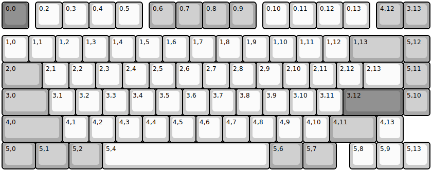{:loading="lazy"}

[Open in keyboard-layout-editor](http://www.keyboard-layout-editor.com/##@@_c=#777777;&=0,0&_x:0.25&c=#cccccc;&=0,2&=0,3&=0,4&=0,5&_x:0.25&c=#aaaaaa;&=0,6&=0,7&=0,8&=0,9&_x:0.25&c=#cccccc;&=0,10&=0,11&=0,12&=0,13&_x:0.25&c=#aaaaaa;&=4,12&=3,13;&@_y:0.25&c=#cccccc;&=1,0&=1,1&=1,2&=1,3&=1,4&=1,5&=1,6&=1,7&=1,8&=1,9&=1,10&=1,11&=1,12&_c=#aaaaaa&w:2;&=1,13&=5,12;&@_w:1.5;&=2,0&_c=#cccccc;&=2,1&=2,2&=2,3&=2,4&=2,5&=2,6&=2,7&=2,8&=2,9&=2,10&=2,11&=2,12&_w:1.5;&=2,13&_c=#aaaaaa;&=5,11;&@_w:1.75;&=3,0&_c=#cccccc;&=3,1&=3,2&=3,3&=3,4&=3,5&=3,6&=3,7&=3,8&=3,9&=3,10&=3,11&_c=#777777&w:2.25;&=3,12&_c=#aaaaaa;&=5,10;&@_w:2.25;&=4,0&_c=#cccccc;&=4,1&=4,2&=4,3&=4,4&=4,5&=4,6&=4,7&=4,8&=4,9&=4,10&_c=#aaaaaa&w:1.75;&=4,11&_c=#cccccc;&=4,13;&@_c=#aaaaaa&w:1.25;&=5,0&_w:1.25;&=5,1&_w:1.25;&=5,2&_c=#cccccc&w:6.25;&=5,4&_c=#aaaaaa&w:1.25;&=5,6&_w:1.25;&=5,7&_x:0.5&c=#cccccc;&=5,8&=5,9&=5,13)

## owlab/jelly_epoch/jelly_epoch_soldered

[README](output/owlab/jelly_epoch/README.md) - [layout](output/owlab/jelly_epoch/jelly_epoch_soldered-kle.json) - [PCB](output/owlab/jelly_epoch/jelly_epoch_soldered.kicad_pcb) - [PCB render](output/owlab/jelly_epoch/jelly_epoch_soldered-render.svg)

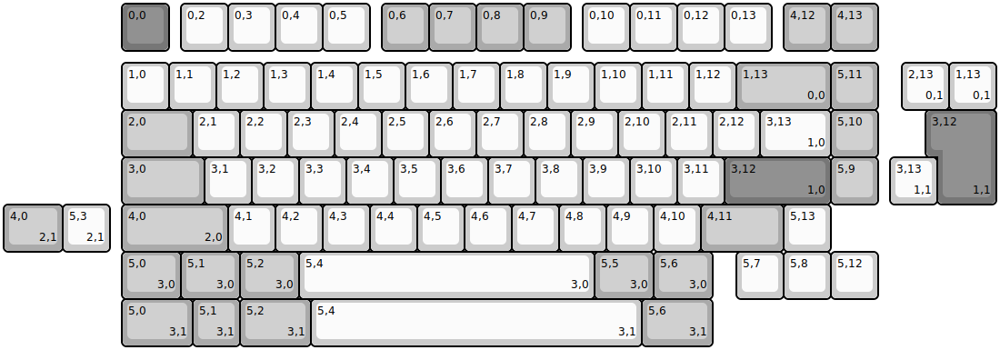{:loading="lazy"}

[Open in keyboard-layout-editor](http://www.keyboard-layout-editor.com/##@@_x:2.5&c=#777777;&=0,0&_x:0.25&c=#cccccc;&=0,2&=0,3&=0,4&=0,5&_x:0.25&c=#aaaaaa;&=0,6&=0,7&=0,8&=0,9&_x:0.25&c=#cccccc;&=0,10&=0,11&=0,12&=0,13&_x:0.25&c=#aaaaaa;&=4,12&=4,13;&@_x:2.5&y:0.25&c=#cccccc;&=1,0&=1,1&=1,2&=1,3&=1,4&=1,5&=1,6&=1,7&=1,8&=1,9&=1,10&=1,11&=1,12&_c=#aaaaaa&w:2;&=1,13%0A%0A%0A0,0&=5,11;&@_x:2.5&w:1.5;&=2,0&_c=#cccccc;&=2,1&=2,2&=2,3&=2,4&=2,5&=2,6&=2,7&=2,8&=2,9&=2,10&=2,11&=2,12&_w:1.5;&=3,13%0A%0A%0A1,0&_c=#aaaaaa;&=5,10;&@_x:2.5&w:1.75;&=3,0&_c=#cccccc;&=3,1&=3,2&=3,3&=3,4&=3,5&=3,6&=3,7&=3,8&=3,9&=3,10&=3,11&_c=#777777&w:2.25;&=3,12%0A%0A%0A1,0&_c=#aaaaaa;&=5,9;&@_x:2.5&w:2.25;&=4,0%0A%0A%0A2,0&_c=#cccccc;&=4,1&=4,2&=4,3&=4,4&=4,5&=4,6&=4,7&=4,8&=4,9&=4,10&_c=#aaaaaa&w:1.75;&=4,11&_c=#cccccc;&=5,13;&@_x:2.5&c=#aaaaaa&w:1.25;&=5,0%0A%0A%0A3,0&_w:1.25;&=5,1%0A%0A%0A3,0&_w:1.25;&=5,2%0A%0A%0A3,0&_c=#cccccc&w:6.25;&=5,4%0A%0A%0A3,0&_c=#aaaaaa&w:1.25;&=5,5%0A%0A%0A3,0&_w:1.25;&=5,6%0A%0A%0A3,0&_x:0.5&c=#cccccc;&=5,7&=5,8&=5,12;&@_x:19.0&y:-5.0;&=2,13%0A%0A%0A0,1&=1,13%0A%0A%0A0,1;&@_x:19.75&c=#777777&w:1.25&h:2&w2:1.5&h2:1&x2:-0.25;&=3,12%0A%0A%0A1,1;&@_x:18.75&c=#cccccc;&=3,13%0A%0A%0A1,1;&@_c=#aaaaaa&w:1.25;&=4,0%0A%0A%0A2,1&_c=#cccccc;&=5,3%0A%0A%0A2,1;&@_x:2.5&y:1.0&c=#aaaaaa&w:1.5;&=5,0%0A%0A%0A3,1&=5,1%0A%0A%0A3,1&_w:1.5;&=5,2%0A%0A%0A3,1&_c=#cccccc&w:7;&=5,4%0A%0A%0A3,1&_c=#aaaaaa&w:1.5;&=5,6%0A%0A%0A3,1)

## owlab/suit80/suit80_ansi

[README](output/owlab/suit80/README.md) - [layout](output/owlab/suit80/suit80_ansi-kle.json) - [PCB](output/owlab/suit80/suit80_ansi.kicad_pcb) - [PCB render](output/owlab/suit80/suit80_ansi-render.svg)

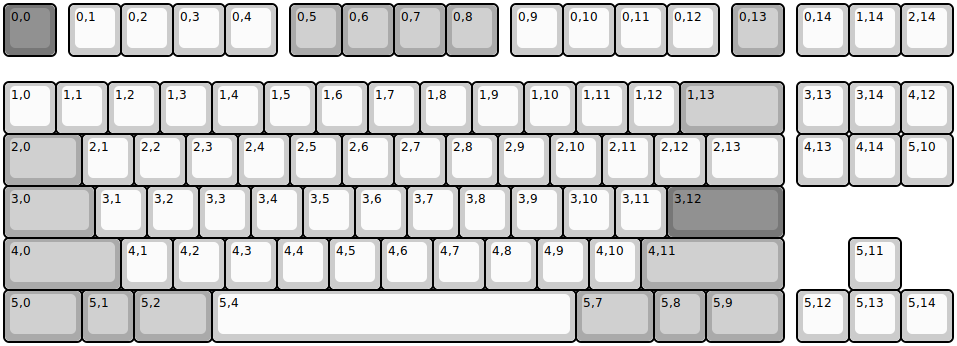{:loading="lazy"}

[Open in keyboard-layout-editor](http://www.keyboard-layout-editor.com/##@@_c=#777777;&=0,0&_x:0.25&c=#cccccc;&=0,1&=0,2&=0,3&=0,4&_x:0.25&c=#aaaaaa;&=0,5&=0,6&=0,7&=0,8&_x:0.25&c=#cccccc;&=0,9&=0,10&=0,11&=0,12&_x:0.25&c=#aaaaaa;&=0,13&_x:0.25&c=#cccccc;&=0,14&=1,14&=2,14;&@_y:0.5;&=1,0&=1,1&=1,2&=1,3&=1,4&=1,5&=1,6&=1,7&=1,8&=1,9&=1,10&=1,11&=1,12&_c=#aaaaaa&w:2;&=1,13&_x:0.25&c=#cccccc;&=3,13&=3,14&=4,12;&@_c=#aaaaaa&w:1.5;&=2,0&_c=#cccccc;&=2,1&=2,2&=2,3&=2,4&=2,5&=2,6&=2,7&=2,8&=2,9&=2,10&=2,11&=2,12&_w:1.5;&=2,13&_x:0.25;&=4,13&=4,14&=5,10;&@_c=#aaaaaa&w:1.75;&=3,0&_c=#cccccc;&=3,1&=3,2&=3,3&=3,4&=3,5&=3,6&=3,7&=3,8&=3,9&=3,10&=3,11&_c=#777777&w:2.25;&=3,12;&@_c=#aaaaaa&w:2.25;&=4,0&_c=#cccccc;&=4,1&=4,2&=4,3&=4,4&=4,5&=4,6&=4,7&=4,8&=4,9&=4,10&_c=#aaaaaa&w:2.75;&=4,11&_x:1.25&c=#cccccc;&=5,11;&@_c=#aaaaaa&w:1.5;&=5,0&=5,1&_w:1.5;&=5,2&_c=#cccccc&w:7;&=5,4&_c=#aaaaaa&w:1.5;&=5,7&=5,8&_w:1.5;&=5,9&_x:0.25&c=#cccccc;&=5,12&=5,13&=5,14)

## owlab/suit80/suit80_iso

[README](output/owlab/suit80/README.md) - [layout](output/owlab/suit80/suit80_iso-kle.json) - [PCB](output/owlab/suit80/suit80_iso.kicad_pcb) - [PCB render](output/owlab/suit80/suit80_iso-render.svg)

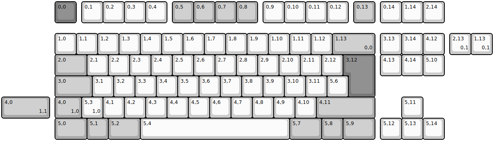{:loading="lazy"}

[Open in keyboard-layout-editor](http://www.keyboard-layout-editor.com/##@@_x:2.5&c=#777777;&=0,0&_x:0.25&c=#cccccc;&=0,1&=0,2&=0,3&=0,4&_x:0.25&c=#aaaaaa;&=0,5&=0,6&=0,7&=0,8&_x:0.25&c=#cccccc;&=0,9&=0,10&=0,11&=0,12&_x:0.25&c=#aaaaaa;&=0,13&_x:0.25&c=#cccccc;&=0,14&=1,14&=2,14;&@_x:2.5&y:0.5;&=1,0&=1,1&=1,2&=1,3&=1,4&=1,5&=1,6&=1,7&=1,8&=1,9&=1,10&=1,11&=1,12&_c=#aaaaaa&w:2;&=1,13%0A%0A%0A0,0&_x:0.25&c=#cccccc;&=3,13&=3,14&=4,12;&@_x:2.5&c=#aaaaaa&w:1.5;&=2,0&_c=#cccccc;&=2,1&=2,2&=2,3&=2,4&=2,5&=2,6&=2,7&=2,8&=2,9&=2,10&=2,11&=2,12&_x:0.25&c=#777777&w:1.25&h:2&w2:1.5&h2:1&x2:-0.25;&=3,12&_x:0.25&c=#cccccc;&=4,13&=4,14&=5,10;&@_x:2.5&c=#aaaaaa&w:1.75;&=3,0&_c=#cccccc;&=3,1&=3,2&=3,3&=3,4&=3,5&=3,6&=3,7&=3,8&=3,9&=3,10&=3,11&=5,6;&@_x:2.5&c=#aaaaaa&w:1.25;&=4,0%0A%0A%0A1,0&_c=#cccccc;&=5,3%0A%0A%0A1,0&=4,1&=4,2&=4,3&=4,4&=4,5&=4,6&=4,7&=4,8&=4,9&=4,10&_c=#aaaaaa&w:2.75;&=4,11&_x:1.25&c=#cccccc;&=5,11;&@_x:2.5&c=#aaaaaa&w:1.5;&=5,0&=5,1&_w:1.5;&=5,2&_c=#cccccc&w:7;&=5,4&_c=#aaaaaa&w:1.5;&=5,7&=5,8&_w:1.5;&=5,9&_x:0.25&c=#cccccc;&=5,12&=5,13&=5,14;&@_x:21.0&y:-5.0;&=2,13%0A%0A%0A0,1&=1,13%0A%0A%0A0,1;&@_y:2.0&c=#aaaaaa&w:2.25;&=4,0%0A%0A%0A1,1)

## owlab/voice65/voice65_hotswap

[README](output/owlab/voice65/README.md) - [layout](output/owlab/voice65/voice65_hotswap-kle.json) - [PCB](output/owlab/voice65/voice65_hotswap.kicad_pcb) - [PCB render](output/owlab/voice65/voice65_hotswap-render.svg)

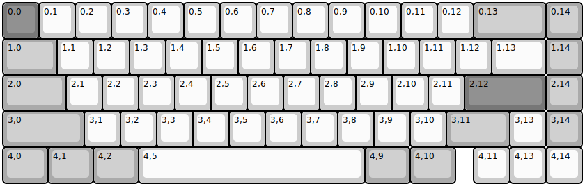{:loading="lazy"}

[Open in keyboard-layout-editor](http://www.keyboard-layout-editor.com/##@@_c=#777777;&=0,0&_c=#cccccc;&=0,1&=0,2&=0,3&=0,4&=0,5&=0,6&=0,7&=0,8&=0,9&=0,10&=0,11&=0,12&_c=#aaaaaa&w:2;&=0,13&=0,14;&@_w:1.5;&=1,0&_c=#cccccc;&=1,1&=1,2&=1,3&=1,4&=1,5&=1,6&=1,7&=1,8&=1,9&=1,10&=1,11&=1,12&_w:1.5;&=1,13&_c=#aaaaaa;&=1,14;&@_w:1.75;&=2,0&_c=#cccccc;&=2,1&=2,2&=2,3&=2,4&=2,5&=2,6&=2,7&=2,8&=2,9&=2,10&=2,11&_c=#777777&w:2.25;&=2,12&_c=#aaaaaa;&=2,14;&@_w:2.25;&=3,0&_c=#cccccc;&=3,1&=3,2&=3,3&=3,4&=3,5&=3,6&=3,7&=3,8&=3,9&=3,10&_c=#aaaaaa&w:1.75;&=3,11&_c=#cccccc;&=3,13&_c=#aaaaaa;&=3,14;&@_w:1.25;&=4,0&_w:1.25;&=4,1&_w:1.25;&=4,2&_c=#cccccc&w:6.25;&=4,5&_c=#aaaaaa&w:1.25;&=4,9&_w:1.25;&=4,10&_x:0.5&c=#cccccc;&=4,11&=4,13&=4,14)

## owlab/voice65/voice65_soldered

[README](output/owlab/voice65/README.md) - [layout](output/owlab/voice65/voice65_soldered-kle.json) - [PCB](output/owlab/voice65/voice65_soldered.kicad_pcb) - [PCB render](output/owlab/voice65/voice65_soldered-render.svg)

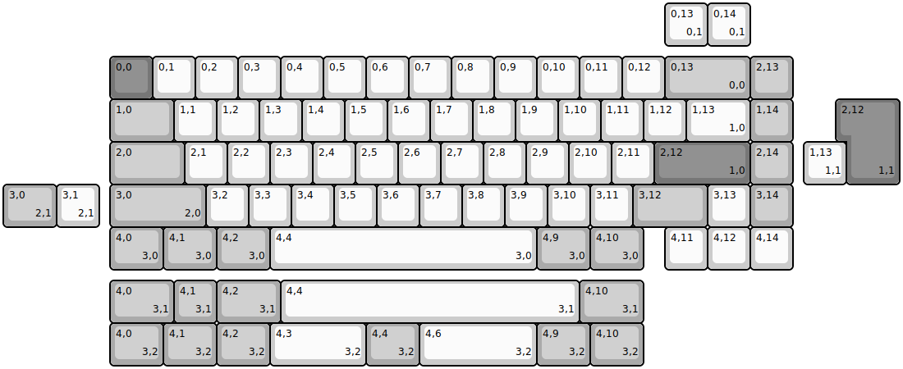{:loading="lazy"}

[Open in keyboard-layout-editor](http://www.keyboard-layout-editor.com/##@@_x:2.5&y:1.25&c=#777777;&=0,0&_c=#cccccc;&=0,1&=0,2&=0,3&=0,4&=0,5&=0,6&=0,7&=0,8&=0,9&=0,10&=0,11&=0,12&_c=#aaaaaa&w:2;&=0,13%0A%0A%0A0,0&=2,13;&@_x:2.5&w:1.5;&=1,0&_c=#cccccc;&=1,1&=1,2&=1,3&=1,4&=1,5&=1,6&=1,7&=1,8&=1,9&=1,10&=1,11&=1,12&_w:1.5;&=1,13%0A%0A%0A1,0&_c=#aaaaaa;&=1,14;&@_x:2.5&w:1.75;&=2,0&_c=#cccccc;&=2,1&=2,2&=2,3&=2,4&=2,5&=2,6&=2,7&=2,8&=2,9&=2,10&=2,11&_c=#777777&w:2.25;&=2,12%0A%0A%0A1,0&_c=#aaaaaa;&=2,14;&@_x:2.5&w:2.25;&=3,0%0A%0A%0A2,0&_c=#cccccc;&=3,2&=3,3&=3,4&=3,5&=3,6&=3,7&=3,8&=3,9&=3,10&=3,11&_c=#aaaaaa&w:1.75;&=3,12&_c=#cccccc;&=3,13&_c=#aaaaaa;&=3,14;&@_x:2.5&w:1.25;&=4,0%0A%0A%0A3,0&_w:1.25;&=4,1%0A%0A%0A3,0&_w:1.25;&=4,2%0A%0A%0A3,0&_c=#cccccc&w:6.25;&=4,4%0A%0A%0A3,0&_c=#aaaaaa&w:1.25;&=4,9%0A%0A%0A3,0&_w:1.25;&=4,10%0A%0A%0A3,0&_x:0.5&c=#cccccc;&=4,11&=4,12&=4,14;&@_x:15.5&y:-6.25;&=0,13%0A%0A%0A0,1&=0,14%0A%0A%0A0,1;&@_x:19.75&y:1.25&c=#777777&w:1.25&h:2&w2:1.5&h2:1&x2:-0.25;&=2,12%0A%0A%0A1,1;&@_x:18.75&c=#cccccc;&=1,13%0A%0A%0A1,1;&@_c=#aaaaaa&w:1.25;&=3,0%0A%0A%0A2,1&_c=#cccccc;&=3,1%0A%0A%0A2,1;&@_x:2.5&y:1.25&c=#aaaaaa&w:1.5;&=4,0%0A%0A%0A3,1&=4,1%0A%0A%0A3,1&_w:1.5;&=4,2%0A%0A%0A3,1&_c=#cccccc&w:7;&=4,4%0A%0A%0A3,1&_c=#aaaaaa&w:1.5;&=4,10%0A%0A%0A3,1;&@_x:2.5&w:1.25;&=4,0%0A%0A%0A3,2&_w:1.25;&=4,1%0A%0A%0A3,2&_w:1.25;&=4,2%0A%0A%0A3,2&_c=#cccccc&w:2.25;&=4,3%0A%0A%0A3,2&_c=#aaaaaa&w:1.25;&=4,4%0A%0A%0A3,2&_c=#cccccc&w:2.75;&=4,6%0A%0A%0A3,2&_c=#aaaaaa&w:1.25;&=4,9%0A%0A%0A3,2&_w:1.25;&=4,10%0A%0A%0A3,2)

## p3dstore/barleycorn_smd

[README](output/p3dstore/barleycorn_smd/README.md) - [layout](output/p3dstore/barleycorn_smd/barleycorn_smd-kle.json) - [PCB](output/p3dstore/barleycorn_smd/barleycorn_smd.kicad_pcb) - [PCB render](output/p3dstore/barleycorn_smd/barleycorn_smd-render.svg)

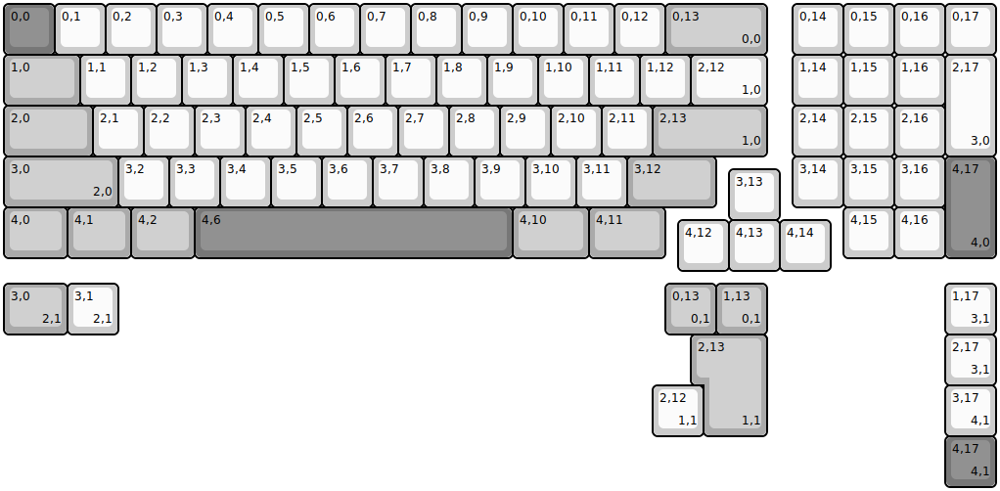{:loading="lazy"}

[Open in keyboard-layout-editor](http://www.keyboard-layout-editor.com/##@@_c=#777777;&=0,0&_c=#cccccc;&=0,1&=0,2&=0,3&=0,4&=0,5&=0,6&=0,7&=0,8&=0,9&=0,10&=0,11&=0,12&_c=#aaaaaa&w:2;&=0,13%0A%0A%0A0,0&_x:0.5&c=#cccccc;&=0,14&=0,15&=0,16&=0,17;&@_c=#aaaaaa&w:1.5;&=1,0&_c=#cccccc;&=1,1&=1,2&=1,3&=1,4&=1,5&=1,6&=1,7&=1,8&=1,9&=1,10&=1,11&=1,12&_w:1.5;&=2,12%0A%0A%0A1,0&_x:0.5;&=1,14&=1,15&=1,16&_h:2;&=2,17%0A%0A%0A3,0;&@_c=#aaaaaa&w:1.75;&=2,0&_c=#cccccc;&=2,1&=2,2&=2,3&=2,4&=2,5&=2,6&=2,7&=2,8&=2,9&=2,10&=2,11&_c=#aaaaaa&w:2.25;&=2,13%0A%0A%0A1,0&_x:0.5&c=#cccccc;&=2,14&=2,15&=2,16;&@_c=#aaaaaa&w:2.25;&=3,0%0A%0A%0A2,0&_c=#cccccc;&=3,2&=3,3&=3,4&=3,5&=3,6&=3,7&=3,8&=3,9&=3,10&=3,11&_c=#aaaaaa&w:1.75;&=3,12&_x:1.5&c=#cccccc;&=3,14&=3,15&=3,16&_c=#777777&h:2;&=4,17%0A%0A%0A4,0;&@_x:14.25&y:-0.75&c=#cccccc;&=3,13;&@_y:-0.25&c=#aaaaaa&w:1.25;&=4,0&_w:1.25;&=4,1&_w:1.25;&=4,2&_c=#777777&w:6.25;&=4,6&_c=#aaaaaa&w:1.5;&=4,10&_w:1.5;&=4,11&_x:3.5&c=#cccccc;&=4,15&=4,16;&@_x:13.25&y:-0.75;&=4,12&=4,13&=4,14;&@_y:0.25&c=#aaaaaa&w:1.25;&=3,0%0A%0A%0A2,1&_c=#cccccc;&=3,1%0A%0A%0A2,1&_x:10.75&c=#aaaaaa;&=0,13%0A%0A%0A0,1&=1,13%0A%0A%0A0,1&_x:3.5&c=#cccccc;&=1,17%0A%0A%0A3,1;&@_x:13.75&c=#aaaaaa&w:1.25&h:2&w2:1.5&h2:1&x2:-0.25;&=2,13%0A%0A%0A1,1&_x:3.5&c=#cccccc;&=2,17%0A%0A%0A3,1;&@_x:12.75;&=2,12%0A%0A%0A1,1&_x:4.75;&=3,17%0A%0A%0A4,1;&@_x:18.5&c=#777777;&=4,17%0A%0A%0A4,1)

## p3dstore/glitch

[README](output/p3dstore/glitch/README.md) - [layout](output/p3dstore/glitch/glitch-kle.json) - [PCB](output/p3dstore/glitch/glitch.kicad_pcb) - [PCB render](output/p3dstore/glitch/glitch-render.svg)

{:loading="lazy"}

[Open in keyboard-layout-editor](http://www.keyboard-layout-editor.com/##@@_x:18.35&y:1.1;&=1,7;&@_x:1.75&y:-0.6&c=#aaaaaa;&=0,0&_c=#cccccc;&=1,0;&@_x:13.75&y:-0.9;&=1,5&=0,6&_c=#aaaaaa;&=1,6%0A%0A%0A0,0&=0,7%0A%0A%0A0,0;&@_x:1.4&y:-0.1&w:1.5;&=2,0&_c=#cccccc;&=3,0;&@_x:13.6&y:-0.9;&=3,5&=2,6&=3,6&_c=#aaaaaa&w:1.5;&=2,7&_x:0.25&c=#cccccc;&=3,7;&@_x:1.4&y:-0.1&c=#aaaaaa&w:1.75;&=4,0&_c=#cccccc;&=5,0;&@_x:13.85&y:-0.9;&=5,5&=4,6&_c=#aaaaaa&w:2.25;&=4,7&_x:0.25&c=#cccccc;&=5,7;&@_x:1.25&y:-0.1&c=#aaaaaa&w:2.25;&=6,0&_c=#cccccc;&=6,1;&@_x:13.5&y:-0.9;&=7,5&=6,6&_c=#aaaaaa&w:1.75;&=7,6&_x:1.5&c=#cccccc;&=7,7;&@_x:17.5&y:-0.75&c=#777777;&=6,7;&@_x:1.25&y:-0.35&c=#aaaaaa&w:1.25;&=8,0&_w:1.25;&=9,0;&@_x:14.25&y:-0.9;&=9,5&=8,6;&@_x:16.5&y:-0.75&c=#777777;&=9,6&=8,7&=9,7;&@_r:10&rx:3&ry:4.25&x:0.5&y:-3.0&c=#cccccc;&=0,1&=1,1&=0,2&=1,2&=0,3;&@_x:1;&=2,1&=3,1&=2,2&=3,2;&@_x:1.25;&=4,1&=5,1&=4,2&=5,2;&@_x:1.75;&=7,1&=6,2&=7,2&=6,3;&@_x:2&w:2.25&w2:2.75&n:true;&=9,1%0A%0A%0A1,0&_x:0.5&w:1.25;&=9,2%0A%0A%0A1,0;&@_r:-10&rx:12.5&x:-2.5&y:-2.45;&=1,3&=0,4&=1,4&=0,5;&@_x:-3.0;&=3,3&=2,4&=3,4&=2,5;&@_x:-2.75;&=5,3&=4,4&=5,4&=4,5;&@_x:-3.25;&=7,3&=6,4&=7,4&=6,5;&@_x:-3.0&w:1.25;&=9,3%0A%0A%0A2,0&_w:1.75&w2:2.25&n:true;&=9,4%0A%0A%0A2,0;&@_r:0&rx:0&ry:0&x:15.75&y:0.6&c=#aaaaaa&w:2;&=1,6%0A%0A%0A0,1;&@_r:10&rx:3&ry:4.25&x:2&y:2.0&c=#cccccc&w:1.25;&=9,1%0A%0A%0A1,1&_w:2.25&w2:2.75&n:true;&=9,2%0A%0A%0A1,1;&@_r:-10&rx:12.5&x:-3.0&y:2.55&w:1.75&w2:2.25&n:true;&=9,3%0A%0A%0A2,1&_x:0.5&w:1.25;&=9,4%0A%0A%0A2,1)

## p3dstore/tw40

[README](output/p3dstore/tw40/README.md) - [layout](output/p3dstore/tw40/tw40-kle.json) - [PCB](output/p3dstore/tw40/tw40.kicad_pcb) - [PCB render](output/p3dstore/tw40/tw40-render.svg)

{:loading="lazy"}

[Open in keyboard-layout-editor](http://www.keyboard-layout-editor.com/##@@_c=#aaaaaa&w:1.5;&=0,0&_c=#cccccc;&=0,1&=0,2&=0,3&=0,4&=0,5&=0,6&=0,7&=0,8&=0,9&=0,10&=0,11&=0,12&_c=#aaaaaa&w:1.5;&=0,13;&@_w:1.75;&=1,0&_c=#cccccc;&=1,1&=1,2&=1,3&=1,4&=1,5&=1,6&=1,7&=1,8&=1,9&=1,10&=1,11&_c=#777777&w:2.25;&=1,12;&@_c=#aaaaaa&w:2.25;&=2,0&_c=#cccccc;&=2,1&=2,2&=2,3&=2,4&=2,5&=2,6&=2,7&=2,8&=2,9&_c=#aaaaaa&w:1.75;&=2,11%0A%0A%0A0,0&_c=#777777;&=2,12%0A%0A%0A0,0&_c=#aaaaaa;&=2,13%0A%0A%0A0,0;&@_w:1.25;&=3,0%0A%0A%0A2,0&_w:1.25;&=3,1%0A%0A%0A2,0&_w:1.25;&=3,2%0A%0A%0A2,0&_c=#cccccc&w:2.25;&=3,3%0A%0A%0A2,0&_c=#aaaaaa&w:1.25;&=3,4%0A%0A%0A2,0&_c=#cccccc&w:2.75;&=3,6%0A%0A%0A2,0&_c=#aaaaaa;&=3,9%0A%0A%0A1,0&=3,10%0A%0A%0A1,0&_c=#777777;&=3,11%0A%0A%0A1,0&=3,12%0A%0A%0A1,0&=3,13%0A%0A%0A1,0;&@_x:15.25&y:-2&c=#cccccc;&=2,11%0A%0A%0A0,1&_c=#aaaaaa&w:2.75;&=2,12%0A%0A%0A0,1;&@_y:1.25&w:1.25;&=3,0%0A%0A%0A2,1&_w:1.25;&=3,1%0A%0A%0A2,1&_w:1.25;&=3,2%0A%0A%0A2,1&_w:1.25;&=3,3%0A%0A%0A2,1&_c=#cccccc&w:2.25;&=3,4%0A%0A%0A2,1&_c=#aaaaaa&w:1.25;&=3,5%0A%0A%0A2,1&_c=#cccccc&w:1.5;&=3,6%0A%0A%0A2,1&_c=#aaaaaa&w:1.25;&=3,9%0A%0A%0A1,1&_w:1.25;&=3,11%0A%0A%0A1,1&_w:1.25;&=3,12%0A%0A%0A1,1&_w:1.25;&=3,13%0A%0A%0A1,1;&@_y:0.25&w:1.25;&=3,0%0A%0A%0A2,2&_w:1.25;&=3,1%0A%0A%0A2,2&_w:1.25;&=3,2%0A%0A%0A2,2&_c=#cccccc&w:6.25;&=3,4%0A%0A%0A2,2;&@_y:0.25&c=#aaaaaa&w:1.5;&=3,0%0A%0A%0A2,3&_w:1.5;&=3,1%0A%0A%0A2,3&_c=#cccccc&w:7;&=3,4%0A%0A%0A2,3)

## pandora/pandora

[README](output/pandora/README.md) - [layout](output/pandora/pandora-kle.json) - [PCB](output/pandora/pandora.kicad_pcb) - [PCB render](output/pandora/pandora-render.svg)

{:loading="lazy"}

[Open in keyboard-layout-editor](http://www.keyboard-layout-editor.com/##@@_c=#777777;&=0,0&_c=#cccccc;&=0,1&=0,2&=0,3&=0,4&=0,5&=0,6&=0,7&=0,8&=0,9&=0,10&=0,11&=0,12&=0,13&_c=#aaaaaa;&=0,14;&@_w:1.5;&=1,0&_c=#cccccc;&=1,1&=1,2&=1,3&=1,4&=1,5&=1,6&=1,7&=1,8&=1,9&=1,10&=1,11&=1,12&_w:1.5;&=1,13;&@_c=#aaaaaa&w:1.75;&=2,0&_c=#cccccc;&=2,1&=2,2&=2,3&=2,4&=2,5&=2,6&=2,7&=2,8&=2,9&=2,10&=2,11&=2,12&_c=#777777&w:1.25;&=2,13;&@_c=#aaaaaa&w:1.25;&=3,0&_c=#cccccc;&=3,1&=3,2&=3,3&=3,4&=3,5&=3,6&=3,7&=3,8&=3,9&=3,10&=3,11&_c=#aaaaaa&w:1.75;&=3,12&=3,13;&@_w:1.25;&=4,0&_w:1.25;&=4,1&_w:1.25;&=4,2&_c=#cccccc&w:6.25;&=4,6&_c=#aaaaaa&w:1.25;&=4,10&_w:1.25;&=4,11&_w:1.25;&=4,12&_w:1.25;&=4,13)

## paprikman/albacore

[README](output/paprikman/albacore/README.md) - [layout](output/paprikman/albacore/albacore-kle.json) - [PCB](output/paprikman/albacore/albacore.kicad_pcb) - [PCB render](output/paprikman/albacore/albacore-render.svg)

{:loading="lazy"}

[Open in keyboard-layout-editor](http://www.keyboard-layout-editor.com/##@@_x:0.75;&=0,1&=0,2&=0,3;&@=1,0&=1,1&=1,2&=1,3)

## parallel_65/parallel_65

[README](output/parallel_65/README.md) - [layout](output/parallel_65/parallel_65-kle.json) - [PCB](output/parallel_65/parallel_65.kicad_pcb) - [PCB render](output/parallel_65/parallel_65-render.svg)

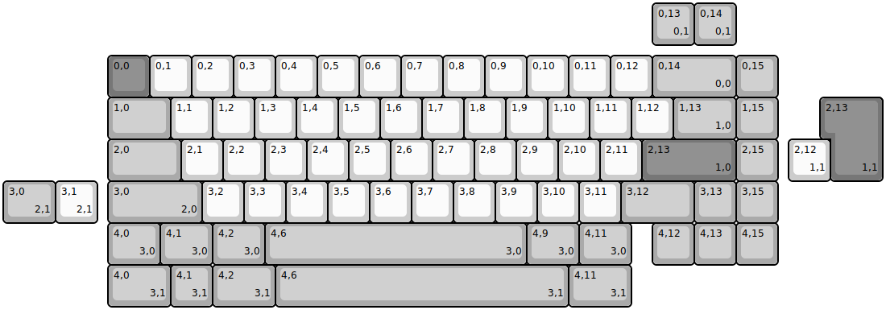{:loading="lazy"}

[Open in keyboard-layout-editor](http://www.keyboard-layout-editor.com/##@@_x:2.5&y:1.25&c=#777777;&=0,0&_c=#cccccc;&=0,1&=0,2&=0,3&=0,4&=0,5&=0,6&=0,7&=0,8&=0,9&=0,10&=0,11&=0,12&_c=#aaaaaa&w:2;&=0,14%0A%0A%0A0,0&=0,15;&@_x:2.5&w:1.5;&=1,0&_c=#cccccc;&=1,1&=1,2&=1,3&=1,4&=1,5&=1,6&=1,7&=1,8&=1,9&=1,10&=1,11&=1,12&_c=#aaaaaa&w:1.5;&=1,13%0A%0A%0A1,0&=1,15;&@_x:2.5&w:1.75;&=2,0&_c=#cccccc;&=2,1&=2,2&=2,3&=2,4&=2,5&=2,6&=2,7&=2,8&=2,9&=2,10&=2,11&_c=#777777&w:2.25;&=2,13%0A%0A%0A1,0&_c=#aaaaaa;&=2,15;&@_x:2.5&w:2.25;&=3,0%0A%0A%0A2,0&_c=#cccccc;&=3,2&=3,3&=3,4&=3,5&=3,6&=3,7&=3,8&=3,9&=3,10&=3,11&_c=#aaaaaa&w:1.75;&=3,12&=3,13&=3,15;&@_x:2.5&w:1.25;&=4,0%0A%0A%0A3,0&_w:1.25;&=4,1%0A%0A%0A3,0&_w:1.25;&=4,2%0A%0A%0A3,0&_w:6.25;&=4,6%0A%0A%0A3,0&_w:1.25;&=4,9%0A%0A%0A3,0&_w:1.25;&=4,11%0A%0A%0A3,0&_x:0.5;&=4,12&=4,13&=4,15;&@_x:15.5&y:-6.25;&=0,13%0A%0A%0A0,1&=0,14%0A%0A%0A0,1;&@_x:19.75&y:1.25&c=#777777&w:1.25&h:2&w2:1.5&h2:1&x2:-0.25;&=2,13%0A%0A%0A1,1;&@_x:18.75&c=#cccccc;&=2,12%0A%0A%0A1,1;&@_c=#aaaaaa&w:1.25;&=3,0%0A%0A%0A2,1&_c=#cccccc;&=3,1%0A%0A%0A2,1;&@_x:2.5&y:1.0&c=#aaaaaa&w:1.5;&=4,0%0A%0A%0A3,1&=4,1%0A%0A%0A3,1&_w:1.5;&=4,2%0A%0A%0A3,1&_w:7;&=4,6%0A%0A%0A3,1&_w:1.5;&=4,11%0A%0A%0A3,1)

## parallel_65/parallel_65_hs

[README](output/parallel_65/README.md) - [layout](output/parallel_65/parallel_65_hs-kle.json) - [PCB](output/parallel_65/parallel_65_hs.kicad_pcb) - [PCB render](output/parallel_65/parallel_65_hs-render.svg)

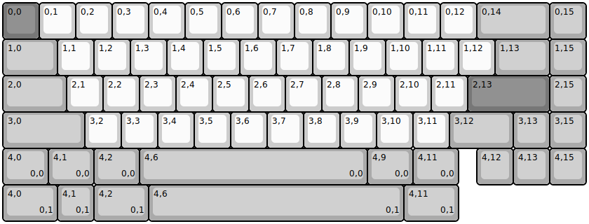{:loading="lazy"}

[Open in keyboard-layout-editor](http://www.keyboard-layout-editor.com/##@@_c=#777777;&=0,0&_c=#cccccc;&=0,1&=0,2&=0,3&=0,4&=0,5&=0,6&=0,7&=0,8&=0,9&=0,10&=0,11&=0,12&_c=#aaaaaa&w:2;&=0,14&=0,15;&@_w:1.5;&=1,0&_c=#cccccc;&=1,1&=1,2&=1,3&=1,4&=1,5&=1,6&=1,7&=1,8&=1,9&=1,10&=1,11&=1,12&_c=#aaaaaa&w:1.5;&=1,13&=1,15;&@_w:1.75;&=2,0&_c=#cccccc;&=2,1&=2,2&=2,3&=2,4&=2,5&=2,6&=2,7&=2,8&=2,9&=2,10&=2,11&_c=#777777&w:2.25;&=2,13&_c=#aaaaaa;&=2,15;&@_w:2.25;&=3,0&_c=#cccccc;&=3,2&=3,3&=3,4&=3,5&=3,6&=3,7&=3,8&=3,9&=3,10&=3,11&_c=#aaaaaa&w:1.75;&=3,12&=3,13&=3,15;&@_w:1.25;&=4,0%0A%0A%0A0,0&_w:1.25;&=4,1%0A%0A%0A0,0&_w:1.25;&=4,2%0A%0A%0A0,0&_w:6.25;&=4,6%0A%0A%0A0,0&_w:1.25;&=4,9%0A%0A%0A0,0&_w:1.25;&=4,11%0A%0A%0A0,0&_x:0.5;&=4,12&=4,13&=4,15;&@_w:1.5;&=4,0%0A%0A%0A0,1&=4,1%0A%0A%0A0,1&_w:1.5;&=4,2%0A%0A%0A0,1&_w:7;&=4,6%0A%0A%0A0,1&_w:1.5;&=4,11%0A%0A%0A0,1)

## peej/lumberjack

[README](output/peej/lumberjack/README.md) - [layout](output/peej/lumberjack/lumberjack-kle.json) - [PCB](output/peej/lumberjack/lumberjack.kicad_pcb) - [PCB render](output/peej/lumberjack/lumberjack-render.svg)

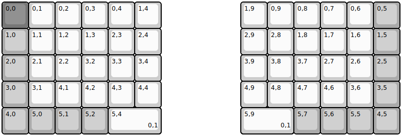{:loading="lazy"}

[Open in keyboard-layout-editor](http://www.keyboard-layout-editor.com/##@@_c=#777777;&=0,0&_c=#cccccc;&=0,1&=0,2&=0,3&=0,4&=1,4&_x:3;&=1,9&=0,9&=0,8&=0,7&=0,6&_c=#aaaaaa;&=0,5;&@=1,0&_c=#cccccc;&=1,1&=1,2&=1,3&=2,3&=2,4&_x:3;&=2,9&=2,8&=1,8&=1,7&=1,6&_c=#aaaaaa;&=1,5;&@=2,0&_c=#cccccc;&=2,1&=2,2&=3,2&=3,3&=3,4&_x:3;&=3,9&=3,8&=3,7&=2,7&=2,6&_c=#aaaaaa;&=2,5;&@=3,0&_c=#cccccc;&=3,1&=4,1&=4,2&=4,3&=4,4&_x:3;&=4,9&=4,8&=4,7&=4,6&=3,6&_c=#aaaaaa;&=3,5;&@=4,0&=5,0&=5,1&=5,2&_c=#cccccc;&=5,3%0A%0A%0A0,0&=5,4%0A%0A%0A0,0&_x:3;&=5,9%0A%0A%0A0,0&=5,8%0A%0A%0A0,0&_c=#aaaaaa;&=5,7&=5,6&=5,5&=4,5&_x:-11&c=#cccccc&w:2;&=5,4%0A%0A%0A0,1&_x:3&w:2;&=5,9%0A%0A%0A0,1)

## percent/canoe

[README](output/percent/canoe/README.md) - [layout](output/percent/canoe/canoe-kle.json) - [PCB](output/percent/canoe/canoe.kicad_pcb) - [PCB render](output/percent/canoe/canoe-render.svg)

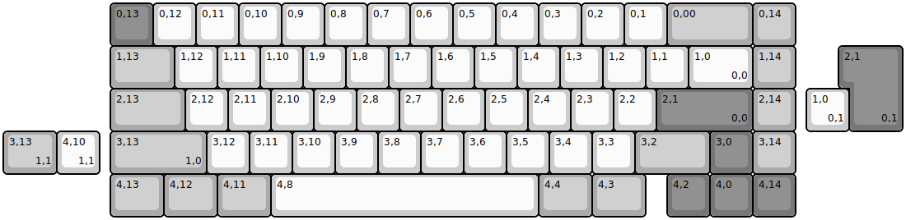{:loading="lazy"}

[Open in keyboard-layout-editor](http://www.keyboard-layout-editor.com/##@@_x:2.5&c=#777777;&=0,13&_c=#cccccc;&=0,12&=0,11&=0,10&=0,9&=0,8&=0,7&=0,6&=0,5&=0,4&=0,3&=0,2&=0,1&_c=#aaaaaa&w:2;&=0,00&=0,14;&@_x:2.5&w:1.5;&=1,13&_c=#cccccc;&=1,12&=1,11&=1,10&=1,9&=1,8&=1,7&=1,6&=1,5&=1,4&=1,3&=1,2&=1,1&_w:1.5;&=1,0%0A%0A%0A0,0&_c=#aaaaaa;&=1,14;&@_x:2.5&w:1.75;&=2,13&_c=#cccccc;&=2,12&=2,11&=2,10&=2,9&=2,8&=2,7&=2,6&=2,5&=2,4&=2,3&=2,2&_c=#777777&w:2.25;&=2,1%0A%0A%0A0,0&_c=#aaaaaa;&=2,14;&@_x:2.5&w:2.25;&=3,13%0A%0A%0A1,0&_c=#cccccc;&=3,12&=3,11&=3,10&=3,9&=3,8&=3,7&=3,6&=3,5&=3,4&=3,3&_c=#aaaaaa&w:1.75;&=3,2&_c=#777777;&=3,0&_c=#aaaaaa;&=3,14;&@_x:2.5&w:1.25;&=4,13&_w:1.25;&=4,12&_w:1.25;&=4,11&_c=#cccccc&w:6.25;&=4,8&_c=#aaaaaa&w:1.25;&=4,4&_w:1.25;&=4,3&_x:0.5&c=#777777;&=4,2&=4,0&=4,14;&@_x:19.75&y:-4&w:1.25&h:2&w2:1.5&h2:1&x2:-0.25;&=2,1%0A%0A%0A0,1;&@_x:18.75&c=#cccccc;&=1,0%0A%0A%0A0,1;&@_c=#aaaaaa&w:1.25;&=3,13%0A%0A%0A1,1&_c=#cccccc;&=4,10%0A%0A%0A1,1)

## percent/canoe_gen2

[README](output/percent/canoe_gen2/README.md) - [layout](output/percent/canoe_gen2/canoe_gen2-kle.json) - [PCB](output/percent/canoe_gen2/canoe_gen2.kicad_pcb) - [PCB render](output/percent/canoe_gen2/canoe_gen2-render.svg)

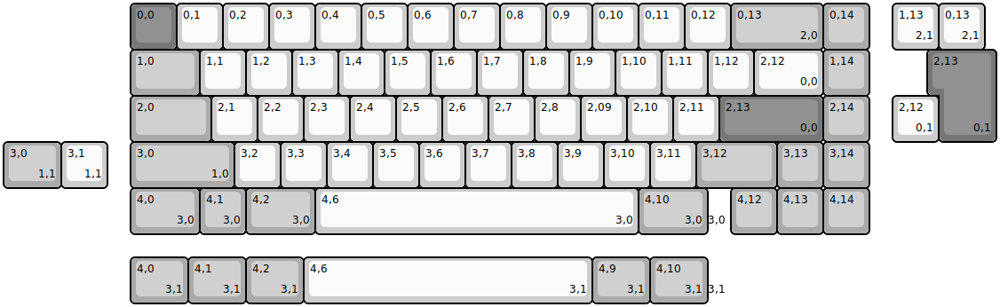{:loading="lazy"}

[Open in keyboard-layout-editor](http://www.keyboard-layout-editor.com/##@@_x:2.75&c=#777777;&=0,0&_c=#cccccc;&=0,1&=0,2&=0,3&=0,4&=0,5&=0,6&=0,7&=0,8&=0,9&=0,10&=0,11&=0,12&_c=#aaaaaa&w:2;&=0,13%0A%0A%0A2,0&=0,14;&@_x:2.75&w:1.5;&=1,0&_c=#cccccc;&=1,1&=1,2&=1,3&=1,4&=1,5&=1,6&=1,7&=1,8&=1,9&=1,10&=1,11&=1,12&_w:1.5;&=2,12%0A%0A%0A0,0&_c=#aaaaaa;&=1,14;&@_x:2.75&w:1.75;&=2,0&_c=#cccccc;&=2,1&=2,2&=2,3&=2,4&=2,5&=2,6&=2,7&=2,8&=2,09&=2,10&=2,11&_c=#777777&w:2.25;&=2,13%0A%0A%0A0,0&_c=#aaaaaa;&=2,14;&@_x:2.75&w:2.25;&=3,0%0A%0A%0A1,0&_c=#cccccc;&=3,2&=3,3&=3,4&=3,5&=3,6&=3,7&=3,8&=3,9&=3,10&=3,11&_c=#aaaaaa&w:1.75;&=3,12&=3,13&=3,14;&@_x:2.75&w:1.5;&=4,0%0A%0A%0A3,0&=4,1%0A%0A%0A3,0&_w:1.5;&=4,2%0A%0A%0A3,0&_c=#cccccc&w:7;&=4,6%0A%0A%0A3,0&_c=#aaaaaa&w:1.5;&=4,10%0A%0A%0A3,0&_c=#cccccc&w:0.5&d:true;&=%0A%0A%0A3,0&_c=#aaaaaa;&=4,12&=4,13&=4,14;&@_x:19.25&y:-5&c=#cccccc;&=1,13%0A%0A%0A2,1&=0,13%0A%0A%0A2,1;&@_x:20.25&c=#777777&w:1.25&h:2&w2:1.5&h2:1&x2:-0.25;&=2,13%0A%0A%0A0,1;&@_x:19.25&c=#cccccc;&=2,12%0A%0A%0A0,1;&@_c=#aaaaaa&w:1.25;&=3,0%0A%0A%0A1,1&_c=#cccccc;&=3,1%0A%0A%0A1,1;&@_x:2.75&y:1.5&c=#aaaaaa&w:1.25;&=4,0%0A%0A%0A3,1&_w:1.25;&=4,1%0A%0A%0A3,1&_w:1.25;&=4,2%0A%0A%0A3,1&_c=#cccccc&w:6.25;&=4,6%0A%0A%0A3,1&_c=#aaaaaa&w:1.25;&=4,9%0A%0A%0A3,1&_w:1.25;&=4,10%0A%0A%0A3,1&_c=#cccccc&w:0.5&d:true;&=%0A%0A%0A3,1)

## percent/skog_lite

[README](output/percent/skog_lite/README.md) - [layout](output/percent/skog_lite/skog_lite-kle.json) - [PCB](output/percent/skog_lite/skog_lite.kicad_pcb) - [PCB render](output/percent/skog_lite/skog_lite-render.svg)

{:loading="lazy"}

[Open in keyboard-layout-editor](http://www.keyboard-layout-editor.com/##@@_x:2.5&c=#777777;&=0,0&_x:1.0&c=#cccccc;&=0,1&=0,2&=0,3&=0,4&_x:0.5&c=#aaaaaa;&=0,5&=0,6&=0,7&=0,8&_x:0.5&c=#cccccc;&=0,9&=0,10&=0,11&=0,12;&@_x:17.75&y:-0.25&c=#aaaaaa;&=0,13&=0,14&=6,12;&@_x:2.5&y:-0.25&c=#cccccc;&=1,0&=1,14&=1,1&=1,2&=1,3&=1,4&=1,13&=1,5&=1,6&=1,7&=1,8&=1,9&=1,10&_c=#aaaaaa&w:2;&=1,11;&@_x:17.75&y:-0.5;&=1,12&=6,11&=6,10;&@_x:2.5&y:-0.5&w:1.5;&=2,0&_c=#cccccc;&=2,14&=2,1&=2,2&=2,3&=2,4&=2,13&=2,5&=2,6&=2,7&=2,8&=2,9&=2,10&_w:1.5;&=2,11%0A%0A%0A0,0;&@_x:17.75&y:-0.5&c=#aaaaaa;&=2,12&=6,9&=6,8;&@_x:2.5&y:-0.5&w:1.75;&=3,0&_c=#cccccc;&=3,14&=3,1&=3,2&=3,3&=3,4&=3,13&=3,5&=3,6&=3,7&=3,8&=3,9&_c=#777777&w:2.25;&=3,10%0A%0A%0A0,0;&@_x:2.5&c=#aaaaaa&w:2.25;&=4,0%0A%0A%0A1,0&_c=#cccccc;&=4,14&=4,1&=4,2&=4,3&=4,4&=4,13&=4,5&=4,6&=4,7&=4,8&_c=#aaaaaa&w:2.75;&=4,11&_x:1.25;&=4,12;&@_x:2.5&w:1.25;&=5,0%0A%0A%0A2,0&_w:1.25;&=5,14%0A%0A%0A2,0&_w:1.25;&=5,1%0A%0A%0A2,0&_w:6.25;&=5,4%0A%0A%0A2,0&_w:1.25;&=5,6%0A%0A%0A2,0&_w:1.25;&=5,7%0A%0A%0A2,0&_w:1.25;&=5,8%0A%0A%0A2,0&_w:1.25;&=5,11%0A%0A%0A2,0&_x:0.25;&=5,10&=5,12&=6,7;&@_x:22.25&y:-4.0&c=#777777&w:1.25&h:2&w2:1.5&h2:1&x2:-0.25;&=3,10%0A%0A%0A0,1;&@_x:21.25&c=#cccccc;&=2,11%0A%0A%0A0,1;&@_c=#aaaaaa&w:1.25;&=4,0%0A%0A%0A1,1&_c=#cccccc;&=4,9%0A%0A%0A1,1;&@_x:2.5&y:1.5&c=#aaaaaa&w:1.5;&=5,0%0A%0A%0A2,1&=5,14%0A%0A%0A2,1&_w:1.5;&=5,1%0A%0A%0A2,1&_w:7;&=5,4%0A%0A%0A2,1&_w:1.5;&=5,7%0A%0A%0A2,1&=5,8%0A%0A%0A2,1&_w:1.5;&=5,11%0A%0A%0A2,1;&@_x:2.5&w:1.5;&=5,0%0A%0A%0A2,2&_c=#cccccc&d:true;&=5,14%0A%0A%0A2,2&_c=#aaaaaa&w:1.5;&=5,1%0A%0A%0A2,2&_w:7;&=5,4%0A%0A%0A2,2&_w:1.5;&=5,7%0A%0A%0A2,2&_c=#cccccc&d:true;&=5,8%0A%0A%0A2,2&_c=#aaaaaa&w:1.5;&=5,11%0A%0A%0A2,2)

## phase_studio/titan65

[README](output/phase_studio/README.md) - [layout](output/phase_studio/titan65-kle.json) - [PCB](output/phase_studio/titan65.kicad_pcb) - [PCB render](output/phase_studio/titan65-render.svg)

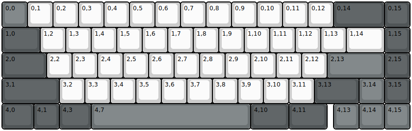{:loading="lazy"}

[Open in keyboard-layout-editor](http://www.keyboard-layout-editor.com/##@@_c=#6b7173;&=0,0&_c=#cccccc;&=0,1&=0,2&=0,3&=0,4&=0,5&=0,6&=0,7&=0,8&=0,9&=0,10&=0,11&=0,12&_c=#505557&w:2;&=0,14&=0,15;&@_w:1.5;&=1,0&_c=#cccccc;&=1,2&=1,3&=1,4&=1,5&=1,6&=1,7&=1,8&=1,9&=1,10&=1,11&=1,12&=1,13&_w:1.5;&=1,14&_c=#505557;&=1,15;&@_w:1.75;&=2,0&_c=#cccccc;&=2,2&=2,3&=2,4&=2,5&=2,6&=2,7&=2,8&=2,9&=2,10&=2,11&=2,12&_c=#6b7173&w:2.25;&=2,13&_c=#505557;&=2,15;&@_w:2.25;&=3,1&_c=#cccccc;&=3,2&=3,3&=3,4&=3,5&=3,6&=3,7&=3,8&=3,9&=3,10&=3,11&_c=#505557&w:1.75;&=3,13&_c=#6b7173;&=3,14&_c=#505557;&=3,15;&@_w:1.25;&=4,0&=4,1&_w:1.25;&=4,3&_c=#6b7173&w:6.25;&=4,7&_c=#505557&w:1.5;&=4,10&_w:1.5;&=4,11&_x:0.25&c=#6b7173;&=4,13&=4,14&=4,15)

## phase_studio/titan65_soldered

[README](output/phase_studio/README.md) - [layout](output/phase_studio/titan65_soldered-kle.json) - [PCB](output/phase_studio/titan65_soldered.kicad_pcb) - [PCB render](output/phase_studio/titan65_soldered-render.svg)

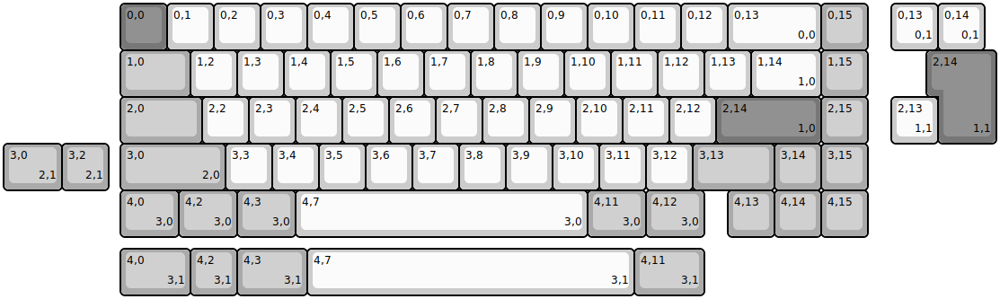{:loading="lazy"}

[Open in keyboard-layout-editor](http://www.keyboard-layout-editor.com/##@@_x:2.5&c=#777777;&=0,0&_c=#cccccc;&=0,1&=0,2&=0,3&=0,4&=0,5&=0,6&=0,7&=0,8&=0,9&=0,10&=0,11&=0,12&_w:2;&=0,13%0A%0A%0A0,0&_c=#aaaaaa;&=0,15;&@_x:2.5&w:1.5;&=1,0&_c=#cccccc;&=1,2&=1,3&=1,4&=1,5&=1,6&=1,7&=1,8&=1,9&=1,10&=1,11&=1,12&=1,13&_w:1.5;&=1,14%0A%0A%0A1,0&_c=#aaaaaa;&=1,15;&@_x:2.5&w:1.75;&=2,0&_c=#cccccc;&=2,2&=2,3&=2,4&=2,5&=2,6&=2,7&=2,8&=2,9&=2,10&=2,11&=2,12&_c=#777777&w:2.25;&=2,14%0A%0A%0A1,0&_c=#aaaaaa;&=2,15;&@_x:2.5&w:2.25;&=3,0%0A%0A%0A2,0&_c=#cccccc;&=3,3&=3,4&=3,5&=3,6&=3,7&=3,8&=3,9&=3,10&=3,11&=3,12&_c=#aaaaaa&w:1.75;&=3,13&=3,14&=3,15;&@_x:2.5&w:1.25;&=4,0%0A%0A%0A3,0&_w:1.25;&=4,2%0A%0A%0A3,0&_w:1.25;&=4,3%0A%0A%0A3,0&_c=#cccccc&w:6.25;&=4,7%0A%0A%0A3,0&_c=#aaaaaa&w:1.25;&=4,11%0A%0A%0A3,0&_w:1.25;&=4,12%0A%0A%0A3,0&_x:0.5;&=4,13&=4,14&=4,15;&@_x:19.0&y:-5&c=#cccccc;&=0,13%0A%0A%0A0,1&=0,14%0A%0A%0A0,1;&@_x:20.0&c=#777777&w:1.25&h:2&w2:1.5&h2:1&x2:-0.25;&=2,14%0A%0A%0A1,1;&@_x:19.0&c=#cccccc;&=2,13%0A%0A%0A1,1;&@_c=#aaaaaa&w:1.25;&=3,0%0A%0A%0A2,1&=3,2%0A%0A%0A2,1;&@_x:2.5&y:1.25&w:1.5;&=4,0%0A%0A%0A3,1&=4,2%0A%0A%0A3,1&_w:1.5;&=4,3%0A%0A%0A3,1&_c=#cccccc&w:7;&=4,7%0A%0A%0A3,1&_c=#aaaaaa&w:1.5;&=4,11%0A%0A%0A3,1)

## picolab/frusta_fundamental

[README](output/picolab/README.md) - [layout](output/picolab/frusta_fundamental-kle.json) - [PCB](output/picolab/frusta_fundamental.kicad_pcb) - [PCB render](output/picolab/frusta_fundamental-render.svg)

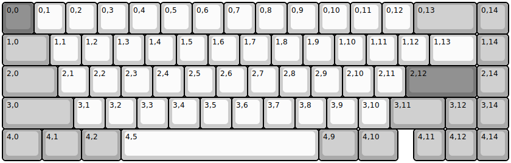{:loading="lazy"}

[Open in keyboard-layout-editor](http://www.keyboard-layout-editor.com/##@@_c=#777777;&=0,0&_c=#cccccc;&=0,1&=0,2&=0,3&=0,4&=0,5&=0,6&=0,7&=0,8&=0,9&=0,10&=0,11&=0,12&_c=#aaaaaa&w:2;&=0,13&=0,14;&@_w:1.5;&=1,0&_c=#cccccc;&=1,1&=1,2&=1,3&=1,4&=1,5&=1,6&=1,7&=1,8&=1,9&=1,10&=1,11&=1,12&_w:1.5;&=1,13&_c=#aaaaaa;&=1,14;&@_w:1.75;&=2,0&_c=#cccccc;&=2,1&=2,2&=2,3&=2,4&=2,5&=2,6&=2,7&=2,8&=2,9&=2,10&=2,11&_c=#777777&w:2.25;&=2,12&_c=#aaaaaa;&=2,14;&@_w:2.25;&=3,0&_c=#cccccc;&=3,1&=3,2&=3,3&=3,4&=3,5&=3,6&=3,7&=3,8&=3,9&=3,10&_c=#aaaaaa&w:1.75;&=3,11&=3,12&=3,14;&@_w:1.25;&=4,0&_w:1.25;&=4,1&_w:1.25;&=4,2&_c=#cccccc&w:6.25;&=4,5&_c=#aaaaaa&w:1.25;&=4,9&_w:1.25;&=4,10&_x:0.5;&=4,11&=4,12&=4,14)

## pinky/4/pinky4

[README](output/pinky/4/README.md) - [layout](output/pinky/4/pinky4-kle.json) - [PCB](output/pinky/4/pinky4.kicad_pcb) - [PCB render](output/pinky/4/pinky4-render.svg)

{:loading="lazy"}

[Open in keyboard-layout-editor](http://www.keyboard-layout-editor.com/##@@_x:3.5;&=0,3&_x:10.5;&=5,3;&@_x:2.5&y:-0.875;&=0,2&_x:1.0;&=0,4&_x:8.5;&=5,4&_x:1.0;&=5,2;&@_x:5.5&y:-0.875;&=0,5&_x:6.5;&=5,5;&@_x:1.5&y:-0.875;&=0,1&_x:14.5;&=5,1&_c=#aaaaaa;&=5,0;&@_x:0.5&y:-0.995;&=0,0;&@_x:6.5&y:-0.88&c=#cccccc;&=0,6&_x:4.5;&=5,6;&@_x:3.5&y:-0.5;&=1,3&_x:10.5;&=6,3;&@_x:2.5&y:-0.875;&=1,2&_x:1.0;&=1,4&_x:8.5;&=6,4&_x:1.0;&=6,2;&@_x:5.5&y:-0.875;&=1,5&_x:6.5;&=6,5;&@_x:1.5&y:-0.875;&=1,1&_x:14.5;&=6,1&=6,0;&@_x:0.5&y:-0.995&c=#aaaaaa;&=1,0;&@_x:6.5&y:-0.88&c=#cccccc;&=1,6&_x:4.5;&=6,6;&@_x:3.5&y:-0.5;&=2,3&_x:10.5;&=7,3;&@_x:2.5&y:-0.875;&=2,2&_x:1.0;&=2,4&_x:8.5;&=7,4&_x:1.0;&=7,2;&@_x:5.5&y:-0.875;&=2,5&_x:6.5;&=7,5;&@_x:1.5&y:-0.875;&=2,1&_x:14.5;&=7,1&=7,0;&@_x:0.5&y:-0.995&c=#aaaaaa;&=2,0;&@_x:6.5&y:-0.88&c=#cccccc;&=2,6&_x:4.5;&=7,6;&@_x:3.5&y:-0.5;&=3,3&_x:10.5;&=8,3;&@_x:2.5&y:-0.875;&=3,2&_x:1.0;&=3,4&_x:8.5;&=8,4&_x:1.0;&=8,2;&@_x:5.5&y:-0.875;&=3,5&_x:6.5;&=8,5;&@_x:1.5&y:-0.875;&=3,1&_x:14.5;&=8,1&_c=#777777;&=8,0;&@_x:0.5&y:-0.995;&=3,0;&@_x:15&y:0.25;&=9,3;&@_rx:4&ry:15&x:-0.5&y:-10.37;&=4,3;&@_r:6&x:-0.5&y:-1.0&c=#aaaaaa;&=4,4;&@_r:12&x:-0.5&y:-1.0&c=#777777;&=4,5;&@_r:15&rx:6.5&ry:4.25&y:-0.5&c=#aaaaaa;&=3,6;&@_r:18&rx:4&ry:15&x:-0.5&y:-10.37&c=#cccccc;&=4,6;&@_r:-18&rx:15.5&x:-0.5&y:-10.37;&=9,6;&@_r:-15&rx:13&ry:4.25&x:-1&y:-0.5&c=#aaaaaa;&=8,6;&@_r:-12&rx:15.5&ry:15&x:-0.5&y:-10.37&c=#777777;&=9,5;&@_r:-6&x:-0.5&y:-1.0&c=#aaaaaa;&=9,4)

## pisces/pisces

[README](output/pisces/README.md) - [layout](output/pisces/pisces-kle.json) - [PCB](output/pisces/pisces.kicad_pcb) - [PCB render](output/pisces/pisces-render.svg)

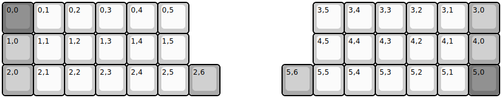{:loading="lazy"}

[Open in keyboard-layout-editor](http://www.keyboard-layout-editor.com/##@@_c=#777777;&=0,0&_c=#cccccc;&=0,1&=0,2&=0,3&=0,4&=0,5&_x:4;&=3,5&=3,4&=3,3&=3,2&=3,1&_c=#aaaaaa;&=3,0;&@=1,0&_c=#cccccc;&=1,1&=1,2&=1,3&=1,4&=1,5&_x:4;&=4,5&=4,4&=4,3&=4,2&=4,1&_c=#aaaaaa;&=4,0;&@=2,0&_c=#cccccc;&=2,1&=2,2&=2,3&=2,4&=2,5&_c=#aaaaaa;&=2,6&_x:2;&=5,6&_c=#cccccc;&=5,5&=5,4&=5,3&=5,2&=5,1&_c=#777777;&=5,0)

## pistachio/pistachio

[README](output/pistachio/README.md) - [layout](output/pistachio/pistachio-kle.json) - [PCB](output/pistachio/pistachio.kicad_pcb) - [PCB render](output/pistachio/pistachio-render.svg)

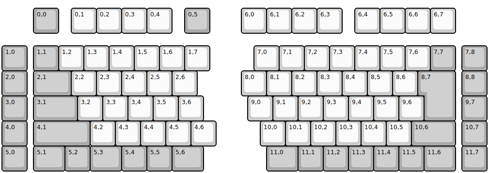{:loading="lazy"}

[Open in keyboard-layout-editor](http://www.keyboard-layout-editor.com/##@@_x:1.25&y:0.25&c=#aaaaaa;&=0,0&_x:0.5&c=#cccccc;&=0,1&=0,2&=0,3&=0,4&_x:0.5&c=#aaaaaa;&=0,5&_x:1.25&c=#cccccc;&=6,0&=6,1&=6,2&=6,3&_x:0.5;&=6,4&=6,5&=6,6&=6,7;&@_y:0.5&c=#aaaaaa;&=1,0&_x:0.25;&=1,1&_c=#cccccc;&=1,2&=1,3&=1,4&=1,5&=1,6&=1,7&_x:1.75;&=7,0&=7,1&=7,2&=7,3&=7,4&=7,5&=7,6&_c=#aaaaaa;&=7,7&_x:0.25;&=7,8;&@=2,0&_x:0.25&w:1.5;&=2,1&_c=#cccccc;&=2,2&=2,3&=2,4&=2,5&=2,6&_x:1.75;&=8,0&=8,1&=8,2&=8,3&=8,4&=8,5&=8,6&_x:0.25&c=#aaaaaa&w:1.25&h:2&w2:1.5&h2:1&x2:-0.25;&=8,7&_x:0.25;&=8,8;&@=3,0&_x:0.25&w:1.75;&=3,1&_c=#cccccc;&=3,2&=3,3&=3,4&=3,5&=3,6&_x:1.75;&=9,0&=9,1&=9,2&=9,3&=9,4&=9,5&=9,6&_x:1.5&c=#aaaaaa;&=9,7;&@=4,0&_x:0.25&w:2.25;&=4,1&_c=#cccccc;&=4,2&=4,3&=4,4&=4,5&=4,6&_x:1.75;&=10,0&=10,1&=10,2&=10,3&=10,4&=10,5&_c=#aaaaaa&w:1.75;&=10,6&_x:0.25;&=10,7;&@=5,0&_x:0.25&w:1.25;&=5,1&=5,2&_w:1.25;&=5,3&=5,4&=5,5&_w:1.25;&=5,6&_x:2.5&w:1.25;&=11,0&=11,1&=11,2&=11,3&=11,4&=11,5&_w:1.25;&=11,6&_x:0.25;&=11,7)

## pixlupkeyboards/blackplum

[README](output/pixlupkeyboards/blackplum/README.md) - [layout](output/pixlupkeyboards/blackplum/blackplum-kle.json) - [PCB](output/pixlupkeyboards/blackplum/blackplum.kicad_pcb) - [PCB render](output/pixlupkeyboards/blackplum/blackplum-render.svg)

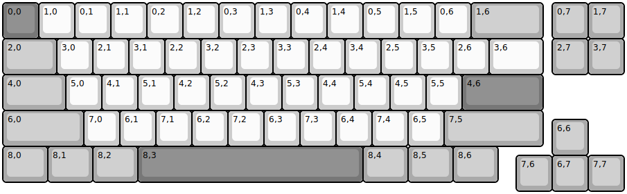{:loading="lazy"}

[Open in keyboard-layout-editor](http://www.keyboard-layout-editor.com/##@@_c=#777777;&=0,0&_c=#cccccc;&=1,0&=0,1&=1,1&=0,2&=1,2&=0,3&=1,3&=0,4&=1,4&=0,5&=1,5&=0,6&_c=#aaaaaa&w:2;&=1,6&_x:0.25;&=0,7&=1,7;&@_w:1.5;&=2,0&_c=#cccccc;&=3,0&=2,1&=3,1&=2,2&=3,2&=2,3&=3,3&=2,4&=3,4&=2,5&=3,5&=2,6&_w:1.5;&=3,6&_x:0.25&c=#aaaaaa;&=2,7&=3,7;&@_w:1.75;&=4,0&_c=#cccccc;&=5,0&=4,1&=5,1&=4,2&=5,2&=4,3&=5,3&=4,4&=5,4&=4,5&=5,5&_c=#777777&w:2.25;&=4,6;&@_c=#aaaaaa&w:2.25;&=6,0&_c=#cccccc;&=7,0&=6,1&=7,1&=6,2&=7,2&=6,3&=7,3&=6,4&=7,4&=6,5&_c=#aaaaaa&w:2.75;&=7,5;&@_x:15.25&y:-0.75;&=6,6;&@_y:-0.25&w:1.25;&=8,0&_w:1.25;&=8,1&_w:1.25;&=8,2&_c=#777777&w:6.25;&=8,3&_c=#aaaaaa&w:1.25;&=8,4&_w:1.25;&=8,5&_w:1.25;&=8,6;&@_x:14.25&y:-0.75;&=7,6&=6,7&=7,7)

## pixlupkeyboards/tenki

[README](output/pixlupkeyboards/tenki/README.md) - [layout](output/pixlupkeyboards/tenki/tenki-kle.json) - [PCB](output/pixlupkeyboards/tenki/tenki.kicad_pcb) - [PCB render](output/pixlupkeyboards/tenki/tenki-render.svg)

{:loading="lazy"}

[Open in keyboard-layout-editor](http://www.keyboard-layout-editor.com/##@@=0,0&=0,1&=0,2&_c=#777777;&=0,3;&@_c=#cccccc;&=1,0&=1,1&=1,2&_c=#777777;&=1,3;&@_c=#cccccc;&=2,0&=2,1&=2,2&_c=#777777;&=2,3;&@_c=#cccccc;&=3,0&=3,1&=3,2&_c=#777777;&=3,3;&@=4,0&=4,1&=4,2&=4,3)

## pizzakeyboards/pizza65

[README](output/pizzakeyboards/pizza65/README.md) - [layout](output/pizzakeyboards/pizza65/pizza65-kle.json) - [PCB](output/pizzakeyboards/pizza65/pizza65.kicad_pcb) - [PCB render](output/pizzakeyboards/pizza65/pizza65-render.svg)

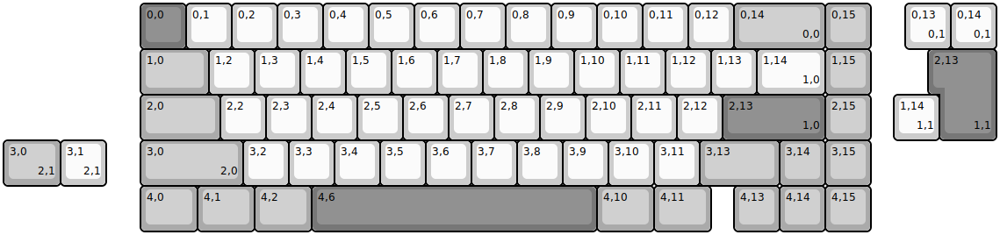{:loading="lazy"}

[Open in keyboard-layout-editor](http://www.keyboard-layout-editor.com/##@@_x:3&c=#777777;&=0,0&_c=#cccccc;&=0,1&=0,2&=0,3&=0,4&=0,5&=0,6&=0,7&=0,8&=0,9&=0,10&=0,11&=0,12&_c=#aaaaaa&w:2;&=0,14%0A%0A%0A0,0&=0,15;&@_x:3&w:1.5;&=1,0&_c=#cccccc;&=1,2&=1,3&=1,4&=1,5&=1,6&=1,7&=1,8&=1,9&=1,10&=1,11&=1,12&=1,13&_w:1.5;&=1,14%0A%0A%0A1,0&_c=#aaaaaa;&=1,15;&@_x:3&w:1.75;&=2,0&_c=#cccccc;&=2,2&=2,3&=2,4&=2,5&=2,6&=2,7&=2,8&=2,9&=2,10&=2,11&=2,12&_c=#777777&w:2.25;&=2,13%0A%0A%0A1,0&_c=#aaaaaa;&=2,15;&@_x:3.0&w:2.25;&=3,0%0A%0A%0A2,0&_c=#cccccc;&=3,2&=3,3&=3,4&=3,5&=3,6&=3,7&=3,8&=3,9&=3,10&=3,11&_c=#aaaaaa&w:1.75;&=3,13&=3,14&=3,15;&@_x:3&w:1.25;&=4,0&_w:1.25;&=4,1&_w:1.25;&=4,2&_c=#777777&w:6.25;&=4,6&_c=#aaaaaa&w:1.25;&=4,10&_w:1.25;&=4,11&_x:0.5;&=4,13&=4,14&=4,15;&@_x:19.75&y:-5&c=#cccccc;&=0,13%0A%0A%0A0,1&=0,14%0A%0A%0A0,1;&@_x:20.5&c=#777777&w:1.25&h:2&w2:1.5&h2:1&x2:-0.25;&=2,13%0A%0A%0A1,1;&@_x:19.5&c=#cccccc;&=1,14%0A%0A%0A1,1;&@_c=#aaaaaa&w:1.25;&=3,0%0A%0A%0A2,1&_c=#cccccc;&=3,1%0A%0A%0A2,1)

## pjb/eros

[README](output/pjb/README.md) - [layout](output/pjb/eros-kle.json) - [PCB](output/pjb/eros.kicad_pcb) - [PCB render](output/pjb/eros-render.svg)

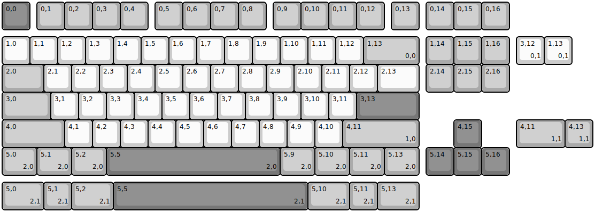{:loading="lazy"}

[Open in keyboard-layout-editor](http://www.keyboard-layout-editor.com/##@@_c=#777777;&=0,0&_x:0.25&c=#aaaaaa;&=0,1&=0,2&=0,3&=0,4&_x:0.25;&=0,5&=0,6&=0,7&=0,8&_x:0.25;&=0,9&=0,10&=0,11&=0,12&_x:0.25;&=0,13&_x:0.25;&=0,14&=0,15&=0,16;&@_y:0.25&c=#cccccc;&=1,0&=1,1&=1,2&=1,3&=1,4&=1,5&=1,6&=1,7&=1,8&=1,9&=1,10&=1,11&=1,12&_c=#aaaaaa&w:2;&=1,13%0A%0A%0A0,0&_x:0.25;&=1,14&=1,15&=1,16;&@_w:1.5;&=2,0&_c=#cccccc;&=2,1&=2,2&=2,3&=2,4&=2,5&=2,6&=2,7&=2,8&=2,9&=2,10&=2,11&=2,12&_w:1.5;&=2,13&_x:0.25&c=#aaaaaa;&=2,14&=2,15&=2,16;&@_w:1.75;&=3,0&_c=#cccccc;&=3,1&=3,2&=3,3&=3,4&=3,5&=3,6&=3,7&=3,8&=3,9&=3,10&=3,11&_c=#777777&w:2.25;&=3,13;&@_c=#aaaaaa&w:2.25;&=4,0&_c=#cccccc;&=4,1&=4,2&=4,3&=4,4&=4,5&=4,6&=4,7&=4,8&=4,9&=4,10&_c=#aaaaaa&w:2.75;&=4,11%0A%0A%0A1,0&_x:1.25&c=#777777;&=4,15;&@_c=#aaaaaa&w:1.25;&=5,0%0A%0A%0A2,0&_w:1.25;&=5,1%0A%0A%0A2,0&_w:1.25;&=5,2%0A%0A%0A2,0&_c=#777777&w:6.25;&=5,5%0A%0A%0A2,0&_c=#aaaaaa&w:1.25;&=5,9%0A%0A%0A2,0&_w:1.25;&=5,10%0A%0A%0A2,0&_w:1.25;&=5,11%0A%0A%0A2,0&_w:1.25;&=5,13%0A%0A%0A2,0&_x:0.25&c=#777777;&=5,14&=5,15&=5,16;&@_x:18.5&y:-5.0&c=#cccccc;&=3,12%0A%0A%0A0,1&=1,13%0A%0A%0A0,1;&@_x:18.5&y:2.0&c=#aaaaaa&w:1.75;&=4,11%0A%0A%0A1,1&=4,13%0A%0A%0A1,1;&@_y:1.25&w:1.5;&=5,0%0A%0A%0A2,1&=5,1%0A%0A%0A2,1&_w:1.5;&=5,2%0A%0A%0A2,1&_c=#777777&w:7;&=5,5%0A%0A%0A2,1&_c=#aaaaaa&w:1.5;&=5,10%0A%0A%0A2,1&=5,11%0A%0A%0A2,1&_w:1.5;&=5,13%0A%0A%0A2,1)

## playkbtw/ca66

[README](output/playkbtw/ca66/README.md) - [layout](output/playkbtw/ca66/ca66-kle.json) - [PCB](output/playkbtw/ca66/ca66.kicad_pcb) - [PCB render](output/playkbtw/ca66/ca66-render.svg)

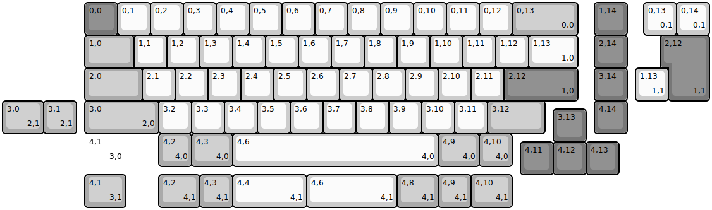{:loading="lazy"}

[Open in keyboard-layout-editor](http://www.keyboard-layout-editor.com/##@@_x:2.5&c=#777777;&=0,0&_c=#cccccc;&=0,1&=0,2&=0,3&=0,4&=0,5&=0,6&=0,7&=0,8&=0,9&=0,10&=0,11&=0,12&_c=#aaaaaa&w:2;&=0,13%0A%0A%0A0,0&_x:0.5&c=#777777;&=1,14;&@_x:2.5&c=#aaaaaa&w:1.5;&=1,0&_c=#cccccc;&=1,1&=1,2&=1,3&=1,4&=1,5&=1,6&=1,7&=1,8&=1,9&=1,10&=1,11&=1,12&_w:1.5;&=1,13%0A%0A%0A1,0&_x:0.5&c=#777777;&=2,14;&@_x:2.5&c=#aaaaaa&w:1.75;&=2,0&_c=#cccccc;&=2,1&=2,2&=2,3&=2,4&=2,5&=2,6&=2,7&=2,8&=2,9&=2,10&=2,11&_c=#777777&w:2.25;&=2,12%0A%0A%0A1,0&_x:0.5;&=3,14;&@_x:2.5&c=#aaaaaa&w:2.25;&=3,0%0A%0A%0A2,0&_c=#cccccc;&=3,2&=3,3&=3,4&=3,5&=3,6&=3,7&=3,8&=3,9&=3,10&=3,11&_c=#aaaaaa&w:1.75;&=3,12&_x:1.5&c=#777777;&=4,14;&@_x:16.75&y:-0.75;&=3,13;&@_x:2.5&y:-0.25&c=#cccccc&w:1.25&d:true;&=4,1%0A%0A%0A3,0&_x:1.0&c=#aaaaaa;&=4,2%0A%0A%0A4,0&_w:1.25;&=4,3%0A%0A%0A4,0&_c=#cccccc&w:6.25;&=4,6%0A%0A%0A4,0&_c=#aaaaaa&w:1.25;&=4,9%0A%0A%0A4,0&=4,10%0A%0A%0A4,0;&@_x:15.75&y:-0.75&c=#777777;&=4,11&=4,12&=4,13;&@_x:19.5&y:-5.25&c=#cccccc;&=0,13%0A%0A%0A0,1&=0,14%0A%0A%0A0,1;&@_x:20.25&c=#777777&w:1.25&h:2&w2:1.5&h2:1&x2:-0.25;&=2,12%0A%0A%0A1,1;&@_x:19.25&c=#cccccc;&=1,13%0A%0A%0A1,1;&@_c=#aaaaaa&w:1.25;&=3,0%0A%0A%0A2,1&=3,1%0A%0A%0A2,1;&@_x:2.5&y:1.25&w:1.25;&=4,1%0A%0A%0A3,1&_x:1.0&w:1.25;&=4,2%0A%0A%0A4,1&=4,3%0A%0A%0A4,1&_c=#cccccc&w:2.25;&=4,4%0A%0A%0A4,1&_w:2.75;&=4,6%0A%0A%0A4,1&_c=#aaaaaa&w:1.25;&=4,8%0A%0A%0A4,1&=4,9%0A%0A%0A4,1&_w:1.25;&=4,10%0A%0A%0A4,1)

## ploopyco/mouse

[README](output/ploopyco/mouse/README.md) - [layout](output/ploopyco/mouse/mouse-kle.json) - [PCB](output/ploopyco/mouse/mouse.kicad_pcb) - [PCB render](output/ploopyco/mouse/mouse-render.svg)

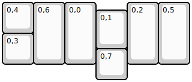{:loading="lazy"}

[Open in keyboard-layout-editor](http://www.keyboard-layout-editor.com/##@@=0,4&_h:2;&=0,6&_h:2;&=0,0&_x:1&h:2;&=0,2&_h:2;&=0,5;&@_x:3&y:-0.75&h:1.25;&=0,1;&@_y:-0.25;&=0,3;&@_x:3&y:-0.5;&=0,7)

## ploopyco/trackball

[README](output/ploopyco/trackball/README.md) - [layout](output/ploopyco/trackball/trackball-kle.json) - [PCB](output/ploopyco/trackball/trackball.kicad_pcb) - [PCB render](output/ploopyco/trackball/trackball-render.svg)

{:loading="lazy"}

[Open in keyboard-layout-editor](http://www.keyboard-layout-editor.com/##@@_h:2;&=0,0&_x:1&h:2;&=0,2&_x:0.5&h:2;&=0,3&_h:2;&=0,4;&@_x:1&y:-0.75&h:1.5;&=0,1)

## ploopyco/trackball/trackball_mini

[README](output/ploopyco/trackball/README.md) - [layout](output/ploopyco/trackball/trackball_mini-kle.json) - [PCB](output/ploopyco/trackball/trackball_mini.kicad_pcb) - [PCB render](output/ploopyco/trackball/trackball_mini-render.svg)

{:loading="lazy"}

[Open in keyboard-layout-editor](http://www.keyboard-layout-editor.com/##@@_h:2;&=0,0&_x:1&h:2;&=0,2&_x:0.5&h:2;&=0,3&_h:2;&=0,4;&@_x:1&y:-0.75&h:1.5;&=0,1)

## ploopyco/trackball/trackball_thumb

[README](output/ploopyco/trackball/README.md) - [layout](output/ploopyco/trackball/trackball_thumb-kle.json) - [PCB](output/ploopyco/trackball/trackball_thumb.kicad_pcb) - [PCB render](output/ploopyco/trackball/trackball_thumb-render.svg)

{:loading="lazy"}

[Open in keyboard-layout-editor](http://www.keyboard-layout-editor.com/##@@=0,0&_h:2;&=0,2&_x:1&h:2;&=0,4;&@_x:2&y:-0.75&h:1.5;&=0,3;&@_x:4&y:-0.75;&=0,5;&@_y:-0.5;&=0,1)

## plume/plume65

[README](output/plume/README.md) - [layout](output/plume/plume65-kle.json) - [PCB](output/plume/plume65.kicad_pcb) - [PCB render](output/plume/plume65-render.svg)

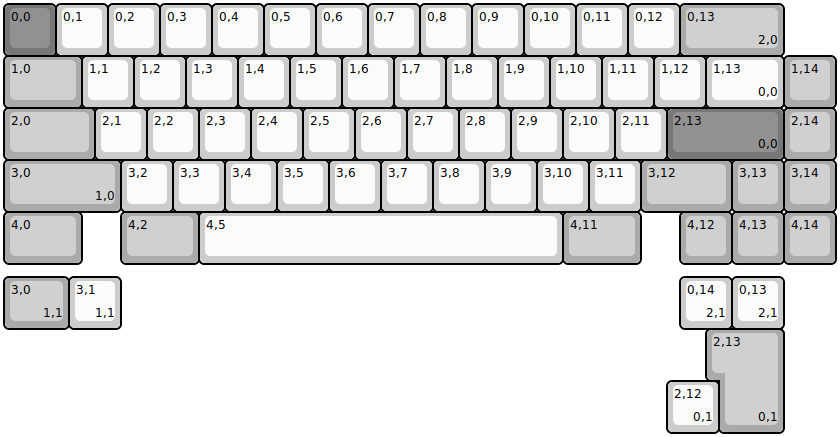{:loading="lazy"}

[Open in keyboard-layout-editor](http://www.keyboard-layout-editor.com/##@@_c=#777777;&=0,0&_c=#cccccc;&=0,1&=0,2&=0,3&=0,4&=0,5&=0,6&=0,7&=0,8&=0,9&=0,10&=0,11&=0,12&_c=#aaaaaa&w:2;&=0,13%0A%0A%0A2,0;&@_w:1.5;&=1,0&_c=#cccccc;&=1,1&=1,2&=1,3&=1,4&=1,5&=1,6&=1,7&=1,8&=1,9&=1,10&=1,11&=1,12&_w:1.5;&=1,13%0A%0A%0A0,0&_c=#aaaaaa;&=1,14;&@_w:1.75;&=2,0&_c=#cccccc;&=2,1&=2,2&=2,3&=2,4&=2,5&=2,6&=2,7&=2,8&=2,9&=2,10&=2,11&_c=#777777&w:2.25;&=2,13%0A%0A%0A0,0&_c=#aaaaaa;&=2,14;&@_w:2.25;&=3,0%0A%0A%0A1,0&_c=#cccccc;&=3,2&=3,3&=3,4&=3,5&=3,6&=3,7&=3,8&=3,9&=3,10&=3,11&_c=#aaaaaa&w:1.75;&=3,12&=3,13&=3,14;&@_w:1.5;&=4,0&_x:0.75&w:1.5;&=4,2&_c=#cccccc&w:7;&=4,5&_c=#aaaaaa&w:1.5;&=4,11&_x:0.75;&=4,12&=4,13&=4,14;&@_y:0.25&w:1.25;&=3,0%0A%0A%0A1,1&_c=#cccccc;&=3,1%0A%0A%0A1,1&_x:10.75;&=0,14%0A%0A%0A2,1&=0,13%0A%0A%0A2,1;&@_x:13.75&c=#aaaaaa&w:1.25&h:2&w2:1.5&h2:1&x2:-0.25;&=2,13%0A%0A%0A0,1;&@_x:12.75&c=#cccccc;&=2,12%0A%0A%0A0,1)

## plx/plx

[README](output/plx/README.md) - [layout](output/plx/plx-kle.json) - [PCB](output/plx/plx.kicad_pcb) - [PCB render](output/plx/plx-render.svg)

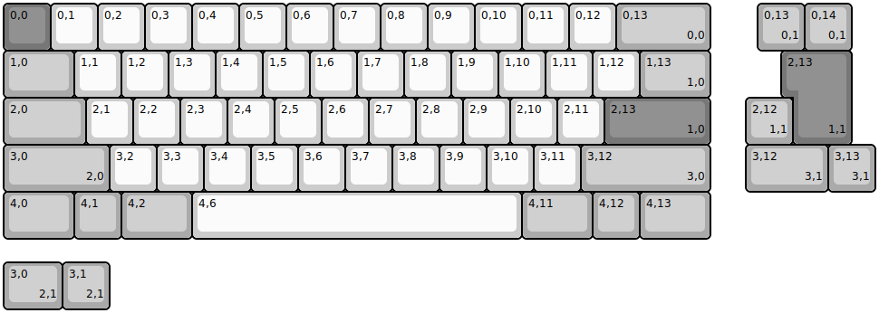{:loading="lazy"}

[Open in keyboard-layout-editor](http://www.keyboard-layout-editor.com/##@@_c=#777777;&=0,0&_c=#cccccc;&=0,1&=0,2&=0,3&=0,4&=0,5&=0,6&=0,7&=0,8&=0,9&=0,10&=0,11&=0,12&_c=#aaaaaa&w:2;&=0,13%0A%0A%0A0,0;&@_w:1.5;&=1,0&_c=#cccccc;&=1,1&=1,2&=1,3&=1,4&=1,5&=1,6&=1,7&=1,8&=1,9&=1,10&=1,11&=1,12&_c=#aaaaaa&w:1.5;&=1,13%0A%0A%0A1,0;&@_w:1.75;&=2,0&_c=#cccccc;&=2,1&=2,2&=2,3&=2,4&=2,5&=2,6&=2,7&=2,8&=2,9&=2,10&=2,11&_c=#777777&w:2.25;&=2,13%0A%0A%0A1,0;&@_c=#aaaaaa&w:2.25;&=3,0%0A%0A%0A2,0&_c=#cccccc;&=3,2&=3,3&=3,4&=3,5&=3,6&=3,7&=3,8&=3,9&=3,10&=3,11&_c=#aaaaaa&w:2.75;&=3,12%0A%0A%0A3,0;&@_w:1.5;&=4,0&=4,1&_w:1.5;&=4,2&_c=#cccccc&w:7;&=4,6&_c=#aaaaaa&w:1.5;&=4,11&=4,12&_w:1.5;&=4,13;&@_x:16&y:-5;&=0,13%0A%0A%0A0,1&=0,14%0A%0A%0A0,1;&@_x:16.75&c=#777777&w:1.25&h:2&w2:1.5&h2:1&x2:-0.25;&=2,13%0A%0A%0A1,1;&@_x:15.75&c=#aaaaaa;&=2,12%0A%0A%0A1,1;&@_x:15.75&w:1.75;&=3,12%0A%0A%0A3,1&=3,13%0A%0A%0A3,1;&@_y:1.5&w:1.25;&=3,0%0A%0A%0A2,1&=3,1%0A%0A%0A2,1)

## plywrks/ahgase

[README](output/plywrks/README.md) - [layout](output/plywrks/ahgase-kle.json) - [PCB](output/plywrks/ahgase.kicad_pcb) - [PCB render](output/plywrks/ahgase-render.svg)

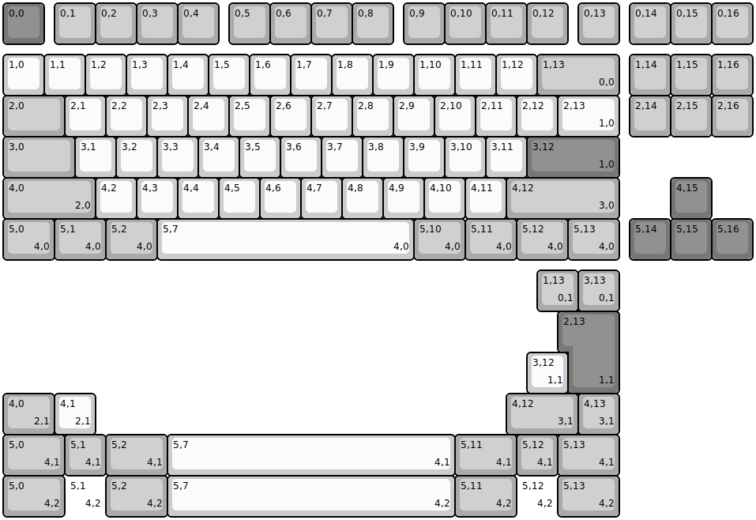{:loading="lazy"}

[Open in keyboard-layout-editor](http://www.keyboard-layout-editor.com/##@@_c=#777777;&=0,0&_x:0.25&c=#aaaaaa;&=0,1&=0,2&=0,3&=0,4&_x:0.25;&=0,5&=0,6&=0,7&=0,8&_x:0.25;&=0,9&=0,10&=0,11&=0,12&_x:0.25;&=0,13&_x:0.25;&=0,14&=0,15&=0,16;&@_y:0.25&c=#cccccc;&=1,0&=1,1&=1,2&=1,3&=1,4&=1,5&=1,6&=1,7&=1,8&=1,9&=1,10&=1,11&=1,12&_c=#aaaaaa&w:2;&=1,13%0A%0A%0A0,0&_x:0.25;&=1,14&=1,15&=1,16;&@_w:1.5;&=2,0&_c=#cccccc;&=2,1&=2,2&=2,3&=2,4&=2,5&=2,6&=2,7&=2,8&=2,9&=2,10&=2,11&=2,12&_w:1.5;&=2,13%0A%0A%0A1,0&_x:0.25&c=#aaaaaa;&=2,14&=2,15&=2,16;&@_w:1.75;&=3,0&_c=#cccccc;&=3,1&=3,2&=3,3&=3,4&=3,5&=3,6&=3,7&=3,8&=3,9&=3,10&=3,11&_c=#777777&w:2.25;&=3,12%0A%0A%0A1,0;&@_c=#aaaaaa&w:2.25;&=4,0%0A%0A%0A2,0&_c=#cccccc;&=4,2&=4,3&=4,4&=4,5&=4,6&=4,7&=4,8&=4,9&=4,10&=4,11&_c=#aaaaaa&w:2.75;&=4,12%0A%0A%0A3,0&_x:1.25&c=#777777;&=4,15;&@_c=#aaaaaa&w:1.25;&=5,0%0A%0A%0A4,0&_w:1.25;&=5,1%0A%0A%0A4,0&_w:1.25;&=5,2%0A%0A%0A4,0&_c=#cccccc&w:6.25;&=5,7%0A%0A%0A4,0&_c=#aaaaaa&w:1.25;&=5,10%0A%0A%0A4,0&_w:1.25;&=5,11%0A%0A%0A4,0&_w:1.25;&=5,12%0A%0A%0A4,0&_w:1.25;&=5,13%0A%0A%0A4,0&_x:0.25&c=#777777;&=5,14&=5,15&=5,16;&@_x:13&y:0.25&c=#aaaaaa;&=1,13%0A%0A%0A0,1&=3,13%0A%0A%0A0,1;&@_x:13.75&c=#777777&w:1.25&h:2&w2:1.5&h2:1&x2:-0.25;&=2,13%0A%0A%0A1,1;&@_x:12.75&c=#cccccc;&=3,12%0A%0A%0A1,1;&@_c=#aaaaaa&w:1.25;&=4,0%0A%0A%0A2,1&_c=#cccccc;&=4,1%0A%0A%0A2,1&_x:10.0&c=#aaaaaa&w:1.75;&=4,12%0A%0A%0A3,1&=4,13%0A%0A%0A3,1;&@_w:1.5;&=5,0%0A%0A%0A4,1&=5,1%0A%0A%0A4,1&_w:1.5;&=5,2%0A%0A%0A4,1&_c=#cccccc&w:7;&=5,7%0A%0A%0A4,1&_c=#aaaaaa&w:1.5;&=5,11%0A%0A%0A4,1&=5,12%0A%0A%0A4,1&_w:1.5;&=5,13%0A%0A%0A4,1;&@_w:1.5;&=5,0%0A%0A%0A4,2&_d:true;&=5,1%0A%0A%0A4,2&_w:1.5;&=5,2%0A%0A%0A4,2&_c=#cccccc&w:7;&=5,7%0A%0A%0A4,2&_c=#aaaaaa&w:1.5;&=5,11%0A%0A%0A4,2&_d:true;&=5,12%0A%0A%0A4,2&_w:1.5;&=5,13%0A%0A%0A4,2)

## plywrks/allaro

[README](output/plywrks/README.md) - [layout](output/plywrks/allaro-kle.json) - [PCB](output/plywrks/allaro.kicad_pcb) - [PCB render](output/plywrks/allaro-render.svg)

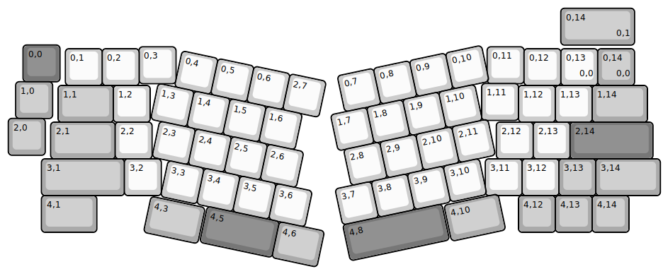{:loading="lazy"}

[Open in keyboard-layout-editor](http://www.keyboard-layout-editor.com/##@@_x:0.55&y:1.15&c=#777777;&=0,0;&@_x:3.7&y:-0.95&c=#cccccc;&=0,3&_x:8.45;&=0,11;&@_x:1.7&y:-0.95;&=0,1&=0,2&_x:10.45;&=0,12&=0,13%0A%0A%0A0,0&_c=#aaaaaa;&=0,14%0A%0A%0A0,0;&@_x:0.35&y:-0.1;&=1,0;&@_x:13&y:-0.95&c=#cccccc;&=1,11;&@_x:1.5&y:-0.95&c=#aaaaaa&w:1.5;&=1,1&_c=#cccccc;&=1,2&_x:10.0;&=1,12&=1,13&_c=#aaaaaa&w:1.5;&=1,14;&@_x:0.15&y:-0.1;&=2,0;&@_x:1.3&y:-0.9&w:1.75;&=2,1&_c=#cccccc;&=2,2&_x:9.35;&=2,12&=2,13&_c=#777777&w:2.25;&=2,14;&@_x:1.05&c=#aaaaaa&w:2.25;&=3,1&_c=#cccccc;&=3,2&_x:8.8;&=3,11&=3,12&_c=#aaaaaa;&=3,13&_w:1.75;&=3,14;&@_x:1.05&w:1.5;&=4,1&_x:11.45;&=4,12&=4,13&=4,14;&@_r:12&x:5.05&y:-6.0&c=#cccccc;&=0,4&=0,5&=0,6&=2,7;&@_x:4.6;&=1,3&=1,4&=1,5&=1,6;&@_x:4.85;&=2,3&=2,4&=2,5&=2,6;&@_x:5.3;&=3,3&=3,4&=3,5&=3,6;&@_x:6.6&c=#777777&w:2;&=4,5&_c=#aaaaaa&w:1.25;&=4,6;&@_x:5.05&y:-0.95&w:1.5;&=4,3;&@_r:-12&x:8.45&y:-1.45&c=#cccccc;&=0,7&=0,8&=0,9&=0,10;&@_x:8.05;&=1,7&=1,8&=1,9&=1,10;&@_x:8.2;&=2,8&=2,9&=2,10&=2,11;&@_x:7.75;&=3,7&=3,8&=3,9&=3,10;&@_x:7.75&c=#777777&w:2.75;&=4,8;&@_x:10.55&y:-0.95&c=#aaaaaa&w:1.5;&=4,10;&@_r:0&x:15.15&y:-8.75&w:2;&=0,14%0A%0A%0A0,1)

## plywrks/ji_eun

[README](output/plywrks/README.md) - [layout](output/plywrks/ji_eun-kle.json) - [PCB](output/plywrks/ji_eun.kicad_pcb) - [PCB render](output/plywrks/ji_eun-render.svg)

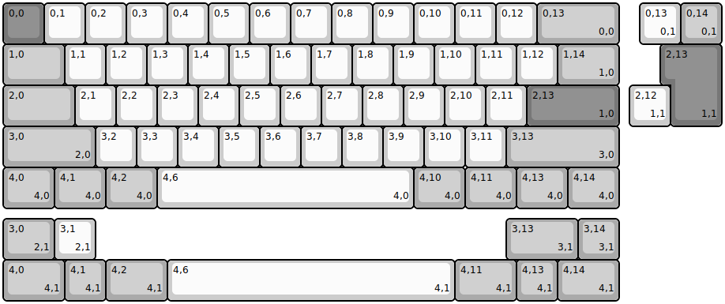{:loading="lazy"}

[Open in keyboard-layout-editor](http://www.keyboard-layout-editor.com/##@@_c=#777777;&=0,0&_c=#cccccc;&=0,1&=0,2&=0,3&=0,4&=0,5&=0,6&=0,7&=0,8&=0,9&=0,10&=0,11&=0,12&_c=#aaaaaa&w:2;&=0,13%0A%0A%0A0,0;&@_w:1.5;&=1,0&_c=#cccccc;&=1,1&=1,2&=1,3&=1,4&=1,5&=1,6&=1,7&=1,8&=1,9&=1,10&=1,11&=1,12&_c=#aaaaaa&w:1.5;&=1,14%0A%0A%0A1,0;&@_w:1.75;&=2,0&_c=#cccccc;&=2,1&=2,2&=2,3&=2,4&=2,5&=2,6&=2,7&=2,8&=2,9&=2,10&=2,11&_c=#777777&w:2.25;&=2,13%0A%0A%0A1,0;&@_c=#aaaaaa&w:2.25;&=3,0%0A%0A%0A2,0&_c=#cccccc;&=3,2&=3,3&=3,4&=3,5&=3,6&=3,7&=3,8&=3,9&=3,10&=3,11&_c=#aaaaaa&w:2.75;&=3,13%0A%0A%0A3,0;&@_w:1.25;&=4,0%0A%0A%0A4,0&_w:1.25;&=4,1%0A%0A%0A4,0&_w:1.25;&=4,2%0A%0A%0A4,0&_c=#cccccc&w:6.25;&=4,6%0A%0A%0A4,0&_c=#aaaaaa&w:1.25;&=4,10%0A%0A%0A4,0&_w:1.25;&=4,11%0A%0A%0A4,0&_w:1.25;&=4,13%0A%0A%0A4,0&_w:1.25;&=4,14%0A%0A%0A4,0;&@_x:15.5&y:-5&c=#cccccc;&=0,13%0A%0A%0A0,1&_c=#aaaaaa;&=0,14%0A%0A%0A0,1;&@_x:16.25&c=#777777&w:1.25&h:2&w2:1.5&h2:1&x2:-0.25;&=2,13%0A%0A%0A1,1;&@_x:15.25&c=#cccccc;&=2,12%0A%0A%0A1,1;&@_y:2.25&c=#aaaaaa&w:1.25;&=3,0%0A%0A%0A2,1&_c=#cccccc;&=3,1%0A%0A%0A2,1&_x:10.0&c=#aaaaaa&w:1.75;&=3,13%0A%0A%0A3,1&=%203,14%0A%0A%0A3,1;&@_w:1.5;&=4,0%0A%0A%0A4,1&=4,1%0A%0A%0A4,1&_w:1.5;&=4,2%0A%0A%0A4,1&_c=#cccccc&w:7;&=4,6%0A%0A%0A4,1&_c=#aaaaaa&w:1.5;&=4,11%0A%0A%0A4,1&=4,13%0A%0A%0A4,1&_w:1.5;&=4,14%0A%0A%0A4,1)

## plywrks/lune

[README](output/plywrks/README.md) - [layout](output/plywrks/lune-kle.json) - [PCB](output/plywrks/lune.kicad_pcb) - [PCB render](output/plywrks/lune-render.svg)

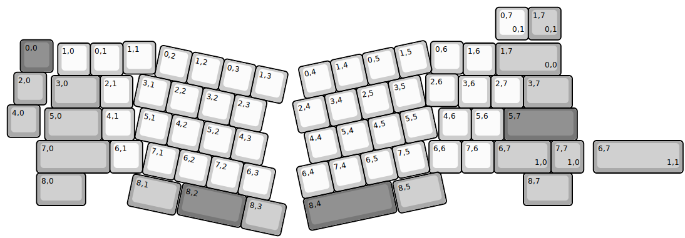{:loading="lazy"}

[Open in keyboard-layout-editor](http://www.keyboard-layout-editor.com/##@@_x:0.55&y:1.15&c=#777777;&=0,0;&@_x:3.7&y:-0.95&c=#cccccc;&=1,1&_x:8.45;&=0,6;&@_x:1.7&y:-0.95;&=1,0&=0,1&_x:10.45;&=1,6&_c=#aaaaaa&w:2;&=1,7%0A%0A%0A0,0;&@_x:0.35&y:-0.1;&=2,0;&@_x:13&y:-0.95&c=#cccccc;&=2,6;&@_x:1.5&y:-0.95&c=#aaaaaa&w:1.5;&=3,0&_c=#cccccc;&=2,1&_x:10.0;&=3,6&=2,7&_c=#aaaaaa&w:1.5;&=3,7;&@_x:0.15&y:-0.1;&=4,0;&@_x:1.3&y:-0.9&w:1.75;&=5,0&_c=#cccccc;&=4,1&_x:9.35;&=4,6&=5,6&_c=#777777&w:2.25;&=5,7;&@_x:1.05&c=#aaaaaa&w:2.25;&=7,0&_c=#cccccc;&=6,1&_x:8.8;&=6,6&=7,6&_c=#aaaaaa&w:1.75;&=6,7%0A%0A%0A1,0&=7,7%0A%0A%0A1,0;&@_x:1.05&w:1.5;&=8,0&_x:13.45&w:1.5;&=8,7;&@_r:12&x:5.05&y:-6.0&c=#cccccc;&=0,2&=1,2&=0,3&=1,3;&@_x:4.6;&=3,1&=2,2&=3,2&=2,3;&@_x:4.85;&=5,1&=4,2&=5,2&=4,3;&@_x:5.3;&=7,1&=6,2&=7,2&=6,3;&@_x:6.6&c=#777777&w:2;&=8,2&_c=#aaaaaa&w:1.25;&=8,3;&@_x:5.05&y:-0.95&w:1.5;&=8,1;&@_r:-12&x:8.45&y:-1.45&c=#cccccc;&=0,4&=1,4&=0,5&=1,5;&@_x:8.05;&=2,4&=3,4&=2,5&=3,5;&@_x:8.2;&=4,4&=5,4&=4,5&=5,5;&@_x:7.75;&=6,4&=7,4&=6,5&=7,5;&@_x:7.75&c=#777777&w:2.75;&=8,4;&@_x:10.55&y:-0.95&c=#aaaaaa&w:1.5;&=8,5;&@_r:0&x:15.15&y:-8.75&c=#cccccc;&=0,7%0A%0A%0A0,1&_c=#aaaaaa;&=1,7%0A%0A%0A0,1;&@_x:18.15&y:3.1&w:2.75;&=6,7%0A%0A%0A1,1)

## poker87c/poker87c

[README](output/poker87c/README.md) - [layout](output/poker87c/poker87c-kle.json) - [PCB](output/poker87c/poker87c.kicad_pcb) - [PCB render](output/poker87c/poker87c-render.svg)

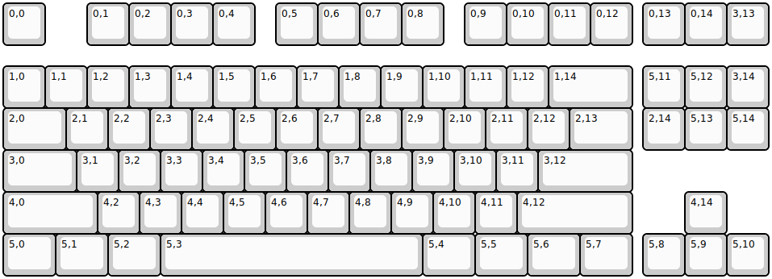{:loading="lazy"}

[Open in keyboard-layout-editor](http://www.keyboard-layout-editor.com/##@@=0,0&_x:1.0;&=0,1&=0,2&=0,3&=0,4&_x:0.5;&=0,5&=0,6&=0,7&=0,8&_x:0.5;&=0,9&=0,10&=0,11&=0,12&_x:0.25;&=0,13&=0,14&=3,13;&@_y:0.5;&=1,0&=1,1&=1,2&=1,3&=1,4&=1,5&=1,6&=1,7&=1,8&=1,9&=1,10&=1,11&=1,12&_w:2;&=1,14&_x:0.25;&=5,11&=5,12&=3,14;&@_w:1.5;&=2,0&=2,1&=2,2&=2,3&=2,4&=2,5&=2,6&=2,7&=2,8&=2,9&=2,10&=2,11&=2,12&_w:1.5;&=2,13&_x:0.25;&=2,14&=5,13&=5,14;&@_w:1.75;&=3,0&=3,1&=3,2&=3,3&=3,4&=3,5&=3,6&=3,7&=3,8&=3,9&=3,10&=3,11&_w:2.25;&=3,12;&@_w:2.25;&=4,0&=4,2&=4,3&=4,4&=4,5&=4,6&=4,7&=4,8&=4,9&=4,10&=4,11&_w:2.75;&=4,12&_x:1.25;&=4,14;&@_w:1.25;&=5,0&_w:1.25;&=5,1&_w:1.25;&=5,2&_w:6.25;&=5,3&_w:1.25;&=5,4&_w:1.25;&=5,5&_w:1.25;&=5,6&_w:1.25;&=5,7&_x:0.25;&=5,8&=5,9&=5,10)

## poker87d/poker87d

[README](output/poker87d/README.md) - [layout](output/poker87d/poker87d-kle.json) - [PCB](output/poker87d/poker87d.kicad_pcb) - [PCB render](output/poker87d/poker87d-render.svg)

{:loading="lazy"}

[Open in keyboard-layout-editor](http://www.keyboard-layout-editor.com/##@@=0,0&_x:1.0;&=0,1&=0,2&=0,3&=0,4&_x:0.5;&=0,5&=0,6&=0,7&=0,8&_x:0.5;&=0,9&=0,10&=0,11&=0,12&_x:0.25;&=0,13&=0,14&=3,13;&@_y:0.5;&=1,0&=1,1&=1,2&=1,3&=1,4&=1,5&=1,6&=1,7&=1,8&=1,9&=1,10&=1,11&=1,12&_w:2;&=1,14&_x:0.25;&=5,11&=5,12&=3,14;&@_w:1.5;&=2,0&=2,1&=2,2&=2,3&=2,4&=2,5&=2,6&=2,7&=2,8&=2,9&=2,10&=2,11&_w:1.25;&=2,12&_w:1.25&h:2.0;&=3,12&_x:0.25;&=2,14&=5,13&=5,14;&@_w:1.75;&=3,0&=3,1&=3,2&=3,3&=3,4&=3,5&=3,6&=3,7&=3,8&=3,9&=3,10&=3,11&=2,13;&@_w:1.25;&=4,0&=4,1&=4,2&=4,3&=4,4&=4,5&=4,6&=4,7&=4,8&=4,9&=4,10&=4,11&_w:2.75;&=4,12&_x:1.25;&=4,14;&@_w:1.25;&=5,0&_w:1.25;&=5,1&_w:1.25;&=5,2&_w:6.25;&=5,3&_w:1.25;&=5,4&_w:1.25;&=5,5&_w:1.25;&=5,6&_w:1.25;&=5,7&_x:0.25;&=5,8&=5,9&=5,10)

## polarityworks/crbn

[README](output/polarityworks/crbn/README.md) - [layout](output/polarityworks/crbn/crbn-kle.json) - [PCB](output/polarityworks/crbn/crbn.kicad_pcb) - [PCB render](output/polarityworks/crbn/crbn-render.svg)

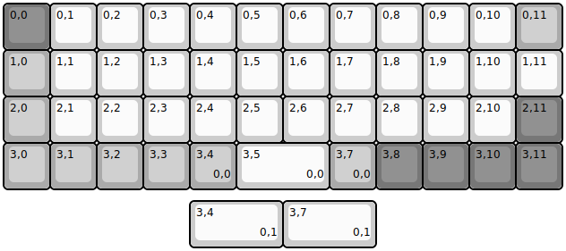{:loading="lazy"}

[Open in keyboard-layout-editor](http://www.keyboard-layout-editor.com/##@@_c=#777777;&=0,0&_c=#cccccc;&=0,1&=0,2&=0,3&=0,4&=0,5&=0,6&=0,7&=0,8&=0,9&=0,10&_c=#aaaaaa;&=0,11;&@=1,0&_c=#cccccc;&=1,1&=1,2&=1,3&=1,4&=1,5&=1,6&=1,7&=1,8&=1,9&=1,10&=1,11;&@_c=#aaaaaa;&=2,0&_c=#cccccc;&=2,1&=2,2&=2,3&=2,4&=2,5&=2,6&=2,7&=2,8&=2,9&=2,10&_c=#777777;&=2,11;&@_c=#aaaaaa;&=3,0&=3,1&=3,2&=3,3&=3,4%0A%0A%0A0,0&_c=#cccccc&w:2;&=3,5%0A%0A%0A0,0&_c=#aaaaaa;&=3,7%0A%0A%0A0,0&_c=#777777;&=3,8&=3,9&=3,10&=3,11;&@_x:4&y:0.25&c=#cccccc&w:2;&=3,4%0A%0A%0A0,1&_w:2;&=3,7%0A%0A%0A0,1)

## portal_66/portal_66

[README](output/portal_66/README.md) - [layout](output/portal_66/portal_66-kle.json) - [PCB](output/portal_66/portal_66.kicad_pcb) - [PCB render](output/portal_66/portal_66-render.svg)

{:loading="lazy"}

[Open in keyboard-layout-editor](http://www.keyboard-layout-editor.com/##@@_x:2.5&y:1.25&c=#777777;&=0,0&_c=#cccccc;&=0,1&=0,2&=0,3&=0,4&=0,5&=0,6&=0,7&=0,8&=0,9&=0,10&=0,11&=0,12&_c=#aaaaaa&w:2;&=0,14%0A%0A%0A0,0&=0,15;&@_x:2.5&w:1.5;&=1,0&_c=#cccccc;&=1,1&=1,2&=1,3&=1,4&=1,5&=1,6&=1,7&=1,8&=1,9&=1,10&=1,11&=1,12&_c=#aaaaaa&w:1.5;&=1,13%0A%0A%0A1,0&=1,15;&@_x:2.5&w:1.75;&=2,0&_c=#cccccc;&=2,1&=2,2&=2,3&=2,4&=2,5&=2,6&=2,7&=2,8&=2,9&=2,10&=2,11&_c=#777777&w:2.25;&=2,13%0A%0A%0A1,0&_c=#aaaaaa;&=2,15;&@_x:2.5&w:2.25;&=3,0%0A%0A%0A2,0&_c=#cccccc;&=3,2&=3,3&=3,4&=3,5&=3,6&=3,7&=3,8&=3,9&=3,10&=3,11&_c=#aaaaaa&w:1.75;&=3,12&=3,13&=3,15;&@_x:2.5&w:1.25;&=4,0%0A%0A%0A3,0&_w:1.25;&=4,1%0A%0A%0A3,0&_w:1.25;&=4,2%0A%0A%0A3,0&_w:6.25;&=4,6%0A%0A%0A3,0&_w:1.25;&=4,9%0A%0A%0A3,0&_w:1.25;&=4,11%0A%0A%0A3,0&_x:0.5;&=4,12&=4,13&=4,15;&@_x:15.5&y:-6.25;&=0,13%0A%0A%0A0,1&=0,14%0A%0A%0A0,1;&@_x:19.75&y:1.25&c=#777777&w:1.25&h:2&w2:1.5&h2:1&x2:-0.25;&=2,13%0A%0A%0A1,1;&@_x:18.75&c=#cccccc;&=2,12%0A%0A%0A1,1;&@_c=#aaaaaa&w:1.25;&=3,0%0A%0A%0A2,1&_c=#cccccc;&=3,1%0A%0A%0A2,1;&@_x:2.5&y:1.0&c=#aaaaaa&w:1.5;&=4,0%0A%0A%0A3,1&=4,1%0A%0A%0A3,1&_w:1.5;&=4,2%0A%0A%0A3,1&_w:7;&=4,6%0A%0A%0A3,1&_w:1.5;&=4,11%0A%0A%0A3,1)

## portal_66/portal_66_hs

[README](output/portal_66/README.md) - [layout](output/portal_66/portal_66_hs-kle.json) - [PCB](output/portal_66/portal_66_hs.kicad_pcb) - [PCB render](output/portal_66/portal_66_hs-render.svg)

{:loading="lazy"}

[Open in keyboard-layout-editor](http://www.keyboard-layout-editor.com/##@@_c=#777777;&=0,0&_c=#cccccc;&=0,1&=0,2&=0,3&=0,4&=0,5&=0,6&=0,7&=0,8&=0,9&=0,10&=0,11&=0,12&_c=#aaaaaa&w:2;&=0,14%0A%0A%0A0,0&=0,15;&@_w:1.5;&=1,0&_c=#cccccc;&=1,1&=1,2&=1,3&=1,4&=1,5&=1,6&=1,7&=1,8&=1,9&=1,10&=1,11&=1,12&_c=#aaaaaa&w:1.5;&=1,13%0A%0A%0A1,0&=1,15;&@_w:1.75;&=2,0&_c=#cccccc;&=2,1&=2,2&=2,3&=2,4&=2,5&=2,6&=2,7&=2,8&=2,9&=2,10&=2,11&_c=#777777&w:2.25;&=2,13%0A%0A%0A1,0&_c=#aaaaaa;&=2,15;&@_w:2.25;&=3,0%0A%0A%0A2,0&_c=#cccccc;&=3,2&=3,3&=3,4&=3,5&=3,6&=3,7&=3,8&=3,9&=3,10&=3,11&_c=#aaaaaa&w:1.75;&=3,12&=3,13&=3,15;&@_w:1.25;&=4,0%0A%0A%0A3,0&_w:1.25;&=4,1%0A%0A%0A3,0&_w:1.25;&=4,2%0A%0A%0A3,0&_w:6.25;&=4,6%0A%0A%0A3,0&_w:1.25;&=4,9%0A%0A%0A3,0&_w:1.25;&=4,11%0A%0A%0A3,0&_x:0.5;&=4,12&=4,13&=4,15)

## primekb/meridian

[README](output/primekb/meridian/README.md) - [layout](output/primekb/meridian/meridian-kle.json) - [PCB](output/primekb/meridian/meridian.kicad_pcb) - [PCB render](output/primekb/meridian/meridian-render.svg)

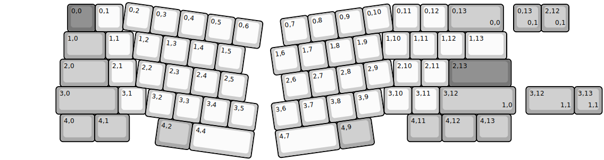{:loading="lazy"}

[Open in keyboard-layout-editor](http://www.keyboard-layout-editor.com/##@@_x:2.37&y:0.08&c=#777777;&=0,0&_c=#cccccc;&=0,1&_x:9.76;&=0,11&=0,12&_c=#aaaaaa&w:2;&=0,13%0A%0A%0A0,0;&@_x:2.24&w:1.5;&=1,0&_c=#cccccc;&=1,1&_x:9.01;&=1,10&=1,11&=1,12&_w:1.5;&=1,13;&@_x:2.1&c=#aaaaaa&w:1.75;&=2,0&_c=#cccccc;&=2,1&_x:9.31;&=2,10&=2,11&_c=#777777&w:2.25;&=2,13;&@_x:1.95&c=#aaaaaa&w:2.25;&=3,0&_c=#cccccc;&=3,1&_x:8.62;&=3,10&=3,11&_c=#aaaaaa&w:2.75;&=3,12%0A%0A%0A1,0;&@_x:2.1&w:1.25;&=4,0&_w:1.25;&=4,1&_x:10.06&w:1.25;&=4,11&_w:1.25;&=4,12&_w:1.25;&=4,13;&@_r:8&rx:4.5&c=#cccccc;&=0,2&=0,3&=0,4&=0,5&=0,6;&@_x:0.5;&=1,2&=1,3&=1,4&=1,5;&@_x:0.75;&=2,2&=2,3&=2,4&=2,5;&@_x:1.25;&=3,2&=3,3&=3,4&=3,5;&@_x:1.75&c=#aaaaaa&w:1.25;&=4,2&_c=#cccccc&w:2.25;&=4,4;&@_r:-8&rx:14.5&x:-4.5;&=0,7&=0,8&=0,9&=0,10;&@_x:-5.0;&=1,6&=1,7&=1,8&=1,9;&@_x:-4.75;&=2,6&=2,7&=2,8&=2,9;&@_x:-5.25;&=3,6&=3,7&=3,8&=3,9;&@_x:-5.25&w:2.25;&=4,7&_c=#aaaaaa&w:1.25;&=4,9;&@_r:0&rx:0&x:18.5&y:0.08;&=0,13%0A%0A%0A0,1&=2,12%0A%0A%0A0,1;&@_x:18.95&y:2.0&w:1.75;&=3,12%0A%0A%0A1,1&=3,13%0A%0A%0A1,1)

## primekb/meridian_rgb

[README](output/primekb/meridian_rgb/README.md) - [layout](output/primekb/meridian_rgb/meridian_rgb-kle.json) - [PCB](output/primekb/meridian_rgb/meridian_rgb.kicad_pcb) - [PCB render](output/primekb/meridian_rgb/meridian_rgb-render.svg)

{:loading="lazy"}

[Open in keyboard-layout-editor](http://www.keyboard-layout-editor.com/##@@_x:2.37&y:0.08&c=#777777;&=0,0&_c=#cccccc;&=0,1&_x:9.76;&=0,11&=0,12&_c=#aaaaaa&w:2;&=0,13;&@_x:2.24&w:1.5;&=1,0&_c=#cccccc;&=1,1&_x:9.01;&=1,10&=1,11&=1,12&_w:1.5;&=1,13;&@_x:2.1&c=#aaaaaa&w:1.75;&=2,0&_c=#cccccc;&=2,1&_x:9.31;&=2,10&=2,11&_c=#777777&w:2.25;&=2,13;&@_x:1.95&c=#aaaaaa&w:2.25;&=3,0&_c=#cccccc;&=3,1&_x:8.62;&=3,10&=3,11&_c=#aaaaaa&w:1.75;&=3,12&=3,13;&@_x:2.1&w:1.25;&=4,0&_w:1.25;&=4,1&_x:10.06&w:1.25;&=4,11&_w:1.25;&=4,12&_w:1.25;&=4,13;&@_r:8&rx:4.5&c=#cccccc;&=0,2&=0,3&=0,4&=0,5&=0,6;&@_x:0.5;&=1,2&=1,3&=1,4&=1,5;&@_x:0.75;&=2,2&=2,3&=2,4&=2,5;&@_x:1.25;&=3,2&=3,3&=3,4&=3,5;&@_x:1.75&c=#aaaaaa&w:1.25;&=4,2&_c=#cccccc&w:2.25;&=4,4;&@_r:-8&rx:14.5&x:-4.5;&=0,7&=0,8&=0,9&=0,10;&@_x:-5.0;&=1,6&=1,7&=1,8&=1,9;&@_x:-4.75;&=2,6&=2,7&=2,8&=2,9;&@_x:-5.25;&=3,6&=3,7&=3,8&=3,9;&@_x:-5.25&w:2.25;&=4,7&_c=#aaaaaa&w:1.25;&=4,9)

## primekb/prime_e

[README](output/primekb/prime_e/README.md) - [layout](output/primekb/prime_e/prime_e-kle.json) - [PCB](output/primekb/prime_e/prime_e.kicad_pcb) - [PCB render](output/primekb/prime_e/prime_e-render.svg)

{:loading="lazy"}

[Open in keyboard-layout-editor](http://www.keyboard-layout-editor.com/##@@_rx:6.25&x:0.85&y:0.46&c=#777777;&=0,0&_c=#cccccc;&=0,1&_x:8.95;&=0,10&_c=#aaaaaa;&=0,11&=0,12;&@_x:0.71&y:0.01&w:1.26;&=1,0&_x:-0.01&c=#cccccc;&=1,1&_x:9.23;&=1,10&_c=#777777&w:1.75;&=1,12;&@_x:0.56&y:0.01&c=#aaaaaa&w:1.75;&=2,0&_c=#cccccc;&=2,1&_x:8.52;&=2,10&=2,11&_c=#aaaaaa&w:1.25;&=2,12;&@_x:0.67&y:0.01&w:1.25;&=3,0&_w:1.25;&=3,1&_x:9.3&w:1.25;&=3,11&_w:1.25;&=3,12;&@_r:8&x:3.0&y:-4.49&c=#cccccc;&=0,2&=0,3&=0,4&=0,5;&@_x:3.25;&=1,2&=1,3&=1,4&=1,5;&@_x:3.75;&=2,2&=2,3&=2,4&=2,5;&@_x:4.5&c=#aaaaaa&w:1.25;&=3,3&_c=#cccccc&w:2;&=3,4;&@_r:-8&x:7.5&y:-1.9;&=0,6&=0,7&=0,8&=0,9;&@_x:7.75;&=1,6&=1,7&=1,8&=1,9;&@_x:7.25&c=#aaaaaa;&=2,6&_c=#cccccc;&=2,7&=2,8&=2,9;&@_x:7.25&w:2.25;&=3,6&_c=#aaaaaa&w:1.25;&=3,8)

## primekb/prime_e_rgb

[README](output/primekb/prime_e_rgb/README.md) - [layout](output/primekb/prime_e_rgb/prime_e_rgb-kle.json) - [PCB](output/primekb/prime_e_rgb/prime_e_rgb.kicad_pcb) - [PCB render](output/primekb/prime_e_rgb/prime_e_rgb-render.svg)

{:loading="lazy"}

[Open in keyboard-layout-editor](http://www.keyboard-layout-editor.com/##@@_rx:6.25&x:0.85&y:0.46&c=#777777;&=0,0&_c=#cccccc;&=0,1&_x:8.95;&=0,10&_c=#aaaaaa;&=0,11&=0,12;&@_x:0.71&y:0.01&w:1.26;&=1,0&_x:-0.01&c=#cccccc;&=1,1&_x:9.23;&=1,10&_c=#777777&w:1.75;&=1,12;&@_x:0.56&y:0.01&c=#aaaaaa&w:1.75;&=2,0&_c=#cccccc;&=2,1&_x:8.52;&=2,10&=2,11&_c=#aaaaaa&w:1.25;&=2,12;&@_x:0.67&y:0.01&w:1.25;&=3,0&_w:1.25;&=3,1&_x:9.3&w:1.25;&=3,11&_w:1.25;&=3,12;&@_r:8&x:3.0&y:-4.49&c=#cccccc;&=0,2&=0,3&=0,4&=0,5;&@_x:3.25;&=1,2&=1,3&=1,4&=1,5;&@_x:3.75;&=2,2&=2,3&=2,4&=2,5;&@_x:4.5&c=#aaaaaa&w:1.25;&=3,3&_c=#cccccc&w:2;&=3,4;&@_r:-8&x:7.5&y:-1.9;&=0,6&=0,7&=0,8&=0,9;&@_x:7.75;&=1,6&=1,7&=1,8&=1,9;&@_x:7.25&c=#aaaaaa;&=2,6&_c=#cccccc;&=2,7&=2,8&=2,9;&@_x:7.25&w:2.25;&=3,6&_c=#aaaaaa&w:1.25;&=3,8)

## primekb/prime_exl

[README](output/primekb/prime_exl/README.md) - [layout](output/primekb/prime_exl/prime_exl-kle.json) - [PCB](output/primekb/prime_exl/prime_exl.kicad_pcb) - [PCB render](output/primekb/prime_exl/prime_exl-render.svg)

{:loading="lazy"}

[Open in keyboard-layout-editor](http://www.keyboard-layout-editor.com/##@@_x:0.25&y:0.46&c=#aaaaaa;&=4,0&=5,0&=4,1&=5,1&=4,2&=5,2;&@_x:0.25;&=3,0&=6,0&_c=#cccccc;&=3,1&=6,1&=3,2&_c=#aaaaaa;&=6,2;&@_x:0.25;&=2,0&=7,0&_c=#cccccc;&=2,1&=7,1&=2,2&_c=#aaaaaa;&=7,2;&@_x:0.25;&=1,0&=8,0&_c=#cccccc;&=1,1&=8,1&=1,2&_c=#aaaaaa;&=8,2;&@_x:0.25;&=0,0&=9,0&=0,1&_c=#cccccc;&=9,1&=0,2&_c=#aaaaaa;&=9,2;&@_rx:6.25&x:0.85&y:0.46&c=#777777;&=4,3&_c=#cccccc;&=5,3&_x:8.95;&=4,8&_c=#aaaaaa&w:2;&=5,8;&@_x:0.71&y:0.01&w:1.26;&=3,3&_x:-0.01&c=#cccccc;&=6,3&_x:9.23;&=3,8&_c=#777777&w:1.75;&=6,8;&@_x:0.56&y:0.01&c=#aaaaaa&w:1.75;&=2,3&_c=#cccccc;&=7,3&_x:8.52;&=7,7&=2,8&_c=#aaaaaa&w:1.25;&=7,8;&@_x:0.67&y:0.01&w:1.25;&=1,3&_w:1.25;&=8,3&_x:8.8&w:1.5;&=8,7&_w:1.5;&=1,8;&@_r:8&ry:1&x:3.0&y:-1&c=#cccccc;&=4,4&=5,4&=4,5&=5,5;&@_x:3.25;&=3,4&=6,4&=3,5&=6,5;&@_x:3.75;&=2,4&=7,4&=2,5&=7,5;&@_x:3.75&c=#aaaaaa;&=1,4&=8,4&_w:2;&=1,5;&@_r:-8&x:7.5&y:-1.9&c=#cccccc;&=4,6&=5,6&=4,7&=5,7;&@_x:7.75;&=3,6&=6,6&=3,7&=6,7;&@_x:7.25;&=8,5&=2,6&=7,6&=2,7;&@_x:7.25&c=#aaaaaa&w:2;&=1,6&=8,6&=1,7)

## primekb/prime_exl_plus

[README](output/primekb/prime_exl_plus/README.md) - [layout](output/primekb/prime_exl_plus/prime_exl_plus-kle.json) - [PCB](output/primekb/prime_exl_plus/prime_exl_plus.kicad_pcb) - [PCB render](output/primekb/prime_exl_plus/prime_exl_plus-render.svg)

{:loading="lazy"}

[Open in keyboard-layout-editor](http://www.keyboard-layout-editor.com/##@@_y:0.46;&=4,0&=5,0&=4,1&=5,1&=4,2&=5,2;&@=3,0&=6,0&=3,1&=6,1&=3,2&=6,2;&@_y:0.01;&=2,0&=7,0&=2,1&=7,1&=2,2&=7,2;&@_y:0.01;&=1,0&=8,0&=1,1&=8,1&=1,2&=8,2;&@_y:0.01;&=0,0&=9,0&=0,1&=9,1&=0,2&=9,2;&@_rx:6.25&x:0.75&y:0.46&c=#777777;&=4,3&_c=#cccccc;&=5,3&_x:8.91;&=4,8&_c=#aaaaaa&w:2;&=5,8;&@_x:0.6;&=3,3&_c=#cccccc;&=6,3&_x:9.2;&=3,8&=6,8&=3,9;&@_x:0.46&y:0.01&c=#aaaaaa&w:1.26;&=2,3&_x:-0.01&c=#cccccc;&=7,3&_x:9.48;&=2,8&_c=#777777&w:1.75;&=2,9;&@_x:0.31&y:0.01&c=#aaaaaa&w:1.75;&=1,8&_c=#cccccc;&=8,3&_x:8.77;&=1,8&=8,8&_c=#aaaaaa&w:1.25;&=1,9;&@_x:0.42&y:0.01&w:1.25;&=0,3&_w:1.25;&=9,3&_x:9.55&w:1.25;&=9,8&_w:1.25;&=0,9;&@_r:8&ry:1&x:2.75&y:-1&c=#cccccc;&=4,4&=5,4&=4,5&=5,5;&@_x:2.75;&=3,4&=6,4&=3,5&=6,5;&@_x:3.0;&=2,4&=7,4&=2,5&=7,5;&@_x:3.5;&=1,4&=8,4&=1,5&=8,5;&@_x:4.5&c=#aaaaaa&w:1.25;&=0,4&_c=#cccccc&w:1.75;&=9,5;&@_r:-8&x:7.5&y:-2.9;&=4,6&=5,6&=4,7&=5,7;&@_x:7.5;&=3,6&=6,6&=3,7&=6,7;&@_x:7.75;&=2,6&=7,6&=2,7&=7,7;&@_x:7.25;&=1,6&=8,6&=1,7&=8,7;&@_x:7.25&w:1.75;&=0,6&_c=#aaaaaa&w:1.25;&=9,7)

## primekb/prime_l

[README](output/primekb/prime_l/README.md) - [layout](output/primekb/prime_l/prime_l-kle.json) - [PCB](output/primekb/prime_l/prime_l.kicad_pcb) - [PCB render](output/primekb/prime_l/prime_l-render.svg)

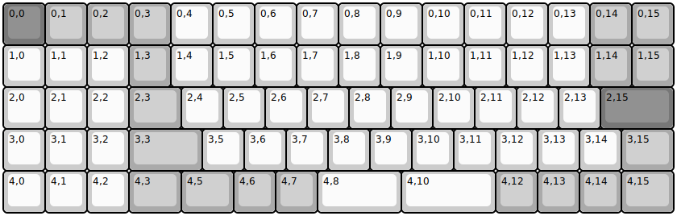{:loading="lazy"}

[Open in keyboard-layout-editor](http://www.keyboard-layout-editor.com/##@@_c=#777777;&=0,0&_c=#aaaaaa;&=0,1&=0,2&=0,3&_c=#cccccc;&=0,4&=0,5&=0,6&=0,7&=0,8&=0,9&=0,10&=0,11&=0,12&=0,13&_c=#aaaaaa;&=0,14&=0,15;&@_c=#cccccc;&=1,0&=1,1&=1,2&_c=#aaaaaa;&=1,3&_c=#cccccc;&=1,4&=1,5&=1,6&=1,7&=1,8&=1,9&=1,10&=1,11&=1,12&=1,13&_c=#aaaaaa;&=1,14&=1,15;&@_c=#cccccc;&=2,0&=2,1&=2,2&_c=#aaaaaa&w:1.25;&=2,3&_c=#cccccc;&=2,4&=2,5&=2,6&=2,7&=2,8&=2,9&=2,10&=2,11&=2,12&=2,13&_c=#777777&w:1.75;&=2,15;&@_c=#cccccc;&=3,0&=3,1&=3,2&_c=#aaaaaa&w:1.75;&=3,3&_c=#cccccc;&=3,5&=3,6&=3,7&=3,8&=3,9&=3,10&=3,11&=3,12&=3,13&=3,14&_c=#aaaaaa&w:1.25;&=3,15;&@_c=#cccccc;&=4,0&=4,1&=4,2&_c=#aaaaaa&w:1.25;&=4,3&_w:1.25;&=4,5&=4,6&=4,7&_c=#cccccc&w:2;&=4,8&_w:2.25;&=4,10&_c=#aaaaaa;&=4,12&=4,13&=4,14&_w:1.25;&=4,15)

## primekb/prime_l_v2

[README](output/primekb/prime_l_v2/README.md) - [layout](output/primekb/prime_l_v2/prime_l_v2-kle.json) - [PCB](output/primekb/prime_l_v2/prime_l_v2.kicad_pcb) - [PCB render](output/primekb/prime_l_v2/prime_l_v2-render.svg)

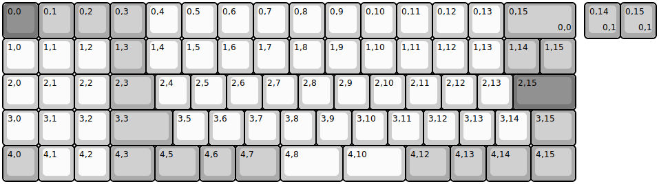{:loading="lazy"}

[Open in keyboard-layout-editor](http://www.keyboard-layout-editor.com/##@@_c=#777777;&=0,0&_c=#aaaaaa;&=0,1&=0,2&=0,3&_c=#cccccc;&=0,4&=0,5&=0,6&=0,7&=0,8&=0,9&=0,10&=0,11&=0,12&=0,13&_c=#aaaaaa&w:2;&=0,15%0A%0A%0A0,0;&@_c=#cccccc;&=1,0&=1,1&=1,2&_c=#aaaaaa;&=1,3&_c=#cccccc;&=1,4&=1,5&=1,6&=1,7&=1,8&=1,9&=1,10&=1,11&=1,12&=1,13&_c=#aaaaaa;&=1,14&=1,15;&@_c=#cccccc;&=2,0&=2,1&=2,2&_c=#aaaaaa&w:1.25;&=2,3&_c=#cccccc;&=2,4&=2,5&=2,6&=2,7&=2,8&=2,9&=2,10&=2,11&=2,12&=2,13&_c=#777777&w:1.75;&=2,15;&@_c=#cccccc;&=3,0&=3,1&=3,2&_c=#aaaaaa&w:1.75;&=3,3&_c=#cccccc;&=3,5&=3,6&=3,7&=3,8&=3,9&=3,10&=3,11&=3,12&=3,13&=3,14&_c=#aaaaaa&w:1.25;&=3,15;&@=4,0&_c=#cccccc;&=4,1&=4,2&_c=#aaaaaa&w:1.25;&=4,3&_w:1.25;&=4,5&=4,6&_w:1.25;&=4,7&_c=#cccccc&w:1.75;&=4,8&_w:1.75;&=4,10&_c=#aaaaaa&w:1.25;&=4,12&=4,13&_w:1.25;&=4,14&_w:1.25;&=4,15;&@_x:16.25&y:-5;&=0,14%0A%0A%0A0,1&=0,15%0A%0A%0A0,1)

## primekb/prime_m

[README](output/primekb/prime_m/README.md) - [layout](output/primekb/prime_m/prime_m-kle.json) - [PCB](output/primekb/prime_m/prime_m.kicad_pcb) - [PCB render](output/primekb/prime_m/prime_m-render.svg)

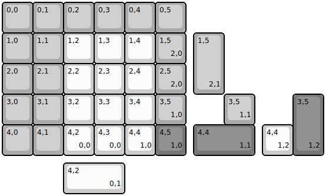{:loading="lazy"}

[Open in keyboard-layout-editor](http://www.keyboard-layout-editor.com/##@@_c=#aaaaaa;&=0,0&=0,1&=0,2&=0,3&=0,4&=0,5;&@=1,0&=1,1&_c=#cccccc;&=1,2&=1,3&=1,4&_c=#aaaaaa;&=1,5%0A%0A%0A2,0;&@=2,0&=2,1&_c=#cccccc;&=2,2&=2,3&=2,4&_c=#aaaaaa;&=2,5%0A%0A%0A2,0;&@=3,0&=3,1&_c=#cccccc;&=3,2&=3,3&=3,4&_c=#aaaaaa;&=3,5%0A%0A%0A1,0;&@=4,0&=4,1&_c=#cccccc;&=4,2%0A%0A%0A0,0&=4,3%0A%0A%0A0,0&=4,4%0A%0A%0A1,0&_c=#777777;&=4,5%0A%0A%0A1,0;&@_x:6.25&y:-4&c=#aaaaaa&h:2;&=1,5%0A%0A%0A2,1;&@_x:7.25&y:1;&=3,5%0A%0A%0A1,1&_x:1.25&c=#777777&h:2;&=3,5%0A%0A%0A1,2;&@_x:6.25&w:2;&=4,4%0A%0A%0A1,1&_x:0.25&c=#cccccc;&=4,4%0A%0A%0A1,2;&@_x:2&y:0.25&w:2;&=4,2%0A%0A%0A0,1)

## program_yoink/program_yoink

[README](output/program_yoink/README.md) - [layout](output/program_yoink/program_yoink-kle.json) - [PCB](output/program_yoink/program_yoink.kicad_pcb) - [PCB render](output/program_yoink/program_yoink-render.svg)

{:loading="lazy"}

[Open in keyboard-layout-editor](http://www.keyboard-layout-editor.com/##@@_c=#aaaaaa;&=0,0&_c=#cccccc;&=0,1&=0,2&=0,3&=0,4&=0,5&=0,6&=0,7&=0,8&=0,9&=0,10&_c=#aaaaaa;&=0,11&_x:0.5;&=0,12;&@_w:1.25;&=1,0&_c=#cccccc;&=1,1&=1,2&=1,3&=1,4&=1,5&=1,6&=1,7&=1,8&=1,9&_c=#aaaaaa&w:1.75;&=1,10&_x:0.5;&=1,12;&@_w:1.75;&=2,0&_c=#cccccc;&=2,1&=2,2&=2,3&=2,4&=2,5&=2,6&=2,7&=2,8%0A.&_c=#aaaaaa&w:1.25;&=2,9&_x:1.5;&=2,12;&@_x:11.25&y:-0.75&c=#777777;&=2,10;&@_y:-0.25&c=#aaaaaa&w:1.25;&=3,0%0A%0A%0A0,0&_w:1.25;&=3,1%0A%0A%0A0,0&_c=#cccccc&w:6.25;&=3,4%0A%0A%0A0,0&_c=#aaaaaa&w:1.25;&=3,8%0A%0A%0A0,0;&@_x:10.25&y:-0.75&c=#777777;&=3,9&=3,10&=3,12;&@_y:0.25&c=#aaaaaa;&=3,0%0A%0A%0A0,1&=3,1%0A%0A%0A0,1&_c=#cccccc&w:7;&=3,4%0A%0A%0A0,1&_c=#aaaaaa;&=3,8%0A%0A%0A0,1;&@=3,0%0A%0A%0A0,2&=3,1%0A%0A%0A0,2&=3,2%0A%0A%0A0,2&_c=#cccccc&w:2.75;&=3,3%0A%0A%0A0,2&_w:2.25;&=3,5%0A%0A%0A0,2&_c=#aaaaaa;&=3,7%0A%0A%0A0,2&=3,8%0A%0A%0A0,2)

## projectkb/alice/projectkb_alice

[README](output/projectkb/alice/README.md) - [layout](output/projectkb/alice/projectkb_alice-kle.json) - [PCB](output/projectkb/alice/projectkb_alice.kicad_pcb) - [PCB render](output/projectkb/alice/projectkb_alice-render.svg)

{:loading="lazy"}

[Open in keyboard-layout-editor](http://www.keyboard-layout-editor.com/##@@_x:0.55&y:1.15&c=#777777;&=0,0;&@_x:3.7&y:-0.95&c=#cccccc;&=0,3&_x:8.45;&=0,12;&@_x:1.7&y:-0.95;&=0,1&=0,2&_x:10.45;&=0,13&=0,14%0A%0A%0A0,0&_c=#aaaaaa;&=0,15%0A%0A%0A0,0;&@_x:0.35&y:-0.1;&=1,0;&@_x:13&y:-0.95&c=#cccccc;&=1,12;&@_x:1.5&y:-0.95&c=#aaaaaa&w:1.5;&=1,1&_c=#cccccc;&=1,2&_x:10.0;&=1,13&=1,14&_c=#aaaaaa&w:1.5;&=1,15;&@_x:0.15&y:-0.1;&=2,0;&@_x:13.4&y:-0.9&c=#cccccc;&=2,12&=2,13&_c=#777777&w:2.25;&=2,15&_x:-16.35&c=#aaaaaa&w:1.75;&=2,1&_c=#cccccc;&=2,2;&@_x:1.05&c=#aaaaaa&w:2.25;&=3,1&_c=#cccccc;&=3,2&_x:8.8;&=3,12&=3,13&_c=#aaaaaa&w:1.75;&=3,14%0A%0A%0A1,0&=3,15%0A%0A%0A1,0;&@_x:1.05&w:1.5;&=4,1&_x:13.45&w:1.5;&=4,15;&@_r:12&x:5.05&y:-6.0&c=#cccccc;&=0,4&=0,5&=0,6&=0,7;&@_x:4.6;&=1,3&=1,4&=1,5&=1,6;&@_x:4.85;&=2,3&=2,4&=2,5&=2,6;&@_x:5.3;&=3,3&=3,4&=3,5&=3,6;&@_x:6.6&c=#777777&w:2;&=4,4&_c=#aaaaaa&w:1.25;&=4,6;&@_x:5.05&y:-0.95&w:1.5;&=4,3;&@_r:-12&x:8.45&y:-1.45&c=#cccccc;&=0,8&=0,9&=0,10&=0,11;&@_x:8.05;&=1,8&=1,9&=1,10&=1,11;&@_x:8.2;&=2,8&=2,9&=2,10&=2,11;&@_x:7.75;&=3,8&=3,9&=3,10&=3,11;&@_x:7.75&c=#777777&w:2.75;&=4,9;&@_x:10.55&y:-0.95&c=#aaaaaa&w:1.5;&=4,11;&@_r:0&x:15.15&y:-8.75&w:2;&=0,15%0A%0A%0A0,1;&@_x:18.15&y:3.1&w:2.75;&=3,14%0A%0A%0A1,1)

## projectkb/alice/signature87

[README](output/projectkb/alice/README.md) - [layout](output/projectkb/alice/signature87-kle.json) - [PCB](output/projectkb/alice/signature87.kicad_pcb) - [PCB render](output/projectkb/alice/signature87-render.svg)

{:loading="lazy"}

[Open in keyboard-layout-editor](http://www.keyboard-layout-editor.com/##@@_c=#777777;&=0,0&_x:1&c=#cccccc;&=1,1&=0,1&=1,2&=0,2&_x:0.5&c=#aaaaaa;&=1,3&=0,3&=1,4&=0,4&_x:0.5&c=#cccccc;&=1,5&=0,6&=1,6&=0,7&_x:0.25&c=#aaaaaa;&=1,7&=0,8&=1,8;&@_y:0.25&c=#cccccc;&=2,0&=3,0&=2,1&=3,1&=2,2&=3,2&=2,3&=3,3&=2,4&=3,4&=2,5&=3,5&=2,6&_c=#aaaaaa&w:2;&=3,6%0A%0A%0A0,0&_x:0.25;&=3,7&=2,8&=3,8;&@_w:1.5;&=4,0&_c=#cccccc;&=5,0&=4,1&=5,1&=4,2&=5,2&=4,3&=5,3&=4,4&=5,4&=4,5&=5,5&=4,6&_w:1.5;&=5,7&_x:0.25&c=#aaaaaa;&=4,7&=5,8&=4,8;&@_w:1.75;&=6,0&_c=#cccccc;&=7,0&=6,1&=7,1&=6,2&=7,2&=6,3&=7,3&=6,4&=7,4&=6,5&=7,5&_c=#777777&w:2.25;&=6,6;&@_c=#aaaaaa&w:2.25;&=8,0&_c=#cccccc;&=9,0&=8,1&=9,1&=8,2&=9,2&=8,3&=9,3&=8,4&=9,4&=8,5&_c=#aaaaaa&w:2.75;&=9,6%0A%0A%0A1,0&_x:1.25;&=9,8;&@_w:1.25;&=10,0%0A%0A%0A2,0&_w:1.25;&=11,0%0A%0A%0A2,0&_w:1.25;&=10,1%0A%0A%0A2,0&_c=#cccccc&w:6.25;&=11,2%0A%0A%0A2,0&_c=#aaaaaa&w:1.25;&=10,4%0A%0A%0A2,0&_w:1.25;&=11,5%0A%0A%0A2,0&_w:1.25;&=10,6%0A%0A%0A2,0&_w:1.25;&=11,6%0A%0A%0A2,0&_x:0.25;&=10,7&=11,8&=10,8;&@_x:18.75&y:-5.0&c=#cccccc;&=3,6%0A%0A%0A0,1&=3,7%0A%0A%0A0,1;&@_x:18.75&y:2.0&c=#aaaaaa&w:1.75;&=9,6%0A%0A%0A1,1&=8,6%0A%0A%0A1,1;&@_y:1.5&w:1.5;&=10,0%0A%0A%0A2,1&=11,0%0A%0A%0A2,1&_w:1.5;&=10,1%0A%0A%0A2,1&_c=#cccccc&w:7;&=11,2%0A%0A%0A2,1&_c=#aaaaaa&w:1.5;&=11,5%0A%0A%0A2,1&=10,6%0A%0A%0A2,1&_w:1.5;&=11,6%0A%0A%0A2,1;&@_w:1.5;&=10,0%0A%0A%0A2,2&_c=#cccccc&d:true;&=%0A%0A%0A2,2&_c=#aaaaaa&w:1.5;&=10,1%0A%0A%0A2,2&_c=#cccccc&w:7;&=11,2%0A%0A%0A2,2&_c=#aaaaaa&w:1.5;&=11,5%0A%0A%0A2,2&_c=#cccccc&d:true;&=%0A%0A%0A2,2&_c=#aaaaaa&w:1.5;&=11,6%0A%0A%0A2,2)

## prototypist/j01

[README](output/prototypist/j01/README.md) - [layout](output/prototypist/j01/j01-kle.json) - [PCB](output/prototypist/j01/j01.kicad_pcb) - [PCB render](output/prototypist/j01/j01-render.svg)

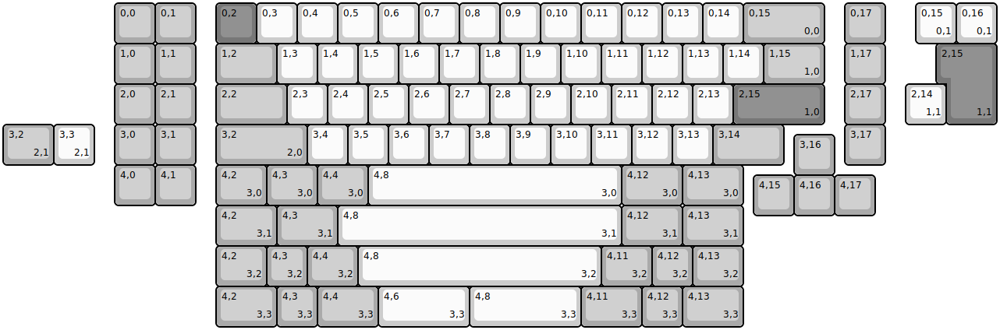{:loading="lazy"}

[Open in keyboard-layout-editor](http://www.keyboard-layout-editor.com/##@@_x:2.75&c=#aaaaaa;&=0,0&=0,1&_x:0.5&c=#777777;&=0,2&_c=#cccccc;&=0,3&=0,4&=0,5&=0,6&=0,7&=0,8&=0,9&=0,10&=0,11&=0,12&=0,13&=0,14&_c=#aaaaaa&w:2;&=0,15%0A%0A%0A0,0&_x:0.5;&=0,17;&@_x:2.75;&=1,0&=1,1&_x:0.5&w:1.5;&=1,2&_c=#cccccc;&=1,3&=1,4&=1,5&=1,6&=1,7&=1,8&=1,9&=1,10&=1,11&=1,12&=1,13&=1,14&_c=#aaaaaa&w:1.5;&=1,15%0A%0A%0A1,0&_x:0.5;&=1,17;&@_x:2.75;&=2,0&=2,1&_x:0.5&w:1.75;&=2,2&_c=#cccccc;&=2,3&=2,4&=2,5&=2,6&=2,7&=2,8&=2,9&=2,10&=2,11&=2,12&=2,13&_c=#777777&w:2.25;&=2,15%0A%0A%0A1,0&_x:0.5&c=#aaaaaa;&=2,17;&@_x:2.75;&=3,0&=3,1&_x:0.5&w:2.25;&=3,2%0A%0A%0A2,0&_c=#cccccc;&=3,4&=3,5&=3,6&=3,7&=3,8&=3,9&=3,10&=3,11&=3,12&=3,13&_c=#aaaaaa&w:1.75;&=3,14&_x:1.5;&=3,17;&@_x:19.5&y:-0.75;&=3,16;&@_x:2.75&y:-0.25;&=4,0&=4,1&_x:0.5&w:1.25;&=4,2%0A%0A%0A3,0&_w:1.25;&=4,3%0A%0A%0A3,0&_w:1.25;&=4,4%0A%0A%0A3,0&_c=#cccccc&w:6.25;&=4,8%0A%0A%0A3,0&_c=#aaaaaa&w:1.5;&=4,12%0A%0A%0A3,0&_w:1.5;&=4,13%0A%0A%0A3,0;&@_x:18.5&y:-0.75;&=4,15&=4,16&=4,17;&@_x:22.5&y:-5.25&c=#cccccc;&=0,15%0A%0A%0A0,1&=0,16%0A%0A%0A0,1;&@_x:23.25&c=#777777&w:1.25&h:2&w2:1.5&h2:1&x2:-0.25;&=2,15%0A%0A%0A1,1;&@_x:22.25&c=#cccccc;&=2,14%0A%0A%0A1,1;&@_c=#aaaaaa&w:1.25;&=3,2%0A%0A%0A2,1&_c=#cccccc;&=3,3%0A%0A%0A2,1;&@_x:5.25&y:1.0&c=#aaaaaa&w:1.5;&=4,2%0A%0A%0A3,1&_w:1.5;&=4,3%0A%0A%0A3,1&_c=#cccccc&w:7;&=4,8%0A%0A%0A3,1&_c=#aaaaaa&w:1.5;&=4,12%0A%0A%0A3,1&_w:1.5;&=4,13%0A%0A%0A3,1;&@_x:5.25&w:1.25;&=4,2%0A%0A%0A3,2&=4,3%0A%0A%0A3,2&_w:1.25;&=4,4%0A%0A%0A3,2&_c=#cccccc&w:6;&=4,8%0A%0A%0A3,2&_c=#aaaaaa&w:1.25;&=4,11%0A%0A%0A3,2&=4,12%0A%0A%0A3,2&_w:1.25;&=4,13%0A%0A%0A3,2;&@_x:5.25&w:1.5;&=4,2%0A%0A%0A3,3&=4,3%0A%0A%0A3,3&_w:1.5;&=4,4%0A%0A%0A3,3&_c=#cccccc&w:2.25;&=4,6%0A%0A%0A3,3&_w:2.75;&=4,8%0A%0A%0A3,3&_c=#aaaaaa&w:1.5;&=4,11%0A%0A%0A3,3&=4,12%0A%0A%0A3,3&_w:1.5;&=4,13%0A%0A%0A3,3)

## protozoa/foundation

[README](output/protozoa/README.md) - [layout](output/protozoa/foundation-kle.json) - [PCB](output/protozoa/foundation.kicad_pcb) - [PCB render](output/protozoa/foundation-render.svg)

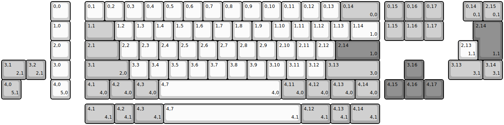{:loading="lazy"}

[Open in keyboard-layout-editor](http://www.keyboard-layout-editor.com/##@@_x:2.5;&=0,0&_x:0.75;&=0,1&=0,2&=0,3&=0,4&=0,5&=0,6&=0,7&=0,8&=0,9&=0,10&=0,11&=0,12&=0,13&_c=#aaaaaa&w:2;&=0,14%0A%0A%0A0,0&_x:0.25;&=0,15&=0,16&=0,17;&@_x:2.5&c=#cccccc;&=1,0&_x:0.75&c=#aaaaaa&w:1.5;&=1,1&_c=#cccccc;&=1,2&=1,3&=1,4&=1,5&=1,6&=1,7&=1,8&=1,9&=1,10&=1,11&=1,12&=1,13&_w:1.5;&=1,14%0A%0A%0A1,0&_x:0.25&c=#aaaaaa;&=1,15&=1,16&=1,17;&@_x:2.5&c=#cccccc;&=2,0&_x:0.75&c=#aaaaaa&w:1.75;&=2,1&_c=#cccccc;&=2,2&=2,3&=2,4&=2,5&=2,6&=2,7&=2,8&=2,9&=2,10&=2,11&=2,12&_c=#777777&w:2.25;&=2,14%0A%0A%0A1,0;&@_x:2.5&c=#cccccc;&=3,0&_x:0.75&c=#aaaaaa&w:2.25;&=3,1%0A%0A%0A2,0&_c=#cccccc;&=3,3&=3,4&=3,5&=3,6&=3,7&=3,8&=3,9&=3,10&=3,11&=3,12&_c=#aaaaaa&w:2.75;&=3,13%0A%0A%0A3,0&_x:1.25&c=#777777;&=3,16;&@_x:2.5&c=#cccccc;&=4,0%0A%0A%0A5,0&_x:0.75&c=#aaaaaa&w:1.25;&=4,1%0A%0A%0A4,0&_w:1.25;&=4,2%0A%0A%0A4,0&_w:1.25;&=4,3%0A%0A%0A4,0&_c=#cccccc&w:6.25;&=4,7%0A%0A%0A4,0&_c=#aaaaaa&w:1.25;&=4,11%0A%0A%0A4,0&_w:1.25;&=4,12%0A%0A%0A4,0&_w:1.25;&=4,13%0A%0A%0A4,0&_w:1.25;&=4,14%0A%0A%0A4,0&_x:0.25&c=#777777;&=4,15&=4,16&=4,17;&@_x:23.5&y:-5&c=#aaaaaa;&=0,14%0A%0A%0A0,1&=2,15%0A%0A%0A0,1;&@_x:24.25&c=#777777&w:1.25&h:2&w2:1.5&h2:1&x2:-0.25;&=2,14%0A%0A%0A1,1;&@_x:23.25&c=#cccccc;&=2,13%0A%0A%0A1,1;&@_c=#aaaaaa&w:1.25;&=3,1%0A%0A%0A2,1&=3,2%0A%0A%0A2,1&_x:20.5&w:1.75;&=3,13%0A%0A%0A3,1&=3,14%0A%0A%0A3,1;&@=4,0%0A%0A%0A5,1%0A%0A%0A%0A%0A%0Ae;&@_x:4.25&y:0.25&w:1.5;&=4,1%0A%0A%0A4,1&=4,2%0A%0A%0A4,1&_w:1.5;&=4,3%0A%0A%0A4,1&_c=#cccccc&w:7;&=4,7%0A%0A%0A4,1&_c=#aaaaaa&w:1.5;&=4,12%0A%0A%0A4,1&=4,13%0A%0A%0A4,1&_w:1.5;&=4,14%0A%0A%0A4,1)

## pteron36/pteron36

[README](output/pteron36/README.md) - [layout](output/pteron36/pteron36-kle.json) - [PCB](output/pteron36/pteron36.kicad_pcb) - [PCB render](output/pteron36/pteron36-render.svg)

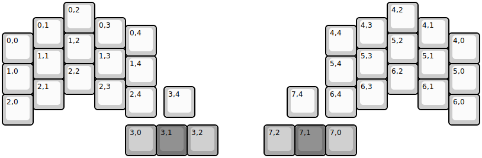{:loading="lazy"}

[Open in keyboard-layout-editor](http://www.keyboard-layout-editor.com/##@@_x:2;&=0,2&_x:9.5;&=4,2;&@_x:1&y:-0.5;&=0,1&_x:1;&=0,3&_x:7.5;&=4,3&_x:1.0;&=4,1;&@_x:4&y:-0.75;&=0,4&_x:5.5;&=4,4;&@_y:-0.75;&=0,0&_x:1;&=1,2&_x:9.5;&=5,2&_x:1.0;&=4,0;&@_x:1&y:-0.5;&=1,1&_x:1;&=1,3&_x:7.5;&=5,3&_x:1.0;&=5,1;&@_x:4&y:-0.75;&=1,4&_x:5.5;&=5,4;&@_y:-0.75;&=1,0&_x:1;&=2,2&_x:9.5;&=6,2&_x:1.0;&=5,0;&@_x:1&y:-0.5;&=2,1&_x:1;&=2,3&_x:7.5;&=6,3&_x:1.0;&=6,1;&@_x:4&y:-0.75;&=2,4&_x:0.25;&=3,4&_x:3.0;&=7,4&_x:0.25;&=6,4;&@_y:-0.75;&=2,0&_x:13.5;&=6,0;&@_x:4&c=#aaaaaa;&=3,0&_c=#777777;&=3,1&_c=#aaaaaa;&=3,2&_x:1.5;&=7,2&_c=#777777;&=7,1&_c=#aaaaaa;&=7,0)

## punk75/punk75

[README](output/punk75/README.md) - [layout](output/punk75/punk75-kle.json) - [PCB](output/punk75/punk75.kicad_pcb) - [PCB render](output/punk75/punk75-render.svg)

{:loading="lazy"}

[Open in keyboard-layout-editor](http://www.keyboard-layout-editor.com/##@@_c=#777777;&=0,0&_c=#cccccc;&=0,1&=0,2&=0,3&=0,4&=0,5&=0,6&=0,7&=0,8&=0,9&=0,10&=0,11&=0,12&=0,13&_c=#aaaaaa;&=0,14;&@=1,0&_c=#cccccc;&=1,1&=1,2&=1,3&=1,4&=1,5&=1,6&=1,7&=1,8&=1,9&=1,10&=1,11&=1,12&=1,13&=1,14;&@_c=#aaaaaa;&=2,0&_c=#cccccc;&=2,1&=2,2&=2,3&=2,4&=2,5&_c=#aaaaaa;&=2,6&=2,7&=2,8&_c=#cccccc;&=2,9&=2,10&=2,11&=2,12&=2,13&_c=#777777;&=2,14;&@_c=#aaaaaa;&=3,0&_c=#cccccc;&=3,1&=3,2&=3,3&=3,4&=3,5&_c=#aaaaaa;&=3,6&_c=#777777;&=3,7&_c=#aaaaaa;&=3,8&_c=#cccccc;&=3,9&=3,10&=3,11&=3,12&=3,13&_c=#aaaaaa;&=3,14;&@=4,0&=4,1&=4,2&=4,3&_c=#cccccc;&=4,4&=4,5&_c=#777777;&=4,6&=4,7&=4,8&_c=#cccccc;&=4,9&=4,10&_c=#aaaaaa;&=4,11&=4,12&=4,13&=4,14)

## qaz/qaz

[README](output/qaz/README.md) - [layout](output/qaz/qaz-kle.json) - [PCB](output/qaz/qaz.kicad_pcb) - [PCB render](output/qaz/qaz-render.svg)

{:loading="lazy"}

[Open in keyboard-layout-editor](http://www.keyboard-layout-editor.com/##@@_c=#777777;&=0,0&_c=#cccccc;&=0,1&=0,2&=0,3&=0,4&=0,5&=0,6&=4,0&=4,1&_c=#aaaaaa&w:1.25;&=4,2;&@_w:1.25;&=1,0&_c=#cccccc;&=1,1&=1,2&=1,3&=1,4&=1,5&=1,6&=5,0&=5,1&_c=#777777;&=5,2;&@_c=#aaaaaa&w:1.75;&=2,0&_c=#cccccc;&=2,1&=2,2&=2,3&=2,4&=2,5&=2,6&=4,3&_c=#aaaaaa&w:1.5;&=5,3;&@=3,0%0A%0A%0A0,0&=3,1%0A%0A%0A0,0&_c=#cccccc&w:6.25;&=3,4%0A%0A%0A0,0&_c=#aaaaaa;&=3,6%0A%0A%0A0,0&=4,4%0A%0A%0A0,0;&@=3,0%0A%0A%0A0,1&=3,1%0A%0A%0A0,1&=3,2%0A%0A%0A0,1&_c=#cccccc&w:2.25;&=3,3%0A%0A%0A0,1&_c=#777777&w:2;&=3,4%0A%0A%0A0,1&_c=#aaaaaa;&=3,5%0A%0A%0A0,1&=3,6%0A%0A%0A0,1&=4,4%0A%0A%0A0,1)

## quad_h/lb75

[README](output/quad_h/lb75/README.md) - [layout](output/quad_h/lb75/lb75-kle.json) - [PCB](output/quad_h/lb75/lb75.kicad_pcb) - [PCB render](output/quad_h/lb75/lb75-render.svg)

{:loading="lazy"}

[Open in keyboard-layout-editor](http://www.keyboard-layout-editor.com/##@@_x:2.5&y:1.25&c=#777777;&=0,0%0A%0A%0A4,0&_c=#aaaaaa;&=1,0%0A%0A%0A4,0&=0,1%0A%0A%0A4,0&=1,1%0A%0A%0A4,0&=0,2%0A%0A%0A4,0&=1,2%0A%0A%0A4,0&=0,3%0A%0A%0A4,0&=1,3%0A%0A%0A4,0&=0,4%0A%0A%0A4,0&=1,4%0A%0A%0A4,0&=0,5%0A%0A%0A4,0&=1,5%0A%0A%0A4,0&=0,6%0A%0A%0A4,0&=1,6%0A%0A%0A4,0&=0,7%0A%0A%0A4,0&=1,7%0A%0A%0A4,0;&@_x:2.5;&=2,0&_c=#cccccc;&=3,0&=2,1&=3,1&=2,2&=3,2&=2,3&=3,3&=2,4&=3,4&=2,5&=3,5&=2,6&_c=#aaaaaa&w:2;&=3,6%0A%0A%0A0,0&_c=#cccccc;&=3,7;&@_x:2.5&c=#aaaaaa&w:1.5;&=4,0&_c=#cccccc;&=5,0&=4,1&=5,1&=4,2&=5,2&=4,3&=5,3&=4,4&=5,4&=4,5&=5,5&=4,6&_c=#aaaaaa&w:1.5;&=4,7%0A%0A%0A3,0&_c=#cccccc;&=5,7;&@_x:2.5&c=#aaaaaa&w:1.75;&=6,0&_c=#cccccc;&=7,0&=6,1&=7,1&=6,2&=7,2&=6,3&=7,3&=6,4&=7,4&=6,5&=7,5&_c=#777777&w:2.25;&=7,6%0A%0A%0A3,0&_c=#cccccc;&=7,7;&@_x:2.5&c=#aaaaaa&w:2.25;&=8,0%0A%0A%0A2,0&_c=#cccccc;&=8,1&=9,1&=8,2&=9,2&=8,3&=9,3&=8,4&=9,4&=8,5&=9,5&_c=#aaaaaa&w:1.75;&=8,6%0A%0A%0A1,0&_c=#cccccc;&=8,7%0A%0A%0A1,0&=9,7;&@_x:2.5&c=#aaaaaa&w:1.25;&=10,0%0A%0A%0A5,0&_w:1.25;&=11,0%0A%0A%0A5,0&_w:1.25;&=10,1%0A%0A%0A5,0&_c=#cccccc&w:6.25;&=10,3%0A%0A%0A5,0&_c=#aaaaaa;&=10,5%0A%0A%0A5,0&=11,5%0A%0A%0A5,0&=10,6%0A%0A%0A5,0&_c=#cccccc;&=11,6%0A%0A%0A5,0&=10,7%0A%0A%0A5,0&=11,7%0A%0A%0A5,0;&@_x:2.5&y:-7.25&c=#777777;&=0,0%0A%0A%0A4,1&_c=#cccccc&w:0.5&d:true;&=%0A%0A%0A4,1&_c=#aaaaaa;&=1,0%0A%0A%0A4,1&=0,1%0A%0A%0A4,1&=1,1%0A%0A%0A4,1&=0,2%0A%0A%0A4,1&_c=#cccccc&w:0.5&d:true;&=%0A%0A%0A4,1&_c=#aaaaaa;&=0,3%0A%0A%0A4,1&=1,3%0A%0A%0A4,1&=0,4%0A%0A%0A4,1&=1,4%0A%0A%0A4,1&_c=#cccccc&w:0.5&d:true;&=%0A%0A%0A4,1&_c=#aaaaaa;&=0,5%0A%0A%0A4,1&=1,5%0A%0A%0A4,1&=0,6%0A%0A%0A4,1&=1,6%0A%0A%0A4,1&_c=#cccccc&w:0.5&d:true;&=%0A%0A%0A4,1&_c=#aaaaaa;&=1,7%0A%0A%0A4,1;&@_x:19.5&y:1.25&c=#cccccc;&=3,6%0A%0A%0A0,1&=2,7%0A%0A%0A0,1;&@_x:20.25&c=#aaaaaa&w:1.25&h:2&w2:1.5&h2:1&x2:-0.25;&=7,6%0A%0A%0A3,1;&@_x:19.25;&=4,7%0A%0A%0A3,1;&@_w:1.25;&=8,0%0A%0A%0A2,1&_c=#cccccc;&=9,0%0A%0A%0A2,1&_x:16.5&c=#aaaaaa&w:2.75;&=8,6%0A%0A%0A1,1;&@_x:2.5&y:1.25&w:1.25;&=10,0%0A%0A%0A5,1&_w:1.25;&=11,0%0A%0A%0A5,1&_w:1.25;&=10,1%0A%0A%0A5,1&_c=#cccccc&w:6.25;&=10,3%0A%0A%0A5,1&_c=#aaaaaa&w:1.25;&=10,5%0A%0A%0A5,1&_w:1.25;&=11,5%0A%0A%0A5,1&_c=#cccccc&w:0.5&d:true;&=%0A%0A%0A5,1&=11,6%0A%0A%0A5,1&=10,7%0A%0A%0A5,1&=11,7%0A%0A%0A5,1;&@_x:2.5&y:0.25&c=#aaaaaa&w:1.5;&=10,0%0A%0A%0A5,2&_c=#cccccc&d:true;&=%0A%0A%0A5,2&_c=#aaaaaa&w:1.5;&=10,1%0A%0A%0A5,2&_c=#cccccc&w:7;&=10,3%0A%0A%0A5,2&_c=#aaaaaa&w:1.5;&=11,5%0A%0A%0A5,2&_c=#cccccc&d:true;&=%0A%0A%0A5,2&_c=#aaaaaa&w:1.5;&=10,7%0A%0A%0A5,2&_c=#cccccc;&=11,7%0A%0A%0A5,2)

## quantrik/kyuu

[README](output/quantrik/kyuu/README.md) - [layout](output/quantrik/kyuu/kyuu-kle.json) - [PCB](output/quantrik/kyuu/kyuu.kicad_pcb) - [PCB render](output/quantrik/kyuu/kyuu-render.svg)

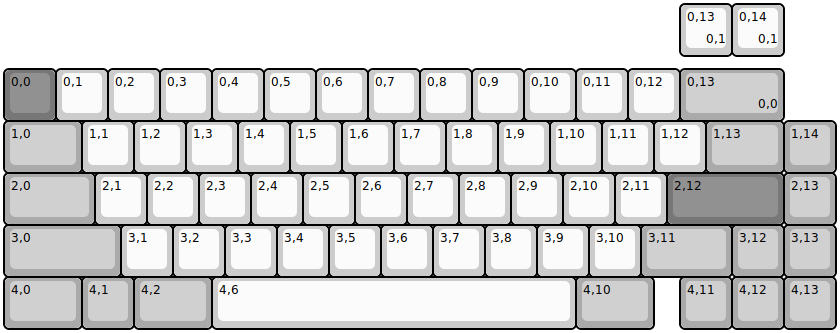{:loading="lazy"}

[Open in keyboard-layout-editor](http://www.keyboard-layout-editor.com/##@@_y:1.25&c=#777777;&=0,0&_c=#cccccc;&=0,1&=0,2&=0,3&=0,4&=0,5&=0,6&=0,7&=0,8&=0,9&=0,10&=0,11&=0,12&_c=#aaaaaa&w:2;&=0,13%0A%0A%0A0,0;&@_w:1.5;&=1,0&_c=#cccccc;&=1,1&=1,2&=1,3&=1,4&=1,5&=1,6&=1,7&=1,8&=1,9&=1,10&=1,11&=1,12&_c=#aaaaaa&w:1.5;&=1,13&=1,14;&@_w:1.75;&=2,0&_c=#cccccc;&=2,1&=2,2&=2,3&=2,4&=2,5&=2,6&=2,7&=2,8&=2,9&=2,10&=2,11&_c=#777777&w:2.25;&=2,12&_c=#aaaaaa;&=2,13;&@_w:2.25;&=3,0&_c=#cccccc;&=3,1&=3,2&=3,3&=3,4&=3,5&=3,6&=3,7&=3,8&=3,9&=3,10&_c=#aaaaaa&w:1.75;&=3,11&=3,12&=3,13;&@_w:1.5;&=4,0&=4,1&_w:1.5;&=4,2&_c=#cccccc&w:7;&=4,6&_c=#aaaaaa&w:1.5;&=4,10&_x:0.5;&=4,11&=4,12&=4,13;&@_x:13&y:-6.25&c=#cccccc;&=0,13%0A%0A%0A0,1&=0,14%0A%0A%0A0,1)

## quantrik/sx60

[README](output/quantrik/sx60/README.md) - [layout](output/quantrik/sx60/sx60-kle.json) - [PCB](output/quantrik/sx60/sx60.kicad_pcb) - [PCB render](output/quantrik/sx60/sx60-render.svg)

{:loading="lazy"}

[Open in keyboard-layout-editor](http://www.keyboard-layout-editor.com/##@@_x:1.5&c=#777777;&=0,0&_c=#cccccc;&=0,1&=0,2&=0,3&=0,4&=0,5&=0,6&_x:1.0;&=0,8&=0,9&=0,10&=0,11&=0,12&=0,13&_c=#aaaaaa;&=0,14%0A%0A%0A0,0&=0,15%0A%0A%0A0,0;&@=1,0&_x:0.5&w:1.5;&=1,1&_c=#cccccc;&=1,2&=1,3&=1,4&=1,5&=1,6&_x:1.0;&=1,8&=1,9&=1,10&=1,11&=1,12&=1,13&=1,14&_w:1.5;&=1,15;&@_c=#aaaaaa;&=2,0&_x:0.5&w:1.75;&=2,1&_c=#cccccc;&=2,2&=2,3&=2,4&=2,5&=2,6&_x:1.0;&=2,8&=2,9&=2,10&=2,11&=2,12&=2,13&_c=#777777&w:2.25;&=2,14;&@_c=#aaaaaa;&=3,0&_x:0.5&w:2.25;&=3,1&_c=#cccccc;&=3,3&=3,4&=3,5&=3,6&=3,7&_x:1.0;&=3,8&=3,9&=3,10&=3,11&=3,12%0A%0A%0A1,0&_c=#aaaaaa&w:1.75;&=3,13%0A%0A%0A1,0&=3,15%0A%0A%0A1,0;&@=4,0&_x:0.5&w:1.25;&=4,1&_w:1.25;&=4,2&_w:1.25;&=4,3&_w:2;&=4,4&=4,5&_x:1.0&w:2.75;&=4,8&_w:1.25;&=4,9&_w:1.25;&=4,10&=4,11%0A%0A%0A2,0&=4,12%0A%0A%0A2,0&=4,13%0A%0A%0A2,0;&@_x:18.0&y:-5&w:2;&=0,14%0A%0A%0A0,1;&@_x:18.0&y:2&c=#cccccc;&=3,12%0A%0A%0A1,1&_c=#aaaaaa&w:2.75;&=3,14%0A%0A%0A1,1;&@_x:18.0&c=#cccccc&w:1.75;&=3,12%0A%0A%0A1,2&_c=#aaaaaa;&=3,14%0A%0A%0A1,2&=3,15%0A%0A%0A1,2;&@_x:14.5&w:1.5;&=4,11%0A%0A%0A2,1&_w:1.5;&=4,13%0A%0A%0A2,1)

## quarkeys/z40/Z40-VIA

[README](output/quarkeys/z40/README.md) - [layout](output/quarkeys/z40/Z40-VIA-kle.json) - [PCB](output/quarkeys/z40/Z40-VIA.kicad_pcb) - [PCB render](output/quarkeys/z40/Z40-VIA-render.svg)

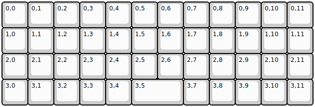{:loading="lazy"}

[Open in keyboard-layout-editor](http://www.keyboard-layout-editor.com/##@@=0,0&=0,1&=0,2&=0,3&=0,4&=0,5&=0,6&=0,7&=0,8&=0,9&=0,10&=0,11;&@=1,0&=1,1&=1,2&=1,3&=1,4&=1,5&=1,6&=1,7&=1,8&=1,9&=1,10&=1,11;&@=2,0&=2,1&=2,2&=2,3&=2,4&=2,5&=2,6&=2,7&=2,8&=2,9&=2,10&=2,11;&@=3,0&=3,1&=3,2&=3,3&=3,4&_w:2;&=3,5&=3,7&=3,8&=3,9&=3,10&=3,11)

## quarkeys/z60/Hotswap-V2

[README](output/quarkeys/z60/README.md) - [layout](output/quarkeys/z60/Hotswap-V2-kle.json) - [PCB](output/quarkeys/z60/Hotswap-V2.kicad_pcb) - [PCB render](output/quarkeys/z60/Hotswap-V2-render.svg)

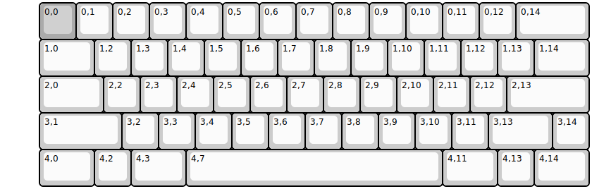{:loading="lazy"}

[Open in keyboard-layout-editor](http://www.keyboard-layout-editor.com/##@@_x:1&c=#aaaaaa;&=0,0&_c=#cccccc;&=0,1&=0,2&=0,3&=0,4&=0,5&=0,6&=0,7&=0,8&=0,9&=0,10&=0,11&=0,12&_w:2;&=0,14;&@_x:1&w:1.5;&=1,0&=1,2&=1,3&=1,4&=1,5&=1,6&=1,7&=1,8&=1,9&=1,10&=1,11&=1,12&=1,13&_w:1.5;&=1,14;&@_x:1&w:1.75;&=2,0&=2,2&=2,3&=2,4&=2,5&=2,6&=2,7&=2,8&=2,9&=2,10&=2,11&=2,12&_w:2.25;&=2,13;&@_x:1&w:2.25;&=3,1&=3,2&=3,3&=3,4&=3,5&=3,6&=3,7&=3,8&=3,9&=3,10&=3,11&_w:1.75;&=3,13&=3,14;&@_x:1&w:1.5;&=4,0&=4,2&_w:1.5;&=4,3&_w:7;&=4,7&_w:1.5;&=4,11&=4,13&_w:1.5;&=4,14)

## quarkeys/z60/Solder-V2

[README](output/quarkeys/z60/README.md) - [layout](output/quarkeys/z60/Solder-V2-kle.json) - [PCB](output/quarkeys/z60/Solder-V2.kicad_pcb) - [PCB render](output/quarkeys/z60/Solder-V2-render.svg)

{:loading="lazy"}

[Open in keyboard-layout-editor](http://www.keyboard-layout-editor.com/##@@_x:2.5&c=#777777;&=0,0&_c=#cccccc;&=0,1&=0,2&=0,3&=0,4&=0,5&=0,6&=0,7&=0,8&=0,9&=0,10&=0,11&=0,12&_c=#aaaaaa&w:2;&=0,13%0A%0A%0A0,0;&@_x:2.5&w:1.5;&=1,1&_c=#cccccc;&=1,2&=1,3&=1,4&=1,5&=1,6&=1,7&=1,8&=1,9&=1,10&=1,11&=1,12&=1,13&_w:1.5;&=1,14%0A%0A%0A1,0;&@_x:2.5&c=#aaaaaa&w:1.75;&=2,1&_c=#cccccc;&=2,2&=2,3&=2,4&=2,5&=2,6&=2,7&=2,8&=2,9&=2,10&=2,11&=2,12&_c=#777777&w:2.25;&=2,14%0A%0A%0A1,0;&@_x:2.5&c=#aaaaaa&w:2.25;&=3,0%0A%0A%0A2,0&_c=#cccccc;&=3,2&=3,3&=3,4&=3,5&=3,6&=3,7&=3,8&=3,9&=3,10&=3,11&_c=#aaaaaa&w:2.75;&=3,12%0A%0A%0A3,0;&@_x:2.5&w:1.25;&=4,0%0A%0A%0A4,0&_w:1.25;&=4,1%0A%0A%0A4,0&_w:1.25;&=4,3%0A%0A%0A4,0&_c=#cccccc&w:6.25;&=4,6%0A%0A%0A4,0&_c=#aaaaaa&w:1.25;&=4,10%0A%0A%0A4,0&_w:1.25;&=4,11%0A%0A%0A4,0&_w:1.25;&=4,12%0A%0A%0A4,0&_w:1.25;&=4,13%0A%0A%0A4,0;&@_x:18.0&y:-5&c=#cccccc;&=0,13%0A%0A%0A0,1&=0,14%0A%0A%0A0,1;&@_x:18.75&c=#777777&w:1.25&h:2&w2:1.5&h2:1&x2:-0.25;&=2,14%0A%0A%0A1,1;&@_x:17.75&c=#cccccc;&=2,13%0A%0A%0A1,1;&@_c=#aaaaaa&w:1.25;&=3,0%0A%0A%0A2,1&=3,1%0A%0A%0A2,1&_x:15.5&w:1.75;&=3,12%0A%0A%0A3,1&=3,13%0A%0A%0A3,1;&@_x:2.5&y:1.5&w:1.5;&=4,0%0A%0A%0A4,1&=4,1%0A%0A%0A4,1&_w:1.5;&=4,3%0A%0A%0A4,1&_c=#cccccc&w:7;&=4,6%0A%0A%0A4,1&_c=#aaaaaa&w:1.5;&=4,11%0A%0A%0A4,1&=4,12%0A%0A%0A4,1&_w:1.5;&=4,13%0A%0A%0A4,1;&@_x:2.5&w:1.5&d:true;&=4,0%0A%0A%0A4,2&=4,1%0A%0A%0A4,2&_w:1.5;&=4,3%0A%0A%0A4,2&_c=#cccccc&w:7;&=4,6%0A%0A%0A4,2&_c=#aaaaaa&w:1.5;&=4,11%0A%0A%0A4,2&=4,12%0A%0A%0A4,2&_w:1.5&d:true;&=4,13%0A%0A%0A4,2;&@_x:2.5&w:1.5;&=4,0%0A%0A%0A4,3&_d:true;&=4,1%0A%0A%0A4,3&_w:1.5;&=4,3%0A%0A%0A4,3&_c=#cccccc&w:7;&=4,6%0A%0A%0A4,3&_c=#aaaaaa&w:1.5;&=4,11%0A%0A%0A4,3&_d:true;&=4,12%0A%0A%0A4,3&_w:1.5;&=4,13%0A%0A%0A4,3)

## quarkeys/z67/Hotswap

[README](output/quarkeys/z67/README.md) - [layout](output/quarkeys/z67/Hotswap-kle.json) - [PCB](output/quarkeys/z67/Hotswap.kicad_pcb) - [PCB render](output/quarkeys/z67/Hotswap-render.svg)

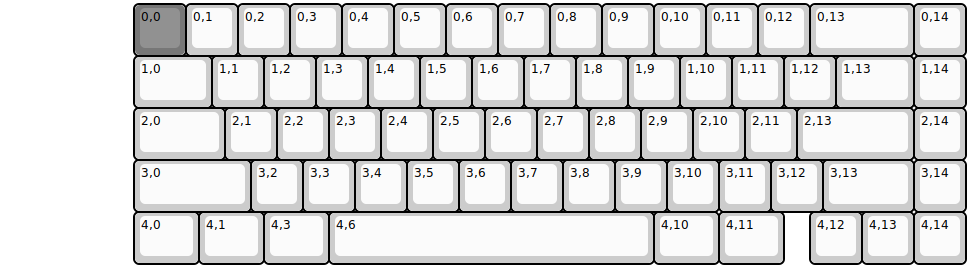{:loading="lazy"}

[Open in keyboard-layout-editor](http://www.keyboard-layout-editor.com/##@@_x:2.5&c=#777777;&=0,0&_c=#cccccc;&=0,1&=0,2&=0,3&=0,4&=0,5&=0,6&=0,7&=0,8&=0,9&=0,10&=0,11&=0,12&_w:2;&=0,13&=0,14;&@_x:2.5&w:1.5;&=1,0&=1,1&=1,2&=1,3&=1,4&=1,5&=1,6&=1,7&=1,8&=1,9&=1,10&=1,11&=1,12&_w:1.5;&=1,13&=1,14;&@_x:2.5&w:1.75;&=2,0&=2,1&=2,2&=2,3&=2,4&=2,5&=2,6&=2,7&=2,8&=2,9&=2,10&=2,11&_w:2.25;&=2,13&=2,14;&@_x:2.5&w:2.25;&=3,0&=3,2&=3,3&=3,4&=3,5&=3,6&=3,7&=3,8&=3,9&=3,10&=3,11&=3,12&_w:1.75;&=3,13&=3,14;&@_x:2.5&w:1.25;&=4,0&_w:1.25;&=4,1&_w:1.25;&=4,3&_w:6.25;&=4,6&_w:1.25;&=4,10&_w:1.25;&=4,11&_x:0.5;&=4,12&=4,13&=4,14)

## quarkeys/z67/Solder

[README](output/quarkeys/z67/README.md) - [layout](output/quarkeys/z67/Solder-kle.json) - [PCB](output/quarkeys/z67/Solder.kicad_pcb) - [PCB render](output/quarkeys/z67/Solder-render.svg)

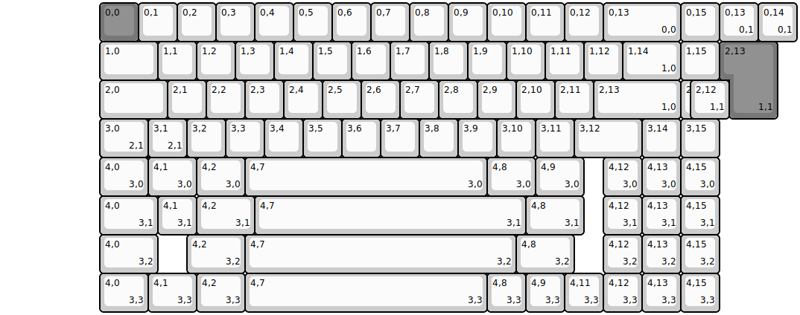{:loading="lazy"}

[Open in keyboard-layout-editor](http://www.keyboard-layout-editor.com/##@@_x:2.5&c=#777777;&=0,0&_c=#cccccc;&=0,1&=0,2&=0,3&=0,4&=0,5&=0,6&=0,7&=0,8&=0,9&=0,10&=0,11&=0,12&_w:2;&=0,13%0A%0A%0A0,0&=0,15;&@_x:2.5&w:1.5;&=1,0&=1,1&=1,2&=1,3&=1,4&=1,5&=1,6&=1,7&=1,8&=1,9&=1,10&=1,11&=1,12&_w:1.5;&=1,14%0A%0A%0A1,0&=1,15;&@_x:2.5&w:1.75;&=2,0&=2,1&=2,2&=2,3&=2,4&=2,5&=2,6&=2,7&=2,8&=2,9&=2,10&=2,11&_w:2.25;&=2,13%0A%0A%0A1,0&=2,15;&@_x:2.5&w:2.25;&=3,0%0A%0A%0A2,0&=3,2&=3,3&=3,4&=3,5&=3,6&=3,7&=3,8&=3,9&=3,10&=3,11&_w:1.75;&=3,12&=3,14&=3,15;&@_x:2.5&w:1.25;&=4,0%0A%0A%0A3,0&_w:1.25;&=4,1%0A%0A%0A3,0&_w:1.25;&=4,2%0A%0A%0A3,0&_w:6.25;&=4,7%0A%0A%0A3,0&_w:1.25;&=4,8%0A%0A%0A3,0&_w:1.25;&=4,9%0A%0A%0A3,0&_x:0.5;&=4,12%0A%0A%0A3,0&=4,13%0A%0A%0A3,0&=4,15%0A%0A%0A3,0;&@_x:18.5&y:-5;&=0,13%0A%0A%0A0,1&=0,14%0A%0A%0A0,1;&@_x:18.75&c=#777777&w:1.25&h:2&w2:1.5&h2:1&x2:-0.25;&=2,13%0A%0A%0A1,1;&@_x:17.75&c=#cccccc;&=2,12%0A%0A%0A1,1;&@_x:2.5&w:1.25;&=3,0%0A%0A%0A2,1&=3,1%0A%0A%0A2,1;&@_x:2.5&y:1&w:1.5;&=4,0%0A%0A%0A3,1&=4,1%0A%0A%0A3,1&_w:1.5;&=4,2%0A%0A%0A3,1&_w:7;&=4,7%0A%0A%0A3,1&_w:1.5;&=4,8%0A%0A%0A3,1&_x:0.5;&=4,12%0A%0A%0A3,1&=4,13%0A%0A%0A3,1&=4,15%0A%0A%0A3,1;&@_x:2.5&w:1.5;&=4,0%0A%0A%0A3,2&_x:0.75&w:1.5;&=4,2%0A%0A%0A3,2&_w:7;&=4,7%0A%0A%0A3,2&_w:1.5;&=4,8%0A%0A%0A3,2&_x:0.75;&=4,12%0A%0A%0A3,2&=4,13%0A%0A%0A3,2&=4,15%0A%0A%0A3,2;&@_x:2.5&w:1.25;&=4,0%0A%0A%0A3,3&_w:1.25;&=4,1%0A%0A%0A3,3&_w:1.25;&=4,2%0A%0A%0A3,3&_w:6.25;&=4,7%0A%0A%0A3,3&=4,8%0A%0A%0A3,3&=4,9%0A%0A%0A3,3&=4,11%0A%0A%0A3,3&=4,12%0A%0A%0A3,3&=4,13%0A%0A%0A3,3&=4,15%0A%0A%0A3,3)

## qwertlekeys/calice

[README](output/qwertlekeys/README.md) - [layout](output/qwertlekeys/calice-kle.json) - [PCB](output/qwertlekeys/calice.kicad_pcb) - [PCB render](output/qwertlekeys/calice-render.svg)

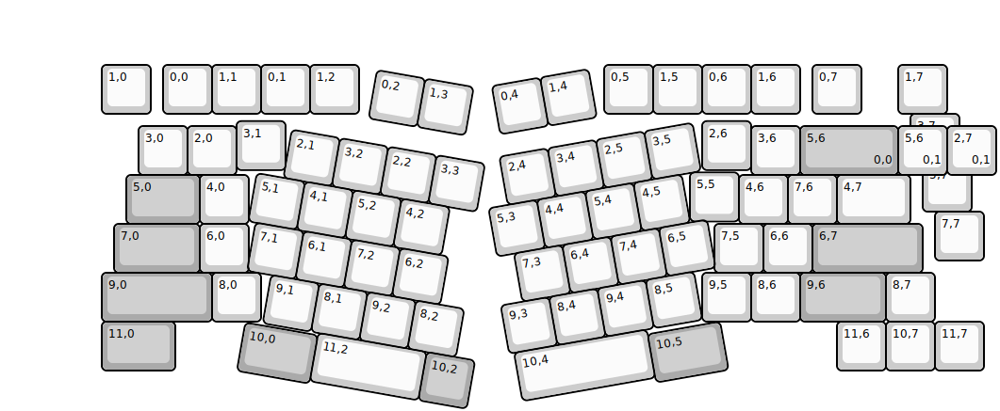{:loading="lazy"}

[Open in keyboard-layout-editor](http://www.keyboard-layout-editor.com/##@@_x:2&y:1.25;&=1,0&_x:0.25;&=0,0&=1,1&=0,1&=1,2&_x:5.0;&=0,5&=1,5&=0,6&=1,6&_x:0.25;&=0,7&_x:0.75;&=1,7;&@_x:18.5;&=3,7;&@_x:4.75&y:-0.85;&=3,1&_x:8.5;&=2,6;&@_x:2.75&y:-0.9;&=3,0&=2,0&_x:10.5;&=3,6&_c=#aaaaaa&w:2;&=5,6%0A%0A%0A0,0;&@_x:18.75&y:-0.25&c=#cccccc;&=5,7;&@_x:14&y:-0.8;&=5,5;&@_x:2.5&y:-0.95&c=#aaaaaa&w:1.5;&=5,0&_c=#cccccc;&=4,0&_x:10.0;&=4,6&=7,6&_w:1.5;&=4,7;&@_x:19&y:-0.25;&=7,7;&@_x:2.25&y:-0.75&c=#aaaaaa&w:1.75;&=7,0&_c=#cccccc;&=6,0&_x:9.5;&=7,5&=6,6&_c=#aaaaaa&w:2.25;&=6,7;&@_x:2&w:2.25;&=9,0&_c=#cccccc;&=8,0&_x:9.0;&=9,5&=8,6&_c=#aaaaaa&w:1.75;&=9,6&_c=#cccccc;&=8,7;&@_x:2&c=#aaaaaa&w:1.5;&=11,0&_x:13.5&c=#cccccc;&=11,6&=10,7&=11,7;&@_r:10&x:7.75&y:-7.5;&=0,2&=1,3;&@_x:6.25&y:0.5;&=2,1&=3,2&=2,2&=3,3;&@_x:5.7;&=5,1&=4,1&=5,2&=4,2;&@_x:5.85;&=7,1&=6,1&=7,2&=6,2;&@_x:6.35;&=9,1&=8,1&=9,2&=8,2;&@_x:7.5&w:2.25;&=11,2&_c=#aaaaaa;&=10,2;&@_x:6&y:-0.95&w:1.5;&=10,0;&@_r:-10&x:9.5&y:-3.15&c=#cccccc;&=0,4&=1,4;&@_x:9.4&y:0.45;&=2,4&=3,4&=2,5&=3,5;&@_x:9;&=5,3&=4,4&=5,4&=4,5;&@_x:9.35;&=7,3&=6,4&=7,4&=6,5;&@_x:8.9;&=9,3&=8,4&=9,4&=8,5;&@_x:9&w:2.75;&=10,4;&@_x:11.75&y:-0.9&c=#aaaaaa&w:1.5;&=10,5;&@_r:0&x:18.25&y:-7.45&c=#cccccc;&=5,6%0A%0A%0A0,1&=2,7%0A%0A%0A0,1)

## qwertykeys/qk65/qk65_hotswap

[README](output/qwertykeys/qk65/README.md) - [layout](output/qwertykeys/qk65/qk65_hotswap-kle.json) - [PCB](output/qwertykeys/qk65/qk65_hotswap.kicad_pcb) - [PCB render](output/qwertykeys/qk65/qk65_hotswap-render.svg)

{:loading="lazy"}

[Open in keyboard-layout-editor](http://www.keyboard-layout-editor.com/##@@_c=#777777;&=0,0&_c=#cccccc;&=0,1&=0,2&=0,3&=0,4&=0,5&=0,6&=0,7&=0,8&=0,9&=0,10&=0,11&=0,12&_c=#aaaaaa&w:2;&=0,13&=0,14;&@_w:1.5;&=1,0&_c=#cccccc;&=1,1&=1,2&=1,3&=1,4&=1,5&=1,6&=1,7&=1,8&=1,9&=1,10&=1,11&=1,12&_w:1.5;&=1,13&_c=#aaaaaa;&=1,14;&@_w:1.75;&=2,0&_c=#cccccc;&=2,1&=2,2&=2,3&=2,4&=2,5&=2,6&=2,7&=2,8&=2,9&=2,10&=2,11&_c=#777777&w:2.25;&=2,13&_c=#aaaaaa;&=2,14;&@_w:2.25;&=3,0&_c=#cccccc;&=3,1&=3,2&=3,3&=3,4&=3,5&=3,6&=3,7&=3,8&=3,9&=3,10&_c=#aaaaaa&w:1.75;&=3,11&_c=#cccccc;&=3,13&_c=#aaaaaa;&=3,14;&@_w:1.25;&=4,0&_w:1.25;&=4,1&_w:1.25;&=4,2&_c=#cccccc&w:6.25;&=4,4&_c=#aaaaaa&w:1.25;&=4,7&_w:1.25;&=4,8&_x:0.5&c=#cccccc;&=4,12&=4,13&=4,14)

## qwertykeys/qk65/qk65_solder

[README](output/qwertykeys/qk65/README.md) - [layout](output/qwertykeys/qk65/qk65_solder-kle.json) - [PCB](output/qwertykeys/qk65/qk65_solder.kicad_pcb) - [PCB render](output/qwertykeys/qk65/qk65_solder-render.svg)

{:loading="lazy"}

[Open in keyboard-layout-editor](http://www.keyboard-layout-editor.com/##@@_x:2.5&c=#777777;&=0,0&_c=#cccccc;&=0,1&=0,2&=0,3&=0,4&=0,5&=0,6&=0,7&=0,8&=0,9&=0,10&=0,11&=0,12&_c=#aaaaaa&w:2;&=0,13%0A%0A%0A0,0&=0,14;&@_x:2.5&w:1.5;&=1,0&_c=#cccccc;&=1,1&=1,2&=1,3&=1,4&=1,5&=1,6&=1,7&=1,8&=1,9&=1,10&=1,11&=1,12&_w:1.5;&=2,12%0A%0A%0A1,0&_c=#aaaaaa;&=1,14;&@_x:2.5&w:1.75;&=2,0&_c=#cccccc;&=2,1&=2,2&=2,3&=2,4&=2,5&=2,6&=2,7&=2,8&=2,9&=2,10&=2,11&_c=#777777&w:2.25;&=2,13%0A%0A%0A1,0&_c=#aaaaaa;&=2,14;&@_x:2.5&w:2.25;&=3,0%0A%0A%0A2,0&_c=#cccccc;&=3,1&=3,2&=3,3&=3,4&=3,5&=3,6&=3,7&=3,8&=3,9&=3,10&_c=#aaaaaa&w:1.75;&=3,11&_c=#cccccc;&=3,13&_c=#aaaaaa;&=3,14;&@_x:2.5&w:1.25;&=4,0%0A%0A%0A3,0&_w:1.25;&=4,1%0A%0A%0A3,0&_w:1.25;&=4,2%0A%0A%0A3,0&_c=#cccccc&w:6.25;&=4,4%0A%0A%0A3,0&_c=#aaaaaa&w:1.25;&=4,7%0A%0A%0A3,0&_w:1.25;&=4,8%0A%0A%0A3,0&_x:0.5&c=#cccccc;&=4,12&=4,13&=4,14;&@_x:19.0&y:-5&c=#aaaaaa;&=1,13%0A%0A%0A0,1&=0,13%0A%0A%0A0,1;&@_x:19.75&c=#777777&w:1.25&h:2&w2:1.5&h2:1&x2:-0.25;&=2,13%0A%0A%0A1,1;&@_x:18.75&c=#cccccc;&=2,12%0A%0A%0A1,1;&@_c=#aaaaaa&w:1.25;&=3,0%0A%0A%0A2,1&_c=#cccccc;&=3,12%0A%0A%0A2,1;&@_x:2.5&y:1.25&c=#aaaaaa&w:1.5;&=4,0%0A%0A%0A3,1&=4,1%0A%0A%0A3,1&_w:1.5;&=4,2%0A%0A%0A3,1&_c=#cccccc&w:7;&=4,4%0A%0A%0A3,1&_c=#aaaaaa&w:1.5;&=4,8%0A%0A%0A3,1)

## rabbit_capture_plan/rabbit_capture_plan

[README](output/rabbit_capture_plan/README.md) - [layout](output/rabbit_capture_plan/rabbit_capture_plan-kle.json) - [PCB](output/rabbit_capture_plan/rabbit_capture_plan.kicad_pcb) - [PCB render](output/rabbit_capture_plan/rabbit_capture_plan-render.svg)

{:loading="lazy"}

[Open in keyboard-layout-editor](http://www.keyboard-layout-editor.com/##@@_x:0.66&y:1.45&c=#777777;&=0,0&_c=#cccccc;&=0,1&_x:11.66;&=5,4&=5,5&=5,6&_c=#aaaaaa;&=5,7;&@_x:0.53&w:1.5;&=1,0&_c=#cccccc;&=1,1&_x:10.94;&=6,4&=6,5&=6,6&_x:0.37&c=#777777&w:1.25&h:2&w2:1.5&h2:1&x2:-0.25;&=6,7%0A%0A%0A0,0;&@_x:0.39&c=#aaaaaa&w:1.75;&=2,0&_c=#cccccc;&=2,1&_x:11.2;&=7,4&=7,5&=7,6%0A%0A%0A0,0;&@_x:0.25&c=#aaaaaa&w:2.25;&=3,0&_c=#cccccc;&=3,1&_x:10.47;&=8,4&=8,5&_c=#aaaaaa&w:1.75;&=8,6%0A%0A%0A1,0;&@_x:18&y:-0.7&c=#cccccc;&=9,0;&@_x:0.5&y:-0.3&c=#aaaaaa&w:1.25;&=4,0&_w:1.25;&=4,1;&@_x:17&y:-0.7&c=#cccccc;&=9,3&=9,4&=9,5;&@_r:8&x:2.97&y:-5.82;&=0,2&=0,3&=0,4&=0,5&=0,6;&@_x:3.47;&=1,2&=1,3&=1,4&=1,5&=1,6;&@_x:3.72;&=2,2&=2,3&=2,4&=2,5&=2,6;&@_x:4.22;&=3,2&=3,3&=3,4&=3,5;&@_x:4.72;&=4,2&_w:2;&=4,3&=4,4;&@_r:-8&x:9.87&y:-2.58;&=5,0&=5,1&=5,2&=5,3;&@_x:9.37;&=6,0&=6,1&=6,2&=6,3;&@_x:9.62;&=7,0&=7,1&=7,2&=7,3;&@_x:9.12;&=8,0&=8,1&=8,2&=8,3;&@_x:9.6&w:2.75;&=9,1&=9,2;&@_r:0&x:21.47&y:-5.9&c=#aaaaaa&w:1.5;&=6,7%0A%0A%0A0,1;&@_x:20.84&c=#777777&w:2.25;&=7,6%0A%0A%0A0,1;&@_x:20.72&c=#cccccc;&=8,6%0A%0A%0A1,1&=8,7%0A%0A%0A1,1)

## rainkeeb/rainkeeb

[README](output/rainkeeb/README.md) - [layout](output/rainkeeb/rainkeeb-kle.json) - [PCB](output/rainkeeb/rainkeeb.kicad_pcb) - [PCB render](output/rainkeeb/rainkeeb-render.svg)

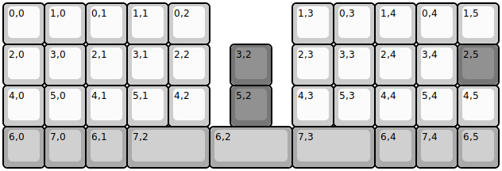{:loading="lazy"}

[Open in keyboard-layout-editor](http://www.keyboard-layout-editor.com/##@@_x:5.5&y:1&c=#777777;&=3,2;&@_x:5.5;&=5,2;&@_c=#aaaaaa;&=6,0&=7,0&=6,1&_w:2;&=7,2&_w:2;&=6,2&_w:2;&=7,3&=6,4&=7,4&=6,5;&@_rx:5&ry:3&x:-5&y:-3&c=#cccccc;&=0,0&=1,0&=0,1&=1,1&=0,2;&@_x:-5;&=2,0&=3,0&=2,1&=3,1&=2,2;&@_x:-5;&=4,0&=5,0&=4,1&=5,1&=4,2;&@_rx:7&ry:4.25&y:-4.25;&=1,3&=0,3&=1,4&=0,4&=1,5;&@=2,3&=3,3&=2,4&=3,4&_c=#777777;&=2,5;&@_c=#cccccc;&=4,3&=5,3&=4,4&=5,4&=4,5)

## rart/rart45

[README](output/rart/rart45/README.md) - [layout](output/rart/rart45/rart45-kle.json) - [PCB](output/rart/rart45/rart45.kicad_pcb) - [PCB render](output/rart/rart45/rart45-render.svg)

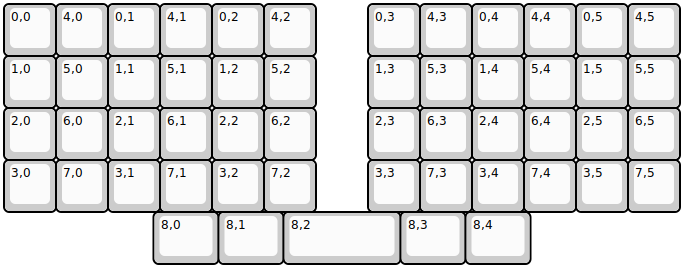{:loading="lazy"}

[Open in keyboard-layout-editor](http://www.keyboard-layout-editor.com/##@@=0,0&=4,0&=0,1&=4,1&=0,2&=4,2&_x:1;&=0,3&=4,3&=0,4&=4,4&=0,5&=4,5;&@=1,0&=5,0&=1,1&=5,1&=1,2&=5,2&_x:1;&=1,3&=5,3&=1,4&=5,4&=1,5&=5,5;&@=2,0&=6,0&=2,1&=6,1&=2,2&=6,2&_x:1;&=2,3&=6,3&=2,4&=6,4&=2,5&=6,5;&@=3,0&=7,0&=3,1&=7,1&=3,2&=7,2&_x:1;&=3,3&=7,3&=3,4&=7,4&=3,5&=7,5;&@_x:2.875&w:1.25;&=8,0&_w:1.25;&=8,1&_w:2.25;&=8,2&_w:1.25;&=8,3&_w:1.25;&=8,4)

## rart/rart60

[README](output/rart/rart60/README.md) - [layout](output/rart/rart60/rart60-kle.json) - [PCB](output/rart/rart60/rart60.kicad_pcb) - [PCB render](output/rart/rart60/rart60-render.svg)

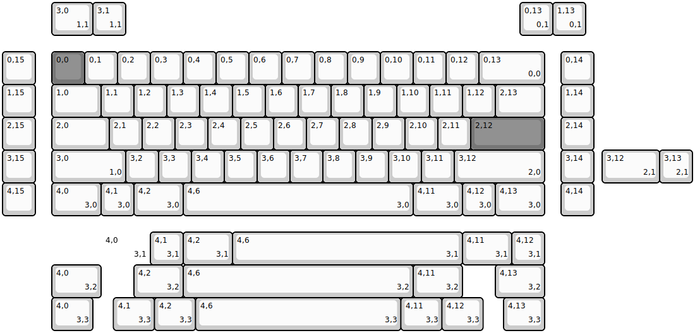{:loading="lazy"}

[Open in keyboard-layout-editor](http://www.keyboard-layout-editor.com/##@@_y:1.5;&=0,15&_x:0.5&c=#777777;&=0,0&_c=#cccccc;&=0,1&=0,2&=0,3&=0,4&=0,5&=0,6&=0,7&=0,8&=0,9&=0,10&=0,11&=0,12&_w:2;&=0,13%0A%0A%0A0,0&_x:0.5;&=0,14;&@=1,15&_x:0.5&w:1.5;&=1,0&=1,1&=1,2&=1,3&=1,4&=1,5&=1,6&=1,7&=1,8&=1,9&=1,10&=1,11&=1,12&_w:1.5;&=2,13&_x:0.5;&=1,14;&@=2,15&_x:0.5&w:1.75;&=2,0&=2,1&=2,2&=2,3&=2,4&=2,5&=2,6&=2,7&=2,8&=2,9&=2,10&=2,11&_c=#777777&w:2.25;&=2,12&_x:0.5&c=#cccccc;&=2,14;&@=3,15&_x:0.5&w:2.25;&=3,0%0A%0A%0A1,0&=3,2&=3,3&=3,4&=3,5&=3,6&=3,7&=3,8&=3,9&=3,10&=3,11&_w:2.75;&=3,12%0A%0A%0A2,0&_x:0.5;&=3,14;&@=4,15&_x:0.5&w:1.5;&=4,0%0A%0A%0A3,0&=4,1%0A%0A%0A3,0&_w:1.5;&=4,2%0A%0A%0A3,0&_w:7;&=4,6%0A%0A%0A3,0&_w:1.5;&=4,11%0A%0A%0A3,0&=4,12%0A%0A%0A3,0&_w:1.5;&=4,13%0A%0A%0A3,0&_x:0.5;&=4,14;&@_x:1.5&y:-6.5&w:1.25;&=3,0%0A%0A%0A1,1&=3,1%0A%0A%0A1,1&_x:12.0;&=0,13%0A%0A%0A0,1&=1,13%0A%0A%0A0,1;&@_x:18.25&y:3.5&w:1.75;&=3,12%0A%0A%0A2,1&=3,13%0A%0A%0A2,1;&@_x:3&y:1.5&w:1.5&d:true;&=4,0%0A%0A%0A3,1&=4,1%0A%0A%0A3,1&_w:1.5;&=4,2%0A%0A%0A3,1&_w:7;&=4,6%0A%0A%0A3,1&_w:1.5;&=4,11%0A%0A%0A3,1&=4,12%0A%0A%0A3,1;&@_x:1.5&w:1.5;&=4,0%0A%0A%0A3,2&_x:1.0&w:1.5;&=4,2%0A%0A%0A3,2&_w:7;&=4,6%0A%0A%0A3,2&_w:1.5;&=4,11%0A%0A%0A3,2&_x:1.0&w:1.5;&=4,13%0A%0A%0A3,2;&@_x:1.5&w:1.25;&=4,0%0A%0A%0A3,3&_x:0.625&w:1.25;&=4,1%0A%0A%0A3,3&_w:1.25;&=4,2%0A%0A%0A3,3&_w:6.25;&=4,6%0A%0A%0A3,3&_w:1.25;&=4,11%0A%0A%0A3,3&_w:1.25;&=4,12%0A%0A%0A3,3&_x:0.625&w:1.25;&=4,13%0A%0A%0A3,3)

## rart/rart67

[README](output/rart/rart67/README.md) - [layout](output/rart/rart67/rart67-kle.json) - [PCB](output/rart/rart67/rart67.kicad_pcb) - [PCB render](output/rart/rart67/rart67-render.svg)

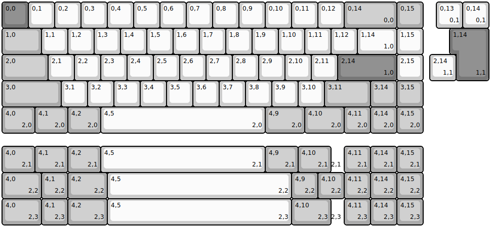{:loading="lazy"}

[Open in keyboard-layout-editor](http://www.keyboard-layout-editor.com/##@@_c=#777777;&=0,0&_c=#cccccc;&=0,1&=0,2&=0,3&=0,4&=0,5&=0,6&=0,7&=0,8&=0,9&=0,10&=0,11&=0,12&_c=#aaaaaa&w:2;&=0,14%0A%0A%0A0,0&=0,15;&@_w:1.5;&=1,0&_c=#cccccc;&=1,1&=1,2&=1,3&=1,4&=1,5&=1,6&=1,7&=1,8&=1,9&=1,10&=1,11&=1,12&_w:1.5;&=1,14%0A%0A%0A1,0&=1,15;&@_c=#aaaaaa&w:1.75;&=2,0&_c=#cccccc;&=2,1&=2,2&=2,3&=2,4&=2,5&=2,6&=2,7&=2,8&=2,9&=2,10&=2,11&_c=#777777&w:2.25;&=2,14%0A%0A%0A1,0&_c=#cccccc;&=2,15;&@_c=#aaaaaa&w:2.25;&=3,0&_c=#cccccc;&=3,1&=3,2&=3,3&=3,4&=3,5&=3,6&=3,7&=3,8&=3,9&=3,10&_c=#aaaaaa&w:1.75;&=3,11&=3,14&=3,15;&@_w:1.25;&=4,0%0A%0A%0A2,0&_w:1.25;&=4,1%0A%0A%0A2,0&_w:1.25;&=4,2%0A%0A%0A2,0&_c=#cccccc&w:6.25;&=4,5%0A%0A%0A2,0&_c=#aaaaaa&w:1.5;&=4,9%0A%0A%0A2,0&_w:1.5;&=4,10%0A%0A%0A2,0&=4,11%0A%0A%0A2,0&=4,14%0A%0A%0A2,0&=4,15%0A%0A%0A2,0;&@_x:16.5&y:-5&c=#cccccc;&=0,13%0A%0A%0A0,1&=0,14%0A%0A%0A0,1;&@_x:17.25&c=#777777&w:1.25&h:2&w2:1.5&h2:1&x2:-0.25;&=1,14%0A%0A%0A1,1;&@_x:16.25&c=#cccccc;&=2,14%0A%0A%0A1,1;&@_y:2.5&c=#aaaaaa&w:1.25;&=4,0%0A%0A%0A2,1&_w:1.25;&=4,1%0A%0A%0A2,1&_w:1.25;&=4,2%0A%0A%0A2,1&_c=#cccccc&w:6.25;&=4,5%0A%0A%0A2,1&_c=#aaaaaa&w:1.25;&=4,9%0A%0A%0A2,1&_w:1.25;&=4,10%0A%0A%0A2,1&_c=#cccccc&w:0.5&d:true;&=%0A%0A%0A2,1&_c=#aaaaaa;&=4,11%0A%0A%0A2,1&=4,14%0A%0A%0A2,1&=4,15%0A%0A%0A2,1;&@_w:1.5;&=4,0%0A%0A%0A2,2&=4,1%0A%0A%0A2,2&_w:1.5;&=4,2%0A%0A%0A2,2&_c=#cccccc&w:7;&=4,5%0A%0A%0A2,2&_c=#aaaaaa;&=4,9%0A%0A%0A2,2&=4,10%0A%0A%0A2,2&=4,11%0A%0A%0A2,2&=4,14%0A%0A%0A2,2&=4,15%0A%0A%0A2,2;&@_w:1.5;&=4,0%0A%0A%0A2,3&=4,1%0A%0A%0A2,3&_w:1.5;&=4,2%0A%0A%0A2,3&_c=#cccccc&w:7;&=4,5%0A%0A%0A2,3&_c=#aaaaaa&w:1.5;&=4,10%0A%0A%0A2,3&_c=#cccccc&w:0.5&d:true;&=%0A%0A%0A2,3&_c=#aaaaaa;&=4,11%0A%0A%0A2,3&=4,14%0A%0A%0A2,3&=4,15%0A%0A%0A2,3)

## rart/rart67m

[README](output/rart/rart67m/README.md) - [layout](output/rart/rart67m/rart67m-kle.json) - [PCB](output/rart/rart67m/rart67m.kicad_pcb) - [PCB render](output/rart/rart67m/rart67m-render.svg)

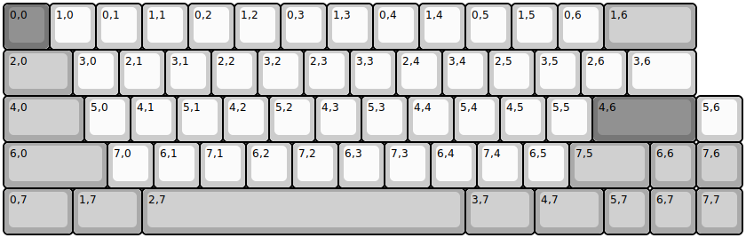{:loading="lazy"}

[Open in keyboard-layout-editor](http://www.keyboard-layout-editor.com/##@@_c=#777777;&=0,0&_c=#cccccc;&=1,0&=0,1&=1,1&=0,2&=1,2&=0,3&=1,3&=0,4&=1,4&=0,5&=1,5&=0,6&_c=#aaaaaa&w:2;&=1,6;&@_w:1.5;&=2,0&_c=#cccccc;&=3,0&=2,1&=3,1&=2,2&=3,2&=2,3&=3,3&=2,4&=3,4&=2,5&=3,5&=2,6&_w:1.5;&=3,6;&@_c=#aaaaaa&w:1.75;&=4,0&_c=#cccccc;&=5,0&=4,1&=5,1&=4,2&=5,2&=4,3&=5,3&=4,4&=5,4&=4,5&=5,5&_c=#777777&w:2.25;&=4,6&_c=#cccccc;&=5,6;&@_c=#aaaaaa&w:2.25;&=6,0&_c=#cccccc;&=7,0&=6,1&=7,1&=6,2&=7,2&=6,3&=7,3&=6,4&=7,4&=6,5&_c=#aaaaaa&w:1.75;&=7,5&=6,6&=7,6;&@_w:1.5;&=0,7&_w:1.5;&=1,7&_w:7;&=2,7&_w:1.5;&=3,7&_w:1.5;&=4,7&=5,7&=6,7&=7,7)

## rart/rart75m

[README](output/rart/rart75m/README.md) - [layout](output/rart/rart75m/rart75m-kle.json) - [PCB](output/rart/rart75m/rart75m.kicad_pcb) - [PCB render](output/rart/rart75m/rart75m-render.svg)

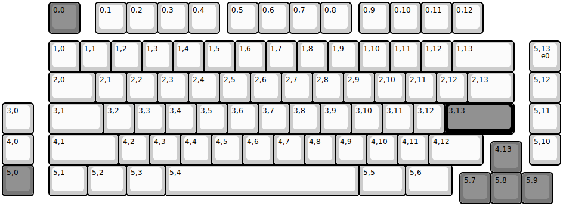{:loading="lazy"}

[Open in keyboard-layout-editor](http://www.keyboard-layout-editor.com/##@@_x:1.5&c=#777777;&=0,0&_x:0.5&c=#cccccc;&=0,1&=0,2&=0,3&=0,4&_x:0.25;&=0,5&=0,6&=0,7&=0,8&_x:0.25;&=0,9&=0,10&=0,11&=0,12;&@_x:1.5&y:0.25;&=1,0&=1,1&=1,2&=1,3&=1,4&=1,5&=1,6&=1,7&=1,8&=1,9&=1,10&=1,11&=1,12&_w:2;&=1,13&_x:0.5;&=5,13%0A%0A%0A%0A%0A%0A%0A%0A%0Ae0;&@_x:1.5&w:1.5;&=2,0&=2,1&=2,2&=2,3&=2,4&=2,5&=2,6&=2,7&=2,8&=2,9&=2,10&=2,11&=2,12&_w:1.5;&=2,13&_x:0.5;&=5,12;&@=3,0&_x:0.5&w:1.75;&=3,1&=3,2&=3,3&=3,4&=3,5&=3,6&=3,7&=3,8&=3,9&=3,10&=3,11&=3,12&_c=777777&w:2.25;&=3,13&_x:0.5&c=#cccccc;&=5,11;&@=4,0&_x:0.5&w:2.25;&=4,1&=4,2&=4,3&=4,4&=4,5&=4,6&=4,7&=4,8&=4,9&=4,10&=4,11&_w:1.75;&=4,12&_x:1.5;&=5,10;&@_x:15.75&y:-0.75&c=#777777;&=4,13;&@_y:-0.25;&=5,0&_x:0.5&c=#cccccc&w:1.25;&=5,1&_w:1.25;&=5,2&_w:1.25;&=5,3&_w:6.25;&=5,4&_w:1.5;&=5,5&_w:1.5;&=5,6;&@_x:14.75&y:-0.75&c=#777777;&=5,7&=5,8&=5,9)

## rart/rart80

[README](output/rart/rart80/README.md) - [layout](output/rart/rart80/rart80-kle.json) - [PCB](output/rart/rart80/rart80.kicad_pcb) - [PCB render](output/rart/rart80/rart80-render.svg)

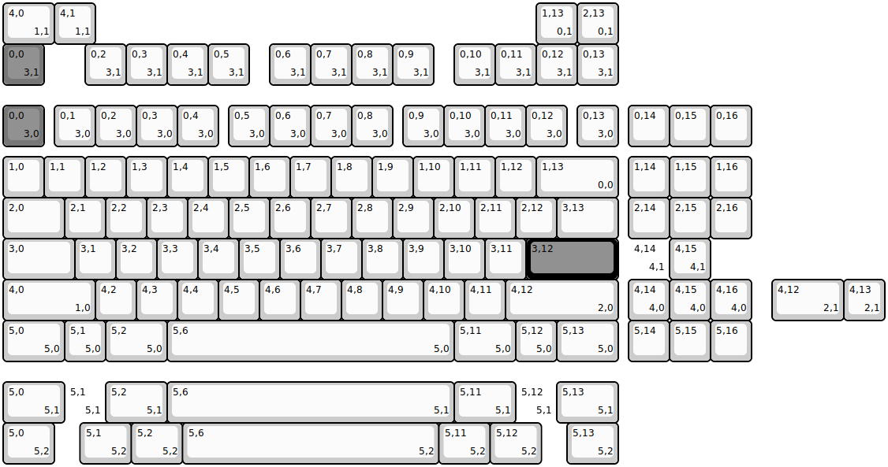{:loading="lazy"}

[Open in keyboard-layout-editor](http://www.keyboard-layout-editor.com/##@@_y:2.5&c=#777777;&=0,0%0A%0A%0A3,0&_x:0.25&c=#cccccc;&=0,1%0A%0A%0A3,0&=0,2%0A%0A%0A3,0&=0,3%0A%0A%0A3,0&=0,4%0A%0A%0A3,0&_x:0.25;&=0,5%0A%0A%0A3,0&=0,6%0A%0A%0A3,0&=0,7%0A%0A%0A3,0&=0,8%0A%0A%0A3,0&_x:0.25;&=0,9%0A%0A%0A3,0&=0,10%0A%0A%0A3,0&=0,11%0A%0A%0A3,0&=0,12%0A%0A%0A3,0&_x:0.25;&=0,13%0A%0A%0A3,0&_x:0.25;&=0,14&=0,15&=0,16;&@_y:0.25;&=1,0&=1,1&=1,2&=1,3&=1,4&=1,5&=1,6&=1,7&=1,8&=1,9&=1,10&=1,11&=1,12&_w:2;&=1,13%0A%0A%0A0,0&_x:0.25;&=1,14&=1,15&=1,16;&@_w:1.5;&=2,0&=2,1&=2,2&=2,3&=2,4&=2,5&=2,6&=2,7&=2,8&=2,9&=2,10&=2,11&=2,12&_w:1.5;&=3,13&_x:0.25;&=2,14&=2,15&=2,16;&@_w:1.75;&=3,0&=3,1&=3,2&=3,3&=3,4&=3,5&=3,6&=3,7&=3,8&=3,9&=3,10&=3,11&_c=777777&w:2.25;&=3,12;&@_c=#cccccc&w:2.25;&=4,0%0A%0A%0A1,0&=4,2&=4,3&=4,4&=4,5&=4,6&=4,7&=4,8&=4,9&=4,10&=4,11&_w:2.75;&=4,12%0A%0A%0A2,0&_x:0.25;&=4,14%0A%0A%0A4,0&=4,15%0A%0A%0A4,0&=4,16%0A%0A%0A4,0;&@_w:1.5;&=5,0%0A%0A%0A5,0&=5,1%0A%0A%0A5,0&_w:1.5;&=5,2%0A%0A%0A5,0&_w:7;&=5,6%0A%0A%0A5,0&_w:1.5;&=5,11%0A%0A%0A5,0&=5,12%0A%0A%0A5,0&_w:1.5;&=5,13%0A%0A%0A5,0&_x:0.25;&=5,14&=5,15&=5,16;&@_y:-8.75&w:1.25;&=4,0%0A%0A%0A1,1&=4,1%0A%0A%0A1,1&_x:10.75;&=1,13%0A%0A%0A0,1&=2,13%0A%0A%0A0,1;&@_c=#777777;&=0,0%0A%0A%0A3,1&_x:1&c=#cccccc;&=0,2%0A%0A%0A3,1&=0,3%0A%0A%0A3,1&=0,4%0A%0A%0A3,1&=0,5%0A%0A%0A3,1&_x:0.5;&=0,6%0A%0A%0A3,1&=0,7%0A%0A%0A3,1&=0,8%0A%0A%0A3,1&=0,9%0A%0A%0A3,1&_x:0.5;&=0,10%0A%0A%0A3,1&=0,11%0A%0A%0A3,1&=0,12%0A%0A%0A3,1&=0,13%0A%0A%0A3,1;&@_x:15.25&y:3.75&d:true;&=4,14%0A%0A%0A4,1&=4,15%0A%0A%0A4,1;&@_x:18.75&w:1.75;&=4,12%0A%0A%0A2,1&=4,13%0A%0A%0A2,1;&@_y:1.5&w:1.5;&=5,0%0A%0A%0A5,1&_d:true;&=5,1%0A%0A%0A5,1&_w:1.5;&=5,2%0A%0A%0A5,1&_w:7;&=5,6%0A%0A%0A5,1&_w:1.5;&=5,11%0A%0A%0A5,1&_d:true;&=5,12%0A%0A%0A5,1&_w:1.5;&=5,13%0A%0A%0A5,1;&@_w:1.25;&=5,0%0A%0A%0A5,2&_x:0.625&w:1.25;&=5,1%0A%0A%0A5,2&_w:1.25;&=5,2%0A%0A%0A5,2&_w:6.25;&=5,6%0A%0A%0A5,2&_w:1.25;&=5,11%0A%0A%0A5,2&_w:1.25;&=5,12%0A%0A%0A5,2&_x:0.625&w:1.25;&=5,13%0A%0A%0A5,2)

## rart/rartand

[README](output/rart/rartand/README.md) - [layout](output/rart/rartand/rartand-kle.json) - [PCB](output/rart/rartand/rartand.kicad_pcb) - [PCB render](output/rart/rartand/rartand-render.svg)

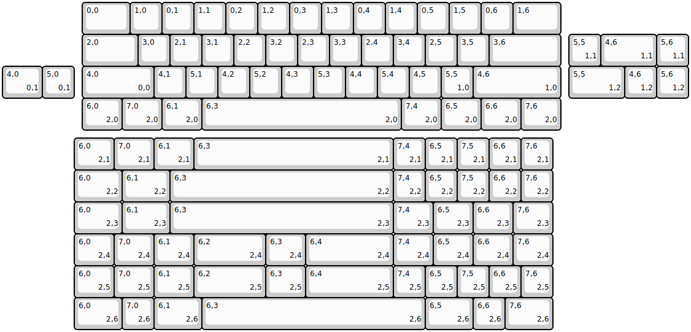{:loading="lazy"}

[Open in keyboard-layout-editor](http://www.keyboard-layout-editor.com/##@@_x:2.5&w:1.5;&=0,0&=1,0&=0,1&=1,1&=0,2&=1,2&=0,3&=1,3&=0,4&=1,4&=0,5&=1,5&=0,6&_w:1.5;&=1,6;&@_x:2.5&w:1.75;&=2,0&=3,0&=2,1&=3,1&=2,2&=3,2&=2,3&=3,3&=2,4&=3,4&=2,5&=3,5&_w:2.25;&=3,6;&@_x:2.5&w:2.25;&=4,0%0A%0A%0A0,0&=4,1&=5,1&=4,2&=5,2&=4,3&=5,3&=4,4&=5,4&=4,5&=5,5%0A%0A%0A1,0&_w:2.75;&=4,6%0A%0A%0A1,0;&@_x:2.5&w:1.25;&=6,0%0A%0A%0A2,0&_w:1.25;&=7,0%0A%0A%0A2,0&_w:1.25;&=6,1%0A%0A%0A2,0&_w:6.25;&=6,3%0A%0A%0A2,0&_w:1.25;&=7,4%0A%0A%0A2,0&_w:1.25;&=6,5%0A%0A%0A2,0&_w:1.25;&=6,6%0A%0A%0A2,0&_w:1.25;&=7,6%0A%0A%0A2,0;&@_x:17.75&y:-3;&=5,5%0A%0A%0A1,1&_w:1.75;&=4,6%0A%0A%0A1,1&=5,6%0A%0A%0A1,1;&@_w:1.25;&=4,0%0A%0A%0A0,1&=5,0%0A%0A%0A0,1&_x:15.5&w:1.75;&=5,5%0A%0A%0A1,2&=4,6%0A%0A%0A1,2&=5,6%0A%0A%0A1,2;&@_x:2.25&y:1.25&w:1.25;&=6,0%0A%0A%0A2,1&_w:1.25;&=7,0%0A%0A%0A2,1&_w:1.25;&=6,1%0A%0A%0A2,1&_w:6.25;&=6,3%0A%0A%0A2,1&=7,4%0A%0A%0A2,1&=6,5%0A%0A%0A2,1&=7,5%0A%0A%0A2,1&=6,6%0A%0A%0A2,1&=7,6%0A%0A%0A2,1;&@_x:2.25&w:1.5;&=6,0%0A%0A%0A2,2&_w:1.5;&=6,1%0A%0A%0A2,2&_w:7;&=6,3%0A%0A%0A2,2&=7,4%0A%0A%0A2,2&=6,5%0A%0A%0A2,2&=7,5%0A%0A%0A2,2&=6,6%0A%0A%0A2,2&=7,6%0A%0A%0A2,2;&@_x:2.25&w:1.5;&=6,0%0A%0A%0A2,3&_w:1.5;&=6,1%0A%0A%0A2,3&_w:7;&=6,3%0A%0A%0A2,3&_w:1.25;&=7,4%0A%0A%0A2,3&_w:1.25;&=6,5%0A%0A%0A2,3&_w:1.25;&=6,6%0A%0A%0A2,3&_w:1.25;&=7,6%0A%0A%0A2,3;&@_x:2.25&w:1.25;&=6,0%0A%0A%0A2,4&_w:1.25;&=7,0%0A%0A%0A2,4&_w:1.25;&=6,1%0A%0A%0A2,4&_w:2.25;&=6,2%0A%0A%0A2,4&_w:1.25;&=6,3%0A%0A%0A2,4&_w:2.75;&=6,4%0A%0A%0A2,4&_w:1.25;&=7,4%0A%0A%0A2,4&_w:1.25;&=6,5%0A%0A%0A2,4&_w:1.25;&=6,6%0A%0A%0A2,4&_w:1.25;&=7,6%0A%0A%0A2,4;&@_x:2.25&w:1.25;&=6,0%0A%0A%0A2,5&_w:1.25;&=7,0%0A%0A%0A2,5&_w:1.25;&=6,1%0A%0A%0A2,5&_w:2.25;&=6,2%0A%0A%0A2,5&_w:1.25;&=6,3%0A%0A%0A2,5&_w:2.75;&=6,4%0A%0A%0A2,5&=7,4%0A%0A%0A2,5&=6,5%0A%0A%0A2,5&=7,5%0A%0A%0A2,5&=6,6%0A%0A%0A2,5&=7,6%0A%0A%0A2,5;&@_x:2.25&w:1.5;&=6,0%0A%0A%0A2,6&=7,0%0A%0A%0A2,6&_w:1.5;&=6,1%0A%0A%0A2,6&_w:7;&=6,3%0A%0A%0A2,6&_w:1.5;&=6,5%0A%0A%0A2,6&=6,6%0A%0A%0A2,6&_w:1.5;&=7,6%0A%0A%0A2,6)

## rart/rartland

[README](output/rart/rartland/README.md) - [layout](output/rart/rartland/rartland-kle.json) - [PCB](output/rart/rartland/rartland.kicad_pcb) - [PCB render](output/rart/rartland/rartland-render.svg)

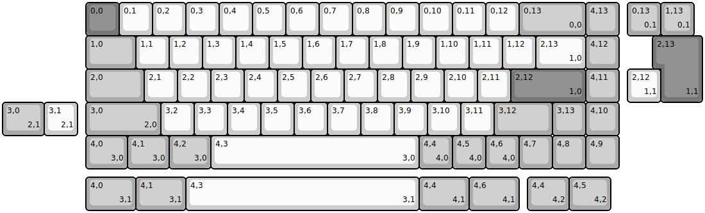{:loading="lazy"}

[Open in keyboard-layout-editor](http://www.keyboard-layout-editor.com/##@@_x:2.5&c=#777777;&=0,0&_c=#cccccc;&=0,1&=0,2&=0,3&=0,4&=0,5&=0,6&=0,7&=0,8&=0,9&=0,10&=0,11&=0,12&_c=#aaaaaa&w:2;&=0,13%0A%0A%0A0,0&=4,13;&@_x:2.5&w:1.5;&=1,0&_c=#cccccc;&=1,1&=1,2&=1,3&=1,4&=1,5&=1,6&=1,7&=1,8&=1,9&=1,10&=1,11&=1,12&_w:1.5;&=2,13%0A%0A%0A1,0&_c=#aaaaaa;&=4,12;&@_x:2.5&w:1.75;&=2,0&_c=#cccccc;&=2,1&=2,2&=2,3&=2,4&=2,5&=2,6&=2,7&=2,8&=2,9&=2,10&=2,11&_c=#777777&w:2.25;&=2,12%0A%0A%0A1,0&_c=#aaaaaa;&=4,11;&@_x:2.5&w:2.25;&=3,0%0A%0A%0A2,0&_c=#cccccc;&=3,2&=3,3&=3,4&=3,5&=3,6&=3,7&=3,8&=3,9&=3,10&=3,11&_c=#aaaaaa&w:1.75;&=3,12&=3,13&=4,10;&@_x:2.5&w:1.25;&=4,0%0A%0A%0A3,0&_w:1.25;&=4,1%0A%0A%0A3,0&_w:1.25;&=4,2%0A%0A%0A3,0&_c=#cccccc&w:6.25;&=4,3%0A%0A%0A3,0&_c=#aaaaaa;&=4,4%0A%0A%0A4,0&=4,5%0A%0A%0A4,0&=4,6%0A%0A%0A4,0&=4,7&=4,8&=4,9;&@_x:18.75&y:-5;&=0,13%0A%0A%0A0,1&=1,13%0A%0A%0A0,1;&@_x:19.75&c=#777777&w:1.25&h:2&w2:1.5&h2:1&x2:-0.25;&=2,13%0A%0A%0A1,1;&@_x:18.75&c=#cccccc;&=2,12%0A%0A%0A1,1;&@_c=#aaaaaa&w:1.25;&=3,0%0A%0A%0A2,1&_c=#cccccc;&=3,1%0A%0A%0A2,1;&@_x:2.5&y:1.25&c=#aaaaaa&w:1.5;&=4,0%0A%0A%0A3,1&_w:1.5;&=4,1%0A%0A%0A3,1&_c=#cccccc&w:7;&=4,3%0A%0A%0A3,1&_c=#aaaaaa&w:1.5;&=4,4%0A%0A%0A4,1&_w:1.5;&=4,6%0A%0A%0A4,1&_x:0.25&w:1.25;&=4,4%0A%0A%0A4,2&_w:1.25;&=4,5%0A%0A%0A4,2)

## rart/rartlice

[README](output/rart/rartlice/README.md) - [layout](output/rart/rartlice/rartlice-kle.json) - [PCB](output/rart/rartlice/rartlice.kicad_pcb) - [PCB render](output/rart/rartlice/rartlice-render.svg)

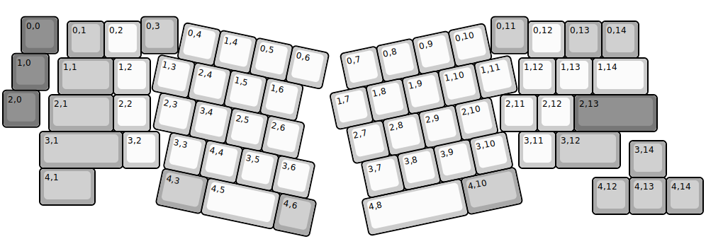{:loading="lazy"}

[Open in keyboard-layout-editor](http://www.keyboard-layout-editor.com/##@@_x:0.5&y:0.38&c=#777777;&=0,0&_x:2.25&c=#aaaaaa;&=0,3&_x:8.5;&=0,11;&@_x:1.75&y:-0.88;&=0,1&_c=#cccccc;&=0,2&_x:10.5;&=0,12&_c=#aaaaaa;&=0,13&=0,14;&@_x:0.25&y:-0.12&c=#777777;&=1,0;&@_x:1.5&y:-0.88&c=#aaaaaa&w:1.5;&=1,1&_c=#cccccc;&=1,2&_x:10.0;&=1,12&=1,13&_w:1.5;&=1,14;&@_y:-0.12&c=#777777;&=2,0;&@_x:1.25&y:-0.88&c=#aaaaaa&w:1.75;&=2,1&_c=#cccccc;&=2,2&_x:9.5;&=2,11&=2,12&_c=#777777&w:2.25;&=2,13;&@_x:1&c=#aaaaaa&w:2.25;&=3,1&_c=#cccccc;&=3,2&_x:9.75;&=3,11&_c=#aaaaaa&w:1.75;&=3,12;&@_x:17&y:-0.75;&=3,14;&@_x:1&y:-0.25&w:1.5;&=4,1;&@_x:16&y:-0.75;&=4,12&=4,13&=4,14;&@_r:12&rx:4.75&ry:1.5&y:-1.0&c=#cccccc;&=0,4&=1,4&=0,5&=0,6;&@_x:-0.5;&=1,3&=2,4&=1,5&=1,6;&@_x:-0.25;&=2,3&=3,4&=2,5&=2,6;&@_x:0.25;&=3,3&=4,4&=3,5&=3,6;&@_x:0.25&c=#aaaaaa&w:1.25;&=4,3&_c=#cccccc&w:2;&=4,5&_c=#aaaaaa;&=4,6;&@_r:-12&rx:13.5&x:-4.25&y:-1.0&c=#cccccc;&=0,7&=0,8&=0,9&=0,10;&@_x:-4.75;&=1,7&=1,8&=1,9&=1,10&=1,11;&@_x:-4.5;&=2,7&=2,8&=2,9&=2,10;&@_x:-4.5&y:1.0&w:2.75;&=4,8&_c=#aaaaaa&w:1.5;&=4,10;&@_ry:1.75&x:-4.25&y:1.75&c=#cccccc;&=3,7&=3,8&=3,9&=3,10)

## rart/rartlite

[README](output/rart/rartlite/README.md) - [layout](output/rart/rartlite/rartlite-kle.json) - [PCB](output/rart/rartlite/rartlite.kicad_pcb) - [PCB render](output/rart/rartlite/rartlite-render.svg)

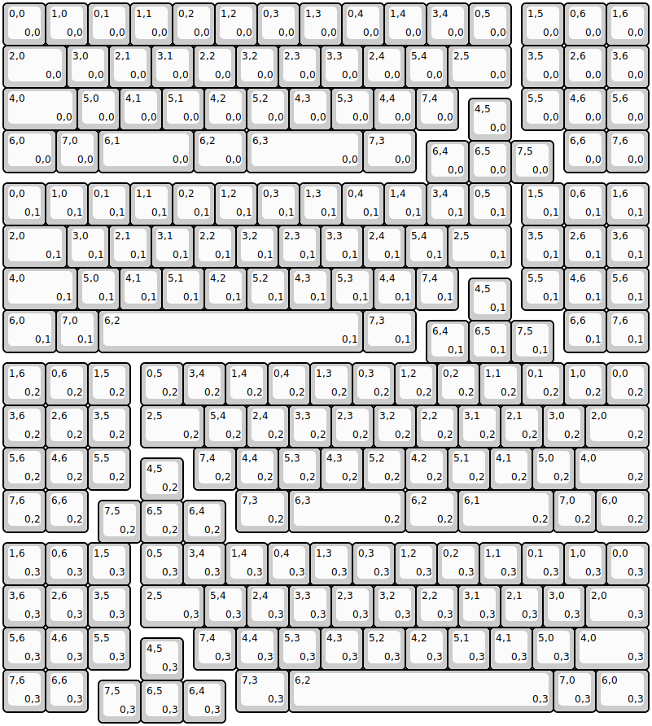{:loading="lazy"}

[Open in keyboard-layout-editor](http://www.keyboard-layout-editor.com/##@@=0,0%0A%0A%0A0,0&=1,0%0A%0A%0A0,0&=0,1%0A%0A%0A0,0&=1,1%0A%0A%0A0,0&=0,2%0A%0A%0A0,0&=1,2%0A%0A%0A0,0&=0,3%0A%0A%0A0,0&=1,3%0A%0A%0A0,0&=0,4%0A%0A%0A0,0&=1,4%0A%0A%0A0,0&=3,4%0A%0A%0A0,0&=0,5%0A%0A%0A0,0&_x:0.25;&=1,5%0A%0A%0A0,0&=0,6%0A%0A%0A0,0&=1,6%0A%0A%0A0,0;&@_w:1.5;&=2,0%0A%0A%0A0,0&=3,0%0A%0A%0A0,0&=2,1%0A%0A%0A0,0&=3,1%0A%0A%0A0,0&=2,2%0A%0A%0A0,0&=3,2%0A%0A%0A0,0&=2,3%0A%0A%0A0,0&=3,3%0A%0A%0A0,0&=2,4%0A%0A%0A0,0&=5,4%0A%0A%0A0,0&_w:1.5;&=2,5%0A%0A%0A0,0&_x:0.25;&=3,5%0A%0A%0A0,0&=2,6%0A%0A%0A0,0&=3,6%0A%0A%0A0,0;&@_w:1.75;&=4,0%0A%0A%0A0,0&=5,0%0A%0A%0A0,0&=4,1%0A%0A%0A0,0&=5,1%0A%0A%0A0,0&=4,2%0A%0A%0A0,0&=5,2%0A%0A%0A0,0&=4,3%0A%0A%0A0,0&=5,3%0A%0A%0A0,0&=4,4%0A%0A%0A0,0&=7,4%0A%0A%0A0,0&_x:1.5;&=5,5%0A%0A%0A0,0&=4,6%0A%0A%0A0,0&=5,6%0A%0A%0A0,0;&@_x:11&y:-0.75;&=4,5%0A%0A%0A0,0;&@_y:-0.25&w:1.25;&=6,0%0A%0A%0A0,0&=7,0%0A%0A%0A0,0&_w:2.25;&=6,1%0A%0A%0A0,0&_w:1.25;&=6,2%0A%0A%0A0,0&_w:2.75;&=6,3%0A%0A%0A0,0&_w:1.25;&=7,3%0A%0A%0A0,0&_x:3.5;&=6,6%0A%0A%0A0,0&=7,6%0A%0A%0A0,0;&@_x:10&y:-0.75;&=6,4%0A%0A%0A0,0&=6,5%0A%0A%0A0,0&=7,5%0A%0A%0A0,0;&@=0,0%0A%0A%0A0,1&=1,0%0A%0A%0A0,1&=0,1%0A%0A%0A0,1&=1,1%0A%0A%0A0,1&=0,2%0A%0A%0A0,1&=1,2%0A%0A%0A0,1&=0,3%0A%0A%0A0,1&=1,3%0A%0A%0A0,1&=0,4%0A%0A%0A0,1&=1,4%0A%0A%0A0,1&=3,4%0A%0A%0A0,1&=0,5%0A%0A%0A0,1&_x:0.25;&=1,5%0A%0A%0A0,1&=0,6%0A%0A%0A0,1&=1,6%0A%0A%0A0,1;&@_w:1.5;&=2,0%0A%0A%0A0,1&=3,0%0A%0A%0A0,1&=2,1%0A%0A%0A0,1&=3,1%0A%0A%0A0,1&=2,2%0A%0A%0A0,1&=3,2%0A%0A%0A0,1&=2,3%0A%0A%0A0,1&=3,3%0A%0A%0A0,1&=2,4%0A%0A%0A0,1&=5,4%0A%0A%0A0,1&_w:1.5;&=2,5%0A%0A%0A0,1&_x:0.25;&=3,5%0A%0A%0A0,1&=2,6%0A%0A%0A0,1&=3,6%0A%0A%0A0,1;&@_w:1.75;&=4,0%0A%0A%0A0,1&=5,0%0A%0A%0A0,1&=4,1%0A%0A%0A0,1&=5,1%0A%0A%0A0,1&=4,2%0A%0A%0A0,1&=5,2%0A%0A%0A0,1&=4,3%0A%0A%0A0,1&=5,3%0A%0A%0A0,1&=4,4%0A%0A%0A0,1&=7,4%0A%0A%0A0,1&_x:1.5;&=5,5%0A%0A%0A0,1&=4,6%0A%0A%0A0,1&=5,6%0A%0A%0A0,1;&@_x:11&y:-0.75;&=4,5%0A%0A%0A0,1;&@_y:-0.25&w:1.25;&=6,0%0A%0A%0A0,1&=7,0%0A%0A%0A0,1&_w:6.25;&=6,2%0A%0A%0A0,1&_w:1.25;&=7,3%0A%0A%0A0,1&_x:3.5;&=6,6%0A%0A%0A0,1&=7,6%0A%0A%0A0,1;&@_x:10&y:-0.75;&=6,4%0A%0A%0A0,1&=6,5%0A%0A%0A0,1&=7,5%0A%0A%0A0,1;&@=1,6%0A%0A%0A0,2&=0,6%0A%0A%0A0,2&=1,5%0A%0A%0A0,2&_x:0.25;&=0,5%0A%0A%0A0,2&=3,4%0A%0A%0A0,2&=1,4%0A%0A%0A0,2&=0,4%0A%0A%0A0,2&=1,3%0A%0A%0A0,2&=0,3%0A%0A%0A0,2&=1,2%0A%0A%0A0,2&=0,2%0A%0A%0A0,2&=1,1%0A%0A%0A0,2&=0,1%0A%0A%0A0,2&=1,0%0A%0A%0A0,2&=0,0%0A%0A%0A0,2;&@=3,6%0A%0A%0A0,2&=2,6%0A%0A%0A0,2&=3,5%0A%0A%0A0,2&_x:0.25&w:1.5;&=2,5%0A%0A%0A0,2&=5,4%0A%0A%0A0,2&=2,4%0A%0A%0A0,2&=3,3%0A%0A%0A0,2&=2,3%0A%0A%0A0,2&=3,2%0A%0A%0A0,2&=2,2%0A%0A%0A0,2&=3,1%0A%0A%0A0,2&=2,1%0A%0A%0A0,2&=3,0%0A%0A%0A0,2&_w:1.5;&=2,0%0A%0A%0A0,2;&@=5,6%0A%0A%0A0,2&=4,6%0A%0A%0A0,2&=5,5%0A%0A%0A0,2&_x:1.5;&=7,4%0A%0A%0A0,2&=4,4%0A%0A%0A0,2&=5,3%0A%0A%0A0,2&=4,3%0A%0A%0A0,2&=5,2%0A%0A%0A0,2&=4,2%0A%0A%0A0,2&=5,1%0A%0A%0A0,2&=4,1%0A%0A%0A0,2&=5,0%0A%0A%0A0,2&_w:1.75;&=4,0%0A%0A%0A0,2;&@_x:3.25&y:-0.75;&=4,5%0A%0A%0A0,2;&@_y:-0.25;&=7,6%0A%0A%0A0,2&=6,6%0A%0A%0A0,2&_x:3.5&w:1.25;&=7,3%0A%0A%0A0,2&_w:2.75;&=6,3%0A%0A%0A0,2&_w:1.25;&=6,2%0A%0A%0A0,2&_w:2.25;&=6,1%0A%0A%0A0,2&=7,0%0A%0A%0A0,2&_w:1.25;&=6,0%0A%0A%0A0,2;&@_x:2.25&y:-0.75;&=7,5%0A%0A%0A0,2&=6,5%0A%0A%0A0,2&=6,4%0A%0A%0A0,2;&@=1,6%0A%0A%0A0,3&=0,6%0A%0A%0A0,3&=1,5%0A%0A%0A0,3&_x:0.25;&=0,5%0A%0A%0A0,3&=3,4%0A%0A%0A0,3&=1,4%0A%0A%0A0,3&=0,4%0A%0A%0A0,3&=1,3%0A%0A%0A0,3&=0,3%0A%0A%0A0,3&=1,2%0A%0A%0A0,3&=0,2%0A%0A%0A0,3&=1,1%0A%0A%0A0,3&=0,1%0A%0A%0A0,3&=1,0%0A%0A%0A0,3&=0,0%0A%0A%0A0,3;&@=3,6%0A%0A%0A0,3&=2,6%0A%0A%0A0,3&=3,5%0A%0A%0A0,3&_x:0.25&w:1.5;&=2,5%0A%0A%0A0,3&=5,4%0A%0A%0A0,3&=2,4%0A%0A%0A0,3&=3,3%0A%0A%0A0,3&=2,3%0A%0A%0A0,3&=3,2%0A%0A%0A0,3&=2,2%0A%0A%0A0,3&=3,1%0A%0A%0A0,3&=2,1%0A%0A%0A0,3&=3,0%0A%0A%0A0,3&_w:1.5;&=2,0%0A%0A%0A0,3;&@=5,6%0A%0A%0A0,3&=4,6%0A%0A%0A0,3&=5,5%0A%0A%0A0,3&_x:1.5;&=7,4%0A%0A%0A0,3&=4,4%0A%0A%0A0,3&=5,3%0A%0A%0A0,3&=4,3%0A%0A%0A0,3&=5,2%0A%0A%0A0,3&=4,2%0A%0A%0A0,3&=5,1%0A%0A%0A0,3&=4,1%0A%0A%0A0,3&=5,0%0A%0A%0A0,3&_w:1.75;&=4,0%0A%0A%0A0,3;&@_x:3.25&y:-0.75;&=4,5%0A%0A%0A0,3;&@_y:-0.25;&=7,6%0A%0A%0A0,3&=6,6%0A%0A%0A0,3&_x:3.5&w:1.25;&=7,3%0A%0A%0A0,3&_w:6.25;&=6,2%0A%0A%0A0,3&=7,0%0A%0A%0A0,3&_w:1.25;&=6,0%0A%0A%0A0,3;&@_x:2.25&y:-0.75;&=7,5%0A%0A%0A0,3&=6,5%0A%0A%0A0,3&=6,4%0A%0A%0A0,3)

## rationalist/ratio65_hs

[README](output/rationalist/README.md) - [layout](output/rationalist/ratio65_hs-kle.json) - [PCB](output/rationalist/ratio65_hs.kicad_pcb) - [PCB render](output/rationalist/ratio65_hs-render.svg)

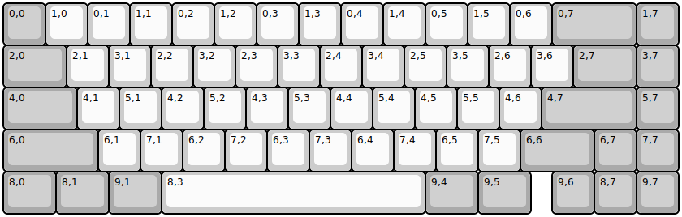{:loading="lazy"}

[Open in keyboard-layout-editor](http://www.keyboard-layout-editor.com/##@@_c=#aaaaaa;&=0,0&_c=#cccccc;&=1,0&=0,1&=1,1&=0,2&=1,2&=0,3&=1,3&=0,4&=1,4&=0,5&=1,5&=0,6&_c=#aaaaaa&w:2;&=0,7&=1,7;&@_w:1.5;&=2,0&_c=#cccccc;&=2,1&=3,1&=2,2&=3,2&=2,3&=3,3&=2,4&=3,4&=2,5&=3,5&=2,6&=3,6&_c=#aaaaaa&w:1.5;&=2,7&=3,7;&@_w:1.75;&=4,0&_c=#cccccc;&=4,1&=5,1&=4,2&=5,2&=4,3&=5,3&=4,4&=5,4&=4,5&=5,5&=4,6&_c=#aaaaaa&w:2.25;&=4,7&=5,7;&@_w:2.25;&=6,0&_c=#cccccc;&=6,1&=7,1&=6,2&=7,2&=6,3&=7,3&=6,4&=7,4&=6,5&=7,5&_c=#aaaaaa&w:1.75;&=6,6&=6,7&=7,7;&@_w:1.25;&=8,0&_w:1.25;&=8,1&_w:1.25;&=9,1&_c=#cccccc&w:6.25;&=8,3&_c=#aaaaaa&w:1.25;&=9,4&_w:1.25;&=9,5&_x:0.5;&=9,6&=8,7&=9,7)

## rationalist/ratio65_solder

[README](output/rationalist/README.md) - [layout](output/rationalist/ratio65_solder-kle.json) - [PCB](output/rationalist/ratio65_solder.kicad_pcb) - [PCB render](output/rationalist/ratio65_solder-render.svg)

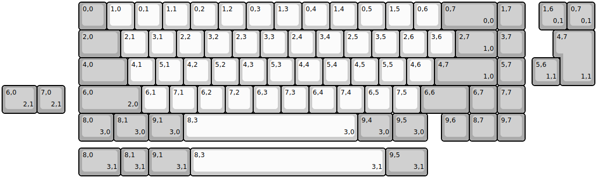{:loading="lazy"}

[Open in keyboard-layout-editor](http://www.keyboard-layout-editor.com/##@@_x:2.75&c=#aaaaaa;&=0,0&_c=#cccccc;&=1,0&=0,1&=1,1&=0,2&=1,2&=0,3&=1,3&=0,4&=1,4&=0,5&=1,5&=0,6&_c=#aaaaaa&w:2;&=0,7%0A%0A%0A0,0&=1,7;&@_x:2.75&w:1.5;&=2,0&_c=#cccccc;&=2,1&=3,1&=2,2&=3,2&=2,3&=3,3&=2,4&=3,4&=2,5&=3,5&=2,6&=3,6&_c=#aaaaaa&w:1.5;&=2,7%0A%0A%0A1,0&=3,7;&@_x:2.75&w:1.75;&=4,0&_c=#cccccc;&=4,1&=5,1&=4,2&=5,2&=4,3&=5,3&=4,4&=5,4&=4,5&=5,5&=4,6&_c=#aaaaaa&w:2.25;&=4,7%0A%0A%0A1,0&=5,7;&@_x:2.75&w:2.25;&=6,0%0A%0A%0A2,0&_c=#cccccc;&=6,1&=7,1&=6,2&=7,2&=6,3&=7,3&=6,4&=7,4&=6,5&=7,5&_c=#aaaaaa&w:1.75;&=6,6&=6,7&=7,7;&@_x:2.75&w:1.25;&=8,0%0A%0A%0A3,0&_w:1.25;&=8,1%0A%0A%0A3,0&_w:1.25;&=9,1%0A%0A%0A3,0&_c=#cccccc&w:6.25;&=8,3%0A%0A%0A3,0&_c=#aaaaaa&w:1.25;&=9,4%0A%0A%0A3,0&_w:1.25;&=9,5%0A%0A%0A3,0&_x:0.5;&=9,6&=8,7&=9,7;&@_x:19.25&y:-5;&=1,6%0A%0A%0A0,1&=0,7%0A%0A%0A0,1;&@_x:20.0&w:1.25&h:2&w2:1.5&h2:1&x2:-0.25;&=4,7%0A%0A%0A1,1;&@_x:19.0;&=5,6%0A%0A%0A1,1;&@_w:1.25;&=6,0%0A%0A%0A2,1&=7,0%0A%0A%0A2,1;&@_x:2.75&y:1.25&w:1.5;&=8,0%0A%0A%0A3,1&=8,1%0A%0A%0A3,1&_w:1.5;&=9,1%0A%0A%0A3,1&_c=#cccccc&w:7;&=8,3%0A%0A%0A3,1&_c=#aaaaaa&w:1.5;&=9,5%0A%0A%0A3,1)

## recompile_keys/choco60

[README](output/recompile_keys/choco60/README.md) - [layout](output/recompile_keys/choco60/choco60-kle.json) - [PCB](output/recompile_keys/choco60/choco60.kicad_pcb) - [PCB render](output/recompile_keys/choco60/choco60-render.svg)

{:loading="lazy"}

[Open in keyboard-layout-editor](http://www.keyboard-layout-editor.com/##@@_c=#777777;&=0,0&_c=#cccccc;&=0,1&=0,2&=0,3&=0,4&=0,5&_x:1;&=5,0&=5,1&=5,2&=5,3&=5,4&=5,5&=5,6&=5,7&_c=#aaaaaa;&=5,8;&@_w:1.5;&=1,0&_c=#cccccc;&=1,1&=1,2&=1,3&=1,4&=1,5&_x:1.0;&=6,0&=6,1&=6,2&=6,3&=6,4&=6,5&=6,6&_c=#aaaaaa&w:1.5;&=6,7;&@_w:1.75;&=2,0&_c=#cccccc;&=2,1&=2,2&=2,3&=2,4&=2,5&_x:1.0;&=7,0&=7,1&=7,2&=7,3&=7,4&=7,5&_c=#777777&w:2.25;&=7,6;&@_c=#aaaaaa&w:2.25;&=3,0&_c=#cccccc;&=3,1&=3,2&=3,3&=3,4&=3,5&_x:1.0;&=8,0&=8,1&=8,2&=8,3&=8,4&_c=#aaaaaa&w:1.75;&=8,5&=8,6;&@_x:1.5;&=4,0&_w:1.5;&=4,1&_c=#cccccc&w:2.75;&=4,3&_x:1.0;&=9,0&_w:2.25;&=9,1&_c=#aaaaaa&w:1.5;&=9,3&=9,4)

## recompile_keys/mio

[README](output/recompile_keys/mio/README.md) - [layout](output/recompile_keys/mio/mio-kle.json) - [PCB](output/recompile_keys/mio/mio.kicad_pcb) - [PCB render](output/recompile_keys/mio/mio-render.svg)

{:loading="lazy"}

[Open in keyboard-layout-editor](http://www.keyboard-layout-editor.com/##@@_c=#777777;&=0,0&_x:1&c=#cccccc;&=0,2&=0,3&=0,4&=0,5&_x:0.25;&=0,6&=0,7;&@_y:0.25&c=#aaaaaa;&=1,0&_c=#cccccc;&=1,1&=1,2&=1,3&=1,4&=1,5&=1,6&=1,7;&@_c=#aaaaaa&w:1.5;&=2,0&_c=#cccccc;&=2,1&=2,2&=2,3&=2,4&=2,5&=2,6;&@_c=#aaaaaa&w:1.75;&=3,0&_c=#cccccc;&=3,1&=3,2&=3,3&=3,4&=3,5&=3,6;&@_c=#aaaaaa&w:2.25;&=4,0&_c=#cccccc;&=4,1&=4,2&=4,3&=4,4&=4,5&=4,6;&@_c=#aaaaaa&w:1.5;&=5,0&_x:1.0&w:1.5;&=5,1&_w:1.5;&=5,2&_c=#cccccc&w:2.75;&=5,5;&@_x:7&y:0.25&w:1.25;&=5,6)

## recompile_keys/nomu30

[README](output/recompile_keys/nomu30/README.md) - [layout](output/recompile_keys/nomu30/nomu30-kle.json) - [PCB](output/recompile_keys/nomu30/nomu30.kicad_pcb) - [PCB render](output/recompile_keys/nomu30/nomu30-render.svg)

{:loading="lazy"}

[Open in keyboard-layout-editor](http://www.keyboard-layout-editor.com/##@@_x:0.5;&=0,1&=0,2&=0,3&=0,4&=0,5&=0,6&=0,7&=0,8&=0,9&=0,10&_c=#aaaaaa;&=0,11;&@=1,0&_c=#cccccc;&=1,1&=1,2&=1,3&=1,4&=1,5&=1,6&=1,7&=1,8&=1,9&_x:0.25&c=#777777&w:1.25&h:2&w2:1.5&h2:1&x2:-0.25;&=1,10;&@_c=#aaaaaa&w:1.5;&=2,0&_c=#cccccc;&=2,1&=2,2&=2,3&=2,4&=2,5&=2,6&=2,7&_c=#aaaaaa&w:1.75;&=2,8)

## redox/redox

[README](output/redox/README.md) - [layout](output/redox/redox-kle.json) - [PCB](output/redox/redox.kicad_pcb) - [PCB render](output/redox/redox-render.svg)

{:loading="lazy"}

[Open in keyboard-layout-editor](http://www.keyboard-layout-editor.com/##@@_x:3.5;&=0,3&_x:10.5;&=5,3;&@_x:2.5&y:-0.875;&=0,2&_x:1.0;&=0,4&_x:8.5;&=5,4&_x:1.0;&=5,2;&@_x:5.5&y:-0.875;&=0,5&_x:6.5;&=5,5;&@_y:-0.875&c=#777777&w:1.5;&=0,0&_c=#cccccc;&=0,1&_x:14.5;&=5,1&_c=#aaaaaa&w:1.5;&=5,0;&@_x:6.5&y:-0.625&c=#cccccc;&=0,6&_x:4.5;&=5,6;&@_x:3.5&y:-0.75;&=1,3&_x:10.5;&=6,3;&@_x:2.5&y:-0.875;&=1,2&_x:1.0;&=1,4&_x:8.5;&=6,4&_x:1.0;&=6,2;&@_x:5.5&y:-0.875;&=1,5&_x:6.5;&=6,5;&@_y:-0.875&c=#aaaaaa&w:1.5;&=1,0&_c=#cccccc;&=1,1&_x:14.5;&=6,1&_c=#aaaaaa&w:1.5;&=6,0;&@_x:6.5&y:-0.625&c=#cccccc&h:1.5;&=1,6&_x:4.5&h:1.5;&=6,6;&@_x:3.5&y:-0.75;&=2,3&_x:10.5;&=7,3;&@_x:2.5&y:-0.875;&=2,2&_x:1.0;&=2,4&_x:8.5;&=7,4&_x:1.0;&=7,2;&@_x:5.5&y:-0.875;&=2,5&_x:6.5;&=7,5;&@_y:-0.875&c=#aaaaaa&w:1.5;&=2,0&_c=#cccccc;&=2,1&_x:14.5;&=7,1&_c=#aaaaaa&w:1.5;&=7,0;&@_x:3.5&y:-0.375&c=#cccccc;&=3,3&_x:10.5;&=8,3;&@_x:2.5&y:-0.875;&=3,2&_x:1.0;&=3,4&_x:8.5;&=8,4&_x:1.0;&=8,2;&@_x:5.5&y:-0.875;&=3,5&_x:6.5;&=8,5;&@_y:-0.875&c=#aaaaaa&w:1.5;&=3,0&_c=#cccccc;&=3,1&_x:14.5;&=8,1&_c=#aaaaaa&w:1.5;&=8,0;&@_x:3.5&y:-0.375;&=4,3&_x:10.5;&=9,3;&@_x:2.5&y:-0.875;&=4,2&_x:12.5;&=9,2;&@_x:0.5&y:-0.75;&=4,0&=4,1&_x:14.5;&=9,1&=9,0;&@_x:13.5&y:-0.745;&=9,4;&@_x:5.25&y:-0.75;&=4,4;&@_r:30&rx:6.5&ry:4.25&x:1.0&y:-1.0;&=2,6&=3,6;&@_x:1.0&c=#777777&h:2;&=4,5&_c=#aaaaaa&h:2;&=4,6;&@_r:-30&rx:13&x:-3&y:-1.0;&=8,6&=7,6;&@_x:-3&h:2;&=9,6&_c=#777777&h:2;&=9,5)

## redox_w/redox_w

[README](output/redox_w/README.md) - [layout](output/redox_w/redox_w-kle.json) - [PCB](output/redox_w/redox_w.kicad_pcb) - [PCB render](output/redox_w/redox_w-render.svg)

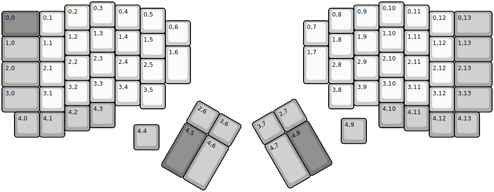{:loading="lazy"}

[Open in keyboard-layout-editor](http://www.keyboard-layout-editor.com/##@@_x:3.5;&=0,3&_x:10.5;&=0,10;&@_x:2.5&y:-0.875;&=0,2&_x:1.0;&=0,4&_x:8.5;&=0,9&_x:1.0;&=0,11;&@_x:5.5&y:-0.875;&=0,5&_x:6.5;&=0,8;&@_y:-0.875&c=#777777&w:1.5;&=0,0&_c=#cccccc;&=0,1&_x:14.5;&=0,12&_c=#aaaaaa&w:1.5;&=0,13;&@_x:6.5&y:-0.625&c=#cccccc;&=0,6&_x:4.5;&=0,7;&@_x:3.5&y:-0.75;&=1,3&_x:10.5;&=1,10;&@_x:2.5&y:-0.875;&=1,2&_x:1.0;&=1,4&_x:8.5;&=1,9&_x:1.0;&=1,11;&@_x:5.5&y:-0.875;&=1,5&_x:6.5;&=1,8;&@_y:-0.875&c=#aaaaaa&w:1.5;&=1,0&_c=#cccccc;&=1,1&_x:14.5;&=1,12&_c=#aaaaaa&w:1.5;&=1,13;&@_x:6.5&y:-0.625&c=#cccccc&h:1.5;&=1,6&_x:4.5&h:1.5;&=1,7;&@_x:3.5&y:-0.75;&=2,3&_x:10.5;&=2,10;&@_x:2.5&y:-0.875;&=2,2&_x:1.0;&=2,4&_x:8.5;&=2,9&_x:1.0;&=2,11;&@_x:5.5&y:-0.875;&=2,5&_x:6.5;&=2,8;&@_y:-0.875&c=#aaaaaa&w:1.5;&=2,0&_c=#cccccc;&=2,1&_x:14.5;&=2,12&_c=#aaaaaa&w:1.5;&=2,13;&@_x:3.5&y:-0.375&c=#cccccc;&=3,3&_x:10.5;&=3,10;&@_x:2.5&y:-0.875;&=3,2&_x:1.0;&=3,4&_x:8.5;&=3,9&_x:1.0;&=3,11;&@_x:5.5&y:-0.875;&=3,5&_x:6.5;&=3,8;&@_y:-0.875&c=#aaaaaa&w:1.5;&=3,0&_c=#cccccc;&=3,1&_x:14.5;&=3,12&_c=#aaaaaa&w:1.5;&=3,13;&@_x:3.5&y:-0.375;&=4,3&_x:10.5;&=4,10;&@_x:2.5&y:-0.875;&=4,2&_x:12.5;&=4,11;&@_x:0.5&y:-0.75;&=4,0&=4,1&_x:14.5;&=4,12&=4,13;&@_x:13.5&y:-0.745;&=4,9;&@_x:5.25&y:-0.75;&=4,4;&@_r:30&rx:6.5&ry:4.25&x:1.0&y:-1.0;&=2,6&=3,6;&@_x:1.0&c=#777777&h:2;&=4,5&_c=#aaaaaa&h:2;&=4,6;&@_r:-30&rx:13&x:-3&y:-1.0;&=3,7&=2,7;&@_x:-3&h:2;&=4,7&_c=#777777&h:2;&=4,8)

## reversestudio/decadepad

[README](output/reversestudio/decadepad/README.md) - [layout](output/reversestudio/decadepad/decadepad-kle.json) - [PCB](output/reversestudio/decadepad/decadepad.kicad_pcb) - [PCB render](output/reversestudio/decadepad/decadepad-render.svg)

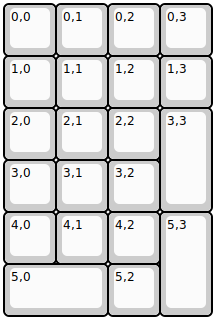{:loading="lazy"}

[Open in keyboard-layout-editor](http://www.keyboard-layout-editor.com/##@@=0,0&=0,1&=0,2&=0,3;&@=1,0&=1,1&=1,2&=1,3;&@=2,0&=2,1&=2,2&_h:2;&=3,3;&@=3,0&=3,1&=3,2;&@=4,0&=4,1&=4,2&_h:2;&=5,3;&@_w:2;&=5,0&=5,2)

## reviung41/reviung41

[README](output/reviung41/README.md) - [layout](output/reviung41/reviung41-kle.json) - [PCB](output/reviung41/reviung41.kicad_pcb) - [PCB render](output/reviung41/reviung41-render.svg)

{:loading="lazy"}

[Open in keyboard-layout-editor](http://www.keyboard-layout-editor.com/##@@_x:3;&=0,3&_x:5;&=3,2;&@_x:2&y:-0.85;&=0,2&_x:1;&=0,4&_x:3;&=3,1&_x:1;&=3,3;&@_x:1&y:-0.8;&=0,1&_x:3;&=0,5&_x:1;&=3,0&_x:3;&=3,4;&@_y:-0.85&c=#777777;&=0,0&_x:11;&=3,5;&@_x:3&y:-0.5&c=#cccccc;&=1,3&_x:5;&=4,2;&@_x:2&y:-0.85;&=1,2&_x:1;&=1,4&_x:3;&=4,1&_x:1;&=4,3;&@_x:1&y:-0.8;&=1,1&_x:3;&=1,5&_x:1;&=4,0&_x:3;&=4,4;&@_y:-0.85&c=#aaaaaa;&=1,0&_x:11;&=4,5;&@_x:3&y:-0.5&c=#cccccc;&=2,3&_x:5;&=5,2;&@_x:2&y:-0.85;&=2,2&_x:1;&=2,4&_x:3;&=5,1&_x:1;&=5,3;&@_x:1&y:-0.8;&=2,1&_x:3;&=2,5&_x:1;&=5,0&_x:3;&=5,4;&@_y:-0.85&c=#aaaaaa;&=2,0&_x:11;&=5,5;&@_x:3&w:1.25;&=6,0&_w:1.25;&=6,1&_w:2;&=6,2&_w:1.25;&=6,3&_w:1.25;&=6,4)

## rmi_kb/aelith

[README](output/rmi_kb/aelith/README.md) - [layout](output/rmi_kb/aelith/aelith-kle.json) - [PCB](output/rmi_kb/aelith/aelith.kicad_pcb) - [PCB render](output/rmi_kb/aelith/aelith-render.svg)

{:loading="lazy"}

[Open in keyboard-layout-editor](http://www.keyboard-layout-editor.com/##@@_x:0.55&y:1.15&c=#777777;&=0,0;&@_x:3.7&y:-0.95&c=#cccccc;&=0,3&_x:8.45;&=0,12;&@_x:1.7&y:-0.95;&=0,1&=0,2&_x:10.45;&=0,13&=0,14%0A%0A%0A0,0&_c=#aaaaaa;&=0,15%0A%0A%0A0,0;&@_x:0.35&y:-0.1;&=1,0;&@_x:13&y:-0.95&c=#cccccc;&=1,12;&@_x:1.5&y:-0.95&c=#aaaaaa&w:1.5;&=1,1&_c=#cccccc;&=1,2&_x:10.0;&=1,13&=1,14&_c=#aaaaaa&w:1.5;&=1,15;&@_x:0.15&y:-0.1;&=2,0;&@_x:13.4&y:-0.9&c=#cccccc;&=2,12&=2,13&_c=#777777&w:2.25;&=2,15&_x:-16.35&c=#aaaaaa&w:1.75;&=2,1&_c=#cccccc;&=2,2;&@_x:1.05&c=#aaaaaa&w:2.25;&=3,1&_c=#cccccc;&=3,2&_x:8.8;&=3,12&=3,13&_c=#aaaaaa&w:1.75;&=3,14%0A%0A%0A1,0&=3,15%0A%0A%0A1,0;&@_x:1.05&w:1.5;&=4,1&_x:13.45&w:1.5;&=4,15;&@_r:12&x:5.05&y:-6.0&c=#cccccc;&=0,4&=0,5&=0,6&=0,7;&@_x:4.6;&=1,3&=1,4&=1,5&=1,6;&@_x:4.85;&=2,3&=2,4&=2,5&=2,6;&@_x:5.3;&=3,3&=3,4&=3,5&=3,6;&@_x:6.6&c=#777777&w:2;&=4,4&_c=#aaaaaa&w:1.25;&=4,6;&@_x:5.05&y:-0.95&w:1.5;&=4,3;&@_r:-12&x:8.45&y:-1.45&c=#cccccc;&=0,8&=0,9&=0,10&=0,11;&@_x:8.05;&=1,8&=1,9&=1,10&=1,11;&@_x:8.2;&=2,8&=2,9&=2,10&=2,11;&@_x:7.75;&=3,8&=3,9&=3,10&=3,11;&@_x:7.75&c=#777777&w:2.75;&=4,9;&@_x:10.55&y:-0.95&c=#aaaaaa&w:1.5;&=4,11;&@_r:0&x:15.15&y:-8.75&w:2;&=0,15%0A%0A%0A0,1;&@_x:18.15&y:3.1&w:2.75;&=3,14%0A%0A%0A1,1)

## rmi_kb/chevron

[README](output/rmi_kb/chevron/README.md) - [layout](output/rmi_kb/chevron/chevron-kle.json) - [PCB](output/rmi_kb/chevron/chevron.kicad_pcb) - [PCB render](output/rmi_kb/chevron/chevron-render.svg)

{:loading="lazy"}

[Open in keyboard-layout-editor](http://www.keyboard-layout-editor.com/##@@_x:12.25&d:true;&=4,0%0A%0A%0A0,0&_x:0.25;&=1,13&_x:0.25&d:true;&=4,1%0A%0A%0A0,0;&@_y:0.25;&=0,0&=0,1&=0,2&=0,3&=0,4&=0,5&=0,6&=0,7&=0,8&=0,9&=0,10&=0,11&=0,12&_w:1.5;&=0,13%0A%0A%0A3,0;&@_w:1.25;&=1,0&=1,1&=1,2&=1,3&=1,4&=1,5&=1,6&=1,7&=1,8&=1,9&=1,10&=1,11&_w:2.25;&=1,12%0A%0A%0A3,0;&@_w:1.75;&=2,0&=2,1&=2,2&=2,3&=2,4&=2,5&=2,6&=2,7&=2,8&=2,9&=2,10&_w:2.75;&=2,12%0A%0A%0A1,0;&@_w:1.25;&=3,0&_w:1.25;&=3,1&_w:1.25;&=3,2&_w:7;&=3,6%0A%0A%0A2,0&_w:1.25;&=3,11&_w:1.25;&=3,12&_w:1.25;&=3,13;&@_x:8.75&y:-5.25;&=4,0%0A%0A%0A0,1&_x:1.5;&=4,1%0A%0A%0A0,1;&@_x:16.25&y:0.25&w:1.25&h:2&w2:1.5&h2:1&x2:-0.25;&=0,13%0A%0A%0A3,1;&@_x:15.25;&=1,12%0A%0A%0A3,1;&@_x:14.75&w:1.75;&=2,12%0A%0A%0A1,1&=2,13%0A%0A%0A1,1;&@_x:3.75&y:1.25&w:3;&=3,4%0A%0A%0A2,1&=3,6%0A%0A%0A2,1&_w:3;&=3,8%0A%0A%0A2,1)

## rmi_kb/herringbone

[README](output/rmi_kb/herringbone/README.md) - [layout](output/rmi_kb/herringbone/herringbone-kle.json) - [PCB](output/rmi_kb/herringbone/herringbone.kicad_pcb) - [PCB render](output/rmi_kb/herringbone/herringbone-render.svg)

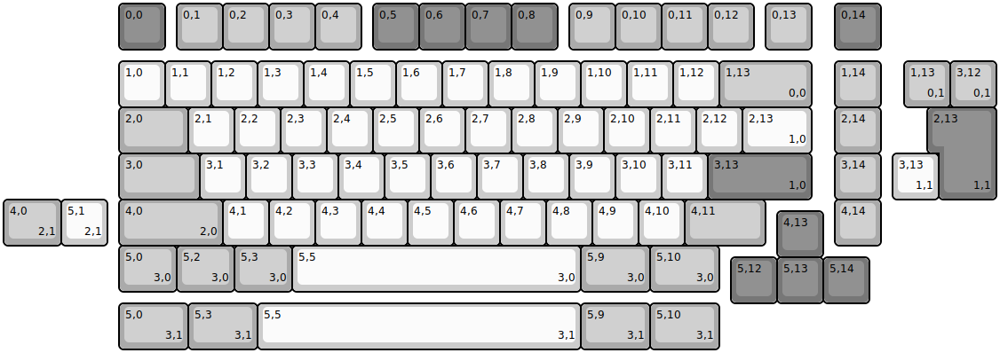{:loading="lazy"}

[Open in keyboard-layout-editor](http://www.keyboard-layout-editor.com/##@@_x:2.5&c=#777777;&=0,0&_x:0.25&c=#aaaaaa;&=0,1&=0,2&=0,3&=0,4&_x:0.25&c=#777777;&=0,5&=0,6&=0,7&=0,8&_x:0.25&c=#aaaaaa;&=0,9&=0,10&=0,11&=0,12&_x:0.25;&=0,13&_x:0.5&c=#777777;&=0,14;&@_x:2.5&y:0.25&c=#cccccc;&=1,0&=1,1&=1,2&=1,3&=1,4&=1,5&=1,6&=1,7&=1,8&=1,9&=1,10&=1,11&=1,12&_c=#aaaaaa&w:2;&=1,13%0A%0A%0A0,0&_x:0.5;&=1,14;&@_x:2.5&w:1.5;&=2,0&_c=#cccccc;&=2,1&=2,2&=2,3&=2,4&=2,5&=2,6&=2,7&=2,8&=2,9&=2,10&=2,11&=2,12&_w:1.5;&=2,13%0A%0A%0A1,0&_x:0.5&c=#aaaaaa;&=2,14;&@_x:2.5&w:1.75;&=3,0&_c=#cccccc;&=3,1&=3,2&=3,3&=3,4&=3,5&=3,6&=3,7&=3,8&=3,9&=3,10&=3,11&_c=#777777&w:2.25;&=3,13%0A%0A%0A1,0&_x:0.5&c=#aaaaaa;&=3,14;&@_x:2.5&w:2.25;&=4,0%0A%0A%0A2,0&_c=#cccccc;&=4,1&=4,2&=4,3&=4,4&=4,5&=4,6&=4,7&=4,8&=4,9&=4,10&_c=#aaaaaa&w:1.75;&=4,11&_x:1.5;&=4,14;&@_x:16.75&y:-0.75&c=#777777;&=4,13;&@_x:2.5&y:-0.25&c=#aaaaaa&w:1.25;&=5,0%0A%0A%0A3,0&_w:1.25;&=5,2%0A%0A%0A3,0&_w:1.25;&=5,3%0A%0A%0A3,0&_c=#cccccc&w:6.25;&=5,5%0A%0A%0A3,0&_c=#aaaaaa&w:1.5;&=5,9%0A%0A%0A3,0&_w:1.5;&=5,10%0A%0A%0A3,0;&@_x:15.75&y:-0.75&c=#777777;&=5,12&=5,13&=5,14;&@_x:19.5&y:-5.25&c=#aaaaaa;&=1,13%0A%0A%0A0,1&=3,12%0A%0A%0A0,1;&@_x:20.25&c=#777777&w:1.25&h:2&w2:1.5&h2:1&x2:-0.25;&=2,13%0A%0A%0A1,1;&@_x:19.25&c=#cccccc;&=3,13%0A%0A%0A1,1;&@_c=#aaaaaa&w:1.25;&=4,0%0A%0A%0A2,1&_c=#cccccc;&=5,1%0A%0A%0A2,1;&@_x:2.5&y:1.25&c=#aaaaaa&w:1.5;&=5,0%0A%0A%0A3,1&_w:1.5;&=5,3%0A%0A%0A3,1&_c=#cccccc&w:7;&=5,5%0A%0A%0A3,1&_c=#aaaaaa&w:1.5;&=5,9%0A%0A%0A3,1&_w:1.5;&=5,10%0A%0A%0A3,1)

## rmi_kb/herringbone/herringbone_pro

[README](output/rmi_kb/herringbone/README.md) - [layout](output/rmi_kb/herringbone/herringbone_pro-kle.json) - [PCB](output/rmi_kb/herringbone/herringbone_pro.kicad_pcb) - [PCB render](output/rmi_kb/herringbone/herringbone_pro-render.svg)

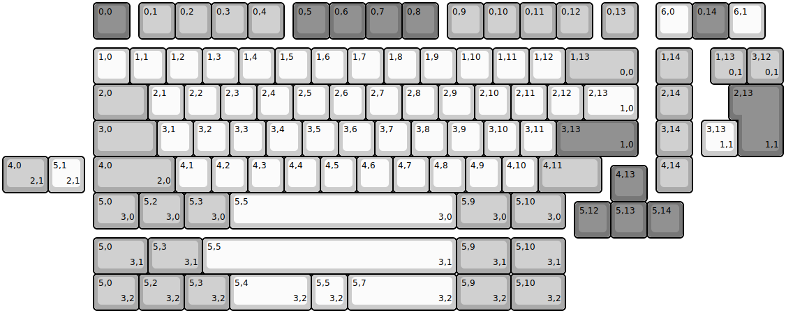{:loading="lazy"}

[Open in keyboard-layout-editor](http://www.keyboard-layout-editor.com/##@@_x:2.5&c=#777777;&=0,0&_x:0.25&c=#aaaaaa;&=0,1&=0,2&=0,3&=0,4&_x:0.25&c=#777777;&=0,5&=0,6&=0,7&=0,8&_x:0.25&c=#aaaaaa;&=0,9&=0,10&=0,11&=0,12&_x:0.25;&=0,13&_x:0.5&c=#cccccc;&=6,0&_c=#777777;&=0,14&_c=#cccccc;&=6,1;&@_x:2.5&y:0.25;&=1,0&=1,1&=1,2&=1,3&=1,4&=1,5&=1,6&=1,7&=1,8&=1,9&=1,10&=1,11&=1,12&_c=#aaaaaa&w:2;&=1,13%0A%0A%0A0,0&_x:0.5;&=1,14;&@_x:2.5&w:1.5;&=2,0&_c=#cccccc;&=2,1&=2,2&=2,3&=2,4&=2,5&=2,6&=2,7&=2,8&=2,9&=2,10&=2,11&=2,12&_w:1.5;&=2,13%0A%0A%0A1,0&_x:0.5&c=#aaaaaa;&=2,14;&@_x:2.5&w:1.75;&=3,0&_c=#cccccc;&=3,1&=3,2&=3,3&=3,4&=3,5&=3,6&=3,7&=3,8&=3,9&=3,10&=3,11&_c=#777777&w:2.25;&=3,13%0A%0A%0A1,0&_x:0.5&c=#aaaaaa;&=3,14;&@_x:2.5&w:2.25;&=4,0%0A%0A%0A2,0&_c=#cccccc;&=4,1&=4,2&=4,3&=4,4&=4,5&=4,6&=4,7&=4,8&=4,9&=4,10&_c=#aaaaaa&w:1.75;&=4,11&_x:1.5;&=4,14;&@_x:16.75&y:-0.75&c=#777777;&=4,13;&@_x:2.5&y:-0.25&c=#aaaaaa&w:1.25;&=5,0%0A%0A%0A3,0&_w:1.25;&=5,2%0A%0A%0A3,0&_w:1.25;&=5,3%0A%0A%0A3,0&_c=#cccccc&w:6.25;&=5,5%0A%0A%0A3,0&_c=#aaaaaa&w:1.5;&=5,9%0A%0A%0A3,0&_w:1.5;&=5,10%0A%0A%0A3,0;&@_x:15.75&y:-0.75&c=#777777;&=5,12&=5,13&=5,14;&@_x:19.5&y:-5.25&c=#aaaaaa;&=1,13%0A%0A%0A0,1&=3,12%0A%0A%0A0,1;&@_x:20.25&c=#777777&w:1.25&h:2&w2:1.5&h2:1&x2:-0.25;&=2,13%0A%0A%0A1,1;&@_x:19.25&c=#cccccc;&=3,13%0A%0A%0A1,1;&@_c=#aaaaaa&w:1.25;&=4,0%0A%0A%0A2,1&_c=#cccccc;&=5,1%0A%0A%0A2,1;&@_x:2.5&y:1.25&c=#aaaaaa&w:1.5;&=5,0%0A%0A%0A3,1&_w:1.5;&=5,3%0A%0A%0A3,1&_c=#cccccc&w:7;&=5,5%0A%0A%0A3,1&_c=#aaaaaa&w:1.5;&=5,9%0A%0A%0A3,1&_w:1.5;&=5,10%0A%0A%0A3,1;&@_x:2.5&w:1.25;&=5,0%0A%0A%0A3,2&_w:1.25;&=5,2%0A%0A%0A3,2&_w:1.25;&=5,3%0A%0A%0A3,2&_c=#cccccc&w:2.25;&=5,4%0A%0A%0A3,2&=5,5%0A%0A%0A3,2&_w:3;&=5,7%0A%0A%0A3,2&_c=#aaaaaa&w:1.5;&=5,9%0A%0A%0A3,2&_w:1.5;&=5,10%0A%0A%0A3,2)

## rmi_kb/mona/mona_v1

[README](output/rmi_kb/mona/README.md) - [layout](output/rmi_kb/mona/mona_v1-kle.json) - [PCB](output/rmi_kb/mona/mona_v1.kicad_pcb) - [PCB render](output/rmi_kb/mona/mona_v1-render.svg)

{:loading="lazy"}

[Open in keyboard-layout-editor](http://www.keyboard-layout-editor.com/##@@_x:2.5&c=#777777;&=0,0&_c=#cccccc;&=0,1&=0,2&=0,3&=0,4&=0,5&=0,6&=0,7&=0,8&=0,9&=0,10&=0,11&=0,12&_c=#aaaaaa&w:2;&=0,13%0A%0A%0A0,0;&@_x:2.5&w:1.5;&=1,0&_c=#cccccc;&=1,1&=1,2&=1,3&=1,4&=1,5&=1,6&=1,7&=1,8&=1,9&=1,10&=1,11&=1,12&_w:1.5;&=1,14%0A%0A%0A1,0;&@_x:2.5&c=#aaaaaa&w:1.75;&=2,0&_c=#cccccc;&=2,1&=2,2&=2,3&=2,4&=2,5&=2,6&=2,7&=2,8&=2,9&=2,10&=2,11&_c=#777777&w:2.25;&=2,13%0A%0A%0A1,0;&@_x:2.5&c=#aaaaaa&w:2.25;&=3,0%0A%0A%0A2,0&_c=#cccccc;&=3,2&=3,3&=3,4&=3,5&=3,6&=3,7&=3,8&=3,9&=3,10&=3,11&_c=#aaaaaa&w:2.75;&=3,13%0A%0A%0A3,0;&@_x:2.5&w:1.25;&=4,0%0A%0A%0A4,0&_w:1.25;&=4,1%0A%0A%0A4,0&_w:1.25;&=4,2%0A%0A%0A4,0&_c=#cccccc&w:6.25;&=4,6%0A%0A%0A4,0&_c=#aaaaaa&w:1.25;&=4,10%0A%0A%0A4,0&_w:1.25;&=4,11%0A%0A%0A4,0&_w:1.25;&=4,13%0A%0A%0A4,0&_w:1.25;&=4,14%0A%0A%0A4,0;&@_x:18.5&y:-5;&=0,13%0A%0A%0A0,1&=0,14%0A%0A%0A0,1;&@_x:19.25&c=#777777&w:1.25&h:2&w2:1.5&h2:1&x2:-0.25;&=1,14%0A%0A%0A1,1;&@_x:18.25&c=#cccccc;&=2,13%0A%0A%0A1,1;&@_c=#aaaaaa&w:1.25;&=3,0%0A%0A%0A2,1&=3,1%0A%0A%0A2,1&_x:15.5&w:1.75;&=3,13%0A%0A%0A3,1&=3,14%0A%0A%0A3,1;&@_x:2.5&y:1.25&w:1.5;&=4,0%0A%0A%0A4,1&=4,1%0A%0A%0A4,1&_w:1.5;&=4,2%0A%0A%0A4,1&_c=#cccccc&w:7;&=4,6%0A%0A%0A4,1&_c=#aaaaaa&w:1.5;&=4,11%0A%0A%0A4,1&=4,13%0A%0A%0A4,1&_w:1.5;&=4,14%0A%0A%0A4,1;&@_x:2.5&w:1.5;&=4,0%0A%0A%0A4,2&_d:true;&=4,1%0A%0A%0A4,2&_w:1.5;&=4,2%0A%0A%0A4,2&_c=#cccccc&w:7;&=4,6%0A%0A%0A4,2&_c=#aaaaaa&w:1.5;&=4,11%0A%0A%0A4,2&_d:true;&=4,13%0A%0A%0A4,2&_w:1.5;&=4,14%0A%0A%0A4,2)

## rmi_kb/mona/mona_v1_1

[README](output/rmi_kb/mona/README.md) - [layout](output/rmi_kb/mona/mona_v1_1-kle.json) - [PCB](output/rmi_kb/mona/mona_v1_1.kicad_pcb) - [PCB render](output/rmi_kb/mona/mona_v1_1-render.svg)

{:loading="lazy"}

[Open in keyboard-layout-editor](http://www.keyboard-layout-editor.com/##@@_x:2.5&c=#777777;&=0,0&_c=#cccccc;&=0,1&=0,2&=0,3&=0,4&=0,5&=0,6&=0,7&=0,8&=0,9&=0,10&=0,11&=0,12&_c=#aaaaaa&w:2;&=0,13%0A%0A%0A0,0;&@_x:2.5&w:1.5;&=1,0&_c=#cccccc;&=1,1&=1,2&=1,3&=1,4&=1,5&=1,6&=1,7&=1,8&=1,9&=1,10&=1,11&=1,12&_w:1.5;&=1,14%0A%0A%0A1,0;&@_x:2.5&c=#aaaaaa&w:1.75;&=2,0&_c=#cccccc;&=2,1&=2,2&=2,3&=2,4&=2,5&=2,6&=2,7&=2,8&=2,9&=2,10&=2,11&_c=#777777&w:2.25;&=2,13%0A%0A%0A1,0;&@_x:2.5&c=#aaaaaa&w:2.25;&=3,0%0A%0A%0A2,0&_c=#cccccc;&=3,2&=3,3&=3,4&=3,5&=3,6&=3,7&=3,8&=3,9&=3,10&=3,11&_c=#aaaaaa&w:2.75;&=3,13%0A%0A%0A3,0;&@_x:2.5&w:1.25;&=4,0%0A%0A%0A4,0&_w:1.25;&=4,1%0A%0A%0A4,0&_w:1.25;&=4,2%0A%0A%0A4,0&_c=#cccccc&w:6.25;&=4,6%0A%0A%0A4,0&_c=#aaaaaa&w:1.25;&=4,10%0A%0A%0A4,0&_w:1.25;&=4,11%0A%0A%0A4,0&_w:1.25;&=4,13%0A%0A%0A4,0&_w:1.25;&=4,14%0A%0A%0A4,0;&@_x:18.5&y:-5;&=0,13%0A%0A%0A0,1&=0,14%0A%0A%0A0,1;&@_x:19.25&c=#777777&w:1.25&h:2&w2:1.5&h2:1&x2:-0.25;&=1,14%0A%0A%0A1,1;&@_x:18.25&c=#cccccc;&=2,13%0A%0A%0A1,1;&@_c=#aaaaaa&w:1.25;&=3,0%0A%0A%0A2,1&=3,1%0A%0A%0A2,1&_x:15.5&w:1.75;&=3,13%0A%0A%0A3,1&=3,14%0A%0A%0A3,1;&@_x:2.5&y:1.25&w:1.5;&=4,0%0A%0A%0A4,1&=4,1%0A%0A%0A4,1&_w:1.5;&=4,2%0A%0A%0A4,1&_c=#cccccc&w:7;&=4,6%0A%0A%0A4,1&_c=#aaaaaa&w:1.5;&=4,11%0A%0A%0A4,1&=4,13%0A%0A%0A4,1&_w:1.5;&=4,14%0A%0A%0A4,1;&@_x:2.5&w:1.5;&=4,0%0A%0A%0A4,2&=4,1%0A%0A%0A4,2&_w:1.5;&=4,2%0A%0A%0A4,2&_c=#cccccc&w:3;&=4,4%0A%0A%0A4,2&=4,6%0A%0A%0A4,2&_w:3;&=4,8%0A%0A%0A4,2&_c=#aaaaaa&w:1.5;&=4,11%0A%0A%0A4,2&=4,13%0A%0A%0A4,2&_w:1.5;&=4,14%0A%0A%0A4,2;&@_x:2.5&w:1.5;&=4,0%0A%0A%0A4,3&_d:true;&=4,1%0A%0A%0A4,3&_w:1.5;&=4,2%0A%0A%0A4,3&_c=#cccccc&w:7;&=4,6%0A%0A%0A4,3&_c=#aaaaaa&w:1.5;&=4,11%0A%0A%0A4,3&_d:true;&=4,13%0A%0A%0A4,3&_w:1.5;&=4,14%0A%0A%0A4,3)

## rmi_kb/mona/mona_v32a

[README](output/rmi_kb/mona/README.md) - [layout](output/rmi_kb/mona/mona_v32a-kle.json) - [PCB](output/rmi_kb/mona/mona_v32a.kicad_pcb) - [PCB render](output/rmi_kb/mona/mona_v32a-render.svg)

{:loading="lazy"}

[Open in keyboard-layout-editor](http://www.keyboard-layout-editor.com/##@@_x:2.5&c=#777777;&=0,0&_c=#cccccc;&=0,1&=0,2&=0,3&=0,4&=0,5&=0,6&=0,7&=0,8&=0,9&=0,10&=0,11&=0,12&_c=#aaaaaa&w:2;&=0,13%0A%0A%0A0,0;&@_x:2.5&w:1.5;&=1,0&_c=#cccccc;&=1,1&=1,2&=1,3&=1,4&=1,5&=1,6&=1,7&=1,8&=1,9&=1,10&=1,11&=1,12&_w:1.5;&=1,14%0A%0A%0A1,0;&@_x:2.5&c=#aaaaaa&w:1.75;&=2,0&_c=#cccccc;&=2,1&=2,2&=2,3&=2,4&=2,5&=2,6&=2,7&=2,8&=2,9&=2,10&=2,11&_c=#777777&w:2.25;&=2,13%0A%0A%0A1,0;&@_x:2.5&c=#aaaaaa&w:2.25;&=3,0%0A%0A%0A2,0&_c=#cccccc;&=3,2&=3,3&=3,4&=3,5&=3,6&=3,7&=3,8&=3,9&=3,10&=3,11&_c=#aaaaaa&w:2.75;&=3,13%0A%0A%0A3,0;&@_x:2.5&w:1.25;&=4,0%0A%0A%0A4,0&_w:1.25;&=4,1%0A%0A%0A4,0&_w:1.25;&=4,2%0A%0A%0A4,0&_c=#cccccc&w:6.25;&=4,6%0A%0A%0A4,0&_c=#aaaaaa&w:1.25;&=4,10%0A%0A%0A4,0&_w:1.25;&=4,11%0A%0A%0A4,0&_w:1.25;&=4,13%0A%0A%0A4,0&_w:1.25;&=4,14%0A%0A%0A4,0;&@_x:18.5&y:-5;&=0,13%0A%0A%0A0,1&=0,14%0A%0A%0A0,1;&@_x:19.25&c=#777777&w:1.25&h:2&w2:1.5&h2:1&x2:-0.25;&=1,14%0A%0A%0A1,1;&@_x:18.25&c=#cccccc;&=2,13%0A%0A%0A1,1;&@_c=#aaaaaa&w:1.25;&=3,0%0A%0A%0A2,1&=3,1%0A%0A%0A2,1&_x:15.5&w:1.75;&=3,13%0A%0A%0A3,1&=3,14%0A%0A%0A3,1;&@_x:2.5&y:1.25&w:1.5;&=4,0%0A%0A%0A4,1&=4,1%0A%0A%0A4,1&_w:1.5;&=4,2%0A%0A%0A4,1&_c=#cccccc&w:7;&=4,6%0A%0A%0A4,1&_c=#aaaaaa&w:1.5;&=4,11%0A%0A%0A4,1&=4,13%0A%0A%0A4,1&_w:1.5;&=4,14%0A%0A%0A4,1;&@_x:2.5&w:1.5;&=4,0%0A%0A%0A4,2&=4,1%0A%0A%0A4,2&_w:1.5;&=4,2%0A%0A%0A4,2&_c=#cccccc&w:3;&=4,5%0A%0A%0A4,2&=4,6%0A%0A%0A4,2&_w:3;&=4,9%0A%0A%0A4,2&_c=#aaaaaa&w:1.5;&=4,11%0A%0A%0A4,2&=4,13%0A%0A%0A4,2&_w:1.5;&=4,14%0A%0A%0A4,2)

## rmi_kb/squishy65

[README](output/rmi_kb/squishy65/README.md) - [layout](output/rmi_kb/squishy65/squishy65-kle.json) - [PCB](output/rmi_kb/squishy65/squishy65.kicad_pcb) - [PCB render](output/rmi_kb/squishy65/squishy65-render.svg)

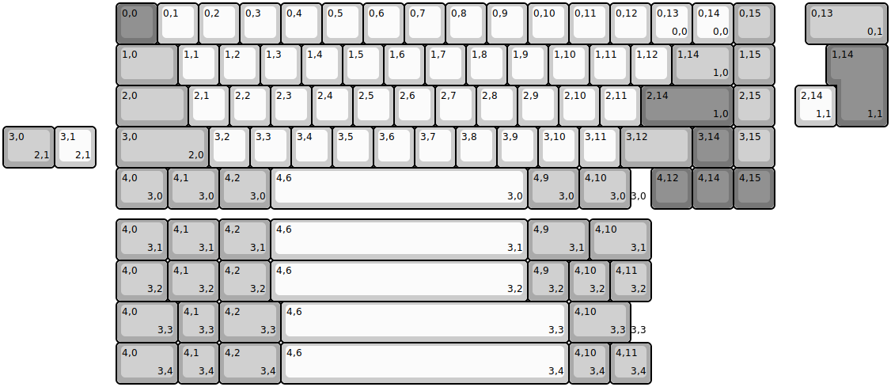{:loading="lazy"}

[Open in keyboard-layout-editor](http://www.keyboard-layout-editor.com/##@@_x:2.75&c=#777777;&=0,0&_c=#cccccc;&=0,1&=0,2&=0,3&=0,4&=0,5&=0,6&=0,7&=0,8&=0,9&=0,10&=0,11&=0,12&=0,13%0A%0A%0A0,0&=0,14%0A%0A%0A0,0&_c=#aaaaaa;&=0,15;&@_x:2.75&w:1.5;&=1,0&_c=#cccccc;&=1,1&=1,2&=1,3&=1,4&=1,5&=1,6&=1,7&=1,8&=1,9&=1,10&=1,11&=1,12&_c=#aaaaaa&w:1.5;&=1,14%0A%0A%0A1,0&=1,15;&@_x:2.75&w:1.75;&=2,0&_c=#cccccc;&=2,1&=2,2&=2,3&=2,4&=2,5&=2,6&=2,7&=2,8&=2,9&=2,10&=2,11&_c=#777777&w:2.25;&=2,14%0A%0A%0A1,0&_c=#aaaaaa;&=2,15;&@_x:2.75&w:2.25;&=3,0%0A%0A%0A2,0&_c=#cccccc;&=3,2&=3,3&=3,4&=3,5&=3,6&=3,7&=3,8&=3,9&=3,10&=3,11&_c=#aaaaaa&w:1.75;&=3,12&_c=#777777;&=3,14&_c=#aaaaaa;&=3,15;&@_x:2.75&w:1.25;&=4,0%0A%0A%0A3,0&_w:1.25;&=4,1%0A%0A%0A3,0&_w:1.25;&=4,2%0A%0A%0A3,0&_c=#cccccc&w:6.25;&=4,6%0A%0A%0A3,0&_c=#aaaaaa&w:1.25;&=4,9%0A%0A%0A3,0&_w:1.25;&=4,10%0A%0A%0A3,0&_c=#cccccc&w:0.5&d:true;&=%0A%0A%0A3,0&_c=#777777;&=4,12&=4,14&=4,15;&@_x:19.5&y:-5&c=#aaaaaa&w:2;&=0,13%0A%0A%0A0,1;&@_x:20.25&c=#777777&w:1.25&h:2&w2:1.5&h2:1&x2:-0.25;&=1,14%0A%0A%0A1,1;&@_x:19.25&c=#cccccc;&=2,14%0A%0A%0A1,1;&@_c=#aaaaaa&w:1.25;&=3,0%0A%0A%0A2,1&_c=#cccccc;&=3,1%0A%0A%0A2,1;&@_x:2.75&y:1.25&c=#aaaaaa&w:1.25;&=4,0%0A%0A%0A3,1&_w:1.25;&=4,1%0A%0A%0A3,1&_w:1.25;&=4,2%0A%0A%0A3,1&_c=#cccccc&w:6.25;&=4,6%0A%0A%0A3,1&_c=#aaaaaa&w:1.5;&=4,9%0A%0A%0A3,1&_w:1.5;&=4,10%0A%0A%0A3,1;&@_x:2.75&w:1.25;&=4,0%0A%0A%0A3,2&_w:1.25;&=4,1%0A%0A%0A3,2&_w:1.25;&=4,2%0A%0A%0A3,2&_c=#cccccc&w:6.25;&=4,6%0A%0A%0A3,2&_c=#aaaaaa;&=4,9%0A%0A%0A3,2&=4,10%0A%0A%0A3,2&=4,11%0A%0A%0A3,2;&@_x:2.75&w:1.5;&=4,0%0A%0A%0A3,3&=4,1%0A%0A%0A3,3&_w:1.5;&=4,2%0A%0A%0A3,3&_c=#cccccc&w:7;&=4,6%0A%0A%0A3,3&_c=#aaaaaa&w:1.5;&=4,10%0A%0A%0A3,3&_c=#cccccc&w:0.5&d:true;&=%0A%0A%0A3,3;&@_x:2.75&c=#aaaaaa&w:1.5;&=4,0%0A%0A%0A3,4&=4,1%0A%0A%0A3,4&_w:1.5;&=4,2%0A%0A%0A3,4&_c=#cccccc&w:7;&=4,6%0A%0A%0A3,4&_c=#aaaaaa;&=4,10%0A%0A%0A3,4&=4,11%0A%0A%0A3,4)

## rmi_kb/squishyfrl

[README](output/rmi_kb/squishyfrl/README.md) - [layout](output/rmi_kb/squishyfrl/squishyfrl-kle.json) - [PCB](output/rmi_kb/squishyfrl/squishyfrl.kicad_pcb) - [PCB render](output/rmi_kb/squishyfrl/squishyfrl-render.svg)

{:loading="lazy"}

[Open in keyboard-layout-editor](http://www.keyboard-layout-editor.com/##@@_c=#aaaaaa&d:true;&=0,15%0A%0A%0A0,0&_d:true;&=0,16%0A%0A%0A0,0&_d:true;&=0,17%0A%0A%0A0,0&_x:0.25&c=#cccccc;&=4,0&=4,1&=4,2&=4,3&=4,4&=4,5&=4,6&=4,7&=4,8&=4,9&=4,10&=4,11&=4,12&_c=#aaaaaa&w:2;&=4,13%0A%0A%0A1,0&_x:0.25;&=0,15%0A%0A%0A0,0&=0,16%0A%0A%0A0,0&=0,17%0A%0A%0A0,0;&@_d:true;&=1,15%0A%0A%0A0,0&_d:true;&=1,16%0A%0A%0A0,0&_d:true;&=1,17%0A%0A%0A0,0&_x:0.25&w:1.5;&=5,0&_c=#cccccc;&=5,1&=5,2&=5,3&=5,4&=5,5&=5,6&=5,7&=5,8&=5,9&=5,10&=5,11&=5,12&_w:1.5;&=5,14%0A%0A%0A3,0&_x:0.25&c=#aaaaaa;&=1,15%0A%0A%0A0,0&=1,16%0A%0A%0A0,0&=1,17%0A%0A%0A0,0;&@_x:3.25&w:1.75;&=6,0&_c=#cccccc;&=6,1&=6,2&=6,3&=6,4&=6,5&=6,6&=6,7&=6,8&=6,9&=6,10&=6,11&_c=#777777&w:2.25;&=6,13%0A%0A%0A3,0;&@_x:1&d:true;&=2,19%0A%0A%0A0,0&_x:1.25&c=#aaaaaa&w:2.25;&=7,0%0A%0A%0A2,0&_c=#cccccc;&=7,2&=7,3&=7,4&=7,5&=7,6&=7,7&=7,8&=7,9&=7,10&=7,11&_c=#aaaaaa&w:2.75;&=7,13%0A%0A%0A4,0&_x:1.25&c=#777777;&=2,19%0A%0A%0A0,0;&@_d:true;&=3,18%0A%0A%0A0,0&_d:true;&=3,19%0A%0A%0A0,0&_d:true;&=3,20%0A%0A%0A0,0&_x:0.25&c=#aaaaaa&w:1.25;&=8,0%0A%0A%0A5,0&_w:1.25;&=8,1%0A%0A%0A5,0&_w:1.25;&=8,2%0A%0A%0A5,0&_c=#cccccc&w:6.25;&=8,8%0A%0A%0A5,0&_c=#aaaaaa&w:1.25;&=8,10%0A%0A%0A5,0&_w:1.25;&=8,11%0A%0A%0A5,0&_w:1.25;&=8,13%0A%0A%0A5,0&_w:1.25;&=8,14%0A%0A%0A5,0&_x:0.25&c=#777777;&=3,18%0A%0A%0A0,0&=3,19%0A%0A%0A0,0&=3,20%0A%0A%0A0,0;&@_y:0.25&c=#aaaaaa;&=0,15%0A%0A%0A0,1&=0,16%0A%0A%0A0,1&=0,17%0A%0A%0A0,1&_x:0.25&w:1.25;&=7,0%0A%0A%0A2,1&_c=#cccccc;&=7,1%0A%0A%0A2,1&_x:10.75&c=#aaaaaa;&=4,13%0A%0A%0A1,1&=4,14%0A%0A%0A1,1&_x:0.25&d:true;&=0,15%0A%0A%0A0,1&_d:true;&=0,16%0A%0A%0A0,1&_d:true;&=0,17%0A%0A%0A0,1;&@=1,15%0A%0A%0A0,1&=1,16%0A%0A%0A0,1&=1,17%0A%0A%0A0,1&_x:14&c=#777777&w:1.25&h:2&w2:1.5&h2:1&x2:-0.25;&=5,14%0A%0A%0A3,1&_x:0.25&c=#aaaaaa&d:true;&=1,15%0A%0A%0A0,1&_d:true;&=1,16%0A%0A%0A0,1&_d:true;&=1,17%0A%0A%0A0,1;&@_x:16&c=#cccccc;&=6,13%0A%0A%0A3,1;&@_x:1&c=#777777;&=2,19%0A%0A%0A0,1&_x:13.5&c=#aaaaaa&w:1.75;&=7,13%0A%0A%0A4,1&=7,14%0A%0A%0A4,1&_x:1.25&c=#777777&d:true;&=2,19%0A%0A%0A0,1;&@=3,18%0A%0A%0A0,1&=3,19%0A%0A%0A0,1&=3,20%0A%0A%0A0,1&_x:0.25&c=#aaaaaa&w:1.5;&=8,0%0A%0A%0A5,1&=8,1%0A%0A%0A5,1&_w:1.5;&=8,2%0A%0A%0A5,1&_c=#cccccc&w:7;&=8,8%0A%0A%0A5,1&_c=#aaaaaa&w:1.5;&=8,11%0A%0A%0A5,1&=8,13%0A%0A%0A5,1&_w:1.5;&=8,14%0A%0A%0A5,1&_x:0.25&c=#777777&d:true;&=3,18%0A%0A%0A0,1&_d:true;&=3,19%0A%0A%0A0,1&_d:true;&=3,20%0A%0A%0A0,1;&@_x:3.25&c=#aaaaaa&w:1.5;&=8,0%0A%0A%0A5,2&=8,1%0A%0A%0A5,2&_w:1.5;&=8,2%0A%0A%0A5,2&_c=#cccccc&w:3;&=8,3%0A%0A%0A5,2&=8,8%0A%0A%0A5,2&_w:3;&=8,9%0A%0A%0A5,2&_c=#aaaaaa&w:1.5;&=8,11%0A%0A%0A5,2&=8,13%0A%0A%0A5,2&_w:1.5;&=8,14%0A%0A%0A5,2;&@_x:3.25&w:1.5;&=8,0%0A%0A%0A5,3&_x:1.0&w:1.5;&=8,2%0A%0A%0A5,3&_c=#cccccc&w:7;&=8,8%0A%0A%0A5,3&_c=#aaaaaa&w:1.5;&=8,11%0A%0A%0A5,3&_x:1.0&w:1.5;&=8,14%0A%0A%0A5,3;&@_x:3.25&w:1.5;&=8,0%0A%0A%0A5,4&_x:1.0&w:1.5;&=8,2%0A%0A%0A5,4&_c=#cccccc&w:3;&=8,3%0A%0A%0A5,4&=8,8%0A%0A%0A5,4&_w:3;&=8,9%0A%0A%0A5,4&_c=#aaaaaa&w:1.5;&=8,11%0A%0A%0A5,4&_x:1.0&w:1.5;&=8,14%0A%0A%0A5,4)

## rmi_kb/squishytkl

[README](output/rmi_kb/squishytkl/README.md) - [layout](output/rmi_kb/squishytkl/squishytkl-kle.json) - [PCB](output/rmi_kb/squishytkl/squishytkl.kicad_pcb) - [PCB render](output/rmi_kb/squishytkl/squishytkl-render.svg)

{:loading="lazy"}

[Open in keyboard-layout-editor](http://www.keyboard-layout-editor.com/##@@_x:18.5&d:true;&=13,0%0A%0A%0A0,0;&@_y:-0.5&c=#777777;&=0,0&_x:0.25&c=#cccccc;&=0,1&=0,2&=0,3&=0,4&_x:0.25&c=#aaaaaa;&=1,0&=1,1&=1,2&=1,3&_x:0.25&c=#cccccc;&=2,0&=2,1&=2,2&=2,3&_x:0.25&c=#aaaaaa;&=2,4&_x:0.25;&=3,20&=3,21&=3,22;&@_x:18.5&y:-0.5&c=#cccccc&d:true;&=13,1%0A%0A%0A0,0;&@_y:-0.25;&=8,5&=8,6&=8,7&=8,8&=8,9&=8,10&=8,11&=8,12&=8,13&=8,14&=8,15&=8,16&=8,17&_c=#aaaaaa&w:2;&=8,18%0A%0A%0A1,0&_x:0.25;&=4,20&=4,21&=4,22;&@_w:1.5;&=9,5&_c=#cccccc;&=9,6&=9,7&=9,8&=9,9&=9,10&=9,11&=9,12&=9,13&=9,14&=9,15&=9,16&=9,17&_w:1.5;&=9,19%0A%0A%0A3,0&_x:0.25&c=#aaaaaa;&=5,20&=5,21&=5,22;&@_w:1.75;&=10,5&_c=#cccccc;&=10,6&=10,7&=10,8&=10,9&=10,10&=10,11&=10,12&=10,13&=10,14&=10,15&=10,16&_c=#777777&w:2.25;&=10,18%0A%0A%0A3,0;&@_c=#aaaaaa&w:2.25;&=11,5%0A%0A%0A2,0&_c=#cccccc;&=11,7&=11,8&=11,9&=11,10&=11,11&=11,12&=11,13&=11,14&=11,15&=11,16&_c=#aaaaaa&w:2.75;&=11,18%0A%0A%0A4,0&_x:1.25&c=#777777;&=6,24;&@_c=#aaaaaa&w:1.25;&=12,5%0A%0A%0A5,0&_w:1.25;&=12,6%0A%0A%0A5,0&_w:1.25;&=12,7%0A%0A%0A5,0&_c=#cccccc&w:6.25;&=12,13%0A%0A%0A5,0&_c=#aaaaaa&w:1.25;&=12,15%0A%0A%0A5,0&_w:1.25;&=12,16%0A%0A%0A5,0&_w:1.25;&=12,18%0A%0A%0A5,0&_w:1.25;&=12,19%0A%0A%0A5,0&_x:0.25&c=#777777;&=7,23&=7,24&=7,25;&@_x:19.5&y:-6.75&c=#aaaaaa;&=13,0%0A%0A%0A0,1;&@_x:19.5;&=13,1%0A%0A%0A0,1;&@_y:5.0&w:1.25;&=11,5%0A%0A%0A2,1&_c=#cccccc;&=11,6%0A%0A%0A2,1&_x:10.75&c=#aaaaaa;&=8,18%0A%0A%0A1,1&=8,19%0A%0A%0A1,1;&@_x:13.75&c=#777777&w:1.25&h:2&w2:1.5&h2:1&x2:-0.25;&=9,19%0A%0A%0A3,1;&@_x:12.75&c=#cccccc;&=10,18%0A%0A%0A3,1;&@_x:12&c=#aaaaaa&w:1.75;&=11,18%0A%0A%0A4,1&=11,19%0A%0A%0A4,1;&@_w:1.5;&=12,5%0A%0A%0A5,1&=12,6%0A%0A%0A5,1&_w:1.5;&=12,7%0A%0A%0A5,1&_c=#cccccc&w:7;&=12,13%0A%0A%0A5,1&_c=#aaaaaa&w:1.5;&=12,16%0A%0A%0A5,1&=12,18%0A%0A%0A5,1&_w:1.5;&=12,19%0A%0A%0A5,1;&@_w:1.5;&=12,5%0A%0A%0A5,2&=12,6%0A%0A%0A5,2&_w:1.5;&=12,7%0A%0A%0A5,2&_c=#cccccc&w:3;&=12,8%0A%0A%0A5,2&=12,13%0A%0A%0A5,2&_w:3;&=12,14%0A%0A%0A5,2&_c=#aaaaaa&w:1.5;&=12,16%0A%0A%0A5,2&=12,18%0A%0A%0A5,2&_w:1.5;&=12,19%0A%0A%0A5,2;&@_w:1.5;&=12,5%0A%0A%0A5,3&_x:1.0&w:1.5;&=12,7%0A%0A%0A5,3&_c=#cccccc&w:7;&=12,13%0A%0A%0A5,3&_c=#aaaaaa&w:1.5;&=12,16%0A%0A%0A5,3&_x:1.0&w:1.5;&=12,19%0A%0A%0A5,3;&@_w:1.5;&=12,5%0A%0A%0A5,4&_x:1.0&w:1.5;&=12,7%0A%0A%0A5,4&_c=#cccccc&w:3;&=12,8%0A%0A%0A5,4&=12,13%0A%0A%0A5,4&_w:3;&=12,14%0A%0A%0A5,4&_c=#aaaaaa&w:1.5;&=12,16%0A%0A%0A5,4&_x:1.0&w:1.5;&=12,19%0A%0A%0A5,4)

## rmi_kb/tkl_ff

[README](output/rmi_kb/tkl_ff/README.md) - [layout](output/rmi_kb/tkl_ff/tkl_ff-kle.json) - [PCB](output/rmi_kb/tkl_ff/tkl_ff.kicad_pcb) - [PCB render](output/rmi_kb/tkl_ff/tkl_ff-render.svg)

{:loading="lazy"}

[Open in keyboard-layout-editor](http://www.keyboard-layout-editor.com/##@@=0,0%0A%0A%0A0,0&_d:true;&=0,1%0A%0A%0A0,0&_c=#aaaaaa;&=0,2%0A%0A%0A0,0&=0,3%0A%0A%0A0,0&=0,4%0A%0A%0A0,0&=0,5%0A%0A%0A0,0&_x:0.5;&=0,6%0A%0A%0A0,0&=0,7%0A%0A%0A0,0&=0,8%0A%0A%0A0,0&=0,9%0A%0A%0A0,0&_x:0.5;&=0,10%0A%0A%0A0,0&=0,11%0A%0A%0A0,0&=0,12%0A%0A%0A0,0&=0,13%0A%0A%0A0,0&_x:0.25;&=0,14&=0,15&=0,16;&@_y:0.25&c=#cccccc;&=1,0&=1,1&=1,2&=1,3&=1,4&=1,5&=1,6&=1,7&=1,8&=1,9&=1,10&=1,11&=1,12&_c=#aaaaaa&w:2;&=1,13%0A%0A%0A1,0&_x:0.25;&=1,14&=1,15&=1,16;&@_w:1.5;&=2,0&_c=#cccccc;&=2,1&=2,2&=2,3&=2,4&=2,5&=2,6&=2,7&=2,8&=2,9&=2,10&=2,11&=2,12&_w:1.5;&=2,13%0A%0A%0A2,0&_x:0.25&c=#aaaaaa;&=2,14&=2,15&=2,16;&@_w:1.75;&=3,0&_c=#cccccc;&=3,1&=3,2&=3,3&=3,4&=3,5&=3,6&=3,7&=3,8&=3,9&=3,10&=3,11&_c=#777777&w:2.25;&=3,12%0A%0A%0A2,0;&@_c=#aaaaaa&w:2.25;&=4,0%0A%0A%0A3,0&_c=#cccccc;&=4,2&=4,3&=4,4&=4,5&=4,6&=4,7&=4,8&=4,9&=4,10&=4,11&_c=#aaaaaa&w:2.75;&=4,12%0A%0A%0A4,0&_x:1.25&c=#777777;&=4,15;&@_c=#aaaaaa&w:1.25;&=5,0%0A%0A%0A5,0&_w:1.25;&=5,1%0A%0A%0A5,0&_w:1.25;&=5,2%0A%0A%0A5,0&_c=#cccccc&w:6.25;&=5,7%0A%0A%0A5,0&_c=#aaaaaa&w:1.25;&=5,10%0A%0A%0A5,0&_w:1.25;&=5,11%0A%0A%0A5,0&_w:1.25;&=5,12%0A%0A%0A5,0&_w:1.25;&=5,13%0A%0A%0A5,0&_x:0.25&c=#777777;&=5,14&=5,15&=5,16;&@_y:0.25;&=0,0%0A%0A%0A0,1&_x:0.25&c=#aaaaaa;&=0,1%0A%0A%0A0,1&=0,2%0A%0A%0A0,1&=0,3%0A%0A%0A0,1&=0,4%0A%0A%0A0,1&_x:0.25;&=0,5%0A%0A%0A0,1&=0,6%0A%0A%0A0,1&=0,7%0A%0A%0A0,1&=0,8%0A%0A%0A0,1&_x:0.25;&=0,9%0A%0A%0A0,1&=0,10%0A%0A%0A0,1&=0,11%0A%0A%0A0,1&=0,12%0A%0A%0A0,1&_x:0.25;&=0,13%0A%0A%0A0,1;&@_x:13&y:0.25;&=1,13%0A%0A%0A1,1&=3,13%0A%0A%0A1,1;&@_x:13.75&c=#777777&w:1.25&h:2&w2:1.5&h2:1&x2:-0.25;&=2,13%0A%0A%0A2,1;&@_x:12.75&c=#cccccc;&=3,12%0A%0A%0A2,1;&@_c=#aaaaaa&w:1.25;&=4,0%0A%0A%0A3,1&_c=#cccccc;&=4,1%0A%0A%0A3,1&_x:10.0&c=#aaaaaa&w:1.75;&=4,12%0A%0A%0A4,1&=4,13%0A%0A%0A4,1;&@_w:1.5;&=5,0%0A%0A%0A5,1&=5,1%0A%0A%0A5,1&_w:1.5;&=5,2%0A%0A%0A5,1&_c=#cccccc&w:7;&=5,7%0A%0A%0A5,1&_c=#aaaaaa&w:1.5;&=5,11%0A%0A%0A5,1&=5,12%0A%0A%0A5,1&_w:1.5;&=5,13%0A%0A%0A5,1;&@_w:1.5;&=5,0%0A%0A%0A5,2&_d:true;&=5,1%0A%0A%0A5,2&_w:1.5;&=5,2%0A%0A%0A5,2&_c=#cccccc&w:7;&=5,7%0A%0A%0A5,2&_c=#aaaaaa&w:1.5;&=5,11%0A%0A%0A5,2&_d:true;&=5,12%0A%0A%0A5,2&_w:1.5;&=5,13%0A%0A%0A5,2)

## rmi_kb/tkl_ff/tkl_ff_v2

[README](output/rmi_kb/tkl_ff/README.md) - [layout](output/rmi_kb/tkl_ff/tkl_ff_v2-kle.json) - [PCB](output/rmi_kb/tkl_ff/tkl_ff_v2.kicad_pcb) - [PCB render](output/rmi_kb/tkl_ff/tkl_ff_v2-render.svg)

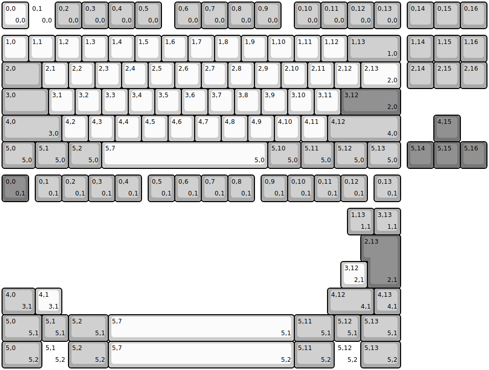{:loading="lazy"}

[Open in keyboard-layout-editor](http://www.keyboard-layout-editor.com/##@@=0,0%0A%0A%0A0,0&_d:true;&=0,1%0A%0A%0A0,0&_c=#aaaaaa;&=0,2%0A%0A%0A0,0&=0,3%0A%0A%0A0,0&=0,4%0A%0A%0A0,0&=0,5%0A%0A%0A0,0&_x:0.5;&=0,6%0A%0A%0A0,0&=0,7%0A%0A%0A0,0&=0,8%0A%0A%0A0,0&=0,9%0A%0A%0A0,0&_x:0.5;&=0,10%0A%0A%0A0,0&=0,11%0A%0A%0A0,0&=0,12%0A%0A%0A0,0&=0,13%0A%0A%0A0,0&_x:0.25;&=0,14&=0,15&=0,16;&@_y:0.25&c=#cccccc;&=1,0&=1,1&=1,2&=1,3&=1,4&=1,5&=1,6&=1,7&=1,8&=1,9&=1,10&=1,11&=1,12&_c=#aaaaaa&w:2;&=1,13%0A%0A%0A1,0&_x:0.25;&=1,14&=1,15&=1,16;&@_w:1.5;&=2,0&_c=#cccccc;&=2,1&=2,2&=2,3&=2,4&=2,5&=2,6&=2,7&=2,8&=2,9&=2,10&=2,11&=2,12&_w:1.5;&=2,13%0A%0A%0A2,0&_x:0.25&c=#aaaaaa;&=2,14&=2,15&=2,16;&@_w:1.75;&=3,0&_c=#cccccc;&=3,1&=3,2&=3,3&=3,4&=3,5&=3,6&=3,7&=3,8&=3,9&=3,10&=3,11&_c=#777777&w:2.25;&=3,12%0A%0A%0A2,0;&@_c=#aaaaaa&w:2.25;&=4,0%0A%0A%0A3,0&_c=#cccccc;&=4,2&=4,3&=4,4&=4,5&=4,6&=4,7&=4,8&=4,9&=4,10&=4,11&_c=#aaaaaa&w:2.75;&=4,12%0A%0A%0A4,0&_x:1.25&c=#777777;&=4,15;&@_c=#aaaaaa&w:1.25;&=5,0%0A%0A%0A5,0&_w:1.25;&=5,1%0A%0A%0A5,0&_w:1.25;&=5,2%0A%0A%0A5,0&_c=#cccccc&w:6.25;&=5,7%0A%0A%0A5,0&_c=#aaaaaa&w:1.25;&=5,10%0A%0A%0A5,0&_w:1.25;&=5,11%0A%0A%0A5,0&_w:1.25;&=5,12%0A%0A%0A5,0&_w:1.25;&=5,13%0A%0A%0A5,0&_x:0.25&c=#777777;&=5,14&=5,15&=5,16;&@_y:0.25;&=0,0%0A%0A%0A0,1&_x:0.25&c=#aaaaaa;&=0,1%0A%0A%0A0,1&=0,2%0A%0A%0A0,1&=0,3%0A%0A%0A0,1&=0,4%0A%0A%0A0,1&_x:0.25;&=0,5%0A%0A%0A0,1&=0,6%0A%0A%0A0,1&=0,7%0A%0A%0A0,1&=0,8%0A%0A%0A0,1&_x:0.25;&=0,9%0A%0A%0A0,1&=0,10%0A%0A%0A0,1&=0,11%0A%0A%0A0,1&=0,12%0A%0A%0A0,1&_x:0.25;&=0,13%0A%0A%0A0,1;&@_x:13&y:0.25;&=1,13%0A%0A%0A1,1&=3,13%0A%0A%0A1,1;&@_x:13.75&c=#777777&w:1.25&h:2&w2:1.5&h2:1&x2:-0.25;&=2,13%0A%0A%0A2,1;&@_x:12.75&c=#cccccc;&=3,12%0A%0A%0A2,1;&@_c=#aaaaaa&w:1.25;&=4,0%0A%0A%0A3,1&_c=#cccccc;&=4,1%0A%0A%0A3,1&_x:10.0&c=#aaaaaa&w:1.75;&=4,12%0A%0A%0A4,1&=4,13%0A%0A%0A4,1;&@_w:1.5;&=5,0%0A%0A%0A5,1&=5,1%0A%0A%0A5,1&_w:1.5;&=5,2%0A%0A%0A5,1&_c=#cccccc&w:7;&=5,7%0A%0A%0A5,1&_c=#aaaaaa&w:1.5;&=5,11%0A%0A%0A5,1&=5,12%0A%0A%0A5,1&_w:1.5;&=5,13%0A%0A%0A5,1;&@_w:1.5;&=5,0%0A%0A%0A5,2&_d:true;&=5,1%0A%0A%0A5,2&_w:1.5;&=5,2%0A%0A%0A5,2&_c=#cccccc&w:7;&=5,7%0A%0A%0A5,2&_c=#aaaaaa&w:1.5;&=5,11%0A%0A%0A5,2&_d:true;&=5,12%0A%0A%0A5,2&_w:1.5;&=5,13%0A%0A%0A5,2)

## rmi_kb/wete

[README](output/rmi_kb/wete/README.md) - [layout](output/rmi_kb/wete/wete-kle.json) - [PCB](output/rmi_kb/wete/wete.kicad_pcb) - [PCB render](output/rmi_kb/wete/wete-render.svg)

{:loading="lazy"}

[Open in keyboard-layout-editor](http://www.keyboard-layout-editor.com/##@@_x:8.5&c=#aaaaaa;&=0,0&=0,1&=0,2&=0,3&_x:0.25&c=#777777;&=0,4&_x:0.5&c=#aaaaaa;&=0,5&=0,6&=0,7&=0,8&_x:0.5;&=0,10&=0,11&=0,12&=0,13&_x:0.5;&=0,15&=0,16&=0,17&=0,18&_x:0.5;&=0,19;&@_x:8.5&y:0.25;&=1,0%0A%0A%0A4,0&=1,1%0A%0A%0A4,0&=1,2%0A%0A%0A4,0&=1,3%0A%0A%0A4,0&_x:0.25;&=1,4&_c=#cccccc;&=1,5&=1,6&=1,7&=1,8&=1,9&=1,10&=1,11&=1,12&=1,13&=1,14&=1,15&=1,16&_c=#aaaaaa&w:2;&=1,17%0A%0A%0A0,0&=1,19;&@_x:8.5&c=#cccccc;&=2,0%0A%0A%0A4,0&=2,1%0A%0A%0A4,0&=2,2%0A%0A%0A4,0&_c=#aaaaaa&h:2;&=2,3%0A%0A%0A4,0&_x:0.25&w:1.5;&=2,4&_c=#cccccc;&=2,5&=2,6&=2,7&=2,8&=2,9&=2,10&=2,11&=2,12&=2,13&=2,14&=2,15&=2,16&_w:1.5;&=2,18%0A%0A%0A1,0&_c=#aaaaaa;&=2,19;&@_x:8.5&c=#cccccc;&=3,0%0A%0A%0A4,0&_n:true;&=3,1%0A%0A%0A4,0&=3,2%0A%0A%0A4,0&_x:1.25&c=#aaaaaa&w:1.75;&=3,4&_c=#cccccc;&=3,5&=3,6&=3,7&_n:true;&=3,8&=3,9&=3,10&_n:true;&=3,11&=3,12&=3,13&=3,14&=3,15&_c=#777777&w:2.25;&=3,18%0A%0A%0A1,0&_c=#aaaaaa;&=3,19;&@_x:8.5&c=#cccccc;&=4,0%0A%0A%0A4,0&=4,1%0A%0A%0A4,0&=4,2%0A%0A%0A4,0&_c=#aaaaaa&h:2;&=4,3%0A%0A%0A4,0&_x:0.25&w:2.25;&=4,4%0A%0A%0A2,0&_c=#cccccc;&=4,6&=4,7&=4,8&=4,9&=4,10&=4,11&=4,12&=4,13&=4,14&=4,15&_c=#aaaaaa&w:1.75;&=4,17%0A%0A%0A3,0&_c=#777777;&=4,18%0A%0A%0A3,0&_c=#aaaaaa;&=4,19;&@_x:8.5&w:2;&=5,0%0A%0A%0A4,0&_c=#cccccc;&=5,2%0A%0A%0A4,0&_x:1.25&c=#aaaaaa&w:1.25;&=5,4%0A%0A%0A5,0&_w:1.25;&=5,5%0A%0A%0A5,0&_w:1.25;&=5,6%0A%0A%0A5,0&_w:6.25;&=5,10%0A%0A%0A5,0&_w:1.25;&=5,13%0A%0A%0A6,0&_w:1.25;&=5,15%0A%0A%0A6,0&_c=#cccccc&w:0.5&d:true;&=%0A%0A%0A6,0&_c=#777777;&=5,17&=5,18&=5,19;&@_y:-5.0&c=#cccccc;&=1,0%0A%0A%0A4,2&=1,1%0A%0A%0A4,2&=1,2%0A%0A%0A4,2&=1,3%0A%0A%0A4,2&_x:0.25&c=#aaaaaa;&=1,0%0A%0A%0A4,1&=1,1%0A%0A%0A4,1&=1,2%0A%0A%0A4,1&=1,3%0A%0A%0A4,1&_x:21.75;&=1,17%0A%0A%0A0,1&=1,18%0A%0A%0A0,1;&@_c=#cccccc;&=2,0%0A%0A%0A4,2&=2,1%0A%0A%0A4,2&=2,2%0A%0A%0A4,2&=2,3%0A%0A%0A4,2&_x:0.25&c=#aaaaaa&h:2;&=2,0%0A%0A%0A4,1&_c=#cccccc;&=2,1%0A%0A%0A4,1&=2,2%0A%0A%0A4,1&=2,3%0A%0A%0A4,1&_x:22.5&c=#aaaaaa&w:1.25&h:2&w2:1.5&h2:1&x2:-0.25;&=2,18%0A%0A%0A1,1;&@_c=#cccccc;&=3,0%0A%0A%0A4,2&_n:true;&=3,1%0A%0A%0A4,2&=3,2%0A%0A%0A4,2&=3,3%0A%0A%0A4,2&_x:1.25&n:true;&=3,1%0A%0A%0A4,1&=3,2%0A%0A%0A4,1&=3,3%0A%0A%0A4,1&_x:21.5&c=#aaaaaa;&=3,18%0A%0A%0A1,1;&@_c=#cccccc;&=4,0%0A%0A%0A4,2&=4,1%0A%0A%0A4,2&=4,2%0A%0A%0A4,2&=4,3%0A%0A%0A4,2&_x:0.25&c=#aaaaaa&h:2;&=4,0%0A%0A%0A4,1&_c=#cccccc;&=4,1%0A%0A%0A4,1&=4,2%0A%0A%0A4,1&=4,3%0A%0A%0A4,1&_x:21.0&c=#aaaaaa&w:2.75;&=4,17%0A%0A%0A3,1;&@_c=#cccccc;&=5,0%0A%0A%0A4,2&=5,1%0A%0A%0A4,2&=5,2%0A%0A%0A4,2&=5,3%0A%0A%0A4,2&_x:1.25;&=5,1%0A%0A%0A4,1&_c=#aaaaaa&w:2;&=5,2%0A%0A%0A4,1&_x:21.0;&=4,17%0A%0A%0A3,2&_w:1.75;&=4,18%0A%0A%0A3,2;&@_x:12.75&y:0.5&w:1.25;&=4,4%0A%0A%0A2,1&=4,5%0A%0A%0A2,1;&@_x:12.75&y:1.0&w:1.5;&=5,4%0A%0A%0A5,1&=5,5%0A%0A%0A5,1&_w:1.5;&=5,6%0A%0A%0A5,1&_c=#cccccc&w:6;&=5,10%0A%0A%0A5,1&_c=#aaaaaa&w:1.5;&=5,13%0A%0A%0A6,1&_w:1.5;&=5,15%0A%0A%0A6,1;&@_x:12.75&w:1.5;&=5,4%0A%0A%0A5,2&_w:1.5;&=5,5%0A%0A%0A5,2&_c=#cccccc&w:7;&=5,10%0A%0A%0A5,2&_c=#aaaaaa;&=5,13%0A%0A%0A6,2&=5,14%0A%0A%0A6,2&=5,15%0A%0A%0A6,2;&@_x:12.75&w:1.5;&=5,4%0A%0A%0A5,3&=5,5%0A%0A%0A5,3&_w:1.5;&=5,6%0A%0A%0A5,3&=5,7%0A%0A%0A5,3&_c=#cccccc&w:3;&=5,10%0A%0A%0A5,3&_c=#aaaaaa;&=5,11%0A%0A%0A5,3&=5,12%0A%0A%0A5,3)

## rmi_kb/wete/wete_v2

[README](output/rmi_kb/wete/README.md) - [layout](output/rmi_kb/wete/wete_v2-kle.json) - [PCB](output/rmi_kb/wete/wete_v2.kicad_pcb) - [PCB render](output/rmi_kb/wete/wete_v2-render.svg)

{:loading="lazy"}

[Open in keyboard-layout-editor](http://www.keyboard-layout-editor.com/##@@_x:20.5&d:true;&=12,1%0A%0A%0A0,0;&@_y:-0.5&c=#aaaaaa;&=0,0&=1,0&=0,1&=1,1&_x:0.25&c=#777777;&=0,2&_x:0.5&c=#aaaaaa;&=1,2&=0,3&=1,3&=0,4&_x:0.5;&=0,5&=1,5&=0,6&=1,6&_x:0.5;&=1,7&=0,8&=1,8&=0,9&_x:0.5;&=1,9;&@_x:20.5&y:-0.5&c=#cccccc&d:true;&=12,0%0A%0A%0A0,0;&@_y:-0.25&c=#aaaaaa;&=2,0&=3,0&=2,1&=3,1&_x:0.25&c=#cccccc;&=2,2&=3,2&=2,3&=3,3&=2,4&=3,4&=2,5&=3,5&=2,6&=3,6&=2,7&=3,7&=2,8&_c=#aaaaaa&w:2;&=3,8%0A%0A%0A2,0&=3,9;&@_c=#cccccc;&=4,0%0A%0A%0A1,0&=5,0%0A%0A%0A1,0&=4,1%0A%0A%0A1,0&_c=#aaaaaa&h:2;&=5,1%0A%0A%0A1,0&_x:0.25&w:1.5;&=4,2&_c=#cccccc;&=5,2&=4,3&=5,3&=4,4&=5,4&=4,5&=5,5&=4,6&=5,6&=4,7&=5,7&=4,8&_w:1.5;&=4,9%0A%0A%0A4,0&_c=#aaaaaa;&=5,9;&@_c=#cccccc;&=6,0%0A%0A%0A1,0&=7,0%0A%0A%0A1,0&=6,1%0A%0A%0A1,0&_x:1.25&c=#aaaaaa&w:1.75;&=6,2&_c=#cccccc;&=7,2&=6,3&=7,3&=6,4&=7,4&=6,5&=7,5&=6,6&=7,6&=6,7&=7,7&_c=#777777&w:2.25;&=7,8%0A%0A%0A4,0&_c=#aaaaaa;&=7,9;&@_c=#cccccc;&=8,0%0A%0A%0A1,0&=9,0%0A%0A%0A1,0&=8,1%0A%0A%0A1,0&_c=#aaaaaa&h:2;&=9,1%0A%0A%0A1,0&_x:0.25&w:2.25;&=8,2%0A%0A%0A3,0&_c=#cccccc;&=8,3&=9,3&=8,4&=9,4&=8,5&=9,5&=8,6&=9,6&=8,7&=9,7&_c=#aaaaaa&w:1.75;&=9,8&_c=#777777;&=8,9&_c=#aaaaaa;&=9,9;&@_c=#cccccc&w:2;&=10,0%0A%0A%0A1,0&=10,1%0A%0A%0A1,0&_x:1.25&c=#aaaaaa&w:1.25;&=10,2%0A%0A%0A5,0&_w:1.25;&=11,2%0A%0A%0A5,0&_w:1.25;&=10,3%0A%0A%0A5,0&_c=#cccccc&w:6.25;&=10,5%0A%0A%0A5,0&_c=#aaaaaa&w:1.25;&=10,7%0A%0A%0A5,0&_w:1.25;&=11,7%0A%0A%0A5,0&_x:0.5&c=#777777;&=11,8&=10,9&=11,9;&@_x:21.5&y:-6.75&c=#aaaaaa;&=12,1%0A%0A%0A0,1;&@_x:21.5;&=12,0%0A%0A%0A0,1;&@_y:5.0&h:2;&=4,0%0A%0A%0A1,1&_c=#cccccc;&=5,0%0A%0A%0A1,1&=4,1%0A%0A%0A1,1&=5,1%0A%0A%0A1,1&_x:13.25&c=#aaaaaa;&=3,8%0A%0A%0A2,1&=2,9%0A%0A%0A2,1;&@_x:1&c=#cccccc;&=7,0%0A%0A%0A1,1&=6,1%0A%0A%0A1,1&=7,1%0A%0A%0A1,1&_x:14&c=#777777&w:1.25&h:2&w2:1.5&h2:1&x2:-0.25;&=4,9%0A%0A%0A4,1;&@_c=#aaaaaa&h:2;&=8,0%0A%0A%0A1,1&_c=#cccccc;&=9,0%0A%0A%0A1,1&=8,1%0A%0A%0A1,1&=9,1%0A%0A%0A1,1&_x:13;&=7,8%0A%0A%0A4,1;&@_x:4.25&y:-0.75&c=#aaaaaa&w:1.25;&=8,2%0A%0A%0A3,1&_c=#cccccc;&=9,2%0A%0A%0A3,1;&@_x:1&y:-0.25;&=11,0%0A%0A%0A1,1&_w:2;&=11,1%0A%0A%0A1,1;&@_x:4.25&y:-0.75&c=#aaaaaa&w:1.25;&=10,2%0A%0A%0A5,1&_w:1.25;&=11,2%0A%0A%0A5,1&_w:1.25;&=10,3%0A%0A%0A5,1&_c=#cccccc&w:6.25;&=10,5%0A%0A%0A5,1&_c=#aaaaaa;&=10,7%0A%0A%0A5,1&=11,7%0A%0A%0A5,1&=10,8%0A%0A%0A5,1;&@_c=#cccccc;&=4,0%0A%0A%0A1,2&=5,0%0A%0A%0A1,2&=4,1%0A%0A%0A1,2&=5,1%0A%0A%0A1,2&_x:0.25&c=#aaaaaa&w:1.25;&=10,2%0A%0A%0A5,2&_w:1.25;&=11,2%0A%0A%0A5,2&_w:1.25;&=10,3%0A%0A%0A5,2&_c=#cccccc&w:6.25;&=10,5%0A%0A%0A5,2&_c=#aaaaaa&w:1.5;&=10,7%0A%0A%0A5,2&_w:1.5;&=10,8%0A%0A%0A5,2;&@_c=#cccccc;&=6,0%0A%0A%0A1,2&=7,0%0A%0A%0A1,2&=6,1%0A%0A%0A1,2&=7,1%0A%0A%0A1,2&_x:0.25&c=#aaaaaa&w:1.5;&=10,2%0A%0A%0A5,3&=11,2%0A%0A%0A5,3&_w:1.5;&=10,3%0A%0A%0A5,3&_c=#cccccc&w:7;&=10,5%0A%0A%0A5,3&_c=#aaaaaa&w:1.5;&=11,7%0A%0A%0A5,3;&@_c=#cccccc;&=8,0%0A%0A%0A1,2&=9,0%0A%0A%0A1,2&=8,1%0A%0A%0A1,2&=9,1%0A%0A%0A1,2&_x:0.25&c=#aaaaaa&w:1.5;&=10,2%0A%0A%0A5,4&=11,2%0A%0A%0A5,4&_w:1.5;&=10,3%0A%0A%0A5,4&_c=#cccccc&w:7;&=10,5%0A%0A%0A5,4&_c=#aaaaaa;&=11,7%0A%0A%0A5,4&=10,8%0A%0A%0A5,4;&@_c=#cccccc;&=10,0%0A%0A%0A1,2&=11,0%0A%0A%0A1,2&=10,1%0A%0A%0A1,2&=11,1%0A%0A%0A1,2)

## rominronin/katana60/katana60-rev2

[README](output/rominronin/katana60/README.md) - [layout](output/rominronin/katana60/katana60-rev2-kle.json) - [PCB](output/rominronin/katana60/katana60-rev2.kicad_pcb) - [PCB render](output/rominronin/katana60/katana60-rev2-render.svg)

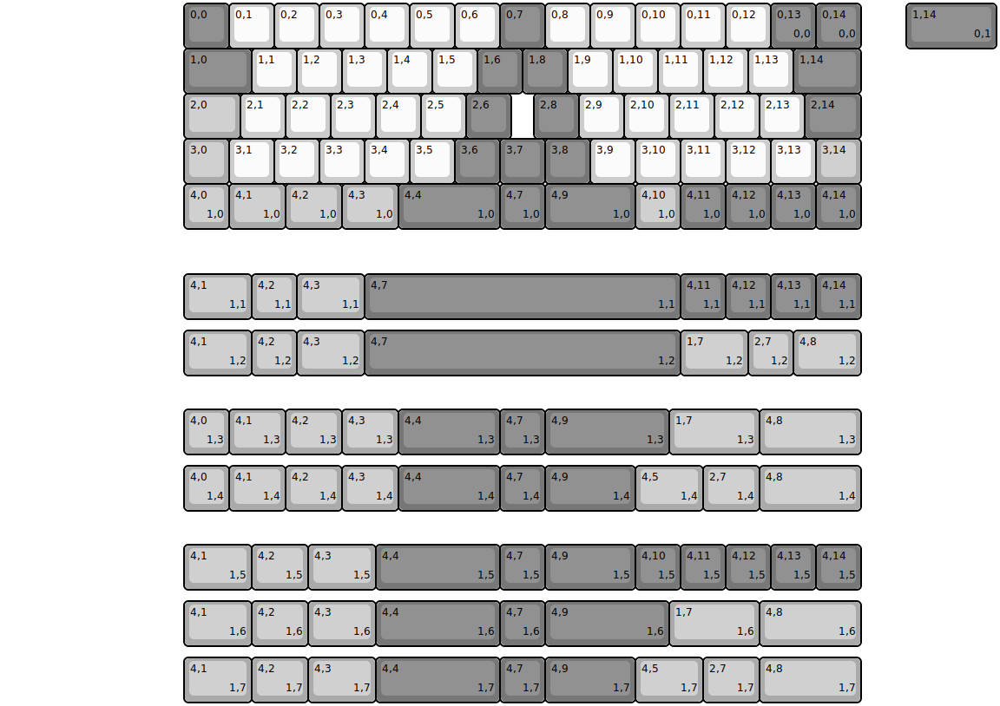{:loading="lazy"}

[Open in keyboard-layout-editor](http://www.keyboard-layout-editor.com/##@@_x:4&c=#777777;&=0,0&_c=#cccccc;&=0,1&=0,2&=0,3&=0,4&=0,5&=0,6&_c=#777777;&=0,7&_c=#cccccc;&=0,8&=0,9&=0,10&=0,11&=0,12&_c=#777777;&=0,13%0A%0A%0A0,0&=0,14%0A%0A%0A0,0;&@_x:4&w:1.5;&=1,0&_c=#cccccc;&=1,1&=1,2&=1,3&=1,4&=1,5&_c=#777777;&=1,6&=1,8&_c=#cccccc;&=1,9&=1,10&=1,11&=1,12&=1,13&_c=#777777&w:1.5;&=1,14;&@_x:4&c=#aaaaaa&w:1.25;&=2,0&_c=#cccccc;&=2,1&=2,2&=2,3&_n:true;&=2,4&=2,5&_c=#777777;&=2,6&_x:0.5;&=2,8&_c=#cccccc;&=2,9&_n:true;&=2,10&=2,11&=2,12&=2,13&_c=#777777&w:1.25;&=2,14;&@_x:4&c=#aaaaaa;&=3,0&_c=#cccccc;&=3,1&=3,2&=3,3&=3,4&=3,5&_c=#777777;&=3,6&=3,7&=3,8&_c=#cccccc;&=3,9&=3,10&=3,11&=3,12&=3,13&_c=#aaaaaa;&=3,14;&@_x:4;&=4,0%0A%0A%0A1,0&_w:1.25;&=4,1%0A%0A%0A1,0&_w:1.25;&=4,2%0A%0A%0A1,0&_w:1.25;&=4,3%0A%0A%0A1,0&_c=#777777&w:2.25;&=4,4%0A%0A%0A1,0&=4,7%0A%0A%0A1,0&_w:2;&=4,9%0A%0A%0A1,0&_c=#aaaaaa;&=4,10%0A%0A%0A1,0&_c=#777777;&=4,11%0A%0A%0A1,0&=4,12%0A%0A%0A1,0&=4,13%0A%0A%0A1,0&=4,14%0A%0A%0A1,0;&@_x:20&y:-5&w:2;&=1,14%0A%0A%0A0,1;&@_x:4&y:5&c=#aaaaaa&w:1.5;&=4,1%0A%0A%0A1,1&=4,2%0A%0A%0A1,1&_w:1.5;&=4,3%0A%0A%0A1,1&_c=#777777&w:7;&=4,7%0A%0A%0A1,1&=4,11%0A%0A%0A1,1&=4,12%0A%0A%0A1,1&=4,13%0A%0A%0A1,1&=4,14%0A%0A%0A1,1;&@_x:4&y:0.25&c=#aaaaaa&w:1.5;&=4,1%0A%0A%0A1,2&=4,2%0A%0A%0A1,2&_w:1.5;&=4,3%0A%0A%0A1,2&_c=#777777&w:7;&=4,7%0A%0A%0A1,2&_c=#aaaaaa&w:1.5;&=1,7%0A%0A%0A1,2&=2,7%0A%0A%0A1,2&_w:1.5;&=4,8%0A%0A%0A1,2;&@_x:4&y:0.75;&=4,0%0A%0A%0A1,3&_w:1.25;&=4,1%0A%0A%0A1,3&_w:1.25;&=4,2%0A%0A%0A1,3&_w:1.25;&=4,3%0A%0A%0A1,3&_c=#777777&w:2.25;&=4,4%0A%0A%0A1,3&=4,7%0A%0A%0A1,3&_w:2.75;&=4,9%0A%0A%0A1,3&_c=#aaaaaa&w:2;&=1,7%0A%0A%0A1,3&_w:2.25;&=4,8%0A%0A%0A1,3;&@_x:4&y:0.25;&=4,0%0A%0A%0A1,4&_w:1.25;&=4,1%0A%0A%0A1,4&_w:1.25;&=4,2%0A%0A%0A1,4&_w:1.25;&=4,3%0A%0A%0A1,4&_c=#777777&w:2.25;&=4,4%0A%0A%0A1,4&=4,7%0A%0A%0A1,4&_w:2;&=4,9%0A%0A%0A1,4&_c=#aaaaaa&w:1.5;&=4,5%0A%0A%0A1,4&_w:1.25;&=2,7%0A%0A%0A1,4&_w:2.25;&=4,8%0A%0A%0A1,4;&@_x:4&y:0.75&w:1.5;&=4,1%0A%0A%0A1,5&_w:1.25;&=4,2%0A%0A%0A1,5&_w:1.5;&=4,3%0A%0A%0A1,5&_c=#777777&w:2.75;&=4,4%0A%0A%0A1,5&=4,7%0A%0A%0A1,5&_w:2;&=4,9%0A%0A%0A1,5&=4,10%0A%0A%0A1,5&=4,11%0A%0A%0A1,5&=4,12%0A%0A%0A1,5&=4,13%0A%0A%0A1,5&=4,14%0A%0A%0A1,5;&@_x:4&y:0.25&c=#aaaaaa&w:1.5;&=4,1%0A%0A%0A1,6&_w:1.25;&=4,2%0A%0A%0A1,6&_w:1.5;&=4,3%0A%0A%0A1,6&_c=#777777&w:2.75;&=4,4%0A%0A%0A1,6&=4,7%0A%0A%0A1,6&_w:2.75;&=4,9%0A%0A%0A1,6&_c=#aaaaaa&w:2;&=1,7%0A%0A%0A1,6&_w:2.25;&=4,8%0A%0A%0A1,6;&@_x:4&y:0.25&w:1.5;&=4,1%0A%0A%0A1,7&_w:1.25;&=4,2%0A%0A%0A1,7&_w:1.5;&=4,3%0A%0A%0A1,7&_c=#777777&w:2.75;&=4,4%0A%0A%0A1,7&=4,7%0A%0A%0A1,7&_w:2;&=4,9%0A%0A%0A1,7&_c=#aaaaaa&w:1.5;&=4,5%0A%0A%0A1,7&_w:1.25;&=2,7%0A%0A%0A1,7&_w:2.25;&=4,8%0A%0A%0A1,7)

## rotor/rotor

[README](output/rotor/README.md) - [layout](output/rotor/rotor-kle.json) - [PCB](output/rotor/rotor.kicad_pcb) - [PCB render](output/rotor/rotor-render.svg)

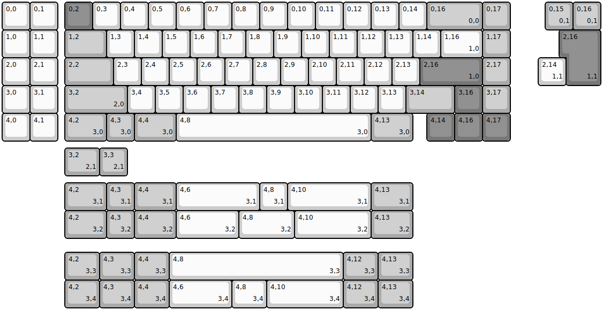{:loading="lazy"}

[Open in keyboard-layout-editor](http://www.keyboard-layout-editor.com/##@@=0,0&=0,1&_x:0.25&c=#777777;&=0,2&_c=#cccccc;&=0,3&=0,4&=0,5&=0,6&=0,7&=0,8&=0,9&=0,10&=0,11&=0,12&=0,13&=0,14&_c=#aaaaaa&w:2;&=0,16%0A%0A%0A0,0&=0,17;&@_c=#cccccc;&=1,0&=1,1&_x:0.25&c=#aaaaaa&w:1.5;&=1,2&_c=#cccccc;&=1,3&=1,4&=1,5&=1,6&=1,7&=1,8&=1,9&=1,10&=1,11&=1,12&=1,13&=1,14&_w:1.5;&=1,16%0A%0A%0A1,0&_c=#aaaaaa;&=1,17;&@_c=#cccccc;&=2,0&=2,1&_x:0.25&c=#aaaaaa&w:1.75;&=2,2&_c=#cccccc;&=2,3&=2,4&=2,5&=2,6&=2,7&=2,8&=2,9&=2,10&=2,11&=2,12&=2,13&_c=#777777&w:2.25;&=2,16%0A%0A%0A1,0&_c=#aaaaaa;&=2,17;&@_c=#cccccc;&=3,0&=3,1&_x:0.25&c=#aaaaaa&w:2.25;&=3,2%0A%0A%0A2,0&_c=#cccccc;&=3,4&=3,5&=3,6&=3,7&=3,8&=3,9&=3,10&=3,11&=3,12&=3,13&_c=#aaaaaa&w:1.75;&=3,14&_c=#777777;&=3,16&_c=#aaaaaa;&=3,17;&@_c=#cccccc;&=4,0&=4,1&_x:0.25&c=#aaaaaa&w:1.5;&=4,2%0A%0A%0A3,0&=4,3%0A%0A%0A3,0&_w:1.5;&=4,4%0A%0A%0A3,0&_c=#cccccc&w:7;&=4,8%0A%0A%0A3,0&_c=#aaaaaa&w:1.5;&=4,13%0A%0A%0A3,0&_x:0.5&c=#777777;&=4,14&=4,16&=4,17;&@_x:19.5&y:-5&c=#aaaaaa;&=0,15%0A%0A%0A0,1&=0,16%0A%0A%0A0,1;&@_x:20.25&c=#777777&w:1.25&h:2&w2:1.5&h2:1&x2:-0.25;&=2,16%0A%0A%0A1,1;&@_x:19.25&c=#cccccc;&=2,14%0A%0A%0A1,1;&@_x:2.25&y:2.25&c=#aaaaaa&w:1.25;&=3,2%0A%0A%0A2,1&=3,3%0A%0A%0A2,1;&@_x:2.25&y:0.25&w:1.5;&=4,2%0A%0A%0A3,1&=4,3%0A%0A%0A3,1&_w:1.5;&=4,4%0A%0A%0A3,1&_c=#cccccc&w:3;&=4,6%0A%0A%0A3,1&=4,8%0A%0A%0A3,1&_w:3;&=4,10%0A%0A%0A3,1&_c=#aaaaaa&w:1.5;&=4,13%0A%0A%0A3,1;&@_x:2.25&w:1.5;&=4,2%0A%0A%0A3,2&=4,3%0A%0A%0A3,2&_w:1.5;&=4,4%0A%0A%0A3,2&_c=#cccccc&w:2.25;&=4,6%0A%0A%0A3,2&_w:2;&=4,8%0A%0A%0A3,2&_w:2.75;&=4,10%0A%0A%0A3,2&_c=#aaaaaa&w:1.5;&=4,13%0A%0A%0A3,2;&@_x:2.25&y:0.5&w:1.25;&=4,2%0A%0A%0A3,3&_w:1.25;&=4,3%0A%0A%0A3,3&_w:1.25;&=4,4%0A%0A%0A3,3&_c=#cccccc&w:6.25;&=4,8%0A%0A%0A3,3&_c=#aaaaaa&w:1.25;&=4,12%0A%0A%0A3,3&_w:1.25;&=4,13%0A%0A%0A3,3;&@_x:2.25&w:1.25;&=4,2%0A%0A%0A3,4&_w:1.25;&=4,3%0A%0A%0A3,4&_w:1.25;&=4,4%0A%0A%0A3,4&_c=#cccccc&w:2.25;&=4,6%0A%0A%0A3,4&_w:1.25;&=4,8%0A%0A%0A3,4&_w:2.75;&=4,10%0A%0A%0A3,4&_c=#aaaaaa&w:1.25;&=4,12%0A%0A%0A3,4&_w:1.25;&=4,13%0A%0A%0A3,4)

## rpiguy9907/Southpaw66

[README](output/rpiguy9907/Southpaw66/README.md) - [layout](output/rpiguy9907/Southpaw66/Southpaw66-kle.json) - [PCB](output/rpiguy9907/Southpaw66/Southpaw66.kicad_pcb) - [PCB render](output/rpiguy9907/Southpaw66/Southpaw66-render.svg)

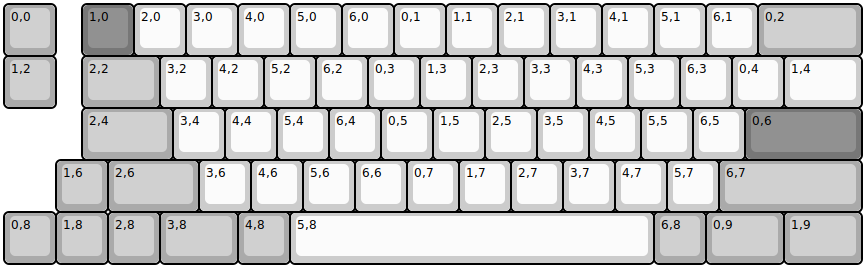{:loading="lazy"}

[Open in keyboard-layout-editor](http://www.keyboard-layout-editor.com/##@@_c=#aaaaaa;&=0,0&_x:0.5&c=#777777;&=1,0&_c=#cccccc;&=2,0&=3,0&=4,0&=5,0&=6,0&=0,1&=1,1&=2,1&=3,1&=4,1&=5,1&=6,1&_c=#aaaaaa&w:2;&=0,2;&@=1,2&_x:0.5&w:1.5;&=2,2&_c=#cccccc;&=3,2&=4,2&=5,2&=6,2&=0,3&=1,3&=2,3&=3,3&=4,3&=5,3&=6,3&=0,4&_w:1.5;&=1,4;&@_x:1.5&c=#aaaaaa&w:1.75;&=2,4&_c=#cccccc;&=3,4&=4,4&=5,4&=6,4&=0,5&=1,5&=2,5&=3,5&=4,5&=5,5&=6,5&_c=#777777&w:2.25;&=0,6;&@_x:1&c=#aaaaaa;&=1,6&_w:1.75;&=2,6&_c=#cccccc;&=3,6&=4,6&=5,6&=6,6&=0,7&=1,7&=2,7&=3,7&=4,7&=5,7&_c=#aaaaaa&w:2.75;&=6,7;&@=0,8&=1,8&=2,8&_w:1.5;&=3,8&=4,8&_c=#cccccc&w:7;&=5,8&_c=#aaaaaa;&=6,8&_w:1.5;&=0,9&_w:1.5;&=1,9)

## rubi/rubi

[README](output/rubi/README.md) - [layout](output/rubi/rubi-kle.json) - [PCB](output/rubi/rubi.kicad_pcb) - [PCB render](output/rubi/rubi-render.svg)

{:loading="lazy"}

[Open in keyboard-layout-editor](http://www.keyboard-layout-editor.com/##@@_x:3&c=#777777;&=2,3;&@_y:0.25&c=#aaaaaa;&=0,0&=0,1&=0,2&=0,3;&@_c=#cccccc;&=1,0&=1,1&=1,2&_c=#aaaaaa&h:2;&=1,3;&@_c=#cccccc;&=2,0&=2,1&=2,2;&@=3,0&=3,1&=3,2&_c=#777777&h:2;&=3,3;&@_c=#cccccc&w:2;&=4,1&=4,2)

## runes/skjoldr

[README](output/runes/skjoldr/README.md) - [layout](output/runes/skjoldr/skjoldr-kle.json) - [PCB](output/runes/skjoldr/skjoldr.kicad_pcb) - [PCB render](output/runes/skjoldr/skjoldr-render.svg)

{:loading="lazy"}

[Open in keyboard-layout-editor](http://www.keyboard-layout-editor.com/##@@_c=#777777;&=0,0&_c=#cccccc;&=0,1&=0,2&=0,3&=0,4&=0,5&=0,6&=0,7&=0,8&=0,9&=0,10&=0,11&=0,12&_c=#aaaaaa&w:2;&=0,13;&@_w:1.5;&=1,0&_c=#cccccc;&=1,1&=1,2&=1,3&=1,4&=1,5&=1,6&=1,7&=1,8&=1,9&=1,10&=1,11&=1,12&_w:1.5;&=1,13;&@_w:1.75;&=2,0&=2,1&=2,2&=2,3&=2,4&=2,5&=2,6&=2,7&=2,8&=2,9&=2,10&=2,11&_c=#aaaaaa&w:2.25;&=2,12;&@_w:2.25;&=3,0&_c=#cccccc;&=3,1&=3,2&=3,3&=3,4&=3,5&=3,6&=3,7&=3,8&=3,9&_c=#aaaaaa&w:1.75;&=3,10&_c=#777777;&=3,12&_c=#cccccc;&=3,13;&@_c=#aaaaaa&w:1.25;&=4,0&_w:1.25;&=4,1&_w:1.25;&=4,2&_c=#cccccc&w:6.25;&=4,5&_c=#aaaaaa;&=4,9&=4,10&_c=#777777;&=4,11&=4,12&=4,13)

## runes/vaengr

[README](output/runes/vaengr/README.md) - [layout](output/runes/vaengr/vaengr-kle.json) - [PCB](output/runes/vaengr/vaengr.kicad_pcb) - [PCB render](output/runes/vaengr/vaengr-render.svg)

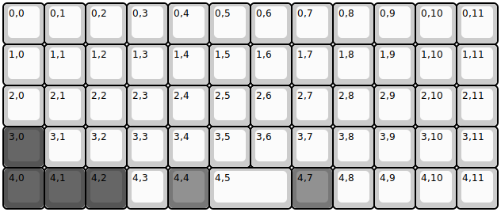{:loading="lazy"}

[Open in keyboard-layout-editor](http://www.keyboard-layout-editor.com/##@@=0,0&=0,1&=0,2&=0,3&=0,4&=0,5&=0,6&=0,7&=0,8&=0,9&=0,10&=0,11;&@=1,0&=1,1&=1,2&=1,3&=1,4&=1,5&=1,6&=1,7&=1,8&=1,9&=1,10&=1,11;&@=2,0&=2,1&=2,2&=2,3&=2,4&=2,5&=2,6&=2,7&=2,8&=2,9&=2,10&=2,11;&@_c=#555555;&=3,0&_c=#cccccc;&=3,1&=3,2&=3,3&=3,4&=3,5&=3,6&=3,7&=3,8&=3,9&=3,10&=3,11;&@_c=#555555;&=4,0&=4,1&=4,2&_c=#cccccc;&=4,3&_c=#777777;&=4,4&_c=#cccccc&w:2;&=4,5&_c=#777777;&=4,7&_c=#cccccc;&=4,8&=4,9&=4,10&=4,11)

## ryanbaekr/rb18

[README](output/ryanbaekr/README.md) - [layout](output/ryanbaekr/rb18-kle.json) - [PCB](output/ryanbaekr/rb18.kicad_pcb) - [PCB render](output/ryanbaekr/rb18-render.svg)

{:loading="lazy"}

[Open in keyboard-layout-editor](http://www.keyboard-layout-editor.com/##@@_y:1.25&c=#aaaaaa;&=0,0&=1,1&=0,2&=0,3;&@_c=#cccccc;&=1,0&=2,1&=1,2&_c=#aaaaaa&h:2;&=1,3;&@_c=#cccccc;&=2,0&=3,1&=2,2;&@=3,0&=4,1&=3,2&_c=#aaaaaa&h:2;&=3,3;&@_c=#cccccc&w:2;&=4,0&=4,2)

## ryanbaekr/rb69

[README](output/ryanbaekr/README.md) - [layout](output/ryanbaekr/rb69-kle.json) - [PCB](output/ryanbaekr/rb69.kicad_pcb) - [PCB render](output/ryanbaekr/rb69-render.svg)

{:loading="lazy"}

[Open in keyboard-layout-editor](http://www.keyboard-layout-editor.com/##@@_y:1.25&c=#aaaaaa;&=0,0&_c=#cccccc;&=0,1&=0,2&=0,3&=0,4&=0,5&=0,6&=0,7&=0,8&=0,9&=0,10&=0,11&=0,12&=0,13&=0,14&_x:0.25;&=0,15;&@_w:1.5;&=1,0&=1,2&=1,3&=1,4&=1,5&=1,6&=1,7&=1,8&=1,9&=1,10&=1,11&=1,12&=1,13&_w:1.5;&=1,14&_x:0.25;&=1,15;&@_w:1.75;&=2,0&=2,2&=2,3&=2,4&=2,5&=2,6&=2,7&=2,8&=2,9&=2,10&=2,11&=2,12&_c=#aaaaaa&w:2.25;&=2,13&_x:0.25&c=#cccccc;&=2,15;&@_w:2.25;&=3,1&=3,2&=3,3&=3,4&=3,5&=3,6&=3,7&=3,8&=3,9&=3,10&=3,11&_w:1.5;&=3,13&_x:1.5;&=3,15;&@_x:14&y:-0.75&c=#aaaaaa;&=3,14;&@_y:-0.25&c=#cccccc&w:1.5;&=4,0&_w:1.25;&=4,2&_w:1.25;&=4,3&_w:6.25;&=4,7&_w:1.25;&=4,10&_w:1.25;&=4,12;&@_x:13&y:-0.75&c=#aaaaaa;&=4,13&=4,14&=4,15)

## ryanbaekr/rb86

[README](output/ryanbaekr/README.md) - [layout](output/ryanbaekr/rb86-kle.json) - [PCB](output/ryanbaekr/rb86.kicad_pcb) - [PCB render](output/ryanbaekr/rb86-render.svg)

{:loading="lazy"}

[Open in keyboard-layout-editor](http://www.keyboard-layout-editor.com/##@@_c=#777777;&=0,0&_c=#aaaaaa;&=0,1&=0,2&=0,3&=0,4&=0,5&=0,6&=0,7&=0,8&=0,9&=0,10&=0,11&=0,12&=0,13&=0,14&_x:0.25;&=0,15&=0,16;&@_y:0.25&c=#cccccc;&=1,0&=1,1&=1,2&=1,3&=1,4&=1,5&=1,6&=1,7&=1,8&=1,9&=1,10&=1,11&=1,12&_c=#aaaaaa&w:2;&=1,14&_x:0.25;&=1,15&=1,16;&@_w:1.5;&=2,0&_c=#cccccc;&=2,2&=2,3&=2,4&=2,5&=2,6&=2,7&=2,8&=2,9&=2,10&=2,11&=2,12&=2,13&_w:1.5;&=2,14&_x:0.25&c=#aaaaaa;&=2,15&=2,16;&@_w:1.75;&=3,0&_c=#cccccc;&=3,2&=3,3&=3,4&=3,5&=3,6&=3,7&=3,8&=3,9&=3,10&=3,11&=3,12&_c=#777777&w:2.25;&=3,13;&@_c=#aaaaaa&w:2.25;&=4,1&_c=#cccccc;&=4,2&=4,3&=4,4&=4,5&=4,6&=4,7&=4,8&=4,9&=4,10&=4,11&_c=#aaaaaa&w:2.75;&=4,13&_x:0.25&c=#777777;&=4,15;&@_c=#aaaaaa;&=5,0&=5,1&=5,2&=5,3&_c=#cccccc&w:6.25;&=5,7&_c=#aaaaaa&w:1.25;&=5,10&_w:1.25;&=5,12&_w:1.25;&=5,13&_x:0.25&c=#777777;&=5,14&=5,15&=5,16)

## saevus/cor

[README](output/saevus/README.md) - [layout](output/saevus/cor-kle.json) - [PCB](output/saevus/cor.kicad_pcb) - [PCB render](output/saevus/cor-render.svg)

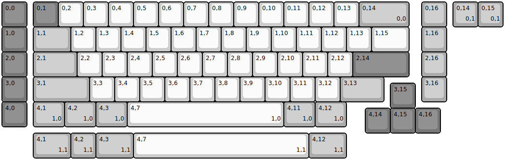{:loading="lazy"}

[Open in keyboard-layout-editor](http://www.keyboard-layout-editor.com/##@@_c=#777777;&=0,0&_x:0.25;&=0,1&_c=#cccccc;&=0,2&=0,3&=0,4&=0,5&=0,6&=0,7&=0,8&=0,9&=0,10&=0,11&=0,12&=0,13&_c=#aaaaaa&w:2;&=0,14%0A%0A%0A0,0&_x:0.5;&=0,16;&@_c=#777777;&=1,0&_x:0.25&c=#aaaaaa&w:1.5;&=1,1&_c=#cccccc;&=1,2&=1,3&=1,4&=1,5&=1,6&=1,7&=1,8&=1,9&=1,10&=1,11&=1,12&=1,13&_w:1.5;&=1,15&_x:0.5&c=#aaaaaa;&=1,16;&@_c=#777777;&=2,0&_x:0.25&c=#aaaaaa&w:1.75;&=2,1&_c=#cccccc;&=2,2&=2,3&=2,4&=2,5&=2,6&=2,7&=2,8&=2,9&=2,10&=2,11&=2,12&_c=#777777&w:2.25;&=2,14&_x:0.5&c=#aaaaaa;&=2,16;&@_c=#777777;&=3,0&_x:0.25&c=#aaaaaa&w:2.25;&=3,1&_c=#cccccc;&=3,3&=3,4&=3,5&=3,6&=3,7&=3,8&=3,9&=3,10&=3,11&=3,12&_c=#aaaaaa&w:1.75;&=3,13&_x:1.5;&=3,16;&@_x:15.5&y:-0.75&c=#777777;&=3,15;&@_y:-0.25;&=4,0&_x:0.25&c=#aaaaaa&w:1.25;&=4,1%0A%0A%0A1,0&_w:1.25;&=4,2%0A%0A%0A1,0&_w:1.25;&=4,3%0A%0A%0A1,0&_c=#cccccc&w:6.25;&=4,7%0A%0A%0A1,0&_c=#aaaaaa&w:1.25;&=4,11%0A%0A%0A1,0&_w:1.25;&=4,12%0A%0A%0A1,0;&@_x:14.5&y:-0.75&c=#777777;&=4,14&=4,15&=4,16;&@_x:18.0&y:-5.25&c=#aaaaaa;&=0,14%0A%0A%0A0,1&=0,15%0A%0A%0A0,1;&@_x:1.25&y:4.25&w:1.5;&=4,1%0A%0A%0A1,1&=4,2%0A%0A%0A1,1&_w:1.5;&=4,3%0A%0A%0A1,1&_c=#cccccc&w:7;&=4,7%0A%0A%0A1,1&_c=#aaaaaa&w:1.5;&=4,12%0A%0A%0A1,1)

## saevus/cor_tkl

[README](output/saevus/README.md) - [layout](output/saevus/cor_tkl-kle.json) - [PCB](output/saevus/cor_tkl.kicad_pcb) - [PCB render](output/saevus/cor_tkl-render.svg)

{:loading="lazy"}

[Open in keyboard-layout-editor](http://www.keyboard-layout-editor.com/##@@_c=#777777;&=0,0&_x:0.25&c=#aaaaaa;&=0,1&=0,2&=0,3&=0,4&_x:0.25;&=0,5&=0,6&=0,7&=0,8&_x:0.25;&=0,9&=0,10&=0,11&=0,12&_x:0.25;&=0,13&_x:0.25;&=0,14&=0,15&=0,16;&@_y:0.25&c=#cccccc;&=1,0&=1,1&=1,2&=1,3&=1,4&=1,5&=1,6&=1,7&=1,8&=1,9&=1,10&=1,11&=1,12&_c=#aaaaaa&w:2;&=1,13%0A%0A%0A0,0&_x:0.25;&=1,14&=1,15&=1,16;&@_w:1.5;&=2,0&_c=#cccccc;&=2,1&=2,2&=2,3&=2,4&=2,5&=2,6&=2,7&=2,8&=2,9&=2,10&=2,11&=2,12&_w:1.5;&=2,13%0A%0A%0A1,0&_x:0.25&c=#aaaaaa;&=2,14&=2,15&=2,16;&@_w:1.75;&=3,0&_c=#cccccc;&=3,1&=3,2&=3,3&=3,4&=3,5&=3,6&=3,7&=3,8&=3,9&=3,10&=3,11&_c=#777777&w:2.25;&=3,12%0A%0A%0A1,0;&@_c=#aaaaaa&w:2.25;&=4,0%0A%0A%0A2,0&_c=#cccccc;&=4,2&=4,3&=4,4&=4,5&=4,6&=4,7&=4,8&=4,9&=4,10&=4,11&_c=#aaaaaa&w:2.75;&=4,12%0A%0A%0A3,0&_x:1.25&c=#777777;&=4,15;&@_c=#aaaaaa&w:1.25;&=5,0%0A%0A%0A4,0&_w:1.25;&=5,1%0A%0A%0A4,0&_w:1.25;&=5,2%0A%0A%0A4,0&_c=#cccccc&w:6.25;&=5,7%0A%0A%0A4,0&_c=#aaaaaa&w:1.25;&=5,10%0A%0A%0A4,0&_w:1.25;&=5,11%0A%0A%0A4,0&_w:1.25;&=5,12%0A%0A%0A4,0&_w:1.25;&=5,13%0A%0A%0A4,0&_x:0.25&c=#777777;&=5,14&=5,15&=5,16;&@_x:13&y:0.25&c=#aaaaaa;&=1,13%0A%0A%0A0,1&=3,13%0A%0A%0A0,1;&@_x:13.75&c=#777777&w:1.25&h:2&w2:1.5&h2:1&x2:-0.25;&=2,13%0A%0A%0A1,1;&@_x:12.75&c=#cccccc;&=3,12%0A%0A%0A1,1;&@_c=#aaaaaa&w:1.25;&=4,0%0A%0A%0A2,1&_c=#cccccc;&=4,1%0A%0A%0A2,1&_x:10.0&c=#aaaaaa&w:1.75;&=4,12%0A%0A%0A3,1&=4,13%0A%0A%0A3,1;&@_w:1.5;&=5,0%0A%0A%0A4,1&=5,1%0A%0A%0A4,1&_w:1.5;&=5,2%0A%0A%0A4,1&_c=#cccccc&w:7;&=5,7%0A%0A%0A4,1&_c=#aaaaaa&w:1.5;&=5,11%0A%0A%0A4,1&=5,12%0A%0A%0A4,1&_w:1.5;&=5,13%0A%0A%0A4,1;&@_w:1.5;&=5,0%0A%0A%0A4,2&_d:true;&=5,1%0A%0A%0A4,2&_w:1.5;&=5,2%0A%0A%0A4,2&_c=#cccccc&w:7;&=5,7%0A%0A%0A4,2&_c=#aaaaaa&w:1.5;&=5,11%0A%0A%0A4,2&_d:true;&=5,12%0A%0A%0A4,2&_w:1.5;&=5,13%0A%0A%0A4,2)

## sam/sam_s80_design load file

[README](output/sam/README.md) - [layout](output/sam/sam_s80_design load file-kle.json) - [PCB](output/sam/sam_s80_design load file.kicad_pcb) - [PCB render](output/sam/sam_s80_design load file-render.svg)

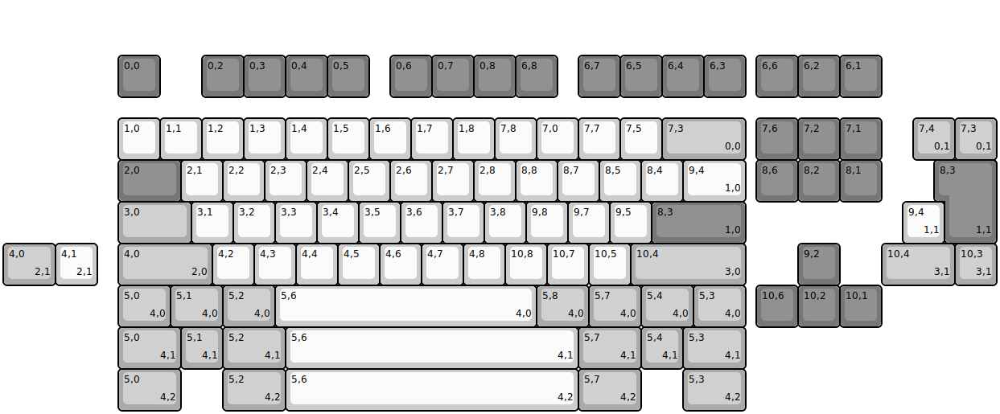{:loading="lazy"}

[Open in keyboard-layout-editor](http://www.keyboard-layout-editor.com/##@@_x:2.75&y:1.25&c=#777777;&=0,0&_x:1.0;&=0,2&=0,3&=0,4&=0,5&_x:0.5;&=0,6&=0,7&=0,8&=6,8&_x:0.5;&=6,7&=6,5&=6,4&=6,3&_x:0.25;&=6,6&=6,2&=6,1;&@_x:2.75&y:0.5&c=#cccccc;&=1,0&=1,1&=1,2&=1,3&=1,4&=1,5&=1,6&=1,7&=1,8&=7,8&=7,0&=7,7&=7,5&_c=#aaaaaa&w:2;&=7,3%0A%0A%0A0,0&_x:0.25&c=#777777;&=7,6&=7,2&=7,1;&@_x:2.75&w:1.5;&=2,0&_c=#cccccc;&=2,1&=2,2&=2,3&=2,4&=2,5&=2,6&=2,7&=2,8&=8,8&=8,7&=8,5&=8,4&_w:1.5;&=9,4%0A%0A%0A1,0&_x:0.25&c=#777777;&=8,6&=8,2&=8,1;&@_x:2.75&c=#aaaaaa&w:1.75;&=3,0&_c=#cccccc;&=3,1&=3,2&=3,3&=3,4&=3,5&=3,6&=3,7&=3,8&=9,8&=9,7&=9,5&_c=#777777&w:2.25;&=8,3%0A%0A%0A1,0;&@_x:2.75&c=#aaaaaa&w:2.25;&=4,0%0A%0A%0A2,0&_c=#cccccc;&=4,2&=4,3&=4,4&=4,5&=4,6&=4,7&=4,8&=10,8&=10,7&=10,5&_c=#aaaaaa&w:2.75;&=10,4%0A%0A%0A3,0&_x:1.25&c=#777777;&=9,2;&@_x:2.75&c=#aaaaaa&w:1.25;&=5,0%0A%0A%0A4,0&_w:1.25;&=5,1%0A%0A%0A4,0&_w:1.25;&=5,2%0A%0A%0A4,0&_c=#cccccc&w:6.25;&=5,6%0A%0A%0A4,0&_c=#aaaaaa&w:1.25;&=5,8%0A%0A%0A4,0&_w:1.25;&=5,7%0A%0A%0A4,0&_w:1.25;&=5,4%0A%0A%0A4,0&_w:1.25;&=5,3%0A%0A%0A4,0&_x:0.25&c=#777777;&=10,6&=10,2&=10,1;&@_x:21.75&y:-5.0&c=#aaaaaa;&=7,4%0A%0A%0A0,1&=7,3%0A%0A%0A0,1;&@_x:22.5&c=#777777&w:1.25&h:2&w2:1.5&h2:1&x2:-0.25;&=8,3%0A%0A%0A1,1;&@_x:21.5&c=#cccccc;&=9,4%0A%0A%0A1,1;&@_c=#aaaaaa&w:1.25;&=4,0%0A%0A%0A2,1&_c=#cccccc;&=4,1%0A%0A%0A2,1&_x:18.75&c=#aaaaaa&w:1.75;&=10,4%0A%0A%0A3,1&=10,3%0A%0A%0A3,1;&@_x:2.75&y:1.0&w:1.5;&=5,0%0A%0A%0A4,1&=5,1%0A%0A%0A4,1&_w:1.5;&=5,2%0A%0A%0A4,1&_c=#cccccc&w:7;&=5,6%0A%0A%0A4,1&_c=#aaaaaa&w:1.5;&=5,7%0A%0A%0A4,1&=5,4%0A%0A%0A4,1&_w:1.5;&=5,3%0A%0A%0A4,1;&@_x:2.75&w:1.5;&=5,0%0A%0A%0A4,2&_x:1.0&w:1.5;&=5,2%0A%0A%0A4,2&_c=#cccccc&w:7;&=5,6%0A%0A%0A4,2&_c=#aaaaaa&w:1.5;&=5,7%0A%0A%0A4,2&_x:1.0&w:1.5;&=5,3%0A%0A%0A4,2)

## satt/vision/satt_vision

[README](output/satt/vision/README.md) - [layout](output/satt/vision/satt_vision-kle.json) - [PCB](output/satt/vision/satt_vision.kicad_pcb) - [PCB render](output/satt/vision/satt_vision-render.svg)

{:loading="lazy"}

[Open in keyboard-layout-editor](http://www.keyboard-layout-editor.com/##@@_x:0.25&c=#aaaaaa;&=0,0;&@_x:13.5&y:-0.95;&=0,12&=0,13;&@_y:-0.05;&=1,0;&@_x:13&y:-0.95&c=#cccccc;&=1,11&_c=#777777&w:1.75;&=1,13;&@_x:13.75&c=#aaaaaa&w:1.25;&=2,12%0A%0A%0A0,0&=2,13%0A%0A%0A0,0;&@_x:14.25&w:1.5;&=3,13;&@_rx:7&x:-5.5&y:0.05&c=#777777;&=0,1&_c=#cccccc;&=0,2;&@_x:-5.71&c=#aaaaaa&w:1.25;&=1,1&_c=#cccccc;&=1,2;&@_x:-6&c=#aaaaaa&w:1.75;&=2,1&_c=#cccccc;&=2,2;&@_x:-6&c=#aaaaaa&w:1.5;&=3,1;&@_rx:12.5&c=#cccccc;&=0,11;&@_x:0.25&y:1.05;&=2,11;&@_r:12&rx:3.75&ry:3.3&x:-0.75&y:-3.25;&=0,3&=0,4&=0,5&=0,6;&@_x:-0.5;&=1,3&=1,4&=1,5&=1,6;&@=2,3&=2,4&=2,5&=2,6;&@_x:1.25&c=#aaaaaa&w:2;&=3,5&=3,6&_x:-4.5&w:1.5;&=3,3;&@_r:-12&rx:12.5&ry:2.3&x:-3.75&y:-2.25&c=#cccccc;&=0,7&=0,8&=0,9&=0,10;&@_x:-3.5;&=1,7&=1,8&=1,9&=1,10;&@_x:-4.0;&=2,7&=2,8&=2,9&=2,10;&@_x:-4.0&c=#aaaaaa;&=3,7&_w:1.75;&=3,9&_w:1.5;&=3,10;&@_r:0&rx:0&ry:0&x:16.5&y:2.05&w:2.25;&=2,12%0A%0A%0A0,1)

## sauce/mild

[README](output/sauce/mild/README.md) - [layout](output/sauce/mild/mild-kle.json) - [PCB](output/sauce/mild/mild.kicad_pcb) - [PCB render](output/sauce/mild/mild-render.svg)

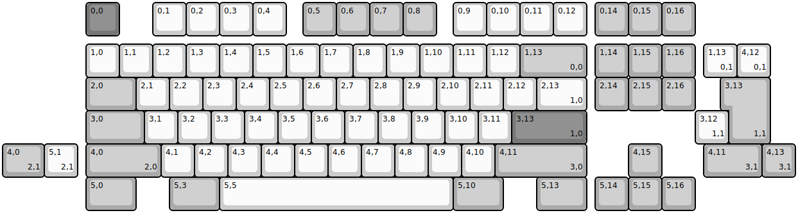{:loading="lazy"}

[Open in keyboard-layout-editor](http://www.keyboard-layout-editor.com/##@@_x:2.5&c=#777777;&=0,0&_x:1.0&c=#cccccc;&=0,1&=0,2&=0,3&=0,4&_x:0.5&c=#aaaaaa;&=0,5&=0,6&=0,7&=0,8&_x:0.5&c=#cccccc;&=0,9&=0,10&=0,11&=0,12&_x:0.25&c=#aaaaaa;&=0,14&=0,15&=0,16;&@_x:2.5&y:0.25&c=#cccccc;&=1,0&=1,1&=1,2&=1,3&=1,4&=1,5&=1,6&=1,7&=1,8&=1,9&=1,10&=1,11&=1,12&_c=#aaaaaa&w:2;&=1,13%0A%0A%0A0,0&_x:0.25;&=1,14&=1,15&=1,16;&@_x:2.5&w:1.5;&=2,0&_c=#cccccc;&=2,1&=2,2&=2,3&=2,4&=2,5&=2,6&=2,7&=2,8&=2,9&=2,10&=2,11&=2,12&_w:1.5;&=2,13%0A%0A%0A1,0&_x:0.25&c=#aaaaaa;&=2,14&=2,15&=2,16;&@_x:2.5&w:1.75;&=3,0&_c=#cccccc;&=3,1&=3,2&=3,3&=3,4&=3,5&=3,6&=3,7&=3,8&=3,9&=3,10&=3,11&_c=#777777&w:2.25;&=3,13%0A%0A%0A1,0;&@_x:2.5&c=#aaaaaa&w:2.25;&=4,0%0A%0A%0A2,0&_c=#cccccc;&=4,1&=4,2&=4,3&=4,4&=4,5&=4,6&=4,7&=4,8&=4,9&=4,10&_c=#aaaaaa&w:2.75;&=4,11%0A%0A%0A3,0&_x:1.25;&=4,15;&@_x:2.5&w:1.5;&=5,0&_x:1.0&w:1.5;&=5,3&_c=#cccccc&w:7;&=5,5&_c=#aaaaaa&w:1.5;&=5,10&_x:1.0&w:1.5;&=5,13&_x:0.25;&=5,14&=5,15&=5,16;&@_x:21.0&y:-5.0&c=#cccccc;&=1,13%0A%0A%0A0,1&=4,12%0A%0A%0A0,1;&@_x:21.75&c=#aaaaaa&w:1.25&h:2&w2:1.5&h2:1&x2:-0.25;&=3,13%0A%0A%0A1,1;&@_x:20.75&c=#cccccc;&=3,12%0A%0A%0A1,1;&@_c=#aaaaaa&w:1.25;&=4,0%0A%0A%0A2,1&_c=#cccccc;&=5,1%0A%0A%0A2,1&_x:18.75&c=#aaaaaa&w:1.75;&=4,11%0A%0A%0A3,1&=4,13%0A%0A%0A3,1)

## sawnsprojects/amber80_solder

[README](output/sawnsprojects/amber80_solder/README.md) - [layout](output/sawnsprojects/amber80_solder/amber80_solder-kle.json) - [PCB](output/sawnsprojects/amber80_solder/amber80_solder.kicad_pcb) - [PCB render](output/sawnsprojects/amber80_solder/amber80_solder-render.svg)

{:loading="lazy"}

[Open in keyboard-layout-editor](http://www.keyboard-layout-editor.com/##@@_x:2.5&y:1.25&c=#777777;&=0,0&_x:0.25&c=#cccccc;&=1,0&=0,1&=1,1&=0,2&_x:0.25&c=#aaaaaa;&=1,2&=0,3&=1,3&=0,4&_x:0.25&c=#cccccc;&=1,4&=0,5&=1,5&=0,6&_x:0.25&c=#aaaaaa;&=1,6&_x:0.25;&=1,7&=0,8&=1,8;&@_x:2.5&y:0.25&c=#cccccc;&=2,0&=3,0&=2,1&=3,1&=2,2&=3,2&=2,3&=3,3&=2,4&=3,4&=2,5&=3,5&=2,6&_c=#aaaaaa&w:2;&=3,6%0A%0A%0A0,0&_x:0.25;&=3,7&=2,8&=3,8;&@_x:2.5&w:1.5;&=4,0&_c=#cccccc;&=5,0&=4,1&=5,1&=4,2&=5,2&=4,3&=5,3&=4,4&=5,4&=4,5&=5,5&=4,6&_w:1.5;&=5,6%0A%0A%0A1,0&_x:0.25&c=#aaaaaa;&=5,7&=4,8&=5,8;&@_x:2.5&w:1.75;&=6,0&_c=#cccccc;&=7,0&=6,1&=7,1&=6,2&=7,2&=6,3&=7,3&=6,4&=7,4&=6,5&=7,5&_c=#777777&w:2.25;&=7,6%0A%0A%0A1,0;&@_x:2.5&c=#aaaaaa&w:2.25;&=8,0%0A%0A%0A3,0&_c=#cccccc;&=8,1&=9,1&=8,2&=9,2&=8,3&=9,3&=8,4&=9,4&=8,5&=9,5&_c=#aaaaaa&w:2.75;&=8,6%0A%0A%0A2,0&_x:1.25&c=#777777;&=8,8;&@_x:2.5&c=#aaaaaa&w:1.5;&=10,0&=11,0&_w:1.5;&=10,1&_c=#cccccc&w:7;&=11,3&_c=#aaaaaa&w:1.5;&=10,6&=11,6&_w:1.5;&=10,7&_x:0.25&c=#777777;&=11,7&=10,8&=11,8;&@_x:15.5&y:-7.5&c=#aaaaaa;&=3,6%0A%0A%0A0,1&=2,7%0A%0A%0A0,1;&@_x:22&y:2.25&c=#777777&w:1.25&h:2&w2:1.5&h2:1&x2:-0.25;&=0,0%0A%0A%0A1,1;&@_x:21&c=#cccccc;&=0,0%0A%0A%0A1,1;&@_x:21&c=#aaaaaa&w:1.75;&=8,6%0A%0A%0A2,1&=9,6%0A%0A%0A2,1;&@_y:-0.75&w:1.25;&=8,0%0A%0A%0A3,1&=9,0%0A%0A%0A3,1)

## sawnsprojects/eclipse/eclipse60

[README](output/sawnsprojects/eclipse/README.md) - [layout](output/sawnsprojects/eclipse/eclipse60-kle.json) - [PCB](output/sawnsprojects/eclipse/eclipse60.kicad_pcb) - [PCB render](output/sawnsprojects/eclipse/eclipse60-render.svg)

{:loading="lazy"}

[Open in keyboard-layout-editor](http://www.keyboard-layout-editor.com/##@@_x:2.75&y:1.5&c=#777777;&=0,0&_c=#cccccc;&=1,0&=0,1&=1,1&=0,2&=1,2&=0,3&=1,3&=0,4&=1,4&=0,5&=1,5&=0,6&_c=#aaaaaa&w:2;&=1,6%0A%0A%0A0,0;&@_x:2.75&w:1.5;&=2,0&_c=#cccccc;&=3,0&=2,1&=3,1&=2,2&=3,2&=2,3&=3,3&=2,4&=3,4&=2,5&=3,5&=2,6&_w:1.5;&=3,6%0A%0A%0A1,0;&@_x:2.75&c=#aaaaaa&w:1.75;&=4,0&_c=#cccccc;&=5,0&=4,1&=5,1&=4,2&=5,2&=4,3&=5,3&=4,4&=5,4&=4,5&=5,5&_c=#777777&w:2.25;&=4,6%0A%0A%0A1,0;&@_x:2.75&c=#aaaaaa&w:2.25;&=6,0%0A%0A%0A2,0&_c=#cccccc;&=6,1&=7,1&=6,2&=7,2&=6,3&=7,3&=6,4&=7,4&=6,5&=7,5%0A%0A%0A3,0&_c=#aaaaaa&w:2.75;&=6,6%0A%0A%0A3,0;&@_x:2.75&w:1.25;&=8,0%0A%0A%0A4,0&_w:1.25;&=9,0%0A%0A%0A4,0&_w:1.25;&=8,1%0A%0A%0A4,0&_c=#cccccc&w:6.25;&=8,3%0A%0A%0A4,0&_c=#aaaaaa&w:1.25;&=9,4%0A%0A%0A4,0&_w:1.25;&=8,5%0A%0A%0A4,0&_w:1.25;&=8,6%0A%0A%0A4,0&_w:1.25;&=9,6%0A%0A%0A4,0;&@_x:18.25&y:-5.0&c=#cccccc;&=1,6%0A%0A%0A0,1&=5,6%0A%0A%0A0,1;&@_x:19.25&c=#777777&w:1.25&h:2&w2:1.5&h2:1&x2:-0.25;&=4,6%0A%0A%0A1,1;&@_x:18.25&c=#cccccc;&=3,6%0A%0A%0A1,1;&@_c=#aaaaaa&w:1.25;&=6,0%0A%0A%0A2,1&=7,0%0A%0A%0A2,1&_x:16.0&c=#cccccc;&=7,5%0A%0A%0A3,1&_c=#aaaaaa&w:1.75;&=6,6%0A%0A%0A3,1&_c=#cccccc;&=7,6%0A%0A%0A3,1&_x:0.25&c=#aaaaaa&w:1.75;&=7,5%0A%0A%0A3,2&_c=#777777;&=6,6%0A%0A%0A3,2&_c=#cccccc;&=7,6%0A%0A%0A3,2;&@_x:2.75&y:1.25&c=#aaaaaa&w:1.5;&=8,0%0A%0A%0A4,1&=9,0%0A%0A%0A4,1&_w:1.5;&=8,1%0A%0A%0A4,1&_c=#cccccc&w:7;&=8,3%0A%0A%0A4,1&_c=#aaaaaa&w:1.5;&=8,5%0A%0A%0A4,1&=8,6%0A%0A%0A4,1&_w:1.5;&=9,6%0A%0A%0A4,1;&@_x:2.75&w:1.25;&=8,0%0A%0A%0A4,2&_w:1.25;&=9,0%0A%0A%0A4,2&_w:1.25;&=8,1%0A%0A%0A4,2&_c=#cccccc&w:6.25;&=8,3%0A%0A%0A4,2&_c=#aaaaaa;&=9,4%0A%0A%0A4,2&=8,5%0A%0A%0A4,2&_c=#777777;&=9,5%0A%0A%0A4,2&=8,6%0A%0A%0A4,2&=9,6%0A%0A%0A4,2;&@_x:2.75&c=#aaaaaa&w:1.5;&=8,0%0A%0A%0A4,3&=9,0%0A%0A%0A4,3&_w:1.5;&=8,1%0A%0A%0A4,3&_c=#cccccc&w:7;&=8,3%0A%0A%0A4,3&_c=#aaaaaa;&=8,5%0A%0A%0A4,3&_c=#777777;&=9,5%0A%0A%0A4,3&=8,6%0A%0A%0A4,3&=9,6%0A%0A%0A4,3;&@_x:2.75&c=#aaaaaa&w:1.5;&=8,0%0A%0A%0A4,4&_g:true;&=9,0%0A%0A%0A4,4&_g:false&w:1.5;&=8,1%0A%0A%0A4,4&_c=#cccccc&w:7;&=8,3%0A%0A%0A4,4&_c=#aaaaaa&w:1.5;&=8,5%0A%0A%0A4,4&_g:true;&=8,6%0A%0A%0A4,4&_g:false&w:1.5;&=9,6%0A%0A%0A4,4;&@_x:2.75&g:true&w:1.5;&=8,0%0A%0A%0A4,5&_g:false;&=9,0%0A%0A%0A4,5&_w:1.5;&=8,1%0A%0A%0A4,5&_c=#cccccc&w:7;&=8,3%0A%0A%0A4,5&_c=#aaaaaa&w:1.5;&=8,5%0A%0A%0A4,5&=8,6%0A%0A%0A4,5&_g:true&w:1.5;&=9,6%0A%0A%0A4,5;&@_x:2.75&g:false&w:1.5;&=8,0%0A%0A%0A4,6&=9,0%0A%0A%0A4,6&_w:1.5;&=8,1%0A%0A%0A4,6&_c=#cccccc&w:6;&=8,3%0A%0A%0A4,6&_c=#aaaaaa&w:1.5;&=9,4%0A%0A%0A4,6&=8,5%0A%0A%0A4,6&=8,6%0A%0A%0A4,6&_w:1.5;&=9,6%0A%0A%0A4,6)

## sawnsprojects/eclipse/tinyneko

[README](output/sawnsprojects/eclipse/README.md) - [layout](output/sawnsprojects/eclipse/tinyneko-kle.json) - [PCB](output/sawnsprojects/eclipse/tinyneko.kicad_pcb) - [PCB render](output/sawnsprojects/eclipse/tinyneko-render.svg)

{:loading="lazy"}

[Open in keyboard-layout-editor](http://www.keyboard-layout-editor.com/##@@_x:2.75&y:1.5&c=#777777;&=0,0&_c=#cccccc;&=1,0&=0,1&=1,1&=0,2&=1,2&=0,3&=1,3&=0,4&=1,4&=0,5&=1,5&=0,6&_c=#aaaaaa&w:2;&=1,6%0A%0A%0A0,0;&@_x:2.75&w:1.5;&=2,0&_c=#cccccc;&=3,0&=2,1&=3,1&=2,2&=3,2&=2,3&=3,3&=2,4&=3,4&=2,5&=3,5&=2,6&_w:1.5;&=3,6%0A%0A%0A1,0;&@_x:2.75&c=#aaaaaa&w:1.75;&=4,0&_c=#cccccc;&=5,0&=4,1&=5,1&=4,2&=5,2&=4,3&=5,3&=4,4&=5,4&=4,5&=5,5&_c=#777777&w:2.25;&=4,6%0A%0A%0A1,0;&@_x:2.75&c=#aaaaaa&w:2.25;&=6,0%0A%0A%0A2,0&_c=#cccccc;&=6,1&=7,1&=6,2&=7,2&=6,3&=7,3&=6,4&=7,4&=6,5&=7,5%0A%0A%0A3,0&_c=#aaaaaa&w:2.75;&=6,6%0A%0A%0A3,0;&@_x:2.75&w:1.25;&=8,0%0A%0A%0A4,0&_w:1.25;&=9,0%0A%0A%0A4,0&_w:1.25;&=8,1%0A%0A%0A4,0&_c=#cccccc&w:6.25;&=8,3%0A%0A%0A4,0&_c=#aaaaaa&w:1.25;&=9,4%0A%0A%0A4,0&_w:1.25;&=8,5%0A%0A%0A4,0&_w:1.25;&=8,6%0A%0A%0A4,0&_w:1.25;&=9,6%0A%0A%0A4,0;&@_x:18.25&y:-5.0&c=#cccccc;&=1,6%0A%0A%0A0,1&=5,6%0A%0A%0A0,1;&@_x:19.25&c=#777777&w:1.25&h:2&w2:1.5&h2:1&x2:-0.25;&=4,6%0A%0A%0A1,1;&@_x:18.25&c=#cccccc;&=3,6%0A%0A%0A1,1;&@_c=#aaaaaa&w:1.25;&=6,0%0A%0A%0A2,1&=7,0%0A%0A%0A2,1&_x:16.0&c=#cccccc;&=7,5%0A%0A%0A3,1&_c=#aaaaaa&w:1.75;&=6,6%0A%0A%0A3,1&_c=#cccccc;&=7,6%0A%0A%0A3,1&_x:0.25&c=#aaaaaa&w:1.75;&=7,5%0A%0A%0A3,2&_c=#777777;&=6,6%0A%0A%0A3,2&_c=#cccccc;&=7,6%0A%0A%0A3,2;&@_x:2.75&y:1.25&c=#aaaaaa&w:1.5;&=8,0%0A%0A%0A4,1&=9,0%0A%0A%0A4,1&_w:1.5;&=8,1%0A%0A%0A4,1&_c=#cccccc&w:7;&=8,3%0A%0A%0A4,1&_c=#aaaaaa&w:1.5;&=8,5%0A%0A%0A4,1&=8,6%0A%0A%0A4,1&_w:1.5;&=9,6%0A%0A%0A4,1;&@_x:2.75&w:1.25;&=8,0%0A%0A%0A4,2&_w:1.25;&=9,0%0A%0A%0A4,2&_w:1.25;&=8,1%0A%0A%0A4,2&_c=#cccccc&w:6.25;&=8,3%0A%0A%0A4,2&_c=#aaaaaa;&=9,4%0A%0A%0A4,2&=8,5%0A%0A%0A4,2&_c=#777777;&=9,5%0A%0A%0A4,2&=8,6%0A%0A%0A4,2&=9,6%0A%0A%0A4,2;&@_x:2.75&c=#aaaaaa&w:1.5;&=8,0%0A%0A%0A4,3&=9,0%0A%0A%0A4,3&_w:1.5;&=8,1%0A%0A%0A4,3&_c=#cccccc&w:7;&=8,3%0A%0A%0A4,3&_c=#aaaaaa;&=8,5%0A%0A%0A4,3&_c=#777777;&=9,5%0A%0A%0A4,3&=8,6%0A%0A%0A4,3&=9,6%0A%0A%0A4,3;&@_x:2.75&c=#aaaaaa&w:1.5;&=8,0%0A%0A%0A4,4&_g:true;&=9,0%0A%0A%0A4,4&_g:false&w:1.5;&=8,1%0A%0A%0A4,4&_c=#cccccc&w:7;&=8,3%0A%0A%0A4,4&_c=#aaaaaa&w:1.5;&=8,5%0A%0A%0A4,4&_g:true;&=8,6%0A%0A%0A4,4&_g:false&w:1.5;&=9,6%0A%0A%0A4,4;&@_x:2.75&g:true&w:1.5;&=8,0%0A%0A%0A4,5&_g:false;&=9,0%0A%0A%0A4,5&_w:1.5;&=8,1%0A%0A%0A4,5&_c=#cccccc&w:7;&=8,3%0A%0A%0A4,5&_c=#aaaaaa&w:1.5;&=8,5%0A%0A%0A4,5&=8,6%0A%0A%0A4,5&_g:true&w:1.5;&=9,6%0A%0A%0A4,5)

## sawnsprojects/krush60_solder

[README](output/sawnsprojects/krush60_solder/README.md) - [layout](output/sawnsprojects/krush60_solder/krush60_solder-kle.json) - [PCB](output/sawnsprojects/krush60_solder/krush60_solder.kicad_pcb) - [PCB render](output/sawnsprojects/krush60_solder/krush60_solder-render.svg)

{:loading="lazy"}

[Open in keyboard-layout-editor](http://www.keyboard-layout-editor.com/##@@_x:0.5&y:1.5&c=#777777;&=0,0&_c=#cccccc;&=1,0&=0,1&=1,1&=0,2&=1,2&=0,3&=1,3&=0,4&=1,4&=0,5&=1,5&=0,6&_c=#aaaaaa&w:2;&=2,6%0A%0A%0A0,0;&@_x:0.5&w:1.5;&=2,0&_c=#cccccc;&=3,0&=2,1&=3,1&=2,2&=3,2&=2,3&=3,3&=2,4&=3,4&=2,5&=3,5&=3,6&_w:1.5;&=4,6%0A%0A%0A1,0;&@_x:0.5&c=#aaaaaa&w:1.75;&=4,0&_c=#cccccc;&=5,0&=4,1&=5,1&=4,2&=5,2&=4,3&=5,3&=4,4&=5,4&=4,5&=5,5&_c=#777777&w:2.25;&=4,7%0A%0A%0A1,0;&@_x:0.5&c=#aaaaaa&w:2.25;&=6,0&_c=#cccccc;&=7,0&=6,1&=7,1&=6,2&=7,2&=6,3&=7,3&=6,4&=7,4&=6,5%0A%0A%0A2,0&_c=#aaaaaa&w:2.75;&=6,6%0A%0A%0A2,0;&@_x:0.5&w:1.25;&=8,0%0A%0A%0A3,0&_w:1.25;&=9,0%0A%0A%0A3,0&_w:1.25;&=8,1%0A%0A%0A3,0&_c=#cccccc&w:6.25;&=9,2%0A%0A%0A3,0&_c=#aaaaaa&w:1.25;&=9,4%0A%0A%0A3,0&_w:1.25;&=8,5%0A%0A%0A3,0&_w:1.25;&=9,5%0A%0A%0A3,0&_w:1.25;&=9,7%0A%0A%0A3,0;&@_x:13.5&y:-6.5&c=#cccccc;&=2,6%0A%0A%0A0,1&=1,7%0A%0A%0A0,1;&@_x:17.0&y:1.5&c=#777777&w:1.25&h:2&w2:1.5&h2:1&x2:-0.25;&=4,7%0A%0A%0A1,1;&@_x:16.0&c=#cccccc;&=4,6%0A%0A%0A1,1;&@_x:16.0&c=#aaaaaa&w:1.75;&=7,5%0A%0A%0A2,1&_c=#777777;&=6,6%0A%0A%0A2,1&_c=#cccccc;&=7,7%0A%0A%0A2,1;&@_x:16.0&c=#aaaaaa;&=6,5%0A%0A%0A2,2&_w:1.75;&=6,6%0A%0A%0A2,2&_c=#cccccc;&=7,7%0A%0A%0A2,2;&@_x:0.5&y:0.5&c=#aaaaaa&w:1.25;&=8,0%0A%0A%0A3,1&_w:1.25;&=9,0%0A%0A%0A3,1&_w:1.25;&=8,1%0A%0A%0A3,1&_c=#cccccc&w:6.25;&=9,2%0A%0A%0A3,1&_c=#aaaaaa;&=9,4%0A%0A%0A3,1&=8,5%0A%0A%0A3,1&_c=#777777;&=8,6%0A%0A%0A3,1&=9,5%0A%0A%0A3,1&=9,7%0A%0A%0A3,1;&@_x:0.5&c=#aaaaaa&w:1.25;&=8,0%0A%0A%0A3,2&_w:1.25;&=9,0%0A%0A%0A3,2&_w:1.25;&=8,1%0A%0A%0A3,2&_c=#cccccc&w:2.25;&=8,2%0A%0A%0A3,2&_w:1.25;&=9,2%0A%0A%0A3,2&_w:2.75;&=8,4%0A%0A%0A3,2&_c=#aaaaaa&w:1.25;&=9,4%0A%0A%0A3,2&_w:1.25;&=8,5%0A%0A%0A3,2&_w:1.25;&=9,5%0A%0A%0A3,2&_w:1.25;&=9,7%0A%0A%0A3,2;&@_x:0.5&w:1.25;&=8,0%0A%0A%0A3,3&_w:1.25;&=9,0%0A%0A%0A3,3&_w:1.25;&=8,1%0A%0A%0A3,3&_c=#cccccc&w:2.25;&=8,2%0A%0A%0A3,3&_w:1.25;&=9,2%0A%0A%0A3,3&_w:2.75;&=8,4%0A%0A%0A3,3&_c=#aaaaaa;&=9,4%0A%0A%0A3,3&=8,5%0A%0A%0A3,3&_c=#777777;&=8,6%0A%0A%0A3,3&=9,5%0A%0A%0A3,3&=9,7%0A%0A%0A3,3;&@_x:0.5&c=#aaaaaa&w:1.5;&=8,0%0A%0A%0A3,4&=9,0%0A%0A%0A3,4&_w:1.5;&=8,1%0A%0A%0A3,4&_c=#cccccc&w:7;&=9,2%0A%0A%0A3,4&_c=#aaaaaa;&=8,5%0A%0A%0A3,4&_c=#777777;&=8,6%0A%0A%0A3,4&=9,5%0A%0A%0A3,4&=9,7%0A%0A%0A3,4;&@_x:0.5&c=#aaaaaa&w:1.5;&=8,0%0A%0A%0A3,5&=9,0%0A%0A%0A3,5&_w:1.5;&=8,1%0A%0A%0A3,5&_c=#cccccc&w:7;&=9,2%0A%0A%0A3,5&_c=#aaaaaa&w:1.5;&=8,5%0A%0A%0A3,5&=9,5%0A%0A%0A3,5&_w:1.5;&=9,7%0A%0A%0A3,5;&@_x:0.5&w:1.5&d:true;&=%0A%0A%0A3,6&_d:true;&=%0A%0A%0A3,6&_w:1.5;&=8,1%0A%0A%0A3,6&_c=#cccccc&w:7;&=9,2%0A%0A%0A3,6&_c=#aaaaaa&w:1.5;&=8,5%0A%0A%0A3,6&_d:true;&=%0A%0A%0A3,6&_w:1.5&d:true;&=%0A%0A%0A3,6;&@_x:0.5&w:1.5;&=8,0%0A%0A%0A3,7&_d:true;&=%0A%0A%0A3,7&_w:1.5;&=8,1%0A%0A%0A3,7&_c=#cccccc&w:7;&=9,2%0A%0A%0A3,7&_c=#aaaaaa&w:1.5;&=8,5%0A%0A%0A3,7&_d:true;&=%0A%0A%0A3,7&_w:1.5;&=9,7%0A%0A%0A3,7)

## sawnsprojects/krush65_hotswap

[README](output/sawnsprojects/krush65_hotswap/README.md) - [layout](output/sawnsprojects/krush65_hotswap/krush65_hotswap-kle.json) - [PCB](output/sawnsprojects/krush65_hotswap/krush65_hotswap.kicad_pcb) - [PCB render](output/sawnsprojects/krush65_hotswap/krush65_hotswap-render.svg)

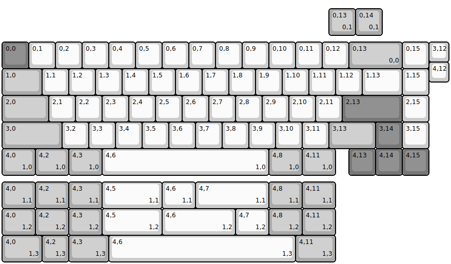{:loading="lazy"}

[Open in keyboard-layout-editor](http://www.keyboard-layout-editor.com/##@@_y:1.5&c=#777777;&=0,0&_c=#cccccc;&=0,1&=0,2&=0,3&=0,4&=0,5&=0,6&=0,7&=0,8&=0,9&=0,10&=0,11&=0,12&_c=#aaaaaa&w:2;&=0,13%0A%0A%0A0,0&_c=#cccccc;&=0,15&_w:0.75&h:0.75;&=3,12;&@_x:16&y:-0.25&w:0.75&h:0.75;&=4,12;&@_y:-0.75&c=#aaaaaa&w:1.5;&=1,0&_c=#cccccc;&=1,1&=1,2&=1,3&=1,4&=1,5&=1,6&=1,7&=1,8&=1,9&=1,10&=1,11&=1,12&_w:1.5;&=1,13&=1,15;&@_c=#aaaaaa&w:1.75;&=2,0&_c=#cccccc;&=2,1&=2,2&=2,3&=2,4&=2,5&=2,6&=2,7&=2,8&=2,9&=2,10&=2,11&_c=#777777&w:2.25;&=2,13&_c=#cccccc;&=2,15;&@_c=#aaaaaa&w:2.25;&=3,0&_c=#cccccc;&=3,2&=3,3&=3,4&=3,5&=3,6&=3,7&=3,8&=3,9&=3,10&=3,11&_c=#aaaaaa&w:1.75;&=3,13&_c=#777777;&=3,14&_c=#cccccc;&=3,15;&@_c=#aaaaaa&w:1.25;&=4,0%0A%0A%0A1,0&_w:1.25;&=4,2%0A%0A%0A1,0&_w:1.25;&=4,3%0A%0A%0A1,0&_c=#cccccc&w:6.25;&=4,6%0A%0A%0A1,0&_c=#aaaaaa&w:1.25;&=4,8%0A%0A%0A1,0&_w:1.25;&=4,11%0A%0A%0A1,0&_x:0.5&c=#777777;&=4,13&=4,14&=4,15;&@_x:12.25&y:-6.25&c=#aaaaaa;&=0,13%0A%0A%0A0,1&=0,14%0A%0A%0A0,1;&@_y:5.5&w:1.25;&=4,0%0A%0A%0A1,1&_w:1.25;&=4,2%0A%0A%0A1,1&_w:1.25;&=4,3%0A%0A%0A1,1&_c=#cccccc&w:2.25;&=4,5%0A%0A%0A1,1&_w:1.25;&=4,6%0A%0A%0A1,1&_w:2.75;&=4,7%0A%0A%0A1,1&_c=#aaaaaa&w:1.25;&=4,8%0A%0A%0A1,1&_w:1.25;&=4,11%0A%0A%0A1,1;&@_w:1.25;&=4,0%0A%0A%0A1,2&_w:1.25;&=4,2%0A%0A%0A1,2&_w:1.25;&=4,3%0A%0A%0A1,2&_c=#cccccc&w:2.25;&=4,5%0A%0A%0A1,2&_w:2.75;&=4,6%0A%0A%0A1,2&_w:1.25;&=4,7%0A%0A%0A1,2&_c=#aaaaaa&w:1.25;&=4,8%0A%0A%0A1,2&_w:1.25;&=4,11%0A%0A%0A1,2;&@_w:1.5;&=4,0%0A%0A%0A1,3&=4,2%0A%0A%0A1,3&_w:1.5;&=4,3%0A%0A%0A1,3&_c=#cccccc&w:7;&=4,6%0A%0A%0A1,3&_c=#aaaaaa&w:1.5;&=4,11%0A%0A%0A1,3)

## sawnsprojects/krush65_solder

[README](output/sawnsprojects/krush65_solder/README.md) - [layout](output/sawnsprojects/krush65_solder/krush65_solder-kle.json) - [PCB](output/sawnsprojects/krush65_solder/krush65_solder.kicad_pcb) - [PCB render](output/sawnsprojects/krush65_solder/krush65_solder-render.svg)

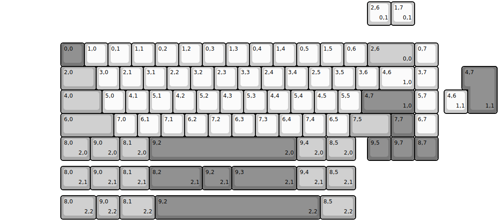{:loading="lazy"}

[Open in keyboard-layout-editor](http://www.keyboard-layout-editor.com/##@@_x:2.5&y:1.75&c=#777777;&=0,0&_c=#cccccc;&=1,0&=0,1&=1,1&=0,2&=1,2&=0,3&=1,3&=0,4&=1,4&=0,5&=1,5&=0,6&_c=#aaaaaa&w:2;&=2,6%0A%0A%0A0,0&_c=#cccccc;&=0,7;&@_x:2.5&c=#aaaaaa&w:1.5;&=2,0&_c=#cccccc;&=3,0&=2,1&=3,1&=2,2&=3,2&=2,3&=3,3&=2,4&=3,4&=2,5&=3,5&=3,6&_w:1.5;&=4,6%0A%0A%0A1,0&=3,7;&@_x:2.5&c=#aaaaaa&w:1.75;&=4,0&_c=#cccccc;&=5,0&=4,1&=5,1&=4,2&=5,2&=4,3&=5,3&=4,4&=5,4&=4,5&=5,5&_c=#777777&w:2.25;&=4,7%0A%0A%0A1,0&_c=#cccccc;&=5,7;&@_x:2.5&c=#aaaaaa&w:2.25;&=6,0&_c=#cccccc;&=7,0&=6,1&=7,1&=6,2&=7,2&=6,3&=7,3&=6,4&=7,4&=6,5&_c=#aaaaaa&w:1.75;&=7,5&_c=#777777;&=7,7&_c=#cccccc;&=6,7;&@_x:2.5&c=#aaaaaa&w:1.25;&=8,0%0A%0A%0A2,0&_w:1.25;&=9,0%0A%0A%0A2,0&_w:1.25;&=8,1%0A%0A%0A2,0&_c=#777777&w:6.25;&=9,2%0A%0A%0A2,0&_c=#aaaaaa&w:1.25;&=9,4%0A%0A%0A2,0&_w:1.25;&=8,5%0A%0A%0A2,0&_x:0.5&c=#777777;&=9,5&=9,7&=8,7;&@_x:15.5&y:-6.75&c=#cccccc;&=2,6%0A%0A%0A0,1&=1,7%0A%0A%0A0,1;&@_x:19.75&y:1.75&c=#777777&w:1.25&h:2&w2:1.5&h2:1&x2:-0.25;&=4,7%0A%0A%0A1,1;&@_x:18.75&c=#cccccc;&=4,6%0A%0A%0A1,1;&@_x:2.5&y:2.25&c=#aaaaaa&w:1.25;&=8,0%0A%0A%0A2,1&_w:1.25;&=9,0%0A%0A%0A2,1&_w:1.25;&=8,1%0A%0A%0A2,1&_c=#777777&w:2.25;&=8,2%0A%0A%0A2,1&_w:1.25;&=9,2%0A%0A%0A2,1&_w:2.75;&=9,3%0A%0A%0A2,1&_c=#aaaaaa&w:1.25;&=9,4%0A%0A%0A2,1&_w:1.25;&=8,5%0A%0A%0A2,1;&@_x:2.5&y:0.25&w:1.5;&=8,0%0A%0A%0A2,2&=9,0%0A%0A%0A2,2&_w:1.5;&=8,1%0A%0A%0A2,2&_c=#777777&w:7;&=9,2%0A%0A%0A2,2&_c=#aaaaaa&w:1.5;&=8,5%0A%0A%0A2,2)

## sawnsprojects/satxri6key

[README](output/sawnsprojects/satxri6key/README.md) - [layout](output/sawnsprojects/satxri6key/satxri6key-kle.json) - [PCB](output/sawnsprojects/satxri6key/satxri6key.kicad_pcb) - [PCB render](output/sawnsprojects/satxri6key/satxri6key-render.svg)

{:loading="lazy"}

[Open in keyboard-layout-editor](http://www.keyboard-layout-editor.com/##@@=0,0&=0,1&=0,2;&@=1,0&=1,1&=1,2)

## sawnsprojects/vcl65_solder

[README](output/sawnsprojects/vcl65_solder/README.md) - [layout](output/sawnsprojects/vcl65_solder/vcl65_solder-kle.json) - [PCB](output/sawnsprojects/vcl65_solder/vcl65_solder.kicad_pcb) - [PCB render](output/sawnsprojects/vcl65_solder/vcl65_solder-render.svg)

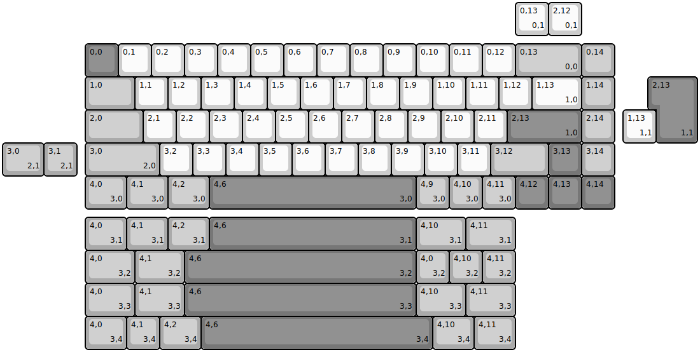{:loading="lazy"}

[Open in keyboard-layout-editor](http://www.keyboard-layout-editor.com/##@@_x:2.5&y:1.25&c=#777777;&=0,0&_c=#cccccc;&=0,1&=0,2&=0,3&=0,4&=0,5&=0,6&=0,7&=0,8&=0,9&=0,10&=0,11&=0,12&_c=#aaaaaa&w:2;&=0,13%0A%0A%0A0,0&=0,14;&@_x:2.5&w:1.5;&=1,0&_c=#cccccc;&=1,1&=1,2&=1,3&=1,4&=1,5&=1,6&=1,7&=1,8&=1,9&=1,10&=1,11&=1,12&_w:1.5;&=1,13%0A%0A%0A1,0&_c=#aaaaaa;&=1,14;&@_x:2.5&w:1.75;&=2,0&_c=#cccccc;&=2,1&=2,2&=2,3&=2,4&=2,5&=2,6&=2,7&=2,8&=2,9&=2,10&=2,11&_c=#777777&w:2.25;&=2,13%0A%0A%0A1,0&_c=#aaaaaa;&=2,14;&@_x:2.5&w:2.25;&=3,0%0A%0A%0A2,0&_c=#cccccc;&=3,2&=3,3&=3,4&=3,5&=3,6&=3,7&=3,8&=3,9&=3,10&=3,11&_c=#aaaaaa&w:1.75;&=3,12&_c=#777777;&=3,13&_c=#aaaaaa;&=3,14;&@_x:2.5&w:1.25;&=4,0%0A%0A%0A3,0&_w:1.25;&=4,1%0A%0A%0A3,0&_w:1.25;&=4,2%0A%0A%0A3,0&_c=#777777&w:6.25;&=4,6%0A%0A%0A3,0&_c=#aaaaaa;&=4,9%0A%0A%0A3,0&=4,10%0A%0A%0A3,0&=4,11%0A%0A%0A3,0&_c=#777777;&=4,12&=4,13&=4,14;&@_x:15.5&y:-6.25&c=#cccccc;&=0,13%0A%0A%0A0,1&=2,12%0A%0A%0A0,1;&@_x:19.75&y:1.25&c=#777777&w:1.25&h:2&w2:1.5&h2:1&x2:-0.25;&=2,13%0A%0A%0A1,1;&@_x:18.75&c=#cccccc;&=1,13%0A%0A%0A1,1;&@_c=#aaaaaa&w:1.25;&=3,0%0A%0A%0A2,1&=3,1%0A%0A%0A2,1;&@_x:2.5&y:1.25&w:1.25;&=4,0%0A%0A%0A3,1&_w:1.25;&=4,1%0A%0A%0A3,1&_w:1.25;&=4,2%0A%0A%0A3,1&_c=#777777&w:6.25;&=4,6%0A%0A%0A3,1&_c=#aaaaaa&w:1.5;&=4,10%0A%0A%0A3,1&_w:1.5;&=4,11%0A%0A%0A3,1;&@_x:2.5&w:1.5;&=4,0%0A%0A%0A3,2&_w:1.5;&=4,1%0A%0A%0A3,2&_c=#777777&w:7;&=4,6%0A%0A%0A3,2&_c=#aaaaaa;&=4,0%0A%0A%0A3,2&=4,10%0A%0A%0A3,2&=4,11%0A%0A%0A3,2;&@_x:2.5&w:1.5;&=4,0%0A%0A%0A3,3&_w:1.5;&=4,1%0A%0A%0A3,3&_c=#777777&w:7;&=4,6%0A%0A%0A3,3&_c=#aaaaaa&w:1.5;&=4,10%0A%0A%0A3,3&_w:1.5;&=4,11%0A%0A%0A3,3;&@_x:2.5&w:1.25;&=4,0%0A%0A%0A3,4&=4,1%0A%0A%0A3,4&_w:1.25;&=4,2%0A%0A%0A3,4&_c=#777777&w:7;&=4,6%0A%0A%0A3,4&_c=#aaaaaa&w:1.25;&=4,10%0A%0A%0A3,4&_w:1.25;&=4,11%0A%0A%0A3,4)

## sendyyeah/75pixels

[README](output/sendyyeah/75pixels/README.md) - [layout](output/sendyyeah/75pixels/75pixels-kle.json) - [PCB](output/sendyyeah/75pixels/75pixels.kicad_pcb) - [PCB render](output/sendyyeah/75pixels/75pixels-render.svg)

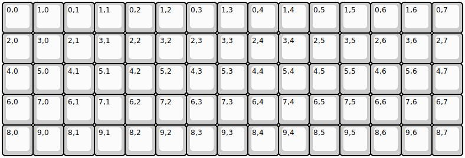{:loading="lazy"}

[Open in keyboard-layout-editor](http://www.keyboard-layout-editor.com/##@@=0,0&=1,0&=0,1&=1,1&=0,2&=1,2&=0,3&=1,3&=0,4&=1,4&=0,5&=1,5&=0,6&=1,6&=0,7;&@=2,0&=3,0&=2,1&=3,1&=2,2&=3,2&=2,3&=3,3&=2,4&=3,4&=2,5&=3,5&=2,6&=3,6&=2,7;&@=4,0&=5,0&=4,1&=5,1&=4,2&=5,2&=4,3&=5,3&=4,4&=5,4&=4,5&=5,5&=4,6&=5,6&=4,7;&@=6,0&=7,0&=6,1&=7,1&=6,2&=7,2&=6,3&=7,3&=6,4&=7,4&=6,5&=7,5&=6,6&=7,6&=6,7;&@=8,0&=9,0&=8,1&=9,1&=8,2&=9,2&=8,3&=9,3&=8,4&=9,4&=8,5&=9,5&=8,6&=9,6&=8,7)

## sendyyeah/bevi

[README](output/sendyyeah/bevi/README.md) - [layout](output/sendyyeah/bevi/bevi-kle.json) - [PCB](output/sendyyeah/bevi/bevi.kicad_pcb) - [PCB render](output/sendyyeah/bevi/bevi-render.svg)

{:loading="lazy"}

[Open in keyboard-layout-editor](http://www.keyboard-layout-editor.com/##@@_c=#aaaaaa;&=9,4&=0,0&=1,0&=0,1&_c=#777777;&=1,1&_c=#cccccc;&=0,2&=1,2&=0,3&=1,3&=0,4&=1,4&=0,5&=1,5&=0,6&=1,6&=0,7&=1,7&_c=#aaaaaa&w:2;&=9,7%0A%0A%0A0,0;&@_h:2;&=8,4&_c=#cccccc;&=2,0&=3,0&=2,1&_c=#aaaaaa&w:1.5;&=3,1&_c=#cccccc;&=2,2&=3,2&=2,3&=3,3&=2,4&=3,4&=2,5&=3,5&=2,6&=3,6&=2,7&=3,7&_w:1.5;&=7,7;&@_x:1;&=4,0&=5,0&=4,1&_c=#aaaaaa&w:1.75;&=5,1&_c=#cccccc;&=4,2&=5,2&=4,3&=5,3&=4,4&=5,4&=4,5&=5,5&=4,6&=5,6&=4,7&_c=#777777&w:2.25;&=5,7;&@_c=#aaaaaa&h:2;&=9,3&_c=#cccccc;&=6,0&=7,0&=6,1&_c=#aaaaaa&w:2.25;&=7,1&_c=#cccccc;&=6,2&=7,2&=6,3&=7,3&=6,4&=7,4&=6,5&=7,5&=6,6&=7,6&_c=#aaaaaa&w:2.75;&=6,7;&@_x:1&c=#cccccc;&=8,0&=9,0&=8,1&_c=#aaaaaa&w:1.25;&=9,1&_w:1.25;&=8,2&_w:1.25;&=9,2&_c=#cccccc&w:6.25;&=8,3&_c=#aaaaaa&w:1.25;&=9,5&_w:1.25;&=8,6&_w:1.25;&=9,6&_w:1.25;&=8,7;&@_x:19&y:-5;&=9,7%0A%0A%0A0,1&=8,5%0A%0A%0A0,1)

## sendyyeah/pix

[README](output/sendyyeah/pix/README.md) - [layout](output/sendyyeah/pix/pix-kle.json) - [PCB](output/sendyyeah/pix/pix.kicad_pcb) - [PCB render](output/sendyyeah/pix/pix-render.svg)

{:loading="lazy"}

[Open in keyboard-layout-editor](http://www.keyboard-layout-editor.com/##@@=0,0&=0,1&=0,2&=0,3&=0,4)

## senselessclay/ck60

[README](output/senselessclay/ck60/README.md) - [layout](output/senselessclay/ck60/ck60-kle.json) - [PCB](output/senselessclay/ck60/ck60.kicad_pcb) - [PCB render](output/senselessclay/ck60/ck60-render.svg)

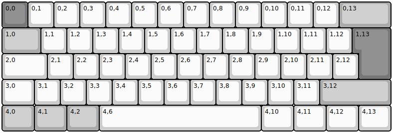{:loading="lazy"}

[Open in keyboard-layout-editor](http://www.keyboard-layout-editor.com/##@@_c=#777777;&=0,0&_c=#cccccc;&=0,1&=0,2&=0,3&=0,4&=0,5&=0,6&=0,7&=0,8&=0,9&=0,10&=0,11&=0,12&_c=#aaaaaa&w:2;&=0,13;&@_w:1.5;&=1,0&_c=#cccccc;&=1,1&=1,2&=1,3&=1,4&=1,5&=1,6&=1,7&=1,8&=1,9&=1,10&=1,11&=1,12&_x:0.25&c=#777777&w:1.25&h:2&w2:1.5&h2:1&x2:-0.25;&=1,13;&@_c=#cccccc&w:1.75;&=2,0&=2,1&=2,2&=2,3&=2,4&=2,5&=2,6&=2,7&=2,8&=2,9&=2,10&=2,11&=2,12;&@_w:1.25;&=3,0&=3,1&=3,2&=3,3&=3,4&=3,5&=3,6&=3,7&=3,8&=3,9&=3,10&=3,11&_c=#aaaaaa&w:2.75;&=3,12;&@_w:1.25;&=4,0&_w:1.25;&=4,1&_w:1.25;&=4,2&_c=#cccccc&w:6.25;&=4,6&_w:1.25;&=4,10&_w:1.25;&=4,11&_w:1.25;&=4,12&_w:1.25;&=4,13)

## senselessclay/ck65

[README](output/senselessclay/ck65/README.md) - [layout](output/senselessclay/ck65/ck65-kle.json) - [PCB](output/senselessclay/ck65/ck65.kicad_pcb) - [PCB render](output/senselessclay/ck65/ck65-render.svg)

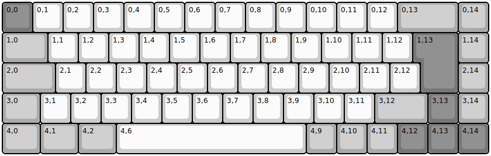{:loading="lazy"}

[Open in keyboard-layout-editor](http://www.keyboard-layout-editor.com/##@@_c=#777777;&=0,0&_c=#cccccc;&=0,1&=0,2&=0,3&=0,4&=0,5&=0,6&=0,7&=0,8&=0,9&=0,10&=0,11&=0,12&_c=#aaaaaa&w:2;&=0,13&=0,14;&@_w:1.5;&=1,0&_c=#cccccc;&=1,1&=1,2&=1,3&=1,4&=1,5&=1,6&=1,7&=1,8&=1,9&=1,10&=1,11&=1,12&_x:0.25&c=#777777&w:1.25&h:2&w2:1.5&h2:1&x2:-0.25;&=1,13&_c=#aaaaaa;&=1,14;&@_w:1.75;&=2,0&_c=#cccccc;&=2,1&=2,2&=2,3&=2,4&=2,5&=2,6&=2,7&=2,8&=2,9&=2,10&=2,11&=2,12&_x:1.25&c=#aaaaaa;&=2,14;&@_w:1.25;&=3,0&_c=#cccccc;&=3,1&=3,2&=3,3&=3,4&=3,5&=3,6&=3,7&=3,8&=3,9&=3,10&=3,11&_c=#aaaaaa&w:1.75;&=3,12&_c=#777777;&=3,13&_c=#aaaaaa;&=3,14;&@_w:1.25;&=4,0&_w:1.25;&=4,1&_w:1.25;&=4,2&_c=#cccccc&w:6.25;&=4,6&_c=#aaaaaa;&=4,9&=4,10&=4,11&_c=#777777;&=4,12&=4,13&=4,14)

## senselessclay/had60

[README](output/senselessclay/had60/README.md) - [layout](output/senselessclay/had60/had60-kle.json) - [PCB](output/senselessclay/had60/had60.kicad_pcb) - [PCB render](output/senselessclay/had60/had60-render.svg)

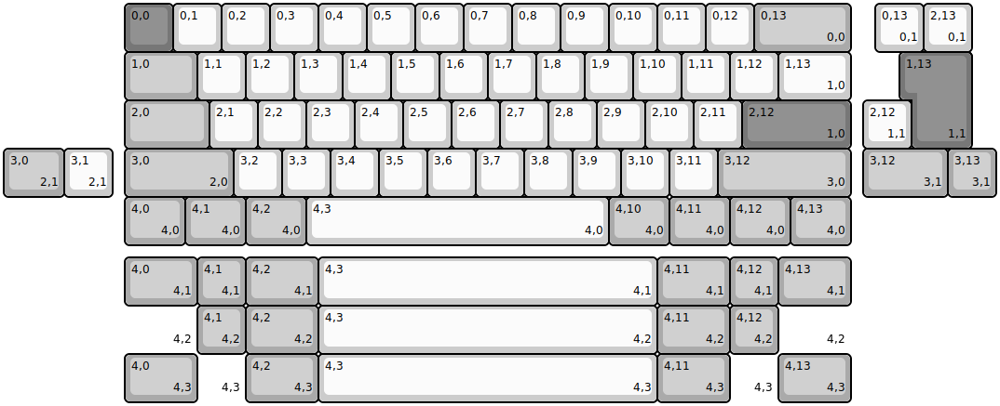{:loading="lazy"}

[Open in keyboard-layout-editor](http://www.keyboard-layout-editor.com/##@@_x:2.5&c=#777777;&=0,0&_c=#cccccc;&=0,1&=0,2&=0,3&=0,4&=0,5&=0,6&=0,7&=0,8&=0,9&=0,10&=0,11&=0,12&_c=#aaaaaa&w:2;&=0,13%0A%0A%0A0,0;&@_x:2.5&w:1.5;&=1,0&_c=#cccccc;&=1,1&=1,2&=1,3&=1,4&=1,5&=1,6&=1,7&=1,8&=1,9&=1,10&=1,11&=1,12&_w:1.5;&=1,13%0A%0A%0A1,0;&@_x:2.5&c=#aaaaaa&w:1.75;&=2,0&_c=#cccccc;&=2,1&=2,2&=2,3&=2,4&=2,5&=2,6&=2,7&=2,8&=2,9&=2,10&=2,11&_c=#777777&w:2.25;&=2,12%0A%0A%0A1,0;&@_x:2.5&c=#aaaaaa&w:2.25;&=3,0%0A%0A%0A2,0&_c=#cccccc;&=3,2&=3,3&=3,4&=3,5&=3,6&=3,7&=3,8&=3,9&=3,10&=3,11&_c=#aaaaaa&w:2.75;&=3,12%0A%0A%0A3,0;&@_x:2.5&w:1.25;&=4,0%0A%0A%0A4,0&_w:1.25;&=4,1%0A%0A%0A4,0&_w:1.25;&=4,2%0A%0A%0A4,0&_c=#cccccc&w:6.25;&=4,3%0A%0A%0A4,0&_c=#aaaaaa&w:1.25;&=4,10%0A%0A%0A4,0&_w:1.25;&=4,11%0A%0A%0A4,0&_w:1.25;&=4,12%0A%0A%0A4,0&_w:1.25;&=4,13%0A%0A%0A4,0;&@_x:18.0&y:-5&c=#cccccc;&=0,13%0A%0A%0A0,1&=2,13%0A%0A%0A0,1;&@_x:18.75&c=#777777&w:1.25&h:2&w2:1.5&h2:1&x2:-0.25;&=1,13%0A%0A%0A1,1;&@_x:17.75&c=#cccccc;&=2,12%0A%0A%0A1,1;&@_c=#aaaaaa&w:1.25;&=3,0%0A%0A%0A2,1&_c=#cccccc;&=3,1%0A%0A%0A2,1&_x:15.5&c=#aaaaaa&w:1.75;&=3,12%0A%0A%0A3,1&=3,13%0A%0A%0A3,1;&@_x:2.5&y:1.25&w:1.5;&=4,0%0A%0A%0A4,1&=4,1%0A%0A%0A4,1&_w:1.5;&=4,2%0A%0A%0A4,1&_c=#cccccc&w:7;&=4,3%0A%0A%0A4,1&_c=#aaaaaa&w:1.5;&=4,11%0A%0A%0A4,1&=4,12%0A%0A%0A4,1&_w:1.5;&=4,13%0A%0A%0A4,1;&@_x:2.5&w:1.5&d:true;&=%0A%0A%0A4,2&=4,1%0A%0A%0A4,2&_w:1.5;&=4,2%0A%0A%0A4,2&_c=#cccccc&w:7;&=4,3%0A%0A%0A4,2&_c=#aaaaaa&w:1.5;&=4,11%0A%0A%0A4,2&=4,12%0A%0A%0A4,2&_w:1.5&d:true;&=%0A%0A%0A4,2;&@_x:2.5&w:1.5;&=4,0%0A%0A%0A4,3&_d:true;&=%0A%0A%0A4,3&_w:1.5;&=4,2%0A%0A%0A4,3&_c=#cccccc&w:7;&=4,3%0A%0A%0A4,3&_c=#aaaaaa&w:1.5;&=4,11%0A%0A%0A4,3&_d:true;&=%0A%0A%0A4,3&_w:1.5;&=4,13%0A%0A%0A4,3)

## sesame/sesame

[README](output/sesame/README.md) - [layout](output/sesame/sesame-kle.json) - [PCB](output/sesame/sesame.kicad_pcb) - [PCB render](output/sesame/sesame-render.svg)

{:loading="lazy"}

[Open in keyboard-layout-editor](http://www.keyboard-layout-editor.com/##@@_x:0.55&y:1.15&c=#777777;&=0,0;&@_x:3.7&y:-0.95&c=#cccccc;&=0,3&_x:8.45;&=0,12;&@_x:1.7&y:-0.95;&=0,1&=0,2&_x:10.45;&=0,13&_c=#aaaaaa&w:2;&=0,14%0A%0A%0A0,0;&@_x:0.35&y:-0.1;&=1,0;&@_x:13&y:-0.95&c=#cccccc;&=1,11;&@_x:1.5&y:-0.95&c=#aaaaaa&w:1.5;&=1,1&_c=#cccccc;&=1,2&_x:10.0;&=1,12&=1,13&_c=#aaaaaa&w:1.5;&=1,14;&@_x:0.15&y:-0.1;&=2,0;&@_x:13.4&y:-0.9&c=#cccccc;&=2,11&=2,12&_c=#777777&w:2.25;&=2,14&_x:-16.35&c=#aaaaaa&w:1.75;&=2,1&_c=#cccccc;&=2,2;&@_x:1.05&c=#aaaaaa&w:2.25;&=3,1&_c=#cccccc;&=3,2&_x:8.8;&=3,11&=3,12&_c=#aaaaaa&w:1.75;&=3,13%0A%0A%0A1,0&=3,14%0A%0A%0A1,0;&@_x:1.05&w:1.5;&=4,1&_x:13.45&w:1.5;&=4,13;&@_r:12&x:5.05&y:-6.0&c=#cccccc;&=0,4&=0,5&=0,6&=0,7;&@_x:4.6;&=1,3&=1,4&=1,5&=1,6;&@_x:4.85;&=2,3&=2,4&=2,5&=2,6;&@_x:5.3;&=3,3&=3,4&=3,5&=3,6;&@_x:6.6&c=#777777&w:2;&=4,5&_c=#aaaaaa&w:1.25;&=4,6;&@_x:5.05&y:-0.95&w:1.5;&=4,3;&@_r:-12&x:8.45&y:-1.45&c=#cccccc;&=0,8&=0,9&=0,10&=0,11;&@_x:8.05;&=1,7&=1,8&=1,9&=1,10;&@_x:8.2;&=2,7&=2,8&=2,9&=2,10;&@_x:7.75;&=3,7&=3,8&=3,9&=3,10;&@_x:7.75&c=#777777&w:2.75;&=4,8;&@_x:10.55&y:-0.95&c=#aaaaaa&w:1.5;&=4,10;&@_r:0&x:15.15&y:-8.75&c=#cccccc;&=2,13%0A%0A%0A0,1&_c=#aaaaaa;&=0,14%0A%0A%0A0,1;&@_x:18.15&y:3.1&w:2.75;&=3,13%0A%0A%0A1,1)

## sets3n/kk980

[README](output/sets3n/kk980/README.md) - [layout](output/sets3n/kk980/kk980-kle.json) - [PCB](output/sets3n/kk980/kk980.kicad_pcb) - [PCB render](output/sets3n/kk980/kk980-render.svg)

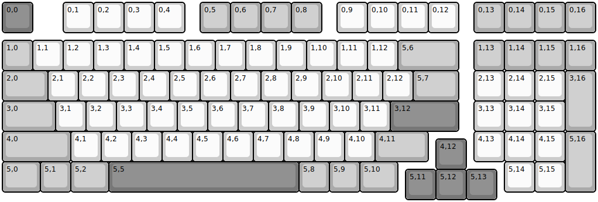{:loading="lazy"}

[Open in keyboard-layout-editor](http://www.keyboard-layout-editor.com/##@@_c=#777777;&=0,0&_x:1&c=#cccccc;&=0,1&=0,2&=0,3&=0,4&_x:0.5&c=#aaaaaa;&=0,5&=0,6&=0,7&=0,8&_x:0.5&c=#cccccc;&=0,9&=0,10&=0,11&=0,12&_x:0.5&c=#aaaaaa;&=0,13&=0,14&=0,15&=0,16;&@_y:0.25;&=1,0&_c=#cccccc;&=1,1%0A1&=1,2%0A2&=1,3%0A3&=1,4%0A4&=1,5%0A5&=1,6%0A6&=1,7%0A7&=1,8%0A8&=1,9%0A9&=1,10%0A0&=1,11%0A-&=1,12%0A=&_c=#aaaaaa&w:2;&=5,6&_x:0.5;&=1,13&=1,14&=1,15&=1,16;&@_w:1.5;&=2,0&_c=#cccccc;&=2,1&=2,2&=2,3&=2,4&=2,5&=2,6&=2,7&=2,8&=2,9&=2,10&=2,11%0A%5B&=2,12%0A%5D&_c=#aaaaaa&w:1.5;&=5,7%0A%5C&_x:0.5&c=#cccccc;&=2,13%0AHome&=2,14%0A%E2%86%91&=2,15%0APgUp&_c=#aaaaaa&h:2;&=3,16;&@_w:1.75;&=3,0&_c=#cccccc;&=3,1&=3,2&=3,3&=3,4&=3,5&=3,6&=3,7&=3,8&=3,9&=3,10%0A/;&=3,11%0A'&_c=#777777&w:2.25;&=3,12&_x:0.5&c=#cccccc;&=3,13%0A%E2%86%90&=3,14&=3,15%0A%E2%86%92;&@_c=#aaaaaa&w:2.25;&=4,0&_c=#cccccc;&=4,1&=4,2&=4,3&=4,4&=4,5&=4,6&=4,7&=4,8%0A,&=4,9%0A.&=4,10%0A//&_c=#aaaaaa&w:1.75;&=4,11&_x:1.5&c=#cccccc;&=4,13%0AEnd&=4,14%0A%E2%86%93&=4,15%0APgDn&_c=#aaaaaa&h:2;&=5,16;&@_x:14.25&y:-0.75&c=#777777;&=4,12;&@_y:-0.25&c=#aaaaaa&w:1.25;&=5,0&=5,1&_w:1.25;&=5,2&_c=#777777&w:6.25;&=5,5&_c=#aaaaaa;&=5,8&=5,9&_w:1.25;&=5,10&_x:3.5&c=#cccccc;&=5,14%0AIns&=5,15%0ADel;&@_x:13.25&y:-0.75&c=#777777;&=5,11&=5,12&=5,13)

## shandoncodes/mino_hotswap

[README](output/shandoncodes/mino_hotswap/README.md) - [layout](output/shandoncodes/mino_hotswap/mino_hotswap-kle.json) - [PCB](output/shandoncodes/mino_hotswap/mino_hotswap.kicad_pcb) - [PCB render](output/shandoncodes/mino_hotswap/mino_hotswap-render.svg)

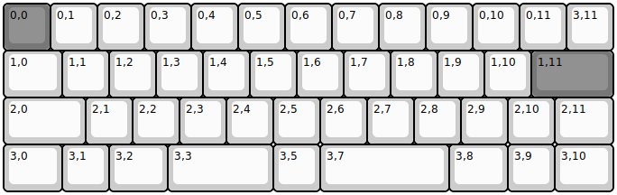{:loading="lazy"}

[Open in keyboard-layout-editor](http://www.keyboard-layout-editor.com/##@@_c=#777777;&=0,0&_c=#cccccc;&=0,1&=0,2&=0,3&=0,4&=0,5&=0,6&=0,7&=0,8&=0,9&=0,10&=0,11&=3,11;&@_w:1.25;&=1,0&=1,1&=1,2&=1,3&=1,4&=1,5&=1,6&=1,7&=1,8&=1,9&=1,10&_c=#777777&w:1.75;&=1,11;&@_c=#cccccc&w:1.75;&=2,0&=2,1&=2,2&=2,3&=2,4&=2,5&=2,6&=2,7&=2,8&=2,9&=2,10&_w:1.25;&=2,11;&@_w:1.25;&=3,0&=3,1&_w:1.25;&=3,2&_w:2.25;&=3,3&=3,5&_w:2.75;&=3,7&_w:1.25;&=3,8&=3,9&_w:1.25;&=3,10)

## shandoncodes/mino_plus

[README](output/shandoncodes/mino_plus/README.md) - [layout](output/shandoncodes/mino_plus/mino_plus-kle.json) - [PCB](output/shandoncodes/mino_plus/mino_plus.kicad_pcb) - [PCB render](output/shandoncodes/mino_plus/mino_plus-render.svg)

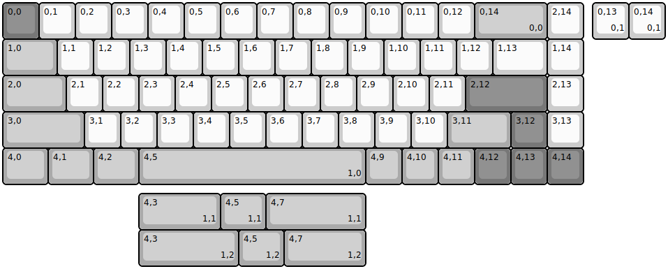{:loading="lazy"}

[Open in keyboard-layout-editor](http://www.keyboard-layout-editor.com/##@@_c=#777777;&=0,0&_c=#cccccc;&=0,1&=0,2&=0,3&=0,4&=0,5&=0,6&=0,7&=0,8&=0,9&=0,10&=0,11&=0,12&_c=#aaaaaa&w:2;&=0,14%0A%0A%0A0,0&_c=#cccccc;&=2,14;&@_c=#aaaaaa&w:1.5;&=1,0&_c=#cccccc;&=1,1&=1,2&=1,3&=1,4&=1,5&=1,6&=1,7&=1,8&=1,9&=1,10&=1,11&=1,12&_w:1.5;&=1,13&=1,14;&@_c=#aaaaaa&w:1.75;&=2,0&_c=#cccccc;&=2,1&=2,2&=2,3&=2,4&=2,5&=2,6&=2,7&=2,8&=2,9&=2,10&_x:1.0&c=#777777&w:2.25;&=2,12&_c=#cccccc;&=2,13;&@_c=#aaaaaa&w:2.25;&=3,0&_c=#cccccc;&=3,1&=3,2&=3,3&=3,4&=3,5&=3,6&=3,7&=3,8&=3,9&=3,10&_c=#aaaaaa&w:1.75;&=3,11&_c=#777777;&=3,12&_c=#cccccc;&=3,13;&@_c=#aaaaaa&w:1.25;&=4,0&_w:1.25;&=4,1&_w:1.25;&=4,2&_w:6.25;&=4,5%0A%0A%0A1,0&=4,9&=4,10&=4,11&_c=#777777;&=4,12&=4,13&=4,14;&@_rx:0.25&x:11.5&y:2&c=#cccccc;&=2,11;&@_rx:0&x:16.25;&=0,13%0A%0A%0A0,1&=0,14%0A%0A%0A0,1;&@_x:3.75&y:4.25&c=#aaaaaa&w:2.25;&=4,3%0A%0A%0A1,1&_w:1.25;&=4,5%0A%0A%0A1,1&_w:2.75;&=4,7%0A%0A%0A1,1;&@_x:3.75&w:2.75;&=4,3%0A%0A%0A1,2&_w:1.25;&=4,5%0A%0A%0A1,2&_w:2.25;&=4,7%0A%0A%0A1,2)

## sheubox/fallacy

[README](output/sheubox/fallacy/README.md) - [layout](output/sheubox/fallacy/fallacy-kle.json) - [PCB](output/sheubox/fallacy/fallacy.kicad_pcb) - [PCB render](output/sheubox/fallacy/fallacy-render.svg)

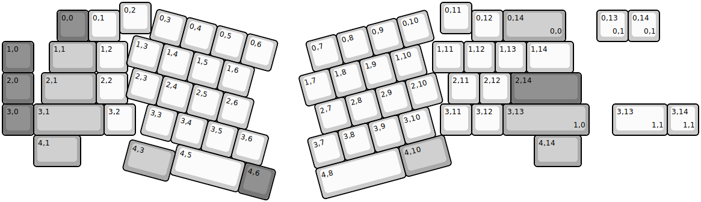{:loading="lazy"}

[Open in keyboard-layout-editor](http://www.keyboard-layout-editor.com/##@@_x:3.75;&=0,2;&@_x:1.75&y:-0.75&c=#777777;&=0,0&_c=#cccccc;&=0,1;&@_c=#777777;&=1,0&_x:0.5&c=#aaaaaa&w:1.5;&=1,1&_c=#cccccc;&=1,2;&@_c=#777777;&=2,0&_x:2&c=#cccccc;&=2,2;&@_c=#777777;&=3,0&_c=#aaaaaa&w:2.25;&=3,1&_c=#cccccc;&=3,2;&@_x:1&c=#aaaaaa&w:1.5;&=4,1;&@_rx:0.25&x:1.0&y:2.25&w:1.75;&=2,1;&@_rx:14.5&x:-0.5&c=#cccccc;&=0,11;&@_x:0.5&y:-0.75;&=0,12&_c=#aaaaaa&w:2;&=0,14%0A%0A%0A0,0;&@_x:-0.75&c=#cccccc;&=1,11&=1,12&=1,13&_w:1.5;&=1,14;&@_x:-0.25;&=2,11&=2,12&_c=#777777&w:2.25;&=2,14;&@_x:-0.5&c=#cccccc;&=3,11&=3,12&_c=#aaaaaa&w:2.75;&=3,13%0A%0A%0A1,0;&@_x:2.5&w:1.5;&=4,14;&@_r:15&rx:4.25&x:0.75&c=#cccccc;&=0,3&=0,4&=0,5&=0,6;&@_x:0.25;&=1,3&=1,4&=1,5&=1,6;&@_x:0.5;&=2,3&=2,4&=2,5&=2,6;&@_x:1.25;&=3,3&=3,4&=3,5&=3,6;&@_x:2.5&w:2.25;&=4,5&_c=#777777;&=4,6;&@_x:1.0&y:-0.75&c=#aaaaaa&w:1.5;&=4,3;&@_r:-15&rx:14.5&x:-5.0&c=#cccccc;&=0,7&=0,8&=0,9&=0,10;&@_x:-5.5;&=1,7&=1,8&=1,9&=1,10;&@_x:-5.25;&=2,7&=2,8&=2,9&=2,10;&@_x:-5.75;&=3,7&=3,8&=3,9&=3,10;&@_x:-5.75&w:2.75;&=4,8&_c=#aaaaaa&w:1.5;&=4,10;&@_r:0&x:4.5&y:-4.75&c=#cccccc;&=0,13%0A%0A%0A0,1&=0,14%0A%0A%0A0,1;&@_x:5.0&y:2.0&w:1.75;&=3,13%0A%0A%0A1,1&=3,14%0A%0A%0A1,1)

## sirius/uni660

[README](output/sirius/uni660/README.md) - [layout](output/sirius/uni660/uni660-kle.json) - [PCB](output/sirius/uni660/uni660.kicad_pcb) - [PCB render](output/sirius/uni660/uni660-render.svg)

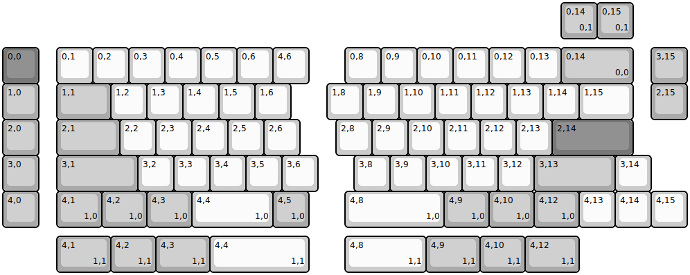{:loading="lazy"}

[Open in keyboard-layout-editor](http://www.keyboard-layout-editor.com/##@_name=Uni660%20VIA;&@_y:1.25&c=#777777;&=0,0&_x:0.5&c=#cccccc;&=0,1&=0,2&=0,3&=0,4&=0,5&=0,6&=4,6&_x:1.0;&=0,8&=0,9&=0,10&=0,11&=0,12&=0,13&_c=#aaaaaa&w:2;&=0,14%0A%0A%0A0,0&_x:0.5;&=3,15;&@=1,0&_x:0.5&w:1.5;&=1,1&_c=#cccccc;&=1,2&=1,3&=1,4&=1,5&=1,6&_x:1.0;&=1,8&=1,9&=1,10&=1,11&=1,12&=1,13&=1,14&_w:1.5;&=1,15&_x:0.5&c=#aaaaaa;&=2,15;&@=2,0&_x:0.5&w:1.75;&=2,1&_c=#cccccc;&=2,2&=2,3&=2,4&=2,5&=2,6&_x:1.0;&=2,8&=2,9&=2,10&=2,11&=2,12&=2,13&_c=#777777&w:2.25;&=2,14;&@_c=#aaaaaa;&=3,0&_x:0.5&w:2.25;&=3,1&_c=#cccccc;&=3,2&=3,3&=3,4&=3,5&=3,6&_x:1.0;&=3,8&=3,9&=3,10&=3,11&=3,12&_c=#aaaaaa&w:2.25;&=3,13&_c=#cccccc;&=3,14;&@_c=#aaaaaa;&=4,0&_x:0.5&w:1.25;&=4,1%0A%0A%0A1,0&_w:1.25;&=4,2%0A%0A%0A1,0&_w:1.25;&=4,3%0A%0A%0A1,0&_c=#cccccc&w:2.25;&=4,4%0A%0A%0A1,0&_c=#aaaaaa;&=4,5%0A%0A%0A1,0&_x:1.0&c=#cccccc&w:2.75;&=4,8%0A%0A%0A1,0&_c=#aaaaaa&w:1.25;&=4,9%0A%0A%0A1,0&_w:1.25;&=4,10%0A%0A%0A1,0&_w:1.25;&=4,12%0A%0A%0A1,0&_c=#cccccc;&=4,13&=4,14&=4,15;&@_x:15.5&y:-6.25&c=#aaaaaa;&=0,14%0A%0A%0A0,1&=0,15%0A%0A%0A0,1;&@_x:1.5&y:5.5&w:1.5;&=4,1%0A%0A%0A1,1&_w:1.25;&=4,2%0A%0A%0A1,1&_w:1.5;&=4,3%0A%0A%0A1,1&_c=#cccccc&w:2.75;&=4,4%0A%0A%0A1,1&_x:1.0&w:2.25;&=4,8%0A%0A%0A1,1&_c=#aaaaaa&w:1.5;&=4,9%0A%0A%0A1,1&_w:1.25;&=4,10%0A%0A%0A1,1&_w:1.5;&=4,12%0A%0A%0A1,1)

## sirius/uni660/uni660v2

[README](output/sirius/uni660/README.md) - [layout](output/sirius/uni660/uni660v2-kle.json) - [PCB](output/sirius/uni660/uni660v2.kicad_pcb) - [PCB render](output/sirius/uni660/uni660v2-render.svg)

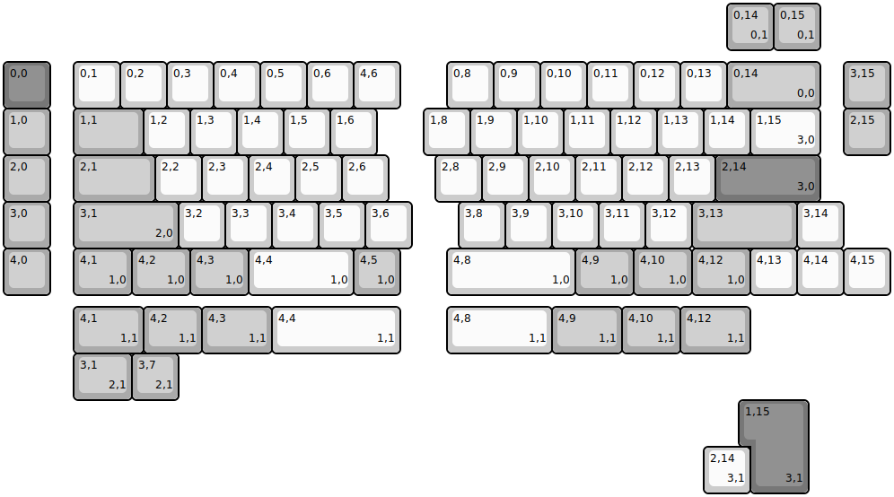{:loading="lazy"}

[Open in keyboard-layout-editor](http://www.keyboard-layout-editor.com/##@_name=Uni660%20VIA;&@_y:1.25&c=#777777;&=0,0&_x:0.5&c=#cccccc;&=0,1&=0,2&=0,3&=0,4&=0,5&=0,6&=4,6&_x:1.0;&=0,8&=0,9&=0,10&=0,11&=0,12&=0,13&_c=#aaaaaa&w:2;&=0,14%0A%0A%0A0,0&_x:0.5;&=3,15;&@=1,0&_x:0.5&w:1.5;&=1,1&_c=#cccccc;&=1,2&=1,3&=1,4&=1,5&=1,6&_x:1.0;&=1,8&=1,9&=1,10&=1,11&=1,12&=1,13&=1,14&_w:1.5;&=1,15%0A%0A%0A3,0&_x:0.5&c=#aaaaaa;&=2,15;&@=2,0&_x:0.5&w:1.75;&=2,1&_c=#cccccc;&=2,2&=2,3&=2,4&=2,5&=2,6&_x:1.0;&=2,8&=2,9&=2,10&=2,11&=2,12&=2,13&_c=#777777&w:2.25;&=2,14%0A%0A%0A3,0;&@_c=#aaaaaa;&=3,0&_x:0.5&w:2.25;&=3,1%0A%0A%0A2,0&_c=#cccccc;&=3,2&=3,3&=3,4&=3,5&=3,6&_x:1.0;&=3,8&=3,9&=3,10&=3,11&=3,12&_c=#aaaaaa&w:2.25;&=3,13&_c=#cccccc;&=3,14;&@_c=#aaaaaa;&=4,0&_x:0.5&w:1.25;&=4,1%0A%0A%0A1,0&_w:1.25;&=4,2%0A%0A%0A1,0&_w:1.25;&=4,3%0A%0A%0A1,0&_c=#cccccc&w:2.25;&=4,4%0A%0A%0A1,0&_c=#aaaaaa;&=4,5%0A%0A%0A1,0&_x:1.0&c=#cccccc&w:2.75;&=4,8%0A%0A%0A1,0&_c=#aaaaaa&w:1.25;&=4,9%0A%0A%0A1,0&_w:1.25;&=4,10%0A%0A%0A1,0&_w:1.25;&=4,12%0A%0A%0A1,0&_c=#cccccc;&=4,13&=4,14&=4,15;&@_x:15.5&y:-6.25&c=#aaaaaa;&=0,14%0A%0A%0A0,1&=0,15%0A%0A%0A0,1;&@_x:1.5&y:5.5&w:1.5;&=4,1%0A%0A%0A1,1&_w:1.25;&=4,2%0A%0A%0A1,1&_w:1.5;&=4,3%0A%0A%0A1,1&_c=#cccccc&w:2.75;&=4,4%0A%0A%0A1,1&_x:1.0&w:2.25;&=4,8%0A%0A%0A1,1&_c=#aaaaaa&w:1.5;&=4,9%0A%0A%0A1,1&_w:1.25;&=4,10%0A%0A%0A1,1&_w:1.5;&=4,12%0A%0A%0A1,1;&@_x:1.5&w:1.25;&=3,1%0A%0A%0A2,1&=3,7%0A%0A%0A2,1;&@_x:16&c=#777777&w:1.25&h:2&w2:1&h2:1&x2:-0.25;&=1,15%0A%0A%0A3,1;&@_x:15&c=#cccccc;&=2,14%0A%0A%0A3,1)

## skeletn87/skeletn87_hotswap

[README](output/skeletn87/README.md) - [layout](output/skeletn87/skeletn87_hotswap-kle.json) - [PCB](output/skeletn87/skeletn87_hotswap.kicad_pcb) - [PCB render](output/skeletn87/skeletn87_hotswap-render.svg)

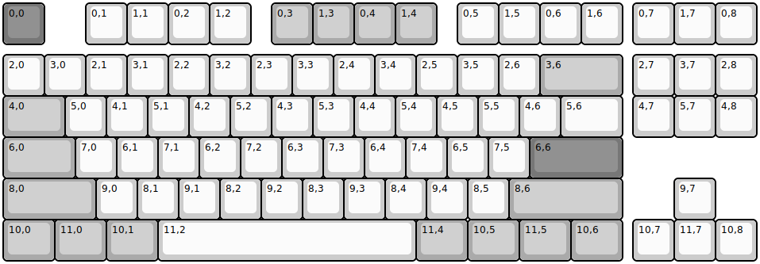{:loading="lazy"}

[Open in keyboard-layout-editor](http://www.keyboard-layout-editor.com/##@@_c=#777777;&=0,0&_x:1&c=#cccccc;&=0,1&=1,1&=0,2&=1,2&_x:0.5&c=#aaaaaa;&=0,3&=1,3&=0,4&=1,4&_x:0.5&c=#cccccc;&=0,5&=1,5&=0,6&=1,6&_x:0.25;&=0,7&=1,7&=0,8;&@_y:0.25;&=2,0&=3,0&=2,1&=3,1&=2,2&=3,2&=2,3&=3,3&=2,4&=3,4&=2,5&=3,5&=2,6&_c=#aaaaaa&w:2;&=3,6&_x:0.25&c=#cccccc;&=2,7&=3,7&=2,8;&@_c=#aaaaaa&w:1.5;&=4,0&_c=#cccccc;&=5,0&=4,1&=5,1&=4,2&=5,2&=4,3&=5,3&=4,4&=5,4&=4,5&=5,5&=4,6&_w:1.5;&=5,6&_x:0.25;&=4,7&=5,7&=4,8;&@_c=#aaaaaa&w:1.75;&=6,0&_c=#cccccc;&=7,0&=6,1&=7,1&=6,2&=7,2&=6,3&=7,3&=6,4&=7,4&=6,5&=7,5&_c=#777777&w:2.25;&=6,6;&@_c=#aaaaaa&w:2.25;&=8,0&_c=#cccccc;&=9,0&=8,1&=9,1&=8,2&=9,2&=8,3&=9,3&=8,4&=9,4&=8,5&_c=#aaaaaa&w:2.75;&=8,6&_x:1.25&c=#cccccc;&=9,7;&@_c=#aaaaaa&w:1.25;&=10,0&_w:1.25;&=11,0&_w:1.25;&=10,1&_c=#cccccc&w:6.25;&=11,2&_c=#aaaaaa&w:1.25;&=11,4&_w:1.25;&=10,5&_w:1.25;&=11,5&_w:1.25;&=10,6&_x:0.25&c=#cccccc;&=10,7&=11,7&=10,8)

## skeletn87/skeletn87_soldered

[README](output/skeletn87/README.md) - [layout](output/skeletn87/skeletn87_soldered-kle.json) - [PCB](output/skeletn87/skeletn87_soldered.kicad_pcb) - [PCB render](output/skeletn87/skeletn87_soldered-render.svg)

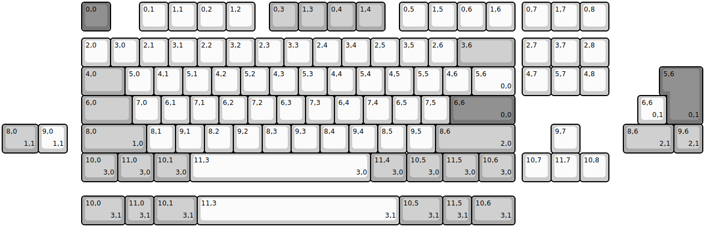{:loading="lazy"}

[Open in keyboard-layout-editor](http://www.keyboard-layout-editor.com/##@@_x:2.75&c=#777777;&=0,0&_x:1.0&c=#cccccc;&=0,1&=1,1&=0,2&=1,2&_x:0.5&c=#aaaaaa;&=0,3&=1,3&=0,4&=1,4&_x:0.5&c=#cccccc;&=0,5&=1,5&=0,6&=1,6&_x:0.25;&=0,7&=1,7&=0,8;&@_x:2.75&y:0.25;&=2,0&=3,0&=2,1&=3,1&=2,2&=3,2&=2,3&=3,3&=2,4&=3,4&=2,5&=3,5&=2,6&_c=#aaaaaa&w:2;&=3,6&_x:0.25&c=#cccccc;&=2,7&=3,7&=2,8;&@_x:2.75&c=#aaaaaa&w:1.5;&=4,0&_c=#cccccc;&=5,0&=4,1&=5,1&=4,2&=5,2&=4,3&=5,3&=4,4&=5,4&=4,5&=5,5&=4,6&_w:1.5;&=5,6%0A%0A%0A0,0&_x:0.25;&=4,7&=5,7&=4,8;&@_x:2.75&c=#aaaaaa&w:1.75;&=6,0&_c=#cccccc;&=7,0&=6,1&=7,1&=6,2&=7,2&=6,3&=7,3&=6,4&=7,4&=6,5&=7,5&_c=#777777&w:2.25;&=6,6%0A%0A%0A0,0;&@_x:2.75&c=#aaaaaa&w:2.25;&=8,0%0A%0A%0A1,0&_c=#cccccc;&=8,1&=9,1&=8,2&=9,2&=8,3&=9,3&=8,4&=9,4&=8,5&=9,5&_c=#aaaaaa&w:2.75;&=8,6%0A%0A%0A2,0&_x:1.25&c=#cccccc;&=9,7;&@_x:2.75&c=#aaaaaa&w:1.25;&=10,0%0A%0A%0A3,0&_w:1.25;&=11,0%0A%0A%0A3,0&_w:1.25;&=10,1%0A%0A%0A3,0&_c=#cccccc&w:6.25;&=11,3%0A%0A%0A3,0&_c=#aaaaaa&w:1.25;&=11,4%0A%0A%0A3,0&_w:1.25;&=10,5%0A%0A%0A3,0&_w:1.25;&=11,5%0A%0A%0A3,0&_w:1.25;&=10,6%0A%0A%0A3,0&_x:0.25&c=#cccccc;&=10,7&=11,7&=10,8;&@_x:23.0&y:-4.0&c=#777777&w:1.25&h:2&w2:1&h2:1&x2:-0.25;&=5,6%0A%0A%0A0,1;&@_x:22.0&c=#cccccc;&=6,6%0A%0A%0A0,1;&@_c=#aaaaaa&w:1.25;&=8,0%0A%0A%0A1,1&_c=#cccccc;&=9,0%0A%0A%0A1,1&_x:19.25&c=#aaaaaa&w:1.75;&=8,6%0A%0A%0A2,1&=9,6%0A%0A%0A2,1;&@_x:2.75&y:1.5&w:1.5;&=10,0%0A%0A%0A3,1&=11,0%0A%0A%0A3,1&_w:1.5;&=10,1%0A%0A%0A3,1&_c=#cccccc&w:7;&=11,3%0A%0A%0A3,1&_c=#aaaaaa&w:1.5;&=10,5%0A%0A%0A3,1&=11,5%0A%0A%0A3,1&_w:1.5;&=10,6%0A%0A%0A3,1)

## skergo/skergo

[README](output/skergo/README.md) - [layout](output/skergo/skergo-kle.json) - [PCB](output/skergo/skergo.kicad_pcb) - [PCB render](output/skergo/skergo-render.svg)

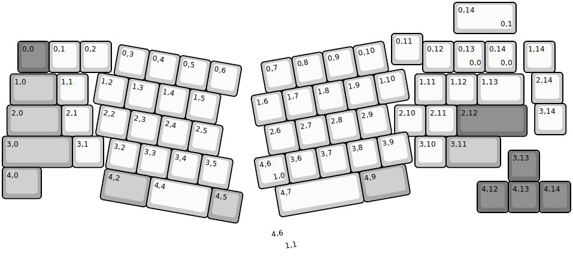{:loading="lazy"}

[Open in keyboard-layout-editor](http://www.keyboard-layout-editor.com/##@@_x:12.5&y:1&f:1&fa@:3;;&=0,11;&@_x:0.5&y:-0.75&c=#777777;&=0,0&_c=#cccccc;&=0,1&_x:11.0;&=0,12&_fa@:3&:0&:0&:3;;&=0,13%0A%0A%0A0,0&=0,14%0A%0A%0A0,0&_x:0.25&f:3;&=1,14;&@_x:17;&=2,14;&@_x:0.25&y:-0.95&c=#aaaaaa&f:1&fa@:3;&w:1.5;&=1,0&_c=#cccccc;&=1,1&_x:10.5;&=1,11&=1,12&_f:3&w:1.5;&=1,13;&@_x:17.1&y:-0.05&f:1&fa@:3;;&=3,14;&@_x:0.15&y:-0.95&c=#aaaaaa&w:1.75;&=2,0&_c=#cccccc;&=2,1&_x:9.7;&=2,10&=2,11&_c=#777777&w:2.25;&=2,12;&@_c=#aaaaaa&w:2.25;&=3,0&_c=#cccccc;&=3,1&_x:10.0;&=3,10&_c=#aaaaaa&w:1.75;&=3,11;&@_x:16.25&y:-0.55&c=#777777;&=3,13;&@_y:-0.45&c=#aaaaaa&w:1.25;&=4,0;&@_x:15.25&y:-0.55&c=#777777;&=4,12&=4,13&=4,14;&@_rx:3&ry:4.25&x:-0.5&y:-3.0&c=#cccccc;&=0,2;&@_r:10&x:0.25&y:-1.0;&=0,3&=0,4&=0,5&=0,6;&@_x:-0.25;&=1,2&=1,3&=1,4&=1,5;&@=2,2&=2,3&=2,4&=2,5;&@_x:0.5;&=3,2&=3,3&=3,4&=3,5;&@_x:0.5&c=#aaaaaa&w:1.5;&=4,2&_c=#cccccc&f:3&w:2;&=4,4&_c=#aaaaaa;&=4,5;&@_r:-10&rx:12.5&x:-3.75&y:-3.0&c=#cccccc&f:1&fa@:3;;&=0,7&=0,8&=0,9&=0,10;&@_x:-4.25;&=1,6&=1,7&=1,8&=1,9&=1,10;&@_x:-4.0;&=2,6&=2,7&=2,8&=2,9;&@_x:-4.5&f:3;&=4,6%0A%0A%0A1,0&_f:1&fa@:3;;&=3,6&=3,7&=3,8&=3,9;&@_x:-4.0&w:2.75;&=4,7&_c=#aaaaaa&w:1.5;&=4,9;&@_r:0&rx:0&ry:0&x:14.5&c=#cccccc&f:3&w:2;&=0,14%0A%0A%0A0,1;&@_r:-10&rx:12.5&ry:4.25&x:-4.5&y:2.25&f:1&fa@:3&:0&:0&:3;&d:true;&=4,6%0A%0A%0A1,1)

## skippys_custom_pcs/rooboard65

[README](output/skippys_custom_pcs/rooboard65/README.md) - [layout](output/skippys_custom_pcs/rooboard65/rooboard65-kle.json) - [PCB](output/skippys_custom_pcs/rooboard65/rooboard65.kicad_pcb) - [PCB render](output/skippys_custom_pcs/rooboard65/rooboard65-render.svg)

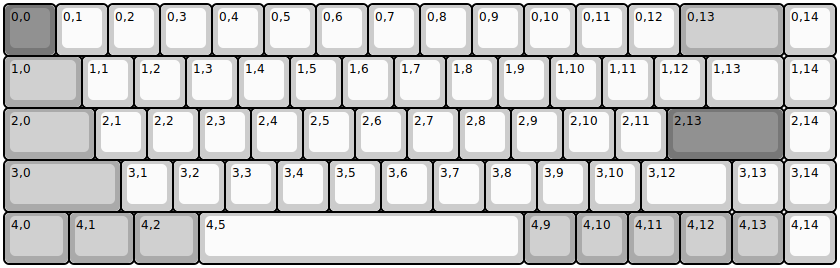{:loading="lazy"}

[Open in keyboard-layout-editor](http://www.keyboard-layout-editor.com/##@@_c=#777777;&=0,0&_c=#cccccc;&=0,1&=0,2&=0,3&=0,4&=0,5&=0,6&=0,7&=0,8&=0,9&=0,10&=0,11&=0,12&_c=#aaaaaa&w:2;&=0,13&_c=#cccccc;&=0,14;&@_c=#aaaaaa&w:1.5;&=1,0&_c=#cccccc;&=1,1&=1,2&=1,3&=1,4&=1,5&=1,6&=1,7&=1,8&=1,9&=1,10&=1,11&=1,12&_w:1.5;&=1,13&=1,14;&@_c=#aaaaaa&w:1.75;&=2,0&_c=#cccccc;&=2,1&=2,2&=2,3&=2,4&=2,5&=2,6&=2,7&=2,8&=2,9&=2,10&=2,11&_c=#777777&w:2.25;&=2,13&_c=#cccccc;&=2,14;&@_c=#aaaaaa&w:2.25;&=3,0&_c=#cccccc;&=3,1&=3,2&=3,3&=3,4&=3,5&=3,6&=3,7&=3,8&=3,9&=3,10&_w:1.75;&=3,12&=3,13&=3,14;&@_c=#aaaaaa&w:1.25;&=4,0&_w:1.25;&=4,1&_w:1.25;&=4,2&_c=#cccccc&w:6.25;&=4,5&_c=#aaaaaa;&=4,9&=4,10&=4,11&=4,12&=4,13&_c=#cccccc;&=4,14)

## skippys_custom_pcs/roopad

[README](output/skippys_custom_pcs/roopad/README.md) - [layout](output/skippys_custom_pcs/roopad/roopad-kle.json) - [PCB](output/skippys_custom_pcs/roopad/roopad.kicad_pcb) - [PCB render](output/skippys_custom_pcs/roopad/roopad-render.svg)

{:loading="lazy"}

[Open in keyboard-layout-editor](http://www.keyboard-layout-editor.com/##@_name=RooPad;&@_x:1.5;&=0,1&=0,2&=0,3&=0,4;&@_c=#aaaaaa;&=1,0&_x:0.5&c=#cccccc;&=1,1&=1,2&=1,3&_h:2;&=1,4;&@_c=#aaaaaa;&=2,0&_x:0.5&c=#cccccc;&=2,1&=2,2&=2,3;&@_c=#aaaaaa;&=3,0&_x:0.5&c=#cccccc;&=3,1&=3,2&=3,3&_c=#777777&h:2;&=3,4;&@_c=#aaaaaa;&=4,0&_x:0.5&c=#cccccc&w:2;&=4,1&=4,3)

## skmt/15k

[README](output/skmt/15k/README.md) - [layout](output/skmt/15k/15k-kle.json) - [PCB](output/skmt/15k/15k.kicad_pcb) - [PCB render](output/skmt/15k/15k-render.svg)

{:loading="lazy"}

[Open in keyboard-layout-editor](http://www.keyboard-layout-editor.com/##@@_c=#505557&t=#d9d7d7;&=0,0&=0,1&=0,2&=0,3&=0,4;&@=1,0&=1,1&=1,2&=1,3&=1,4;&@=2,0&=2,1&=2,2&=2,3&=2,4)

## smallice/smallice

[README](output/smallice/README.md) - [layout](output/smallice/smallice-kle.json) - [PCB](output/smallice/smallice.kicad_pcb) - [PCB render](output/smallice/smallice-render.svg)

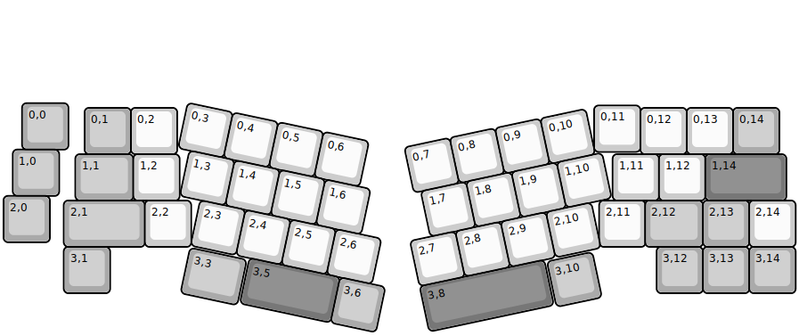{:loading="lazy"}

[Open in keyboard-layout-editor](http://www.keyboard-layout-editor.com/##@@_x:0.4&y:2.15&c=#aaaaaa;&=0,0;&@_x:12.75&y:-0.95&c=#cccccc;&=0,11;&@_x:1.75&y:-0.95&c=#aaaaaa;&=0,1&_c=#cccccc;&=0,2&_x:10.0;&=0,12&=0,13&_c=#aaaaaa;&=0,14;&@_x:0.2&y:-0.1;&=1,0;&@_x:1.55&y:-0.9&w:1.25;&=1,1&_c=#cccccc;&=1,2&_x:9.35;&=1,11&=1,12&_c=#777777&w:1.75;&=1,14;&@_y:-0.1&c=#aaaaaa;&=2,0;&@_x:1.3&y:-0.9&w:1.75;&=2,1&_c=#cccccc;&=2,2&_x:8.81;&=2,11&_x:-0.01&c=#aaaaaa&w:1.25;&=2,12&=2,13&_c=#cccccc;&=2,14;&@_x:1.3&c=#aaaaaa;&=3,1&_x:11.8;&=3,12&=3,13&=3,14;&@_r:12&x:4.35&y:-5.0&c=#cccccc;&=0,3&=0,4&=0,5&=0,6;&@_x:4.6;&=1,3&=1,4&=1,5&=1,6;&@_x:5.05;&=2,3&=2,4&=2,5&=2,6;&@_x:6.35&c=#777777&w:2;&=3,5&_c=#aaaaaa;&=3,6;&@_x:5.05&y:-0.95&w:1.25;&=3,3;&@_r:-12&x:7.8&y:-0.45&c=#cccccc;&=0,7&=0,8&=0,9&=0,10;&@_x:7.95;&=1,7&=1,8&=1,9&=1,10;&@_x:7.5;&=2,7&=2,8&=2,9&=2,10;&@_x:7.5&c=#777777&w:2.75;&=3,8;&@_x:10.3&y:-0.95&c=#aaaaaa;&=3,10)

## smallkeyboard/smallkeyboard

[README](output/smallkeyboard/README.md) - [layout](output/smallkeyboard/smallkeyboard-kle.json) - [PCB](output/smallkeyboard/smallkeyboard.kicad_pcb) - [PCB render](output/smallkeyboard/smallkeyboard-render.svg)

{:loading="lazy"}

[Open in keyboard-layout-editor](http://www.keyboard-layout-editor.com/##@@=0,0&=0,1&=0,2;&@=1,0&=1,1&=1,2)

## smithrune/iron160/i160h

[README](output/smithrune/iron160/README.md) - [layout](output/smithrune/iron160/i160h-kle.json) - [PCB](output/smithrune/iron160/i160h.kicad_pcb) - [PCB render](output/smithrune/iron160/i160h-render.svg)

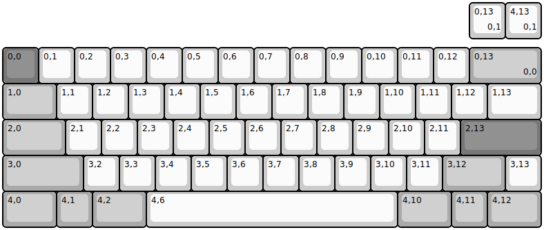{:loading="lazy"}

[Open in keyboard-layout-editor](http://www.keyboard-layout-editor.com/##@@_y:1.25&c=#777777;&=0,0&_c=#cccccc;&=0,1&=0,2&=0,3&=0,4&=0,5&=0,6&=0,7&=0,8&=0,9&=0,10&=0,11&=0,12&_c=#aaaaaa&w:2;&=0,13%0A%0A%0A0,0;&@_w:1.5;&=1,0&_c=#cccccc;&=1,1&=1,2&=1,3&=1,4&=1,5&=1,6&=1,7&=1,8&=1,9&=1,10&=1,11&=1,12&_w:1.5;&=1,13;&@_c=#aaaaaa&w:1.75;&=2,0&_c=#cccccc;&=2,1&=2,2&=2,3&=2,4&=2,5&=2,6&=2,7&=2,8&=2,9&=2,10&=2,11&_c=#777777&w:2.25;&=2,13;&@_c=#aaaaaa&w:2.25;&=3,0&_c=#cccccc;&=3,2&=3,3&=3,4&=3,5&=3,6&=3,7&=3,8&=3,9&=3,10&=3,11&_c=#aaaaaa&w:1.75;&=3,12&_c=#cccccc;&=3,13;&@_c=#aaaaaa&w:1.5;&=4,0&=4,1&_w:1.5;&=4,2&_c=#cccccc&w:7;&=4,6&_c=#aaaaaa&w:1.5;&=4,10&=4,11&_w:1.5;&=4,12;&@_x:13&y:-6.25&c=#cccccc;&=0,13%0A%0A%0A0,1&=4,13%0A%0A%0A0,1)

## smithrune/iron160/i160s

[README](output/smithrune/iron160/README.md) - [layout](output/smithrune/iron160/i160s-kle.json) - [PCB](output/smithrune/iron160/i160s.kicad_pcb) - [PCB render](output/smithrune/iron160/i160s-render.svg)

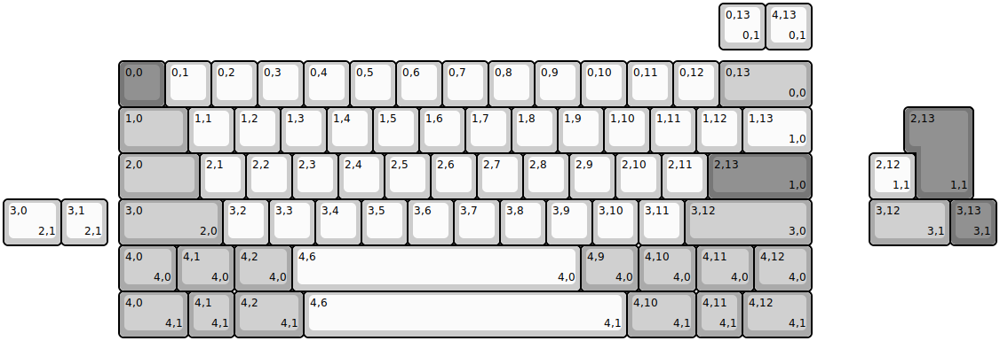{:loading="lazy"}

[Open in keyboard-layout-editor](http://www.keyboard-layout-editor.com/##@@_x:2.5&y:1.25&c=#777777;&=0,0&_c=#cccccc;&=0,1&=0,2&=0,3&=0,4&=0,5&=0,6&=0,7&=0,8&=0,9&=0,10&=0,11&=0,12&_c=#aaaaaa&w:2;&=0,13%0A%0A%0A0,0;&@_x:2.5&w:1.5;&=1,0&_c=#cccccc;&=1,1&=1,2&=1,3&=1,4&=1,5&=1,6&=1,7&=1,8&=1,9&=1,10&=1,11&=1,12&_w:1.5;&=1,13%0A%0A%0A1,0;&@_x:2.5&c=#aaaaaa&w:1.75;&=2,0&_c=#cccccc;&=2,1&=2,2&=2,3&=2,4&=2,5&=2,6&=2,7&=2,8&=2,9&=2,10&=2,11&_c=#777777&w:2.25;&=2,13%0A%0A%0A1,0;&@_x:2.5&c=#aaaaaa&w:2.25;&=3,0%0A%0A%0A2,0&_c=#cccccc;&=3,2&=3,3&=3,4&=3,5&=3,6&=3,7&=3,8&=3,9&=3,10&=3,11&_c=#aaaaaa&w:2.75;&=3,12%0A%0A%0A3,0;&@_x:2.5&w:1.25;&=4,0%0A%0A%0A4,0&_w:1.25;&=4,1%0A%0A%0A4,0&_w:1.25;&=4,2%0A%0A%0A4,0&_c=#cccccc&w:6.25;&=4,6%0A%0A%0A4,0&_c=#aaaaaa&w:1.25;&=4,9%0A%0A%0A4,0&_w:1.25;&=4,10%0A%0A%0A4,0&_w:1.25;&=4,11%0A%0A%0A4,0&_w:1.25;&=4,12%0A%0A%0A4,0;&@_x:15.5&y:-6.25&c=#cccccc;&=0,13%0A%0A%0A0,1&=4,13%0A%0A%0A0,1;&@_x:19.75&y:1.25&c=#777777&w:1.25&h:2&w2:1.5&h2:1&x2:-0.25;&=2,13%0A%0A%0A1,1;&@_x:18.75&c=#cccccc;&=2,12%0A%0A%0A1,1;&@_w:1.25;&=3,0%0A%0A%0A2,1&=3,1%0A%0A%0A2,1&_x:16.5&c=#aaaaaa&w:1.75;&=3,12%0A%0A%0A3,1&_c=#777777;&=3,13%0A%0A%0A3,1;&@_x:2.5&y:1.0&c=#aaaaaa&w:1.5;&=4,0%0A%0A%0A4,1&=4,1%0A%0A%0A4,1&_w:1.5;&=4,2%0A%0A%0A4,1&_c=#cccccc&w:7;&=4,6%0A%0A%0A4,1&_c=#aaaaaa&w:1.5;&=4,10%0A%0A%0A4,1&=4,11%0A%0A%0A4,1&_w:1.5;&=4,12%0A%0A%0A4,1)

## smithrune/iron165r2

[README](output/smithrune/iron165r2/README.md) - [layout](output/smithrune/iron165r2/iron165r2-kle.json) - [PCB](output/smithrune/iron165r2/iron165r2.kicad_pcb) - [PCB render](output/smithrune/iron165r2/iron165r2-render.svg)

{:loading="lazy"}

[Open in keyboard-layout-editor](http://www.keyboard-layout-editor.com/##@@_x:2.5&y:1.25&c=#777777;&=0,0&_c=#cccccc;&=0,1&=0,2&=0,3&=0,4&=0,5&=0,6&=0,7&=0,8&=0,9&=0,10&=0,11&=0,12&_c=#aaaaaa&w:2;&=0,13%0A%0A%0A0,0&_c=#cccccc;&=4,14;&@_x:2.5&c=#aaaaaa&w:1.5;&=1,0&_c=#cccccc;&=1,1&=1,2&=1,3&=1,4&=1,5&=1,6&=1,7&=1,8&=1,9&=1,10&=1,11&=1,12&_w:1.5;&=1,13%0A%0A%0A1,0&=1,14;&@_x:2.5&c=#aaaaaa&w:1.75;&=2,0&_c=#cccccc;&=2,1&=2,2&=2,3&=2,4&=2,5&=2,6&=2,7&=2,8&=2,9&=2,10&=2,11&_c=#777777&w:2.25;&=2,13%0A%0A%0A1,0&_c=#cccccc;&=2,14;&@_x:2.5&c=#aaaaaa&w:2.25;&=3,0%0A%0A%0A2,0&_c=#cccccc;&=3,2&=3,3&=3,4&=3,5&=3,6&=3,7&=3,8&=3,9&=3,10&=3,11&_c=#aaaaaa&w:1.75;&=3,12&_c=#777777;&=3,13&_c=#cccccc;&=3,14;&@_x:2.5&c=#aaaaaa&w:1.25;&=4,0%0A%0A%0A3,0&_w:1.25;&=4,1%0A%0A%0A3,0&_w:1.25;&=4,2%0A%0A%0A3,0&_c=#cccccc&w:6.25;&=4,6%0A%0A%0A3,0&_c=#aaaaaa&w:1.25;&=4,9%0A%0A%0A3,0&_w:1.25;&=4,10%0A%0A%0A3,0&_x:0.5&c=#777777;&=4,11&=4,12&=4,13;&@_x:15.5&y:-6.25&c=#cccccc;&=0,13%0A%0A%0A0,1&=0,14%0A%0A%0A0,1;&@_x:19.75&y:1.25&c=#777777&w:1.25&h:2&w2:1.5&h2:1&x2:-0.25;&=2,13%0A%0A%0A1,1;&@_x:18.75&c=#cccccc;&=2,12%0A%0A%0A1,1;&@_w:1.25;&=3,0%0A%0A%0A2,1&=3,1%0A%0A%0A2,1;&@_x:2.5&y:1.25&c=#aaaaaa&w:1.5;&=4,0%0A%0A%0A3,1&=4,1%0A%0A%0A3,1&_w:1.5;&=4,2%0A%0A%0A3,1&_c=#cccccc&w:7;&=4,6%0A%0A%0A3,1&_c=#aaaaaa&w:1.5;&=4,10%0A%0A%0A3,1)

## smithrune/iron180

[README](output/smithrune/iron180/README.md) - [layout](output/smithrune/iron180/iron180-kle.json) - [PCB](output/smithrune/iron180/iron180.kicad_pcb) - [PCB render](output/smithrune/iron180/iron180-render.svg)

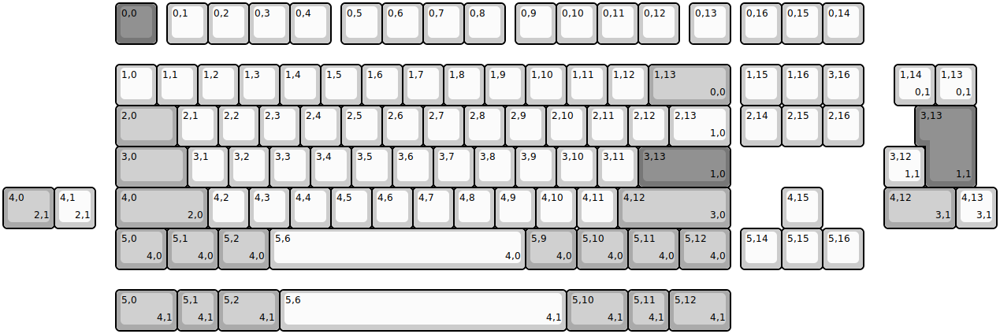{:loading="lazy"}

[Open in keyboard-layout-editor](http://www.keyboard-layout-editor.com/##@@_x:2.75&c=#777777;&=0,0&_x:0.25&c=#cccccc;&=0,1&=0,2&=0,3&=0,4&_x:0.25;&=0,5&=0,6&=0,7&=0,8&_x:0.25;&=0,9&=0,10&=0,11&=0,12&_x:0.25;&=0,13&_x:0.25;&=0,16&=0,15&=0,14;&@_x:2.75&y:0.5;&=1,0&=1,1&=1,2&=1,3&=1,4&=1,5&=1,6&=1,7&=1,8&=1,9&=1,10&=1,11&=1,12&_c=#aaaaaa&w:2;&=1,13%0A%0A%0A0,0&_x:0.25&c=#cccccc;&=1,15&=1,16&=3,16;&@_x:2.75&c=#aaaaaa&w:1.5;&=2,0&_c=#cccccc;&=2,1&=2,2&=2,3&=2,4&=2,5&=2,6&=2,7&=2,8&=2,9&=2,10&=2,11&=2,12&_w:1.5;&=2,13%0A%0A%0A1,0&_x:0.25;&=2,14&=2,15&=2,16;&@_x:2.75&c=#aaaaaa&w:1.75;&=3,0&_c=#cccccc;&=3,1&=3,2&=3,3&=3,4&=3,5&=3,6&=3,7&=3,8&=3,9&=3,10&=3,11&_c=#777777&w:2.25;&=3,13%0A%0A%0A1,0;&@_x:2.75&c=#aaaaaa&w:2.25;&=4,0%0A%0A%0A2,0&_c=#cccccc;&=4,2&=4,3&=4,4&=4,5&=4,6&=4,7&=4,8&=4,9&=4,10&=4,11&_c=#aaaaaa&w:2.75;&=4,12%0A%0A%0A3,0&_x:1.25&c=#cccccc;&=4,15;&@_x:2.75&c=#aaaaaa&w:1.25;&=5,0%0A%0A%0A4,0&_w:1.25;&=5,1%0A%0A%0A4,0&_w:1.25;&=5,2%0A%0A%0A4,0&_c=#cccccc&w:6.25;&=5,6%0A%0A%0A4,0&_c=#aaaaaa&w:1.25;&=5,9%0A%0A%0A4,0&_w:1.25;&=5,10%0A%0A%0A4,0&_w:1.25;&=5,11%0A%0A%0A4,0&_w:1.25;&=5,12%0A%0A%0A4,0&_x:0.25&c=#cccccc;&=5,14&=5,15&=5,16;&@_x:21.75&y:-5.0;&=1,14%0A%0A%0A0,1&=1,13%0A%0A%0A0,1;&@_x:22.5&c=#777777&w:1.25&h:2&w2:1.5&h2:1&x2:-0.25;&=3,13%0A%0A%0A1,1;&@_x:21.5&c=#cccccc;&=3,12%0A%0A%0A1,1;&@_c=#aaaaaa&w:1.25;&=4,0%0A%0A%0A2,1&_c=#cccccc;&=4,1%0A%0A%0A2,1&_x:19.25&c=#aaaaaa&w:1.75;&=4,12%0A%0A%0A3,1&_c=#cccccc;&=4,13%0A%0A%0A3,1;&@_x:2.75&y:1.5&c=#aaaaaa&w:1.5;&=5,0%0A%0A%0A4,1&=5,1%0A%0A%0A4,1&_w:1.5;&=5,2%0A%0A%0A4,1&_c=#cccccc&w:7;&=5,6%0A%0A%0A4,1&_c=#aaaaaa&w:1.5;&=5,10%0A%0A%0A4,1&=5,11%0A%0A%0A4,1&_w:1.5;&=5,12%0A%0A%0A4,1)

## sneakbox/aliceclone

[README](output/sneakbox/aliceclone/README.md) - [layout](output/sneakbox/aliceclone/aliceclone-kle.json) - [PCB](output/sneakbox/aliceclone/aliceclone.kicad_pcb) - [PCB render](output/sneakbox/aliceclone/aliceclone-render.svg)

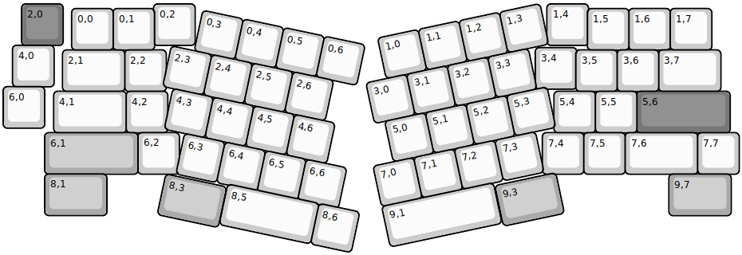{:loading="lazy"}

[Open in keyboard-layout-editor](http://www.keyboard-layout-editor.com/##@@_x:0.4445&y:0.0185&c=#777777;&=2,0&_x:2.1806&c=#cccccc;&=0,2&_x:8.4812;&=1,4;&@_x:15.08&y:-0.8885;&=1,6&=1,7;&@_x:14.0823&y:-0.9996;&=1,5;&@_x:2.6484&y:-0.9998;&=0,1;&@_x:1.6506&y:-0.9999;&=0,0;&@_x:0.2262&y:-0.1143;&=4,0;&@_x:12.8254&y:-0.9432;&=3,4;&@_x:13.8015&y:-0.9446;&=3,5&_x:0.9962&w:1.5;&=3,7;&@_x:14.7998&y:-0.9999;&=3,6;&@_x:2.9292&y:-0.9999;&=2,2;&@_x:1.4317&y:-0.9997&w:1.5;&=2,1;&@_y:-0.1144;&=6,0;&@_x:15.2718&y:-0.8881&c=#777777&w:2.25;&=5,6;&@_x:1.2183&y:-0.9998&c=#cccccc&w:1.75;&=4,1&_x:10.3087;&=5,4;&@_x:2.9659&y:-0.9999;&=4,2&_x:10.3093;&=5,5;&@_x:3.2462&y:-0.002;&=6,2;&@_x:12.9967&y:-0.9999;&=7,4&_x:-0.0025;&=7,5&_x:-0.0025&w:1.75;&=7,6&_x:-0.0026;&=7,7;&@_x:0.9996&y:-0.9996&c=#aaaaaa&w:2.25;&=6,1;&@_x:1.0005&y:-0.0025&w:1.5;&=8,1;&@_x:16.0468&y:-0.9973&w:1.5;&=9,7;&@_r:12&rx:3.9386&ry:4.109&w:1.5;&=8,3;&@_rx:4.6991&ry:0.2258&x:0.1149&y:-0.093&c=#cccccc;&=0,3&=0,4&=0,5&=0,6;&@_x:-0.4491&y:-0.0028;&=2,3&=2,4&=2,5&=2,6;&@_x:-0.1991;&=4,3&=4,4&=4,5&=4,6;&@_x:0.3009;&=6,3&=6,4&=6,5&=6,6;&@_rx:5.4334&ry:4.3492&w:2.25;&=8,5;&@_rx:7.6342&ry:4.817;&=8,6;&@_r:-12&rx:9.0102&ry:0.8597;&=1,0&=1,1&=1,2&=1,3;&@_x:-0.5002&y:0.0003;&=3,0&=3,1&=3,2&=3,3;&@_x:-0.2502;&=5,0&=5,1&=5,2&=5,3;&@_x:-0.7502;&=7,0&=7,1&=7,2&=7,3;&@_rx:9.1085&ry:4.9223&w:2.75;&=9,1;&@_rx:11.8366&ry:4.4209&c=#aaaaaa&w:1.5;&=9,3)

## sneakbox/aliceclonergb/alicecloneRGB

[README](output/sneakbox/aliceclonergb/README.md) - [layout](output/sneakbox/aliceclonergb/alicecloneRGB-kle.json) - [PCB](output/sneakbox/aliceclonergb/alicecloneRGB.kicad_pcb) - [PCB render](output/sneakbox/aliceclonergb/alicecloneRGB-render.svg)

{:loading="lazy"}

[Open in keyboard-layout-editor](http://www.keyboard-layout-editor.com/##@@_x:0.4445&y:0.0185&c=#777777;&=2,0&_x:2.1806&c=#cccccc;&=0,2&_x:8.4812;&=1,4;&@_x:15.08&y:-0.8885;&=1,6&=1,7;&@_x:14.0823&y:-0.9996;&=1,5;&@_x:2.6484&y:-0.9998;&=0,1;&@_x:1.6506&y:-0.9999;&=0,0;&@_x:0.2262&y:-0.1143;&=4,0;&@_x:12.8254&y:-0.9432;&=3,4;&@_x:13.8015&y:-0.9446;&=3,5&_x:0.9962&w:1.5;&=3,7;&@_x:14.7998&y:-0.9999;&=3,6;&@_x:2.9292&y:-0.9999;&=2,2;&@_x:1.4317&y:-0.9997&w:1.5;&=2,1;&@_y:-0.1144;&=6,0;&@_x:15.2718&y:-0.8881&c=#777777&w:2.25;&=5,6;&@_x:1.2183&y:-0.9998&c=#cccccc&w:1.75;&=4,1&_x:10.3087;&=5,4;&@_x:2.9659&y:-0.9999;&=4,2&_x:10.3093;&=5,5;&@_x:3.2462&y:-0.002;&=6,2;&@_x:12.9967&y:-0.9999;&=7,4&_x:-0.0025;&=7,5&_x:-0.0025&w:1.75;&=7,6&_x:-0.0026;&=7,7;&@_x:0.9996&y:-0.9996&c=#aaaaaa&w:2.25;&=6,1;&@_x:1.0005&y:-0.0025&w:1.5;&=8,1;&@_x:16.0468&y:-0.9973&w:1.5;&=9,7;&@_r:12&rx:3.9386&ry:4.109&w:1.5;&=8,3;&@_rx:4.6991&ry:0.2258&x:0.1149&y:-0.093&c=#cccccc;&=0,3&=0,4&=0,5&=0,6;&@_x:-0.4491&y:-0.0028;&=2,3&=2,4&=2,5&=2,6;&@_x:-0.1991;&=4,3&=4,4&=4,5&=4,6;&@_x:0.3009;&=6,3&=6,4&=6,5&=6,6;&@_rx:5.4334&ry:4.3492&w:2.25;&=8,5;&@_rx:7.6342&ry:4.817;&=8,6;&@_r:-12&rx:9.0102&ry:0.8597;&=1,0&=1,1&=1,2&=1,3;&@_x:-0.5002&y:0.0003;&=3,0&=3,1&=3,2&=3,3;&@_x:-0.2502;&=5,0&=5,1&=5,2&=5,3;&@_x:-0.7502;&=7,0&=7,1&=7,2&=7,3;&@_rx:9.1085&ry:4.9223&w:2.75;&=9,1;&@_rx:11.8366&ry:4.4209&c=#aaaaaa&w:1.5;&=9,3)

## sneakbox/ava

[README](output/sneakbox/ava/README.md) - [layout](output/sneakbox/ava/ava-kle.json) - [PCB](output/sneakbox/ava/ava.kicad_pcb) - [PCB render](output/sneakbox/ava/ava-render.svg)

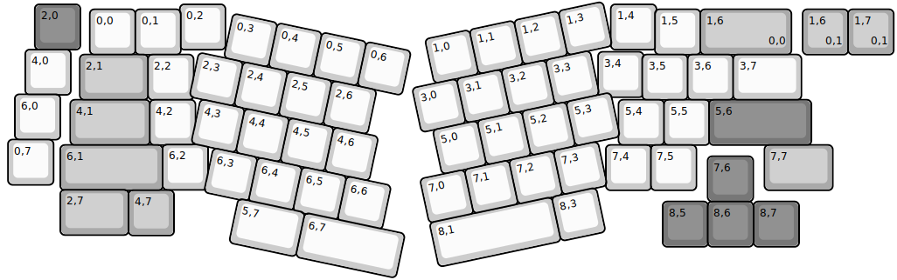{:loading="lazy"}

[Open in keyboard-layout-editor](http://www.keyboard-layout-editor.com/##@@_x:0.69&y:0.02&c=#777777;&=2,0&_x:2.19&c=#cccccc;&=0,2&_x:8.48;&=1,4;&@_x:1.9&y:-0.89;&=0,0&=0,1&_x:10.43;&=1,5&_c=#aaaaaa&w:2;&=1,6%0A%0A%0A0,0;&@_x:0.48&y:-0.11&c=#cccccc;&=4,0;&@_x:13.08&y:-0.95;&=3,4;&@_x:1.68&y:-0.94&c=#aaaaaa&w:1.5;&=2,1&_c=#cccccc;&=2,2&_x:9.87;&=3,5&=3,6&_w:1.5;&=3,7;&@_x:0.25&y:-0.12;&=6,0;&@_x:1.47&y:-0.88&c=#aaaaaa&w:1.75;&=4,1&_c=#cccccc;&=4,2&_x:9.31;&=5,4&=5,5&_x:-0.01&c=#777777&w:2.25;&=5,6;&@_x:0.1&y:-0.12&c=#cccccc;&=0,7;&@_x:3.5&y:-0.89;&=6,2;&@_x:1.25&y:-0.99&c=#aaaaaa&w:2.25;&=6,1&_x:9.75&c=#cccccc;&=7,4&_x:-0.01;&=7,5&_x:1.5&c=#aaaaaa&w:1.5;&=7,7;&@_x:15.49&y:-0.75&c=#777777;&=7,6;&@_x:1.25&y:-0.26&c=#aaaaaa&w:1.5;&=2,7;&@_x:2.75&y:-0.99;&=4,7;&@_x:14.5&y:-0.75&c=#777777;&=8,5&_x:-0.01;&=8,6&_x:0.01;&=8,7;&@_r:12&rx:4.6991&ry:0.2258&x:0.3609&y:-0.0958&c=#cccccc;&=0,3&=0,4&=0,5&=0,6;&@_x:-0.1991;&=2,3&=2,4&=2,5&=2,6;&@_x:0.0509;&=4,3&=4,4&=4,5&=4,6;&@_x:0.5509;&=6,3&=6,4&=6,5&=6,6;&@_rx:5.4334&ry:4.3492&x:-0.2534&y:0.0008&w:1.5;&=5,7;&@_rx:7.6342&ry:4.817&x:-1.0042&y:0.003&w:2.25;&=6,7;&@_r:-12&rx:9.0102&ry:0.8597&x:0.2498&y:0.0003;&=1,0&=1,1&=1,2&=1,3;&@_x:-0.2502;&=3,0&=3,1&=3,2&=3,3;&@_x:-0.0002;&=5,0&=5,1&=5,2&=5,3;&@_x:-0.5002;&=7,0&=7,1&=7,2&=7,3;&@_rx:9.1085&ry:4.9223&x:0.2515&y:-0.0023&w:2.75;&=8,1&=8,3;&@_r:0&rx:0&ry:0&x:17.58&y:0.13&c=#aaaaaa;&=1,6%0A%0A%0A0,1&=1,7%0A%0A%0A0,1)

## sneakbox/disarray/disarrayortho

[README](output/sneakbox/disarray/README.md) - [layout](output/sneakbox/disarray/disarrayortho-kle.json) - [PCB](output/sneakbox/disarray/disarrayortho.kicad_pcb) - [PCB render](output/sneakbox/disarray/disarrayortho-render.svg)

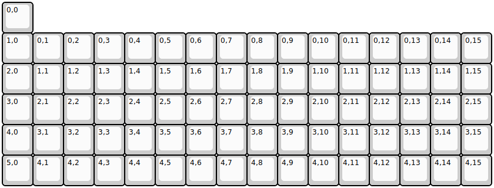{:loading="lazy"}

[Open in keyboard-layout-editor](http://www.keyboard-layout-editor.com/##@@=0,0;&@=1,0&=0,1&=0,2&=0,3&=0,4&=0,5&=0,6&=0,7&=0,8&=0,9&=0,10&=0,11&=0,12&=0,13&=0,14&=0,15;&@=2,0&=1,1&=1,2&=1,3&=1,4&=1,5&=1,6&=1,7&=1,8&=1,9&=1,10&=1,11&=1,12&=1,13&=1,14&=1,15;&@=3,0&=2,1&=2,2&=2,3&=2,4&=2,5&=2,6&=2,7&=2,8&=2,9&=2,10&=2,11&=2,12&=2,13&=2,14&=2,15;&@=4,0&=3,1&=3,2&=3,3&=3,4&=3,5&=3,6&=3,7&=3,8&=3,9&=3,10&=3,11&=3,12&=3,13&=3,14&=3,15;&@=5,0&=4,1&=4,2&=4,3&=4,4&=4,5&=4,6&=4,7&=4,8&=4,9&=4,10&=4,11&=4,12&=4,13&=4,14&=4,15)

## sneakbox/disarray/disarraystaggered

[README](output/sneakbox/disarray/README.md) - [layout](output/sneakbox/disarray/disarraystaggered-kle.json) - [PCB](output/sneakbox/disarray/disarraystaggered.kicad_pcb) - [PCB render](output/sneakbox/disarray/disarraystaggered-render.svg)

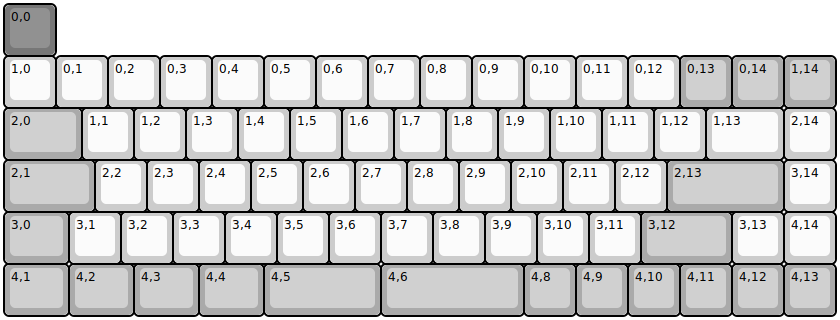{:loading="lazy"}

[Open in keyboard-layout-editor](http://www.keyboard-layout-editor.com/##@@_c=#777777;&=0,0;&@_c=#cccccc;&=1,0&=0,1&=0,2&=0,3&=0,4&=0,5&=0,6&=0,7&=0,8&=0,9&=0,10&=0,11&=0,12&_c=#aaaaaa;&=0,13&=0,14&=1,14;&@_w:1.5;&=2,0&_c=#cccccc;&=1,1&=1,2&=1,3&=1,4&=1,5&=1,6&=1,7&=1,8&=1,9&=1,10&=1,11&=1,12&_w:1.5;&=1,13&=2,14;&@_c=#aaaaaa&w:1.75;&=2,1&_c=#cccccc;&=2,2&=2,3&=2,4&=2,5&=2,6&=2,7&=2,8&=2,9&=2,10&=2,11&=2,12&_c=#aaaaaa&w:2.25;&=2,13&_c=#cccccc;&=3,14;&@_c=#aaaaaa&w:1.25;&=3,0&_c=#cccccc;&=3,1&=3,2&=3,3&=3,4&=3,5&=3,6&=3,7&=3,8&=3,9&=3,10&=3,11&_c=#aaaaaa&w:1.75;&=3,12&_c=#cccccc;&=3,13&=4,14;&@_c=#aaaaaa&w:1.25;&=4,1&_w:1.25;&=4,2&_w:1.25;&=4,3&_w:1.25;&=4,4&_w:2.25;&=4,5&_w:2.75;&=4,6&=4,8&=4,9&=4,10&=4,11&=4,12&=4,13)

## soda/cherish

[README](output/soda/cherish/README.md) - [layout](output/soda/cherish/cherish-kle.json) - [PCB](output/soda/cherish/cherish.kicad_pcb) - [PCB render](output/soda/cherish/cherish-render.svg)

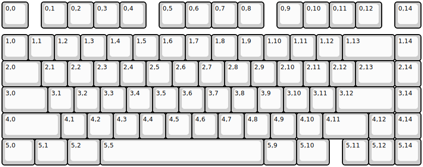{:loading="lazy"}

[Open in keyboard-layout-editor](http://www.keyboard-layout-editor.com/##@@=0,0&_x:0.5;&=0,1&=0,2&=0,3&=0,4&_x:0.5;&=0,5&=0,6&=0,7&=0,8&_x:0.5;&=0,9&=0,10&=0,11&=0,12&_x:0.5;&=0,14;&@_y:0.25;&=1,0&=1,1&=1,2&=1,3&=1,4&=1,5&=1,6&=1,7&=1,8&=1,9&=1,10&=1,11&=1,12&_w:2;&=1,13&=1,14;&@_w:1.5;&=2,0&=2,1&=2,2&=2,3&=2,4&=2,5&=2,6&=2,7&=2,8&=2,9&=2,10&=2,11&=2,12&_w:1.5;&=2,13&=2,14;&@_w:1.75;&=3,0&=3,1&=3,2&=3,3&=3,4&=3,5&=3,6&=3,7&=3,8&=3,9&=3,10&=3,11&_w:2.25;&=3,12&=3,14;&@_w:2.25;&=4,0&=4,1&=4,2&=4,3&=4,4&=4,5&=4,6&=4,7&=4,8&=4,9&=4,10&_w:1.75;&=4,11&=4,12&=4,14;&@_w:1.25;&=5,0&_w:1.25;&=5,1&_w:1.25;&=5,2&_w:6.25;&=5,5&_w:1.25;&=5,9&_w:1.25;&=5,10&_x:0.5;&=5,11&=5,12&=5,14)

## soda/pocket

[README](output/soda/pocket/README.md) - [layout](output/soda/pocket/pocket-kle.json) - [PCB](output/soda/pocket/pocket.kicad_pcb) - [PCB render](output/soda/pocket/pocket-render.svg)

{:loading="lazy"}

[Open in keyboard-layout-editor](http://www.keyboard-layout-editor.com/##@@_y:0.25;&=0,0&=0,1&=0,2&_x:0.25;&=0,3&=0,4&=0,5&=0,6;&@_y:0.25;&=1,0&=1,1&=1,2&_x:0.25;&=1,3&=1,4&=1,5&=1,6;&@=2,0&=2,1&=2,2&_x:0.25;&=2,3&=2,4&=2,5&_h:2;&=3,6;&@_x:3.25;&=3,3&=3,4&=3,5;&@_x:1;&=4,1&_x:1.25;&=4,3&=4,4&=4,5&_h:2;&=5,6;&@=5,0&=5,1&=5,2&_x:0.25&w:2;&=5,4&=5,5)

## sofle/keyhive_sofle_rgb

[README](output/sofle/README.md) - [layout](output/sofle/keyhive_sofle_rgb-kle.json) - [PCB](output/sofle/keyhive_sofle_rgb.kicad_pcb) - [PCB render](output/sofle/keyhive_sofle_rgb-render.svg)

{:loading="lazy"}

[Open in keyboard-layout-editor](http://www.keyboard-layout-editor.com/##@@_x:3.25&y:0.5;&=0,3&_x:9.0;&=5,3;&@_x:2.25&y:-0.87;&=0,2&_x:1.0;&=0,4&_x:7.0;&=5,4&_x:1.0;&=5,2;&@_x:5.25&y:-0.9;&=0,5&_x:5.0;&=5,5;&@_x:0.25&y:-0.87&c=#777777;&=0,0&_c=#cccccc;&=0,1&_x:13.0;&=5,1&_c=#aaaaaa;&=5,0;&@_x:3.25&y:-0.4&c=#cccccc;&=1,3&_x:2.2;&=1,6&_x:2.6;&=8,6&_x:2.2;&=6,3;&@_x:2.25&y:-0.9;&=1,2&_x:1.0;&=1,4&_x:7.0;&=6,4&_x:1.0;&=6,2;&@_x:5.25&y:-0.9;&=1,5&_x:5.0;&=6,5;&@_x:0.25&y:-0.9&c=#aaaaaa;&=1,0&_c=#cccccc;&=1,1&_x:13.0;&=6,1&_c=#aaaaaa;&=6,0;&@_x:3.25&y:-0.4&c=#cccccc;&=2,3&_x:2.2;&=4,0&_x:2.6;&=9,5&_x:2.2;&=7,3;&@_x:2.25&y:-0.9;&=2,2&_x:1.0;&=2,4&_x:7.0;&=7,4&_x:1.0;&=7,2;&@_x:5.25&y:-0.9;&=2,5&_x:5.0;&=7,5;&@_x:0.25&y:-0.9&c=#aaaaaa;&=2,0&_c=#cccccc;&=2,1&_x:13.0;&=7,1&_c=#aaaaaa;&=7,0;&@_x:3.25&y:-0.4&c=#cccccc;&=3,3&_x:2.2;&=3,6&_x:2.6;&=6,6&_x:2.2;&=8,3;&@_x:2.25&y:-0.9;&=3,2&_x:1.0;&=3,4&_x:7.0;&=8,4&_x:1.0;&=8,2;&@_x:5.25&y:-0.9;&=3,5&_x:5.0;&=8,5;&@_x:0.25&y:-0.9&c=#aaaaaa;&=3,0&_c=#cccccc;&=3,1&_x:13.0;&=8,1&_c=#aaaaaa;&=8,0;&@_x:3.25&y:-0.3;&=4,2&_x:9.0;&=9,1;&@_x:2.25&y:-0.9;&=4,1&_x:1.0;&=4,3&_x:7.0;&=9,2&_x:1.0;&=9,0;&@_r:30&rx:7.15&x:1.0&y:4.6&c=#777777;&=4,4;&@_r:45&x:3.35&y:-2.25&h:1.5;&=4,5;&@_r:-45&x:-2.08&y:1.3&h:1.5;&=9,4;&@_r:-30&x:0.8&y:-0.45;&=9,3)

## spaceman/2_milk

[README](output/spaceman/README.md) - [layout](output/spaceman/2_milk-kle.json) - [PCB](output/spaceman/2_milk.kicad_pcb) - [PCB render](output/spaceman/2_milk-render.svg)

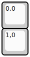{:loading="lazy"}

[Open in keyboard-layout-editor](http://www.keyboard-layout-editor.com/##@@=0,0;&@=1,0)

## spaceman/pancake

[README](output/spaceman/README.md) - [layout](output/spaceman/pancake-kle.json) - [PCB](output/spaceman/pancake.kicad_pcb) - [PCB render](output/spaceman/pancake-render.svg)

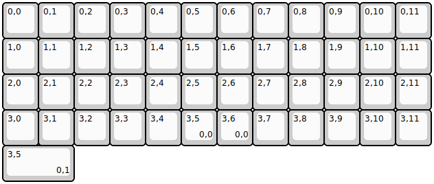{:loading="lazy"}

[Open in keyboard-layout-editor](http://www.keyboard-layout-editor.com/##@@=0,0&=0,1&=0,2&=0,3&=0,4&=0,5&=0,6&=0,7&=0,8&=0,9&=0,10&=0,11;&@=1,0&=1,1&=1,2&=1,3&=1,4&=1,5&=1,6&=1,7&=1,8&=1,9&=1,10&=1,11;&@=2,0&=2,1&=2,2&=2,3&=2,4&=2,5&=2,6&=2,7&=2,8&=2,9&=2,10&=2,11;&@=3,0&=3,1&=3,2&=3,3&=3,4&=3,5%0A%0A%0A0,0&=3,6%0A%0A%0A0,0&=3,7&=3,8&=3,9&=3,10&=3,11;&@_w:2;&=3,5%0A%0A%0A0,1)

## splitkb/kyria

[README](output/splitkb/README.md) - [layout](output/splitkb/kyria-kle.json) - [PCB](output/splitkb/kyria.kicad_pcb) - [PCB render](output/splitkb/kyria-render.svg)

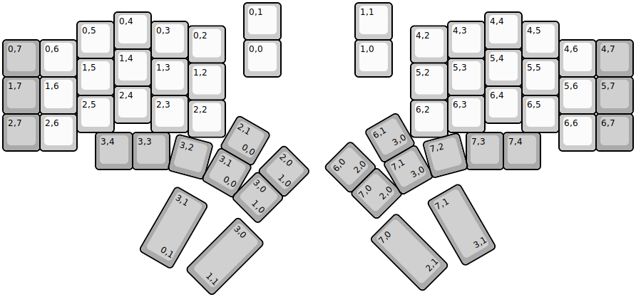{:loading="lazy"}

[Open in keyboard-layout-editor](http://www.keyboard-layout-editor.com/##@@_x:6.5;&=0,1&_x:2.0;&=1,1;&@_x:3&y:-0.75;&=0,4&_x:9;&=4,4;&@_x:2&y:-0.75;&=0,5&_x:1;&=0,3&_x:7;&=4,3&_x:1;&=4,5;&@_x:5&y:-0.875;&=0,2&_x:5;&=4,2;&@_y:-0.625&c=#aaaaaa;&=0,7&_c=#cccccc;&=0,6&_x:4.5;&=0,0&_x:2.0;&=1,0&_x:4.5;&=4,6&_c=#aaaaaa;&=4,7;&@_x:3&y:-0.75&c=#cccccc;&=1,4&_x:9;&=5,4;&@_x:2&y:-0.75;&=1,5&_x:1;&=1,3&_x:7;&=5,3&_x:1;&=5,5;&@_x:5&y:-0.875;&=1,2&_x:5;&=5,2;&@_y:-0.625&c=#aaaaaa;&=1,7&_c=#cccccc;&=1,6&_x:13;&=5,6&_c=#aaaaaa;&=5,7;&@_x:3&y:-0.75&c=#cccccc;&=2,4&_x:9;&=6,4;&@_x:2&y:-0.75;&=2,5&_x:1;&=2,3&_x:7;&=6,3&_x:1;&=6,5;&@_x:5&y:-0.875;&=2,2&_x:5;&=6,2;&@_y:-0.625&c=#aaaaaa;&=2,7&_c=#cccccc;&=2,6&_x:13;&=6,6&_c=#aaaaaa;&=6,7;&@_x:2.5&y:-0.5;&=3,4&_x:10.0;&=7,4;&@_rx:4&ry:8.175&x:-0.5&y:-4.675;&=3,3;&@_rx:13&x:-0.5&y:-4.675;&=7,3;&@_r:15&rx:4&x:-0.5&y:-4.675;&=3,2;&@_r:30&x:-0.5&y:-2.0;&=2,1%0A%0A%0A0,0;&@_x:-0.5;&=3,1%0A%0A%0A0,0;&@_r:45&x:-0.5&y:-2.0;&=2,0%0A%0A%0A1,0;&@_x:-0.5;&=3,0%0A%0A%0A1,0;&@_r:-45&rx:13&x:-0.5&y:-5.675;&=6,0%0A%0A%0A2,0;&@_x:-0.5;&=7,0%0A%0A%0A2,0;&@_r:-30&x:-0.5&y:-2.0;&=6,1%0A%0A%0A3,0;&@_x:-0.5;&=7,1%0A%0A%0A3,0;&@_r:-15&x:-0.5&y:-1.0;&=7,2;&@_r:30&rx:4&x:-1&y:-3.175&h:2;&=3,1%0A%0A%0A0,1;&@_r:45&y:-1.25&h:2;&=3,0%0A%0A%0A1,1;&@_r:-45&rx:13&x:-1&y:-3.425&h:2;&=7,0%0A%0A%0A2,1;&@_r:-30&y:-0.75&h:2;&=7,1%0A%0A%0A3,1)

## splitkb/zima

[README](output/splitkb/README.md) - [layout](output/splitkb/zima-kle.json) - [PCB](output/splitkb/zima.kicad_pcb) - [PCB render](output/splitkb/zima-render.svg)

{:loading="lazy"}

[Open in keyboard-layout-editor](http://www.keyboard-layout-editor.com/##@@=0,0&=0,1&=0,2;&@=1,0&=1,1&=1,2;&@=2,0&=2,1&=2,2;&@=3,0&=3,1&=3,2)

## star75/star75

[README](output/star75/README.md) - [layout](output/star75/star75-kle.json) - [PCB](output/star75/star75.kicad_pcb) - [PCB render](output/star75/star75-render.svg)

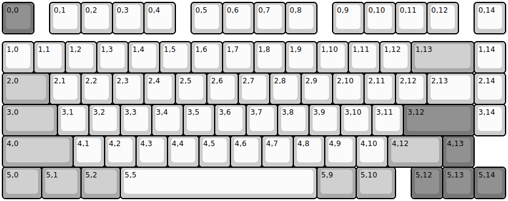{:loading="lazy"}

[Open in keyboard-layout-editor](http://www.keyboard-layout-editor.com/##@@_c=#777777;&=0,0&_x:0.5&c=#cccccc;&=0,1&=0,2&=0,3&=0,4&_x:0.5;&=0,5&=0,6&=0,7&=0,8&_x:0.5;&=0,9&=0,10&=0,11&=0,12&_x:0.5;&=0,14;&@_y:0.25;&=1,0&=1,1&=1,2&=1,3&=1,4&=1,5&=1,6&=1,7&=1,8&=1,9&=1,10&=1,11&=1,12&_c=#aaaaaa&w:2;&=1,13&_c=#cccccc;&=1,14;&@_c=#aaaaaa&w:1.5;&=2,0&_c=#cccccc;&=2,1&=2,2&=2,3&=2,4&=2,5&=2,6&=2,7&=2,8&=2,9&=2,10&=2,11&=2,12&_w:1.5;&=2,13&=2,14;&@_c=#aaaaaa&w:1.75;&=3,0&_c=#cccccc;&=3,1&=3,2&=3,3&=3,4&=3,5&=3,6&=3,7&=3,8&=3,9&=3,10&=3,11&_c=#777777&w:2.25;&=3,12&_c=#cccccc;&=3,14;&@_c=#aaaaaa&w:2.25;&=4,0&_c=#cccccc;&=4,1&=4,2&=4,3&=4,4&=4,5&=4,6&=4,7&=4,8&=4,9&=4,10&_c=#aaaaaa&w:1.75;&=4,12&_c=#777777;&=4,13;&@_c=#aaaaaa&w:1.25;&=5,0&_w:1.25;&=5,1&_w:1.25;&=5,2&_c=#cccccc&w:6.25;&=5,5&_c=#aaaaaa&w:1.25;&=5,9&_w:1.25;&=5,10&_x:0.5&c=#777777;&=5,12&=5,13&=5,14)

## stello65/stello65_beta

[README](output/stello65/README.md) - [layout](output/stello65/stello65_beta-kle.json) - [PCB](output/stello65/stello65_beta.kicad_pcb) - [PCB render](output/stello65/stello65_beta-render.svg)

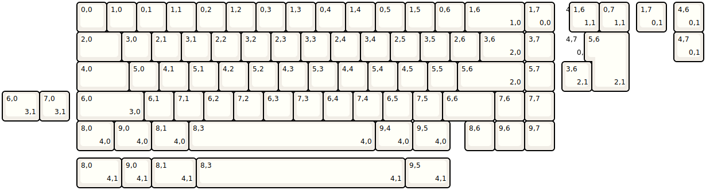{:loading="lazy"}

[Open in keyboard-layout-editor](http://www.keyboard-layout-editor.com/##@@_x:2.5&c=#f1ede6;&=0,0&=1,0&=0,1&=1,1&=0,2&=1,2&=0,3&=1,3&=0,4&=1,4&=0,5&=1,5&=0,6&_w:2;&=1,6%0A%0A%0A1,0&=1,7%0A%0A%0A0,0&_x:0.25&d:true;&=4,6%0A%0A%0A0,0;&@_x:2.5&w:1.5;&=2,0&=3,0&=2,1&=3,1&=2,2&=3,2&=2,3&=3,3&=2,4&=3,4&=2,5&=3,5&=2,6&_w:1.5;&=3,6%0A%0A%0A2,0&=3,7&_x:0.25&d:true;&=4,7%0A%0A%0A0,0;&@_x:2.5&w:1.75;&=4,0&=5,0&=4,1&=5,1&=4,2&=5,2&=4,3&=5,3&=4,4&=5,4&=4,5&=5,5&_w:2.25;&=5,6%0A%0A%0A2,0&=5,7;&@_x:2.5&w:2.25;&=6,0%0A%0A%0A3,0&=6,1&=7,1&=6,2&=7,2&=6,3&=7,3&=6,4&=7,4&=6,5&=7,5&_w:1.75;&=6,6&=7,6&=7,7;&@_x:2.5&w:1.25;&=8,0%0A%0A%0A4,0&_w:1.25;&=9,0%0A%0A%0A4,0&_w:1.25;&=8,1%0A%0A%0A4,0&_w:6.25;&=8,3%0A%0A%0A4,0&_w:1.25;&=9,4%0A%0A%0A4,0&_w:1.25;&=9,5%0A%0A%0A4,0&_x:0.5;&=8,6&=9,6&=9,7;&@_x:19.0&y:-5;&=1,6%0A%0A%0A1,1&=0,7%0A%0A%0A1,1&_x:0.25;&=1,7%0A%0A%0A0,1&_x:0.25;&=4,6%0A%0A%0A0,1;&@_x:19.75&w:1.25&h:2&w2:1.5&h2:1&x2:-0.25;&=5,6%0A%0A%0A2,1&_x:1.5;&=4,7%0A%0A%0A0,1;&@_x:18.75;&=3,6%0A%0A%0A2,1;&@_w:1.25;&=6,0%0A%0A%0A3,1&=7,0%0A%0A%0A3,1;&@_x:2.5&y:1.25&w:1.5;&=8,0%0A%0A%0A4,1&=9,0%0A%0A%0A4,1&_w:1.5;&=8,1%0A%0A%0A4,1&_w:7;&=8,3%0A%0A%0A4,1&_w:1.5;&=9,5%0A%0A%0A4,1)

## stello65/stello65_hs_rev1

[README](output/stello65/README.md) - [layout](output/stello65/stello65_hs_rev1-kle.json) - [PCB](output/stello65/stello65_hs_rev1.kicad_pcb) - [PCB render](output/stello65/stello65_hs_rev1-render.svg)

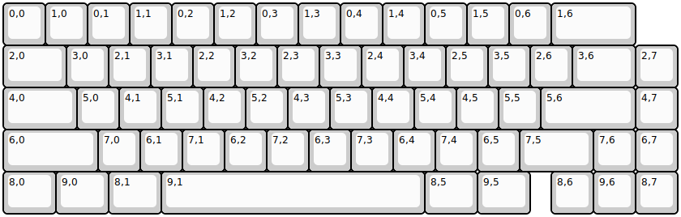{:loading="lazy"}

[Open in keyboard-layout-editor](http://www.keyboard-layout-editor.com/##@@=0,0&=1,0&=0,1&=1,1&=0,2&=1,2&=0,3&=1,3&=0,4&=1,4&=0,5&=1,5&=0,6&_w:2;&=1,6;&@_w:1.5;&=2,0&=3,0&=2,1&=3,1&=2,2&=3,2&=2,3&=3,3&=2,4&=3,4&=2,5&=3,5&=2,6&_w:1.5;&=3,6&=2,7;&@_w:1.75;&=4,0&=5,0&=4,1&=5,1&=4,2&=5,2&=4,3&=5,3&=4,4&=5,4&=4,5&=5,5&_w:2.25;&=5,6&=4,7;&@_w:2.25;&=6,0&=7,0&=6,1&=7,1&=6,2&=7,2&=6,3&=7,3&=6,4&=7,4&=6,5&_w:1.75;&=7,5&=7,6&=6,7;&@_w:1.25;&=8,0&_w:1.25;&=9,0&_w:1.25;&=8,1&_w:6.25;&=9,1&_w:1.25;&=8,5&_w:1.25;&=9,5&_x:0.5;&=8,6&=9,6&=8,7)

## stello65/stello65_sl_rev1

[README](output/stello65/README.md) - [layout](output/stello65/stello65_sl_rev1-kle.json) - [PCB](output/stello65/stello65_sl_rev1.kicad_pcb) - [PCB render](output/stello65/stello65_sl_rev1-render.svg)

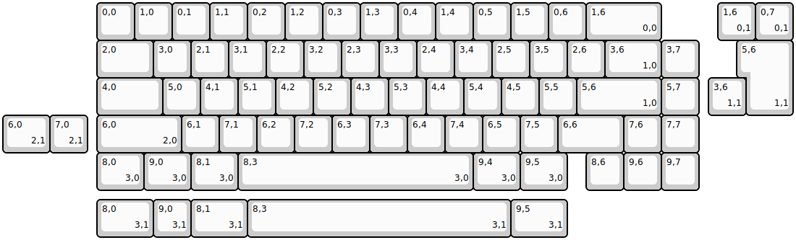{:loading="lazy"}

[Open in keyboard-layout-editor](http://www.keyboard-layout-editor.com/##@@_x:2.5;&=0,0&=1,0&=0,1&=1,1&=0,2&=1,2&=0,3&=1,3&=0,4&=1,4&=0,5&=1,5&=0,6&_w:2;&=1,6%0A%0A%0A0,0;&@_x:2.5&w:1.5;&=2,0&=3,0&=2,1&=3,1&=2,2&=3,2&=2,3&=3,3&=2,4&=3,4&=2,5&=3,5&=2,6&_w:1.5;&=3,6%0A%0A%0A1,0&=3,7;&@_x:2.5&w:1.75;&=4,0&=5,0&=4,1&=5,1&=4,2&=5,2&=4,3&=5,3&=4,4&=5,4&=4,5&=5,5&_w:2.25;&=5,6%0A%0A%0A1,0&=5,7;&@_x:2.5&w:2.25;&=6,0%0A%0A%0A2,0&=6,1&=7,1&=6,2&=7,2&=6,3&=7,3&=6,4&=7,4&=6,5&=7,5&_w:1.75;&=6,6&=7,6&=7,7;&@_x:2.5&w:1.25;&=8,0%0A%0A%0A3,0&_w:1.25;&=9,0%0A%0A%0A3,0&_w:1.25;&=8,1%0A%0A%0A3,0&_w:6.25;&=8,3%0A%0A%0A3,0&_w:1.25;&=9,4%0A%0A%0A3,0&_w:1.25;&=9,5%0A%0A%0A3,0&_x:0.5;&=8,6&=9,6&=9,7;&@_x:19.0&y:-5;&=1,6%0A%0A%0A0,1&=0,7%0A%0A%0A0,1;&@_x:19.75&w:1.25&h:2&w2:1.5&h2:1&x2:-0.25;&=5,6%0A%0A%0A1,1;&@_x:18.75;&=3,6%0A%0A%0A1,1;&@_w:1.25;&=6,0%0A%0A%0A2,1&=7,0%0A%0A%0A2,1;&@_x:2.5&y:1.25&w:1.5;&=8,0%0A%0A%0A3,1&=9,0%0A%0A%0A3,1&_w:1.5;&=8,1%0A%0A%0A3,1&_w:7;&=8,3%0A%0A%0A3,1&_w:1.5;&=9,5%0A%0A%0A3,1)

## stickey4/stickey4

[README](output/stickey4/README.md) - [layout](output/stickey4/stickey4-kle.json) - [PCB](output/stickey4/stickey4.kicad_pcb) - [PCB render](output/stickey4/stickey4-render.svg)

{:loading="lazy"}

[Open in keyboard-layout-editor](http://www.keyboard-layout-editor.com/##@@_x:0.125;&=0,0&=0,1&=0,2&=0,3;&@_y:0.25;&=0,4&=0,5&_x:0.25;&=0,6&=0,7)

## stratos/stratos

[README](output/stratos/README.md) - [layout](output/stratos/stratos-kle.json) - [PCB](output/stratos/stratos.kicad_pcb) - [PCB render](output/stratos/stratos-render.svg)

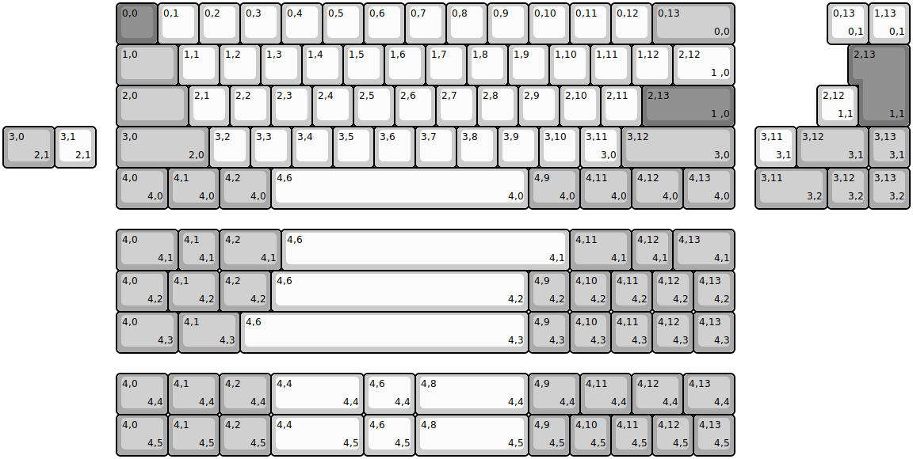{:loading="lazy"}

[Open in keyboard-layout-editor](http://www.keyboard-layout-editor.com/##@@_x:2.75&c=#777777;&=0,0&_c=#cccccc;&=0,1&=0,2&=0,3&=0,4&=0,5&=0,6&=0,7&=0,8&=0,9&=0,10&=0,11&=0,12&_c=#aaaaaa&w:2;&=0,13%0A%0A%0A0,0;&@_x:2.75&w:1.5;&=1,0&_c=#cccccc;&=1,1&=1,2&=1,3&=1,4&=1,5&=1,6&=1,7&=1,8&=1,9&=1,10&=1,11&=1,12&_w:1.5;&=2,12%0A%0A%0A1%20,0;&@_x:2.75&c=#aaaaaa&w:1.75;&=2,0&_c=#cccccc;&=2,1&=2,2&=2,3&=2,4&=2,5&=2,6&=2,7&=2,8&=2,9&=2,10&=2,11&_c=#777777&w:2.25;&=2,13%0A%0A%0A1%20,0;&@_x:2.75&c=#aaaaaa&w:2.25;&=3,0%0A%0A%0A2,0&_c=#cccccc;&=3,2&=3,3&=3,4&=3,5&=3,6&=3,7&=3,8&=3,9&=3,10&=3,11%0A%0A%0A3,0&_c=#aaaaaa&w:2.75;&=3,12%0A%0A%0A3,0;&@_x:2.75&w:1.25;&=4,0%0A%0A%0A4,0&_w:1.25;&=4,1%0A%0A%0A4,0&_w:1.25;&=4,2%0A%0A%0A4,0&_c=#cccccc&w:6.25;&=4,6%0A%0A%0A4,0&_c=#aaaaaa&w:1.25;&=4,9%0A%0A%0A4,0&_w:1.25;&=4,11%0A%0A%0A4,0&_w:1.25;&=4,12%0A%0A%0A4,0&_w:1.25;&=4,13%0A%0A%0A4,0;&@_x:20.0&y:-5&c=#cccccc;&=0,13%0A%0A%0A0,1&=1,13%0A%0A%0A0,1;&@_x:20.75&c=#777777&w:1.25&h:2&w2:1&h2:1&x2:-0.25;&=2,13%0A%0A%0A1,1;&@_x:19.75&c=#cccccc;&=2,12%0A%0A%0A1,1;&@_c=#aaaaaa&w:1.25;&=3,0%0A%0A%0A2,1&_c=#cccccc;&=3,1%0A%0A%0A2,1&_x:16.0;&=3,11%0A%0A%0A3,1&_c=#aaaaaa&w:1.75;&=3,12%0A%0A%0A3,1&=3,13%0A%0A%0A3,1;&@_x:18.25&w:1.75;&=3,11%0A%0A%0A3,2&=3,12%0A%0A%0A3,2&=3,13%0A%0A%0A3,2;&@_x:2.75&y:0.5&w:1.5;&=4,0%0A%0A%0A4,1&=4,1%0A%0A%0A4,1&_w:1.5;&=4,2%0A%0A%0A4,1&_c=#cccccc&w:7;&=4,6%0A%0A%0A4,1&_c=#aaaaaa&w:1.5;&=4,11%0A%0A%0A4,1&=4,12%0A%0A%0A4,1&_w:1.5;&=4,13%0A%0A%0A4,1;&@_x:2.75&w:1.25;&=4,0%0A%0A%0A4,2&_w:1.25;&=4,1%0A%0A%0A4,2&_w:1.25;&=4,2%0A%0A%0A4,2&_c=#cccccc&w:6.25;&=4,6%0A%0A%0A4,2&_c=#aaaaaa;&=4,9%0A%0A%0A4,2&=4,10%0A%0A%0A4,2&=4,11%0A%0A%0A4,2&=4,12%0A%0A%0A4,2&=4,13%0A%0A%0A4,2;&@_x:2.75&w:1.5;&=4,0%0A%0A%0A4,3&_w:1.5;&=4,1%0A%0A%0A4,3&_c=#cccccc&w:7;&=4,6%0A%0A%0A4,3&_c=#aaaaaa;&=4,9%0A%0A%0A4,3&=4,10%0A%0A%0A4,3&=4,11%0A%0A%0A4,3&=4,12%0A%0A%0A4,3&=4,13%0A%0A%0A4,3;&@_x:2.75&y:0.5&w:1.25;&=4,0%0A%0A%0A4,4&_w:1.25;&=4,1%0A%0A%0A4,4&_w:1.25;&=4,2%0A%0A%0A4,4&_c=#cccccc&w:2.25;&=4,4%0A%0A%0A4,4&_w:1.25;&=4,6%0A%0A%0A4,4&_w:2.75;&=4,8%0A%0A%0A4,4&_c=#aaaaaa&w:1.25;&=4,9%0A%0A%0A4,4&_w:1.25;&=4,11%0A%0A%0A4,4&_w:1.25;&=4,12%0A%0A%0A4,4&_w:1.25;&=4,13%0A%0A%0A4,4;&@_x:2.75&w:1.25;&=4,0%0A%0A%0A4,5&_w:1.25;&=4,1%0A%0A%0A4,5&_w:1.25;&=4,2%0A%0A%0A4,5&_c=#cccccc&w:2.25;&=4,4%0A%0A%0A4,5&_w:1.25;&=4,6%0A%0A%0A4,5&_w:2.75;&=4,8%0A%0A%0A4,5&_c=#aaaaaa;&=4,9%0A%0A%0A4,5&=4,10%0A%0A%0A4,5&=4,11%0A%0A%0A4,5&=4,12%0A%0A%0A4,5&=4,13%0A%0A%0A4,5)

## studiokestra/bourgeau

[README](output/studiokestra/bourgeau/README.md) - [layout](output/studiokestra/bourgeau/bourgeau-kle.json) - [PCB](output/studiokestra/bourgeau/bourgeau.kicad_pcb) - [PCB render](output/studiokestra/bourgeau/bourgeau-render.svg)

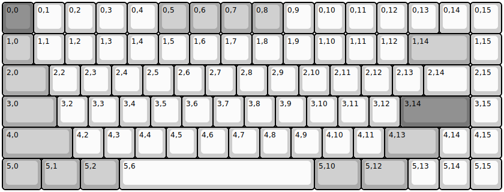{:loading="lazy"}

[Open in keyboard-layout-editor](http://www.keyboard-layout-editor.com/##@@_c=#777777;&=0,0&_c=#cccccc;&=0,1&=0,2&=0,3&=0,4&_c=#aaaaaa;&=0,5&=0,6&=0,7&=0,8&_c=#cccccc;&=0,9&=0,10&=0,11&=0,12&=0,13&=0,14&=0,15;&@_c=#aaaaaa;&=1,0&_c=#cccccc;&=1,1&=1,2&=1,3&=1,4&=1,5&=1,6&=1,7&=1,8&=1,9&=1,10&=1,11&=1,12&_c=#aaaaaa&w:2;&=1,14&_c=#cccccc;&=1,15;&@_c=#aaaaaa&w:1.5;&=2,0&_c=#cccccc;&=2,2&=2,3&=2,4&=2,5&=2,6&=2,7&=2,8&=2,9&=2,10&=2,11&=2,12&=2,13&_w:1.5;&=2,14&=2,15;&@_c=#aaaaaa&w:1.75;&=3,0&_c=#cccccc;&=3,2&=3,3&=3,4&=3,5&=3,6&=3,7&=3,8&=3,9&=3,10&=3,11&=3,12&_c=#777777&w:2.25;&=3,14&_c=#cccccc;&=3,15;&@_c=#aaaaaa&w:2.25;&=4,0&_c=#cccccc;&=4,2&=4,3&=4,4&=4,5&=4,6&=4,7&=4,8&=4,9&=4,10&=4,11&_c=#aaaaaa&w:1.75;&=4,13&_c=#cccccc;&=4,14&=4,15;&@_c=#aaaaaa&w:1.25;&=5,0&_w:1.25;&=5,1&_w:1.25;&=5,2&_c=#cccccc&w:6.25;&=5,6&_c=#aaaaaa&w:1.5;&=5,10&_w:1.5;&=5,12&_c=#cccccc;&=5,13&=5,14&=5,15)

## studiokestra/cascade

[README](output/studiokestra/cascade/README.md) - [layout](output/studiokestra/cascade/cascade-kle.json) - [PCB](output/studiokestra/cascade/cascade.kicad_pcb) - [PCB render](output/studiokestra/cascade/cascade-render.svg)

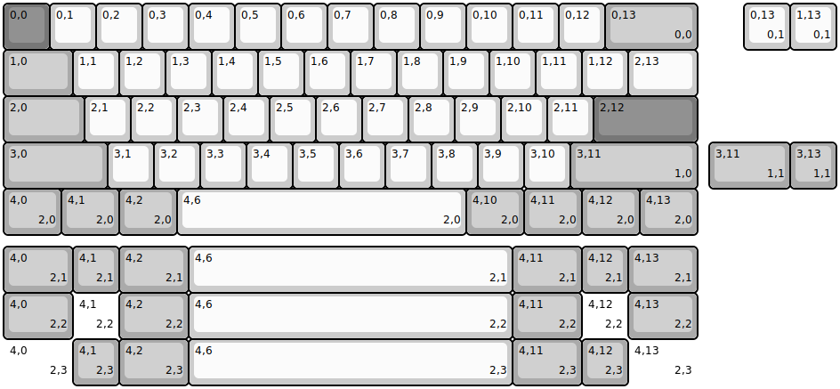{:loading="lazy"}

[Open in keyboard-layout-editor](http://www.keyboard-layout-editor.com/##@@_c=#777777;&=0,0&_c=#cccccc;&=0,1&=0,2&=0,3&=0,4&=0,5&=0,6&=0,7&=0,8&=0,9&=0,10&=0,11&=0,12&_c=#aaaaaa&w:2;&=0,13%0A%0A%0A0,0;&@_w:1.5;&=1,0&_c=#cccccc;&=1,1&=1,2&=1,3&=1,4&=1,5&=1,6&=1,7&=1,8&=1,9&=1,10&=1,11&=1,12&_w:1.5;&=2,13;&@_c=#aaaaaa&w:1.75;&=2,0&_c=#cccccc;&=2,1&=2,2&=2,3&=2,4&=2,5&=2,6&=2,7&=2,8&=2,9&=2,10&=2,11&_c=#777777&w:2.25;&=2,12;&@_c=#aaaaaa&w:2.25;&=3,0&_c=#cccccc;&=3,1&=3,2&=3,3&=3,4&=3,5&=3,6&=3,7&=3,8&=3,9&=3,10&_c=#aaaaaa&w:2.75;&=3,11%0A%0A%0A1,0;&@_w:1.25;&=4,0%0A%0A%0A2,0&_w:1.25;&=4,1%0A%0A%0A2,0&_w:1.25;&=4,2%0A%0A%0A2,0&_c=#cccccc&w:6.25;&=4,6%0A%0A%0A2,0&_c=#aaaaaa&w:1.25;&=4,10%0A%0A%0A2,0&_w:1.25;&=4,11%0A%0A%0A2,0&_w:1.25;&=4,12%0A%0A%0A2,0&_w:1.25;&=4,13%0A%0A%0A2,0;&@_x:16&y:-5&c=#cccccc;&=0,13%0A%0A%0A0,1&=1,13%0A%0A%0A0,1;&@_x:15.25&y:2&c=#aaaaaa&w:1.75;&=3,11%0A%0A%0A1,1&=3,13%0A%0A%0A1,1;&@_y:1.25&w:1.5;&=4,0%0A%0A%0A2,1&=4,1%0A%0A%0A2,1&_w:1.5;&=4,2%0A%0A%0A2,1&_c=#cccccc&w:7;&=4,6%0A%0A%0A2,1&_c=#aaaaaa&w:1.5;&=4,11%0A%0A%0A2,1&=4,12%0A%0A%0A2,1&_w:1.5;&=4,13%0A%0A%0A2,1;&@_w:1.5;&=4,0%0A%0A%0A2,2&_c=#cccccc&d:true;&=4,1%0A%0A%0A2,2&_c=#aaaaaa&w:1.5;&=4,2%0A%0A%0A2,2&_c=#cccccc&w:7;&=4,6%0A%0A%0A2,2&_c=#aaaaaa&w:1.5;&=4,11%0A%0A%0A2,2&_c=#cccccc&d:true;&=4,12%0A%0A%0A2,2&_c=#aaaaaa&w:1.5;&=4,13%0A%0A%0A2,2;&@_c=#cccccc&w:1.5&d:true;&=4,0%0A%0A%0A2,3&_c=#aaaaaa;&=4,1%0A%0A%0A2,3&_w:1.5;&=4,2%0A%0A%0A2,3&_c=#cccccc&w:7;&=4,6%0A%0A%0A2,3&_c=#aaaaaa&w:1.5;&=4,11%0A%0A%0A2,3&=4,12%0A%0A%0A2,3&_c=#cccccc&w:1.5&d:true;&=4,13%0A%0A%0A2,3)

## studiokestra/galatea/galatea-rev1

[README](output/studiokestra/galatea/README.md) - [layout](output/studiokestra/galatea/galatea-rev1-kle.json) - [PCB](output/studiokestra/galatea/galatea-rev1.kicad_pcb) - [PCB render](output/studiokestra/galatea/galatea-rev1-render.svg)

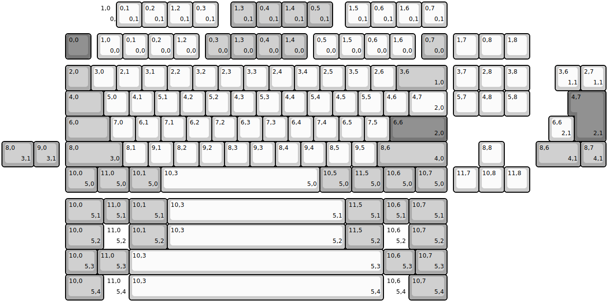{:loading="lazy"}

[Open in keyboard-layout-editor](http://www.keyboard-layout-editor.com/##@@_x:2.5&y:1.25&c=#777777;&=0,0&_x:0.25&c=#cccccc;&=1,0%0A%0A%0A0,0&=0,1%0A%0A%0A0,0&=0,2%0A%0A%0A0,0&=1,2%0A%0A%0A0,0&_x:0.25&c=#aaaaaa;&=0,3%0A%0A%0A0,0&=1,3%0A%0A%0A0,0&=0,4%0A%0A%0A0,0&=1,4%0A%0A%0A0,0&_x:0.25&c=#cccccc;&=0,5%0A%0A%0A0,0&=1,5%0A%0A%0A0,0&=0,6%0A%0A%0A0,0&=1,6%0A%0A%0A0,0&_x:0.25&c=#aaaaaa;&=0,7%0A%0A%0A0,0&_x:0.25&c=#cccccc;&=1,7&=0,8&=1,8;&@_x:2.5&y:0.25&c=#aaaaaa;&=2,0&_c=#cccccc;&=3,0&=2,1&=3,1&=2,2&=3,2&=2,3&=3,3&=2,4&=3,4&=2,5&=3,5&=2,6&_c=#aaaaaa&w:2;&=3,6%0A%0A%0A1,0&_x:0.25&c=#cccccc;&=3,7&=2,8&=3,8;&@_x:2.5&c=#aaaaaa&w:1.5;&=4,0&_c=#cccccc;&=5,0&=4,1&=5,1&=4,2&=5,2&=4,3&=5,3&=4,4&=5,4&=4,5&=5,5&=4,6&_w:1.5;&=4,7%0A%0A%0A2,0&_x:0.25;&=5,7&=4,8&=5,8;&@_x:2.5&c=#aaaaaa&w:1.75;&=6,0&_c=#cccccc;&=7,0&=6,1&=7,1&=6,2&=7,2&=6,3&=7,3&=6,4&=7,4&=6,5&=7,5&_c=#777777&w:2.25;&=6,6%0A%0A%0A2,0;&@_x:2.5&c=#aaaaaa&w:2.25;&=8,0%0A%0A%0A3,0&_c=#cccccc;&=8,1&=9,1&=8,2&=9,2&=8,3&=9,3&=8,4&=9,4&=8,5&=9,5&_c=#aaaaaa&w:2.75;&=8,6%0A%0A%0A4,0&_x:1.25&c=#cccccc;&=8,8;&@_x:2.5&c=#aaaaaa&w:1.25;&=10,0%0A%0A%0A5,0&_w:1.25;&=11,0%0A%0A%0A5,0&_w:1.25;&=10,1%0A%0A%0A5,0&_c=#cccccc&w:6.25;&=10,3%0A%0A%0A5,0&_c=#aaaaaa&w:1.25;&=10,5%0A%0A%0A5,0&_w:1.25;&=11,5%0A%0A%0A5,0&_w:1.25;&=10,6%0A%0A%0A5,0&_w:1.25;&=10,7%0A%0A%0A5,0&_x:0.25&c=#cccccc;&=11,7&=10,8&=11,8;&@_x:3.75&y:-7.5&d:true;&=1,0%0A%0A%0A0,1&_x:-0.25;&=0,1%0A%0A%0A0,1&=0,2%0A%0A%0A0,1&=1,2%0A%0A%0A0,1&=0,3%0A%0A%0A0,1&_x:0.5&c=#aaaaaa;&=1,3%0A%0A%0A0,1&=0,4%0A%0A%0A0,1&=1,4%0A%0A%0A0,1&=0,5%0A%0A%0A0,1&_x:0.5&c=#cccccc;&=1,5%0A%0A%0A0,1&=0,6%0A%0A%0A0,1&=1,6%0A%0A%0A0,1&=0,7%0A%0A%0A0,1;&@_x:21.75&y:1.5;&=3,6%0A%0A%0A1,1&=2,7%0A%0A%0A1,1;&@_x:22.5&c=#777777&w:1.25&h:2&w2:1.5&h2:1&x2:-0.25;&=4,7%0A%0A%0A2,1;&@_x:21.5&c=#cccccc;&=6,6%0A%0A%0A2,1;&@_c=#aaaaaa&w:1.25;&=8,0%0A%0A%0A3,1&=9,0%0A%0A%0A3,1&_x:18.75&w:1.75;&=8,6%0A%0A%0A4,1&=8,7%0A%0A%0A4,1;&@_x:2.5&y:1.25&w:1.5;&=10,0%0A%0A%0A5,1&=11,0%0A%0A%0A5,1&_w:1.5;&=10,1%0A%0A%0A5,1&_c=#cccccc&w:7;&=10,3%0A%0A%0A5,1&_c=#aaaaaa&w:1.5;&=11,5%0A%0A%0A5,1&=10,6%0A%0A%0A5,1&_w:1.5;&=10,7%0A%0A%0A5,1;&@_x:2.5&w:1.5;&=10,0%0A%0A%0A5,2&_c=#cccccc&d:true;&=11,0%0A%0A%0A5,2&_c=#aaaaaa&w:1.5;&=10,1%0A%0A%0A5,2&_c=#cccccc&w:7;&=10,3%0A%0A%0A5,2&_c=#aaaaaa&w:1.5;&=11,5%0A%0A%0A5,2&_c=#cccccc&d:true;&=10,6%0A%0A%0A5,2&_c=#aaaaaa&w:1.5;&=10,7%0A%0A%0A5,2;&@_x:2.5&w:1.25;&=10,0%0A%0A%0A5,3&_w:1.25;&=11,0%0A%0A%0A5,3&_c=#cccccc&w:10;&=10,3%0A%0A%0A5,3&_c=#aaaaaa&w:1.25;&=10,6%0A%0A%0A5,3&_w:1.25;&=10,7%0A%0A%0A5,3;&@_x:2.5&w:1.5;&=10,0%0A%0A%0A5,4&_c=#cccccc&d:true;&=11,0%0A%0A%0A5,4&_w:10;&=10,3%0A%0A%0A5,4&_d:true;&=10,6%0A%0A%0A5,4&_c=#aaaaaa&w:1.5;&=10,7%0A%0A%0A5,4)

## studiokestra/galatea/galatea-rev2

[README](output/studiokestra/galatea/README.md) - [layout](output/studiokestra/galatea/galatea-rev2-kle.json) - [PCB](output/studiokestra/galatea/galatea-rev2.kicad_pcb) - [PCB render](output/studiokestra/galatea/galatea-rev2-render.svg)

{:loading="lazy"}

[Open in keyboard-layout-editor](http://www.keyboard-layout-editor.com/##@@_x:2.5&y:1.25&c=#777777;&=0,0&_x:0.25&c=#cccccc;&=1,0%0A%0A%0A0,0&=0,1%0A%0A%0A0,0&=0,2%0A%0A%0A0,0&=1,2%0A%0A%0A0,0&_x:0.25&c=#aaaaaa;&=0,3%0A%0A%0A0,0&=1,3%0A%0A%0A0,0&=0,4%0A%0A%0A0,0&=1,4%0A%0A%0A0,0&_x:0.25&c=#cccccc;&=0,5%0A%0A%0A0,0&=1,5%0A%0A%0A0,0&=0,6%0A%0A%0A0,0&=1,6%0A%0A%0A0,0&_x:0.25&c=#aaaaaa;&=0,7%0A%0A%0A0,0&_x:0.25&c=#cccccc;&=1,7&=0,8&=1,8;&@_x:2.5&y:0.25&c=#aaaaaa;&=2,0&_c=#cccccc;&=3,0&=2,1&=3,1&=2,2&=3,2&=2,3&=3,3&=2,4&=3,4&=2,5&=3,5&=2,6&_c=#aaaaaa&w:2;&=3,6%0A%0A%0A1,0&_x:0.25&c=#cccccc;&=3,7&=2,8&=3,8;&@_x:2.5&c=#aaaaaa&w:1.5;&=4,0&_c=#cccccc;&=5,0&=4,1&=5,1&=4,2&=5,2&=4,3&=5,3&=4,4&=5,4&=4,5&=5,5&=4,6&_w:1.5;&=4,7%0A%0A%0A2,0&_x:0.25;&=5,7&=4,8&=5,8;&@_x:2.5&c=#aaaaaa&w:1.75;&=6,0&_c=#cccccc;&=7,0&=6,1&=7,1&=6,2&=7,2&=6,3&=7,3&=6,4&=7,4&=6,5&=7,5&_c=#777777&w:2.25;&=6,6%0A%0A%0A2,0;&@_x:2.5&c=#aaaaaa&w:2.25;&=8,0%0A%0A%0A3,0&_c=#cccccc;&=8,1&=9,1&=8,2&=9,2&=8,3&=9,3&=8,4&=9,4&=8,5&=9,5&_c=#aaaaaa&w:2.75;&=8,6%0A%0A%0A4,0&_x:1.25&c=#cccccc;&=8,8;&@_x:2.5&c=#aaaaaa&w:1.25;&=10,0%0A%0A%0A5,0&_w:1.25;&=11,0%0A%0A%0A5,0&_w:1.25;&=10,1%0A%0A%0A5,0&_c=#cccccc&w:6.25;&=10,3%0A%0A%0A5,0&_c=#aaaaaa&w:1.25;&=10,5%0A%0A%0A5,0&_w:1.25;&=11,5%0A%0A%0A5,0&_w:1.25;&=10,6%0A%0A%0A5,0&_w:1.25;&=10,7%0A%0A%0A5,0&_x:0.25&c=#cccccc;&=11,7&=10,8&=11,8;&@_x:3.75&y:-7.5&d:true;&=1,0%0A%0A%0A0,1&_x:-0.25;&=0,1%0A%0A%0A0,1&=0,2%0A%0A%0A0,1&=1,2%0A%0A%0A0,1&=0,3%0A%0A%0A0,1&_x:0.5&c=#aaaaaa;&=1,3%0A%0A%0A0,1&=0,4%0A%0A%0A0,1&=1,4%0A%0A%0A0,1&=0,5%0A%0A%0A0,1&_x:0.5&c=#cccccc;&=1,5%0A%0A%0A0,1&=0,6%0A%0A%0A0,1&=1,6%0A%0A%0A0,1&=0,7%0A%0A%0A0,1;&@_x:21.75&y:1.5;&=3,6%0A%0A%0A1,1&=2,7%0A%0A%0A1,1;&@_x:22.5&c=#777777&w:1.25&h:2&w2:1.5&h2:1&x2:-0.25;&=4,7%0A%0A%0A2,1;&@_x:21.5&c=#cccccc;&=6,6%0A%0A%0A2,1;&@_c=#aaaaaa&w:1.25;&=8,0%0A%0A%0A3,1&=9,0%0A%0A%0A3,1&_x:18.75&w:1.75;&=8,6%0A%0A%0A4,1&=8,7%0A%0A%0A4,1;&@_x:2.5&y:1.25&w:1.5;&=10,0%0A%0A%0A5,1&=11,0%0A%0A%0A5,1&_w:1.5;&=10,1%0A%0A%0A5,1&_c=#cccccc&w:7;&=10,3%0A%0A%0A5,1&_c=#aaaaaa&w:1.5;&=11,5%0A%0A%0A5,1&=10,6%0A%0A%0A5,1&_w:1.5;&=10,7%0A%0A%0A5,1;&@_x:2.5&w:1.5;&=10,0%0A%0A%0A5,2&_c=#cccccc&d:true;&=11,0%0A%0A%0A5,2&_c=#aaaaaa&w:1.5;&=10,1%0A%0A%0A5,2&_c=#cccccc&w:7;&=10,3%0A%0A%0A5,2&_c=#aaaaaa&w:1.5;&=11,5%0A%0A%0A5,2&_c=#cccccc&d:true;&=10,6%0A%0A%0A5,2&_c=#aaaaaa&w:1.5;&=10,7%0A%0A%0A5,2;&@_x:2.5&w:1.25;&=10,0%0A%0A%0A5,3&_w:1.25;&=11,0%0A%0A%0A5,3&_c=#cccccc&w:10;&=10,3%0A%0A%0A5,3&_c=#aaaaaa&w:1.25;&=10,6%0A%0A%0A5,3&_w:1.25;&=10,7%0A%0A%0A5,3;&@_x:2.5&w:1.5;&=10,0%0A%0A%0A5,4&_c=#cccccc&d:true;&=11,0%0A%0A%0A5,4&_w:10;&=10,3%0A%0A%0A5,4&_d:true;&=10,6%0A%0A%0A5,4&_c=#aaaaaa&w:1.5;&=10,7%0A%0A%0A5,4)

## studiokestra/nascent

[README](output/studiokestra/nascent/README.md) - [layout](output/studiokestra/nascent/nascent-kle.json) - [PCB](output/studiokestra/nascent/nascent.kicad_pcb) - [PCB render](output/studiokestra/nascent/nascent-render.svg)

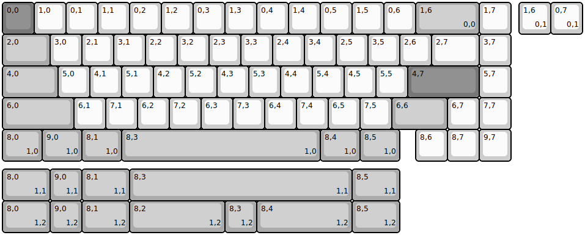{:loading="lazy"}

[Open in keyboard-layout-editor](http://www.keyboard-layout-editor.com/##@@_c=#777777;&=0,0&_c=#cccccc;&=1,0&=0,1&=1,1&=0,2&=1,2&=0,3&=1,3&=0,4&=1,4&=0,5&=1,5&=0,6&_c=#aaaaaa&w:2;&=1,6%0A%0A%0A0,0&_c=#cccccc;&=1,7;&@_c=#aaaaaa&w:1.5;&=2,0&_c=#cccccc;&=3,0&=2,1&=3,1&=2,2&=3,2&=2,3&=3,3&=2,4&=3,4&=2,5&=3,5&=2,6&_w:1.5;&=2,7&=3,7;&@_c=#aaaaaa&w:1.75;&=4,0&_c=#cccccc;&=5,0&=4,1&=5,1&=4,2&=5,2&=4,3&=5,3&=4,4&=5,4&=4,5&=5,5&_c=#777777&w:2.25;&=4,7&_c=#cccccc;&=5,7;&@_c=#aaaaaa&w:2.25;&=6,0&_c=#cccccc;&=6,1&=7,1&=6,2&=7,2&=6,3&=7,3&=6,4&=7,4&=6,5&=7,5&_c=#aaaaaa&w:1.75;&=6,6&_c=#cccccc;&=6,7&=7,7;&@_c=#aaaaaa&w:1.25;&=8,0%0A%0A%0A1,0&_w:1.25;&=9,0%0A%0A%0A1,0&_w:1.25;&=8,1%0A%0A%0A1,0&_w:6.25;&=8,3%0A%0A%0A1,0&_w:1.25;&=8,4%0A%0A%0A1,0&_w:1.25;&=8,5%0A%0A%0A1,0&_x:0.5&c=#cccccc;&=8,6&=8,7&=9,7;&@_x:16.25&y:-5;&=1,6%0A%0A%0A0,1&=0,7%0A%0A%0A0,1;&@_y:4.25&c=#aaaaaa&w:1.5;&=8,0%0A%0A%0A1,1&=9,0%0A%0A%0A1,1&_w:1.5;&=8,1%0A%0A%0A1,1&_w:7;&=8,3%0A%0A%0A1,1&_w:1.5;&=8,5%0A%0A%0A1,1;&@_w:1.5;&=8,0%0A%0A%0A1,2&=9,0%0A%0A%0A1,2&_w:1.5;&=8,1%0A%0A%0A1,2&_w:3;&=8,2%0A%0A%0A1,2&=8,3%0A%0A%0A1,2&_w:3;&=8,4%0A%0A%0A1,2&_w:1.5;&=8,5%0A%0A%0A1,2)

## studiokestra/nue

[README](output/studiokestra/nue/README.md) - [layout](output/studiokestra/nue/nue-kle.json) - [PCB](output/studiokestra/nue/nue.kicad_pcb) - [PCB render](output/studiokestra/nue/nue-render.svg)

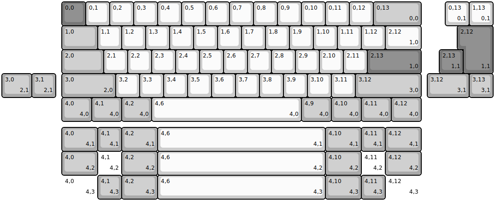{:loading="lazy"}

[Open in keyboard-layout-editor](http://www.keyboard-layout-editor.com/##@@_x:2.5&c=#777777;&=0,0&_c=#cccccc;&=0,1&=0,2&=0,3&=0,4&=0,5&=0,6&=0,7&=0,8&=0,9&=0,10&=0,11&=0,12&_c=#aaaaaa&w:2;&=0,13%0A%0A%0A0,0;&@_x:2.5&w:1.5;&=1,0&_c=#cccccc;&=1,1&=1,2&=1,3&=1,4&=1,5&=1,6&=1,7&=1,8&=1,9&=1,10&=1,11&=1,12&_w:1.5;&=2,12%0A%0A%0A1,0;&@_x:2.5&c=#aaaaaa&w:1.75;&=2,0&_c=#cccccc;&=2,1&=2,2&=2,3&=2,4&=2,5&=2,6&=2,7&=2,8&=2,9&=2,10&=2,11&_c=#777777&w:2.25;&=2,13%0A%0A%0A1,0;&@_x:2.5&c=#aaaaaa&w:2.25;&=3,0%0A%0A%0A2,0&_c=#cccccc;&=3,2&=3,3&=3,4&=3,5&=3,6&=3,7&=3,8&=3,9&=3,10&=3,11&_c=#aaaaaa&w:2.75;&=3,12%0A%0A%0A3,0;&@_x:2.5&w:1.25;&=4,0%0A%0A%0A4,0&_w:1.25;&=4,1%0A%0A%0A4,0&_w:1.25;&=4,2%0A%0A%0A4,0&_c=#cccccc&w:6.25;&=4,6%0A%0A%0A4,0&_c=#aaaaaa&w:1.25;&=4,9%0A%0A%0A4,0&_w:1.25;&=4,10%0A%0A%0A4,0&_w:1.25;&=4,11%0A%0A%0A4,0&_w:1.25;&=4,12%0A%0A%0A4,0;&@_x:18.5&y:-5&c=#cccccc;&=0,13%0A%0A%0A0,1&=1,13%0A%0A%0A0,1;&@_x:19.25&c=#777777&w:1.25&h:2&w2:1.5&h2:1&x2:-0.25;&=2,12%0A%0A%0A1,1;&@_x:18.25;&=2,13%0A%0A%0A1,1;&@_c=#aaaaaa&w:1.25;&=3,0%0A%0A%0A2,1&=3,1%0A%0A%0A2,1&_x:15.5&w:1.75;&=3,12%0A%0A%0A3,1&=3,13%0A%0A%0A3,1;&@_x:2.5&y:1.25&w:1.5;&=4,0%0A%0A%0A4,1&=4,1%0A%0A%0A4,1&_w:1.5;&=4,2%0A%0A%0A4,1&_c=#cccccc&w:7;&=4,6%0A%0A%0A4,1&_c=#aaaaaa&w:1.5;&=4,10%0A%0A%0A4,1&=4,11%0A%0A%0A4,1&_w:1.5;&=4,12%0A%0A%0A4,1;&@_x:2.5&w:1.5;&=4,0%0A%0A%0A4,2&_c=#cccccc&d:true;&=4,1%0A%0A%0A4,2&_c=#aaaaaa&w:1.5;&=4,2%0A%0A%0A4,2&_c=#cccccc&w:7;&=4,6%0A%0A%0A4,2&_c=#aaaaaa&w:1.5;&=4,10%0A%0A%0A4,2&_c=#cccccc&d:true;&=4,11%0A%0A%0A4,2&_c=#aaaaaa&w:1.5;&=4,12%0A%0A%0A4,2;&@_x:2.5&c=#cccccc&w:1.5&d:true;&=4,0%0A%0A%0A4,3&_c=#aaaaaa;&=4,1%0A%0A%0A4,3&_w:1.5;&=4,2%0A%0A%0A4,3&_c=#cccccc&w:7;&=4,6%0A%0A%0A4,3&_c=#aaaaaa&w:1.5;&=4,10%0A%0A%0A4,3&=4,11%0A%0A%0A4,3&_c=#cccccc&w:1.5&d:true;&=4,12%0A%0A%0A4,3)

## superhuman/shk9

[README](output/superhuman/README.md) - [layout](output/superhuman/shk9-kle.json) - [PCB](output/superhuman/shk9.kicad_pcb) - [PCB render](output/superhuman/shk9-render.svg)

{:loading="lazy"}

[Open in keyboard-layout-editor](http://www.keyboard-layout-editor.com/##@@=0,0&=0,1&=0,2;&@=1,0&=1,1&=1,2;&@=2,0&=2,1&=2,2)

## superlyra/superlyra

[README](output/superlyra/README.md) - [layout](output/superlyra/superlyra-kle.json) - [PCB](output/superlyra/superlyra.kicad_pcb) - [PCB render](output/superlyra/superlyra-render.svg)

{:loading="lazy"}

[Open in keyboard-layout-editor](http://www.keyboard-layout-editor.com/##@@_x:4;&=0,4&_x:10;&=0,13;&@_x:3&y:-0.9;&=0,3&_x:1;&=0,5&_x:8;&=0,12&_x:1;&=0,14;&@_x:8&y:-0.85;&=0,7&=0,8&=0,9&=0,10&_x:-6;&=0,6&_x:6;&=0,11;&@_y:-0.95;&=0,0&_x:1;&=0,2&_x:14;&=0,15&_x:1;&=0,17;&@_x:1&y:-0.9;&=0,1&_x:16;&=0,16;&@_x:15&y:-0.4;&=1,13&_x:-12;&=1,4;&@_x:3&y:-0.9;&=1,3&_x:1;&=1,5&_x:8;&=1,12&_x:1;&=1,14;&@_x:6&y:-0.85;&=1,6&_x:1;&=1,7&=1,8&=1,9&=1,10&_x:1;&=1,11;&@_y:-0.95;&=1,0&_x:1;&=1,2&_x:14;&=1,15&_x:1;&=1,17;&@_x:1&y:-0.9;&=1,1&_x:16;&=1,16;&@_x:4&y:-0.4;&=2,4&_x:10;&=2,13;&@_x:3&y:-0.9;&=2,3&_x:1;&=2,5&_x:8;&=2,12&_x:1;&=2,14;&@_x:6&y:-0.85;&=2,6&_x:1;&=2,7&=2,8&=2,9&=2,10&_x:1;&=2,11;&@_y:-0.95;&=2,0&_x:1;&=2,2&_x:14;&=2,15&_x:1;&=2,17;&@_x:1&y:-0.9;&=2,1&_x:16;&=2,16;&@_x:4&y:-0.4;&=3,4&_x:10;&=3,13;&@_x:3&y:-0.9;&=3,3&_x:1;&=3,5&_x:8;&=3,12&_x:1;&=3,14;&@_x:6&y:-0.85;&=3,6&_x:6;&=3,11&_x:-6;&=3,7&=3,8&=3,9&=3,10;&@_y:-0.95;&=3,0&_x:1;&=3,2&_x:14;&=3,15&_x:1;&=3,17;&@_x:1&y:-0.9;&=3,1&_x:16;&=3,16;&@_x:4&y:-0.4;&=4,4&_x:10;&=4,13;&@_x:3&y:-0.9;&=4,3&_x:1;&=4,5&_x:8;&=4,12&_x:1;&=4,14;&@_x:8&y:-0.85;&=4,7&=4,8&=4,9&=4,10;&@_y:-0.95;&=4,0&_x:1;&=4,2&_x:14;&=4,15&_x:1;&=4,17;&@_x:1&y:-0.9;&=4,1&_x:16;&=4,16;&@_x:6.25&y:-0.9&w:1.5;&=4,6&_x:4.5&w:1.5;&=4,11)

## superuser/ext

[README](output/superuser/ext/README.md) - [layout](output/superuser/ext/ext-kle.json) - [PCB](output/superuser/ext/ext.kicad_pcb) - [PCB render](output/superuser/ext/ext-render.svg)

{:loading="lazy"}

[Open in keyboard-layout-editor](http://www.keyboard-layout-editor.com/##@@_x:3;&=0,0&=0,1&_x:0.25;&=0,2&=0,3&=0,4&=0,5&=0,6&=0,7&=0,8&=0,9&=0,10&=0,11&=0,12&=0,13&=0,14&_c=#aaaaaa&w:2;&=0,15%0A%0A%0A0,0&_x:0.25;&=0,16&=0,17&=0,18;&@_x:3&c=#cccccc;&=1,0&=1,1&_x:0.25&c=#aaaaaa&w:1.5;&=1,2&_c=#cccccc;&=1,3&=1,4&=1,5&=1,6&=1,7&=1,8&=1,9&=1,10&=1,11&=1,12&=1,13&=1,14&_w:1.5;&=1,15%0A%0A%0A1,0&_x:0.25&c=#aaaaaa;&=1,16&=1,17&=1,18;&@_x:3&c=#cccccc;&=2,0&=2,1&_x:0.25&c=#aaaaaa&w:1.75;&=2,2&_c=#cccccc;&=2,3&=2,4&=2,5&=2,6&=2,7&=2,8&=2,9&=2,10&=2,11&=2,12&=2,13&_c=#777777&w:2.25;&=2,15%0A%0A%0A1,0;&@_x:3.0&c=#cccccc;&=3,0&=3,1&_x:0.25&c=#aaaaaa&w:2.25;&=3,2%0A%0A%0A2,0&_c=#cccccc;&=3,4&=3,5&=3,6&=3,7&=3,8&=3,9&=3,10&=3,11&=3,12&=3,13&_c=#aaaaaa&w:2.75;&=3,14%0A%0A%0A3,0&_x:1.25&c=#777777;&=3,17;&@_x:3&c=#cccccc;&=4,0&=4,1&_x:0.25&c=#aaaaaa&w:1.5;&=4,2&=4,3&_w:1.5;&=4,4&_c=#cccccc&w:7;&=4,8&_c=#aaaaaa&w:1.5;&=4,13&=4,14&_w:1.5;&=4,15&_x:0.25&c=#777777;&=4,16&=4,17&=4,18;&@_x:25.25&y:-5&c=#cccccc;&=0,15%0A%0A%0A0,1&=2,14%0A%0A%0A0,1;&@_x:26.0&c=#777777&w:1.25&h:2&w2:1.5&h2:1&x2:-0.25;&=2,15%0A%0A%0A1,1;&@_x:25.0&c=#cccccc;&=1,15%0A%0A%0A1,1;&@_c=#aaaaaa&w:1.25;&=3,2%0A%0A%0A2,1&_c=#cccccc;&=3,3%0A%0A%0A2,1&_x:22.25&c=#aaaaaa&w:1.75;&=3,14%0A%0A%0A3,1&_c=#cccccc;&=3,15%0A%0A%0A3,1)

## superuser/frl

[README](output/superuser/frl/README.md) - [layout](output/superuser/frl/frl-kle.json) - [PCB](output/superuser/frl/frl.kicad_pcb) - [PCB render](output/superuser/frl/frl-render.svg)

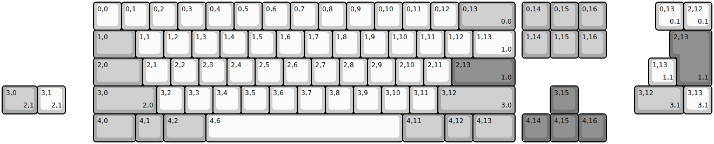{:loading="lazy"}

[Open in keyboard-layout-editor](http://www.keyboard-layout-editor.com/##@@_x:3.25;&=0,0&=0,1&=0,2&=0,3&=0,4&=0,5&=0,6&=0,7&=0,8&=0,9&=0,10&=0,11&=0,12&_c=#aaaaaa&w:2;&=0,13%0A%0A%0A0,0&_x:0.25;&=0,14&=0,15&=0,16;&@_x:3.25&w:1.5;&=1,0&_c=#cccccc;&=1,1&=1,2&=1,3&=1,4&=1,5&=1,6&=1,7&=1,8&=1,9&=1,10&=1,11&=1,12&_w:1.5;&=1,13%0A%0A%0A1,0&_x:0.25&c=#aaaaaa;&=1,14&=1,15&=1,16;&@_x:3.25&w:1.75;&=2,0&_c=#cccccc;&=2,1&=2,2&=2,3&=2,4&=2,5&=2,6&=2,7&=2,8&=2,9&=2,10&=2,11&_c=#777777&w:2.25;&=2,13%0A%0A%0A1,0;&@_x:3.25&c=#aaaaaa&w:2.25;&=3,0%0A%0A%0A2,0&_c=#cccccc;&=3,2&=3,3&=3,4&=3,5&=3,6&=3,7&=3,8&=3,9&=3,10&=3,11&_c=#aaaaaa&w:2.75;&=3,12%0A%0A%0A3,0&_x:1.25&c=#777777;&=3,15;&@_x:3.25&c=#aaaaaa&w:1.5;&=4,0&=4,1&_w:1.5;&=4,2&_c=#cccccc&w:7;&=4,6&_c=#aaaaaa&w:1.5;&=4,11&=4,12&_w:1.5;&=4,13&_x:0.25&c=#777777;&=4,14&=4,15&=4,16;&@_x:23.25&y:-5&c=#cccccc;&=0,13%0A%0A%0A0,1&=2,12%0A%0A%0A0,1;&@_x:24.0&c=#777777&w:1.25&h:2&w2:1.5&h2:1&x2:-0.25;&=2,13%0A%0A%0A1,1;&@_x:23.0&c=#cccccc;&=1,13%0A%0A%0A1,1;&@_c=#aaaaaa&w:1.25;&=3,0%0A%0A%0A2,1&_c=#cccccc;&=3,1%0A%0A%0A2,1&_x:20.25&c=#aaaaaa&w:1.75;&=3,12%0A%0A%0A3,1&_c=#cccccc;&=3,13%0A%0A%0A3,1)

## superuser/tkl

[README](output/superuser/tkl/README.md) - [layout](output/superuser/tkl/tkl-kle.json) - [PCB](output/superuser/tkl/tkl.kicad_pcb) - [PCB render](output/superuser/tkl/tkl-render.svg)

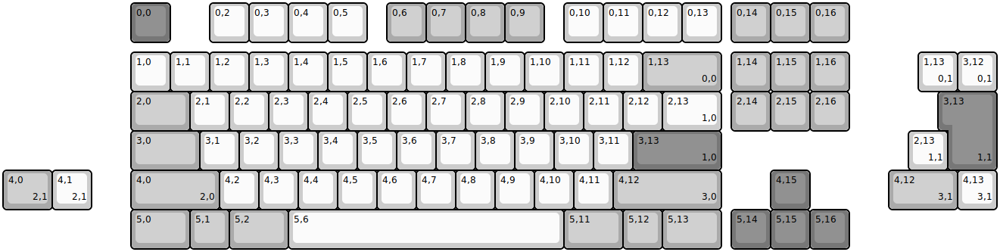{:loading="lazy"}

[Open in keyboard-layout-editor](http://www.keyboard-layout-editor.com/##@@_x:3.25&c=#777777;&=0,0&_x:1.0&c=#cccccc;&=0,2&=0,3&=0,4&=0,5&_x:0.5&c=#aaaaaa;&=0,6&=0,7&=0,8&=0,9&_x:0.5&c=#cccccc;&=0,10&=0,11&=0,12&=0,13&_x:0.25&c=#aaaaaa;&=0,14&=0,15&=0,16;&@_x:3.25&y:0.25&c=#cccccc;&=1,0&=1,1&=1,2&=1,3&=1,4&=1,5&=1,6&=1,7&=1,8&=1,9&=1,10&=1,11&=1,12&_c=#aaaaaa&w:2;&=1,13%0A%0A%0A0,0&_x:0.25;&=1,14&=1,15&=1,16;&@_x:3.25&w:1.5;&=2,0&_c=#cccccc;&=2,1&=2,2&=2,3&=2,4&=2,5&=2,6&=2,7&=2,8&=2,9&=2,10&=2,11&=2,12&_w:1.5;&=2,13%0A%0A%0A1,0&_x:0.25&c=#aaaaaa;&=2,14&=2,15&=2,16;&@_x:3.25&w:1.75;&=3,0&_c=#cccccc;&=3,1&=3,2&=3,3&=3,4&=3,5&=3,6&=3,7&=3,8&=3,9&=3,10&=3,11&_c=#777777&w:2.25;&=3,13%0A%0A%0A1,0;&@_x:3.25&c=#aaaaaa&w:2.25;&=4,0%0A%0A%0A2,0&_c=#cccccc;&=4,2&=4,3&=4,4&=4,5&=4,6&=4,7&=4,8&=4,9&=4,10&=4,11&_c=#aaaaaa&w:2.75;&=4,12%0A%0A%0A3,0&_x:1.25&c=#777777;&=4,15;&@_x:3.25&c=#aaaaaa&w:1.5;&=5,0&=5,1&_w:1.5;&=5,2&_c=#cccccc&w:7;&=5,6&_c=#aaaaaa&w:1.5;&=5,11&=5,12&_w:1.5;&=5,13&_x:0.25&c=#777777;&=5,14&=5,15&=5,16;&@_x:23.25&y:-5.0&c=#cccccc;&=1,13%0A%0A%0A0,1&=3,12%0A%0A%0A0,1;&@_x:24.0&c=#777777&w:1.25&h:2&w2:1.5&h2:1&x2:-0.25;&=3,13%0A%0A%0A1,1;&@_x:23.0&c=#cccccc;&=2,13%0A%0A%0A1,1;&@_c=#aaaaaa&w:1.25;&=4,0%0A%0A%0A2,1&_c=#cccccc;&=4,1%0A%0A%0A2,1&_x:20.25&c=#aaaaaa&w:1.75;&=4,12%0A%0A%0A3,1&_c=#cccccc;&=4,13%0A%0A%0A3,1)

## swiftrax/astro65

[README](output/swiftrax/README.md) - [layout](output/swiftrax/astro65-kle.json) - [PCB](output/swiftrax/astro65.kicad_pcb) - [PCB render](output/swiftrax/astro65-render.svg)

{:loading="lazy"}

[Open in keyboard-layout-editor](http://www.keyboard-layout-editor.com/##@@_y:1.25&c=#777777;&=0,0&_c=#cccccc;&=0,1&=0,2&=0,3&=0,4&=0,5&=0,6&=0,7&=0,8&=0,9&=0,10&=0,11&=0,12&_c=#aaaaaa&w:2;&=0,13%0A%0A%0A0,0&_c=#cccccc&d:true;&=0,15%0A%0A%0A2,0;&@_c=#aaaaaa&w:1.5;&=1,0&_c=#cccccc;&=1,1&=1,2&=1,3&=1,4&=1,5&=1,6&=1,7&=1,8&=1,9&=1,10&=1,11&=1,12&_c=#aaaaaa&w:1.5;&=1,13&=1,15;&@_w:1.75;&=2,0&_c=#cccccc;&=2,1&=2,2&=2,3&=2,4&=2,5&=2,6&=2,7&=2,8&=2,9&=2,10&=2,11&_c=#777777&w:2.25;&=2,12&_c=#aaaaaa;&=2,15;&@_w:2.25;&=3,0&_c=#cccccc;&=3,2&=3,3&=3,4&=3,5&=3,6&=3,7&=3,8&=3,9&=3,10&=3,11&_c=#aaaaaa&w:1.75;&=3,12&_c=#777777;&=3,14&_c=#aaaaaa;&=3,15;&@_w:1.25;&=4,0%0A%0A%0A1,0&_w:1.25;&=4,1%0A%0A%0A1,0&_w:1.25;&=4,2%0A%0A%0A1,0&_w:6.25;&=4,6%0A%0A%0A1,0&_w:1.25;&=4,10%0A%0A%0A1,0&_w:1.25;&=4,11%0A%0A%0A1,0&_x:0.5&c=#777777;&=4,12&=4,14&=4,15;&@_x:13&y:-6.25&c=#aaaaaa;&=0,13%0A%0A%0A0,1&=0,14%0A%0A%0A0,1&=0,15%0A%0A%0A2,1;&@_y:5.5&w:1.5;&=4,0%0A%0A%0A1,1&=4,1%0A%0A%0A1,1&_w:1.5;&=4,2%0A%0A%0A1,1&_w:7;&=4,6%0A%0A%0A1,1&_w:1.5;&=4,11%0A%0A%0A1,1)

## swiftrax/bebol

[README](output/swiftrax/README.md) - [layout](output/swiftrax/bebol-kle.json) - [PCB](output/swiftrax/bebol.kicad_pcb) - [PCB render](output/swiftrax/bebol-render.svg)

{:loading="lazy"}

[Open in keyboard-layout-editor](http://www.keyboard-layout-editor.com/##@@_y:1&c=#777777;&=0,0&_c=#cccccc;&=0,1&=0,2&=0,3&=0,4&=0,5&=0,6&=0,7&=0,8&=0,9&=0,10&=0,11&=0,12&_c=#aaaaaa&w:2;&=0,14%0A%0A%0A0,0&=0,15;&@_w:1.5;&=1,0&_c=#cccccc;&=1,1&=1,2&=1,3&=1,4&=1,5&=1,6&=1,7&=1,8&=1,9&=1,10&=1,11&=1,12&_c=#aaaaaa&w:1.5;&=1,14&=1,15;&@_w:1.75;&=2,0&_c=#cccccc;&=2,1&=2,2&=2,3&=2,4&=2,5&=2,6&=2,7&=2,8&=2,9&=2,10&=2,11&_c=#777777&w:2.25;&=2,14&_c=#aaaaaa;&=2,15;&@_w:2.25;&=3,0&_c=#cccccc;&=3,2&=3,3&=3,4&=3,5&=3,6&=3,7&=3,8&=3,9&=3,10&=3,11&_c=#aaaaaa&w:1.75;&=3,13&_c=#777777;&=3,14&_c=#aaaaaa;&=3,15;&@_w:1.5;&=4,0%0A%0A%0A1,0&=4,1%0A%0A%0A1,0&_w:1.5;&=4,2%0A%0A%0A1,0&_w:7;&=4,6%0A%0A%0A1,0&=4,11%0A%0A%0A1,0&=4,12%0A%0A%0A1,0&_c=#777777;&=4,13&=4,14&=4,15;&@_x:13&y:-6&c=#cccccc;&=0,13%0A%0A%0A0,1&=0,14%0A%0A%0A0,1;&@_y:5&c=#aaaaaa&w:1.25;&=4,0%0A%0A%0A1,1&_w:1.25;&=4,1%0A%0A%0A1,1&_w:1.25;&=4,2%0A%0A%0A1,1&_w:6.25;&=4,6%0A%0A%0A1,1&_w:1.5;&=4,10%0A%0A%0A1,1&_w:1.5;&=4,12%0A%0A%0A1,1;&@_w:1.25;&=4,0%0A%0A%0A1,2&_w:1.25;&=4,1%0A%0A%0A1,2&_w:1.25;&=4,2%0A%0A%0A1,2&_w:6.25;&=4,6%0A%0A%0A1,2&=4,10%0A%0A%0A1,2&=4,11%0A%0A%0A1,2&=4,12%0A%0A%0A1,2)

## swiftrax/beegboy

[README](output/swiftrax/README.md) - [layout](output/swiftrax/beegboy-kle.json) - [PCB](output/swiftrax/beegboy.kicad_pcb) - [PCB render](output/swiftrax/beegboy-render.svg)

{:loading="lazy"}

[Open in keyboard-layout-editor](http://www.keyboard-layout-editor.com/##@@_c=#777777;&=0,0&_x:0.25&c=#aaaaaa;&=1,0&=0,1&=1,1&=0,2&_x:0.25;&=1,2&=0,3&=1,3&=0,4&_x:0.25;&=1,4&=0,5&=1,5&=0,6&_x:0.25;&=1,6&_x:0.5&c=#777777;&=0,7&=1,7&=0,8&=1,8;&@_y:0.25&c=#aaaaaa;&=2,0&_c=#cccccc;&=3,0&=2,1&=3,1&=2,2&=3,2&=2,3&=3,3&=2,4&=3,4&=2,5&=3,5&=2,6&_c=#aaaaaa&w:2;&=3,6&_x:0.5;&=2,7&=3,7&=2,8&=3,8;&@_w:1.5;&=4,0&_c=#cccccc;&=5,0&=4,1&=5,1&=4,2&=5,2&=4,3&=5,3&=4,4&=5,4&=4,5&=5,5&=4,6&_c=#aaaaaa&w:1.5;&=5,6&_x:0.5;&=4,7&=5,7&=4,8&_c=#777777&h:2;&=5,8;&@_c=#aaaaaa&w:1.75;&=6,0&_c=#cccccc;&=7,0&=6,1&=7,1&=6,2&=7,2&=6,3&=7,3&=6,4&=7,4&=6,5&=7,5&_c=#777777&w:2.25;&=7,6&_x:0.5&c=#aaaaaa;&=6,7&=7,7&=6,8;&@_w:2.25;&=8,0&_c=#cccccc;&=9,0&=8,1&=9,1&=8,2&=9,2&=8,3&=9,3&=8,4&=9,4&=8,5&_c=#aaaaaa&w:1.75;&=8,6&_x:1.5;&=8,7&=9,7&=8,8&_c=#777777&h:2;&=9,8;&@_x:14.25&y:-0.75;&=9,6;&@_y:-0.25&c=#aaaaaa&w:1.25;&=10,0&_w:1.25;&=11,0&_w:1.25;&=10,1&_w:6.25;&=10,2&_w:1.5;&=10,4&_w:1.5;&=10,5&_x:3.5;&=11,7&=10,8;&@_x:13.25&y:-0.75&c=#777777;&=10,6&=11,6&=10,7)

## swiftrax/bumblebee

[README](output/swiftrax/README.md) - [layout](output/swiftrax/bumblebee-kle.json) - [PCB](output/swiftrax/bumblebee.kicad_pcb) - [PCB render](output/swiftrax/bumblebee-render.svg)

{:loading="lazy"}

[Open in keyboard-layout-editor](http://www.keyboard-layout-editor.com/##@@_c=#777777;&=0,0&_c=#aaaaaa&w:1.5;&=1,0&_c=#cccccc;&=0,1&=1,1&=0,2&=1,2&=0,3&=1,3&=0,4&=1,4&=0,5&=1,5&=0,6&=1,6&_c=#aaaaaa&w:1.5;&=0,7&=1,7;&@_c=#777777;&=2,0&_c=#aaaaaa&w:1.75;&=3,0&_c=#cccccc;&=2,1&=3,1&=2,2&=3,2&=2,3&=3,3&=2,4&=3,4&=2,5&=3,5&=2,6&_c=#777777&w:2.25;&=3,6&_c=#aaaaaa;&=2,7;&@_c=#777777;&=4,0&_c=#aaaaaa&w:2.25;&=5,0&_c=#cccccc;&=4,1&=5,1&=4,2&=5,2&=4,3&=5,3&=4,4&=5,4&=4,5&=5,5&_c=#aaaaaa&w:1.75;&=4,6&_c=#777777;&=5,6&_c=#aaaaaa;&=4,7;&@_c=#777777;&=6,0&_c=#aaaaaa&w:1.5;&=7,0&_x:1.38&w:1.5;&=6,2&_w:2.75;&=7,2&=6,3&_w:2;&=7,4&_w:1.5;&=6,5&_x:1.37&c=#777777;&=6,6&=7,6&=6,7)

## swiftrax/cowfish

[README](output/swiftrax/README.md) - [layout](output/swiftrax/cowfish-kle.json) - [PCB](output/swiftrax/cowfish.kicad_pcb) - [PCB render](output/swiftrax/cowfish-render.svg)

{:loading="lazy"}

[Open in keyboard-layout-editor](http://www.keyboard-layout-editor.com/##@@_c=#777777;&=0,0&_x:0.25&c=#cccccc;&=0,1&=0,2&=0,3&=0,4&_x:0.25&c=#777777;&=0,5&=0,6&=0,7&=0,8&_x:0.25&c=#cccccc;&=0,9&=0,10&=0,11&=0,12&_x:0.25;&=0,13&_x:0.25;&=0,15&=0,16&=0,17;&@_y:0.25;&=1,0&=1,1&=1,2&=1,3&=1,4&=1,5&=1,6&=1,7&=1,8&=1,9&=1,10&=1,11&=1,12&_c=#aaaaaa&w:2;&=1,13%0A%0A%0A0,0&_x:0.25;&=1,15&=1,16&=1,17;&@_w:1.5;&=2,0&_c=#cccccc;&=2,1&=2,2&=2,3&=2,4&=2,5&=2,6&=2,7&=2,8&=2,9&=2,10&=2,11&=2,12&_c=#aaaaaa&w:1.5;&=2,14&_x:0.25;&=2,15&=2,16&=2,17;&@_w:1.75;&=3,0&_c=#cccccc;&=3,1&=3,2&=3,3&=3,4&=3,5&=3,6&=3,7&=3,8&=3,9&=3,10&=3,11&_c=#777777&w:2.25;&=3,13;&@_c=#aaaaaa&w:2.25;&=4,0&_c=#cccccc;&=4,1&=4,2&=4,3&=4,4&=4,5&=4,6&=4,7&=4,8&=4,9&=4,10&_c=#aaaaaa&w:2.75;&=4,13&_x:1.25&c=#777777;&=4,16;&@_c=#aaaaaa&w:1.25;&=5,0%0A%0A%0A1,0&_w:1.25;&=5,1%0A%0A%0A1,0&_w:1.25;&=5,2%0A%0A%0A1,0&_c=#cccccc&w:6.25;&=5,5%0A%0A%0A1,0&_c=#aaaaaa&w:1.25;&=5,8%0A%0A%0A1,0&_w:1.25;&=5,9%0A%0A%0A1,0&_w:1.25;&=5,11%0A%0A%0A1,0&_w:1.25;&=5,13%0A%0A%0A1,0&_x:0.25&c=#777777;&=5,15&=5,16&=5,17;&@_x:18.5&y:-5.0&c=#cccccc;&=1,13%0A%0A%0A0,1&=1,14%0A%0A%0A0,1;&@_y:4.25&c=#aaaaaa&w:1.5;&=5,0%0A%0A%0A1,1&=5,1%0A%0A%0A1,1&_w:1.5;&=5,2%0A%0A%0A1,1&_c=#cccccc&w:7;&=5,5%0A%0A%0A1,1&_c=#aaaaaa&w:1.5;&=5,8%0A%0A%0A1,1&=5,11%0A%0A%0A1,1&_w:1.5;&=5,13%0A%0A%0A1,1)

## swiftrax/digicarp65

[README](output/swiftrax/README.md) - [layout](output/swiftrax/digicarp65-kle.json) - [PCB](output/swiftrax/digicarp65.kicad_pcb) - [PCB render](output/swiftrax/digicarp65-render.svg)

{:loading="lazy"}

[Open in keyboard-layout-editor](http://www.keyboard-layout-editor.com/##@@_x:3&c=#777777;&=0,0&_c=#cccccc;&=0,1&=0,2&=0,3&=0,4&=0,5&=0,6&=0,7&=0,8&=0,9&=0,10&=0,11&=0,12&_c=#aaaaaa&w:2;&=0,14%0A%0A%0A0,0&=0,15;&@_x:3&w:1.5;&=1,0&_c=#cccccc;&=1,2&=1,3&=1,4&=1,5&=1,6&=1,7&=1,8&=1,9&=1,10&=1,11&=1,12&=1,13&_w:1.5;&=1,14%0A%0A%0A1,0&_c=#aaaaaa;&=1,15;&@_x:3&w:1.75;&=2,0&_c=#cccccc;&=2,2&=2,3&=2,4&=2,5&=2,6&=2,7&=2,8&=2,9&=2,10&=2,11&=2,12&_c=#777777&w:2.25;&=2,13%0A%0A%0A1,0&_c=#aaaaaa;&=2,15;&@_x:3.0&w:2.25;&=3,0%0A%0A%0A2,0&_c=#cccccc;&=3,2&=3,3&=3,4&=3,5&=3,6&=3,7&=3,8&=3,9&=3,10&=3,11&_c=#aaaaaa&w:1.75;&=3,13&=3,14&=3,15;&@_x:3&w:1.25;&=4,0&_w:1.25;&=4,1&_w:1.25;&=4,2&_c=#777777&w:6.25;&=4,6&_c=#aaaaaa;&=4,10%0A%0A%0A3,0&=4,11%0A%0A%0A3,0&=4,12%0A%0A%0A3,0&=4,13&=4,14&=4,15;&@_x:19.75&y:-5&c=#cccccc;&=0,13%0A%0A%0A0,1&=0,14%0A%0A%0A0,1;&@_x:20.5&c=#777777&w:1.25&h:2&w2:1.5&h2:1&x2:-0.25;&=2,13%0A%0A%0A1,1;&@_x:19.5&c=#cccccc;&=1,14%0A%0A%0A1,1;&@_c=#aaaaaa&w:1.25;&=3,0%0A%0A%0A2,1&_c=#cccccc;&=3,1%0A%0A%0A2,1;&@_x:13&y:1&c=#aaaaaa&w:1.5;&=4,10%0A%0A%0A3,1&_w:1.5;&=4,12%0A%0A%0A3,1)

## swiftrax/digicarpice

[README](output/swiftrax/README.md) - [layout](output/swiftrax/digicarpice-kle.json) - [PCB](output/swiftrax/digicarpice.kicad_pcb) - [PCB render](output/swiftrax/digicarpice-render.svg)

{:loading="lazy"}

[Open in keyboard-layout-editor](http://www.keyboard-layout-editor.com/##@@_x:2.37&y:0.08&c=#777777;&=0,0&_c=#cccccc;&=0,1&_x:9.76;&=0,11&=0,12&_c=#777777&w:2;&=0,13%0A%0A%0A0,0&_x:0.25&c=#aaaaaa;&=0,14;&@_x:2.24&w:1.5;&=1,0&_c=#cccccc;&=1,1&_x:9.01;&=1,10&=1,11&=1,12&_w:1.5;&=1,13&_x:0.25&c=#aaaaaa;&=1,14;&@_x:2.1&w:1.75;&=2,0&_c=#cccccc;&=2,1&_x:9.31;&=2,10&=2,11&_c=#777777&w:2.25;&=2,13&_x:0.25&c=#aaaaaa;&=2,14;&@_x:1.95&w:2.25;&=3,0&_c=#cccccc;&=3,1&_x:8.62;&=3,10&=3,11&_c=#aaaaaa&w:1.75;&=3,12;&@_x:17.82&y:-0.75;&=3,13;&@_x:2.1&y:-0.25&w:1.25;&=4,0&_w:1.25;&=4,1&_x:10.72&w:1.25;&=4,11;&@_x:16.82&y:-0.75;&=4,12&=4,13&=4,14;&@_r:8&rx:4.5&c=#cccccc;&=0,2&=0,3&=0,4&=0,5&=0,6;&@_x:0.5;&=1,2&=1,3&=1,4&=1,5;&@_x:0.75;&=2,2&=2,3&=2,4&=2,5;&@_x:1.25;&=3,2&=3,3&=3,4&=3,5;&@_x:1.75&c=#aaaaaa&w:1.25;&=4,2&_c=#cccccc&w:2.25;&=4,4;&@_r:-8&rx:14.5&x:-4.5;&=0,7&=0,8&=0,9&=0,10;&@_x:-5.0;&=1,6&=1,7&=1,8&=1,9;&@_x:-4.75;&=2,6&=2,7&=2,8&=2,9;&@_x:-5.25;&=3,6&=3,7&=3,8&=3,9;&@_x:-5.25&w:2.75;&=4,7&_c=#aaaaaa&w:1.25;&=4,9;&@_r:0&rx:0&x:19.88&y:0.08;&=0,13%0A%0A%0A0,1&=2,12%0A%0A%0A0,1)

## swiftrax/equator

[README](output/swiftrax/README.md) - [layout](output/swiftrax/equator-kle.json) - [PCB](output/swiftrax/equator.kicad_pcb) - [PCB render](output/swiftrax/equator-render.svg)

{:loading="lazy"}

[Open in keyboard-layout-editor](http://www.keyboard-layout-editor.com/##@@_x:2.37&y:0.08&c=#777777;&=0,0&_c=#cccccc;&=0,1&_x:9.76;&=0,11&=0,12&_c=#aaaaaa&w:2;&=0,13%0A%0A%0A0,0;&@_x:2.24&w:1.5;&=1,0&_c=#cccccc;&=1,1&_x:9.01;&=1,10&=1,11&=1,12&_w:1.5;&=1,13;&@_x:2.1&c=#aaaaaa&w:1.75;&=2,0&_c=#cccccc;&=2,1&_x:9.31;&=2,10&=2,11&_c=#777777&w:2.25;&=2,13;&@_x:1.95&c=#aaaaaa&w:2.25;&=3,0&_c=#cccccc;&=3,1&_x:8.62;&=3,10&=3,11&_c=#aaaaaa&w:2.75;&=3,12%0A%0A%0A1,0;&@_x:2.1&w:1.25;&=4,0&_w:1.25;&=4,1&_x:10.06&w:1.25;&=4,11&_w:1.25;&=4,12&_w:1.25;&=4,13;&@_r:8&rx:4.5&c=#cccccc;&=0,2&=0,3&=0,4&=0,5&=0,6;&@_x:0.5;&=1,2&=1,3&=1,4&=1,5;&@_x:0.75;&=2,2&=2,3&=2,4&=2,5;&@_x:1.25;&=3,2&=3,3&=3,4&=3,5;&@_x:1.75&c=#aaaaaa&w:1.25;&=4,2&_c=#cccccc&w:2.25;&=4,4;&@_r:-8&rx:14.5&x:-4.5;&=0,7&=0,8&=0,9&=0,10;&@_x:-5.0;&=1,6&=1,7&=1,8&=1,9;&@_x:-4.75;&=2,6&=2,7&=2,8&=2,9;&@_x:-5.25;&=3,6&=3,7&=3,8&=3,9;&@_x:-5.25&w:2.25;&=4,7&_c=#aaaaaa&w:1.25;&=4,9;&@_r:0&rx:0&x:18.5&y:0.08;&=0,13%0A%0A%0A0,1&=2,12%0A%0A%0A0,1;&@_x:18.95&y:2.0&w:1.75;&=3,12%0A%0A%0A1,1&=3,13%0A%0A%0A1,1)

## swiftrax/glacier

[README](output/swiftrax/README.md) - [layout](output/swiftrax/glacier-kle.json) - [PCB](output/swiftrax/glacier.kicad_pcb) - [PCB render](output/swiftrax/glacier-render.svg)

{:loading="lazy"}

[Open in keyboard-layout-editor](http://www.keyboard-layout-editor.com/##@@_c=#777777;&=0,0&_x:0.25&c=#aaaaaa;&=1,0&=0,1&=1,1&=0,2&_x:0.25;&=1,2&=0,3&=1,3&=0,4&_x:0.25;&=1,4&=0,5&=1,5&=0,6&_x:0.25;&=1,6&_x:0.25;&=0,7&_x:0.25;&=1,7&=0,8&=1,8&=0,9;&@_y:0.25;&=2,0&_c=#cccccc;&=3,0&=2,1&=3,1&=2,2&=3,2&=2,3&=3,3&=2,4&=3,4&=2,5&=3,5&=2,6&_c=#aaaaaa&w:2;&=3,6%0A%0A%0A0,0&_x:0.25;&=2,7&_x:0.25;&=3,7&=2,8&=3,8&=2,9;&@_w:1.5;&=4,0&_c=#cccccc;&=5,0&=4,1&=5,1&=4,2&=5,2&=4,3&=5,3&=4,4&=5,4&=4,5&=5,5&=4,6&_c=#aaaaaa&w:1.5;&=5,6&_x:0.25;&=4,7&_x:0.25;&=5,7&=4,8&=5,8&_c=#777777&h:2;&=4,9;&@_c=#aaaaaa&w:1.75;&=6,0&_c=#cccccc;&=7,0&=6,1&=7,1&=6,2&=7,2&=6,3&=7,3&=6,4&=7,4&=6,5&=7,5&_c=#777777&w:2.25;&=6,6&_x:0.25&c=#aaaaaa;&=7,6&_x:0.25;&=6,7&=7,7&=6,8;&@_w:2.25;&=8,0&_c=#cccccc;&=9,0&=8,1&=9,1&=8,2&=9,2&=8,3&=9,3&=8,4&=9,4&=8,5&_c=#aaaaaa&w:1.75;&=9,5&_x:2.5;&=9,6&=8,7&=9,7&_c=#777777&h:2;&=8,8;&@_x:14.25&y:-0.75;&=8,6;&@_y:-0.25&c=#aaaaaa&w:1.25;&=10,0&_w:1.25;&=11,0&_w:1.25;&=10,1&_w:6.25;&=11,3&_w:1.5;&=10,4&_w:1.5;&=11,4&_x:3.5&w:2;&=11,6&=10,7;&@_x:13.25&y:-0.75&c=#777777;&=10,5&=11,5&=10,6;&@_c=#aaaaaa;&=3,6%0A%0A%0A0,1&=7,8%0A%0A%0A0,1)

## swiftrax/joypad

[README](output/swiftrax/README.md) - [layout](output/swiftrax/joypad-kle.json) - [PCB](output/swiftrax/joypad.kicad_pcb) - [PCB render](output/swiftrax/joypad-render.svg)

{:loading="lazy"}

[Open in keyboard-layout-editor](http://www.keyboard-layout-editor.com/##@@_c=#aaaaaa;&=0,0&=0,1&=0,2&=0,3;&@_y:0.25;&=1,0&=1,1&=1,2&=1,3;&@_c=#cccccc;&=2,0&=2,1&=2,2&_c=#777777&h:2;&=2,3%0A%0A%0A0,0;&@_c=#cccccc;&=3,0&=3,1&=3,1;&@=4,0&=4,1&=4,2&_c=#777777&h:2;&=4,3%0A%0A%0A1,0;&@_c=#cccccc&w:2;&=5,1%0A%0A%0A2,0&=5,2;&@_x:4&y:-4.0;&=2,3%0A%0A%0A0,1;&@_x:4;&=3,3%0A%0A%0A0,1;&@_x:4;&=4,3%0A%0A%0A1,1;&@_x:4;&=5,3%0A%0A%0A1,1;&@=5,0%0A%0A%0A2,1&=5,1%0A%0A%0A2,1)

## swiftrax/koalafications

[README](output/swiftrax/README.md) - [layout](output/swiftrax/koalafications-kle.json) - [PCB](output/swiftrax/koalafications.kicad_pcb) - [PCB render](output/swiftrax/koalafications-render.svg)

{:loading="lazy"}

[Open in keyboard-layout-editor](http://www.keyboard-layout-editor.com/##@@_c=#777777;&=0,0&_x:0.25&c=#cccccc;&=0,1&=0,2&=0,3&=0,4&_x:0.25;&=0,5&=0,6&=0,7&=0,8&_x:0.25;&=0,9&=0,10&=0,11&=0,12;&@_y:0.25&c=#aaaaaa;&=1,0&_c=#cccccc;&=1,1&=1,2&=1,3&=1,4&=1,5&=1,6&=1,7&=1,8&=1,9&=1,10&=1,11&=1,12&_c=#aaaaaa&w:2;&=1,13%0A%0A%0A0,0&=1,14;&@_w:1.5;&=2,0&_c=#cccccc;&=2,1&=2,2&=2,3&=2,4&=2,5&=2,6&=2,7&=2,8&=2,9&=2,10&=2,11&=2,12&_c=#aaaaaa&w:1.5;&=2,13&=2,14;&@_w:1.75;&=3,0&_c=#cccccc;&=3,1&=3,2&=3,3&=3,4&=3,5&=3,6&=3,7&=3,8&=3,9&=3,10&=3,11&_c=#777777&w:2.25;&=3,12&_c=#aaaaaa;&=3,14;&@_w:2.25;&=4,0&_c=#cccccc;&=4,1&=4,2&=4,3&=4,4&=4,5&=4,6&=4,7&=4,8&=4,9&=4,10&_c=#aaaaaa&w:1.75;&=4,11&_c=#777777;&=4,12&_c=#aaaaaa;&=4,14;&@_w:1.25;&=5,0&_w:1.25;&=5,1&_w:1.25;&=5,2&_w:6.25;&=5,6&_w:1.5;&=5,8%0A%0A%0A1,0&_w:1.5;&=5,10%0A%0A%0A1,0&_c=#777777;&=5,11&=5,12&=5,14;&@_x:16.5&y:-5.0&c=#aaaaaa;&=1,13%0A%0A%0A0,1&=3,13%0A%0A%0A0,1;&@_x:10&y:4.0;&=5,8%0A%0A%0A1,1&=5,9%0A%0A%0A1,1&=5,10%0A%0A%0A1,1)

## swiftrax/nodu

[README](output/swiftrax/README.md) - [layout](output/swiftrax/nodu-kle.json) - [PCB](output/swiftrax/nodu.kicad_pcb) - [PCB render](output/swiftrax/nodu-render.svg)

{:loading="lazy"}

[Open in keyboard-layout-editor](http://www.keyboard-layout-editor.com/##@@_y:1&c=#777777;&=0,0&_c=#cccccc;&=0,1&=0,2&=0,3&=0,4&=0,5&=0,6&=0,7&=0,8&=0,9&=0,10&=0,11&=0,12&_c=#aaaaaa&w:2;&=0,13%0A%0A%0A0,0;&@_w:1.5;&=1,0&_c=#cccccc;&=1,1&=1,2&=1,3&=1,4&=1,5&=1,6&=1,7&=1,8&=1,9&=1,10&=1,11&=1,12&_c=#aaaaaa&w:1.5;&=1,13;&@_w:1.75;&=2,0&_c=#cccccc;&=2,1&=2,2&=2,3&=2,4&=2,5&=2,6&=2,7&=2,8&=2,9&=2,10&=2,11&_c=#777777&w:2.25;&=2,12;&@_c=#aaaaaa&w:2.25;&=3,0&_c=#cccccc;&=3,1&=3,2&=3,3&=3,4&=3,5&=3,6&=3,7&=3,8&=3,9&=3,10&_c=#aaaaaa&w:2.75;&=3,11%0A%0A%0A1,0;&@_w:1.25;&=4,0%0A%0A%0A2,0&_w:1.25;&=4,1%0A%0A%0A2,0&_w:1.25;&=4,2%0A%0A%0A2,0&_w:6.25;&=4,6%0A%0A%0A2,0&_w:1.25;&=4,8%0A%0A%0A2,0&_w:1.25;&=4,9%0A%0A%0A2,0&_w:1.25;&=4,10%0A%0A%0A2,0&_w:1.25;&=4,11%0A%0A%0A2,0;&@_x:13&y:-6;&=0,13%0A%0A%0A0,1&=2,13%0A%0A%0A0,1;&@_x:15.0&y:3&w:1.75;&=3,11%0A%0A%0A1,1&=3,12%0A%0A%0A1,1;&@_y:1&w:1.5;&=4,0%0A%0A%0A2,1&=4,1%0A%0A%0A2,1&_w:1.5;&=4,2%0A%0A%0A2,1&_w:7;&=4,6%0A%0A%0A2,1&_w:1.5;&=4,9%0A%0A%0A2,1&=4,10%0A%0A%0A2,1&_w:1.5;&=4,11%0A%0A%0A2,1)

## swiftrax/pandamic

[README](output/swiftrax/README.md) - [layout](output/swiftrax/pandamic-kle.json) - [PCB](output/swiftrax/pandamic.kicad_pcb) - [PCB render](output/swiftrax/pandamic-render.svg)

{:loading="lazy"}

[Open in keyboard-layout-editor](http://www.keyboard-layout-editor.com/##@@_y:1.25&c=#777777;&=0,0&=1,0&=0,1&=1,1&_x:0.25;&=0,2&_c=#cccccc;&=1,2&=0,3&=1,3&=0,4&=1,4&=0,5&=1,5&=0,6&=1,6&=0,7&=1,7&=0,8&_c=#aaaaaa&w:2;&=1,8%0A%0A%0A0,0&_x:0.5&c=#cccccc;&=1,9;&@=2,0&=3,0&=2,1&_c=#aaaaaa&h:2;&=3,1&_x:0.25&w:1.5;&=2,2&_c=#cccccc;&=3,2&=2,3&=3,3&=2,4&=3,4&=2,5&=3,5&=2,6&=3,6&=2,7&=3,7&=2,8&_c=#aaaaaa&w:1.5;&=3,8&_x:0.5&c=#cccccc;&=3,9;&@=4,0&=5,0&=4,1&_x:1.25&c=#aaaaaa&w:1.75;&=4,2&_c=#cccccc;&=5,2&=4,3&=5,3&=4,4&=5,4&=4,5&=5,5&=4,6&=5,6&=4,7&=5,7&_c=#777777&w:2.25;&=5,8&_x:0.5&c=#cccccc;&=5,9;&@=6,0&=7,0&=6,1&_c=#aaaaaa&h:2;&=7,1&_x:0.25&w:2.25;&=6,2%0A%0A%0A1,0&_c=#cccccc;&=6,3&=7,3&=6,4&=7,4&=6,5&=7,5&=6,6&=7,6&=6,7&=7,7&_c=#aaaaaa&w:1.75;&=6,8&_x:1.5&c=#cccccc;&=7,9;&@_x:18.5&y:-0.75&c=#777777;&=6,9;&@_y:-0.25&c=#cccccc&w:2;&=8,0&=8,1&_x:1.25&c=#aaaaaa&w:1.25;&=8,2&_w:1.25;&=9,2&_w:1.25;&=8,3&_w:6.25;&=8,5&=8,7%0A%0A%0A2,0&=9,7%0A%0A%0A2,0&=8,8%0A%0A%0A2,0;&@_x:17.5&y:-0.75&c=#777777;&=9,8&=8,9&=9,9;&@_x:17.25&y:-6.5&c=#aaaaaa;&=1,8%0A%0A%0A0,1&=0,9%0A%0A%0A0,1;&@_x:4.25&y:5.5&w:1.25;&=6,2%0A%0A%0A1,1&=7,2%0A%0A%0A1,1&_x:7.75&w:1.5;&=8,7%0A%0A%0A2,1&_w:1.5;&=8,8%0A%0A%0A2,1)

## swiftrax/retropad

[README](output/swiftrax/README.md) - [layout](output/swiftrax/retropad-kle.json) - [PCB](output/swiftrax/retropad.kicad_pcb) - [PCB render](output/swiftrax/retropad-render.svg)

{:loading="lazy"}

[Open in keyboard-layout-editor](http://www.keyboard-layout-editor.com/##@@_x:0.5&c=#aaaaaa;&=0,1;&@_y:0.5&c=#777777;&=1,0&=1,1;&@=2,0&=2,1)

## swiftrax/the_galleon

[README](output/swiftrax/README.md) - [layout](output/swiftrax/the_galleon-kle.json) - [PCB](output/swiftrax/the_galleon.kicad_pcb) - [PCB render](output/swiftrax/the_galleon-render.svg)

{:loading="lazy"}

[Open in keyboard-layout-editor](http://www.keyboard-layout-editor.com/##@@_c=#aaaaaa;&=0,0&_x:0.25;&=1,0&=0,1&=1,1&=0,2&_x:0.25;&=1,2&=0,3&=1,3&=0,4&_x:0.25;&=1,4&=0,5&=1,5&=0,6&_x:1.75&c=#777777;&=0,7&=1,7&=0,8&=1,8;&@=2,0&_x:0.25&c=#aaaaaa;&=3,0&=2,1&=3,1&=2,2&_x:0.25;&=3,2&=2,3&=3,3&=2,4&_x:0.25;&=3,4&=2,5&=3,5&=2,6&_x:1.75&c=#777777;&=2,7&=3,7&=2,8&=3,8;&@_y:0.25&c=#aaaaaa;&=4,0&_c=#cccccc;&=5,0&=4,1&=5,1&=4,2&=5,2&=4,3&=5,3&=4,4&=5,4&=4,5&=5,5&=4,6&_c=#aaaaaa&w:2;&=5,6%0A%0A%0A0,0&_x:0.5;&=4,7&=5,7&=4,8&=5,8;&@_w:1.5;&=6,0&_c=#cccccc;&=7,0&=6,1&=7,1&=6,2&=7,2&=6,3&=7,3&=6,4&=7,4&=6,5&=7,5&=6,6&_c=#aaaaaa&w:1.5;&=7,6&_x:0.5;&=6,7&=7,7&=6,8&_c=#777777&h:2;&=7,8%0A%0A%0A1,0;&@_c=#aaaaaa&w:1.75;&=8,0&_c=#cccccc;&=9,0&=8,1&=9,1&=8,2&=9,2&=8,3&=9,3&=8,4&=9,4&=8,5&=9,5&_c=#777777&w:2.25;&=8,6&_x:0.5&c=#aaaaaa;&=8,7&=9,7&=8,8;&@_w:2.25;&=10,0&_c=#cccccc;&=11,0&=10,1&=11,1&=10,2&=11,2&=10,3&=11,3&=10,4&=11,4&=10,5&_c=#aaaaaa&w:1.75;&=10,6&_x:1.5;&=10,7&=11,7&=10,8&_c=#777777&h:2;&=11,8%0A%0A%0A2,0;&@_x:14.25&y:-0.75;&=11,6;&@_y:-0.25&c=#aaaaaa&w:1.25;&=12,0&_w:1.25;&=13,0&_w:1.25;&=12,1&_w:6.25;&=12,2&_w:1.5;&=12,4%0A%0A%0A3,0&_w:1.5;&=12,5%0A%0A%0A3,0&_x:3.5;&=13,7&=12,8;&@_x:13.25&y:-0.75&c=#777777;&=12,6&=13,6&=12,7;&@_x:19.75&y:-5.75&c=#aaaaaa;&=5,6%0A%0A%0A0,1&=9,6%0A%0A%0A0,1;&@_x:19.75&y:0.5;&=7,8%0A%0A%0A1,1;&@_x:19.75;&=9,8%0A%0A%0A1,1;&@_x:19.75;&=11,8%0A%0A%0A2,1;&@_x:19.75;&=13,8%0A%0A%0A2,1;&@_x:10&y:0.25;&=12,4%0A%0A%0A3,1&=13,4%0A%0A%0A3,1&=12,5%0A%0A%0A3,1)

## swiftrax/unsplit

[README](output/swiftrax/README.md) - [layout](output/swiftrax/unsplit-kle.json) - [PCB](output/swiftrax/unsplit.kicad_pcb) - [PCB render](output/swiftrax/unsplit-render.svg)

{:loading="lazy"}

[Open in keyboard-layout-editor](http://www.keyboard-layout-editor.com/##@@_x:3&y:0.25;&=0,3&_x:9;&=0,8;&@_x:2&y:-0.75;&=0,2&_x:1;&=0,4&_x:7;&=0,7&_x:1;&=0,9;&@_x:5&y:-0.875;&=0,5&_x:5;&=0,6;&@_y:-0.625&c=#aaaaaa;&=0,0&_c=#cccccc;&=0,1&_x:13;&=0,10&_c=#aaaaaa;&=0,11;&@_x:3&y:-0.75&c=#cccccc;&=1,3&_x:9;&=1,8;&@_x:2&y:-0.75;&=1,2&_x:1;&=1,4&_x:7;&=1,7&_x:1;&=1,9;&@_x:5&y:-0.875;&=1,5&_x:5;&=1,6;&@_y:-0.625&c=#aaaaaa;&=1,0&_c=#cccccc;&=1,1&_x:13;&=1,10&=1,11;&@_x:3&y:-0.75;&=2,3&_x:9;&=2,8;&@_x:2&y:-0.75;&=2,2&_x:1;&=2,4&_x:7;&=2,7&_x:1;&=2,9;&@_x:5&y:-0.875;&=2,5&_x:5;&=2,6;&@_y:-0.625&c=#aaaaaa;&=2,0&_c=#cccccc;&=2,1&_x:13;&=2,10&_c=#aaaaaa;&=2,11;&@_x:2.5&y:-0.5;&=3,2&_x:10.0;&=3,9;&@_rx:4&ry:8.175&x:-0.5&y:-4.675;&=3,3;&@_rx:13&x:-0.5&y:-4.675;&=3,8;&@_r:15&rx:4&x:-0.5&y:-4.675;&=3,4;&@_r:30&x:-0.5&y:-1.0;&=3,5;&@_r:-30&rx:13&x:-0.5&y:-4.675;&=3,6;&@_r:-15&x:-0.5&y:-1.0;&=3,7)

## swiftrax/walter

[README](output/swiftrax/README.md) - [layout](output/swiftrax/walter-kle.json) - [PCB](output/swiftrax/walter.kicad_pcb) - [PCB render](output/swiftrax/walter-render.svg)

{:loading="lazy"}

[Open in keyboard-layout-editor](http://www.keyboard-layout-editor.com/##@@_x:3&c=#777777;&=0,0&_c=#cccccc;&=0,1&=0,2&=0,3&=0,4&=0,5&=0,6&=0,7&=0,8&=0,9&=0,10&=0,11&=0,12&_c=#aaaaaa&w:2;&=0,14%0A%0A%0A0,0&=0,15;&@_x:3&w:1.5;&=1,0&_c=#cccccc;&=1,2&=1,3&=1,4&=1,5&=1,6&=1,7&=1,8&=1,9&=1,10&=1,11&=1,12&=1,13&_w:1.5;&=1,14%0A%0A%0A1,0&_c=#aaaaaa;&=1,15;&@_x:3&w:1.75;&=2,0&_c=#cccccc;&=2,2&=2,3&=2,4&=2,5&=2,6&=2,7&=2,8&=2,9&=2,10&=2,11&=2,12&_c=#777777&w:2.25;&=2,13%0A%0A%0A1,0&_c=#aaaaaa;&=2,15;&@_x:3.0&w:2.25;&=3,0%0A%0A%0A2,0&_c=#cccccc;&=3,2&=3,3&=3,4&=3,5&=3,6&=3,7&=3,8&=3,9&=3,10&=3,11&_c=#aaaaaa&w:1.75;&=3,13&=3,14&=3,15;&@_x:3&w:1.25;&=4,0&_w:1.25;&=4,1&_w:1.25;&=4,2&_c=#777777&w:6.25;&=4,6&_c=#aaaaaa;&=4,10%0A%0A%0A3,0&=4,11%0A%0A%0A3,0&=4,12%0A%0A%0A3,0&=4,13&=4,14&=4,15;&@_x:19.75&y:-5&c=#cccccc;&=0,13%0A%0A%0A0,1&=0,14%0A%0A%0A0,1;&@_x:20.5&c=#777777&w:1.25&h:2&w2:1.5&h2:1&x2:-0.25;&=2,13%0A%0A%0A1,1;&@_x:19.5&c=#cccccc;&=1,14%0A%0A%0A1,1;&@_c=#aaaaaa&w:1.25;&=3,0%0A%0A%0A2,1&_c=#cccccc;&=3,1%0A%0A%0A2,1;&@_x:13&y:1&c=#aaaaaa&w:1.5;&=4,10%0A%0A%0A3,1&_w:1.5;&=4,12%0A%0A%0A3,1)

## switchplate/southpaw_fullsize

[README](output/switchplate/southpaw_fullsize/README.md) - [layout](output/switchplate/southpaw_fullsize/southpaw_fullsize-kle.json) - [PCB](output/switchplate/southpaw_fullsize/southpaw_fullsize.kicad_pcb) - [PCB render](output/switchplate/southpaw_fullsize/southpaw_fullsize-render.svg)

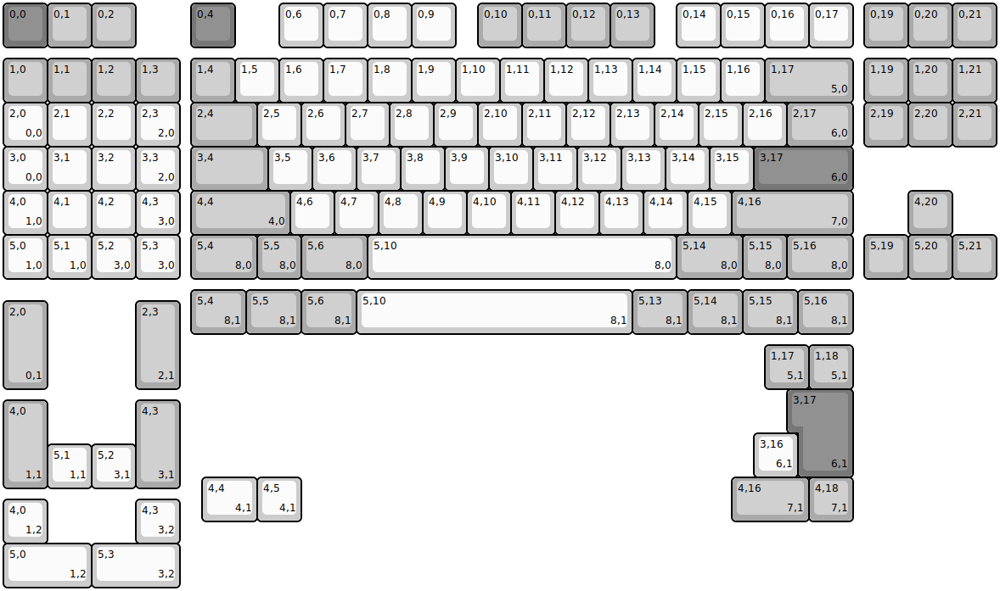{:loading="lazy"}

[Open in keyboard-layout-editor](http://www.keyboard-layout-editor.com/##@@_c=#777777;&=0,0&_c=#aaaaaa;&=0,1&=0,2&_x:1.25&c=#777777;&=0,4&_x:1.0&c=#cccccc;&=0,6&=0,7&=0,8&=0,9&_x:0.5&c=#aaaaaa;&=0,10&=0,11&=0,12&=0,13&_x:0.5&c=#cccccc;&=0,14&=0,15&=0,16&=0,17&_x:0.25&c=#aaaaaa;&=0,19&=0,20&=0,21;&@_y:0.25;&=1,0&=1,1&=1,2&=1,3&_x:0.25;&=1,4&_c=#cccccc;&=1,5&=1,6&=1,7&=1,8&=1,9&=1,10&=1,11&=1,12&=1,13&=1,14&=1,15&=1,16&_c=#aaaaaa&w:2;&=1,17%0A%0A%0A5,0&_x:0.25;&=1,19&=1,20&=1,21;&@_c=#cccccc;&=2,0%0A%0A%0A0,0&=2,1&=2,2&=2,3%0A%0A%0A2,0&_x:0.25&c=#aaaaaa&w:1.5;&=2,4&_c=#cccccc;&=2,5&=2,6&=2,7&=2,8&=2,9&=2,10&=2,11&=2,12&=2,13&=2,14&=2,15&=2,16&_c=#aaaaaa&w:1.5;&=2,17%0A%0A%0A6,0&_x:0.25;&=2,19&=2,20&=2,21;&@_c=#cccccc;&=3,0%0A%0A%0A0,0&=3,1&=3,2&=3,3%0A%0A%0A2,0&_x:0.25&c=#aaaaaa&w:1.75;&=3,4&_c=#cccccc;&=3,5&=3,6&=3,7&=3,8&=3,9&=3,10&=3,11&=3,12&=3,13&=3,14&=3,15&_c=#777777&w:2.25;&=3,17%0A%0A%0A6,0;&@_c=#cccccc;&=4,0%0A%0A%0A1,0&=4,1&=4,2&=4,3%0A%0A%0A3,0&_x:0.25&c=#aaaaaa&w:2.25;&=4,4%0A%0A%0A4,0&_c=#cccccc;&=4,6&=4,7&=4,8&=4,9&=4,10&=4,11&=4,12&=4,13&=4,14&=4,15&_c=#aaaaaa&w:2.75;&=4,16%0A%0A%0A7,0&_x:1.25;&=4,20;&@_c=#cccccc;&=5,0%0A%0A%0A1,0&=5,1%0A%0A%0A1,0&=5,2%0A%0A%0A3,0&=5,3%0A%0A%0A3,0&_x:0.25&c=#aaaaaa&w:1.5;&=5,4%0A%0A%0A8,0&=5,5%0A%0A%0A8,0&_w:1.5;&=5,6%0A%0A%0A8,0&_c=#cccccc&w:7;&=5,10%0A%0A%0A8,0&_c=#aaaaaa&w:1.5;&=5,14%0A%0A%0A8,0&=5,15%0A%0A%0A8,0&_w:1.5;&=5,16%0A%0A%0A8,0&_x:0.25;&=5,19&=5,20&=5,21;&@_x:4.25&y:0.25&w:1.25;&=5,4%0A%0A%0A8,1&_w:1.25;&=5,5%0A%0A%0A8,1&_w:1.25;&=5,6%0A%0A%0A8,1&_c=#cccccc&w:6.25;&=5,10%0A%0A%0A8,1&_c=#aaaaaa&w:1.25;&=5,13%0A%0A%0A8,1&_w:1.25;&=5,14%0A%0A%0A8,1&_w:1.25;&=5,15%0A%0A%0A8,1&_w:1.25;&=5,16%0A%0A%0A8,1;&@_y:-0.75&h:2;&=2,0%0A%0A%0A0,1&_x:2&h:2;&=2,3%0A%0A%0A2,1;&@_x:17.25;&=1,17%0A%0A%0A5,1&=1,18%0A%0A%0A5,1;&@_x:18&c=#777777&w:1.25&h:2&w2:1.5&h2:1&x2:-0.25;&=3,17%0A%0A%0A6,1;&@_y:-0.75&c=#aaaaaa&h:2;&=4,0%0A%0A%0A1,1&_x:2&h:2;&=4,3%0A%0A%0A3,1;&@_x:17&y:-0.25&c=#cccccc;&=3,16%0A%0A%0A6,1;&@_x:1&y:-0.75;&=5,1%0A%0A%0A1,1&=5,2%0A%0A%0A3,1;&@_x:4.5&y:-0.25&w:1.25;&=4,4%0A%0A%0A4,1&=4,5%0A%0A%0A4,1&_x:9.75&c=#aaaaaa&w:1.75;&=4,16%0A%0A%0A7,1&=4,18%0A%0A%0A7,1;&@_y:-0.5&c=#cccccc;&=4,0%0A%0A%0A1,2&_x:2;&=4,3%0A%0A%0A3,2;&@_w:2;&=5,0%0A%0A%0A1,2&_w:2;&=5,3%0A%0A%0A3,2)

## switchplate/switchplate910

[README](output/switchplate/switchplate910/README.md) - [layout](output/switchplate/switchplate910/switchplate910-kle.json) - [PCB](output/switchplate/switchplate910/switchplate910.kicad_pcb) - [PCB render](output/switchplate/switchplate910/switchplate910-render.svg)

{:loading="lazy"}

[Open in keyboard-layout-editor](http://www.keyboard-layout-editor.com/##@@_c=#DEBFB3&t=#363636;&=0,0&_c=#ebebeb;&=0,1&=0,2&=0,3&=0,4&=0,5&=0,6&=0,7&=0,8&=0,9&=0,10&=0,11&=0,12&_c=#363636&t=#DEBFB3;&=0,13&=0,14&=2,13;&@_w:1.5;&=1,0&_c=#ebebeb&t=#363636;&=1,1&=1,2&=1,3&=1,4&=1,5&=1,6&=1,7&=1,8&=1,9&=1,10&=1,11&=1,12&_c=#363636&t=#DEBFB3&w:1.5;&=1,13&=1,14;&@_w:1.75;&=2,0&_c=#ebebeb&t=#363636;&=2,1&=2,2&=2,3&=2,4&=2,5&=2,6&=2,7&=2,8&=2,9&=2,10&=2,11&_c=#363636&t=#DEBFB3&w:2.25;&=2,12&=2,14;&@_w:2.25;&=3,0&_c=#ebebeb&t=#363636;&=3,1&=3,2&=3,3&=3,4&=3,5&=3,6&=3,7&=3,8&=3,9&=3,10&_c=#363636&t=#DEBFB3&w:1.75;&=3,11&_c=#DEBFB3&t=#363636;&=3,12&_c=#363636&t=#DEBFB3;&=3,14;&@_w:1.25;&=4,0&_w:1.25;&=4,1&_w:1.25;&=4,2&_c=#DEBFB3&t=#363636&w:6.25;&=4,5&_c=#363636&t=#DEBFB3&w:1.25;&=4,8&_w:1.25;&=4,9&_x:0.5&c=#DEBFB3&t=#363636;&=4,11&=4,12&=4,14)

## synthlabs/solo

[README](output/synthlabs/solo/README.md) - [layout](output/synthlabs/solo/solo-kle.json) - [PCB](output/synthlabs/solo/solo.kicad_pcb) - [PCB render](output/synthlabs/solo/solo-render.svg)

{:loading="lazy"}

[Open in keyboard-layout-editor](http://www.keyboard-layout-editor.com/##@@_w:7.75&h:3.5&d:true;&=1,6%0A%0A%0A0,0&_x:-4.125&h:1.5;&=0,1%0A%0A%0A0,0&_x:0.25&h:1.5;&=0,3%0A%0A%0A0,0&_x:0.25&h:1.5;&=0,5%0A%0A%0A0,0;&@_x:0.5&w:1.5&h:1.5;&=1,1%0A%0A%0A0,0;&@_y:-0.75&w:0.5;&=1,0%0A%0A%0A0,0&_x:1.5&w:0.5;&=1,2%0A%0A%0A0,0;&@_x:3.0&y:-0.25&h:1.5;&=2,0%0A%0A%0A0,0&_x:0.25&h:1.5;&=2,2%0A%0A%0A0,0&_x:0.25&h:1.5;&=2,4%0A%0A%0A0,0&_x:0.25&h:1.5;&=2,6%0A%0A%0A0,0;&@_y:-3.0&w:7.75&h:3.5&d:true;&=1,6%0A%0A%0A0,1&_x:-7.125&h:1.5;&=2,1%0A%0A%0A0,1&_x:0.25&h:1.5;&=2,3%0A%0A%0A0,1&_x:0.25&h:1.5;&=2,5%0A%0A%0A0,1;&@_x:5.75&w:1.5&h:1.5;&=1,1%0A%0A%0A0,1;&@_x:5.25&y:-0.75&w:0.5;&=1,0%0A%0A%0A0,1&_x:1.5&w:0.5;&=1,2%0A%0A%0A0,1;&@_y:-0.25&h:1.5;&=0,0%0A%0A%0A0,1&_x:0.25&h:1.5;&=0,2%0A%0A%0A0,1&_x:0.25&h:1.5;&=0,4%0A%0A%0A0,1&_x:0.25&h:1.5;&=0,6%0A%0A%0A0,1)

## taleguers/taleguers75

[README](output/taleguers/taleguers75/README.md) - [layout](output/taleguers/taleguers75/taleguers75-kle.json) - [PCB](output/taleguers/taleguers75/taleguers75.kicad_pcb) - [PCB render](output/taleguers/taleguers75/taleguers75-render.svg)

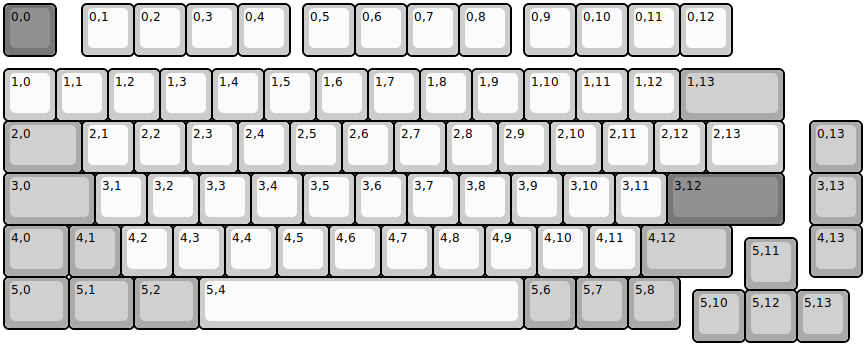{:loading="lazy"}

[Open in keyboard-layout-editor](http://www.keyboard-layout-editor.com/##@@_c=#777777&sm=cherry&fa@:4;;&=0,0&_x:0.5&c=#cccccc;&=0,1&=0,2&=0,3&=0,4&_x:0.25;&=0,5&=0,6&=0,7&=0,8&_x:0.25;&=0,9&=0,10&=0,11&=0,12;&@_y:0.25;&=1,0&=1,1&=1,2&=1,3&=1,4&=1,5&=1,6&=1,7&=1,8&=1,9&=1,10&=1,11&=1,12&_c=#aaaaaa&w:2;&=1,13;&@_w:1.5;&=2,0&_c=#cccccc;&=2,1&=2,2&=2,3&=2,4&=2,5&=2,6&=2,7&=2,8&=2,9&=2,10&=2,11&=2,12&_w:1.5;&=2,13&_x:0.5&c=#aaaaaa;&=0,13;&@_w:1.75;&=3,0&_c=#cccccc;&=3,1&=3,2&=3,3&_n:true;&=3,4&=3,5&=3,6&_n:true;&=3,7&=3,8&=3,9&=3,10&=3,11&_c=#777777&w:2.25;&=3,12&_x:0.5&c=#aaaaaa;&=3,13;&@_w:1.25;&=4,0&=4,1&_c=#cccccc;&=4,2&=4,3&=4,4&=4,5&=4,6&=4,7&=4,8&=4,9&=4,10&=4,11&_c=#aaaaaa&w:1.75;&=4,12&_x:1.5;&=4,13;&@_x:14.25&y:-0.75;&=5,11;&@_y:-0.25&w:1.25;&=5,0&_w:1.25;&=5,1&_w:1.25;&=5,2&_c=#cccccc&w:6.25;&=5,4&_c=#aaaaaa;&=5,6&=5,7&=5,8;&@_x:13.25&y:-0.75;&=5,10&=5,12&=5,13)

## techkeys/sixkeyboard

[README](output/techkeys/sixkeyboard/README.md) - [layout](output/techkeys/sixkeyboard/sixkeyboard-kle.json) - [PCB](output/techkeys/sixkeyboard/sixkeyboard.kicad_pcb) - [PCB render](output/techkeys/sixkeyboard/sixkeyboard-render.svg)

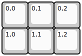{:loading="lazy"}

[Open in keyboard-layout-editor](http://www.keyboard-layout-editor.com/##@_name=sixkeyboard%20via;&@=0,0&=0,1&=0,2;&@=1,0&=1,1&=1,2)

## teleport/numpad

[README](output/teleport/numpad/README.md) - [layout](output/teleport/numpad/numpad-kle.json) - [PCB](output/teleport/numpad/numpad.kicad_pcb) - [PCB render](output/teleport/numpad/numpad-render.svg)

{:loading="lazy"}

[Open in keyboard-layout-editor](http://www.keyboard-layout-editor.com/##@@_c=#aaaaaa;&=0,0&=0,1&=0,2&=0,3;&@_c=#cccccc;&=1,0&=1,1&=1,2&_c=#aaaaaa&h:2;&=1,3;&@_c=#cccccc;&=2,0&=2,1&=2,2;&@=3,0&=3,1&=3,2&_c=#777777&h:2;&=4,2;&@_c=#cccccc&w:2;&=4,0&=4,1)

## tempo_turtle/bradpad

[README](output/tempo_turtle/bradpad/README.md) - [layout](output/tempo_turtle/bradpad/bradpad-kle.json) - [PCB](output/tempo_turtle/bradpad/bradpad.kicad_pcb) - [PCB render](output/tempo_turtle/bradpad/bradpad-render.svg)

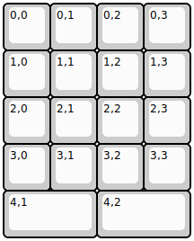{:loading="lazy"}

[Open in keyboard-layout-editor](http://www.keyboard-layout-editor.com/##@@=0,0&=0,1&=0,2&=0,3;&@=1,0&=1,1&=1,2&=1,3;&@=2,0&=2,1&=2,2&=2,3;&@=3,0&=3,1&=3,2&=3,3;&@_w:2;&=4,1&_w:2;&=4,2)

## tender/macrowo_pad

[README](output/tender/README.md) - [layout](output/tender/macrowo_pad-kle.json) - [PCB](output/tender/macrowo_pad.kicad_pcb) - [PCB render](output/tender/macrowo_pad-render.svg)

{:loading="lazy"}

[Open in keyboard-layout-editor](http://www.keyboard-layout-editor.com/##@@_x:1;&=0,1&_x:1.25;&=0,3&_x:3.0;&=0,6&_x:1.25;&=0,8;&@_y:-0.5;&=0,0&_x:1;&=0,2&_x:5.5;&=0,7&_x:1.0;&=0,9;&@_x:3.75&y:-0.5;&=0,4&_x:2.0;&=0,5;&@_x:5.25&y:-0.75;&=1,4;&@_y:-0.75;&=1,0&_x:1;&=1,2&_x:5.5;&=1,7&_x:1.0;&=1,9;&@_x:1&y:-0.5;&=1,1&_x:2.25;&=1,3&_x:1.0;&=1,5&_x:2.25;&=1,8)

## tg4x/tg4x

[README](output/tg4x/README.md) - [layout](output/tg4x/tg4x-kle.json) - [PCB](output/tg4x/tg4x.kicad_pcb) - [PCB render](output/tg4x/tg4x-render.svg)

{:loading="lazy"}

[Open in keyboard-layout-editor](http://www.keyboard-layout-editor.com/##@@_c=#aaaaaa;&=0,0&_c=#cccccc;&=0,1&=0,2&=0,3&=0,4&=0,5&=0,6&=4,0&=4,1&=4,2&=4,3&=4,4&_c=#aaaaaa;&=4,5;&@_w:1.25;&=1,0&_c=#cccccc;&=1,1&=1,2&=1,3&=1,4&=1,5&=1,6&=5,0&=5,1&=5,2&=5,3&_c=#aaaaaa&w:1.75;&=5,4;&@_w:1.75;&=2,0&_c=#cccccc;&=2,1&=2,2&=2,3&=2,4&=2,5&=2,6&=6,0&=6,1&=6,2&=6,3&_c=#aaaaaa&w:1.25;&=6,4;&@_w:1.25;&=3,0&_w:1.25;&=3,1&_w:1.25;&=3,2&_c=#cccccc&w:2.25;&=3,4&_w:2.75;&=3,5&_c=#aaaaaa&w:1.25;&=7,1&=7,2&=7,3&=7,4)

## tgr/910

[README](output/tgr/README.md) - [layout](output/tgr/910-kle.json) - [PCB](output/tgr/910.kicad_pcb) - [PCB render](output/tgr/910-render.svg)

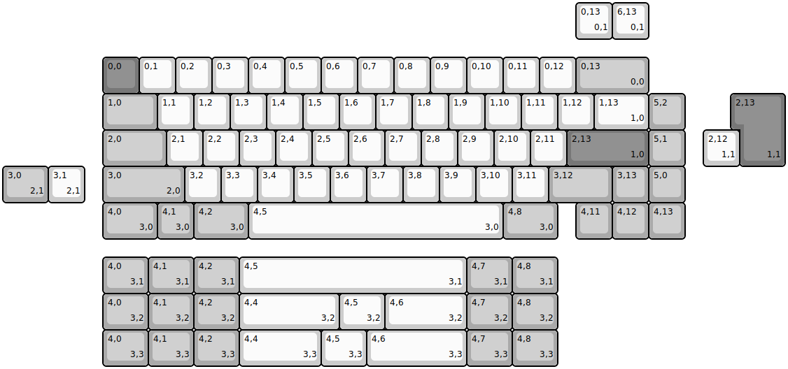{:loading="lazy"}

[Open in keyboard-layout-editor](http://www.keyboard-layout-editor.com/##@@_x:2.75&y:1.5&c=#777777;&=0,0&_c=#cccccc;&=0,1&=0,2&=0,3&=0,4&=0,5&=0,6&=0,7&=0,8&=0,9&=0,10&=0,11&=0,12&_c=#aaaaaa&w:2;&=0,13%0A%0A%0A0,0;&@_x:2.75&w:1.5;&=1,0&_c=#cccccc;&=1,1&=1,2&=1,3&=1,4&=1,5&=1,6&=1,7&=1,8&=1,9&=1,10&=1,11&=1,12&_w:1.5;&=1,13%0A%0A%0A1,0&_c=#aaaaaa;&=5,2;&@_x:2.75&w:1.75;&=2,0&_c=#cccccc;&=2,1&=2,2&=2,3&=2,4&=2,5&=2,6&=2,7&=2,8&=2,9&=2,10&=2,11&_c=#777777&w:2.25;&=2,13%0A%0A%0A1,0&_c=#aaaaaa;&=5,1;&@_x:2.75&w:2.25;&=3,0%0A%0A%0A2,0&_c=#cccccc;&=3,2&=3,3&=3,4&=3,5&=3,6&=3,7&=3,8&=3,9&=3,10&=3,11&_c=#aaaaaa&w:1.75;&=3,12&=3,13&=5,0;&@_x:2.75&w:1.5;&=4,0%0A%0A%0A3,0&=4,1%0A%0A%0A3,0&_w:1.5;&=4,2%0A%0A%0A3,0&_c=#cccccc&w:7;&=4,5%0A%0A%0A3,0&_c=#aaaaaa&w:1.5;&=4,8%0A%0A%0A3,0&_x:0.5;&=4,11&=4,12&=4,13;&@_x:15.75&y:-6.5&c=#cccccc;&=0,13%0A%0A%0A0,1&=6,13%0A%0A%0A0,1;&@_x:20.25&y:1.5&c=#777777&w:1.25&h:2&w2:1.5&h2:1&x2:-0.25;&=2,13%0A%0A%0A1,1;&@_x:19.25&c=#cccccc;&=2,12%0A%0A%0A1,1;&@_c=#aaaaaa&w:1.25;&=3,0%0A%0A%0A2,1&_c=#cccccc;&=3,1%0A%0A%0A2,1;&@_x:2.75&y:1.5&c=#aaaaaa&w:1.25;&=4,0%0A%0A%0A3,1&_w:1.25;&=4,1%0A%0A%0A3,1&_w:1.25;&=4,2%0A%0A%0A3,1&_c=#cccccc&w:6.25;&=4,5%0A%0A%0A3,1&_c=#aaaaaa&w:1.25;&=4,7%0A%0A%0A3,1&_w:1.25;&=4,8%0A%0A%0A3,1;&@_x:2.75&w:1.25;&=4,0%0A%0A%0A3,2&_w:1.25;&=4,1%0A%0A%0A3,2&_w:1.25;&=4,2%0A%0A%0A3,2&_c=#cccccc&w:2.75;&=4,4%0A%0A%0A3,2&_w:1.25;&=4,5%0A%0A%0A3,2&_w:2.25;&=4,6%0A%0A%0A3,2&_c=#aaaaaa&w:1.25;&=4,7%0A%0A%0A3,2&_w:1.25;&=4,8%0A%0A%0A3,2;&@_x:2.75&w:1.25;&=4,0%0A%0A%0A3,3&_w:1.25;&=4,1%0A%0A%0A3,3&_w:1.25;&=4,2%0A%0A%0A3,3&_c=#cccccc&w:2.25;&=4,4%0A%0A%0A3,3&_w:1.25;&=4,5%0A%0A%0A3,3&_w:2.75;&=4,6%0A%0A%0A3,3&_c=#aaaaaa&w:1.25;&=4,7%0A%0A%0A3,3&_w:1.25;&=4,8%0A%0A%0A3,3)

## tgr/910ce

[README](output/tgr/README.md) - [layout](output/tgr/910ce-kle.json) - [PCB](output/tgr/910ce.kicad_pcb) - [PCB render](output/tgr/910ce-render.svg)

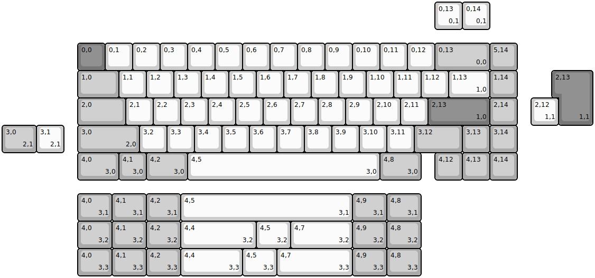{:loading="lazy"}

[Open in keyboard-layout-editor](http://www.keyboard-layout-editor.com/##@@_x:2.75&y:1.5&c=#777777;&=0,0&_c=#cccccc;&=0,1&=0,2&=0,3&=0,4&=0,5&=0,6&=0,7&=0,8&=0,9&=0,10&=0,11&=0,12&_c=#aaaaaa&w:2;&=0,13%0A%0A%0A0,0&=5,14;&@_x:2.75&w:1.5;&=1,0&_c=#cccccc;&=1,1&=1,2&=1,3&=1,4&=1,5&=1,6&=1,7&=1,8&=1,9&=1,10&=1,11&=1,12&_w:1.5;&=1,13%0A%0A%0A1,0&_c=#aaaaaa;&=1,14;&@_x:2.75&w:1.75;&=2,0&_c=#cccccc;&=2,1&=2,2&=2,3&=2,4&=2,5&=2,6&=2,7&=2,8&=2,9&=2,10&=2,11&_c=#777777&w:2.25;&=2,13%0A%0A%0A1,0&_c=#aaaaaa;&=2,14;&@_x:2.75&w:2.25;&=3,0%0A%0A%0A2,0&_c=#cccccc;&=3,2&=3,3&=3,4&=3,5&=3,6&=3,7&=3,8&=3,9&=3,10&=3,11&_c=#aaaaaa&w:1.75;&=3,12&=3,13&=3,14;&@_x:2.75&w:1.5;&=4,0%0A%0A%0A3,0&=4,1%0A%0A%0A3,0&_w:1.5;&=4,2%0A%0A%0A3,0&_c=#cccccc&w:7;&=4,5%0A%0A%0A3,0&_c=#aaaaaa&w:1.5;&=4,8%0A%0A%0A3,0&_x:0.5;&=4,12&=4,13&=4,14;&@_x:15.75&y:-6.5&c=#cccccc;&=0,13%0A%0A%0A0,1&=0,14%0A%0A%0A0,1;&@_x:20.25&y:1.5&c=#777777&w:1.25&h:2&w2:1.5&h2:1&x2:-0.25;&=2,13%0A%0A%0A1,1;&@_x:19.25&c=#cccccc;&=2,12%0A%0A%0A1,1;&@_c=#aaaaaa&w:1.25;&=3,0%0A%0A%0A2,1&_c=#cccccc;&=3,1%0A%0A%0A2,1;&@_x:2.75&y:1.5&c=#aaaaaa&w:1.25;&=4,0%0A%0A%0A3,1&_w:1.25;&=4,1%0A%0A%0A3,1&_w:1.25;&=4,2%0A%0A%0A3,1&_c=#cccccc&w:6.25;&=4,5%0A%0A%0A3,1&_c=#aaaaaa&w:1.25;&=4,9%0A%0A%0A3,1&_w:1.25;&=4,8%0A%0A%0A3,1;&@_x:2.75&w:1.25;&=4,0%0A%0A%0A3,2&_w:1.25;&=4,1%0A%0A%0A3,2&_w:1.25;&=4,2%0A%0A%0A3,2&_c=#cccccc&w:2.75;&=4,4%0A%0A%0A3,2&_w:1.25;&=4,5%0A%0A%0A3,2&_w:2.25;&=4,7%0A%0A%0A3,2&_c=#aaaaaa&w:1.25;&=4,9%0A%0A%0A3,2&_w:1.25;&=4,8%0A%0A%0A3,2;&@_x:2.75&w:1.25;&=4,0%0A%0A%0A3,3&_w:1.25;&=4,1%0A%0A%0A3,3&_w:1.25;&=4,2%0A%0A%0A3,3&_c=#cccccc&w:2.25;&=4,4%0A%0A%0A3,3&_w:1.25;&=4,5%0A%0A%0A3,3&_w:2.75;&=4,7%0A%0A%0A3,3&_c=#aaaaaa&w:1.25;&=4,9%0A%0A%0A3,3&_w:1.25;&=4,8%0A%0A%0A3,3)

## tgr/janev2

[README](output/tgr/README.md) - [layout](output/tgr/janev2-kle.json) - [PCB](output/tgr/janev2.kicad_pcb) - [PCB render](output/tgr/janev2-render.svg)

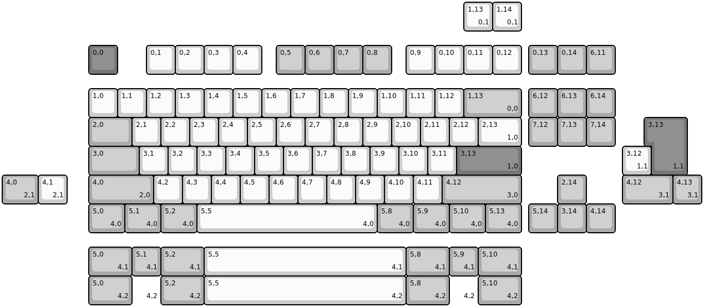{:loading="lazy"}

[Open in keyboard-layout-editor](http://www.keyboard-layout-editor.com/##@@_x:3&y:1.5&c=#777777;&=0,0&_x:1&c=#cccccc;&=0,1&=0,2&=0,3&=0,4&_x:0.5&c=#aaaaaa;&=0,5&=0,6&=0,7&=0,8&_x:0.5&c=#cccccc;&=0,9&=0,10&=0,11&=0,12&_x:0.25&c=#aaaaaa;&=0,13&=0,14&=6,11;&@_x:3&y:0.5&c=#cccccc;&=1,0&=1,1&=1,2&=1,3&=1,4&=1,5&=1,6&=1,7&=1,8&=1,9&=1,10&=1,11&=1,12&_c=#aaaaaa&w:2;&=1,13%0A%0A%0A0,0&_x:0.25;&=6,12&=6,13&=6,14;&@_x:3&w:1.5;&=2,0&_c=#cccccc;&=2,1&=2,2&=2,3&=2,4&=2,5&=2,6&=2,7&=2,8&=2,9&=2,10&=2,11&=2,12&_w:1.5;&=2,13%0A%0A%0A1,0&_x:0.25&c=#aaaaaa;&=7,12&=7,13&=7,14;&@_x:3&w:1.75;&=3,0&_c=#cccccc;&=3,1&=3,2&=3,3&=3,4&=3,5&=3,6&=3,7&=3,8&=3,9&=3,10&=3,11&_c=#777777&w:2.25;&=3,13%0A%0A%0A1,0;&@_x:3.0&c=#aaaaaa&w:2.25;&=4,0%0A%0A%0A2,0&_c=#cccccc;&=4,2&=4,3&=4,4&=4,5&=4,6&=4,7&=4,8&=4,9&=4,10&=4,11&_c=#aaaaaa&w:2.75;&=4,12%0A%0A%0A3,0&_x:1.25;&=2,14;&@_x:3&w:1.25;&=5,0%0A%0A%0A4,0&_w:1.25;&=5,1%0A%0A%0A4,0&_w:1.25;&=5,2%0A%0A%0A4,0&_c=#cccccc&w:6.25;&=5,5%0A%0A%0A4,0&_c=#aaaaaa&w:1.25;&=5,8%0A%0A%0A4,0&_w:1.25;&=5,9%0A%0A%0A4,0&_w:1.25;&=5,10%0A%0A%0A4,0&_w:1.25;&=5,13%0A%0A%0A4,0&_x:0.25;&=5,14&=3,14&=4,14;&@_x:16&y:-8.0&c=#cccccc;&=1,13%0A%0A%0A0,1&=1,14%0A%0A%0A0,1;&@_x:22.5&y:3.0&c=#777777&w:1.25&h:2&w2:1.5&h2:1&x2:-0.25;&=3,13%0A%0A%0A1,1;&@_x:21.5&c=#cccccc;&=3,12%0A%0A%0A1,1;&@_c=#aaaaaa&w:1.25;&=4,0%0A%0A%0A2,1&_c=#cccccc;&=4,1%0A%0A%0A2,1&_x:19.25&c=#aaaaaa&w:1.75;&=4,12%0A%0A%0A3,1&=4,13%0A%0A%0A3,1;&@_x:3&y:1.5&w:1.5;&=5,0%0A%0A%0A4,1&=5,1%0A%0A%0A4,1&_w:1.5;&=5,2%0A%0A%0A4,1&_c=#cccccc&w:7;&=5,5%0A%0A%0A4,1&_c=#aaaaaa&w:1.5;&=5,8%0A%0A%0A4,1&=5,9%0A%0A%0A4,1&_w:1.5;&=5,10%0A%0A%0A4,1;&@_x:3&w:1.5;&=5,0%0A%0A%0A4,2&_d:true;&=%0A%0A%0A4,2&_w:1.5;&=5,2%0A%0A%0A4,2&_c=#cccccc&w:7;&=5,5%0A%0A%0A4,2&_c=#aaaaaa&w:1.5;&=5,8%0A%0A%0A4,2&_d:true;&=%0A%0A%0A4,2&_w:1.5;&=5,10%0A%0A%0A4,2)

## tgr/janev2ce

[README](output/tgr/README.md) - [layout](output/tgr/janev2ce-kle.json) - [PCB](output/tgr/janev2ce.kicad_pcb) - [PCB render](output/tgr/janev2ce-render.svg)

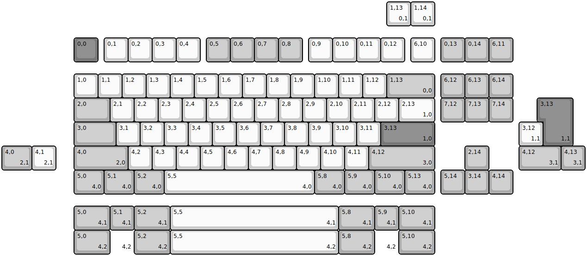{:loading="lazy"}

[Open in keyboard-layout-editor](http://www.keyboard-layout-editor.com/##@@_x:3&y:1.5&c=#777777;&=0,0&_x:0.25&c=#cccccc;&=0,1&=0,2&=0,3&=0,4&_x:0.25&c=#aaaaaa;&=0,5&=0,6&=0,7&=0,8&_x:0.25&c=#cccccc;&=0,9&=0,10&=0,11&=0,12&_x:0.25;&=6,10&_x:0.25&c=#aaaaaa;&=0,13&=0,14&=6,11;&@_x:3&y:0.5&c=#cccccc;&=1,0&=1,1&=1,2&=1,3&=1,4&=1,5&=1,6&=1,7&=1,8&=1,9&=1,10&=1,11&=1,12&_c=#aaaaaa&w:2;&=1,13%0A%0A%0A0,0&_x:0.25;&=6,12&=6,13&=6,14;&@_x:3&w:1.5;&=2,0&_c=#cccccc;&=2,1&=2,2&=2,3&=2,4&=2,5&=2,6&=2,7&=2,8&=2,9&=2,10&=2,11&=2,12&_w:1.5;&=2,13%0A%0A%0A1,0&_x:0.25&c=#aaaaaa;&=7,12&=7,13&=7,14;&@_x:3&w:1.75;&=3,0&_c=#cccccc;&=3,1&=3,2&=3,3&=3,4&=3,5&=3,6&=3,7&=3,8&=3,9&=3,10&=3,11&_c=#777777&w:2.25;&=3,13%0A%0A%0A1,0;&@_x:3.0&c=#aaaaaa&w:2.25;&=4,0%0A%0A%0A2,0&_c=#cccccc;&=4,2&=4,3&=4,4&=4,5&=4,6&=4,7&=4,8&=4,9&=4,10&=4,11&_c=#aaaaaa&w:2.75;&=4,12%0A%0A%0A3,0&_x:1.25;&=2,14;&@_x:3&w:1.25;&=5,0%0A%0A%0A4,0&_w:1.25;&=5,1%0A%0A%0A4,0&_w:1.25;&=5,2%0A%0A%0A4,0&_c=#cccccc&w:6.25;&=5,5%0A%0A%0A4,0&_c=#aaaaaa&w:1.25;&=5,8%0A%0A%0A4,0&_w:1.25;&=5,9%0A%0A%0A4,0&_w:1.25;&=5,10%0A%0A%0A4,0&_w:1.25;&=5,13%0A%0A%0A4,0&_x:0.25;&=5,14&=3,14&=4,14;&@_x:16&y:-8.0&c=#cccccc;&=1,13%0A%0A%0A0,1&=1,14%0A%0A%0A0,1;&@_x:22.5&y:3.0&c=#777777&w:1.25&h:2&w2:1.5&h2:1&x2:-0.25;&=3,13%0A%0A%0A1,1;&@_x:21.5&c=#cccccc;&=3,12%0A%0A%0A1,1;&@_c=#aaaaaa&w:1.25;&=4,0%0A%0A%0A2,1&_c=#cccccc;&=4,1%0A%0A%0A2,1&_x:19.25&c=#aaaaaa&w:1.75;&=4,12%0A%0A%0A3,1&=4,13%0A%0A%0A3,1;&@_x:3&y:1.5&w:1.5;&=5,0%0A%0A%0A4,1&=5,1%0A%0A%0A4,1&_w:1.5;&=5,2%0A%0A%0A4,1&_c=#cccccc&w:7;&=5,5%0A%0A%0A4,1&_c=#aaaaaa&w:1.5;&=5,8%0A%0A%0A4,1&=5,9%0A%0A%0A4,1&_w:1.5;&=5,10%0A%0A%0A4,1;&@_x:3&w:1.5;&=5,0%0A%0A%0A4,2&_d:true;&=%0A%0A%0A4,2&_w:1.5;&=5,2%0A%0A%0A4,2&_c=#cccccc&w:7;&=5,5%0A%0A%0A4,2&_c=#aaaaaa&w:1.5;&=5,8%0A%0A%0A4,2&_d:true;&=%0A%0A%0A4,2&_w:1.5;&=5,10%0A%0A%0A4,2)

## tgr/tris

[README](output/tgr/README.md) - [layout](output/tgr/tris-kle.json) - [PCB](output/tgr/tris.kicad_pcb) - [PCB render](output/tgr/tris-render.svg)

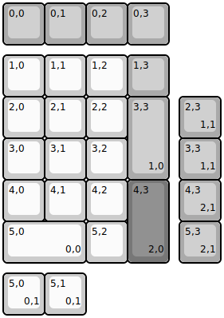{:loading="lazy"}

[Open in keyboard-layout-editor](http://www.keyboard-layout-editor.com/##@@_c=#aaaaaa;&=0,0&=0,1&=0,2&=0,3;&@_y:0.25&c=#cccccc;&=1,0&=1,1&=1,2&_c=#aaaaaa;&=1,3;&@_c=#cccccc;&=2,0&=2,1&=2,2;&@=3,0&=3,1&=3,2;&@_x:3&y:-2.0&c=#aaaaaa&h:2;&=3,3%0A%0A%0A1,0;&@_y:1.0&c=#cccccc;&=4,0&=4,1&=4,2;&@_w:2;&=5,0%0A%0A%0A0,0&=5,2;&@_x:3&y:-2.0&c=#777777&h:2;&=4,3%0A%0A%0A2,0;&@_x:4.25&y:-3.0&c=#aaaaaa;&=2,3%0A%0A%0A1,1;&@_x:4.25;&=3,3%0A%0A%0A1,1;&@_x:4.25;&=4,3%0A%0A%0A2,1;&@_x:4.25;&=5,3%0A%0A%0A2,1;&@_y:0.25&c=#cccccc;&=5,0%0A%0A%0A0,1&=5,1%0A%0A%0A0,1)

## the_royal/liminal

[README](output/the_royal/liminal/README.md) - [layout](output/the_royal/liminal/liminal-kle.json) - [PCB](output/the_royal/liminal/liminal.kicad_pcb) - [PCB render](output/the_royal/liminal/liminal-render.svg)

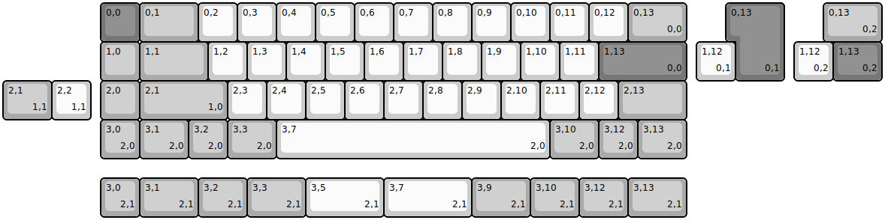{:loading="lazy"}

[Open in keyboard-layout-editor](http://www.keyboard-layout-editor.com/##@@_x:2.5&c=#777777;&=0,0&_c=#aaaaaa&w:1.5;&=0,1&_c=#cccccc;&=0,2&=0,3&=0,4&=0,5&=0,6&=0,7&=0,8&=0,9&=0,10&=0,11&=0,12&_c=#aaaaaa&w:1.5;&=0,13%0A%0A%0A0,0;&@_x:2.5;&=1,0&_w:1.75;&=1,1&_c=#cccccc;&=1,2&=1,3&=1,4&=1,5&=1,6&=1,7&=1,8&=1,9&=1,10&=1,11&_c=#777777&w:2.25;&=1,13%0A%0A%0A0,0;&@_x:2.5&c=#aaaaaa;&=2,0&_w:2.25;&=2,1%0A%0A%0A1,0&_c=#cccccc;&=2,3&=2,4&=2,5&=2,6&=2,7&=2,8&=2,9&=2,10&=2,11&=2,12&_c=#aaaaaa&w:1.75;&=2,13;&@_x:2.5;&=3,0%0A%0A%0A2,0&_w:1.25;&=3,1%0A%0A%0A2,0&=3,2%0A%0A%0A2,0&_w:1.25;&=3,3%0A%0A%0A2,0&_c=#cccccc&w:7;&=3,7%0A%0A%0A2,0&_c=#aaaaaa&w:1.25;&=3,10%0A%0A%0A2,0&=3,12%0A%0A%0A2,0&_w:1.25;&=3,13%0A%0A%0A2,0;&@_x:18.75&y:-4&c=#777777&w:1.25&h:2&w2:1.5&h2:1&x2:-0.25;&=0,13%0A%0A%0A0,1&_x:1.0&c=#aaaaaa&w:1.5;&=0,13%0A%0A%0A0,2;&@_x:17.75&c=#cccccc;&=1,12%0A%0A%0A0,1&_x:1.5;&=1,12%0A%0A%0A0,2&_c=#777777&w:1.25;&=1,13%0A%0A%0A0,2;&@_c=#aaaaaa&w:1.25;&=2,1%0A%0A%0A1,1&_c=#cccccc;&=2,2%0A%0A%0A1,1;&@_x:2.5&y:1.5&c=#aaaaaa;&=3,0%0A%0A%0A2,1&_w:1.5;&=3,1%0A%0A%0A2,1&_w:1.25;&=3,2%0A%0A%0A2,1&_w:1.5;&=3,3%0A%0A%0A2,1&_c=#cccccc&w:2;&=3,5%0A%0A%0A2,1&_w:2.25;&=3,7%0A%0A%0A2,1&_c=#aaaaaa&w:1.5;&=3,9%0A%0A%0A2,1&_w:1.25;&=3,10%0A%0A%0A2,1&_w:1.25;&=3,12%0A%0A%0A2,1&_w:1.5;&=3,13%0A%0A%0A2,1)

## the_royal/romac

[README](output/the_royal/romac/README.md) - [layout](output/the_royal/romac/romac-kle.json) - [PCB](output/the_royal/romac/romac.kicad_pcb) - [PCB render](output/the_royal/romac/romac-render.svg)

{:loading="lazy"}

[Open in keyboard-layout-editor](http://www.keyboard-layout-editor.com/##@@_c=#505557&t=#d9d7d7;&=0,0&=0,1&=0,2;&@=1,0&=1,1&=1,2;&@=2,0&=2,1&=2,2;&@=3,0&=3,1&=3,2)

## the_royal/romac_plus

[README](output/the_royal/romac_plus/README.md) - [layout](output/the_royal/romac_plus/romac_plus-kle.json) - [PCB](output/the_royal/romac_plus/romac_plus.kicad_pcb) - [PCB render](output/the_royal/romac_plus/romac_plus-render.svg)

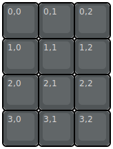{:loading="lazy"}

[Open in keyboard-layout-editor](http://www.keyboard-layout-editor.com/##@@_c=#505557&t=#d9d7d7;&=0,0&=0,1&=0,2;&@=1,0&=1,1&=1,2;&@=2,0&=2,1&=2,2;&@=3,0&=3,1&=3,2)

## thepanduuh/degenpad

[README](output/thepanduuh/degenpad/README.md) - [layout](output/thepanduuh/degenpad/degenpad-kle.json) - [PCB](output/thepanduuh/degenpad/degenpad.kicad_pcb) - [PCB render](output/thepanduuh/degenpad/degenpad-render.svg)

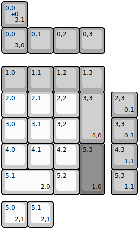{:loading="lazy"}

[Open in keyboard-layout-editor](http://www.keyboard-layout-editor.com/##@@_y:1&c=#aaaaaa;&=0,0%0A%0A%0A3,0&=0,1&=0,2&=0,3;&@_y:0.5;&=1,0&=1,1&=1,2&=1,3;&@_c=#cccccc;&=2,0&=2,1&=2,2&_c=#aaaaaa&h:2;&=3,3%0A%0A%0A0,0;&@_c=#cccccc;&=3,0&=3,1&=3,2;&@=4,0&=4,1&=4,2&_c=#777777&h:2;&=5,3%0A%0A%0A1,0;&@_c=#cccccc&w:2;&=5,1%0A%0A%0A2,0&=5,2;&@_y:-7.5&c=#aaaaaa;&=0,0%0A%0A%0A3,1%0A%0A%0A%0A%0A%0Ae0;&@_x:4.25&y:2.5;&=2,3%0A%0A%0A0,1;&@_x:4.25;&=3,3%0A%0A%0A0,1;&@_x:4.25;&=4,3%0A%0A%0A1,1;&@_x:4.25;&=5,3%0A%0A%0A1,1;&@_y:0.25&c=#cccccc;&=5,0%0A%0A%0A2,1&=5,1%0A%0A%0A2,1)

## thevankeyboards/bananasplit

[README](output/thevankeyboards/README.md) - [layout](output/thevankeyboards/bananasplit-kle.json) - [PCB](output/thevankeyboards/bananasplit.kicad_pcb) - [PCB render](output/thevankeyboards/bananasplit-render.svg)

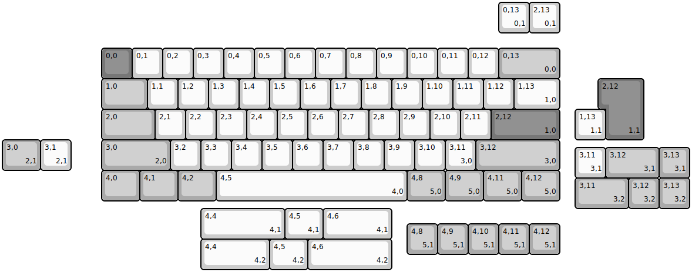{:loading="lazy"}

[Open in keyboard-layout-editor](http://www.keyboard-layout-editor.com/##@@_x:3.25&y:1.5&c=#777777;&=0,0&_c=#cccccc;&=0,1&=0,2&=0,3&=0,4&=0,5&=0,6&=0,7&=0,8&=0,9&=0,10&=0,11&=0,12&_c=#aaaaaa&w:2;&=0,13%0A%0A%0A0,0;&@_x:3.25&w:1.5;&=1,0&_c=#cccccc;&=1,1&=1,2&=1,3&=1,4&=1,5&=1,6&=1,7&=1,8&=1,9&=1,10&=1,11&=1,12&_w:1.5;&=1,13%0A%0A%0A1,0;&@_x:3.25&c=#aaaaaa&w:1.75;&=2,0&_c=#cccccc;&=2,1&=2,2&=2,3&=2,4&=2,5&=2,6&=2,7&=2,8&=2,9&=2,10&=2,11&_c=#777777&w:2.25;&=2,12%0A%0A%0A1,0;&@_x:3.25&c=#aaaaaa&w:2.25;&=3,0%0A%0A%0A2,0&_c=#cccccc;&=3,2&=3,3&=3,4&=3,5&=3,6&=3,7&=3,8&=3,9&=3,10&=3,11%0A%0A%0A3,0&_c=#aaaaaa&w:2.75;&=3,12%0A%0A%0A3,0;&@_x:3.25&w:1.25;&=4,0&_w:1.25;&=4,1&_w:1.25;&=4,2&_c=#cccccc&w:6.25;&=4,5%0A%0A%0A4,0&_c=#aaaaaa&w:1.25;&=4,8%0A%0A%0A5,0&_w:1.25;&=4,9%0A%0A%0A5,0&_w:1.25;&=4,11%0A%0A%0A5,0&_w:1.25;&=4,12%0A%0A%0A5,0;&@_x:16.25&y:-6.5&c=#cccccc;&=0,13%0A%0A%0A0,1&=2,13%0A%0A%0A0,1;&@_x:19.75&y:1.5&c=#777777&w:1.25&h:2&w2:1.5&h2:1&x2:-0.25;&=2,12%0A%0A%0A1,1;&@_x:18.75&c=#cccccc;&=1,13%0A%0A%0A1,1;&@_c=#aaaaaa&w:1.25;&=3,0%0A%0A%0A2,1&_c=#cccccc;&=3,1%0A%0A%0A2,1;&@_x:18.75&y:-0.75;&=3,11%0A%0A%0A3,1&_c=#aaaaaa&w:1.75;&=3,12%0A%0A%0A3,1&=3,13%0A%0A%0A3,1;&@_x:18.75&w:1.75;&=3,11%0A%0A%0A3,2&=3,12%0A%0A%0A3,2&=3,13%0A%0A%0A3,2;&@_x:6.5&c=#cccccc&w:2.75;&=4,4%0A%0A%0A4,1&_w:1.25;&=4,5%0A%0A%0A4,1&_w:2.25;&=4,6%0A%0A%0A4,1;&@_x:13.25&y:-0.5&c=#aaaaaa;&=4,8%0A%0A%0A5,1&=4,9%0A%0A%0A5,1&=4,10%0A%0A%0A5,1&=4,11%0A%0A%0A5,1&=4,12%0A%0A%0A5,1;&@_x:6.5&y:-0.5&c=#cccccc&w:2.25;&=4,4%0A%0A%0A4,2&_w:1.25;&=4,5%0A%0A%0A4,2&_w:2.75;&=4,6%0A%0A%0A4,2)

## thevankeyboards/jetvan

[README](output/thevankeyboards/README.md) - [layout](output/thevankeyboards/jetvan-kle.json) - [PCB](output/thevankeyboards/jetvan.kicad_pcb) - [PCB render](output/thevankeyboards/jetvan-render.svg)

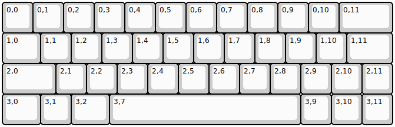{:loading="lazy"}

[Open in keyboard-layout-editor](http://www.keyboard-layout-editor.com/##@@=0,0&=0,1&=0,2&=0,3&=0,4&=0,5&=0,6&=0,7&=0,8&=0,9&=0,10&_w:1.75;&=0,11;&@_w:1.25;&=1,0&=1,1&=1,2&=1,3&=1,4&=1,5&=1,6&=1,7&=1,8&=1,9&=1,10&_w:1.5;&=1,11;&@_w:1.75;&=2,0&=2,1&=2,2&=2,3&=2,4&=2,5&=2,6&=2,7&=2,8&=2,9&=2,10&=2,11;&@_w:1.25;&=3,0&=3,1&_w:1.25;&=3,2&_w:6.25;&=3,7&=3,9&=3,10&=3,11)

## thevankeyboards/minivan

[README](output/thevankeyboards/README.md) - [layout](output/thevankeyboards/minivan-kle.json) - [PCB](output/thevankeyboards/minivan.kicad_pcb) - [PCB render](output/thevankeyboards/minivan-render.svg)

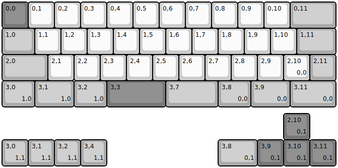{:loading="lazy"}

[Open in keyboard-layout-editor](http://www.keyboard-layout-editor.com/##@@_c=#777777;&=0,0&_c=#cccccc;&=0,1&=0,2&=0,3&=0,4&=0,5&=0,6&=0,7&=0,8&=0,9&=0,10&_c=#aaaaaa&w:1.75;&=0,11;&@_w:1.25;&=1,0&_c=#cccccc;&=1,1&=1,2&=1,3&=1,4&=1,5&=1,6&=1,7&=1,8&=1,9&=1,10&_c=#aaaaaa&w:1.5;&=1,11;&@_w:1.75;&=2,0&_c=#cccccc;&=2,1&=2,2&=2,3&=2,4&=2,5&=2,6&=2,7&=2,8&=2,9&=2,10%0A%0A%0A0,0&_c=#aaaaaa;&=2,11;&@_w:1.25;&=3,0%0A%0A%0A1,0&_w:1.5;&=3,1%0A%0A%0A1,0&_w:1.25;&=3,2%0A%0A%0A1,0&_c=#777777&w:2.25;&=3,3&_c=#aaaaaa&w:2;&=3,7&_w:1.25;&=3,8%0A%0A%0A0,0&_w:1.5;&=3,9%0A%0A%0A0,0&_w:1.75;&=3,11%0A%0A%0A0,0;&@_x:10.75&y:0.25&c=#777777;&=2,10%0A%0A%0A0,1;&@_c=#aaaaaa;&=3,0%0A%0A%0A1,1&=3,1%0A%0A%0A1,1&=3,2%0A%0A%0A1,1&=3,4%0A%0A%0A1,1&_x:4.25&w:1.5;&=3,8%0A%0A%0A0,1&_c=#777777;&=3,9%0A%0A%0A0,1&=3,10%0A%0A%0A0,1&=3,11%0A%0A%0A0,1)

## tiger910/tiger910

[README](output/tiger910/README.md) - [layout](output/tiger910/tiger910-kle.json) - [PCB](output/tiger910/tiger910.kicad_pcb) - [PCB render](output/tiger910/tiger910-render.svg)

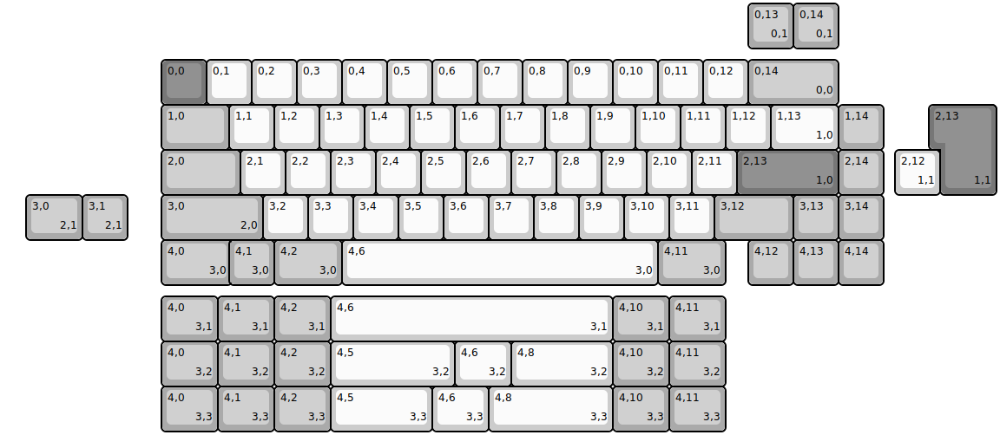{:loading="lazy"}

[Open in keyboard-layout-editor](http://www.keyboard-layout-editor.com/##@@_x:3.5&y:1.25&c=#777777;&=0,0&_c=#cccccc;&=0,1&=0,2&=0,3&=0,4&=0,5&=0,6&=0,7&=0,8&=0,9&=0,10&=0,11&=0,12&_c=#aaaaaa&w:2;&=0,14%0A%0A%0A0,0;&@_x:3.5&w:1.5;&=1,0&_c=#cccccc;&=1,1&=1,2&=1,3&=1,4&=1,5&=1,6&=1,7&=1,8&=1,9&=1,10&=1,11&=1,12&_w:1.5;&=1,13%0A%0A%0A1,0&_c=#aaaaaa;&=1,14;&@_x:3.5&sm=cherry&w:1.75;&=2,0&_c=#cccccc;&=2,1&=2,2&=2,3&=2,4&=2,5&=2,6&=2,7&=2,8&=2,9&=2,10&=2,11&_c=#777777&w:2.25;&=2,13%0A%0A%0A1,0&_c=#aaaaaa;&=2,14;&@_x:3.5&w:2.25;&=3,0%0A%0A%0A2,0&_c=#cccccc;&=3,2&=3,3&=3,4&=3,5&=3,6&=3,7&=3,8&=3,9&=3,10&=3,11&_c=#aaaaaa&w:1.75;&=3,12&=3,13&=3,14;&@_x:3.5&w:1.56;&=4,0%0A%0A%0A3,0&_x:-0.06;&=4,1%0A%0A%0A3,0&_w:1.5;&=4,2%0A%0A%0A3,0&_c=#cccccc&w:7;&=4,6%0A%0A%0A3,0&_c=#aaaaaa&w:1.5;&=4,11%0A%0A%0A3,0&_x:0.5;&=4,12&=4,13&=4,14;&@_x:16.5&y:-6.25&sm=;&=0,13%0A%0A%0A0,1&=0,14%0A%0A%0A0,1;&@_x:20.75&y:1.25&c=#777777&w:1.25&h:2&w2:1.5&h2:1&x2:-0.25;&=2,13%0A%0A%0A1,1;&@_x:19.75&c=#cccccc&sm=cherry;&=2,12%0A%0A%0A1,1;&@_x:0.5&c=#aaaaaa&w:1.25;&=3,0%0A%0A%0A2,1&=3,1%0A%0A%0A2,1;&@_x:3.5&y:1.25&w:1.25;&=4,0%0A%0A%0A3,1&_w:1.25;&=4,1%0A%0A%0A3,1&_w:1.25;&=4,2%0A%0A%0A3,1&_c=#cccccc&w:6.25;&=4,6%0A%0A%0A3,1&_c=#aaaaaa&w:1.25;&=4,10%0A%0A%0A3,1&_w:1.25;&=4,11%0A%0A%0A3,1;&@_x:3.5&w:1.25;&=4,0%0A%0A%0A3,2&_w:1.25;&=4,1%0A%0A%0A3,2&_w:1.25;&=4,2%0A%0A%0A3,2&_c=#cccccc&w:2.75;&=4,5%0A%0A%0A3,2&_w:1.25;&=4,6%0A%0A%0A3,2&_w:2.25;&=4,8%0A%0A%0A3,2&_c=#aaaaaa&w:1.25;&=4,10%0A%0A%0A3,2&_w:1.25;&=4,11%0A%0A%0A3,2;&@_x:3.5&w:1.25;&=4,0%0A%0A%0A3,3&_w:1.25;&=4,1%0A%0A%0A3,3&_w:1.25;&=4,2%0A%0A%0A3,3&_c=#cccccc&w:2.25;&=4,5%0A%0A%0A3,3&_w:1.25;&=4,6%0A%0A%0A3,3&_w:2.75;&=4,8%0A%0A%0A3,3&_c=#aaaaaa&w:1.25;&=4,10%0A%0A%0A3,3&_w:1.25;&=4,11%0A%0A%0A3,3)

## tkc/california

[README](output/tkc/california/README.md) - [layout](output/tkc/california/california-kle.json) - [PCB](output/tkc/california/california.kicad_pcb) - [PCB render](output/tkc/california/california-render.svg)

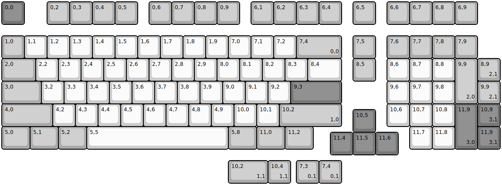{:loading="lazy"}

[Open in keyboard-layout-editor](http://www.keyboard-layout-editor.com/##@@_c=#777777;&=0,0&_x:1&c=#aaaaaa;&=0,2&=0,3&=0,4&=0,5&_x:0.5;&=0,6&=0,7&=0,8&=0,9&_x:0.5;&=6,1&=6,2&=6,3&=6,4&_x:0.5;&=6,5&_x:0.5;&=6,6&=6,7&=6,8&=6,9;&@_y:0.5;&=1,0&_c=#cccccc;&=1,1&=1,2&=1,3&=1,4&=1,5&=1,6&=1,7&=1,8&=1,9&=7,0&=7,1&=7,2&_c=#aaaaaa&w:2;&=7,4%0A%0A%0A0,0&_x:0.5;&=7,5&_x:0.5;&=7,6&=7,7&=7,8&=7,9;&@_w:1.5;&=2,0&_c=#cccccc;&=2,2&=2,3&=2,4&=2,5&=2,6&=2,7&=2,8&=2,9&=8,0&=8,1&=8,2&=8,3&_w:1.5;&=8,4&_x:0.5&c=#aaaaaa;&=8,5&_x:0.5&c=#cccccc;&=8,6&=8,7&=8,8&_c=#aaaaaa&h:2;&=9,9%0A%0A%0A2,0;&@_w:1.75;&=3,0&_c=#cccccc;&=3,2&=3,3&=3,4&=3,5&=3,6&=3,7&=3,8&=3,9&=9,0&=9,1&=9,2&_c=#777777&w:2.25;&=9,3&_x:2.0&c=#cccccc;&=9,6&=9,7&=9,8;&@_c=#aaaaaa&w:2.25;&=4,0&_c=#cccccc;&=4,2&=4,3&=4,4&=4,5&=4,6&=4,7&=4,8&=4,9&=10,0&=10,1&_c=#aaaaaa&w:2.75;&=10,2%0A%0A%0A1,0&_x:2.0&c=#cccccc;&=10,6&=10,7&=10,8&_c=#777777&h:2;&=11,9%0A%0A%0A3,0;&@_x:15.5&y:-0.75;&=10,5;&@_y:-0.25&c=#aaaaaa&w:1.25;&=5,0&_w:1.25;&=5,1&_w:1.25;&=5,2&_c=#cccccc&w:6.25;&=5,5&_c=#aaaaaa&w:1.25;&=5,8&_w:1.25;&=11,0&_w:1.25;&=11,2&_x:4.25&c=#cccccc;&=11,7&=11,8;&@_x:14.5&y:-0.75&c=#777777;&=11,4&=11,5&=11,6;&@_x:21.0&y:-4.25&c=#aaaaaa;&=8,9%0A%0A%0A2,1;&@_x:21.0;&=9,9%0A%0A%0A2,1;&@_x:21.0&c=#777777;&=10,9%0A%0A%0A3,1;&@_x:21.0;&=11,9%0A%0A%0A3,1;&@_x:10&y:0.5&c=#aaaaaa&w:1.75;&=10,2%0A%0A%0A1,1&=10,4%0A%0A%0A1,1&_x:0.25;&=7,3%0A%0A%0A0,1&=7,4%0A%0A%0A0,1)

## tkc/candybar/candybar-lefty

[README](output/tkc/candybar/README.md) - [layout](output/tkc/candybar/candybar-lefty-kle.json) - [PCB](output/tkc/candybar/candybar-lefty.kicad_pcb) - [PCB render](output/tkc/candybar/candybar-lefty-render.svg)

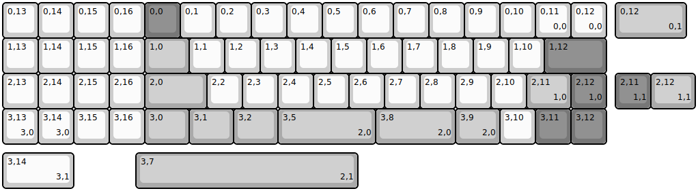{:loading="lazy"}

[Open in keyboard-layout-editor](http://www.keyboard-layout-editor.com/##@@=0,13&=0,14&=0,15&=0,16&_c=#777777;&=0,0&_c=#cccccc;&=0,1&=0,2&=0,3&=0,4&=0,5&=0,6&=0,7&=0,8&=0,9&=0,10&=0,11%0A%0A%0A0,0&=0,12%0A%0A%0A0,0;&@=1,13&=1,14&=1,15&=1,16&_c=#aaaaaa&w:1.25;&=1,0&_c=#cccccc;&=1,1&=1,2&=1,3&=1,4&=1,5&=1,6&=1,7&=1,8&=1,9&=1,10&_c=#777777&w:1.75;&=1,12;&@_c=#cccccc;&=2,13&=2,14&=2,15&=2,16&_c=#aaaaaa&w:1.75;&=2,0&_c=#cccccc;&=2,2&=2,3&=2,4&=2,5&=2,6&=2,7&=2,8&=2,9&=2,10&_c=#aaaaaa&w:1.25;&=2,11%0A%0A%0A1,0&_c=#777777;&=2,12%0A%0A%0A1,0;&@_c=#cccccc;&=3,13%0A%0A%0A3,0&=3,14%0A%0A%0A3,0&=3,15&=3,16&_c=#aaaaaa&w:1.25;&=3,0&_w:1.25;&=3,1&_w:1.25;&=3,2&_w:2.75;&=3,5%0A%0A%0A2,0&_w:2.25;&=3,8%0A%0A%0A2,0&_w:1.25;&=3,9%0A%0A%0A2,0&_c=#cccccc;&=3,10&_c=#777777;&=3,11&=3,12;&@_x:17.25&y:-4&c=#aaaaaa&w:2;&=0,12%0A%0A%0A0,1;&@_x:17.25&y:1&c=#777777;&=2,11%0A%0A%0A1,1&_c=#aaaaaa&w:1.25;&=2,12%0A%0A%0A1,1;&@_y:1.25&c=#cccccc&w:2;&=3,14%0A%0A%0A3,1&_x:1.75&c=#aaaaaa&w:6.25;&=3,7%0A%0A%0A2,1)

## tkc/candybar/candybar-righty

[README](output/tkc/candybar/README.md) - [layout](output/tkc/candybar/candybar-righty-kle.json) - [PCB](output/tkc/candybar/candybar-righty.kicad_pcb) - [PCB render](output/tkc/candybar/candybar-righty-render.svg)

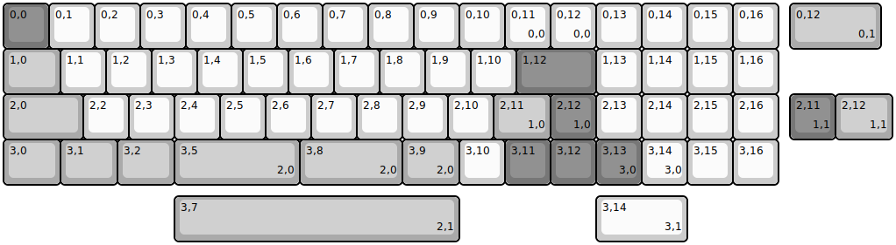{:loading="lazy"}

[Open in keyboard-layout-editor](http://www.keyboard-layout-editor.com/##@@_c=#777777;&=0,0&_c=#cccccc;&=0,1&=0,2&=0,3&=0,4&=0,5&=0,6&=0,7&=0,8&=0,9&=0,10&=0,11%0A%0A%0A0,0&=0,12%0A%0A%0A0,0&=0,13&=0,14&=0,15&=0,16;&@_c=#aaaaaa&w:1.25;&=1,0&_c=#cccccc;&=1,1&=1,2&=1,3&=1,4&=1,5&=1,6&=1,7&=1,8&=1,9&=1,10&_c=#777777&w:1.75;&=1,12&_c=#cccccc;&=1,13&=1,14&=1,15&=1,16;&@_c=#aaaaaa&w:1.75;&=2,0&_c=#cccccc;&=2,2&=2,3&=2,4&=2,5&=2,6&=2,7&=2,8&=2,9&=2,10&_c=#aaaaaa&w:1.25;&=2,11%0A%0A%0A1,0&_c=#777777;&=2,12%0A%0A%0A1,0&_c=#cccccc;&=2,13&=2,14&=2,15&=2,16;&@_c=#aaaaaa&w:1.25;&=3,0&_w:1.25;&=3,1&_w:1.25;&=3,2&_w:2.75;&=3,5%0A%0A%0A2,0&_w:2.25;&=3,8%0A%0A%0A2,0&_w:1.25;&=3,9%0A%0A%0A2,0&_c=#cccccc;&=3,10&_c=#777777;&=3,11&=3,12&=3,13%0A%0A%0A3,0&_c=#cccccc;&=3,14%0A%0A%0A3,0&=3,15&=3,16;&@_x:17.25&y:-4&c=#aaaaaa&w:2;&=0,12%0A%0A%0A0,1;&@_x:17.25&y:1&c=#777777;&=2,11%0A%0A%0A1,1&_c=#aaaaaa&w:1.25;&=2,12%0A%0A%0A1,1;&@_x:3.75&y:1.25&w:6.25;&=3,7%0A%0A%0A2,1&_x:3.0&c=#cccccc&w:2;&=3,14%0A%0A%0A3,1)

## tkc/godspeed75

[README](output/tkc/godspeed75/README.md) - [layout](output/tkc/godspeed75/godspeed75-kle.json) - [PCB](output/tkc/godspeed75/godspeed75.kicad_pcb) - [PCB render](output/tkc/godspeed75/godspeed75-render.svg)

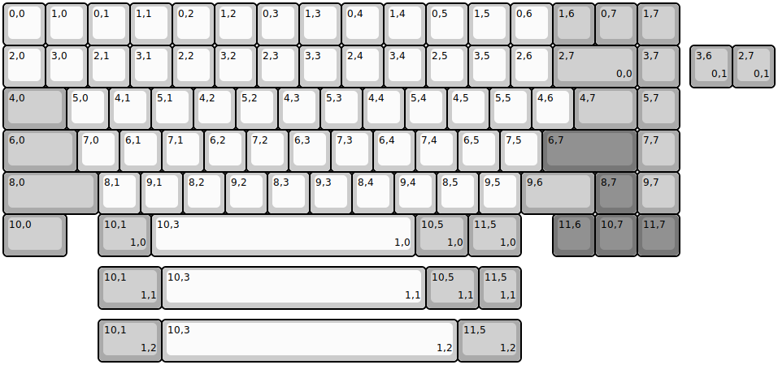{:loading="lazy"}

[Open in keyboard-layout-editor](http://www.keyboard-layout-editor.com/##@@=0,0&=1,0&=0,1&=1,1&=0,2&=1,2&=0,3&=1,3&=0,4&=1,4&=0,5&=1,5&=0,6&_c=#aaaaaa;&=1,6&=0,7&=1,7;&@_c=#cccccc;&=2,0&=3,0&=2,1&=3,1&=2,2&=3,2&=2,3&=3,3&=2,4&=3,4&=2,5&=3,5&=2,6&_c=#aaaaaa&w:2;&=2,7%0A%0A%0A0,0&=3,7;&@_w:1.5;&=4,0&_c=#cccccc;&=5,0&=4,1&=5,1&=4,2&=5,2&=4,3&=5,3&=4,4&=5,4&=4,5&=5,5&=4,6&_c=#aaaaaa&w:1.5;&=4,7&=5,7;&@_w:1.75;&=6,0&_c=#cccccc;&=7,0&=6,1&=7,1&=6,2&=7,2&=6,3&=7,3&=6,4&=7,4&=6,5&=7,5&_c=#777777&w:2.25;&=6,7&_c=#aaaaaa;&=7,7;&@_w:2.25;&=8,0&_c=#cccccc;&=8,1&=9,1&=8,2&=9,2&=8,3&=9,3&=8,4&=9,4&=8,5&=9,5&_c=#aaaaaa&w:1.75;&=9,6&_c=#777777;&=8,7&_c=#aaaaaa;&=9,7;&@_w:1.5;&=10,0&_x:0.75&w:1.25;&=10,1%0A%0A%0A1,0&_c=#cccccc&w:6.25;&=10,3%0A%0A%0A1,0&_c=#aaaaaa&w:1.25;&=10,5%0A%0A%0A1,0&_w:1.25;&=11,5%0A%0A%0A1,0&_x:0.75&c=#777777;&=11,6&=10,7&=11,7;&@_x:16.25&y:-5&c=#aaaaaa;&=3,6%0A%0A%0A0,1&=2,7%0A%0A%0A0,1;&@_x:2.25&y:4.25&w:1.5;&=10,1%0A%0A%0A1,1&_c=#cccccc&w:6.25;&=10,3%0A%0A%0A1,1&_c=#aaaaaa&w:1.25;&=10,5%0A%0A%0A1,1&=11,5%0A%0A%0A1,1;&@_x:2.25&y:0.25&w:1.5;&=10,1%0A%0A%0A1,2&_c=#cccccc&w:7;&=10,3%0A%0A%0A1,2&_c=#aaaaaa&w:1.5;&=11,5%0A%0A%0A1,2)

## tkc/m0lly

[README](output/tkc/m0lly/README.md) - [layout](output/tkc/m0lly/m0lly-kle.json) - [PCB](output/tkc/m0lly/m0lly.kicad_pcb) - [PCB render](output/tkc/m0lly/m0lly-render.svg)

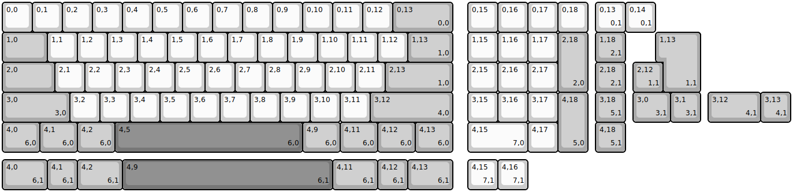{:loading="lazy"}

[Open in keyboard-layout-editor](http://www.keyboard-layout-editor.com/##@@=0,0&=0,1&=0,2&=0,3&=0,4&=0,5&=0,6&=0,7&=0,8&=0,9&=0,10&=0,11&=0,12&_c=#aaaaaa&w:2;&=0,13%0A%0A%0A0,0&_x:0.5&c=#cccccc;&=0,15&=0,16&=0,17&=0,18;&@_c=#aaaaaa&w:1.5;&=1,0&_c=#cccccc;&=1,1&=1,2&=1,3&=1,4&=1,5&=1,6&=1,7&=1,8&=1,9&=1,10&=1,11&=1,12&_c=#aaaaaa&w:1.5;&=1,13%0A%0A%0A1,0&_x:0.5&c=#cccccc;&=1,15&=1,16&=1,17&_c=#aaaaaa&h:2;&=2,18%0A%0A%0A2,0;&@_w:1.75;&=2,0&_c=#cccccc;&=2,1&=2,2&=2,3&=2,4&=2,5&=2,6&=2,7&=2,8&=2,9&=2,10&=2,11&_c=#aaaaaa&w:2.25;&=2,13%0A%0A%0A1,0&_x:0.5&c=#cccccc;&=2,15&=2,16&=2,17;&@_c=#aaaaaa&w:2.25;&=3,0%0A%0A%0A3,0&_c=#cccccc;&=3,2&=3,3&=3,4&=3,5&=3,6&=3,7&=3,8&=3,9&=3,10&=3,11&_c=#aaaaaa&w:2.75;&=3,12%0A%0A%0A4,0&_x:0.5&c=#cccccc;&=3,15&=3,16&=3,17&_c=#aaaaaa&h:2;&=4,18%0A%0A%0A5,0;&@_w:1.25;&=4,0%0A%0A%0A6,0&_w:1.25;&=4,1%0A%0A%0A6,0&_w:1.25;&=4,2%0A%0A%0A6,0&_c=#777777&w:6.25;&=4,5%0A%0A%0A6,0&_c=#aaaaaa&w:1.25;&=4,9%0A%0A%0A6,0&_w:1.25;&=4,11%0A%0A%0A6,0&_w:1.25;&=4,12%0A%0A%0A6,0&_w:1.25;&=4,13%0A%0A%0A6,0&_x:0.5&c=#cccccc&w:2;&=4,15%0A%0A%0A7,0&=4,17;&@_x:19.75&y:-5;&=0,13%0A%0A%0A0,1&=0,14%0A%0A%0A0,1;&@_x:19.75&c=#aaaaaa;&=1,18%0A%0A%0A2,1&_x:1.25&w:1.25&h:2&w2:1.5&h2:1&x2:-0.25;&=1,13%0A%0A%0A1,1;&@_x:19.75;&=2,18%0A%0A%0A2,1&_x:0.25;&=2,12%0A%0A%0A1,1;&@_x:19.75;&=3,18%0A%0A%0A5,1&_x:0.25&w:1.25;&=3,0%0A%0A%0A3,1&=3,1%0A%0A%0A3,1&_x:0.25&w:1.75;&=3,12%0A%0A%0A4,1&=3,13%0A%0A%0A4,1;&@_x:19.75;&=4,18%0A%0A%0A5,1;&@_y:0.25&w:1.5;&=4,0%0A%0A%0A6,1&=4,1%0A%0A%0A6,1&_w:1.5;&=4,2%0A%0A%0A6,1&_c=#777777&w:7;&=4,9%0A%0A%0A6,1&_c=#aaaaaa&w:1.5;&=4,11%0A%0A%0A6,1&=4,12%0A%0A%0A6,1&_w:1.5;&=4,13%0A%0A%0A6,1&_x:0.5&c=#cccccc;&=4,15%0A%0A%0A7,1&=4,16%0A%0A%0A7,1)

## tkc/osav2

[README](output/tkc/osav2/README.md) - [layout](output/tkc/osav2/osav2-kle.json) - [PCB](output/tkc/osav2/osav2.kicad_pcb) - [PCB render](output/tkc/osav2/osav2-render.svg)

{:loading="lazy"}

[Open in keyboard-layout-editor](http://www.keyboard-layout-editor.com/##@@_x:0.5&y:0.38&c=#777777;&=1,0&_x:2.25&c=#cccccc;&=0,2&_x:8.75;&=5,2;&@_x:1.75&y:-0.88&c=#aaaaaa;&=0,0&_c=#cccccc;&=0,1&_x:10.75;&=5,1&_c=#aaaaaa&w:2;&=5,7%0A%0A%0A0,0;&@_x:0.25&y:-0.12&c=#777777;&=2,0&_x:12.0&c=#cccccc;&=6,2;&@_x:1.5&y:-0.88&c=#aaaaaa&w:1.5;&=1,1&_c=#cccccc;&=1,2&_x:10.25;&=6,1&=6,0&_w:1.5;&=6,7;&@_y:-0.12&c=#777777;&=3,0;&@_x:1.25&y:-0.88&c=#aaaaaa&w:1.75;&=2,1&_c=#cccccc;&=2,2&_x:9.75;&=7,2&=7,1&_c=#777777&w:2.25;&=7,7;&@_x:1&c=#aaaaaa&w:2.25;&=3,1&_c=#cccccc;&=3,2&_x:9.25;&=8,2&=8,1&_c=#aaaaaa&w:2.75;&=8,7%0A%0A%0A1,0;&@_x:1&w:1.5;&=4,1&_x:13.5&w:1.5;&=9,0;&@_r:12&rx:4.75&ry:1.5&y:-1.0&c=#cccccc;&=0,3&=0,4&=0,5&=0,6;&@_x:-0.5;&=1,3&=1,4&=1,5&=1,6;&@_x:-0.25;&=2,3&=2,4&=2,5&=2,6;&@_x:0.25;&=3,3&=3,4&=3,5&=3,6;&@_x:1.5&w:2.25;&=4,5&_c=#aaaaaa;&=4,6;&@_y:-0.88&w:1.5;&=4,3;&@_r:-12&rx:14&ry:1.25&x:-4.5&y:-1.0&c=#cccccc;&=5,6&=5,5&=5,4&=5,3;&@_x:-5;&=6,6&=6,5&=6,4&=6,3;&@_x:-4.75;&=7,6&=7,5&=7,4&=7,3;&@_x:-5.25;&=8,6&=8,5&=8,4&=8,3;&@_x:-5.25&w:2.75;&=9,5;&@_x:-2.5&y:-0.87&c=#aaaaaa&w:1.5;&=9,3;&@_r:0&rx:0&ry:0&x:18.75&y:0.5;&=5,0%0A%0A%0A0,1&=5,7%0A%0A%0A0,1;&@_x:18.75&y:2.0&w:1.75;&=8,0%0A%0A%0A1,1&=8,7%0A%0A%0A1,1)

## tkc/portico

[README](output/tkc/portico/README.md) - [layout](output/tkc/portico/portico-kle.json) - [PCB](output/tkc/portico/portico.kicad_pcb) - [PCB render](output/tkc/portico/portico-render.svg)

{:loading="lazy"}

[Open in keyboard-layout-editor](http://www.keyboard-layout-editor.com/##@@_c=#777777;&=0,0&_c=#cccccc;&=0,1&=0,2&=0,3&=0,4&=0,5&=0,6&=0,7&=0,8&=0,9&=0,10&=0,11&=0,12&_c=#aaaaaa&w:2;&=0,13&=0,14;&@_w:1.5;&=1,0&_c=#cccccc;&=1,1&=1,2&=1,3&=1,4&=1,5&=1,6&=1,7&=1,8&=1,9&=1,10&=1,11&=1,12&_w:1.5;&=1,13&_c=#aaaaaa;&=1,14;&@_w:1.75;&=2,0&_c=#cccccc;&=2,1&=2,2&=2,3&=2,4&=2,5&=2,6&=2,7&=2,8&=2,9&=2,10&=2,11&_c=#777777&w:2.25;&=2,12&_c=#aaaaaa;&=2,14;&@_w:2.25;&=3,0&_c=#cccccc;&=3,2&=3,3&=3,4&=3,5&=3,6&=3,7&=3,8&=3,9&=3,10&=3,11&_c=#aaaaaa&w:1.75;&=3,12&_c=#777777;&=3,13&_c=#aaaaaa;&=3,14;&@_w:1.25;&=4,0&_w:1.25;&=4,1&_w:1.25;&=4,2&_w:6.25;&=4,6&_w:1.25;&=4,10&_w:1.25;&=4,11&_x:0.5&c=#777777;&=4,12&=4,13&=4,14)

## tkc/portico68v2

[README](output/tkc/portico68v2/README.md) - [layout](output/tkc/portico68v2/portico68v2-kle.json) - [PCB](output/tkc/portico68v2/portico68v2.kicad_pcb) - [PCB render](output/tkc/portico68v2/portico68v2-render.svg)

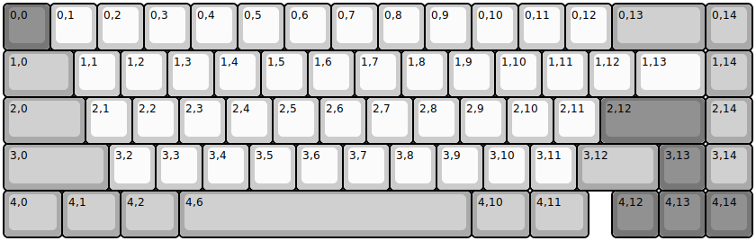{:loading="lazy"}

[Open in keyboard-layout-editor](http://www.keyboard-layout-editor.com/##@@_c=#777777;&=0,0&_c=#cccccc;&=0,1&=0,2&=0,3&=0,4&=0,5&=0,6&=0,7&=0,8&=0,9&=0,10&=0,11&=0,12&_c=#aaaaaa&w:2;&=0,13&=0,14;&@_w:1.5;&=1,0&_c=#cccccc;&=1,1&=1,2&=1,3&=1,4&=1,5&=1,6&=1,7&=1,8&=1,9&=1,10&=1,11&=1,12&_w:1.5;&=1,13&_c=#aaaaaa;&=1,14;&@_w:1.75;&=2,0&_c=#cccccc;&=2,1&=2,2&=2,3&=2,4&=2,5&=2,6&=2,7&=2,8&=2,9&=2,10&=2,11&_c=#777777&w:2.25;&=2,12&_c=#aaaaaa;&=2,14;&@_w:2.25;&=3,0&_c=#cccccc;&=3,2&=3,3&=3,4&=3,5&=3,6&=3,7&=3,8&=3,9&=3,10&=3,11&_c=#aaaaaa&w:1.75;&=3,12&_c=#777777;&=3,13&_c=#aaaaaa;&=3,14;&@_w:1.25;&=4,0&_w:1.25;&=4,1&_w:1.25;&=4,2&_w:6.25;&=4,6&_w:1.25;&=4,10&_w:1.25;&=4,11&_x:0.5&c=#777777;&=4,12&=4,13&=4,14)

## tkc/portico75

[README](output/tkc/portico75/README.md) - [layout](output/tkc/portico75/portico75-kle.json) - [PCB](output/tkc/portico75/portico75.kicad_pcb) - [PCB render](output/tkc/portico75/portico75-render.svg)

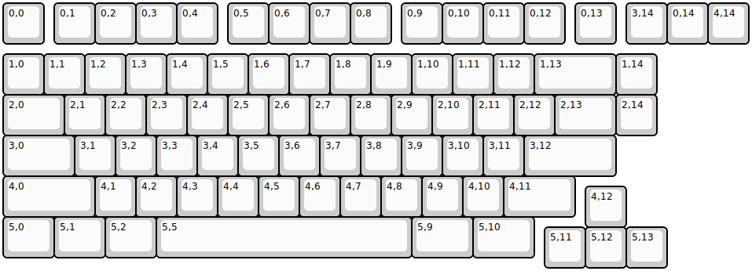{:loading="lazy"}

[Open in keyboard-layout-editor](http://www.keyboard-layout-editor.com/##@@=0,0&_x:0.25;&=0,1&=0,2&=0,3&=0,4&_x:0.25;&=0,5&=0,6&=0,7&=0,8&_x:0.25;&=0,9&=0,10&=0,11&=0,12&_x:0.25;&=0,13&_x:0.25;&=3,14&=0,14&=4,14;&@_y:0.25;&=1,0&=1,1&=1,2&=1,3&=1,4&=1,5&=1,6&=1,7&=1,8&=1,9&=1,10&=1,11&=1,12&_w:2;&=1,13&=1,14;&@_w:1.5;&=2,0&=2,1&=2,2&=2,3&=2,4&=2,5&=2,6&=2,7&=2,8&=2,9&=2,10&=2,11&=2,12&_w:1.5;&=2,13&=2,14;&@_w:1.75;&=3,0&=3,1&=3,2&=3,3&=3,4&=3,5&=3,6&=3,7&=3,8&=3,9&=3,10&=3,11&_w:2.25;&=3,12;&@_w:2.25;&=4,0&=4,1&=4,2&=4,3&=4,4&=4,5&=4,6&=4,7&=4,8&=4,9&=4,10&_w:1.75;&=4,11;&@_x:14.25&y:-0.75;&=4,12;&@_y:-0.25&w:1.25;&=5,0&_w:1.25;&=5,1&_w:1.25;&=5,2&_w:6.25;&=5,5&_w:1.5;&=5,9&_w:1.5;&=5,10;&@_x:13.25&y:-0.75;&=5,11&=5,12&=5,13)

## tkc/tkc1800

[README](output/tkc/tkc1800/README.md) - [layout](output/tkc/tkc1800/tkc1800-kle.json) - [PCB](output/tkc/tkc1800/tkc1800.kicad_pcb) - [PCB render](output/tkc/tkc1800/tkc1800-render.svg)

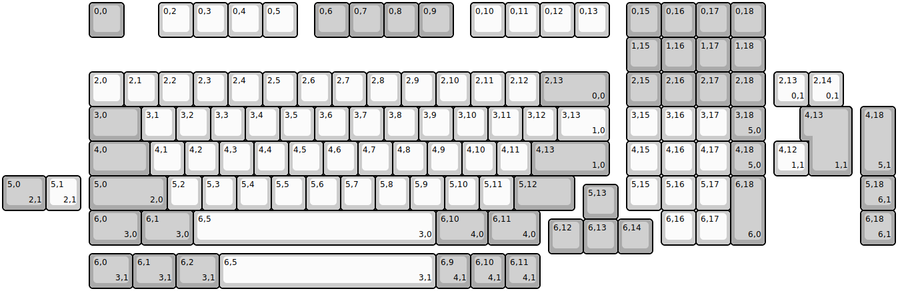{:loading="lazy"}

[Open in keyboard-layout-editor](http://www.keyboard-layout-editor.com/##@@_x:2.5&c=#aaaaaa;&=0,0&_x:1.0&c=#cccccc;&=0,2&=0,3&=0,4&=0,5&_x:0.5&c=#aaaaaa;&=0,6&=0,7&=0,8&=0,9&_x:0.5&c=#cccccc;&=0,10&=0,11&=0,12&=0,13&_x:0.5&c=#aaaaaa;&=0,15&=0,16&=0,17&=0,18;&@_x:18;&=1,15&=1,16&=1,17&=1,18;&@_x:2.5&c=#cccccc;&=2,0&=2,1&=2,2&=2,3&=2,4&=2,5&=2,6&=2,7&=2,8&=2,9&=2,10&=2,11&=2,12&_c=#aaaaaa&w:2;&=2,13%0A%0A%0A0,0&_x:0.5;&=2,15&=2,16&=2,17&=2,18;&@_x:2.5&w:1.5;&=3,0&_c=#cccccc;&=3,1&=3,2&=3,3&=3,4&=3,5&=3,6&=3,7&=3,8&=3,9&=3,10&=3,11&=3,12&_w:1.5;&=3,13%0A%0A%0A1,0&_x:0.5;&=3,15&=3,16&=3,17&_c=#aaaaaa;&=3,18%0A%0A%0A5,0;&@_x:2.5&w:1.75;&=4,0&_c=#cccccc;&=4,1&=4,2&=4,3&=4,4&=4,5&=4,6&=4,7&=4,8&=4,9&=4,10&=4,11&_c=#aaaaaa&w:2.25;&=4,13%0A%0A%0A1,0&_x:0.5&c=#cccccc;&=4,15&=4,16&=4,17&_c=#aaaaaa;&=4,18%0A%0A%0A5,0;&@_x:2.5&w:2.25;&=5,0%0A%0A%0A2,0&_c=#cccccc;&=5,2&=5,3&=5,4&=5,5&=5,6&=5,7&=5,8&=5,9&=5,10&=5,11&_c=#aaaaaa&w:1.75;&=5,12&_x:1.5&c=#cccccc;&=5,15&=5,16&=5,17&_c=#aaaaaa&h:2;&=6,18%0A%0A%0A6,0;&@_x:16.75&y:-0.75;&=5,13;&@_x:2.5&y:-0.25&w:1.5;&=6,0%0A%0A%0A3,0&_w:1.5;&=6,1%0A%0A%0A3,0&_c=#cccccc&w:7;&=6,5%0A%0A%0A3,0&_c=#aaaaaa&w:1.5;&=6,10%0A%0A%0A4,0&_w:1.5;&=6,11%0A%0A%0A4,0&_x:3.5&c=#cccccc;&=6,16&=6,17;&@_x:15.75&y:-0.75&c=#aaaaaa;&=6,12&=6,13&=6,14;&@_x:22.25&y:-5.25&c=#cccccc;&=2,13%0A%0A%0A0,1&=2,14%0A%0A%0A0,1;&@_x:23.25&c=#aaaaaa&w:1.25&h:2&w2:1.5&h2:1&x2:-0.25;&=4,13%0A%0A%0A1,1&_x:0.25&h:2;&=4,18%0A%0A%0A5,1;&@_x:22.25&c=#cccccc;&=4,12%0A%0A%0A1,1;&@_c=#aaaaaa&w:1.25;&=5,0%0A%0A%0A2,1&_c=#cccccc;&=5,1%0A%0A%0A2,1&_x:22.5&c=#aaaaaa;&=5,18%0A%0A%0A6,1;&@_x:24.75;&=6,18%0A%0A%0A6,1;&@_x:2.5&y:0.25&w:1.25;&=6,0%0A%0A%0A3,1&_w:1.25;&=6,1%0A%0A%0A3,1&_w:1.25;&=6,2%0A%0A%0A3,1&_c=#cccccc&w:6.25;&=6,5%0A%0A%0A3,1&_c=#aaaaaa;&=6,9%0A%0A%0A4,1&=6,10%0A%0A%0A4,1&=6,11%0A%0A%0A4,1)

## tkc/tkl_ab87

[README](output/tkc/tkl_ab87/README.md) - [layout](output/tkc/tkl_ab87/tkl_ab87-kle.json) - [PCB](output/tkc/tkl_ab87/tkl_ab87.kicad_pcb) - [PCB render](output/tkc/tkl_ab87/tkl_ab87-render.svg)

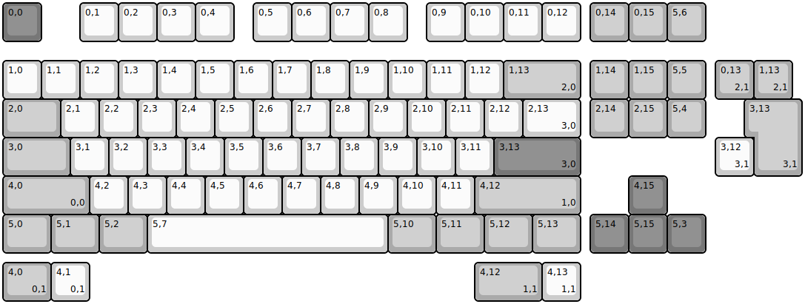{:loading="lazy"}

[Open in keyboard-layout-editor](http://www.keyboard-layout-editor.com/##@@_c=#777777;&=0,0&_x:1&c=#cccccc;&=0,1&=0,2&=0,3&=0,4&_x:0.5;&=0,5&=0,6&=0,7&=0,8&_x:0.5;&=0,9&=0,10&=0,11&=0,12&_x:0.25&c=#aaaaaa;&=0,14&=0,15&=5,6;&@_y:0.5&c=#cccccc;&=1,0&=1,1&=1,2&=1,3&=1,4&=1,5&=1,6&=1,7&=1,8&=1,9&=1,10&=1,11&=1,12&_c=#aaaaaa&w:2;&=1,13%0A%0A%0A2,0&_x:0.25;&=1,14&=1,15&=5,5;&@_w:1.5;&=2,0&_c=#cccccc;&=2,1&=2,2&=2,3&=2,4&=2,5&=2,6&=2,7&=2,8&=2,9&=2,10&=2,11&=2,12&_w:1.5;&=2,13%0A%0A%0A3,0&_x:0.25&c=#aaaaaa;&=2,14&=2,15&=5,4;&@_w:1.75;&=3,0&_c=#cccccc;&=3,1&=3,2&=3,3&=3,4&=3,5&=3,6&=3,7&=3,8&=3,9&=3,10&=3,11&_c=#777777&w:2.25;&=3,13%0A%0A%0A3,0;&@_c=#aaaaaa&w:2.25;&=4,0%0A%0A%0A0,0&_c=#cccccc;&=4,2&=4,3&=4,4&=4,5&=4,6&=4,7&=4,8&=4,9&=4,10&=4,11&_c=#aaaaaa&w:2.75;&=4,12%0A%0A%0A1,0&_x:1.25&c=#777777;&=4,15;&@_c=#aaaaaa&w:1.25;&=5,0&_w:1.25;&=5,1&_w:1.25;&=5,2&_c=#cccccc&w:6.25;&=5,7&_c=#aaaaaa&w:1.25;&=5,10&_w:1.25;&=5,11&_w:1.25;&=5,12&_w:1.25;&=5,13&_x:0.25&c=#777777;&=5,14&=5,15&=5,3;&@_x:18.5&y:-5.0&c=#aaaaaa;&=0,13%0A%0A%0A2,1&=1,13%0A%0A%0A2,1;&@_x:19.5&w:1.25&h:2&w2:1.5&h2:1&x2:-0.25;&=3,13%0A%0A%0A3,1;&@_x:18.5&c=#cccccc;&=3,12%0A%0A%0A3,1;&@_y:2.25&c=#aaaaaa&w:1.25;&=4,0%0A%0A%0A0,1&_c=#cccccc;&=4,1%0A%0A%0A0,1&_x:10.0&c=#aaaaaa&w:1.75;&=4,12%0A%0A%0A1,1&_c=#cccccc;&=4,13%0A%0A%0A1,1)

## tmo50/tmo50

[README](output/tmo50/README.md) - [layout](output/tmo50/tmo50-kle.json) - [PCB](output/tmo50/tmo50.kicad_pcb) - [PCB render](output/tmo50/tmo50-render.svg)

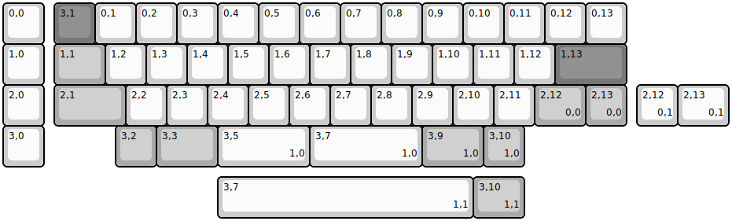{:loading="lazy"}

[Open in keyboard-layout-editor](http://www.keyboard-layout-editor.com/##@@=0,0&_x:0.25&c=#777777;&=3,1&_c=#cccccc;&=0,1&=0,2&=0,3&=0,4&=0,5&=0,6&=0,7&=0,8&=0,9&=0,10&=0,11&=0,12&=0,13;&@=1,0&_x:0.25&c=#aaaaaa&w:1.25;&=1,1&_c=#cccccc;&=1,2&=1,3&=1,4&=1,5&=1,6&=1,7&=1,8&=1,9&=1,10&=1,11&=1,12&_c=#777777&w:1.75;&=1,13;&@_c=#cccccc;&=2,0&_x:0.25&c=#aaaaaa&w:1.75;&=2,1&_c=#cccccc;&=2,2&=2,3&=2,4&=2,5&=2,6&=2,7&=2,8&=2,9&=2,10&=2,11&_c=#aaaaaa&w:1.25;&=2,12%0A%0A%0A0,0&=2,13%0A%0A%0A0,0;&@_c=#cccccc;&=3,0&_x:1.75&c=#aaaaaa;&=3,2&_w:1.5;&=3,3&_c=#cccccc&w:2.25;&=3,5%0A%0A%0A1,0&_w:2.75;&=3,7%0A%0A%0A1,0&_c=#aaaaaa&w:1.5;&=3,9%0A%0A%0A1,0&=3,10%0A%0A%0A1,0;&@_x:15.5&y:-2&c=#cccccc;&=2,12%0A%0A%0A0,1&_w:1.25;&=2,13%0A%0A%0A0,1;&@_x:5.25&y:1.25&w:6.25;&=3,7%0A%0A%0A1,1&_c=#aaaaaa&w:1.25;&=3,10%0A%0A%0A1,1)

## tokyokeyboard/alix40

[README](output/tokyokeyboard/README.md) - [layout](output/tokyokeyboard/alix40-kle.json) - [PCB](output/tokyokeyboard/alix40.kicad_pcb) - [PCB render](output/tokyokeyboard/alix40-render.svg)

{:loading="lazy"}

[Open in keyboard-layout-editor](http://www.keyboard-layout-editor.com/##@@_y:0.05&f:1;&=0,0&=0,1&_x:10;&=0,10&=0,11;&@_x:0.15;&=1,0&=1,1&_x:10.2;&=1,10&=1,11;&@_x:0.5&c=#757575;&=2,0&_c=#cccccc;&=2,1&_x:9.5;&=2,10&=2,11;&@_x:0.25&c=#757575;&=3,0&=3,1&_x:10.0&c=#cccccc;&=3,10&=3,11;&@_r:10&rx:3&ry:4.25&x:-1&y:-4.0;&=0,2&=0,3&=0,4&=0,5;&@_x:-0.75;&=1,2&=1,3&=1,4&=1,5;&@_x:-0.25;&=2,2&=2,3&=2,4&=2,5;&@_x:0.75&c=#757575;&=3,3&_w:2;&=3,5%0A%0A%0A0,0;&@_r:-10&rx:12.5&x:-4.5&y:-4.25&c=#cccccc;&=0,6&=0,7&=0,8&=0,9;&@_x:-4.25;&=1,6&=1,7&=1,8&=1,9;&@_x:-4.75;&=2,6&=2,7&=2,8&=2,9;&@_x:-4.75&c=#757575&w:2;&=3,6%0A%0A%0A1,0&=3,8;&@_r:10&rx:3&x:1.75&y:0.25;&=3,4%0A%0A%0A0,1&=3,5%0A%0A%0A0,1;&@_r:-10&rx:12.5&x:-4.75;&=3,6%0A%0A%0A1,1&=3,7%0A%0A%0A1,1)

## tokyokeyboard/tokyo60

[README](output/tokyokeyboard/README.md) - [layout](output/tokyokeyboard/tokyo60-kle.json) - [PCB](output/tokyokeyboard/tokyo60.kicad_pcb) - [PCB render](output/tokyokeyboard/tokyo60-render.svg)

{:loading="lazy"}

[Open in keyboard-layout-editor](http://www.keyboard-layout-editor.com/##@@_c=#888888;&=0,0&_c=#cccccc;&=0,1&=0,2&=0,3&=0,4&=0,5&=0,6&=0,7&=0,8&=0,9&=0,10&=0,11&=0,12&=0,13&=1,13;&@_c=#aaaaaa&w:1.5;&=1,0&_c=#cccccc;&=1,1&=1,2&=1,3&=1,4&=1,5&=1,6&=1,7&=1,8&=1,9&=1,10&=1,11&=1,12&_c=#aaaaaa&w:1.5;&=2,13;&@_w:1.75;&=2,0&_c=#cccccc;&=2,1&=2,2&=2,3&=2,4&=2,5&=2,6&=2,7&=2,8&=2,9&=2,10&=2,11&_c=#888888&w:2.25;&=3,13;&@_c=#aaaaaa&w:2.25;&=3,0&_c=#cccccc;&=3,2&=3,3&=3,4&=3,5&=3,6&=3,7&=3,8&=3,9&=3,10&=3,11&_c=#aaaaaa&w:1.75;&=3,12&=4,13;&@_x:1.5;&=4,1&_w:1.5;&=4,2&_c=#cccccc&w:7;&=4,5&_c=#aaaaaa&w:1.5;&=4,11&=4,12)

## torn/torn

[README](output/torn/README.md) - [layout](output/torn/torn-kle.json) - [PCB](output/torn/torn.kicad_pcb) - [PCB render](output/torn/torn-render.svg)

{:loading="lazy"}

[Open in keyboard-layout-editor](http://www.keyboard-layout-editor.com/##@@_x:3;&=0,3&_x:7;&=0,8;&@_x:2&y:-0.875;&=0,2&_x:1;&=0,4&_x:5;&=0,7&_x:1;&=0,9;&@_x:5&y:-0.875;&=0,5&_x:3;&=0,6;&@_y:-0.875;&=0,0&=0,1&_x:11;&=0,10&=0,11;&@_x:3&y:-0.375;&=1,3&_x:7;&=1,8;&@_x:2&y:-0.875;&=1,2&_x:1;&=1,4&_x:5;&=1,7&_x:1;&=1,9;&@_x:5&y:-0.875;&=1,5&_x:3;&=1,6;&@_y:-0.875;&=1,0&=1,1&_x:11;&=1,10&=1,11;&@_x:3&y:-0.375;&=2,3&_x:7;&=2,8;&@_x:2&y:-0.875;&=2,2&_x:1;&=2,4&_x:5;&=2,7&_x:1;&=2,9;&@_x:5&y:-0.875;&=2,5&_x:3;&=2,6;&@_y:-0.875;&=2,0&=2,1&_x:11;&=2,10&=2,11;&@_x:3&y:-0.275;&=3,2&_x:7;&=3,9;&@_r:13&rx:3.5&ry:8.5&x:-0.5&y:-5.4;&=3,3;&@_r:26&x:-0.5&y:-1.0;&=3,4;&@_r:39&x:-0.5&y:-1.0;&=3,5;&@_r:-39&rx:11.5&x:-0.5&y:-5.4;&=3,6;&@_r:-26&x:-0.5&y:-1.0;&=3,7;&@_r:-13&x:-0.5&y:-1.0;&=3,8)

## treasure/type9s2

[README](output/treasure/README.md) - [layout](output/treasure/type9s2-kle.json) - [PCB](output/treasure/type9s2.kicad_pcb) - [PCB render](output/treasure/type9s2-render.svg)

{:loading="lazy"}

[Open in keyboard-layout-editor](http://www.keyboard-layout-editor.com/##@@=0,0&=0,1&=0,2;&@=1,0&=1,1&=1,2;&@=2,0&=2,1&=2,2)

## txuu/txuu

[README](output/txuu/README.md) - [layout](output/txuu/txuu-kle.json) - [PCB](output/txuu/txuu.kicad_pcb) - [PCB render](output/txuu/txuu-render.svg)

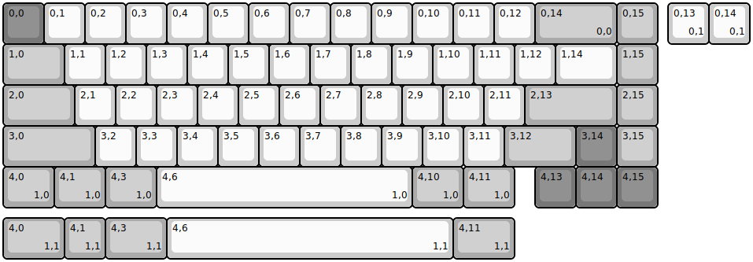{:loading="lazy"}

[Open in keyboard-layout-editor](http://www.keyboard-layout-editor.com/##@@_c=#777777;&=0,0&_c=#cccccc;&=0,1&=0,2&=0,3&=0,4&=0,5&=0,6&=0,7&=0,8&=0,9&=0,10&=0,11&=0,12&_c=#aaaaaa&w:2;&=0,14%0A%0A%0A0,0&=0,15;&@_w:1.5;&=1,0&_c=#cccccc;&=1,1&=1,2&=1,3&=1,4&=1,5&=1,6&=1,7&=1,8&=1,9&=1,10&=1,11&=1,12&_w:1.5;&=1,14&_c=#aaaaaa;&=1,15;&@_w:1.75;&=2,0&_c=#cccccc;&=2,1&=2,2&=2,3&=2,4&=2,5&=2,6&=2,7&=2,8&=2,9&=2,10&=2,11&_c=#aaaaaa&w:2.25;&=2,13&=2,15;&@_w:2.25;&=3,0&_c=#cccccc;&=3,2&=3,3&=3,4&=3,5&=3,6&=3,7&=3,8&=3,9&=3,10&=3,11&_c=#aaaaaa&w:1.75;&=3,12&_c=#777777;&=3,14&_c=#aaaaaa;&=3,15;&@_w:1.25;&=4,0%0A%0A%0A1,0&_w:1.25;&=4,1%0A%0A%0A1,0&_w:1.25;&=4,3%0A%0A%0A1,0&_c=#cccccc&w:6.25;&=4,6%0A%0A%0A1,0&_c=#aaaaaa&w:1.25;&=4,10%0A%0A%0A1,0&_w:1.25;&=4,11%0A%0A%0A1,0&_x:0.5&c=#777777;&=4,13&=4,14&=4,15;&@_x:16.25&y:-5&c=#cccccc;&=0,13%0A%0A%0A0,1&=0,14%0A%0A%0A0,1;&@_y:4.25&c=#aaaaaa&w:1.5;&=4,0%0A%0A%0A1,1&=4,1%0A%0A%0A1,1&_w:1.5;&=4,3%0A%0A%0A1,1&_c=#cccccc&w:7;&=4,6%0A%0A%0A1,1&_c=#aaaaaa&w:1.5;&=4,11%0A%0A%0A1,1)

## ubest/vn

[README](output/ubest/vn/README.md) - [layout](output/ubest/vn/vn-kle.json) - [PCB](output/ubest/vn/vn.kicad_pcb) - [PCB render](output/ubest/vn/vn-render.svg)

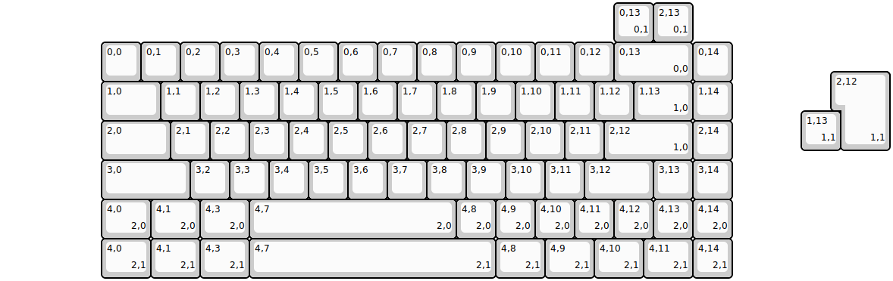{:loading="lazy"}

[Open in keyboard-layout-editor](http://www.keyboard-layout-editor.com/##@@_x:2.5&y:1;&=0,0&=0,1&=0,2&=0,3&=0,4&=0,5&=0,6&=0,7&=0,8&=0,9&=0,10&=0,11&=0,12&_w:2;&=0,13%0A%0A%0A0,0&=0,14;&@_x:2.5&w:1.5;&=1,0&=1,1&=1,2&=1,3&=1,4&=1,5&=1,6&=1,7&=1,8&=1,9&=1,10&=1,11&=1,12&_w:1.5;&=1,13%0A%0A%0A1,0&=1,14;&@_x:2.5&w:1.75;&=2,0&=2,1&=2,2&=2,3&=2,4&=2,5&=2,6&=2,7&=2,8&=2,9&=2,10&=2,11&_w:2.25;&=2,12%0A%0A%0A1,0&=2,14;&@_x:2.5&w:2.25;&=3,0&=3,2&=3,3&=3,4&=3,5&=3,6&=3,7&=3,8&=3,9&=3,10&=3,11&_w:1.75;&=3,12&=3,13&=3,14;&@_x:2.5&w:1.25;&=4,0%0A%0A%0A2,0&_w:1.25;&=4,1%0A%0A%0A2,0&_w:1.25;&=4,3%0A%0A%0A2,0&_w:5.25;&=4,7%0A%0A%0A2,0&=4,8%0A%0A%0A2,0&=4,9%0A%0A%0A2,0&=4,10%0A%0A%0A2,0&=4,11%0A%0A%0A2,0&=4,12%0A%0A%0A2,0&=4,13%0A%0A%0A2,0&=4,14%0A%0A%0A2,0;&@_x:15.5&y:-6.0;&=0,13%0A%0A%0A0,1&=2,13%0A%0A%0A0,1;&@_x:21.25&y:0.75&w:1.25&h:2&w2:1.5&h2:1&x2:-0.25;&=2,12%0A%0A%0A1,1;&@_x:20.25;&=1,13%0A%0A%0A1,1;&@_x:2.5&y:2.25&w:1.25;&=4,0%0A%0A%0A2,1&_w:1.25;&=4,1%0A%0A%0A2,1&_w:1.25;&=4,3%0A%0A%0A2,1&_w:6.25;&=4,7%0A%0A%0A2,1&_w:1.25;&=4,8%0A%0A%0A2,1&_w:1.25;&=4,9%0A%0A%0A2,1&_w:1.25;&=4,10%0A%0A%0A2,1&_w:1.25;&=4,11%0A%0A%0A2,1&=4,14%0A%0A%0A2,1)

## undead60m/undead60m

[README](output/undead60m/README.md) - [layout](output/undead60m/undead60m-kle.json) - [PCB](output/undead60m/undead60m.kicad_pcb) - [PCB render](output/undead60m/undead60m-render.svg)

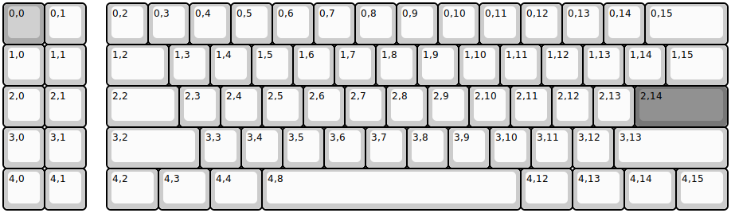{:loading="lazy"}

[Open in keyboard-layout-editor](http://www.keyboard-layout-editor.com/##@@_c=#aaaaaa;&=0,0&_c=#cccccc;&=0,1&_x:0.5;&=0,2&=0,3&=0,4&=0,5&=0,6&=0,7&=0,8&=0,9&=0,10&=0,11&=0,12&=0,13&=0,14&_w:2;&=0,15;&@=1,0&=1,1&_x:0.5&w:1.5;&=1,2&=1,3&=1,4&=1,5&=1,6&=1,7&=1,8&=1,9&=1,10&=1,11&=1,12&=1,13&=1,14&_w:1.5;&=1,15;&@=2,0&=2,1&_x:0.5&w:1.75;&=2,2&=2,3&=2,4&=2,5&=2,6&=2,7&=2,8&=2,9&=2,10&=2,11&=2,12&=2,13&_c=#777777&w:2.25;&=2,14;&@_c=#cccccc;&=3,0&=3,1&_x:0.5&w:2.25;&=3,2&=3,3&=3,4&=3,5&=3,6&=3,7&=3,8&=3,9&=3,10&=3,11&=3,12&_w:2.75;&=3,13;&@=4,0&=4,1&_x:0.5&w:1.25;&=4,2&_w:1.25;&=4,3&_w:1.25;&=4,4&_w:6.25;&=4,8&_w:1.25;&=4,12&_w:1.25;&=4,13&_w:1.25;&=4,14&_w:1.25;&=4,15)

## underscore33/Rev1/underscore33_rev1

[README](output/underscore33/Rev1/README.md) - [layout](output/underscore33/Rev1/underscore33_rev1-kle.json) - [PCB](output/underscore33/Rev1/underscore33_rev1.kicad_pcb) - [PCB render](output/underscore33/Rev1/underscore33_rev1-render.svg)

{:loading="lazy"}

[Open in keyboard-layout-editor](http://www.keyboard-layout-editor.com/##@@=0,0&=0,1&=0,2&=0,3&=0,4&=0,5&=0,6&=0,7&=0,8&=0,9;&@=1,0&=1,1&=1,2&=1,3&=1,4&=1,5&=1,6&=1,7&=1,8&=1,9;&@=2,0&=2,1&=2,2&=2,3&=2,4&=2,5&=2,6&=2,7&=2,8&=2,9;&@_x:0.6&c=#aaaaaa&w:1.25;&=3,1%0A%0A%0A0,0&_w:6.25;&=3,4%0A%0A%0A0,0&_w:1.25;&=3,8%0A%0A%0A0,0;&@_x:0.6&w:1.25;&=3,1%0A%0A%0A0,1&_w:2.25;&=3,2%0A%0A%0A0,1&_w:1.75;&=3,4%0A%0A%0A0,1&_w:2.25;&=3,6%0A%0A%0A0,1&_w:1.25;&=3,8%0A%0A%0A0,1)

## underscore33/Rev2/underscore33_rev2

[README](output/underscore33/Rev2/README.md) - [layout](output/underscore33/Rev2/underscore33_rev2-kle.json) - [PCB](output/underscore33/Rev2/underscore33_rev2.kicad_pcb) - [PCB render](output/underscore33/Rev2/underscore33_rev2-render.svg)

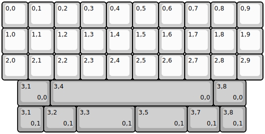{:loading="lazy"}

[Open in keyboard-layout-editor](http://www.keyboard-layout-editor.com/##@@=0,0&=0,1&=0,2&=0,3&=0,4&=0,5&=0,6&=0,7&=0,8&=0,9;&@=1,0&=1,1&=1,2&=1,3&=1,4&=1,5&=1,6&=1,7&=1,8&=1,9;&@=2,0&=2,1&=2,2&=2,3&=2,4&=2,5&=2,6&=2,7&=2,8&=2,9;&@_x:0.6&c=#aaaaaa&w:1.25;&=3,1%0A%0A%0A0,0&_w:6.25;&=3,4%0A%0A%0A0,0&_w:1.25;&=3,8%0A%0A%0A0,0;&@_x:0.6;&=3,1%0A%0A%0A0,1&_w:1.25;&=3,2%0A%0A%0A0,1&_w:2.25;&=3,3%0A%0A%0A0,1&_w:2;&=3,5%0A%0A%0A0,1&_w:1.25;&=3,7%0A%0A%0A0,1&=3,8%0A%0A%0A0,1)

## ungodly/launch_pad

[README](output/ungodly/launch_pad/README.md) - [layout](output/ungodly/launch_pad/launch_pad-kle.json) - [PCB](output/ungodly/launch_pad/launch_pad.kicad_pcb) - [PCB render](output/ungodly/launch_pad/launch_pad-render.svg)

{:loading="lazy"}

[Open in keyboard-layout-editor](http://www.keyboard-layout-editor.com/##@@_c=#aaaaaa;&=0,0&=0,1&=0,2&=0,3;&@_c=#cccccc;&=1,0&=1,1&=1,2&_c=#aaaaaa;&=1,3;&@_c=#cccccc;&=2,0&=2,1&=2,2&_c=#aaaaaa;&=2,3;&@_c=#cccccc;&=3,0&=3,1&=3,2&_c=#aaaaaa&h:2;&=3,3%0A%0A%0A0,0;&@_c=#cccccc&w:2;&=4,0%0A%0A%0A1,0&=4,2;&@_x:4.5&y:-2&c=#aaaaaa;&=3,3%0A%0A%0A0,1;&@_x:4.5;&=4,3%0A%0A%0A0,1;&@_y:0.5&c=#cccccc;&=4,0%0A%0A%0A1,1&=4,1%0A%0A%0A1,1)

## vanillakeyboards/spacey

[README](output/vanillakeyboards/README.md) - [layout](output/vanillakeyboards/spacey-kle.json) - [PCB](output/vanillakeyboards/spacey.kicad_pcb) - [PCB render](output/vanillakeyboards/spacey-render.svg)

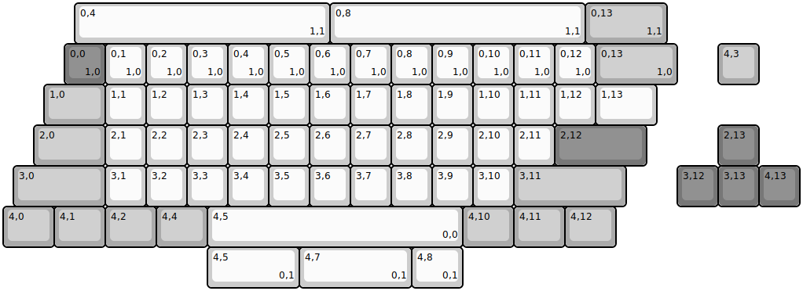{:loading="lazy"}

[Open in keyboard-layout-editor](http://www.keyboard-layout-editor.com/##@@_x:1.5&y:1&c=#777777;&=0,0%0A%0A%0A1,0&_c=#cccccc;&=0,1%0A%0A%0A1,0&=0,2%0A%0A%0A1,0&=0,3%0A%0A%0A1,0&=0,4%0A%0A%0A1,0&=0,5%0A%0A%0A1,0&=0,6%0A%0A%0A1,0&=0,7%0A%0A%0A1,0&=0,8%0A%0A%0A1,0&=0,9%0A%0A%0A1,0&=0,10%0A%0A%0A1,0&=0,11%0A%0A%0A1,0&=0,12%0A%0A%0A1,0&_c=#aaaaaa&w:2;&=0,13%0A%0A%0A1,0&_x:1.0;&=4,3;&@_x:1&w:1.5;&=1,0&_c=#cccccc;&=1,1&=1,2&=1,3&=1,4&=1,5&=1,6&=1,7&=1,8&=1,9&=1,10&=1,11&=1,12&_w:1.5;&=1,13;&@_x:0.75&c=#aaaaaa&w:1.75;&=2,0&_c=#cccccc;&=2,1&=2,2&=2,3&=2,4&=2,5&=2,6&=2,7&=2,8&=2,9&=2,10&=2,11&_c=#777777&w:2.25;&=2,12&_x:1.75;&=2,13;&@_x:0.25&c=#aaaaaa&w:2.25;&=3,0&_c=#cccccc;&=3,1&=3,2&=3,3&=3,4&=3,5&=3,6&=3,7&=3,8&=3,9&=3,10&_c=#aaaaaa&w:2.75;&=3,11&_x:1.25&c=#777777;&=3,12&=3,13&=4,13;&@_c=#aaaaaa&w:1.25;&=4,0&_w:1.25;&=4,1&_w:1.25;&=4,2&_w:1.25;&=4,4&_c=#cccccc&w:6.25;&=4,5%0A%0A%0A0,0&_c=#aaaaaa&w:1.25;&=4,10&_w:1.25;&=4,11&_w:1.25;&=4,12;&@_x:1.75&y:-6&c=#cccccc&w:6.25;&=0,4%0A%0A%0A1,1&_w:6.25;&=0,8%0A%0A%0A1,1&_c=#aaaaaa&w:2;&=0,13%0A%0A%0A1,1;&@_x:5&y:5&c=#cccccc&w:2.25;&=4,5%0A%0A%0A0,1&_w:2.75;&=4,7%0A%0A%0A0,1&_w:1.25;&=4,8%0A%0A%0A0,1)

## vertex/angle65

[README](output/vertex/angle65/README.md) - [layout](output/vertex/angle65/angle65-kle.json) - [PCB](output/vertex/angle65/angle65.kicad_pcb) - [PCB render](output/vertex/angle65/angle65-render.svg)

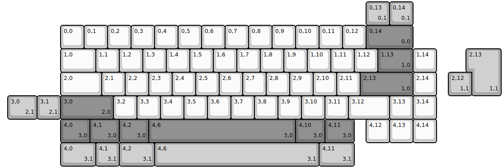{:loading="lazy"}

[Open in keyboard-layout-editor](http://www.keyboard-layout-editor.com/##@@_x:2.5&y:1;&=0,0&=0,1&=0,2&=0,3&=0,4&=0,5&=0,6&=0,7&=0,8&=0,9&=0,10&=0,11&=0,12&_c=#777777&w:2;&=0,14%0A%0A%0A0,0;&@_x:2.5&c=#cccccc&w:1.5;&=1,0&=1,1&=1,2&=1,3&=1,4&=1,5&=1,6&=1,7&=1,8&=1,9&=1,10&=1,11&=1,12&_c=#777777&w:1.5;&=1,13%0A%0A%0A1,0&_c=#cccccc;&=1,14;&@_x:2.5&w:1.75;&=2,0&=2,1&=2,2&=2,3&=2,4&=2,5&=2,6&=2,7&=2,8&=2,9&=2,10&=2,11&_c=#777777&w:2.25;&=2,13%0A%0A%0A1,0&_c=#cccccc;&=2,14;&@_x:2.5&c=#777777&w:2.25;&=3,0%0A%0A%0A2,0&_c=#cccccc;&=3,2&=3,3&=3,4&=3,5&=3,6&=3,7&=3,8&=3,9&=3,10&=3,11&_w:1.75;&=3,12&=3,13&=3,14;&@_x:2.5&c=#777777&w:1.25;&=4,0%0A%0A%0A3,0&_w:1.25;&=4,1%0A%0A%0A3,0&_w:1.25;&=4,2%0A%0A%0A3,0&_w:6.25;&=4,6%0A%0A%0A3,0&_w:1.25;&=4,10%0A%0A%0A3,0&_w:1.25;&=4,11%0A%0A%0A3,0&_x:0.5&c=#cccccc;&=4,12&=4,13&=4,14;&@_x:15.5&y:-6&c=#aaaaaa;&=0,13%0A%0A%0A0,1&=0,14%0A%0A%0A0,1;&@_x:20.0&y:1&w:1.25&h:2&w2:1.5&h2:1&x2:-0.25;&=2,13%0A%0A%0A1,1;&@_x:19.0;&=2,12%0A%0A%0A1,1;&@_x:0.25&w:1.25;&=3,0%0A%0A%0A2,1&=3,1%0A%0A%0A2,1;&@_x:2.5&y:1&w:1.5;&=4,0%0A%0A%0A3,1&=4,1%0A%0A%0A3,1&_w:1.5;&=4,2%0A%0A%0A3,1&_w:7;&=4,6%0A%0A%0A3,1&_w:1.5;&=4,11%0A%0A%0A3,1)

## vertex/arc60h

[README](output/vertex/arc60h/README.md) - [layout](output/vertex/arc60h/arc60h-kle.json) - [PCB](output/vertex/arc60h/arc60h.kicad_pcb) - [PCB render](output/vertex/arc60h/arc60h-render.svg)

{:loading="lazy"}

[Open in keyboard-layout-editor](http://www.keyboard-layout-editor.com/##@@_x:2.75&y:1.5;&=0,0&=0,1&=0,2&=0,3&=0,4&=0,5&=0,6&=0,7&=0,8&=0,9&=0,10&=0,11&=0,12&_c=#aaaaaa&w:2;&=0,14%0A%0A%0A0,0;&@_x:2.75&c=#cccccc&w:1.5;&=1,0&=1,1&=1,2&=1,3&=1,4&=1,5&=1,6&=1,7&=1,8&=1,9&=1,10&=1,11&=1,12&_c=#aaaaaa&w:1.5;&=1,14;&@_x:2.75&c=#cccccc&w:1.75;&=2,0&=2,1&=2,2&=2,3&=2,4&=2,5&=2,6&=2,7&=2,8&=2,9&=2,10&=2,11&_c=#aaaaaa&w:2.25;&=2,13;&@_x:2.75&w:2.25;&=3,0%0A%0A%0A1,0&_c=#cccccc;&=3,2&=3,3&=3,4&=3,5&=3,6&=3,7&=3,8&=3,9&=3,10&=3,11&_c=#aaaaaa&w:2.75;&=3,13%0A%0A%0A2,0;&@_x:2.75&w:1.5;&=4,0%0A%0A%0A3,0&=4,1%0A%0A%0A3,0&_w:1.5;&=4,3%0A%0A%0A3,0&_w:7;&=4,6%0A%0A%0A3,0&_w:1.5;&=4,11%0A%0A%0A3,0&=4,12%0A%0A%0A3,0&_w:1.5;&=4,14%0A%0A%0A3,0;&@_x:15.75&y:-6.25&c=#d3dbb4;&=0,13%0A%0A%0A0,1&=0,14%0A%0A%0A0,1;&@_x:0.25&y:3.25&w:1.25;&=3,0%0A%0A%0A1,1&=3,1%0A%0A%0A1,1&_x:15.5&w:1.75;&=3,13%0A%0A%0A2,1&=3,14%0A%0A%0A2,1;&@_x:2.75&y:1.0&w:1.5;&=4,0%0A%0A%0A3,1&_c=#cccccc&d:true;&=4,1%0A%0A%0A3,1&_c=#d3dbb4&w:1.5;&=4,3%0A%0A%0A3,1&_w:7;&=4,6%0A%0A%0A3,1&_w:1.5;&=4,11%0A%0A%0A3,1&_c=#cccccc&d:true;&=4,12%0A%0A%0A3,1&_c=#d3dbb4&w:1.5;&=4,14%0A%0A%0A3,1;&@_x:2.75&c=#cccccc&w:1.5&d:true;&=4,0%0A%0A%0A3,2&_c=#d3dbb4;&=4,1%0A%0A%0A3,2&_w:1.5;&=4,3%0A%0A%0A3,2&_w:7;&=4,6%0A%0A%0A3,2&_w:1.5;&=4,11%0A%0A%0A3,2&=4,12%0A%0A%0A3,2&_c=#cccccc&w:1.5&d:true;&=4,14%0A%0A%0A3,2)

## viendi/viendi8l

[README](output/viendi/README.md) - [layout](output/viendi/viendi8l-kle.json) - [PCB](output/viendi/viendi8l.kicad_pcb) - [PCB render](output/viendi/viendi8l-render.svg)

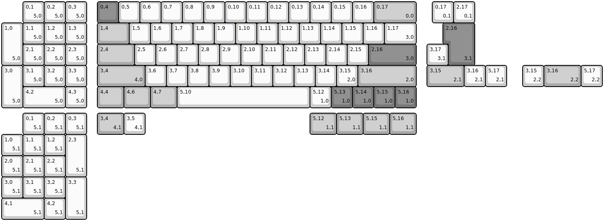{:loading="lazy"}

[Open in keyboard-layout-editor](http://www.keyboard-layout-editor.com/##@@_x:1;&=0,1%0A%0A%0A5,0&=0,2%0A%0A%0A5,0&=0,3%0A%0A%0A5,0&_x:0.5&c=#777777;&=0,4&_c=#cccccc;&=0,5&=0,6&=0,7&=0,8&=0,9&=0,10&=0,11&=0,12&=0,13&=0,14&=0,15&=0,16&_c=#aaaaaa&w:2;&=0,17%0A%0A%0A0,0;&@_c=#cccccc&h:2;&=1,0%0A%0A%0A5,0&=1,1%0A%0A%0A5,0&=1,2%0A%0A%0A5,0&=1,3%0A%0A%0A5,0&_x:0.5&c=#aaaaaa&w:1.5;&=1,4&_c=#cccccc;&=1,5&=1,6&=1,7&=1,8&=1,9&=1,10&=1,11&=1,12&=1,13&=1,14&=1,15&=1,16&_w:1.5;&=1,17%0A%0A%0A3,0;&@_x:1;&=2,1%0A%0A%0A5,0&=2,2%0A%0A%0A5,0&=2,3%0A%0A%0A5,0&_x:0.5&c=#aaaaaa&w:1.75;&=2,4&_c=#cccccc;&=2,5&=2,6&=2,7&=2,8&=2,9&=2,10&=2,11&=2,12&=2,13&=2,14&=2,15&_c=#777777&w:2.25;&=2,16%0A%0A%0A3,0;&@_c=#cccccc&h:2;&=3,0%0A%0A%0A5,0&=3,1%0A%0A%0A5,0&=3,2%0A%0A%0A5,0&=3,3%0A%0A%0A5,0&_x:0.5&c=#aaaaaa&w:2.25;&=3,4%0A%0A%0A4,0&_c=#cccccc;&=3,6&=3,7&=3,8&=3,9&=3,10&=3,11&=3,12&=3,13&=3,14&=3,15%0A%0A%0A2,0&_c=#aaaaaa&w:2.75;&=3,16%0A%0A%0A2,0;&@_x:1&c=#cccccc&w:2;&=4,2%0A%0A%0A5,0&=4,3%0A%0A%0A5,0&_x:0.5&c=#aaaaaa&w:1.25;&=4,4&_w:1.25;&=4,6&_w:1.25;&=4,7&_c=#cccccc&w:6.25;&=5,10&=5,12%0A%0A%0A1,0&_c=#777777;&=5,13%0A%0A%0A1,0&=5,14%0A%0A%0A1,0&=5,15%0A%0A%0A1,0&=5,16%0A%0A%0A1,0;&@_x:20.25&y:-5&c=#cccccc;&=0,17%0A%0A%0A0,1&=2,17%0A%0A%0A0,1;&@_x:21.0&c=#777777&w:1.25&h:2&w2:1.5&h2:1&x2:-0.25;&=2,16%0A%0A%0A3,1;&@_x:20.0&c=#cccccc;&=3,17%0A%0A%0A3,1;&@_x:20.0&c=#aaaaaa&w:1.75;&=3,15%0A%0A%0A2,1&_c=#cccccc;&=3,16%0A%0A%0A2,1&=5,17%0A%0A%0A2,1&_x:0.75;&=3,15%0A%0A%0A2,2&_c=#aaaaaa&w:1.75;&=3,16%0A%0A%0A2,2&_c=#cccccc;&=5,17%0A%0A%0A2,2;&@_x:1&y:1.25;&=0,1%0A%0A%0A5,1&=0,2%0A%0A%0A5,1&=0,3%0A%0A%0A5,1&_x:0.5&c=#aaaaaa&w:1.25;&=3,4%0A%0A%0A4,1&_c=#cccccc;&=3,5%0A%0A%0A4,1&_x:7.75&c=#aaaaaa&w:1.25;&=5,12%0A%0A%0A1,1&_w:1.25;&=5,13%0A%0A%0A1,1&_w:1.25;&=5,15%0A%0A%0A1,1&_w:1.25;&=5,16%0A%0A%0A1,1;&@_c=#cccccc;&=1,0%0A%0A%0A5,1&=1,1%0A%0A%0A5,1&=1,2%0A%0A%0A5,1&_h:2;&=2,3%0A%0A%0A5,1;&@=2,0%0A%0A%0A5,1&=2,1%0A%0A%0A5,1&=2,2%0A%0A%0A5,1;&@=3,0%0A%0A%0A5,1&=3,1%0A%0A%0A5,1&=3,2%0A%0A%0A5,1&_h:2;&=3,3%0A%0A%0A5,1;&@_w:2;&=4,1%0A%0A%0A5,1&=4,2%0A%0A%0A5,1)

## viktus/smolka

[README](output/viktus/smolka/README.md) - [layout](output/viktus/smolka/smolka-kle.json) - [PCB](output/viktus/smolka/smolka.kicad_pcb) - [PCB render](output/viktus/smolka/smolka-render.svg)

{:loading="lazy"}

[Open in keyboard-layout-editor](http://www.keyboard-layout-editor.com/##@@_y:1.25&c=#777777;&=1,0&_x:0.25;&=1,1&_c=#cccccc;&=0,1&=0,2&=1,2&=1,3&=0,3&=0,4&=1,4&=1,5&=0,5&=0,6&=1,6%0A%0A%0A0,0&=1,7%0A%0A%0A0,0&_c=#777777;&=0,7;&@=3,0&_x:0.25&c=#aaaaaa&w:1.25;&=3,1&_c=#cccccc;&=2,1&=2,2&=3,2&=3,3&=2,3&=2,4&=3,4&=3,5&=2,5&=2,6&_c=#777777&w:1.75;&=3,7%0A%0A%0A1,0&=2,7%0A%0A%0A1,0;&@=5,0&_x:0.25&c=#aaaaaa&w:1.75;&=5,1&_c=#cccccc;&=4,1&=4,2&=5,2&=5,3&=4,3&=4,4&=5,4&=5,5&=4,5&_c=#aaaaaa&w:1.25;&=5,6%0A%0A%0A2,0&_c=#777777;&=5,7%0A%0A%0A2,0&=4,7;&@=7,0&_x:0.25&c=#aaaaaa&w:1.25;&=7,1%0A%0A%0A4,0&=6,1%0A%0A%0A4,0&_w:1.25;&=6,2%0A%0A%0A4,0&_c=#cccccc&w:3;&=7,3%0A%0A%0A4,0&_w:3;&=7,4%0A%0A%0A4,0&_c=#aaaaaa;&=6,5%0A%0A%0A4,0&_x:0.5&c=#777777;&=7,6%0A%0A%0A3,0&=7,7%0A%0A%0A3,0&=6,7%0A%0A%0A3,0;&@_x:12.25&y:-5.25&c=#aaaaaa&w:2;&=1,7%0A%0A%0A0,1;&@_x:15.5&y:1.25&c=#cccccc;&=3,7%0A%0A%0A1,1&_c=#777777&w:1.75;&=2,7%0A%0A%0A1,1;&@_x:15.5&c=#cccccc;&=5,6%0A%0A%0A2,1&_c=#777777&w:1.25;&=5,7%0A%0A%0A2,1;&@_x:1.25&y:1.25&c=#aaaaaa&w:1.25;&=7,1%0A%0A%0A4,1&=6,1%0A%0A%0A4,1&_w:1.25;&=6,2%0A%0A%0A4,1&_c=#cccccc&w:2.75;&=7,3%0A%0A%0A4,1&_w:2.25;&=7,4%0A%0A%0A4,1&_c=#aaaaaa;&=7,5%0A%0A%0A4,1&=6,5%0A%0A%0A4,1&_x:0.5&w:1.5;&=7,7%0A%0A%0A3,1&_w:1.5;&=6,7%0A%0A%0A3,1;&@_x:1.25&w:1.25;&=7,1%0A%0A%0A4,2&=6,1%0A%0A%0A4,2&_w:1.25;&=6,2%0A%0A%0A4,2&_c=#cccccc&w:7;&=6,3%0A%0A%0A4,2;&@_x:1.25&c=#aaaaaa&w:1.25;&=7,1%0A%0A%0A4,3&=6,1%0A%0A%0A4,3&_w:1.25;&=6,2%0A%0A%0A4,3&_c=#cccccc&w:3;&=7,3%0A%0A%0A4,3&_c=#aaaaaa;&=6,3%0A%0A%0A4,3&_c=#cccccc&w:3;&=7,5%0A%0A%0A4,3;&@_x:1.25&c=#aaaaaa&w:1.25;&=7,1%0A%0A%0A4,4&=6,1%0A%0A%0A4,4&_w:1.25;&=6,2%0A%0A%0A4,4&_c=#cccccc&w:6;&=6,3%0A%0A%0A4,4&_c=#aaaaaa;&=6,5%0A%0A%0A4,4;&@_x:1.25;&=7,1%0A%0A%0A4,5&_w:1.25;&=6,1%0A%0A%0A4,5&=6,2%0A%0A%0A4,5&_c=#cccccc&w:6.25;&=6,3%0A%0A%0A4,5&_c=#aaaaaa;&=6,5%0A%0A%0A4,5)

## viktus/sp111

[README](output/viktus/sp111/README.md) - [layout](output/viktus/sp111/sp111-kle.json) - [PCB](output/viktus/sp111/sp111.kicad_pcb) - [PCB render](output/viktus/sp111/sp111-render.svg)

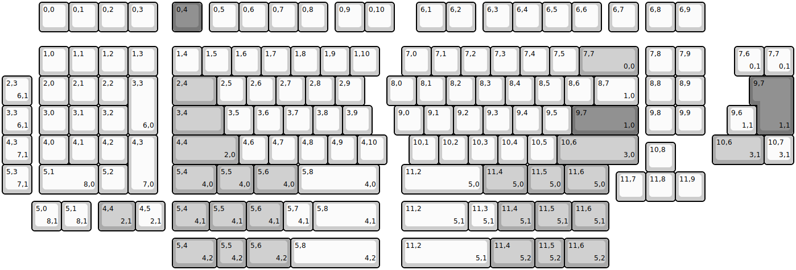{:loading="lazy"}

[Open in keyboard-layout-editor](http://www.keyboard-layout-editor.com/##@@_x:1.25;&=0,0&=0,1&=0,2&=0,3&_x:0.5&c=#777777;&=0,4&_x:0.25&c=#cccccc;&=0,5&=0,6&=0,7&=0,8&_x:0.25;&=0,9&=0,10&_x:0.75;&=6,1&=6,2&_x:0.25;&=6,3&=6,4&=6,5&=6,6&_x:0.25;&=6,7&_x:0.25;&=6,8&=6,9;&@_x:1.25&y:0.5;&=1,0&=1,1&=1,2&=1,3&_x:0.5;&=1,4&=1,5&=1,6&=1,7&=1,8&=1,9&=1,10&_x:0.75;&=7,0&=7,1&=7,2&=7,3&=7,4&=7,5&_c=#aaaaaa&w:2;&=7,7%0A%0A%0A0,0&_x:0.25&c=#cccccc;&=7,8&=7,9;&@_x:1.25;&=2,0&=2,1&=2,2&_h:2;&=3,3%0A%0A%0A6,0&_x:0.5&c=#aaaaaa&w:1.5;&=2,4&_c=#cccccc;&=2,5&=2,6&=2,7&=2,8&=2,9&_x:0.75;&=8,0&=8,1&=8,2&=8,3&=8,4&=8,5&=8,6&_w:1.5;&=8,7%0A%0A%0A1,0&_x:0.25;&=8,8&=8,9;&@_x:1.25;&=3,0&=3,1&=3,2&_x:1.5&c=#aaaaaa&w:1.75&l:true;&=3,4&_c=#cccccc;&=3,5&=3,6&=3,7&=3,8&=3,9&_x:0.75;&=9,0&=9,1&=9,2&=9,3&=9,4&=9,5&_c=#777777&w:2.25;&=9,7%0A%0A%0A1,0&_x:0.25&c=#cccccc;&=9,8&=9,9;&@_x:1.25;&=4,0&=4,1&=4,2&_h:2;&=4,3%0A%0A%0A7,0&_x:0.5&c=#aaaaaa&w:2.25;&=4,4%0A%0A%0A2,0&_c=#cccccc;&=4,6&=4,7&=4,8&=4,9&=4,10&_x:0.75;&=10,1&=10,2&=10,3&=10,4&=10,5&_c=#aaaaaa&w:2.75;&=10,6%0A%0A%0A3,0;&@_x:21.75&y:-0.75&c=#cccccc;&=10,8;&@_x:1.25&y:-0.25&w:2;&=5,1%0A%0A%0A8,0&=5,2&_x:1.5&c=#aaaaaa&w:1.5;&=5,4%0A%0A%0A4,0&_w:1.25;&=5,5%0A%0A%0A4,0&_w:1.5;&=5,6%0A%0A%0A4,0&_c=#cccccc&w:2.75;&=5,8%0A%0A%0A4,0&_x:0.75&w:2.75;&=11,2%0A%0A%0A5,0&_c=#aaaaaa&w:1.5;&=11,4%0A%0A%0A5,0&_w:1.25;&=11,5%0A%0A%0A5,0&_w:1.5;&=11,6%0A%0A%0A5,0;&@_x:20.75&y:-0.75&c=#cccccc;&=11,7&=11,8&=11,9;&@_y:-4.25;&=2,3%0A%0A%0A6,1&_x:24.5&c=#777777&w:1.25&h:2&w2:1.5&h2:1&x2:-0.25;&=9,7%0A%0A%0A1,1;&@_c=#cccccc;&=3,3%0A%0A%0A6,1&_x:23.5;&=9,6%0A%0A%0A1,1;&@=4,3%0A%0A%0A7,1&_x:23.0&c=#aaaaaa&w:1.75;&=10,6%0A%0A%0A3,1&_c=#cccccc;&=10,7%0A%0A%0A3,1;&@=5,3%0A%0A%0A7,1;&@_x:1&y:0.25;&=5,0%0A%0A%0A8,1&=5,1%0A%0A%0A8,1&_x:0.25&c=#aaaaaa&w:1.25;&=4,4%0A%0A%0A2,1&_c=#cccccc;&=4,5%0A%0A%0A2,1&_x:0.25&c=#aaaaaa&w:1.25;&=5,4%0A%0A%0A4,1&_w:1.25;&=5,5%0A%0A%0A4,1&_w:1.25;&=5,6%0A%0A%0A4,1&_c=#cccccc;&=5,7%0A%0A%0A4,1&_w:2.25;&=5,8%0A%0A%0A4,1&_x:0.75&w:2.25;&=11,2%0A%0A%0A5,1&=11,3%0A%0A%0A5,1&_c=#aaaaaa&w:1.25;&=11,4%0A%0A%0A5,1&_w:1.25;&=11,5%0A%0A%0A5,1&_w:1.25;&=11,6%0A%0A%0A5,1;&@_x:5.75&y:0.25&w:1.5;&=5,4%0A%0A%0A4,2&=5,5%0A%0A%0A4,2&_w:1.5;&=5,6%0A%0A%0A4,2&_c=#cccccc&w:3;&=5,8%0A%0A%0A4,2&_x:0.75&w:3;&=11,2%0A%0A%0A5,1&_c=#aaaaaa&w:1.5;&=11,4%0A%0A%0A5,2&=11,5%0A%0A%0A5,2&_w:1.5;&=11,6%0A%0A%0A5,2;&@_rx:0.5&x:24.25&y:1.5&c=#cccccc;&=7,6%0A%0A%0A0,1&=7,7%0A%0A%0A0,1)

## viktus/styrka

[README](output/viktus/styrka/README.md) - [layout](output/viktus/styrka/styrka-kle.json) - [PCB](output/viktus/styrka/styrka.kicad_pcb) - [PCB render](output/viktus/styrka/styrka-render.svg)

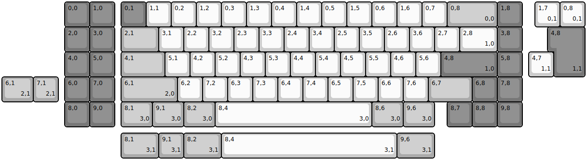{:loading="lazy"}

[Open in keyboard-layout-editor](http://www.keyboard-layout-editor.com/##@@_x:2.5&c=#777777;&=0,0&=1,0&_x:0.25;&=0,1&_c=#cccccc;&=1,1&=0,2&=1,2&=0,3&=1,3&=0,4&=1,4&=0,5&=1,5&=0,6&=1,6&=0,7&_c=#aaaaaa&w:2;&=0,8%0A%0A%0A0,0&_c=#777777;&=1,8;&@_x:2.5;&=2,0&=3,0&_x:0.25&c=#aaaaaa&w:1.5;&=2,1&_c=#cccccc;&=3,1&=2,2&=3,2&=2,3&=3,3&=2,4&=3,4&=2,5&=3,5&=2,6&=3,6&=2,7&_w:1.5;&=2,8%0A%0A%0A1,0&_c=#777777;&=3,8;&@_x:2.5;&=4,0&=5,0&_x:0.25&c=#aaaaaa&w:1.75;&=4,1&_c=#cccccc;&=5,1&=4,2&=5,2&=4,3&=5,3&=4,4&=5,4&=4,5&=5,5&=4,6&=5,6&_c=#777777&w:2.25;&=4,8%0A%0A%0A1,0&=5,8;&@_x:2.5;&=6,0&=7,0&_x:0.25&c=#aaaaaa&w:2.25;&=6,1%0A%0A%0A2,0&_c=#cccccc;&=6,2&=7,2&=6,3&=7,3&=6,4&=7,4&=6,5&=7,5&=6,6&=7,6&_c=#aaaaaa&w:1.75;&=6,7&_c=#777777;&=6,8&=7,8;&@_x:2.5;&=8,0&=9,0&_x:0.25&c=#aaaaaa&w:1.25;&=8,1%0A%0A%0A3,0&_w:1.25;&=9,1%0A%0A%0A3,0&_w:1.25;&=8,2%0A%0A%0A3,0&_c=#cccccc&w:6.25;&=8,4%0A%0A%0A3,0&_c=#aaaaaa&w:1.25;&=8,6%0A%0A%0A3,0&_w:1.25;&=9,6%0A%0A%0A3,0&_x:0.5&c=#777777;&=8,7&=8,8&=9,8;&@_x:21.25&y:-5&c=#cccccc;&=1,7%0A%0A%0A0,1&=0,8%0A%0A%0A0,1;&@_x:22.0&c=#777777&w:1.25&h:2&w2:1.5&h2:1&x2:-0.25;&=4,8%0A%0A%0A1,1;&@_x:21.0&c=#cccccc;&=4,7%0A%0A%0A1,1;&@_c=#aaaaaa&w:1.25;&=6,1%0A%0A%0A2,1&=7,1%0A%0A%0A2,1;&@_x:4.75&y:1.25&w:1.5;&=8,1%0A%0A%0A3,1&=9,1%0A%0A%0A3,1&_w:1.5;&=8,2%0A%0A%0A3,1&_c=#cccccc&w:7;&=8,4%0A%0A%0A3,1&_c=#aaaaaa&w:1.5;&=9,6%0A%0A%0A3,1)

## wavtype/p01_ultra/via

[README](output/wavtype/p01_ultra/README.md) - [layout](output/wavtype/p01_ultra/via-kle.json) - [PCB](output/wavtype/p01_ultra/via.kicad_pcb) - [PCB render](output/wavtype/p01_ultra/via-render.svg)

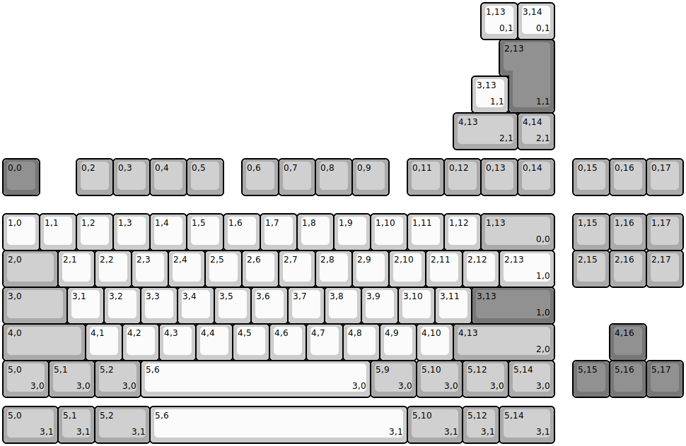{:loading="lazy"}

[Open in keyboard-layout-editor](http://www.keyboard-layout-editor.com/##@@_y:4.25&c=#777777;&=0,0&_x:1&c=#aaaaaa;&=0,2&=0,3&=0,4&=0,5&_x:0.5;&=0,6&=0,7&=0,8&=0,9&_x:0.5;&=0,11&=0,12&=0,13&=0,14&_x:0.5;&=0,15&=0,16&=0,17;&@_y:0.5&c=#cccccc;&=1,0&=1,1&=1,2&=1,3&=1,4&=1,5&=1,6&=1,7&=1,8&=1,9&=1,10&=1,11&=1,12&_c=#aaaaaa&w:2;&=1,13%0A%0A%0A0,0&_x:0.5;&=1,15&=1,16&=1,17;&@_w:1.5;&=2,0&_c=#cccccc;&=2,1&=2,2&=2,3&=2,4&=2,5&=2,6&=2,7&=2,8&=2,9&=2,10&=2,11&=2,12&_w:1.5;&=2,13%0A%0A%0A1,0&_x:0.5&c=#aaaaaa;&=2,15&=2,16&=2,17;&@_w:1.75;&=3,0&_c=#cccccc;&=3,1&=3,2&=3,3&=3,4&=3,5&=3,6&=3,7&=3,8&=3,9&=3,10&=3,11&_c=#777777&w:2.25;&=3,13%0A%0A%0A1,0;&@_c=#aaaaaa&w:2.25;&=4,0&_c=#cccccc;&=4,1&=4,2&=4,3&=4,4&=4,5&=4,6&=4,7&=4,8&=4,9&=4,10&_c=#aaaaaa&w:2.75;&=4,13%0A%0A%0A2,0&_x:1.5&c=#777777;&=4,16;&@_c=#aaaaaa&w:1.25;&=5,0%0A%0A%0A3,0&_w:1.25;&=5,1%0A%0A%0A3,0&_w:1.25;&=5,2%0A%0A%0A3,0&_c=#cccccc&w:6.25;&=5,6%0A%0A%0A3,0&_c=#aaaaaa&w:1.25;&=5,9%0A%0A%0A3,0&_w:1.25;&=5,10%0A%0A%0A3,0&_w:1.25;&=5,12%0A%0A%0A3,0&_w:1.25;&=5,14%0A%0A%0A3,0&_x:0.5&c=#777777;&=5,15&=5,16&=5,17;&@_x:13&y:-10.75&c=#cccccc;&=1,13%0A%0A%0A0,1&=3,14%0A%0A%0A0,1;&@_x:13.75&c=#777777&w:1.25&h:2&w2:1.5&h2:1&x2:-0.25;&=2,13%0A%0A%0A1,1;&@_x:12.75&c=#cccccc;&=3,13%0A%0A%0A1,1;&@_x:12.25&c=#aaaaaa&w:1.75;&=4,13%0A%0A%0A2,1&=4,14%0A%0A%0A2,1;&@_y:7.0&w:1.5;&=5,0%0A%0A%0A3,1&=5,1%0A%0A%0A3,1&_w:1.5;&=5,2%0A%0A%0A3,1&_c=#cccccc&w:7;&=5,6%0A%0A%0A3,1&_c=#aaaaaa&w:1.5;&=5,10%0A%0A%0A3,1&=5,12%0A%0A%0A3,1&_w:1.5;&=5,14%0A%0A%0A3,1)

## wekey/polaris/polaris_ex

[README](output/wekey/polaris/README.md) - [layout](output/wekey/polaris/polaris_ex-kle.json) - [PCB](output/wekey/polaris/polaris_ex.kicad_pcb) - [PCB render](output/wekey/polaris/polaris_ex-render.svg)

{:loading="lazy"}

[Open in keyboard-layout-editor](http://www.keyboard-layout-editor.com/##@@_x:2.5;&=0,0&=1,0&=0,1&=1,1&=0,2&=1,2&=0,3&=1,3&=0,4&=1,4&=0,5&=1,5&=0,6&_w:2;&=1,6%0A%0A%0A0,0;&@_x:2.5&w:1.5;&=2,0&=2,1&=3,1&=2,2&=3,2&=2,3&=3,3&=2,4&=3,4&=2,5&=3,5&=2,6&=3,6&_w:1.5;&=2,7%0A%0A%0A1,0;&@_x:2.5&w:1.75;&=4,0&=4,1&=5,1&=5,2&=5,2&=4,3&=5,3&=4,4&=5,4&=4,5&=5,5&=4,6&_w:2.25;&=5,6%0A%0A%0A1,0;&@_x:2.5&w:2.25;&=6,0%0A%0A%0A2,0&=6,1&=7,1&=6,2&=7,2&=6,3&=7,3&=6,4&=7,4&=6,5&=7,5&_w:2.75;&=6,6%0A%0A%0A3,0;&@_x:2.5&w:1.25;&=8,0%0A%0A%0A4,0&_w:1.25;&=9,0%0A%0A%0A4,0&_w:1.25;&=8,1%0A%0A%0A4,0&_w:6.25;&=8,3%0A%0A%0A4,0&_w:1.25;&=8,5%0A%0A%0A4,0&_w:1.25;&=9,5%0A%0A%0A4,0&_w:1.25;&=8,6%0A%0A%0A4,0&_w:1.25;&=9,6%0A%0A%0A4,0;&@_x:18.5&y:-5;&=1,6%0A%0A%0A0,1&=0,7%0A%0A%0A0,1;&@_x:19.25&w:1.25&h:2&w2:1.5&h2:1&x2:-0.25;&=5,6%0A%0A%0A1,1;&@_x:18.25;&=2,7%0A%0A%0A1,1;&@_w:1.25;&=6,0%0A%0A%0A2,1&=7,0%0A%0A%0A2,1&_x:15.5&w:1.75;&=6,6%0A%0A%0A3,1&=7,6%0A%0A%0A3,1;&@_x:2.5&y:1.25&w:1.25;&=8,0%0A%0A%0A4,1&_w:1.25;&=9,0%0A%0A%0A4,1&_w:1.25;&=8,1%0A%0A%0A4,1&_w:2.25;&=8,2%0A%0A%0A4,1&_w:1.25;&=8,3%0A%0A%0A4,1&_w:2.75;&=8,4%0A%0A%0A4,1&_w:1.25;&=8,5%0A%0A%0A4,1&_w:1.25;&=9,5%0A%0A%0A4,1&_w:1.25;&=8,6%0A%0A%0A4,1&_w:1.25;&=9,6%0A%0A%0A4,1;&@_x:2.5&w:1.5;&=8,0%0A%0A%0A4,2&=9,0%0A%0A%0A4,2&_w:1.5;&=8,1%0A%0A%0A4,2&_w:7;&=8,3%0A%0A%0A4,2&_w:1.5;&=9,5%0A%0A%0A4,2&=8,6%0A%0A%0A4,2&_w:1.5;&=9,6%0A%0A%0A4,2;&@_x:2.5&w:1.5;&=8,0%0A%0A%0A4,3&_d:true;&=9,0%0A%0A%0A4,3&_w:1.5;&=8,1%0A%0A%0A4,3&_w:7;&=8,3%0A%0A%0A4,3&_w:1.5;&=9,5%0A%0A%0A4,3&_d:true;&=8,6%0A%0A%0A4,3&_w:1.5;&=9,6%0A%0A%0A4,3;&@_x:2.5&w:1.5&d:true;&=8,0%0A%0A%0A4,4&=9,0%0A%0A%0A4,4&_w:1.5;&=8,1%0A%0A%0A4,4&_w:7;&=8,3%0A%0A%0A4,4&_w:1.5;&=9,5%0A%0A%0A4,4&=8,6%0A%0A%0A4,4&_w:1.5&d:true;&=9,6%0A%0A%0A4,4)

## wekey/we27/we27v1

[README](output/wekey/we27/README.md) - [layout](output/wekey/we27/we27v1-kle.json) - [PCB](output/wekey/we27/we27v1.kicad_pcb) - [PCB render](output/wekey/we27/we27v1-render.svg)

{:loading="lazy"}

[Open in keyboard-layout-editor](http://www.keyboard-layout-editor.com/##@@_x:3.75&w:0.75&h:0.75;&=3,4%0A%0A%0A0,0&_w:0.75&h:0.75;&=5,4%0A%0A%0A0,0;&@_y:-0.25;&=0,0&=0,1&=0,2&=0,3&=0,4%0A%0A%0A0,0;&@_y:0.5;&=1,0&=1,1&=1,2&=1,3&=1,4;&@=2,0&=2,1&=2,2&=2,3&_h:2;&=2,4;&@=3,0&=3,1&=3,2&=3,3;&@=4,0&=4,1&=4,2&=4,3&_h:2;&=4,4;&@=5,0&_w:2;&=5,1&=5,3;&@_x:5.5&y:-7.25&w:0.75&h:0.75&d:true;&=3,4%0A%0A%0A0,1&_w:0.75&h:0.75&d:true;&=5,4%0A%0A%0A0,1;&@_x:5.75&y:-0.25;&=0,4%0A%0A%0A0,1)

## wilba_tech/rama_works_kara

[README](output/wilba_tech/rama_works_kara/README.md) - [layout](output/wilba_tech/rama_works_kara/rama_works_kara-kle.json) - [PCB](output/wilba_tech/rama_works_kara/rama_works_kara.kicad_pcb) - [PCB render](output/wilba_tech/rama_works_kara/rama_works_kara-render.svg)

{:loading="lazy"}

[Open in keyboard-layout-editor](http://www.keyboard-layout-editor.com/##@@_c=#4d525a&t=#e2e2e2;&=0,0&_c=#e2e2e2&t=#363636;&=0,1&=0,2&=0,3&=0,4&=0,5&=0,6&=0,7&=0,8&=0,9&=0,10&=0,11&=0,12&=0,13&_c=#4d525a&t=#e2e2e2;&=2,13;&@_w:1.5;&=1,0&_c=#e2e2e2&t=#363636;&=1,1&=1,2&=1,3&=1,4&=1,5&=1,6&=1,7&=1,8&=1,9&=1,10&=1,11&=1,12&_c=#4d525a&t=#e2e2e2&w:1.5;&=1,13;&@_c=#f5cb01&t=#4d525a&w:1.75;&=2,0&_c=#e2e2e2&t=#363636;&=2,1&=2,2&=2,3&=2,4&=2,5&=2,6&=2,7&=2,8&=2,9&=2,10&=2,11&_c=#4d525a&t=#e2e2e2&w:2.25;&=2,12;&@_w:2.25;&=3,0&_c=#e2e2e2&t=#363636;&=3,2&=3,3&=3,4&=3,5&=3,6&=3,7&=3,8&=3,9&=3,10&=3,11&_c=#4d525a&t=#e2e2e2&w:1.75;&=3,12&_c=#f5cb01&t=#4d525a;&=3,13;&@_x:1.5&c=#4d525a&t=#e2e2e2;&=4,1&_w:1.5;&=4,2&_c=#e2e2e2&t=#363636&w:7;&=4,7&_c=#4d525a&t=#e2e2e2&w:1.5;&=4,11&=4,12)

## wilba_tech/rama_works_koyu

[README](output/wilba_tech/rama_works_koyu/README.md) - [layout](output/wilba_tech/rama_works_koyu/rama_works_koyu-kle.json) - [PCB](output/wilba_tech/rama_works_koyu/rama_works_koyu.kicad_pcb) - [PCB render](output/wilba_tech/rama_works_koyu/rama_works_koyu-render.svg)

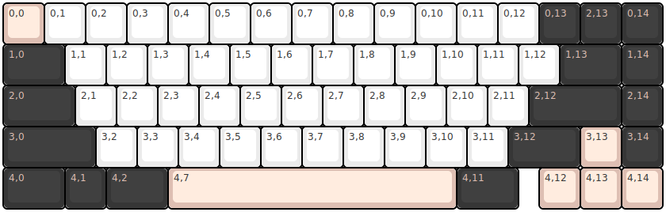{:loading="lazy"}

[Open in keyboard-layout-editor](http://www.keyboard-layout-editor.com/##@@_c=#DEBFB3&t=#363636;&=0,0&_c=#ebebeb;&=0,1&=0,2&=0,3&=0,4&=0,5&=0,6&=0,7&=0,8&=0,9&=0,10&=0,11&=0,12&_c=#363636&t=#DEBFB3;&=0,13&=2,13&=0,14;&@_w:1.5;&=1,0&_c=#ebebeb&t=#363636;&=1,1&=1,2&=1,3&=1,4&=1,5&=1,6&=1,7&=1,8&=1,9&=1,10&=1,11&=1,12&_c=#363636&t=#DEBFB3&w:1.5;&=1,13&=1,14;&@_w:1.75;&=2,0&_c=#ebebeb&t=#363636;&=2,1&=2,2&=2,3&=2,4&=2,5&=2,6&=2,7&=2,8&=2,9&=2,10&=2,11&_c=#363636&t=#DEBFB3&w:2.25;&=2,12&=2,14;&@_w:2.25;&=3,0&_c=#ebebeb&t=#363636;&=3,2&=3,3&=3,4&=3,5&=3,6&=3,7&=3,8&=3,9&=3,10&=3,11&_c=#363636&t=#DEBFB3&w:1.75;&=3,12&_c=#DEBFB3&t=#363636;&=3,13&_c=#363636&t=#DEBFB3;&=3,14;&@_w:1.5;&=4,0&=4,1&_w:1.5;&=4,2&_c=#DEBFB3&t=#363636&w:7;&=4,7&_c=#363636&t=#DEBFB3&w:1.5;&=4,11&_x:0.5&c=#DEBFB3&t=#363636;&=4,12&=4,13&=4,14)

## wilba_tech/rama_works_m10_a

[README](output/wilba_tech/rama_works_m10_a/README.md) - [layout](output/wilba_tech/rama_works_m10_a/rama_works_m10_a-kle.json) - [PCB](output/wilba_tech/rama_works_m10_a/rama_works_m10_a.kicad_pcb) - [PCB render](output/wilba_tech/rama_works_m10_a/rama_works_m10_a-render.svg)

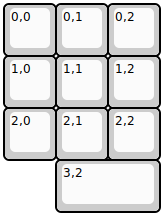{:loading="lazy"}

[Open in keyboard-layout-editor](http://www.keyboard-layout-editor.com/##@@=0,0&=0,1&=0,2;&@=1,0&=1,1&=1,2;&@=2,0&=2,1&=2,2;&@_x:1&w:2;&=3,2)

## wilba_tech/rama_works_m10_b

[README](output/wilba_tech/rama_works_m10_b/README.md) - [layout](output/wilba_tech/rama_works_m10_b/rama_works_m10_b-kle.json) - [PCB](output/wilba_tech/rama_works_m10_b/rama_works_m10_b.kicad_pcb) - [PCB render](output/wilba_tech/rama_works_m10_b/rama_works_m10_b-render.svg)

{:loading="lazy"}

[Open in keyboard-layout-editor](http://www.keyboard-layout-editor.com/##@@_c=#505557&t=#d9d7d7;&=0,0&=0,1&=0,2;&@=0,3&=0,4&=0,5;&@=0,6&=0,7&=0,8;&@_x:1&w:2;&=0,9)

## wilba_tech/rama_works_m10_c

[README](output/wilba_tech/rama_works_m10_c/README.md) - [layout](output/wilba_tech/rama_works_m10_c/rama_works_m10_c-kle.json) - [PCB](output/wilba_tech/rama_works_m10_c/rama_works_m10_c.kicad_pcb) - [PCB render](output/wilba_tech/rama_works_m10_c/rama_works_m10_c-render.svg)

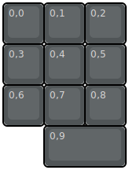{:loading="lazy"}

[Open in keyboard-layout-editor](http://www.keyboard-layout-editor.com/##@@_c=#505557&t=#d9d7d7;&=0,0&=0,1&=0,2;&@=0,3&=0,4&=0,5;&@=0,6&=0,7&=0,8;&@_x:1&w:2;&=0,9)

## wilba_tech/rama_works_m4_a

[README](output/wilba_tech/rama_works_m4_a/README.md) - [layout](output/wilba_tech/rama_works_m4_a/rama_works_m4_a-kle.json) - [PCB](output/wilba_tech/rama_works_m4_a/rama_works_m4_a.kicad_pcb) - [PCB render](output/wilba_tech/rama_works_m4_a/rama_works_m4_a-render.svg)

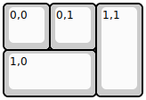{:loading="lazy"}

[Open in keyboard-layout-editor](http://www.keyboard-layout-editor.com/##@@=0,0&=0,1&_h:2;&=1,1;&@_w:2;&=1,0)

## wilba_tech/rama_works_m50_a

[README](output/wilba_tech/rama_works_m50_a/README.md) - [layout](output/wilba_tech/rama_works_m50_a/rama_works_m50_a-kle.json) - [PCB](output/wilba_tech/rama_works_m50_a/rama_works_m50_a.kicad_pcb) - [PCB render](output/wilba_tech/rama_works_m50_a/rama_works_m50_a-render.svg)

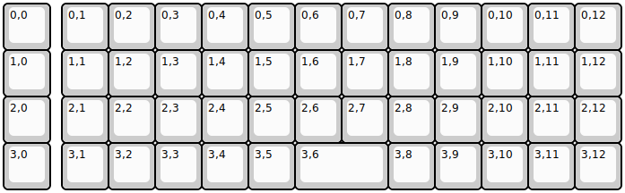{:loading="lazy"}

[Open in keyboard-layout-editor](http://www.keyboard-layout-editor.com/##@@=0,0&_x:0.25;&=0,1&=0,2&=0,3&=0,4&=0,5&=0,6&=0,7&=0,8&=0,9&=0,10&=0,11&=0,12;&@=1,0&_x:0.25;&=1,1&=1,2&=1,3&=1,4&=1,5&=1,6&=1,7&=1,8&=1,9&=1,10&=1,11&=1,12;&@=2,0&_x:0.25;&=2,1&=2,2&=2,3&=2,4&=2,5&=2,6&=2,7&=2,8&=2,9&=2,10&=2,11&=2,12;&@=3,0&_x:0.25;&=3,1&=3,2&=3,3&=3,4&=3,5&_w:2;&=3,6&=3,8&=3,9&=3,10&=3,11&=3,12)

## wilba_tech/rama_works_m50_ax

[README](output/wilba_tech/rama_works_m50_ax/README.md) - [layout](output/wilba_tech/rama_works_m50_ax/rama_works_m50_ax-kle.json) - [PCB](output/wilba_tech/rama_works_m50_ax/rama_works_m50_ax.kicad_pcb) - [PCB render](output/wilba_tech/rama_works_m50_ax/rama_works_m50_ax-render.svg)

{:loading="lazy"}

[Open in keyboard-layout-editor](http://www.keyboard-layout-editor.com/##@@=0,0&_x:0.25;&=0,1&=0,2&=0,3&=0,4&=0,5&=0,6&=0,7&=0,8&=0,9&=0,10&=0,11&=0,12;&@=1,0&_x:0.25;&=1,1&=1,2&=1,3&=1,4&=1,5&=1,6&=1,7&=1,8&=1,9&=1,10&=1,11&=1,12;&@=2,0&_x:0.25;&=2,1&=2,2&=2,3&=2,4&=2,5&=2,6&=2,7&=2,8&=2,9&=2,10&=2,11&=2,12;&@=3,0&_x:0.25;&=3,1&=3,2&=3,3&=3,4&=3,5%0A%0A%0A0,0&_w:2;&=3,6%0A%0A%0A0,0&=3,8%0A%0A%0A0,0&=3,9&=3,10&=3,11&=3,12;&@_x:5.25&y:0.25;&=3,5%0A%0A%0A0,1&=3,6%0A%0A%0A0,1&=3,7%0A%0A%0A0,1&=3,8%0A%0A%0A0,1;&@_x:5.25&w:2;&=3,5%0A%0A%0A0,2&=3,7%0A%0A%0A0,2&=3,8%0A%0A%0A0,2;&@_x:5.25;&=3,5%0A%0A%0A0,3&=3,6%0A%0A%0A0,3&_w:2;&=3,7%0A%0A%0A0,3;&@_x:5.25&w:2;&=3,5%0A%0A%0A0,4&_w:2;&=3,7%0A%0A%0A0,4)

## wilba_tech/rama_works_m60_a

[README](output/wilba_tech/rama_works_m60_a/README.md) - [layout](output/wilba_tech/rama_works_m60_a/rama_works_m60_a-kle.json) - [PCB](output/wilba_tech/rama_works_m60_a/rama_works_m60_a.kicad_pcb) - [PCB render](output/wilba_tech/rama_works_m60_a/rama_works_m60_a-render.svg)

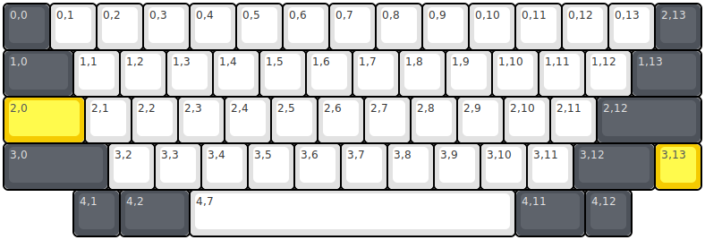{:loading="lazy"}

[Open in keyboard-layout-editor](http://www.keyboard-layout-editor.com/##@@_c=#4d525a&t=#e2e2e2;&=0,0&_c=#e2e2e2&t=#363636;&=0,1&=0,2&=0,3&=0,4&=0,5&=0,6&=0,7&=0,8&=0,9&=0,10&=0,11&=0,12&=0,13&_c=#4d525a&t=#e2e2e2;&=2,13;&@_w:1.5;&=1,0&_c=#e2e2e2&t=#363636;&=1,1&=1,2&=1,3&=1,4&=1,5&=1,6&=1,7&=1,8&=1,9&=1,10&=1,11&=1,12&_c=#4d525a&t=#e2e2e2&w:1.5;&=1,13;&@_c=#f5cb01&t=#4d525a&w:1.75;&=2,0&_c=#e2e2e2&t=#363636;&=2,1&=2,2&=2,3&=2,4&=2,5&=2,6&=2,7&=2,8&=2,9&=2,10&=2,11&_c=#4d525a&t=#e2e2e2&w:2.25;&=2,12;&@_w:2.25;&=3,0&_c=#e2e2e2&t=#363636;&=3,2&=3,3&=3,4&=3,5&=3,6&=3,7&=3,8&=3,9&=3,10&=3,11&_c=#4d525a&t=#e2e2e2&w:1.75;&=3,12&_c=#f5cb01&t=#4d525a;&=3,13;&@_x:1.5&c=#4d525a&t=#e2e2e2;&=4,1&_w:1.5;&=4,2&_c=#e2e2e2&t=#363636&w:7;&=4,7&_c=#4d525a&t=#e2e2e2&w:1.5;&=4,11&=4,12)

## wilba_tech/rama_works_m65_b

[README](output/wilba_tech/rama_works_m65_b/README.md) - [layout](output/wilba_tech/rama_works_m65_b/rama_works_m65_b-kle.json) - [PCB](output/wilba_tech/rama_works_m65_b/rama_works_m65_b.kicad_pcb) - [PCB render](output/wilba_tech/rama_works_m65_b/rama_works_m65_b-render.svg)

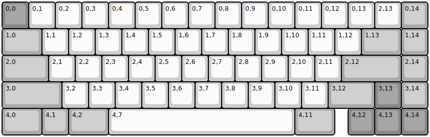{:loading="lazy"}

[Open in keyboard-layout-editor](http://www.keyboard-layout-editor.com/##@@_c=#888888;&=0,0&_c=#cccccc;&=0,1&=0,2&=0,3&=0,4&=0,5&=0,6&=0,7&=0,8&=0,9&=0,10&=0,11&=0,12&=0,13&=2,13&_c=#aaaaaa;&=0,14;&@_w:1.5;&=1,0&_c=#cccccc;&=1,1&=1,2&=1,3&=1,4&=1,5&=1,6&=1,7&=1,8&=1,9&=1,10&=1,11&=1,12&_c=#aaaaaa&w:1.5;&=1,13&=1,14;&@_w:1.75;&=2,0&_c=#cccccc;&=2,1&=2,2&=2,3&=2,4&=2,5&=2,6&=2,7&=2,8&=2,9&=2,10&=2,11&_c=#aaaaaa&w:2.25;&=2,12&=2,14;&@_w:2.25;&=3,0&_c=#cccccc;&=3,2&=3,3&=3,4&=3,5&=3,6&=3,7&=3,8&=3,9&=3,10&=3,11&_c=#aaaaaa&w:1.75;&=3,12&_c=#888888;&=3,13&_c=#aaaaaa;&=3,14;&@_w:1.5;&=4,0&=4,1&_w:1.5;&=4,2&_c=#cccccc&w:7;&=4,7&_c=#aaaaaa&w:1.5;&=4,11&_x:0.5&c=#888888;&=4,12&=4,13&=4,14)

## wilba_tech/rama_works_m65_bx

[README](output/wilba_tech/rama_works_m65_bx/README.md) - [layout](output/wilba_tech/rama_works_m65_bx/rama_works_m65_bx-kle.json) - [PCB](output/wilba_tech/rama_works_m65_bx/rama_works_m65_bx.kicad_pcb) - [PCB render](output/wilba_tech/rama_works_m65_bx/rama_works_m65_bx-render.svg)

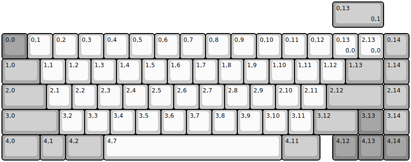{:loading="lazy"}

[Open in keyboard-layout-editor](http://www.keyboard-layout-editor.com/##@@_y:1.25&c=#888888;&=0,0&_c=#cccccc;&=0,1&=0,2&=0,3&=0,4&=0,5&=0,6&=0,7&=0,8&=0,9&=0,10&=0,11&=0,12&=0,13%0A%0A%0A0,0&=2,13%0A%0A%0A0,0&_c=#aaaaaa;&=0,14;&@_w:1.5;&=1,0&_c=#cccccc;&=1,1&=1,2&=1,3&=1,4&=1,5&=1,6&=1,7&=1,8&=1,9&=1,10&=1,11&=1,12&_c=#aaaaaa&w:1.5;&=1,13&=1,14;&@_w:1.75;&=2,0&_c=#cccccc;&=2,1&=2,2&=2,3&=2,4&=2,5&=2,6&=2,7&=2,8&=2,9&=2,10&=2,11&_c=#aaaaaa&w:2.25;&=2,12&=2,14;&@_w:2.25;&=3,0&_c=#cccccc;&=3,2&=3,3&=3,4&=3,5&=3,6&=3,7&=3,8&=3,9&=3,10&=3,11&_c=#aaaaaa&w:1.75;&=3,12&_c=#888888;&=3,13&_c=#aaaaaa;&=3,14;&@_w:1.5;&=4,0&=4,1&_w:1.5;&=4,2&_c=#cccccc&w:7;&=4,7&_c=#aaaaaa&w:1.5;&=4,11&_x:0.5&c=#888888;&=4,12&=4,13&=4,14;&@_x:13&y:-6.25&c=#aaaaaa&w:2;&=0,13%0A%0A%0A0,1)

## wilba_tech/rama_works_m6_a

[README](output/wilba_tech/rama_works_m6_a/README.md) - [layout](output/wilba_tech/rama_works_m6_a/rama_works_m6_a-kle.json) - [PCB](output/wilba_tech/rama_works_m6_a/rama_works_m6_a.kicad_pcb) - [PCB render](output/wilba_tech/rama_works_m6_a/rama_works_m6_a-render.svg)

{:loading="lazy"}

[Open in keyboard-layout-editor](http://www.keyboard-layout-editor.com/##@@_c=#505557&t=#d9d7d7;&=0,0&=0,1&=0,2;&@=0,3&=0,4&=0,5)

## wilba_tech/rama_works_m6_b

[README](output/wilba_tech/rama_works_m6_b/README.md) - [layout](output/wilba_tech/rama_works_m6_b/rama_works_m6_b-kle.json) - [PCB](output/wilba_tech/rama_works_m6_b/rama_works_m6_b.kicad_pcb) - [PCB render](output/wilba_tech/rama_works_m6_b/rama_works_m6_b-render.svg)

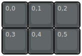{:loading="lazy"}

[Open in keyboard-layout-editor](http://www.keyboard-layout-editor.com/##@@_c=#505557&t=#d9d7d7;&=0,0&=0,1&=0,2;&@=0,3&=0,4&=0,5)

## wilba_tech/rama_works_u80_a

[README](output/wilba_tech/rama_works_u80_a/README.md) - [layout](output/wilba_tech/rama_works_u80_a/rama_works_u80_a-kle.json) - [PCB](output/wilba_tech/rama_works_u80_a/rama_works_u80_a.kicad_pcb) - [PCB render](output/wilba_tech/rama_works_u80_a/rama_works_u80_a-render.svg)

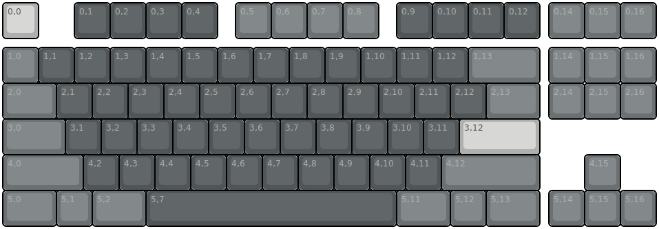{:loading="lazy"}

[Open in keyboard-layout-editor](http://www.keyboard-layout-editor.com/##@@_c=#afb0ae&t=#505557;&=0,0&_x:1&c=#505557&t=#aeb0b0;&=0,1&=0,2&=0,3&=0,4&_x:0.5&c=#6b7173;&=0,5&=0,6&=0,7&=0,8&_x:0.5&c=#505557;&=0,9&=0,10&=0,11&=0,12&_x:0.25&c=#6b7173;&=0,14&=0,15&=0,16;&@_y:0.25;&=1,0&_c=#505557;&=1,1&=1,2&=1,3&=1,4&=1,5&=1,6&=1,7&=1,8&=1,9&=1,10&=1,11&=1,12&_c=#6b7173&w:2;&=1,13&_x:0.25;&=1,14&=1,15&=1,16;&@_w:1.5;&=2,0&_c=#505557;&=2,1&=2,2&=2,3&=2,4&=2,5&=2,6&=2,7&=2,8&=2,9&=2,10&=2,11&=2,12&_c=#6b7173&w:1.5;&=2,13&_x:0.25;&=2,14&=2,15&=2,16;&@_w:1.75;&=3,0&_c=#505557;&=3,1&=3,2&=3,3&=3,4&=3,5&=3,6&=3,7&=3,8&=3,9&=3,10&=3,11&_c=#afb0ae&t=#505557&w:2.25;&=3,12;&@_c=#6b7173&t=#aeb0b0&w:2.25;&=4,0&_c=#505557;&=4,2&=4,3&=4,4&=4,5&=4,6&=4,7&=4,8&=4,9&=4,10&=4,11&_c=#6b7173&w:2.75;&=4,12&_x:1.25;&=4,15;&@_w:1.5;&=5,0&=5,1&_w:1.5;&=5,2&_c=#505557&w:7;&=5,7&_c=#6b7173&w:1.5;&=5,11&=5,12&_w:1.5;&=5,13&_x:0.25;&=5,14&=5,15&=5,16)

## wilba_tech/wt60_a

[README](output/wilba_tech/wt60_a/README.md) - [layout](output/wilba_tech/wt60_a/wt60_a-kle.json) - [PCB](output/wilba_tech/wt60_a/wt60_a.kicad_pcb) - [PCB render](output/wilba_tech/wt60_a/wt60_a-render.svg)

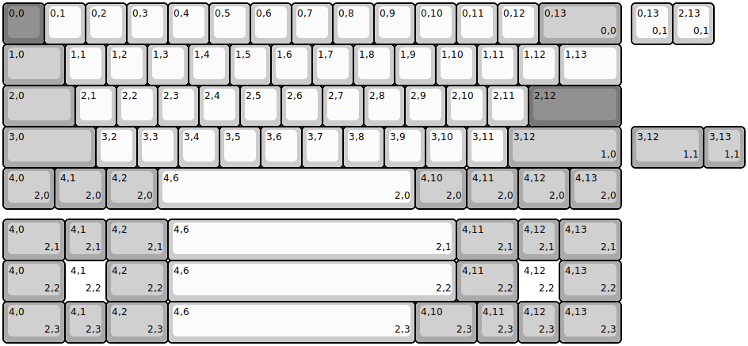{:loading="lazy"}

[Open in keyboard-layout-editor](http://www.keyboard-layout-editor.com/##@@_c=#777777;&=0,0&_c=#cccccc;&=0,1&=0,2&=0,3&=0,4&=0,5&=0,6&=0,7&=0,8&=0,9&=0,10&=0,11&=0,12&_c=#aaaaaa&w:2;&=0,13%0A%0A%0A0,0;&@_w:1.5;&=1,0&_c=#cccccc;&=1,1&=1,2&=1,3&=1,4&=1,5&=1,6&=1,7&=1,8&=1,9&=1,10&=1,11&=1,12&_w:1.5;&=1,13;&@_c=#aaaaaa&w:1.75;&=2,0&_c=#cccccc;&=2,1&=2,2&=2,3&=2,4&=2,5&=2,6&=2,7&=2,8&=2,9&=2,10&=2,11&_c=#777777&w:2.25;&=2,12;&@_c=#aaaaaa&w:2.25;&=3,0&_c=#cccccc;&=3,2&=3,3&=3,4&=3,5&=3,6&=3,7&=3,8&=3,9&=3,10&=3,11&_c=#aaaaaa&w:2.75;&=3,12%0A%0A%0A1,0;&@_w:1.25;&=4,0%0A%0A%0A2,0&_w:1.25;&=4,1%0A%0A%0A2,0&_w:1.25;&=4,2%0A%0A%0A2,0&_c=#cccccc&w:6.25;&=4,6%0A%0A%0A2,0&_c=#aaaaaa&w:1.25;&=4,10%0A%0A%0A2,0&_w:1.25;&=4,11%0A%0A%0A2,0&_w:1.25;&=4,12%0A%0A%0A2,0&_w:1.25;&=4,13%0A%0A%0A2,0;&@_x:15.25&y:-5&c=#cccccc;&=0,13%0A%0A%0A0,1&=2,13%0A%0A%0A0,1;&@_x:15.25&y:2&c=#aaaaaa&w:1.75;&=3,12%0A%0A%0A1,1&=3,13%0A%0A%0A1,1;&@_y:1.25&w:1.5;&=4,0%0A%0A%0A2,1&=4,1%0A%0A%0A2,1&_w:1.5;&=4,2%0A%0A%0A2,1&_c=#cccccc&w:7;&=4,6%0A%0A%0A2,1&_c=#aaaaaa&w:1.5;&=4,11%0A%0A%0A2,1&=4,12%0A%0A%0A2,1&_w:1.5;&=4,13%0A%0A%0A2,1;&@_w:1.5;&=4,0%0A%0A%0A2,2&_d:true;&=4,1%0A%0A%0A2,2&_w:1.5;&=4,2%0A%0A%0A2,2&_c=#cccccc&w:7;&=4,6%0A%0A%0A2,2&_c=#aaaaaa&w:1.5;&=4,11%0A%0A%0A2,2&_d:true;&=4,12%0A%0A%0A2,2&_w:1.5;&=4,13%0A%0A%0A2,2;&@_w:1.5;&=4,0%0A%0A%0A2,3&=4,1%0A%0A%0A2,3&_w:1.5;&=4,2%0A%0A%0A2,3&_c=#cccccc&w:6;&=4,6%0A%0A%0A2,3&_c=#aaaaaa&w:1.5;&=4,10%0A%0A%0A2,3&=4,11%0A%0A%0A2,3&=4,12%0A%0A%0A2,3&_w:1.5;&=4,13%0A%0A%0A2,3)

## wilba_tech/wt60_b

[README](output/wilba_tech/wt60_b/README.md) - [layout](output/wilba_tech/wt60_b/wt60_b-kle.json) - [PCB](output/wilba_tech/wt60_b/wt60_b.kicad_pcb) - [PCB render](output/wilba_tech/wt60_b/wt60_b-render.svg)

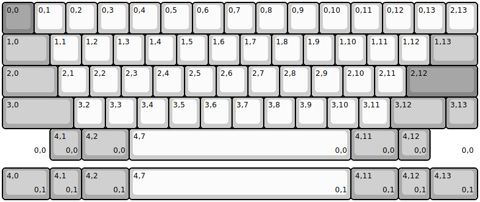{:loading="lazy"}

[Open in keyboard-layout-editor](http://www.keyboard-layout-editor.com/##@@_c=#888888;&=0,0&_c=#cccccc;&=0,1&=0,2&=0,3&=0,4&=0,5&=0,6&=0,7&=0,8&=0,9&=0,10&=0,11&=0,12&=0,13&=2,13;&@_c=#aaaaaa&w:1.5;&=1,0&_c=#cccccc;&=1,1&=1,2&=1,3&=1,4&=1,5&=1,6&=1,7&=1,8&=1,9&=1,10&=1,11&=1,12&_c=#aaaaaa&w:1.5;&=1,13;&@_w:1.75;&=2,0&_c=#cccccc;&=2,1&=2,2&=2,3&=2,4&=2,5&=2,6&=2,7&=2,8&=2,9&=2,10&=2,11&_c=#888888&w:2.25;&=2,12;&@_c=#aaaaaa&w:2.25;&=3,0&_c=#cccccc;&=3,2&=3,3&=3,4&=3,5&=3,6&=3,7&=3,8&=3,9&=3,10&=3,11&_c=#aaaaaa&w:1.75;&=3,12&=3,13;&@_c=#cccccc&w:1.5&d:true;&=%0A%0A%0A0,0&_c=#aaaaaa;&=4,1%0A%0A%0A0,0&_w:1.5;&=4,2%0A%0A%0A0,0&_c=#cccccc&w:7;&=4,7%0A%0A%0A0,0&_c=#aaaaaa&w:1.5;&=4,11%0A%0A%0A0,0&=4,12%0A%0A%0A0,0&_c=#cccccc&w:1.5&d:true;&=%0A%0A%0A0,0;&@_y:0.25&c=#aaaaaa&w:1.5;&=4,0%0A%0A%0A0,1&=4,1%0A%0A%0A0,1&_w:1.5;&=4,2%0A%0A%0A0,1&_c=#cccccc&w:7;&=4,7%0A%0A%0A0,1&_c=#aaaaaa&w:1.5;&=4,11%0A%0A%0A0,1&=4,12%0A%0A%0A0,1&_w:1.5;&=4,13%0A%0A%0A0,1)

## wilba_tech/wt60_bx

[README](output/wilba_tech/wt60_bx/README.md) - [layout](output/wilba_tech/wt60_bx/wt60_bx-kle.json) - [PCB](output/wilba_tech/wt60_bx/wt60_bx.kicad_pcb) - [PCB render](output/wilba_tech/wt60_bx/wt60_bx-render.svg)

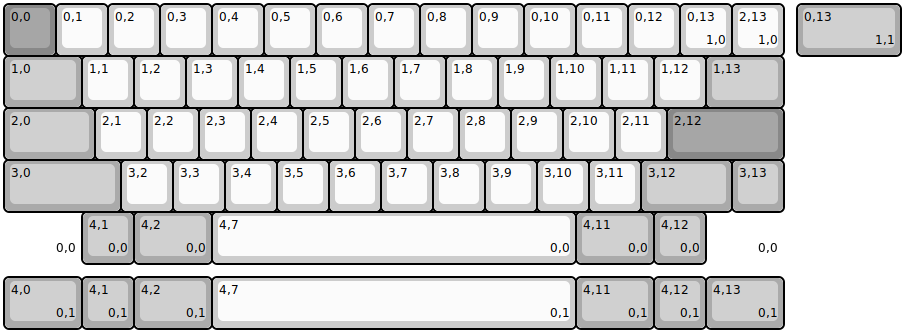{:loading="lazy"}

[Open in keyboard-layout-editor](http://www.keyboard-layout-editor.com/##@@_c=#888888;&=0,0&_c=#cccccc;&=0,1&=0,2&=0,3&=0,4&=0,5&=0,6&=0,7&=0,8&=0,9&=0,10&=0,11&=0,12&=0,13%0A%0A%0A1,0&=2,13%0A%0A%0A1,0;&@_c=#aaaaaa&w:1.5;&=1,0&_c=#cccccc;&=1,1&=1,2&=1,3&=1,4&=1,5&=1,6&=1,7&=1,8&=1,9&=1,10&=1,11&=1,12&_c=#aaaaaa&w:1.5;&=1,13;&@_w:1.75;&=2,0&_c=#cccccc;&=2,1&=2,2&=2,3&=2,4&=2,5&=2,6&=2,7&=2,8&=2,9&=2,10&=2,11&_c=#888888&w:2.25;&=2,12;&@_c=#aaaaaa&w:2.25;&=3,0&_c=#cccccc;&=3,2&=3,3&=3,4&=3,5&=3,6&=3,7&=3,8&=3,9&=3,10&=3,11&_c=#aaaaaa&w:1.75;&=3,12&=3,13;&@_c=#cccccc&w:1.5&d:true;&=%0A%0A%0A0,0&_c=#aaaaaa;&=4,1%0A%0A%0A0,0&_w:1.5;&=4,2%0A%0A%0A0,0&_c=#cccccc&w:7;&=4,7%0A%0A%0A0,0&_c=#aaaaaa&w:1.5;&=4,11%0A%0A%0A0,0&=4,12%0A%0A%0A0,0&_c=#cccccc&w:1.5&d:true;&=%0A%0A%0A0,0;&@_x:15.25&y:-5&c=#aaaaaa&w:2;&=0,13%0A%0A%0A1,1;&@_y:4.25&w:1.5;&=4,0%0A%0A%0A0,1&=4,1%0A%0A%0A0,1&_w:1.5;&=4,2%0A%0A%0A0,1&_c=#cccccc&w:7;&=4,7%0A%0A%0A0,1&_c=#aaaaaa&w:1.5;&=4,11%0A%0A%0A0,1&=4,12%0A%0A%0A0,1&_w:1.5;&=4,13%0A%0A%0A0,1)

## wilba_tech/wt60_c

[README](output/wilba_tech/wt60_c/README.md) - [layout](output/wilba_tech/wt60_c/wt60_c-kle.json) - [PCB](output/wilba_tech/wt60_c/wt60_c.kicad_pcb) - [PCB render](output/wilba_tech/wt60_c/wt60_c-render.svg)

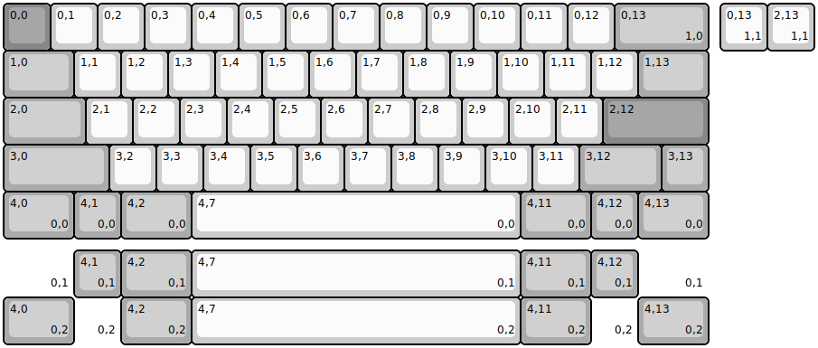{:loading="lazy"}

[Open in keyboard-layout-editor](http://www.keyboard-layout-editor.com/##@@_c=#888888;&=0,0&_c=#cccccc;&=0,1&=0,2&=0,3&=0,4&=0,5&=0,6&=0,7&=0,8&=0,9&=0,10&=0,11&=0,12&_c=#aaaaaa&w:2;&=0,13%0A%0A%0A1,0;&@_w:1.5;&=1,0&_c=#cccccc;&=1,1&=1,2&=1,3&=1,4&=1,5&=1,6&=1,7&=1,8&=1,9&=1,10&=1,11&=1,12&_c=#aaaaaa&w:1.5;&=1,13;&@_w:1.75;&=2,0&_c=#cccccc;&=2,1&=2,2&=2,3&=2,4&=2,5&=2,6&=2,7&=2,8&=2,9&=2,10&=2,11&_c=#888888&w:2.25;&=2,12;&@_c=#aaaaaa&w:2.25;&=3,0&_c=#cccccc;&=3,2&=3,3&=3,4&=3,5&=3,6&=3,7&=3,8&=3,9&=3,10&=3,11&_c=#aaaaaa&w:1.75;&=3,12&=3,13;&@_w:1.5;&=4,0%0A%0A%0A0,0&=4,1%0A%0A%0A0,0&_w:1.5;&=4,2%0A%0A%0A0,0&_c=#cccccc&w:7;&=4,7%0A%0A%0A0,0&_c=#aaaaaa&w:1.5;&=4,11%0A%0A%0A0,0&=4,12%0A%0A%0A0,0&_w:1.5;&=4,13%0A%0A%0A0,0;&@_x:15.25&y:-5&c=#cccccc;&=0,13%0A%0A%0A1,1&=2,13%0A%0A%0A1,1;&@_y:4.25&w:1.5&d:true;&=%0A%0A%0A0,1&_c=#aaaaaa;&=4,1%0A%0A%0A0,1&_w:1.5;&=4,2%0A%0A%0A0,1&_c=#cccccc&w:7;&=4,7%0A%0A%0A0,1&_c=#aaaaaa&w:1.5;&=4,11%0A%0A%0A0,1&=4,12%0A%0A%0A0,1&_c=#cccccc&w:1.5&d:true;&=%0A%0A%0A0,1;&@_c=#aaaaaa&w:1.5;&=4,0%0A%0A%0A0,2&_d:true;&=%0A%0A%0A0,2&_w:1.5;&=4,2%0A%0A%0A0,2&_c=#cccccc&w:7;&=4,7%0A%0A%0A0,2&_c=#aaaaaa&w:1.5;&=4,11%0A%0A%0A0,2&_d:true;&=%0A%0A%0A0,2&_w:1.5;&=4,13%0A%0A%0A0,2)

## wilba_tech/wt60_d

[README](output/wilba_tech/wt60_d/README.md) - [layout](output/wilba_tech/wt60_d/wt60_d-kle.json) - [PCB](output/wilba_tech/wt60_d/wt60_d.kicad_pcb) - [PCB render](output/wilba_tech/wt60_d/wt60_d-render.svg)

{:loading="lazy"}

[Open in keyboard-layout-editor](http://www.keyboard-layout-editor.com/##@@_x:2.5&c=#777777;&=0,0&_c=#cccccc;&=0,3&=0,2&=0,1&=0,4&=0,5&=0,6&=0,7&=0,8&=0,9&=0,12&=0,11&=0,10&_c=#aaaaaa&w:2;&=0,13%0A%0A%0A0,0;&@_x:2.5&w:1.5;&=1,0&_c=#cccccc;&=1,1&=1,2&=1,3&=1,4&=1,5&=1,6&=1,7&=1,8&=1,9&=1,10&=1,11&=1,12&_w:1.5;&=1,13%0A%0A%0A1,0;&@_x:2.5&c=#aaaaaa&w:1.75;&=2,0&_c=#cccccc;&=2,1&=2,2&=2,3&=2,4&=2,5&=2,6&=2,7&=2,8&=2,9&=2,10&=2,11&_c=#777777&w:2.25;&=2,12%0A%0A%0A1,0;&@_x:2.5&c=#aaaaaa&w:2.25;&=3,0%0A%0A%0A2,0&_c=#cccccc;&=3,2&=3,3&=3,4&=3,5&=3,6&=3,7&=3,8&=3,9&=3,10&=3,11&_c=#aaaaaa&w:2.75;&=3,12%0A%0A%0A3,0;&@_x:2.5&w:1.25;&=4,0%0A%0A%0A4,0&_w:1.25;&=4,1%0A%0A%0A4,0&_w:1.25;&=4,2%0A%0A%0A4,0&_c=#cccccc&w:6.25;&=4,3%0A%0A%0A4,0&_c=#aaaaaa&w:1.25;&=4,10%0A%0A%0A4,0&_w:1.25;&=4,11%0A%0A%0A4,0&_w:1.25;&=4,12%0A%0A%0A4,0&_w:1.25;&=4,13%0A%0A%0A4,0;&@_x:18.0&y:-5&c=#cccccc;&=0,13%0A%0A%0A0,1&=2,13%0A%0A%0A0,1;&@_x:18.75&c=#777777&w:1.25&h:2&w2:1.5&h2:1&x2:-0.25;&=1,13%0A%0A%0A1,1;&@_x:17.75&c=#cccccc;&=2,12%0A%0A%0A1,1;&@_c=#aaaaaa&w:1.25;&=3,0%0A%0A%0A2,1&=3,1%0A%0A%0A2,1&_x:15.5&w:1.75;&=3,12%0A%0A%0A3,1&=3,13%0A%0A%0A3,1;&@_x:2.5&y:1.5&w:1.5;&=4,0%0A%0A%0A4,1&=4,1%0A%0A%0A4,1&_w:1.5;&=4,2%0A%0A%0A4,1&_c=#cccccc&w:7;&=4,3%0A%0A%0A4,1&_c=#aaaaaa&w:1.5;&=4,11%0A%0A%0A4,1&=4,12%0A%0A%0A4,1&_w:1.5;&=4,13%0A%0A%0A4,1;&@_x:2.5&w:1.5&d:true;&=4,0%0A%0A%0A4,2&=4,1%0A%0A%0A4,2&_w:1.5;&=4,2%0A%0A%0A4,2&_c=#cccccc&w:7;&=4,3%0A%0A%0A4,2&_c=#aaaaaa&w:1.5;&=4,11%0A%0A%0A4,2&=4,12%0A%0A%0A4,2&_w:1.5&d:true;&=4,13%0A%0A%0A4,2;&@_x:2.5&w:1.5;&=4,0%0A%0A%0A4,3&_d:true;&=4,1%0A%0A%0A4,3&_w:1.5;&=4,2%0A%0A%0A4,3&_c=#cccccc&w:7;&=4,3%0A%0A%0A4,3&_c=#aaaaaa&w:1.5;&=4,11%0A%0A%0A4,3&_d:true;&=4,12%0A%0A%0A4,3&_w:1.5;&=4,13%0A%0A%0A4,3)

## wilba_tech/wt60_e

[README](output/wilba_tech/wt60_e/README.md) - [layout](output/wilba_tech/wt60_e/wt60_e-kle.json) - [PCB](output/wilba_tech/wt60_e/wt60_e.kicad_pcb) - [PCB render](output/wilba_tech/wt60_e/wt60_e-render.svg)

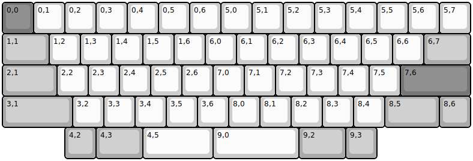{:loading="lazy"}

[Open in keyboard-layout-editor](http://www.keyboard-layout-editor.com/##@@_c=#777777;&=0,0&_c=#cccccc;&=0,1&=0,2&=0,3&=0,4&=0,5&=0,6&=5,0&=5,1&=5,2&=5,3&=5,4&=5,5&=5,6&=5,7;&@_c=#aaaaaa&w:1.5;&=1,1&_c=#cccccc;&=1,2&=1,3&=1,4&=1,5&=1,6&=6,0&=6,1&=6,2&=6,3&=6,4&=6,5&=6,6&_c=#aaaaaa&w:1.5;&=6,7;&@_w:1.75;&=2,1&_c=#cccccc;&=2,2&=2,3&=2,4&=2,5&=2,6&=7,0&=7,1&=7,2&=7,3&=7,4&=7,5&_c=#777777&w:2.25;&=7,6;&@_c=#aaaaaa&w:2.25;&=3,1&_c=#cccccc;&=3,2&=3,3&=3,4&=3,5&=3,6&=8,0&=8,1&=8,2&=8,3&=8,4&_c=#aaaaaa&w:1.75;&=8,5&=8,6;&@_x:2;&=4,2&_w:1.5;&=4,3&_c=#cccccc&w:2.25;&=4,5&_w:2.75;&=9,0&_c=#aaaaaa&w:1.5;&=9,2&=9,3)

## wilba_tech/wt60_g

[README](output/wilba_tech/wt60_g/README.md) - [layout](output/wilba_tech/wt60_g/wt60_g-kle.json) - [PCB](output/wilba_tech/wt60_g/wt60_g.kicad_pcb) - [PCB render](output/wilba_tech/wt60_g/wt60_g-render.svg)

{:loading="lazy"}

[Open in keyboard-layout-editor](http://www.keyboard-layout-editor.com/##@@_x:2.5&c=#777777;&=0,0&_c=#cccccc;&=0,1&=0,2&=0,3&=0,4&=0,5&=0,6&=0,7&=0,8&=0,9&=0,10&=0,11&=0,12&_c=#aaaaaa&w:2;&=0,13%0A%0A%0A0,0;&@_x:2.5&w:1.5;&=1,0&_c=#cccccc;&=1,1&=1,2&=1,3&=1,4&=1,5&=1,6&=1,7&=1,8&=1,9&=1,10&=1,11&=1,12&_w:1.5;&=1,13%0A%0A%0A1,0;&@_x:2.5&c=#aaaaaa&w:1.75;&=2,0&_c=#cccccc;&=2,1&=2,2&=2,3&=2,4&=2,5&=2,6&=2,7&=2,8&=2,9&=2,10&=2,11&_c=#777777&w:2.25;&=2,12%0A%0A%0A1,0;&@_x:2.5&c=#aaaaaa&w:2.25;&=3,0%0A%0A%0A2,0&_c=#cccccc;&=3,2&=3,3&=3,4&=3,5&=3,6&=3,7&=3,8&=3,9&=3,10&=3,11&_c=#aaaaaa&w:2.75;&=3,12%0A%0A%0A3,0;&@_x:2.5&w:1.25;&=4,0%0A%0A%0A4,0&_w:1.25;&=4,1%0A%0A%0A4,0&_w:1.25;&=4,2%0A%0A%0A4,0&_c=#cccccc&w:6.25;&=4,6%0A%0A%0A4,0&_c=#aaaaaa&w:1.25;&=4,10%0A%0A%0A4,0&_w:1.25;&=4,11%0A%0A%0A4,0&_w:1.25;&=4,12%0A%0A%0A4,0&_w:1.25;&=4,13%0A%0A%0A4,0;&@_x:18.0&y:-5&c=#cccccc;&=0,13%0A%0A%0A0,1&=2,13%0A%0A%0A0,1;&@_x:18.75&c=#777777&w:1.25&h:2&w2:1.5&h2:1&x2:-0.25;&=1,13%0A%0A%0A1,1;&@_x:17.75&c=#cccccc;&=2,12%0A%0A%0A1,1;&@_c=#aaaaaa&w:1.25;&=3,0%0A%0A%0A2,1&=3,1%0A%0A%0A2,1&_x:15.5&w:1.75;&=3,12%0A%0A%0A3,1&=3,13%0A%0A%0A3,1;&@_x:2.5&y:1.5&w:1.5;&=4,0%0A%0A%0A4,1&=4,1%0A%0A%0A4,1&_w:1.5;&=4,2%0A%0A%0A4,1&_c=#cccccc&w:7;&=4,6%0A%0A%0A4,1&_c=#aaaaaa&w:1.5;&=4,11%0A%0A%0A4,1&=4,12%0A%0A%0A4,1&_w:1.5;&=4,13%0A%0A%0A4,1;&@_x:2.5&w:1.5&d:true;&=4,0%0A%0A%0A4,2&=4,1%0A%0A%0A4,2&_w:1.5;&=4,2%0A%0A%0A4,2&_c=#cccccc&w:7;&=4,6%0A%0A%0A4,2&_c=#aaaaaa&w:1.5;&=4,11%0A%0A%0A4,2&=4,12%0A%0A%0A4,2&_w:1.5&d:true;&=4,13%0A%0A%0A4,2;&@_x:2.5&w:1.5;&=4,0%0A%0A%0A4,3&_d:true;&=4,1%0A%0A%0A4,3&_w:1.5;&=4,2%0A%0A%0A4,3&_c=#cccccc&w:7;&=4,6%0A%0A%0A4,3&_c=#aaaaaa&w:1.5;&=4,11%0A%0A%0A4,3&_d:true;&=4,12%0A%0A%0A4,3&_w:1.5;&=4,13%0A%0A%0A4,3)

## wilba_tech/wt60_g2

[README](output/wilba_tech/wt60_g2/README.md) - [layout](output/wilba_tech/wt60_g2/wt60_g2-kle.json) - [PCB](output/wilba_tech/wt60_g2/wt60_g2.kicad_pcb) - [PCB render](output/wilba_tech/wt60_g2/wt60_g2-render.svg)

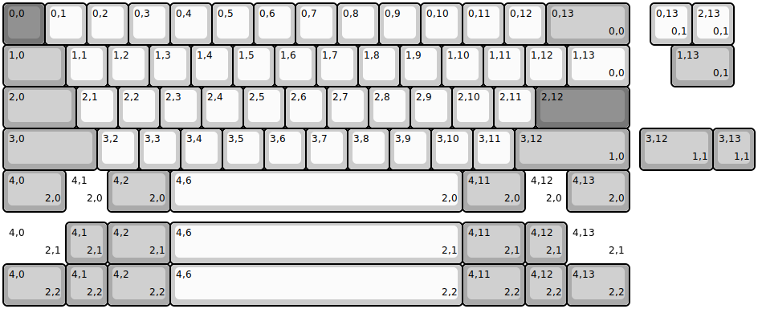{:loading="lazy"}

[Open in keyboard-layout-editor](http://www.keyboard-layout-editor.com/##@@_c=#777777;&=0,0&_c=#cccccc;&=0,1&=0,2&=0,3&=0,4&=0,5&=0,6&=0,7&=0,8&=0,9&=0,10&=0,11&=0,12&_c=#aaaaaa&w:2;&=0,13%0A%0A%0A0,0;&@_w:1.5;&=1,0&_c=#cccccc;&=1,1&=1,2&=1,3&=1,4&=1,5&=1,6&=1,7&=1,8&=1,9&=1,10&=1,11&=1,12&_w:1.5;&=1,13%0A%0A%0A0,0;&@_c=#aaaaaa&w:1.75;&=2,0&_c=#cccccc;&=2,1&=2,2&=2,3&=2,4&=2,5&=2,6&=2,7&=2,8&=2,9&=2,10&=2,11&_c=#777777&w:2.25;&=2,12;&@_c=#aaaaaa&w:2.25;&=3,0&_c=#cccccc;&=3,2&=3,3&=3,4&=3,5&=3,6&=3,7&=3,8&=3,9&=3,10&=3,11&_c=#aaaaaa&w:2.75;&=3,12%0A%0A%0A1,0;&@_w:1.5;&=4,0%0A%0A%0A2,0&_d:true;&=4,1%0A%0A%0A2,0&_w:1.5;&=4,2%0A%0A%0A2,0&_c=#cccccc&w:7;&=4,6%0A%0A%0A2,0&_c=#aaaaaa&w:1.5;&=4,11%0A%0A%0A2,0&_d:true;&=4,12%0A%0A%0A2,0&_w:1.5;&=4,13%0A%0A%0A2,0;&@_x:15.5&y:-5&c=#cccccc;&=0,13%0A%0A%0A0,1&=2,13%0A%0A%0A0,1;&@_x:16.0&c=#aaaaaa&w:1.5;&=1,13%0A%0A%0A0,1;&@_x:15.25&y:1&w:1.75;&=3,12%0A%0A%0A1,1&=3,13%0A%0A%0A1,1;&@_y:1.25&w:1.5&d:true;&=4,0%0A%0A%0A2,1&=4,1%0A%0A%0A2,1&_w:1.5;&=4,2%0A%0A%0A2,1&_c=#cccccc&w:7;&=4,6%0A%0A%0A2,1&_c=#aaaaaa&w:1.5;&=4,11%0A%0A%0A2,1&=4,12%0A%0A%0A2,1&_w:1.5&d:true;&=4,13%0A%0A%0A2,1;&@_w:1.5;&=4,0%0A%0A%0A2,2&=4,1%0A%0A%0A2,2&_w:1.5;&=4,2%0A%0A%0A2,2&_c=#cccccc&w:7;&=4,6%0A%0A%0A2,2&_c=#aaaaaa&w:1.5;&=4,11%0A%0A%0A2,2&=4,12%0A%0A%0A2,2&_w:1.5;&=4,13%0A%0A%0A2,2)

## wilba_tech/wt60_h1

[README](output/wilba_tech/wt60_h1/README.md) - [layout](output/wilba_tech/wt60_h1/wt60_h1-kle.json) - [PCB](output/wilba_tech/wt60_h1/wt60_h1.kicad_pcb) - [PCB render](output/wilba_tech/wt60_h1/wt60_h1-render.svg)

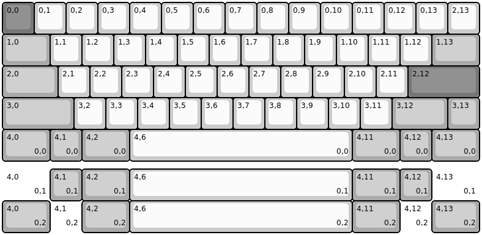{:loading="lazy"}

[Open in keyboard-layout-editor](http://www.keyboard-layout-editor.com/##@@_c=#777777;&=0,0&_c=#cccccc;&=0,1&=0,2&=0,3&=0,4&=0,5&=0,6&=0,7&=0,8&=0,9&=0,10&=0,11&=0,12&=0,13&=2,13;&@_c=#aaaaaa&w:1.5;&=1,0&_c=#cccccc;&=1,1&=1,2&=1,3&=1,4&=1,5&=1,6&=1,7&=1,8&=1,9&=1,10&=1,11&=1,12&_c=#aaaaaa&w:1.5;&=1,13;&@_w:1.75;&=2,0&_c=#cccccc;&=2,1&=2,2&=2,3&=2,4&=2,5&=2,6&=2,7&=2,8&=2,9&=2,10&=2,11&_c=#777777&w:2.25;&=2,12;&@_c=#aaaaaa&w:2.25;&=3,0&_c=#cccccc;&=3,2&=3,3&=3,4&=3,5&=3,6&=3,7&=3,8&=3,9&=3,10&=3,11&_c=#aaaaaa&w:1.75;&=3,12&=3,13;&@_w:1.5;&=4,0%0A%0A%0A0,0&=4,1%0A%0A%0A0,0&_w:1.5;&=4,2%0A%0A%0A0,0&_c=#cccccc&w:7;&=4,6%0A%0A%0A0,0&_c=#aaaaaa&w:1.5;&=4,11%0A%0A%0A0,0&=4,12%0A%0A%0A0,0&_w:1.5;&=4,13%0A%0A%0A0,0;&@_y:0.25&w:1.5&d:true;&=4,0%0A%0A%0A0,1&=4,1%0A%0A%0A0,1&_w:1.5;&=4,2%0A%0A%0A0,1&_c=#cccccc&w:7;&=4,6%0A%0A%0A0,1&_c=#aaaaaa&w:1.5;&=4,11%0A%0A%0A0,1&=4,12%0A%0A%0A0,1&_w:1.5&d:true;&=4,13%0A%0A%0A0,1;&@_w:1.5;&=4,0%0A%0A%0A0,2&_d:true;&=4,1%0A%0A%0A0,2&_w:1.5;&=4,2%0A%0A%0A0,2&_c=#cccccc&w:7;&=4,6%0A%0A%0A0,2&_c=#aaaaaa&w:1.5;&=4,11%0A%0A%0A0,2&_d:true;&=4,12%0A%0A%0A0,2&_w:1.5;&=4,13%0A%0A%0A0,2)

## wilba_tech/wt60_h2

[README](output/wilba_tech/wt60_h2/README.md) - [layout](output/wilba_tech/wt60_h2/wt60_h2-kle.json) - [PCB](output/wilba_tech/wt60_h2/wt60_h2.kicad_pcb) - [PCB render](output/wilba_tech/wt60_h2/wt60_h2-render.svg)

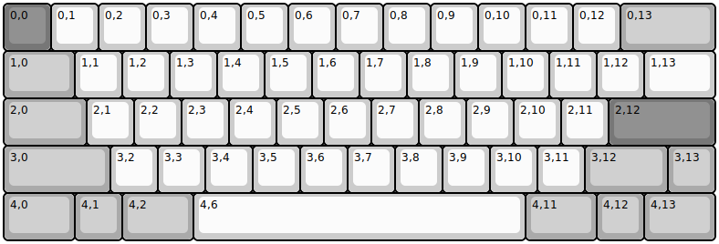{:loading="lazy"}

[Open in keyboard-layout-editor](http://www.keyboard-layout-editor.com/##@@_c=#777777;&=0,0&_c=#cccccc;&=0,1&=0,2&=0,3&=0,4&=0,5&=0,6&=0,7&=0,8&=0,9&=0,10&=0,11&=0,12&_c=#aaaaaa&w:2;&=0,13;&@_w:1.5;&=1,0&_c=#cccccc;&=1,1&=1,2&=1,3&=1,4&=1,5&=1,6&=1,7&=1,8&=1,9&=1,10&=1,11&=1,12&_w:1.5;&=1,13;&@_c=#aaaaaa&w:1.75;&=2,0&_c=#cccccc;&=2,1&=2,2&=2,3&=2,4&=2,5&=2,6&=2,7&=2,8&=2,9&=2,10&=2,11&_c=#777777&w:2.25;&=2,12;&@_c=#aaaaaa&w:2.25;&=3,0&_c=#cccccc;&=3,2&=3,3&=3,4&=3,5&=3,6&=3,7&=3,8&=3,9&=3,10&=3,11&_c=#aaaaaa&w:1.75;&=3,12&=3,13;&@_w:1.5;&=4,0&=4,1&_w:1.5;&=4,2&_c=#cccccc&w:7;&=4,6&_c=#aaaaaa&w:1.5;&=4,11&=4,12&_w:1.5;&=4,13)

## wilba_tech/wt60_h3

[README](output/wilba_tech/wt60_h3/README.md) - [layout](output/wilba_tech/wt60_h3/wt60_h3-kle.json) - [PCB](output/wilba_tech/wt60_h3/wt60_h3.kicad_pcb) - [PCB render](output/wilba_tech/wt60_h3/wt60_h3-render.svg)

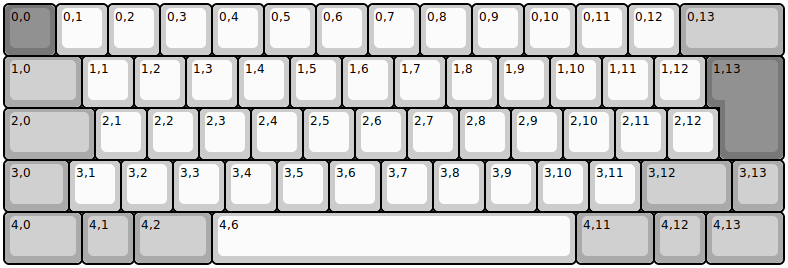{:loading="lazy"}

[Open in keyboard-layout-editor](http://www.keyboard-layout-editor.com/##@@_c=#777777;&=0,0&_c=#cccccc;&=0,1&=0,2&=0,3&=0,4&=0,5&=0,6&=0,7&=0,8&=0,9&=0,10&=0,11&=0,12&_c=#aaaaaa&w:2;&=0,13;&@_w:1.5;&=1,0&_c=#cccccc;&=1,1&=1,2&=1,3&=1,4&=1,5&=1,6&=1,7&=1,8&=1,9&=1,10&=1,11&=1,12&_x:0.25&c=#777777&w:1.25&h:2&w2:1.5&h2:1&x2:-0.25;&=1,13;&@_c=#aaaaaa&w:1.75;&=2,0&_c=#cccccc;&=2,1&=2,2&=2,3&=2,4&=2,5&=2,6&=2,7&=2,8&=2,9&=2,10&=2,11&=2,12;&@_c=#aaaaaa&w:1.25;&=3,0&_c=#cccccc;&=3,1&=3,2&=3,3&=3,4&=3,5&=3,6&=3,7&=3,8&=3,9&=3,10&=3,11&_c=#aaaaaa&w:1.75;&=3,12&=3,13;&@_w:1.5;&=4,0&=4,1&_w:1.5;&=4,2&_c=#cccccc&w:7;&=4,6&_c=#aaaaaa&w:1.5;&=4,11&=4,12&_w:1.5;&=4,13)

## wilba_tech/wt60_kh1

[README](output/wilba_tech/wt60_kh1/README.md) - [layout](output/wilba_tech/wt60_kh1/wt60_kh1-kle.json) - [PCB](output/wilba_tech/wt60_kh1/wt60_kh1.kicad_pcb) - [PCB render](output/wilba_tech/wt60_kh1/wt60_kh1-render.svg)

{:loading="lazy"}

[Open in keyboard-layout-editor](http://www.keyboard-layout-editor.com/##@@_c=#777777;&=0,0&_c=#cccccc;&=0,1&=0,2&=0,3&=0,4&=0,5&=0,6&=0,7&=0,8&=0,9&=0,10&=0,11&=0,12&=0,13&=2,13;&@_c=#aaaaaa&w:1.5;&=1,0&_c=#cccccc;&=1,1&=1,2&=1,3&=1,4&=1,5&=1,6&=1,7&=1,8&=1,9&=1,10&=1,11&=1,12&_c=#aaaaaa&w:1.5;&=1,13;&@_w:1.75;&=2,0&_c=#cccccc;&=2,1&=2,2&=2,3&=2,4&=2,5&=2,6&=2,7&=2,8&=2,9&=2,10&=2,11&_c=#777777&w:2.25;&=2,12;&@_c=#aaaaaa&w:2.25;&=3,0&_c=#cccccc;&=3,2&=3,3&=3,4&=3,5&=3,6&=3,7&=3,8&=3,9&=3,10&=3,11&_c=#aaaaaa&w:1.75;&=3,12&=3,13;&@_w:1.5;&=4,0%0A%0A%0A0,0&=4,1%0A%0A%0A0,0&_w:1.5;&=4,2%0A%0A%0A0,0&_c=#cccccc&w:7;&=4,6%0A%0A%0A0,0&_c=#aaaaaa&w:1.5;&=4,11%0A%0A%0A0,0&=4,12%0A%0A%0A0,0&_w:1.5;&=4,13%0A%0A%0A0,0;&@_y:0.25&w:1.5&d:true;&=4,0%0A%0A%0A0,1&=4,1%0A%0A%0A0,1&_w:1.5;&=4,2%0A%0A%0A0,1&_c=#cccccc&w:7;&=4,6%0A%0A%0A0,1&_c=#aaaaaa&w:1.5;&=4,11%0A%0A%0A0,1&=4,12%0A%0A%0A0,1&_w:1.5&d:true;&=4,13%0A%0A%0A0,1;&@_w:1.5;&=4,0%0A%0A%0A0,2&_d:true;&=4,1%0A%0A%0A0,2&_w:1.5;&=4,2%0A%0A%0A0,2&_c=#cccccc&w:7;&=4,6%0A%0A%0A0,2&_c=#aaaaaa&w:1.5;&=4,11%0A%0A%0A0,2&_d:true;&=4,12%0A%0A%0A0,2&_w:1.5;&=4,13%0A%0A%0A0,2)

## wilba_tech/wt60_lh1

[README](output/wilba_tech/wt60_lh1/README.md) - [layout](output/wilba_tech/wt60_lh1/wt60_lh1-kle.json) - [PCB](output/wilba_tech/wt60_lh1/wt60_lh1.kicad_pcb) - [PCB render](output/wilba_tech/wt60_lh1/wt60_lh1-render.svg)

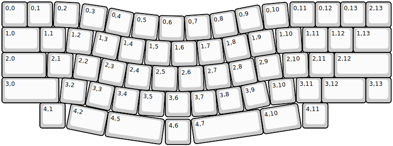{:loading="lazy"}

[Open in keyboard-layout-editor](http://www.keyboard-layout-editor.com/##@@_rx:0.5&ry:0.5&x:-0.5&y:-0.5;&=0,0;&@_rx:0.75&ry:1.5&x:-0.75&y:-0.5&w:1.5;&=1,0;&@_rx:0.88&ry:2.5&x:-0.88&y:-0.5&w:1.75;&=2,0;&@_rx:1.13&ry:3.5&x:-1.13&y:-0.5&w:2.25;&=3,0;&@_rx:1.5&ry:0.5&x:-0.5&y:-0.5;&=0,1;&@_rx:2&ry:4.5&x:-0.5&y:-0.5;&=4,1;&@_rx:6.96&ry:4.05&x:-0.5&y:-0.5;&=3,6;&@_ry:5.15&x:-0.5&y:-0.5;&=4,6;&@_rx:11.89&ry:0.5&x:-0.5&y:-0.5;&=0,11;&@_rx:12.14&ry:3.5&x:-0.5&y:-0.5;&=3,11;&@_rx:12.39&ry:1.5&x:-0.5&y:-0.5;&=1,11;&@_ry:4.5&x:-0.5&y:-0.5;&=4,11;&@_rx:12.64&ry:2.5&x:-0.5&y:-0.5;&=2,11;&@_rx:12.89&ry:0.5&x:-0.5&y:-0.5;&=0,12;&@_rx:13.39&ry:1.5&x:-0.5&y:-0.5;&=1,12;&@_rx:13.52&ry:3.5&x:-0.88&y:-0.5&w:1.75;&=3,12;&@_rx:13.89&ry:0.5&x:-0.5&y:-0.5;&=0,13;&@_rx:14.27&ry:2.5&x:-1.13&y:-0.5&w:2.25;&=2,12;&@_rx:14.64&ry:1.5&x:-0.75&y:-0.5&w:1.5;&=1,13;&@_rx:14.89&ry:0.5&x:-0.5&y:-0.5;&=2,13;&@_ry:3.5&x:-0.5&y:-0.5;&=3,13;&@_r:0.34&rx:2.01&ry:1.5&x:-0.5&y:-0.5;&=1,1;&@_r:1.24&rx:6.71&ry:1.05&x:-0.5&y:-0.5;&=0,6;&@_r:2.11&rx:2.3&ry:2.51&x:-0.5&y:-0.5;&=2,1;&@_r:2.23&rx:6.44&ry:3.04&x:-0.5&y:-0.51;&=2,5;&@_r:3&rx:2.56&ry:0.51&x:-0.5&y:-0.5;&=0,2;&@_r:3.67&rx:6.17&ry:2.02&x:-0.5&y:-0.5;&=1,5;&@_r:4.1&rx:5.93&ry:4.01&x:-0.5&y:-0.5;&=3,5;&@_r:5.87&rx:2.84&ry:3.54&x:-0.5&y:-0.5;&=3,2;&@_r:6.04&rx:3.08&ry:1.56&x:-0.5&y:-0.5;&=1,2;&@_r:6.48&rx:5.68&ry:0.97&x:-0.5&y:-0.5;&=0,5;&@_r:6.69&rx:5.4&ry:2.96&x:-0.5&y:-0.5;&=2,4;&@_r:8.2&rx:4.91&ry:3.9&x:-0.5&y:-0.5;&=3,4;&@_rx:5.26&ry:4.98&x:-1.12&y:-0.5&w:2.25;&=4,5;&@_r:8.21&rx:3.63&ry:0.62&x:-0.5&y:-0.5;&=0,3;&@_r:8.41&rx:3.37&ry:2.6&x:-0.5&y:-0.5;&=2,2;&@_r:8.49&rx:5.14&ry:1.91&x:-0.5&y:-0.5;&=1,4;&@_r:11.09&rx:4.39&ry:2.79&x:-0.5&y:-0.5;&=2,3;&@_r:11.5&rx:3.39&ry:4.66&x:-0.75&y:-0.5&w:1.5;&=4,2;&@_r:11.71&rx:4.66&ry:0.81&x:-0.5&y:-0.5;&=0,4;&@_r:11.75&rx:4.14&ry:1.72&x:-0.5&y:-0.5;&=1,3;&@_r:12.3&rx:3.9&ry:3.71&x:-0.5&y:-0.5;&=3,3;&@_r:-12.3&rx:10.01&ry:3.73&x:-0.5&y:-0.5;&=3,9;&@_r:-11.09&rx:9.52&ry:2.81&x:-0.5&y:-0.5;&=2,8;&@_r:-10.78&rx:9.26&ry:1.84&x:-0.5&y:-0.5;&=1,8;&@_r:-10.76&rx:9.77&ry:0.71&x:-0.5&y:-0.5;&=0,9;&@_r:-9.23&rx:8.77&ry:0.91&x:-0.5&y:-0.5;&=0,8;&@_r:-9.04&rx:10.27&ry:1.64&x:-0.5&y:-0.5;&=1,9;&@_r:-9.03&rx:11.01&ry:4.64&x:-0.75&y:-0.5&w:1.5;&=4,10;&@_r:-8.41&rx:10.54&ry:2.61&x:-0.5&y:-0.5;&=2,9;&@_r:-8.2&rx:8.9&ry:4.95&x:-1.38&y:-0.5&w:2.75;&=4,7;&@_rx:9&ry:3.91&x:-0.5&y:-0.5;&=3,8;&@_r:-6.69&rx:8.51&ry:2.96&x:-0.5&y:-0.5;&=2,7;&@_r:-5.96&rx:8.24&ry:1.99&x:-0.5&y:-0.5;&=1,7;&@_r:-5.87&rx:11.07&ry:3.55&x:-0.5&y:-0.5;&=3,10;&@_r:-5.6&rx:10.82&ry:0.56&x:-0.5&y:-0.5;&=0,10;&@_r:-4.1&rx:7.98&ry:4.02&x:-0.5&y:-0.5;&=3,7;&@_r:-3.99&rx:7.74&ry:1.02&x:-0.5&y:-0.5;&=0,7;&@_r:-3.34&rx:11.34&ry:1.52&x:-0.5&y:-0.5;&=1,10;&@_r:-2.23&rx:7.47&ry:3.04&x:-0.5&y:-0.5;&=2,6;&@_r:-2.11&rx:11.61&ry:2.51&x:-0.5&y:-0.5;&=2,10;&@_r:-1.14&rx:7.2&ry:2.05&x:-0.5&y:-0.5;&=1,6)

## wilba_tech/wt60_xt

[README](output/wilba_tech/wt60_xt/README.md) - [layout](output/wilba_tech/wt60_xt/wt60_xt-kle.json) - [PCB](output/wilba_tech/wt60_xt/wt60_xt.kicad_pcb) - [PCB render](output/wilba_tech/wt60_xt/wt60_xt-render.svg)

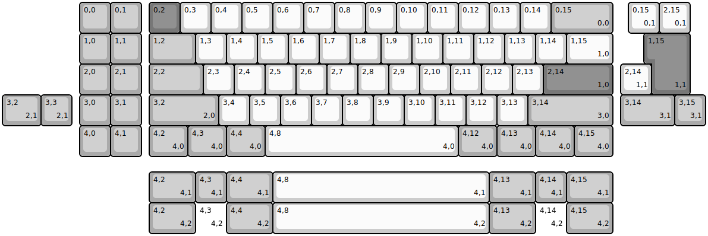{:loading="lazy"}

[Open in keyboard-layout-editor](http://www.keyboard-layout-editor.com/##@@_x:2.5&c=#aaaaaa;&=0,0&=0,1&_x:0.25&c=#777777;&=0,2&_c=#cccccc;&=0,3&=0,4&=0,5&=0,6&=0,7&=0,8&=0,9&=0,10&=0,11&=0,12&=0,13&=0,14&_c=#aaaaaa&w:2;&=0,15%0A%0A%0A0,0;&@_x:2.5;&=1,0&=1,1&_x:0.25&w:1.5;&=1,2&_c=#cccccc;&=1,3&=1,4&=1,5&=1,6&=1,7&=1,8&=1,9&=1,10&=1,11&=1,12&=1,13&=1,14&_w:1.5;&=1,15%0A%0A%0A1,0;&@_x:2.5&c=#aaaaaa;&=2,0&=2,1&_x:0.25&w:1.75;&=2,2&_c=#cccccc;&=2,3&=2,4&=2,5&=2,6&=2,7&=2,8&=2,9&=2,10&=2,11&=2,12&=2,13&_c=#777777&w:2.25;&=2,14%0A%0A%0A1,0;&@_x:2.5&c=#aaaaaa;&=3,0&=3,1&_x:0.25&w:2.25;&=3,2%0A%0A%0A2,0&_c=#cccccc;&=3,4&=3,5&=3,6&=3,7&=3,8&=3,9&=3,10&=3,11&=3,12&=3,13&_c=#aaaaaa&w:2.75;&=3,14%0A%0A%0A3,0;&@_x:2.5;&=4,0&=4,1&_x:0.25&w:1.25;&=4,2%0A%0A%0A4,0&_w:1.25;&=4,3%0A%0A%0A4,0&_w:1.25;&=4,4%0A%0A%0A4,0&_c=#cccccc&w:6.25;&=4,8%0A%0A%0A4,0&_c=#aaaaaa&w:1.25;&=4,12%0A%0A%0A4,0&_w:1.25;&=4,13%0A%0A%0A4,0&_w:1.25;&=4,14%0A%0A%0A4,0&_w:1.25;&=4,15%0A%0A%0A4,0;&@_x:20.25&y:-5&c=#cccccc;&=0,15%0A%0A%0A0,1&=2,15%0A%0A%0A0,1;&@_x:21.0&c=#777777&w:1.25&h:2&w2:1.5&h2:1&x2:-0.25;&=1,15%0A%0A%0A1,1;&@_x:20.0&c=#cccccc;&=2,14%0A%0A%0A1,1;&@_c=#aaaaaa&w:1.25;&=3,2%0A%0A%0A2,1&=3,3%0A%0A%0A2,1&_x:17.75&w:1.75;&=3,14%0A%0A%0A3,1&=3,15%0A%0A%0A3,1;&@_x:4.75&y:1.5&w:1.5;&=4,2%0A%0A%0A4,1&=4,3%0A%0A%0A4,1&_w:1.5;&=4,4%0A%0A%0A4,1&_c=#cccccc&w:7;&=4,8%0A%0A%0A4,1&_c=#aaaaaa&w:1.5;&=4,13%0A%0A%0A4,1&=4,14%0A%0A%0A4,1&_w:1.5;&=4,15%0A%0A%0A4,1;&@_x:4.75&w:1.5;&=4,2%0A%0A%0A4,2&_d:true;&=4,3%0A%0A%0A4,2&_w:1.5;&=4,4%0A%0A%0A4,2&_c=#cccccc&w:7;&=4,8%0A%0A%0A4,2&_c=#aaaaaa&w:1.5;&=4,13%0A%0A%0A4,2&_d:true;&=4,14%0A%0A%0A4,2&_w:1.5;&=4,15%0A%0A%0A4,2)

## wilba_tech/wt60_xth

[README](output/wilba_tech/wt60_xth/README.md) - [layout](output/wilba_tech/wt60_xth/wt60_xth-kle.json) - [PCB](output/wilba_tech/wt60_xth/wt60_xth.kicad_pcb) - [PCB render](output/wilba_tech/wt60_xth/wt60_xth-render.svg)

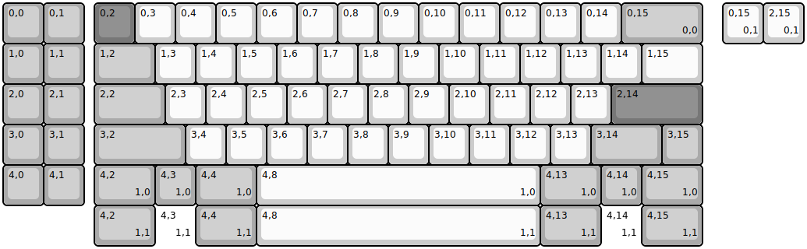{:loading="lazy"}

[Open in keyboard-layout-editor](http://www.keyboard-layout-editor.com/##@@_c=#aaaaaa;&=0,0&=0,1&_x:0.25&c=#777777;&=0,2&_c=#cccccc;&=0,3&=0,4&=0,5&=0,6&=0,7&=0,8&=0,9&=0,10&=0,11&=0,12&=0,13&=0,14&_c=#aaaaaa&w:2;&=0,15%0A%0A%0A0,0;&@=1,0&=1,1&_x:0.25&w:1.5;&=1,2&_c=#cccccc;&=1,3&=1,4&=1,5&=1,6&=1,7&=1,8&=1,9&=1,10&=1,11&=1,12&=1,13&=1,14&_w:1.5;&=1,15;&@_c=#aaaaaa;&=2,0&=2,1&_x:0.25&w:1.75;&=2,2&_c=#cccccc;&=2,3&=2,4&=2,5&=2,6&=2,7&=2,8&=2,9&=2,10&=2,11&=2,12&=2,13&_c=#777777&w:2.25;&=2,14;&@_c=#aaaaaa;&=3,0&=3,1&_x:0.25&w:2.25;&=3,2&_c=#cccccc;&=3,4&=3,5&=3,6&=3,7&=3,8&=3,9&=3,10&=3,11&=3,12&=3,13&_c=#aaaaaa&w:1.75;&=3,14&=3,15;&@=4,0&=4,1&_x:0.25&w:1.5;&=4,2%0A%0A%0A1,0&=4,3%0A%0A%0A1,0&_w:1.5;&=4,4%0A%0A%0A1,0&_c=#cccccc&w:7;&=4,8%0A%0A%0A1,0&_c=#aaaaaa&w:1.5;&=4,13%0A%0A%0A1,0&=4,14%0A%0A%0A1,0&_w:1.5;&=4,15%0A%0A%0A1,0;&@_x:17.75&y:-5&c=#cccccc;&=0,15%0A%0A%0A0,1&=2,15%0A%0A%0A0,1;&@_x:2.25&y:4&c=#aaaaaa&w:1.5;&=4,2%0A%0A%0A1,1&_d:true;&=4,3%0A%0A%0A1,1&_w:1.5;&=4,4%0A%0A%0A1,1&_c=#cccccc&w:7;&=4,8%0A%0A%0A1,1&_c=#aaaaaa&w:1.5;&=4,13%0A%0A%0A1,1&_d:true;&=4,14%0A%0A%0A1,1&_w:1.5;&=4,15%0A%0A%0A1,1)

## wilba_tech/wt65_a

[README](output/wilba_tech/wt65_a/README.md) - [layout](output/wilba_tech/wt65_a/wt65_a-kle.json) - [PCB](output/wilba_tech/wt65_a/wt65_a.kicad_pcb) - [PCB render](output/wilba_tech/wt65_a/wt65_a-render.svg)

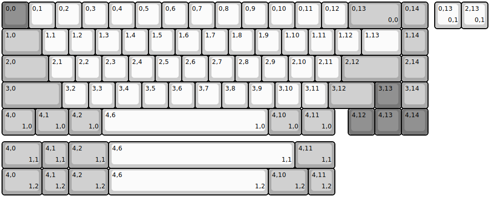{:loading="lazy"}

[Open in keyboard-layout-editor](http://www.keyboard-layout-editor.com/##@@_c=#777777;&=0,0&_c=#cccccc;&=0,1&=0,2&=0,3&=0,4&=0,5&=0,6&=0,7&=0,8&=0,9&=0,10&=0,11&=0,12&_c=#aaaaaa&w:2;&=0,13%0A%0A%0A0,0&=0,14;&@_w:1.5;&=1,0&_c=#cccccc;&=1,1&=1,2&=1,3&=1,4&=1,5&=1,6&=1,7&=1,8&=1,9&=1,10&=1,11&=1,12&_w:1.5;&=1,13&_c=#aaaaaa;&=1,14;&@_w:1.75;&=2,0&_c=#cccccc;&=2,1&=2,2&=2,3&=2,4&=2,5&=2,6&=2,7&=2,8&=2,9&=2,10&=2,11&_c=#aaaaaa&w:2.25;&=2,12&=2,14;&@_w:2.25;&=3,0&_c=#cccccc;&=3,2&=3,3&=3,4&=3,5&=3,6&=3,7&=3,8&=3,9&=3,10&=3,11&_c=#aaaaaa&w:1.75;&=3,12&_c=#777777;&=3,13&_c=#aaaaaa;&=3,14;&@_w:1.25;&=4,0%0A%0A%0A1,0&_w:1.25;&=4,1%0A%0A%0A1,0&_w:1.25;&=4,2%0A%0A%0A1,0&_c=#cccccc&w:6.25;&=4,6%0A%0A%0A1,0&_c=#aaaaaa&w:1.25;&=4,10%0A%0A%0A1,0&_w:1.25;&=4,11%0A%0A%0A1,0&_x:0.5&c=#777777;&=4,12&=4,13&=4,14;&@_x:16.25&y:-5&c=#cccccc;&=0,13%0A%0A%0A0,1&=2,13%0A%0A%0A0,1;&@_y:4.25&c=#aaaaaa&w:1.5;&=4,0%0A%0A%0A1,1&=4,1%0A%0A%0A1,1&_w:1.5;&=4,2%0A%0A%0A1,1&_c=#cccccc&w:7;&=4,6%0A%0A%0A1,1&_c=#aaaaaa&w:1.5;&=4,11%0A%0A%0A1,1;&@_w:1.5;&=4,0%0A%0A%0A1,2&=4,1%0A%0A%0A1,2&_w:1.5;&=4,2%0A%0A%0A1,2&_c=#cccccc&w:6;&=4,6%0A%0A%0A1,2&_c=#aaaaaa&w:1.5;&=4,10%0A%0A%0A1,2&=4,11%0A%0A%0A1,2)

## wilba_tech/wt65_b

[README](output/wilba_tech/wt65_b/README.md) - [layout](output/wilba_tech/wt65_b/wt65_b-kle.json) - [PCB](output/wilba_tech/wt65_b/wt65_b.kicad_pcb) - [PCB render](output/wilba_tech/wt65_b/wt65_b-render.svg)

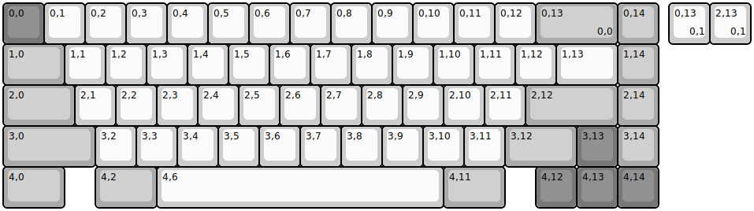{:loading="lazy"}

[Open in keyboard-layout-editor](http://www.keyboard-layout-editor.com/##@@_c=#777777;&=0,0&_c=#cccccc;&=0,1&=0,2&=0,3&=0,4&=0,5&=0,6&=0,7&=0,8&=0,9&=0,10&=0,11&=0,12&_c=#aaaaaa&w:2;&=0,13%0A%0A%0A0,0&=0,14;&@_w:1.5;&=1,0&_c=#cccccc;&=1,1&=1,2&=1,3&=1,4&=1,5&=1,6&=1,7&=1,8&=1,9&=1,10&=1,11&=1,12&_w:1.5;&=1,13&_c=#aaaaaa;&=1,14;&@_w:1.75;&=2,0&_c=#cccccc;&=2,1&=2,2&=2,3&=2,4&=2,5&=2,6&=2,7&=2,8&=2,9&=2,10&=2,11&_c=#aaaaaa&w:2.25;&=2,12&=2,14;&@_w:2.25;&=3,0&_c=#cccccc;&=3,2&=3,3&=3,4&=3,5&=3,6&=3,7&=3,8&=3,9&=3,10&=3,11&_c=#aaaaaa&w:1.75;&=3,12&_c=#777777;&=3,13&_c=#aaaaaa;&=3,14;&@_w:1.5;&=4,0&_x:0.75&w:1.5;&=4,2&_c=#cccccc&w:7;&=4,6&_c=#aaaaaa&w:1.5;&=4,11&_x:0.75&c=#777777;&=4,12&=4,13&=4,14;&@_x:16.25&y:-5&c=#cccccc;&=0,13%0A%0A%0A0,1&=2,13%0A%0A%0A0,1)

## wilba_tech/wt65_c

[README](output/wilba_tech/wt65_c/README.md) - [layout](output/wilba_tech/wt65_c/wt65_c-kle.json) - [PCB](output/wilba_tech/wt65_c/wt65_c.kicad_pcb) - [PCB render](output/wilba_tech/wt65_c/wt65_c-render.svg)

{:loading="lazy"}

[Open in keyboard-layout-editor](http://www.keyboard-layout-editor.com/##@@_c=#888888;&=0,0&_c=#cccccc;&=0,1&=0,2&=0,3&=0,4&=0,5&=0,6&=0,7&=0,8&=0,9&=0,10&=0,11&=0,12&=0,13&=2,13&_c=#aaaaaa;&=0,14;&@_w:1.5;&=1,0&_c=#cccccc;&=1,1&=1,2&=1,3&=1,4&=1,5&=1,6&=1,7&=1,8&=1,9&=1,10&=1,11&=1,12&_c=#aaaaaa&w:1.5;&=1,13&=1,14;&@_w:1.75;&=2,0&_c=#cccccc;&=2,1&=2,2&=2,3&=2,4&=2,5&=2,6&=2,7&=2,8&=2,9&=2,10&=2,11&_c=#aaaaaa&w:2.25;&=2,12&=2,14;&@_w:2.25;&=3,0&_c=#cccccc;&=3,2&=3,3&=3,4&=3,5&=3,6&=3,7&=3,8&=3,9&=3,10&=3,11&_c=#aaaaaa&w:1.75;&=3,12&_c=#888888;&=3,13&_c=#aaaaaa;&=3,14;&@_w:1.5;&=4,0&_w:1.5;&=4,1&_c=#cccccc&w:7;&=4,5&_c=#aaaaaa&w:1.5;&=4,10&_w:1.5;&=4,11&_c=#888888;&=4,12&=4,13&=4,14)

## wilba_tech/wt65_cx

[README](output/wilba_tech/wt65_cx/README.md) - [layout](output/wilba_tech/wt65_cx/wt65_cx-kle.json) - [PCB](output/wilba_tech/wt65_cx/wt65_cx.kicad_pcb) - [PCB render](output/wilba_tech/wt65_cx/wt65_cx-render.svg)

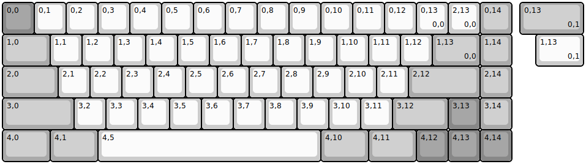{:loading="lazy"}

[Open in keyboard-layout-editor](http://www.keyboard-layout-editor.com/##@@_c=#888888;&=0,0&_c=#cccccc;&=0,1&=0,2&=0,3&=0,4&=0,5&=0,6&=0,7&=0,8&=0,9&=0,10&=0,11&=0,12&=0,13%0A%0A%0A0,0&=2,13%0A%0A%0A0,0&_c=#aaaaaa;&=0,14;&@_w:1.5;&=1,0&_c=#cccccc;&=1,1&=1,2&=1,3&=1,4&=1,5&=1,6&=1,7&=1,8&=1,9&=1,10&=1,11&=1,12&_c=#aaaaaa&w:1.5;&=1,13%0A%0A%0A0,0&=1,14;&@_w:1.75;&=2,0&_c=#cccccc;&=2,1&=2,2&=2,3&=2,4&=2,5&=2,6&=2,7&=2,8&=2,9&=2,10&=2,11&_c=#aaaaaa&w:2.25;&=2,12&=2,14;&@_w:2.25;&=3,0&_c=#cccccc;&=3,2&=3,3&=3,4&=3,5&=3,6&=3,7&=3,8&=3,9&=3,10&=3,11&_c=#aaaaaa&w:1.75;&=3,12&_c=#888888;&=3,13&_c=#aaaaaa;&=3,14;&@_w:1.5;&=4,0&_w:1.5;&=4,1&_c=#cccccc&w:7;&=4,5&_c=#aaaaaa&w:1.5;&=4,10&_w:1.5;&=4,11&_c=#888888;&=4,12&=4,13&=4,14;&@_x:16.25&y:-5&c=#aaaaaa&w:2;&=0,13%0A%0A%0A0,1;&@_x:16.75&c=#cccccc&w:1.5;&=1,13%0A%0A%0A0,1)

## wilba_tech/wt65_d

[README](output/wilba_tech/wt65_d/README.md) - [layout](output/wilba_tech/wt65_d/wt65_d-kle.json) - [PCB](output/wilba_tech/wt65_d/wt65_d.kicad_pcb) - [PCB render](output/wilba_tech/wt65_d/wt65_d-render.svg)

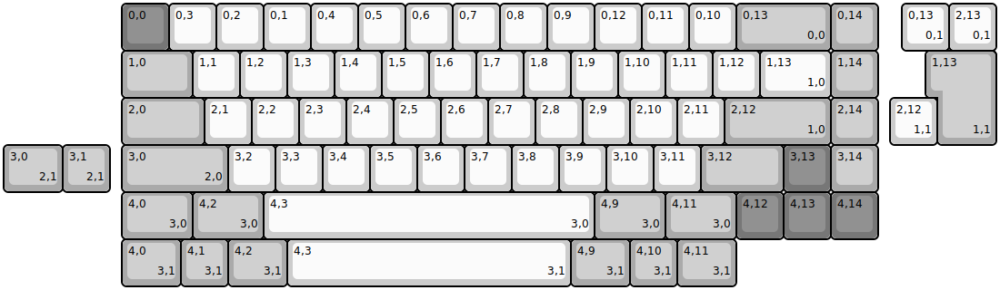{:loading="lazy"}

[Open in keyboard-layout-editor](http://www.keyboard-layout-editor.com/##@@_x:2.5&c=#777777;&=0,0&_c=#cccccc;&=0,3&=0,2&=0,1&=0,4&=0,5&=0,6&=0,7&=0,8&=0,9&=0,12&=0,11&=0,10&_c=#aaaaaa&w:2;&=0,13%0A%0A%0A0,0&=0,14;&@_x:2.5&w:1.5;&=1,0&_c=#cccccc;&=1,1&=1,2&=1,3&=1,4&=1,5&=1,6&=1,7&=1,8&=1,9&=1,10&=1,11&=1,12&_w:1.5;&=1,13%0A%0A%0A1,0&_c=#aaaaaa;&=1,14;&@_x:2.5&w:1.75;&=2,0&_c=#cccccc;&=2,1&=2,2&=2,3&=2,4&=2,5&=2,6&=2,7&=2,8&=2,9&=2,10&=2,11&_c=#aaaaaa&w:2.25;&=2,12%0A%0A%0A1,0&=2,14;&@_x:2.5&w:2.25;&=3,0%0A%0A%0A2,0&_c=#cccccc;&=3,2&=3,3&=3,4&=3,5&=3,6&=3,7&=3,8&=3,9&=3,10&=3,11&_c=#aaaaaa&w:1.75;&=3,12&_c=#777777;&=3,13&_c=#aaaaaa;&=3,14;&@_x:2.5&w:1.5;&=4,0%0A%0A%0A3,0&_w:1.5;&=4,2%0A%0A%0A3,0&_c=#cccccc&w:7;&=4,3%0A%0A%0A3,0&_c=#aaaaaa&w:1.5;&=4,9%0A%0A%0A3,0&_w:1.5;&=4,11%0A%0A%0A3,0&_c=#777777;&=4,12&=4,13&=4,14;&@_x:19.0&y:-5&c=#cccccc;&=0,13%0A%0A%0A0,1&=2,13%0A%0A%0A0,1;&@_x:19.75&c=#aaaaaa&w:1.25&h:2&w2:1.5&h2:1&x2:-0.25;&=1,13%0A%0A%0A1,1;&@_x:18.75&c=#cccccc;&=2,12%0A%0A%0A1,1;&@_c=#aaaaaa&w:1.25;&=3,0%0A%0A%0A2,1&=3,1%0A%0A%0A2,1;&@_x:2.5&y:1&w:1.25;&=4,0%0A%0A%0A3,1&=4,1%0A%0A%0A3,1&_w:1.25;&=4,2%0A%0A%0A3,1&_c=#cccccc&w:6;&=4,3%0A%0A%0A3,1&_c=#aaaaaa&w:1.25;&=4,9%0A%0A%0A3,1&=4,10%0A%0A%0A3,1&_w:1.25;&=4,11%0A%0A%0A3,1)

## wilba_tech/wt65_f

[README](output/wilba_tech/wt65_f/README.md) - [layout](output/wilba_tech/wt65_f/wt65_f-kle.json) - [PCB](output/wilba_tech/wt65_f/wt65_f.kicad_pcb) - [PCB render](output/wilba_tech/wt65_f/wt65_f-render.svg)

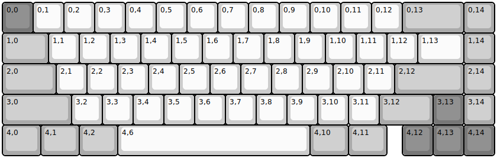{:loading="lazy"}

[Open in keyboard-layout-editor](http://www.keyboard-layout-editor.com/##@@_c=#777777;&=0,0&_c=#cccccc;&=0,1&=0,2&=0,3&=0,4&=0,5&=0,6&=0,7&=0,8&=0,9&=0,10&=0,11&=0,12&_c=#aaaaaa&w:2;&=0,13&=0,14;&@_w:1.5;&=1,0&_c=#cccccc;&=1,1&=1,2&=1,3&=1,4&=1,5&=1,6&=1,7&=1,8&=1,9&=1,10&=1,11&=1,12&_w:1.5;&=1,13&_c=#aaaaaa;&=1,14;&@_w:1.75;&=2,0&_c=#cccccc;&=2,1&=2,2&=2,3&=2,4&=2,5&=2,6&=2,7&=2,8&=2,9&=2,10&=2,11&_c=#aaaaaa&w:2.25;&=2,12&=2,14;&@_w:2.25;&=3,0&_c=#cccccc;&=3,2&=3,3&=3,4&=3,5&=3,6&=3,7&=3,8&=3,9&=3,10&=3,11&_c=#aaaaaa&w:1.75;&=3,12&_c=#777777;&=3,13&_c=#aaaaaa;&=3,14;&@_w:1.25;&=4,0&_w:1.25;&=4,1&_w:1.25;&=4,2&_c=#cccccc&w:6.25;&=4,6&_c=#aaaaaa&w:1.25;&=4,10&_w:1.25;&=4,11&_x:0.5&c=#777777;&=4,12&=4,13&=4,14)

## wilba_tech/wt65_fx

[README](output/wilba_tech/wt65_fx/README.md) - [layout](output/wilba_tech/wt65_fx/wt65_fx-kle.json) - [PCB](output/wilba_tech/wt65_fx/wt65_fx.kicad_pcb) - [PCB render](output/wilba_tech/wt65_fx/wt65_fx-render.svg)

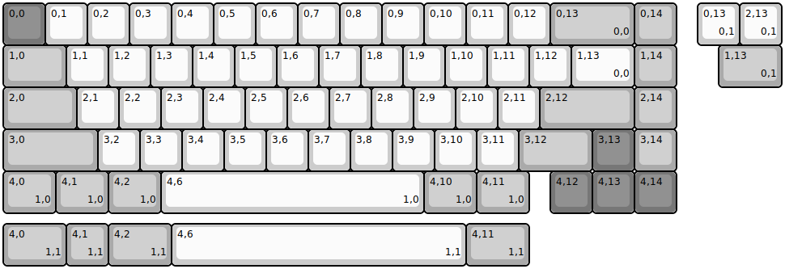{:loading="lazy"}

[Open in keyboard-layout-editor](http://www.keyboard-layout-editor.com/##@@_c=#777777;&=0,0&_c=#cccccc;&=0,1&=0,2&=0,3&=0,4&=0,5&=0,6&=0,7&=0,8&=0,9&=0,10&=0,11&=0,12&_c=#aaaaaa&w:2;&=0,13%0A%0A%0A0,0&=0,14;&@_w:1.5;&=1,0&_c=#cccccc;&=1,1&=1,2&=1,3&=1,4&=1,5&=1,6&=1,7&=1,8&=1,9&=1,10&=1,11&=1,12&_w:1.5;&=1,13%0A%0A%0A0,0&_c=#aaaaaa;&=1,14;&@_w:1.75;&=2,0&_c=#cccccc;&=2,1&=2,2&=2,3&=2,4&=2,5&=2,6&=2,7&=2,8&=2,9&=2,10&=2,11&_c=#aaaaaa&w:2.25;&=2,12&=2,14;&@_w:2.25;&=3,0&_c=#cccccc;&=3,2&=3,3&=3,4&=3,5&=3,6&=3,7&=3,8&=3,9&=3,10&=3,11&_c=#aaaaaa&w:1.75;&=3,12&_c=#777777;&=3,13&_c=#aaaaaa;&=3,14;&@_w:1.25;&=4,0%0A%0A%0A1,0&_w:1.25;&=4,1%0A%0A%0A1,0&_w:1.25;&=4,2%0A%0A%0A1,0&_c=#cccccc&w:6.25;&=4,6%0A%0A%0A1,0&_c=#aaaaaa&w:1.25;&=4,10%0A%0A%0A1,0&_w:1.25;&=4,11%0A%0A%0A1,0&_x:0.5&c=#777777;&=4,12&=4,13&=4,14;&@_x:16.5&y:-5&c=#cccccc;&=0,13%0A%0A%0A0,1&=2,13%0A%0A%0A0,1;&@_x:17.0&c=#aaaaaa&w:1.5;&=1,13%0A%0A%0A0,1;&@_y:3.25&w:1.5;&=4,0%0A%0A%0A1,1&=4,1%0A%0A%0A1,1&_w:1.5;&=4,2%0A%0A%0A1,1&_c=#cccccc&w:7;&=4,6%0A%0A%0A1,1&_c=#aaaaaa&w:1.5;&=4,11%0A%0A%0A1,1)

## wilba_tech/wt65_g

[README](output/wilba_tech/wt65_g/README.md) - [layout](output/wilba_tech/wt65_g/wt65_g-kle.json) - [PCB](output/wilba_tech/wt65_g/wt65_g.kicad_pcb) - [PCB render](output/wilba_tech/wt65_g/wt65_g-render.svg)

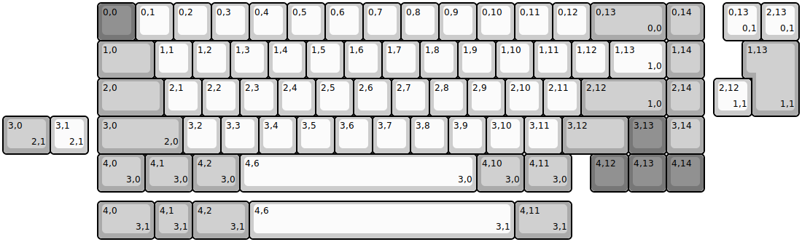{:loading="lazy"}

[Open in keyboard-layout-editor](http://www.keyboard-layout-editor.com/##@@_x:2.5&c=#777777;&=0,0&_c=#cccccc;&=0,1&=0,2&=0,3&=0,4&=0,5&=0,6&=0,7&=0,8&=0,9&=0,10&=0,11&=0,12&_c=#aaaaaa&w:2;&=0,13%0A%0A%0A0,0&=0,14;&@_x:2.5&w:1.5;&=1,0&_c=#cccccc;&=1,1&=1,2&=1,3&=1,4&=1,5&=1,6&=1,7&=1,8&=1,9&=1,10&=1,11&=1,12&_w:1.5;&=1,13%0A%0A%0A1,0&_c=#aaaaaa;&=1,14;&@_x:2.5&w:1.75;&=2,0&_c=#cccccc;&=2,1&=2,2&=2,3&=2,4&=2,5&=2,6&=2,7&=2,8&=2,9&=2,10&=2,11&_c=#aaaaaa&w:2.25;&=2,12%0A%0A%0A1,0&=2,14;&@_x:2.5&w:2.25;&=3,0%0A%0A%0A2,0&_c=#cccccc;&=3,2&=3,3&=3,4&=3,5&=3,6&=3,7&=3,8&=3,9&=3,10&=3,11&_c=#aaaaaa&w:1.75;&=3,12&_c=#777777;&=3,13&_c=#aaaaaa;&=3,14;&@_x:2.5&w:1.25;&=4,0%0A%0A%0A3,0&_w:1.25;&=4,1%0A%0A%0A3,0&_w:1.25;&=4,2%0A%0A%0A3,0&_c=#cccccc&w:6.25;&=4,6%0A%0A%0A3,0&_c=#aaaaaa&w:1.25;&=4,10%0A%0A%0A3,0&_w:1.25;&=4,11%0A%0A%0A3,0&_x:0.5&c=#777777;&=4,12&=4,13&=4,14;&@_x:19.0&y:-5&c=#cccccc;&=0,13%0A%0A%0A0,1&=2,13%0A%0A%0A0,1;&@_x:19.75&c=#aaaaaa&w:1.25&h:2&w2:1.5&h2:1&x2:-0.25;&=1,13%0A%0A%0A1,1;&@_x:18.75&c=#cccccc;&=2,12%0A%0A%0A1,1;&@_c=#aaaaaa&w:1.25;&=3,0%0A%0A%0A2,1&_c=#cccccc;&=3,1%0A%0A%0A2,1;&@_x:2.5&y:1.25&c=#aaaaaa&w:1.5;&=4,0%0A%0A%0A3,1&=4,1%0A%0A%0A3,1&_w:1.5;&=4,2%0A%0A%0A3,1&_c=#cccccc&w:7;&=4,6%0A%0A%0A3,1&_c=#aaaaaa&w:1.5;&=4,11%0A%0A%0A3,1)

## wilba_tech/wt65_g2

[README](output/wilba_tech/wt65_g2/README.md) - [layout](output/wilba_tech/wt65_g2/wt65_g2-kle.json) - [PCB](output/wilba_tech/wt65_g2/wt65_g2.kicad_pcb) - [PCB render](output/wilba_tech/wt65_g2/wt65_g2-render.svg)

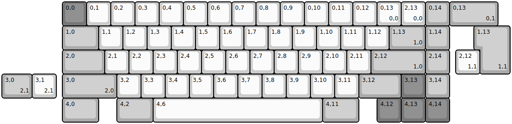{:loading="lazy"}

[Open in keyboard-layout-editor](http://www.keyboard-layout-editor.com/##@@_x:2.5&c=#777777;&=0,0&_c=#cccccc;&=0,1&=0,2&=0,3&=0,4&=0,5&=0,6&=0,7&=0,8&=0,9&=0,10&=0,11&=0,12&=0,13%0A%0A%0A0,0&=2,13%0A%0A%0A0,0&_c=#aaaaaa;&=0,14;&@_x:2.5&w:1.5;&=1,0&_c=#cccccc;&=1,1&=1,2&=1,3&=1,4&=1,5&=1,6&=1,7&=1,8&=1,9&=1,10&=1,11&=1,12&_c=#aaaaaa&w:1.5;&=1,13%0A%0A%0A1,0&=1,14;&@_x:2.5&w:1.75;&=2,0&_c=#cccccc;&=2,1&=2,2&=2,3&=2,4&=2,5&=2,6&=2,7&=2,8&=2,9&=2,10&=2,11&_c=#aaaaaa&w:2.25;&=2,12%0A%0A%0A1,0&=2,14;&@_x:2.5&w:2.25;&=3,0%0A%0A%0A2,0&_c=#cccccc;&=3,2&=3,3&=3,4&=3,5&=3,6&=3,7&=3,8&=3,9&=3,10&=3,11&_c=#aaaaaa&w:1.75;&=3,12&_c=#777777;&=3,13&_c=#aaaaaa;&=3,14;&@_x:2.5&w:1.5;&=4,0&_x:0.75&w:1.5;&=4,2&_c=#cccccc&w:7;&=4,6&_c=#aaaaaa&w:1.5;&=4,11&_x:0.75&c=#777777;&=4,12&=4,13&=4,14;&@_x:18.5&y:-5&c=#aaaaaa&w:2;&=0,13%0A%0A%0A0,1;&@_x:19.75&w:1.25&h:2&w2:1.5&h2:1&x2:-0.25;&=1,13%0A%0A%0A1,1;&@_x:18.75&c=#cccccc;&=2,12%0A%0A%0A1,1;&@_c=#aaaaaa&w:1.25;&=3,0%0A%0A%0A2,1&_c=#cccccc;&=3,1%0A%0A%0A2,1)

## wilba_tech/wt65_g3

[README](output/wilba_tech/wt65_g3/README.md) - [layout](output/wilba_tech/wt65_g3/wt65_g3-kle.json) - [PCB](output/wilba_tech/wt65_g3/wt65_g3.kicad_pcb) - [PCB render](output/wilba_tech/wt65_g3/wt65_g3-render.svg)

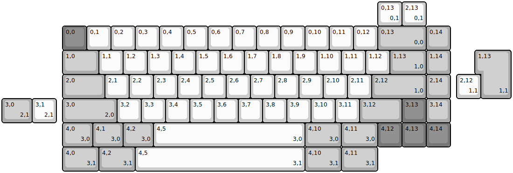{:loading="lazy"}

[Open in keyboard-layout-editor](http://www.keyboard-layout-editor.com/##@@_x:2.5&y:1&c=#777777;&=0,0&_c=#cccccc;&=0,1&=0,2&=0,3&=0,4&=0,5&=0,6&=0,7&=0,8&=0,9&=0,10&=0,11&=0,12&_c=#aaaaaa&w:2;&=0,13%0A%0A%0A0,0&=0,14;&@_x:2.5&w:1.5;&=1,0&_c=#cccccc;&=1,1&=1,2&=1,3&=1,4&=1,5&=1,6&=1,7&=1,8&=1,9&=1,10&=1,11&=1,12&_c=#aaaaaa&w:1.5;&=1,13%0A%0A%0A1,0&=1,14;&@_x:2.5&w:1.75;&=2,0&_c=#cccccc;&=2,1&=2,2&=2,3&=2,4&=2,5&=2,6&=2,7&=2,8&=2,9&=2,10&=2,11&_c=#aaaaaa&w:2.25;&=2,12%0A%0A%0A1,0&=2,14;&@_x:2.5&w:2.25;&=3,0%0A%0A%0A2,0&_c=#cccccc;&=3,2&=3,3&=3,4&=3,5&=3,6&=3,7&=3,8&=3,9&=3,10&=3,11&_c=#aaaaaa&w:1.75;&=3,12&_c=#777777;&=3,13&_c=#aaaaaa;&=3,14;&@_x:2.5&w:1.25;&=4,0%0A%0A%0A3,0&_w:1.25;&=4,1%0A%0A%0A3,0&_w:1.25;&=4,2%0A%0A%0A3,0&_c=#cccccc&w:6.25;&=4,5%0A%0A%0A3,0&_c=#aaaaaa&w:1.5;&=4,10%0A%0A%0A3,0&_w:1.5;&=4,11%0A%0A%0A3,0&_c=#777777;&=4,12&=4,13&=4,14;&@_x:15.5&y:-6&c=#cccccc;&=0,13%0A%0A%0A0,1&=2,13%0A%0A%0A0,1;&@_x:19.75&y:1&c=#aaaaaa&w:1.25&h:2&w2:1.5&h2:1&x2:-0.25;&=1,13%0A%0A%0A1,1;&@_x:18.75&c=#cccccc;&=2,12%0A%0A%0A1,1;&@_c=#aaaaaa&w:1.25;&=3,0%0A%0A%0A2,1&_c=#cccccc;&=3,1%0A%0A%0A2,1;&@_x:2.5&y:1&c=#aaaaaa&w:1.5;&=4,0%0A%0A%0A3,1&_w:1.5;&=4,2%0A%0A%0A3,1&_c=#cccccc&w:7;&=4,5%0A%0A%0A3,1&_c=#aaaaaa&w:1.5;&=4,10%0A%0A%0A3,1&_w:1.5;&=4,11%0A%0A%0A3,1)

## wilba_tech/wt65_h1

[README](output/wilba_tech/wt65_h1/README.md) - [layout](output/wilba_tech/wt65_h1/wt65_h1-kle.json) - [PCB](output/wilba_tech/wt65_h1/wt65_h1.kicad_pcb) - [PCB render](output/wilba_tech/wt65_h1/wt65_h1-render.svg)

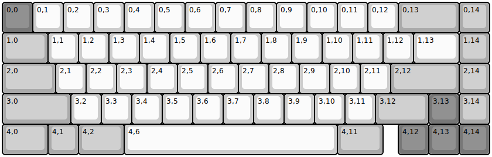{:loading="lazy"}

[Open in keyboard-layout-editor](http://www.keyboard-layout-editor.com/##@@_c=#777777;&=0,0&_c=#cccccc;&=0,1&=0,2&=0,3&=0,4&=0,5&=0,6&=0,7&=0,8&=0,9&=0,10&=0,11&=0,12&_c=#aaaaaa&w:2;&=0,13&=0,14;&@_w:1.5;&=1,0&_c=#cccccc;&=1,1&=1,2&=1,3&=1,4&=1,5&=1,6&=1,7&=1,8&=1,9&=1,10&=1,11&=1,12&_w:1.5;&=1,13&_c=#aaaaaa;&=1,14;&@_w:1.75;&=2,0&_c=#cccccc;&=2,1&=2,2&=2,3&=2,4&=2,5&=2,6&=2,7&=2,8&=2,9&=2,10&=2,11&_c=#aaaaaa&w:2.25;&=2,12&=2,14;&@_w:2.25;&=3,0&_c=#cccccc;&=3,2&=3,3&=3,4&=3,5&=3,6&=3,7&=3,8&=3,9&=3,10&=3,11&_c=#aaaaaa&w:1.75;&=3,12&_c=#777777;&=3,13&_c=#aaaaaa;&=3,14;&@_w:1.5;&=4,0&=4,1&_w:1.5;&=4,2&_c=#cccccc&w:7;&=4,6&_c=#aaaaaa&w:1.5;&=4,11&_x:0.5&c=#777777;&=4,12&=4,13&=4,14)

## wilba_tech/wt65_h2

[README](output/wilba_tech/wt65_h2/README.md) - [layout](output/wilba_tech/wt65_h2/wt65_h2-kle.json) - [PCB](output/wilba_tech/wt65_h2/wt65_h2.kicad_pcb) - [PCB render](output/wilba_tech/wt65_h2/wt65_h2-render.svg)

{:loading="lazy"}

[Open in keyboard-layout-editor](http://www.keyboard-layout-editor.com/##@@_y:1&c=#777777;&=0,0&_c=#cccccc;&=0,1&=0,2&=0,3&=0,4&=0,5&=0,6&=0,7&=0,8&=0,9&=0,10&=0,11&=0,12&=0,13%0A%0A%0A0,0&=2,13%0A%0A%0A0,0&_c=#aaaaaa;&=0,14;&@_w:1.5;&=1,0&_c=#cccccc;&=1,1&=1,2&=1,3&=1,4&=1,5&=1,6&=1,7&=1,8&=1,9&=1,10&=1,11&=1,12&_c=#aaaaaa&w:1.5;&=1,13&=1,14;&@_w:1.75;&=2,0&_c=#cccccc;&=2,1&=2,2&=2,3&=2,4&=2,5&=2,6&=2,7&=2,8&=2,9&=2,10&=2,11&_c=#aaaaaa&w:2.25;&=2,12&=2,14;&@_w:2.25;&=3,0&_c=#cccccc;&=3,2&=3,3&=3,4&=3,5&=3,6&=3,7&=3,8&=3,9&=3,10&=3,11&_c=#aaaaaa&w:1.75;&=3,12&_c=#777777;&=3,13&_c=#aaaaaa;&=3,14;&@_w:1.5;&=4,0&_x:0.75&w:1.5;&=4,2&_c=#cccccc&w:7;&=4,6&_c=#aaaaaa&w:1.5;&=4,11&_x:0.75&c=#777777;&=4,12&=4,13&=4,14;&@_x:13&y:-6&c=#aaaaaa&w:2;&=0,13%0A%0A%0A0,1)

## wilba_tech/wt65_h3

[README](output/wilba_tech/wt65_h3/README.md) - [layout](output/wilba_tech/wt65_h3/wt65_h3-kle.json) - [PCB](output/wilba_tech/wt65_h3/wt65_h3.kicad_pcb) - [PCB render](output/wilba_tech/wt65_h3/wt65_h3-render.svg)

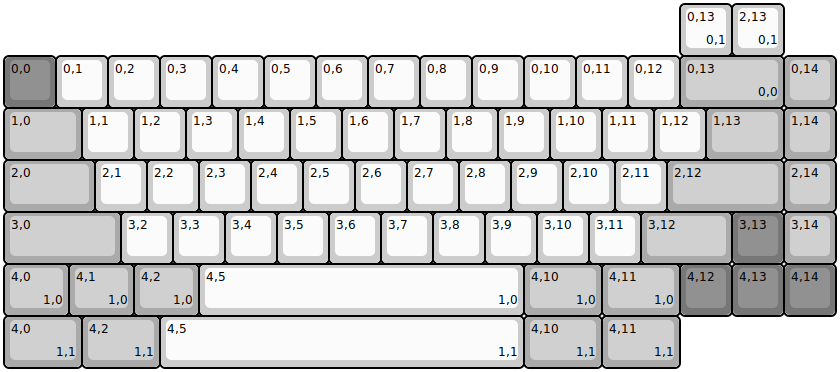{:loading="lazy"}

[Open in keyboard-layout-editor](http://www.keyboard-layout-editor.com/##@@_y:1&c=#777777;&=0,0&_c=#cccccc;&=0,1&=0,2&=0,3&=0,4&=0,5&=0,6&=0,7&=0,8&=0,9&=0,10&=0,11&=0,12&_c=#aaaaaa&w:2;&=0,13%0A%0A%0A0,0&=0,14;&@_w:1.5;&=1,0&_c=#cccccc;&=1,1&=1,2&=1,3&=1,4&=1,5&=1,6&=1,7&=1,8&=1,9&=1,10&=1,11&=1,12&_c=#aaaaaa&w:1.5;&=1,13&=1,14;&@_w:1.75;&=2,0&_c=#cccccc;&=2,1&=2,2&=2,3&=2,4&=2,5&=2,6&=2,7&=2,8&=2,9&=2,10&=2,11&_c=#aaaaaa&w:2.25;&=2,12&=2,14;&@_w:2.25;&=3,0&_c=#cccccc;&=3,2&=3,3&=3,4&=3,5&=3,6&=3,7&=3,8&=3,9&=3,10&=3,11&_c=#aaaaaa&w:1.75;&=3,12&_c=#777777;&=3,13&_c=#aaaaaa;&=3,14;&@_w:1.25;&=4,0%0A%0A%0A1,0&_w:1.25;&=4,1%0A%0A%0A1,0&_w:1.25;&=4,2%0A%0A%0A1,0&_c=#cccccc&w:6.25;&=4,5%0A%0A%0A1,0&_c=#aaaaaa&w:1.5;&=4,10%0A%0A%0A1,0&_w:1.5;&=4,11%0A%0A%0A1,0&_c=#777777;&=4,12&=4,13&=4,14;&@_x:13&y:-6&c=#cccccc;&=0,13%0A%0A%0A0,1&=2,13%0A%0A%0A0,1;&@_y:5&c=#aaaaaa&w:1.5;&=4,0%0A%0A%0A1,1&_w:1.5;&=4,2%0A%0A%0A1,1&_c=#cccccc&w:7;&=4,5%0A%0A%0A1,1&_c=#aaaaaa&w:1.5;&=4,10%0A%0A%0A1,1&_w:1.5;&=4,11%0A%0A%0A1,1)

## wilba_tech/wt65_h4

[README](output/wilba_tech/wt65_h4/README.md) - [layout](output/wilba_tech/wt65_h4/wt65_h4-kle.json) - [PCB](output/wilba_tech/wt65_h4/wt65_h4.kicad_pcb) - [PCB render](output/wilba_tech/wt65_h4/wt65_h4-render.svg)

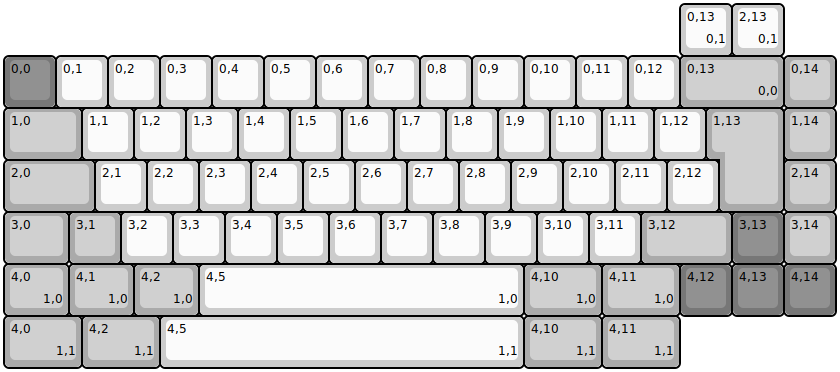{:loading="lazy"}

[Open in keyboard-layout-editor](http://www.keyboard-layout-editor.com/##@@_y:1&c=#777777;&=0,0&_c=#cccccc;&=0,1&=0,2&=0,3&=0,4&=0,5&=0,6&=0,7&=0,8&=0,9&=0,10&=0,11&=0,12&_c=#aaaaaa&w:2;&=0,13%0A%0A%0A0,0&=0,14;&@_w:1.5;&=1,0&_c=#cccccc;&=1,1&=1,2&=1,3&=1,4&=1,5&=1,6&=1,7&=1,8&=1,9&=1,10&=1,11&=1,12&_x:0.25&c=#aaaaaa&w:1.25&h:2&w2:1.5&h2:1&x2:-0.25;&=1,13&=1,14;&@_w:1.75;&=2,0&_c=#cccccc;&=2,1&=2,2&=2,3&=2,4&=2,5&=2,6&=2,7&=2,8&=2,9&=2,10&=2,11&=2,12&_x:1.25&c=#aaaaaa;&=2,14;&@_w:1.25;&=3,0&=3,1&_c=#cccccc;&=3,2&=3,3&=3,4&=3,5&=3,6&=3,7&=3,8&=3,9&=3,10&=3,11&_c=#aaaaaa&w:1.75;&=3,12&_c=#777777;&=3,13&_c=#aaaaaa;&=3,14;&@_w:1.25;&=4,0%0A%0A%0A1,0&_w:1.25;&=4,1%0A%0A%0A1,0&_w:1.25;&=4,2%0A%0A%0A1,0&_c=#cccccc&w:6.25;&=4,5%0A%0A%0A1,0&_c=#aaaaaa&w:1.5;&=4,10%0A%0A%0A1,0&_w:1.5;&=4,11%0A%0A%0A1,0&_c=#777777;&=4,12&=4,13&=4,14;&@_x:13&y:-6&c=#cccccc;&=0,13%0A%0A%0A0,1&=2,13%0A%0A%0A0,1;&@_y:5&c=#aaaaaa&w:1.5;&=4,0%0A%0A%0A1,1&_w:1.5;&=4,2%0A%0A%0A1,1&_c=#cccccc&w:7;&=4,5%0A%0A%0A1,1&_c=#aaaaaa&w:1.5;&=4,10%0A%0A%0A1,1&_w:1.5;&=4,11%0A%0A%0A1,1)

## wilba_tech/wt65_xt

[README](output/wilba_tech/wt65_xt/README.md) - [layout](output/wilba_tech/wt65_xt/wt65_xt-kle.json) - [PCB](output/wilba_tech/wt65_xt/wt65_xt.kicad_pcb) - [PCB render](output/wilba_tech/wt65_xt/wt65_xt-render.svg)

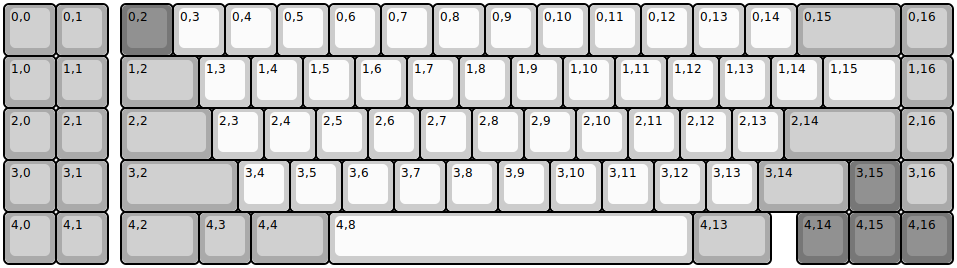{:loading="lazy"}

[Open in keyboard-layout-editor](http://www.keyboard-layout-editor.com/##@@_c=#aaaaaa;&=0,0&=0,1&_x:0.25&c=#777777;&=0,2&_c=#cccccc;&=0,3&=0,4&=0,5&=0,6&=0,7&=0,8&=0,9&=0,10&=0,11&=0,12&=0,13&=0,14&_c=#aaaaaa&w:2;&=0,15&=0,16;&@=1,0&=1,1&_x:0.25&w:1.5;&=1,2&_c=#cccccc;&=1,3&=1,4&=1,5&=1,6&=1,7&=1,8&=1,9&=1,10&=1,11&=1,12&=1,13&=1,14&_w:1.5;&=1,15&_c=#aaaaaa;&=1,16;&@=2,0&=2,1&_x:0.25&w:1.75;&=2,2&_c=#cccccc;&=2,3&=2,4&=2,5&=2,6&=2,7&=2,8&=2,9&=2,10&=2,11&=2,12&=2,13&_c=#aaaaaa&w:2.25;&=2,14&=2,16;&@=3,0&=3,1&_x:0.25&w:2.25;&=3,2&_c=#cccccc;&=3,4&=3,5&=3,6&=3,7&=3,8&=3,9&=3,10&=3,11&=3,12&=3,13&_c=#aaaaaa&w:1.75;&=3,14&_c=#777777;&=3,15&_c=#aaaaaa;&=3,16;&@=4,0&=4,1&_x:0.25&w:1.5;&=4,2&=4,3&_w:1.5;&=4,4&_c=#cccccc&w:7;&=4,8&_c=#aaaaaa&w:1.5;&=4,13&_x:0.5&c=#777777;&=4,14&=4,15&=4,16)

## wilba_tech/wt65_xtx

[README](output/wilba_tech/wt65_xtx/README.md) - [layout](output/wilba_tech/wt65_xtx/wt65_xtx-kle.json) - [PCB](output/wilba_tech/wt65_xtx/wt65_xtx.kicad_pcb) - [PCB render](output/wilba_tech/wt65_xtx/wt65_xtx-render.svg)

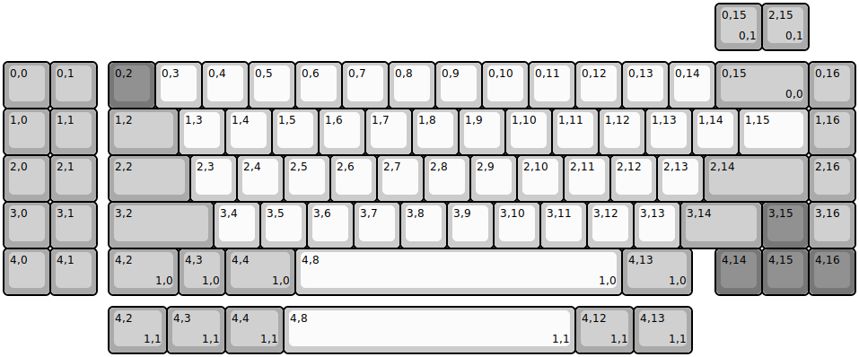{:loading="lazy"}

[Open in keyboard-layout-editor](http://www.keyboard-layout-editor.com/##@@_y:1.25&c=#aaaaaa;&=0,0&=0,1&_x:0.25&c=#777777;&=0,2&_c=#cccccc;&=0,3&=0,4&=0,5&=0,6&=0,7&=0,8&=0,9&=0,10&=0,11&=0,12&=0,13&=0,14&_c=#aaaaaa&w:2;&=0,15%0A%0A%0A0,0&=0,16;&@=1,0&=1,1&_x:0.25&w:1.5;&=1,2&_c=#cccccc;&=1,3&=1,4&=1,5&=1,6&=1,7&=1,8&=1,9&=1,10&=1,11&=1,12&=1,13&=1,14&_w:1.5;&=1,15&_c=#aaaaaa;&=1,16;&@=2,0&=2,1&_x:0.25&w:1.75;&=2,2&_c=#cccccc;&=2,3&=2,4&=2,5&=2,6&=2,7&=2,8&=2,9&=2,10&=2,11&=2,12&=2,13&_c=#aaaaaa&w:2.25;&=2,14&=2,16;&@=3,0&=3,1&_x:0.25&w:2.25;&=3,2&_c=#cccccc;&=3,4&=3,5&=3,6&=3,7&=3,8&=3,9&=3,10&=3,11&=3,12&=3,13&_c=#aaaaaa&w:1.75;&=3,14&_c=#777777;&=3,15&_c=#aaaaaa;&=3,16;&@=4,0&=4,1&_x:0.25&w:1.5;&=4,2%0A%0A%0A1,0&=4,3%0A%0A%0A1,0&_w:1.5;&=4,4%0A%0A%0A1,0&_c=#cccccc&w:7;&=4,8%0A%0A%0A1,0&_c=#aaaaaa&w:1.5;&=4,13%0A%0A%0A1,0&_x:0.5&c=#777777;&=4,14&=4,15&=4,16;&@_x:15.25&y:-6.25&c=#aaaaaa;&=0,15%0A%0A%0A0,1&=2,15%0A%0A%0A0,1;&@_x:2.25&y:5.5&w:1.25;&=4,2%0A%0A%0A1,1&_w:1.25;&=4,3%0A%0A%0A1,1&_w:1.25;&=4,4%0A%0A%0A1,1&_c=#cccccc&w:6.25;&=4,8%0A%0A%0A1,1&_c=#aaaaaa&w:1.25;&=4,12%0A%0A%0A1,1&_w:1.25;&=4,13%0A%0A%0A1,1)

## wilba_tech/wt69_a

[README](output/wilba_tech/wt69_a/README.md) - [layout](output/wilba_tech/wt69_a/wt69_a-kle.json) - [PCB](output/wilba_tech/wt69_a/wt69_a.kicad_pcb) - [PCB render](output/wilba_tech/wt69_a/wt69_a-render.svg)

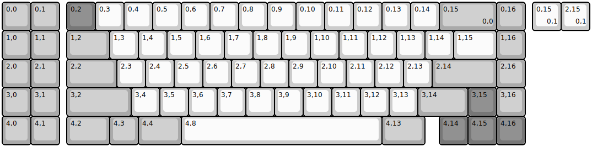{:loading="lazy"}

[Open in keyboard-layout-editor](http://www.keyboard-layout-editor.com/##@@_c=#aaaaaa;&=0,0&=0,1&_x:0.25&c=#777777;&=0,2&_c=#cccccc;&=0,3&=0,4&=0,5&=0,6&=0,7&=0,8&=0,9&=0,10&=0,11&=0,12&=0,13&=0,14&_c=#aaaaaa&w:2;&=0,15%0A%0A%0A0,0&=0,16;&@=1,0&=1,1&_x:0.25&w:1.5;&=1,2&_c=#cccccc;&=1,3&=1,4&=1,5&=1,6&=1,7&=1,8&=1,9&=1,10&=1,11&=1,12&=1,13&=1,14&_w:1.5;&=1,15&_c=#aaaaaa;&=1,16;&@=2,0&=2,1&_x:0.25&w:1.75;&=2,2&_c=#cccccc;&=2,3&=2,4&=2,5&=2,6&=2,7&=2,8&=2,9&=2,10&=2,11&=2,12&=2,13&_c=#aaaaaa&w:2.25;&=2,14&=2,16;&@=3,0&=3,1&_x:0.25&w:2.25;&=3,2&_c=#cccccc;&=3,4&=3,5&=3,6&=3,7&=3,8&=3,9&=3,10&=3,11&=3,12&=3,13&_c=#aaaaaa&w:1.75;&=3,14&_c=#777777;&=3,15&_c=#aaaaaa;&=3,16;&@=4,0&=4,1&_x:0.25&w:1.5;&=4,2&=4,3&_w:1.5;&=4,4&_c=#cccccc&w:7;&=4,8&_c=#aaaaaa&w:1.5;&=4,13&_x:0.5&c=#777777;&=4,14&=4,15&=4,16;&@_x:18.5&y:-5&c=#cccccc;&=0,15%0A%0A%0A0,1&=2,15%0A%0A%0A0,1)

## wilba_tech/wt70_jb

[README](output/wilba_tech/wt70_jb/README.md) - [layout](output/wilba_tech/wt70_jb/wt70_jb-kle.json) - [PCB](output/wilba_tech/wt70_jb/wt70_jb.kicad_pcb) - [PCB render](output/wilba_tech/wt70_jb/wt70_jb-render.svg)

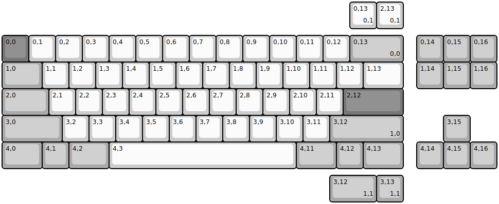{:loading="lazy"}

[Open in keyboard-layout-editor](http://www.keyboard-layout-editor.com/##@@_y:1.25&c=#777777;&=0,0&_c=#cccccc;&=0,1&=0,2&=0,3&=0,4&=0,5&=0,6&=0,7&=0,8&=0,9&=0,10&=0,11&=0,12&_c=#aaaaaa&w:2;&=0,13%0A%0A%0A0,0&_x:0.5;&=0,14&=0,15&=0,16;&@_w:1.5;&=1,0&_c=#cccccc;&=1,1&=1,2&=1,3&=1,4&=1,5&=1,6&=1,7&=1,8&=1,9&=1,10&=1,11&=1,12&_w:1.5;&=1,13&_x:0.5&c=#aaaaaa;&=1,14&=1,15&=1,16;&@_w:1.75;&=2,0&_c=#cccccc;&=2,1&=2,2&=2,3&=2,4&=2,5&=2,6&=2,7&=2,8&=2,9&=2,10&=2,11&_c=#777777&w:2.25;&=2,12;&@_c=#aaaaaa&w:2.25;&=3,0&_c=#cccccc;&=3,2&=3,3&=3,4&=3,5&=3,6&=3,7&=3,8&=3,9&=3,10&=3,11&_c=#aaaaaa&w:2.75;&=3,12%0A%0A%0A1,0&_x:1.5;&=3,15;&@_w:1.5;&=4,0&=4,1&_w:1.5;&=4,2&_c=#cccccc&w:7;&=4,3&_c=#aaaaaa&w:1.5;&=4,11&=4,12&_w:1.5;&=4,13&_x:0.5;&=4,14&=4,15&=4,16;&@_x:13&y:-6.25&c=#cccccc;&=0,13%0A%0A%0A0,1&=2,13%0A%0A%0A0,1;&@_x:12.25&y:5.5&c=#aaaaaa&w:1.75;&=3,12%0A%0A%0A1,1&=3,13%0A%0A%0A1,1)

## wilba_tech/wt75_a

[README](output/wilba_tech/wt75_a/README.md) - [layout](output/wilba_tech/wt75_a/wt75_a-kle.json) - [PCB](output/wilba_tech/wt75_a/wt75_a.kicad_pcb) - [PCB render](output/wilba_tech/wt75_a/wt75_a-render.svg)

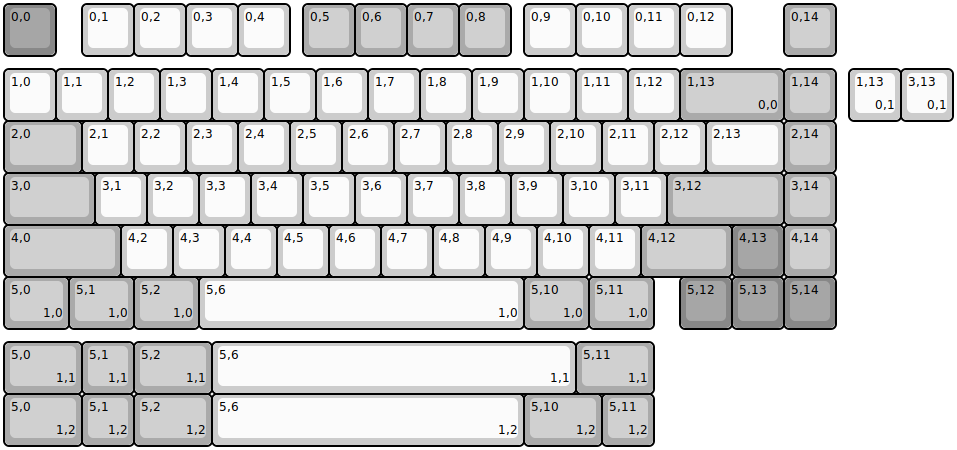{:loading="lazy"}

[Open in keyboard-layout-editor](http://www.keyboard-layout-editor.com/##@@_c=#888888;&=0,0&_x:0.5&c=#cccccc;&=0,1&=0,2&=0,3&=0,4&_x:0.25&c=#aaaaaa;&=0,5&=0,6&=0,7&=0,8&_x:0.25&c=#cccccc;&=0,9&=0,10&=0,11&=0,12&_x:1.0&c=#aaaaaa;&=0,14;&@_y:0.25&c=#cccccc;&=1,0&=1,1&=1,2&=1,3&=1,4&=1,5&=1,6&=1,7&=1,8&=1,9&=1,10&=1,11&=1,12&_c=#aaaaaa&w:2;&=1,13%0A%0A%0A0,0&=1,14;&@_w:1.5;&=2,0&_c=#cccccc;&=2,1&=2,2&=2,3&=2,4&=2,5&=2,6&=2,7&=2,8&=2,9&=2,10&=2,11&=2,12&_w:1.5;&=2,13&_c=#aaaaaa;&=2,14;&@_w:1.75;&=3,0&_c=#cccccc;&=3,1&=3,2&=3,3&=3,4&=3,5&=3,6&=3,7&=3,8&=3,9&=3,10&=3,11&_c=#aaaaaa&w:2.25;&=3,12&=3,14;&@_w:2.25;&=4,0&_c=#cccccc;&=4,2&=4,3&=4,4&=4,5&=4,6&=4,7&=4,8&=4,9&=4,10&=4,11&_c=#aaaaaa&w:1.75;&=4,12&_c=#888888;&=4,13&_c=#aaaaaa;&=4,14;&@_w:1.25;&=5,0%0A%0A%0A1,0&_w:1.25;&=5,1%0A%0A%0A1,0&_w:1.25;&=5,2%0A%0A%0A1,0&_c=#cccccc&w:6.25;&=5,6%0A%0A%0A1,0&_c=#aaaaaa&w:1.25;&=5,10%0A%0A%0A1,0&_w:1.25;&=5,11%0A%0A%0A1,0&_x:0.5&c=#888888;&=5,12&=5,13&=5,14;&@_x:16.25&y:-5.0&c=#cccccc;&=1,13%0A%0A%0A0,1&=3,13%0A%0A%0A0,1;&@_y:4.25&c=#aaaaaa&w:1.5;&=5,0%0A%0A%0A1,1&=5,1%0A%0A%0A1,1&_w:1.5;&=5,2%0A%0A%0A1,1&_c=#cccccc&w:7;&=5,6%0A%0A%0A1,1&_c=#aaaaaa&w:1.5;&=5,11%0A%0A%0A1,1;&@_w:1.5;&=5,0%0A%0A%0A1,2&=5,1%0A%0A%0A1,2&_w:1.5;&=5,2%0A%0A%0A1,2&_c=#cccccc&w:6;&=5,6%0A%0A%0A1,2&_c=#aaaaaa&w:1.5;&=5,10%0A%0A%0A1,2&=5,11%0A%0A%0A1,2)

## wilba_tech/wt75_b

[README](output/wilba_tech/wt75_b/README.md) - [layout](output/wilba_tech/wt75_b/wt75_b-kle.json) - [PCB](output/wilba_tech/wt75_b/wt75_b.kicad_pcb) - [PCB render](output/wilba_tech/wt75_b/wt75_b-render.svg)

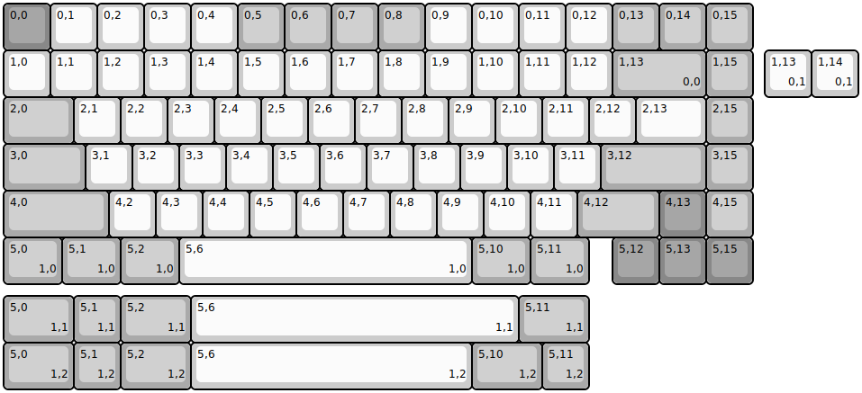{:loading="lazy"}

[Open in keyboard-layout-editor](http://www.keyboard-layout-editor.com/##@@_c=#888888;&=0,0&_c=#cccccc;&=0,1&=0,2&=0,3&=0,4&_c=#aaaaaa;&=0,5&=0,6&=0,7&=0,8&_c=#cccccc;&=0,9&=0,10&=0,11&=0,12&_c=#aaaaaa;&=0,13&=0,14&=0,15;&@_c=#cccccc;&=1,0&=1,1&=1,2&=1,3&=1,4&=1,5&=1,6&=1,7&=1,8&=1,9&=1,10&=1,11&=1,12&_c=#aaaaaa&w:2;&=1,13%0A%0A%0A0,0&=1,15;&@_w:1.5;&=2,0&_c=#cccccc;&=2,1&=2,2&=2,3&=2,4&=2,5&=2,6&=2,7&=2,8&=2,9&=2,10&=2,11&=2,12&_w:1.5;&=2,13&_c=#aaaaaa;&=2,15;&@_w:1.75;&=3,0&_c=#cccccc;&=3,1&=3,2&=3,3&=3,4&=3,5&=3,6&=3,7&=3,8&=3,9&=3,10&=3,11&_c=#aaaaaa&w:2.25;&=3,12&=3,15;&@_w:2.25;&=4,0&_c=#cccccc;&=4,2&=4,3&=4,4&=4,5&=4,6&=4,7&=4,8&=4,9&=4,10&=4,11&_c=#aaaaaa&w:1.75;&=4,12&_c=#888888;&=4,13&_c=#aaaaaa;&=4,15;&@_w:1.25;&=5,0%0A%0A%0A1,0&_w:1.25;&=5,1%0A%0A%0A1,0&_w:1.25;&=5,2%0A%0A%0A1,0&_c=#cccccc&w:6.25;&=5,6%0A%0A%0A1,0&_c=#aaaaaa&w:1.25;&=5,10%0A%0A%0A1,0&_w:1.25;&=5,11%0A%0A%0A1,0&_x:0.5&c=#888888;&=5,12&=5,13&=5,15;&@_x:16.25&y:-5&c=#cccccc;&=1,13%0A%0A%0A0,1&=1,14%0A%0A%0A0,1;&@_y:4.25&c=#aaaaaa&w:1.5;&=5,0%0A%0A%0A1,1&=5,1%0A%0A%0A1,1&_w:1.5;&=5,2%0A%0A%0A1,1&_c=#cccccc&w:7;&=5,6%0A%0A%0A1,1&_c=#aaaaaa&w:1.5;&=5,11%0A%0A%0A1,1;&@_w:1.5;&=5,0%0A%0A%0A1,2&=5,1%0A%0A%0A1,2&_w:1.5;&=5,2%0A%0A%0A1,2&_c=#cccccc&w:6;&=5,6%0A%0A%0A1,2&_c=#aaaaaa&w:1.5;&=5,10%0A%0A%0A1,2&=5,11%0A%0A%0A1,2)

## wilba_tech/wt75_c

[README](output/wilba_tech/wt75_c/README.md) - [layout](output/wilba_tech/wt75_c/wt75_c-kle.json) - [PCB](output/wilba_tech/wt75_c/wt75_c.kicad_pcb) - [PCB render](output/wilba_tech/wt75_c/wt75_c-render.svg)

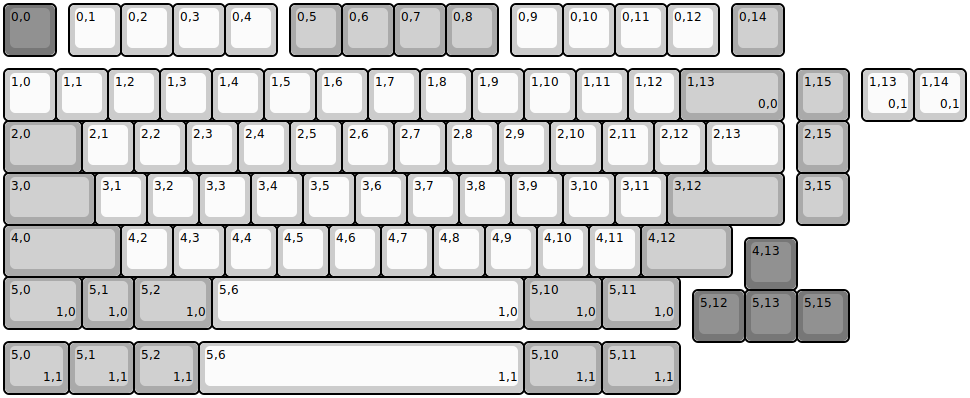{:loading="lazy"}

[Open in keyboard-layout-editor](http://www.keyboard-layout-editor.com/##@@_c=#777777;&=0,0&_x:0.25&c=#cccccc;&=0,1&=0,2&=0,3&=0,4&_x:0.25&c=#aaaaaa;&=0,5&=0,6&=0,7&=0,8&_x:0.25&c=#cccccc;&=0,9&=0,10&=0,11&=0,12&_x:0.25&c=#aaaaaa;&=0,14;&@_y:0.25&c=#cccccc;&=1,0&=1,1&=1,2&=1,3&=1,4&=1,5&=1,6&=1,7&=1,8&=1,9&=1,10&=1,11&=1,12&_c=#aaaaaa&w:2;&=1,13%0A%0A%0A0,0&_x:0.25;&=1,15;&@_w:1.5;&=2,0&_c=#cccccc;&=2,1&=2,2&=2,3&=2,4&=2,5&=2,6&=2,7&=2,8&=2,9&=2,10&=2,11&=2,12&_w:1.5;&=2,13&_x:0.25&c=#aaaaaa;&=2,15;&@_w:1.75;&=3,0&_c=#cccccc;&=3,1&=3,2&=3,3&=3,4&=3,5&=3,6&=3,7&=3,8&=3,9&=3,10&=3,11&_c=#aaaaaa&w:2.25;&=3,12&_x:0.25;&=3,15;&@_w:2.25;&=4,0&_c=#cccccc;&=4,2&=4,3&=4,4&=4,5&=4,6&=4,7&=4,8&=4,9&=4,10&=4,11&_c=#aaaaaa&w:1.75;&=4,12;&@_x:14.25&y:-0.75&c=#777777;&=4,13;&@_y:-0.25&c=#aaaaaa&w:1.5;&=5,0%0A%0A%0A1,0&=5,1%0A%0A%0A1,0&_w:1.5;&=5,2%0A%0A%0A1,0&_c=#cccccc&w:6;&=5,6%0A%0A%0A1,0&_c=#aaaaaa&w:1.5;&=5,10%0A%0A%0A1,0&_w:1.5;&=5,11%0A%0A%0A1,0;&@_x:13.25&y:-0.75&c=#777777;&=5,12&=5,13&=5,15;&@_x:16.5&y:-5.25&c=#cccccc;&=1,13%0A%0A%0A0,1&=1,14%0A%0A%0A0,1;&@_y:4.25&c=#aaaaaa&w:1.25;&=5,0%0A%0A%0A1,1&_w:1.25;&=5,1%0A%0A%0A1,1&_w:1.25;&=5,2%0A%0A%0A1,1&_c=#cccccc&w:6.25;&=5,6%0A%0A%0A1,1&_c=#aaaaaa&w:1.5;&=5,10%0A%0A%0A1,1&_w:1.5;&=5,11%0A%0A%0A1,1)

## wilba_tech/wt80_a

[README](output/wilba_tech/wt80_a/README.md) - [layout](output/wilba_tech/wt80_a/wt80_a-kle.json) - [PCB](output/wilba_tech/wt80_a/wt80_a.kicad_pcb) - [PCB render](output/wilba_tech/wt80_a/wt80_a-render.svg)

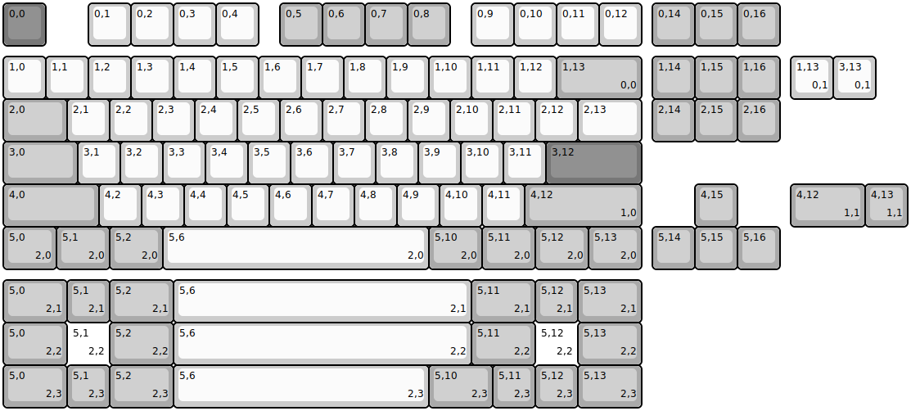{:loading="lazy"}

[Open in keyboard-layout-editor](http://www.keyboard-layout-editor.com/##@@_c=#777777;&=0,0&_x:1&c=#cccccc;&=0,1&=0,2&=0,3&=0,4&_x:0.5&c=#aaaaaa;&=0,5&=0,6&=0,7&=0,8&_x:0.5&c=#cccccc;&=0,9&=0,10&=0,11&=0,12&_x:0.25&c=#aaaaaa;&=0,14&=0,15&=0,16;&@_y:0.25&c=#cccccc;&=1,0&=1,1&=1,2&=1,3&=1,4&=1,5&=1,6&=1,7&=1,8&=1,9&=1,10&=1,11&=1,12&_c=#aaaaaa&w:2;&=1,13%0A%0A%0A0,0&_x:0.25;&=1,14&=1,15&=1,16;&@_w:1.5;&=2,0&_c=#cccccc;&=2,1&=2,2&=2,3&=2,4&=2,5&=2,6&=2,7&=2,8&=2,9&=2,10&=2,11&=2,12&_w:1.5;&=2,13&_x:0.25&c=#aaaaaa;&=2,14&=2,15&=2,16;&@_w:1.75;&=3,0&_c=#cccccc;&=3,1&=3,2&=3,3&=3,4&=3,5&=3,6&=3,7&=3,8&=3,9&=3,10&=3,11&_c=#777777&w:2.25;&=3,12;&@_c=#aaaaaa&w:2.25;&=4,0&_c=#cccccc;&=4,2&=4,3&=4,4&=4,5&=4,6&=4,7&=4,8&=4,9&=4,10&=4,11&_c=#aaaaaa&w:2.75;&=4,12%0A%0A%0A1,0&_x:1.25;&=4,15;&@_w:1.25;&=5,0%0A%0A%0A2,0&_w:1.25;&=5,1%0A%0A%0A2,0&_w:1.25;&=5,2%0A%0A%0A2,0&_c=#cccccc&w:6.25;&=5,6%0A%0A%0A2,0&_c=#aaaaaa&w:1.25;&=5,10%0A%0A%0A2,0&_w:1.25;&=5,11%0A%0A%0A2,0&_w:1.25;&=5,12%0A%0A%0A2,0&_w:1.25;&=5,13%0A%0A%0A2,0&_x:0.25;&=5,14&=5,15&=5,16;&@_x:18.5&y:-5.0&c=#cccccc;&=1,13%0A%0A%0A0,1&=3,13%0A%0A%0A0,1;&@_x:18.5&y:2.0&c=#aaaaaa&w:1.75;&=4,12%0A%0A%0A1,1&=4,13%0A%0A%0A1,1;&@_y:1.25&w:1.5;&=5,0%0A%0A%0A2,1&=5,1%0A%0A%0A2,1&_w:1.5;&=5,2%0A%0A%0A2,1&_c=#cccccc&w:7;&=5,6%0A%0A%0A2,1&_c=#aaaaaa&w:1.5;&=5,11%0A%0A%0A2,1&=5,12%0A%0A%0A2,1&_w:1.5;&=5,13%0A%0A%0A2,1;&@_w:1.5;&=5,0%0A%0A%0A2,2&_d:true;&=5,1%0A%0A%0A2,2&_w:1.5;&=5,2%0A%0A%0A2,2&_c=#cccccc&w:7;&=5,6%0A%0A%0A2,2&_c=#aaaaaa&w:1.5;&=5,11%0A%0A%0A2,2&_d:true;&=5,12%0A%0A%0A2,2&_w:1.5;&=5,13%0A%0A%0A2,2;&@_w:1.5;&=5,0%0A%0A%0A2,3&=5,1%0A%0A%0A2,3&_w:1.5;&=5,2%0A%0A%0A2,3&_c=#cccccc&w:6;&=5,6%0A%0A%0A2,3&_c=#aaaaaa&w:1.5;&=5,10%0A%0A%0A2,3&=5,11%0A%0A%0A2,3&=5,12%0A%0A%0A2,3&_w:1.5;&=5,13%0A%0A%0A2,3)

## wilba_tech/wt80_bc

[README](output/wilba_tech/wt80_bc/README.md) - [layout](output/wilba_tech/wt80_bc/wt80_bc-kle.json) - [PCB](output/wilba_tech/wt80_bc/wt80_bc.kicad_pcb) - [PCB render](output/wilba_tech/wt80_bc/wt80_bc-render.svg)

{:loading="lazy"}

[Open in keyboard-layout-editor](http://www.keyboard-layout-editor.com/##@@_c=#777777;&=0,0&_x:1&c=#cccccc;&=0,1&=0,2&=0,3&=0,4&_x:0.5&c=#aaaaaa;&=0,5&=0,6&=0,7&=0,8&_x:0.5&c=#cccccc;&=0,9&=0,10&=0,11&=0,12&_x:0.25&c=#aaaaaa;&=0,14&=0,15&=0,16;&@_y:0.25&c=#cccccc;&=1,0&=1,1&=1,2&=1,3&=1,4&=1,5&=1,6&=1,7&=1,8&=1,9&=1,10&=1,11&=1,12&_c=#aaaaaa&w:2;&=1,13&_x:0.25;&=1,14&=1,15&=1,16;&@_w:1.5;&=2,0&_c=#cccccc;&=2,1&=2,2&=2,3&=2,4&=2,5&=2,6&=2,7&=2,8&=2,9&=2,10&=2,11&=2,12&_w:1.5;&=2,13&_x:0.25&c=#aaaaaa;&=2,14&=2,15&=2,16;&@_w:1.75;&=3,0&_c=#cccccc;&=3,1&=3,2&=3,3&=3,4&=3,5&=3,6&=3,7&=3,8&=3,9&=3,10&=3,11&_c=#777777&w:2.25;&=3,12;&@_c=#aaaaaa&w:2.25;&=4,0&_c=#cccccc;&=4,2&=4,3&=4,4&=4,5&=4,6&=4,7&=4,8&=4,9&=4,10&=4,11&_c=#aaaaaa&w:2.75;&=4,12&_x:1.25;&=4,15;&@_w:1.5;&=5,0%0A%0A%0A0,0&=5,1%0A%0A%0A0,0&_w:1.5;&=5,2%0A%0A%0A0,0&_c=#cccccc&w:7;&=5,7%0A%0A%0A0,0&_c=#aaaaaa&w:1.5;&=5,11%0A%0A%0A0,0&=5,12%0A%0A%0A0,0&_w:1.5;&=5,13%0A%0A%0A0,0&_x:0.25;&=5,14&=5,15&=5,16;&@_y:0.25&w:1.5;&=5,0%0A%0A%0A0,1&_d:true;&=%0A%0A%0A0,1&_w:1.5;&=5,2%0A%0A%0A0,1&_c=#cccccc&w:7;&=5,6%0A%0A%0A0,1&_c=#aaaaaa&w:1.5;&=5,11%0A%0A%0A0,1&_d:true;&=%0A%0A%0A0,1&_w:1.5;&=5,13%0A%0A%0A0,1)

## wilba_tech/wt80_g

[README](output/wilba_tech/wt80_g/README.md) - [layout](output/wilba_tech/wt80_g/wt80_g-kle.json) - [PCB](output/wilba_tech/wt80_g/wt80_g.kicad_pcb) - [PCB render](output/wilba_tech/wt80_g/wt80_g-render.svg)

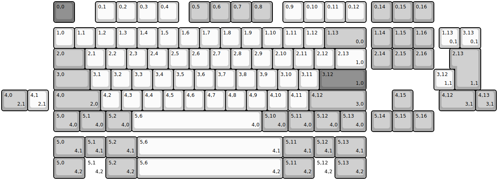{:loading="lazy"}

[Open in keyboard-layout-editor](http://www.keyboard-layout-editor.com/##@@_x:2.5&c=#777777;&=0,0&_x:1.0&c=#cccccc;&=0,1&=0,2&=0,3&=0,4&_x:0.5&c=#aaaaaa;&=0,5&=0,6&=0,7&=0,8&_x:0.5&c=#cccccc;&=0,9&=0,10&=0,11&=0,12&_x:0.25&c=#aaaaaa;&=0,14&=0,15&=0,16;&@_x:2.5&y:0.25&c=#cccccc;&=1,0&=1,1&=1,2&=1,3&=1,4&=1,5&=1,6&=1,7&=1,8&=1,9&=1,10&=1,11&=1,12&_c=#aaaaaa&w:2;&=1,13%0A%0A%0A0,0&_x:0.25;&=1,14&=1,15&=1,16;&@_x:2.5&w:1.5;&=2,0&_c=#cccccc;&=2,1&=2,2&=2,3&=2,4&=2,5&=2,6&=2,7&=2,8&=2,9&=2,10&=2,11&=2,12&_w:1.5;&=2,13%0A%0A%0A1,0&_x:0.25&c=#aaaaaa;&=2,14&=2,15&=2,16;&@_x:2.5&w:1.75;&=3,0&_c=#cccccc;&=3,1&=3,2&=3,3&=3,4&=3,5&=3,6&=3,7&=3,8&=3,9&=3,10&=3,11&_c=#777777&w:2.25;&=3,12%0A%0A%0A1,0;&@_x:2.5&c=#aaaaaa&w:2.25;&=4,0%0A%0A%0A2,0&_c=#cccccc;&=4,2&=4,3&=4,4&=4,5&=4,6&=4,7&=4,8&=4,9&=4,10&=4,11&_c=#aaaaaa&w:2.75;&=4,12%0A%0A%0A3,0&_x:1.25;&=4,15;&@_x:2.5&w:1.25;&=5,0%0A%0A%0A4,0&_w:1.25;&=5,1%0A%0A%0A4,0&_w:1.25;&=5,2%0A%0A%0A4,0&_c=#cccccc&w:6.25;&=5,6%0A%0A%0A4,0&_c=#aaaaaa&w:1.25;&=5,10%0A%0A%0A4,0&_w:1.25;&=5,11%0A%0A%0A4,0&_w:1.25;&=5,12%0A%0A%0A4,0&_w:1.25;&=5,13%0A%0A%0A4,0&_x:0.25;&=5,14&=5,15&=5,16;&@_x:21.0&y:-5.0&c=#cccccc;&=1,13%0A%0A%0A0,1&=3,13%0A%0A%0A0,1;&@_x:21.75&c=#aaaaaa&w:1.25&h:2&w2:1.5&h2:1&x2:-0.25;&=2,13%0A%0A%0A1,1;&@_x:20.75&c=#cccccc;&=3,12%0A%0A%0A1,1;&@_c=#aaaaaa&w:1.25;&=4,0%0A%0A%0A2,1&_c=#cccccc;&=4,1%0A%0A%0A2,1&_x:18.75&c=#aaaaaa&w:1.75;&=4,12%0A%0A%0A3,1&=4,13%0A%0A%0A3,1;&@_x:2.5&y:1.25&w:1.5;&=5,0%0A%0A%0A4,1&=5,1%0A%0A%0A4,1&_w:1.5;&=5,2%0A%0A%0A4,1&_c=#cccccc&w:7;&=5,6%0A%0A%0A4,1&_c=#aaaaaa&w:1.5;&=5,11%0A%0A%0A4,1&=5,12%0A%0A%0A4,1&_w:1.5;&=5,13%0A%0A%0A4,1;&@_x:2.5&w:1.5;&=5,0%0A%0A%0A4,2&_d:true;&=5,1%0A%0A%0A4,2&_w:1.5;&=5,2%0A%0A%0A4,2&_c=#cccccc&w:7;&=5,6%0A%0A%0A4,2&_c=#aaaaaa&w:1.5;&=5,11%0A%0A%0A4,2&_d:true;&=5,12%0A%0A%0A4,2&_w:1.5;&=5,13%0A%0A%0A4,2)

## wilba_tech/wt80_h1

[README](output/wilba_tech/wt80_h1/README.md) - [layout](output/wilba_tech/wt80_h1/wt80_h1-kle.json) - [PCB](output/wilba_tech/wt80_h1/wt80_h1.kicad_pcb) - [PCB render](output/wilba_tech/wt80_h1/wt80_h1-render.svg)

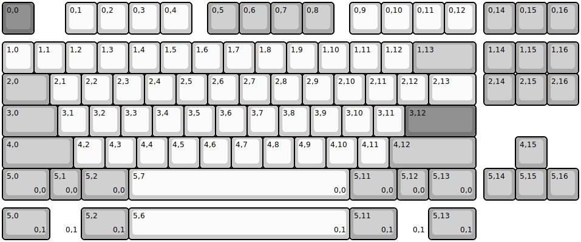{:loading="lazy"}

[Open in keyboard-layout-editor](http://www.keyboard-layout-editor.com/##@@_c=#777777;&=0,0&_x:1&c=#cccccc;&=0,1&=0,2&=0,3&=0,4&_x:0.5&c=#aaaaaa;&=0,5&=0,6&=0,7&=0,8&_x:0.5&c=#cccccc;&=0,9&=0,10&=0,11&=0,12&_x:0.25&c=#aaaaaa;&=0,14&=0,15&=0,16;&@_y:0.25&c=#cccccc;&=1,0&=1,1&=1,2&=1,3&=1,4&=1,5&=1,6&=1,7&=1,8&=1,9&=1,10&=1,11&=1,12&_c=#aaaaaa&w:2;&=1,13&_x:0.25;&=1,14&=1,15&=1,16;&@_w:1.5;&=2,0&_c=#cccccc;&=2,1&=2,2&=2,3&=2,4&=2,5&=2,6&=2,7&=2,8&=2,9&=2,10&=2,11&=2,12&_w:1.5;&=2,13&_x:0.25&c=#aaaaaa;&=2,14&=2,15&=2,16;&@_w:1.75;&=3,0&_c=#cccccc;&=3,1&=3,2&=3,3&=3,4&=3,5&=3,6&=3,7&=3,8&=3,9&=3,10&=3,11&_c=#777777&w:2.25;&=3,12;&@_c=#aaaaaa&w:2.25;&=4,0&_c=#cccccc;&=4,2&=4,3&=4,4&=4,5&=4,6&=4,7&=4,8&=4,9&=4,10&=4,11&_c=#aaaaaa&w:2.75;&=4,12&_x:1.25;&=4,15;&@_w:1.5;&=5,0%0A%0A%0A0,0&=5,1%0A%0A%0A0,0&_w:1.5;&=5,2%0A%0A%0A0,0&_c=#cccccc&w:7;&=5,7%0A%0A%0A0,0&_c=#aaaaaa&w:1.5;&=5,11%0A%0A%0A0,0&=5,12%0A%0A%0A0,0&_w:1.5;&=5,13%0A%0A%0A0,0&_x:0.25;&=5,14&=5,15&=5,16;&@_y:0.25&w:1.5;&=5,0%0A%0A%0A0,1&_d:true;&=%0A%0A%0A0,1&_w:1.5;&=5,2%0A%0A%0A0,1&_c=#cccccc&w:7;&=5,6%0A%0A%0A0,1&_c=#aaaaaa&w:1.5;&=5,11%0A%0A%0A0,1&_d:true;&=%0A%0A%0A0,1&_w:1.5;&=5,13%0A%0A%0A0,1)

## wilba_tech/wt8_a

[README](output/wilba_tech/wt8_a/README.md) - [layout](output/wilba_tech/wt8_a/wt8_a-kle.json) - [PCB](output/wilba_tech/wt8_a/wt8_a.kicad_pcb) - [PCB render](output/wilba_tech/wt8_a/wt8_a-render.svg)

{:loading="lazy"}

[Open in keyboard-layout-editor](http://www.keyboard-layout-editor.com/##@@_c=#505557&t=#d9d7d7;&=0,0&=0,1&=0,2&=0,3;&@=0,4&=0,5&=0,6&=0,7)

## wilba_tech/wt8_kh

[README](output/wilba_tech/wt8_kh/README.md) - [layout](output/wilba_tech/wt8_kh/wt8_kh-kle.json) - [PCB](output/wilba_tech/wt8_kh/wt8_kh.kicad_pcb) - [PCB render](output/wilba_tech/wt8_kh/wt8_kh-render.svg)

{:loading="lazy"}

[Open in keyboard-layout-editor](http://www.keyboard-layout-editor.com/##@@=0,0&=0,1;&@=1,0&=1,1;&@=2,0&=2,1;&@=3,0&=3,1)

## wilba_tech/wt90_a

[README](output/wilba_tech/wt90_a/README.md) - [layout](output/wilba_tech/wt90_a/wt90_a-kle.json) - [PCB](output/wilba_tech/wt90_a/wt90_a.kicad_pcb) - [PCB render](output/wilba_tech/wt90_a/wt90_a-render.svg)

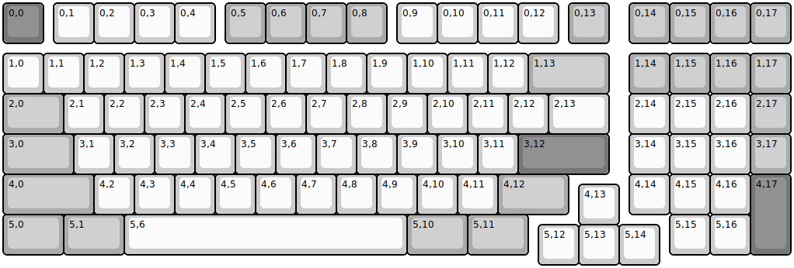{:loading="lazy"}

[Open in keyboard-layout-editor](http://www.keyboard-layout-editor.com/##@@_c=#777777;&=0,0&_x:0.25&c=#cccccc;&=0,1&=0,2&=0,3&=0,4&_x:0.25&c=#aaaaaa;&=0,5&=0,6&=0,7&=0,8&_x:0.25&c=#cccccc;&=0,9&=0,10&=0,11&=0,12&_x:0.25&c=#aaaaaa;&=0,13&_x:0.5;&=0,14&=0,15&=0,16&=0,17;&@_y:0.25&c=#cccccc;&=1,0&=1,1&=1,2&=1,3&=1,4&=1,5&=1,6&=1,7&=1,8&=1,9&=1,10&=1,11&=1,12&_c=#aaaaaa&w:2;&=1,13&_x:0.5;&=1,14&=1,15&=1,16&=1,17;&@_w:1.5;&=2,0&_c=#cccccc;&=2,1&=2,2&=2,3&=2,4&=2,5&=2,6&=2,7&=2,8&=2,9&=2,10&=2,11&=2,12&_w:1.5;&=2,13&_x:0.5;&=2,14&=2,15&=2,16&_c=#aaaaaa;&=2,17;&@_w:1.75;&=3,0&_c=#cccccc;&=3,1&=3,2&=3,3&=3,4&=3,5&=3,6&=3,7&=3,8&=3,9&=3,10&=3,11&_c=#777777&w:2.25;&=3,12&_x:0.5&c=#cccccc;&=3,14&=3,15&=3,16&_c=#aaaaaa;&=3,17;&@_w:2.25;&=4,0&_c=#cccccc;&=4,2&=4,3&=4,4&=4,5&=4,6&=4,7&=4,8&=4,9&=4,10&=4,11&_c=#aaaaaa&w:1.75;&=4,12&_x:1.5&c=#cccccc;&=4,14&=4,15&=4,16&_c=#777777&h:2;&=4,17;&@_x:14.25&y:-0.75&c=#cccccc;&=4,13;&@_y:-0.25&c=#aaaaaa&w:1.5;&=5,0&_w:1.5;&=5,1&_c=#cccccc&w:7;&=5,6&_c=#aaaaaa&w:1.5;&=5,10&_w:1.5;&=5,11&_x:3.5&c=#cccccc;&=5,15&=5,16;&@_x:13.25&y:-0.75;&=5,12&=5,13&=5,14)

## wilba_tech/zeal60

[README](output/wilba_tech/zeal60/README.md) - [layout](output/wilba_tech/zeal60/zeal60-kle.json) - [PCB](output/wilba_tech/zeal60/zeal60.kicad_pcb) - [PCB render](output/wilba_tech/zeal60/zeal60-render.svg)

{:loading="lazy"}

[Open in keyboard-layout-editor](http://www.keyboard-layout-editor.com/##@@_x:2.5&c=#777777;&=0,0&_c=#cccccc;&=0,1&=0,2&=0,3&=0,4&=0,5&=0,6&=0,7&=0,8&=0,9&=0,10&=0,11&=0,12&_c=#aaaaaa&w:2;&=0,13%0A%0A%0A0,0;&@_x:2.5&w:1.5;&=1,0&_c=#cccccc;&=1,1&=1,2&=1,3&=1,4&=1,5&=1,6&=1,7&=1,8&=1,9&=1,10&=1,11&=1,12&_w:1.5;&=1,13%0A%0A%0A1,0;&@_x:2.5&c=#aaaaaa&w:1.75;&=2,0&_c=#cccccc;&=2,1&=2,2&=2,3&=2,4&=2,5&=2,6&=2,7&=2,8&=2,9&=2,10&=2,11&_c=#777777&w:2.25;&=2,12%0A%0A%0A1,0;&@_x:2.5&c=#aaaaaa&w:2.25;&=3,0%0A%0A%0A2,0&_c=#cccccc;&=3,2&=3,3&=3,4&=3,5&=3,6&=3,7&=3,8&=3,9&=3,10&=3,11&_c=#aaaaaa&w:2.75;&=3,12%0A%0A%0A3,0;&@_x:2.5&w:1.25;&=4,0%0A%0A%0A4,0&_w:1.25;&=4,1%0A%0A%0A4,0&_w:1.25;&=4,2%0A%0A%0A4,0&_c=#cccccc&w:6.25;&=4,7%0A%0A%0A4,0&_c=#aaaaaa&w:1.25;&=4,10%0A%0A%0A4,0&_w:1.25;&=4,11%0A%0A%0A4,0&_w:1.25;&=4,12%0A%0A%0A4,0&_w:1.25;&=4,13%0A%0A%0A4,0;&@_x:18.0&y:-5&c=#cccccc;&=0,13%0A%0A%0A0,1&=2,13%0A%0A%0A0,1;&@_x:18.75&c=#777777&w:1.25&h:2&w2:1.5&h2:1&x2:-0.25;&=1,13%0A%0A%0A1,1;&@_x:17.75&c=#cccccc;&=2,12%0A%0A%0A1,1;&@_c=#aaaaaa&w:1.25;&=3,0%0A%0A%0A2,1&=3,1%0A%0A%0A2,1&_x:15.5&w:1.75;&=3,12%0A%0A%0A3,1&=3,13%0A%0A%0A3,1;&@_x:2.5&y:1.5&w:1.5;&=4,0%0A%0A%0A4,1&=4,1%0A%0A%0A4,1&_w:1.5;&=4,2%0A%0A%0A4,1&_c=#cccccc&w:7;&=4,7%0A%0A%0A4,1&_c=#aaaaaa&w:1.5;&=4,11%0A%0A%0A4,1&=4,12%0A%0A%0A4,1&_w:1.5;&=4,13%0A%0A%0A4,1;&@_x:2.5&w:1.5&d:true;&=4,0%0A%0A%0A4,2&=4,1%0A%0A%0A4,2&_w:1.5;&=4,2%0A%0A%0A4,2&_c=#cccccc&w:7;&=4,7%0A%0A%0A4,2&_c=#aaaaaa&w:1.5;&=4,11%0A%0A%0A4,2&=4,12%0A%0A%0A4,2&_w:1.5&d:true;&=4,13%0A%0A%0A4,2;&@_x:2.5&w:1.5;&=4,0%0A%0A%0A4,3&_d:true;&=4,1%0A%0A%0A4,3&_w:1.5;&=4,2%0A%0A%0A4,3&_c=#cccccc&w:7;&=4,7%0A%0A%0A4,3&_c=#aaaaaa&w:1.5;&=4,11%0A%0A%0A4,3&_d:true;&=4,12%0A%0A%0A4,3&_w:1.5;&=4,13%0A%0A%0A4,3)

## wilba_tech/zeal65

[README](output/wilba_tech/zeal65/README.md) - [layout](output/wilba_tech/zeal65/zeal65-kle.json) - [PCB](output/wilba_tech/zeal65/zeal65.kicad_pcb) - [PCB render](output/wilba_tech/zeal65/zeal65-render.svg)

{:loading="lazy"}

[Open in keyboard-layout-editor](http://www.keyboard-layout-editor.com/##@@_c=#777777;&=0,0&_c=#cccccc;&=0,1&=0,2&=0,3&=0,4&=0,5&=0,6&=0,7&=0,8&=0,9&=0,10&=0,11&=0,12&_c=#aaaaaa&w:2;&=0,13%0A%0A%0A0,0&=0,14;&@_w:1.5;&=1,0&_c=#cccccc;&=1,1&=1,2&=1,3&=1,4&=1,5&=1,6&=1,7&=1,8&=1,9&=1,10&=1,11&=1,12&_w:1.5;&=1,13&_c=#aaaaaa;&=1,14;&@_w:1.75;&=2,0&_c=#cccccc;&=2,1&=2,2&=2,3&=2,4&=2,5&=2,6&=2,7&=2,8&=2,9&=2,10&=2,11&_c=#aaaaaa&w:2.25;&=2,12&=2,14;&@_w:2.25;&=3,0&_c=#cccccc;&=3,2&=3,3&=3,4&=3,5&=3,6&=3,7&=3,8&=3,9&=3,10&=3,11&_c=#aaaaaa&w:1.75;&=3,12&_c=#777777;&=3,13&_c=#aaaaaa;&=3,14;&@_w:1.5;&=4,0&_w:1.5;&=4,1&_c=#cccccc&w:7;&=4,7&_c=#aaaaaa&w:1.5;&=4,10&_w:1.5;&=4,11&_c=#777777;&=4,12&=4,13&=4,14;&@_x:16.25&y:-5&c=#cccccc;&=0,13%0A%0A%0A0,1&=2,13%0A%0A%0A0,1)

## wings42/wings42

[README](output/wings42/README.md) - [layout](output/wings42/wings42-kle.json) - [PCB](output/wings42/wings42.kicad_pcb) - [PCB render](output/wings42/wings42-render.svg)

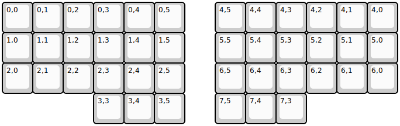{:loading="lazy"}

[Open in keyboard-layout-editor](http://www.keyboard-layout-editor.com/##@@=0,0&=0,1&=0,2&=0,3&=0,4&=0,5&_x:1;&=4,5&=4,4&=4,3&=4,2&=4,1&=4,0;&@=1,0&=1,1&=1,2&=1,3&=1,4&=1,5&_x:1;&=5,5&=5,4&=5,3&=5,2&=5,1&=5,0;&@=2,0&=2,1&=2,2&=2,3&=2,4&=2,5&_x:1;&=6,5&=6,4&=6,3&=6,2&=6,1&=6,0;&@_x:3;&=3,3&=3,4&=3,5&_x:1;&=7,5&=7,4&=7,3)

## wings42_extkeys/wings42_extkeys

[README](output/wings42_extkeys/README.md) - [layout](output/wings42_extkeys/wings42_extkeys-kle.json) - [PCB](output/wings42_extkeys/wings42_extkeys.kicad_pcb) - [PCB render](output/wings42_extkeys/wings42_extkeys-render.svg)

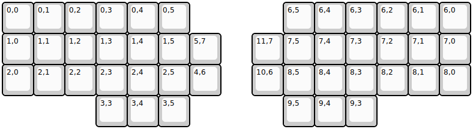{:loading="lazy"}

[Open in keyboard-layout-editor](http://www.keyboard-layout-editor.com/##@@=0,0&=0,1&=0,2&=0,3&=0,4&=0,5&_x:3;&=6,5&=6,4&=6,3&=6,2&=6,1&=6,0;&@=1,0&=1,1&=1,2&=1,3&=1,4&=1,5&=5,7&_x:1;&=11,7&=7,5&=7,4&=7,3&=7,2&=7,1&=7,0;&@=2,0&=2,1&=2,2&=2,3&=2,4&=2,5&=4,6&_x:1;&=10,6&=8,5&=8,4&=8,3&=8,2&=8,1&=8,0;&@_x:3;&=3,3&=3,4&=3,5&_x:3;&=9,5&=9,4&=9,3)

## winkeyless/bface

[README](output/winkeyless/bface/README.md) - [layout](output/winkeyless/bface/bface-kle.json) - [PCB](output/winkeyless/bface/bface.kicad_pcb) - [PCB render](output/winkeyless/bface/bface-render.svg)

{:loading="lazy"}

[Open in keyboard-layout-editor](http://www.keyboard-layout-editor.com/##@@_c=#777777;&=4,0&_c=#cccccc;&=4,1&=4,2&=4,3&=4,4&=4,5&=6,1&=6,11&=7,11&=7,1&=4,10&=4,11&=4,12&_c=#aaaaaa&w:2;&=4,14;&@_w:1.5;&=3,0&_c=#cccccc;&=3,1&=3,2&=3,3&=3,4&=3,5&=6,2&=6,12&=7,12&=7,2&=3,10&=3,11&=3,12&_w:1.5;&=3,13;&@_c=#aaaaaa&w:1.75;&=2,0&_c=#cccccc;&=2,1&=2,2&=2,3&=2,4&=2,5&=6,3&=6,13&=7,13&=7,3&=2,10&=2,11&_c=#777777&w:2.25;&=2,13;&@_c=#aaaaaa&w:2.25;&=1,0&_c=#cccccc;&=1,1&=1,2&=1,3&=1,4&=1,5&=6,4&=6,14&=7,14&=7,4&=1,10&_c=#aaaaaa&w:2.75;&=1,11;&@_w:1.25;&=0,0&_w:1.25;&=0,1&_w:1.25;&=0,2&_c=#cccccc&w:6.25;&=6,5&_c=#aaaaaa&w:1.25;&=7,5&_w:1.25;&=0,10&_w:1.25;&=0,11&_w:1.25;&=0,12)

## winry/winry315

[README](output/winry/README.md) - [layout](output/winry/winry315-kle.json) - [PCB](output/winry/winry315.kicad_pcb) - [PCB render](output/winry/winry315-render.svg)

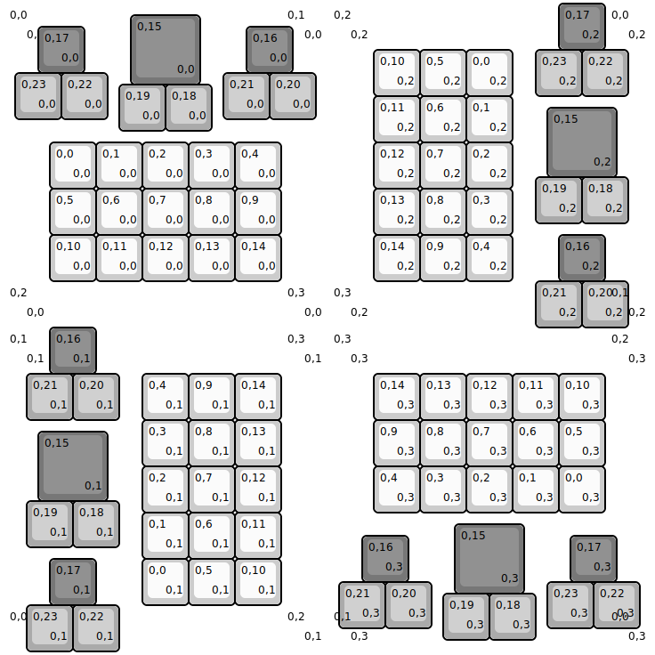{:loading="lazy"}

[Open in keyboard-layout-editor](http://www.keyboard-layout-editor.com/##@@_d:true;&=0,0%0A%0A%0A0,0&_x:5&d:true;&=0,1%0A%0A%0A0,0;&@_x:2.75&y:-0.75&c=#777777&w:1.5&h:1.5;&=0,15%0A%0A%0A0,0;&@_x:0.75&y:-0.75;&=0,17%0A%0A%0A0,0&_x:3.5;&=0,16%0A%0A%0A0,0;&@_x:0.25&c=#aaaaaa;&=0,23%0A%0A%0A0,0&=0,22%0A%0A%0A0,0&_x:2.5;&=0,21%0A%0A%0A0,0&=0,20%0A%0A%0A0,0;&@_x:2.5&y:-0.75;&=0,19%0A%0A%0A0,0&=0,18%0A%0A%0A0,0;&@_x:1&y:0.25&c=#cccccc;&=0,0%0A%0A%0A0,0&=0,1%0A%0A%0A0,0&=0,2%0A%0A%0A0,0&=0,3%0A%0A%0A0,0&=0,4%0A%0A%0A0,0;&@_x:1;&=0,5%0A%0A%0A0,0&=0,6%0A%0A%0A0,0&=0,7%0A%0A%0A0,0&=0,8%0A%0A%0A0,0&=0,9%0A%0A%0A0,0;&@_x:1;&=0,10%0A%0A%0A0,0&=0,11%0A%0A%0A0,0&=0,12%0A%0A%0A0,0&=0,13%0A%0A%0A0,0&=0,14%0A%0A%0A0,0;&@_d:true;&=0,2%0A%0A%0A0,0&_x:5&d:true;&=0,3%0A%0A%0A0,0;&@_x:7&y:-7.0&d:true;&=0,2%0A%0A%0A0,2&_x:4&c=#777777;&=0,17%0A%0A%0A0,2&_c=#cccccc&d:true;&=0,0%0A%0A%0A0,2;&@_x:8;&=0,10%0A%0A%0A0,2&=0,5%0A%0A%0A0,2&=0,0%0A%0A%0A0,2&_x:0.5&c=#aaaaaa;&=0,23%0A%0A%0A0,2&=0,22%0A%0A%0A0,2;&@_x:8&c=#cccccc;&=0,11%0A%0A%0A0,2&=0,6%0A%0A%0A0,2&=0,1%0A%0A%0A0,2;&@_x:11.75&y:-0.75&c=#777777&w:1.5&h:1.5;&=0,15%0A%0A%0A0,2;&@_x:8&y:-0.25&c=#cccccc;&=0,12%0A%0A%0A0,2&=0,7%0A%0A%0A0,2&=0,2%0A%0A%0A0,2;&@_x:11.5&y:-0.25&c=#aaaaaa;&=0,19%0A%0A%0A0,2&=0,18%0A%0A%0A0,2;&@_x:8&y:-0.75&c=#cccccc;&=0,13%0A%0A%0A0,2&=0,8%0A%0A%0A0,2&=0,3%0A%0A%0A0,2;&@_x:8;&=0,14%0A%0A%0A0,2&=0,9%0A%0A%0A0,2&=0,4%0A%0A%0A0,2&_x:1&c=#777777;&=0,16%0A%0A%0A0,2;&@_x:7&c=#cccccc&d:true;&=0,3%0A%0A%0A0,2&_x:3.5&c=#aaaaaa;&=0,21%0A%0A%0A0,2&=0,20%0A%0A%0A0,2&_x:-0.5&c=#cccccc&d:true;&=0,1%0A%0A%0A0,2;&@_d:true;&=0,1%0A%0A%0A0,1&_c=#777777;&=0,16%0A%0A%0A0,1&_x:4&c=#cccccc&d:true;&=0,3%0A%0A%0A0,1&_d:true;&=0,3%0A%0A%0A0,3&_x:5&d:true;&=0,2%0A%0A%0A0,3;&@_x:0.5&c=#aaaaaa;&=0,21%0A%0A%0A0,1&=0,20%0A%0A%0A0,1&_x:0.5&c=#cccccc;&=0,4%0A%0A%0A0,1&=0,9%0A%0A%0A0,1&=0,14%0A%0A%0A0,1&_x:2.0;&=0,14%0A%0A%0A0,3&=0,13%0A%0A%0A0,3&=0,12%0A%0A%0A0,3&=0,11%0A%0A%0A0,3&=0,10%0A%0A%0A0,3;&@_x:3;&=0,3%0A%0A%0A0,1&=0,8%0A%0A%0A0,1&=0,13%0A%0A%0A0,1&_x:2;&=0,9%0A%0A%0A0,3&=0,8%0A%0A%0A0,3&=0,7%0A%0A%0A0,3&=0,6%0A%0A%0A0,3&=0,5%0A%0A%0A0,3;&@_x:0.75&y:-0.75&c=#777777&w:1.5&h:1.5;&=0,15%0A%0A%0A0,1;&@_x:3&y:-0.25&c=#cccccc;&=0,2%0A%0A%0A0,1&=0,7%0A%0A%0A0,1&=0,12%0A%0A%0A0,1&_x:2;&=0,4%0A%0A%0A0,3&=0,3%0A%0A%0A0,3&=0,2%0A%0A%0A0,3&=0,1%0A%0A%0A0,3&=0,0%0A%0A%0A0,3;&@_x:0.5&y:-0.25&c=#aaaaaa;&=0,19%0A%0A%0A0,1&=0,18%0A%0A%0A0,1;&@_x:3&y:-0.75&c=#cccccc;&=0,1%0A%0A%0A0,1&=0,6%0A%0A%0A0,1&=0,11%0A%0A%0A0,1;&@_x:9.75&y:-0.75&c=#777777&w:1.5&h:1.5;&=0,15%0A%0A%0A0,3;&@_x:7.75&y:-0.75;&=0,16%0A%0A%0A0,3&_x:3.5;&=0,17%0A%0A%0A0,3;&@_x:1&y:-0.5;&=0,17%0A%0A%0A0,1&_x:1&c=#cccccc;&=0,0%0A%0A%0A0,1&=0,5%0A%0A%0A0,1&=0,10%0A%0A%0A0,1;&@_x:7.25&y:-0.5&c=#aaaaaa;&=0,21%0A%0A%0A0,3&=0,20%0A%0A%0A0,3&_x:2.5;&=0,23%0A%0A%0A0,3&=0,22%0A%0A%0A0,3;&@_x:9.5&y:-0.75;&=0,19%0A%0A%0A0,3&=0,18%0A%0A%0A0,3;&@_y:-0.75&c=#cccccc&d:true;&=0,0%0A%0A%0A0,1&_x:-0.5&c=#aaaaaa;&=0,23%0A%0A%0A0,1&=0,22%0A%0A%0A0,1&_x:3.5&c=#cccccc&d:true;&=0,2%0A%0A%0A0,1&_d:true;&=0,1%0A%0A%0A0,3&_x:5.0&d:true;&=0,0%0A%0A%0A0,3)

## wolf/kuku65

[README](output/wolf/kuku65/README.md) - [layout](output/wolf/kuku65/kuku65-kle.json) - [PCB](output/wolf/kuku65/kuku65.kicad_pcb) - [PCB render](output/wolf/kuku65/kuku65-render.svg)

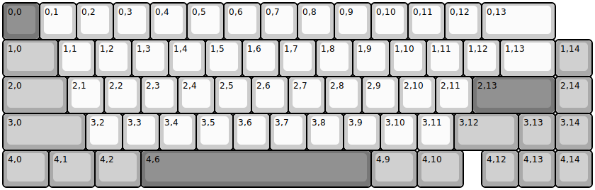{:loading="lazy"}

[Open in keyboard-layout-editor](http://www.keyboard-layout-editor.com/##@@_c=#777777;&=0,0&_c=#cccccc;&=0,1&=0,2&=0,3&=0,4&=0,5&=0,6&=0,7&=0,8&=0,9&=0,10&=0,11&=0,12&_w:2;&=0,13;&@_c=#aaaaaa&w:1.5;&=1,0&_c=#cccccc;&=1,1&=1,2&=1,3&=1,4&=1,5&=1,6&=1,7&=1,8&=1,9&=1,10&=1,11&=1,12&_w:1.5;&=1,13&_c=#aaaaaa;&=1,14;&@_w:1.75;&=2,0&_c=#cccccc;&=2,1&=2,2&=2,3&=2,4&=2,5&=2,6&=2,7&=2,8&=2,9&=2,10&=2,11&_c=#777777&w:2.25;&=2,13&_c=#aaaaaa;&=2,14;&@_w:2.25;&=3,0&_c=#cccccc;&=3,2&=3,3&=3,4&=3,5&=3,6&=3,7&=3,8&=3,9&=3,10&=3,11&_c=#aaaaaa&w:1.75;&=3,12&=3,13&=3,14;&@_w:1.25;&=4,0&_w:1.25;&=4,1&_w:1.25;&=4,2&_c=#777777&w:6.25;&=4,6&_c=#aaaaaa&w:1.25;&=4,9&_w:1.25;&=4,10&_x:0.5;&=4,12&=4,13&=4,14)

## wolf/ryujin

[README](output/wolf/ryujin/README.md) - [layout](output/wolf/ryujin/ryujin-kle.json) - [PCB](output/wolf/ryujin/ryujin.kicad_pcb) - [PCB render](output/wolf/ryujin/ryujin-render.svg)

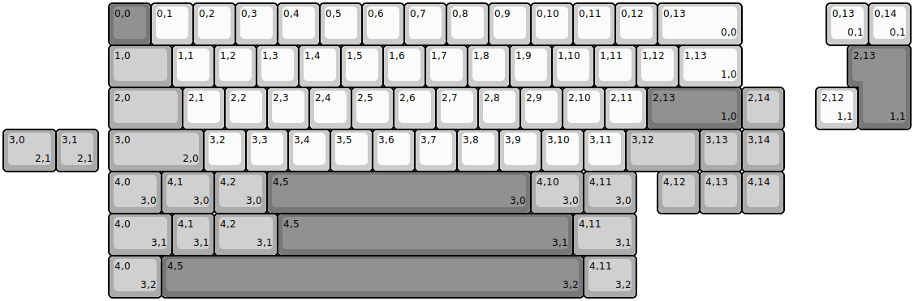{:loading="lazy"}

[Open in keyboard-layout-editor](http://www.keyboard-layout-editor.com/##@@_x:2.5&c=#777777;&=0,0&_c=#cccccc;&=0,1&=0,2&=0,3&=0,4&=0,5&=0,6&=0,7&=0,8&=0,9&=0,10&=0,11&=0,12&_w:2;&=0,13%0A%0A%0A0,0;&@_x:2.5&c=#aaaaaa&w:1.5;&=1,0&_c=#cccccc;&=1,1&=1,2&=1,3&=1,4&=1,5&=1,6&=1,7&=1,8&=1,9&=1,10&=1,11&=1,12&_w:1.5;&=1,13%0A%0A%0A1,0;&@_x:2.5&c=#aaaaaa&w:1.75;&=2,0&_c=#cccccc;&=2,1&=2,2&=2,3&=2,4&=2,5&=2,6&=2,7&=2,8&=2,9&=2,10&=2,11&_c=#777777&w:2.25;&=2,13%0A%0A%0A1,0&_c=#aaaaaa;&=2,14;&@_x:2.5&w:2.25;&=3,0%0A%0A%0A2,0&_c=#cccccc;&=3,2&=3,3&=3,4&=3,5&=3,6&=3,7&=3,8&=3,9&=3,10&=3,11&_c=#aaaaaa&w:1.75;&=3,12&=3,13&=3,14;&@_x:2.5&w:1.25;&=4,0%0A%0A%0A3,0&_w:1.25;&=4,1%0A%0A%0A3,0&_w:1.25;&=4,2%0A%0A%0A3,0&_c=#777777&w:6.25;&=4,5%0A%0A%0A3,0&_c=#aaaaaa&w:1.25;&=4,10%0A%0A%0A3,0&_w:1.25;&=4,11%0A%0A%0A3,0&_x:0.5;&=4,12&=4,13&=4,14;&@_x:19.5&y:-5&c=#cccccc;&=0,13%0A%0A%0A0,1&=0,14%0A%0A%0A0,1;&@_x:20.25&c=#777777&w:1.25&h:2&w2:1.5&h2:1&x2:-0.25;&=2,13%0A%0A%0A1,1;&@_x:19.25&c=#cccccc;&=2,12%0A%0A%0A1,1;&@_c=#aaaaaa&w:1.25;&=3,0%0A%0A%0A2,1&=3,1%0A%0A%0A2,1;&@_x:2.5&y:1&w:1.5;&=4,0%0A%0A%0A3,1&=4,1%0A%0A%0A3,1&_w:1.5;&=4,2%0A%0A%0A3,1&_c=#777777&w:7;&=4,5%0A%0A%0A3,1&_c=#aaaaaa&w:1.5;&=4,11%0A%0A%0A3,1;&@_x:2.5&w:1.25;&=4,0%0A%0A%0A3,2&_c=#777777&w:10;&=4,5%0A%0A%0A3,2&_c=#aaaaaa&w:1.25;&=4,11%0A%0A%0A3,2)

## wolf/sabre

[README](output/wolf/sabre/README.md) - [layout](output/wolf/sabre/sabre-kle.json) - [PCB](output/wolf/sabre/sabre.kicad_pcb) - [PCB render](output/wolf/sabre/sabre-render.svg)

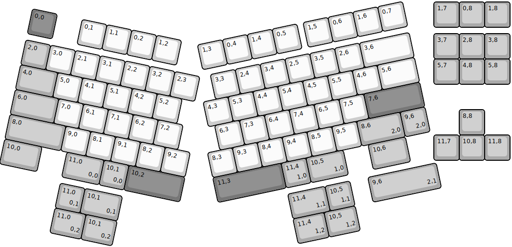{:loading="lazy"}

[Open in keyboard-layout-editor](http://www.keyboard-layout-editor.com/##@@_x:17&c=#aaaaaa;&=1,7&=0,8&=1,8;&@_x:17&y:0.25;&=3,7&=2,8&=3,8;&@_x:17;&=5,7&=4,8&=5,8;&@_x:18&y:1.0;&=8,8;&@_x:17;&=11,7&=10,8&=11,8;&@_r:12&x:1.25&y:-6.25&c=#777777;&=0,0&_x:1.0&c=#cccccc;&=0,1&=1,1&=0,2&=1,2;&@_x:1.25&y:0.25&c=#aaaaaa;&=2,0&_c=#cccccc;&=3,0&=2,1&=3,1&=2,2&=3,2&=2,3;&@_x:1.25&c=#aaaaaa&w:1.5;&=4,0&_c=#cccccc;&=5,0&=4,1&=5,1&=4,2&=5,2;&@_x:1.25&c=#aaaaaa&w:1.75;&=6,0&_c=#cccccc;&=7,0&=6,1&=7,1&=6,2&=7,2;&@_x:1.25&c=#aaaaaa&w:2.25;&=8,0&_c=#cccccc;&=9,0&=8,1&=9,1&=8,2&=9,2;&@_x:1.25&c=#aaaaaa&w:1.5;&=10,0&_x:1.0&w:1.5;&=11,0%0A%0A%0A0,0&=10,1%0A%0A%0A0,0&_c=#777777&w:2.25;&=10,2;&@_r:-12&rx:15.75&x:-8.25&c=#cccccc;&=1,3&=0,4&=1,4&=0,5&_x:0.25;&=1,5&=0,6&=1,6&=0,7;&@_x:-8.0&y:0.25;&=3,3&=2,4&=3,4&=2,5&=3,5&=2,6&_w:2;&=3,6;&@_x:-8.5;&=4,3&=5,3&=4,4&=5,4&=4,5&=5,5&=4,6&_w:1.5;&=5,6;&@_x:-8.25;&=6,3&=7,3&=6,4&=7,4&=6,5&=7,5&_c=#777777&w:2.25;&=7,6;&@_x:-8.75&c=#cccccc;&=8,3&=9,3&=8,4&=9,4&=8,5&=9,5&_c=#aaaaaa&w:1.75;&=8,6%0A%0A%0A2,0&=9,6%0A%0A%0A2,0;&@_x:-8.75&c=#777777&w:2.75;&=11,3&_c=#aaaaaa;&=11,4%0A%0A%0A1,0&_w:1.5;&=10,5%0A%0A%0A1,0&_x:1.0&w:1.5;&=10,6;&@_r:12&rx:0&x:3.75&y:6.5;&=11,0%0A%0A%0A0,1&_w:1.5;&=10,1%0A%0A%0A0,1;&@_x:3.75&w:1.25;&=11,0%0A%0A%0A0,2&_w:1.25;&=10,1%0A%0A%0A0,2;&@_r:-12&rx:15.75&x:-6.0&y:6.5&w:1.5;&=11,4%0A%0A%0A1,1&=10,5%0A%0A%0A1,1;&@_x:-6.0&w:1.25;&=11,4%0A%0A%0A1,2&_w:1.25;&=10,5%0A%0A%0A1,2;&@_rx:17&x:-4&y:6.25&w:2.75;&=9,6%0A%0A%0A2,1)

## wolf/ts60

[README](output/wolf/ts60/README.md) - [layout](output/wolf/ts60/ts60-kle.json) - [PCB](output/wolf/ts60/ts60.kicad_pcb) - [PCB render](output/wolf/ts60/ts60-render.svg)

{:loading="lazy"}

[Open in keyboard-layout-editor](http://www.keyboard-layout-editor.com/##@@_c=#777777;&=0,0&_c=#cccccc;&=1,0&=0,1&=1,1&=0,2&=1,2&=0,3&=1,3&=0,4&=1,4&=0,5&=1,5&=0,6&_c=#aaaaaa&w:2;&=0,7%0A%0A%0A0,0;&@_w:1.5;&=2,0&_c=#cccccc;&=2,1&=3,1&=2,2&=3,2&=2,3&=3,3&=2,4&=3,4&=2,5&=3,5&=2,6&=2,7&_w:1.5;&=3,7%0A%0A%0A1,0;&@_c=#aaaaaa&w:1.75;&=4,0&_c=#cccccc;&=4,1&=5,1&=4,2&=5,2&=4,3&=5,3&=4,4&=5,4&=4,5&=5,5&=4,6&_c=#777777&w:2.25;&=5,7%0A%0A%0A1,0;&@_c=#aaaaaa&w:2.25;&=6,0%0A%0A%0A2,0&_c=#cccccc;&=6,1%0A%0A%0A2,0&=7,1%0A%0A%0A2,0&=6,2%0A%0A%0A2,0&=7,2%0A%0A%0A2,0&=6,3%0A%0A%0A2,0&=7,3%0A%0A%0A2,0&=6,4%0A%0A%0A2,0&=7,4%0A%0A%0A2,0&=6,5%0A%0A%0A2,0&=7,5%0A%0A%0A2,0&_d:true;&=6,6%0A%0A%0A2,0&_x:-1.0&c=#aaaaaa&w:2.75;&=6,7%0A%0A%0A2,0;&@_w:1.25;&=8,0%0A%0A%0A3,0&_w:1.25;&=9,0%0A%0A%0A3,0&_w:1.25;&=8,1%0A%0A%0A3,0&_c=#cccccc&w:6.25;&=8,3%0A%0A%0A3,0&_c=#aaaaaa&w:1.25;&=8,5%0A%0A%0A3,0&_w:1.25;&=9,5%0A%0A%0A3,0&_w:1.25;&=8,7%0A%0A%0A3,0&_w:1.25;&=9,7%0A%0A%0A3,0;&@_x:15.5&y:-5&c=#cccccc;&=0,7%0A%0A%0A0,1&=1,7%0A%0A%0A0,1;&@_x:16.25&c=#777777&w:1.25&h:2&w2:1.5&h2:1&x2:-0.25;&=5,7%0A%0A%0A1,1;&@_x:15.25&c=#cccccc;&=4,7%0A%0A%0A1,1;&@_y:2.25&c=#aaaaaa&w:2.25;&=6,0%0A%0A%0A2,1&_c=#cccccc;&=6,1%0A%0A%0A2,1&=7,1%0A%0A%0A2,1&=6,2%0A%0A%0A2,1&=7,2%0A%0A%0A2,1&=6,3%0A%0A%0A2,1&=7,3%0A%0A%0A2,1&=6,4%0A%0A%0A2,1&=7,4%0A%0A%0A2,1&=6,5%0A%0A%0A2,1&_c=#aaaaaa&w:1.75;&=6,6%0A%0A%0A2,1&=6,7%0A%0A%0A2,1&=7,7%0A%0A%0A2,1;&@_w:2.25;&=6,0%0A%0A%0A2,2&_c=#cccccc;&=6,1%0A%0A%0A2,2&=7,1%0A%0A%0A2,2&=6,2%0A%0A%0A2,2&=7,2%0A%0A%0A2,2&=6,3%0A%0A%0A2,2&=7,3%0A%0A%0A2,2&=6,4%0A%0A%0A2,2&=7,4%0A%0A%0A2,2&=6,5%0A%0A%0A2,2&=7,5%0A%0A%0A2,2&_c=#aaaaaa&w:1.75;&=6,7%0A%0A%0A2,2&=7,7%0A%0A%0A2,2;&@_y:0.25&w:1.25;&=6,0%0A%0A%0A2,3&_c=#cccccc;&=7,0%0A%0A%0A2,3&=6,1%0A%0A%0A2,3&=7,1%0A%0A%0A2,3&=6,2%0A%0A%0A2,3&=7,2%0A%0A%0A2,3&=6,3%0A%0A%0A2,3&=7,3%0A%0A%0A2,3&=6,4%0A%0A%0A2,3&=7,4%0A%0A%0A2,3&=6,5%0A%0A%0A2,3&=7,5%0A%0A%0A2,3&_c=#aaaaaa&w:2.75;&=6,7%0A%0A%0A2,3;&@_w:1.25;&=6,0%0A%0A%0A2,4&_c=#cccccc;&=7,0%0A%0A%0A2,4&=6,1%0A%0A%0A2,4&=7,1%0A%0A%0A2,4&=6,2%0A%0A%0A2,4&=7,2%0A%0A%0A2,4&=6,3%0A%0A%0A2,4&=7,3%0A%0A%0A2,4&=6,4%0A%0A%0A2,4&=7,4%0A%0A%0A2,4&=6,5%0A%0A%0A2,4&_c=#aaaaaa&w:1.75;&=6,6%0A%0A%0A2,4&=6,7%0A%0A%0A2,4&=7,7%0A%0A%0A2,4;&@_w:1.25;&=6,0%0A%0A%0A2,5&_c=#cccccc;&=7,0%0A%0A%0A2,5&=6,1%0A%0A%0A2,5&=7,1%0A%0A%0A2,5&=6,2%0A%0A%0A2,5&=7,2%0A%0A%0A2,5&=6,3%0A%0A%0A2,5&=7,3%0A%0A%0A2,5&=6,4%0A%0A%0A2,5&=7,4%0A%0A%0A2,5&=6,5%0A%0A%0A2,5&=7,5%0A%0A%0A2,5&_c=#aaaaaa&w:1.75;&=6,7%0A%0A%0A2,5&=7,7%0A%0A%0A2,5;&@_y:0.25&w:2;&=6,0%0A%0A%0A2,6&_c=#cccccc;&=6,1%0A%0A%0A2,6&=7,1%0A%0A%0A2,6&=6,2%0A%0A%0A2,6&=7,2%0A%0A%0A2,6&=6,3%0A%0A%0A2,6&=7,3%0A%0A%0A2,6&=6,4%0A%0A%0A2,6&=7,4%0A%0A%0A2,6&=6,5%0A%0A%0A2,6&=7,5%0A%0A%0A2,6&=6,6%0A%0A%0A2,6&_c=#aaaaaa&w:2;&=6,7%0A%0A%0A2,6;&@_w:2;&=6,0%0A%0A%0A2,7&_c=#cccccc;&=6,1%0A%0A%0A2,7&=7,1%0A%0A%0A2,7&=6,2%0A%0A%0A2,7&=7,2%0A%0A%0A2,7&=6,3%0A%0A%0A2,7&=7,3%0A%0A%0A2,7&=6,4%0A%0A%0A2,7&=7,4%0A%0A%0A2,7&=6,5%0A%0A%0A2,7&=7,5%0A%0A%0A2,7&=6,6%0A%0A%0A2,7&_c=#aaaaaa;&=6,7%0A%0A%0A2,7&=7,7%0A%0A%0A2,7;&@_c=#cccccc;&=6,0%0A%0A%0A2,8&=7,0%0A%0A%0A2,8&=6,1%0A%0A%0A2,8&=7,1%0A%0A%0A2,8&=6,2%0A%0A%0A2,8&=7,2%0A%0A%0A2,8&=6,3%0A%0A%0A2,8&=7,3%0A%0A%0A2,8&=6,4%0A%0A%0A2,8&=7,4%0A%0A%0A2,8&=6,5%0A%0A%0A2,8&=7,5%0A%0A%0A2,8&=6,6%0A%0A%0A2,8&_c=#aaaaaa&w:2;&=6,7%0A%0A%0A2,8;&@_c=#cccccc;&=6,0%0A%0A%0A2,9&=7,0%0A%0A%0A2,9&=6,1%0A%0A%0A2,9&=7,1%0A%0A%0A2,9&=6,2%0A%0A%0A2,9&=7,2%0A%0A%0A2,9&=6,3%0A%0A%0A2,9&=7,3%0A%0A%0A2,9&=6,4%0A%0A%0A2,9&=7,4%0A%0A%0A2,9&=6,5%0A%0A%0A2,9&=7,5%0A%0A%0A2,9&=6,6%0A%0A%0A2,9&_c=#aaaaaa;&=6,7%0A%0A%0A2,9&=7,7%0A%0A%0A2,9;&@_y:0.25&w:1.25;&=8,0%0A%0A%0A3,1&_w:1.25;&=9,0%0A%0A%0A3,1&_w:1.25;&=8,1%0A%0A%0A3,1&_c=#cccccc&w:2.25;&=8,2%0A%0A%0A3,1&_c=#aaaaaa&w:1.25;&=5,3%0A%0A%0A3,1&_c=#cccccc&w:2.75;&=8,4%0A%0A%0A3,1&_c=#aaaaaa;&=8,5%0A%0A%0A3,1&=9,5%0A%0A%0A3,1&=8,6%0A%0A%0A3,1&=8,7%0A%0A%0A3,1&=9,7%0A%0A%0A3,1;&@_w:1.25;&=8,0%0A%0A%0A3,2&_w:1.25;&=9,0%0A%0A%0A3,2&_w:1.25;&=8,1%0A%0A%0A3,2&_c=#cccccc&w:2.75;&=8,2%0A%0A%0A3,2&_c=#aaaaaa&w:1.25;&=8,3%0A%0A%0A3,2&_c=#cccccc&w:2.25;&=8,4%0A%0A%0A3,2&_c=#aaaaaa;&=8,5%0A%0A%0A3,2&=9,5%0A%0A%0A3,2&=8,6%0A%0A%0A3,2&=8,7%0A%0A%0A3,2&=9,7%0A%0A%0A3,2;&@_w:1.5;&=8,0%0A%0A%0A3,3&=9,0%0A%0A%0A3,3&_w:1.25;&=8,1%0A%0A%0A3,3&_c=#cccccc&w:6.25;&=8,3%0A%0A%0A3,3&_c=#aaaaaa;&=8,5%0A%0A%0A3,3&=9,5%0A%0A%0A3,3&=8,6%0A%0A%0A3,3&=8,7%0A%0A%0A3,3&=9,7%0A%0A%0A3,3;&@_w:1.5;&=8,0%0A%0A%0A3,4&_w:1.5;&=9,0%0A%0A%0A3,4&_c=#cccccc&w:7;&=8,3%0A%0A%0A3,4&_c=#aaaaaa;&=8,5%0A%0A%0A3,4&=9,5%0A%0A%0A3,4&=8,6%0A%0A%0A3,4&=8,7%0A%0A%0A3,4&=9,7%0A%0A%0A3,4;&@_w:1.5;&=8,0%0A%0A%0A3,5&=9,0%0A%0A%0A3,5&_w:1.5;&=8,1%0A%0A%0A3,5&_c=#cccccc&w:7;&=8,3%0A%0A%0A3,5&_c=#aaaaaa&w:1.5;&=9,5%0A%0A%0A3,5&=8,7%0A%0A%0A3,5&_w:1.5;&=9,7%0A%0A%0A3,5;&@_w:1.25;&=8,0%0A%0A%0A3,6&_w:1.25;&=9,0%0A%0A%0A3,6&_w:1.25;&=8,1%0A%0A%0A3,6&_c=#cccccc&w:6.25;&=8,3%0A%0A%0A3,6&_c=#aaaaaa;&=8,5%0A%0A%0A3,6&=9,5%0A%0A%0A3,6&=8,6%0A%0A%0A3,6&=8,7%0A%0A%0A3,6&=9,7%0A%0A%0A3,6)

## wootpatoot/lets_split/lets_split_v2

[README](output/wootpatoot/lets_split/README.md) - [layout](output/wootpatoot/lets_split/lets_split_v2-kle.json) - [PCB](output/wootpatoot/lets_split/lets_split_v2.kicad_pcb) - [PCB render](output/wootpatoot/lets_split/lets_split_v2-render.svg)

{:loading="lazy"}

[Open in keyboard-layout-editor](http://www.keyboard-layout-editor.com/##@@_y:1;&=0,0&=0,1&=0,2&=0,3&=0,4&=0,5&_x:0.75;&=4,5&=4,4&=4,3&=4,2&=4,1&=4,0;&@=1,0&=1,1&=1,2&=1,3&=1,4&=1,5&_x:0.75;&=5,5&=5,4&=5,3&=5,2&=5,1&=5,0;&@=2,0&=2,1&=2,2&=2,3&=2,4&=2,5&_x:0.75;&=6,5&=6,4&=6,3&=6,2&=6,1&=6,0;&@=3,0&=3,1&=3,2&=3,3&=3,4&=3,5&_x:0.75;&=7,5&=7,4&=7,3&=7,2&=7,1&=7,0)

## work_louder/loop

[README](output/work_louder/README.md) - [layout](output/work_louder/loop-kle.json) - [PCB](output/work_louder/loop.kicad_pcb) - [PCB render](output/work_louder/loop-render.svg)

{:loading="lazy"}

[Open in keyboard-layout-editor](http://www.keyboard-layout-editor.com/##@@_c=#aaaaaa;&=0,0&_x:0.25;&=0,1&_x:0.25;&=0,2&_x:0.25&c=#ccccccc;&=0,3&=0,4&=0,5&=0,6&=0,7&=0,8&=0,9&=0,10&=0,11;&@_c=#aaaaaa;&=1,0&_x:0.25;&=1,2&_x:0.25;&=1,4;&@=1,1&_x:0.25;&=1,3&_x:0.25;&=1,5)

## work_louder/loop_e

[README](output/work_louder/README.md) - [layout](output/work_louder/loop_e-kle.json) - [PCB](output/work_louder/loop_e.kicad_pcb) - [PCB render](output/work_louder/loop_e-render.svg)

{:loading="lazy"}

[Open in keyboard-layout-editor](http://www.keyboard-layout-editor.com/##@@_c=#aaaaaa;&=0,0%0A%0A%0A%0A%0A%0A%0A%0A%0Ae0&_x:0.25;&=0,1%0A%0A%0A%0A%0A%0A%0A%0A%0Ae1&_x:0.25;&=0,2%0A%0A%0A%0A%0A%0A%0A%0A%0Ae2&_x:0.25&c=#ccccccc;&=0,3&=0,4&=0,5&=0,6&=0,7&=0,8&=0,9&=0,10&=0,11)

## work_louder/micro

[README](output/work_louder/README.md) - [layout](output/work_louder/micro-kle.json) - [PCB](output/work_louder/micro.kicad_pcb) - [PCB render](output/work_louder/micro-render.svg)

{:loading="lazy"}

[Open in keyboard-layout-editor](http://www.keyboard-layout-editor.com/##@@=0,0%0A%0A%0A%0A%0A%0A%0A%0A%0Ae0&_x:2.5;&=0,3%0A%0A%0A%0A%0A%0A%0A%0A%0Ae1;&@_x:1.25&y:-0.75;&=0,1&=0,2;&@_x:0.25;&=1,0&=1,1&=1,2&=1,3;&@_x:0.25;&=2,0&=2,1&=2,2&=2,3;&@_x:1.25;&=3,1&=3,2;&@_y:-0.75;&=3,0&_x:2.5;&=3,3)

## work_louder/nano

[README](output/work_louder/README.md) - [layout](output/work_louder/nano-kle.json) - [PCB](output/work_louder/nano.kicad_pcb) - [PCB render](output/work_louder/nano-render.svg)

{:loading="lazy"}

[Open in keyboard-layout-editor](http://www.keyboard-layout-editor.com/##@@=0,0&_x:0.25;&=0,1&=0,2;&@=0,3;&@=0,4)

## work_louder/nano_e

[README](output/work_louder/README.md) - [layout](output/work_louder/nano_e-kle.json) - [PCB](output/work_louder/nano_e.kicad_pcb) - [PCB render](output/work_louder/nano_e-render.svg)

{:loading="lazy"}

[Open in keyboard-layout-editor](http://www.keyboard-layout-editor.com/##@@=0,0%0A%0A%0A%0A%0A%0A%0A%0A%0Ae0&_x:0.25;&=0,1&=0,2)

## work_louder/work_board

[README](output/work_louder/README.md) - [layout](output/work_louder/work_board-kle.json) - [PCB](output/work_louder/work_board.kicad_pcb) - [PCB render](output/work_louder/work_board-render.svg)

{:loading="lazy"}

[Open in keyboard-layout-editor](http://www.keyboard-layout-editor.com/##@@_c=#aaaaaa;&=0,0&_c=#ccccccc;&=0,1&=0,2&=0,3&=0,4&=0,5&=0,6&=0,7&=0,8&=0,9&=0,10&_c=#aaaaaa;&=0,11&_x:0.25&c=#ccccccc;&=0,12;&@_c=#aaaaaa;&=1,0&_c=#ccccccc;&=1,1&=1,2&=1,3&=1,4&=1,5&=1,6&=1,7&=1,8&=1,9&=1,10&_c=#aaaaaa;&=1,11&_x:0.25&c=#ccccccc;&=1,12;&@_c=#aaaaaa;&=2,0&_c=#ccccccc;&=2,1&=2,2&=2,3&=2,4&=2,5&=2,6&=2,7&=2,8&=2,9&=2,10&_c=#aaaaaa;&=2,11&_x:0.25&c=#ccccccc;&=2,12;&@_c=#aaaaaa;&=3,0&=3,1&=3,2&=3,3&=3,4&=3,5%0A%0A%0A0,0&=3,6%0A%0A%0A0,0&=3,7&=3,8&=3,9&=3,10&=3,11;&@_x:5&w:2;&=3,5%0A%0A%0A0,1)

## work_louder/work_board_e

[README](output/work_louder/README.md) - [layout](output/work_louder/work_board_e-kle.json) - [PCB](output/work_louder/work_board_e.kicad_pcb) - [PCB render](output/work_louder/work_board_e-render.svg)

{:loading="lazy"}

[Open in keyboard-layout-editor](http://www.keyboard-layout-editor.com/##@@_c=#aaaaaa;&=0,0&_c=#ccccccc;&=0,1&=0,2&=0,3&=0,4&=0,5&=0,6&=0,7&=0,8&=0,9&=0,10&_c=#aaaaaa;&=0,11&_x:0.25&c=#ccccccc;&=0,12%0A%0A%0A%0A%0A%0A%0A%0A%0Ae0;&@_c=#aaaaaa;&=1,0&_c=#ccccccc;&=1,1&=1,2&=1,3&=1,4&=1,5&=1,6&=1,7&=1,8&=1,9&=1,10&_c=#aaaaaa;&=1,11;&@=2,0&_c=#ccccccc;&=2,1&=2,2&=2,3&=2,4&=2,5&=2,6&=2,7&=2,8&=2,9&=2,10&_c=#aaaaaa;&=2,11;&@=3,0&=3,1&=3,2&=3,3&=3,4&=3,5%0A%0A%0A0,0&=3,6%0A%0A%0A0,0&=3,7&=3,8&=3,9&=3,10&=3,11;&@_x:5&w:2;&=3,5%0A%0A%0A0,1)

## wuque/creek70

[README](output/wuque/creek70/README.md) - [layout](output/wuque/creek70/creek70-kle.json) - [PCB](output/wuque/creek70/creek70.kicad_pcb) - [PCB render](output/wuque/creek70/creek70-render.svg)

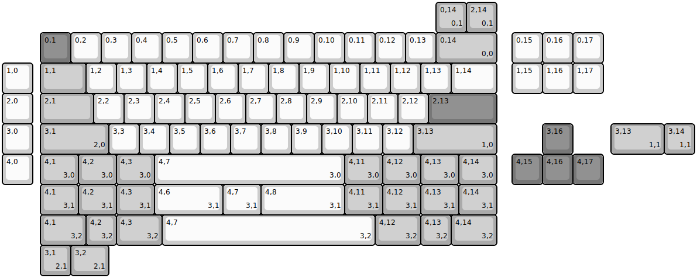{:loading="lazy"}

[Open in keyboard-layout-editor](http://www.keyboard-layout-editor.com/##@@_x:1.25&y:1&c=#777777;&=0,1&_c=#cccccc;&=0,2&=0,3&=0,4&=0,5&=0,6&=0,7&=0,8&=0,9&=0,10&=0,11&=0,12&=0,13&_c=#aaaaaa&w:2;&=0,14%0A%0A%0A0,0&_x:0.5&c=#cccccc;&=0,15&=0,16&=0,17;&@=1,0&_x:0.25&c=#aaaaaa&w:1.5;&=1,1&_c=#cccccc;&=1,2&=1,3&=1,4&=1,5&=1,6&=1,7&=1,8&=1,9&=1,10&=1,11&=1,12&=1,13&_w:1.5;&=1,14&_x:0.5;&=1,15&=1,16&=1,17;&@=2,0&_x:0.25&c=#aaaaaa&w:1.75;&=2,1&_c=#cccccc;&=2,2&=2,3&=2,4&=2,5&=2,6&=2,7&=2,8&=2,9&=2,10&=2,11&=2,12&_c=#777777&w:2.25;&=2,13;&@_c=#cccccc;&=3,0&_x:0.25&c=#aaaaaa&w:2.25;&=3,1%0A%0A%0A2,0&_c=#cccccc;&=3,3&=3,4&=3,5&=3,6&=3,7&=3,8&=3,9&=3,10&=3,11&=3,12&_c=#aaaaaa&w:2.75;&=3,13%0A%0A%0A1,0&_x:1.5&c=#777777;&=3,16;&@_c=#cccccc;&=4,0&_x:0.25&c=#aaaaaa&w:1.25;&=4,1%0A%0A%0A3,0&_w:1.25;&=4,2%0A%0A%0A3,0&_w:1.25;&=4,3%0A%0A%0A3,0&_c=#cccccc&w:6.25;&=4,7%0A%0A%0A3,0&_c=#aaaaaa&w:1.25;&=4,11%0A%0A%0A3,0&_w:1.25;&=4,12%0A%0A%0A3,0&_w:1.25;&=4,13%0A%0A%0A3,0&_w:1.25;&=4,14%0A%0A%0A3,0&_x:0.5&c=#777777;&=4,15&=4,16&=4,17;&@_x:14.25&y:-6&c=#aaaaaa;&=0,14%0A%0A%0A0,1&=2,14%0A%0A%0A0,1;&@_x:20.0&y:3&w:1.75;&=3,13%0A%0A%0A1,1&=3,14%0A%0A%0A1,1;&@_x:1.25&y:1&w:1.25;&=4,1%0A%0A%0A3,1&_w:1.25;&=4,2%0A%0A%0A3,1&_w:1.25;&=4,3%0A%0A%0A3,1&_c=#cccccc&w:2.25;&=4,6%0A%0A%0A3,1&_w:1.25;&=4,7%0A%0A%0A3,1&_w:2.75;&=4,8%0A%0A%0A3,1&_c=#aaaaaa&w:1.25;&=4,11%0A%0A%0A3,1&_w:1.25;&=4,12%0A%0A%0A3,1&_w:1.25;&=4,13%0A%0A%0A3,1&_w:1.25;&=4,14%0A%0A%0A3,1;&@_x:1.25&w:1.5;&=4,1%0A%0A%0A3,2&=4,2%0A%0A%0A3,2&_w:1.5;&=4,3%0A%0A%0A3,2&_c=#cccccc&w:7;&=4,7%0A%0A%0A3,2&_c=#aaaaaa&w:1.5;&=4,12%0A%0A%0A3,2&=4,13%0A%0A%0A3,2&_w:1.5;&=4,14%0A%0A%0A3,2;&@_x:1.25;&=3,1%0A%0A%0A2,1&_w:1.25;&=3,2%0A%0A%0A2,1)

## wuque/ikki68

[README](output/wuque/ikki68/README.md) - [layout](output/wuque/ikki68/ikki68-kle.json) - [PCB](output/wuque/ikki68/ikki68.kicad_pcb) - [PCB render](output/wuque/ikki68/ikki68-render.svg)

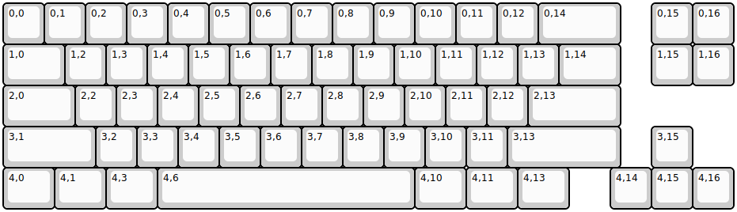{:loading="lazy"}

[Open in keyboard-layout-editor](http://www.keyboard-layout-editor.com/##@@=0,0&=0,1&=0,2&=0,3&=0,4&=0,5&=0,6&=0,7&=0,8&=0,9&=0,10&=0,11&=0,12&_w:2;&=0,14&_x:0.75;&=0,15&=0,16;&@_w:1.5;&=1,0&=1,2&=1,3&=1,4&=1,5&=1,6&=1,7&=1,8&=1,9&=1,10&=1,11&=1,12&=1,13&_w:1.5;&=1,14&_x:0.75;&=1,15&=1,16;&@_w:1.75;&=2,0&=2,2&=2,3&=2,4&=2,5&=2,6&=2,7&=2,8&=2,9&=2,10&=2,11&=2,12&_w:2.25;&=2,13;&@_w:2.25;&=3,1&=3,2&=3,3&=3,4&=3,5&=3,6&=3,7&=3,8&=3,9&=3,10&=3,11&_w:2.75;&=3,13&_x:0.75;&=3,15;&@_w:1.25;&=4,0&_w:1.25;&=4,1&_w:1.25;&=4,3&_w:6.25;&=4,6&_w:1.25;&=4,10&_w:1.25;&=4,11&_w:1.25;&=4,13&_x:1.0;&=4,14&=4,15&=4,16)

## wuque/ikki68_aurora

[README](output/wuque/ikki68_aurora/README.md) - [layout](output/wuque/ikki68_aurora/ikki68_aurora-kle.json) - [PCB](output/wuque/ikki68_aurora/ikki68_aurora.kicad_pcb) - [PCB render](output/wuque/ikki68_aurora/ikki68_aurora-render.svg)

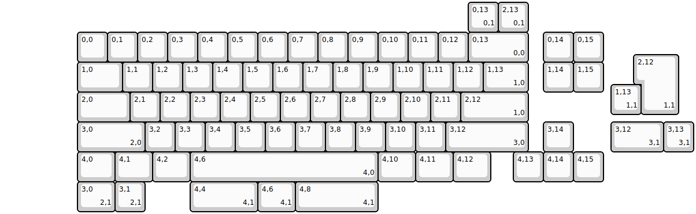{:loading="lazy"}

[Open in keyboard-layout-editor](http://www.keyboard-layout-editor.com/##@@_x:2.5&y:1;&=0,0&=0,1&=0,2&=0,3&=0,4&=0,5&=0,6&=0,7&=0,8&=0,9&=0,10&=0,11&=0,12&_w:2;&=0,13%0A%0A%0A0,0&_x:0.5;&=0,14&=0,15;&@_x:2.5&w:1.5;&=1,0&=1,1&=1,2&=1,3&=1,4&=1,5&=1,6&=1,7&=1,8&=1,9&=1,10&=1,11&=1,12&_w:1.5;&=1,13%0A%0A%0A1,0&_x:0.5;&=1,14&=1,15;&@_x:2.5&w:1.75;&=2,0&=2,1&=2,2&=2,3&=2,4&=2,5&=2,6&=2,7&=2,8&=2,9&=2,10&=2,11&_w:2.25;&=2,12%0A%0A%0A1,0;&@_x:2.5&w:2.25;&=3,0%0A%0A%0A2,0&=3,2&=3,3&=3,4&=3,5&=3,6&=3,7&=3,8&=3,9&=3,10&=3,11&_w:2.75;&=3,12%0A%0A%0A3,0&_x:0.5;&=3,14;&@_x:2.5&w:1.25;&=4,0&_w:1.25;&=4,1&_w:1.25;&=4,2&_w:6.25;&=4,6%0A%0A%0A4,0&_w:1.25;&=4,10&_w:1.25;&=4,11&_w:1.25;&=4,12&_x:0.75;&=4,13&=4,14&=4,15;&@_x:15.5&y:-6.0;&=0,13%0A%0A%0A0,1&=2,13%0A%0A%0A0,1;&@_x:21.25&y:0.75&w:1.25&h:2&w2:1.5&h2:1&x2:-0.25;&=2,12%0A%0A%0A1,1;&@_x:20.25;&=1,13%0A%0A%0A1,1;&@_x:20.25&y:0.25&w:1.75;&=3,12%0A%0A%0A3,1&=3,13%0A%0A%0A3,1;&@_x:2.5&y:1.0&w:1.25;&=3,0%0A%0A%0A2,1&=3,1%0A%0A%0A2,1&_x:1.5&w:2.25;&=4,4%0A%0A%0A4,1&_w:1.25;&=4,6%0A%0A%0A4,1&_w:2.75;&=4,8%0A%0A%0A4,1)

## wuque/mammoth20x

[README](output/wuque/mammoth20x/README.md) - [layout](output/wuque/mammoth20x/mammoth20x-kle.json) - [PCB](output/wuque/mammoth20x/mammoth20x.kicad_pcb) - [PCB render](output/wuque/mammoth20x/mammoth20x-render.svg)

{:loading="lazy"}

[Open in keyboard-layout-editor](http://www.keyboard-layout-editor.com/##@@_x:3.25;&=0,3;&@_y:-0.75;&=0,0&=0,1&=0,2;&@_x:4.5&y:-0.75;&=2,3&=4,3;&@=1,0&=1,1&=1,2&=1,3;&@=2,0&=2,1&=2,2&_h:2;&=3,3;&@=3,0&=3,1&=3,2;&@=4,0&=4,1&=4,2&_h:2;&=5,3;&@_w:2;&=5,0&=5,2)

## wuque/mammoth75x

[README](output/wuque/mammoth75x/README.md) - [layout](output/wuque/mammoth75x/mammoth75x-kle.json) - [PCB](output/wuque/mammoth75x/mammoth75x.kicad_pcb) - [PCB render](output/wuque/mammoth75x/mammoth75x-render.svg)

{:loading="lazy"}

[Open in keyboard-layout-editor](http://www.keyboard-layout-editor.com/##@@_x:2.25&y:1;&=0,0&_x:0.25;&=0,1&=0,2&=0,3&=0,4&_x:0.25;&=0,5&=0,6&=0,7&=0,8&_x:0.25;&=0,9&=0,10&=0,11&=0,12&_x:0.25;&=0,13&_x:0.25;&=5,3&=5,5;&@_x:17.5;&=0,14;&@_x:2.25&y:-0.75;&=1,0&=1,1&=1,2&=1,3&=1,4&=1,5&=1,6&=1,7&=1,8&=1,9&=1,10&=1,11&=1,12&_w:2;&=1,13%0A%0A%0A0,0;&@_x:2.25&w:1.5;&=2,0&=2,1&=2,2&=2,3&=2,4&=2,5&=2,6&=2,7&=2,8&=2,9&=2,10&=2,11&=2,12&_w:1.5;&=2,13&_x:0.25;&=2,14&=2,15;&@_x:2.25&w:1.75;&=3,0&=3,1&=3,2&=3,3&=3,4&=3,5&=3,6&=3,7&=3,8&=3,9&=3,10&=3,11&_w:2.25;&=3,12&_x:0.25;&=3,14&=3,15;&@_x:2.25&w:2.25;&=4,0%0A%0A%0A1,0&=4,2&=4,3&=4,4&=4,5&=4,6&=4,7&=4,8&=4,9&=4,10&=4,11&_w:2.75;&=4,12%0A%0A%0A2,0;&@_x:17.5&y:-0.75;&=4,14;&@_x:2.25&y:-0.25&w:1.25;&=5,0&_w:1.25;&=5,1&_w:1.25;&=5,2&_w:6.25;&=5,6%0A%0A%0A3,0&_w:1.25;&=5,10&_w:1.25;&=5,11&_w:1.25;&=5,12;&@_x:16.5&y:-0.75;&=5,13&=5,14&=5,15;&@_x:15.25&y:-7.5;&=1,13%0A%0A%0A0,1&=3,13%0A%0A%0A0,1;&@_y:4.25&w:1.25;&=4,0%0A%0A%0A1,1&=4,1%0A%0A%0A1,1;&@_x:6&y:1.0&w:2.25;&=5,4%0A%0A%0A3,1&_w:1.25;&=5,6%0A%0A%0A3,1&_w:2.75;&=5,8%0A%0A%0A3,1&_x:0.75&w:1.75;&=4,12%0A%0A%0A2,1&=4,13%0A%0A%0A2,1)

## wuque/promise87/promise87_ansi

[README](output/wuque/promise87/README.md) - [layout](output/wuque/promise87/promise87_ansi-kle.json) - [PCB](output/wuque/promise87/promise87_ansi.kicad_pcb) - [PCB render](output/wuque/promise87/promise87_ansi-render.svg)

{:loading="lazy"}

[Open in keyboard-layout-editor](http://www.keyboard-layout-editor.com/##@@=0,0&_x:0.25;&=0,1&=0,2&=0,3&=0,4&_x:0.25;&=0,5&=0,6&=0,7&=0,8&_x:0.25;&=0,9&=0,10&=0,11&=0,12&_x:0.25;&=0,13&_x:0.25;&=0,14&=0,15&=0,16;&@_y:0.5;&=1,0&=1,1&=1,2&=1,3&=1,4&=1,5&=1,6&=1,7&=1,8&=1,9&=1,10&=1,11&=1,12&_w:2;&=1,13%0A%0A%0A0,0&_x:0.25;&=1,14&=1,15&=1,16;&@_w:1.5;&=2,0&=2,1&=2,2&=2,3&=2,4&=2,5&=2,6&=2,7&=2,8&=2,9&=2,10&=2,11&=2,12&_w:1.5;&=2,13%0A%0A%0A3,0&_x:0.25;&=2,14&=2,15&=2,16;&@_w:1.75;&=3,0&=3,1&=3,2&=3,3&=3,4&=3,5&=3,6&=3,7&=3,8&=3,9&=3,10&=3,11&_w:2.25;&=3,12%0A%0A%0A3,0;&@_w:2.25;&=4,0%0A%0A%0A1,0&=4,2&=4,3&=4,4&=4,5&=4,6&=4,7&=4,8&=4,9&=4,10&=4,11&_w:2.75;&=4,13%0A%0A%0A2,0&_x:1.25;&=4,15;&@_w:1.5;&=5,0&=5,1&_w:1.5;&=5,2&_w:7;&=5,6%0A%0A%0A4,0&_w:1.5;&=5,11&=5,12&_w:1.5;&=5,13&_x:0.25;&=5,14&=5,15&=5,16;&@_x:18.5&y:-5.0;&=1,13%0A%0A%0A0,1&=3,13%0A%0A%0A0,1;&@_x:19.25&w:1.25&h:2&w2:1.5&h2:1&x2:-0.25;&=2,13%0A%0A%0A3,1;&@_x:18.25;&=3,12%0A%0A%0A3,1;&@_y:2.0&w:1.25;&=4,0%0A%0A%0A1,1&=4,1%0A%0A%0A1,1&_x:1.75&w:3;&=5,5%0A%0A%0A4,1&=5,6%0A%0A%0A4,1&_w:3;&=5,7%0A%0A%0A4,1&_x:1.25&w:1.75;&=4,13%0A%0A%0A2,1&=4,12%0A%0A%0A2,1)

## wuque/promise87/promise87_wkl

[README](output/wuque/promise87/README.md) - [layout](output/wuque/promise87/promise87_wkl-kle.json) - [PCB](output/wuque/promise87/promise87_wkl.kicad_pcb) - [PCB render](output/wuque/promise87/promise87_wkl-render.svg)

{:loading="lazy"}

[Open in keyboard-layout-editor](http://www.keyboard-layout-editor.com/##@@=0,0&_x:0.25;&=0,1&=0,2&=0,3&=0,4&_x:0.25;&=0,5&=0,6&=0,7&=0,8&_x:0.25;&=0,9&=0,10&=0,11&=0,12&_x:0.25;&=0,13&_x:0.25;&=0,14&=0,15&=0,16;&@_y:0.5;&=1,0&=1,1&=1,2&=1,3&=1,4&=1,5&=1,6&=1,7&=1,8&=1,9&=1,10&=1,11&=1,12&_w:2;&=1,13%0A%0A%0A0,0&_x:0.25;&=1,14&=1,15&=1,16;&@_w:1.5;&=2,0&=2,1&=2,2&=2,3&=2,4&=2,5&=2,6&=2,7&=2,8&=2,9&=2,10&=2,11&=2,12&_w:1.5;&=2,13%0A%0A%0A3,0&_x:0.25;&=2,14&=2,15&=2,16;&@_w:1.75;&=3,0&=3,1&=3,2&=3,3&=3,4&=3,5&=3,6&=3,7&=3,8&=3,9&=3,10&=3,11&_w:2.25;&=3,12%0A%0A%0A3,0;&@_w:2.25;&=4,0%0A%0A%0A1,0&=4,2&=4,3&=4,4&=4,5&=4,6&=4,7&=4,8&=4,9&=4,10&=4,11&_w:2.75;&=4,13%0A%0A%0A2,0&_x:1.25;&=4,15;&@_w:1.5;&=5,0&_x:1.0&w:1.5;&=5,2&_w:7;&=5,6%0A%0A%0A4,0&_w:1.5;&=5,11&_x:1.0&w:1.5;&=5,13&_x:0.25;&=5,14&=5,15&=5,16;&@_x:18.5&y:-5.0;&=1,13%0A%0A%0A0,1&=3,13%0A%0A%0A0,1;&@_x:19.25&w:1.25&h:2&w2:1.5&h2:1&x2:-0.25;&=2,13%0A%0A%0A3,1;&@_x:18.25;&=3,12%0A%0A%0A3,1;&@_y:2.0&w:1.25;&=4,0%0A%0A%0A1,1&=4,1%0A%0A%0A1,1&_x:1.75&w:3;&=5,5%0A%0A%0A4,1&=5,6%0A%0A%0A4,1&_w:3;&=5,7%0A%0A%0A4,1&_x:1.25&w:1.75;&=4,13%0A%0A%0A2,1&=4,12%0A%0A%0A2,1)

## wuque/serneity65

[README](output/wuque/serneity65/README.md) - [layout](output/wuque/serneity65/serneity65-kle.json) - [PCB](output/wuque/serneity65/serneity65.kicad_pcb) - [PCB render](output/wuque/serneity65/serneity65-render.svg)

{:loading="lazy"}

[Open in keyboard-layout-editor](http://www.keyboard-layout-editor.com/##@@_x:18.5&y:0.5&w:1.5&h:1.5;&=4,3&_w:1.5&h:1.5;&=4,5;&@_x:2.25;&=0,0&=0,1&=0,2&=0,3&=0,4&=0,5&=0,6&=0,7&=0,8&=0,9&=0,10&=0,11&=0,12&_w:2;&=0,13%0A%0A%0A0,0&=0,14;&@_x:2.25&w:1.5;&=1,0&=1,1&=1,2&=1,3&=1,4&=1,5&=1,6&=1,7&=1,8&=1,9&=1,10&=1,11&=1,12&_w:1.5;&=1,13;&@_x:2.25&w:1.75;&=2,0&=2,1&=2,2&=2,3&=2,4&=2,5&=2,6&=2,7&=2,8&=2,9&=2,10&=2,11&_w:2.25;&=2,12&=2,14;&@_x:2.25&w:2.25;&=3,0%0A%0A%0A1,0&=3,2&=3,3&=3,4&=3,5&=3,6&=3,7&=3,8&=3,9&=3,10&=3,11&_w:1.75;&=3,12&=3,13&=3,14;&@_x:2.25&w:1.25;&=4,0&_w:1.25;&=4,1&_w:1.25;&=4,2&_w:6.25;&=4,6%0A%0A%0A2,0&_w:1.25;&=4,10&_w:1.25;&=4,11&_x:0.5;&=4,12&=4,13&=4,14;&@_x:15.25&y:-6.0;&=0,13%0A%0A%0A0,1&=2,13%0A%0A%0A0,1;&@_y:3.0&w:1.25;&=3,0%0A%0A%0A1,1&=3,1%0A%0A%0A1,1;&@_x:6&y:1.0&w:2.25;&=4,4%0A%0A%0A2,1&_w:1.25;&=4,6%0A%0A%0A2,1&_w:2.75;&=4,8%0A%0A%0A2,1)

## wuque/tata80/wk/tata80_wk

[README](output/wuque/tata80/wk/README.md) - [layout](output/wuque/tata80/wk/tata80_wk-kle.json) - [PCB](output/wuque/tata80/wk/tata80_wk.kicad_pcb) - [PCB render](output/wuque/tata80/wk/tata80_wk-render.svg)

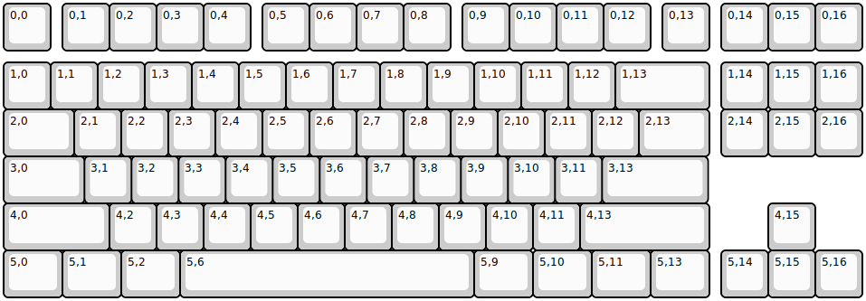{:loading="lazy"}

[Open in keyboard-layout-editor](http://www.keyboard-layout-editor.com/##@@=0,0&_x:0.25;&=0,1&=0,2&=0,3&=0,4&_x:0.25;&=0,5&=0,6&=0,7&=0,8&_x:0.25;&=0,9&=0,10&=0,11&=0,12&_x:0.25;&=0,13&_x:0.25;&=0,14&=0,15&=0,16;&@_y:0.25;&=1,0&=1,1&=1,2&=1,3&=1,4&=1,5&=1,6&=1,7&=1,8&=1,9&=1,10&=1,11&=1,12&_w:2;&=1,13&_x:0.25;&=1,14&=1,15&=1,16;&@_w:1.5;&=2,0&=2,1&=2,2&=2,3&=2,4&=2,5&=2,6&=2,7&=2,8&=2,9&=2,10&=2,11&=2,12&_w:1.5;&=2,13&_x:0.25;&=2,14&=2,15&=2,16;&@_w:1.72;&=3,0&=3,1&=3,2&=3,3&=3,4&=3,5&=3,6&=3,7&=3,8&=3,9&=3,10&=3,11&_w:2.25;&=3,13;&@_w:2.25;&=4,0&=4,2&=4,3&=4,4&=4,5&=4,6&=4,7&=4,8&=4,9&=4,10&=4,11&_w:2.75;&=4,13&_x:1.25;&=4,15;&@_w:1.25;&=5,0&_w:1.25;&=5,1&_w:1.25;&=5,2&_w:6.25;&=5,6&_w:1.25;&=5,9&_w:1.25;&=5,10&_w:1.25;&=5,11&_w:1.25;&=5,13&_x:0.25;&=5,14&=5,15&=5,16)

## wuque/tata80/wkl/tata80_wkl

[README](output/wuque/tata80/wkl/README.md) - [layout](output/wuque/tata80/wkl/tata80_wkl-kle.json) - [PCB](output/wuque/tata80/wkl/tata80_wkl.kicad_pcb) - [PCB render](output/wuque/tata80/wkl/tata80_wkl-render.svg)

{:loading="lazy"}

[Open in keyboard-layout-editor](http://www.keyboard-layout-editor.com/##@@=0,0&_x:0.25;&=0,1&=0,2&=0,3&=0,4&_x:0.25;&=0,5&=0,6&=0,7&=0,8&_x:0.25;&=0,9&=0,10&=0,11&=0,12&_x:0.25;&=0,13&_x:0.25;&=0,14&=0,15&=0,16;&@_y:0.25;&=1,0&=1,1&=1,2&=1,3&=1,4&=1,5&=1,6&=1,7&=1,8&=1,9&=1,10&=1,11&=1,12&_w:2;&=1,13&_x:0.25;&=1,14&=1,15&=1,16;&@_w:1.5;&=2,0&=2,1&=2,2&=2,3&=2,4&=2,5&=2,6&=2,7&=2,8&=2,9&=2,10&=2,11&=2,12&_w:1.5;&=2,13&_x:0.25;&=2,14&=2,15&=2,16;&@_w:1.72;&=3,0&=3,1&=3,2&=3,3&=3,4&=3,5&=3,6&=3,7&=3,8&=3,9&=3,10&=3,11&_w:2.25;&=3,13;&@_w:2.25;&=4,0&=4,2&=4,3&=4,4&=4,5&=4,6&=4,7&=4,8&=4,9&=4,10&=4,11&_w:2.75;&=4,13&_x:1.25;&=4,15;&@_w:1.25;&=5,0&_w:1.25;&=5,1&_w:1.25;&=5,2&_w:6.25;&=5,6&_w:1.25;&=5,9&_w:1.25;&=5,10&_w:1.25;&=5,11&_w:1.25;&=5,13&_x:0.25;&=5,14&=5,15&=5,16)

## xbows/knight

[README](output/xbows/knight/README.md) - [layout](output/xbows/knight/knight-kle.json) - [PCB](output/xbows/knight/knight.kicad_pcb) - [PCB render](output/xbows/knight/knight-render.svg)

{:loading="lazy"}

[Open in keyboard-layout-editor](http://www.keyboard-layout-editor.com/##@@_c=#777777;&=0,0&_x:0.25&c=#cccccc;&=0,1&=0,2&=0,3&=0,4&_x:0.25&c=#aaaaaa;&=0,5&=0,6&=0,7&=0,8&_x:0.25;&=0,9&=0,10&=0,11&=0,12&_x:0.25&w:2;&=0,13&_w:2;&=0,14;&@_y:0.25;&=1,0&=1,1&=1,2&=1,3&=1,4&=1,5&_x:3;&=1,7&=1,8&=1,9&=1,10&=1,11&=1,12&=1,13&_w:2;&=1,14;&@=2,0&=2,1&=2,2&=2,3&=2,4&=2,5&_x:3;&=2,7&=2,8&=2,9&=2,10&=2,11&=2,12&=2,13&=2,14&=2,6;&@=3,0&=3,1&=3,2&=3,3&=3,4&=3,5&_x:0.75&c=#777777&w:1.5;&=3,6&_x:0.75&c=#cccccc;&=3,7&=3,8&=3,9&=3,10&=3,11&=3,12&_c=#aaaaaa&w:2;&=3,13&=3,14;&@=4,0&=4,1&=4,2&=4,3&=4,4&=4,5&_x:0.5&c=#777777&w:2;&=4,6&_x:0.5&c=#cccccc;&=4,7&=4,8&=4,9&=4,10&=4,11&=4,12&_x:1.0&c=#aaaaaa;&=4,13;&@=5,0&=5,1&_w:2;&=5,2&_w:2;&=5,4&_c=#777777&w:1.5;&=5,5&_w:1.5;&=5,6&_c=#cccccc&w:2;&=5,7&_c=#aaaaaa&w:2;&=5,9&=5,10&=5,11&=5,12&=5,13&=5,14)

## xbows/knight_plus

[README](output/xbows/knight_plus/README.md) - [layout](output/xbows/knight_plus/knight_plus-kle.json) - [PCB](output/xbows/knight_plus/knight_plus.kicad_pcb) - [PCB render](output/xbows/knight_plus/knight_plus-render.svg)

{:loading="lazy"}

[Open in keyboard-layout-editor](http://www.keyboard-layout-editor.com/##@@_c=#777777;&=0,0&_x:0.25&c=#cccccc;&=0,1&=0,2&=0,3&=0,4&_x:0.25&c=#aaaaaa;&=0,5&=0,6&=0,7&=0,8&_x:0.25;&=0,9&=0,10&=0,11&=0,12&_x:0.25&w:2;&=0,13&_w:2;&=0,14;&@_y:0.25;&=1,0&=1,1&=1,2&=1,3&=1,4&=1,5&_x:3;&=1,7&=1,8&=1,9&=1,10&=1,11&=1,12&=1,13&_w:2;&=1,14;&@=2,0&=2,1&=2,2&=2,3&=2,4&=2,5&_x:3;&=2,6&=2,7&=2,8&=2,9&=2,10&=2,11&=2,12&=2,13&=2,14;&@=3,0&=3,1&=3,2&=3,3&=3,4&=3,5&_x:0.75&c=#777777&w:1.5;&=3,6&_x:0.75&c=#cccccc;&=3,7&=3,8&=3,9&=3,10&=3,11&=3,12&_c=#aaaaaa&w:2;&=3,13&=3,14;&@=4,0&=4,1&=4,2&=4,3&=4,4&=4,5&_x:0.5&c=#777777&w:2;&=4,6&_x:0.5&c=#cccccc;&=4,7&=4,8&=4,9&=4,10&=4,11&=4,12&_x:1.0&c=#aaaaaa;&=4,13;&@=5,0&=5,1&_w:2;&=5,2&_w:2;&=5,4&_c=#777777&w:1.5;&=5,5&_w:1.5;&=5,6&_c=#cccccc&w:2;&=5,7&_c=#aaaaaa&w:2;&=5,9&=5,10&=5,11&=5,12&=5,13&=5,14)

## xbows/nature

[README](output/xbows/nature/README.md) - [layout](output/xbows/nature/nature-kle.json) - [PCB](output/xbows/nature/nature.kicad_pcb) - [PCB render](output/xbows/nature/nature-render.svg)

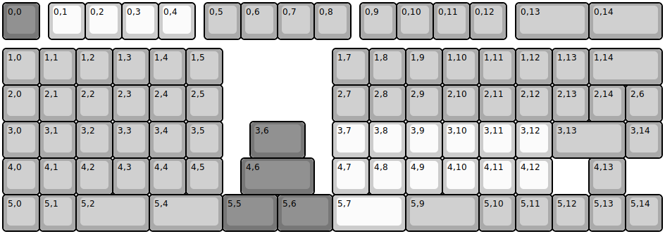{:loading="lazy"}

[Open in keyboard-layout-editor](http://www.keyboard-layout-editor.com/##@@_c=#777777;&=0,0&_x:0.25&c=#cccccc;&=0,1&=0,2&=0,3&=0,4&_x:0.25&c=#aaaaaa;&=0,5&=0,6&=0,7&=0,8&_x:0.25;&=0,9&=0,10&=0,11&=0,12&_x:0.25&w:2;&=0,13&_w:2;&=0,14;&@_y:0.25;&=1,0&=1,1&=1,2&=1,3&=1,4&=1,5&_x:3;&=1,7&=1,8&=1,9&=1,10&=1,11&=1,12&=1,13&_w:2;&=1,14;&@=2,0&=2,1&=2,2&=2,3&=2,4&=2,5&_x:3;&=2,7&=2,8&=2,9&=2,10&=2,11&=2,12&=2,13&=2,14&=2,6;&@=3,0&=3,1&=3,2&=3,3&=3,4&=3,5&_x:0.75&c=#777777&w:1.5;&=3,6&_x:0.75&c=#cccccc;&=3,7&=3,8&=3,9&=3,10&=3,11&=3,12&_c=#aaaaaa&w:2;&=3,13&=3,14;&@=4,0&=4,1&=4,2&=4,3&=4,4&=4,5&_x:0.5&c=#777777&w:2;&=4,6&_x:0.5&c=#cccccc;&=4,7&=4,8&=4,9&=4,10&=4,11&=4,12&_x:1.0&c=#aaaaaa;&=4,13;&@=5,0&=5,1&_w:2;&=5,2&_w:2;&=5,4&_c=#777777&w:1.5;&=5,5&_w:1.5;&=5,6&_c=#cccccc&w:2;&=5,7&_c=#aaaaaa&w:2;&=5,9&=5,10&=5,11&=5,12&=5,13&=5,14)

## xbows/numpad

[README](output/xbows/numpad/README.md) - [layout](output/xbows/numpad/numpad-kle.json) - [PCB](output/xbows/numpad/numpad.kicad_pcb) - [PCB render](output/xbows/numpad/numpad-render.svg)

{:loading="lazy"}

[Open in keyboard-layout-editor](http://www.keyboard-layout-editor.com/##@@_c=#777777;&=0,0&_c=#cccccc;&=0,1&=0,2&=0,3;&@_y:0.5&c=#aaaaaa;&=1,0&=1,1&=1,2&=1,3;&@=2,0&=2,1&=2,2&=2,3;&@=3,0&=3,1&=3,2&=3,3;&@=4,0&=4,1&=4,2&_h:2;&=4,3;&@_w:2;&=5,0&=5,2)

## xbows/ranger

[README](output/xbows/ranger/README.md) - [layout](output/xbows/ranger/ranger-kle.json) - [PCB](output/xbows/ranger/ranger.kicad_pcb) - [PCB render](output/xbows/ranger/ranger-render.svg)

{:loading="lazy"}

[Open in keyboard-layout-editor](http://www.keyboard-layout-editor.com/##@@_c=#777777;&=0,0&_x:1&c=#cccccc;&=0,1&=0,2&=0,3&=0,4&_x:0.5&c=#aaaaaa;&=0,5&=0,6&=0,7&=0,8&_x:0.5;&=0,9&=0,10&=0,11&=0,12&_x:0.25;&=0,13&=0,14&=0,15;&@_y:0.5;&=1,0&=1,1&=1,2&=1,3&=1,4&=1,5&=1,6&=1,7&=1,8&=1,9&=1,10&=1,11&=1,12&_w:2;&=3,13&_x:0.25;&=1,13&=1,14&=1,15;&@_w:1.5;&=2,0&=2,1&=2,2&=2,3&=2,4&=2,5&=2,6&=2,7&=2,8&=2,9&=2,10&=2,11&=2,12&_w:1.5;&=4,13&_x:0.25;&=2,13&=2,14&=2,15;&@_w:1.75;&=3,0&=3,1&=3,2&=3,3&=3,4&=3,5&=3,6&=3,7&=3,8&=3,9&=3,10&=3,11&_c=#777777&w:2.25;&=3,12;&@_c=#cccccc&w:2.25;&=4,0&=4,1&=4,2&=4,3&=4,4&=4,5&=4,6&=4,7&=4,8&=4,9&=4,10&_w:2.75;&=4,12&_x:1.25;&=4,14;&@_w:1.25;&=5,0&_w:1.25;&=5,1&_w:1.25;&=5,2&_w:6.25;&=5,5&_w:1.25;&=5,9&_w:1.25;&=5,10&_w:1.25;&=5,11&_w:1.25;&=5,12&_x:0.25;&=5,13&=5,14&=5,15)

## xd/xd60rev2

[README](output/xd/README.md) - [layout](output/xd/xd60rev2-kle.json) - [PCB](output/xd/xd60rev2.kicad_pcb) - [PCB render](output/xd/xd60rev2-render.svg)

{:loading="lazy"}

[Open in keyboard-layout-editor](http://www.keyboard-layout-editor.com/##@@_x:2.5&c=#777777;&=0,0&_c=#cccccc;&=0,1&=0,2&=0,3&=0,4&=0,5&=0,6&=0,7&=0,8&=0,9&=0,10&=0,11&=0,12&_c=#aaaaaa&w:2;&=0,13%0A%0A%0A0,0;&@_x:2.5&w:1.5;&=1,0&_c=#cccccc;&=1,1&=1,2&=1,3&=1,4&=1,5&=1,6&=1,7&=1,8&=1,9&=1,10&=1,11&=1,12&_w:1.5;&=1,13%0A%0A%0A1,0;&@_x:2.5&c=#aaaaaa&w:1.75;&=2,0&_c=#cccccc;&=2,1&=2,2&=2,3&=2,4&=2,5&=2,6&=2,7&=2,8&=2,9&=2,10&=2,11&_c=#777777&w:2.25;&=2,13%0A%0A%0A1,0;&@_x:2.5&c=#aaaaaa&w:2.25;&=3,0%0A%0A%0A2,0&_c=#cccccc;&=3,2%0A%0A%0A2,0&=3,3%0A%0A%0A2,0&=3,4%0A%0A%0A2,0&=3,5%0A%0A%0A2,0&=3,6%0A%0A%0A2,0&=3,7%0A%0A%0A2,0&=3,8%0A%0A%0A2,0&=3,9%0A%0A%0A2,0&=3,10%0A%0A%0A2,0&=3,11%0A%0A%0A2,0&_c=#aaaaaa&w:2.75;&=3,13%0A%0A%0A2,0;&@_x:2.5&w:1.25;&=4,0%0A%0A%0A3,0&_w:1.25;&=4,1%0A%0A%0A3,0&_w:1.25;&=4,2%0A%0A%0A3,0&_c=#cccccc&w:6.25;&=4,5%0A%0A%0A3,0&_c=#aaaaaa&w:1.25;&=4,10%0A%0A%0A3,0&_w:1.25;&=4,11%0A%0A%0A3,0&_w:1.25;&=4,12%0A%0A%0A3,0&_w:1.25;&=4,13%0A%0A%0A3,0;&@_x:18.0&y:-5&c=#cccccc;&=0,13%0A%0A%0A0,1&=4,9%0A%0A%0A0,1;&@_x:18.75&c=#777777&w:1.25&h:2&w2:1.5&h2:1&x2:-0.25;&=2,13%0A%0A%0A1,1;&@_x:17.75&c=#cccccc;&=2,12%0A%0A%0A1,1;&@_x:2.5&y:2.5&c=#aaaaaa&w:2.25;&=3,0%0A%0A%0A2,1&_c=#cccccc;&=3,2%0A%0A%0A2,1&=3,3%0A%0A%0A2,1&=3,4%0A%0A%0A2,1&=3,5%0A%0A%0A2,1&=3,6%0A%0A%0A2,1&=3,7%0A%0A%0A2,1&=3,8%0A%0A%0A2,1&=3,9%0A%0A%0A2,1&=3,10%0A%0A%0A2,1&=3,11%0A%0A%0A2,1&_c=#aaaaaa&w:1.75;&=3,13%0A%0A%0A2,1&=3,12%0A%0A%0A2,1;&@_x:2.5&w:2.25;&=3,0%0A%0A%0A2,2&_c=#cccccc;&=3,2%0A%0A%0A2,2&=3,3%0A%0A%0A2,2&=3,4%0A%0A%0A2,2&=3,5%0A%0A%0A2,2&=3,6%0A%0A%0A2,2&=3,7%0A%0A%0A2,2&=3,8%0A%0A%0A2,2&=3,9%0A%0A%0A2,2&=3,10%0A%0A%0A2,2&_w:1.75;&=4,7%0A%0A%0A2,2&=3,13%0A%0A%0A2,2&=3,12%0A%0A%0A2,2;&@_x:2.5&c=#aaaaaa&w:1.25;&=3,0%0A%0A%0A2,3&=3,1%0A%0A%0A2,3&_c=#cccccc;&=3,2%0A%0A%0A2,3&=3,3%0A%0A%0A2,3&=3,4%0A%0A%0A2,3&=3,5%0A%0A%0A2,3&=3,6%0A%0A%0A2,3&=3,7%0A%0A%0A2,3&=3,8%0A%0A%0A2,3&=3,9%0A%0A%0A2,3&=3,10%0A%0A%0A2,3&=3,11%0A%0A%0A2,3&_c=#aaaaaa&w:2.75;&=3,13%0A%0A%0A2,3;&@_x:2.5&w:1.25;&=3,0%0A%0A%0A2,4&=3,1%0A%0A%0A2,4&_c=#cccccc;&=3,2%0A%0A%0A2,4&=3,3%0A%0A%0A2,4&=3,4%0A%0A%0A2,4&=3,5%0A%0A%0A2,4&=3,6%0A%0A%0A2,4&=3,7%0A%0A%0A2,4&=3,8%0A%0A%0A2,4&=3,9%0A%0A%0A2,4&=3,10%0A%0A%0A2,4&=3,11%0A%0A%0A2,4&_c=#aaaaaa&w:1.75;&=3,13%0A%0A%0A2,4&=3,12%0A%0A%0A2,4;&@_x:2.5&w:1.25;&=3,0%0A%0A%0A2,5&=3,1%0A%0A%0A2,5&_c=#cccccc;&=3,2%0A%0A%0A2,5&=3,3%0A%0A%0A2,5&=3,4%0A%0A%0A2,5&=3,5%0A%0A%0A2,5&=3,6%0A%0A%0A2,5&=3,7%0A%0A%0A2,5&=3,8%0A%0A%0A2,5&=3,9%0A%0A%0A2,5&=3,10%0A%0A%0A2,5&_w:1.75;&=4,7%0A%0A%0A2,5&=3,13%0A%0A%0A2,5&=3,12%0A%0A%0A2,5;&@_x:2.5&c=#aaaaaa&w:2;&=3,0%0A%0A%0A2,6&_c=#cccccc;&=3,2%0A%0A%0A2,6&=3,3%0A%0A%0A2,6&=3,4%0A%0A%0A2,6&=3,5%0A%0A%0A2,6&=3,6%0A%0A%0A2,6&=3,7%0A%0A%0A2,6&=3,8%0A%0A%0A2,6&=3,9%0A%0A%0A2,6&=3,10%0A%0A%0A2,6&=3,11%0A%0A%0A2,6&=4,7%0A%0A%0A2,6&_c=#aaaaaa&w:2;&=3,13%0A%0A%0A2,6;&@_x:2.5;&=3,0%0A%0A%0A2,7&=3,1%0A%0A%0A2,7&_c=#cccccc;&=3,2%0A%0A%0A2,7&=3,3%0A%0A%0A2,7&=3,4%0A%0A%0A2,7&=3,5%0A%0A%0A2,7&=3,6%0A%0A%0A2,7&=3,7%0A%0A%0A2,7&=3,8%0A%0A%0A2,7&=3,9%0A%0A%0A2,7&=3,10%0A%0A%0A2,7&=3,11%0A%0A%0A2,7&=4,7%0A%0A%0A2,7&_c=#aaaaaa&w:2;&=3,13%0A%0A%0A2,7;&@_x:2.5&w:2;&=3,0%0A%0A%0A2,8&_c=#cccccc;&=3,2%0A%0A%0A2,8&=3,3%0A%0A%0A2,8&=3,4%0A%0A%0A2,8&=3,5%0A%0A%0A2,8&=3,6%0A%0A%0A2,8&=3,7%0A%0A%0A2,8&=3,8%0A%0A%0A2,8&=3,9%0A%0A%0A2,8&=3,10%0A%0A%0A2,8&=3,11%0A%0A%0A2,8&=4,7%0A%0A%0A2,8&_c=#aaaaaa;&=3,13%0A%0A%0A2,8&=3,12%0A%0A%0A2,8;&@_x:2.5;&=3,0%0A%0A%0A2,9&=3,1%0A%0A%0A2,9&_c=#cccccc;&=3,2%0A%0A%0A2,9&=3,3%0A%0A%0A2,9&=3,4%0A%0A%0A2,9&=3,5%0A%0A%0A2,9&=3,6%0A%0A%0A2,9&=3,7%0A%0A%0A2,9&=3,8%0A%0A%0A2,9&=3,9%0A%0A%0A2,9&=3,10%0A%0A%0A2,9&=3,11%0A%0A%0A2,9&=4,7%0A%0A%0A2,9&_c=#aaaaaa;&=3,13%0A%0A%0A2,9&=3,12%0A%0A%0A2,9;&@_x:2.5&y:0.5&w:1.5;&=4,0%0A%0A%0A3,1&=4,1%0A%0A%0A3,1&_w:1.5;&=4,2%0A%0A%0A3,1&_c=#cccccc&w:7;&=4,5%0A%0A%0A3,1&_c=#aaaaaa&w:1.5;&=4,11%0A%0A%0A3,1&=4,12%0A%0A%0A3,1&_w:1.5;&=4,13%0A%0A%0A3,1;&@_x:2.5&w:1.25;&=4,0%0A%0A%0A3,2&_w:1.25;&=4,1%0A%0A%0A3,2&_w:1.25;&=4,2%0A%0A%0A3,2&_c=#cccccc&w:6.25;&=4,5%0A%0A%0A3,2&_c=#aaaaaa;&=4,10%0A%0A%0A3,2&=4,11%0A%0A%0A3,2&=4,8%0A%0A%0A3,2&=4,12%0A%0A%0A3,2&=4,13%0A%0A%0A3,2;&@_x:2.5&w:1.5;&=4,0%0A%0A%0A3,3&=4,1%0A%0A%0A3,3&_w:1.25;&=4,2%0A%0A%0A3,3&_c=#cccccc&w:6.25;&=4,5%0A%0A%0A3,3&_c=#aaaaaa;&=4,10%0A%0A%0A3,3&=4,11%0A%0A%0A3,3&=4,8%0A%0A%0A3,3&=4,12%0A%0A%0A3,3&=4,13%0A%0A%0A3,3;&@_x:2.5&w:1.5;&=4,0%0A%0A%0A3,4&_w:1.5;&=4,1%0A%0A%0A3,4&_c=#cccccc&w:7;&=4,5%0A%0A%0A3,4&_c=#aaaaaa;&=4,10%0A%0A%0A3,4&=4,11%0A%0A%0A3,4&=4,8%0A%0A%0A3,4&=4,12%0A%0A%0A3,4&=4,13%0A%0A%0A3,4;&@_x:2.5&w:1.5&d:true;&=4,0%0A%0A%0A3,5&=4,1%0A%0A%0A3,5&_w:1.5;&=4,2%0A%0A%0A3,5&_c=#cccccc&w:7;&=4,5%0A%0A%0A3,5&_c=#aaaaaa&w:1.5;&=4,11%0A%0A%0A3,5&=4,12%0A%0A%0A3,5&_w:1.5&d:true;&=4,13%0A%0A%0A3,5;&@_x:2.5&w:1.5;&=4,0%0A%0A%0A3,6&_d:true;&=%0A%0A%0A3,6&_w:1.5;&=4,2%0A%0A%0A3,6&_c=#cccccc&w:7;&=4,5%0A%0A%0A3,6&_c=#aaaaaa&w:1.5;&=4,11%0A%0A%0A3,6&_d:true;&=%0A%0A%0A3,6&_w:1.5;&=4,13%0A%0A%0A3,6)

## xd/xd60rev3

[README](output/xd/README.md) - [layout](output/xd/xd60rev3-kle.json) - [PCB](output/xd/xd60rev3.kicad_pcb) - [PCB render](output/xd/xd60rev3-render.svg)

{:loading="lazy"}

[Open in keyboard-layout-editor](http://www.keyboard-layout-editor.com/##@@_x:2.5&c=#777777;&=0,0&_c=#cccccc;&=0,1&=0,2&=0,3&=0,4&=0,5&=0,6&=0,7&=0,8&=0,9&=0,10&=0,11&=0,12&_c=#aaaaaa&w:2;&=0,13%0A%0A%0A0,0;&@_x:2.5&w:1.5;&=1,0&_c=#cccccc;&=1,1&=1,2&=1,3&=1,4&=1,5&=1,6&=1,7&=1,8&=1,9&=1,10&=1,11&=1,12&_w:1.5;&=1,13%0A%0A%0A1,0;&@_x:2.5&c=#aaaaaa&w:1.75;&=2,0&_c=#cccccc;&=2,1&=2,2&=2,3&=2,4&=2,5&=2,6&=2,7&=2,8&=2,9&=2,10&=2,11&_c=#777777&w:2.25;&=2,13%0A%0A%0A1,0;&@_x:2.5&c=#aaaaaa&w:2.25;&=3,0%0A%0A%0A2,0&_c=#cccccc;&=3,2%0A%0A%0A2,0&=3,3%0A%0A%0A2,0&=3,4%0A%0A%0A2,0&=3,5%0A%0A%0A2,0&=3,6%0A%0A%0A2,0&=3,7%0A%0A%0A2,0&=3,8%0A%0A%0A2,0&=3,9%0A%0A%0A2,0&=3,10%0A%0A%0A2,0&=3,11%0A%0A%0A2,0&_c=#aaaaaa&w:2.75;&=3,13%0A%0A%0A2,0;&@_x:2.5&w:1.25;&=4,0%0A%0A%0A3,0&_w:1.25;&=4,1%0A%0A%0A3,0&_w:1.25;&=4,2%0A%0A%0A3,0&_c=#cccccc&w:6.25;&=4,5%0A%0A%0A3,0&_c=#aaaaaa&w:1.25;&=4,10%0A%0A%0A3,0&_w:1.25;&=4,11%0A%0A%0A3,0&_w:1.25;&=4,12%0A%0A%0A3,0&_w:1.25;&=4,13%0A%0A%0A3,0;&@_x:18.0&y:-5&c=#cccccc;&=0,13%0A%0A%0A0,1&=4,9%0A%0A%0A0,1;&@_x:18.75&c=#777777&w:1.25&h:2&w2:1.5&h2:1&x2:-0.25;&=2,13%0A%0A%0A1,1;&@_x:17.75&c=#cccccc;&=2,12%0A%0A%0A1,1;&@_x:2.5&y:2.5&c=#aaaaaa&w:2.25;&=3,0%0A%0A%0A2,1&_c=#cccccc;&=3,2%0A%0A%0A2,1&=3,3%0A%0A%0A2,1&=3,4%0A%0A%0A2,1&=3,5%0A%0A%0A2,1&=3,6%0A%0A%0A2,1&=3,7%0A%0A%0A2,1&=3,8%0A%0A%0A2,1&=3,9%0A%0A%0A2,1&=3,10%0A%0A%0A2,1&=3,11%0A%0A%0A2,1&_c=#aaaaaa&w:1.75;&=3,13%0A%0A%0A2,1&=3,12%0A%0A%0A2,1;&@_x:2.5&w:2.25;&=3,0%0A%0A%0A2,2&_c=#cccccc;&=3,2%0A%0A%0A2,2&=3,3%0A%0A%0A2,2&=3,4%0A%0A%0A2,2&=3,5%0A%0A%0A2,2&=3,6%0A%0A%0A2,2&=3,7%0A%0A%0A2,2&=3,8%0A%0A%0A2,2&=3,9%0A%0A%0A2,2&=3,10%0A%0A%0A2,2&_w:1.75;&=4,7%0A%0A%0A2,2&=3,13%0A%0A%0A2,2&=3,12%0A%0A%0A2,2;&@_x:2.5&c=#aaaaaa&w:1.25;&=3,0%0A%0A%0A2,3&=3,1%0A%0A%0A2,3&_c=#cccccc;&=3,2%0A%0A%0A2,3&=3,3%0A%0A%0A2,3&=3,4%0A%0A%0A2,3&=3,5%0A%0A%0A2,3&=3,6%0A%0A%0A2,3&=3,7%0A%0A%0A2,3&=3,8%0A%0A%0A2,3&=3,9%0A%0A%0A2,3&=3,10%0A%0A%0A2,3&=3,11%0A%0A%0A2,3&_c=#aaaaaa&w:2.75;&=3,13%0A%0A%0A2,3;&@_x:2.5&w:1.25;&=3,0%0A%0A%0A2,4&=3,1%0A%0A%0A2,4&_c=#cccccc;&=3,2%0A%0A%0A2,4&=3,3%0A%0A%0A2,4&=3,4%0A%0A%0A2,4&=3,5%0A%0A%0A2,4&=3,6%0A%0A%0A2,4&=3,7%0A%0A%0A2,4&=3,8%0A%0A%0A2,4&=3,9%0A%0A%0A2,4&=3,10%0A%0A%0A2,4&=3,11%0A%0A%0A2,4&_c=#aaaaaa&w:1.75;&=3,13%0A%0A%0A2,4&=3,12%0A%0A%0A2,4;&@_x:2.5&w:1.25;&=3,0%0A%0A%0A2,5&=3,1%0A%0A%0A2,5&_c=#cccccc;&=3,2%0A%0A%0A2,5&=3,3%0A%0A%0A2,5&=3,4%0A%0A%0A2,5&=3,5%0A%0A%0A2,5&=3,6%0A%0A%0A2,5&=3,7%0A%0A%0A2,5&=3,8%0A%0A%0A2,5&=3,9%0A%0A%0A2,5&=3,10%0A%0A%0A2,5&_w:1.75;&=4,7%0A%0A%0A2,5&=3,13%0A%0A%0A2,5&=3,12%0A%0A%0A2,5;&@_x:2.5&c=#aaaaaa&w:2;&=3,0%0A%0A%0A2,6&_c=#cccccc;&=3,2%0A%0A%0A2,6&=3,3%0A%0A%0A2,6&=3,4%0A%0A%0A2,6&=3,5%0A%0A%0A2,6&=3,6%0A%0A%0A2,6&=3,7%0A%0A%0A2,6&=3,8%0A%0A%0A2,6&=3,9%0A%0A%0A2,6&=3,10%0A%0A%0A2,6&=3,11%0A%0A%0A2,6&=4,7%0A%0A%0A2,6&_c=#aaaaaa&w:2;&=3,13%0A%0A%0A2,6;&@_x:2.5;&=3,0%0A%0A%0A2,7&=3,1%0A%0A%0A2,7&_c=#cccccc;&=3,2%0A%0A%0A2,7&=3,3%0A%0A%0A2,7&=3,4%0A%0A%0A2,7&=3,5%0A%0A%0A2,7&=3,6%0A%0A%0A2,7&=3,7%0A%0A%0A2,7&=3,8%0A%0A%0A2,7&=3,9%0A%0A%0A2,7&=3,10%0A%0A%0A2,7&=3,11%0A%0A%0A2,7&=4,7%0A%0A%0A2,7&_c=#aaaaaa&w:2;&=3,13%0A%0A%0A2,7;&@_x:2.5&w:2;&=3,0%0A%0A%0A2,8&_c=#cccccc;&=3,2%0A%0A%0A2,8&=3,3%0A%0A%0A2,8&=3,4%0A%0A%0A2,8&=3,5%0A%0A%0A2,8&=3,6%0A%0A%0A2,8&=3,7%0A%0A%0A2,8&=3,8%0A%0A%0A2,8&=3,9%0A%0A%0A2,8&=3,10%0A%0A%0A2,8&=3,11%0A%0A%0A2,8&=4,7%0A%0A%0A2,8&_c=#aaaaaa;&=3,13%0A%0A%0A2,8&=3,12%0A%0A%0A2,8;&@_x:2.5;&=3,0%0A%0A%0A2,9&=3,1%0A%0A%0A2,9&_c=#cccccc;&=3,2%0A%0A%0A2,9&=3,3%0A%0A%0A2,9&=3,4%0A%0A%0A2,9&=3,5%0A%0A%0A2,9&=3,6%0A%0A%0A2,9&=3,7%0A%0A%0A2,9&=3,8%0A%0A%0A2,9&=3,9%0A%0A%0A2,9&=3,10%0A%0A%0A2,9&=3,11%0A%0A%0A2,9&=4,7%0A%0A%0A2,9&_c=#aaaaaa;&=3,13%0A%0A%0A2,9&=3,12%0A%0A%0A2,9;&@_x:2.5&y:0.5&w:1.5;&=4,0%0A%0A%0A3,1&=4,1%0A%0A%0A3,1&_w:1.5;&=4,2%0A%0A%0A3,1&_c=#cccccc&w:7;&=4,5%0A%0A%0A3,1&_c=#aaaaaa&w:1.5;&=4,11%0A%0A%0A3,1&=4,12%0A%0A%0A3,1&_w:1.5;&=4,13%0A%0A%0A3,1;&@_x:2.5&w:1.25;&=4,0%0A%0A%0A3,2&_w:1.25;&=4,1%0A%0A%0A3,2&_w:1.25;&=4,2%0A%0A%0A3,2&_c=#cccccc&w:6.25;&=4,5%0A%0A%0A3,2&_c=#aaaaaa;&=4,10%0A%0A%0A3,2&=4,11%0A%0A%0A3,2&=4,8%0A%0A%0A3,2&=4,12%0A%0A%0A3,2&=4,13%0A%0A%0A3,2;&@_x:2.5&w:1.5;&=4,0%0A%0A%0A3,3&=4,1%0A%0A%0A3,3&_w:1.25;&=4,2%0A%0A%0A3,3&_c=#cccccc&w:6.25;&=4,5%0A%0A%0A3,3&_c=#aaaaaa;&=4,10%0A%0A%0A3,3&=4,11%0A%0A%0A3,3&=4,8%0A%0A%0A3,3&=4,12%0A%0A%0A3,3&=4,13%0A%0A%0A3,3;&@_x:2.5&w:1.5;&=4,0%0A%0A%0A3,4&_w:1.5;&=4,1%0A%0A%0A3,4&_c=#cccccc&w:7;&=4,5%0A%0A%0A3,4&_c=#aaaaaa;&=4,10%0A%0A%0A3,4&=4,11%0A%0A%0A3,4&=4,8%0A%0A%0A3,4&=4,12%0A%0A%0A3,4&=4,13%0A%0A%0A3,4;&@_x:2.5&w:1.5&d:true;&=4,0%0A%0A%0A3,5&=4,1%0A%0A%0A3,5&_w:1.5;&=4,2%0A%0A%0A3,5&_c=#cccccc&w:7;&=4,5%0A%0A%0A3,5&_c=#aaaaaa&w:1.5;&=4,11%0A%0A%0A3,5&=4,12%0A%0A%0A3,5&_w:1.5&d:true;&=4,13%0A%0A%0A3,5;&@_x:2.5&w:1.5;&=4,0%0A%0A%0A3,6&_d:true;&=%0A%0A%0A3,6&_w:1.5;&=4,2%0A%0A%0A3,6&_c=#cccccc&w:7;&=4,5%0A%0A%0A3,6&_c=#aaaaaa&w:1.5;&=4,11%0A%0A%0A3,6&_d:true;&=%0A%0A%0A3,6&_w:1.5;&=4,13%0A%0A%0A3,6)

## xd/xd68

[README](output/xd/xd68/README.md) - [layout](output/xd/xd68/xd68-kle.json) - [PCB](output/xd/xd68/xd68.kicad_pcb) - [PCB render](output/xd/xd68/xd68-render.svg)

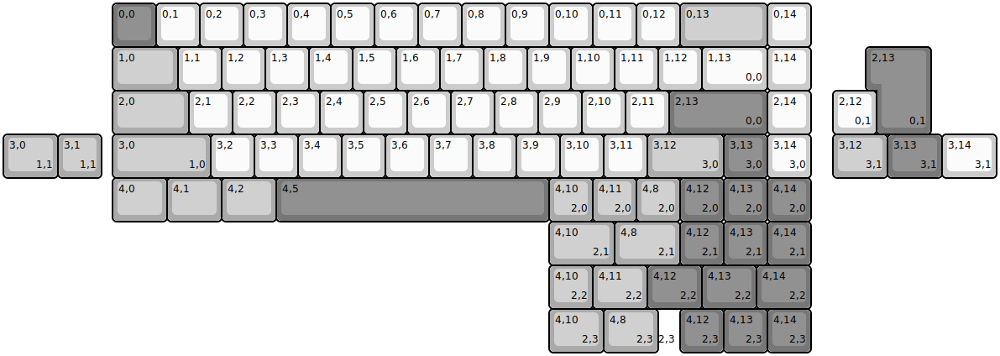{:loading="lazy"}

[Open in keyboard-layout-editor](http://www.keyboard-layout-editor.com/##@@_x:2.5&c=#777777;&=0,0&_c=#cccccc;&=0,1&=0,2&=0,3&=0,4&=0,5&=0,6&=0,7&=0,8&=0,9&=0,10&=0,11&=0,12&_c=#aaaaaa&w:2;&=0,13&_c=#cccccc;&=0,14;&@_x:2.5&c=#aaaaaa&w:1.5;&=1,0&_c=#cccccc;&=1,1&=1,2&=1,3&=1,4&=1,5&=1,6&=1,7&=1,8&=1,9&=1,10&=1,11&=1,12&_w:1.5;&=1,13%0A%0A%0A0,0&=1,14;&@_x:2.5&c=#aaaaaa&w:1.75;&=2,0&_c=#cccccc;&=2,1&=2,2&=2,3&=2,4&=2,5&=2,6&=2,7&=2,8&=2,9&=2,10&=2,11&_c=#777777&w:2.25;&=2,13%0A%0A%0A0,0&_c=#cccccc;&=2,14;&@_x:2.5&c=#aaaaaa&w:2.25;&=3,0%0A%0A%0A1,0&_c=#cccccc;&=3,2&=3,3&=3,4&=3,5&=3,6&=3,7&=3,8&=3,9&=3,10&=3,11&_c=#aaaaaa&w:1.75;&=3,12%0A%0A%0A3,0&_c=#777777;&=3,13%0A%0A%0A3,0&_c=#cccccc;&=3,14%0A%0A%0A3,0;&@_x:2.5&c=#aaaaaa&w:1.25;&=4,0&_w:1.25;&=4,1&_w:1.25;&=4,2&_c=#777777&w:6.25;&=4,5&_c=#aaaaaa;&=4,10%0A%0A%0A2,0&=4,11%0A%0A%0A2,0&=4,8%0A%0A%0A2,0&_c=#777777;&=4,12%0A%0A%0A2,0&=4,13%0A%0A%0A2,0&=4,14%0A%0A%0A2,0;&@_x:20.0&y:-4&w:1.25&h:2&w2:1.5&h2:1&x2:-0.25;&=2,13%0A%0A%0A0,1;&@_x:19.0&c=#cccccc;&=2,12%0A%0A%0A0,1;&@_c=#aaaaaa&w:1.25;&=3,0%0A%0A%0A1,1&=3,1%0A%0A%0A1,1&_x:16.75&w:1.25;&=3,12%0A%0A%0A3,1&_c=#777777&w:1.25;&=3,13%0A%0A%0A3,1&_c=#cccccc&w:1.25;&=3,14%0A%0A%0A3,1;&@_x:12.5&y:1&c=#aaaaaa&w:1.5;&=4,10%0A%0A%0A2,1&_w:1.5;&=4,8%0A%0A%0A2,1&_c=#777777;&=4,12%0A%0A%0A2,1&=4,13%0A%0A%0A2,1&=4,14%0A%0A%0A2,1;&@_x:12.5&c=#aaaaaa;&=4,10%0A%0A%0A2,2&_w:1.25;&=4,11%0A%0A%0A2,2&_c=#777777&w:1.25;&=4,12%0A%0A%0A2,2&_w:1.25;&=4,13%0A%0A%0A2,2&_w:1.25;&=4,14%0A%0A%0A2,2;&@_x:12.5&c=#aaaaaa&w:1.25;&=4,10%0A%0A%0A2,3&_w:1.25;&=4,8%0A%0A%0A2,3&_c=#cccccc&w:0.5&d:true;&=%0A%0A%0A2,3&_c=#777777;&=4,12%0A%0A%0A2,3&=4,13%0A%0A%0A2,3&=4,14%0A%0A%0A2,3)

## xd/xd87

[README](output/xd/README.md) - [layout](output/xd/xd87-kle.json) - [PCB](output/xd/xd87.kicad_pcb) - [PCB render](output/xd/xd87-render.svg)

{:loading="lazy"}

[Open in keyboard-layout-editor](http://www.keyboard-layout-editor.com/##@@_c=#777777;&=0,0&_x:1;&=0,2&=0,3&=0,4&=0,5&_x:0.5;&=0,6&=0,7&=0,8&=0,9&_x:0.5;&=0,10&=0,11&=0,12&=0,13&_x:0.25;&=0,14&=0,15&=0,16;&@_y:0.5&c=#cccccc;&=1,0&=1,1&=1,2&=1,3&=1,4&=1,5&=1,6&=1,7&=1,8&=1,9&=1,10&=1,11&=1,12&_c=#aaaaaa&w:2;&=1,13&_x:0.25&c=#777777;&=1,14&=1,15&=1,16;&@_c=#aaaaaa&w:1.5;&=2,0&_c=#cccccc;&=2,1&=2,2&=2,3&=2,4&=2,5&=2,6&=2,7&=2,8&=2,9&=2,10&=2,11&=2,12&_w:1.5;&=2,13&_x:0.25&c=#777777;&=2,14&=2,15&=2,16;&@_c=#aaaaaa&w:1.75;&=3,0&_c=#cccccc;&=3,1&=3,2&=3,3&=3,4&=3,5&=3,6&=3,7&=3,8&=3,9&=3,10&=3,11&_c=#777777&w:2.25;&=3,13;&@_c=#aaaaaa&w:2.25;&=4,0&_c=#cccccc;&=4,2&=4,3&=4,4&=4,5&=4,6&=4,7&=4,8&=4,9&=4,10&=4,11&_c=#aaaaaa&w:2.75;&=4,12&_x:1.25&c=#777777;&=4,15;&@_c=#aaaaaa&w:1.25;&=5,0&_w:1.25;&=5,1&_w:1.25;&=5,2&_c=#cccccc&w:6.25;&=5,8&_c=#aaaaaa&w:1.25;&=5,10&_w:1.25;&=5,11&_w:1.25;&=5,12&_w:1.25;&=5,13&_x:0.25&c=#777777;&=5,14&=5,15&=5,16)

## xd/xd96

[README](output/xd/README.md) - [layout](output/xd/xd96-kle.json) - [PCB](output/xd/xd96.kicad_pcb) - [PCB render](output/xd/xd96-render.svg)

{:loading="lazy"}

[Open in keyboard-layout-editor](http://www.keyboard-layout-editor.com/##@@_x:2.75&c=#777777;&=0,0&_c=#cccccc;&=0,1&=0,2&=0,3&=0,4&=0,5&=0,6&=0,7&=0,8&=0,9&=0,10&=0,11&=0,12&_c=#aaaaaa;&=0,13&=5,6&=0,14&=0,15&=0,16&=0,17;&@_x:2.75&c=#cccccc;&=1,0&=1,1&=1,2&=1,3&=1,4&=1,5&=1,6&=1,7&=1,8&=1,9&=1,10&=1,11&=1,12&_c=#777777&w:2;&=1,13%0A%0A%0A1,0&_c=#aaaaaa;&=1,14&=1,15&=1,16&=1,17%0A%0A%0A5,0;&@_x:2.75&w:1.5;&=2,0&_c=#cccccc;&=2,1&=2,2&=2,3&=2,4&=2,5&=2,6&=2,7&=2,8&=2,9&=2,10&=2,11&=2,12&_w:1.5;&=2,13%0A%0A%0A0,0&=2,14&=2,15&=2,16&_c=#aaaaaa&h:2;&=2,17%0A%0A%0A5,0;&@_x:2.75&w:1.75;&=3,0&_c=#cccccc;&=3,1&=3,2&=3,3&=3,4&=3,5&=3,6&=3,7&=3,8&=3,9&=3,10&=3,11&_c=#777777&w:2.25;&=3,13%0A%0A%0A0,0&_c=#cccccc;&=3,14&=3,15&=3,16;&@_x:2.75&c=#aaaaaa&w:2.25;&=4,0%0A%0A%0A2,0&_c=#cccccc;&=4,2&=4,3&=4,4&=4,5&=4,6&=4,7&=4,8&=4,9&=4,10&=4,11%0A%0A%0A6,0&_c=#aaaaaa&w:1.75;&=4,12%0A%0A%0A6,0&=4,13%0A%0A%0A6,0&_c=#cccccc;&=4,14&=4,15&=4,16&_c=#777777&h:2;&=4,17%0A%0A%0A5,0;&@_x:2.75&c=#aaaaaa&w:1.25;&=5,0%0A%0A%0A3,0&_w:1.25;&=5,1%0A%0A%0A3,0&_w:1.25;&=5,2%0A%0A%0A3,0&_c=#cccccc&w:6.25;&=5,5%0A%0A%0A3,0&_c=#aaaaaa&w:1.5;&=5,10%0A%0A%0A3,0&_w:1.5;&=5,8%0A%0A%0A3,0&=5,12%0A%0A%0A3,0&=5,13%0A%0A%0A3,0&=5,14%0A%0A%0A4,0&_c=#cccccc;&=5,15%0A%0A%0A4,0&=5,16;&@_x:22.25&y:-5&c=#aaaaaa;&=1,17%0A%0A%0A5,1&_x:0.5&h:2;&=1,17%0A%0A%0A5,2&_x:0.5&c=#777777;&=1,13%0A%0A%0A1,1&_c=#aaaaaa;&=5,3%0A%0A%0A1,1;&@_x:22.25;&=2,17%0A%0A%0A5,1&_x:3.0&c=#777777&w:1.25&h:2&w2:1.5&h2:1&x2:-0.25;&=2,13%0A%0A%0A0,1;&@_x:22.25&c=#aaaaaa;&=3,17%0A%0A%0A5,1&_x:0.5&c=#777777&h:2;&=3,17%0A%0A%0A5,2&_x:0.5&c=#cccccc;&=3,13%0A%0A%0A0,1;&@_c=#aaaaaa&w:1.25;&=4,0%0A%0A%0A2,1&_c=#cccccc;&=4,1%0A%0A%0A2,1&_x:20.0&c=#aaaaaa;&=4,17%0A%0A%0A5,1&_x:2.0&c=#cccccc;&=4,11%0A%0A%0A6,1&_c=#aaaaaa&w:2.75;&=4,12%0A%0A%0A6,1&_x:0.5&w:1.25;&=4,11%0A%0A%0A6,2&_w:1.25;&=4,12%0A%0A%0A6,2&_w:1.25;&=4,13%0A%0A%0A6,2;&@_x:22.25;&=5,17%0A%0A%0A5,1&_x:0.5;&=5,17%0A%0A%0A5,2&_x:0.5&c=#cccccc&w:2;&=5,15%0A%0A%0A4,1;&@_x:2.75&y:0.5&c=#aaaaaa&w:1.25;&=5,0%0A%0A%0A3,1&_w:1.25;&=5,1%0A%0A%0A3,1&_w:1.25;&=5,2%0A%0A%0A3,1&_c=#cccccc&w:6.25;&=5,5%0A%0A%0A3,1&_c=#aaaaaa&w:1.25;&=5,10%0A%0A%0A3,1&_w:1.25;&=5,8%0A%0A%0A3,1&_w:1.25;&=5,12%0A%0A%0A3,1&_w:1.25;&=5,13%0A%0A%0A3,1;&@_x:2.75&w:1.5;&=5,0%0A%0A%0A3,2&=5,1%0A%0A%0A3,2&_w:1.5;&=5,2%0A%0A%0A3,2&_c=#cccccc&w:6;&=5,5%0A%0A%0A3,2&_c=#aaaaaa&w:1.5;&=5,10%0A%0A%0A3,2&_w:1.5;&=5,8%0A%0A%0A3,2&=5,12%0A%0A%0A3,2&=5,13%0A%0A%0A3,2;&@_x:2.75&w:1.5;&=5,0%0A%0A%0A3,3&_w:1.5;&=5,2%0A%0A%0A3,3&_c=#cccccc&w:7;&=5,5%0A%0A%0A3,3&_c=#aaaaaa&w:1.5;&=5,10%0A%0A%0A3,3&_w:1.5;&=5,8%0A%0A%0A3,3&=5,12%0A%0A%0A3,3&=5,13%0A%0A%0A3,3;&@_x:2.75&w:1.5&d:true;&=%0A%0A%0A3,4&=5,1%0A%0A%0A3,4&_w:1.5;&=5,2%0A%0A%0A3,4&_c=#cccccc&w:7;&=5,5%0A%0A%0A3,4&_c=#aaaaaa&w:1.5;&=5,8%0A%0A%0A3,4&=5,12%0A%0A%0A3,4&_w:1.5&d:true;&=%0A%0A%0A3,4)

## xelus/dawn60/xelus_dawn60

[README](output/xelus/dawn60/README.md) - [layout](output/xelus/dawn60/xelus_dawn60-kle.json) - [PCB](output/xelus/dawn60/xelus_dawn60.kicad_pcb) - [PCB render](output/xelus/dawn60/xelus_dawn60-render.svg)

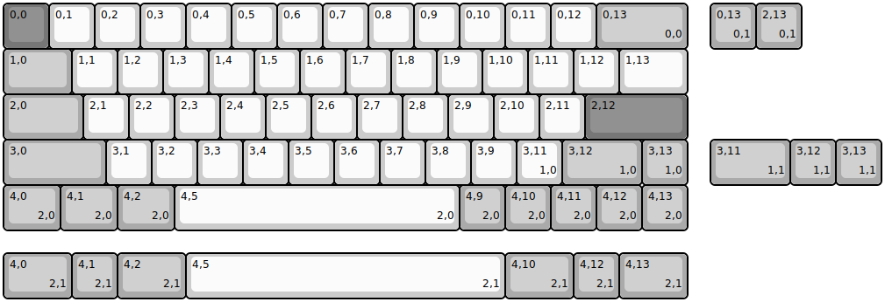{:loading="lazy"}

[Open in keyboard-layout-editor](http://www.keyboard-layout-editor.com/##@@_c=#777777;&=0,0&_c=#cccccc;&=0,1&=0,2&=0,3&=0,4&=0,5&=0,6&=0,7&=0,8&=0,9&=0,10&=0,11&=0,12&_c=#aaaaaa&w:2;&=0,13%0A%0A%0A0,0;&@_w:1.5;&=1,0&_c=#cccccc;&=1,1&=1,2&=1,3&=1,4&=1,5&=1,6&=1,7&=1,8&=1,9&=1,10&=1,11&=1,12&_w:1.5;&=1,13;&@_c=#aaaaaa&w:1.75;&=2,0&_c=#cccccc;&=2,1&=2,2&=2,3&=2,4&=2,5&=2,6&=2,7&=2,8&=2,9&=2,10&=2,11&_c=#777777&w:2.25;&=2,12;&@_c=#aaaaaa&w:2.25;&=3,0&_c=#cccccc;&=3,1&=3,2&=3,3&=3,4&=3,5&=3,6&=3,7&=3,8&=3,9&=3,11%0A%0A%0A1,0&_c=#aaaaaa&w:1.75;&=3,12%0A%0A%0A1,0&=3,13%0A%0A%0A1,0;&@_w:1.25;&=4,0%0A%0A%0A2,0&_w:1.25;&=4,1%0A%0A%0A2,0&_w:1.25;&=4,2%0A%0A%0A2,0&_c=#cccccc&w:6.25;&=4,5%0A%0A%0A2,0&_c=#aaaaaa;&=4,9%0A%0A%0A2,0&=4,10%0A%0A%0A2,0&=4,11%0A%0A%0A2,0&=4,12%0A%0A%0A2,0&=4,13%0A%0A%0A2,0;&@_x:15.5&y:-5;&=0,13%0A%0A%0A0,1&=2,13%0A%0A%0A0,1;&@_x:15.5&y:2&w:1.75;&=3,11%0A%0A%0A1,1&=3,12%0A%0A%0A1,1&=3,13%0A%0A%0A1,1;&@_y:1.5&w:1.5;&=4,0%0A%0A%0A2,1&=4,1%0A%0A%0A2,1&_w:1.5;&=4,2%0A%0A%0A2,1&_c=#cccccc&w:7;&=4,5%0A%0A%0A2,1&_c=#aaaaaa&w:1.5;&=4,10%0A%0A%0A2,1&=4,12%0A%0A%0A2,1&_w:1.5;&=4,13%0A%0A%0A2,1)

## xelus/dharma

[README](output/xelus/dharma/README.md) - [layout](output/xelus/dharma/dharma-kle.json) - [PCB](output/xelus/dharma/dharma.kicad_pcb) - [PCB render](output/xelus/dharma/dharma-render.svg)

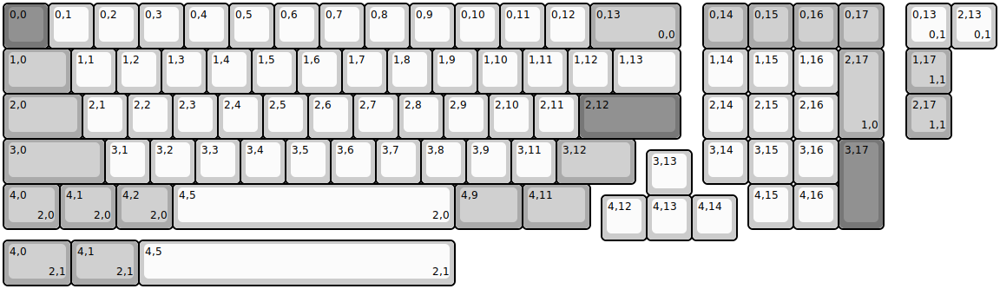{:loading="lazy"}

[Open in keyboard-layout-editor](http://www.keyboard-layout-editor.com/##@@_c=#777777;&=0,0&_c=#cccccc;&=0,1&=0,2&=0,3&=0,4&=0,5&=0,6&=0,7&=0,8&=0,9&=0,10&=0,11&=0,12&_c=#aaaaaa&w:2;&=0,13%0A%0A%0A0,0&_x:0.5;&=0,14&=0,15&=0,16&=0,17;&@_w:1.5;&=1,0&_c=#cccccc;&=1,1&=1,2&=1,3&=1,4&=1,5&=1,6&=1,7&=1,8&=1,9&=1,10&=1,11&=1,12&_w:1.5;&=1,13&_x:0.5;&=1,14&=1,15&=1,16&_c=#aaaaaa&h:2;&=2,17%0A%0A%0A1,0;&@_w:1.75;&=2,0&_c=#cccccc;&=2,1&=2,2&=2,3&=2,4&=2,5&=2,6&=2,7&=2,8&=2,9&=2,10&=2,11&_c=#777777&w:2.25;&=2,12&_x:0.5&c=#cccccc;&=2,14&=2,15&=2,16;&@_c=#aaaaaa&w:2.25;&=3,0&_c=#cccccc;&=3,1&=3,2&=3,3&=3,4&=3,5&=3,6&=3,7&=3,8&=3,9&=3,11&_c=#aaaaaa&w:1.75;&=3,12&_x:1.5&c=#cccccc;&=3,14&=3,15&=3,16&_c=#777777&h:2;&=3,17;&@_x:14.25&y:-0.75&c=#cccccc;&=3,13;&@_y:-0.25&c=#aaaaaa&w:1.25;&=4,0%0A%0A%0A2,0&_w:1.25;&=4,1%0A%0A%0A2,0&_w:1.25;&=4,2%0A%0A%0A2,0&_c=#cccccc&w:6.25;&=4,5%0A%0A%0A2,0&_c=#aaaaaa&w:1.5;&=4,9&_w:1.5;&=4,11&_x:3.5&c=#cccccc;&=4,15&=4,16;&@_x:13.25&y:-0.75;&=4,12&=4,13&=4,14;&@_x:20.0&y:-5.25;&=0,13%0A%0A%0A0,1&=2,13%0A%0A%0A0,1;&@_x:20.0&c=#aaaaaa;&=1,17%0A%0A%0A1,1;&@_x:20.0;&=2,17%0A%0A%0A1,1;&@_y:2.25&w:1.5;&=4,0%0A%0A%0A2,1&_w:1.5;&=4,1%0A%0A%0A2,1&_c=#cccccc&w:7;&=4,5%0A%0A%0A2,1)

## xelus/kangaroo/kangaroo_rev1

[README](output/xelus/kangaroo/README.md) - [layout](output/xelus/kangaroo/kangaroo_rev1-kle.json) - [PCB](output/xelus/kangaroo/kangaroo_rev1.kicad_pcb) - [PCB render](output/xelus/kangaroo/kangaroo_rev1-render.svg)

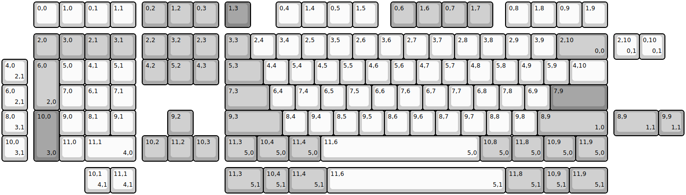{:loading="lazy"}

[Open in keyboard-layout-editor](http://www.keyboard-layout-editor.com/##@@_x:1.25;&=0,0&=1,0&=0,1&=1,1&_x:0.25&c=#aaaaaa;&=0,2&=1,2&=0,3&_x:0.25&c=#888888;&=1,3&_x:1.0&c=#cccccc;&=0,4&=1,4&=0,5&=1,5&_x:0.5&c=#aaaaaa;&=0,6&=1,6&=0,7&=1,7&_x:0.5&c=#cccccc;&=0,8&=1,8&=0,9&=1,9;&@_x:1.25&y:0.25&c=#aaaaaa;&=2,0&=3,0&=2,1&=3,1&_x:0.25;&=2,2&=3,2&=2,3&_x:0.25;&=3,3&_c=#cccccc;&=2,4&=3,4&=2,5&=3,5&=2,6&=3,6&=2,7&=3,7&=2,8&=3,8&=2,9&=3,9&_c=#aaaaaa&w:2;&=2,10%0A%0A%0A0,0;&@_x:1.25&h:2;&=6,0%0A%0A%0A2,0&_c=#cccccc;&=5,0&=4,1&=5,1&_x:0.25&c=#aaaaaa;&=4,2&=5,2&=4,3&_x:0.25&w:1.5;&=5,3&_c=#cccccc;&=4,4&=5,4&=4,5&=5,5&=4,6&=5,6&=4,7&=5,7&=4,8&=5,8&=4,9&=5,9&_w:1.5;&=4,10;&@_x:2.25;&=7,0&=6,1&=7,1&_x:3.5&c=#aaaaaa&w:1.75;&=7,3&_c=#cccccc;&=6,4&=7,4&=6,5&=7,5&=6,6&=7,6&=6,7&=7,7&=6,8&=7,8&=6,9&_c=#888888&w:2.25;&=7,9;&@_x:1.25&h:2;&=10,0%0A%0A%0A3,0&_c=#cccccc;&=9,0&=8,1&=9,1&_x:1.25&c=#aaaaaa;&=9,2&_x:1.25&w:2.25;&=9,3&_c=#cccccc;&=8,4&=9,4&=8,5&=9,5&=8,6&=9,6&=8,7&=9,7&=8,8&=9,8&_c=#aaaaaa&w:2.75;&=8,9%0A%0A%0A1,0;&@_x:2.25&c=#cccccc;&=11,0&_w:2;&=11,1%0A%0A%0A4,0&_x:0.25&c=#aaaaaa;&=10,2&=11,2&=10,3&_x:0.25&w:1.25;&=11,3%0A%0A%0A5,0&_w:1.25;&=10,4%0A%0A%0A5,0&_w:1.25;&=11,4%0A%0A%0A5,0&_c=#cccccc&w:6.25;&=11,6%0A%0A%0A5,0&_c=#aaaaaa&w:1.25;&=10,8%0A%0A%0A5,0&_w:1.25;&=11,8%0A%0A%0A5,0&_w:1.25;&=10,9%0A%0A%0A5,0&_w:1.25;&=11,9%0A%0A%0A5,0;&@_x:24.0&y:-5.0&c=#cccccc;&=2,10%0A%0A%0A0,1&=0,10%0A%0A%0A0,1;&@=4,0%0A%0A%0A2,1;&@=6,0%0A%0A%0A2,1;&@=8,0%0A%0A%0A3,1&_x:23.0&c=#aaaaaa&w:1.75;&=8,9%0A%0A%0A1,1&=9,9%0A%0A%0A1,1;&@_c=#cccccc;&=10,0%0A%0A%0A3,1;&@_x:3.25&y:0.25;&=10,1%0A%0A%0A4,1&=11,1%0A%0A%0A4,1&_x:3.5&c=#aaaaaa&w:1.5;&=11,3%0A%0A%0A5,1&=10,4%0A%0A%0A5,1&_w:1.5;&=11,4%0A%0A%0A5,1&_c=#cccccc&w:7;&=11,6%0A%0A%0A5,1&_c=#aaaaaa&w:1.5;&=11,8%0A%0A%0A5,1&=10,9%0A%0A%0A5,1&_w:1.5;&=11,9%0A%0A%0A5,1)

## xelus/la_plus/xelus_la_plus

[README](output/xelus/la_plus/README.md) - [layout](output/xelus/la_plus/xelus_la_plus-kle.json) - [PCB](output/xelus/la_plus/xelus_la_plus.kicad_pcb) - [PCB render](output/xelus/la_plus/xelus_la_plus-render.svg)

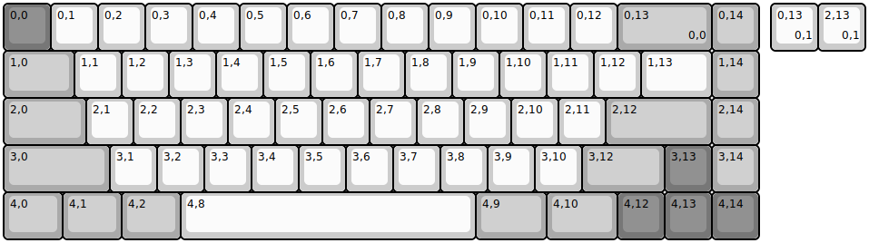{:loading="lazy"}

[Open in keyboard-layout-editor](http://www.keyboard-layout-editor.com/##@@_c=#777777;&=0,0&_c=#cccccc;&=0,1&=0,2&=0,3&=0,4&=0,5&=0,6&=0,7&=0,8&=0,9&=0,10&=0,11&=0,12&_c=#aaaaaa&w:2;&=0,13%0A%0A%0A0,0&=0,14;&@_w:1.5;&=1,0&_c=#cccccc;&=1,1&=1,2&=1,3&=1,4&=1,5&=1,6&=1,7&=1,8&=1,9&=1,10&=1,11&=1,12&_w:1.5;&=1,13&_c=#aaaaaa;&=1,14;&@_w:1.75;&=2,0&_c=#cccccc;&=2,1&=2,2&=2,3&=2,4&=2,5&=2,6&=2,7&=2,8&=2,9&=2,10&=2,11&_c=#aaaaaa&w:2.25;&=2,12&=2,14;&@_w:2.25;&=3,0&_c=#cccccc;&=3,1&=3,2&=3,3&=3,4&=3,5&=3,6&=3,7&=3,8&=3,9&=3,10&_c=#aaaaaa&w:1.75;&=3,12&_c=#777777;&=3,13&_c=#aaaaaa;&=3,14;&@_w:1.25;&=4,0&_w:1.25;&=4,1&_w:1.25;&=4,2&_c=#cccccc&w:6.25;&=4,8&_c=#aaaaaa&w:1.5;&=4,9&_w:1.5;&=4,10&_c=#777777;&=4,12&=4,13&=4,14;&@_x:16.25&y:-5&c=#cccccc;&=0,13%0A%0A%0A0,1&=2,13%0A%0A%0A0,1)

## xelus/ninjin/xelus_ninjin

[README](output/xelus/ninjin/README.md) - [layout](output/xelus/ninjin/xelus_ninjin-kle.json) - [PCB](output/xelus/ninjin/xelus_ninjin.kicad_pcb) - [PCB render](output/xelus/ninjin/xelus_ninjin-render.svg)

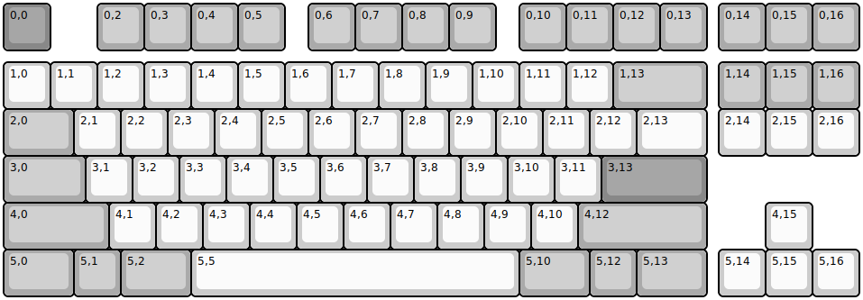{:loading="lazy"}

[Open in keyboard-layout-editor](http://www.keyboard-layout-editor.com/##@@_c=#888888;&=0,0&_x:1&c=#aaaaaa;&=0,2&=0,3&=0,4&=0,5&_x:0.5;&=0,6&=0,7&=0,8&=0,9&_x:0.5;&=0,10&=0,11&=0,12&=0,13&_x:0.25;&=0,14&=0,15&=0,16;&@_y:0.25&c=#cccccc;&=1,0&=1,1&=1,2&=1,3&=1,4&=1,5&=1,6&=1,7&=1,8&=1,9&=1,10&=1,11&=1,12&_c=#aaaaaa&w:2;&=1,13&_x:0.25;&=1,14&=1,15&=1,16;&@_w:1.5;&=2,0&_c=#cccccc;&=2,1&=2,2&=2,3&=2,4&=2,5&=2,6&=2,7&=2,8&=2,9&=2,10&=2,11&=2,12&_w:1.5;&=2,13&_x:0.25;&=2,14&=2,15&=2,16;&@_c=#aaaaaa&w:1.75;&=3,0&_c=#cccccc;&=3,1&=3,2&=3,3&=3,4&=3,5&=3,6&=3,7&=3,8&=3,9&=3,10&=3,11&_c=#888888&w:2.25;&=3,13;&@_c=#aaaaaa&w:2.25;&=4,0&_c=#cccccc;&=4,1&=4,2&=4,3&=4,4&=4,5&=4,6&=4,7&=4,8&=4,9&=4,10&_c=#aaaaaa&w:2.75;&=4,12&_x:1.25&c=#cccccc;&=4,15;&@_c=#aaaaaa&w:1.5;&=5,0&=5,1&_w:1.5;&=5,2&_c=#cccccc&w:7;&=5,5&_c=#aaaaaa&w:1.5;&=5,10&=5,12&_w:1.5;&=5,13&_x:0.25&c=#cccccc;&=5,14&=5,15&=5,16)

## xelus/pachi/xelus_pachi

[README](output/xelus/pachi/README.md) - [layout](output/xelus/pachi/xelus_pachi-kle.json) - [PCB](output/xelus/pachi/xelus_pachi.kicad_pcb) - [PCB render](output/xelus/pachi/xelus_pachi-render.svg)

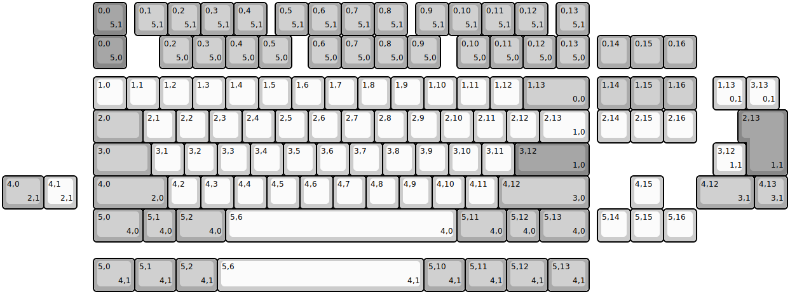{:loading="lazy"}

[Open in keyboard-layout-editor](http://www.keyboard-layout-editor.com/##@@_x:2.75&y:1&c=#888888;&=0,0%0A%0A%0A5,0&_x:1.0&c=#aaaaaa;&=0,2%0A%0A%0A5,0&=0,3%0A%0A%0A5,0&=0,4%0A%0A%0A5,0&=0,5%0A%0A%0A5,0&_x:0.5;&=0,6%0A%0A%0A5,0&=0,7%0A%0A%0A5,0&=0,8%0A%0A%0A5,0&=0,9%0A%0A%0A5,0&_x:0.5;&=0,10%0A%0A%0A5,0&=0,11%0A%0A%0A5,0&=0,12%0A%0A%0A5,0&=0,13%0A%0A%0A5,0&_x:0.25;&=0,14&=0,15&=0,16;&@_x:2.75&y:0.25&c=#cccccc;&=1,0&=1,1&=1,2&=1,3&=1,4&=1,5&=1,6&=1,7&=1,8&=1,9&=1,10&=1,11&=1,12&_c=#aaaaaa&w:2;&=1,13%0A%0A%0A0,0&_x:0.25;&=1,14&=1,15&=1,16;&@_x:2.75&w:1.5;&=2,0&_c=#cccccc;&=2,1&=2,2&=2,3&=2,4&=2,5&=2,6&=2,7&=2,8&=2,9&=2,10&=2,11&=2,12&_w:1.5;&=2,13%0A%0A%0A1,0&_x:0.25;&=2,14&=2,15&=2,16;&@_x:2.75&c=#aaaaaa&w:1.75;&=3,0&_c=#cccccc;&=3,1&=3,2&=3,3&=3,4&=3,5&=3,6&=3,7&=3,8&=3,9&=3,10&=3,11&_c=#888888&w:2.25;&=3,12%0A%0A%0A1,0;&@_x:2.75&c=#aaaaaa&w:2.25;&=4,0%0A%0A%0A2,0&_c=#cccccc;&=4,2&=4,3&=4,4&=4,5&=4,6&=4,7&=4,8&=4,9&=4,10&=4,11&_c=#aaaaaa&w:2.75;&=4,12%0A%0A%0A3,0&_x:1.25&c=#cccccc;&=4,15;&@_x:2.75&c=#aaaaaa&w:1.5;&=5,0%0A%0A%0A4,0&=5,1%0A%0A%0A4,0&_w:1.5;&=5,2%0A%0A%0A4,0&_c=#cccccc&w:7;&=5,6%0A%0A%0A4,0&_c=#aaaaaa&w:1.5;&=5,11%0A%0A%0A4,0&=5,12%0A%0A%0A4,0&_w:1.5;&=5,13%0A%0A%0A4,0&_x:0.25&c=#cccccc;&=5,14&=5,15&=5,16;&@_x:2.75&y:-7.25&c=#888888;&=0,0%0A%0A%0A5,1&_x:0.25&c=#aaaaaa;&=0,1%0A%0A%0A5,1&=0,2%0A%0A%0A5,1&=0,3%0A%0A%0A5,1&=0,4%0A%0A%0A5,1&_x:0.25;&=0,5%0A%0A%0A5,1&=0,6%0A%0A%0A5,1&=0,7%0A%0A%0A5,1&=0,8%0A%0A%0A5,1&_x:0.25;&=0,9%0A%0A%0A5,1&=0,10%0A%0A%0A5,1&=0,11%0A%0A%0A5,1&=0,12%0A%0A%0A5,1&_x:0.25;&=0,13%0A%0A%0A5,1;&@_x:21.5&y:1.25&c=#cccccc;&=1,13%0A%0A%0A0,1&=3,13%0A%0A%0A0,1;&@_x:22.5&c=#888888&w:1.25&h:2&w2:1.5&h2:1&x2:-0.25;&=2,13%0A%0A%0A1,1;&@_x:21.5&c=#cccccc;&=3,12%0A%0A%0A1,1;&@_c=#aaaaaa&w:1.25;&=4,0%0A%0A%0A2,1&_c=#cccccc;&=4,1%0A%0A%0A2,1&_x:18.75&c=#aaaaaa&w:1.75;&=4,12%0A%0A%0A3,1&=4,13%0A%0A%0A3,1;&@_x:2.75&y:1.5&w:1.25;&=5,0%0A%0A%0A4,1&_w:1.25;&=5,1%0A%0A%0A4,1&_w:1.25;&=5,2%0A%0A%0A4,1&_c=#cccccc&w:6.25;&=5,6%0A%0A%0A4,1&_c=#aaaaaa&w:1.25;&=5,10%0A%0A%0A4,1&_w:1.25;&=5,11%0A%0A%0A4,1&_w:1.25;&=5,12%0A%0A%0A4,1&_w:1.25;&=5,13%0A%0A%0A4,1)

## xelus/pachi/xelus_pachi_rgb_rev1

[README](output/xelus/pachi/README.md) - [layout](output/xelus/pachi/xelus_pachi_rgb_rev1-kle.json) - [PCB](output/xelus/pachi/xelus_pachi_rgb_rev1.kicad_pcb) - [PCB render](output/xelus/pachi/xelus_pachi_rgb_rev1-render.svg)

{:loading="lazy"}

[Open in keyboard-layout-editor](http://www.keyboard-layout-editor.com/##@@_c=#888888;&=0,0&_x:1&c=#cccccc;&=0,2&=0,3&=0,4&=0,5&_x:0.5&c=#aaaaaa;&=0,6&=0,7&=0,8&=0,9&_x:0.5&c=#cccccc;&=0,10&=0,11&=0,12&=0,13&_x:0.25&c=#aaaaaa;&=0,14&=0,15&=0,16;&@_y:0.25&c=#cccccc;&=1,0&=1,1&=1,2&=1,3&=1,4&=1,5&=1,6&=1,7&=1,8&=1,9&=1,10&=1,11&=1,12&_c=#aaaaaa&w:2;&=1,13&_x:0.25;&=1,14&=1,15&=1,16;&@_w:1.5;&=2,0&_c=#cccccc;&=2,1&=2,2&=2,3&=2,4&=2,5&=2,6&=2,7&=2,8&=2,9&=2,10&=2,11&=2,12&_w:1.5;&=2,13&_x:0.25&c=#aaaaaa;&=2,14&=2,15&=2,16;&@_w:1.75;&=3,0&_c=#cccccc;&=3,1&=3,2&=3,3&=3,4&=3,5&=3,6&=3,7&=3,8&=3,9&=3,10&=3,11&_c=#888888&w:2.25;&=3,13;&@_c=#aaaaaa&w:2.25;&=4,0&_c=#cccccc;&=4,1&=4,2&=4,3&=4,4&=4,5&=4,6&=4,7&=4,8&=4,9&=4,10&_c=#aaaaaa&w:2.75;&=4,12&_x:1.25;&=4,15;&@_w:1.5;&=5,0&=5,1&_w:1.5;&=5,2&_c=#cccccc&w:7;&=5,5&_c=#aaaaaa&w:1.5;&=5,10&=5,12&_w:1.5;&=5,13&_x:0.25;&=5,14&=5,15&=5,16)

## xelus/pachi/xelus_pachi_rgb_rev2

[README](output/xelus/pachi/README.md) - [layout](output/xelus/pachi/xelus_pachi_rgb_rev2-kle.json) - [PCB](output/xelus/pachi/xelus_pachi_rgb_rev2.kicad_pcb) - [PCB render](output/xelus/pachi/xelus_pachi_rgb_rev2-render.svg)

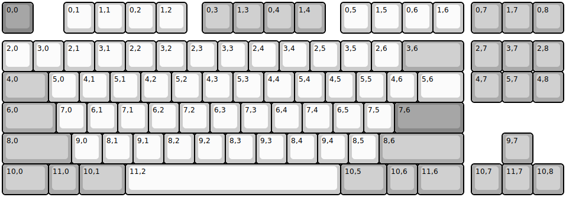{:loading="lazy"}

[Open in keyboard-layout-editor](http://www.keyboard-layout-editor.com/##@@_c=#888888;&=0,0&_x:1&c=#cccccc;&=0,1&=1,1&=0,2&=1,2&_x:0.5&c=#aaaaaa;&=0,3&=1,3&=0,4&=1,4&_x:0.5&c=#cccccc;&=0,5&=1,5&=0,6&=1,6&_x:0.25&c=#aaaaaa;&=0,7&=1,7&=0,8%20%20%20%20;&@_y:0.25&c=#cccccc;&=2,0&=3,0&=2,1&=3,1&=2,2&=3,2&=2,3&=3,3&=2,4&=3,4&=2,5&=3,5&=2,6&_c=#aaaaaa&w:2;&=3,6&_x:0.25;&=2,7&=3,7&=2,8;&@_w:1.5;&=4,0&_c=#cccccc;&=5,0&=4,1&=5,1&=4,2&=5,2&=4,3&=5,3&=4,4&=5,4&=4,5&=5,5&=4,6&_w:1.5;&=5,6&_x:0.25&c=#aaaaaa;&=4,7&=5,7&=4,8;&@_w:1.75;&=6,0&_c=#cccccc;&=7,0&=6,1&=7,1&=6,2&=7,2&=6,3&=7,3&=6,4&=7,4&=6,5&=7,5&_c=#888888&w:2.25;&=7,6;&@_c=#aaaaaa&w:2.25;&=8,0&_c=#cccccc;&=9,0&=8,1&=9,1&=8,2&=9,2&=8,3&=9,3&=8,4&=9,4&=8,5&_c=#aaaaaa&w:2.75;&=8,6&_x:1.25;&=9,7;&@_w:1.5;&=10,0&=11,0&_w:1.5;&=10,1&_c=#cccccc&w:7;&=11,2&_c=#aaaaaa&w:1.5;&=10,5&=10,6&_w:1.5;&=11,6&_x:0.25;&=10,7&=11,7&=10,8)

## xelus/rs60/xelus_rs60

[README](output/xelus/rs60/README.md) - [layout](output/xelus/rs60/xelus_rs60-kle.json) - [PCB](output/xelus/rs60/xelus_rs60.kicad_pcb) - [PCB render](output/xelus/rs60/xelus_rs60-render.svg)

{:loading="lazy"}

[Open in keyboard-layout-editor](http://www.keyboard-layout-editor.com/##@@_c=#777777;&=0,0&_c=#cccccc;&=0,1&=0,2&=0,3&=0,4&=0,5&=0,6&=0,7&=0,8&=0,9&=0,10&=0,11&=0,12&_c=#aaaaaa&w:2;&=0,13%0A%0A%0A0,0;&@_w:1.5;&=1,0&_c=#cccccc;&=1,1&=1,2&=1,3&=1,4&=1,5&=1,6&=1,7&=1,8&=1,9&=1,10&=1,11&=1,12&_w:1.5;&=1,13;&@_c=#aaaaaa&w:1.75;&=2,0&_c=#cccccc;&=2,1&=2,2&=2,3&=2,4&=2,5&=2,6&=2,7&=2,8&=2,9&=2,10&=2,11&_c=#777777&w:2.25;&=2,12;&@_c=#aaaaaa&w:2.25;&=3,0&_c=#cccccc;&=3,1&=3,2&=3,3&=3,4&=3,5&=3,6&=3,7&=3,8&=3,9&=3,11&_c=#aaaaaa&w:1.75;&=3,12%0A%0A%0A1,0&=3,13%0A%0A%0A1,0;&@_w:1.25;&=4,0%0A%0A%0A2,0&_w:1.25;&=4,1%0A%0A%0A2,0&_w:1.25;&=4,2%0A%0A%0A2,0&_c=#cccccc&w:6.25;&=4,5%0A%0A%0A2,0&_c=#aaaaaa&w:1.25;&=4,9%0A%0A%0A2,0&_w:1.25;&=4,10%0A%0A%0A2,0&_w:1.25;&=4,12%0A%0A%0A2,0&_w:1.25;&=4,13%0A%0A%0A2,0;&@_x:15.5&y:-5;&=0,13%0A%0A%0A0,1&=2,13%0A%0A%0A0,1;&@_x:15.5&y:2&w:2.75;&=3,12%0A%0A%0A1,1;&@_y:1.5&w:1.5;&=4,0%0A%0A%0A2,1&=4,1%0A%0A%0A2,1&_w:1.5;&=4,2%0A%0A%0A2,1&_c=#cccccc&w:7;&=4,5%0A%0A%0A2,1&_c=#aaaaaa&w:1.5;&=4,10%0A%0A%0A2,1&=4,12%0A%0A%0A2,1&_w:1.5;&=4,13%0A%0A%0A2,1)

## xelus/snap96/xelus_snap96

[README](output/xelus/snap96/README.md) - [layout](output/xelus/snap96/xelus_snap96-kle.json) - [PCB](output/xelus/snap96/xelus_snap96.kicad_pcb) - [PCB render](output/xelus/snap96/xelus_snap96-render.svg)

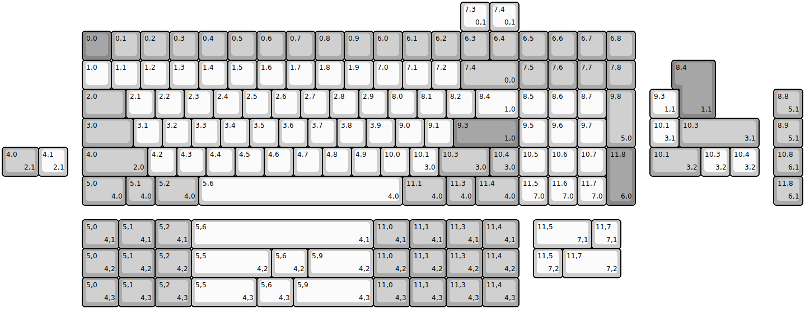{:loading="lazy"}

[Open in keyboard-layout-editor](http://www.keyboard-layout-editor.com/##@_name=Snap96;&@_x:2.75&y:1&c=#888888;&=0,0&_c=#aaaaaa;&=0,1&=0,2&=0,3&=0,4&=0,5&=0,6&=0,7&=0,8&=0,9&=6,0&=6,1&=6,2&=6,3&=6,4&=6,5&=6,6&=6,7&=6,8;&@_x:2.75&c=#cccccc;&=1,0&=1,1&=1,2&=1,3&=1,4&=1,5&=1,6&=1,7&=1,8&=1,9&=7,0&=7,1&=7,2&_c=#aaaaaa&w:2;&=7,4%0A%0A%0A0,0&=7,5&=7,6&=7,7&=7,8;&@_x:2.75&w:1.5;&=2,0&_c=#cccccc;&=2,1&=2,2&=2,3&=2,4&=2,5&=2,6&=2,7&=2,8&=2,9&=8,0&=8,1&=8,2&_w:1.5;&=8,4%0A%0A%0A1,0&=8,5&=8,6&=8,7&_c=#aaaaaa&h:2;&=9,8%0A%0A%0A5,0;&@_x:2.75&w:1.75;&=3,0&_c=#cccccc;&=3,1&=3,2&=3,3&=3,4&=3,5&=3,6&=3,7&=3,8&=3,9&=9,0&=9,1&_c=#888888&w:2.25;&=9,3%0A%0A%0A1,0&_c=#cccccc;&=9,5&=9,6&=9,7;&@_x:2.75&c=#aaaaaa&w:2.25;&=4,0%0A%0A%0A2,0&_c=#cccccc;&=4,2&=4,3&=4,4&=4,5&=4,6&=4,7&=4,8&=4,9&=10,0&=10,1%0A%0A%0A3,0&_c=#aaaaaa&w:1.75;&=10,3%0A%0A%0A3,0&=10,4%0A%0A%0A3,0&_c=#cccccc;&=10,5&=10,6&=10,7&_c=#888888&h:2;&=11,8%0A%0A%0A6,0;&@_x:2.75&c=#aaaaaa&w:1.5;&=5,0%0A%0A%0A4,0&=5,1%0A%0A%0A4,0&_w:1.5;&=5,2%0A%0A%0A4,0&_c=#cccccc&w:7;&=5,6%0A%0A%0A4,0&_c=#aaaaaa&w:1.5;&=11,1%0A%0A%0A4,0&=11,3%0A%0A%0A4,0&_w:1.5;&=11,4%0A%0A%0A4,0&_c=#cccccc;&=11,5%0A%0A%0A7,0&=11,6%0A%0A%0A7,0&=11,7%0A%0A%0A7,0;&@_x:15.75&y:-7;&=7,3%0A%0A%0A0,1&=7,4%0A%0A%0A0,1;&@_x:23.25&y:1&c=#888888&w:1.25&h:2&w2:1.5&h2:1&x2:-0.25;&=8,4%0A%0A%0A1,1;&@_x:22.25&c=#cccccc;&=9,3%0A%0A%0A1,1&_x:3.25&c=#aaaaaa;&=8,8%0A%0A%0A5,1;&@_x:22.25&c=#cccccc;&=10,1%0A%0A%0A3,1&_c=#aaaaaa&w:2.75;&=10,3%0A%0A%0A3,1&_x:0.5;&=8,9%0A%0A%0A5,1;&@_w:1.25;&=4,0%0A%0A%0A2,1&_c=#cccccc;&=4,1%0A%0A%0A2,1&_x:20.0&c=#aaaaaa&w:1.75;&=10,1%0A%0A%0A3,2&_c=#cccccc;&=10,3%0A%0A%0A3,2&=10,4%0A%0A%0A3,2&_x:0.5&c=#aaaaaa;&=10,8%0A%0A%0A6,1;&@_x:26.5;&=11,8%0A%0A%0A6,1;&@_x:2.75&y:0.5&w:1.25;&=5,0%0A%0A%0A4,1&_w:1.25;&=5,1%0A%0A%0A4,1&_w:1.25;&=5,2%0A%0A%0A4,1&_c=#cccccc&w:6.25;&=5,6%0A%0A%0A4,1&_c=#aaaaaa&w:1.25;&=11,0%0A%0A%0A4,1&_w:1.25;&=11,1%0A%0A%0A4,1&_w:1.25;&=11,3%0A%0A%0A4,1&_w:1.25;&=11,4%0A%0A%0A4,1&_x:0.5&c=#cccccc&w:2;&=11,5%0A%0A%0A7,1&=11,7%0A%0A%0A7,1;&@_x:2.75&c=#aaaaaa&w:1.25;&=5,0%0A%0A%0A4,2&_w:1.25;&=5,1%0A%0A%0A4,2&_w:1.25;&=5,2%0A%0A%0A4,2&_c=#cccccc&w:2.75;&=5,5%0A%0A%0A4,2&_w:1.25;&=5,6%0A%0A%0A4,2&_w:2.25;&=5,9%0A%0A%0A4,2&_c=#aaaaaa&w:1.25;&=11,0%0A%0A%0A4,2&_w:1.25;&=11,1%0A%0A%0A4,2&_w:1.25;&=11,3%0A%0A%0A4,2&_w:1.25;&=11,4%0A%0A%0A4,2&_x:0.5&c=#cccccc;&=11,5%0A%0A%0A7,2&_w:2;&=11,7%0A%0A%0A7,2;&@_x:2.75&c=#aaaaaa&w:1.25;&=5,0%0A%0A%0A4,3&_w:1.25;&=5,1%0A%0A%0A4,3&_w:1.25;&=5,2%0A%0A%0A4,3&_c=#cccccc&w:2.25;&=5,5%0A%0A%0A4,3&_w:1.25;&=5,6%0A%0A%0A4,3&_w:2.75;&=5,9%0A%0A%0A4,3&_c=#aaaaaa&w:1.25;&=11,0%0A%0A%0A4,3&_w:1.25;&=11,1%0A%0A%0A4,3&_w:1.25;&=11,3%0A%0A%0A4,3&_w:1.25;&=11,4%0A%0A%0A4,3)

## xelus/trinityxttkl/xelus_trinityxttkl

[README](output/xelus/trinityxttkl/README.md) - [layout](output/xelus/trinityxttkl/xelus_trinityxttkl-kle.json) - [PCB](output/xelus/trinityxttkl/xelus_trinityxttkl.kicad_pcb) - [PCB render](output/xelus/trinityxttkl/xelus_trinityxttkl-render.svg)

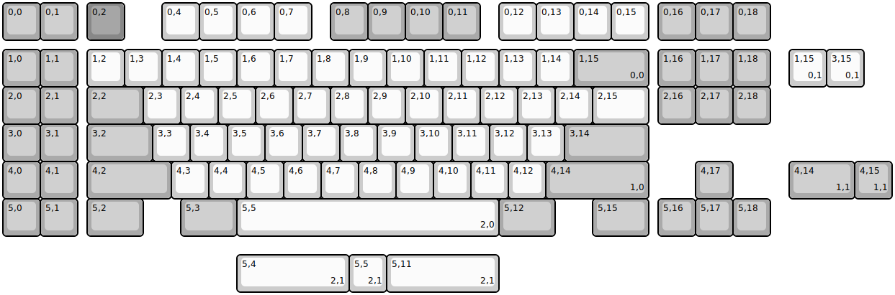{:loading="lazy"}

[Open in keyboard-layout-editor](http://www.keyboard-layout-editor.com/##@@_c=#aaaaaa;&=0,0&=0,1&_x:0.25&c=#888888;&=0,2&_x:1.0&c=#cccccc;&=0,4&=0,5&=0,6&=0,7&_x:0.5&c=#aaaaaa;&=0,8&=0,9&=0,10&=0,11&_x:0.5&c=#cccccc;&=0,12&=0,13&=0,14&=0,15&_x:0.25&c=#aaaaaa;&=0,16&=0,17&=0,18;&@_y:0.25;&=1,0&=1,1&_x:0.25&c=#cccccc;&=1,2&=1,3&=1,4&=1,5&=1,6&=1,7&=1,8&=1,9&=1,10&=1,11&=1,12&=1,13&=1,14&_c=#aaaaaa&w:2;&=1,15%0A%0A%0A0,0&_x:0.25;&=1,16&=1,17&=1,18;&@=2,0&=2,1&_x:0.25&w:1.5;&=2,2&_c=#cccccc;&=2,3&=2,4&=2,5&=2,6&=2,7&=2,8&=2,9&=2,10&=2,11&=2,12&=2,13&=2,14&_w:1.5;&=2,15&_x:0.25&c=#aaaaaa;&=2,16&=2,17&=2,18;&@=3,0&=3,1&_x:0.25&w:1.75;&=3,2&_c=#cccccc;&=3,3&=3,4&=3,5&=3,6&=3,7&=3,8&=3,9&=3,10&=3,11&=3,12&=3,13&_c=#aaaaaa&w:2.25;&=3,14;&@=4,0&=4,1&_x:0.25&w:2.25;&=4,2&_c=#cccccc;&=4,3&=4,4&=4,5&=4,6&=4,7&=4,8&=4,9&=4,10&=4,11&=4,12&_c=#aaaaaa&w:2.75;&=4,14%0A%0A%0A1,0&_x:1.25;&=4,17;&@=5,0&=5,1&_x:0.25&w:1.5;&=5,2&_x:1.0&w:1.5;&=5,3&_c=#cccccc&w:7;&=5,5%0A%0A%0A2,0&_c=#aaaaaa&w:1.5;&=5,12&_x:1.0&w:1.5;&=5,15&_x:0.25;&=5,16&=5,17&=5,18;&@_x:21.0&y:-5.0&c=#cccccc;&=1,15%0A%0A%0A0,1&=3,15%0A%0A%0A0,1;&@_x:21.0&y:2.0&c=#aaaaaa&w:1.75;&=4,14%0A%0A%0A1,1&=4,15%0A%0A%0A1,1;&@_x:6.25&y:1.5&c=#cccccc&w:3;&=5,4%0A%0A%0A2,1&=5,5%0A%0A%0A2,1&_w:3;&=5,11%0A%0A%0A2,1)

## xelus/valor/rev1/xelus_valor_rev1

[README](output/xelus/valor/rev1/README.md) - [layout](output/xelus/valor/rev1/xelus_valor_rev1-kle.json) - [PCB](output/xelus/valor/rev1/xelus_valor_rev1.kicad_pcb) - [PCB render](output/xelus/valor/rev1/xelus_valor_rev1-render.svg)

{:loading="lazy"}

[Open in keyboard-layout-editor](http://www.keyboard-layout-editor.com/##@@_x:0.5&y:0.38&c=#777777;&=0,0&_x:2.25&c=#cccccc;&=0,3&_x:8.75;&=0,12;&@_x:1.75&y:-0.88&c=#aaaaaa;&=0,1&_c=#cccccc;&=0,2&_x:10.75;&=0,13&_c=#aaaaaa&w:2;&=0,14%0A%0A%0A0,0;&@_x:0.25&y:-0.12&c=#777777;&=1,0&_x:12.0&c=#cccccc;&=1,11;&@_x:1.5&y:-0.88&c=#aaaaaa&w:1.5;&=1,1&_c=#cccccc;&=1,2&_x:10.25;&=1,12&=1,13&_w:1.5;&=1,14;&@_y:-0.12&c=#777777;&=2,0;&@_x:1.25&y:-0.88&c=#aaaaaa&w:1.75;&=2,1&_c=#cccccc;&=2,2&_x:9.75;&=2,11&=2,12&_c=#777777&w:2.25;&=2,13;&@_x:1&c=#aaaaaa&w:2.25;&=3,1&_c=#cccccc;&=3,2&_x:9.25;&=3,11&=3,12&_c=#aaaaaa&w:2.75;&=3,13%0A%0A%0A1,0;&@_x:1&w:1.5;&=4,1&_x:13.5&w:1.5;&=4,13;&@_r:12&rx:4.75&ry:1.5&y:-1.0&c=#cccccc;&=0,4&=0,5&=0,6&=0,7;&@_x:-0.5;&=1,3&=1,4&=1,5&=1,6;&@_x:-0.25;&=2,3&=2,4&=2,5&=2,6;&@_x:0.25;&=3,3&=3,4&=3,5&=3,6;&@_x:1.5&w:2.25;&=4,5%0A%0A%0A2,0&_c=#aaaaaa;&=4,6%0A%0A%0A2,0;&@_y:-0.88&w:1.5;&=4,3;&@_r:-12&rx:14&ry:1.25&x:-4.5&y:-1.0&c=#cccccc;&=0,8&=0,9&=0,10&=0,11;&@_x:-5;&=1,7&=1,8&=1,9&=1,10;&@_x:-4.75;&=2,7&=2,8&=2,9&=2,10;&@_x:-5.25;&=3,7&=3,8&=3,9&=3,10;&@_x:-5.25&w:2.75;&=4,8;&@_x:-2.5&y:-0.87&c=#aaaaaa&w:1.5;&=4,10;&@_r:0&rx:0&ry:0&x:18.75&y:0.5;&=0,14%0A%0A%0A0,1&=2,14%0A%0A%0A0,1;&@_x:18.75&y:2.0&w:1.75;&=3,13%0A%0A%0A1,1&=3,14%0A%0A%0A1,1;&@_r:12&rx:3.75&ry:6.5&x:1.5&y:-1.0&c=#cccccc&w:2;&=4,5%0A%0A%0A2,1&_c=#aaaaaa&w:1.25;&=4,6%0A%0A%0A2,1)

## xelus/valor/rev2/xelus_valor_rev2

[README](output/xelus/valor/rev2/README.md) - [layout](output/xelus/valor/rev2/xelus_valor_rev2-kle.json) - [PCB](output/xelus/valor/rev2/xelus_valor_rev2.kicad_pcb) - [PCB render](output/xelus/valor/rev2/xelus_valor_rev2-render.svg)

{:loading="lazy"}

[Open in keyboard-layout-editor](http://www.keyboard-layout-editor.com/##@@_x:0.5&y:0.38&c=#777777;&=0,0&_x:2.25&c=#cccccc;&=0,3&_x:8.75;&=0,12;&@_x:1.75&y:-0.88&c=#aaaaaa;&=0,1&_c=#cccccc;&=0,2&_x:10.75;&=0,13&_c=#aaaaaa&w:2;&=0,14%0A%0A%0A0,0;&@_x:0.25&y:-0.12&c=#777777;&=1,0&_x:12.0&c=#cccccc;&=1,11;&@_x:1.5&y:-0.88&c=#aaaaaa&w:1.5;&=1,1&_c=#cccccc;&=1,2&_x:10.25;&=1,12&=1,13&_w:1.5;&=1,14;&@_y:-0.12&c=#777777;&=2,0;&@_x:1.25&y:-0.88&c=#aaaaaa&w:1.75;&=2,1&_c=#cccccc;&=2,2&_x:9.75;&=2,11&=2,12&_c=#777777&w:2.25;&=2,13;&@_x:1&c=#aaaaaa&w:2.25;&=3,1&_c=#cccccc;&=3,2&_x:9.25;&=3,11&=3,12&_c=#aaaaaa&w:2.75;&=3,13%0A%0A%0A1,0;&@_x:1&w:1.5;&=4,1&_x:13.5&w:1.5;&=4,13;&@_r:12&rx:4.75&ry:1.5&y:-1.0&c=#cccccc;&=0,4&=0,5&=0,6&=0,7;&@_x:-0.5;&=1,3&=1,4&=1,5&=1,6;&@_x:-0.25;&=2,3&=2,4&=2,5&=2,6;&@_x:0.25;&=3,3&=3,4&=3,5&=3,6;&@_x:1.5&w:2.25;&=4,5&_c=#aaaaaa;&=4,6;&@_y:-0.88&w:1.5;&=4,3;&@_r:-12&rx:14&ry:1.25&x:-4.5&y:-1.0&c=#cccccc;&=0,8&=0,9&=0,10&=0,11;&@_x:-5;&=1,7&=1,8&=1,9&=1,10;&@_x:-4.75;&=2,7&=2,8&=2,9&=2,10;&@_x:-5.25;&=3,7&=3,8&=3,9&=3,10;&@_x:-5.25&w:2.75;&=4,8;&@_x:-2.5&y:-0.87&c=#aaaaaa&w:1.5;&=4,10;&@_r:0&rx:0&ry:0&x:18.75&y:0.5;&=0,14%0A%0A%0A0,1&=2,14%0A%0A%0A0,1;&@_x:18.75&y:2.0&w:1.75;&=3,13%0A%0A%0A1,1&=3,14%0A%0A%0A1,1)

## xelus/valor_frl_tkl

[README](output/xelus/valor_frl_tkl/README.md) - [layout](output/xelus/valor_frl_tkl/valor_frl_tkl-kle.json) - [PCB](output/xelus/valor_frl_tkl/valor_frl_tkl.kicad_pcb) - [PCB render](output/xelus/valor_frl_tkl/valor_frl_tkl-render.svg)

{:loading="lazy"}

[Open in keyboard-layout-editor](http://www.keyboard-layout-editor.com/##@@_x:3.75&y:0.38;&=0,2&_x:8.75;&=0,11;&@_x:1.75&y:-0.88&c=#aaaaaa;&=0,0&_c=#cccccc;&=0,1&_x:10.75;&=0,12&_c=#aaaaaa&w:2;&=0,13%0A%0A%0A0,0&_x:1.25;&=0,14&=0,15&=0,16;&@_x:13.25&y:-0.12&c=#cccccc;&=1,10;&@_x:1.5&y:-0.88&c=#aaaaaa&w:1.5;&=1,0&_c=#cccccc;&=1,1&_x:10.25;&=1,11&=1,12&_w:1.5;&=1,13&_x:1.0&c=#aaaaaa;&=1,14&=1,15&=1,16;&@_x:1.25&w:1.75;&=2,0&_c=#cccccc;&=2,1&_x:9.75;&=2,10&=2,11&_c=#777777&w:2.25;&=2,12;&@_x:1&c=#aaaaaa&w:2.25;&=3,0&_c=#cccccc;&=3,1&_x:9.25;&=3,10&=3,11&_c=#aaaaaa&w:2.75;&=3,12%0A%0A%0A1,0&_x:1.5;&=3,15;&@_x:1&w:1.5;&=4,0&_x:14.25&w:1.5;&=4,12&_x:0.5;&=4,14&=4,15&=4,16;&@_r:12&rx:4.75&ry:1.5&y:-1.0&c=#cccccc;&=0,3&=0,4&=0,5&=0,6;&@_x:-0.5;&=1,2&=1,3&=1,4&=1,5;&@_x:-0.25;&=2,2&=2,3&=2,4&=2,5;&@_x:0.25;&=3,2&=3,3&=3,4&=3,5;&@_x:1.5&w:2.25;&=4,4&_c=#aaaaaa;&=4,5;&@_y:-0.88&w:1.5;&=4,2;&@_r:-12&rx:14&ry:1.25&x:-4.5&y:-1.0&c=#cccccc;&=0,7&=0,8&=0,9&=0,10;&@_x:-5;&=1,6&=1,7&=1,8&=1,9;&@_x:-4.75;&=2,6&=2,7&=2,8&=2,9;&@_x:-5.25;&=3,6&=3,7&=3,8&=3,9;&@_x:-5.25&w:2.75;&=4,7;&@_x:-2.5&y:-0.87&c=#aaaaaa&w:1.5;&=4,9;&@_r:0&rx:0&ry:0&x:22.5&y:0.5;&=0,13%0A%0A%0A0,1&=2,13%0A%0A%0A0,1;&@_x:22.5&y:2.0&w:1.75;&=3,12%0A%0A%0A1,1&=3,13%0A%0A%0A1,1)

## xelus/xs108/xelus_xs108

[README](output/xelus/xs108/README.md) - [layout](output/xelus/xs108/xelus_xs108-kle.json) - [PCB](output/xelus/xs108/xelus_xs108.kicad_pcb) - [PCB render](output/xelus/xs108/xelus_xs108-render.svg)

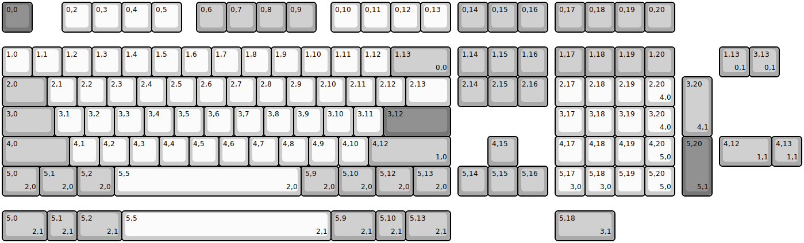{:loading="lazy"}

[Open in keyboard-layout-editor](http://www.keyboard-layout-editor.com/##@@_c=#777777;&=0,0&_x:1&c=#cccccc;&=0,2&=0,3&=0,4&=0,5&_x:0.5&c=#aaaaaa;&=0,6&=0,7&=0,8&=0,9&_x:0.5&c=#cccccc;&=0,10&=0,11&=0,12&=0,13&_x:0.25&c=#aaaaaa;&=0,14&=0,15&=0,16&_x:0.25;&=0,17&=0,18&=0,19&=0,20;&@_y:0.5&c=#cccccc;&=1,0&=1,1&=1,2&=1,3&=1,4&=1,5&=1,6&=1,7&=1,8&=1,9&=1,10&=1,11&=1,12&_c=#aaaaaa&w:2;&=1,13%0A%0A%0A0,0&_x:0.25;&=1,14&=1,15&=1,16&_x:0.25;&=1,17&=1,18&=1,19&=1,20;&@_w:1.5;&=2,0&_c=#cccccc;&=2,1&=2,2&=2,3&=2,4&=2,5&=2,6&=2,7&=2,8&=2,9&=2,10&=2,11&=2,12&_w:1.5;&=2,13&_x:0.25&c=#aaaaaa;&=2,14&=2,15&=2,16&_x:0.25&c=#cccccc;&=2,17&=2,18&=2,19&=2,20%0A%0A%0A4,0;&@_c=#aaaaaa&w:1.75;&=3,0&_c=#cccccc;&=3,1&=3,2&=3,3&=3,4&=3,5&=3,6&=3,7&=3,8&=3,9&=3,10&=3,11&_c=#777777&w:2.25;&=3,12&_x:3.5&c=#cccccc;&=3,17&=3,18&=3,19&=3,20%0A%0A%0A4,0;&@_c=#aaaaaa&w:2.25;&=4,0&_c=#cccccc;&=4,1&=4,2&=4,3&=4,4&=4,5&=4,6&=4,7&=4,8&=4,9&=4,10&_c=#aaaaaa&w:2.75;&=4,12%0A%0A%0A1,0&_x:1.25;&=4,15&_x:1.25&c=#cccccc;&=4,17&=4,18&=4,19&=4,20%0A%0A%0A5,0;&@_c=#aaaaaa&w:1.25;&=5,0%0A%0A%0A2,0&_w:1.25;&=5,1%0A%0A%0A2,0&_w:1.25;&=5,2%0A%0A%0A2,0&_c=#cccccc&w:6.25;&=5,5%0A%0A%0A2,0&_c=#aaaaaa&w:1.25;&=5,9%0A%0A%0A2,0&_w:1.25;&=5,10%0A%0A%0A2,0&_w:1.25;&=5,12%0A%0A%0A2,0&_w:1.25;&=5,13%0A%0A%0A2,0&_x:0.25;&=5,14&=5,15&=5,16&_x:0.25&c=#cccccc;&=5,17%0A%0A%0A3,0&=5,18%0A%0A%0A3,0&=5,19&=5,20%0A%0A%0A5,0;&@_x:24.0&y:-5.0&c=#aaaaaa;&=1,13%0A%0A%0A0,1&=3,13%0A%0A%0A0,1;&@_x:22.75&h:2;&=3,20%0A%0A%0A4,1;&@_x:22.75&y:1.0&c=#777777&h:2;&=5,20%0A%0A%0A5,1&_x:0.25&c=#aaaaaa&w:1.75;&=4,12%0A%0A%0A1,1&=4,13%0A%0A%0A1,1;&@_y:1.5&w:1.5;&=5,0%0A%0A%0A2,1&=5,1%0A%0A%0A2,1&_w:1.5;&=5,2%0A%0A%0A2,1&_c=#cccccc&w:7;&=5,5%0A%0A%0A2,1&_c=#aaaaaa&w:1.5;&=5,9%0A%0A%0A2,1&=5,10%0A%0A%0A2,1&_w:1.5;&=5,13%0A%0A%0A2,1&_x:3.5&w:2;&=5,18%0A%0A%0A3,1)

## xelus/xs60/xelus_xs60_hotswap

[README](output/xelus/xs60/README.md) - [layout](output/xelus/xs60/xelus_xs60_hotswap-kle.json) - [PCB](output/xelus/xs60/xelus_xs60_hotswap.kicad_pcb) - [PCB render](output/xelus/xs60/xelus_xs60_hotswap-render.svg)

{:loading="lazy"}

[Open in keyboard-layout-editor](http://www.keyboard-layout-editor.com/##@@_c=#777777;&=0,0&_c=#cccccc;&=0,1&=0,2&=0,3&=0,4&=0,5&=0,6&=0,7&=0,8&=0,9&=0,10&=0,11&=0,12&_c=#aaaaaa&w:2;&=0,13%0A%0A%0A0,0;&@_w:1.5;&=1,0&_c=#cccccc;&=1,1&=1,2&=1,3&=1,4&=1,5&=1,6&=1,7&=1,8&=1,9&=1,10&=1,11&=1,12&_w:1.5;&=1,13;&@_c=#aaaaaa&w:1.75;&=2,0&_c=#cccccc;&=2,1&=2,2&=2,3&=2,4&=2,5&=2,6&=2,7&=2,8&=2,9&=2,10&=2,11&_c=#777777&w:2.25;&=2,12;&@_c=#aaaaaa&w:2.25;&=3,0&_c=#cccccc;&=3,1&=3,2&=3,3&=3,4&=3,5&=3,6&=3,7&=3,8&=3,9&=3,10&_c=#aaaaaa&w:1.75;&=3,12%0A%0A%0A1,0&=3,13%0A%0A%0A1,0;&@_w:1.25;&=4,0%0A%0A%0A2,0&_w:1.25;&=4,1%0A%0A%0A2,0&_w:1.25;&=4,2%0A%0A%0A2,0&_c=#cccccc&w:6.25;&=4,5%0A%0A%0A2,0&_c=#aaaaaa&w:1.25;&=4,9%0A%0A%0A2,0&_w:1.25;&=4,10%0A%0A%0A2,0&_w:1.25;&=4,11%0A%0A%0A2,0&_w:1.25;&=4,13%0A%0A%0A2,0;&@_x:15.5&y:-5;&=0,13%0A%0A%0A0,1&=2,13%0A%0A%0A0,1;&@_x:15.5&y:2&w:2.75;&=3,12%0A%0A%0A1,1;&@_y:1.5&w:1.5;&=4,0%0A%0A%0A2,1&=4,1%0A%0A%0A2,1&_w:1.5;&=4,2%0A%0A%0A2,1&_c=#cccccc&w:7;&=4,5%0A%0A%0A2,1&_c=#aaaaaa&w:1.5;&=4,10%0A%0A%0A2,1&=4,11%0A%0A%0A2,1&_w:1.5;&=4,13%0A%0A%0A2,1)

## xelus/xs60/xelus_xs60_soldered

[README](output/xelus/xs60/README.md) - [layout](output/xelus/xs60/xelus_xs60_soldered-kle.json) - [PCB](output/xelus/xs60/xelus_xs60_soldered.kicad_pcb) - [PCB render](output/xelus/xs60/xelus_xs60_soldered-render.svg)

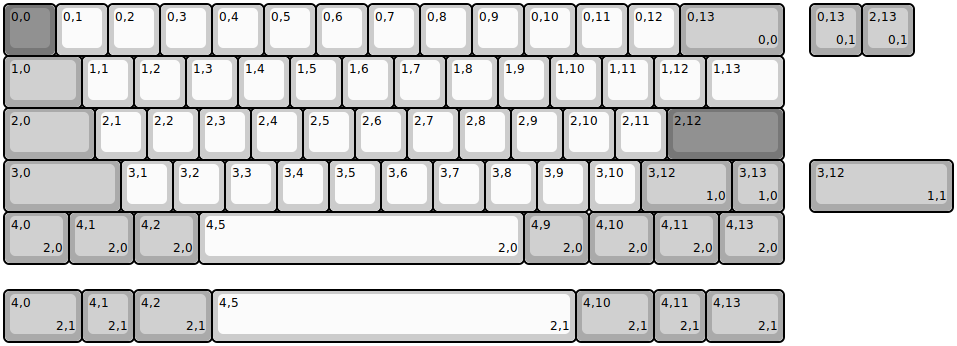{:loading="lazy"}

[Open in keyboard-layout-editor](http://www.keyboard-layout-editor.com/##@@_c=#777777;&=0,0&_c=#cccccc;&=0,1&=0,2&=0,3&=0,4&=0,5&=0,6&=0,7&=0,8&=0,9&=0,10&=0,11&=0,12&_c=#aaaaaa&w:2;&=0,13%0A%0A%0A0,0;&@_w:1.5;&=1,0&_c=#cccccc;&=1,1&=1,2&=1,3&=1,4&=1,5&=1,6&=1,7&=1,8&=1,9&=1,10&=1,11&=1,12&_w:1.5;&=1,13;&@_c=#aaaaaa&w:1.75;&=2,0&_c=#cccccc;&=2,1&=2,2&=2,3&=2,4&=2,5&=2,6&=2,7&=2,8&=2,9&=2,10&=2,11&_c=#777777&w:2.25;&=2,12;&@_c=#aaaaaa&w:2.25;&=3,0&_c=#cccccc;&=3,1&=3,2&=3,3&=3,4&=3,5&=3,6&=3,7&=3,8&=3,9&=3,10&_c=#aaaaaa&w:1.75;&=3,12%0A%0A%0A1,0&=3,13%0A%0A%0A1,0;&@_w:1.25;&=4,0%0A%0A%0A2,0&_w:1.25;&=4,1%0A%0A%0A2,0&_w:1.25;&=4,2%0A%0A%0A2,0&_c=#cccccc&w:6.25;&=4,5%0A%0A%0A2,0&_c=#aaaaaa&w:1.25;&=4,9%0A%0A%0A2,0&_w:1.25;&=4,10%0A%0A%0A2,0&_w:1.25;&=4,11%0A%0A%0A2,0&_w:1.25;&=4,13%0A%0A%0A2,0;&@_x:15.5&y:-5;&=0,13%0A%0A%0A0,1&=2,13%0A%0A%0A0,1;&@_x:15.5&y:2&w:2.75;&=3,12%0A%0A%0A1,1;&@_y:1.5&w:1.5;&=4,0%0A%0A%0A2,1&=4,1%0A%0A%0A2,1&_w:1.5;&=4,2%0A%0A%0A2,1&_c=#cccccc&w:7;&=4,5%0A%0A%0A2,1&_c=#aaaaaa&w:1.5;&=4,10%0A%0A%0A2,1&=4,11%0A%0A%0A2,1&_w:1.5;&=4,13%0A%0A%0A2,1)

## yampad/yampad

[README](output/yampad/README.md) - [layout](output/yampad/yampad-kle.json) - [PCB](output/yampad/yampad.kicad_pcb) - [PCB render](output/yampad/yampad-render.svg)

{:loading="lazy"}

[Open in keyboard-layout-editor](http://www.keyboard-layout-editor.com/##@@_c=#aaaaaa;&=0,0%0ANum%20Lock&_c=#cccccc;&=0,1%0A//&=0,2%0A*&=0,3%0A-;&@=1,0%0A7&=1,1%0A8%0A%E2%86%91&=1,2%0A9&_h:2;&=1,3%0A+;&@=2,0%0A4%0A%E2%86%90&=2,1%0A5&=2,2%0A6%0A%E2%86%92;&@=3,0%0A1&=3,1%0A2%0A%E2%86%93&=3,2%0A3&_c=#777777&h:2;&=4,3%0AEnter;&@_c=#cccccc;&=4,0%0A0%0AIns%0A0,0&=4,1%0A00%0A%0A0,0&=4,2%0A.%0ADel;&@_y:0.25&w:2;&=4,0%0A0%0AIns%0A0,1)

## yandrstudio/buff67v3/yr65kb

[README](output/yandrstudio/buff67v3/README.md) - [layout](output/yandrstudio/buff67v3/yr65kb-kle.json) - [PCB](output/yandrstudio/buff67v3/yr65kb.kicad_pcb) - [PCB render](output/yandrstudio/buff67v3/yr65kb-render.svg)

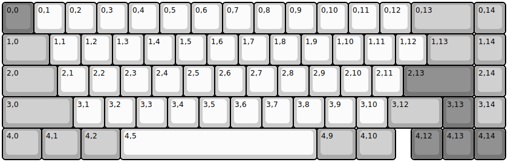{:loading="lazy"}

[Open in keyboard-layout-editor](http://www.keyboard-layout-editor.com/##@@_c=#777777;&=0,0&_c=#cccccc;&=0,1&=0,2&=0,3&=0,4&=0,5&=0,6&=0,7&=0,8&=0,9&=0,10&=0,11&=0,12&_c=#aaaaaa&w:2;&=0,13&=0,14;&@_w:1.5;&=1,0&_c=#cccccc;&=1,1&=1,2&=1,3&=1,4&=1,5&=1,6&=1,7&=1,8&=1,9&=1,10&=1,11&=1,12&_c=#aaaaaa&w:1.5;&=1,13&=1,14;&@_w:1.75;&=2,0&_c=#cccccc;&=2,1&=2,2&=2,3&=2,4&=2,5&=2,6&=2,7&=2,8&=2,9&=2,10&=2,11&_c=#777777&w:2.25;&=2,13&_c=#aaaaaa;&=2,14;&@_w:2.25;&=3,0&_c=#cccccc;&=3,1&=3,2&=3,3&=3,4&=3,5&=3,6&=3,7&=3,8&=3,9&=3,10&_c=#aaaaaa&f:1&w:1.75;&=3,12&_c=#777777&f:3;&=3,13&_c=#aaaaaa;&=3,14;&@_w:1.25;&=4,0&_w:1.25;&=4,1&_w:1.25;&=4,2&_c=#cccccc&w:6.25;&=4,5&_c=#aaaaaa&w:1.25;&=4,9&_w:1.25;&=4,10&_x:0.5&c=#777777;&=4,12&=4,13&=4,14)

## yandrstudio/eau75r2

[README](output/yandrstudio/eau75r2/README.md) - [layout](output/yandrstudio/eau75r2/eau75r2-kle.json) - [PCB](output/yandrstudio/eau75r2/eau75r2.kicad_pcb) - [PCB render](output/yandrstudio/eau75r2/eau75r2-render.svg)

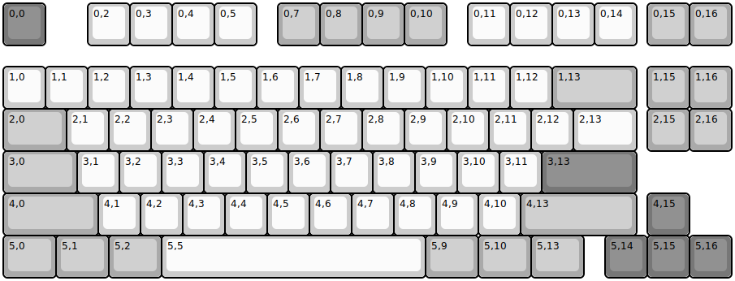{:loading="lazy"}

[Open in keyboard-layout-editor](http://www.keyboard-layout-editor.com/##@@_c=#777777;&=0,0&_x:1&c=#cccccc;&=0,2&=0,3&=0,4&=0,5&_x:0.5&c=#aaaaaa;&=0,7&=0,8&=0,9&=0,10&_x:0.5&c=#cccccc;&=0,11&=0,12&=0,13&=0,14&_x:0.25&c=#aaaaaa;&=0,15&=0,16;&@_y:0.5&c=#cccccc;&=1,0&=1,1&=1,2&=1,3&=1,4&=1,5&=1,6&=1,7&=1,8&=1,9&=1,10&=1,11&=1,12&_c=#aaaaaa&w:2;&=1,13&_x:0.25;&=1,15&=1,16;&@_w:1.5;&=2,0&_c=#cccccc;&=2,1&=2,2&=2,3&=2,4&=2,5&=2,6&=2,7&=2,8&=2,9&=2,10&=2,11&=2,12&_w:1.5;&=2,13&_x:0.25&c=#aaaaaa;&=2,15&=2,16;&@_w:1.75;&=3,0&_c=#cccccc;&=3,1&=3,2&=3,3&=3,4&=3,5&=3,6&=3,7&=3,8&=3,9&=3,10&=3,11&_c=#777777&w:2.25;&=3,13;&@_c=#aaaaaa&w:2.25;&=4,0&_c=#cccccc;&=4,1&=4,2&=4,3&=4,4&=4,5&=4,6&=4,7&=4,8&=4,9&=4,10&_c=#aaaaaa&w:2.75;&=4,13&_x:0.25&c=#777777;&=4,15;&@_c=#aaaaaa&w:1.25;&=5,0&_w:1.25;&=5,1&_w:1.25;&=5,2&_c=#cccccc&w:6.25;&=5,5&_c=#aaaaaa&w:1.25;&=5,9&_w:1.25;&=5,10&_w:1.25;&=5,13&_x:0.5&c=#777777;&=5,14&=5,15&=5,16)

## yandrstudio/eau87

[README](output/yandrstudio/eau87/README.md) - [layout](output/yandrstudio/eau87/eau87-kle.json) - [PCB](output/yandrstudio/eau87/eau87.kicad_pcb) - [PCB render](output/yandrstudio/eau87/eau87-render.svg)

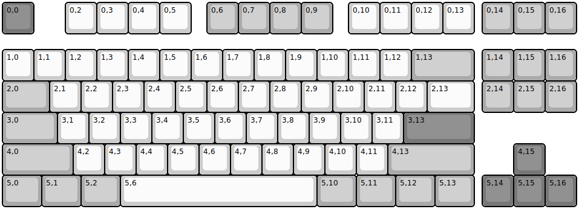{:loading="lazy"}

[Open in keyboard-layout-editor](http://www.keyboard-layout-editor.com/##@@_c=#777777;&=0,0&_x:1&c=#cccccc;&=0,2&=0,3&=0,4&=0,5&_x:0.5&c=#aaaaaa;&=0,6&=0,7&=0,8&=0,9&_x:0.5&c=#cccccc;&=0,10&=0,11&=0,12&=0,13&_x:0.25&c=#aaaaaa;&=0,14&=0,15&=0,16;&@_y:0.5&c=#cccccc;&=1,0&=1,1&=1,2&=1,3&=1,4&=1,5&=1,6&=1,7&=1,8&=1,9&=1,10&=1,11&=1,12&_c=#aaaaaa&w:2;&=1,13&_x:0.25;&=1,14&=1,15&=1,16;&@_w:1.5;&=2,0&_c=#cccccc;&=2,1&=2,2&=2,3&=2,4&=2,5&=2,6&=2,7&=2,8&=2,9&=2,10&=2,11&=2,12&_w:1.5;&=2,13&_x:0.25&c=#aaaaaa;&=2,14&=2,15&=2,16;&@_w:1.75;&=3,0&_c=#cccccc;&=3,1&=3,2&=3,3&=3,4&=3,5&=3,6&=3,7&=3,8&=3,9&=3,10&=3,11&_c=#777777&w:2.25;&=3,13;&@_c=#aaaaaa&w:2.25;&=4,0&_c=#cccccc;&=4,2&=4,3&=4,4&=4,5&=4,6&=4,7&=4,8&=4,9&=4,10&=4,11&_c=#aaaaaa&w:2.75;&=4,13&_x:1.25&c=#777777;&=4,15;&@_c=#aaaaaa&w:1.25;&=5,0&_w:1.25;&=5,1&_w:1.25;&=5,2&_c=#cccccc&w:6.25;&=5,6&_c=#aaaaaa&w:1.25;&=5,10&_w:1.25;&=5,11&_w:1.25;&=5,12&_w:1.25;&=5,13&_x:0.25&c=#777777;&=5,14&=5,15&=5,16)

## yandrstudio/nightstar75

[README](output/yandrstudio/nightstar75/README.md) - [layout](output/yandrstudio/nightstar75/nightstar75-kle.json) - [PCB](output/yandrstudio/nightstar75/nightstar75.kicad_pcb) - [PCB render](output/yandrstudio/nightstar75/nightstar75-render.svg)

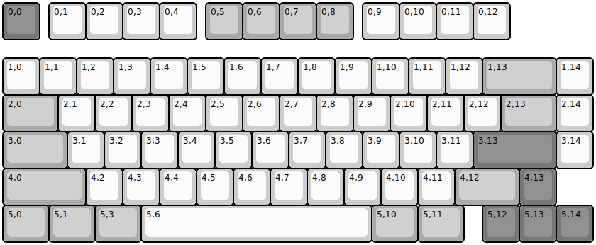{:loading="lazy"}

[Open in keyboard-layout-editor](http://www.keyboard-layout-editor.com/##@@_c=#777777;&=0,0&_x:0.25&c=#cccccc;&=0,1&=0,2&=0,3&=0,4&_x:0.25&c=#aaaaaa;&=0,5&=0,6&=0,7&=0,8&_x:0.25&c=#cccccc;&=0,9&=0,10&=0,11&=0,12;&@_y:0.5;&=1,0&=1,1&=1,2&=1,3&=1,4&=1,5&=1,6&=1,7&=1,8&=1,9&=1,10&=1,11&=1,12&_c=#aaaaaa&w:2;&=1,13&_c=#cccccc;&=1,14;&@_c=#aaaaaa&w:1.5;&=2,0&_c=#cccccc;&=2,1&=2,2&=2,3&=2,4&=2,5&=2,6&=2,7&=2,8&=2,9&=2,10&=2,11&=2,12&_c=#aaaaaa&w:1.5;&=2,13&_c=#cccccc;&=2,14;&@_c=#aaaaaa&w:1.75;&=3,0&_c=#cccccc;&=3,1&=3,2&=3,3&=3,4&=3,5&=3,6&=3,7&=3,8&=3,9&=3,10&=3,11&_c=#777777&w:2.25;&=3,13&_c=#cccccc;&=3,14;&@_c=#aaaaaa&w:2.25;&=4,0&_c=#cccccc;&=4,2&=4,3&=4,4&=4,5&=4,6&=4,7&=4,8&=4,9&=4,10&=4,11&_c=#aaaaaa&w:1.75;&=4,12&_c=#777777;&=4,13;&@_c=#aaaaaa&w:1.25;&=5,0&_w:1.25;&=5,1&_w:1.25;&=5,3&_c=#cccccc&w:6.25;&=5,6&_c=#aaaaaa&w:1.25;&=5,10&_w:1.25;&=5,11&_x:0.5&c=#777777;&=5,12&=5,13&=5,14)

## yandrstudio/nz64

[README](output/yandrstudio/nz64/README.md) - [layout](output/yandrstudio/nz64/nz64-kle.json) - [PCB](output/yandrstudio/nz64/nz64.kicad_pcb) - [PCB render](output/yandrstudio/nz64/nz64-render.svg)

{:loading="lazy"}

[Open in keyboard-layout-editor](http://www.keyboard-layout-editor.com/##@@_c=#777777;&=0,0&_c=#cccccc;&=0,1&=0,2&=0,3&=0,4&=0,5&=0,6&=0,7&=0,8&=0,9&=0,10&=0,11&=0,12&_c=#aaaaaa&w:2;&=0,13;&@_w:1.5;&=1,0&_c=#cccccc;&=1,1&=1,2&=1,3&=1,4&=1,5&=1,6&=1,7&=1,8&=1,9&=1,10&=1,11&=1,12&_w:1.5;&=1,13;&@_c=#aaaaaa&w:1.75;&=2,0&_c=#cccccc;&=2,1&=2,2&=2,3&=2,4&=2,5&=2,6&=2,7&=2,8&=2,9&=2,10&=2,11&_c=#777777&w:2.25;&=2,13;&@_c=#aaaaaa&w:2;&=3,0&_c=#cccccc;&=3,1&=3,2&=3,3&=3,4&=3,5&=3,6&=3,7&=3,8&=3,9&=3,10&_c=#aaaaaa;&=3,11&_c=#777777&f:1;&=3,12&_c=#aaaaaa&f:3;&=3,13;&@_w:1.25;&=4,0&_w:1.25;&=4,1&_w:1.25;&=4,2&_c=#cccccc&w:6.25;&=4,5&_c=#aaaaaa;&=4,9&=4,10&_c=#777777;&=4,11&=4,12&=4,13)

## yandrstudio/nz67v2

[README](output/yandrstudio/nz67v2/README.md) - [layout](output/yandrstudio/nz67v2/nz67v2-kle.json) - [PCB](output/yandrstudio/nz67v2/nz67v2.kicad_pcb) - [PCB render](output/yandrstudio/nz67v2/nz67v2-render.svg)

{:loading="lazy"}

[Open in keyboard-layout-editor](http://www.keyboard-layout-editor.com/##@@_x:16&d:true;&=4,4%0A%0A%0A1,0;&@_y:-0.5&c=#777777;&=0,0&_c=#cccccc;&=0,1&=0,2&=0,3&=0,4&=0,5&=0,6&=0,7&=0,8&=0,9&=0,10&=0,11&=0,12&_c=#aaaaaa&w:2;&=0,13&=0,14;&@_x:16&y:-0.5&c=#cccccc&d:true;&=4,6%0A%0A%0A1,0;&@_y:-0.5&c=#aaaaaa&w:1.5;&=1,0&_c=#cccccc;&=1,1&=1,2&=1,3&=1,4&=1,5&=1,6&=1,7&=1,8&=1,9&=1,10&=1,11&=1,12&_c=#aaaaaa&w:1.5;&=1,13&=1,14;&@_w:1.75;&=2,0&_c=#cccccc;&=2,1&=2,2&=2,3&=2,4&=2,5&=2,6&=2,7&=2,8&=2,9&=2,10&=2,11&_c=#777777&w:2.25;&=2,13&_c=#aaaaaa;&=2,14;&@_w:2.25;&=3,0&_c=#cccccc;&=3,1&=3,2&=3,3&=3,4&=3,5&=3,6&=3,7&=3,8&=3,9&=3,10&_c=#aaaaaa&f:1&w:1.75;&=3,12&_c=#777777&f:3;&=3,13&_c=#aaaaaa;&=3,14;&@_w:1.25;&=4,0&_w:1.25;&=4,1&_w:1.25;&=4,2&_c=#cccccc&w:6.25;&=4,5%0A%0A%0A0,0&_c=#aaaaaa&w:1.25;&=4,9&_w:1.25;&=4,10&_x:0.5&c=#777777;&=4,12&=4,13&=4,14;&@_x:17&y:-5.5&c=#aaaaaa;&=4,4%0A%0A%0A1,1;&@_x:17;&=4,6%0A%0A%0A1,1;&@_x:3.75&y:3.5&c=#cccccc&w:2.25;&=4,3%0A%0A%0A0,1&_w:1.75;&=4,5%0A%0A%0A0,1&_w:2.25;&=4,7%0A%0A%0A0,1)

## yandrstudio/tg67

[README](output/yandrstudio/tg67/README.md) - [layout](output/yandrstudio/tg67/tg67-kle.json) - [PCB](output/yandrstudio/tg67/tg67.kicad_pcb) - [PCB render](output/yandrstudio/tg67/tg67-render.svg)

{:loading="lazy"}

[Open in keyboard-layout-editor](http://www.keyboard-layout-editor.com/##@@_c=#777777;&=0,0&_c=#cccccc;&=0,1&=0,2&=0,3&=0,4&=0,5&=0,6&=0,7&=0,8&=0,9&=0,10&=0,11&=0,12&_c=#aaaaaa&w:2;&=0,13&_c=#cccccc;&=0,14;&@_c=#aaaaaa&w:1.5;&=1,0&_c=#cccccc;&=1,1&=1,2&=1,3&=1,4&=1,5&=1,6&=1,7&=1,8&=1,9&=1,10&=1,11&=1,12&_c=#aaaaaa&w:1.5;&=1,13&_c=#cccccc;&=1,14;&@_c=#aaaaaa&w:1.75;&=2,0&_c=#cccccc;&=2,1&=2,2&=2,3&=2,4&=2,5&=2,6&=2,7&=2,8&=2,9&=2,10&=2,11&_c=#777777&w:2.25;&=2,13&_c=#cccccc;&=2,14;&@_c=#aaaaaa&w:2.25;&=3,0&_c=#cccccc;&=3,1&=3,2&=3,3&=3,4&=3,5&=3,6&=3,7&=3,8&=3,9&=3,10&_c=#aaaaaa&f:1&w:1.75;&=3,12&_c=#cccccc&f:3;&=3,13&=3,14;&@_c=#aaaaaa&w:1.25;&=4,0&_w:1.25;&=4,1&_w:1.25;&=4,2&_c=#cccccc&w:6.25;&=4,5&_c=#aaaaaa&w:1.25;&=4,9&_w:1.25;&=4,10&_x:0.5&c=#cccccc;&=4,12&=4,13&=4,14)

## yandrstudio/wave75

[README](output/yandrstudio/wave75/README.md) - [layout](output/yandrstudio/wave75/wave75-kle.json) - [PCB](output/yandrstudio/wave75/wave75.kicad_pcb) - [PCB render](output/yandrstudio/wave75/wave75-render.svg)

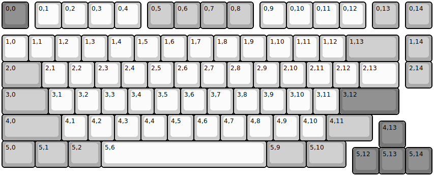{:loading="lazy"}

[Open in keyboard-layout-editor](http://www.keyboard-layout-editor.com/##@@_c=#777777;&=0,0&_x:0.25&c=#cccccc;&=0,1&=0,2&=0,3&=0,4&_x:0.25&c=#aaaaaa;&=0,5&=0,6&=0,7&=0,8&_x:0.25&c=#cccccc;&=0,9&=0,10&=0,11&=0,12&_x:0.25&c=#aaaaaa;&=0,13&_x:0.25;&=0,14;&@_y:0.25&c=#cccccc;&=1,0&=1,1&=1,2&=1,3&=1,4&=1,5&=1,6&=1,7&=1,8&=1,9&=1,10&=1,11&=1,12&_c=#aaaaaa&w:2;&=1,13&_x:0.25;&=1,14;&@_w:1.5;&=2,0&_c=#cccccc;&=2,1&=2,2&=2,3&=2,4&=2,5&=2,6&=2,7&=2,8&=2,9&=2,10&=2,11&=2,12&_w:1.5;&=2,13&_x:0.25&c=#aaaaaa;&=2,14;&@_w:1.75;&=3,0&_c=#cccccc;&=3,1&=3,2&=3,3&=3,4&=3,5&=3,6&=3,7&=3,8&=3,9&=3,10&=3,11&_c=#777777&w:2.25;&=3,12;&@_c=#aaaaaa&w:2.25;&=4,0&_c=#cccccc;&=4,1&=4,2&=4,3&=4,4&=4,5&=4,6&=4,7&=4,8&=4,9&=4,10&_c=#aaaaaa&w:1.75;&=4,11;&@_x:14.25&y:-0.75&c=#777777;&=4,13;&@_y:-0.25&c=#aaaaaa&w:1.25;&=5,0&_w:1.25;&=5,1&_w:1.25;&=5,2&_c=#cccccc&w:6.25;&=5,6&_c=#aaaaaa&w:1.5;&=5,9&_w:1.5;&=5,10;&@_x:13.25&y:-0.75&c=#777777;&=5,12&=5,13&=5,14)

## yandrstudio/yr6095/yr6095v1

[README](output/yandrstudio/yr6095/README.md) - [layout](output/yandrstudio/yr6095/yr6095v1-kle.json) - [PCB](output/yandrstudio/yr6095/yr6095v1.kicad_pcb) - [PCB render](output/yandrstudio/yr6095/yr6095v1-render.svg)

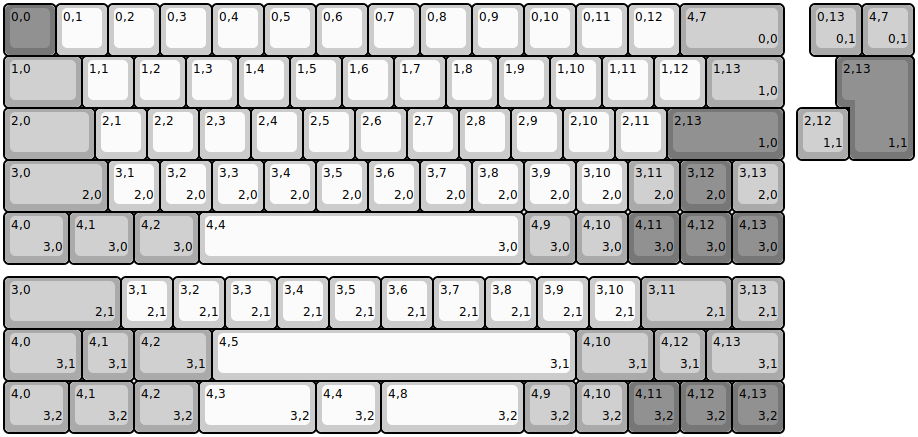{:loading="lazy"}

[Open in keyboard-layout-editor](http://www.keyboard-layout-editor.com/##@@_c=#777777;&=0,0&_c=#cccccc;&=0,1&=0,2&=0,3&=0,4&=0,5&=0,6&=0,7&=0,8&=0,9&=0,10&=0,11&=0,12&_c=#aaaaaa&w:2;&=4,7%0A%0A%0A0,0;&@_w:1.5;&=1,0&_c=#cccccc;&=1,1&=1,2&=1,3&=1,4&=1,5&=1,6&=1,7&=1,8&=1,9&=1,10&=1,11&=1,12&_c=#aaaaaa&w:1.5;&=1,13%0A%0A%0A1,0;&@_w:1.75;&=2,0&_c=#cccccc;&=2,1&=2,2&=2,3&=2,4&=2,5&=2,6&=2,7&=2,8&=2,9&=2,10&=2,11&_c=#777777&w:2.25;&=2,13%0A%0A%0A1,0;&@_c=#aaaaaa&w:2;&=3,0%0A%0A%0A2,0&_c=#cccccc;&=3,1%0A%0A%0A2,0&=3,2%0A%0A%0A2,0&=3,3%0A%0A%0A2,0&=3,4%0A%0A%0A2,0&=3,5%0A%0A%0A2,0&=3,6%0A%0A%0A2,0&=3,7%0A%0A%0A2,0&=3,8%0A%0A%0A2,0&=3,9%0A%0A%0A2,0&=3,10%0A%0A%0A2,0&_c=#aaaaaa;&=3,11%0A%0A%0A2,0&_c=#777777&f:1;&=3,12%0A%0A%0A2,0&_c=#aaaaaa&f:3;&=3,13%0A%0A%0A2,0;&@_w:1.25;&=4,0%0A%0A%0A3,0&_w:1.25;&=4,1%0A%0A%0A3,0&_w:1.25;&=4,2%0A%0A%0A3,0&_c=#cccccc&w:6.25;&=4,4%0A%0A%0A3,0&_c=#aaaaaa;&=4,9%0A%0A%0A3,0&=4,10%0A%0A%0A3,0&_c=#777777;&=4,11%0A%0A%0A3,0&=4,12%0A%0A%0A3,0&=4,13%0A%0A%0A3,0;&@_x:15.5&y:-5&c=#aaaaaa;&=0,13%0A%0A%0A0,1&=4,7%0A%0A%0A0,1;&@_x:16.25&c=#777777&w:1.25&h:2&w2:1.5&h2:1&x2:-0.25;&=2,13%0A%0A%0A1,1;&@_x:15.25&c=#aaaaaa;&=2,12%0A%0A%0A1,1;&@_y:2.25&w:2.25;&=3,0%0A%0A%0A2,1&_c=#cccccc;&=3,1%0A%0A%0A2,1&=3,2%0A%0A%0A2,1&=3,3%0A%0A%0A2,1&=3,4%0A%0A%0A2,1&=3,5%0A%0A%0A2,1&=3,6%0A%0A%0A2,1&=3,7%0A%0A%0A2,1&=3,8%0A%0A%0A2,1&=3,9%0A%0A%0A2,1&=3,10%0A%0A%0A2,1&_c=#aaaaaa&w:1.75;&=3,11%0A%0A%0A2,1&=3,13%0A%0A%0A2,1;&@_w:1.5;&=4,0%0A%0A%0A3,1&=4,1%0A%0A%0A3,1&_w:1.5;&=4,2%0A%0A%0A3,1&_c=#cccccc&w:7;&=4,5%0A%0A%0A3,1&_c=#aaaaaa&w:1.5;&=4,10%0A%0A%0A3,1&=4,12%0A%0A%0A3,1&_w:1.5;&=4,13%0A%0A%0A3,1;&@_w:1.25;&=4,0%0A%0A%0A3,2&_w:1.25;&=4,1%0A%0A%0A3,2&_w:1.25;&=4,2%0A%0A%0A3,2&_c=#cccccc&w:2.25;&=4,3%0A%0A%0A3,2&_w:1.25;&=4,4%0A%0A%0A3,2&_w:2.75;&=4,8%0A%0A%0A3,2&_c=#aaaaaa;&=4,9%0A%0A%0A3,2&=4,10%0A%0A%0A3,2&_c=#777777;&=4,11%0A%0A%0A3,2&=4,12%0A%0A%0A3,2&=4,13%0A%0A%0A3,2)

## yandrstudio/yr80/yr80v1

[README](output/yandrstudio/yr80/README.md) - [layout](output/yandrstudio/yr80/yr80v1-kle.json) - [PCB](output/yandrstudio/yr80/yr80v1.kicad_pcb) - [PCB render](output/yandrstudio/yr80/yr80v1-render.svg)

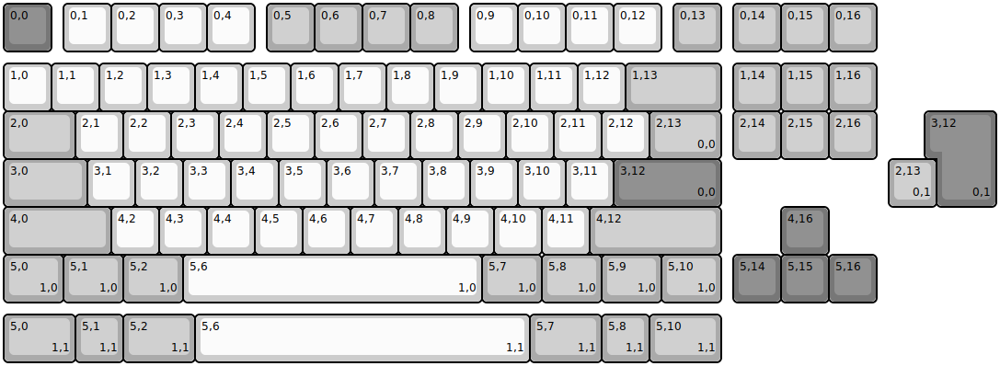{:loading="lazy"}

[Open in keyboard-layout-editor](http://www.keyboard-layout-editor.com/##@@_c=#777777;&=0,0&_x:0.25&c=#cccccc;&=0,1&=0,2&=0,3&=0,4&_x:0.25&c=#aaaaaa;&=0,5&=0,6&=0,7&=0,8&_x:0.25&c=#cccccc;&=0,9&=0,10&=0,11&=0,12&_x:0.25&c=#aaaaaa;&=0,13&_x:0.25;&=0,14&=0,15&=0,16;&@_y:0.25&c=#cccccc;&=1,0&=1,1&=1,2&=1,3&=1,4&=1,5&=1,6&=1,7&=1,8&=1,9&=1,10&=1,11&=1,12&_c=#aaaaaa&w:2;&=1,13&_x:0.25;&=1,14&=1,15&=1,16;&@_w:1.5;&=2,0&_c=#cccccc;&=2,1&=2,2&=2,3&=2,4&=2,5&=2,6&=2,7&=2,8&=2,9&=2,10&=2,11&=2,12&_c=#aaaaaa&w:1.5;&=2,13%0A%0A%0A0,0&_x:0.25;&=2,14&=2,15&=2,16;&@_w:1.75;&=3,0&_c=#cccccc;&=3,1&=3,2&=3,3&=3,4&=3,5&=3,6&=3,7&=3,8&=3,9&=3,10&=3,11&_c=#777777&w:2.25;&=3,12%0A%0A%0A0,0;&@_c=#aaaaaa&w:2.25;&=4,0&_c=#cccccc;&=4,2&=4,3&=4,4&=4,5&=4,6&=4,7&=4,8&=4,9&=4,10&=4,11&_c=#aaaaaa&w:2.75;&=4,12&_x:1.25&c=#777777;&=4,16;&@_c=#aaaaaa&w:1.25;&=5,0%0A%0A%0A1,0&_w:1.25;&=5,1%0A%0A%0A1,0&_w:1.25;&=5,2%0A%0A%0A1,0&_c=#cccccc&w:6.25;&=5,6%0A%0A%0A1,0&_c=#aaaaaa&w:1.25;&=5,7%0A%0A%0A1,0&_w:1.25;&=5,8%0A%0A%0A1,0&_w:1.25;&=5,9%0A%0A%0A1,0&_w:1.25;&=5,10%0A%0A%0A1,0&_x:0.25&c=#777777;&=5,14&=5,15&=5,16;&@_x:19.5&y:-4.0&w:1.25&h:2&w2:1.5&h2:1&x2:-0.25;&=3,12%0A%0A%0A0,1;&@_x:18.5&c=#aaaaaa;&=2,13%0A%0A%0A0,1;&@_y:2.25&w:1.5;&=5,0%0A%0A%0A1,1&=5,1%0A%0A%0A1,1&_w:1.5;&=5,2%0A%0A%0A1,1&_c=#cccccc&w:7;&=5,6%0A%0A%0A1,1&_c=#aaaaaa&w:1.5;&=5,7%0A%0A%0A1,1&=5,8%0A%0A%0A1,1&_w:1.5;&=5,10%0A%0A%0A1,1)

## yandrstudio/zhou65/zhou65lite

[README](output/yandrstudio/zhou65/README.md) - [layout](output/yandrstudio/zhou65/zhou65lite-kle.json) - [PCB](output/yandrstudio/zhou65/zhou65lite.kicad_pcb) - [PCB render](output/yandrstudio/zhou65/zhou65lite-render.svg)

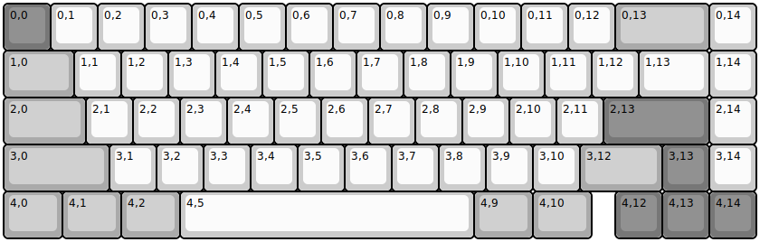{:loading="lazy"}

[Open in keyboard-layout-editor](http://www.keyboard-layout-editor.com/##@@_c=#777777;&=0,0&_c=#cccccc;&=0,1&=0,2&=0,3&=0,4&=0,5&=0,6&=0,7&=0,8&=0,9&=0,10&=0,11&=0,12&_c=#aaaaaa&w:2;&=0,13&_c=#cccccc;&=0,14;&@_c=#aaaaaa&w:1.5;&=1,0&_c=#cccccc;&=1,1&=1,2&=1,3&=1,4&=1,5&=1,6&=1,7&=1,8&=1,9&=1,10&=1,11&=1,12&_w:1.5;&=1,13&=1,14;&@_c=#aaaaaa&w:1.75;&=2,0&_c=#cccccc;&=2,1&=2,2&=2,3&=2,4&=2,5&=2,6&=2,7&=2,8&=2,9&=2,10&=2,11&_c=#777777&w:2.25;&=2,13&_c=#cccccc;&=2,14;&@_c=#aaaaaa&w:2.25;&=3,0&_c=#cccccc;&=3,1&=3,2&=3,3&=3,4&=3,5&=3,6&=3,7&=3,8&=3,9&=3,10&_c=#aaaaaa&f:1&w:1.75;&=3,12&_c=#777777&f:3;&=3,13&_c=#cccccc;&=3,14;&@_c=#aaaaaa&w:1.25;&=4,0&_w:1.25;&=4,1&_w:1.25;&=4,2&_c=#cccccc&w:6.25;&=4,5&_c=#aaaaaa&w:1.25;&=4,9&_w:1.25;&=4,10&_x:0.5&c=#777777;&=4,12&=4,13&=4,14)

## yasui/yasui

[README](output/yasui/README.md) - [layout](output/yasui/yasui-kle.json) - [PCB](output/yasui/yasui.kicad_pcb) - [PCB render](output/yasui/yasui-render.svg)

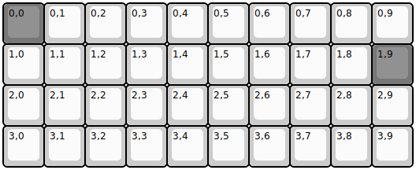{:loading="lazy"}

[Open in keyboard-layout-editor](http://www.keyboard-layout-editor.com/##@@_c=#777777;&=0,0&_c=#cccccc;&=0,1&=0,2&=0,3&=0,4&=0,5&=0,6&=0,7&=0,8&=0,9;&@=1,0&=1,1&=1,2&=1,3&=1,4&=1,5&=1,6&=1,7&=1,8&_c=#777777;&=1,9;&@_c=#cccccc;&=2,0&=2,1&=2,2&=2,3&=2,4&=2,5&=2,6&=2,7&=2,8&=2,9;&@=3,0&=3,1&=3,2&=3,3&=3,4&=3,5&=3,6&=3,7&=3,8&=3,9)

## yatara/drink_me

[README](output/yatara/drink_me/README.md) - [layout](output/yatara/drink_me/drink_me-kle.json) - [PCB](output/yatara/drink_me/drink_me.kicad_pcb) - [PCB render](output/yatara/drink_me/drink_me-render.svg)

{:loading="lazy"}

[Open in keyboard-layout-editor](http://www.keyboard-layout-editor.com/##@@=0,0&_x:2.84;&=0,3;&@_r:15&rx:1&ry:1&y:-1;&=0,1;&@_r:-15&rx:3.84&x:-1.0&y:-1;&=0,2)

## ydkb/grape

[README](output/ydkb/grape/README.md) - [layout](output/ydkb/grape/grape-kle.json) - [PCB](output/ydkb/grape/grape.kicad_pcb) - [PCB render](output/ydkb/grape/grape-render.svg)

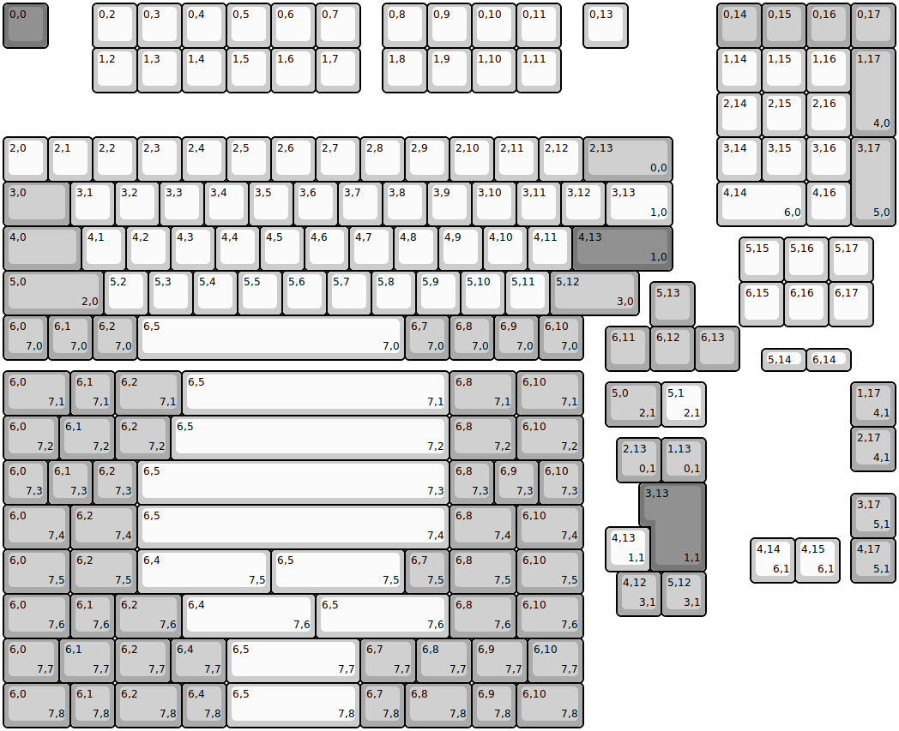{:loading="lazy"}

[Open in keyboard-layout-editor](http://www.keyboard-layout-editor.com/##@@_c=#777777;&=0,0&_x:1&c=#cccccc;&=0,2&=0,3&=0,4&=0,5&=0,6&=0,7&_x:0.5;&=0,8&=0,9&=0,10&=0,11&_x:0.5;&=0,13&_x:2.0&c=#aaaaaa;&=0,14&=0,15&=0,16&=0,17;&@_x:2&c=#cccccc;&=1,2&=1,3&=1,4&=1,5&=1,6&=1,7&_x:0.5;&=1,8&=1,9&=1,10&=1,11&_x:3.5;&=1,14&=1,15&=1,16&_c=#aaaaaa&h:2;&=1,17%0A%0A%0A4,0;&@_x:16&c=#cccccc;&=2,14&=2,15&=2,16;&@=2,0&=2,1&=2,2&=2,3&=2,4&=2,5&=2,6&=2,7&=2,8&=2,9&=2,10&=2,11&=2,12&_c=#aaaaaa&w:2;&=2,13%0A%0A%0A0,0&_x:1&c=#cccccc;&=3,14&=3,15&=3,16&_c=#aaaaaa&h:2;&=3,17%0A%0A%0A5,0;&@_w:1.5;&=3,0&_c=#cccccc;&=3,1&=3,2&=3,3&=3,4&=3,5&=3,6&=3,7&=3,8&=3,9&=3,10&=3,11&=3,12&_w:1.5;&=3,13%0A%0A%0A1,0&_x:1.0&w:2;&=4,14%0A%0A%0A6,0&=4,16;&@_c=#aaaaaa&w:1.75;&=4,0&_c=#cccccc;&=4,1&=4,2&=4,3&=4,4&=4,5&=4,6&=4,7&=4,8&=4,9&=4,10&=4,11&_c=#777777&w:2.25;&=4,13%0A%0A%0A1,0;&@_x:16.5&y:-0.75&c=#cccccc;&=5,15&=5,16&=5,17;&@_y:-0.25&c=#aaaaaa&w:2.25;&=5,0%0A%0A%0A2,0&_c=#cccccc;&=5,2&=5,3&=5,4&=5,5&=5,6&=5,7&=5,8&=5,9&=5,10&=5,11&_c=#aaaaaa&w:2;&=5,12%0A%0A%0A3,0;&@_x:14.5&y:-0.75;&=5,13&_x:1.0&c=#cccccc;&=6,15&=6,16&=6,17;&@_y:-0.25&c=#aaaaaa;&=6,0%0A%0A%0A7,0&=6,1%0A%0A%0A7,0&=6,2%0A%0A%0A7,0&_c=#cccccc&w:6;&=6,5%0A%0A%0A7,0&_c=#aaaaaa;&=6,7%0A%0A%0A7,0&=6,8%0A%0A%0A7,0&=6,9%0A%0A%0A7,0&=6,10%0A%0A%0A7,0;&@_x:13.5&y:-0.75;&=6,11&=6,12&=6,13;&@_x:17&y:-0.5&c=#cccccc&h:0.5;&=5,14&_h:0.5;&=6,14;&@_y:-0.5&c=#aaaaaa&w:1.5;&=6,0%0A%0A%0A7,1&=6,1%0A%0A%0A7,1&_w:1.5;&=6,2%0A%0A%0A7,1&_c=#cccccc&w:6;&=6,5%0A%0A%0A7,1&_c=#aaaaaa&w:1.5;&=6,8%0A%0A%0A7,1&_w:1.5;&=6,10%0A%0A%0A7,1;&@_x:13.5&y:-0.75&w:1.25;&=5,0%0A%0A%0A2,1&_c=#cccccc;&=5,1%0A%0A%0A2,1&_x:3.25&c=#aaaaaa;&=1,17%0A%0A%0A4,1;&@_y:-0.25&w:1.25;&=6,0%0A%0A%0A7,2&_w:1.25;&=6,1%0A%0A%0A7,2&_w:1.25;&=6,2%0A%0A%0A7,2&_c=#cccccc&w:6.25;&=6,5%0A%0A%0A7,2&_c=#aaaaaa&w:1.5;&=6,8%0A%0A%0A7,2&_w:1.5;&=6,10%0A%0A%0A7,2;&@_x:19&y:-0.75;&=2,17%0A%0A%0A4,1;&@_x:13.75&y:-0.75;&=2,13%0A%0A%0A0,1&=1,13%0A%0A%0A0,1;&@_y:-0.5;&=6,0%0A%0A%0A7,3&=6,1%0A%0A%0A7,3&=6,2%0A%0A%0A7,3&_c=#cccccc&w:7;&=6,5%0A%0A%0A7,3&_c=#aaaaaa;&=6,8%0A%0A%0A7,3&=6,9%0A%0A%0A7,3&=6,10%0A%0A%0A7,3;&@_x:14.5&y:-0.5&c=#777777&w:1.25&h:2&w2:1.5&h2:1&x2:-0.25;&=3,13%0A%0A%0A1,1;&@_x:19&y:-0.75&c=#aaaaaa;&=3,17%0A%0A%0A5,1;&@_y:-0.75&w:1.5;&=6,0%0A%0A%0A7,4&_w:1.5;&=6,2%0A%0A%0A7,4&_c=#cccccc&w:7;&=6,5%0A%0A%0A7,4&_c=#aaaaaa&w:1.5;&=6,8%0A%0A%0A7,4&_w:1.5;&=6,10%0A%0A%0A7,4;&@_x:13.5&y:-0.5&c=#cccccc;&=4,13%0A%0A%0A1,1;&@_x:16.75&y:-0.75;&=4,14%0A%0A%0A6,1&=4,15%0A%0A%0A6,1&_x:0.25&c=#aaaaaa;&=4,17%0A%0A%0A5,1;&@_y:-0.75&w:1.5;&=6,0%0A%0A%0A7,5&_w:1.5;&=6,2%0A%0A%0A7,5&_c=#cccccc&w:3;&=6,4%0A%0A%0A7,5&_w:3;&=6,5%0A%0A%0A7,5&_c=#aaaaaa;&=6,7%0A%0A%0A7,5&_w:1.5;&=6,8%0A%0A%0A7,5&_w:1.5;&=6,10%0A%0A%0A7,5;&@_x:13.75&y:-0.5;&=4,12%0A%0A%0A3,1&=5,12%0A%0A%0A3,1;&@_y:-0.5&w:1.5;&=6,0%0A%0A%0A7,6&=6,1%0A%0A%0A7,6&_w:1.5;&=6,2%0A%0A%0A7,6&_c=#cccccc&w:3;&=6,4%0A%0A%0A7,6&_w:3;&=6,5%0A%0A%0A7,6&_c=#aaaaaa&w:1.5;&=6,8%0A%0A%0A7,6&_w:1.5;&=6,10%0A%0A%0A7,6;&@_w:1.25;&=6,0%0A%0A%0A7,7&_w:1.25;&=6,1%0A%0A%0A7,7&_w:1.25;&=6,2%0A%0A%0A7,7&_w:1.25;&=6,4%0A%0A%0A7,7&_c=#cccccc&w:3;&=6,5%0A%0A%0A7,7&_c=#aaaaaa&w:1.25;&=6,7%0A%0A%0A7,7&_w:1.25;&=6,8%0A%0A%0A7,7&_w:1.25;&=6,9%0A%0A%0A7,7&_w:1.25;&=6,10%0A%0A%0A7,7;&@_w:1.5;&=6,0%0A%0A%0A7,8&=6,1%0A%0A%0A7,8&_w:1.5;&=6,2%0A%0A%0A7,8&=6,4%0A%0A%0A7,8&_c=#cccccc&w:3;&=6,5%0A%0A%0A7,8&_c=#aaaaaa;&=6,7%0A%0A%0A7,8&_w:1.5;&=6,8%0A%0A%0A7,8&=6,9%0A%0A%0A7,8&_w:1.5;&=6,10%0A%0A%0A7,8)

## yeehaw/yeehaw

[README](output/yeehaw/README.md) - [layout](output/yeehaw/yeehaw-kle.json) - [PCB](output/yeehaw/yeehaw.kicad_pcb) - [PCB render](output/yeehaw/yeehaw-render.svg)

{:loading="lazy"}

[Open in keyboard-layout-editor](http://www.keyboard-layout-editor.com/##@@_x:1;&=0,0;&@_x:1;&=0,1;&@_x:2&y:-0.5;&=0,3&=0,4;&@_x:1&y:-0.5;&=0,2&_x:2;&=0,5;&@_x:2&y:-0.5;&=0,8&=0,9;&@_y:-0.75;&=0,6;&@_x:1&y:-0.75;&=0,7&_x:2;&=0,10;&@_x:2&y:-0.5;&=0,11&=0,12;&@_x:2.5;&=0,13)

## yiancardesigns/allison_numpad

[README](output/yiancardesigns/allison_numpad/README.md) - [layout](output/yiancardesigns/allison_numpad/allison_numpad-kle.json) - [PCB](output/yiancardesigns/allison_numpad/allison_numpad.kicad_pcb) - [PCB render](output/yiancardesigns/allison_numpad/allison_numpad-render.svg)

{:loading="lazy"}

[Open in keyboard-layout-editor](http://www.keyboard-layout-editor.com/##@@=0,0&=0,1&=0,2&_c=#aaaaaa;&=0,3;&@_y:0.25&c=#777777;&=1,0&_c=#cccccc;&=1,1&=1,2&=1,3;&@=2,0&=2,1&=2,2&_h:2;&=3,3%0A%0A%0A0,0;&@=3,0&=3,1&=3,2;&@=4,0&=4,1&=4,2&_h:2;&=5,3%0A%0A%0A1,0;&@_w:2;&=5,0%0A%0A%0A2,0&=5,2;&@_x:4.5&y:-4.0;&=2,3%0A%0A%0A0,1;&@_x:4.5;&=3,3%0A%0A%0A0,1;&@_x:4.5;&=4,3%0A%0A%0A1,1;&@_x:4.5;&=5,3%0A%0A%0A1,1;&@_y:0.5;&=5,0%0A%0A%0A2,1&=5,1%0A%0A%0A2,1)

## yiancardesigns/aurora65

[README](output/yiancardesigns/aurora65/README.md) - [layout](output/yiancardesigns/aurora65/aurora65-kle.json) - [PCB](output/yiancardesigns/aurora65/aurora65.kicad_pcb) - [PCB render](output/yiancardesigns/aurora65/aurora65-render.svg)

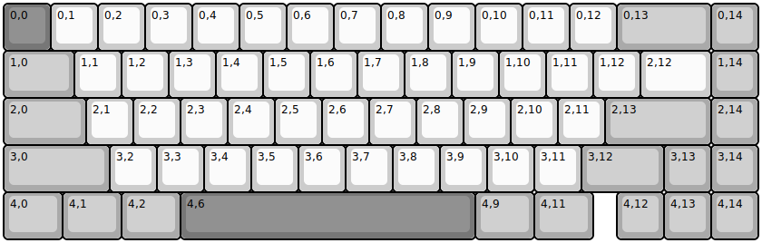{:loading="lazy"}

[Open in keyboard-layout-editor](http://www.keyboard-layout-editor.com/##@@_c=#777777;&=0,0&_c=#cccccc;&=0,1&=0,2&=0,3&=0,4&=0,5&=0,6&=0,7&=0,8&=0,9&=0,10&=0,11&=0,12&_c=#aaaaaa&w:2;&=0,13&=0,14;&@_w:1.5;&=1,0&_c=#cccccc;&=1,1&=1,2&=1,3&=1,4&=1,5&=1,6&=1,7&=1,8&=1,9&=1,10&=1,11&=1,12&_w:1.5;&=2,12&_c=#aaaaaa;&=1,14;&@_w:1.75;&=2,0&_c=#cccccc;&=2,1&=2,2&=2,3&=2,4&=2,5&=2,6&=2,7&=2,8&=2,9&=2,10&=2,11&_c=#aaaaaa&w:2.25;&=2,13&=2,14;&@_w:2.25;&=3,0&_c=#cccccc;&=3,2&=3,3&=3,4&=3,5&=3,6&=3,7&=3,8&=3,9&=3,10&=3,11&_c=#aaaaaa&w:1.75;&=3,12&=3,13&=3,14;&@_w:1.25;&=4,0&_w:1.25;&=4,1&_w:1.25;&=4,2&_c=#777777&w:6.25;&=4,6&_c=#aaaaaa&w:1.25;&=4,9&_w:1.25;&=4,11&_x:0.5;&=4,12&=4,13&=4,14)

## yiancardesigns/baion_808

[README](output/yiancardesigns/baion_808/README.md) - [layout](output/yiancardesigns/baion_808/baion_808-kle.json) - [PCB](output/yiancardesigns/baion_808/baion_808.kicad_pcb) - [PCB render](output/yiancardesigns/baion_808/baion_808-render.svg)

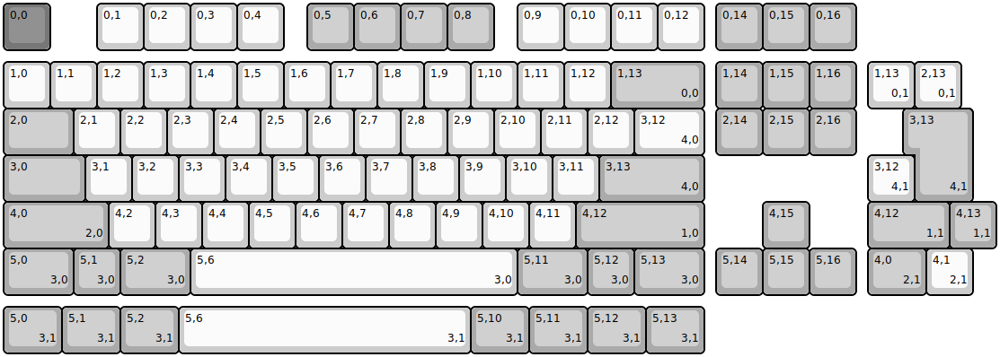{:loading="lazy"}

[Open in keyboard-layout-editor](http://www.keyboard-layout-editor.com/##@@_c=#777777;&=0,0&_x:1&c=#cccccc;&=0,1&=0,2&=0,3&=0,4&_x:0.5&c=#aaaaaa;&=0,5&=0,6&=0,7&=0,8&_x:0.5&c=#cccccc;&=0,9&=0,10&=0,11&=0,12&_x:0.25&c=#aaaaaa;&=0,14&=0,15&=0,16;&@_y:0.25&c=#cccccc;&=1,0&=1,1&=1,2&=1,3&=1,4&=1,5&=1,6&=1,7&=1,8&=1,9&=1,10&=1,11&=1,12&_c=#aaaaaa&w:2;&=1,13%0A%0A%0A0,0&_x:0.25;&=1,14&=1,15&=1,16;&@_w:1.5;&=2,0&_c=#cccccc;&=2,1&=2,2&=2,3&=2,4&=2,5&=2,6&=2,7&=2,8&=2,9&=2,10&=2,11&=2,12&_w:1.5;&=3,12%0A%0A%0A4,0&_x:0.25&c=#aaaaaa;&=2,14&=2,15&=2,16;&@_w:1.75;&=3,0&_c=#cccccc;&=3,1&=3,2&=3,3&=3,4&=3,5&=3,6&=3,7&=3,8&=3,9&=3,10&=3,11&_c=#aaaaaa&w:2.25;&=3,13%0A%0A%0A4,0;&@_w:2.25;&=4,0%0A%0A%0A2,0&_c=#cccccc;&=4,2&=4,3&=4,4&=4,5&=4,6&=4,7&=4,8&=4,9&=4,10&=4,11&_c=#aaaaaa&w:2.75;&=4,12%0A%0A%0A1,0&_x:1.25;&=4,15;&@_w:1.5;&=5,0%0A%0A%0A3,0&=5,1%0A%0A%0A3,0&_w:1.5;&=5,2%0A%0A%0A3,0&_c=#cccccc&w:7;&=5,6%0A%0A%0A3,0&_c=#aaaaaa&w:1.5;&=5,11%0A%0A%0A3,0&=5,12%0A%0A%0A3,0&_w:1.5;&=5,13%0A%0A%0A3,0&_x:0.25;&=5,14&=5,15&=5,16;&@_x:18.5&y:-5.0&c=#cccccc;&=1,13%0A%0A%0A0,1&=2,13%0A%0A%0A0,1;&@_x:19.5&c=#aaaaaa&w:1.25&h:2&w2:1.5&h2:1&x2:-0.25;&=3,13%0A%0A%0A4,1;&@_x:18.5&c=#cccccc;&=3,12%0A%0A%0A4,1;&@_x:18.5&c=#aaaaaa&w:1.75;&=4,12%0A%0A%0A1,1&=4,13%0A%0A%0A1,1;&@_x:18.5&w:1.25;&=4,0%0A%0A%0A2,1&_c=#cccccc;&=4,1%0A%0A%0A2,1;&@_y:0.25&c=#aaaaaa&w:1.25;&=5,0%0A%0A%0A3,1&_w:1.25;&=5,1%0A%0A%0A3,1&_w:1.25;&=5,2%0A%0A%0A3,1&_c=#cccccc&w:6.25;&=5,6%0A%0A%0A3,1&_c=#aaaaaa&w:1.25;&=5,10%0A%0A%0A3,1&_w:1.25;&=5,11%0A%0A%0A3,1&_w:1.25;&=5,12%0A%0A%0A3,1&_w:1.25;&=5,13%0A%0A%0A3,1)

## yiancardesigns/barleycorn

[README](output/yiancardesigns/barleycorn/README.md) - [layout](output/yiancardesigns/barleycorn/barleycorn-kle.json) - [PCB](output/yiancardesigns/barleycorn/barleycorn.kicad_pcb) - [PCB render](output/yiancardesigns/barleycorn/barleycorn-render.svg)

{:loading="lazy"}

[Open in keyboard-layout-editor](http://www.keyboard-layout-editor.com/##@@_c=#777777;&=0,0&_c=#cccccc;&=0,1&=0,2&=0,3&=0,4&=0,5&=0,6&=0,7&=0,8&=0,9&=0,10&=0,11&=0,12&_c=#aaaaaa&w:2;&=0,13%0A%0A%0A0,0&_x:0.5&c=#cccccc;&=0,14&=0,15&=0,16&=0,17;&@_c=#aaaaaa&w:1.5;&=1,0&_c=#cccccc;&=1,1&=1,2&=1,3&=1,4&=1,5&=1,6&=1,7&=1,8&=1,9&=1,10&=1,11&=1,12&_w:1.5;&=2,12%0A%0A%0A1,0&_x:0.5;&=1,14&=1,15&=1,16&_h:2;&=2,17%0A%0A%0A3,0;&@_c=#aaaaaa&w:1.75;&=2,0&_c=#cccccc;&=2,1&=2,2&=2,3&=2,4&=2,5&=2,6&=2,7&=2,8&=2,9&=2,10&=2,11&_c=#aaaaaa&w:2.25;&=2,13%0A%0A%0A1,0&_x:0.5&c=#cccccc;&=2,14&=2,15&=2,16;&@_c=#aaaaaa&w:2.25;&=3,0%0A%0A%0A2,0&_c=#cccccc;&=3,2&=3,3&=3,4&=3,5&=3,6&=3,7&=3,8&=3,9&=3,10&=3,11&_c=#aaaaaa&w:1.75;&=3,12&_x:1.5&c=#cccccc;&=3,14&=3,15&=3,16&_c=#777777&h:2;&=4,17%0A%0A%0A4,0;&@_x:14.25&y:-0.75&c=#cccccc;&=3,13;&@_y:-0.25&c=#aaaaaa&w:1.25;&=4,0&_w:1.25;&=4,1&_w:1.25;&=4,2&_c=#777777&w:6.25;&=4,6&_c=#aaaaaa&w:1.5;&=4,10&_w:1.5;&=4,11&_x:3.5&c=#cccccc;&=4,15&=4,16;&@_x:13.25&y:-0.75;&=4,12&=4,13&=4,14;&@_y:0.25&c=#aaaaaa&w:1.25;&=3,0%0A%0A%0A2,1&_c=#cccccc;&=3,1%0A%0A%0A2,1&_x:10.75&c=#aaaaaa;&=0,13%0A%0A%0A0,1&=1,13%0A%0A%0A0,1&_x:3.5&c=#cccccc;&=1,17%0A%0A%0A3,1;&@_x:13.75&c=#aaaaaa&w:1.25&h:2&w2:1.5&h2:1&x2:-0.25;&=2,13%0A%0A%0A1,1&_x:3.5&c=#cccccc;&=2,17%0A%0A%0A3,1;&@_x:12.75;&=2,12%0A%0A%0A1,1&_x:4.75;&=3,17%0A%0A%0A4,1;&@_x:18.5&c=#777777;&=4,17%0A%0A%0A4,1)

## yiancardesigns/carbo65

[README](output/yiancardesigns/carbo65/README.md) - [layout](output/yiancardesigns/carbo65/carbo65-kle.json) - [PCB](output/yiancardesigns/carbo65/carbo65.kicad_pcb) - [PCB render](output/yiancardesigns/carbo65/carbo65-render.svg)

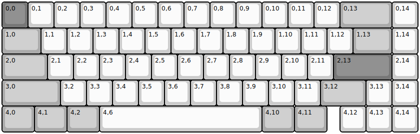{:loading="lazy"}

[Open in keyboard-layout-editor](http://www.keyboard-layout-editor.com/##@@_c=#777777;&=0,0&_c=#cccccc;&=0,1&=0,2&=0,3&=0,4&=0,5&=0,6&=0,7&=0,8&=0,9&=0,10&=0,11&=0,12&_c=#aaaaaa&w:2;&=0,13&_c=#cccccc;&=0,14;&@_c=#aaaaaa&w:1.5;&=1,0&_c=#cccccc;&=1,1&=1,2&=1,3&=1,4&=1,5&=1,6&=1,7&=1,8&=1,9&=1,10&=1,11&=1,12&_c=#aaaaaa&w:1.5;&=1,13&_c=#cccccc;&=1,14;&@_c=#aaaaaa&w:1.75;&=2,0&_c=#cccccc;&=2,1&=2,2&=2,3&=2,4&=2,5&=2,6&=2,7&=2,8&=2,9&=2,10&=2,11&_c=#777777&w:2.25;&=2,13&_c=#cccccc;&=2,14;&@_c=#aaaaaa&w:2.25;&=3,0&_c=#cccccc;&=3,2&=3,3&=3,4&=3,5&=3,6&=3,7&=3,8&=3,9&=3,10&=3,11&_c=#aaaaaa&w:1.75;&=3,12&_c=#cccccc;&=3,13&=3,14;&@_c=#aaaaaa&w:1.25;&=4,0&_w:1.25;&=4,1&_w:1.25;&=4,2&_c=#cccccc&w:6.25;&=4,6&_c=#aaaaaa&w:1.25;&=4,10&_w:1.25;&=4,11&_x:0.5&c=#cccccc;&=4,12&=4,13&=4,14)

## yiancardesigns/cassini

[README](output/yiancardesigns/cassini/README.md) - [layout](output/yiancardesigns/cassini/cassini-kle.json) - [PCB](output/yiancardesigns/cassini/cassini.kicad_pcb) - [PCB render](output/yiancardesigns/cassini/cassini-render.svg)

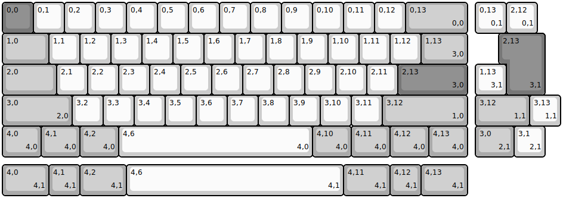{:loading="lazy"}

[Open in keyboard-layout-editor](http://www.keyboard-layout-editor.com/##@@_c=#777777;&=0,0&_c=#cccccc;&=0,1&=0,2&=0,3&=0,4&=0,5&=0,6&=0,7&=0,8&=0,9&=0,10&=0,11&=0,12&_c=#aaaaaa&w:2;&=0,13%0A%0A%0A0,0;&@_w:1.5;&=1,0&_c=#cccccc;&=1,1&=1,2&=1,3&=1,4&=1,5&=1,6&=1,7&=1,8&=1,9&=1,10&=1,11&=1,12&_c=#aaaaaa&w:1.5;&=1,13%0A%0A%0A3,0;&@_w:1.75;&=2,0&_c=#cccccc;&=2,1&=2,2&=2,3&=2,4&=2,5&=2,6&=2,7&=2,8&=2,9&=2,10&=2,11&_c=#777777&w:2.25;&=2,13%0A%0A%0A3,0;&@_c=#aaaaaa&w:2.25;&=3,0%0A%0A%0A2,0&_c=#cccccc;&=3,2&=3,3&=3,4&=3,5&=3,6&=3,7&=3,8&=3,9&=3,10&=3,11&_c=#aaaaaa&w:2.75;&=3,12%0A%0A%0A1,0;&@_w:1.25;&=4,0%0A%0A%0A4,0&_w:1.25;&=4,1%0A%0A%0A4,0&_w:1.25;&=4,2%0A%0A%0A4,0&_c=#cccccc&w:6.25;&=4,6%0A%0A%0A4,0&_c=#aaaaaa&w:1.25;&=4,10%0A%0A%0A4,0&_w:1.25;&=4,11%0A%0A%0A4,0&_w:1.25;&=4,12%0A%0A%0A4,0&_w:1.25;&=4,13%0A%0A%0A4,0;&@_x:15.25&y:-5&c=#cccccc;&=0,13%0A%0A%0A0,1&=2,12%0A%0A%0A0,1;&@_x:16.25&c=#777777&w:1.25&h:2&w2:1.5&h2:1&x2:-0.25;&=2,13%0A%0A%0A3,1;&@_x:15.25&c=#cccccc;&=1,13%0A%0A%0A3,1;&@_x:15.25&c=#aaaaaa&w:1.75;&=3,12%0A%0A%0A1,1&_c=#cccccc;&=3,13%0A%0A%0A1,1;&@_x:15.25&c=#aaaaaa&w:1.25;&=3,0%0A%0A%0A2,1&_c=#cccccc;&=3,1%0A%0A%0A2,1;&@_y:0.25&c=#aaaaaa&w:1.5;&=4,0%0A%0A%0A4,1&=4,1%0A%0A%0A4,1&_w:1.5;&=4,2%0A%0A%0A4,1&_c=#cccccc&w:7;&=4,6%0A%0A%0A4,1&_c=#aaaaaa&w:1.5;&=4,11%0A%0A%0A4,1&=4,12%0A%0A%0A4,1&_w:1.5;&=4,13%0A%0A%0A4,1)

## yiancardesigns/ct87

[README](output/yiancardesigns/ct87/README.md) - [layout](output/yiancardesigns/ct87/ct87-kle.json) - [PCB](output/yiancardesigns/ct87/ct87.kicad_pcb) - [PCB render](output/yiancardesigns/ct87/ct87-render.svg)

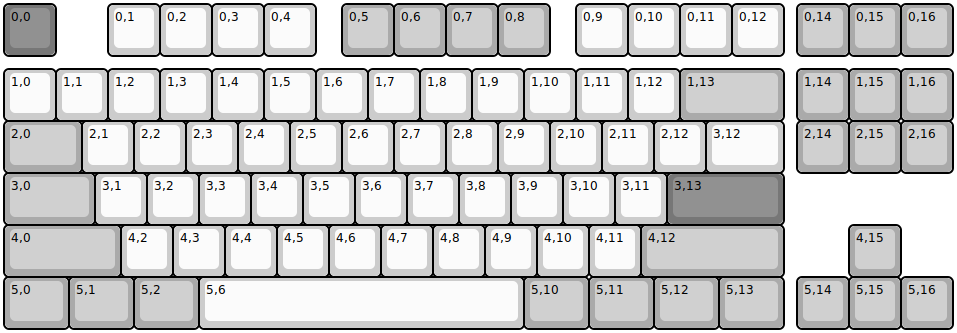{:loading="lazy"}

[Open in keyboard-layout-editor](http://www.keyboard-layout-editor.com/##@@_c=#777777;&=0,0&_x:1&c=#cccccc;&=0,1&=0,2&=0,3&=0,4&_x:0.5&c=#aaaaaa;&=0,5&=0,6&=0,7&=0,8&_x:0.5&c=#cccccc;&=0,9&=0,10&=0,11&=0,12&_x:0.25&c=#aaaaaa;&=0,14&=0,15&=0,16;&@_y:0.25&c=#cccccc;&=1,0&=1,1&=1,2&=1,3&=1,4&=1,5&=1,6&=1,7&=1,8&=1,9&=1,10&=1,11&=1,12&_c=#aaaaaa&w:2;&=1,13&_x:0.25;&=1,14&=1,15&=1,16;&@_w:1.5;&=2,0&_c=#cccccc;&=2,1&=2,2&=2,3&=2,4&=2,5&=2,6&=2,7&=2,8&=2,9&=2,10&=2,11&=2,12&_w:1.5;&=3,12&_x:0.25&c=#aaaaaa;&=2,14&=2,15&=2,16;&@_w:1.75;&=3,0&_c=#cccccc;&=3,1&=3,2&=3,3&=3,4&=3,5&=3,6&=3,7&=3,8&=3,9&=3,10&=3,11&_c=#777777&w:2.25;&=3,13;&@_c=#aaaaaa&w:2.25;&=4,0&_c=#cccccc;&=4,2&=4,3&=4,4&=4,5&=4,6&=4,7&=4,8&=4,9&=4,10&=4,11&_c=#aaaaaa&w:2.75;&=4,12&_x:1.25;&=4,15;&@_w:1.25;&=5,0&_w:1.25;&=5,1&_w:1.25;&=5,2&_c=#cccccc&w:6.25;&=5,6&_c=#aaaaaa&w:1.25;&=5,10&_w:1.25;&=5,11&_w:1.25;&=5,12&_w:1.25;&=5,13&_x:0.25;&=5,14&=5,15&=5,16)

## yiancardesigns/cyberstar

[README](output/yiancardesigns/cyberstar/README.md) - [layout](output/yiancardesigns/cyberstar/cyberstar-kle.json) - [PCB](output/yiancardesigns/cyberstar/cyberstar.kicad_pcb) - [PCB render](output/yiancardesigns/cyberstar/cyberstar-render.svg)

{:loading="lazy"}

[Open in keyboard-layout-editor](http://www.keyboard-layout-editor.com/##@@_c=#aaaaaa;&=0,0&_x:0.25&c=#777777;&=0,1&_c=#cccccc;&=0,2&=0,3&=0,4&=0,5&=0,6&=0,7&=0,8&=0,9&=0,10&=0,11&=0,12&=0,13&_c=#aaaaaa&w:2;&=0,14%0A%0A%0A0,0&_x:0.25&c=#cccccc;&=0,15&=0,16&=0,17;&@_c=#aaaaaa;&=1,0&_x:0.25&w:1.5;&=1,1&_c=#cccccc;&=1,2&=1,3&=1,4&=1,5&=1,6&=1,7&=1,8&=1,9&=1,10&=1,11&=1,12&=1,13&_c=#aaaaaa&w:1.5;&=2,13&_x:0.25&c=#cccccc;&=1,15&=1,16&=1,17;&@_c=#aaaaaa;&=2,0&_x:0.25&w:1.75;&=2,1&_c=#cccccc;&=2,2&=2,3&=2,4&=2,5&=2,6&=2,7&=2,8&=2,9&=2,10&=2,11&=2,12&_c=#777777&w:2.25;&=2,14;&@_c=#aaaaaa;&=3,0&_x:0.25&w:2.25;&=3,1&_c=#cccccc;&=3,3&=3,4&=3,5&=3,6&=3,7&=3,8&=3,9&=3,10&=3,11&=3,12&_c=#aaaaaa&w:1.75;&=3,13&=3,14&_x:1.25&c=#cccccc;&=3,16;&@_x:3.25&c=#aaaaaa;&=4,3&_w:1.5;&=4,4&_c=#cccccc&w:6.25;&=4,8%0A%0A%0A1,0&_c=#aaaaaa&w:1.25;&=4,12%0A%0A%0A1,0&_x:3.25&c=#cccccc;&=4,15&=4,16&=4,17;&@_x:20.5&y:-5;&=0,14%0A%0A%0A0,1&=1,14%0A%0A%0A0,1;&@_x:5.75&y:4.25&w:2.25;&=4,6%0A%0A%0A1,1&_w:2.75;&=4,8%0A%0A%0A1,1&_c=#aaaaaa&w:1.5;&=4,11%0A%0A%0A1,1&=4,12%0A%0A%0A1,1)

## yiancardesigns/emery65

[README](output/yiancardesigns/emery65/README.md) - [layout](output/yiancardesigns/emery65/emery65-kle.json) - [PCB](output/yiancardesigns/emery65/emery65.kicad_pcb) - [PCB render](output/yiancardesigns/emery65/emery65-render.svg)

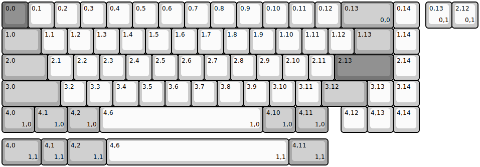{:loading="lazy"}

[Open in keyboard-layout-editor](http://www.keyboard-layout-editor.com/##@@_c=#777777;&=0,0&_c=#cccccc;&=0,1&=0,2&=0,3&=0,4&=0,5&=0,6&=0,7&=0,8&=0,9&=0,10&=0,11&=0,12&_c=#aaaaaa&w:2;&=0,13%0A%0A%0A0,0&_c=#cccccc;&=0,14;&@_c=#aaaaaa&w:1.5;&=1,0&_c=#cccccc;&=1,1&=1,2&=1,3&=1,4&=1,5&=1,6&=1,7&=1,8&=1,9&=1,10&=1,11&=1,12&_c=#aaaaaa&w:1.5;&=1,13&_c=#cccccc;&=1,14;&@_c=#aaaaaa&w:1.75;&=2,0&_c=#cccccc;&=2,1&=2,2&=2,3&=2,4&=2,5&=2,6&=2,7&=2,8&=2,9&=2,10&=2,11&_c=#777777&w:2.25;&=2,13&_c=#cccccc;&=2,14;&@_c=#aaaaaa&w:2.25;&=3,0&_c=#cccccc;&=3,2&=3,3&=3,4&=3,5&=3,6&=3,7&=3,8&=3,9&=3,10&=3,11&_c=#aaaaaa&w:1.75;&=3,12&_c=#cccccc;&=3,13&=3,14;&@_c=#aaaaaa&w:1.25;&=4,0%0A%0A%0A1,0&_w:1.25;&=4,1%0A%0A%0A1,0&_w:1.25;&=4,2%0A%0A%0A1,0&_c=#cccccc&w:6.25;&=4,6%0A%0A%0A1,0&_c=#aaaaaa&w:1.25;&=4,10%0A%0A%0A1,0&_w:1.25;&=4,11%0A%0A%0A1,0&_x:0.5&c=#cccccc;&=4,12&=4,13&=4,14;&@_x:16.25&y:-5;&=0,13%0A%0A%0A0,1&=2,12%0A%0A%0A0,1;&@_y:4.25&c=#aaaaaa&w:1.5;&=4,0%0A%0A%0A1,1&=4,1%0A%0A%0A1,1&_w:1.5;&=4,2%0A%0A%0A1,1&_c=#cccccc&w:7;&=4,6%0A%0A%0A1,1&_c=#aaaaaa&w:1.5;&=4,11%0A%0A%0A1,1)

## yiancardesigns/gingham

[README](output/yiancardesigns/gingham/README.md) - [layout](output/yiancardesigns/gingham/gingham-kle.json) - [PCB](output/yiancardesigns/gingham/gingham.kicad_pcb) - [PCB render](output/yiancardesigns/gingham/gingham-render.svg)

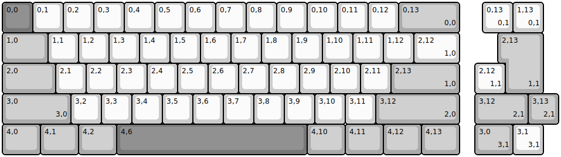{:loading="lazy"}

[Open in keyboard-layout-editor](http://www.keyboard-layout-editor.com/##@@_c=#777777;&=0,0&_c=#cccccc;&=0,1&=0,2&=0,3&=0,4&=0,5&=0,6&=0,7&=0,8&=0,9&=0,10&=0,11&=0,12&_c=#aaaaaa&w:2;&=0,13%0A%0A%0A0,0;&@_w:1.5;&=1,0&_c=#cccccc;&=1,1&=1,2&=1,3&=1,4&=1,5&=1,6&=1,7&=1,8&=1,9&=1,10&=1,11&=1,12&_w:1.5;&=2,12%0A%0A%0A1,0;&@_c=#aaaaaa&w:1.75;&=2,0&_c=#cccccc;&=2,1&=2,2&=2,3&=2,4&=2,5&=2,6&=2,7&=2,8&=2,9&=2,10&=2,11&_c=#aaaaaa&w:2.25;&=2,13%0A%0A%0A1,0;&@_w:2.25;&=3,0%0A%0A%0A3,0&_c=#cccccc;&=3,2&=3,3&=3,4&=3,5&=3,6&=3,7&=3,8&=3,9&=3,10&=3,11&_c=#aaaaaa&w:2.75;&=3,12%0A%0A%0A2,0;&@_w:1.25;&=4,0&_w:1.25;&=4,1&_w:1.25;&=4,2&_c=#777777&w:6.25;&=4,6&_c=#aaaaaa&w:1.25;&=4,10&_w:1.25;&=4,11&_w:1.25;&=4,12&_w:1.25;&=4,13;&@_x:15.75&y:-5&c=#cccccc;&=0,13%0A%0A%0A0,1&=1,13%0A%0A%0A0,1;&@_x:16.5&c=#aaaaaa&w:1.25&h:2&w2:1.5&h2:1&x2:-0.25;&=2,13%0A%0A%0A1,1;&@_x:15.5&c=#cccccc;&=2,12%0A%0A%0A1,1;&@_x:15.5&c=#aaaaaa&w:1.75;&=3,12%0A%0A%0A2,1&=3,13%0A%0A%0A2,1;&@_x:15.5&w:1.25;&=3,0%0A%0A%0A3,1&_c=#cccccc;&=3,1%0A%0A%0A3,1)

## yiancardesigns/hand88

[README](output/yiancardesigns/hand88/README.md) - [layout](output/yiancardesigns/hand88/hand88-kle.json) - [PCB](output/yiancardesigns/hand88/hand88.kicad_pcb) - [PCB render](output/yiancardesigns/hand88/hand88-render.svg)

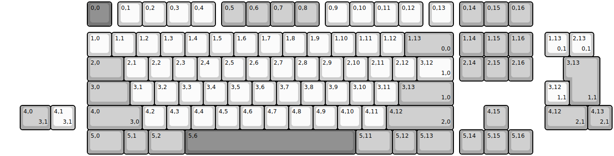{:loading="lazy"}

[Open in keyboard-layout-editor](http://www.keyboard-layout-editor.com/##@@_x:3.5&c=#777777;&=0,0&_x:0.25&c=#cccccc;&=0,1&=0,2&=0,3&=0,4&_x:0.25&c=#aaaaaa;&=0,5&=0,6&=0,7&=0,8&_x:0.25&c=#cccccc;&=0,9&=0,10&=0,11&=0,12&_x:0.25;&=0,13&_x:0.25&c=#aaaaaa;&=0,14&=0,15&=0,16;&@_x:3.5&y:0.25&c=#cccccc;&=1,0&=1,1&=1,2&=1,3&=1,4&=1,5&=1,6&=1,7&=1,8&=1,9&=1,10&=1,11&=1,12&_c=#aaaaaa&w:2;&=1,13%0A%0A%0A0,0&_x:0.25;&=1,14&=1,15&=1,16;&@_x:3.5&w:1.5;&=2,0&_c=#cccccc;&=2,1&=2,2&=2,3&=2,4&=2,5&=2,6&=2,7&=2,8&=2,9&=2,10&=2,11&=2,12&_w:1.5;&=3,12%0A%0A%0A1,0&_x:0.25&c=#aaaaaa;&=2,14&=2,15&=2,16;&@_x:3.5&w:1.75;&=3,0&_c=#cccccc;&=3,1&=3,2&=3,3&=3,4&=3,5&=3,6&=3,7&=3,8&=3,9&=3,10&=3,11&_c=#aaaaaa&w:2.25;&=3,13%0A%0A%0A1,0;&@_x:3.5&w:2.25;&=4,0%0A%0A%0A3,0&_c=#cccccc;&=4,2&=4,3&=4,4&=4,5&=4,6&=4,7&=4,8&=4,9&=4,10&=4,11&_c=#aaaaaa&w:2.75;&=4,12%0A%0A%0A2,0&_x:1.25;&=4,15;&@_x:3.5&w:1.5;&=5,0&=5,1&_w:1.5;&=5,2&_c=#777777&w:7;&=5,6&_c=#aaaaaa&w:1.5;&=5,11&=5,12&_w:1.5;&=5,13&_x:0.25;&=5,14&=5,15&=5,16;&@_x:22.25&y:-5.0&c=#cccccc;&=1,13%0A%0A%0A0,1&=2,13%0A%0A%0A0,1;&@_x:23.25&c=#aaaaaa&w:1.25&h:2&w2:1.5&h2:1&x2:-0.25;&=3,13%0A%0A%0A1,1;&@_x:22.25&c=#cccccc;&=3,12%0A%0A%0A1,1;&@_x:0.75&c=#aaaaaa&w:1.25;&=4,0%0A%0A%0A3,1&_c=#cccccc;&=4,1%0A%0A%0A3,1&_x:19.25&c=#aaaaaa&w:1.75;&=4,12%0A%0A%0A2,1&=4,13%0A%0A%0A2,1)

## yiancardesigns/hs60/ansi/hs60_v2_ansi

[README](output/yiancardesigns/hs60/ansi/README.md) - [layout](output/yiancardesigns/hs60/ansi/hs60_v2_ansi-kle.json) - [PCB](output/yiancardesigns/hs60/ansi/hs60_v2_ansi.kicad_pcb) - [PCB render](output/yiancardesigns/hs60/ansi/hs60_v2_ansi-render.svg)

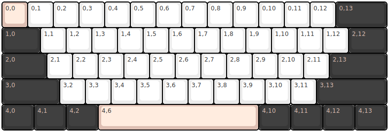{:loading="lazy"}

[Open in keyboard-layout-editor](http://www.keyboard-layout-editor.com/##@@_c=#DEBFB3&t=#363636;&=0,0&_c=#ebebeb;&=0,1&=0,2&=0,3&=0,4&=0,5&=0,6&=0,7&=0,8&=0,9&=0,10&=0,11&=0,12&_c=#363636&t=#DEBFB3&w:2;&=0,13;&@_w:1.5;&=1,0&_c=#ebebeb&t=#363636;&=1,1&=1,2&=1,3&=1,4&=1,5&=1,6&=1,7&=1,8&=1,9&=1,10&=1,11&=1,12&_c=#363636&t=#DEBFB3&w:1.5;&=2,12;&@_w:1.75;&=2,0&_c=#ebebeb&t=#363636;&=2,1&=2,2&=2,3&=2,4&=2,5&=2,6&=2,7&=2,8&=2,9&=2,10&=2,11&_c=#363636&t=#DEBFB3&w:2.25;&=2,13;&@_w:2.25;&=3,0&_c=#ebebeb&t=#363636;&=3,2&=3,3&=3,4&=3,5&=3,6&=3,7&=3,8&=3,9&=3,10&=3,11&_c=#363636&t=#DEBFB3&w:2.75;&=3,13;&@_w:1.25;&=4,0&_w:1.25;&=4,1&_w:1.25;&=4,2&_c=#DEBFB3&t=#363636&w:6.25;&=4,6&_c=#363636&t=#DEBFB3&w:1.25;&=4,10&_w:1.25;&=4,11&_w:1.25;&=4,12&_w:1.25;&=4,13)

## yiancardesigns/hs60/hhkb/hs60_v2_hhkb

[README](output/yiancardesigns/hs60/hhkb/README.md) - [layout](output/yiancardesigns/hs60/hhkb/hs60_v2_hhkb-kle.json) - [PCB](output/yiancardesigns/hs60/hhkb/hs60_v2_hhkb.kicad_pcb) - [PCB render](output/yiancardesigns/hs60/hhkb/hs60_v2_hhkb-render.svg)

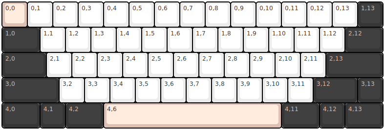{:loading="lazy"}

[Open in keyboard-layout-editor](http://www.keyboard-layout-editor.com/##@@_c=#DEBFB3&t=#363636;&=0,0&_c=#ebebeb;&=0,1&=0,2&=0,3&=0,4&=0,5&=0,6&=0,7&=0,8&=0,9&=0,10&=0,11&=0,12&=0,13&_c=#363636&t=#DEBFB3;&=1,13;&@_w:1.5;&=1,0&_c=#ebebeb&t=#363636;&=1,1&=1,2&=1,3&=1,4&=1,5&=1,6&=1,7&=1,8&=1,9&=1,10&=1,11&=1,12&_c=#363636&t=#DEBFB3&w:1.5;&=2,12;&@_w:1.75;&=2,0&_c=#ebebeb&t=#363636;&=2,1&=2,2&=2,3&=2,4&=2,5&=2,6&=2,7&=2,8&=2,9&=2,10&=2,11&_c=#363636&t=#DEBFB3&w:2.25;&=2,13;&@_w:2.25;&=3,0&_c=#ebebeb&t=#363636;&=3,2&=3,3&=3,4&=3,5&=3,6&=3,7&=3,8&=3,9&=3,10&=3,11&_c=#363636&t=#DEBFB3&w:1.75;&=3,12&=3,13;&@_w:1.5;&=4,0&=4,1&_w:1.5;&=4,2&_c=#DEBFB3&t=#363636&w:7;&=4,6&_c=#363636&t=#DEBFB3&w:1.5;&=4,11&=4,12&_w:1.5;&=4,13)

## yiancardesigns/hs60/iso/hs60_v2_iso

[README](output/yiancardesigns/hs60/iso/README.md) - [layout](output/yiancardesigns/hs60/iso/hs60_v2_iso-kle.json) - [PCB](output/yiancardesigns/hs60/iso/hs60_v2_iso.kicad_pcb) - [PCB render](output/yiancardesigns/hs60/iso/hs60_v2_iso-render.svg)

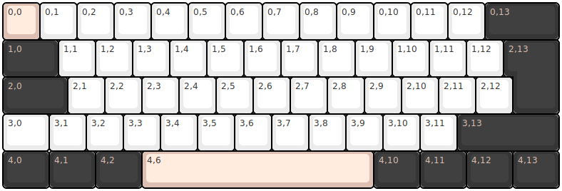{:loading="lazy"}

[Open in keyboard-layout-editor](http://www.keyboard-layout-editor.com/##@@_c=#DEBFB3&t=#363636;&=0,0&_c=#ebebeb;&=0,1&=0,2&=0,3&=0,4&=0,5&=0,6&=0,7&=0,8&=0,9&=0,10&=0,11&=0,12&_c=#363636&t=#DEBFB3&w:2;&=0,13;&@_w:1.5;&=1,0&_c=#ebebeb&t=#363636;&=1,1&=1,2&=1,3&=1,4&=1,5&=1,6&=1,7&=1,8&=1,9&=1,10&=1,11&=1,12&_x:0.25&c=#363636&t=#DEBFB3&w:1.25&h:2&w2:1.5&h2:1&x2:-0.25;&=2,13;&@_w:1.75;&=2,0&_c=#ebebeb&t=#363636;&=2,1&=2,2&=2,3&=2,4&=2,5&=2,6&=2,7&=2,8&=2,9&=2,10&=2,11&=2,12;&@_w:1.25;&=3,0&=3,1&=3,2&=3,3&=3,4&=3,5&=3,6&=3,7&=3,8&=3,9&=3,10&=3,11&_c=#363636&t=#DEBFB3&w:2.75;&=3,13;&@_w:1.25;&=4,0&_w:1.25;&=4,1&_w:1.25;&=4,2&_c=#DEBFB3&t=#363636&w:6.25;&=4,6&_c=#363636&t=#DEBFB3&w:1.25;&=4,10&_w:1.25;&=4,11&_w:1.25;&=4,12&_w:1.25;&=4,13)

## yiancardesigns/keebwerk_mega/ansi/keebwerk_mega_ansi

[README](output/yiancardesigns/keebwerk_mega/ansi/README.md) - [layout](output/yiancardesigns/keebwerk_mega/ansi/keebwerk_mega_ansi-kle.json) - [PCB](output/yiancardesigns/keebwerk_mega/ansi/keebwerk_mega_ansi.kicad_pcb) - [PCB render](output/yiancardesigns/keebwerk_mega/ansi/keebwerk_mega_ansi-render.svg)

{:loading="lazy"}

[Open in keyboard-layout-editor](http://www.keyboard-layout-editor.com/##@@_c=#777777;&=0,0&_c=#cccccc;&=0,1&=0,2&=0,3&=0,4&=0,5&=0,6&=0,7&=0,8&=0,9&=0,10&=0,11&=0,12&_c=#aaaaaa&w:2;&=0,13&=0,14;&@_w:1.5;&=1,0&_c=#cccccc;&=1,1&=1,2&=1,3&=1,4&=1,5&=1,6&=1,7&=1,8&=1,9&=1,10&=1,11&=1,12&_w:1.5;&=2,12&_c=#aaaaaa;&=1,14;&@_w:1.75;&=2,0&_c=#cccccc;&=2,1&=2,2&=2,3&=2,4&=2,5&=2,6&=2,7&=2,8&=2,9&=2,10&=2,11&_c=#aaaaaa&w:2.25;&=2,13&=2,14;&@_w:2.25;&=3,0&_c=#cccccc;&=3,2&=3,3&=3,4&=3,5&=3,6&=3,7&=3,8&=3,9&=3,10&=3,11&_c=#aaaaaa&w:1.75;&=3,12&_c=#777777;&=3,13&_c=#aaaaaa;&=3,14;&@_w:1.25;&=4,0&_w:1.25;&=4,1&_w:1.25;&=4,2&_c=#777777&w:6.25;&=4,6&_c=#aaaaaa;&=4,9&=4,10&=4,11&_c=#777777;&=4,12&=4,13&=4,14)

## yiancardesigns/loki65

[README](output/yiancardesigns/loki65/README.md) - [layout](output/yiancardesigns/loki65/loki65-kle.json) - [PCB](output/yiancardesigns/loki65/loki65.kicad_pcb) - [PCB render](output/yiancardesigns/loki65/loki65-render.svg)

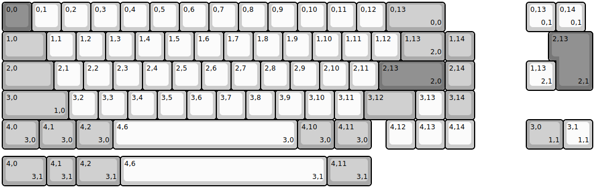{:loading="lazy"}

[Open in keyboard-layout-editor](http://www.keyboard-layout-editor.com/##@@_c=#777777;&=0,0&_c=#cccccc;&=0,1&=0,2&=0,3&=0,4&=0,5&=0,6&=0,7&=0,8&=0,9&=0,10&=0,11&=0,12&_c=#aaaaaa&w:2;&=0,13%0A%0A%0A0,0;&@_w:1.5;&=1,0&_c=#cccccc;&=1,1&=1,2&=1,3&=1,4&=1,5&=1,6&=1,7&=1,8&=1,9&=1,10&=1,11&=1,12&_c=#aaaaaa&w:1.5;&=1,13%0A%0A%0A2,0&=1,14;&@_w:1.75;&=2,0&_c=#cccccc;&=2,1&=2,2&=2,3&=2,4&=2,5&=2,6&=2,7&=2,8&=2,9&=2,10&=2,11&_c=#777777&w:2.25;&=2,13%0A%0A%0A2,0&_c=#aaaaaa;&=2,14;&@_w:2.25;&=3,0%0A%0A%0A1,0&_c=#cccccc;&=3,2&=3,3&=3,4&=3,5&=3,6&=3,7&=3,8&=3,9&=3,10&=3,11&_c=#aaaaaa&w:1.75;&=3,12&_c=#cccccc;&=3,13&_c=#aaaaaa;&=3,14;&@_w:1.25;&=4,0%0A%0A%0A3,0&_w:1.25;&=4,1%0A%0A%0A3,0&_w:1.25;&=4,2%0A%0A%0A3,0&_c=#cccccc&w:6.25;&=4,6%0A%0A%0A3,0&_c=#aaaaaa&w:1.25;&=4,10%0A%0A%0A3,0&_w:1.25;&=4,11%0A%0A%0A3,0&_x:0.5&c=#cccccc;&=4,12&=4,13&=4,14;&@_x:17.75&y:-5;&=0,13%0A%0A%0A0,1&=0,14%0A%0A%0A0,1;&@_x:18.75&c=#777777&w:1.25&h:2&w2:1.5&h2:1&x2:-0.25;&=2,13%0A%0A%0A2,1;&@_x:17.75&c=#cccccc;&=1,13%0A%0A%0A2,1;&@_x:17.75&y:1&c=#aaaaaa&w:1.25;&=3,0%0A%0A%0A1,1&_c=#cccccc;&=3,1%0A%0A%0A1,1;&@_y:0.25&c=#aaaaaa&w:1.5;&=4,0%0A%0A%0A3,1&=4,1%0A%0A%0A3,1&_w:1.5;&=4,2%0A%0A%0A3,1&_c=#cccccc&w:7;&=4,6%0A%0A%0A3,1&_c=#aaaaaa&w:1.5;&=4,11%0A%0A%0A3,1)

## yiancardesigns/mc_76k

[README](output/yiancardesigns/mc_76k/README.md) - [layout](output/yiancardesigns/mc_76k/mc_76k-kle.json) - [PCB](output/yiancardesigns/mc_76k/mc_76k.kicad_pcb) - [PCB render](output/yiancardesigns/mc_76k/mc_76k-render.svg)

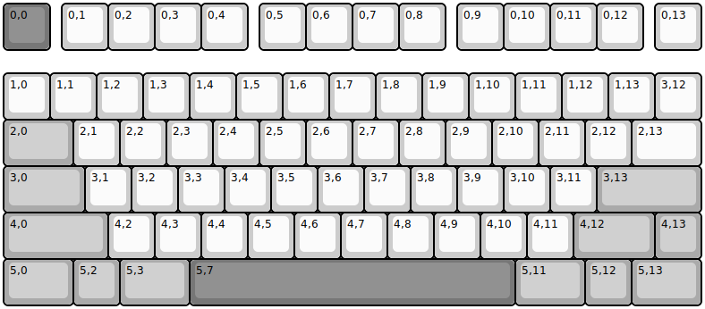{:loading="lazy"}

[Open in keyboard-layout-editor](http://www.keyboard-layout-editor.com/##@@_c=#777777;&=0,0&_x:0.25&c=#cccccc;&=0,1&=0,2&=0,3&=0,4&_x:0.25;&=0,5&=0,6&=0,7&=0,8&_x:0.25;&=0,9&=0,10&=0,11&=0,12&_x:0.25;&=0,13;&@_y:0.5;&=1,0&=1,1&=1,2&=1,3&=1,4&=1,5&=1,6&=1,7&=1,8&=1,9&=1,10&=1,11&=1,12&=1,13&=3,12;&@_c=#aaaaaa&w:1.5;&=2,0&_c=#cccccc;&=2,1&=2,2&=2,3&=2,4&=2,5&=2,6&=2,7&=2,8&=2,9&=2,10&=2,11&=2,12&_w:1.5;&=2,13;&@_c=#aaaaaa&w:1.75;&=3,0&_c=#cccccc;&=3,1&=3,2&=3,3&=3,4&=3,5&=3,6&=3,7&=3,8&=3,9&=3,10&=3,11&_c=#aaaaaa&w:2.25;&=3,13;&@_w:2.25;&=4,0&_c=#cccccc;&=4,2&=4,3&=4,4&=4,5&=4,6&=4,7&=4,8&=4,9&=4,10&=4,11&_c=#aaaaaa&w:1.75;&=4,12&=4,13;&@_w:1.5;&=5,0&=5,2&_w:1.5;&=5,3&_c=#777777&w:7;&=5,7&_c=#aaaaaa&w:1.5;&=5,11&=5,12&_w:1.5;&=5,13)

## yiancardesigns/mnk1800s

[README](output/yiancardesigns/mnk1800s/README.md) - [layout](output/yiancardesigns/mnk1800s/mnk1800s-kle.json) - [PCB](output/yiancardesigns/mnk1800s/mnk1800s.kicad_pcb) - [PCB render](output/yiancardesigns/mnk1800s/mnk1800s-render.svg)

{:loading="lazy"}

[Open in keyboard-layout-editor](http://www.keyboard-layout-editor.com/##@@_c=#aaaaaa;&=0,0&=0,1&=0,2&=0,3&_x:0.5&c=#777777;&=0,4&_c=#cccccc;&=0,5&=0,6&=0,7&=0,8&=0,9&=0,10&=0,11&=0,12&=0,13&=0,14&=0,15&=0,16&_c=#aaaaaa&w:2;&=0,17%0A%0A%0A2,0;&@_c=#cccccc;&=1,0&=1,1&=1,2&_c=#aaaaaa;&=1,3&_x:0.5&w:1.5;&=1,4&_c=#cccccc;&=1,5&=1,6&=1,7&=1,8&=1,9&=1,10&=1,11&=1,12&=1,13&=1,14&=1,15&=1,16&_c=#aaaaaa&w:1.5;&=1,17;&@_c=#cccccc;&=2,0&=2,1&=2,2&_c=#aaaaaa&h:2;&=2,3%0A%0A%0A1,0&_x:0.5&w:1.75;&=2,4&_c=#cccccc;&=2,5&=2,6&=2,7&=2,8&=2,9&=2,10&=2,11&=2,12&=2,13&=2,14&=2,15&_c=#777777&w:2.25;&=2,16;&@_c=#cccccc;&=3,0&=3,1&=3,2&_x:2.5&c=#aaaaaa&w:1.25;&=3,4&_c=#cccccc;&=3,5&=3,6&=3,7&=3,8&=3,9&=3,10&=3,11&=3,12&=3,13&=3,14&_c=#aaaaaa&w:1.75;&=3,15&=3,16;&@_x:4.25&y:-0.75&c=#cccccc;&=3,3;&@_y:-0.25&w:2;&=4,0%0A%0A%0A0,0&=4,2&_x:3.5&c=#aaaaaa&w:1.5;&=4,6&_w:1.5;&=4,7&_c=#cccccc&w:7;&=4,10&_c=#aaaaaa&w:1.5;&=4,15&_w:1.5;&=4,16;&@_x:3.25&y:-0.75&c=#cccccc;&=4,3&=4,4&=4,5;&@=4,0%0A%0A%0A0,1&=4,1%0A%0A%0A0,1&_x:15.5;&=0,17%0A%0A%0A2,1&_c=#aaaaaa;&=2,17%0A%0A%0A2,1;&@=2,3%0A%0A%0A1,1;&@=4,8%0A%0A%0A1,1)

## yiancardesigns/mnk50

[README](output/yiancardesigns/mnk50/README.md) - [layout](output/yiancardesigns/mnk50/mnk50-kle.json) - [PCB](output/yiancardesigns/mnk50/mnk50.kicad_pcb) - [PCB render](output/yiancardesigns/mnk50/mnk50-render.svg)

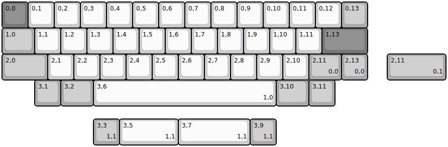{:loading="lazy"}

[Open in keyboard-layout-editor](http://www.keyboard-layout-editor.com/##@@_c=#777777;&=0,0&_c=#cccccc;&=0,1&=0,2&=0,3&=0,4&=0,5&=0,6&=0,7&=0,8&=0,9&=0,10&=0,11&=0,12&_c=#aaaaaa;&=0,13;&@_w:1.25;&=1,0&_c=#cccccc;&=1,1&=1,2&=1,3&=1,4&=1,5&=1,6&=1,7&=1,8&=1,9&=1,10&=1,11&_c=#777777&w:1.75;&=1,13;&@_c=#aaaaaa&w:1.75;&=2,0&_c=#cccccc;&=2,1&=2,2&=2,3&=2,4&=2,5&=2,6&=2,7&=2,8&=2,9&=2,10&_c=#aaaaaa&w:1.25;&=2,11%0A%0A%0A0,0&=2,13%0A%0A%0A0,0;&@_x:1.25;&=3,1&_w:1.25;&=3,2&_c=#cccccc&w:7;&=3,6%0A%0A%0A1,0&_c=#aaaaaa&w:1.25;&=3,10&=3,11;&@_x:14.75&y:-2&w:2.25;&=2,11%0A%0A%0A0,1;&@_x:3.5&y:1.5;&=3,3%0A%0A%0A1,1&_c=#cccccc&w:2.25;&=3,5%0A%0A%0A1,1&_w:2.75&w2:2.25;&=3,7%0A%0A%0A1,1&_c=#aaaaaa;&=3,9%0A%0A%0A1,1)

## yiancardesigns/mnk75

[README](output/yiancardesigns/mnk75/README.md) - [layout](output/yiancardesigns/mnk75/mnk75-kle.json) - [PCB](output/yiancardesigns/mnk75/mnk75.kicad_pcb) - [PCB render](output/yiancardesigns/mnk75/mnk75-render.svg)

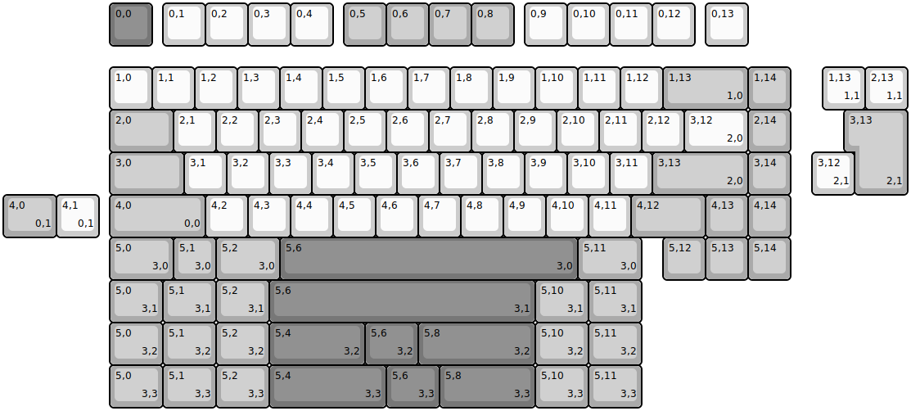{:loading="lazy"}

[Open in keyboard-layout-editor](http://www.keyboard-layout-editor.com/##@@_x:2.5&c=#777777;&=0,0&_x:0.25&c=#cccccc;&=0,1&=0,2&=0,3&=0,4&_x:0.25&c=#aaaaaa;&=0,5&=0,6&=0,7&=0,8&_x:0.25&c=#cccccc;&=0,9&=0,10&=0,11&=0,12&_x:0.25;&=0,13;&@_x:2.5&y:0.5;&=1,0&=1,1&=1,2&=1,3&=1,4&=1,5&=1,6&=1,7&=1,8&=1,9&=1,10&=1,11&=1,12&_c=#aaaaaa&w:2;&=1,13%0A%0A%0A1,0&=1,14;&@_x:2.5&w:1.5;&=2,0&_c=#cccccc;&=2,1&=2,2&=2,3&=2,4&=2,5&=2,6&=2,7&=2,8&=2,9&=2,10&=2,11&=2,12&_w:1.5;&=3,12%0A%0A%0A2,0&_c=#aaaaaa;&=2,14;&@_x:2.5&w:1.75;&=3,0&_c=#cccccc;&=3,1&=3,2&=3,3&=3,4&=3,5&=3,6&=3,7&=3,8&=3,9&=3,10&=3,11&_c=#aaaaaa&w:2.25;&=3,13%0A%0A%0A2,0&=3,14;&@_x:2.5&w:2.25;&=4,0%0A%0A%0A0,0&_c=#cccccc;&=4,2&=4,3&=4,4&=4,5&=4,6&=4,7&=4,8&=4,9&=4,10&=4,11&_c=#aaaaaa&w:1.75;&=4,12&=4,13&=4,14;&@_x:2.5&w:1.5;&=5,0%0A%0A%0A3,0&=5,1%0A%0A%0A3,0&_w:1.5;&=5,2%0A%0A%0A3,0&_c=#777777&w:7;&=5,6%0A%0A%0A3,0&_c=#aaaaaa&w:1.5;&=5,11%0A%0A%0A3,0&_x:0.5;&=5,12&=5,13&=5,14;&@_x:19.25&y:-5.0&c=#cccccc;&=1,13%0A%0A%0A1,1&=2,13%0A%0A%0A1,1;&@_x:20.0&c=#aaaaaa&w:1.25&h:2&w2:1.5&h2:1&x2:-0.25;&=3,13%0A%0A%0A2,1;&@_x:19.0&c=#cccccc;&=3,12%0A%0A%0A2,1;&@_c=#aaaaaa&w:1.25;&=4,0%0A%0A%0A0,1&_c=#cccccc;&=4,1%0A%0A%0A0,1;&@_x:2.5&y:1.0&c=#aaaaaa&w:1.25;&=5,0%0A%0A%0A3,1&_w:1.25;&=5,1%0A%0A%0A3,1&_w:1.25;&=5,2%0A%0A%0A3,1&_c=#777777&w:6.25;&=5,6%0A%0A%0A3,1&_c=#aaaaaa&w:1.25;&=5,10%0A%0A%0A3,1&_w:1.25;&=5,11%0A%0A%0A3,1;&@_x:2.5&w:1.25;&=5,0%0A%0A%0A3,2&_w:1.25;&=5,1%0A%0A%0A3,2&_w:1.25;&=5,2%0A%0A%0A3,2&_c=#777777&w:2.25;&=5,4%0A%0A%0A3,2&_w:1.25;&=5,6%0A%0A%0A3,2&_w:2.75;&=5,8%0A%0A%0A3,2&_c=#aaaaaa&w:1.25;&=5,10%0A%0A%0A3,2&_w:1.25;&=5,11%0A%0A%0A3,2;&@_x:2.5&w:1.25;&=5,0%0A%0A%0A3,3&_w:1.25;&=5,1%0A%0A%0A3,3&_w:1.25;&=5,2%0A%0A%0A3,3&_c=#777777&w:2.75;&=5,4%0A%0A%0A3,3&_w:1.25;&=5,6%0A%0A%0A3,3&_w:2.25;&=5,8%0A%0A%0A3,3&_c=#aaaaaa&w:1.25;&=5,10%0A%0A%0A3,3&_w:1.25;&=5,11%0A%0A%0A3,3)

## yiancardesigns/nasu

[README](output/yiancardesigns/nasu/README.md) - [layout](output/yiancardesigns/nasu/nasu-kle.json) - [PCB](output/yiancardesigns/nasu/nasu.kicad_pcb) - [PCB render](output/yiancardesigns/nasu/nasu-render.svg)

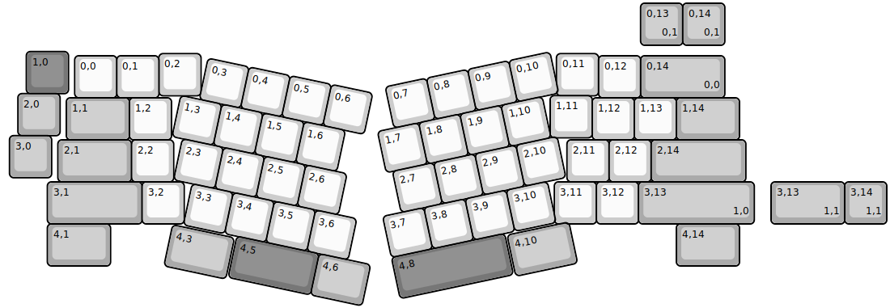{:loading="lazy"}

[Open in keyboard-layout-editor](http://www.keyboard-layout-editor.com/##@@_x:0.55&y:1.15&c=#777777;&=1,0;&@_x:3.7&y:-0.95&c=#cccccc;&=0,2&_x:8.45;&=0,11;&@_x:1.7&y:-0.95;&=0,0&=0,1&_x:10.45;&=0,12&_c=#aaaaaa&w:2;&=0,14%0A%0A%0A0,0;&@_x:0.35&y:-0.1;&=2,0;&@_x:13&y:-0.95&c=#cccccc;&=1,11;&@_x:1.5&y:-0.95&c=#aaaaaa&w:1.5;&=1,1&_c=#cccccc;&=1,2&_x:10.0;&=1,12&=1,13&_c=#aaaaaa&w:1.5;&=1,14;&@_x:0.15&y:-0.1;&=3,0;&@_x:13.4&y:-0.9&c=#cccccc;&=2,11&=2,12&_c=#aaaaaa&w:2.25;&=2,14&_x:-16.35&w:1.75;&=2,1&_c=#cccccc;&=2,2;&@_x:1.05&c=#aaaaaa&w:2.25;&=3,1&_c=#cccccc;&=3,2&_x:8.8;&=3,11&=3,12&_c=#aaaaaa&w:2.75;&=3,13%0A%0A%0A1,0;&@_x:1.05&w:1.5;&=4,1&_x:13.45&w:1.5;&=4,14;&@_r:12&x:5.05&y:-6.0&c=#cccccc;&=0,3&=0,4&=0,5&=0,6;&@_x:4.6;&=1,3&=1,4&=1,5&=1,6;&@_x:4.85;&=2,3&=2,4&=2,5&=2,6;&@_x:5.3;&=3,3&=3,4&=3,5&=3,6;&@_x:6.6&c=#777777&w:2;&=4,5&_c=#aaaaaa&w:1.25;&=4,6;&@_x:5.05&y:-0.95&w:1.5;&=4,3;&@_r:-12&x:8.45&y:-1.45&c=#cccccc;&=0,7&=0,8&=0,9&=0,10;&@_x:8.05;&=1,7&=1,8&=1,9&=1,10;&@_x:8.2;&=2,7&=2,8&=2,9&=2,10;&@_x:7.75;&=3,7&=3,8&=3,9&=3,10;&@_x:7.75&c=#777777&w:2.75;&=4,8;&@_x:10.55&y:-0.95&c=#aaaaaa&w:1.5;&=4,10;&@_r:0&x:15.15&y:-8.9;&=0,13%0A%0A%0A0,1&=0,14%0A%0A%0A0,1;&@_x:18.25&y:3.25&w:1.75;&=3,13%0A%0A%0A1,1&=3,14%0A%0A%0A1,1)

## yiancardesigns/nebula12

[README](output/yiancardesigns/nebula12/README.md) - [layout](output/yiancardesigns/nebula12/nebula12-kle.json) - [PCB](output/yiancardesigns/nebula12/nebula12.kicad_pcb) - [PCB render](output/yiancardesigns/nebula12/nebula12-render.svg)

{:loading="lazy"}

[Open in keyboard-layout-editor](http://www.keyboard-layout-editor.com/##@@=0,0&=0,1&=0,2;&@=1,0&=1,1&=1,2;&@=2,0&=2,1&=2,2;&@=3,0&=3,1&=3,2)

## yiancardesigns/nebula12b

[README](output/yiancardesigns/nebula12b/README.md) - [layout](output/yiancardesigns/nebula12b/nebula12b-kle.json) - [PCB](output/yiancardesigns/nebula12b/nebula12b.kicad_pcb) - [PCB render](output/yiancardesigns/nebula12b/nebula12b-render.svg)

{:loading="lazy"}

[Open in keyboard-layout-editor](http://www.keyboard-layout-editor.com/##@@=0,0&=0,1&=0,2;&@=1,0&=1,1&=1,2;&@=2,0&=2,1&=2,2;&@=3,0&=3,1&=3,2)

## yiancardesigns/nebula68

[README](output/yiancardesigns/nebula68/README.md) - [layout](output/yiancardesigns/nebula68/nebula68-kle.json) - [PCB](output/yiancardesigns/nebula68/nebula68.kicad_pcb) - [PCB render](output/yiancardesigns/nebula68/nebula68-render.svg)

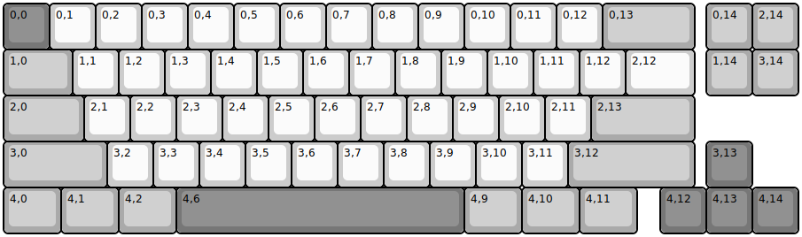{:loading="lazy"}

[Open in keyboard-layout-editor](http://www.keyboard-layout-editor.com/##@@_c=#777777;&=0,0&_c=#cccccc;&=0,1&=0,2&=0,3&=0,4&=0,5&=0,6&=0,7&=0,8&=0,9&=0,10&=0,11&=0,12&_c=#aaaaaa&w:2;&=0,13&_x:0.25;&=0,14&=2,14;&@_w:1.5;&=1,0&_c=#cccccc;&=1,1&=1,2&=1,3&=1,4&=1,5&=1,6&=1,7&=1,8&=1,9&=1,10&=1,11&=1,12&_w:1.5;&=2,12&_x:0.25&c=#aaaaaa;&=1,14&=3,14;&@_w:1.75;&=2,0&_c=#cccccc;&=2,1&=2,2&=2,3&=2,4&=2,5&=2,6&=2,7&=2,8&=2,9&=2,10&=2,11&_c=#aaaaaa&w:2.25;&=2,13;&@_w:2.25;&=3,0&_c=#cccccc;&=3,2&=3,3&=3,4&=3,5&=3,6&=3,7&=3,8&=3,9&=3,10&=3,11&_c=#aaaaaa&w:2.75;&=3,12&_x:0.25&c=#777777;&=3,13;&@_c=#aaaaaa&w:1.25;&=4,0&_w:1.25;&=4,1&_w:1.25;&=4,2&_c=#777777&w:6.25;&=4,6&_c=#aaaaaa&w:1.25;&=4,9&_w:1.25;&=4,10&_w:1.25;&=4,11&_x:0.5&c=#777777;&=4,12&=4,13&=4,14)

## yiancardesigns/nebula68b

[README](output/yiancardesigns/nebula68b/README.md) - [layout](output/yiancardesigns/nebula68b/nebula68b-kle.json) - [PCB](output/yiancardesigns/nebula68b/nebula68b.kicad_pcb) - [PCB render](output/yiancardesigns/nebula68b/nebula68b-render.svg)

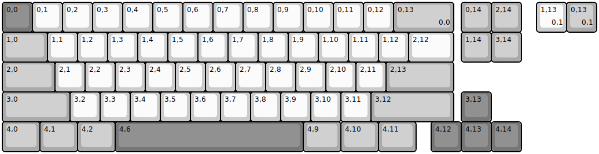{:loading="lazy"}

[Open in keyboard-layout-editor](http://www.keyboard-layout-editor.com/##@@_c=#777777;&=0,0&_c=#cccccc;&=0,1&=0,2&=0,3&=0,4&=0,5&=0,6&=0,7&=0,8&=0,9&=0,10&=0,11&=0,12&_c=#aaaaaa&w:2;&=0,13%0A%0A%0A0,0&_x:0.25;&=0,14&=2,14;&@_w:1.5;&=1,0&_c=#cccccc;&=1,1&=1,2&=1,3&=1,4&=1,5&=1,6&=1,7&=1,8&=1,9&=1,10&=1,11&=1,12&_w:1.5;&=2,12&_x:0.25&c=#aaaaaa;&=1,14&=3,14;&@_w:1.75;&=2,0&_c=#cccccc;&=2,1&=2,2&=2,3&=2,4&=2,5&=2,6&=2,7&=2,8&=2,9&=2,10&=2,11&_c=#aaaaaa&w:2.25;&=2,13;&@_w:2.25;&=3,0&_c=#cccccc;&=3,2&=3,3&=3,4&=3,5&=3,6&=3,7&=3,8&=3,9&=3,10&=3,11&_c=#aaaaaa&w:2.75;&=3,12&_x:0.25&c=#777777;&=3,13;&@_c=#aaaaaa&w:1.25;&=4,0&_w:1.25;&=4,1&_w:1.25;&=4,2&_c=#777777&w:6.25;&=4,6&_c=#aaaaaa&w:1.25;&=4,9&_w:1.25;&=4,10&_w:1.25;&=4,11&_x:0.5&c=#777777;&=4,12&=4,13&=4,14;&@_x:17.75&y:-5&c=#cccccc;&=1,13%0A%0A%0A0,1&_c=#aaaaaa;&=0,13%0A%0A%0A0,1)

## yiancardesigns/nk1

[README](output/yiancardesigns/nk1/README.md) - [layout](output/yiancardesigns/nk1/nk1-kle.json) - [PCB](output/yiancardesigns/nk1/nk1.kicad_pcb) - [PCB render](output/yiancardesigns/nk1/nk1-render.svg)

{:loading="lazy"}

[Open in keyboard-layout-editor](http://www.keyboard-layout-editor.com/##@@_w:2&h:2;&=0,0)

## yiancardesigns/nk20

[README](output/yiancardesigns/nk20/README.md) - [layout](output/yiancardesigns/nk20/nk20-kle.json) - [PCB](output/yiancardesigns/nk20/nk20.kicad_pcb) - [PCB render](output/yiancardesigns/nk20/nk20-render.svg)

{:loading="lazy"}

[Open in keyboard-layout-editor](http://www.keyboard-layout-editor.com/##@@_c=#aaaaaa;&=0,0&=0,1&=0,2;&@_y:0.25;&=1,0&=1,1&=1,2&=1,3;&@_c=#cccccc;&=2,0&=2,1&=2,2&_c=#aaaaaa&h:2;&=2,3;&@_c=#cccccc;&=3,0&=3,1&=3,2;&@=4,0&=4,1&=4,2&_c=#777777&h:2;&=4,3;&@_c=#cccccc&w:2;&=5,0&=5,2)

## yiancardesigns/nk65

[README](output/yiancardesigns/nk65/README.md) - [layout](output/yiancardesigns/nk65/nk65-kle.json) - [PCB](output/yiancardesigns/nk65/nk65.kicad_pcb) - [PCB render](output/yiancardesigns/nk65/nk65-render.svg)

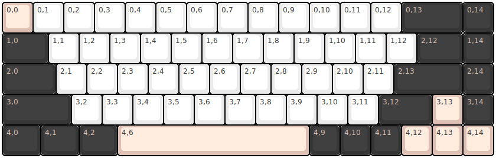{:loading="lazy"}

[Open in keyboard-layout-editor](http://www.keyboard-layout-editor.com/##@@_c=#DEBFB3&t=#363636;&=0,0&_c=#ebebeb;&=0,1&=0,2&=0,3&=0,4&=0,5&=0,6&=0,7&=0,8&=0,9&=0,10&=0,11&=0,12&_c=#363636&t=#DEBFB3&w:2;&=0,13&=0,14;&@_w:1.5;&=1,0&_c=#ebebeb&t=#363636;&=1,1&=1,2&=1,3&=1,4&=1,5&=1,6&=1,7&=1,8&=1,9&=1,10&=1,11&=1,12&_c=#363636&t=#DEBFB3&w:1.5;&=2,12&=1,14;&@_w:1.75;&=2,0&_c=#ebebeb&t=#363636;&=2,1&=2,2&=2,3&=2,4&=2,5&=2,6&=2,7&=2,8&=2,9&=2,10&=2,11&_c=#363636&t=#DEBFB3&w:2.25;&=2,13&=2,14;&@_w:2.25;&=3,0&_c=#ebebeb&t=#363636;&=3,2&=3,3&=3,4&=3,5&=3,6&=3,7&=3,8&=3,9&=3,10&=3,11&_c=#363636&t=#DEBFB3&w:1.75;&=3,12&_c=#DEBFB3&t=#363636;&=3,13&_c=#363636&t=#DEBFB3;&=3,14;&@_w:1.25;&=4,0&_w:1.25;&=4,1&_w:1.25;&=4,2&_c=#DEBFB3&t=#363636&w:6.25;&=4,6&_c=#363636&t=#DEBFB3;&=4,9&=4,10&=4,11&_c=#DEBFB3&t=#363636;&=4,12&=4,13&=4,14)

## yiancardesigns/nk65b

[README](output/yiancardesigns/nk65b/README.md) - [layout](output/yiancardesigns/nk65b/nk65b-kle.json) - [PCB](output/yiancardesigns/nk65b/nk65b.kicad_pcb) - [PCB render](output/yiancardesigns/nk65b/nk65b-render.svg)

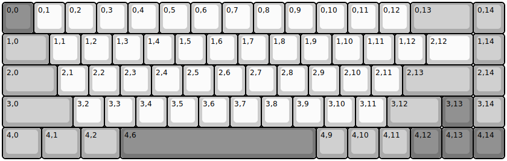{:loading="lazy"}

[Open in keyboard-layout-editor](http://www.keyboard-layout-editor.com/##@@_c=#777777;&=0,0&_c=#cccccc;&=0,1&=0,2&=0,3&=0,4&=0,5&=0,6&=0,7&=0,8&=0,9&=0,10&=0,11&=0,12&_c=#aaaaaa&w:2;&=0,13&=0,14;&@_w:1.5;&=1,0&_c=#cccccc;&=1,1&=1,2&=1,3&=1,4&=1,5&=1,6&=1,7&=1,8&=1,9&=1,10&=1,11&=1,12&_w:1.5;&=2,12&_c=#aaaaaa;&=1,14;&@_w:1.75;&=2,0&_c=#cccccc;&=2,1&=2,2&=2,3&=2,4&=2,5&=2,6&=2,7&=2,8&=2,9&=2,10&=2,11&_c=#aaaaaa&w:2.25;&=2,13&=2,14;&@_w:2.25;&=3,0&_c=#cccccc;&=3,2&=3,3&=3,4&=3,5&=3,6&=3,7&=3,8&=3,9&=3,10&=3,11&_c=#aaaaaa&w:1.75;&=3,12&_c=#777777;&=3,13&_c=#aaaaaa;&=3,14;&@_w:1.25;&=4,0&_w:1.25;&=4,1&_w:1.25;&=4,2&_c=#777777&w:6.25;&=4,6&_c=#aaaaaa;&=4,9&=4,10&=4,11&_c=#777777;&=4,12&=4,13&=4,14)

## yiancardesigns/nk87

[README](output/yiancardesigns/nk87/README.md) - [layout](output/yiancardesigns/nk87/nk87-kle.json) - [PCB](output/yiancardesigns/nk87/nk87.kicad_pcb) - [PCB render](output/yiancardesigns/nk87/nk87-render.svg)

{:loading="lazy"}

[Open in keyboard-layout-editor](http://www.keyboard-layout-editor.com/##@@_c=#777777;&=0,0&_x:0.25&c=#cccccc;&=0,1&=0,2&=0,3&=0,4&_x:0.25&c=#aaaaaa;&=0,5&=0,6&=0,7&=0,8&_x:0.25&c=#cccccc;&=0,9&=0,10&=0,11&=0,12&_x:0.25&c=#aaaaaa;&=0,13&_x:0.25;&=0,14&=0,15&=0,16;&@_y:0.25&c=#cccccc;&=1,0&=1,1&=1,2&=1,3&=1,4&=1,5&=1,6&=1,7&=1,8&=1,9&=1,10&=1,11&=1,12&_c=#aaaaaa&w:2;&=1,13&_x:0.25;&=1,14&=1,15&=1,16;&@_w:1.5;&=2,0&_c=#cccccc;&=2,1&=2,2&=2,3&=2,4&=2,5&=2,6&=2,7&=2,8&=2,9&=2,10&=2,11&=2,12&_w:1.5;&=3,12&_x:0.25&c=#aaaaaa;&=2,14&=2,15&=2,16;&@_w:1.75;&=3,0&_c=#cccccc;&=3,1&=3,2&=3,3&=3,4&=3,5&=3,6&=3,7&=3,8&=3,9&=3,10&=3,11&_c=#aaaaaa&w:2.25;&=3,13;&@_w:2.25;&=4,0&_c=#cccccc;&=4,2&=4,3&=4,4&=4,5&=4,6&=4,7&=4,8&=4,9&=4,10&=4,11&_c=#aaaaaa&w:2.75;&=4,12&_x:1.25;&=4,15;&@_w:1.5;&=5,0&=5,1&_w:1.5;&=5,2&_c=#cccccc&w:7;&=5,6&_c=#aaaaaa&w:1.5;&=5,11&=5,12&_w:1.5;&=5,13&_x:0.25;&=5,14&=5,15&=5,16)

## yiancardesigns/nk87b

[README](output/yiancardesigns/nk87b/README.md) - [layout](output/yiancardesigns/nk87b/nk87b-kle.json) - [PCB](output/yiancardesigns/nk87b/nk87b.kicad_pcb) - [PCB render](output/yiancardesigns/nk87b/nk87b-render.svg)

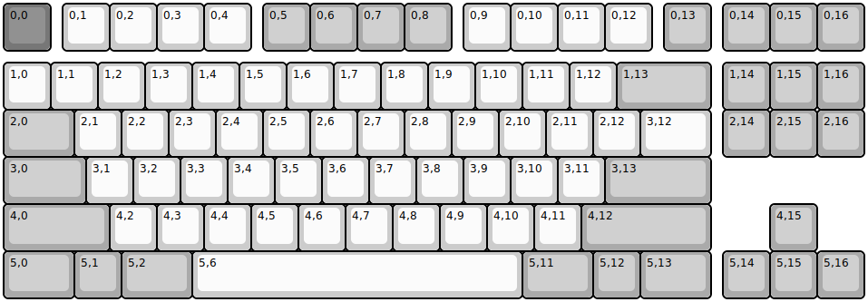{:loading="lazy"}

[Open in keyboard-layout-editor](http://www.keyboard-layout-editor.com/##@@_c=#777777;&=0,0&_x:0.25&c=#cccccc;&=0,1&=0,2&=0,3&=0,4&_x:0.25&c=#aaaaaa;&=0,5&=0,6&=0,7&=0,8&_x:0.25&c=#cccccc;&=0,9&=0,10&=0,11&=0,12&_x:0.25&c=#aaaaaa;&=0,13&_x:0.25;&=0,14&=0,15&=0,16;&@_y:0.25&c=#cccccc;&=1,0&=1,1&=1,2&=1,3&=1,4&=1,5&=1,6&=1,7&=1,8&=1,9&=1,10&=1,11&=1,12&_c=#aaaaaa&w:2;&=1,13&_x:0.25;&=1,14&=1,15&=1,16;&@_w:1.5;&=2,0&_c=#cccccc;&=2,1&=2,2&=2,3&=2,4&=2,5&=2,6&=2,7&=2,8&=2,9&=2,10&=2,11&=2,12&_w:1.5;&=3,12&_x:0.25&c=#aaaaaa;&=2,14&=2,15&=2,16;&@_w:1.75;&=3,0&_c=#cccccc;&=3,1&=3,2&=3,3&=3,4&=3,5&=3,6&=3,7&=3,8&=3,9&=3,10&=3,11&_c=#aaaaaa&w:2.25;&=3,13;&@_w:2.25;&=4,0&_c=#cccccc;&=4,2&=4,3&=4,4&=4,5&=4,6&=4,7&=4,8&=4,9&=4,10&=4,11&_c=#aaaaaa&w:2.75;&=4,12&_x:1.25;&=4,15;&@_w:1.5;&=5,0&=5,1&_w:1.5;&=5,2&_c=#cccccc&w:7;&=5,6&_c=#aaaaaa&w:1.5;&=5,11&=5,12&_w:1.5;&=5,13&_x:0.25;&=5,14&=5,15&=5,16)

## yiancardesigns/odin65/ansi/odin65_ansi

[README](output/yiancardesigns/odin65/ansi/README.md) - [layout](output/yiancardesigns/odin65/ansi/odin65_ansi-kle.json) - [PCB](output/yiancardesigns/odin65/ansi/odin65_ansi.kicad_pcb) - [PCB render](output/yiancardesigns/odin65/ansi/odin65_ansi-render.svg)

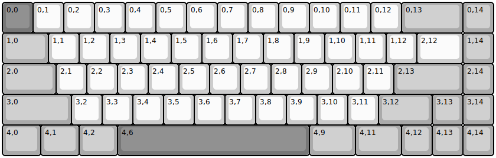{:loading="lazy"}

[Open in keyboard-layout-editor](http://www.keyboard-layout-editor.com/##@@_c=#777777;&=0,0&_c=#cccccc;&=0,1&=0,2&=0,3&=0,4&=0,5&=0,6&=0,7&=0,8&=0,9&=0,10&=0,11&=0,12&_c=#aaaaaa&w:2;&=0,13&=0,14;&@_w:1.5;&=1,0&_c=#cccccc;&=1,1&=1,2&=1,3&=1,4&=1,5&=1,6&=1,7&=1,8&=1,9&=1,10&=1,11&=1,12&_w:1.5;&=2,12&_c=#aaaaaa;&=1,14;&@_w:1.75;&=2,0&_c=#cccccc;&=2,1&=2,2&=2,3&=2,4&=2,5&=2,6&=2,7&=2,8&=2,9&=2,10&=2,11&_c=#aaaaaa&w:2.25;&=2,13&=2,14;&@_w:2.25;&=3,0&_c=#cccccc;&=3,2&=3,3&=3,4&=3,5&=3,6&=3,7&=3,8&=3,9&=3,10&=3,11&_c=#aaaaaa&w:1.75;&=3,12&=3,13&=3,14;&@_w:1.25;&=4,0&_w:1.25;&=4,1&_w:1.25;&=4,2&_c=#777777&w:6.25;&=4,6&_c=#aaaaaa&w:1.5;&=4,9&_w:1.5;&=4,11&=4,12&=4,13&=4,14)

## yiancardesigns/odin65/iso/odin65_iso

[README](output/yiancardesigns/odin65/iso/README.md) - [layout](output/yiancardesigns/odin65/iso/odin65_iso-kle.json) - [PCB](output/yiancardesigns/odin65/iso/odin65_iso.kicad_pcb) - [PCB render](output/yiancardesigns/odin65/iso/odin65_iso-render.svg)

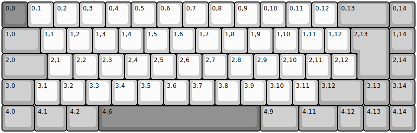{:loading="lazy"}

[Open in keyboard-layout-editor](http://www.keyboard-layout-editor.com/##@@_c=#777777;&=0,0&_c=#cccccc;&=0,1&=0,2&=0,3&=0,4&=0,5&=0,6&=0,7&=0,8&=0,9&=0,10&=0,11&=0,12&_c=#aaaaaa&w:2;&=0,13&=0,14;&@_w:1.5;&=1,0&_c=#cccccc;&=1,1&=1,2&=1,3&=1,4&=1,5&=1,6&=1,7&=1,8&=1,9&=1,10&=1,11&=1,12&_x:0.25&c=#aaaaaa&w:1.25&h:2&w2:1.5&h2:1&x2:-0.25;&=2,13&=1,14;&@_w:1.75;&=2,0&_c=#cccccc;&=2,1&=2,2&=2,3&=2,4&=2,5&=2,6&=2,7&=2,8&=2,9&=2,10&=2,11&=2,12&_x:1.25&c=#aaaaaa;&=2,14;&@_w:1.25;&=3,0&_c=#cccccc;&=3,1&=3,2&=3,3&=3,4&=3,5&=3,6&=3,7&=3,8&=3,9&=3,10&=3,11&_c=#aaaaaa&w:1.75;&=3,12&=3,13&=3,14;&@_w:1.25;&=4,0&_w:1.25;&=4,1&_w:1.25;&=4,2&_c=#777777&w:6.25;&=4,6&_c=#aaaaaa&w:1.5;&=4,9&_w:1.5;&=4,11&=4,12&=4,13&=4,14)

## yiancardesigns/p_01

[README](output/yiancardesigns/p_01/README.md) - [layout](output/yiancardesigns/p_01/p_01-kle.json) - [PCB](output/yiancardesigns/p_01/p_01.kicad_pcb) - [PCB render](output/yiancardesigns/p_01/p_01-render.svg)

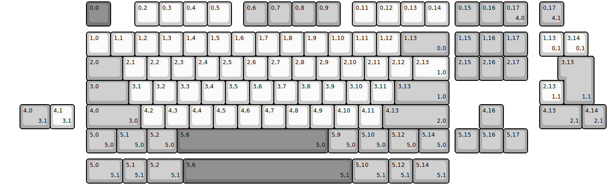{:loading="lazy"}

[Open in keyboard-layout-editor](http://www.keyboard-layout-editor.com/##@@_x:3.5&c=#777777;&=0,0&_x:1.0&c=#cccccc;&=0,2&=0,3&=0,4&=0,5&_x:0.5&c=#aaaaaa;&=0,6&=0,7&=0,8&=0,9&_x:0.5&c=#cccccc;&=0,11&=0,12&=0,13&=0,14&_x:0.25&c=#aaaaaa;&=0,15&=0,16&=0,17%0A%0A%0A4,0;&@_x:3.5&y:0.25&c=#cccccc;&=1,0&=1,1&=1,2&=1,3&=1,4&=1,5&=1,6&=1,7&=1,8&=1,9&=1,10&=1,11&=1,12&_c=#aaaaaa&w:2;&=1,13%0A%0A%0A0,0&_x:0.25;&=1,15&=1,16&=1,17;&@_x:3.5&w:1.5;&=2,0&_c=#cccccc;&=2,1&=2,2&=2,3&=2,4&=2,5&=2,6&=2,7&=2,8&=2,9&=2,10&=2,11&=2,12&_w:1.5;&=2,13%0A%0A%0A1,0&_x:0.25&c=#aaaaaa;&=2,15&=2,16&=2,17;&@_x:3.5&w:1.75;&=3,0&_c=#cccccc;&=3,1&=3,2&=3,3&=3,4&=3,5&=3,6&=3,7&=3,8&=3,9&=3,10&=3,11&_c=#aaaaaa&w:2.25;&=3,13%0A%0A%0A1,0;&@_x:3.5&w:2.25;&=4,0%0A%0A%0A3,0&_c=#cccccc;&=4,2&=4,3&=4,4&=4,5&=4,6&=4,7&=4,8&=4,9&=4,10&=4,11&_c=#aaaaaa&w:2.75;&=4,13%0A%0A%0A2,0&_x:1.25;&=4,16;&@_x:3.5&w:1.25;&=5,0%0A%0A%0A5,0&_w:1.25;&=5,1%0A%0A%0A5,0&_w:1.25;&=5,2%0A%0A%0A5,0&_c=#777777&w:6.25;&=5,6%0A%0A%0A5,0&_c=#aaaaaa&w:1.25;&=5,9%0A%0A%0A5,0&_w:1.25;&=5,10%0A%0A%0A5,0&_w:1.25;&=5,12%0A%0A%0A5,0&_w:1.25;&=5,14%0A%0A%0A5,0&_x:0.25;&=5,15&=5,16&=5,17;&@_x:22.25&y:-6.25;&=0,17%0A%0A%0A4,1%0A%0A%0A%0A%0A%0Ae0;&@_x:22.25&y:0.25&c=#cccccc;&=1,13%0A%0A%0A0,1&=3,14%0A%0A%0A0,1;&@_x:23.25&c=#aaaaaa&w:1.25&h:2&w2:1.5&h2:1&x2:-0.25;&=3,13%0A%0A%0A1,1;&@_x:22.25&c=#cccccc;&=2,13%0A%0A%0A1,1;&@_x:0.75&c=#aaaaaa&w:1.25;&=4,0%0A%0A%0A3,1&_c=#cccccc;&=4,1%0A%0A%0A3,1&_x:19.25&c=#aaaaaa&w:1.75;&=4,13%0A%0A%0A2,1&=4,14%0A%0A%0A2,1;&@_x:3.5&y:1.25&w:1.5;&=5,0%0A%0A%0A5,1&=5,1%0A%0A%0A5,1&_w:1.5;&=5,2%0A%0A%0A5,1&_c=#777777&w:7;&=5,6%0A%0A%0A5,1&_c=#aaaaaa&w:1.5;&=5,10%0A%0A%0A5,1&=5,12%0A%0A%0A5,1&_w:1.5;&=5,14%0A%0A%0A5,1)

## yiancardesigns/seigaiha

[README](output/yiancardesigns/seigaiha/README.md) - [layout](output/yiancardesigns/seigaiha/seigaiha-kle.json) - [PCB](output/yiancardesigns/seigaiha/seigaiha.kicad_pcb) - [PCB render](output/yiancardesigns/seigaiha/seigaiha-render.svg)

{:loading="lazy"}

[Open in keyboard-layout-editor](http://www.keyboard-layout-editor.com/##@@_x:0.55&y:1.15&c=#777777;&=1,0;&@_x:3.7&y:-0.95&c=#cccccc;&=0,2&_x:8.45;&=0,11;&@_x:1.7&y:-0.95;&=0,0&=0,1&_x:10.45;&=0,12&_c=#aaaaaa&w:2;&=0,14%0A%0A%0A0,0;&@_x:0.35&y:-0.1;&=2,0;&@_x:13&y:-0.95&c=#cccccc;&=1,11;&@_x:1.5&y:-0.95&c=#aaaaaa&w:1.5;&=1,1&_c=#cccccc;&=1,2&_x:10.0;&=1,12&=1,13&_c=#aaaaaa&w:1.5;&=1,14;&@_x:0.15&y:-0.1;&=3,0;&@_x:13.4&y:-0.9&c=#cccccc;&=2,11&=2,12&_c=#aaaaaa&w:2.25;&=2,14&_x:-16.35&w:1.75;&=2,1&_c=#cccccc;&=2,2;&@_x:1.05&c=#aaaaaa&w:2.25;&=3,1&_c=#cccccc;&=3,2&_x:8.8;&=3,11&=3,12&_c=#aaaaaa&w:2.75;&=3,13%0A%0A%0A1,0;&@_x:1.05&w:1.5;&=4,1&_x:13.45&w:1.5;&=4,14;&@_r:12&x:5.05&y:-6.0&c=#cccccc;&=0,3&=0,4&=0,5&=0,6;&@_x:4.6;&=1,3&=1,4&=1,5&=1,6;&@_x:4.85;&=2,3&=2,4&=2,5&=2,6;&@_x:5.3;&=3,3&=3,4&=3,5&=3,6;&@_x:6.6&c=#777777&w:2;&=4,5&_c=#aaaaaa&w:1.25;&=4,6;&@_x:5.05&y:-0.95&w:1.5;&=4,3;&@_r:-12&x:8.45&y:-1.45&c=#cccccc;&=0,7&=0,8&=0,9&=0,10;&@_x:8.05;&=1,7&=1,8&=1,9&=1,10;&@_x:8.2;&=2,7&=2,8&=2,9&=2,10;&@_x:7.75;&=3,7&=3,8&=3,9&=3,10;&@_x:7.75&c=#777777&w:2.75;&=4,8;&@_x:10.55&y:-0.95&c=#aaaaaa&w:1.5;&=4,10;&@_r:0&x:15.15&y:-8.9;&=0,13%0A%0A%0A0,1&=0,14%0A%0A%0A0,1;&@_x:18.25&y:3.25&w:1.75;&=3,13%0A%0A%0A1,1&=3,14%0A%0A%0A1,1)

## yiancardesigns/w1_at

[README](output/yiancardesigns/w1_at/README.md) - [layout](output/yiancardesigns/w1_at/w1_at-kle.json) - [PCB](output/yiancardesigns/w1_at/w1_at.kicad_pcb) - [PCB render](output/yiancardesigns/w1_at/w1_at-render.svg)

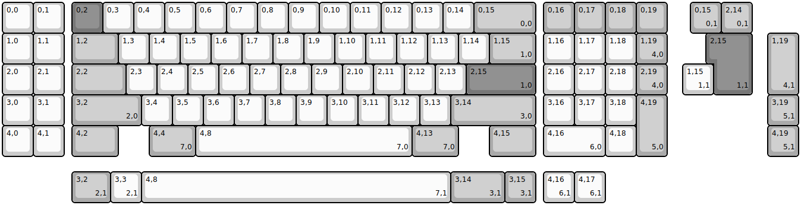{:loading="lazy"}

[Open in keyboard-layout-editor](http://www.keyboard-layout-editor.com/##@@=0,0&=0,1&_x:0.25&c=#777777;&=0,2&_c=#cccccc;&=0,3&=0,4&=0,5&=0,6&=0,7&=0,8&=0,9&=0,10&=0,11&=0,12&=0,13&=0,14&_c=#aaaaaa&w:2;&=0,15%0A%0A%0A0,0&_x:0.25;&=0,16&=0,17&=0,18&=0,19;&@_c=#cccccc;&=1,0&=1,1&_x:0.25&c=#aaaaaa&w:1.5;&=1,2&_c=#cccccc;&=1,3&=1,4&=1,5&=1,6&=1,7&=1,8&=1,9&=1,10&=1,11&=1,12&=1,13&=1,14&_c=#aaaaaa&w:1.5;&=1,15%0A%0A%0A1,0&_x:0.25&c=#cccccc;&=1,16&=1,17&=1,18&_c=#aaaaaa;&=1,19%0A%0A%0A4,0;&@_c=#cccccc;&=2,0&=2,1&_x:0.25&c=#aaaaaa&w:1.75;&=2,2&_c=#cccccc;&=2,3&=2,4&=2,5&=2,6&=2,7&=2,8&=2,9&=2,10&=2,11&=2,12&=2,13&_c=#777777&w:2.25;&=2,15%0A%0A%0A1,0&_x:0.25&c=#cccccc;&=2,16&=2,17&=2,18&_c=#aaaaaa;&=2,19%0A%0A%0A4,0;&@_c=#cccccc;&=3,0&=3,1&_x:0.25&c=#aaaaaa&w:2.25;&=3,2%0A%0A%0A2,0&_c=#cccccc;&=3,4&=3,5&=3,6&=3,7&=3,8&=3,9&=3,10&=3,11&=3,12&=3,13&_c=#aaaaaa&w:2.75;&=3,14%0A%0A%0A3,0&_x:0.25&c=#cccccc;&=3,16&=3,17&=3,18&_c=#aaaaaa&h:2;&=4,19%0A%0A%0A5,0;&@_c=#cccccc;&=4,0&=4,1&_x:0.25&c=#aaaaaa&w:1.5;&=4,2&_x:1.0&w:1.5;&=4,4%0A%0A%0A7,0&_c=#cccccc&w:7;&=4,8%0A%0A%0A7,0&_c=#aaaaaa&w:1.5;&=4,13%0A%0A%0A7,0&_x:1.0&w:1.5;&=4,15&_x:0.25&c=#cccccc&w:2;&=4,16%0A%0A%0A6,0&=4,18;&@_x:22.25&y:-5&c=#aaaaaa;&=0,15%0A%0A%0A0,1&=2,14%0A%0A%0A0,1;&@_x:23.0&c=#777777&w:1.25&h:2&w2:1.5&h2:1&x2:-0.25;&=2,15%0A%0A%0A1,1&_x:0.5&c=#aaaaaa&h:2;&=1,19%0A%0A%0A4,1;&@_x:22.0&c=#cccccc;&=1,15%0A%0A%0A1,1;&@_x:24.75&c=#aaaaaa;&=3,19%0A%0A%0A5,1;&@_x:24.75;&=4,19%0A%0A%0A5,1;&@_x:2.25&y:0.5&w:1.25;&=3,2%0A%0A%0A2,1&_c=#cccccc;&=3,3%0A%0A%0A2,1&_w:10;&=4,8%0A%0A%0A7,1&_c=#aaaaaa&w:1.75;&=3,14%0A%0A%0A3,1&=3,15%0A%0A%0A3,1&_x:0.25&c=#cccccc;&=4,16%0A%0A%0A6,1&=4,17%0A%0A%0A6,1)

## yoichiro/lunakey-mini

[README](output/yoichiro/lunakey-mini/README.md) - [layout](output/yoichiro/lunakey-mini/lunakey-mini-kle.json) - [PCB](output/yoichiro/lunakey-mini/lunakey-mini.kicad_pcb) - [PCB render](output/yoichiro/lunakey-mini/lunakey-mini-render.svg)

{:loading="lazy"}

[Open in keyboard-layout-editor](http://www.keyboard-layout-editor.com/##@@_x:3;&=0,3&_x:7;&=4,3;&@_x:4&y:-0.75;&=0,4&_x:5;&=4,4;&@_x:2&y:-0.75;&=0,2&_x:2;&=0,5&_x:3;&=4,5&_x:2;&=4,2;&@_x:3&y:-0.5;&=1,3&_x:7;&=5,3;&@_x:1&y:-0.75;&=0,1&_x:2;&=1,4&_x:5;&=5,4&_x:2;&=4,1;&@_y:-0.75&c=#aaaaaa;&=0,0&_x:1&c=#cccccc;&=1,2&_x:2;&=1,5&_x:3;&=5,5&_x:2;&=5,2&_x:1&c=#aaaaaa;&=4,0;&@_x:3&y:-0.5&c=#cccccc;&=2,3&_x:7;&=6,3;&@_x:1&y:-0.75;&=1,1&_x:2;&=2,4&_x:5;&=6,4&_x:2;&=5,1;&@_y:-0.75&c=#aaaaaa;&=1,0&_x:1&c=#cccccc;&=2,2&_x:2;&=2,5&_x:3;&=6,5&_x:2;&=6,2&_x:1;&=5,0;&@_x:1&y:-0.25;&=2,1&_x:11;&=6,1;&@_y:-0.75&c=#aaaaaa;&=2,0&_x:13;&=6,0;&@_x:4&y:-0.75;&=3,3&=3,4&_x:3;&=7,4&=7,3;&@_x:3&y:-0.75;&=3,2&_x:2&c=#cccccc;&=3,5&_x:1&c=#aaaaaa;&=7,5&_x:2;&=7,2)

## yushakobo/helix_rev3_4rows

[README](output/yushakobo/helix_rev3_4rows/README.md) - [layout](output/yushakobo/helix_rev3_4rows/helix_rev3_4rows-kle.json) - [PCB](output/yushakobo/helix_rev3_4rows/helix_rev3_4rows.kicad_pcb) - [PCB render](output/yushakobo/helix_rev3_4rows/helix_rev3_4rows-render.svg)

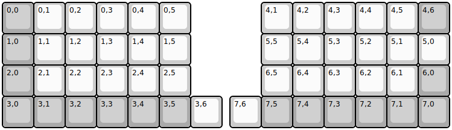{:loading="lazy"}

[Open in keyboard-layout-editor](http://www.keyboard-layout-editor.com/##@@_c=#aaaaaa;&=0,0&_c=#cccccc;&=0,1&=0,2&=0,3&=0,4&=0,5&_x:2.25;&=4,1&=4,2&=4,3&=4,4&=4,5&_c=#aaaaaa;&=4,6;&@=1,0&_c=#cccccc;&=1,1&=1,2&=1,3&=1,4&=1,5&_x:2.25;&=5,5&=5,4&=5,3&=5,2&=5,1&=5,0;&@_c=#aaaaaa;&=2,0&_c=#cccccc;&=2,1&=2,2&=2,3&=2,4&=2,5&_x:2.25;&=6,5&=6,4&=6,3&=6,2&=6,1&_c=#aaaaaa;&=6,0;&@=3,0&=3,1&=3,2&=3,3&=3,4&=3,5&_c=#cccccc;&=3,6&_x:0.25;&=7,6&_c=#aaaaaa;&=7,5&=7,4&=7,3&=7,2&=7,1&=7,0)

## yushakobo/helix_rev3_5rows

[README](output/yushakobo/helix_rev3_5rows/README.md) - [layout](output/yushakobo/helix_rev3_5rows/helix_rev3_5rows-kle.json) - [PCB](output/yushakobo/helix_rev3_5rows/helix_rev3_5rows.kicad_pcb) - [PCB render](output/yushakobo/helix_rev3_5rows/helix_rev3_5rows-render.svg)

{:loading="lazy"}

[Open in keyboard-layout-editor](http://www.keyboard-layout-editor.com/##@@=0,0&=0,1&=0,2&=0,3&=0,4&=0,5&_x:2.25;&=5,5&=5,4&=5,3&=5,2&=5,1&_c=#aaaaaa;&=5,0;&@=1,0&_c=#cccccc;&=1,1&=1,2&=1,3&=1,4&=1,5&_x:2.25;&=6,5&=6,4&=6,3&=6,2&=6,1&_c=#aaaaaa;&=6,0;&@=2,0&_c=#cccccc;&=2,1&=2,2&=2,3&=2,4&=2,5&_x:2.25;&=7,5&=7,4&=7,3&=7,2&=7,1&=7,0;&@_c=#aaaaaa;&=3,0&_c=#cccccc;&=3,1&=3,2&=3,3&=3,4&=3,5&=3,6&_x:0.25;&=8,6&=8,5&=8,4&=8,3&=8,2&=8,1&_c=#aaaaaa;&=8,0;&@=4,0&=4,1&=4,2&=4,3&=4,4&=4,5&_c=#cccccc;&=4,6&_x:0.25;&=9,6&_c=#aaaaaa;&=9,5&=9,4&=9,3&=9,2&=9,1&=9,0)

## yushakobo/quick7

[README](output/yushakobo/quick7/README.md) - [layout](output/yushakobo/quick7/quick7-kle.json) - [PCB](output/yushakobo/quick7/quick7.kicad_pcb) - [PCB render](output/yushakobo/quick7/quick7-render.svg)

{:loading="lazy"}

[Open in keyboard-layout-editor](http://www.keyboard-layout-editor.com/##@@=0,0&=0,1&=0,2;&@=1,0&=1,1&=1,2;&@=2,0&=2,1&=2,2)

## yynmt/dozen0

[README](output/yynmt/dozen0/README.md) - [layout](output/yynmt/dozen0/dozen0-kle.json) - [PCB](output/yynmt/dozen0/dozen0.kicad_pcb) - [PCB render](output/yynmt/dozen0/dozen0-render.svg)

{:loading="lazy"}

[Open in keyboard-layout-editor](http://www.keyboard-layout-editor.com/##@@=0,0%0A%0A%0A0,0&=0,1%0A%0A%0A0,0&=0,2%0A%0A%0A0,0&=0,3%0A%0A%0A0,0&=0,4%0A%0A%0A0,0&=0,5%0A%0A%0A0,0;&@=0,6%0A%0A%0A0,0&=0,7%0A%0A%0A0,0&=0,8%0A%0A%0A0,0&=0,9%0A%0A%0A0,0&=0,10%0A%0A%0A0,0&=0,11%0A%0A%0A0,0;&@=0,5%0A%0A%0A0,1&=0,11%0A%0A%0A0,1;&@=0,4%0A%0A%0A0,1&=0,10%0A%0A%0A0,1;&@=0,3%0A%0A%0A0,1&=0,9%0A%0A%0A0,1;&@=0,2%0A%0A%0A0,1&=0,8%0A%0A%0A0,1;&@=0,1%0A%0A%0A0,1&=0,7%0A%0A%0A0,1;&@=0,0%0A%0A%0A0,1&=0,6%0A%0A%0A0,1)

## zicodia/tklfrlnrlmlao

[README](output/zicodia/tklfrlnrlmlao/README.md) - [layout](output/zicodia/tklfrlnrlmlao/tklfrlnrlmlao-kle.json) - [PCB](output/zicodia/tklfrlnrlmlao/tklfrlnrlmlao.kicad_pcb) - [PCB render](output/zicodia/tklfrlnrlmlao/tklfrlnrlmlao-render.svg)

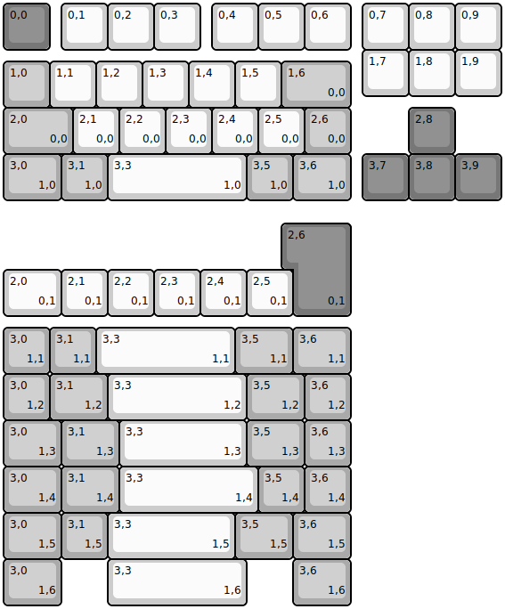{:loading="lazy"}

[Open in keyboard-layout-editor](http://www.keyboard-layout-editor.com/##@@_c=#777777;&=0,0&_x:0.25&c=#cccccc;&=0,1&=0,2&=0,3&_x:0.25;&=0,4&=0,5&=0,6&_x:0.25;&=0,7&=0,8&=0,9;&@_x:7.75;&=1,7&=1,8&=1,9;&@_y:-0.75&c=#aaaaaa;&=1,0&_c=#cccccc;&=1,1&=1,2&=1,3&=1,4&=1,5&_c=#aaaaaa&w:1.5;&=1,6%0A%0A%0A0,0;&@_w:1.5;&=2,0%0A%0A%0A0,0&_c=#cccccc;&=2,1%0A%0A%0A0,0&=2,2%0A%0A%0A0,0&=2,3%0A%0A%0A0,0&=2,4%0A%0A%0A0,0&=2,5%0A%0A%0A0,0&_c=#aaaaaa;&=2,6%0A%0A%0A0,0&_x:1.25&c=#777777;&=2,8;&@_c=#aaaaaa&w:1.25;&=3,0%0A%0A%0A1,0&=3,1%0A%0A%0A1,0&_c=#cccccc&w:3;&=3,3%0A%0A%0A1,0&_c=#aaaaaa;&=3,5%0A%0A%0A1,0&_w:1.25;&=3,6%0A%0A%0A1,0&_x:0.25&c=#777777;&=3,7&=3,8&=3,9;&@_x:6.25&y:0.5&w:1.25&h:2&w2:1.5&h2:1&x2:-0.25;&=2,6%0A%0A%0A0,1;&@_c=#cccccc&w:1.25;&=2,0%0A%0A%0A0,1&=2,1%0A%0A%0A0,1&=2,2%0A%0A%0A0,1&=2,3%0A%0A%0A0,1&=2,4%0A%0A%0A0,1&=2,5%0A%0A%0A0,1;&@_y:0.25&c=#aaaaaa;&=3,0%0A%0A%0A1,1&=3,1%0A%0A%0A1,1&_c=#cccccc&w:3;&=3,3%0A%0A%0A1,1&_c=#aaaaaa&w:1.25;&=3,5%0A%0A%0A1,1&_w:1.25;&=3,6%0A%0A%0A1,1;&@=3,0%0A%0A%0A1,2&_w:1.25;&=3,1%0A%0A%0A1,2&_c=#cccccc&w:3;&=3,3%0A%0A%0A1,2&_c=#aaaaaa&w:1.25;&=3,5%0A%0A%0A1,2&=3,6%0A%0A%0A1,2;&@_w:1.25;&=3,0%0A%0A%0A1,3&_w:1.25;&=3,1%0A%0A%0A1,3&_c=#cccccc&w:2.75;&=3,3%0A%0A%0A1,3&_c=#aaaaaa&w:1.25;&=3,5%0A%0A%0A1,3&=3,6%0A%0A%0A1,3;&@_w:1.25;&=3,0%0A%0A%0A1,4&_w:1.25;&=3,1%0A%0A%0A1,4&_c=#cccccc&w:3;&=3,3%0A%0A%0A1,4&_c=#aaaaaa;&=3,5%0A%0A%0A1,4&=3,6%0A%0A%0A1,4;&@_w:1.25;&=3,0%0A%0A%0A1,5&=3,1%0A%0A%0A1,5&_c=#cccccc&w:2.75;&=3,3%0A%0A%0A1,5&_c=#aaaaaa&w:1.25;&=3,5%0A%0A%0A1,5&_w:1.25;&=3,6%0A%0A%0A1,5;&@_w:1.25;&=3,0%0A%0A%0A1,6&_x:1.0&c=#cccccc&w:3;&=3,3%0A%0A%0A1,6&_x:1.0&c=#aaaaaa&w:1.25;&=3,6%0A%0A%0A1,6)

## ziggurat/ziggurat

[README](output/ziggurat/README.md) - [layout](output/ziggurat/ziggurat-kle.json) - [PCB](output/ziggurat/ziggurat.kicad_pcb) - [PCB render](output/ziggurat/ziggurat-render.svg)

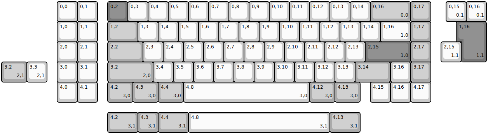{:loading="lazy"}

[Open in keyboard-layout-editor](http://www.keyboard-layout-editor.com/##@@_x:2.75;&=0,0&=0,1&_x:0.5&c=#777777;&=0,2&_c=#cccccc;&=0,3&=0,4&=0,5&=0,6&=0,7&=0,8&=0,9&=0,10&=0,11&=0,12&=0,13&=0,14&_c=#aaaaaa&w:2;&=0,16%0A%0A%0A0,0&=0,17;&@_x:2.75&c=#cccccc;&=1,0&=1,1&_x:0.5&c=#aaaaaa&w:1.5;&=1,2&_c=#cccccc;&=1,3&=1,4&=1,5&=1,6&=1,7&=1,8&=1,9&=1,10&=1,11&=1,12&=1,13&=1,14&_w:1.5;&=1,16%0A%0A%0A1,0&_c=#aaaaaa;&=1,17;&@_x:2.75&c=#cccccc;&=2,0&=2,1&_x:0.5&c=#aaaaaa&w:1.75;&=2,2&_c=#cccccc;&=2,3&=2,4&=2,5&=2,6&=2,7&=2,8&=2,9&=2,10&=2,11&=2,12&=2,13&_c=#777777&w:2.25;&=2,15%0A%0A%0A1,0&_c=#aaaaaa;&=2,17;&@_x:2.75&c=#cccccc;&=3,0&=3,1&_x:0.5&c=#aaaaaa&w:2.25;&=3,2%0A%0A%0A2,0&_c=#cccccc;&=3,4&=3,5&=3,6&=3,7&=3,8&=3,9&=3,10&=3,11&=3,12&=3,13&_c=#aaaaaa&w:1.75;&=3,14&_c=#cccccc;&=3,16&_c=#aaaaaa;&=3,17;&@_x:2.75&c=#cccccc;&=4,0&=4,1&_x:0.5&c=#aaaaaa&w:1.25;&=4,2%0A%0A%0A3,0&_w:1.25;&=4,3%0A%0A%0A3,0&_w:1.25;&=4,4%0A%0A%0A3,0&_c=#cccccc&w:6.25;&=4,8%0A%0A%0A3,0&_c=#aaaaaa&w:1.25;&=4,12%0A%0A%0A3,0&_w:1.25;&=4,13%0A%0A%0A3,0&_x:0.5&c=#cccccc;&=4,15&=4,16&=4,17;&@_x:22.0&y:-5;&=0,15%0A%0A%0A0,1&=0,16%0A%0A%0A0,1;&@_x:22.75&c=#777777&w:1.25&h:2&w2:1.5&h2:1&x2:-0.25;&=1,16%0A%0A%0A1,1;&@_x:21.75&c=#cccccc;&=2,15%0A%0A%0A1,1;&@_c=#aaaaaa&w:1.25;&=3,2%0A%0A%0A2,1&_c=#cccccc;&=3,3%0A%0A%0A2,1;&@_x:5.25&y:1.5&c=#aaaaaa&w:1.5;&=4,2%0A%0A%0A3,1&=4,3%0A%0A%0A3,1&_w:1.5;&=4,4%0A%0A%0A3,1&_c=#cccccc&w:7;&=4,8%0A%0A%0A3,1&_c=#aaaaaa&w:1.5;&=4,13%0A%0A%0A3,1)

## zoo/wampus

[README](output/zoo/README.md) - [layout](output/zoo/wampus-kle.json) - [PCB](output/zoo/wampus.kicad_pcb) - [PCB render](output/zoo/wampus-render.svg)

{:loading="lazy"}

[Open in keyboard-layout-editor](http://www.keyboard-layout-editor.com/##@@_x:0.55&y:1.15&c=#777777;&=1,0;&@_x:3.7&y:-0.95&c=#cccccc;&=0,2&_x:8.45;&=0,11;&@_x:1.7&y:-0.95;&=0,0&=0,1&_x:10.45;&=0,12&=0,13%0A%0A%0A0,0&_c=#aaaaaa;&=0,14%0A%0A%0A0,0;&@_x:0.35&y:-0.1;&=2,0;&@_x:13&y:-0.95&c=#cccccc;&=1,11;&@_x:1.5&y:-0.95&c=#aaaaaa&w:1.5;&=1,1&_c=#cccccc;&=1,2&_x:10.0;&=1,12&=1,13&_c=#aaaaaa&w:1.5;&=1,14;&@_x:0.15&y:-0.1;&=3,0;&@_x:13.4&y:-0.9&c=#cccccc;&=2,11&=2,12&_c=#777777&w:2.25;&=2,13&_x:-16.35&c=#aaaaaa&w:1.75;&=2,1&_c=#cccccc;&=2,2;&@_x:1.05&c=#aaaaaa&w:2.25;&=3,1&_c=#cccccc;&=3,2&_x:8.8;&=3,11&=3,12&_c=#aaaaaa&w:1.75;&=3,13%0A%0A%0A1,0&=3,14%0A%0A%0A1,0;&@_x:1.05&w:1.5;&=4,1&_x:13.45&w:1.5;&=4,14;&@_r:12&x:5.05&y:-6.0&c=#cccccc;&=0,3&=0,4&=0,5&=0,6;&@_x:4.6;&=1,3&=1,4&=1,5&=1,6;&@_x:4.85;&=2,3&=2,4&=2,5&=2,6;&@_x:5.3;&=3,3&=3,4&=3,5&=3,6;&@_x:6.6&c=#777777&w:2;&=4,5&_c=#aaaaaa&w:1.25;&=4,6;&@_x:5.05&y:-0.95&w:1.5;&=4,3;&@_r:-12&x:8.45&y:-1.45&c=#cccccc;&=0,7&=0,8&=0,9&=0,10;&@_x:8.05;&=1,7&=1,8&=1,9&=1,10;&@_x:8.2;&=2,7&=2,8&=2,9&=2,10;&@_x:7.75;&=3,7&=3,8&=3,9&=3,10;&@_x:7.75&c=#777777&w:2.75;&=4,8;&@_x:10.55&y:-0.95&c=#aaaaaa&w:1.5;&=4,10;&@_r:0&x:15.15&y:-8.75&w:2;&=0,13%0A%0A%0A0,1;&@_x:18.15&y:3.1&w:2.75;&=3,13%0A%0A%0A1,1)

## zsa/moonlander

[README](output/zsa/README.md) - [layout](output/zsa/moonlander-kle.json) - [PCB](output/zsa/moonlander.kicad_pcb) - [PCB render](output/zsa/moonlander-render.svg)

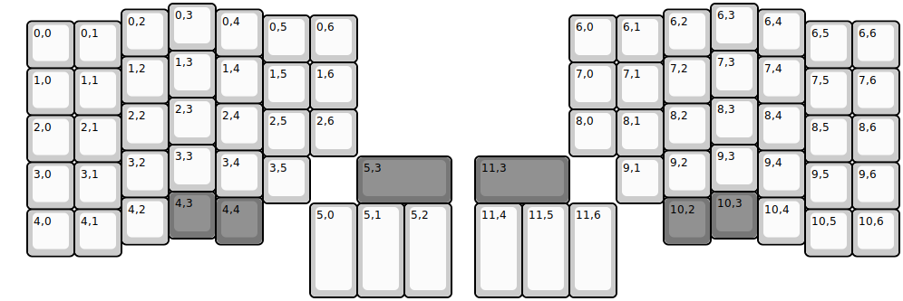{:loading="lazy"}

[Open in keyboard-layout-editor](http://www.keyboard-layout-editor.com/##@@_x:3.5;&=0,3&_x:10.5;&=6,3;&@_x:2.5&y:-0.875;&=0,2&_x:1.0;&=0,4&_x:8.5;&=6,2&_x:1.0;&=6,4;&@_x:5.5&y:-0.875;&=0,5&=0,6&_x:4.5;&=6,0&=6,1;&@_x:0.5&y:-0.875;&=0,0&=0,1&_x:14.5;&=6,5&=6,6;&@_x:3.5&y:-0.375;&=1,3&_x:10.5;&=7,3;&@_x:2.5&y:-0.875;&=1,2&_x:1.0;&=1,4&_x:8.5;&=7,2&_x:1.0;&=7,4;&@_x:5.5&y:-0.875;&=1,5&=1,6&_x:4.5;&=7,0&=7,1;&@_x:0.5&y:-0.875;&=1,0&=1,1&_x:14.5;&=7,5&=7,6;&@_x:3.5&y:-0.375;&=2,3&_x:10.5;&=8,3;&@_x:2.5&y:-0.875;&=2,2&_x:1.0;&=2,4&_x:8.5;&=8,2&_x:1.0;&=8,4;&@_x:5.5&y:-0.875;&=2,5&=2,6&_x:4.5;&=8,0&=8,1;&@_x:0.5&y:-0.875;&=2,0&=2,1&_x:14.5;&=8,5&=8,6;&@_x:3.5&y:-0.375;&=3,3&_x:10.5;&=9,3;&@_x:2.5&y:-0.875;&=3,2&_x:1.0;&=3,4&_x:8.5;&=9,2&_x:1.0;&=9,4;&@_x:5.5&y:-0.875;&=3,5&_x:1.0&c=#777777&w:2;&=5,3&_x:0.5&w:2;&=11,3&_x:1.0&c=#cccccc;&=9,1;&@_x:0.5&y:-0.875;&=3,0&=3,1&_x:14.5;&=9,5&=9,6;&@_x:3.5&y:-0.375&c=#777777;&=4,3&_x:10.5;&=10,3;&@_x:2.5&y:-0.875&c=#cccccc;&=4,2&_x:1.0&c=#777777;&=4,4&_x:8.5;&=10,2&_x:1.0&c=#cccccc;&=10,4;&@_x:6.5&y:-0.875&h:2;&=5,0&_h:2;&=5,1&_h:2;&=5,2&_x:0.5&h:2;&=11,4&_h:2;&=11,5&_h:2;&=11,6;&@_x:0.5&y:-0.875;&=4,0&=4,1&_x:14.5;&=10,5&=10,6)

## zx60/zx60_via

[README](output/zx60/README.md) - [layout](output/zx60/zx60_via-kle.json) - [PCB](output/zx60/zx60_via.kicad_pcb) - [PCB render](output/zx60/zx60_via-render.svg)

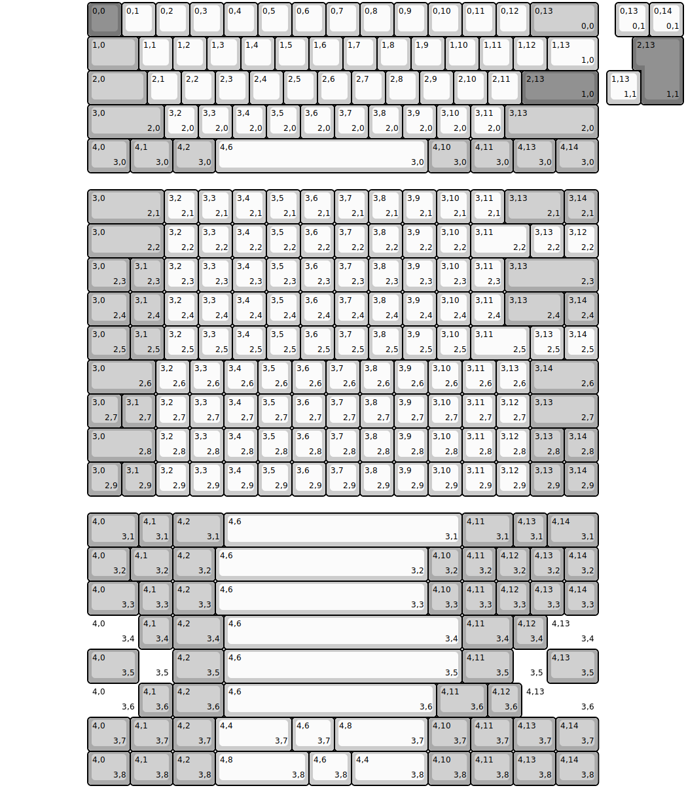{:loading="lazy"}

[Open in keyboard-layout-editor](http://www.keyboard-layout-editor.com/##@@_x:2.5&c=#777777;&=0,0&_c=#cccccc;&=0,1&=0,2&=0,3&=0,4&=0,5&=0,6&=0,7&=0,8&=0,9&=0,10&=0,11&=0,12&_c=#aaaaaa&w:2;&=0,13%0A%0A%0A0,0;&@_x:2.5&w:1.5;&=1,0&_c=#cccccc;&=1,1&=1,2&=1,3&=1,4&=1,5&=1,6&=1,7&=1,8&=1,9&=1,10&=1,11&=1,12&_w:1.5;&=1,13%0A%0A%0A1,0;&@_x:2.5&c=#aaaaaa&w:1.75;&=2,0&_c=#cccccc;&=2,1&=2,2&=2,3&=2,4&=2,5&=2,6&=2,7&=2,8&=2,9&=2,10&=2,11&_c=#777777&w:2.25;&=2,13%0A%0A%0A1,0;&@_x:2.5&c=#aaaaaa&w:2.25;&=3,0%0A%0A%0A2,0&_c=#cccccc;&=3,2%0A%0A%0A2,0&=3,3%0A%0A%0A2,0&=3,4%0A%0A%0A2,0&=3,5%0A%0A%0A2,0&=3,6%0A%0A%0A2,0&=3,7%0A%0A%0A2,0&=3,8%0A%0A%0A2,0&=3,9%0A%0A%0A2,0&=3,10%0A%0A%0A2,0&=3,11%0A%0A%0A2,0&_c=#aaaaaa&w:2.75;&=3,13%0A%0A%0A2,0;&@_x:2.5&w:1.25;&=4,0%0A%0A%0A3,0&_w:1.25;&=4,1%0A%0A%0A3,0&_w:1.25;&=4,2%0A%0A%0A3,0&_c=#cccccc&w:6.25;&=4,6%0A%0A%0A3,0&_c=#aaaaaa&w:1.25;&=4,10%0A%0A%0A3,0&_w:1.25;&=4,11%0A%0A%0A3,0&_w:1.25;&=4,13%0A%0A%0A3,0&_w:1.25;&=4,14%0A%0A%0A3,0;&@_x:18.0&y:-5&c=#cccccc;&=0,13%0A%0A%0A0,1&=0,14%0A%0A%0A0,1;&@_x:18.75&c=#777777&w:1.25&h:2&w2:1.5&h2:1&x2:-0.25;&=2,13%0A%0A%0A1,1;&@_x:17.75&c=#cccccc;&=1,13%0A%0A%0A1,1;&@_x:2.5&y:2.5&c=#aaaaaa&w:2.25;&=3,0%0A%0A%0A2,1&_c=#cccccc;&=3,2%0A%0A%0A2,1&=3,3%0A%0A%0A2,1&=3,4%0A%0A%0A2,1&=3,5%0A%0A%0A2,1&=3,6%0A%0A%0A2,1&=3,7%0A%0A%0A2,1&=3,8%0A%0A%0A2,1&=3,9%0A%0A%0A2,1&=3,10%0A%0A%0A2,1&=3,11%0A%0A%0A2,1&_c=#aaaaaa&w:1.75;&=3,13%0A%0A%0A2,1&=3,14%0A%0A%0A2,1;&@_x:2.5&w:2.25;&=3,0%0A%0A%0A2,2&_c=#cccccc;&=3,2%0A%0A%0A2,2&=3,3%0A%0A%0A2,2&=3,4%0A%0A%0A2,2&=3,5%0A%0A%0A2,2&=3,6%0A%0A%0A2,2&=3,7%0A%0A%0A2,2&=3,8%0A%0A%0A2,2&=3,9%0A%0A%0A2,2&=3,10%0A%0A%0A2,2&_w:1.75;&=3,11%0A%0A%0A2,2&=3,13%0A%0A%0A2,2&=3,12%0A%0A%0A2,2;&@_x:2.5&c=#aaaaaa&w:1.25;&=3,0%0A%0A%0A2,3&=3,1%0A%0A%0A2,3&_c=#cccccc;&=3,2%0A%0A%0A2,3&=3,3%0A%0A%0A2,3&=3,4%0A%0A%0A2,3&=3,5%0A%0A%0A2,3&=3,6%0A%0A%0A2,3&=3,7%0A%0A%0A2,3&=3,8%0A%0A%0A2,3&=3,9%0A%0A%0A2,3&=3,10%0A%0A%0A2,3&=3,11%0A%0A%0A2,3&_c=#aaaaaa&w:2.75;&=3,13%0A%0A%0A2,3;&@_x:2.5&w:1.25;&=3,0%0A%0A%0A2,4&=3,1%0A%0A%0A2,4&_c=#cccccc;&=3,2%0A%0A%0A2,4&=3,3%0A%0A%0A2,4&=3,4%0A%0A%0A2,4&=3,5%0A%0A%0A2,4&=3,6%0A%0A%0A2,4&=3,7%0A%0A%0A2,4&=3,8%0A%0A%0A2,4&=3,9%0A%0A%0A2,4&=3,10%0A%0A%0A2,4&=3,11%0A%0A%0A2,4&_c=#aaaaaa&w:1.75;&=3,13%0A%0A%0A2,4&=3,14%0A%0A%0A2,4;&@_x:2.5&w:1.25;&=3,0%0A%0A%0A2,5&=3,1%0A%0A%0A2,5&_c=#cccccc;&=3,2%0A%0A%0A2,5&=3,3%0A%0A%0A2,5&=3,4%0A%0A%0A2,5&=3,5%0A%0A%0A2,5&=3,6%0A%0A%0A2,5&=3,7%0A%0A%0A2,5&=3,8%0A%0A%0A2,5&=3,9%0A%0A%0A2,5&=3,10%0A%0A%0A2,5&_w:1.75;&=3,11%0A%0A%0A2,5&=3,13%0A%0A%0A2,5&=3,14%0A%0A%0A2,5;&@_x:2.5&c=#aaaaaa&w:2;&=3,0%0A%0A%0A2,6&_c=#cccccc;&=3,2%0A%0A%0A2,6&=3,3%0A%0A%0A2,6&=3,4%0A%0A%0A2,6&=3,5%0A%0A%0A2,6&=3,6%0A%0A%0A2,6&=3,7%0A%0A%0A2,6&=3,8%0A%0A%0A2,6&=3,9%0A%0A%0A2,6&=3,10%0A%0A%0A2,6&=3,11%0A%0A%0A2,6&=3,13%0A%0A%0A2,6&_c=#aaaaaa&w:2;&=3,14%0A%0A%0A2,6;&@_x:2.5;&=3,0%0A%0A%0A2,7&=3,1%0A%0A%0A2,7&_c=#cccccc;&=3,2%0A%0A%0A2,7&=3,3%0A%0A%0A2,7&=3,4%0A%0A%0A2,7&=3,5%0A%0A%0A2,7&=3,6%0A%0A%0A2,7&=3,7%0A%0A%0A2,7&=3,8%0A%0A%0A2,7&=3,9%0A%0A%0A2,7&=3,10%0A%0A%0A2,7&=3,11%0A%0A%0A2,7&=3,12%0A%0A%0A2,7&_c=#aaaaaa&w:2;&=3,13%0A%0A%0A2,7;&@_x:2.5&w:2;&=3,0%0A%0A%0A2,8&_c=#cccccc;&=3,2%0A%0A%0A2,8&=3,3%0A%0A%0A2,8&=3,4%0A%0A%0A2,8&=3,5%0A%0A%0A2,8&=3,6%0A%0A%0A2,8&=3,7%0A%0A%0A2,8&=3,8%0A%0A%0A2,8&=3,9%0A%0A%0A2,8&=3,10%0A%0A%0A2,8&=3,11%0A%0A%0A2,8&=3,12%0A%0A%0A2,8&_c=#aaaaaa;&=3,13%0A%0A%0A2,8&=3,14%0A%0A%0A2,8;&@_x:2.5;&=3,0%0A%0A%0A2,9&=3,1%0A%0A%0A2,9&_c=#cccccc;&=3,2%0A%0A%0A2,9&=3,3%0A%0A%0A2,9&=3,4%0A%0A%0A2,9&=3,5%0A%0A%0A2,9&=3,6%0A%0A%0A2,9&=3,7%0A%0A%0A2,9&=3,8%0A%0A%0A2,9&=3,9%0A%0A%0A2,9&=3,10%0A%0A%0A2,9&=3,11%0A%0A%0A2,9&=3,12%0A%0A%0A2,9&_c=#aaaaaa;&=3,13%0A%0A%0A2,9&=3,14%0A%0A%0A2,9;&@_x:2.5&y:0.5&w:1.5;&=4,0%0A%0A%0A3,1&=4,1%0A%0A%0A3,1&_w:1.5;&=4,2%0A%0A%0A3,1&_c=#cccccc&w:7;&=4,6%0A%0A%0A3,1&_c=#aaaaaa&w:1.5;&=4,11%0A%0A%0A3,1&=4,13%0A%0A%0A3,1&_w:1.5;&=4,14%0A%0A%0A3,1;&@_x:2.5&w:1.25;&=4,0%0A%0A%0A3,2&_w:1.25;&=4,1%0A%0A%0A3,2&_w:1.25;&=4,2%0A%0A%0A3,2&_c=#cccccc&w:6.25;&=4,6%0A%0A%0A3,2&_c=#aaaaaa;&=4,10%0A%0A%0A3,2&=4,11%0A%0A%0A3,2&=4,12%0A%0A%0A3,2&=4,13%0A%0A%0A3,2&=4,14%0A%0A%0A3,2;&@_x:2.5&w:1.5;&=4,0%0A%0A%0A3,3&=4,1%0A%0A%0A3,3&_w:1.25;&=4,2%0A%0A%0A3,3&_c=#cccccc&w:6.25;&=4,6%0A%0A%0A3,3&_c=#aaaaaa;&=4,10%0A%0A%0A3,3&=4,11%0A%0A%0A3,3&=4,12%0A%0A%0A3,3&=4,13%0A%0A%0A3,3&=4,14%0A%0A%0A3,3;&@_x:2.5&w:1.5&d:true;&=4,0%0A%0A%0A3,4&=4,1%0A%0A%0A3,4&_w:1.5;&=4,2%0A%0A%0A3,4&_c=#cccccc&w:7;&=4,6%0A%0A%0A3,4&_c=#aaaaaa&w:1.5;&=4,11%0A%0A%0A3,4&=4,12%0A%0A%0A3,4&_w:1.5&d:true;&=4,13%0A%0A%0A3,4;&@_x:2.5&w:1.5;&=4,0%0A%0A%0A3,5&_d:true;&=%0A%0A%0A3,5&_w:1.5;&=4,2%0A%0A%0A3,5&_c=#cccccc&w:7;&=4,6%0A%0A%0A3,5&_c=#aaaaaa&w:1.5;&=4,11%0A%0A%0A3,5&_d:true;&=%0A%0A%0A3,5&_w:1.5;&=4,13%0A%0A%0A3,5;&@_x:2.5&w:1.5&d:true;&=4,0%0A%0A%0A3,6&=4,1%0A%0A%0A3,6&_w:1.5;&=4,2%0A%0A%0A3,6&_c=#cccccc&w:6.25;&=4,6%0A%0A%0A3,6&_c=#aaaaaa&w:1.5;&=4,11%0A%0A%0A3,6&=4,12%0A%0A%0A3,6&_w:2.25&d:true;&=4,13%0A%0A%0A3,6;&@_x:2.5&w:1.25;&=4,0%0A%0A%0A3,7&_w:1.25;&=4,1%0A%0A%0A3,7&_w:1.25;&=4,2%0A%0A%0A3,7&_c=#cccccc&w:2.25;&=4,4%0A%0A%0A3,7&_w:1.25;&=4,6%0A%0A%0A3,7&_w:2.75;&=4,8%0A%0A%0A3,7&_c=#aaaaaa&w:1.256;&=4,10%0A%0A%0A3,7&_x:-0.006&w:1.256;&=4,11%0A%0A%0A3,7&_x:-0.006&w:1.256;&=4,13%0A%0A%0A3,7&_x:-0.006&w:1.256;&=4,14%0A%0A%0A3,7;&@_x:2.5&w:1.25;&=4,0%0A%0A%0A3,8&_w:1.25;&=4,1%0A%0A%0A3,8&_w:1.25;&=4,2%0A%0A%0A3,8&_c=#cccccc&w:2.75;&=4,8%0A%0A%0A3,8&_w:1.25;&=4,6%0A%0A%0A3,8&_w:2.25;&=4,4%0A%0A%0A3,8&_c=#aaaaaa&w:1.256;&=4,10%0A%0A%0A3,8&_x:-0.006&w:1.256;&=4,11%0A%0A%0A3,8&_x:-0.006&w:1.256;&=4,13%0A%0A%0A3,8&_x:-0.006&w:1.256;&=4,14%0A%0A%0A3,8)

## zykrah/fuyu

[README](output/zykrah/README.md) - [layout](output/zykrah/fuyu-kle.json) - [PCB](output/zykrah/fuyu.kicad_pcb) - [PCB render](output/zykrah/fuyu-render.svg)

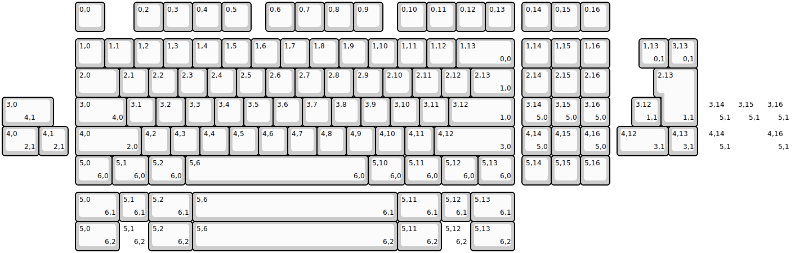{:loading="lazy"}

[Open in keyboard-layout-editor](http://www.keyboard-layout-editor.com/##@@_x:2.5;&=0,0&_x:1.0;&=0,2&=0,3&=0,4&=0,5&_x:0.5;&=0,6&=0,7&=0,8&=0,9&_x:0.5;&=0,10&=0,11&=0,12&=0,13&_x:0.25;&=0,14&=0,15&=0,16;&@_x:2.5&y:0.25;&=1,0&=1,1&=1,2&=1,3&=1,4&=1,5&=1,6&=1,7&=1,8&=1,9&=1,10&=1,11&=1,12&_w:2;&=1,13%0A%0A%0A0,0&_x:0.25;&=1,14&=1,15&=1,16;&@_x:2.5&w:1.5;&=2,0&=2,1&=2,2&=2,3&=2,4&=2,5&=2,6&=2,7&=2,8&=2,9&=2,10&=2,11&=2,12&_w:1.5;&=2,13%0A%0A%0A1,0&_x:0.25;&=2,14&=2,15&=2,16;&@_x:2.5&w:1.75;&=3,0%0A%0A%0A4,0&=3,1&=3,2&=3,3&=3,4&=3,5&=3,6&=3,7&=3,8&=3,9&=3,10&=3,11&_w:2.25;&=3,12%0A%0A%0A1,0&_x:0.25;&=3,14%0A%0A%0A5,0&=3,15%0A%0A%0A5,0&=3,16%0A%0A%0A5,0;&@_x:2.5&w:2.25;&=4,0%0A%0A%0A2,0&=4,2&=4,3&=4,4&=4,5&=4,6&=4,7&=4,8&=4,9&=4,10&=4,11&_w:2.75;&=4,12%0A%0A%0A3,0&_x:0.25;&=4,14%0A%0A%0A5,0&=4,15&=4,16%0A%0A%0A5,0;&@_x:2.5&w:1.25;&=5,0%0A%0A%0A6,0&_w:1.25;&=5,1%0A%0A%0A6,0&_w:1.25;&=5,2%0A%0A%0A6,0&_w:6.25;&=5,6%0A6.25U%0A%0A6,0&_w:1.25;&=5,10%0A%0A%0A6,0&_w:1.25;&=5,11%0A%0A%0A6,0&_w:1.25;&=5,12%0A%0A%0A6,0&_w:1.25;&=5,13%0A%0A%0A6,0&_x:0.25;&=5,14&=5,15&=5,16;&@_x:21.75&y:-5.0;&=1,13%0A%0A%0A0,1&=3,13%0A%0A%0A0,1;&@_x:22.5&w:1.25&h:2&w2:1.5&h2:1&x2:-0.25;&=2,13%0A%0A%0A1,1;&@_w:1.25&w2:1.75&l:true;&=3,0%0A%0A%0A4,1&_x:20.25;&=3,12%0A%0A%0A1,1&_x:1.5&d:true;&=3,14%0A%0A%0A5,1&_d:true;&=3,15%0A%0A%0A5,1&_d:true;&=3,16%0A%0A%0A5,1;&@_w:1.25;&=4,0%0A%0A%0A2,1&=4,1%0A%0A%0A2,1&_x:18.75&w:1.75;&=4,12%0A%0A%0A3,1&=4,13%0A%0A%0A3,1&_x:0.25&d:true;&=4,14%0A%0A%0A5,1&_x:1.0&d:true;&=4,16%0A%0A%0A5,1;&@_x:2.5&y:1.25&w:1.5;&=5,0%0A%0A%0A6,1&=5,1%0A%0A%0A6,1&_w:1.5;&=5,2%0A%0A%0A6,1&_w:7;&=5,6%0A7U%0A%0A6,1&_w:1.5;&=5,11%0A%0A%0A6,1&=5,12%0A%0A%0A6,1&_w:1.5;&=5,13%0A%0A%0A6,1;&@_x:2.5&w:1.5;&=5,0%0A%0A%0A6,2&_d:true;&=5,1%0A%0A%0A6,2&_w:1.5;&=5,2%0A%0A%0A6,2&_w:7;&=5,6%0AWKL%0A%0A6,2&_w:1.5;&=5,11%0A%0A%0A6,2&_d:true;&=5,12%0A%0A%0A6,2&_w:1.5;&=5,13%0A%0A%0A6,2)

## zykrah/slime88

[README](output/zykrah/README.md) - [layout](output/zykrah/slime88-kle.json) - [PCB](output/zykrah/slime88.kicad_pcb) - [PCB render](output/zykrah/slime88-render.svg)

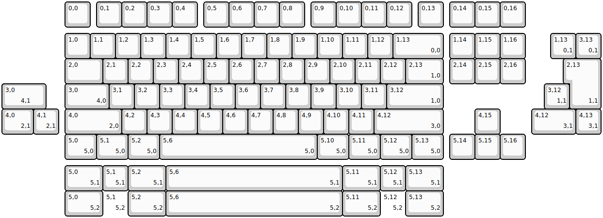{:loading="lazy"}

[Open in keyboard-layout-editor](http://www.keyboard-layout-editor.com/##@@_x:2.5;&=0,0&_x:0.25;&=0,1&=0,2&=0,3&=0,4&_x:0.25;&=0,5&=0,6&=0,7&=0,8&_x:0.25;&=0,9&=0,10&=0,11&=0,12&_x:0.25;&=0,13&_x:0.25;&=0,14&=0,15&=0,16;&@_x:2.5&y:0.25;&=1,0&=1,1&=1,2&=1,3&=1,4&=1,5&=1,6&=1,7&=1,8&=1,9&=1,10&=1,11&=1,12&_w:2;&=1,13%0A%0A%0A0,0&_x:0.25;&=1,14&=1,15&=1,16;&@_x:2.5&w:1.5;&=2,0&=2,1&=2,2&=2,3&=2,4&=2,5&=2,6&=2,7&=2,8&=2,9&=2,10&=2,11&=2,12&_w:1.5;&=2,13%0A%0A%0A1,0&_x:0.25;&=2,14&=2,15&=2,16;&@_x:2.5&w:1.75;&=3,0%0A%0A%0A4,0&=3,1&=3,2&=3,3&=3,4&=3,5&=3,6&=3,7&=3,8&=3,9&=3,10&=3,11&_w:2.25;&=3,12%0A%0A%0A1,0;&@_x:2.5&w:2.25;&=4,0%0A%0A%0A2,0&=4,2&=4,3&=4,4&=4,5&=4,6&=4,7&=4,8&=4,9&=4,10&=4,11&_w:2.75;&=4,12%0A%0A%0A3,0&_x:1.25;&=4,15;&@_x:2.5&w:1.25;&=5,0%0A%0A%0A5,0&_w:1.25;&=5,1%0A%0A%0A5,0&_w:1.25;&=5,2%0A%0A%0A5,0&_w:6.25;&=5,6%0A%0A%0A5,0&_w:1.25;&=5,10%0A%0A%0A5,0&_w:1.25;&=5,11%0A%0A%0A5,0&_w:1.25;&=5,12%0A%0A%0A5,0&_w:1.25;&=5,13%0A%0A%0A5,0&_x:0.25;&=5,14&=5,15&=5,16;&@_x:21.75&y:-5.0;&=1,13%0A%0A%0A0,1&=3,13%0A%0A%0A0,1;&@_x:22.5&w:1.25&h:2&w2:1.5&h2:1&x2:-0.25;&=2,13%0A%0A%0A1,1;&@_w:1.25&w2:1.75&l:true;&=3,0%0A%0A%0A4,1&_x:20.25;&=3,12%0A%0A%0A1,1;&@_w:1.25;&=4,0%0A%0A%0A2,1&=4,1%0A%0A%0A2,1&_x:18.75&w:1.75;&=4,12%0A%0A%0A3,1&=4,13%0A%0A%0A3,1;&@_x:2.5&y:1.25&w:1.5;&=5,0%0A%0A%0A5,1&=5,1%0A%0A%0A5,1&_w:1.5;&=5,2%0A%0A%0A5,1&_w:7;&=5,6%0A%0A%0A5,1&_w:1.5;&=5,11%0A%0A%0A5,1&=5,12%0A%0A%0A5,1&_w:1.5;&=5,13%0A%0A%0A5,1;&@_x:2.5&w:1.5;&=5,0%0A%0A%0A5,2&_d:true;&=5,1%0A%0A%0A5,2&_w:1.5;&=5,2%0A%0A%0A5,2&_w:7;&=5,6%0A%0A%0A5,2&_w:1.5;&=5,11%0A%0A%0A5,2&_d:true;&=5,12%0A%0A%0A5,2&_w:1.5;&=5,13%0A%0A%0A5,2)

---
[via](https://github.com/the-via/keyboards.git) revision 493a543e69824b2d46ec47677f0949387b7bdc67