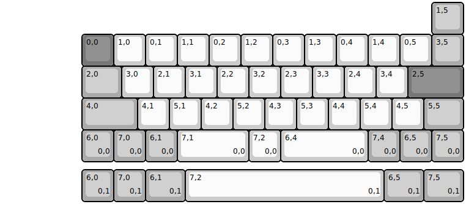
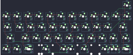

## 0xcb/static

[layout](static-kle.json) - [PCB](static.kicad_pcb)

{:loading="lazy"}

[Open in keyboard-layout-editor](http://www.keyboard-layout-editor.com/##@@_x:13.5&c=#aaaaaa;&=1,5;&@_x:2.5&c=#777777;&=0,0&_c=#cccccc;&=1,0&=0,1&=1,1&=0,2&=1,2&=0,3&=1,3&=0,4&=1,4&=0,5&_c=#aaaaaa;&=3,5;&@_x:2.5&w:1.25;&=2,0&_c=#cccccc;&=3,0&=2,1&=3,1&=2,2&=3,2&=2,3&=3,3&=2,4&=3,4&_c=#777777&w:1.75;&=2,5;&@_x:2.5&c=#aaaaaa&w:1.75;&=4,0&_c=#cccccc;&=4,1&=5,1&=4,2&=5,2&=4,3&=5,3&=4,4&=5,4&=4,5&_c=#aaaaaa&w:1.25;&=5,5;&@_x:2.5;&=6,0%0A%0A%0A0,0&=7,0%0A%0A%0A0,0&=6,1%0A%0A%0A0,0&_c=#cccccc&w:2.25;&=7,1%0A%0A%0A0,0&=7,2%0A%0A%0A0,0&_w:2.75;&=6,4%0A%0A%0A0,0&_c=#aaaaaa;&=7,4%0A%0A%0A0,0&=6,5%0A%0A%0A0,0&=7,5%0A%0A%0A0,0;&@_x:2.5&y:0.25;&=6,0%0A%0A%0A0,1&=7,0%0A%0A%0A0,1&_w:1.25;&=6,1%0A%0A%0A0,1&_c=#cccccc&w:6.25;&=7,2%0A%0A%0A0,1&_c=#aaaaaa&w:1.25;&=6,5%0A%0A%0A0,1&_w:1.25;&=7,5%0A%0A%0A0,1)

{:loading="lazy"}

