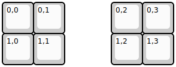
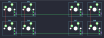

## 0xcb/tutelpad

[layout](tutelpad-kle.json) - [PCB](tutelpad.kicad_pcb)

{:loading="lazy"}

[Open in keyboard-layout-editor](http://www.keyboard-layout-editor.com/##@@=0,0&=0,1&_x:1.5;&=0,2&=0,3;&@=1,0&=1,1&_x:1.5;&=1,2&=1,3)

{:loading="lazy"}

