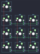

## 10bleoledhub/10bleoledhub

[layout](10bleoledhub-kle.json) - [PCB](10bleoledhub.kicad_pcb)

{:loading="lazy"}

[Open in keyboard-layout-editor](http://www.keyboard-layout-editor.com/##@@=0,0;&@=1,0&=1,1&=1,2;&@=2,0&=2,1&=2,2;&@=3,0&=3,1&=3,2)

{:loading="lazy"}

