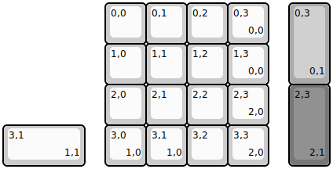
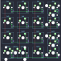
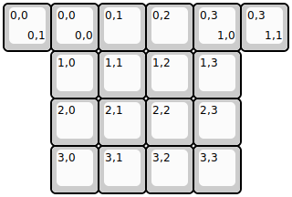
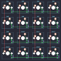

## 1upkeyboards/sweet16/sweet16v1

[layout](sweet16v1-kle.json) - [PCB](sweet16v1.kicad_pcb)

{:loading="lazy"}

[Open in keyboard-layout-editor](http://www.keyboard-layout-editor.com/##@@_x:2.5;&=0,0&=0,1&=0,2&=0,3%0A%0A%0A0,0;&@_x:2.5;&=1,0&=1,1&=1,2&=1,3%0A%0A%0A0,0;&@_x:2.5;&=2,0&=2,1&=2,2&=2,3%0A%0A%0A2,0;&@_x:2.5;&=3,0%0A%0A%0A1,0&=3,1%0A%0A%0A1,0&=3,2&=3,3%0A%0A%0A2,0;&@_x:7.0&y:-4&c=#aaaaaa&h:2;&=0,3%0A%0A%0A0,1;&@_x:7.0&y:1&c=#777777&h:2;&=2,3%0A%0A%0A2,1;&@_c=#cccccc&w:2;&=3,1%0A%0A%0A1,1)

{:loading="lazy"}

## 1upkeyboards/sweet16/sweet16v2

[layout](sweet16v2-kle.json) - [PCB](sweet16v2.kicad_pcb)

{:loading="lazy"}

[Open in keyboard-layout-editor](http://www.keyboard-layout-editor.com/##@@_x:1;&=0,0%0A%0A%0A0,0&=0,1&=0,2&=0,3%0A%0A%0A1,0;&@_x:1;&=1,0&=1,1&=1,2&=1,3;&@_x:1;&=2,0&=2,1&=2,2&=2,3;&@_x:1;&=3,0&=3,1&=3,2&=3,3;&@_y:-4;&=0,0%0A%0A%0A0,1%0A%0A%0A%0A%0A%0Ae0&_x:4;&=0,3%0A%0A%0A1,1%0A%0A%0A%0A%0A%0Ae1)

{:loading="lazy"}

