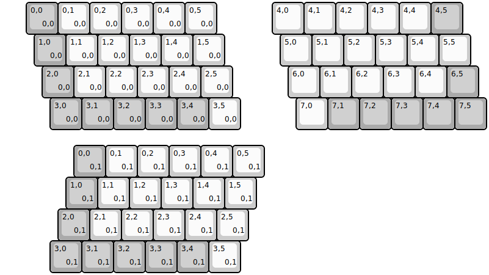
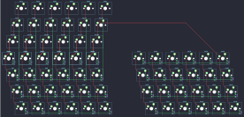

## 25keys/zinc

[layout](zinc-kle.json) - [PCB](zinc.kicad_pcb)

{:loading="lazy"}

[Open in keyboard-layout-editor](http://www.keyboard-layout-editor.com/##@@_x:0.75&c=#aaaaaa;&=0,0%0A%0A%0A0,0&_c=#cccccc;&=0,1%0A%0A%0A0,0&=0,2%0A%0A%0A0,0&=0,3%0A%0A%0A0,0&=0,4%0A%0A%0A0,0&=0,5%0A%0A%0A0,0&_x:1.75;&=4,0&=4,1&=4,2&=4,3&=4,4&_c=#aaaaaa;&=4,5;&@_x:1;&=1,0%0A%0A%0A0,0&_c=#cccccc;&=1,1%0A%0A%0A0,0&=1,2%0A%0A%0A0,0&=1,3%0A%0A%0A0,0&=1,4%0A%0A%0A0,0&=1,5%0A%0A%0A0,0&_x:1.75;&=5,0&=5,1&=5,2&=5,3&=5,4&=5,5;&@_x:1.25&c=#aaaaaa;&=2,0%0A%0A%0A0,0&_c=#cccccc;&=2,1%0A%0A%0A0,0&=2,2%0A%0A%0A0,0&=2,3%0A%0A%0A0,0&=2,4%0A%0A%0A0,0&=2,5%0A%0A%0A0,0&_x:1.75;&=6,0&=6,1&=6,2&=6,3&=6,4&_c=#aaaaaa;&=6,5;&@_x:1.5;&=3,0%0A%0A%0A0,0&=3,1%0A%0A%0A0,0&=3,2%0A%0A%0A0,0&=3,3%0A%0A%0A0,0&=3,4%0A%0A%0A0,0&_c=#cccccc;&=3,5%0A%0A%0A0,0&_x:1.75;&=7,0&_c=#aaaaaa;&=7,1&=7,2&=7,3&=7,4&=7,5;&@_x:2.25&y:0.5;&=0,0%0A%0A%0A0,1&_c=#cccccc;&=0,1%0A%0A%0A0,1&=0,2%0A%0A%0A0,1&=0,3%0A%0A%0A0,1&=0,4%0A%0A%0A0,1&=0,5%0A%0A%0A0,1;&@_x:2&c=#aaaaaa;&=1,0%0A%0A%0A0,1&_c=#cccccc;&=1,1%0A%0A%0A0,1&=1,2%0A%0A%0A0,1&=1,3%0A%0A%0A0,1&=1,4%0A%0A%0A0,1&=1,5%0A%0A%0A0,1;&@_x:1.75&c=#aaaaaa;&=2,0%0A%0A%0A0,1&_c=#cccccc;&=2,1%0A%0A%0A0,1&=2,2%0A%0A%0A0,1&=2,3%0A%0A%0A0,1&=2,4%0A%0A%0A0,1&=2,5%0A%0A%0A0,1;&@_x:1.5&c=#aaaaaa;&=3,0%0A%0A%0A0,1&=3,1%0A%0A%0A0,1&=3,2%0A%0A%0A0,1&=3,3%0A%0A%0A0,1&=3,4%0A%0A%0A0,1&_c=#cccccc;&=3,5%0A%0A%0A0,1)

{:loading="lazy"}

