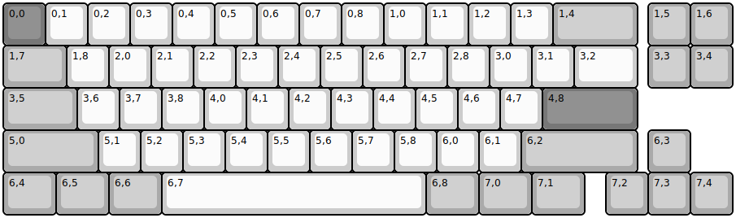
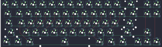

## 40percentclub/mf68

[layout](mf68-kle.json) - [PCB](mf68.kicad_pcb)

{:loading="lazy"}

[Open in keyboard-layout-editor](http://www.keyboard-layout-editor.com/##@@_c=#777777;&=0,0&_c=#cccccc;&=0,1&=0,2&=0,3&=0,4&=0,5&=0,6&=0,7&=0,8&=1,0&=1,1&=1,2&=1,3&_c=#aaaaaa&w:2;&=1,4&_x:0.25;&=1,5&=1,6;&@_w:1.5;&=1,7&_c=#cccccc;&=1,8&=2,0&=2,1&=2,2&=2,3&=2,4&=2,5&=2,6&=2,7&=2,8&=3,0&=3,1&_w:1.5;&=3,2&_x:0.25&c=#aaaaaa;&=3,3&=3,4;&@_w:1.75;&=3,5&_c=#cccccc;&=3,6&=3,7&=3,8&=4,0&=4,1&=4,2&=4,3&=4,4&=4,5&=4,6&=4,7&_c=#777777&w:2.25;&=4,8;&@_c=#aaaaaa&w:2.25;&=5,0&_c=#cccccc;&=5,1&=5,2&=5,3&=5,4&=5,5&=5,6&=5,7&=5,8&=6,0&=6,1&_c=#aaaaaa&w:2.75;&=6,2&_x:0.25;&=6,3;&@_w:1.25;&=6,4&_w:1.25;&=6,5&_w:1.25;&=6,6&_c=#cccccc&w:6.25;&=6,7&_c=#aaaaaa&w:1.25;&=6,8&_w:1.25;&=7,0&_w:1.25;&=7,1&_x:0.5;&=7,2&=7,3&=7,4)

{:loading="lazy"}

