## 4pplet/aekiso60_rev_a

[layout](aekiso60_rev_a-kle.json) - [PCB](aekiso60_rev_a.kicad_pcb)

{:loading="lazy"}

[Open in keyboard-layout-editor](http://www.keyboard-layout-editor.com/##@@_c=#aaaaaa&w:1.25;&=0,0&_c=#cccccc;&=0,1&=0,2&=0,3&=0,4&=0,5&=0,6&=0,7&=0,8&=0,9&=0,10&=0,11&=0,12&_c=#aaaaaa&w:1.75;&=0,13;&@_w:1.75;&=1,0&_c=#cccccc;&=1,1&=1,2&=1,3&=1,4&=1,5&=1,6&=1,7&=1,8&=1,9&=1,10&=1,11&=1,12&_x:0.25&c=#aaaaaa&h:2&h2:1&x2:-0.25;&=1,13;&@_w:2;&=2,0&_c=#cccccc;&=2,1&=2,2&=2,3&=2,4&=2,5&=2,6&=2,7&=2,8&=2,9&=2,10&=2,11&=2,12;&@_c=#aaaaaa&w:1.5;&=3,0&_c=#cccccc;&=3,1&=3,2&=3,3&=3,4&=3,5&=3,6&=3,7&=3,8&=3,9&=3,10&=3,11&_c=#aaaaaa&w:2.5;&=3,12%0A%0A%0A0,0;&@_w:1.5;&=4,0%0A%0A%0A1,0&_w:1.25;&=4,1%0A%0A%0A1,0&_w:1.5;&=4,3%0A%0A%0A1,0&_c=#cccccc&w:6.5;&=4,5%0A%0A%0A1,0&_c=#aaaaaa&w:1.5;&=4,8%0A%0A%0A1,0&_w:1.25;&=4,10%0A%0A%0A1,0&_w:1.5;&=4,11%0A%0A%0A1,0;&@_x:15.5&y:-2&w:1.5;&=3,12%0A%0A%0A0,1&=3,13%0A%0A%0A0,1;&@_y:1.5&w:1.5;&=4,0%0A%0A%0A1,1&=4,1%0A%0A%0A1,1&_w:1.5;&=4,3%0A%0A%0A1,1&_c=#cccccc&w:7;&=4,5%0A%0A%0A1,1&_c=#aaaaaa&w:1.5;&=4,8%0A%0A%0A1,1&=4,10%0A%0A%0A1,1&_w:1.5;&=4,11%0A%0A%0A1,1;&@_w:1.5;&=4,0%0A%0A%0A1,2&_d:true;&=4,1%0A%0A%0A1,2&_w:1.5;&=4,3%0A%0A%0A1,2&_c=#cccccc&w:7;&=4,5%0A%0A%0A1,2&_c=#aaaaaa&w:1.5;&=4,8%0A%0A%0A1,2&_d:true;&=4,10%0A%0A%0A1,2&_w:1.5;&=4,11%0A%0A%0A1,2;&@_w:1.5;&=4,0%0A%0A%0A1,3&_w:1.25;&=4,1%0A%0A%0A1,3&_w:1.5;&=4,3%0A%0A%0A1,3&_c=#cccccc&w:2.75;&=4,4%0A%0A%0A1,3&=4,5%0A%0A%0A1,3&_w:2.75;&=4,6%0A%0A%0A1,3&_c=#aaaaaa&w:1.5;&=4,8%0A%0A%0A1,3&_w:1.25;&=4,10%0A%0A%0A1,3&_w:1.5;&=4,11%0A%0A%0A1,3;&@_w:1.5;&=4,0%0A%0A%0A1,4&_w:1.25;&=4,1%0A%0A%0A1,4&_w:1.5;&=4,3%0A%0A%0A1,4&_c=#cccccc&w:2.5;&=4,4%0A%0A%0A1,4&_w:1.5;&=4,5%0A%0A%0A1,4&_w:2.5;&=4,6%0A%0A%0A1,4&_c=#aaaaaa&w:1.5;&=4,8%0A%0A%0A1,4&_w:1.25;&=4,10%0A%0A%0A1,4&_w:1.5;&=4,11%0A%0A%0A1,4;&@_w:1.5;&=4,0%0A%0A%0A1,5&_w:1.25;&=4,1%0A%0A%0A1,5&_w:1.5;&=4,3%0A%0A%0A1,5&_c=#cccccc&w:2.25;&=4,4%0A%0A%0A1,5&_w:1.5;&=4,5%0A%0A%0A1,5&_w:2.75;&=4,6%0A%0A%0A1,5&_c=#aaaaaa&w:1.5;&=4,8%0A%0A%0A1,5&_w:1.25;&=4,10%0A%0A%0A1,5&_x:-1.25&w:1.25;&=4,10%0A%0A%0A1,5&_w:1.5;&=4,11%0A%0A%0A1,5&_x:-1.5&w:1.5;&=4,11%0A%0A%0A1,5;&@_w:1.5;&=4,0%0A%0A%0A1,6&_w:1.25;&=4,1%0A%0A%0A1,6&_w:1.5;&=4,3%0A%0A%0A1,6&_c=#cccccc&w:2.5;&=4,4%0A%0A%0A1,6&_w:1.25;&=4,5%0A%0A%0A1,6&_w:2.75;&=4,6%0A%0A%0A1,6&_c=#aaaaaa&w:1.5;&=4,8%0A%0A%0A1,6&_w:1.25;&=4,10%0A%0A%0A1,6&_w:1.5;&=4,11%0A%0A%0A1,6)

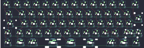{:loading="lazy"}

## 4pplet/aekiso60_rev_b

[layout](aekiso60_rev_b-kle.json) - [PCB](aekiso60_rev_b.kicad_pcb)

{:loading="lazy"}

[Open in keyboard-layout-editor](http://www.keyboard-layout-editor.com/##@@_c=#aaaaaa&w:1.25;&=0,0&_c=#cccccc;&=0,1&=0,2&=0,3&=0,4&=0,5&=0,6&=0,7&=0,8&=0,9&=0,10&=0,11&=0,12&_c=#aaaaaa&w:1.75;&=0,13;&@_w:1.75;&=1,0&_c=#cccccc;&=1,1&=1,2&=1,3&=1,4&=1,5&=1,6&=1,7&=1,8&=1,9&=1,10&=1,11&=1,12&_x:0.25&c=#aaaaaa&h:2&h2:1&x2:-0.25;&=1,13;&@_w:2;&=2,0&_c=#cccccc;&=2,1&=2,2&=2,3&=2,4&=2,5&=2,6&=2,7&=2,8&=2,9&=2,10&=2,11&=2,12;&@_c=#aaaaaa&w:1.5;&=3,0&_c=#cccccc;&=3,1&=3,2&=3,3&=3,4&=3,5&=3,6&=3,7&=3,8&=3,9&=3,10&=3,11&_c=#aaaaaa&w:2.5;&=3,12%0A%0A%0A0,0;&@_w:1.5;&=4,0%0A%0A%0A1,0&_w:1.25;&=4,1%0A%0A%0A1,0&_w:1.5;&=4,3%0A%0A%0A1,0&_c=#cccccc&w:6.5;&=4,5%0A%0A%0A1,0&_c=#aaaaaa&w:1.5;&=4,8%0A%0A%0A1,0&_w:1.25;&=4,10%0A%0A%0A1,0&_w:1.5;&=4,11%0A%0A%0A1,0;&@_x:15.5&y:-2&w:1.5;&=3,12%0A%0A%0A0,1&=3,13%0A%0A%0A0,1;&@_y:1.5&w:1.5;&=4,0%0A%0A%0A1,1&=4,1%0A%0A%0A1,1&_w:1.5;&=4,3%0A%0A%0A1,1&_c=#cccccc&w:7;&=4,5%0A%0A%0A1,1&_c=#aaaaaa&w:1.5;&=4,8%0A%0A%0A1,1&=4,10%0A%0A%0A1,1&_w:1.5;&=4,11%0A%0A%0A1,1;&@_w:1.5;&=4,0%0A%0A%0A1,2&_d:true;&=4,1%0A%0A%0A1,2&_w:1.5;&=4,3%0A%0A%0A1,2&_c=#cccccc&w:7;&=4,5%0A%0A%0A1,2&_c=#aaaaaa&w:1.5;&=4,8%0A%0A%0A1,2&_d:true;&=4,10%0A%0A%0A1,2&_w:1.5;&=4,11%0A%0A%0A1,2;&@_w:1.5;&=4,0%0A%0A%0A1,3&_w:1.25;&=4,1%0A%0A%0A1,3&_w:1.5;&=4,3%0A%0A%0A1,3&_c=#cccccc&w:2.75;&=4,4%0A%0A%0A1,3&=4,5%0A%0A%0A1,3&_w:2.75;&=4,6%0A%0A%0A1,3&_c=#aaaaaa&w:1.5;&=4,8%0A%0A%0A1,3&_w:1.25;&=4,10%0A%0A%0A1,3&_w:1.5;&=4,11%0A%0A%0A1,3;&@_w:1.5;&=4,0%0A%0A%0A1,4&_w:1.25;&=4,1%0A%0A%0A1,4&_w:1.5;&=4,3%0A%0A%0A1,4&_c=#cccccc&w:2.5;&=4,4%0A%0A%0A1,4&_w:1.5;&=4,5%0A%0A%0A1,4&_w:2.5;&=4,6%0A%0A%0A1,4&_c=#aaaaaa&w:1.5;&=4,8%0A%0A%0A1,4&_w:1.25;&=4,10%0A%0A%0A1,4&_w:1.5;&=4,11%0A%0A%0A1,4;&@_w:1.5;&=4,0%0A%0A%0A1,5&_w:1.25;&=4,1%0A%0A%0A1,5&_w:1.5;&=4,3%0A%0A%0A1,5&_c=#cccccc&w:2.25;&=4,4%0A%0A%0A1,5&_w:1.5;&=4,5%0A%0A%0A1,5&_w:2.75;&=4,6%0A%0A%0A1,5&_c=#aaaaaa&w:1.5;&=4,8%0A%0A%0A1,5&_w:1.25;&=4,10%0A%0A%0A1,5&_x:-1.25&w:1.25;&=4,10%0A%0A%0A1,5&_w:1.5;&=4,11%0A%0A%0A1,5&_x:-1.5&w:1.5;&=4,11%0A%0A%0A1,5;&@_w:1.5;&=4,0%0A%0A%0A1,6&_w:1.25;&=4,1%0A%0A%0A1,6&_w:1.5;&=4,3%0A%0A%0A1,6&_c=#cccccc&w:2.5;&=4,4%0A%0A%0A1,6&_w:1.25;&=4,5%0A%0A%0A1,6&_w:2.75;&=4,6%0A%0A%0A1,6&_c=#aaaaaa&w:1.5;&=4,8%0A%0A%0A1,6&_w:1.25;&=4,10%0A%0A%0A1,6&_w:1.5;&=4,11%0A%0A%0A1,6)

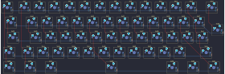{:loading="lazy"}

## 4pplet/bootleg_rev_a

[layout](bootleg_rev_a-kle.json) - [PCB](bootleg_rev_a.kicad_pcb)

{:loading="lazy"}

[Open in keyboard-layout-editor](http://www.keyboard-layout-editor.com/##@@_x:3&c=#aaaaaa;&=0,0&_c=#cccccc;&=0,1&=0,2&=0,3&=0,4&=0,5&=0,6&=0,7&=0,8&=0,9&=0,10&=0,11&=0,12&_c=#aaaaaa&w:2;&=0,14%0A%0A%0A0,0;&@_x:3&w:1.5;&=1,0&_c=#cccccc;&=1,1&=1,2&=1,3&=1,4&=1,5&=1,6&=1,7&=1,8&=1,9&=1,10&=1,11&=1,13&_c=#aaaaaa&w:1.5;&=1,14%0A%0A%0A1,0;&@_x:3&w:1.75;&=2,0&_c=#cccccc;&=2,1&=2,2&=2,3&=2,4&=2,5&=2,6&=2,7&=2,8&=2,9&=2,10&=2,11&_c=#aaaaaa&w:2.25;&=2,13%0A%0A%0A1,0;&@_x:3.0&w:2.25;&=3,0%0A%0A%0A2,0&_c=#cccccc;&=3,2&=3,3&=3,4&=3,5&=3,6&=3,7&=3,8&=3,9&=3,10&=3,11&_c=#aaaaaa&w:2.75;&=3,13%0A%0A%0A3,0;&@_x:3&w:1.25;&=4,0%0A%0A%0A4,0&_w:1.25;&=4,1%0A%0A%0A4,0&_w:1.25;&=4,3%0A%0A%0A4,0&_c=#cccccc&w:6.25;&=4,7%0A%0A%0A4,0&_c=#aaaaaa&w:1.25;&=4,10%0A%0A%0A4,0&_w:1.25;&=4,11%0A%0A%0A4,0&_w:1.25;&=4,13%0A%0A%0A4,0&_w:1.25;&=4,14%0A%0A%0A4,0;&@_x:19.5&y:-5&c=#cccccc;&=0,13%0A%0A%0A0,1&_c=#aaaaaa;&=0,14%0A%0A%0A0,1;&@_x:20.25&w:1.25&h:2&w2:1.5&h2:1&x2:-0.25;&=1,14%0A%0A%0A1,1;&@_x:19.25&c=#cccccc;&=2,13%0A%0A%0A1,1;&@_c=#aaaaaa&w:1.25;&=3,0%0A%0A%0A2,1&=3,1%0A%0A%0A2,1&_x:16.5&w:1.75;&=3,13%0A%0A%0A3,1&=3,14%0A%0A%0A3,1;&@_x:3&y:1.75&w:1.5;&=4,0%0A%0A%0A4,1&=4,1%0A%0A%0A4,1&_w:1.5;&=4,3%0A%0A%0A4,1&_c=#cccccc&w:7;&=4,7%0A%0A%0A4,1&_c=#aaaaaa&w:1.5;&=4,11%0A%0A%0A4,1&=4,13%0A%0A%0A4,1&_w:1.5;&=4,14%0A%0A%0A4,1;&@_x:3&w:1.5;&=4,0%0A%0A%0A4,2&_d:true;&=4,1%0A%0A%0A4,2&_w:1.5;&=4,3%0A%0A%0A4,2&_c=#cccccc&w:7;&=4,7%0A%0A%0A4,2&_c=#aaaaaa&w:1.5;&=4,11%0A%0A%0A4,2&_d:true;&=4,13%0A%0A%0A4,2&_w:1.5;&=4,14%0A%0A%0A4,2;&@_x:3&w:1.25;&=4,0%0A%0A%0A4,3&_w:1.25;&=4,1%0A%0A%0A4,3&_w:1.25;&=4,3%0A%0A%0A4,3&_c=#cccccc&w:2.25;&=4,5%0A%0A%0A4,3&_w:1.25;&=4,7%0A%0A%0A4,3&_w:2.75;&=4,8%0A%0A%0A4,3&_c=#aaaaaa&w:1.25;&=4,10%0A%0A%0A4,3&_w:1.25;&=4,11%0A%0A%0A4,3&_w:1.25;&=4,13%0A%0A%0A4,3&_w:1.25;&=4,14%0A%0A%0A4,3)

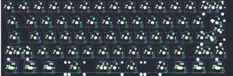{:loading="lazy"}

## 4pplet/eagle_viper_rep_rev_a

[layout](eagle_viper_rep_rev_a-kle.json) - [PCB](eagle_viper_rep_rev_a.kicad_pcb)

{:loading="lazy"}

[Open in keyboard-layout-editor](http://www.keyboard-layout-editor.com/##@@_x:3&c=#aaaaaa;&=0,0&_c=#cccccc;&=1,0&=0,1&=1,1&=0,2&=1,2&=0,3&=1,3&=0,4&=1,4&=0,5&=1,5&=0,6&=1,6%0A%0A%0A0,0&_c=#aaaaaa;&=3,6%0A%0A%0A0,0;&@_x:3&w:1.5;&=2,0&_c=#cccccc;&=3,0&=2,1&=3,1&=2,2&=3,2&=2,3&=3,3&=2,4&=3,4&=2,5&=3,5&=2,6&_c=#aaaaaa&w:1.5;&=5,6%0A%0A%0A1,0;&@_x:3&w:1.75;&=4,0&_c=#cccccc;&=5,0&=4,1&=5,1&=4,2&=5,2&=4,3&=5,3&=4,4&=5,4&=4,5&=5,5&_c=#aaaaaa&w:2.25;&=7,6%0A%0A%0A1,0;&@_x:3.0&w:2.25;&=6,0%0A%0A%0A2,0&_c=#cccccc;&=6,1&=7,1&=6,2&=7,2&=6,3&=7,3&=6,4&=7,4&=6,5&=7,5&_c=#aaaaaa&w:1.75;&=6,6%0A%0A%0A3,0&=9,6%0A%0A%0A3,0;&@_x:3&w:1.5;&=8,0%0A%0A%0A4,0&=9,0%0A%0A%0A4,0&_w:1.5;&=9,1%0A%0A%0A4,0&_c=#cccccc&w:7;&=9,3%0A%0A%0A4,0&_c=#aaaaaa&w:1.5;&=8,5%0A%0A%0A4,0&=9,5%0A%0A%0A4,0&_w:1.5;&=8,6%0A%0A%0A4,0;&@_x:19.5&y:-5&w:2;&=2,6%0A%0A%0A0,1;&@_x:20.25&w:1.25&h:2&w2:1.5&h2:1&x2:-0.25;&=7,6%0A%0A%0A1,1;&@_x:19.25&c=#cccccc;&=4,6%0A%0A%0A1,1;&@_c=#aaaaaa&w:1.25;&=6,0%0A%0A%0A2,1&=7,0%0A%0A%0A2,1&_x:16.5&w:2.75;&=6,6%0A%0A%0A3,1;&@_x:3&y:1.75&w:1.5&d:true;&=8,0%0A%0A%0A4,1&=9,0%0A%0A%0A4,1&_w:1.5;&=9,1%0A%0A%0A4,1&_c=#cccccc&w:7;&=9,3%0A%0A%0A4,1&_c=#aaaaaa&w:1.5;&=8,5%0A%0A%0A4,1&=9,5%0A%0A%0A4,1&_w:1.5&d:true;&=8,6%0A%0A%0A4,1;&@_x:3&w:1.25;&=8,0%0A%0A%0A4,2&_w:1.25;&=9,0%0A%0A%0A4,2&_w:1.25;&=9,1%0A%0A%0A4,2&_c=#cccccc&w:6.25;&=9,3%0A%0A%0A4,2&_c=#aaaaaa&w:1.25;&=9,4%0A%0A%0A4,2&_w:1.25;&=8,5%0A%0A%0A4,2&_w:1.25;&=9,5%0A%0A%0A4,2&_w:1.25;&=8,6%0A%0A%0A4,2)

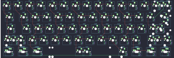{:loading="lazy"}

## 4pplet/eagle_viper_rep_rev_b

[layout](eagle_viper_rep_rev_b-kle.json) - [PCB](eagle_viper_rep_rev_b.kicad_pcb)

{:loading="lazy"}

[Open in keyboard-layout-editor](http://www.keyboard-layout-editor.com/##@@_x:3&c=#aaaaaa;&=0,0&_c=#cccccc;&=1,0&=0,1&=1,1&=0,2&=1,2&=0,3&=1,3&=0,4&=1,4&=0,5&=1,5&=0,6&=1,6%0A%0A%0A1,0&_c=#aaaaaa;&=3,6%0A%0A%0A1,0;&@_x:3&w:1.5;&=2,0&_c=#cccccc;&=3,0&=2,1&=3,1&=2,2&=3,2&=2,3&=3,3&=2,4&=3,4&=2,5&=3,5&=2,6&_c=#aaaaaa&w:1.5;&=5,6%0A%0A%0A2,0;&@_x:3&w:1.75;&=4,0&_c=#cccccc;&=5,0&=4,1&=5,1&=4,2&=5,2&=4,3&=5,3&=4,4&=5,4&=4,5&=5,5&_c=#aaaaaa&w:2.25;&=7,6%0A%0A%0A2,0;&@_x:3.0&w:2.25;&=6,0%0A%0A%0A3,0&_c=#cccccc;&=6,1&=7,1&=6,2&=7,2&=6,3&=7,3&=6,4&=7,4&=6,5&=7,5&_c=#aaaaaa&w:1.75;&=6,6%0A%0A%0A4,0&=9,6%0A%0A%0A4,0;&@_x:3&w:1.5;&=8,0%0A%0A%0A0,0&=9,0%0A%0A%0A0,0&_w:1.5;&=9,1%0A%0A%0A0,0&_c=#cccccc&w:7;&=9,3%0A%0A%0A0,0&_c=#aaaaaa&w:1.5;&=8,5%0A%0A%0A0,0&=9,5%0A%0A%0A0,0&_w:1.5;&=8,6%0A%0A%0A0,0;&@_x:19.5&y:-5&w:2;&=2,6%0A%0A%0A1,1;&@_x:20.25&w:1.25&h:2&w2:1.5&h2:1&x2:-0.25;&=7,6%0A%0A%0A2,1;&@_x:19.25&c=#cccccc;&=4,6%0A%0A%0A2,1;&@_c=#aaaaaa&w:1.25;&=6,0%0A%0A%0A3,1&=7,0%0A%0A%0A3,1&_x:16.5&w:2.75;&=6,6%0A%0A%0A4,1;&@_x:3&y:1.75&w:1.5&d:true;&=8,0%0A%0A%0A0,1&=9,0%0A%0A%0A0,1&_w:1.5;&=9,1%0A%0A%0A0,1&_c=#cccccc&w:7;&=9,3%0A%0A%0A0,1&_c=#aaaaaa&w:1.5;&=8,5%0A%0A%0A0,1&=9,5%0A%0A%0A0,1&_w:1.5&d:true;&=8,6%0A%0A%0A0,1;&@_x:3&w:1.25;&=8,0%0A%0A%0A0,2&_w:1.25;&=9,0%0A%0A%0A0,2&_w:1.25;&=9,1%0A%0A%0A0,2&_c=#cccccc&w:6.25;&=9,3%0A%0A%0A0,2&_c=#aaaaaa&w:1.25;&=9,4%0A%0A%0A0,2&_w:1.25;&=8,5%0A%0A%0A0,2&_w:1.25;&=9,5%0A%0A%0A0,2&_w:1.25;&=8,6%0A%0A%0A0,2;&@_x:3&w:1.5;&=8,0%0A%0A%0A0,3&=9,0%0A%0A%0A0,3&_w:1.5;&=9,1%0A%0A%0A0,3&_c=#cccccc&w:3;&=9,2%0A%0A%0A0,3&=9,3%0A%0A%0A0,3&_w:3;&=8,4%0A%0A%0A0,3&_c=#aaaaaa&w:1.5;&=8,5%0A%0A%0A0,3&=9,5%0A%0A%0A0,3&_w:1.5;&=8,6%0A%0A%0A0,3;&@_x:3&w:1.5&d:true;&=8,0%0A%0A%0A0,4&=9,0%0A%0A%0A0,4&_w:1.5;&=9,1%0A%0A%0A0,4&_c=#cccccc&w:3;&=9,2%0A%0A%0A0,4&=9,3%0A%0A%0A0,4&_w:3;&=8,4%0A%0A%0A0,4&_c=#aaaaaa&w:1.5;&=8,5%0A%0A%0A0,4&=9,5%0A%0A%0A0,4&_w:1.5&d:true;&=8,6%0A%0A%0A0,4;&@_x:3&w:1.5;&=8,0%0A%0A%0A0,5&=9,0%0A%0A%0A0,5&_c=#cccccc&w:10;&=9,3%0A%0A%0A0,5&_c=#aaaaaa;&=9,5%0A%0A%0A0,5&_w:1.5;&=8,6%0A%0A%0A0,5)

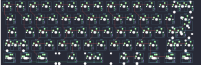{:loading="lazy"}

## 4pplet/perk60_iso

[layout](perk60_iso-kle.json) - [PCB](perk60_iso.kicad_pcb)

{:loading="lazy"}

[Open in keyboard-layout-editor](http://www.keyboard-layout-editor.com/##@@_c=#aaaaaa;&=0,0&_c=#cccccc;&=1,0&=0,1&=1,1&=0,2&=1,2&=0,3&=1,3&=0,4&=1,4&=0,5&=1,5&=0,6&_c=#aaaaaa&w:2;&=3,6;&@_w:1.5;&=2,0&_c=#cccccc;&=3,0&=2,1&=3,1&=2,2&=3,2&=2,3&=3,3&=2,4&=3,4&=2,5&=3,5&=2,6&_x:0.25&c=#aaaaaa&w:1.25&h:2&w2:1.5&h2:1&x2:-0.25;&=7,6;&@_w:1.75;&=4,0&_c=#cccccc;&=5,0&=4,1&=5,1&=4,2&=5,2&=4,3&=5,3&=4,4&=5,4&=4,5&=5,5&=4,6;&@_c=#aaaaaa&w:1.25;&=6,0&_c=#cccccc;&=7,0&=6,1&=7,1&=6,2&=7,2&=6,3&=7,3&=6,4&=7,4&=6,5&=7,5&_c=#aaaaaa&w:2.75;&=8,6;&@_w:1.25;&=8,0&_w:1.25;&=8,1&_w:1.25;&=9,0&_w:6.25;&=8,3&_w:1.25;&=9,3&_w:1.25;&=9,4&_w:1.25;&=8,5&_w:1.25;&=9,5)

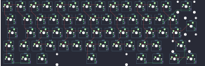{:loading="lazy"}

## 4pplet/steezy60_rev_a

[layout](steezy60_rev_a-kle.json) - [PCB](steezy60_rev_a.kicad_pcb)

{:loading="lazy"}

[Open in keyboard-layout-editor](http://www.keyboard-layout-editor.com/##@@_x:2.75&c=#aaaaaa;&=0,0&_c=#cccccc;&=0,1&=0,2&=0,3&=0,4&=0,5&=0,6&=0,7&=0,8&=0,9&=0,10&=0,11&=0,12&_c=#aaaaaa&w:2;&=4,13%0A%0A%0A0,0;&@_x:2.75&w:1.5;&=1,0&_c=#cccccc;&=1,1&=1,2&=1,3&=1,4&=1,5&=1,6&=1,7&=1,8&=1,9&=1,10&=1,11&=1,12&_c=#aaaaaa&w:1.5;&=1,13%0A%0A%0A1,0;&@_x:2.75&w:1.75;&=2,0&_c=#cccccc;&=2,1&=2,2&=2,3&=2,4&=2,5&=2,6&=2,7&=2,8&=2,9&=2,10&=2,11&_c=#aaaaaa&w:2.25;&=2,13%0A%0A%0A1,0;&@_x:2.75&w:2.25;&=3,0%0A%0A%0A3,0&_c=#cccccc;&=3,2&=3,3&=3,4&=3,5&=3,6&=3,7&=3,8&=3,9&=3,10&=3,11&_c=#aaaaaa&w:2.75;&=3,13%0A%0A%0A2,0;&@_x:2.75&w:1.25;&=4,0%0A%0A%0A4,0&_w:1.25;&=4,1%0A%0A%0A4,0&_w:1.25;&=4,3%0A%0A%0A4,0&_c=#cccccc&w:6.25;&=4,5%0A%0A%0A4,0&_c=#aaaaaa&w:1.25;&=4,7%0A%0A%0A4,0&_w:1.25;&=4,8%0A%0A%0A4,0&_w:1.25;&=4,10%0A%0A%0A4,0&_w:1.25;&=4,11%0A%0A%0A4,0;&@_x:18.5&y:-5&c=#cccccc;&=0,13%0A%0A%0A0,1&_c=#aaaaaa;&=4,13%0A%0A%0A0,1;&@_x:19.5&w:1.25&h:2&w2:1.5&h2:1&x2:-0.25;&=2,13%0A%0A%0A1,1;&@_x:18.5&c=#cccccc;&=2,12%0A%0A%0A1,1;&@_c=#aaaaaa&w:1.25;&=3,0%0A%0A%0A3,1&=3,1%0A%0A%0A3,1&_x:16.25&w:1.75;&=3,13%0A%0A%0A2,1&=4,12%0A%0A%0A2,1;&@_x:2.75&y:1.5&w:1.5;&=4,0%0A%0A%0A4,1&=4,1%0A%0A%0A4,1&_w:1.5;&=4,3%0A%0A%0A4,1&_c=#cccccc&w:7;&=4,5%0A%0A%0A4,1&_c=#aaaaaa&w:1.5;&=4,8%0A%0A%0A4,1&=4,10%0A%0A%0A4,1&_w:1.5;&=4,11%0A%0A%0A4,1;&@_x:2.75;&=4,0%0A%0A%0A4,2&=4,1%0A%0A%0A4,2&=4,2%0A%0A%0A4,2&=4,3%0A%0A%0A4,2&_c=#cccccc&w:6;&=4,5%0A%0A%0A4,2&_c=#aaaaaa;&=4,7%0A%0A%0A4,2&=4,8%0A%0A%0A4,2&=4,9%0A%0A%0A4,2&=4,10%0A%0A%0A4,2&=4,11%0A%0A%0A4,2;&@_x:2.75&w:1.25;&=4,0%0A%0A%0A4,3&_w:1.25;&=4,1%0A%0A%0A4,3&_w:1.25;&=4,3%0A%0A%0A4,3&_c=#cccccc&w:2.25;&=4,4%0A%0A%0A4,3&_w:1.25;&=4,5%0A%0A%0A4,3&_w:2.75;&=4,6%0A%0A%0A4,3&_c=#aaaaaa&w:1.25;&=4,7%0A%0A%0A4,3&_w:1.25;&=4,8%0A%0A%0A4,3&_w:1.25;&=4,10%0A%0A%0A4,3&_w:1.25;&=4,11%0A%0A%0A4,3;&@_x:2.75&w:1.5;&=4,0%0A%0A%0A4,4&_w:1.25;&=4,1%0A%0A%0A4,4&_w:1.5;&=4,3%0A%0A%0A4,4&_c=#cccccc&w:2.75;&=4,4%0A%0A%0A4,4&=4,5%0A%0A%0A4,4&_w:2.75;&=4,6%0A%0A%0A4,4&_c=#aaaaaa&w:1.5;&=4,8%0A%0A%0A4,4&_w:1.25;&=4,10%0A%0A%0A4,4&_w:1.5;&=4,11%0A%0A%0A4,4)

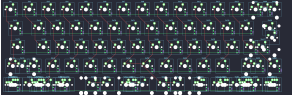{:loading="lazy"}

## 4pplet/waffling60_rev_a

[layout](waffling60_rev_a-kle.json) - [PCB](waffling60_rev_a.kicad_pcb)

{:loading="lazy"}

[Open in keyboard-layout-editor](http://www.keyboard-layout-editor.com/##@@_x:3&c=#aaaaaa;&=0,0&_c=#cccccc;&=0,1&=1,1&=0,2&=0,3&=0,4&=0,5&=1,5&=0,6&=0,7&=0,8&=1,8&=0,9&_c=#aaaaaa&w:2;&=1,10%0A%0A%0A0,0;&@_x:3&w:1.5;&=1,0&_c=#cccccc;&=2,1&=1,2&=2,2&=1,3&=1,4&=2,5&=3,5&=1,6&=1,7&=2,8&=1,9&=2,9&_c=#aaaaaa&w:1.5;&=2,10%0A%0A%0A1,0;&@_x:3&w:1.75;&=2,0&_c=#cccccc;&=3,1&=3,2&=2,3&=3,3&=2,4&=4,5&=2,6&=3,6&=2,7&=3,8&=3,9&_c=#aaaaaa&w:2.25;&=3,10%0A%0A%0A1,0;&@_x:3.0&w:2.25;&=3,0%0A%0A%0A2,0&_c=#cccccc;&=4,1&=4,2&=4,3&=3,4&=4,4&=5,5&=4,6&=3,7&=4,7&=4,8&_c=#aaaaaa&w:2.75;&=4,9%0A%0A%0A3,0;&@_x:3&w:1.25;&=5,0%0A%0A%0A4,0&_w:1.25;&=5,1%0A%0A%0A4,0&_w:1.25;&=5,2%0A%0A%0A4,0&_c=#cccccc&w:6.25;&=5,4%0A%0A%0A4,0&_c=#aaaaaa&w:1.25;&=5,7%0A%0A%0A4,0&_w:1.25;&=5,8%0A%0A%0A4,0&_w:1.25;&=5,9%0A%0A%0A4,0&_w:1.25;&=5,10%0A%0A%0A4,0;&@_x:19.5&y:-5&c=#cccccc;&=0,10%0A%0A%0A0,1&_c=#aaaaaa;&=1,10%0A%0A%0A0,1;&@_x:20.25&w:1.25&h:2&w2:1.5&h2:1&x2:-0.25;&=2,10%0A%0A%0A1,1;&@_x:19.25&c=#cccccc;&=3,10%0A%0A%0A1,1;&@_c=#aaaaaa&w:1.25;&=3,0%0A%0A%0A2,1&=4,0%0A%0A%0A2,1&_x:16.5&w:1.75;&=4,9%0A%0A%0A3,1&=4,10%0A%0A%0A3,1;&@_x:3&y:1.75&w:1.5;&=5,0%0A%0A%0A4,1&=5,1%0A%0A%0A4,1&_w:1.5;&=5,2%0A%0A%0A4,1&_c=#cccccc&w:7;&=5,4%0A%0A%0A4,1&_c=#aaaaaa&w:1.5;&=5,8%0A%0A%0A4,1&=5,9%0A%0A%0A4,1&_w:1.5;&=5,10%0A%0A%0A4,1;&@_x:3&w:1.5;&=5,0%0A%0A%0A4,2&_d:true;&=5,1%0A%0A%0A4,2&_w:1.5;&=5,2%0A%0A%0A4,2&_c=#cccccc&w:7;&=5,4%0A%0A%0A4,2&_c=#aaaaaa&w:1.5;&=5,8%0A%0A%0A4,2&_d:true;&=5,9%0A%0A%0A4,2&_w:1.5;&=5,10%0A%0A%0A4,2;&@_x:3&w:1.25;&=5,0%0A%0A%0A4,3&_w:1.25;&=5,1%0A%0A%0A4,3&_w:1.25;&=5,2%0A%0A%0A4,3&_c=#cccccc&w:2.25;&=5,3%0A%0A%0A4,3&_w:1.25;&=5,4%0A%0A%0A4,3&_w:2.75;&=5,6%0A%0A%0A4,3&_c=#aaaaaa&w:1.25;&=5,7%0A%0A%0A4,3&_w:1.25;&=5,8%0A%0A%0A4,3&_w:1.25;&=5,9%0A%0A%0A4,3&_w:1.25;&=5,10%0A%0A%0A4,3)

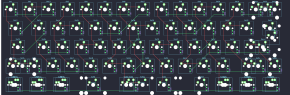{:loading="lazy"}

## 4pplet/waffling60_rev_b

[layout](waffling60_rev_b-kle.json) - [PCB](waffling60_rev_b.kicad_pcb)

{:loading="lazy"}

[Open in keyboard-layout-editor](http://www.keyboard-layout-editor.com/##@@_x:3&c=#aaaaaa;&=0,0&_c=#cccccc;&=0,1&=0,2&=0,3&=0,4&=0,5&=0,6&=0,7&=0,8&=0,9&=0,10&=0,11&=0,12&_c=#aaaaaa&w:2;&=1,13%0A%0A%0A0,0;&@_x:3&w:1.5;&=1,0&_c=#cccccc;&=1,1&=1,2&=1,3&=1,4&=1,5&=1,6&=1,7&=1,8&=1,9&=1,10&=1,11&=1,12&_c=#aaaaaa&w:1.5;&=2,12%0A%0A%0A1,0;&@_x:3&w:1.75;&=2,0&_c=#cccccc;&=2,1&=2,2&=2,3&=2,4&=2,5&=2,6&=2,7&=2,8&=2,9&=2,10&=2,11&_c=#aaaaaa&w:2.25;&=2,13%0A%0A%0A1,0;&@_x:3.0&w:2.25;&=3,0%0A%0A%0A2,0&_c=#cccccc;&=3,2&=3,3&=3,4&=3,5&=3,6&=3,7&=3,8&=3,9&=3,10&=3,11&_c=#aaaaaa&w:2.75;&=3,12%0A%0A%0A3,0;&@_x:3&w:1.25;&=4,0%0A%0A%0A4,0&_w:1.25;&=4,1%0A%0A%0A4,0&_w:1.25;&=4,2%0A%0A%0A4,0&_c=#cccccc&w:6.25;&=4,6%0A%0A%0A4,0&_c=#aaaaaa&w:1.25;&=4,10%0A%0A%0A4,0&_w:1.25;&=4,11%0A%0A%0A4,0&_w:1.25;&=4,12%0A%0A%0A4,0&_w:1.25;&=4,13%0A%0A%0A4,0;&@_x:19.5&y:-5&c=#cccccc;&=0,13%0A%0A%0A0,1&_c=#aaaaaa;&=1,13%0A%0A%0A0,1;&@_x:20.25&w:1.25&h:2&w2:1.5&h2:1&x2:-0.25;&=2,13%0A%0A%0A1,1;&@_x:19.25&c=#cccccc;&=2,12%0A%0A%0A1,1;&@_c=#aaaaaa&w:1.25;&=3,0%0A%0A%0A2,1&=3,1%0A%0A%0A2,1&_x:16.5&w:1.75;&=3,12%0A%0A%0A3,1&=3,13%0A%0A%0A3,1;&@_x:3&y:1.75&w:1.5;&=4,0%0A%0A%0A4,1&=4,1%0A%0A%0A4,1&_w:1.5;&=4,2%0A%0A%0A4,1&_c=#cccccc&w:7;&=4,6%0A%0A%0A4,1&_c=#aaaaaa&w:1.5;&=4,11%0A%0A%0A4,1&=4,12%0A%0A%0A4,1&_w:1.5;&=4,13%0A%0A%0A4,1;&@_x:3&w:1.5;&=4,0%0A%0A%0A4,2&_d:true;&=4,1%0A%0A%0A4,2&_w:1.5;&=4,2%0A%0A%0A4,2&_c=#cccccc&w:7;&=4,6%0A%0A%0A4,2&_c=#aaaaaa&w:1.5;&=4,11%0A%0A%0A4,2&_d:true;&=4,12%0A%0A%0A4,2&_w:1.5;&=4,13%0A%0A%0A4,2;&@_x:3&w:1.25;&=4,0%0A%0A%0A4,3&_w:1.25;&=4,1%0A%0A%0A4,3&_w:1.25;&=4,2%0A%0A%0A4,3&_c=#cccccc&w:2.25;&=4,4%0A%0A%0A4,3&_w:1.25;&=4,6%0A%0A%0A4,3&_w:2.75;&=4,8%0A%0A%0A4,3&_c=#aaaaaa&w:1.25;&=4,10%0A%0A%0A4,3&_w:1.25;&=4,11%0A%0A%0A4,3&_w:1.25;&=4,12%0A%0A%0A4,3&_w:1.25;&=4,13%0A%0A%0A4,3)

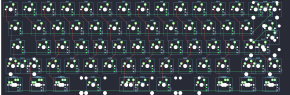{:loading="lazy"}

## 4pplet/waffling60_rev_c

[layout](waffling60_rev_c-kle.json) - [PCB](waffling60_rev_c.kicad_pcb)

{:loading="lazy"}

[Open in keyboard-layout-editor](http://www.keyboard-layout-editor.com/##@@_x:3&c=#aaaaaa;&=0,0&_c=#cccccc;&=0,1&=0,2&=0,3&=0,4&=0,5&=0,6&=0,7&=0,8&=0,9&=0,10&=0,11&=0,12&_c=#aaaaaa&w:2;&=1,13%0A%0A%0A0,0;&@_x:3&w:1.5;&=1,0&_c=#cccccc;&=1,1&=1,2&=1,3&=1,4&=1,5&=1,6&=1,7&=1,8&=1,9&=1,10&=1,11&=1,12&_c=#aaaaaa&w:1.5;&=2,12%0A%0A%0A1,0;&@_x:3&w:1.75;&=2,0&_c=#cccccc;&=2,1&=2,2&=2,3&=2,4&=2,5&=2,6&=2,7&=2,8&=2,9&=2,10&=2,11&_c=#aaaaaa&w:2.25;&=2,13%0A%0A%0A1,0;&@_x:3.0&w:2.25;&=3,0%0A%0A%0A2,0&_c=#cccccc;&=3,2&=3,3&=3,4&=3,5&=3,6&=3,7&=3,8&=3,9&=3,10&=3,11&_c=#aaaaaa&w:2.75;&=3,12%0A%0A%0A3,0;&@_x:3&w:1.5;&=4,0%0A%0A%0A4,0&=4,1%0A%0A%0A4,0&_w:1.5;&=4,2%0A%0A%0A4,0&_c=#cccccc&w:7;&=4,6%0A%0A%0A4,0&_c=#aaaaaa&w:1.5;&=4,11%0A%0A%0A4,0&=4,12%0A%0A%0A4,0&_w:1.5;&=4,13%0A%0A%0A4,0;&@_x:19.5&y:-5&c=#cccccc;&=0,13%0A%0A%0A0,1&_c=#aaaaaa;&=1,13%0A%0A%0A0,1;&@_x:20.25&w:1.25&h:2&w2:1.5&h2:1&x2:-0.25;&=2,13%0A%0A%0A1,1;&@_x:19.25&c=#cccccc;&=2,12%0A%0A%0A1,1;&@_c=#aaaaaa&w:1.25;&=3,0%0A%0A%0A2,1&=3,1%0A%0A%0A2,1&_x:16.5&w:1.75;&=3,12%0A%0A%0A3,1&=3,13%0A%0A%0A3,1;&@_x:3&y:2&w:1.5;&=4,0%0A%0A%0A4,1&_d:true;&=4,1%0A%0A%0A4,1&_w:1.5;&=4,2%0A%0A%0A4,1&_c=#cccccc&w:7;&=4,6%0A%0A%0A4,1&_c=#aaaaaa&w:1.5;&=4,11%0A%0A%0A4,1&_d:true;&=4,12%0A%0A%0A4,1&_w:1.5;&=4,13%0A%0A%0A4,1;&@_x:3&w:1.5;&=4,0%0A%0A%0A4,2&=4,1%0A%0A%0A4,2&_w:1.5;&=4,2%0A%0A%0A4,2&_c=#cccccc&w:3;&=4,4%0A%0A%0A4,2&=4,6%0A%0A%0A4,2&_w:3;&=4,8%0A%0A%0A4,2&_c=#aaaaaa&w:1.5;&=4,11%0A%0A%0A4,2&=4,12%0A%0A%0A4,2&_w:1.5;&=4,13%0A%0A%0A4,2;&@_x:3&w:1.5;&=4,0%0A%0A%0A4,3&_d:true;&=4,1%0A%0A%0A4,3&_w:1.5;&=4,2%0A%0A%0A4,3&_c=#cccccc&w:3;&=4,4%0A%0A%0A4,3&=4,6%0A%0A%0A4,3&_w:3;&=4,8%0A%0A%0A4,3&_c=#aaaaaa&w:1.5;&=4,11%0A%0A%0A4,3&_d:true;&=4,12%0A%0A%0A4,3&_w:1.5;&=4,13%0A%0A%0A4,3;&@_x:3&w:1.25;&=4,0%0A%0A%0A4,4&_w:1.25;&=4,1%0A%0A%0A4,4&_w:1.25;&=4,2%0A%0A%0A4,4&_c=#cccccc&w:6.25;&=4,6%0A%0A%0A4,4&_c=#aaaaaa&w:1.25;&=4,10%0A%0A%0A4,4&_w:1.25;&=4,11%0A%0A%0A4,4&_w:1.25;&=4,12%0A%0A%0A4,4&_w:1.25;&=4,13%0A%0A%0A4,4;&@_x:3&w:1.25;&=4,0%0A%0A%0A4,5&_w:1.25;&=4,1%0A%0A%0A4,5&_w:1.25;&=4,2%0A%0A%0A4,5&_c=#cccccc&w:2.25;&=4,4%0A%0A%0A4,5&_w:1.25;&=4,6%0A%0A%0A4,5&_w:2.75;&=4,8%0A%0A%0A4,5&_c=#aaaaaa&w:1.25;&=4,10%0A%0A%0A4,5&_w:1.25;&=4,11%0A%0A%0A4,5&_w:1.25;&=4,12%0A%0A%0A4,5&_w:1.25;&=4,13%0A%0A%0A4,5;&@_x:3&w:1.5;&=4,0%0A%0A%0A4,6&=4,1%0A%0A%0A4,6&_c=#cccccc&w:10;&=4,6%0A%0A%0A4,6&_c=#aaaaaa;&=4,12%0A%0A%0A4,6&_w:1.5;&=4,13%0A%0A%0A4,6;&@_x:3&w:1.5;&=4,0%0A%0A%0A4,7&_d:true;&=4,1%0A%0A%0A4,7&_c=#cccccc&w:10;&=4,6%0A%0A%0A4,7&_c=#aaaaaa&d:true;&=4,12%0A%0A%0A4,7&_w:1.5;&=4,13%0A%0A%0A4,7)

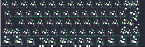{:loading="lazy"}

## 4pplet/waffling60_rev_d

[layout](waffling60_rev_d-kle.json) - [PCB](waffling60_rev_d.kicad_pcb)

{:loading="lazy"}

[Open in keyboard-layout-editor](http://www.keyboard-layout-editor.com/##@@_x:3&c=#aaaaaa;&=0,0&_c=#cccccc;&=0,1&=0,2&=0,3&=0,4&=0,5&=0,6&=0,7&=0,8&=0,9&=0,10&=0,11&=0,12&_c=#aaaaaa&w:2;&=2,13%0A%0A%0A1,0;&@_x:3&w:1.5;&=1,0&_c=#cccccc;&=1,1&=1,2&=1,3&=1,4&=1,5&=1,6&=1,7&=1,8&=1,9&=1,10&=1,11&=1,12&_c=#aaaaaa&w:1.5;&=1,13%0A%0A%0A2,0;&@_x:3&w:1.75;&=2,0&_c=#cccccc;&=2,1&=2,2&=2,3&=2,4&=2,5&=2,6&=2,7&=2,8&=2,9&=2,10&=2,11&_c=#aaaaaa&w:2.25;&=3,13%0A%0A%0A2,0;&@_x:3.0&w:2.25;&=3,0%0A%0A%0A3,0&_c=#cccccc;&=3,2&=3,3&=3,4&=3,5&=3,6&=3,7&=3,8&=3,9&=3,10&=3,11&_c=#aaaaaa&w:2.75;&=3,12%0A%0A%0A4,0;&@_x:3&w:1.5;&=4,0%0A%0A%0A0,0&=4,1%0A%0A%0A0,0&_w:1.5;&=4,2%0A%0A%0A0,0&_c=#cccccc&w:7;&=4,6%0A%0A%0A0,0&_c=#aaaaaa&w:1.5;&=4,10%0A%0A%0A0,0&=4,11%0A%0A%0A0,0&_w:1.5;&=4,12%0A%0A%0A0,0;&@_x:19.5&y:-5&c=#cccccc;&=0,13%0A%0A%0A1,1&_c=#aaaaaa;&=2,13%0A%0A%0A1,1;&@_x:20.25&w:1.25&h:2&w2:1.5&h2:1&x2:-0.25;&=3,13%0A%0A%0A2,1;&@_x:19.25&c=#cccccc;&=2,12%0A%0A%0A2,1;&@_c=#aaaaaa&w:1.25;&=3,0%0A%0A%0A3,1&=3,1%0A%0A%0A3,1&_x:16.5&w:1.75;&=3,12%0A%0A%0A4,1&=4,13%0A%0A%0A4,1;&@_x:3&y:2&w:1.5;&=4,0%0A%0A%0A0,1&_d:true;&=4,1%0A%0A%0A0,1&_w:1.5;&=4,2%0A%0A%0A0,1&_c=#cccccc&w:7;&=4,6%0A%0A%0A0,1&_c=#aaaaaa&w:1.5;&=4,10%0A%0A%0A0,1&_d:true;&=4,11%0A%0A%0A0,1&_w:1.5;&=4,12%0A%0A%0A0,1;&@_x:3&w:1.5;&=4,0%0A%0A%0A0,2&=4,1%0A%0A%0A0,2&_w:1.5;&=4,2%0A%0A%0A0,2&_c=#cccccc&w:3;&=4,4%0A%0A%0A0,2&=4,6%0A%0A%0A0,2&_w:3;&=4,8%0A%0A%0A0,2&_c=#aaaaaa&w:1.5;&=4,10%0A%0A%0A0,2&=4,11%0A%0A%0A0,2&_w:1.5;&=4,12%0A%0A%0A0,2;&@_x:3&w:1.5;&=4,0%0A%0A%0A0,3&_d:true;&=4,1%0A%0A%0A0,3&_w:1.5;&=4,2%0A%0A%0A0,3&_c=#cccccc&w:3;&=4,4%0A%0A%0A0,3&=4,6%0A%0A%0A0,3&_w:3;&=4,8%0A%0A%0A0,3&_c=#aaaaaa&w:1.5;&=4,10%0A%0A%0A0,3&_d:true;&=4,11%0A%0A%0A0,3&_w:1.5;&=4,12%0A%0A%0A0,3;&@_x:3&w:1.25;&=4,0%0A%0A%0A0,4&_w:1.25;&=4,1%0A%0A%0A0,4&_w:1.25;&=4,2%0A%0A%0A0,4&_c=#cccccc&w:6.25;&=4,6%0A%0A%0A0,4&_c=#aaaaaa&w:1.25;&=4,9%0A%0A%0A0,4&_w:1.25;&=4,10%0A%0A%0A0,4&_w:1.25;&=4,11%0A%0A%0A0,4&_w:1.25;&=4,12%0A%0A%0A0,4;&@_x:3&w:1.25;&=4,0%0A%0A%0A0,5&_w:1.25;&=4,1%0A%0A%0A0,5&_w:1.25;&=4,2%0A%0A%0A0,5&_c=#cccccc&w:2.25;&=4,4%0A%0A%0A0,5&_w:1.25;&=4,6%0A%0A%0A0,5&_w:2.75;&=4,8%0A%0A%0A0,5&_c=#aaaaaa&w:1.25;&=4,9%0A%0A%0A0,5&_w:1.25;&=4,10%0A%0A%0A0,5&_w:1.25;&=4,11%0A%0A%0A0,5&_w:1.25;&=4,12%0A%0A%0A0,5;&@_x:3&w:1.5;&=4,0%0A%0A%0A0,6&=4,1%0A%0A%0A0,6&_c=#cccccc&w:10;&=4,6%0A%0A%0A0,6&_c=#aaaaaa;&=4,11%0A%0A%0A0,6&_w:1.5;&=4,12%0A%0A%0A0,6;&@_x:3&w:1.5;&=4,0%0A%0A%0A0,7&_d:true;&=4,1%0A%0A%0A0,7&_c=#cccccc&w:10;&=4,6%0A%0A%0A0,7&_c=#aaaaaa&d:true;&=4,11%0A%0A%0A0,7&_w:1.5;&=4,12%0A%0A%0A0,7)

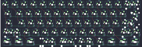{:loading="lazy"}

## 4pplet/waffling60_rev_d_ansi

[layout](waffling60_rev_d_ansi-kle.json) - [PCB](waffling60_rev_d_ansi.kicad_pcb)

{:loading="lazy"}

[Open in keyboard-layout-editor](http://www.keyboard-layout-editor.com/##@@_c=#aaaaaa;&=0,0&_c=#cccccc;&=0,1&=0,2&=0,3&=0,4&=0,5&=0,6&=0,7&=0,8&=0,9&=0,10&=0,11&=0,12&_c=#aaaaaa&w:2;&=1,13%0A%0A%0A0,0;&@_w:1.5;&=1,0&_c=#cccccc;&=1,1&=1,2&=1,3&=1,4&=1,5&=1,6&=1,7&=1,8&=1,9&=1,10&=1,11&=1,12&_c=#aaaaaa&w:1.5;&=2,12;&@_w:1.75;&=2,0&_c=#cccccc;&=2,1&=2,2&=2,3&=2,4&=2,5&=2,6&=2,7&=2,8&=2,9&=2,10&=2,11&_c=#aaaaaa&w:2.25;&=2,13;&@_w:2.25;&=3,0&_c=#cccccc;&=3,2&=3,3&=3,4&=3,5&=3,6&=3,7&=3,8&=3,9&=3,10&=3,11&_c=#aaaaaa&w:1.75;&=3,12&=3,13;&@_w:1.5;&=4,0%0A%0A%0A1,0&=4,1%0A%0A%0A1,0&_w:1.5;&=4,2%0A%0A%0A2,0&_c=#cccccc&w:7;&=4,6%0A%0A%0A2,0&_c=#aaaaaa&w:1.5;&=4,11%0A%0A%0A2,0&=4,12%0A%0A%0A1,0&_w:1.5;&=4,13%0A%0A%0A1,0;&@_x:15.5&y:-5&c=#cccccc;&=0,13%0A%0A%0A0,1&_c=#aaaaaa;&=1,13%0A%0A%0A0,1;&@_x:2.5&y:4.5&w:1.5;&=4,2%0A%0A%0A2,1&_c=#cccccc&w:3;&=4,4%0A%0A%0A2,1&=4,6%0A%0A%0A2,1&_w:3;&=4,8%0A%0A%0A2,1&_c=#aaaaaa&w:1.5;&=4,11%0A%0A%0A2,1;&@_x:2.5&c=#cccccc&w:10;&=4,6%0A%0A%0A2,2;&@_c=#aaaaaa&w:1.5;&=4,0%0A%0A%0A1,1&_d:true;&=4,1%0A%0A%0A1,1&_x:10.0&d:true;&=4,12%0A%0A%0A1,1&_w:1.5;&=4,13%0A%0A%0A1,1;&@_w:1.5&d:true;&=4,0%0A%0A%0A1,2&=4,1%0A%0A%0A1,2&_x:10.0;&=4,12%0A%0A%0A1,2&_w:1.5&d:true;&=4,13%0A%0A%0A1,2)

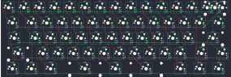{:loading="lazy"}

## 4pplet/waffling60_rev_d_iso

[layout](waffling60_rev_d_iso-kle.json) - [PCB](waffling60_rev_d_iso.kicad_pcb)

{:loading="lazy"}

[Open in keyboard-layout-editor](http://www.keyboard-layout-editor.com/##@@_c=#aaaaaa;&=0,0&_c=#cccccc;&=0,1&=0,2&=0,3&=0,4&=0,5&=0,6&=0,7&=0,8&=0,9&=0,10&=0,11&=0,12&_c=#aaaaaa&w:2;&=1,13%0A%0A%0A0,0;&@_w:1.5;&=1,0&_c=#cccccc;&=1,1&=1,2&=1,3&=1,4&=1,5&=1,6&=1,7&=1,8&=1,9&=1,10&=1,11&=1,12&_x:0.25&c=#aaaaaa&w:1.25&h:2&w2:1.5&h2:1&x2:-0.25;&=2,13;&@_w:1.75;&=2,0&_c=#cccccc;&=2,1&=2,2&=2,3&=2,4&=2,5&=2,6&=2,7&=2,8&=2,9&=2,10&=2,11&=2,12;&@_c=#aaaaaa&w:1.25;&=3,0&=3,1&_c=#cccccc;&=3,2&=3,3&=3,4&=3,5&=3,6&=3,7&=3,8&=3,9&=3,10&=3,11&_c=#aaaaaa&w:1.75;&=3,12&=3,13;&@_w:1.5;&=4,0%0A%0A%0A1,0&=4,1%0A%0A%0A1,0&_w:1.5;&=4,2%0A%0A%0A2,0&_c=#cccccc&w:7;&=4,6%0A%0A%0A2,0&_c=#aaaaaa&w:1.5;&=4,11%0A%0A%0A2,0&=4,12%0A%0A%0A1,0&_w:1.5;&=4,13%0A%0A%0A1,0;&@_x:15.5&y:-5&c=#cccccc;&=0,13%0A%0A%0A0,1&_c=#aaaaaa;&=1,13%0A%0A%0A0,1;&@_x:2.5&y:4.5&w:1.5;&=4,2%0A%0A%0A2,1&_c=#cccccc&w:3;&=4,4%0A%0A%0A2,1&=4,6%0A%0A%0A2,1&_w:3;&=4,8%0A%0A%0A2,1&_c=#aaaaaa&w:1.5;&=4,11%0A%0A%0A2,1;&@_x:2.5&c=#cccccc&w:10;&=4,6%0A%0A%0A2,2;&@_c=#aaaaaa&w:1.5;&=4,0%0A%0A%0A1,1&_d:true;&=4,1%0A%0A%0A1,1&_x:10.0&d:true;&=4,12%0A%0A%0A1,1&_w:1.5;&=4,13%0A%0A%0A1,1;&@_w:1.5&d:true;&=4,0%0A%0A%0A1,2&=4,1%0A%0A%0A1,2&_x:10.0;&=4,12%0A%0A%0A1,2&_w:1.5&d:true;&=4,13%0A%0A%0A1,2)

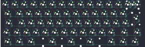{:loading="lazy"}

## 4pplet/waffling80_rev_a

[layout](waffling80_rev_a-kle.json) - [PCB](waffling80_rev_a.kicad_pcb)

{:loading="lazy"}

[Open in keyboard-layout-editor](http://www.keyboard-layout-editor.com/##@@_x:2.75&y:1.5&c=#aaaaaa;&=0,0%0A%0A%0A1,0&_x:1.0&c=#cccccc;&=0,1%0A%0A%0A1,0&=1,1%0A%0A%0A1,0&=0,2%0A%0A%0A1,0&=1,2%0A%0A%0A1,0&_x:0.5&c=#aaaaaa;&=0,3%0A%0A%0A1,0&=1,3%0A%0A%0A1,0&=0,4%0A%0A%0A1,0&=1,4%0A%0A%0A1,0&_x:0.5&c=#cccccc;&=0,5%0A%0A%0A1,0&=1,5%0A%0A%0A1,0&=0,6%0A%0A%0A1,0&=1,6%0A%0A%0A1,0&_x:0.25&c=#aaaaaa;&=0,7%0A%0A%0A1,0&=1,7%0A%0A%0A1,0&=3,7%0A%0A%0A1,0;&@_x:2.75&y:0.25&c=#cccccc;&=2,0&=3,0&=2,1&=3,1&=2,2&=3,2&=2,3&=3,3&=2,4&=3,4&=2,5&=3,5&=2,6&_c=#aaaaaa&w:2;&=6,7%0A%0A%0A2,0&_x:0.25;&=2,7&=5,7&=9,7;&@_x:2.75&w:1.5;&=4,0&_c=#cccccc;&=5,0&=4,1&=5,1&=4,2&=5,2&=4,3&=5,3&=4,4&=5,4&=4,5&=5,5&=4,6&_w:1.5;&=5,6%0A%0A%0A3,0&_x:0.25&c=#aaaaaa;&=4,7&=7,7&=11,7;&@_x:2.75&w:1.75;&=6,0&_c=#cccccc;&=7,0&=6,1&=7,1&=6,2&=7,2&=6,3&=7,3&=6,4&=7,4&=6,5&=7,5&_c=#aaaaaa&w:2.25;&=7,6%0A%0A%0A3,0&_x:0.25&c=#cccccc&d:true;&=11,0%0A%0A%0A6,0&_x:1.0&d:true;&=10,2%0A%0A%0A6,0;&@_x:2.75&c=#aaaaaa&w:2.25;&=8,0%0A%0A%0A4,0&_c=#cccccc;&=8,1&=9,1&=8,2&=9,2&=8,3&=9,3&=8,4&=9,4&=8,5&=9,5&_c=#aaaaaa&w:2.75;&=8,6%0A%0A%0A5,0&_x:1.25;&=8,7;&@_x:2.75&w:1.5;&=10,0%0A%0A%0A0,0&=11,1%0A%0A%0A0,0&_w:1.5;&=10,1%0A%0A%0A0,0&_c=#cccccc&w:7;&=10,3%0A%0A%0A0,0&_c=#aaaaaa&w:1.5;&=11,4%0A%0A%0A0,0&=10,5%0A%0A%0A0,0&_w:1.5;&=11,5%0A%0A%0A0,0&_x:0.25;&=10,6&=11,6&=10,7;&@_x:2.75&y:-7.75;&=0,0%0A%0A%0A1,1&_x:0.25&c=#cccccc;&=1,0%0A%0A%0A1,1&=0,1%0A%0A%0A1,1&=1,1%0A%0A%0A1,1&=0,2%0A%0A%0A1,1&_x:0.25&c=#aaaaaa;&=1,2%0A%0A%0A1,1&=0,3%0A%0A%0A1,1&=1,3%0A%0A%0A1,1&=0,4%0A%0A%0A1,1&_x:0.25&c=#cccccc;&=1,4%0A%0A%0A1,1&=0,5%0A%0A%0A1,1&=1,5%0A%0A%0A1,1&=0,6%0A%0A%0A1,1&_x:0.25;&=1,6%0A%0A%0A1,1&_x:0.25&c=#aaaaaa;&=0,7%0A%0A%0A1,1&=1,7%0A%0A%0A1,1&=3,7%0A%0A%0A1,1;&@_x:22.0&y:1.75&c=#cccccc;&=3,6%0A%0A%0A2,1&=6,7%0A%0A%0A2,1;&@_x:22.75&w:1.25&h:2&w2:1.5&h2:1&x2:-0.25;&=7,6%0A%0A%0A3,1;&@_x:21.75;&=6,6%0A%0A%0A3,1;&@_c=#aaaaaa&w:1.25;&=8,0%0A%0A%0A4,1&_c=#cccccc;&=9,0%0A%0A%0A4,1&_x:19.0&w:1.75;&=8,6%0A%0A%0A5,1&=9,6%0A%0A%0A5,1;&@_x:2.75&y:1.5&c=#aaaaaa&w:1.25;&=10,0%0A%0A%0A0,1&_w:1.25;&=11,1%0A%0A%0A0,1&_w:1.25;&=10,1%0A%0A%0A0,1&_c=#cccccc&w:6.25;&=10,3%0A%0A%0A0,1&_c=#aaaaaa&w:1.25;&=10,4%0A%0A%0A0,1&_w:1.25;&=11,4%0A%0A%0A0,1&_w:1.25;&=10,5%0A%0A%0A0,1&_w:1.25;&=11,5%0A%0A%0A0,1&_x:0.25;&=11,0%0A%0A%0A6,1&_x:1.0;&=10,2%0A%0A%0A6,1;&@_x:2.75&w:1.25;&=10,0%0A%0A%0A0,2&_w:1.25;&=11,1%0A%0A%0A0,2&_w:1.25;&=10,1%0A%0A%0A0,2&_c=#cccccc&w:2.25;&=11,2%0A%0A%0A0,2&_w:1.25;&=10,3%0A%0A%0A0,2&_w:2.75;&=11,3%0A%0A%0A0,2&_c=#aaaaaa&w:1.25;&=10,4%0A%0A%0A0,2&_w:1.25;&=11,4%0A%0A%0A0,2&_w:1.25;&=10,5%0A%0A%0A0,2&_w:1.25;&=11,5%0A%0A%0A0,2;&@_x:2.75&w:1.5;&=10,0%0A%0A%0A0,3&=11,1%0A%0A%0A0,3&_w:1.5;&=10,1%0A%0A%0A0,3&_c=#cccccc&w:3;&=11,2%0A%0A%0A0,3&=10,3%0A%0A%0A0,3&_w:3;&=11,3%0A%0A%0A0,3&_c=#aaaaaa&w:1.5;&=11,4%0A%0A%0A0,3&=10,5%0A%0A%0A0,3&_w:1.5;&=11,5%0A%0A%0A0,3;&@_x:2.75&w:1.5;&=10,0%0A%0A%0A0,4&_d:true;&=11,1%0A%0A%0A0,4&_w:1.5;&=10,1%0A%0A%0A0,4&_c=#cccccc&w:7;&=10,3%0A%0A%0A0,4&_c=#aaaaaa&w:1.5;&=11,4%0A%0A%0A0,4&_d:true;&=10,5%0A%0A%0A0,4&_w:1.5;&=11,5%0A%0A%0A0,4;&@_x:2.75&w:1.5;&=10,0%0A%0A%0A0,5&_d:true;&=11,1%0A%0A%0A0,5&_w:1.5;&=10,1%0A%0A%0A0,5&_c=#cccccc&w:3;&=11,2%0A%0A%0A0,5&=10,3%0A%0A%0A0,5&_w:3;&=11,3%0A%0A%0A0,5&_c=#aaaaaa&w:1.5;&=11,4%0A%0A%0A0,5&_d:true;&=10,5%0A%0A%0A0,5&_w:1.5;&=11,5%0A%0A%0A0,5)

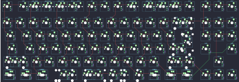{:loading="lazy"}

## 4pplet/waffling80_rev_b

[layout](waffling80_rev_b-kle.json) - [PCB](waffling80_rev_b.kicad_pcb)

{:loading="lazy"}

[Open in keyboard-layout-editor](http://www.keyboard-layout-editor.com/##@@_x:2.75&y:1.5&c=#aaaaaa;&=0,0%0A%0A%0A1,0&_x:1.0&c=#cccccc;&=0,1%0A%0A%0A1,0&=1,1%0A%0A%0A1,0&=0,2%0A%0A%0A1,0&=1,2%0A%0A%0A1,0&_x:0.5&c=#aaaaaa;&=0,3%0A%0A%0A1,0&=1,3%0A%0A%0A1,0&=0,4%0A%0A%0A1,0&=1,4%0A%0A%0A1,0&_x:0.5&c=#cccccc;&=0,5%0A%0A%0A1,0&=1,5%0A%0A%0A1,0&=0,6%0A%0A%0A1,0&=1,6%0A%0A%0A1,0&_x:0.25&c=#aaaaaa;&=0,7%0A%0A%0A1,0&=1,7%0A%0A%0A1,0&=3,7%0A%0A%0A1,0;&@_x:2.75&y:0.25&c=#cccccc;&=2,0&=3,0&=2,1&=3,1&=2,2&=3,2&=2,3&=3,3&=2,4&=3,4&=2,5&=3,5&=2,6&_c=#aaaaaa&w:2;&=6,7%0A%0A%0A2,0&_x:0.25;&=2,7&=5,7&=9,7;&@_x:2.75&w:1.5;&=4,0&_c=#cccccc;&=5,0&=4,1&=5,1&=4,2&=5,2&=4,3&=5,3&=4,4&=5,4&=4,5&=5,5&=4,6&_w:1.5;&=5,6%0A%0A%0A3,0&_x:0.25&c=#aaaaaa;&=4,7&=7,7&=11,7;&@_x:2.75&w:1.75;&=6,0&_c=#cccccc;&=7,0&=6,1&=7,1&=6,2&=7,2&=6,3&=7,3&=6,4&=7,4&=6,5&=7,5&_c=#aaaaaa&w:2.25;&=7,6%0A%0A%0A3,0&_x:0.25&c=#cccccc&d:true;&=11,0%0A%0A%0A6,0&_x:1.0&d:true;&=10,2%0A%0A%0A6,0;&@_x:2.75&c=#aaaaaa&w:2.25;&=8,0%0A%0A%0A4,0&_c=#cccccc;&=8,1&=9,1&=8,2&=9,2&=8,3&=9,3&=8,4&=9,4&=8,5&=9,5&_c=#aaaaaa&w:2.75;&=8,6%0A%0A%0A5,0&_x:1.25;&=8,7;&@_x:2.75&w:1.5;&=10,0%0A%0A%0A0,0&=11,1%0A%0A%0A0,0&_w:1.5;&=10,1%0A%0A%0A0,0&_c=#cccccc&w:7;&=10,3%0A%0A%0A0,0&_c=#aaaaaa&w:1.5;&=11,4%0A%0A%0A0,0&=10,5%0A%0A%0A0,0&_w:1.5;&=11,5%0A%0A%0A0,0&_x:0.25;&=10,6&=11,6&=10,7;&@_x:2.75&y:-7.75;&=0,0%0A%0A%0A1,1&_x:0.25&c=#cccccc;&=1,0%0A%0A%0A1,1&=0,1%0A%0A%0A1,1&=1,1%0A%0A%0A1,1&=0,2%0A%0A%0A1,1&_x:0.25&c=#aaaaaa;&=1,2%0A%0A%0A1,1&=0,3%0A%0A%0A1,1&=1,3%0A%0A%0A1,1&=0,4%0A%0A%0A1,1&_x:0.25&c=#cccccc;&=1,4%0A%0A%0A1,1&=0,5%0A%0A%0A1,1&=1,5%0A%0A%0A1,1&=0,6%0A%0A%0A1,1&_x:0.25;&=1,6%0A%0A%0A1,1&_x:0.25&c=#aaaaaa;&=0,7%0A%0A%0A1,1&=1,7%0A%0A%0A1,1&=3,7%0A%0A%0A1,1;&@_x:22.0&y:1.75&c=#cccccc;&=3,6%0A%0A%0A2,1&=6,7%0A%0A%0A2,1;&@_x:22.75&w:1.25&h:2&w2:1.5&h2:1&x2:-0.25;&=7,6%0A%0A%0A3,1;&@_x:21.75;&=6,6%0A%0A%0A3,1;&@_c=#aaaaaa&w:1.25;&=8,0%0A%0A%0A4,1&_c=#cccccc;&=9,0%0A%0A%0A4,1&_x:19.0&w:1.75;&=8,6%0A%0A%0A5,1&=9,6%0A%0A%0A5,1;&@_x:2.75&y:1.5&c=#aaaaaa&w:1.25;&=10,0%0A%0A%0A0,1&_w:1.25;&=11,1%0A%0A%0A0,1&_w:1.25;&=10,1%0A%0A%0A0,1&_c=#cccccc&w:6.25;&=10,3%0A%0A%0A0,1&_c=#aaaaaa&w:1.25;&=10,4%0A%0A%0A0,1&_w:1.25;&=11,4%0A%0A%0A0,1&_w:1.25;&=10,5%0A%0A%0A0,1&_w:1.25;&=11,5%0A%0A%0A0,1&_x:0.25;&=11,0%0A%0A%0A6,1&_x:1.0;&=10,2%0A%0A%0A6,1;&@_x:2.75&w:1.25;&=10,0%0A%0A%0A0,2&_w:1.25;&=11,1%0A%0A%0A0,2&_w:1.25;&=10,1%0A%0A%0A0,2&_c=#cccccc&w:2.25;&=11,2%0A%0A%0A0,2&_w:1.25;&=10,3%0A%0A%0A0,2&_w:2.75;&=11,3%0A%0A%0A0,2&_c=#aaaaaa&w:1.25;&=10,4%0A%0A%0A0,2&_w:1.25;&=11,4%0A%0A%0A0,2&_w:1.25;&=10,5%0A%0A%0A0,2&_w:1.25;&=11,5%0A%0A%0A0,2;&@_x:2.75&w:1.5;&=10,0%0A%0A%0A0,3&=11,1%0A%0A%0A0,3&_w:1.5;&=10,1%0A%0A%0A0,3&_c=#cccccc&w:3;&=11,2%0A%0A%0A0,3&=10,3%0A%0A%0A0,3&_w:3;&=11,3%0A%0A%0A0,3&_c=#aaaaaa&w:1.5;&=11,4%0A%0A%0A0,3&=10,5%0A%0A%0A0,3&_w:1.5;&=11,5%0A%0A%0A0,3;&@_x:2.75&w:1.5;&=10,0%0A%0A%0A0,4&_d:true;&=11,1%0A%0A%0A0,4&_w:1.5;&=10,1%0A%0A%0A0,4&_c=#cccccc&w:7;&=10,3%0A%0A%0A0,4&_c=#aaaaaa&w:1.5;&=11,4%0A%0A%0A0,4&_d:true;&=10,5%0A%0A%0A0,4&_w:1.5;&=11,5%0A%0A%0A0,4;&@_x:2.75&w:1.5;&=10,0%0A%0A%0A0,5&_d:true;&=11,1%0A%0A%0A0,5&_w:1.5;&=10,1%0A%0A%0A0,5&_c=#cccccc&w:3;&=11,2%0A%0A%0A0,5&=10,3%0A%0A%0A0,5&_w:3;&=11,3%0A%0A%0A0,5&_c=#aaaaaa&w:1.5;&=11,4%0A%0A%0A0,5&_d:true;&=10,5%0A%0A%0A0,5&_w:1.5;&=11,5%0A%0A%0A0,5)

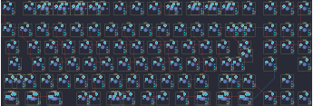{:loading="lazy"}

## 4pplet/yakiimo_rev_a

[layout](yakiimo_rev_a-kle.json) - [PCB](yakiimo_rev_a.kicad_pcb)

{:loading="lazy"}

[Open in keyboard-layout-editor](http://www.keyboard-layout-editor.com/##@@_x:2.75&c=#aaaaaa;&=0,0&_x:1.0&c=#cccccc;&=0,1&=1,1&=0,2&=1,2&_x:0.5&c=#aaaaaa;&=0,3&=1,3&=0,4&=1,4&_x:0.5&c=#cccccc;&=0,5&=1,5&=0,6&=1,6&_x:0.25&c=#aaaaaa;&=0,7&=1,8&=0,8;&@_x:2.75&y:0.5&c=#cccccc;&=2,0&=3,0&=2,1&=3,1&=2,2&=3,2&=2,3&=3,3&=2,4&=3,4&=2,5&=3,5&=2,6&_c=#aaaaaa&w:2;&=2,7%0A%0A%0A1,0&_x:0.25;&=3,7&=2,8&=3,8;&@_x:2.75&w:1.5;&=4,0&_c=#cccccc;&=5,0&=4,1&=5,1&=4,2&=5,2&=4,3&=5,3&=4,4&=5,4&=4,5&=5,5&=4,6&_w:1.5;&=5,6%0A%0A%0A2,0&_x:0.25&c=#aaaaaa;&=4,7&=4,8&=5,8;&@_x:2.75&w:1.75;&=6,0&_c=#cccccc;&=7,0&=6,1&=7,1&=6,2&=7,2&=6,3&=7,3&=6,4&=7,4&=6,5&=7,5&_c=#aaaaaa&w:2.25;&=7,6%0A%0A%0A2,0;&@_x:2.75&w:2.25;&=8,0%0A%0A%0A3,0&_c=#cccccc;&=8,1&=9,1&=8,2&=9,2&=8,3&=9,3&=8,4&=9,4&=8,5&=9,5&_c=#aaaaaa&w:2.75;&=8,6%0A%0A%0A4,0&_x:1.25;&=9,8;&@_x:2.75&w:1.5;&=10,0%0A%0A%0A0,0&_c=#cccccc&d:true;&=10,1%0A%0A%0A5,0&_c=#aaaaaa&w:1.5;&=11,1%0A%0A%0A0,0&_c=#cccccc&w:7;&=11,3%0A%0A%0A0,0&_c=#aaaaaa&w:1.5;&=11,5%0A%0A%0A0,0&_c=#cccccc&d:true;&=10,6%0A%0A%0A5,0&_c=#aaaaaa&w:1.5;&=11,6%0A%0A%0A0,0&_x:0.25;&=10,7&=11,8&=10,8;&@_x:22.25&y:-5.0&c=#cccccc;&=3,6%0A%0A%0A1,1&_c=#aaaaaa;&=2,7%0A%0A%0A1,1;&@_x:23.0&w:1.25&h:2&w2:1.5&h2:1&x2:-0.25;&=7,6%0A%0A%0A2,1;&@_x:22.0&c=#cccccc;&=6,6%0A%0A%0A2,1;&@_c=#aaaaaa&w:1.25;&=8,0%0A%0A%0A3,1&=9,0%0A%0A%0A3,1&_x:19.25&w:1.75;&=8,6%0A%0A%0A4,1&=9,6%0A%0A%0A4,1;&@_x:2.75&y:1.5&w:1.5;&=10,0%0A%0A%0A0,1&_c=#cccccc;&=10,1%0A%0A%0A5,1&_c=#aaaaaa&w:1.5;&=11,1%0A%0A%0A0,1&_c=#cccccc&w:3;&=11,2%0A%0A%0A0,1&=11,3%0A%0A%0A0,1&_w:3;&=11,4%0A%0A%0A0,1&_c=#aaaaaa&w:1.5;&=11,5%0A%0A%0A0,1&_c=#cccccc;&=10,6%0A%0A%0A5,1&_c=#aaaaaa&w:1.5;&=11,6%0A%0A%0A0,1;&@_x:2.75&w:1.5;&=10,0%0A%0A%0A0,2&_x:1.0&c=#cccccc&w:10;&=11,3%0A%0A%0A0,2&_x:1.0&c=#aaaaaa&w:1.5;&=11,6%0A%0A%0A0,2)

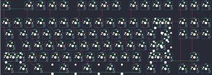{:loading="lazy"}

