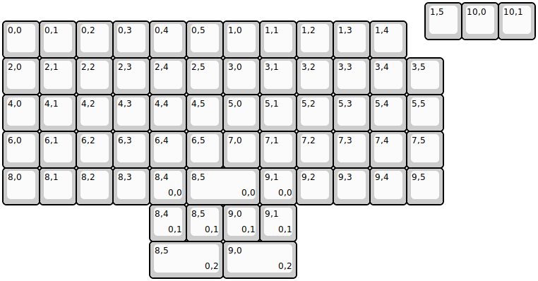
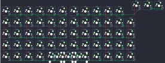

## 7c8/framework

[layout](framework-kle.json) - [PCB](framework.kicad_pcb)

{:loading="lazy"}

[Open in keyboard-layout-editor](http://www.keyboard-layout-editor.com/##@@_x:11.5;&=1,5&=10,0&=10,1;&@_y:-0.5;&=0,0&=0,1&=0,2&=0,3&=0,4&=0,5&=1,0&=1,1&=1,2&=1,3&=1,4;&@=2,0&=2,1&=2,2&=2,3&=2,4&=2,5&=3,0&=3,1&=3,2&=3,3&=3,4&=3,5;&@=4,0&=4,1&=4,2&=4,3&_n:true;&=4,4&=4,5&=5,0&_n:true;&=5,1&=5,2&=5,3&=5,4&=5,5;&@=6,0&=6,1&=6,2&=6,3&=6,4&=6,5&=7,0&=7,1&=7,2&=7,3&=7,4&=7,5;&@=8,0&=8,1&=8,2&=8,3&=8,4%0A%0A%0A0,0&_w:2;&=8,5%0A%0A%0A0,0&=9,1%0A%0A%0A0,0&=9,2&=9,3&=9,4&=9,5;&@_x:4;&=8,4%0A%0A%0A0,1&=8,5%0A%0A%0A0,1&=9,0%0A%0A%0A0,1&=9,1%0A%0A%0A0,1;&@_x:4&w:2;&=8,5%0A%0A%0A0,2&_w:2;&=9,0%0A%0A%0A0,2)

{:loading="lazy"}

