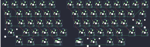

## 7skb/7skb

[layout](7skb-kle.json) - [PCB](7skb.kicad_pcb)

{:loading="lazy"}

[Open in keyboard-layout-editor](http://www.keyboard-layout-editor.com/##@@_c=#777777;&=0,0&_c=#cccccc;&=0,1&=0,2&=0,3&=0,4&=0,5&_x:1;&=5,0&=5,1&=5,2&=5,3&=5,4&=5,5&=5,6&=5,7&_c=#aaaaaa;&=6,7;&@_w:1.5;&=1,0&_c=#cccccc;&=1,1&=1,2&=1,3&=1,4&=1,5&_x:1.0;&=6,0&=6,1&=6,2&=6,3&=6,4&=6,5&=6,6&_c=#aaaaaa&w:1.5;&=7,7;&@_w:1.75;&=2,0&_c=#cccccc;&=2,1&=2,2&=2,3&=2,4&=2,5&_x:1.0;&=7,0&=7,1&=7,2&=7,3&=7,4&=7,5&_c=#777777&w:2.25;&=7,6;&@_c=#aaaaaa&w:2.25;&=3,0&_c=#cccccc;&=3,1&=3,2&=3,3&=3,4&=3,5&_x:1.0;&=8,0&=8,1&=8,2&=8,3&=8,4&_c=#aaaaaa&w:1.75;&=8,5&=8,6;&@_x:1.5;&=4,1&_w:1.5;&=4,2&_w:1.5;&=4,3&_w:1.25;&=4,4%0A%0A%0A0,0&_x:1.0&w:1.25;&=9,0%0A%0A%0A0,0&_w:2;&=9,1&_w:1.5;&=9,3&=9,4;&@_x:5.5&y:0.5&w:1.5;&=4,4%0A%0A%0A0,1&_x:1.0;&=9,0%0A%0A%0A0,1)

{:loading="lazy"}

