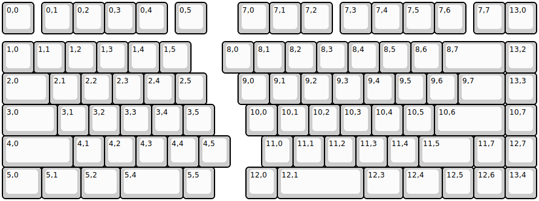
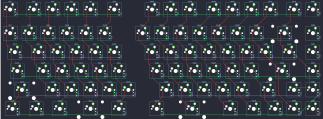

## 7splus/7splus

[layout](7splus-kle.json) - [PCB](7splus.kicad_pcb)

{:loading="lazy"}

[Open in keyboard-layout-editor](http://www.keyboard-layout-editor.com/##@@=0,0&_x:0.25;&=0,1&=0,2&=0,3&=0,4&_x:0.25;&=0,5&_x:1.0;&=7,0&=7,1&=7,2&_x:0.25;&=7,3&=7,4&=7,5&=7,6&_x:0.25;&=7,7&=13,0;&@_y:0.25;&=1,0&=1,1&=1,2&=1,3&=1,4&=1,5&_x:1;&=8,0&=8,1&=8,2&=8,3&=8,4&=8,5&=8,6&_w:2;&=8,7&=13,2;&@_w:1.5;&=2,0&=2,1&=2,2&=2,3&=2,4&=2,5&_x:1.0;&=9,0&=9,1&=9,2&=9,3&=9,4&=9,5&=9,6&_w:1.5;&=9,7&=13,3;&@_w:1.75;&=3,0&=3,1&=3,2&=3,3&=3,4&=3,5&_x:1.0;&=10,0&=10,1&=10,2&=10,3&=10,4&=10,5&_w:2.25;&=10,6&=10,7;&@_w:2.25;&=4,0&=4,1&=4,2&=4,3&=4,4&=4,5&_x:1.0;&=11,0&=11,1&=11,2&=11,3&=11,4&_w:1.75;&=11,5&=11,7&=12,7;&@_w:1.25;&=5,0&_w:1.25;&=5,1&_w:1.25;&=5,2&_w:2;&=5,4&=5,5&_x:1.0;&=12,0&_w:2.75;&=12,1&_w:1.25;&=12,3&_w:1.25;&=12,4&=12,5&=12,6&=13,4)

{:loading="lazy"}

