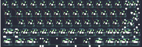

## YMDK/bface

[layout](bface-kle.json) - [PCB](bface.kicad_pcb)

{:loading="lazy"}

[Open in keyboard-layout-editor](http://www.keyboard-layout-editor.com/##@@_c=#777777;&=4,0&_c=#cccccc;&=4,1&=4,2&=4,3&=4,4&=4,5&=4,6&=4,7&=4,8&=4,9&=4,10&=4,11&=4,12&_c=#aaaaaa&w:2;&=4,14%0A%0A%0A0,0;&@_w:1.5;&=3,0&_c=#cccccc;&=3,1&=3,2&=3,3&=3,4&=3,5&=3,6&=3,7&=3,8&=3,9&=3,10&=3,11&=3,12&_w:1.5;&=3,13%0A%0A%0A1,0;&@_c=#aaaaaa&w:1.75;&=2,0&_c=#cccccc;&=2,1&=2,2&=2,3&=2,4&=2,5&=2,6&=2,7&=2,8&=2,9&=2,10&=2,11&_c=#777777&w:2.25;&=2,13%0A%0A%0A1,0;&@_c=#aaaaaa&w:2.25;&=1,0%0A%0A%0A2,0&_c=#cccccc;&=1,2%0A%0A%0A2,0&=1,3%0A%0A%0A2,0&=1,4%0A%0A%0A2,0&=1,5%0A%0A%0A2,0&=1,6%0A%0A%0A2,0&=1,7%0A%0A%0A2,0&=1,8%0A%0A%0A2,0&=1,9%0A%0A%0A2,0&=1,10%0A%0A%0A2,0&=1,11%0A%0A%0A2,0&_c=#aaaaaa&w:2.75;&=1,13%0A%0A%0A2,0;&@_w:1.25;&=0,0%0A%0A%0A3,0&_w:1.25;&=0,1%0A%0A%0A3,0&_w:1.25;&=0,2%0A%0A%0A3,0&_c=#cccccc&w:6.25;&=0,7%0A%0A%0A3,0&_c=#aaaaaa&w:1.25;&=0,9%0A%0A%0A3,0&_w:1.25;&=0,10%0A%0A%0A3,0&_w:1.25;&=0,12%0A%0A%0A3,0&_w:1.25;&=0,13%0A%0A%0A3,0;&@_x:15.75&y:-5&c=#cccccc;&=4,13%0A%0A%0A0,1&_c=#aaaaaa;&=4,14%0A%0A%0A0,1;&@_x:16.5&c=#777777&w:1.25&h:2&w2:1.5&h2:1&x2:-0.25;&=2,13%0A%0A%0A1,1;&@_x:15.5&c=#cccccc;&=2,12%0A%0A%0A1,1;&@_y:2.5&c=#aaaaaa&w:2.25;&=1,0%0A%0A%0A2,1&_c=#cccccc;&=1,2%0A%0A%0A2,1&=1,3%0A%0A%0A2,1&=1,4%0A%0A%0A2,1&=1,5%0A%0A%0A2,1&=1,6%0A%0A%0A2,1&=1,7%0A%0A%0A2,1&=1,8%0A%0A%0A2,1&=1,9%0A%0A%0A2,1&=1,10%0A%0A%0A2,1&=1,11%0A%0A%0A2,1&_c=#aaaaaa&w:1.75;&=1,13%0A%0A%0A2,1&=1,14%0A%0A%0A2,1;&@_w:2.25;&=1,0%0A%0A%0A2,2&_c=#cccccc;&=1,2%0A%0A%0A2,2&=1,3%0A%0A%0A2,2&=1,4%0A%0A%0A2,2&=1,5%0A%0A%0A2,2&=1,6%0A%0A%0A2,2&=1,7%0A%0A%0A2,2&=1,8%0A%0A%0A2,2&=1,9%0A%0A%0A2,2&=1,10%0A%0A%0A2,2&_c=#aaaaaa&w:1.75;&=1,11%0A%0A%0A2,2&_c=#cccccc;&=1,13%0A%0A%0A2,2&_c=#aaaaaa;&=1,14%0A%0A%0A2,2;&@_y:0.25&w:1.25;&=1,0%0A%0A%0A2,3&_c=#cccccc;&=1,1%0A%0A%0A2,3&=1,2%0A%0A%0A2,3&=1,3%0A%0A%0A2,3&=1,4%0A%0A%0A2,3&=1,5%0A%0A%0A2,3&=1,6%0A%0A%0A2,3&=1,7%0A%0A%0A2,3&=1,8%0A%0A%0A2,3&=1,9%0A%0A%0A2,3&=1,10%0A%0A%0A2,3&=1,11%0A%0A%0A2,3&_c=#aaaaaa&w:2.75;&=1,13%0A%0A%0A2,3;&@_w:1.25;&=1,0%0A%0A%0A2,4&_c=#cccccc;&=1,1%0A%0A%0A2,4&=1,2%0A%0A%0A2,4&=1,3%0A%0A%0A2,4&=1,4%0A%0A%0A2,4&=1,5%0A%0A%0A2,4&=1,6%0A%0A%0A2,4&=1,7%0A%0A%0A2,4&=1,8%0A%0A%0A2,4&=1,9%0A%0A%0A2,4&=1,10%0A%0A%0A2,4&=1,11%0A%0A%0A2,4&_c=#aaaaaa&w:1.75;&=1,13%0A%0A%0A2,4&=1,14%0A%0A%0A2,4;&@_w:1.25;&=1,0%0A%0A%0A2,5&_c=#cccccc;&=1,1%0A%0A%0A2,5&=1,2%0A%0A%0A2,5&=1,3%0A%0A%0A2,5&=1,4%0A%0A%0A2,5&=1,5%0A%0A%0A2,5&=1,6%0A%0A%0A2,5&=1,7%0A%0A%0A2,5&=1,8%0A%0A%0A2,5&=1,9%0A%0A%0A2,5&=1,10%0A%0A%0A2,5&_c=#aaaaaa&w:1.75;&=1,11%0A%0A%0A2,5&_c=#cccccc;&=1,13%0A%0A%0A2,5&_c=#aaaaaa;&=1,14%0A%0A%0A2,5;&@_w:2;&=1,0%0A%0A%0A2,6&_c=#cccccc;&=1,2%0A%0A%0A2,6&=1,3%0A%0A%0A2,6&=1,4%0A%0A%0A2,6&=1,5%0A%0A%0A2,6&=1,6%0A%0A%0A2,6&=1,7%0A%0A%0A2,6&=1,8%0A%0A%0A2,6&=1,9%0A%0A%0A2,6&=1,10%0A%0A%0A2,6&=1,11%0A%0A%0A2,6&_c=#aaaaaa;&=1,12%0A%0A%0A2,6&_c=#cccccc;&=1,13%0A%0A%0A2,6&_c=#aaaaaa;&=1,14%0A%0A%0A2,6;&@_y:0.5&w:1.5;&=0,0%0A%0A%0A3,1&=0,1%0A%0A%0A3,1&_w:1.5;&=0,2%0A%0A%0A3,1&_c=#cccccc&w:7;&=0,7%0A%0A%0A3,1&_c=#aaaaaa&w:1.5;&=0,10%0A%0A%0A3,1&=0,12%0A%0A%0A3,1&_w:1.5;&=0,13%0A%0A%0A3,1;&@_w:1.5;&=0,0%0A%0A%0A3,2&_c=#cccccc&d:true;&=0,1%0A%0A%0A3,2&_c=#aaaaaa&w:1.5;&=0,2%0A%0A%0A3,2&_c=#cccccc&w:7;&=0,7%0A%0A%0A3,2&_c=#aaaaaa&w:1.5;&=0,10%0A%0A%0A3,2&_c=#cccccc&d:true;&=0,12%0A%0A%0A3,2&_c=#aaaaaa&w:1.5;&=0,13%0A%0A%0A3,2;&@_c=#cccccc&w:1.5&d:true;&=0,0%0A%0A%0A3,3&_c=#aaaaaa;&=0,1%0A%0A%0A3,3&_w:1.5;&=0,2%0A%0A%0A3,3&_c=#cccccc&w:7;&=0,7%0A%0A%0A3,3&_c=#aaaaaa&w:1.5;&=0,10%0A%0A%0A3,3&=0,12%0A%0A%0A3,3&_c=#cccccc&w:1.5&d:true;&=0,13%0A%0A%0A3,3;&@_c=#aaaaaa&w:1.25;&=0,0%0A%0A%0A3,4&_w:1.25;&=0,1%0A%0A%0A3,4&_w:1.25;&=0,2%0A%0A%0A3,4&_c=#cccccc&w:6.25;&=0,7%0A%0A%0A3,4&_c=#aaaaaa;&=0,9%0A%0A%0A3,4&=0,10%0A%0A%0A3,4&_c=#cccccc;&=0,11%0A%0A%0A3,4&=0,12%0A%0A%0A3,4&=0,13%0A%0A%0A3,4;&@_c=#aaaaaa&w:1.75;&=0,0%0A%0A%0A3,5&_w:1.25;&=0,1%0A%0A%0A3,5&_w:1.25;&=0,2%0A%0A%0A3,5&_w:1.25;&=0,3%0A%0A%0A3,5&_c=#cccccc&w:3;&=0,7%0A%0A%0A3,5&_c=#aaaaaa&w:1.25;&=0,8%0A%0A%0A3,5&_w:1.25;&=0,9%0A%0A%0A3,5&=0,10%0A%0A%0A3,5&_c=#cccccc;&=0,11%0A%0A%0A3,5&=0,12%0A%0A%0A3,5&=0,13%0A%0A%0A3,5)

{:loading="lazy"}

