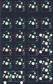

## YMDK/np21

[layout](np21-kle.json) - [PCB](np21.kicad_pcb)

{:loading="lazy"}

[Open in keyboard-layout-editor](http://www.keyboard-layout-editor.com/##@@=0,0&=1,0&=2,0&=3,0;&@_y:0.25;&=0,1&=1,1&=2,1&=3,1;&@=0,2&=1,2&=2,2&=3,2%0A%0A%0A2,0;&@=0,3&=1,3&=2,3&=3,3%0A%0A%0A2,0;&@=0,4&=1,4&=2,4&=3,4%0A%0A%0A1,0;&@=0,5%0A%0A%0A0,0&=1,5%0A%0A%0A0,0&=2,5&=3,5%0A%0A%0A1,0;&@_x:4.25&y:-4.0&h:2;&=3,2%0A%0A%0A2,1;&@_x:4.25&y:1.0&h:2;&=3,4%0A%0A%0A1,1;&@_y:1.25&w:2;&=0,5%0A%0A%0A0,1)

{:loading="lazy"}

