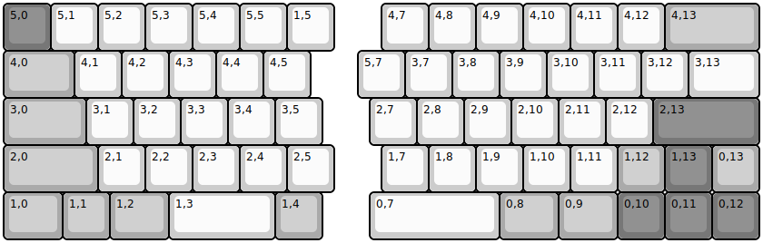
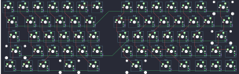

## YMDK/sp64

[layout](sp64-kle.json) - [PCB](sp64.kicad_pcb)

{:loading="lazy"}

[Open in keyboard-layout-editor](http://www.keyboard-layout-editor.com/##@@_c=#777777;&=5,0&_c=#cccccc;&=5,1&=5,2&=5,3&=5,4&=5,5&=1,5&_x:1;&=4,7&=4,8&=4,9&=4,10&=4,11&=4,12&_c=#aaaaaa&w:2;&=4,13;&@_w:1.5;&=4,0&_c=#cccccc;&=4,1&=4,2&=4,3&=4,4&=4,5&_x:1.0;&=5,7&=3,7&=3,8&=3,9&=3,10&=3,11&=3,12&_w:1.5;&=3,13;&@_c=#aaaaaa&w:1.75;&=3,0&_c=#cccccc;&=3,1&=3,2&=3,3&=3,4&=3,5&_x:1.0;&=2,7&=2,8&=2,9&=2,10&=2,11&=2,12&_c=#777777&w:2.25;&=2,13;&@_c=#aaaaaa&w:2;&=2,0&_c=#cccccc;&=2,1&=2,2&=2,3&=2,4&=2,5&_x:1;&=1,7&=1,8&=1,9&=1,10&=1,11&_c=#aaaaaa;&=1,12&_c=#777777;&=1,13&_c=#aaaaaa;&=0,13;&@_w:1.25;&=1,0&=1,1&_w:1.25;&=1,2&_c=#cccccc&w:2.25;&=1,3&_c=#aaaaaa;&=1,4&_x:1.0&c=#cccccc&w:2.75;&=0,7&_c=#aaaaaa&w:1.25;&=0,8&_w:1.25;&=0,9&_c=#777777;&=0,10&=0,11&=0,12)

{:loading="lazy"}

