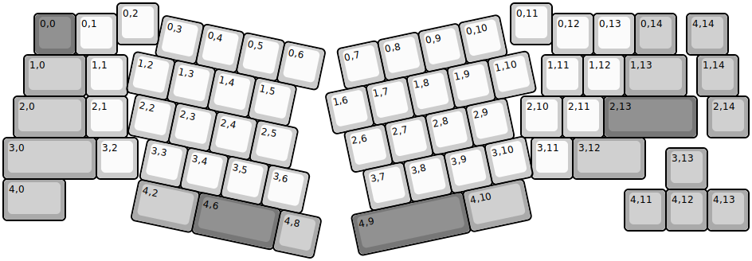
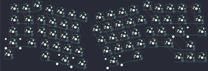

## YMDK/wings

[layout](wings-kle.json) - [PCB](wings.kicad_pcb)

{:loading="lazy"}

[Open in keyboard-layout-editor](http://www.keyboard-layout-editor.com/##@@_x:2.75;&=0,2&_x:8.5;&=0,11;&@_x:0.75&y:-0.75&c=#777777;&=0,0&_c=#cccccc;&=0,1&_x:10.5;&=0,12&=0,13&_c=#aaaaaa;&=0,14&_x:0.25;&=4,14;&@_x:0.5&w:1.5;&=1,0&_c=#cccccc;&=1,1&_x:10.0;&=1,11&=1,12&_c=#aaaaaa&w:1.5;&=1,13&_x:0.25;&=1,14;&@_x:0.25&w:1.75;&=2,0&_c=#cccccc;&=2,1&_x:9.5;&=2,10&=2,11&_c=#777777&w:2.25;&=2,13&_x:0.25&c=#aaaaaa;&=2,14;&@_w:2.25;&=3,0&_c=#cccccc;&=3,2&_x:9.5;&=3,11&_c=#aaaaaa&w:1.75;&=3,12;&@_x:16&y:-0.75;&=3,13;&@_y:-0.25&w:1.5;&=4,0;&@_x:15&y:-0.75;&=4,11&=4,12&=4,13;&@_r:12&rx:4.75&ry:2.25&x:-1.25&y:-1.75&c=#cccccc;&=0,3&=0,4&=0,5&=0,6;&@_x:-1.75;&=1,2&=1,3&=1,4&=1,5;&@_x:-1.5;&=2,2&=2,3&=2,4&=2,5;&@_x:-1.0;&=3,3&=3,4&=3,5&=3,6;&@_x:-1.0&c=#aaaaaa&w:1.5;&=4,2&_c=#777777&w:2;&=4,6&_c=#aaaaaa;&=4,8;&@_r:-12&rx:11.25&ry:3&x:-2.75&y:-2.5&c=#cccccc;&=0,7&=0,8&=0,9&=0,10;&@_x:-3.25;&=1,6&=1,7&=1,8&=1,9&=1,10;&@_x:-3.0;&=2,6&=2,7&=2,8&=2,9;&@_x:-2.75;&=3,7&=3,8&=3,9&=3,10;&@_x:-3.25&c=#777777&w:2.75;&=4,9&_c=#aaaaaa&w:1.5;&=4,10)

{:loading="lazy"}

