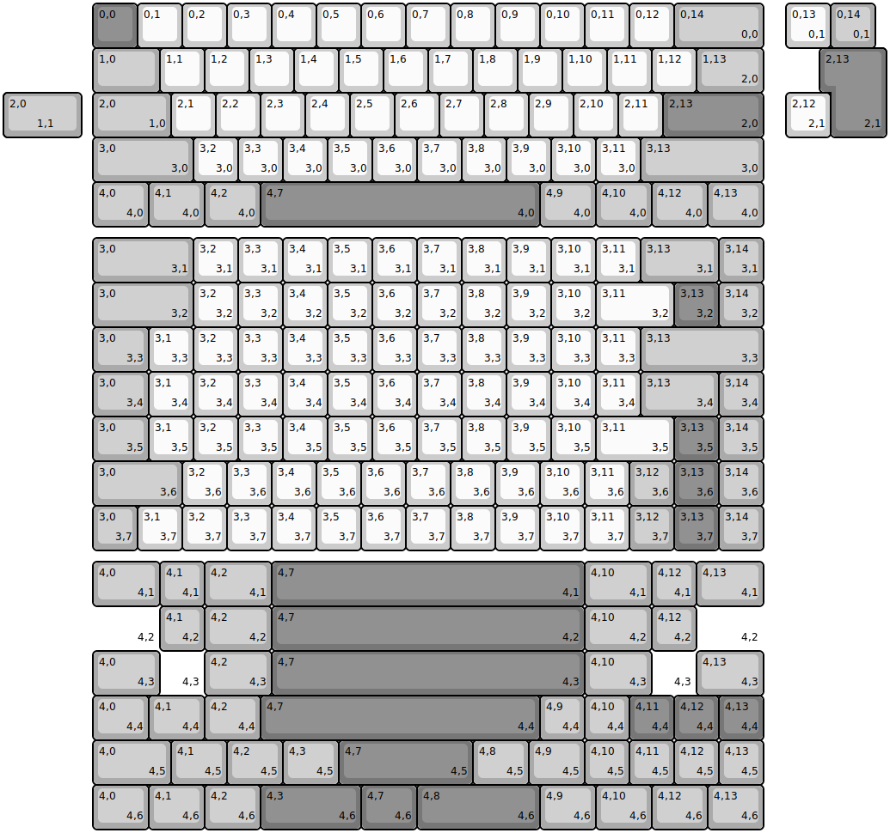
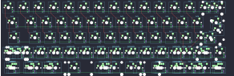

## YMDK/yd60mq

[layout](yd60mq-kle.json) - [PCB](yd60mq.kicad_pcb)

{:loading="lazy"}

[Open in keyboard-layout-editor](http://www.keyboard-layout-editor.com/##@@_x:2&c=#777777;&=0,0&_c=#cccccc;&=0,1&=0,2&=0,3&=0,4&=0,5&=0,6&=0,7&=0,8&=0,9&=0,10&=0,11&=0,12&_c=#aaaaaa&w:2;&=0,14%0A%0A%0A0,0;&@_x:2&w:1.5;&=1,0&_c=#cccccc;&=1,1&=1,2&=1,3&=1,4&=1,5&=1,6&=1,7&=1,8&=1,9&=1,10&=1,11&=1,12&_c=#aaaaaa&w:1.5;&=1,13%0A%0A%0A2,0;&@_x:2.0&w:1.75;&=2,0%0A%0A%0A1,0&_c=#cccccc;&=2,1&=2,2&=2,3&=2,4&=2,5&=2,6&=2,7&=2,8&=2,9&=2,10&=2,11&_c=#777777&w:2.25;&=2,13%0A%0A%0A2,0;&@_x:2&c=#aaaaaa&w:2.25;&=3,0%0A%0A%0A3,0&_c=#cccccc;&=3,2%0A%0A%0A3,0&=3,3%0A%0A%0A3,0&=3,4%0A%0A%0A3,0&=3,5%0A%0A%0A3,0&=3,6%0A%0A%0A3,0&=3,7%0A%0A%0A3,0&=3,8%0A%0A%0A3,0&=3,9%0A%0A%0A3,0&=3,10%0A%0A%0A3,0&=3,11%0A%0A%0A3,0&_c=#aaaaaa&w:2.75;&=3,13%0A%0A%0A3,0;&@_x:2&w:1.25;&=4,0%0A%0A%0A4,0&_w:1.25;&=4,1%0A%0A%0A4,0&_w:1.25;&=4,2%0A%0A%0A4,0&_c=#777777&w:6.25;&=4,7%0A%0A%0A4,0&_c=#aaaaaa&w:1.25;&=4,9%0A%0A%0A4,0&_w:1.25;&=4,10%0A%0A%0A4,0&_w:1.25;&=4,12%0A%0A%0A4,0&_w:1.25;&=4,13%0A%0A%0A4,0;&@_x:17.5&y:-5&c=#cccccc;&=0,13%0A%0A%0A0,1&_c=#aaaaaa;&=0,14%0A%0A%0A0,1;&@_x:18.5&c=#777777&w:1.25&h:2&w2:1.5&h2:1&x2:-0.25;&=2,13%0A%0A%0A2,1;&@_c=#aaaaaa&w:1.25&w2:1.75&l:true;&=2,0%0A%0A%0A1,1&_x:16.25&c=#cccccc;&=2,12%0A%0A%0A2,1;&@_x:2&y:2.25&c=#aaaaaa&w:2.25;&=3,0%0A%0A%0A3,1&_c=#cccccc;&=3,2%0A%0A%0A3,1&=3,3%0A%0A%0A3,1&=3,4%0A%0A%0A3,1&=3,5%0A%0A%0A3,1&=3,6%0A%0A%0A3,1&=3,7%0A%0A%0A3,1&=3,8%0A%0A%0A3,1&=3,9%0A%0A%0A3,1&=3,10%0A%0A%0A3,1&=3,11%0A%0A%0A3,1&_c=#aaaaaa&w:1.75;&=3,13%0A%0A%0A3,1&=3,14%0A%0A%0A3,1;&@_x:2&w:2.25;&=3,0%0A%0A%0A3,2&_c=#cccccc;&=3,2%0A%0A%0A3,2&=3,3%0A%0A%0A3,2&=3,4%0A%0A%0A3,2&=3,5%0A%0A%0A3,2&=3,6%0A%0A%0A3,2&=3,7%0A%0A%0A3,2&=3,8%0A%0A%0A3,2&=3,9%0A%0A%0A3,2&=3,10%0A%0A%0A3,2&_w:1.75;&=3,11%0A%0A%0A3,2&_c=#777777;&=3,13%0A%0A%0A3,2&_c=#aaaaaa;&=3,14%0A%0A%0A3,2;&@_x:2&w:1.25;&=3,0%0A%0A%0A3,3&_c=#cccccc;&=3,1%0A%0A%0A3,3&=3,2%0A%0A%0A3,3&=3,3%0A%0A%0A3,3&=3,4%0A%0A%0A3,3&=3,5%0A%0A%0A3,3&=3,6%0A%0A%0A3,3&=3,7%0A%0A%0A3,3&=3,8%0A%0A%0A3,3&=3,9%0A%0A%0A3,3&=3,10%0A%0A%0A3,3&=3,11%0A%0A%0A3,3&_c=#aaaaaa&w:2.75;&=3,13%0A%0A%0A3,3;&@_x:2&w:1.25;&=3,0%0A%0A%0A3,4&_c=#cccccc;&=3,1%0A%0A%0A3,4&=3,2%0A%0A%0A3,4&=3,3%0A%0A%0A3,4&=3,4%0A%0A%0A3,4&=3,5%0A%0A%0A3,4&=3,6%0A%0A%0A3,4&=3,7%0A%0A%0A3,4&=3,8%0A%0A%0A3,4&=3,9%0A%0A%0A3,4&=3,10%0A%0A%0A3,4&=3,11%0A%0A%0A3,4&_c=#aaaaaa&w:1.75;&=3,13%0A%0A%0A3,4&=3,14%0A%0A%0A3,4;&@_x:2&w:1.25;&=3,0%0A%0A%0A3,5&_c=#cccccc;&=3,1%0A%0A%0A3,5&=3,2%0A%0A%0A3,5&=3,3%0A%0A%0A3,5&=3,4%0A%0A%0A3,5&=3,5%0A%0A%0A3,5&=3,6%0A%0A%0A3,5&=3,7%0A%0A%0A3,5&=3,8%0A%0A%0A3,5&=3,9%0A%0A%0A3,5&=3,10%0A%0A%0A3,5&_w:1.75;&=3,11%0A%0A%0A3,5&_c=#777777;&=3,13%0A%0A%0A3,5&_c=#aaaaaa;&=3,14%0A%0A%0A3,5;&@_x:2&w:2;&=3,0%0A%0A%0A3,6&_c=#cccccc;&=3,2%0A%0A%0A3,6&=3,3%0A%0A%0A3,6&=3,4%0A%0A%0A3,6&=3,5%0A%0A%0A3,6&=3,6%0A%0A%0A3,6&=3,7%0A%0A%0A3,6&=3,8%0A%0A%0A3,6&=3,9%0A%0A%0A3,6&=3,10%0A%0A%0A3,6&=3,11%0A%0A%0A3,6&_c=#aaaaaa;&=3,12%0A%0A%0A3,6&_c=#777777;&=3,13%0A%0A%0A3,6&_c=#aaaaaa;&=3,14%0A%0A%0A3,6;&@_x:2;&=3,0%0A%0A%0A3,7&_c=#cccccc;&=3,1%0A%0A%0A3,7&=3,2%0A%0A%0A3,7&=3,3%0A%0A%0A3,7&=3,4%0A%0A%0A3,7&=3,5%0A%0A%0A3,7&=3,6%0A%0A%0A3,7&=3,7%0A%0A%0A3,7&=3,8%0A%0A%0A3,7&=3,9%0A%0A%0A3,7&=3,10%0A%0A%0A3,7&=3,11%0A%0A%0A3,7&_c=#aaaaaa;&=3,12%0A%0A%0A3,7&_c=#777777;&=3,13%0A%0A%0A3,7&_c=#aaaaaa;&=3,14%0A%0A%0A3,7;&@_x:2&y:0.25&w:1.5;&=4,0%0A%0A%0A4,1&=4,1%0A%0A%0A4,1&_w:1.5;&=4,2%0A%0A%0A4,1&_c=#777777&w:7;&=4,7%0A%0A%0A4,1&_c=#aaaaaa&w:1.5;&=4,10%0A%0A%0A4,1&=4,12%0A%0A%0A4,1&_w:1.5;&=4,13%0A%0A%0A4,1;&@_x:2&w:1.5&d:true;&=%0A%0A%0A4,2&=4,1%0A%0A%0A4,2&_w:1.5;&=4,2%0A%0A%0A4,2&_c=#777777&w:7;&=4,7%0A%0A%0A4,2&_c=#aaaaaa&w:1.5;&=4,10%0A%0A%0A4,2&=4,12%0A%0A%0A4,2&_w:1.5&d:true;&=%0A%0A%0A4,2;&@_x:2&w:1.5;&=4,0%0A%0A%0A4,3&_d:true;&=%0A%0A%0A4,3&_w:1.5;&=4,2%0A%0A%0A4,3&_c=#777777&w:7;&=4,7%0A%0A%0A4,3&_c=#aaaaaa&w:1.5;&=4,10%0A%0A%0A4,3&_d:true;&=%0A%0A%0A4,3&_w:1.5;&=4,13%0A%0A%0A4,3;&@_x:2&w:1.25;&=4,0%0A%0A%0A4,4&_w:1.25;&=4,1%0A%0A%0A4,4&_w:1.25;&=4,2%0A%0A%0A4,4&_c=#777777&w:6.25;&=4,7%0A%0A%0A4,4&_c=#aaaaaa;&=4,9%0A%0A%0A4,4&=4,10%0A%0A%0A4,4&_c=#777777;&=4,11%0A%0A%0A4,4&=4,12%0A%0A%0A4,4&=4,13%0A%0A%0A4,4;&@_x:2&c=#aaaaaa&w:1.75;&=4,0%0A%0A%0A4,5&_w:1.25;&=4,1%0A%0A%0A4,5&_w:1.25;&=4,2%0A%0A%0A4,5&_w:1.25;&=4,3%0A%0A%0A4,5&_c=#777777&w:3;&=4,7%0A%0A%0A4,5&_c=#aaaaaa&w:1.25;&=4,8%0A%0A%0A4,5&_w:1.25;&=4,9%0A%0A%0A4,5&=4,10%0A%0A%0A4,5&=4,11%0A%0A%0A4,5&=4,12%0A%0A%0A4,5&=4,13%0A%0A%0A4,5;&@_x:2&w:1.25;&=4,0%0A%0A%0A4,6&_w:1.25;&=4,1%0A%0A%0A4,6&_w:1.25;&=4,2%0A%0A%0A4,6&_c=#777777&w:2.25;&=4,3%0A%0A%0A4,6&_w:1.25;&=4,7%0A%0A%0A4,6&_w:2.75;&=4,8%0A%0A%0A4,6&_c=#aaaaaa&w:1.25;&=4,9%0A%0A%0A4,6&_w:1.25;&=4,10%0A%0A%0A4,6&_w:1.25;&=4,12%0A%0A%0A4,6&_w:1.25;&=4,13%0A%0A%0A4,6)

{:loading="lazy"}

