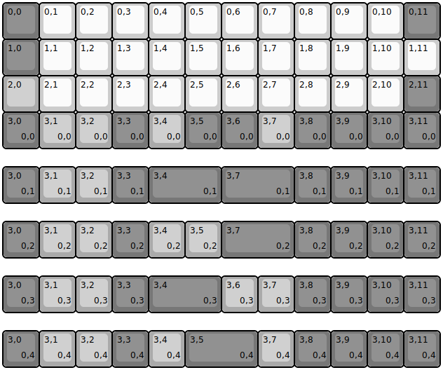
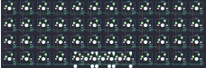

## YMDK/ymd40v2/ymdk40v2

[layout](ymdk40v2-kle.json) - [PCB](ymdk40v2.kicad_pcb)

{:loading="lazy"}

[Open in keyboard-layout-editor](http://www.keyboard-layout-editor.com/##@@_c=#777777;&=0,0&_c=#cccccc;&=0,1&=0,2&=0,3&=0,4&=0,5&=0,6&=0,7&=0,8&=0,9&=0,10&_c=#777777;&=0,11;&@=1,0&_c=#cccccc;&=1,1&=1,2&=1,3&=1,4&=1,5&=1,6&=1,7&=1,8&=1,9&=1,10&=1,11;&@_c=#aaaaaa;&=2,0&_c=#cccccc;&=2,1&=2,2&=2,3&=2,4&=2,5&=2,6&=2,7&=2,8&=2,9&=2,10&_c=#777777;&=2,11;&@=3,0%0A%0A%0A0,0&_c=#aaaaaa;&=3,1%0A%0A%0A0,0&=3,2%0A%0A%0A0,0&_c=#777777;&=3,3%0A%0A%0A0,0&_c=#aaaaaa;&=3,4%0A%0A%0A0,0&_c=#777777;&=3,5%0A%0A%0A0,0&=3,6%0A%0A%0A0,0&_c=#aaaaaa;&=3,7%0A%0A%0A0,0&_c=#777777;&=3,8%0A%0A%0A0,0&=3,9%0A%0A%0A0,0&=3,10%0A%0A%0A0,0&=3,11%0A%0A%0A0,0;&@_y:0.5;&=3,0%0A%0A%0A0,1&_c=#aaaaaa;&=3,1%0A%0A%0A0,1&=3,2%0A%0A%0A0,1&_c=#777777;&=3,3%0A%0A%0A0,1&_w:2;&=3,4%0A%0A%0A0,1&_w:2;&=3,7%0A%0A%0A0,1&=3,8%0A%0A%0A0,1&=3,9%0A%0A%0A0,1&=3,10%0A%0A%0A0,1&=3,11%0A%0A%0A0,1;&@_y:0.5;&=3,0%0A%0A%0A0,2&_c=#aaaaaa;&=3,1%0A%0A%0A0,2&=3,2%0A%0A%0A0,2&_c=#777777;&=3,3%0A%0A%0A0,2&_c=#aaaaaa;&=3,4%0A%0A%0A0,2&=3,5%0A%0A%0A0,2&_c=#777777&w:2;&=3,7%0A%0A%0A0,2&=3,8%0A%0A%0A0,2&=3,9%0A%0A%0A0,2&=3,10%0A%0A%0A0,2&=3,11%0A%0A%0A0,2;&@_y:0.5;&=3,0%0A%0A%0A0,3&_c=#aaaaaa;&=3,1%0A%0A%0A0,3&=3,2%0A%0A%0A0,3&_c=#777777;&=3,3%0A%0A%0A0,3&_w:2;&=3,4%0A%0A%0A0,3&_c=#aaaaaa;&=3,6%0A%0A%0A0,3&=3,7%0A%0A%0A0,3&_c=#777777;&=3,8%0A%0A%0A0,3&=3,9%0A%0A%0A0,3&=3,10%0A%0A%0A0,3&=3,11%0A%0A%0A0,3;&@_y:0.5;&=3,0%0A%0A%0A0,4&_c=#aaaaaa;&=3,1%0A%0A%0A0,4&=3,2%0A%0A%0A0,4&_c=#777777;&=3,3%0A%0A%0A0,4&_c=#aaaaaa;&=3,4%0A%0A%0A0,4&_c=#777777&w:2;&=3,5%0A%0A%0A0,4&_c=#aaaaaa;&=3,7%0A%0A%0A0,4&_c=#777777;&=3,8%0A%0A%0A0,4&=3,9%0A%0A%0A0,4&=3,10%0A%0A%0A0,4&=3,11%0A%0A%0A0,4)

{:loading="lazy"}

