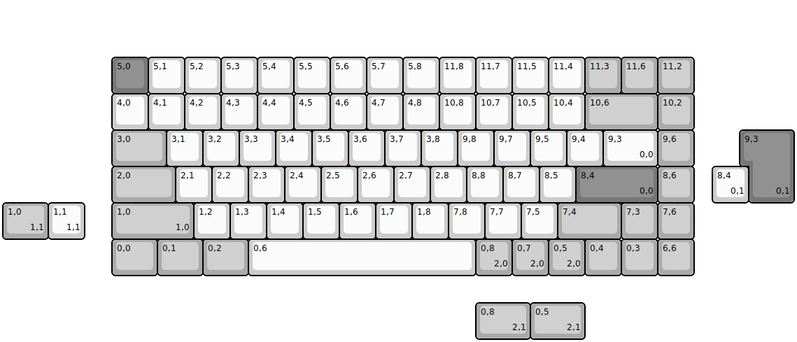
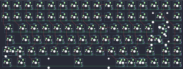

## YMDK/ymd75

[layout](ymd75-kle.json) - [PCB](ymd75.kicad_pcb)

{:loading="lazy"}

[Open in keyboard-layout-editor](http://www.keyboard-layout-editor.com/##@@_x:3&y:1.5&c=#777777;&=5,0&_c=#cccccc;&=5,1&=5,2&=5,3&=5,4&=5,5&=5,6&=5,7&=5,8&=11,8&=11,7&=11,5&=11,4&_c=#aaaaaa;&=11,3&=11,6&=11,2;&@_x:3&c=#cccccc;&=4,0&=4,1&=4,2&=4,3&=4,4&=4,5&=4,6&=4,7&=4,8&=10,8&=10,7&=10,5&=10,4&_c=#aaaaaa&w:2;&=10,6&=10,2;&@_x:3&w:1.5;&=3,0&_c=#cccccc;&=3,1&=3,2&=3,3&=3,4&=3,5&=3,6&=3,7&=3,8&=9,8&=9,7&=9,5&=9,4&_w:1.5;&=9,3%0A%0A%0A0,0&_c=#aaaaaa;&=9,6;&@_x:3&w:1.75;&=2,0&_c=#cccccc;&=2,1&=2,2&=2,3&=2,4&=2,5&=2,6&=2,7&=2,8&=8,8&=8,7&=8,5&_c=#777777&w:2.25;&=8,4%0A%0A%0A0,0&_c=#aaaaaa;&=8,6;&@_x:3.0&w:2.25;&=1,0%0A%0A%0A1,0&_c=#cccccc;&=1,2&=1,3&=1,4&=1,5&=1,6&=1,7&=1,8&=7,8&=7,7&=7,5&_c=#aaaaaa&w:1.75;&=7,4&=7,3&=7,6;&@_x:3&w:1.25;&=0,0&_w:1.25;&=0,1&_w:1.25;&=0,2&_c=#cccccc&w:6.25;&=0,6&_c=#aaaaaa;&=0,8%0A%0A%0A2,0&=0,7%0A%0A%0A2,0&=0,5%0A%0A%0A2,0&=0,4&=0,3&=6,6;&@_x:20.5&y:-4.0&c=#777777&w:1.25&h:2&w2:1.5&h2:1&x2:-0.25;&=9,3%0A%0A%0A0,1;&@_x:19.5&c=#cccccc;&=8,4%0A%0A%0A0,1;&@_c=#aaaaaa&w:1.25;&=1,0%0A%0A%0A1,1&_c=#cccccc;&=1,1%0A%0A%0A1,1;&@_x:13&y:1.75&c=#aaaaaa&w:1.5;&=0,8%0A%0A%0A2,1&_w:1.5;&=0,5%0A%0A%0A2,1)

{:loading="lazy"}

