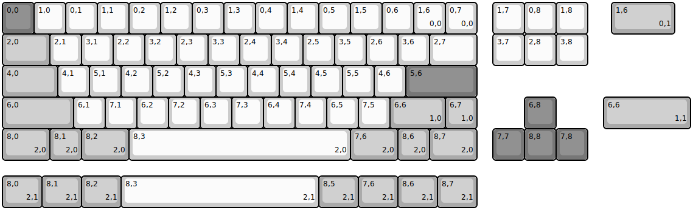
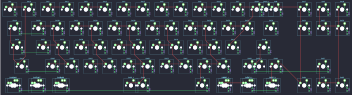

## absinthe/absinthe

[layout](absinthe-kle.json) - [PCB](absinthe.kicad_pcb)

{:loading="lazy"}

[Open in keyboard-layout-editor](http://www.keyboard-layout-editor.com/##@@_c=#777777;&=0,0&_c=#cccccc;&=1,0&=0,1&=1,1&=0,2&=1,2&=0,3&=1,3&=0,4&=1,4&=0,5&=1,5&=0,6&=1,6%0A%0A%0A0,0&=0,7%0A%0A%0A0,0&_x:0.5;&=1,7&=0,8&=1,8;&@_c=#aaaaaa&w:1.5;&=2,0&_c=#cccccc;&=2,1&=3,1&=2,2&=3,2&=2,3&=3,3&=2,4&=3,4&=2,5&=3,5&=2,6&=3,6&_w:1.5;&=2,7&_x:0.5;&=3,7&=2,8&=3,8;&@_c=#aaaaaa&w:1.75;&=4,0&_c=#cccccc;&=4,1&=5,1&=4,2&=5,2&=4,3&=5,3&=4,4&=5,4&=4,5&=5,5&=4,6&_c=#777777&w:2.25;&=5,6;&@_c=#aaaaaa&w:2.25;&=6,0&_c=#cccccc;&=6,1&=7,1&=6,2&=7,2&=6,3&=7,3&=6,4&=7,4&=6,5&=7,5&_c=#aaaaaa&w:1.75;&=6,6%0A%0A%0A1,0&=6,7%0A%0A%0A1,0&_x:1.5&c=#777777;&=6,8;&@_c=#aaaaaa&w:1.5;&=8,0%0A%0A%0A2,0&=8,1%0A%0A%0A2,0&_w:1.5;&=8,2%0A%0A%0A2,0&_c=#cccccc&w:7;&=8,3%0A%0A%0A2,0&_c=#aaaaaa&w:1.5;&=7,6%0A%0A%0A2,0&=8,6%0A%0A%0A2,0&_w:1.5;&=8,7%0A%0A%0A2,0&_x:0.5&c=#777777;&=7,7&=8,8&=7,8;&@_x:19.25&y:-5&c=#aaaaaa&w:2;&=1,6%0A%0A%0A0,1;&@_x:19.0&y:2&w:2.75;&=6,6%0A%0A%0A1,1;&@_y:1.5&w:1.25;&=8,0%0A%0A%0A2,1&_w:1.25;&=8,1%0A%0A%0A2,1&_w:1.25;&=8,2%0A%0A%0A2,1&_c=#cccccc&w:6.25;&=8,3%0A%0A%0A2,1&_c=#aaaaaa&w:1.25;&=8,5%0A%0A%0A2,1&_w:1.25;&=7,6%0A%0A%0A2,1&_w:1.25;&=8,6%0A%0A%0A2,1&_w:1.25;&=8,7%0A%0A%0A2,1)

{:loading="lazy"}

