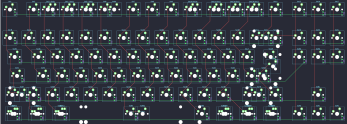
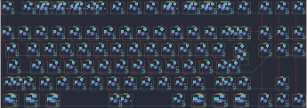

## acheron/athena/athena_alpha

[layout](athena_alpha-kle.json) - [PCB](athena_alpha.kicad_pcb)

{:loading="lazy"}

[Open in keyboard-layout-editor](http://www.keyboard-layout-editor.com/##@@_x:2.5&y:1.25&c=#777777;&=0,0%0A%0A%0A0,0&_x:1.0&c=#cccccc;&=0,2%0A%0A%0A0,0&=0,3%0A%0A%0A0,0&=0,4%0A%0A%0A0,0&=0,5%0A%0A%0A0,0&_x:0.5;&=0,6%0A%0A%0A0,0&=0,7%0A%0A%0A0,0&=0,8%0A%0A%0A0,0&=0,9%0A%0A%0A0,0&_x:0.5;&=0,10%0A%0A%0A0,0&=0,11%0A%0A%0A0,0&=0,12%0A%0A%0A0,0&=0,13%0A%0A%0A0,0&_x:0.25;&=0,14&=0,15&=0,16;&@_x:2.5&y:0.5;&=1,0&=1,1&=1,2&=1,3&=1,4&=1,5&=1,6&=1,7&=1,8&=1,9&=1,10&=1,11&=1,12&_c=#aaaaaa&w:2;&=1,13%0A%0A%0A1,0&_x:0.25&c=#cccccc;&=2,14&=1,15&=1,16;&@_x:2.5&c=#aaaaaa&w:1.5;&=2,0&_c=#cccccc;&=2,1&=2,2&=2,3&=2,4&=2,5&=2,6&=2,7&=2,8&=2,9&=2,10&=2,11&=2,12&_w:1.5;&=2,13%0A%0A%0A2,0&_x:0.25;&=3,14&=2,15&=2,16;&@_x:2.5&c=#aaaaaa&w:1.75;&=3,0&_c=#cccccc;&=3,1&=3,2&=3,3&=3,4&=3,5&=3,6&=3,7&=3,8&=3,9&=3,10&=3,11&_c=#777777&w:2.25;&=3,13%0A%0A%0A2,0;&@_x:2.5&c=#aaaaaa&w:2.25;&=4,0%0A%0A%0A3,0&_c=#cccccc;&=4,2&=4,3&=4,4&=4,5&=4,6&=4,7&=4,8&=4,9&=4,10&=4,11&_c=#aaaaaa&w:2.75;&=4,12%0A%0A%0A4,0&_x:1.25&c=#cccccc;&=4,15;&@_x:2.5&c=#aaaaaa&w:1.25;&=5,0%0A%0A%0A5,0&_w:1.25;&=5,1%0A%0A%0A5,0&_w:1.25;&=5,2%0A%0A%0A5,0&_c=#cccccc&w:6.25;&=5,6%0A%0A%0A5,0&_c=#aaaaaa&w:1.25;&=5,9%0A%0A%0A5,0&_w:1.25;&=5,10%0A%0A%0A5,0&_w:1.25;&=5,11%0A%0A%0A5,0&_w:1.25;&=5,13%0A%0A%0A5,0&_x:0.25&c=#cccccc;&=5,14&=5,15&=5,16;&@_x:2.5&y:-7.75&c=#777777;&=0,0%0A%0A%0A0,1&_x:0.25&c=#cccccc;&=0,1%0A%0A%0A0,1&=0,2%0A%0A%0A0,1&=0,3%0A%0A%0A0,1&=0,4%0A%0A%0A0,1&_x:0.25;&=0,5%0A%0A%0A0,1&=0,6%0A%0A%0A0,1&=0,7%0A%0A%0A0,1&=0,8%0A%0A%0A0,1&_x:0.25;&=0,9%0A%0A%0A0,1&=0,10%0A%0A%0A0,1&=0,11%0A%0A%0A0,1&=0,12%0A%0A%0A0,1&_x:0.25;&=0,13%0A%0A%0A0,1;&@_x:22.0&y:1.75;&=1,13%0A%0A%0A1,1&=1,14%0A%0A%0A1,1;&@_x:22.75&c=#777777&w:1.25&h:2&w2:1.5&h2:1&x2:-0.25;&=3,13%0A%0A%0A2,1;&@_x:21.75&c=#cccccc;&=3,12%0A%0A%0A2,1;&@_c=#aaaaaa&w:1.25;&=4,0%0A%0A%0A3,1&=4,1%0A%0A%0A3,1&_x:19.0&w:1.75;&=4,12%0A%0A%0A4,1&=4,13%0A%0A%0A4,1;&@_x:2.5&y:1.25&w:1.5;&=5,0%0A%0A%0A5,1&=5,1%0A%0A%0A5,1&_w:1.5;&=5,2%0A%0A%0A5,1&_c=#cccccc&w:7;&=5,6%0A%0A%0A5,1&_c=#aaaaaa&w:1.5;&=5,10%0A%0A%0A5,1&=5,11%0A%0A%0A5,1&_w:1.5;&=5,13%0A%0A%0A5,1)

{:loading="lazy"}

## acheron/athena/athena_beta

[layout](athena_beta-kle.json) - [PCB](athena_beta.kicad_pcb)

{:loading="lazy"}

[Open in keyboard-layout-editor](http://www.keyboard-layout-editor.com/##@@_x:2.5&y:1.25&c=#777777;&=0,0%0A%0A%0A0,0&_x:1.0&c=#cccccc;&=0,2%0A%0A%0A0,0&=0,3%0A%0A%0A0,0&=0,4%0A%0A%0A0,0&=0,5%0A%0A%0A0,0&_x:0.5;&=0,6%0A%0A%0A0,0&=0,7%0A%0A%0A0,0&=0,8%0A%0A%0A0,0&=0,9%0A%0A%0A0,0&_x:0.5;&=0,10%0A%0A%0A0,0&=0,11%0A%0A%0A0,0&=0,12%0A%0A%0A0,0&=0,13%0A%0A%0A0,0&_x:0.25;&=0,14&=0,15&=0,16;&@_x:2.5&y:0.5;&=1,0&=1,1&=1,2&=1,3&=1,4&=1,5&=1,6&=1,7&=1,8&=1,9&=1,10&=1,11&=1,12&_c=#aaaaaa&w:2;&=1,13%0A%0A%0A1,0&_x:0.25&c=#cccccc;&=2,14&=1,15&=1,16;&@_x:2.5&c=#aaaaaa&w:1.5;&=2,0&_c=#cccccc;&=2,1&=2,2&=2,3&=2,4&=2,5&=2,6&=2,7&=2,8&=2,9&=2,10&=2,11&=2,12&_w:1.5;&=2,13%0A%0A%0A2,0&_x:0.25;&=3,14&=2,15&=2,16;&@_x:2.5&c=#aaaaaa&w:1.75;&=3,0&_c=#cccccc;&=3,1&=3,2&=3,3&=3,4&=3,5&=3,6&=3,7&=3,8&=3,9&=3,10&=3,11&_c=#777777&w:2.25;&=3,13%0A%0A%0A2,0;&@_x:2.5&c=#aaaaaa&w:2.25;&=4,0%0A%0A%0A3,0&_c=#cccccc;&=4,2&=4,3&=4,4&=4,5&=4,6&=4,7&=4,8&=4,9&=4,10&=4,11&_c=#aaaaaa&w:2.75;&=4,12%0A%0A%0A4,0&_x:1.25&c=#cccccc;&=4,15;&@_x:2.5&c=#aaaaaa&w:1.25;&=5,0%0A%0A%0A5,0&_w:1.25;&=5,1%0A%0A%0A5,0&_w:1.25;&=5,2%0A%0A%0A5,0&_c=#cccccc&w:6.25;&=5,6%0A%0A%0A5,0&_c=#aaaaaa&w:1.25;&=5,9%0A%0A%0A5,0&_w:1.25;&=5,10%0A%0A%0A5,0&_w:1.25;&=5,11%0A%0A%0A5,0&_w:1.25;&=5,13%0A%0A%0A5,0&_x:0.25&c=#cccccc;&=5,14&=5,15&=5,16;&@_x:2.5&y:-7.75&c=#777777;&=0,0%0A%0A%0A0,1&_x:0.25&c=#cccccc;&=0,1%0A%0A%0A0,1&=0,2%0A%0A%0A0,1&=0,3%0A%0A%0A0,1&=0,4%0A%0A%0A0,1&_x:0.25;&=0,5%0A%0A%0A0,1&=0,6%0A%0A%0A0,1&=0,7%0A%0A%0A0,1&=0,8%0A%0A%0A0,1&_x:0.25;&=0,9%0A%0A%0A0,1&=0,10%0A%0A%0A0,1&=0,11%0A%0A%0A0,1&=0,12%0A%0A%0A0,1&_x:0.25;&=0,13%0A%0A%0A0,1;&@_x:22.0&y:1.75;&=1,13%0A%0A%0A1,1&=1,14%0A%0A%0A1,1;&@_x:22.75&c=#777777&w:1.25&h:2&w2:1.5&h2:1&x2:-0.25;&=3,13%0A%0A%0A2,1;&@_x:21.75&c=#cccccc;&=3,12%0A%0A%0A2,1;&@_c=#aaaaaa&w:1.25;&=4,0%0A%0A%0A3,1&=4,1%0A%0A%0A3,1&_x:19.0&w:1.75;&=4,12%0A%0A%0A4,1&=4,13%0A%0A%0A4,1;&@_x:2.5&y:1.25&w:1.5;&=5,0%0A%0A%0A5,1&=5,1%0A%0A%0A5,1&_w:1.5;&=5,2%0A%0A%0A5,1&_c=#cccccc&w:7;&=5,6%0A%0A%0A5,1&_c=#aaaaaa&w:1.5;&=5,10%0A%0A%0A5,1&=5,11%0A%0A%0A5,1&_w:1.5;&=5,13%0A%0A%0A5,1)

{:loading="lazy"}

