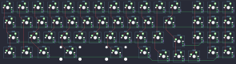

## acheron/elongate

[layout](elongate-kle.json) - [PCB](elongate.kicad_pcb)

{:loading="lazy"}

[Open in keyboard-layout-editor](http://www.keyboard-layout-editor.com/##@@_c=#777777;&=0,0&_c=#cccccc;&=0,1&=0,2&=0,3&=0,4&=0,5&=0,6&=0,7&=0,8&=0,9&=0,10&_c=#aaaaaa;&=0,11&_x:0.5&c=#cccccc;&=0,12&=0,13&=0,14;&@_c=#aaaaaa&w:1.25;&=1,0&_c=#cccccc;&=1,1&=1,2&=1,3&=1,4&=1,5&=1,6&=1,7&=1,8&=1,9&_c=#777777&w:1.75;&=1,11&_x:0.5&c=#cccccc;&=1,12&=1,13&=1,14;&@_c=#aaaaaa&w:1.75;&=2,0&_c=#cccccc;&=2,2&=2,3&=2,4&=2,5&=2,6&=2,7&=2,8&=2,9&_c=#aaaaaa&w:1.25;&=2,10&_x:1.5&c=#cccccc;&=4,12&=4,13&=4,14;&@_x:11.25&y:-0.75&c=#777777;&=4,11;&@_y:-0.25&c=#aaaaaa&w:1.25;&=3,0&=3,1&_w:1.25;&=3,2&_c=#cccccc&w:2.25;&=3,4&_x:0.5&w:2.75;&=3,7&_c=#aaaaaa;&=3,9&_x:3.5&c=#cccccc;&=3,13&=3,14;&@_x:10.25&y:-0.75&c=#777777;&=3,10&=3,11&=3,12)

{:loading="lazy"}

