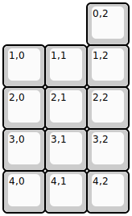
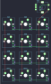

## adafruit/macropad

[layout](macropad-kle.json) - [PCB](macropad.kicad_pcb)

{:loading="lazy"}

[Open in keyboard-layout-editor](http://www.keyboard-layout-editor.com/##@@_x:2;&=0,2%0A%0A%0A%0A%0A%0A%0A%0A%0Ae0;&@=1,0&=1,1&=1,2;&@=2,0&=2,1&=2,2;&@=3,0&=3,1&=3,2;&@=4,0&=4,1&=4,2)

{:loading="lazy"}

