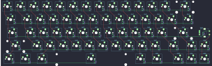

## adpenrose/kintsugi

[layout](kintsugi-kle.json) - [PCB](kintsugi.kicad_pcb)

{:loading="lazy"}

[Open in keyboard-layout-editor](http://www.keyboard-layout-editor.com/##@@_c=#777777;&=0,0&_c=#cccccc;&=0,1&=0,2&=0,3&=0,4&=0,5&=0,6&=5,0&=5,1&=5,2&=5,3&=5,4&=5,5&_c=#aaaaaa&w:2;&=5,6;&@_w:1.5;&=1,0&_c=#cccccc;&=1,1&=1,2&=1,3&=1,4&=1,5&=1,6&=6,0&=6,1&=6,2&=6,3&=6,4&=6,5&_w:1.5;&=6,6;&@_c=#aaaaaa&w:1.75;&=2,0&_c=#cccccc;&=2,1&=2,2&=2,3&=2,4&=2,5&=2,6&=7,0&=7,1&=7,2&=7,3&=7,4&_c=#777777&w:2.25;&=7,5&_c=#cccccc;&=7,6%0A%0A%0A%0A%0A%0A%0A%0A%0Ae0;&@_c=#aaaaaa&w:2.25;&=3,0&_c=#cccccc;&=3,1&=3,2&=3,3&=3,4&=3,5&=3,6&=8,0&=8,1&=8,2&=8,3&_c=#aaaaaa&w:1.75;&=8,4&_c=#777777;&=8,5&_c=#aaaaaa;&=8,6;&@_w:1.25;&=4,0&_w:1.25;&=4,1&_w:1.25;&=4,2&_w:6.25;&=4,6&_w:1.25;&=9,2&_w:1.25;&=9,3&_x:0.5&c=#777777;&=9,4&=9,5&=9,6)

{:loading="lazy"}

