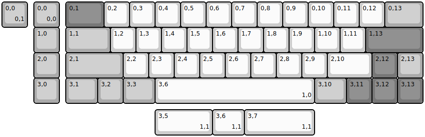
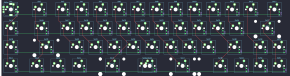

## adpenrose/obi

[layout](obi-kle.json) - [PCB](obi.kicad_pcb)

{:loading="lazy"}

[Open in keyboard-layout-editor](http://www.keyboard-layout-editor.com/##@@_x:1.25&c=#aaaaaa;&=0,0%0A%0A%0A0,0&_x:0.25&c=#777777&w:1.5;&=0,1&_c=#cccccc;&=0,2&=0,3&=0,4&=0,5&=0,6&=0,7&=0,8&=0,9&=0,10&=0,11&=0,12&_c=#aaaaaa&w:1.5;&=0,13;&@_x:1.25;&=1,0&_x:0.25&w:1.75;&=1,1&_c=#cccccc;&=1,2&=1,3&=1,4&=1,5&=1,6&=1,7&=1,8&=1,9&=1,10&=1,11&_c=#777777&w:2.25;&=1,13;&@_x:1.25&c=#aaaaaa;&=2,0&_x:0.25&w:2.25;&=2,1&_c=#cccccc;&=2,2&=2,3&=2,4&=2,5&=2,6&=2,7&=2,8&=2,9&_w:1.75;&=2,10&_c=#777777;&=2,12&_c=#aaaaaa;&=2,13;&@_x:1.25;&=3,0&_x:0.25&w:1.25;&=3,1&=3,2&_w:1.25;&=3,3&_c=#cccccc&w:6.25;&=3,6%0A%0A%0A1,0&_c=#aaaaaa&w:1.25;&=3,10&_c=#777777;&=3,11&=3,12&=3,13;&@_y:-4&c=#aaaaaa;&=0,0%0A%0A%0A0,1%0A%0A%0A%0A%0A%0Ae0;&@_x:6&y:3.25&c=#cccccc&w:2.25;&=3,5%0A%0A%0A1,1&_w:1.25;&=3,6%0A%0A%0A1,1&_w:2.75;&=3,7%0A%0A%0A1,1)

{:loading="lazy"}

