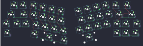

## adpenrose/shisaku

[layout](shisaku-kle.json) - [PCB](shisaku.kicad_pcb)

{:loading="lazy"}

[Open in keyboard-layout-editor](http://www.keyboard-layout-editor.com/##@@_x:1&y:1&c=#aaaaaa;&=0,0&_c=#cccccc;&=0,1&_x:8.95;&=1,3&_c=#aaaaaa&w:1.5;&=1,4;&@_x:0.3&w:1.75;&=1,5&_c=#cccccc;&=1,6&_x:9.3;&=3,3&_c=#777777&w:1.75;&=3,4;&@_x:0.05&c=#aaaaaa&w:1.25;&=3,5&_c=#cccccc;&=4,0&=4,1&_x:8.79;&=5,4&_c=#777777;&=5,5&_c=#aaaaaa&w:1.25;&=6,0;&@_x:0.05&w:1.5;&=6,1&_x:10.54&c=#777777;&=7,0&=7,4&=7,5;&@_r:12&x:3.35&y:-4.75&c=#cccccc;&=0,2&=0,3&=0,4&=0,5;&@_x:3.6;&=2,0&=2,1&=2,2&=2,3;&@_x:4.05;&=4,2&=4,3&=4,4&=4,5;&@_x:4.1&c=#aaaaaa;&=6,2&_c=#777777&w:2.25;&=6,3&_c=#aaaaaa;&=6,4;&@_r:-12&x:7.3&y:-0.9&c=#cccccc;&=0,6&=1,0&=1,1&=1,2;&@_x:7.45;&=2,4&=2,5&=2,6&=3,0;&@_x:7;&=5,0&=5,1&=5,2&=5,3;&@_x:7&c=#777777&w:2.75;&=6,5)

{:loading="lazy"}

