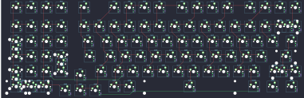

## aeboards/aegis/aeboards_aegis

[layout](aeboards_aegis-kle.json) - [PCB](aeboards_aegis.kicad_pcb)

{:loading="lazy"}

[Open in keyboard-layout-editor](http://www.keyboard-layout-editor.com/##@_name=AEGIS;&@_x:12.75&c=#aaaaaa&t=000000;&=0,0&=1,0&=0,1&=1,1&_x:0.5&c=#888888;&=0,2&_x:1.0&c=#cccccc;&=1,2&=0,3&=1,3&=0,4&_x:0.5&c=#aaaaaa;&=1,4&=0,5&=1,5&=0,6&_x:0.5&c=#cccccc;&=1,6&=0,7&=1,7&=0,8;&@_x:12.75&y:0.25&c=#aaaaaa;&=2,0&=3,0&=2,1&=3,1&_x:0.5&c=#cccccc;&=2,2&=3,2&=2,3&=3,3&=2,4&=3,4&=2,5&=3,5&=2,6&=3,6&=2,7&=3,7&=2,8&_c=#aaaaaa&w:2;&=3,8%0A%0A%0A0,0;&@_x:12.75;&=4,0%0A%0A%0A2,0&_c=#cccccc;&=5,0%0A%0A%0A2,0&=4,1%0A%0A%0A2,0&=5,1%0A%0A%0A2,0&_x:0.5&c=#aaaaaa&w:1.5;&=4,2&_c=#cccccc;&=5,2&=4,3&=5,3&=4,4&=5,4&=4,5&=5,5&=4,6&=5,6&=4,7&=5,7&=4,8&_c=#aaaaaa&w:1.5;&=5,8;&@_x:12.75;&=6,0%0A%0A%0A2,0&_c=#cccccc;&=7,0%0A%0A%0A2,0&=6,1%0A%0A%0A2,0&=7,1%0A%0A%0A2,0&_x:0.5&c=#aaaaaa&w:1.75;&=6,2&_c=#cccccc;&=7,2&=6,3&=7,3&=6,4&=7,4&=6,5&=7,5&=6,6&=7,6&=6,7&=7,7&_c=#aaaaaa&w:2.25;&=6,8;&@_x:12.75&h:2;&=8,0%0A%0A%0A2,0&_c=#cccccc;&=9,0%0A%0A%0A2,0&=8,1%0A%0A%0A2,0&=9,1%0A%0A%0A2,0&_x:1.5&c=#aaaaaa&w:1.25;&=9,2&_c=#cccccc;&=8,3&=9,3&=8,4&=9,4&=8,5&=9,5&=8,6&=9,6&=8,7&=9,7&_c=#aaaaaa&w:2.75;&=8,8%0A%0A%0A1,0;&@_x:17&y:-0.75&c=#888888;&=8,2;&@_x:13.75&y:-0.25&c=#cccccc;&=11,0%0A%0A%0A2,0&=10,1%0A%0A%0A2,0&_x:3.5&c=#aaaaaa;&=10,3&=11,3&_c=#cccccc&w:7;&=11,5&_c=#aaaaaa&w:1.5;&=11,7&=10,8&_w:1.5;&=11,8;&@_x:16&y:-0.75&c=#888888;&=11,1&=10,2&=11,2;&@_x:32.5&y:-5.25&c=#cccccc;&=3,8%0A%0A%0A0,1&=1,8%0A%0A%0A0,1;&@=4,0%0A%0A%0A2,3&=5,0%0A%0A%0A2,3&=4,1%0A%0A%0A2,3&=5,1%0A%0A%0A2,3&_x:0.25;&=4,0%0A%0A%0A2,2&=5,0%0A%0A%0A2,2&=4,1%0A%0A%0A2,2&_c=#aaaaaa;&=5,1%0A%0A%0A2,2&_x:0.25&h:2;&=6,0%0A%0A%0A2,1&_c=#cccccc;&=5,0%0A%0A%0A2,1&=4,1%0A%0A%0A2,1&=5,1%0A%0A%0A2,1;&@=6,0%0A%0A%0A2,3&=7,0%0A%0A%0A2,3&=6,1%0A%0A%0A2,3&=7,1%0A%0A%0A2,3&_x:0.25;&=6,0%0A%0A%0A2,2&=7,0%0A%0A%0A2,2&=6,1%0A%0A%0A2,2&_c=#aaaaaa&h:2;&=9,1%0A%0A%0A2,2&_x:1.25&c=#cccccc;&=7,0%0A%0A%0A2,1&=6,1%0A%0A%0A2,1&=7,1%0A%0A%0A2,1;&@=8,0%0A%0A%0A2,3&=9,0%0A%0A%0A2,3&=8,1%0A%0A%0A2,3&=9,1%0A%0A%0A2,3&_x:0.25;&=8,0%0A%0A%0A2,2&=9,0%0A%0A%0A2,2&=8,1%0A%0A%0A2,2&_x:1.25&c=#aaaaaa&h:2;&=8,0%0A%0A%0A2,1&_c=#cccccc;&=9,0%0A%0A%0A2,1&=8,1%0A%0A%0A2,1&=9,1%0A%0A%0A2,1&_x:20.0&c=#aaaaaa&w:1.75;&=8,8%0A%0A%0A1,1&=9,8%0A%0A%0A1,1;&@_c=#cccccc;&=10,0%0A%0A%0A2,3&=11,0%0A%0A%0A2,3&=10,1%0A%0A%0A2,3&_x:1.25&w:2;&=10,0%0A%0A%0A2,2&=10,1%0A%0A%0A2,2&_x:2.25&w:2;&=10,1%0A%0A%0A2,1)

{:loading="lazy"}

