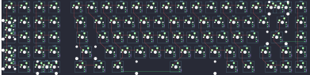
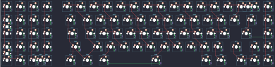
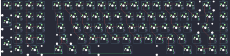

## aeboards/ext65/aeboards_ext65_rev1

[layout](aeboards_ext65_rev1-kle.json) - [PCB](aeboards_ext65_rev1.kicad_pcb)

{:loading="lazy"}

[Open in keyboard-layout-editor](http://www.keyboard-layout-editor.com/##@@_x:1.25&y:1.25&c=#aaaaaa;&=0,0&=1,0&=0,1&=1,1&_x:0.5&c=#888888;&=0,2&_c=#cccccc;&=1,2&=0,3&=1,3&=0,4&=1,4&=0,5&=1,5&=0,6&=1,6&=0,7&=1,7&=0,8&_c=#aaaaaa&w:2;&=1,8%0A%0A%0A0,0&=0,9;&@_x:1.25&h:2;&=4,0%0A%0A%0A1,0&_c=#cccccc;&=3,0&=2,1&=3,1&_x:0.5&c=#aaaaaa&w:1.5;&=2,2&_c=#cccccc;&=3,2&=2,3&=3,3&=2,4&=3,4&=2,5&=3,5&=2,6&=3,6&=2,7&=3,7&=2,8&_w:1.5;&=3,8&_c=#aaaaaa;&=2,9;&@_x:2.25&c=#cccccc;&=5,0&=4,1&=5,1&_x:0.5&c=#aaaaaa&w:1.75;&=4,2&_c=#cccccc;&=5,2&=4,3&=5,3&=4,4&=5,4&=4,5&=5,5&=4,6&=5,6&=4,7&=5,7&_c=#aaaaaa&w:2.25;&=4,8&=4,9;&@_x:1.25&h:2;&=8,0%0A%0A%0A2,0&_c=#cccccc;&=7,0&=6,1&=7,1&_x:0.5&c=#aaaaaa&w:2.25;&=6,2&_c=#cccccc;&=7,2&=6,3&=7,3&=6,4&=7,4&=6,5&=7,5&=6,6&=7,6&=6,7&_c=#aaaaaa&w:1.75;&=7,8&_c=#888888;&=6,8&_c=#aaaaaa;&=7,9;&@_x:2.25&c=#cccccc;&=9,0&_w:2;&=9,1%0A%0A%0A3,0&_x:0.5&c=#aaaaaa&w:1.5;&=8,2&=9,2&_w:1.5;&=8,3&_c=#cccccc&w:6.25;&=8,5&_c=#aaaaaa&w:1.25;&=9,6&=8,7&_x:0.5&c=#888888;&=9,8&=8,8&=9,9;&@_x:18.75&y:-6.25&c=#cccccc;&=1,8%0A%0A%0A0,1&=5,8%0A%0A%0A0,1;&@_y:1.25&c=#aaaaaa;&=2,0%0A%0A%0A1,1;&@=4,0%0A%0A%0A1,1;&@=6,0%0A%0A%0A2,1;&@=8,0%0A%0A%0A2,1;&@_x:3.25&y:0.25&c=#cccccc;&=8,1%0A%0A%0A3,1&=9,1%0A%0A%0A3,1)

{:loading="lazy"}

## aeboards/ext65/aeboards_ext65_rev2

[layout](aeboards_ext65_rev2-kle.json) - [PCB](aeboards_ext65_rev2.kicad_pcb)

{:loading="lazy"}

[Open in keyboard-layout-editor](http://www.keyboard-layout-editor.com/##@@_x:1.25&y:1.25&c=#aaaaaa;&=0,0&=1,0&=0,1&=1,1&_x:0.5&c=#888888;&=0,2&_c=#cccccc;&=1,2&=0,3&=1,3&=0,4&=1,4&=0,5&=1,5&=0,6&=1,6&=0,7&=1,7&=0,8&_c=#aaaaaa&w:2;&=1,8%0A%0A%0A0,0&=0,9;&@_x:1.25&h:2;&=4,0%0A%0A%0A1,0&_c=#cccccc;&=3,0&=2,1&=3,1&_x:0.5&c=#aaaaaa&w:1.5;&=2,2&_c=#cccccc;&=3,2&=2,3&=3,3&=2,4&=3,4&=2,5&=3,5&=2,6&=3,6&=2,7&=3,7&=2,8&_w:1.5;&=3,8&_c=#aaaaaa;&=2,9;&@_x:2.25&c=#cccccc;&=5,0&=4,1&=5,1&_x:0.5&c=#aaaaaa&w:1.75;&=4,2&_c=#cccccc;&=5,2&=4,3&=5,3&=4,4&=5,4&=4,5&=5,5&=4,6&=5,6&=4,7&=5,7&_c=#aaaaaa&w:2.25;&=4,8&=4,9;&@_x:1.25&h:2;&=8,0%0A%0A%0A2,0&_c=#cccccc;&=7,0&=6,1&=7,1&_x:0.5&c=#aaaaaa&w:2.25;&=6,2&_c=#cccccc;&=7,2&=6,3&=7,3&=6,4&=7,4&=6,5&=7,5&=6,6&=7,6&=6,7&_c=#aaaaaa&w:1.75;&=7,8&_c=#888888;&=6,8&_c=#aaaaaa;&=7,9;&@_x:2.25&c=#cccccc;&=9,0&_w:2;&=9,1%0A%0A%0A3,0&_x:0.5&c=#aaaaaa&w:1.5;&=8,2&=9,2&_w:1.5;&=8,3&_c=#cccccc&w:6.25;&=8,5&_c=#aaaaaa&w:1.25;&=9,6&=8,7&_x:0.5&c=#888888;&=9,8&=8,8&=9,9;&@_x:18.75&y:-6.25&c=#cccccc;&=1,8%0A%0A%0A0,1&=5,8%0A%0A%0A0,1;&@_y:1.25&c=#aaaaaa;&=2,0%0A%0A%0A1,1;&@=4,0%0A%0A%0A1,1;&@=6,0%0A%0A%0A2,1;&@=8,0%0A%0A%0A2,1;&@_x:3.25&y:0.25&c=#cccccc;&=8,1%0A%0A%0A3,1&=9,1%0A%0A%0A3,1)

{:loading="lazy"}

## aeboards/ext65/aeboards_ext65_rev3

[layout](aeboards_ext65_rev3-kle.json) - [PCB](aeboards_ext65_rev3.kicad_pcb)

{:loading="lazy"}

[Open in keyboard-layout-editor](http://www.keyboard-layout-editor.com/##@@_c=#aaaaaa;&=0,0&=1,0&=0,1&=1,1&_x:0.5&c=#888888;&=0,2&_c=#cccccc;&=1,2&=0,3&=1,3&=0,4&=1,4&=0,5&=1,5&=0,6&=1,6&=0,7&=1,7&=0,8&_c=#aaaaaa&w:2;&=1,8&=0,9;&@_h:2;&=2,0&_c=#cccccc;&=3,0&=2,1&=3,1&_x:0.5&c=#aaaaaa&w:1.5;&=2,2&_c=#cccccc;&=3,2&=2,3&=3,3&=2,4&=3,4&=2,5&=3,5&=2,6&=3,6&=2,7&=3,7&=2,8&_w:1.5;&=3,8&_c=#aaaaaa;&=2,9;&@_x:1&c=#cccccc;&=5,0&=4,1&=5,1&_x:0.5&c=#aaaaaa&w:1.75;&=4,2&_c=#cccccc;&=5,2&=4,3&=5,3&=4,4&=5,4&=4,5&=5,5&=4,6&=5,6&=4,7&=5,7&_c=#aaaaaa&w:2.25;&=4,8&=4,9;&@_h:2;&=6,0&_c=#cccccc;&=7,0&=6,1&=7,1&_x:0.5&c=#aaaaaa&w:2.25;&=6,2&_c=#cccccc;&=7,2&=6,3&=7,3&=6,4&=7,4&=6,5&=7,5&=6,6&=7,6&=6,7&_c=#aaaaaa&w:1.75;&=7,8&_c=#888888;&=6,8&_c=#aaaaaa;&=7,9;&@_x:1&c=#cccccc;&=9,0&_w:2;&=8,1&_x:0.5&c=#aaaaaa&w:1.25;&=8,2&_w:1.25;&=9,2&_w:1.25;&=8,3&_c=#cccccc&w:6.25;&=8,5&_c=#aaaaaa&w:1.5;&=9,6&_w:1.5;&=8,7&_c=#888888;&=9,8&=8,8&=9,9)

{:loading="lazy"}

