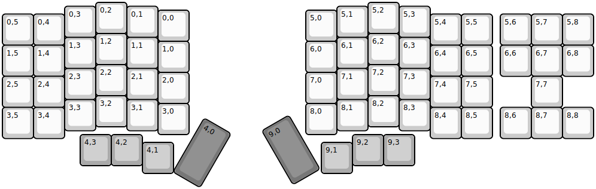
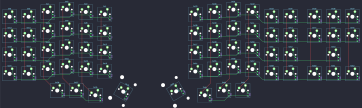
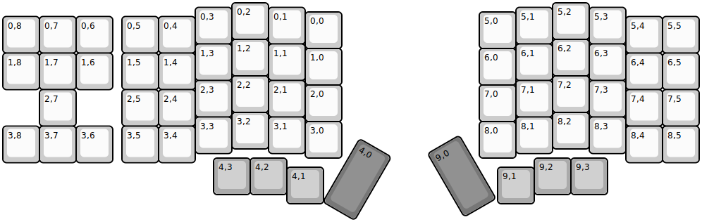
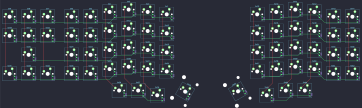
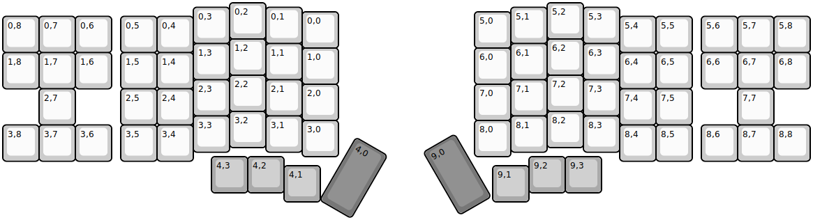
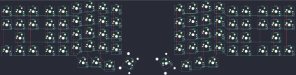

## afternoonlabs/breeze

[layout](breeze-kle.json) - [PCB](breeze.kicad_pcb)

{:loading="lazy"}

[Open in keyboard-layout-editor](http://www.keyboard-layout-editor.com/##@@_x:3;&=0,2&_x:7.75;&=5,2;&@_x:2&y:-0.875;&=0,3&_x:1;&=0,1&_x:5.75;&=5,1&_x:1.0;&=5,3;&@_x:5&y:-0.875;&=0,0&_x:3.75;&=5,0;&@_y:-0.875;&=0,5&=0,4&_x:11.75;&=5,4&=5,5&_x:0.25;&=5,6&=5,7&=5,8;&@_x:3&y:-0.375;&=1,2&_x:7.75;&=6,2;&@_x:2&y:-0.875;&=1,3&_x:1;&=1,1&_x:5.75;&=6,1&_x:1.0;&=6,3;&@_x:5&y:-0.875;&=1,0&_x:3.75;&=6,0;&@_y:-0.875;&=1,5&=1,4&_x:11.75;&=6,4&=6,5&_x:0.25;&=6,6&=6,7&=6,8;&@_x:3&y:-0.375;&=2,2&_x:7.75;&=7,2;&@_x:2&y:-0.875;&=2,3&_x:1;&=2,1&_x:5.75;&=7,1&_x:1.0;&=7,3;&@_x:5&y:-0.875;&=2,0&_x:3.75;&=7,0;&@_y:-0.875;&=2,5&=2,4&_x:11.75;&=7,4&=7,5&_x:1.25;&=7,7;&@_x:3&y:-0.375;&=3,2&_x:7.75;&=8,2;&@_x:2&y:-0.875;&=3,3&_x:1;&=3,1&_x:5.75;&=8,1&_x:1.0;&=8,3;&@_x:5&y:-0.875;&=3,0&_x:3.75;&=8,0;&@_y:-0.875;&=3,5&=3,4&_x:11.75;&=8,4&=8,5&_x:0.25;&=8,6&=8,7&=8,8;&@_x:2.5&y:-0.125&c=#aaaaaa;&=4,3&=4,2&_x:6.75;&=9,2&=9,3;&@_x:4.5&y:-0.75;&=4,1&_x:4.75;&=9,1;&@_r:30&rx:6.5&ry:4.25&x:-0.25&y:-0.5&c=#777777&h:2;&=4,0;&@_r:-30&rx:12.25&ry:4.5&x:-3.25&y:-2.25&h:2;&=9,0)

{:loading="lazy"}

## afternoonlabs/southern-breeze

[layout](southern-breeze-kle.json) - [PCB](southern-breeze.kicad_pcb)

{:loading="lazy"}

[Open in keyboard-layout-editor](http://www.keyboard-layout-editor.com/##@@_x:6.25;&=0,2&_x:7.75;&=5,2;&@_x:5.25&y:-0.875;&=0,3&_x:1.0;&=0,1&_x:5.75;&=5,1&_x:1.0;&=5,3;&@_x:8.25&y:-0.875;&=0,0&_x:3.75;&=5,0;&@_y:-0.875;&=0,8&=0,7&=0,6&_x:0.25;&=0,5&=0,4&_x:11.75;&=5,4&=5,5;&@_x:6.25&y:-0.375;&=1,2&_x:7.75;&=6,2;&@_x:5.25&y:-0.875;&=1,3&_x:1.0;&=1,1&_x:5.75;&=6,1&_x:1.0;&=6,3;&@_x:8.25&y:-0.875;&=1,0&_x:3.75;&=6,0;&@_y:-0.875;&=1,8&=1,7&=1,6&_x:0.25;&=1,5&=1,4&_x:11.75;&=6,4&=6,5;&@_x:6.25&y:-0.375;&=2,2&_x:7.75;&=7,2;&@_x:5.25&y:-0.875;&=2,3&_x:1.0;&=2,1&_x:5.75;&=7,1&_x:1.0;&=7,3;&@_x:8.25&y:-0.875;&=2,0&_x:3.75;&=7,0;&@_x:1&y:-0.875;&=2,7&_x:1.25;&=2,5&=2,4&_x:11.75;&=7,4&=7,5;&@_x:6.25&y:-0.375;&=3,2&_x:7.75;&=8,2;&@_x:5.25&y:-0.875;&=3,3&_x:1.0;&=3,1&_x:5.75;&=8,1&_x:1.0;&=8,3;&@_x:8.25&y:-0.875;&=3,0&_x:3.75;&=8,0;&@_y:-0.875;&=3,8&=3,7&=3,6&_x:0.25;&=3,5&=3,4&_x:11.75;&=8,4&=8,5;&@_x:5.75&y:-0.125&c=#aaaaaa;&=4,3&=4,2&_x:6.75;&=9,2&=9,3;&@_x:7.75&y:-0.75;&=4,1&_x:4.75;&=9,1;&@_r:30&rx:9.75&ry:4.25&x:-0.25&y:-0.5&c=#7777777&h:2;&=4,0;&@_r:-30&rx:15.5&ry:4.5&x:-3.25&y:-2.25&h:2;&=9,0)

{:loading="lazy"}

## afternoonlabs/summer-breeze

[layout](summer-breeze-kle.json) - [PCB](summer-breeze.kicad_pcb)

{:loading="lazy"}

[Open in keyboard-layout-editor](http://www.keyboard-layout-editor.com/##@@_x:6.25;&=0,2&_x:7.75;&=5,2;&@_x:5.25&y:-0.875;&=0,3&_x:1.0;&=0,1&_x:5.75;&=5,1&_x:1.0;&=5,3;&@_x:8.25&y:-0.875;&=0,0&_x:3.75;&=5,0;&@_y:-0.875;&=0,8&=0,7&=0,6&_x:0.25;&=0,5&=0,4&_x:11.75;&=5,4&=5,5&_x:0.25;&=5,6&=5,7&=5,8;&@_x:6.25&y:-0.375;&=1,2&_x:7.75;&=6,2;&@_x:5.25&y:-0.875;&=1,3&_x:1.0;&=1,1&_x:5.75;&=6,1&_x:1.0;&=6,3;&@_x:8.25&y:-0.875;&=1,0&_x:3.75;&=6,0;&@_y:-0.875;&=1,8&=1,7&=1,6&_x:0.25;&=1,5&=1,4&_x:11.75;&=6,4&=6,5&_x:0.25;&=6,6&=6,7&=6,8;&@_x:6.25&y:-0.375;&=2,2&_x:7.75;&=7,2;&@_x:5.25&y:-0.875;&=2,3&_x:1.0;&=2,1&_x:5.75;&=7,1&_x:1.0;&=7,3;&@_x:8.25&y:-0.875;&=2,0&_x:3.75;&=7,0;&@_x:1&y:-0.875;&=2,7&_x:1.25;&=2,5&=2,4&_x:11.75;&=7,4&=7,5&_x:1.25;&=7,7;&@_x:6.25&y:-0.375;&=3,2&_x:7.75;&=8,2;&@_x:5.25&y:-0.875;&=3,3&_x:1.0;&=3,1&_x:5.75;&=8,1&_x:1.0;&=8,3;&@_x:8.25&y:-0.875;&=3,0&_x:3.75;&=8,0;&@_y:-0.875;&=3,8&=3,7&=3,6&_x:0.25;&=3,5&=3,4&_x:11.75;&=8,4&=8,5&_x:0.25;&=8,6&=8,7&=8,8;&@_x:5.75&y:-0.125&c=#aaaaaa;&=4,3&=4,2&_x:6.75;&=9,2&=9,3;&@_x:7.75&y:-0.75;&=4,1&_x:4.75;&=9,1;&@_r:30&rx:9.75&ry:4.25&x:-0.25&y:-0.5&c=#7777777&h:2;&=4,0;&@_r:-30&rx:15.5&ry:4.5&x:-3.25&y:-2.25&h:2;&=9,0)

{:loading="lazy"}

