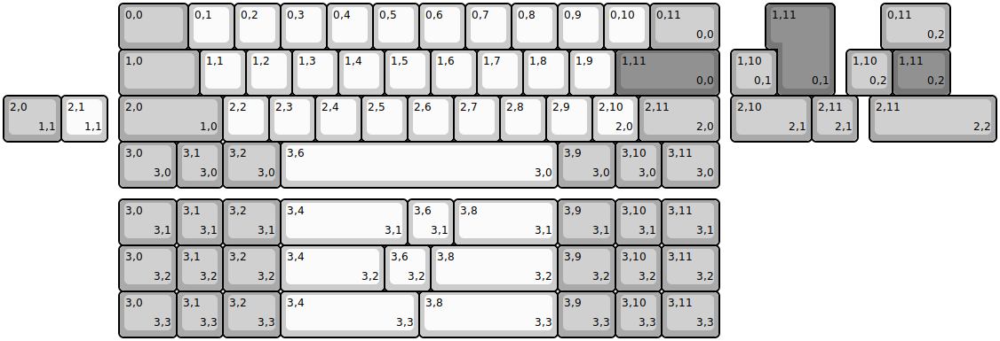
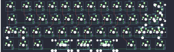

## ai03/equinox

[layout](equinox-kle.json) - [PCB](equinox.kicad_pcb)

{:loading="lazy"}

[Open in keyboard-layout-editor](http://www.keyboard-layout-editor.com/##@@_x:2.5&c=#aaaaaa&w:1.5;&=0,0&_c=#cccccc;&=0,1&=0,2&=0,3&=0,4&=0,5&=0,6&=0,7&=0,8&=0,9&=0,10&_c=#aaaaaa&w:1.5;&=0,11%0A%0A%0A0,0;&@_x:2.5&w:1.75;&=1,0&_c=#cccccc;&=1,1&=1,2&=1,3&=1,4&=1,5&=1,6&=1,7&=1,8&=1,9&_c=#777777&w:2.25;&=1,11%0A%0A%0A0,0;&@_x:2.5&c=#aaaaaa&w:2.25;&=2,0%0A%0A%0A1,0&_c=#cccccc;&=2,2&=2,3&=2,4&=2,5&=2,6&=2,7&=2,8&=2,9&=2,10%0A%0A%0A2,0&_c=#aaaaaa&w:1.75;&=2,11%0A%0A%0A2,0;&@_x:2.5&w:1.25;&=3,0%0A%0A%0A3,0&=3,1%0A%0A%0A3,0&_w:1.25;&=3,2%0A%0A%0A3,0&_c=#cccccc&w:6;&=3,6%0A%0A%0A3,0&_c=#aaaaaa&w:1.25;&=3,9%0A%0A%0A3,0&=3,10%0A%0A%0A3,0&_w:1.25;&=3,11%0A%0A%0A3,0;&@_x:16.75&y:-4&c=#777777&w:1.25&h:2&w2:1.5&h2:1&x2:-0.25;&=1,11%0A%0A%0A0,1&_x:1.0&c=#aaaaaa&w:1.5;&=0,11%0A%0A%0A0,2;&@_x:15.75;&=1,10%0A%0A%0A0,1&_x:1.5;&=1,10%0A%0A%0A0,2&_c=#777777&w:1.25;&=1,11%0A%0A%0A0,2;&@_c=#aaaaaa&w:1.25;&=2,0%0A%0A%0A1,1&_c=#cccccc;&=2,1%0A%0A%0A1,1&_x:13.5&c=#aaaaaa&w:1.75;&=2,10%0A%0A%0A2,1&=2,11%0A%0A%0A2,1&_x:0.25&w:2.75;&=2,11%0A%0A%0A2,2;&@_x:2.5&y:1.25&w:1.25;&=3,0%0A%0A%0A3,1&=3,1%0A%0A%0A3,1&_w:1.25;&=3,2%0A%0A%0A3,1&_c=#cccccc&w:2.75;&=3,4%0A%0A%0A3,1&=3,6%0A%0A%0A3,1&_w:2.25;&=3,8%0A%0A%0A3,1&_c=#aaaaaa&w:1.25;&=3,9%0A%0A%0A3,1&=3,10%0A%0A%0A3,1&_w:1.25;&=3,11%0A%0A%0A3,1;&@_x:2.5&w:1.25;&=3,0%0A%0A%0A3,2&=3,1%0A%0A%0A3,2&_w:1.25;&=3,2%0A%0A%0A3,2&_c=#cccccc&w:2.25;&=3,4%0A%0A%0A3,2&=3,6%0A%0A%0A3,2&_w:2.75;&=3,8%0A%0A%0A3,2&_c=#aaaaaa&w:1.25;&=3,9%0A%0A%0A3,2&=3,10%0A%0A%0A3,2&_w:1.25;&=3,11%0A%0A%0A3,2;&@_x:2.5&w:1.25;&=3,0%0A%0A%0A3,3&=3,1%0A%0A%0A3,3&_w:1.25;&=3,2%0A%0A%0A3,3&_c=#cccccc&w:3;&=3,4%0A%0A%0A3,3&_w:3;&=3,8%0A%0A%0A3,3&_c=#aaaaaa&w:1.25;&=3,9%0A%0A%0A3,3&=3,10%0A%0A%0A3,3&_w:1.25;&=3,11%0A%0A%0A3,3)

{:loading="lazy"}

