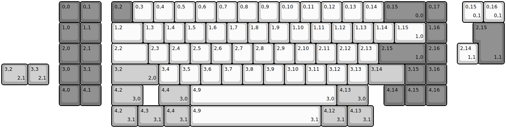
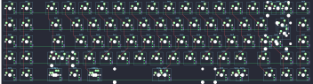
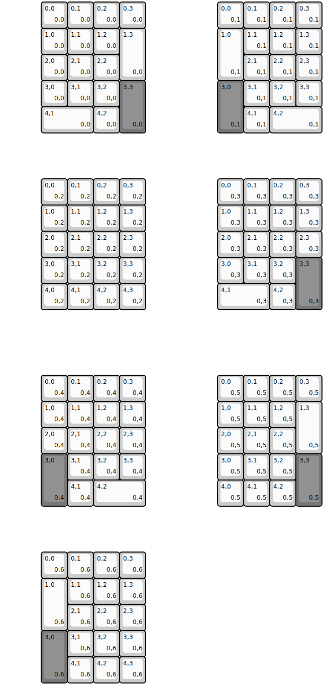
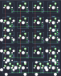
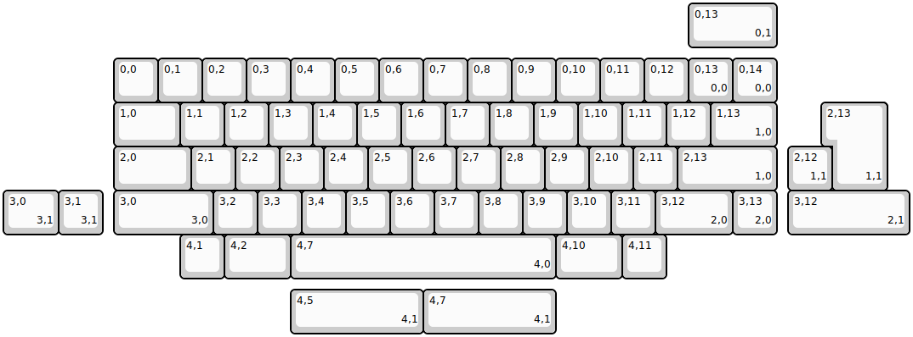
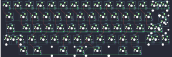

## akb/ogr

[layout](ogr-kle.json) - [PCB](ogr.kicad_pcb)

{:loading="lazy"}

[Open in keyboard-layout-editor](http://www.keyboard-layout-editor.com/##@@_x:2.75&c=#777777;&=0,0&=0,1&_x:0.5;&=0,2&_c=#cccccc;&=0,3&=0,4&=0,5&=0,6&=0,7&=0,8&=0,9&=0,10&=0,11&=0,12&=0,13&=0,14&_c=#777777&w:2;&=0,15%0A%0A%0A0,0&=0,17;&@_x:2.75;&=1,0&=1,1&_x:0.5&c=#cccccc&w:1.5;&=1,2&=1,3&=1,4&=1,5&=1,6&=1,7&=1,8&=1,9&=1,10&=1,11&=1,12&=1,13&=1,14&_w:1.5;&=1,15%0A%0A%0A1,0&_c=#777777;&=1,16;&@_x:2.75;&=2,0&=2,1&_x:0.5&c=#cccccc&w:1.75;&=2,2&=2,3&=2,4&=2,5&=2,6&=2,7&=2,8&=2,9&=2,10&=2,11&=2,12&=2,13&_c=#777777&w:2.25;&=2,15%0A%0A%0A1,0&=2,16;&@_x:2.75;&=3,0&=3,1&_x:0.5&c=#aaaaaa&w:2.25;&=3,2%0A%0A%0A2,0&_c=#cccccc;&=3,4&=3,5&=3,6&=3,7&=3,8&=3,9&=3,10&=3,11&=3,12&=3,13&_c=#aaaaaa&w:1.75;&=3,14&_c=#777777;&=3,15&=3,16;&@_x:2.75;&=4,0&=4,1&_x:0.5&c=#aaaaaa&w:1.5;&=4,2%0A%0A%0A3,0&_x:0.75&w:1.5;&=4,4%0A%0A%0A3,0&_c=#cccccc&w:7;&=4,9%0A%0A%0A3,0&_c=#aaaaaa&w:1.5;&=4,13%0A%0A%0A3,0&_x:0.75&c=#777777;&=4,14&=4,15&=4,16;&@_x:22.0&y:-5&c=#cccccc;&=0,15%0A%0A%0A0,1&=0,16%0A%0A%0A0,1;&@_x:22.75&c=#777777&w:1.25&h:2&w2:1.5&h2:1&x2:-0.25;&=2,15%0A%0A%0A1,1;&@_x:21.75&c=#cccccc;&=2,14%0A%0A%0A1,1;&@_c=#aaaaaa&w:1.25;&=3,2%0A%0A%0A2,1&=3,3%0A%0A%0A2,1;&@_x:5.25&y:1&w:1.25;&=4,2%0A%0A%0A3,1&_w:1.25;&=4,3%0A%0A%0A3,1&_w:1.25;&=4,4%0A%0A%0A3,1&_c=#cccccc&w:6.25;&=4,9%0A%0A%0A3,1&_c=#aaaaaa&w:1.25;&=4,12%0A%0A%0A3,1&_w:1.25;&=4,13%0A%0A%0A3,1)

{:loading="lazy"}

## akb/ogrn

[layout](ogrn-kle.json) - [PCB](ogrn.kicad_pcb)

{:loading="lazy"}

[Open in keyboard-layout-editor](http://www.keyboard-layout-editor.com/##@@_x:1.5;&=0,0%0A%0A%0A0,0&=0,1%0A%0A%0A0,0&=0,2%0A%0A%0A0,0&=0,3%0A%0A%0A0,0;&@_x:1.5;&=1,0%0A%0A%0A0,0&=1,1%0A%0A%0A0,0&=1,2%0A%0A%0A0,0&_h:2;&=1,3%0A%0A%0A0,0;&@_x:1.5;&=2,0%0A%0A%0A0,0&=2,1%0A%0A%0A0,0&=2,2%0A%0A%0A0,0;&@_x:1.5;&=3,0%0A%0A%0A0,0&=3,1%0A%0A%0A0,0&=3,2%0A%0A%0A0,0&_c=#777777&h:2;&=3,3%0A%0A%0A0,0;&@_x:1.5&c=#cccccc&w:2;&=4,1%0A%0A%0A0,0&=4,2%0A%0A%0A0,0;&@_x:8.25&y:-5;&=0,0%0A%0A%0A0,1&=0,1%0A%0A%0A0,1&=0,2%0A%0A%0A0,1&=0,3%0A%0A%0A0,1;&@_x:8.25&h:2;&=1,0%0A%0A%0A0,1&=1,1%0A%0A%0A0,1&=1,2%0A%0A%0A0,1&=1,3%0A%0A%0A0,1;&@_x:9.25;&=2,1%0A%0A%0A0,1&=2,2%0A%0A%0A0,1&=2,3%0A%0A%0A0,1;&@_x:8.25&c=#777777&h:2;&=3,0%0A%0A%0A0,1&_c=#cccccc;&=3,1%0A%0A%0A0,1&=3,2%0A%0A%0A0,1&=3,3%0A%0A%0A0,1;&@_x:9.25;&=4,1%0A%0A%0A0,1&_f:4&w:2;&=4,2%0A%0A%0A0,1;&@_x:1.5&y:1.75&f:3;&=0,0%0A%0A%0A0,2&=0,1%0A%0A%0A0,2&=0,2%0A%0A%0A0,2&=0,3%0A%0A%0A0,2&_x:2.75;&=0,0%0A%0A%0A0,3&=0,1%0A%0A%0A0,3&=0,2%0A%0A%0A0,3&=0,3%0A%0A%0A0,3;&@_x:1.5;&=1,0%0A%0A%0A0,2&=1,1%0A%0A%0A0,2&=1,2%0A%0A%0A0,2&=1,3%0A%0A%0A0,2&_x:2.75;&=1,0%0A%0A%0A0,3&=1,1%0A%0A%0A0,3&=1,2%0A%0A%0A0,3&=1,3%0A%0A%0A0,3;&@_x:1.5;&=2,0%0A%0A%0A0,2&=2,1%0A%0A%0A0,2&=2,2%0A%0A%0A0,2&=2,3%0A%0A%0A0,2&_x:2.75;&=2,0%0A%0A%0A0,3&=2,1%0A%0A%0A0,3&=2,2%0A%0A%0A0,3&=2,3%0A%0A%0A0,3;&@_x:1.5;&=3,0%0A%0A%0A0,2&=3,1%0A%0A%0A0,2&=3,2%0A%0A%0A0,2&=3,3%0A%0A%0A0,2&_x:2.75;&=3,0%0A%0A%0A0,3&=3,1%0A%0A%0A0,3&=3,2%0A%0A%0A0,3&_c=#777777&h:2;&=3,3%0A%0A%0A0,3;&@_x:1.5&c=#cccccc;&=4,0%0A%0A%0A0,2&=4,1%0A%0A%0A0,2&=4,2%0A%0A%0A0,2&=4,3%0A%0A%0A0,2&_x:2.75&w:2;&=4,1%0A%0A%0A0,3&=4,2%0A%0A%0A0,3;&@_x:1.5&y:2.5;&=0,0%0A%0A%0A0,4&=0,1%0A%0A%0A0,4&=0,2%0A%0A%0A0,4&=0,3%0A%0A%0A0,4&_x:2.75;&=0,0%0A%0A%0A0,5&=0,1%0A%0A%0A0,5&=0,2%0A%0A%0A0,5&=0,3%0A%0A%0A0,5;&@_x:1.5;&=1,0%0A%0A%0A0,4&=1,1%0A%0A%0A0,4&=1,2%0A%0A%0A0,4&=1,3%0A%0A%0A0,4&_x:2.75;&=1,0%0A%0A%0A0,5&=1,1%0A%0A%0A0,5&=1,2%0A%0A%0A0,5&_h:2;&=1,3%0A%0A%0A0,5;&@_x:1.5;&=2,0%0A%0A%0A0,4&=2,1%0A%0A%0A0,4&=2,2%0A%0A%0A0,4&=2,3%0A%0A%0A0,4&_x:2.75;&=2,0%0A%0A%0A0,5&=2,1%0A%0A%0A0,5&=2,2%0A%0A%0A0,5;&@_x:1.5&c=#777777&h:2;&=3,0%0A%0A%0A0,4&_c=#cccccc;&=3,1%0A%0A%0A0,4&=3,2%0A%0A%0A0,4&=3,3%0A%0A%0A0,4&_x:2.75;&=3,0%0A%0A%0A0,5&=3,1%0A%0A%0A0,5&=3,2%0A%0A%0A0,5&_c=#777777&h:2;&=3,3%0A%0A%0A0,5;&@_x:2.5&c=#cccccc;&=4,1%0A%0A%0A0,4&_f:4&w:2;&=4,2%0A%0A%0A0,4&_x:2.75&f:3;&=4,0%0A%0A%0A0,5&=4,1%0A%0A%0A0,5&=4,2%0A%0A%0A0,5;&@_x:1.5&y:1.75;&=0,0%0A%0A%0A0,6&=0,1%0A%0A%0A0,6&=0,2%0A%0A%0A0,6&=0,3%0A%0A%0A0,6;&@_x:1.5&h:2;&=1,0%0A%0A%0A0,6&=1,1%0A%0A%0A0,6&=1,2%0A%0A%0A0,6&=1,3%0A%0A%0A0,6;&@_x:2.5;&=2,1%0A%0A%0A0,6&=2,2%0A%0A%0A0,6&=2,3%0A%0A%0A0,6;&@_x:1.5&c=#777777&h:2;&=3,0%0A%0A%0A0,6&_c=#cccccc;&=3,1%0A%0A%0A0,6&=3,2%0A%0A%0A0,6&=3,3%0A%0A%0A0,6;&@_x:2.5;&=4,1%0A%0A%0A0,6&=4,2%0A%0A%0A0,6&=4,3%0A%0A%0A0,6)

{:loading="lazy"}

## akb/vero

[layout](vero-kle.json) - [PCB](vero.kicad_pcb)

{:loading="lazy"}

[Open in keyboard-layout-editor](http://www.keyboard-layout-editor.com/##@@_x:2.5&y:1.25;&=0,0&=0,1&=0,2&=0,3&=0,4&=0,5&=0,6&=0,7&=0,8&=0,9&=0,10&=0,11&=0,12&=0,13%0A%0A%0A0,0&=0,14%0A%0A%0A0,0;&@_x:2.5&w:1.5;&=1,0&=1,1&=1,2&=1,3&=1,4&=1,5&=1,6&=1,7&=1,8&=1,9&=1,10&=1,11&=1,12&_w:1.5;&=1,13%0A%0A%0A1,0;&@_x:2.5&w:1.75;&=2,0&=2,1&=2,2&=2,3&=2,4&=2,5&=2,6&=2,7&=2,8&=2,9&=2,10&=2,11&_w:2.25;&=2,13%0A%0A%0A1,0;&@_x:2.5&w:2.25;&=3,0%0A%0A%0A3,0&=3,2&=3,3&=3,4&=3,5&=3,6&=3,7&=3,8&=3,9&=3,10&=3,11&_w:1.75;&=3,12%0A%0A%0A2,0&=3,13%0A%0A%0A2,0;&@_x:4;&=4,1&_w:1.5;&=4,2&_w:6;&=4,7%0A%0A%0A4,0&_w:1.5;&=4,10&=4,11;&@_x:15.5&y:-6.25&w:2;&=0,13%0A%0A%0A0,1;&@_x:18.75&y:1.25&w:1.25&h:2&w2:1.5&h2:1&x2:-0.25;&=2,13%0A%0A%0A1,1;&@_x:17.75;&=2,12%0A%0A%0A1,1;&@_w:1.25;&=3,0%0A%0A%0A3,1&=3,1%0A%0A%0A3,1&_x:15.5&w:2.75;&=3,12%0A%0A%0A2,1;&@_x:6.5&y:1.25&w:3;&=4,5%0A%0A%0A4,1&_w:3;&=4,7%0A%0A%0A4,1)

{:loading="lazy"}

