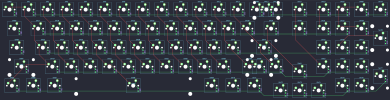

## al1/al1

[layout](al1-kle.json) - [PCB](al1.kicad_pcb)

{:loading="lazy"}

[Open in keyboard-layout-editor](http://www.keyboard-layout-editor.com/##@@_y:1.25&c=#777777;&=5,0&_c=#cccccc;&=0,0&=0,1&=0,2&=0,3&=0,4&=0,5&=0,6&=0,7&=0,8&=0,9&=0,10&=0,11&_c=#aaaaaa&w:2;&=0,12%0A%0A%0A0,0&_x:0.25;&=0,13&_x:0.25;&=0,14&=0,15&=4,15&=4,14;&@_w:1.5;&=5,1&_c=#cccccc;&=1,0&=1,1&=1,2&=1,3&=1,4&=1,5&=1,6&=1,7&=1,8&=1,9&=1,10&=1,11&_c=#aaaaaa&w:1.5;&=1,12&_x:0.25;&=1,13&_x:0.25&c=#cccccc;&=1,14&=1,15&=2,15&_c=#aaaaaa&h:2;&=4,13;&@_w:1.75;&=5,2&_c=#cccccc;&=2,0&=2,1&=2,2&=2,3&=2,4&=2,5&=2,6&=2,7&=2,8&=2,9&=2,10&_c=#777777&w:2.25;&=2,11&_x:1.5&c=#cccccc;&=2,12&=2,13&=2,14;&@_c=#aaaaaa&w:2.25;&=5,3&_c=#cccccc;&=3,0&=3,1&=3,2&=3,3&=3,4&=3,5&=3,6&=3,7&=3,8&=3,9&_c=#aaaaaa&w:2.75;&=3,10%0A%0A%0A1,0&_x:1.5&c=#cccccc;&=3,13&=3,14&=3,15&_c=#777777&h:2;&=4,12;&@_x:15.25&y:-0.75&c=#aaaaaa;&=3,12;&@_y:-0.25&w:1.25;&=4,0&=4,1&_w:1.25;&=4,2&_c=#cccccc&w:7;&=4,3&_c=#aaaaaa&w:1.25;&=4,4&=4,5&_w:1.25;&=4,6&_x:3.5&c=#cccccc;&=4,10&=4,11;&@_x:14.25&y:-0.75&c=#aaaaaa;&=4,7&=4,8&=4,9;&@_x:13&y:-6.5&c=#cccccc;&=5,12%0A%0A%0A0,1&=0,12%0A%0A%0A0,1;&@_x:12.25&y:5.75&c=#aaaaaa&w:1.75;&=3,10%0A%0A%0A1,1&=3,11%0A%0A%0A1,1)

{:loading="lazy"}

