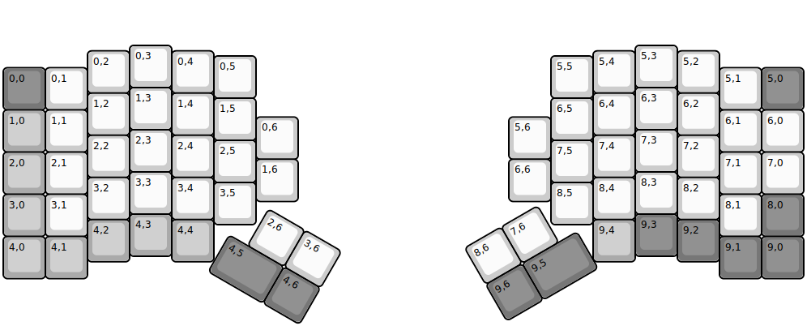
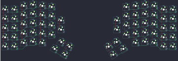

## aleblazer/zodiark

[layout](zodiark-kle.json) - [PCB](zodiark.kicad_pcb)

{:loading="lazy"}

[Open in keyboard-layout-editor](http://www.keyboard-layout-editor.com/##@@_x:3&y:1;&=0,3&_x:11;&=5,3;&@_x:2&y:-0.87;&=0,2&_x:1;&=0,4&_x:9;&=5,4&_x:1;&=5,2;&@_x:5&y:-0.88;&=0,5&_x:7;&=5,5;&@_y:-0.72&c=#777777;&=0,0&_c=#cccccc;&=0,1&_x:15;&=5,1&_c=#777777;&=5,0;&@_x:3&y:-0.53&c=#cccccc;&=1,3&_x:11;&=6,3;&@_x:2&y:-0.87;&=1,2&_x:1;&=1,4&_x:9;&=6,4&_x:1;&=6,2;&@_x:5&y:-0.88;&=1,5&_x:7;&=6,5;&@_y:-0.72&c=#aaaaaa;&=1,0&_c=#cccccc;&=1,1&_x:15;&=6,1&=6,0;&@_x:6&y:-0.83;&=0,6&_x:5;&=5,6;&@_x:3&y:-0.7;&=2,3&_x:11;&=7,3;&@_x:2&y:-0.87;&=2,2&_x:1;&=2,4&_x:9;&=7,4&_x:1;&=7,2;&@_x:5&y:-0.88;&=2,5&_x:7;&=7,5;&@_y:-0.72&c=#aaaaaa;&=2,0&_c=#cccccc;&=2,1&_x:15;&=7,1&=7,0;&@_x:6&y:-0.83;&=1,6&_x:5;&=6,6;&@_x:3&y:-0.7;&=3,3&_x:11;&=8,3;&@_x:2&y:-0.87;&=3,2&_x:1;&=3,4&_x:9;&=8,4&_x:1;&=8,2;&@_x:5&y:-0.88;&=3,5&_x:7;&=8,5;&@_y:-0.72&c=#aaaaaa;&=3,0&_c=#cccccc;&=3,1&_x:15;&=8,1&_c=#777777;&=8,0;&@_x:3&y:-0.53&c=#aaaaaa;&=4,3&_x:11&c=#777777;&=9,3;&@_x:2&y:-0.87&c=#aaaaaa;&=4,2&_x:1;&=4,4&_x:9;&=9,4&_x:1&c=#777777;&=9,2;&@_y:-0.6&c=#aaaaaa;&=4,0&=4,1&_x:15&c=#777777;&=9,1&=9,0;&@_r:30&rx:6.5&ry:4.25&x:0.17&y:0.6&c=#cccccc;&=2,6&=3,6;&@_x:-0.33&c=#777777&w:1.5;&=4,5&=4,6;&@_r:-30&rx:13&x:-2.6&y:0.35&c=#cccccc;&=8,6&=7,6;&@_x:-2.6&c=#777777;&=9,6&_w:1.5;&=9,5)

{:loading="lazy"}

