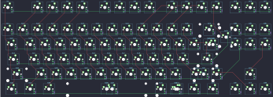

## alf/x11

[layout](x11-kle.json) - [PCB](x11.kicad_pcb)

{:loading="lazy"}

[Open in keyboard-layout-editor](http://www.keyboard-layout-editor.com/##@@_c=#777777;&=0,0&_x:1&c=#cccccc;&=0,1&=0,2&=0,3&=0,4&_x:0.5;&=0,5&=0,6&=0,7&=0,8&_x:0.5;&=0,9&=0,10&=0,11&=0,12&_x:0.25;&=6,2&=6,1&=6,0;&@_y:0.5;&=1,0&=1,1&=1,2&=1,3&=1,4&=1,5&=1,6&=1,7&=1,8&=1,9&=1,10&=1,11&=1,12&_c=#777777&w:2;&=5,10&_x:0.25&c=#cccccc;&=6,3&=6,5&=6,7;&@_c=#777777&w:1.5;&=2,0&_c=#cccccc;&=2,1&=2,2&=2,3&=2,4&=2,5&=2,6&=2,7&=2,8&=2,9&=2,10&=2,11&=2,12&_w:1.5;&=4,12%0A%0A%0A0,0&_x:0.25;&=6,4&=6,6&=6,8;&@_c=#777777&w:1.75;&=3,0&_c=#cccccc;&=3,1&=3,2&=3,3&=3,4&=3,5&=3,6&=3,7&=3,8&=3,9&=3,10&=3,11&_c=#777777&w:2.25;&=3,12;&@_w:2.25;&=4,0&_c=#cccccc;&=4,1&=4,2&=4,3&=4,4&=4,5&=4,6&=4,7&=4,8&=4,9%0A.&=4,10&_c=#777777&w:2.75;&=4,11%0A%0A%0A1,0&_x:1.25;&=5,8;&@_c=#aaaaaa&w:1.5;&=5,0&=5,1&_w:1.5;&=5,2&_c=#cccccc&w:7;&=5,3%0A%0A%0A2,0&_c=#aaaaaa&w:1.5;&=5,5%0A%0A%0A2,0&=5,6&_w:1.5;&=5,7&_x:0.25&c=#777777;&=6,10&=5,9&=6,11;&@_x:20.0&y:-4.0&w:1.25&h:2&w2:1.5&h2:1&x2:-0.25;&=3,12%0A%0A%0A0,1;&@_x:19.0;&=4,12%0A%0A%0A0,1;&@_x:18.5&w:1.75;&=4,11%0A%0A%0A1,1&=6,9%0A%0A%0A1,1;&@_x:4&y:1.25&c=#cccccc&w:6.25;&=5,3%0A%0A%0A2,1&_c=#aaaaaa;&=5,4%0A%0A%0A2,1&_w:1.25;&=5,5%0A%0A%0A2,1)

{:loading="lazy"}

