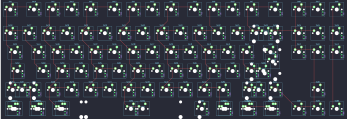

## aliceh66/pianoforte

[layout](pianoforte-kle.json) - [PCB](pianoforte.kicad_pcb)

{:loading="lazy"}

[Open in keyboard-layout-editor](http://www.keyboard-layout-editor.com/##@@_x:2.5&c=#777777;&=0,0&_x:0.25&c=#cccccc;&=1,0&=0,1&=1,1&=0,2&_x:0.25;&=1,2&=0,3&=1,3&=0,4&_x:0.25;&=1,4&=0,5&=1,5&=0,6&_x:0.25;&=1,6&_x:0.25;&=0,7&=1,7&=0,8;&@_x:2.5&y:0.25;&=2,0&=3,0&=2,1&=3,1&=2,2&=3,2&=2,3&=3,3&=2,4&=3,4&=2,5&=3,5&=2,6&_c=#aaaaaa&w:2;&=3,6%0A%0A%0A0,0&_x:0.25&c=#cccccc;&=2,7&=3,7&=2,8;&@_x:2.5&c=#aaaaaa&w:1.5;&=4,0&_c=#cccccc;&=5,0&=4,1&=5,1&=4,2&=5,2&=4,3&=5,3&=4,4&=5,4&=4,5&=5,5&=4,6&_w:1.5;&=5,6%0A%0A%0A1,0&_x:0.25;&=4,7&=5,7&=4,8;&@_x:2.5&c=#aaaaaa&w:1.75;&=6,0&_c=#cccccc;&=7,0&=6,1&=7,1&=6,2&=7,2&=6,3&=7,3&=6,4&=7,4&=6,5&=7,5&_c=#777777&w:2.25;&=7,6%0A%0A%0A1,0;&@_x:2.5&c=#cccccc&w:2.25;&=8,0%0A%0A%0A2,0&=8,1&=9,1&=8,2&=9,2&=8,3&=9,3&=8,4&=9,4&=8,5&=9,5&_c=#aaaaaa&w:2.75;&=9,6%0A%0A%0A3,0&_x:1.25&c=#777777;&=9,7;&@_x:2.5&c=#aaaaaa&w:1.25;&=10,0%0A%0A%0A4,0&_w:1.25;&=11,0%0A%0A%0A4,0&_w:1.25;&=10,1%0A%0A%0A4,0&_c=#cccccc&w:6.25;&=11,3%0A%0A%0A4,0&_c=#aaaaaa&w:1.25;&=10,5%0A%0A%0A4,0&_w:1.25;&=11,5%0A%0A%0A4,0&_w:1.25;&=10,6%0A%0A%0A4,0&_w:1.25;&=11,6%0A%0A%0A4,0&_x:0.25&c=#777777;&=10,7&=11,7&=10,8;&@_x:21.75&y:-5.0&c=#aaaaaa;&=3,6%0A%0A%0A0,1&=6,7%0A%0A%0A0,1;&@_x:22.5&c=#cccccc&w:1.25&h:2&w2:1.5&h2:1&x2:-0.25;&=7,6%0A%0A%0A1,1;&@_x:21.5&c=#777777;&=6,6%0A%0A%0A1,1;&@_c=#aaaaaa&w:1.25;&=8,0%0A%0A%0A2,1&_c=#cccccc;&=9,0%0A%0A%0A2,1&_x:18.75&c=#aaaaaa&w:1.75;&=8,6%0A%0A%0A3,1&_c=#cccccc;&=8,7%0A%0A%0A3,1;&@_x:2.5&y:1.25&c=#aaaaaa&w:1.5;&=10,0%0A%0A%0A4,1&=11,0%0A%0A%0A4,1&_w:1.5;&=10,1%0A%0A%0A4,1&_c=#cccccc&w:7;&=11,3%0A%0A%0A4,1&_c=#aaaaaa&w:1.5;&=11,5%0A%0A%0A4,1&=10,6%0A%0A%0A4,1&_w:1.5;&=11,6%0A%0A%0A4,1)

{:loading="lazy"}

