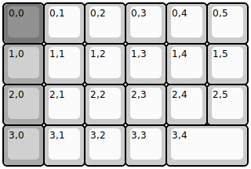
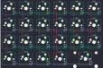

## amag23/amag32

[layout](amag32-kle.json) - [PCB](amag32.kicad_pcb)

{:loading="lazy"}

[Open in keyboard-layout-editor](http://www.keyboard-layout-editor.com/##@@_c=#777777;&=0,0&_c=#cccccc;&=0,1&=0,2&=0,3&=0,4&=0,5;&@_c=#aaaaaa;&=1,0&_c=#cccccc;&=1,1&=1,2&=1,3&=1,4&=1,5;&@_c=#aaaaaa;&=2,0&_c=#cccccc;&=2,1&=2,2&=2,3&=2,4&=2,5;&@_c=#aaaaaa;&=3,0&_c=#cccccc;&=3,1&=3,2&=3,3&_w:2;&=3,4)

{:loading="lazy"}

