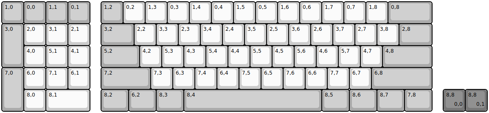
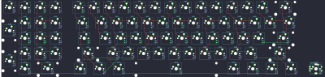

## argo_works/ishi/80/mk0

[layout](mk0-kle.json) - [PCB](mk0.kicad_pcb)

{:loading="lazy"}

[Open in keyboard-layout-editor](http://www.keyboard-layout-editor.com/##@@_c=#aaaaaa;&=1,0&=0,0&=1,1&=0,1&_x:0.5;&=1,2&_c=#cccccc;&=0,2&=1,3&=0,3&=1,4&=0,4&=1,5&=0,5&=1,6&=0,6&=1,7&=0,7&=1,8&_c=#aaaaaa&w:2;&=0,8;&@_h:2;&=3,0&_c=#cccccc;&=2,0&=3,1&=2,1&_x:0.5&c=#aaaaaa&w:1.5;&=3,2&_c=#cccccc;&=2,2&=3,3&=2,3&=3,4&=2,4&=3,5&=2,5&=3,6&=2,6&=3,7&=2,7&=3,8&_c=#aaaaaa&w:1.5;&=2,8;&@_x:1&c=#cccccc;&=4,0&=5,1&=4,1&_x:0.5&c=#aaaaaa&w:1.75;&=5,2&_c=#cccccc;&=4,2&=5,3&=4,3&=5,4&=4,4&=5,5&=4,5&=5,6&=4,6&=5,7&=4,7&_c=#aaaaaa&w:2.25;&=4,8;&@_h:2;&=7,0&_c=#cccccc;&=6,0&=7,1&=6,1&_x:0.5&c=#aaaaaa&w:2.25;&=7,2&_c=#cccccc;&=7,3&=6,3&=7,4&=6,4&=7,5&=6,5&=7,6&=6,6&=7,7&=6,7&_c=#aaaaaa&w:2.75;&=6,8;&@_x:1&c=#cccccc;&=8,0&_w:2;&=8,1&_x:0.5&c=#aaaaaa&w:1.25;&=8,2&_w:1.25;&=6,2&_w:1.25;&=8,3&_w:6.25;&=8,4&_w:1.25;&=8,5&_w:1.25;&=8,6&_w:1.25;&=8,7&_w:1.25;&=7,8&_x:0.5&c=#777777;&=8,8%0A%0A%0A0,0&=8,8%0A%0A%0A0,1%0A%0A%0A%0A%0A%0Ae0)

{:loading="lazy"}

