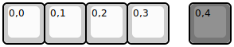

## arrayperipherals/1x4p1

[layout](1x4p1-kle.json) - [PCB](1x4p1.kicad_pcb)

{:loading="lazy"}

[Open in keyboard-layout-editor](http://www.keyboard-layout-editor.com/##@@=0,0&=0,1&=0,2&=0,3&_x:0.5&c=#777777;&=0,4)

{:loading="lazy"}

