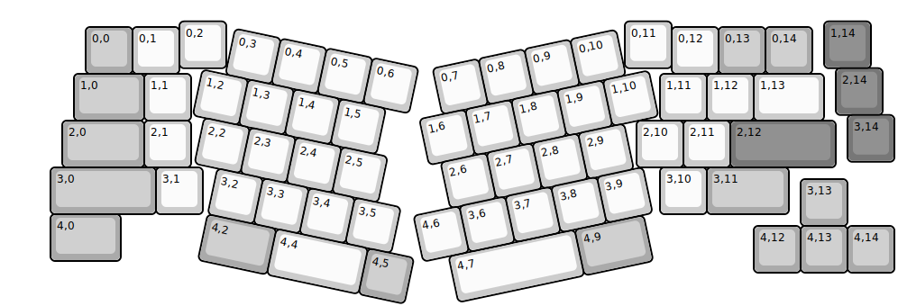
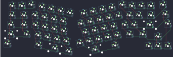

## atlas_65/atlas_65

[layout](atlas_65-kle.json) - [PCB](atlas_65.kicad_pcb)

{:loading="lazy"}

[Open in keyboard-layout-editor](http://www.keyboard-layout-editor.com/##@@_x:3.75&y:0.38;&=0,2&_x:8.5;&=0,11&_x:3.25&c=#777777;&=1,14;&@_x:1.75&y:-0.88&c=#aaaaaa;&=0,0&_c=#cccccc;&=0,1&_x:10.5;&=0,12&_c=#aaaaaa;&=0,13&=0,14;&@_x:17.75&y:-0.12&c=#777777;&=2,14;&@_x:1.5&y:-0.88&c=#aaaaaa&w:1.5;&=1,0&_c=#cccccc;&=1,1&_x:10.0;&=1,11&=1,12&_w:1.5;&=1,13;&@_x:18&y:-0.12&c=#777777;&=3,14;&@_x:1.25&y:-0.88&c=#aaaaaa&w:1.75;&=2,0&_c=#cccccc;&=2,1&_x:9.5;&=2,10&=2,11&_c=#777777&w:2.25;&=2,12;&@_x:1&c=#aaaaaa&w:2.25;&=3,0&_c=#cccccc;&=3,1&_x:9.75;&=3,10&_c=#aaaaaa&w:1.75;&=3,11;&@_x:17&y:-0.75;&=3,13;&@_x:1&y:-0.25&w:1.5;&=4,0;&@_x:16&y:-0.75;&=4,12&=4,13&=4,14;&@_r:12&rx:4.75&ry:1.5&y:-1.0&c=#cccccc;&=0,3&=0,4&=0,5&=0,6;&@_x:-0.5;&=1,2&=1,3&=1,4&=1,5;&@_x:-0.25;&=2,2&=2,3&=2,4&=2,5;&@_x:0.25;&=3,2&=3,3&=3,4&=3,5;&@_x:0.25&c=#aaaaaa&w:1.5;&=4,2&_c=#cccccc&w:2;&=4,4&_c=#aaaaaa;&=4,5;&@_r:-12&rx:13.5&x:-4.25&y:-1.0&c=#cccccc;&=0,7&=0,8&=0,9&=0,10;&@_x:-4.75;&=1,6&=1,7&=1,8&=1,9&=1,10;&@_x:-4.5;&=2,6&=2,7&=2,8&=2,9;&@_x:-4.75&y:1.0&w:2.75;&=4,7&_c=#aaaaaa&w:1.5;&=4,9;&@_ry:1.75&x:-5.25&y:1.75&c=#cccccc;&=4,6&=3,6&=3,7&=3,8&=3,9)

{:loading="lazy"}

