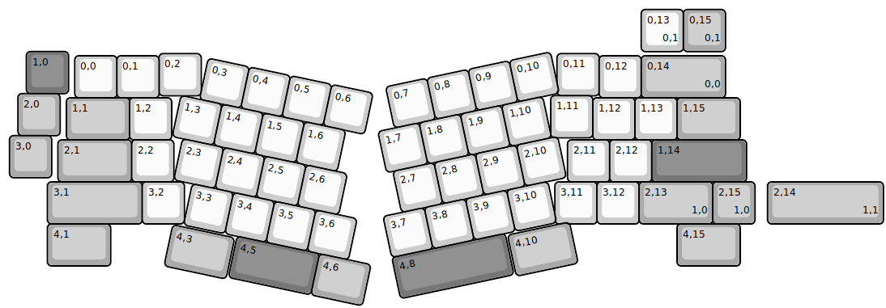
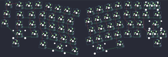
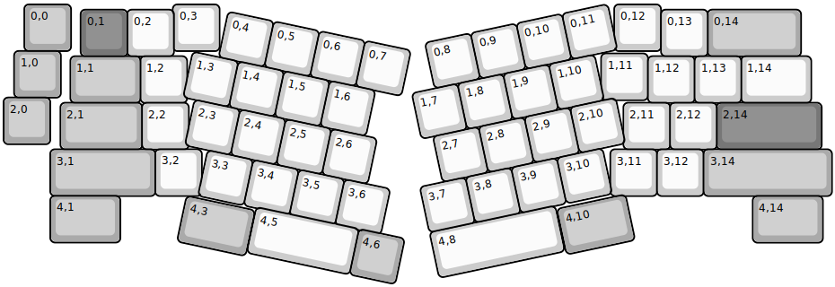
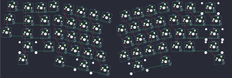

## axolstudio/yeti

[layout](yeti-kle.json) - [PCB](yeti.kicad_pcb)

{:loading="lazy"}

[Open in keyboard-layout-editor](http://www.keyboard-layout-editor.com/##@@_x:0.55&y:1.15&c=#777777;&=1,0;&@_x:3.7&y:-0.95&c=#cccccc;&=0,2&_x:8.45;&=0,11;&@_x:1.7&y:-0.95;&=0,0&=0,1&_x:10.45;&=0,12&_c=#aaaaaa&w:2;&=0,14%0A%0A%0A0,0;&@_x:0.35&y:-0.1;&=2,0;&@_x:13&y:-0.95&c=#cccccc;&=1,11;&@_x:1.5&y:-0.95&c=#aaaaaa&w:1.5;&=1,1&_c=#cccccc;&=1,2&_x:10.0;&=1,12&=1,13&_c=#aaaaaa&w:1.5;&=1,15;&@_x:0.15&y:-0.1;&=3,0;&@_x:13.4&y:-0.9&c=#cccccc;&=2,11&=2,12&_c=#777777&w:2.25;&=1,14&_x:-16.35&c=#aaaaaa&w:1.75;&=2,1&_c=#cccccc;&=2,2;&@_x:1.05&c=#aaaaaa&w:2.25;&=3,1&_c=#cccccc;&=3,2&_x:8.8;&=3,11&=3,12&_c=#aaaaaa&w:1.75;&=2,13%0A%0A%0A1,0&=2,15%0A%0A%0A1,0;&@_x:1.05&w:1.5;&=4,1&_x:13.45&w:1.5;&=4,15;&@_r:12&x:5.05&y:-6.0&c=#cccccc;&=0,3&=0,4&=0,5&=0,6;&@_x:4.6;&=1,3&=1,4&=1,5&=1,6;&@_x:4.85;&=2,3&=2,4&=2,5&=2,6;&@_x:5.3;&=3,3&=3,4&=3,5&=3,6;&@_x:6.6&c=#777777&w:2;&=4,5&_c=#aaaaaa&w:1.25;&=4,6;&@_x:5.05&y:-0.95&w:1.5;&=4,3;&@_r:-12&x:8.45&y:-1.45&c=#cccccc;&=0,7&=0,8&=0,9&=0,10;&@_x:8.05;&=1,7&=1,8&=1,9&=1,10;&@_x:8.2;&=2,7&=2,8&=2,9&=2,10;&@_x:7.75;&=3,7&=3,8&=3,9&=3,10;&@_x:7.75&c=#777777&w:2.75;&=4,8;&@_x:10.55&y:-0.95&c=#aaaaaa&w:1.5;&=4,10;&@_r:0&x:15.15&y:-8.75&c=#cccccc;&=0,13%0A%0A%0A0,1&_c=#aaaaaa;&=0,15%0A%0A%0A0,1;&@_x:18.15&y:3.1&w:2.75;&=2,14%0A%0A%0A1,1)

{:loading="lazy"}

## axolstudio/yeti/yeti_rgb

[layout](yeti_rgb-kle.json) - [PCB](yeti_rgb.kicad_pcb)

{:loading="lazy"}

[Open in keyboard-layout-editor](http://www.keyboard-layout-editor.com/##@@_x:0.4445&y:0.0185&c=#aaaaaa;&=0,0&_x:2.1806&c=#cccccc;&=0,3&_x:8.4549;&=0,12;&@_x:15.08&y:-0.8885&c=#aaaaaa&w:2;&=0,14;&@_x:14.0823&y:-0.9996&c=#cccccc;&=0,13;&@_x:2.6484&y:-0.9998;&=0,2;&@_x:1.6506&y:-0.9999&c=#777777;&=0,1;&@_x:0.2262&y:-0.1143&c=#aaaaaa;&=1,0;&@_x:12.8&y:-0.9464&c=#cccccc;&=1,11;&@_x:13.8015&y:-0.9414;&=1,12&_x:0.9962&w:1.5;&=1,14;&@_x:14.7998&y:-0.9999;&=1,13;&@_x:2.9292&y:-0.9999;&=1,2;&@_x:1.4317&y:-0.9997&c=#aaaaaa&w:1.5;&=1,1;&@_y:-0.1144;&=2,0;&@_x:15.2718&y:-0.8881&c=#777777&w:2.25;&=2,14;&@_x:1.2183&y:-0.9998&c=#aaaaaa&w:1.75;&=2,1&_x:10.3087&c=#cccccc;&=2,11;&@_x:2.9659&y:-0.9999;&=2,2&_x:10.3093;&=2,12;&@_x:3.2462&y:-0.002;&=3,2;&@_x:12.9967&y:-0.9999;&=3,11&_x:-0.0025;&=3,12&_x:-0.0025&c=#aaaaaa&w:2.75;&=3,14;&@_x:0.9996&y:-0.9996&w:2.25;&=3,1;&@_x:1.0005&y:-0.0025&w:1.5;&=4,1;&@_x:16.0468&y:-0.9973&w:1.5;&=4,14;&@_r:12&rx:3.9386&ry:4.109&w:1.5;&=4,3;&@_rx:4.6991&ry:0.2258&x:0.1149&y:-0.093&c=#cccccc;&=0,4&=0,5&=0,6&=0,7;&@_x:-0.4491&y:-0.0028;&=1,3&=1,4&=1,5&=1,6;&@_x:-0.1991;&=2,3&=2,4&=2,5&=2,6;&@_x:0.3009;&=3,3&=3,4&=3,5&=3,6;&@_rx:5.4334&ry:4.3492&w:2.25;&=4,5;&@_rx:7.6342&ry:4.817&c=#aaaaaa;&=4,6;&@_r:-12&rx:9.0102&ry:0.8597&c=#cccccc;&=0,8&=0,9&=0,10&=0,11;&@_x:-0.5002&y:0.0003;&=1,7&=1,8&=1,9&=1,10;&@_x:-0.2502;&=2,7&=2,8&=2,9&=2,10;&@_x:-0.7502;&=3,7&=3,8&=3,9&=3,10;&@_rx:9.1085&ry:4.9223&w:2.75;&=4,8;&@_rx:11.8366&ry:4.4209&c=#aaaaaa&w:1.5;&=4,10)

{:loading="lazy"}

