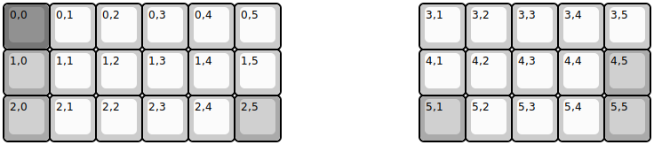
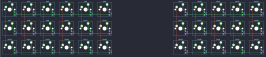

## barracuda/barracuda

[layout](barracuda-kle.json) - [PCB](barracuda.kicad_pcb)

{:loading="lazy"}

[Open in keyboard-layout-editor](http://www.keyboard-layout-editor.com/##@@_c=#777777;&=0,0&_c=#cccccc;&=0,1&=0,2&=0,3&=0,4&=0,5&_x:3;&=3,1&=3,2&=3,3&=3,4&=3,5;&@_c=#aaaaaa;&=1,0&_c=#cccccc;&=1,1&=1,2&=1,3&=1,4&=1,5&_x:3;&=4,1&=4,2&=4,3&=4,4&_c=#aaaaaa;&=4,5;&@=2,0&_c=#cccccc;&=2,1&=2,2&=2,3&=2,4&_c=#aaaaaa;&=2,5&_x:3;&=5,1&_c=#cccccc;&=5,2&=5,3&=5,4&_c=#aaaaaa;&=5,5)

{:loading="lazy"}

