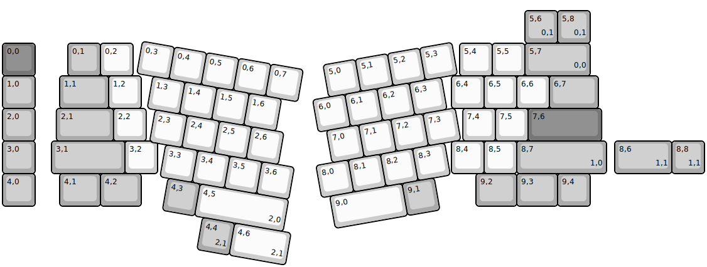
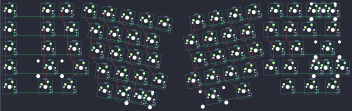
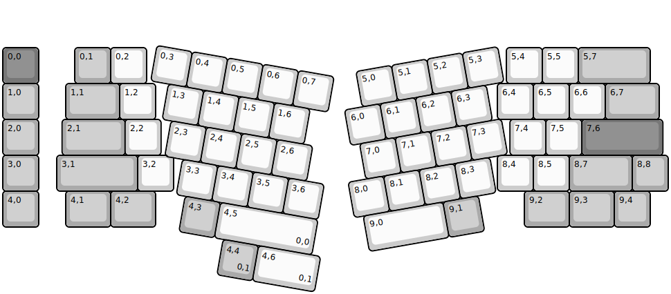
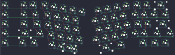

## basekeys/slice/rev1

[layout](rev1-kle.json) - [PCB](rev1.kicad_pcb)

{:loading="lazy"}

[Open in keyboard-layout-editor](http://www.keyboard-layout-editor.com/##@@_y:1.25&c=#777777;&=0,0&_x:1&c=#aaaaaa;&=0,1&_c=#cccccc;&=0,2&_x:10;&=5,4&=5,5&_c=#aaaaaa&w:2;&=5,7%0A%0A%0A0,0;&@=1,0&_x:0.75&w:1.5;&=1,1&_c=#cccccc;&=1,2&_x:9.5;&=6,4&=6,5&=6,6&_c=#aaaaaa&w:1.5;&=6,7;&@=2,0&_x:0.65&w:1.75;&=2,1&_c=#cccccc;&=2,2&_x:9.7;&=7,4&=7,5&_c=#777777&w:2.25;&=7,6;&@_c=#aaaaaa;&=3,0&_x:0.5&w:2.25;&=3,1&_c=#cccccc;&=3,2&_x:9.0;&=8,4&=8,5&_c=#aaaaaa&w:2.75;&=8,7%0A%0A%0A1,0;&@=4,0&_x:0.75&w:1.25;&=4,1&_w:1.25;&=4,2&_x:10.25&w:1.25;&=9,2&_w:1.25;&=9,3&=9,4;&@_r:10&rx:3&ry:4.25&x:0.75&y:-3.25&c=#cccccc;&=0,3&=0,4&=0,5&=0,6&=0,7;&@_x:1.25;&=1,3&=1,4&=1,5&=1,6;&@_x:1.5;&=2,3&=2,4&=2,5&=2,6;&@_x:2;&=3,3&=3,4&=3,5&=3,6;&@_x:2.25&c=#aaaaaa;&=4,3&_c=#cccccc&w:2.75;&=4,5%0A%0A%0A2,0;&@_r:-10&rx:12.5&x:-2.25&y:-2.75;&=5,0&=5,1&=5,2&=5,3;&@_x:-2.75;&=6,0&=6,1&=6,2&=6,3;&@_x:-2.5;&=7,0&=7,1&=7,2&=7,3;&@_x:-3.0;&=8,0&=8,1&=8,2&=8,3;&@_x:-2.75&w:2.25;&=9,0&_c=#aaaaaa;&=9,1;&@_r:0&rx:0&ry:0&x:16&y:0.25;&=5,6%0A%0A%0A0,1&=5,8%0A%0A%0A0,1;&@_x:18.75&y:3.0&w:1.75;&=8,6%0A%0A%0A1,1&=8,8%0A%0A%0A1,1;&@_r:10&rx:3&ry:4.25&x:3.5&y:1.75;&=4,4%0A%0A%0A2,1&_c=#cccccc&w:1.75;&=4,6%0A%0A%0A2,1)

{:loading="lazy"}

## basekeys/slice/rev1_rgb

[layout](rev1_rgb-kle.json) - [PCB](rev1_rgb.kicad_pcb)

{:loading="lazy"}

[Open in keyboard-layout-editor](http://www.keyboard-layout-editor.com/##@@_y:1.25&c=#777777;&=0,0&_x:1&c=#aaaaaa;&=0,1&_c=#cccccc;&=0,2&_x:10;&=5,4&=5,5&_c=#aaaaaa&w:2;&=5,7;&@=1,0&_x:0.75&w:1.5;&=1,1&_c=#cccccc;&=1,2&_x:9.5;&=6,4&=6,5&=6,6&_c=#aaaaaa&w:1.5;&=6,7;&@=2,0&_x:0.65&w:1.75;&=2,1&_c=#cccccc;&=2,2&_x:9.7;&=7,4&=7,5&_c=#777777&w:2.25;&=7,6;&@_c=#aaaaaa;&=3,0&_x:0.5&w:2.25;&=3,1&_c=#cccccc;&=3,2&_x:9.0;&=8,4&=8,5&_c=#aaaaaa&w:1.75;&=8,7&=8,8;&@=4,0&_x:0.75&w:1.25;&=4,1&_w:1.25;&=4,2&_x:10.25&w:1.25;&=9,2&_w:1.25;&=9,3&=9,4;&@_r:10&rx:3&ry:4.25&x:0.75&y:-3.25&c=#cccccc;&=0,3&=0,4&=0,5&=0,6&=0,7;&@_x:1.25;&=1,3&=1,4&=1,5&=1,6;&@_x:1.5;&=2,3&=2,4&=2,5&=2,6;&@_x:2;&=3,3&=3,4&=3,5&=3,6;&@_x:2.25&c=#aaaaaa;&=4,3&_c=#cccccc&w:2.75;&=4,5%0A%0A%0A0,0;&@_r:-10&rx:12.5&x:-2.25&y:-2.75;&=5,0&=5,1&=5,2&=5,3;&@_x:-2.75;&=6,0&=6,1&=6,2&=6,3;&@_x:-2.5;&=7,0&=7,1&=7,2&=7,3;&@_x:-3.0;&=8,0&=8,1&=8,2&=8,3;&@_x:-2.75&w:2.25;&=9,0&_c=#aaaaaa;&=9,1;&@_r:10&rx:3&x:3.5&y:1.75;&=4,4%0A%0A%0A0,1&_c=#cccccc&w:1.75;&=4,6%0A%0A%0A0,1)

{:loading="lazy"}

