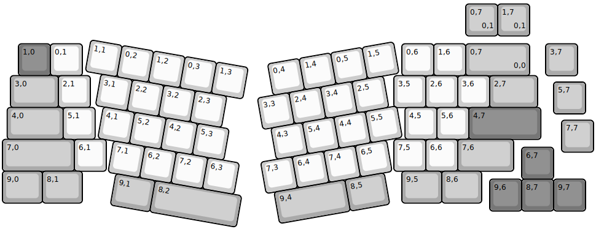
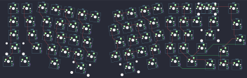

## basekeys/trifecta

[layout](trifecta-kle.json) - [PCB](trifecta.kicad_pcb)

{:loading="lazy"}

[Open in keyboard-layout-editor](http://www.keyboard-layout-editor.com/##@@_x:0.5&y:1.3&c=#777777;&=1,0&_c=#cccccc;&=0,1&_x:10.0;&=0,6&=1,6&_c=#aaaaaa&w:2;&=0,7%0A%0A%0A0,0&_x:0.5;&=3,7;&@_x:0.25&w:1.5;&=3,0&_c=#cccccc;&=2,1&_x:9.5;&=3,5&=2,6&=3,6&_c=#aaaaaa&w:1.5;&=2,7;&@_x:17.25&y:-0.8;&=5,7;&@_x:0.15&y:-0.2&w:1.75;&=4,0&_c=#cccccc;&=5,1&_x:9.7;&=4,5&=5,6&_c=#777777&w:2.25;&=4,7;&@_x:17.5&y:-0.6&c=#aaaaaa;&=7,7;&@_y:-0.4&w:2.25;&=7,0&_c=#cccccc;&=6,1&_x:9.0;&=7,5&=6,6&_c=#aaaaaa&w:1.75;&=7,6;&@_x:16.25&y:-0.75&c=#777777;&=6,7;&@_y:-0.25&c=#aaaaaa&w:1.25;&=9,0&_w:1.25;&=8,1&_x:10.0&w:1.25;&=9,5&_w:1.25;&=8,6;&@_x:15.25&y:-0.75&c=#777777;&=9,6&=8,7&=9,7;&@_r:10&rx:3&ry:4.25&x:-0.75&y:-3.0&c=#cccccc;&=1,1&=0,2&=1,2&=0,3&=1,3;&@_x:-0.25;&=3,1&=2,2&=3,2&=2,3;&@=4,1&=5,2&_n:true;&=4,2&=5,3;&@_x:0.5;&=7,1&=6,2&=7,2&=6,3;&@_x:0.75&c=#aaaaaa&w:1.25;&=9,1&_w:2.75;&=8,2;&@_r:-10&rx:12.5&x:-3.75&y:-3.0&c=#cccccc;&=0,4&=1,4&=0,5&=1,5;&@_x:-4.25;&=3,3&=2,4&=3,4&=2,5;&@_x:-4.0;&=4,3&_n:true;&=5,4&=4,4&=5,5;&@_x:-4.5;&=7,3&=6,4&=7,4&=6,5;&@_x:-4.25&c=#aaaaaa&w:2.25;&=9,4&_w:1.25;&=8,5;&@_r:0&rx:0&ry:0&x:14.5&y:0.05;&=0,7%0A%0A%0A0,1&=1,7%0A%0A%0A0,1)

{:loading="lazy"}

