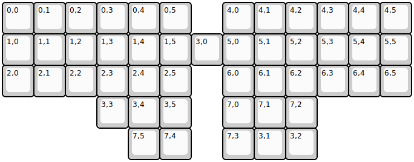
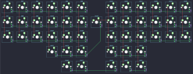

## bat43/bat43

[layout](bat43-kle.json) - [PCB](bat43.kicad_pcb)

{:loading="lazy"}

[Open in keyboard-layout-editor](http://www.keyboard-layout-editor.com/##@@=0,0&=0,1&=0,2&=0,3&=0,4&=0,5&_x:1;&=4,0&=4,1&=4,2&=4,3&=4,4&=4,5;&@=1,0&=1,1&=1,2&=1,3&=1,4&=1,5&=3,0&=5,0&=5,1&=5,2&=5,3&=5,4&=5,5;&@=2,0&=2,1&=2,2&=2,3&=2,4&=2,5&_x:1;&=6,0&=6,1&=6,2&=6,3&=6,4&=6,5;&@_x:3;&=3,3&=3,4&=3,5&_x:1;&=7,0&=7,1&=7,2;&@_x:4;&=7,5&=7,4&_x:1;&=7,3&=3,1&=3,2)

{:loading="lazy"}

