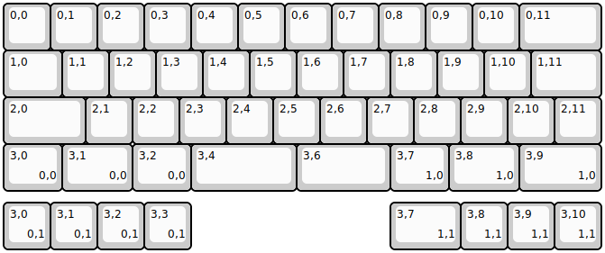
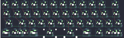

## beatervan/beatervan

[layout](beatervan-kle.json) - [PCB](beatervan.kicad_pcb)

{:loading="lazy"}

[Open in keyboard-layout-editor](http://www.keyboard-layout-editor.com/##@@=0,0&=0,1&=0,2&=0,3&=0,4&=0,5&=0,6&=0,7&=0,8&=0,9&=0,10&_w:1.75;&=0,11;&@_w:1.25;&=1,0&=1,1&=1,2&=1,3&=1,4&=1,5&=1,6&=1,7&=1,8&=1,9&=1,10&_w:1.5;&=1,11;&@_w:1.75;&=2,0&=2,1&=2,2&=2,3&=2,4&=2,5&=2,6&=2,7&=2,8&=2,9&=2,10&=2,11;&@_w:1.25;&=3,0%0A%0A%0A0,0&_w:1.5;&=3,1%0A%0A%0A0,0&_w:1.25;&=3,2%0A%0A%0A0,0&_w:2.25;&=3,4&_w:2;&=3,6&_w:1.25;&=3,7%0A%0A%0A1,0&_w:1.5;&=3,8%0A%0A%0A1,0&_w:1.75;&=3,9%0A%0A%0A1,0;&@_y:0.25;&=3,0%0A%0A%0A0,1&=3,1%0A%0A%0A0,1&=3,2%0A%0A%0A0,1&=3,3%0A%0A%0A0,1&_x:4.25&w:1.5;&=3,7%0A%0A%0A1,1&=3,8%0A%0A%0A1,1&=3,9%0A%0A%0A1,1&=3,10%0A%0A%0A1,1)

{:loading="lazy"}

