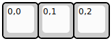

## binepad/bn003

[layout](bn003-kle.json) - [PCB](bn003.kicad_pcb)

{:loading="lazy"}

[Open in keyboard-layout-editor](http://www.keyboard-layout-editor.com/##@@=0,0&=0,1&=0,2)

{:loading="lazy"}

