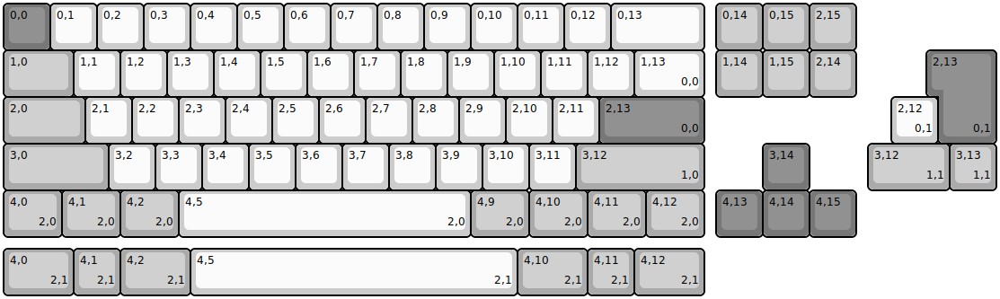
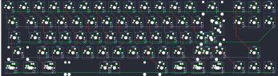

## bioi/s65

[layout](s65-kle.json) - [PCB](s65.kicad_pcb)

{:loading="lazy"}

[Open in keyboard-layout-editor](http://www.keyboard-layout-editor.com/##@@_c=#777777;&=0,0&_c=#cccccc;&=0,1&=0,2&=0,3&=0,4&=0,5&=0,6&=0,7&=0,8&=0,9&=0,10&=0,11&=0,12&_w:2;&=0,13&_x:0.25&c=#aaaaaa;&=0,14&=0,15&=2,15;&@_w:1.5;&=1,0&_c=#cccccc;&=1,1&=1,2&=1,3&=1,4&=1,5&=1,6&=1,7&=1,8&=1,9&=1,10&=1,11&=1,12&_w:1.5;&=1,13%0A%0A%0A0,0&_x:0.25&c=#aaaaaa;&=1,14&=1,15&=2,14;&@_w:1.75;&=2,0&_c=#cccccc;&=2,1&=2,2&=2,3&=2,4&=2,5&=2,6&=2,7&=2,8&=2,9&=2,10&=2,11&_c=#777777&w:2.25;&=2,13%0A%0A%0A0,0;&@_c=#aaaaaa&w:2.25;&=3,0&_c=#cccccc;&=3,2&=3,3&=3,4&=3,5&=3,6&=3,7&=3,8&=3,9&=3,10&=3,11&_c=#aaaaaa&w:2.75;&=3,12%0A%0A%0A1,0&_x:1.25&c=#777777;&=3,14;&@_c=#aaaaaa&w:1.25;&=4,0%0A%0A%0A2,0&_w:1.25;&=4,1%0A%0A%0A2,0&_w:1.25;&=4,2%0A%0A%0A2,0&_c=#cccccc&w:6.25;&=4,5%0A%0A%0A2,0&_c=#aaaaaa&w:1.25;&=4,9%0A%0A%0A2,0&_w:1.25;&=4,10%0A%0A%0A2,0&_w:1.25;&=4,11%0A%0A%0A2,0&_w:1.25;&=4,12%0A%0A%0A2,0&_x:0.25&c=#777777;&=4,13&=4,14&=4,15;&@_x:20.0&y:-4&w:1.25&h:2&w2:1.5&h2:1&x2:-0.25;&=2,13%0A%0A%0A0,1;&@_x:19.0&c=#cccccc;&=2,12%0A%0A%0A0,1;&@_x:18.5&c=#aaaaaa&w:1.75;&=3,12%0A%0A%0A1,1&=3,13%0A%0A%0A1,1;&@_y:1.25&w:1.5;&=4,0%0A%0A%0A2,1&=4,1%0A%0A%0A2,1&_w:1.5;&=4,2%0A%0A%0A2,1&_c=#cccccc&w:7;&=4,5%0A%0A%0A2,1&_c=#aaaaaa&w:1.5;&=4,10%0A%0A%0A2,1&=4,11%0A%0A%0A2,1&_w:1.5;&=4,12%0A%0A%0A2,1)

{:loading="lazy"}

