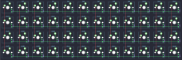

## boardsource/4x12

[layout](4x12-kle.json) - [PCB](4x12.kicad_pcb)

{:loading="lazy"}

[Open in keyboard-layout-editor](http://www.keyboard-layout-editor.com/##@@_c=#aaaaaa;&=0,0&_c=#cccccc;&=0,1&=0,2&=0,3&=0,4&=0,5&=0,6&=0,7&=0,8&=0,9&=0,10&_c=#aaaaaa;&=0,11;&@=1,0&_c=#cccccc;&=1,1&=1,2&=1,3&=1,4&=1,5&=1,6&=1,7&=1,8&=1,9&=1,10&=1,11;&@_c=#aaaaaa;&=2,0&_c=#cccccc;&=2,1&=2,2&=2,3&=2,4&=2,5&=2,6&=2,7&=2,8&=2,9&=2,10&_c=#aaaaaa;&=2,11;&@=3,0&=3,1&=3,2&=3,3&=3,4&_c=#cccccc;&=3,5&=3,6&_c=#aaaaaa;&=3,7&=3,8&=3,9&=3,10&=3,11)

{:loading="lazy"}

