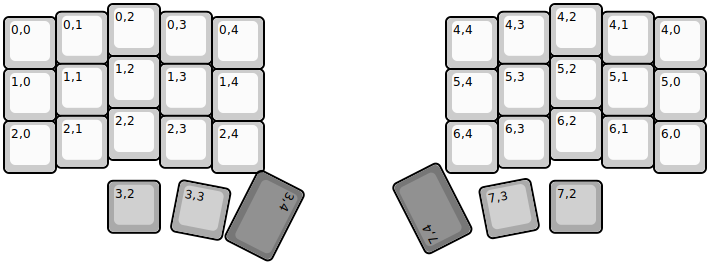
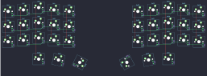

## boardsource/microdox

[layout](microdox-kle.json) - [PCB](microdox.kicad_pcb)

{:loading="lazy"}

[Open in keyboard-layout-editor](http://www.keyboard-layout-editor.com/##@@_x:2;&=0,2&_x:7.5;&=4,2;&@_x:1&y:-0.85;&=0,1&_x:1;&=0,3&_x:5.5;&=4,3&_x:1.0;&=4,1;&@_y:-0.9;&=0,0&_x:3;&=0,4&_x:3.5;&=4,4&_x:3.0;&=4,0;&@_x:2&y:-0.25;&=1,2&_x:7.5;&=5,2;&@_x:1&y:-0.85;&=1,1&_x:1;&=1,3&_x:5.5;&=5,3&_x:1.0;&=5,1;&@_y:-0.9;&=1,0&_x:3;&=1,4&_x:3.5;&=5,4&_x:3.0;&=5,0;&@_x:2&y:-0.25;&=2,2&_x:7.5;&=6,2;&@_x:1&y:-0.85;&=2,1&_x:1;&=2,3&_x:5.5;&=6,3&_x:1.0;&=6,1;&@_y:-0.9;&=2,0&_x:3;&=2,4&_x:3.5;&=6,4&_x:3.0;&=6,0;&@_x:2&y:0.15&c=#aaaaaa;&=3,2&_x:7.5;&=7,2;&@_r:11&rx:6.25&ry:3.5&x:-2.82&y:0.41;&=3,3;&@_r:117&ry:3.25&x:0.5&y:0.05&c=#777777&w:1.5;&=3,4;&@_r:-117&rx:7&x:-2.1&y:0.25&w:1.5;&=7,4;&@_r:-11&rx:7.25&ry:3.5&x:1.82&y:0.41&c=#aaaaaa;&=7,3)

{:loading="lazy"}

