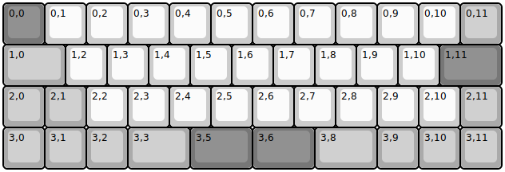
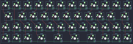

## boardsource/technik_s

[layout](technik_s-kle.json) - [PCB](technik_s.kicad_pcb)

{:loading="lazy"}

[Open in keyboard-layout-editor](http://www.keyboard-layout-editor.com/##@@_c=#777777;&=0,0&_c=#cccccc;&=0,1&=0,2&=0,3&=0,4&=0,5&=0,6&=0,7&=0,8&=0,9&=0,10&_c=#aaaaaaaa;&=0,11;&@_w:1.5;&=1,0&_c=#cccccc;&=1,2&=1,3&=1,4&=1,5&=1,6&=1,7&=1,8&=1,9&=1,10&_c=#777777&w:1.5;&=1,11;&@_c=#aaaaaaaa;&=2,0&=2,1&_c=#cccccc;&=2,2&=2,3&=2,4&=2,5&=2,6&=2,7&=2,8&=2,9&=2,10&_c=#aaaaaaaa;&=2,11;&@=3,0&=3,1&=3,2&_w:1.5;&=3,3&_c=#777777&w:1.5;&=3,5&_w:1.5;&=3,6&_c=#aaaaaaaa&w:1.5;&=3,8&=3,9&=3,10&=3,11)

{:loading="lazy"}

